## eve

+------------------------------+-------+----------------+--------------+----------------+----------------+---------+-------+----------------+
| key                          | type  | value          | errorPercent | min            | max            | calls   | unit  | samples        |
+==============================+=======+================+==============+================+================+=========+=======+================+
| epoch                        | float | 1.194254507e11 | 0.0          | 1.194254507e11 | 1.194254507e11 | 1       | ns    | 1.194254507e11 |
+------------------------------+-------+----------------+--------------+----------------+----------------+---------+-------+----------------+
| graphics engine              | float | 1.29343e7      | 0.0          | 1.29343e7      | 1.29343e7      | 1       | ns    | 1.29343e7      |
+------------------------------+-------+----------------+--------------+----------------+----------------+---------+-------+----------------+
| layout documents             | float | 1.83355e7      | 0.0          | 1.83355e7      | 1.83355e7      | 1       | ns    | 1.83355e7      |
+------------------------------+-------+----------------+--------------+----------------+----------------+---------+-------+----------------+
| cpu graphics engine          | float | 300.0          | 0.0          | 300.0          | 300.0          | 1       | ns    | 300.0          |
+------------------------------+-------+----------------+--------------+----------------+----------------+---------+-------+----------------+
| layout default file          | float | 3.34204e7      | 0.0          | 3.34204e7      | 3.34204e7      | 2       | ns    | 3.34204e7      |
+------------------------------+-------+----------------+--------------+----------------+----------------+---------+-------+----------------+
| layout default tree          | float | 3.0814e7       | 0.0          | 3.0814e7       | 3.0814e7       | 2       | ns    | 3.0814e7       |
+------------------------------+-------+----------------+--------------+----------------+----------------+---------+-------+----------------+
| validator is valid           | float | 1.3577e6       | 0.0          | 1.3577e6       | 1.3577e6       | 2       | ns    | 1.3577e6       |
+------------------------------+-------+----------------+--------------+----------------+----------------+---------+-------+----------------+
| validator default rules      | float | 1.63811e7      | 0.0          | 1.63811e7      | 1.63811e7      | 2       | ns    | 1.63811e7      |
+------------------------------+-------+----------------+--------------+----------------+----------------+---------+-------+----------------+
| layout user tree             | float | 2.94915e7      | 0.0          | 2.94915e7      | 2.94915e7      | 2       | ns    | 2.94915e7      |
+------------------------------+-------+----------------+--------------+----------------+----------------+---------+-------+----------------+
| model set values from        | float | 867300.0       | 0.0          | 867300.0       | 867300.0       | 2       | ns    | 867300.0       |
+------------------------------+-------+----------------+--------------+----------------+----------------+---------+-------+----------------+
| model add children from      | float | 4700.0         | 0.0          | 4700.0         | 4700.0         | 2       | ns    | 4700.0         |
+------------------------------+-------+----------------+--------------+----------------+----------------+---------+-------+----------------+
| layout add theme tables      | float | 851200.0       | 0.0          | 851200.0       | 851200.0       | 2       | ns    | 851200.0       |
+------------------------------+-------+----------------+--------------+----------------+----------------+---------+-------+----------------+
| layout settings tree         | float | 7.97769e7      | 0.0          | 7.97769e7      | 7.97769e7      | 2       | ns    | 7.97769e7      |
+------------------------------+-------+----------------+--------------+----------------+----------------+---------+-------+----------------+
| layout theme settings        | float | 2.03427e7      | 0.0          | 2.03427e7      | 2.03427e7      | 1       | ns    | 2.03427e7      |
+------------------------------+-------+----------------+--------------+----------------+----------------+---------+-------+----------------+
| layout style tree            | float | 5.98242e7      | 0.0          | 5.98242e7      | 5.98242e7      | 2       | ns    | 5.98242e7      |
+------------------------------+-------+----------------+--------------+----------------+----------------+---------+-------+----------------+
| layout theme tree            | float | 1.374736e8     | 0.0          | 1.374736e8     | 1.374736e8     | 1       | ns    | 1.374736e8     |
+------------------------------+-------+----------------+--------------+----------------+----------------+---------+-------+----------------+
| layout settings              | float | 1.471057e8     | 0.0          | 1.471057e8     | 1.471057e8     | 2       | ns    | 1.471057e8     |
+------------------------------+-------+----------------+--------------+----------------+----------------+---------+-------+----------------+
| style register style         | float | 1.12595e7      | 0.0          | 1.12595e7      | 1.12595e7      | 1       | ns    | 1.12595e7      |
+------------------------------+-------+----------------+--------------+----------------+----------------+---------+-------+----------------+
| processor layout             | float | 1.817857e8     | 0.0          | 1.817857e8     | 1.817857e8     | 1       | ns    | 1.817857e8     |
+------------------------------+-------+----------------+--------------+----------------+----------------+---------+-------+----------------+
| device open                  | float | 100.0          | 0.0          | 100.0          | 100.0          | 2       | ns    | 100.0          |
+------------------------------+-------+----------------+--------------+----------------+----------------+---------+-------+----------------+
| queues prepare               | float | 81200.0        | 0.0          | 81200.0        | 81200.0        | 2       | ns    | 81200.0        |
+------------------------------+-------+----------------+--------------+----------------+----------------+---------+-------+----------------+
| rows prepare                 | float | 1.253533e8     | 0.0          | 1.253533e8     | 1.253533e8     | 2       | ns    | 1.253533e8     |
+------------------------------+-------+----------------+--------------+----------------+----------------+---------+-------+----------------+
| swap prepare                 | float | 2.13901e7      | 0.0          | 2.13901e7      | 2.13901e7      | 2       | ns    | 2.13901e7      |
+------------------------------+-------+----------------+--------------+----------------+----------------+---------+-------+----------------+
| processor reset              | float | 42300.0        | 0.0          | 42300.0        | 42300.0        | 2       | ns    | 42300.0        |
+------------------------------+-------+----------------+--------------+----------------+----------------+---------+-------+----------------+
| buffer prepare               | float | 1.470909e8     | 0.0          | 1.470909e8     | 1.470909e8     | 2       | ns    | 1.470909e8     |
+------------------------------+-------+----------------+--------------+----------------+----------------+---------+-------+----------------+
| tty open                     | float | 2.64025e7      | 0.0          | 2.64025e7      | 2.64025e7      | 2       | ns    | 2.64025e7      |
+------------------------------+-------+----------------+--------------+----------------+----------------+---------+-------+----------------+
| device start                 | float | 1.743363e8     | 0.0          | 1.743363e8     | 1.743363e8     | 2       | ns    | 1.743363e8     |
+------------------------------+-------+----------------+--------------+----------------+----------------+---------+-------+----------------+
| processor prepare            | float | 1.24894e7      | 0.0          | 1.24894e7      | 1.24894e7      | 1       | ns    | 1.24894e7      |
+------------------------------+-------+----------------+--------------+----------------+----------------+---------+-------+----------------+
| vulkan calibrate num samples | float | 1000.0         | 0.0          | 1000.0         | 1000.0         | 3       | ns    | 1000.0         |
+------------------------------+-------+----------------+--------------+----------------+----------------+---------+-------+----------------+
| vulkan initialise device     | float | 1.759655e8     | 0.0          | 1.759655e8     | 1.759655e8     | 1       | ns    | 1.759655e8     |
+------------------------------+-------+----------------+--------------+----------------+----------------+---------+-------+----------------+
| swap history lines           | float | 7.985734e9     | 0.0          | 7.985734e9     | 7.985734e9     | 12307   | ns    | 7.985734e9     |
+------------------------------+-------+----------------+--------------+----------------+----------------+---------+-------+----------------+
| terminal read                | float | 3.5002737e9    | 0.0          | 3.5002737e9    | 3.5002737e9    | 1023901 | ns    | 3.5002737e9    |
+------------------------------+-------+----------------+--------------+----------------+----------------+---------+-------+----------------+
| swap live lines              | float | 1.266818e8     | 0.0          | 1.266818e8     | 1.266818e8     | 1023901 | ns    | 1.266818e8     |
+------------------------------+-------+----------------+--------------+----------------+----------------+---------+-------+----------------+
| terminal process             | float | 8.6244077e9    | 0.0          | 8.6244077e9    | 8.6244077e9    | 1023901 | ns    | 8.6244077e9    |
+------------------------------+-------+----------------+--------------+----------------+----------------+---------+-------+----------------+
| device clock                 | float | 8.9607916e9    | 0.0          | 8.9607916e9    | 8.9607916e9    | 999203  | ns    | 8.9607916e9    |
+------------------------------+-------+----------------+--------------+----------------+----------------+---------+-------+----------------+
| editor blocks                | float | 7.18048368e10  | 0.0          | 7.18048368e10  | 7.18048368e10  | 12408   | ns    | 7.18048368e10  |
+------------------------------+-------+----------------+--------------+----------------+----------------+---------+-------+----------------+
| processor editor             | float | 1.37218e7      | 0.0          | 1.37218e7      | 1.37218e7      | 1       | ns    | 1.37218e7      |
+------------------------------+-------+----------------+--------------+----------------+----------------+---------+-------+----------------+
| vulkan flush recording       | float | 3.78993e7      | 0.0          | 3.78993e7      | 3.78993e7      | 1       | ns    | 3.78993e7      |
+------------------------------+-------+----------------+--------------+----------------+----------------+---------+-------+----------------+
| vulkan end frame             | float | 1.177586e10    | 0.0          | 1.177586e10    | 1.177586e10    | 10160   | ns    | 1.177586e10    |
+------------------------------+-------+----------------+--------------+----------------+----------------+---------+-------+----------------+
| standalone initialise        | float | 7.811452e8     | 0.0          | 7.811452e8     | 7.811452e8     | 1       | ns    | 7.811452e8     |
+------------------------------+-------+----------------+--------------+----------------+----------------+---------+-------+----------------+
| tty exit pseudo console      | float | 29200.0        | 0.0          | 29200.0        | 29200.0        | 1       | ns    | 29200.0        |
+------------------------------+-------+----------------+--------------+----------------+----------------+---------+-------+----------------+
| editor delete                | float | 28900.0        | 0.0          | 28900.0        | 28900.0        | 1       | ns    | 28900.0        |
+------------------------------+-------+----------------+--------------+----------------+----------------+---------+-------+----------------+
| tty terminate                | float | 4100.0         | 0.0          | 4100.0         | 4100.0         | 1       | ns    | 4100.0         |
+------------------------------+-------+----------------+--------------+----------------+----------------+---------+-------+----------------+
| tty close                    | float | 272400.0       | 0.0          | 272400.0       | 272400.0       | 2       | ns    | 272400.0       |
+------------------------------+-------+----------------+--------------+----------------+----------------+---------+-------+----------------+
| processor release            | float | 375600.0       | 0.0          | 375600.0       | 375600.0       | 1       | ns    | 375600.0       |
+------------------------------+-------+----------------+--------------+----------------+----------------+---------+-------+----------------+
| launch prompt                | float | 1.189133937e11 | 0.0          | 1.189133937e11 | 1.189133937e11 | 1       | ns    | 1.189133937e11 |
+------------------------------+-------+----------------+--------------+----------------+----------------+---------+-------+----------------+
| processor delete             | float | 1.158273e8     | 0.0          | 1.158273e8     | 1.158273e8     | 1       | ns    | 1.158273e8     |
+------------------------------+-------+----------------+--------------+----------------+----------------+---------+-------+----------------+
| standalone shutdown          | float | 2.934004e8     | 0.0          | 2.934004e8     | 2.934004e8     | 1       | ns    | 2.934004e8     |
+------------------------------+-------+----------------+--------------+----------------+----------------+---------+-------+----------------+
| dropped                      | float | 0.0            | 0.0          | 0.0            | 0.0            | 1       | count | 0              |
+------------------------------+-------+----------------+--------------+----------------+----------------+---------+-------+----------------+
| user                         | float | 7.05625e10     | 0.0          | 7.05625e10     | 7.05625e10     | 1       | ns    | 7.05625e10     |
+------------------------------+-------+----------------+--------------+----------------+----------------+---------+-------+----------------+
| system                       | float | 1.35921875e11  | 0.0          | 1.35921875e11  | 1.35921875e11  | 1       | ns    | 1.35921875e11  |
+------------------------------+-------+----------------+--------------+----------------+----------------+---------+-------+----------------+

## sample

+---------------------------------------------------------------------------------------------------------------------------------------------------------------------------------------------------------------------------------------------------------------------------------------------------------------------------------------------------------------------------------------------------------------------------------------------------------------------------------------------------------------------------------------------------------------------------------------------------------------------------------------------------------------------------------------------------------------------------------------------------------------------------------------------------------------------------------------------------------------------------------------------------------------------------------------------------------------------------------------------------------------------------------------------------------------------------+-------+----------+--------------+----------+----------+-------+-------+---------+
| key                                                                                                                                                                                                                                                                                                                                                                                                                                                                                                                                                                                                                                                                                                                                                                                                                                                                                                                                                                                                                                                                       | type  | value    | errorPercent | min      | max      | calls | unit  | samples |
+===========================================================================================================================================================================================================================================================================================================================================================================================================================================================================================================================================================================================================================================================================================================================================================================================================================================================================================================================================================================================================================================================================+=======+==========+==============+==========+==========+=======+=======+=========+
| strlen                                                                                                                                                                                                                                                                                                                                                                                                                                                                                                                                                                                                                                                                                                                                                                                                                                                                                                                                                                                                                                                                    | float | 1.0      | 0.0          | 1.0      | 1.0      | 1     | count | 1       |
+---------------------------------------------------------------------------------------------------------------------------------------------------------------------------------------------------------------------------------------------------------------------------------------------------------------------------------------------------------------------------------------------------------------------------------------------------------------------------------------------------------------------------------------------------------------------------------------------------------------------------------------------------------------------------------------------------------------------------------------------------------------------------------------------------------------------------------------------------------------------------------------------------------------------------------------------------------------------------------------------------------------------------------------------------------------------------+-------+----------+--------------+----------+----------+-------+-------+---------+
| rtl append unicode string to string                                                                                                                                                                                                                                                                                                                                                                                                                                                                                                                                                                                                                                                                                                                                                                                                                                                                                                                                                                                                                                       | float | 29.0     | 0.0          | 29.0     | 29.0     | 1     | count | 29      |
+---------------------------------------------------------------------------------------------------------------------------------------------------------------------------------------------------------------------------------------------------------------------------------------------------------------------------------------------------------------------------------------------------------------------------------------------------------------------------------------------------------------------------------------------------------------------------------------------------------------------------------------------------------------------------------------------------------------------------------------------------------------------------------------------------------------------------------------------------------------------------------------------------------------------------------------------------------------------------------------------------------------------------------------------------------------------------+-------+----------+--------------+----------+----------+-------+-------+---------+
| rtl UTF8 to unicode N                                                                                                                                                                                                                                                                                                                                                                                                                                                                                                                                                                                                                                                                                                                                                                                                                                                                                                                                                                                                                                                     | float | 9.0      | 0.0          | 9.0      | 9.0      | 1     | count | 9       |
+---------------------------------------------------------------------------------------------------------------------------------------------------------------------------------------------------------------------------------------------------------------------------------------------------------------------------------------------------------------------------------------------------------------------------------------------------------------------------------------------------------------------------------------------------------------------------------------------------------------------------------------------------------------------------------------------------------------------------------------------------------------------------------------------------------------------------------------------------------------------------------------------------------------------------------------------------------------------------------------------------------------------------------------------------------------------------+-------+----------+--------------+----------+----------+-------+-------+---------+
| rtl valid acl                                                                                                                                                                                                                                                                                                                                                                                                                                                                                                                                                                                                                                                                                                                                                                                                                                                                                                                                                                                                                                                             | float | 19.0     | 0.0          | 19.0     | 19.0     | 1     | count | 19      |
+---------------------------------------------------------------------------------------------------------------------------------------------------------------------------------------------------------------------------------------------------------------------------------------------------------------------------------------------------------------------------------------------------------------------------------------------------------------------------------------------------------------------------------------------------------------------------------------------------------------------------------------------------------------------------------------------------------------------------------------------------------------------------------------------------------------------------------------------------------------------------------------------------------------------------------------------------------------------------------------------------------------------------------------------------------------------------+-------+----------+--------------+----------+----------+-------+-------+---------+
| rtl deactivate activation context unsafe fast                                                                                                                                                                                                                                                                                                                                                                                                                                                                                                                                                                                                                                                                                                                                                                                                                                                                                                                                                                                                                             | float | 9.0      | 0.0          | 9.0      | 9.0      | 1     | count | 9       |
+---------------------------------------------------------------------------------------------------------------------------------------------------------------------------------------------------------------------------------------------------------------------------------------------------------------------------------------------------------------------------------------------------------------------------------------------------------------------------------------------------------------------------------------------------------------------------------------------------------------------------------------------------------------------------------------------------------------------------------------------------------------------------------------------------------------------------------------------------------------------------------------------------------------------------------------------------------------------------------------------------------------------------------------------------------------------------+-------+----------+--------------+----------+----------+-------+-------+---------+
| ldr get dll handle ex                                                                                                                                                                                                                                                                                                                                                                                                                                                                                                                                                                                                                                                                                                                                                                                                                                                                                                                                                                                                                                                     | float | 42.0     | 0.0          | 42.0     | 42.0     | 1     | count | 42      |
+---------------------------------------------------------------------------------------------------------------------------------------------------------------------------------------------------------------------------------------------------------------------------------------------------------------------------------------------------------------------------------------------------------------------------------------------------------------------------------------------------------------------------------------------------------------------------------------------------------------------------------------------------------------------------------------------------------------------------------------------------------------------------------------------------------------------------------------------------------------------------------------------------------------------------------------------------------------------------------------------------------------------------------------------------------------------------+-------+----------+--------------+----------+----------+-------+-------+---------+
| ldr load dll                                                                                                                                                                                                                                                                                                                                                                                                                                                                                                                                                                                                                                                                                                                                                                                                                                                                                                                                                                                                                                                              | float | 30.0     | 0.0          | 30.0     | 30.0     | 1     | count | 30      |
+---------------------------------------------------------------------------------------------------------------------------------------------------------------------------------------------------------------------------------------------------------------------------------------------------------------------------------------------------------------------------------------------------------------------------------------------------------------------------------------------------------------------------------------------------------------------------------------------------------------------------------------------------------------------------------------------------------------------------------------------------------------------------------------------------------------------------------------------------------------------------------------------------------------------------------------------------------------------------------------------------------------------------------------------------------------------------+-------+----------+--------------+----------+----------+-------+-------+---------+
| rtl dos search path U                                                                                                                                                                                                                                                                                                                                                                                                                                                                                                                                                                                                                                                                                                                                                                                                                                                                                                                                                                                                                                                     | float | 7.0      | 0.0          | 7.0      | 7.0      | 1     | count | 7       |
+---------------------------------------------------------------------------------------------------------------------------------------------------------------------------------------------------------------------------------------------------------------------------------------------------------------------------------------------------------------------------------------------------------------------------------------------------------------------------------------------------------------------------------------------------------------------------------------------------------------------------------------------------------------------------------------------------------------------------------------------------------------------------------------------------------------------------------------------------------------------------------------------------------------------------------------------------------------------------------------------------------------------------------------------------------------------------+-------+----------+--------------+----------+----------+-------+-------+---------+
| etw event write no registration                                                                                                                                                                                                                                                                                                                                                                                                                                                                                                                                                                                                                                                                                                                                                                                                                                                                                                                                                                                                                                           | float | 48.0     | 0.0          | 48.0     | 48.0     | 1     | count | 48      |
+---------------------------------------------------------------------------------------------------------------------------------------------------------------------------------------------------------------------------------------------------------------------------------------------------------------------------------------------------------------------------------------------------------------------------------------------------------------------------------------------------------------------------------------------------------------------------------------------------------------------------------------------------------------------------------------------------------------------------------------------------------------------------------------------------------------------------------------------------------------------------------------------------------------------------------------------------------------------------------------------------------------------------------------------------------------------------+-------+----------+--------------+----------+----------+-------+-------+---------+
| ldr initialize thunk                                                                                                                                                                                                                                                                                                                                                                                                                                                                                                                                                                                                                                                                                                                                                                                                                                                                                                                                                                                                                                                      | float | 48.0     | 0.0          | 48.0     | 48.0     | 1     | count | 48      |
+---------------------------------------------------------------------------------------------------------------------------------------------------------------------------------------------------------------------------------------------------------------------------------------------------------------------------------------------------------------------------------------------------------------------------------------------------------------------------------------------------------------------------------------------------------------------------------------------------------------------------------------------------------------------------------------------------------------------------------------------------------------------------------------------------------------------------------------------------------------------------------------------------------------------------------------------------------------------------------------------------------------------------------------------------------------------------+-------+----------+--------------+----------+----------+-------+-------+---------+
| zw open key                                                                                                                                                                                                                                                                                                                                                                                                                                                                                                                                                                                                                                                                                                                                                                                                                                                                                                                                                                                                                                                               | float | 9.0      | 0.0          | 9.0      | 9.0      | 1     | count | 9       |
+---------------------------------------------------------------------------------------------------------------------------------------------------------------------------------------------------------------------------------------------------------------------------------------------------------------------------------------------------------------------------------------------------------------------------------------------------------------------------------------------------------------------------------------------------------------------------------------------------------------------------------------------------------------------------------------------------------------------------------------------------------------------------------------------------------------------------------------------------------------------------------------------------------------------------------------------------------------------------------------------------------------------------------------------------------------------------+-------+----------+--------------+----------+----------+-------+-------+---------+
| rtl release SRW lock exclusive                                                                                                                                                                                                                                                                                                                                                                                                                                                                                                                                                                                                                                                                                                                                                                                                                                                                                                                                                                                                                                            | float | 54.0     | 0.0          | 54.0     | 54.0     | 1     | count | 54      |
+---------------------------------------------------------------------------------------------------------------------------------------------------------------------------------------------------------------------------------------------------------------------------------------------------------------------------------------------------------------------------------------------------------------------------------------------------------------------------------------------------------------------------------------------------------------------------------------------------------------------------------------------------------------------------------------------------------------------------------------------------------------------------------------------------------------------------------------------------------------------------------------------------------------------------------------------------------------------------------------------------------------------------------------------------------------------------+-------+----------+--------------+----------+----------+-------+-------+---------+
| nt query information by name                                                                                                                                                                                                                                                                                                                                                                                                                                                                                                                                                                                                                                                                                                                                                                                                                                                                                                                                                                                                                                              | float | 1.0      | 0.0          | 1.0      | 1.0      | 1     | count | 1       |
+---------------------------------------------------------------------------------------------------------------------------------------------------------------------------------------------------------------------------------------------------------------------------------------------------------------------------------------------------------------------------------------------------------------------------------------------------------------------------------------------------------------------------------------------------------------------------------------------------------------------------------------------------------------------------------------------------------------------------------------------------------------------------------------------------------------------------------------------------------------------------------------------------------------------------------------------------------------------------------------------------------------------------------------------------------------------------+-------+----------+--------------+----------+----------+-------+-------+---------+
| sdb is tagref from local DB                                                                                                                                                                                                                                                                                                                                                                                                                                                                                                                                                                                                                                                                                                                                                                                                                                                                                                                                                                                                                                               | float | 1.0      | 0.0          | 1.0      | 1.0      | 1     | count | 1       |
+---------------------------------------------------------------------------------------------------------------------------------------------------------------------------------------------------------------------------------------------------------------------------------------------------------------------------------------------------------------------------------------------------------------------------------------------------------------------------------------------------------------------------------------------------------------------------------------------------------------------------------------------------------------------------------------------------------------------------------------------------------------------------------------------------------------------------------------------------------------------------------------------------------------------------------------------------------------------------------------------------------------------------------------------------------------------------+-------+----------+--------------+----------+----------+-------+-------+---------+
| ordinal28                                                                                                                                                                                                                                                                                                                                                                                                                                                                                                                                                                                                                                                                                                                                                                                                                                                                                                                                                                                                                                                                 | float | 2.0      | 0.0          | 2.0      | 2.0      | 1     | count | 2       |
+---------------------------------------------------------------------------------------------------------------------------------------------------------------------------------------------------------------------------------------------------------------------------------------------------------------------------------------------------------------------------------------------------------------------------------------------------------------------------------------------------------------------------------------------------------------------------------------------------------------------------------------------------------------------------------------------------------------------------------------------------------------------------------------------------------------------------------------------------------------------------------------------------------------------------------------------------------------------------------------------------------------------------------------------------------------------------+-------+----------+--------------+----------+----------+-------+-------+---------+
| SE COM hook object                                                                                                                                                                                                                                                                                                                                                                                                                                                                                                                                                                                                                                                                                                                                                                                                                                                                                                                                                                                                                                                        | float | 2.0      | 0.0          | 2.0      | 2.0      | 1     | count | 2       |
+---------------------------------------------------------------------------------------------------------------------------------------------------------------------------------------------------------------------------------------------------------------------------------------------------------------------------------------------------------------------------------------------------------------------------------------------------------------------------------------------------------------------------------------------------------------------------------------------------------------------------------------------------------------------------------------------------------------------------------------------------------------------------------------------------------------------------------------------------------------------------------------------------------------------------------------------------------------------------------------------------------------------------------------------------------------------------+-------+----------+--------------+----------+----------+-------+-------+---------+
| sdb init database ex                                                                                                                                                                                                                                                                                                                                                                                                                                                                                                                                                                                                                                                                                                                                                                                                                                                                                                                                                                                                                                                      | float | 2.0      | 0.0          | 2.0      | 2.0      | 1     | count | 2       |
+---------------------------------------------------------------------------------------------------------------------------------------------------------------------------------------------------------------------------------------------------------------------------------------------------------------------------------------------------------------------------------------------------------------------------------------------------------------------------------------------------------------------------------------------------------------------------------------------------------------------------------------------------------------------------------------------------------------------------------------------------------------------------------------------------------------------------------------------------------------------------------------------------------------------------------------------------------------------------------------------------------------------------------------------------------------------------+-------+----------+--------------+----------+----------+-------+-------+---------+
| SE initialize engine                                                                                                                                                                                                                                                                                                                                                                                                                                                                                                                                                                                                                                                                                                                                                                                                                                                                                                                                                                                                                                                      | float | 5.0      | 0.0          | 5.0      | 5.0      | 1     | count | 5       |
+---------------------------------------------------------------------------------------------------------------------------------------------------------------------------------------------------------------------------------------------------------------------------------------------------------------------------------------------------------------------------------------------------------------------------------------------------------------------------------------------------------------------------------------------------------------------------------------------------------------------------------------------------------------------------------------------------------------------------------------------------------------------------------------------------------------------------------------------------------------------------------------------------------------------------------------------------------------------------------------------------------------------------------------------------------------------------+-------+----------+--------------+----------+----------+-------+-------+---------+
| ldr unlock loader lock                                                                                                                                                                                                                                                                                                                                                                                                                                                                                                                                                                                                                                                                                                                                                                                                                                                                                                                                                                                                                                                    | float | 8.0      | 0.0          | 8.0      | 8.0      | 1     | count | 8       |
+---------------------------------------------------------------------------------------------------------------------------------------------------------------------------------------------------------------------------------------------------------------------------------------------------------------------------------------------------------------------------------------------------------------------------------------------------------------------------------------------------------------------------------------------------------------------------------------------------------------------------------------------------------------------------------------------------------------------------------------------------------------------------------------------------------------------------------------------------------------------------------------------------------------------------------------------------------------------------------------------------------------------------------------------------------------------------+-------+----------+--------------+----------+----------+-------+-------+---------+
| rtl ansi char to unicode char                                                                                                                                                                                                                                                                                                                                                                                                                                                                                                                                                                                                                                                                                                                                                                                                                                                                                                                                                                                                                                             | float | 4.0      | 0.0          | 4.0      | 4.0      | 1     | count | 4       |
+---------------------------------------------------------------------------------------------------------------------------------------------------------------------------------------------------------------------------------------------------------------------------------------------------------------------------------------------------------------------------------------------------------------------------------------------------------------------------------------------------------------------------------------------------------------------------------------------------------------------------------------------------------------------------------------------------------------------------------------------------------------------------------------------------------------------------------------------------------------------------------------------------------------------------------------------------------------------------------------------------------------------------------------------------------------------------+-------+----------+--------------+----------+----------+-------+-------+---------+
| wcstombs                                                                                                                                                                                                                                                                                                                                                                                                                                                                                                                                                                                                                                                                                                                                                                                                                                                                                                                                                                                                                                                                  | float | 6.0      | 0.0          | 6.0      | 6.0      | 1     | count | 6       |
+---------------------------------------------------------------------------------------------------------------------------------------------------------------------------------------------------------------------------------------------------------------------------------------------------------------------------------------------------------------------------------------------------------------------------------------------------------------------------------------------------------------------------------------------------------------------------------------------------------------------------------------------------------------------------------------------------------------------------------------------------------------------------------------------------------------------------------------------------------------------------------------------------------------------------------------------------------------------------------------------------------------------------------------------------------------------------+-------+----------+--------------+----------+----------+-------+-------+---------+
| vsnwprintf                                                                                                                                                                                                                                                                                                                                                                                                                                                                                                                                                                                                                                                                                                                                                                                                                                                                                                                                                                                                                                                                | float | 4.0      | 0.0          | 4.0      | 4.0      | 1     | count | 4       |
+---------------------------------------------------------------------------------------------------------------------------------------------------------------------------------------------------------------------------------------------------------------------------------------------------------------------------------------------------------------------------------------------------------------------------------------------------------------------------------------------------------------------------------------------------------------------------------------------------------------------------------------------------------------------------------------------------------------------------------------------------------------------------------------------------------------------------------------------------------------------------------------------------------------------------------------------------------------------------------------------------------------------------------------------------------------------------+-------+----------+--------------+----------+----------+-------+-------+---------+
| rtl sleep condition variable CS                                                                                                                                                                                                                                                                                                                                                                                                                                                                                                                                                                                                                                                                                                                                                                                                                                                                                                                                                                                                                                           | float | 7.0      | 0.0          | 7.0      | 7.0      | 1     | count | 7       |
+---------------------------------------------------------------------------------------------------------------------------------------------------------------------------------------------------------------------------------------------------------------------------------------------------------------------------------------------------------------------------------------------------------------------------------------------------------------------------------------------------------------------------------------------------------------------------------------------------------------------------------------------------------------------------------------------------------------------------------------------------------------------------------------------------------------------------------------------------------------------------------------------------------------------------------------------------------------------------------------------------------------------------------------------------------------------------+-------+----------+--------------+----------+----------+-------+-------+---------+
| ldr get dll handle                                                                                                                                                                                                                                                                                                                                                                                                                                                                                                                                                                                                                                                                                                                                                                                                                                                                                                                                                                                                                                                        | float | 6.0      | 0.0          | 6.0      | 6.0      | 1     | count | 6       |
+---------------------------------------------------------------------------------------------------------------------------------------------------------------------------------------------------------------------------------------------------------------------------------------------------------------------------------------------------------------------------------------------------------------------------------------------------------------------------------------------------------------------------------------------------------------------------------------------------------------------------------------------------------------------------------------------------------------------------------------------------------------------------------------------------------------------------------------------------------------------------------------------------------------------------------------------------------------------------------------------------------------------------------------------------------------------------+-------+----------+--------------+----------+----------+-------+-------+---------+
| get module handle ex W                                                                                                                                                                                                                                                                                                                                                                                                                                                                                                                                                                                                                                                                                                                                                                                                                                                                                                                                                                                                                                                    | float | 2.0      | 0.0          | 2.0      | 2.0      | 1     | count | 2       |
+---------------------------------------------------------------------------------------------------------------------------------------------------------------------------------------------------------------------------------------------------------------------------------------------------------------------------------------------------------------------------------------------------------------------------------------------------------------------------------------------------------------------------------------------------------------------------------------------------------------------------------------------------------------------------------------------------------------------------------------------------------------------------------------------------------------------------------------------------------------------------------------------------------------------------------------------------------------------------------------------------------------------------------------------------------------------------+-------+----------+--------------+----------+----------+-------+-------+---------+
| SE install before init                                                                                                                                                                                                                                                                                                                                                                                                                                                                                                                                                                                                                                                                                                                                                                                                                                                                                                                                                                                                                                                    | float | 2.0      | 0.0          | 2.0      | 2.0      | 1     | count | 2       |
+---------------------------------------------------------------------------------------------------------------------------------------------------------------------------------------------------------------------------------------------------------------------------------------------------------------------------------------------------------------------------------------------------------------------------------------------------------------------------------------------------------------------------------------------------------------------------------------------------------------------------------------------------------------------------------------------------------------------------------------------------------------------------------------------------------------------------------------------------------------------------------------------------------------------------------------------------------------------------------------------------------------------------------------------------------------------------+-------+----------+--------------+----------+----------+-------+-------+---------+
| rtl locate extended feature2                                                                                                                                                                                                                                                                                                                                                                                                                                                                                                                                                                                                                                                                                                                                                                                                                                                                                                                                                                                                                                              | float | 35.0     | 0.0          | 35.0     | 35.0     | 1     | count | 35      |
+---------------------------------------------------------------------------------------------------------------------------------------------------------------------------------------------------------------------------------------------------------------------------------------------------------------------------------------------------------------------------------------------------------------------------------------------------------------------------------------------------------------------------------------------------------------------------------------------------------------------------------------------------------------------------------------------------------------------------------------------------------------------------------------------------------------------------------------------------------------------------------------------------------------------------------------------------------------------------------------------------------------------------------------------------------------------------+-------+----------+--------------+----------+----------+-------+-------+---------+
| tp callback may run long                                                                                                                                                                                                                                                                                                                                                                                                                                                                                                                                                                                                                                                                                                                                                                                                                                                                                                                                                                                                                                                  | float | 19994.0  | 0.0          | 19994.0  | 19994.0  | 1     | count | 19994   |
+---------------------------------------------------------------------------------------------------------------------------------------------------------------------------------------------------------------------------------------------------------------------------------------------------------------------------------------------------------------------------------------------------------------------------------------------------------------------------------------------------------------------------------------------------------------------------------------------------------------------------------------------------------------------------------------------------------------------------------------------------------------------------------------------------------------------------------------------------------------------------------------------------------------------------------------------------------------------------------------------------------------------------------------------------------------------------+-------+----------+--------------+----------+----------+-------+-------+---------+
| base thread init thunk                                                                                                                                                                                                                                                                                                                                                                                                                                                                                                                                                                                                                                                                                                                                                                                                                                                                                                                                                                                                                                                    | float | 116281.0 | 0.0          | 116281.0 | 116281.0 | 1     | count | 116281  |
+---------------------------------------------------------------------------------------------------------------------------------------------------------------------------------------------------------------------------------------------------------------------------------------------------------------------------------------------------------------------------------------------------------------------------------------------------------------------------------------------------------------------------------------------------------------------------------------------------------------------------------------------------------------------------------------------------------------------------------------------------------------------------------------------------------------------------------------------------------------------------------------------------------------------------------------------------------------------------------------------------------------------------------------------------------------------------+-------+----------+--------------+----------+----------+-------+-------+---------+
| rtl user thread start                                                                                                                                                                                                                                                                                                                                                                                                                                                                                                                                                                                                                                                                                                                                                                                                                                                                                                                                                                                                                                                     | float | 116278.0 | 0.0          | 116278.0 | 116278.0 | 1     | count | 116278  |
+---------------------------------------------------------------------------------------------------------------------------------------------------------------------------------------------------------------------------------------------------------------------------------------------------------------------------------------------------------------------------------------------------------------------------------------------------------------------------------------------------------------------------------------------------------------------------------------------------------------------------------------------------------------------------------------------------------------------------------------------------------------------------------------------------------------------------------------------------------------------------------------------------------------------------------------------------------------------------------------------------------------------------------------------------------------------------+-------+----------+--------------+----------+----------+-------+-------+---------+
| zw release worker factory worker                                                                                                                                                                                                                                                                                                                                                                                                                                                                                                                                                                                                                                                                                                                                                                                                                                                                                                                                                                                                                                          | float | 128.0    | 0.0          | 128.0    | 128.0    | 1     | count | 128     |
+---------------------------------------------------------------------------------------------------------------------------------------------------------------------------------------------------------------------------------------------------------------------------------------------------------------------------------------------------------------------------------------------------------------------------------------------------------------------------------------------------------------------------------------------------------------------------------------------------------------------------------------------------------------------------------------------------------------------------------------------------------------------------------------------------------------------------------------------------------------------------------------------------------------------------------------------------------------------------------------------------------------------------------------------------------------------------+-------+----------+--------------+----------+----------+-------+-------+---------+
| rtl acquire SRW lock exclusive                                                                                                                                                                                                                                                                                                                                                                                                                                                                                                                                                                                                                                                                                                                                                                                                                                                                                                                                                                                                                                            | float | 148.0    | 0.0          | 148.0    | 148.0    | 1     | count | 148     |
+---------------------------------------------------------------------------------------------------------------------------------------------------------------------------------------------------------------------------------------------------------------------------------------------------------------------------------------------------------------------------------------------------------------------------------------------------------------------------------------------------------------------------------------------------------------------------------------------------------------------------------------------------------------------------------------------------------------------------------------------------------------------------------------------------------------------------------------------------------------------------------------------------------------------------------------------------------------------------------------------------------------------------------------------------------------------------+-------+----------+--------------+----------+----------+-------+-------+---------+
| rtl clear thread work on behalf ticket                                                                                                                                                                                                                                                                                                                                                                                                                                                                                                                                                                                                                                                                                                                                                                                                                                                                                                                                                                                                                                    | float | 4.0      | 0.0          | 4.0      | 4.0      | 1     | count | 4       |
+---------------------------------------------------------------------------------------------------------------------------------------------------------------------------------------------------------------------------------------------------------------------------------------------------------------------------------------------------------------------------------------------------------------------------------------------------------------------------------------------------------------------------------------------------------------------------------------------------------------------------------------------------------------------------------------------------------------------------------------------------------------------------------------------------------------------------------------------------------------------------------------------------------------------------------------------------------------------------------------------------------------------------------------------------------------------------+-------+----------+--------------+----------+----------+-------+-------+---------+
| zw query attributes file                                                                                                                                                                                                                                                                                                                                                                                                                                                                                                                                                                                                                                                                                                                                                                                                                                                                                                                                                                                                                                                  | float | 72.0     | 0.0          | 72.0     | 72.0     | 1     | count | 72      |
+---------------------------------------------------------------------------------------------------------------------------------------------------------------------------------------------------------------------------------------------------------------------------------------------------------------------------------------------------------------------------------------------------------------------------------------------------------------------------------------------------------------------------------------------------------------------------------------------------------------------------------------------------------------------------------------------------------------------------------------------------------------------------------------------------------------------------------------------------------------------------------------------------------------------------------------------------------------------------------------------------------------------------------------------------------------------------+-------+----------+--------------+----------+----------+-------+-------+---------+
| ordinal8                                                                                                                                                                                                                                                                                                                                                                                                                                                                                                                                                                                                                                                                                                                                                                                                                                                                                                                                                                                                                                                                  | float | 5.0      | 0.0          | 5.0      | 5.0      | 1     | count | 5       |
+---------------------------------------------------------------------------------------------------------------------------------------------------------------------------------------------------------------------------------------------------------------------------------------------------------------------------------------------------------------------------------------------------------------------------------------------------------------------------------------------------------------------------------------------------------------------------------------------------------------------------------------------------------------------------------------------------------------------------------------------------------------------------------------------------------------------------------------------------------------------------------------------------------------------------------------------------------------------------------------------------------------------------------------------------------------------------+-------+----------+--------------+----------+----------+-------+-------+---------+
| rtl raise exception                                                                                                                                                                                                                                                                                                                                                                                                                                                                                                                                                                                                                                                                                                                                                                                                                                                                                                                                                                                                                                                       | float | 39.0     | 0.0          | 39.0     | 39.0     | 1     | count | 39      |
+---------------------------------------------------------------------------------------------------------------------------------------------------------------------------------------------------------------------------------------------------------------------------------------------------------------------------------------------------------------------------------------------------------------------------------------------------------------------------------------------------------------------------------------------------------------------------------------------------------------------------------------------------------------------------------------------------------------------------------------------------------------------------------------------------------------------------------------------------------------------------------------------------------------------------------------------------------------------------------------------------------------------------------------------------------------------------+-------+----------+--------------+----------+----------+-------+-------+---------+
| rtl get full path name ustr ex                                                                                                                                                                                                                                                                                                                                                                                                                                                                                                                                                                                                                                                                                                                                                                                                                                                                                                                                                                                                                                            | float | 12.0     | 0.0          | 12.0     | 12.0     | 1     | count | 12      |
+---------------------------------------------------------------------------------------------------------------------------------------------------------------------------------------------------------------------------------------------------------------------------------------------------------------------------------------------------------------------------------------------------------------------------------------------------------------------------------------------------------------------------------------------------------------------------------------------------------------------------------------------------------------------------------------------------------------------------------------------------------------------------------------------------------------------------------------------------------------------------------------------------------------------------------------------------------------------------------------------------------------------------------------------------------------------------+-------+----------+--------------+----------+----------+-------+-------+---------+
| rtl rb insert node ex                                                                                                                                                                                                                                                                                                                                                                                                                                                                                                                                                                                                                                                                                                                                                                                                                                                                                                                                                                                                                                                     | float | 1.0      | 0.0          | 1.0      | 1.0      | 1     | count | 1       |
+---------------------------------------------------------------------------------------------------------------------------------------------------------------------------------------------------------------------------------------------------------------------------------------------------------------------------------------------------------------------------------------------------------------------------------------------------------------------------------------------------------------------------------------------------------------------------------------------------------------------------------------------------------------------------------------------------------------------------------------------------------------------------------------------------------------------------------------------------------------------------------------------------------------------------------------------------------------------------------------------------------------------------------------------------------------------------+-------+----------+--------------+----------+----------+-------+-------+---------+
| rtl wow64 suspend thread                                                                                                                                                                                                                                                                                                                                                                                                                                                                                                                                                                                                                                                                                                                                                                                                                                                                                                                                                                                                                                                  | float | 32.0     | 0.0          | 32.0     | 32.0     | 1     | count | 32      |
+---------------------------------------------------------------------------------------------------------------------------------------------------------------------------------------------------------------------------------------------------------------------------------------------------------------------------------------------------------------------------------------------------------------------------------------------------------------------------------------------------------------------------------------------------------------------------------------------------------------------------------------------------------------------------------------------------------------------------------------------------------------------------------------------------------------------------------------------------------------------------------------------------------------------------------------------------------------------------------------------------------------------------------------------------------------------------+-------+----------+--------------+----------+----------+-------+-------+---------+
| rtl get return address hijack target                                                                                                                                                                                                                                                                                                                                                                                                                                                                                                                                                                                                                                                                                                                                                                                                                                                                                                                                                                                                                                      | float | 1.0      | 0.0          | 1.0      | 1.0      | 1     | count | 1       |
+---------------------------------------------------------------------------------------------------------------------------------------------------------------------------------------------------------------------------------------------------------------------------------------------------------------------------------------------------------------------------------------------------------------------------------------------------------------------------------------------------------------------------------------------------------------------------------------------------------------------------------------------------------------------------------------------------------------------------------------------------------------------------------------------------------------------------------------------------------------------------------------------------------------------------------------------------------------------------------------------------------------------------------------------------------------------------+-------+----------+--------------+----------+----------+-------+-------+---------+
| rtl insert element generic table full avl                                                                                                                                                                                                                                                                                                                                                                                                                                                                                                                                                                                                                                                                                                                                                                                                                                                                                                                                                                                                                                 | float | 17.0     | 0.0          | 17.0     | 17.0     | 1     | count | 17      |
+---------------------------------------------------------------------------------------------------------------------------------------------------------------------------------------------------------------------------------------------------------------------------------------------------------------------------------------------------------------------------------------------------------------------------------------------------------------------------------------------------------------------------------------------------------------------------------------------------------------------------------------------------------------------------------------------------------------------------------------------------------------------------------------------------------------------------------------------------------------------------------------------------------------------------------------------------------------------------------------------------------------------------------------------------------------------------+-------+----------+--------------+----------+----------+-------+-------+---------+
| nt close                                                                                                                                                                                                                                                                                                                                                                                                                                                                                                                                                                                                                                                                                                                                                                                                                                                                                                                                                                                                                                                                  | float | 2980.0   | 0.0          | 2980.0   | 2980.0   | 1     | count | 2980    |
+---------------------------------------------------------------------------------------------------------------------------------------------------------------------------------------------------------------------------------------------------------------------------------------------------------------------------------------------------------------------------------------------------------------------------------------------------------------------------------------------------------------------------------------------------------------------------------------------------------------------------------------------------------------------------------------------------------------------------------------------------------------------------------------------------------------------------------------------------------------------------------------------------------------------------------------------------------------------------------------------------------------------------------------------------------------------------+-------+----------+--------------+----------+----------+-------+-------+---------+
| nt query virtual memory                                                                                                                                                                                                                                                                                                                                                                                                                                                                                                                                                                                                                                                                                                                                                                                                                                                                                                                                                                                                                                                   | float | 2.0      | 0.0          | 2.0      | 2.0      | 1     | count | 2       |
+---------------------------------------------------------------------------------------------------------------------------------------------------------------------------------------------------------------------------------------------------------------------------------------------------------------------------------------------------------------------------------------------------------------------------------------------------------------------------------------------------------------------------------------------------------------------------------------------------------------------------------------------------------------------------------------------------------------------------------------------------------------------------------------------------------------------------------------------------------------------------------------------------------------------------------------------------------------------------------------------------------------------------------------------------------------------------+-------+----------+--------------+----------+----------+-------+-------+---------+
| rtl virtual unwind2                                                                                                                                                                                                                                                                                                                                                                                                                                                                                                                                                                                                                                                                                                                                                                                                                                                                                                                                                                                                                                                       | float | 8.0      | 0.0          | 8.0      | 8.0      | 1     | count | 8       |
+---------------------------------------------------------------------------------------------------------------------------------------------------------------------------------------------------------------------------------------------------------------------------------------------------------------------------------------------------------------------------------------------------------------------------------------------------------------------------------------------------------------------------------------------------------------------------------------------------------------------------------------------------------------------------------------------------------------------------------------------------------------------------------------------------------------------------------------------------------------------------------------------------------------------------------------------------------------------------------------------------------------------------------------------------------------------------+-------+----------+--------------+----------+----------+-------+-------+---------+
| rtl walk frame chain                                                                                                                                                                                                                                                                                                                                                                                                                                                                                                                                                                                                                                                                                                                                                                                                                                                                                                                                                                                                                                                      | float | 6.0      | 0.0          | 6.0      | 6.0      | 1     | count | 6       |
+---------------------------------------------------------------------------------------------------------------------------------------------------------------------------------------------------------------------------------------------------------------------------------------------------------------------------------------------------------------------------------------------------------------------------------------------------------------------------------------------------------------------------------------------------------------------------------------------------------------------------------------------------------------------------------------------------------------------------------------------------------------------------------------------------------------------------------------------------------------------------------------------------------------------------------------------------------------------------------------------------------------------------------------------------------------------------+-------+----------+--------------+----------+----------+-------+-------+---------+
| rtl capture stack back trace                                                                                                                                                                                                                                                                                                                                                                                                                                                                                                                                                                                                                                                                                                                                                                                                                                                                                                                                                                                                                                              | float | 6.0      | 0.0          | 6.0      | 6.0      | 1     | count | 6       |
+---------------------------------------------------------------------------------------------------------------------------------------------------------------------------------------------------------------------------------------------------------------------------------------------------------------------------------------------------------------------------------------------------------------------------------------------------------------------------------------------------------------------------------------------------------------------------------------------------------------------------------------------------------------------------------------------------------------------------------------------------------------------------------------------------------------------------------------------------------------------------------------------------------------------------------------------------------------------------------------------------------------------------------------------------------------------------+-------+----------+--------------+----------+----------+-------+-------+---------+
| SE get proc address for caller                                                                                                                                                                                                                                                                                                                                                                                                                                                                                                                                                                                                                                                                                                                                                                                                                                                                                                                                                                                                                                            | float | 7.0      | 0.0          | 7.0      | 7.0      | 1     | count | 7       |
+---------------------------------------------------------------------------------------------------------------------------------------------------------------------------------------------------------------------------------------------------------------------------------------------------------------------------------------------------------------------------------------------------------------------------------------------------------------------------------------------------------------------------------------------------------------------------------------------------------------------------------------------------------------------------------------------------------------------------------------------------------------------------------------------------------------------------------------------------------------------------------------------------------------------------------------------------------------------------------------------------------------------------------------------------------------------------+-------+----------+--------------+----------+----------+-------+-------+---------+
| ldr get procedure address for caller                                                                                                                                                                                                                                                                                                                                                                                                                                                                                                                                                                                                                                                                                                                                                                                                                                                                                                                                                                                                                                      | float | 34.0     | 0.0          | 34.0     | 34.0     | 1     | count | 34      |
+---------------------------------------------------------------------------------------------------------------------------------------------------------------------------------------------------------------------------------------------------------------------------------------------------------------------------------------------------------------------------------------------------------------------------------------------------------------------------------------------------------------------------------------------------------------------------------------------------------------------------------------------------------------------------------------------------------------------------------------------------------------------------------------------------------------------------------------------------------------------------------------------------------------------------------------------------------------------------------------------------------------------------------------------------------------------------+-------+----------+--------------+----------+----------+-------+-------+---------+
| ldr get procedure address ex                                                                                                                                                                                                                                                                                                                                                                                                                                                                                                                                                                                                                                                                                                                                                                                                                                                                                                                                                                                                                                              | float | 1.0      | 0.0          | 1.0      | 1.0      | 1     | count | 1       |
+---------------------------------------------------------------------------------------------------------------------------------------------------------------------------------------------------------------------------------------------------------------------------------------------------------------------------------------------------------------------------------------------------------------------------------------------------------------------------------------------------------------------------------------------------------------------------------------------------------------------------------------------------------------------------------------------------------------------------------------------------------------------------------------------------------------------------------------------------------------------------------------------------------------------------------------------------------------------------------------------------------------------------------------------------------------------------+-------+----------+--------------+----------+----------+-------+-------+---------+
| SE dynamic shim                                                                                                                                                                                                                                                                                                                                                                                                                                                                                                                                                                                                                                                                                                                                                                                                                                                                                                                                                                                                                                                           | float | 9.0      | 0.0          | 9.0      | 9.0      | 1     | count | 9       |
+---------------------------------------------------------------------------------------------------------------------------------------------------------------------------------------------------------------------------------------------------------------------------------------------------------------------------------------------------------------------------------------------------------------------------------------------------------------------------------------------------------------------------------------------------------------------------------------------------------------------------------------------------------------------------------------------------------------------------------------------------------------------------------------------------------------------------------------------------------------------------------------------------------------------------------------------------------------------------------------------------------------------------------------------------------------------------+-------+----------+--------------+----------+----------+-------+-------+---------+
| SE dll loaded                                                                                                                                                                                                                                                                                                                                                                                                                                                                                                                                                                                                                                                                                                                                                                                                                                                                                                                                                                                                                                                             | float | 7.0      | 0.0          | 7.0      | 7.0      | 1     | count | 7       |
+---------------------------------------------------------------------------------------------------------------------------------------------------------------------------------------------------------------------------------------------------------------------------------------------------------------------------------------------------------------------------------------------------------------------------------------------------------------------------------------------------------------------------------------------------------------------------------------------------------------------------------------------------------------------------------------------------------------------------------------------------------------------------------------------------------------------------------------------------------------------------------------------------------------------------------------------------------------------------------------------------------------------------------------------------------------------------+-------+----------+--------------+----------+----------+-------+-------+---------+
| ldr get dll handle by name                                                                                                                                                                                                                                                                                                                                                                                                                                                                                                                                                                                                                                                                                                                                                                                                                                                                                                                                                                                                                                                | float | 8.0      | 0.0          | 8.0      | 8.0      | 1     | count | 8       |
+---------------------------------------------------------------------------------------------------------------------------------------------------------------------------------------------------------------------------------------------------------------------------------------------------------------------------------------------------------------------------------------------------------------------------------------------------------------------------------------------------------------------------------------------------------------------------------------------------------------------------------------------------------------------------------------------------------------------------------------------------------------------------------------------------------------------------------------------------------------------------------------------------------------------------------------------------------------------------------------------------------------------------------------------------------------------------+-------+----------+--------------+----------+----------+-------+-------+---------+
| ldr unload dll                                                                                                                                                                                                                                                                                                                                                                                                                                                                                                                                                                                                                                                                                                                                                                                                                                                                                                                                                                                                                                                            | float | 27.0     | 0.0          | 27.0     | 27.0     | 1     | count | 27      |
+---------------------------------------------------------------------------------------------------------------------------------------------------------------------------------------------------------------------------------------------------------------------------------------------------------------------------------------------------------------------------------------------------------------------------------------------------------------------------------------------------------------------------------------------------------------------------------------------------------------------------------------------------------------------------------------------------------------------------------------------------------------------------------------------------------------------------------------------------------------------------------------------------------------------------------------------------------------------------------------------------------------------------------------------------------------------------+-------+----------+--------------+----------+----------+-------+-------+---------+
| nt open file                                                                                                                                                                                                                                                                                                                                                                                                                                                                                                                                                                                                                                                                                                                                                                                                                                                                                                                                                                                                                                                              | float | 23.0     | 0.0          | 23.0     | 23.0     | 1     | count | 23      |
+---------------------------------------------------------------------------------------------------------------------------------------------------------------------------------------------------------------------------------------------------------------------------------------------------------------------------------------------------------------------------------------------------------------------------------------------------------------------------------------------------------------------------------------------------------------------------------------------------------------------------------------------------------------------------------------------------------------------------------------------------------------------------------------------------------------------------------------------------------------------------------------------------------------------------------------------------------------------------------------------------------------------------------------------------------------------------+-------+----------+--------------+----------+----------+-------+-------+---------+
| initialize critical section and spin count                                                                                                                                                                                                                                                                                                                                                                                                                                                                                                                                                                                                                                                                                                                                                                                                                                                                                                                                                                                                                                | float | 1.0      | 0.0          | 1.0      | 1.0      | 1     | count | 1       |
+---------------------------------------------------------------------------------------------------------------------------------------------------------------------------------------------------------------------------------------------------------------------------------------------------------------------------------------------------------------------------------------------------------------------------------------------------------------------------------------------------------------------------------------------------------------------------------------------------------------------------------------------------------------------------------------------------------------------------------------------------------------------------------------------------------------------------------------------------------------------------------------------------------------------------------------------------------------------------------------------------------------------------------------------------------------------------+-------+----------+--------------+----------+----------+-------+-------+---------+
| set app compat string pointer                                                                                                                                                                                                                                                                                                                                                                                                                                                                                                                                                                                                                                                                                                                                                                                                                                                                                                                                                                                                                                             | float | 6.0      | 0.0          | 6.0      | 6.0      | 1     | count | 6       |
+---------------------------------------------------------------------------------------------------------------------------------------------------------------------------------------------------------------------------------------------------------------------------------------------------------------------------------------------------------------------------------------------------------------------------------------------------------------------------------------------------------------------------------------------------------------------------------------------------------------------------------------------------------------------------------------------------------------------------------------------------------------------------------------------------------------------------------------------------------------------------------------------------------------------------------------------------------------------------------------------------------------------------------------------------------------------------+-------+----------+--------------+----------+----------+-------+-------+---------+
| initterm e                                                                                                                                                                                                                                                                                                                                                                                                                                                                                                                                                                                                                                                                                                                                                                                                                                                                                                                                                                                                                                                                | float | 2.0      | 0.0          | 2.0      | 2.0      | 1     | count | 2       |
+---------------------------------------------------------------------------------------------------------------------------------------------------------------------------------------------------------------------------------------------------------------------------------------------------------------------------------------------------------------------------------------------------------------------------------------------------------------------------------------------------------------------------------------------------------------------------------------------------------------------------------------------------------------------------------------------------------------------------------------------------------------------------------------------------------------------------------------------------------------------------------------------------------------------------------------------------------------------------------------------------------------------------------------------------------------------------+-------+----------+--------------+----------+----------+-------+-------+---------+
| rtl delete element generic table avl ex                                                                                                                                                                                                                                                                                                                                                                                                                                                                                                                                                                                                                                                                                                                                                                                                                                                                                                                                                                                                                                   | float | 23.0     | 0.0          | 23.0     | 23.0     | 1     | count | 23      |
+---------------------------------------------------------------------------------------------------------------------------------------------------------------------------------------------------------------------------------------------------------------------------------------------------------------------------------------------------------------------------------------------------------------------------------------------------------------------------------------------------------------------------------------------------------------------------------------------------------------------------------------------------------------------------------------------------------------------------------------------------------------------------------------------------------------------------------------------------------------------------------------------------------------------------------------------------------------------------------------------------------------------------------------------------------------------------+-------+----------+--------------+----------+----------+-------+-------+---------+
| nt gdi init2                                                                                                                                                                                                                                                                                                                                                                                                                                                                                                                                                                                                                                                                                                                                                                                                                                                                                                                                                                                                                                                              | float | 1.0      | 0.0          | 1.0      | 1.0      | 1     | count | 1       |
+---------------------------------------------------------------------------------------------------------------------------------------------------------------------------------------------------------------------------------------------------------------------------------------------------------------------------------------------------------------------------------------------------------------------------------------------------------------------------------------------------------------------------------------------------------------------------------------------------------------------------------------------------------------------------------------------------------------------------------------------------------------------------------------------------------------------------------------------------------------------------------------------------------------------------------------------------------------------------------------------------------------------------------------------------------------------------+-------+----------+--------------+----------+----------+-------+-------+---------+
| set brush attributes                                                                                                                                                                                                                                                                                                                                                                                                                                                                                                                                                                                                                                                                                                                                                                                                                                                                                                                                                                                                                                                      | float | 2.0      | 0.0          | 2.0      | 2.0      | 1     | count | 2       |
+---------------------------------------------------------------------------------------------------------------------------------------------------------------------------------------------------------------------------------------------------------------------------------------------------------------------------------------------------------------------------------------------------------------------------------------------------------------------------------------------------------------------------------------------------------------------------------------------------------------------------------------------------------------------------------------------------------------------------------------------------------------------------------------------------------------------------------------------------------------------------------------------------------------------------------------------------------------------------------------------------------------------------------------------------------------------------+-------+----------+--------------+----------+----------+-------+-------+---------+
| create color space W                                                                                                                                                                                                                                                                                                                                                                                                                                                                                                                                                                                                                                                                                                                                                                                                                                                                                                                                                                                                                                                      | float | 2.0      | 0.0          | 2.0      | 2.0      | 1     | count | 2       |
+---------------------------------------------------------------------------------------------------------------------------------------------------------------------------------------------------------------------------------------------------------------------------------------------------------------------------------------------------------------------------------------------------------------------------------------------------------------------------------------------------------------------------------------------------------------------------------------------------------------------------------------------------------------------------------------------------------------------------------------------------------------------------------------------------------------------------------------------------------------------------------------------------------------------------------------------------------------------------------------------------------------------------------------------------------------------------+-------+----------+--------------+----------+----------+-------+-------+---------+
| gdi dll initialize                                                                                                                                                                                                                                                                                                                                                                                                                                                                                                                                                                                                                                                                                                                                                                                                                                                                                                                                                                                                                                                        | float | 2.0      | 0.0          | 2.0      | 2.0      | 1     | count | 2       |
+---------------------------------------------------------------------------------------------------------------------------------------------------------------------------------------------------------------------------------------------------------------------------------------------------------------------------------------------------------------------------------------------------------------------------------------------------------------------------------------------------------------------------------------------------------------------------------------------------------------------------------------------------------------------------------------------------------------------------------------------------------------------------------------------------------------------------------------------------------------------------------------------------------------------------------------------------------------------------------------------------------------------------------------------------------------------------+-------+----------+--------------+----------+----------+-------+-------+---------+
| exit windows ex                                                                                                                                                                                                                                                                                                                                                                                                                                                                                                                                                                                                                                                                                                                                                                                                                                                                                                                                                                                                                                                           | float | 3.0      | 0.0          | 3.0      | 3.0      | 1     | count | 3       |
+---------------------------------------------------------------------------------------------------------------------------------------------------------------------------------------------------------------------------------------------------------------------------------------------------------------------------------------------------------------------------------------------------------------------------------------------------------------------------------------------------------------------------------------------------------------------------------------------------------------------------------------------------------------------------------------------------------------------------------------------------------------------------------------------------------------------------------------------------------------------------------------------------------------------------------------------------------------------------------------------------------------------------------------------------------------------------+-------+----------+--------------+----------+----------+-------+-------+---------+
| load library ex W                                                                                                                                                                                                                                                                                                                                                                                                                                                                                                                                                                                                                                                                                                                                                                                                                                                                                                                                                                                                                                                         | float | 27.0     | 0.0          | 27.0     | 27.0     | 1     | count | 27      |
+---------------------------------------------------------------------------------------------------------------------------------------------------------------------------------------------------------------------------------------------------------------------------------------------------------------------------------------------------------------------------------------------------------------------------------------------------------------------------------------------------------------------------------------------------------------------------------------------------------------------------------------------------------------------------------------------------------------------------------------------------------------------------------------------------------------------------------------------------------------------------------------------------------------------------------------------------------------------------------------------------------------------------------------------------------------------------+-------+----------+--------------+----------+----------+-------+-------+---------+
| create DXGI factory2                                                                                                                                                                                                                                                                                                                                                                                                                                                                                                                                                                                                                                                                                                                                                                                                                                                                                                                                                                                                                                                      | float | 2.0      | 0.0          | 2.0      | 2.0      | 1     | count | 2       |
+---------------------------------------------------------------------------------------------------------------------------------------------------------------------------------------------------------------------------------------------------------------------------------------------------------------------------------------------------------------------------------------------------------------------------------------------------------------------------------------------------------------------------------------------------------------------------------------------------------------------------------------------------------------------------------------------------------------------------------------------------------------------------------------------------------------------------------------------------------------------------------------------------------------------------------------------------------------------------------------------------------------------------------------------------------------------------+-------+----------+--------------+----------+----------+-------+-------+---------+
| initterm                                                                                                                                                                                                                                                                                                                                                                                                                                                                                                                                                                                                                                                                                                                                                                                                                                                                                                                                                                                                                                                                  | float | 1.0      | 0.0          | 1.0      | 1.0      | 1     | count | 1       |
+---------------------------------------------------------------------------------------------------------------------------------------------------------------------------------------------------------------------------------------------------------------------------------------------------------------------------------------------------------------------------------------------------------------------------------------------------------------------------------------------------------------------------------------------------------------------------------------------------------------------------------------------------------------------------------------------------------------------------------------------------------------------------------------------------------------------------------------------------------------------------------------------------------------------------------------------------------------------------------------------------------------------------------------------------------------------------+-------+----------+--------------+----------+----------+-------+-------+---------+
| zw trace control                                                                                                                                                                                                                                                                                                                                                                                                                                                                                                                                                                                                                                                                                                                                                                                                                                                                                                                                                                                                                                                          | float | 4.0      | 0.0          | 4.0      | 4.0      | 1     | count | 4       |
+---------------------------------------------------------------------------------------------------------------------------------------------------------------------------------------------------------------------------------------------------------------------------------------------------------------------------------------------------------------------------------------------------------------------------------------------------------------------------------------------------------------------------------------------------------------------------------------------------------------------------------------------------------------------------------------------------------------------------------------------------------------------------------------------------------------------------------------------------------------------------------------------------------------------------------------------------------------------------------------------------------------------------------------------------------------------------+-------+----------+--------------+----------+----------+-------+-------+---------+
| rtl nt status to dos error                                                                                                                                                                                                                                                                                                                                                                                                                                                                                                                                                                                                                                                                                                                                                                                                                                                                                                                                                                                                                                                | float | 28.0     | 0.0          | 28.0     | 28.0     | 1     | count | 28      |
+---------------------------------------------------------------------------------------------------------------------------------------------------------------------------------------------------------------------------------------------------------------------------------------------------------------------------------------------------------------------------------------------------------------------------------------------------------------------------------------------------------------------------------------------------------------------------------------------------------------------------------------------------------------------------------------------------------------------------------------------------------------------------------------------------------------------------------------------------------------------------------------------------------------------------------------------------------------------------------------------------------------------------------------------------------------------------+-------+----------+--------------+----------+----------+-------+-------+---------+
| etw notification register                                                                                                                                                                                                                                                                                                                                                                                                                                                                                                                                                                                                                                                                                                                                                                                                                                                                                                                                                                                                                                                 | float | 5.0      | 0.0          | 5.0      | 5.0      | 1     | count | 5       |
+---------------------------------------------------------------------------------------------------------------------------------------------------------------------------------------------------------------------------------------------------------------------------------------------------------------------------------------------------------------------------------------------------------------------------------------------------------------------------------------------------------------------------------------------------------------------------------------------------------------------------------------------------------------------------------------------------------------------------------------------------------------------------------------------------------------------------------------------------------------------------------------------------------------------------------------------------------------------------------------------------------------------------------------------------------------------------+-------+----------+--------------+----------+----------+-------+-------+---------+
| etw event register                                                                                                                                                                                                                                                                                                                                                                                                                                                                                                                                                                                                                                                                                                                                                                                                                                                                                                                                                                                                                                                        | float | 5.0      | 0.0          | 5.0      | 5.0      | 1     | count | 5       |
+---------------------------------------------------------------------------------------------------------------------------------------------------------------------------------------------------------------------------------------------------------------------------------------------------------------------------------------------------------------------------------------------------------------------------------------------------------------------------------------------------------------------------------------------------------------------------------------------------------------------------------------------------------------------------------------------------------------------------------------------------------------------------------------------------------------------------------------------------------------------------------------------------------------------------------------------------------------------------------------------------------------------------------------------------------------------------+-------+----------+--------------+----------+----------+-------+-------+---------+
| SH app bar message                                                                                                                                                                                                                                                                                                                                                                                                                                                                                                                                                                                                                                                                                                                                                                                                                                                                                                                                                                                                                                                        | float | 2.0      | 0.0          | 2.0      | 2.0      | 1     | count | 2       |
+---------------------------------------------------------------------------------------------------------------------------------------------------------------------------------------------------------------------------------------------------------------------------------------------------------------------------------------------------------------------------------------------------------------------------------------------------------------------------------------------------------------------------------------------------------------------------------------------------------------------------------------------------------------------------------------------------------------------------------------------------------------------------------------------------------------------------------------------------------------------------------------------------------------------------------------------------------------------------------------------------------------------------------------------------------------------------+-------+----------+--------------+----------+----------+-------+-------+---------+
| SH get folder path and sub dir W                                                                                                                                                                                                                                                                                                                                                                                                                                                                                                                                                                                                                                                                                                                                                                                                                                                                                                                                                                                                                                          | float | 2.0      | 0.0          | 2.0      | 2.0      | 1     | count | 2       |
+---------------------------------------------------------------------------------------------------------------------------------------------------------------------------------------------------------------------------------------------------------------------------------------------------------------------------------------------------------------------------------------------------------------------------------------------------------------------------------------------------------------------------------------------------------------------------------------------------------------------------------------------------------------------------------------------------------------------------------------------------------------------------------------------------------------------------------------------------------------------------------------------------------------------------------------------------------------------------------------------------------------------------------------------------------------------------+-------+----------+--------------+----------+----------+-------+-------+---------+
| get secret agreement interface                                                                                                                                                                                                                                                                                                                                                                                                                                                                                                                                                                                                                                                                                                                                                                                                                                                                                                                                                                                                                                            | float | 1.0      | 0.0          | 1.0      | 1.0      | 1     | count | 1       |
+---------------------------------------------------------------------------------------------------------------------------------------------------------------------------------------------------------------------------------------------------------------------------------------------------------------------------------------------------------------------------------------------------------------------------------------------------------------------------------------------------------------------------------------------------------------------------------------------------------------------------------------------------------------------------------------------------------------------------------------------------------------------------------------------------------------------------------------------------------------------------------------------------------------------------------------------------------------------------------------------------------------------------------------------------------------------------+-------+----------+--------------+----------+----------+-------+-------+---------+
| process prng                                                                                                                                                                                                                                                                                                                                                                                                                                                                                                                                                                                                                                                                                                                                                                                                                                                                                                                                                                                                                                                              | float | 1.0      | 0.0          | 1.0      | 1.0      | 1     | count | 1       |
+---------------------------------------------------------------------------------------------------------------------------------------------------------------------------------------------------------------------------------------------------------------------------------------------------------------------------------------------------------------------------------------------------------------------------------------------------------------------------------------------------------------------------------------------------------------------------------------------------------------------------------------------------------------------------------------------------------------------------------------------------------------------------------------------------------------------------------------------------------------------------------------------------------------------------------------------------------------------------------------------------------------------------------------------------------------------------+-------+----------+--------------+----------+----------+-------+-------+---------+
| rtl image directory entry to data                                                                                                                                                                                                                                                                                                                                                                                                                                                                                                                                                                                                                                                                                                                                                                                                                                                                                                                                                                                                                                         | float | 10.0     | 0.0          | 10.0     | 10.0     | 1     | count | 10      |
+---------------------------------------------------------------------------------------------------------------------------------------------------------------------------------------------------------------------------------------------------------------------------------------------------------------------------------------------------------------------------------------------------------------------------------------------------------------------------------------------------------------------------------------------------------------------------------------------------------------------------------------------------------------------------------------------------------------------------------------------------------------------------------------------------------------------------------------------------------------------------------------------------------------------------------------------------------------------------------------------------------------------------------------------------------------------------+-------+----------+--------------+----------+----------+-------+-------+---------+
| ldr resolve delay loaded API                                                                                                                                                                                                                                                                                                                                                                                                                                                                                                                                                                                                                                                                                                                                                                                                                                                                                                                                                                                                                                              | float | 13.0     | 0.0          | 13.0     | 13.0     | 1     | count | 13      |
+---------------------------------------------------------------------------------------------------------------------------------------------------------------------------------------------------------------------------------------------------------------------------------------------------------------------------------------------------------------------------------------------------------------------------------------------------------------------------------------------------------------------------------------------------------------------------------------------------------------------------------------------------------------------------------------------------------------------------------------------------------------------------------------------------------------------------------------------------------------------------------------------------------------------------------------------------------------------------------------------------------------------------------------------------------------------------+-------+----------+--------------+----------+----------+-------+-------+---------+
| ndr map comm and fault status                                                                                                                                                                                                                                                                                                                                                                                                                                                                                                                                                                                                                                                                                                                                                                                                                                                                                                                                                                                                                                             | float | 1.0      | 0.0          | 1.0      | 1.0      | 1     | count | 1       |
+---------------------------------------------------------------------------------------------------------------------------------------------------------------------------------------------------------------------------------------------------------------------------------------------------------------------------------------------------------------------------------------------------------------------------------------------------------------------------------------------------------------------------------------------------------------------------------------------------------------------------------------------------------------------------------------------------------------------------------------------------------------------------------------------------------------------------------------------------------------------------------------------------------------------------------------------------------------------------------------------------------------------------------------------------------------------------+-------+----------+--------------+----------+----------+-------+-------+---------+
| rpc error reset enumeration                                                                                                                                                                                                                                                                                                                                                                                                                                                                                                                                                                                                                                                                                                                                                                                                                                                                                                                                                                                                                                               | float | 1.0      | 0.0          | 1.0      | 1.0      | 1     | count | 1       |
+---------------------------------------------------------------------------------------------------------------------------------------------------------------------------------------------------------------------------------------------------------------------------------------------------------------------------------------------------------------------------------------------------------------------------------------------------------------------------------------------------------------------------------------------------------------------------------------------------------------------------------------------------------------------------------------------------------------------------------------------------------------------------------------------------------------------------------------------------------------------------------------------------------------------------------------------------------------------------------------------------------------------------------------------------------------------------+-------+----------+--------------+----------+----------+-------+-------+---------+
| uuid create                                                                                                                                                                                                                                                                                                                                                                                                                                                                                                                                                                                                                                                                                                                                                                                                                                                                                                                                                                                                                                                               | float | 1.0      | 0.0          | 1.0      | 1.0      | 1     | count | 1       |
+---------------------------------------------------------------------------------------------------------------------------------------------------------------------------------------------------------------------------------------------------------------------------------------------------------------------------------------------------------------------------------------------------------------------------------------------------------------------------------------------------------------------------------------------------------------------------------------------------------------------------------------------------------------------------------------------------------------------------------------------------------------------------------------------------------------------------------------------------------------------------------------------------------------------------------------------------------------------------------------------------------------------------------------------------------------------------+-------+----------+--------------+----------+----------+-------+-------+---------+
| D write dll                                                                                                                                                                                                                                                                                                                                                                                                                                                                                                                                                                                                                                                                                                                                                                                                                                                                                                                                                                                                                                                               | float | 6.0      | 0.0          | 6.0      | 6.0      | 1     | count | 6       |
+---------------------------------------------------------------------------------------------------------------------------------------------------------------------------------------------------------------------------------------------------------------------------------------------------------------------------------------------------------------------------------------------------------------------------------------------------------------------------------------------------------------------------------------------------------------------------------------------------------------------------------------------------------------------------------------------------------------------------------------------------------------------------------------------------------------------------------------------------------------------------------------------------------------------------------------------------------------------------------------------------------------------------------------------------------------------------+-------+----------+--------------+----------+----------+-------+-------+---------+
| D write create factory                                                                                                                                                                                                                                                                                                                                                                                                                                                                                                                                                                                                                                                                                                                                                                                                                                                                                                                                                                                                                                                    | float | 3.0      | 0.0          | 3.0      | 3.0      | 1     | count | 3       |
+---------------------------------------------------------------------------------------------------------------------------------------------------------------------------------------------------------------------------------------------------------------------------------------------------------------------------------------------------------------------------------------------------------------------------------------------------------------------------------------------------------------------------------------------------------------------------------------------------------------------------------------------------------------------------------------------------------------------------------------------------------------------------------------------------------------------------------------------------------------------------------------------------------------------------------------------------------------------------------------------------------------------------------------------------------------------------+-------+----------+--------------+----------+----------+-------+-------+---------+
| std::pair std:: vector iterator std:: vector val std:: simple types std::pair juce:: image pixel data jam:: vulkan texture cache:: entry bool ::pair std:: vector iterator std:: vector val std:: simple types std::pair juce:: image pixel data jam:: vulkan texture cache:: entry bool 0                                                                                                                                                                                                                                                                                                                                                                                                                                                                                                                                                                                                                                                                                                                                                                                | float | 105.0    | 0.0          | 105.0    | 105.0    | 1     | count | 105     |
+---------------------------------------------------------------------------------------------------------------------------------------------------------------------------------------------------------------------------------------------------------------------------------------------------------------------------------------------------------------------------------------------------------------------------------------------------------------------------------------------------------------------------------------------------------------------------------------------------------------------------------------------------------------------------------------------------------------------------------------------------------------------------------------------------------------------------------------------------------------------------------------------------------------------------------------------------------------------------------------------------------------------------------------------------------------------------+-------+----------+--------------+----------+----------+-------+-------+---------+
| std:: vector const iterator std:: vector val std:: simple types juce::detail:: justified text:: draw type :: vector const iterator                                                                                                                                                                                                                                                                                                                                                                                                                                                                                                                                                                                                                                                                                                                                                                                                                                                                                                                                        | float | 1.0      | 0.0          | 1.0      | 1.0      | 1     | count | 1       |
+---------------------------------------------------------------------------------------------------------------------------------------------------------------------------------------------------------------------------------------------------------------------------------------------------------------------------------------------------------------------------------------------------------------------------------------------------------------------------------------------------------------------------------------------------------------------------------------------------------------------------------------------------------------------------------------------------------------------------------------------------------------------------------------------------------------------------------------------------------------------------------------------------------------------------------------------------------------------------------------------------------------------------------------------------------------------------+-------+----------+--------------+----------+----------+-------+-------+---------+
| std:: default allocator traits std::allocator vk::raii:: command buffer ::construct vk::raii:: command buffer vk::raii:: command buffer                                                                                                                                                                                                                                                                                                                                                                                                                                                                                                                                                                                                                                                                                                                                                                                                                                                                                                                                   | float | 3.0      | 0.0          | 3.0      | 3.0      | 1     | count | 3       |
+---------------------------------------------------------------------------------------------------------------------------------------------------------------------------------------------------------------------------------------------------------------------------------------------------------------------------------------------------------------------------------------------------------------------------------------------------------------------------------------------------------------------------------------------------------------------------------------------------------------------------------------------------------------------------------------------------------------------------------------------------------------------------------------------------------------------------------------------------------------------------------------------------------------------------------------------------------------------------------------------------------------------------------------------------------------------------+-------+----------+--------------+----------+----------+-------+-------+---------+
| vma pool allocator vma allocation T :: vma pool allocator                                                                                                                                                                                                                                                                                                                                                                                                                                                                                                                                                                                                                                                                                                                                                                                                                                                                                                                                                                                                                 | float | 3.0      | 0.0          | 3.0      | 3.0      | 1     | count | 3       |
+---------------------------------------------------------------------------------------------------------------------------------------------------------------------------------------------------------------------------------------------------------------------------------------------------------------------------------------------------------------------------------------------------------------------------------------------------------------------------------------------------------------------------------------------------------------------------------------------------------------------------------------------------------------------------------------------------------------------------------------------------------------------------------------------------------------------------------------------------------------------------------------------------------------------------------------------------------------------------------------------------------------------------------------------------------------------------+-------+----------+--------------+----------+----------+-------+-------+---------+
| std::tuple juce:: typeface metrics kind float float float float float float bool bool ::tuple std:: exact args t const juce:: typeface metrics kind const float const float const float const float const float const float const bool const bool 0                                                                                                                                                                                                                                                                                                                                                                                                                                                                                                                                                                                                                                                                                                                                                                                                                       | float | 108.0    | 0.0          | 108.0    | 108.0    | 1     | count | 108     |
+---------------------------------------------------------------------------------------------------------------------------------------------------------------------------------------------------------------------------------------------------------------------------------------------------------------------------------------------------------------------------------------------------------------------------------------------------------------------------------------------------------------------------------------------------------------------------------------------------------------------------------------------------------------------------------------------------------------------------------------------------------------------------------------------------------------------------------------------------------------------------------------------------------------------------------------------------------------------------------------------------------------------------------------------------------------------------+-------+----------+--------------+----------+----------+-------+-------+---------+
| jam:: hash map juce:: identifier juce:: fixed size function 8 juce:: point int const juce:: identifier jam:: text editor int jam:: hash juce:: identifier void std::equal to juce:: identifier std::allocator std::pair juce:: identifier juce:: fixed size function 8 juce:: point int                                                                                                                                                                                                                                                                                                                                                                                                                                                                                                                                                                                                                                                                                                                                                                                   | float | 150.0    | 0.0          | 150.0    | 150.0    | 1     | count | 150     |
+---------------------------------------------------------------------------------------------------------------------------------------------------------------------------------------------------------------------------------------------------------------------------------------------------------------------------------------------------------------------------------------------------------------------------------------------------------------------------------------------------------------------------------------------------------------------------------------------------------------------------------------------------------------------------------------------------------------------------------------------------------------------------------------------------------------------------------------------------------------------------------------------------------------------------------------------------------------------------------------------------------------------------------------------------------------------------+-------+----------+--------------+----------+----------+-------+-------+---------+
| std::invoke lambda at C: users jreng app data local cast juce 0e197aa8b93883283f6bdff42b344a9081bc7b4c7da42014d955e2c31b6b0617 modules juce graphics detail juce simple shaped text cpp:1137:65 const juce::detail:: line state const juce::detail:: shaped glyph                                                                                                                                                                                                                                                                                                                                                                                                                                                                                                                                                                                                                                                                                                                                                                                                         | float | 33.0     | 0.0          | 33.0     | 33.0     | 1     | count | 33      |
+---------------------------------------------------------------------------------------------------------------------------------------------------------------------------------------------------------------------------------------------------------------------------------------------------------------------------------------------------------------------------------------------------------------------------------------------------------------------------------------------------------------------------------------------------------------------------------------------------------------------------------------------------------------------------------------------------------------------------------------------------------------------------------------------------------------------------------------------------------------------------------------------------------------------------------------------------------------------------------------------------------------------------------------------------------------------------+-------+----------+--------------+----------+----------+-------+-------+---------+
| juce:: font options::with name                                                                                                                                                                                                                                                                                                                                                                                                                                                                                                                                                                                                                                                                                                                                                                                                                                                                                                                                                                                                                                            | float | 130.0    | 0.0          | 130.0    | 130.0    | 1     | count | 130     |
+---------------------------------------------------------------------------------------------------------------------------------------------------------------------------------------------------------------------------------------------------------------------------------------------------------------------------------------------------------------------------------------------------------------------------------------------------------------------------------------------------------------------------------------------------------------------------------------------------------------------------------------------------------------------------------------------------------------------------------------------------------------------------------------------------------------------------------------------------------------------------------------------------------------------------------------------------------------------------------------------------------------------------------------------------------------------------+-------+----------+--------------+----------+----------+-------+-------+---------+
| std::tuple float float float float float bool bool ::tuple std:: exact args t const float const float const float const float const float const bool const bool 0                                                                                                                                                                                                                                                                                                                                                                                                                                                                                                                                                                                                                                                                                                                                                                                                                                                                                                         | float | 149.0    | 0.0          | 149.0    | 149.0    | 1     | count | 149     |
+---------------------------------------------------------------------------------------------------------------------------------------------------------------------------------------------------------------------------------------------------------------------------------------------------------------------------------------------------------------------------------------------------------------------------------------------------------------------------------------------------------------------------------------------------------------------------------------------------------------------------------------------------------------------------------------------------------------------------------------------------------------------------------------------------------------------------------------------------------------------------------------------------------------------------------------------------------------------------------------------------------------------------------------------------------------------------+-------+----------+--------------+----------+----------+-------+-------+---------+
| std::tuple lambda at D: poems dev jam jam gui widgets jam text editor cpp:1378:45 ::tuple lambda at D: poems dev jam jam gui widgets jam text editor cpp:1378:45 0                                                                                                                                                                                                                                                                                                                                                                                                                                                                                                                                                                                                                                                                                                                                                                                                                                                                                                        | float | 1.0      | 0.0          | 1.0      | 1.0      | 1     | count | 1       |
+---------------------------------------------------------------------------------------------------------------------------------------------------------------------------------------------------------------------------------------------------------------------------------------------------------------------------------------------------------------------------------------------------------------------------------------------------------------------------------------------------------------------------------------------------------------------------------------------------------------------------------------------------------------------------------------------------------------------------------------------------------------------------------------------------------------------------------------------------------------------------------------------------------------------------------------------------------------------------------------------------------------------------------------------------------------------------+-------+----------+--------------+----------+----------+-------+-------+---------+
| std:: tree const iterator std:: tree val std:: tree simple types std::pair const int juce:: string ::operator                                                                                                                                                                                                                                                                                                                                                                                                                                                                                                                                                                                                                                                                                                                                                                                                                                                                                                                                                             | float | 1.0      | 0.0          | 1.0      | 1.0      | 1     | count | 1       |
+---------------------------------------------------------------------------------------------------------------------------------------------------------------------------------------------------------------------------------------------------------------------------------------------------------------------------------------------------------------------------------------------------------------------------------------------------------------------------------------------------------------------------------------------------------------------------------------------------------------------------------------------------------------------------------------------------------------------------------------------------------------------------------------------------------------------------------------------------------------------------------------------------------------------------------------------------------------------------------------------------------------------------------------------------------------------------+-------+----------+--------------+----------+----------+-------+-------+---------+
| alpc get message from completion list                                                                                                                                                                                                                                                                                                                                                                                                                                                                                                                                                                                                                                                                                                                                                                                                                                                                                                                                                                                                                                     | float | 5.0      | 0.0          | 5.0      | 5.0      | 1     | count | 5       |
+---------------------------------------------------------------------------------------------------------------------------------------------------------------------------------------------------------------------------------------------------------------------------------------------------------------------------------------------------------------------------------------------------------------------------------------------------------------------------------------------------------------------------------------------------------------------------------------------------------------------------------------------------------------------------------------------------------------------------------------------------------------------------------------------------------------------------------------------------------------------------------------------------------------------------------------------------------------------------------------------------------------------------------------------------------------------------+-------+----------+--------------+----------+----------+-------+-------+---------+
| user32 initialize imm entry table                                                                                                                                                                                                                                                                                                                                                                                                                                                                                                                                                                                                                                                                                                                                                                                                                                                                                                                                                                                                                                         | float | 3.0      | 0.0          | 3.0      | 3.0      | 1     | count | 3       |
+---------------------------------------------------------------------------------------------------------------------------------------------------------------------------------------------------------------------------------------------------------------------------------------------------------------------------------------------------------------------------------------------------------------------------------------------------------------------------------------------------------------------------------------------------------------------------------------------------------------------------------------------------------------------------------------------------------------------------------------------------------------------------------------------------------------------------------------------------------------------------------------------------------------------------------------------------------------------------------------------------------------------------------------------------------------------------+-------+----------+--------------+----------+----------+-------+-------+---------+
| ki user callback dispatcher                                                                                                                                                                                                                                                                                                                                                                                                                                                                                                                                                                                                                                                                                                                                                                                                                                                                                                                                                                                                                                               | float | 5538.0   | 0.0          | 5538.0   | 5538.0   | 1     | count | 5538    |
+---------------------------------------------------------------------------------------------------------------------------------------------------------------------------------------------------------------------------------------------------------------------------------------------------------------------------------------------------------------------------------------------------------------------------------------------------------------------------------------------------------------------------------------------------------------------------------------------------------------------------------------------------------------------------------------------------------------------------------------------------------------------------------------------------------------------------------------------------------------------------------------------------------------------------------------------------------------------------------------------------------------------------------------------------------------------------+-------+----------+--------------+----------+----------+-------+-------+---------+
| nt user create window ex                                                                                                                                                                                                                                                                                                                                                                                                                                                                                                                                                                                                                                                                                                                                                                                                                                                                                                                                                                                                                                                  | float | 8.0      | 0.0          | 8.0      | 8.0      | 1     | count | 8       |
+---------------------------------------------------------------------------------------------------------------------------------------------------------------------------------------------------------------------------------------------------------------------------------------------------------------------------------------------------------------------------------------------------------------------------------------------------------------------------------------------------------------------------------------------------------------------------------------------------------------------------------------------------------------------------------------------------------------------------------------------------------------------------------------------------------------------------------------------------------------------------------------------------------------------------------------------------------------------------------------------------------------------------------------------------------------------------+-------+----------+--------------+----------+----------+-------+-------+---------+
| create window ex W                                                                                                                                                                                                                                                                                                                                                                                                                                                                                                                                                                                                                                                                                                                                                                                                                                                                                                                                                                                                                                                        | float | 8.0      | 0.0          | 8.0      | 8.0      | 1     | count | 8       |
+---------------------------------------------------------------------------------------------------------------------------------------------------------------------------------------------------------------------------------------------------------------------------------------------------------------------------------------------------------------------------------------------------------------------------------------------------------------------------------------------------------------------------------------------------------------------------------------------------------------------------------------------------------------------------------------------------------------------------------------------------------------------------------------------------------------------------------------------------------------------------------------------------------------------------------------------------------------------------------------------------------------------------------------------------------------------------+-------+----------+--------------+----------+----------+-------+-------+---------+
| ordinal93                                                                                                                                                                                                                                                                                                                                                                                                                                                                                                                                                                                                                                                                                                                                                                                                                                                                                                                                                                                                                                                                 | float | 2.0      | 0.0          | 2.0      | 2.0      | 1     | count | 2       |
+---------------------------------------------------------------------------------------------------------------------------------------------------------------------------------------------------------------------------------------------------------------------------------------------------------------------------------------------------------------------------------------------------------------------------------------------------------------------------------------------------------------------------------------------------------------------------------------------------------------------------------------------------------------------------------------------------------------------------------------------------------------------------------------------------------------------------------------------------------------------------------------------------------------------------------------------------------------------------------------------------------------------------------------------------------------------------+-------+----------+--------------+----------+----------+-------+-------+---------+
| co initialize ex                                                                                                                                                                                                                                                                                                                                                                                                                                                                                                                                                                                                                                                                                                                                                                                                                                                                                                                                                                                                                                                          | float | 3.0      | 0.0          | 3.0      | 3.0      | 1     | count | 3       |
+---------------------------------------------------------------------------------------------------------------------------------------------------------------------------------------------------------------------------------------------------------------------------------------------------------------------------------------------------------------------------------------------------------------------------------------------------------------------------------------------------------------------------------------------------------------------------------------------------------------------------------------------------------------------------------------------------------------------------------------------------------------------------------------------------------------------------------------------------------------------------------------------------------------------------------------------------------------------------------------------------------------------------------------------------------------------------+-------+----------+--------------+----------+----------+-------+-------+---------+
| create bind ctx                                                                                                                                                                                                                                                                                                                                                                                                                                                                                                                                                                                                                                                                                                                                                                                                                                                                                                                                                                                                                                                           | float | 2.0      | 0.0          | 2.0      | 2.0      | 1     | count | 2       |
+---------------------------------------------------------------------------------------------------------------------------------------------------------------------------------------------------------------------------------------------------------------------------------------------------------------------------------------------------------------------------------------------------------------------------------------------------------------------------------------------------------------------------------------------------------------------------------------------------------------------------------------------------------------------------------------------------------------------------------------------------------------------------------------------------------------------------------------------------------------------------------------------------------------------------------------------------------------------------------------------------------------------------------------------------------------------------+-------+----------+--------------+----------+----------+-------+-------+---------+
| std:: vector const iterator std:: vector val std:: simple types juce::detail:: wrapped glyphs cursor range :: vector const iterator                                                                                                                                                                                                                                                                                                                                                                                                                                                                                                                                                                                                                                                                                                                                                                                                                                                                                                                                       | float | 2.0      | 0.0          | 2.0      | 2.0      | 1     | count | 2       |
+---------------------------------------------------------------------------------------------------------------------------------------------------------------------------------------------------------------------------------------------------------------------------------------------------------------------------------------------------------------------------------------------------------------------------------------------------------------------------------------------------------------------------------------------------------------------------------------------------------------------------------------------------------------------------------------------------------------------------------------------------------------------------------------------------------------------------------------------------------------------------------------------------------------------------------------------------------------------------------------------------------------------------------------------------------------------------+-------+----------+--------------+----------+----------+-------+-------+---------+
| vma pool allocator vma allocation T :: vma pool allocator                                                                                                                                                                                                                                                                                                                                                                                                                                                                                                                                                                                                                                                                                                                                                                                                                                                                                                                                                                                                                 | float | 73256.0  | 0.0          | 73256.0  | 73256.0  | 1     | count | 73256   |
+---------------------------------------------------------------------------------------------------------------------------------------------------------------------------------------------------------------------------------------------------------------------------------------------------------------------------------------------------------------------------------------------------------------------------------------------------------------------------------------------------------------------------------------------------------------------------------------------------------------------------------------------------------------------------------------------------------------------------------------------------------------------------------------------------------------------------------------------------------------------------------------------------------------------------------------------------------------------------------------------------------------------------------------------------------------------------+-------+----------+--------------+----------+----------+-------+-------+---------+
| draw theme parent background ex                                                                                                                                                                                                                                                                                                                                                                                                                                                                                                                                                                                                                                                                                                                                                                                                                                                                                                                                                                                                                                           | float | 1.0      | 0.0          | 1.0      | 1.0      | 1     | count | 1       |
+---------------------------------------------------------------------------------------------------------------------------------------------------------------------------------------------------------------------------------------------------------------------------------------------------------------------------------------------------------------------------------------------------------------------------------------------------------------------------------------------------------------------------------------------------------------------------------------------------------------------------------------------------------------------------------------------------------------------------------------------------------------------------------------------------------------------------------------------------------------------------------------------------------------------------------------------------------------------------------------------------------------------------------------------------------------------------+-------+----------+--------------+----------+----------+-------+-------+---------+
| end panning feedback                                                                                                                                                                                                                                                                                                                                                                                                                                                                                                                                                                                                                                                                                                                                                                                                                                                                                                                                                                                                                                                      | float | 1.0      | 0.0          | 1.0      | 1.0      | 1     | count | 1       |
+---------------------------------------------------------------------------------------------------------------------------------------------------------------------------------------------------------------------------------------------------------------------------------------------------------------------------------------------------------------------------------------------------------------------------------------------------------------------------------------------------------------------------------------------------------------------------------------------------------------------------------------------------------------------------------------------------------------------------------------------------------------------------------------------------------------------------------------------------------------------------------------------------------------------------------------------------------------------------------------------------------------------------------------------------------------------------+-------+----------+--------------+----------+----------+-------+-------+---------+
| get window thread process id                                                                                                                                                                                                                                                                                                                                                                                                                                                                                                                                                                                                                                                                                                                                                                                                                                                                                                                                                                                                                                              | float | 2.0      | 0.0          | 2.0      | 2.0      | 1     | count | 2       |
+---------------------------------------------------------------------------------------------------------------------------------------------------------------------------------------------------------------------------------------------------------------------------------------------------------------------------------------------------------------------------------------------------------------------------------------------------------------------------------------------------------------------------------------------------------------------------------------------------------------------------------------------------------------------------------------------------------------------------------------------------------------------------------------------------------------------------------------------------------------------------------------------------------------------------------------------------------------------------------------------------------------------------------------------------------------------------+-------+----------+--------------+----------+----------+-------+-------+---------+
| juce:: enumerate iterator std:: vector iterator std:: vector val std:: simple types juce::detail:: line info long long :: enumerate iterator                                                                                                                                                                                                                                                                                                                                                                                                                                                                                                                                                                                                                                                                                                                                                                                                                                                                                                                              | float | 1.0      | 0.0          | 1.0      | 1.0      | 1     | count | 1       |
+---------------------------------------------------------------------------------------------------------------------------------------------------------------------------------------------------------------------------------------------------------------------------------------------------------------------------------------------------------------------------------------------------------------------------------------------------------------------------------------------------------------------------------------------------------------------------------------------------------------------------------------------------------------------------------------------------------------------------------------------------------------------------------------------------------------------------------------------------------------------------------------------------------------------------------------------------------------------------------------------------------------------------------------------------------------------------+-------+----------+--------------+----------+----------+-------+-------+---------+
| enum windows                                                                                                                                                                                                                                                                                                                                                                                                                                                                                                                                                                                                                                                                                                                                                                                                                                                                                                                                                                                                                                                              | float | 2.0      | 0.0          | 2.0      | 2.0      | 1     | count | 2       |
+---------------------------------------------------------------------------------------------------------------------------------------------------------------------------------------------------------------------------------------------------------------------------------------------------------------------------------------------------------------------------------------------------------------------------------------------------------------------------------------------------------------------------------------------------------------------------------------------------------------------------------------------------------------------------------------------------------------------------------------------------------------------------------------------------------------------------------------------------------------------------------------------------------------------------------------------------------------------------------------------------------------------------------------------------------------------------+-------+----------+--------------+----------+----------+-------+-------+---------+
| std::vector juce::detail:: wrapped glyphs cursor:: shaped glyph span std::allocator juce::detail:: wrapped glyphs cursor:: shaped glyph span :: insert counted range juce::detail:: wrapped glyphs cursor:: shaped glyph span                                                                                                                                                                                                                                                                                                                                                                                                                                                                                                                                                                                                                                                                                                                                                                                                                                             | float | 1.0      | 0.0          | 1.0      | 1.0      | 1     | count | 1       |
+---------------------------------------------------------------------------------------------------------------------------------------------------------------------------------------------------------------------------------------------------------------------------------------------------------------------------------------------------------------------------------------------------------------------------------------------------------------------------------------------------------------------------------------------------------------------------------------------------------------------------------------------------------------------------------------------------------------------------------------------------------------------------------------------------------------------------------------------------------------------------------------------------------------------------------------------------------------------------------------------------------------------------------------------------------------------------+-------+----------+--------------+----------+----------+-------+-------+---------+
| juce:: span const juce::detail:: line info 18446744073709551615 ::front                                                                                                                                                                                                                                                                                                                                                                                                                                                                                                                                                                                                                                                                                                                                                                                                                                                                                                                                                                                                   | float | 1.0      | 0.0          | 1.0      | 1.0      | 1     | count | 1       |
+---------------------------------------------------------------------------------------------------------------------------------------------------------------------------------------------------------------------------------------------------------------------------------------------------------------------------------------------------------------------------------------------------------------------------------------------------------------------------------------------------------------------------------------------------------------------------------------------------------------------------------------------------------------------------------------------------------------------------------------------------------------------------------------------------------------------------------------------------------------------------------------------------------------------------------------------------------------------------------------------------------------------------------------------------------------------------+-------+----------+--------------+----------+----------+-------+-------+---------+
| std:: deleted move assign std:: optional construct base juce::detail:: simple shaped text juce::detail:: simple shaped text :: deleted move assign                                                                                                                                                                                                                                                                                                                                                                                                                                                                                                                                                                                                                                                                                                                                                                                                                                                                                                                        | float | 4.0      | 0.0          | 4.0      | 4.0      | 1     | count | 4       |
+---------------------------------------------------------------------------------------------------------------------------------------------------------------------------------------------------------------------------------------------------------------------------------------------------------------------------------------------------------------------------------------------------------------------------------------------------------------------------------------------------------------------------------------------------------------------------------------------------------------------------------------------------------------------------------------------------------------------------------------------------------------------------------------------------------------------------------------------------------------------------------------------------------------------------------------------------------------------------------------------------------------------------------------------------------------------------+-------+----------+--------------+----------+----------+-------+-------+---------+
| std:: compressed pair std::allocator juce::detail:: line metrics std:: vector val std:: simple types juce::detail:: line metrics 1 :: compressed pair                                                                                                                                                                                                                                                                                                                                                                                                                                                                                                                                                                                                                                                                                                                                                                                                                                                                                                                     | float | 4.0      | 0.0          | 4.0      | 4.0      | 1     | count | 4       |
+---------------------------------------------------------------------------------------------------------------------------------------------------------------------------------------------------------------------------------------------------------------------------------------------------------------------------------------------------------------------------------------------------------------------------------------------------------------------------------------------------------------------------------------------------------------------------------------------------------------------------------------------------------------------------------------------------------------------------------------------------------------------------------------------------------------------------------------------------------------------------------------------------------------------------------------------------------------------------------------------------------------------------------------------------------------------------+-------+----------+--------------+----------+----------+-------+-------+---------+
| std:: vector iterator std:: vector val std:: simple types juce::detail:: wrapped glyphs cursor range :: vector iterator                                                                                                                                                                                                                                                                                                                                                                                                                                                                                                                                                                                                                                                                                                                                                                                                                                                                                                                                                   | float | 487.0    | 0.0          | 487.0    | 487.0    | 1     | count | 487     |
+---------------------------------------------------------------------------------------------------------------------------------------------------------------------------------------------------------------------------------------------------------------------------------------------------------------------------------------------------------------------------------------------------------------------------------------------------------------------------------------------------------------------------------------------------------------------------------------------------------------------------------------------------------------------------------------------------------------------------------------------------------------------------------------------------------------------------------------------------------------------------------------------------------------------------------------------------------------------------------------------------------------------------------------------------------------------------+-------+----------+--------------+----------+----------+-------+-------+---------+
| rtl free activation context stack                                                                                                                                                                                                                                                                                                                                                                                                                                                                                                                                                                                                                                                                                                                                                                                                                                                                                                                                                                                                                                         | float | 3.0      | 0.0          | 3.0      | 3.0      | 1     | count | 3       |
+---------------------------------------------------------------------------------------------------------------------------------------------------------------------------------------------------------------------------------------------------------------------------------------------------------------------------------------------------------------------------------------------------------------------------------------------------------------------------------------------------------------------------------------------------------------------------------------------------------------------------------------------------------------------------------------------------------------------------------------------------------------------------------------------------------------------------------------------------------------------------------------------------------------------------------------------------------------------------------------------------------------------------------------------------------------------------+-------+----------+--------------+----------+----------+-------+-------+---------+
| ctf imm notify                                                                                                                                                                                                                                                                                                                                                                                                                                                                                                                                                                                                                                                                                                                                                                                                                                                                                                                                                                                                                                                            | float | 1.0      | 0.0          | 1.0      | 1.0      | 1     | count | 1       |
+---------------------------------------------------------------------------------------------------------------------------------------------------------------------------------------------------------------------------------------------------------------------------------------------------------------------------------------------------------------------------------------------------------------------------------------------------------------------------------------------------------------------------------------------------------------------------------------------------------------------------------------------------------------------------------------------------------------------------------------------------------------------------------------------------------------------------------------------------------------------------------------------------------------------------------------------------------------------------------------------------------------------------------------------------------------------------+-------+----------+--------------+----------+----------+-------+-------+---------+
| ctf imm is text frame service disabled                                                                                                                                                                                                                                                                                                                                                                                                                                                                                                                                                                                                                                                                                                                                                                                                                                                                                                                                                                                                                                    | float | 1.0      | 0.0          | 1.0      | 1.0      | 1     | count | 1       |
+---------------------------------------------------------------------------------------------------------------------------------------------------------------------------------------------------------------------------------------------------------------------------------------------------------------------------------------------------------------------------------------------------------------------------------------------------------------------------------------------------------------------------------------------------------------------------------------------------------------------------------------------------------------------------------------------------------------------------------------------------------------------------------------------------------------------------------------------------------------------------------------------------------------------------------------------------------------------------------------------------------------------------------------------------------------------------+-------+----------+--------------+----------+----------+-------+-------+---------+
| ctf imm dispatch def ime message                                                                                                                                                                                                                                                                                                                                                                                                                                                                                                                                                                                                                                                                                                                                                                                                                                                                                                                                                                                                                                          | float | 1.0      | 0.0          | 1.0      | 1.0      | 1     | count | 1       |
+---------------------------------------------------------------------------------------------------------------------------------------------------------------------------------------------------------------------------------------------------------------------------------------------------------------------------------------------------------------------------------------------------------------------------------------------------------------------------------------------------------------------------------------------------------------------------------------------------------------------------------------------------------------------------------------------------------------------------------------------------------------------------------------------------------------------------------------------------------------------------------------------------------------------------------------------------------------------------------------------------------------------------------------------------------------------------+-------+----------+--------------+----------+----------+-------+-------+---------+
| get capture                                                                                                                                                                                                                                                                                                                                                                                                                                                                                                                                                                                                                                                                                                                                                                                                                                                                                                                                                                                                                                                               | float | 8.0      | 0.0          | 8.0      | 8.0      | 1     | count | 8       |
+---------------------------------------------------------------------------------------------------------------------------------------------------------------------------------------------------------------------------------------------------------------------------------------------------------------------------------------------------------------------------------------------------------------------------------------------------------------------------------------------------------------------------------------------------------------------------------------------------------------------------------------------------------------------------------------------------------------------------------------------------------------------------------------------------------------------------------------------------------------------------------------------------------------------------------------------------------------------------------------------------------------------------------------------------------------------------+-------+----------+--------------+----------+----------+-------+-------+---------+
| call window proc W                                                                                                                                                                                                                                                                                                                                                                                                                                                                                                                                                                                                                                                                                                                                                                                                                                                                                                                                                                                                                                                        | float | 5524.0   | 0.0          | 5524.0   | 5524.0   | 1     | count | 5524    |
+---------------------------------------------------------------------------------------------------------------------------------------------------------------------------------------------------------------------------------------------------------------------------------------------------------------------------------------------------------------------------------------------------------------------------------------------------------------------------------------------------------------------------------------------------------------------------------------------------------------------------------------------------------------------------------------------------------------------------------------------------------------------------------------------------------------------------------------------------------------------------------------------------------------------------------------------------------------------------------------------------------------------------------------------------------------------------+-------+----------+--------------+----------+----------+-------+-------+---------+
| get focus                                                                                                                                                                                                                                                                                                                                                                                                                                                                                                                                                                                                                                                                                                                                                                                                                                                                                                                                                                                                                                                                 | float | 5524.0   | 0.0          | 5524.0   | 5524.0   | 1     | count | 5524    |
+---------------------------------------------------------------------------------------------------------------------------------------------------------------------------------------------------------------------------------------------------------------------------------------------------------------------------------------------------------------------------------------------------------------------------------------------------------------------------------------------------------------------------------------------------------------------------------------------------------------------------------------------------------------------------------------------------------------------------------------------------------------------------------------------------------------------------------------------------------------------------------------------------------------------------------------------------------------------------------------------------------------------------------------------------------------------------+-------+----------+--------------+----------+----------+-------+-------+---------+
| juce:: span const juce::detail:: shaped glyph 18446744073709551615 ::back                                                                                                                                                                                                                                                                                                                                                                                                                                                                                                                                                                                                                                                                                                                                                                                                                                                                                                                                                                                                 | float | 3.0      | 0.0          | 3.0      | 3.0      | 1     | count | 3       |
+---------------------------------------------------------------------------------------------------------------------------------------------------------------------------------------------------------------------------------------------------------------------------------------------------------------------------------------------------------------------------------------------------------------------------------------------------------------------------------------------------------------------------------------------------------------------------------------------------------------------------------------------------------------------------------------------------------------------------------------------------------------------------------------------------------------------------------------------------------------------------------------------------------------------------------------------------------------------------------------------------------------------------------------------------------------------------+-------+----------+--------------+----------+----------+-------+-------+---------+
| ctf ime associate focus                                                                                                                                                                                                                                                                                                                                                                                                                                                                                                                                                                                                                                                                                                                                                                                                                                                                                                                                                                                                                                                   | float | 5.0      | 0.0          | 5.0      | 5.0      | 1     | count | 5       |
+---------------------------------------------------------------------------------------------------------------------------------------------------------------------------------------------------------------------------------------------------------------------------------------------------------------------------------------------------------------------------------------------------------------------------------------------------------------------------------------------------------------------------------------------------------------------------------------------------------------------------------------------------------------------------------------------------------------------------------------------------------------------------------------------------------------------------------------------------------------------------------------------------------------------------------------------------------------------------------------------------------------------------------------------------------------------------+-------+----------+--------------+----------+----------+-------+-------+---------+
| ctf ime inquire ex W                                                                                                                                                                                                                                                                                                                                                                                                                                                                                                                                                                                                                                                                                                                                                                                                                                                                                                                                                                                                                                                      | float | 1.0      | 0.0          | 1.0      | 1.0      | 1     | count | 1       |
+---------------------------------------------------------------------------------------------------------------------------------------------------------------------------------------------------------------------------------------------------------------------------------------------------------------------------------------------------------------------------------------------------------------------------------------------------------------------------------------------------------------------------------------------------------------------------------------------------------------------------------------------------------------------------------------------------------------------------------------------------------------------------------------------------------------------------------------------------------------------------------------------------------------------------------------------------------------------------------------------------------------------------------------------------------------------------+-------+----------+--------------+----------+----------+-------+-------+---------+
| imm load IME                                                                                                                                                                                                                                                                                                                                                                                                                                                                                                                                                                                                                                                                                                                                                                                                                                                                                                                                                                                                                                                              | float | 1.0      | 0.0          | 1.0      | 1.0      | 1     | count | 1       |
+---------------------------------------------------------------------------------------------------------------------------------------------------------------------------------------------------------------------------------------------------------------------------------------------------------------------------------------------------------------------------------------------------------------------------------------------------------------------------------------------------------------------------------------------------------------------------------------------------------------------------------------------------------------------------------------------------------------------------------------------------------------------------------------------------------------------------------------------------------------------------------------------------------------------------------------------------------------------------------------------------------------------------------------------------------------------------+-------+----------+--------------+----------+----------+-------+-------+---------+
| get window dpi awareness context                                                                                                                                                                                                                                                                                                                                                                                                                                                                                                                                                                                                                                                                                                                                                                                                                                                                                                                                                                                                                                          | float | 5529.0   | 0.0          | 5529.0   | 5529.0   | 1     | count | 5529    |
+---------------------------------------------------------------------------------------------------------------------------------------------------------------------------------------------------------------------------------------------------------------------------------------------------------------------------------------------------------------------------------------------------------------------------------------------------------------------------------------------------------------------------------------------------------------------------------------------------------------------------------------------------------------------------------------------------------------------------------------------------------------------------------------------------------------------------------------------------------------------------------------------------------------------------------------------------------------------------------------------------------------------------------------------------------------------------+-------+----------+--------------+----------+----------+-------+-------+---------+
| nt user get prop                                                                                                                                                                                                                                                                                                                                                                                                                                                                                                                                                                                                                                                                                                                                                                                                                                                                                                                                                                                                                                                          | float | 1.0      | 0.0          | 1.0      | 1.0      | 1     | count | 1       |
+---------------------------------------------------------------------------------------------------------------------------------------------------------------------------------------------------------------------------------------------------------------------------------------------------------------------------------------------------------------------------------------------------------------------------------------------------------------------------------------------------------------------------------------------------------------------------------------------------------------------------------------------------------------------------------------------------------------------------------------------------------------------------------------------------------------------------------------------------------------------------------------------------------------------------------------------------------------------------------------------------------------------------------------------------------------------------+-------+----------+--------------+----------+----------+-------+-------+---------+
| get prop W                                                                                                                                                                                                                                                                                                                                                                                                                                                                                                                                                                                                                                                                                                                                                                                                                                                                                                                                                                                                                                                                | float | 1.0      | 0.0          | 1.0      | 1.0      | 1     | count | 1       |
+---------------------------------------------------------------------------------------------------------------------------------------------------------------------------------------------------------------------------------------------------------------------------------------------------------------------------------------------------------------------------------------------------------------------------------------------------------------------------------------------------------------------------------------------------------------------------------------------------------------------------------------------------------------------------------------------------------------------------------------------------------------------------------------------------------------------------------------------------------------------------------------------------------------------------------------------------------------------------------------------------------------------------------------------------------------------------+-------+----------+--------------+----------+----------+-------+-------+---------+
| ordinal16                                                                                                                                                                                                                                                                                                                                                                                                                                                                                                                                                                                                                                                                                                                                                                                                                                                                                                                                                                                                                                                                 | float | 1.0      | 0.0          | 1.0      | 1.0      | 1     | count | 1       |
+---------------------------------------------------------------------------------------------------------------------------------------------------------------------------------------------------------------------------------------------------------------------------------------------------------------------------------------------------------------------------------------------------------------------------------------------------------------------------------------------------------------------------------------------------------------------------------------------------------------------------------------------------------------------------------------------------------------------------------------------------------------------------------------------------------------------------------------------------------------------------------------------------------------------------------------------------------------------------------------------------------------------------------------------------------------------------+-------+----------+--------------+----------+----------+-------+-------+---------+
| ordinal75                                                                                                                                                                                                                                                                                                                                                                                                                                                                                                                                                                                                                                                                                                                                                                                                                                                                                                                                                                                                                                                                 | float | 10.0     | 0.0          | 10.0     | 10.0     | 1     | count | 10      |
+---------------------------------------------------------------------------------------------------------------------------------------------------------------------------------------------------------------------------------------------------------------------------------------------------------------------------------------------------------------------------------------------------------------------------------------------------------------------------------------------------------------------------------------------------------------------------------------------------------------------------------------------------------------------------------------------------------------------------------------------------------------------------------------------------------------------------------------------------------------------------------------------------------------------------------------------------------------------------------------------------------------------------------------------------------------------------+-------+----------+--------------+----------+----------+-------+-------+---------+
| send message W                                                                                                                                                                                                                                                                                                                                                                                                                                                                                                                                                                                                                                                                                                                                                                                                                                                                                                                                                                                                                                                            | float | 3.0      | 0.0          | 3.0      | 3.0      | 1     | count | 3       |
+---------------------------------------------------------------------------------------------------------------------------------------------------------------------------------------------------------------------------------------------------------------------------------------------------------------------------------------------------------------------------------------------------------------------------------------------------------------------------------------------------------------------------------------------------------------------------------------------------------------------------------------------------------------------------------------------------------------------------------------------------------------------------------------------------------------------------------------------------------------------------------------------------------------------------------------------------------------------------------------------------------------------------------------------------------------------------+-------+----------+--------------+----------+----------+-------+-------+---------+
| find window W                                                                                                                                                                                                                                                                                                                                                                                                                                                                                                                                                                                                                                                                                                                                                                                                                                                                                                                                                                                                                                                             | float | 1.0      | 0.0          | 1.0      | 1.0      | 1     | count | 1       |
+---------------------------------------------------------------------------------------------------------------------------------------------------------------------------------------------------------------------------------------------------------------------------------------------------------------------------------------------------------------------------------------------------------------------------------------------------------------------------------------------------------------------------------------------------------------------------------------------------------------------------------------------------------------------------------------------------------------------------------------------------------------------------------------------------------------------------------------------------------------------------------------------------------------------------------------------------------------------------------------------------------------------------------------------------------------------------+-------+----------+--------------+----------+----------+-------+-------+---------+
| rtl get suite mask                                                                                                                                                                                                                                                                                                                                                                                                                                                                                                                                                                                                                                                                                                                                                                                                                                                                                                                                                                                                                                                        | float | 24.0     | 0.0          | 24.0     | 24.0     | 1     | count | 24      |
+---------------------------------------------------------------------------------------------------------------------------------------------------------------------------------------------------------------------------------------------------------------------------------------------------------------------------------------------------------------------------------------------------------------------------------------------------------------------------------------------------------------------------------------------------------------------------------------------------------------------------------------------------------------------------------------------------------------------------------------------------------------------------------------------------------------------------------------------------------------------------------------------------------------------------------------------------------------------------------------------------------------------------------------------------------------------------+-------+----------+--------------+----------+----------+-------+-------+---------+
| rtl query wnf state data with explicit scope                                                                                                                                                                                                                                                                                                                                                                                                                                                                                                                                                                                                                                                                                                                                                                                                                                                                                                                                                                                                                              | float | 32.0     | 0.0          | 32.0     | 32.0     | 1     | count | 32      |
+---------------------------------------------------------------------------------------------------------------------------------------------------------------------------------------------------------------------------------------------------------------------------------------------------------------------------------------------------------------------------------------------------------------------------------------------------------------------------------------------------------------------------------------------------------------------------------------------------------------------------------------------------------------------------------------------------------------------------------------------------------------------------------------------------------------------------------------------------------------------------------------------------------------------------------------------------------------------------------------------------------------------------------------------------------------------------+-------+----------+--------------+----------+----------+-------+-------+---------+
| rtl size heap                                                                                                                                                                                                                                                                                                                                                                                                                                                                                                                                                                                                                                                                                                                                                                                                                                                                                                                                                                                                                                                             | float | 13073.0  | 0.0          | 13073.0  | 13073.0  | 1     | count | 13073   |
+---------------------------------------------------------------------------------------------------------------------------------------------------------------------------------------------------------------------------------------------------------------------------------------------------------------------------------------------------------------------------------------------------------------------------------------------------------------------------------------------------------------------------------------------------------------------------------------------------------------------------------------------------------------------------------------------------------------------------------------------------------------------------------------------------------------------------------------------------------------------------------------------------------------------------------------------------------------------------------------------------------------------------------------------------------------------------+-------+----------+--------------+----------+----------+-------+-------+---------+
| rtl allocate heap                                                                                                                                                                                                                                                                                                                                                                                                                                                                                                                                                                                                                                                                                                                                                                                                                                                                                                                                                                                                                                                         | float | 10762.0  | 0.0          | 10762.0  | 10762.0  | 1     | count | 10762   |
+---------------------------------------------------------------------------------------------------------------------------------------------------------------------------------------------------------------------------------------------------------------------------------------------------------------------------------------------------------------------------------------------------------------------------------------------------------------------------------------------------------------------------------------------------------------------------------------------------------------------------------------------------------------------------------------------------------------------------------------------------------------------------------------------------------------------------------------------------------------------------------------------------------------------------------------------------------------------------------------------------------------------------------------------------------------------------+-------+----------+--------------+----------+----------+-------+-------+---------+
| juce:: leaked object detector jam:: array jam:: vulkan texture cache:: entry juce:: dummy critical section ::get counter                                                                                                                                                                                                                                                                                                                                                                                                                                                                                                                                                                                                                                                                                                                                                                                                                                                                                                                                                  | float | 8793.0   | 0.0          | 8793.0   | 8793.0   | 1     | count | 8793    |
+---------------------------------------------------------------------------------------------------------------------------------------------------------------------------------------------------------------------------------------------------------------------------------------------------------------------------------------------------------------------------------------------------------------------------------------------------------------------------------------------------------------------------------------------------------------------------------------------------------------------------------------------------------------------------------------------------------------------------------------------------------------------------------------------------------------------------------------------------------------------------------------------------------------------------------------------------------------------------------------------------------------------------------------------------------------------------+-------+----------+--------------+----------+----------+-------+-------+---------+
| std:: vector val std:: simple types std::pair std::pair vk:: image layout vk:: image layout jam:: barrier transition :: vector val                                                                                                                                                                                                                                                                                                                                                                                                                                                                                                                                                                                                                                                                                                                                                                                                                                                                                                                                        | float | 1677.0   | 0.0          | 1677.0   | 1677.0   | 1     | count | 1677    |
+---------------------------------------------------------------------------------------------------------------------------------------------------------------------------------------------------------------------------------------------------------------------------------------------------------------------------------------------------------------------------------------------------------------------------------------------------------------------------------------------------------------------------------------------------------------------------------------------------------------------------------------------------------------------------------------------------------------------------------------------------------------------------------------------------------------------------------------------------------------------------------------------------------------------------------------------------------------------------------------------------------------------------------------------------------------------------+-------+----------+--------------+----------+----------+-------+-------+---------+
| unnamed type hb get ::impl OT:: tag OT:: table record:: const OT:: table record                                                                                                                                                                                                                                                                                                                                                                                                                                                                                                                                                                                                                                                                                                                                                                                                                                                                                                                                                                                           | float | 2.0      | 0.0          | 2.0      | 2.0      | 1     | count | 2       |
+---------------------------------------------------------------------------------------------------------------------------------------------------------------------------------------------------------------------------------------------------------------------------------------------------------------------------------------------------------------------------------------------------------------------------------------------------------------------------------------------------------------------------------------------------------------------------------------------------------------------------------------------------------------------------------------------------------------------------------------------------------------------------------------------------------------------------------------------------------------------------------------------------------------------------------------------------------------------------------------------------------------------------------------------------------------------------+-------+----------+--------------+----------+----------+-------+-------+---------+
| std::vector juce::detail:: shaped glyph std::allocator juce::detail:: shaped glyph :: insert counted range const juce::detail:: shaped glyph                                                                                                                                                                                                                                                                                                                                                                                                                                                                                                                                                                                                                                                                                                                                                                                                                                                                                                                              | float | 36.0     | 0.0          | 36.0     | 36.0     | 1     | count | 36      |
+---------------------------------------------------------------------------------------------------------------------------------------------------------------------------------------------------------------------------------------------------------------------------------------------------------------------------------------------------------------------------------------------------------------------------------------------------------------------------------------------------------------------------------------------------------------------------------------------------------------------------------------------------------------------------------------------------------------------------------------------------------------------------------------------------------------------------------------------------------------------------------------------------------------------------------------------------------------------------------------------------------------------------------------------------------------------------+-------+----------+--------------+----------+----------+-------+-------+---------+
| std:: vector const iterator std:: vector val std:: simple types juce::detail:: justified text:: draw type :: verify offset                                                                                                                                                                                                                                                                                                                                                                                                                                                                                                                                                                                                                                                                                                                                                                                                                                                                                                                                                | float | 22.0     | 0.0          | 22.0     | 22.0     | 1     | count | 22      |
+---------------------------------------------------------------------------------------------------------------------------------------------------------------------------------------------------------------------------------------------------------------------------------------------------------------------------------------------------------------------------------------------------------------------------------------------------------------------------------------------------------------------------------------------------------------------------------------------------------------------------------------------------------------------------------------------------------------------------------------------------------------------------------------------------------------------------------------------------------------------------------------------------------------------------------------------------------------------------------------------------------------------------------------------------------------------------+-------+----------+--------------+----------+----------+-------+-------+---------+
| unnamed type hb invoke ::impl OT:: tag OT:: table record:: const OT:: table record                                                                                                                                                                                                                                                                                                                                                                                                                                                                                                                                                                                                                                                                                                                                                                                                                                                                                                                                                                                        | float | 2.0      | 0.0          | 2.0      | 2.0      | 1     | count | 2       |
+---------------------------------------------------------------------------------------------------------------------------------------------------------------------------------------------------------------------------------------------------------------------------------------------------------------------------------------------------------------------------------------------------------------------------------------------------------------------------------------------------------------------------------------------------------------------------------------------------------------------------------------------------------------------------------------------------------------------------------------------------------------------------------------------------------------------------------------------------------------------------------------------------------------------------------------------------------------------------------------------------------------------------------------------------------------------------+-------+----------+--------------+----------+----------+-------+-------+---------+
| unnamed type hb invoke ::operator                                                                                                                                                                                                                                                                                                                                                                                                                                                                                                                                                                                                                                                                                                                                                                                                                                                                                                                                                                                                                                         | float | 38.0     | 0.0          | 38.0     | 38.0     | 1     | count | 38      |
+---------------------------------------------------------------------------------------------------------------------------------------------------------------------------------------------------------------------------------------------------------------------------------------------------------------------------------------------------------------------------------------------------------------------------------------------------------------------------------------------------------------------------------------------------------------------------------------------------------------------------------------------------------------------------------------------------------------------------------------------------------------------------------------------------------------------------------------------------------------------------------------------------------------------------------------------------------------------------------------------------------------------------------------------------------------------------+-------+----------+--------------+----------+----------+-------+-------+---------+
| unnamed type hb get ::operator                                                                                                                                                                                                                                                                                                                                                                                                                                                                                                                                                                                                                                                                                                                                                                                                                                                                                                                                                                                                                                            | float | 10.0     | 0.0          | 10.0     | 10.0     | 1     | count | 10      |
+---------------------------------------------------------------------------------------------------------------------------------------------------------------------------------------------------------------------------------------------------------------------------------------------------------------------------------------------------------------------------------------------------------------------------------------------------------------------------------------------------------------------------------------------------------------------------------------------------------------------------------------------------------------------------------------------------------------------------------------------------------------------------------------------------------------------------------------------------------------------------------------------------------------------------------------------------------------------------------------------------------------------------------------------------------------------------+-------+----------+--------------+----------+----------+-------+-------+---------+
| hb object fini hb sparseset t hb bit set invertible t                                                                                                                                                                                                                                                                                                                                                                                                                                                                                                                                                                                                                                                                                                                                                                                                                                                                                                                                                                                                                     | float | 8.0      | 0.0          | 8.0      | 8.0      | 1     | count | 8       |
+---------------------------------------------------------------------------------------------------------------------------------------------------------------------------------------------------------------------------------------------------------------------------------------------------------------------------------------------------------------------------------------------------------------------------------------------------------------------------------------------------------------------------------------------------------------------------------------------------------------------------------------------------------------------------------------------------------------------------------------------------------------------------------------------------------------------------------------------------------------------------------------------------------------------------------------------------------------------------------------------------------------------------------------------------------------------------+-------+----------+--------------+----------+----------+-------+-------+---------+
| unnamed type hb map ::operator                                                                                                                                                                                                                                                                                                                                                                                                                                                                                                                                                                                                                                                                                                                                                                                                                                                                                                                                                                                                                                            | float | 2.0      | 0.0          | 2.0      | 2.0      | 1     | count | 2       |
+---------------------------------------------------------------------------------------------------------------------------------------------------------------------------------------------------------------------------------------------------------------------------------------------------------------------------------------------------------------------------------------------------------------------------------------------------------------------------------------------------------------------------------------------------------------------------------------------------------------------------------------------------------------------------------------------------------------------------------------------------------------------------------------------------------------------------------------------------------------------------------------------------------------------------------------------------------------------------------------------------------------------------------------------------------------------------+-------+----------+--------------+----------+----------+-------+-------+---------+
| rtl acquire resource exclusive                                                                                                                                                                                                                                                                                                                                                                                                                                                                                                                                                                                                                                                                                                                                                                                                                                                                                                                                                                                                                                            | float | 2.0      | 0.0          | 2.0      | 2.0      | 1     | count | 2       |
+---------------------------------------------------------------------------------------------------------------------------------------------------------------------------------------------------------------------------------------------------------------------------------------------------------------------------------------------------------------------------------------------------------------------------------------------------------------------------------------------------------------------------------------------------------------------------------------------------------------------------------------------------------------------------------------------------------------------------------------------------------------------------------------------------------------------------------------------------------------------------------------------------------------------------------------------------------------------------------------------------------------------------------------------------------------------------+-------+----------+--------------+----------+----------+-------+-------+---------+
| std:: tree val std:: tree simple types std::pair const std::tuple float float juce:: lru cache std::tuple float float juce:: hb ptr hb font t hb font reference hb font destroy 128 :: pair :: extract                                                                                                                                                                                                                                                                                                                                                                                                                                                                                                                                                                                                                                                                                                                                                                                                                                                                    | float | 1.0      | 0.0          | 1.0      | 1.0      | 1     | count | 1       |
+---------------------------------------------------------------------------------------------------------------------------------------------------------------------------------------------------------------------------------------------------------------------------------------------------------------------------------------------------------------------------------------------------------------------------------------------------------------------------------------------------------------------------------------------------------------------------------------------------------------------------------------------------------------------------------------------------------------------------------------------------------------------------------------------------------------------------------------------------------------------------------------------------------------------------------------------------------------------------------------------------------------------------------------------------------------------------+-------+----------+--------------+----------+----------+-------+-------+---------+
| std:: tree unchecked const iterator std:: tree val std:: tree simple types std::pair const std::tuple float float juce:: lru cache std::tuple float float juce:: hb ptr hb font t hb font reference hb font destroy 128 :: pair std:: iterator base0 ::operator                                                                                                                                                                                                                                                                                                                                                                                                                                                                                                                                                                                                                                                                                                                                                                                                           | float | 1.0      | 0.0          | 1.0      | 1.0      | 1     | count | 1       |
+---------------------------------------------------------------------------------------------------------------------------------------------------------------------------------------------------------------------------------------------------------------------------------------------------------------------------------------------------------------------------------------------------------------------------------------------------------------------------------------------------------------------------------------------------------------------------------------------------------------------------------------------------------------------------------------------------------------------------------------------------------------------------------------------------------------------------------------------------------------------------------------------------------------------------------------------------------------------------------------------------------------------------------------------------------------------------+-------+----------+--------------+----------+----------+-------+-------+---------+
| cff::cs opset t cff::number t cff1 cs opset seac t cff::cff1 cs interp env t get seac param t cff::path procs null t cff::cff1 cs interp env t get seac param t ::process post move                                                                                                                                                                                                                                                                                                                                                                                                                                                                                                                                                                                                                                                                                                                                                                                                                                                                                       | float | 1.0      | 0.0          | 1.0      | 1.0      | 1     | count | 1       |
+---------------------------------------------------------------------------------------------------------------------------------------------------------------------------------------------------------------------------------------------------------------------------------------------------------------------------------------------------------------------------------------------------------------------------------------------------------------------------------------------------------------------------------------------------------------------------------------------------------------------------------------------------------------------------------------------------------------------------------------------------------------------------------------------------------------------------------------------------------------------------------------------------------------------------------------------------------------------------------------------------------------------------------------------------------------------------+-------+----------+--------------+----------+----------+-------+-------+---------+
| cff::cs opset t cff::number t cff1 cs opset seac t cff::cff1 cs interp env t get seac param t cff::path procs null t cff::cff1 cs interp env t get seac param t ::process op                                                                                                                                                                                                                                                                                                                                                                                                                                                                                                                                                                                                                                                                                                                                                                                                                                                                                              | float | 1.0      | 0.0          | 1.0      | 1.0      | 1     | count | 1       |
+---------------------------------------------------------------------------------------------------------------------------------------------------------------------------------------------------------------------------------------------------------------------------------------------------------------------------------------------------------------------------------------------------------------------------------------------------------------------------------------------------------------------------------------------------------------------------------------------------------------------------------------------------------------------------------------------------------------------------------------------------------------------------------------------------------------------------------------------------------------------------------------------------------------------------------------------------------------------------------------------------------------------------------------------------------------------------+-------+----------+--------------+----------+----------+-------+-------+---------+
| juce::detail:: ranged values juce:: font ::front                                                                                                                                                                                                                                                                                                                                                                                                                                                                                                                                                                                                                                                                                                                                                                                                                                                                                                                                                                                                                          | float | 1.0      | 0.0          | 1.0      | 1.0      | 1     | count | 1       |
+---------------------------------------------------------------------------------------------------------------------------------------------------------------------------------------------------------------------------------------------------------------------------------------------------------------------------------------------------------------------------------------------------------------------------------------------------------------------------------------------------------------------------------------------------------------------------------------------------------------------------------------------------------------------------------------------------------------------------------------------------------------------------------------------------------------------------------------------------------------------------------------------------------------------------------------------------------------------------------------------------------------------------------------------------------------------------+-------+----------+--------------+----------+----------+-------+-------+---------+
| reg open key ex internal A                                                                                                                                                                                                                                                                                                                                                                                                                                                                                                                                                                                                                                                                                                                                                                                                                                                                                                                                                                                                                                                | float | 1.0      | 0.0          | 1.0      | 1.0      | 1     | count | 1       |
+---------------------------------------------------------------------------------------------------------------------------------------------------------------------------------------------------------------------------------------------------------------------------------------------------------------------------------------------------------------------------------------------------------------------------------------------------------------------------------------------------------------------------------------------------------------------------------------------------------------------------------------------------------------------------------------------------------------------------------------------------------------------------------------------------------------------------------------------------------------------------------------------------------------------------------------------------------------------------------------------------------------------------------------------------------------------------+-------+----------+--------------+----------+----------+-------+-------+---------+
| std::list std:: tree const iterator std:: tree val std:: tree simple types std::pair const arrangement args juce:: lru cache arrangement args juce:: glyph arrangement 128 :: pair std::allocator std:: tree const iterator std:: tree val std:: tree simple types std::pair const arrangement args juce:: lru cache arrangement args juce:: glyph arrangement 128 :: pair :: list                                                                                                                                                                                                                                                                                                                                                                                                                                                                                                                                                                                                                                                                                        | float | 2.0      | 0.0          | 2.0      | 2.0      | 1     | count | 2       |
+---------------------------------------------------------------------------------------------------------------------------------------------------------------------------------------------------------------------------------------------------------------------------------------------------------------------------------------------------------------------------------------------------------------------------------------------------------------------------------------------------------------------------------------------------------------------------------------------------------------------------------------------------------------------------------------------------------------------------------------------------------------------------------------------------------------------------------------------------------------------------------------------------------------------------------------------------------------------------------------------------------------------------------------------------------------------------+-------+----------+--------------+----------+----------+-------+-------+---------+
| juce:: glyph arrangement::get bounding box                                                                                                                                                                                                                                                                                                                                                                                                                                                                                                                                                                                                                                                                                                                                                                                                                                                                                                                                                                                                                                | float | 2.0      | 0.0          | 2.0      | 2.0      | 1     | count | 2       |
+---------------------------------------------------------------------------------------------------------------------------------------------------------------------------------------------------------------------------------------------------------------------------------------------------------------------------------------------------------------------------------------------------------------------------------------------------------------------------------------------------------------------------------------------------------------------------------------------------------------------------------------------------------------------------------------------------------------------------------------------------------------------------------------------------------------------------------------------------------------------------------------------------------------------------------------------------------------------------------------------------------------------------------------------------------------------------+-------+----------+--------------+----------+----------+-------+-------+---------+
| juce::pnglib namespace::png push read chunk                                                                                                                                                                                                                                                                                                                                                                                                                                                                                                                                                                                                                                                                                                                                                                                                                                                                                                                                                                                                                               | float | 2.0      | 0.0          | 2.0      | 2.0      | 1     | count | 2       |
+---------------------------------------------------------------------------------------------------------------------------------------------------------------------------------------------------------------------------------------------------------------------------------------------------------------------------------------------------------------------------------------------------------------------------------------------------------------------------------------------------------------------------------------------------------------------------------------------------------------------------------------------------------------------------------------------------------------------------------------------------------------------------------------------------------------------------------------------------------------------------------------------------------------------------------------------------------------------------------------------------------------------------------------------------------------------------+-------+----------+--------------+----------+----------+-------+-------+---------+
| juce::pnglib namespace::png read finish IDAT                                                                                                                                                                                                                                                                                                                                                                                                                                                                                                                                                                                                                                                                                                                                                                                                                                                                                                                                                                                                                              | float | 2.0      | 0.0          | 2.0      | 2.0      | 1     | count | 2       |
+---------------------------------------------------------------------------------------------------------------------------------------------------------------------------------------------------------------------------------------------------------------------------------------------------------------------------------------------------------------------------------------------------------------------------------------------------------------------------------------------------------------------------------------------------------------------------------------------------------------------------------------------------------------------------------------------------------------------------------------------------------------------------------------------------------------------------------------------------------------------------------------------------------------------------------------------------------------------------------------------------------------------------------------------------------------------------+-------+----------+--------------+----------+----------+-------+-------+---------+
| juce:: active X control component::create control                                                                                                                                                                                                                                                                                                                                                                                                                                                                                                                                                                                                                                                                                                                                                                                                                                                                                                                                                                                                                         | float | 10.0     | 0.0          | 10.0     | 10.0     | 1     | count | 10      |
+---------------------------------------------------------------------------------------------------------------------------------------------------------------------------------------------------------------------------------------------------------------------------------------------------------------------------------------------------------------------------------------------------------------------------------------------------------------------------------------------------------------------------------------------------------------------------------------------------------------------------------------------------------------------------------------------------------------------------------------------------------------------------------------------------------------------------------------------------------------------------------------------------------------------------------------------------------------------------------------------------------------------------------------------------------------------------+-------+----------+--------------+----------+----------+-------+-------+---------+
| juce:: live constant editor:: live property editor base::resized                                                                                                                                                                                                                                                                                                                                                                                                                                                                                                                                                                                                                                                                                                                                                                                                                                                                                                                                                                                                          | float | 11.0     | 0.0          | 11.0     | 11.0     | 1     | count | 11      |
+---------------------------------------------------------------------------------------------------------------------------------------------------------------------------------------------------------------------------------------------------------------------------------------------------------------------------------------------------------------------------------------------------------------------------------------------------------------------------------------------------------------------------------------------------------------------------------------------------------------------------------------------------------------------------------------------------------------------------------------------------------------------------------------------------------------------------------------------------------------------------------------------------------------------------------------------------------------------------------------------------------------------------------------------------------------------------+-------+----------+--------------+----------+----------+-------+-------+---------+
| hb paint funcs t::pop group                                                                                                                                                                                                                                                                                                                                                                                                                                                                                                                                                                                                                                                                                                                                                                                                                                                                                                                                                                                                                                               | float | 11.0     | 0.0          | 11.0     | 11.0     | 1     | count | 11      |
+---------------------------------------------------------------------------------------------------------------------------------------------------------------------------------------------------------------------------------------------------------------------------------------------------------------------------------------------------------------------------------------------------------------------------------------------------------------------------------------------------------------------------------------------------------------------------------------------------------------------------------------------------------------------------------------------------------------------------------------------------------------------------------------------------------------------------------------------------------------------------------------------------------------------------------------------------------------------------------------------------------------------------------------------------------------------------+-------+----------+--------------+----------+----------+-------+-------+---------+
| std::vector juce::detail:: justified text:: draw type std::allocator juce::detail:: justified text:: draw type :: emplace reallocate const juce::detail:: justified text:: draw type                                                                                                                                                                                                                                                                                                                                                                                                                                                                                                                                                                                                                                                                                                                                                                                                                                                                                      | float | 190.0    | 0.0          | 190.0    | 190.0    | 1     | count | 190     |
+---------------------------------------------------------------------------------------------------------------------------------------------------------------------------------------------------------------------------------------------------------------------------------------------------------------------------------------------------------------------------------------------------------------------------------------------------------------------------------------------------------------------------------------------------------------------------------------------------------------------------------------------------------------------------------------------------------------------------------------------------------------------------------------------------------------------------------------------------------------------------------------------------------------------------------------------------------------------------------------------------------------------------------------------------------------------------+-------+----------+--------------+----------+----------+-------+-------+---------+
| std::vector juce::detail:: wrapped glyphs cursor range std::allocator juce::detail:: wrapped glyphs cursor range :: insert counted range juce::detail:: wrapped glyphs cursor range                                                                                                                                                                                                                                                                                                                                                                                                                                                                                                                                                                                                                                                                                                                                                                                                                                                                                       | float | 460.0    | 0.0          | 460.0    | 460.0    | 1     | count | 460     |
+---------------------------------------------------------------------------------------------------------------------------------------------------------------------------------------------------------------------------------------------------------------------------------------------------------------------------------------------------------------------------------------------------------------------------------------------------------------------------------------------------------------------------------------------------------------------------------------------------------------------------------------------------------------------------------------------------------------------------------------------------------------------------------------------------------------------------------------------------------------------------------------------------------------------------------------------------------------------------------------------------------------------------------------------------------------------------+-------+----------+--------------+----------+----------+-------+-------+---------+
| juce::detail:: ranged values juce:: colour ::apply operation                                                                                                                                                                                                                                                                                                                                                                                                                                                                                                                                                                                                                                                                                                                                                                                                                                                                                                                                                                                                              | float | 8.0      | 0.0          | 8.0      | 8.0      | 1     | count | 8       |
+---------------------------------------------------------------------------------------------------------------------------------------------------------------------------------------------------------------------------------------------------------------------------------------------------------------------------------------------------------------------------------------------------------------------------------------------------------------------------------------------------------------------------------------------------------------------------------------------------------------------------------------------------------------------------------------------------------------------------------------------------------------------------------------------------------------------------------------------------------------------------------------------------------------------------------------------------------------------------------------------------------------------------------------------------------------------------+-------+----------+--------------+----------+----------+-------+-------+---------+
| std:: alloc temporary2 std::allocator juce:: colour :: alloc temporary2 juce:: colour                                                                                                                                                                                                                                                                                                                                                                                                                                                                                                                                                                                                                                                                                                                                                                                                                                                                                                                                                                                     | float | 3.0      | 0.0          | 3.0      | 3.0      | 1     | count | 3       |
+---------------------------------------------------------------------------------------------------------------------------------------------------------------------------------------------------------------------------------------------------------------------------------------------------------------------------------------------------------------------------------------------------------------------------------------------------------------------------------------------------------------------------------------------------------------------------------------------------------------------------------------------------------------------------------------------------------------------------------------------------------------------------------------------------------------------------------------------------------------------------------------------------------------------------------------------------------------------------------------------------------------------------------------------------------------------------+-------+----------+--------------+----------+----------+-------+-------+---------+
| std::vector juce:: colour std::allocator juce:: colour :: emplace back with unused capacity juce:: colour                                                                                                                                                                                                                                                                                                                                                                                                                                                                                                                                                                                                                                                                                                                                                                                                                                                                                                                                                                 | float | 4.0      | 0.0          | 4.0      | 4.0      | 1     | count | 4       |
+---------------------------------------------------------------------------------------------------------------------------------------------------------------------------------------------------------------------------------------------------------------------------------------------------------------------------------------------------------------------------------------------------------------------------------------------------------------------------------------------------------------------------------------------------------------------------------------------------------------------------------------------------------------------------------------------------------------------------------------------------------------------------------------------------------------------------------------------------------------------------------------------------------------------------------------------------------------------------------------------------------------------------------------------------------------------------+-------+----------+--------------+----------+----------+-------+-------+---------+
| std:: idl distance juce:: text layout:: line juce:: text layout:: line                                                                                                                                                                                                                                                                                                                                                                                                                                                                                                                                                                                                                                                                                                                                                                                                                                                                                                                                                                                                    | float | 8.0      | 0.0          | 8.0      | 8.0      | 1     | count | 8       |
+---------------------------------------------------------------------------------------------------------------------------------------------------------------------------------------------------------------------------------------------------------------------------------------------------------------------------------------------------------------------------------------------------------------------------------------------------------------------------------------------------------------------------------------------------------------------------------------------------------------------------------------------------------------------------------------------------------------------------------------------------------------------------------------------------------------------------------------------------------------------------------------------------------------------------------------------------------------------------------------------------------------------------------------------------------------------------+-------+----------+--------------+----------+----------+-------+-------+---------+
| std::vector float std::allocator float :: simple reallocation guard:: simple reallocation guard                                                                                                                                                                                                                                                                                                                                                                                                                                                                                                                                                                                                                                                                                                                                                                                                                                                                                                                                                                           | float | 8.0      | 0.0          | 8.0      | 8.0      | 1     | count | 8       |
+---------------------------------------------------------------------------------------------------------------------------------------------------------------------------------------------------------------------------------------------------------------------------------------------------------------------------------------------------------------------------------------------------------------------------------------------------------------------------------------------------------------------------------------------------------------------------------------------------------------------------------------------------------------------------------------------------------------------------------------------------------------------------------------------------------------------------------------------------------------------------------------------------------------------------------------------------------------------------------------------------------------------------------------------------------------------------+-------+----------+--------------+----------+----------+-------+-------+---------+
| juce::pnglib namespace::png combine row                                                                                                                                                                                                                                                                                                                                                                                                                                                                                                                                                                                                                                                                                                                                                                                                                                                                                                                                                                                                                                   | float | 260.0    | 0.0          | 260.0    | 260.0    | 1     | count | 260     |
+---------------------------------------------------------------------------------------------------------------------------------------------------------------------------------------------------------------------------------------------------------------------------------------------------------------------------------------------------------------------------------------------------------------------------------------------------------------------------------------------------------------------------------------------------------------------------------------------------------------------------------------------------------------------------------------------------------------------------------------------------------------------------------------------------------------------------------------------------------------------------------------------------------------------------------------------------------------------------------------------------------------------------------------------------------------------------+-------+----------+--------------+----------+----------+-------+-------+---------+
| hb bit set invertible t::is equal:: lambda 1 ::operator                                                                                                                                                                                                                                                                                                                                                                                                                                                                                                                                                                                                                                                                                                                                                                                                                                                                                                                                                                                                                   | float | 34.0     | 0.0          | 34.0     | 34.0     | 1     | count | 34      |
+---------------------------------------------------------------------------------------------------------------------------------------------------------------------------------------------------------------------------------------------------------------------------------------------------------------------------------------------------------------------------------------------------------------------------------------------------------------------------------------------------------------------------------------------------------------------------------------------------------------------------------------------------------------------------------------------------------------------------------------------------------------------------------------------------------------------------------------------------------------------------------------------------------------------------------------------------------------------------------------------------------------------------------------------------------------------------+-------+----------+--------------+----------+----------+-------+-------+---------+
| hb bit set invertible t::intersect                                                                                                                                                                                                                                                                                                                                                                                                                                                                                                                                                                                                                                                                                                                                                                                                                                                                                                                                                                                                                                        | float | 53.0     | 0.0          | 53.0     | 53.0     | 1     | count | 53      |
+---------------------------------------------------------------------------------------------------------------------------------------------------------------------------------------------------------------------------------------------------------------------------------------------------------------------------------------------------------------------------------------------------------------------------------------------------------------------------------------------------------------------------------------------------------------------------------------------------------------------------------------------------------------------------------------------------------------------------------------------------------------------------------------------------------------------------------------------------------------------------------------------------------------------------------------------------------------------------------------------------------------------------------------------------------------------------+-------+----------+--------------+----------+----------+-------+-------+---------+
| std:: vector const iterator std:: vector val std:: simple types juce:: colour :: vector const iterator                                                                                                                                                                                                                                                                                                                                                                                                                                                                                                                                                                                                                                                                                                                                                                                                                                                                                                                                                                    | float | 1.0      | 0.0          | 1.0      | 1.0      | 1     | count | 1       |
+---------------------------------------------------------------------------------------------------------------------------------------------------------------------------------------------------------------------------------------------------------------------------------------------------------------------------------------------------------------------------------------------------------------------------------------------------------------------------------------------------------------------------------------------------------------------------------------------------------------------------------------------------------------------------------------------------------------------------------------------------------------------------------------------------------------------------------------------------------------------------------------------------------------------------------------------------------------------------------------------------------------------------------------------------------------------------+-------+----------+--------------+----------+----------+-------+-------+---------+
| std::vector juce:: colour std::allocator juce:: colour :: orphan range                                                                                                                                                                                                                                                                                                                                                                                                                                                                                                                                                                                                                                                                                                                                                                                                                                                                                                                                                                                                    | float | 1.0      | 0.0          | 1.0      | 1.0      | 1     | count | 1       |
+---------------------------------------------------------------------------------------------------------------------------------------------------------------------------------------------------------------------------------------------------------------------------------------------------------------------------------------------------------------------------------------------------------------------------------------------------------------------------------------------------------------------------------------------------------------------------------------------------------------------------------------------------------------------------------------------------------------------------------------------------------------------------------------------------------------------------------------------------------------------------------------------------------------------------------------------------------------------------------------------------------------------------------------------------------------------------+-------+----------+--------------+----------+----------+-------+-------+---------+
| std:: vector iterator std:: vector val std:: simple types juce:: colour :: vector iterator                                                                                                                                                                                                                                                                                                                                                                                                                                                                                                                                                                                                                                                                                                                                                                                                                                                                                                                                                                                | float | 2.0      | 0.0          | 2.0      | 2.0      | 1     | count | 2       |
+---------------------------------------------------------------------------------------------------------------------------------------------------------------------------------------------------------------------------------------------------------------------------------------------------------------------------------------------------------------------------------------------------------------------------------------------------------------------------------------------------------------------------------------------------------------------------------------------------------------------------------------------------------------------------------------------------------------------------------------------------------------------------------------------------------------------------------------------------------------------------------------------------------------------------------------------------------------------------------------------------------------------------------------------------------------------------+-------+----------+--------------+----------+----------+-------+-------+---------+
| zw create thread ex                                                                                                                                                                                                                                                                                                                                                                                                                                                                                                                                                                                                                                                                                                                                                                                                                                                                                                                                                                                                                                                       | float | 3.0      | 0.0          | 3.0      | 3.0      | 1     | count | 3       |
+---------------------------------------------------------------------------------------------------------------------------------------------------------------------------------------------------------------------------------------------------------------------------------------------------------------------------------------------------------------------------------------------------------------------------------------------------------------------------------------------------------------------------------------------------------------------------------------------------------------------------------------------------------------------------------------------------------------------------------------------------------------------------------------------------------------------------------------------------------------------------------------------------------------------------------------------------------------------------------------------------------------------------------------------------------------------------+-------+----------+--------------+----------+----------+-------+-------+---------+
| create remote thread ex                                                                                                                                                                                                                                                                                                                                                                                                                                                                                                                                                                                                                                                                                                                                                                                                                                                                                                                                                                                                                                                   | float | 3.0      | 0.0          | 3.0      | 3.0      | 1     | count | 3       |
+---------------------------------------------------------------------------------------------------------------------------------------------------------------------------------------------------------------------------------------------------------------------------------------------------------------------------------------------------------------------------------------------------------------------------------------------------------------------------------------------------------------------------------------------------------------------------------------------------------------------------------------------------------------------------------------------------------------------------------------------------------------------------------------------------------------------------------------------------------------------------------------------------------------------------------------------------------------------------------------------------------------------------------------------------------------------------+-------+----------+--------------+----------+----------+-------+-------+---------+
| create thread                                                                                                                                                                                                                                                                                                                                                                                                                                                                                                                                                                                                                                                                                                                                                                                                                                                                                                                                                                                                                                                             | float | 3.0      | 0.0          | 3.0      | 3.0      | 1     | count | 3       |
+---------------------------------------------------------------------------------------------------------------------------------------------------------------------------------------------------------------------------------------------------------------------------------------------------------------------------------------------------------------------------------------------------------------------------------------------------------------------------------------------------------------------------------------------------------------------------------------------------------------------------------------------------------------------------------------------------------------------------------------------------------------------------------------------------------------------------------------------------------------------------------------------------------------------------------------------------------------------------------------------------------------------------------------------------------------------------+-------+----------+--------------+----------+----------+-------+-------+---------+
| jam:: hash map juce:: string vk::raii:: shader module jam:: hash juce:: string void std::equal to juce:: string std::allocator std::pair juce:: string vk::raii:: shader module jam:: bucket type:: standard jam:: hash map traits:: default container 0 ::find                                                                                                                                                                                                                                                                                                                                                                                                                                                                                                                                                                                                                                                                                                                                                                                                           | float | 3.0      | 0.0          | 3.0      | 3.0      | 1     | count | 3       |
+---------------------------------------------------------------------------------------------------------------------------------------------------------------------------------------------------------------------------------------------------------------------------------------------------------------------------------------------------------------------------------------------------------------------------------------------------------------------------------------------------------------------------------------------------------------------------------------------------------------------------------------------------------------------------------------------------------------------------------------------------------------------------------------------------------------------------------------------------------------------------------------------------------------------------------------------------------------------------------------------------------------------------------------------------------------------------+-------+----------+--------------+----------+----------+-------+-------+---------+
| juce:: typeface cache::find typeface for                                                                                                                                                                                                                                                                                                                                                                                                                                                                                                                                                                                                                                                                                                                                                                                                                                                                                                                                                                                                                                  | float | 3.0      | 0.0          | 3.0      | 3.0      | 1     | count | 3       |
+---------------------------------------------------------------------------------------------------------------------------------------------------------------------------------------------------------------------------------------------------------------------------------------------------------------------------------------------------------------------------------------------------------------------------------------------------------------------------------------------------------------------------------------------------------------------------------------------------------------------------------------------------------------------------------------------------------------------------------------------------------------------------------------------------------------------------------------------------------------------------------------------------------------------------------------------------------------------------------------------------------------------------------------------------------------------------+-------+----------+--------------+----------+----------+-------+-------+---------+
| juce::make range std::reverse iterator juce:: typeface cache:: cached face std::reverse iterator juce:: typeface cache:: cached face                                                                                                                                                                                                                                                                                                                                                                                                                                                                                                                                                                                                                                                                                                                                                                                                                                                                                                                                      | float | 3.0      | 0.0          | 3.0      | 3.0      | 1     | count | 3       |
+---------------------------------------------------------------------------------------------------------------------------------------------------------------------------------------------------------------------------------------------------------------------------------------------------------------------------------------------------------------------------------------------------------------------------------------------------------------------------------------------------------------------------------------------------------------------------------------------------------------------------------------------------------------------------------------------------------------------------------------------------------------------------------------------------------------------------------------------------------------------------------------------------------------------------------------------------------------------------------------------------------------------------------------------------------------------------+-------+----------+--------------+----------+----------+-------+-------+---------+
| juce:: reference counted object ptr juce:: typeface ::operator                                                                                                                                                                                                                                                                                                                                                                                                                                                                                                                                                                                                                                                                                                                                                                                                                                                                                                                                                                                                            | float | 2.0      | 0.0          | 2.0      | 2.0      | 1     | count | 2       |
+---------------------------------------------------------------------------------------------------------------------------------------------------------------------------------------------------------------------------------------------------------------------------------------------------------------------------------------------------------------------------------------------------------------------------------------------------------------------------------------------------------------------------------------------------------------------------------------------------------------------------------------------------------------------------------------------------------------------------------------------------------------------------------------------------------------------------------------------------------------------------------------------------------------------------------------------------------------------------------------------------------------------------------------------------------------------------+-------+----------+--------------+----------+----------+-------+-------+---------+
| juce:: active X control component::offer event to active X control static                                                                                                                                                                                                                                                                                                                                                                                                                                                                                                                                                                                                                                                                                                                                                                                                                                                                                                                                                                                                 | float | 1.0      | 0.0          | 1.0      | 1.0      | 1     | count | 1       |
+---------------------------------------------------------------------------------------------------------------------------------------------------------------------------------------------------------------------------------------------------------------------------------------------------------------------------------------------------------------------------------------------------------------------------------------------------------------------------------------------------------------------------------------------------------------------------------------------------------------------------------------------------------------------------------------------------------------------------------------------------------------------------------------------------------------------------------------------------------------------------------------------------------------------------------------------------------------------------------------------------------------------------------------------------------------------------+-------+----------+--------------+----------+----------+-------+-------+---------+
| delete file W                                                                                                                                                                                                                                                                                                                                                                                                                                                                                                                                                                                                                                                                                                                                                                                                                                                                                                                                                                                                                                                             | float | 83.0     | 0.0          | 83.0     | 83.0     | 1     | count | 83      |
+---------------------------------------------------------------------------------------------------------------------------------------------------------------------------------------------------------------------------------------------------------------------------------------------------------------------------------------------------------------------------------------------------------------------------------------------------------------------------------------------------------------------------------------------------------------------------------------------------------------------------------------------------------------------------------------------------------------------------------------------------------------------------------------------------------------------------------------------------------------------------------------------------------------------------------------------------------------------------------------------------------------------------------------------------------------------------+-------+----------+--------------+----------+----------+-------+-------+---------+
| juce:: leaked object detector juce:: software pixel data :: leak counter:: leak counter                                                                                                                                                                                                                                                                                                                                                                                                                                                                                                                                                                                                                                                                                                                                                                                                                                                                                                                                                                                   | float | 120.0    | 0.0          | 120.0    | 120.0    | 1     | count | 120     |
+---------------------------------------------------------------------------------------------------------------------------------------------------------------------------------------------------------------------------------------------------------------------------------------------------------------------------------------------------------------------------------------------------------------------------------------------------------------------------------------------------------------------------------------------------------------------------------------------------------------------------------------------------------------------------------------------------------------------------------------------------------------------------------------------------------------------------------------------------------------------------------------------------------------------------------------------------------------------------------------------------------------------------------------------------------------------------+-------+----------+--------------+----------+----------+-------+-------+---------+
| std:: debug lt pred const std::less unsigned int const unsigned int const unsigned int                                                                                                                                                                                                                                                                                                                                                                                                                                                                                                                                                                                                                                                                                                                                                                                                                                                                                                                                                                                    | float | 1.0      | 0.0          | 1.0      | 1.0      | 1     | count | 1       |
+---------------------------------------------------------------------------------------------------------------------------------------------------------------------------------------------------------------------------------------------------------------------------------------------------------------------------------------------------------------------------------------------------------------------------------------------------------------------------------------------------------------------------------------------------------------------------------------------------------------------------------------------------------------------------------------------------------------------------------------------------------------------------------------------------------------------------------------------------------------------------------------------------------------------------------------------------------------------------------------------------------------------------------------------------------------------------+-------+----------+--------------+----------+----------+-------+-------+---------+
| OT:: chain context format3::apply                                                                                                                                                                                                                                                                                                                                                                                                                                                                                                                                                                                                                                                                                                                                                                                                                                                                                                                                                                                                                                         | float | 3375.0   | 0.0          | 3375.0   | 3375.0   | 1     | count | 3375    |
+---------------------------------------------------------------------------------------------------------------------------------------------------------------------------------------------------------------------------------------------------------------------------------------------------------------------------------------------------------------------------------------------------------------------------------------------------------------------------------------------------------------------------------------------------------------------------------------------------------------------------------------------------------------------------------------------------------------------------------------------------------------------------------------------------------------------------------------------------------------------------------------------------------------------------------------------------------------------------------------------------------------------------------------------------------------------------+-------+----------+--------------+----------+----------+-------+-------+---------+
| OT:: resource type record::sanitize                                                                                                                                                                                                                                                                                                                                                                                                                                                                                                                                                                                                                                                                                                                                                                                                                                                                                                                                                                                                                                       | float | 2.0      | 0.0          | 2.0      | 2.0      | 1     | count | 2       |
+---------------------------------------------------------------------------------------------------------------------------------------------------------------------------------------------------------------------------------------------------------------------------------------------------------------------------------------------------------------------------------------------------------------------------------------------------------------------------------------------------------------------------------------------------------------------------------------------------------------------------------------------------------------------------------------------------------------------------------------------------------------------------------------------------------------------------------------------------------------------------------------------------------------------------------------------------------------------------------------------------------------------------------------------------------------------------+-------+----------+--------------+----------+----------+-------+-------+---------+
| juce::json::from string                                                                                                                                                                                                                                                                                                                                                                                                                                                                                                                                                                                                                                                                                                                                                                                                                                                                                                                                                                                                                                                   | float | 17.0     | 0.0          | 17.0     | 17.0     | 1     | count | 17      |
+---------------------------------------------------------------------------------------------------------------------------------------------------------------------------------------------------------------------------------------------------------------------------------------------------------------------------------------------------------------------------------------------------------------------------------------------------------------------------------------------------------------------------------------------------------------------------------------------------------------------------------------------------------------------------------------------------------------------------------------------------------------------------------------------------------------------------------------------------------------------------------------------------------------------------------------------------------------------------------------------------------------------------------------------------------------------------+-------+----------+--------------+----------+----------+-------+-------+---------+
| hb draw extents funcs lazy loader t::create                                                                                                                                                                                                                                                                                                                                                                                                                                                                                                                                                                                                                                                                                                                                                                                                                                                                                                                                                                                                                               | float | 5.0      | 0.0          | 5.0      | 5.0      | 1     | count | 5       |
+---------------------------------------------------------------------------------------------------------------------------------------------------------------------------------------------------------------------------------------------------------------------------------------------------------------------------------------------------------------------------------------------------------------------------------------------------------------------------------------------------------------------------------------------------------------------------------------------------------------------------------------------------------------------------------------------------------------------------------------------------------------------------------------------------------------------------------------------------------------------------------------------------------------------------------------------------------------------------------------------------------------------------------------------------------------------------+-------+----------+--------------+----------+----------+-------+-------+---------+
| juce:: active X helpers::offer active X mouse event to peer                                                                                                                                                                                                                                                                                                                                                                                                                                                                                                                                                                                                                                                                                                                                                                                                                                                                                                                                                                                                               | float | 5.0      | 0.0          | 5.0      | 5.0      | 1     | count | 5       |
+---------------------------------------------------------------------------------------------------------------------------------------------------------------------------------------------------------------------------------------------------------------------------------------------------------------------------------------------------------------------------------------------------------------------------------------------------------------------------------------------------------------------------------------------------------------------------------------------------------------------------------------------------------------------------------------------------------------------------------------------------------------------------------------------------------------------------------------------------------------------------------------------------------------------------------------------------------------------------------------------------------------------------------------------------------------------------+-------+----------+--------------+----------+----------+-------+-------+---------+
| juce::detail:: ranged values juce::detail:: glyphs storage ::apply operation                                                                                                                                                                                                                                                                                                                                                                                                                                                                                                                                                                                                                                                                                                                                                                                                                                                                                                                                                                                              | float | 27.0     | 0.0          | 27.0     | 27.0     | 1     | count | 27      |
+---------------------------------------------------------------------------------------------------------------------------------------------------------------------------------------------------------------------------------------------------------------------------------------------------------------------------------------------------------------------------------------------------------------------------------------------------------------------------------------------------------------------------------------------------------------------------------------------------------------------------------------------------------------------------------------------------------------------------------------------------------------------------------------------------------------------------------------------------------------------------------------------------------------------------------------------------------------------------------------------------------------------------------------------------------------------------+-------+----------+--------------+----------+----------+-------+-------+---------+
| juce::detail:: ranged values juce::detail:: glyphs storage ::create sub span std::vector std::variant juce::detail:: ranges:: ops:: new juce::detail:: ranges:: ops:: split juce::detail:: ranges:: ops:: erase juce::detail:: ranges:: ops:: change std::allocator std::variant juce::detail:: ranges:: ops:: new juce::detail:: ranges:: ops:: split juce::detail:: ranges:: ops:: erase juce::detail:: ranges:: ops:: change                                                                                                                                                                                                                                                                                                                                                                                                                                                                                                                                                                                                                                           | float | 46.0     | 0.0          | 46.0     | 46.0     | 1     | count | 46      |
+---------------------------------------------------------------------------------------------------------------------------------------------------------------------------------------------------------------------------------------------------------------------------------------------------------------------------------------------------------------------------------------------------------------------------------------------------------------------------------------------------------------------------------------------------------------------------------------------------------------------------------------------------------------------------------------------------------------------------------------------------------------------------------------------------------------------------------------------------------------------------------------------------------------------------------------------------------------------------------------------------------------------------------------------------------------------------+-------+----------+--------------+----------+----------+-------+-------+---------+
| std:: variant storage 1 juce::detail:: ranges:: ops:: split juce::detail:: ranges:: ops:: erase juce::detail:: ranges:: ops:: change :: variant storage juce::detail:: ranges:: ops:: split                                                                                                                                                                                                                                                                                                                                                                                                                                                                                                                                                                                                                                                                                                                                                                                                                                                                               | float | 321.0    | 0.0          | 321.0    | 321.0    | 1     | count | 321     |
+---------------------------------------------------------------------------------------------------------------------------------------------------------------------------------------------------------------------------------------------------------------------------------------------------------------------------------------------------------------------------------------------------------------------------------------------------------------------------------------------------------------------------------------------------------------------------------------------------------------------------------------------------------------------------------------------------------------------------------------------------------------------------------------------------------------------------------------------------------------------------------------------------------------------------------------------------------------------------------------------------------------------------------------------------------------------------+-------+----------+--------------+----------+----------+-------+-------+---------+
| std::array vk:: pipeline color blend state create info 3 :: xran                                                                                                                                                                                                                                                                                                                                                                                                                                                                                                                                                                                                                                                                                                                                                                                                                                                                                                                                                                                                          | float | 323.0    | 0.0          | 323.0    | 323.0    | 1     | count | 323     |
+---------------------------------------------------------------------------------------------------------------------------------------------------------------------------------------------------------------------------------------------------------------------------------------------------------------------------------------------------------------------------------------------------------------------------------------------------------------------------------------------------------------------------------------------------------------------------------------------------------------------------------------------------------------------------------------------------------------------------------------------------------------------------------------------------------------------------------------------------------------------------------------------------------------------------------------------------------------------------------------------------------------------------------------------------------------------------+-------+----------+--------------+----------+----------+-------+-------+---------+
| rtl find message                                                                                                                                                                                                                                                                                                                                                                                                                                                                                                                                                                                                                                                                                                                                                                                                                                                                                                                                                                                                                                                          | float | 1.0      | 0.0          | 1.0      | 1.0      | 1     | count | 1       |
+---------------------------------------------------------------------------------------------------------------------------------------------------------------------------------------------------------------------------------------------------------------------------------------------------------------------------------------------------------------------------------------------------------------------------------------------------------------------------------------------------------------------------------------------------------------------------------------------------------------------------------------------------------------------------------------------------------------------------------------------------------------------------------------------------------------------------------------------------------------------------------------------------------------------------------------------------------------------------------------------------------------------------------------------------------------------------+-------+----------+--------------+----------+----------+-------+-------+---------+
| ldr load alternate resource module ex                                                                                                                                                                                                                                                                                                                                                                                                                                                                                                                                                                                                                                                                                                                                                                                                                                                                                                                                                                                                                                     | float | 1.0      | 0.0          | 1.0      | 1.0      | 1     | count | 1       |
+---------------------------------------------------------------------------------------------------------------------------------------------------------------------------------------------------------------------------------------------------------------------------------------------------------------------------------------------------------------------------------------------------------------------------------------------------------------------------------------------------------------------------------------------------------------------------------------------------------------------------------------------------------------------------------------------------------------------------------------------------------------------------------------------------------------------------------------------------------------------------------------------------------------------------------------------------------------------------------------------------------------------------------------------------------------------------+-------+----------+--------------+----------+----------+-------+-------+---------+
| ldr rsc is type exist                                                                                                                                                                                                                                                                                                                                                                                                                                                                                                                                                                                                                                                                                                                                                                                                                                                                                                                                                                                                                                                     | float | 1.0      | 0.0          | 1.0      | 1.0      | 1     | count | 1       |
+---------------------------------------------------------------------------------------------------------------------------------------------------------------------------------------------------------------------------------------------------------------------------------------------------------------------------------------------------------------------------------------------------------------------------------------------------------------------------------------------------------------------------------------------------------------------------------------------------------------------------------------------------------------------------------------------------------------------------------------------------------------------------------------------------------------------------------------------------------------------------------------------------------------------------------------------------------------------------------------------------------------------------------------------------------------------------+-------+----------+--------------+----------+----------+-------+-------+---------+
| rtl load string                                                                                                                                                                                                                                                                                                                                                                                                                                                                                                                                                                                                                                                                                                                                                                                                                                                                                                                                                                                                                                                           | float | 1.0      | 0.0          | 1.0      | 1.0      | 1     | count | 1       |
+---------------------------------------------------------------------------------------------------------------------------------------------------------------------------------------------------------------------------------------------------------------------------------------------------------------------------------------------------------------------------------------------------------------------------------------------------------------------------------------------------------------------------------------------------------------------------------------------------------------------------------------------------------------------------------------------------------------------------------------------------------------------------------------------------------------------------------------------------------------------------------------------------------------------------------------------------------------------------------------------------------------------------------------------------------------------------+-------+----------+--------------+----------+----------+-------+-------+---------+
| load string base ex W                                                                                                                                                                                                                                                                                                                                                                                                                                                                                                                                                                                                                                                                                                                                                                                                                                                                                                                                                                                                                                                     | float | 1.0      | 0.0          | 1.0      | 1.0      | 1     | count | 1       |
+---------------------------------------------------------------------------------------------------------------------------------------------------------------------------------------------------------------------------------------------------------------------------------------------------------------------------------------------------------------------------------------------------------------------------------------------------------------------------------------------------------------------------------------------------------------------------------------------------------------------------------------------------------------------------------------------------------------------------------------------------------------------------------------------------------------------------------------------------------------------------------------------------------------------------------------------------------------------------------------------------------------------------------------------------------------------------+-------+----------+--------------+----------+----------+-------+-------+---------+
| get CP hash node                                                                                                                                                                                                                                                                                                                                                                                                                                                                                                                                                                                                                                                                                                                                                                                                                                                                                                                                                                                                                                                          | float | 1.0      | 0.0          | 1.0      | 1.0      | 1     | count | 1       |
+---------------------------------------------------------------------------------------------------------------------------------------------------------------------------------------------------------------------------------------------------------------------------------------------------------------------------------------------------------------------------------------------------------------------------------------------------------------------------------------------------------------------------------------------------------------------------------------------------------------------------------------------------------------------------------------------------------------------------------------------------------------------------------------------------------------------------------------------------------------------------------------------------------------------------------------------------------------------------------------------------------------------------------------------------------------------------+-------+----------+--------------+----------+----------+-------+-------+---------+
| get time zone information                                                                                                                                                                                                                                                                                                                                                                                                                                                                                                                                                                                                                                                                                                                                                                                                                                                                                                                                                                                                                                                 | float | 1.0      | 0.0          | 1.0      | 1.0      | 1     | count | 1       |
+---------------------------------------------------------------------------------------------------------------------------------------------------------------------------------------------------------------------------------------------------------------------------------------------------------------------------------------------------------------------------------------------------------------------------------------------------------------------------------------------------------------------------------------------------------------------------------------------------------------------------------------------------------------------------------------------------------------------------------------------------------------------------------------------------------------------------------------------------------------------------------------------------------------------------------------------------------------------------------------------------------------------------------------------------------------------------+-------+----------+--------------+----------+----------+-------+-------+---------+
| jam:: hash map void int jam:: hash void void std::equal to void std::allocator std::pair void int jam:: bucket type:: standard jam:: hash map traits:: default container 0 ::reserve                                                                                                                                                                                                                                                                                                                                                                                                                                                                                                                                                                                                                                                                                                                                                                                                                                                                                      | float | 1.0      | 0.0          | 1.0      | 1.0      | 1     | count | 1       |
+---------------------------------------------------------------------------------------------------------------------------------------------------------------------------------------------------------------------------------------------------------------------------------------------------------------------------------------------------------------------------------------------------------------------------------------------------------------------------------------------------------------------------------------------------------------------------------------------------------------------------------------------------------------------------------------------------------------------------------------------------------------------------------------------------------------------------------------------------------------------------------------------------------------------------------------------------------------------------------------------------------------------------------------------------------------------------+-------+----------+--------------+----------+----------+-------+-------+---------+
| jam:: hash map void int jam:: hash void void std::equal to void std::allocator std::pair void int jam:: bucket type:: standard jam:: hash map traits:: default container 0 ::size                                                                                                                                                                                                                                                                                                                                                                                                                                                                                                                                                                                                                                                                                                                                                                                                                                                                                         | float | 1.0      | 0.0          | 1.0      | 1.0      | 1     | count | 1       |
+---------------------------------------------------------------------------------------------------------------------------------------------------------------------------------------------------------------------------------------------------------------------------------------------------------------------------------------------------------------------------------------------------------------------------------------------------------------------------------------------------------------------------------------------------------------------------------------------------------------------------------------------------------------------------------------------------------------------------------------------------------------------------------------------------------------------------------------------------------------------------------------------------------------------------------------------------------------------------------------------------------------------------------------------------------------------------+-------+----------+--------------+----------+----------+-------+-------+---------+
| jam:: hash map void int jam:: hash void void std::equal to void std::allocator std::pair void int jam:: bucket type:: standard jam:: hash map traits:: default container 0 :: hash map                                                                                                                                                                                                                                                                                                                                                                                                                                                                                                                                                                                                                                                                                                                                                                                                                                                                                    | float | 3.0      | 0.0          | 3.0      | 3.0      | 1     | count | 3       |
+---------------------------------------------------------------------------------------------------------------------------------------------------------------------------------------------------------------------------------------------------------------------------------------------------------------------------------------------------------------------------------------------------------------------------------------------------------------------------------------------------------------------------------------------------------------------------------------------------------------------------------------------------------------------------------------------------------------------------------------------------------------------------------------------------------------------------------------------------------------------------------------------------------------------------------------------------------------------------------------------------------------------------------------------------------------------------+-------+----------+--------------+----------+----------+-------+-------+---------+
| std::vector vk:: command buffer std::allocator vk:: command buffer :: buy raw                                                                                                                                                                                                                                                                                                                                                                                                                                                                                                                                                                                                                                                                                                                                                                                                                                                                                                                                                                                             | float | 4.0      | 0.0          | 4.0      | 4.0      | 1     | count | 4       |
+---------------------------------------------------------------------------------------------------------------------------------------------------------------------------------------------------------------------------------------------------------------------------------------------------------------------------------------------------------------------------------------------------------------------------------------------------------------------------------------------------------------------------------------------------------------------------------------------------------------------------------------------------------------------------------------------------------------------------------------------------------------------------------------------------------------------------------------------------------------------------------------------------------------------------------------------------------------------------------------------------------------------------------------------------------------------------+-------+----------+--------------+----------+----------+-------+-------+---------+
| std:: tree const iterator std:: tree val std:: tree simple types std::pair const unsigned int juce:: lru cache unsigned int std::optional hb glyph extents t 512 :: pair ::operator                                                                                                                                                                                                                                                                                                                                                                                                                                                                                                                                                                                                                                                                                                                                                                                                                                                                                       | float | 1.0      | 0.0          | 1.0      | 1.0      | 1     | count | 1       |
+---------------------------------------------------------------------------------------------------------------------------------------------------------------------------------------------------------------------------------------------------------------------------------------------------------------------------------------------------------------------------------------------------------------------------------------------------------------------------------------------------------------------------------------------------------------------------------------------------------------------------------------------------------------------------------------------------------------------------------------------------------------------------------------------------------------------------------------------------------------------------------------------------------------------------------------------------------------------------------------------------------------------------------------------------------------------------+-------+----------+--------------+----------+----------+-------+-------+---------+
| hb bit set t::process                                                                                                                                                                                                                                                                                                                                                                                                                                                                                                                                                                                                                                                                                                                                                                                                                                                                                                                                                                                                                                                     | float | 5.0      | 0.0          | 5.0      | 5.0      | 1     | count | 5       |
+---------------------------------------------------------------------------------------------------------------------------------------------------------------------------------------------------------------------------------------------------------------------------------------------------------------------------------------------------------------------------------------------------------------------------------------------------------------------------------------------------------------------------------------------------------------------------------------------------------------------------------------------------------------------------------------------------------------------------------------------------------------------------------------------------------------------------------------------------------------------------------------------------------------------------------------------------------------------------------------------------------------------------------------------------------------------------+-------+----------+--------------+----------+----------+-------+-------+---------+
| hb map iter t hb bit set t::iter t const hb bit set t 0 nullptr ::hb map iter t                                                                                                                                                                                                                                                                                                                                                                                                                                                                                                                                                                                                                                                                                                                                                                                                                                                                                                                                                                                           | float | 46.0     | 0.0          | 46.0     | 46.0     | 1     | count | 46      |
+---------------------------------------------------------------------------------------------------------------------------------------------------------------------------------------------------------------------------------------------------------------------------------------------------------------------------------------------------------------------------------------------------------------------------------------------------------------------------------------------------------------------------------------------------------------------------------------------------------------------------------------------------------------------------------------------------------------------------------------------------------------------------------------------------------------------------------------------------------------------------------------------------------------------------------------------------------------------------------------------------------------------------------------------------------------------------+-------+----------+--------------+----------+----------+-------+-------+---------+
| juce:: leaked object detector jam:: modal window :: leak counter:: leak counter                                                                                                                                                                                                                                                                                                                                                                                                                                                                                                                                                                                                                                                                                                                                                                                                                                                                                                                                                                                           | float | 2.0      | 0.0          | 2.0      | 2.0      | 1     | count | 2       |
+---------------------------------------------------------------------------------------------------------------------------------------------------------------------------------------------------------------------------------------------------------------------------------------------------------------------------------------------------------------------------------------------------------------------------------------------------------------------------------------------------------------------------------------------------------------------------------------------------------------------------------------------------------------------------------------------------------------------------------------------------------------------------------------------------------------------------------------------------------------------------------------------------------------------------------------------------------------------------------------------------------------------------------------------------------------------------+-------+----------+--------------+----------+----------+-------+-------+---------+
| juce::detail:: focus restorer:: focus restorer                                                                                                                                                                                                                                                                                                                                                                                                                                                                                                                                                                                                                                                                                                                                                                                                                                                                                                                                                                                                                            | float | 2.0      | 0.0          | 2.0      | 2.0      | 1     | count | 2       |
+---------------------------------------------------------------------------------------------------------------------------------------------------------------------------------------------------------------------------------------------------------------------------------------------------------------------------------------------------------------------------------------------------------------------------------------------------------------------------------------------------------------------------------------------------------------------------------------------------------------------------------------------------------------------------------------------------------------------------------------------------------------------------------------------------------------------------------------------------------------------------------------------------------------------------------------------------------------------------------------------------------------------------------------------------------------------------+-------+----------+--------------+----------+----------+-------+-------+---------+
| juce:: drag helpers::find drag and drop target                                                                                                                                                                                                                                                                                                                                                                                                                                                                                                                                                                                                                                                                                                                                                                                                                                                                                                                                                                                                                            | float | 2.0      | 0.0          | 2.0      | 2.0      | 1     | count | 2       |
+---------------------------------------------------------------------------------------------------------------------------------------------------------------------------------------------------------------------------------------------------------------------------------------------------------------------------------------------------------------------------------------------------------------------------------------------------------------------------------------------------------------------------------------------------------------------------------------------------------------------------------------------------------------------------------------------------------------------------------------------------------------------------------------------------------------------------------------------------------------------------------------------------------------------------------------------------------------------------------------------------------------------------------------------------------------------------+-------+----------+--------------+----------+----------+-------+-------+---------+
| hb sanitize context t:: dispatch OT:: unsized array of OT:: resource record unsigned int const void                                                                                                                                                                                                                                                                                                                                                                                                                                                                                                                                                                                                                                                                                                                                                                                                                                                                                                                                                                       | float | 19.0     | 0.0          | 19.0     | 19.0     | 1     | count | 19      |
+---------------------------------------------------------------------------------------------------------------------------------------------------------------------------------------------------------------------------------------------------------------------------------------------------------------------------------------------------------------------------------------------------------------------------------------------------------------------------------------------------------------------------------------------------------------------------------------------------------------------------------------------------------------------------------------------------------------------------------------------------------------------------------------------------------------------------------------------------------------------------------------------------------------------------------------------------------------------------------------------------------------------------------------------------------------------------+-------+----------+--------------+----------+----------+-------+-------+---------+
| juce::num elements in array const char 80                                                                                                                                                                                                                                                                                                                                                                                                                                                                                                                                                                                                                                                                                                                                                                                                                                                                                                                                                                                                                                 | float | 1045.0   | 0.0          | 1045.0   | 1045.0   | 1     | count | 1045    |
+---------------------------------------------------------------------------------------------------------------------------------------------------------------------------------------------------------------------------------------------------------------------------------------------------------------------------------------------------------------------------------------------------------------------------------------------------------------------------------------------------------------------------------------------------------------------------------------------------------------------------------------------------------------------------------------------------------------------------------------------------------------------------------------------------------------------------------------------------------------------------------------------------------------------------------------------------------------------------------------------------------------------------------------------------------------------------+-------+----------+--------------+----------+----------+-------+-------+---------+
| std::vector std::pair juce:: identifier juce:: fixed size function 8 juce:: point int const juce:: identifier jam:: text editor int std::allocator std::pair juce:: identifier juce:: fixed size function 8 juce:: point int                                                                                                                                                                                                                                                                                                                                                                                                                                                                                                                                                                                                                                                                                                                                                                                                                                              | float | 1867.0   | 0.0          | 1867.0   | 1867.0   | 1     | count | 1867    |
+---------------------------------------------------------------------------------------------------------------------------------------------------------------------------------------------------------------------------------------------------------------------------------------------------------------------------------------------------------------------------------------------------------------------------------------------------------------------------------------------------------------------------------------------------------------------------------------------------------------------------------------------------------------------------------------------------------------------------------------------------------------------------------------------------------------------------------------------------------------------------------------------------------------------------------------------------------------------------------------------------------------------------------------------------------------------------+-------+----------+--------------+----------+----------+-------+-------+---------+
| jam:: array jam:: grapheme:: entry juce:: dummy critical section :: array                                                                                                                                                                                                                                                                                                                                                                                                                                                                                                                                                                                                                                                                                                                                                                                                                                                                                                                                                                                                 | float | 8.0      | 0.0          | 8.0      | 8.0      | 1     | count | 8       |
+---------------------------------------------------------------------------------------------------------------------------------------------------------------------------------------------------------------------------------------------------------------------------------------------------------------------------------------------------------------------------------------------------------------------------------------------------------------------------------------------------------------------------------------------------------------------------------------------------------------------------------------------------------------------------------------------------------------------------------------------------------------------------------------------------------------------------------------------------------------------------------------------------------------------------------------------------------------------------------------------------------------------------------------------------------------------------+-------+----------+--------------+----------+----------+-------+-------+---------+
| juce:: leaked object detector jam:: array const jam:: document:: element juce:: dummy critical section :: leak counter:: leak counter                                                                                                                                                                                                                                                                                                                                                                                                                                                                                                                                                                                                                                                                                                                                                                                                                                                                                                                                     | float | 10.0     | 0.0          | 10.0     | 10.0     | 1     | count | 10      |
+---------------------------------------------------------------------------------------------------------------------------------------------------------------------------------------------------------------------------------------------------------------------------------------------------------------------------------------------------------------------------------------------------------------------------------------------------------------------------------------------------------------------------------------------------------------------------------------------------------------------------------------------------------------------------------------------------------------------------------------------------------------------------------------------------------------------------------------------------------------------------------------------------------------------------------------------------------------------------------------------------------------------------------------------------------------------------+-------+----------+--------------+----------+----------+-------+-------+---------+
| juce:: leaked object detector jam:: array std::unique ptr jam:: preview component:: frame job std::default delete jam:: preview component:: frame job juce:: dummy critical section :: leaked object detector                                                                                                                                                                                                                                                                                                                                                                                                                                                                                                                                                                                                                                                                                                                                                                                                                                                             | float | 11.0     | 0.0          | 11.0     | 11.0     | 1     | count | 11      |
+---------------------------------------------------------------------------------------------------------------------------------------------------------------------------------------------------------------------------------------------------------------------------------------------------------------------------------------------------------------------------------------------------------------------------------------------------------------------------------------------------------------------------------------------------------------------------------------------------------------------------------------------------------------------------------------------------------------------------------------------------------------------------------------------------------------------------------------------------------------------------------------------------------------------------------------------------------------------------------------------------------------------------------------------------------------------------+-------+----------+--------------+----------+----------+-------+-------+---------+
| std:: vector const iterator std:: vector val std:: simple types std::pair juce:: identifier juce:: fixed size function 8 void                                                                                                                                                                                                                                                                                                                                                                                                                                                                                                                                                                                                                                                                                                                                                                                                                                                                                                                                             | float | 14.0     | 0.0          | 14.0     | 14.0     | 1     | count | 14      |
+---------------------------------------------------------------------------------------------------------------------------------------------------------------------------------------------------------------------------------------------------------------------------------------------------------------------------------------------------------------------------------------------------------------------------------------------------------------------------------------------------------------------------------------------------------------------------------------------------------------------------------------------------------------------------------------------------------------------------------------------------------------------------------------------------------------------------------------------------------------------------------------------------------------------------------------------------------------------------------------------------------------------------------------------------------------------------+-------+----------+--------------+----------+----------+-------+-------+---------+
| juce:: value animator builder::with value changed callback:: lambda 1 :: lambda at C: users jreng app data local cast juce 0e197aa8b93883283f6bdff42b344a9081bc7b4c7da42014d955e2c31b6b0617 modules juce animation animation juce value animator builder h:142:22                                                                                                                                                                                                                                                                                                                                                                                                                                                                                                                                                                                                                                                                                                                                                                                                         | float | 14.0     | 0.0          | 14.0     | 14.0     | 1     | count | 14      |
+---------------------------------------------------------------------------------------------------------------------------------------------------------------------------------------------------------------------------------------------------------------------------------------------------------------------------------------------------------------------------------------------------------------------------------------------------------------------------------------------------------------------------------------------------------------------------------------------------------------------------------------------------------------------------------------------------------------------------------------------------------------------------------------------------------------------------------------------------------------------------------------------------------------------------------------------------------------------------------------------------------------------------------------------------------------------------+-------+----------+--------------+----------+----------+-------+-------+---------+
| hb vector size t unsigned long long 64 ::operator                                                                                                                                                                                                                                                                                                                                                                                                                                                                                                                                                                                                                                                                                                                                                                                                                                                                                                                                                                                                                         | float | 35.0     | 0.0          | 35.0     | 35.0     | 1     | count | 35      |
+---------------------------------------------------------------------------------------------------------------------------------------------------------------------------------------------------------------------------------------------------------------------------------------------------------------------------------------------------------------------------------------------------------------------------------------------------------------------------------------------------------------------------------------------------------------------------------------------------------------------------------------------------------------------------------------------------------------------------------------------------------------------------------------------------------------------------------------------------------------------------------------------------------------------------------------------------------------------------------------------------------------------------------------------------------------------------+-------+----------+--------------+----------+----------+-------+-------+---------+
| std::vector std::vector juce::detail:: wrapped glyphs cursor range std::allocator juce::detail:: wrapped glyphs cursor range std::allocator std::vector juce::detail:: wrapped glyphs cursor range std::allocator juce::detail:: wrapped glyphs cursor range ::max size                                                                                                                                                                                                                                                                                                                                                                                                                                                                                                                                                                                                                                                                                                                                                                                                   | float | 1.0      | 0.0          | 1.0      | 1.0      | 1     | count | 1       |
+---------------------------------------------------------------------------------------------------------------------------------------------------------------------------------------------------------------------------------------------------------------------------------------------------------------------------------------------------------------------------------------------------------------------------------------------------------------------------------------------------------------------------------------------------------------------------------------------------------------------------------------------------------------------------------------------------------------------------------------------------------------------------------------------------------------------------------------------------------------------------------------------------------------------------------------------------------------------------------------------------------------------------------------------------------------------------+-------+----------+--------------+----------+----------+-------+-------+---------+
| std::tuple float float bool bool ::tuple std:: exact args t const float const float const bool const bool 0                                                                                                                                                                                                                                                                                                                                                                                                                                                                                                                                                                                                                                                                                                                                                                                                                                                                                                                                                               | float | 1.0      | 0.0          | 1.0      | 1.0      | 1     | count | 1       |
+---------------------------------------------------------------------------------------------------------------------------------------------------------------------------------------------------------------------------------------------------------------------------------------------------------------------------------------------------------------------------------------------------------------------------------------------------------------------------------------------------------------------------------------------------------------------------------------------------------------------------------------------------------------------------------------------------------------------------------------------------------------------------------------------------------------------------------------------------------------------------------------------------------------------------------------------------------------------------------------------------------------------------------------------------------------------------+-------+----------+--------------+----------+----------+-------+-------+---------+
| AAT:: state table AAT:: extended types void ::sanitize                                                                                                                                                                                                                                                                                                                                                                                                                                                                                                                                                                                                                                                                                                                                                                                                                                                                                                                                                                                                                    | float | 1450.0   | 0.0          | 1450.0   | 1450.0   | 1     | count | 1450    |
+---------------------------------------------------------------------------------------------------------------------------------------------------------------------------------------------------------------------------------------------------------------------------------------------------------------------------------------------------------------------------------------------------------------------------------------------------------------------------------------------------------------------------------------------------------------------------------------------------------------------------------------------------------------------------------------------------------------------------------------------------------------------------------------------------------------------------------------------------------------------------------------------------------------------------------------------------------------------------------------------------------------------------------------------------------------------------+-------+----------+--------------+----------+----------+-------+-------+---------+
| AAT:: lookup format10 OT:: int type unsigned short 2 ::sanitize                                                                                                                                                                                                                                                                                                                                                                                                                                                                                                                                                                                                                                                                                                                                                                                                                                                                                                                                                                                                           | float | 1.0      | 0.0          | 1.0      | 1.0      | 1     | count | 1       |
+---------------------------------------------------------------------------------------------------------------------------------------------------------------------------------------------------------------------------------------------------------------------------------------------------------------------------------------------------------------------------------------------------------------------------------------------------------------------------------------------------------------------------------------------------------------------------------------------------------------------------------------------------------------------------------------------------------------------------------------------------------------------------------------------------------------------------------------------------------------------------------------------------------------------------------------------------------------------------------------------------------------------------------------------------------------------------+-------+----------+--------------+----------+----------+-------+-------+---------+
| hb bit set t::page at                                                                                                                                                                                                                                                                                                                                                                                                                                                                                                                                                                                                                                                                                                                                                                                                                                                                                                                                                                                                                                                     | float | 7.0      | 0.0          | 7.0      | 7.0      | 1     | count | 7       |
+---------------------------------------------------------------------------------------------------------------------------------------------------------------------------------------------------------------------------------------------------------------------------------------------------------------------------------------------------------------------------------------------------------------------------------------------------------------------------------------------------------------------------------------------------------------------------------------------------------------------------------------------------------------------------------------------------------------------------------------------------------------------------------------------------------------------------------------------------------------------------------------------------------------------------------------------------------------------------------------------------------------------------------------------------------------------------+-------+----------+--------------+----------+----------+-------+-------+---------+
| hb sanitize context t::check range AAT:: entry AAT:: contextual subtable AAT:: obsolete types :: entry data                                                                                                                                                                                                                                                                                                                                                                                                                                                                                                                                                                                                                                                                                                                                                                                                                                                                                                                                                               | float | 1.0      | 0.0          | 1.0      | 1.0      | 1     | count | 1       |
+---------------------------------------------------------------------------------------------------------------------------------------------------------------------------------------------------------------------------------------------------------------------------------------------------------------------------------------------------------------------------------------------------------------------------------------------------------------------------------------------------------------------------------------------------------------------------------------------------------------------------------------------------------------------------------------------------------------------------------------------------------------------------------------------------------------------------------------------------------------------------------------------------------------------------------------------------------------------------------------------------------------------------------------------------------------------------+-------+----------+--------------+----------+----------+-------+-------+---------+
| juce:: popup menu::add item                                                                                                                                                                                                                                                                                                                                                                                                                                                                                                                                                                                                                                                                                                                                                                                                                                                                                                                                                                                                                                               | float | 16.0     | 0.0          | 16.0     | 16.0     | 1     | count | 16      |
+---------------------------------------------------------------------------------------------------------------------------------------------------------------------------------------------------------------------------------------------------------------------------------------------------------------------------------------------------------------------------------------------------------------------------------------------------------------------------------------------------------------------------------------------------------------------------------------------------------------------------------------------------------------------------------------------------------------------------------------------------------------------------------------------------------------------------------------------------------------------------------------------------------------------------------------------------------------------------------------------------------------------------------------------------------------------------+-------+----------+--------------+----------+----------+-------+-------+---------+
| juce:: scoped message box::close                                                                                                                                                                                                                                                                                                                                                                                                                                                                                                                                                                                                                                                                                                                                                                                                                                                                                                                                                                                                                                          | float | 17.0     | 0.0          | 17.0     | 17.0     | 1     | count | 17      |
+---------------------------------------------------------------------------------------------------------------------------------------------------------------------------------------------------------------------------------------------------------------------------------------------------------------------------------------------------------------------------------------------------------------------------------------------------------------------------------------------------------------------------------------------------------------------------------------------------------------------------------------------------------------------------------------------------------------------------------------------------------------------------------------------------------------------------------------------------------------------------------------------------------------------------------------------------------------------------------------------------------------------------------------------------------------------------+-------+----------+--------------+----------+----------+-------+-------+---------+
| AAT:: state table AAT:: obsolete types void ::sanitize                                                                                                                                                                                                                                                                                                                                                                                                                                                                                                                                                                                                                                                                                                                                                                                                                                                                                                                                                                                                                    | float | 2655.0   | 0.0          | 2655.0   | 2655.0   | 1     | count | 2655    |
+---------------------------------------------------------------------------------------------------------------------------------------------------------------------------------------------------------------------------------------------------------------------------------------------------------------------------------------------------------------------------------------------------------------------------------------------------------------------------------------------------------------------------------------------------------------------------------------------------------------------------------------------------------------------------------------------------------------------------------------------------------------------------------------------------------------------------------------------------------------------------------------------------------------------------------------------------------------------------------------------------------------------------------------------------------------------------+-------+----------+--------------+----------+----------+-------+-------+---------+
| std:: default allocator traits std::allocator std::pair long long int ::max size                                                                                                                                                                                                                                                                                                                                                                                                                                                                                                                                                                                                                                                                                                                                                                                                                                                                                                                                                                                          | float | 1.0      | 0.0          | 1.0      | 1.0      | 1     | count | 1       |
+---------------------------------------------------------------------------------------------------------------------------------------------------------------------------------------------------------------------------------------------------------------------------------------------------------------------------------------------------------------------------------------------------------------------------------------------------------------------------------------------------------------------------------------------------------------------------------------------------------------------------------------------------------------------------------------------------------------------------------------------------------------------------------------------------------------------------------------------------------------------------------------------------------------------------------------------------------------------------------------------------------------------------------------------------------------------------+-------+----------+--------------+----------+----------+-------+-------+---------+
| std::allocator std:: container proxy ::allocator std::pair juce:: string int                                                                                                                                                                                                                                                                                                                                                                                                                                                                                                                                                                                                                                                                                                                                                                                                                                                                                                                                                                                              | float | 1.0      | 0.0          | 1.0      | 1.0      | 1     | count | 1       |
+---------------------------------------------------------------------------------------------------------------------------------------------------------------------------------------------------------------------------------------------------------------------------------------------------------------------------------------------------------------------------------------------------------------------------------------------------------------------------------------------------------------------------------------------------------------------------------------------------------------------------------------------------------------------------------------------------------------------------------------------------------------------------------------------------------------------------------------------------------------------------------------------------------------------------------------------------------------------------------------------------------------------------------------------------------------------------+-------+----------+--------------+----------+----------+-------+-------+---------+
| juce:: popup menu:: item::set image                                                                                                                                                                                                                                                                                                                                                                                                                                                                                                                                                                                                                                                                                                                                                                                                                                                                                                                                                                                                                                       | float | 1.0      | 0.0          | 1.0      | 1.0      | 1     | count | 1       |
+---------------------------------------------------------------------------------------------------------------------------------------------------------------------------------------------------------------------------------------------------------------------------------------------------------------------------------------------------------------------------------------------------------------------------------------------------------------------------------------------------------------------------------------------------------------------------------------------------------------------------------------------------------------------------------------------------------------------------------------------------------------------------------------------------------------------------------------------------------------------------------------------------------------------------------------------------------------------------------------------------------------------------------------------------------------------------+-------+----------+--------------+----------+----------+-------+-------+---------+
| get module file name A                                                                                                                                                                                                                                                                                                                                                                                                                                                                                                                                                                                                                                                                                                                                                                                                                                                                                                                                                                                                                                                    | float | 1.0      | 0.0          | 1.0      | 1.0      | 1     | count | 1       |
+---------------------------------------------------------------------------------------------------------------------------------------------------------------------------------------------------------------------------------------------------------------------------------------------------------------------------------------------------------------------------------------------------------------------------------------------------------------------------------------------------------------------------------------------------------------------------------------------------------------------------------------------------------------------------------------------------------------------------------------------------------------------------------------------------------------------------------------------------------------------------------------------------------------------------------------------------------------------------------------------------------------------------------------------------------------------------+-------+----------+--------------+----------+----------+-------+-------+---------+
| vk reset event                                                                                                                                                                                                                                                                                                                                                                                                                                                                                                                                                                                                                                                                                                                                                                                                                                                                                                                                                                                                                                                            | float | 659.0    | 0.0          | 659.0    | 659.0    | 1     | count | 659     |
+---------------------------------------------------------------------------------------------------------------------------------------------------------------------------------------------------------------------------------------------------------------------------------------------------------------------------------------------------------------------------------------------------------------------------------------------------------------------------------------------------------------------------------------------------------------------------------------------------------------------------------------------------------------------------------------------------------------------------------------------------------------------------------------------------------------------------------------------------------------------------------------------------------------------------------------------------------------------------------------------------------------------------------------------------------------------------+-------+----------+--------------+----------+----------+-------+-------+---------+
| rtl run once execute once                                                                                                                                                                                                                                                                                                                                                                                                                                                                                                                                                                                                                                                                                                                                                                                                                                                                                                                                                                                                                                                 | float | 7.0      | 0.0          | 7.0      | 7.0      | 1     | count | 7       |
+---------------------------------------------------------------------------------------------------------------------------------------------------------------------------------------------------------------------------------------------------------------------------------------------------------------------------------------------------------------------------------------------------------------------------------------------------------------------------------------------------------------------------------------------------------------------------------------------------------------------------------------------------------------------------------------------------------------------------------------------------------------------------------------------------------------------------------------------------------------------------------------------------------------------------------------------------------------------------------------------------------------------------------------------------------------------------+-------+----------+--------------+----------+----------+-------+-------+---------+
| init once execute once                                                                                                                                                                                                                                                                                                                                                                                                                                                                                                                                                                                                                                                                                                                                                                                                                                                                                                                                                                                                                                                    | float | 9.0      | 0.0          | 9.0      | 9.0      | 1     | count | 9       |
+---------------------------------------------------------------------------------------------------------------------------------------------------------------------------------------------------------------------------------------------------------------------------------------------------------------------------------------------------------------------------------------------------------------------------------------------------------------------------------------------------------------------------------------------------------------------------------------------------------------------------------------------------------------------------------------------------------------------------------------------------------------------------------------------------------------------------------------------------------------------------------------------------------------------------------------------------------------------------------------------------------------------------------------------------------------------------+-------+----------+--------------+----------+----------+-------+-------+---------+
| ot::hb closure context t::reset lookup visit count                                                                                                                                                                                                                                                                                                                                                                                                                                                                                                                                                                                                                                                                                                                                                                                                                                                                                                                                                                                                                        | float | 29.0     | 0.0          | 29.0     | 29.0     | 1     | count | 29      |
+---------------------------------------------------------------------------------------------------------------------------------------------------------------------------------------------------------------------------------------------------------------------------------------------------------------------------------------------------------------------------------------------------------------------------------------------------------------------------------------------------------------------------------------------------------------------------------------------------------------------------------------------------------------------------------------------------------------------------------------------------------------------------------------------------------------------------------------------------------------------------------------------------------------------------------------------------------------------------------------------------------------------------------------------------------------------------+-------+----------+--------------+----------+----------+-------+-------+---------+
| nt allocate virtual memory                                                                                                                                                                                                                                                                                                                                                                                                                                                                                                                                                                                                                                                                                                                                                                                                                                                                                                                                                                                                                                                | float | 7.0      | 0.0          | 7.0      | 7.0      | 1     | count | 7       |
+---------------------------------------------------------------------------------------------------------------------------------------------------------------------------------------------------------------------------------------------------------------------------------------------------------------------------------------------------------------------------------------------------------------------------------------------------------------------------------------------------------------------------------------------------------------------------------------------------------------------------------------------------------------------------------------------------------------------------------------------------------------------------------------------------------------------------------------------------------------------------------------------------------------------------------------------------------------------------------------------------------------------------------------------------------------------------+-------+----------+--------------+----------+----------+-------+-------+---------+
| jam:: vulkan image effects::dispatch matte jam:: vulkan matte feather push constants                                                                                                                                                                                                                                                                                                                                                                                                                                                                                                                                                                                                                                                                                                                                                                                                                                                                                                                                                                                      | float | 3307.0   | 0.0          | 3307.0   | 3307.0   | 1     | count | 3307    |
+---------------------------------------------------------------------------------------------------------------------------------------------------------------------------------------------------------------------------------------------------------------------------------------------------------------------------------------------------------------------------------------------------------------------------------------------------------------------------------------------------------------------------------------------------------------------------------------------------------------------------------------------------------------------------------------------------------------------------------------------------------------------------------------------------------------------------------------------------------------------------------------------------------------------------------------------------------------------------------------------------------------------------------------------------------------------------+-------+----------+--------------+----------+----------+-------+-------+---------+
| juce:: process::open email with attachments                                                                                                                                                                                                                                                                                                                                                                                                                                                                                                                                                                                                                                                                                                                                                                                                                                                                                                                                                                                                                               | float | 1.0      | 0.0          | 1.0      | 1.0      | 1     | count | 1       |
+---------------------------------------------------------------------------------------------------------------------------------------------------------------------------------------------------------------------------------------------------------------------------------------------------------------------------------------------------------------------------------------------------------------------------------------------------------------------------------------------------------------------------------------------------------------------------------------------------------------------------------------------------------------------------------------------------------------------------------------------------------------------------------------------------------------------------------------------------------------------------------------------------------------------------------------------------------------------------------------------------------------------------------------------------------------------------+-------+----------+--------------+----------+----------+-------+-------+---------+
| hb bit set t::previous                                                                                                                                                                                                                                                                                                                                                                                                                                                                                                                                                                                                                                                                                                                                                                                                                                                                                                                                                                                                                                                    | float | 1.0      | 0.0          | 1.0      | 1.0      | 1     | count | 1       |
+---------------------------------------------------------------------------------------------------------------------------------------------------------------------------------------------------------------------------------------------------------------------------------------------------------------------------------------------------------------------------------------------------------------------------------------------------------------------------------------------------------------------------------------------------------------------------------------------------------------------------------------------------------------------------------------------------------------------------------------------------------------------------------------------------------------------------------------------------------------------------------------------------------------------------------------------------------------------------------------------------------------------------------------------------------------------------+-------+----------+--------------+----------+----------+-------+-------+---------+
| hb bit set t::iter t:: next                                                                                                                                                                                                                                                                                                                                                                                                                                                                                                                                                                                                                                                                                                                                                                                                                                                                                                                                                                                                                                               | float | 2.0      | 0.0          | 2.0      | 2.0      | 1     | count | 2       |
+---------------------------------------------------------------------------------------------------------------------------------------------------------------------------------------------------------------------------------------------------------------------------------------------------------------------------------------------------------------------------------------------------------------------------------------------------------------------------------------------------------------------------------------------------------------------------------------------------------------------------------------------------------------------------------------------------------------------------------------------------------------------------------------------------------------------------------------------------------------------------------------------------------------------------------------------------------------------------------------------------------------------------------------------------------------------------+-------+----------+--------------+----------+----------+-------+-------+---------+
| jam:: hash map int juce:: fixed size function 8 std::optional double const int const juce:: string jam:: hash int void std::equal to int std::allocator std::pair int juce:: fixed size function 8 std::optional double                                                                                                                                                                                                                                                                                                                                                                                                                                                                                                                                                                                                                                                                                                                                                                                                                                                   | float | 15.0     | 0.0          | 15.0     | 15.0     | 1     | count | 15      |
+---------------------------------------------------------------------------------------------------------------------------------------------------------------------------------------------------------------------------------------------------------------------------------------------------------------------------------------------------------------------------------------------------------------------------------------------------------------------------------------------------------------------------------------------------------------------------------------------------------------------------------------------------------------------------------------------------------------------------------------------------------------------------------------------------------------------------------------------------------------------------------------------------------------------------------------------------------------------------------------------------------------------------------------------------------------------------+-------+----------+--------------+----------+----------+-------+-------+---------+
| get proc address for caller                                                                                                                                                                                                                                                                                                                                                                                                                                                                                                                                                                                                                                                                                                                                                                                                                                                                                                                                                                                                                                               | float | 4.0      | 0.0          | 4.0      | 4.0      | 1     | count | 4       |
+---------------------------------------------------------------------------------------------------------------------------------------------------------------------------------------------------------------------------------------------------------------------------------------------------------------------------------------------------------------------------------------------------------------------------------------------------------------------------------------------------------------------------------------------------------------------------------------------------------------------------------------------------------------------------------------------------------------------------------------------------------------------------------------------------------------------------------------------------------------------------------------------------------------------------------------------------------------------------------------------------------------------------------------------------------------------------+-------+----------+--------------+----------+----------+-------+-------+---------+
| nt gdi dd DDI enum adapters2                                                                                                                                                                                                                                                                                                                                                                                                                                                                                                                                                                                                                                                                                                                                                                                                                                                                                                                                                                                                                                              | float | 1.0      | 0.0          | 1.0      | 1.0      | 1     | count | 1       |
+---------------------------------------------------------------------------------------------------------------------------------------------------------------------------------------------------------------------------------------------------------------------------------------------------------------------------------------------------------------------------------------------------------------------------------------------------------------------------------------------------------------------------------------------------------------------------------------------------------------------------------------------------------------------------------------------------------------------------------------------------------------------------------------------------------------------------------------------------------------------------------------------------------------------------------------------------------------------------------------------------------------------------------------------------------------------------+-------+----------+--------------+----------+----------+-------+-------+---------+
| std:: pop heap hole by index juce:: string juce:: string lambda at C: users jreng app data local cast juce 0e197aa8b93883283f6bdff42b344a9081bc7b4c7da42014d955e2c31b6b0617 modules juce core text juce string array cpp:297:16                                                                                                                                                                                                                                                                                                                                                                                                                                                                                                                                                                                                                                                                                                                                                                                                                                           | float | 324.0    | 0.0          | 324.0    | 324.0    | 1     | count | 324     |
+---------------------------------------------------------------------------------------------------------------------------------------------------------------------------------------------------------------------------------------------------------------------------------------------------------------------------------------------------------------------------------------------------------------------------------------------------------------------------------------------------------------------------------------------------------------------------------------------------------------------------------------------------------------------------------------------------------------------------------------------------------------------------------------------------------------------------------------------------------------------------------------------------------------------------------------------------------------------------------------------------------------------------------------------------------------------------+-------+----------+--------------+----------+----------+-------+-------+---------+
| AAT:: state table AAT:: extended types AAT:: contextual subtable AAT:: extended types :: entry data ::sanitize                                                                                                                                                                                                                                                                                                                                                                                                                                                                                                                                                                                                                                                                                                                                                                                                                                                                                                                                                            | float | 2.0      | 0.0          | 2.0      | 2.0      | 1     | count | 2       |
+---------------------------------------------------------------------------------------------------------------------------------------------------------------------------------------------------------------------------------------------------------------------------------------------------------------------------------------------------------------------------------------------------------------------------------------------------------------------------------------------------------------------------------------------------------------------------------------------------------------------------------------------------------------------------------------------------------------------------------------------------------------------------------------------------------------------------------------------------------------------------------------------------------------------------------------------------------------------------------------------------------------------------------------------------------------------------+-------+----------+--------------+----------+----------+-------+-------+---------+
| jam:: hash map int juce:: fixed size function 8 juce:: rectangle float const int juce:: rectangle float float jam:: hash int void std::equal to int std::allocator std::pair int juce:: fixed size function 8 juce:: rectangle float                                                                                                                                                                                                                                                                                                                                                                                                                                                                                                                                                                                                                                                                                                                                                                                                                                      | float | 1.0      | 0.0          | 1.0      | 1.0      | 1     | count | 1       |
+---------------------------------------------------------------------------------------------------------------------------------------------------------------------------------------------------------------------------------------------------------------------------------------------------------------------------------------------------------------------------------------------------------------------------------------------------------------------------------------------------------------------------------------------------------------------------------------------------------------------------------------------------------------------------------------------------------------------------------------------------------------------------------------------------------------------------------------------------------------------------------------------------------------------------------------------------------------------------------------------------------------------------------------------------------------------------+-------+----------+--------------+----------+----------+-------+-------+---------+
| jam:: popup menu:: menu window::show sub menu for                                                                                                                                                                                                                                                                                                                                                                                                                                                                                                                                                                                                                                                                                                                                                                                                                                                                                                                                                                                                                         | float | 1.0      | 0.0          | 1.0      | 1.0      | 1     | count | 1       |
+---------------------------------------------------------------------------------------------------------------------------------------------------------------------------------------------------------------------------------------------------------------------------------------------------------------------------------------------------------------------------------------------------------------------------------------------------------------------------------------------------------------------------------------------------------------------------------------------------------------------------------------------------------------------------------------------------------------------------------------------------------------------------------------------------------------------------------------------------------------------------------------------------------------------------------------------------------------------------------------------------------------------------------------------------------------------------+-------+----------+--------------+----------+----------+-------+-------+---------+
| std:: uninitialized move std::pair juce:: string juce:: fixed size function 8 void const juce:: string juce:: look and feel const juce:: image std::allocator std::pair juce:: string juce:: fixed size function 8 void                                                                                                                                                                                                                                                                                                                                                                                                                                                                                                                                                                                                                                                                                                                                                                                                                                                   | float | 1.0      | 0.0          | 1.0      | 1.0      | 1     | count | 1       |
+---------------------------------------------------------------------------------------------------------------------------------------------------------------------------------------------------------------------------------------------------------------------------------------------------------------------------------------------------------------------------------------------------------------------------------------------------------------------------------------------------------------------------------------------------------------------------------------------------------------------------------------------------------------------------------------------------------------------------------------------------------------------------------------------------------------------------------------------------------------------------------------------------------------------------------------------------------------------------------------------------------------------------------------------------------------------------+-------+----------+--------------+----------+----------+-------+-------+---------+
| DXGI report adapter configuration                                                                                                                                                                                                                                                                                                                                                                                                                                                                                                                                                                                                                                                                                                                                                                                                                                                                                                                                                                                                                                         | float | 28.0     | 0.0          | 28.0     | 28.0     | 1     | count | 28      |
+---------------------------------------------------------------------------------------------------------------------------------------------------------------------------------------------------------------------------------------------------------------------------------------------------------------------------------------------------------------------------------------------------------------------------------------------------------------------------------------------------------------------------------------------------------------------------------------------------------------------------------------------------------------------------------------------------------------------------------------------------------------------------------------------------------------------------------------------------------------------------------------------------------------------------------------------------------------------------------------------------------------------------------------------------------------------------+-------+----------+--------------+----------+----------+-------+-------+---------+
| PIX end capture                                                                                                                                                                                                                                                                                                                                                                                                                                                                                                                                                                                                                                                                                                                                                                                                                                                                                                                                                                                                                                                           | float | 9.0      | 0.0          | 9.0      | 9.0      | 1     | count | 9       |
+---------------------------------------------------------------------------------------------------------------------------------------------------------------------------------------------------------------------------------------------------------------------------------------------------------------------------------------------------------------------------------------------------------------------------------------------------------------------------------------------------------------------------------------------------------------------------------------------------------------------------------------------------------------------------------------------------------------------------------------------------------------------------------------------------------------------------------------------------------------------------------------------------------------------------------------------------------------------------------------------------------------------------------------------------------------------------+-------+----------+--------------+----------+----------+-------+-------+---------+
| compat string                                                                                                                                                                                                                                                                                                                                                                                                                                                                                                                                                                                                                                                                                                                                                                                                                                                                                                                                                                                                                                                             | float | 1.0      | 0.0          | 1.0      | 1.0      | 1     | count | 1       |
+---------------------------------------------------------------------------------------------------------------------------------------------------------------------------------------------------------------------------------------------------------------------------------------------------------------------------------------------------------------------------------------------------------------------------------------------------------------------------------------------------------------------------------------------------------------------------------------------------------------------------------------------------------------------------------------------------------------------------------------------------------------------------------------------------------------------------------------------------------------------------------------------------------------------------------------------------------------------------------------------------------------------------------------------------------------------------+-------+----------+--------------+----------+----------+-------+-------+---------+
| dxgi dll                                                                                                                                                                                                                                                                                                                                                                                                                                                                                                                                                                                                                                                                                                                                                                                                                                                                                                                                                                                                                                                                  | float | 1056.0   | 0.0          | 1056.0   | 1056.0   | 1     | count | 1056    |
+---------------------------------------------------------------------------------------------------------------------------------------------------------------------------------------------------------------------------------------------------------------------------------------------------------------------------------------------------------------------------------------------------------------------------------------------------------------------------------------------------------------------------------------------------------------------------------------------------------------------------------------------------------------------------------------------------------------------------------------------------------------------------------------------------------------------------------------------------------------------------------------------------------------------------------------------------------------------------------------------------------------------------------------------------------------------------+-------+----------+--------------+----------+----------+-------+-------+---------+
| create DXGI factory1                                                                                                                                                                                                                                                                                                                                                                                                                                                                                                                                                                                                                                                                                                                                                                                                                                                                                                                                                                                                                                                      | float | 22.0     | 0.0          | 22.0     | 22.0     | 1     | count | 22      |
+---------------------------------------------------------------------------------------------------------------------------------------------------------------------------------------------------------------------------------------------------------------------------------------------------------------------------------------------------------------------------------------------------------------------------------------------------------------------------------------------------------------------------------------------------------------------------------------------------------------------------------------------------------------------------------------------------------------------------------------------------------------------------------------------------------------------------------------------------------------------------------------------------------------------------------------------------------------------------------------------------------------------------------------------------------------------------+-------+----------+--------------+----------+----------+-------+-------+---------+
| std::tuple float float float float float float bool bool ::tuple std:: exact args t const float const float const float const float const float const float const bool const bool 0                                                                                                                                                                                                                                                                                                                                                                                                                                                                                                                                                                                                                                                                                                                                                                                                                                                                                       | float | 10.0     | 0.0          | 10.0     | 10.0     | 1     | count | 10      |
+---------------------------------------------------------------------------------------------------------------------------------------------------------------------------------------------------------------------------------------------------------------------------------------------------------------------------------------------------------------------------------------------------------------------------------------------------------------------------------------------------------------------------------------------------------------------------------------------------------------------------------------------------------------------------------------------------------------------------------------------------------------------------------------------------------------------------------------------------------------------------------------------------------------------------------------------------------------------------------------------------------------------------------------------------------------------------+-------+----------+--------------+----------+----------+-------+-------+---------+
| jam:: popup menu:: menu window::work out best size                                                                                                                                                                                                                                                                                                                                                                                                                                                                                                                                                                                                                                                                                                                                                                                                                                                                                                                                                                                                                        | float | 1.0      | 0.0          | 1.0      | 1.0      | 1     | count | 1       |
+---------------------------------------------------------------------------------------------------------------------------------------------------------------------------------------------------------------------------------------------------------------------------------------------------------------------------------------------------------------------------------------------------------------------------------------------------------------------------------------------------------------------------------------------------------------------------------------------------------------------------------------------------------------------------------------------------------------------------------------------------------------------------------------------------------------------------------------------------------------------------------------------------------------------------------------------------------------------------------------------------------------------------------------------------------------------------+-------+----------+--------------+----------+----------+-------+-------+---------+
| std::vector std::pair juce:: string juce:: fixed size function 8 void const juce:: string juce:: component const jam:: document:: element jam:: registry jam:: audio model std::allocator std::pair juce:: string juce:: fixed size function 8 void                                                                                                                                                                                                                                                                                                                                                                                                                                                                                                                                                                                                                                                                                                                                                                                                                       | float | 11.0     | 0.0          | 11.0     | 11.0     | 1     | count | 11      |
+---------------------------------------------------------------------------------------------------------------------------------------------------------------------------------------------------------------------------------------------------------------------------------------------------------------------------------------------------------------------------------------------------------------------------------------------------------------------------------------------------------------------------------------------------------------------------------------------------------------------------------------------------------------------------------------------------------------------------------------------------------------------------------------------------------------------------------------------------------------------------------------------------------------------------------------------------------------------------------------------------------------------------------------------------------------------------+-------+----------+--------------+----------+----------+-------+-------+---------+
| OT:: offset to OT:: unsized array of OT::HB glyph ID16 OT:: int type unsigned short 2 void 0 ::sanitize shallow                                                                                                                                                                                                                                                                                                                                                                                                                                                                                                                                                                                                                                                                                                                                                                                                                                                                                                                                                           | float | 11.0     | 0.0          | 11.0     | 11.0     | 1     | count | 11      |
+---------------------------------------------------------------------------------------------------------------------------------------------------------------------------------------------------------------------------------------------------------------------------------------------------------------------------------------------------------------------------------------------------------------------------------------------------------------------------------------------------------------------------------------------------------------------------------------------------------------------------------------------------------------------------------------------------------------------------------------------------------------------------------------------------------------------------------------------------------------------------------------------------------------------------------------------------------------------------------------------------------------------------------------------------------------------------+-------+----------+--------------+----------+----------+-------+-------+---------+
| juce:: fixed size function 8 void                                                                                                                                                                                                                                                                                                                                                                                                                                                                                                                                                                                                                                                                                                                                                                                                                                                                                                                                                                                                                                         | float | 6462.0   | 0.0          | 6462.0   | 6462.0   | 1     | count | 6462    |
+---------------------------------------------------------------------------------------------------------------------------------------------------------------------------------------------------------------------------------------------------------------------------------------------------------------------------------------------------------------------------------------------------------------------------------------------------------------------------------------------------------------------------------------------------------------------------------------------------------------------------------------------------------------------------------------------------------------------------------------------------------------------------------------------------------------------------------------------------------------------------------------------------------------------------------------------------------------------------------------------------------------------------------------------------------------------------+-------+----------+--------------+----------+----------+-------+-------+---------+
| std:: func impl no alloc lambda at C: users jreng app data local cast juce 0e197aa8b93883283f6bdff42b344a9081bc7b4c7da42014d955e2c31b6b0617 modules juce graphics detail juce simple shaped text cpp:1137:65 bool const juce::detail:: line state const juce::detail:: shaped glyph :: do call                                                                                                                                                                                                                                                                                                                                                                                                                                                                                                                                                                                                                                                                                                                                                                            | float | 69.0     | 0.0          | 69.0     | 69.0     | 1     | count | 69      |
+---------------------------------------------------------------------------------------------------------------------------------------------------------------------------------------------------------------------------------------------------------------------------------------------------------------------------------------------------------------------------------------------------------------------------------------------------------------------------------------------------------------------------------------------------------------------------------------------------------------------------------------------------------------------------------------------------------------------------------------------------------------------------------------------------------------------------------------------------------------------------------------------------------------------------------------------------------------------------------------------------------------------------------------------------------------------------+-------+----------+--------------+----------+----------+-------+-------+---------+
| std::vector std::pair juce:: string juce:: fixed size function 8 void const juce:: string juce:: component const juce:: image std::allocator std::pair juce:: string juce:: fixed size function 8 void                                                                                                                                                                                                                                                                                                                                                                                                                                                                                                                                                                                                                                                                                                                                                                                                                                                                    | float | 4.0      | 0.0          | 4.0      | 4.0      | 1     | count | 4       |
+---------------------------------------------------------------------------------------------------------------------------------------------------------------------------------------------------------------------------------------------------------------------------------------------------------------------------------------------------------------------------------------------------------------------------------------------------------------------------------------------------------------------------------------------------------------------------------------------------------------------------------------------------------------------------------------------------------------------------------------------------------------------------------------------------------------------------------------------------------------------------------------------------------------------------------------------------------------------------------------------------------------------------------------------------------------------------+-------+----------+--------------+----------+----------+-------+-------+---------+
| jam:: hash map juce:: string juce:: fixed size function 8 void const juce:: string juce:: component jam:: hash map juce:: identifier jam:: function:: map juce:: identifier 8 jam:: hash juce:: identifier void std::equal to juce:: identifier std::allocator std::pair juce:: identifier jam:: function:: map juce:: identifier 8 jam:: bucket type:: standard jam:: hash map traits:: default container 0 const juce:: string jam:: hash juce:: string void std::equal to juce:: string std::allocator std::pair juce:: string juce:: fixed size function 8 void                                                                                                                                                                                                                                                                                                                                                                                                                                                                                                       | float | 8.0      | 0.0          | 8.0      | 8.0      | 1     | count | 8       |
+---------------------------------------------------------------------------------------------------------------------------------------------------------------------------------------------------------------------------------------------------------------------------------------------------------------------------------------------------------------------------------------------------------------------------------------------------------------------------------------------------------------------------------------------------------------------------------------------------------------------------------------------------------------------------------------------------------------------------------------------------------------------------------------------------------------------------------------------------------------------------------------------------------------------------------------------------------------------------------------------------------------------------------------------------------------------------+-------+----------+--------------+----------+----------+-------+-------+---------+
| find syllables myanmar                                                                                                                                                                                                                                                                                                                                                                                                                                                                                                                                                                                                                                                                                                                                                                                                                                                                                                                                                                                                                                                    | float | 53.0     | 0.0          | 53.0     | 53.0     | 1     | count | 53      |
+---------------------------------------------------------------------------------------------------------------------------------------------------------------------------------------------------------------------------------------------------------------------------------------------------------------------------------------------------------------------------------------------------------------------------------------------------------------------------------------------------------------------------------------------------------------------------------------------------------------------------------------------------------------------------------------------------------------------------------------------------------------------------------------------------------------------------------------------------------------------------------------------------------------------------------------------------------------------------------------------------------------------------------------------------------------------------+-------+----------+--------------+----------+----------+-------+-------+---------+
| OT:: layout::gsub impl:: reverse chain single subst format1::apply                                                                                                                                                                                                                                                                                                                                                                                                                                                                                                                                                                                                                                                                                                                                                                                                                                                                                                                                                                                                        | float | 142.0    | 0.0          | 142.0    | 142.0    | 1     | count | 142     |
+---------------------------------------------------------------------------------------------------------------------------------------------------------------------------------------------------------------------------------------------------------------------------------------------------------------------------------------------------------------------------------------------------------------------------------------------------------------------------------------------------------------------------------------------------------------------------------------------------------------------------------------------------------------------------------------------------------------------------------------------------------------------------------------------------------------------------------------------------------------------------------------------------------------------------------------------------------------------------------------------------------------------------------------------------------------------------+-------+----------+--------------+----------+----------+-------+-------+---------+
| nt gdi dd DDI query adapter info                                                                                                                                                                                                                                                                                                                                                                                                                                                                                                                                                                                                                                                                                                                                                                                                                                                                                                                                                                                                                                          | float | 13.0     | 0.0          | 13.0     | 13.0     | 1     | count | 13      |
+---------------------------------------------------------------------------------------------------------------------------------------------------------------------------------------------------------------------------------------------------------------------------------------------------------------------------------------------------------------------------------------------------------------------------------------------------------------------------------------------------------------------------------------------------------------------------------------------------------------------------------------------------------------------------------------------------------------------------------------------------------------------------------------------------------------------------------------------------------------------------------------------------------------------------------------------------------------------------------------------------------------------------------------------------------------------------+-------+----------+--------------+----------+----------+-------+-------+---------+
| ordinal218                                                                                                                                                                                                                                                                                                                                                                                                                                                                                                                                                                                                                                                                                                                                                                                                                                                                                                                                                                                                                                                                | float | 2.0      | 0.0          | 2.0      | 2.0      | 1     | count | 2       |
+---------------------------------------------------------------------------------------------------------------------------------------------------------------------------------------------------------------------------------------------------------------------------------------------------------------------------------------------------------------------------------------------------------------------------------------------------------------------------------------------------------------------------------------------------------------------------------------------------------------------------------------------------------------------------------------------------------------------------------------------------------------------------------------------------------------------------------------------------------------------------------------------------------------------------------------------------------------------------------------------------------------------------------------------------------------------------+-------+----------+--------------+----------+----------+-------+-------+---------+
| ordinal241                                                                                                                                                                                                                                                                                                                                                                                                                                                                                                                                                                                                                                                                                                                                                                                                                                                                                                                                                                                                                                                                | float | 2.0      | 0.0          | 2.0      | 2.0      | 1     | count | 2       |
+---------------------------------------------------------------------------------------------------------------------------------------------------------------------------------------------------------------------------------------------------------------------------------------------------------------------------------------------------------------------------------------------------------------------------------------------------------------------------------------------------------------------------------------------------------------------------------------------------------------------------------------------------------------------------------------------------------------------------------------------------------------------------------------------------------------------------------------------------------------------------------------------------------------------------------------------------------------------------------------------------------------------------------------------------------------------------+-------+----------+--------------+----------+----------+-------+-------+---------+
| DX core create adapter factory                                                                                                                                                                                                                                                                                                                                                                                                                                                                                                                                                                                                                                                                                                                                                                                                                                                                                                                                                                                                                                            | float | 2.0      | 0.0          | 2.0      | 2.0      | 1     | count | 2       |
+---------------------------------------------------------------------------------------------------------------------------------------------------------------------------------------------------------------------------------------------------------------------------------------------------------------------------------------------------------------------------------------------------------------------------------------------------------------------------------------------------------------------------------------------------------------------------------------------------------------------------------------------------------------------------------------------------------------------------------------------------------------------------------------------------------------------------------------------------------------------------------------------------------------------------------------------------------------------------------------------------------------------------------------------------------------------------+-------+----------+--------------+----------+----------+-------+-------+---------+
| directxdatabasehelper dll                                                                                                                                                                                                                                                                                                                                                                                                                                                                                                                                                                                                                                                                                                                                                                                                                                                                                                                                                                                                                                                 | float | 35.0     | 0.0          | 35.0     | 35.0     | 1     | count | 35      |
+---------------------------------------------------------------------------------------------------------------------------------------------------------------------------------------------------------------------------------------------------------------------------------------------------------------------------------------------------------------------------------------------------------------------------------------------------------------------------------------------------------------------------------------------------------------------------------------------------------------------------------------------------------------------------------------------------------------------------------------------------------------------------------------------------------------------------------------------------------------------------------------------------------------------------------------------------------------------------------------------------------------------------------------------------------------------------+-------+----------+--------------+----------+----------+-------+-------+---------+
| DXGI dump journal                                                                                                                                                                                                                                                                                                                                                                                                                                                                                                                                                                                                                                                                                                                                                                                                                                                                                                                                                                                                                                                         | float | 11.0     | 0.0          | 11.0     | 11.0     | 1     | count | 11      |
+---------------------------------------------------------------------------------------------------------------------------------------------------------------------------------------------------------------------------------------------------------------------------------------------------------------------------------------------------------------------------------------------------------------------------------------------------------------------------------------------------------------------------------------------------------------------------------------------------------------------------------------------------------------------------------------------------------------------------------------------------------------------------------------------------------------------------------------------------------------------------------------------------------------------------------------------------------------------------------------------------------------------------------------------------------------------------+-------+----------+--------------+----------+----------+-------+-------+---------+
| jam:: hash map juce:: string juce:: fixed size function 8 void const juce:: string juce:: look and feel juce:: string ref const juce:: font options jam:: hash juce:: string void std::equal to juce:: string std::allocator std::pair juce:: string juce:: fixed size function 8 void                                                                                                                                                                                                                                                                                                                                                                                                                                                                                                                                                                                                                                                                                                                                                                                    | float | 1.0      | 0.0          | 1.0      | 1.0      | 1     | count | 1       |
+---------------------------------------------------------------------------------------------------------------------------------------------------------------------------------------------------------------------------------------------------------------------------------------------------------------------------------------------------------------------------------------------------------------------------------------------------------------------------------------------------------------------------------------------------------------------------------------------------------------------------------------------------------------------------------------------------------------------------------------------------------------------------------------------------------------------------------------------------------------------------------------------------------------------------------------------------------------------------------------------------------------------------------------------------------------------------+-------+----------+--------------+----------+----------+-------+-------+---------+
| std::allocator std::pair juce:: string juce:: fixed size function 8 void                                                                                                                                                                                                                                                                                                                                                                                                                                                                                                                                                                                                                                                                                                                                                                                                                                                                                                                                                                                                  | float | 1.0      | 0.0          | 1.0      | 1.0      | 1     | count | 1       |
+---------------------------------------------------------------------------------------------------------------------------------------------------------------------------------------------------------------------------------------------------------------------------------------------------------------------------------------------------------------------------------------------------------------------------------------------------------------------------------------------------------------------------------------------------------------------------------------------------------------------------------------------------------------------------------------------------------------------------------------------------------------------------------------------------------------------------------------------------------------------------------------------------------------------------------------------------------------------------------------------------------------------------------------------------------------------------+-------+----------+--------------+----------+----------+-------+-------+---------+
| jam:: popup menu:: menu window::compute pos and offset to ensure visibility                                                                                                                                                                                                                                                                                                                                                                                                                                                                                                                                                                                                                                                                                                                                                                                                                                                                                                                                                                                               | float | 3.0      | 0.0          | 3.0      | 3.0      | 1     | count | 3       |
+---------------------------------------------------------------------------------------------------------------------------------------------------------------------------------------------------------------------------------------------------------------------------------------------------------------------------------------------------------------------------------------------------------------------------------------------------------------------------------------------------------------------------------------------------------------------------------------------------------------------------------------------------------------------------------------------------------------------------------------------------------------------------------------------------------------------------------------------------------------------------------------------------------------------------------------------------------------------------------------------------------------------------------------------------------------------------+-------+----------+--------------+----------+----------+-------+-------+---------+
| std:: func class bool const juce::detail:: line state const juce::detail:: shaped glyph :: local                                                                                                                                                                                                                                                                                                                                                                                                                                                                                                                                                                                                                                                                                                                                                                                                                                                                                                                                                                          | float | 19.0     | 0.0          | 19.0     | 19.0     | 1     | count | 19      |
+---------------------------------------------------------------------------------------------------------------------------------------------------------------------------------------------------------------------------------------------------------------------------------------------------------------------------------------------------------------------------------------------------------------------------------------------------------------------------------------------------------------------------------------------------------------------------------------------------------------------------------------------------------------------------------------------------------------------------------------------------------------------------------------------------------------------------------------------------------------------------------------------------------------------------------------------------------------------------------------------------------------------------------------------------------------------------+-------+----------+--------------+----------+----------+-------+-------+---------+
| jam:: hash map juce:: string juce:: fixed size function 8 void const juce:: string juce:: component const juce:: image jam:: hash juce:: string void std::equal to juce:: string std::allocator std::pair juce:: string juce:: fixed size function 8 void                                                                                                                                                                                                                                                                                                                                                                                                                                                                                                                                                                                                                                                                                                                                                                                                                 | float | 2.0      | 0.0          | 2.0      | 2.0      | 1     | count | 2       |
+---------------------------------------------------------------------------------------------------------------------------------------------------------------------------------------------------------------------------------------------------------------------------------------------------------------------------------------------------------------------------------------------------------------------------------------------------------------------------------------------------------------------------------------------------------------------------------------------------------------------------------------------------------------------------------------------------------------------------------------------------------------------------------------------------------------------------------------------------------------------------------------------------------------------------------------------------------------------------------------------------------------------------------------------------------------------------+-------+----------+--------------+----------+----------+-------+-------+---------+
| std::accumulate int int                                                                                                                                                                                                                                                                                                                                                                                                                                                                                                                                                                                                                                                                                                                                                                                                                                                                                                                                                                                                                                                   | float | 2.0      | 0.0          | 2.0      | 2.0      | 1     | count | 2       |
+---------------------------------------------------------------------------------------------------------------------------------------------------------------------------------------------------------------------------------------------------------------------------------------------------------------------------------------------------------------------------------------------------------------------------------------------------------------------------------------------------------------------------------------------------------------------------------------------------------------------------------------------------------------------------------------------------------------------------------------------------------------------------------------------------------------------------------------------------------------------------------------------------------------------------------------------------------------------------------------------------------------------------------------------------------------------------+-------+----------+--------------+----------+----------+-------+-------+---------+
| jam:: hash map int juce:: fixed size function 8 void const int juce:: graphics juce:: line float bool jam:: hash int void std::equal to int std::allocator std::pair int juce:: fixed size function 8 void                                                                                                                                                                                                                                                                                                                                                                                                                                                                                                                                                                                                                                                                                                                                                                                                                                                                | float | 1.0      | 0.0          | 1.0      | 1.0      | 1     | count | 1       |
+---------------------------------------------------------------------------------------------------------------------------------------------------------------------------------------------------------------------------------------------------------------------------------------------------------------------------------------------------------------------------------------------------------------------------------------------------------------------------------------------------------------------------------------------------------------------------------------------------------------------------------------------------------------------------------------------------------------------------------------------------------------------------------------------------------------------------------------------------------------------------------------------------------------------------------------------------------------------------------------------------------------------------------------------------------------------------+-------+----------+--------------+----------+----------+-------+-------+---------+
| hb bit set t::del pages                                                                                                                                                                                                                                                                                                                                                                                                                                                                                                                                                                                                                                                                                                                                                                                                                                                                                                                                                                                                                                                   | float | 35.0     | 0.0          | 35.0     | 35.0     | 1     | count | 35      |
+---------------------------------------------------------------------------------------------------------------------------------------------------------------------------------------------------------------------------------------------------------------------------------------------------------------------------------------------------------------------------------------------------------------------------------------------------------------------------------------------------------------------------------------------------------------------------------------------------------------------------------------------------------------------------------------------------------------------------------------------------------------------------------------------------------------------------------------------------------------------------------------------------------------------------------------------------------------------------------------------------------------------------------------------------------------------------+-------+----------+--------------+----------+----------+-------+-------+---------+
| nt user map desktop object                                                                                                                                                                                                                                                                                                                                                                                                                                                                                                                                                                                                                                                                                                                                                                                                                                                                                                                                                                                                                                                | float | 1.0      | 0.0          | 1.0      | 1.0      | 1     | count | 1       |
+---------------------------------------------------------------------------------------------------------------------------------------------------------------------------------------------------------------------------------------------------------------------------------------------------------------------------------------------------------------------------------------------------------------------------------------------------------------------------------------------------------------------------------------------------------------------------------------------------------------------------------------------------------------------------------------------------------------------------------------------------------------------------------------------------------------------------------------------------------------------------------------------------------------------------------------------------------------------------------------------------------------------------------------------------------------------------+-------+----------+--------------+----------+----------+-------+-------+---------+
| std::lower bound std:: vector iterator std:: vector val std:: simple types juce:: range long long long long lambda at C: users jreng app data local cast juce 0e197aa8b93883283f6bdff42b344a9081bc7b4c7da42014d955e2c31b6b0617 modules juce graphics detail juce ranges h:168:59                                                                                                                                                                                                                                                                                                                                                                                                                                                                                                                                                                                                                                                                                                                                                                                          | float | 1.0      | 0.0          | 1.0      | 1.0      | 1     | count | 1       |
+---------------------------------------------------------------------------------------------------------------------------------------------------------------------------------------------------------------------------------------------------------------------------------------------------------------------------------------------------------------------------------------------------------------------------------------------------------------------------------------------------------------------------------------------------------------------------------------------------------------------------------------------------------------------------------------------------------------------------------------------------------------------------------------------------------------------------------------------------------------------------------------------------------------------------------------------------------------------------------------------------------------------------------------------------------------------------+-------+----------+--------------+----------+----------+-------+-------+---------+
| get file attributes W                                                                                                                                                                                                                                                                                                                                                                                                                                                                                                                                                                                                                                                                                                                                                                                                                                                                                                                                                                                                                                                     | float | 66.0     | 0.0          | 66.0     | 66.0     | 1     | count | 66      |
+---------------------------------------------------------------------------------------------------------------------------------------------------------------------------------------------------------------------------------------------------------------------------------------------------------------------------------------------------------------------------------------------------------------------------------------------------------------------------------------------------------------------------------------------------------------------------------------------------------------------------------------------------------------------------------------------------------------------------------------------------------------------------------------------------------------------------------------------------------------------------------------------------------------------------------------------------------------------------------------------------------------------------------------------------------------------------+-------+----------+--------------+----------+----------+-------+-------+---------+
| juce:: atomic int ::operator                                                                                                                                                                                                                                                                                                                                                                                                                                                                                                                                                                                                                                                                                                                                                                                                                                                                                                                                                                                                                                              | float | 1.0      | 0.0          | 1.0      | 1.0      | 1     | count | 1       |
+---------------------------------------------------------------------------------------------------------------------------------------------------------------------------------------------------------------------------------------------------------------------------------------------------------------------------------------------------------------------------------------------------------------------------------------------------------------------------------------------------------------------------------------------------------------------------------------------------------------------------------------------------------------------------------------------------------------------------------------------------------------------------------------------------------------------------------------------------------------------------------------------------------------------------------------------------------------------------------------------------------------------------------------------------------------------------+-------+----------+--------------+----------+----------+-------+-------+---------+
| std::make unique juce:: low level graphics software renderer juce:: image 0                                                                                                                                                                                                                                                                                                                                                                                                                                                                                                                                                                                                                                                                                                                                                                                                                                                                                                                                                                                               | float | 1.0      | 0.0          | 1.0      | 1.0      | 1     | count | 1       |
+---------------------------------------------------------------------------------------------------------------------------------------------------------------------------------------------------------------------------------------------------------------------------------------------------------------------------------------------------------------------------------------------------------------------------------------------------------------------------------------------------------------------------------------------------------------------------------------------------------------------------------------------------------------------------------------------------------------------------------------------------------------------------------------------------------------------------------------------------------------------------------------------------------------------------------------------------------------------------------------------------------------------------------------------------------------------------+-------+----------+--------------+----------+----------+-------+-------+---------+
| std::vector std::pair juce:: identifier juce:: fixed size function 8 void const juce:: identifier jam:: text editor int std::allocator std::pair juce:: identifier juce:: fixed size function 8 void                                                                                                                                                                                                                                                                                                                                                                                                                                                                                                                                                                                                                                                                                                                                                                                                                                                                      | float | 10201.0  | 0.0          | 10201.0  | 10201.0  | 1     | count | 10201   |
+---------------------------------------------------------------------------------------------------------------------------------------------------------------------------------------------------------------------------------------------------------------------------------------------------------------------------------------------------------------------------------------------------------------------------------------------------------------------------------------------------------------------------------------------------------------------------------------------------------------------------------------------------------------------------------------------------------------------------------------------------------------------------------------------------------------------------------------------------------------------------------------------------------------------------------------------------------------------------------------------------------------------------------------------------------------------------+-------+----------+--------------+----------+----------+-------+-------+---------+
| hb map iter t hb sorted array t const hb aat map t::range flags t lambda at C: users jreng app data local cast juce 0e197aa8b93883283f6bdff42b344a9081bc7b4c7da42014d955e2c31b6b0617 modules juce graphics fonts harfbuzz hb aat layout morx table hh:1156:14 0 nullptr :: more                                                                                                                                                                                                                                                                                                                                                                                                                                                                                                                                                                                                                                                                                                                                                                                           | float | 2.0      | 0.0          | 2.0      | 2.0      | 1     | count | 2       |
+---------------------------------------------------------------------------------------------------------------------------------------------------------------------------------------------------------------------------------------------------------------------------------------------------------------------------------------------------------------------------------------------------------------------------------------------------------------------------------------------------------------------------------------------------------------------------------------------------------------------------------------------------------------------------------------------------------------------------------------------------------------------------------------------------------------------------------------------------------------------------------------------------------------------------------------------------------------------------------------------------------------------------------------------------------------------------+-------+----------+--------------+----------+----------+-------+-------+---------+
| OT:: resource record::sanitize                                                                                                                                                                                                                                                                                                                                                                                                                                                                                                                                                                                                                                                                                                                                                                                                                                                                                                                                                                                                                                            | float | 158.0    | 0.0          | 158.0    | 158.0    | 1     | count | 158     |
+---------------------------------------------------------------------------------------------------------------------------------------------------------------------------------------------------------------------------------------------------------------------------------------------------------------------------------------------------------------------------------------------------------------------------------------------------------------------------------------------------------------------------------------------------------------------------------------------------------------------------------------------------------------------------------------------------------------------------------------------------------------------------------------------------------------------------------------------------------------------------------------------------------------------------------------------------------------------------------------------------------------------------------------------------------------------------+-------+----------+--------------+----------+----------+-------+-------+---------+
| memcpy                                                                                                                                                                                                                                                                                                                                                                                                                                                                                                                                                                                                                                                                                                                                                                                                                                                                                                                                                                                                                                                                    | float | 25.0     | 0.0          | 25.0     | 25.0     | 1     | count | 25      |
+---------------------------------------------------------------------------------------------------------------------------------------------------------------------------------------------------------------------------------------------------------------------------------------------------------------------------------------------------------------------------------------------------------------------------------------------------------------------------------------------------------------------------------------------------------------------------------------------------------------------------------------------------------------------------------------------------------------------------------------------------------------------------------------------------------------------------------------------------------------------------------------------------------------------------------------------------------------------------------------------------------------------------------------------------------------------------+-------+----------+--------------+----------+----------+-------+-------+---------+
| juce::detail::call lambda at D: poems dev jam jam gui widgets jam text editor cpp:709:47 void const juce:: identifier jam:: text editor int                                                                                                                                                                                                                                                                                                                                                                                                                                                                                                                                                                                                                                                                                                                                                                                                                                                                                                                               | float | 2.0      | 0.0          | 2.0      | 2.0      | 1     | count | 2       |
+---------------------------------------------------------------------------------------------------------------------------------------------------------------------------------------------------------------------------------------------------------------------------------------------------------------------------------------------------------------------------------------------------------------------------------------------------------------------------------------------------------------------------------------------------------------------------------------------------------------------------------------------------------------------------------------------------------------------------------------------------------------------------------------------------------------------------------------------------------------------------------------------------------------------------------------------------------------------------------------------------------------------------------------------------------------------------+-------+----------+--------------+----------+----------+-------+-------+---------+
| hb bit set t::add range                                                                                                                                                                                                                                                                                                                                                                                                                                                                                                                                                                                                                                                                                                                                                                                                                                                                                                                                                                                                                                                   | float | 29.0     | 0.0          | 29.0     | 29.0     | 1     | count | 29      |
+---------------------------------------------------------------------------------------------------------------------------------------------------------------------------------------------------------------------------------------------------------------------------------------------------------------------------------------------------------------------------------------------------------------------------------------------------------------------------------------------------------------------------------------------------------------------------------------------------------------------------------------------------------------------------------------------------------------------------------------------------------------------------------------------------------------------------------------------------------------------------------------------------------------------------------------------------------------------------------------------------------------------------------------------------------------------------+-------+----------+--------------+----------+----------+-------+-------+---------+
| juce:: array juce:: component juce:: dummy critical section 0 ::remove first matching value                                                                                                                                                                                                                                                                                                                                                                                                                                                                                                                                                                                                                                                                                                                                                                                                                                                                                                                                                                               | float | 1.0      | 0.0          | 1.0      | 1.0      | 1     | count | 1       |
+---------------------------------------------------------------------------------------------------------------------------------------------------------------------------------------------------------------------------------------------------------------------------------------------------------------------------------------------------------------------------------------------------------------------------------------------------------------------------------------------------------------------------------------------------------------------------------------------------------------------------------------------------------------------------------------------------------------------------------------------------------------------------------------------------------------------------------------------------------------------------------------------------------------------------------------------------------------------------------------------------------------------------------------------------------------------------+-------+----------+--------------+----------+----------+-------+-------+---------+
| juce:: component::with default metrics                                                                                                                                                                                                                                                                                                                                                                                                                                                                                                                                                                                                                                                                                                                                                                                                                                                                                                                                                                                                                                    | float | 1.0      | 0.0          | 1.0      | 1.0      | 1     | count | 1       |
+---------------------------------------------------------------------------------------------------------------------------------------------------------------------------------------------------------------------------------------------------------------------------------------------------------------------------------------------------------------------------------------------------------------------------------------------------------------------------------------------------------------------------------------------------------------------------------------------------------------------------------------------------------------------------------------------------------------------------------------------------------------------------------------------------------------------------------------------------------------------------------------------------------------------------------------------------------------------------------------------------------------------------------------------------------------------------+-------+----------+--------------+----------+----------+-------+-------+---------+
| AAT:: rearrangement subtable AAT:: obsolete types ::apply                                                                                                                                                                                                                                                                                                                                                                                                                                                                                                                                                                                                                                                                                                                                                                                                                                                                                                                                                                                                                 | float | 1.0      | 0.0          | 1.0      | 1.0      | 1     | count | 1       |
+---------------------------------------------------------------------------------------------------------------------------------------------------------------------------------------------------------------------------------------------------------------------------------------------------------------------------------------------------------------------------------------------------------------------------------------------------------------------------------------------------------------------------------------------------------------------------------------------------------------------------------------------------------------------------------------------------------------------------------------------------------------------------------------------------------------------------------------------------------------------------------------------------------------------------------------------------------------------------------------------------------------------------------------------------------------------------+-------+----------+--------------+----------+----------+-------+-------+---------+
| std::tuple juce:: string juce:: typeface std::vector juce:: string std::allocator juce:: string std::vector juce:: font feature setting std::allocator juce:: font feature setting juce:: typeface metrics kind float float float float float float bool bool ::tuple std:: exact args t const juce:: string juce:: typeface const std::vector juce:: string std::allocator juce:: string const std::vector juce:: font feature setting std::allocator juce:: font feature setting const juce:: typeface metrics kind const float const float const float const float const float const float const bool const bool 0                                                                                                                                                                                                                                                                                                                                                                                                                                                     | float | 1.0      | 0.0          | 1.0      | 1.0      | 1     | count | 1       |
+---------------------------------------------------------------------------------------------------------------------------------------------------------------------------------------------------------------------------------------------------------------------------------------------------------------------------------------------------------------------------------------------------------------------------------------------------------------------------------------------------------------------------------------------------------------------------------------------------------------------------------------------------------------------------------------------------------------------------------------------------------------------------------------------------------------------------------------------------------------------------------------------------------------------------------------------------------------------------------------------------------------------------------------------------------------------------+-------+----------+--------------+----------+----------+-------+-------+---------+
| juce:: array juce:: image cache:: pimpl:: item juce:: dummy critical section 0 ::begin                                                                                                                                                                                                                                                                                                                                                                                                                                                                                                                                                                                                                                                                                                                                                                                                                                                                                                                                                                                    | float | 1.0      | 0.0          | 1.0      | 1.0      | 1     | count | 1       |
+---------------------------------------------------------------------------------------------------------------------------------------------------------------------------------------------------------------------------------------------------------------------------------------------------------------------------------------------------------------------------------------------------------------------------------------------------------------------------------------------------------------------------------------------------------------------------------------------------------------------------------------------------------------------------------------------------------------------------------------------------------------------------------------------------------------------------------------------------------------------------------------------------------------------------------------------------------------------------------------------------------------------------------------------------------------------------+-------+----------+--------------+----------+----------+-------+-------+---------+
| juce:: heap block juce:: range int 0 :: heap block                                                                                                                                                                                                                                                                                                                                                                                                                                                                                                                                                                                                                                                                                                                                                                                                                                                                                                                                                                                                                        | float | 1.0      | 0.0          | 1.0      | 1.0      | 1     | count | 1       |
+---------------------------------------------------------------------------------------------------------------------------------------------------------------------------------------------------------------------------------------------------------------------------------------------------------------------------------------------------------------------------------------------------------------------------------------------------------------------------------------------------------------------------------------------------------------------------------------------------------------------------------------------------------------------------------------------------------------------------------------------------------------------------------------------------------------------------------------------------------------------------------------------------------------------------------------------------------------------------------------------------------------------------------------------------------------------------+-------+----------+--------------+----------+----------+-------+-------+---------+
| juce:: focus traverser::get all components                                                                                                                                                                                                                                                                                                                                                                                                                                                                                                                                                                                                                                                                                                                                                                                                                                                                                                                                                                                                                                | float | 2.0      | 0.0          | 2.0      | 2.0      | 1     | count | 2       |
+---------------------------------------------------------------------------------------------------------------------------------------------------------------------------------------------------------------------------------------------------------------------------------------------------------------------------------------------------------------------------------------------------------------------------------------------------------------------------------------------------------------------------------------------------------------------------------------------------------------------------------------------------------------------------------------------------------------------------------------------------------------------------------------------------------------------------------------------------------------------------------------------------------------------------------------------------------------------------------------------------------------------------------------------------------------------------+-------+----------+--------------+----------+----------+-------+-------+---------+
| jam:: array jam:: vulkan low level graphics context:: state juce:: dummy critical section :: array                                                                                                                                                                                                                                                                                                                                                                                                                                                                                                                                                                                                                                                                                                                                                                                                                                                                                                                                                                        | float | 1.0      | 0.0          | 1.0      | 1.0      | 1     | count | 1       |
+---------------------------------------------------------------------------------------------------------------------------------------------------------------------------------------------------------------------------------------------------------------------------------------------------------------------------------------------------------------------------------------------------------------------------------------------------------------------------------------------------------------------------------------------------------------------------------------------------------------------------------------------------------------------------------------------------------------------------------------------------------------------------------------------------------------------------------------------------------------------------------------------------------------------------------------------------------------------------------------------------------------------------------------------------------------------------+-------+----------+--------------+----------+----------+-------+-------+---------+
| std::unique ptr juce:: image type std::default delete juce:: image type ::unique ptr jam:: vulkan image type std::default delete jam:: vulkan image type 0                                                                                                                                                                                                                                                                                                                                                                                                                                                                                                                                                                                                                                                                                                                                                                                                                                                                                                                | float | 1.0      | 0.0          | 1.0      | 1.0      | 1     | count | 1       |
+---------------------------------------------------------------------------------------------------------------------------------------------------------------------------------------------------------------------------------------------------------------------------------------------------------------------------------------------------------------------------------------------------------------------------------------------------------------------------------------------------------------------------------------------------------------------------------------------------------------------------------------------------------------------------------------------------------------------------------------------------------------------------------------------------------------------------------------------------------------------------------------------------------------------------------------------------------------------------------------------------------------------------------------------------------------------------+-------+----------+--------------+----------+----------+-------+-------+---------+
| hb ot map t::get stage lookups                                                                                                                                                                                                                                                                                                                                                                                                                                                                                                                                                                                                                                                                                                                                                                                                                                                                                                                                                                                                                                            | float | 1.0      | 0.0          | 1.0      | 1.0      | 1     | count | 1       |
+---------------------------------------------------------------------------------------------------------------------------------------------------------------------------------------------------------------------------------------------------------------------------------------------------------------------------------------------------------------------------------------------------------------------------------------------------------------------------------------------------------------------------------------------------------------------------------------------------------------------------------------------------------------------------------------------------------------------------------------------------------------------------------------------------------------------------------------------------------------------------------------------------------------------------------------------------------------------------------------------------------------------------------------------------------------------------+-------+----------+--------------+----------+----------+-------+-------+---------+
| std::vector std::pair juce:: identifier juce:: point int std::allocator std::pair juce:: identifier juce:: point int :: reallocate 0                                                                                                                                                                                                                                                                                                                                                                                                                                                                                                                                                                                                                                                                                                                                                                                                                                                                                                                                      | float | 1.0      | 0.0          | 1.0      | 1.0      | 1     | count | 1       |
+---------------------------------------------------------------------------------------------------------------------------------------------------------------------------------------------------------------------------------------------------------------------------------------------------------------------------------------------------------------------------------------------------------------------------------------------------------------------------------------------------------------------------------------------------------------------------------------------------------------------------------------------------------------------------------------------------------------------------------------------------------------------------------------------------------------------------------------------------------------------------------------------------------------------------------------------------------------------------------------------------------------------------------------------------------------------------+-------+----------+--------------+----------+----------+-------+-------+---------+
| jam:: owner jam:: preview component:: frame job ::get leaked object class name                                                                                                                                                                                                                                                                                                                                                                                                                                                                                                                                                                                                                                                                                                                                                                                                                                                                                                                                                                                            | float | 1.0      | 0.0          | 1.0      | 1.0      | 1     | count | 1       |
+---------------------------------------------------------------------------------------------------------------------------------------------------------------------------------------------------------------------------------------------------------------------------------------------------------------------------------------------------------------------------------------------------------------------------------------------------------------------------------------------------------------------------------------------------------------------------------------------------------------------------------------------------------------------------------------------------------------------------------------------------------------------------------------------------------------------------------------------------------------------------------------------------------------------------------------------------------------------------------------------------------------------------------------------------------------------------+-------+----------+--------------+----------+----------+-------+-------+---------+
| jam:: any map juce:: dummy critical section ::add jam:: any map juce:: dummy critical section                                                                                                                                                                                                                                                                                                                                                                                                                                                                                                                                                                                                                                                                                                                                                                                                                                                                                                                                                                             | float | 21.0     | 0.0          | 21.0     | 21.0     | 1     | count | 21      |
+---------------------------------------------------------------------------------------------------------------------------------------------------------------------------------------------------------------------------------------------------------------------------------------------------------------------------------------------------------------------------------------------------------------------------------------------------------------------------------------------------------------------------------------------------------------------------------------------------------------------------------------------------------------------------------------------------------------------------------------------------------------------------------------------------------------------------------------------------------------------------------------------------------------------------------------------------------------------------------------------------------------------------------------------------------------------------+-------+----------+--------------+----------+----------+-------+-------+---------+
| juce:: mouse input source::is long press or drag                                                                                                                                                                                                                                                                                                                                                                                                                                                                                                                                                                                                                                                                                                                                                                                                                                                                                                                                                                                                                          | float | 19.0     | 0.0          | 19.0     | 19.0     | 1     | count | 19      |
+---------------------------------------------------------------------------------------------------------------------------------------------------------------------------------------------------------------------------------------------------------------------------------------------------------------------------------------------------------------------------------------------------------------------------------------------------------------------------------------------------------------------------------------------------------------------------------------------------------------------------------------------------------------------------------------------------------------------------------------------------------------------------------------------------------------------------------------------------------------------------------------------------------------------------------------------------------------------------------------------------------------------------------------------------------------------------+-------+----------+--------------+----------+----------+-------+-------+---------+
| juce:: desktop::add global mouse listener                                                                                                                                                                                                                                                                                                                                                                                                                                                                                                                                                                                                                                                                                                                                                                                                                                                                                                                                                                                                                                 | float | 2.0      | 0.0          | 2.0      | 2.0      | 1     | count | 2       |
+---------------------------------------------------------------------------------------------------------------------------------------------------------------------------------------------------------------------------------------------------------------------------------------------------------------------------------------------------------------------------------------------------------------------------------------------------------------------------------------------------------------------------------------------------------------------------------------------------------------------------------------------------------------------------------------------------------------------------------------------------------------------------------------------------------------------------------------------------------------------------------------------------------------------------------------------------------------------------------------------------------------------------------------------------------------------------+-------+----------+--------------+----------+----------+-------+-------+---------+
| juce:: desktop:: desktop                                                                                                                                                                                                                                                                                                                                                                                                                                                                                                                                                                                                                                                                                                                                                                                                                                                                                                                                                                                                                                                  | float | 144.0    | 0.0          | 144.0    | 144.0    | 1     | count | 144     |
+---------------------------------------------------------------------------------------------------------------------------------------------------------------------------------------------------------------------------------------------------------------------------------------------------------------------------------------------------------------------------------------------------------------------------------------------------------------------------------------------------------------------------------------------------------------------------------------------------------------------------------------------------------------------------------------------------------------------------------------------------------------------------------------------------------------------------------------------------------------------------------------------------------------------------------------------------------------------------------------------------------------------------------------------------------------------------+-------+----------+--------------+----------+----------+-------+-------+---------+
| juce:: leaked object detector jam:: array juce:: value tree juce:: dummy critical section :: leak counter:: leak counter                                                                                                                                                                                                                                                                                                                                                                                                                                                                                                                                                                                                                                                                                                                                                                                                                                                                                                                                                  | float | 7.0      | 0.0          | 7.0      | 7.0      | 1     | count | 7       |
+---------------------------------------------------------------------------------------------------------------------------------------------------------------------------------------------------------------------------------------------------------------------------------------------------------------------------------------------------------------------------------------------------------------------------------------------------------------------------------------------------------------------------------------------------------------------------------------------------------------------------------------------------------------------------------------------------------------------------------------------------------------------------------------------------------------------------------------------------------------------------------------------------------------------------------------------------------------------------------------------------------------------------------------------------------------------------+-------+----------+--------------+----------+----------+-------+-------+---------+
| std:: func class void float :: reset copy                                                                                                                                                                                                                                                                                                                                                                                                                                                                                                                                                                                                                                                                                                                                                                                                                                                                                                                                                                                                                                 | float | 2.0      | 0.0          | 2.0      | 2.0      | 1     | count | 2       |
+---------------------------------------------------------------------------------------------------------------------------------------------------------------------------------------------------------------------------------------------------------------------------------------------------------------------------------------------------------------------------------------------------------------------------------------------------------------------------------------------------------------------------------------------------------------------------------------------------------------------------------------------------------------------------------------------------------------------------------------------------------------------------------------------------------------------------------------------------------------------------------------------------------------------------------------------------------------------------------------------------------------------------------------------------------------------------+-------+----------+--------------+----------+----------+-------+-------+---------+
| std::vector std::pair juce:: image pixel data jam:: vulkan texture cache:: entry std::allocator std::pair juce:: image pixel data jam:: vulkan texture cache:: entry :: emplace back with unused capacity juce:: image pixel data jam:: vulkan texture cache:: entry                                                                                                                                                                                                                                                                                                                                                                                                                                                                                                                                                                                                                                                                                                                                                                                                      | float | 72.0     | 0.0          | 72.0     | 72.0     | 1     | count | 72      |
+---------------------------------------------------------------------------------------------------------------------------------------------------------------------------------------------------------------------------------------------------------------------------------------------------------------------------------------------------------------------------------------------------------------------------------------------------------------------------------------------------------------------------------------------------------------------------------------------------------------------------------------------------------------------------------------------------------------------------------------------------------------------------------------------------------------------------------------------------------------------------------------------------------------------------------------------------------------------------------------------------------------------------------------------------------------------------+-------+----------+--------------+----------+----------+-------+-------+---------+
| hb bit page t::previous                                                                                                                                                                                                                                                                                                                                                                                                                                                                                                                                                                                                                                                                                                                                                                                                                                                                                                                                                                                                                                                   | float | 1.0      | 0.0          | 1.0      | 1.0      | 1     | count | 1       |
+---------------------------------------------------------------------------------------------------------------------------------------------------------------------------------------------------------------------------------------------------------------------------------------------------------------------------------------------------------------------------------------------------------------------------------------------------------------------------------------------------------------------------------------------------------------------------------------------------------------------------------------------------------------------------------------------------------------------------------------------------------------------------------------------------------------------------------------------------------------------------------------------------------------------------------------------------------------------------------------------------------------------------------------------------------------------------+-------+----------+--------------+----------+----------+-------+-------+---------+
| juce::process display                                                                                                                                                                                                                                                                                                                                                                                                                                                                                                                                                                                                                                                                                                                                                                                                                                                                                                                                                                                                                                                     | float | 34.0     | 0.0          | 34.0     | 34.0     | 1     | count | 34      |
+---------------------------------------------------------------------------------------------------------------------------------------------------------------------------------------------------------------------------------------------------------------------------------------------------------------------------------------------------------------------------------------------------------------------------------------------------------------------------------------------------------------------------------------------------------------------------------------------------------------------------------------------------------------------------------------------------------------------------------------------------------------------------------------------------------------------------------------------------------------------------------------------------------------------------------------------------------------------------------------------------------------------------------------------------------------------------+-------+----------+--------------+----------+----------+-------+-------+---------+
| juce:: desktop::timer callback                                                                                                                                                                                                                                                                                                                                                                                                                                                                                                                                                                                                                                                                                                                                                                                                                                                                                                                                                                                                                                            | float | 3.0      | 0.0          | 3.0      | 3.0      | 1     | count | 3       |
+---------------------------------------------------------------------------------------------------------------------------------------------------------------------------------------------------------------------------------------------------------------------------------------------------------------------------------------------------------------------------------------------------------------------------------------------------------------------------------------------------------------------------------------------------------------------------------------------------------------------------------------------------------------------------------------------------------------------------------------------------------------------------------------------------------------------------------------------------------------------------------------------------------------------------------------------------------------------------------------------------------------------------------------------------------------------------+-------+----------+--------------+----------+----------+-------+-------+---------+
| std::pair std:: vector iterator std:: vector val std:: simple types std::pair juce:: identifier juce:: point int bool :: pair                                                                                                                                                                                                                                                                                                                                                                                                                                                                                                                                                                                                                                                                                                                                                                                                                                                                                                                                             | float | 1.0      | 0.0          | 1.0      | 1.0      | 1     | count | 1       |
+---------------------------------------------------------------------------------------------------------------------------------------------------------------------------------------------------------------------------------------------------------------------------------------------------------------------------------------------------------------------------------------------------------------------------------------------------------------------------------------------------------------------------------------------------------------------------------------------------------------------------------------------------------------------------------------------------------------------------------------------------------------------------------------------------------------------------------------------------------------------------------------------------------------------------------------------------------------------------------------------------------------------------------------------------------------------------+-------+----------+--------------+----------+----------+-------+-------+---------+
| juce:: leaked object detector jam:: array const jam:: document:: element juce:: dummy critical section :: leaked object detector                                                                                                                                                                                                                                                                                                                                                                                                                                                                                                                                                                                                                                                                                                                                                                                                                                                                                                                                          | float | 1.0      | 0.0          | 1.0      | 1.0      | 1     | count | 1       |
+---------------------------------------------------------------------------------------------------------------------------------------------------------------------------------------------------------------------------------------------------------------------------------------------------------------------------------------------------------------------------------------------------------------------------------------------------------------------------------------------------------------------------------------------------------------------------------------------------------------------------------------------------------------------------------------------------------------------------------------------------------------------------------------------------------------------------------------------------------------------------------------------------------------------------------------------------------------------------------------------------------------------------------------------------------------------------+-------+----------+--------------+----------+----------+-------+-------+---------+
| jam:: any map juce:: dummy critical section ::get jam:: parameter float                                                                                                                                                                                                                                                                                                                                                                                                                                                                                                                                                                                                                                                                                                                                                                                                                                                                                                                                                                                                   | float | 2.0      | 0.0          | 2.0      | 2.0      | 1     | count | 2       |
+---------------------------------------------------------------------------------------------------------------------------------------------------------------------------------------------------------------------------------------------------------------------------------------------------------------------------------------------------------------------------------------------------------------------------------------------------------------------------------------------------------------------------------------------------------------------------------------------------------------------------------------------------------------------------------------------------------------------------------------------------------------------------------------------------------------------------------------------------------------------------------------------------------------------------------------------------------------------------------------------------------------------------------------------------------------------------+-------+----------+--------------+----------+----------+-------+-------+---------+
| AAT:: noncontextual subtable AAT:: obsolete types ::sanitize                                                                                                                                                                                                                                                                                                                                                                                                                                                                                                                                                                                                                                                                                                                                                                                                                                                                                                                                                                                                              | float | 18.0     | 0.0          | 18.0     | 18.0     | 1     | count | 18      |
+---------------------------------------------------------------------------------------------------------------------------------------------------------------------------------------------------------------------------------------------------------------------------------------------------------------------------------------------------------------------------------------------------------------------------------------------------------------------------------------------------------------------------------------------------------------------------------------------------------------------------------------------------------------------------------------------------------------------------------------------------------------------------------------------------------------------------------------------------------------------------------------------------------------------------------------------------------------------------------------------------------------------------------------------------------------------------+-------+----------+--------------+----------+----------+-------+-------+---------+
| juce:: mouse input source::get last mouse down position                                                                                                                                                                                                                                                                                                                                                                                                                                                                                                                                                                                                                                                                                                                                                                                                                                                                                                                                                                                                                   | float | 16.0     | 0.0          | 16.0     | 16.0     | 1     | count | 16      |
+---------------------------------------------------------------------------------------------------------------------------------------------------------------------------------------------------------------------------------------------------------------------------------------------------------------------------------------------------------------------------------------------------------------------------------------------------------------------------------------------------------------------------------------------------------------------------------------------------------------------------------------------------------------------------------------------------------------------------------------------------------------------------------------------------------------------------------------------------------------------------------------------------------------------------------------------------------------------------------------------------------------------------------------------------------------------------+-------+----------+--------------+----------+----------+-------+-------+---------+
| std:: func class bool const juce::detail:: line state const juce::detail:: shaped glyph :: tidy                                                                                                                                                                                                                                                                                                                                                                                                                                                                                                                                                                                                                                                                                                                                                                                                                                                                                                                                                                           | float | 10.0     | 0.0          | 10.0     | 10.0     | 1     | count | 10      |
+---------------------------------------------------------------------------------------------------------------------------------------------------------------------------------------------------------------------------------------------------------------------------------------------------------------------------------------------------------------------------------------------------------------------------------------------------------------------------------------------------------------------------------------------------------------------------------------------------------------------------------------------------------------------------------------------------------------------------------------------------------------------------------------------------------------------------------------------------------------------------------------------------------------------------------------------------------------------------------------------------------------------------------------------------------------------------+-------+----------+--------------+----------+----------+-------+-------+---------+
| jam:: map::contains jam:: hash map juce:: identifier juce:: value tree jam:: hash juce:: identifier void std::equal to juce:: identifier std::allocator std::pair juce:: identifier juce:: value tree jam:: bucket type:: standard jam:: hash map traits:: default container 0 juce:: identifier                                                                                                                                                                                                                                                                                                                                                                                                                                                                                                                                                                                                                                                                                                                                                                          | float | 2.0      | 0.0          | 2.0      | 2.0      | 1     | count | 2       |
+---------------------------------------------------------------------------------------------------------------------------------------------------------------------------------------------------------------------------------------------------------------------------------------------------------------------------------------------------------------------------------------------------------------------------------------------------------------------------------------------------------------------------------------------------------------------------------------------------------------------------------------------------------------------------------------------------------------------------------------------------------------------------------------------------------------------------------------------------------------------------------------------------------------------------------------------------------------------------------------------------------------------------------------------------------------------------+-------+----------+--------------+----------+----------+-------+-------+---------+
| std::vector std::pair juce:: identifier jam:: hash map juce:: identifier juce:: identifier jam:: hash juce:: identifier void std::equal to juce:: identifier std::allocator std::pair juce:: identifier juce:: identifier jam:: bucket type:: standard jam:: hash map traits:: default container 0 std::allocator std::pair juce:: identifier jam:: hash map juce:: identifier juce:: identifier jam:: hash juce:: identifier void std::equal to juce:: identifier std::allocator std::pair juce:: identifier juce:: identifier jam:: bucket type:: standard jam:: hash map traits:: default container 0 ::end                                                                                                                                                                                                                                                                                                                                                                                                                                                            | float | 2.0      | 0.0          | 2.0      | 2.0      | 1     | count | 2       |
+---------------------------------------------------------------------------------------------------------------------------------------------------------------------------------------------------------------------------------------------------------------------------------------------------------------------------------------------------------------------------------------------------------------------------------------------------------------------------------------------------------------------------------------------------------------------------------------------------------------------------------------------------------------------------------------------------------------------------------------------------------------------------------------------------------------------------------------------------------------------------------------------------------------------------------------------------------------------------------------------------------------------------------------------------------------------------+-------+----------+--------------+----------+----------+-------+-------+---------+
| jam:: hash map juce:: identifier jam:: hash map juce:: identifier juce:: identifier jam:: hash juce:: identifier void std::equal to juce:: identifier std::allocator std::pair juce:: identifier juce:: identifier jam:: bucket type:: standard jam:: hash map traits:: default container 0 jam:: hash juce:: identifier void std::equal to juce:: identifier std::allocator std::pair juce:: identifier jam:: hash map juce:: identifier juce:: identifier jam:: hash juce:: identifier void std::equal to juce:: identifier std::allocator std::pair juce:: identifier juce:: identifier jam:: bucket type:: standard jam:: hash map traits:: default container 0 jam:: bucket type:: standard jam:: hash map traits:: default container 0 ::begin                                                                                                                                                                                                                                                                                                                      | float | 15.0     | 0.0          | 15.0     | 15.0     | 1     | count | 15      |
+---------------------------------------------------------------------------------------------------------------------------------------------------------------------------------------------------------------------------------------------------------------------------------------------------------------------------------------------------------------------------------------------------------------------------------------------------------------------------------------------------------------------------------------------------------------------------------------------------------------------------------------------------------------------------------------------------------------------------------------------------------------------------------------------------------------------------------------------------------------------------------------------------------------------------------------------------------------------------------------------------------------------------------------------------------------------------+-------+----------+--------------+----------+----------+-------+-------+---------+
| std:: vector const iterator std:: vector val std:: simple types std::pair juce:: identifier juce:: identifier ::operator                                                                                                                                                                                                                                                                                                                                                                                                                                                                                                                                                                                                                                                                                                                                                                                                                                                                                                                                                  | float | 4.0      | 0.0          | 4.0      | 4.0      | 1     | count | 4       |
+---------------------------------------------------------------------------------------------------------------------------------------------------------------------------------------------------------------------------------------------------------------------------------------------------------------------------------------------------------------------------------------------------------------------------------------------------------------------------------------------------------------------------------------------------------------------------------------------------------------------------------------------------------------------------------------------------------------------------------------------------------------------------------------------------------------------------------------------------------------------------------------------------------------------------------------------------------------------------------------------------------------------------------------------------------------------------+-------+----------+--------------+----------+----------+-------+-------+---------+
| juce::detail:: scoped content sharer interface::share text                                                                                                                                                                                                                                                                                                                                                                                                                                                                                                                                                                                                                                                                                                                                                                                                                                                                                                                                                                                                                | float | 17.0     | 0.0          | 17.0     | 17.0     | 1     | count | 17      |
+---------------------------------------------------------------------------------------------------------------------------------------------------------------------------------------------------------------------------------------------------------------------------------------------------------------------------------------------------------------------------------------------------------------------------------------------------------------------------------------------------------------------------------------------------------------------------------------------------------------------------------------------------------------------------------------------------------------------------------------------------------------------------------------------------------------------------------------------------------------------------------------------------------------------------------------------------------------------------------------------------------------------------------------------------------------------------+-------+----------+--------------+----------+----------+-------+-------+---------+
| juce:: desktop::set kiosk mode component                                                                                                                                                                                                                                                                                                                                                                                                                                                                                                                                                                                                                                                                                                                                                                                                                                                                                                                                                                                                                                  | float | 1.0      | 0.0          | 1.0      | 1.0      | 1     | count | 1       |
+---------------------------------------------------------------------------------------------------------------------------------------------------------------------------------------------------------------------------------------------------------------------------------------------------------------------------------------------------------------------------------------------------------------------------------------------------------------------------------------------------------------------------------------------------------------------------------------------------------------------------------------------------------------------------------------------------------------------------------------------------------------------------------------------------------------------------------------------------------------------------------------------------------------------------------------------------------------------------------------------------------------------------------------------------------------------------+-------+----------+--------------+----------+----------+-------+-------+---------+
| std:: func class bool const juce::detail:: line state const juce::detail:: shaped glyph :: reset lambda at C: users jreng app data local cast juce 0e197aa8b93883283f6bdff42b344a9081bc7b4c7da42014d955e2c31b6b0617 modules juce graphics detail juce simple shaped text cpp:1137:65                                                                                                                                                                                                                                                                                                                                                                                                                                                                                                                                                                                                                                                                                                                                                                                      | float | 63.0     | 0.0          | 63.0     | 63.0     | 1     | count | 63      |
+---------------------------------------------------------------------------------------------------------------------------------------------------------------------------------------------------------------------------------------------------------------------------------------------------------------------------------------------------------------------------------------------------------------------------------------------------------------------------------------------------------------------------------------------------------------------------------------------------------------------------------------------------------------------------------------------------------------------------------------------------------------------------------------------------------------------------------------------------------------------------------------------------------------------------------------------------------------------------------------------------------------------------------------------------------------------------+-------+----------+--------------+----------+----------+-------+-------+---------+
| std::vector std::pair int juce:: fixed size function 8 juce:: rectangle float const int juce:: rectangle float float std::allocator std::pair int juce:: fixed size function 8 juce:: rectangle float                                                                                                                                                                                                                                                                                                                                                                                                                                                                                                                                                                                                                                                                                                                                                                                                                                                                     | float | 1.0      | 0.0          | 1.0      | 1.0      | 1     | count | 1       |
+---------------------------------------------------------------------------------------------------------------------------------------------------------------------------------------------------------------------------------------------------------------------------------------------------------------------------------------------------------------------------------------------------------------------------------------------------------------------------------------------------------------------------------------------------------------------------------------------------------------------------------------------------------------------------------------------------------------------------------------------------------------------------------------------------------------------------------------------------------------------------------------------------------------------------------------------------------------------------------------------------------------------------------------------------------------------------+-------+----------+--------------+----------+----------+-------+-------+---------+
| jam:: style toggle push::draw standby symbol                                                                                                                                                                                                                                                                                                                                                                                                                                                                                                                                                                                                                                                                                                                                                                                                                                                                                                                                                                                                                              | float | 1.0      | 0.0          | 1.0      | 1.0      | 1     | count | 1       |
+---------------------------------------------------------------------------------------------------------------------------------------------------------------------------------------------------------------------------------------------------------------------------------------------------------------------------------------------------------------------------------------------------------------------------------------------------------------------------------------------------------------------------------------------------------------------------------------------------------------------------------------------------------------------------------------------------------------------------------------------------------------------------------------------------------------------------------------------------------------------------------------------------------------------------------------------------------------------------------------------------------------------------------------------------------------------------+-------+----------+--------------+----------+----------+-------+-------+---------+
| map:: text editor command id:: text editor command id                                                                                                                                                                                                                                                                                                                                                                                                                                                                                                                                                                                                                                                                                                                                                                                                                                                                                                                                                                                                                     | float | 23.0     | 0.0          | 23.0     | 23.0     | 1     | count | 23      |
+---------------------------------------------------------------------------------------------------------------------------------------------------------------------------------------------------------------------------------------------------------------------------------------------------------------------------------------------------------------------------------------------------------------------------------------------------------------------------------------------------------------------------------------------------------------------------------------------------------------------------------------------------------------------------------------------------------------------------------------------------------------------------------------------------------------------------------------------------------------------------------------------------------------------------------------------------------------------------------------------------------------------------------------------------------------------------+-------+----------+--------------+----------+----------+-------+-------+---------+
| std:: vector const iterator std:: vector val std:: simple types std::pair juce:: identifier std::unique ptr void void                                                                                                                                                                                                                                                                                                                                                                                                                                                                                                                                                                                                                                                                                                                                                                                                                                                                                                                                                     | float | 1.0      | 0.0          | 1.0      | 1.0      | 1     | count | 1       |
+---------------------------------------------------------------------------------------------------------------------------------------------------------------------------------------------------------------------------------------------------------------------------------------------------------------------------------------------------------------------------------------------------------------------------------------------------------------------------------------------------------------------------------------------------------------------------------------------------------------------------------------------------------------------------------------------------------------------------------------------------------------------------------------------------------------------------------------------------------------------------------------------------------------------------------------------------------------------------------------------------------------------------------------------------------------------------+-------+----------+--------------+----------+----------+-------+-------+---------+
| std::vector std::pair juce:: identifier juce:: point int std::allocator std::pair juce:: identifier juce:: point int ::end                                                                                                                                                                                                                                                                                                                                                                                                                                                                                                                                                                                                                                                                                                                                                                                                                                                                                                                                                | float | 2.0      | 0.0          | 2.0      | 2.0      | 1     | count | 2       |
+---------------------------------------------------------------------------------------------------------------------------------------------------------------------------------------------------------------------------------------------------------------------------------------------------------------------------------------------------------------------------------------------------------------------------------------------------------------------------------------------------------------------------------------------------------------------------------------------------------------------------------------------------------------------------------------------------------------------------------------------------------------------------------------------------------------------------------------------------------------------------------------------------------------------------------------------------------------------------------------------------------------------------------------------------------------------------+-------+----------+--------------+----------+----------+-------+-------+---------+
| std::weak ptr map:: matrix command id ::swap                                                                                                                                                                                                                                                                                                                                                                                                                                                                                                                                                                                                                                                                                                                                                                                                                                                                                                                                                                                                                              | float | 6.0      | 0.0          | 6.0      | 6.0      | 1     | count | 6       |
+---------------------------------------------------------------------------------------------------------------------------------------------------------------------------------------------------------------------------------------------------------------------------------------------------------------------------------------------------------------------------------------------------------------------------------------------------------------------------------------------------------------------------------------------------------------------------------------------------------------------------------------------------------------------------------------------------------------------------------------------------------------------------------------------------------------------------------------------------------------------------------------------------------------------------------------------------------------------------------------------------------------------------------------------------------------------------+-------+----------+--------------+----------+----------+-------+-------+---------+
| juce:: desktop::set global scale factor                                                                                                                                                                                                                                                                                                                                                                                                                                                                                                                                                                                                                                                                                                                                                                                                                                                                                                                                                                                                                                   | float | 20.0     | 0.0          | 20.0     | 20.0     | 1     | count | 20      |
+---------------------------------------------------------------------------------------------------------------------------------------------------------------------------------------------------------------------------------------------------------------------------------------------------------------------------------------------------------------------------------------------------------------------------------------------------------------------------------------------------------------------------------------------------------------------------------------------------------------------------------------------------------------------------------------------------------------------------------------------------------------------------------------------------------------------------------------------------------------------------------------------------------------------------------------------------------------------------------------------------------------------------------------------------------------------------+-------+----------+--------------+----------+----------+-------+-------+---------+
| std::vector juce:: font std::allocator juce:: font ::operator                                                                                                                                                                                                                                                                                                                                                                                                                                                                                                                                                                                                                                                                                                                                                                                                                                                                                                                                                                                                             | float | 68.0     | 0.0          | 68.0     | 68.0     | 1     | count | 68      |
+---------------------------------------------------------------------------------------------------------------------------------------------------------------------------------------------------------------------------------------------------------------------------------------------------------------------------------------------------------------------------------------------------------------------------------------------------------------------------------------------------------------------------------------------------------------------------------------------------------------------------------------------------------------------------------------------------------------------------------------------------------------------------------------------------------------------------------------------------------------------------------------------------------------------------------------------------------------------------------------------------------------------------------------------------------------------------+-------+----------+--------------+----------+----------+-------+-------+---------+
| ot::operator OT:: axis value offset array nullptr                                                                                                                                                                                                                                                                                                                                                                                                                                                                                                                                                                                                                                                                                                                                                                                                                                                                                                                                                                                                                         | float | 1.0      | 0.0          | 1.0      | 1.0      | 1     | count | 1       |
+---------------------------------------------------------------------------------------------------------------------------------------------------------------------------------------------------------------------------------------------------------------------------------------------------------------------------------------------------------------------------------------------------------------------------------------------------------------------------------------------------------------------------------------------------------------------------------------------------------------------------------------------------------------------------------------------------------------------------------------------------------------------------------------------------------------------------------------------------------------------------------------------------------------------------------------------------------------------------------------------------------------------------------------------------------------------------+-------+----------+--------------+----------+----------+-------+-------+---------+
| std:: vector const iterator std:: vector val std:: simple types std::pair juce:: identifier juce:: point int :: compat                                                                                                                                                                                                                                                                                                                                                                                                                                                                                                                                                                                                                                                                                                                                                                                                                                                                                                                                                    | float | 4.0      | 0.0          | 4.0      | 4.0      | 1     | count | 4       |
+---------------------------------------------------------------------------------------------------------------------------------------------------------------------------------------------------------------------------------------------------------------------------------------------------------------------------------------------------------------------------------------------------------------------------------------------------------------------------------------------------------------------------------------------------------------------------------------------------------------------------------------------------------------------------------------------------------------------------------------------------------------------------------------------------------------------------------------------------------------------------------------------------------------------------------------------------------------------------------------------------------------------------------------------------------------------------+-------+----------+--------------+----------+----------+-------+-------+---------+
| apply compat resolution quirking                                                                                                                                                                                                                                                                                                                                                                                                                                                                                                                                                                                                                                                                                                                                                                                                                                                                                                                                                                                                                                          | float | 61.0     | 0.0          | 61.0     | 61.0     | 1     | count | 61      |
+---------------------------------------------------------------------------------------------------------------------------------------------------------------------------------------------------------------------------------------------------------------------------------------------------------------------------------------------------------------------------------------------------------------------------------------------------------------------------------------------------------------------------------------------------------------------------------------------------------------------------------------------------------------------------------------------------------------------------------------------------------------------------------------------------------------------------------------------------------------------------------------------------------------------------------------------------------------------------------------------------------------------------------------------------------------------------+-------+----------+--------------+----------+----------+-------+-------+---------+
| std:: ptr base map:: text editor command id :: swap                                                                                                                                                                                                                                                                                                                                                                                                                                                                                                                                                                                                                                                                                                                                                                                                                                                                                                                                                                                                                       | float | 6.0      | 0.0          | 6.0      | 6.0      | 1     | count | 6       |
+---------------------------------------------------------------------------------------------------------------------------------------------------------------------------------------------------------------------------------------------------------------------------------------------------------------------------------------------------------------------------------------------------------------------------------------------------------------------------------------------------------------------------------------------------------------------------------------------------------------------------------------------------------------------------------------------------------------------------------------------------------------------------------------------------------------------------------------------------------------------------------------------------------------------------------------------------------------------------------------------------------------------------------------------------------------------------+-------+----------+--------------+----------+----------+-------+-------+---------+
| nt create section                                                                                                                                                                                                                                                                                                                                                                                                                                                                                                                                                                                                                                                                                                                                                                                                                                                                                                                                                                                                                                                         | float | 887.0    | 0.0          | 887.0    | 887.0    | 1     | count | 887     |
+---------------------------------------------------------------------------------------------------------------------------------------------------------------------------------------------------------------------------------------------------------------------------------------------------------------------------------------------------------------------------------------------------------------------------------------------------------------------------------------------------------------------------------------------------------------------------------------------------------------------------------------------------------------------------------------------------------------------------------------------------------------------------------------------------------------------------------------------------------------------------------------------------------------------------------------------------------------------------------------------------------------------------------------------------------------------------+-------+----------+--------------+----------+----------+-------+-------+---------+
| rtl free heap                                                                                                                                                                                                                                                                                                                                                                                                                                                                                                                                                                                                                                                                                                                                                                                                                                                                                                                                                                                                                                                             | float | 8190.0   | 0.0          | 8190.0   | 8190.0   | 1     | count | 8190    |
+---------------------------------------------------------------------------------------------------------------------------------------------------------------------------------------------------------------------------------------------------------------------------------------------------------------------------------------------------------------------------------------------------------------------------------------------------------------------------------------------------------------------------------------------------------------------------------------------------------------------------------------------------------------------------------------------------------------------------------------------------------------------------------------------------------------------------------------------------------------------------------------------------------------------------------------------------------------------------------------------------------------------------------------------------------------------------+-------+----------+--------------+----------+----------+-------+-------+---------+
| rtl re allocate heap                                                                                                                                                                                                                                                                                                                                                                                                                                                                                                                                                                                                                                                                                                                                                                                                                                                                                                                                                                                                                                                      | float | 5302.0   | 0.0          | 5302.0   | 5302.0   | 1     | count | 5302    |
+---------------------------------------------------------------------------------------------------------------------------------------------------------------------------------------------------------------------------------------------------------------------------------------------------------------------------------------------------------------------------------------------------------------------------------------------------------------------------------------------------------------------------------------------------------------------------------------------------------------------------------------------------------------------------------------------------------------------------------------------------------------------------------------------------------------------------------------------------------------------------------------------------------------------------------------------------------------------------------------------------------------------------------------------------------------------------+-------+----------+--------------+----------+----------+-------+-------+---------+
| std::vector std::pair std::pair vk:: image layout vk:: image layout jam:: barrier transition std::allocator std::pair std::pair vk:: image layout vk:: image layout jam:: barrier transition ::reserve                                                                                                                                                                                                                                                                                                                                                                                                                                                                                                                                                                                                                                                                                                                                                                                                                                                                    | float | 5470.0   | 0.0          | 5470.0   | 5470.0   | 1     | count | 5470    |
+---------------------------------------------------------------------------------------------------------------------------------------------------------------------------------------------------------------------------------------------------------------------------------------------------------------------------------------------------------------------------------------------------------------------------------------------------------------------------------------------------------------------------------------------------------------------------------------------------------------------------------------------------------------------------------------------------------------------------------------------------------------------------------------------------------------------------------------------------------------------------------------------------------------------------------------------------------------------------------------------------------------------------------------------------------------------------+-------+----------+--------------+----------+----------+-------+-------+---------+
| OT:: axis value record::get value                                                                                                                                                                                                                                                                                                                                                                                                                                                                                                                                                                                                                                                                                                                                                                                                                                                                                                                                                                                                                                         | float | 3.0      | 0.0          | 3.0      | 3.0      | 1     | count | 3       |
+---------------------------------------------------------------------------------------------------------------------------------------------------------------------------------------------------------------------------------------------------------------------------------------------------------------------------------------------------------------------------------------------------------------------------------------------------------------------------------------------------------------------------------------------------------------------------------------------------------------------------------------------------------------------------------------------------------------------------------------------------------------------------------------------------------------------------------------------------------------------------------------------------------------------------------------------------------------------------------------------------------------------------------------------------------------------------+-------+----------+--------------+----------+----------+-------+-------+---------+
| std:: vector const iterator std:: vector val std:: simple types std::pair juce:: identifier int ::operator                                                                                                                                                                                                                                                                                                                                                                                                                                                                                                                                                                                                                                                                                                                                                                                                                                                                                                                                                                | float | 2.0      | 0.0          | 2.0      | 2.0      | 1     | count | 2       |
+---------------------------------------------------------------------------------------------------------------------------------------------------------------------------------------------------------------------------------------------------------------------------------------------------------------------------------------------------------------------------------------------------------------------------------------------------------------------------------------------------------------------------------------------------------------------------------------------------------------------------------------------------------------------------------------------------------------------------------------------------------------------------------------------------------------------------------------------------------------------------------------------------------------------------------------------------------------------------------------------------------------------------------------------------------------------------+-------+----------+--------------+----------+----------+-------+-------+---------+
| jam:: hash map juce:: identifier juce:: point int jam:: hash juce:: identifier void std::equal to juce:: identifier std::allocator std::pair juce:: identifier juce:: point int jam:: bucket type:: standard jam:: hash map traits:: default container 0 ::on key not found                                                                                                                                                                                                                                                                                                                                                                                                                                                                                                                                                                                                                                                                                                                                                                                               | float | 2.0      | 0.0          | 2.0      | 2.0      | 1     | count | 2       |
+---------------------------------------------------------------------------------------------------------------------------------------------------------------------------------------------------------------------------------------------------------------------------------------------------------------------------------------------------------------------------------------------------------------------------------------------------------------------------------------------------------------------------------------------------------------------------------------------------------------------------------------------------------------------------------------------------------------------------------------------------------------------------------------------------------------------------------------------------------------------------------------------------------------------------------------------------------------------------------------------------------------------------------------------------------------------------+-------+----------+--------------+----------+----------+-------+-------+---------+
| hb array t const OT:: axis value record :: item at                                                                                                                                                                                                                                                                                                                                                                                                                                                                                                                                                                                                                                                                                                                                                                                                                                                                                                                                                                                                                        | float | 35.0     | 0.0          | 35.0     | 35.0     | 1     | count | 35      |
+---------------------------------------------------------------------------------------------------------------------------------------------------------------------------------------------------------------------------------------------------------------------------------------------------------------------------------------------------------------------------------------------------------------------------------------------------------------------------------------------------------------------------------------------------------------------------------------------------------------------------------------------------------------------------------------------------------------------------------------------------------------------------------------------------------------------------------------------------------------------------------------------------------------------------------------------------------------------------------------------------------------------------------------------------------------------------+-------+----------+--------------+----------+----------+-------+-------+---------+
| std:: vector const iterator std:: vector val std:: simple types std::pair juce:: identifier juce:: point int ::operator                                                                                                                                                                                                                                                                                                                                                                                                                                                                                                                                                                                                                                                                                                                                                                                                                                                                                                                                                   | float | 1.0      | 0.0          | 1.0      | 1.0      | 1     | count | 1       |
+---------------------------------------------------------------------------------------------------------------------------------------------------------------------------------------------------------------------------------------------------------------------------------------------------------------------------------------------------------------------------------------------------------------------------------------------------------------------------------------------------------------------------------------------------------------------------------------------------------------------------------------------------------------------------------------------------------------------------------------------------------------------------------------------------------------------------------------------------------------------------------------------------------------------------------------------------------------------------------------------------------------------------------------------------------------------------+-------+----------+--------------+----------+----------+-------+-------+---------+
| rtl upcase unicode string                                                                                                                                                                                                                                                                                                                                                                                                                                                                                                                                                                                                                                                                                                                                                                                                                                                                                                                                                                                                                                                 | float | 108.0    | 0.0          | 108.0    | 108.0    | 1     | count | 108     |
+---------------------------------------------------------------------------------------------------------------------------------------------------------------------------------------------------------------------------------------------------------------------------------------------------------------------------------------------------------------------------------------------------------------------------------------------------------------------------------------------------------------------------------------------------------------------------------------------------------------------------------------------------------------------------------------------------------------------------------------------------------------------------------------------------------------------------------------------------------------------------------------------------------------------------------------------------------------------------------------------------------------------------------------------------------------------------+-------+----------+--------------+----------+----------+-------+-------+---------+
| map:: matrix command id:: matrix command id                                                                                                                                                                                                                                                                                                                                                                                                                                                                                                                                                                                                                                                                                                                                                                                                                                                                                                                                                                                                                               | float | 3.0      | 0.0          | 3.0      | 3.0      | 1     | count | 3       |
+---------------------------------------------------------------------------------------------------------------------------------------------------------------------------------------------------------------------------------------------------------------------------------------------------------------------------------------------------------------------------------------------------------------------------------------------------------------------------------------------------------------------------------------------------------------------------------------------------------------------------------------------------------------------------------------------------------------------------------------------------------------------------------------------------------------------------------------------------------------------------------------------------------------------------------------------------------------------------------------------------------------------------------------------------------------------------+-------+----------+--------------+----------+----------+-------+-------+---------+
| jam:: hash map juce:: identifier juce:: fixed size function 8 void const juce:: identifier jam:: text editor int jam:: hash juce:: identifier void std::equal to juce:: identifier std::allocator std::pair juce:: identifier juce:: fixed size function 8 void                                                                                                                                                                                                                                                                                                                                                                                                                                                                                                                                                                                                                                                                                                                                                                                                           | float | 2071.0   | 0.0          | 2071.0   | 2071.0   | 1     | count | 2071    |
+---------------------------------------------------------------------------------------------------------------------------------------------------------------------------------------------------------------------------------------------------------------------------------------------------------------------------------------------------------------------------------------------------------------------------------------------------------------------------------------------------------------------------------------------------------------------------------------------------------------------------------------------------------------------------------------------------------------------------------------------------------------------------------------------------------------------------------------------------------------------------------------------------------------------------------------------------------------------------------------------------------------------------------------------------------------------------+-------+----------+--------------+----------+----------+-------+-------+---------+
| jam:: shared instance jam:: command manager ::create                                                                                                                                                                                                                                                                                                                                                                                                                                                                                                                                                                                                                                                                                                                                                                                                                                                                                                                                                                                                                      | float | 4.0      | 0.0          | 4.0      | 4.0      | 1     | count | 4       |
+---------------------------------------------------------------------------------------------------------------------------------------------------------------------------------------------------------------------------------------------------------------------------------------------------------------------------------------------------------------------------------------------------------------------------------------------------------------------------------------------------------------------------------------------------------------------------------------------------------------------------------------------------------------------------------------------------------------------------------------------------------------------------------------------------------------------------------------------------------------------------------------------------------------------------------------------------------------------------------------------------------------------------------------------------------------------------+-------+----------+--------------+----------+----------+-------+-------+---------+
| juce:: char pointer utf8::operator                                                                                                                                                                                                                                                                                                                                                                                                                                                                                                                                                                                                                                                                                                                                                                                                                                                                                                                                                                                                                                        | float | 1.0      | 0.0          | 1.0      | 1.0      | 1     | count | 1       |
+---------------------------------------------------------------------------------------------------------------------------------------------------------------------------------------------------------------------------------------------------------------------------------------------------------------------------------------------------------------------------------------------------------------------------------------------------------------------------------------------------------------------------------------------------------------------------------------------------------------------------------------------------------------------------------------------------------------------------------------------------------------------------------------------------------------------------------------------------------------------------------------------------------------------------------------------------------------------------------------------------------------------------------------------------------------------------+-------+----------+--------------+----------+----------+-------+-------+---------+
| std:: ptr base map:: matrix command id :: swap                                                                                                                                                                                                                                                                                                                                                                                                                                                                                                                                                                                                                                                                                                                                                                                                                                                                                                                                                                                                                            | float | 1.0      | 0.0          | 1.0      | 1.0      | 1     | count | 1       |
+---------------------------------------------------------------------------------------------------------------------------------------------------------------------------------------------------------------------------------------------------------------------------------------------------------------------------------------------------------------------------------------------------------------------------------------------------------------------------------------------------------------------------------------------------------------------------------------------------------------------------------------------------------------------------------------------------------------------------------------------------------------------------------------------------------------------------------------------------------------------------------------------------------------------------------------------------------------------------------------------------------------------------------------------------------------------------+-------+----------+--------------+----------+----------+-------+-------+---------+
| std::swap map:: matrix command id 0                                                                                                                                                                                                                                                                                                                                                                                                                                                                                                                                                                                                                                                                                                                                                                                                                                                                                                                                                                                                                                       | float | 2.0      | 0.0          | 2.0      | 2.0      | 1     | count | 2       |
+---------------------------------------------------------------------------------------------------------------------------------------------------------------------------------------------------------------------------------------------------------------------------------------------------------------------------------------------------------------------------------------------------------------------------------------------------------------------------------------------------------------------------------------------------------------------------------------------------------------------------------------------------------------------------------------------------------------------------------------------------------------------------------------------------------------------------------------------------------------------------------------------------------------------------------------------------------------------------------------------------------------------------------------------------------------------------+-------+----------+--------------+----------+----------+-------+-------+---------+
| amdvlk64 dll                                                                                                                                                                                                                                                                                                                                                                                                                                                                                                                                                                                                                                                                                                                                                                                                                                                                                                                                                                                                                                                              | float | 23.0     | 0.0          | 23.0     | 23.0     | 1     | count | 23      |
+---------------------------------------------------------------------------------------------------------------------------------------------------------------------------------------------------------------------------------------------------------------------------------------------------------------------------------------------------------------------------------------------------------------------------------------------------------------------------------------------------------------------------------------------------------------------------------------------------------------------------------------------------------------------------------------------------------------------------------------------------------------------------------------------------------------------------------------------------------------------------------------------------------------------------------------------------------------------------------------------------------------------------------------------------------------------------+-------+----------+--------------+----------+----------+-------+-------+---------+
| boost::serialization::singleton std::set boost::serialization::void cast detail::void caster const ptr64 boost::serialization::void cast detail::void caster compare std::allocator boost::serialization::void cast detail::void caster const ptr64 ::is destroyed                                                                                                                                                                                                                                                                                                                                                                                                                                                                                                                                                                                                                                                                                                                                                                                                        | float | 593.0    | 0.0          | 593.0    | 593.0    | 1     | count | 593     |
+---------------------------------------------------------------------------------------------------------------------------------------------------------------------------------------------------------------------------------------------------------------------------------------------------------------------------------------------------------------------------------------------------------------------------------------------------------------------------------------------------------------------------------------------------------------------------------------------------------------------------------------------------------------------------------------------------------------------------------------------------------------------------------------------------------------------------------------------------------------------------------------------------------------------------------------------------------------------------------------------------------------------------------------------------------------------------+-------+----------+--------------+----------+----------+-------+-------+---------+
| vk::raii::detail:: device dispatcher:: device dispatcher                                                                                                                                                                                                                                                                                                                                                                                                                                                                                                                                                                                                                                                                                                                                                                                                                                                                                                                                                                                                                  | float | 5.0      | 0.0          | 5.0      | 5.0      | 1     | count | 5       |
+---------------------------------------------------------------------------------------------------------------------------------------------------------------------------------------------------------------------------------------------------------------------------------------------------------------------------------------------------------------------------------------------------------------------------------------------------------------------------------------------------------------------------------------------------------------------------------------------------------------------------------------------------------------------------------------------------------------------------------------------------------------------------------------------------------------------------------------------------------------------------------------------------------------------------------------------------------------------------------------------------------------------------------------------------------------------------+-------+----------+--------------+----------+----------+-------+-------+---------+
| std::vector hb feature t std::allocator hb feature t :: emplace reallocate const hb feature t                                                                                                                                                                                                                                                                                                                                                                                                                                                                                                                                                                                                                                                                                                                                                                                                                                                                                                                                                                             | float | 1.0      | 0.0          | 1.0      | 1.0      | 1     | count | 1       |
+---------------------------------------------------------------------------------------------------------------------------------------------------------------------------------------------------------------------------------------------------------------------------------------------------------------------------------------------------------------------------------------------------------------------------------------------------------------------------------------------------------------------------------------------------------------------------------------------------------------------------------------------------------------------------------------------------------------------------------------------------------------------------------------------------------------------------------------------------------------------------------------------------------------------------------------------------------------------------------------------------------------------------------------------------------------------------+-------+----------+--------------+----------+----------+-------+-------+---------+
| std::vector hb feature t std::allocator hb feature t ::push back                                                                                                                                                                                                                                                                                                                                                                                                                                                                                                                                                                                                                                                                                                                                                                                                                                                                                                                                                                                                          | float | 1.0      | 0.0          | 1.0      | 1.0      | 1     | count | 1       |
+---------------------------------------------------------------------------------------------------------------------------------------------------------------------------------------------------------------------------------------------------------------------------------------------------------------------------------------------------------------------------------------------------------------------------------------------------------------------------------------------------------------------------------------------------------------------------------------------------------------------------------------------------------------------------------------------------------------------------------------------------------------------------------------------------------------------------------------------------------------------------------------------------------------------------------------------------------------------------------------------------------------------------------------------------------------------------+-------+----------+--------------+----------+----------+-------+-------+---------+
| std::upper bound std:: vector iterator std:: vector val std:: simple types long long long long std::less void                                                                                                                                                                                                                                                                                                                                                                                                                                                                                                                                                                                                                                                                                                                                                                                                                                                                                                                                                             | float | 1.0      | 0.0          | 1.0      | 1.0      | 1     | count | 1       |
+---------------------------------------------------------------------------------------------------------------------------------------------------------------------------------------------------------------------------------------------------------------------------------------------------------------------------------------------------------------------------------------------------------------------------------------------------------------------------------------------------------------------------------------------------------------------------------------------------------------------------------------------------------------------------------------------------------------------------------------------------------------------------------------------------------------------------------------------------------------------------------------------------------------------------------------------------------------------------------------------------------------------------------------------------------------------------+-------+----------+--------------+----------+----------+-------+-------+---------+
| std:: copy memmove juce:: font feature setting juce:: font feature setting                                                                                                                                                                                                                                                                                                                                                                                                                                                                                                                                                                                                                                                                                                                                                                                                                                                                                                                                                                                                | float | 1.0      | 0.0          | 1.0      | 1.0      | 1     | count | 1       |
+---------------------------------------------------------------------------------------------------------------------------------------------------------------------------------------------------------------------------------------------------------------------------------------------------------------------------------------------------------------------------------------------------------------------------------------------------------------------------------------------------------------------------------------------------------------------------------------------------------------------------------------------------------------------------------------------------------------------------------------------------------------------------------------------------------------------------------------------------------------------------------------------------------------------------------------------------------------------------------------------------------------------------------------------------------------------------+-------+----------+--------------+----------+----------+-------+-------+---------+
| std::vector juce::detail:: glyphs storage std::allocator juce::detail:: glyphs storage :: emplace reallocate juce::detail:: glyphs storage                                                                                                                                                                                                                                                                                                                                                                                                                                                                                                                                                                                                                                                                                                                                                                                                                                                                                                                                | float | 1.0      | 0.0          | 1.0      | 1.0      | 1     | count | 1       |
+---------------------------------------------------------------------------------------------------------------------------------------------------------------------------------------------------------------------------------------------------------------------------------------------------------------------------------------------------------------------------------------------------------------------------------------------------------------------------------------------------------------------------------------------------------------------------------------------------------------------------------------------------------------------------------------------------------------------------------------------------------------------------------------------------------------------------------------------------------------------------------------------------------------------------------------------------------------------------------------------------------------------------------------------------------------------------+-------+----------+--------------+----------+----------+-------+-------+---------+
| std:: ref count obj2 jam:: command manager :: ref count obj2                                                                                                                                                                                                                                                                                                                                                                                                                                                                                                                                                                                                                                                                                                                                                                                                                                                                                                                                                                                                              | float | 1.0      | 0.0          | 1.0      | 1.0      | 1     | count | 1       |
+---------------------------------------------------------------------------------------------------------------------------------------------------------------------------------------------------------------------------------------------------------------------------------------------------------------------------------------------------------------------------------------------------------------------------------------------------------------------------------------------------------------------------------------------------------------------------------------------------------------------------------------------------------------------------------------------------------------------------------------------------------------------------------------------------------------------------------------------------------------------------------------------------------------------------------------------------------------------------------------------------------------------------------------------------------------------------+-------+----------+--------------+----------+----------+-------+-------+---------+
| std:: ref count obj2 map:: text editor command id :: ref count obj2                                                                                                                                                                                                                                                                                                                                                                                                                                                                                                                                                                                                                                                                                                                                                                                                                                                                                                                                                                                                       | float | 3.0      | 0.0          | 3.0      | 3.0      | 1     | count | 3       |
+---------------------------------------------------------------------------------------------------------------------------------------------------------------------------------------------------------------------------------------------------------------------------------------------------------------------------------------------------------------------------------------------------------------------------------------------------------------------------------------------------------------------------------------------------------------------------------------------------------------------------------------------------------------------------------------------------------------------------------------------------------------------------------------------------------------------------------------------------------------------------------------------------------------------------------------------------------------------------------------------------------------------------------------------------------------------------+-------+----------+--------------+----------+----------+-------+-------+---------+
| jam:: hash map juce:: identifier juce:: point int jam:: hash juce:: identifier void std::equal to juce:: identifier std::allocator std::pair juce:: identifier juce:: point int jam:: bucket type:: standard jam:: hash map traits:: default container 0 ::do at juce:: identifier juce:: point int 1                                                                                                                                                                                                                                                                                                                                                                                                                                                                                                                                                                                                                                                                                                                                                                     | float | 1.0      | 0.0          | 1.0      | 1.0      | 1     | count | 1       |
+---------------------------------------------------------------------------------------------------------------------------------------------------------------------------------------------------------------------------------------------------------------------------------------------------------------------------------------------------------------------------------------------------------------------------------------------------------------------------------------------------------------------------------------------------------------------------------------------------------------------------------------------------------------------------------------------------------------------------------------------------------------------------------------------------------------------------------------------------------------------------------------------------------------------------------------------------------------------------------------------------------------------------------------------------------------------------+-------+----------+--------------+----------+----------+-------+-------+---------+
| jam:: hash map int juce:: fixed size function 8 bool const int jam:: text editor const juce:: key press jam:: hash int void std::equal to int std::allocator std::pair int juce:: fixed size function 8 bool                                                                                                                                                                                                                                                                                                                                                                                                                                                                                                                                                                                                                                                                                                                                                                                                                                                              | float | 2.0      | 0.0          | 2.0      | 2.0      | 1     | count | 2       |
+---------------------------------------------------------------------------------------------------------------------------------------------------------------------------------------------------------------------------------------------------------------------------------------------------------------------------------------------------------------------------------------------------------------------------------------------------------------------------------------------------------------------------------------------------------------------------------------------------------------------------------------------------------------------------------------------------------------------------------------------------------------------------------------------------------------------------------------------------------------------------------------------------------------------------------------------------------------------------------------------------------------------------------------------------------------------------+-------+----------+--------------+----------+----------+-------+-------+---------+
| jam:: command manager:: command manager                                                                                                                                                                                                                                                                                                                                                                                                                                                                                                                                                                                                                                                                                                                                                                                                                                                                                                                                                                                                                                   | float | 2.0      | 0.0          | 2.0      | 2.0      | 1     | count | 2       |
+---------------------------------------------------------------------------------------------------------------------------------------------------------------------------------------------------------------------------------------------------------------------------------------------------------------------------------------------------------------------------------------------------------------------------------------------------------------------------------------------------------------------------------------------------------------------------------------------------------------------------------------------------------------------------------------------------------------------------------------------------------------------------------------------------------------------------------------------------------------------------------------------------------------------------------------------------------------------------------------------------------------------------------------------------------------------------+-------+----------+--------------+----------+----------+-------+-------+---------+
| vk::raii:: render pass::clear                                                                                                                                                                                                                                                                                                                                                                                                                                                                                                                                                                                                                                                                                                                                                                                                                                                                                                                                                                                                                                             | float | 9.0      | 0.0          | 9.0      | 9.0      | 1     | count | 9       |
+---------------------------------------------------------------------------------------------------------------------------------------------------------------------------------------------------------------------------------------------------------------------------------------------------------------------------------------------------------------------------------------------------------------------------------------------------------------------------------------------------------------------------------------------------------------------------------------------------------------------------------------------------------------------------------------------------------------------------------------------------------------------------------------------------------------------------------------------------------------------------------------------------------------------------------------------------------------------------------------------------------------------------------------------------------------------------+-------+----------+--------------+----------+----------+-------+-------+---------+
| find syllables khmer                                                                                                                                                                                                                                                                                                                                                                                                                                                                                                                                                                                                                                                                                                                                                                                                                                                                                                                                                                                                                                                      | float | 26.0     | 0.0          | 26.0     | 26.0     | 1     | count | 26      |
+---------------------------------------------------------------------------------------------------------------------------------------------------------------------------------------------------------------------------------------------------------------------------------------------------------------------------------------------------------------------------------------------------------------------------------------------------------------------------------------------------------------------------------------------------------------------------------------------------------------------------------------------------------------------------------------------------------------------------------------------------------------------------------------------------------------------------------------------------------------------------------------------------------------------------------------------------------------------------------------------------------------------------------------------------------------------------+-------+----------+--------------+----------+----------+-------+-------+---------+
| AAT:: contextual subtable AAT:: extended types ::sanitize                                                                                                                                                                                                                                                                                                                                                                                                                                                                                                                                                                                                                                                                                                                                                                                                                                                                                                                                                                                                                 | float | 2.0      | 0.0          | 2.0      | 2.0      | 1     | count | 2       |
+---------------------------------------------------------------------------------------------------------------------------------------------------------------------------------------------------------------------------------------------------------------------------------------------------------------------------------------------------------------------------------------------------------------------------------------------------------------------------------------------------------------------------------------------------------------------------------------------------------------------------------------------------------------------------------------------------------------------------------------------------------------------------------------------------------------------------------------------------------------------------------------------------------------------------------------------------------------------------------------------------------------------------------------------------------------------------+-------+----------+--------------+----------+----------+-------+-------+---------+
| std:: ref count obj2 map:: matrix command id :: ref count obj2                                                                                                                                                                                                                                                                                                                                                                                                                                                                                                                                                                                                                                                                                                                                                                                                                                                                                                                                                                                                            | float | 1.0      | 0.0          | 1.0      | 1.0      | 1     | count | 1       |
+---------------------------------------------------------------------------------------------------------------------------------------------------------------------------------------------------------------------------------------------------------------------------------------------------------------------------------------------------------------------------------------------------------------------------------------------------------------------------------------------------------------------------------------------------------------------------------------------------------------------------------------------------------------------------------------------------------------------------------------------------------------------------------------------------------------------------------------------------------------------------------------------------------------------------------------------------------------------------------------------------------------------------------------------------------------------------+-------+----------+--------------+----------+----------+-------+-------+---------+
| jam:: command manager:: command manager                                                                                                                                                                                                                                                                                                                                                                                                                                                                                                                                                                                                                                                                                                                                                                                                                                                                                                                                                                                                                                   | float | 2.0      | 0.0          | 2.0      | 2.0      | 1     | count | 2       |
+---------------------------------------------------------------------------------------------------------------------------------------------------------------------------------------------------------------------------------------------------------------------------------------------------------------------------------------------------------------------------------------------------------------------------------------------------------------------------------------------------------------------------------------------------------------------------------------------------------------------------------------------------------------------------------------------------------------------------------------------------------------------------------------------------------------------------------------------------------------------------------------------------------------------------------------------------------------------------------------------------------------------------------------------------------------------------+-------+----------+--------------+----------+----------+-------+-------+---------+
| hb bit set t::is subset                                                                                                                                                                                                                                                                                                                                                                                                                                                                                                                                                                                                                                                                                                                                                                                                                                                                                                                                                                                                                                                   | float | 777.0    | 0.0          | 777.0    | 777.0    | 1     | count | 777     |
+---------------------------------------------------------------------------------------------------------------------------------------------------------------------------------------------------------------------------------------------------------------------------------------------------------------------------------------------------------------------------------------------------------------------------------------------------------------------------------------------------------------------------------------------------------------------------------------------------------------------------------------------------------------------------------------------------------------------------------------------------------------------------------------------------------------------------------------------------------------------------------------------------------------------------------------------------------------------------------------------------------------------------------------------------------------------------+-------+----------+--------------+----------+----------+-------+-------+---------+
| rtl enter critical section                                                                                                                                                                                                                                                                                                                                                                                                                                                                                                                                                                                                                                                                                                                                                                                                                                                                                                                                                                                                                                                | float | 62.0     | 0.0          | 62.0     | 62.0     | 1     | count | 62      |
+---------------------------------------------------------------------------------------------------------------------------------------------------------------------------------------------------------------------------------------------------------------------------------------------------------------------------------------------------------------------------------------------------------------------------------------------------------------------------------------------------------------------------------------------------------------------------------------------------------------------------------------------------------------------------------------------------------------------------------------------------------------------------------------------------------------------------------------------------------------------------------------------------------------------------------------------------------------------------------------------------------------------------------------------------------------------------+-------+----------+--------------+----------+----------+-------+-------+---------+
| std:: vector const iterator std:: vector val std:: simple types std::pair int juce:: fixed size function 8 bool                                                                                                                                                                                                                                                                                                                                                                                                                                                                                                                                                                                                                                                                                                                                                                                                                                                                                                                                                           | float | 1.0      | 0.0          | 1.0      | 1.0      | 1     | count | 1       |
+---------------------------------------------------------------------------------------------------------------------------------------------------------------------------------------------------------------------------------------------------------------------------------------------------------------------------------------------------------------------------------------------------------------------------------------------------------------------------------------------------------------------------------------------------------------------------------------------------------------------------------------------------------------------------------------------------------------------------------------------------------------------------------------------------------------------------------------------------------------------------------------------------------------------------------------------------------------------------------------------------------------------------------------------------------------------------+-------+----------+--------------+----------+----------+-------+-------+---------+
| jam:: hash map juce:: string juce:: key press jam:: hash juce:: string void std::equal to juce:: string std::allocator std::pair juce:: string juce:: key press jam:: bucket type:: standard jam:: hash map traits:: default container 0 :: hash map                                                                                                                                                                                                                                                                                                                                                                                                                                                                                                                                                                                                                                                                                                                                                                                                                      | float | 2.0      | 0.0          | 2.0      | 2.0      | 1     | count | 2       |
+---------------------------------------------------------------------------------------------------------------------------------------------------------------------------------------------------------------------------------------------------------------------------------------------------------------------------------------------------------------------------------------------------------------------------------------------------------------------------------------------------------------------------------------------------------------------------------------------------------------------------------------------------------------------------------------------------------------------------------------------------------------------------------------------------------------------------------------------------------------------------------------------------------------------------------------------------------------------------------------------------------------------------------------------------------------------------+-------+----------+--------------+----------+----------+-------+-------+---------+
| jam:: hash map juce:: string vk::raii:: shader module jam:: hash juce:: string void std::equal to juce:: string std::allocator std::pair juce:: string vk::raii:: shader module jam:: bucket type:: standard jam:: hash map traits:: default container 0 ::allocate buckets from shift                                                                                                                                                                                                                                                                                                                                                                                                                                                                                                                                                                                                                                                                                                                                                                                    | float | 32.0     | 0.0          | 32.0     | 32.0     | 1     | count | 32      |
+---------------------------------------------------------------------------------------------------------------------------------------------------------------------------------------------------------------------------------------------------------------------------------------------------------------------------------------------------------------------------------------------------------------------------------------------------------------------------------------------------------------------------------------------------------------------------------------------------------------------------------------------------------------------------------------------------------------------------------------------------------------------------------------------------------------------------------------------------------------------------------------------------------------------------------------------------------------------------------------------------------------------------------------------------------------------------+-------+----------+--------------+----------+----------+-------+-------+---------+
| OT:: unsized array of OT:: offset to OT:: axis value OT:: int type unsigned short 2 void 1 ::as array                                                                                                                                                                                                                                                                                                                                                                                                                                                                                                                                                                                                                                                                                                                                                                                                                                                                                                                                                                     | float | 1.0      | 0.0          | 1.0      | 1.0      | 1     | count | 1       |
+---------------------------------------------------------------------------------------------------------------------------------------------------------------------------------------------------------------------------------------------------------------------------------------------------------------------------------------------------------------------------------------------------------------------------------------------------------------------------------------------------------------------------------------------------------------------------------------------------------------------------------------------------------------------------------------------------------------------------------------------------------------------------------------------------------------------------------------------------------------------------------------------------------------------------------------------------------------------------------------------------------------------------------------------------------------------------+-------+----------+--------------+----------+----------+-------+-------+---------+
| hb iter t hb array t const OT:: offset to OT:: axis value OT:: int type unsigned short 2 void 1 const OT:: offset to OT:: axis value OT:: int type unsigned short 2 void 1 ::operator                                                                                                                                                                                                                                                                                                                                                                                                                                                                                                                                                                                                                                                                                                                                                                                                                                                                                     | float | 1.0      | 0.0          | 1.0      | 1.0      | 1     | count | 1       |
+---------------------------------------------------------------------------------------------------------------------------------------------------------------------------------------------------------------------------------------------------------------------------------------------------------------------------------------------------------------------------------------------------------------------------------------------------------------------------------------------------------------------------------------------------------------------------------------------------------------------------------------------------------------------------------------------------------------------------------------------------------------------------------------------------------------------------------------------------------------------------------------------------------------------------------------------------------------------------------------------------------------------------------------------------------------------------+-------+----------+--------------+----------+----------+-------+-------+---------+
| jam:: hash map juce:: identifier juce:: point int jam:: hash juce:: identifier void std::equal to juce:: identifier std::allocator std::pair juce:: identifier juce:: point int jam:: bucket type:: standard jam:: hash map traits:: default container 0 ::do find juce:: identifier                                                                                                                                                                                                                                                                                                                                                                                                                                                                                                                                                                                                                                                                                                                                                                                      | float | 1.0      | 0.0          | 1.0      | 1.0      | 1     | count | 1       |
+---------------------------------------------------------------------------------------------------------------------------------------------------------------------------------------------------------------------------------------------------------------------------------------------------------------------------------------------------------------------------------------------------------------------------------------------------------------------------------------------------------------------------------------------------------------------------------------------------------------------------------------------------------------------------------------------------------------------------------------------------------------------------------------------------------------------------------------------------------------------------------------------------------------------------------------------------------------------------------------------------------------------------------------------------------------------------+-------+----------+--------------+----------+----------+-------+-------+---------+
| jam:: hash map juce:: identifier juce:: fixed size function 8 void const juce:: identifier jam:: text editor jam:: hash juce:: identifier void std::equal to juce:: identifier std::allocator std::pair juce:: identifier juce:: fixed size function 8 void                                                                                                                                                                                                                                                                                                                                                                                                                                                                                                                                                                                                                                                                                                                                                                                                               | float | 1.0      | 0.0          | 1.0      | 1.0      | 1     | count | 1       |
+---------------------------------------------------------------------------------------------------------------------------------------------------------------------------------------------------------------------------------------------------------------------------------------------------------------------------------------------------------------------------------------------------------------------------------------------------------------------------------------------------------------------------------------------------------------------------------------------------------------------------------------------------------------------------------------------------------------------------------------------------------------------------------------------------------------------------------------------------------------------------------------------------------------------------------------------------------------------------------------------------------------------------------------------------------------------------+-------+----------+--------------+----------+----------+-------+-------+---------+
| nt create file                                                                                                                                                                                                                                                                                                                                                                                                                                                                                                                                                                                                                                                                                                                                                                                                                                                                                                                                                                                                                                                            | float | 10492.0  | 0.0          | 10492.0  | 10492.0  | 1     | count | 10492   |
+---------------------------------------------------------------------------------------------------------------------------------------------------------------------------------------------------------------------------------------------------------------------------------------------------------------------------------------------------------------------------------------------------------------------------------------------------------------------------------------------------------------------------------------------------------------------------------------------------------------------------------------------------------------------------------------------------------------------------------------------------------------------------------------------------------------------------------------------------------------------------------------------------------------------------------------------------------------------------------------------------------------------------------------------------------------------------+-------+----------+--------------+----------+----------+-------+-------+---------+
| get drive type W                                                                                                                                                                                                                                                                                                                                                                                                                                                                                                                                                                                                                                                                                                                                                                                                                                                                                                                                                                                                                                                          | float | 10664.0  | 0.0          | 10664.0  | 10664.0  | 1     | count | 10664   |
+---------------------------------------------------------------------------------------------------------------------------------------------------------------------------------------------------------------------------------------------------------------------------------------------------------------------------------------------------------------------------------------------------------------------------------------------------------------------------------------------------------------------------------------------------------------------------------------------------------------------------------------------------------------------------------------------------------------------------------------------------------------------------------------------------------------------------------------------------------------------------------------------------------------------------------------------------------------------------------------------------------------------------------------------------------------------------+-------+----------+--------------+----------+----------+-------+-------+---------+
| create file W                                                                                                                                                                                                                                                                                                                                                                                                                                                                                                                                                                                                                                                                                                                                                                                                                                                                                                                                                                                                                                                             | float | 10682.0  | 0.0          | 10682.0  | 10682.0  | 1     | count | 10682   |
+---------------------------------------------------------------------------------------------------------------------------------------------------------------------------------------------------------------------------------------------------------------------------------------------------------------------------------------------------------------------------------------------------------------------------------------------------------------------------------------------------------------------------------------------------------------------------------------------------------------------------------------------------------------------------------------------------------------------------------------------------------------------------------------------------------------------------------------------------------------------------------------------------------------------------------------------------------------------------------------------------------------------------------------------------------------------------+-------+----------+--------------+----------+----------+-------+-------+---------+
| std::vector std::pair juce:: string juce:: key press std::allocator std::pair juce:: string juce:: key press ::vector                                                                                                                                                                                                                                                                                                                                                                                                                                                                                                                                                                                                                                                                                                                                                                                                                                                                                                                                                     | float | 3.0      | 0.0          | 3.0      | 3.0      | 1     | count | 3       |
+---------------------------------------------------------------------------------------------------------------------------------------------------------------------------------------------------------------------------------------------------------------------------------------------------------------------------------------------------------------------------------------------------------------------------------------------------------------------------------------------------------------------------------------------------------------------------------------------------------------------------------------------------------------------------------------------------------------------------------------------------------------------------------------------------------------------------------------------------------------------------------------------------------------------------------------------------------------------------------------------------------------------------------------------------------------------------+-------+----------+--------------+----------+----------+-------+-------+---------+
| hb blob ptr t OT:: layout::gsub ::operator                                                                                                                                                                                                                                                                                                                                                                                                                                                                                                                                                                                                                                                                                                                                                                                                                                                                                                                                                                                                                                | float | 2.0      | 0.0          | 2.0      | 2.0      | 1     | count | 2       |
+---------------------------------------------------------------------------------------------------------------------------------------------------------------------------------------------------------------------------------------------------------------------------------------------------------------------------------------------------------------------------------------------------------------------------------------------------------------------------------------------------------------------------------------------------------------------------------------------------------------------------------------------------------------------------------------------------------------------------------------------------------------------------------------------------------------------------------------------------------------------------------------------------------------------------------------------------------------------------------------------------------------------------------------------------------------------------+-------+----------+--------------+----------+----------+-------+-------+---------+
| jam:: hash map juce:: identifier std::unique ptr void void void jam:: hash juce:: identifier void std::equal to juce:: identifier std::allocator std::pair juce:: identifier std::unique ptr void void                                                                                                                                                                                                                                                                                                                                                                                                                                                                                                                                                                                                                                                                                                                                                                                                                                                                    | float | 2.0      | 0.0          | 2.0      | 2.0      | 1     | count | 2       |
+---------------------------------------------------------------------------------------------------------------------------------------------------------------------------------------------------------------------------------------------------------------------------------------------------------------------------------------------------------------------------------------------------------------------------------------------------------------------------------------------------------------------------------------------------------------------------------------------------------------------------------------------------------------------------------------------------------------------------------------------------------------------------------------------------------------------------------------------------------------------------------------------------------------------------------------------------------------------------------------------------------------------------------------------------------------------------+-------+----------+--------------+----------+----------+-------+-------+---------+
| std:: vector iterator std:: vector val std:: simple types std::pair juce:: identifier std::unique ptr void void                                                                                                                                                                                                                                                                                                                                                                                                                                                                                                                                                                                                                                                                                                                                                                                                                                                                                                                                                           | float | 1.0      | 0.0          | 1.0      | 1.0      | 1     | count | 1       |
+---------------------------------------------------------------------------------------------------------------------------------------------------------------------------------------------------------------------------------------------------------------------------------------------------------------------------------------------------------------------------------------------------------------------------------------------------------------------------------------------------------------------------------------------------------------------------------------------------------------------------------------------------------------------------------------------------------------------------------------------------------------------------------------------------------------------------------------------------------------------------------------------------------------------------------------------------------------------------------------------------------------------------------------------------------------------------+-------+----------+--------------+----------+----------+-------+-------+---------+
| std:: tuple val int :: tuple val const int                                                                                                                                                                                                                                                                                                                                                                                                                                                                                                                                                                                                                                                                                                                                                                                                                                                                                                                                                                                                                                | float | 3.0      | 0.0          | 3.0      | 3.0      | 1     | count | 3       |
+---------------------------------------------------------------------------------------------------------------------------------------------------------------------------------------------------------------------------------------------------------------------------------------------------------------------------------------------------------------------------------------------------------------------------------------------------------------------------------------------------------------------------------------------------------------------------------------------------------------------------------------------------------------------------------------------------------------------------------------------------------------------------------------------------------------------------------------------------------------------------------------------------------------------------------------------------------------------------------------------------------------------------------------------------------------------------+-------+----------+--------------+----------+----------+-------+-------+---------+
| juce:: array base juce:: range int juce:: dummy critical section :: array base                                                                                                                                                                                                                                                                                                                                                                                                                                                                                                                                                                                                                                                                                                                                                                                                                                                                                                                                                                                            | float | 2.0      | 0.0          | 2.0      | 2.0      | 1     | count | 2       |
+---------------------------------------------------------------------------------------------------------------------------------------------------------------------------------------------------------------------------------------------------------------------------------------------------------------------------------------------------------------------------------------------------------------------------------------------------------------------------------------------------------------------------------------------------------------------------------------------------------------------------------------------------------------------------------------------------------------------------------------------------------------------------------------------------------------------------------------------------------------------------------------------------------------------------------------------------------------------------------------------------------------------------------------------------------------------------+-------+----------+--------------+----------+----------+-------+-------+---------+
| juce:: displays::update deprecated fields                                                                                                                                                                                                                                                                                                                                                                                                                                                                                                                                                                                                                                                                                                                                                                                                                                                                                                                                                                                                                                 | float | 31.0     | 0.0          | 31.0     | 31.0     | 1     | count | 31      |
+---------------------------------------------------------------------------------------------------------------------------------------------------------------------------------------------------------------------------------------------------------------------------------------------------------------------------------------------------------------------------------------------------------------------------------------------------------------------------------------------------------------------------------------------------------------------------------------------------------------------------------------------------------------------------------------------------------------------------------------------------------------------------------------------------------------------------------------------------------------------------------------------------------------------------------------------------------------------------------------------------------------------------------------------------------------------------+-------+----------+--------------+----------+----------+-------+-------+---------+
| OT:: layout::gpos::position finish offsets                                                                                                                                                                                                                                                                                                                                                                                                                                                                                                                                                                                                                                                                                                                                                                                                                                                                                                                                                                                                                                | float | 21.0     | 0.0          | 21.0     | 21.0     | 1     | count | 21      |
+---------------------------------------------------------------------------------------------------------------------------------------------------------------------------------------------------------------------------------------------------------------------------------------------------------------------------------------------------------------------------------------------------------------------------------------------------------------------------------------------------------------------------------------------------------------------------------------------------------------------------------------------------------------------------------------------------------------------------------------------------------------------------------------------------------------------------------------------------------------------------------------------------------------------------------------------------------------------------------------------------------------------------------------------------------------------------+-------+----------+--------------+----------+----------+-------+-------+---------+
| std::vector std::pair int float std::allocator std::pair int float :: vector                                                                                                                                                                                                                                                                                                                                                                                                                                                                                                                                                                                                                                                                                                                                                                                                                                                                                                                                                                                              | float | 1.0      | 0.0          | 1.0      | 1.0      | 1     | count | 1       |
+---------------------------------------------------------------------------------------------------------------------------------------------------------------------------------------------------------------------------------------------------------------------------------------------------------------------------------------------------------------------------------------------------------------------------------------------------------------------------------------------------------------------------------------------------------------------------------------------------------------------------------------------------------------------------------------------------------------------------------------------------------------------------------------------------------------------------------------------------------------------------------------------------------------------------------------------------------------------------------------------------------------------------------------------------------------------------+-------+----------+--------------+----------+----------+-------+-------+---------+
| juce:: leaked object detector jam:: array jam:: attributed link juce:: dummy critical section :: leak counter:: leak counter                                                                                                                                                                                                                                                                                                                                                                                                                                                                                                                                                                                                                                                                                                                                                                                                                                                                                                                                              | float | 5.0      | 0.0          | 5.0      | 5.0      | 1     | count | 5       |
+---------------------------------------------------------------------------------------------------------------------------------------------------------------------------------------------------------------------------------------------------------------------------------------------------------------------------------------------------------------------------------------------------------------------------------------------------------------------------------------------------------------------------------------------------------------------------------------------------------------------------------------------------------------------------------------------------------------------------------------------------------------------------------------------------------------------------------------------------------------------------------------------------------------------------------------------------------------------------------------------------------------------------------------------------------------------------+-------+----------+--------------+----------+----------+-------+-------+---------+
| std::vector std::pair juce:: identifier juce:: point int std::allocator std::pair juce:: identifier juce:: point int :: tidy                                                                                                                                                                                                                                                                                                                                                                                                                                                                                                                                                                                                                                                                                                                                                                                                                                                                                                                                              | float | 6.0      | 0.0          | 6.0      | 6.0      | 1     | count | 6       |
+---------------------------------------------------------------------------------------------------------------------------------------------------------------------------------------------------------------------------------------------------------------------------------------------------------------------------------------------------------------------------------------------------------------------------------------------------------------------------------------------------------------------------------------------------------------------------------------------------------------------------------------------------------------------------------------------------------------------------------------------------------------------------------------------------------------------------------------------------------------------------------------------------------------------------------------------------------------------------------------------------------------------------------------------------------------------------+-------+----------+--------------+----------+----------+-------+-------+---------+
| std::shared ptr map:: window FX ::operator                                                                                                                                                                                                                                                                                                                                                                                                                                                                                                                                                                                                                                                                                                                                                                                                                                                                                                                                                                                                                                | float | 1.0      | 0.0          | 1.0      | 1.0      | 1     | count | 1       |
+---------------------------------------------------------------------------------------------------------------------------------------------------------------------------------------------------------------------------------------------------------------------------------------------------------------------------------------------------------------------------------------------------------------------------------------------------------------------------------------------------------------------------------------------------------------------------------------------------------------------------------------------------------------------------------------------------------------------------------------------------------------------------------------------------------------------------------------------------------------------------------------------------------------------------------------------------------------------------------------------------------------------------------------------------------------------------+-------+----------+--------------+----------+----------+-------+-------+---------+
| vk icd get instance proc addr SG                                                                                                                                                                                                                                                                                                                                                                                                                                                                                                                                                                                                                                                                                                                                                                                                                                                                                                                                                                                                                                          | float | 1265.0   | 0.0          | 1265.0   | 1265.0   | 1     | count | 1265    |
+---------------------------------------------------------------------------------------------------------------------------------------------------------------------------------------------------------------------------------------------------------------------------------------------------------------------------------------------------------------------------------------------------------------------------------------------------------------------------------------------------------------------------------------------------------------------------------------------------------------------------------------------------------------------------------------------------------------------------------------------------------------------------------------------------------------------------------------------------------------------------------------------------------------------------------------------------------------------------------------------------------------------------------------------------------------------------+-------+----------+--------------+----------+----------+-------+-------+---------+
| vk icd negotiate loader ICD interface version                                                                                                                                                                                                                                                                                                                                                                                                                                                                                                                                                                                                                                                                                                                                                                                                                                                                                                                                                                                                                             | float | 53.0     | 0.0          | 53.0     | 53.0     | 1     | count | 53      |
+---------------------------------------------------------------------------------------------------------------------------------------------------------------------------------------------------------------------------------------------------------------------------------------------------------------------------------------------------------------------------------------------------------------------------------------------------------------------------------------------------------------------------------------------------------------------------------------------------------------------------------------------------------------------------------------------------------------------------------------------------------------------------------------------------------------------------------------------------------------------------------------------------------------------------------------------------------------------------------------------------------------------------------------------------------------------------+-------+----------+--------------+----------+----------+-------+-------+---------+
| get settings blobs all                                                                                                                                                                                                                                                                                                                                                                                                                                                                                                                                                                                                                                                                                                                                                                                                                                                                                                                                                                                                                                                    | float | 24.0     | 0.0          | 24.0     | 24.0     | 1     | count | 24      |
+---------------------------------------------------------------------------------------------------------------------------------------------------------------------------------------------------------------------------------------------------------------------------------------------------------------------------------------------------------------------------------------------------------------------------------------------------------------------------------------------------------------------------------------------------------------------------------------------------------------------------------------------------------------------------------------------------------------------------------------------------------------------------------------------------------------------------------------------------------------------------------------------------------------------------------------------------------------------------------------------------------------------------------------------------------------------------+-------+----------+--------------+----------+----------+-------+-------+---------+
| juce:: leaked object detector jam:: array int juce:: dummy critical section :: leak counter:: leak counter                                                                                                                                                                                                                                                                                                                                                                                                                                                                                                                                                                                                                                                                                                                                                                                                                                                                                                                                                                | float | 1.0      | 0.0          | 1.0      | 1.0      | 1     | count | 1       |
+---------------------------------------------------------------------------------------------------------------------------------------------------------------------------------------------------------------------------------------------------------------------------------------------------------------------------------------------------------------------------------------------------------------------------------------------------------------------------------------------------------------------------------------------------------------------------------------------------------------------------------------------------------------------------------------------------------------------------------------------------------------------------------------------------------------------------------------------------------------------------------------------------------------------------------------------------------------------------------------------------------------------------------------------------------------------------+-------+----------+--------------+----------+----------+-------+-------+---------+
| load library ex A                                                                                                                                                                                                                                                                                                                                                                                                                                                                                                                                                                                                                                                                                                                                                                                                                                                                                                                                                                                                                                                         | float | 2.0      | 0.0          | 2.0      | 2.0      | 1     | count | 2       |
+---------------------------------------------------------------------------------------------------------------------------------------------------------------------------------------------------------------------------------------------------------------------------------------------------------------------------------------------------------------------------------------------------------------------------------------------------------------------------------------------------------------------------------------------------------------------------------------------------------------------------------------------------------------------------------------------------------------------------------------------------------------------------------------------------------------------------------------------------------------------------------------------------------------------------------------------------------------------------------------------------------------------------------------------------------------------------+-------+----------+--------------+----------+----------+-------+-------+---------+
| p setup concatenate paths                                                                                                                                                                                                                                                                                                                                                                                                                                                                                                                                                                                                                                                                                                                                                                                                                                                                                                                                                                                                                                                 | float | 1.0      | 0.0          | 1.0      | 1.0      | 1     | count | 1       |
+---------------------------------------------------------------------------------------------------------------------------------------------------------------------------------------------------------------------------------------------------------------------------------------------------------------------------------------------------------------------------------------------------------------------------------------------------------------------------------------------------------------------------------------------------------------------------------------------------------------------------------------------------------------------------------------------------------------------------------------------------------------------------------------------------------------------------------------------------------------------------------------------------------------------------------------------------------------------------------------------------------------------------------------------------------------------------+-------+----------+--------------+----------+----------+-------+-------+---------+
| setup di open class reg key ex W                                                                                                                                                                                                                                                                                                                                                                                                                                                                                                                                                                                                                                                                                                                                                                                                                                                                                                                                                                                                                                          | float | 1.0      | 0.0          | 1.0      | 1.0      | 1     | count | 1       |
+---------------------------------------------------------------------------------------------------------------------------------------------------------------------------------------------------------------------------------------------------------------------------------------------------------------------------------------------------------------------------------------------------------------------------------------------------------------------------------------------------------------------------------------------------------------------------------------------------------------------------------------------------------------------------------------------------------------------------------------------------------------------------------------------------------------------------------------------------------------------------------------------------------------------------------------------------------------------------------------------------------------------------------------------------------------------------+-------+----------+--------------+----------+----------+-------+-------+---------+
| setup di create device info list ex W                                                                                                                                                                                                                                                                                                                                                                                                                                                                                                                                                                                                                                                                                                                                                                                                                                                                                                                                                                                                                                     | float | 1.0      | 0.0          | 1.0      | 1.0      | 1     | count | 1       |
+---------------------------------------------------------------------------------------------------------------------------------------------------------------------------------------------------------------------------------------------------------------------------------------------------------------------------------------------------------------------------------------------------------------------------------------------------------------------------------------------------------------------------------------------------------------------------------------------------------------------------------------------------------------------------------------------------------------------------------------------------------------------------------------------------------------------------------------------------------------------------------------------------------------------------------------------------------------------------------------------------------------------------------------------------------------------------+-------+----------+--------------+----------+----------+-------+-------+---------+
| setup di get class devs ex W                                                                                                                                                                                                                                                                                                                                                                                                                                                                                                                                                                                                                                                                                                                                                                                                                                                                                                                                                                                                                                              | float | 1.0      | 0.0          | 1.0      | 1.0      | 1     | count | 1       |
+---------------------------------------------------------------------------------------------------------------------------------------------------------------------------------------------------------------------------------------------------------------------------------------------------------------------------------------------------------------------------------------------------------------------------------------------------------------------------------------------------------------------------------------------------------------------------------------------------------------------------------------------------------------------------------------------------------------------------------------------------------------------------------------------------------------------------------------------------------------------------------------------------------------------------------------------------------------------------------------------------------------------------------------------------------------------------+-------+----------+--------------+----------+----------+-------+-------+---------+
| setup di get class devs A                                                                                                                                                                                                                                                                                                                                                                                                                                                                                                                                                                                                                                                                                                                                                                                                                                                                                                                                                                                                                                                 | float | 1.0      | 0.0          | 1.0      | 1.0      | 1     | count | 1       |
+---------------------------------------------------------------------------------------------------------------------------------------------------------------------------------------------------------------------------------------------------------------------------------------------------------------------------------------------------------------------------------------------------------------------------------------------------------------------------------------------------------------------------------------------------------------------------------------------------------------------------------------------------------------------------------------------------------------------------------------------------------------------------------------------------------------------------------------------------------------------------------------------------------------------------------------------------------------------------------------------------------------------------------------------------------------------------+-------+----------+--------------+----------+----------+-------+-------+---------+
| juce:: leaked object detector jam:: owner jam:: document:: element :: leaked object detector                                                                                                                                                                                                                                                                                                                                                                                                                                                                                                                                                                                                                                                                                                                                                                                                                                                                                                                                                                              | float | 1.0      | 0.0          | 1.0      | 1.0      | 1     | count | 1       |
+---------------------------------------------------------------------------------------------------------------------------------------------------------------------------------------------------------------------------------------------------------------------------------------------------------------------------------------------------------------------------------------------------------------------------------------------------------------------------------------------------------------------------------------------------------------------------------------------------------------------------------------------------------------------------------------------------------------------------------------------------------------------------------------------------------------------------------------------------------------------------------------------------------------------------------------------------------------------------------------------------------------------------------------------------------------------------+-------+----------+--------------+----------+----------+-------+-------+---------+
| jam:: hash map juce:: identifier juce:: point int jam:: hash juce:: identifier void std::equal to juce:: identifier std::allocator std::pair juce:: identifier juce:: point int jam:: bucket type:: standard jam:: hash map traits:: default container 0 ::at                                                                                                                                                                                                                                                                                                                                                                                                                                                                                                                                                                                                                                                                                                                                                                                                             | float | 1.0      | 0.0          | 1.0      | 1.0      | 1     | count | 1       |
+---------------------------------------------------------------------------------------------------------------------------------------------------------------------------------------------------------------------------------------------------------------------------------------------------------------------------------------------------------------------------------------------------------------------------------------------------------------------------------------------------------------------------------------------------------------------------------------------------------------------------------------------------------------------------------------------------------------------------------------------------------------------------------------------------------------------------------------------------------------------------------------------------------------------------------------------------------------------------------------------------------------------------------------------------------------------------+-------+----------+--------------+----------+----------+-------+-------+---------+
| juce:: fixed size function 8 juce:: point int                                                                                                                                                                                                                                                                                                                                                                                                                                                                                                                                                                                                                                                                                                                                                                                                                                                                                                                                                                                                                             | float | 17.0     | 0.0          | 17.0     | 17.0     | 1     | count | 17      |
+---------------------------------------------------------------------------------------------------------------------------------------------------------------------------------------------------------------------------------------------------------------------------------------------------------------------------------------------------------------------------------------------------------------------------------------------------------------------------------------------------------------------------------------------------------------------------------------------------------------------------------------------------------------------------------------------------------------------------------------------------------------------------------------------------------------------------------------------------------------------------------------------------------------------------------------------------------------------------------------------------------------------------------------------------------------------------+-------+----------+--------------+----------+----------+-------+-------+---------+
| jam:: document:: document                                                                                                                                                                                                                                                                                                                                                                                                                                                                                                                                                                                                                                                                                                                                                                                                                                                                                                                                                                                                                                                 | float | 2.0      | 0.0          | 2.0      | 2.0      | 1     | count | 2       |
+---------------------------------------------------------------------------------------------------------------------------------------------------------------------------------------------------------------------------------------------------------------------------------------------------------------------------------------------------------------------------------------------------------------------------------------------------------------------------------------------------------------------------------------------------------------------------------------------------------------------------------------------------------------------------------------------------------------------------------------------------------------------------------------------------------------------------------------------------------------------------------------------------------------------------------------------------------------------------------------------------------------------------------------------------------------------------+-------+----------+--------------+----------+----------+-------+-------+---------+
| hb iter t hb map iter t hb bit set t::iter t const hb bit set t 0 nullptr bool ::iter                                                                                                                                                                                                                                                                                                                                                                                                                                                                                                                                                                                                                                                                                                                                                                                                                                                                                                                                                                                     | float | 112.0    | 0.0          | 112.0    | 112.0    | 1     | count | 112     |
+---------------------------------------------------------------------------------------------------------------------------------------------------------------------------------------------------------------------------------------------------------------------------------------------------------------------------------------------------------------------------------------------------------------------------------------------------------------------------------------------------------------------------------------------------------------------------------------------------------------------------------------------------------------------------------------------------------------------------------------------------------------------------------------------------------------------------------------------------------------------------------------------------------------------------------------------------------------------------------------------------------------------------------------------------------------------------+-------+----------+--------------+----------+----------+-------+-------+---------+
| juce:: leaked object detector jam:: array int juce:: dummy critical section :: leak counter:: leak counter                                                                                                                                                                                                                                                                                                                                                                                                                                                                                                                                                                                                                                                                                                                                                                                                                                                                                                                                                                | float | 1.0      | 0.0          | 1.0      | 1.0      | 1     | count | 1       |
+---------------------------------------------------------------------------------------------------------------------------------------------------------------------------------------------------------------------------------------------------------------------------------------------------------------------------------------------------------------------------------------------------------------------------------------------------------------------------------------------------------------------------------------------------------------------------------------------------------------------------------------------------------------------------------------------------------------------------------------------------------------------------------------------------------------------------------------------------------------------------------------------------------------------------------------------------------------------------------------------------------------------------------------------------------------------------+-------+----------+--------------+----------+----------+-------+-------+---------+
| nt gdi dd DDI create device                                                                                                                                                                                                                                                                                                                                                                                                                                                                                                                                                                                                                                                                                                                                                                                                                                                                                                                                                                                                                                               | float | 1.0      | 0.0          | 1.0      | 1.0      | 1     | count | 1       |
+---------------------------------------------------------------------------------------------------------------------------------------------------------------------------------------------------------------------------------------------------------------------------------------------------------------------------------------------------------------------------------------------------------------------------------------------------------------------------------------------------------------------------------------------------------------------------------------------------------------------------------------------------------------------------------------------------------------------------------------------------------------------------------------------------------------------------------------------------------------------------------------------------------------------------------------------------------------------------------------------------------------------------------------------------------------------------+-------+----------+--------------+----------+----------+-------+-------+---------+
| nt gdi dd DDI escape                                                                                                                                                                                                                                                                                                                                                                                                                                                                                                                                                                                                                                                                                                                                                                                                                                                                                                                                                                                                                                                      | float | 8.0      | 0.0          | 8.0      | 8.0      | 1     | count | 8       |
+---------------------------------------------------------------------------------------------------------------------------------------------------------------------------------------------------------------------------------------------------------------------------------------------------------------------------------------------------------------------------------------------------------------------------------------------------------------------------------------------------------------------------------------------------------------------------------------------------------------------------------------------------------------------------------------------------------------------------------------------------------------------------------------------------------------------------------------------------------------------------------------------------------------------------------------------------------------------------------------------------------------------------------------------------------------------------+-------+----------+--------------+----------+----------+-------+-------+---------+
| std::vector std::pair juce:: identifier std::unique ptr void void void std::allocator std::pair juce:: identifier std::unique ptr void void                                                                                                                                                                                                                                                                                                                                                                                                                                                                                                                                                                                                                                                                                                                                                                                                                                                                                                                               | float | 4.0      | 0.0          | 4.0      | 4.0      | 1     | count | 4       |
+---------------------------------------------------------------------------------------------------------------------------------------------------------------------------------------------------------------------------------------------------------------------------------------------------------------------------------------------------------------------------------------------------------------------------------------------------------------------------------------------------------------------------------------------------------------------------------------------------------------------------------------------------------------------------------------------------------------------------------------------------------------------------------------------------------------------------------------------------------------------------------------------------------------------------------------------------------------------------------------------------------------------------------------------------------------------------+-------+----------+--------------+----------+----------+-------+-------+---------+
| juce:: leaked object detector jam:: array std::pair juce:: range int int juce:: dummy critical section :: leak counter:: leak counter                                                                                                                                                                                                                                                                                                                                                                                                                                                                                                                                                                                                                                                                                                                                                                                                                                                                                                                                     | float | 1.0      | 0.0          | 1.0      | 1.0      | 1     | count | 1       |
+---------------------------------------------------------------------------------------------------------------------------------------------------------------------------------------------------------------------------------------------------------------------------------------------------------------------------------------------------------------------------------------------------------------------------------------------------------------------------------------------------------------------------------------------------------------------------------------------------------------------------------------------------------------------------------------------------------------------------------------------------------------------------------------------------------------------------------------------------------------------------------------------------------------------------------------------------------------------------------------------------------------------------------------------------------------------------+-------+----------+--------------+----------+----------+-------+-------+---------+
| juce:: leaked object detector jam:: array jam:: vulkan texture cache:: entry juce:: dummy critical section :: leaked object detector                                                                                                                                                                                                                                                                                                                                                                                                                                                                                                                                                                                                                                                                                                                                                                                                                                                                                                                                      | float | 7274.0   | 0.0          | 7274.0   | 7274.0   | 1     | count | 7274    |
+---------------------------------------------------------------------------------------------------------------------------------------------------------------------------------------------------------------------------------------------------------------------------------------------------------------------------------------------------------------------------------------------------------------------------------------------------------------------------------------------------------------------------------------------------------------------------------------------------------------------------------------------------------------------------------------------------------------------------------------------------------------------------------------------------------------------------------------------------------------------------------------------------------------------------------------------------------------------------------------------------------------------------------------------------------------------------+-------+----------+--------------+----------+----------+-------+-------+---------+
| jam::debug:: log::stringify std::basic string char std::char traits char std::allocator char                                                                                                                                                                                                                                                                                                                                                                                                                                                                                                                                                                                                                                                                                                                                                                                                                                                                                                                                                                              | float | 1.0      | 0.0          | 1.0      | 1.0      | 1     | count | 1       |
+---------------------------------------------------------------------------------------------------------------------------------------------------------------------------------------------------------------------------------------------------------------------------------------------------------------------------------------------------------------------------------------------------------------------------------------------------------------------------------------------------------------------------------------------------------------------------------------------------------------------------------------------------------------------------------------------------------------------------------------------------------------------------------------------------------------------------------------------------------------------------------------------------------------------------------------------------------------------------------------------------------------------------------------------------------------------------+-------+----------+--------------+----------+----------+-------+-------+---------+
| AAT:: chain AAT:: obsolete types ::sanitize                                                                                                                                                                                                                                                                                                                                                                                                                                                                                                                                                                                                                                                                                                                                                                                                                                                                                                                                                                                                                               | float | 234.0    | 0.0          | 234.0    | 234.0    | 1     | count | 234     |
+---------------------------------------------------------------------------------------------------------------------------------------------------------------------------------------------------------------------------------------------------------------------------------------------------------------------------------------------------------------------------------------------------------------------------------------------------------------------------------------------------------------------------------------------------------------------------------------------------------------------------------------------------------------------------------------------------------------------------------------------------------------------------------------------------------------------------------------------------------------------------------------------------------------------------------------------------------------------------------------------------------------------------------------------------------------------------+-------+----------+--------------+----------+----------+-------+-------+---------+
| hb iter t hb map iter t hb bit set t::iter t const hb bit set t 0 nullptr bool ::operator                                                                                                                                                                                                                                                                                                                                                                                                                                                                                                                                                                                                                                                                                                                                                                                                                                                                                                                                                                                 | float | 263.0    | 0.0          | 263.0    | 263.0    | 1     | count | 263     |
+---------------------------------------------------------------------------------------------------------------------------------------------------------------------------------------------------------------------------------------------------------------------------------------------------------------------------------------------------------------------------------------------------------------------------------------------------------------------------------------------------------------------------------------------------------------------------------------------------------------------------------------------------------------------------------------------------------------------------------------------------------------------------------------------------------------------------------------------------------------------------------------------------------------------------------------------------------------------------------------------------------------------------------------------------------------------------+-------+----------+--------------+----------+----------+-------+-------+---------+
| std:: inplace merge buffer left juce:: file juce:: sort function converter juce:: default element comparator juce:: file                                                                                                                                                                                                                                                                                                                                                                                                                                                                                                                                                                                                                                                                                                                                                                                                                                                                                                                                                  | float | 2.0      | 0.0          | 2.0      | 2.0      | 1     | count | 2       |
+---------------------------------------------------------------------------------------------------------------------------------------------------------------------------------------------------------------------------------------------------------------------------------------------------------------------------------------------------------------------------------------------------------------------------------------------------------------------------------------------------------------------------------------------------------------------------------------------------------------------------------------------------------------------------------------------------------------------------------------------------------------------------------------------------------------------------------------------------------------------------------------------------------------------------------------------------------------------------------------------------------------------------------------------------------------------------+-------+----------+--------------+----------+----------+-------+-------+---------+
| std::operator map:: window FX                                                                                                                                                                                                                                                                                                                                                                                                                                                                                                                                                                                                                                                                                                                                                                                                                                                                                                                                                                                                                                             | float | 2.0      | 0.0          | 2.0      | 2.0      | 1     | count | 2       |
+---------------------------------------------------------------------------------------------------------------------------------------------------------------------------------------------------------------------------------------------------------------------------------------------------------------------------------------------------------------------------------------------------------------------------------------------------------------------------------------------------------------------------------------------------------------------------------------------------------------------------------------------------------------------------------------------------------------------------------------------------------------------------------------------------------------------------------------------------------------------------------------------------------------------------------------------------------------------------------------------------------------------------------------------------------------------------+-------+----------+--------------+----------+----------+-------+-------+---------+
| std::copy const unsigned char unsigned char                                                                                                                                                                                                                                                                                                                                                                                                                                                                                                                                                                                                                                                                                                                                                                                                                                                                                                                                                                                                                               | float | 1528.0   | 0.0          | 1528.0   | 1528.0   | 1     | count | 1528    |
+---------------------------------------------------------------------------------------------------------------------------------------------------------------------------------------------------------------------------------------------------------------------------------------------------------------------------------------------------------------------------------------------------------------------------------------------------------------------------------------------------------------------------------------------------------------------------------------------------------------------------------------------------------------------------------------------------------------------------------------------------------------------------------------------------------------------------------------------------------------------------------------------------------------------------------------------------------------------------------------------------------------------------------------------------------------------------+-------+----------+--------------+----------+----------+-------+-------+---------+
| juce:: leaked object detector juce:: component dragger :: leak counter:: leak counter                                                                                                                                                                                                                                                                                                                                                                                                                                                                                                                                                                                                                                                                                                                                                                                                                                                                                                                                                                                     | float | 1.0      | 0.0          | 1.0      | 1.0      | 1     | count | 1       |
+---------------------------------------------------------------------------------------------------------------------------------------------------------------------------------------------------------------------------------------------------------------------------------------------------------------------------------------------------------------------------------------------------------------------------------------------------------------------------------------------------------------------------------------------------------------------------------------------------------------------------------------------------------------------------------------------------------------------------------------------------------------------------------------------------------------------------------------------------------------------------------------------------------------------------------------------------------------------------------------------------------------------------------------------------------------------------+-------+----------+--------------+----------+----------+-------+-------+---------+
| nt user query display config                                                                                                                                                                                                                                                                                                                                                                                                                                                                                                                                                                                                                                                                                                                                                                                                                                                                                                                                                                                                                                              | float | 1.0      | 0.0          | 1.0      | 1.0      | 1     | count | 1       |
+---------------------------------------------------------------------------------------------------------------------------------------------------------------------------------------------------------------------------------------------------------------------------------------------------------------------------------------------------------------------------------------------------------------------------------------------------------------------------------------------------------------------------------------------------------------------------------------------------------------------------------------------------------------------------------------------------------------------------------------------------------------------------------------------------------------------------------------------------------------------------------------------------------------------------------------------------------------------------------------------------------------------------------------------------------------------------+-------+----------+--------------+----------+----------+-------+-------+---------+
| query display config                                                                                                                                                                                                                                                                                                                                                                                                                                                                                                                                                                                                                                                                                                                                                                                                                                                                                                                                                                                                                                                      | float | 1.0      | 0.0          | 1.0      | 1.0      | 1     | count | 1       |
+---------------------------------------------------------------------------------------------------------------------------------------------------------------------------------------------------------------------------------------------------------------------------------------------------------------------------------------------------------------------------------------------------------------------------------------------------------------------------------------------------------------------------------------------------------------------------------------------------------------------------------------------------------------------------------------------------------------------------------------------------------------------------------------------------------------------------------------------------------------------------------------------------------------------------------------------------------------------------------------------------------------------------------------------------------------------------+-------+----------+--------------+----------+----------+-------+-------+---------+
| juce:: array base jam:: pane edge juce:: dummy critical section ::operator                                                                                                                                                                                                                                                                                                                                                                                                                                                                                                                                                                                                                                                                                                                                                                                                                                                                                                                                                                                                | float | 1.0      | 0.0          | 1.0      | 1.0      | 1     | count | 1       |
+---------------------------------------------------------------------------------------------------------------------------------------------------------------------------------------------------------------------------------------------------------------------------------------------------------------------------------------------------------------------------------------------------------------------------------------------------------------------------------------------------------------------------------------------------------------------------------------------------------------------------------------------------------------------------------------------------------------------------------------------------------------------------------------------------------------------------------------------------------------------------------------------------------------------------------------------------------------------------------------------------------------------------------------------------------------------------+-------+----------+--------------+----------+----------+-------+-------+---------+
| std::vector juce:: string std::allocator juce:: string :: buy nonzero                                                                                                                                                                                                                                                                                                                                                                                                                                                                                                                                                                                                                                                                                                                                                                                                                                                                                                                                                                                                     | float | 2.0      | 0.0          | 2.0      | 2.0      | 1     | count | 2       |
+---------------------------------------------------------------------------------------------------------------------------------------------------------------------------------------------------------------------------------------------------------------------------------------------------------------------------------------------------------------------------------------------------------------------------------------------------------------------------------------------------------------------------------------------------------------------------------------------------------------------------------------------------------------------------------------------------------------------------------------------------------------------------------------------------------------------------------------------------------------------------------------------------------------------------------------------------------------------------------------------------------------------------------------------------------------------------+-------+----------+--------------+----------+----------+-------+-------+---------+
| std::make unique jam:: parameter float const juce:: identifier float const juce:: identifier 0                                                                                                                                                                                                                                                                                                                                                                                                                                                                                                                                                                                                                                                                                                                                                                                                                                                                                                                                                                            | float | 1.0      | 0.0          | 1.0      | 1.0      | 1     | count | 1       |
+---------------------------------------------------------------------------------------------------------------------------------------------------------------------------------------------------------------------------------------------------------------------------------------------------------------------------------------------------------------------------------------------------------------------------------------------------------------------------------------------------------------------------------------------------------------------------------------------------------------------------------------------------------------------------------------------------------------------------------------------------------------------------------------------------------------------------------------------------------------------------------------------------------------------------------------------------------------------------------------------------------------------------------------------------------------------------+-------+----------+--------------+----------+----------+-------+-------+---------+
| juce:: owned array jam:: pane edge juce:: dummy critical section ::remove                                                                                                                                                                                                                                                                                                                                                                                                                                                                                                                                                                                                                                                                                                                                                                                                                                                                                                                                                                                                 | float | 1.0      | 0.0          | 1.0      | 1.0      | 1     | count | 1       |
+---------------------------------------------------------------------------------------------------------------------------------------------------------------------------------------------------------------------------------------------------------------------------------------------------------------------------------------------------------------------------------------------------------------------------------------------------------------------------------------------------------------------------------------------------------------------------------------------------------------------------------------------------------------------------------------------------------------------------------------------------------------------------------------------------------------------------------------------------------------------------------------------------------------------------------------------------------------------------------------------------------------------------------------------------------------------------+-------+----------+--------------+----------+----------+-------+-------+---------+
| juce:: fixed size function 8 juce:: rectangle float const int juce:: rectangle float float ::operator                                                                                                                                                                                                                                                                                                                                                                                                                                                                                                                                                                                                                                                                                                                                                                                                                                                                                                                                                                     | float | 1.0      | 0.0          | 1.0      | 1.0      | 1     | count | 1       |
+---------------------------------------------------------------------------------------------------------------------------------------------------------------------------------------------------------------------------------------------------------------------------------------------------------------------------------------------------------------------------------------------------------------------------------------------------------------------------------------------------------------------------------------------------------------------------------------------------------------------------------------------------------------------------------------------------------------------------------------------------------------------------------------------------------------------------------------------------------------------------------------------------------------------------------------------------------------------------------------------------------------------------------------------------------------------------+-------+----------+--------------+----------+----------+-------+-------+---------+
| std:: vector const iterator std:: vector val std:: simple types std::pair int juce:: fixed size function 8 juce:: rectangle int                                                                                                                                                                                                                                                                                                                                                                                                                                                                                                                                                                                                                                                                                                                                                                                                                                                                                                                                           | float | 1.0      | 0.0          | 1.0      | 1.0      | 1     | count | 1       |
+---------------------------------------------------------------------------------------------------------------------------------------------------------------------------------------------------------------------------------------------------------------------------------------------------------------------------------------------------------------------------------------------------------------------------------------------------------------------------------------------------------------------------------------------------------------------------------------------------------------------------------------------------------------------------------------------------------------------------------------------------------------------------------------------------------------------------------------------------------------------------------------------------------------------------------------------------------------------------------------------------------------------------------------------------------------------------+-------+----------+--------------+----------+----------+-------+-------+---------+
| nt gdi dd DDI unlock2                                                                                                                                                                                                                                                                                                                                                                                                                                                                                                                                                                                                                                                                                                                                                                                                                                                                                                                                                                                                                                                     | float | 1.0      | 0.0          | 1.0      | 1.0      | 1     | count | 1       |
+---------------------------------------------------------------------------------------------------------------------------------------------------------------------------------------------------------------------------------------------------------------------------------------------------------------------------------------------------------------------------------------------------------------------------------------------------------------------------------------------------------------------------------------------------------------------------------------------------------------------------------------------------------------------------------------------------------------------------------------------------------------------------------------------------------------------------------------------------------------------------------------------------------------------------------------------------------------------------------------------------------------------------------------------------------------------------+-------+----------+--------------+----------+----------+-------+-------+---------+
| jam:: any map juce:: dummy critical section ::add jam:: parameter jam:: bounds const juce:: identifier jam:: bounds const juce:: identifier                                                                                                                                                                                                                                                                                                                                                                                                                                                                                                                                                                                                                                                                                                                                                                                                                                                                                                                               | float | 1.0      | 0.0          | 1.0      | 1.0      | 1     | count | 1       |
+---------------------------------------------------------------------------------------------------------------------------------------------------------------------------------------------------------------------------------------------------------------------------------------------------------------------------------------------------------------------------------------------------------------------------------------------------------------------------------------------------------------------------------------------------------------------------------------------------------------------------------------------------------------------------------------------------------------------------------------------------------------------------------------------------------------------------------------------------------------------------------------------------------------------------------------------------------------------------------------------------------------------------------------------------------------------------+-------+----------+--------------+----------+----------+-------+-------+---------+
| jam:: any map juce:: dummy critical section ::add jam:: parameter jam::uuid const juce:: identifier jam::uuid const juce:: identifier                                                                                                                                                                                                                                                                                                                                                                                                                                                                                                                                                                                                                                                                                                                                                                                                                                                                                                                                     | float | 1.0      | 0.0          | 1.0      | 1.0      | 1     | count | 1       |
+---------------------------------------------------------------------------------------------------------------------------------------------------------------------------------------------------------------------------------------------------------------------------------------------------------------------------------------------------------------------------------------------------------------------------------------------------------------------------------------------------------------------------------------------------------------------------------------------------------------------------------------------------------------------------------------------------------------------------------------------------------------------------------------------------------------------------------------------------------------------------------------------------------------------------------------------------------------------------------------------------------------------------------------------------------------------------+-------+----------+--------------+----------+----------+-------+-------+---------+
| std:: compressed pair std::default delete jam:: any map juce:: dummy critical section jam:: any map juce:: dummy critical section 1 :: compressed pair jam:: any map juce:: dummy critical section                                                                                                                                                                                                                                                                                                                                                                                                                                                                                                                                                                                                                                                                                                                                                                                                                                                                        | float | 4.0      | 0.0          | 4.0      | 4.0      | 1     | count | 4       |
+---------------------------------------------------------------------------------------------------------------------------------------------------------------------------------------------------------------------------------------------------------------------------------------------------------------------------------------------------------------------------------------------------------------------------------------------------------------------------------------------------------------------------------------------------------------------------------------------------------------------------------------------------------------------------------------------------------------------------------------------------------------------------------------------------------------------------------------------------------------------------------------------------------------------------------------------------------------------------------------------------------------------------------------------------------------------------+-------+----------+--------------+----------+----------+-------+-------+---------+
| std::get 0 jam::uuid std::unique ptr jam:: model:: attachment std::default delete jam:: model:: attachment                                                                                                                                                                                                                                                                                                                                                                                                                                                                                                                                                                                                                                                                                                                                                                                                                                                                                                                                                                | float | 3.0      | 0.0          | 3.0      | 3.0      | 1     | count | 3       |
+---------------------------------------------------------------------------------------------------------------------------------------------------------------------------------------------------------------------------------------------------------------------------------------------------------------------------------------------------------------------------------------------------------------------------------------------------------------------------------------------------------------------------------------------------------------------------------------------------------------------------------------------------------------------------------------------------------------------------------------------------------------------------------------------------------------------------------------------------------------------------------------------------------------------------------------------------------------------------------------------------------------------------------------------------------------------------+-------+----------+--------------+----------+----------+-------+-------+---------+
| jam:: hash map juce:: identifier jam:: any map juce:: dummy critical section :: trait jam:: hash juce:: identifier void std::equal to juce:: identifier std::allocator std::pair juce:: identifier jam:: any map juce:: dummy critical section :: trait jam:: bucket type:: standard jam:: hash map traits:: default container 0 ::dist inc                                                                                                                                                                                                                                                                                                                                                                                                                                                                                                                                                                                                                                                                                                                               | float | 4.0      | 0.0          | 4.0      | 4.0      | 1     | count | 4       |
+---------------------------------------------------------------------------------------------------------------------------------------------------------------------------------------------------------------------------------------------------------------------------------------------------------------------------------------------------------------------------------------------------------------------------------------------------------------------------------------------------------------------------------------------------------------------------------------------------------------------------------------------------------------------------------------------------------------------------------------------------------------------------------------------------------------------------------------------------------------------------------------------------------------------------------------------------------------------------------------------------------------------------------------------------------------------------+-------+----------+--------------+----------+----------+-------+-------+---------+
| jam:: hash map jam::uuid std::unique ptr jam:: model:: attachment std::default delete jam:: model:: attachment jam:: hash jam::uuid void std::equal to jam::uuid std::allocator std::pair jam::uuid std::unique ptr jam:: model:: attachment std::default delete jam:: model:: attachment jam:: bucket type:: standard jam:: hash map traits:: default container 0 ::place and shift up                                                                                                                                                                                                                                                                                                                                                                                                                                                                                                                                                                                                                                                                                   | float | 2.0      | 0.0          | 2.0      | 2.0      | 1     | count | 2       |
+---------------------------------------------------------------------------------------------------------------------------------------------------------------------------------------------------------------------------------------------------------------------------------------------------------------------------------------------------------------------------------------------------------------------------------------------------------------------------------------------------------------------------------------------------------------------------------------------------------------------------------------------------------------------------------------------------------------------------------------------------------------------------------------------------------------------------------------------------------------------------------------------------------------------------------------------------------------------------------------------------------------------------------------------------------------------------+-------+----------+--------------+----------+----------+-------+-------+---------+
| std::vector std::pair juce:: identifier jam:: any map juce:: dummy critical section :: trait std::allocator std::pair juce:: identifier jam:: any map juce:: dummy critical section :: trait ::size                                                                                                                                                                                                                                                                                                                                                                                                                                                                                                                                                                                                                                                                                                                                                                                                                                                                       | float | 2.0      | 0.0          | 2.0      | 2.0      | 1     | count | 2       |
+---------------------------------------------------------------------------------------------------------------------------------------------------------------------------------------------------------------------------------------------------------------------------------------------------------------------------------------------------------------------------------------------------------------------------------------------------------------------------------------------------------------------------------------------------------------------------------------------------------------------------------------------------------------------------------------------------------------------------------------------------------------------------------------------------------------------------------------------------------------------------------------------------------------------------------------------------------------------------------------------------------------------------------------------------------------------------+-------+----------+--------------+----------+----------+-------+-------+---------+
| juce:: leaked object detector jam:: owner component :: leak counter:: leak counter                                                                                                                                                                                                                                                                                                                                                                                                                                                                                                                                                                                                                                                                                                                                                                                                                                                                                                                                                                                        | float | 1.0      | 0.0          | 1.0      | 1.0      | 1     | count | 1       |
+---------------------------------------------------------------------------------------------------------------------------------------------------------------------------------------------------------------------------------------------------------------------------------------------------------------------------------------------------------------------------------------------------------------------------------------------------------------------------------------------------------------------------------------------------------------------------------------------------------------------------------------------------------------------------------------------------------------------------------------------------------------------------------------------------------------------------------------------------------------------------------------------------------------------------------------------------------------------------------------------------------------------------------------------------------------------------+-------+----------+--------------+----------+----------+-------+-------+---------+
| jam::debug:: log::stringify const jam::uuid                                                                                                                                                                                                                                                                                                                                                                                                                                                                                                                                                                                                                                                                                                                                                                                                                                                                                                                                                                                                                               | float | 1.0      | 0.0          | 1.0      | 1.0      | 1     | count | 1       |
+---------------------------------------------------------------------------------------------------------------------------------------------------------------------------------------------------------------------------------------------------------------------------------------------------------------------------------------------------------------------------------------------------------------------------------------------------------------------------------------------------------------------------------------------------------------------------------------------------------------------------------------------------------------------------------------------------------------------------------------------------------------------------------------------------------------------------------------------------------------------------------------------------------------------------------------------------------------------------------------------------------------------------------------------------------------------------+-------+----------+--------------+----------+----------+-------+-------+---------+
| std::vector std::pair juce:: string juce:: fixed size function 40 std::unique ptr juce:: component std::default delete juce:: component const juce:: string std::allocator std::pair juce:: string juce:: fixed size function 40 std::unique ptr juce:: component std::default delete juce:: component                                                                                                                                                                                                                                                                                                                                                                                                                                                                                                                                                                                                                                                                                                                                                                    | float | 3.0      | 0.0          | 3.0      | 3.0      | 1     | count | 3       |
+---------------------------------------------------------------------------------------------------------------------------------------------------------------------------------------------------------------------------------------------------------------------------------------------------------------------------------------------------------------------------------------------------------------------------------------------------------------------------------------------------------------------------------------------------------------------------------------------------------------------------------------------------------------------------------------------------------------------------------------------------------------------------------------------------------------------------------------------------------------------------------------------------------------------------------------------------------------------------------------------------------------------------------------------------------------------------+-------+----------+--------------+----------+----------+-------+-------+---------+
| juce:: top level window:: top level window                                                                                                                                                                                                                                                                                                                                                                                                                                                                                                                                                                                                                                                                                                                                                                                                                                                                                                                                                                                                                                | float | 60.0     | 0.0          | 60.0     | 60.0     | 1     | count | 60      |
+---------------------------------------------------------------------------------------------------------------------------------------------------------------------------------------------------------------------------------------------------------------------------------------------------------------------------------------------------------------------------------------------------------------------------------------------------------------------------------------------------------------------------------------------------------------------------------------------------------------------------------------------------------------------------------------------------------------------------------------------------------------------------------------------------------------------------------------------------------------------------------------------------------------------------------------------------------------------------------------------------------------------------------------------------------------------------+-------+----------+--------------+----------+----------+-------+-------+---------+
| juce:: displays::find display for rect                                                                                                                                                                                                                                                                                                                                                                                                                                                                                                                                                                                                                                                                                                                                                                                                                                                                                                                                                                                                                                    | float | 30.0     | 0.0          | 30.0     | 30.0     | 1     | count | 30      |
+---------------------------------------------------------------------------------------------------------------------------------------------------------------------------------------------------------------------------------------------------------------------------------------------------------------------------------------------------------------------------------------------------------------------------------------------------------------------------------------------------------------------------------------------------------------------------------------------------------------------------------------------------------------------------------------------------------------------------------------------------------------------------------------------------------------------------------------------------------------------------------------------------------------------------------------------------------------------------------------------------------------------------------------------------------------------------+-------+----------+--------------+----------+----------+-------+-------+---------+
| juce:: displays::get display for point                                                                                                                                                                                                                                                                                                                                                                                                                                                                                                                                                                                                                                                                                                                                                                                                                                                                                                                                                                                                                                    | float | 84.0     | 0.0          | 84.0     | 84.0     | 1     | count | 84      |
+---------------------------------------------------------------------------------------------------------------------------------------------------------------------------------------------------------------------------------------------------------------------------------------------------------------------------------------------------------------------------------------------------------------------------------------------------------------------------------------------------------------------------------------------------------------------------------------------------------------------------------------------------------------------------------------------------------------------------------------------------------------------------------------------------------------------------------------------------------------------------------------------------------------------------------------------------------------------------------------------------------------------------------------------------------------------------+-------+----------+--------------+----------+----------+-------+-------+---------+
| boost::serialization::singleton boost::serialization::extended type info typeid SC CONSTANTUSAGE ::singleton boost::serialization::extended type info typeid SC CONSTANTUSAGE                                                                                                                                                                                                                                                                                                                                                                                                                                                                                                                                                                                                                                                                                                                                                                                                                                                                                             | float | 973.0    | 0.0          | 973.0    | 973.0    | 1     | count | 973     |
+---------------------------------------------------------------------------------------------------------------------------------------------------------------------------------------------------------------------------------------------------------------------------------------------------------------------------------------------------------------------------------------------------------------------------------------------------------------------------------------------------------------------------------------------------------------------------------------------------------------------------------------------------------------------------------------------------------------------------------------------------------------------------------------------------------------------------------------------------------------------------------------------------------------------------------------------------------------------------------------------------------------------------------------------------------------------------+-------+----------+--------------+----------+----------+-------+-------+---------+
| std:: vector const iterator std:: vector val std:: simple types std::pair juce:: string juce:: fixed size function 40 std::unique ptr juce:: component std::default delete juce:: component                                                                                                                                                                                                                                                                                                                                                                                                                                                                                                                                                                                                                                                                                                                                                                                                                                                                               | float | 2.0      | 0.0          | 2.0      | 2.0      | 1     | count | 2       |
+---------------------------------------------------------------------------------------------------------------------------------------------------------------------------------------------------------------------------------------------------------------------------------------------------------------------------------------------------------------------------------------------------------------------------------------------------------------------------------------------------------------------------------------------------------------------------------------------------------------------------------------------------------------------------------------------------------------------------------------------------------------------------------------------------------------------------------------------------------------------------------------------------------------------------------------------------------------------------------------------------------------------------------------------------------------------------+-------+----------+--------------+----------+----------+-------+-------+---------+
| get drive type A                                                                                                                                                                                                                                                                                                                                                                                                                                                                                                                                                                                                                                                                                                                                                                                                                                                                                                                                                                                                                                                          | float | 2.0      | 0.0          | 2.0      | 2.0      | 1     | count | 2       |
+---------------------------------------------------------------------------------------------------------------------------------------------------------------------------------------------------------------------------------------------------------------------------------------------------------------------------------------------------------------------------------------------------------------------------------------------------------------------------------------------------------------------------------------------------------------------------------------------------------------------------------------------------------------------------------------------------------------------------------------------------------------------------------------------------------------------------------------------------------------------------------------------------------------------------------------------------------------------------------------------------------------------------------------------------------------------------+-------+----------+--------------+----------+----------+-------+-------+---------+
| create directory W                                                                                                                                                                                                                                                                                                                                                                                                                                                                                                                                                                                                                                                                                                                                                                                                                                                                                                                                                                                                                                                        | float | 2.0      | 0.0          | 2.0      | 2.0      | 1     | count | 2       |
+---------------------------------------------------------------------------------------------------------------------------------------------------------------------------------------------------------------------------------------------------------------------------------------------------------------------------------------------------------------------------------------------------------------------------------------------------------------------------------------------------------------------------------------------------------------------------------------------------------------------------------------------------------------------------------------------------------------------------------------------------------------------------------------------------------------------------------------------------------------------------------------------------------------------------------------------------------------------------------------------------------------------------------------------------------------------------+-------+----------+--------------+----------+----------+-------+-------+---------+
| boost::serialization::singleton boost::archive::detail::iserializer sc xml iarchive SC SI PS ATTR CH ENTRY ::get const instance                                                                                                                                                                                                                                                                                                                                                                                                                                                                                                                                                                                                                                                                                                                                                                                                                                                                                                                                           | float | 34.0     | 0.0          | 34.0     | 34.0     | 1     | count | 34      |
+---------------------------------------------------------------------------------------------------------------------------------------------------------------------------------------------------------------------------------------------------------------------------------------------------------------------------------------------------------------------------------------------------------------------------------------------------------------------------------------------------------------------------------------------------------------------------------------------------------------------------------------------------------------------------------------------------------------------------------------------------------------------------------------------------------------------------------------------------------------------------------------------------------------------------------------------------------------------------------------------------------------------------------------------------------------------------+-------+----------+--------------+----------+----------+-------+-------+---------+
| jam:: hash map juce:: identifier jam:: any map juce:: dummy critical section :: trait jam:: hash juce:: identifier void std::equal to juce:: identifier std::allocator std::pair juce:: identifier jam:: any map juce:: dummy critical section :: trait jam:: bucket type:: standard jam:: hash map traits:: default container 0 ::get key                                                                                                                                                                                                                                                                                                                                                                                                                                                                                                                                                                                                                                                                                                                                | float | 2.0      | 0.0          | 2.0      | 2.0      | 1     | count | 2       |
+---------------------------------------------------------------------------------------------------------------------------------------------------------------------------------------------------------------------------------------------------------------------------------------------------------------------------------------------------------------------------------------------------------------------------------------------------------------------------------------------------------------------------------------------------------------------------------------------------------------------------------------------------------------------------------------------------------------------------------------------------------------------------------------------------------------------------------------------------------------------------------------------------------------------------------------------------------------------------------------------------------------------------------------------------------------------------+-------+----------+--------------+----------+----------+-------+-------+---------+
| jam:: button SVG:: button SVG                                                                                                                                                                                                                                                                                                                                                                                                                                                                                                                                                                                                                                                                                                                                                                                                                                                                                                                                                                                                                                             | float | 22.0     | 0.0          | 22.0     | 22.0     | 1     | count | 22      |
+---------------------------------------------------------------------------------------------------------------------------------------------------------------------------------------------------------------------------------------------------------------------------------------------------------------------------------------------------------------------------------------------------------------------------------------------------------------------------------------------------------------------------------------------------------------------------------------------------------------------------------------------------------------------------------------------------------------------------------------------------------------------------------------------------------------------------------------------------------------------------------------------------------------------------------------------------------------------------------------------------------------------------------------------------------------------------+-------+----------+--------------+----------+----------+-------+-------+---------+
| jam:: button svg::paint button                                                                                                                                                                                                                                                                                                                                                                                                                                                                                                                                                                                                                                                                                                                                                                                                                                                                                                                                                                                                                                            | float | 9.0      | 0.0          | 9.0      | 9.0      | 1     | count | 9       |
+---------------------------------------------------------------------------------------------------------------------------------------------------------------------------------------------------------------------------------------------------------------------------------------------------------------------------------------------------------------------------------------------------------------------------------------------------------------------------------------------------------------------------------------------------------------------------------------------------------------------------------------------------------------------------------------------------------------------------------------------------------------------------------------------------------------------------------------------------------------------------------------------------------------------------------------------------------------------------------------------------------------------------------------------------------------------------+-------+----------+--------------+----------+----------+-------+-------+---------+
| jam:: hash map juce:: identifier std::unique ptr void void void jam:: hash juce:: identifier void std::equal to juce:: identifier std::allocator std::pair juce:: identifier std::unique ptr void void void jam:: bucket type:: standard jam:: hash map traits:: default container 0 ::do place element const std::piecewise construct t std::tuple const juce:: identifier std::tuple std::nullptr t void                                                                                                                                                                                                                                                                                                                                                                                                                                                                                                                                                                                                                                                                | float | 5.0      | 0.0          | 5.0      | 5.0      | 1     | count | 5       |
+---------------------------------------------------------------------------------------------------------------------------------------------------------------------------------------------------------------------------------------------------------------------------------------------------------------------------------------------------------------------------------------------------------------------------------------------------------------------------------------------------------------------------------------------------------------------------------------------------------------------------------------------------------------------------------------------------------------------------------------------------------------------------------------------------------------------------------------------------------------------------------------------------------------------------------------------------------------------------------------------------------------------------------------------------------------------------+-------+----------+--------------+----------+----------+-------+-------+---------+
| std::vector juce::detail:: owned glyphs span std::allocator juce::detail:: owned glyphs span ::back                                                                                                                                                                                                                                                                                                                                                                                                                                                                                                                                                                                                                                                                                                                                                                                                                                                                                                                                                                       | float | 44.0     | 0.0          | 44.0     | 44.0     | 1     | count | 44      |
+---------------------------------------------------------------------------------------------------------------------------------------------------------------------------------------------------------------------------------------------------------------------------------------------------------------------------------------------------------------------------------------------------------------------------------------------------------------------------------------------------------------------------------------------------------------------------------------------------------------------------------------------------------------------------------------------------------------------------------------------------------------------------------------------------------------------------------------------------------------------------------------------------------------------------------------------------------------------------------------------------------------------------------------------------------------------------+-------+----------+--------------+----------+----------+-------+-------+---------+
| std::swap map:: text editor command id 0                                                                                                                                                                                                                                                                                                                                                                                                                                                                                                                                                                                                                                                                                                                                                                                                                                                                                                                                                                                                                                  | float | 1.0      | 0.0          | 1.0      | 1.0      | 1     | count | 1       |
+---------------------------------------------------------------------------------------------------------------------------------------------------------------------------------------------------------------------------------------------------------------------------------------------------------------------------------------------------------------------------------------------------------------------------------------------------------------------------------------------------------------------------------------------------------------------------------------------------------------------------------------------------------------------------------------------------------------------------------------------------------------------------------------------------------------------------------------------------------------------------------------------------------------------------------------------------------------------------------------------------------------------------------------------------------------------------+-------+----------+--------------+----------+----------+-------+-------+---------+
| std:: func class bool const juce::detail:: line state const juce::detail:: shaped glyph :: reset lambda at C: users jreng app data local cast juce 0e197aa8b93883283f6bdff42b344a9081bc7b4c7da42014d955e2c31b6b0617 modules juce graphics detail juce simple shaped text cpp:1143:61                                                                                                                                                                                                                                                                                                                                                                                                                                                                                                                                                                                                                                                                                                                                                                                      | float | 27.0     | 0.0          | 27.0     | 27.0     | 1     | count | 27      |
+---------------------------------------------------------------------------------------------------------------------------------------------------------------------------------------------------------------------------------------------------------------------------------------------------------------------------------------------------------------------------------------------------------------------------------------------------------------------------------------------------------------------------------------------------------------------------------------------------------------------------------------------------------------------------------------------------------------------------------------------------------------------------------------------------------------------------------------------------------------------------------------------------------------------------------------------------------------------------------------------------------------------------------------------------------------------------+-------+----------+--------------+----------+----------+-------+-------+---------+
| hb sanitize context t::sanitize blob aat::ltag                                                                                                                                                                                                                                                                                                                                                                                                                                                                                                                                                                                                                                                                                                                                                                                                                                                                                                                                                                                                                            | float | 3.0      | 0.0          | 3.0      | 3.0      | 1     | count | 3       |
+---------------------------------------------------------------------------------------------------------------------------------------------------------------------------------------------------------------------------------------------------------------------------------------------------------------------------------------------------------------------------------------------------------------------------------------------------------------------------------------------------------------------------------------------------------------------------------------------------------------------------------------------------------------------------------------------------------------------------------------------------------------------------------------------------------------------------------------------------------------------------------------------------------------------------------------------------------------------------------------------------------------------------------------------------------------------------+-------+----------+--------------+----------+----------+-------+-------+---------+
| OT:: array of AAT::FT string range OT:: int type unsigned int 4 ::sanitize shallow                                                                                                                                                                                                                                                                                                                                                                                                                                                                                                                                                                                                                                                                                                                                                                                                                                                                                                                                                                                        | float | 6.0      | 0.0          | 6.0      | 6.0      | 1     | count | 6       |
+---------------------------------------------------------------------------------------------------------------------------------------------------------------------------------------------------------------------------------------------------------------------------------------------------------------------------------------------------------------------------------------------------------------------------------------------------------------------------------------------------------------------------------------------------------------------------------------------------------------------------------------------------------------------------------------------------------------------------------------------------------------------------------------------------------------------------------------------------------------------------------------------------------------------------------------------------------------------------------------------------------------------------------------------------------------------------+-------+----------+--------------+----------+----------+-------+-------+---------+
| hb iter t hb zip iter t hb iota iter t unsigned int unsigned int hb array t hb glyph info t hb pair t unsigned int hb glyph info t ::operator bool                                                                                                                                                                                                                                                                                                                                                                                                                                                                                                                                                                                                                                                                                                                                                                                                                                                                                                                        | float | 7.0      | 0.0          | 7.0      | 7.0      | 1     | count | 7       |
+---------------------------------------------------------------------------------------------------------------------------------------------------------------------------------------------------------------------------------------------------------------------------------------------------------------------------------------------------------------------------------------------------------------------------------------------------------------------------------------------------------------------------------------------------------------------------------------------------------------------------------------------------------------------------------------------------------------------------------------------------------------------------------------------------------------------------------------------------------------------------------------------------------------------------------------------------------------------------------------------------------------------------------------------------------------------------+-------+----------+--------------+----------+----------+-------+-------+---------+
| terminate                                                                                                                                                                                                                                                                                                                                                                                                                                                                                                                                                                                                                                                                                                                                                                                                                                                                                                                                                                                                                                                                 | float | 1.0      | 0.0          | 1.0      | 1.0      | 1     | count | 1       |
+---------------------------------------------------------------------------------------------------------------------------------------------------------------------------------------------------------------------------------------------------------------------------------------------------------------------------------------------------------------------------------------------------------------------------------------------------------------------------------------------------------------------------------------------------------------------------------------------------------------------------------------------------------------------------------------------------------------------------------------------------------------------------------------------------------------------------------------------------------------------------------------------------------------------------------------------------------------------------------------------------------------------------------------------------------------------------+-------+----------+--------------+----------+----------+-------+-------+---------+
| std::vector std::pair jam:: glyph atlas:: type jam:: vulkan bindless texture std::allocator std::pair jam:: glyph atlas:: type jam:: vulkan bindless texture ::end                                                                                                                                                                                                                                                                                                                                                                                                                                                                                                                                                                                                                                                                                                                                                                                                                                                                                                        | float | 13.0     | 0.0          | 13.0     | 13.0     | 1     | count | 13      |
+---------------------------------------------------------------------------------------------------------------------------------------------------------------------------------------------------------------------------------------------------------------------------------------------------------------------------------------------------------------------------------------------------------------------------------------------------------------------------------------------------------------------------------------------------------------------------------------------------------------------------------------------------------------------------------------------------------------------------------------------------------------------------------------------------------------------------------------------------------------------------------------------------------------------------------------------------------------------------------------------------------------------------------------------------------------------------+-------+----------+--------------+----------+----------+-------+-------+---------+
| zw read virtual memory                                                                                                                                                                                                                                                                                                                                                                                                                                                                                                                                                                                                                                                                                                                                                                                                                                                                                                                                                                                                                                                    | float | 1.0      | 0.0          | 1.0      | 1.0      | 1     | count | 1       |
+---------------------------------------------------------------------------------------------------------------------------------------------------------------------------------------------------------------------------------------------------------------------------------------------------------------------------------------------------------------------------------------------------------------------------------------------------------------------------------------------------------------------------------------------------------------------------------------------------------------------------------------------------------------------------------------------------------------------------------------------------------------------------------------------------------------------------------------------------------------------------------------------------------------------------------------------------------------------------------------------------------------------------------------------------------------------------+-------+----------+--------------+----------+----------+-------+-------+---------+
| K32 get module file name ex W                                                                                                                                                                                                                                                                                                                                                                                                                                                                                                                                                                                                                                                                                                                                                                                                                                                                                                                                                                                                                                             | float | 1.0      | 0.0          | 1.0      | 1.0      | 1     | count | 1       |
+---------------------------------------------------------------------------------------------------------------------------------------------------------------------------------------------------------------------------------------------------------------------------------------------------------------------------------------------------------------------------------------------------------------------------------------------------------------------------------------------------------------------------------------------------------------------------------------------------------------------------------------------------------------------------------------------------------------------------------------------------------------------------------------------------------------------------------------------------------------------------------------------------------------------------------------------------------------------------------------------------------------------------------------------------------------------------+-------+----------+--------------+----------+----------+-------+-------+---------+
| K32 get module file name ex A                                                                                                                                                                                                                                                                                                                                                                                                                                                                                                                                                                                                                                                                                                                                                                                                                                                                                                                                                                                                                                             | float | 1.0      | 0.0          | 1.0      | 1.0      | 1     | count | 1       |
+---------------------------------------------------------------------------------------------------------------------------------------------------------------------------------------------------------------------------------------------------------------------------------------------------------------------------------------------------------------------------------------------------------------------------------------------------------------------------------------------------------------------------------------------------------------------------------------------------------------------------------------------------------------------------------------------------------------------------------------------------------------------------------------------------------------------------------------------------------------------------------------------------------------------------------------------------------------------------------------------------------------------------------------------------------------------------+-------+----------+--------------+----------+----------+-------+-------+---------+
| amdihk64 dll                                                                                                                                                                                                                                                                                                                                                                                                                                                                                                                                                                                                                                                                                                                                                                                                                                                                                                                                                                                                                                                              | float | 2.0      | 0.0          | 2.0      | 2.0      | 1     | count | 2       |
+---------------------------------------------------------------------------------------------------------------------------------------------------------------------------------------------------------------------------------------------------------------------------------------------------------------------------------------------------------------------------------------------------------------------------------------------------------------------------------------------------------------------------------------------------------------------------------------------------------------------------------------------------------------------------------------------------------------------------------------------------------------------------------------------------------------------------------------------------------------------------------------------------------------------------------------------------------------------------------------------------------------------------------------------------------------------------+-------+----------+--------------+----------+----------+-------+-------+---------+
| init                                                                                                                                                                                                                                                                                                                                                                                                                                                                                                                                                                                                                                                                                                                                                                                                                                                                                                                                                                                                                                                                      | float | 2.0      | 0.0          | 2.0      | 2.0      | 1     | count | 2       |
+---------------------------------------------------------------------------------------------------------------------------------------------------------------------------------------------------------------------------------------------------------------------------------------------------------------------------------------------------------------------------------------------------------------------------------------------------------------------------------------------------------------------------------------------------------------------------------------------------------------------------------------------------------------------------------------------------------------------------------------------------------------------------------------------------------------------------------------------------------------------------------------------------------------------------------------------------------------------------------------------------------------------------------------------------------------------------+-------+----------+--------------+----------+----------+-------+-------+---------+
| jam:: hash map int juce:: string jam:: hash int void std::equal to int std::allocator std::pair int juce:: string jam:: bucket type:: standard jam:: hash map traits:: default container 0 ::do find int                                                                                                                                                                                                                                                                                                                                                                                                                                                                                                                                                                                                                                                                                                                                                                                                                                                                  | float | 21.0     | 0.0          | 21.0     | 21.0     | 1     | count | 21      |
+---------------------------------------------------------------------------------------------------------------------------------------------------------------------------------------------------------------------------------------------------------------------------------------------------------------------------------------------------------------------------------------------------------------------------------------------------------------------------------------------------------------------------------------------------------------------------------------------------------------------------------------------------------------------------------------------------------------------------------------------------------------------------------------------------------------------------------------------------------------------------------------------------------------------------------------------------------------------------------------------------------------------------------------------------------------------------+-------+----------+--------------+----------+----------+-------+-------+---------+
| nt user get class name                                                                                                                                                                                                                                                                                                                                                                                                                                                                                                                                                                                                                                                                                                                                                                                                                                                                                                                                                                                                                                                    | float | 1.0      | 0.0          | 1.0      | 1.0      | 1     | count | 1       |
+---------------------------------------------------------------------------------------------------------------------------------------------------------------------------------------------------------------------------------------------------------------------------------------------------------------------------------------------------------------------------------------------------------------------------------------------------------------------------------------------------------------------------------------------------------------------------------------------------------------------------------------------------------------------------------------------------------------------------------------------------------------------------------------------------------------------------------------------------------------------------------------------------------------------------------------------------------------------------------------------------------------------------------------------------------------------------+-------+----------+--------------+----------+----------+-------+-------+---------+
| get class name W                                                                                                                                                                                                                                                                                                                                                                                                                                                                                                                                                                                                                                                                                                                                                                                                                                                                                                                                                                                                                                                          | float | 1.0      | 0.0          | 1.0      | 1.0      | 1     | count | 1       |
+---------------------------------------------------------------------------------------------------------------------------------------------------------------------------------------------------------------------------------------------------------------------------------------------------------------------------------------------------------------------------------------------------------------------------------------------------------------------------------------------------------------------------------------------------------------------------------------------------------------------------------------------------------------------------------------------------------------------------------------------------------------------------------------------------------------------------------------------------------------------------------------------------------------------------------------------------------------------------------------------------------------------------------------------------------------------------+-------+----------+--------------+----------+----------+-------+-------+---------+
| aat::ltag::sanitize                                                                                                                                                                                                                                                                                                                                                                                                                                                                                                                                                                                                                                                                                                                                                                                                                                                                                                                                                                                                                                                       | float | 2.0      | 0.0          | 2.0      | 2.0      | 1     | count | 2       |
+---------------------------------------------------------------------------------------------------------------------------------------------------------------------------------------------------------------------------------------------------------------------------------------------------------------------------------------------------------------------------------------------------------------------------------------------------------------------------------------------------------------------------------------------------------------------------------------------------------------------------------------------------------------------------------------------------------------------------------------------------------------------------------------------------------------------------------------------------------------------------------------------------------------------------------------------------------------------------------------------------------------------------------------------------------------------------+-------+----------+--------------+----------+----------+-------+-------+---------+
| hb iter t hb map iter t hb array t const OT:: offset to OT:: chain rule OT:: layout:: small types OT:: int type unsigned short 2 void 1 hb partial t 2 const unnamed struct at C: users jreng app data local cast juce 0e197aa8b93883283f6bdff42b344a9081bc7b4c7da42014d955e2c31b6b0617 modules juce graphics fonts harfbuzz hb algs hh:1438:1 const OT:: chain rule set OT:: layout:: small types 0 nullptr const OT:: chain rule OT:: layout:: small types ::operator                                                                                                                                                                                                                                                                                                                                                                                                                                                                                                                                                                                                   | float | 1.0      | 0.0          | 1.0      | 1.0      | 1     | count | 1       |
+---------------------------------------------------------------------------------------------------------------------------------------------------------------------------------------------------------------------------------------------------------------------------------------------------------------------------------------------------------------------------------------------------------------------------------------------------------------------------------------------------------------------------------------------------------------------------------------------------------------------------------------------------------------------------------------------------------------------------------------------------------------------------------------------------------------------------------------------------------------------------------------------------------------------------------------------------------------------------------------------------------------------------------------------------------------------------+-------+----------+--------------+----------+----------+-------+-------+---------+
| hb ot map t::feature map t::cmp                                                                                                                                                                                                                                                                                                                                                                                                                                                                                                                                                                                                                                                                                                                                                                                                                                                                                                                                                                                                                                           | float | 7.0      | 0.0          | 7.0      | 7.0      | 1     | count | 7       |
+---------------------------------------------------------------------------------------------------------------------------------------------------------------------------------------------------------------------------------------------------------------------------------------------------------------------------------------------------------------------------------------------------------------------------------------------------------------------------------------------------------------------------------------------------------------------------------------------------------------------------------------------------------------------------------------------------------------------------------------------------------------------------------------------------------------------------------------------------------------------------------------------------------------------------------------------------------------------------------------------------------------------------------------------------------------------------+-------+----------+--------------+----------+----------+-------+-------+---------+
| get proc address                                                                                                                                                                                                                                                                                                                                                                                                                                                                                                                                                                                                                                                                                                                                                                                                                                                                                                                                                                                                                                                          | float | 6.0      | 0.0          | 6.0      | 6.0      | 1     | count | 6       |
+---------------------------------------------------------------------------------------------------------------------------------------------------------------------------------------------------------------------------------------------------------------------------------------------------------------------------------------------------------------------------------------------------------------------------------------------------------------------------------------------------------------------------------------------------------------------------------------------------------------------------------------------------------------------------------------------------------------------------------------------------------------------------------------------------------------------------------------------------------------------------------------------------------------------------------------------------------------------------------------------------------------------------------------------------------------------------+-------+----------+--------------+----------+----------+-------+-------+---------+
| hb iter t hb filter iter t hb zip iter t OT:: layout:: common:: coverage::iter t hb array t const OT::HB glyph ID16 const hb set t const unnamed struct at C: users jreng app data local cast juce 0e197aa8b93883283f6bdff42b344a9081bc7b4c7da42014d955e2c31b6b0617 modules juce graphics fonts harfbuzz hb algs hh:693:1 nullptr hb pair t unsigned int const OT::HB glyph ID16 ::operator                                                                                                                                                                                                                                                                                                                                                                                                                                                                                                                                                                                                                                                                               | float | 5.0      | 0.0          | 5.0      | 5.0      | 1     | count | 5       |
+---------------------------------------------------------------------------------------------------------------------------------------------------------------------------------------------------------------------------------------------------------------------------------------------------------------------------------------------------------------------------------------------------------------------------------------------------------------------------------------------------------------------------------------------------------------------------------------------------------------------------------------------------------------------------------------------------------------------------------------------------------------------------------------------------------------------------------------------------------------------------------------------------------------------------------------------------------------------------------------------------------------------------------------------------------------------------+-------+----------+--------------+----------+----------+-------+-------+---------+
| vk::raii:: pipeline layout::get dispatcher                                                                                                                                                                                                                                                                                                                                                                                                                                                                                                                                                                                                                                                                                                                                                                                                                                                                                                                                                                                                                                | float | 3.0      | 0.0          | 3.0      | 3.0      | 1     | count | 3       |
+---------------------------------------------------------------------------------------------------------------------------------------------------------------------------------------------------------------------------------------------------------------------------------------------------------------------------------------------------------------------------------------------------------------------------------------------------------------------------------------------------------------------------------------------------------------------------------------------------------------------------------------------------------------------------------------------------------------------------------------------------------------------------------------------------------------------------------------------------------------------------------------------------------------------------------------------------------------------------------------------------------------------------------------------------------------------------+-------+----------+--------------+----------+----------+-------+-------+---------+
| icd present buffers                                                                                                                                                                                                                                                                                                                                                                                                                                                                                                                                                                                                                                                                                                                                                                                                                                                                                                                                                                                                                                                       | float | 532.0    | 0.0          | 532.0    | 532.0    | 1     | count | 532     |
+---------------------------------------------------------------------------------------------------------------------------------------------------------------------------------------------------------------------------------------------------------------------------------------------------------------------------------------------------------------------------------------------------------------------------------------------------------------------------------------------------------------------------------------------------------------------------------------------------------------------------------------------------------------------------------------------------------------------------------------------------------------------------------------------------------------------------------------------------------------------------------------------------------------------------------------------------------------------------------------------------------------------------------------------------------------------------+-------+----------+--------------+----------+----------+-------+-------+---------+
| nt gdi dd DDI lock2                                                                                                                                                                                                                                                                                                                                                                                                                                                                                                                                                                                                                                                                                                                                                                                                                                                                                                                                                                                                                                                       | float | 55.0     | 0.0          | 55.0     | 55.0     | 1     | count | 55      |
+---------------------------------------------------------------------------------------------------------------------------------------------------------------------------------------------------------------------------------------------------------------------------------------------------------------------------------------------------------------------------------------------------------------------------------------------------------------------------------------------------------------------------------------------------------------------------------------------------------------------------------------------------------------------------------------------------------------------------------------------------------------------------------------------------------------------------------------------------------------------------------------------------------------------------------------------------------------------------------------------------------------------------------------------------------------------------+-------+----------+--------------+----------+----------+-------+-------+---------+
| jam:: hash map juce:: identifier jam:: any map juce:: dummy critical section :: trait jam:: hash juce:: identifier void std::equal to juce:: identifier std::allocator std::pair juce:: identifier jam:: any map juce:: dummy critical section :: trait jam:: bucket type:: standard jam:: hash map traits:: default container 0 ::bucket idx from hash                                                                                                                                                                                                                                                                                                                                                                                                                                                                                                                                                                                                                                                                                                                   | float | 2.0      | 0.0          | 2.0      | 2.0      | 1     | count | 2       |
+---------------------------------------------------------------------------------------------------------------------------------------------------------------------------------------------------------------------------------------------------------------------------------------------------------------------------------------------------------------------------------------------------------------------------------------------------------------------------------------------------------------------------------------------------------------------------------------------------------------------------------------------------------------------------------------------------------------------------------------------------------------------------------------------------------------------------------------------------------------------------------------------------------------------------------------------------------------------------------------------------------------------------------------------------------------------------+-------+----------+--------------+----------+----------+-------+-------+---------+
| hb iter t hb array t hb glyph info t hb glyph info t ::operator                                                                                                                                                                                                                                                                                                                                                                                                                                                                                                                                                                                                                                                                                                                                                                                                                                                                                                                                                                                                           | float | 1.0      | 0.0          | 1.0      | 1.0      | 1     | count | 1       |
+---------------------------------------------------------------------------------------------------------------------------------------------------------------------------------------------------------------------------------------------------------------------------------------------------------------------------------------------------------------------------------------------------------------------------------------------------------------------------------------------------------------------------------------------------------------------------------------------------------------------------------------------------------------------------------------------------------------------------------------------------------------------------------------------------------------------------------------------------------------------------------------------------------------------------------------------------------------------------------------------------------------------------------------------------------------------------+-------+----------+--------------+----------+----------+-------+-------+---------+
| std:: vector const iterator std:: vector val std:: simple types std::pair juce:: identifier jam:: function:: map juce:: identifier 8 ::operator                                                                                                                                                                                                                                                                                                                                                                                                                                                                                                                                                                                                                                                                                                                                                                                                                                                                                                                           | float | 1.0      | 0.0          | 1.0      | 1.0      | 1     | count | 1       |
+---------------------------------------------------------------------------------------------------------------------------------------------------------------------------------------------------------------------------------------------------------------------------------------------------------------------------------------------------------------------------------------------------------------------------------------------------------------------------------------------------------------------------------------------------------------------------------------------------------------------------------------------------------------------------------------------------------------------------------------------------------------------------------------------------------------------------------------------------------------------------------------------------------------------------------------------------------------------------------------------------------------------------------------------------------------------------+-------+----------+--------------+----------+----------+-------+-------+---------+
| juce:: colours:: dynamic initializer for wheat                                                                                                                                                                                                                                                                                                                                                                                                                                                                                                                                                                                                                                                                                                                                                                                                                                                                                                                                                                                                                            | float | 1.0      | 0.0          | 1.0      | 1.0      | 1     | count | 1       |
+---------------------------------------------------------------------------------------------------------------------------------------------------------------------------------------------------------------------------------------------------------------------------------------------------------------------------------------------------------------------------------------------------------------------------------------------------------------------------------------------------------------------------------------------------------------------------------------------------------------------------------------------------------------------------------------------------------------------------------------------------------------------------------------------------------------------------------------------------------------------------------------------------------------------------------------------------------------------------------------------------------------------------------------------------------------------------+-------+----------+--------------+----------+----------+-------+-------+---------+
| juce:: owned array juce:: text editor juce:: dummy critical section :: owned array                                                                                                                                                                                                                                                                                                                                                                                                                                                                                                                                                                                                                                                                                                                                                                                                                                                                                                                                                                                        | float | 1.0      | 0.0          | 1.0      | 1.0      | 1     | count | 1       |
+---------------------------------------------------------------------------------------------------------------------------------------------------------------------------------------------------------------------------------------------------------------------------------------------------------------------------------------------------------------------------------------------------------------------------------------------------------------------------------------------------------------------------------------------------------------------------------------------------------------------------------------------------------------------------------------------------------------------------------------------------------------------------------------------------------------------------------------------------------------------------------------------------------------------------------------------------------------------------------------------------------------------------------------------------------------------------+-------+----------+--------------+----------+----------+-------+-------+---------+
| juce:: displays::get main display                                                                                                                                                                                                                                                                                                                                                                                                                                                                                                                                                                                                                                                                                                                                                                                                                                                                                                                                                                                                                                         | float | 1.0      | 0.0          | 1.0      | 1.0      | 1     | count | 1       |
+---------------------------------------------------------------------------------------------------------------------------------------------------------------------------------------------------------------------------------------------------------------------------------------------------------------------------------------------------------------------------------------------------------------------------------------------------------------------------------------------------------------------------------------------------------------------------------------------------------------------------------------------------------------------------------------------------------------------------------------------------------------------------------------------------------------------------------------------------------------------------------------------------------------------------------------------------------------------------------------------------------------------------------------------------------------------------+-------+----------+--------------+----------+----------+-------+-------+---------+
| hb iter t hb array t const OT:: axis value record const OT:: axis value record ::operator                                                                                                                                                                                                                                                                                                                                                                                                                                                                                                                                                                                                                                                                                                                                                                                                                                                                                                                                                                                 | float | 2.0      | 0.0          | 2.0      | 2.0      | 1     | count | 2       |
+---------------------------------------------------------------------------------------------------------------------------------------------------------------------------------------------------------------------------------------------------------------------------------------------------------------------------------------------------------------------------------------------------------------------------------------------------------------------------------------------------------------------------------------------------------------------------------------------------------------------------------------------------------------------------------------------------------------------------------------------------------------------------------------------------------------------------------------------------------------------------------------------------------------------------------------------------------------------------------------------------------------------------------------------------------------------------+-------+----------+--------------+----------+----------+-------+-------+---------+
| map:: segment:: segment                                                                                                                                                                                                                                                                                                                                                                                                                                                                                                                                                                                                                                                                                                                                                                                                                                                                                                                                                                                                                                                   | float | 1.0      | 0.0          | 1.0      | 1.0      | 1     | count | 1       |
+---------------------------------------------------------------------------------------------------------------------------------------------------------------------------------------------------------------------------------------------------------------------------------------------------------------------------------------------------------------------------------------------------------------------------------------------------------------------------------------------------------------------------------------------------------------------------------------------------------------------------------------------------------------------------------------------------------------------------------------------------------------------------------------------------------------------------------------------------------------------------------------------------------------------------------------------------------------------------------------------------------------------------------------------------------------------------+-------+----------+--------------+----------+----------+-------+-------+---------+
| jam:: hash map juce:: identifier juce:: value tree jam:: hash juce:: identifier void std::equal to juce:: identifier std::allocator std::pair juce:: identifier juce:: value tree jam:: bucket type:: standard jam:: hash map traits:: default container 0 ::mixed hash juce:: identifier                                                                                                                                                                                                                                                                                                                                                                                                                                                                                                                                                                                                                                                                                                                                                                                 | float | 3.0      | 0.0          | 3.0      | 3.0      | 1     | count | 3       |
+---------------------------------------------------------------------------------------------------------------------------------------------------------------------------------------------------------------------------------------------------------------------------------------------------------------------------------------------------------------------------------------------------------------------------------------------------------------------------------------------------------------------------------------------------------------------------------------------------------------------------------------------------------------------------------------------------------------------------------------------------------------------------------------------------------------------------------------------------------------------------------------------------------------------------------------------------------------------------------------------------------------------------------------------------------------------------+-------+----------+--------------+----------+----------+-------+-------+---------+
| jam:: hash map juce:: identifier jam:: hash map juce:: identifier juce:: identifier jam:: hash juce:: identifier void std::equal to juce:: identifier std::allocator std::pair juce:: identifier juce:: identifier jam:: bucket type:: standard jam:: hash map traits:: default container 0 jam:: hash juce:: identifier void std::equal to juce:: identifier std::allocator std::pair juce:: identifier jam:: hash map juce:: identifier juce:: identifier jam:: hash juce:: identifier void std::equal to juce:: identifier std::allocator std::pair juce:: identifier juce:: identifier jam:: bucket type:: standard jam:: hash map traits:: default container 0 jam:: bucket type:: standard jam:: hash map traits:: default container 0 ::do at juce:: identifier jam:: hash map juce:: identifier juce:: identifier jam:: hash juce:: identifier void std::equal to juce:: identifier std::allocator std::pair juce:: identifier juce:: identifier jam:: bucket type:: standard jam:: hash map traits:: default container 0 1                                       | float | 7.0      | 0.0          | 7.0      | 7.0      | 1     | count | 7       |
+---------------------------------------------------------------------------------------------------------------------------------------------------------------------------------------------------------------------------------------------------------------------------------------------------------------------------------------------------------------------------------------------------------------------------------------------------------------------------------------------------------------------------------------------------------------------------------------------------------------------------------------------------------------------------------------------------------------------------------------------------------------------------------------------------------------------------------------------------------------------------------------------------------------------------------------------------------------------------------------------------------------------------------------------------------------------------+-------+----------+--------------+----------+----------+-------+-------+---------+
| std::exchange jam:: any map juce:: dummy critical section std::nullptr t                                                                                                                                                                                                                                                                                                                                                                                                                                                                                                                                                                                                                                                                                                                                                                                                                                                                                                                                                                                                  | float | 1.0      | 0.0          | 1.0      | 1.0      | 1     | count | 1       |
+---------------------------------------------------------------------------------------------------------------------------------------------------------------------------------------------------------------------------------------------------------------------------------------------------------------------------------------------------------------------------------------------------------------------------------------------------------------------------------------------------------------------------------------------------------------------------------------------------------------------------------------------------------------------------------------------------------------------------------------------------------------------------------------------------------------------------------------------------------------------------------------------------------------------------------------------------------------------------------------------------------------------------------------------------------------------------+-------+----------+--------------+----------+----------+-------+-------+---------+
| jam:: hash map juce:: identifier juce:: value tree jam:: hash juce:: identifier void std::equal to juce:: identifier std::allocator std::pair juce:: identifier juce:: value tree jam:: bucket type:: standard jam:: hash map traits:: default container 0 ::do find juce:: identifier                                                                                                                                                                                                                                                                                                                                                                                                                                                                                                                                                                                                                                                                                                                                                                                    | float | 2.0      | 0.0          | 2.0      | 2.0      | 1     | count | 2       |
+---------------------------------------------------------------------------------------------------------------------------------------------------------------------------------------------------------------------------------------------------------------------------------------------------------------------------------------------------------------------------------------------------------------------------------------------------------------------------------------------------------------------------------------------------------------------------------------------------------------------------------------------------------------------------------------------------------------------------------------------------------------------------------------------------------------------------------------------------------------------------------------------------------------------------------------------------------------------------------------------------------------------------------------------------------------------------+-------+----------+--------------+----------+----------+-------+-------+---------+
| jam:: hash map juce:: identifier juce:: value tree jam:: hash juce:: identifier void std::equal to juce:: identifier std::allocator std::pair juce:: identifier juce:: value tree jam:: bucket type:: standard jam:: hash map traits:: default container 0 ::bucket idx from hash                                                                                                                                                                                                                                                                                                                                                                                                                                                                                                                                                                                                                                                                                                                                                                                         | float | 2.0      | 0.0          | 2.0      | 2.0      | 1     | count | 2       |
+---------------------------------------------------------------------------------------------------------------------------------------------------------------------------------------------------------------------------------------------------------------------------------------------------------------------------------------------------------------------------------------------------------------------------------------------------------------------------------------------------------------------------------------------------------------------------------------------------------------------------------------------------------------------------------------------------------------------------------------------------------------------------------------------------------------------------------------------------------------------------------------------------------------------------------------------------------------------------------------------------------------------------------------------------------------------------+-------+----------+--------------+----------+----------+-------+-------+---------+
| std:: vector const iterator std:: vector val std:: simple types std::pair juce:: identifier juce:: value tree ::operator                                                                                                                                                                                                                                                                                                                                                                                                                                                                                                                                                                                                                                                                                                                                                                                                                                                                                                                                                  | float | 2.0      | 0.0          | 2.0      | 2.0      | 1     | count | 2       |
+---------------------------------------------------------------------------------------------------------------------------------------------------------------------------------------------------------------------------------------------------------------------------------------------------------------------------------------------------------------------------------------------------------------------------------------------------------------------------------------------------------------------------------------------------------------------------------------------------------------------------------------------------------------------------------------------------------------------------------------------------------------------------------------------------------------------------------------------------------------------------------------------------------------------------------------------------------------------------------------------------------------------------------------------------------------------------+-------+----------+--------------+----------+----------+-------+-------+---------+
| jam:: hash map juce:: identifier juce:: identifier jam:: hash juce:: identifier void std::equal to juce:: identifier std::allocator std::pair juce:: identifier juce:: identifier jam:: bucket type:: standard jam:: hash map traits:: default container 0 ::do find juce:: identifier                                                                                                                                                                                                                                                                                                                                                                                                                                                                                                                                                                                                                                                                                                                                                                                    | float | 2.0      | 0.0          | 2.0      | 2.0      | 1     | count | 2       |
+---------------------------------------------------------------------------------------------------------------------------------------------------------------------------------------------------------------------------------------------------------------------------------------------------------------------------------------------------------------------------------------------------------------------------------------------------------------------------------------------------------------------------------------------------------------------------------------------------------------------------------------------------------------------------------------------------------------------------------------------------------------------------------------------------------------------------------------------------------------------------------------------------------------------------------------------------------------------------------------------------------------------------------------------------------------------------+-------+----------+--------------+----------+----------+-------+-------+---------+
| std:: vector const iterator std:: vector val std:: simple types std::pair juce:: identifier jam:: hash map juce:: identifier juce:: identifier jam:: hash juce:: identifier void std::equal to juce:: identifier std::allocator std::pair juce:: identifier juce:: identifier jam:: bucket type:: standard jam:: hash map traits:: default container 0 :: compat                                                                                                                                                                                                                                                                                                                                                                                                                                                                                                                                                                                                                                                                                                          | float | 2.0      | 0.0          | 2.0      | 2.0      | 1     | count | 2       |
+---------------------------------------------------------------------------------------------------------------------------------------------------------------------------------------------------------------------------------------------------------------------------------------------------------------------------------------------------------------------------------------------------------------------------------------------------------------------------------------------------------------------------------------------------------------------------------------------------------------------------------------------------------------------------------------------------------------------------------------------------------------------------------------------------------------------------------------------------------------------------------------------------------------------------------------------------------------------------------------------------------------------------------------------------------------------------+-------+----------+--------------+----------+----------+-------+-------+---------+
| juce:: rectangle int ::expand                                                                                                                                                                                                                                                                                                                                                                                                                                                                                                                                                                                                                                                                                                                                                                                                                                                                                                                                                                                                                                             | float | 1.0      | 0.0          | 1.0      | 1.0      | 1     | count | 1       |
+---------------------------------------------------------------------------------------------------------------------------------------------------------------------------------------------------------------------------------------------------------------------------------------------------------------------------------------------------------------------------------------------------------------------------------------------------------------------------------------------------------------------------------------------------------------------------------------------------------------------------------------------------------------------------------------------------------------------------------------------------------------------------------------------------------------------------------------------------------------------------------------------------------------------------------------------------------------------------------------------------------------------------------------------------------------------------+-------+----------+--------------+----------+----------+-------+-------+---------+
| jam:: registry:: registry                                                                                                                                                                                                                                                                                                                                                                                                                                                                                                                                                                                                                                                                                                                                                                                                                                                                                                                                                                                                                                                 | float | 1.0      | 0.0          | 1.0      | 1.0      | 1     | count | 1       |
+---------------------------------------------------------------------------------------------------------------------------------------------------------------------------------------------------------------------------------------------------------------------------------------------------------------------------------------------------------------------------------------------------------------------------------------------------------------------------------------------------------------------------------------------------------------------------------------------------------------------------------------------------------------------------------------------------------------------------------------------------------------------------------------------------------------------------------------------------------------------------------------------------------------------------------------------------------------------------------------------------------------------------------------------------------------------------+-------+----------+--------------+----------+----------+-------+-------+---------+
| jam:: pane component:: pane component                                                                                                                                                                                                                                                                                                                                                                                                                                                                                                                                                                                                                                                                                                                                                                                                                                                                                                                                                                                                                                     | float | 3.0      | 0.0          | 3.0      | 3.0      | 1     | count | 3       |
+---------------------------------------------------------------------------------------------------------------------------------------------------------------------------------------------------------------------------------------------------------------------------------------------------------------------------------------------------------------------------------------------------------------------------------------------------------------------------------------------------------------------------------------------------------------------------------------------------------------------------------------------------------------------------------------------------------------------------------------------------------------------------------------------------------------------------------------------------------------------------------------------------------------------------------------------------------------------------------------------------------------------------------------------------------------------------+-------+----------+--------------+----------+----------+-------+-------+---------+
| jam:: style theme:: style theme                                                                                                                                                                                                                                                                                                                                                                                                                                                                                                                                                                                                                                                                                                                                                                                                                                                                                                                                                                                                                                           | float | 3.0      | 0.0          | 3.0      | 3.0      | 1     | count | 3       |
+---------------------------------------------------------------------------------------------------------------------------------------------------------------------------------------------------------------------------------------------------------------------------------------------------------------------------------------------------------------------------------------------------------------------------------------------------------------------------------------------------------------------------------------------------------------------------------------------------------------------------------------------------------------------------------------------------------------------------------------------------------------------------------------------------------------------------------------------------------------------------------------------------------------------------------------------------------------------------------------------------------------------------------------------------------------------------+-------+----------+--------------+----------+----------+-------+-------+---------+
| std::tuple int int :: equals int int                                                                                                                                                                                                                                                                                                                                                                                                                                                                                                                                                                                                                                                                                                                                                                                                                                                                                                                                                                                                                                      | float | 1.0      | 0.0          | 1.0      | 1.0      | 1     | count | 1       |
+---------------------------------------------------------------------------------------------------------------------------------------------------------------------------------------------------------------------------------------------------------------------------------------------------------------------------------------------------------------------------------------------------------------------------------------------------------------------------------------------------------------------------------------------------------------------------------------------------------------------------------------------------------------------------------------------------------------------------------------------------------------------------------------------------------------------------------------------------------------------------------------------------------------------------------------------------------------------------------------------------------------------------------------------------------------------------+-------+----------+--------------+----------+----------+-------+-------+---------+
| hb buffer t::prev                                                                                                                                                                                                                                                                                                                                                                                                                                                                                                                                                                                                                                                                                                                                                                                                                                                                                                                                                                                                                                                         | float | 1.0      | 0.0          | 1.0      | 1.0      | 1     | count | 1       |
+---------------------------------------------------------------------------------------------------------------------------------------------------------------------------------------------------------------------------------------------------------------------------------------------------------------------------------------------------------------------------------------------------------------------------------------------------------------------------------------------------------------------------------------------------------------------------------------------------------------------------------------------------------------------------------------------------------------------------------------------------------------------------------------------------------------------------------------------------------------------------------------------------------------------------------------------------------------------------------------------------------------------------------------------------------------------------+-------+----------+--------------+----------+----------+-------+-------+---------+
| std:: vector const iterator std:: vector val std:: simple types std::pair juce:: identifier juce:: identifier :: vector const iterator                                                                                                                                                                                                                                                                                                                                                                                                                                                                                                                                                                                                                                                                                                                                                                                                                                                                                                                                    | float | 1.0      | 0.0          | 1.0      | 1.0      | 1     | count | 1       |
+---------------------------------------------------------------------------------------------------------------------------------------------------------------------------------------------------------------------------------------------------------------------------------------------------------------------------------------------------------------------------------------------------------------------------------------------------------------------------------------------------------------------------------------------------------------------------------------------------------------------------------------------------------------------------------------------------------------------------------------------------------------------------------------------------------------------------------------------------------------------------------------------------------------------------------------------------------------------------------------------------------------------------------------------------------------------------+-------+----------+--------------+----------+----------+-------+-------+---------+
| juce:: colours:: dynamic initializer for orangered                                                                                                                                                                                                                                                                                                                                                                                                                                                                                                                                                                                                                                                                                                                                                                                                                                                                                                                                                                                                                        | float | 1.0      | 0.0          | 1.0      | 1.0      | 1     | count | 1       |
+---------------------------------------------------------------------------------------------------------------------------------------------------------------------------------------------------------------------------------------------------------------------------------------------------------------------------------------------------------------------------------------------------------------------------------------------------------------------------------------------------------------------------------------------------------------------------------------------------------------------------------------------------------------------------------------------------------------------------------------------------------------------------------------------------------------------------------------------------------------------------------------------------------------------------------------------------------------------------------------------------------------------------------------------------------------------------+-------+----------+--------------+----------+----------+-------+-------+---------+
| hb ot map t::get 1 mask                                                                                                                                                                                                                                                                                                                                                                                                                                                                                                                                                                                                                                                                                                                                                                                                                                                                                                                                                                                                                                                   | float | 1.0      | 0.0          | 1.0      | 1.0      | 1     | count | 1       |
+---------------------------------------------------------------------------------------------------------------------------------------------------------------------------------------------------------------------------------------------------------------------------------------------------------------------------------------------------------------------------------------------------------------------------------------------------------------------------------------------------------------------------------------------------------------------------------------------------------------------------------------------------------------------------------------------------------------------------------------------------------------------------------------------------------------------------------------------------------------------------------------------------------------------------------------------------------------------------------------------------------------------------------------------------------------------------+-------+----------+--------------+----------+----------+-------+-------+---------+
| juce:: content sharer::share images scoped                                                                                                                                                                                                                                                                                                                                                                                                                                                                                                                                                                                                                                                                                                                                                                                                                                                                                                                                                                                                                                | float | 30.0     | 0.0          | 30.0     | 30.0     | 1     | count | 30      |
+---------------------------------------------------------------------------------------------------------------------------------------------------------------------------------------------------------------------------------------------------------------------------------------------------------------------------------------------------------------------------------------------------------------------------------------------------------------------------------------------------------------------------------------------------------------------------------------------------------------------------------------------------------------------------------------------------------------------------------------------------------------------------------------------------------------------------------------------------------------------------------------------------------------------------------------------------------------------------------------------------------------------------------------------------------------------------+-------+----------+--------------+----------+----------+-------+-------+---------+
| std:: uninitialized move unchecked jam:: vulkan texture cache:: entry jam:: vulkan texture cache:: entry                                                                                                                                                                                                                                                                                                                                                                                                                                                                                                                                                                                                                                                                                                                                                                                                                                                                                                                                                                  | float | 96.0     | 0.0          | 96.0     | 96.0     | 1     | count | 96      |
+---------------------------------------------------------------------------------------------------------------------------------------------------------------------------------------------------------------------------------------------------------------------------------------------------------------------------------------------------------------------------------------------------------------------------------------------------------------------------------------------------------------------------------------------------------------------------------------------------------------------------------------------------------------------------------------------------------------------------------------------------------------------------------------------------------------------------------------------------------------------------------------------------------------------------------------------------------------------------------------------------------------------------------------------------------------------------+-------+----------+--------------+----------+----------+-------+-------+---------+
| std::vector std::vector juce::detail:: owned glyphs span std::allocator juce::detail:: owned glyphs span std::allocator std::vector juce::detail:: owned glyphs span std::allocator juce::detail:: owned glyphs span :: emplace reallocate std::vector juce::detail:: owned glyphs span std::allocator juce::detail:: owned glyphs span                                                                                                                                                                                                                                                                                                                                                                                                                                                                                                                                                                                                                                                                                                                                   | float | 1.0      | 0.0          | 1.0      | 1.0      | 1     | count | 1       |
+---------------------------------------------------------------------------------------------------------------------------------------------------------------------------------------------------------------------------------------------------------------------------------------------------------------------------------------------------------------------------------------------------------------------------------------------------------------------------------------------------------------------------------------------------------------------------------------------------------------------------------------------------------------------------------------------------------------------------------------------------------------------------------------------------------------------------------------------------------------------------------------------------------------------------------------------------------------------------------------------------------------------------------------------------------------------------+-------+----------+--------------+----------+----------+-------+-------+---------+
| std::initializer list juce:: line break type ::begin                                                                                                                                                                                                                                                                                                                                                                                                                                                                                                                                                                                                                                                                                                                                                                                                                                                                                                                                                                                                                      | float | 1.0      | 0.0          | 1.0      | 1.0      | 1     | count | 1       |
+---------------------------------------------------------------------------------------------------------------------------------------------------------------------------------------------------------------------------------------------------------------------------------------------------------------------------------------------------------------------------------------------------------------------------------------------------------------------------------------------------------------------------------------------------------------------------------------------------------------------------------------------------------------------------------------------------------------------------------------------------------------------------------------------------------------------------------------------------------------------------------------------------------------------------------------------------------------------------------------------------------------------------------------------------------------------------+-------+----------+--------------+----------+----------+-------+-------+---------+
| juce:: colours:: dynamic initializer for violet                                                                                                                                                                                                                                                                                                                                                                                                                                                                                                                                                                                                                                                                                                                                                                                                                                                                                                                                                                                                                           | float | 2.0      | 0.0          | 2.0      | 2.0      | 1     | count | 2       |
+---------------------------------------------------------------------------------------------------------------------------------------------------------------------------------------------------------------------------------------------------------------------------------------------------------------------------------------------------------------------------------------------------------------------------------------------------------------------------------------------------------------------------------------------------------------------------------------------------------------------------------------------------------------------------------------------------------------------------------------------------------------------------------------------------------------------------------------------------------------------------------------------------------------------------------------------------------------------------------------------------------------------------------------------------------------------------+-------+----------+--------------+----------+----------+-------+-------+---------+
| hb filter iter factory t lambda at C: users jreng app data local cast juce 0e197aa8b93883283f6bdff42b344a9081bc7b4c7da42014d955e2c31b6b0617 modules juce graphics fonts harfbuzz OT layout GPOS hb ot layout gsubgpos hh:2369:18 const unnamed struct at C: users jreng app data local cast juce 0e197aa8b93883283f6bdff42b344a9081bc7b4c7da42014d955e2c31b6b0617 modules juce graphics fonts harfbuzz hb algs hh:693:1 ::hb filter iter factory t                                                                                                                                                                                                                                                                                                                                                                                                                                                                                                                                                                                                                        | float | 2.0      | 0.0          | 2.0      | 2.0      | 1     | count | 2       |
+---------------------------------------------------------------------------------------------------------------------------------------------------------------------------------------------------------------------------------------------------------------------------------------------------------------------------------------------------------------------------------------------------------------------------------------------------------------------------------------------------------------------------------------------------------------------------------------------------------------------------------------------------------------------------------------------------------------------------------------------------------------------------------------------------------------------------------------------------------------------------------------------------------------------------------------------------------------------------------------------------------------------------------------------------------------------------+-------+----------+--------------+----------+----------+-------+-------+---------+
| unnamed type hb all ::operator                                                                                                                                                                                                                                                                                                                                                                                                                                                                                                                                                                                                                                                                                                                                                                                                                                                                                                                                                                                                                                            | float | 4.0      | 0.0          | 4.0      | 4.0      | 1     | count | 4       |
+---------------------------------------------------------------------------------------------------------------------------------------------------------------------------------------------------------------------------------------------------------------------------------------------------------------------------------------------------------------------------------------------------------------------------------------------------------------------------------------------------------------------------------------------------------------------------------------------------------------------------------------------------------------------------------------------------------------------------------------------------------------------------------------------------------------------------------------------------------------------------------------------------------------------------------------------------------------------------------------------------------------------------------------------------------------------------+-------+----------+--------------+----------+----------+-------+-------+---------+
| hb ot map t::get mask                                                                                                                                                                                                                                                                                                                                                                                                                                                                                                                                                                                                                                                                                                                                                                                                                                                                                                                                                                                                                                                     | float | 6.0      | 0.0          | 6.0      | 6.0      | 1     | count | 6       |
+---------------------------------------------------------------------------------------------------------------------------------------------------------------------------------------------------------------------------------------------------------------------------------------------------------------------------------------------------------------------------------------------------------------------------------------------------------------------------------------------------------------------------------------------------------------------------------------------------------------------------------------------------------------------------------------------------------------------------------------------------------------------------------------------------------------------------------------------------------------------------------------------------------------------------------------------------------------------------------------------------------------------------------------------------------------------------+-------+----------+--------------+----------+----------+-------+-------+---------+
| unnamed type hb enumerate ::operator                                                                                                                                                                                                                                                                                                                                                                                                                                                                                                                                                                                                                                                                                                                                                                                                                                                                                                                                                                                                                                      | float | 3.0      | 0.0          | 3.0      | 3.0      | 1     | count | 3       |
+---------------------------------------------------------------------------------------------------------------------------------------------------------------------------------------------------------------------------------------------------------------------------------------------------------------------------------------------------------------------------------------------------------------------------------------------------------------------------------------------------------------------------------------------------------------------------------------------------------------------------------------------------------------------------------------------------------------------------------------------------------------------------------------------------------------------------------------------------------------------------------------------------------------------------------------------------------------------------------------------------------------------------------------------------------------------------+-------+----------+--------------+----------+----------+-------+-------+---------+
| jam:: hash map juce:: identifier std::unique ptr void void void jam:: hash juce:: identifier void std::equal to juce:: identifier std::allocator std::pair juce:: identifier std::unique ptr void void void jam:: bucket type:: standard jam:: hash map traits:: default container 0 ::do try emplace const juce:: identifier std::nullptr t void                                                                                                                                                                                                                                                                                                                                                                                                                                                                                                                                                                                                                                                                                                                         | float | 2.0      | 0.0          | 2.0      | 2.0      | 1     | count | 2       |
+---------------------------------------------------------------------------------------------------------------------------------------------------------------------------------------------------------------------------------------------------------------------------------------------------------------------------------------------------------------------------------------------------------------------------------------------------------------------------------------------------------------------------------------------------------------------------------------------------------------------------------------------------------------------------------------------------------------------------------------------------------------------------------------------------------------------------------------------------------------------------------------------------------------------------------------------------------------------------------------------------------------------------------------------------------------------------+-------+----------+--------------+----------+----------+-------+-------+---------+
| rtl leave critical section                                                                                                                                                                                                                                                                                                                                                                                                                                                                                                                                                                                                                                                                                                                                                                                                                                                                                                                                                                                                                                                | float | 43.0     | 0.0          | 43.0     | 43.0     | 1     | count | 43      |
+---------------------------------------------------------------------------------------------------------------------------------------------------------------------------------------------------------------------------------------------------------------------------------------------------------------------------------------------------------------------------------------------------------------------------------------------------------------------------------------------------------------------------------------------------------------------------------------------------------------------------------------------------------------------------------------------------------------------------------------------------------------------------------------------------------------------------------------------------------------------------------------------------------------------------------------------------------------------------------------------------------------------------------------------------------------------------+-------+----------+--------------+----------+----------+-------+-------+---------+
| std::allocator juce::detail:: wrapped glyphs cursor range ::deallocate                                                                                                                                                                                                                                                                                                                                                                                                                                                                                                                                                                                                                                                                                                                                                                                                                                                                                                                                                                                                    | float | 2.0      | 0.0          | 2.0      | 2.0      | 1     | count | 2       |
+---------------------------------------------------------------------------------------------------------------------------------------------------------------------------------------------------------------------------------------------------------------------------------------------------------------------------------------------------------------------------------------------------------------------------------------------------------------------------------------------------------------------------------------------------------------------------------------------------------------------------------------------------------------------------------------------------------------------------------------------------------------------------------------------------------------------------------------------------------------------------------------------------------------------------------------------------------------------------------------------------------------------------------------------------------------------------+-------+----------+--------------+----------+----------+-------+-------+---------+
| heap free                                                                                                                                                                                                                                                                                                                                                                                                                                                                                                                                                                                                                                                                                                                                                                                                                                                                                                                                                                                                                                                                 | float | 244.0    | 0.0          | 244.0    | 244.0    | 1     | count | 244     |
+---------------------------------------------------------------------------------------------------------------------------------------------------------------------------------------------------------------------------------------------------------------------------------------------------------------------------------------------------------------------------------------------------------------------------------------------------------------------------------------------------------------------------------------------------------------------------------------------------------------------------------------------------------------------------------------------------------------------------------------------------------------------------------------------------------------------------------------------------------------------------------------------------------------------------------------------------------------------------------------------------------------------------------------------------------------------------+-------+----------+--------------+----------+----------+-------+-------+---------+
| std::vector std::pair juce:: image pixel data jam:: vulkan texture cache:: entry std::allocator std::pair juce:: image pixel data jam:: vulkan texture cache:: entry ::pop back                                                                                                                                                                                                                                                                                                                                                                                                                                                                                                                                                                                                                                                                                                                                                                                                                                                                                           | float | 916.0    | 0.0          | 916.0    | 916.0    | 1     | count | 916     |
+---------------------------------------------------------------------------------------------------------------------------------------------------------------------------------------------------------------------------------------------------------------------------------------------------------------------------------------------------------------------------------------------------------------------------------------------------------------------------------------------------------------------------------------------------------------------------------------------------------------------------------------------------------------------------------------------------------------------------------------------------------------------------------------------------------------------------------------------------------------------------------------------------------------------------------------------------------------------------------------------------------------------------------------------------------------------------+-------+----------+--------------+----------+----------+-------+-------+---------+
| hb zip iter t hb iota iter t unsigned int unsigned int hb array t hb glyph info t :: more                                                                                                                                                                                                                                                                                                                                                                                                                                                                                                                                                                                                                                                                                                                                                                                                                                                                                                                                                                                 | float | 2.0      | 0.0          | 2.0      | 2.0      | 1     | count | 2       |
+---------------------------------------------------------------------------------------------------------------------------------------------------------------------------------------------------------------------------------------------------------------------------------------------------------------------------------------------------------------------------------------------------------------------------------------------------------------------------------------------------------------------------------------------------------------------------------------------------------------------------------------------------------------------------------------------------------------------------------------------------------------------------------------------------------------------------------------------------------------------------------------------------------------------------------------------------------------------------------------------------------------------------------------------------------------------------+-------+----------+--------------+----------+----------+-------+-------+---------+
| std:: compressed pair std::allocator vk::raii:: command buffer std:: vector val std:: simple types vk::raii:: command buffer 1 :: compressed pair std::allocator vk::raii:: command buffer vk::raii:: command buffer vk::raii:: command buffer vk::raii:: command buffer                                                                                                                                                                                                                                                                                                                                                                                                                                                                                                                                                                                                                                                                                                                                                                                                  | float | 1.0      | 0.0          | 1.0      | 1.0      | 1     | count | 1       |
+---------------------------------------------------------------------------------------------------------------------------------------------------------------------------------------------------------------------------------------------------------------------------------------------------------------------------------------------------------------------------------------------------------------------------------------------------------------------------------------------------------------------------------------------------------------------------------------------------------------------------------------------------------------------------------------------------------------------------------------------------------------------------------------------------------------------------------------------------------------------------------------------------------------------------------------------------------------------------------------------------------------------------------------------------------------------------+-------+----------+--------------+----------+----------+-------+-------+---------+
| std:: vector const iterator std:: vector val std:: simple types vk:: command buffer ::operator                                                                                                                                                                                                                                                                                                                                                                                                                                                                                                                                                                                                                                                                                                                                                                                                                                                                                                                                                                            | float | 1.0      | 0.0          | 1.0      | 1.0      | 1     | count | 1       |
+---------------------------------------------------------------------------------------------------------------------------------------------------------------------------------------------------------------------------------------------------------------------------------------------------------------------------------------------------------------------------------------------------------------------------------------------------------------------------------------------------------------------------------------------------------------------------------------------------------------------------------------------------------------------------------------------------------------------------------------------------------------------------------------------------------------------------------------------------------------------------------------------------------------------------------------------------------------------------------------------------------------------------------------------------------------------------+-------+----------+--------------+----------+----------+-------+-------+---------+
| juce::detail:: ranged values juce::detail:: glyphs storage ::set juce::detail:: merge equal items no                                                                                                                                                                                                                                                                                                                                                                                                                                                                                                                                                                                                                                                                                                                                                                                                                                                                                                                                                                      | float | 1.0      | 0.0          | 1.0      | 1.0      | 1     | count | 1       |
+---------------------------------------------------------------------------------------------------------------------------------------------------------------------------------------------------------------------------------------------------------------------------------------------------------------------------------------------------------------------------------------------------------------------------------------------------------------------------------------------------------------------------------------------------------------------------------------------------------------------------------------------------------------------------------------------------------------------------------------------------------------------------------------------------------------------------------------------------------------------------------------------------------------------------------------------------------------------------------------------------------------------------------------------------------------------------+-------+----------+--------------+----------+----------+-------+-------+---------+
| jam:: hash map juce:: string juce:: fixed size function 40 std::unique ptr juce:: component std::default delete juce:: component const juce:: string jam:: hash juce:: string void std::equal to juce:: string std::allocator std::pair juce:: string juce:: fixed size function 40 std::unique ptr juce:: component std::default delete juce:: component                                                                                                                                                                                                                                                                                                                                                                                                                                                                                                                                                                                                                                                                                                                 | float | 1.0      | 0.0          | 1.0      | 1.0      | 1     | count | 1       |
+---------------------------------------------------------------------------------------------------------------------------------------------------------------------------------------------------------------------------------------------------------------------------------------------------------------------------------------------------------------------------------------------------------------------------------------------------------------------------------------------------------------------------------------------------------------------------------------------------------------------------------------------------------------------------------------------------------------------------------------------------------------------------------------------------------------------------------------------------------------------------------------------------------------------------------------------------------------------------------------------------------------------------------------------------------------------------+-------+----------+--------------+----------+----------+-------+-------+---------+
| juce:: leaked object detector jam:: registry :: leak counter:: leak counter                                                                                                                                                                                                                                                                                                                                                                                                                                                                                                                                                                                                                                                                                                                                                                                                                                                                                                                                                                                               | float | 1.0      | 0.0          | 1.0      | 1.0      | 1     | count | 1       |
+---------------------------------------------------------------------------------------------------------------------------------------------------------------------------------------------------------------------------------------------------------------------------------------------------------------------------------------------------------------------------------------------------------------------------------------------------------------------------------------------------------------------------------------------------------------------------------------------------------------------------------------------------------------------------------------------------------------------------------------------------------------------------------------------------------------------------------------------------------------------------------------------------------------------------------------------------------------------------------------------------------------------------------------------------------------------------+-------+----------+--------------+----------+----------+-------+-------+---------+
| hb sorted array t const OT:: cmap subtable long group ::bsearch unsigned int                                                                                                                                                                                                                                                                                                                                                                                                                                                                                                                                                                                                                                                                                                                                                                                                                                                                                                                                                                                              | float | 15.0     | 0.0          | 15.0     | 15.0     | 1     | count | 15      |
+---------------------------------------------------------------------------------------------------------------------------------------------------------------------------------------------------------------------------------------------------------------------------------------------------------------------------------------------------------------------------------------------------------------------------------------------------------------------------------------------------------------------------------------------------------------------------------------------------------------------------------------------------------------------------------------------------------------------------------------------------------------------------------------------------------------------------------------------------------------------------------------------------------------------------------------------------------------------------------------------------------------------------------------------------------------------------+-------+----------+--------------+----------+----------+-------+-------+---------+
| juce:: mouse input source::is orientation valid                                                                                                                                                                                                                                                                                                                                                                                                                                                                                                                                                                                                                                                                                                                                                                                                                                                                                                                                                                                                                           | float | 1.0      | 0.0          | 1.0      | 1.0      | 1     | count | 1       |
+---------------------------------------------------------------------------------------------------------------------------------------------------------------------------------------------------------------------------------------------------------------------------------------------------------------------------------------------------------------------------------------------------------------------------------------------------------------------------------------------------------------------------------------------------------------------------------------------------------------------------------------------------------------------------------------------------------------------------------------------------------------------------------------------------------------------------------------------------------------------------------------------------------------------------------------------------------------------------------------------------------------------------------------------------------------------------+-------+----------+--------------+----------+----------+-------+-------+---------+
| juce:: keyboard focus traverser helpers::traverse                                                                                                                                                                                                                                                                                                                                                                                                                                                                                                                                                                                                                                                                                                                                                                                                                                                                                                                                                                                                                         | float | 1.0      | 0.0          | 1.0      | 1.0      | 1     | count | 1       |
+---------------------------------------------------------------------------------------------------------------------------------------------------------------------------------------------------------------------------------------------------------------------------------------------------------------------------------------------------------------------------------------------------------------------------------------------------------------------------------------------------------------------------------------------------------------------------------------------------------------------------------------------------------------------------------------------------------------------------------------------------------------------------------------------------------------------------------------------------------------------------------------------------------------------------------------------------------------------------------------------------------------------------------------------------------------------------+-------+----------+--------------+----------+----------+-------+-------+---------+
| juce::url::is probably an email address                                                                                                                                                                                                                                                                                                                                                                                                                                                                                                                                                                                                                                                                                                                                                                                                                                                                                                                                                                                                                                   | float | 658.0    | 0.0          | 658.0    | 658.0    | 1     | count | 658     |
+---------------------------------------------------------------------------------------------------------------------------------------------------------------------------------------------------------------------------------------------------------------------------------------------------------------------------------------------------------------------------------------------------------------------------------------------------------------------------------------------------------------------------------------------------------------------------------------------------------------------------------------------------------------------------------------------------------------------------------------------------------------------------------------------------------------------------------------------------------------------------------------------------------------------------------------------------------------------------------------------------------------------------------------------------------------------------+-------+----------+--------------+----------+----------+-------+-------+---------+
| juce::url::is probably A website URL                                                                                                                                                                                                                                                                                                                                                                                                                                                                                                                                                                                                                                                                                                                                                                                                                                                                                                                                                                                                                                      | float | 6210.0   | 0.0          | 6210.0   | 6210.0   | 1     | count | 6210    |
+---------------------------------------------------------------------------------------------------------------------------------------------------------------------------------------------------------------------------------------------------------------------------------------------------------------------------------------------------------------------------------------------------------------------------------------------------------------------------------------------------------------------------------------------------------------------------------------------------------------------------------------------------------------------------------------------------------------------------------------------------------------------------------------------------------------------------------------------------------------------------------------------------------------------------------------------------------------------------------------------------------------------------------------------------------------------------+-------+----------+--------------+----------+----------+-------+-------+---------+
| juce:: string array:: string array                                                                                                                                                                                                                                                                                                                                                                                                                                                                                                                                                                                                                                                                                                                                                                                                                                                                                                                                                                                                                                        | float | 6218.0   | 0.0          | 6218.0   | 6218.0   | 1     | count | 6218    |
+---------------------------------------------------------------------------------------------------------------------------------------------------------------------------------------------------------------------------------------------------------------------------------------------------------------------------------------------------------------------------------------------------------------------------------------------------------------------------------------------------------------------------------------------------------------------------------------------------------------------------------------------------------------------------------------------------------------------------------------------------------------------------------------------------------------------------------------------------------------------------------------------------------------------------------------------------------------------------------------------------------------------------------------------------------------------------+-------+----------+--------------+----------+----------+-------+-------+---------+
| hb ot get glyph v advances                                                                                                                                                                                                                                                                                                                                                                                                                                                                                                                                                                                                                                                                                                                                                                                                                                                                                                                                                                                                                                                | float | 18.0     | 0.0          | 18.0     | 18.0     | 1     | count | 18      |
+---------------------------------------------------------------------------------------------------------------------------------------------------------------------------------------------------------------------------------------------------------------------------------------------------------------------------------------------------------------------------------------------------------------------------------------------------------------------------------------------------------------------------------------------------------------------------------------------------------------------------------------------------------------------------------------------------------------------------------------------------------------------------------------------------------------------------------------------------------------------------------------------------------------------------------------------------------------------------------------------------------------------------------------------------------------------------+-------+----------+--------------+----------+----------+-------+-------+---------+
| hb ot get glyph v origin                                                                                                                                                                                                                                                                                                                                                                                                                                                                                                                                                                                                                                                                                                                                                                                                                                                                                                                                                                                                                                                  | float | 73.0     | 0.0          | 73.0     | 73.0     | 1     | count | 73      |
+---------------------------------------------------------------------------------------------------------------------------------------------------------------------------------------------------------------------------------------------------------------------------------------------------------------------------------------------------------------------------------------------------------------------------------------------------------------------------------------------------------------------------------------------------------------------------------------------------------------------------------------------------------------------------------------------------------------------------------------------------------------------------------------------------------------------------------------------------------------------------------------------------------------------------------------------------------------------------------------------------------------------------------------------------------------------------+-------+----------+--------------+----------+----------+-------+-------+---------+
| juce::url:: input stream options::with extra headers                                                                                                                                                                                                                                                                                                                                                                                                                                                                                                                                                                                                                                                                                                                                                                                                                                                                                                                                                                                                                      | float | 879.0    | 0.0          | 879.0    | 879.0    | 1     | count | 879     |
+---------------------------------------------------------------------------------------------------------------------------------------------------------------------------------------------------------------------------------------------------------------------------------------------------------------------------------------------------------------------------------------------------------------------------------------------------------------------------------------------------------------------------------------------------------------------------------------------------------------------------------------------------------------------------------------------------------------------------------------------------------------------------------------------------------------------------------------------------------------------------------------------------------------------------------------------------------------------------------------------------------------------------------------------------------------------------+-------+----------+--------------+----------+----------+-------+-------+---------+
| juce::url:: input stream options::with progress callback                                                                                                                                                                                                                                                                                                                                                                                                                                                                                                                                                                                                                                                                                                                                                                                                                                                                                                                                                                                                                  | float | 2088.0   | 0.0          | 2088.0   | 2088.0   | 1     | count | 2088    |
+---------------------------------------------------------------------------------------------------------------------------------------------------------------------------------------------------------------------------------------------------------------------------------------------------------------------------------------------------------------------------------------------------------------------------------------------------------------------------------------------------------------------------------------------------------------------------------------------------------------------------------------------------------------------------------------------------------------------------------------------------------------------------------------------------------------------------------------------------------------------------------------------------------------------------------------------------------------------------------------------------------------------------------------------------------------------------+-------+----------+--------------+----------+----------+-------+-------+---------+
| juce::url:: input stream options:: input stream options                                                                                                                                                                                                                                                                                                                                                                                                                                                                                                                                                                                                                                                                                                                                                                                                                                                                                                                                                                                                                   | float | 21.0     | 0.0          | 21.0     | 21.0     | 1     | count | 21      |
+---------------------------------------------------------------------------------------------------------------------------------------------------------------------------------------------------------------------------------------------------------------------------------------------------------------------------------------------------------------------------------------------------------------------------------------------------------------------------------------------------------------------------------------------------------------------------------------------------------------------------------------------------------------------------------------------------------------------------------------------------------------------------------------------------------------------------------------------------------------------------------------------------------------------------------------------------------------------------------------------------------------------------------------------------------------------------+-------+----------+--------------+----------+----------+-------+-------+---------+
| juce:: displays::physical to logical                                                                                                                                                                                                                                                                                                                                                                                                                                                                                                                                                                                                                                                                                                                                                                                                                                                                                                                                                                                                                                      | float | 2.0      | 0.0          | 2.0      | 2.0      | 1     | count | 2       |
+---------------------------------------------------------------------------------------------------------------------------------------------------------------------------------------------------------------------------------------------------------------------------------------------------------------------------------------------------------------------------------------------------------------------------------------------------------------------------------------------------------------------------------------------------------------------------------------------------------------------------------------------------------------------------------------------------------------------------------------------------------------------------------------------------------------------------------------------------------------------------------------------------------------------------------------------------------------------------------------------------------------------------------------------------------------------------+-------+----------+--------------+----------+----------+-------+-------+---------+
| juce:: displays::logical to physical                                                                                                                                                                                                                                                                                                                                                                                                                                                                                                                                                                                                                                                                                                                                                                                                                                                                                                                                                                                                                                      | float | 1.0      | 0.0          | 1.0      | 1.0      | 1     | count | 1       |
+---------------------------------------------------------------------------------------------------------------------------------------------------------------------------------------------------------------------------------------------------------------------------------------------------------------------------------------------------------------------------------------------------------------------------------------------------------------------------------------------------------------------------------------------------------------------------------------------------------------------------------------------------------------------------------------------------------------------------------------------------------------------------------------------------------------------------------------------------------------------------------------------------------------------------------------------------------------------------------------------------------------------------------------------------------------------------+-------+----------+--------------+----------+----------+-------+-------+---------+
| hb map iter t hb filter iter t hb zip iter t OT:: layout:: common:: coverage::iter t hb array t const OT:: offset to OT:: layout::gsub impl:: sequence OT:: layout:: small types OT:: int type unsigned short 2 void 1 const hb set t const unnamed struct at C: users jreng app data local cast juce 0e197aa8b93883283f6bdff42b344a9081bc7b4c7da42014d955e2c31b6b0617 modules juce graphics fonts harfbuzz hb algs hh:693:1 nullptr const unnamed struct at C: users jreng app data local cast juce 0e197aa8b93883283f6bdff42b344a9081bc7b4c7da42014d955e2c31b6b0617 modules juce graphics fonts harfbuzz hb algs hh:700:1 0 nullptr ::hb map iter t                                                                                                                                                                                                                                                                                                                                                                                                                     | float | 1.0      | 0.0          | 1.0      | 1.0      | 1     | count | 1       |
+---------------------------------------------------------------------------------------------------------------------------------------------------------------------------------------------------------------------------------------------------------------------------------------------------------------------------------------------------------------------------------------------------------------------------------------------------------------------------------------------------------------------------------------------------------------------------------------------------------------------------------------------------------------------------------------------------------------------------------------------------------------------------------------------------------------------------------------------------------------------------------------------------------------------------------------------------------------------------------------------------------------------------------------------------------------------------+-------+----------+--------------+----------+----------+-------+-------+---------+
| unnamed type hb filter ::operator                                                                                                                                                                                                                                                                                                                                                                                                                                                                                                                                                                                                                                                                                                                                                                                                                                                                                                                                                                                                                                         | float | 2.0      | 0.0          | 2.0      | 2.0      | 1     | count | 2       |
+---------------------------------------------------------------------------------------------------------------------------------------------------------------------------------------------------------------------------------------------------------------------------------------------------------------------------------------------------------------------------------------------------------------------------------------------------------------------------------------------------------------------------------------------------------------------------------------------------------------------------------------------------------------------------------------------------------------------------------------------------------------------------------------------------------------------------------------------------------------------------------------------------------------------------------------------------------------------------------------------------------------------------------------------------------------------------+-------+----------+--------------+----------+----------+-------+-------+---------+
| final reordering syllable indic                                                                                                                                                                                                                                                                                                                                                                                                                                                                                                                                                                                                                                                                                                                                                                                                                                                                                                                                                                                                                                           | float | 1.0      | 0.0          | 1.0      | 1.0      | 1     | count | 1       |
+---------------------------------------------------------------------------------------------------------------------------------------------------------------------------------------------------------------------------------------------------------------------------------------------------------------------------------------------------------------------------------------------------------------------------------------------------------------------------------------------------------------------------------------------------------------------------------------------------------------------------------------------------------------------------------------------------------------------------------------------------------------------------------------------------------------------------------------------------------------------------------------------------------------------------------------------------------------------------------------------------------------------------------------------------------------------------+-------+----------+--------------+----------+----------+-------+-------+---------+
| hb bit set t::process unnamed struct at C: users jreng app data local cast juce 0e197aa8b93883283f6bdff42b344a9081bc7b4c7da42014d955e2c31b6b0617 modules juce graphics fonts harfbuzz hb algs hh:1401:1                                                                                                                                                                                                                                                                                                                                                                                                                                                                                                                                                                                                                                                                                                                                                                                                                                                                   | float | 2.0      | 0.0          | 2.0      | 2.0      | 1     | count | 2       |
+---------------------------------------------------------------------------------------------------------------------------------------------------------------------------------------------------------------------------------------------------------------------------------------------------------------------------------------------------------------------------------------------------------------------------------------------------------------------------------------------------------------------------------------------------------------------------------------------------------------------------------------------------------------------------------------------------------------------------------------------------------------------------------------------------------------------------------------------------------------------------------------------------------------------------------------------------------------------------------------------------------------------------------------------------------------------------+-------+----------+--------------+----------+----------+-------+-------+---------+
| juce:: text layout::create standard layout                                                                                                                                                                                                                                                                                                                                                                                                                                                                                                                                                                                                                                                                                                                                                                                                                                                                                                                                                                                                                                | float | 2.0      | 0.0          | 2.0      | 2.0      | 1     | count | 2       |
+---------------------------------------------------------------------------------------------------------------------------------------------------------------------------------------------------------------------------------------------------------------------------------------------------------------------------------------------------------------------------------------------------------------------------------------------------------------------------------------------------------------------------------------------------------------------------------------------------------------------------------------------------------------------------------------------------------------------------------------------------------------------------------------------------------------------------------------------------------------------------------------------------------------------------------------------------------------------------------------------------------------------------------------------------------------------------+-------+----------+--------------+----------+----------+-------+-------+---------+
| std::shared ptr juce:: listener list juce:: code document:: listener juce:: array juce:: code document:: listener juce:: dummy critical section 0 :: data ::operator                                                                                                                                                                                                                                                                                                                                                                                                                                                                                                                                                                                                                                                                                                                                                                                                                                                                                                      | float | 10.0     | 0.0          | 10.0     | 10.0     | 1     | count | 10      |
+---------------------------------------------------------------------------------------------------------------------------------------------------------------------------------------------------------------------------------------------------------------------------------------------------------------------------------------------------------------------------------------------------------------------------------------------------------------------------------------------------------------------------------------------------------------------------------------------------------------------------------------------------------------------------------------------------------------------------------------------------------------------------------------------------------------------------------------------------------------------------------------------------------------------------------------------------------------------------------------------------------------------------------------------------------------------------+-------+----------+--------------+----------+----------+-------+-------+---------+
| juce:: live constant editor:: bool slider comp::update range                                                                                                                                                                                                                                                                                                                                                                                                                                                                                                                                                                                                                                                                                                                                                                                                                                                                                                                                                                                                              | float | 10.0     | 0.0          | 10.0     | 10.0     | 1     | count | 10      |
+---------------------------------------------------------------------------------------------------------------------------------------------------------------------------------------------------------------------------------------------------------------------------------------------------------------------------------------------------------------------------------------------------------------------------------------------------------------------------------------------------------------------------------------------------------------------------------------------------------------------------------------------------------------------------------------------------------------------------------------------------------------------------------------------------------------------------------------------------------------------------------------------------------------------------------------------------------------------------------------------------------------------------------------------------------------------------+-------+----------+--------------+----------+----------+-------+-------+---------+
| OT:: array of OT::HB glyph ID16 OT:: int type unsigned int 4 ::sanitize shallow                                                                                                                                                                                                                                                                                                                                                                                                                                                                                                                                                                                                                                                                                                                                                                                                                                                                                                                                                                                           | float | 10.0     | 0.0          | 10.0     | 10.0     | 1     | count | 10      |
+---------------------------------------------------------------------------------------------------------------------------------------------------------------------------------------------------------------------------------------------------------------------------------------------------------------------------------------------------------------------------------------------------------------------------------------------------------------------------------------------------------------------------------------------------------------------------------------------------------------------------------------------------------------------------------------------------------------------------------------------------------------------------------------------------------------------------------------------------------------------------------------------------------------------------------------------------------------------------------------------------------------------------------------------------------------------------+-------+----------+--------------+----------+----------+-------+-------+---------+
| hb atomic ptr t ot::gvar accelerator t ::hb atomic ptr t                                                                                                                                                                                                                                                                                                                                                                                                                                                                                                                                                                                                                                                                                                                                                                                                                                                                                                                                                                                                                  | float | 10.0     | 0.0          | 10.0     | 10.0     | 1     | count | 10      |
+---------------------------------------------------------------------------------------------------------------------------------------------------------------------------------------------------------------------------------------------------------------------------------------------------------------------------------------------------------------------------------------------------------------------------------------------------------------------------------------------------------------------------------------------------------------------------------------------------------------------------------------------------------------------------------------------------------------------------------------------------------------------------------------------------------------------------------------------------------------------------------------------------------------------------------------------------------------------------------------------------------------------------------------------------------------------------+-------+----------+--------------+----------+----------+-------+-------+---------+
| juce:: text layout:: run::get run bounds X                                                                                                                                                                                                                                                                                                                                                                                                                                                                                                                                                                                                                                                                                                                                                                                                                                                                                                                                                                                                                                | float | 7.0      | 0.0          | 7.0      | 7.0      | 1     | count | 7       |
+---------------------------------------------------------------------------------------------------------------------------------------------------------------------------------------------------------------------------------------------------------------------------------------------------------------------------------------------------------------------------------------------------------------------------------------------------------------------------------------------------------------------------------------------------------------------------------------------------------------------------------------------------------------------------------------------------------------------------------------------------------------------------------------------------------------------------------------------------------------------------------------------------------------------------------------------------------------------------------------------------------------------------------------------------------------------------+-------+----------+--------------+----------+----------+-------+-------+---------+
| std::vector std::pair juce:: image pixel data jam:: vulkan texture cache:: entry std::allocator std::pair juce:: image pixel data jam:: vulkan texture cache:: entry :: emplace reallocate juce:: image pixel data jam:: vulkan texture cache:: entry                                                                                                                                                                                                                                                                                                                                                                                                                                                                                                                                                                                                                                                                                                                                                                                                                     | float | 6.0      | 0.0          | 6.0      | 6.0      | 1     | count | 6       |
+---------------------------------------------------------------------------------------------------------------------------------------------------------------------------------------------------------------------------------------------------------------------------------------------------------------------------------------------------------------------------------------------------------------------------------------------------------------------------------------------------------------------------------------------------------------------------------------------------------------------------------------------------------------------------------------------------------------------------------------------------------------------------------------------------------------------------------------------------------------------------------------------------------------------------------------------------------------------------------------------------------------------------------------------------------------------------+-------+----------+--------------+----------+----------+-------+-------+---------+
| juce:: text layout:: line::operator                                                                                                                                                                                                                                                                                                                                                                                                                                                                                                                                                                                                                                                                                                                                                                                                                                                                                                                                                                                                                                       | float | 1.0      | 0.0          | 1.0      | 1.0      | 1     | count | 1       |
+---------------------------------------------------------------------------------------------------------------------------------------------------------------------------------------------------------------------------------------------------------------------------------------------------------------------------------------------------------------------------------------------------------------------------------------------------------------------------------------------------------------------------------------------------------------------------------------------------------------------------------------------------------------------------------------------------------------------------------------------------------------------------------------------------------------------------------------------------------------------------------------------------------------------------------------------------------------------------------------------------------------------------------------------------------------------------+-------+----------+--------------+----------+----------+-------+-------+---------+
| nt create event                                                                                                                                                                                                                                                                                                                                                                                                                                                                                                                                                                                                                                                                                                                                                                                                                                                                                                                                                                                                                                                           | float | 1403.0   | 0.0          | 1403.0   | 1403.0   | 1     | count | 1403    |
+---------------------------------------------------------------------------------------------------------------------------------------------------------------------------------------------------------------------------------------------------------------------------------------------------------------------------------------------------------------------------------------------------------------------------------------------------------------------------------------------------------------------------------------------------------------------------------------------------------------------------------------------------------------------------------------------------------------------------------------------------------------------------------------------------------------------------------------------------------------------------------------------------------------------------------------------------------------------------------------------------------------------------------------------------------------------------+-------+----------+--------------+----------+----------+-------+-------+---------+
| create event W                                                                                                                                                                                                                                                                                                                                                                                                                                                                                                                                                                                                                                                                                                                                                                                                                                                                                                                                                                                                                                                            | float | 15.0     | 0.0          | 15.0     | 15.0     | 1     | count | 15      |
+---------------------------------------------------------------------------------------------------------------------------------------------------------------------------------------------------------------------------------------------------------------------------------------------------------------------------------------------------------------------------------------------------------------------------------------------------------------------------------------------------------------------------------------------------------------------------------------------------------------------------------------------------------------------------------------------------------------------------------------------------------------------------------------------------------------------------------------------------------------------------------------------------------------------------------------------------------------------------------------------------------------------------------------------------------------------------+-------+----------+--------------+----------+----------+-------+-------+---------+
| zw query full attributes file                                                                                                                                                                                                                                                                                                                                                                                                                                                                                                                                                                                                                                                                                                                                                                                                                                                                                                                                                                                                                                             | float | 5415.0   | 0.0          | 5415.0   | 5415.0   | 1     | count | 5415    |
+---------------------------------------------------------------------------------------------------------------------------------------------------------------------------------------------------------------------------------------------------------------------------------------------------------------------------------------------------------------------------------------------------------------------------------------------------------------------------------------------------------------------------------------------------------------------------------------------------------------------------------------------------------------------------------------------------------------------------------------------------------------------------------------------------------------------------------------------------------------------------------------------------------------------------------------------------------------------------------------------------------------------------------------------------------------------------+-------+----------+--------------+----------+----------+-------+-------+---------+
| get file attributes ex W                                                                                                                                                                                                                                                                                                                                                                                                                                                                                                                                                                                                                                                                                                                                                                                                                                                                                                                                                                                                                                                  | float | 5590.0   | 0.0          | 5590.0   | 5590.0   | 1     | count | 5590    |
+---------------------------------------------------------------------------------------------------------------------------------------------------------------------------------------------------------------------------------------------------------------------------------------------------------------------------------------------------------------------------------------------------------------------------------------------------------------------------------------------------------------------------------------------------------------------------------------------------------------------------------------------------------------------------------------------------------------------------------------------------------------------------------------------------------------------------------------------------------------------------------------------------------------------------------------------------------------------------------------------------------------------------------------------------------------------------+-------+----------+--------------+----------+----------+-------+-------+---------+
| AAT:: state table AAT:: extended types AAT:: kerx sub table format4 AAT:: kerx sub table header :: entry data ::sanitize                                                                                                                                                                                                                                                                                                                                                                                                                                                                                                                                                                                                                                                                                                                                                                                                                                                                                                                                                  | float | 11679.0  | 0.0          | 11679.0  | 11679.0  | 1     | count | 11679   |
+---------------------------------------------------------------------------------------------------------------------------------------------------------------------------------------------------------------------------------------------------------------------------------------------------------------------------------------------------------------------------------------------------------------------------------------------------------------------------------------------------------------------------------------------------------------------------------------------------------------------------------------------------------------------------------------------------------------------------------------------------------------------------------------------------------------------------------------------------------------------------------------------------------------------------------------------------------------------------------------------------------------------------------------------------------------------------+-------+----------+--------------+----------+----------+-------+-------+---------+
| std::vector std::pair int juce:: fixed size function 8 void const int jam:: text editor juce:: range int bool std::allocator std::pair int juce:: fixed size function 8 void                                                                                                                                                                                                                                                                                                                                                                                                                                                                                                                                                                                                                                                                                                                                                                                                                                                                                              | float | 31283.0  | 0.0          | 31283.0  | 31283.0  | 1     | count | 31283   |
+---------------------------------------------------------------------------------------------------------------------------------------------------------------------------------------------------------------------------------------------------------------------------------------------------------------------------------------------------------------------------------------------------------------------------------------------------------------------------------------------------------------------------------------------------------------------------------------------------------------------------------------------------------------------------------------------------------------------------------------------------------------------------------------------------------------------------------------------------------------------------------------------------------------------------------------------------------------------------------------------------------------------------------------------------------------------------+-------+----------+--------------+----------+----------+-------+-------+---------+
| AAT:: kerx sub table format6 AAT:: kerx sub table header ::sanitize                                                                                                                                                                                                                                                                                                                                                                                                                                                                                                                                                                                                                                                                                                                                                                                                                                                                                                                                                                                                       | float | 134.0    | 0.0          | 134.0    | 134.0    | 1     | count | 134     |
+---------------------------------------------------------------------------------------------------------------------------------------------------------------------------------------------------------------------------------------------------------------------------------------------------------------------------------------------------------------------------------------------------------------------------------------------------------------------------------------------------------------------------------------------------------------------------------------------------------------------------------------------------------------------------------------------------------------------------------------------------------------------------------------------------------------------------------------------------------------------------------------------------------------------------------------------------------------------------------------------------------------------------------------------------------------------------+-------+----------+--------------+----------+----------+-------+-------+---------+
| OT:: array of OT:: encoding record OT:: int type unsigned short 2 ::sanitize shallow                                                                                                                                                                                                                                                                                                                                                                                                                                                                                                                                                                                                                                                                                                                                                                                                                                                                                                                                                                                      | float | 143.0    | 0.0          | 143.0    | 143.0    | 1     | count | 143     |
+---------------------------------------------------------------------------------------------------------------------------------------------------------------------------------------------------------------------------------------------------------------------------------------------------------------------------------------------------------------------------------------------------------------------------------------------------------------------------------------------------------------------------------------------------------------------------------------------------------------------------------------------------------------------------------------------------------------------------------------------------------------------------------------------------------------------------------------------------------------------------------------------------------------------------------------------------------------------------------------------------------------------------------------------------------------------------+-------+----------+--------------+----------+----------+-------+-------+---------+
| cff::cs interp env t cff::number t CFF:: subrs OT:: int type unsigned int 4 ::pop subr num                                                                                                                                                                                                                                                                                                                                                                                                                                                                                                                                                                                                                                                                                                                                                                                                                                                                                                                                                                                | float | 398.0    | 0.0          | 398.0    | 398.0    | 1     | count | 398     |
+---------------------------------------------------------------------------------------------------------------------------------------------------------------------------------------------------------------------------------------------------------------------------------------------------------------------------------------------------------------------------------------------------------------------------------------------------------------------------------------------------------------------------------------------------------------------------------------------------------------------------------------------------------------------------------------------------------------------------------------------------------------------------------------------------------------------------------------------------------------------------------------------------------------------------------------------------------------------------------------------------------------------------------------------------------------------------+-------+----------+--------------+----------+----------+-------+-------+---------+
| cff::path procs t cff2 path procs extents t cff::cff2 cs interp env t cff::number t cff2 extents param t ::flex1                                                                                                                                                                                                                                                                                                                                                                                                                                                                                                                                                                                                                                                                                                                                                                                                                                                                                                                                                          | float | 418.0    | 0.0          | 418.0    | 418.0    | 1     | count | 418     |
+---------------------------------------------------------------------------------------------------------------------------------------------------------------------------------------------------------------------------------------------------------------------------------------------------------------------------------------------------------------------------------------------------------------------------------------------------------------------------------------------------------------------------------------------------------------------------------------------------------------------------------------------------------------------------------------------------------------------------------------------------------------------------------------------------------------------------------------------------------------------------------------------------------------------------------------------------------------------------------------------------------------------------------------------------------------------------+-------+----------+--------------+----------+----------+-------+-------+---------+
| juce:: heap block juce:: push notifications:: listener 0 ::operator                                                                                                                                                                                                                                                                                                                                                                                                                                                                                                                                                                                                                                                                                                                                                                                                                                                                                                                                                                                                       | float | 132.0    | 0.0          | 132.0    | 132.0    | 1     | count | 132     |
+---------------------------------------------------------------------------------------------------------------------------------------------------------------------------------------------------------------------------------------------------------------------------------------------------------------------------------------------------------------------------------------------------------------------------------------------------------------------------------------------------------------------------------------------------------------------------------------------------------------------------------------------------------------------------------------------------------------------------------------------------------------------------------------------------------------------------------------------------------------------------------------------------------------------------------------------------------------------------------------------------------------------------------------------------------------------------+-------+----------+--------------+----------+----------+-------+-------+---------+
| juce:: array base juce:: code editor component:: code editor line:: syntax token juce:: dummy critical section ::set allocated size internal                                                                                                                                                                                                                                                                                                                                                                                                                                                                                                                                                                                                                                                                                                                                                                                                                                                                                                                              | float | 132.0    | 0.0          | 132.0    | 132.0    | 1     | count | 132     |
+---------------------------------------------------------------------------------------------------------------------------------------------------------------------------------------------------------------------------------------------------------------------------------------------------------------------------------------------------------------------------------------------------------------------------------------------------------------------------------------------------------------------------------------------------------------------------------------------------------------------------------------------------------------------------------------------------------------------------------------------------------------------------------------------------------------------------------------------------------------------------------------------------------------------------------------------------------------------------------------------------------------------------------------------------------------------------+-------+----------+--------------+----------+----------+-------+-------+---------+
| AAT:: kerx sub table::sanitize                                                                                                                                                                                                                                                                                                                                                                                                                                                                                                                                                                                                                                                                                                                                                                                                                                                                                                                                                                                                                                            | float | 132.0    | 0.0          | 132.0    | 132.0    | 1     | count | 132     |
+---------------------------------------------------------------------------------------------------------------------------------------------------------------------------------------------------------------------------------------------------------------------------------------------------------------------------------------------------------------------------------------------------------------------------------------------------------------------------------------------------------------------------------------------------------------------------------------------------------------------------------------------------------------------------------------------------------------------------------------------------------------------------------------------------------------------------------------------------------------------------------------------------------------------------------------------------------------------------------------------------------------------------------------------------------------------------+-------+----------+--------------+----------+----------+-------+-------+---------+
| std::vector juce::detail:: justified text:: draw type std::allocator juce::detail:: justified text:: draw type :: orphan range locked                                                                                                                                                                                                                                                                                                                                                                                                                                                                                                                                                                                                                                                                                                                                                                                                                                                                                                                                     | float | 132.0    | 0.0          | 132.0    | 132.0    | 1     | count | 132     |
+---------------------------------------------------------------------------------------------------------------------------------------------------------------------------------------------------------------------------------------------------------------------------------------------------------------------------------------------------------------------------------------------------------------------------------------------------------------------------------------------------------------------------------------------------------------------------------------------------------------------------------------------------------------------------------------------------------------------------------------------------------------------------------------------------------------------------------------------------------------------------------------------------------------------------------------------------------------------------------------------------------------------------------------------------------------------------+-------+----------+--------------+----------+----------+-------+-------+---------+
| OT:: chain rule OT:: layout:: small types ::apply                                                                                                                                                                                                                                                                                                                                                                                                                                                                                                                                                                                                                                                                                                                                                                                                                                                                                                                                                                                                                         | float | 2504.0   | 0.0          | 2504.0   | 2504.0   | 1     | count | 2504    |
+---------------------------------------------------------------------------------------------------------------------------------------------------------------------------------------------------------------------------------------------------------------------------------------------------------------------------------------------------------------------------------------------------------------------------------------------------------------------------------------------------------------------------------------------------------------------------------------------------------------------------------------------------------------------------------------------------------------------------------------------------------------------------------------------------------------------------------------------------------------------------------------------------------------------------------------------------------------------------------------------------------------------------------------------------------------------------+-------+----------+--------------+----------+----------+-------+-------+---------+
| nt protect virtual memory                                                                                                                                                                                                                                                                                                                                                                                                                                                                                                                                                                                                                                                                                                                                                                                                                                                                                                                                                                                                                                                 | float | 14.0     | 0.0          | 14.0     | 14.0     | 1     | count | 14      |
+---------------------------------------------------------------------------------------------------------------------------------------------------------------------------------------------------------------------------------------------------------------------------------------------------------------------------------------------------------------------------------------------------------------------------------------------------------------------------------------------------------------------------------------------------------------------------------------------------------------------------------------------------------------------------------------------------------------------------------------------------------------------------------------------------------------------------------------------------------------------------------------------------------------------------------------------------------------------------------------------------------------------------------------------------------------------------+-------+----------+--------------+----------+----------+-------+-------+---------+
| rtl move memory                                                                                                                                                                                                                                                                                                                                                                                                                                                                                                                                                                                                                                                                                                                                                                                                                                                                                                                                                                                                                                                           | float | 168.0    | 0.0          | 168.0    | 168.0    | 1     | count | 168     |
+---------------------------------------------------------------------------------------------------------------------------------------------------------------------------------------------------------------------------------------------------------------------------------------------------------------------------------------------------------------------------------------------------------------------------------------------------------------------------------------------------------------------------------------------------------------------------------------------------------------------------------------------------------------------------------------------------------------------------------------------------------------------------------------------------------------------------------------------------------------------------------------------------------------------------------------------------------------------------------------------------------------------------------------------------------------------------+-------+----------+--------------+----------+----------+-------+-------+---------+
| std::pair int juce:: fixed size function 8 void                                                                                                                                                                                                                                                                                                                                                                                                                                                                                                                                                                                                                                                                                                                                                                                                                                                                                                                                                                                                                           | float | 2816.0   | 0.0          | 2816.0   | 2816.0   | 1     | count | 2816    |
+---------------------------------------------------------------------------------------------------------------------------------------------------------------------------------------------------------------------------------------------------------------------------------------------------------------------------------------------------------------------------------------------------------------------------------------------------------------------------------------------------------------------------------------------------------------------------------------------------------------------------------------------------------------------------------------------------------------------------------------------------------------------------------------------------------------------------------------------------------------------------------------------------------------------------------------------------------------------------------------------------------------------------------------------------------------------------+-------+----------+--------------+----------+----------+-------+-------+---------+
| jam:: text editor::get actions:: lambda 30 ::operator :: lambda 9 ::operator :: lambda 1 ::operator :: lambda 3 ::operator                                                                                                                                                                                                                                                                                                                                                                                                                                                                                                                                                                                                                                                                                                                                                                                                                                                                                                                                                | float | 8.0      | 0.0          | 8.0      | 8.0      | 1     | count | 8       |
+---------------------------------------------------------------------------------------------------------------------------------------------------------------------------------------------------------------------------------------------------------------------------------------------------------------------------------------------------------------------------------------------------------------------------------------------------------------------------------------------------------------------------------------------------------------------------------------------------------------------------------------------------------------------------------------------------------------------------------------------------------------------------------------------------------------------------------------------------------------------------------------------------------------------------------------------------------------------------------------------------------------------------------------------------------------------------+-------+----------+--------------+----------+----------+-------+-------+---------+
| jam:: text editor::get actions:: lambda 30 ::operator :: lambda 2 ::operator                                                                                                                                                                                                                                                                                                                                                                                                                                                                                                                                                                                                                                                                                                                                                                                                                                                                                                                                                                                              | float | 2.0      | 0.0          | 2.0      | 2.0      | 1     | count | 2       |
+---------------------------------------------------------------------------------------------------------------------------------------------------------------------------------------------------------------------------------------------------------------------------------------------------------------------------------------------------------------------------------------------------------------------------------------------------------------------------------------------------------------------------------------------------------------------------------------------------------------------------------------------------------------------------------------------------------------------------------------------------------------------------------------------------------------------------------------------------------------------------------------------------------------------------------------------------------------------------------------------------------------------------------------------------------------------------+-------+----------+--------------+----------+----------+-------+-------+---------+
| AAT:: kerx sub table format2 AAT:: kerx sub table header ::collect glyphs hb set digest combiner t hb set digest bits pattern t unsigned long 4 hb set digest combiner t hb set digest bits pattern t unsigned long 0 hb set digest bits pattern t unsigned long 9                                                                                                                                                                                                                                                                                                                                                                                                                                                                                                                                                                                                                                                                                                                                                                                                        | float | 1.0      | 0.0          | 1.0      | 1.0      | 1     | count | 1       |
+---------------------------------------------------------------------------------------------------------------------------------------------------------------------------------------------------------------------------------------------------------------------------------------------------------------------------------------------------------------------------------------------------------------------------------------------------------------------------------------------------------------------------------------------------------------------------------------------------------------------------------------------------------------------------------------------------------------------------------------------------------------------------------------------------------------------------------------------------------------------------------------------------------------------------------------------------------------------------------------------------------------------------------------------------------------------------+-------+----------+--------------+----------+----------+-------+-------+---------+
| get temp path2 W                                                                                                                                                                                                                                                                                                                                                                                                                                                                                                                                                                                                                                                                                                                                                                                                                                                                                                                                                                                                                                                          | float | 19.0     | 0.0          | 19.0     | 19.0     | 1     | count | 19      |
+---------------------------------------------------------------------------------------------------------------------------------------------------------------------------------------------------------------------------------------------------------------------------------------------------------------------------------------------------------------------------------------------------------------------------------------------------------------------------------------------------------------------------------------------------------------------------------------------------------------------------------------------------------------------------------------------------------------------------------------------------------------------------------------------------------------------------------------------------------------------------------------------------------------------------------------------------------------------------------------------------------------------------------------------------------------------------+-------+----------+--------------+----------+----------+-------+-------+---------+
| create app container token                                                                                                                                                                                                                                                                                                                                                                                                                                                                                                                                                                                                                                                                                                                                                                                                                                                                                                                                                                                                                                                | float | 2.0      | 0.0          | 2.0      | 2.0      | 1     | count | 2       |
+---------------------------------------------------------------------------------------------------------------------------------------------------------------------------------------------------------------------------------------------------------------------------------------------------------------------------------------------------------------------------------------------------------------------------------------------------------------------------------------------------------------------------------------------------------------------------------------------------------------------------------------------------------------------------------------------------------------------------------------------------------------------------------------------------------------------------------------------------------------------------------------------------------------------------------------------------------------------------------------------------------------------------------------------------------------------------+-------+----------+--------------+----------+----------+-------+-------+---------+
| create process internal W                                                                                                                                                                                                                                                                                                                                                                                                                                                                                                                                                                                                                                                                                                                                                                                                                                                                                                                                                                                                                                                 | float | 10.0     | 0.0          | 10.0     | 10.0     | 1     | count | 10      |
+---------------------------------------------------------------------------------------------------------------------------------------------------------------------------------------------------------------------------------------------------------------------------------------------------------------------------------------------------------------------------------------------------------------------------------------------------------------------------------------------------------------------------------------------------------------------------------------------------------------------------------------------------------------------------------------------------------------------------------------------------------------------------------------------------------------------------------------------------------------------------------------------------------------------------------------------------------------------------------------------------------------------------------------------------------------------------+-------+----------+--------------+----------+----------+-------+-------+---------+
| create process as user W                                                                                                                                                                                                                                                                                                                                                                                                                                                                                                                                                                                                                                                                                                                                                                                                                                                                                                                                                                                                                                                  | float | 1.0      | 0.0          | 1.0      | 1.0      | 1     | count | 1       |
+---------------------------------------------------------------------------------------------------------------------------------------------------------------------------------------------------------------------------------------------------------------------------------------------------------------------------------------------------------------------------------------------------------------------------------------------------------------------------------------------------------------------------------------------------------------------------------------------------------------------------------------------------------------------------------------------------------------------------------------------------------------------------------------------------------------------------------------------------------------------------------------------------------------------------------------------------------------------------------------------------------------------------------------------------------------------------+-------+----------+--------------+----------+----------+-------+-------+---------+
| conpty dll                                                                                                                                                                                                                                                                                                                                                                                                                                                                                                                                                                                                                                                                                                                                                                                                                                                                                                                                                                                                                                                                | float | 1.0      | 0.0          | 1.0      | 1.0      | 1     | count | 1       |
+---------------------------------------------------------------------------------------------------------------------------------------------------------------------------------------------------------------------------------------------------------------------------------------------------------------------------------------------------------------------------------------------------------------------------------------------------------------------------------------------------------------------------------------------------------------------------------------------------------------------------------------------------------------------------------------------------------------------------------------------------------------------------------------------------------------------------------------------------------------------------------------------------------------------------------------------------------------------------------------------------------------------------------------------------------------------------+-------+----------+--------------+----------+----------+-------+-------+---------+
| conpty create pseudo console as user                                                                                                                                                                                                                                                                                                                                                                                                                                                                                                                                                                                                                                                                                                                                                                                                                                                                                                                                                                                                                                      | float | 1.0      | 0.0          | 1.0      | 1.0      | 1     | count | 1       |
+---------------------------------------------------------------------------------------------------------------------------------------------------------------------------------------------------------------------------------------------------------------------------------------------------------------------------------------------------------------------------------------------------------------------------------------------------------------------------------------------------------------------------------------------------------------------------------------------------------------------------------------------------------------------------------------------------------------------------------------------------------------------------------------------------------------------------------------------------------------------------------------------------------------------------------------------------------------------------------------------------------------------------------------------------------------------------+-------+----------+--------------+----------+----------+-------+-------+---------+
| conpty create pseudo console                                                                                                                                                                                                                                                                                                                                                                                                                                                                                                                                                                                                                                                                                                                                                                                                                                                                                                                                                                                                                                              | float | 1.0      | 0.0          | 1.0      | 1.0      | 1     | count | 1       |
+---------------------------------------------------------------------------------------------------------------------------------------------------------------------------------------------------------------------------------------------------------------------------------------------------------------------------------------------------------------------------------------------------------------------------------------------------------------------------------------------------------------------------------------------------------------------------------------------------------------------------------------------------------------------------------------------------------------------------------------------------------------------------------------------------------------------------------------------------------------------------------------------------------------------------------------------------------------------------------------------------------------------------------------------------------------------------+-------+----------+--------------+----------+----------+-------+-------+---------+
| rtl get current directory U                                                                                                                                                                                                                                                                                                                                                                                                                                                                                                                                                                                                                                                                                                                                                                                                                                                                                                                                                                                                                                               | float | 3.0      | 0.0          | 3.0      | 3.0      | 1     | count | 3       |
+---------------------------------------------------------------------------------------------------------------------------------------------------------------------------------------------------------------------------------------------------------------------------------------------------------------------------------------------------------------------------------------------------------------------------------------------------------------------------------------------------------------------------------------------------------------------------------------------------------------------------------------------------------------------------------------------------------------------------------------------------------------------------------------------------------------------------------------------------------------------------------------------------------------------------------------------------------------------------------------------------------------------------------------------------------------------------+-------+----------+--------------+----------+----------+-------+-------+---------+
| rtl dos search path ustr                                                                                                                                                                                                                                                                                                                                                                                                                                                                                                                                                                                                                                                                                                                                                                                                                                                                                                                                                                                                                                                  | float | 3.0      | 0.0          | 3.0      | 3.0      | 1     | count | 3       |
+---------------------------------------------------------------------------------------------------------------------------------------------------------------------------------------------------------------------------------------------------------------------------------------------------------------------------------------------------------------------------------------------------------------------------------------------------------------------------------------------------------------------------------------------------------------------------------------------------------------------------------------------------------------------------------------------------------------------------------------------------------------------------------------------------------------------------------------------------------------------------------------------------------------------------------------------------------------------------------------------------------------------------------------------------------------------------+-------+----------+--------------+----------+----------+-------+-------+---------+
| search path W                                                                                                                                                                                                                                                                                                                                                                                                                                                                                                                                                                                                                                                                                                                                                                                                                                                                                                                                                                                                                                                             | float | 1.0      | 0.0          | 1.0      | 1.0      | 1     | count | 1       |
+---------------------------------------------------------------------------------------------------------------------------------------------------------------------------------------------------------------------------------------------------------------------------------------------------------------------------------------------------------------------------------------------------------------------------------------------------------------------------------------------------------------------------------------------------------------------------------------------------------------------------------------------------------------------------------------------------------------------------------------------------------------------------------------------------------------------------------------------------------------------------------------------------------------------------------------------------------------------------------------------------------------------------------------------------------------------------+-------+----------+--------------+----------+----------+-------+-------+---------+
| create process W                                                                                                                                                                                                                                                                                                                                                                                                                                                                                                                                                                                                                                                                                                                                                                                                                                                                                                                                                                                                                                                          | float | 7.0      | 0.0          | 7.0      | 7.0      | 1     | count | 7       |
+---------------------------------------------------------------------------------------------------------------------------------------------------------------------------------------------------------------------------------------------------------------------------------------------------------------------------------------------------------------------------------------------------------------------------------------------------------------------------------------------------------------------------------------------------------------------------------------------------------------------------------------------------------------------------------------------------------------------------------------------------------------------------------------------------------------------------------------------------------------------------------------------------------------------------------------------------------------------------------------------------------------------------------------------------------------------------+-------+----------+--------------+----------+----------+-------+-------+---------+
| std::pair juce:: identifier juce:: fixed size function 8 void                                                                                                                                                                                                                                                                                                                                                                                                                                                                                                                                                                                                                                                                                                                                                                                                                                                                                                                                                                                                             | float | 252.0    | 0.0          | 252.0    | 252.0    | 1     | count | 252     |
+---------------------------------------------------------------------------------------------------------------------------------------------------------------------------------------------------------------------------------------------------------------------------------------------------------------------------------------------------------------------------------------------------------------------------------------------------------------------------------------------------------------------------------------------------------------------------------------------------------------------------------------------------------------------------------------------------------------------------------------------------------------------------------------------------------------------------------------------------------------------------------------------------------------------------------------------------------------------------------------------------------------------------------------------------------------------------+-------+----------+--------------+----------+----------+-------+-------+---------+
| vsnprintf                                                                                                                                                                                                                                                                                                                                                                                                                                                                                                                                                                                                                                                                                                                                                                                                                                                                                                                                                                                                                                                                 | float | 3.0      | 0.0          | 3.0      | 3.0      | 1     | count | 3       |
+---------------------------------------------------------------------------------------------------------------------------------------------------------------------------------------------------------------------------------------------------------------------------------------------------------------------------------------------------------------------------------------------------------------------------------------------------------------------------------------------------------------------------------------------------------------------------------------------------------------------------------------------------------------------------------------------------------------------------------------------------------------------------------------------------------------------------------------------------------------------------------------------------------------------------------------------------------------------------------------------------------------------------------------------------------------------------+-------+----------+--------------+----------+----------+-------+-------+---------+
| basep query app compat                                                                                                                                                                                                                                                                                                                                                                                                                                                                                                                                                                                                                                                                                                                                                                                                                                                                                                                                                                                                                                                    | float | 2.0      | 0.0          | 2.0      | 2.0      | 1     | count | 2       |
+---------------------------------------------------------------------------------------------------------------------------------------------------------------------------------------------------------------------------------------------------------------------------------------------------------------------------------------------------------------------------------------------------------------------------------------------------------------------------------------------------------------------------------------------------------------------------------------------------------------------------------------------------------------------------------------------------------------------------------------------------------------------------------------------------------------------------------------------------------------------------------------------------------------------------------------------------------------------------------------------------------------------------------------------------------------------------+-------+----------+--------------+----------+----------+-------+-------+---------+
| rtl upper char                                                                                                                                                                                                                                                                                                                                                                                                                                                                                                                                                                                                                                                                                                                                                                                                                                                                                                                                                                                                                                                            | float | 2.0      | 0.0          | 2.0      | 2.0      | 1     | count | 2       |
+---------------------------------------------------------------------------------------------------------------------------------------------------------------------------------------------------------------------------------------------------------------------------------------------------------------------------------------------------------------------------------------------------------------------------------------------------------------------------------------------------------------------------------------------------------------------------------------------------------------------------------------------------------------------------------------------------------------------------------------------------------------------------------------------------------------------------------------------------------------------------------------------------------------------------------------------------------------------------------------------------------------------------------------------------------------------------+-------+----------+--------------+----------+----------+-------+-------+---------+
| SE COM hook interface                                                                                                                                                                                                                                                                                                                                                                                                                                                                                                                                                                                                                                                                                                                                                                                                                                                                                                                                                                                                                                                     | float | 1.0      | 0.0          | 1.0      | 1.0      | 1     | count | 1       |
+---------------------------------------------------------------------------------------------------------------------------------------------------------------------------------------------------------------------------------------------------------------------------------------------------------------------------------------------------------------------------------------------------------------------------------------------------------------------------------------------------------------------------------------------------------------------------------------------------------------------------------------------------------------------------------------------------------------------------------------------------------------------------------------------------------------------------------------------------------------------------------------------------------------------------------------------------------------------------------------------------------------------------------------------------------------------------+-------+----------+--------------+----------+----------+-------+-------+---------+
| ldr enumerate loaded modules                                                                                                                                                                                                                                                                                                                                                                                                                                                                                                                                                                                                                                                                                                                                                                                                                                                                                                                                                                                                                                              | float | 1.0      | 0.0          | 1.0      | 1.0      | 1     | count | 1       |
+---------------------------------------------------------------------------------------------------------------------------------------------------------------------------------------------------------------------------------------------------------------------------------------------------------------------------------------------------------------------------------------------------------------------------------------------------------------------------------------------------------------------------------------------------------------------------------------------------------------------------------------------------------------------------------------------------------------------------------------------------------------------------------------------------------------------------------------------------------------------------------------------------------------------------------------------------------------------------------------------------------------------------------------------------------------------------+-------+----------+--------------+----------+----------+-------+-------+---------+
| sdb find next tag ref                                                                                                                                                                                                                                                                                                                                                                                                                                                                                                                                                                                                                                                                                                                                                                                                                                                                                                                                                                                                                                                     | float | 2.0      | 0.0          | 2.0      | 2.0      | 1     | count | 2       |
+---------------------------------------------------------------------------------------------------------------------------------------------------------------------------------------------------------------------------------------------------------------------------------------------------------------------------------------------------------------------------------------------------------------------------------------------------------------------------------------------------------------------------------------------------------------------------------------------------------------------------------------------------------------------------------------------------------------------------------------------------------------------------------------------------------------------------------------------------------------------------------------------------------------------------------------------------------------------------------------------------------------------------------------------------------------------------+-------+----------+--------------+----------+----------+-------+-------+---------+
| ordinal33                                                                                                                                                                                                                                                                                                                                                                                                                                                                                                                                                                                                                                                                                                                                                                                                                                                                                                                                                                                                                                                                 | float | 1.0      | 0.0          | 1.0      | 1.0      | 1     | count | 1       |
+---------------------------------------------------------------------------------------------------------------------------------------------------------------------------------------------------------------------------------------------------------------------------------------------------------------------------------------------------------------------------------------------------------------------------------------------------------------------------------------------------------------------------------------------------------------------------------------------------------------------------------------------------------------------------------------------------------------------------------------------------------------------------------------------------------------------------------------------------------------------------------------------------------------------------------------------------------------------------------------------------------------------------------------------------------------------------+-------+----------+--------------+----------+----------+-------+-------+---------+
| sdb get tag data size                                                                                                                                                                                                                                                                                                                                                                                                                                                                                                                                                                                                                                                                                                                                                                                                                                                                                                                                                                                                                                                     | float | 1.0      | 0.0          | 1.0      | 1.0      | 1     | count | 1       |
+---------------------------------------------------------------------------------------------------------------------------------------------------------------------------------------------------------------------------------------------------------------------------------------------------------------------------------------------------------------------------------------------------------------------------------------------------------------------------------------------------------------------------------------------------------------------------------------------------------------------------------------------------------------------------------------------------------------------------------------------------------------------------------------------------------------------------------------------------------------------------------------------------------------------------------------------------------------------------------------------------------------------------------------------------------------------------+-------+----------+--------------+----------+----------+-------+-------+---------+
| sdb find next string indexed tag                                                                                                                                                                                                                                                                                                                                                                                                                                                                                                                                                                                                                                                                                                                                                                                                                                                                                                                                                                                                                                          | float | 1.0      | 0.0          | 1.0      | 1.0      | 1     | count | 1       |
+---------------------------------------------------------------------------------------------------------------------------------------------------------------------------------------------------------------------------------------------------------------------------------------------------------------------------------------------------------------------------------------------------------------------------------------------------------------------------------------------------------------------------------------------------------------------------------------------------------------------------------------------------------------------------------------------------------------------------------------------------------------------------------------------------------------------------------------------------------------------------------------------------------------------------------------------------------------------------------------------------------------------------------------------------------------------------+-------+----------+--------------+----------+----------+-------+-------+---------+
| sdb get next child                                                                                                                                                                                                                                                                                                                                                                                                                                                                                                                                                                                                                                                                                                                                                                                                                                                                                                                                                                                                                                                        | float | 1.0      | 0.0          | 1.0      | 1.0      | 1     | count | 1       |
+---------------------------------------------------------------------------------------------------------------------------------------------------------------------------------------------------------------------------------------------------------------------------------------------------------------------------------------------------------------------------------------------------------------------------------------------------------------------------------------------------------------------------------------------------------------------------------------------------------------------------------------------------------------------------------------------------------------------------------------------------------------------------------------------------------------------------------------------------------------------------------------------------------------------------------------------------------------------------------------------------------------------------------------------------------------------------+-------+----------+--------------+----------+----------+-------+-------+---------+
| sdb find next tag                                                                                                                                                                                                                                                                                                                                                                                                                                                                                                                                                                                                                                                                                                                                                                                                                                                                                                                                                                                                                                                         | float | 1.0      | 0.0          | 1.0      | 1.0      | 1     | count | 1       |
+---------------------------------------------------------------------------------------------------------------------------------------------------------------------------------------------------------------------------------------------------------------------------------------------------------------------------------------------------------------------------------------------------------------------------------------------------------------------------------------------------------------------------------------------------------------------------------------------------------------------------------------------------------------------------------------------------------------------------------------------------------------------------------------------------------------------------------------------------------------------------------------------------------------------------------------------------------------------------------------------------------------------------------------------------------------------------+-------+----------+--------------+----------+----------+-------+-------+---------+
| sdb tag ID to tag ref                                                                                                                                                                                                                                                                                                                                                                                                                                                                                                                                                                                                                                                                                                                                                                                                                                                                                                                                                                                                                                                     | float | 1.0      | 0.0          | 1.0      | 1.0      | 1     | count | 1       |
+---------------------------------------------------------------------------------------------------------------------------------------------------------------------------------------------------------------------------------------------------------------------------------------------------------------------------------------------------------------------------------------------------------------------------------------------------------------------------------------------------------------------------------------------------------------------------------------------------------------------------------------------------------------------------------------------------------------------------------------------------------------------------------------------------------------------------------------------------------------------------------------------------------------------------------------------------------------------------------------------------------------------------------------------------------------------------+-------+----------+--------------+----------+----------+-------+-------+---------+
| nt apphelp cache control                                                                                                                                                                                                                                                                                                                                                                                                                                                                                                                                                                                                                                                                                                                                                                                                                                                                                                                                                                                                                                                  | float | 4.0      | 0.0          | 4.0      | 4.0      | 1     | count | 4       |
+---------------------------------------------------------------------------------------------------------------------------------------------------------------------------------------------------------------------------------------------------------------------------------------------------------------------------------------------------------------------------------------------------------------------------------------------------------------------------------------------------------------------------------------------------------------------------------------------------------------------------------------------------------------------------------------------------------------------------------------------------------------------------------------------------------------------------------------------------------------------------------------------------------------------------------------------------------------------------------------------------------------------------------------------------------------------------+-------+----------+--------------+----------+----------+-------+-------+---------+
| zw enumerate value key                                                                                                                                                                                                                                                                                                                                                                                                                                                                                                                                                                                                                                                                                                                                                                                                                                                                                                                                                                                                                                                    | float | 1.0      | 0.0          | 1.0      | 1.0      | 1     | count | 1       |
+---------------------------------------------------------------------------------------------------------------------------------------------------------------------------------------------------------------------------------------------------------------------------------------------------------------------------------------------------------------------------------------------------------------------------------------------------------------------------------------------------------------------------------------------------------------------------------------------------------------------------------------------------------------------------------------------------------------------------------------------------------------------------------------------------------------------------------------------------------------------------------------------------------------------------------------------------------------------------------------------------------------------------------------------------------------------------+-------+----------+--------------+----------+----------+-------+-------+---------+
| apphelp dll                                                                                                                                                                                                                                                                                                                                                                                                                                                                                                                                                                                                                                                                                                                                                                                                                                                                                                                                                                                                                                                               | float | 2.0      | 0.0          | 2.0      | 2.0      | 1     | count | 2       |
+---------------------------------------------------------------------------------------------------------------------------------------------------------------------------------------------------------------------------------------------------------------------------------------------------------------------------------------------------------------------------------------------------------------------------------------------------------------------------------------------------------------------------------------------------------------------------------------------------------------------------------------------------------------------------------------------------------------------------------------------------------------------------------------------------------------------------------------------------------------------------------------------------------------------------------------------------------------------------------------------------------------------------------------------------------------------------+-------+----------+--------------+----------+----------+-------+-------+---------+
| apphelp create appcompat data                                                                                                                                                                                                                                                                                                                                                                                                                                                                                                                                                                                                                                                                                                                                                                                                                                                                                                                                                                                                                                             | float | 1.0      | 0.0          | 1.0      | 1.0      | 1     | count | 1       |
+---------------------------------------------------------------------------------------------------------------------------------------------------------------------------------------------------------------------------------------------------------------------------------------------------------------------------------------------------------------------------------------------------------------------------------------------------------------------------------------------------------------------------------------------------------------------------------------------------------------------------------------------------------------------------------------------------------------------------------------------------------------------------------------------------------------------------------------------------------------------------------------------------------------------------------------------------------------------------------------------------------------------------------------------------------------------------+-------+----------+--------------+----------+----------+-------+-------+---------+
| basep get app compat data                                                                                                                                                                                                                                                                                                                                                                                                                                                                                                                                                                                                                                                                                                                                                                                                                                                                                                                                                                                                                                                 | float | 1.0      | 0.0          | 1.0      | 1.0      | 1     | count | 1       |
+---------------------------------------------------------------------------------------------------------------------------------------------------------------------------------------------------------------------------------------------------------------------------------------------------------------------------------------------------------------------------------------------------------------------------------------------------------------------------------------------------------------------------------------------------------------------------------------------------------------------------------------------------------------------------------------------------------------------------------------------------------------------------------------------------------------------------------------------------------------------------------------------------------------------------------------------------------------------------------------------------------------------------------------------------------------------------+-------+----------+--------------+----------+----------+-------+-------+---------+
| rtl protect heap                                                                                                                                                                                                                                                                                                                                                                                                                                                                                                                                                                                                                                                                                                                                                                                                                                                                                                                                                                                                                                                          | float | 1.0      | 0.0          | 1.0      | 1.0      | 1     | count | 1       |
+---------------------------------------------------------------------------------------------------------------------------------------------------------------------------------------------------------------------------------------------------------------------------------------------------------------------------------------------------------------------------------------------------------------------------------------------------------------------------------------------------------------------------------------------------------------------------------------------------------------------------------------------------------------------------------------------------------------------------------------------------------------------------------------------------------------------------------------------------------------------------------------------------------------------------------------------------------------------------------------------------------------------------------------------------------------------------+-------+----------+--------------+----------+----------+-------+-------+---------+
| rtl add growable function table                                                                                                                                                                                                                                                                                                                                                                                                                                                                                                                                                                                                                                                                                                                                                                                                                                                                                                                                                                                                                                           | float | 1.0      | 0.0          | 1.0      | 1.0      | 1     | count | 1       |
+---------------------------------------------------------------------------------------------------------------------------------------------------------------------------------------------------------------------------------------------------------------------------------------------------------------------------------------------------------------------------------------------------------------------------------------------------------------------------------------------------------------------------------------------------------------------------------------------------------------------------------------------------------------------------------------------------------------------------------------------------------------------------------------------------------------------------------------------------------------------------------------------------------------------------------------------------------------------------------------------------------------------------------------------------------------------------+-------+----------+--------------+----------+----------+-------+-------+---------+
| rtl avl insert node ex                                                                                                                                                                                                                                                                                                                                                                                                                                                                                                                                                                                                                                                                                                                                                                                                                                                                                                                                                                                                                                                    | float | 3.0      | 0.0          | 3.0      | 3.0      | 1     | count | 3       |
+---------------------------------------------------------------------------------------------------------------------------------------------------------------------------------------------------------------------------------------------------------------------------------------------------------------------------------------------------------------------------------------------------------------------------------------------------------------------------------------------------------------------------------------------------------------------------------------------------------------------------------------------------------------------------------------------------------------------------------------------------------------------------------------------------------------------------------------------------------------------------------------------------------------------------------------------------------------------------------------------------------------------------------------------------------------------------+-------+----------+--------------+----------+----------+-------+-------+---------+
| zw unmap view of section ex                                                                                                                                                                                                                                                                                                                                                                                                                                                                                                                                                                                                                                                                                                                                                                                                                                                                                                                                                                                                                                               | float | 817.0    | 0.0          | 817.0    | 817.0    | 1     | count | 817     |
+---------------------------------------------------------------------------------------------------------------------------------------------------------------------------------------------------------------------------------------------------------------------------------------------------------------------------------------------------------------------------------------------------------------------------------------------------------------------------------------------------------------------------------------------------------------------------------------------------------------------------------------------------------------------------------------------------------------------------------------------------------------------------------------------------------------------------------------------------------------------------------------------------------------------------------------------------------------------------------------------------------------------------------------------------------------------------+-------+----------+--------------+----------+----------+-------+-------+---------+
| unmap view of file                                                                                                                                                                                                                                                                                                                                                                                                                                                                                                                                                                                                                                                                                                                                                                                                                                                                                                                                                                                                                                                        | float | 822.0    | 0.0          | 822.0    | 822.0    | 1     | count | 822     |
+---------------------------------------------------------------------------------------------------------------------------------------------------------------------------------------------------------------------------------------------------------------------------------------------------------------------------------------------------------------------------------------------------------------------------------------------------------------------------------------------------------------------------------------------------------------------------------------------------------------------------------------------------------------------------------------------------------------------------------------------------------------------------------------------------------------------------------------------------------------------------------------------------------------------------------------------------------------------------------------------------------------------------------------------------------------------------+-------+----------+--------------+----------+----------+-------+-------+---------+
| null ot::cmap accelerator t ::get null                                                                                                                                                                                                                                                                                                                                                                                                                                                                                                                                                                                                                                                                                                                                                                                                                                                                                                                                                                                                                                    | float | 2.0      | 0.0          | 2.0      | 2.0      | 1     | count | 2       |
+---------------------------------------------------------------------------------------------------------------------------------------------------------------------------------------------------------------------------------------------------------------------------------------------------------------------------------------------------------------------------------------------------------------------------------------------------------------------------------------------------------------------------------------------------------------------------------------------------------------------------------------------------------------------------------------------------------------------------------------------------------------------------------------------------------------------------------------------------------------------------------------------------------------------------------------------------------------------------------------------------------------------------------------------------------------------------+-------+----------+--------------+----------+----------+-------+-------+---------+
| std::vector juce::detail:: justified text:: draw type std::allocator juce::detail:: justified text:: draw type :: orphan range unlocked                                                                                                                                                                                                                                                                                                                                                                                                                                                                                                                                                                                                                                                                                                                                                                                                                                                                                                                                   | float | 82.0     | 0.0          | 82.0     | 82.0     | 1     | count | 82      |
+---------------------------------------------------------------------------------------------------------------------------------------------------------------------------------------------------------------------------------------------------------------------------------------------------------------------------------------------------------------------------------------------------------------------------------------------------------------------------------------------------------------------------------------------------------------------------------------------------------------------------------------------------------------------------------------------------------------------------------------------------------------------------------------------------------------------------------------------------------------------------------------------------------------------------------------------------------------------------------------------------------------------------------------------------------------------------+-------+----------+--------------+----------+----------+-------+-------+---------+
| rtl encode remote pointer                                                                                                                                                                                                                                                                                                                                                                                                                                                                                                                                                                                                                                                                                                                                                                                                                                                                                                                                                                                                                                                 | float | 1.0      | 0.0          | 1.0      | 1.0      | 1     | count | 1       |
+---------------------------------------------------------------------------------------------------------------------------------------------------------------------------------------------------------------------------------------------------------------------------------------------------------------------------------------------------------------------------------------------------------------------------------------------------------------------------------------------------------------------------------------------------------------------------------------------------------------------------------------------------------------------------------------------------------------------------------------------------------------------------------------------------------------------------------------------------------------------------------------------------------------------------------------------------------------------------------------------------------------------------------------------------------------------------+-------+----------+--------------+----------+----------+-------+-------+---------+
| csr capture message buffer                                                                                                                                                                                                                                                                                                                                                                                                                                                                                                                                                                                                                                                                                                                                                                                                                                                                                                                                                                                                                                                | float | 1.0      | 0.0          | 1.0      | 1.0      | 1     | count | 1       |
+---------------------------------------------------------------------------------------------------------------------------------------------------------------------------------------------------------------------------------------------------------------------------------------------------------------------------------------------------------------------------------------------------------------------------------------------------------------------------------------------------------------------------------------------------------------------------------------------------------------------------------------------------------------------------------------------------------------------------------------------------------------------------------------------------------------------------------------------------------------------------------------------------------------------------------------------------------------------------------------------------------------------------------------------------------------------------+-------+----------+--------------+----------+----------+-------+-------+---------+
| rtl rb remove node                                                                                                                                                                                                                                                                                                                                                                                                                                                                                                                                                                                                                                                                                                                                                                                                                                                                                                                                                                                                                                                        | float | 1.0      | 0.0          | 1.0      | 1.0      | 1     | count | 1       |
+---------------------------------------------------------------------------------------------------------------------------------------------------------------------------------------------------------------------------------------------------------------------------------------------------------------------------------------------------------------------------------------------------------------------------------------------------------------------------------------------------------------------------------------------------------------------------------------------------------------------------------------------------------------------------------------------------------------------------------------------------------------------------------------------------------------------------------------------------------------------------------------------------------------------------------------------------------------------------------------------------------------------------------------------------------------------------+-------+----------+--------------+----------+----------+-------+-------+---------+
| ldr get dll path                                                                                                                                                                                                                                                                                                                                                                                                                                                                                                                                                                                                                                                                                                                                                                                                                                                                                                                                                                                                                                                          | float | 1.0      | 0.0          | 1.0      | 1.0      | 1     | count | 1       |
+---------------------------------------------------------------------------------------------------------------------------------------------------------------------------------------------------------------------------------------------------------------------------------------------------------------------------------------------------------------------------------------------------------------------------------------------------------------------------------------------------------------------------------------------------------------------------------------------------------------------------------------------------------------------------------------------------------------------------------------------------------------------------------------------------------------------------------------------------------------------------------------------------------------------------------------------------------------------------------------------------------------------------------------------------------------------------+-------+----------+--------------+----------+----------+-------+-------+---------+
| rtl determine dos path name type U                                                                                                                                                                                                                                                                                                                                                                                                                                                                                                                                                                                                                                                                                                                                                                                                                                                                                                                                                                                                                                        | float | 1.0      | 0.0          | 1.0      | 1.0      | 1     | count | 1       |
+---------------------------------------------------------------------------------------------------------------------------------------------------------------------------------------------------------------------------------------------------------------------------------------------------------------------------------------------------------------------------------------------------------------------------------------------------------------------------------------------------------------------------------------------------------------------------------------------------------------------------------------------------------------------------------------------------------------------------------------------------------------------------------------------------------------------------------------------------------------------------------------------------------------------------------------------------------------------------------------------------------------------------------------------------------------------------+-------+----------+--------------+----------+----------+-------+-------+---------+
| nt map view of section                                                                                                                                                                                                                                                                                                                                                                                                                                                                                                                                                                                                                                                                                                                                                                                                                                                                                                                                                                                                                                                    | float | 385.0    | 0.0          | 385.0    | 385.0    | 1     | count | 385     |
+---------------------------------------------------------------------------------------------------------------------------------------------------------------------------------------------------------------------------------------------------------------------------------------------------------------------------------------------------------------------------------------------------------------------------------------------------------------------------------------------------------------------------------------------------------------------------------------------------------------------------------------------------------------------------------------------------------------------------------------------------------------------------------------------------------------------------------------------------------------------------------------------------------------------------------------------------------------------------------------------------------------------------------------------------------------------------+-------+----------+--------------+----------+----------+-------+-------+---------+
| nt write file                                                                                                                                                                                                                                                                                                                                                                                                                                                                                                                                                                                                                                                                                                                                                                                                                                                                                                                                                                                                                                                             | float | 3819.0   | 0.0          | 3819.0   | 3819.0   | 1     | count | 3819    |
+---------------------------------------------------------------------------------------------------------------------------------------------------------------------------------------------------------------------------------------------------------------------------------------------------------------------------------------------------------------------------------------------------------------------------------------------------------------------------------------------------------------------------------------------------------------------------------------------------------------------------------------------------------------------------------------------------------------------------------------------------------------------------------------------------------------------------------------------------------------------------------------------------------------------------------------------------------------------------------------------------------------------------------------------------------------------------+-------+----------+--------------+----------+----------+-------+-------+---------+
| write file                                                                                                                                                                                                                                                                                                                                                                                                                                                                                                                                                                                                                                                                                                                                                                                                                                                                                                                                                                                                                                                                | float | 3832.0   | 0.0          | 3832.0   | 3832.0   | 1     | count | 3832    |
+---------------------------------------------------------------------------------------------------------------------------------------------------------------------------------------------------------------------------------------------------------------------------------------------------------------------------------------------------------------------------------------------------------------------------------------------------------------------------------------------------------------------------------------------------------------------------------------------------------------------------------------------------------------------------------------------------------------------------------------------------------------------------------------------------------------------------------------------------------------------------------------------------------------------------------------------------------------------------------------------------------------------------------------------------------------------------+-------+----------+--------------+----------+----------+-------+-------+---------+
| juce:: subsection pixel data::get native extensions:: wrapped::get pages                                                                                                                                                                                                                                                                                                                                                                                                                                                                                                                                                                                                                                                                                                                                                                                                                                                                                                                                                                                                  | float | 133.0    | 0.0          | 133.0    | 133.0    | 1     | count | 133     |
+---------------------------------------------------------------------------------------------------------------------------------------------------------------------------------------------------------------------------------------------------------------------------------------------------------------------------------------------------------------------------------------------------------------------------------------------------------------------------------------------------------------------------------------------------------------------------------------------------------------------------------------------------------------------------------------------------------------------------------------------------------------------------------------------------------------------------------------------------------------------------------------------------------------------------------------------------------------------------------------------------------------------------------------------------------------------------+-------+----------+--------------+----------+----------+-------+-------+---------+
| ldr initialize enclave                                                                                                                                                                                                                                                                                                                                                                                                                                                                                                                                                                                                                                                                                                                                                                                                                                                                                                                                                                                                                                                    | float | 1.0      | 0.0          | 1.0      | 1.0      | 1     | count | 1       |
+---------------------------------------------------------------------------------------------------------------------------------------------------------------------------------------------------------------------------------------------------------------------------------------------------------------------------------------------------------------------------------------------------------------------------------------------------------------------------------------------------------------------------------------------------------------------------------------------------------------------------------------------------------------------------------------------------------------------------------------------------------------------------------------------------------------------------------------------------------------------------------------------------------------------------------------------------------------------------------------------------------------------------------------------------------------------------+-------+----------+--------------+----------+----------+-------+-------+---------+
| rtl try enter critical section                                                                                                                                                                                                                                                                                                                                                                                                                                                                                                                                                                                                                                                                                                                                                                                                                                                                                                                                                                                                                                            | float | 40.0     | 0.0          | 40.0     | 40.0     | 1     | count | 40      |
+---------------------------------------------------------------------------------------------------------------------------------------------------------------------------------------------------------------------------------------------------------------------------------------------------------------------------------------------------------------------------------------------------------------------------------------------------------------------------------------------------------------------------------------------------------------------------------------------------------------------------------------------------------------------------------------------------------------------------------------------------------------------------------------------------------------------------------------------------------------------------------------------------------------------------------------------------------------------------------------------------------------------------------------------------------------------------+-------+----------+--------------+----------+----------+-------+-------+---------+
| rtl char to integer                                                                                                                                                                                                                                                                                                                                                                                                                                                                                                                                                                                                                                                                                                                                                                                                                                                                                                                                                                                                                                                       | float | 54.0     | 0.0          | 54.0     | 54.0     | 1     | count | 54      |
+---------------------------------------------------------------------------------------------------------------------------------------------------------------------------------------------------------------------------------------------------------------------------------------------------------------------------------------------------------------------------------------------------------------------------------------------------------------------------------------------------------------------------------------------------------------------------------------------------------------------------------------------------------------------------------------------------------------------------------------------------------------------------------------------------------------------------------------------------------------------------------------------------------------------------------------------------------------------------------------------------------------------------------------------------------------------------+-------+----------+--------------+----------+----------+-------+-------+---------+
| rtl acquire release SRW lock exclusive                                                                                                                                                                                                                                                                                                                                                                                                                                                                                                                                                                                                                                                                                                                                                                                                                                                                                                                                                                                                                                    | float | 1.0      | 0.0          | 1.0      | 1.0      | 1     | count | 1       |
+---------------------------------------------------------------------------------------------------------------------------------------------------------------------------------------------------------------------------------------------------------------------------------------------------------------------------------------------------------------------------------------------------------------------------------------------------------------------------------------------------------------------------------------------------------------------------------------------------------------------------------------------------------------------------------------------------------------------------------------------------------------------------------------------------------------------------------------------------------------------------------------------------------------------------------------------------------------------------------------------------------------------------------------------------------------------------+-------+----------+--------------+----------+----------+-------+-------+---------+
| rtl free memory block lookaside                                                                                                                                                                                                                                                                                                                                                                                                                                                                                                                                                                                                                                                                                                                                                                                                                                                                                                                                                                                                                                           | float | 2.0      | 0.0          | 2.0      | 2.0      | 1     | count | 2       |
+---------------------------------------------------------------------------------------------------------------------------------------------------------------------------------------------------------------------------------------------------------------------------------------------------------------------------------------------------------------------------------------------------------------------------------------------------------------------------------------------------------------------------------------------------------------------------------------------------------------------------------------------------------------------------------------------------------------------------------------------------------------------------------------------------------------------------------------------------------------------------------------------------------------------------------------------------------------------------------------------------------------------------------------------------------------------------+-------+----------+--------------+----------+----------+-------+-------+---------+
| rtl get search path                                                                                                                                                                                                                                                                                                                                                                                                                                                                                                                                                                                                                                                                                                                                                                                                                                                                                                                                                                                                                                                       | float | 1.0      | 0.0          | 1.0      | 1.0      | 1     | count | 1       |
+---------------------------------------------------------------------------------------------------------------------------------------------------------------------------------------------------------------------------------------------------------------------------------------------------------------------------------------------------------------------------------------------------------------------------------------------------------------------------------------------------------------------------------------------------------------------------------------------------------------------------------------------------------------------------------------------------------------------------------------------------------------------------------------------------------------------------------------------------------------------------------------------------------------------------------------------------------------------------------------------------------------------------------------------------------------------------+-------+----------+--------------+----------+----------+-------+-------+---------+
| get module handle W                                                                                                                                                                                                                                                                                                                                                                                                                                                                                                                                                                                                                                                                                                                                                                                                                                                                                                                                                                                                                                                       | float | 1.0      | 0.0          | 1.0      | 1.0      | 1     | count | 1       |
+---------------------------------------------------------------------------------------------------------------------------------------------------------------------------------------------------------------------------------------------------------------------------------------------------------------------------------------------------------------------------------------------------------------------------------------------------------------------------------------------------------------------------------------------------------------------------------------------------------------------------------------------------------------------------------------------------------------------------------------------------------------------------------------------------------------------------------------------------------------------------------------------------------------------------------------------------------------------------------------------------------------------------------------------------------------------------+-------+----------+--------------+----------+----------+-------+-------+---------+
| var weekday name                                                                                                                                                                                                                                                                                                                                                                                                                                                                                                                                                                                                                                                                                                                                                                                                                                                                                                                                                                                                                                                          | float | 1.0      | 0.0          | 1.0      | 1.0      | 1     | count | 1       |
+---------------------------------------------------------------------------------------------------------------------------------------------------------------------------------------------------------------------------------------------------------------------------------------------------------------------------------------------------------------------------------------------------------------------------------------------------------------------------------------------------------------------------------------------------------------------------------------------------------------------------------------------------------------------------------------------------------------------------------------------------------------------------------------------------------------------------------------------------------------------------------------------------------------------------------------------------------------------------------------------------------------------------------------------------------------------------+-------+----------+--------------+----------+----------+-------+-------+---------+
| var UI8 from cy                                                                                                                                                                                                                                                                                                                                                                                                                                                                                                                                                                                                                                                                                                                                                                                                                                                                                                                                                                                                                                                           | float | 1.0      | 0.0          | 1.0      | 1.0      | 1     | count | 1       |
+---------------------------------------------------------------------------------------------------------------------------------------------------------------------------------------------------------------------------------------------------------------------------------------------------------------------------------------------------------------------------------------------------------------------------------------------------------------------------------------------------------------------------------------------------------------------------------------------------------------------------------------------------------------------------------------------------------------------------------------------------------------------------------------------------------------------------------------------------------------------------------------------------------------------------------------------------------------------------------------------------------------------------------------------------------------------------+-------+----------+--------------+----------+----------+-------+-------+---------+
| initialize lpk hooks                                                                                                                                                                                                                                                                                                                                                                                                                                                                                                                                                                                                                                                                                                                                                                                                                                                                                                                                                                                                                                                      | float | 1.0      | 0.0          | 1.0      | 1.0      | 1     | count | 1       |
+---------------------------------------------------------------------------------------------------------------------------------------------------------------------------------------------------------------------------------------------------------------------------------------------------------------------------------------------------------------------------------------------------------------------------------------------------------------------------------------------------------------------------------------------------------------------------------------------------------------------------------------------------------------------------------------------------------------------------------------------------------------------------------------------------------------------------------------------------------------------------------------------------------------------------------------------------------------------------------------------------------------------------------------------------------------------------+-------+----------+--------------+----------+----------+-------+-------+---------+
| wfindnexti64                                                                                                                                                                                                                                                                                                                                                                                                                                                                                                                                                                                                                                                                                                                                                                                                                                                                                                                                                                                                                                                              | float | 2.0      | 0.0          | 2.0      | 2.0      | 1     | count | 2       |
+---------------------------------------------------------------------------------------------------------------------------------------------------------------------------------------------------------------------------------------------------------------------------------------------------------------------------------------------------------------------------------------------------------------------------------------------------------------------------------------------------------------------------------------------------------------------------------------------------------------------------------------------------------------------------------------------------------------------------------------------------------------------------------------------------------------------------------------------------------------------------------------------------------------------------------------------------------------------------------------------------------------------------------------------------------------------------+-------+----------+--------------+----------+----------+-------+-------+---------+
| SH create default context menu                                                                                                                                                                                                                                                                                                                                                                                                                                                                                                                                                                                                                                                                                                                                                                                                                                                                                                                                                                                                                                            | float | 1.0      | 0.0          | 1.0      | 1.0      | 1     | count | 1       |
+---------------------------------------------------------------------------------------------------------------------------------------------------------------------------------------------------------------------------------------------------------------------------------------------------------------------------------------------------------------------------------------------------------------------------------------------------------------------------------------------------------------------------------------------------------------------------------------------------------------------------------------------------------------------------------------------------------------------------------------------------------------------------------------------------------------------------------------------------------------------------------------------------------------------------------------------------------------------------------------------------------------------------------------------------------------------------+-------+----------+--------------+----------+----------+-------+-------+---------+
| rtl format current user key path                                                                                                                                                                                                                                                                                                                                                                                                                                                                                                                                                                                                                                                                                                                                                                                                                                                                                                                                                                                                                                          | float | 1.0      | 0.0          | 1.0      | 1.0      | 1     | count | 1       |
+---------------------------------------------------------------------------------------------------------------------------------------------------------------------------------------------------------------------------------------------------------------------------------------------------------------------------------------------------------------------------------------------------------------------------------------------------------------------------------------------------------------------------------------------------------------------------------------------------------------------------------------------------------------------------------------------------------------------------------------------------------------------------------------------------------------------------------------------------------------------------------------------------------------------------------------------------------------------------------------------------------------------------------------------------------------------------+-------+----------+--------------+----------+----------+-------+-------+---------+
| rtl open current user                                                                                                                                                                                                                                                                                                                                                                                                                                                                                                                                                                                                                                                                                                                                                                                                                                                                                                                                                                                                                                                     | float | 1.0      | 0.0          | 1.0      | 1.0      | 1     | count | 1       |
+---------------------------------------------------------------------------------------------------------------------------------------------------------------------------------------------------------------------------------------------------------------------------------------------------------------------------------------------------------------------------------------------------------------------------------------------------------------------------------------------------------------------------------------------------------------------------------------------------------------------------------------------------------------------------------------------------------------------------------------------------------------------------------------------------------------------------------------------------------------------------------------------------------------------------------------------------------------------------------------------------------------------------------------------------------------------------+-------+----------+--------------+----------+----------+-------+-------+---------+
| get NLS version ex                                                                                                                                                                                                                                                                                                                                                                                                                                                                                                                                                                                                                                                                                                                                                                                                                                                                                                                                                                                                                                                        | float | 1.0      | 0.0          | 1.0      | 1.0      | 1     | count | 1       |
+---------------------------------------------------------------------------------------------------------------------------------------------------------------------------------------------------------------------------------------------------------------------------------------------------------------------------------------------------------------------------------------------------------------------------------------------------------------------------------------------------------------------------------------------------------------------------------------------------------------------------------------------------------------------------------------------------------------------------------------------------------------------------------------------------------------------------------------------------------------------------------------------------------------------------------------------------------------------------------------------------------------------------------------------------------------------------+-------+----------+--------------+----------+----------+-------+-------+---------+
| map predefined handle internal                                                                                                                                                                                                                                                                                                                                                                                                                                                                                                                                                                                                                                                                                                                                                                                                                                                                                                                                                                                                                                            | float | 2.0      | 0.0          | 2.0      | 2.0      | 1     | count | 2       |
+---------------------------------------------------------------------------------------------------------------------------------------------------------------------------------------------------------------------------------------------------------------------------------------------------------------------------------------------------------------------------------------------------------------------------------------------------------------------------------------------------------------------------------------------------------------------------------------------------------------------------------------------------------------------------------------------------------------------------------------------------------------------------------------------------------------------------------------------------------------------------------------------------------------------------------------------------------------------------------------------------------------------------------------------------------------------------+-------+----------+--------------+----------+----------+-------+-------+---------+
| reg open key ex internal W                                                                                                                                                                                                                                                                                                                                                                                                                                                                                                                                                                                                                                                                                                                                                                                                                                                                                                                                                                                                                                                | float | 2.0      | 0.0          | 2.0      | 2.0      | 1     | count | 2       |
+---------------------------------------------------------------------------------------------------------------------------------------------------------------------------------------------------------------------------------------------------------------------------------------------------------------------------------------------------------------------------------------------------------------------------------------------------------------------------------------------------------------------------------------------------------------------------------------------------------------------------------------------------------------------------------------------------------------------------------------------------------------------------------------------------------------------------------------------------------------------------------------------------------------------------------------------------------------------------------------------------------------------------------------------------------------------------+-------+----------+--------------+----------+----------+-------+-------+---------+
| reg open key ex W                                                                                                                                                                                                                                                                                                                                                                                                                                                                                                                                                                                                                                                                                                                                                                                                                                                                                                                                                                                                                                                         | float | 1.0      | 0.0          | 1.0      | 1.0      | 1     | count | 1       |
+---------------------------------------------------------------------------------------------------------------------------------------------------------------------------------------------------------------------------------------------------------------------------------------------------------------------------------------------------------------------------------------------------------------------------------------------------------------------------------------------------------------------------------------------------------------------------------------------------------------------------------------------------------------------------------------------------------------------------------------------------------------------------------------------------------------------------------------------------------------------------------------------------------------------------------------------------------------------------------------------------------------------------------------------------------------------------+-------+----------+--------------+----------+----------+-------+-------+---------+
| D2 D1 make rotate matrix                                                                                                                                                                                                                                                                                                                                                                                                                                                                                                                                                                                                                                                                                                                                                                                                                                                                                                                                                                                                                                                  | float | 2.0      | 0.0          | 2.0      | 2.0      | 1     | count | 2       |
+---------------------------------------------------------------------------------------------------------------------------------------------------------------------------------------------------------------------------------------------------------------------------------------------------------------------------------------------------------------------------------------------------------------------------------------------------------------------------------------------------------------------------------------------------------------------------------------------------------------------------------------------------------------------------------------------------------------------------------------------------------------------------------------------------------------------------------------------------------------------------------------------------------------------------------------------------------------------------------------------------------------------------------------------------------------------------+-------+----------+--------------+----------+----------+-------+-------+---------+
| D2 D1 sin cos                                                                                                                                                                                                                                                                                                                                                                                                                                                                                                                                                                                                                                                                                                                                                                                                                                                                                                                                                                                                                                                             | float | 2.0      | 0.0          | 2.0      | 2.0      | 1     | count | 2       |
+---------------------------------------------------------------------------------------------------------------------------------------------------------------------------------------------------------------------------------------------------------------------------------------------------------------------------------------------------------------------------------------------------------------------------------------------------------------------------------------------------------------------------------------------------------------------------------------------------------------------------------------------------------------------------------------------------------------------------------------------------------------------------------------------------------------------------------------------------------------------------------------------------------------------------------------------------------------------------------------------------------------------------------------------------------------------------+-------+----------+--------------+----------+----------+-------+-------+---------+
| juce:: array juce:: component peer:: scale factor listener juce:: dummy critical section 0 ::size                                                                                                                                                                                                                                                                                                                                                                                                                                                                                                                                                                                                                                                                                                                                                                                                                                                                                                                                                                         | float | 14.0     | 0.0          | 14.0     | 14.0     | 1     | count | 14      |
+---------------------------------------------------------------------------------------------------------------------------------------------------------------------------------------------------------------------------------------------------------------------------------------------------------------------------------------------------------------------------------------------------------------------------------------------------------------------------------------------------------------------------------------------------------------------------------------------------------------------------------------------------------------------------------------------------------------------------------------------------------------------------------------------------------------------------------------------------------------------------------------------------------------------------------------------------------------------------------------------------------------------------------------------------------------------------+-------+----------+--------------+----------+----------+-------+-------+---------+
| ot::cmap::accelerator t::get glyph from ascii OT:: cmap subtable                                                                                                                                                                                                                                                                                                                                                                                                                                                                                                                                                                                                                                                                                                                                                                                                                                                                                                                                                                                                          | float | 14.0     | 0.0          | 14.0     | 14.0     | 1     | count | 14      |
+---------------------------------------------------------------------------------------------------------------------------------------------------------------------------------------------------------------------------------------------------------------------------------------------------------------------------------------------------------------------------------------------------------------------------------------------------------------------------------------------------------------------------------------------------------------------------------------------------------------------------------------------------------------------------------------------------------------------------------------------------------------------------------------------------------------------------------------------------------------------------------------------------------------------------------------------------------------------------------------------------------------------------------------------------------------------------+-------+----------+--------------+----------+----------+-------+-------+---------+
| power determine platform role                                                                                                                                                                                                                                                                                                                                                                                                                                                                                                                                                                                                                                                                                                                                                                                                                                                                                                                                                                                                                                             | float | 1.0      | 0.0          | 1.0      | 1.0      | 1     | count | 1       |
+---------------------------------------------------------------------------------------------------------------------------------------------------------------------------------------------------------------------------------------------------------------------------------------------------------------------------------------------------------------------------------------------------------------------------------------------------------------------------------------------------------------------------------------------------------------------------------------------------------------------------------------------------------------------------------------------------------------------------------------------------------------------------------------------------------------------------------------------------------------------------------------------------------------------------------------------------------------------------------------------------------------------------------------------------------------------------+-------+----------+--------------+----------+----------+-------+-------+---------+
| power unregister from effective power mode notifications                                                                                                                                                                                                                                                                                                                                                                                                                                                                                                                                                                                                                                                                                                                                                                                                                                                                                                                                                                                                                  | float | 1.0      | 0.0          | 1.0      | 1.0      | 1     | count | 1       |
+---------------------------------------------------------------------------------------------------------------------------------------------------------------------------------------------------------------------------------------------------------------------------------------------------------------------------------------------------------------------------------------------------------------------------------------------------------------------------------------------------------------------------------------------------------------------------------------------------------------------------------------------------------------------------------------------------------------------------------------------------------------------------------------------------------------------------------------------------------------------------------------------------------------------------------------------------------------------------------------------------------------------------------------------------------------------------+-------+----------+--------------+----------+----------+-------+-------+---------+
| juce:: modal component manager::handle async update                                                                                                                                                                                                                                                                                                                                                                                                                                                                                                                                                                                                                                                                                                                                                                                                                                                                                                                                                                                                                       | float | 1.0      | 0.0          | 1.0      | 1.0      | 1     | count | 1       |
+---------------------------------------------------------------------------------------------------------------------------------------------------------------------------------------------------------------------------------------------------------------------------------------------------------------------------------------------------------------------------------------------------------------------------------------------------------------------------------------------------------------------------------------------------------------------------------------------------------------------------------------------------------------------------------------------------------------------------------------------------------------------------------------------------------------------------------------------------------------------------------------------------------------------------------------------------------------------------------------------------------------------------------------------------------------------------+-------+----------+--------------+----------+----------+-------+-------+---------+
| juce:: array base juce:: code editor component:: code editor line juce:: dummy critical section ::check source is not A member                                                                                                                                                                                                                                                                                                                                                                                                                                                                                                                                                                                                                                                                                                                                                                                                                                                                                                                                            | float | 5.0      | 0.0          | 5.0      | 5.0      | 1     | count | 5       |
+---------------------------------------------------------------------------------------------------------------------------------------------------------------------------------------------------------------------------------------------------------------------------------------------------------------------------------------------------------------------------------------------------------------------------------------------------------------------------------------------------------------------------------------------------------------------------------------------------------------------------------------------------------------------------------------------------------------------------------------------------------------------------------------------------------------------------------------------------------------------------------------------------------------------------------------------------------------------------------------------------------------------------------------------------------------------------+-------+----------+--------------+----------+----------+-------+-------+---------+
| juce:: thread pool job::add listener                                                                                                                                                                                                                                                                                                                                                                                                                                                                                                                                                                                                                                                                                                                                                                                                                                                                                                                                                                                                                                      | float | 4.0      | 0.0          | 4.0      | 4.0      | 1     | count | 4       |
+---------------------------------------------------------------------------------------------------------------------------------------------------------------------------------------------------------------------------------------------------------------------------------------------------------------------------------------------------------------------------------------------------------------------------------------------------------------------------------------------------------------------------------------------------------------------------------------------------------------------------------------------------------------------------------------------------------------------------------------------------------------------------------------------------------------------------------------------------------------------------------------------------------------------------------------------------------------------------------------------------------------------------------------------------------------------------+-------+----------+--------------+----------+----------+-------+-------+---------+
| std:: copy memmove std::reference wrapper juce:: component peer::v blank listener std::reference wrapper juce:: component peer::v blank listener                                                                                                                                                                                                                                                                                                                                                                                                                                                                                                                                                                                                                                                                                                                                                                                                                                                                                                                          | float | 4.0      | 0.0          | 4.0      | 4.0      | 1     | count | 4       |
+---------------------------------------------------------------------------------------------------------------------------------------------------------------------------------------------------------------------------------------------------------------------------------------------------------------------------------------------------------------------------------------------------------------------------------------------------------------------------------------------------------------------------------------------------------------------------------------------------------------------------------------------------------------------------------------------------------------------------------------------------------------------------------------------------------------------------------------------------------------------------------------------------------------------------------------------------------------------------------------------------------------------------------------------------------------------------+-------+----------+--------------+----------+----------+-------+-------+---------+
| juce:: listener list juce:: mouse listener juce:: array juce:: mouse listener juce:: dummy critical section 0 ::call checked excluding lambda at C: users jreng app data local cast juce 0e197aa8b93883283f6bdff42b344a9081bc7b4c7da42014d955e2c31b6b0617 modules juce gui basics desktop juce desktop cpp:313:54 juce:: component:: bail out checker                                                                                                                                                                                                                                                                                                                                                                                                                                                                                                                                                                                                                                                                                                                     | float | 4.0      | 0.0          | 4.0      | 4.0      | 1     | count | 4       |
+---------------------------------------------------------------------------------------------------------------------------------------------------------------------------------------------------------------------------------------------------------------------------------------------------------------------------------------------------------------------------------------------------------------------------------------------------------------------------------------------------------------------------------------------------------------------------------------------------------------------------------------------------------------------------------------------------------------------------------------------------------------------------------------------------------------------------------------------------------------------------------------------------------------------------------------------------------------------------------------------------------------------------------------------------------------------------+-------+----------+--------------+----------+----------+-------+-------+---------+
| open console exe                                                                                                                                                                                                                                                                                                                                                                                                                                                                                                                                                                                                                                                                                                                                                                                                                                                                                                                                                                                                                                                          | float | 22130.0  | 0.0          | 22130.0  | 22130.0  | 1     | count | 22130   |
+---------------------------------------------------------------------------------------------------------------------------------------------------------------------------------------------------------------------------------------------------------------------------------------------------------------------------------------------------------------------------------------------------------------------------------------------------------------------------------------------------------------------------------------------------------------------------------------------------------------------------------------------------------------------------------------------------------------------------------------------------------------------------------------------------------------------------------------------------------------------------------------------------------------------------------------------------------------------------------------------------------------------------------------------------------------------------+-------+----------+--------------+----------+----------+-------+-------+---------+
| juce:: array base juce:: code editor component:: code editor line juce:: dummy critical section ::ensure allocated size                                                                                                                                                                                                                                                                                                                                                                                                                                                                                                                                                                                                                                                                                                                                                                                                                                                                                                                                                   | float | 3.0      | 0.0          | 3.0      | 3.0      | 1     | count | 3       |
+---------------------------------------------------------------------------------------------------------------------------------------------------------------------------------------------------------------------------------------------------------------------------------------------------------------------------------------------------------------------------------------------------------------------------------------------------------------------------------------------------------------------------------------------------------------------------------------------------------------------------------------------------------------------------------------------------------------------------------------------------------------------------------------------------------------------------------------------------------------------------------------------------------------------------------------------------------------------------------------------------------------------------------------------------------------------------+-------+----------+--------------+----------+----------+-------+-------+---------+
| path file exists W                                                                                                                                                                                                                                                                                                                                                                                                                                                                                                                                                                                                                                                                                                                                                                                                                                                                                                                                                                                                                                                        | float | 1.0      | 0.0          | 1.0      | 1.0      | 1     | count | 1       |
+---------------------------------------------------------------------------------------------------------------------------------------------------------------------------------------------------------------------------------------------------------------------------------------------------------------------------------------------------------------------------------------------------------------------------------------------------------------------------------------------------------------------------------------------------------------------------------------------------------------------------------------------------------------------------------------------------------------------------------------------------------------------------------------------------------------------------------------------------------------------------------------------------------------------------------------------------------------------------------------------------------------------------------------------------------------------------+-------+----------+--------------+----------+----------+-------+-------+---------+
| OT:: array of OT::UVS mapping OT:: int type unsigned int 4 ::sanitize shallow                                                                                                                                                                                                                                                                                                                                                                                                                                                                                                                                                                                                                                                                                                                                                                                                                                                                                                                                                                                             | float | 3.0      | 0.0          | 3.0      | 3.0      | 1     | count | 3       |
+---------------------------------------------------------------------------------------------------------------------------------------------------------------------------------------------------------------------------------------------------------------------------------------------------------------------------------------------------------------------------------------------------------------------------------------------------------------------------------------------------------------------------------------------------------------------------------------------------------------------------------------------------------------------------------------------------------------------------------------------------------------------------------------------------------------------------------------------------------------------------------------------------------------------------------------------------------------------------------------------------------------------------------------------------------------------------+-------+----------+--------------+----------+----------+-------+-------+---------+
| juce:: array base juce:: code editor component:: code editor line juce:: dummy critical section ::set allocated size                                                                                                                                                                                                                                                                                                                                                                                                                                                                                                                                                                                                                                                                                                                                                                                                                                                                                                                                                      | float | 1.0      | 0.0          | 1.0      | 1.0      | 1     | count | 1       |
+---------------------------------------------------------------------------------------------------------------------------------------------------------------------------------------------------------------------------------------------------------------------------------------------------------------------------------------------------------------------------------------------------------------------------------------------------------------------------------------------------------------------------------------------------------------------------------------------------------------------------------------------------------------------------------------------------------------------------------------------------------------------------------------------------------------------------------------------------------------------------------------------------------------------------------------------------------------------------------------------------------------------------------------------------------------------------+-------+----------+--------------+----------+----------+-------+-------+---------+
| juce:: drop shadower::update shadows                                                                                                                                                                                                                                                                                                                                                                                                                                                                                                                                                                                                                                                                                                                                                                                                                                                                                                                                                                                                                                      | float | 4.0      | 0.0          | 4.0      | 4.0      | 1     | count | 4       |
+---------------------------------------------------------------------------------------------------------------------------------------------------------------------------------------------------------------------------------------------------------------------------------------------------------------------------------------------------------------------------------------------------------------------------------------------------------------------------------------------------------------------------------------------------------------------------------------------------------------------------------------------------------------------------------------------------------------------------------------------------------------------------------------------------------------------------------------------------------------------------------------------------------------------------------------------------------------------------------------------------------------------------------------------------------------------------+-------+----------+--------------+----------+----------+-------+-------+---------+
| juce:: popup menu::show with optional callback                                                                                                                                                                                                                                                                                                                                                                                                                                                                                                                                                                                                                                                                                                                                                                                                                                                                                                                                                                                                                            | float | 5.0      | 0.0          | 5.0      | 5.0      | 1     | count | 5       |
+---------------------------------------------------------------------------------------------------------------------------------------------------------------------------------------------------------------------------------------------------------------------------------------------------------------------------------------------------------------------------------------------------------------------------------------------------------------------------------------------------------------------------------------------------------------------------------------------------------------------------------------------------------------------------------------------------------------------------------------------------------------------------------------------------------------------------------------------------------------------------------------------------------------------------------------------------------------------------------------------------------------------------------------------------------------------------+-------+----------+--------------+----------+----------+-------+-------+---------+
| juce::gdi render context::repaint                                                                                                                                                                                                                                                                                                                                                                                                                                                                                                                                                                                                                                                                                                                                                                                                                                                                                                                                                                                                                                         | float | 5.0      | 0.0          | 5.0      | 5.0      | 1     | count | 5       |
+---------------------------------------------------------------------------------------------------------------------------------------------------------------------------------------------------------------------------------------------------------------------------------------------------------------------------------------------------------------------------------------------------------------------------------------------------------------------------------------------------------------------------------------------------------------------------------------------------------------------------------------------------------------------------------------------------------------------------------------------------------------------------------------------------------------------------------------------------------------------------------------------------------------------------------------------------------------------------------------------------------------------------------------------------------------------------+-------+----------+--------------+----------+----------+-------+-------+---------+
| std:: func impl no alloc lambda at C: users jreng app data local cast juce 0e197aa8b93883283f6bdff42b344a9081bc7b4c7da42014d955e2c31b6b0617 modules juce gui basics misc juce drop shadower cpp:328:51 void :: move                                                                                                                                                                                                                                                                                                                                                                                                                                                                                                                                                                                                                                                                                                                                                                                                                                                       | float | 5.0      | 0.0          | 5.0      | 5.0      | 1     | count | 5       |
+---------------------------------------------------------------------------------------------------------------------------------------------------------------------------------------------------------------------------------------------------------------------------------------------------------------------------------------------------------------------------------------------------------------------------------------------------------------------------------------------------------------------------------------------------------------------------------------------------------------------------------------------------------------------------------------------------------------------------------------------------------------------------------------------------------------------------------------------------------------------------------------------------------------------------------------------------------------------------------------------------------------------------------------------------------------------------+-------+----------+--------------+----------+----------+-------+-------+---------+
| sort get handle                                                                                                                                                                                                                                                                                                                                                                                                                                                                                                                                                                                                                                                                                                                                                                                                                                                                                                                                                                                                                                                           | float | 1.0      | 0.0          | 1.0      | 1.0      | 1     | count | 1       |
+---------------------------------------------------------------------------------------------------------------------------------------------------------------------------------------------------------------------------------------------------------------------------------------------------------------------------------------------------------------------------------------------------------------------------------------------------------------------------------------------------------------------------------------------------------------------------------------------------------------------------------------------------------------------------------------------------------------------------------------------------------------------------------------------------------------------------------------------------------------------------------------------------------------------------------------------------------------------------------------------------------------------------------------------------------------------------+-------+----------+--------------+----------+----------+-------+-------+---------+
| compare string ordinal                                                                                                                                                                                                                                                                                                                                                                                                                                                                                                                                                                                                                                                                                                                                                                                                                                                                                                                                                                                                                                                    | float | 1.0      | 0.0          | 1.0      | 1.0      | 1     | count | 1       |
+---------------------------------------------------------------------------------------------------------------------------------------------------------------------------------------------------------------------------------------------------------------------------------------------------------------------------------------------------------------------------------------------------------------------------------------------------------------------------------------------------------------------------------------------------------------------------------------------------------------------------------------------------------------------------------------------------------------------------------------------------------------------------------------------------------------------------------------------------------------------------------------------------------------------------------------------------------------------------------------------------------------------------------------------------------------------------+-------+----------+--------------+----------+----------+-------+-------+---------+
| compare string ex                                                                                                                                                                                                                                                                                                                                                                                                                                                                                                                                                                                                                                                                                                                                                                                                                                                                                                                                                                                                                                                         | float | 1.0      | 0.0          | 1.0      | 1.0      | 1     | count | 1       |
+---------------------------------------------------------------------------------------------------------------------------------------------------------------------------------------------------------------------------------------------------------------------------------------------------------------------------------------------------------------------------------------------------------------------------------------------------------------------------------------------------------------------------------------------------------------------------------------------------------------------------------------------------------------------------------------------------------------------------------------------------------------------------------------------------------------------------------------------------------------------------------------------------------------------------------------------------------------------------------------------------------------------------------------------------------------------------+-------+----------+--------------+----------+----------+-------+-------+---------+
| compare string W                                                                                                                                                                                                                                                                                                                                                                                                                                                                                                                                                                                                                                                                                                                                                                                                                                                                                                                                                                                                                                                          | float | 1.0      | 0.0          | 1.0      | 1.0      | 1     | count | 1       |
+---------------------------------------------------------------------------------------------------------------------------------------------------------------------------------------------------------------------------------------------------------------------------------------------------------------------------------------------------------------------------------------------------------------------------------------------------------------------------------------------------------------------------------------------------------------------------------------------------------------------------------------------------------------------------------------------------------------------------------------------------------------------------------------------------------------------------------------------------------------------------------------------------------------------------------------------------------------------------------------------------------------------------------------------------------------------------+-------+----------+--------------+----------+----------+-------+-------+---------+
| private extract icons W                                                                                                                                                                                                                                                                                                                                                                                                                                                                                                                                                                                                                                                                                                                                                                                                                                                                                                                                                                                                                                                   | float | 3.0      | 0.0          | 3.0      | 3.0      | 1     | count | 3       |
+---------------------------------------------------------------------------------------------------------------------------------------------------------------------------------------------------------------------------------------------------------------------------------------------------------------------------------------------------------------------------------------------------------------------------------------------------------------------------------------------------------------------------------------------------------------------------------------------------------------------------------------------------------------------------------------------------------------------------------------------------------------------------------------------------------------------------------------------------------------------------------------------------------------------------------------------------------------------------------------------------------------------------------------------------------------------------+-------+----------+--------------+----------+----------+-------+-------+---------+
| nt gdi create compatible bitmap                                                                                                                                                                                                                                                                                                                                                                                                                                                                                                                                                                                                                                                                                                                                                                                                                                                                                                                                                                                                                                           | float | 1.0      | 0.0          | 1.0      | 1.0      | 1     | count | 1       |
+---------------------------------------------------------------------------------------------------------------------------------------------------------------------------------------------------------------------------------------------------------------------------------------------------------------------------------------------------------------------------------------------------------------------------------------------------------------------------------------------------------------------------------------------------------------------------------------------------------------------------------------------------------------------------------------------------------------------------------------------------------------------------------------------------------------------------------------------------------------------------------------------------------------------------------------------------------------------------------------------------------------------------------------------------------------------------+-------+----------+--------------+----------+----------+-------+-------+---------+
| create compatible bitmap                                                                                                                                                                                                                                                                                                                                                                                                                                                                                                                                                                                                                                                                                                                                                                                                                                                                                                                                                                                                                                                  | float | 1.0      | 0.0          | 1.0      | 1.0      | 1     | count | 1       |
+---------------------------------------------------------------------------------------------------------------------------------------------------------------------------------------------------------------------------------------------------------------------------------------------------------------------------------------------------------------------------------------------------------------------------------------------------------------------------------------------------------------------------------------------------------------------------------------------------------------------------------------------------------------------------------------------------------------------------------------------------------------------------------------------------------------------------------------------------------------------------------------------------------------------------------------------------------------------------------------------------------------------------------------------------------------------------+-------+----------+--------------+----------+----------+-------+-------+---------+
| create icon indirect                                                                                                                                                                                                                                                                                                                                                                                                                                                                                                                                                                                                                                                                                                                                                                                                                                                                                                                                                                                                                                                      | float | 2.0      | 0.0          | 2.0      | 2.0      | 1     | count | 2       |
+---------------------------------------------------------------------------------------------------------------------------------------------------------------------------------------------------------------------------------------------------------------------------------------------------------------------------------------------------------------------------------------------------------------------------------------------------------------------------------------------------------------------------------------------------------------------------------------------------------------------------------------------------------------------------------------------------------------------------------------------------------------------------------------------------------------------------------------------------------------------------------------------------------------------------------------------------------------------------------------------------------------------------------------------------------------------------+-------+----------+--------------+----------+----------+-------+-------+---------+
| copy icon                                                                                                                                                                                                                                                                                                                                                                                                                                                                                                                                                                                                                                                                                                                                                                                                                                                                                                                                                                                                                                                                 | float | 2.0      | 0.0          | 2.0      | 2.0      | 1     | count | 2       |
+---------------------------------------------------------------------------------------------------------------------------------------------------------------------------------------------------------------------------------------------------------------------------------------------------------------------------------------------------------------------------------------------------------------------------------------------------------------------------------------------------------------------------------------------------------------------------------------------------------------------------------------------------------------------------------------------------------------------------------------------------------------------------------------------------------------------------------------------------------------------------------------------------------------------------------------------------------------------------------------------------------------------------------------------------------------------------+-------+----------+--------------+----------+----------+-------+-------+---------+
| create icon from resource ex                                                                                                                                                                                                                                                                                                                                                                                                                                                                                                                                                                                                                                                                                                                                                                                                                                                                                                                                                                                                                                              | float | 2.0      | 0.0          | 2.0      | 2.0      | 1     | count | 2       |
+---------------------------------------------------------------------------------------------------------------------------------------------------------------------------------------------------------------------------------------------------------------------------------------------------------------------------------------------------------------------------------------------------------------------------------------------------------------------------------------------------------------------------------------------------------------------------------------------------------------------------------------------------------------------------------------------------------------------------------------------------------------------------------------------------------------------------------------------------------------------------------------------------------------------------------------------------------------------------------------------------------------------------------------------------------------------------+-------+----------+--------------+----------+----------+-------+-------+---------+
| scroll window ex                                                                                                                                                                                                                                                                                                                                                                                                                                                                                                                                                                                                                                                                                                                                                                                                                                                                                                                                                                                                                                                          | float | 2.0      | 0.0          | 2.0      | 2.0      | 1     | count | 2       |
+---------------------------------------------------------------------------------------------------------------------------------------------------------------------------------------------------------------------------------------------------------------------------------------------------------------------------------------------------------------------------------------------------------------------------------------------------------------------------------------------------------------------------------------------------------------------------------------------------------------------------------------------------------------------------------------------------------------------------------------------------------------------------------------------------------------------------------------------------------------------------------------------------------------------------------------------------------------------------------------------------------------------------------------------------------------------------+-------+----------+--------------+----------+----------+-------+-------+---------+
| get string table entry                                                                                                                                                                                                                                                                                                                                                                                                                                                                                                                                                                                                                                                                                                                                                                                                                                                                                                                                                                                                                                                    | float | 2.0      | 0.0          | 2.0      | 2.0      | 1     | count | 2       |
+---------------------------------------------------------------------------------------------------------------------------------------------------------------------------------------------------------------------------------------------------------------------------------------------------------------------------------------------------------------------------------------------------------------------------------------------------------------------------------------------------------------------------------------------------------------------------------------------------------------------------------------------------------------------------------------------------------------------------------------------------------------------------------------------------------------------------------------------------------------------------------------------------------------------------------------------------------------------------------------------------------------------------------------------------------------------------+-------+----------+--------------+----------+----------+-------+-------+---------+
| enum resource names ex W                                                                                                                                                                                                                                                                                                                                                                                                                                                                                                                                                                                                                                                                                                                                                                                                                                                                                                                                                                                                                                                  | float | 2.0      | 0.0          | 2.0      | 2.0      | 1     | count | 2       |
+---------------------------------------------------------------------------------------------------------------------------------------------------------------------------------------------------------------------------------------------------------------------------------------------------------------------------------------------------------------------------------------------------------------------------------------------------------------------------------------------------------------------------------------------------------------------------------------------------------------------------------------------------------------------------------------------------------------------------------------------------------------------------------------------------------------------------------------------------------------------------------------------------------------------------------------------------------------------------------------------------------------------------------------------------------------------------+-------+----------+--------------+----------+----------+-------+-------+---------+
| zw fs control file                                                                                                                                                                                                                                                                                                                                                                                                                                                                                                                                                                                                                                                                                                                                                                                                                                                                                                                                                                                                                                                        | float | 3203.0   | 0.0          | 3203.0   | 3203.0   | 1     | count | 3203    |
+---------------------------------------------------------------------------------------------------------------------------------------------------------------------------------------------------------------------------------------------------------------------------------------------------------------------------------------------------------------------------------------------------------------------------------------------------------------------------------------------------------------------------------------------------------------------------------------------------------------------------------------------------------------------------------------------------------------------------------------------------------------------------------------------------------------------------------------------------------------------------------------------------------------------------------------------------------------------------------------------------------------------------------------------------------------------------+-------+----------+--------------+----------+----------+-------+-------+---------+
| peek named pipe                                                                                                                                                                                                                                                                                                                                                                                                                                                                                                                                                                                                                                                                                                                                                                                                                                                                                                                                                                                                                                                           | float | 5882.0   | 0.0          | 5882.0   | 5882.0   | 1     | count | 5882    |
+---------------------------------------------------------------------------------------------------------------------------------------------------------------------------------------------------------------------------------------------------------------------------------------------------------------------------------------------------------------------------------------------------------------------------------------------------------------------------------------------------------------------------------------------------------------------------------------------------------------------------------------------------------------------------------------------------------------------------------------------------------------------------------------------------------------------------------------------------------------------------------------------------------------------------------------------------------------------------------------------------------------------------------------------------------------------------+-------+----------+--------------+----------+----------+-------+-------+---------+
| hb table lazy loader t aat::ltag 33 0 ::create                                                                                                                                                                                                                                                                                                                                                                                                                                                                                                                                                                                                                                                                                                                                                                                                                                                                                                                                                                                                                            | float | 15104.0  | 0.0          | 15104.0  | 15104.0  | 1     | count | 15104   |
+---------------------------------------------------------------------------------------------------------------------------------------------------------------------------------------------------------------------------------------------------------------------------------------------------------------------------------------------------------------------------------------------------------------------------------------------------------------------------------------------------------------------------------------------------------------------------------------------------------------------------------------------------------------------------------------------------------------------------------------------------------------------------------------------------------------------------------------------------------------------------------------------------------------------------------------------------------------------------------------------------------------------------------------------------------------------------+-------+----------+--------------+----------+----------+-------+-------+---------+
| tp start async io operation                                                                                                                                                                                                                                                                                                                                                                                                                                                                                                                                                                                                                                                                                                                                                                                                                                                                                                                                                                                                                                               | float | 15273.0  | 0.0          | 15273.0  | 15273.0  | 1     | count | 15273   |
+---------------------------------------------------------------------------------------------------------------------------------------------------------------------------------------------------------------------------------------------------------------------------------------------------------------------------------------------------------------------------------------------------------------------------------------------------------------------------------------------------------------------------------------------------------------------------------------------------------------------------------------------------------------------------------------------------------------------------------------------------------------------------------------------------------------------------------------------------------------------------------------------------------------------------------------------------------------------------------------------------------------------------------------------------------------------------+-------+----------+--------------+----------+----------+-------+-------+---------+
| juce:: heap block juce:: code editor component:: code editor line 0 ::free                                                                                                                                                                                                                                                                                                                                                                                                                                                                                                                                                                                                                                                                                                                                                                                                                                                                                                                                                                                                | float | 1.0      | 0.0          | 1.0      | 1.0      | 1     | count | 1       |
+---------------------------------------------------------------------------------------------------------------------------------------------------------------------------------------------------------------------------------------------------------------------------------------------------------------------------------------------------------------------------------------------------------------------------------------------------------------------------------------------------------------------------------------------------------------------------------------------------------------------------------------------------------------------------------------------------------------------------------------------------------------------------------------------------------------------------------------------------------------------------------------------------------------------------------------------------------------------------------------------------------------------------------------------------------------------------+-------+----------+--------------+----------+----------+-------+-------+---------+
| load app init dlls                                                                                                                                                                                                                                                                                                                                                                                                                                                                                                                                                                                                                                                                                                                                                                                                                                                                                                                                                                                                                                                        | float | 1.0      | 0.0          | 1.0      | 1.0      | 1     | count | 1       |
+---------------------------------------------------------------------------------------------------------------------------------------------------------------------------------------------------------------------------------------------------------------------------------------------------------------------------------------------------------------------------------------------------------------------------------------------------------------------------------------------------------------------------------------------------------------------------------------------------------------------------------------------------------------------------------------------------------------------------------------------------------------------------------------------------------------------------------------------------------------------------------------------------------------------------------------------------------------------------------------------------------------------------------------------------------------------------+-------+----------+--------------+----------+----------+-------+-------+---------+
| test recover results                                                                                                                                                                                                                                                                                                                                                                                                                                                                                                                                                                                                                                                                                                                                                                                                                                                                                                                                                                                                                                                      | float | 1.0      | 0.0          | 1.0      | 1.0      | 1     | count | 1       |
+---------------------------------------------------------------------------------------------------------------------------------------------------------------------------------------------------------------------------------------------------------------------------------------------------------------------------------------------------------------------------------------------------------------------------------------------------------------------------------------------------------------------------------------------------------------------------------------------------------------------------------------------------------------------------------------------------------------------------------------------------------------------------------------------------------------------------------------------------------------------------------------------------------------------------------------------------------------------------------------------------------------------------------------------------------------------------+-------+----------+--------------+----------+----------+-------+-------+---------+
| rtl acquire SRW lock shared                                                                                                                                                                                                                                                                                                                                                                                                                                                                                                                                                                                                                                                                                                                                                                                                                                                                                                                                                                                                                                               | float | 5.0      | 0.0          | 5.0      | 5.0      | 1     | count | 5       |
+---------------------------------------------------------------------------------------------------------------------------------------------------------------------------------------------------------------------------------------------------------------------------------------------------------------------------------------------------------------------------------------------------------------------------------------------------------------------------------------------------------------------------------------------------------------------------------------------------------------------------------------------------------------------------------------------------------------------------------------------------------------------------------------------------------------------------------------------------------------------------------------------------------------------------------------------------------------------------------------------------------------------------------------------------------------------------+-------+----------+--------------+----------+----------+-------+-------+---------+
| rtl ipv6 address to string A                                                                                                                                                                                                                                                                                                                                                                                                                                                                                                                                                                                                                                                                                                                                                                                                                                                                                                                                                                                                                                              | float | 1.0      | 0.0          | 1.0      | 1.0      | 1     | count | 1       |
+---------------------------------------------------------------------------------------------------------------------------------------------------------------------------------------------------------------------------------------------------------------------------------------------------------------------------------------------------------------------------------------------------------------------------------------------------------------------------------------------------------------------------------------------------------------------------------------------------------------------------------------------------------------------------------------------------------------------------------------------------------------------------------------------------------------------------------------------------------------------------------------------------------------------------------------------------------------------------------------------------------------------------------------------------------------------------+-------+----------+--------------+----------+----------+-------+-------+---------+
| juce:: leaked object detector juce:: output stream :: leaked object detector                                                                                                                                                                                                                                                                                                                                                                                                                                                                                                                                                                                                                                                                                                                                                                                                                                                                                                                                                                                              | float | 1.0      | 0.0          | 1.0      | 1.0      | 1     | count | 1       |
+---------------------------------------------------------------------------------------------------------------------------------------------------------------------------------------------------------------------------------------------------------------------------------------------------------------------------------------------------------------------------------------------------------------------------------------------------------------------------------------------------------------------------------------------------------------------------------------------------------------------------------------------------------------------------------------------------------------------------------------------------------------------------------------------------------------------------------------------------------------------------------------------------------------------------------------------------------------------------------------------------------------------------------------------------------------------------+-------+----------+--------------+----------+----------+-------+-------+---------+
| juce:: string array::remove string                                                                                                                                                                                                                                                                                                                                                                                                                                                                                                                                                                                                                                                                                                                                                                                                                                                                                                                                                                                                                                        | float | 1.0      | 0.0          | 1.0      | 1.0      | 1     | count | 1       |
+---------------------------------------------------------------------------------------------------------------------------------------------------------------------------------------------------------------------------------------------------------------------------------------------------------------------------------------------------------------------------------------------------------------------------------------------------------------------------------------------------------------------------------------------------------------------------------------------------------------------------------------------------------------------------------------------------------------------------------------------------------------------------------------------------------------------------------------------------------------------------------------------------------------------------------------------------------------------------------------------------------------------------------------------------------------------------+-------+----------+--------------+----------+----------+-------+-------+---------+
| std::vector juce:: accessibility handler std::allocator juce:: accessibility handler ::push back                                                                                                                                                                                                                                                                                                                                                                                                                                                                                                                                                                                                                                                                                                                                                                                                                                                                                                                                                                          | float | 1.0      | 0.0          | 1.0      | 1.0      | 1     | count | 1       |
+---------------------------------------------------------------------------------------------------------------------------------------------------------------------------------------------------------------------------------------------------------------------------------------------------------------------------------------------------------------------------------------------------------------------------------------------------------------------------------------------------------------------------------------------------------------------------------------------------------------------------------------------------------------------------------------------------------------------------------------------------------------------------------------------------------------------------------------------------------------------------------------------------------------------------------------------------------------------------------------------------------------------------------------------------------------------------+-------+----------+--------------+----------+----------+-------+-------+---------+
| juce:: popup menu:: look and feel methods::draw popup menu up down arrow                                                                                                                                                                                                                                                                                                                                                                                                                                                                                                                                                                                                                                                                                                                                                                                                                                                                                                                                                                                                  | float | 1.0      | 0.0          | 1.0      | 1.0      | 1     | count | 1       |
+---------------------------------------------------------------------------------------------------------------------------------------------------------------------------------------------------------------------------------------------------------------------------------------------------------------------------------------------------------------------------------------------------------------------------------------------------------------------------------------------------------------------------------------------------------------------------------------------------------------------------------------------------------------------------------------------------------------------------------------------------------------------------------------------------------------------------------------------------------------------------------------------------------------------------------------------------------------------------------------------------------------------------------------------------------------------------+-------+----------+--------------+----------+----------+-------+-------+---------+
| sdb close database                                                                                                                                                                                                                                                                                                                                                                                                                                                                                                                                                                                                                                                                                                                                                                                                                                                                                                                                                                                                                                                        | float | 1.0      | 0.0          | 1.0      | 1.0      | 1     | count | 1       |
+---------------------------------------------------------------------------------------------------------------------------------------------------------------------------------------------------------------------------------------------------------------------------------------------------------------------------------------------------------------------------------------------------------------------------------------------------------------------------------------------------------------------------------------------------------------------------------------------------------------------------------------------------------------------------------------------------------------------------------------------------------------------------------------------------------------------------------------------------------------------------------------------------------------------------------------------------------------------------------------------------------------------------------------------------------------------------+-------+----------+--------------+----------+----------+-------+-------+---------+
| SE COM lookup                                                                                                                                                                                                                                                                                                                                                                                                                                                                                                                                                                                                                                                                                                                                                                                                                                                                                                                                                                                                                                                             | float | 2.0      | 0.0          | 2.0      | 2.0      | 1     | count | 2       |
+---------------------------------------------------------------------------------------------------------------------------------------------------------------------------------------------------------------------------------------------------------------------------------------------------------------------------------------------------------------------------------------------------------------------------------------------------------------------------------------------------------------------------------------------------------------------------------------------------------------------------------------------------------------------------------------------------------------------------------------------------------------------------------------------------------------------------------------------------------------------------------------------------------------------------------------------------------------------------------------------------------------------------------------------------------------------------+-------+----------+--------------+----------+----------+-------+-------+---------+
| AAT:: state table AAT:: extended types AAT:: insertion subtable AAT:: extended types :: entry data ::sanitize                                                                                                                                                                                                                                                                                                                                                                                                                                                                                                                                                                                                                                                                                                                                                                                                                                                                                                                                                             | float | 2.0      | 0.0          | 2.0      | 2.0      | 1     | count | 2       |
+---------------------------------------------------------------------------------------------------------------------------------------------------------------------------------------------------------------------------------------------------------------------------------------------------------------------------------------------------------------------------------------------------------------------------------------------------------------------------------------------------------------------------------------------------------------------------------------------------------------------------------------------------------------------------------------------------------------------------------------------------------------------------------------------------------------------------------------------------------------------------------------------------------------------------------------------------------------------------------------------------------------------------------------------------------------------------+-------+----------+--------------+----------+----------+-------+-------+---------+
| std:: optional construct base double :: optional destruct base                                                                                                                                                                                                                                                                                                                                                                                                                                                                                                                                                                                                                                                                                                                                                                                                                                                                                                                                                                                                            | float | 1.0      | 0.0          | 1.0      | 1.0      | 1     | count | 1       |
+---------------------------------------------------------------------------------------------------------------------------------------------------------------------------------------------------------------------------------------------------------------------------------------------------------------------------------------------------------------------------------------------------------------------------------------------------------------------------------------------------------------------------------------------------------------------------------------------------------------------------------------------------------------------------------------------------------------------------------------------------------------------------------------------------------------------------------------------------------------------------------------------------------------------------------------------------------------------------------------------------------------------------------------------------------------------------+-------+----------+--------------+----------+----------+-------+-------+---------+
| juce:: string pair array::add array                                                                                                                                                                                                                                                                                                                                                                                                                                                                                                                                                                                                                                                                                                                                                                                                                                                                                                                                                                                                                                       | float | 2.0      | 0.0          | 2.0      | 2.0      | 1     | count | 2       |
+---------------------------------------------------------------------------------------------------------------------------------------------------------------------------------------------------------------------------------------------------------------------------------------------------------------------------------------------------------------------------------------------------------------------------------------------------------------------------------------------------------------------------------------------------------------------------------------------------------------------------------------------------------------------------------------------------------------------------------------------------------------------------------------------------------------------------------------------------------------------------------------------------------------------------------------------------------------------------------------------------------------------------------------------------------------------------+-------+----------+--------------+----------+----------+-------+-------+---------+
| juce:: socket helpers::reset socket options                                                                                                                                                                                                                                                                                                                                                                                                                                                                                                                                                                                                                                                                                                                                                                                                                                                                                                                                                                                                                               | float | 2.0      | 0.0          | 2.0      | 2.0      | 1     | count | 2       |
+---------------------------------------------------------------------------------------------------------------------------------------------------------------------------------------------------------------------------------------------------------------------------------------------------------------------------------------------------------------------------------------------------------------------------------------------------------------------------------------------------------------------------------------------------------------------------------------------------------------------------------------------------------------------------------------------------------------------------------------------------------------------------------------------------------------------------------------------------------------------------------------------------------------------------------------------------------------------------------------------------------------------------------------------------------------------------+-------+----------+--------------+----------+----------+-------+-------+---------+
| juce:: com smart ptr juce::hwnd component peer:: file drop target :: com smart ptr                                                                                                                                                                                                                                                                                                                                                                                                                                                                                                                                                                                                                                                                                                                                                                                                                                                                                                                                                                                        | float | 2.0      | 0.0          | 2.0      | 2.0      | 1     | count | 2       |
+---------------------------------------------------------------------------------------------------------------------------------------------------------------------------------------------------------------------------------------------------------------------------------------------------------------------------------------------------------------------------------------------------------------------------------------------------------------------------------------------------------------------------------------------------------------------------------------------------------------------------------------------------------------------------------------------------------------------------------------------------------------------------------------------------------------------------------------------------------------------------------------------------------------------------------------------------------------------------------------------------------------------------------------------------------------------------+-------+----------+--------------+----------+----------+-------+-------+---------+
| sdb get binary tag data                                                                                                                                                                                                                                                                                                                                                                                                                                                                                                                                                                                                                                                                                                                                                                                                                                                                                                                                                                                                                                                   | float | 2.0      | 0.0          | 2.0      | 2.0      | 1     | count | 2       |
+---------------------------------------------------------------------------------------------------------------------------------------------------------------------------------------------------------------------------------------------------------------------------------------------------------------------------------------------------------------------------------------------------------------------------------------------------------------------------------------------------------------------------------------------------------------------------------------------------------------------------------------------------------------------------------------------------------------------------------------------------------------------------------------------------------------------------------------------------------------------------------------------------------------------------------------------------------------------------------------------------------------------------------------------------------------------------+-------+----------+--------------+----------+----------+-------+-------+---------+
| ordinal20                                                                                                                                                                                                                                                                                                                                                                                                                                                                                                                                                                                                                                                                                                                                                                                                                                                                                                                                                                                                                                                                 | float | 1.0      | 0.0          | 1.0      | 1.0      | 1     | count | 1       |
+---------------------------------------------------------------------------------------------------------------------------------------------------------------------------------------------------------------------------------------------------------------------------------------------------------------------------------------------------------------------------------------------------------------------------------------------------------------------------------------------------------------------------------------------------------------------------------------------------------------------------------------------------------------------------------------------------------------------------------------------------------------------------------------------------------------------------------------------------------------------------------------------------------------------------------------------------------------------------------------------------------------------------------------------------------------------------+-------+----------+--------------+----------+----------+-------+-------+---------+
| SE ldr entry removed                                                                                                                                                                                                                                                                                                                                                                                                                                                                                                                                                                                                                                                                                                                                                                                                                                                                                                                                                                                                                                                      | float | 1.0      | 0.0          | 1.0      | 1.0      | 1     | count | 1       |
+---------------------------------------------------------------------------------------------------------------------------------------------------------------------------------------------------------------------------------------------------------------------------------------------------------------------------------------------------------------------------------------------------------------------------------------------------------------------------------------------------------------------------------------------------------------------------------------------------------------------------------------------------------------------------------------------------------------------------------------------------------------------------------------------------------------------------------------------------------------------------------------------------------------------------------------------------------------------------------------------------------------------------------------------------------------------------+-------+----------+--------------+----------+----------+-------+-------+---------+
| SE process dying                                                                                                                                                                                                                                                                                                                                                                                                                                                                                                                                                                                                                                                                                                                                                                                                                                                                                                                                                                                                                                                          | float | 1.0      | 0.0          | 1.0      | 1.0      | 1     | count | 1       |
+---------------------------------------------------------------------------------------------------------------------------------------------------------------------------------------------------------------------------------------------------------------------------------------------------------------------------------------------------------------------------------------------------------------------------------------------------------------------------------------------------------------------------------------------------------------------------------------------------------------------------------------------------------------------------------------------------------------------------------------------------------------------------------------------------------------------------------------------------------------------------------------------------------------------------------------------------------------------------------------------------------------------------------------------------------------------------+-------+----------+--------------+----------+----------+-------+-------+---------+
| sdb init database                                                                                                                                                                                                                                                                                                                                                                                                                                                                                                                                                                                                                                                                                                                                                                                                                                                                                                                                                                                                                                                         | float | 50.0     | 0.0          | 50.0     | 50.0     | 1     | count | 50      |
+---------------------------------------------------------------------------------------------------------------------------------------------------------------------------------------------------------------------------------------------------------------------------------------------------------------------------------------------------------------------------------------------------------------------------------------------------------------------------------------------------------------------------------------------------------------------------------------------------------------------------------------------------------------------------------------------------------------------------------------------------------------------------------------------------------------------------------------------------------------------------------------------------------------------------------------------------------------------------------------------------------------------------------------------------------------------------+-------+----------+--------------+----------+----------+-------+-------+---------+
| ordinal164                                                                                                                                                                                                                                                                                                                                                                                                                                                                                                                                                                                                                                                                                                                                                                                                                                                                                                                                                                                                                                                                | float | 2.0      | 0.0          | 2.0      | 2.0      | 1     | count | 2       |
+---------------------------------------------------------------------------------------------------------------------------------------------------------------------------------------------------------------------------------------------------------------------------------------------------------------------------------------------------------------------------------------------------------------------------------------------------------------------------------------------------------------------------------------------------------------------------------------------------------------------------------------------------------------------------------------------------------------------------------------------------------------------------------------------------------------------------------------------------------------------------------------------------------------------------------------------------------------------------------------------------------------------------------------------------------------------------+-------+----------+--------------+----------+----------+-------+-------+---------+
| HRGN user free                                                                                                                                                                                                                                                                                                                                                                                                                                                                                                                                                                                                                                                                                                                                                                                                                                                                                                                                                                                                                                                            | float | 1.0      | 0.0          | 1.0      | 1.0      | 1     | count | 1       |
+---------------------------------------------------------------------------------------------------------------------------------------------------------------------------------------------------------------------------------------------------------------------------------------------------------------------------------------------------------------------------------------------------------------------------------------------------------------------------------------------------------------------------------------------------------------------------------------------------------------------------------------------------------------------------------------------------------------------------------------------------------------------------------------------------------------------------------------------------------------------------------------------------------------------------------------------------------------------------------------------------------------------------------------------------------------------------+-------+----------+--------------+----------+----------+-------+-------+---------+
| co query client blanket                                                                                                                                                                                                                                                                                                                                                                                                                                                                                                                                                                                                                                                                                                                                                                                                                                                                                                                                                                                                                                                   | float | 1.0      | 0.0          | 1.0      | 1.0      | 1     | count | 1       |
+---------------------------------------------------------------------------------------------------------------------------------------------------------------------------------------------------------------------------------------------------------------------------------------------------------------------------------------------------------------------------------------------------------------------------------------------------------------------------------------------------------------------------------------------------------------------------------------------------------------------------------------------------------------------------------------------------------------------------------------------------------------------------------------------------------------------------------------------------------------------------------------------------------------------------------------------------------------------------------------------------------------------------------------------------------------------------+-------+----------+--------------+----------+----------+-------+-------+---------+
| C std async stub buffer query interface                                                                                                                                                                                                                                                                                                                                                                                                                                                                                                                                                                                                                                                                                                                                                                                                                                                                                                                                                                                                                                   | float | 4.0      | 0.0          | 4.0      | 4.0      | 1     | count | 4       |
+---------------------------------------------------------------------------------------------------------------------------------------------------------------------------------------------------------------------------------------------------------------------------------------------------------------------------------------------------------------------------------------------------------------------------------------------------------------------------------------------------------------------------------------------------------------------------------------------------------------------------------------------------------------------------------------------------------------------------------------------------------------------------------------------------------------------------------------------------------------------------------------------------------------------------------------------------------------------------------------------------------------------------------------------------------------------------+-------+----------+--------------+----------+----------+-------+-------+---------+
| CLSID from prog ID                                                                                                                                                                                                                                                                                                                                                                                                                                                                                                                                                                                                                                                                                                                                                                                                                                                                                                                                                                                                                                                        | float | 1.0      | 0.0          | 1.0      | 1.0      | 1     | count | 1       |
+---------------------------------------------------------------------------------------------------------------------------------------------------------------------------------------------------------------------------------------------------------------------------------------------------------------------------------------------------------------------------------------------------------------------------------------------------------------------------------------------------------------------------------------------------------------------------------------------------------------------------------------------------------------------------------------------------------------------------------------------------------------------------------------------------------------------------------------------------------------------------------------------------------------------------------------------------------------------------------------------------------------------------------------------------------------------------+-------+----------+--------------+----------+----------+-------+-------+---------+
| ro get activation factory                                                                                                                                                                                                                                                                                                                                                                                                                                                                                                                                                                                                                                                                                                                                                                                                                                                                                                                                                                                                                                                 | float | 2.0      | 0.0          | 2.0      | 2.0      | 1     | count | 2       |
+---------------------------------------------------------------------------------------------------------------------------------------------------------------------------------------------------------------------------------------------------------------------------------------------------------------------------------------------------------------------------------------------------------------------------------------------------------------------------------------------------------------------------------------------------------------------------------------------------------------------------------------------------------------------------------------------------------------------------------------------------------------------------------------------------------------------------------------------------------------------------------------------------------------------------------------------------------------------------------------------------------------------------------------------------------------------------+-------+----------+--------------+----------+----------+-------+-------+---------+
| std::chrono::time point std::chrono::steady clock std::chrono::duration long long std::ratio 1 1000000000 ::time since epoch                                                                                                                                                                                                                                                                                                                                                                                                                                                                                                                                                                                                                                                                                                                                                                                                                                                                                                                                              | float | 2.0      | 0.0          | 2.0      | 2.0      | 1     | count | 2       |
+---------------------------------------------------------------------------------------------------------------------------------------------------------------------------------------------------------------------------------------------------------------------------------------------------------------------------------------------------------------------------------------------------------------------------------------------------------------------------------------------------------------------------------------------------------------------------------------------------------------------------------------------------------------------------------------------------------------------------------------------------------------------------------------------------------------------------------------------------------------------------------------------------------------------------------------------------------------------------------------------------------------------------------------------------------------------------+-------+----------+--------------+----------+----------+-------+-------+---------+
| juce:: leaked object detector juce:: platform timer :: leaked object detector                                                                                                                                                                                                                                                                                                                                                                                                                                                                                                                                                                                                                                                                                                                                                                                                                                                                                                                                                                                             | float | 65.0     | 0.0          | 65.0     | 65.0     | 1     | count | 65      |
+---------------------------------------------------------------------------------------------------------------------------------------------------------------------------------------------------------------------------------------------------------------------------------------------------------------------------------------------------------------------------------------------------------------------------------------------------------------------------------------------------------------------------------------------------------------------------------------------------------------------------------------------------------------------------------------------------------------------------------------------------------------------------------------------------------------------------------------------------------------------------------------------------------------------------------------------------------------------------------------------------------------------------------------------------------------------------+-------+----------+--------------+----------+----------+-------+-------+---------+
| juce:: change broadcaster::remove change listener                                                                                                                                                                                                                                                                                                                                                                                                                                                                                                                                                                                                                                                                                                                                                                                                                                                                                                                                                                                                                         | float | 65.0     | 0.0          | 65.0     | 65.0     | 1     | count | 65      |
+---------------------------------------------------------------------------------------------------------------------------------------------------------------------------------------------------------------------------------------------------------------------------------------------------------------------------------------------------------------------------------------------------------------------------------------------------------------------------------------------------------------------------------------------------------------------------------------------------------------------------------------------------------------------------------------------------------------------------------------------------------------------------------------------------------------------------------------------------------------------------------------------------------------------------------------------------------------------------------------------------------------------------------------------------------------------------+-------+----------+--------------+----------+----------+-------+-------+---------+
| juce:: com smart ptr ID2 D1 bitmap render target ::release                                                                                                                                                                                                                                                                                                                                                                                                                                                                                                                                                                                                                                                                                                                                                                                                                                                                                                                                                                                                                | float | 66.0     | 0.0          | 66.0     | 66.0     | 1     | count | 66      |
+---------------------------------------------------------------------------------------------------------------------------------------------------------------------------------------------------------------------------------------------------------------------------------------------------------------------------------------------------------------------------------------------------------------------------------------------------------------------------------------------------------------------------------------------------------------------------------------------------------------------------------------------------------------------------------------------------------------------------------------------------------------------------------------------------------------------------------------------------------------------------------------------------------------------------------------------------------------------------------------------------------------------------------------------------------------------------+-------+----------+--------------+----------+----------+-------+-------+---------+
| zw manage hot patch                                                                                                                                                                                                                                                                                                                                                                                                                                                                                                                                                                                                                                                                                                                                                                                                                                                                                                                                                                                                                                                       | float | 2.0      | 0.0          | 2.0      | 2.0      | 1     | count | 2       |
+---------------------------------------------------------------------------------------------------------------------------------------------------------------------------------------------------------------------------------------------------------------------------------------------------------------------------------------------------------------------------------------------------------------------------------------------------------------------------------------------------------------------------------------------------------------------------------------------------------------------------------------------------------------------------------------------------------------------------------------------------------------------------------------------------------------------------------------------------------------------------------------------------------------------------------------------------------------------------------------------------------------------------------------------------------------------------+-------+----------+--------------+----------+----------+-------+-------+---------+
| co release server process                                                                                                                                                                                                                                                                                                                                                                                                                                                                                                                                                                                                                                                                                                                                                                                                                                                                                                                                                                                                                                                 | float | 1.0      | 0.0          | 1.0      | 1.0      | 1     | count | 1       |
+---------------------------------------------------------------------------------------------------------------------------------------------------------------------------------------------------------------------------------------------------------------------------------------------------------------------------------------------------------------------------------------------------------------------------------------------------------------------------------------------------------------------------------------------------------------------------------------------------------------------------------------------------------------------------------------------------------------------------------------------------------------------------------------------------------------------------------------------------------------------------------------------------------------------------------------------------------------------------------------------------------------------------------------------------------------------------+-------+----------+--------------+----------+----------+-------+-------+---------+
| assert                                                                                                                                                                                                                                                                                                                                                                                                                                                                                                                                                                                                                                                                                                                                                                                                                                                                                                                                                                                                                                                                    | float | 130.0    | 0.0          | 130.0    | 130.0    | 1     | count | 130     |
+---------------------------------------------------------------------------------------------------------------------------------------------------------------------------------------------------------------------------------------------------------------------------------------------------------------------------------------------------------------------------------------------------------------------------------------------------------------------------------------------------------------------------------------------------------------------------------------------------------------------------------------------------------------------------------------------------------------------------------------------------------------------------------------------------------------------------------------------------------------------------------------------------------------------------------------------------------------------------------------------------------------------------------------------------------------------------+-------+----------+--------------+----------+----------+-------+-------+---------+
| abort                                                                                                                                                                                                                                                                                                                                                                                                                                                                                                                                                                                                                                                                                                                                                                                                                                                                                                                                                                                                                                                                     | float | 10160.0  | 0.0          | 10160.0  | 10160.0  | 1     | count | 10160   |
+---------------------------------------------------------------------------------------------------------------------------------------------------------------------------------------------------------------------------------------------------------------------------------------------------------------------------------------------------------------------------------------------------------------------------------------------------------------------------------------------------------------------------------------------------------------------------------------------------------------------------------------------------------------------------------------------------------------------------------------------------------------------------------------------------------------------------------------------------------------------------------------------------------------------------------------------------------------------------------------------------------------------------------------------------------------------------+-------+----------+--------------+----------+----------+-------+-------+---------+
| SHELL32 lookup back icon index                                                                                                                                                                                                                                                                                                                                                                                                                                                                                                                                                                                                                                                                                                                                                                                                                                                                                                                                                                                                                                            | float | 1.0      | 0.0          | 1.0      | 1.0      | 1     | count | 1       |
+---------------------------------------------------------------------------------------------------------------------------------------------------------------------------------------------------------------------------------------------------------------------------------------------------------------------------------------------------------------------------------------------------------------------------------------------------------------------------------------------------------------------------------------------------------------------------------------------------------------------------------------------------------------------------------------------------------------------------------------------------------------------------------------------------------------------------------------------------------------------------------------------------------------------------------------------------------------------------------------------------------------------------------------------------------------------------+-------+----------+--------------+----------+----------+-------+-------+---------+
| ordinal914                                                                                                                                                                                                                                                                                                                                                                                                                                                                                                                                                                                                                                                                                                                                                                                                                                                                                                                                                                                                                                                                | float | 1.0      | 0.0          | 1.0      | 1.0      | 1     | count | 1       |
+---------------------------------------------------------------------------------------------------------------------------------------------------------------------------------------------------------------------------------------------------------------------------------------------------------------------------------------------------------------------------------------------------------------------------------------------------------------------------------------------------------------------------------------------------------------------------------------------------------------------------------------------------------------------------------------------------------------------------------------------------------------------------------------------------------------------------------------------------------------------------------------------------------------------------------------------------------------------------------------------------------------------------------------------------------------------------+-------+----------+--------------+----------+----------+-------+-------+---------+
| std::vector juce:: listener list juce:: change listener juce:: array juce:: change listener juce:: dummy critical section 0 :: iterator std::allocator juce:: listener list juce:: change listener juce:: array juce:: change listener juce:: dummy critical section 0 :: iterator :: emplace reallocate juce:: listener list juce:: change listener juce:: array juce:: change listener juce:: dummy critical section 0 :: iterator                                                                                                                                                                                                                                                                                                                                                                                                                                                                                                                                                                                                                                      | float | 4.0      | 0.0          | 4.0      | 4.0      | 1     | count | 4       |
+---------------------------------------------------------------------------------------------------------------------------------------------------------------------------------------------------------------------------------------------------------------------------------------------------------------------------------------------------------------------------------------------------------------------------------------------------------------------------------------------------------------------------------------------------------------------------------------------------------------------------------------------------------------------------------------------------------------------------------------------------------------------------------------------------------------------------------------------------------------------------------------------------------------------------------------------------------------------------------------------------------------------------------------------------------------------------+-------+----------+--------------+----------+----------+-------+-------+---------+
| std::chrono::steady clock::now                                                                                                                                                                                                                                                                                                                                                                                                                                                                                                                                                                                                                                                                                                                                                                                                                                                                                                                                                                                                                                            | float | 63.0     | 0.0          | 63.0     | 63.0     | 1     | count | 63      |
+---------------------------------------------------------------------------------------------------------------------------------------------------------------------------------------------------------------------------------------------------------------------------------------------------------------------------------------------------------------------------------------------------------------------------------------------------------------------------------------------------------------------------------------------------------------------------------------------------------------------------------------------------------------------------------------------------------------------------------------------------------------------------------------------------------------------------------------------------------------------------------------------------------------------------------------------------------------------------------------------------------------------------------------------------------------------------+-------+----------+--------------+----------+----------+-------+-------+---------+
| nt free virtual memory                                                                                                                                                                                                                                                                                                                                                                                                                                                                                                                                                                                                                                                                                                                                                                                                                                                                                                                                                                                                                                                    | float | 57.0     | 0.0          | 57.0     | 57.0     | 1     | count | 57      |
+---------------------------------------------------------------------------------------------------------------------------------------------------------------------------------------------------------------------------------------------------------------------------------------------------------------------------------------------------------------------------------------------------------------------------------------------------------------------------------------------------------------------------------------------------------------------------------------------------------------------------------------------------------------------------------------------------------------------------------------------------------------------------------------------------------------------------------------------------------------------------------------------------------------------------------------------------------------------------------------------------------------------------------------------------------------------------+-------+----------+--------------+----------+----------+-------+-------+---------+
| virtual free                                                                                                                                                                                                                                                                                                                                                                                                                                                                                                                                                                                                                                                                                                                                                                                                                                                                                                                                                                                                                                                              | float | 4.0      | 0.0          | 4.0      | 4.0      | 1     | count | 4       |
+---------------------------------------------------------------------------------------------------------------------------------------------------------------------------------------------------------------------------------------------------------------------------------------------------------------------------------------------------------------------------------------------------------------------------------------------------------------------------------------------------------------------------------------------------------------------------------------------------------------------------------------------------------------------------------------------------------------------------------------------------------------------------------------------------------------------------------------------------------------------------------------------------------------------------------------------------------------------------------------------------------------------------------------------------------------------------+-------+----------+--------------+----------+----------+-------+-------+---------+
| dll crt0                                                                                                                                                                                                                                                                                                                                                                                                                                                                                                                                                                                                                                                                                                                                                                                                                                                                                                                                                                                                                                                                  | float | 1.0      | 0.0          | 1.0      | 1.0      | 1     | count | 1       |
+---------------------------------------------------------------------------------------------------------------------------------------------------------------------------------------------------------------------------------------------------------------------------------------------------------------------------------------------------------------------------------------------------------------------------------------------------------------------------------------------------------------------------------------------------------------------------------------------------------------------------------------------------------------------------------------------------------------------------------------------------------------------------------------------------------------------------------------------------------------------------------------------------------------------------------------------------------------------------------------------------------------------------------------------------------------------------+-------+----------+--------------+----------+----------+-------+-------+---------+
| zw alpc send wait receive port                                                                                                                                                                                                                                                                                                                                                                                                                                                                                                                                                                                                                                                                                                                                                                                                                                                                                                                                                                                                                                            | float | 2.0      | 0.0          | 2.0      | 2.0      | 1     | count | 2       |
+---------------------------------------------------------------------------------------------------------------------------------------------------------------------------------------------------------------------------------------------------------------------------------------------------------------------------------------------------------------------------------------------------------------------------------------------------------------------------------------------------------------------------------------------------------------------------------------------------------------------------------------------------------------------------------------------------------------------------------------------------------------------------------------------------------------------------------------------------------------------------------------------------------------------------------------------------------------------------------------------------------------------------------------------------------------------------+-------+----------+--------------+----------+----------+-------+-------+---------+
| rpc exception filter                                                                                                                                                                                                                                                                                                                                                                                                                                                                                                                                                                                                                                                                                                                                                                                                                                                                                                                                                                                                                                                      | float | 1.0      | 0.0          | 1.0      | 1.0      | 1     | count | 1       |
+---------------------------------------------------------------------------------------------------------------------------------------------------------------------------------------------------------------------------------------------------------------------------------------------------------------------------------------------------------------------------------------------------------------------------------------------------------------------------------------------------------------------------------------------------------------------------------------------------------------------------------------------------------------------------------------------------------------------------------------------------------------------------------------------------------------------------------------------------------------------------------------------------------------------------------------------------------------------------------------------------------------------------------------------------------------------------+-------+----------+--------------+----------+----------+-------+-------+---------+
| ndr client call3                                                                                                                                                                                                                                                                                                                                                                                                                                                                                                                                                                                                                                                                                                                                                                                                                                                                                                                                                                                                                                                          | float | 1.0      | 0.0          | 1.0      | 1.0      | 1     | count | 1       |
+---------------------------------------------------------------------------------------------------------------------------------------------------------------------------------------------------------------------------------------------------------------------------------------------------------------------------------------------------------------------------------------------------------------------------------------------------------------------------------------------------------------------------------------------------------------------------------------------------------------------------------------------------------------------------------------------------------------------------------------------------------------------------------------------------------------------------------------------------------------------------------------------------------------------------------------------------------------------------------------------------------------------------------------------------------------------------+-------+----------+--------------+----------+----------+-------+-------+---------+
| sam close handle                                                                                                                                                                                                                                                                                                                                                                                                                                                                                                                                                                                                                                                                                                                                                                                                                                                                                                                                                                                                                                                          | float | 1.0      | 0.0          | 1.0      | 1.0      | 1     | count | 1       |
+---------------------------------------------------------------------------------------------------------------------------------------------------------------------------------------------------------------------------------------------------------------------------------------------------------------------------------------------------------------------------------------------------------------------------------------------------------------------------------------------------------------------------------------------------------------------------------------------------------------------------------------------------------------------------------------------------------------------------------------------------------------------------------------------------------------------------------------------------------------------------------------------------------------------------------------------------------------------------------------------------------------------------------------------------------------------------+-------+----------+--------------+----------+----------+-------+-------+---------+
| net user get info                                                                                                                                                                                                                                                                                                                                                                                                                                                                                                                                                                                                                                                                                                                                                                                                                                                                                                                                                                                                                                                         | float | 1.0      | 0.0          | 1.0      | 1.0      | 1     | count | 1       |
+---------------------------------------------------------------------------------------------------------------------------------------------------------------------------------------------------------------------------------------------------------------------------------------------------------------------------------------------------------------------------------------------------------------------------------------------------------------------------------------------------------------------------------------------------------------------------------------------------------------------------------------------------------------------------------------------------------------------------------------------------------------------------------------------------------------------------------------------------------------------------------------------------------------------------------------------------------------------------------------------------------------------------------------------------------------------------+-------+----------+--------------+----------+----------+-------+-------+---------+
| cuserid                                                                                                                                                                                                                                                                                                                                                                                                                                                                                                                                                                                                                                                                                                                                                                                                                                                                                                                                                                                                                                                                   | float | 16455.0  | 0.0          | 16455.0  | 16455.0  | 1     | count | 16455   |
+---------------------------------------------------------------------------------------------------------------------------------------------------------------------------------------------------------------------------------------------------------------------------------------------------------------------------------------------------------------------------------------------------------------------------------------------------------------------------------------------------------------------------------------------------------------------------------------------------------------------------------------------------------------------------------------------------------------------------------------------------------------------------------------------------------------------------------------------------------------------------------------------------------------------------------------------------------------------------------------------------------------------------------------------------------------------------+-------+----------+--------------+----------+----------+-------+-------+---------+
| msys dll init                                                                                                                                                                                                                                                                                                                                                                                                                                                                                                                                                                                                                                                                                                                                                                                                                                                                                                                                                                                                                                                             | float | 42.0     | 0.0          | 42.0     | 42.0     | 1     | count | 42      |
+---------------------------------------------------------------------------------------------------------------------------------------------------------------------------------------------------------------------------------------------------------------------------------------------------------------------------------------------------------------------------------------------------------------------------------------------------------------------------------------------------------------------------------------------------------------------------------------------------------------------------------------------------------------------------------------------------------------------------------------------------------------------------------------------------------------------------------------------------------------------------------------------------------------------------------------------------------------------------------------------------------------------------------------------------------------------------+-------+----------+--------------+----------+----------+-------+-------+---------+
| lookup account sid local W                                                                                                                                                                                                                                                                                                                                                                                                                                                                                                                                                                                                                                                                                                                                                                                                                                                                                                                                                                                                                                                | float | 1.0      | 0.0          | 1.0      | 1.0      | 1     | count | 1       |
+---------------------------------------------------------------------------------------------------------------------------------------------------------------------------------------------------------------------------------------------------------------------------------------------------------------------------------------------------------------------------------------------------------------------------------------------------------------------------------------------------------------------------------------------------------------------------------------------------------------------------------------------------------------------------------------------------------------------------------------------------------------------------------------------------------------------------------------------------------------------------------------------------------------------------------------------------------------------------------------------------------------------------------------------------------------------------+-------+----------+--------------+----------+----------+-------+-------+---------+
| lookup account sid W                                                                                                                                                                                                                                                                                                                                                                                                                                                                                                                                                                                                                                                                                                                                                                                                                                                                                                                                                                                                                                                      | float | 1.0      | 0.0          | 1.0      | 1.0      | 1     | count | 1       |
+---------------------------------------------------------------------------------------------------------------------------------------------------------------------------------------------------------------------------------------------------------------------------------------------------------------------------------------------------------------------------------------------------------------------------------------------------------------------------------------------------------------------------------------------------------------------------------------------------------------------------------------------------------------------------------------------------------------------------------------------------------------------------------------------------------------------------------------------------------------------------------------------------------------------------------------------------------------------------------------------------------------------------------------------------------------------------+-------+----------+--------------+----------+----------+-------+-------+---------+
| gdi32 dll initialize                                                                                                                                                                                                                                                                                                                                                                                                                                                                                                                                                                                                                                                                                                                                                                                                                                                                                                                                                                                                                                                      | float | 1.0      | 0.0          | 1.0      | 1.0      | 1     | count | 1       |
+---------------------------------------------------------------------------------------------------------------------------------------------------------------------------------------------------------------------------------------------------------------------------------------------------------------------------------------------------------------------------------------------------------------------------------------------------------------------------------------------------------------------------------------------------------------------------------------------------------------------------------------------------------------------------------------------------------------------------------------------------------------------------------------------------------------------------------------------------------------------------------------------------------------------------------------------------------------------------------------------------------------------------------------------------------------------------+-------+----------+--------------+----------+----------+-------+-------+---------+
| nt gdi create solid brush                                                                                                                                                                                                                                                                                                                                                                                                                                                                                                                                                                                                                                                                                                                                                                                                                                                                                                                                                                                                                                                 | float | 1.0      | 0.0          | 1.0      | 1.0      | 1     | count | 1       |
+---------------------------------------------------------------------------------------------------------------------------------------------------------------------------------------------------------------------------------------------------------------------------------------------------------------------------------------------------------------------------------------------------------------------------------------------------------------------------------------------------------------------------------------------------------------------------------------------------------------------------------------------------------------------------------------------------------------------------------------------------------------------------------------------------------------------------------------------------------------------------------------------------------------------------------------------------------------------------------------------------------------------------------------------------------------------------+-------+----------+--------------+----------+----------+-------+-------+---------+
| create solid brush                                                                                                                                                                                                                                                                                                                                                                                                                                                                                                                                                                                                                                                                                                                                                                                                                                                                                                                                                                                                                                                        | float | 1.0      | 0.0          | 1.0      | 1.0      | 1     | count | 1       |
+---------------------------------------------------------------------------------------------------------------------------------------------------------------------------------------------------------------------------------------------------------------------------------------------------------------------------------------------------------------------------------------------------------------------------------------------------------------------------------------------------------------------------------------------------------------------------------------------------------------------------------------------------------------------------------------------------------------------------------------------------------------------------------------------------------------------------------------------------------------------------------------------------------------------------------------------------------------------------------------------------------------------------------------------------------------------------+-------+----------+--------------+----------+----------+-------+-------+---------+
| def raw input proc                                                                                                                                                                                                                                                                                                                                                                                                                                                                                                                                                                                                                                                                                                                                                                                                                                                                                                                                                                                                                                                        | float | 1.0      | 0.0          | 1.0      | 1.0      | 1     | count | 1       |
+---------------------------------------------------------------------------------------------------------------------------------------------------------------------------------------------------------------------------------------------------------------------------------------------------------------------------------------------------------------------------------------------------------------------------------------------------------------------------------------------------------------------------------------------------------------------------------------------------------------------------------------------------------------------------------------------------------------------------------------------------------------------------------------------------------------------------------------------------------------------------------------------------------------------------------------------------------------------------------------------------------------------------------------------------------------------------+-------+----------+--------------+----------+----------+-------+-------+---------+
| SH def extract icon W                                                                                                                                                                                                                                                                                                                                                                                                                                                                                                                                                                                                                                                                                                                                                                                                                                                                                                                                                                                                                                                     | float | 3.0      | 0.0          | 3.0      | 3.0      | 1     | count | 3       |
+---------------------------------------------------------------------------------------------------------------------------------------------------------------------------------------------------------------------------------------------------------------------------------------------------------------------------------------------------------------------------------------------------------------------------------------------------------------------------------------------------------------------------------------------------------------------------------------------------------------------------------------------------------------------------------------------------------------------------------------------------------------------------------------------------------------------------------------------------------------------------------------------------------------------------------------------------------------------------------------------------------------------------------------------------------------------------+-------+----------+--------------+----------+----------+-------+-------+---------+
| extract icon W                                                                                                                                                                                                                                                                                                                                                                                                                                                                                                                                                                                                                                                                                                                                                                                                                                                                                                                                                                                                                                                            | float | 3.0      | 0.0          | 3.0      | 3.0      | 1     | count | 3       |
+---------------------------------------------------------------------------------------------------------------------------------------------------------------------------------------------------------------------------------------------------------------------------------------------------------------------------------------------------------------------------------------------------------------------------------------------------------------------------------------------------------------------------------------------------------------------------------------------------------------------------------------------------------------------------------------------------------------------------------------------------------------------------------------------------------------------------------------------------------------------------------------------------------------------------------------------------------------------------------------------------------------------------------------------------------------------------+-------+----------+--------------+----------+----------+-------+-------+---------+
| extract associated icon W                                                                                                                                                                                                                                                                                                                                                                                                                                                                                                                                                                                                                                                                                                                                                                                                                                                                                                                                                                                                                                                 | float | 3.0      | 0.0          | 3.0      | 3.0      | 1     | count | 3       |
+---------------------------------------------------------------------------------------------------------------------------------------------------------------------------------------------------------------------------------------------------------------------------------------------------------------------------------------------------------------------------------------------------------------------------------------------------------------------------------------------------------------------------------------------------------------------------------------------------------------------------------------------------------------------------------------------------------------------------------------------------------------------------------------------------------------------------------------------------------------------------------------------------------------------------------------------------------------------------------------------------------------------------------------------------------------------------+-------+----------+--------------+----------+----------+-------+-------+---------+
| jam:: vulkan graphics engine:: vector deleting destructor                                                                                                                                                                                                                                                                                                                                                                                                                                                                                                                                                                                                                                                                                                                                                                                                                                                                                                                                                                                                                 | float | 1.0      | 0.0          | 1.0      | 1.0      | 1     | count | 1       |
+---------------------------------------------------------------------------------------------------------------------------------------------------------------------------------------------------------------------------------------------------------------------------------------------------------------------------------------------------------------------------------------------------------------------------------------------------------------------------------------------------------------------------------------------------------------------------------------------------------------------------------------------------------------------------------------------------------------------------------------------------------------------------------------------------------------------------------------------------------------------------------------------------------------------------------------------------------------------------------------------------------------------------------------------------------------------------+-------+----------+--------------+----------+----------+-------+-------+---------+
| rtl get UI language info                                                                                                                                                                                                                                                                                                                                                                                                                                                                                                                                                                                                                                                                                                                                                                                                                                                                                                                                                                                                                                                  | float | 1.0      | 0.0          | 1.0      | 1.0      | 1     | count | 1       |
+---------------------------------------------------------------------------------------------------------------------------------------------------------------------------------------------------------------------------------------------------------------------------------------------------------------------------------------------------------------------------------------------------------------------------------------------------------------------------------------------------------------------------------------------------------------------------------------------------------------------------------------------------------------------------------------------------------------------------------------------------------------------------------------------------------------------------------------------------------------------------------------------------------------------------------------------------------------------------------------------------------------------------------------------------------------------------+-------+----------+--------------+----------+----------+-------+-------+---------+
| ldr res search resource                                                                                                                                                                                                                                                                                                                                                                                                                                                                                                                                                                                                                                                                                                                                                                                                                                                                                                                                                                                                                                                   | float | 1.0      | 0.0          | 1.0      | 1.0      | 1     | count | 1       |
+---------------------------------------------------------------------------------------------------------------------------------------------------------------------------------------------------------------------------------------------------------------------------------------------------------------------------------------------------------------------------------------------------------------------------------------------------------------------------------------------------------------------------------------------------------------------------------------------------------------------------------------------------------------------------------------------------------------------------------------------------------------------------------------------------------------------------------------------------------------------------------------------------------------------------------------------------------------------------------------------------------------------------------------------------------------------------+-------+----------+--------------+----------+----------+-------+-------+---------+
| basep release sxs create process utility struct                                                                                                                                                                                                                                                                                                                                                                                                                                                                                                                                                                                                                                                                                                                                                                                                                                                                                                                                                                                                                           | float | 2.0      | 0.0          | 2.0      | 2.0      | 1     | count | 2       |
+---------------------------------------------------------------------------------------------------------------------------------------------------------------------------------------------------------------------------------------------------------------------------------------------------------------------------------------------------------------------------------------------------------------------------------------------------------------------------------------------------------------------------------------------------------------------------------------------------------------------------------------------------------------------------------------------------------------------------------------------------------------------------------------------------------------------------------------------------------------------------------------------------------------------------------------------------------------------------------------------------------------------------------------------------------------------------+-------+----------+--------------+----------+----------+-------+-------+---------+
| create act ctx W worker                                                                                                                                                                                                                                                                                                                                                                                                                                                                                                                                                                                                                                                                                                                                                                                                                                                                                                                                                                                                                                                   | float | 2.0      | 0.0          | 2.0      | 2.0      | 1     | count | 2       |
+---------------------------------------------------------------------------------------------------------------------------------------------------------------------------------------------------------------------------------------------------------------------------------------------------------------------------------------------------------------------------------------------------------------------------------------------------------------------------------------------------------------------------------------------------------------------------------------------------------------------------------------------------------------------------------------------------------------------------------------------------------------------------------------------------------------------------------------------------------------------------------------------------------------------------------------------------------------------------------------------------------------------------------------------------------------------------+-------+----------+--------------+----------+----------+-------+-------+---------+
| ordinal77                                                                                                                                                                                                                                                                                                                                                                                                                                                                                                                                                                                                                                                                                                                                                                                                                                                                                                                                                                                                                                                                 | float | 1.0      | 0.0          | 1.0      | 1.0      | 1     | count | 1       |
+---------------------------------------------------------------------------------------------------------------------------------------------------------------------------------------------------------------------------------------------------------------------------------------------------------------------------------------------------------------------------------------------------------------------------------------------------------------------------------------------------------------------------------------------------------------------------------------------------------------------------------------------------------------------------------------------------------------------------------------------------------------------------------------------------------------------------------------------------------------------------------------------------------------------------------------------------------------------------------------------------------------------------------------------------------------------------+-------+----------+--------------+----------+----------+-------+-------+---------+
| query new max icons                                                                                                                                                                                                                                                                                                                                                                                                                                                                                                                                                                                                                                                                                                                                                                                                                                                                                                                                                                                                                                                       | float | 1.0      | 0.0          | 1.0      | 1.0      | 1     | count | 1       |
+---------------------------------------------------------------------------------------------------------------------------------------------------------------------------------------------------------------------------------------------------------------------------------------------------------------------------------------------------------------------------------------------------------------------------------------------------------------------------------------------------------------------------------------------------------------------------------------------------------------------------------------------------------------------------------------------------------------------------------------------------------------------------------------------------------------------------------------------------------------------------------------------------------------------------------------------------------------------------------------------------------------------------------------------------------------------------+-------+----------+--------------+----------+----------+-------+-------+---------+
| is SHIL inited                                                                                                                                                                                                                                                                                                                                                                                                                                                                                                                                                                                                                                                                                                                                                                                                                                                                                                                                                                                                                                                            | float | 1.0      | 0.0          | 1.0      | 1.0      | 1     | count | 1       |
+---------------------------------------------------------------------------------------------------------------------------------------------------------------------------------------------------------------------------------------------------------------------------------------------------------------------------------------------------------------------------------------------------------------------------------------------------------------------------------------------------------------------------------------------------------------------------------------------------------------------------------------------------------------------------------------------------------------------------------------------------------------------------------------------------------------------------------------------------------------------------------------------------------------------------------------------------------------------------------------------------------------------------------------------------------------------------+-------+----------+--------------+----------+----------+-------+-------+---------+
| offset viewport org ex                                                                                                                                                                                                                                                                                                                                                                                                                                                                                                                                                                                                                                                                                                                                                                                                                                                                                                                                                                                                                                                    | float | 1.0      | 0.0          | 1.0      | 1.0      | 1     | count | 1       |
+---------------------------------------------------------------------------------------------------------------------------------------------------------------------------------------------------------------------------------------------------------------------------------------------------------------------------------------------------------------------------------------------------------------------------------------------------------------------------------------------------------------------------------------------------------------------------------------------------------------------------------------------------------------------------------------------------------------------------------------------------------------------------------------------------------------------------------------------------------------------------------------------------------------------------------------------------------------------------------------------------------------------------------------------------------------------------+-------+----------+--------------+----------+----------+-------+-------+---------+
| nt gdi create bitmap                                                                                                                                                                                                                                                                                                                                                                                                                                                                                                                                                                                                                                                                                                                                                                                                                                                                                                                                                                                                                                                      | float | 1.0      | 0.0          | 1.0      | 1.0      | 1     | count | 1       |
+---------------------------------------------------------------------------------------------------------------------------------------------------------------------------------------------------------------------------------------------------------------------------------------------------------------------------------------------------------------------------------------------------------------------------------------------------------------------------------------------------------------------------------------------------------------------------------------------------------------------------------------------------------------------------------------------------------------------------------------------------------------------------------------------------------------------------------------------------------------------------------------------------------------------------------------------------------------------------------------------------------------------------------------------------------------------------+-------+----------+--------------+----------+----------+-------+-------+---------+
| create bitmap                                                                                                                                                                                                                                                                                                                                                                                                                                                                                                                                                                                                                                                                                                                                                                                                                                                                                                                                                                                                                                                             | float | 1.0      | 0.0          | 1.0      | 1.0      | 1     | count | 1       |
+---------------------------------------------------------------------------------------------------------------------------------------------------------------------------------------------------------------------------------------------------------------------------------------------------------------------------------------------------------------------------------------------------------------------------------------------------------------------------------------------------------------------------------------------------------------------------------------------------------------------------------------------------------------------------------------------------------------------------------------------------------------------------------------------------------------------------------------------------------------------------------------------------------------------------------------------------------------------------------------------------------------------------------------------------------------------------+-------+----------+--------------+----------+----------+-------+-------+---------+
| image list co create instance                                                                                                                                                                                                                                                                                                                                                                                                                                                                                                                                                                                                                                                                                                                                                                                                                                                                                                                                                                                                                                             | float | 1.0      | 0.0          | 1.0      | 1.0      | 1     | count | 1       |
+---------------------------------------------------------------------------------------------------------------------------------------------------------------------------------------------------------------------------------------------------------------------------------------------------------------------------------------------------------------------------------------------------------------------------------------------------------------------------------------------------------------------------------------------------------------------------------------------------------------------------------------------------------------------------------------------------------------------------------------------------------------------------------------------------------------------------------------------------------------------------------------------------------------------------------------------------------------------------------------------------------------------------------------------------------------------------+-------+----------+--------------+----------+----------+-------+-------+---------+
| def subclass proc                                                                                                                                                                                                                                                                                                                                                                                                                                                                                                                                                                                                                                                                                                                                                                                                                                                                                                                                                                                                                                                         | float | 1.0      | 0.0          | 1.0      | 1.0      | 1     | count | 1       |
+---------------------------------------------------------------------------------------------------------------------------------------------------------------------------------------------------------------------------------------------------------------------------------------------------------------------------------------------------------------------------------------------------------------------------------------------------------------------------------------------------------------------------------------------------------------------------------------------------------------------------------------------------------------------------------------------------------------------------------------------------------------------------------------------------------------------------------------------------------------------------------------------------------------------------------------------------------------------------------------------------------------------------------------------------------------------------+-------+----------+--------------+----------+----------+-------+-------+---------+
| ordinal393                                                                                                                                                                                                                                                                                                                                                                                                                                                                                                                                                                                                                                                                                                                                                                                                                                                                                                                                                                                                                                                                | float | 1.0      | 0.0          | 1.0      | 1.0      | 1     | count | 1       |
+---------------------------------------------------------------------------------------------------------------------------------------------------------------------------------------------------------------------------------------------------------------------------------------------------------------------------------------------------------------------------------------------------------------------------------------------------------------------------------------------------------------------------------------------------------------------------------------------------------------------------------------------------------------------------------------------------------------------------------------------------------------------------------------------------------------------------------------------------------------------------------------------------------------------------------------------------------------------------------------------------------------------------------------------------------------------------+-------+----------+--------------+----------+----------+-------+-------+---------+
| ndr ole initialize extension                                                                                                                                                                                                                                                                                                                                                                                                                                                                                                                                                                                                                                                                                                                                                                                                                                                                                                                                                                                                                                              | float | 1.0      | 0.0          | 1.0      | 1.0      | 1     | count | 1       |
+---------------------------------------------------------------------------------------------------------------------------------------------------------------------------------------------------------------------------------------------------------------------------------------------------------------------------------------------------------------------------------------------------------------------------------------------------------------------------------------------------------------------------------------------------------------------------------------------------------------------------------------------------------------------------------------------------------------------------------------------------------------------------------------------------------------------------------------------------------------------------------------------------------------------------------------------------------------------------------------------------------------------------------------------------------------------------+-------+----------+--------------+----------+----------+-------+-------+---------+
| ndr ole free                                                                                                                                                                                                                                                                                                                                                                                                                                                                                                                                                                                                                                                                                                                                                                                                                                                                                                                                                                                                                                                              | float | 1.0      | 0.0          | 1.0      | 1.0      | 1     | count | 1       |
+---------------------------------------------------------------------------------------------------------------------------------------------------------------------------------------------------------------------------------------------------------------------------------------------------------------------------------------------------------------------------------------------------------------------------------------------------------------------------------------------------------------------------------------------------------------------------------------------------------------------------------------------------------------------------------------------------------------------------------------------------------------------------------------------------------------------------------------------------------------------------------------------------------------------------------------------------------------------------------------------------------------------------------------------------------------------------+-------+----------+--------------+----------+----------+-------+-------+---------+
| ndr dll get class object                                                                                                                                                                                                                                                                                                                                                                                                                                                                                                                                                                                                                                                                                                                                                                                                                                                                                                                                                                                                                                                  | float | 1.0      | 0.0          | 1.0      | 1.0      | 1     | count | 1       |
+---------------------------------------------------------------------------------------------------------------------------------------------------------------------------------------------------------------------------------------------------------------------------------------------------------------------------------------------------------------------------------------------------------------------------------------------------------------------------------------------------------------------------------------------------------------------------------------------------------------------------------------------------------------------------------------------------------------------------------------------------------------------------------------------------------------------------------------------------------------------------------------------------------------------------------------------------------------------------------------------------------------------------------------------------------------------------+-------+----------+--------------+----------+----------+-------+-------+---------+
| object stubless client32                                                                                                                                                                                                                                                                                                                                                                                                                                                                                                                                                                                                                                                                                                                                                                                                                                                                                                                                                                                                                                                  | float | 2.0      | 0.0          | 2.0      | 2.0      | 1     | count | 2       |
+---------------------------------------------------------------------------------------------------------------------------------------------------------------------------------------------------------------------------------------------------------------------------------------------------------------------------------------------------------------------------------------------------------------------------------------------------------------------------------------------------------------------------------------------------------------------------------------------------------------------------------------------------------------------------------------------------------------------------------------------------------------------------------------------------------------------------------------------------------------------------------------------------------------------------------------------------------------------------------------------------------------------------------------------------------------------------+-------+----------+--------------+----------+----------+-------+-------+---------+
| ordinal68                                                                                                                                                                                                                                                                                                                                                                                                                                                                                                                                                                                                                                                                                                                                                                                                                                                                                                                                                                                                                                                                 | float | 3.0      | 0.0          | 3.0      | 3.0      | 1     | count | 3       |
+---------------------------------------------------------------------------------------------------------------------------------------------------------------------------------------------------------------------------------------------------------------------------------------------------------------------------------------------------------------------------------------------------------------------------------------------------------------------------------------------------------------------------------------------------------------------------------------------------------------------------------------------------------------------------------------------------------------------------------------------------------------------------------------------------------------------------------------------------------------------------------------------------------------------------------------------------------------------------------------------------------------------------------------------------------------------------+-------+----------+--------------+----------+----------+-------+-------+---------+
| co task mem alloc                                                                                                                                                                                                                                                                                                                                                                                                                                                                                                                                                                                                                                                                                                                                                                                                                                                                                                                                                                                                                                                         | float | 2.0      | 0.0          | 2.0      | 2.0      | 1     | count | 2       |
+---------------------------------------------------------------------------------------------------------------------------------------------------------------------------------------------------------------------------------------------------------------------------------------------------------------------------------------------------------------------------------------------------------------------------------------------------------------------------------------------------------------------------------------------------------------------------------------------------------------------------------------------------------------------------------------------------------------------------------------------------------------------------------------------------------------------------------------------------------------------------------------------------------------------------------------------------------------------------------------------------------------------------------------------------------------------------+-------+----------+--------------+----------+----------+-------+-------+---------+
| internal set ole thunk wow ptr                                                                                                                                                                                                                                                                                                                                                                                                                                                                                                                                                                                                                                                                                                                                                                                                                                                                                                                                                                                                                                            | float | 2.0      | 0.0          | 2.0      | 2.0      | 1     | count | 2       |
+---------------------------------------------------------------------------------------------------------------------------------------------------------------------------------------------------------------------------------------------------------------------------------------------------------------------------------------------------------------------------------------------------------------------------------------------------------------------------------------------------------------------------------------------------------------------------------------------------------------------------------------------------------------------------------------------------------------------------------------------------------------------------------------------------------------------------------------------------------------------------------------------------------------------------------------------------------------------------------------------------------------------------------------------------------------------------+-------+----------+--------------+----------+----------+-------+-------+---------+
| ro get agile reference                                                                                                                                                                                                                                                                                                                                                                                                                                                                                                                                                                                                                                                                                                                                                                                                                                                                                                                                                                                                                                                    | float | 3.0      | 0.0          | 3.0      | 3.0      | 1     | count | 3       |
+---------------------------------------------------------------------------------------------------------------------------------------------------------------------------------------------------------------------------------------------------------------------------------------------------------------------------------------------------------------------------------------------------------------------------------------------------------------------------------------------------------------------------------------------------------------------------------------------------------------------------------------------------------------------------------------------------------------------------------------------------------------------------------------------------------------------------------------------------------------------------------------------------------------------------------------------------------------------------------------------------------------------------------------------------------------------------+-------+----------+--------------+----------+----------+-------+-------+---------+
| co get module architecture                                                                                                                                                                                                                                                                                                                                                                                                                                                                                                                                                                                                                                                                                                                                                                                                                                                                                                                                                                                                                                                | float | 1.0      | 0.0          | 1.0      | 1.0      | 1     | count | 1       |
+---------------------------------------------------------------------------------------------------------------------------------------------------------------------------------------------------------------------------------------------------------------------------------------------------------------------------------------------------------------------------------------------------------------------------------------------------------------------------------------------------------------------------------------------------------------------------------------------------------------------------------------------------------------------------------------------------------------------------------------------------------------------------------------------------------------------------------------------------------------------------------------------------------------------------------------------------------------------------------------------------------------------------------------------------------------------------+-------+----------+--------------+----------+----------+-------+-------+---------+
| C std stub buffer query interface                                                                                                                                                                                                                                                                                                                                                                                                                                                                                                                                                                                                                                                                                                                                                                                                                                                                                                                                                                                                                                         | float | 1.0      | 0.0          | 1.0      | 1.0      | 1     | count | 1       |
+---------------------------------------------------------------------------------------------------------------------------------------------------------------------------------------------------------------------------------------------------------------------------------------------------------------------------------------------------------------------------------------------------------------------------------------------------------------------------------------------------------------------------------------------------------------------------------------------------------------------------------------------------------------------------------------------------------------------------------------------------------------------------------------------------------------------------------------------------------------------------------------------------------------------------------------------------------------------------------------------------------------------------------------------------------------------------+-------+----------+--------------+----------+----------+-------+-------+---------+
| windows delete string                                                                                                                                                                                                                                                                                                                                                                                                                                                                                                                                                                                                                                                                                                                                                                                                                                                                                                                                                                                                                                                     | float | 1.0      | 0.0          | 1.0      | 1.0      | 1     | count | 1       |
+---------------------------------------------------------------------------------------------------------------------------------------------------------------------------------------------------------------------------------------------------------------------------------------------------------------------------------------------------------------------------------------------------------------------------------------------------------------------------------------------------------------------------------------------------------------------------------------------------------------------------------------------------------------------------------------------------------------------------------------------------------------------------------------------------------------------------------------------------------------------------------------------------------------------------------------------------------------------------------------------------------------------------------------------------------------------------+-------+----------+--------------+----------+----------+-------+-------+---------+
| internal register window prop interface2                                                                                                                                                                                                                                                                                                                                                                                                                                                                                                                                                                                                                                                                                                                                                                                                                                                                                                                                                                                                                                  | float | 2.0      | 0.0          | 2.0      | 2.0      | 1     | count | 2       |
+---------------------------------------------------------------------------------------------------------------------------------------------------------------------------------------------------------------------------------------------------------------------------------------------------------------------------------------------------------------------------------------------------------------------------------------------------------------------------------------------------------------------------------------------------------------------------------------------------------------------------------------------------------------------------------------------------------------------------------------------------------------------------------------------------------------------------------------------------------------------------------------------------------------------------------------------------------------------------------------------------------------------------------------------------------------------------+-------+----------+--------------+----------+----------+-------+-------+---------+
| revoke drag drop                                                                                                                                                                                                                                                                                                                                                                                                                                                                                                                                                                                                                                                                                                                                                                                                                                                                                                                                                                                                                                                          | float | 3.0      | 0.0          | 3.0      | 3.0      | 1     | count | 3       |
+---------------------------------------------------------------------------------------------------------------------------------------------------------------------------------------------------------------------------------------------------------------------------------------------------------------------------------------------------------------------------------------------------------------------------------------------------------------------------------------------------------------------------------------------------------------------------------------------------------------------------------------------------------------------------------------------------------------------------------------------------------------------------------------------------------------------------------------------------------------------------------------------------------------------------------------------------------------------------------------------------------------------------------------------------------------------------+-------+----------+--------------+----------+----------+-------+-------+---------+
| register drag drop                                                                                                                                                                                                                                                                                                                                                                                                                                                                                                                                                                                                                                                                                                                                                                                                                                                                                                                                                                                                                                                        | float | 4.0      | 0.0          | 4.0      | 4.0      | 1     | count | 4       |
+---------------------------------------------------------------------------------------------------------------------------------------------------------------------------------------------------------------------------------------------------------------------------------------------------------------------------------------------------------------------------------------------------------------------------------------------------------------------------------------------------------------------------------------------------------------------------------------------------------------------------------------------------------------------------------------------------------------------------------------------------------------------------------------------------------------------------------------------------------------------------------------------------------------------------------------------------------------------------------------------------------------------------------------------------------------------------+-------+----------+--------------+----------+----------+-------+-------+---------+
| std::vector juce:: listener list juce:: change listener juce:: array juce:: change listener juce:: dummy critical section 0 :: iterator std::allocator juce:: listener list juce:: change listener juce:: array juce:: change listener juce:: dummy critical section 0 :: iterator :: calculate growth                                                                                                                                                                                                                                                                                                                                                                                                                                                                                                                                                                                                                                                                                                                                                                    | float | 4.0      | 0.0          | 4.0      | 4.0      | 1     | count | 4       |
+---------------------------------------------------------------------------------------------------------------------------------------------------------------------------------------------------------------------------------------------------------------------------------------------------------------------------------------------------------------------------------------------------------------------------------------------------------------------------------------------------------------------------------------------------------------------------------------------------------------------------------------------------------------------------------------------------------------------------------------------------------------------------------------------------------------------------------------------------------------------------------------------------------------------------------------------------------------------------------------------------------------------------------------------------------------------------+-------+----------+--------------+----------+----------+-------+-------+---------+
| bi pt query brokered event                                                                                                                                                                                                                                                                                                                                                                                                                                                                                                                                                                                                                                                                                                                                                                                                                                                                                                                                                                                                                                                | float | 2.0      | 0.0          | 2.0      | 2.0      | 1     | count | 2       |
+---------------------------------------------------------------------------------------------------------------------------------------------------------------------------------------------------------------------------------------------------------------------------------------------------------------------------------------------------------------------------------------------------------------------------------------------------------------------------------------------------------------------------------------------------------------------------------------------------------------------------------------------------------------------------------------------------------------------------------------------------------------------------------------------------------------------------------------------------------------------------------------------------------------------------------------------------------------------------------------------------------------------------------------------------------------------------+-------+----------+--------------+----------+----------+-------+-------+---------+
| bi notify new user                                                                                                                                                                                                                                                                                                                                                                                                                                                                                                                                                                                                                                                                                                                                                                                                                                                                                                                                                                                                                                                        | float | 1.0      | 0.0          | 1.0      | 1.0      | 1     | count | 1       |
+---------------------------------------------------------------------------------------------------------------------------------------------------------------------------------------------------------------------------------------------------------------------------------------------------------------------------------------------------------------------------------------------------------------------------------------------------------------------------------------------------------------------------------------------------------------------------------------------------------------------------------------------------------------------------------------------------------------------------------------------------------------------------------------------------------------------------------------------------------------------------------------------------------------------------------------------------------------------------------------------------------------------------------------------------------------------------+-------+----------+--------------+----------+----------+-------+-------+---------+
| psm query current app state                                                                                                                                                                                                                                                                                                                                                                                                                                                                                                                                                                                                                                                                                                                                                                                                                                                                                                                                                                                                                                               | float | 2.0      | 0.0          | 2.0      | 2.0      | 1     | count | 2       |
+---------------------------------------------------------------------------------------------------------------------------------------------------------------------------------------------------------------------------------------------------------------------------------------------------------------------------------------------------------------------------------------------------------------------------------------------------------------------------------------------------------------------------------------------------------------------------------------------------------------------------------------------------------------------------------------------------------------------------------------------------------------------------------------------------------------------------------------------------------------------------------------------------------------------------------------------------------------------------------------------------------------------------------------------------------------------------+-------+----------+--------------+----------+----------+-------+-------+---------+
| ordinal14                                                                                                                                                                                                                                                                                                                                                                                                                                                                                                                                                                                                                                                                                                                                                                                                                                                                                                                                                                                                                                                                 | float | 2.0      | 0.0          | 2.0      | 2.0      | 1     | count | 2       |
+---------------------------------------------------------------------------------------------------------------------------------------------------------------------------------------------------------------------------------------------------------------------------------------------------------------------------------------------------------------------------------------------------------------------------------------------------------------------------------------------------------------------------------------------------------------------------------------------------------------------------------------------------------------------------------------------------------------------------------------------------------------------------------------------------------------------------------------------------------------------------------------------------------------------------------------------------------------------------------------------------------------------------------------------------------------------------+-------+----------+--------------+----------+----------+-------+-------+---------+
| ordinal7                                                                                                                                                                                                                                                                                                                                                                                                                                                                                                                                                                                                                                                                                                                                                                                                                                                                                                                                                                                                                                                                  | float | 1.0      | 0.0          | 1.0      | 1.0      | 1     | count | 1       |
+---------------------------------------------------------------------------------------------------------------------------------------------------------------------------------------------------------------------------------------------------------------------------------------------------------------------------------------------------------------------------------------------------------------------------------------------------------------------------------------------------------------------------------------------------------------------------------------------------------------------------------------------------------------------------------------------------------------------------------------------------------------------------------------------------------------------------------------------------------------------------------------------------------------------------------------------------------------------------------------------------------------------------------------------------------------------------+-------+----------+--------------+----------+----------+-------+-------+---------+
| ordinal6                                                                                                                                                                                                                                                                                                                                                                                                                                                                                                                                                                                                                                                                                                                                                                                                                                                                                                                                                                                                                                                                  | float | 2.0      | 0.0          | 2.0      | 2.0      | 1     | count | 2       |
+---------------------------------------------------------------------------------------------------------------------------------------------------------------------------------------------------------------------------------------------------------------------------------------------------------------------------------------------------------------------------------------------------------------------------------------------------------------------------------------------------------------------------------------------------------------------------------------------------------------------------------------------------------------------------------------------------------------------------------------------------------------------------------------------------------------------------------------------------------------------------------------------------------------------------------------------------------------------------------------------------------------------------------------------------------------------------+-------+----------+--------------+----------+----------+-------+-------+---------+
| dll get class object                                                                                                                                                                                                                                                                                                                                                                                                                                                                                                                                                                                                                                                                                                                                                                                                                                                                                                                                                                                                                                                      | float | 2.0      | 0.0          | 2.0      | 2.0      | 1     | count | 2       |
+---------------------------------------------------------------------------------------------------------------------------------------------------------------------------------------------------------------------------------------------------------------------------------------------------------------------------------------------------------------------------------------------------------------------------------------------------------------------------------------------------------------------------------------------------------------------------------------------------------------------------------------------------------------------------------------------------------------------------------------------------------------------------------------------------------------------------------------------------------------------------------------------------------------------------------------------------------------------------------------------------------------------------------------------------------------------------+-------+----------+--------------+----------+----------+-------+-------+---------+
| co marshal interface                                                                                                                                                                                                                                                                                                                                                                                                                                                                                                                                                                                                                                                                                                                                                                                                                                                                                                                                                                                                                                                      | float | 1.0      | 0.0          | 1.0      | 1.0      | 1     | count | 1       |
+---------------------------------------------------------------------------------------------------------------------------------------------------------------------------------------------------------------------------------------------------------------------------------------------------------------------------------------------------------------------------------------------------------------------------------------------------------------------------------------------------------------------------------------------------------------------------------------------------------------------------------------------------------------------------------------------------------------------------------------------------------------------------------------------------------------------------------------------------------------------------------------------------------------------------------------------------------------------------------------------------------------------------------------------------------------------------+-------+----------+--------------+----------+----------+-------+-------+---------+
| ordinal5                                                                                                                                                                                                                                                                                                                                                                                                                                                                                                                                                                                                                                                                                                                                                                                                                                                                                                                                                                                                                                                                  | float | 1.0      | 0.0          | 1.0      | 1.0      | 1     | count | 1       |
+---------------------------------------------------------------------------------------------------------------------------------------------------------------------------------------------------------------------------------------------------------------------------------------------------------------------------------------------------------------------------------------------------------------------------------------------------------------------------------------------------------------------------------------------------------------------------------------------------------------------------------------------------------------------------------------------------------------------------------------------------------------------------------------------------------------------------------------------------------------------------------------------------------------------------------------------------------------------------------------------------------------------------------------------------------------------------+-------+----------+--------------+----------+----------+-------+-------+---------+
| D2 D1 create factory                                                                                                                                                                                                                                                                                                                                                                                                                                                                                                                                                                                                                                                                                                                                                                                                                                                                                                                                                                                                                                                      | float | 2.0      | 0.0          | 2.0      | 2.0      | 1     | count | 2       |
+---------------------------------------------------------------------------------------------------------------------------------------------------------------------------------------------------------------------------------------------------------------------------------------------------------------------------------------------------------------------------------------------------------------------------------------------------------------------------------------------------------------------------------------------------------------------------------------------------------------------------------------------------------------------------------------------------------------------------------------------------------------------------------------------------------------------------------------------------------------------------------------------------------------------------------------------------------------------------------------------------------------------------------------------------------------------------+-------+----------+--------------+----------+----------+-------+-------+---------+
| juce:: image pixel data::get native extensions:: wrapped::get top left                                                                                                                                                                                                                                                                                                                                                                                                                                                                                                                                                                                                                                                                                                                                                                                                                                                                                                                                                                                                    | float | 1.0      | 0.0          | 1.0      | 1.0      | 1     | count | 1       |
+---------------------------------------------------------------------------------------------------------------------------------------------------------------------------------------------------------------------------------------------------------------------------------------------------------------------------------------------------------------------------------------------------------------------------------------------------------------------------------------------------------------------------------------------------------------------------------------------------------------------------------------------------------------------------------------------------------------------------------------------------------------------------------------------------------------------------------------------------------------------------------------------------------------------------------------------------------------------------------------------------------------------------------------------------------------------------+-------+----------+--------------+----------+----------+-------+-------+---------+
| std::vector std::pair int double std::allocator std::pair int double :: getal                                                                                                                                                                                                                                                                                                                                                                                                                                                                                                                                                                                                                                                                                                                                                                                                                                                                                                                                                                                             | float | 55.0     | 0.0          | 55.0     | 55.0     | 1     | count | 55      |
+---------------------------------------------------------------------------------------------------------------------------------------------------------------------------------------------------------------------------------------------------------------------------------------------------------------------------------------------------------------------------------------------------------------------------------------------------------------------------------------------------------------------------------------------------------------------------------------------------------------------------------------------------------------------------------------------------------------------------------------------------------------------------------------------------------------------------------------------------------------------------------------------------------------------------------------------------------------------------------------------------------------------------------------------------------------------------+-------+----------+--------------+----------+----------+-------+-------+---------+
| std:: promise std::optional void :: get state for set                                                                                                                                                                                                                                                                                                                                                                                                                                                                                                                                                                                                                                                                                                                                                                                                                                                                                                                                                                                                                     | float | 55.0     | 0.0          | 55.0     | 55.0     | 1     | count | 55      |
+---------------------------------------------------------------------------------------------------------------------------------------------------------------------------------------------------------------------------------------------------------------------------------------------------------------------------------------------------------------------------------------------------------------------------------------------------------------------------------------------------------------------------------------------------------------------------------------------------------------------------------------------------------------------------------------------------------------------------------------------------------------------------------------------------------------------------------------------------------------------------------------------------------------------------------------------------------------------------------------------------------------------------------------------------------------------------+-------+----------+--------------+----------+----------+-------+-------+---------+
| D3 D performance set marker                                                                                                                                                                                                                                                                                                                                                                                                                                                                                                                                                                                                                                                                                                                                                                                                                                                                                                                                                                                                                                               | float | 61.0     | 0.0          | 61.0     | 61.0     | 1     | count | 61      |
+---------------------------------------------------------------------------------------------------------------------------------------------------------------------------------------------------------------------------------------------------------------------------------------------------------------------------------------------------------------------------------------------------------------------------------------------------------------------------------------------------------------------------------------------------------------------------------------------------------------------------------------------------------------------------------------------------------------------------------------------------------------------------------------------------------------------------------------------------------------------------------------------------------------------------------------------------------------------------------------------------------------------------------------------------------------------------+-------+----------+--------------+----------+----------+-------+-------+---------+
| D3 D performance get status                                                                                                                                                                                                                                                                                                                                                                                                                                                                                                                                                                                                                                                                                                                                                                                                                                                                                                                                                                                                                                               | float | 300.0    | 0.0          | 300.0    | 300.0    | 1     | count | 300     |
+---------------------------------------------------------------------------------------------------------------------------------------------------------------------------------------------------------------------------------------------------------------------------------------------------------------------------------------------------------------------------------------------------------------------------------------------------------------------------------------------------------------------------------------------------------------------------------------------------------------------------------------------------------------------------------------------------------------------------------------------------------------------------------------------------------------------------------------------------------------------------------------------------------------------------------------------------------------------------------------------------------------------------------------------------------------------------+-------+----------+--------------+----------+----------+-------+-------+---------+
| D3 D11 create device and swap chain                                                                                                                                                                                                                                                                                                                                                                                                                                                                                                                                                                                                                                                                                                                                                                                                                                                                                                                                                                                                                                       | float | 78.0     | 0.0          | 78.0     | 78.0     | 1     | count | 78      |
+---------------------------------------------------------------------------------------------------------------------------------------------------------------------------------------------------------------------------------------------------------------------------------------------------------------------------------------------------------------------------------------------------------------------------------------------------------------------------------------------------------------------------------------------------------------------------------------------------------------------------------------------------------------------------------------------------------------------------------------------------------------------------------------------------------------------------------------------------------------------------------------------------------------------------------------------------------------------------------------------------------------------------------------------------------------------------+-------+----------+--------------+----------+----------+-------+-------+---------+
| D3 D performance end event                                                                                                                                                                                                                                                                                                                                                                                                                                                                                                                                                                                                                                                                                                                                                                                                                                                                                                                                                                                                                                                | float | 80.0     | 0.0          | 80.0     | 80.0     | 1     | count | 80      |
+---------------------------------------------------------------------------------------------------------------------------------------------------------------------------------------------------------------------------------------------------------------------------------------------------------------------------------------------------------------------------------------------------------------------------------------------------------------------------------------------------------------------------------------------------------------------------------------------------------------------------------------------------------------------------------------------------------------------------------------------------------------------------------------------------------------------------------------------------------------------------------------------------------------------------------------------------------------------------------------------------------------------------------------------------------------------------+-------+----------+--------------+----------+----------+-------+-------+---------+
| D3 D11 create device                                                                                                                                                                                                                                                                                                                                                                                                                                                                                                                                                                                                                                                                                                                                                                                                                                                                                                                                                                                                                                                      | float | 89.0     | 0.0          | 89.0     | 89.0     | 1     | count | 89      |
+---------------------------------------------------------------------------------------------------------------------------------------------------------------------------------------------------------------------------------------------------------------------------------------------------------------------------------------------------------------------------------------------------------------------------------------------------------------------------------------------------------------------------------------------------------------------------------------------------------------------------------------------------------------------------------------------------------------------------------------------------------------------------------------------------------------------------------------------------------------------------------------------------------------------------------------------------------------------------------------------------------------------------------------------------------------------------+-------+----------+--------------+----------+----------+-------+-------+---------+
| juce::detail:: justified text:: justified text:: lambda 28 ::operator                                                                                                                                                                                                                                                                                                                                                                                                                                                                                                                                                                                                                                                                                                                                                                                                                                                                                                                                                                                                     | float | 54.0     | 0.0          | 54.0     | 54.0     | 1     | count | 54      |
+---------------------------------------------------------------------------------------------------------------------------------------------------------------------------------------------------------------------------------------------------------------------------------------------------------------------------------------------------------------------------------------------------------------------------------------------------------------------------------------------------------------------------------------------------------------------------------------------------------------------------------------------------------------------------------------------------------------------------------------------------------------------------------------------------------------------------------------------------------------------------------------------------------------------------------------------------------------------------------------------------------------------------------------------------------------------------+-------+----------+--------------+----------+----------+-------+-------+---------+
| std::accumulate juce::detail:: ranged values iterator const juce:: font float lambda at C: users jreng app data local cast juce 0e197aa8b93883283f6bdff42b344a9081bc7b4c7da42014d955e2c31b6b0617 modules juce graphics detail juce justified text cpp:251:49                                                                                                                                                                                                                                                                                                                                                                                                                                                                                                                                                                                                                                                                                                                                                                                                              | float | 54.0     | 0.0          | 54.0     | 54.0     | 1     | count | 54      |
+---------------------------------------------------------------------------------------------------------------------------------------------------------------------------------------------------------------------------------------------------------------------------------------------------------------------------------------------------------------------------------------------------------------------------------------------------------------------------------------------------------------------------------------------------------------------------------------------------------------------------------------------------------------------------------------------------------------------------------------------------------------------------------------------------------------------------------------------------------------------------------------------------------------------------------------------------------------------------------------------------------------------------------------------------------------------------+-------+----------+--------------+----------+----------+-------+-------+---------+
| juce:: image pixel data::get native extensions:: wrapped::get pages                                                                                                                                                                                                                                                                                                                                                                                                                                                                                                                                                                                                                                                                                                                                                                                                                                                                                                                                                                                                       | float | 54.0     | 0.0          | 54.0     | 54.0     | 1     | count | 54      |
+---------------------------------------------------------------------------------------------------------------------------------------------------------------------------------------------------------------------------------------------------------------------------------------------------------------------------------------------------------------------------------------------------------------------------------------------------------------------------------------------------------------------------------------------------------------------------------------------------------------------------------------------------------------------------------------------------------------------------------------------------------------------------------------------------------------------------------------------------------------------------------------------------------------------------------------------------------------------------------------------------------------------------------------------------------------------------+-------+----------+--------------+----------+----------+-------+-------+---------+
| zw query license value                                                                                                                                                                                                                                                                                                                                                                                                                                                                                                                                                                                                                                                                                                                                                                                                                                                                                                                                                                                                                                                    | float | 1.0      | 0.0          | 1.0      | 1.0      | 1     | count | 1       |
+---------------------------------------------------------------------------------------------------------------------------------------------------------------------------------------------------------------------------------------------------------------------------------------------------------------------------------------------------------------------------------------------------------------------------------------------------------------------------------------------------------------------------------------------------------------------------------------------------------------------------------------------------------------------------------------------------------------------------------------------------------------------------------------------------------------------------------------------------------------------------------------------------------------------------------------------------------------------------------------------------------------------------------------------------------------------------+-------+----------+--------------+----------+----------+-------+-------+---------+
| rtl get version                                                                                                                                                                                                                                                                                                                                                                                                                                                                                                                                                                                                                                                                                                                                                                                                                                                                                                                                                                                                                                                           | float | 1.0      | 0.0          | 1.0      | 1.0      | 1     | count | 1       |
+---------------------------------------------------------------------------------------------------------------------------------------------------------------------------------------------------------------------------------------------------------------------------------------------------------------------------------------------------------------------------------------------------------------------------------------------------------------------------------------------------------------------------------------------------------------------------------------------------------------------------------------------------------------------------------------------------------------------------------------------------------------------------------------------------------------------------------------------------------------------------------------------------------------------------------------------------------------------------------------------------------------------------------------------------------------------------+-------+----------+--------------+----------+----------+-------+-------+---------+
| D3 D11 core create layered device                                                                                                                                                                                                                                                                                                                                                                                                                                                                                                                                                                                                                                                                                                                                                                                                                                                                                                                                                                                                                                         | float | 1137.0   | 0.0          | 1137.0   | 1137.0   | 1     | count | 1137    |
+---------------------------------------------------------------------------------------------------------------------------------------------------------------------------------------------------------------------------------------------------------------------------------------------------------------------------------------------------------------------------------------------------------------------------------------------------------------------------------------------------------------------------------------------------------------------------------------------------------------------------------------------------------------------------------------------------------------------------------------------------------------------------------------------------------------------------------------------------------------------------------------------------------------------------------------------------------------------------------------------------------------------------------------------------------------------------+-------+----------+--------------+----------+----------+-------+-------+---------+
| D3 D11 core create device                                                                                                                                                                                                                                                                                                                                                                                                                                                                                                                                                                                                                                                                                                                                                                                                                                                                                                                                                                                                                                                 | float | 69.0     | 0.0          | 69.0     | 69.0     | 1     | count | 69      |
+---------------------------------------------------------------------------------------------------------------------------------------------------------------------------------------------------------------------------------------------------------------------------------------------------------------------------------------------------------------------------------------------------------------------------------------------------------------------------------------------------------------------------------------------------------------------------------------------------------------------------------------------------------------------------------------------------------------------------------------------------------------------------------------------------------------------------------------------------------------------------------------------------------------------------------------------------------------------------------------------------------------------------------------------------------------------------+-------+----------+--------------+----------+----------+-------+-------+---------+
| csr client call server                                                                                                                                                                                                                                                                                                                                                                                                                                                                                                                                                                                                                                                                                                                                                                                                                                                                                                                                                                                                                                                    | float | 1.0      | 0.0          | 1.0      | 1.0      | 1     | count | 1       |
+---------------------------------------------------------------------------------------------------------------------------------------------------------------------------------------------------------------------------------------------------------------------------------------------------------------------------------------------------------------------------------------------------------------------------------------------------------------------------------------------------------------------------------------------------------------------------------------------------------------------------------------------------------------------------------------------------------------------------------------------------------------------------------------------------------------------------------------------------------------------------------------------------------------------------------------------------------------------------------------------------------------------------------------------------------------------------+-------+----------+--------------+----------+----------+-------+-------+---------+
| boost::serialization::singleton boost::serialization::extended type info typeid SC CBRCONSTVALUES ::singleton boost::serialization::extended type info typeid SC CBRCONSTVALUES                                                                                                                                                                                                                                                                                                                                                                                                                                                                                                                                                                                                                                                                                                                                                                                                                                                                                           | float | 1309.0   | 0.0          | 1309.0   | 1309.0   | 1     | count | 1309    |
+---------------------------------------------------------------------------------------------------------------------------------------------------------------------------------------------------------------------------------------------------------------------------------------------------------------------------------------------------------------------------------------------------------------------------------------------------------------------------------------------------------------------------------------------------------------------------------------------------------------------------------------------------------------------------------------------------------------------------------------------------------------------------------------------------------------------------------------------------------------------------------------------------------------------------------------------------------------------------------------------------------------------------------------------------------------------------+-------+----------+--------------+----------+----------+-------+-------+---------+
| create direct3 D11 device from DXGI device                                                                                                                                                                                                                                                                                                                                                                                                                                                                                                                                                                                                                                                                                                                                                                                                                                                                                                                                                                                                                                | float | 68.0     | 0.0          | 68.0     | 68.0     | 1     | count | 68      |
+---------------------------------------------------------------------------------------------------------------------------------------------------------------------------------------------------------------------------------------------------------------------------------------------------------------------------------------------------------------------------------------------------------------------------------------------------------------------------------------------------------------------------------------------------------------------------------------------------------------------------------------------------------------------------------------------------------------------------------------------------------------------------------------------------------------------------------------------------------------------------------------------------------------------------------------------------------------------------------------------------------------------------------------------------------------------------+-------+----------+--------------+----------+----------+-------+-------+---------+
| amd D3 D11 create device and swap chain ext                                                                                                                                                                                                                                                                                                                                                                                                                                                                                                                                                                                                                                                                                                                                                                                                                                                                                                                                                                                                                               | float | 836.0    | 0.0          | 836.0    | 836.0    | 1     | count | 836     |
+---------------------------------------------------------------------------------------------------------------------------------------------------------------------------------------------------------------------------------------------------------------------------------------------------------------------------------------------------------------------------------------------------------------------------------------------------------------------------------------------------------------------------------------------------------------------------------------------------------------------------------------------------------------------------------------------------------------------------------------------------------------------------------------------------------------------------------------------------------------------------------------------------------------------------------------------------------------------------------------------------------------------------------------------------------------------------+-------+----------+--------------+----------+----------+-------+-------+---------+
| load library A                                                                                                                                                                                                                                                                                                                                                                                                                                                                                                                                                                                                                                                                                                                                                                                                                                                                                                                                                                                                                                                            | float | 2.0      | 0.0          | 2.0      | 2.0      | 1     | count | 2       |
+---------------------------------------------------------------------------------------------------------------------------------------------------------------------------------------------------------------------------------------------------------------------------------------------------------------------------------------------------------------------------------------------------------------------------------------------------------------------------------------------------------------------------------------------------------------------------------------------------------------------------------------------------------------------------------------------------------------------------------------------------------------------------------------------------------------------------------------------------------------------------------------------------------------------------------------------------------------------------------------------------------------------------------------------------------------------------+-------+----------+--------------+----------+----------+-------+-------+---------+
| apphelp check module                                                                                                                                                                                                                                                                                                                                                                                                                                                                                                                                                                                                                                                                                                                                                                                                                                                                                                                                                                                                                                                      | float | 1.0      | 0.0          | 1.0      | 1.0      | 1     | count | 1       |
+---------------------------------------------------------------------------------------------------------------------------------------------------------------------------------------------------------------------------------------------------------------------------------------------------------------------------------------------------------------------------------------------------------------------------------------------------------------------------------------------------------------------------------------------------------------------------------------------------------------------------------------------------------------------------------------------------------------------------------------------------------------------------------------------------------------------------------------------------------------------------------------------------------------------------------------------------------------------------------------------------------------------------------------------------------------------------+-------+----------+--------------+----------+----------+-------+-------+---------+
| realloc                                                                                                                                                                                                                                                                                                                                                                                                                                                                                                                                                                                                                                                                                                                                                                                                                                                                                                                                                                                                                                                                   | float | 1.0      | 0.0          | 1.0      | 1.0      | 1     | count | 1       |
+---------------------------------------------------------------------------------------------------------------------------------------------------------------------------------------------------------------------------------------------------------------------------------------------------------------------------------------------------------------------------------------------------------------------------------------------------------------------------------------------------------------------------------------------------------------------------------------------------------------------------------------------------------------------------------------------------------------------------------------------------------------------------------------------------------------------------------------------------------------------------------------------------------------------------------------------------------------------------------------------------------------------------------------------------------------------------+-------+----------+--------------+----------+----------+-------+-------+---------+
| amd dx gsa free compiled shader                                                                                                                                                                                                                                                                                                                                                                                                                                                                                                                                                                                                                                                                                                                                                                                                                                                                                                                                                                                                                                           | float | 5.0      | 0.0          | 5.0      | 5.0      | 1     | count | 5       |
+---------------------------------------------------------------------------------------------------------------------------------------------------------------------------------------------------------------------------------------------------------------------------------------------------------------------------------------------------------------------------------------------------------------------------------------------------------------------------------------------------------------------------------------------------------------------------------------------------------------------------------------------------------------------------------------------------------------------------------------------------------------------------------------------------------------------------------------------------------------------------------------------------------------------------------------------------------------------------------------------------------------------------------------------------------------------------+-------+----------+--------------+----------+----------+-------+-------+---------+
| amdxx64 dll                                                                                                                                                                                                                                                                                                                                                                                                                                                                                                                                                                                                                                                                                                                                                                                                                                                                                                                                                                                                                                                               | float | 917.0    | 0.0          | 917.0    | 917.0    | 1     | count | 917     |
+---------------------------------------------------------------------------------------------------------------------------------------------------------------------------------------------------------------------------------------------------------------------------------------------------------------------------------------------------------------------------------------------------------------------------------------------------------------------------------------------------------------------------------------------------------------------------------------------------------------------------------------------------------------------------------------------------------------------------------------------------------------------------------------------------------------------------------------------------------------------------------------------------------------------------------------------------------------------------------------------------------------------------------------------------------------------------+-------+----------+--------------+----------+----------+-------+-------+---------+
| d3d11 dll                                                                                                                                                                                                                                                                                                                                                                                                                                                                                                                                                                                                                                                                                                                                                                                                                                                                                                                                                                                                                                                                 | float | 35.0     | 0.0          | 35.0     | 35.0     | 1     | count | 35      |
+---------------------------------------------------------------------------------------------------------------------------------------------------------------------------------------------------------------------------------------------------------------------------------------------------------------------------------------------------------------------------------------------------------------------------------------------------------------------------------------------------------------------------------------------------------------------------------------------------------------------------------------------------------------------------------------------------------------------------------------------------------------------------------------------------------------------------------------------------------------------------------------------------------------------------------------------------------------------------------------------------------------------------------------------------------------------------+-------+----------+--------------+----------+----------+-------+-------+---------+
| close handle                                                                                                                                                                                                                                                                                                                                                                                                                                                                                                                                                                                                                                                                                                                                                                                                                                                                                                                                                                                                                                                              | float | 2614.0   | 0.0          | 2614.0   | 2614.0   | 1     | count | 2614    |
+---------------------------------------------------------------------------------------------------------------------------------------------------------------------------------------------------------------------------------------------------------------------------------------------------------------------------------------------------------------------------------------------------------------------------------------------------------------------------------------------------------------------------------------------------------------------------------------------------------------------------------------------------------------------------------------------------------------------------------------------------------------------------------------------------------------------------------------------------------------------------------------------------------------------------------------------------------------------------------------------------------------------------------------------------------------------------+-------+----------+--------------+----------+----------+-------+-------+---------+
| setpassent                                                                                                                                                                                                                                                                                                                                                                                                                                                                                                                                                                                                                                                                                                                                                                                                                                                                                                                                                                                                                                                                | float | 4.0      | 0.0          | 4.0      | 4.0      | 1     | count | 4       |
+---------------------------------------------------------------------------------------------------------------------------------------------------------------------------------------------------------------------------------------------------------------------------------------------------------------------------------------------------------------------------------------------------------------------------------------------------------------------------------------------------------------------------------------------------------------------------------------------------------------------------------------------------------------------------------------------------------------------------------------------------------------------------------------------------------------------------------------------------------------------------------------------------------------------------------------------------------------------------------------------------------------------------------------------------------------------------+-------+----------+--------------+----------+----------+-------+-------+---------+
| umask                                                                                                                                                                                                                                                                                                                                                                                                                                                                                                                                                                                                                                                                                                                                                                                                                                                                                                                                                                                                                                                                     | float | 2.0      | 0.0          | 2.0      | 2.0      | 1     | count | 2       |
+---------------------------------------------------------------------------------------------------------------------------------------------------------------------------------------------------------------------------------------------------------------------------------------------------------------------------------------------------------------------------------------------------------------------------------------------------------------------------------------------------------------------------------------------------------------------------------------------------------------------------------------------------------------------------------------------------------------------------------------------------------------------------------------------------------------------------------------------------------------------------------------------------------------------------------------------------------------------------------------------------------------------------------------------------------------------------+-------+----------+--------------+----------+----------+-------+-------+---------+
| strncpy chk                                                                                                                                                                                                                                                                                                                                                                                                                                                                                                                                                                                                                                                                                                                                                                                                                                                                                                                                                                                                                                                               | float | 2.0      | 0.0          | 2.0      | 2.0      | 1     | count | 2       |
+---------------------------------------------------------------------------------------------------------------------------------------------------------------------------------------------------------------------------------------------------------------------------------------------------------------------------------------------------------------------------------------------------------------------------------------------------------------------------------------------------------------------------------------------------------------------------------------------------------------------------------------------------------------------------------------------------------------------------------------------------------------------------------------------------------------------------------------------------------------------------------------------------------------------------------------------------------------------------------------------------------------------------------------------------------------------------+-------+----------+--------------+----------+----------+-------+-------+---------+
| qsort r                                                                                                                                                                                                                                                                                                                                                                                                                                                                                                                                                                                                                                                                                                                                                                                                                                                                                                                                                                                                                                                                   | float | 16833.0  | 0.0          | 16833.0  | 16833.0  | 1     | count | 16833   |
+---------------------------------------------------------------------------------------------------------------------------------------------------------------------------------------------------------------------------------------------------------------------------------------------------------------------------------------------------------------------------------------------------------------------------------------------------------------------------------------------------------------------------------------------------------------------------------------------------------------------------------------------------------------------------------------------------------------------------------------------------------------------------------------------------------------------------------------------------------------------------------------------------------------------------------------------------------------------------------------------------------------------------------------------------------------------------+-------+----------+--------------+----------+----------+-------+-------+---------+
| timegm                                                                                                                                                                                                                                                                                                                                                                                                                                                                                                                                                                                                                                                                                                                                                                                                                                                                                                                                                                                                                                                                    | float | 16845.0  | 0.0          | 16845.0  | 16845.0  | 1     | count | 16845   |
+---------------------------------------------------------------------------------------------------------------------------------------------------------------------------------------------------------------------------------------------------------------------------------------------------------------------------------------------------------------------------------------------------------------------------------------------------------------------------------------------------------------------------------------------------------------------------------------------------------------------------------------------------------------------------------------------------------------------------------------------------------------------------------------------------------------------------------------------------------------------------------------------------------------------------------------------------------------------------------------------------------------------------------------------------------------------------+-------+----------+--------------+----------+----------+-------+-------+---------+
| nt query information file                                                                                                                                                                                                                                                                                                                                                                                                                                                                                                                                                                                                                                                                                                                                                                                                                                                                                                                                                                                                                                                 | float | 6.0      | 0.0          | 6.0      | 6.0      | 1     | count | 6       |
+---------------------------------------------------------------------------------------------------------------------------------------------------------------------------------------------------------------------------------------------------------------------------------------------------------------------------------------------------------------------------------------------------------------------------------------------------------------------------------------------------------------------------------------------------------------------------------------------------------------------------------------------------------------------------------------------------------------------------------------------------------------------------------------------------------------------------------------------------------------------------------------------------------------------------------------------------------------------------------------------------------------------------------------------------------------------------+-------+----------+--------------+----------+----------+-------+-------+---------+
| get final path name by handle W                                                                                                                                                                                                                                                                                                                                                                                                                                                                                                                                                                                                                                                                                                                                                                                                                                                                                                                                                                                                                                           | float | 5.0      | 0.0          | 5.0      | 5.0      | 1     | count | 5       |
+---------------------------------------------------------------------------------------------------------------------------------------------------------------------------------------------------------------------------------------------------------------------------------------------------------------------------------------------------------------------------------------------------------------------------------------------------------------------------------------------------------------------------------------------------------------------------------------------------------------------------------------------------------------------------------------------------------------------------------------------------------------------------------------------------------------------------------------------------------------------------------------------------------------------------------------------------------------------------------------------------------------------------------------------------------------------------+-------+----------+--------------+----------+----------+-------+-------+---------+
| cygwin split path                                                                                                                                                                                                                                                                                                                                                                                                                                                                                                                                                                                                                                                                                                                                                                                                                                                                                                                                                                                                                                                         | float | 3.0      | 0.0          | 3.0      | 3.0      | 1     | count | 3       |
+---------------------------------------------------------------------------------------------------------------------------------------------------------------------------------------------------------------------------------------------------------------------------------------------------------------------------------------------------------------------------------------------------------------------------------------------------------------------------------------------------------------------------------------------------------------------------------------------------------------------------------------------------------------------------------------------------------------------------------------------------------------------------------------------------------------------------------------------------------------------------------------------------------------------------------------------------------------------------------------------------------------------------------------------------------------------------+-------+----------+--------------+----------+----------+-------+-------+---------+
| dlfork                                                                                                                                                                                                                                                                                                                                                                                                                                                                                                                                                                                                                                                                                                                                                                                                                                                                                                                                                                                                                                                                    | float | 2.0      | 0.0          | 2.0      | 2.0      | 1     | count | 2       |
+---------------------------------------------------------------------------------------------------------------------------------------------------------------------------------------------------------------------------------------------------------------------------------------------------------------------------------------------------------------------------------------------------------------------------------------------------------------------------------------------------------------------------------------------------------------------------------------------------------------------------------------------------------------------------------------------------------------------------------------------------------------------------------------------------------------------------------------------------------------------------------------------------------------------------------------------------------------------------------------------------------------------------------------------------------------------------+-------+----------+--------------+----------+----------+-------+-------+---------+
| getppid                                                                                                                                                                                                                                                                                                                                                                                                                                                                                                                                                                                                                                                                                                                                                                                                                                                                                                                                                                                                                                                                   | float | 16428.0  | 0.0          | 16428.0  | 16428.0  | 1     | count | 16428   |
+---------------------------------------------------------------------------------------------------------------------------------------------------------------------------------------------------------------------------------------------------------------------------------------------------------------------------------------------------------------------------------------------------------------------------------------------------------------------------------------------------------------------------------------------------------------------------------------------------------------------------------------------------------------------------------------------------------------------------------------------------------------------------------------------------------------------------------------------------------------------------------------------------------------------------------------------------------------------------------------------------------------------------------------------------------------------------+-------+----------+--------------+----------+----------+-------+-------+---------+
| acl get perm                                                                                                                                                                                                                                                                                                                                                                                                                                                                                                                                                                                                                                                                                                                                                                                                                                                                                                                                                                                                                                                              | float | 1.0      | 0.0          | 1.0      | 1.0      | 1     | count | 1       |
+---------------------------------------------------------------------------------------------------------------------------------------------------------------------------------------------------------------------------------------------------------------------------------------------------------------------------------------------------------------------------------------------------------------------------------------------------------------------------------------------------------------------------------------------------------------------------------------------------------------------------------------------------------------------------------------------------------------------------------------------------------------------------------------------------------------------------------------------------------------------------------------------------------------------------------------------------------------------------------------------------------------------------------------------------------------------------+-------+----------+--------------+----------+----------+-------+-------+---------+
| cfmakeraw                                                                                                                                                                                                                                                                                                                                                                                                                                                                                                                                                                                                                                                                                                                                                                                                                                                                                                                                                                                                                                                                 | float | 6.0      | 0.0          | 6.0      | 6.0      | 1     | count | 6       |
+---------------------------------------------------------------------------------------------------------------------------------------------------------------------------------------------------------------------------------------------------------------------------------------------------------------------------------------------------------------------------------------------------------------------------------------------------------------------------------------------------------------------------------------------------------------------------------------------------------------------------------------------------------------------------------------------------------------------------------------------------------------------------------------------------------------------------------------------------------------------------------------------------------------------------------------------------------------------------------------------------------------------------------------------------------------------------+-------+----------+--------------+----------+----------+-------+-------+---------+
| get ip interface entry                                                                                                                                                                                                                                                                                                                                                                                                                                                                                                                                                                                                                                                                                                                                                                                                                                                                                                                                                                                                                                                    | float | 2.0      | 0.0          | 2.0      | 2.0      | 1     | count | 2       |
+---------------------------------------------------------------------------------------------------------------------------------------------------------------------------------------------------------------------------------------------------------------------------------------------------------------------------------------------------------------------------------------------------------------------------------------------------------------------------------------------------------------------------------------------------------------------------------------------------------------------------------------------------------------------------------------------------------------------------------------------------------------------------------------------------------------------------------------------------------------------------------------------------------------------------------------------------------------------------------------------------------------------------------------------------------------------------+-------+----------+--------------+----------+----------+-------+-------+---------+
| create ip net entry2                                                                                                                                                                                                                                                                                                                                                                                                                                                                                                                                                                                                                                                                                                                                                                                                                                                                                                                                                                                                                                                      | float | 2.0      | 0.0          | 2.0      | 2.0      | 1     | count | 2       |
+---------------------------------------------------------------------------------------------------------------------------------------------------------------------------------------------------------------------------------------------------------------------------------------------------------------------------------------------------------------------------------------------------------------------------------------------------------------------------------------------------------------------------------------------------------------------------------------------------------------------------------------------------------------------------------------------------------------------------------------------------------------------------------------------------------------------------------------------------------------------------------------------------------------------------------------------------------------------------------------------------------------------------------------------------------------------------+-------+----------+--------------+----------+----------+-------+-------+---------+
| get network params                                                                                                                                                                                                                                                                                                                                                                                                                                                                                                                                                                                                                                                                                                                                                                                                                                                                                                                                                                                                                                                        | float | 2.0      | 0.0          | 2.0      | 2.0      | 1     | count | 2       |
+---------------------------------------------------------------------------------------------------------------------------------------------------------------------------------------------------------------------------------------------------------------------------------------------------------------------------------------------------------------------------------------------------------------------------------------------------------------------------------------------------------------------------------------------------------------------------------------------------------------------------------------------------------------------------------------------------------------------------------------------------------------------------------------------------------------------------------------------------------------------------------------------------------------------------------------------------------------------------------------------------------------------------------------------------------------------------+-------+----------+--------------+----------+----------+-------+-------+---------+
| inet makeaddr                                                                                                                                                                                                                                                                                                                                                                                                                                                                                                                                                                                                                                                                                                                                                                                                                                                                                                                                                                                                                                                             | float | 2.0      | 0.0          | 2.0      | 2.0      | 1     | count | 2       |
+---------------------------------------------------------------------------------------------------------------------------------------------------------------------------------------------------------------------------------------------------------------------------------------------------------------------------------------------------------------------------------------------------------------------------------------------------------------------------------------------------------------------------------------------------------------------------------------------------------------------------------------------------------------------------------------------------------------------------------------------------------------------------------------------------------------------------------------------------------------------------------------------------------------------------------------------------------------------------------------------------------------------------------------------------------------------------+-------+----------+--------------+----------+----------+-------+-------+---------+
| nulstring                                                                                                                                                                                                                                                                                                                                                                                                                                                                                                                                                                                                                                                                                                                                                                                                                                                                                                                                                                                                                                                                 | float | 3.0      | 0.0          | 3.0      | 3.0      | 1     | count | 3       |
+---------------------------------------------------------------------------------------------------------------------------------------------------------------------------------------------------------------------------------------------------------------------------------------------------------------------------------------------------------------------------------------------------------------------------------------------------------------------------------------------------------------------------------------------------------------------------------------------------------------------------------------------------------------------------------------------------------------------------------------------------------------------------------------------------------------------------------------------------------------------------------------------------------------------------------------------------------------------------------------------------------------------------------------------------------------------------+-------+----------+--------------+----------+----------+-------+-------+---------+
| get current thread compartment id                                                                                                                                                                                                                                                                                                                                                                                                                                                                                                                                                                                                                                                                                                                                                                                                                                                                                                                                                                                                                                         | float | 1.0      | 0.0          | 1.0      | 1.0      | 1     | count | 1       |
+---------------------------------------------------------------------------------------------------------------------------------------------------------------------------------------------------------------------------------------------------------------------------------------------------------------------------------------------------------------------------------------------------------------------------------------------------------------------------------------------------------------------------------------------------------------------------------------------------------------------------------------------------------------------------------------------------------------------------------------------------------------------------------------------------------------------------------------------------------------------------------------------------------------------------------------------------------------------------------------------------------------------------------------------------------------------------+-------+----------+--------------+----------+----------+-------+-------+---------+
| get default compartment id                                                                                                                                                                                                                                                                                                                                                                                                                                                                                                                                                                                                                                                                                                                                                                                                                                                                                                                                                                                                                                                | float | 1.0      | 0.0          | 1.0      | 1.0      | 1     | count | 1       |
+---------------------------------------------------------------------------------------------------------------------------------------------------------------------------------------------------------------------------------------------------------------------------------------------------------------------------------------------------------------------------------------------------------------------------------------------------------------------------------------------------------------------------------------------------------------------------------------------------------------------------------------------------------------------------------------------------------------------------------------------------------------------------------------------------------------------------------------------------------------------------------------------------------------------------------------------------------------------------------------------------------------------------------------------------------------------------+-------+----------+--------------+----------+----------+-------+-------+---------+
| dns query config alloc ex                                                                                                                                                                                                                                                                                                                                                                                                                                                                                                                                                                                                                                                                                                                                                                                                                                                                                                                                                                                                                                                 | float | 1.0      | 0.0          | 1.0      | 1.0      | 1     | count | 1       |
+---------------------------------------------------------------------------------------------------------------------------------------------------------------------------------------------------------------------------------------------------------------------------------------------------------------------------------------------------------------------------------------------------------------------------------------------------------------------------------------------------------------------------------------------------------------------------------------------------------------------------------------------------------------------------------------------------------------------------------------------------------------------------------------------------------------------------------------------------------------------------------------------------------------------------------------------------------------------------------------------------------------------------------------------------------------------------+-------+----------+--------------+----------+----------+-------+-------+---------+
| dns free proxy name                                                                                                                                                                                                                                                                                                                                                                                                                                                                                                                                                                                                                                                                                                                                                                                                                                                                                                                                                                                                                                                       | float | 1.0      | 0.0          | 1.0      | 1.0      | 1     | count | 1       |
+---------------------------------------------------------------------------------------------------------------------------------------------------------------------------------------------------------------------------------------------------------------------------------------------------------------------------------------------------------------------------------------------------------------------------------------------------------------------------------------------------------------------------------------------------------------------------------------------------------------------------------------------------------------------------------------------------------------------------------------------------------------------------------------------------------------------------------------------------------------------------------------------------------------------------------------------------------------------------------------------------------------------------------------------------------------------------+-------+----------+--------------+----------+----------+-------+-------+---------+
| create file2                                                                                                                                                                                                                                                                                                                                                                                                                                                                                                                                                                                                                                                                                                                                                                                                                                                                                                                                                                                                                                                              | float | 2.0      | 0.0          | 2.0      | 2.0      | 1     | count | 2       |
+---------------------------------------------------------------------------------------------------------------------------------------------------------------------------------------------------------------------------------------------------------------------------------------------------------------------------------------------------------------------------------------------------------------------------------------------------------------------------------------------------------------------------------------------------------------------------------------------------------------------------------------------------------------------------------------------------------------------------------------------------------------------------------------------------------------------------------------------------------------------------------------------------------------------------------------------------------------------------------------------------------------------------------------------------------------------------+-------+----------+--------------+----------+----------+-------+-------+---------+
| object close audit alarm W                                                                                                                                                                                                                                                                                                                                                                                                                                                                                                                                                                                                                                                                                                                                                                                                                                                                                                                                                                                                                                                | float | 1.0      | 0.0          | 1.0      | 1.0      | 1     | count | 1       |
+---------------------------------------------------------------------------------------------------------------------------------------------------------------------------------------------------------------------------------------------------------------------------------------------------------------------------------------------------------------------------------------------------------------------------------------------------------------------------------------------------------------------------------------------------------------------------------------------------------------------------------------------------------------------------------------------------------------------------------------------------------------------------------------------------------------------------------------------------------------------------------------------------------------------------------------------------------------------------------------------------------------------------------------------------------------------------+-------+----------+--------------+----------+----------+-------+-------+---------+
| sigfillset                                                                                                                                                                                                                                                                                                                                                                                                                                                                                                                                                                                                                                                                                                                                                                                                                                                                                                                                                                                                                                                                | float | 3.0      | 0.0          | 3.0      | 3.0      | 1     | count | 3       |
+---------------------------------------------------------------------------------------------------------------------------------------------------------------------------------------------------------------------------------------------------------------------------------------------------------------------------------------------------------------------------------------------------------------------------------------------------------------------------------------------------------------------------------------------------------------------------------------------------------------------------------------------------------------------------------------------------------------------------------------------------------------------------------------------------------------------------------------------------------------------------------------------------------------------------------------------------------------------------------------------------------------------------------------------------------------------------+-------+----------+--------------+----------+----------+-------+-------+---------+
| basep construct sxs create process message                                                                                                                                                                                                                                                                                                                                                                                                                                                                                                                                                                                                                                                                                                                                                                                                                                                                                                                                                                                                                                | float | 1.0      | 0.0          | 1.0      | 1.0      | 1     | count | 1       |
+---------------------------------------------------------------------------------------------------------------------------------------------------------------------------------------------------------------------------------------------------------------------------------------------------------------------------------------------------------------------------------------------------------------------------------------------------------------------------------------------------------------------------------------------------------------------------------------------------------------------------------------------------------------------------------------------------------------------------------------------------------------------------------------------------------------------------------------------------------------------------------------------------------------------------------------------------------------------------------------------------------------------------------------------------------------------------+-------+----------+--------------+----------+----------+-------+-------+---------+
| rtl query internal feature configuration                                                                                                                                                                                                                                                                                                                                                                                                                                                                                                                                                                                                                                                                                                                                                                                                                                                                                                                                                                                                                                  | float | 1.0      | 0.0          | 1.0      | 1.0      | 1     | count | 1       |
+---------------------------------------------------------------------------------------------------------------------------------------------------------------------------------------------------------------------------------------------------------------------------------------------------------------------------------------------------------------------------------------------------------------------------------------------------------------------------------------------------------------------------------------------------------------------------------------------------------------------------------------------------------------------------------------------------------------------------------------------------------------------------------------------------------------------------------------------------------------------------------------------------------------------------------------------------------------------------------------------------------------------------------------------------------------------------+-------+----------+--------------+----------+----------+-------+-------+---------+
| rtl query feature configuration                                                                                                                                                                                                                                                                                                                                                                                                                                                                                                                                                                                                                                                                                                                                                                                                                                                                                                                                                                                                                                           | float | 1.0      | 0.0          | 1.0      | 1.0      | 1     | count | 1       |
+---------------------------------------------------------------------------------------------------------------------------------------------------------------------------------------------------------------------------------------------------------------------------------------------------------------------------------------------------------------------------------------------------------------------------------------------------------------------------------------------------------------------------------------------------------------------------------------------------------------------------------------------------------------------------------------------------------------------------------------------------------------------------------------------------------------------------------------------------------------------------------------------------------------------------------------------------------------------------------------------------------------------------------------------------------------------------+-------+----------+--------------+----------+----------+-------+-------+---------+
| find act ctx section guid                                                                                                                                                                                                                                                                                                                                                                                                                                                                                                                                                                                                                                                                                                                                                                                                                                                                                                                                                                                                                                                 | float | 1.0      | 0.0          | 1.0      | 1.0      | 1     | count | 1       |
+---------------------------------------------------------------------------------------------------------------------------------------------------------------------------------------------------------------------------------------------------------------------------------------------------------------------------------------------------------------------------------------------------------------------------------------------------------------------------------------------------------------------------------------------------------------------------------------------------------------------------------------------------------------------------------------------------------------------------------------------------------------------------------------------------------------------------------------------------------------------------------------------------------------------------------------------------------------------------------------------------------------------------------------------------------------------------+-------+----------+--------------+----------+----------+-------+-------+---------+
| locale name to LCID                                                                                                                                                                                                                                                                                                                                                                                                                                                                                                                                                                                                                                                                                                                                                                                                                                                                                                                                                                                                                                                       | float | 1.0      | 0.0          | 1.0      | 1.0      | 1     | count | 1       |
+---------------------------------------------------------------------------------------------------------------------------------------------------------------------------------------------------------------------------------------------------------------------------------------------------------------------------------------------------------------------------------------------------------------------------------------------------------------------------------------------------------------------------------------------------------------------------------------------------------------------------------------------------------------------------------------------------------------------------------------------------------------------------------------------------------------------------------------------------------------------------------------------------------------------------------------------------------------------------------------------------------------------------------------------------------------------------+-------+----------+--------------+----------+----------+-------+-------+---------+
| check allow decrypted remote destination policy                                                                                                                                                                                                                                                                                                                                                                                                                                                                                                                                                                                                                                                                                                                                                                                                                                                                                                                                                                                                                           | float | 1.0      | 0.0          | 1.0      | 1.0      | 1     | count | 1       |
+---------------------------------------------------------------------------------------------------------------------------------------------------------------------------------------------------------------------------------------------------------------------------------------------------------------------------------------------------------------------------------------------------------------------------------------------------------------------------------------------------------------------------------------------------------------------------------------------------------------------------------------------------------------------------------------------------------------------------------------------------------------------------------------------------------------------------------------------------------------------------------------------------------------------------------------------------------------------------------------------------------------------------------------------------------------------------+-------+----------+--------------+----------+----------+-------+-------+---------+
| nt subscribe wnf state change                                                                                                                                                                                                                                                                                                                                                                                                                                                                                                                                                                                                                                                                                                                                                                                                                                                                                                                                                                                                                                             | float | 1.0      | 0.0          | 1.0      | 1.0      | 1     | count | 1       |
+---------------------------------------------------------------------------------------------------------------------------------------------------------------------------------------------------------------------------------------------------------------------------------------------------------------------------------------------------------------------------------------------------------------------------------------------------------------------------------------------------------------------------------------------------------------------------------------------------------------------------------------------------------------------------------------------------------------------------------------------------------------------------------------------------------------------------------------------------------------------------------------------------------------------------------------------------------------------------------------------------------------------------------------------------------------------------+-------+----------+--------------+----------+----------+-------+-------+---------+
| rtl unsubscribe wnf state change notification                                                                                                                                                                                                                                                                                                                                                                                                                                                                                                                                                                                                                                                                                                                                                                                                                                                                                                                                                                                                                             | float | 1.0      | 0.0          | 1.0      | 1.0      | 1     | count | 1       |
+---------------------------------------------------------------------------------------------------------------------------------------------------------------------------------------------------------------------------------------------------------------------------------------------------------------------------------------------------------------------------------------------------------------------------------------------------------------------------------------------------------------------------------------------------------------------------------------------------------------------------------------------------------------------------------------------------------------------------------------------------------------------------------------------------------------------------------------------------------------------------------------------------------------------------------------------------------------------------------------------------------------------------------------------------------------------------+-------+----------+--------------+----------+----------+-------+-------+---------+
| rtl subscribe wnf state change notification                                                                                                                                                                                                                                                                                                                                                                                                                                                                                                                                                                                                                                                                                                                                                                                                                                                                                                                                                                                                                               | float | 1.0      | 0.0          | 1.0      | 1.0      | 1     | count | 1       |
+---------------------------------------------------------------------------------------------------------------------------------------------------------------------------------------------------------------------------------------------------------------------------------------------------------------------------------------------------------------------------------------------------------------------------------------------------------------------------------------------------------------------------------------------------------------------------------------------------------------------------------------------------------------------------------------------------------------------------------------------------------------------------------------------------------------------------------------------------------------------------------------------------------------------------------------------------------------------------------------------------------------------------------------------------------------------------+-------+----------+--------------+----------+----------+-------+-------+---------+
| rtl query process lock information                                                                                                                                                                                                                                                                                                                                                                                                                                                                                                                                                                                                                                                                                                                                                                                                                                                                                                                                                                                                                                        | float | 1.0      | 0.0          | 1.0      | 1.0      | 1     | count | 1       |
+---------------------------------------------------------------------------------------------------------------------------------------------------------------------------------------------------------------------------------------------------------------------------------------------------------------------------------------------------------------------------------------------------------------------------------------------------------------------------------------------------------------------------------------------------------------------------------------------------------------------------------------------------------------------------------------------------------------------------------------------------------------------------------------------------------------------------------------------------------------------------------------------------------------------------------------------------------------------------------------------------------------------------------------------------------------------------+-------+----------+--------------+----------+----------+-------+-------+---------+
| rtl get persisted state location                                                                                                                                                                                                                                                                                                                                                                                                                                                                                                                                                                                                                                                                                                                                                                                                                                                                                                                                                                                                                                          | float | 1.0      | 0.0          | 1.0      | 1.0      | 1     | count | 1       |
+---------------------------------------------------------------------------------------------------------------------------------------------------------------------------------------------------------------------------------------------------------------------------------------------------------------------------------------------------------------------------------------------------------------------------------------------------------------------------------------------------------------------------------------------------------------------------------------------------------------------------------------------------------------------------------------------------------------------------------------------------------------------------------------------------------------------------------------------------------------------------------------------------------------------------------------------------------------------------------------------------------------------------------------------------------------------------+-------+----------+--------------+----------+----------+-------+-------+---------+
| remove package dependency                                                                                                                                                                                                                                                                                                                                                                                                                                                                                                                                                                                                                                                                                                                                                                                                                                                                                                                                                                                                                                                 | float | 1.0      | 0.0          | 1.0      | 1.0      | 1     | count | 1       |
+---------------------------------------------------------------------------------------------------------------------------------------------------------------------------------------------------------------------------------------------------------------------------------------------------------------------------------------------------------------------------------------------------------------------------------------------------------------------------------------------------------------------------------------------------------------------------------------------------------------------------------------------------------------------------------------------------------------------------------------------------------------------------------------------------------------------------------------------------------------------------------------------------------------------------------------------------------------------------------------------------------------------------------------------------------------------------+-------+----------+--------------+----------+----------+-------+-------+---------+
| system function040                                                                                                                                                                                                                                                                                                                                                                                                                                                                                                                                                                                                                                                                                                                                                                                                                                                                                                                                                                                                                                                        | float | 1.0      | 0.0          | 1.0      | 1.0      | 1     | count | 1       |
+---------------------------------------------------------------------------------------------------------------------------------------------------------------------------------------------------------------------------------------------------------------------------------------------------------------------------------------------------------------------------------------------------------------------------------------------------------------------------------------------------------------------------------------------------------------------------------------------------------------------------------------------------------------------------------------------------------------------------------------------------------------------------------------------------------------------------------------------------------------------------------------------------------------------------------------------------------------------------------------------------------------------------------------------------------------------------+-------+----------+--------------+----------+----------+-------+-------+---------+
| system function028                                                                                                                                                                                                                                                                                                                                                                                                                                                                                                                                                                                                                                                                                                                                                                                                                                                                                                                                                                                                                                                        | float | 1.0      | 0.0          | 1.0      | 1.0      | 1     | count | 1       |
+---------------------------------------------------------------------------------------------------------------------------------------------------------------------------------------------------------------------------------------------------------------------------------------------------------------------------------------------------------------------------------------------------------------------------------------------------------------------------------------------------------------------------------------------------------------------------------------------------------------------------------------------------------------------------------------------------------------------------------------------------------------------------------------------------------------------------------------------------------------------------------------------------------------------------------------------------------------------------------------------------------------------------------------------------------------------------+-------+----------+--------------+----------+----------+-------+-------+---------+
| system function036                                                                                                                                                                                                                                                                                                                                                                                                                                                                                                                                                                                                                                                                                                                                                                                                                                                                                                                                                                                                                                                        | float | 1.0      | 0.0          | 1.0      | 1.0      | 1     | count | 1       |
+---------------------------------------------------------------------------------------------------------------------------------------------------------------------------------------------------------------------------------------------------------------------------------------------------------------------------------------------------------------------------------------------------------------------------------------------------------------------------------------------------------------------------------------------------------------------------------------------------------------------------------------------------------------------------------------------------------------------------------------------------------------------------------------------------------------------------------------------------------------------------------------------------------------------------------------------------------------------------------------------------------------------------------------------------------------------------+-------+----------+--------------+----------+----------+-------+-------+---------+
| fts set clientptr                                                                                                                                                                                                                                                                                                                                                                                                                                                                                                                                                                                                                                                                                                                                                                                                                                                                                                                                                                                                                                                         | float | 1.0      | 0.0          | 1.0      | 1.0      | 1     | count | 1       |
+---------------------------------------------------------------------------------------------------------------------------------------------------------------------------------------------------------------------------------------------------------------------------------------------------------------------------------------------------------------------------------------------------------------------------------------------------------------------------------------------------------------------------------------------------------------------------------------------------------------------------------------------------------------------------------------------------------------------------------------------------------------------------------------------------------------------------------------------------------------------------------------------------------------------------------------------------------------------------------------------------------------------------------------------------------------------------+-------+----------+--------------+----------+----------+-------+-------+---------+
| wcstold                                                                                                                                                                                                                                                                                                                                                                                                                                                                                                                                                                                                                                                                                                                                                                                                                                                                                                                                                                                                                                                                   | float | 1.0      | 0.0          | 1.0      | 1.0      | 1     | count | 1       |
+---------------------------------------------------------------------------------------------------------------------------------------------------------------------------------------------------------------------------------------------------------------------------------------------------------------------------------------------------------------------------------------------------------------------------------------------------------------------------------------------------------------------------------------------------------------------------------------------------------------------------------------------------------------------------------------------------------------------------------------------------------------------------------------------------------------------------------------------------------------------------------------------------------------------------------------------------------------------------------------------------------------------------------------------------------------------------+-------+----------+--------------+----------+----------+-------+-------+---------+
| arc4random buf                                                                                                                                                                                                                                                                                                                                                                                                                                                                                                                                                                                                                                                                                                                                                                                                                                                                                                                                                                                                                                                            | float | 1.0      | 0.0          | 1.0      | 1.0      | 1     | count | 1       |
+---------------------------------------------------------------------------------------------------------------------------------------------------------------------------------------------------------------------------------------------------------------------------------------------------------------------------------------------------------------------------------------------------------------------------------------------------------------------------------------------------------------------------------------------------------------------------------------------------------------------------------------------------------------------------------------------------------------------------------------------------------------------------------------------------------------------------------------------------------------------------------------------------------------------------------------------------------------------------------------------------------------------------------------------------------------------------+-------+----------+--------------+----------+----------+-------+-------+---------+
| dll entry                                                                                                                                                                                                                                                                                                                                                                                                                                                                                                                                                                                                                                                                                                                                                                                                                                                                                                                                                                                                                                                                 | float | 1.0      | 0.0          | 1.0      | 1.0      | 1     | count | 1       |
+---------------------------------------------------------------------------------------------------------------------------------------------------------------------------------------------------------------------------------------------------------------------------------------------------------------------------------------------------------------------------------------------------------------------------------------------------------------------------------------------------------------------------------------------------------------------------------------------------------------------------------------------------------------------------------------------------------------------------------------------------------------------------------------------------------------------------------------------------------------------------------------------------------------------------------------------------------------------------------------------------------------------------------------------------------------------------+-------+----------+--------------+----------+----------+-------+-------+---------+
| nt device io control file                                                                                                                                                                                                                                                                                                                                                                                                                                                                                                                                                                                                                                                                                                                                                                                                                                                                                                                                                                                                                                                 | float | 15017.0  | 0.0          | 15017.0  | 15017.0  | 1     | count | 15017   |
+---------------------------------------------------------------------------------------------------------------------------------------------------------------------------------------------------------------------------------------------------------------------------------------------------------------------------------------------------------------------------------------------------------------------------------------------------------------------------------------------------------------------------------------------------------------------------------------------------------------------------------------------------------------------------------------------------------------------------------------------------------------------------------------------------------------------------------------------------------------------------------------------------------------------------------------------------------------------------------------------------------------------------------------------------------------------------+-------+----------+--------------+----------+----------+-------+-------+---------+
| write console output character A                                                                                                                                                                                                                                                                                                                                                                                                                                                                                                                                                                                                                                                                                                                                                                                                                                                                                                                                                                                                                                          | float | 1836.0   | 0.0          | 1836.0   | 1836.0   | 1     | count | 1836    |
+---------------------------------------------------------------------------------------------------------------------------------------------------------------------------------------------------------------------------------------------------------------------------------------------------------------------------------------------------------------------------------------------------------------------------------------------------------------------------------------------------------------------------------------------------------------------------------------------------------------------------------------------------------------------------------------------------------------------------------------------------------------------------------------------------------------------------------------------------------------------------------------------------------------------------------------------------------------------------------------------------------------------------------------------------------------------------+-------+----------+--------------+----------+----------+-------+-------+---------+
| get console process list                                                                                                                                                                                                                                                                                                                                                                                                                                                                                                                                                                                                                                                                                                                                                                                                                                                                                                                                                                                                                                                  | float | 2037.0   | 0.0          | 2037.0   | 2037.0   | 1     | count | 2037    |
+---------------------------------------------------------------------------------------------------------------------------------------------------------------------------------------------------------------------------------------------------------------------------------------------------------------------------------------------------------------------------------------------------------------------------------------------------------------------------------------------------------------------------------------------------------------------------------------------------------------------------------------------------------------------------------------------------------------------------------------------------------------------------------------------------------------------------------------------------------------------------------------------------------------------------------------------------------------------------------------------------------------------------------------------------------------------------+-------+----------+--------------+----------+----------+-------+-------+---------+
| localeconv                                                                                                                                                                                                                                                                                                                                                                                                                                                                                                                                                                                                                                                                                                                                                                                                                                                                                                                                                                                                                                                                | float | 16450.0  | 0.0          | 16450.0  | 16450.0  | 1     | count | 16450   |
+---------------------------------------------------------------------------------------------------------------------------------------------------------------------------------------------------------------------------------------------------------------------------------------------------------------------------------------------------------------------------------------------------------------------------------------------------------------------------------------------------------------------------------------------------------------------------------------------------------------------------------------------------------------------------------------------------------------------------------------------------------------------------------------------------------------------------------------------------------------------------------------------------------------------------------------------------------------------------------------------------------------------------------------------------------------------------+-------+----------+--------------+----------+----------+-------+-------+---------+
| nt read file                                                                                                                                                                                                                                                                                                                                                                                                                                                                                                                                                                                                                                                                                                                                                                                                                                                                                                                                                                                                                                                              | float | 1033.0   | 0.0          | 1033.0   | 1033.0   | 1     | count | 1033    |
+---------------------------------------------------------------------------------------------------------------------------------------------------------------------------------------------------------------------------------------------------------------------------------------------------------------------------------------------------------------------------------------------------------------------------------------------------------------------------------------------------------------------------------------------------------------------------------------------------------------------------------------------------------------------------------------------------------------------------------------------------------------------------------------------------------------------------------------------------------------------------------------------------------------------------------------------------------------------------------------------------------------------------------------------------------------------------+-------+----------+--------------+----------+----------+-------+-------+---------+
| read file                                                                                                                                                                                                                                                                                                                                                                                                                                                                                                                                                                                                                                                                                                                                                                                                                                                                                                                                                                                                                                                                 | float | 1051.0   | 0.0          | 1051.0   | 1051.0   | 1     | count | 1051    |
+---------------------------------------------------------------------------------------------------------------------------------------------------------------------------------------------------------------------------------------------------------------------------------------------------------------------------------------------------------------------------------------------------------------------------------------------------------------------------------------------------------------------------------------------------------------------------------------------------------------------------------------------------------------------------------------------------------------------------------------------------------------------------------------------------------------------------------------------------------------------------------------------------------------------------------------------------------------------------------------------------------------------------------------------------------------------------+-------+----------+--------------+----------+----------+-------+-------+---------+
| hb sanitize context t::check range OT::HB glyph ID16                                                                                                                                                                                                                                                                                                                                                                                                                                                                                                                                                                                                                                                                                                                                                                                                                                                                                                                                                                                                                      | float | 1711.0   | 0.0          | 1711.0   | 1711.0   | 1     | count | 1711    |
+---------------------------------------------------------------------------------------------------------------------------------------------------------------------------------------------------------------------------------------------------------------------------------------------------------------------------------------------------------------------------------------------------------------------------------------------------------------------------------------------------------------------------------------------------------------------------------------------------------------------------------------------------------------------------------------------------------------------------------------------------------------------------------------------------------------------------------------------------------------------------------------------------------------------------------------------------------------------------------------------------------------------------------------------------------------------------+-------+----------+--------------+----------+----------+-------+-------+---------+
| jam:: text editor::get actions:: lambda 30 ::operator :: lambda 11 ::operator                                                                                                                                                                                                                                                                                                                                                                                                                                                                                                                                                                                                                                                                                                                                                                                                                                                                                                                                                                                             | float | 3920.0   | 0.0          | 3920.0   | 3920.0   | 1     | count | 3920    |
+---------------------------------------------------------------------------------------------------------------------------------------------------------------------------------------------------------------------------------------------------------------------------------------------------------------------------------------------------------------------------------------------------------------------------------------------------------------------------------------------------------------------------------------------------------------------------------------------------------------------------------------------------------------------------------------------------------------------------------------------------------------------------------------------------------------------------------------------------------------------------------------------------------------------------------------------------------------------------------------------------------------------------------------------------------------------------+-------+----------+--------------+----------+----------+-------+-------+---------+
| AAT:: lookup format2 OT:: offset to OT:: array of AAT:: anchor OT:: int type unsigned int 4 OT:: int type unsigned short 2 void 0 ::sanitize                                                                                                                                                                                                                                                                                                                                                                                                                                                                                                                                                                                                                                                                                                                                                                                                                                                                                                                              | float | 9065.0   | 0.0          | 9065.0   | 9065.0   | 1     | count | 9065    |
+---------------------------------------------------------------------------------------------------------------------------------------------------------------------------------------------------------------------------------------------------------------------------------------------------------------------------------------------------------------------------------------------------------------------------------------------------------------------------------------------------------------------------------------------------------------------------------------------------------------------------------------------------------------------------------------------------------------------------------------------------------------------------------------------------------------------------------------------------------------------------------------------------------------------------------------------------------------------------------------------------------------------------------------------------------------------------+-------+----------+--------------+----------+----------+-------+-------+---------+
| juce:: leaked object detector jam:: owned component :: leaked object detector                                                                                                                                                                                                                                                                                                                                                                                                                                                                                                                                                                                                                                                                                                                                                                                                                                                                                                                                                                                             | float | 9097.0   | 0.0          | 9097.0   | 9097.0   | 1     | count | 9097    |
+---------------------------------------------------------------------------------------------------------------------------------------------------------------------------------------------------------------------------------------------------------------------------------------------------------------------------------------------------------------------------------------------------------------------------------------------------------------------------------------------------------------------------------------------------------------------------------------------------------------------------------------------------------------------------------------------------------------------------------------------------------------------------------------------------------------------------------------------------------------------------------------------------------------------------------------------------------------------------------------------------------------------------------------------------------------------------+-------+----------+--------------+----------+----------+-------+-------+---------+
| juce:: web input stream::parse http headers                                                                                                                                                                                                                                                                                                                                                                                                                                                                                                                                                                                                                                                                                                                                                                                                                                                                                                                                                                                                                               | float | 855.0    | 0.0          | 855.0    | 855.0    | 1     | count | 855     |
+---------------------------------------------------------------------------------------------------------------------------------------------------------------------------------------------------------------------------------------------------------------------------------------------------------------------------------------------------------------------------------------------------------------------------------------------------------------------------------------------------------------------------------------------------------------------------------------------------------------------------------------------------------------------------------------------------------------------------------------------------------------------------------------------------------------------------------------------------------------------------------------------------------------------------------------------------------------------------------------------------------------------------------------------------------------------------+-------+----------+--------------+----------+----------+-------+-------+---------+
| std::list std:: tree const iterator std:: tree val std:: tree simple types std::pair const juce:: colour gradient juce:: lru cache juce:: colour gradient juce:: com smart ptr ID2 D1 radial gradient brush 128 :: pair std::allocator std:: tree const iterator std:: tree val std:: tree simple types std::pair const juce:: colour gradient juce:: lru cache juce:: colour gradient juce:: com smart ptr ID2 D1 radial gradient brush 128 :: pair ::max size                                                                                                                                                                                                                                                                                                                                                                                                                                                                                                                                                                                                           | float | 2303.0   | 0.0          | 2303.0   | 2303.0   | 1     | count | 2303    |
+---------------------------------------------------------------------------------------------------------------------------------------------------------------------------------------------------------------------------------------------------------------------------------------------------------------------------------------------------------------------------------------------------------------------------------------------------------------------------------------------------------------------------------------------------------------------------------------------------------------------------------------------------------------------------------------------------------------------------------------------------------------------------------------------------------------------------------------------------------------------------------------------------------------------------------------------------------------------------------------------------------------------------------------------------------------------------+-------+----------+--------------+----------+----------+-------+-------+---------+
| AAT:: lookup format4 OT:: offset to OT:: array of AAT:: anchor OT:: int type unsigned int 4 OT:: int type unsigned short 2 void 0 ::sanitize                                                                                                                                                                                                                                                                                                                                                                                                                                                                                                                                                                                                                                                                                                                                                                                                                                                                                                                              | float | 1633.0   | 0.0          | 1633.0   | 1633.0   | 1     | count | 1633    |
+---------------------------------------------------------------------------------------------------------------------------------------------------------------------------------------------------------------------------------------------------------------------------------------------------------------------------------------------------------------------------------------------------------------------------------------------------------------------------------------------------------------------------------------------------------------------------------------------------------------------------------------------------------------------------------------------------------------------------------------------------------------------------------------------------------------------------------------------------------------------------------------------------------------------------------------------------------------------------------------------------------------------------------------------------------------------------+-------+----------+--------------+----------+----------+-------+-------+---------+
| nt release mutant                                                                                                                                                                                                                                                                                                                                                                                                                                                                                                                                                                                                                                                                                                                                                                                                                                                                                                                                                                                                                                                         | float | 1815.0   | 0.0          | 1815.0   | 1815.0   | 1     | count | 1815    |
+---------------------------------------------------------------------------------------------------------------------------------------------------------------------------------------------------------------------------------------------------------------------------------------------------------------------------------------------------------------------------------------------------------------------------------------------------------------------------------------------------------------------------------------------------------------------------------------------------------------------------------------------------------------------------------------------------------------------------------------------------------------------------------------------------------------------------------------------------------------------------------------------------------------------------------------------------------------------------------------------------------------------------------------------------------------------------+-------+----------+--------------+----------+----------+-------+-------+---------+
| release mutex                                                                                                                                                                                                                                                                                                                                                                                                                                                                                                                                                                                                                                                                                                                                                                                                                                                                                                                                                                                                                                                             | float | 1873.0   | 0.0          | 1873.0   | 1873.0   | 1     | count | 1873    |
+---------------------------------------------------------------------------------------------------------------------------------------------------------------------------------------------------------------------------------------------------------------------------------------------------------------------------------------------------------------------------------------------------------------------------------------------------------------------------------------------------------------------------------------------------------------------------------------------------------------------------------------------------------------------------------------------------------------------------------------------------------------------------------------------------------------------------------------------------------------------------------------------------------------------------------------------------------------------------------------------------------------------------------------------------------------------------+-------+----------+--------------+----------+----------+-------+-------+---------+
| SE ldr resolve dll name                                                                                                                                                                                                                                                                                                                                                                                                                                                                                                                                                                                                                                                                                                                                                                                                                                                                                                                                                                                                                                                   | float | 16188.0  | 0.0          | 16188.0  | 16188.0  | 1     | count | 16188   |
+---------------------------------------------------------------------------------------------------------------------------------------------------------------------------------------------------------------------------------------------------------------------------------------------------------------------------------------------------------------------------------------------------------------------------------------------------------------------------------------------------------------------------------------------------------------------------------------------------------------------------------------------------------------------------------------------------------------------------------------------------------------------------------------------------------------------------------------------------------------------------------------------------------------------------------------------------------------------------------------------------------------------------------------------------------------------------+-------+----------+--------------+----------+----------+-------+-------+---------+
| device io control                                                                                                                                                                                                                                                                                                                                                                                                                                                                                                                                                                                                                                                                                                                                                                                                                                                                                                                                                                                                                                                         | float | 16293.0  | 0.0          | 16293.0  | 16293.0  | 1     | count | 16293   |
+---------------------------------------------------------------------------------------------------------------------------------------------------------------------------------------------------------------------------------------------------------------------------------------------------------------------------------------------------------------------------------------------------------------------------------------------------------------------------------------------------------------------------------------------------------------------------------------------------------------------------------------------------------------------------------------------------------------------------------------------------------------------------------------------------------------------------------------------------------------------------------------------------------------------------------------------------------------------------------------------------------------------------------------------------------------------------+-------+----------+--------------+----------+----------+-------+-------+---------+
| write console W                                                                                                                                                                                                                                                                                                                                                                                                                                                                                                                                                                                                                                                                                                                                                                                                                                                                                                                                                                                                                                                           | float | 907.0    | 0.0          | 907.0    | 907.0    | 1     | count | 907     |
+---------------------------------------------------------------------------------------------------------------------------------------------------------------------------------------------------------------------------------------------------------------------------------------------------------------------------------------------------------------------------------------------------------------------------------------------------------------------------------------------------------------------------------------------------------------------------------------------------------------------------------------------------------------------------------------------------------------------------------------------------------------------------------------------------------------------------------------------------------------------------------------------------------------------------------------------------------------------------------------------------------------------------------------------------------------------------+-------+----------+--------------+----------+----------+-------+-------+---------+
| nt wait for single object                                                                                                                                                                                                                                                                                                                                                                                                                                                                                                                                                                                                                                                                                                                                                                                                                                                                                                                                                                                                                                                 | float | 6891.0   | 0.0          | 6891.0   | 6891.0   | 1     | count | 6891    |
+---------------------------------------------------------------------------------------------------------------------------------------------------------------------------------------------------------------------------------------------------------------------------------------------------------------------------------------------------------------------------------------------------------------------------------------------------------------------------------------------------------------------------------------------------------------------------------------------------------------------------------------------------------------------------------------------------------------------------------------------------------------------------------------------------------------------------------------------------------------------------------------------------------------------------------------------------------------------------------------------------------------------------------------------------------------------------+-------+----------+--------------+----------+----------+-------+-------+---------+
| wait for single object ex                                                                                                                                                                                                                                                                                                                                                                                                                                                                                                                                                                                                                                                                                                                                                                                                                                                                                                                                                                                                                                                 | float | 3102.0   | 0.0          | 3102.0   | 3102.0   | 1     | count | 3102    |
+---------------------------------------------------------------------------------------------------------------------------------------------------------------------------------------------------------------------------------------------------------------------------------------------------------------------------------------------------------------------------------------------------------------------------------------------------------------------------------------------------------------------------------------------------------------------------------------------------------------------------------------------------------------------------------------------------------------------------------------------------------------------------------------------------------------------------------------------------------------------------------------------------------------------------------------------------------------------------------------------------------------------------------------------------------------------------+-------+----------+--------------+----------+----------+-------+-------+---------+
| nt associate wait completion packet                                                                                                                                                                                                                                                                                                                                                                                                                                                                                                                                                                                                                                                                                                                                                                                                                                                                                                                                                                                                                                       | float | 590.0    | 0.0          | 590.0    | 590.0    | 1     | count | 590     |
+---------------------------------------------------------------------------------------------------------------------------------------------------------------------------------------------------------------------------------------------------------------------------------------------------------------------------------------------------------------------------------------------------------------------------------------------------------------------------------------------------------------------------------------------------------------------------------------------------------------------------------------------------------------------------------------------------------------------------------------------------------------------------------------------------------------------------------------------------------------------------------------------------------------------------------------------------------------------------------------------------------------------------------------------------------------------------+-------+----------+--------------+----------+----------+-------+-------+---------+
| tp set wait ex                                                                                                                                                                                                                                                                                                                                                                                                                                                                                                                                                                                                                                                                                                                                                                                                                                                                                                                                                                                                                                                            | float | 627.0    | 0.0          | 627.0    | 627.0    | 1     | count | 627     |
+---------------------------------------------------------------------------------------------------------------------------------------------------------------------------------------------------------------------------------------------------------------------------------------------------------------------------------------------------------------------------------------------------------------------------------------------------------------------------------------------------------------------------------------------------------------------------------------------------------------------------------------------------------------------------------------------------------------------------------------------------------------------------------------------------------------------------------------------------------------------------------------------------------------------------------------------------------------------------------------------------------------------------------------------------------------------------+-------+----------+--------------+----------+----------+-------+-------+---------+
| nt query information process                                                                                                                                                                                                                                                                                                                                                                                                                                                                                                                                                                                                                                                                                                                                                                                                                                                                                                                                                                                                                                              | float | 1163.0   | 0.0          | 1163.0   | 1163.0   | 1     | count | 1163    |
+---------------------------------------------------------------------------------------------------------------------------------------------------------------------------------------------------------------------------------------------------------------------------------------------------------------------------------------------------------------------------------------------------------------------------------------------------------------------------------------------------------------------------------------------------------------------------------------------------------------------------------------------------------------------------------------------------------------------------------------------------------------------------------------------------------------------------------------------------------------------------------------------------------------------------------------------------------------------------------------------------------------------------------------------------------------------------+-------+----------+--------------+----------+----------+-------+-------+---------+
| get exit code process                                                                                                                                                                                                                                                                                                                                                                                                                                                                                                                                                                                                                                                                                                                                                                                                                                                                                                                                                                                                                                                     | float | 1217.0   | 0.0          | 1217.0   | 1217.0   | 1     | count | 1217    |
+---------------------------------------------------------------------------------------------------------------------------------------------------------------------------------------------------------------------------------------------------------------------------------------------------------------------------------------------------------------------------------------------------------------------------------------------------------------------------------------------------------------------------------------------------------------------------------------------------------------------------------------------------------------------------------------------------------------------------------------------------------------------------------------------------------------------------------------------------------------------------------------------------------------------------------------------------------------------------------------------------------------------------------------------------------------------------+-------+----------+--------------+----------+----------+-------+-------+---------+
| open adapter10 2                                                                                                                                                                                                                                                                                                                                                                                                                                                                                                                                                                                                                                                                                                                                                                                                                                                                                                                                                                                                                                                          | float | 5.0      | 0.0          | 5.0      | 5.0      | 1     | count | 5       |
+---------------------------------------------------------------------------------------------------------------------------------------------------------------------------------------------------------------------------------------------------------------------------------------------------------------------------------------------------------------------------------------------------------------------------------------------------------------------------------------------------------------------------------------------------------------------------------------------------------------------------------------------------------------------------------------------------------------------------------------------------------------------------------------------------------------------------------------------------------------------------------------------------------------------------------------------------------------------------------------------------------------------------------------------------------------------------+-------+----------+--------------+----------+----------+-------+-------+---------+
| D2 D1 vec3 length                                                                                                                                                                                                                                                                                                                                                                                                                                                                                                                                                                                                                                                                                                                                                                                                                                                                                                                                                                                                                                                         | float | 1.0      | 0.0          | 1.0      | 1.0      | 1     | count | 1       |
+---------------------------------------------------------------------------------------------------------------------------------------------------------------------------------------------------------------------------------------------------------------------------------------------------------------------------------------------------------------------------------------------------------------------------------------------------------------------------------------------------------------------------------------------------------------------------------------------------------------------------------------------------------------------------------------------------------------------------------------------------------------------------------------------------------------------------------------------------------------------------------------------------------------------------------------------------------------------------------------------------------------------------------------------------------------------------+-------+----------+--------------+----------+----------+-------+-------+---------+
| nt open process                                                                                                                                                                                                                                                                                                                                                                                                                                                                                                                                                                                                                                                                                                                                                                                                                                                                                                                                                                                                                                                           | float | 6042.0   | 0.0          | 6042.0   | 6042.0   | 1     | count | 6042    |
+---------------------------------------------------------------------------------------------------------------------------------------------------------------------------------------------------------------------------------------------------------------------------------------------------------------------------------------------------------------------------------------------------------------------------------------------------------------------------------------------------------------------------------------------------------------------------------------------------------------------------------------------------------------------------------------------------------------------------------------------------------------------------------------------------------------------------------------------------------------------------------------------------------------------------------------------------------------------------------------------------------------------------------------------------------------------------+-------+----------+--------------+----------+----------+-------+-------+---------+
| open process                                                                                                                                                                                                                                                                                                                                                                                                                                                                                                                                                                                                                                                                                                                                                                                                                                                                                                                                                                                                                                                              | float | 6091.0   | 0.0          | 6091.0   | 6091.0   | 1     | count | 6091    |
+---------------------------------------------------------------------------------------------------------------------------------------------------------------------------------------------------------------------------------------------------------------------------------------------------------------------------------------------------------------------------------------------------------------------------------------------------------------------------------------------------------------------------------------------------------------------------------------------------------------------------------------------------------------------------------------------------------------------------------------------------------------------------------------------------------------------------------------------------------------------------------------------------------------------------------------------------------------------------------------------------------------------------------------------------------------------------+-------+----------+--------------+----------+----------+-------+-------+---------+
| hb sanitize context t:: dispatch OT:: offset to OT:: array of AAT:: anchor OT:: int type unsigned int 4 OT:: int type unsigned short 2 void 0 const void                                                                                                                                                                                                                                                                                                                                                                                                                                                                                                                                                                                                                                                                                                                                                                                                                                                                                                                  | float | 654.0    | 0.0          | 654.0    | 654.0    | 1     | count | 654     |
+---------------------------------------------------------------------------------------------------------------------------------------------------------------------------------------------------------------------------------------------------------------------------------------------------------------------------------------------------------------------------------------------------------------------------------------------------------------------------------------------------------------------------------------------------------------------------------------------------------------------------------------------------------------------------------------------------------------------------------------------------------------------------------------------------------------------------------------------------------------------------------------------------------------------------------------------------------------------------------------------------------------------------------------------------------------------------+-------+----------+--------------+----------+----------+-------+-------+---------+
| hb ms setup features                                                                                                                                                                                                                                                                                                                                                                                                                                                                                                                                                                                                                                                                                                                                                                                                                                                                                                                                                                                                                                                      | float | 1.0      | 0.0          | 1.0      | 1.0      | 1     | count | 1       |
+---------------------------------------------------------------------------------------------------------------------------------------------------------------------------------------------------------------------------------------------------------------------------------------------------------------------------------------------------------------------------------------------------------------------------------------------------------------------------------------------------------------------------------------------------------------------------------------------------------------------------------------------------------------------------------------------------------------------------------------------------------------------------------------------------------------------------------------------------------------------------------------------------------------------------------------------------------------------------------------------------------------------------------------------------------------------------+-------+----------+--------------+----------+----------+-------+-------+---------+
| juce:: xml element::compare attribute                                                                                                                                                                                                                                                                                                                                                                                                                                                                                                                                                                                                                                                                                                                                                                                                                                                                                                                                                                                                                                     | float | 1.0      | 0.0          | 1.0      | 1.0      | 1     | count | 1       |
+---------------------------------------------------------------------------------------------------------------------------------------------------------------------------------------------------------------------------------------------------------------------------------------------------------------------------------------------------------------------------------------------------------------------------------------------------------------------------------------------------------------------------------------------------------------------------------------------------------------------------------------------------------------------------------------------------------------------------------------------------------------------------------------------------------------------------------------------------------------------------------------------------------------------------------------------------------------------------------------------------------------------------------------------------------------------------+-------+----------+--------------+----------+----------+-------+-------+---------+
| hb ot map builder t::compile                                                                                                                                                                                                                                                                                                                                                                                                                                                                                                                                                                                                                                                                                                                                                                                                                                                                                                                                                                                                                                              | float | 7.0      | 0.0          | 7.0      | 7.0      | 1     | count | 7       |
+---------------------------------------------------------------------------------------------------------------------------------------------------------------------------------------------------------------------------------------------------------------------------------------------------------------------------------------------------------------------------------------------------------------------------------------------------------------------------------------------------------------------------------------------------------------------------------------------------------------------------------------------------------------------------------------------------------------------------------------------------------------------------------------------------------------------------------------------------------------------------------------------------------------------------------------------------------------------------------------------------------------------------------------------------------------------------+-------+----------+--------------+----------+----------+-------+-------+---------+
| juce:: leaked object detector juce:: buffered input stream ::get counter                                                                                                                                                                                                                                                                                                                                                                                                                                                                                                                                                                                                                                                                                                                                                                                                                                                                                                                                                                                                  | float | 1.0      | 0.0          | 1.0      | 1.0      | 1     | count | 1       |
+---------------------------------------------------------------------------------------------------------------------------------------------------------------------------------------------------------------------------------------------------------------------------------------------------------------------------------------------------------------------------------------------------------------------------------------------------------------------------------------------------------------------------------------------------------------------------------------------------------------------------------------------------------------------------------------------------------------------------------------------------------------------------------------------------------------------------------------------------------------------------------------------------------------------------------------------------------------------------------------------------------------------------------------------------------------------------+-------+----------+--------------+----------+----------+-------+-------+---------+
| hb unicode funcs set decompose func                                                                                                                                                                                                                                                                                                                                                                                                                                                                                                                                                                                                                                                                                                                                                                                                                                                                                                                                                                                                                                       | float | 1.0      | 0.0          | 1.0      | 1.0      | 1     | count | 1       |
+---------------------------------------------------------------------------------------------------------------------------------------------------------------------------------------------------------------------------------------------------------------------------------------------------------------------------------------------------------------------------------------------------------------------------------------------------------------------------------------------------------------------------------------------------------------------------------------------------------------------------------------------------------------------------------------------------------------------------------------------------------------------------------------------------------------------------------------------------------------------------------------------------------------------------------------------------------------------------------------------------------------------------------------------------------------------------+-------+----------+--------------+----------+----------+-------+-------+---------+
| std:: tree val std:: tree simple types std::pair const unsigned int juce:: lru cache unsigned int juce:: com smart ptr ID2 D1 sprite batch 8 :: pair :: orphan ptr                                                                                                                                                                                                                                                                                                                                                                                                                                                                                                                                                                                                                                                                                                                                                                                                                                                                                                        | float | 2.0      | 0.0          | 2.0      | 2.0      | 1     | count | 2       |
+---------------------------------------------------------------------------------------------------------------------------------------------------------------------------------------------------------------------------------------------------------------------------------------------------------------------------------------------------------------------------------------------------------------------------------------------------------------------------------------------------------------------------------------------------------------------------------------------------------------------------------------------------------------------------------------------------------------------------------------------------------------------------------------------------------------------------------------------------------------------------------------------------------------------------------------------------------------------------------------------------------------------------------------------------------------------------+-------+----------+--------------+----------+----------+-------+-------+---------+
| nt wait for work via worker factory                                                                                                                                                                                                                                                                                                                                                                                                                                                                                                                                                                                                                                                                                                                                                                                                                                                                                                                                                                                                                                       | float | 1621.0   | 0.0          | 1621.0   | 1621.0   | 1     | count | 1621    |
+---------------------------------------------------------------------------------------------------------------------------------------------------------------------------------------------------------------------------------------------------------------------------------------------------------------------------------------------------------------------------------------------------------------------------------------------------------------------------------------------------------------------------------------------------------------------------------------------------------------------------------------------------------------------------------------------------------------------------------------------------------------------------------------------------------------------------------------------------------------------------------------------------------------------------------------------------------------------------------------------------------------------------------------------------------------------------+-------+----------+--------------+----------+----------+-------+-------+---------+
| jam:: text editor::get actions:: lambda 30 ::operator :: lambda 31 ::operator                                                                                                                                                                                                                                                                                                                                                                                                                                                                                                                                                                                                                                                                                                                                                                                                                                                                                                                                                                                             | float | 77.0     | 0.0          | 77.0     | 77.0     | 1     | count | 77      |
+---------------------------------------------------------------------------------------------------------------------------------------------------------------------------------------------------------------------------------------------------------------------------------------------------------------------------------------------------------------------------------------------------------------------------------------------------------------------------------------------------------------------------------------------------------------------------------------------------------------------------------------------------------------------------------------------------------------------------------------------------------------------------------------------------------------------------------------------------------------------------------------------------------------------------------------------------------------------------------------------------------------------------------------------------------------------------+-------+----------+--------------+----------+----------+-------+-------+---------+
| sb select procedure                                                                                                                                                                                                                                                                                                                                                                                                                                                                                                                                                                                                                                                                                                                                                                                                                                                                                                                                                                                                                                                       | float | 176.0    | 0.0          | 176.0    | 176.0    | 1     | count | 176     |
+---------------------------------------------------------------------------------------------------------------------------------------------------------------------------------------------------------------------------------------------------------------------------------------------------------------------------------------------------------------------------------------------------------------------------------------------------------------------------------------------------------------------------------------------------------------------------------------------------------------------------------------------------------------------------------------------------------------------------------------------------------------------------------------------------------------------------------------------------------------------------------------------------------------------------------------------------------------------------------------------------------------------------------------------------------------------------+-------+----------+--------------+----------+----------+-------+-------+---------+
| draw caption                                                                                                                                                                                                                                                                                                                                                                                                                                                                                                                                                                                                                                                                                                                                                                                                                                                                                                                                                                                                                                                              | float | 1.0      | 0.0          | 1.0      | 1.0      | 1     | count | 1       |
+---------------------------------------------------------------------------------------------------------------------------------------------------------------------------------------------------------------------------------------------------------------------------------------------------------------------------------------------------------------------------------------------------------------------------------------------------------------------------------------------------------------------------------------------------------------------------------------------------------------------------------------------------------------------------------------------------------------------------------------------------------------------------------------------------------------------------------------------------------------------------------------------------------------------------------------------------------------------------------------------------------------------------------------------------------------------------+-------+----------+--------------+----------+----------+-------+-------+---------+
| get async key state                                                                                                                                                                                                                                                                                                                                                                                                                                                                                                                                                                                                                                                                                                                                                                                                                                                                                                                                                                                                                                                       | float | 1.0      | 0.0          | 1.0      | 1.0      | 1     | count | 1       |
+---------------------------------------------------------------------------------------------------------------------------------------------------------------------------------------------------------------------------------------------------------------------------------------------------------------------------------------------------------------------------------------------------------------------------------------------------------------------------------------------------------------------------------------------------------------------------------------------------------------------------------------------------------------------------------------------------------------------------------------------------------------------------------------------------------------------------------------------------------------------------------------------------------------------------------------------------------------------------------------------------------------------------------------------------------------------------+-------+----------+--------------+----------+----------+-------+-------+---------+
| juce:: array juce:: change listener juce:: dummy critical section 0 ::clear                                                                                                                                                                                                                                                                                                                                                                                                                                                                                                                                                                                                                                                                                                                                                                                                                                                                                                                                                                                               | float | 1.0      | 0.0          | 1.0      | 1.0      | 1     | count | 1       |
+---------------------------------------------------------------------------------------------------------------------------------------------------------------------------------------------------------------------------------------------------------------------------------------------------------------------------------------------------------------------------------------------------------------------------------------------------------------------------------------------------------------------------------------------------------------------------------------------------------------------------------------------------------------------------------------------------------------------------------------------------------------------------------------------------------------------------------------------------------------------------------------------------------------------------------------------------------------------------------------------------------------------------------------------------------------------------+-------+----------+--------------+----------+----------+-------+-------+---------+
| juce:: colours:: dynamic initializer for lightskyblue                                                                                                                                                                                                                                                                                                                                                                                                                                                                                                                                                                                                                                                                                                                                                                                                                                                                                                                                                                                                                     | float | 1.0      | 0.0          | 1.0      | 1.0      | 1     | count | 1       |
+---------------------------------------------------------------------------------------------------------------------------------------------------------------------------------------------------------------------------------------------------------------------------------------------------------------------------------------------------------------------------------------------------------------------------------------------------------------------------------------------------------------------------------------------------------------------------------------------------------------------------------------------------------------------------------------------------------------------------------------------------------------------------------------------------------------------------------------------------------------------------------------------------------------------------------------------------------------------------------------------------------------------------------------------------------------------------+-------+----------+--------------+----------+----------+-------+-------+---------+
| juce:: array base juce:: timer juce:: dummy critical section ::remove elements internal                                                                                                                                                                                                                                                                                                                                                                                                                                                                                                                                                                                                                                                                                                                                                                                                                                                                                                                                                                                   | float | 1.0      | 0.0          | 1.0      | 1.0      | 1     | count | 1       |
+---------------------------------------------------------------------------------------------------------------------------------------------------------------------------------------------------------------------------------------------------------------------------------------------------------------------------------------------------------------------------------------------------------------------------------------------------------------------------------------------------------------------------------------------------------------------------------------------------------------------------------------------------------------------------------------------------------------------------------------------------------------------------------------------------------------------------------------------------------------------------------------------------------------------------------------------------------------------------------------------------------------------------------------------------------------------------+-------+----------+--------------+----------+----------+-------+-------+---------+
| std::vector juce:: listener list juce:: change listener juce:: array juce:: change listener juce:: dummy critical section 0 :: iterator std::allocator juce:: listener list juce:: change listener juce:: array juce:: change listener juce:: dummy critical section 0 :: iterator ::erase                                                                                                                                                                                                                                                                                                                                                                                                                                                                                                                                                                                                                                                                                                                                                                                | float | 5482.0   | 0.0          | 5482.0   | 5482.0   | 1     | count | 5482    |
+---------------------------------------------------------------------------------------------------------------------------------------------------------------------------------------------------------------------------------------------------------------------------------------------------------------------------------------------------------------------------------------------------------------------------------------------------------------------------------------------------------------------------------------------------------------------------------------------------------------------------------------------------------------------------------------------------------------------------------------------------------------------------------------------------------------------------------------------------------------------------------------------------------------------------------------------------------------------------------------------------------------------------------------------------------------------------+-------+----------+--------------+----------+----------+-------+-------+---------+
| nt user set window pos                                                                                                                                                                                                                                                                                                                                                                                                                                                                                                                                                                                                                                                                                                                                                                                                                                                                                                                                                                                                                                                    | float | 9.0      | 0.0          | 9.0      | 9.0      | 1     | count | 9       |
+---------------------------------------------------------------------------------------------------------------------------------------------------------------------------------------------------------------------------------------------------------------------------------------------------------------------------------------------------------------------------------------------------------------------------------------------------------------------------------------------------------------------------------------------------------------------------------------------------------------------------------------------------------------------------------------------------------------------------------------------------------------------------------------------------------------------------------------------------------------------------------------------------------------------------------------------------------------------------------------------------------------------------------------------------------------------------+-------+----------+--------------+----------+----------+-------+-------+---------+
| bring window to top                                                                                                                                                                                                                                                                                                                                                                                                                                                                                                                                                                                                                                                                                                                                                                                                                                                                                                                                                                                                                                                       | float | 9.0      | 0.0          | 9.0      | 9.0      | 1     | count | 9       |
+---------------------------------------------------------------------------------------------------------------------------------------------------------------------------------------------------------------------------------------------------------------------------------------------------------------------------------------------------------------------------------------------------------------------------------------------------------------------------------------------------------------------------------------------------------------------------------------------------------------------------------------------------------------------------------------------------------------------------------------------------------------------------------------------------------------------------------------------------------------------------------------------------------------------------------------------------------------------------------------------------------------------------------------------------------------------------+-------+----------+--------------+----------+----------+-------+-------+---------+
| juce:: properties file:: options:: options                                                                                                                                                                                                                                                                                                                                                                                                                                                                                                                                                                                                                                                                                                                                                                                                                                                                                                                                                                                                                                | float | 9.0      | 0.0          | 9.0      | 9.0      | 1     | count | 9       |
+---------------------------------------------------------------------------------------------------------------------------------------------------------------------------------------------------------------------------------------------------------------------------------------------------------------------------------------------------------------------------------------------------------------------------------------------------------------------------------------------------------------------------------------------------------------------------------------------------------------------------------------------------------------------------------------------------------------------------------------------------------------------------------------------------------------------------------------------------------------------------------------------------------------------------------------------------------------------------------------------------------------------------------------------------------------------------+-------+----------+--------------+----------+----------+-------+-------+---------+
| std:: vector val std:: simple types juce:: listener list juce:: change listener juce:: array juce:: change listener juce:: dummy critical section 0 :: iterator :: vector val                                                                                                                                                                                                                                                                                                                                                                                                                                                                                                                                                                                                                                                                                                                                                                                                                                                                                             | float | 9.0      | 0.0          | 9.0      | 9.0      | 1     | count | 9       |
+---------------------------------------------------------------------------------------------------------------------------------------------------------------------------------------------------------------------------------------------------------------------------------------------------------------------------------------------------------------------------------------------------------------------------------------------------------------------------------------------------------------------------------------------------------------------------------------------------------------------------------------------------------------------------------------------------------------------------------------------------------------------------------------------------------------------------------------------------------------------------------------------------------------------------------------------------------------------------------------------------------------------------------------------------------------------------+-------+----------+--------------+----------+----------+-------+-------+---------+
| juce:: interprocess connection::disconnect                                                                                                                                                                                                                                                                                                                                                                                                                                                                                                                                                                                                                                                                                                                                                                                                                                                                                                                                                                                                                                | float | 9.0      | 0.0          | 9.0      | 9.0      | 1     | count | 9       |
+---------------------------------------------------------------------------------------------------------------------------------------------------------------------------------------------------------------------------------------------------------------------------------------------------------------------------------------------------------------------------------------------------------------------------------------------------------------------------------------------------------------------------------------------------------------------------------------------------------------------------------------------------------------------------------------------------------------------------------------------------------------------------------------------------------------------------------------------------------------------------------------------------------------------------------------------------------------------------------------------------------------------------------------------------------------------------+-------+----------+--------------+----------+----------+-------+-------+---------+
| crap hb ms features t                                                                                                                                                                                                                                                                                                                                                                                                                                                                                                                                                                                                                                                                                                                                                                                                                                                                                                                                                                                                                                                     | float | 9.0      | 0.0          | 9.0      | 9.0      | 1     | count | 9       |
+---------------------------------------------------------------------------------------------------------------------------------------------------------------------------------------------------------------------------------------------------------------------------------------------------------------------------------------------------------------------------------------------------------------------------------------------------------------------------------------------------------------------------------------------------------------------------------------------------------------------------------------------------------------------------------------------------------------------------------------------------------------------------------------------------------------------------------------------------------------------------------------------------------------------------------------------------------------------------------------------------------------------------------------------------------------------------+-------+----------+--------------+----------+----------+-------+-------+---------+
| std::list std:: tree const iterator std:: tree val std:: tree simple types std::pair const unsigned int juce:: lru cache unsigned int juce:: com smart ptr ID2 D1 sprite batch 8 :: pair std::allocator std:: tree const iterator std:: tree val std:: tree simple types std::pair const unsigned int juce:: lru cache unsigned int juce:: com smart ptr ID2 D1 sprite batch 8 :: pair ::erase                                                                                                                                                                                                                                                                                                                                                                                                                                                                                                                                                                                                                                                                            | float | 9.0      | 0.0          | 9.0      | 9.0      | 1     | count | 9       |
+---------------------------------------------------------------------------------------------------------------------------------------------------------------------------------------------------------------------------------------------------------------------------------------------------------------------------------------------------------------------------------------------------------------------------------------------------------------------------------------------------------------------------------------------------------------------------------------------------------------------------------------------------------------------------------------------------------------------------------------------------------------------------------------------------------------------------------------------------------------------------------------------------------------------------------------------------------------------------------------------------------------------------------------------------------------------------+-------+----------+--------------+----------+----------+-------+-------+---------+
| juce:: message manager lock::attempt lock                                                                                                                                                                                                                                                                                                                                                                                                                                                                                                                                                                                                                                                                                                                                                                                                                                                                                                                                                                                                                                 | float | 9.0      | 0.0          | 9.0      | 9.0      | 1     | count | 9       |
+---------------------------------------------------------------------------------------------------------------------------------------------------------------------------------------------------------------------------------------------------------------------------------------------------------------------------------------------------------------------------------------------------------------------------------------------------------------------------------------------------------------------------------------------------------------------------------------------------------------------------------------------------------------------------------------------------------------------------------------------------------------------------------------------------------------------------------------------------------------------------------------------------------------------------------------------------------------------------------------------------------------------------------------------------------------------------+-------+----------+--------------+----------+----------+-------+-------+---------+
| juce:: message manager:: lock::try acquire                                                                                                                                                                                                                                                                                                                                                                                                                                                                                                                                                                                                                                                                                                                                                                                                                                                                                                                                                                                                                                | float | 58.0     | 0.0          | 58.0     | 58.0     | 1     | count | 58      |
+---------------------------------------------------------------------------------------------------------------------------------------------------------------------------------------------------------------------------------------------------------------------------------------------------------------------------------------------------------------------------------------------------------------------------------------------------------------------------------------------------------------------------------------------------------------------------------------------------------------------------------------------------------------------------------------------------------------------------------------------------------------------------------------------------------------------------------------------------------------------------------------------------------------------------------------------------------------------------------------------------------------------------------------------------------------------------+-------+----------+--------------+----------+----------+-------+-------+---------+
| std:: copy backward memmove juce::detail:: justified text:: draw type juce::detail:: justified text:: draw type                                                                                                                                                                                                                                                                                                                                                                                                                                                                                                                                                                                                                                                                                                                                                                                                                                                                                                                                                           | float | 57.0     | 0.0          | 57.0     | 57.0     | 1     | count | 57      |
+---------------------------------------------------------------------------------------------------------------------------------------------------------------------------------------------------------------------------------------------------------------------------------------------------------------------------------------------------------------------------------------------------------------------------------------------------------------------------------------------------------------------------------------------------------------------------------------------------------------------------------------------------------------------------------------------------------------------------------------------------------------------------------------------------------------------------------------------------------------------------------------------------------------------------------------------------------------------------------------------------------------------------------------------------------------------------+-------+----------+--------------+----------+----------+-------+-------+---------+
| nt open key ex                                                                                                                                                                                                                                                                                                                                                                                                                                                                                                                                                                                                                                                                                                                                                                                                                                                                                                                                                                                                                                                            | float | 1.0      | 0.0          | 1.0      | 1.0      | 1     | count | 1       |
+---------------------------------------------------------------------------------------------------------------------------------------------------------------------------------------------------------------------------------------------------------------------------------------------------------------------------------------------------------------------------------------------------------------------------------------------------------------------------------------------------------------------------------------------------------------------------------------------------------------------------------------------------------------------------------------------------------------------------------------------------------------------------------------------------------------------------------------------------------------------------------------------------------------------------------------------------------------------------------------------------------------------------------------------------------------------------+-------+----------+--------------+----------+----------+-------+-------+---------+
| reg get value W                                                                                                                                                                                                                                                                                                                                                                                                                                                                                                                                                                                                                                                                                                                                                                                                                                                                                                                                                                                                                                                           | float | 1.0      | 0.0          | 1.0      | 1.0      | 1     | count | 1       |
+---------------------------------------------------------------------------------------------------------------------------------------------------------------------------------------------------------------------------------------------------------------------------------------------------------------------------------------------------------------------------------------------------------------------------------------------------------------------------------------------------------------------------------------------------------------------------------------------------------------------------------------------------------------------------------------------------------------------------------------------------------------------------------------------------------------------------------------------------------------------------------------------------------------------------------------------------------------------------------------------------------------------------------------------------------------------------+-------+----------+--------------+----------+----------+-------+-------+---------+
| TF can uninitialize                                                                                                                                                                                                                                                                                                                                                                                                                                                                                                                                                                                                                                                                                                                                                                                                                                                                                                                                                                                                                                                       | float | 3.0      | 0.0          | 3.0      | 3.0      | 1     | count | 3       |
+---------------------------------------------------------------------------------------------------------------------------------------------------------------------------------------------------------------------------------------------------------------------------------------------------------------------------------------------------------------------------------------------------------------------------------------------------------------------------------------------------------------------------------------------------------------------------------------------------------------------------------------------------------------------------------------------------------------------------------------------------------------------------------------------------------------------------------------------------------------------------------------------------------------------------------------------------------------------------------------------------------------------------------------------------------------------------+-------+----------+--------------+----------+----------+-------+-------+---------+
| TF init system                                                                                                                                                                                                                                                                                                                                                                                                                                                                                                                                                                                                                                                                                                                                                                                                                                                                                                                                                                                                                                                            | float | 5.0      | 0.0          | 5.0      | 5.0      | 1     | count | 5       |
+---------------------------------------------------------------------------------------------------------------------------------------------------------------------------------------------------------------------------------------------------------------------------------------------------------------------------------------------------------------------------------------------------------------------------------------------------------------------------------------------------------------------------------------------------------------------------------------------------------------------------------------------------------------------------------------------------------------------------------------------------------------------------------------------------------------------------------------------------------------------------------------------------------------------------------------------------------------------------------------------------------------------------------------------------------------------------+-------+----------+--------------+----------+----------+-------+-------+---------+
| TF notify                                                                                                                                                                                                                                                                                                                                                                                                                                                                                                                                                                                                                                                                                                                                                                                                                                                                                                                                                                                                                                                                 | float | 2.0      | 0.0          | 2.0      | 2.0      | 1     | count | 2       |
+---------------------------------------------------------------------------------------------------------------------------------------------------------------------------------------------------------------------------------------------------------------------------------------------------------------------------------------------------------------------------------------------------------------------------------------------------------------------------------------------------------------------------------------------------------------------------------------------------------------------------------------------------------------------------------------------------------------------------------------------------------------------------------------------------------------------------------------------------------------------------------------------------------------------------------------------------------------------------------------------------------------------------------------------------------------------------+-------+----------+--------------+----------+----------+-------+-------+---------+
| text input client wrapper create                                                                                                                                                                                                                                                                                                                                                                                                                                                                                                                                                                                                                                                                                                                                                                                                                                                                                                                                                                                                                                          | float | 1.0      | 0.0          | 1.0      | 1.0      | 1     | count | 1       |
+---------------------------------------------------------------------------------------------------------------------------------------------------------------------------------------------------------------------------------------------------------------------------------------------------------------------------------------------------------------------------------------------------------------------------------------------------------------------------------------------------------------------------------------------------------------------------------------------------------------------------------------------------------------------------------------------------------------------------------------------------------------------------------------------------------------------------------------------------------------------------------------------------------------------------------------------------------------------------------------------------------------------------------------------------------------------------+-------+----------+--------------+----------+----------+-------+-------+---------+
| TF create cic load mutex                                                                                                                                                                                                                                                                                                                                                                                                                                                                                                                                                                                                                                                                                                                                                                                                                                                                                                                                                                                                                                                  | float | 1.0      | 0.0          | 1.0      | 1.0      | 1     | count | 1       |
+---------------------------------------------------------------------------------------------------------------------------------------------------------------------------------------------------------------------------------------------------------------------------------------------------------------------------------------------------------------------------------------------------------------------------------------------------------------------------------------------------------------------------------------------------------------------------------------------------------------------------------------------------------------------------------------------------------------------------------------------------------------------------------------------------------------------------------------------------------------------------------------------------------------------------------------------------------------------------------------------------------------------------------------------------------------------------+-------+----------+--------------+----------+----------+-------+-------+---------+
| ctf ime create thread mgr                                                                                                                                                                                                                                                                                                                                                                                                                                                                                                                                                                                                                                                                                                                                                                                                                                                                                                                                                                                                                                                 | float | 2.0      | 0.0          | 2.0      | 2.0      | 1     | count | 2       |
+---------------------------------------------------------------------------------------------------------------------------------------------------------------------------------------------------------------------------------------------------------------------------------------------------------------------------------------------------------------------------------------------------------------------------------------------------------------------------------------------------------------------------------------------------------------------------------------------------------------------------------------------------------------------------------------------------------------------------------------------------------------------------------------------------------------------------------------------------------------------------------------------------------------------------------------------------------------------------------------------------------------------------------------------------------------------------+-------+----------+--------------+----------+----------+-------+-------+---------+
| ctf imm TIM activate                                                                                                                                                                                                                                                                                                                                                                                                                                                                                                                                                                                                                                                                                                                                                                                                                                                                                                                                                                                                                                                      | float | 1.0      | 0.0          | 1.0      | 1.0      | 1     | count | 1       |
+---------------------------------------------------------------------------------------------------------------------------------------------------------------------------------------------------------------------------------------------------------------------------------------------------------------------------------------------------------------------------------------------------------------------------------------------------------------------------------------------------------------------------------------------------------------------------------------------------------------------------------------------------------------------------------------------------------------------------------------------------------------------------------------------------------------------------------------------------------------------------------------------------------------------------------------------------------------------------------------------------------------------------------------------------------------------------+-------+----------+--------------+----------+----------+-------+-------+---------+
| imm get composition font W                                                                                                                                                                                                                                                                                                                                                                                                                                                                                                                                                                                                                                                                                                                                                                                                                                                                                                                                                                                                                                                | float | 2.0      | 0.0          | 2.0      | 2.0      | 1     | count | 2       |
+---------------------------------------------------------------------------------------------------------------------------------------------------------------------------------------------------------------------------------------------------------------------------------------------------------------------------------------------------------------------------------------------------------------------------------------------------------------------------------------------------------------------------------------------------------------------------------------------------------------------------------------------------------------------------------------------------------------------------------------------------------------------------------------------------------------------------------------------------------------------------------------------------------------------------------------------------------------------------------------------------------------------------------------------------------------------------+-------+----------+--------------+----------+----------+-------+-------+---------+
| imm set active context                                                                                                                                                                                                                                                                                                                                                                                                                                                                                                                                                                                                                                                                                                                                                                                                                                                                                                                                                                                                                                                    | float | 6.0      | 0.0          | 6.0      | 6.0      | 1     | count | 6       |
+---------------------------------------------------------------------------------------------------------------------------------------------------------------------------------------------------------------------------------------------------------------------------------------------------------------------------------------------------------------------------------------------------------------------------------------------------------------------------------------------------------------------------------------------------------------------------------------------------------------------------------------------------------------------------------------------------------------------------------------------------------------------------------------------------------------------------------------------------------------------------------------------------------------------------------------------------------------------------------------------------------------------------------------------------------------------------+-------+----------+--------------+----------+----------+-------+-------+---------+
| get app compat flags                                                                                                                                                                                                                                                                                                                                                                                                                                                                                                                                                                                                                                                                                                                                                                                                                                                                                                                                                                                                                                                      | float | 6.0      | 0.0          | 6.0      | 6.0      | 1     | count | 6       |
+---------------------------------------------------------------------------------------------------------------------------------------------------------------------------------------------------------------------------------------------------------------------------------------------------------------------------------------------------------------------------------------------------------------------------------------------------------------------------------------------------------------------------------------------------------------------------------------------------------------------------------------------------------------------------------------------------------------------------------------------------------------------------------------------------------------------------------------------------------------------------------------------------------------------------------------------------------------------------------------------------------------------------------------------------------------------------+-------+----------+--------------+----------+----------+-------+-------+---------+
| tsf one create                                                                                                                                                                                                                                                                                                                                                                                                                                                                                                                                                                                                                                                                                                                                                                                                                                                                                                                                                                                                                                                            | float | 4.0      | 0.0          | 4.0      | 4.0      | 1     | count | 4       |
+---------------------------------------------------------------------------------------------------------------------------------------------------------------------------------------------------------------------------------------------------------------------------------------------------------------------------------------------------------------------------------------------------------------------------------------------------------------------------------------------------------------------------------------------------------------------------------------------------------------------------------------------------------------------------------------------------------------------------------------------------------------------------------------------------------------------------------------------------------------------------------------------------------------------------------------------------------------------------------------------------------------------------------------------------------------------------+-------+----------+--------------+----------+----------+-------+-------+---------+
| ctf ime process key                                                                                                                                                                                                                                                                                                                                                                                                                                                                                                                                                                                                                                                                                                                                                                                                                                                                                                                                                                                                                                                       | float | 1.0      | 0.0          | 1.0      | 1.0      | 1     | count | 1       |
+---------------------------------------------------------------------------------------------------------------------------------------------------------------------------------------------------------------------------------------------------------------------------------------------------------------------------------------------------------------------------------------------------------------------------------------------------------------------------------------------------------------------------------------------------------------------------------------------------------------------------------------------------------------------------------------------------------------------------------------------------------------------------------------------------------------------------------------------------------------------------------------------------------------------------------------------------------------------------------------------------------------------------------------------------------------------------+-------+----------+--------------+----------+----------+-------+-------+---------+
| imm lock IMC                                                                                                                                                                                                                                                                                                                                                                                                                                                                                                                                                                                                                                                                                                                                                                                                                                                                                                                                                                                                                                                              | float | 1.0      | 0.0          | 1.0      | 1.0      | 1     | count | 1       |
+---------------------------------------------------------------------------------------------------------------------------------------------------------------------------------------------------------------------------------------------------------------------------------------------------------------------------------------------------------------------------------------------------------------------------------------------------------------------------------------------------------------------------------------------------------------------------------------------------------------------------------------------------------------------------------------------------------------------------------------------------------------------------------------------------------------------------------------------------------------------------------------------------------------------------------------------------------------------------------------------------------------------------------------------------------------------------+-------+----------+--------------+----------+----------+-------+-------+---------+
| imm enum input context                                                                                                                                                                                                                                                                                                                                                                                                                                                                                                                                                                                                                                                                                                                                                                                                                                                                                                                                                                                                                                                    | float | 1.0      | 0.0          | 1.0      | 1.0      | 1     | count | 1       |
+---------------------------------------------------------------------------------------------------------------------------------------------------------------------------------------------------------------------------------------------------------------------------------------------------------------------------------------------------------------------------------------------------------------------------------------------------------------------------------------------------------------------------------------------------------------------------------------------------------------------------------------------------------------------------------------------------------------------------------------------------------------------------------------------------------------------------------------------------------------------------------------------------------------------------------------------------------------------------------------------------------------------------------------------------------------------------+-------+----------+--------------+----------+----------+-------+-------+---------+
| core UI call send                                                                                                                                                                                                                                                                                                                                                                                                                                                                                                                                                                                                                                                                                                                                                                                                                                                                                                                                                                                                                                                         | float | 4.0      | 0.0          | 4.0      | 4.0      | 1     | count | 4       |
+---------------------------------------------------------------------------------------------------------------------------------------------------------------------------------------------------------------------------------------------------------------------------------------------------------------------------------------------------------------------------------------------------------------------------------------------------------------------------------------------------------------------------------------------------------------------------------------------------------------------------------------------------------------------------------------------------------------------------------------------------------------------------------------------------------------------------------------------------------------------------------------------------------------------------------------------------------------------------------------------------------------------------------------------------------------------------+-------+----------+--------------+----------+----------+-------+-------+---------+
| core UI call create endpoint host                                                                                                                                                                                                                                                                                                                                                                                                                                                                                                                                                                                                                                                                                                                                                                                                                                                                                                                                                                                                                                         | float | 3.0      | 0.0          | 3.0      | 3.0      | 1     | count | 3       |
+---------------------------------------------------------------------------------------------------------------------------------------------------------------------------------------------------------------------------------------------------------------------------------------------------------------------------------------------------------------------------------------------------------------------------------------------------------------------------------------------------------------------------------------------------------------------------------------------------------------------------------------------------------------------------------------------------------------------------------------------------------------------------------------------------------------------------------------------------------------------------------------------------------------------------------------------------------------------------------------------------------------------------------------------------------------------------+-------+----------+--------------+----------+----------+-------+-------+---------+
| tsf get key state                                                                                                                                                                                                                                                                                                                                                                                                                                                                                                                                                                                                                                                                                                                                                                                                                                                                                                                                                                                                                                                         | float | 3.0      | 0.0          | 3.0      | 3.0      | 1     | count | 3       |
+---------------------------------------------------------------------------------------------------------------------------------------------------------------------------------------------------------------------------------------------------------------------------------------------------------------------------------------------------------------------------------------------------------------------------------------------------------------------------------------------------------------------------------------------------------------------------------------------------------------------------------------------------------------------------------------------------------------------------------------------------------------------------------------------------------------------------------------------------------------------------------------------------------------------------------------------------------------------------------------------------------------------------------------------------------------------------+-------+----------+--------------+----------+----------+-------+-------+---------+
| text input host create                                                                                                                                                                                                                                                                                                                                                                                                                                                                                                                                                                                                                                                                                                                                                                                                                                                                                                                                                                                                                                                    | float | 4.0      | 0.0          | 4.0      | 4.0      | 1     | count | 4       |
+---------------------------------------------------------------------------------------------------------------------------------------------------------------------------------------------------------------------------------------------------------------------------------------------------------------------------------------------------------------------------------------------------------------------------------------------------------------------------------------------------------------------------------------------------------------------------------------------------------------------------------------------------------------------------------------------------------------------------------------------------------------------------------------------------------------------------------------------------------------------------------------------------------------------------------------------------------------------------------------------------------------------------------------------------------------------------+-------+----------+--------------+----------+----------+-------+-------+---------+
| TF get thread flags                                                                                                                                                                                                                                                                                                                                                                                                                                                                                                                                                                                                                                                                                                                                                                                                                                                                                                                                                                                                                                                       | float | 3.0      | 0.0          | 3.0      | 3.0      | 1     | count | 3       |
+---------------------------------------------------------------------------------------------------------------------------------------------------------------------------------------------------------------------------------------------------------------------------------------------------------------------------------------------------------------------------------------------------------------------------------------------------------------------------------------------------------------------------------------------------------------------------------------------------------------------------------------------------------------------------------------------------------------------------------------------------------------------------------------------------------------------------------------------------------------------------------------------------------------------------------------------------------------------------------------------------------------------------------------------------------------------------+-------+----------+--------------+----------+----------+-------+-------+---------+
| text input server create                                                                                                                                                                                                                                                                                                                                                                                                                                                                                                                                                                                                                                                                                                                                                                                                                                                                                                                                                                                                                                                  | float | 5.0      | 0.0          | 5.0      | 5.0      | 1     | count | 5       |
+---------------------------------------------------------------------------------------------------------------------------------------------------------------------------------------------------------------------------------------------------------------------------------------------------------------------------------------------------------------------------------------------------------------------------------------------------------------------------------------------------------------------------------------------------------------------------------------------------------------------------------------------------------------------------------------------------------------------------------------------------------------------------------------------------------------------------------------------------------------------------------------------------------------------------------------------------------------------------------------------------------------------------------------------------------------------------+-------+----------+--------------+----------+----------+-------+-------+---------+
| set input scopes2                                                                                                                                                                                                                                                                                                                                                                                                                                                                                                                                                                                                                                                                                                                                                                                                                                                                                                                                                                                                                                                         | float | 7.0      | 0.0          | 7.0      | 7.0      | 1     | count | 7       |
+---------------------------------------------------------------------------------------------------------------------------------------------------------------------------------------------------------------------------------------------------------------------------------------------------------------------------------------------------------------------------------------------------------------------------------------------------------------------------------------------------------------------------------------------------------------------------------------------------------------------------------------------------------------------------------------------------------------------------------------------------------------------------------------------------------------------------------------------------------------------------------------------------------------------------------------------------------------------------------------------------------------------------------------------------------------------------+-------+----------+--------------+----------+----------+-------+-------+---------+
| TF get app compat flags                                                                                                                                                                                                                                                                                                                                                                                                                                                                                                                                                                                                                                                                                                                                                                                                                                                                                                                                                                                                                                                   | float | 3.0      | 0.0          | 3.0      | 3.0      | 1     | count | 3       |
+---------------------------------------------------------------------------------------------------------------------------------------------------------------------------------------------------------------------------------------------------------------------------------------------------------------------------------------------------------------------------------------------------------------------------------------------------------------------------------------------------------------------------------------------------------------------------------------------------------------------------------------------------------------------------------------------------------------------------------------------------------------------------------------------------------------------------------------------------------------------------------------------------------------------------------------------------------------------------------------------------------------------------------------------------------------------------+-------+----------+--------------+----------+----------+-------+-------+---------+
| juce::json::parse                                                                                                                                                                                                                                                                                                                                                                                                                                                                                                                                                                                                                                                                                                                                                                                                                                                                                                                                                                                                                                                         | float | 695.0    | 0.0          | 695.0    | 695.0    | 1     | count | 695     |
+---------------------------------------------------------------------------------------------------------------------------------------------------------------------------------------------------------------------------------------------------------------------------------------------------------------------------------------------------------------------------------------------------------------------------------------------------------------------------------------------------------------------------------------------------------------------------------------------------------------------------------------------------------------------------------------------------------------------------------------------------------------------------------------------------------------------------------------------------------------------------------------------------------------------------------------------------------------------------------------------------------------------------------------------------------------------------+-------+----------+--------------+----------+----------+-------+-------+---------+
| AAT:: kerx sub table::dispatch aat::hb aat apply context t                                                                                                                                                                                                                                                                                                                                                                                                                                                                                                                                                                                                                                                                                                                                                                                                                                                                                                                                                                                                                | float | 400.0    | 0.0          | 400.0    | 400.0    | 1     | count | 400     |
+---------------------------------------------------------------------------------------------------------------------------------------------------------------------------------------------------------------------------------------------------------------------------------------------------------------------------------------------------------------------------------------------------------------------------------------------------------------------------------------------------------------------------------------------------------------------------------------------------------------------------------------------------------------------------------------------------------------------------------------------------------------------------------------------------------------------------------------------------------------------------------------------------------------------------------------------------------------------------------------------------------------------------------------------------------------------------+-------+----------+--------------+----------+----------+-------+-------+---------+
| text input client create2                                                                                                                                                                                                                                                                                                                                                                                                                                                                                                                                                                                                                                                                                                                                                                                                                                                                                                                                                                                                                                                 | float | 1.0      | 0.0          | 1.0      | 1.0      | 1     | count | 1       |
+---------------------------------------------------------------------------------------------------------------------------------------------------------------------------------------------------------------------------------------------------------------------------------------------------------------------------------------------------------------------------------------------------------------------------------------------------------------------------------------------------------------------------------------------------------------------------------------------------------------------------------------------------------------------------------------------------------------------------------------------------------------------------------------------------------------------------------------------------------------------------------------------------------------------------------------------------------------------------------------------------------------------------------------------------------------------------+-------+----------+--------------+----------+----------+-------+-------+---------+
| text input client create                                                                                                                                                                                                                                                                                                                                                                                                                                                                                                                                                                                                                                                                                                                                                                                                                                                                                                                                                                                                                                                  | float | 1.0      | 0.0          | 1.0      | 1.0      | 1     | count | 1       |
+---------------------------------------------------------------------------------------------------------------------------------------------------------------------------------------------------------------------------------------------------------------------------------------------------------------------------------------------------------------------------------------------------------------------------------------------------------------------------------------------------------------------------------------------------------------------------------------------------------------------------------------------------------------------------------------------------------------------------------------------------------------------------------------------------------------------------------------------------------------------------------------------------------------------------------------------------------------------------------------------------------------------------------------------------------------------------+-------+----------+--------------+----------+----------+-------+-------+---------+
| nt user get icon info                                                                                                                                                                                                                                                                                                                                                                                                                                                                                                                                                                                                                                                                                                                                                                                                                                                                                                                                                                                                                                                     | float | 1.0      | 0.0          | 1.0      | 1.0      | 1     | count | 1       |
+---------------------------------------------------------------------------------------------------------------------------------------------------------------------------------------------------------------------------------------------------------------------------------------------------------------------------------------------------------------------------------------------------------------------------------------------------------------------------------------------------------------------------------------------------------------------------------------------------------------------------------------------------------------------------------------------------------------------------------------------------------------------------------------------------------------------------------------------------------------------------------------------------------------------------------------------------------------------------------------------------------------------------------------------------------------------------+-------+----------+--------------+----------+----------+-------+-------+---------+
| translate accelerator A                                                                                                                                                                                                                                                                                                                                                                                                                                                                                                                                                                                                                                                                                                                                                                                                                                                                                                                                                                                                                                                   | float | 1.0      | 0.0          | 1.0      | 1.0      | 1     | count | 1       |
+---------------------------------------------------------------------------------------------------------------------------------------------------------------------------------------------------------------------------------------------------------------------------------------------------------------------------------------------------------------------------------------------------------------------------------------------------------------------------------------------------------------------------------------------------------------------------------------------------------------------------------------------------------------------------------------------------------------------------------------------------------------------------------------------------------------------------------------------------------------------------------------------------------------------------------------------------------------------------------------------------------------------------------------------------------------------------+-------+----------+--------------+----------+----------+-------+-------+---------+
| set window long ptr W                                                                                                                                                                                                                                                                                                                                                                                                                                                                                                                                                                                                                                                                                                                                                                                                                                                                                                                                                                                                                                                     | float | 2.0      | 0.0          | 2.0      | 2.0      | 1     | count | 2       |
+---------------------------------------------------------------------------------------------------------------------------------------------------------------------------------------------------------------------------------------------------------------------------------------------------------------------------------------------------------------------------------------------------------------------------------------------------------------------------------------------------------------------------------------------------------------------------------------------------------------------------------------------------------------------------------------------------------------------------------------------------------------------------------------------------------------------------------------------------------------------------------------------------------------------------------------------------------------------------------------------------------------------------------------------------------------------------+-------+----------+--------------+----------+----------+-------+-------+---------+
| ordinal2536                                                                                                                                                                                                                                                                                                                                                                                                                                                                                                                                                                                                                                                                                                                                                                                                                                                                                                                                                                                                                                                               | float | 1.0      | 0.0          | 1.0      | 1.0      | 1     | count | 1       |
+---------------------------------------------------------------------------------------------------------------------------------------------------------------------------------------------------------------------------------------------------------------------------------------------------------------------------------------------------------------------------------------------------------------------------------------------------------------------------------------------------------------------------------------------------------------------------------------------------------------------------------------------------------------------------------------------------------------------------------------------------------------------------------------------------------------------------------------------------------------------------------------------------------------------------------------------------------------------------------------------------------------------------------------------------------------------------+-------+----------+--------------+----------+----------+-------+-------+---------+
| nt user message call                                                                                                                                                                                                                                                                                                                                                                                                                                                                                                                                                                                                                                                                                                                                                                                                                                                                                                                                                                                                                                                      | float | 1.0      | 0.0          | 1.0      | 1.0      | 1     | count | 1       |
+---------------------------------------------------------------------------------------------------------------------------------------------------------------------------------------------------------------------------------------------------------------------------------------------------------------------------------------------------------------------------------------------------------------------------------------------------------------------------------------------------------------------------------------------------------------------------------------------------------------------------------------------------------------------------------------------------------------------------------------------------------------------------------------------------------------------------------------------------------------------------------------------------------------------------------------------------------------------------------------------------------------------------------------------------------------------------+-------+----------+--------------+----------+----------+-------+-------+---------+
| is window enabled                                                                                                                                                                                                                                                                                                                                                                                                                                                                                                                                                                                                                                                                                                                                                                                                                                                                                                                                                                                                                                                         | float | 1.0      | 0.0          | 1.0      | 1.0      | 1     | count | 1       |
+---------------------------------------------------------------------------------------------------------------------------------------------------------------------------------------------------------------------------------------------------------------------------------------------------------------------------------------------------------------------------------------------------------------------------------------------------------------------------------------------------------------------------------------------------------------------------------------------------------------------------------------------------------------------------------------------------------------------------------------------------------------------------------------------------------------------------------------------------------------------------------------------------------------------------------------------------------------------------------------------------------------------------------------------------------------------------+-------+----------+--------------+----------+----------+-------+-------+---------+
| juce:: leaked object detector juce:: shared resource pointer juce:: timer:: timer thread :: leaked object detector                                                                                                                                                                                                                                                                                                                                                                                                                                                                                                                                                                                                                                                                                                                                                                                                                                                                                                                                                        | float | 1.0      | 0.0          | 1.0      | 1.0      | 1     | count | 1       |
+---------------------------------------------------------------------------------------------------------------------------------------------------------------------------------------------------------------------------------------------------------------------------------------------------------------------------------------------------------------------------------------------------------------------------------------------------------------------------------------------------------------------------------------------------------------------------------------------------------------------------------------------------------------------------------------------------------------------------------------------------------------------------------------------------------------------------------------------------------------------------------------------------------------------------------------------------------------------------------------------------------------------------------------------------------------------------+-------+----------+--------------+----------+----------+-------+-------+---------+
| rtl wake address all                                                                                                                                                                                                                                                                                                                                                                                                                                                                                                                                                                                                                                                                                                                                                                                                                                                                                                                                                                                                                                                      | float | 76.0     | 0.0          | 76.0     | 76.0     | 1     | count | 76      |
+---------------------------------------------------------------------------------------------------------------------------------------------------------------------------------------------------------------------------------------------------------------------------------------------------------------------------------------------------------------------------------------------------------------------------------------------------------------------------------------------------------------------------------------------------------------------------------------------------------------------------------------------------------------------------------------------------------------------------------------------------------------------------------------------------------------------------------------------------------------------------------------------------------------------------------------------------------------------------------------------------------------------------------------------------------------------------+-------+----------+--------------+----------+----------+-------+-------+---------+
| ctf ime dispatch def ime message                                                                                                                                                                                                                                                                                                                                                                                                                                                                                                                                                                                                                                                                                                                                                                                                                                                                                                                                                                                                                                          | float | 2.0      | 0.0          | 2.0      | 2.0      | 1     | count | 2       |
+---------------------------------------------------------------------------------------------------------------------------------------------------------------------------------------------------------------------------------------------------------------------------------------------------------------------------------------------------------------------------------------------------------------------------------------------------------------------------------------------------------------------------------------------------------------------------------------------------------------------------------------------------------------------------------------------------------------------------------------------------------------------------------------------------------------------------------------------------------------------------------------------------------------------------------------------------------------------------------------------------------------------------------------------------------------------------+-------+----------+--------------+----------+----------+-------+-------+---------+
| set input scope                                                                                                                                                                                                                                                                                                                                                                                                                                                                                                                                                                                                                                                                                                                                                                                                                                                                                                                                                                                                                                                           | float | 3.0      | 0.0          | 3.0      | 3.0      | 1     | count | 3       |
+---------------------------------------------------------------------------------------------------------------------------------------------------------------------------------------------------------------------------------------------------------------------------------------------------------------------------------------------------------------------------------------------------------------------------------------------------------------------------------------------------------------------------------------------------------------------------------------------------------------------------------------------------------------------------------------------------------------------------------------------------------------------------------------------------------------------------------------------------------------------------------------------------------------------------------------------------------------------------------------------------------------------------------------------------------------------------+-------+----------+--------------+----------+----------+-------+-------+---------+
| register window message A                                                                                                                                                                                                                                                                                                                                                                                                                                                                                                                                                                                                                                                                                                                                                                                                                                                                                                                                                                                                                                                 | float | 3.0      | 0.0          | 3.0      | 3.0      | 1     | count | 3       |
+---------------------------------------------------------------------------------------------------------------------------------------------------------------------------------------------------------------------------------------------------------------------------------------------------------------------------------------------------------------------------------------------------------------------------------------------------------------------------------------------------------------------------------------------------------------------------------------------------------------------------------------------------------------------------------------------------------------------------------------------------------------------------------------------------------------------------------------------------------------------------------------------------------------------------------------------------------------------------------------------------------------------------------------------------------------------------+-------+----------+--------------+----------+----------+-------+-------+---------+
| accessible object from window                                                                                                                                                                                                                                                                                                                                                                                                                                                                                                                                                                                                                                                                                                                                                                                                                                                                                                                                                                                                                                             | float | 1.0      | 0.0          | 1.0      | 1.0      | 1     | count | 1       |
+---------------------------------------------------------------------------------------------------------------------------------------------------------------------------------------------------------------------------------------------------------------------------------------------------------------------------------------------------------------------------------------------------------------------------------------------------------------------------------------------------------------------------------------------------------------------------------------------------------------------------------------------------------------------------------------------------------------------------------------------------------------------------------------------------------------------------------------------------------------------------------------------------------------------------------------------------------------------------------------------------------------------------------------------------------------------------+-------+----------+--------------+----------+----------+-------+-------+---------+
| dll register server                                                                                                                                                                                                                                                                                                                                                                                                                                                                                                                                                                                                                                                                                                                                                                                                                                                                                                                                                                                                                                                       | float | 1.0      | 0.0          | 1.0      | 1.0      | 1     | count | 1       |
+---------------------------------------------------------------------------------------------------------------------------------------------------------------------------------------------------------------------------------------------------------------------------------------------------------------------------------------------------------------------------------------------------------------------------------------------------------------------------------------------------------------------------------------------------------------------------------------------------------------------------------------------------------------------------------------------------------------------------------------------------------------------------------------------------------------------------------------------------------------------------------------------------------------------------------------------------------------------------------------------------------------------------------------------------------------------------+-------+----------+--------------+----------+----------+-------+-------+---------+
| juce:: web input stream::parse http headers:: lambda 38 ::operator                                                                                                                                                                                                                                                                                                                                                                                                                                                                                                                                                                                                                                                                                                                                                                                                                                                                                                                                                                                                        | float | 1281.0   | 0.0          | 1281.0   | 1281.0   | 1     | count | 1281    |
+---------------------------------------------------------------------------------------------------------------------------------------------------------------------------------------------------------------------------------------------------------------------------------------------------------------------------------------------------------------------------------------------------------------------------------------------------------------------------------------------------------------------------------------------------------------------------------------------------------------------------------------------------------------------------------------------------------------------------------------------------------------------------------------------------------------------------------------------------------------------------------------------------------------------------------------------------------------------------------------------------------------------------------------------------------------------------+-------+----------+--------------+----------+----------+-------+-------+---------+
| null helper hb font t ::get null                                                                                                                                                                                                                                                                                                                                                                                                                                                                                                                                                                                                                                                                                                                                                                                                                                                                                                                                                                                                                                          | float | 25.0     | 0.0          | 25.0     | 25.0     | 1     | count | 25      |
+---------------------------------------------------------------------------------------------------------------------------------------------------------------------------------------------------------------------------------------------------------------------------------------------------------------------------------------------------------------------------------------------------------------------------------------------------------------------------------------------------------------------------------------------------------------------------------------------------------------------------------------------------------------------------------------------------------------------------------------------------------------------------------------------------------------------------------------------------------------------------------------------------------------------------------------------------------------------------------------------------------------------------------------------------------------------------+-------+----------+--------------+----------+----------+-------+-------+---------+
| hb buffer serialize glyphs text                                                                                                                                                                                                                                                                                                                                                                                                                                                                                                                                                                                                                                                                                                                                                                                                                                                                                                                                                                                                                                           | float | 5479.0   | 0.0          | 5479.0   | 5479.0   | 1     | count | 5479    |
+---------------------------------------------------------------------------------------------------------------------------------------------------------------------------------------------------------------------------------------------------------------------------------------------------------------------------------------------------------------------------------------------------------------------------------------------------------------------------------------------------------------------------------------------------------------------------------------------------------------------------------------------------------------------------------------------------------------------------------------------------------------------------------------------------------------------------------------------------------------------------------------------------------------------------------------------------------------------------------------------------------------------------------------------------------------------------+-------+----------+--------------+----------+----------+-------+-------+---------+
| std::chrono::operator std::chrono::steady clock std::chrono::duration double std::ratio 1 1000000000 std::chrono::duration double std::ratio 1 1000000000                                                                                                                                                                                                                                                                                                                                                                                                                                                                                                                                                                                                                                                                                                                                                                                                                                                                                                                 | float | 5473.0   | 0.0          | 5473.0   | 5473.0   | 1     | count | 5473    |
+---------------------------------------------------------------------------------------------------------------------------------------------------------------------------------------------------------------------------------------------------------------------------------------------------------------------------------------------------------------------------------------------------------------------------------------------------------------------------------------------------------------------------------------------------------------------------------------------------------------------------------------------------------------------------------------------------------------------------------------------------------------------------------------------------------------------------------------------------------------------------------------------------------------------------------------------------------------------------------------------------------------------------------------------------------------------------+-------+----------+--------------+----------+----------+-------+-------+---------+
| juce:: array base juce:: timer juce:: dummy critical section ::check source is not A member                                                                                                                                                                                                                                                                                                                                                                                                                                                                                                                                                                                                                                                                                                                                                                                                                                                                                                                                                                               | float | 54.0     | 0.0          | 54.0     | 54.0     | 1     | count | 54      |
+---------------------------------------------------------------------------------------------------------------------------------------------------------------------------------------------------------------------------------------------------------------------------------------------------------------------------------------------------------------------------------------------------------------------------------------------------------------------------------------------------------------------------------------------------------------------------------------------------------------------------------------------------------------------------------------------------------------------------------------------------------------------------------------------------------------------------------------------------------------------------------------------------------------------------------------------------------------------------------------------------------------------------------------------------------------------------+-------+----------+--------------+----------+----------+-------+-------+---------+
| nt user show window                                                                                                                                                                                                                                                                                                                                                                                                                                                                                                                                                                                                                                                                                                                                                                                                                                                                                                                                                                                                                                                       | float | 50.0     | 0.0          | 50.0     | 50.0     | 1     | count | 50      |
+---------------------------------------------------------------------------------------------------------------------------------------------------------------------------------------------------------------------------------------------------------------------------------------------------------------------------------------------------------------------------------------------------------------------------------------------------------------------------------------------------------------------------------------------------------------------------------------------------------------------------------------------------------------------------------------------------------------------------------------------------------------------------------------------------------------------------------------------------------------------------------------------------------------------------------------------------------------------------------------------------------------------------------------------------------------------------+-------+----------+--------------+----------+----------+-------+-------+---------+
| juce:: array base juce:: action listener juce:: dummy critical section ::remove elements                                                                                                                                                                                                                                                                                                                                                                                                                                                                                                                                                                                                                                                                                                                                                                                                                                                                                                                                                                                  | float | 51.0     | 0.0          | 51.0     | 51.0     | 1     | count | 51      |
+---------------------------------------------------------------------------------------------------------------------------------------------------------------------------------------------------------------------------------------------------------------------------------------------------------------------------------------------------------------------------------------------------------------------------------------------------------------------------------------------------------------------------------------------------------------------------------------------------------------------------------------------------------------------------------------------------------------------------------------------------------------------------------------------------------------------------------------------------------------------------------------------------------------------------------------------------------------------------------------------------------------------------------------------------------------------------+-------+----------+--------------+----------+----------+-------+-------+---------+
| wait for single object                                                                                                                                                                                                                                                                                                                                                                                                                                                                                                                                                                                                                                                                                                                                                                                                                                                                                                                                                                                                                                                    | float | 50.0     | 0.0          | 50.0     | 50.0     | 1     | count | 50      |
+---------------------------------------------------------------------------------------------------------------------------------------------------------------------------------------------------------------------------------------------------------------------------------------------------------------------------------------------------------------------------------------------------------------------------------------------------------------------------------------------------------------------------------------------------------------------------------------------------------------------------------------------------------------------------------------------------------------------------------------------------------------------------------------------------------------------------------------------------------------------------------------------------------------------------------------------------------------------------------------------------------------------------------------------------------------------------+-------+----------+--------------+----------+----------+-------+-------+---------+
| nt clear event                                                                                                                                                                                                                                                                                                                                                                                                                                                                                                                                                                                                                                                                                                                                                                                                                                                                                                                                                                                                                                                            | float | 755.0    | 0.0          | 755.0    | 755.0    | 1     | count | 755     |
+---------------------------------------------------------------------------------------------------------------------------------------------------------------------------------------------------------------------------------------------------------------------------------------------------------------------------------------------------------------------------------------------------------------------------------------------------------------------------------------------------------------------------------------------------------------------------------------------------------------------------------------------------------------------------------------------------------------------------------------------------------------------------------------------------------------------------------------------------------------------------------------------------------------------------------------------------------------------------------------------------------------------------------------------------------------------------+-------+----------+--------------+----------+----------+-------+-------+---------+
| reset event                                                                                                                                                                                                                                                                                                                                                                                                                                                                                                                                                                                                                                                                                                                                                                                                                                                                                                                                                                                                                                                               | float | 780.0    | 0.0          | 780.0    | 780.0    | 1     | count | 780     |
+---------------------------------------------------------------------------------------------------------------------------------------------------------------------------------------------------------------------------------------------------------------------------------------------------------------------------------------------------------------------------------------------------------------------------------------------------------------------------------------------------------------------------------------------------------------------------------------------------------------------------------------------------------------------------------------------------------------------------------------------------------------------------------------------------------------------------------------------------------------------------------------------------------------------------------------------------------------------------------------------------------------------------------------------------------------------------+-------+----------+--------------+----------+----------+-------+-------+---------+
| hb sanitize context t::check array OT::HB glyph ID16                                                                                                                                                                                                                                                                                                                                                                                                                                                                                                                                                                                                                                                                                                                                                                                                                                                                                                                                                                                                                      | float | 360.0    | 0.0          | 360.0    | 360.0    | 1     | count | 360     |
+---------------------------------------------------------------------------------------------------------------------------------------------------------------------------------------------------------------------------------------------------------------------------------------------------------------------------------------------------------------------------------------------------------------------------------------------------------------------------------------------------------------------------------------------------------------------------------------------------------------------------------------------------------------------------------------------------------------------------------------------------------------------------------------------------------------------------------------------------------------------------------------------------------------------------------------------------------------------------------------------------------------------------------------------------------------------------+-------+----------+--------------+----------+----------+-------+-------+---------+
| std::vector std::pair juce:: image pixel data jam:: vulkan texture cache:: entry std::allocator std::pair juce:: image pixel data jam:: vulkan texture cache:: entry ::emplace back juce:: image pixel data jam:: vulkan texture cache:: entry                                                                                                                                                                                                                                                                                                                                                                                                                                                                                                                                                                                                                                                                                                                                                                                                                            | float | 241.0    | 0.0          | 241.0    | 241.0    | 1     | count | 241     |
+---------------------------------------------------------------------------------------------------------------------------------------------------------------------------------------------------------------------------------------------------------------------------------------------------------------------------------------------------------------------------------------------------------------------------------------------------------------------------------------------------------------------------------------------------------------------------------------------------------------------------------------------------------------------------------------------------------------------------------------------------------------------------------------------------------------------------------------------------------------------------------------------------------------------------------------------------------------------------------------------------------------------------------------------------------------------------+-------+----------+--------------+----------+----------+-------+-------+---------+
| mm telemetry parser                                                                                                                                                                                                                                                                                                                                                                                                                                                                                                                                                                                                                                                                                                                                                                                                                                                                                                                                                                                                                                                       | float | 1.0      | 0.0          | 1.0      | 1.0      | 1     | count | 1       |
+---------------------------------------------------------------------------------------------------------------------------------------------------------------------------------------------------------------------------------------------------------------------------------------------------------------------------------------------------------------------------------------------------------------------------------------------------------------------------------------------------------------------------------------------------------------------------------------------------------------------------------------------------------------------------------------------------------------------------------------------------------------------------------------------------------------------------------------------------------------------------------------------------------------------------------------------------------------------------------------------------------------------------------------------------------------------------+-------+----------+--------------+----------+----------+-------+-------+---------+
| get file version info size ex W                                                                                                                                                                                                                                                                                                                                                                                                                                                                                                                                                                                                                                                                                                                                                                                                                                                                                                                                                                                                                                           | float | 2.0      | 0.0          | 2.0      | 2.0      | 1     | count | 2       |
+---------------------------------------------------------------------------------------------------------------------------------------------------------------------------------------------------------------------------------------------------------------------------------------------------------------------------------------------------------------------------------------------------------------------------------------------------------------------------------------------------------------------------------------------------------------------------------------------------------------------------------------------------------------------------------------------------------------------------------------------------------------------------------------------------------------------------------------------------------------------------------------------------------------------------------------------------------------------------------------------------------------------------------------------------------------------------+-------+----------+--------------+----------+----------+-------+-------+---------+
| ordinal2501                                                                                                                                                                                                                                                                                                                                                                                                                                                                                                                                                                                                                                                                                                                                                                                                                                                                                                                                                                                                                                                               | float | 2.0      | 0.0          | 2.0      | 2.0      | 1     | count | 2       |
+---------------------------------------------------------------------------------------------------------------------------------------------------------------------------------------------------------------------------------------------------------------------------------------------------------------------------------------------------------------------------------------------------------------------------------------------------------------------------------------------------------------------------------------------------------------------------------------------------------------------------------------------------------------------------------------------------------------------------------------------------------------------------------------------------------------------------------------------------------------------------------------------------------------------------------------------------------------------------------------------------------------------------------------------------------------------------+-------+----------+--------------+----------+----------+-------+-------+---------+
| ordinal2002                                                                                                                                                                                                                                                                                                                                                                                                                                                                                                                                                                                                                                                                                                                                                                                                                                                                                                                                                                                                                                                               | float | 1.0      | 0.0          | 1.0      | 1.0      | 1     | count | 1       |
+---------------------------------------------------------------------------------------------------------------------------------------------------------------------------------------------------------------------------------------------------------------------------------------------------------------------------------------------------------------------------------------------------------------------------------------------------------------------------------------------------------------------------------------------------------------------------------------------------------------------------------------------------------------------------------------------------------------------------------------------------------------------------------------------------------------------------------------------------------------------------------------------------------------------------------------------------------------------------------------------------------------------------------------------------------------------------+-------+----------+--------------+----------+----------+-------+-------+---------+
| D composition create device2                                                                                                                                                                                                                                                                                                                                                                                                                                                                                                                                                                                                                                                                                                                                                                                                                                                                                                                                                                                                                                              | float | 1.0      | 0.0          | 1.0      | 1.0      | 1     | count | 1       |
+---------------------------------------------------------------------------------------------------------------------------------------------------------------------------------------------------------------------------------------------------------------------------------------------------------------------------------------------------------------------------------------------------------------------------------------------------------------------------------------------------------------------------------------------------------------------------------------------------------------------------------------------------------------------------------------------------------------------------------------------------------------------------------------------------------------------------------------------------------------------------------------------------------------------------------------------------------------------------------------------------------------------------------------------------------------------------+-------+----------+--------------+----------+----------+-------+-------+---------+
| hb lazy loader t ot::avar hb table lazy loader t ot::avar 19 1 hb face t 19 hb blob t ::operator                                                                                                                                                                                                                                                                                                                                                                                                                                                                                                                                                                                                                                                                                                                                                                                                                                                                                                                                                                          | float | 1.0      | 0.0          | 1.0      | 1.0      | 1     | count | 1       |
+---------------------------------------------------------------------------------------------------------------------------------------------------------------------------------------------------------------------------------------------------------------------------------------------------------------------------------------------------------------------------------------------------------------------------------------------------------------------------------------------------------------------------------------------------------------------------------------------------------------------------------------------------------------------------------------------------------------------------------------------------------------------------------------------------------------------------------------------------------------------------------------------------------------------------------------------------------------------------------------------------------------------------------------------------------------------------+-------+----------+--------------+----------+----------+-------+-------+---------+
| nt gdi dd DDI create allocation                                                                                                                                                                                                                                                                                                                                                                                                                                                                                                                                                                                                                                                                                                                                                                                                                                                                                                                                                                                                                                           | float | 1.0      | 0.0          | 1.0      | 1.0      | 1     | count | 1       |
+---------------------------------------------------------------------------------------------------------------------------------------------------------------------------------------------------------------------------------------------------------------------------------------------------------------------------------------------------------------------------------------------------------------------------------------------------------------------------------------------------------------------------------------------------------------------------------------------------------------------------------------------------------------------------------------------------------------------------------------------------------------------------------------------------------------------------------------------------------------------------------------------------------------------------------------------------------------------------------------------------------------------------------------------------------------------------+-------+----------+--------------+----------+----------+-------+-------+---------+
| ordinal1                                                                                                                                                                                                                                                                                                                                                                                                                                                                                                                                                                                                                                                                                                                                                                                                                                                                                                                                                                                                                                                                  | float | 1.0      | 0.0          | 1.0      | 1.0      | 1     | count | 1       |
+---------------------------------------------------------------------------------------------------------------------------------------------------------------------------------------------------------------------------------------------------------------------------------------------------------------------------------------------------------------------------------------------------------------------------------------------------------------------------------------------------------------------------------------------------------------------------------------------------------------------------------------------------------------------------------------------------------------------------------------------------------------------------------------------------------------------------------------------------------------------------------------------------------------------------------------------------------------------------------------------------------------------------------------------------------------------------+-------+----------+--------------+----------+----------+-------+-------+---------+
| hb hashmap t unsigned int unsigned int 1 ::set unsigned int                                                                                                                                                                                                                                                                                                                                                                                                                                                                                                                                                                                                                                                                                                                                                                                                                                                                                                                                                                                                               | float | 2.0      | 0.0          | 2.0      | 2.0      | 1     | count | 2       |
+---------------------------------------------------------------------------------------------------------------------------------------------------------------------------------------------------------------------------------------------------------------------------------------------------------------------------------------------------------------------------------------------------------------------------------------------------------------------------------------------------------------------------------------------------------------------------------------------------------------------------------------------------------------------------------------------------------------------------------------------------------------------------------------------------------------------------------------------------------------------------------------------------------------------------------------------------------------------------------------------------------------------------------------------------------------------------+-------+----------+--------------+----------+----------+-------+-------+---------+
| virtual alloc                                                                                                                                                                                                                                                                                                                                                                                                                                                                                                                                                                                                                                                                                                                                                                                                                                                                                                                                                                                                                                                             | float | 1.0      | 0.0          | 1.0      | 1.0      | 1     | count | 1       |
+---------------------------------------------------------------------------------------------------------------------------------------------------------------------------------------------------------------------------------------------------------------------------------------------------------------------------------------------------------------------------------------------------------------------------------------------------------------------------------------------------------------------------------------------------------------------------------------------------------------------------------------------------------------------------------------------------------------------------------------------------------------------------------------------------------------------------------------------------------------------------------------------------------------------------------------------------------------------------------------------------------------------------------------------------------------------------+-------+----------+--------------+----------+----------+-------+-------+---------+
| D composition create shared visual handle                                                                                                                                                                                                                                                                                                                                                                                                                                                                                                                                                                                                                                                                                                                                                                                                                                                                                                                                                                                                                                 | float | 1.0      | 0.0          | 1.0      | 1.0      | 1     | count | 1       |
+---------------------------------------------------------------------------------------------------------------------------------------------------------------------------------------------------------------------------------------------------------------------------------------------------------------------------------------------------------------------------------------------------------------------------------------------------------------------------------------------------------------------------------------------------------------------------------------------------------------------------------------------------------------------------------------------------------------------------------------------------------------------------------------------------------------------------------------------------------------------------------------------------------------------------------------------------------------------------------------------------------------------------------------------------------------------------+-------+----------+--------------+----------+----------+-------+-------+---------+
| ordinal1031                                                                                                                                                                                                                                                                                                                                                                                                                                                                                                                                                                                                                                                                                                                                                                                                                                                                                                                                                                                                                                                               | float | 1.0      | 0.0          | 1.0      | 1.0      | 1     | count | 1       |
+---------------------------------------------------------------------------------------------------------------------------------------------------------------------------------------------------------------------------------------------------------------------------------------------------------------------------------------------------------------------------------------------------------------------------------------------------------------------------------------------------------------------------------------------------------------------------------------------------------------------------------------------------------------------------------------------------------------------------------------------------------------------------------------------------------------------------------------------------------------------------------------------------------------------------------------------------------------------------------------------------------------------------------------------------------------------------+-------+----------+--------------+----------+----------+-------+-------+---------+
| unnamed type hb any ::operator                                                                                                                                                                                                                                                                                                                                                                                                                                                                                                                                                                                                                                                                                                                                                                                                                                                                                                                                                                                                                                            | float | 2.0      | 0.0          | 2.0      | 2.0      | 1     | count | 2       |
+---------------------------------------------------------------------------------------------------------------------------------------------------------------------------------------------------------------------------------------------------------------------------------------------------------------------------------------------------------------------------------------------------------------------------------------------------------------------------------------------------------------------------------------------------------------------------------------------------------------------------------------------------------------------------------------------------------------------------------------------------------------------------------------------------------------------------------------------------------------------------------------------------------------------------------------------------------------------------------------------------------------------------------------------------------------------------+-------+----------+--------------+----------+----------+-------+-------+---------+
| hb hashmap t unsigned int unsigned int 1 ::get population                                                                                                                                                                                                                                                                                                                                                                                                                                                                                                                                                                                                                                                                                                                                                                                                                                                                                                                                                                                                                 | float | 2.0      | 0.0          | 2.0      | 2.0      | 1     | count | 2       |
+---------------------------------------------------------------------------------------------------------------------------------------------------------------------------------------------------------------------------------------------------------------------------------------------------------------------------------------------------------------------------------------------------------------------------------------------------------------------------------------------------------------------------------------------------------------------------------------------------------------------------------------------------------------------------------------------------------------------------------------------------------------------------------------------------------------------------------------------------------------------------------------------------------------------------------------------------------------------------------------------------------------------------------------------------------------------------+-------+----------+--------------+----------+----------+-------+-------+---------+
| hb aat map builder t::hb aat map builder t                                                                                                                                                                                                                                                                                                                                                                                                                                                                                                                                                                                                                                                                                                                                                                                                                                                                                                                                                                                                                                | float | 1.0      | 0.0          | 1.0      | 1.0      | 1     | count | 1       |
+---------------------------------------------------------------------------------------------------------------------------------------------------------------------------------------------------------------------------------------------------------------------------------------------------------------------------------------------------------------------------------------------------------------------------------------------------------------------------------------------------------------------------------------------------------------------------------------------------------------------------------------------------------------------------------------------------------------------------------------------------------------------------------------------------------------------------------------------------------------------------------------------------------------------------------------------------------------------------------------------------------------------------------------------------------------------------+-------+----------+--------------+----------+----------+-------+-------+---------+
| hb buffer t:: infos set glyph flags                                                                                                                                                                                                                                                                                                                                                                                                                                                                                                                                                                                                                                                                                                                                                                                                                                                                                                                                                                                                                                       | float | 1.0      | 0.0          | 1.0      | 1.0      | 1     | count | 1       |
+---------------------------------------------------------------------------------------------------------------------------------------------------------------------------------------------------------------------------------------------------------------------------------------------------------------------------------------------------------------------------------------------------------------------------------------------------------------------------------------------------------------------------------------------------------------------------------------------------------------------------------------------------------------------------------------------------------------------------------------------------------------------------------------------------------------------------------------------------------------------------------------------------------------------------------------------------------------------------------------------------------------------------------------------------------------------------+-------+----------+--------------+----------+----------+-------+-------+---------+
| juce:: sorted set juce:: action listener juce:: dummy critical section ::clear                                                                                                                                                                                                                                                                                                                                                                                                                                                                                                                                                                                                                                                                                                                                                                                                                                                                                                                                                                                            | float | 3072.0   | 0.0          | 3072.0   | 3072.0   | 1     | count | 3072    |
+---------------------------------------------------------------------------------------------------------------------------------------------------------------------------------------------------------------------------------------------------------------------------------------------------------------------------------------------------------------------------------------------------------------------------------------------------------------------------------------------------------------------------------------------------------------------------------------------------------------------------------------------------------------------------------------------------------------------------------------------------------------------------------------------------------------------------------------------------------------------------------------------------------------------------------------------------------------------------------------------------------------------------------------------------------------------------+-------+----------+--------------+----------+----------+-------+-------+---------+
| juce:: listener list juce:: change listener juce:: array juce:: change listener juce:: dummy critical section 0 ::remove                                                                                                                                                                                                                                                                                                                                                                                                                                                                                                                                                                                                                                                                                                                                                                                                                                                                                                                                                  | float | 3193.0   | 0.0          | 3193.0   | 3193.0   | 1     | count | 3193    |
+---------------------------------------------------------------------------------------------------------------------------------------------------------------------------------------------------------------------------------------------------------------------------------------------------------------------------------------------------------------------------------------------------------------------------------------------------------------------------------------------------------------------------------------------------------------------------------------------------------------------------------------------------------------------------------------------------------------------------------------------------------------------------------------------------------------------------------------------------------------------------------------------------------------------------------------------------------------------------------------------------------------------------------------------------------------------------+-------+----------+--------------+----------+----------+-------+-------+---------+
| std::unique ptr juce:: web input stream std::default delete juce:: web input stream ::unique ptr std::default delete juce:: web input stream 0                                                                                                                                                                                                                                                                                                                                                                                                                                                                                                                                                                                                                                                                                                                                                                                                                                                                                                                            | float | 3193.0   | 0.0          | 3193.0   | 3193.0   | 1     | count | 3193    |
+---------------------------------------------------------------------------------------------------------------------------------------------------------------------------------------------------------------------------------------------------------------------------------------------------------------------------------------------------------------------------------------------------------------------------------------------------------------------------------------------------------------------------------------------------------------------------------------------------------------------------------------------------------------------------------------------------------------------------------------------------------------------------------------------------------------------------------------------------------------------------------------------------------------------------------------------------------------------------------------------------------------------------------------------------------------------------+-------+----------+--------------+----------+----------+-------+-------+---------+
| reorder syllable use                                                                                                                                                                                                                                                                                                                                                                                                                                                                                                                                                                                                                                                                                                                                                                                                                                                                                                                                                                                                                                                      | float | 22.0     | 0.0          | 22.0     | 22.0     | 1     | count | 22      |
+---------------------------------------------------------------------------------------------------------------------------------------------------------------------------------------------------------------------------------------------------------------------------------------------------------------------------------------------------------------------------------------------------------------------------------------------------------------------------------------------------------------------------------------------------------------------------------------------------------------------------------------------------------------------------------------------------------------------------------------------------------------------------------------------------------------------------------------------------------------------------------------------------------------------------------------------------------------------------------------------------------------------------------------------------------------------------+-------+----------+--------------+----------+----------+-------+-------+---------+
| find syllables use                                                                                                                                                                                                                                                                                                                                                                                                                                                                                                                                                                                                                                                                                                                                                                                                                                                                                                                                                                                                                                                        | float | 819.0    | 0.0          | 819.0    | 819.0    | 1     | count | 819     |
+---------------------------------------------------------------------------------------------------------------------------------------------------------------------------------------------------------------------------------------------------------------------------------------------------------------------------------------------------------------------------------------------------------------------------------------------------------------------------------------------------------------------------------------------------------------------------------------------------------------------------------------------------------------------------------------------------------------------------------------------------------------------------------------------------------------------------------------------------------------------------------------------------------------------------------------------------------------------------------------------------------------------------------------------------------------------------+-------+----------+--------------+----------+----------+-------+-------+---------+
| hb sanitize context t::reset object                                                                                                                                                                                                                                                                                                                                                                                                                                                                                                                                                                                                                                                                                                                                                                                                                                                                                                                                                                                                                                       | float | 22.0     | 0.0          | 22.0     | 22.0     | 1     | count | 22      |
+---------------------------------------------------------------------------------------------------------------------------------------------------------------------------------------------------------------------------------------------------------------------------------------------------------------------------------------------------------------------------------------------------------------------------------------------------------------------------------------------------------------------------------------------------------------------------------------------------------------------------------------------------------------------------------------------------------------------------------------------------------------------------------------------------------------------------------------------------------------------------------------------------------------------------------------------------------------------------------------------------------------------------------------------------------------------------+-------+----------+--------------+----------+----------+-------+-------+---------+
| operator                                                                                                                                                                                                                                                                                                                                                                                                                                                                                                                                                                                                                                                                                                                                                                                                                                                                                                                                                                                                                                                                  | float | 238.0    | 0.0          | 238.0    | 238.0    | 1     | count | 238     |
+---------------------------------------------------------------------------------------------------------------------------------------------------------------------------------------------------------------------------------------------------------------------------------------------------------------------------------------------------------------------------------------------------------------------------------------------------------------------------------------------------------------------------------------------------------------------------------------------------------------------------------------------------------------------------------------------------------------------------------------------------------------------------------------------------------------------------------------------------------------------------------------------------------------------------------------------------------------------------------------------------------------------------------------------------------------------------+-------+----------+--------------+----------+----------+-------+-------+---------+
| nt gdi dd DDI wait for vertical blank event                                                                                                                                                                                                                                                                                                                                                                                                                                                                                                                                                                                                                                                                                                                                                                                                                                                                                                                                                                                                                               | float | 33.0     | 0.0          | 33.0     | 33.0     | 1     | count | 33      |
+---------------------------------------------------------------------------------------------------------------------------------------------------------------------------------------------------------------------------------------------------------------------------------------------------------------------------------------------------------------------------------------------------------------------------------------------------------------------------------------------------------------------------------------------------------------------------------------------------------------------------------------------------------------------------------------------------------------------------------------------------------------------------------------------------------------------------------------------------------------------------------------------------------------------------------------------------------------------------------------------------------------------------------------------------------------------------+-------+----------+--------------+----------+----------+-------+-------+---------+
| jam:: hash map int double jam:: hash int void std::equal to int std::allocator std::pair int double jam:: bucket type:: standard jam:: hash map traits:: default container 0 ::emplace const std::pair int double                                                                                                                                                                                                                                                                                                                                                                                                                                                                                                                                                                                                                                                                                                                                                                                                                                                         | float | 49.0     | 0.0          | 49.0     | 49.0     | 1     | count | 49      |
+---------------------------------------------------------------------------------------------------------------------------------------------------------------------------------------------------------------------------------------------------------------------------------------------------------------------------------------------------------------------------------------------------------------------------------------------------------------------------------------------------------------------------------------------------------------------------------------------------------------------------------------------------------------------------------------------------------------------------------------------------------------------------------------------------------------------------------------------------------------------------------------------------------------------------------------------------------------------------------------------------------------------------------------------------------------------------+-------+----------+--------------+----------+----------+-------+-------+---------+
| getreent                                                                                                                                                                                                                                                                                                                                                                                                                                                                                                                                                                                                                                                                                                                                                                                                                                                                                                                                                                                                                                                                  | float | 214.0    | 0.0          | 214.0    | 214.0    | 1     | count | 214     |
+---------------------------------------------------------------------------------------------------------------------------------------------------------------------------------------------------------------------------------------------------------------------------------------------------------------------------------------------------------------------------------------------------------------------------------------------------------------------------------------------------------------------------------------------------------------------------------------------------------------------------------------------------------------------------------------------------------------------------------------------------------------------------------------------------------------------------------------------------------------------------------------------------------------------------------------------------------------------------------------------------------------------------------------------------------------------------+-------+----------+--------------+----------+----------+-------+-------+---------+
| juce::detail::move lambda at D: poems dev jam jam gui widgets jam text editor cpp:779:45                                                                                                                                                                                                                                                                                                                                                                                                                                                                                                                                                                                                                                                                                                                                                                                                                                                                                                                                                                                  | float | 88.0     | 0.0          | 88.0     | 88.0     | 1     | count | 88      |
+---------------------------------------------------------------------------------------------------------------------------------------------------------------------------------------------------------------------------------------------------------------------------------------------------------------------------------------------------------------------------------------------------------------------------------------------------------------------------------------------------------------------------------------------------------------------------------------------------------------------------------------------------------------------------------------------------------------------------------------------------------------------------------------------------------------------------------------------------------------------------------------------------------------------------------------------------------------------------------------------------------------------------------------------------------------------------+-------+----------+--------------+----------+----------+-------+-------+---------+
| jam:: text editor::get actions:: lambda 30 ::operator :: lambda 34 ::operator                                                                                                                                                                                                                                                                                                                                                                                                                                                                                                                                                                                                                                                                                                                                                                                                                                                                                                                                                                                             | float | 417.0    | 0.0          | 417.0    | 417.0    | 1     | count | 417     |
+---------------------------------------------------------------------------------------------------------------------------------------------------------------------------------------------------------------------------------------------------------------------------------------------------------------------------------------------------------------------------------------------------------------------------------------------------------------------------------------------------------------------------------------------------------------------------------------------------------------------------------------------------------------------------------------------------------------------------------------------------------------------------------------------------------------------------------------------------------------------------------------------------------------------------------------------------------------------------------------------------------------------------------------------------------------------------+-------+----------+--------------+----------+----------+-------+-------+---------+
| zw set event                                                                                                                                                                                                                                                                                                                                                                                                                                                                                                                                                                                                                                                                                                                                                                                                                                                                                                                                                                                                                                                              | float | 80.0     | 0.0          | 80.0     | 80.0     | 1     | count | 80      |
+---------------------------------------------------------------------------------------------------------------------------------------------------------------------------------------------------------------------------------------------------------------------------------------------------------------------------------------------------------------------------------------------------------------------------------------------------------------------------------------------------------------------------------------------------------------------------------------------------------------------------------------------------------------------------------------------------------------------------------------------------------------------------------------------------------------------------------------------------------------------------------------------------------------------------------------------------------------------------------------------------------------------------------------------------------------------------+-------+----------+--------------+----------+----------+-------+-------+---------+
| set event                                                                                                                                                                                                                                                                                                                                                                                                                                                                                                                                                                                                                                                                                                                                                                                                                                                                                                                                                                                                                                                                 | float | 83.0     | 0.0          | 83.0     | 83.0     | 1     | count | 83      |
+---------------------------------------------------------------------------------------------------------------------------------------------------------------------------------------------------------------------------------------------------------------------------------------------------------------------------------------------------------------------------------------------------------------------------------------------------------------------------------------------------------------------------------------------------------------------------------------------------------------------------------------------------------------------------------------------------------------------------------------------------------------------------------------------------------------------------------------------------------------------------------------------------------------------------------------------------------------------------------------------------------------------------------------------------------------------------+-------+----------+--------------+----------+----------+-------+-------+---------+
| hb map iter factory t lambda at C: users jreng app data local cast juce 0e197aa8b93883283f6bdff42b344a9081bc7b4c7da42014d955e2c31b6b0617 modules juce graphics fonts harfbuzz OT layout GPOS hb ot layout gsubgpos hh:2175:15 0 ::operator                                                                                                                                                                                                                                                                                                                                                                                                                                                                                                                                                                                                                                                                                                                                                                                                                                | float | 1064.0   | 0.0          | 1064.0   | 1064.0   | 1     | count | 1064    |
+---------------------------------------------------------------------------------------------------------------------------------------------------------------------------------------------------------------------------------------------------------------------------------------------------------------------------------------------------------------------------------------------------------------------------------------------------------------------------------------------------------------------------------------------------------------------------------------------------------------------------------------------------------------------------------------------------------------------------------------------------------------------------------------------------------------------------------------------------------------------------------------------------------------------------------------------------------------------------------------------------------------------------------------------------------------------------+-------+----------+--------------+----------+----------+-------+-------+---------+
| ot::maxp::sanitize                                                                                                                                                                                                                                                                                                                                                                                                                                                                                                                                                                                                                                                                                                                                                                                                                                                                                                                                                                                                                                                        | float | 1335.0   | 0.0          | 1335.0   | 1335.0   | 1     | count | 1335    |
+---------------------------------------------------------------------------------------------------------------------------------------------------------------------------------------------------------------------------------------------------------------------------------------------------------------------------------------------------------------------------------------------------------------------------------------------------------------------------------------------------------------------------------------------------------------------------------------------------------------------------------------------------------------------------------------------------------------------------------------------------------------------------------------------------------------------------------------------------------------------------------------------------------------------------------------------------------------------------------------------------------------------------------------------------------------------------+-------+----------+--------------+----------+----------+-------+-------+---------+
| dirname                                                                                                                                                                                                                                                                                                                                                                                                                                                                                                                                                                                                                                                                                                                                                                                                                                                                                                                                                                                                                                                                   | float | 84.0     | 0.0          | 84.0     | 84.0     | 1     | count | 84      |
+---------------------------------------------------------------------------------------------------------------------------------------------------------------------------------------------------------------------------------------------------------------------------------------------------------------------------------------------------------------------------------------------------------------------------------------------------------------------------------------------------------------------------------------------------------------------------------------------------------------------------------------------------------------------------------------------------------------------------------------------------------------------------------------------------------------------------------------------------------------------------------------------------------------------------------------------------------------------------------------------------------------------------------------------------------------------------+-------+----------+--------------+----------+----------+-------+-------+---------+
| hb bit set t::previous range                                                                                                                                                                                                                                                                                                                                                                                                                                                                                                                                                                                                                                                                                                                                                                                                                                                                                                                                                                                                                                              | float | 1.0      | 0.0          | 1.0      | 1.0      | 1     | count | 1       |
+---------------------------------------------------------------------------------------------------------------------------------------------------------------------------------------------------------------------------------------------------------------------------------------------------------------------------------------------------------------------------------------------------------------------------------------------------------------------------------------------------------------------------------------------------------------------------------------------------------------------------------------------------------------------------------------------------------------------------------------------------------------------------------------------------------------------------------------------------------------------------------------------------------------------------------------------------------------------------------------------------------------------------------------------------------------------------+-------+----------+--------------+----------+----------+-------+-------+---------+
| std:: tree val std:: tree simple types std::pair const juce:: colour gradient juce:: lru cache juce:: colour gradient juce:: com smart ptr ID2 D1 linear gradient brush 128 :: pair :: extract                                                                                                                                                                                                                                                                                                                                                                                                                                                                                                                                                                                                                                                                                                                                                                                                                                                                            | float | 1.0      | 0.0          | 1.0      | 1.0      | 1     | count | 1       |
+---------------------------------------------------------------------------------------------------------------------------------------------------------------------------------------------------------------------------------------------------------------------------------------------------------------------------------------------------------------------------------------------------------------------------------------------------------------------------------------------------------------------------------------------------------------------------------------------------------------------------------------------------------------------------------------------------------------------------------------------------------------------------------------------------------------------------------------------------------------------------------------------------------------------------------------------------------------------------------------------------------------------------------------------------------------------------+-------+----------+--------------+----------+----------+-------+-------+---------+
| dynamic atexit destructor for counter                                                                                                                                                                                                                                                                                                                                                                                                                                                                                                                                                                                                                                                                                                                                                                                                                                                                                                                                                                                                                                     | float | 9.0      | 0.0          | 9.0      | 9.0      | 1     | count | 9       |
+---------------------------------------------------------------------------------------------------------------------------------------------------------------------------------------------------------------------------------------------------------------------------------------------------------------------------------------------------------------------------------------------------------------------------------------------------------------------------------------------------------------------------------------------------------------------------------------------------------------------------------------------------------------------------------------------------------------------------------------------------------------------------------------------------------------------------------------------------------------------------------------------------------------------------------------------------------------------------------------------------------------------------------------------------------------------------+-------+----------+--------------+----------+----------+-------+-------+---------+
| juce:: time slice thread::run                                                                                                                                                                                                                                                                                                                                                                                                                                                                                                                                                                                                                                                                                                                                                                                                                                                                                                                                                                                                                                             | float | 1.0      | 0.0          | 1.0      | 1.0      | 1     | count | 1       |
+---------------------------------------------------------------------------------------------------------------------------------------------------------------------------------------------------------------------------------------------------------------------------------------------------------------------------------------------------------------------------------------------------------------------------------------------------------------------------------------------------------------------------------------------------------------------------------------------------------------------------------------------------------------------------------------------------------------------------------------------------------------------------------------------------------------------------------------------------------------------------------------------------------------------------------------------------------------------------------------------------------------------------------------------------------------------------+-------+----------+--------------+----------+----------+-------+-------+---------+
| hb unicode combining class                                                                                                                                                                                                                                                                                                                                                                                                                                                                                                                                                                                                                                                                                                                                                                                                                                                                                                                                                                                                                                                | float | 1.0      | 0.0          | 1.0      | 1.0      | 1     | count | 1       |
+---------------------------------------------------------------------------------------------------------------------------------------------------------------------------------------------------------------------------------------------------------------------------------------------------------------------------------------------------------------------------------------------------------------------------------------------------------------------------------------------------------------------------------------------------------------------------------------------------------------------------------------------------------------------------------------------------------------------------------------------------------------------------------------------------------------------------------------------------------------------------------------------------------------------------------------------------------------------------------------------------------------------------------------------------------------------------+-------+----------+--------------+----------+----------+-------+-------+---------+
| juce:: action broadcaster:: action broadcaster                                                                                                                                                                                                                                                                                                                                                                                                                                                                                                                                                                                                                                                                                                                                                                                                                                                                                                                                                                                                                            | float | 1.0      | 0.0          | 1.0      | 1.0      | 1     | count | 1       |
+---------------------------------------------------------------------------------------------------------------------------------------------------------------------------------------------------------------------------------------------------------------------------------------------------------------------------------------------------------------------------------------------------------------------------------------------------------------------------------------------------------------------------------------------------------------------------------------------------------------------------------------------------------------------------------------------------------------------------------------------------------------------------------------------------------------------------------------------------------------------------------------------------------------------------------------------------------------------------------------------------------------------------------------------------------------------------+-------+----------+--------------+----------+----------+-------+-------+---------+
| terminate process on memory exhaustion                                                                                                                                                                                                                                                                                                                                                                                                                                                                                                                                                                                                                                                                                                                                                                                                                                                                                                                                                                                                                                    | float | 42.0     | 0.0          | 42.0     | 42.0     | 1     | count | 42      |
+---------------------------------------------------------------------------------------------------------------------------------------------------------------------------------------------------------------------------------------------------------------------------------------------------------------------------------------------------------------------------------------------------------------------------------------------------------------------------------------------------------------------------------------------------------------------------------------------------------------------------------------------------------------------------------------------------------------------------------------------------------------------------------------------------------------------------------------------------------------------------------------------------------------------------------------------------------------------------------------------------------------------------------------------------------------------------+-------+----------+--------------+----------+----------+-------+-------+---------+
| wide char to multi byte                                                                                                                                                                                                                                                                                                                                                                                                                                                                                                                                                                                                                                                                                                                                                                                                                                                                                                                                                                                                                                                   | float | 128.0    | 0.0          | 128.0    | 128.0    | 1     | count | 128     |
+---------------------------------------------------------------------------------------------------------------------------------------------------------------------------------------------------------------------------------------------------------------------------------------------------------------------------------------------------------------------------------------------------------------------------------------------------------------------------------------------------------------------------------------------------------------------------------------------------------------------------------------------------------------------------------------------------------------------------------------------------------------------------------------------------------------------------------------------------------------------------------------------------------------------------------------------------------------------------------------------------------------------------------------------------------------------------+-------+----------+--------------+----------+----------+-------+-------+---------+
| CFF:: struct at offset or null OT::CFF index OT:: int type unsigned int 4                                                                                                                                                                                                                                                                                                                                                                                                                                                                                                                                                                                                                                                                                                                                                                                                                                                                                                                                                                                                 | float | 190.0    | 0.0          | 190.0    | 190.0    | 1     | count | 190     |
+---------------------------------------------------------------------------------------------------------------------------------------------------------------------------------------------------------------------------------------------------------------------------------------------------------------------------------------------------------------------------------------------------------------------------------------------------------------------------------------------------------------------------------------------------------------------------------------------------------------------------------------------------------------------------------------------------------------------------------------------------------------------------------------------------------------------------------------------------------------------------------------------------------------------------------------------------------------------------------------------------------------------------------------------------------------------------+-------+----------+--------------+----------+----------+-------+-------+---------+
| hb object trace hb font t                                                                                                                                                                                                                                                                                                                                                                                                                                                                                                                                                                                                                                                                                                                                                                                                                                                                                                                                                                                                                                                 | float | 363.0    | 0.0          | 363.0    | 363.0    | 1     | count | 363     |
+---------------------------------------------------------------------------------------------------------------------------------------------------------------------------------------------------------------------------------------------------------------------------------------------------------------------------------------------------------------------------------------------------------------------------------------------------------------------------------------------------------------------------------------------------------------------------------------------------------------------------------------------------------------------------------------------------------------------------------------------------------------------------------------------------------------------------------------------------------------------------------------------------------------------------------------------------------------------------------------------------------------------------------------------------------------------------+-------+----------+--------------+----------+----------+-------+-------+---------+
| AAT:: kerx table aat::kerx ::apply                                                                                                                                                                                                                                                                                                                                                                                                                                                                                                                                                                                                                                                                                                                                                                                                                                                                                                                                                                                                                                        | float | 1247.0   | 0.0          | 1247.0   | 1247.0   | 1     | count | 1247    |
+---------------------------------------------------------------------------------------------------------------------------------------------------------------------------------------------------------------------------------------------------------------------------------------------------------------------------------------------------------------------------------------------------------------------------------------------------------------------------------------------------------------------------------------------------------------------------------------------------------------------------------------------------------------------------------------------------------------------------------------------------------------------------------------------------------------------------------------------------------------------------------------------------------------------------------------------------------------------------------------------------------------------------------------------------------------------------+-------+----------+--------------+----------+----------+-------+-------+---------+
| juce:: expression:: helpers:: subtract:: subtract                                                                                                                                                                                                                                                                                                                                                                                                                                                                                                                                                                                                                                                                                                                                                                                                                                                                                                                                                                                                                         | float | 882.0    | 0.0          | 882.0    | 882.0    | 1     | count | 882     |
+---------------------------------------------------------------------------------------------------------------------------------------------------------------------------------------------------------------------------------------------------------------------------------------------------------------------------------------------------------------------------------------------------------------------------------------------------------------------------------------------------------------------------------------------------------------------------------------------------------------------------------------------------------------------------------------------------------------------------------------------------------------------------------------------------------------------------------------------------------------------------------------------------------------------------------------------------------------------------------------------------------------------------------------------------------------------------+-------+----------+--------------+----------+----------+-------+-------+---------+
| std::vector juce:: uuid std::allocator juce:: uuid :: emplace reallocate juce:: uuid                                                                                                                                                                                                                                                                                                                                                                                                                                                                                                                                                                                                                                                                                                                                                                                                                                                                                                                                                                                      | float | 934.0    | 0.0          | 934.0    | 934.0    | 1     | count | 934     |
+---------------------------------------------------------------------------------------------------------------------------------------------------------------------------------------------------------------------------------------------------------------------------------------------------------------------------------------------------------------------------------------------------------------------------------------------------------------------------------------------------------------------------------------------------------------------------------------------------------------------------------------------------------------------------------------------------------------------------------------------------------------------------------------------------------------------------------------------------------------------------------------------------------------------------------------------------------------------------------------------------------------------------------------------------------------------------+-------+----------+--------------+----------+----------+-------+-------+---------+
| std:: adl verify range std::reverse iterator const juce::detail:: shaped glyph std::reverse iterator const juce::detail:: shaped glyph                                                                                                                                                                                                                                                                                                                                                                                                                                                                                                                                                                                                                                                                                                                                                                                                                                                                                                                                    | float | 66553.0  | 0.0          | 66553.0  | 66553.0  | 1     | count | 66553   |
+---------------------------------------------------------------------------------------------------------------------------------------------------------------------------------------------------------------------------------------------------------------------------------------------------------------------------------------------------------------------------------------------------------------------------------------------------------------------------------------------------------------------------------------------------------------------------------------------------------------------------------------------------------------------------------------------------------------------------------------------------------------------------------------------------------------------------------------------------------------------------------------------------------------------------------------------------------------------------------------------------------------------------------------------------------------------------+-------+----------+--------------+----------+----------+-------+-------+---------+
| std:: destroy range std::allocator juce::detail:: wrapped glyphs cursor:: shaped glyph span                                                                                                                                                                                                                                                                                                                                                                                                                                                                                                                                                                                                                                                                                                                                                                                                                                                                                                                                                                               | float | 72065.0  | 0.0          | 72065.0  | 72065.0  | 1     | count | 72065   |
+---------------------------------------------------------------------------------------------------------------------------------------------------------------------------------------------------------------------------------------------------------------------------------------------------------------------------------------------------------------------------------------------------------------------------------------------------------------------------------------------------------------------------------------------------------------------------------------------------------------------------------------------------------------------------------------------------------------------------------------------------------------------------------------------------------------------------------------------------------------------------------------------------------------------------------------------------------------------------------------------------------------------------------------------------------------------------+-------+----------+--------------+----------+----------+-------+-------+---------+
| std::vector std::vector juce::detail:: wrapped glyphs cursor range std::allocator juce::detail:: wrapped glyphs cursor range std::allocator std::vector juce::detail:: wrapped glyphs cursor range std::allocator juce::detail:: wrapped glyphs cursor range ::erase                                                                                                                                                                                                                                                                                                                                                                                                                                                                                                                                                                                                                                                                                                                                                                                                      | float | 72763.0  | 0.0          | 72763.0  | 72763.0  | 1     | count | 72763   |
+---------------------------------------------------------------------------------------------------------------------------------------------------------------------------------------------------------------------------------------------------------------------------------------------------------------------------------------------------------------------------------------------------------------------------------------------------------------------------------------------------------------------------------------------------------------------------------------------------------------------------------------------------------------------------------------------------------------------------------------------------------------------------------------------------------------------------------------------------------------------------------------------------------------------------------------------------------------------------------------------------------------------------------------------------------------------------+-------+----------+--------------+----------+----------+-------+-------+---------+
| juce:: leaked object detector jam:: registry :: leaked object detector                                                                                                                                                                                                                                                                                                                                                                                                                                                                                                                                                                                                                                                                                                                                                                                                                                                                                                                                                                                                    | float | 22.0     | 0.0          | 22.0     | 22.0     | 1     | count | 22      |
+---------------------------------------------------------------------------------------------------------------------------------------------------------------------------------------------------------------------------------------------------------------------------------------------------------------------------------------------------------------------------------------------------------------------------------------------------------------------------------------------------------------------------------------------------------------------------------------------------------------------------------------------------------------------------------------------------------------------------------------------------------------------------------------------------------------------------------------------------------------------------------------------------------------------------------------------------------------------------------------------------------------------------------------------------------------------------+-------+----------+--------------+----------+----------+-------+-------+---------+
| std:: uninitialized move int std::allocator int                                                                                                                                                                                                                                                                                                                                                                                                                                                                                                                                                                                                                                                                                                                                                                                                                                                                                                                                                                                                                           | float | 1.0      | 0.0          | 1.0      | 1.0      | 1     | count | 1       |
+---------------------------------------------------------------------------------------------------------------------------------------------------------------------------------------------------------------------------------------------------------------------------------------------------------------------------------------------------------------------------------------------------------------------------------------------------------------------------------------------------------------------------------------------------------------------------------------------------------------------------------------------------------------------------------------------------------------------------------------------------------------------------------------------------------------------------------------------------------------------------------------------------------------------------------------------------------------------------------------------------------------------------------------------------------------------------+-------+----------+--------------+----------+----------+-------+-------+---------+
| juce:: pixel alpha::blend juce:: pixel ARGB                                                                                                                                                                                                                                                                                                                                                                                                                                                                                                                                                                                                                                                                                                                                                                                                                                                                                                                                                                                                                               | float | 1.0      | 0.0          | 1.0      | 1.0      | 1     | count | 1       |
+---------------------------------------------------------------------------------------------------------------------------------------------------------------------------------------------------------------------------------------------------------------------------------------------------------------------------------------------------------------------------------------------------------------------------------------------------------------------------------------------------------------------------------------------------------------------------------------------------------------------------------------------------------------------------------------------------------------------------------------------------------------------------------------------------------------------------------------------------------------------------------------------------------------------------------------------------------------------------------------------------------------------------------------------------------------------------+-------+----------+--------------+----------+----------+-------+-------+---------+
| juce:: rendering helpers:: clip regions:: edge table region juce:: rendering helpers:: software renderer saved state ::fill rect with colour impl int                                                                                                                                                                                                                                                                                                                                                                                                                                                                                                                                                                                                                                                                                                                                                                                                                                                                                                                     | float | 1.0      | 0.0          | 1.0      | 1.0      | 1     | count | 1       |
+---------------------------------------------------------------------------------------------------------------------------------------------------------------------------------------------------------------------------------------------------------------------------------------------------------------------------------------------------------------------------------------------------------------------------------------------------------------------------------------------------------------------------------------------------------------------------------------------------------------------------------------------------------------------------------------------------------------------------------------------------------------------------------------------------------------------------------------------------------------------------------------------------------------------------------------------------------------------------------------------------------------------------------------------------------------------------+-------+----------+--------------+----------+----------+-------+-------+---------+
| juce:: code document:: iterator::reinitialise char ptr                                                                                                                                                                                                                                                                                                                                                                                                                                                                                                                                                                                                                                                                                                                                                                                                                                                                                                                                                                                                                    | float | 3.0      | 0.0          | 3.0      | 3.0      | 1     | count | 3       |
+---------------------------------------------------------------------------------------------------------------------------------------------------------------------------------------------------------------------------------------------------------------------------------------------------------------------------------------------------------------------------------------------------------------------------------------------------------------------------------------------------------------------------------------------------------------------------------------------------------------------------------------------------------------------------------------------------------------------------------------------------------------------------------------------------------------------------------------------------------------------------------------------------------------------------------------------------------------------------------------------------------------------------------------------------------------------------+-------+----------+--------------+----------+----------+-------+-------+---------+
| reorder runs                                                                                                                                                                                                                                                                                                                                                                                                                                                                                                                                                                                                                                                                                                                                                                                                                                                                                                                                                                                                                                                              | float | 27.0     | 0.0          | 27.0     | 27.0     | 1     | count | 27      |
+---------------------------------------------------------------------------------------------------------------------------------------------------------------------------------------------------------------------------------------------------------------------------------------------------------------------------------------------------------------------------------------------------------------------------------------------------------------------------------------------------------------------------------------------------------------------------------------------------------------------------------------------------------------------------------------------------------------------------------------------------------------------------------------------------------------------------------------------------------------------------------------------------------------------------------------------------------------------------------------------------------------------------------------------------------------------------+-------+----------+--------------+----------+----------+-------+-------+---------+
| juce:: code document:: position::moved by                                                                                                                                                                                                                                                                                                                                                                                                                                                                                                                                                                                                                                                                                                                                                                                                                                                                                                                                                                                                                                 | float | 3573.0   | 0.0          | 3573.0   | 3573.0   | 1     | count | 3573    |
+---------------------------------------------------------------------------------------------------------------------------------------------------------------------------------------------------------------------------------------------------------------------------------------------------------------------------------------------------------------------------------------------------------------------------------------------------------------------------------------------------------------------------------------------------------------------------------------------------------------------------------------------------------------------------------------------------------------------------------------------------------------------------------------------------------------------------------------------------------------------------------------------------------------------------------------------------------------------------------------------------------------------------------------------------------------------------+-------+----------+--------------+----------+----------+-------+-------+---------+
| std::swap ID write font collection 0                                                                                                                                                                                                                                                                                                                                                                                                                                                                                                                                                                                                                                                                                                                                                                                                                                                                                                                                                                                                                                      | float | 10051.0  | 0.0          | 10051.0  | 10051.0  | 1     | count | 10051   |
+---------------------------------------------------------------------------------------------------------------------------------------------------------------------------------------------------------------------------------------------------------------------------------------------------------------------------------------------------------------------------------------------------------------------------------------------------------------------------------------------------------------------------------------------------------------------------------------------------------------------------------------------------------------------------------------------------------------------------------------------------------------------------------------------------------------------------------------------------------------------------------------------------------------------------------------------------------------------------------------------------------------------------------------------------------------------------+-------+----------+--------------+----------+----------+-------+-------+---------+
| juce:: string:: string                                                                                                                                                                                                                                                                                                                                                                                                                                                                                                                                                                                                                                                                                                                                                                                                                                                                                                                                                                                                                                                    | float | 11557.0  | 0.0          | 11557.0  | 11557.0  | 1     | count | 11557   |
+---------------------------------------------------------------------------------------------------------------------------------------------------------------------------------------------------------------------------------------------------------------------------------------------------------------------------------------------------------------------------------------------------------------------------------------------------------------------------------------------------------------------------------------------------------------------------------------------------------------------------------------------------------------------------------------------------------------------------------------------------------------------------------------------------------------------------------------------------------------------------------------------------------------------------------------------------------------------------------------------------------------------------------------------------------------------------+-------+----------+--------------+----------+----------+-------+-------+---------+
| std:: uninitialized backout al std::allocator juce:: uuid :: uninitialized backout al                                                                                                                                                                                                                                                                                                                                                                                                                                                                                                                                                                                                                                                                                                                                                                                                                                                                                                                                                                                     | float | 1796.0   | 0.0          | 1796.0   | 1796.0   | 1     | count | 1796    |
+---------------------------------------------------------------------------------------------------------------------------------------------------------------------------------------------------------------------------------------------------------------------------------------------------------------------------------------------------------------------------------------------------------------------------------------------------------------------------------------------------------------------------------------------------------------------------------------------------------------------------------------------------------------------------------------------------------------------------------------------------------------------------------------------------------------------------------------------------------------------------------------------------------------------------------------------------------------------------------------------------------------------------------------------------------------------------+-------+----------+--------------+----------+----------+-------+-------+---------+
| hb face builder data reference blob                                                                                                                                                                                                                                                                                                                                                                                                                                                                                                                                                                                                                                                                                                                                                                                                                                                                                                                                                                                                                                       | float | 44081.0  | 0.0          | 44081.0  | 44081.0  | 1     | count | 44081   |
+---------------------------------------------------------------------------------------------------------------------------------------------------------------------------------------------------------------------------------------------------------------------------------------------------------------------------------------------------------------------------------------------------------------------------------------------------------------------------------------------------------------------------------------------------------------------------------------------------------------------------------------------------------------------------------------------------------------------------------------------------------------------------------------------------------------------------------------------------------------------------------------------------------------------------------------------------------------------------------------------------------------------------------------------------------------------------+-------+----------+--------------+----------+----------+-------+-------+---------+
| juce:: array juce:: change listener juce:: dummy critical section 0 ::remove first matching value                                                                                                                                                                                                                                                                                                                                                                                                                                                                                                                                                                                                                                                                                                                                                                                                                                                                                                                                                                         | float | 44087.0  | 0.0          | 44087.0  | 44087.0  | 1     | count | 44087   |
+---------------------------------------------------------------------------------------------------------------------------------------------------------------------------------------------------------------------------------------------------------------------------------------------------------------------------------------------------------------------------------------------------------------------------------------------------------------------------------------------------------------------------------------------------------------------------------------------------------------------------------------------------------------------------------------------------------------------------------------------------------------------------------------------------------------------------------------------------------------------------------------------------------------------------------------------------------------------------------------------------------------------------------------------------------------------------+-------+----------+--------------+----------+----------+-------+-------+---------+
| jam:: hash map int double jam:: hash int void std::equal to int std::allocator std::pair int double jam:: bucket type:: standard jam:: hash map traits:: default container 0 ::begin                                                                                                                                                                                                                                                                                                                                                                                                                                                                                                                                                                                                                                                                                                                                                                                                                                                                                      | float | 44094.0  | 0.0          | 44094.0  | 44094.0  | 1     | count | 44094   |
+---------------------------------------------------------------------------------------------------------------------------------------------------------------------------------------------------------------------------------------------------------------------------------------------------------------------------------------------------------------------------------------------------------------------------------------------------------------------------------------------------------------------------------------------------------------------------------------------------------------------------------------------------------------------------------------------------------------------------------------------------------------------------------------------------------------------------------------------------------------------------------------------------------------------------------------------------------------------------------------------------------------------------------------------------------------------------+-------+----------+--------------+----------+----------+-------+-------+---------+
| text input framework dll                                                                                                                                                                                                                                                                                                                                                                                                                                                                                                                                                                                                                                                                                                                                                                                                                                                                                                                                                                                                                                                  | float | 2.0      | 0.0          | 2.0      | 2.0      | 1     | count | 2       |
+---------------------------------------------------------------------------------------------------------------------------------------------------------------------------------------------------------------------------------------------------------------------------------------------------------------------------------------------------------------------------------------------------------------------------------------------------------------------------------------------------------------------------------------------------------------------------------------------------------------------------------------------------------------------------------------------------------------------------------------------------------------------------------------------------------------------------------------------------------------------------------------------------------------------------------------------------------------------------------------------------------------------------------------------------------------------------+-------+----------+--------------+----------+----------+-------+-------+---------+
| tsf get keyboard state                                                                                                                                                                                                                                                                                                                                                                                                                                                                                                                                                                                                                                                                                                                                                                                                                                                                                                                                                                                                                                                    | float | 2.0      | 0.0          | 2.0      | 2.0      | 1     | count | 2       |
+---------------------------------------------------------------------------------------------------------------------------------------------------------------------------------------------------------------------------------------------------------------------------------------------------------------------------------------------------------------------------------------------------------------------------------------------------------------------------------------------------------------------------------------------------------------------------------------------------------------------------------------------------------------------------------------------------------------------------------------------------------------------------------------------------------------------------------------------------------------------------------------------------------------------------------------------------------------------------------------------------------------------------------------------------------------------------+-------+----------+--------------+----------+----------+-------+-------+---------+
| core UI call receive                                                                                                                                                                                                                                                                                                                                                                                                                                                                                                                                                                                                                                                                                                                                                                                                                                                                                                                                                                                                                                                      | float | 2.0      | 0.0          | 2.0      | 2.0      | 1     | count | 2       |
+---------------------------------------------------------------------------------------------------------------------------------------------------------------------------------------------------------------------------------------------------------------------------------------------------------------------------------------------------------------------------------------------------------------------------------------------------------------------------------------------------------------------------------------------------------------------------------------------------------------------------------------------------------------------------------------------------------------------------------------------------------------------------------------------------------------------------------------------------------------------------------------------------------------------------------------------------------------------------------------------------------------------------------------------------------------------------+-------+----------+--------------+----------+----------+-------+-------+---------+
| core UI create ex                                                                                                                                                                                                                                                                                                                                                                                                                                                                                                                                                                                                                                                                                                                                                                                                                                                                                                                                                                                                                                                         | float | 2.0      | 0.0          | 2.0      | 2.0      | 1     | count | 2       |
+---------------------------------------------------------------------------------------------------------------------------------------------------------------------------------------------------------------------------------------------------------------------------------------------------------------------------------------------------------------------------------------------------------------------------------------------------------------------------------------------------------------------------------------------------------------------------------------------------------------------------------------------------------------------------------------------------------------------------------------------------------------------------------------------------------------------------------------------------------------------------------------------------------------------------------------------------------------------------------------------------------------------------------------------------------------------------+-------+----------+--------------+----------+----------+-------+-------+---------+
| nt user get message                                                                                                                                                                                                                                                                                                                                                                                                                                                                                                                                                                                                                                                                                                                                                                                                                                                                                                                                                                                                                                                       | float | 236.0    | 0.0          | 236.0    | 236.0    | 1     | count | 236     |
+---------------------------------------------------------------------------------------------------------------------------------------------------------------------------------------------------------------------------------------------------------------------------------------------------------------------------------------------------------------------------------------------------------------------------------------------------------------------------------------------------------------------------------------------------------------------------------------------------------------------------------------------------------------------------------------------------------------------------------------------------------------------------------------------------------------------------------------------------------------------------------------------------------------------------------------------------------------------------------------------------------------------------------------------------------------------------+-------+----------+--------------+----------+----------+-------+-------+---------+
| get message W                                                                                                                                                                                                                                                                                                                                                                                                                                                                                                                                                                                                                                                                                                                                                                                                                                                                                                                                                                                                                                                             | float | 237.0    | 0.0          | 237.0    | 237.0    | 1     | count | 237     |
+---------------------------------------------------------------------------------------------------------------------------------------------------------------------------------------------------------------------------------------------------------------------------------------------------------------------------------------------------------------------------------------------------------------------------------------------------------------------------------------------------------------------------------------------------------------------------------------------------------------------------------------------------------------------------------------------------------------------------------------------------------------------------------------------------------------------------------------------------------------------------------------------------------------------------------------------------------------------------------------------------------------------------------------------------------------------------+-------+----------+--------------+----------+----------+-------+-------+---------+
| std:: get size of n 56                                                                                                                                                                                                                                                                                                                                                                                                                                                                                                                                                                                                                                                                                                                                                                                                                                                                                                                                                                                                                                                    | float | 237.0    | 0.0          | 237.0    | 237.0    | 1     | count | 237     |
+---------------------------------------------------------------------------------------------------------------------------------------------------------------------------------------------------------------------------------------------------------------------------------------------------------------------------------------------------------------------------------------------------------------------------------------------------------------------------------------------------------------------------------------------------------------------------------------------------------------------------------------------------------------------------------------------------------------------------------------------------------------------------------------------------------------------------------------------------------------------------------------------------------------------------------------------------------------------------------------------------------------------------------------------------------------------------+-------+----------+--------------+----------+----------+-------+-------+---------+
| rtl set last win32 error                                                                                                                                                                                                                                                                                                                                                                                                                                                                                                                                                                                                                                                                                                                                                                                                                                                                                                                                                                                                                                                  | float | 43.0     | 0.0          | 43.0     | 43.0     | 1     | count | 43      |
+---------------------------------------------------------------------------------------------------------------------------------------------------------------------------------------------------------------------------------------------------------------------------------------------------------------------------------------------------------------------------------------------------------------------------------------------------------------------------------------------------------------------------------------------------------------------------------------------------------------------------------------------------------------------------------------------------------------------------------------------------------------------------------------------------------------------------------------------------------------------------------------------------------------------------------------------------------------------------------------------------------------------------------------------------------------------------+-------+----------+--------------+----------+----------+-------+-------+---------+
| freefls                                                                                                                                                                                                                                                                                                                                                                                                                                                                                                                                                                                                                                                                                                                                                                                                                                                                                                                                                                                                                                                                   | float | 1.0      | 0.0          | 1.0      | 1.0      | 1     | count | 1       |
+---------------------------------------------------------------------------------------------------------------------------------------------------------------------------------------------------------------------------------------------------------------------------------------------------------------------------------------------------------------------------------------------------------------------------------------------------------------------------------------------------------------------------------------------------------------------------------------------------------------------------------------------------------------------------------------------------------------------------------------------------------------------------------------------------------------------------------------------------------------------------------------------------------------------------------------------------------------------------------------------------------------------------------------------------------------------------+-------+----------+--------------+----------+----------+-------+-------+---------+
| msvcrt dll                                                                                                                                                                                                                                                                                                                                                                                                                                                                                                                                                                                                                                                                                                                                                                                                                                                                                                                                                                                                                                                                | float | 1.0      | 0.0          | 1.0      | 1.0      | 1     | count | 1       |
+---------------------------------------------------------------------------------------------------------------------------------------------------------------------------------------------------------------------------------------------------------------------------------------------------------------------------------------------------------------------------------------------------------------------------------------------------------------------------------------------------------------------------------------------------------------------------------------------------------------------------------------------------------------------------------------------------------------------------------------------------------------------------------------------------------------------------------------------------------------------------------------------------------------------------------------------------------------------------------------------------------------------------------------------------------------------------+-------+----------+--------------+----------+----------+-------+-------+---------+
| ungetwc                                                                                                                                                                                                                                                                                                                                                                                                                                                                                                                                                                                                                                                                                                                                                                                                                                                                                                                                                                                                                                                                   | float | 1.0      | 0.0          | 1.0      | 1.0      | 1     | count | 1       |
+---------------------------------------------------------------------------------------------------------------------------------------------------------------------------------------------------------------------------------------------------------------------------------------------------------------------------------------------------------------------------------------------------------------------------------------------------------------------------------------------------------------------------------------------------------------------------------------------------------------------------------------------------------------------------------------------------------------------------------------------------------------------------------------------------------------------------------------------------------------------------------------------------------------------------------------------------------------------------------------------------------------------------------------------------------------------------+-------+----------+--------------+----------+----------+-------+-------+---------+
| vsnprintf l                                                                                                                                                                                                                                                                                                                                                                                                                                                                                                                                                                                                                                                                                                                                                                                                                                                                                                                                                                                                                                                               | float | 1.0      | 0.0          | 1.0      | 1.0      | 1     | count | 1       |
+---------------------------------------------------------------------------------------------------------------------------------------------------------------------------------------------------------------------------------------------------------------------------------------------------------------------------------------------------------------------------------------------------------------------------------------------------------------------------------------------------------------------------------------------------------------------------------------------------------------------------------------------------------------------------------------------------------------------------------------------------------------------------------------------------------------------------------------------------------------------------------------------------------------------------------------------------------------------------------------------------------------------------------------------------------------------------+-------+----------+--------------+----------+----------+-------+-------+---------+
| text input host get for hwnd                                                                                                                                                                                                                                                                                                                                                                                                                                                                                                                                                                                                                                                                                                                                                                                                                                                                                                                                                                                                                                              | float | 1.0      | 0.0          | 1.0      | 1.0      | 1     | count | 1       |
+---------------------------------------------------------------------------------------------------------------------------------------------------------------------------------------------------------------------------------------------------------------------------------------------------------------------------------------------------------------------------------------------------------------------------------------------------------------------------------------------------------------------------------------------------------------------------------------------------------------------------------------------------------------------------------------------------------------------------------------------------------------------------------------------------------------------------------------------------------------------------------------------------------------------------------------------------------------------------------------------------------------------------------------------------------------------------+-------+----------+--------------+----------+----------+-------+-------+---------+
| core UI server create                                                                                                                                                                                                                                                                                                                                                                                                                                                                                                                                                                                                                                                                                                                                                                                                                                                                                                                                                                                                                                                     | float | 1.0      | 0.0          | 1.0      | 1.0      | 1     | count | 1       |
+---------------------------------------------------------------------------------------------------------------------------------------------------------------------------------------------------------------------------------------------------------------------------------------------------------------------------------------------------------------------------------------------------------------------------------------------------------------------------------------------------------------------------------------------------------------------------------------------------------------------------------------------------------------------------------------------------------------------------------------------------------------------------------------------------------------------------------------------------------------------------------------------------------------------------------------------------------------------------------------------------------------------------------------------------------------------------+-------+----------+--------------+----------+----------+-------+-------+---------+
| core UI client create                                                                                                                                                                                                                                                                                                                                                                                                                                                                                                                                                                                                                                                                                                                                                                                                                                                                                                                                                                                                                                                     | float | 1.0      | 0.0          | 1.0      | 1.0      | 1     | count | 1       |
+---------------------------------------------------------------------------------------------------------------------------------------------------------------------------------------------------------------------------------------------------------------------------------------------------------------------------------------------------------------------------------------------------------------------------------------------------------------------------------------------------------------------------------------------------------------------------------------------------------------------------------------------------------------------------------------------------------------------------------------------------------------------------------------------------------------------------------------------------------------------------------------------------------------------------------------------------------------------------------------------------------------------------------------------------------------------------+-------+----------+--------------+----------+----------+-------+-------+---------+
| juce::detail:: intersecting ranged values const juce:: font const juce::detail:: line metrics const juce::detail:: justified text:: draw type const float :: intersection iterator::advance                                                                                                                                                                                                                                                                                                                                                                                                                                                                                                                                                                                                                                                                                                                                                                                                                                                                               | float | 1.0      | 0.0          | 1.0      | 1.0      | 1     | count | 1       |
+---------------------------------------------------------------------------------------------------------------------------------------------------------------------------------------------------------------------------------------------------------------------------------------------------------------------------------------------------------------------------------------------------------------------------------------------------------------------------------------------------------------------------------------------------------------------------------------------------------------------------------------------------------------------------------------------------------------------------------------------------------------------------------------------------------------------------------------------------------------------------------------------------------------------------------------------------------------------------------------------------------------------------------------------------------------------------+-------+----------+--------------+----------+----------+-------+-------+---------+
| std::all of std:: list const iterator std:: list val std:: list simple types juce::detail:: ranged iterator lambda at C: users jreng app data local cast juce 0e197aa8b93883283f6bdff42b344a9081bc7b4c7da42014d955e2c31b6b0617 modules juce graphics detail juce ranges h:1026:71                                                                                                                                                                                                                                                                                                                                                                                                                                                                                                                                                                                                                                                                                                                                                                                         | float | 1.0      | 0.0          | 1.0      | 1.0      | 1     | count | 1       |
+---------------------------------------------------------------------------------------------------------------------------------------------------------------------------------------------------------------------------------------------------------------------------------------------------------------------------------------------------------------------------------------------------------------------------------------------------------------------------------------------------------------------------------------------------------------------------------------------------------------------------------------------------------------------------------------------------------------------------------------------------------------------------------------------------------------------------------------------------------------------------------------------------------------------------------------------------------------------------------------------------------------------------------------------------------------------------+-------+----------+--------------+----------+----------+-------+-------+---------+
| jam:: text editor::get actions:: lambda 30 ::operator :: lambda 8 ::operator                                                                                                                                                                                                                                                                                                                                                                                                                                                                                                                                                                                                                                                                                                                                                                                                                                                                                                                                                                                              | float | 654.0    | 0.0          | 654.0    | 654.0    | 1     | count | 654     |
+---------------------------------------------------------------------------------------------------------------------------------------------------------------------------------------------------------------------------------------------------------------------------------------------------------------------------------------------------------------------------------------------------------------------------------------------------------------------------------------------------------------------------------------------------------------------------------------------------------------------------------------------------------------------------------------------------------------------------------------------------------------------------------------------------------------------------------------------------------------------------------------------------------------------------------------------------------------------------------------------------------------------------------------------------------------------------+-------+----------+--------------+----------+----------+-------+-------+---------+
| jam:: function:: map juce:: string 8 void                                                                                                                                                                                                                                                                                                                                                                                                                                                                                                                                                                                                                                                                                                                                                                                                                                                                                                                                                                                                                                 | float | 451.0    | 0.0          | 451.0    | 451.0    | 1     | count | 451     |
+---------------------------------------------------------------------------------------------------------------------------------------------------------------------------------------------------------------------------------------------------------------------------------------------------------------------------------------------------------------------------------------------------------------------------------------------------------------------------------------------------------------------------------------------------------------------------------------------------------------------------------------------------------------------------------------------------------------------------------------------------------------------------------------------------------------------------------------------------------------------------------------------------------------------------------------------------------------------------------------------------------------------------------------------------------------------------+-------+----------+--------------+----------+----------+-------+-------+---------+
| juce:: array base juce:: attributed string:: attribute juce:: dummy critical section ::create insert space                                                                                                                                                                                                                                                                                                                                                                                                                                                                                                                                                                                                                                                                                                                                                                                                                                                                                                                                                                | float | 11926.0  | 0.0          | 11926.0  | 11926.0  | 1     | count | 11926   |
+---------------------------------------------------------------------------------------------------------------------------------------------------------------------------------------------------------------------------------------------------------------------------------------------------------------------------------------------------------------------------------------------------------------------------------------------------------------------------------------------------------------------------------------------------------------------------------------------------------------------------------------------------------------------------------------------------------------------------------------------------------------------------------------------------------------------------------------------------------------------------------------------------------------------------------------------------------------------------------------------------------------------------------------------------------------------------+-------+----------+--------------+----------+----------+-------+-------+---------+
| juce::ip address::operator                                                                                                                                                                                                                                                                                                                                                                                                                                                                                                                                                                                                                                                                                                                                                                                                                                                                                                                                                                                                                                                | float | 31168.0  | 0.0          | 31168.0  | 31168.0  | 1     | count | 31168   |
+---------------------------------------------------------------------------------------------------------------------------------------------------------------------------------------------------------------------------------------------------------------------------------------------------------------------------------------------------------------------------------------------------------------------------------------------------------------------------------------------------------------------------------------------------------------------------------------------------------------------------------------------------------------------------------------------------------------------------------------------------------------------------------------------------------------------------------------------------------------------------------------------------------------------------------------------------------------------------------------------------------------------------------------------------------------------------+-------+----------+--------------+----------+----------+-------+-------+---------+
| std::vector std::unique ptr juce:: direct2 D graphics context:: saved state std::default delete juce:: direct2 D graphics context:: saved state std::allocator std::unique ptr juce:: direct2 D graphics context:: saved state std::default delete juce:: direct2 D graphics context:: saved state :: getal                                                                                                                                                                                                                                                                                                                                                                                                                                                                                                                                                                                                                                                                                                                                                               | float | 58348.0  | 0.0          | 58348.0  | 58348.0  | 1     | count | 58348   |
+---------------------------------------------------------------------------------------------------------------------------------------------------------------------------------------------------------------------------------------------------------------------------------------------------------------------------------------------------------------------------------------------------------------------------------------------------------------------------------------------------------------------------------------------------------------------------------------------------------------------------------------------------------------------------------------------------------------------------------------------------------------------------------------------------------------------------------------------------------------------------------------------------------------------------------------------------------------------------------------------------------------------------------------------------------------------------+-------+----------+--------------+----------+----------+-------+-------+---------+
| std:: tree temp node std::allocator std:: tree node std::pair const unsigned long long std::vector juce:: uuid std::allocator juce:: uuid void :: tree temp node const std::piecewise construct t std::tuple const unsigned long long std::tuple                                                                                                                                                                                                                                                                                                                                                                                                                                                                                                                                                                                                                                                                                                                                                                                                                          | float | 331.0    | 0.0          | 331.0    | 331.0    | 1     | count | 331     |
+---------------------------------------------------------------------------------------------------------------------------------------------------------------------------------------------------------------------------------------------------------------------------------------------------------------------------------------------------------------------------------------------------------------------------------------------------------------------------------------------------------------------------------------------------------------------------------------------------------------------------------------------------------------------------------------------------------------------------------------------------------------------------------------------------------------------------------------------------------------------------------------------------------------------------------------------------------------------------------------------------------------------------------------------------------------------------+-------+----------+--------------+----------+----------+-------+-------+---------+
| std:: tree std:: tmap traits unsigned long long std::vector juce:: uuid std::allocator juce:: uuid std::less unsigned long long std::allocator std::pair const unsigned long long std::vector juce:: uuid std::allocator juce:: uuid 0 :: lower bound duplicate unsigned long long                                                                                                                                                                                                                                                                                                                                                                                                                                                                                                                                                                                                                                                                                                                                                                                        | float | 594.0    | 0.0          | 594.0    | 594.0    | 1     | count | 594     |
+---------------------------------------------------------------------------------------------------------------------------------------------------------------------------------------------------------------------------------------------------------------------------------------------------------------------------------------------------------------------------------------------------------------------------------------------------------------------------------------------------------------------------------------------------------------------------------------------------------------------------------------------------------------------------------------------------------------------------------------------------------------------------------------------------------------------------------------------------------------------------------------------------------------------------------------------------------------------------------------------------------------------------------------------------------------------------+-------+----------+--------------+----------+----------+-------+-------+---------+
| std::vector juce:: com smart ptr juce:: direct write custom font collection loader:: memory font file loader std::allocator juce:: com smart ptr juce:: direct write custom font collection loader:: memory font file loader :: tidy                                                                                                                                                                                                                                                                                                                                                                                                                                                                                                                                                                                                                                                                                                                                                                                                                                      | float | 2146.0   | 0.0          | 2146.0   | 2146.0   | 1     | count | 2146    |
+---------------------------------------------------------------------------------------------------------------------------------------------------------------------------------------------------------------------------------------------------------------------------------------------------------------------------------------------------------------------------------------------------------------------------------------------------------------------------------------------------------------------------------------------------------------------------------------------------------------------------------------------------------------------------------------------------------------------------------------------------------------------------------------------------------------------------------------------------------------------------------------------------------------------------------------------------------------------------------------------------------------------------------------------------------------------------+-------+----------+--------------+----------+----------+-------+-------+---------+
| juce:: windows file helpers::get result for last error                                                                                                                                                                                                                                                                                                                                                                                                                                                                                                                                                                                                                                                                                                                                                                                                                                                                                                                                                                                                                    | float | 2424.0   | 0.0          | 2424.0   | 2424.0   | 1     | count | 2424    |
+---------------------------------------------------------------------------------------------------------------------------------------------------------------------------------------------------------------------------------------------------------------------------------------------------------------------------------------------------------------------------------------------------------------------------------------------------------------------------------------------------------------------------------------------------------------------------------------------------------------------------------------------------------------------------------------------------------------------------------------------------------------------------------------------------------------------------------------------------------------------------------------------------------------------------------------------------------------------------------------------------------------------------------------------------------------------------+-------+----------+--------------+----------+----------+-------+-------+---------+
| juce::ip address::convert I pv4 mapped address to I pv4                                                                                                                                                                                                                                                                                                                                                                                                                                                                                                                                                                                                                                                                                                                                                                                                                                                                                                                                                                                                                   | float | 16952.0  | 0.0          | 16952.0  | 16952.0  | 1     | count | 16952   |
+---------------------------------------------------------------------------------------------------------------------------------------------------------------------------------------------------------------------------------------------------------------------------------------------------------------------------------------------------------------------------------------------------------------------------------------------------------------------------------------------------------------------------------------------------------------------------------------------------------------------------------------------------------------------------------------------------------------------------------------------------------------------------------------------------------------------------------------------------------------------------------------------------------------------------------------------------------------------------------------------------------------------------------------------------------------------------+-------+----------+--------------+----------+----------+-------+-------+---------+
| juce::ip address::get formatted address                                                                                                                                                                                                                                                                                                                                                                                                                                                                                                                                                                                                                                                                                                                                                                                                                                                                                                                                                                                                                                   | float | 2915.0   | 0.0          | 2915.0   | 2915.0   | 1     | count | 2915    |
+---------------------------------------------------------------------------------------------------------------------------------------------------------------------------------------------------------------------------------------------------------------------------------------------------------------------------------------------------------------------------------------------------------------------------------------------------------------------------------------------------------------------------------------------------------------------------------------------------------------------------------------------------------------------------------------------------------------------------------------------------------------------------------------------------------------------------------------------------------------------------------------------------------------------------------------------------------------------------------------------------------------------------------------------------------------------------+-------+----------+--------------+----------+----------+-------+-------+---------+
| jam:: text editor::get actions:: lambda 30 ::operator :: lambda 28 ::operator :: lambda 1 ::operator                                                                                                                                                                                                                                                                                                                                                                                                                                                                                                                                                                                                                                                                                                                                                                                                                                                                                                                                                                      | float | 8169.0   | 0.0          | 8169.0   | 8169.0   | 1     | count | 8169    |
+---------------------------------------------------------------------------------------------------------------------------------------------------------------------------------------------------------------------------------------------------------------------------------------------------------------------------------------------------------------------------------------------------------------------------------------------------------------------------------------------------------------------------------------------------------------------------------------------------------------------------------------------------------------------------------------------------------------------------------------------------------------------------------------------------------------------------------------------------------------------------------------------------------------------------------------------------------------------------------------------------------------------------------------------------------------------------+-------+----------+--------------+----------+----------+-------+-------+---------+
| jam:: text editor::get actions:: lambda 30 ::operator :: lambda 9 ::operator :: lambda 1 ::operator :: lambda 1 ::operator                                                                                                                                                                                                                                                                                                                                                                                                                                                                                                                                                                                                                                                                                                                                                                                                                                                                                                                                                | float | 19950.0  | 0.0          | 19950.0  | 19950.0  | 1     | count | 19950   |
+---------------------------------------------------------------------------------------------------------------------------------------------------------------------------------------------------------------------------------------------------------------------------------------------------------------------------------------------------------------------------------------------------------------------------------------------------------------------------------------------------------------------------------------------------------------------------------------------------------------------------------------------------------------------------------------------------------------------------------------------------------------------------------------------------------------------------------------------------------------------------------------------------------------------------------------------------------------------------------------------------------------------------------------------------------------------------+-------+----------+--------------+----------+----------+-------+-------+---------+
| map view of file                                                                                                                                                                                                                                                                                                                                                                                                                                                                                                                                                                                                                                                                                                                                                                                                                                                                                                                                                                                                                                                          | float | 382.0    | 0.0          | 382.0    | 382.0    | 1     | count | 382     |
+---------------------------------------------------------------------------------------------------------------------------------------------------------------------------------------------------------------------------------------------------------------------------------------------------------------------------------------------------------------------------------------------------------------------------------------------------------------------------------------------------------------------------------------------------------------------------------------------------------------------------------------------------------------------------------------------------------------------------------------------------------------------------------------------------------------------------------------------------------------------------------------------------------------------------------------------------------------------------------------------------------------------------------------------------------------------------+-------+----------+--------------+----------+----------+-------+-------+---------+
| std:: tree std:: tmap traits juce:: accessibility action type std::function void std::less juce:: accessibility action type std::allocator std::pair const juce:: accessibility action type std::function void                                                                                                                                                                                                                                                                                                                                                                                                                                                                                                                                                                                                                                                                                                                                                                                                                                                            | float | 37.0     | 0.0          | 37.0     | 37.0     | 1     | count | 37      |
+---------------------------------------------------------------------------------------------------------------------------------------------------------------------------------------------------------------------------------------------------------------------------------------------------------------------------------------------------------------------------------------------------------------------------------------------------------------------------------------------------------------------------------------------------------------------------------------------------------------------------------------------------------------------------------------------------------------------------------------------------------------------------------------------------------------------------------------------------------------------------------------------------------------------------------------------------------------------------------------------------------------------------------------------------------------------------+-------+----------+--------------+----------+----------+-------+-------+---------+
| std:: construct in place std:: tree node std::pair const juce:: accessibility action type std::function void void std:: tree node std::pair const juce:: accessibility action type std::function void                                                                                                                                                                                                                                                                                                                                                                                                                                                                                                                                                                                                                                                                                                                                                                                                                                                                     | float | 103.0    | 0.0          | 103.0    | 103.0    | 1     | count | 103     |
+---------------------------------------------------------------------------------------------------------------------------------------------------------------------------------------------------------------------------------------------------------------------------------------------------------------------------------------------------------------------------------------------------------------------------------------------------------------------------------------------------------------------------------------------------------------------------------------------------------------------------------------------------------------------------------------------------------------------------------------------------------------------------------------------------------------------------------------------------------------------------------------------------------------------------------------------------------------------------------------------------------------------------------------------------------------------------+-------+----------+--------------+----------+----------+-------+-------+---------+
| std:: tree std:: tmap traits unsigned long long std::vector juce:: uuid std::allocator juce:: uuid std::less unsigned long long std::allocator std::pair const unsigned long long std::vector juce:: uuid std::allocator juce:: uuid 0 :: find lower bound unsigned long long                                                                                                                                                                                                                                                                                                                                                                                                                                                                                                                                                                                                                                                                                                                                                                                             | float | 1550.0   | 0.0          | 1550.0   | 1550.0   | 1     | count | 1550    |
+---------------------------------------------------------------------------------------------------------------------------------------------------------------------------------------------------------------------------------------------------------------------------------------------------------------------------------------------------------------------------------------------------------------------------------------------------------------------------------------------------------------------------------------------------------------------------------------------------------------------------------------------------------------------------------------------------------------------------------------------------------------------------------------------------------------------------------------------------------------------------------------------------------------------------------------------------------------------------------------------------------------------------------------------------------------------------+-------+----------+--------------+----------+----------+-------+-------+---------+
| std:: variant raw get 0 std:: variant storage 0 juce:: colour layer juce:: image layer                                                                                                                                                                                                                                                                                                                                                                                                                                                                                                                                                                                                                                                                                                                                                                                                                                                                                                                                                                                    | float | 988.0    | 0.0          | 988.0    | 988.0    | 1     | count | 988     |
+---------------------------------------------------------------------------------------------------------------------------------------------------------------------------------------------------------------------------------------------------------------------------------------------------------------------------------------------------------------------------------------------------------------------------------------------------------------------------------------------------------------------------------------------------------------------------------------------------------------------------------------------------------------------------------------------------------------------------------------------------------------------------------------------------------------------------------------------------------------------------------------------------------------------------------------------------------------------------------------------------------------------------------------------------------------------------+-------+----------+--------------+----------+----------+-------+-------+---------+
| std::vector juce:: glyph layer std::allocator juce:: glyph layer :: change array                                                                                                                                                                                                                                                                                                                                                                                                                                                                                                                                                                                                                                                                                                                                                                                                                                                                                                                                                                                          | float | 694.0    | 0.0          | 694.0    | 694.0    | 1     | count | 694     |
+---------------------------------------------------------------------------------------------------------------------------------------------------------------------------------------------------------------------------------------------------------------------------------------------------------------------------------------------------------------------------------------------------------------------------------------------------------------------------------------------------------------------------------------------------------------------------------------------------------------------------------------------------------------------------------------------------------------------------------------------------------------------------------------------------------------------------------------------------------------------------------------------------------------------------------------------------------------------------------------------------------------------------------------------------------------------------+-------+----------+--------------+----------+----------+-------+-------+---------+
| jam:: text editor::get actions:: lambda 30 ::operator :: lambda 7 ::operator                                                                                                                                                                                                                                                                                                                                                                                                                                                                                                                                                                                                                                                                                                                                                                                                                                                                                                                                                                                              | float | 4156.0   | 0.0          | 4156.0   | 4156.0   | 1     | count | 4156    |
+---------------------------------------------------------------------------------------------------------------------------------------------------------------------------------------------------------------------------------------------------------------------------------------------------------------------------------------------------------------------------------------------------------------------------------------------------------------------------------------------------------------------------------------------------------------------------------------------------------------------------------------------------------------------------------------------------------------------------------------------------------------------------------------------------------------------------------------------------------------------------------------------------------------------------------------------------------------------------------------------------------------------------------------------------------------------------+-------+----------+--------------+----------+----------+-------+-------+---------+
| jam:: cell:: rectangle::constrained within                                                                                                                                                                                                                                                                                                                                                                                                                                                                                                                                                                                                                                                                                                                                                                                                                                                                                                                                                                                                                                | float | 482.0    | 0.0          | 482.0    | 482.0    | 1     | count | 482     |
+---------------------------------------------------------------------------------------------------------------------------------------------------------------------------------------------------------------------------------------------------------------------------------------------------------------------------------------------------------------------------------------------------------------------------------------------------------------------------------------------------------------------------------------------------------------------------------------------------------------------------------------------------------------------------------------------------------------------------------------------------------------------------------------------------------------------------------------------------------------------------------------------------------------------------------------------------------------------------------------------------------------------------------------------------------------------------+-------+----------+--------------+----------+----------+-------+-------+---------+
| jam:: array int juce:: dummy critical section ::resize                                                                                                                                                                                                                                                                                                                                                                                                                                                                                                                                                                                                                                                                                                                                                                                                                                                                                                                                                                                                                    | float | 851.0    | 0.0          | 851.0    | 851.0    | 1     | count | 851     |
+---------------------------------------------------------------------------------------------------------------------------------------------------------------------------------------------------------------------------------------------------------------------------------------------------------------------------------------------------------------------------------------------------------------------------------------------------------------------------------------------------------------------------------------------------------------------------------------------------------------------------------------------------------------------------------------------------------------------------------------------------------------------------------------------------------------------------------------------------------------------------------------------------------------------------------------------------------------------------------------------------------------------------------------------------------------------------+-------+----------+--------------+----------+----------+-------+-------+---------+
| std::tuple lambda at D: poems dev jam jam gui widgets jam text editor cpp:502:67 ::tuple lambda at D: poems dev jam jam gui widgets jam text editor cpp:502:67 0                                                                                                                                                                                                                                                                                                                                                                                                                                                                                                                                                                                                                                                                                                                                                                                                                                                                                                          | float | 695.0    | 0.0          | 695.0    | 695.0    | 1     | count | 695     |
+---------------------------------------------------------------------------------------------------------------------------------------------------------------------------------------------------------------------------------------------------------------------------------------------------------------------------------------------------------------------------------------------------------------------------------------------------------------------------------------------------------------------------------------------------------------------------------------------------------------------------------------------------------------------------------------------------------------------------------------------------------------------------------------------------------------------------------------------------------------------------------------------------------------------------------------------------------------------------------------------------------------------------------------------------------------------------+-------+----------+--------------+----------+----------+-------+-------+---------+
| juce:: code document:: position:: position                                                                                                                                                                                                                                                                                                                                                                                                                                                                                                                                                                                                                                                                                                                                                                                                                                                                                                                                                                                                                                | float | 2598.0   | 0.0          | 2598.0   | 2598.0   | 1     | count | 2598    |
+---------------------------------------------------------------------------------------------------------------------------------------------------------------------------------------------------------------------------------------------------------------------------------------------------------------------------------------------------------------------------------------------------------------------------------------------------------------------------------------------------------------------------------------------------------------------------------------------------------------------------------------------------------------------------------------------------------------------------------------------------------------------------------------------------------------------------------------------------------------------------------------------------------------------------------------------------------------------------------------------------------------------------------------------------------------------------+-------+----------+--------------+----------+----------+-------+-------+---------+
| juce:: code document:: position::moved by lines                                                                                                                                                                                                                                                                                                                                                                                                                                                                                                                                                                                                                                                                                                                                                                                                                                                                                                                                                                                                                           | float | 6189.0   | 0.0          | 6189.0   | 6189.0   | 1     | count | 6189    |
+---------------------------------------------------------------------------------------------------------------------------------------------------------------------------------------------------------------------------------------------------------------------------------------------------------------------------------------------------------------------------------------------------------------------------------------------------------------------------------------------------------------------------------------------------------------------------------------------------------------------------------------------------------------------------------------------------------------------------------------------------------------------------------------------------------------------------------------------------------------------------------------------------------------------------------------------------------------------------------------------------------------------------------------------------------------------------+-------+----------+--------------+----------+----------+-------+-------+---------+
| jam:: terminal winsize::pack                                                                                                                                                                                                                                                                                                                                                                                                                                                                                                                                                                                                                                                                                                                                                                                                                                                                                                                                                                                                                                              | float | 227.0    | 0.0          | 227.0    | 227.0    | 1     | count | 227     |
+---------------------------------------------------------------------------------------------------------------------------------------------------------------------------------------------------------------------------------------------------------------------------------------------------------------------------------------------------------------------------------------------------------------------------------------------------------------------------------------------------------------------------------------------------------------------------------------------------------------------------------------------------------------------------------------------------------------------------------------------------------------------------------------------------------------------------------------------------------------------------------------------------------------------------------------------------------------------------------------------------------------------------------------------------------------------------+-------+----------+--------------+----------+----------+-------+-------+---------+
| std::basic string view char std::char traits char ::remove prefix                                                                                                                                                                                                                                                                                                                                                                                                                                                                                                                                                                                                                                                                                                                                                                                                                                                                                                                                                                                                         | float | 2615.0   | 0.0          | 2615.0   | 2615.0   | 1     | count | 2615    |
+---------------------------------------------------------------------------------------------------------------------------------------------------------------------------------------------------------------------------------------------------------------------------------------------------------------------------------------------------------------------------------------------------------------------------------------------------------------------------------------------------------------------------------------------------------------------------------------------------------------------------------------------------------------------------------------------------------------------------------------------------------------------------------------------------------------------------------------------------------------------------------------------------------------------------------------------------------------------------------------------------------------------------------------------------------------------------+-------+----------+--------------+----------+----------+-------+-------+---------+
| jam:: text editor::get motions:: lambda 29 ::operator :: lambda 14 ::operator                                                                                                                                                                                                                                                                                                                                                                                                                                                                                                                                                                                                                                                                                                                                                                                                                                                                                                                                                                                             | float | 5451.0   | 0.0          | 5451.0   | 5451.0   | 1     | count | 5451    |
+---------------------------------------------------------------------------------------------------------------------------------------------------------------------------------------------------------------------------------------------------------------------------------------------------------------------------------------------------------------------------------------------------------------------------------------------------------------------------------------------------------------------------------------------------------------------------------------------------------------------------------------------------------------------------------------------------------------------------------------------------------------------------------------------------------------------------------------------------------------------------------------------------------------------------------------------------------------------------------------------------------------------------------------------------------------------------+-------+----------+--------------+----------+----------+-------+-------+---------+
| juce:: array juce:: argument list:: argument juce:: dummy critical section 0 ::add                                                                                                                                                                                                                                                                                                                                                                                                                                                                                                                                                                                                                                                                                                                                                                                                                                                                                                                                                                                        | float | 85.0     | 0.0          | 85.0     | 85.0     | 1     | count | 85      |
+---------------------------------------------------------------------------------------------------------------------------------------------------------------------------------------------------------------------------------------------------------------------------------------------------------------------------------------------------------------------------------------------------------------------------------------------------------------------------------------------------------------------------------------------------------------------------------------------------------------------------------------------------------------------------------------------------------------------------------------------------------------------------------------------------------------------------------------------------------------------------------------------------------------------------------------------------------------------------------------------------------------------------------------------------------------------------+-------+----------+--------------+----------+----------+-------+-------+---------+
| std:: func class void bool ::operator                                                                                                                                                                                                                                                                                                                                                                                                                                                                                                                                                                                                                                                                                                                                                                                                                                                                                                                                                                                                                                     | float | 386.0    | 0.0          | 386.0    | 386.0    | 1     | count | 386     |
+---------------------------------------------------------------------------------------------------------------------------------------------------------------------------------------------------------------------------------------------------------------------------------------------------------------------------------------------------------------------------------------------------------------------------------------------------------------------------------------------------------------------------------------------------------------------------------------------------------------------------------------------------------------------------------------------------------------------------------------------------------------------------------------------------------------------------------------------------------------------------------------------------------------------------------------------------------------------------------------------------------------------------------------------------------------------------+-------+----------+--------------+----------+----------+-------+-------+---------+
| juce:: byte order::big endian int                                                                                                                                                                                                                                                                                                                                                                                                                                                                                                                                                                                                                                                                                                                                                                                                                                                                                                                                                                                                                                         | float | 128.0    | 0.0          | 128.0    | 128.0    | 1     | count | 128     |
+---------------------------------------------------------------------------------------------------------------------------------------------------------------------------------------------------------------------------------------------------------------------------------------------------------------------------------------------------------------------------------------------------------------------------------------------------------------------------------------------------------------------------------------------------------------------------------------------------------------------------------------------------------------------------------------------------------------------------------------------------------------------------------------------------------------------------------------------------------------------------------------------------------------------------------------------------------------------------------------------------------------------------------------------------------------------------+-------+----------+--------------+----------+----------+-------+-------+---------+
| std::unique ptr juce:: accessibility table interface std::default delete juce:: accessibility table interface :: unique ptr                                                                                                                                                                                                                                                                                                                                                                                                                                                                                                                                                                                                                                                                                                                                                                                                                                                                                                                                               | float | 134.0    | 0.0          | 134.0    | 134.0    | 1     | count | 134     |
+---------------------------------------------------------------------------------------------------------------------------------------------------------------------------------------------------------------------------------------------------------------------------------------------------------------------------------------------------------------------------------------------------------------------------------------------------------------------------------------------------------------------------------------------------------------------------------------------------------------------------------------------------------------------------------------------------------------------------------------------------------------------------------------------------------------------------------------------------------------------------------------------------------------------------------------------------------------------------------------------------------------------------------------------------------------------------+-------+----------+--------------+----------+----------+-------+-------+---------+
| AAT:: subtable glyph coverage::sanitize                                                                                                                                                                                                                                                                                                                                                                                                                                                                                                                                                                                                                                                                                                                                                                                                                                                                                                                                                                                                                                   | float | 1255.0   | 0.0          | 1255.0   | 1255.0   | 1     | count | 1255    |
+---------------------------------------------------------------------------------------------------------------------------------------------------------------------------------------------------------------------------------------------------------------------------------------------------------------------------------------------------------------------------------------------------------------------------------------------------------------------------------------------------------------------------------------------------------------------------------------------------------------------------------------------------------------------------------------------------------------------------------------------------------------------------------------------------------------------------------------------------------------------------------------------------------------------------------------------------------------------------------------------------------------------------------------------------------------------------+-------+----------+--------------+----------+----------+-------+-------+---------+
| aat::mortmorx aat::morx AAT:: extended types 1836020344 ::accelerator t::accelerator t                                                                                                                                                                                                                                                                                                                                                                                                                                                                                                                                                                                                                                                                                                                                                                                                                                                                                                                                                                                    | float | 798.0    | 0.0          | 798.0    | 798.0    | 1     | count | 798     |
+---------------------------------------------------------------------------------------------------------------------------------------------------------------------------------------------------------------------------------------------------------------------------------------------------------------------------------------------------------------------------------------------------------------------------------------------------------------------------------------------------------------------------------------------------------------------------------------------------------------------------------------------------------------------------------------------------------------------------------------------------------------------------------------------------------------------------------------------------------------------------------------------------------------------------------------------------------------------------------------------------------------------------------------------------------------------------+-------+----------+--------------+----------+----------+-------+-------+---------+
| juce::ip address::operator                                                                                                                                                                                                                                                                                                                                                                                                                                                                                                                                                                                                                                                                                                                                                                                                                                                                                                                                                                                                                                                | float | 2944.0   | 0.0          | 2944.0   | 2944.0   | 1     | count | 2944    |
+---------------------------------------------------------------------------------------------------------------------------------------------------------------------------------------------------------------------------------------------------------------------------------------------------------------------------------------------------------------------------------------------------------------------------------------------------------------------------------------------------------------------------------------------------------------------------------------------------------------------------------------------------------------------------------------------------------------------------------------------------------------------------------------------------------------------------------------------------------------------------------------------------------------------------------------------------------------------------------------------------------------------------------------------------------------------------+-------+----------+--------------+----------+----------+-------+-------+---------+
| juce::url:: input stream options::with connection timeout ms                                                                                                                                                                                                                                                                                                                                                                                                                                                                                                                                                                                                                                                                                                                                                                                                                                                                                                                                                                                                              | float | 89.0     | 0.0          | 89.0     | 89.0     | 1     | count | 89      |
+---------------------------------------------------------------------------------------------------------------------------------------------------------------------------------------------------------------------------------------------------------------------------------------------------------------------------------------------------------------------------------------------------------------------------------------------------------------------------------------------------------------------------------------------------------------------------------------------------------------------------------------------------------------------------------------------------------------------------------------------------------------------------------------------------------------------------------------------------------------------------------------------------------------------------------------------------------------------------------------------------------------------------------------------------------------------------+-------+----------+--------------+----------+----------+-------+-------+---------+
| std::vector vk:: image std::allocator vk:: image :: tidy                                                                                                                                                                                                                                                                                                                                                                                                                                                                                                                                                                                                                                                                                                                                                                                                                                                                                                                                                                                                                  | float | 102.0    | 0.0          | 102.0    | 102.0    | 1     | count | 102     |
+---------------------------------------------------------------------------------------------------------------------------------------------------------------------------------------------------------------------------------------------------------------------------------------------------------------------------------------------------------------------------------------------------------------------------------------------------------------------------------------------------------------------------------------------------------------------------------------------------------------------------------------------------------------------------------------------------------------------------------------------------------------------------------------------------------------------------------------------------------------------------------------------------------------------------------------------------------------------------------------------------------------------------------------------------------------------------+-------+----------+--------------+----------+----------+-------+-------+---------+
| juce:: border size float ::get left                                                                                                                                                                                                                                                                                                                                                                                                                                                                                                                                                                                                                                                                                                                                                                                                                                                                                                                                                                                                                                       | float | 1834.0   | 0.0          | 1834.0   | 1834.0   | 1     | count | 1834    |
+---------------------------------------------------------------------------------------------------------------------------------------------------------------------------------------------------------------------------------------------------------------------------------------------------------------------------------------------------------------------------------------------------------------------------------------------------------------------------------------------------------------------------------------------------------------------------------------------------------------------------------------------------------------------------------------------------------------------------------------------------------------------------------------------------------------------------------------------------------------------------------------------------------------------------------------------------------------------------------------------------------------------------------------------------------------------------+-------+----------+--------------+----------+----------+-------+-------+---------+
| jam:: text editor::get actions:: lambda 30 ::operator :: lambda 4 ::operator                                                                                                                                                                                                                                                                                                                                                                                                                                                                                                                                                                                                                                                                                                                                                                                                                                                                                                                                                                                              | float | 1175.0   | 0.0          | 1175.0   | 1175.0   | 1     | count | 1175    |
+---------------------------------------------------------------------------------------------------------------------------------------------------------------------------------------------------------------------------------------------------------------------------------------------------------------------------------------------------------------------------------------------------------------------------------------------------------------------------------------------------------------------------------------------------------------------------------------------------------------------------------------------------------------------------------------------------------------------------------------------------------------------------------------------------------------------------------------------------------------------------------------------------------------------------------------------------------------------------------------------------------------------------------------------------------------------------+-------+----------+--------------+----------+----------+-------+-------+---------+
| jam:: array juce:: image juce:: dummy critical section :: array                                                                                                                                                                                                                                                                                                                                                                                                                                                                                                                                                                                                                                                                                                                                                                                                                                                                                                                                                                                                           | float | 135.0    | 0.0          | 135.0    | 135.0    | 1     | count | 135     |
+---------------------------------------------------------------------------------------------------------------------------------------------------------------------------------------------------------------------------------------------------------------------------------------------------------------------------------------------------------------------------------------------------------------------------------------------------------------------------------------------------------------------------------------------------------------------------------------------------------------------------------------------------------------------------------------------------------------------------------------------------------------------------------------------------------------------------------------------------------------------------------------------------------------------------------------------------------------------------------------------------------------------------------------------------------------------------+-------+----------+--------------+----------+----------+-------+-------+---------+
| hb sanitize context t::dispatch AAT:: insertion subtable AAT:: extended types                                                                                                                                                                                                                                                                                                                                                                                                                                                                                                                                                                                                                                                                                                                                                                                                                                                                                                                                                                                             | float | 390.0    | 0.0          | 390.0    | 390.0    | 1     | count | 390     |
+---------------------------------------------------------------------------------------------------------------------------------------------------------------------------------------------------------------------------------------------------------------------------------------------------------------------------------------------------------------------------------------------------------------------------------------------------------------------------------------------------------------------------------------------------------------------------------------------------------------------------------------------------------------------------------------------------------------------------------------------------------------------------------------------------------------------------------------------------------------------------------------------------------------------------------------------------------------------------------------------------------------------------------------------------------------------------+-------+----------+--------------+----------+----------+-------+-------+---------+
| juce:: memory mapped file:: memory mapped file                                                                                                                                                                                                                                                                                                                                                                                                                                                                                                                                                                                                                                                                                                                                                                                                                                                                                                                                                                                                                            | float | 226.0    | 0.0          | 226.0    | 226.0    | 1     | count | 226     |
+---------------------------------------------------------------------------------------------------------------------------------------------------------------------------------------------------------------------------------------------------------------------------------------------------------------------------------------------------------------------------------------------------------------------------------------------------------------------------------------------------------------------------------------------------------------------------------------------------------------------------------------------------------------------------------------------------------------------------------------------------------------------------------------------------------------------------------------------------------------------------------------------------------------------------------------------------------------------------------------------------------------------------------------------------------------------------+-------+----------+--------------+----------+----------+-------+-------+---------+
| hb map iter t hb map iter t hb filter iter t hb array t hb hashmap t unsigned int face table info t 0 ::item t bool hb hashmap t unsigned int face table info t 0 ::item t:: const const unnamed struct at C: users jreng app data local cast juce 0e197aa8b93883283f6bdff42b344a9081bc7b4c7da42014d955e2c31b6b0617 modules juce graphics fonts harfbuzz hb algs hh:228:1 nullptr unsigned int hb hashmap t unsigned int face table info t 0 ::item t::                                                                                                                                                                                                                                                                                                                                                                                                                                                                                                                                                                                                                   | float | 103.0    | 0.0          | 103.0    | 103.0    | 1     | count | 103     |
+---------------------------------------------------------------------------------------------------------------------------------------------------------------------------------------------------------------------------------------------------------------------------------------------------------------------------------------------------------------------------------------------------------------------------------------------------------------------------------------------------------------------------------------------------------------------------------------------------------------------------------------------------------------------------------------------------------------------------------------------------------------------------------------------------------------------------------------------------------------------------------------------------------------------------------------------------------------------------------------------------------------------------------------------------------------------------+-------+----------+--------------+----------+----------+-------+-------+---------+
| std::vector juce:: com smart ptr ID write font collection std::allocator juce:: com smart ptr ID write font collection ::emplace juce:: com smart ptr ID write font collection                                                                                                                                                                                                                                                                                                                                                                                                                                                                                                                                                                                                                                                                                                                                                                                                                                                                                            | float | 258.0    | 0.0          | 258.0    | 258.0    | 1     | count | 258     |
+---------------------------------------------------------------------------------------------------------------------------------------------------------------------------------------------------------------------------------------------------------------------------------------------------------------------------------------------------------------------------------------------------------------------------------------------------------------------------------------------------------------------------------------------------------------------------------------------------------------------------------------------------------------------------------------------------------------------------------------------------------------------------------------------------------------------------------------------------------------------------------------------------------------------------------------------------------------------------------------------------------------------------------------------------------------------------+-------+----------+--------------+----------+----------+-------+-------+---------+
| create file mapping W                                                                                                                                                                                                                                                                                                                                                                                                                                                                                                                                                                                                                                                                                                                                                                                                                                                                                                                                                                                                                                                     | float | 907.0    | 0.0          | 907.0    | 907.0    | 1     | count | 907     |
+---------------------------------------------------------------------------------------------------------------------------------------------------------------------------------------------------------------------------------------------------------------------------------------------------------------------------------------------------------------------------------------------------------------------------------------------------------------------------------------------------------------------------------------------------------------------------------------------------------------------------------------------------------------------------------------------------------------------------------------------------------------------------------------------------------------------------------------------------------------------------------------------------------------------------------------------------------------------------------------------------------------------------------------------------------------------------+-------+----------+--------------+----------+----------+-------+-------+---------+
| hb lazy loader t aat::morx accelerator t hb face lazy loader t aat::morx accelerator t 28 hb face t 28 aat::morx accelerator t ::get stored                                                                                                                                                                                                                                                                                                                                                                                                                                                                                                                                                                                                                                                                                                                                                                                                                                                                                                                               | float | 415.0    | 0.0          | 415.0    | 415.0    | 1     | count | 415     |
+---------------------------------------------------------------------------------------------------------------------------------------------------------------------------------------------------------------------------------------------------------------------------------------------------------------------------------------------------------------------------------------------------------------------------------------------------------------------------------------------------------------------------------------------------------------------------------------------------------------------------------------------------------------------------------------------------------------------------------------------------------------------------------------------------------------------------------------------------------------------------------------------------------------------------------------------------------------------------------------------------------------------------------------------------------------------------+-------+----------+--------------+----------+----------+-------+-------+---------+
| std::allocator juce:: uuid ::allocate                                                                                                                                                                                                                                                                                                                                                                                                                                                                                                                                                                                                                                                                                                                                                                                                                                                                                                                                                                                                                                     | float | 300.0    | 0.0          | 300.0    | 300.0    | 1     | count | 300     |
+---------------------------------------------------------------------------------------------------------------------------------------------------------------------------------------------------------------------------------------------------------------------------------------------------------------------------------------------------------------------------------------------------------------------------------------------------------------------------------------------------------------------------------------------------------------------------------------------------------------------------------------------------------------------------------------------------------------------------------------------------------------------------------------------------------------------------------------------------------------------------------------------------------------------------------------------------------------------------------------------------------------------------------------------------------------------------+-------+----------+--------------+----------+----------+-------+-------+---------+
| juce:: code document:: position::set position                                                                                                                                                                                                                                                                                                                                                                                                                                                                                                                                                                                                                                                                                                                                                                                                                                                                                                                                                                                                                             | float | 2456.0   | 0.0          | 2456.0   | 2456.0   | 1     | count | 2456    |
+---------------------------------------------------------------------------------------------------------------------------------------------------------------------------------------------------------------------------------------------------------------------------------------------------------------------------------------------------------------------------------------------------------------------------------------------------------------------------------------------------------------------------------------------------------------------------------------------------------------------------------------------------------------------------------------------------------------------------------------------------------------------------------------------------------------------------------------------------------------------------------------------------------------------------------------------------------------------------------------------------------------------------------------------------------------------------+-------+----------+--------------+----------+----------+-------+-------+---------+
| jam:: attributed string::operator                                                                                                                                                                                                                                                                                                                                                                                                                                                                                                                                                                                                                                                                                                                                                                                                                                                                                                                                                                                                                                         | float | 30.0     | 0.0          | 30.0     | 30.0     | 1     | count | 30      |
+---------------------------------------------------------------------------------------------------------------------------------------------------------------------------------------------------------------------------------------------------------------------------------------------------------------------------------------------------------------------------------------------------------------------------------------------------------------------------------------------------------------------------------------------------------------------------------------------------------------------------------------------------------------------------------------------------------------------------------------------------------------------------------------------------------------------------------------------------------------------------------------------------------------------------------------------------------------------------------------------------------------------------------------------------------------------------+-------+----------+--------------+----------+----------+-------+-------+---------+
| std::list std:: tree const iterator std:: tree val std:: tree simple types std::pair const juce:: colour gradient juce:: lru cache juce:: colour gradient juce:: com smart ptr ID2 D1 radial gradient brush 128 :: pair std::allocator std:: tree const iterator std:: tree val std:: tree simple types std::pair const juce:: colour gradient juce:: lru cache juce:: colour gradient juce:: com smart ptr ID2 D1 radial gradient brush 128 :: pair :: emplace const std:: tree const iterator std:: tree val std:: tree simple types std::pair const juce:: colour gradient juce:: lru cache juce:: colour gradient juce:: com smart ptr ID2 D1 radial gradient brush 128 :: pair                                                                                                                                                                                                                                                                                                                                                                                       | float | 67.0     | 0.0          | 67.0     | 67.0     | 1     | count | 67      |
+---------------------------------------------------------------------------------------------------------------------------------------------------------------------------------------------------------------------------------------------------------------------------------------------------------------------------------------------------------------------------------------------------------------------------------------------------------------------------------------------------------------------------------------------------------------------------------------------------------------------------------------------------------------------------------------------------------------------------------------------------------------------------------------------------------------------------------------------------------------------------------------------------------------------------------------------------------------------------------------------------------------------------------------------------------------------------+-------+----------+--------------+----------+----------+-------+-------+---------+
| juce:: colours:: dynamic initializer for hotpink                                                                                                                                                                                                                                                                                                                                                                                                                                                                                                                                                                                                                                                                                                                                                                                                                                                                                                                                                                                                                          | float | 23.0     | 0.0          | 23.0     | 23.0     | 1     | count | 23      |
+---------------------------------------------------------------------------------------------------------------------------------------------------------------------------------------------------------------------------------------------------------------------------------------------------------------------------------------------------------------------------------------------------------------------------------------------------------------------------------------------------------------------------------------------------------------------------------------------------------------------------------------------------------------------------------------------------------------------------------------------------------------------------------------------------------------------------------------------------------------------------------------------------------------------------------------------------------------------------------------------------------------------------------------------------------------------------+-------+----------+--------------+----------+----------+-------+-------+---------+
| juce:: cpp tokeniser functions::skip preprocessor line juce:: code document:: iterator                                                                                                                                                                                                                                                                                                                                                                                                                                                                                                                                                                                                                                                                                                                                                                                                                                                                                                                                                                                    | float | 2931.0   | 0.0          | 2931.0   | 2931.0   | 1     | count | 2931    |
+---------------------------------------------------------------------------------------------------------------------------------------------------------------------------------------------------------------------------------------------------------------------------------------------------------------------------------------------------------------------------------------------------------------------------------------------------------------------------------------------------------------------------------------------------------------------------------------------------------------------------------------------------------------------------------------------------------------------------------------------------------------------------------------------------------------------------------------------------------------------------------------------------------------------------------------------------------------------------------------------------------------------------------------------------------------------------+-------+----------+--------------+----------+----------+-------+-------+---------+
| std:: vector const iterator std:: vector val std:: simple types juce:: com smart ptr ID write font ::operator                                                                                                                                                                                                                                                                                                                                                                                                                                                                                                                                                                                                                                                                                                                                                                                                                                                                                                                                                             | float | 2948.0   | 0.0          | 2948.0   | 2948.0   | 1     | count | 2948    |
+---------------------------------------------------------------------------------------------------------------------------------------------------------------------------------------------------------------------------------------------------------------------------------------------------------------------------------------------------------------------------------------------------------------------------------------------------------------------------------------------------------------------------------------------------------------------------------------------------------------------------------------------------------------------------------------------------------------------------------------------------------------------------------------------------------------------------------------------------------------------------------------------------------------------------------------------------------------------------------------------------------------------------------------------------------------------------+-------+----------+--------------+----------+----------+-------+-------+---------+
| juce:: file::move to trash                                                                                                                                                                                                                                                                                                                                                                                                                                                                                                                                                                                                                                                                                                                                                                                                                                                                                                                                                                                                                                                | float | 3172.0   | 0.0          | 3172.0   | 3172.0   | 1     | count | 3172    |
+---------------------------------------------------------------------------------------------------------------------------------------------------------------------------------------------------------------------------------------------------------------------------------------------------------------------------------------------------------------------------------------------------------------------------------------------------------------------------------------------------------------------------------------------------------------------------------------------------------------------------------------------------------------------------------------------------------------------------------------------------------------------------------------------------------------------------------------------------------------------------------------------------------------------------------------------------------------------------------------------------------------------------------------------------------------------------+-------+----------+--------------+----------+----------+-------+-------+---------+
| jam:: hash map juce:: identifier juce:: fixed size function 8 void const juce:: identifier jam:: text editor int jam:: hash juce:: identifier void std::equal to juce:: identifier std::allocator std::pair juce:: identifier juce:: fixed size function 8 void const juce:: identifier jam:: text editor int jam:: bucket type:: standard jam:: hash map traits:: default container 0 ::try emplace lambda at D: poems dev jam jam gui widgets jam text editor cpp:789:41 juce:: fixed size function 8 void                                                                                                                                                                                                                                                                                                                                                                                                                                                                                                                                                              | float | 51.0     | 0.0          | 51.0     | 51.0     | 1     | count | 51      |
+---------------------------------------------------------------------------------------------------------------------------------------------------------------------------------------------------------------------------------------------------------------------------------------------------------------------------------------------------------------------------------------------------------------------------------------------------------------------------------------------------------------------------------------------------------------------------------------------------------------------------------------------------------------------------------------------------------------------------------------------------------------------------------------------------------------------------------------------------------------------------------------------------------------------------------------------------------------------------------------------------------------------------------------------------------------------------+-------+----------+--------------+----------+----------+-------+-------+---------+
| juce:: code document:: iterator::previous char                                                                                                                                                                                                                                                                                                                                                                                                                                                                                                                                                                                                                                                                                                                                                                                                                                                                                                                                                                                                                            | float | 30.0     | 0.0          | 30.0     | 30.0     | 1     | count | 30      |
+---------------------------------------------------------------------------------------------------------------------------------------------------------------------------------------------------------------------------------------------------------------------------------------------------------------------------------------------------------------------------------------------------------------------------------------------------------------------------------------------------------------------------------------------------------------------------------------------------------------------------------------------------------------------------------------------------------------------------------------------------------------------------------------------------------------------------------------------------------------------------------------------------------------------------------------------------------------------------------------------------------------------------------------------------------------------------+-------+----------+--------------+----------+----------+-------+-------+---------+
| jam:: hash map juce:: image pixel data jam:: vulkan texture cache:: entry jam:: hash juce:: image pixel data void std::equal to juce:: image pixel data std::allocator std::pair juce:: image pixel data jam:: vulkan texture cache:: entry jam:: bucket type:: standard jam:: hash map traits:: default container 0 ::at                                                                                                                                                                                                                                                                                                                                                                                                                                                                                                                                                                                                                                                                                                                                                 | float | 531.0    | 0.0          | 531.0    | 531.0    | 1     | count | 531     |
+---------------------------------------------------------------------------------------------------------------------------------------------------------------------------------------------------------------------------------------------------------------------------------------------------------------------------------------------------------------------------------------------------------------------------------------------------------------------------------------------------------------------------------------------------------------------------------------------------------------------------------------------------------------------------------------------------------------------------------------------------------------------------------------------------------------------------------------------------------------------------------------------------------------------------------------------------------------------------------------------------------------------------------------------------------------------------+-------+----------+--------------+----------+----------+-------+-------+---------+
| juce::operator std::char traits char                                                                                                                                                                                                                                                                                                                                                                                                                                                                                                                                                                                                                                                                                                                                                                                                                                                                                                                                                                                                                                      | float | 1.0      | 0.0          | 1.0      | 1.0      | 1     | count | 1       |
+---------------------------------------------------------------------------------------------------------------------------------------------------------------------------------------------------------------------------------------------------------------------------------------------------------------------------------------------------------------------------------------------------------------------------------------------------------------------------------------------------------------------------------------------------------------------------------------------------------------------------------------------------------------------------------------------------------------------------------------------------------------------------------------------------------------------------------------------------------------------------------------------------------------------------------------------------------------------------------------------------------------------------------------------------------------------------+-------+----------+--------------+----------+----------+-------+-------+---------+
| std:: vector const iterator std:: vector val std:: simple types juce:: console application:: command ::operator                                                                                                                                                                                                                                                                                                                                                                                                                                                                                                                                                                                                                                                                                                                                                                                                                                                                                                                                                           | float | 119.0    | 0.0          | 119.0    | 119.0    | 1     | count | 119     |
+---------------------------------------------------------------------------------------------------------------------------------------------------------------------------------------------------------------------------------------------------------------------------------------------------------------------------------------------------------------------------------------------------------------------------------------------------------------------------------------------------------------------------------------------------------------------------------------------------------------------------------------------------------------------------------------------------------------------------------------------------------------------------------------------------------------------------------------------------------------------------------------------------------------------------------------------------------------------------------------------------------------------------------------------------------------------------+-------+----------+--------------+----------+----------+-------+-------+---------+
| jam:: hash map int juce:: fixed size function 8 void const int jam:: text editor juce:: range int bool jam:: hash int void std::equal to int std::allocator std::pair int juce:: fixed size function 8 void                                                                                                                                                                                                                                                                                                                                                                                                                                                                                                                                                                                                                                                                                                                                                                                                                                                               | float | 992.0    | 0.0          | 992.0    | 992.0    | 1     | count | 992     |
+---------------------------------------------------------------------------------------------------------------------------------------------------------------------------------------------------------------------------------------------------------------------------------------------------------------------------------------------------------------------------------------------------------------------------------------------------------------------------------------------------------------------------------------------------------------------------------------------------------------------------------------------------------------------------------------------------------------------------------------------------------------------------------------------------------------------------------------------------------------------------------------------------------------------------------------------------------------------------------------------------------------------------------------------------------------------------+-------+----------+--------------+----------+----------+-------+-------+---------+
| std::vector juce:: console application:: command std::allocator juce:: console application:: command ::begin                                                                                                                                                                                                                                                                                                                                                                                                                                                                                                                                                                                                                                                                                                                                                                                                                                                                                                                                                              | float | 6242.0   | 0.0          | 6242.0   | 6242.0   | 1     | count | 6242    |
+---------------------------------------------------------------------------------------------------------------------------------------------------------------------------------------------------------------------------------------------------------------------------------------------------------------------------------------------------------------------------------------------------------------------------------------------------------------------------------------------------------------------------------------------------------------------------------------------------------------------------------------------------------------------------------------------------------------------------------------------------------------------------------------------------------------------------------------------------------------------------------------------------------------------------------------------------------------------------------------------------------------------------------------------------------------------------+-------+----------+--------------+----------+----------+-------+-------+---------+
| juce:: string::from first occurrence of                                                                                                                                                                                                                                                                                                                                                                                                                                                                                                                                                                                                                                                                                                                                                                                                                                                                                                                                                                                                                                   | float | 7240.0   | 0.0          | 7240.0   | 7240.0   | 1     | count | 7240    |
+---------------------------------------------------------------------------------------------------------------------------------------------------------------------------------------------------------------------------------------------------------------------------------------------------------------------------------------------------------------------------------------------------------------------------------------------------------------------------------------------------------------------------------------------------------------------------------------------------------------------------------------------------------------------------------------------------------------------------------------------------------------------------------------------------------------------------------------------------------------------------------------------------------------------------------------------------------------------------------------------------------------------------------------------------------------------------+-------+----------+--------------+----------+----------+-------+-------+---------+
| std:: optional construct base unsigned int :: optional construct base                                                                                                                                                                                                                                                                                                                                                                                                                                                                                                                                                                                                                                                                                                                                                                                                                                                                                                                                                                                                     | float | 74.0     | 0.0          | 74.0     | 74.0     | 1     | count | 74      |
+---------------------------------------------------------------------------------------------------------------------------------------------------------------------------------------------------------------------------------------------------------------------------------------------------------------------------------------------------------------------------------------------------------------------------------------------------------------------------------------------------------------------------------------------------------------------------------------------------------------------------------------------------------------------------------------------------------------------------------------------------------------------------------------------------------------------------------------------------------------------------------------------------------------------------------------------------------------------------------------------------------------------------------------------------------------------------+-------+----------+--------------+----------+----------+-------+-------+---------+
| juce:: leaked object detector juce:: rendering helpers:: glyph cache :: leaked object detector                                                                                                                                                                                                                                                                                                                                                                                                                                                                                                                                                                                                                                                                                                                                                                                                                                                                                                                                                                            | float | 109.0    | 0.0          | 109.0    | 109.0    | 1     | count | 109     |
+---------------------------------------------------------------------------------------------------------------------------------------------------------------------------------------------------------------------------------------------------------------------------------------------------------------------------------------------------------------------------------------------------------------------------------------------------------------------------------------------------------------------------------------------------------------------------------------------------------------------------------------------------------------------------------------------------------------------------------------------------------------------------------------------------------------------------------------------------------------------------------------------------------------------------------------------------------------------------------------------------------------------------------------------------------------------------+-------+----------+--------------+----------+----------+-------+-------+---------+
| juce:: code editor component:: code editor line:: syntax token::operator                                                                                                                                                                                                                                                                                                                                                                                                                                                                                                                                                                                                                                                                                                                                                                                                                                                                                                                                                                                                  | float | 3.0      | 0.0          | 3.0      | 3.0      | 1     | count | 3       |
+---------------------------------------------------------------------------------------------------------------------------------------------------------------------------------------------------------------------------------------------------------------------------------------------------------------------------------------------------------------------------------------------------------------------------------------------------------------------------------------------------------------------------------------------------------------------------------------------------------------------------------------------------------------------------------------------------------------------------------------------------------------------------------------------------------------------------------------------------------------------------------------------------------------------------------------------------------------------------------------------------------------------------------------------------------------------------+-------+----------+--------------+----------+----------+-------+-------+---------+
| nt gdi dd DDI signal synchronization object from gpu2                                                                                                                                                                                                                                                                                                                                                                                                                                                                                                                                                                                                                                                                                                                                                                                                                                                                                                                                                                                                                     | float | 138.0    | 0.0          | 138.0    | 138.0    | 1     | count | 138     |
+---------------------------------------------------------------------------------------------------------------------------------------------------------------------------------------------------------------------------------------------------------------------------------------------------------------------------------------------------------------------------------------------------------------------------------------------------------------------------------------------------------------------------------------------------------------------------------------------------------------------------------------------------------------------------------------------------------------------------------------------------------------------------------------------------------------------------------------------------------------------------------------------------------------------------------------------------------------------------------------------------------------------------------------------------------------------------+-------+----------+--------------+----------+----------+-------+-------+---------+
| hb blob t::as ot::maxp                                                                                                                                                                                                                                                                                                                                                                                                                                                                                                                                                                                                                                                                                                                                                                                                                                                                                                                                                                                                                                                    | float | 382.0    | 0.0          | 382.0    | 382.0    | 1     | count | 382     |
+---------------------------------------------------------------------------------------------------------------------------------------------------------------------------------------------------------------------------------------------------------------------------------------------------------------------------------------------------------------------------------------------------------------------------------------------------------------------------------------------------------------------------------------------------------------------------------------------------------------------------------------------------------------------------------------------------------------------------------------------------------------------------------------------------------------------------------------------------------------------------------------------------------------------------------------------------------------------------------------------------------------------------------------------------------------------------+-------+----------+--------------+----------+----------+-------+-------+---------+
| hb ot math get constant                                                                                                                                                                                                                                                                                                                                                                                                                                                                                                                                                                                                                                                                                                                                                                                                                                                                                                                                                                                                                                                   | float | 2662.0   | 0.0          | 2662.0   | 2662.0   | 1     | count | 2662    |
+---------------------------------------------------------------------------------------------------------------------------------------------------------------------------------------------------------------------------------------------------------------------------------------------------------------------------------------------------------------------------------------------------------------------------------------------------------------------------------------------------------------------------------------------------------------------------------------------------------------------------------------------------------------------------------------------------------------------------------------------------------------------------------------------------------------------------------------------------------------------------------------------------------------------------------------------------------------------------------------------------------------------------------------------------------------------------+-------+----------+--------------+----------+----------+-------+-------+---------+
| juce:: heap block juce:: timer 0 ::realloc wrapper                                                                                                                                                                                                                                                                                                                                                                                                                                                                                                                                                                                                                                                                                                                                                                                                                                                                                                                                                                                                                        | float | 5422.0   | 0.0          | 5422.0   | 5422.0   | 1     | count | 5422    |
+---------------------------------------------------------------------------------------------------------------------------------------------------------------------------------------------------------------------------------------------------------------------------------------------------------------------------------------------------------------------------------------------------------------------------------------------------------------------------------------------------------------------------------------------------------------------------------------------------------------------------------------------------------------------------------------------------------------------------------------------------------------------------------------------------------------------------------------------------------------------------------------------------------------------------------------------------------------------------------------------------------------------------------------------------------------------------+-------+----------+--------------+----------+----------+-------+-------+---------+
| nt user dispatch message                                                                                                                                                                                                                                                                                                                                                                                                                                                                                                                                                                                                                                                                                                                                                                                                                                                                                                                                                                                                                                                  | float | 5493.0   | 0.0          | 5493.0   | 5493.0   | 1     | count | 5493    |
+---------------------------------------------------------------------------------------------------------------------------------------------------------------------------------------------------------------------------------------------------------------------------------------------------------------------------------------------------------------------------------------------------------------------------------------------------------------------------------------------------------------------------------------------------------------------------------------------------------------------------------------------------------------------------------------------------------------------------------------------------------------------------------------------------------------------------------------------------------------------------------------------------------------------------------------------------------------------------------------------------------------------------------------------------------------------------+-------+----------+--------------+----------+----------+-------+-------+---------+
| is window unicode                                                                                                                                                                                                                                                                                                                                                                                                                                                                                                                                                                                                                                                                                                                                                                                                                                                                                                                                                                                                                                                         | float | 5496.0   | 0.0          | 5496.0   | 5496.0   | 1     | count | 5496    |
+---------------------------------------------------------------------------------------------------------------------------------------------------------------------------------------------------------------------------------------------------------------------------------------------------------------------------------------------------------------------------------------------------------------------------------------------------------------------------------------------------------------------------------------------------------------------------------------------------------------------------------------------------------------------------------------------------------------------------------------------------------------------------------------------------------------------------------------------------------------------------------------------------------------------------------------------------------------------------------------------------------------------------------------------------------------------------+-------+----------+--------------+----------+----------+-------+-------+---------+
| arabic fallback synthesize lookup                                                                                                                                                                                                                                                                                                                                                                                                                                                                                                                                                                                                                                                                                                                                                                                                                                                                                                                                                                                                                                         | float | 138.0    | 0.0          | 138.0    | 138.0    | 1     | count | 138     |
+---------------------------------------------------------------------------------------------------------------------------------------------------------------------------------------------------------------------------------------------------------------------------------------------------------------------------------------------------------------------------------------------------------------------------------------------------------------------------------------------------------------------------------------------------------------------------------------------------------------------------------------------------------------------------------------------------------------------------------------------------------------------------------------------------------------------------------------------------------------------------------------------------------------------------------------------------------------------------------------------------------------------------------------------------------------------------+-------+----------+--------------+----------+----------+-------+-------+---------+
| hb atomic ptr t hb language item t ::operator hb language item t hb language item t                                                                                                                                                                                                                                                                                                                                                                                                                                                                                                                                                                                                                                                                                                                                                                                                                                                                                                                                                                                       | float | 98.0     | 0.0          | 98.0     | 98.0     | 1     | count | 98      |
+---------------------------------------------------------------------------------------------------------------------------------------------------------------------------------------------------------------------------------------------------------------------------------------------------------------------------------------------------------------------------------------------------------------------------------------------------------------------------------------------------------------------------------------------------------------------------------------------------------------------------------------------------------------------------------------------------------------------------------------------------------------------------------------------------------------------------------------------------------------------------------------------------------------------------------------------------------------------------------------------------------------------------------------------------------------------------+-------+----------+--------------+----------+----------+-------+-------+---------+
| nt user end paint                                                                                                                                                                                                                                                                                                                                                                                                                                                                                                                                                                                                                                                                                                                                                                                                                                                                                                                                                                                                                                                         | float | 125.0    | 0.0          | 125.0    | 125.0    | 1     | count | 125     |
+---------------------------------------------------------------------------------------------------------------------------------------------------------------------------------------------------------------------------------------------------------------------------------------------------------------------------------------------------------------------------------------------------------------------------------------------------------------------------------------------------------------------------------------------------------------------------------------------------------------------------------------------------------------------------------------------------------------------------------------------------------------------------------------------------------------------------------------------------------------------------------------------------------------------------------------------------------------------------------------------------------------------------------------------------------------------------+-------+----------+--------------+----------+----------+-------+-------+---------+
| std:: compressed pair std::allocator juce:: uuid std:: vector val std:: simple types juce:: uuid 1 :: get first                                                                                                                                                                                                                                                                                                                                                                                                                                                                                                                                                                                                                                                                                                                                                                                                                                                                                                                                                           | float | 914.0    | 0.0          | 914.0    | 914.0    | 1     | count | 914     |
+---------------------------------------------------------------------------------------------------------------------------------------------------------------------------------------------------------------------------------------------------------------------------------------------------------------------------------------------------------------------------------------------------------------------------------------------------------------------------------------------------------------------------------------------------------------------------------------------------------------------------------------------------------------------------------------------------------------------------------------------------------------------------------------------------------------------------------------------------------------------------------------------------------------------------------------------------------------------------------------------------------------------------------------------------------------------------+-------+----------+--------------+----------+----------+-------+-------+---------+
| juce::detail::call lambda at D: poems dev jam jam gui widgets jam text editor cpp:774:43 void const juce:: identifier jam:: text editor int                                                                                                                                                                                                                                                                                                                                                                                                                                                                                                                                                                                                                                                                                                                                                                                                                                                                                                                               | float | 26.0     | 0.0          | 26.0     | 26.0     | 1     | count | 26      |
+---------------------------------------------------------------------------------------------------------------------------------------------------------------------------------------------------------------------------------------------------------------------------------------------------------------------------------------------------------------------------------------------------------------------------------------------------------------------------------------------------------------------------------------------------------------------------------------------------------------------------------------------------------------------------------------------------------------------------------------------------------------------------------------------------------------------------------------------------------------------------------------------------------------------------------------------------------------------------------------------------------------------------------------------------------------------------+-------+----------+--------------+----------+----------+-------+-------+---------+
| get overlapped result                                                                                                                                                                                                                                                                                                                                                                                                                                                                                                                                                                                                                                                                                                                                                                                                                                                                                                                                                                                                                                                     | float | 93.0     | 0.0          | 93.0     | 93.0     | 1     | count | 93      |
+---------------------------------------------------------------------------------------------------------------------------------------------------------------------------------------------------------------------------------------------------------------------------------------------------------------------------------------------------------------------------------------------------------------------------------------------------------------------------------------------------------------------------------------------------------------------------------------------------------------------------------------------------------------------------------------------------------------------------------------------------------------------------------------------------------------------------------------------------------------------------------------------------------------------------------------------------------------------------------------------------------------------------------------------------------------------------+-------+----------+--------------+----------+----------+-------+-------+---------+
| rtl unicode to UTF8 N                                                                                                                                                                                                                                                                                                                                                                                                                                                                                                                                                                                                                                                                                                                                                                                                                                                                                                                                                                                                                                                     | float | 57.0     | 0.0          | 57.0     | 57.0     | 1     | count | 57      |
+---------------------------------------------------------------------------------------------------------------------------------------------------------------------------------------------------------------------------------------------------------------------------------------------------------------------------------------------------------------------------------------------------------------------------------------------------------------------------------------------------------------------------------------------------------------------------------------------------------------------------------------------------------------------------------------------------------------------------------------------------------------------------------------------------------------------------------------------------------------------------------------------------------------------------------------------------------------------------------------------------------------------------------------------------------------------------+-------+----------+--------------+----------+----------+-------+-------+---------+
| juce:: code document:: position::set position maintained                                                                                                                                                                                                                                                                                                                                                                                                                                                                                                                                                                                                                                                                                                                                                                                                                                                                                                                                                                                                                  | float | 85.0     | 0.0          | 85.0     | 85.0     | 1     | count | 85      |
+---------------------------------------------------------------------------------------------------------------------------------------------------------------------------------------------------------------------------------------------------------------------------------------------------------------------------------------------------------------------------------------------------------------------------------------------------------------------------------------------------------------------------------------------------------------------------------------------------------------------------------------------------------------------------------------------------------------------------------------------------------------------------------------------------------------------------------------------------------------------------------------------------------------------------------------------------------------------------------------------------------------------------------------------------------------------------+-------+----------+--------------+----------+----------+-------+-------+---------+
| juce:: code document:: position::set line and index                                                                                                                                                                                                                                                                                                                                                                                                                                                                                                                                                                                                                                                                                                                                                                                                                                                                                                                                                                                                                       | float | 392.0    | 0.0          | 392.0    | 392.0    | 1     | count | 392     |
+---------------------------------------------------------------------------------------------------------------------------------------------------------------------------------------------------------------------------------------------------------------------------------------------------------------------------------------------------------------------------------------------------------------------------------------------------------------------------------------------------------------------------------------------------------------------------------------------------------------------------------------------------------------------------------------------------------------------------------------------------------------------------------------------------------------------------------------------------------------------------------------------------------------------------------------------------------------------------------------------------------------------------------------------------------------------------+-------+----------+--------------+----------+----------+-------+-------+---------+
| AAT:: chain subtable AAT:: extended types ::sanitize                                                                                                                                                                                                                                                                                                                                                                                                                                                                                                                                                                                                                                                                                                                                                                                                                                                                                                                                                                                                                      | float | 20.0     | 0.0          | 20.0     | 20.0     | 1     | count | 20      |
+---------------------------------------------------------------------------------------------------------------------------------------------------------------------------------------------------------------------------------------------------------------------------------------------------------------------------------------------------------------------------------------------------------------------------------------------------------------------------------------------------------------------------------------------------------------------------------------------------------------------------------------------------------------------------------------------------------------------------------------------------------------------------------------------------------------------------------------------------------------------------------------------------------------------------------------------------------------------------------------------------------------------------------------------------------------------------+-------+----------+--------------+----------+----------+-------+-------+---------+
| hb sanitize context t::reference table aat::morx                                                                                                                                                                                                                                                                                                                                                                                                                                                                                                                                                                                                                                                                                                                                                                                                                                                                                                                                                                                                                          | float | 38.0     | 0.0          | 38.0     | 38.0     | 1     | count | 38      |
+---------------------------------------------------------------------------------------------------------------------------------------------------------------------------------------------------------------------------------------------------------------------------------------------------------------------------------------------------------------------------------------------------------------------------------------------------------------------------------------------------------------------------------------------------------------------------------------------------------------------------------------------------------------------------------------------------------------------------------------------------------------------------------------------------------------------------------------------------------------------------------------------------------------------------------------------------------------------------------------------------------------------------------------------------------------------------+-------+----------+--------------+----------+----------+-------+-------+---------+
| memset                                                                                                                                                                                                                                                                                                                                                                                                                                                                                                                                                                                                                                                                                                                                                                                                                                                                                                                                                                                                                                                                    | float | 20.0     | 0.0          | 20.0     | 20.0     | 1     | count | 20      |
+---------------------------------------------------------------------------------------------------------------------------------------------------------------------------------------------------------------------------------------------------------------------------------------------------------------------------------------------------------------------------------------------------------------------------------------------------------------------------------------------------------------------------------------------------------------------------------------------------------------------------------------------------------------------------------------------------------------------------------------------------------------------------------------------------------------------------------------------------------------------------------------------------------------------------------------------------------------------------------------------------------------------------------------------------------------------------+-------+----------+--------------+----------+----------+-------+-------+---------+
| juce:: heap block juce:: code editor component:: code editor line:: syntax token 0 ::swap with 0                                                                                                                                                                                                                                                                                                                                                                                                                                                                                                                                                                                                                                                                                                                                                                                                                                                                                                                                                                          | float | 290.0    | 0.0          | 290.0    | 290.0    | 1     | count | 290     |
+---------------------------------------------------------------------------------------------------------------------------------------------------------------------------------------------------------------------------------------------------------------------------------------------------------------------------------------------------------------------------------------------------------------------------------------------------------------------------------------------------------------------------------------------------------------------------------------------------------------------------------------------------------------------------------------------------------------------------------------------------------------------------------------------------------------------------------------------------------------------------------------------------------------------------------------------------------------------------------------------------------------------------------------------------------------------------+-------+----------+--------------+----------+----------+-------+-------+---------+
| juce:: anonymous namespace :: glyph arrangement cache arrangement args ::get lambda at C: users jreng app data local cast juce 0e197aa8b93883283f6bdff42b344a9081bc7b4c7da42014d955e2c31b6b0617 modules juce graphics contexts juce graphics context cpp:557:33                                                                                                                                                                                                                                                                                                                                                                                                                                                                                                                                                                                                                                                                                                                                                                                                           | float | 1.0      | 0.0          | 1.0      | 1.0      | 1     | count | 1       |
+---------------------------------------------------------------------------------------------------------------------------------------------------------------------------------------------------------------------------------------------------------------------------------------------------------------------------------------------------------------------------------------------------------------------------------------------------------------------------------------------------------------------------------------------------------------------------------------------------------------------------------------------------------------------------------------------------------------------------------------------------------------------------------------------------------------------------------------------------------------------------------------------------------------------------------------------------------------------------------------------------------------------------------------------------------------------------+-------+----------+--------------+----------+----------+-------+-------+---------+
| std::tuple const juce:: font const juce:: string const float const float const juce:: justification const int const float const juce:: glyph arrangement options :: get rest                                                                                                                                                                                                                                                                                                                                                                                                                                                                                                                                                                                                                                                                                                                                                                                                                                                                                              | float | 1.0      | 0.0          | 1.0      | 1.0      | 1     | count | 1       |
+---------------------------------------------------------------------------------------------------------------------------------------------------------------------------------------------------------------------------------------------------------------------------------------------------------------------------------------------------------------------------------------------------------------------------------------------------------------------------------------------------------------------------------------------------------------------------------------------------------------------------------------------------------------------------------------------------------------------------------------------------------------------------------------------------------------------------------------------------------------------------------------------------------------------------------------------------------------------------------------------------------------------------------------------------------------------------+-------+----------+--------------+----------+----------+-------+-------+---------+
| nt user get window placement                                                                                                                                                                                                                                                                                                                                                                                                                                                                                                                                                                                                                                                                                                                                                                                                                                                                                                                                                                                                                                              | float | 100.0    | 0.0          | 100.0    | 100.0    | 1     | count | 100     |
+---------------------------------------------------------------------------------------------------------------------------------------------------------------------------------------------------------------------------------------------------------------------------------------------------------------------------------------------------------------------------------------------------------------------------------------------------------------------------------------------------------------------------------------------------------------------------------------------------------------------------------------------------------------------------------------------------------------------------------------------------------------------------------------------------------------------------------------------------------------------------------------------------------------------------------------------------------------------------------------------------------------------------------------------------------------------------+-------+----------+--------------+----------+----------+-------+-------+---------+
| juce:: leaked object detector juce:: locking async updater :: leak counter:: leak counter                                                                                                                                                                                                                                                                                                                                                                                                                                                                                                                                                                                                                                                                                                                                                                                                                                                                                                                                                                                 | float | 69.0     | 0.0          | 69.0     | 69.0     | 1     | count | 69      |
+---------------------------------------------------------------------------------------------------------------------------------------------------------------------------------------------------------------------------------------------------------------------------------------------------------------------------------------------------------------------------------------------------------------------------------------------------------------------------------------------------------------------------------------------------------------------------------------------------------------------------------------------------------------------------------------------------------------------------------------------------------------------------------------------------------------------------------------------------------------------------------------------------------------------------------------------------------------------------------------------------------------------------------------------------------------------------+-------+----------+--------------+----------+----------+-------+-------+---------+
| juce:: deleted at shutdown:: deleted at shutdown                                                                                                                                                                                                                                                                                                                                                                                                                                                                                                                                                                                                                                                                                                                                                                                                                                                                                                                                                                                                                          | float | 70.0     | 0.0          | 70.0     | 70.0     | 1     | count | 70      |
+---------------------------------------------------------------------------------------------------------------------------------------------------------------------------------------------------------------------------------------------------------------------------------------------------------------------------------------------------------------------------------------------------------------------------------------------------------------------------------------------------------------------------------------------------------------------------------------------------------------------------------------------------------------------------------------------------------------------------------------------------------------------------------------------------------------------------------------------------------------------------------------------------------------------------------------------------------------------------------------------------------------------------------------------------------------------------+-------+----------+--------------+----------+----------+-------+-------+---------+
| juce:: child process coordinator::launch worker process                                                                                                                                                                                                                                                                                                                                                                                                                                                                                                                                                                                                                                                                                                                                                                                                                                                                                                                                                                                                                   | float | 326.0    | 0.0          | 326.0    | 326.0    | 1     | count | 326     |
+---------------------------------------------------------------------------------------------------------------------------------------------------------------------------------------------------------------------------------------------------------------------------------------------------------------------------------------------------------------------------------------------------------------------------------------------------------------------------------------------------------------------------------------------------------------------------------------------------------------------------------------------------------------------------------------------------------------------------------------------------------------------------------------------------------------------------------------------------------------------------------------------------------------------------------------------------------------------------------------------------------------------------------------------------------------------------+-------+----------+--------------+----------+----------+-------+-------+---------+
| juce:: console application::add help command                                                                                                                                                                                                                                                                                                                                                                                                                                                                                                                                                                                                                                                                                                                                                                                                                                                                                                                                                                                                                              | float | 582.0    | 0.0          | 582.0    | 582.0    | 1     | count | 582     |
+---------------------------------------------------------------------------------------------------------------------------------------------------------------------------------------------------------------------------------------------------------------------------------------------------------------------------------------------------------------------------------------------------------------------------------------------------------------------------------------------------------------------------------------------------------------------------------------------------------------------------------------------------------------------------------------------------------------------------------------------------------------------------------------------------------------------------------------------------------------------------------------------------------------------------------------------------------------------------------------------------------------------------------------------------------------------------+-------+----------+--------------+----------+----------+-------+-------+---------+
| juce:: leaked object detector juce:: direct2 D factories :: leak counter:: leak counter                                                                                                                                                                                                                                                                                                                                                                                                                                                                                                                                                                                                                                                                                                                                                                                                                                                                                                                                                                                   | float | 1590.0   | 0.0          | 1590.0   | 1590.0   | 1     | count | 1590    |
+---------------------------------------------------------------------------------------------------------------------------------------------------------------------------------------------------------------------------------------------------------------------------------------------------------------------------------------------------------------------------------------------------------------------------------------------------------------------------------------------------------------------------------------------------------------------------------------------------------------------------------------------------------------------------------------------------------------------------------------------------------------------------------------------------------------------------------------------------------------------------------------------------------------------------------------------------------------------------------------------------------------------------------------------------------------------------+-------+----------+--------------+----------+----------+-------+-------+---------+
| std:: guess median unchecked juce:: string lambda at C: users jreng app data local cast juce 0e197aa8b93883283f6bdff42b344a9081bc7b4c7da42014d955e2c31b6b0617 modules juce core text juce string array cpp:297:16                                                                                                                                                                                                                                                                                                                                                                                                                                                                                                                                                                                                                                                                                                                                                                                                                                                         | float | 90.0     | 0.0          | 90.0     | 90.0     | 1     | count | 90      |
+---------------------------------------------------------------------------------------------------------------------------------------------------------------------------------------------------------------------------------------------------------------------------------------------------------------------------------------------------------------------------------------------------------------------------------------------------------------------------------------------------------------------------------------------------------------------------------------------------------------------------------------------------------------------------------------------------------------------------------------------------------------------------------------------------------------------------------------------------------------------------------------------------------------------------------------------------------------------------------------------------------------------------------------------------------------------------+-------+----------+--------------+----------+----------+-------+-------+---------+
| std:: tree std:: tset traits juce:: string std::less juce:: string std::allocator juce:: string 0 :: emplace const juce:: string                                                                                                                                                                                                                                                                                                                                                                                                                                                                                                                                                                                                                                                                                                                                                                                                                                                                                                                                          | float | 158.0    | 0.0          | 158.0    | 158.0    | 1     | count | 158     |
+---------------------------------------------------------------------------------------------------------------------------------------------------------------------------------------------------------------------------------------------------------------------------------------------------------------------------------------------------------------------------------------------------------------------------------------------------------------------------------------------------------------------------------------------------------------------------------------------------------------------------------------------------------------------------------------------------------------------------------------------------------------------------------------------------------------------------------------------------------------------------------------------------------------------------------------------------------------------------------------------------------------------------------------------------------------------------+-------+----------+--------------+----------+----------+-------+-------+---------+
| juce:: edge table::clip to edge table                                                                                                                                                                                                                                                                                                                                                                                                                                                                                                                                                                                                                                                                                                                                                                                                                                                                                                                                                                                                                                     | float | 624.0    | 0.0          | 624.0    | 624.0    | 1     | count | 624     |
+---------------------------------------------------------------------------------------------------------------------------------------------------------------------------------------------------------------------------------------------------------------------------------------------------------------------------------------------------------------------------------------------------------------------------------------------------------------------------------------------------------------------------------------------------------------------------------------------------------------------------------------------------------------------------------------------------------------------------------------------------------------------------------------------------------------------------------------------------------------------------------------------------------------------------------------------------------------------------------------------------------------------------------------------------------------------------+-------+----------+--------------+----------+----------+-------+-------+---------+
| std:: variant base juce:: colour layer juce:: image layer :: destroy:: lambda 1 ::operator                                                                                                                                                                                                                                                                                                                                                                                                                                                                                                                                                                                                                                                                                                                                                                                                                                                                                                                                                                                | float | 365.0    | 0.0          | 365.0    | 365.0    | 1     | count | 365     |
+---------------------------------------------------------------------------------------------------------------------------------------------------------------------------------------------------------------------------------------------------------------------------------------------------------------------------------------------------------------------------------------------------------------------------------------------------------------------------------------------------------------------------------------------------------------------------------------------------------------------------------------------------------------------------------------------------------------------------------------------------------------------------------------------------------------------------------------------------------------------------------------------------------------------------------------------------------------------------------------------------------------------------------------------------------------------------+-------+----------+--------------+----------+----------+-------+-------+---------+
| ot::hb accelerate subtables context t::apply cached to OT:: chain context format2 5 OT:: layout:: small types                                                                                                                                                                                                                                                                                                                                                                                                                                                                                                                                                                                                                                                                                                                                                                                                                                                                                                                                                             | float | 82.0     | 0.0          | 82.0     | 82.0     | 1     | count | 82      |
+---------------------------------------------------------------------------------------------------------------------------------------------------------------------------------------------------------------------------------------------------------------------------------------------------------------------------------------------------------------------------------------------------------------------------------------------------------------------------------------------------------------------------------------------------------------------------------------------------------------------------------------------------------------------------------------------------------------------------------------------------------------------------------------------------------------------------------------------------------------------------------------------------------------------------------------------------------------------------------------------------------------------------------------------------------------------------+-------+----------+--------------+----------+----------+-------+-------+---------+
| juce::url::create headers and post data                                                                                                                                                                                                                                                                                                                                                                                                                                                                                                                                                                                                                                                                                                                                                                                                                                                                                                                                                                                                                                   | float | 2213.0   | 0.0          | 2213.0   | 2213.0   | 1     | count | 2213    |
+---------------------------------------------------------------------------------------------------------------------------------------------------------------------------------------------------------------------------------------------------------------------------------------------------------------------------------------------------------------------------------------------------------------------------------------------------------------------------------------------------------------------------------------------------------------------------------------------------------------------------------------------------------------------------------------------------------------------------------------------------------------------------------------------------------------------------------------------------------------------------------------------------------------------------------------------------------------------------------------------------------------------------------------------------------------------------+-------+----------+--------------+----------+----------+-------+-------+---------+
| hb sanitize context t::check range AAT:: feature                                                                                                                                                                                                                                                                                                                                                                                                                                                                                                                                                                                                                                                                                                                                                                                                                                                                                                                                                                                                                          | float | 467.0    | 0.0          | 467.0    | 467.0    | 1     | count | 467     |
+---------------------------------------------------------------------------------------------------------------------------------------------------------------------------------------------------------------------------------------------------------------------------------------------------------------------------------------------------------------------------------------------------------------------------------------------------------------------------------------------------------------------------------------------------------------------------------------------------------------------------------------------------------------------------------------------------------------------------------------------------------------------------------------------------------------------------------------------------------------------------------------------------------------------------------------------------------------------------------------------------------------------------------------------------------------------------+-------+----------+--------------+----------+----------+-------+-------+---------+
| AAT:: lookup format10 OT::HB glyph ID16 ::sanitize                                                                                                                                                                                                                                                                                                                                                                                                                                                                                                                                                                                                                                                                                                                                                                                                                                                                                                                                                                                                                        | float | 184.0    | 0.0          | 184.0    | 184.0    | 1     | count | 184     |
+---------------------------------------------------------------------------------------------------------------------------------------------------------------------------------------------------------------------------------------------------------------------------------------------------------------------------------------------------------------------------------------------------------------------------------------------------------------------------------------------------------------------------------------------------------------------------------------------------------------------------------------------------------------------------------------------------------------------------------------------------------------------------------------------------------------------------------------------------------------------------------------------------------------------------------------------------------------------------------------------------------------------------------------------------------------------------+-------+----------+--------------+----------+----------+-------+-------+---------+
| juce:: code document:: iterator::to position                                                                                                                                                                                                                                                                                                                                                                                                                                                                                                                                                                                                                                                                                                                                                                                                                                                                                                                                                                                                                              | float | 255.0    | 0.0          | 255.0    | 255.0    | 1     | count | 255     |
+---------------------------------------------------------------------------------------------------------------------------------------------------------------------------------------------------------------------------------------------------------------------------------------------------------------------------------------------------------------------------------------------------------------------------------------------------------------------------------------------------------------------------------------------------------------------------------------------------------------------------------------------------------------------------------------------------------------------------------------------------------------------------------------------------------------------------------------------------------------------------------------------------------------------------------------------------------------------------------------------------------------------------------------------------------------------------+-------+----------+--------------+----------+----------+-------+-------+---------+
| jam::to int float                                                                                                                                                                                                                                                                                                                                                                                                                                                                                                                                                                                                                                                                                                                                                                                                                                                                                                                                                                                                                                                         | float | 98.0     | 0.0          | 98.0     | 98.0     | 1     | count | 98      |
+---------------------------------------------------------------------------------------------------------------------------------------------------------------------------------------------------------------------------------------------------------------------------------------------------------------------------------------------------------------------------------------------------------------------------------------------------------------------------------------------------------------------------------------------------------------------------------------------------------------------------------------------------------------------------------------------------------------------------------------------------------------------------------------------------------------------------------------------------------------------------------------------------------------------------------------------------------------------------------------------------------------------------------------------------------------------------+-------+----------+--------------+----------+----------+-------+-------+---------+
| std:: uninitialized backout al std::allocator juce:: uuid :: emplace back juce:: uuid                                                                                                                                                                                                                                                                                                                                                                                                                                                                                                                                                                                                                                                                                                                                                                                                                                                                                                                                                                                     | float | 430.0    | 0.0          | 430.0    | 430.0    | 1     | count | 430     |
+---------------------------------------------------------------------------------------------------------------------------------------------------------------------------------------------------------------------------------------------------------------------------------------------------------------------------------------------------------------------------------------------------------------------------------------------------------------------------------------------------------------------------------------------------------------------------------------------------------------------------------------------------------------------------------------------------------------------------------------------------------------------------------------------------------------------------------------------------------------------------------------------------------------------------------------------------------------------------------------------------------------------------------------------------------------------------+-------+----------+--------------+----------+----------+-------+-------+---------+
| std::distance const jam:: document:: token                                                                                                                                                                                                                                                                                                                                                                                                                                                                                                                                                                                                                                                                                                                                                                                                                                                                                                                                                                                                                                | float | 33.0     | 0.0          | 33.0     | 33.0     | 1     | count | 33      |
+---------------------------------------------------------------------------------------------------------------------------------------------------------------------------------------------------------------------------------------------------------------------------------------------------------------------------------------------------------------------------------------------------------------------------------------------------------------------------------------------------------------------------------------------------------------------------------------------------------------------------------------------------------------------------------------------------------------------------------------------------------------------------------------------------------------------------------------------------------------------------------------------------------------------------------------------------------------------------------------------------------------------------------------------------------------------------+-------+----------+--------------+----------+----------+-------+-------+---------+
| std::forward as tuple lambda at D: poems dev jam jam gui widgets jam text editor cpp:1024:50                                                                                                                                                                                                                                                                                                                                                                                                                                                                                                                                                                                                                                                                                                                                                                                                                                                                                                                                                                              | float | 35.0     | 0.0          | 35.0     | 35.0     | 1     | count | 35      |
+---------------------------------------------------------------------------------------------------------------------------------------------------------------------------------------------------------------------------------------------------------------------------------------------------------------------------------------------------------------------------------------------------------------------------------------------------------------------------------------------------------------------------------------------------------------------------------------------------------------------------------------------------------------------------------------------------------------------------------------------------------------------------------------------------------------------------------------------------------------------------------------------------------------------------------------------------------------------------------------------------------------------------------------------------------------------------+-------+----------+--------------+----------+----------+-------+-------+---------+
| std::forward as tuple lambda at D: poems dev jam jam gui widgets jam text editor cpp:364:42                                                                                                                                                                                                                                                                                                                                                                                                                                                                                                                                                                                                                                                                                                                                                                                                                                                                                                                                                                               | float | 77.0     | 0.0          | 77.0     | 77.0     | 1     | count | 77      |
+---------------------------------------------------------------------------------------------------------------------------------------------------------------------------------------------------------------------------------------------------------------------------------------------------------------------------------------------------------------------------------------------------------------------------------------------------------------------------------------------------------------------------------------------------------------------------------------------------------------------------------------------------------------------------------------------------------------------------------------------------------------------------------------------------------------------------------------------------------------------------------------------------------------------------------------------------------------------------------------------------------------------------------------------------------------------------+-------+----------+--------------+----------+----------+-------+-------+---------+
| juce:: console application::add command                                                                                                                                                                                                                                                                                                                                                                                                                                                                                                                                                                                                                                                                                                                                                                                                                                                                                                                                                                                                                                   | float | 1129.0   | 0.0          | 1129.0   | 1129.0   | 1     | count | 1129    |
+---------------------------------------------------------------------------------------------------------------------------------------------------------------------------------------------------------------------------------------------------------------------------------------------------------------------------------------------------------------------------------------------------------------------------------------------------------------------------------------------------------------------------------------------------------------------------------------------------------------------------------------------------------------------------------------------------------------------------------------------------------------------------------------------------------------------------------------------------------------------------------------------------------------------------------------------------------------------------------------------------------------------------------------------------------------------------+-------+----------+--------------+----------+----------+-------+-------+---------+
| std:: tree val std:: tree simple types std::pair const unsigned long long std::vector juce:: uuid std::allocator juce:: uuid :: insert node                                                                                                                                                                                                                                                                                                                                                                                                                                                                                                                                                                                                                                                                                                                                                                                                                                                                                                                               | float | 2116.0   | 0.0          | 2116.0   | 2116.0   | 1     | count | 2116    |
+---------------------------------------------------------------------------------------------------------------------------------------------------------------------------------------------------------------------------------------------------------------------------------------------------------------------------------------------------------------------------------------------------------------------------------------------------------------------------------------------------------------------------------------------------------------------------------------------------------------------------------------------------------------------------------------------------------------------------------------------------------------------------------------------------------------------------------------------------------------------------------------------------------------------------------------------------------------------------------------------------------------------------------------------------------------------------+-------+----------+--------------+----------+----------+-------+-------+---------+
| std::vector juce:: com smart ptr ID write font collection std::allocator juce:: com smart ptr ID write font collection :: emplace back with unused capacity juce:: com smart ptr ID write font collection                                                                                                                                                                                                                                                                                                                                                                                                                                                                                                                                                                                                                                                                                                                                                                                                                                                                 | float | 140.0    | 0.0          | 140.0    | 140.0    | 1     | count | 140     |
+---------------------------------------------------------------------------------------------------------------------------------------------------------------------------------------------------------------------------------------------------------------------------------------------------------------------------------------------------------------------------------------------------------------------------------------------------------------------------------------------------------------------------------------------------------------------------------------------------------------------------------------------------------------------------------------------------------------------------------------------------------------------------------------------------------------------------------------------------------------------------------------------------------------------------------------------------------------------------------------------------------------------------------------------------------------------------+-------+----------+--------------+----------+----------+-------+-------+---------+
| ot::hb accelerate subtables context t::cache func to OT:: chain context format2 5 OT:: layout:: small types                                                                                                                                                                                                                                                                                                                                                                                                                                                                                                                                                                                                                                                                                                                                                                                                                                                                                                                                                               | float | 110.0    | 0.0          | 110.0    | 110.0    | 1     | count | 110     |
+---------------------------------------------------------------------------------------------------------------------------------------------------------------------------------------------------------------------------------------------------------------------------------------------------------------------------------------------------------------------------------------------------------------------------------------------------------------------------------------------------------------------------------------------------------------------------------------------------------------------------------------------------------------------------------------------------------------------------------------------------------------------------------------------------------------------------------------------------------------------------------------------------------------------------------------------------------------------------------------------------------------------------------------------------------------------------+-------+----------+--------------+----------+----------+-------+-------+---------+
| hb vector t hb pair t hb set digest combiner t hb set digest bits pattern t unsigned long 4 hb set digest combiner t hb set digest bits pattern t unsigned long 0 hb set digest bits pattern t unsigned long 9 hb set digest combiner t hb set digest bits pattern t unsigned long 4 hb set digest combiner t hb set digest bits pattern t unsigned long 0 hb set digest bits pattern t unsigned long 9 0 ::realloc vector hb pair t hb set digest combiner t hb set digest bits pattern t unsigned long 4 hb set digest combiner t hb set digest bits pattern t unsigned long 0 hb set digest bits pattern t unsigned long 9 hb set digest combiner t hb set digest bits pattern t unsigned long 4 hb set digest combiner t hb set digest bits pattern t unsigned long 0 hb set digest bits pattern t unsigned long 9 nullptr                                                                                                                                                                                                                                            | float | 4.0      | 0.0          | 4.0      | 4.0      | 1     | count | 4       |
+---------------------------------------------------------------------------------------------------------------------------------------------------------------------------------------------------------------------------------------------------------------------------------------------------------------------------------------------------------------------------------------------------------------------------------------------------------------------------------------------------------------------------------------------------------------------------------------------------------------------------------------------------------------------------------------------------------------------------------------------------------------------------------------------------------------------------------------------------------------------------------------------------------------------------------------------------------------------------------------------------------------------------------------------------------------------------+-------+----------+--------------+----------+----------+-------+-------+---------+
| AAT:: kerx sub table::dispatch hb sanitize context t                                                                                                                                                                                                                                                                                                                                                                                                                                                                                                                                                                                                                                                                                                                                                                                                                                                                                                                                                                                                                      | float | 61.0     | 0.0          | 61.0     | 61.0     | 1     | count | 61      |
+---------------------------------------------------------------------------------------------------------------------------------------------------------------------------------------------------------------------------------------------------------------------------------------------------------------------------------------------------------------------------------------------------------------------------------------------------------------------------------------------------------------------------------------------------------------------------------------------------------------------------------------------------------------------------------------------------------------------------------------------------------------------------------------------------------------------------------------------------------------------------------------------------------------------------------------------------------------------------------------------------------------------------------------------------------------------------+-------+----------+--------------+----------+----------+-------+-------+---------+
| AAT:: kerx sub table format0 AAT:: kerx sub table header ::sanitize                                                                                                                                                                                                                                                                                                                                                                                                                                                                                                                                                                                                                                                                                                                                                                                                                                                                                                                                                                                                       | float | 62.0     | 0.0          | 62.0     | 62.0     | 1     | count | 62      |
+---------------------------------------------------------------------------------------------------------------------------------------------------------------------------------------------------------------------------------------------------------------------------------------------------------------------------------------------------------------------------------------------------------------------------------------------------------------------------------------------------------------------------------------------------------------------------------------------------------------------------------------------------------------------------------------------------------------------------------------------------------------------------------------------------------------------------------------------------------------------------------------------------------------------------------------------------------------------------------------------------------------------------------------------------------------------------+-------+----------+--------------+----------+----------+-------+-------+---------+
| std:: default allocator traits std::allocator std::reference wrapper juce:: component peer::v blank listener ::max size                                                                                                                                                                                                                                                                                                                                                                                                                                                                                                                                                                                                                                                                                                                                                                                                                                                                                                                                                   | float | 72.0     | 0.0          | 72.0     | 72.0     | 1     | count | 72      |
+---------------------------------------------------------------------------------------------------------------------------------------------------------------------------------------------------------------------------------------------------------------------------------------------------------------------------------------------------------------------------------------------------------------------------------------------------------------------------------------------------------------------------------------------------------------------------------------------------------------------------------------------------------------------------------------------------------------------------------------------------------------------------------------------------------------------------------------------------------------------------------------------------------------------------------------------------------------------------------------------------------------------------------------------------------------------------+-------+----------+--------------+----------+----------+-------+-------+---------+
| juce:: colours:: dynamic initializer for lawngreen                                                                                                                                                                                                                                                                                                                                                                                                                                                                                                                                                                                                                                                                                                                                                                                                                                                                                                                                                                                                                        | float | 1423.0   | 0.0          | 1423.0   | 1423.0   | 1     | count | 1423    |
+---------------------------------------------------------------------------------------------------------------------------------------------------------------------------------------------------------------------------------------------------------------------------------------------------------------------------------------------------------------------------------------------------------------------------------------------------------------------------------------------------------------------------------------------------------------------------------------------------------------------------------------------------------------------------------------------------------------------------------------------------------------------------------------------------------------------------------------------------------------------------------------------------------------------------------------------------------------------------------------------------------------------------------------------------------------------------+-------+----------+--------------+----------+----------+-------+-------+---------+
| std:: tree temp node std::allocator std:: tree node juce:: string void :: tree temp node const juce:: string                                                                                                                                                                                                                                                                                                                                                                                                                                                                                                                                                                                                                                                                                                                                                                                                                                                                                                                                                              | float | 107.0    | 0.0          | 107.0    | 107.0    | 1     | count | 107     |
+---------------------------------------------------------------------------------------------------------------------------------------------------------------------------------------------------------------------------------------------------------------------------------------------------------------------------------------------------------------------------------------------------------------------------------------------------------------------------------------------------------------------------------------------------------------------------------------------------------------------------------------------------------------------------------------------------------------------------------------------------------------------------------------------------------------------------------------------------------------------------------------------------------------------------------------------------------------------------------------------------------------------------------------------------------------------------+-------+----------+--------------+----------+----------+-------+-------+---------+
| bracket queue set strong type                                                                                                                                                                                                                                                                                                                                                                                                                                                                                                                                                                                                                                                                                                                                                                                                                                                                                                                                                                                                                                             | float | 44.0     | 0.0          | 44.0     | 44.0     | 1     | count | 44      |
+---------------------------------------------------------------------------------------------------------------------------------------------------------------------------------------------------------------------------------------------------------------------------------------------------------------------------------------------------------------------------------------------------------------------------------------------------------------------------------------------------------------------------------------------------------------------------------------------------------------------------------------------------------------------------------------------------------------------------------------------------------------------------------------------------------------------------------------------------------------------------------------------------------------------------------------------------------------------------------------------------------------------------------------------------------------------------+-------+----------+--------------+----------+----------+-------+-------+---------+
| juce:: owned array jam:: pane edge juce:: dummy critical section ::remove object                                                                                                                                                                                                                                                                                                                                                                                                                                                                                                                                                                                                                                                                                                                                                                                                                                                                                                                                                                                          | float | 124.0    | 0.0          | 124.0    | 124.0    | 1     | count | 124     |
+---------------------------------------------------------------------------------------------------------------------------------------------------------------------------------------------------------------------------------------------------------------------------------------------------------------------------------------------------------------------------------------------------------------------------------------------------------------------------------------------------------------------------------------------------------------------------------------------------------------------------------------------------------------------------------------------------------------------------------------------------------------------------------------------------------------------------------------------------------------------------------------------------------------------------------------------------------------------------------------------------------------------------------------------------------------------------+-------+----------+--------------+----------+----------+-------+-------+---------+
| jam:: text editor::get actions:: lambda 30 ::operator :: lambda 35 ::operator                                                                                                                                                                                                                                                                                                                                                                                                                                                                                                                                                                                                                                                                                                                                                                                                                                                                                                                                                                                             | float | 284.0    | 0.0          | 284.0    | 284.0    | 1     | count | 284     |
+---------------------------------------------------------------------------------------------------------------------------------------------------------------------------------------------------------------------------------------------------------------------------------------------------------------------------------------------------------------------------------------------------------------------------------------------------------------------------------------------------------------------------------------------------------------------------------------------------------------------------------------------------------------------------------------------------------------------------------------------------------------------------------------------------------------------------------------------------------------------------------------------------------------------------------------------------------------------------------------------------------------------------------------------------------------------------+-------+----------+--------------+----------+----------+-------+-------+---------+
| juce:: colours:: dynamic initializer for indigo                                                                                                                                                                                                                                                                                                                                                                                                                                                                                                                                                                                                                                                                                                                                                                                                                                                                                                                                                                                                                           | float | 692.0    | 0.0          | 692.0    | 692.0    | 1     | count | 692     |
+---------------------------------------------------------------------------------------------------------------------------------------------------------------------------------------------------------------------------------------------------------------------------------------------------------------------------------------------------------------------------------------------------------------------------------------------------------------------------------------------------------------------------------------------------------------------------------------------------------------------------------------------------------------------------------------------------------------------------------------------------------------------------------------------------------------------------------------------------------------------------------------------------------------------------------------------------------------------------------------------------------------------------------------------------------------------------+-------+----------+--------------+----------+----------+-------+-------+---------+
| hb reference wrapper lambda at C: users jreng app data local cast juce 0e197aa8b93883283f6bdff42b344a9081bc7b4c7da42014d955e2c31b6b0617 modules juce graphics fonts harfbuzz OT layout GPOS hb ot layout gsubgpos hh:3430:7 ::hb reference wrapper                                                                                                                                                                                                                                                                                                                                                                                                                                                                                                                                                                                                                                                                                                                                                                                                                        | float | 107.0    | 0.0          | 107.0    | 107.0    | 1     | count | 107     |
+---------------------------------------------------------------------------------------------------------------------------------------------------------------------------------------------------------------------------------------------------------------------------------------------------------------------------------------------------------------------------------------------------------------------------------------------------------------------------------------------------------------------------------------------------------------------------------------------------------------------------------------------------------------------------------------------------------------------------------------------------------------------------------------------------------------------------------------------------------------------------------------------------------------------------------------------------------------------------------------------------------------------------------------------------------------------------+-------+----------+--------------+----------+----------+-------+-------+---------+
| juce:: colours:: dynamic initializer for mediumvioletred                                                                                                                                                                                                                                                                                                                                                                                                                                                                                                                                                                                                                                                                                                                                                                                                                                                                                                                                                                                                                  | float | 1251.0   | 0.0          | 1251.0   | 1251.0   | 1     | count | 1251    |
+---------------------------------------------------------------------------------------------------------------------------------------------------------------------------------------------------------------------------------------------------------------------------------------------------------------------------------------------------------------------------------------------------------------------------------------------------------------------------------------------------------------------------------------------------------------------------------------------------------------------------------------------------------------------------------------------------------------------------------------------------------------------------------------------------------------------------------------------------------------------------------------------------------------------------------------------------------------------------------------------------------------------------------------------------------------------------+-------+----------+--------------+----------+----------+-------+-------+---------+
| juce:: code document:: position::move by                                                                                                                                                                                                                                                                                                                                                                                                                                                                                                                                                                                                                                                                                                                                                                                                                                                                                                                                                                                                                                  | float | 285.0    | 0.0          | 285.0    | 285.0    | 1     | count | 285     |
+---------------------------------------------------------------------------------------------------------------------------------------------------------------------------------------------------------------------------------------------------------------------------------------------------------------------------------------------------------------------------------------------------------------------------------------------------------------------------------------------------------------------------------------------------------------------------------------------------------------------------------------------------------------------------------------------------------------------------------------------------------------------------------------------------------------------------------------------------------------------------------------------------------------------------------------------------------------------------------------------------------------------------------------------------------------------------+-------+----------+--------------+----------+----------+-------+-------+---------+
| hb aat layout feature type get selector infos                                                                                                                                                                                                                                                                                                                                                                                                                                                                                                                                                                                                                                                                                                                                                                                                                                                                                                                                                                                                                             | float | 359.0    | 0.0          | 359.0    | 359.0    | 1     | count | 359     |
+---------------------------------------------------------------------------------------------------------------------------------------------------------------------------------------------------------------------------------------------------------------------------------------------------------------------------------------------------------------------------------------------------------------------------------------------------------------------------------------------------------------------------------------------------------------------------------------------------------------------------------------------------------------------------------------------------------------------------------------------------------------------------------------------------------------------------------------------------------------------------------------------------------------------------------------------------------------------------------------------------------------------------------------------------------------------------+-------+----------+--------------+----------+----------+-------+-------+---------+
| std::swap juce:: listener list juce:: change listener juce:: array juce:: change listener juce:: dummy critical section 0 :: data 0                                                                                                                                                                                                                                                                                                                                                                                                                                                                                                                                                                                                                                                                                                                                                                                                                                                                                                                                       | float | 362.0    | 0.0          | 362.0    | 362.0    | 1     | count | 362     |
+---------------------------------------------------------------------------------------------------------------------------------------------------------------------------------------------------------------------------------------------------------------------------------------------------------------------------------------------------------------------------------------------------------------------------------------------------------------------------------------------------------------------------------------------------------------------------------------------------------------------------------------------------------------------------------------------------------------------------------------------------------------------------------------------------------------------------------------------------------------------------------------------------------------------------------------------------------------------------------------------------------------------------------------------------------------------------+-------+----------+--------------+----------+----------+-------+-------+---------+
| juce:: listener list juce:: change listener juce:: array juce:: change listener juce:: dummy critical section 0 ::call checked excluding lambda at C: users jreng app data local cast juce 0e197aa8b93883283f6bdff42b344a9081bc7b4c7da42014d955e2c31b6b0617 modules juce events broadcasters juce change broadcaster cpp:99:27 juce:: listener list juce:: change listener juce:: array juce:: change listener juce:: dummy critical section 0 :: dummy bail out checker :: lambda 1 ::operator                                                                                                                                                                                                                                                                                                                                                                                                                                                                                                                                                                           | float | 372.0    | 0.0          | 372.0    | 372.0    | 1     | count | 372     |
+---------------------------------------------------------------------------------------------------------------------------------------------------------------------------------------------------------------------------------------------------------------------------------------------------------------------------------------------------------------------------------------------------------------------------------------------------------------------------------------------------------------------------------------------------------------------------------------------------------------------------------------------------------------------------------------------------------------------------------------------------------------------------------------------------------------------------------------------------------------------------------------------------------------------------------------------------------------------------------------------------------------------------------------------------------------------------+-------+----------+--------------+----------+----------+-------+-------+---------+
| juce:: listener list juce:: change listener juce:: array juce:: change listener juce:: dummy critical section 0 ::call checked excluding lambda at C: users jreng app data local cast juce 0e197aa8b93883283f6bdff42b344a9081bc7b4c7da42014d955e2c31b6b0617 modules juce events broadcasters juce change broadcaster cpp:99:27 juce:: listener list juce:: change listener juce:: array juce:: change listener juce:: dummy critical section 0 :: dummy bail out checker                                                                                                                                                                                                                                                                                                                                                                                                                                                                                                                                                                                                  | float | 421.0    | 0.0          | 421.0    | 421.0    | 1     | count | 421     |
+---------------------------------------------------------------------------------------------------------------------------------------------------------------------------------------------------------------------------------------------------------------------------------------------------------------------------------------------------------------------------------------------------------------------------------------------------------------------------------------------------------------------------------------------------------------------------------------------------------------------------------------------------------------------------------------------------------------------------------------------------------------------------------------------------------------------------------------------------------------------------------------------------------------------------------------------------------------------------------------------------------------------------------------------------------------------------+-------+----------+--------------+----------+----------+-------+-------+---------+
| juce:: message manager:: lock::exit:: lambda 3 ::operator                                                                                                                                                                                                                                                                                                                                                                                                                                                                                                                                                                                                                                                                                                                                                                                                                                                                                                                                                                                                                 | float | 163.0    | 0.0          | 163.0    | 163.0    | 1     | count | 163     |
+---------------------------------------------------------------------------------------------------------------------------------------------------------------------------------------------------------------------------------------------------------------------------------------------------------------------------------------------------------------------------------------------------------------------------------------------------------------------------------------------------------------------------------------------------------------------------------------------------------------------------------------------------------------------------------------------------------------------------------------------------------------------------------------------------------------------------------------------------------------------------------------------------------------------------------------------------------------------------------------------------------------------------------------------------------------------------+-------+----------+--------------+----------+----------+-------+-------+---------+
| juce:: string array::append numbers to duplicates                                                                                                                                                                                                                                                                                                                                                                                                                                                                                                                                                                                                                                                                                                                                                                                                                                                                                                                                                                                                                         | float | 46.0     | 0.0          | 46.0     | 46.0     | 1     | count | 46      |
+---------------------------------------------------------------------------------------------------------------------------------------------------------------------------------------------------------------------------------------------------------------------------------------------------------------------------------------------------------------------------------------------------------------------------------------------------------------------------------------------------------------------------------------------------------------------------------------------------------------------------------------------------------------------------------------------------------------------------------------------------------------------------------------------------------------------------------------------------------------------------------------------------------------------------------------------------------------------------------------------------------------------------------------------------------------------------+-------+----------+--------------+----------+----------+-------+-------+---------+
| juce:: child process worker:: child process worker                                                                                                                                                                                                                                                                                                                                                                                                                                                                                                                                                                                                                                                                                                                                                                                                                                                                                                                                                                                                                        | float | 48.0     | 0.0          | 48.0     | 48.0     | 1     | count | 48      |
+---------------------------------------------------------------------------------------------------------------------------------------------------------------------------------------------------------------------------------------------------------------------------------------------------------------------------------------------------------------------------------------------------------------------------------------------------------------------------------------------------------------------------------------------------------------------------------------------------------------------------------------------------------------------------------------------------------------------------------------------------------------------------------------------------------------------------------------------------------------------------------------------------------------------------------------------------------------------------------------------------------------------------------------------------------------------------+-------+----------+--------------+----------+----------+-------+-------+---------+
| juce::get command line prefix                                                                                                                                                                                                                                                                                                                                                                                                                                                                                                                                                                                                                                                                                                                                                                                                                                                                                                                                                                                                                                             | float | 412.0    | 0.0          | 412.0    | 412.0    | 1     | count | 412     |
+---------------------------------------------------------------------------------------------------------------------------------------------------------------------------------------------------------------------------------------------------------------------------------------------------------------------------------------------------------------------------------------------------------------------------------------------------------------------------------------------------------------------------------------------------------------------------------------------------------------------------------------------------------------------------------------------------------------------------------------------------------------------------------------------------------------------------------------------------------------------------------------------------------------------------------------------------------------------------------------------------------------------------------------------------------------------------+-------+----------+--------------+----------+----------+-------+-------+---------+
| std:: get size of n 17                                                                                                                                                                                                                                                                                                                                                                                                                                                                                                                                                                                                                                                                                                                                                                                                                                                                                                                                                                                                                                                    | float | 128.0    | 0.0          | 128.0    | 128.0    | 1     | count | 128     |
+---------------------------------------------------------------------------------------------------------------------------------------------------------------------------------------------------------------------------------------------------------------------------------------------------------------------------------------------------------------------------------------------------------------------------------------------------------------------------------------------------------------------------------------------------------------------------------------------------------------------------------------------------------------------------------------------------------------------------------------------------------------------------------------------------------------------------------------------------------------------------------------------------------------------------------------------------------------------------------------------------------------------------------------------------------------------------+-------+----------+--------------+----------+----------+-------+-------+---------+
| std:: partition by median guess unchecked juce:: string lambda at C: users jreng app data local cast juce 0e197aa8b93883283f6bdff42b344a9081bc7b4c7da42014d955e2c31b6b0617 modules juce core text juce string array cpp:297:16                                                                                                                                                                                                                                                                                                                                                                                                                                                                                                                                                                                                                                                                                                                                                                                                                                            | float | 140.0    | 0.0          | 140.0    | 140.0    | 1     | count | 140     |
+---------------------------------------------------------------------------------------------------------------------------------------------------------------------------------------------------------------------------------------------------------------------------------------------------------------------------------------------------------------------------------------------------------------------------------------------------------------------------------------------------------------------------------------------------------------------------------------------------------------------------------------------------------------------------------------------------------------------------------------------------------------------------------------------------------------------------------------------------------------------------------------------------------------------------------------------------------------------------------------------------------------------------------------------------------------------------+-------+----------+--------------+----------+----------+-------+-------+---------+
| std::vector juce:: console application:: command std::allocator juce:: console application:: command ::operator                                                                                                                                                                                                                                                                                                                                                                                                                                                                                                                                                                                                                                                                                                                                                                                                                                                                                                                                                           | float | 1005.0   | 0.0          | 1005.0   | 1005.0   | 1     | count | 1005    |
+---------------------------------------------------------------------------------------------------------------------------------------------------------------------------------------------------------------------------------------------------------------------------------------------------------------------------------------------------------------------------------------------------------------------------------------------------------------------------------------------------------------------------------------------------------------------------------------------------------------------------------------------------------------------------------------------------------------------------------------------------------------------------------------------------------------------------------------------------------------------------------------------------------------------------------------------------------------------------------------------------------------------------------------------------------------------------+-------+----------+--------------+----------+----------+-------+-------+---------+
| juce:: console application::add version command                                                                                                                                                                                                                                                                                                                                                                                                                                                                                                                                                                                                                                                                                                                                                                                                                                                                                                                                                                                                                           | float | 1299.0   | 0.0          | 1299.0   | 1299.0   | 1     | count | 1299    |
+---------------------------------------------------------------------------------------------------------------------------------------------------------------------------------------------------------------------------------------------------------------------------------------------------------------------------------------------------------------------------------------------------------------------------------------------------------------------------------------------------------------------------------------------------------------------------------------------------------------------------------------------------------------------------------------------------------------------------------------------------------------------------------------------------------------------------------------------------------------------------------------------------------------------------------------------------------------------------------------------------------------------------------------------------------------------------+-------+----------+--------------+----------+----------+-------+-------+---------+
| copy levels                                                                                                                                                                                                                                                                                                                                                                                                                                                                                                                                                                                                                                                                                                                                                                                                                                                                                                                                                                                                                                                               | float | 1045.0   | 0.0          | 1045.0   | 1045.0   | 1     | count | 1045    |
+---------------------------------------------------------------------------------------------------------------------------------------------------------------------------------------------------------------------------------------------------------------------------------------------------------------------------------------------------------------------------------------------------------------------------------------------------------------------------------------------------------------------------------------------------------------------------------------------------------------------------------------------------------------------------------------------------------------------------------------------------------------------------------------------------------------------------------------------------------------------------------------------------------------------------------------------------------------------------------------------------------------------------------------------------------------------------+-------+----------+--------------+----------+----------+-------+-------+---------+
| juce:: font style helpers::get style name                                                                                                                                                                                                                                                                                                                                                                                                                                                                                                                                                                                                                                                                                                                                                                                                                                                                                                                                                                                                                                 | float | 280.0    | 0.0          | 280.0    | 280.0    | 1     | count | 280     |
+---------------------------------------------------------------------------------------------------------------------------------------------------------------------------------------------------------------------------------------------------------------------------------------------------------------------------------------------------------------------------------------------------------------------------------------------------------------------------------------------------------------------------------------------------------------------------------------------------------------------------------------------------------------------------------------------------------------------------------------------------------------------------------------------------------------------------------------------------------------------------------------------------------------------------------------------------------------------------------------------------------------------------------------------------------------------------+-------+----------+--------------+----------+----------+-------+-------+---------+
| juce:: lru cache juce:: rendering helpers:: glyph cache:: key std::vector juce:: glyph layer std::allocator juce:: glyph layer 128 ::clear                                                                                                                                                                                                                                                                                                                                                                                                                                                                                                                                                                                                                                                                                                                                                                                                                                                                                                                                | float | 173.0    | 0.0          | 173.0    | 173.0    | 1     | count | 173     |
+---------------------------------------------------------------------------------------------------------------------------------------------------------------------------------------------------------------------------------------------------------------------------------------------------------------------------------------------------------------------------------------------------------------------------------------------------------------------------------------------------------------------------------------------------------------------------------------------------------------------------------------------------------------------------------------------------------------------------------------------------------------------------------------------------------------------------------------------------------------------------------------------------------------------------------------------------------------------------------------------------------------------------------------------------------------------------+-------+----------+--------------+----------+----------+-------+-------+---------+
| std::function void                                                                                                                                                                                                                                                                                                                                                                                                                                                                                                                                                                                                                                                                                                                                                                                                                                                                                                                                                                                                                                                        | float | 32.0     | 0.0          | 32.0     | 32.0     | 1     | count | 32      |
+---------------------------------------------------------------------------------------------------------------------------------------------------------------------------------------------------------------------------------------------------------------------------------------------------------------------------------------------------------------------------------------------------------------------------------------------------------------------------------------------------------------------------------------------------------------------------------------------------------------------------------------------------------------------------------------------------------------------------------------------------------------------------------------------------------------------------------------------------------------------------------------------------------------------------------------------------------------------------------------------------------------------------------------------------------------------------+-------+----------+--------------+----------+----------+-------+-------+---------+
| AAT:: contextual subtable AAT:: obsolete types ::sanitize                                                                                                                                                                                                                                                                                                                                                                                                                                                                                                                                                                                                                                                                                                                                                                                                                                                                                                                                                                                                                 | float | 407.0    | 0.0          | 407.0    | 407.0    | 1     | count | 407     |
+---------------------------------------------------------------------------------------------------------------------------------------------------------------------------------------------------------------------------------------------------------------------------------------------------------------------------------------------------------------------------------------------------------------------------------------------------------------------------------------------------------------------------------------------------------------------------------------------------------------------------------------------------------------------------------------------------------------------------------------------------------------------------------------------------------------------------------------------------------------------------------------------------------------------------------------------------------------------------------------------------------------------------------------------------------------------------+-------+----------+--------------+----------+----------+-------+-------+---------+
| AAT:: lookup format8 OT::HB glyph ID16 ::sanitize                                                                                                                                                                                                                                                                                                                                                                                                                                                                                                                                                                                                                                                                                                                                                                                                                                                                                                                                                                                                                         | float | 679.0    | 0.0          | 679.0    | 679.0    | 1     | count | 679     |
+---------------------------------------------------------------------------------------------------------------------------------------------------------------------------------------------------------------------------------------------------------------------------------------------------------------------------------------------------------------------------------------------------------------------------------------------------------------------------------------------------------------------------------------------------------------------------------------------------------------------------------------------------------------------------------------------------------------------------------------------------------------------------------------------------------------------------------------------------------------------------------------------------------------------------------------------------------------------------------------------------------------------------------------------------------------------------+-------+----------+--------------+----------+----------+-------+-------+---------+
| hb sanitize context t::sanitize blob aat::morx                                                                                                                                                                                                                                                                                                                                                                                                                                                                                                                                                                                                                                                                                                                                                                                                                                                                                                                                                                                                                            | float | 10.0     | 0.0          | 10.0     | 10.0     | 1     | count | 10      |
+---------------------------------------------------------------------------------------------------------------------------------------------------------------------------------------------------------------------------------------------------------------------------------------------------------------------------------------------------------------------------------------------------------------------------------------------------------------------------------------------------------------------------------------------------------------------------------------------------------------------------------------------------------------------------------------------------------------------------------------------------------------------------------------------------------------------------------------------------------------------------------------------------------------------------------------------------------------------------------------------------------------------------------------------------------------------------+-------+----------+--------------+----------+----------+-------+-------+---------+
| std::vector juce:: console application:: command std::allocator juce:: console application:: command ::end                                                                                                                                                                                                                                                                                                                                                                                                                                                                                                                                                                                                                                                                                                                                                                                                                                                                                                                                                                | float | 20.0     | 0.0          | 20.0     | 20.0     | 1     | count | 20      |
+---------------------------------------------------------------------------------------------------------------------------------------------------------------------------------------------------------------------------------------------------------------------------------------------------------------------------------------------------------------------------------------------------------------------------------------------------------------------------------------------------------------------------------------------------------------------------------------------------------------------------------------------------------------------------------------------------------------------------------------------------------------------------------------------------------------------------------------------------------------------------------------------------------------------------------------------------------------------------------------------------------------------------------------------------------------------------+-------+----------+--------------+----------+----------+-------+-------+---------+
| jam:: cell:: cell                                                                                                                                                                                                                                                                                                                                                                                                                                                                                                                                                                                                                                                                                                                                                                                                                                                                                                                                                                                                                                                         | float | 102.0    | 0.0          | 102.0    | 102.0    | 1     | count | 102     |
+---------------------------------------------------------------------------------------------------------------------------------------------------------------------------------------------------------------------------------------------------------------------------------------------------------------------------------------------------------------------------------------------------------------------------------------------------------------------------------------------------------------------------------------------------------------------------------------------------------------------------------------------------------------------------------------------------------------------------------------------------------------------------------------------------------------------------------------------------------------------------------------------------------------------------------------------------------------------------------------------------------------------------------------------------------------------------+-------+----------+--------------+----------+----------+-------+-------+---------+
| AAT:: chain AAT:: extended types ::sanitize                                                                                                                                                                                                                                                                                                                                                                                                                                                                                                                                                                                                                                                                                                                                                                                                                                                                                                                                                                                                                               | float | 1103.0   | 0.0          | 1103.0   | 1103.0   | 1     | count | 1103    |
+---------------------------------------------------------------------------------------------------------------------------------------------------------------------------------------------------------------------------------------------------------------------------------------------------------------------------------------------------------------------------------------------------------------------------------------------------------------------------------------------------------------------------------------------------------------------------------------------------------------------------------------------------------------------------------------------------------------------------------------------------------------------------------------------------------------------------------------------------------------------------------------------------------------------------------------------------------------------------------------------------------------------------------------------------------------------------+-------+----------+--------------+----------+----------+-------+-------+---------+
| hb sorted array t const hb aat feature mapping t ::bfind unsigned int                                                                                                                                                                                                                                                                                                                                                                                                                                                                                                                                                                                                                                                                                                                                                                                                                                                                                                                                                                                                     | float | 1252.0   | 0.0          | 1252.0   | 1252.0   | 1     | count | 1252    |
+---------------------------------------------------------------------------------------------------------------------------------------------------------------------------------------------------------------------------------------------------------------------------------------------------------------------------------------------------------------------------------------------------------------------------------------------------------------------------------------------------------------------------------------------------------------------------------------------------------------------------------------------------------------------------------------------------------------------------------------------------------------------------------------------------------------------------------------------------------------------------------------------------------------------------------------------------------------------------------------------------------------------------------------------------------------------------+-------+----------+--------------+----------+----------+-------+-------+---------+
| std:: uninitialized backout al std::allocator juce:: uuid :: release                                                                                                                                                                                                                                                                                                                                                                                                                                                                                                                                                                                                                                                                                                                                                                                                                                                                                                                                                                                                      | float | 177.0    | 0.0          | 177.0    | 177.0    | 1     | count | 177     |
+---------------------------------------------------------------------------------------------------------------------------------------------------------------------------------------------------------------------------------------------------------------------------------------------------------------------------------------------------------------------------------------------------------------------------------------------------------------------------------------------------------------------------------------------------------------------------------------------------------------------------------------------------------------------------------------------------------------------------------------------------------------------------------------------------------------------------------------------------------------------------------------------------------------------------------------------------------------------------------------------------------------------------------------------------------------------------+-------+----------+--------------+----------+----------+-------+-------+---------+
| std:: global new std:: func impl no alloc lambda at C: users jreng app data local cast juce 0e197aa8b93883283f6bdff42b344a9081bc7b4c7da42014d955e2c31b6b0617 modules juce gui extra documents juce file based document cpp:417:39 void juce:: file based document:: save result const lambda at C: users jreng app data local cast juce 0e197aa8b93883283f6bdff42b344a9081bc7b4c7da42014d955e2c31b6b0617 modules juce gui extra documents juce file based document cpp:417:39                                                                                                                                                                                                                                                                                                                                                                                                                                                                                                                                                                                             | float | 279.0    | 0.0          | 279.0    | 279.0    | 1     | count | 279     |
+---------------------------------------------------------------------------------------------------------------------------------------------------------------------------------------------------------------------------------------------------------------------------------------------------------------------------------------------------------------------------------------------------------------------------------------------------------------------------------------------------------------------------------------------------------------------------------------------------------------------------------------------------------------------------------------------------------------------------------------------------------------------------------------------------------------------------------------------------------------------------------------------------------------------------------------------------------------------------------------------------------------------------------------------------------------------------+-------+----------+--------------+----------+----------+-------+-------+---------+
| resolve available bracket pairs                                                                                                                                                                                                                                                                                                                                                                                                                                                                                                                                                                                                                                                                                                                                                                                                                                                                                                                                                                                                                                           | float | 374.0    | 0.0          | 374.0    | 374.0    | 1     | count | 374     |
+---------------------------------------------------------------------------------------------------------------------------------------------------------------------------------------------------------------------------------------------------------------------------------------------------------------------------------------------------------------------------------------------------------------------------------------------------------------------------------------------------------------------------------------------------------------------------------------------------------------------------------------------------------------------------------------------------------------------------------------------------------------------------------------------------------------------------------------------------------------------------------------------------------------------------------------------------------------------------------------------------------------------------------------------------------------------------+-------+----------+--------------+----------+----------+-------+-------+---------+
| juce:: leaked object detector juce:: direct2 D factories :: leak counter:: leak counter                                                                                                                                                                                                                                                                                                                                                                                                                                                                                                                                                                                                                                                                                                                                                                                                                                                                                                                                                                                   | float | 359.0    | 0.0          | 359.0    | 359.0    | 1     | count | 359     |
+---------------------------------------------------------------------------------------------------------------------------------------------------------------------------------------------------------------------------------------------------------------------------------------------------------------------------------------------------------------------------------------------------------------------------------------------------------------------------------------------------------------------------------------------------------------------------------------------------------------------------------------------------------------------------------------------------------------------------------------------------------------------------------------------------------------------------------------------------------------------------------------------------------------------------------------------------------------------------------------------------------------------------------------------------------------------------+-------+----------+--------------+----------+----------+-------+-------+---------+
| rtl dos apply file isolation redirection ustr                                                                                                                                                                                                                                                                                                                                                                                                                                                                                                                                                                                                                                                                                                                                                                                                                                                                                                                                                                                                                             | float | 109.0    | 0.0          | 109.0    | 109.0    | 1     | count | 109     |
+---------------------------------------------------------------------------------------------------------------------------------------------------------------------------------------------------------------------------------------------------------------------------------------------------------------------------------------------------------------------------------------------------------------------------------------------------------------------------------------------------------------------------------------------------------------------------------------------------------------------------------------------------------------------------------------------------------------------------------------------------------------------------------------------------------------------------------------------------------------------------------------------------------------------------------------------------------------------------------------------------------------------------------------------------------------------------+-------+----------+--------------+----------+----------+-------+-------+---------+
| rtl delete boundary descriptor                                                                                                                                                                                                                                                                                                                                                                                                                                                                                                                                                                                                                                                                                                                                                                                                                                                                                                                                                                                                                                            | float | 162.0    | 0.0          | 162.0    | 162.0    | 1     | count | 162     |
+---------------------------------------------------------------------------------------------------------------------------------------------------------------------------------------------------------------------------------------------------------------------------------------------------------------------------------------------------------------------------------------------------------------------------------------------------------------------------------------------------------------------------------------------------------------------------------------------------------------------------------------------------------------------------------------------------------------------------------------------------------------------------------------------------------------------------------------------------------------------------------------------------------------------------------------------------------------------------------------------------------------------------------------------------------------------------+-------+----------+--------------+----------+----------+-------+-------+---------+
| rtl dos path name to relative nt path name U with status                                                                                                                                                                                                                                                                                                                                                                                                                                                                                                                                                                                                                                                                                                                                                                                                                                                                                                                                                                                                                  | float | 189.0    | 0.0          | 189.0    | 189.0    | 1     | count | 189     |
+---------------------------------------------------------------------------------------------------------------------------------------------------------------------------------------------------------------------------------------------------------------------------------------------------------------------------------------------------------------------------------------------------------------------------------------------------------------------------------------------------------------------------------------------------------------------------------------------------------------------------------------------------------------------------------------------------------------------------------------------------------------------------------------------------------------------------------------------------------------------------------------------------------------------------------------------------------------------------------------------------------------------------------------------------------------------------+-------+----------+--------------+----------+----------+-------+-------+---------+
| jam:: cell:: rectangle::get union                                                                                                                                                                                                                                                                                                                                                                                                                                                                                                                                                                                                                                                                                                                                                                                                                                                                                                                                                                                                                                         | float | 294.0    | 0.0          | 294.0    | 294.0    | 1     | count | 294     |
+---------------------------------------------------------------------------------------------------------------------------------------------------------------------------------------------------------------------------------------------------------------------------------------------------------------------------------------------------------------------------------------------------------------------------------------------------------------------------------------------------------------------------------------------------------------------------------------------------------------------------------------------------------------------------------------------------------------------------------------------------------------------------------------------------------------------------------------------------------------------------------------------------------------------------------------------------------------------------------------------------------------------------------------------------------------------------+-------+----------+--------------+----------+----------+-------+-------+---------+
| juce:: file output stream::truncate                                                                                                                                                                                                                                                                                                                                                                                                                                                                                                                                                                                                                                                                                                                                                                                                                                                                                                                                                                                                                                       | float | 232.0    | 0.0          | 232.0    | 232.0    | 1     | count | 232     |
+---------------------------------------------------------------------------------------------------------------------------------------------------------------------------------------------------------------------------------------------------------------------------------------------------------------------------------------------------------------------------------------------------------------------------------------------------------------------------------------------------------------------------------------------------------------------------------------------------------------------------------------------------------------------------------------------------------------------------------------------------------------------------------------------------------------------------------------------------------------------------------------------------------------------------------------------------------------------------------------------------------------------------------------------------------------------------+-------+----------+--------------+----------+----------+-------+-------+---------+
| free static ot funcs                                                                                                                                                                                                                                                                                                                                                                                                                                                                                                                                                                                                                                                                                                                                                                                                                                                                                                                                                                                                                                                      | float | 8.0      | 0.0          | 8.0      | 8.0      | 1     | count | 8       |
+---------------------------------------------------------------------------------------------------------------------------------------------------------------------------------------------------------------------------------------------------------------------------------------------------------------------------------------------------------------------------------------------------------------------------------------------------------------------------------------------------------------------------------------------------------------------------------------------------------------------------------------------------------------------------------------------------------------------------------------------------------------------------------------------------------------------------------------------------------------------------------------------------------------------------------------------------------------------------------------------------------------------------------------------------------------------------+-------+----------+--------------+----------+----------+-------+-------+---------+
| juce:: colours:: dynamic initializer for darkmagenta                                                                                                                                                                                                                                                                                                                                                                                                                                                                                                                                                                                                                                                                                                                                                                                                                                                                                                                                                                                                                      | float | 4.0      | 0.0          | 4.0      | 4.0      | 1     | count | 4       |
+---------------------------------------------------------------------------------------------------------------------------------------------------------------------------------------------------------------------------------------------------------------------------------------------------------------------------------------------------------------------------------------------------------------------------------------------------------------------------------------------------------------------------------------------------------------------------------------------------------------------------------------------------------------------------------------------------------------------------------------------------------------------------------------------------------------------------------------------------------------------------------------------------------------------------------------------------------------------------------------------------------------------------------------------------------------------------+-------+----------+--------------+----------+----------+-------+-------+---------+
| std::invoke lambda at C: users jreng app data local cast juce 0e197aa8b93883283f6bdff42b344a9081bc7b4c7da42014d955e2c31b6b0617 modules juce gui extra documents juce file based document cpp:417:39 juce:: file based document:: save result                                                                                                                                                                                                                                                                                                                                                                                                                                                                                                                                                                                                                                                                                                                                                                                                                              | float | 578.0    | 0.0          | 578.0    | 578.0    | 1     | count | 578     |
+---------------------------------------------------------------------------------------------------------------------------------------------------------------------------------------------------------------------------------------------------------------------------------------------------------------------------------------------------------------------------------------------------------------------------------------------------------------------------------------------------------------------------------------------------------------------------------------------------------------------------------------------------------------------------------------------------------------------------------------------------------------------------------------------------------------------------------------------------------------------------------------------------------------------------------------------------------------------------------------------------------------------------------------------------------------------------+-------+----------+--------------+----------+----------+-------+-------+---------+
| bracket queue enqueue                                                                                                                                                                                                                                                                                                                                                                                                                                                                                                                                                                                                                                                                                                                                                                                                                                                                                                                                                                                                                                                     | float | 218.0    | 0.0          | 218.0    | 218.0    | 1     | count | 218     |
+---------------------------------------------------------------------------------------------------------------------------------------------------------------------------------------------------------------------------------------------------------------------------------------------------------------------------------------------------------------------------------------------------------------------------------------------------------------------------------------------------------------------------------------------------------------------------------------------------------------------------------------------------------------------------------------------------------------------------------------------------------------------------------------------------------------------------------------------------------------------------------------------------------------------------------------------------------------------------------------------------------------------------------------------------------------------------+-------+----------+--------------+----------+----------+-------+-------+---------+
| juce:: com smart ptr ID2 D1 image ::release                                                                                                                                                                                                                                                                                                                                                                                                                                                                                                                                                                                                                                                                                                                                                                                                                                                                                                                                                                                                                               | float | 13.0     | 0.0          | 13.0     | 13.0     | 1     | count | 13      |
+---------------------------------------------------------------------------------------------------------------------------------------------------------------------------------------------------------------------------------------------------------------------------------------------------------------------------------------------------------------------------------------------------------------------------------------------------------------------------------------------------------------------------------------------------------------------------------------------------------------------------------------------------------------------------------------------------------------------------------------------------------------------------------------------------------------------------------------------------------------------------------------------------------------------------------------------------------------------------------------------------------------------------------------------------------------------------+-------+----------+--------------+----------+----------+-------+-------+---------+
| std::vector std::pair int double std::allocator std::pair int double ::pop back                                                                                                                                                                                                                                                                                                                                                                                                                                                                                                                                                                                                                                                                                                                                                                                                                                                                                                                                                                                           | float | 139.0    | 0.0          | 139.0    | 139.0    | 1     | count | 139     |
+---------------------------------------------------------------------------------------------------------------------------------------------------------------------------------------------------------------------------------------------------------------------------------------------------------------------------------------------------------------------------------------------------------------------------------------------------------------------------------------------------------------------------------------------------------------------------------------------------------------------------------------------------------------------------------------------------------------------------------------------------------------------------------------------------------------------------------------------------------------------------------------------------------------------------------------------------------------------------------------------------------------------------------------------------------------------------+-------+----------+--------------+----------+----------+-------+-------+---------+
| OT:: axis value::sanitize                                                                                                                                                                                                                                                                                                                                                                                                                                                                                                                                                                                                                                                                                                                                                                                                                                                                                                                                                                                                                                                 | float | 20.0     | 0.0          | 20.0     | 20.0     | 1     | count | 20      |
+---------------------------------------------------------------------------------------------------------------------------------------------------------------------------------------------------------------------------------------------------------------------------------------------------------------------------------------------------------------------------------------------------------------------------------------------------------------------------------------------------------------------------------------------------------------------------------------------------------------------------------------------------------------------------------------------------------------------------------------------------------------------------------------------------------------------------------------------------------------------------------------------------------------------------------------------------------------------------------------------------------------------------------------------------------------------------+-------+----------+--------------+----------+----------+-------+-------+---------+
| juce:: leaked object detector juce:: datagram socket :: leaked object detector                                                                                                                                                                                                                                                                                                                                                                                                                                                                                                                                                                                                                                                                                                                                                                                                                                                                                                                                                                                            | float | 47.0     | 0.0          | 47.0     | 47.0     | 1     | count | 47      |
+---------------------------------------------------------------------------------------------------------------------------------------------------------------------------------------------------------------------------------------------------------------------------------------------------------------------------------------------------------------------------------------------------------------------------------------------------------------------------------------------------------------------------------------------------------------------------------------------------------------------------------------------------------------------------------------------------------------------------------------------------------------------------------------------------------------------------------------------------------------------------------------------------------------------------------------------------------------------------------------------------------------------------------------------------------------------------+-------+----------+--------------+----------+----------+-------+-------+---------+
| juce:: console application:: command:: command                                                                                                                                                                                                                                                                                                                                                                                                                                                                                                                                                                                                                                                                                                                                                                                                                                                                                                                                                                                                                            | float | 56.0     | 0.0          | 56.0     | 56.0     | 1     | count | 56      |
+---------------------------------------------------------------------------------------------------------------------------------------------------------------------------------------------------------------------------------------------------------------------------------------------------------------------------------------------------------------------------------------------------------------------------------------------------------------------------------------------------------------------------------------------------------------------------------------------------------------------------------------------------------------------------------------------------------------------------------------------------------------------------------------------------------------------------------------------------------------------------------------------------------------------------------------------------------------------------------------------------------------------------------------------------------------------------+-------+----------+--------------+----------+----------+-------+-------+---------+
| juce:: message manager:: lock::try acquire:: lambda 1 ::operator                                                                                                                                                                                                                                                                                                                                                                                                                                                                                                                                                                                                                                                                                                                                                                                                                                                                                                                                                                                                          | float | 2.0      | 0.0          | 2.0      | 2.0      | 1     | count | 2       |
+---------------------------------------------------------------------------------------------------------------------------------------------------------------------------------------------------------------------------------------------------------------------------------------------------------------------------------------------------------------------------------------------------------------------------------------------------------------------------------------------------------------------------------------------------------------------------------------------------------------------------------------------------------------------------------------------------------------------------------------------------------------------------------------------------------------------------------------------------------------------------------------------------------------------------------------------------------------------------------------------------------------------------------------------------------------------------+-------+----------+--------------+----------+----------+-------+-------+---------+
| std::vector juce:: com smart ptr ID write font collection std::allocator juce:: com smart ptr ID write font collection :: emplace reallocate juce:: com smart ptr ID write font collection                                                                                                                                                                                                                                                                                                                                                                                                                                                                                                                                                                                                                                                                                                                                                                                                                                                                                | float | 128.0    | 0.0          | 128.0    | 128.0    | 1     | count | 128     |
+---------------------------------------------------------------------------------------------------------------------------------------------------------------------------------------------------------------------------------------------------------------------------------------------------------------------------------------------------------------------------------------------------------------------------------------------------------------------------------------------------------------------------------------------------------------------------------------------------------------------------------------------------------------------------------------------------------------------------------------------------------------------------------------------------------------------------------------------------------------------------------------------------------------------------------------------------------------------------------------------------------------------------------------------------------------------------+-------+----------+--------------+----------+----------+-------+-------+---------+
| juce::detail::clear lambda at D: poems dev jam jam gui widgets jam text editor cpp:774:43                                                                                                                                                                                                                                                                                                                                                                                                                                                                                                                                                                                                                                                                                                                                                                                                                                                                                                                                                                                 | float | 42.0     | 0.0          | 42.0     | 42.0     | 1     | count | 42      |
+---------------------------------------------------------------------------------------------------------------------------------------------------------------------------------------------------------------------------------------------------------------------------------------------------------------------------------------------------------------------------------------------------------------------------------------------------------------------------------------------------------------------------------------------------------------------------------------------------------------------------------------------------------------------------------------------------------------------------------------------------------------------------------------------------------------------------------------------------------------------------------------------------------------------------------------------------------------------------------------------------------------------------------------------------------------------------+-------+----------+--------------+----------+----------+-------+-------+---------+
| juce:: colours:: dynamic initializer for grey                                                                                                                                                                                                                                                                                                                                                                                                                                                                                                                                                                                                                                                                                                                                                                                                                                                                                                                                                                                                                             | float | 19.0     | 0.0          | 19.0     | 19.0     | 1     | count | 19      |
+---------------------------------------------------------------------------------------------------------------------------------------------------------------------------------------------------------------------------------------------------------------------------------------------------------------------------------------------------------------------------------------------------------------------------------------------------------------------------------------------------------------------------------------------------------------------------------------------------------------------------------------------------------------------------------------------------------------------------------------------------------------------------------------------------------------------------------------------------------------------------------------------------------------------------------------------------------------------------------------------------------------------------------------------------------------------------+-------+----------+--------------+----------+----------+-------+-------+---------+
| std::tuple lambda at D: poems dev jam jam gui widgets jam text editor cpp:769:42 ::tuple                                                                                                                                                                                                                                                                                                                                                                                                                                                                                                                                                                                                                                                                                                                                                                                                                                                                                                                                                                                  | float | 104.0    | 0.0          | 104.0    | 104.0    | 1     | count | 104     |
+---------------------------------------------------------------------------------------------------------------------------------------------------------------------------------------------------------------------------------------------------------------------------------------------------------------------------------------------------------------------------------------------------------------------------------------------------------------------------------------------------------------------------------------------------------------------------------------------------------------------------------------------------------------------------------------------------------------------------------------------------------------------------------------------------------------------------------------------------------------------------------------------------------------------------------------------------------------------------------------------------------------------------------------------------------------------------+-------+----------+--------------+----------+----------+-------+-------+---------+
| std:: pop heap unchecked juce:: string lambda at C: users jreng app data local cast juce 0e197aa8b93883283f6bdff42b344a9081bc7b4c7da42014d955e2c31b6b0617 modules juce core text juce string array cpp:297:16                                                                                                                                                                                                                                                                                                                                                                                                                                                                                                                                                                                                                                                                                                                                                                                                                                                             | float | 199.0    | 0.0          | 199.0    | 199.0    | 1     | count | 199     |
+---------------------------------------------------------------------------------------------------------------------------------------------------------------------------------------------------------------------------------------------------------------------------------------------------------------------------------------------------------------------------------------------------------------------------------------------------------------------------------------------------------------------------------------------------------------------------------------------------------------------------------------------------------------------------------------------------------------------------------------------------------------------------------------------------------------------------------------------------------------------------------------------------------------------------------------------------------------------------------------------------------------------------------------------------------------------------+-------+----------+--------------+----------+----------+-------+-------+---------+
| hb sorted array const OT:: cmap subtable long group                                                                                                                                                                                                                                                                                                                                                                                                                                                                                                                                                                                                                                                                                                                                                                                                                                                                                                                                                                                                                       | float | 1.0      | 0.0          | 1.0      | 1.0      | 1     | count | 1       |
+---------------------------------------------------------------------------------------------------------------------------------------------------------------------------------------------------------------------------------------------------------------------------------------------------------------------------------------------------------------------------------------------------------------------------------------------------------------------------------------------------------------------------------------------------------------------------------------------------------------------------------------------------------------------------------------------------------------------------------------------------------------------------------------------------------------------------------------------------------------------------------------------------------------------------------------------------------------------------------------------------------------------------------------------------------------------------+-------+----------+--------------+----------+----------+-------+-------+---------+
| null ot::head ::get null                                                                                                                                                                                                                                                                                                                                                                                                                                                                                                                                                                                                                                                                                                                                                                                                                                                                                                                                                                                                                                                  | float | 310.0    | 0.0          | 310.0    | 310.0    | 1     | count | 310     |
+---------------------------------------------------------------------------------------------------------------------------------------------------------------------------------------------------------------------------------------------------------------------------------------------------------------------------------------------------------------------------------------------------------------------------------------------------------------------------------------------------------------------------------------------------------------------------------------------------------------------------------------------------------------------------------------------------------------------------------------------------------------------------------------------------------------------------------------------------------------------------------------------------------------------------------------------------------------------------------------------------------------------------------------------------------------------------+-------+----------+--------------+----------+----------+-------+-------+---------+
| juce:: child process worker::initialise from command line                                                                                                                                                                                                                                                                                                                                                                                                                                                                                                                                                                                                                                                                                                                                                                                                                                                                                                                                                                                                                 | float | 369.0    | 0.0          | 369.0    | 369.0    | 1     | count | 369     |
+---------------------------------------------------------------------------------------------------------------------------------------------------------------------------------------------------------------------------------------------------------------------------------------------------------------------------------------------------------------------------------------------------------------------------------------------------------------------------------------------------------------------------------------------------------------------------------------------------------------------------------------------------------------------------------------------------------------------------------------------------------------------------------------------------------------------------------------------------------------------------------------------------------------------------------------------------------------------------------------------------------------------------------------------------------------------------+-------+----------+--------------+----------+----------+-------+-------+---------+
| std::pair std:: tree node std::pair const unsigned long long std::vector juce:: uuid std::allocator juce:: uuid void bool ::pair std:: tree node std::pair const unsigned long long std::vector juce:: uuid std::allocator juce:: uuid void bool 0                                                                                                                                                                                                                                                                                                                                                                                                                                                                                                                                                                                                                                                                                                                                                                                                                        | float | 290.0    | 0.0          | 290.0    | 290.0    | 1     | count | 290     |
+---------------------------------------------------------------------------------------------------------------------------------------------------------------------------------------------------------------------------------------------------------------------------------------------------------------------------------------------------------------------------------------------------------------------------------------------------------------------------------------------------------------------------------------------------------------------------------------------------------------------------------------------------------------------------------------------------------------------------------------------------------------------------------------------------------------------------------------------------------------------------------------------------------------------------------------------------------------------------------------------------------------------------------------------------------------------------+-------+----------+--------------+----------+----------+-------+-------+---------+
| juce:: code document:: iterator::peek previous char                                                                                                                                                                                                                                                                                                                                                                                                                                                                                                                                                                                                                                                                                                                                                                                                                                                                                                                                                                                                                       | float | 365.0    | 0.0          | 365.0    | 365.0    | 1     | count | 365     |
+---------------------------------------------------------------------------------------------------------------------------------------------------------------------------------------------------------------------------------------------------------------------------------------------------------------------------------------------------------------------------------------------------------------------------------------------------------------------------------------------------------------------------------------------------------------------------------------------------------------------------------------------------------------------------------------------------------------------------------------------------------------------------------------------------------------------------------------------------------------------------------------------------------------------------------------------------------------------------------------------------------------------------------------------------------------------------+-------+----------+--------------+----------+----------+-------+-------+---------+
| init once begin initialize                                                                                                                                                                                                                                                                                                                                                                                                                                                                                                                                                                                                                                                                                                                                                                                                                                                                                                                                                                                                                                                | float | 59.0     | 0.0          | 59.0     | 59.0     | 1     | count | 59      |
+---------------------------------------------------------------------------------------------------------------------------------------------------------------------------------------------------------------------------------------------------------------------------------------------------------------------------------------------------------------------------------------------------------------------------------------------------------------------------------------------------------------------------------------------------------------------------------------------------------------------------------------------------------------------------------------------------------------------------------------------------------------------------------------------------------------------------------------------------------------------------------------------------------------------------------------------------------------------------------------------------------------------------------------------------------------------------+-------+----------+--------------+----------+----------+-------+-------+---------+
| hb sanitize context t:: dispatch AAT:: rearrangement subtable AAT:: extended types                                                                                                                                                                                                                                                                                                                                                                                                                                                                                                                                                                                                                                                                                                                                                                                                                                                                                                                                                                                        | float | 248.0    | 0.0          | 248.0    | 248.0    | 1     | count | 248     |
+---------------------------------------------------------------------------------------------------------------------------------------------------------------------------------------------------------------------------------------------------------------------------------------------------------------------------------------------------------------------------------------------------------------------------------------------------------------------------------------------------------------------------------------------------------------------------------------------------------------------------------------------------------------------------------------------------------------------------------------------------------------------------------------------------------------------------------------------------------------------------------------------------------------------------------------------------------------------------------------------------------------------------------------------------------------------------+-------+----------+--------------+----------+----------+-------+-------+---------+
| juce:: colours:: dynamic initializer for seagreen                                                                                                                                                                                                                                                                                                                                                                                                                                                                                                                                                                                                                                                                                                                                                                                                                                                                                                                                                                                                                         | float | 112.0    | 0.0          | 112.0    | 112.0    | 1     | count | 112     |
+---------------------------------------------------------------------------------------------------------------------------------------------------------------------------------------------------------------------------------------------------------------------------------------------------------------------------------------------------------------------------------------------------------------------------------------------------------------------------------------------------------------------------------------------------------------------------------------------------------------------------------------------------------------------------------------------------------------------------------------------------------------------------------------------------------------------------------------------------------------------------------------------------------------------------------------------------------------------------------------------------------------------------------------------------------------------------+-------+----------+--------------+----------+----------+-------+-------+---------+
| juce:: colours:: dynamic initializer for mediumturquoise                                                                                                                                                                                                                                                                                                                                                                                                                                                                                                                                                                                                                                                                                                                                                                                                                                                                                                                                                                                                                  | float | 349.0    | 0.0          | 349.0    | 349.0    | 1     | count | 349     |
+---------------------------------------------------------------------------------------------------------------------------------------------------------------------------------------------------------------------------------------------------------------------------------------------------------------------------------------------------------------------------------------------------------------------------------------------------------------------------------------------------------------------------------------------------------------------------------------------------------------------------------------------------------------------------------------------------------------------------------------------------------------------------------------------------------------------------------------------------------------------------------------------------------------------------------------------------------------------------------------------------------------------------------------------------------------------------+-------+----------+--------------+----------+----------+-------+-------+---------+
| reset levels                                                                                                                                                                                                                                                                                                                                                                                                                                                                                                                                                                                                                                                                                                                                                                                                                                                                                                                                                                                                                                                              | float | 1460.0   | 0.0          | 1460.0   | 1460.0   | 1     | count | 1460    |
+---------------------------------------------------------------------------------------------------------------------------------------------------------------------------------------------------------------------------------------------------------------------------------------------------------------------------------------------------------------------------------------------------------------------------------------------------------------------------------------------------------------------------------------------------------------------------------------------------------------------------------------------------------------------------------------------------------------------------------------------------------------------------------------------------------------------------------------------------------------------------------------------------------------------------------------------------------------------------------------------------------------------------------------------------------------------------+-------+----------+--------------+----------+----------+-------+-------+---------+
| hb iter t hb map iter t hb bit set t::iter t const hb bit set t 0 nullptr bool ::operator                                                                                                                                                                                                                                                                                                                                                                                                                                                                                                                                                                                                                                                                                                                                                                                                                                                                                                                                                                                 | float | 181.0    | 0.0          | 181.0    | 181.0    | 1     | count | 181     |
+---------------------------------------------------------------------------------------------------------------------------------------------------------------------------------------------------------------------------------------------------------------------------------------------------------------------------------------------------------------------------------------------------------------------------------------------------------------------------------------------------------------------------------------------------------------------------------------------------------------------------------------------------------------------------------------------------------------------------------------------------------------------------------------------------------------------------------------------------------------------------------------------------------------------------------------------------------------------------------------------------------------------------------------------------------------------------+-------+----------+--------------+----------+----------+-------+-------+---------+
| juce:: leaked object detector jam:: vulkan transparency stack :: leak counter:: leak counter                                                                                                                                                                                                                                                                                                                                                                                                                                                                                                                                                                                                                                                                                                                                                                                                                                                                                                                                                                              | float | 92.0     | 0.0          | 92.0     | 92.0     | 1     | count | 92      |
+---------------------------------------------------------------------------------------------------------------------------------------------------------------------------------------------------------------------------------------------------------------------------------------------------------------------------------------------------------------------------------------------------------------------------------------------------------------------------------------------------------------------------------------------------------------------------------------------------------------------------------------------------------------------------------------------------------------------------------------------------------------------------------------------------------------------------------------------------------------------------------------------------------------------------------------------------------------------------------------------------------------------------------------------------------------------------+-------+----------+--------------+----------+----------+-------+-------+---------+
| juce::with juce:: string juce::url:: input stream options:: const juce:: string                                                                                                                                                                                                                                                                                                                                                                                                                                                                                                                                                                                                                                                                                                                                                                                                                                                                                                                                                                                           | float | 478.0    | 0.0          | 478.0    | 478.0    | 1     | count | 478     |
+---------------------------------------------------------------------------------------------------------------------------------------------------------------------------------------------------------------------------------------------------------------------------------------------------------------------------------------------------------------------------------------------------------------------------------------------------------------------------------------------------------------------------------------------------------------------------------------------------------------------------------------------------------------------------------------------------------------------------------------------------------------------------------------------------------------------------------------------------------------------------------------------------------------------------------------------------------------------------------------------------------------------------------------------------------------------------+-------+----------+--------------+----------+----------+-------+-------+---------+
| juce:: key mapping editor component:: top level item:: top level item                                                                                                                                                                                                                                                                                                                                                                                                                                                                                                                                                                                                                                                                                                                                                                                                                                                                                                                                                                                                     | float | 61.0     | 0.0          | 61.0     | 61.0     | 1     | count | 61      |
+---------------------------------------------------------------------------------------------------------------------------------------------------------------------------------------------------------------------------------------------------------------------------------------------------------------------------------------------------------------------------------------------------------------------------------------------------------------------------------------------------------------------------------------------------------------------------------------------------------------------------------------------------------------------------------------------------------------------------------------------------------------------------------------------------------------------------------------------------------------------------------------------------------------------------------------------------------------------------------------------------------------------------------------------------------------------------+-------+----------+--------------+----------+----------+-------+-------+---------+
| nt user invalidate rect                                                                                                                                                                                                                                                                                                                                                                                                                                                                                                                                                                                                                                                                                                                                                                                                                                                                                                                                                                                                                                                   | float | 357.0    | 0.0          | 357.0    | 357.0    | 1     | count | 357     |
+---------------------------------------------------------------------------------------------------------------------------------------------------------------------------------------------------------------------------------------------------------------------------------------------------------------------------------------------------------------------------------------------------------------------------------------------------------------------------------------------------------------------------------------------------------------------------------------------------------------------------------------------------------------------------------------------------------------------------------------------------------------------------------------------------------------------------------------------------------------------------------------------------------------------------------------------------------------------------------------------------------------------------------------------------------------------------+-------+----------+--------------+----------+----------+-------+-------+---------+
| std:: vector const iterator std:: vector val std:: simple types std::pair long long jam:: text block ::operator                                                                                                                                                                                                                                                                                                                                                                                                                                                                                                                                                                                                                                                                                                                                                                                                                                                                                                                                                           | float | 454.0    | 0.0          | 454.0    | 454.0    | 1     | count | 454     |
+---------------------------------------------------------------------------------------------------------------------------------------------------------------------------------------------------------------------------------------------------------------------------------------------------------------------------------------------------------------------------------------------------------------------------------------------------------------------------------------------------------------------------------------------------------------------------------------------------------------------------------------------------------------------------------------------------------------------------------------------------------------------------------------------------------------------------------------------------------------------------------------------------------------------------------------------------------------------------------------------------------------------------------------------------------------------------+-------+----------+--------------+----------+----------+-------+-------+---------+
| juce::detail::move lambda at D: poems dev jam jam gui widgets jam text editor cpp:769:42                                                                                                                                                                                                                                                                                                                                                                                                                                                                                                                                                                                                                                                                                                                                                                                                                                                                                                                                                                                  | float | 16.0     | 0.0          | 16.0     | 16.0     | 1     | count | 16      |
+---------------------------------------------------------------------------------------------------------------------------------------------------------------------------------------------------------------------------------------------------------------------------------------------------------------------------------------------------------------------------------------------------------------------------------------------------------------------------------------------------------------------------------------------------------------------------------------------------------------------------------------------------------------------------------------------------------------------------------------------------------------------------------------------------------------------------------------------------------------------------------------------------------------------------------------------------------------------------------------------------------------------------------------------------------------------------+-------+----------+--------------+----------+----------+-------+-------+---------+
| juce:: code editor component:: code editor line:: syntax token:: syntax token                                                                                                                                                                                                                                                                                                                                                                                                                                                                                                                                                                                                                                                                                                                                                                                                                                                                                                                                                                                             | float | 33.0     | 0.0          | 33.0     | 33.0     | 1     | count | 33      |
+---------------------------------------------------------------------------------------------------------------------------------------------------------------------------------------------------------------------------------------------------------------------------------------------------------------------------------------------------------------------------------------------------------------------------------------------------------------------------------------------------------------------------------------------------------------------------------------------------------------------------------------------------------------------------------------------------------------------------------------------------------------------------------------------------------------------------------------------------------------------------------------------------------------------------------------------------------------------------------------------------------------------------------------------------------------------------+-------+----------+--------------+----------+----------+-------+-------+---------+
| hb sanitize context t::dispatch OT:: axis value                                                                                                                                                                                                                                                                                                                                                                                                                                                                                                                                                                                                                                                                                                                                                                                                                                                                                                                                                                                                                           | float | 12.0     | 0.0          | 12.0     | 12.0     | 1     | count | 12      |
+---------------------------------------------------------------------------------------------------------------------------------------------------------------------------------------------------------------------------------------------------------------------------------------------------------------------------------------------------------------------------------------------------------------------------------------------------------------------------------------------------------------------------------------------------------------------------------------------------------------------------------------------------------------------------------------------------------------------------------------------------------------------------------------------------------------------------------------------------------------------------------------------------------------------------------------------------------------------------------------------------------------------------------------------------------------------------+-------+----------+--------------+----------+----------+-------+-------+---------+
| std:: default allocator traits std::allocator juce:: glyph layer ::max size                                                                                                                                                                                                                                                                                                                                                                                                                                                                                                                                                                                                                                                                                                                                                                                                                                                                                                                                                                                               | float | 30.0     | 0.0          | 30.0     | 30.0     | 1     | count | 30      |
+---------------------------------------------------------------------------------------------------------------------------------------------------------------------------------------------------------------------------------------------------------------------------------------------------------------------------------------------------------------------------------------------------------------------------------------------------------------------------------------------------------------------------------------------------------------------------------------------------------------------------------------------------------------------------------------------------------------------------------------------------------------------------------------------------------------------------------------------------------------------------------------------------------------------------------------------------------------------------------------------------------------------------------------------------------------------------+-------+----------+--------------+----------+----------+-------+-------+---------+
| jam:: text editor::get actions:: lambda 30 ::operator :: lambda 9 ::operator :: lambda 1 ::operator                                                                                                                                                                                                                                                                                                                                                                                                                                                                                                                                                                                                                                                                                                                                                                                                                                                                                                                                                                       | float | 314.0    | 0.0          | 314.0    | 314.0    | 1     | count | 314     |
+---------------------------------------------------------------------------------------------------------------------------------------------------------------------------------------------------------------------------------------------------------------------------------------------------------------------------------------------------------------------------------------------------------------------------------------------------------------------------------------------------------------------------------------------------------------------------------------------------------------------------------------------------------------------------------------------------------------------------------------------------------------------------------------------------------------------------------------------------------------------------------------------------------------------------------------------------------------------------------------------------------------------------------------------------------------------------+-------+----------+--------------+----------+----------+-------+-------+---------+
| hb lazy loader t aat::morx accelerator t hb face lazy loader t aat::morx accelerator t 28 hb face t 28 aat::morx accelerator t ::create                                                                                                                                                                                                                                                                                                                                                                                                                                                                                                                                                                                                                                                                                                                                                                                                                                                                                                                                   | float | 52.0     | 0.0          | 52.0     | 52.0     | 1     | count | 52      |
+---------------------------------------------------------------------------------------------------------------------------------------------------------------------------------------------------------------------------------------------------------------------------------------------------------------------------------------------------------------------------------------------------------------------------------------------------------------------------------------------------------------------------------------------------------------------------------------------------------------------------------------------------------------------------------------------------------------------------------------------------------------------------------------------------------------------------------------------------------------------------------------------------------------------------------------------------------------------------------------------------------------------------------------------------------------------------+-------+----------+--------------+----------+----------+-------+-------+---------+
| juce:: reference counted object ptr juce:: expression:: term ::get                                                                                                                                                                                                                                                                                                                                                                                                                                                                                                                                                                                                                                                                                                                                                                                                                                                                                                                                                                                                        | float | 308.0    | 0.0          | 308.0    | 308.0    | 1     | count | 308     |
+---------------------------------------------------------------------------------------------------------------------------------------------------------------------------------------------------------------------------------------------------------------------------------------------------------------------------------------------------------------------------------------------------------------------------------------------------------------------------------------------------------------------------------------------------------------------------------------------------------------------------------------------------------------------------------------------------------------------------------------------------------------------------------------------------------------------------------------------------------------------------------------------------------------------------------------------------------------------------------------------------------------------------------------------------------------------------+-------+----------+--------------+----------+----------+-------+-------+---------+
| nt user post message                                                                                                                                                                                                                                                                                                                                                                                                                                                                                                                                                                                                                                                                                                                                                                                                                                                                                                                                                                                                                                                      | float | 151.0    | 0.0          | 151.0    | 151.0    | 1     | count | 151     |
+---------------------------------------------------------------------------------------------------------------------------------------------------------------------------------------------------------------------------------------------------------------------------------------------------------------------------------------------------------------------------------------------------------------------------------------------------------------------------------------------------------------------------------------------------------------------------------------------------------------------------------------------------------------------------------------------------------------------------------------------------------------------------------------------------------------------------------------------------------------------------------------------------------------------------------------------------------------------------------------------------------------------------------------------------------------------------+-------+----------+--------------+----------+----------+-------+-------+---------+
| post message W                                                                                                                                                                                                                                                                                                                                                                                                                                                                                                                                                                                                                                                                                                                                                                                                                                                                                                                                                                                                                                                            | float | 154.0    | 0.0          | 154.0    | 154.0    | 1     | count | 154     |
+---------------------------------------------------------------------------------------------------------------------------------------------------------------------------------------------------------------------------------------------------------------------------------------------------------------------------------------------------------------------------------------------------------------------------------------------------------------------------------------------------------------------------------------------------------------------------------------------------------------------------------------------------------------------------------------------------------------------------------------------------------------------------------------------------------------------------------------------------------------------------------------------------------------------------------------------------------------------------------------------------------------------------------------------------------------------------+-------+----------+--------------+----------+----------+-------+-------+---------+
| std::vector std::vector juce::detail:: wrapped glyphs cursor range std::allocator juce::detail:: wrapped glyphs cursor range std::allocator std::vector juce::detail:: wrapped glyphs cursor range std::allocator juce::detail:: wrapped glyphs cursor range :: vector                                                                                                                                                                                                                                                                                                                                                                                                                                                                                                                                                                                                                                                                                                                                                                                                    | float | 8.0      | 0.0          | 8.0      | 8.0      | 1     | count | 8       |
+---------------------------------------------------------------------------------------------------------------------------------------------------------------------------------------------------------------------------------------------------------------------------------------------------------------------------------------------------------------------------------------------------------------------------------------------------------------------------------------------------------------------------------------------------------------------------------------------------------------------------------------------------------------------------------------------------------------------------------------------------------------------------------------------------------------------------------------------------------------------------------------------------------------------------------------------------------------------------------------------------------------------------------------------------------------------------+-------+----------+--------------+----------+----------+-------+-------+---------+
| juce:: colours:: dynamic initializer for lime                                                                                                                                                                                                                                                                                                                                                                                                                                                                                                                                                                                                                                                                                                                                                                                                                                                                                                                                                                                                                             | float | 44.0     | 0.0          | 44.0     | 44.0     | 1     | count | 44      |
+---------------------------------------------------------------------------------------------------------------------------------------------------------------------------------------------------------------------------------------------------------------------------------------------------------------------------------------------------------------------------------------------------------------------------------------------------------------------------------------------------------------------------------------------------------------------------------------------------------------------------------------------------------------------------------------------------------------------------------------------------------------------------------------------------------------------------------------------------------------------------------------------------------------------------------------------------------------------------------------------------------------------------------------------------------------------------+-------+----------+--------------+----------+----------+-------+-------+---------+
| std::vector juce:: console application:: command std::allocator juce:: console application:: command ::size                                                                                                                                                                                                                                                                                                                                                                                                                                                                                                                                                                                                                                                                                                                                                                                                                                                                                                                                                               | float | 50.0     | 0.0          | 50.0     | 50.0     | 1     | count | 50      |
+---------------------------------------------------------------------------------------------------------------------------------------------------------------------------------------------------------------------------------------------------------------------------------------------------------------------------------------------------------------------------------------------------------------------------------------------------------------------------------------------------------------------------------------------------------------------------------------------------------------------------------------------------------------------------------------------------------------------------------------------------------------------------------------------------------------------------------------------------------------------------------------------------------------------------------------------------------------------------------------------------------------------------------------------------------------------------+-------+----------+--------------+----------+----------+-------+-------+---------+
| std::vector std::pair jam:: glyph atlas:: type jam:: vulkan bindless texture std::allocator std::pair jam:: glyph atlas:: type jam:: vulkan bindless texture ::pop back                                                                                                                                                                                                                                                                                                                                                                                                                                                                                                                                                                                                                                                                                                                                                                                                                                                                                                   | float | 76.0     | 0.0          | 76.0     | 76.0     | 1     | count | 76      |
+---------------------------------------------------------------------------------------------------------------------------------------------------------------------------------------------------------------------------------------------------------------------------------------------------------------------------------------------------------------------------------------------------------------------------------------------------------------------------------------------------------------------------------------------------------------------------------------------------------------------------------------------------------------------------------------------------------------------------------------------------------------------------------------------------------------------------------------------------------------------------------------------------------------------------------------------------------------------------------------------------------------------------------------------------------------------------+-------+----------+--------------+----------+----------+-------+-------+---------+
| tp set wait                                                                                                                                                                                                                                                                                                                                                                                                                                                                                                                                                                                                                                                                                                                                                                                                                                                                                                                                                                                                                                                               | float | 14.0     | 0.0          | 14.0     | 14.0     | 1     | count | 14      |
+---------------------------------------------------------------------------------------------------------------------------------------------------------------------------------------------------------------------------------------------------------------------------------------------------------------------------------------------------------------------------------------------------------------------------------------------------------------------------------------------------------------------------------------------------------------------------------------------------------------------------------------------------------------------------------------------------------------------------------------------------------------------------------------------------------------------------------------------------------------------------------------------------------------------------------------------------------------------------------------------------------------------------------------------------------------------------+-------+----------+--------------+----------+----------+-------+-------+---------+
| std:: list val std:: list simple types std:: tree const iterator std:: tree val std:: tree simple types std::pair const juce:: rendering helpers:: glyph cache:: key juce:: lru cache juce:: rendering helpers:: glyph cache:: key std::vector juce:: glyph layer std::allocator juce:: glyph layer 128 :: pair :: list val                                                                                                                                                                                                                                                                                                                                                                                                                                                                                                                                                                                                                                                                                                                                               | float | 10.0     | 0.0          | 10.0     | 10.0     | 1     | count | 10      |
+---------------------------------------------------------------------------------------------------------------------------------------------------------------------------------------------------------------------------------------------------------------------------------------------------------------------------------------------------------------------------------------------------------------------------------------------------------------------------------------------------------------------------------------------------------------------------------------------------------------------------------------------------------------------------------------------------------------------------------------------------------------------------------------------------------------------------------------------------------------------------------------------------------------------------------------------------------------------------------------------------------------------------------------------------------------------------+-------+----------+--------------+----------+----------+-------+-------+---------+
| hb array t const hb aat feature mapping t ::hb array t 78                                                                                                                                                                                                                                                                                                                                                                                                                                                                                                                                                                                                                                                                                                                                                                                                                                                                                                                                                                                                                 | float | 265.0    | 0.0          | 265.0    | 265.0    | 1     | count | 265     |
+---------------------------------------------------------------------------------------------------------------------------------------------------------------------------------------------------------------------------------------------------------------------------------------------------------------------------------------------------------------------------------------------------------------------------------------------------------------------------------------------------------------------------------------------------------------------------------------------------------------------------------------------------------------------------------------------------------------------------------------------------------------------------------------------------------------------------------------------------------------------------------------------------------------------------------------------------------------------------------------------------------------------------------------------------------------------------+-------+----------+--------------+----------+----------+-------+-------+---------+
| std:: vector const iterator std:: vector val std:: simple types std::pair juce:: image pixel data jam:: vulkan texture cache:: entry :: compat                                                                                                                                                                                                                                                                                                                                                                                                                                                                                                                                                                                                                                                                                                                                                                                                                                                                                                                            | float | 4.0      | 0.0          | 4.0      | 4.0      | 1     | count | 4       |
+---------------------------------------------------------------------------------------------------------------------------------------------------------------------------------------------------------------------------------------------------------------------------------------------------------------------------------------------------------------------------------------------------------------------------------------------------------------------------------------------------------------------------------------------------------------------------------------------------------------------------------------------------------------------------------------------------------------------------------------------------------------------------------------------------------------------------------------------------------------------------------------------------------------------------------------------------------------------------------------------------------------------------------------------------------------------------+-------+----------+--------------+----------+----------+-------+-------+---------+
| std:: ptr base juce:: listener list juce:: change listener juce:: array juce:: change listener juce:: dummy critical section 0 :: data :: swap                                                                                                                                                                                                                                                                                                                                                                                                                                                                                                                                                                                                                                                                                                                                                                                                                                                                                                                            | float | 2.0      | 0.0          | 2.0      | 2.0      | 1     | count | 2       |
+---------------------------------------------------------------------------------------------------------------------------------------------------------------------------------------------------------------------------------------------------------------------------------------------------------------------------------------------------------------------------------------------------------------------------------------------------------------------------------------------------------------------------------------------------------------------------------------------------------------------------------------------------------------------------------------------------------------------------------------------------------------------------------------------------------------------------------------------------------------------------------------------------------------------------------------------------------------------------------------------------------------------------------------------------------------------------+-------+----------+--------------+----------+----------+-------+-------+---------+
| juce:: thread pool::add job:: lambda job wrapper:: lambda job wrapper                                                                                                                                                                                                                                                                                                                                                                                                                                                                                                                                                                                                                                                                                                                                                                                                                                                                                                                                                                                                     | float | 10.0     | 0.0          | 10.0     | 10.0     | 1     | count | 10      |
+---------------------------------------------------------------------------------------------------------------------------------------------------------------------------------------------------------------------------------------------------------------------------------------------------------------------------------------------------------------------------------------------------------------------------------------------------------------------------------------------------------------------------------------------------------------------------------------------------------------------------------------------------------------------------------------------------------------------------------------------------------------------------------------------------------------------------------------------------------------------------------------------------------------------------------------------------------------------------------------------------------------------------------------------------------------------------+-------+----------+--------------+----------+----------+-------+-------+---------+
| std::vector juce:: com smart ptr ID write font collection std::allocator juce:: com smart ptr ID write font collection :: orphan range locked                                                                                                                                                                                                                                                                                                                                                                                                                                                                                                                                                                                                                                                                                                                                                                                                                                                                                                                             | float | 85.0     | 0.0          | 85.0     | 85.0     | 1     | count | 85      |
+---------------------------------------------------------------------------------------------------------------------------------------------------------------------------------------------------------------------------------------------------------------------------------------------------------------------------------------------------------------------------------------------------------------------------------------------------------------------------------------------------------------------------------------------------------------------------------------------------------------------------------------------------------------------------------------------------------------------------------------------------------------------------------------------------------------------------------------------------------------------------------------------------------------------------------------------------------------------------------------------------------------------------------------------------------------------------+-------+----------+--------------+----------+----------+-------+-------+---------+
| rtl query performance counter                                                                                                                                                                                                                                                                                                                                                                                                                                                                                                                                                                                                                                                                                                                                                                                                                                                                                                                                                                                                                                             | float | 374.0    | 0.0          | 374.0    | 374.0    | 1     | count | 374     |
+---------------------------------------------------------------------------------------------------------------------------------------------------------------------------------------------------------------------------------------------------------------------------------------------------------------------------------------------------------------------------------------------------------------------------------------------------------------------------------------------------------------------------------------------------------------------------------------------------------------------------------------------------------------------------------------------------------------------------------------------------------------------------------------------------------------------------------------------------------------------------------------------------------------------------------------------------------------------------------------------------------------------------------------------------------------------------+-------+----------+--------------+----------+----------+-------+-------+---------+
| jam:: text editor::get actions:: lambda 30 ::operator :: lambda 32 ::operator                                                                                                                                                                                                                                                                                                                                                                                                                                                                                                                                                                                                                                                                                                                                                                                                                                                                                                                                                                                             | float | 99.0     | 0.0          | 99.0     | 99.0     | 1     | count | 99      |
+---------------------------------------------------------------------------------------------------------------------------------------------------------------------------------------------------------------------------------------------------------------------------------------------------------------------------------------------------------------------------------------------------------------------------------------------------------------------------------------------------------------------------------------------------------------------------------------------------------------------------------------------------------------------------------------------------------------------------------------------------------------------------------------------------------------------------------------------------------------------------------------------------------------------------------------------------------------------------------------------------------------------------------------------------------------------------+-------+----------+--------------+----------+----------+-------+-------+---------+
| juce:: mouse cursor:: mouse cursor                                                                                                                                                                                                                                                                                                                                                                                                                                                                                                                                                                                                                                                                                                                                                                                                                                                                                                                                                                                                                                        | float | 124.0    | 0.0          | 124.0    | 124.0    | 1     | count | 124     |
+---------------------------------------------------------------------------------------------------------------------------------------------------------------------------------------------------------------------------------------------------------------------------------------------------------------------------------------------------------------------------------------------------------------------------------------------------------------------------------------------------------------------------------------------------------------------------------------------------------------------------------------------------------------------------------------------------------------------------------------------------------------------------------------------------------------------------------------------------------------------------------------------------------------------------------------------------------------------------------------------------------------------------------------------------------------------------+-------+----------+--------------+----------+----------+-------+-------+---------+
| hb object create hb font t                                                                                                                                                                                                                                                                                                                                                                                                                                                                                                                                                                                                                                                                                                                                                                                                                                                                                                                                                                                                                                                | float | 18.0     | 0.0          | 18.0     | 18.0     | 1     | count | 18      |
+---------------------------------------------------------------------------------------------------------------------------------------------------------------------------------------------------------------------------------------------------------------------------------------------------------------------------------------------------------------------------------------------------------------------------------------------------------------------------------------------------------------------------------------------------------------------------------------------------------------------------------------------------------------------------------------------------------------------------------------------------------------------------------------------------------------------------------------------------------------------------------------------------------------------------------------------------------------------------------------------------------------------------------------------------------------------------+-------+----------+--------------+----------+----------+-------+-------+---------+
| AAT:: rearrangement subtable AAT:: extended types ::sanitize                                                                                                                                                                                                                                                                                                                                                                                                                                                                                                                                                                                                                                                                                                                                                                                                                                                                                                                                                                                                              | float | 163.0    | 0.0          | 163.0    | 163.0    | 1     | count | 163     |
+---------------------------------------------------------------------------------------------------------------------------------------------------------------------------------------------------------------------------------------------------------------------------------------------------------------------------------------------------------------------------------------------------------------------------------------------------------------------------------------------------------------------------------------------------------------------------------------------------------------------------------------------------------------------------------------------------------------------------------------------------------------------------------------------------------------------------------------------------------------------------------------------------------------------------------------------------------------------------------------------------------------------------------------------------------------------------+-------+----------+--------------+----------+----------+-------+-------+---------+
| std::vector std::reference wrapper juce:: component peer::v blank listener std::allocator std::reference wrapper juce:: component peer::v blank listener :: change array                                                                                                                                                                                                                                                                                                                                                                                                                                                                                                                                                                                                                                                                                                                                                                                                                                                                                                  | float | 33.0     | 0.0          | 33.0     | 33.0     | 1     | count | 33      |
+---------------------------------------------------------------------------------------------------------------------------------------------------------------------------------------------------------------------------------------------------------------------------------------------------------------------------------------------------------------------------------------------------------------------------------------------------------------------------------------------------------------------------------------------------------------------------------------------------------------------------------------------------------------------------------------------------------------------------------------------------------------------------------------------------------------------------------------------------------------------------------------------------------------------------------------------------------------------------------------------------------------------------------------------------------------------------+-------+----------+--------------+----------+----------+-------+-------+---------+
| jam:: text editor::get actions:: lambda 30 ::operator :: lambda 27 ::operator :: lambda 1 ::operator                                                                                                                                                                                                                                                                                                                                                                                                                                                                                                                                                                                                                                                                                                                                                                                                                                                                                                                                                                      | float | 354.0    | 0.0          | 354.0    | 354.0    | 1     | count | 354     |
+---------------------------------------------------------------------------------------------------------------------------------------------------------------------------------------------------------------------------------------------------------------------------------------------------------------------------------------------------------------------------------------------------------------------------------------------------------------------------------------------------------------------------------------------------------------------------------------------------------------------------------------------------------------------------------------------------------------------------------------------------------------------------------------------------------------------------------------------------------------------------------------------------------------------------------------------------------------------------------------------------------------------------------------------------------------------------+-------+----------+--------------+----------+----------+-------+-------+---------+
| jam:: hash map juce:: string jam:: function:: map juce:: string 8 void juce:: component jam:: hash juce:: string void std::equal to juce:: string std::allocator std::pair juce:: string jam:: function:: map juce:: string 8 void                                                                                                                                                                                                                                                                                                                                                                                                                                                                                                                                                                                                                                                                                                                                                                                                                                        | float | 368.0    | 0.0          | 368.0    | 368.0    | 1     | count | 368     |
+---------------------------------------------------------------------------------------------------------------------------------------------------------------------------------------------------------------------------------------------------------------------------------------------------------------------------------------------------------------------------------------------------------------------------------------------------------------------------------------------------------------------------------------------------------------------------------------------------------------------------------------------------------------------------------------------------------------------------------------------------------------------------------------------------------------------------------------------------------------------------------------------------------------------------------------------------------------------------------------------------------------------------------------------------------------------------+-------+----------+--------------+----------+----------+-------+-------+---------+
| hb paint funcs t::pop clip                                                                                                                                                                                                                                                                                                                                                                                                                                                                                                                                                                                                                                                                                                                                                                                                                                                                                                                                                                                                                                                | float | 60.0     | 0.0          | 60.0     | 60.0     | 1     | count | 60      |
+---------------------------------------------------------------------------------------------------------------------------------------------------------------------------------------------------------------------------------------------------------------------------------------------------------------------------------------------------------------------------------------------------------------------------------------------------------------------------------------------------------------------------------------------------------------------------------------------------------------------------------------------------------------------------------------------------------------------------------------------------------------------------------------------------------------------------------------------------------------------------------------------------------------------------------------------------------------------------------------------------------------------------------------------------------------------------+-------+----------+--------------+----------+----------+-------+-------+---------+
| std:: move unchecked juce:: com smart ptr ID write font collection juce:: com smart ptr ID write font collection                                                                                                                                                                                                                                                                                                                                                                                                                                                                                                                                                                                                                                                                                                                                                                                                                                                                                                                                                          | float | 400.0    | 0.0          | 400.0    | 400.0    | 1     | count | 400     |
+---------------------------------------------------------------------------------------------------------------------------------------------------------------------------------------------------------------------------------------------------------------------------------------------------------------------------------------------------------------------------------------------------------------------------------------------------------------------------------------------------------------------------------------------------------------------------------------------------------------------------------------------------------------------------------------------------------------------------------------------------------------------------------------------------------------------------------------------------------------------------------------------------------------------------------------------------------------------------------------------------------------------------------------------------------------------------+-------+----------+--------------+----------+----------+-------+-------+---------+
| AAT:: chain subtable AAT:: obsolete types ::sanitize                                                                                                                                                                                                                                                                                                                                                                                                                                                                                                                                                                                                                                                                                                                                                                                                                                                                                                                                                                                                                      | float | 20.0     | 0.0          | 20.0     | 20.0     | 1     | count | 20      |
+---------------------------------------------------------------------------------------------------------------------------------------------------------------------------------------------------------------------------------------------------------------------------------------------------------------------------------------------------------------------------------------------------------------------------------------------------------------------------------------------------------------------------------------------------------------------------------------------------------------------------------------------------------------------------------------------------------------------------------------------------------------------------------------------------------------------------------------------------------------------------------------------------------------------------------------------------------------------------------------------------------------------------------------------------------------------------+-------+----------+--------------+----------+----------+-------+-------+---------+
| std:: default allocator traits std::allocator std::pair juce:: identifier juce:: fixed size function 8 void const juce:: identifier jam:: text editor int ::construct std::pair juce:: identifier juce:: fixed size function 8 void                                                                                                                                                                                                                                                                                                                                                                                                                                                                                                                                                                                                                                                                                                                                                                                                                                       | float | 266.0    | 0.0          | 266.0    | 266.0    | 1     | count | 266     |
+---------------------------------------------------------------------------------------------------------------------------------------------------------------------------------------------------------------------------------------------------------------------------------------------------------------------------------------------------------------------------------------------------------------------------------------------------------------------------------------------------------------------------------------------------------------------------------------------------------------------------------------------------------------------------------------------------------------------------------------------------------------------------------------------------------------------------------------------------------------------------------------------------------------------------------------------------------------------------------------------------------------------------------------------------------------------------+-------+----------+--------------+----------+----------+-------+-------+---------+
| std::vector juce:: range long long std::allocator juce:: range long long :: buy raw                                                                                                                                                                                                                                                                                                                                                                                                                                                                                                                                                                                                                                                                                                                                                                                                                                                                                                                                                                                       | float | 11.0     | 0.0          | 11.0     | 11.0     | 1     | count | 11      |
+---------------------------------------------------------------------------------------------------------------------------------------------------------------------------------------------------------------------------------------------------------------------------------------------------------------------------------------------------------------------------------------------------------------------------------------------------------------------------------------------------------------------------------------------------------------------------------------------------------------------------------------------------------------------------------------------------------------------------------------------------------------------------------------------------------------------------------------------------------------------------------------------------------------------------------------------------------------------------------------------------------------------------------------------------------------------------+-------+----------+--------------+----------+----------+-------+-------+---------+
| std::vector juce:: range long long std::allocator juce:: range long long ::vector                                                                                                                                                                                                                                                                                                                                                                                                                                                                                                                                                                                                                                                                                                                                                                                                                                                                                                                                                                                         | float | 41.0     | 0.0          | 41.0     | 41.0     | 1     | count | 41      |
+---------------------------------------------------------------------------------------------------------------------------------------------------------------------------------------------------------------------------------------------------------------------------------------------------------------------------------------------------------------------------------------------------------------------------------------------------------------------------------------------------------------------------------------------------------------------------------------------------------------------------------------------------------------------------------------------------------------------------------------------------------------------------------------------------------------------------------------------------------------------------------------------------------------------------------------------------------------------------------------------------------------------------------------------------------------------------+-------+----------+--------------+----------+----------+-------+-------+---------+
| hb sanitize context t::dispatch AAT:: noncontextual subtable AAT:: extended types                                                                                                                                                                                                                                                                                                                                                                                                                                                                                                                                                                                                                                                                                                                                                                                                                                                                                                                                                                                         | float | 35.0     | 0.0          | 35.0     | 35.0     | 1     | count | 35      |
+---------------------------------------------------------------------------------------------------------------------------------------------------------------------------------------------------------------------------------------------------------------------------------------------------------------------------------------------------------------------------------------------------------------------------------------------------------------------------------------------------------------------------------------------------------------------------------------------------------------------------------------------------------------------------------------------------------------------------------------------------------------------------------------------------------------------------------------------------------------------------------------------------------------------------------------------------------------------------------------------------------------------------------------------------------------------------+-------+----------+--------------+----------+----------+-------+-------+---------+
| wcslen                                                                                                                                                                                                                                                                                                                                                                                                                                                                                                                                                                                                                                                                                                                                                                                                                                                                                                                                                                                                                                                                    | float | 32.0     | 0.0          | 32.0     | 32.0     | 1     | count | 32      |
+---------------------------------------------------------------------------------------------------------------------------------------------------------------------------------------------------------------------------------------------------------------------------------------------------------------------------------------------------------------------------------------------------------------------------------------------------------------------------------------------------------------------------------------------------------------------------------------------------------------------------------------------------------------------------------------------------------------------------------------------------------------------------------------------------------------------------------------------------------------------------------------------------------------------------------------------------------------------------------------------------------------------------------------------------------------------------+-------+----------+--------------+----------+----------+-------+-------+---------+
| bracket queue get opening link                                                                                                                                                                                                                                                                                                                                                                                                                                                                                                                                                                                                                                                                                                                                                                                                                                                                                                                                                                                                                                            | float | 197.0    | 0.0          | 197.0    | 197.0    | 1     | count | 197     |
+---------------------------------------------------------------------------------------------------------------------------------------------------------------------------------------------------------------------------------------------------------------------------------------------------------------------------------------------------------------------------------------------------------------------------------------------------------------------------------------------------------------------------------------------------------------------------------------------------------------------------------------------------------------------------------------------------------------------------------------------------------------------------------------------------------------------------------------------------------------------------------------------------------------------------------------------------------------------------------------------------------------------------------------------------------------------------+-------+----------+--------------+----------+----------+-------+-------+---------+
| std::list std:: tree const iterator std:: tree val std:: tree simple types std::pair const juce:: rendering helpers:: glyph cache:: key juce:: lru cache juce:: rendering helpers:: glyph cache:: key std::vector juce:: glyph layer std::allocator juce:: glyph layer 128 :: pair std::allocator std:: tree const iterator std:: tree val std:: tree simple types std::pair const juce:: rendering helpers:: glyph cache:: key juce:: lru cache juce:: rendering helpers:: glyph cache:: key std::vector juce:: glyph layer std::allocator juce:: glyph layer 128 :: pair :: alloc sentinel and proxy                                                                                                                                                                                                                                                                                                                                                                                                                                                                    | float | 39.0     | 0.0          | 39.0     | 39.0     | 1     | count | 39      |
+---------------------------------------------------------------------------------------------------------------------------------------------------------------------------------------------------------------------------------------------------------------------------------------------------------------------------------------------------------------------------------------------------------------------------------------------------------------------------------------------------------------------------------------------------------------------------------------------------------------------------------------------------------------------------------------------------------------------------------------------------------------------------------------------------------------------------------------------------------------------------------------------------------------------------------------------------------------------------------------------------------------------------------------------------------------------------+-------+----------+--------------+----------+----------+-------+-------+---------+
| hb bit set t::page for                                                                                                                                                                                                                                                                                                                                                                                                                                                                                                                                                                                                                                                                                                                                                                                                                                                                                                                                                                                                                                                    | float | 42.0     | 0.0          | 42.0     | 42.0     | 1     | count | 42      |
+---------------------------------------------------------------------------------------------------------------------------------------------------------------------------------------------------------------------------------------------------------------------------------------------------------------------------------------------------------------------------------------------------------------------------------------------------------------------------------------------------------------------------------------------------------------------------------------------------------------------------------------------------------------------------------------------------------------------------------------------------------------------------------------------------------------------------------------------------------------------------------------------------------------------------------------------------------------------------------------------------------------------------------------------------------------------------+-------+----------+--------------+----------+----------+-------+-------+---------+
| juce:: array juce:: argument list:: argument juce:: dummy critical section 0 ::remove                                                                                                                                                                                                                                                                                                                                                                                                                                                                                                                                                                                                                                                                                                                                                                                                                                                                                                                                                                                     | float | 46.0     | 0.0          | 46.0     | 46.0     | 1     | count | 46      |
+---------------------------------------------------------------------------------------------------------------------------------------------------------------------------------------------------------------------------------------------------------------------------------------------------------------------------------------------------------------------------------------------------------------------------------------------------------------------------------------------------------------------------------------------------------------------------------------------------------------------------------------------------------------------------------------------------------------------------------------------------------------------------------------------------------------------------------------------------------------------------------------------------------------------------------------------------------------------------------------------------------------------------------------------------------------------------+-------+----------+--------------+----------+----------+-------+-------+---------+
| std:: default allocator traits std::allocator juce:: uuid ::max size                                                                                                                                                                                                                                                                                                                                                                                                                                                                                                                                                                                                                                                                                                                                                                                                                                                                                                                                                                                                      | float | 19.0     | 0.0          | 19.0     | 19.0     | 1     | count | 19      |
+---------------------------------------------------------------------------------------------------------------------------------------------------------------------------------------------------------------------------------------------------------------------------------------------------------------------------------------------------------------------------------------------------------------------------------------------------------------------------------------------------------------------------------------------------------------------------------------------------------------------------------------------------------------------------------------------------------------------------------------------------------------------------------------------------------------------------------------------------------------------------------------------------------------------------------------------------------------------------------------------------------------------------------------------------------------------------+-------+----------+--------------+----------+----------+-------+-------+---------+
| std::unique ptr juce:: image pixel data native extensions:: concrete wrapped std::default delete juce:: image pixel data native extensions:: concrete wrapped ::release                                                                                                                                                                                                                                                                                                                                                                                                                                                                                                                                                                                                                                                                                                                                                                                                                                                                                                   | float | 69.0     | 0.0          | 69.0     | 69.0     | 1     | count | 69      |
+---------------------------------------------------------------------------------------------------------------------------------------------------------------------------------------------------------------------------------------------------------------------------------------------------------------------------------------------------------------------------------------------------------------------------------------------------------------------------------------------------------------------------------------------------------------------------------------------------------------------------------------------------------------------------------------------------------------------------------------------------------------------------------------------------------------------------------------------------------------------------------------------------------------------------------------------------------------------------------------------------------------------------------------------------------------------------+-------+----------+--------------+----------+----------+-------+-------+---------+
| juce::detail::move lambda at D: poems dev jam jam gui widgets jam text editor cpp:352:45                                                                                                                                                                                                                                                                                                                                                                                                                                                                                                                                                                                                                                                                                                                                                                                                                                                                                                                                                                                  | float | 27.0     | 0.0          | 27.0     | 27.0     | 1     | count | 27      |
+---------------------------------------------------------------------------------------------------------------------------------------------------------------------------------------------------------------------------------------------------------------------------------------------------------------------------------------------------------------------------------------------------------------------------------------------------------------------------------------------------------------------------------------------------------------------------------------------------------------------------------------------------------------------------------------------------------------------------------------------------------------------------------------------------------------------------------------------------------------------------------------------------------------------------------------------------------------------------------------------------------------------------------------------------------------------------+-------+----------+--------------+----------+----------+-------+-------+---------+
| juce:: file based document:: pimpl::save as async impl                                                                                                                                                                                                                                                                                                                                                                                                                                                                                                                                                                                                                                                                                                                                                                                                                                                                                                                                                                                                                    | float | 570.0    | 0.0          | 570.0    | 570.0    | 1     | count | 570     |
+---------------------------------------------------------------------------------------------------------------------------------------------------------------------------------------------------------------------------------------------------------------------------------------------------------------------------------------------------------------------------------------------------------------------------------------------------------------------------------------------------------------------------------------------------------------------------------------------------------------------------------------------------------------------------------------------------------------------------------------------------------------------------------------------------------------------------------------------------------------------------------------------------------------------------------------------------------------------------------------------------------------------------------------------------------------------------+-------+----------+--------------+----------+----------+-------+-------+---------+
| std:: func impl no alloc lambda at C: users jreng app data local cast juce 0e197aa8b93883283f6bdff42b344a9081bc7b4c7da42014d955e2c31b6b0617 modules juce gui extra documents juce file based document cpp:407:28 void juce:: file based document:: pimpl:: safe parent pointer int :: func impl no alloc                                                                                                                                                                                                                                                                                                                                                                                                                                                                                                                                                                                                                                                                                                                                                                  | float | 17.0     | 0.0          | 17.0     | 17.0     | 1     | count | 17      |
+---------------------------------------------------------------------------------------------------------------------------------------------------------------------------------------------------------------------------------------------------------------------------------------------------------------------------------------------------------------------------------------------------------------------------------------------------------------------------------------------------------------------------------------------------------------------------------------------------------------------------------------------------------------------------------------------------------------------------------------------------------------------------------------------------------------------------------------------------------------------------------------------------------------------------------------------------------------------------------------------------------------------------------------------------------------------------+-------+----------+--------------+----------+----------+-------+-------+---------+
| bracket queue get closing link                                                                                                                                                                                                                                                                                                                                                                                                                                                                                                                                                                                                                                                                                                                                                                                                                                                                                                                                                                                                                                            | float | 182.0    | 0.0          | 182.0    | 182.0    | 1     | count | 182     |
+---------------------------------------------------------------------------------------------------------------------------------------------------------------------------------------------------------------------------------------------------------------------------------------------------------------------------------------------------------------------------------------------------------------------------------------------------------------------------------------------------------------------------------------------------------------------------------------------------------------------------------------------------------------------------------------------------------------------------------------------------------------------------------------------------------------------------------------------------------------------------------------------------------------------------------------------------------------------------------------------------------------------------------------------------------------------------+-------+----------+--------------+----------+----------+-------+-------+---------+
| juce:: colours:: dynamic initializer for darkblue                                                                                                                                                                                                                                                                                                                                                                                                                                                                                                                                                                                                                                                                                                                                                                                                                                                                                                                                                                                                                         | float | 6.0      | 0.0          | 6.0      | 6.0      | 1     | count | 6       |
+---------------------------------------------------------------------------------------------------------------------------------------------------------------------------------------------------------------------------------------------------------------------------------------------------------------------------------------------------------------------------------------------------------------------------------------------------------------------------------------------------------------------------------------------------------------------------------------------------------------------------------------------------------------------------------------------------------------------------------------------------------------------------------------------------------------------------------------------------------------------------------------------------------------------------------------------------------------------------------------------------------------------------------------------------------------------------+-------+----------+--------------+----------+----------+-------+-------+---------+
| juce:: code document:: position::operator                                                                                                                                                                                                                                                                                                                                                                                                                                                                                                                                                                                                                                                                                                                                                                                                                                                                                                                                                                                                                                 | float | 10.0     | 0.0          | 10.0     | 10.0     | 1     | count | 10      |
+---------------------------------------------------------------------------------------------------------------------------------------------------------------------------------------------------------------------------------------------------------------------------------------------------------------------------------------------------------------------------------------------------------------------------------------------------------------------------------------------------------------------------------------------------------------------------------------------------------------------------------------------------------------------------------------------------------------------------------------------------------------------------------------------------------------------------------------------------------------------------------------------------------------------------------------------------------------------------------------------------------------------------------------------------------------------------+-------+----------+--------------+----------+----------+-------+-------+---------+
| std::unique ptr juce:: accessibility cell interface std::default delete juce:: accessibility cell interface :: unique ptr                                                                                                                                                                                                                                                                                                                                                                                                                                                                                                                                                                                                                                                                                                                                                                                                                                                                                                                                                 | float | 121.0    | 0.0          | 121.0    | 121.0    | 1     | count | 121     |
+---------------------------------------------------------------------------------------------------------------------------------------------------------------------------------------------------------------------------------------------------------------------------------------------------------------------------------------------------------------------------------------------------------------------------------------------------------------------------------------------------------------------------------------------------------------------------------------------------------------------------------------------------------------------------------------------------------------------------------------------------------------------------------------------------------------------------------------------------------------------------------------------------------------------------------------------------------------------------------------------------------------------------------------------------------------------------+-------+----------+--------------+----------+----------+-------+-------+---------+
| std::exchange ID2 D1 bitmap brush std::nullptr t                                                                                                                                                                                                                                                                                                                                                                                                                                                                                                                                                                                                                                                                                                                                                                                                                                                                                                                                                                                                                          | float | 18.0     | 0.0          | 18.0     | 18.0     | 1     | count | 18      |
+---------------------------------------------------------------------------------------------------------------------------------------------------------------------------------------------------------------------------------------------------------------------------------------------------------------------------------------------------------------------------------------------------------------------------------------------------------------------------------------------------------------------------------------------------------------------------------------------------------------------------------------------------------------------------------------------------------------------------------------------------------------------------------------------------------------------------------------------------------------------------------------------------------------------------------------------------------------------------------------------------------------------------------------------------------------------------+-------+----------+--------------+----------+----------+-------+-------+---------+
| hb data wrapper t hb face t 33 ::get data                                                                                                                                                                                                                                                                                                                                                                                                                                                                                                                                                                                                                                                                                                                                                                                                                                                                                                                                                                                                                                 | float | 35.0     | 0.0          | 35.0     | 35.0     | 1     | count | 35      |
+---------------------------------------------------------------------------------------------------------------------------------------------------------------------------------------------------------------------------------------------------------------------------------------------------------------------------------------------------------------------------------------------------------------------------------------------------------------------------------------------------------------------------------------------------------------------------------------------------------------------------------------------------------------------------------------------------------------------------------------------------------------------------------------------------------------------------------------------------------------------------------------------------------------------------------------------------------------------------------------------------------------------------------------------------------------------------+-------+----------+--------------+----------+----------+-------+-------+---------+
| std:: sort heap unchecked juce:: string lambda at C: users jreng app data local cast juce 0e197aa8b93883283f6bdff42b344a9081bc7b4c7da42014d955e2c31b6b0617 modules juce core text juce string array cpp:297:16                                                                                                                                                                                                                                                                                                                                                                                                                                                                                                                                                                                                                                                                                                                                                                                                                                                            | float | 109.0    | 0.0          | 109.0    | 109.0    | 1     | count | 109     |
+---------------------------------------------------------------------------------------------------------------------------------------------------------------------------------------------------------------------------------------------------------------------------------------------------------------------------------------------------------------------------------------------------------------------------------------------------------------------------------------------------------------------------------------------------------------------------------------------------------------------------------------------------------------------------------------------------------------------------------------------------------------------------------------------------------------------------------------------------------------------------------------------------------------------------------------------------------------------------------------------------------------------------------------------------------------------------+-------+----------+--------------+----------+----------+-------+-------+---------+
| jam:: array jam:: glyph arrangement:: run juce:: dummy critical section ::begin                                                                                                                                                                                                                                                                                                                                                                                                                                                                                                                                                                                                                                                                                                                                                                                                                                                                                                                                                                                           | float | 251.0    | 0.0          | 251.0    | 251.0    | 1     | count | 251     |
+---------------------------------------------------------------------------------------------------------------------------------------------------------------------------------------------------------------------------------------------------------------------------------------------------------------------------------------------------------------------------------------------------------------------------------------------------------------------------------------------------------------------------------------------------------------------------------------------------------------------------------------------------------------------------------------------------------------------------------------------------------------------------------------------------------------------------------------------------------------------------------------------------------------------------------------------------------------------------------------------------------------------------------------------------------------------------+-------+----------+--------------+----------+----------+-------+-------+---------+
| jam:: cell:: rectangle::get right                                                                                                                                                                                                                                                                                                                                                                                                                                                                                                                                                                                                                                                                                                                                                                                                                                                                                                                                                                                                                                         | float | 56.0     | 0.0          | 56.0     | 56.0     | 1     | count | 56      |
+---------------------------------------------------------------------------------------------------------------------------------------------------------------------------------------------------------------------------------------------------------------------------------------------------------------------------------------------------------------------------------------------------------------------------------------------------------------------------------------------------------------------------------------------------------------------------------------------------------------------------------------------------------------------------------------------------------------------------------------------------------------------------------------------------------------------------------------------------------------------------------------------------------------------------------------------------------------------------------------------------------------------------------------------------------------------------+-------+----------+--------------+----------+----------+-------+-------+---------+
| std::vector juce:: glyph layer std::allocator juce:: glyph layer :: getal                                                                                                                                                                                                                                                                                                                                                                                                                                                                                                                                                                                                                                                                                                                                                                                                                                                                                                                                                                                                 | float | 170.0    | 0.0          | 170.0    | 170.0    | 1     | count | 170     |
+---------------------------------------------------------------------------------------------------------------------------------------------------------------------------------------------------------------------------------------------------------------------------------------------------------------------------------------------------------------------------------------------------------------------------------------------------------------------------------------------------------------------------------------------------------------------------------------------------------------------------------------------------------------------------------------------------------------------------------------------------------------------------------------------------------------------------------------------------------------------------------------------------------------------------------------------------------------------------------------------------------------------------------------------------------------------------+-------+----------+--------------+----------+----------+-------+-------+---------+
| std:: vector const iterator std:: vector val std:: simple types std::pair long long jam:: text block ::operator                                                                                                                                                                                                                                                                                                                                                                                                                                                                                                                                                                                                                                                                                                                                                                                                                                                                                                                                                           | float | 355.0    | 0.0          | 355.0    | 355.0    | 1     | count | 355     |
+---------------------------------------------------------------------------------------------------------------------------------------------------------------------------------------------------------------------------------------------------------------------------------------------------------------------------------------------------------------------------------------------------------------------------------------------------------------------------------------------------------------------------------------------------------------------------------------------------------------------------------------------------------------------------------------------------------------------------------------------------------------------------------------------------------------------------------------------------------------------------------------------------------------------------------------------------------------------------------------------------------------------------------------------------------------------------+-------+----------+--------------+----------+----------+-------+-------+---------+
| juce:: web input stream::create headers and post data                                                                                                                                                                                                                                                                                                                                                                                                                                                                                                                                                                                                                                                                                                                                                                                                                                                                                                                                                                                                                     | float | 75.0     | 0.0          | 75.0     | 75.0     | 1     | count | 75      |
+---------------------------------------------------------------------------------------------------------------------------------------------------------------------------------------------------------------------------------------------------------------------------------------------------------------------------------------------------------------------------------------------------------------------------------------------------------------------------------------------------------------------------------------------------------------------------------------------------------------------------------------------------------------------------------------------------------------------------------------------------------------------------------------------------------------------------------------------------------------------------------------------------------------------------------------------------------------------------------------------------------------------------------------------------------------------------+-------+----------+--------------+----------+----------+-------+-------+---------+
| std:: default allocator traits std::allocator juce:: com smart ptr ID write font collection ::construct juce:: com smart ptr ID write font collection juce:: com smart ptr ID write font collection                                                                                                                                                                                                                                                                                                                                                                                                                                                                                                                                                                                                                                                                                                                                                                                                                                                                       | float | 2.0      | 0.0          | 2.0      | 2.0      | 1     | count | 2       |
+---------------------------------------------------------------------------------------------------------------------------------------------------------------------------------------------------------------------------------------------------------------------------------------------------------------------------------------------------------------------------------------------------------------------------------------------------------------------------------------------------------------------------------------------------------------------------------------------------------------------------------------------------------------------------------------------------------------------------------------------------------------------------------------------------------------------------------------------------------------------------------------------------------------------------------------------------------------------------------------------------------------------------------------------------------------------------+-------+----------+--------------+----------+----------+-------+-------+---------+
| juce:: byte order::big endian short                                                                                                                                                                                                                                                                                                                                                                                                                                                                                                                                                                                                                                                                                                                                                                                                                                                                                                                                                                                                                                       | float | 28.0     | 0.0          | 28.0     | 28.0     | 1     | count | 28      |
+---------------------------------------------------------------------------------------------------------------------------------------------------------------------------------------------------------------------------------------------------------------------------------------------------------------------------------------------------------------------------------------------------------------------------------------------------------------------------------------------------------------------------------------------------------------------------------------------------------------------------------------------------------------------------------------------------------------------------------------------------------------------------------------------------------------------------------------------------------------------------------------------------------------------------------------------------------------------------------------------------------------------------------------------------------------------------+-------+----------+--------------+----------+----------+-------+-------+---------+
| std::vector juce::detail:: wrapped glyphs cursor:: shaped glyph span std::allocator juce::detail:: wrapped glyphs cursor:: shaped glyph span :: vaporization guard:: vaporization guard                                                                                                                                                                                                                                                                                                                                                                                                                                                                                                                                                                                                                                                                                                                                                                                                                                                                                   | float | 5.0      | 0.0          | 5.0      | 5.0      | 1     | count | 5       |
+---------------------------------------------------------------------------------------------------------------------------------------------------------------------------------------------------------------------------------------------------------------------------------------------------------------------------------------------------------------------------------------------------------------------------------------------------------------------------------------------------------------------------------------------------------------------------------------------------------------------------------------------------------------------------------------------------------------------------------------------------------------------------------------------------------------------------------------------------------------------------------------------------------------------------------------------------------------------------------------------------------------------------------------------------------------------------+-------+----------+--------------+----------+----------+-------+-------+---------+
| juce:: cpp tokeniser functions::parse float literal juce:: code document:: iterator                                                                                                                                                                                                                                                                                                                                                                                                                                                                                                                                                                                                                                                                                                                                                                                                                                                                                                                                                                                       | float | 210.0    | 0.0          | 210.0    | 210.0    | 1     | count | 210     |
+---------------------------------------------------------------------------------------------------------------------------------------------------------------------------------------------------------------------------------------------------------------------------------------------------------------------------------------------------------------------------------------------------------------------------------------------------------------------------------------------------------------------------------------------------------------------------------------------------------------------------------------------------------------------------------------------------------------------------------------------------------------------------------------------------------------------------------------------------------------------------------------------------------------------------------------------------------------------------------------------------------------------------------------------------------------------------+-------+----------+--------------+----------+----------+-------+-------+---------+
| rtl init unicode string ex                                                                                                                                                                                                                                                                                                                                                                                                                                                                                                                                                                                                                                                                                                                                                                                                                                                                                                                                                                                                                                                | float | 20.0     | 0.0          | 20.0     | 20.0     | 1     | count | 20      |
+---------------------------------------------------------------------------------------------------------------------------------------------------------------------------------------------------------------------------------------------------------------------------------------------------------------------------------------------------------------------------------------------------------------------------------------------------------------------------------------------------------------------------------------------------------------------------------------------------------------------------------------------------------------------------------------------------------------------------------------------------------------------------------------------------------------------------------------------------------------------------------------------------------------------------------------------------------------------------------------------------------------------------------------------------------------------------+-------+----------+--------------+----------+----------+-------+-------+---------+
| std:: vector iterator std:: vector val std:: simple types juce:: com smart ptr ID write font collection :: unwrapped                                                                                                                                                                                                                                                                                                                                                                                                                                                                                                                                                                                                                                                                                                                                                                                                                                                                                                                                                      | float | 1.0      | 0.0          | 1.0      | 1.0      | 1     | count | 1       |
+---------------------------------------------------------------------------------------------------------------------------------------------------------------------------------------------------------------------------------------------------------------------------------------------------------------------------------------------------------------------------------------------------------------------------------------------------------------------------------------------------------------------------------------------------------------------------------------------------------------------------------------------------------------------------------------------------------------------------------------------------------------------------------------------------------------------------------------------------------------------------------------------------------------------------------------------------------------------------------------------------------------------------------------------------------------------------+-------+----------+--------------+----------+----------+-------+-------+---------+
| juce::zlib namespace::inflate fast                                                                                                                                                                                                                                                                                                                                                                                                                                                                                                                                                                                                                                                                                                                                                                                                                                                                                                                                                                                                                                        | float | 195.0    | 0.0          | 195.0    | 195.0    | 1     | count | 195     |
+---------------------------------------------------------------------------------------------------------------------------------------------------------------------------------------------------------------------------------------------------------------------------------------------------------------------------------------------------------------------------------------------------------------------------------------------------------------------------------------------------------------------------------------------------------------------------------------------------------------------------------------------------------------------------------------------------------------------------------------------------------------------------------------------------------------------------------------------------------------------------------------------------------------------------------------------------------------------------------------------------------------------------------------------------------------------------+-------+----------+--------------+----------+----------+-------+-------+---------+
| OT:: array of OT:: int type unsigned char 1 OT:: int type unsigned short 2 ::sanitize shallow                                                                                                                                                                                                                                                                                                                                                                                                                                                                                                                                                                                                                                                                                                                                                                                                                                                                                                                                                                             | float | 462.0    | 0.0          | 462.0    | 462.0    | 1     | count | 462     |
+---------------------------------------------------------------------------------------------------------------------------------------------------------------------------------------------------------------------------------------------------------------------------------------------------------------------------------------------------------------------------------------------------------------------------------------------------------------------------------------------------------------------------------------------------------------------------------------------------------------------------------------------------------------------------------------------------------------------------------------------------------------------------------------------------------------------------------------------------------------------------------------------------------------------------------------------------------------------------------------------------------------------------------------------------------------------------+-------+----------+--------------+----------+----------+-------+-------+---------+
| jam:: text editor::get motions:: lambda 29 ::operator :: lambda 5 ::operator                                                                                                                                                                                                                                                                                                                                                                                                                                                                                                                                                                                                                                                                                                                                                                                                                                                                                                                                                                                              | float | 199.0    | 0.0          | 199.0    | 199.0    | 1     | count | 199     |
+---------------------------------------------------------------------------------------------------------------------------------------------------------------------------------------------------------------------------------------------------------------------------------------------------------------------------------------------------------------------------------------------------------------------------------------------------------------------------------------------------------------------------------------------------------------------------------------------------------------------------------------------------------------------------------------------------------------------------------------------------------------------------------------------------------------------------------------------------------------------------------------------------------------------------------------------------------------------------------------------------------------------------------------------------------------------------+-------+----------+--------------+----------+----------+-------+-------+---------+
| juce:: colours:: dynamic initializer for lemonchiffon                                                                                                                                                                                                                                                                                                                                                                                                                                                                                                                                                                                                                                                                                                                                                                                                                                                                                                                                                                                                                     | float | 89.0     | 0.0          | 89.0     | 89.0     | 1     | count | 89      |
+---------------------------------------------------------------------------------------------------------------------------------------------------------------------------------------------------------------------------------------------------------------------------------------------------------------------------------------------------------------------------------------------------------------------------------------------------------------------------------------------------------------------------------------------------------------------------------------------------------------------------------------------------------------------------------------------------------------------------------------------------------------------------------------------------------------------------------------------------------------------------------------------------------------------------------------------------------------------------------------------------------------------------------------------------------------------------+-------+----------+--------------+----------+----------+-------+-------+---------+
| zw wait for alert by thread id                                                                                                                                                                                                                                                                                                                                                                                                                                                                                                                                                                                                                                                                                                                                                                                                                                                                                                                                                                                                                                            | float | 26.0     | 0.0          | 26.0     | 26.0     | 1     | count | 26      |
+---------------------------------------------------------------------------------------------------------------------------------------------------------------------------------------------------------------------------------------------------------------------------------------------------------------------------------------------------------------------------------------------------------------------------------------------------------------------------------------------------------------------------------------------------------------------------------------------------------------------------------------------------------------------------------------------------------------------------------------------------------------------------------------------------------------------------------------------------------------------------------------------------------------------------------------------------------------------------------------------------------------------------------------------------------------------------+-------+----------+--------------+----------+----------+-------+-------+---------+
| rtl sleep condition variable SRW                                                                                                                                                                                                                                                                                                                                                                                                                                                                                                                                                                                                                                                                                                                                                                                                                                                                                                                                                                                                                                          | float | 40.0     | 0.0          | 40.0     | 40.0     | 1     | count | 40      |
+---------------------------------------------------------------------------------------------------------------------------------------------------------------------------------------------------------------------------------------------------------------------------------------------------------------------------------------------------------------------------------------------------------------------------------------------------------------------------------------------------------------------------------------------------------------------------------------------------------------------------------------------------------------------------------------------------------------------------------------------------------------------------------------------------------------------------------------------------------------------------------------------------------------------------------------------------------------------------------------------------------------------------------------------------------------------------+-------+----------+--------------+----------+----------+-------+-------+---------+
| sleep condition variable SRW                                                                                                                                                                                                                                                                                                                                                                                                                                                                                                                                                                                                                                                                                                                                                                                                                                                                                                                                                                                                                                              | float | 42.0     | 0.0          | 42.0     | 42.0     | 1     | count | 42      |
+---------------------------------------------------------------------------------------------------------------------------------------------------------------------------------------------------------------------------------------------------------------------------------------------------------------------------------------------------------------------------------------------------------------------------------------------------------------------------------------------------------------------------------------------------------------------------------------------------------------------------------------------------------------------------------------------------------------------------------------------------------------------------------------------------------------------------------------------------------------------------------------------------------------------------------------------------------------------------------------------------------------------------------------------------------------------------+-------+----------+--------------+----------+----------+-------+-------+---------+
| juce:: span const unsigned short 18446744073709551615 ::operator                                                                                                                                                                                                                                                                                                                                                                                                                                                                                                                                                                                                                                                                                                                                                                                                                                                                                                                                                                                                          | float | 43.0     | 0.0          | 43.0     | 43.0     | 1     | count | 43      |
+---------------------------------------------------------------------------------------------------------------------------------------------------------------------------------------------------------------------------------------------------------------------------------------------------------------------------------------------------------------------------------------------------------------------------------------------------------------------------------------------------------------------------------------------------------------------------------------------------------------------------------------------------------------------------------------------------------------------------------------------------------------------------------------------------------------------------------------------------------------------------------------------------------------------------------------------------------------------------------------------------------------------------------------------------------------------------+-------+----------+--------------+----------+----------+-------+-------+---------+
| juce:: leaked object detector juce:: string array ::get counter                                                                                                                                                                                                                                                                                                                                                                                                                                                                                                                                                                                                                                                                                                                                                                                                                                                                                                                                                                                                           | float | 50.0     | 0.0          | 50.0     | 50.0     | 1     | count | 50      |
+---------------------------------------------------------------------------------------------------------------------------------------------------------------------------------------------------------------------------------------------------------------------------------------------------------------------------------------------------------------------------------------------------------------------------------------------------------------------------------------------------------------------------------------------------------------------------------------------------------------------------------------------------------------------------------------------------------------------------------------------------------------------------------------------------------------------------------------------------------------------------------------------------------------------------------------------------------------------------------------------------------------------------------------------------------------------------+-------+----------+--------------+----------+----------+-------+-------+---------+
| std:: atomic storage int 4 ::store                                                                                                                                                                                                                                                                                                                                                                                                                                                                                                                                                                                                                                                                                                                                                                                                                                                                                                                                                                                                                                        | float | 89.0     | 0.0          | 89.0     | 89.0     | 1     | count | 89      |
+---------------------------------------------------------------------------------------------------------------------------------------------------------------------------------------------------------------------------------------------------------------------------------------------------------------------------------------------------------------------------------------------------------------------------------------------------------------------------------------------------------------------------------------------------------------------------------------------------------------------------------------------------------------------------------------------------------------------------------------------------------------------------------------------------------------------------------------------------------------------------------------------------------------------------------------------------------------------------------------------------------------------------------------------------------------------------+-------+----------+--------------+----------+----------+-------+-------+---------+
| jam:: terminal swap::get block number                                                                                                                                                                                                                                                                                                                                                                                                                                                                                                                                                                                                                                                                                                                                                                                                                                                                                                                                                                                                                                     | float | 82.0     | 0.0          | 82.0     | 82.0     | 1     | count | 82      |
+---------------------------------------------------------------------------------------------------------------------------------------------------------------------------------------------------------------------------------------------------------------------------------------------------------------------------------------------------------------------------------------------------------------------------------------------------------------------------------------------------------------------------------------------------------------------------------------------------------------------------------------------------------------------------------------------------------------------------------------------------------------------------------------------------------------------------------------------------------------------------------------------------------------------------------------------------------------------------------------------------------------------------------------------------------------------------+-------+----------+--------------+----------+----------+-------+-------+---------+
| juce:: colours:: dynamic initializer for limegreen                                                                                                                                                                                                                                                                                                                                                                                                                                                                                                                                                                                                                                                                                                                                                                                                                                                                                                                                                                                                                        | float | 77.0     | 0.0          | 77.0     | 77.0     | 1     | count | 77      |
+---------------------------------------------------------------------------------------------------------------------------------------------------------------------------------------------------------------------------------------------------------------------------------------------------------------------------------------------------------------------------------------------------------------------------------------------------------------------------------------------------------------------------------------------------------------------------------------------------------------------------------------------------------------------------------------------------------------------------------------------------------------------------------------------------------------------------------------------------------------------------------------------------------------------------------------------------------------------------------------------------------------------------------------------------------------------------+-------+----------+--------------+----------+----------+-------+-------+---------+
| jam:: vulkan pipelines::operator                                                                                                                                                                                                                                                                                                                                                                                                                                                                                                                                                                                                                                                                                                                                                                                                                                                                                                                                                                                                                                          | float | 21.0     | 0.0          | 21.0     | 21.0     | 1     | count | 21      |
+---------------------------------------------------------------------------------------------------------------------------------------------------------------------------------------------------------------------------------------------------------------------------------------------------------------------------------------------------------------------------------------------------------------------------------------------------------------------------------------------------------------------------------------------------------------------------------------------------------------------------------------------------------------------------------------------------------------------------------------------------------------------------------------------------------------------------------------------------------------------------------------------------------------------------------------------------------------------------------------------------------------------------------------------------------------------------+-------+----------+--------------+----------+----------+-------+-------+---------+
| dynamic atexit destructor for erasures                                                                                                                                                                                                                                                                                                                                                                                                                                                                                                                                                                                                                                                                                                                                                                                                                                                                                                                                                                                                                                    | float | 174.0    | 0.0          | 174.0    | 174.0    | 1     | count | 174     |
+---------------------------------------------------------------------------------------------------------------------------------------------------------------------------------------------------------------------------------------------------------------------------------------------------------------------------------------------------------------------------------------------------------------------------------------------------------------------------------------------------------------------------------------------------------------------------------------------------------------------------------------------------------------------------------------------------------------------------------------------------------------------------------------------------------------------------------------------------------------------------------------------------------------------------------------------------------------------------------------------------------------------------------------------------------------------------+-------+----------+--------------+----------+----------+-------+-------+---------+
| std::vector juce::detail:: shaping params std::allocator juce::detail:: shaping params :: emplace reallocate const juce::detail:: shaping params                                                                                                                                                                                                                                                                                                                                                                                                                                                                                                                                                                                                                                                                                                                                                                                                                                                                                                                          | float | 29.0     | 0.0          | 29.0     | 29.0     | 1     | count | 29      |
+---------------------------------------------------------------------------------------------------------------------------------------------------------------------------------------------------------------------------------------------------------------------------------------------------------------------------------------------------------------------------------------------------------------------------------------------------------------------------------------------------------------------------------------------------------------------------------------------------------------------------------------------------------------------------------------------------------------------------------------------------------------------------------------------------------------------------------------------------------------------------------------------------------------------------------------------------------------------------------------------------------------------------------------------------------------------------+-------+----------+--------------+----------+----------+-------+-------+---------+
| std::vector juce::detail:: shaping params std::allocator juce::detail:: shaping params ::erase                                                                                                                                                                                                                                                                                                                                                                                                                                                                                                                                                                                                                                                                                                                                                                                                                                                                                                                                                                            | float | 170.0    | 0.0          | 170.0    | 170.0    | 1     | count | 170     |
+---------------------------------------------------------------------------------------------------------------------------------------------------------------------------------------------------------------------------------------------------------------------------------------------------------------------------------------------------------------------------------------------------------------------------------------------------------------------------------------------------------------------------------------------------------------------------------------------------------------------------------------------------------------------------------------------------------------------------------------------------------------------------------------------------------------------------------------------------------------------------------------------------------------------------------------------------------------------------------------------------------------------------------------------------------------------------+-------+----------+--------------+----------+----------+-------+-------+---------+
| hb array t const hb aat feature mapping t ::hb array t                                                                                                                                                                                                                                                                                                                                                                                                                                                                                                                                                                                                                                                                                                                                                                                                                                                                                                                                                                                                                    | float | 60.0     | 0.0          | 60.0     | 60.0     | 1     | count | 60      |
+---------------------------------------------------------------------------------------------------------------------------------------------------------------------------------------------------------------------------------------------------------------------------------------------------------------------------------------------------------------------------------------------------------------------------------------------------------------------------------------------------------------------------------------------------------------------------------------------------------------------------------------------------------------------------------------------------------------------------------------------------------------------------------------------------------------------------------------------------------------------------------------------------------------------------------------------------------------------------------------------------------------------------------------------------------------------------+-------+----------+--------------+----------+----------+-------+-------+---------+
| jam:: hash map int juce:: fixed size function 8 juce:: rectangle float const int const jam:: text editor jam:: hash int void std::equal to int std::allocator std::pair int juce:: fixed size function 8 juce:: rectangle float                                                                                                                                                                                                                                                                                                                                                                                                                                                                                                                                                                                                                                                                                                                                                                                                                                           | float | 19.0     | 0.0          | 19.0     | 19.0     | 1     | count | 19      |
+---------------------------------------------------------------------------------------------------------------------------------------------------------------------------------------------------------------------------------------------------------------------------------------------------------------------------------------------------------------------------------------------------------------------------------------------------------------------------------------------------------------------------------------------------------------------------------------------------------------------------------------------------------------------------------------------------------------------------------------------------------------------------------------------------------------------------------------------------------------------------------------------------------------------------------------------------------------------------------------------------------------------------------------------------------------------------+-------+----------+--------------+----------+----------+-------+-------+---------+
| std::exchange ID2 D1 brush std::nullptr t                                                                                                                                                                                                                                                                                                                                                                                                                                                                                                                                                                                                                                                                                                                                                                                                                                                                                                                                                                                                                                 | float | 119.0    | 0.0          | 119.0    | 119.0    | 1     | count | 119     |
+---------------------------------------------------------------------------------------------------------------------------------------------------------------------------------------------------------------------------------------------------------------------------------------------------------------------------------------------------------------------------------------------------------------------------------------------------------------------------------------------------------------------------------------------------------------------------------------------------------------------------------------------------------------------------------------------------------------------------------------------------------------------------------------------------------------------------------------------------------------------------------------------------------------------------------------------------------------------------------------------------------------------------------------------------------------------------+-------+----------+--------------+----------+----------+-------+-------+---------+
| juce:: colours:: dynamic initializer for lightblue                                                                                                                                                                                                                                                                                                                                                                                                                                                                                                                                                                                                                                                                                                                                                                                                                                                                                                                                                                                                                        | float | 33.0     | 0.0          | 33.0     | 33.0     | 1     | count | 33      |
+---------------------------------------------------------------------------------------------------------------------------------------------------------------------------------------------------------------------------------------------------------------------------------------------------------------------------------------------------------------------------------------------------------------------------------------------------------------------------------------------------------------------------------------------------------------------------------------------------------------------------------------------------------------------------------------------------------------------------------------------------------------------------------------------------------------------------------------------------------------------------------------------------------------------------------------------------------------------------------------------------------------------------------------------------------------------------+-------+----------+--------------+----------+----------+-------+-------+---------+
| jam:: text editor::get actions:: lambda 30 ::operator :: lambda 12 ::operator                                                                                                                                                                                                                                                                                                                                                                                                                                                                                                                                                                                                                                                                                                                                                                                                                                                                                                                                                                                             | float | 150.0    | 0.0          | 150.0    | 150.0    | 1     | count | 150     |
+---------------------------------------------------------------------------------------------------------------------------------------------------------------------------------------------------------------------------------------------------------------------------------------------------------------------------------------------------------------------------------------------------------------------------------------------------------------------------------------------------------------------------------------------------------------------------------------------------------------------------------------------------------------------------------------------------------------------------------------------------------------------------------------------------------------------------------------------------------------------------------------------------------------------------------------------------------------------------------------------------------------------------------------------------------------------------+-------+----------+--------------+----------+----------+-------+-------+---------+
| jam:: document:: element::get int                                                                                                                                                                                                                                                                                                                                                                                                                                                                                                                                                                                                                                                                                                                                                                                                                                                                                                                                                                                                                                         | float | 151.0    | 0.0          | 151.0    | 151.0    | 1     | count | 151     |
+---------------------------------------------------------------------------------------------------------------------------------------------------------------------------------------------------------------------------------------------------------------------------------------------------------------------------------------------------------------------------------------------------------------------------------------------------------------------------------------------------------------------------------------------------------------------------------------------------------------------------------------------------------------------------------------------------------------------------------------------------------------------------------------------------------------------------------------------------------------------------------------------------------------------------------------------------------------------------------------------------------------------------------------------------------------------------+-------+----------+--------------+----------+----------+-------+-------+---------+
| bracket queue close pair                                                                                                                                                                                                                                                                                                                                                                                                                                                                                                                                                                                                                                                                                                                                                                                                                                                                                                                                                                                                                                                  | float | 381.0    | 0.0          | 381.0    | 381.0    | 1     | count | 381     |
+---------------------------------------------------------------------------------------------------------------------------------------------------------------------------------------------------------------------------------------------------------------------------------------------------------------------------------------------------------------------------------------------------------------------------------------------------------------------------------------------------------------------------------------------------------------------------------------------------------------------------------------------------------------------------------------------------------------------------------------------------------------------------------------------------------------------------------------------------------------------------------------------------------------------------------------------------------------------------------------------------------------------------------------------------------------------------+-------+----------+--------------+----------+----------+-------+-------+---------+
| juce:: affine transform::transform points float                                                                                                                                                                                                                                                                                                                                                                                                                                                                                                                                                                                                                                                                                                                                                                                                                                                                                                                                                                                                                           | float | 6.0      | 0.0          | 6.0      | 6.0      | 1     | count | 6       |
+---------------------------------------------------------------------------------------------------------------------------------------------------------------------------------------------------------------------------------------------------------------------------------------------------------------------------------------------------------------------------------------------------------------------------------------------------------------------------------------------------------------------------------------------------------------------------------------------------------------------------------------------------------------------------------------------------------------------------------------------------------------------------------------------------------------------------------------------------------------------------------------------------------------------------------------------------------------------------------------------------------------------------------------------------------------------------+-------+----------+--------------+----------+----------+-------+-------+---------+
| hb ot metrics get position common                                                                                                                                                                                                                                                                                                                                                                                                                                                                                                                                                                                                                                                                                                                                                                                                                                                                                                                                                                                                                                         | float | 9.0      | 0.0          | 9.0      | 9.0      | 1     | count | 9       |
+---------------------------------------------------------------------------------------------------------------------------------------------------------------------------------------------------------------------------------------------------------------------------------------------------------------------------------------------------------------------------------------------------------------------------------------------------------------------------------------------------------------------------------------------------------------------------------------------------------------------------------------------------------------------------------------------------------------------------------------------------------------------------------------------------------------------------------------------------------------------------------------------------------------------------------------------------------------------------------------------------------------------------------------------------------------------------+-------+----------+--------------+----------+----------+-------+-------+---------+
| std:: compressed pair std::allocator std:: tree node std::pair const unsigned long long std::vector juce:: uuid std::allocator juce:: uuid void std:: tree val std:: tree simple types std::pair const unsigned long long std::vector juce:: uuid std::allocator juce:: uuid 1 :: compressed pair                                                                                                                                                                                                                                                                                                                                                                                                                                                                                                                                                                                                                                                                                                                                                                         | float | 12.0     | 0.0          | 12.0     | 12.0     | 1     | count | 12      |
+---------------------------------------------------------------------------------------------------------------------------------------------------------------------------------------------------------------------------------------------------------------------------------------------------------------------------------------------------------------------------------------------------------------------------------------------------------------------------------------------------------------------------------------------------------------------------------------------------------------------------------------------------------------------------------------------------------------------------------------------------------------------------------------------------------------------------------------------------------------------------------------------------------------------------------------------------------------------------------------------------------------------------------------------------------------------------+-------+----------+--------------+----------+----------+-------+-------+---------+
| std::vector juce:: com smart ptr juce:: direct write custom font collection loader:: memory font file loader std::allocator juce:: com smart ptr juce:: direct write custom font collection loader:: memory font file loader :: change array                                                                                                                                                                                                                                                                                                                                                                                                                                                                                                                                                                                                                                                                                                                                                                                                                              | float | 16.0     | 0.0          | 16.0     | 16.0     | 1     | count | 16      |
+---------------------------------------------------------------------------------------------------------------------------------------------------------------------------------------------------------------------------------------------------------------------------------------------------------------------------------------------------------------------------------------------------------------------------------------------------------------------------------------------------------------------------------------------------------------------------------------------------------------------------------------------------------------------------------------------------------------------------------------------------------------------------------------------------------------------------------------------------------------------------------------------------------------------------------------------------------------------------------------------------------------------------------------------------------------------------+-------+----------+--------------+----------+----------+-------+-------+---------+
| bracket queue should dequeue                                                                                                                                                                                                                                                                                                                                                                                                                                                                                                                                                                                                                                                                                                                                                                                                                                                                                                                                                                                                                                              | float | 39.0     | 0.0          | 39.0     | 39.0     | 1     | count | 39      |
+---------------------------------------------------------------------------------------------------------------------------------------------------------------------------------------------------------------------------------------------------------------------------------------------------------------------------------------------------------------------------------------------------------------------------------------------------------------------------------------------------------------------------------------------------------------------------------------------------------------------------------------------------------------------------------------------------------------------------------------------------------------------------------------------------------------------------------------------------------------------------------------------------------------------------------------------------------------------------------------------------------------------------------------------------------------------------+-------+----------+--------------+----------+----------+-------+-------+---------+
| std::tuple lambda at D: poems dev jam jam gui widgets jam text editor cpp:352:45 ::tuple std:: exact args t lambda at D: poems dev jam jam gui widgets jam text editor cpp:352:45 0                                                                                                                                                                                                                                                                                                                                                                                                                                                                                                                                                                                                                                                                                                                                                                                                                                                                                       | float | 45.0     | 0.0          | 45.0     | 45.0     | 1     | count | 45      |
+---------------------------------------------------------------------------------------------------------------------------------------------------------------------------------------------------------------------------------------------------------------------------------------------------------------------------------------------------------------------------------------------------------------------------------------------------------------------------------------------------------------------------------------------------------------------------------------------------------------------------------------------------------------------------------------------------------------------------------------------------------------------------------------------------------------------------------------------------------------------------------------------------------------------------------------------------------------------------------------------------------------------------------------------------------------------------+-------+----------+--------------+----------+----------+-------+-------+---------+
| juce:: leaked object detector juce:: owned array juce:: code document juce:: dummy critical section :: leaked object detector                                                                                                                                                                                                                                                                                                                                                                                                                                                                                                                                                                                                                                                                                                                                                                                                                                                                                                                                             | float | 2.0      | 0.0          | 2.0      | 2.0      | 1     | count | 2       |
+---------------------------------------------------------------------------------------------------------------------------------------------------------------------------------------------------------------------------------------------------------------------------------------------------------------------------------------------------------------------------------------------------------------------------------------------------------------------------------------------------------------------------------------------------------------------------------------------------------------------------------------------------------------------------------------------------------------------------------------------------------------------------------------------------------------------------------------------------------------------------------------------------------------------------------------------------------------------------------------------------------------------------------------------------------------------------+-------+----------+--------------+----------+----------+-------+-------+---------+
| hb paint extents paint image                                                                                                                                                                                                                                                                                                                                                                                                                                                                                                                                                                                                                                                                                                                                                                                                                                                                                                                                                                                                                                              | float | 142.0    | 0.0          | 142.0    | 142.0    | 1     | count | 142     |
+---------------------------------------------------------------------------------------------------------------------------------------------------------------------------------------------------------------------------------------------------------------------------------------------------------------------------------------------------------------------------------------------------------------------------------------------------------------------------------------------------------------------------------------------------------------------------------------------------------------------------------------------------------------------------------------------------------------------------------------------------------------------------------------------------------------------------------------------------------------------------------------------------------------------------------------------------------------------------------------------------------------------------------------------------------------------------+-------+----------+--------------+----------+----------+-------+-------+---------+
| juce:: code document:: code document                                                                                                                                                                                                                                                                                                                                                                                                                                                                                                                                                                                                                                                                                                                                                                                                                                                                                                                                                                                                                                      | float | 667.0    | 0.0          | 667.0    | 667.0    | 1     | count | 667     |
+---------------------------------------------------------------------------------------------------------------------------------------------------------------------------------------------------------------------------------------------------------------------------------------------------------------------------------------------------------------------------------------------------------------------------------------------------------------------------------------------------------------------------------------------------------------------------------------------------------------------------------------------------------------------------------------------------------------------------------------------------------------------------------------------------------------------------------------------------------------------------------------------------------------------------------------------------------------------------------------------------------------------------------------------------------------------------+-------+----------+--------------+----------+----------+-------+-------+---------+
| juce:: string creation helper::write                                                                                                                                                                                                                                                                                                                                                                                                                                                                                                                                                                                                                                                                                                                                                                                                                                                                                                                                                                                                                                      | float | 879.0    | 0.0          | 879.0    | 879.0    | 1     | count | 879     |
+---------------------------------------------------------------------------------------------------------------------------------------------------------------------------------------------------------------------------------------------------------------------------------------------------------------------------------------------------------------------------------------------------------------------------------------------------------------------------------------------------------------------------------------------------------------------------------------------------------------------------------------------------------------------------------------------------------------------------------------------------------------------------------------------------------------------------------------------------------------------------------------------------------------------------------------------------------------------------------------------------------------------------------------------------------------------------+-------+----------+--------------+----------+----------+-------+-------+---------+
| juce::operator                                                                                                                                                                                                                                                                                                                                                                                                                                                                                                                                                                                                                                                                                                                                                                                                                                                                                                                                                                                                                                                            | float | 369.0    | 0.0          | 369.0    | 369.0    | 1     | count | 369     |
+---------------------------------------------------------------------------------------------------------------------------------------------------------------------------------------------------------------------------------------------------------------------------------------------------------------------------------------------------------------------------------------------------------------------------------------------------------------------------------------------------------------------------------------------------------------------------------------------------------------------------------------------------------------------------------------------------------------------------------------------------------------------------------------------------------------------------------------------------------------------------------------------------------------------------------------------------------------------------------------------------------------------------------------------------------------------------+-------+----------+--------------+----------+----------+-------+-------+---------+
| juce:: leaked object detector juce:: async updater :: leaked object detector                                                                                                                                                                                                                                                                                                                                                                                                                                                                                                                                                                                                                                                                                                                                                                                                                                                                                                                                                                                              | float | 1355.0   | 0.0          | 1355.0   | 1355.0   | 1     | count | 1355    |
+---------------------------------------------------------------------------------------------------------------------------------------------------------------------------------------------------------------------------------------------------------------------------------------------------------------------------------------------------------------------------------------------------------------------------------------------------------------------------------------------------------------------------------------------------------------------------------------------------------------------------------------------------------------------------------------------------------------------------------------------------------------------------------------------------------------------------------------------------------------------------------------------------------------------------------------------------------------------------------------------------------------------------------------------------------------------------+-------+----------+--------------+----------+----------+-------+-------+---------+
| juce::detail::call lambda at D: poems dev jam jam gui widgets jam text editor cpp:502:67 void const int jam:: text editor juce:: range int bool                                                                                                                                                                                                                                                                                                                                                                                                                                                                                                                                                                                                                                                                                                                                                                                                                                                                                                                           | float | 13.0     | 0.0          | 13.0     | 13.0     | 1     | count | 13      |
+---------------------------------------------------------------------------------------------------------------------------------------------------------------------------------------------------------------------------------------------------------------------------------------------------------------------------------------------------------------------------------------------------------------------------------------------------------------------------------------------------------------------------------------------------------------------------------------------------------------------------------------------------------------------------------------------------------------------------------------------------------------------------------------------------------------------------------------------------------------------------------------------------------------------------------------------------------------------------------------------------------------------------------------------------------------------------+-------+----------+--------------+----------+----------+-------+-------+---------+
| std:: vector const iterator std:: vector val std:: simple types std::pair long long jam:: text block :: vector const iterator                                                                                                                                                                                                                                                                                                                                                                                                                                                                                                                                                                                                                                                                                                                                                                                                                                                                                                                                             | float | 158.0    | 0.0          | 158.0    | 158.0    | 1     | count | 158     |
+---------------------------------------------------------------------------------------------------------------------------------------------------------------------------------------------------------------------------------------------------------------------------------------------------------------------------------------------------------------------------------------------------------------------------------------------------------------------------------------------------------------------------------------------------------------------------------------------------------------------------------------------------------------------------------------------------------------------------------------------------------------------------------------------------------------------------------------------------------------------------------------------------------------------------------------------------------------------------------------------------------------------------------------------------------------------------+-------+----------+--------------+----------+----------+-------+-------+---------+
| juce:: colours:: dynamic initializer for lavenderblush                                                                                                                                                                                                                                                                                                                                                                                                                                                                                                                                                                                                                                                                                                                                                                                                                                                                                                                                                                                                                    | float | 27.0     | 0.0          | 27.0     | 27.0     | 1     | count | 27      |
+---------------------------------------------------------------------------------------------------------------------------------------------------------------------------------------------------------------------------------------------------------------------------------------------------------------------------------------------------------------------------------------------------------------------------------------------------------------------------------------------------------------------------------------------------------------------------------------------------------------------------------------------------------------------------------------------------------------------------------------------------------------------------------------------------------------------------------------------------------------------------------------------------------------------------------------------------------------------------------------------------------------------------------------------------------------------------+-------+----------+--------------+----------+----------+-------+-------+---------+
| rtl get current service session id                                                                                                                                                                                                                                                                                                                                                                                                                                                                                                                                                                                                                                                                                                                                                                                                                                                                                                                                                                                                                                        | float | 39.0     | 0.0          | 39.0     | 39.0     | 1     | count | 39      |
+---------------------------------------------------------------------------------------------------------------------------------------------------------------------------------------------------------------------------------------------------------------------------------------------------------------------------------------------------------------------------------------------------------------------------------------------------------------------------------------------------------------------------------------------------------------------------------------------------------------------------------------------------------------------------------------------------------------------------------------------------------------------------------------------------------------------------------------------------------------------------------------------------------------------------------------------------------------------------------------------------------------------------------------------------------------------------+-------+----------+--------------+----------+----------+-------+-------+---------+
| juce:: colours:: dynamic initializer for greenyellow                                                                                                                                                                                                                                                                                                                                                                                                                                                                                                                                                                                                                                                                                                                                                                                                                                                                                                                                                                                                                      | float | 156.0    | 0.0          | 156.0    | 156.0    | 1     | count | 156     |
+---------------------------------------------------------------------------------------------------------------------------------------------------------------------------------------------------------------------------------------------------------------------------------------------------------------------------------------------------------------------------------------------------------------------------------------------------------------------------------------------------------------------------------------------------------------------------------------------------------------------------------------------------------------------------------------------------------------------------------------------------------------------------------------------------------------------------------------------------------------------------------------------------------------------------------------------------------------------------------------------------------------------------------------------------------------------------+-------+----------+--------------+----------+----------+-------+-------+---------+
| juce:: leaked object detector jam:: array jam:: vulkan texture cache:: entry juce:: dummy critical section :: leak counter:: leak counter                                                                                                                                                                                                                                                                                                                                                                                                                                                                                                                                                                                                                                                                                                                                                                                                                                                                                                                                 | float | 8.0      | 0.0          | 8.0      | 8.0      | 1     | count | 8       |
+---------------------------------------------------------------------------------------------------------------------------------------------------------------------------------------------------------------------------------------------------------------------------------------------------------------------------------------------------------------------------------------------------------------------------------------------------------------------------------------------------------------------------------------------------------------------------------------------------------------------------------------------------------------------------------------------------------------------------------------------------------------------------------------------------------------------------------------------------------------------------------------------------------------------------------------------------------------------------------------------------------------------------------------------------------------------------+-------+----------+--------------+----------+----------+-------+-------+---------+
| std::tuple lambda at D: poems dev jam jam gui widgets jam text editor cpp:345:39 ::tuple lambda at D: poems dev jam jam gui widgets jam text editor cpp:345:39 0                                                                                                                                                                                                                                                                                                                                                                                                                                                                                                                                                                                                                                                                                                                                                                                                                                                                                                          | float | 481.0    | 0.0          | 481.0    | 481.0    | 1     | count | 481     |
+---------------------------------------------------------------------------------------------------------------------------------------------------------------------------------------------------------------------------------------------------------------------------------------------------------------------------------------------------------------------------------------------------------------------------------------------------------------------------------------------------------------------------------------------------------------------------------------------------------------------------------------------------------------------------------------------------------------------------------------------------------------------------------------------------------------------------------------------------------------------------------------------------------------------------------------------------------------------------------------------------------------------------------------------------------------------------+-------+----------+--------------+----------+----------+-------+-------+---------+
| juce:: console application:: command:: command                                                                                                                                                                                                                                                                                                                                                                                                                                                                                                                                                                                                                                                                                                                                                                                                                                                                                                                                                                                                                            | float | 74.0     | 0.0          | 74.0     | 74.0     | 1     | count | 74      |
+---------------------------------------------------------------------------------------------------------------------------------------------------------------------------------------------------------------------------------------------------------------------------------------------------------------------------------------------------------------------------------------------------------------------------------------------------------------------------------------------------------------------------------------------------------------------------------------------------------------------------------------------------------------------------------------------------------------------------------------------------------------------------------------------------------------------------------------------------------------------------------------------------------------------------------------------------------------------------------------------------------------------------------------------------------------------------+-------+----------+--------------+----------+----------+-------+-------+---------+
| bracket queue insert element                                                                                                                                                                                                                                                                                                                                                                                                                                                                                                                                                                                                                                                                                                                                                                                                                                                                                                                                                                                                                                              | float | 40.0     | 0.0          | 40.0     | 40.0     | 1     | count | 40      |
+---------------------------------------------------------------------------------------------------------------------------------------------------------------------------------------------------------------------------------------------------------------------------------------------------------------------------------------------------------------------------------------------------------------------------------------------------------------------------------------------------------------------------------------------------------------------------------------------------------------------------------------------------------------------------------------------------------------------------------------------------------------------------------------------------------------------------------------------------------------------------------------------------------------------------------------------------------------------------------------------------------------------------------------------------------------------------+-------+----------+--------------+----------+----------+-------+-------+---------+
| hb ot draw glyph                                                                                                                                                                                                                                                                                                                                                                                                                                                                                                                                                                                                                                                                                                                                                                                                                                                                                                                                                                                                                                                          | float | 41.0     | 0.0          | 41.0     | 41.0     | 1     | count | 41      |
+---------------------------------------------------------------------------------------------------------------------------------------------------------------------------------------------------------------------------------------------------------------------------------------------------------------------------------------------------------------------------------------------------------------------------------------------------------------------------------------------------------------------------------------------------------------------------------------------------------------------------------------------------------------------------------------------------------------------------------------------------------------------------------------------------------------------------------------------------------------------------------------------------------------------------------------------------------------------------------------------------------------------------------------------------------------------------+-------+----------+--------------+----------+----------+-------+-------+---------+
| juce:: colours:: dynamic initializer for lightyellow                                                                                                                                                                                                                                                                                                                                                                                                                                                                                                                                                                                                                                                                                                                                                                                                                                                                                                                                                                                                                      | float | 53.0     | 0.0          | 53.0     | 53.0     | 1     | count | 53      |
+---------------------------------------------------------------------------------------------------------------------------------------------------------------------------------------------------------------------------------------------------------------------------------------------------------------------------------------------------------------------------------------------------------------------------------------------------------------------------------------------------------------------------------------------------------------------------------------------------------------------------------------------------------------------------------------------------------------------------------------------------------------------------------------------------------------------------------------------------------------------------------------------------------------------------------------------------------------------------------------------------------------------------------------------------------------------------+-------+----------+--------------+----------+----------+-------+-------+---------+
| juce:: child process coordinator::kill worker process                                                                                                                                                                                                                                                                                                                                                                                                                                                                                                                                                                                                                                                                                                                                                                                                                                                                                                                                                                                                                     | float | 2.0      | 0.0          | 2.0      | 2.0      | 1     | count | 2       |
+---------------------------------------------------------------------------------------------------------------------------------------------------------------------------------------------------------------------------------------------------------------------------------------------------------------------------------------------------------------------------------------------------------------------------------------------------------------------------------------------------------------------------------------------------------------------------------------------------------------------------------------------------------------------------------------------------------------------------------------------------------------------------------------------------------------------------------------------------------------------------------------------------------------------------------------------------------------------------------------------------------------------------------------------------------------------------+-------+----------+--------------+----------+----------+-------+-------+---------+
| hb vector t hb bit set t::page map t 1 ::operator                                                                                                                                                                                                                                                                                                                                                                                                                                                                                                                                                                                                                                                                                                                                                                                                                                                                                                                                                                                                                         | float | 2.0      | 0.0          | 2.0      | 2.0      | 1     | count | 2       |
+---------------------------------------------------------------------------------------------------------------------------------------------------------------------------------------------------------------------------------------------------------------------------------------------------------------------------------------------------------------------------------------------------------------------------------------------------------------------------------------------------------------------------------------------------------------------------------------------------------------------------------------------------------------------------------------------------------------------------------------------------------------------------------------------------------------------------------------------------------------------------------------------------------------------------------------------------------------------------------------------------------------------------------------------------------------------------+-------+----------+--------------+----------+----------+-------+-------+---------+
| jam:: hash map const jam:: document:: element jam:: attributed graphics jam:: hash const jam:: document:: element void std::equal to const jam:: document:: element std::allocator std::pair const jam:: document:: element jam:: attributed graphics jam:: bucket type:: standard jam:: hash map traits:: default container 0 ::at jam:: attributed graphics 1                                                                                                                                                                                                                                                                                                                                                                                                                                                                                                                                                                                                                                                                                                           | float | 20.0     | 0.0          | 20.0     | 20.0     | 1     | count | 20      |
+---------------------------------------------------------------------------------------------------------------------------------------------------------------------------------------------------------------------------------------------------------------------------------------------------------------------------------------------------------------------------------------------------------------------------------------------------------------------------------------------------------------------------------------------------------------------------------------------------------------------------------------------------------------------------------------------------------------------------------------------------------------------------------------------------------------------------------------------------------------------------------------------------------------------------------------------------------------------------------------------------------------------------------------------------------------------------+-------+----------+--------------+----------+----------+-------+-------+---------+
| juce:: file based document::load document async                                                                                                                                                                                                                                                                                                                                                                                                                                                                                                                                                                                                                                                                                                                                                                                                                                                                                                                                                                                                                           | float | 12.0     | 0.0          | 12.0     | 12.0     | 1     | count | 12      |
+---------------------------------------------------------------------------------------------------------------------------------------------------------------------------------------------------------------------------------------------------------------------------------------------------------------------------------------------------------------------------------------------------------------------------------------------------------------------------------------------------------------------------------------------------------------------------------------------------------------------------------------------------------------------------------------------------------------------------------------------------------------------------------------------------------------------------------------------------------------------------------------------------------------------------------------------------------------------------------------------------------------------------------------------------------------------------+-------+----------+--------------+----------+----------+-------+-------+---------+
| juce:: pixel rgb::set juce:: pixel ARGB                                                                                                                                                                                                                                                                                                                                                                                                                                                                                                                                                                                                                                                                                                                                                                                                                                                                                                                                                                                                                                   | float | 3.0      | 0.0          | 3.0      | 3.0      | 1     | count | 3       |
+---------------------------------------------------------------------------------------------------------------------------------------------------------------------------------------------------------------------------------------------------------------------------------------------------------------------------------------------------------------------------------------------------------------------------------------------------------------------------------------------------------------------------------------------------------------------------------------------------------------------------------------------------------------------------------------------------------------------------------------------------------------------------------------------------------------------------------------------------------------------------------------------------------------------------------------------------------------------------------------------------------------------------------------------------------------------------+-------+----------+--------------+----------+----------+-------+-------+---------+
| nt get tick count                                                                                                                                                                                                                                                                                                                                                                                                                                                                                                                                                                                                                                                                                                                                                                                                                                                                                                                                                                                                                                                         | float | 59.0     | 0.0          | 59.0     | 59.0     | 1     | count | 59      |
+---------------------------------------------------------------------------------------------------------------------------------------------------------------------------------------------------------------------------------------------------------------------------------------------------------------------------------------------------------------------------------------------------------------------------------------------------------------------------------------------------------------------------------------------------------------------------------------------------------------------------------------------------------------------------------------------------------------------------------------------------------------------------------------------------------------------------------------------------------------------------------------------------------------------------------------------------------------------------------------------------------------------------------------------------------------------------+-------+----------+--------------+----------+----------+-------+-------+---------+
| hb iter t hb map iter t hb filter iter t hb array t hb hashmap t unsigned int face table info t 0 ::item t bool hb hashmap t unsigned int face table info t 0 ::item t:: const const unnamed struct at C: users jreng app data local cast juce 0e197aa8b93883283f6bdff42b344a9081bc7b4c7da42014d955e2c31b6b0617 modules juce graphics fonts harfbuzz hb algs hh:228:1 nullptr unsigned int hb hashmap t unsigned int face table info t 0 ::item t::                                                                                                                                                                                                                                                                                                                                                                                                                                                                                                                                                                                                                       | float | 33.0     | 0.0          | 33.0     | 33.0     | 1     | count | 33      |
+---------------------------------------------------------------------------------------------------------------------------------------------------------------------------------------------------------------------------------------------------------------------------------------------------------------------------------------------------------------------------------------------------------------------------------------------------------------------------------------------------------------------------------------------------------------------------------------------------------------------------------------------------------------------------------------------------------------------------------------------------------------------------------------------------------------------------------------------------------------------------------------------------------------------------------------------------------------------------------------------------------------------------------------------------------------------------+-------+----------+--------------+----------+----------+-------+-------+---------+
| hb sanitize context t::check array AAT:: feature                                                                                                                                                                                                                                                                                                                                                                                                                                                                                                                                                                                                                                                                                                                                                                                                                                                                                                                                                                                                                          | float | 13.0     | 0.0          | 13.0     | 13.0     | 1     | count | 13      |
+---------------------------------------------------------------------------------------------------------------------------------------------------------------------------------------------------------------------------------------------------------------------------------------------------------------------------------------------------------------------------------------------------------------------------------------------------------------------------------------------------------------------------------------------------------------------------------------------------------------------------------------------------------------------------------------------------------------------------------------------------------------------------------------------------------------------------------------------------------------------------------------------------------------------------------------------------------------------------------------------------------------------------------------------------------------------------+-------+----------+--------------+----------+----------+-------+-------+---------+
| jam:: array juce:: image juce:: dummy critical section ::set                                                                                                                                                                                                                                                                                                                                                                                                                                                                                                                                                                                                                                                                                                                                                                                                                                                                                                                                                                                                              | float | 204.0    | 0.0          | 204.0    | 204.0    | 1     | count | 204     |
+---------------------------------------------------------------------------------------------------------------------------------------------------------------------------------------------------------------------------------------------------------------------------------------------------------------------------------------------------------------------------------------------------------------------------------------------------------------------------------------------------------------------------------------------------------------------------------------------------------------------------------------------------------------------------------------------------------------------------------------------------------------------------------------------------------------------------------------------------------------------------------------------------------------------------------------------------------------------------------------------------------------------------------------------------------------------------+-------+----------+--------------+----------+----------+-------+-------+---------+
| juce::get exe name and args                                                                                                                                                                                                                                                                                                                                                                                                                                                                                                                                                                                                                                                                                                                                                                                                                                                                                                                                                                                                                                               | float | 8.0      | 0.0          | 8.0      | 8.0      | 1     | count | 8       |
+---------------------------------------------------------------------------------------------------------------------------------------------------------------------------------------------------------------------------------------------------------------------------------------------------------------------------------------------------------------------------------------------------------------------------------------------------------------------------------------------------------------------------------------------------------------------------------------------------------------------------------------------------------------------------------------------------------------------------------------------------------------------------------------------------------------------------------------------------------------------------------------------------------------------------------------------------------------------------------------------------------------------------------------------------------------------------+-------+----------+--------------+----------+----------+-------+-------+---------+
| unnamed type hb ridentity ::operator                                                                                                                                                                                                                                                                                                                                                                                                                                                                                                                                                                                                                                                                                                                                                                                                                                                                                                                                                                                                                                      | float | 5.0      | 0.0          | 5.0      | 5.0      | 1     | count | 5       |
+---------------------------------------------------------------------------------------------------------------------------------------------------------------------------------------------------------------------------------------------------------------------------------------------------------------------------------------------------------------------------------------------------------------------------------------------------------------------------------------------------------------------------------------------------------------------------------------------------------------------------------------------------------------------------------------------------------------------------------------------------------------------------------------------------------------------------------------------------------------------------------------------------------------------------------------------------------------------------------------------------------------------------------------------------------------------------+-------+----------+--------------+----------+----------+-------+-------+---------+
| bracket queue finalize pairs                                                                                                                                                                                                                                                                                                                                                                                                                                                                                                                                                                                                                                                                                                                                                                                                                                                                                                                                                                                                                                              | float | 69.0     | 0.0          | 69.0     | 69.0     | 1     | count | 69      |
+---------------------------------------------------------------------------------------------------------------------------------------------------------------------------------------------------------------------------------------------------------------------------------------------------------------------------------------------------------------------------------------------------------------------------------------------------------------------------------------------------------------------------------------------------------------------------------------------------------------------------------------------------------------------------------------------------------------------------------------------------------------------------------------------------------------------------------------------------------------------------------------------------------------------------------------------------------------------------------------------------------------------------------------------------------------------------+-------+----------+--------------+----------+----------+-------+-------+---------+
| hb ot tags from complex language                                                                                                                                                                                                                                                                                                                                                                                                                                                                                                                                                                                                                                                                                                                                                                                                                                                                                                                                                                                                                                          | float | 529.0    | 0.0          | 529.0    | 529.0    | 1     | count | 529     |
+---------------------------------------------------------------------------------------------------------------------------------------------------------------------------------------------------------------------------------------------------------------------------------------------------------------------------------------------------------------------------------------------------------------------------------------------------------------------------------------------------------------------------------------------------------------------------------------------------------------------------------------------------------------------------------------------------------------------------------------------------------------------------------------------------------------------------------------------------------------------------------------------------------------------------------------------------------------------------------------------------------------------------------------------------------------------------+-------+----------+--------------+----------+----------+-------+-------+---------+
| hb bit storage unsigned int                                                                                                                                                                                                                                                                                                                                                                                                                                                                                                                                                                                                                                                                                                                                                                                                                                                                                                                                                                                                                                               | float | 12.0     | 0.0          | 12.0     | 12.0     | 1     | count | 12      |
+---------------------------------------------------------------------------------------------------------------------------------------------------------------------------------------------------------------------------------------------------------------------------------------------------------------------------------------------------------------------------------------------------------------------------------------------------------------------------------------------------------------------------------------------------------------------------------------------------------------------------------------------------------------------------------------------------------------------------------------------------------------------------------------------------------------------------------------------------------------------------------------------------------------------------------------------------------------------------------------------------------------------------------------------------------------------------+-------+----------+--------------+----------+----------+-------+-------+---------+
| juce:: colours:: dynamic initializer for lightslategrey                                                                                                                                                                                                                                                                                                                                                                                                                                                                                                                                                                                                                                                                                                                                                                                                                                                                                                                                                                                                                   | float | 63.0     | 0.0          | 63.0     | 63.0     | 1     | count | 63      |
+---------------------------------------------------------------------------------------------------------------------------------------------------------------------------------------------------------------------------------------------------------------------------------------------------------------------------------------------------------------------------------------------------------------------------------------------------------------------------------------------------------------------------------------------------------------------------------------------------------------------------------------------------------------------------------------------------------------------------------------------------------------------------------------------------------------------------------------------------------------------------------------------------------------------------------------------------------------------------------------------------------------------------------------------------------------------------+-------+----------+--------------+----------+----------+-------+-------+---------+
| hb vector t hb aat map builder t::feature info t 1 ::as array                                                                                                                                                                                                                                                                                                                                                                                                                                                                                                                                                                                                                                                                                                                                                                                                                                                                                                                                                                                                             | float | 3.0      | 0.0          | 3.0      | 3.0      | 1     | count | 3       |
+---------------------------------------------------------------------------------------------------------------------------------------------------------------------------------------------------------------------------------------------------------------------------------------------------------------------------------------------------------------------------------------------------------------------------------------------------------------------------------------------------------------------------------------------------------------------------------------------------------------------------------------------------------------------------------------------------------------------------------------------------------------------------------------------------------------------------------------------------------------------------------------------------------------------------------------------------------------------------------------------------------------------------------------------------------------------------+-------+----------+--------------+----------+----------+-------+-------+---------+
| hb data wrapper t hb face t 1 ::call create hb blob t hb table lazy loader t ot::head 1 1                                                                                                                                                                                                                                                                                                                                                                                                                                                                                                                                                                                                                                                                                                                                                                                                                                                                                                                                                                                 | float | 208.0    | 0.0          | 208.0    | 208.0    | 1     | count | 208     |
+---------------------------------------------------------------------------------------------------------------------------------------------------------------------------------------------------------------------------------------------------------------------------------------------------------------------------------------------------------------------------------------------------------------------------------------------------------------------------------------------------------------------------------------------------------------------------------------------------------------------------------------------------------------------------------------------------------------------------------------------------------------------------------------------------------------------------------------------------------------------------------------------------------------------------------------------------------------------------------------------------------------------------------------------------------------------------+-------+----------+--------------+----------+----------+-------+-------+---------+
| rtl raise status                                                                                                                                                                                                                                                                                                                                                                                                                                                                                                                                                                                                                                                                                                                                                                                                                                                                                                                                                                                                                                                          | float | 51.0     | 0.0          | 51.0     | 51.0     | 1     | count | 51      |
+---------------------------------------------------------------------------------------------------------------------------------------------------------------------------------------------------------------------------------------------------------------------------------------------------------------------------------------------------------------------------------------------------------------------------------------------------------------------------------------------------------------------------------------------------------------------------------------------------------------------------------------------------------------------------------------------------------------------------------------------------------------------------------------------------------------------------------------------------------------------------------------------------------------------------------------------------------------------------------------------------------------------------------------------------------------------------+-------+----------+--------------+----------+----------+-------+-------+---------+
| std::vector juce:: uuid std::allocator juce:: uuid :: orphan range unlocked                                                                                                                                                                                                                                                                                                                                                                                                                                                                                                                                                                                                                                                                                                                                                                                                                                                                                                                                                                                               | float | 1327.0   | 0.0          | 1327.0   | 1327.0   | 1     | count | 1327    |
+---------------------------------------------------------------------------------------------------------------------------------------------------------------------------------------------------------------------------------------------------------------------------------------------------------------------------------------------------------------------------------------------------------------------------------------------------------------------------------------------------------------------------------------------------------------------------------------------------------------------------------------------------------------------------------------------------------------------------------------------------------------------------------------------------------------------------------------------------------------------------------------------------------------------------------------------------------------------------------------------------------------------------------------------------------------------------+-------+----------+--------------+----------+----------+-------+-------+---------+
| hb sanitize context t:: dispatch OT:: offset to OT:: axis value OT:: int type unsigned short 2 void 1 const OT:: axis value offset array                                                                                                                                                                                                                                                                                                                                                                                                                                                                                                                                                                                                                                                                                                                                                                                                                                                                                                                                  | float | 84.0     | 0.0          | 84.0     | 84.0     | 1     | count | 84      |
+---------------------------------------------------------------------------------------------------------------------------------------------------------------------------------------------------------------------------------------------------------------------------------------------------------------------------------------------------------------------------------------------------------------------------------------------------------------------------------------------------------------------------------------------------------------------------------------------------------------------------------------------------------------------------------------------------------------------------------------------------------------------------------------------------------------------------------------------------------------------------------------------------------------------------------------------------------------------------------------------------------------------------------------------------------------------------+-------+----------+--------------+----------+----------+-------+-------+---------+
| crap hb ot name entry t                                                                                                                                                                                                                                                                                                                                                                                                                                                                                                                                                                                                                                                                                                                                                                                                                                                                                                                                                                                                                                                   | float | 363.0    | 0.0          | 363.0    | 363.0    | 1     | count | 363     |
+---------------------------------------------------------------------------------------------------------------------------------------------------------------------------------------------------------------------------------------------------------------------------------------------------------------------------------------------------------------------------------------------------------------------------------------------------------------------------------------------------------------------------------------------------------------------------------------------------------------------------------------------------------------------------------------------------------------------------------------------------------------------------------------------------------------------------------------------------------------------------------------------------------------------------------------------------------------------------------------------------------------------------------------------------------------------------+-------+----------+--------------+----------+----------+-------+-------+---------+
| hb paint extents push clip rectangle                                                                                                                                                                                                                                                                                                                                                                                                                                                                                                                                                                                                                                                                                                                                                                                                                                                                                                                                                                                                                                      | float | 293.0    | 0.0          | 293.0    | 293.0    | 1     | count | 293     |
+---------------------------------------------------------------------------------------------------------------------------------------------------------------------------------------------------------------------------------------------------------------------------------------------------------------------------------------------------------------------------------------------------------------------------------------------------------------------------------------------------------------------------------------------------------------------------------------------------------------------------------------------------------------------------------------------------------------------------------------------------------------------------------------------------------------------------------------------------------------------------------------------------------------------------------------------------------------------------------------------------------------------------------------------------------------------------+-------+----------+--------------+----------+----------+-------+-------+---------+
| juce::operator                                                                                                                                                                                                                                                                                                                                                                                                                                                                                                                                                                                                                                                                                                                                                                                                                                                                                                                                                                                                                                                            | float | 964.0    | 0.0          | 964.0    | 964.0    | 1     | count | 964     |
+---------------------------------------------------------------------------------------------------------------------------------------------------------------------------------------------------------------------------------------------------------------------------------------------------------------------------------------------------------------------------------------------------------------------------------------------------------------------------------------------------------------------------------------------------------------------------------------------------------------------------------------------------------------------------------------------------------------------------------------------------------------------------------------------------------------------------------------------------------------------------------------------------------------------------------------------------------------------------------------------------------------------------------------------------------------------------+-------+----------+--------------+----------+----------+-------+-------+---------+
| hb bsearch impl const lang tag unsigned int                                                                                                                                                                                                                                                                                                                                                                                                                                                                                                                                                                                                                                                                                                                                                                                                                                                                                                                                                                                                                               | float | 56.0     | 0.0          | 56.0     | 56.0     | 1     | count | 56      |
+---------------------------------------------------------------------------------------------------------------------------------------------------------------------------------------------------------------------------------------------------------------------------------------------------------------------------------------------------------------------------------------------------------------------------------------------------------------------------------------------------------------------------------------------------------------------------------------------------------------------------------------------------------------------------------------------------------------------------------------------------------------------------------------------------------------------------------------------------------------------------------------------------------------------------------------------------------------------------------------------------------------------------------------------------------------------------+-------+----------+--------------+----------+----------+-------+-------+---------+
| hb ot math get glyph kernings                                                                                                                                                                                                                                                                                                                                                                                                                                                                                                                                                                                                                                                                                                                                                                                                                                                                                                                                                                                                                                             | float | 69.0     | 0.0          | 69.0     | 69.0     | 1     | count | 69      |
+---------------------------------------------------------------------------------------------------------------------------------------------------------------------------------------------------------------------------------------------------------------------------------------------------------------------------------------------------------------------------------------------------------------------------------------------------------------------------------------------------------------------------------------------------------------------------------------------------------------------------------------------------------------------------------------------------------------------------------------------------------------------------------------------------------------------------------------------------------------------------------------------------------------------------------------------------------------------------------------------------------------------------------------------------------------------------+-------+----------+--------------+----------+----------+-------+-------+---------+
| std::make unique juce:: text button juce:: string 0                                                                                                                                                                                                                                                                                                                                                                                                                                                                                                                                                                                                                                                                                                                                                                                                                                                                                                                                                                                                                       | float | 86.0     | 0.0          | 86.0     | 86.0     | 1     | count | 86      |
+---------------------------------------------------------------------------------------------------------------------------------------------------------------------------------------------------------------------------------------------------------------------------------------------------------------------------------------------------------------------------------------------------------------------------------------------------------------------------------------------------------------------------------------------------------------------------------------------------------------------------------------------------------------------------------------------------------------------------------------------------------------------------------------------------------------------------------------------------------------------------------------------------------------------------------------------------------------------------------------------------------------------------------------------------------------------------+-------+----------+--------------+----------+----------+-------+-------+---------+
| hb bit set t::process unnamed struct at C: users jreng app data local cast juce 0e197aa8b93883283f6bdff42b344a9081bc7b4c7da42014d955e2c31b6b0617 modules juce graphics fonts harfbuzz hb algs hh:1413:1                                                                                                                                                                                                                                                                                                                                                                                                                                                                                                                                                                                                                                                                                                                                                                                                                                                                   | float | 69.0     | 0.0          | 69.0     | 69.0     | 1     | count | 69      |
+---------------------------------------------------------------------------------------------------------------------------------------------------------------------------------------------------------------------------------------------------------------------------------------------------------------------------------------------------------------------------------------------------------------------------------------------------------------------------------------------------------------------------------------------------------------------------------------------------------------------------------------------------------------------------------------------------------------------------------------------------------------------------------------------------------------------------------------------------------------------------------------------------------------------------------------------------------------------------------------------------------------------------------------------------------------------------+-------+----------+--------------+----------+----------+-------+-------+---------+
| std:: list node emplace op2 std::allocator std:: list node std:: tree const iterator std:: tree val std:: tree simple types std::pair const arrangement args juce:: lru cache arrangement args juce:: glyph arrangement 128 :: pair void :: list node emplace op2 const std:: tree const iterator std:: tree val std:: tree simple types std::pair const arrangement args juce:: lru cache arrangement args juce:: glyph arrangement 128 :: pair                                                                                                                                                                                                                                                                                                                                                                                                                                                                                                                                                                                                                          | float | 104.0    | 0.0          | 104.0    | 104.0    | 1     | count | 104     |
+---------------------------------------------------------------------------------------------------------------------------------------------------------------------------------------------------------------------------------------------------------------------------------------------------------------------------------------------------------------------------------------------------------------------------------------------------------------------------------------------------------------------------------------------------------------------------------------------------------------------------------------------------------------------------------------------------------------------------------------------------------------------------------------------------------------------------------------------------------------------------------------------------------------------------------------------------------------------------------------------------------------------------------------------------------------------------+-------+----------+--------------+----------+----------+-------+-------+---------+
| juce:: leaked object detector juce:: owned array juce:: zip file:: zip entry holder juce:: dummy critical section ::get counter                                                                                                                                                                                                                                                                                                                                                                                                                                                                                                                                                                                                                                                                                                                                                                                                                                                                                                                                           | float | 105.0    | 0.0          | 105.0    | 105.0    | 1     | count | 105     |
+---------------------------------------------------------------------------------------------------------------------------------------------------------------------------------------------------------------------------------------------------------------------------------------------------------------------------------------------------------------------------------------------------------------------------------------------------------------------------------------------------------------------------------------------------------------------------------------------------------------------------------------------------------------------------------------------------------------------------------------------------------------------------------------------------------------------------------------------------------------------------------------------------------------------------------------------------------------------------------------------------------------------------------------------------------------------------+-------+----------+--------------+----------+----------+-------+-------+---------+
| hb vector t hb aat map builder t::feature info t 1 ::shift down vector                                                                                                                                                                                                                                                                                                                                                                                                                                                                                                                                                                                                                                                                                                                                                                                                                                                                                                                                                                                                    | float | 108.0    | 0.0          | 108.0    | 108.0    | 1     | count | 108     |
+---------------------------------------------------------------------------------------------------------------------------------------------------------------------------------------------------------------------------------------------------------------------------------------------------------------------------------------------------------------------------------------------------------------------------------------------------------------------------------------------------------------------------------------------------------------------------------------------------------------------------------------------------------------------------------------------------------------------------------------------------------------------------------------------------------------------------------------------------------------------------------------------------------------------------------------------------------------------------------------------------------------------------------------------------------------------------+-------+----------+--------------+----------+----------+-------+-------+---------+
| juce:: atomic void :: atomic                                                                                                                                                                                                                                                                                                                                                                                                                                                                                                                                                                                                                                                                                                                                                                                                                                                                                                                                                                                                                                              | float | 947.0    | 0.0          | 947.0    | 947.0    | 1     | count | 947     |
+---------------------------------------------------------------------------------------------------------------------------------------------------------------------------------------------------------------------------------------------------------------------------------------------------------------------------------------------------------------------------------------------------------------------------------------------------------------------------------------------------------------------------------------------------------------------------------------------------------------------------------------------------------------------------------------------------------------------------------------------------------------------------------------------------------------------------------------------------------------------------------------------------------------------------------------------------------------------------------------------------------------------------------------------------------------------------+-------+----------+--------------+----------+----------+-------+-------+---------+
| hb bsearch impl const OT:: unicode value range unsigned int                                                                                                                                                                                                                                                                                                                                                                                                                                                                                                                                                                                                                                                                                                                                                                                                                                                                                                                                                                                                               | float | 30.0     | 0.0          | 30.0     | 30.0     | 1     | count | 30      |
+---------------------------------------------------------------------------------------------------------------------------------------------------------------------------------------------------------------------------------------------------------------------------------------------------------------------------------------------------------------------------------------------------------------------------------------------------------------------------------------------------------------------------------------------------------------------------------------------------------------------------------------------------------------------------------------------------------------------------------------------------------------------------------------------------------------------------------------------------------------------------------------------------------------------------------------------------------------------------------------------------------------------------------------------------------------------------+-------+----------+--------------+----------+----------+-------+-------+---------+
| hb map iter t hb filter iter t hb array t hb hashmap t unsigned int face table info t 0 ::item t bool hb hashmap t unsigned int face table info t 0 ::item t:: const const unnamed struct at C: users jreng app data local cast juce 0e197aa8b93883283f6bdff42b344a9081bc7b4c7da42014d955e2c31b6b0617 modules juce graphics fonts harfbuzz hb algs hh:228:1 nullptr unsigned int hb hashmap t unsigned int face table info t 0 ::item t::                                                                                                                                                                                                                                                                                                                                                                                                                                                                                                                                                                                                                                 | float | 35.0     | 0.0          | 35.0     | 35.0     | 1     | count | 35      |
+---------------------------------------------------------------------------------------------------------------------------------------------------------------------------------------------------------------------------------------------------------------------------------------------------------------------------------------------------------------------------------------------------------------------------------------------------------------------------------------------------------------------------------------------------------------------------------------------------------------------------------------------------------------------------------------------------------------------------------------------------------------------------------------------------------------------------------------------------------------------------------------------------------------------------------------------------------------------------------------------------------------------------------------------------------------------------+-------+----------+--------------+----------+----------+-------+-------+---------+
| OT:: offset to OT:: axis value OT:: int type unsigned short 2 void 1 ::sanitize shallow                                                                                                                                                                                                                                                                                                                                                                                                                                                                                                                                                                                                                                                                                                                                                                                                                                                                                                                                                                                   | float | 102.0    | 0.0          | 102.0    | 102.0    | 1     | count | 102     |
+---------------------------------------------------------------------------------------------------------------------------------------------------------------------------------------------------------------------------------------------------------------------------------------------------------------------------------------------------------------------------------------------------------------------------------------------------------------------------------------------------------------------------------------------------------------------------------------------------------------------------------------------------------------------------------------------------------------------------------------------------------------------------------------------------------------------------------------------------------------------------------------------------------------------------------------------------------------------------------------------------------------------------------------------------------------------------+-------+----------+--------------+----------+----------+-------+-------+---------+
| nt notify present to composition surface                                                                                                                                                                                                                                                                                                                                                                                                                                                                                                                                                                                                                                                                                                                                                                                                                                                                                                                                                                                                                                  | float | 17.0     | 0.0          | 17.0     | 17.0     | 1     | count | 17      |
+---------------------------------------------------------------------------------------------------------------------------------------------------------------------------------------------------------------------------------------------------------------------------------------------------------------------------------------------------------------------------------------------------------------------------------------------------------------------------------------------------------------------------------------------------------------------------------------------------------------------------------------------------------------------------------------------------------------------------------------------------------------------------------------------------------------------------------------------------------------------------------------------------------------------------------------------------------------------------------------------------------------------------------------------------------------------------+-------+----------+--------------+----------+----------+-------+-------+---------+
| nt gdi dd DDI wait for synchronization object from cpu                                                                                                                                                                                                                                                                                                                                                                                                                                                                                                                                                                                                                                                                                                                                                                                                                                                                                                                                                                                                                    | float | 96.0     | 0.0          | 96.0     | 96.0     | 1     | count | 96      |
+---------------------------------------------------------------------------------------------------------------------------------------------------------------------------------------------------------------------------------------------------------------------------------------------------------------------------------------------------------------------------------------------------------------------------------------------------------------------------------------------------------------------------------------------------------------------------------------------------------------------------------------------------------------------------------------------------------------------------------------------------------------------------------------------------------------------------------------------------------------------------------------------------------------------------------------------------------------------------------------------------------------------------------------------------------------------------+-------+----------+--------------+----------+----------+-------+-------+---------+
| std::basic string char std::char traits char std::allocator char ::erase                                                                                                                                                                                                                                                                                                                                                                                                                                                                                                                                                                                                                                                                                                                                                                                                                                                                                                                                                                                                  | float | 2.0      | 0.0          | 2.0      | 2.0      | 1     | count | 2       |
+---------------------------------------------------------------------------------------------------------------------------------------------------------------------------------------------------------------------------------------------------------------------------------------------------------------------------------------------------------------------------------------------------------------------------------------------------------------------------------------------------------------------------------------------------------------------------------------------------------------------------------------------------------------------------------------------------------------------------------------------------------------------------------------------------------------------------------------------------------------------------------------------------------------------------------------------------------------------------------------------------------------------------------------------------------------------------+-------+----------+--------------+----------+----------+-------+-------+---------+
| jam:: text editor::get motions:: lambda 29 ::operator :: lambda 17 ::operator                                                                                                                                                                                                                                                                                                                                                                                                                                                                                                                                                                                                                                                                                                                                                                                                                                                                                                                                                                                             | float | 45.0     | 0.0          | 45.0     | 45.0     | 1     | count | 45      |
+---------------------------------------------------------------------------------------------------------------------------------------------------------------------------------------------------------------------------------------------------------------------------------------------------------------------------------------------------------------------------------------------------------------------------------------------------------------------------------------------------------------------------------------------------------------------------------------------------------------------------------------------------------------------------------------------------------------------------------------------------------------------------------------------------------------------------------------------------------------------------------------------------------------------------------------------------------------------------------------------------------------------------------------------------------------------------+-------+----------+--------------+----------+----------+-------+-------+---------+
| juce::with std::function bool int int juce::url:: input stream options:: std::function bool                                                                                                                                                                                                                                                                                                                                                                                                                                                                                                                                                                                                                                                                                                                                                                                                                                                                                                                                                                               | float | 460.0    | 0.0          | 460.0    | 460.0    | 1     | count | 460     |
+---------------------------------------------------------------------------------------------------------------------------------------------------------------------------------------------------------------------------------------------------------------------------------------------------------------------------------------------------------------------------------------------------------------------------------------------------------------------------------------------------------------------------------------------------------------------------------------------------------------------------------------------------------------------------------------------------------------------------------------------------------------------------------------------------------------------------------------------------------------------------------------------------------------------------------------------------------------------------------------------------------------------------------------------------------------------------+-------+----------+--------------+----------+----------+-------+-------+---------+
| hb map iter factory t lambda at C: users jreng app data local cast juce 0e197aa8b93883283f6bdff42b344a9081bc7b4c7da42014d955e2c31b6b0617 modules juce graphics fonts harfbuzz OT layout GPOS hb ot layout gsubgpos hh:3384:7 0 ::hb map iter factory t                                                                                                                                                                                                                                                                                                                                                                                                                                                                                                                                                                                                                                                                                                                                                                                                                    | float | 78.0     | 0.0          | 78.0     | 78.0     | 1     | count | 78      |
+---------------------------------------------------------------------------------------------------------------------------------------------------------------------------------------------------------------------------------------------------------------------------------------------------------------------------------------------------------------------------------------------------------------------------------------------------------------------------------------------------------------------------------------------------------------------------------------------------------------------------------------------------------------------------------------------------------------------------------------------------------------------------------------------------------------------------------------------------------------------------------------------------------------------------------------------------------------------------------------------------------------------------------------------------------------------------+-------+----------+--------------+----------+----------+-------+-------+---------+
| juce:: key mapping editor component::get command manager                                                                                                                                                                                                                                                                                                                                                                                                                                                                                                                                                                                                                                                                                                                                                                                                                                                                                                                                                                                                                  | float | 22.0     | 0.0          | 22.0     | 22.0     | 1     | count | 22      |
+---------------------------------------------------------------------------------------------------------------------------------------------------------------------------------------------------------------------------------------------------------------------------------------------------------------------------------------------------------------------------------------------------------------------------------------------------------------------------------------------------------------------------------------------------------------------------------------------------------------------------------------------------------------------------------------------------------------------------------------------------------------------------------------------------------------------------------------------------------------------------------------------------------------------------------------------------------------------------------------------------------------------------------------------------------------------------+-------+----------+--------------+----------+----------+-------+-------+---------+
| std::vector juce:: uuid std::allocator juce:: uuid :: change array                                                                                                                                                                                                                                                                                                                                                                                                                                                                                                                                                                                                                                                                                                                                                                                                                                                                                                                                                                                                        | float | 2.0      | 0.0          | 2.0      | 2.0      | 1     | count | 2       |
+---------------------------------------------------------------------------------------------------------------------------------------------------------------------------------------------------------------------------------------------------------------------------------------------------------------------------------------------------------------------------------------------------------------------------------------------------------------------------------------------------------------------------------------------------------------------------------------------------------------------------------------------------------------------------------------------------------------------------------------------------------------------------------------------------------------------------------------------------------------------------------------------------------------------------------------------------------------------------------------------------------------------------------------------------------------------------+-------+----------+--------------+----------+----------+-------+-------+---------+
| std::vector juce:: com smart ptr ID write font collection std::allocator juce:: com smart ptr ID write font collection :: emplace one at back juce:: com smart ptr ID write font collection                                                                                                                                                                                                                                                                                                                                                                                                                                                                                                                                                                                                                                                                                                                                                                                                                                                                               | float | 52.0     | 0.0          | 52.0     | 52.0     | 1     | count | 52      |
+---------------------------------------------------------------------------------------------------------------------------------------------------------------------------------------------------------------------------------------------------------------------------------------------------------------------------------------------------------------------------------------------------------------------------------------------------------------------------------------------------------------------------------------------------------------------------------------------------------------------------------------------------------------------------------------------------------------------------------------------------------------------------------------------------------------------------------------------------------------------------------------------------------------------------------------------------------------------------------------------------------------------------------------------------------------------------+-------+----------+--------------+----------+----------+-------+-------+---------+
| std::unique ptr juce:: text button std::default delete juce:: text button ::release                                                                                                                                                                                                                                                                                                                                                                                                                                                                                                                                                                                                                                                                                                                                                                                                                                                                                                                                                                                       | float | 24.0     | 0.0          | 24.0     | 24.0     | 1     | count | 24      |
+---------------------------------------------------------------------------------------------------------------------------------------------------------------------------------------------------------------------------------------------------------------------------------------------------------------------------------------------------------------------------------------------------------------------------------------------------------------------------------------------------------------------------------------------------------------------------------------------------------------------------------------------------------------------------------------------------------------------------------------------------------------------------------------------------------------------------------------------------------------------------------------------------------------------------------------------------------------------------------------------------------------------------------------------------------------------------+-------+----------+--------------+----------+----------+-------+-------+---------+
| juce:: char pointer utf16::operator                                                                                                                                                                                                                                                                                                                                                                                                                                                                                                                                                                                                                                                                                                                                                                                                                                                                                                                                                                                                                                       | float | 67.0     | 0.0          | 67.0     | 67.0     | 1     | count | 67      |
+---------------------------------------------------------------------------------------------------------------------------------------------------------------------------------------------------------------------------------------------------------------------------------------------------------------------------------------------------------------------------------------------------------------------------------------------------------------------------------------------------------------------------------------------------------------------------------------------------------------------------------------------------------------------------------------------------------------------------------------------------------------------------------------------------------------------------------------------------------------------------------------------------------------------------------------------------------------------------------------------------------------------------------------------------------------------------+-------+----------+--------------+----------+----------+-------+-------+---------+
| jam:: text editor::get actions:: lambda 30 ::operator :: lambda 10 ::operator                                                                                                                                                                                                                                                                                                                                                                                                                                                                                                                                                                                                                                                                                                                                                                                                                                                                                                                                                                                             | float | 286.0    | 0.0          | 286.0    | 286.0    | 1     | count | 286     |
+---------------------------------------------------------------------------------------------------------------------------------------------------------------------------------------------------------------------------------------------------------------------------------------------------------------------------------------------------------------------------------------------------------------------------------------------------------------------------------------------------------------------------------------------------------------------------------------------------------------------------------------------------------------------------------------------------------------------------------------------------------------------------------------------------------------------------------------------------------------------------------------------------------------------------------------------------------------------------------------------------------------------------------------------------------------------------+-------+----------+--------------+----------+----------+-------+-------+---------+
| std::vector juce:: com smart ptr ID write font collection std::allocator juce:: com smart ptr ID write font collection :: construct n juce:: com smart ptr ID write font collection const juce:: com smart ptr ID write font collection const                                                                                                                                                                                                                                                                                                                                                                                                                                                                                                                                                                                                                                                                                                                                                                                                                             | float | 43.0     | 0.0          | 43.0     | 43.0     | 1     | count | 43      |
+---------------------------------------------------------------------------------------------------------------------------------------------------------------------------------------------------------------------------------------------------------------------------------------------------------------------------------------------------------------------------------------------------------------------------------------------------------------------------------------------------------------------------------------------------------------------------------------------------------------------------------------------------------------------------------------------------------------------------------------------------------------------------------------------------------------------------------------------------------------------------------------------------------------------------------------------------------------------------------------------------------------------------------------------------------------------------+-------+----------+--------------+----------+----------+-------+-------+---------+
| AAT:: lookup format8 OT:: offset to OT:: array of AAT:: anchor OT:: int type unsigned int 4 OT:: int type unsigned short 2 void 0 ::sanitize                                                                                                                                                                                                                                                                                                                                                                                                                                                                                                                                                                                                                                                                                                                                                                                                                                                                                                                              | float | 8.0      | 0.0          | 8.0      | 8.0      | 1     | count | 8       |
+---------------------------------------------------------------------------------------------------------------------------------------------------------------------------------------------------------------------------------------------------------------------------------------------------------------------------------------------------------------------------------------------------------------------------------------------------------------------------------------------------------------------------------------------------------------------------------------------------------------------------------------------------------------------------------------------------------------------------------------------------------------------------------------------------------------------------------------------------------------------------------------------------------------------------------------------------------------------------------------------------------------------------------------------------------------------------+-------+----------+--------------+----------+----------+-------+-------+---------+
| std::tuple lambda at D: poems dev jam jam gui widgets jam text editor cpp:719:43 ::tuple lambda at D: poems dev jam jam gui widgets jam text editor cpp:719:43 0                                                                                                                                                                                                                                                                                                                                                                                                                                                                                                                                                                                                                                                                                                                                                                                                                                                                                                          | float | 18.0     | 0.0          | 18.0     | 18.0     | 1     | count | 18      |
+---------------------------------------------------------------------------------------------------------------------------------------------------------------------------------------------------------------------------------------------------------------------------------------------------------------------------------------------------------------------------------------------------------------------------------------------------------------------------------------------------------------------------------------------------------------------------------------------------------------------------------------------------------------------------------------------------------------------------------------------------------------------------------------------------------------------------------------------------------------------------------------------------------------------------------------------------------------------------------------------------------------------------------------------------------------------------+-------+----------+--------------+----------+----------+-------+-------+---------+
| ot::cpal::get palette colors                                                                                                                                                                                                                                                                                                                                                                                                                                                                                                                                                                                                                                                                                                                                                                                                                                                                                                                                                                                                                                              | float | 133.0    | 0.0          | 133.0    | 133.0    | 1     | count | 133     |
+---------------------------------------------------------------------------------------------------------------------------------------------------------------------------------------------------------------------------------------------------------------------------------------------------------------------------------------------------------------------------------------------------------------------------------------------------------------------------------------------------------------------------------------------------------------------------------------------------------------------------------------------------------------------------------------------------------------------------------------------------------------------------------------------------------------------------------------------------------------------------------------------------------------------------------------------------------------------------------------------------------------------------------------------------------------------------+-------+----------+--------------+----------+----------+-------+-------+---------+
| memmove                                                                                                                                                                                                                                                                                                                                                                                                                                                                                                                                                                                                                                                                                                                                                                                                                                                                                                                                                                                                                                                                   | float | 27.0     | 0.0          | 27.0     | 27.0     | 1     | count | 27      |
+---------------------------------------------------------------------------------------------------------------------------------------------------------------------------------------------------------------------------------------------------------------------------------------------------------------------------------------------------------------------------------------------------------------------------------------------------------------------------------------------------------------------------------------------------------------------------------------------------------------------------------------------------------------------------------------------------------------------------------------------------------------------------------------------------------------------------------------------------------------------------------------------------------------------------------------------------------------------------------------------------------------------------------------------------------------------------+-------+----------+--------------+----------+----------+-------+-------+---------+
| mbrtoc16                                                                                                                                                                                                                                                                                                                                                                                                                                                                                                                                                                                                                                                                                                                                                                                                                                                                                                                                                                                                                                                                  | float | 111.0    | 0.0          | 111.0    | 111.0    | 1     | count | 111     |
+---------------------------------------------------------------------------------------------------------------------------------------------------------------------------------------------------------------------------------------------------------------------------------------------------------------------------------------------------------------------------------------------------------------------------------------------------------------------------------------------------------------------------------------------------------------------------------------------------------------------------------------------------------------------------------------------------------------------------------------------------------------------------------------------------------------------------------------------------------------------------------------------------------------------------------------------------------------------------------------------------------------------------------------------------------------------------+-------+----------+--------------+----------+----------+-------+-------+---------+
| juce:: char pointer utf8::length                                                                                                                                                                                                                                                                                                                                                                                                                                                                                                                                                                                                                                                                                                                                                                                                                                                                                                                                                                                                                                          | float | 56.0     | 0.0          | 56.0     | 56.0     | 1     | count | 56      |
+---------------------------------------------------------------------------------------------------------------------------------------------------------------------------------------------------------------------------------------------------------------------------------------------------------------------------------------------------------------------------------------------------------------------------------------------------------------------------------------------------------------------------------------------------------------------------------------------------------------------------------------------------------------------------------------------------------------------------------------------------------------------------------------------------------------------------------------------------------------------------------------------------------------------------------------------------------------------------------------------------------------------------------------------------------------------------+-------+----------+--------------+----------+----------+-------+-------+---------+
| juce:: string::operator                                                                                                                                                                                                                                                                                                                                                                                                                                                                                                                                                                                                                                                                                                                                                                                                                                                                                                                                                                                                                                                   | float | 177.0    | 0.0          | 177.0    | 177.0    | 1     | count | 177     |
+---------------------------------------------------------------------------------------------------------------------------------------------------------------------------------------------------------------------------------------------------------------------------------------------------------------------------------------------------------------------------------------------------------------------------------------------------------------------------------------------------------------------------------------------------------------------------------------------------------------------------------------------------------------------------------------------------------------------------------------------------------------------------------------------------------------------------------------------------------------------------------------------------------------------------------------------------------------------------------------------------------------------------------------------------------------------------+-------+----------+--------------+----------+----------+-------+-------+---------+
| std:: tree val std:: tree simple types std::pair const unsigned int juce:: lru cache unsigned int std::optional hb glyph extents t 512 :: pair :: extract                                                                                                                                                                                                                                                                                                                                                                                                                                                                                                                                                                                                                                                                                                                                                                                                                                                                                                                 | float | 41.0     | 0.0          | 41.0     | 41.0     | 1     | count | 41      |
+---------------------------------------------------------------------------------------------------------------------------------------------------------------------------------------------------------------------------------------------------------------------------------------------------------------------------------------------------------------------------------------------------------------------------------------------------------------------------------------------------------------------------------------------------------------------------------------------------------------------------------------------------------------------------------------------------------------------------------------------------------------------------------------------------------------------------------------------------------------------------------------------------------------------------------------------------------------------------------------------------------------------------------------------------------------------------+-------+----------+--------------+----------+----------+-------+-------+---------+
| std:: uninitialized move juce:: glyph layer std::allocator juce:: glyph layer                                                                                                                                                                                                                                                                                                                                                                                                                                                                                                                                                                                                                                                                                                                                                                                                                                                                                                                                                                                             | float | 55.0     | 0.0          | 55.0     | 55.0     | 1     | count | 55      |
+---------------------------------------------------------------------------------------------------------------------------------------------------------------------------------------------------------------------------------------------------------------------------------------------------------------------------------------------------------------------------------------------------------------------------------------------------------------------------------------------------------------------------------------------------------------------------------------------------------------------------------------------------------------------------------------------------------------------------------------------------------------------------------------------------------------------------------------------------------------------------------------------------------------------------------------------------------------------------------------------------------------------------------------------------------------------------+-------+----------+--------------+----------+----------+-------+-------+---------+
| ot::colr::get glyph layers                                                                                                                                                                                                                                                                                                                                                                                                                                                                                                                                                                                                                                                                                                                                                                                                                                                                                                                                                                                                                                                | float | 166.0    | 0.0          | 166.0    | 166.0    | 1     | count | 166     |
+---------------------------------------------------------------------------------------------------------------------------------------------------------------------------------------------------------------------------------------------------------------------------------------------------------------------------------------------------------------------------------------------------------------------------------------------------------------------------------------------------------------------------------------------------------------------------------------------------------------------------------------------------------------------------------------------------------------------------------------------------------------------------------------------------------------------------------------------------------------------------------------------------------------------------------------------------------------------------------------------------------------------------------------------------------------------------+-------+----------+--------------+----------+----------+-------+-------+---------+
| juce:: leaked object detector jam:: owned component :: leaked object detector                                                                                                                                                                                                                                                                                                                                                                                                                                                                                                                                                                                                                                                                                                                                                                                                                                                                                                                                                                                             | float | 33.0     | 0.0          | 33.0     | 33.0     | 1     | count | 33      |
+---------------------------------------------------------------------------------------------------------------------------------------------------------------------------------------------------------------------------------------------------------------------------------------------------------------------------------------------------------------------------------------------------------------------------------------------------------------------------------------------------------------------------------------------------------------------------------------------------------------------------------------------------------------------------------------------------------------------------------------------------------------------------------------------------------------------------------------------------------------------------------------------------------------------------------------------------------------------------------------------------------------------------------------------------------------------------+-------+----------+--------------+----------+----------+-------+-------+---------+
| std::copy unsigned char unsigned char                                                                                                                                                                                                                                                                                                                                                                                                                                                                                                                                                                                                                                                                                                                                                                                                                                                                                                                                                                                                                                     | float | 86.0     | 0.0          | 86.0     | 86.0     | 1     | count | 86      |
+---------------------------------------------------------------------------------------------------------------------------------------------------------------------------------------------------------------------------------------------------------------------------------------------------------------------------------------------------------------------------------------------------------------------------------------------------------------------------------------------------------------------------------------------------------------------------------------------------------------------------------------------------------------------------------------------------------------------------------------------------------------------------------------------------------------------------------------------------------------------------------------------------------------------------------------------------------------------------------------------------------------------------------------------------------------------------+-------+----------+--------------+----------+----------+-------+-------+---------+
| nt user begin paint                                                                                                                                                                                                                                                                                                                                                                                                                                                                                                                                                                                                                                                                                                                                                                                                                                                                                                                                                                                                                                                       | float | 190.0    | 0.0          | 190.0    | 190.0    | 1     | count | 190     |
+---------------------------------------------------------------------------------------------------------------------------------------------------------------------------------------------------------------------------------------------------------------------------------------------------------------------------------------------------------------------------------------------------------------------------------------------------------------------------------------------------------------------------------------------------------------------------------------------------------------------------------------------------------------------------------------------------------------------------------------------------------------------------------------------------------------------------------------------------------------------------------------------------------------------------------------------------------------------------------------------------------------------------------------------------------------------------+-------+----------+--------------+----------+----------+-------+-------+---------+
| nt gdi dd DDI wait for synchronization object from gpu                                                                                                                                                                                                                                                                                                                                                                                                                                                                                                                                                                                                                                                                                                                                                                                                                                                                                                                                                                                                                    | float | 104.0    | 0.0          | 104.0    | 104.0    | 1     | count | 104     |
+---------------------------------------------------------------------------------------------------------------------------------------------------------------------------------------------------------------------------------------------------------------------------------------------------------------------------------------------------------------------------------------------------------------------------------------------------------------------------------------------------------------------------------------------------------------------------------------------------------------------------------------------------------------------------------------------------------------------------------------------------------------------------------------------------------------------------------------------------------------------------------------------------------------------------------------------------------------------------------------------------------------------------------------------------------------------------+-------+----------+--------------+----------+----------+-------+-------+---------+
| juce::ip address::compare                                                                                                                                                                                                                                                                                                                                                                                                                                                                                                                                                                                                                                                                                                                                                                                                                                                                                                                                                                                                                                                 | float | 23.0     | 0.0          | 23.0     | 23.0     | 1     | count | 23      |
+---------------------------------------------------------------------------------------------------------------------------------------------------------------------------------------------------------------------------------------------------------------------------------------------------------------------------------------------------------------------------------------------------------------------------------------------------------------------------------------------------------------------------------------------------------------------------------------------------------------------------------------------------------------------------------------------------------------------------------------------------------------------------------------------------------------------------------------------------------------------------------------------------------------------------------------------------------------------------------------------------------------------------------------------------------------------------+-------+----------+--------------+----------+----------+-------+-------+---------+
| jam:: array const jam:: document:: element juce:: dummy critical section ::size                                                                                                                                                                                                                                                                                                                                                                                                                                                                                                                                                                                                                                                                                                                                                                                                                                                                                                                                                                                           | float | 114.0    | 0.0          | 114.0    | 114.0    | 1     | count | 114     |
+---------------------------------------------------------------------------------------------------------------------------------------------------------------------------------------------------------------------------------------------------------------------------------------------------------------------------------------------------------------------------------------------------------------------------------------------------------------------------------------------------------------------------------------------------------------------------------------------------------------------------------------------------------------------------------------------------------------------------------------------------------------------------------------------------------------------------------------------------------------------------------------------------------------------------------------------------------------------------------------------------------------------------------------------------------------------------+-------+----------+--------------+----------+----------+-------+-------+---------+
| std:: default allocator traits std::allocator juce:: string ::destroy juce:: string                                                                                                                                                                                                                                                                                                                                                                                                                                                                                                                                                                                                                                                                                                                                                                                                                                                                                                                                                                                       | float | 7.0      | 0.0          | 7.0      | 7.0      | 1     | count | 7       |
+---------------------------------------------------------------------------------------------------------------------------------------------------------------------------------------------------------------------------------------------------------------------------------------------------------------------------------------------------------------------------------------------------------------------------------------------------------------------------------------------------------------------------------------------------------------------------------------------------------------------------------------------------------------------------------------------------------------------------------------------------------------------------------------------------------------------------------------------------------------------------------------------------------------------------------------------------------------------------------------------------------------------------------------------------------------------------+-------+----------+--------------+----------+----------+-------+-------+---------+
| juce:: array base juce:: rectangle float juce:: dummy critical section ::clear                                                                                                                                                                                                                                                                                                                                                                                                                                                                                                                                                                                                                                                                                                                                                                                                                                                                                                                                                                                            | float | 162.0    | 0.0          | 162.0    | 162.0    | 1     | count | 162     |
+---------------------------------------------------------------------------------------------------------------------------------------------------------------------------------------------------------------------------------------------------------------------------------------------------------------------------------------------------------------------------------------------------------------------------------------------------------------------------------------------------------------------------------------------------------------------------------------------------------------------------------------------------------------------------------------------------------------------------------------------------------------------------------------------------------------------------------------------------------------------------------------------------------------------------------------------------------------------------------------------------------------------------------------------------------------------------+-------+----------+--------------+----------+----------+-------+-------+---------+
| std::unique ptr jam:: preview component:: frame job std::default delete jam:: preview component:: frame job :: unique ptr                                                                                                                                                                                                                                                                                                                                                                                                                                                                                                                                                                                                                                                                                                                                                                                                                                                                                                                                                 | float | 39.0     | 0.0          | 39.0     | 39.0     | 1     | count | 39      |
+---------------------------------------------------------------------------------------------------------------------------------------------------------------------------------------------------------------------------------------------------------------------------------------------------------------------------------------------------------------------------------------------------------------------------------------------------------------------------------------------------------------------------------------------------------------------------------------------------------------------------------------------------------------------------------------------------------------------------------------------------------------------------------------------------------------------------------------------------------------------------------------------------------------------------------------------------------------------------------------------------------------------------------------------------------------------------+-------+----------+--------------+----------+----------+-------+-------+---------+
| nt gdi dd DDI submit command                                                                                                                                                                                                                                                                                                                                                                                                                                                                                                                                                                                                                                                                                                                                                                                                                                                                                                                                                                                                                                              | float | 200.0    | 0.0          | 200.0    | 200.0    | 1     | count | 200     |
+---------------------------------------------------------------------------------------------------------------------------------------------------------------------------------------------------------------------------------------------------------------------------------------------------------------------------------------------------------------------------------------------------------------------------------------------------------------------------------------------------------------------------------------------------------------------------------------------------------------------------------------------------------------------------------------------------------------------------------------------------------------------------------------------------------------------------------------------------------------------------------------------------------------------------------------------------------------------------------------------------------------------------------------------------------------------------+-------+----------+--------------+----------+----------+-------+-------+---------+
| juce:: argument list:: argument:: argument                                                                                                                                                                                                                                                                                                                                                                                                                                                                                                                                                                                                                                                                                                                                                                                                                                                                                                                                                                                                                                | float | 129.0    | 0.0          | 129.0    | 129.0    | 1     | count | 129     |
+---------------------------------------------------------------------------------------------------------------------------------------------------------------------------------------------------------------------------------------------------------------------------------------------------------------------------------------------------------------------------------------------------------------------------------------------------------------------------------------------------------------------------------------------------------------------------------------------------------------------------------------------------------------------------------------------------------------------------------------------------------------------------------------------------------------------------------------------------------------------------------------------------------------------------------------------------------------------------------------------------------------------------------------------------------------------------+-------+----------+--------------+----------+----------+-------+-------+---------+
| juce:: range int ::operator                                                                                                                                                                                                                                                                                                                                                                                                                                                                                                                                                                                                                                                                                                                                                                                                                                                                                                                                                                                                                                               | float | 4.0      | 0.0          | 4.0      | 4.0      | 1     | count | 4       |
+---------------------------------------------------------------------------------------------------------------------------------------------------------------------------------------------------------------------------------------------------------------------------------------------------------------------------------------------------------------------------------------------------------------------------------------------------------------------------------------------------------------------------------------------------------------------------------------------------------------------------------------------------------------------------------------------------------------------------------------------------------------------------------------------------------------------------------------------------------------------------------------------------------------------------------------------------------------------------------------------------------------------------------------------------------------------------+-------+----------+--------------+----------+----------+-------+-------+---------+
| std::vector std::vector juce::detail:: wrapped glyphs cursor range std::allocator juce::detail:: wrapped glyphs cursor range std::allocator std::vector juce::detail:: wrapped glyphs cursor range std::allocator juce::detail:: wrapped glyphs cursor range :: emplace reallocate const std::vector juce::detail:: wrapped glyphs cursor range std::allocator juce::detail:: wrapped glyphs cursor range                                                                                                                                                                                                                                                                                                                                                                                                                                                                                                                                                                                                                                                                 | float | 26.0     | 0.0          | 26.0     | 26.0     | 1     | count | 26      |
+---------------------------------------------------------------------------------------------------------------------------------------------------------------------------------------------------------------------------------------------------------------------------------------------------------------------------------------------------------------------------------------------------------------------------------------------------------------------------------------------------------------------------------------------------------------------------------------------------------------------------------------------------------------------------------------------------------------------------------------------------------------------------------------------------------------------------------------------------------------------------------------------------------------------------------------------------------------------------------------------------------------------------------------------------------------------------+-------+----------+--------------+----------+----------+-------+-------+---------+
| std:: move unchecked juce::detail:: shaping params juce::detail:: shaping params                                                                                                                                                                                                                                                                                                                                                                                                                                                                                                                                                                                                                                                                                                                                                                                                                                                                                                                                                                                          | float | 8.0      | 0.0          | 8.0      | 8.0      | 1     | count | 8       |
+---------------------------------------------------------------------------------------------------------------------------------------------------------------------------------------------------------------------------------------------------------------------------------------------------------------------------------------------------------------------------------------------------------------------------------------------------------------------------------------------------------------------------------------------------------------------------------------------------------------------------------------------------------------------------------------------------------------------------------------------------------------------------------------------------------------------------------------------------------------------------------------------------------------------------------------------------------------------------------------------------------------------------------------------------------------------------+-------+----------+--------------+----------+----------+-------+-------+---------+
| hb ot get glyph name                                                                                                                                                                                                                                                                                                                                                                                                                                                                                                                                                                                                                                                                                                                                                                                                                                                                                                                                                                                                                                                      | float | 28.0     | 0.0          | 28.0     | 28.0     | 1     | count | 28      |
+---------------------------------------------------------------------------------------------------------------------------------------------------------------------------------------------------------------------------------------------------------------------------------------------------------------------------------------------------------------------------------------------------------------------------------------------------------------------------------------------------------------------------------------------------------------------------------------------------------------------------------------------------------------------------------------------------------------------------------------------------------------------------------------------------------------------------------------------------------------------------------------------------------------------------------------------------------------------------------------------------------------------------------------------------------------------------+-------+----------+--------------+----------+----------+-------+-------+---------+
| std::swap hb glyph position t 0                                                                                                                                                                                                                                                                                                                                                                                                                                                                                                                                                                                                                                                                                                                                                                                                                                                                                                                                                                                                                                           | float | 50.0     | 0.0          | 50.0     | 50.0     | 1     | count | 50      |
+---------------------------------------------------------------------------------------------------------------------------------------------------------------------------------------------------------------------------------------------------------------------------------------------------------------------------------------------------------------------------------------------------------------------------------------------------------------------------------------------------------------------------------------------------------------------------------------------------------------------------------------------------------------------------------------------------------------------------------------------------------------------------------------------------------------------------------------------------------------------------------------------------------------------------------------------------------------------------------------------------------------------------------------------------------------------------+-------+----------+--------------+----------+----------+-------+-------+---------+
| zw duplicate object                                                                                                                                                                                                                                                                                                                                                                                                                                                                                                                                                                                                                                                                                                                                                                                                                                                                                                                                                                                                                                                       | float | 30.0     | 0.0          | 30.0     | 30.0     | 1     | count | 30      |
+---------------------------------------------------------------------------------------------------------------------------------------------------------------------------------------------------------------------------------------------------------------------------------------------------------------------------------------------------------------------------------------------------------------------------------------------------------------------------------------------------------------------------------------------------------------------------------------------------------------------------------------------------------------------------------------------------------------------------------------------------------------------------------------------------------------------------------------------------------------------------------------------------------------------------------------------------------------------------------------------------------------------------------------------------------------------------+-------+----------+--------------+----------+----------+-------+-------+---------+
| duplicate handle                                                                                                                                                                                                                                                                                                                                                                                                                                                                                                                                                                                                                                                                                                                                                                                                                                                                                                                                                                                                                                                          | float | 31.0     | 0.0          | 31.0     | 31.0     | 1     | count | 31      |
+---------------------------------------------------------------------------------------------------------------------------------------------------------------------------------------------------------------------------------------------------------------------------------------------------------------------------------------------------------------------------------------------------------------------------------------------------------------------------------------------------------------------------------------------------------------------------------------------------------------------------------------------------------------------------------------------------------------------------------------------------------------------------------------------------------------------------------------------------------------------------------------------------------------------------------------------------------------------------------------------------------------------------------------------------------------------------+-------+----------+--------------+----------+----------+-------+-------+---------+
| std::allocator juce::detail:: wrapped glyphs cursor:: shaped glyph span ::deallocate                                                                                                                                                                                                                                                                                                                                                                                                                                                                                                                                                                                                                                                                                                                                                                                                                                                                                                                                                                                      | float | 6.0      | 0.0          | 6.0      | 6.0      | 1     | count | 6       |
+---------------------------------------------------------------------------------------------------------------------------------------------------------------------------------------------------------------------------------------------------------------------------------------------------------------------------------------------------------------------------------------------------------------------------------------------------------------------------------------------------------------------------------------------------------------------------------------------------------------------------------------------------------------------------------------------------------------------------------------------------------------------------------------------------------------------------------------------------------------------------------------------------------------------------------------------------------------------------------------------------------------------------------------------------------------------------+-------+----------+--------------+----------+----------+-------+-------+---------+
| hb sanitize context t::check range AAT:: entry void                                                                                                                                                                                                                                                                                                                                                                                                                                                                                                                                                                                                                                                                                                                                                                                                                                                                                                                                                                                                                       | float | 289.0    | 0.0          | 289.0    | 289.0    | 1     | count | 289     |
+---------------------------------------------------------------------------------------------------------------------------------------------------------------------------------------------------------------------------------------------------------------------------------------------------------------------------------------------------------------------------------------------------------------------------------------------------------------------------------------------------------------------------------------------------------------------------------------------------------------------------------------------------------------------------------------------------------------------------------------------------------------------------------------------------------------------------------------------------------------------------------------------------------------------------------------------------------------------------------------------------------------------------------------------------------------------------+-------+----------+--------------+----------+----------+-------+-------+---------+
| jam:: function:: map int 8 void                                                                                                                                                                                                                                                                                                                                                                                                                                                                                                                                                                                                                                                                                                                                                                                                                                                                                                                                                                                                                                           | float | 298.0    | 0.0          | 298.0    | 298.0    | 1     | count | 298     |
+---------------------------------------------------------------------------------------------------------------------------------------------------------------------------------------------------------------------------------------------------------------------------------------------------------------------------------------------------------------------------------------------------------------------------------------------------------------------------------------------------------------------------------------------------------------------------------------------------------------------------------------------------------------------------------------------------------------------------------------------------------------------------------------------------------------------------------------------------------------------------------------------------------------------------------------------------------------------------------------------------------------------------------------------------------------------------+-------+----------+--------------+----------+----------+-------+-------+---------+
| juce:: string holder utils::create from char pointer juce:: char pointer ASCII                                                                                                                                                                                                                                                                                                                                                                                                                                                                                                                                                                                                                                                                                                                                                                                                                                                                                                                                                                                            | float | 64.0     | 0.0          | 64.0     | 64.0     | 1     | count | 64      |
+---------------------------------------------------------------------------------------------------------------------------------------------------------------------------------------------------------------------------------------------------------------------------------------------------------------------------------------------------------------------------------------------------------------------------------------------------------------------------------------------------------------------------------------------------------------------------------------------------------------------------------------------------------------------------------------------------------------------------------------------------------------------------------------------------------------------------------------------------------------------------------------------------------------------------------------------------------------------------------------------------------------------------------------------------------------------------+-------+----------+--------------+----------+----------+-------+-------+---------+
| juce:: string::append char pointer                                                                                                                                                                                                                                                                                                                                                                                                                                                                                                                                                                                                                                                                                                                                                                                                                                                                                                                                                                                                                                        | float | 480.0    | 0.0          | 480.0    | 480.0    | 1     | count | 480     |
+---------------------------------------------------------------------------------------------------------------------------------------------------------------------------------------------------------------------------------------------------------------------------------------------------------------------------------------------------------------------------------------------------------------------------------------------------------------------------------------------------------------------------------------------------------------------------------------------------------------------------------------------------------------------------------------------------------------------------------------------------------------------------------------------------------------------------------------------------------------------------------------------------------------------------------------------------------------------------------------------------------------------------------------------------------------------------+-------+----------+--------------+----------+----------+-------+-------+---------+
| juce:: file based document:: pimpl::save as impl lambda at C: users jreng app data local cast juce 0e197aa8b93883283f6bdff42b344a9081bc7b4c7da42014d955e2c31b6b0617 modules juce gui extra documents juce file based document cpp:614:21 lambda at C: users jreng app data local cast juce 0e197aa8b93883283f6bdff42b344a9081bc7b4c7da42014d955e2c31b6b0617 modules juce gui extra documents juce file based document cpp:619:21 lambda at C: users jreng app data local cast juce 0e197aa8b93883283f6bdff42b344a9081bc7b4c7da42014d955e2c31b6b0617 modules juce gui extra documents juce file based document cpp:624:21                                                                                                                                                                                                                                                                                                                                                                                                                                                  | float | 68.0     | 0.0          | 68.0     | 68.0     | 1     | count | 68      |
+---------------------------------------------------------------------------------------------------------------------------------------------------------------------------------------------------------------------------------------------------------------------------------------------------------------------------------------------------------------------------------------------------------------------------------------------------------------------------------------------------------------------------------------------------------------------------------------------------------------------------------------------------------------------------------------------------------------------------------------------------------------------------------------------------------------------------------------------------------------------------------------------------------------------------------------------------------------------------------------------------------------------------------------------------------------------------+-------+----------+--------------+----------+----------+-------+-------+---------+
| jam:: array jam:: document:: token juce:: dummy critical section ::last                                                                                                                                                                                                                                                                                                                                                                                                                                                                                                                                                                                                                                                                                                                                                                                                                                                                                                                                                                                                   | float | 13.0     | 0.0          | 13.0     | 13.0     | 1     | count | 13      |
+---------------------------------------------------------------------------------------------------------------------------------------------------------------------------------------------------------------------------------------------------------------------------------------------------------------------------------------------------------------------------------------------------------------------------------------------------------------------------------------------------------------------------------------------------------------------------------------------------------------------------------------------------------------------------------------------------------------------------------------------------------------------------------------------------------------------------------------------------------------------------------------------------------------------------------------------------------------------------------------------------------------------------------------------------------------------------+-------+----------+--------------+----------+----------+-------+-------+---------+
| juce::zlib namespace::read buf                                                                                                                                                                                                                                                                                                                                                                                                                                                                                                                                                                                                                                                                                                                                                                                                                                                                                                                                                                                                                                            | float | 6.0      | 0.0          | 6.0      | 6.0      | 1     | count | 6       |
+---------------------------------------------------------------------------------------------------------------------------------------------------------------------------------------------------------------------------------------------------------------------------------------------------------------------------------------------------------------------------------------------------------------------------------------------------------------------------------------------------------------------------------------------------------------------------------------------------------------------------------------------------------------------------------------------------------------------------------------------------------------------------------------------------------------------------------------------------------------------------------------------------------------------------------------------------------------------------------------------------------------------------------------------------------------------------+-------+----------+--------------+----------+----------+-------+-------+---------+
| juce:: expression:: helpers:: add:: add                                                                                                                                                                                                                                                                                                                                                                                                                                                                                                                                                                                                                                                                                                                                                                                                                                                                                                                                                                                                                                   | float | 20.0     | 0.0          | 20.0     | 20.0     | 1     | count | 20      |
+---------------------------------------------------------------------------------------------------------------------------------------------------------------------------------------------------------------------------------------------------------------------------------------------------------------------------------------------------------------------------------------------------------------------------------------------------------------------------------------------------------------------------------------------------------------------------------------------------------------------------------------------------------------------------------------------------------------------------------------------------------------------------------------------------------------------------------------------------------------------------------------------------------------------------------------------------------------------------------------------------------------------------------------------------------------------------+-------+----------+--------------+----------+----------+-------+-------+---------+
| juce:: edge table::iterate juce:: rendering helpers:: edge table fillers:: transformed image fill juce:: pixel alpha juce:: pixel ARGB 1                                                                                                                                                                                                                                                                                                                                                                                                                                                                                                                                                                                                                                                                                                                                                                                                                                                                                                                                  | float | 114.0    | 0.0          | 114.0    | 114.0    | 1     | count | 114     |
+---------------------------------------------------------------------------------------------------------------------------------------------------------------------------------------------------------------------------------------------------------------------------------------------------------------------------------------------------------------------------------------------------------------------------------------------------------------------------------------------------------------------------------------------------------------------------------------------------------------------------------------------------------------------------------------------------------------------------------------------------------------------------------------------------------------------------------------------------------------------------------------------------------------------------------------------------------------------------------------------------------------------------------------------------------------------------+-------+----------+--------------+----------+----------+-------+-------+---------+
| juce:: colours:: dynamic initializer for silver                                                                                                                                                                                                                                                                                                                                                                                                                                                                                                                                                                                                                                                                                                                                                                                                                                                                                                                                                                                                                           | float | 130.0    | 0.0          | 130.0    | 130.0    | 1     | count | 130     |
+---------------------------------------------------------------------------------------------------------------------------------------------------------------------------------------------------------------------------------------------------------------------------------------------------------------------------------------------------------------------------------------------------------------------------------------------------------------------------------------------------------------------------------------------------------------------------------------------------------------------------------------------------------------------------------------------------------------------------------------------------------------------------------------------------------------------------------------------------------------------------------------------------------------------------------------------------------------------------------------------------------------------------------------------------------------------------+-------+----------+--------------+----------+----------+-------+-------+---------+
| juce:: array base juce:: positioned glyph juce:: dummy critical section ::begin                                                                                                                                                                                                                                                                                                                                                                                                                                                                                                                                                                                                                                                                                                                                                                                                                                                                                                                                                                                           | float | 9.0      | 0.0          | 9.0      | 9.0      | 1     | count | 9       |
+---------------------------------------------------------------------------------------------------------------------------------------------------------------------------------------------------------------------------------------------------------------------------------------------------------------------------------------------------------------------------------------------------------------------------------------------------------------------------------------------------------------------------------------------------------------------------------------------------------------------------------------------------------------------------------------------------------------------------------------------------------------------------------------------------------------------------------------------------------------------------------------------------------------------------------------------------------------------------------------------------------------------------------------------------------------------------+-------+----------+--------------+----------+----------+-------+-------+---------+
| juce:: message manager:: lock::exclusive try acquire                                                                                                                                                                                                                                                                                                                                                                                                                                                                                                                                                                                                                                                                                                                                                                                                                                                                                                                                                                                                                      | float | 1.0      | 0.0          | 1.0      | 1.0      | 1     | count | 1       |
+---------------------------------------------------------------------------------------------------------------------------------------------------------------------------------------------------------------------------------------------------------------------------------------------------------------------------------------------------------------------------------------------------------------------------------------------------------------------------------------------------------------------------------------------------------------------------------------------------------------------------------------------------------------------------------------------------------------------------------------------------------------------------------------------------------------------------------------------------------------------------------------------------------------------------------------------------------------------------------------------------------------------------------------------------------------------------+-------+----------+--------------+----------+----------+-------+-------+---------+
| hb vector t hb aat map builder t::feature event t 0 ::resize                                                                                                                                                                                                                                                                                                                                                                                                                                                                                                                                                                                                                                                                                                                                                                                                                                                                                                                                                                                                              | float | 2.0      | 0.0          | 2.0      | 2.0      | 1     | count | 2       |
+---------------------------------------------------------------------------------------------------------------------------------------------------------------------------------------------------------------------------------------------------------------------------------------------------------------------------------------------------------------------------------------------------------------------------------------------------------------------------------------------------------------------------------------------------------------------------------------------------------------------------------------------------------------------------------------------------------------------------------------------------------------------------------------------------------------------------------------------------------------------------------------------------------------------------------------------------------------------------------------------------------------------------------------------------------------------------+-------+----------+--------------+----------+----------+-------+-------+---------+
| hb array t hb bit page t ::hb array t                                                                                                                                                                                                                                                                                                                                                                                                                                                                                                                                                                                                                                                                                                                                                                                                                                                                                                                                                                                                                                     | float | 15.0     | 0.0          | 15.0     | 15.0     | 1     | count | 15      |
+---------------------------------------------------------------------------------------------------------------------------------------------------------------------------------------------------------------------------------------------------------------------------------------------------------------------------------------------------------------------------------------------------------------------------------------------------------------------------------------------------------------------------------------------------------------------------------------------------------------------------------------------------------------------------------------------------------------------------------------------------------------------------------------------------------------------------------------------------------------------------------------------------------------------------------------------------------------------------------------------------------------------------------------------------------------------------+-------+----------+--------------+----------+----------+-------+-------+---------+
| std::tuple const juce:: justification const bool :: less const juce:: justification const bool                                                                                                                                                                                                                                                                                                                                                                                                                                                                                                                                                                                                                                                                                                                                                                                                                                                                                                                                                                            | float | 9.0      | 0.0          | 9.0      | 9.0      | 1     | count | 9       |
+---------------------------------------------------------------------------------------------------------------------------------------------------------------------------------------------------------------------------------------------------------------------------------------------------------------------------------------------------------------------------------------------------------------------------------------------------------------------------------------------------------------------------------------------------------------------------------------------------------------------------------------------------------------------------------------------------------------------------------------------------------------------------------------------------------------------------------------------------------------------------------------------------------------------------------------------------------------------------------------------------------------------------------------------------------------------------+-------+----------+--------------+----------+----------+-------+-------+---------+
| juce:: array base juce:: path stroke helpers:: line section juce:: dummy critical section ::remove elements internal                                                                                                                                                                                                                                                                                                                                                                                                                                                                                                                                                                                                                                                                                                                                                                                                                                                                                                                                                      | float | 62.0     | 0.0          | 62.0     | 62.0     | 1     | count | 62      |
+---------------------------------------------------------------------------------------------------------------------------------------------------------------------------------------------------------------------------------------------------------------------------------------------------------------------------------------------------------------------------------------------------------------------------------------------------------------------------------------------------------------------------------------------------------------------------------------------------------------------------------------------------------------------------------------------------------------------------------------------------------------------------------------------------------------------------------------------------------------------------------------------------------------------------------------------------------------------------------------------------------------------------------------------------------------------------+-------+----------+--------------+----------+----------+-------+-------+---------+
| hb vector t hb aat map builder t::feature range t 1 ::hb vector t                                                                                                                                                                                                                                                                                                                                                                                                                                                                                                                                                                                                                                                                                                                                                                                                                                                                                                                                                                                                         | float | 156.0    | 0.0          | 156.0    | 156.0    | 1     | count | 156     |
+---------------------------------------------------------------------------------------------------------------------------------------------------------------------------------------------------------------------------------------------------------------------------------------------------------------------------------------------------------------------------------------------------------------------------------------------------------------------------------------------------------------------------------------------------------------------------------------------------------------------------------------------------------------------------------------------------------------------------------------------------------------------------------------------------------------------------------------------------------------------------------------------------------------------------------------------------------------------------------------------------------------------------------------------------------------------------+-------+----------+--------------+----------+----------+-------+-------+---------+
| hb sanitize context t::sanitize blob ot::maxp                                                                                                                                                                                                                                                                                                                                                                                                                                                                                                                                                                                                                                                                                                                                                                                                                                                                                                                                                                                                                             | float | 32.0     | 0.0          | 32.0     | 32.0     | 1     | count | 32      |
+---------------------------------------------------------------------------------------------------------------------------------------------------------------------------------------------------------------------------------------------------------------------------------------------------------------------------------------------------------------------------------------------------------------------------------------------------------------------------------------------------------------------------------------------------------------------------------------------------------------------------------------------------------------------------------------------------------------------------------------------------------------------------------------------------------------------------------------------------------------------------------------------------------------------------------------------------------------------------------------------------------------------------------------------------------------------------+-------+----------+--------------+----------+----------+-------+-------+---------+
| juce:: array base juce:: attributed string:: attribute juce:: dummy critical section ::remove elements                                                                                                                                                                                                                                                                                                                                                                                                                                                                                                                                                                                                                                                                                                                                                                                                                                                                                                                                                                    | float | 171.0    | 0.0          | 171.0    | 171.0    | 1     | count | 171     |
+---------------------------------------------------------------------------------------------------------------------------------------------------------------------------------------------------------------------------------------------------------------------------------------------------------------------------------------------------------------------------------------------------------------------------------------------------------------------------------------------------------------------------------------------------------------------------------------------------------------------------------------------------------------------------------------------------------------------------------------------------------------------------------------------------------------------------------------------------------------------------------------------------------------------------------------------------------------------------------------------------------------------------------------------------------------------------+-------+----------+--------------+----------+----------+-------+-------+---------+
| std::unique ptr juce:: image pixel data native extensions:: base std::default delete juce:: image pixel data native extensions:: base :: unique ptr                                                                                                                                                                                                                                                                                                                                                                                                                                                                                                                                                                                                                                                                                                                                                                                                                                                                                                                       | float | 171.0    | 0.0          | 171.0    | 171.0    | 1     | count | 171     |
+---------------------------------------------------------------------------------------------------------------------------------------------------------------------------------------------------------------------------------------------------------------------------------------------------------------------------------------------------------------------------------------------------------------------------------------------------------------------------------------------------------------------------------------------------------------------------------------------------------------------------------------------------------------------------------------------------------------------------------------------------------------------------------------------------------------------------------------------------------------------------------------------------------------------------------------------------------------------------------------------------------------------------------------------------------------------------+-------+----------+--------------+----------+----------+-------+-------+---------+
| juce:: string creation helper:: string creation helper                                                                                                                                                                                                                                                                                                                                                                                                                                                                                                                                                                                                                                                                                                                                                                                                                                                                                                                                                                                                                    | float | 35.0     | 0.0          | 35.0     | 35.0     | 1     | count | 35      |
+---------------------------------------------------------------------------------------------------------------------------------------------------------------------------------------------------------------------------------------------------------------------------------------------------------------------------------------------------------------------------------------------------------------------------------------------------------------------------------------------------------------------------------------------------------------------------------------------------------------------------------------------------------------------------------------------------------------------------------------------------------------------------------------------------------------------------------------------------------------------------------------------------------------------------------------------------------------------------------------------------------------------------------------------------------------------------+-------+----------+--------------+----------+----------+-------+-------+---------+
| rtl release relative name                                                                                                                                                                                                                                                                                                                                                                                                                                                                                                                                                                                                                                                                                                                                                                                                                                                                                                                                                                                                                                                 | float | 15.0     | 0.0          | 15.0     | 15.0     | 1     | count | 15      |
+---------------------------------------------------------------------------------------------------------------------------------------------------------------------------------------------------------------------------------------------------------------------------------------------------------------------------------------------------------------------------------------------------------------------------------------------------------------------------------------------------------------------------------------------------------------------------------------------------------------------------------------------------------------------------------------------------------------------------------------------------------------------------------------------------------------------------------------------------------------------------------------------------------------------------------------------------------------------------------------------------------------------------------------------------------------------------+-------+----------+--------------+----------+----------+-------+-------+---------+
| juce:: colours:: dynamic initializer for coral                                                                                                                                                                                                                                                                                                                                                                                                                                                                                                                                                                                                                                                                                                                                                                                                                                                                                                                                                                                                                            | float | 126.0    | 0.0          | 126.0    | 126.0    | 1     | count | 126     |
+---------------------------------------------------------------------------------------------------------------------------------------------------------------------------------------------------------------------------------------------------------------------------------------------------------------------------------------------------------------------------------------------------------------------------------------------------------------------------------------------------------------------------------------------------------------------------------------------------------------------------------------------------------------------------------------------------------------------------------------------------------------------------------------------------------------------------------------------------------------------------------------------------------------------------------------------------------------------------------------------------------------------------------------------------------------------------+-------+----------+--------------+----------+----------+-------+-------+---------+
| struct after OT:: instance record hb array t const OT:: axis record                                                                                                                                                                                                                                                                                                                                                                                                                                                                                                                                                                                                                                                                                                                                                                                                                                                                                                                                                                                                       | float | 8.0      | 0.0          | 8.0      | 8.0      | 1     | count | 8       |
+---------------------------------------------------------------------------------------------------------------------------------------------------------------------------------------------------------------------------------------------------------------------------------------------------------------------------------------------------------------------------------------------------------------------------------------------------------------------------------------------------------------------------------------------------------------------------------------------------------------------------------------------------------------------------------------------------------------------------------------------------------------------------------------------------------------------------------------------------------------------------------------------------------------------------------------------------------------------------------------------------------------------------------------------------------------------------+-------+----------+--------------+----------+----------+-------+-------+---------+
| juce:: heap block wchar t 0 :: heap block unsigned long long 0                                                                                                                                                                                                                                                                                                                                                                                                                                                                                                                                                                                                                                                                                                                                                                                                                                                                                                                                                                                                            | float | 73.0     | 0.0          | 73.0     | 73.0     | 1     | count | 73      |
+---------------------------------------------------------------------------------------------------------------------------------------------------------------------------------------------------------------------------------------------------------------------------------------------------------------------------------------------------------------------------------------------------------------------------------------------------------------------------------------------------------------------------------------------------------------------------------------------------------------------------------------------------------------------------------------------------------------------------------------------------------------------------------------------------------------------------------------------------------------------------------------------------------------------------------------------------------------------------------------------------------------------------------------------------------------------------+-------+----------+--------------+----------+----------+-------+-------+---------+
| std::vector std::reference wrapper juce:: component peer::v blank listener std::allocator std::reference wrapper juce:: component peer::v blank listener :: reallocation guard:: reallocation guard                                                                                                                                                                                                                                                                                                                                                                                                                                                                                                                                                                                                                                                                                                                                                                                                                                                                       | float | 9.0      | 0.0          | 9.0      | 9.0      | 1     | count | 9       |
+---------------------------------------------------------------------------------------------------------------------------------------------------------------------------------------------------------------------------------------------------------------------------------------------------------------------------------------------------------------------------------------------------------------------------------------------------------------------------------------------------------------------------------------------------------------------------------------------------------------------------------------------------------------------------------------------------------------------------------------------------------------------------------------------------------------------------------------------------------------------------------------------------------------------------------------------------------------------------------------------------------------------------------------------------------------------------+-------+----------+--------------+----------+----------+-------+-------+---------+
| get last error                                                                                                                                                                                                                                                                                                                                                                                                                                                                                                                                                                                                                                                                                                                                                                                                                                                                                                                                                                                                                                                            | float | 16.0     | 0.0          | 16.0     | 16.0     | 1     | count | 16      |
+---------------------------------------------------------------------------------------------------------------------------------------------------------------------------------------------------------------------------------------------------------------------------------------------------------------------------------------------------------------------------------------------------------------------------------------------------------------------------------------------------------------------------------------------------------------------------------------------------------------------------------------------------------------------------------------------------------------------------------------------------------------------------------------------------------------------------------------------------------------------------------------------------------------------------------------------------------------------------------------------------------------------------------------------------------------------------+-------+----------+--------------+----------+----------+-------+-------+---------+
| OT:: array of AAT:: anchor OT:: int type unsigned int 4 ::sanitize shallow                                                                                                                                                                                                                                                                                                                                                                                                                                                                                                                                                                                                                                                                                                                                                                                                                                                                                                                                                                                                | float | 38.0     | 0.0          | 38.0     | 38.0     | 1     | count | 38      |
+---------------------------------------------------------------------------------------------------------------------------------------------------------------------------------------------------------------------------------------------------------------------------------------------------------------------------------------------------------------------------------------------------------------------------------------------------------------------------------------------------------------------------------------------------------------------------------------------------------------------------------------------------------------------------------------------------------------------------------------------------------------------------------------------------------------------------------------------------------------------------------------------------------------------------------------------------------------------------------------------------------------------------------------------------------------------------+-------+----------+--------------+----------+----------+-------+-------+---------+
| hb pair t hb set digest combiner t hb set digest bits pattern t unsigned long 4 hb set digest combiner t hb set digest bits pattern t unsigned long 0 hb set digest bits pattern t unsigned long 9 hb set digest combiner t hb set digest bits pattern t unsigned long 4 hb set digest combiner t hb set digest bits pattern t unsigned long 0 hb set digest bits pattern t unsigned long 9 ::hb pair t                                                                                                                                                                                                                                                                                                                                                                                                                                                                                                                                                                                                                                                                   | float | 50.0     | 0.0          | 50.0     | 50.0     | 1     | count | 50      |
+---------------------------------------------------------------------------------------------------------------------------------------------------------------------------------------------------------------------------------------------------------------------------------------------------------------------------------------------------------------------------------------------------------------------------------------------------------------------------------------------------------------------------------------------------------------------------------------------------------------------------------------------------------------------------------------------------------------------------------------------------------------------------------------------------------------------------------------------------------------------------------------------------------------------------------------------------------------------------------------------------------------------------------------------------------------------------+-------+----------+--------------+----------+----------+-------+-------+---------+
| juce:: file based document:: pimpl::save as interactive impl lambda at C: users jreng app data local cast juce 0e197aa8b93883283f6bdff42b344a9081bc7b4c7da42014d955e2c31b6b0617 modules juce gui extra documents juce file based document cpp:642:32 lambda at C: users jreng app data local cast juce 0e197aa8b93883283f6bdff42b344a9081bc7b4c7da42014d955e2c31b6b0617 modules juce gui extra documents juce file based document cpp:647:32 lambda at C: users jreng app data local cast juce 0e197aa8b93883283f6bdff42b344a9081bc7b4c7da42014d955e2c31b6b0617 modules juce gui extra documents juce file based document cpp:664:32 :: lambda 1 ::operator                                                                                                                                                                                                                                                                                                                                                                                                               | float | 61.0     | 0.0          | 61.0     | 61.0     | 1     | count | 61      |
+---------------------------------------------------------------------------------------------------------------------------------------------------------------------------------------------------------------------------------------------------------------------------------------------------------------------------------------------------------------------------------------------------------------------------------------------------------------------------------------------------------------------------------------------------------------------------------------------------------------------------------------------------------------------------------------------------------------------------------------------------------------------------------------------------------------------------------------------------------------------------------------------------------------------------------------------------------------------------------------------------------------------------------------------------------------------------+-------+----------+--------------+----------+----------+-------+-------+---------+
| std::unique ptr jam:: preview component:: frame job std::default delete jam:: preview component:: frame job ::operator                                                                                                                                                                                                                                                                                                                                                                                                                                                                                                                                                                                                                                                                                                                                                                                                                                                                                                                                                    | float | 78.0     | 0.0          | 78.0     | 78.0     | 1     | count | 78      |
+---------------------------------------------------------------------------------------------------------------------------------------------------------------------------------------------------------------------------------------------------------------------------------------------------------------------------------------------------------------------------------------------------------------------------------------------------------------------------------------------------------------------------------------------------------------------------------------------------------------------------------------------------------------------------------------------------------------------------------------------------------------------------------------------------------------------------------------------------------------------------------------------------------------------------------------------------------------------------------------------------------------------------------------------------------------------------+-------+----------+--------------+----------+----------+-------+-------+---------+
| juce:: expression:: helpers:: parser:: parser                                                                                                                                                                                                                                                                                                                                                                                                                                                                                                                                                                                                                                                                                                                                                                                                                                                                                                                                                                                                                             | float | 193.0    | 0.0          | 193.0    | 193.0    | 1     | count | 193     |
+---------------------------------------------------------------------------------------------------------------------------------------------------------------------------------------------------------------------------------------------------------------------------------------------------------------------------------------------------------------------------------------------------------------------------------------------------------------------------------------------------------------------------------------------------------------------------------------------------------------------------------------------------------------------------------------------------------------------------------------------------------------------------------------------------------------------------------------------------------------------------------------------------------------------------------------------------------------------------------------------------------------------------------------------------------------------------+-------+----------+--------------+----------+----------+-------+-------+---------+
| aat::ankr::sanitize                                                                                                                                                                                                                                                                                                                                                                                                                                                                                                                                                                                                                                                                                                                                                                                                                                                                                                                                                                                                                                                       | float | 5.0      | 0.0          | 5.0      | 5.0      | 1     | count | 5       |
+---------------------------------------------------------------------------------------------------------------------------------------------------------------------------------------------------------------------------------------------------------------------------------------------------------------------------------------------------------------------------------------------------------------------------------------------------------------------------------------------------------------------------------------------------------------------------------------------------------------------------------------------------------------------------------------------------------------------------------------------------------------------------------------------------------------------------------------------------------------------------------------------------------------------------------------------------------------------------------------------------------------------------------------------------------------------------+-------+----------+--------------+----------+----------+-------+-------+---------+
| unnamed type hb invoke ::impl const unnamed struct at C: users jreng app data local cast juce 0e197aa8b93883283f6bdff42b344a9081bc7b4c7da42014d955e2c31b6b0617 modules juce graphics fonts harfbuzz hb algs hh:245:1 unsigned int                                                                                                                                                                                                                                                                                                                                                                                                                                                                                                                                                                                                                                                                                                                                                                                                                                         | float | 11.0     | 0.0          | 11.0     | 11.0     | 1     | count | 11      |
+---------------------------------------------------------------------------------------------------------------------------------------------------------------------------------------------------------------------------------------------------------------------------------------------------------------------------------------------------------------------------------------------------------------------------------------------------------------------------------------------------------------------------------------------------------------------------------------------------------------------------------------------------------------------------------------------------------------------------------------------------------------------------------------------------------------------------------------------------------------------------------------------------------------------------------------------------------------------------------------------------------------------------------------------------------------------------+-------+----------+--------------+----------+----------+-------+-------+---------+
| juce::juce application base:: multiple instance handler::action listener callback                                                                                                                                                                                                                                                                                                                                                                                                                                                                                                                                                                                                                                                                                                                                                                                                                                                                                                                                                                                         | float | 2.0      | 0.0          | 2.0      | 2.0      | 1     | count | 2       |
+---------------------------------------------------------------------------------------------------------------------------------------------------------------------------------------------------------------------------------------------------------------------------------------------------------------------------------------------------------------------------------------------------------------------------------------------------------------------------------------------------------------------------------------------------------------------------------------------------------------------------------------------------------------------------------------------------------------------------------------------------------------------------------------------------------------------------------------------------------------------------------------------------------------------------------------------------------------------------------------------------------------------------------------------------------------------------+-------+----------+--------------+----------+----------+-------+-------+---------+
| hb array t hb aat map builder t::feature info t ::lfind hb aat map builder t::feature info t                                                                                                                                                                                                                                                                                                                                                                                                                                                                                                                                                                                                                                                                                                                                                                                                                                                                                                                                                                              | float | 7.0      | 0.0          | 7.0      | 7.0      | 1     | count | 7       |
+---------------------------------------------------------------------------------------------------------------------------------------------------------------------------------------------------------------------------------------------------------------------------------------------------------------------------------------------------------------------------------------------------------------------------------------------------------------------------------------------------------------------------------------------------------------------------------------------------------------------------------------------------------------------------------------------------------------------------------------------------------------------------------------------------------------------------------------------------------------------------------------------------------------------------------------------------------------------------------------------------------------------------------------------------------------------------+-------+----------+--------------+----------+----------+-------+-------+---------+
| hb sanitize context t:: dispatch AAT:: rearrangement subtable AAT:: obsolete types                                                                                                                                                                                                                                                                                                                                                                                                                                                                                                                                                                                                                                                                                                                                                                                                                                                                                                                                                                                        | float | 18.0     | 0.0          | 18.0     | 18.0     | 1     | count | 18      |
+---------------------------------------------------------------------------------------------------------------------------------------------------------------------------------------------------------------------------------------------------------------------------------------------------------------------------------------------------------------------------------------------------------------------------------------------------------------------------------------------------------------------------------------------------------------------------------------------------------------------------------------------------------------------------------------------------------------------------------------------------------------------------------------------------------------------------------------------------------------------------------------------------------------------------------------------------------------------------------------------------------------------------------------------------------------------------+-------+----------+--------------+----------+----------+-------+-------+---------+
| juce::detail::call lambda at D: poems dev jam jam gui widgets jam text editor cpp:769:42 void const juce:: identifier jam:: text editor int                                                                                                                                                                                                                                                                                                                                                                                                                                                                                                                                                                                                                                                                                                                                                                                                                                                                                                                               | float | 80.0     | 0.0          | 80.0     | 80.0     | 1     | count | 80      |
+---------------------------------------------------------------------------------------------------------------------------------------------------------------------------------------------------------------------------------------------------------------------------------------------------------------------------------------------------------------------------------------------------------------------------------------------------------------------------------------------------------------------------------------------------------------------------------------------------------------------------------------------------------------------------------------------------------------------------------------------------------------------------------------------------------------------------------------------------------------------------------------------------------------------------------------------------------------------------------------------------------------------------------------------------------------------------+-------+----------+--------------+----------+----------+-------+-------+---------+
| juce:: expression:: helpers:: parser::read up to comma                                                                                                                                                                                                                                                                                                                                                                                                                                                                                                                                                                                                                                                                                                                                                                                                                                                                                                                                                                                                                    | float | 218.0    | 0.0          | 218.0    | 218.0    | 1     | count | 218     |
+---------------------------------------------------------------------------------------------------------------------------------------------------------------------------------------------------------------------------------------------------------------------------------------------------------------------------------------------------------------------------------------------------------------------------------------------------------------------------------------------------------------------------------------------------------------------------------------------------------------------------------------------------------------------------------------------------------------------------------------------------------------------------------------------------------------------------------------------------------------------------------------------------------------------------------------------------------------------------------------------------------------------------------------------------------------------------+-------+----------+--------------+----------+----------+-------+-------+---------+
| ot::hb accelerate subtables context t::cache cost OT:: chain context format2 5 OT:: layout:: small types                                                                                                                                                                                                                                                                                                                                                                                                                                                                                                                                                                                                                                                                                                                                                                                                                                                                                                                                                                  | float | 30.0     | 0.0          | 30.0     | 30.0     | 1     | count | 30      |
+---------------------------------------------------------------------------------------------------------------------------------------------------------------------------------------------------------------------------------------------------------------------------------------------------------------------------------------------------------------------------------------------------------------------------------------------------------------------------------------------------------------------------------------------------------------------------------------------------------------------------------------------------------------------------------------------------------------------------------------------------------------------------------------------------------------------------------------------------------------------------------------------------------------------------------------------------------------------------------------------------------------------------------------------------------------------------+-------+----------+--------------+----------+----------+-------+-------+---------+
| juce:: char pointer ASCII:: char pointer ASCII                                                                                                                                                                                                                                                                                                                                                                                                                                                                                                                                                                                                                                                                                                                                                                                                                                                                                                                                                                                                                            | float | 78.0     | 0.0          | 78.0     | 78.0     | 1     | count | 78      |
+---------------------------------------------------------------------------------------------------------------------------------------------------------------------------------------------------------------------------------------------------------------------------------------------------------------------------------------------------------------------------------------------------------------------------------------------------------------------------------------------------------------------------------------------------------------------------------------------------------------------------------------------------------------------------------------------------------------------------------------------------------------------------------------------------------------------------------------------------------------------------------------------------------------------------------------------------------------------------------------------------------------------------------------------------------------------------+-------+----------+--------------+----------+----------+-------+-------+---------+
| gdi entry13                                                                                                                                                                                                                                                                                                                                                                                                                                                                                                                                                                                                                                                                                                                                                                                                                                                                                                                                                                                                                                                               | float | 6.0      | 0.0          | 6.0      | 6.0      | 1     | count | 6       |
+---------------------------------------------------------------------------------------------------------------------------------------------------------------------------------------------------------------------------------------------------------------------------------------------------------------------------------------------------------------------------------------------------------------------------------------------------------------------------------------------------------------------------------------------------------------------------------------------------------------------------------------------------------------------------------------------------------------------------------------------------------------------------------------------------------------------------------------------------------------------------------------------------------------------------------------------------------------------------------------------------------------------------------------------------------------------------+-------+----------+--------------+----------+----------+-------+-------+---------+
| mbtowc                                                                                                                                                                                                                                                                                                                                                                                                                                                                                                                                                                                                                                                                                                                                                                                                                                                                                                                                                                                                                                                                    | float | 64.0     | 0.0          | 64.0     | 64.0     | 1     | count | 64      |
+---------------------------------------------------------------------------------------------------------------------------------------------------------------------------------------------------------------------------------------------------------------------------------------------------------------------------------------------------------------------------------------------------------------------------------------------------------------------------------------------------------------------------------------------------------------------------------------------------------------------------------------------------------------------------------------------------------------------------------------------------------------------------------------------------------------------------------------------------------------------------------------------------------------------------------------------------------------------------------------------------------------------------------------------------------------------------+-------+----------+--------------+----------+----------+-------+-------+---------+
| hb iter t hb map iter t hb bit set t::iter t const hb bit set t 0 nullptr bool ::operator bool                                                                                                                                                                                                                                                                                                                                                                                                                                                                                                                                                                                                                                                                                                                                                                                                                                                                                                                                                                            | float | 24.0     | 0.0          | 24.0     | 24.0     | 1     | count | 24      |
+---------------------------------------------------------------------------------------------------------------------------------------------------------------------------------------------------------------------------------------------------------------------------------------------------------------------------------------------------------------------------------------------------------------------------------------------------------------------------------------------------------------------------------------------------------------------------------------------------------------------------------------------------------------------------------------------------------------------------------------------------------------------------------------------------------------------------------------------------------------------------------------------------------------------------------------------------------------------------------------------------------------------------------------------------------------------------+-------+----------+--------------+----------+----------+-------+-------+---------+
| jam::debug:: log::write const char                                                                                                                                                                                                                                                                                                                                                                                                                                                                                                                                                                                                                                                                                                                                                                                                                                                                                                                                                                                                                                        | float | 40.0     | 0.0          | 40.0     | 40.0     | 1     | count | 40      |
+---------------------------------------------------------------------------------------------------------------------------------------------------------------------------------------------------------------------------------------------------------------------------------------------------------------------------------------------------------------------------------------------------------------------------------------------------------------------------------------------------------------------------------------------------------------------------------------------------------------------------------------------------------------------------------------------------------------------------------------------------------------------------------------------------------------------------------------------------------------------------------------------------------------------------------------------------------------------------------------------------------------------------------------------------------------------------+-------+----------+--------------+----------+----------+-------+-------+---------+
| std:: compressed pair std::allocator juce:: com smart ptr ID write font collection std:: vector val std:: simple types juce:: com smart ptr ID write font collection 1 :: compressed pair std::allocator juce:: com smart ptr ID write font collection                                                                                                                                                                                                                                                                                                                                                                                                                                                                                                                                                                                                                                                                                                                                                                                                                    | float | 6.0      | 0.0          | 6.0      | 6.0      | 1     | count | 6       |
+---------------------------------------------------------------------------------------------------------------------------------------------------------------------------------------------------------------------------------------------------------------------------------------------------------------------------------------------------------------------------------------------------------------------------------------------------------------------------------------------------------------------------------------------------------------------------------------------------------------------------------------------------------------------------------------------------------------------------------------------------------------------------------------------------------------------------------------------------------------------------------------------------------------------------------------------------------------------------------------------------------------------------------------------------------------------------+-------+----------+--------------+----------+----------+-------+-------+---------+
| juce::natural string compare                                                                                                                                                                                                                                                                                                                                                                                                                                                                                                                                                                                                                                                                                                                                                                                                                                                                                                                                                                                                                                              | float | 36.0     | 0.0          | 36.0     | 36.0     | 1     | count | 36      |
+---------------------------------------------------------------------------------------------------------------------------------------------------------------------------------------------------------------------------------------------------------------------------------------------------------------------------------------------------------------------------------------------------------------------------------------------------------------------------------------------------------------------------------------------------------------------------------------------------------------------------------------------------------------------------------------------------------------------------------------------------------------------------------------------------------------------------------------------------------------------------------------------------------------------------------------------------------------------------------------------------------------------------------------------------------------------------+-------+----------+--------------+----------+----------+-------+-------+---------+
| juce:: cpp tokeniser functions::skip if next char matches juce:: code document:: iterator                                                                                                                                                                                                                                                                                                                                                                                                                                                                                                                                                                                                                                                                                                                                                                                                                                                                                                                                                                                 | float | 8.0      | 0.0          | 8.0      | 8.0      | 1     | count | 8       |
+---------------------------------------------------------------------------------------------------------------------------------------------------------------------------------------------------------------------------------------------------------------------------------------------------------------------------------------------------------------------------------------------------------------------------------------------------------------------------------------------------------------------------------------------------------------------------------------------------------------------------------------------------------------------------------------------------------------------------------------------------------------------------------------------------------------------------------------------------------------------------------------------------------------------------------------------------------------------------------------------------------------------------------------------------------------------------+-------+----------+--------------+----------+----------+-------+-------+---------+
| hb buffer t::shift forward                                                                                                                                                                                                                                                                                                                                                                                                                                                                                                                                                                                                                                                                                                                                                                                                                                                                                                                                                                                                                                                | float | 18.0     | 0.0          | 18.0     | 18.0     | 1     | count | 18      |
+---------------------------------------------------------------------------------------------------------------------------------------------------------------------------------------------------------------------------------------------------------------------------------------------------------------------------------------------------------------------------------------------------------------------------------------------------------------------------------------------------------------------------------------------------------------------------------------------------------------------------------------------------------------------------------------------------------------------------------------------------------------------------------------------------------------------------------------------------------------------------------------------------------------------------------------------------------------------------------------------------------------------------------------------------------------------------+-------+----------+--------------+----------+----------+-------+-------+---------+
| jam:: hash map long long jam:: text block jam:: hash long long void std::equal to long long std::allocator std::pair long long jam:: text block jam:: bucket type:: standard jam:: hash map traits:: default container 0 ::empty                                                                                                                                                                                                                                                                                                                                                                                                                                                                                                                                                                                                                                                                                                                                                                                                                                          | float | 7.0      | 0.0          | 7.0      | 7.0      | 1     | count | 7       |
+---------------------------------------------------------------------------------------------------------------------------------------------------------------------------------------------------------------------------------------------------------------------------------------------------------------------------------------------------------------------------------------------------------------------------------------------------------------------------------------------------------------------------------------------------------------------------------------------------------------------------------------------------------------------------------------------------------------------------------------------------------------------------------------------------------------------------------------------------------------------------------------------------------------------------------------------------------------------------------------------------------------------------------------------------------------------------+-------+----------+--------------+----------+----------+-------+-------+---------+
| std:: atomic storage juce:: listener list juce:: change listener juce:: array juce:: change listener juce:: dummy critical section 0 :: state 4 ::compare exchange strong                                                                                                                                                                                                                                                                                                                                                                                                                                                                                                                                                                                                                                                                                                                                                                                                                                                                                                 | float | 32.0     | 0.0          | 32.0     | 32.0     | 1     | count | 32      |
+---------------------------------------------------------------------------------------------------------------------------------------------------------------------------------------------------------------------------------------------------------------------------------------------------------------------------------------------------------------------------------------------------------------------------------------------------------------------------------------------------------------------------------------------------------------------------------------------------------------------------------------------------------------------------------------------------------------------------------------------------------------------------------------------------------------------------------------------------------------------------------------------------------------------------------------------------------------------------------------------------------------------------------------------------------------------------+-------+----------+--------------+----------+----------+-------+-------+---------+
| sort r cmpswap                                                                                                                                                                                                                                                                                                                                                                                                                                                                                                                                                                                                                                                                                                                                                                                                                                                                                                                                                                                                                                                            | float | 34.0     | 0.0          | 34.0     | 34.0     | 1     | count | 34      |
+---------------------------------------------------------------------------------------------------------------------------------------------------------------------------------------------------------------------------------------------------------------------------------------------------------------------------------------------------------------------------------------------------------------------------------------------------------------------------------------------------------------------------------------------------------------------------------------------------------------------------------------------------------------------------------------------------------------------------------------------------------------------------------------------------------------------------------------------------------------------------------------------------------------------------------------------------------------------------------------------------------------------------------------------------------------------------+-------+----------+--------------+----------+----------+-------+-------+---------+
| crap hb aat layout feature type t                                                                                                                                                                                                                                                                                                                                                                                                                                                                                                                                                                                                                                                                                                                                                                                                                                                                                                                                                                                                                                         | float | 8.0      | 0.0          | 8.0      | 8.0      | 1     | count | 8       |
+---------------------------------------------------------------------------------------------------------------------------------------------------------------------------------------------------------------------------------------------------------------------------------------------------------------------------------------------------------------------------------------------------------------------------------------------------------------------------------------------------------------------------------------------------------------------------------------------------------------------------------------------------------------------------------------------------------------------------------------------------------------------------------------------------------------------------------------------------------------------------------------------------------------------------------------------------------------------------------------------------------------------------------------------------------------------------+-------+----------+--------------+----------+----------+-------+-------+---------+
| hb stable sort hb glyph info t hb glyph info t hb glyph position t                                                                                                                                                                                                                                                                                                                                                                                                                                                                                                                                                                                                                                                                                                                                                                                                                                                                                                                                                                                                        | float | 73.0     | 0.0          | 73.0     | 73.0     | 1     | count | 73      |
+---------------------------------------------------------------------------------------------------------------------------------------------------------------------------------------------------------------------------------------------------------------------------------------------------------------------------------------------------------------------------------------------------------------------------------------------------------------------------------------------------------------------------------------------------------------------------------------------------------------------------------------------------------------------------------------------------------------------------------------------------------------------------------------------------------------------------------------------------------------------------------------------------------------------------------------------------------------------------------------------------------------------------------------------------------------------------+-------+----------+--------------+----------+----------+-------+-------+---------+
| hb table lazy loader t ot::maxp 2 1 ::create                                                                                                                                                                                                                                                                                                                                                                                                                                                                                                                                                                                                                                                                                                                                                                                                                                                                                                                                                                                                                              | float | 4.0      | 0.0          | 4.0      | 4.0      | 1     | count | 4       |
+---------------------------------------------------------------------------------------------------------------------------------------------------------------------------------------------------------------------------------------------------------------------------------------------------------------------------------------------------------------------------------------------------------------------------------------------------------------------------------------------------------------------------------------------------------------------------------------------------------------------------------------------------------------------------------------------------------------------------------------------------------------------------------------------------------------------------------------------------------------------------------------------------------------------------------------------------------------------------------------------------------------------------------------------------------------------------+-------+----------+--------------+----------+----------+-------+-------+---------+
| std:: compressed pair std::less unsigned long long std:: compressed pair std::allocator std:: tree node std::pair const unsigned long long std::vector juce:: uuid std::allocator juce:: uuid void std:: tree val std:: tree simple types std::pair const unsigned long long std::vector juce:: uuid std::allocator juce:: uuid 1 1 :: compressed pair const std::less unsigned long long std:: zero then variadic args t                                                                                                                                                                                                                                                                                                                                                                                                                                                                                                                                                                                                                                                 | float | 3.0      | 0.0          | 3.0      | 3.0      | 1     | count | 3       |
+---------------------------------------------------------------------------------------------------------------------------------------------------------------------------------------------------------------------------------------------------------------------------------------------------------------------------------------------------------------------------------------------------------------------------------------------------------------------------------------------------------------------------------------------------------------------------------------------------------------------------------------------------------------------------------------------------------------------------------------------------------------------------------------------------------------------------------------------------------------------------------------------------------------------------------------------------------------------------------------------------------------------------------------------------------------------------+-------+----------+--------------+----------+----------+-------+-------+---------+
| hb sanitize context t:: dispatch OT:: array of AAT:: anchor OT:: int type unsigned int 4                                                                                                                                                                                                                                                                                                                                                                                                                                                                                                                                                                                                                                                                                                                                                                                                                                                                                                                                                                                  | float | 2.0      | 0.0          | 2.0      | 2.0      | 1     | count | 2       |
+---------------------------------------------------------------------------------------------------------------------------------------------------------------------------------------------------------------------------------------------------------------------------------------------------------------------------------------------------------------------------------------------------------------------------------------------------------------------------------------------------------------------------------------------------------------------------------------------------------------------------------------------------------------------------------------------------------------------------------------------------------------------------------------------------------------------------------------------------------------------------------------------------------------------------------------------------------------------------------------------------------------------------------------------------------------------------+-------+----------+--------------+----------+----------+-------+-------+---------+
| std:: default allocator traits std::allocator std::unique ptr juce:: direct2 D graphics context:: saved state std::default delete juce:: direct2 D graphics context:: saved state ::destroy std::unique ptr juce:: direct2 D graphics context:: saved state std::default delete juce:: direct2 D graphics context:: saved state                                                                                                                                                                                                                                                                                                                                                                                                                                                                                                                                                                                                                                                                                                                                           | float | 1.0      | 0.0          | 1.0      | 1.0      | 1     | count | 1       |
+---------------------------------------------------------------------------------------------------------------------------------------------------------------------------------------------------------------------------------------------------------------------------------------------------------------------------------------------------------------------------------------------------------------------------------------------------------------------------------------------------------------------------------------------------------------------------------------------------------------------------------------------------------------------------------------------------------------------------------------------------------------------------------------------------------------------------------------------------------------------------------------------------------------------------------------------------------------------------------------------------------------------------------------------------------------------------+-------+----------+--------------+----------+----------+-------+-------+---------+
| unnamed type hb get ::impl const unnamed struct at C: users jreng app data local cast juce 0e197aa8b93883283f6bdff42b344a9081bc7b4c7da42014d955e2c31b6b0617 modules juce graphics fonts harfbuzz hb algs hh:245:1 unsigned int                                                                                                                                                                                                                                                                                                                                                                                                                                                                                                                                                                                                                                                                                                                                                                                                                                            | float | 242.0    | 0.0          | 242.0    | 242.0    | 1     | count | 242     |
+---------------------------------------------------------------------------------------------------------------------------------------------------------------------------------------------------------------------------------------------------------------------------------------------------------------------------------------------------------------------------------------------------------------------------------------------------------------------------------------------------------------------------------------------------------------------------------------------------------------------------------------------------------------------------------------------------------------------------------------------------------------------------------------------------------------------------------------------------------------------------------------------------------------------------------------------------------------------------------------------------------------------------------------------------------------------------+-------+----------+--------------+----------+----------+-------+-------+---------+
| juce:: file based document:: pimpl::save if needed and user agrees impl lambda at C: users jreng app data local cast juce 0e197aa8b93883283f6bdff42b344a9081bc7b4c7da42014d955e2c31b6b0617 modules juce gui extra documents juce file based document cpp:221:40 lambda at C: users jreng app data local cast juce 0e197aa8b93883283f6bdff42b344a9081bc7b4c7da42014d955e2c31b6b0617 modules juce gui extra documents juce file based document cpp:226:40 :: lambda 1 ::operator :: lambda 1 ::operator                                                                                                                                                                                                                                                                                                                                                                                                                                                                                                                                                                     | float | 18.0     | 0.0          | 18.0     | 18.0     | 1     | count | 18      |
+---------------------------------------------------------------------------------------------------------------------------------------------------------------------------------------------------------------------------------------------------------------------------------------------------------------------------------------------------------------------------------------------------------------------------------------------------------------------------------------------------------------------------------------------------------------------------------------------------------------------------------------------------------------------------------------------------------------------------------------------------------------------------------------------------------------------------------------------------------------------------------------------------------------------------------------------------------------------------------------------------------------------------------------------------------------------------+-------+----------+--------------+----------+----------+-------+-------+---------+
| juce:: colours:: dynamic initializer for sandybrown                                                                                                                                                                                                                                                                                                                                                                                                                                                                                                                                                                                                                                                                                                                                                                                                                                                                                                                                                                                                                       | float | 20.0     | 0.0          | 20.0     | 20.0     | 1     | count | 20      |
+---------------------------------------------------------------------------------------------------------------------------------------------------------------------------------------------------------------------------------------------------------------------------------------------------------------------------------------------------------------------------------------------------------------------------------------------------------------------------------------------------------------------------------------------------------------------------------------------------------------------------------------------------------------------------------------------------------------------------------------------------------------------------------------------------------------------------------------------------------------------------------------------------------------------------------------------------------------------------------------------------------------------------------------------------------------------------+-------+----------+--------------+----------+----------+-------+-------+---------+
| juce:: shared resource pointer juce:: timer:: timer thread ::get shared object without creating                                                                                                                                                                                                                                                                                                                                                                                                                                                                                                                                                                                                                                                                                                                                                                                                                                                                                                                                                                           | float | 159.0    | 0.0          | 159.0    | 159.0    | 1     | count | 159     |
+---------------------------------------------------------------------------------------------------------------------------------------------------------------------------------------------------------------------------------------------------------------------------------------------------------------------------------------------------------------------------------------------------------------------------------------------------------------------------------------------------------------------------------------------------------------------------------------------------------------------------------------------------------------------------------------------------------------------------------------------------------------------------------------------------------------------------------------------------------------------------------------------------------------------------------------------------------------------------------------------------------------------------------------------------------------------------+-------+----------+--------------+----------+----------+-------+-------+---------+
| jam:: hash map juce:: image pixel data jam:: vulkan texture cache:: entry jam:: hash juce:: image pixel data void std::equal to juce:: image pixel data std::allocator std::pair juce:: image pixel data jam:: vulkan texture cache:: entry jam:: bucket type:: standard jam:: hash map traits:: default container 0 ::is full                                                                                                                                                                                                                                                                                                                                                                                                                                                                                                                                                                                                                                                                                                                                            | float | 104.0    | 0.0          | 104.0    | 104.0    | 1     | count | 104     |
+---------------------------------------------------------------------------------------------------------------------------------------------------------------------------------------------------------------------------------------------------------------------------------------------------------------------------------------------------------------------------------------------------------------------------------------------------------------------------------------------------------------------------------------------------------------------------------------------------------------------------------------------------------------------------------------------------------------------------------------------------------------------------------------------------------------------------------------------------------------------------------------------------------------------------------------------------------------------------------------------------------------------------------------------------------------------------+-------+----------+--------------+----------+----------+-------+-------+---------+
| juce:: high resolution timer:: impl::on timer expired                                                                                                                                                                                                                                                                                                                                                                                                                                                                                                                                                                                                                                                                                                                                                                                                                                                                                                                                                                                                                     | float | 23.0     | 0.0          | 23.0     | 23.0     | 1     | count | 23      |
+---------------------------------------------------------------------------------------------------------------------------------------------------------------------------------------------------------------------------------------------------------------------------------------------------------------------------------------------------------------------------------------------------------------------------------------------------------------------------------------------------------------------------------------------------------------------------------------------------------------------------------------------------------------------------------------------------------------------------------------------------------------------------------------------------------------------------------------------------------------------------------------------------------------------------------------------------------------------------------------------------------------------------------------------------------------------------+-------+----------+--------------+----------+----------+-------+-------+---------+
| std::default delete juce:: audio processor ::operator                                                                                                                                                                                                                                                                                                                                                                                                                                                                                                                                                                                                                                                                                                                                                                                                                                                                                                                                                                                                                     | float | 28.0     | 0.0          | 28.0     | 28.0     | 1     | count | 28      |
+---------------------------------------------------------------------------------------------------------------------------------------------------------------------------------------------------------------------------------------------------------------------------------------------------------------------------------------------------------------------------------------------------------------------------------------------------------------------------------------------------------------------------------------------------------------------------------------------------------------------------------------------------------------------------------------------------------------------------------------------------------------------------------------------------------------------------------------------------------------------------------------------------------------------------------------------------------------------------------------------------------------------------------------------------------------------------+-------+----------+--------------+----------+----------+-------+-------+---------+
| juce:: leaked object detector juce:: async updater ::get counter                                                                                                                                                                                                                                                                                                                                                                                                                                                                                                                                                                                                                                                                                                                                                                                                                                                                                                                                                                                                          | float | 58.0     | 0.0          | 58.0     | 58.0     | 1     | count | 58      |
+---------------------------------------------------------------------------------------------------------------------------------------------------------------------------------------------------------------------------------------------------------------------------------------------------------------------------------------------------------------------------------------------------------------------------------------------------------------------------------------------------------------------------------------------------------------------------------------------------------------------------------------------------------------------------------------------------------------------------------------------------------------------------------------------------------------------------------------------------------------------------------------------------------------------------------------------------------------------------------------------------------------------------------------------------------------------------+-------+----------+--------------+----------+----------+-------+-------+---------+
| std::list std::function void juce:: child process std::allocator std::function void                                                                                                                                                                                                                                                                                                                                                                                                                                                                                                                                                                                                                                                                                                                                                                                                                                                                                                                                                                                       | float | 77.0     | 0.0          | 77.0     | 77.0     | 1     | count | 77      |
+---------------------------------------------------------------------------------------------------------------------------------------------------------------------------------------------------------------------------------------------------------------------------------------------------------------------------------------------------------------------------------------------------------------------------------------------------------------------------------------------------------------------------------------------------------------------------------------------------------------------------------------------------------------------------------------------------------------------------------------------------------------------------------------------------------------------------------------------------------------------------------------------------------------------------------------------------------------------------------------------------------------------------------------------------------------------------+-------+----------+--------------+----------+----------+-------+-------+---------+
| hb ot name get utf hb utf8 t                                                                                                                                                                                                                                                                                                                                                                                                                                                                                                                                                                                                                                                                                                                                                                                                                                                                                                                                                                                                                                              | float | 88.0     | 0.0          | 88.0     | 88.0     | 1     | count | 88      |
+---------------------------------------------------------------------------------------------------------------------------------------------------------------------------------------------------------------------------------------------------------------------------------------------------------------------------------------------------------------------------------------------------------------------------------------------------------------------------------------------------------------------------------------------------------------------------------------------------------------------------------------------------------------------------------------------------------------------------------------------------------------------------------------------------------------------------------------------------------------------------------------------------------------------------------------------------------------------------------------------------------------------------------------------------------------------------+-------+----------+--------------+----------+----------+-------+-------+---------+
| juce:: child process coordinator::send message to worker                                                                                                                                                                                                                                                                                                                                                                                                                                                                                                                                                                                                                                                                                                                                                                                                                                                                                                                                                                                                                  | float | 111.0    | 0.0          | 111.0    | 111.0    | 1     | count | 111     |
+---------------------------------------------------------------------------------------------------------------------------------------------------------------------------------------------------------------------------------------------------------------------------------------------------------------------------------------------------------------------------------------------------------------------------------------------------------------------------------------------------------------------------------------------------------------------------------------------------------------------------------------------------------------------------------------------------------------------------------------------------------------------------------------------------------------------------------------------------------------------------------------------------------------------------------------------------------------------------------------------------------------------------------------------------------------------------+-------+----------+--------------+----------+----------+-------+-------+---------+
| juce:: string::to wide char pointer                                                                                                                                                                                                                                                                                                                                                                                                                                                                                                                                                                                                                                                                                                                                                                                                                                                                                                                                                                                                                                       | float | 116.0    | 0.0          | 116.0    | 116.0    | 1     | count | 116     |
+---------------------------------------------------------------------------------------------------------------------------------------------------------------------------------------------------------------------------------------------------------------------------------------------------------------------------------------------------------------------------------------------------------------------------------------------------------------------------------------------------------------------------------------------------------------------------------------------------------------------------------------------------------------------------------------------------------------------------------------------------------------------------------------------------------------------------------------------------------------------------------------------------------------------------------------------------------------------------------------------------------------------------------------------------------------------------+-------+----------+--------------+----------+----------+-------+-------+---------+
| std:: tuple val unsigned long long :: tuple val unsigned long long                                                                                                                                                                                                                                                                                                                                                                                                                                                                                                                                                                                                                                                                                                                                                                                                                                                                                                                                                                                                        | float | 23.0     | 0.0          | 23.0     | 23.0     | 1     | count | 23      |
+---------------------------------------------------------------------------------------------------------------------------------------------------------------------------------------------------------------------------------------------------------------------------------------------------------------------------------------------------------------------------------------------------------------------------------------------------------------------------------------------------------------------------------------------------------------------------------------------------------------------------------------------------------------------------------------------------------------------------------------------------------------------------------------------------------------------------------------------------------------------------------------------------------------------------------------------------------------------------------------------------------------------------------------------------------------------------+-------+----------+--------------+----------+----------+-------+-------+---------+
| juce:: heap block juce:: named value 0 ::operator int                                                                                                                                                                                                                                                                                                                                                                                                                                                                                                                                                                                                                                                                                                                                                                                                                                                                                                                                                                                                                     | float | 52.0     | 0.0          | 52.0     | 52.0     | 1     | count | 52      |
+---------------------------------------------------------------------------------------------------------------------------------------------------------------------------------------------------------------------------------------------------------------------------------------------------------------------------------------------------------------------------------------------------------------------------------------------------------------------------------------------------------------------------------------------------------------------------------------------------------------------------------------------------------------------------------------------------------------------------------------------------------------------------------------------------------------------------------------------------------------------------------------------------------------------------------------------------------------------------------------------------------------------------------------------------------------------------+-------+----------+--------------+----------+----------+-------+-------+---------+
| juce:: array base juce:: rectangle float juce:: dummy critical section :: array base                                                                                                                                                                                                                                                                                                                                                                                                                                                                                                                                                                                                                                                                                                                                                                                                                                                                                                                                                                                      | float | 59.0     | 0.0          | 59.0     | 59.0     | 1     | count | 59      |
+---------------------------------------------------------------------------------------------------------------------------------------------------------------------------------------------------------------------------------------------------------------------------------------------------------------------------------------------------------------------------------------------------------------------------------------------------------------------------------------------------------------------------------------------------------------------------------------------------------------------------------------------------------------------------------------------------------------------------------------------------------------------------------------------------------------------------------------------------------------------------------------------------------------------------------------------------------------------------------------------------------------------------------------------------------------------------+-------+----------+--------------+----------+----------+-------+-------+---------+
| nt gdi dd DDI present                                                                                                                                                                                                                                                                                                                                                                                                                                                                                                                                                                                                                                                                                                                                                                                                                                                                                                                                                                                                                                                     | float | 166.0    | 0.0          | 166.0    | 166.0    | 1     | count | 166     |
+---------------------------------------------------------------------------------------------------------------------------------------------------------------------------------------------------------------------------------------------------------------------------------------------------------------------------------------------------------------------------------------------------------------------------------------------------------------------------------------------------------------------------------------------------------------------------------------------------------------------------------------------------------------------------------------------------------------------------------------------------------------------------------------------------------------------------------------------------------------------------------------------------------------------------------------------------------------------------------------------------------------------------------------------------------------------------+-------+----------+--------------+----------+----------+-------+-------+---------+
| std::allocator std:: tree node std::pair const unsigned long long std::vector juce:: uuid std::allocator juce:: uuid void ::allocator                                                                                                                                                                                                                                                                                                                                                                                                                                                                                                                                                                                                                                                                                                                                                                                                                                                                                                                                     | float | 10.0     | 0.0          | 10.0     | 10.0     | 1     | count | 10      |
+---------------------------------------------------------------------------------------------------------------------------------------------------------------------------------------------------------------------------------------------------------------------------------------------------------------------------------------------------------------------------------------------------------------------------------------------------------------------------------------------------------------------------------------------------------------------------------------------------------------------------------------------------------------------------------------------------------------------------------------------------------------------------------------------------------------------------------------------------------------------------------------------------------------------------------------------------------------------------------------------------------------------------------------------------------------------------+-------+----------+--------------+----------+----------+-------+-------+---------+
| juce:: array base juce:: attributed string:: attribute juce:: dummy critical section ::size                                                                                                                                                                                                                                                                                                                                                                                                                                                                                                                                                                                                                                                                                                                                                                                                                                                                                                                                                                               | float | 45.0     | 0.0          | 45.0     | 45.0     | 1     | count | 45      |
+---------------------------------------------------------------------------------------------------------------------------------------------------------------------------------------------------------------------------------------------------------------------------------------------------------------------------------------------------------------------------------------------------------------------------------------------------------------------------------------------------------------------------------------------------------------------------------------------------------------------------------------------------------------------------------------------------------------------------------------------------------------------------------------------------------------------------------------------------------------------------------------------------------------------------------------------------------------------------------------------------------------------------------------------------------------------------+-------+----------+--------------+----------+----------+-------+-------+---------+
| std::get 0 long long jam:: text block                                                                                                                                                                                                                                                                                                                                                                                                                                                                                                                                                                                                                                                                                                                                                                                                                                                                                                                                                                                                                                     | float | 12.0     | 0.0          | 12.0     | 12.0     | 1     | count | 12      |
+---------------------------------------------------------------------------------------------------------------------------------------------------------------------------------------------------------------------------------------------------------------------------------------------------------------------------------------------------------------------------------------------------------------------------------------------------------------------------------------------------------------------------------------------------------------------------------------------------------------------------------------------------------------------------------------------------------------------------------------------------------------------------------------------------------------------------------------------------------------------------------------------------------------------------------------------------------------------------------------------------------------------------------------------------------------------------+-------+----------+--------------+----------+----------+-------+-------+---------+
| std::vector juce:: string std::allocator juce:: string :: construct n juce:: string const juce:: string const                                                                                                                                                                                                                                                                                                                                                                                                                                                                                                                                                                                                                                                                                                                                                                                                                                                                                                                                                             | float | 143.0    | 0.0          | 143.0    | 143.0    | 1     | count | 143     |
+---------------------------------------------------------------------------------------------------------------------------------------------------------------------------------------------------------------------------------------------------------------------------------------------------------------------------------------------------------------------------------------------------------------------------------------------------------------------------------------------------------------------------------------------------------------------------------------------------------------------------------------------------------------------------------------------------------------------------------------------------------------------------------------------------------------------------------------------------------------------------------------------------------------------------------------------------------------------------------------------------------------------------------------------------------------------------+-------+----------+--------------+----------+----------+-------+-------+---------+
| std:: vector val std:: simple types juce:: string :: vector val                                                                                                                                                                                                                                                                                                                                                                                                                                                                                                                                                                                                                                                                                                                                                                                                                                                                                                                                                                                                           | float | 74.0     | 0.0          | 74.0     | 74.0     | 1     | count | 74      |
+---------------------------------------------------------------------------------------------------------------------------------------------------------------------------------------------------------------------------------------------------------------------------------------------------------------------------------------------------------------------------------------------------------------------------------------------------------------------------------------------------------------------------------------------------------------------------------------------------------------------------------------------------------------------------------------------------------------------------------------------------------------------------------------------------------------------------------------------------------------------------------------------------------------------------------------------------------------------------------------------------------------------------------------------------------------------------+-------+----------+--------------+----------+----------+-------+-------+---------+
| std::vector juce:: font feature setting std::allocator juce:: font feature setting :: tidy                                                                                                                                                                                                                                                                                                                                                                                                                                                                                                                                                                                                                                                                                                                                                                                                                                                                                                                                                                                | float | 37.0     | 0.0          | 37.0     | 37.0     | 1     | count | 37      |
+---------------------------------------------------------------------------------------------------------------------------------------------------------------------------------------------------------------------------------------------------------------------------------------------------------------------------------------------------------------------------------------------------------------------------------------------------------------------------------------------------------------------------------------------------------------------------------------------------------------------------------------------------------------------------------------------------------------------------------------------------------------------------------------------------------------------------------------------------------------------------------------------------------------------------------------------------------------------------------------------------------------------------------------------------------------------------+-------+----------+--------------+----------+----------+-------+-------+---------+
| juce:: colours:: dynamic initializer for cornsilk                                                                                                                                                                                                                                                                                                                                                                                                                                                                                                                                                                                                                                                                                                                                                                                                                                                                                                                                                                                                                         | float | 81.0     | 0.0          | 81.0     | 81.0     | 1     | count | 81      |
+---------------------------------------------------------------------------------------------------------------------------------------------------------------------------------------------------------------------------------------------------------------------------------------------------------------------------------------------------------------------------------------------------------------------------------------------------------------------------------------------------------------------------------------------------------------------------------------------------------------------------------------------------------------------------------------------------------------------------------------------------------------------------------------------------------------------------------------------------------------------------------------------------------------------------------------------------------------------------------------------------------------------------------------------------------------------------+-------+----------+--------------+----------+----------+-------+-------+---------+
| juce:: code editor component:: code editor line::create tokens                                                                                                                                                                                                                                                                                                                                                                                                                                                                                                                                                                                                                                                                                                                                                                                                                                                                                                                                                                                                            | float | 3.0      | 0.0          | 3.0      | 3.0      | 1     | count | 3       |
+---------------------------------------------------------------------------------------------------------------------------------------------------------------------------------------------------------------------------------------------------------------------------------------------------------------------------------------------------------------------------------------------------------------------------------------------------------------------------------------------------------------------------------------------------------------------------------------------------------------------------------------------------------------------------------------------------------------------------------------------------------------------------------------------------------------------------------------------------------------------------------------------------------------------------------------------------------------------------------------------------------------------------------------------------------------------------+-------+----------+--------------+----------+----------+-------+-------+---------+
| juce:: leaked object detector juce:: key press ::get counter                                                                                                                                                                                                                                                                                                                                                                                                                                                                                                                                                                                                                                                                                                                                                                                                                                                                                                                                                                                                              | float | 9.0      | 0.0          | 9.0      | 9.0      | 1     | count | 9       |
+---------------------------------------------------------------------------------------------------------------------------------------------------------------------------------------------------------------------------------------------------------------------------------------------------------------------------------------------------------------------------------------------------------------------------------------------------------------------------------------------------------------------------------------------------------------------------------------------------------------------------------------------------------------------------------------------------------------------------------------------------------------------------------------------------------------------------------------------------------------------------------------------------------------------------------------------------------------------------------------------------------------------------------------------------------------------------+-------+----------+--------------+----------+----------+-------+-------+---------+
| juce:: cpp tokeniser functions::skip comment juce:: code document:: iterator                                                                                                                                                                                                                                                                                                                                                                                                                                                                                                                                                                                                                                                                                                                                                                                                                                                                                                                                                                                              | float | 30.0     | 0.0          | 30.0     | 30.0     | 1     | count | 30      |
+---------------------------------------------------------------------------------------------------------------------------------------------------------------------------------------------------------------------------------------------------------------------------------------------------------------------------------------------------------------------------------------------------------------------------------------------------------------------------------------------------------------------------------------------------------------------------------------------------------------------------------------------------------------------------------------------------------------------------------------------------------------------------------------------------------------------------------------------------------------------------------------------------------------------------------------------------------------------------------------------------------------------------------------------------------------------------+-------+----------+--------------+----------+----------+-------+-------+---------+
| juce:: tab bar button::get tabbed button bar                                                                                                                                                                                                                                                                                                                                                                                                                                                                                                                                                                                                                                                                                                                                                                                                                                                                                                                                                                                                                              | float | 6.0      | 0.0          | 6.0      | 6.0      | 1     | count | 6       |
+---------------------------------------------------------------------------------------------------------------------------------------------------------------------------------------------------------------------------------------------------------------------------------------------------------------------------------------------------------------------------------------------------------------------------------------------------------------------------------------------------------------------------------------------------------------------------------------------------------------------------------------------------------------------------------------------------------------------------------------------------------------------------------------------------------------------------------------------------------------------------------------------------------------------------------------------------------------------------------------------------------------------------------------------------------------------------+-------+----------+--------------+----------+----------+-------+-------+---------+
| zw wait for multiple objects                                                                                                                                                                                                                                                                                                                                                                                                                                                                                                                                                                                                                                                                                                                                                                                                                                                                                                                                                                                                                                              | float | 35.0     | 0.0          | 35.0     | 35.0     | 1     | count | 35      |
+---------------------------------------------------------------------------------------------------------------------------------------------------------------------------------------------------------------------------------------------------------------------------------------------------------------------------------------------------------------------------------------------------------------------------------------------------------------------------------------------------------------------------------------------------------------------------------------------------------------------------------------------------------------------------------------------------------------------------------------------------------------------------------------------------------------------------------------------------------------------------------------------------------------------------------------------------------------------------------------------------------------------------------------------------------------------------+-------+----------+--------------+----------+----------+-------+-------+---------+
| wait for multiple objects ex                                                                                                                                                                                                                                                                                                                                                                                                                                                                                                                                                                                                                                                                                                                                                                                                                                                                                                                                                                                                                                              | float | 44.0     | 0.0          | 44.0     | 44.0     | 1     | count | 44      |
+---------------------------------------------------------------------------------------------------------------------------------------------------------------------------------------------------------------------------------------------------------------------------------------------------------------------------------------------------------------------------------------------------------------------------------------------------------------------------------------------------------------------------------------------------------------------------------------------------------------------------------------------------------------------------------------------------------------------------------------------------------------------------------------------------------------------------------------------------------------------------------------------------------------------------------------------------------------------------------------------------------------------------------------------------------------------------+-------+----------+--------------+----------+----------+-------+-------+---------+
| wait for multiple objects                                                                                                                                                                                                                                                                                                                                                                                                                                                                                                                                                                                                                                                                                                                                                                                                                                                                                                                                                                                                                                                 | float | 47.0     | 0.0          | 47.0     | 47.0     | 1     | count | 47      |
+---------------------------------------------------------------------------------------------------------------------------------------------------------------------------------------------------------------------------------------------------------------------------------------------------------------------------------------------------------------------------------------------------------------------------------------------------------------------------------------------------------------------------------------------------------------------------------------------------------------------------------------------------------------------------------------------------------------------------------------------------------------------------------------------------------------------------------------------------------------------------------------------------------------------------------------------------------------------------------------------------------------------------------------------------------------------------+-------+----------+--------------+----------+----------+-------+-------+---------+
| reorder consonant syllable                                                                                                                                                                                                                                                                                                                                                                                                                                                                                                                                                                                                                                                                                                                                                                                                                                                                                                                                                                                                                                                | float | 33.0     | 0.0          | 33.0     | 33.0     | 1     | count | 33      |
+---------------------------------------------------------------------------------------------------------------------------------------------------------------------------------------------------------------------------------------------------------------------------------------------------------------------------------------------------------------------------------------------------------------------------------------------------------------------------------------------------------------------------------------------------------------------------------------------------------------------------------------------------------------------------------------------------------------------------------------------------------------------------------------------------------------------------------------------------------------------------------------------------------------------------------------------------------------------------------------------------------------------------------------------------------------------------+-------+----------+--------------+----------+----------+-------+-------+---------+
| juce:: glyph arrangement:: glyph arrangement                                                                                                                                                                                                                                                                                                                                                                                                                                                                                                                                                                                                                                                                                                                                                                                                                                                                                                                                                                                                                              | float | 6.0      | 0.0          | 6.0      | 6.0      | 1     | count | 6       |
+---------------------------------------------------------------------------------------------------------------------------------------------------------------------------------------------------------------------------------------------------------------------------------------------------------------------------------------------------------------------------------------------------------------------------------------------------------------------------------------------------------------------------------------------------------------------------------------------------------------------------------------------------------------------------------------------------------------------------------------------------------------------------------------------------------------------------------------------------------------------------------------------------------------------------------------------------------------------------------------------------------------------------------------------------------------------------+-------+----------+--------------+----------+----------+-------+-------+---------+
| std:: tree std:: tmap traits unsigned long long std::vector juce:: uuid std::allocator juce:: uuid std::less unsigned long long std::allocator std::pair const unsigned long long std::vector juce:: uuid std::allocator juce:: uuid 0 :: tree                                                                                                                                                                                                                                                                                                                                                                                                                                                                                                                                                                                                                                                                                                                                                                                                                            | float | 7.0      | 0.0          | 7.0      | 7.0      | 1     | count | 7       |
+---------------------------------------------------------------------------------------------------------------------------------------------------------------------------------------------------------------------------------------------------------------------------------------------------------------------------------------------------------------------------------------------------------------------------------------------------------------------------------------------------------------------------------------------------------------------------------------------------------------------------------------------------------------------------------------------------------------------------------------------------------------------------------------------------------------------------------------------------------------------------------------------------------------------------------------------------------------------------------------------------------------------------------------------------------------------------+-------+----------+--------------+----------+----------+-------+-------+---------+
| std::pair std:: tree node std::pair const unsigned long long std::vector juce:: uuid std::allocator juce:: uuid void bool ::pair std:: tree node std::pair const unsigned long long std::vector juce:: uuid std::allocator juce:: uuid void const bool 0                                                                                                                                                                                                                                                                                                                                                                                                                                                                                                                                                                                                                                                                                                                                                                                                                  | float | 13.0     | 0.0          | 13.0     | 13.0     | 1     | count | 13      |
+---------------------------------------------------------------------------------------------------------------------------------------------------------------------------------------------------------------------------------------------------------------------------------------------------------------------------------------------------------------------------------------------------------------------------------------------------------------------------------------------------------------------------------------------------------------------------------------------------------------------------------------------------------------------------------------------------------------------------------------------------------------------------------------------------------------------------------------------------------------------------------------------------------------------------------------------------------------------------------------------------------------------------------------------------------------------------+-------+----------+--------------+----------+----------+-------+-------+---------+
| jam:: text editor::get motions:: lambda 29 ::operator :: lambda 12 ::operator :: lambda 2 ::operator                                                                                                                                                                                                                                                                                                                                                                                                                                                                                                                                                                                                                                                                                                                                                                                                                                                                                                                                                                      | float | 49.0     | 0.0          | 49.0     | 49.0     | 1     | count | 49      |
+---------------------------------------------------------------------------------------------------------------------------------------------------------------------------------------------------------------------------------------------------------------------------------------------------------------------------------------------------------------------------------------------------------------------------------------------------------------------------------------------------------------------------------------------------------------------------------------------------------------------------------------------------------------------------------------------------------------------------------------------------------------------------------------------------------------------------------------------------------------------------------------------------------------------------------------------------------------------------------------------------------------------------------------------------------------------------+-------+----------+--------------+----------+----------+-------+-------+---------+
| SB codepoint is canonical equivalent bracket                                                                                                                                                                                                                                                                                                                                                                                                                                                                                                                                                                                                                                                                                                                                                                                                                                                                                                                                                                                                                              | float | 21.0     | 0.0          | 21.0     | 21.0     | 1     | count | 21      |
+---------------------------------------------------------------------------------------------------------------------------------------------------------------------------------------------------------------------------------------------------------------------------------------------------------------------------------------------------------------------------------------------------------------------------------------------------------------------------------------------------------------------------------------------------------------------------------------------------------------------------------------------------------------------------------------------------------------------------------------------------------------------------------------------------------------------------------------------------------------------------------------------------------------------------------------------------------------------------------------------------------------------------------------------------------------------------+-------+----------+--------------+----------+----------+-------+-------+---------+
| juce:: string holder utils::create from char pointer juce:: char pointer UTF32                                                                                                                                                                                                                                                                                                                                                                                                                                                                                                                                                                                                                                                                                                                                                                                                                                                                                                                                                                                            | float | 64.0     | 0.0          | 64.0     | 64.0     | 1     | count | 64      |
+---------------------------------------------------------------------------------------------------------------------------------------------------------------------------------------------------------------------------------------------------------------------------------------------------------------------------------------------------------------------------------------------------------------------------------------------------------------------------------------------------------------------------------------------------------------------------------------------------------------------------------------------------------------------------------------------------------------------------------------------------------------------------------------------------------------------------------------------------------------------------------------------------------------------------------------------------------------------------------------------------------------------------------------------------------------------------+-------+----------+--------------+----------+----------+-------+-------+---------+
| juce:: string array::add                                                                                                                                                                                                                                                                                                                                                                                                                                                                                                                                                                                                                                                                                                                                                                                                                                                                                                                                                                                                                                                  | float | 38.0     | 0.0          | 38.0     | 38.0     | 1     | count | 38      |
+---------------------------------------------------------------------------------------------------------------------------------------------------------------------------------------------------------------------------------------------------------------------------------------------------------------------------------------------------------------------------------------------------------------------------------------------------------------------------------------------------------------------------------------------------------------------------------------------------------------------------------------------------------------------------------------------------------------------------------------------------------------------------------------------------------------------------------------------------------------------------------------------------------------------------------------------------------------------------------------------------------------------------------------------------------------------------+-------+----------+--------------+----------+----------+-------+-------+---------+
| std:: vector iterator std:: vector val std:: simple types std::pair long long jam:: text block ::operator                                                                                                                                                                                                                                                                                                                                                                                                                                                                                                                                                                                                                                                                                                                                                                                                                                                                                                                                                                 | float | 14.0     | 0.0          | 14.0     | 14.0     | 1     | count | 14      |
+---------------------------------------------------------------------------------------------------------------------------------------------------------------------------------------------------------------------------------------------------------------------------------------------------------------------------------------------------------------------------------------------------------------------------------------------------------------------------------------------------------------------------------------------------------------------------------------------------------------------------------------------------------------------------------------------------------------------------------------------------------------------------------------------------------------------------------------------------------------------------------------------------------------------------------------------------------------------------------------------------------------------------------------------------------------------------+-------+----------+--------------+----------+----------+-------+-------+---------+
| juce:: string holder utils::make unique with byte size                                                                                                                                                                                                                                                                                                                                                                                                                                                                                                                                                                                                                                                                                                                                                                                                                                                                                                                                                                                                                    | float | 22.0     | 0.0          | 22.0     | 22.0     | 1     | count | 22      |
+---------------------------------------------------------------------------------------------------------------------------------------------------------------------------------------------------------------------------------------------------------------------------------------------------------------------------------------------------------------------------------------------------------------------------------------------------------------------------------------------------------------------------------------------------------------------------------------------------------------------------------------------------------------------------------------------------------------------------------------------------------------------------------------------------------------------------------------------------------------------------------------------------------------------------------------------------------------------------------------------------------------------------------------------------------------------------+-------+----------+--------------+----------+----------+-------+-------+---------+
| hb sanitize context t:: dispatch OT:: axis value                                                                                                                                                                                                                                                                                                                                                                                                                                                                                                                                                                                                                                                                                                                                                                                                                                                                                                                                                                                                                          | float | 27.0     | 0.0          | 27.0     | 27.0     | 1     | count | 27      |
+---------------------------------------------------------------------------------------------------------------------------------------------------------------------------------------------------------------------------------------------------------------------------------------------------------------------------------------------------------------------------------------------------------------------------------------------------------------------------------------------------------------------------------------------------------------------------------------------------------------------------------------------------------------------------------------------------------------------------------------------------------------------------------------------------------------------------------------------------------------------------------------------------------------------------------------------------------------------------------------------------------------------------------------------------------------------------+-------+----------+--------------+----------+----------+-------+-------+---------+
| juce:: wild card matcher juce:: char pointer UTF8 ::matches                                                                                                                                                                                                                                                                                                                                                                                                                                                                                                                                                                                                                                                                                                                                                                                                                                                                                                                                                                                                               | float | 99.0     | 0.0          | 99.0     | 99.0     | 1     | count | 99      |
+---------------------------------------------------------------------------------------------------------------------------------------------------------------------------------------------------------------------------------------------------------------------------------------------------------------------------------------------------------------------------------------------------------------------------------------------------------------------------------------------------------------------------------------------------------------------------------------------------------------------------------------------------------------------------------------------------------------------------------------------------------------------------------------------------------------------------------------------------------------------------------------------------------------------------------------------------------------------------------------------------------------------------------------------------------------------------+-------+----------+--------------+----------+----------+-------+-------+---------+
| juce:: colours:: dynamic initializer for lightsteelblue                                                                                                                                                                                                                                                                                                                                                                                                                                                                                                                                                                                                                                                                                                                                                                                                                                                                                                                                                                                                                   | float | 26.0     | 0.0          | 26.0     | 26.0     | 1     | count | 26      |
+---------------------------------------------------------------------------------------------------------------------------------------------------------------------------------------------------------------------------------------------------------------------------------------------------------------------------------------------------------------------------------------------------------------------------------------------------------------------------------------------------------------------------------------------------------------------------------------------------------------------------------------------------------------------------------------------------------------------------------------------------------------------------------------------------------------------------------------------------------------------------------------------------------------------------------------------------------------------------------------------------------------------------------------------------------------------------+-------+----------+--------------+----------+----------+-------+-------+---------+
| hb shapers lazy loader t::create                                                                                                                                                                                                                                                                                                                                                                                                                                                                                                                                                                                                                                                                                                                                                                                                                                                                                                                                                                                                                                          | float | 13.0     | 0.0          | 13.0     | 13.0     | 1     | count | 13      |
+---------------------------------------------------------------------------------------------------------------------------------------------------------------------------------------------------------------------------------------------------------------------------------------------------------------------------------------------------------------------------------------------------------------------------------------------------------------------------------------------------------------------------------------------------------------------------------------------------------------------------------------------------------------------------------------------------------------------------------------------------------------------------------------------------------------------------------------------------------------------------------------------------------------------------------------------------------------------------------------------------------------------------------------------------------------------------+-------+----------+--------------+----------+----------+-------+-------+---------+
| hb bit set invertible t::subtract                                                                                                                                                                                                                                                                                                                                                                                                                                                                                                                                                                                                                                                                                                                                                                                                                                                                                                                                                                                                                                         | float | 23.0     | 0.0          | 23.0     | 23.0     | 1     | count | 23      |
+---------------------------------------------------------------------------------------------------------------------------------------------------------------------------------------------------------------------------------------------------------------------------------------------------------------------------------------------------------------------------------------------------------------------------------------------------------------------------------------------------------------------------------------------------------------------------------------------------------------------------------------------------------------------------------------------------------------------------------------------------------------------------------------------------------------------------------------------------------------------------------------------------------------------------------------------------------------------------------------------------------------------------------------------------------------------------+-------+----------+--------------+----------+----------+-------+-------+---------+
| hb outline recording pen quadratic to                                                                                                                                                                                                                                                                                                                                                                                                                                                                                                                                                                                                                                                                                                                                                                                                                                                                                                                                                                                                                                     | float | 77.0     | 0.0          | 77.0     | 77.0     | 1     | count | 77      |
+---------------------------------------------------------------------------------------------------------------------------------------------------------------------------------------------------------------------------------------------------------------------------------------------------------------------------------------------------------------------------------------------------------------------------------------------------------------------------------------------------------------------------------------------------------------------------------------------------------------------------------------------------------------------------------------------------------------------------------------------------------------------------------------------------------------------------------------------------------------------------------------------------------------------------------------------------------------------------------------------------------------------------------------------------------------------------+-------+----------+--------------+----------+----------+-------+-------+---------+
| juce:: memory font file stream:: read file fragment                                                                                                                                                                                                                                                                                                                                                                                                                                                                                                                                                                                                                                                                                                                                                                                                                                                                                                                                                                                                                       | float | 6.0      | 0.0          | 6.0      | 6.0      | 1     | count | 6       |
+---------------------------------------------------------------------------------------------------------------------------------------------------------------------------------------------------------------------------------------------------------------------------------------------------------------------------------------------------------------------------------------------------------------------------------------------------------------------------------------------------------------------------------------------------------------------------------------------------------------------------------------------------------------------------------------------------------------------------------------------------------------------------------------------------------------------------------------------------------------------------------------------------------------------------------------------------------------------------------------------------------------------------------------------------------------------------+-------+----------+--------------+----------+----------+-------+-------+---------+
| juce:: string holder utils::create from char pointer juce:: char pointer UTF16                                                                                                                                                                                                                                                                                                                                                                                                                                                                                                                                                                                                                                                                                                                                                                                                                                                                                                                                                                                            | float | 91.0     | 0.0          | 91.0     | 91.0     | 1     | count | 91      |
+---------------------------------------------------------------------------------------------------------------------------------------------------------------------------------------------------------------------------------------------------------------------------------------------------------------------------------------------------------------------------------------------------------------------------------------------------------------------------------------------------------------------------------------------------------------------------------------------------------------------------------------------------------------------------------------------------------------------------------------------------------------------------------------------------------------------------------------------------------------------------------------------------------------------------------------------------------------------------------------------------------------------------------------------------------------------------+-------+----------+--------------+----------+----------+-------+-------+---------+
| get current process                                                                                                                                                                                                                                                                                                                                                                                                                                                                                                                                                                                                                                                                                                                                                                                                                                                                                                                                                                                                                                                       | float | 1.0      | 0.0          | 1.0      | 1.0      | 1     | count | 1       |
+---------------------------------------------------------------------------------------------------------------------------------------------------------------------------------------------------------------------------------------------------------------------------------------------------------------------------------------------------------------------------------------------------------------------------------------------------------------------------------------------------------------------------------------------------------------------------------------------------------------------------------------------------------------------------------------------------------------------------------------------------------------------------------------------------------------------------------------------------------------------------------------------------------------------------------------------------------------------------------------------------------------------------------------------------------------------------+-------+----------+--------------+----------+----------+-------+-------+---------+
| std::distance juce::detail:: wrapped glyphs cursor:: shaped glyph span                                                                                                                                                                                                                                                                                                                                                                                                                                                                                                                                                                                                                                                                                                                                                                                                                                                                                                                                                                                                    | float | 5.0      | 0.0          | 5.0      | 5.0      | 1     | count | 5       |
+---------------------------------------------------------------------------------------------------------------------------------------------------------------------------------------------------------------------------------------------------------------------------------------------------------------------------------------------------------------------------------------------------------------------------------------------------------------------------------------------------------------------------------------------------------------------------------------------------------------------------------------------------------------------------------------------------------------------------------------------------------------------------------------------------------------------------------------------------------------------------------------------------------------------------------------------------------------------------------------------------------------------------------------------------------------------------+-------+----------+--------------+----------+----------+-------+-------+---------+
| std:: debug lt pred const std::less unsigned long long const unsigned long long const unsigned long long                                                                                                                                                                                                                                                                                                                                                                                                                                                                                                                                                                                                                                                                                                                                                                                                                                                                                                                                                                  | float | 2.0      | 0.0          | 2.0      | 2.0      | 1     | count | 2       |
+---------------------------------------------------------------------------------------------------------------------------------------------------------------------------------------------------------------------------------------------------------------------------------------------------------------------------------------------------------------------------------------------------------------------------------------------------------------------------------------------------------------------------------------------------------------------------------------------------------------------------------------------------------------------------------------------------------------------------------------------------------------------------------------------------------------------------------------------------------------------------------------------------------------------------------------------------------------------------------------------------------------------------------------------------------------------------+-------+----------+--------------+----------+----------+-------+-------+---------+
| aat::morx accelerator t::morx accelerator t                                                                                                                                                                                                                                                                                                                                                                                                                                                                                                                                                                                                                                                                                                                                                                                                                                                                                                                                                                                                                               | float | 39.0     | 0.0          | 39.0     | 39.0     | 1     | count | 39      |
+---------------------------------------------------------------------------------------------------------------------------------------------------------------------------------------------------------------------------------------------------------------------------------------------------------------------------------------------------------------------------------------------------------------------------------------------------------------------------------------------------------------------------------------------------------------------------------------------------------------------------------------------------------------------------------------------------------------------------------------------------------------------------------------------------------------------------------------------------------------------------------------------------------------------------------------------------------------------------------------------------------------------------------------------------------------------------+-------+----------+--------------+----------+----------+-------+-------+---------+
| std:: alloc construct ptr std::allocator std:: tree node std::pair const unsigned long long std::vector juce:: uuid std::allocator juce:: uuid void :: release                                                                                                                                                                                                                                                                                                                                                                                                                                                                                                                                                                                                                                                                                                                                                                                                                                                                                                            | float | 25.0     | 0.0          | 25.0     | 25.0     | 1     | count | 25      |
+---------------------------------------------------------------------------------------------------------------------------------------------------------------------------------------------------------------------------------------------------------------------------------------------------------------------------------------------------------------------------------------------------------------------------------------------------------------------------------------------------------------------------------------------------------------------------------------------------------------------------------------------------------------------------------------------------------------------------------------------------------------------------------------------------------------------------------------------------------------------------------------------------------------------------------------------------------------------------------------------------------------------------------------------------------------------------+-------+----------+--------------+----------+----------+-------+-------+---------+
| std:: optional construct base juce::var :: optional destruct base                                                                                                                                                                                                                                                                                                                                                                                                                                                                                                                                                                                                                                                                                                                                                                                                                                                                                                                                                                                                         | float | 3.0      | 0.0          | 3.0      | 3.0      | 1     | count | 3       |
+---------------------------------------------------------------------------------------------------------------------------------------------------------------------------------------------------------------------------------------------------------------------------------------------------------------------------------------------------------------------------------------------------------------------------------------------------------------------------------------------------------------------------------------------------------------------------------------------------------------------------------------------------------------------------------------------------------------------------------------------------------------------------------------------------------------------------------------------------------------------------------------------------------------------------------------------------------------------------------------------------------------------------------------------------------------------------+-------+----------+--------------+----------+----------+-------+-------+---------+
| std::make unique jam:: preview component:: frame job std::basic string view char std::char traits char int 0                                                                                                                                                                                                                                                                                                                                                                                                                                                                                                                                                                                                                                                                                                                                                                                                                                                                                                                                                              | float | 52.0     | 0.0          | 52.0     | 52.0     | 1     | count | 52      |
+---------------------------------------------------------------------------------------------------------------------------------------------------------------------------------------------------------------------------------------------------------------------------------------------------------------------------------------------------------------------------------------------------------------------------------------------------------------------------------------------------------------------------------------------------------------------------------------------------------------------------------------------------------------------------------------------------------------------------------------------------------------------------------------------------------------------------------------------------------------------------------------------------------------------------------------------------------------------------------------------------------------------------------------------------------------------------+-------+----------+--------------+----------+----------+-------+-------+---------+
| memchr                                                                                                                                                                                                                                                                                                                                                                                                                                                                                                                                                                                                                                                                                                                                                                                                                                                                                                                                                                                                                                                                    | float | 15.0     | 0.0          | 15.0     | 15.0     | 1     | count | 15      |
+---------------------------------------------------------------------------------------------------------------------------------------------------------------------------------------------------------------------------------------------------------------------------------------------------------------------------------------------------------------------------------------------------------------------------------------------------------------------------------------------------------------------------------------------------------------------------------------------------------------------------------------------------------------------------------------------------------------------------------------------------------------------------------------------------------------------------------------------------------------------------------------------------------------------------------------------------------------------------------------------------------------------------------------------------------------------------+-------+----------+--------------+----------+----------+-------+-------+---------+
| juce:: push notifications:: notification:: notification                                                                                                                                                                                                                                                                                                                                                                                                                                                                                                                                                                                                                                                                                                                                                                                                                                                                                                                                                                                                                   | float | 12.0     | 0.0          | 12.0     | 12.0     | 1     | count | 12      |
+---------------------------------------------------------------------------------------------------------------------------------------------------------------------------------------------------------------------------------------------------------------------------------------------------------------------------------------------------------------------------------------------------------------------------------------------------------------------------------------------------------------------------------------------------------------------------------------------------------------------------------------------------------------------------------------------------------------------------------------------------------------------------------------------------------------------------------------------------------------------------------------------------------------------------------------------------------------------------------------------------------------------------------------------------------------------------+-------+----------+--------------+----------+----------+-------+-------+---------+
| struct at offset AAT:: chain subtable AAT:: obsolete types                                                                                                                                                                                                                                                                                                                                                                                                                                                                                                                                                                                                                                                                                                                                                                                                                                                                                                                                                                                                                | float | 15.0     | 0.0          | 15.0     | 15.0     | 1     | count | 15      |
+---------------------------------------------------------------------------------------------------------------------------------------------------------------------------------------------------------------------------------------------------------------------------------------------------------------------------------------------------------------------------------------------------------------------------------------------------------------------------------------------------------------------------------------------------------------------------------------------------------------------------------------------------------------------------------------------------------------------------------------------------------------------------------------------------------------------------------------------------------------------------------------------------------------------------------------------------------------------------------------------------------------------------------------------------------------------------+-------+----------+--------------+----------+----------+-------+-------+---------+
| OT:: offset to AAT:: lookup OT:: offset to OT:: array of AAT:: anchor OT:: int type unsigned int 4 OT:: int type unsigned short 2 void 0 OT:: int type unsigned int 4 void 1 ::sanitize shallow                                                                                                                                                                                                                                                                                                                                                                                                                                                                                                                                                                                                                                                                                                                                                                                                                                                                           | float | 8.0      | 0.0          | 8.0      | 8.0      | 1     | count | 8       |
+---------------------------------------------------------------------------------------------------------------------------------------------------------------------------------------------------------------------------------------------------------------------------------------------------------------------------------------------------------------------------------------------------------------------------------------------------------------------------------------------------------------------------------------------------------------------------------------------------------------------------------------------------------------------------------------------------------------------------------------------------------------------------------------------------------------------------------------------------------------------------------------------------------------------------------------------------------------------------------------------------------------------------------------------------------------------------+-------+----------+--------------+----------+----------+-------+-------+---------+
| juce:: listener list juce:: image pixel data:: listener juce:: array juce:: image pixel data:: listener juce:: dummy critical section 0 ::call checked excluding lambda at C: users jreng app data local cast juce 0e197aa8b93883283f6bdff42b344a9081bc7b4c7da42014d955e2c31b6b0617 modules juce graphics images juce image cpp:404:21 juce:: listener list juce:: image pixel data:: listener juce:: array juce:: image pixel data:: listener juce:: dummy critical section 0 :: dummy bail out checker :: lambda 1 ::operator                                                                                                                                                                                                                                                                                                                                                                                                                                                                                                                                           | float | 2.0      | 0.0          | 2.0      | 2.0      | 1     | count | 2       |
+---------------------------------------------------------------------------------------------------------------------------------------------------------------------------------------------------------------------------------------------------------------------------------------------------------------------------------------------------------------------------------------------------------------------------------------------------------------------------------------------------------------------------------------------------------------------------------------------------------------------------------------------------------------------------------------------------------------------------------------------------------------------------------------------------------------------------------------------------------------------------------------------------------------------------------------------------------------------------------------------------------------------------------------------------------------------------+-------+----------+--------------+----------+----------+-------+-------+---------+
| hb iter t hb zip iter t hb bit set invertible t::iter t hb bit set invertible t::iter t hb pair t unsigned int unsigned int ::operator                                                                                                                                                                                                                                                                                                                                                                                                                                                                                                                                                                                                                                                                                                                                                                                                                                                                                                                                    | float | 7.0      | 0.0          | 7.0      | 7.0      | 1     | count | 7       |
+---------------------------------------------------------------------------------------------------------------------------------------------------------------------------------------------------------------------------------------------------------------------------------------------------------------------------------------------------------------------------------------------------------------------------------------------------------------------------------------------------------------------------------------------------------------------------------------------------------------------------------------------------------------------------------------------------------------------------------------------------------------------------------------------------------------------------------------------------------------------------------------------------------------------------------------------------------------------------------------------------------------------------------------------------------------------------+-------+----------+--------------+----------+----------+-------+-------+---------+
| juce:: colours:: dynamic initializer for indianred                                                                                                                                                                                                                                                                                                                                                                                                                                                                                                                                                                                                                                                                                                                                                                                                                                                                                                                                                                                                                        | float | 32.0     | 0.0          | 32.0     | 32.0     | 1     | count | 32      |
+---------------------------------------------------------------------------------------------------------------------------------------------------------------------------------------------------------------------------------------------------------------------------------------------------------------------------------------------------------------------------------------------------------------------------------------------------------------------------------------------------------------------------------------------------------------------------------------------------------------------------------------------------------------------------------------------------------------------------------------------------------------------------------------------------------------------------------------------------------------------------------------------------------------------------------------------------------------------------------------------------------------------------------------------------------------------------+-------+----------+--------------+----------+----------+-------+-------+---------+
| std:: tuple val juce::detail:: wrapped glyphs cursor:: index :: tuple val const juce::detail:: wrapped glyphs cursor:: index                                                                                                                                                                                                                                                                                                                                                                                                                                                                                                                                                                                                                                                                                                                                                                                                                                                                                                                                              | float | 14.0     | 0.0          | 14.0     | 14.0     | 1     | count | 14      |
+---------------------------------------------------------------------------------------------------------------------------------------------------------------------------------------------------------------------------------------------------------------------------------------------------------------------------------------------------------------------------------------------------------------------------------------------------------------------------------------------------------------------------------------------------------------------------------------------------------------------------------------------------------------------------------------------------------------------------------------------------------------------------------------------------------------------------------------------------------------------------------------------------------------------------------------------------------------------------------------------------------------------------------------------------------------------------+-------+----------+--------------+----------+----------+-------+-------+---------+
| juce:: string holder utils::create from char pointer                                                                                                                                                                                                                                                                                                                                                                                                                                                                                                                                                                                                                                                                                                                                                                                                                                                                                                                                                                                                                      | float | 90.0     | 0.0          | 90.0     | 90.0     | 1     | count | 90      |
+---------------------------------------------------------------------------------------------------------------------------------------------------------------------------------------------------------------------------------------------------------------------------------------------------------------------------------------------------------------------------------------------------------------------------------------------------------------------------------------------------------------------------------------------------------------------------------------------------------------------------------------------------------------------------------------------------------------------------------------------------------------------------------------------------------------------------------------------------------------------------------------------------------------------------------------------------------------------------------------------------------------------------------------------------------------------------+-------+----------+--------------+----------+----------+-------+-------+---------+
| reorder syllable khmer                                                                                                                                                                                                                                                                                                                                                                                                                                                                                                                                                                                                                                                                                                                                                                                                                                                                                                                                                                                                                                                    | float | 5.0      | 0.0          | 5.0      | 5.0      | 1     | count | 5       |
+---------------------------------------------------------------------------------------------------------------------------------------------------------------------------------------------------------------------------------------------------------------------------------------------------------------------------------------------------------------------------------------------------------------------------------------------------------------------------------------------------------------------------------------------------------------------------------------------------------------------------------------------------------------------------------------------------------------------------------------------------------------------------------------------------------------------------------------------------------------------------------------------------------------------------------------------------------------------------------------------------------------------------------------------------------------------------+-------+----------+--------------+----------+----------+-------+-------+---------+
| hb vector t hb ms feature event t 0 ::alloc                                                                                                                                                                                                                                                                                                                                                                                                                                                                                                                                                                                                                                                                                                                                                                                                                                                                                                                                                                                                                               | float | 2.0      | 0.0          | 2.0      | 2.0      | 1     | count | 2       |
+---------------------------------------------------------------------------------------------------------------------------------------------------------------------------------------------------------------------------------------------------------------------------------------------------------------------------------------------------------------------------------------------------------------------------------------------------------------------------------------------------------------------------------------------------------------------------------------------------------------------------------------------------------------------------------------------------------------------------------------------------------------------------------------------------------------------------------------------------------------------------------------------------------------------------------------------------------------------------------------------------------------------------------------------------------------------------+-------+----------+--------------+----------+----------+-------+-------+---------+
| juce:: string holder utils::get reference count                                                                                                                                                                                                                                                                                                                                                                                                                                                                                                                                                                                                                                                                                                                                                                                                                                                                                                                                                                                                                           | float | 11.0     | 0.0          | 11.0     | 11.0     | 1     | count | 11      |
+---------------------------------------------------------------------------------------------------------------------------------------------------------------------------------------------------------------------------------------------------------------------------------------------------------------------------------------------------------------------------------------------------------------------------------------------------------------------------------------------------------------------------------------------------------------------------------------------------------------------------------------------------------------------------------------------------------------------------------------------------------------------------------------------------------------------------------------------------------------------------------------------------------------------------------------------------------------------------------------------------------------------------------------------------------------------------+-------+----------+--------------+----------+----------+-------+-------+---------+
| D3 DKMT open resource                                                                                                                                                                                                                                                                                                                                                                                                                                                                                                                                                                                                                                                                                                                                                                                                                                                                                                                                                                                                                                                     | float | 74.0     | 0.0          | 74.0     | 74.0     | 1     | count | 74      |
+---------------------------------------------------------------------------------------------------------------------------------------------------------------------------------------------------------------------------------------------------------------------------------------------------------------------------------------------------------------------------------------------------------------------------------------------------------------------------------------------------------------------------------------------------------------------------------------------------------------------------------------------------------------------------------------------------------------------------------------------------------------------------------------------------------------------------------------------------------------------------------------------------------------------------------------------------------------------------------------------------------------------------------------------------------------------------+-------+----------+--------------+----------+----------+-------+-------+---------+
| close theme data                                                                                                                                                                                                                                                                                                                                                                                                                                                                                                                                                                                                                                                                                                                                                                                                                                                                                                                                                                                                                                                          | float | 16.0     | 0.0          | 16.0     | 16.0     | 1     | count | 16      |
+---------------------------------------------------------------------------------------------------------------------------------------------------------------------------------------------------------------------------------------------------------------------------------------------------------------------------------------------------------------------------------------------------------------------------------------------------------------------------------------------------------------------------------------------------------------------------------------------------------------------------------------------------------------------------------------------------------------------------------------------------------------------------------------------------------------------------------------------------------------------------------------------------------------------------------------------------------------------------------------------------------------------------------------------------------------------------+-------+----------+--------------+----------+----------+-------+-------+---------+
| jam:: hash map std::pair vk:: image layout vk:: image layout jam:: barrier transition jam:: hash std::pair vk:: image layout vk:: image layout void std::equal to std::pair vk:: image layout vk:: image layout std::allocator std::pair std::pair vk:: image layout vk:: image layout jam:: barrier transition jam:: bucket type:: standard jam:: hash map traits:: default container 0 ::max size                                                                                                                                                                                                                                                                                                                                                                                                                                                                                                                                                                                                                                                                       | float | 5.0      | 0.0          | 5.0      | 5.0      | 1     | count | 5       |
+---------------------------------------------------------------------------------------------------------------------------------------------------------------------------------------------------------------------------------------------------------------------------------------------------------------------------------------------------------------------------------------------------------------------------------------------------------------------------------------------------------------------------------------------------------------------------------------------------------------------------------------------------------------------------------------------------------------------------------------------------------------------------------------------------------------------------------------------------------------------------------------------------------------------------------------------------------------------------------------------------------------------------------------------------------------------------+-------+----------+--------------+----------+----------+-------+-------+---------+
| juce:: span const char32 t 18446744073709551615 :: span 18446744073709551615 0                                                                                                                                                                                                                                                                                                                                                                                                                                                                                                                                                                                                                                                                                                                                                                                                                                                                                                                                                                                            | float | 8.0      | 0.0          | 8.0      | 8.0      | 1     | count | 8       |
+---------------------------------------------------------------------------------------------------------------------------------------------------------------------------------------------------------------------------------------------------------------------------------------------------------------------------------------------------------------------------------------------------------------------------------------------------------------------------------------------------------------------------------------------------------------------------------------------------------------------------------------------------------------------------------------------------------------------------------------------------------------------------------------------------------------------------------------------------------------------------------------------------------------------------------------------------------------------------------------------------------------------------------------------------------------------------+-------+----------+--------------+----------+----------+-------+-------+---------+
| juce::with member juce:: font options juce:: font options juce:: reference counted object ptr juce:: typeface juce:: reference counted object ptr juce:: typeface                                                                                                                                                                                                                                                                                                                                                                                                                                                                                                                                                                                                                                                                                                                                                                                                                                                                                                         | float | 1.0      | 0.0          | 1.0      | 1.0      | 1     | count | 1       |
+---------------------------------------------------------------------------------------------------------------------------------------------------------------------------------------------------------------------------------------------------------------------------------------------------------------------------------------------------------------------------------------------------------------------------------------------------------------------------------------------------------------------------------------------------------------------------------------------------------------------------------------------------------------------------------------------------------------------------------------------------------------------------------------------------------------------------------------------------------------------------------------------------------------------------------------------------------------------------------------------------------------------------------------------------------------------------+-------+----------+--------------+----------+----------+-------+-------+---------+
| juce:: colours:: dynamic initializer for cyan                                                                                                                                                                                                                                                                                                                                                                                                                                                                                                                                                                                                                                                                                                                                                                                                                                                                                                                                                                                                                             | float | 3.0      | 0.0          | 3.0      | 3.0      | 1     | count | 3       |
+---------------------------------------------------------------------------------------------------------------------------------------------------------------------------------------------------------------------------------------------------------------------------------------------------------------------------------------------------------------------------------------------------------------------------------------------------------------------------------------------------------------------------------------------------------------------------------------------------------------------------------------------------------------------------------------------------------------------------------------------------------------------------------------------------------------------------------------------------------------------------------------------------------------------------------------------------------------------------------------------------------------------------------------------------------------------------+-------+----------+--------------+----------+----------+-------+-------+---------+
| jam:: file::get or create directory                                                                                                                                                                                                                                                                                                                                                                                                                                                                                                                                                                                                                                                                                                                                                                                                                                                                                                                                                                                                                                       | float | 3.0      | 0.0          | 3.0      | 3.0      | 1     | count | 3       |
+---------------------------------------------------------------------------------------------------------------------------------------------------------------------------------------------------------------------------------------------------------------------------------------------------------------------------------------------------------------------------------------------------------------------------------------------------------------------------------------------------------------------------------------------------------------------------------------------------------------------------------------------------------------------------------------------------------------------------------------------------------------------------------------------------------------------------------------------------------------------------------------------------------------------------------------------------------------------------------------------------------------------------------------------------------------------------+-------+----------+--------------+----------+----------+-------+-------+---------+
| juce:: array base juce:: action listener juce:: dummy critical section ::shrink to no more than                                                                                                                                                                                                                                                                                                                                                                                                                                                                                                                                                                                                                                                                                                                                                                                                                                                                                                                                                                           | float | 10.0     | 0.0          | 10.0     | 10.0     | 1     | count | 10      |
+---------------------------------------------------------------------------------------------------------------------------------------------------------------------------------------------------------------------------------------------------------------------------------------------------------------------------------------------------------------------------------------------------------------------------------------------------------------------------------------------------------------------------------------------------------------------------------------------------------------------------------------------------------------------------------------------------------------------------------------------------------------------------------------------------------------------------------------------------------------------------------------------------------------------------------------------------------------------------------------------------------------------------------------------------------------------------+-------+----------+--------------+----------+----------+-------+-------+---------+
| hb language item t::operator                                                                                                                                                                                                                                                                                                                                                                                                                                                                                                                                                                                                                                                                                                                                                                                                                                                                                                                                                                                                                                              | float | 12.0     | 0.0          | 12.0     | 12.0     | 1     | count | 12      |
+---------------------------------------------------------------------------------------------------------------------------------------------------------------------------------------------------------------------------------------------------------------------------------------------------------------------------------------------------------------------------------------------------------------------------------------------------------------------------------------------------------------------------------------------------------------------------------------------------------------------------------------------------------------------------------------------------------------------------------------------------------------------------------------------------------------------------------------------------------------------------------------------------------------------------------------------------------------------------------------------------------------------------------------------------------------------------+-------+----------+--------------+----------+----------+-------+-------+---------+
| AAT:: rearrangement subtable AAT:: obsolete types ::sanitize                                                                                                                                                                                                                                                                                                                                                                                                                                                                                                                                                                                                                                                                                                                                                                                                                                                                                                                                                                                                              | float | 14.0     | 0.0          | 14.0     | 14.0     | 1     | count | 14      |
+---------------------------------------------------------------------------------------------------------------------------------------------------------------------------------------------------------------------------------------------------------------------------------------------------------------------------------------------------------------------------------------------------------------------------------------------------------------------------------------------------------------------------------------------------------------------------------------------------------------------------------------------------------------------------------------------------------------------------------------------------------------------------------------------------------------------------------------------------------------------------------------------------------------------------------------------------------------------------------------------------------------------------------------------------------------------------+-------+----------+--------------+----------+----------+-------+-------+---------+
| OT:: hb ot name entry cmp                                                                                                                                                                                                                                                                                                                                                                                                                                                                                                                                                                                                                                                                                                                                                                                                                                                                                                                                                                                                                                                 | float | 16.0     | 0.0          | 16.0     | 16.0     | 1     | count | 16      |
+---------------------------------------------------------------------------------------------------------------------------------------------------------------------------------------------------------------------------------------------------------------------------------------------------------------------------------------------------------------------------------------------------------------------------------------------------------------------------------------------------------------------------------------------------------------------------------------------------------------------------------------------------------------------------------------------------------------------------------------------------------------------------------------------------------------------------------------------------------------------------------------------------------------------------------------------------------------------------------------------------------------------------------------------------------------------------+-------+----------+--------------+----------+----------+-------+-------+---------+
| std::exchange juce:: audio processor std::nullptr t                                                                                                                                                                                                                                                                                                                                                                                                                                                                                                                                                                                                                                                                                                                                                                                                                                                                                                                                                                                                                       | float | 20.0     | 0.0          | 20.0     | 20.0     | 1     | count | 20      |
+---------------------------------------------------------------------------------------------------------------------------------------------------------------------------------------------------------------------------------------------------------------------------------------------------------------------------------------------------------------------------------------------------------------------------------------------------------------------------------------------------------------------------------------------------------------------------------------------------------------------------------------------------------------------------------------------------------------------------------------------------------------------------------------------------------------------------------------------------------------------------------------------------------------------------------------------------------------------------------------------------------------------------------------------------------------------------+-------+----------+--------------+----------+----------+-------+-------+---------+
| juce:: character functions:: hex parser unsigned short ::parse juce:: char pointer UTF8                                                                                                                                                                                                                                                                                                                                                                                                                                                                                                                                                                                                                                                                                                                                                                                                                                                                                                                                                                                   | float | 5.0      | 0.0          | 5.0      | 5.0      | 1     | count | 5       |
+---------------------------------------------------------------------------------------------------------------------------------------------------------------------------------------------------------------------------------------------------------------------------------------------------------------------------------------------------------------------------------------------------------------------------------------------------------------------------------------------------------------------------------------------------------------------------------------------------------------------------------------------------------------------------------------------------------------------------------------------------------------------------------------------------------------------------------------------------------------------------------------------------------------------------------------------------------------------------------------------------------------------------------------------------------------------------+-------+----------+--------------+----------+----------+-------+-------+---------+
| hb sanitize context t::dispatch AAT:: contextual subtable AAT:: obsolete types                                                                                                                                                                                                                                                                                                                                                                                                                                                                                                                                                                                                                                                                                                                                                                                                                                                                                                                                                                                            | float | 15.0     | 0.0          | 15.0     | 15.0     | 1     | count | 15      |
+---------------------------------------------------------------------------------------------------------------------------------------------------------------------------------------------------------------------------------------------------------------------------------------------------------------------------------------------------------------------------------------------------------------------------------------------------------------------------------------------------------------------------------------------------------------------------------------------------------------------------------------------------------------------------------------------------------------------------------------------------------------------------------------------------------------------------------------------------------------------------------------------------------------------------------------------------------------------------------------------------------------------------------------------------------------------------+-------+----------+--------------+----------+----------+-------+-------+---------+
| parse tag                                                                                                                                                                                                                                                                                                                                                                                                                                                                                                                                                                                                                                                                                                                                                                                                                                                                                                                                                                                                                                                                 | float | 62.0     | 0.0          | 62.0     | 62.0     | 1     | count | 62      |
+---------------------------------------------------------------------------------------------------------------------------------------------------------------------------------------------------------------------------------------------------------------------------------------------------------------------------------------------------------------------------------------------------------------------------------------------------------------------------------------------------------------------------------------------------------------------------------------------------------------------------------------------------------------------------------------------------------------------------------------------------------------------------------------------------------------------------------------------------------------------------------------------------------------------------------------------------------------------------------------------------------------------------------------------------------------------------+-------+----------+--------------+----------+----------+-------+-------+---------+
| std::vector juce:: string std::allocator juce:: string :: tidy                                                                                                                                                                                                                                                                                                                                                                                                                                                                                                                                                                                                                                                                                                                                                                                                                                                                                                                                                                                                            | float | 11.0     | 0.0          | 11.0     | 11.0     | 1     | count | 11      |
+---------------------------------------------------------------------------------------------------------------------------------------------------------------------------------------------------------------------------------------------------------------------------------------------------------------------------------------------------------------------------------------------------------------------------------------------------------------------------------------------------------------------------------------------------------------------------------------------------------------------------------------------------------------------------------------------------------------------------------------------------------------------------------------------------------------------------------------------------------------------------------------------------------------------------------------------------------------------------------------------------------------------------------------------------------------------------+-------+----------+--------------+----------+----------+-------+-------+---------+
| seq exe                                                                                                                                                                                                                                                                                                                                                                                                                                                                                                                                                                                                                                                                                                                                                                                                                                                                                                                                                                                                                                                                   | float | 38.0     | 0.0          | 38.0     | 38.0     | 1     | count | 38      |
+---------------------------------------------------------------------------------------------------------------------------------------------------------------------------------------------------------------------------------------------------------------------------------------------------------------------------------------------------------------------------------------------------------------------------------------------------------------------------------------------------------------------------------------------------------------------------------------------------------------------------------------------------------------------------------------------------------------------------------------------------------------------------------------------------------------------------------------------------------------------------------------------------------------------------------------------------------------------------------------------------------------------------------------------------------------------------+-------+----------+--------------+----------+----------+-------+-------+---------+
| juce:: colours:: dynamic initializer for mediumspringgreen                                                                                                                                                                                                                                                                                                                                                                                                                                                                                                                                                                                                                                                                                                                                                                                                                                                                                                                                                                                                                | float | 102.0    | 0.0          | 102.0    | 102.0    | 1     | count | 102     |
+---------------------------------------------------------------------------------------------------------------------------------------------------------------------------------------------------------------------------------------------------------------------------------------------------------------------------------------------------------------------------------------------------------------------------------------------------------------------------------------------------------------------------------------------------------------------------------------------------------------------------------------------------------------------------------------------------------------------------------------------------------------------------------------------------------------------------------------------------------------------------------------------------------------------------------------------------------------------------------------------------------------------------------------------------------------------------+-------+----------+--------------+----------+----------+-------+-------+---------+
| juce::zlib namespace::deflate copy                                                                                                                                                                                                                                                                                                                                                                                                                                                                                                                                                                                                                                                                                                                                                                                                                                                                                                                                                                                                                                        | float | 118.0    | 0.0          | 118.0    | 118.0    | 1     | count | 118     |
+---------------------------------------------------------------------------------------------------------------------------------------------------------------------------------------------------------------------------------------------------------------------------------------------------------------------------------------------------------------------------------------------------------------------------------------------------------------------------------------------------------------------------------------------------------------------------------------------------------------------------------------------------------------------------------------------------------------------------------------------------------------------------------------------------------------------------------------------------------------------------------------------------------------------------------------------------------------------------------------------------------------------------------------------------------------------------+-------+----------+--------------+----------+----------+-------+-------+---------+
| juce:: preferences panel::add settings page                                                                                                                                                                                                                                                                                                                                                                                                                                                                                                                                                                                                                                                                                                                                                                                                                                                                                                                                                                                                                               | float | 15.0     | 0.0          | 15.0     | 15.0     | 1     | count | 15      |
+---------------------------------------------------------------------------------------------------------------------------------------------------------------------------------------------------------------------------------------------------------------------------------------------------------------------------------------------------------------------------------------------------------------------------------------------------------------------------------------------------------------------------------------------------------------------------------------------------------------------------------------------------------------------------------------------------------------------------------------------------------------------------------------------------------------------------------------------------------------------------------------------------------------------------------------------------------------------------------------------------------------------------------------------------------------------------+-------+----------+--------------+----------+----------+-------+-------+---------+
| std::vector std::pair jam:: glyph atlas:: type jam:: vulkan bindless texture std::allocator std::pair jam:: glyph atlas:: type jam:: vulkan bindless texture ::clear                                                                                                                                                                                                                                                                                                                                                                                                                                                                                                                                                                                                                                                                                                                                                                                                                                                                                                      | float | 9.0      | 0.0          | 9.0      | 9.0      | 1     | count | 9       |
+---------------------------------------------------------------------------------------------------------------------------------------------------------------------------------------------------------------------------------------------------------------------------------------------------------------------------------------------------------------------------------------------------------------------------------------------------------------------------------------------------------------------------------------------------------------------------------------------------------------------------------------------------------------------------------------------------------------------------------------------------------------------------------------------------------------------------------------------------------------------------------------------------------------------------------------------------------------------------------------------------------------------------------------------------------------------------+-------+----------+--------------+----------+----------+-------+-------+---------+
| hb sanitize context t::dispatch OT:: offset to OT:: axis value OT:: int type unsigned short 2 void 1 const OT:: axis value offset array                                                                                                                                                                                                                                                                                                                                                                                                                                                                                                                                                                                                                                                                                                                                                                                                                                                                                                                                   | float | 31.0     | 0.0          | 31.0     | 31.0     | 1     | count | 31      |
+---------------------------------------------------------------------------------------------------------------------------------------------------------------------------------------------------------------------------------------------------------------------------------------------------------------------------------------------------------------------------------------------------------------------------------------------------------------------------------------------------------------------------------------------------------------------------------------------------------------------------------------------------------------------------------------------------------------------------------------------------------------------------------------------------------------------------------------------------------------------------------------------------------------------------------------------------------------------------------------------------------------------------------------------------------------------------+-------+----------+--------------+----------+----------+-------+-------+---------+
| std:: func class void juce:: file based document:: save result :: reset lambda at C: users jreng app data local cast juce 0e197aa8b93883283f6bdff42b344a9081bc7b4c7da42014d955e2c31b6b0617 modules juce gui extra documents juce file based document cpp:417:39                                                                                                                                                                                                                                                                                                                                                                                                                                                                                                                                                                                                                                                                                                                                                                                                           | float | 156.0    | 0.0          | 156.0    | 156.0    | 1     | count | 156     |
+---------------------------------------------------------------------------------------------------------------------------------------------------------------------------------------------------------------------------------------------------------------------------------------------------------------------------------------------------------------------------------------------------------------------------------------------------------------------------------------------------------------------------------------------------------------------------------------------------------------------------------------------------------------------------------------------------------------------------------------------------------------------------------------------------------------------------------------------------------------------------------------------------------------------------------------------------------------------------------------------------------------------------------------------------------------------------+-------+----------+--------------+----------+----------+-------+-------+---------+
| juce:: string::index of ignore case                                                                                                                                                                                                                                                                                                                                                                                                                                                                                                                                                                                                                                                                                                                                                                                                                                                                                                                                                                                                                                       | float | 8.0      | 0.0          | 8.0      | 8.0      | 1     | count | 8       |
+---------------------------------------------------------------------------------------------------------------------------------------------------------------------------------------------------------------------------------------------------------------------------------------------------------------------------------------------------------------------------------------------------------------------------------------------------------------------------------------------------------------------------------------------------------------------------------------------------------------------------------------------------------------------------------------------------------------------------------------------------------------------------------------------------------------------------------------------------------------------------------------------------------------------------------------------------------------------------------------------------------------------------------------------------------------------------+-------+----------+--------------+----------+----------+-------+-------+---------+
| std:: get unwrapped std:: vector iterator std:: vector val std:: simple types juce::detail:: wrapped glyphs cursor:: shaped glyph span                                                                                                                                                                                                                                                                                                                                                                                                                                                                                                                                                                                                                                                                                                                                                                                                                                                                                                                                    | float | 16.0     | 0.0          | 16.0     | 16.0     | 1     | count | 16      |
+---------------------------------------------------------------------------------------------------------------------------------------------------------------------------------------------------------------------------------------------------------------------------------------------------------------------------------------------------------------------------------------------------------------------------------------------------------------------------------------------------------------------------------------------------------------------------------------------------------------------------------------------------------------------------------------------------------------------------------------------------------------------------------------------------------------------------------------------------------------------------------------------------------------------------------------------------------------------------------------------------------------------------------------------------------------------------+-------+----------+--------------+----------+----------+-------+-------+---------+
| std:: vector const iterator std:: vector val std:: simple types std::pair juce:: image pixel data jam:: vulkan texture cache:: entry ::operator                                                                                                                                                                                                                                                                                                                                                                                                                                                                                                                                                                                                                                                                                                                                                                                                                                                                                                                           | float | 8.0      | 0.0          | 8.0      | 8.0      | 1     | count | 8       |
+---------------------------------------------------------------------------------------------------------------------------------------------------------------------------------------------------------------------------------------------------------------------------------------------------------------------------------------------------------------------------------------------------------------------------------------------------------------------------------------------------------------------------------------------------------------------------------------------------------------------------------------------------------------------------------------------------------------------------------------------------------------------------------------------------------------------------------------------------------------------------------------------------------------------------------------------------------------------------------------------------------------------------------------------------------------------------+-------+----------+--------------+----------+----------+-------+-------+---------+
| juce:: colours:: dynamic initializer for linen                                                                                                                                                                                                                                                                                                                                                                                                                                                                                                                                                                                                                                                                                                                                                                                                                                                                                                                                                                                                                            | float | 50.0     | 0.0          | 50.0     | 50.0     | 1     | count | 50      |
+---------------------------------------------------------------------------------------------------------------------------------------------------------------------------------------------------------------------------------------------------------------------------------------------------------------------------------------------------------------------------------------------------------------------------------------------------------------------------------------------------------------------------------------------------------------------------------------------------------------------------------------------------------------------------------------------------------------------------------------------------------------------------------------------------------------------------------------------------------------------------------------------------------------------------------------------------------------------------------------------------------------------------------------------------------------------------+-------+----------+--------------+----------+----------+-------+-------+---------+
| tp release work                                                                                                                                                                                                                                                                                                                                                                                                                                                                                                                                                                                                                                                                                                                                                                                                                                                                                                                                                                                                                                                           | float | 22.0     | 0.0          | 22.0     | 22.0     | 1     | count | 22      |
+---------------------------------------------------------------------------------------------------------------------------------------------------------------------------------------------------------------------------------------------------------------------------------------------------------------------------------------------------------------------------------------------------------------------------------------------------------------------------------------------------------------------------------------------------------------------------------------------------------------------------------------------------------------------------------------------------------------------------------------------------------------------------------------------------------------------------------------------------------------------------------------------------------------------------------------------------------------------------------------------------------------------------------------------------------------------------+-------+----------+--------------+----------+----------+-------+-------+---------+
| jam:: hash map const jam:: document:: element jam:: array jam:: glyph arrangement:: run juce:: dummy critical section jam:: hash const jam:: document:: element void std::equal to const jam:: document:: element std::allocator std::pair const jam:: document:: element jam:: array jam:: glyph arrangement:: run juce:: dummy critical section jam:: bucket type:: standard jam:: hash map traits:: default container 0 ::at jam:: array jam:: glyph arrangement:: run juce:: dummy critical section 1                                                                                                                                                                                                                                                                                                                                                                                                                                                                                                                                                                 | float | 9.0      | 0.0          | 9.0      | 9.0      | 1     | count | 9       |
+---------------------------------------------------------------------------------------------------------------------------------------------------------------------------------------------------------------------------------------------------------------------------------------------------------------------------------------------------------------------------------------------------------------------------------------------------------------------------------------------------------------------------------------------------------------------------------------------------------------------------------------------------------------------------------------------------------------------------------------------------------------------------------------------------------------------------------------------------------------------------------------------------------------------------------------------------------------------------------------------------------------------------------------------------------------------------+-------+----------+--------------+----------+----------+-------+-------+---------+
| juce:: colours:: dynamic initializer for goldenrod                                                                                                                                                                                                                                                                                                                                                                                                                                                                                                                                                                                                                                                                                                                                                                                                                                                                                                                                                                                                                        | float | 25.0     | 0.0          | 25.0     | 25.0     | 1     | count | 25      |
+---------------------------------------------------------------------------------------------------------------------------------------------------------------------------------------------------------------------------------------------------------------------------------------------------------------------------------------------------------------------------------------------------------------------------------------------------------------------------------------------------------------------------------------------------------------------------------------------------------------------------------------------------------------------------------------------------------------------------------------------------------------------------------------------------------------------------------------------------------------------------------------------------------------------------------------------------------------------------------------------------------------------------------------------------------------------------+-------+----------+--------------+----------+----------+-------+-------+---------+
| nt user get update rect                                                                                                                                                                                                                                                                                                                                                                                                                                                                                                                                                                                                                                                                                                                                                                                                                                                                                                                                                                                                                                                   | float | 18.0     | 0.0          | 18.0     | 18.0     | 1     | count | 18      |
+---------------------------------------------------------------------------------------------------------------------------------------------------------------------------------------------------------------------------------------------------------------------------------------------------------------------------------------------------------------------------------------------------------------------------------------------------------------------------------------------------------------------------------------------------------------------------------------------------------------------------------------------------------------------------------------------------------------------------------------------------------------------------------------------------------------------------------------------------------------------------------------------------------------------------------------------------------------------------------------------------------------------------------------------------------------------------+-------+----------+--------------+----------+----------+-------+-------+---------+
| get update rect                                                                                                                                                                                                                                                                                                                                                                                                                                                                                                                                                                                                                                                                                                                                                                                                                                                                                                                                                                                                                                                           | float | 19.0     | 0.0          | 19.0     | 19.0     | 1     | count | 19      |
+---------------------------------------------------------------------------------------------------------------------------------------------------------------------------------------------------------------------------------------------------------------------------------------------------------------------------------------------------------------------------------------------------------------------------------------------------------------------------------------------------------------------------------------------------------------------------------------------------------------------------------------------------------------------------------------------------------------------------------------------------------------------------------------------------------------------------------------------------------------------------------------------------------------------------------------------------------------------------------------------------------------------------------------------------------------------------+-------+----------+--------------+----------+----------+-------+-------+---------+
| tp post work                                                                                                                                                                                                                                                                                                                                                                                                                                                                                                                                                                                                                                                                                                                                                                                                                                                                                                                                                                                                                                                              | float | 3.0      | 0.0          | 3.0      | 3.0      | 1     | count | 3       |
+---------------------------------------------------------------------------------------------------------------------------------------------------------------------------------------------------------------------------------------------------------------------------------------------------------------------------------------------------------------------------------------------------------------------------------------------------------------------------------------------------------------------------------------------------------------------------------------------------------------------------------------------------------------------------------------------------------------------------------------------------------------------------------------------------------------------------------------------------------------------------------------------------------------------------------------------------------------------------------------------------------------------------------------------------------------------------+-------+----------+--------------+----------+----------+-------+-------+---------+
| juce:: character functions::find juce:: char pointer UTF8                                                                                                                                                                                                                                                                                                                                                                                                                                                                                                                                                                                                                                                                                                                                                                                                                                                                                                                                                                                                                 | float | 41.0     | 0.0          | 41.0     | 41.0     | 1     | count | 41      |
+---------------------------------------------------------------------------------------------------------------------------------------------------------------------------------------------------------------------------------------------------------------------------------------------------------------------------------------------------------------------------------------------------------------------------------------------------------------------------------------------------------------------------------------------------------------------------------------------------------------------------------------------------------------------------------------------------------------------------------------------------------------------------------------------------------------------------------------------------------------------------------------------------------------------------------------------------------------------------------------------------------------------------------------------------------------------------+-------+----------+--------------+----------+----------+-------+-------+---------+
| std:: global new std:: func impl no alloc lambda at C: users jreng app data local cast juce 0e197aa8b93883283f6bdff42b344a9081bc7b4c7da42014d955e2c31b6b0617 modules juce gui extra documents juce file based document cpp:417:39 void juce:: file based document:: save result lambda at C: users jreng app data local cast juce 0e197aa8b93883283f6bdff42b344a9081bc7b4c7da42014d955e2c31b6b0617 modules juce gui extra documents juce file based document cpp:417:39                                                                                                                                                                                                                                                                                                                                                                                                                                                                                                                                                                                                   | float | 19.0     | 0.0          | 19.0     | 19.0     | 1     | count | 19      |
+---------------------------------------------------------------------------------------------------------------------------------------------------------------------------------------------------------------------------------------------------------------------------------------------------------------------------------------------------------------------------------------------------------------------------------------------------------------------------------------------------------------------------------------------------------------------------------------------------------------------------------------------------------------------------------------------------------------------------------------------------------------------------------------------------------------------------------------------------------------------------------------------------------------------------------------------------------------------------------------------------------------------------------------------------------------------------+-------+----------+--------------+----------+----------+-------+-------+---------+
| ot::hb accelerate subtables context t::apply to OT:: chain context format2 5 OT:: layout:: small types                                                                                                                                                                                                                                                                                                                                                                                                                                                                                                                                                                                                                                                                                                                                                                                                                                                                                                                                                                    | float | 8.0      | 0.0          | 8.0      | 8.0      | 1     | count | 8       |
+---------------------------------------------------------------------------------------------------------------------------------------------------------------------------------------------------------------------------------------------------------------------------------------------------------------------------------------------------------------------------------------------------------------------------------------------------------------------------------------------------------------------------------------------------------------------------------------------------------------------------------------------------------------------------------------------------------------------------------------------------------------------------------------------------------------------------------------------------------------------------------------------------------------------------------------------------------------------------------------------------------------------------------------------------------------------------+-------+----------+--------------+----------+----------+-------+-------+---------+
| std:: test callable lambda at C: users jreng app data local cast juce 0e197aa8b93883283f6bdff42b344a9081bc7b4c7da42014d955e2c31b6b0617 modules juce gui extra documents juce file based document cpp:417:39                                                                                                                                                                                                                                                                                                                                                                                                                                                                                                                                                                                                                                                                                                                                                                                                                                                               | float | 12.0     | 0.0          | 12.0     | 12.0     | 1     | count | 12      |
+---------------------------------------------------------------------------------------------------------------------------------------------------------------------------------------------------------------------------------------------------------------------------------------------------------------------------------------------------------------------------------------------------------------------------------------------------------------------------------------------------------------------------------------------------------------------------------------------------------------------------------------------------------------------------------------------------------------------------------------------------------------------------------------------------------------------------------------------------------------------------------------------------------------------------------------------------------------------------------------------------------------------------------------------------------------------------+-------+----------+--------------+----------+----------+-------+-------+---------+
| std:: func class void juce:: file based document:: save result :: func class                                                                                                                                                                                                                                                                                                                                                                                                                                                                                                                                                                                                                                                                                                                                                                                                                                                                                                                                                                                              | float | 3.0      | 0.0          | 3.0      | 3.0      | 1     | count | 3       |
+---------------------------------------------------------------------------------------------------------------------------------------------------------------------------------------------------------------------------------------------------------------------------------------------------------------------------------------------------------------------------------------------------------------------------------------------------------------------------------------------------------------------------------------------------------------------------------------------------------------------------------------------------------------------------------------------------------------------------------------------------------------------------------------------------------------------------------------------------------------------------------------------------------------------------------------------------------------------------------------------------------------------------------------------------------------------------+-------+----------+--------------+----------+----------+-------+-------+---------+
| jam:: hash map long long jam:: text block jam:: hash long long void std::equal to long long std::allocator std::pair long long jam:: text block jam:: bucket type:: standard jam:: hash map traits:: default container 0 ::begin                                                                                                                                                                                                                                                                                                                                                                                                                                                                                                                                                                                                                                                                                                                                                                                                                                          | float | 26.0     | 0.0          | 26.0     | 26.0     | 1     | count | 26      |
+---------------------------------------------------------------------------------------------------------------------------------------------------------------------------------------------------------------------------------------------------------------------------------------------------------------------------------------------------------------------------------------------------------------------------------------------------------------------------------------------------------------------------------------------------------------------------------------------------------------------------------------------------------------------------------------------------------------------------------------------------------------------------------------------------------------------------------------------------------------------------------------------------------------------------------------------------------------------------------------------------------------------------------------------------------------------------+-------+----------+--------------+----------+----------+-------+-------+---------+
| jam:: document:: element::find long long                                                                                                                                                                                                                                                                                                                                                                                                                                                                                                                                                                                                                                                                                                                                                                                                                                                                                                                                                                                                                                  | float | 5.0      | 0.0          | 5.0      | 5.0      | 1     | count | 5       |
+---------------------------------------------------------------------------------------------------------------------------------------------------------------------------------------------------------------------------------------------------------------------------------------------------------------------------------------------------------------------------------------------------------------------------------------------------------------------------------------------------------------------------------------------------------------------------------------------------------------------------------------------------------------------------------------------------------------------------------------------------------------------------------------------------------------------------------------------------------------------------------------------------------------------------------------------------------------------------------------------------------------------------------------------------------------------------+-------+----------+--------------+----------+----------+-------+-------+---------+
| std::vector juce::detail:: shaping params std::allocator juce::detail:: shaping params ::emplace const juce::detail:: shaping params                                                                                                                                                                                                                                                                                                                                                                                                                                                                                                                                                                                                                                                                                                                                                                                                                                                                                                                                      | float | 83.0     | 0.0          | 83.0     | 83.0     | 1     | count | 83      |
+---------------------------------------------------------------------------------------------------------------------------------------------------------------------------------------------------------------------------------------------------------------------------------------------------------------------------------------------------------------------------------------------------------------------------------------------------------------------------------------------------------------------------------------------------------------------------------------------------------------------------------------------------------------------------------------------------------------------------------------------------------------------------------------------------------------------------------------------------------------------------------------------------------------------------------------------------------------------------------------------------------------------------------------------------------------------------+-------+----------+--------------+----------+----------+-------+-------+---------+
| std:: compressed pair std::allocator juce:: range long long std:: vector val std:: simple types juce:: range long long 1 :: compressed pair std::allocator juce:: range long long                                                                                                                                                                                                                                                                                                                                                                                                                                                                                                                                                                                                                                                                                                                                                                                                                                                                                         | float | 6.0      | 0.0          | 6.0      | 6.0      | 1     | count | 6       |
+---------------------------------------------------------------------------------------------------------------------------------------------------------------------------------------------------------------------------------------------------------------------------------------------------------------------------------------------------------------------------------------------------------------------------------------------------------------------------------------------------------------------------------------------------------------------------------------------------------------------------------------------------------------------------------------------------------------------------------------------------------------------------------------------------------------------------------------------------------------------------------------------------------------------------------------------------------------------------------------------------------------------------------------------------------------------------+-------+----------+--------------+----------+----------+-------+-------+---------+
| std:: optional construct base vk:: rect2 D ::operator                                                                                                                                                                                                                                                                                                                                                                                                                                                                                                                                                                                                                                                                                                                                                                                                                                                                                                                                                                                                                     | float | 31.0     | 0.0          | 31.0     | 31.0     | 1     | count | 31      |
+---------------------------------------------------------------------------------------------------------------------------------------------------------------------------------------------------------------------------------------------------------------------------------------------------------------------------------------------------------------------------------------------------------------------------------------------------------------------------------------------------------------------------------------------------------------------------------------------------------------------------------------------------------------------------------------------------------------------------------------------------------------------------------------------------------------------------------------------------------------------------------------------------------------------------------------------------------------------------------------------------------------------------------------------------------------------------+-------+----------+--------------+----------+----------+-------+-------+---------+
| hb data wrapper t hb face t 1 ::is inert                                                                                                                                                                                                                                                                                                                                                                                                                                                                                                                                                                                                                                                                                                                                                                                                                                                                                                                                                                                                                                  | float | 1.0      | 0.0          | 1.0      | 1.0      | 1     | count | 1       |
+---------------------------------------------------------------------------------------------------------------------------------------------------------------------------------------------------------------------------------------------------------------------------------------------------------------------------------------------------------------------------------------------------------------------------------------------------------------------------------------------------------------------------------------------------------------------------------------------------------------------------------------------------------------------------------------------------------------------------------------------------------------------------------------------------------------------------------------------------------------------------------------------------------------------------------------------------------------------------------------------------------------------------------------------------------------------------+-------+----------+--------------+----------+----------+-------+-------+---------+
| juce:: leaked object detector jam:: vulkan device :: leaked object detector                                                                                                                                                                                                                                                                                                                                                                                                                                                                                                                                                                                                                                                                                                                                                                                                                                                                                                                                                                                               | float | 35.0     | 0.0          | 35.0     | 35.0     | 1     | count | 35      |
+---------------------------------------------------------------------------------------------------------------------------------------------------------------------------------------------------------------------------------------------------------------------------------------------------------------------------------------------------------------------------------------------------------------------------------------------------------------------------------------------------------------------------------------------------------------------------------------------------------------------------------------------------------------------------------------------------------------------------------------------------------------------------------------------------------------------------------------------------------------------------------------------------------------------------------------------------------------------------------------------------------------------------------------------------------------------------+-------+----------+--------------+----------+----------+-------+-------+---------+
| hb paint extents paint color                                                                                                                                                                                                                                                                                                                                                                                                                                                                                                                                                                                                                                                                                                                                                                                                                                                                                                                                                                                                                                              | float | 18.0     | 0.0          | 18.0     | 18.0     | 1     | count | 18      |
+---------------------------------------------------------------------------------------------------------------------------------------------------------------------------------------------------------------------------------------------------------------------------------------------------------------------------------------------------------------------------------------------------------------------------------------------------------------------------------------------------------------------------------------------------------------------------------------------------------------------------------------------------------------------------------------------------------------------------------------------------------------------------------------------------------------------------------------------------------------------------------------------------------------------------------------------------------------------------------------------------------------------------------------------------------------------------+-------+----------+--------------+----------+----------+-------+-------+---------+
| std:: list const iterator std:: list val std:: list simple types std:: tree const iterator std:: tree val std:: tree simple types std::pair const arrangement args juce:: lru cache arrangement args juce:: glyph arrangement 128 :: pair :: list const iterator                                                                                                                                                                                                                                                                                                                                                                                                                                                                                                                                                                                                                                                                                                                                                                                                          | float | 2.0      | 0.0          | 2.0      | 2.0      | 1     | count | 2       |
+---------------------------------------------------------------------------------------------------------------------------------------------------------------------------------------------------------------------------------------------------------------------------------------------------------------------------------------------------------------------------------------------------------------------------------------------------------------------------------------------------------------------------------------------------------------------------------------------------------------------------------------------------------------------------------------------------------------------------------------------------------------------------------------------------------------------------------------------------------------------------------------------------------------------------------------------------------------------------------------------------------------------------------------------------------------------------+-------+----------+--------------+----------+----------+-------+-------+---------+
| juce:: array base juce:: expression juce:: dummy critical section ::add array juce:: expression                                                                                                                                                                                                                                                                                                                                                                                                                                                                                                                                                                                                                                                                                                                                                                                                                                                                                                                                                                           | float | 29.0     | 0.0          | 29.0     | 29.0     | 1     | count | 29      |
+---------------------------------------------------------------------------------------------------------------------------------------------------------------------------------------------------------------------------------------------------------------------------------------------------------------------------------------------------------------------------------------------------------------------------------------------------------------------------------------------------------------------------------------------------------------------------------------------------------------------------------------------------------------------------------------------------------------------------------------------------------------------------------------------------------------------------------------------------------------------------------------------------------------------------------------------------------------------------------------------------------------------------------------------------------------------------+-------+----------+--------------+----------+----------+-------+-------+---------+
| hb sanitize context t::sanitize blob aat::feat                                                                                                                                                                                                                                                                                                                                                                                                                                                                                                                                                                                                                                                                                                                                                                                                                                                                                                                                                                                                                            | float | 44.0     | 0.0          | 44.0     | 44.0     | 1     | count | 44      |
+---------------------------------------------------------------------------------------------------------------------------------------------------------------------------------------------------------------------------------------------------------------------------------------------------------------------------------------------------------------------------------------------------------------------------------------------------------------------------------------------------------------------------------------------------------------------------------------------------------------------------------------------------------------------------------------------------------------------------------------------------------------------------------------------------------------------------------------------------------------------------------------------------------------------------------------------------------------------------------------------------------------------------------------------------------------------------+-------+----------+--------------+----------+----------+-------+-------+---------+
| juce::detail::move lambda at D: poems dev jam jam gui widgets jam text editor cpp:774:43                                                                                                                                                                                                                                                                                                                                                                                                                                                                                                                                                                                                                                                                                                                                                                                                                                                                                                                                                                                  | float | 87.0     | 0.0          | 87.0     | 87.0     | 1     | count | 87      |
+---------------------------------------------------------------------------------------------------------------------------------------------------------------------------------------------------------------------------------------------------------------------------------------------------------------------------------------------------------------------------------------------------------------------------------------------------------------------------------------------------------------------------------------------------------------------------------------------------------------------------------------------------------------------------------------------------------------------------------------------------------------------------------------------------------------------------------------------------------------------------------------------------------------------------------------------------------------------------------------------------------------------------------------------------------------------------+-------+----------+--------------+----------+----------+-------+-------+---------+
| juce:: colours:: dynamic initializer for chocolate                                                                                                                                                                                                                                                                                                                                                                                                                                                                                                                                                                                                                                                                                                                                                                                                                                                                                                                                                                                                                        | float | 7.0      | 0.0          | 7.0      | 7.0      | 1     | count | 7       |
+---------------------------------------------------------------------------------------------------------------------------------------------------------------------------------------------------------------------------------------------------------------------------------------------------------------------------------------------------------------------------------------------------------------------------------------------------------------------------------------------------------------------------------------------------------------------------------------------------------------------------------------------------------------------------------------------------------------------------------------------------------------------------------------------------------------------------------------------------------------------------------------------------------------------------------------------------------------------------------------------------------------------------------------------------------------------------+-------+----------+--------------+----------+----------+-------+-------+---------+
| juce::exactly equal juce:: code editor component:: code editor line:: syntax token                                                                                                                                                                                                                                                                                                                                                                                                                                                                                                                                                                                                                                                                                                                                                                                                                                                                                                                                                                                        | float | 58.0     | 0.0          | 58.0     | 58.0     | 1     | count | 58      |
+---------------------------------------------------------------------------------------------------------------------------------------------------------------------------------------------------------------------------------------------------------------------------------------------------------------------------------------------------------------------------------------------------------------------------------------------------------------------------------------------------------------------------------------------------------------------------------------------------------------------------------------------------------------------------------------------------------------------------------------------------------------------------------------------------------------------------------------------------------------------------------------------------------------------------------------------------------------------------------------------------------------------------------------------------------------------------+-------+----------+--------------+----------+----------+-------+-------+---------+
| std::vector juce::detail:: wrapped glyphs cursor range std::allocator juce::detail:: wrapped glyphs cursor range ::vector                                                                                                                                                                                                                                                                                                                                                                                                                                                                                                                                                                                                                                                                                                                                                                                                                                                                                                                                                 | float | 8.0      | 0.0          | 8.0      | 8.0      | 1     | count | 8       |
+---------------------------------------------------------------------------------------------------------------------------------------------------------------------------------------------------------------------------------------------------------------------------------------------------------------------------------------------------------------------------------------------------------------------------------------------------------------------------------------------------------------------------------------------------------------------------------------------------------------------------------------------------------------------------------------------------------------------------------------------------------------------------------------------------------------------------------------------------------------------------------------------------------------------------------------------------------------------------------------------------------------------------------------------------------------------------+-------+----------+--------------+----------+----------+-------+-------+---------+
| time get time                                                                                                                                                                                                                                                                                                                                                                                                                                                                                                                                                                                                                                                                                                                                                                                                                                                                                                                                                                                                                                                             | float | 15.0     | 0.0          | 15.0     | 15.0     | 1     | count | 15      |
+---------------------------------------------------------------------------------------------------------------------------------------------------------------------------------------------------------------------------------------------------------------------------------------------------------------------------------------------------------------------------------------------------------------------------------------------------------------------------------------------------------------------------------------------------------------------------------------------------------------------------------------------------------------------------------------------------------------------------------------------------------------------------------------------------------------------------------------------------------------------------------------------------------------------------------------------------------------------------------------------------------------------------------------------------------------------------+-------+----------+--------------+----------+----------+-------+-------+---------+
| hb font t::get glyph name                                                                                                                                                                                                                                                                                                                                                                                                                                                                                                                                                                                                                                                                                                                                                                                                                                                                                                                                                                                                                                                 | float | 13.0     | 0.0          | 13.0     | 13.0     | 1     | count | 13      |
+---------------------------------------------------------------------------------------------------------------------------------------------------------------------------------------------------------------------------------------------------------------------------------------------------------------------------------------------------------------------------------------------------------------------------------------------------------------------------------------------------------------------------------------------------------------------------------------------------------------------------------------------------------------------------------------------------------------------------------------------------------------------------------------------------------------------------------------------------------------------------------------------------------------------------------------------------------------------------------------------------------------------------------------------------------------------------+-------+----------+--------------+----------+----------+-------+-------+---------+
| get current thread id                                                                                                                                                                                                                                                                                                                                                                                                                                                                                                                                                                                                                                                                                                                                                                                                                                                                                                                                                                                                                                                     | float | 31.0     | 0.0          | 31.0     | 31.0     | 1     | count | 31      |
+---------------------------------------------------------------------------------------------------------------------------------------------------------------------------------------------------------------------------------------------------------------------------------------------------------------------------------------------------------------------------------------------------------------------------------------------------------------------------------------------------------------------------------------------------------------------------------------------------------------------------------------------------------------------------------------------------------------------------------------------------------------------------------------------------------------------------------------------------------------------------------------------------------------------------------------------------------------------------------------------------------------------------------------------------------------------------+-------+----------+--------------+----------+----------+-------+-------+---------+
| strncpy                                                                                                                                                                                                                                                                                                                                                                                                                                                                                                                                                                                                                                                                                                                                                                                                                                                                                                                                                                                                                                                                   | float | 44.0     | 0.0          | 44.0     | 44.0     | 1     | count | 44      |
+---------------------------------------------------------------------------------------------------------------------------------------------------------------------------------------------------------------------------------------------------------------------------------------------------------------------------------------------------------------------------------------------------------------------------------------------------------------------------------------------------------------------------------------------------------------------------------------------------------------------------------------------------------------------------------------------------------------------------------------------------------------------------------------------------------------------------------------------------------------------------------------------------------------------------------------------------------------------------------------------------------------------------------------------------------------------------+-------+----------+--------------+----------+----------+-------+-------+---------+
| hb hashmap t unsigned int unsigned int 1 ::next                                                                                                                                                                                                                                                                                                                                                                                                                                                                                                                                                                                                                                                                                                                                                                                                                                                                                                                                                                                                                           | float | 23.0     | 0.0          | 23.0     | 23.0     | 1     | count | 23      |
+---------------------------------------------------------------------------------------------------------------------------------------------------------------------------------------------------------------------------------------------------------------------------------------------------------------------------------------------------------------------------------------------------------------------------------------------------------------------------------------------------------------------------------------------------------------------------------------------------------------------------------------------------------------------------------------------------------------------------------------------------------------------------------------------------------------------------------------------------------------------------------------------------------------------------------------------------------------------------------------------------------------------------------------------------------------------------+-------+----------+--------------+----------+----------+-------+-------+---------+
| invalidate rect                                                                                                                                                                                                                                                                                                                                                                                                                                                                                                                                                                                                                                                                                                                                                                                                                                                                                                                                                                                                                                                           | float | 1.0      | 0.0          | 1.0      | 1.0      | 1     | count | 1       |
+---------------------------------------------------------------------------------------------------------------------------------------------------------------------------------------------------------------------------------------------------------------------------------------------------------------------------------------------------------------------------------------------------------------------------------------------------------------------------------------------------------------------------------------------------------------------------------------------------------------------------------------------------------------------------------------------------------------------------------------------------------------------------------------------------------------------------------------------------------------------------------------------------------------------------------------------------------------------------------------------------------------------------------------------------------------------------+-------+----------+--------------+----------+----------+-------+-------+---------+
| exp interlocked pop entry S list end                                                                                                                                                                                                                                                                                                                                                                                                                                                                                                                                                                                                                                                                                                                                                                                                                                                                                                                                                                                                                                      | float | 19.0     | 0.0          | 19.0     | 19.0     | 1     | count | 19      |
+---------------------------------------------------------------------------------------------------------------------------------------------------------------------------------------------------------------------------------------------------------------------------------------------------------------------------------------------------------------------------------------------------------------------------------------------------------------------------------------------------------------------------------------------------------------------------------------------------------------------------------------------------------------------------------------------------------------------------------------------------------------------------------------------------------------------------------------------------------------------------------------------------------------------------------------------------------------------------------------------------------------------------------------------------------------------------+-------+----------+--------------+----------+----------+-------+-------+---------+
| juce:: colours:: dynamic initializer for salmon                                                                                                                                                                                                                                                                                                                                                                                                                                                                                                                                                                                                                                                                                                                                                                                                                                                                                                                                                                                                                           | float | 28.0     | 0.0          | 28.0     | 28.0     | 1     | count | 28      |
+---------------------------------------------------------------------------------------------------------------------------------------------------------------------------------------------------------------------------------------------------------------------------------------------------------------------------------------------------------------------------------------------------------------------------------------------------------------------------------------------------------------------------------------------------------------------------------------------------------------------------------------------------------------------------------------------------------------------------------------------------------------------------------------------------------------------------------------------------------------------------------------------------------------------------------------------------------------------------------------------------------------------------------------------------------------------------+-------+----------+--------------+----------+----------+-------+-------+---------+
| juce::jpeglib namespace::update box                                                                                                                                                                                                                                                                                                                                                                                                                                                                                                                                                                                                                                                                                                                                                                                                                                                                                                                                                                                                                                       | float | 29.0     | 0.0          | 29.0     | 29.0     | 1     | count | 29      |
+---------------------------------------------------------------------------------------------------------------------------------------------------------------------------------------------------------------------------------------------------------------------------------------------------------------------------------------------------------------------------------------------------------------------------------------------------------------------------------------------------------------------------------------------------------------------------------------------------------------------------------------------------------------------------------------------------------------------------------------------------------------------------------------------------------------------------------------------------------------------------------------------------------------------------------------------------------------------------------------------------------------------------------------------------------------------------+-------+----------+--------------+----------+----------+-------+-------+---------+
| ot::maxp V1 tail::sanitize                                                                                                                                                                                                                                                                                                                                                                                                                                                                                                                                                                                                                                                                                                                                                                                                                                                                                                                                                                                                                                                | float | 14.0     | 0.0          | 14.0     | 14.0     | 1     | count | 14      |
+---------------------------------------------------------------------------------------------------------------------------------------------------------------------------------------------------------------------------------------------------------------------------------------------------------------------------------------------------------------------------------------------------------------------------------------------------------------------------------------------------------------------------------------------------------------------------------------------------------------------------------------------------------------------------------------------------------------------------------------------------------------------------------------------------------------------------------------------------------------------------------------------------------------------------------------------------------------------------------------------------------------------------------------------------------------------------+-------+----------+--------------+----------+----------+-------+-------+---------+
| std::tuple juce:: range long long const float const signed char ::tuple juce:: range long long const float const signed char 0                                                                                                                                                                                                                                                                                                                                                                                                                                                                                                                                                                                                                                                                                                                                                                                                                                                                                                                                            | float | 3.0      | 0.0          | 3.0      | 3.0      | 1     | count | 3       |
+---------------------------------------------------------------------------------------------------------------------------------------------------------------------------------------------------------------------------------------------------------------------------------------------------------------------------------------------------------------------------------------------------------------------------------------------------------------------------------------------------------------------------------------------------------------------------------------------------------------------------------------------------------------------------------------------------------------------------------------------------------------------------------------------------------------------------------------------------------------------------------------------------------------------------------------------------------------------------------------------------------------------------------------------------------------------------+-------+----------+--------------+----------+----------+-------+-------+---------+
| juce:: char pointer utf8::write                                                                                                                                                                                                                                                                                                                                                                                                                                                                                                                                                                                                                                                                                                                                                                                                                                                                                                                                                                                                                                           | float | 28.0     | 0.0          | 28.0     | 28.0     | 1     | count | 28      |
+---------------------------------------------------------------------------------------------------------------------------------------------------------------------------------------------------------------------------------------------------------------------------------------------------------------------------------------------------------------------------------------------------------------------------------------------------------------------------------------------------------------------------------------------------------------------------------------------------------------------------------------------------------------------------------------------------------------------------------------------------------------------------------------------------------------------------------------------------------------------------------------------------------------------------------------------------------------------------------------------------------------------------------------------------------------------------+-------+----------+--------------+----------+----------+-------+-------+---------+
| ot::apply lookup                                                                                                                                                                                                                                                                                                                                                                                                                                                                                                                                                                                                                                                                                                                                                                                                                                                                                                                                                                                                                                                          | float | 9.0      | 0.0          | 9.0      | 9.0      | 1     | count | 9       |
+---------------------------------------------------------------------------------------------------------------------------------------------------------------------------------------------------------------------------------------------------------------------------------------------------------------------------------------------------------------------------------------------------------------------------------------------------------------------------------------------------------------------------------------------------------------------------------------------------------------------------------------------------------------------------------------------------------------------------------------------------------------------------------------------------------------------------------------------------------------------------------------------------------------------------------------------------------------------------------------------------------------------------------------------------------------------------+-------+----------+--------------+----------+----------+-------+-------+---------+
| hb vector t hb vector t hb aat map t::range flags t 1 0 ::fini                                                                                                                                                                                                                                                                                                                                                                                                                                                                                                                                                                                                                                                                                                                                                                                                                                                                                                                                                                                                            | float | 3.0      | 0.0          | 3.0      | 3.0      | 1     | count | 3       |
+---------------------------------------------------------------------------------------------------------------------------------------------------------------------------------------------------------------------------------------------------------------------------------------------------------------------------------------------------------------------------------------------------------------------------------------------------------------------------------------------------------------------------------------------------------------------------------------------------------------------------------------------------------------------------------------------------------------------------------------------------------------------------------------------------------------------------------------------------------------------------------------------------------------------------------------------------------------------------------------------------------------------------------------------------------------------------+-------+----------+--------------+----------+----------+-------+-------+---------+
| juce:: child process coordinator::launch worker process:: lambda 7 ::operator                                                                                                                                                                                                                                                                                                                                                                                                                                                                                                                                                                                                                                                                                                                                                                                                                                                                                                                                                                                             | float | 5.0      | 0.0          | 5.0      | 5.0      | 1     | count | 5       |
+---------------------------------------------------------------------------------------------------------------------------------------------------------------------------------------------------------------------------------------------------------------------------------------------------------------------------------------------------------------------------------------------------------------------------------------------------------------------------------------------------------------------------------------------------------------------------------------------------------------------------------------------------------------------------------------------------------------------------------------------------------------------------------------------------------------------------------------------------------------------------------------------------------------------------------------------------------------------------------------------------------------------------------------------------------------------------+-------+----------+--------------+----------+----------+-------+-------+---------+
| hb font t::draw glyph                                                                                                                                                                                                                                                                                                                                                                                                                                                                                                                                                                                                                                                                                                                                                                                                                                                                                                                                                                                                                                                     | float | 2.0      | 0.0          | 2.0      | 2.0      | 1     | count | 2       |
+---------------------------------------------------------------------------------------------------------------------------------------------------------------------------------------------------------------------------------------------------------------------------------------------------------------------------------------------------------------------------------------------------------------------------------------------------------------------------------------------------------------------------------------------------------------------------------------------------------------------------------------------------------------------------------------------------------------------------------------------------------------------------------------------------------------------------------------------------------------------------------------------------------------------------------------------------------------------------------------------------------------------------------------------------------------------------+-------+----------+--------------+----------+----------+-------+-------+---------+
| juce:: string holder utils::create from char pointer juce:: char pointer UTF8                                                                                                                                                                                                                                                                                                                                                                                                                                                                                                                                                                                                                                                                                                                                                                                                                                                                                                                                                                                             | float | 24.0     | 0.0          | 24.0     | 24.0     | 1     | count | 24      |
+---------------------------------------------------------------------------------------------------------------------------------------------------------------------------------------------------------------------------------------------------------------------------------------------------------------------------------------------------------------------------------------------------------------------------------------------------------------------------------------------------------------------------------------------------------------------------------------------------------------------------------------------------------------------------------------------------------------------------------------------------------------------------------------------------------------------------------------------------------------------------------------------------------------------------------------------------------------------------------------------------------------------------------------------------------------------------+-------+----------+--------------+----------+----------+-------+-------+---------+
| std:: make heap unchecked juce:: string lambda at C: users jreng app data local cast juce 0e197aa8b93883283f6bdff42b344a9081bc7b4c7da42014d955e2c31b6b0617 modules juce core text juce string array cpp:297:16                                                                                                                                                                                                                                                                                                                                                                                                                                                                                                                                                                                                                                                                                                                                                                                                                                                            | float | 34.0     | 0.0          | 34.0     | 34.0     | 1     | count | 34      |
+---------------------------------------------------------------------------------------------------------------------------------------------------------------------------------------------------------------------------------------------------------------------------------------------------------------------------------------------------------------------------------------------------------------------------------------------------------------------------------------------------------------------------------------------------------------------------------------------------------------------------------------------------------------------------------------------------------------------------------------------------------------------------------------------------------------------------------------------------------------------------------------------------------------------------------------------------------------------------------------------------------------------------------------------------------------------------+-------+----------+--------------+----------+----------+-------+-------+---------+
| unnamed type hb equal ::impl const unsigned int const OT:: axis record                                                                                                                                                                                                                                                                                                                                                                                                                                                                                                                                                                                                                                                                                                                                                                                                                                                                                                                                                                                                    | float | 2.0      | 0.0          | 2.0      | 2.0      | 1     | count | 2       |
+---------------------------------------------------------------------------------------------------------------------------------------------------------------------------------------------------------------------------------------------------------------------------------------------------------------------------------------------------------------------------------------------------------------------------------------------------------------------------------------------------------------------------------------------------------------------------------------------------------------------------------------------------------------------------------------------------------------------------------------------------------------------------------------------------------------------------------------------------------------------------------------------------------------------------------------------------------------------------------------------------------------------------------------------------------------------------+-------+----------+--------------+----------+----------+-------+-------+---------+
| juce::detail::clear lambda at D: poems dev jam jam gui widgets jam text editor cpp:789:41                                                                                                                                                                                                                                                                                                                                                                                                                                                                                                                                                                                                                                                                                                                                                                                                                                                                                                                                                                                 | float | 5.0      | 0.0          | 5.0      | 5.0      | 1     | count | 5       |
+---------------------------------------------------------------------------------------------------------------------------------------------------------------------------------------------------------------------------------------------------------------------------------------------------------------------------------------------------------------------------------------------------------------------------------------------------------------------------------------------------------------------------------------------------------------------------------------------------------------------------------------------------------------------------------------------------------------------------------------------------------------------------------------------------------------------------------------------------------------------------------------------------------------------------------------------------------------------------------------------------------------------------------------------------------------------------+-------+----------+--------------+----------+----------+-------+-------+---------+
| juce::detail::call lambda at D: poems dev jam jam gui widgets jam text editor cpp:352:45 juce:: point int const juce:: identifier jam:: text editor int                                                                                                                                                                                                                                                                                                                                                                                                                                                                                                                                                                                                                                                                                                                                                                                                                                                                                                                   | float | 13.0     | 0.0          | 13.0     | 13.0     | 1     | count | 13      |
+---------------------------------------------------------------------------------------------------------------------------------------------------------------------------------------------------------------------------------------------------------------------------------------------------------------------------------------------------------------------------------------------------------------------------------------------------------------------------------------------------------------------------------------------------------------------------------------------------------------------------------------------------------------------------------------------------------------------------------------------------------------------------------------------------------------------------------------------------------------------------------------------------------------------------------------------------------------------------------------------------------------------------------------------------------------------------+-------+----------+--------------+----------+----------+-------+-------+---------+
| OT:: chain context format2 5 OT:: layout:: small types :: apply                                                                                                                                                                                                                                                                                                                                                                                                                                                                                                                                                                                                                                                                                                                                                                                                                                                                                                                                                                                                           | float | 24.0     | 0.0          | 24.0     | 24.0     | 1     | count | 24      |
+---------------------------------------------------------------------------------------------------------------------------------------------------------------------------------------------------------------------------------------------------------------------------------------------------------------------------------------------------------------------------------------------------------------------------------------------------------------------------------------------------------------------------------------------------------------------------------------------------------------------------------------------------------------------------------------------------------------------------------------------------------------------------------------------------------------------------------------------------------------------------------------------------------------------------------------------------------------------------------------------------------------------------------------------------------------------------+-------+----------+--------------+----------+----------+-------+-------+---------+
| juce:: array juce:: expression juce:: dummy critical section 0 :: array                                                                                                                                                                                                                                                                                                                                                                                                                                                                                                                                                                                                                                                                                                                                                                                                                                                                                                                                                                                                   | float | 10.0     | 0.0          | 10.0     | 10.0     | 1     | count | 10      |
+---------------------------------------------------------------------------------------------------------------------------------------------------------------------------------------------------------------------------------------------------------------------------------------------------------------------------------------------------------------------------------------------------------------------------------------------------------------------------------------------------------------------------------------------------------------------------------------------------------------------------------------------------------------------------------------------------------------------------------------------------------------------------------------------------------------------------------------------------------------------------------------------------------------------------------------------------------------------------------------------------------------------------------------------------------------------------+-------+----------+--------------+----------+----------+-------+-------+---------+
| std::vector juce:: range long long std::allocator juce:: range long long :: emplace reallocate const juce:: range long long                                                                                                                                                                                                                                                                                                                                                                                                                                                                                                                                                                                                                                                                                                                                                                                                                                                                                                                                               | float | 16.0     | 0.0          | 16.0     | 16.0     | 1     | count | 16      |
+---------------------------------------------------------------------------------------------------------------------------------------------------------------------------------------------------------------------------------------------------------------------------------------------------------------------------------------------------------------------------------------------------------------------------------------------------------------------------------------------------------------------------------------------------------------------------------------------------------------------------------------------------------------------------------------------------------------------------------------------------------------------------------------------------------------------------------------------------------------------------------------------------------------------------------------------------------------------------------------------------------------------------------------------------------------------------+-------+----------+--------------+----------+----------+-------+-------+---------+
| juce:: weak reference juce:: message listener juce:: reference counted object ::operator                                                                                                                                                                                                                                                                                                                                                                                                                                                                                                                                                                                                                                                                                                                                                                                                                                                                                                                                                                                  | float | 7.0      | 0.0          | 7.0      | 7.0      | 1     | count | 7       |
+---------------------------------------------------------------------------------------------------------------------------------------------------------------------------------------------------------------------------------------------------------------------------------------------------------------------------------------------------------------------------------------------------------------------------------------------------------------------------------------------------------------------------------------------------------------------------------------------------------------------------------------------------------------------------------------------------------------------------------------------------------------------------------------------------------------------------------------------------------------------------------------------------------------------------------------------------------------------------------------------------------------------------------------------------------------------------+-------+----------+--------------+----------+----------+-------+-------+---------+
| juce::detail::clear lambda at D: poems dev jam jam gui widgets jam text editor cpp:364:42                                                                                                                                                                                                                                                                                                                                                                                                                                                                                                                                                                                                                                                                                                                                                                                                                                                                                                                                                                                 | float | 11.0     | 0.0          | 11.0     | 11.0     | 1     | count | 11      |
+---------------------------------------------------------------------------------------------------------------------------------------------------------------------------------------------------------------------------------------------------------------------------------------------------------------------------------------------------------------------------------------------------------------------------------------------------------------------------------------------------------------------------------------------------------------------------------------------------------------------------------------------------------------------------------------------------------------------------------------------------------------------------------------------------------------------------------------------------------------------------------------------------------------------------------------------------------------------------------------------------------------------------------------------------------------------------+-------+----------+--------------+----------+----------+-------+-------+---------+
| std:: func impl no alloc lambda at C: users jreng app data local cast juce 0e197aa8b93883283f6bdff42b344a9081bc7b4c7da42014d955e2c31b6b0617 modules juce gui extra documents juce file based document cpp:417:39 void juce:: file based document:: save result :: func impl no alloc const lambda at C: users jreng app data local cast juce 0e197aa8b93883283f6bdff42b344a9081bc7b4c7da42014d955e2c31b6b0617 modules juce gui extra documents juce file based document cpp:417:39 0                                                                                                                                                                                                                                                                                                                                                                                                                                                                                                                                                                                      | float | 14.0     | 0.0          | 14.0     | 14.0     | 1     | count | 14      |
+---------------------------------------------------------------------------------------------------------------------------------------------------------------------------------------------------------------------------------------------------------------------------------------------------------------------------------------------------------------------------------------------------------------------------------------------------------------------------------------------------------------------------------------------------------------------------------------------------------------------------------------------------------------------------------------------------------------------------------------------------------------------------------------------------------------------------------------------------------------------------------------------------------------------------------------------------------------------------------------------------------------------------------------------------------------------------+-------+----------+--------------+----------+----------+-------+-------+---------+
| AAT:: chain subtable AAT:: obsolete types ::dispatch hb sanitize context t                                                                                                                                                                                                                                                                                                                                                                                                                                                                                                                                                                                                                                                                                                                                                                                                                                                                                                                                                                                                | float | 39.0     | 0.0          | 39.0     | 39.0     | 1     | count | 39      |
+---------------------------------------------------------------------------------------------------------------------------------------------------------------------------------------------------------------------------------------------------------------------------------------------------------------------------------------------------------------------------------------------------------------------------------------------------------------------------------------------------------------------------------------------------------------------------------------------------------------------------------------------------------------------------------------------------------------------------------------------------------------------------------------------------------------------------------------------------------------------------------------------------------------------------------------------------------------------------------------------------------------------------------------------------------------------------+-------+----------+--------------+----------+----------+-------+-------+---------+
| AAT:: class table OT:: int type unsigned char 1 ::sanitize                                                                                                                                                                                                                                                                                                                                                                                                                                                                                                                                                                                                                                                                                                                                                                                                                                                                                                                                                                                                                | float | 32.0     | 0.0          | 32.0     | 32.0     | 1     | count | 32      |
+---------------------------------------------------------------------------------------------------------------------------------------------------------------------------------------------------------------------------------------------------------------------------------------------------------------------------------------------------------------------------------------------------------------------------------------------------------------------------------------------------------------------------------------------------------------------------------------------------------------------------------------------------------------------------------------------------------------------------------------------------------------------------------------------------------------------------------------------------------------------------------------------------------------------------------------------------------------------------------------------------------------------------------------------------------------------------+-------+----------+--------------+----------+----------+-------+-------+---------+
| std::unique ptr juce:: accessibility value interface std::default delete juce:: accessibility value interface :: unique ptr                                                                                                                                                                                                                                                                                                                                                                                                                                                                                                                                                                                                                                                                                                                                                                                                                                                                                                                                               | float | 16.0     | 0.0          | 16.0     | 16.0     | 1     | count | 16      |
+---------------------------------------------------------------------------------------------------------------------------------------------------------------------------------------------------------------------------------------------------------------------------------------------------------------------------------------------------------------------------------------------------------------------------------------------------------------------------------------------------------------------------------------------------------------------------------------------------------------------------------------------------------------------------------------------------------------------------------------------------------------------------------------------------------------------------------------------------------------------------------------------------------------------------------------------------------------------------------------------------------------------------------------------------------------------------+-------+----------+--------------+----------+----------+-------+-------+---------+
| jam:: modal window:: modal window                                                                                                                                                                                                                                                                                                                                                                                                                                                                                                                                                                                                                                                                                                                                                                                                                                                                                                                                                                                                                                         | float | 9.0      | 0.0          | 9.0      | 9.0      | 1     | count | 9       |
+---------------------------------------------------------------------------------------------------------------------------------------------------------------------------------------------------------------------------------------------------------------------------------------------------------------------------------------------------------------------------------------------------------------------------------------------------------------------------------------------------------------------------------------------------------------------------------------------------------------------------------------------------------------------------------------------------------------------------------------------------------------------------------------------------------------------------------------------------------------------------------------------------------------------------------------------------------------------------------------------------------------------------------------------------------------------------+-------+----------+--------------+----------+----------+-------+-------+---------+
| juce:: array base juce:: positioned glyph juce:: dummy critical section :: array base                                                                                                                                                                                                                                                                                                                                                                                                                                                                                                                                                                                                                                                                                                                                                                                                                                                                                                                                                                                     | float | 7.0      | 0.0          | 7.0      | 7.0      | 1     | count | 7       |
+---------------------------------------------------------------------------------------------------------------------------------------------------------------------------------------------------------------------------------------------------------------------------------------------------------------------------------------------------------------------------------------------------------------------------------------------------------------------------------------------------------------------------------------------------------------------------------------------------------------------------------------------------------------------------------------------------------------------------------------------------------------------------------------------------------------------------------------------------------------------------------------------------------------------------------------------------------------------------------------------------------------------------------------------------------------------------+-------+----------+--------------+----------+----------+-------+-------+---------+
| hb sanitize context t::check range OT:: offset to OT:: axis value OT:: int type unsigned short 2 void 1                                                                                                                                                                                                                                                                                                                                                                                                                                                                                                                                                                                                                                                                                                                                                                                                                                                                                                                                                                   | float | 78.0     | 0.0          | 78.0     | 78.0     | 1     | count | 78      |
+---------------------------------------------------------------------------------------------------------------------------------------------------------------------------------------------------------------------------------------------------------------------------------------------------------------------------------------------------------------------------------------------------------------------------------------------------------------------------------------------------------------------------------------------------------------------------------------------------------------------------------------------------------------------------------------------------------------------------------------------------------------------------------------------------------------------------------------------------------------------------------------------------------------------------------------------------------------------------------------------------------------------------------------------------------------------------+-------+----------+--------------+----------+----------+-------+-------+---------+
| juce:: listener list juce:: change listener juce:: array juce:: change listener juce:: dummy critical section 0 :: listener list                                                                                                                                                                                                                                                                                                                                                                                                                                                                                                                                                                                                                                                                                                                                                                                                                                                                                                                                          | float | 13.0     | 0.0          | 13.0     | 13.0     | 1     | count | 13      |
+---------------------------------------------------------------------------------------------------------------------------------------------------------------------------------------------------------------------------------------------------------------------------------------------------------------------------------------------------------------------------------------------------------------------------------------------------------------------------------------------------------------------------------------------------------------------------------------------------------------------------------------------------------------------------------------------------------------------------------------------------------------------------------------------------------------------------------------------------------------------------------------------------------------------------------------------------------------------------------------------------------------------------------------------------------------------------+-------+----------+--------------+----------+----------+-------+-------+---------+
| juce:: leaked object detector juce:: message manager :: leaked object detector                                                                                                                                                                                                                                                                                                                                                                                                                                                                                                                                                                                                                                                                                                                                                                                                                                                                                                                                                                                            | float | 24.0     | 0.0          | 24.0     | 24.0     | 1     | count | 24      |
+---------------------------------------------------------------------------------------------------------------------------------------------------------------------------------------------------------------------------------------------------------------------------------------------------------------------------------------------------------------------------------------------------------------------------------------------------------------------------------------------------------------------------------------------------------------------------------------------------------------------------------------------------------------------------------------------------------------------------------------------------------------------------------------------------------------------------------------------------------------------------------------------------------------------------------------------------------------------------------------------------------------------------------------------------------------------------+-------+----------+--------------+----------+----------+-------+-------+---------+
| hb sorted array t const hb aat feature mapping t ::bsearch impl unsigned int                                                                                                                                                                                                                                                                                                                                                                                                                                                                                                                                                                                                                                                                                                                                                                                                                                                                                                                                                                                              | float | 1.0      | 0.0          | 1.0      | 1.0      | 1     | count | 1       |
+---------------------------------------------------------------------------------------------------------------------------------------------------------------------------------------------------------------------------------------------------------------------------------------------------------------------------------------------------------------------------------------------------------------------------------------------------------------------------------------------------------------------------------------------------------------------------------------------------------------------------------------------------------------------------------------------------------------------------------------------------------------------------------------------------------------------------------------------------------------------------------------------------------------------------------------------------------------------------------------------------------------------------------------------------------------------------+-------+----------+--------------+----------+----------+-------+-------+---------+
| juce:: colours:: dynamic initializer for ghostwhite                                                                                                                                                                                                                                                                                                                                                                                                                                                                                                                                                                                                                                                                                                                                                                                                                                                                                                                                                                                                                       | float | 35.0     | 0.0          | 35.0     | 35.0     | 1     | count | 35      |
+---------------------------------------------------------------------------------------------------------------------------------------------------------------------------------------------------------------------------------------------------------------------------------------------------------------------------------------------------------------------------------------------------------------------------------------------------------------------------------------------------------------------------------------------------------------------------------------------------------------------------------------------------------------------------------------------------------------------------------------------------------------------------------------------------------------------------------------------------------------------------------------------------------------------------------------------------------------------------------------------------------------------------------------------------------------------------+-------+----------+--------------+----------+----------+-------+-------+---------+
| juce:: edge table::exclude rectangle                                                                                                                                                                                                                                                                                                                                                                                                                                                                                                                                                                                                                                                                                                                                                                                                                                                                                                                                                                                                                                      | float | 22.0     | 0.0          | 22.0     | 22.0     | 1     | count | 22      |
+---------------------------------------------------------------------------------------------------------------------------------------------------------------------------------------------------------------------------------------------------------------------------------------------------------------------------------------------------------------------------------------------------------------------------------------------------------------------------------------------------------------------------------------------------------------------------------------------------------------------------------------------------------------------------------------------------------------------------------------------------------------------------------------------------------------------------------------------------------------------------------------------------------------------------------------------------------------------------------------------------------------------------------------------------------------------------+-------+----------+--------------+----------+----------+-------+-------+---------+
| hb vector t hb vector t hb aat map t::range flags t 1 0 :: hb vector t                                                                                                                                                                                                                                                                                                                                                                                                                                                                                                                                                                                                                                                                                                                                                                                                                                                                                                                                                                                                    | float | 31.0     | 0.0          | 31.0     | 31.0     | 1     | count | 31      |
+---------------------------------------------------------------------------------------------------------------------------------------------------------------------------------------------------------------------------------------------------------------------------------------------------------------------------------------------------------------------------------------------------------------------------------------------------------------------------------------------------------------------------------------------------------------------------------------------------------------------------------------------------------------------------------------------------------------------------------------------------------------------------------------------------------------------------------------------------------------------------------------------------------------------------------------------------------------------------------------------------------------------------------------------------------------------------+-------+----------+--------------+----------+----------+-------+-------+---------+
| std:: tree val std:: tree simple types std::pair const arrangement args juce:: lru cache arrangement args juce:: glyph arrangement 128 :: pair :: extract                                                                                                                                                                                                                                                                                                                                                                                                                                                                                                                                                                                                                                                                                                                                                                                                                                                                                                                 | float | 26.0     | 0.0          | 26.0     | 26.0     | 1     | count | 26      |
+---------------------------------------------------------------------------------------------------------------------------------------------------------------------------------------------------------------------------------------------------------------------------------------------------------------------------------------------------------------------------------------------------------------------------------------------------------------------------------------------------------------------------------------------------------------------------------------------------------------------------------------------------------------------------------------------------------------------------------------------------------------------------------------------------------------------------------------------------------------------------------------------------------------------------------------------------------------------------------------------------------------------------------------------------------------------------+-------+----------+--------------+----------+----------+-------+-------+---------+
| juce:: network service discovery:: advertiser:: advertiser                                                                                                                                                                                                                                                                                                                                                                                                                                                                                                                                                                                                                                                                                                                                                                                                                                                                                                                                                                                                                | float | 2.0      | 0.0          | 2.0      | 2.0      | 1     | count | 2       |
+---------------------------------------------------------------------------------------------------------------------------------------------------------------------------------------------------------------------------------------------------------------------------------------------------------------------------------------------------------------------------------------------------------------------------------------------------------------------------------------------------------------------------------------------------------------------------------------------------------------------------------------------------------------------------------------------------------------------------------------------------------------------------------------------------------------------------------------------------------------------------------------------------------------------------------------------------------------------------------------------------------------------------------------------------------------------------+-------+----------+--------------+----------+----------+-------+-------+---------+
| zw callback return                                                                                                                                                                                                                                                                                                                                                                                                                                                                                                                                                                                                                                                                                                                                                                                                                                                                                                                                                                                                                                                        | float | 3.0      | 0.0          | 3.0      | 3.0      | 1     | count | 3       |
+---------------------------------------------------------------------------------------------------------------------------------------------------------------------------------------------------------------------------------------------------------------------------------------------------------------------------------------------------------------------------------------------------------------------------------------------------------------------------------------------------------------------------------------------------------------------------------------------------------------------------------------------------------------------------------------------------------------------------------------------------------------------------------------------------------------------------------------------------------------------------------------------------------------------------------------------------------------------------------------------------------------------------------------------------------------------------+-------+----------+--------------+----------+----------+-------+-------+---------+
| std::operator int int int int                                                                                                                                                                                                                                                                                                                                                                                                                                                                                                                                                                                                                                                                                                                                                                                                                                                                                                                                                                                                                                             | float | 13.0     | 0.0          | 13.0     | 13.0     | 1     | count | 13      |
+---------------------------------------------------------------------------------------------------------------------------------------------------------------------------------------------------------------------------------------------------------------------------------------------------------------------------------------------------------------------------------------------------------------------------------------------------------------------------------------------------------------------------------------------------------------------------------------------------------------------------------------------------------------------------------------------------------------------------------------------------------------------------------------------------------------------------------------------------------------------------------------------------------------------------------------------------------------------------------------------------------------------------------------------------------------------------+-------+----------+--------------+----------+----------+-------+-------+---------+
| nt gdi dd DDI get device state                                                                                                                                                                                                                                                                                                                                                                                                                                                                                                                                                                                                                                                                                                                                                                                                                                                                                                                                                                                                                                            | float | 23.0     | 0.0          | 23.0     | 23.0     | 1     | count | 23      |
+---------------------------------------------------------------------------------------------------------------------------------------------------------------------------------------------------------------------------------------------------------------------------------------------------------------------------------------------------------------------------------------------------------------------------------------------------------------------------------------------------------------------------------------------------------------------------------------------------------------------------------------------------------------------------------------------------------------------------------------------------------------------------------------------------------------------------------------------------------------------------------------------------------------------------------------------------------------------------------------------------------------------------------------------------------------------------+-------+----------+--------------+----------+----------+-------+-------+---------+
| juce:: timer:: timer thread::remove timer                                                                                                                                                                                                                                                                                                                                                                                                                                                                                                                                                                                                                                                                                                                                                                                                                                                                                                                                                                                                                                 | float | 4.0      | 0.0          | 4.0      | 4.0      | 1     | count | 4       |
+---------------------------------------------------------------------------------------------------------------------------------------------------------------------------------------------------------------------------------------------------------------------------------------------------------------------------------------------------------------------------------------------------------------------------------------------------------------------------------------------------------------------------------------------------------------------------------------------------------------------------------------------------------------------------------------------------------------------------------------------------------------------------------------------------------------------------------------------------------------------------------------------------------------------------------------------------------------------------------------------------------------------------------------------------------------------------+-------+----------+--------------+----------+----------+-------+-------+---------+
| get client rect                                                                                                                                                                                                                                                                                                                                                                                                                                                                                                                                                                                                                                                                                                                                                                                                                                                                                                                                                                                                                                                           | float | 3.0      | 0.0          | 3.0      | 3.0      | 1     | count | 3       |
+---------------------------------------------------------------------------------------------------------------------------------------------------------------------------------------------------------------------------------------------------------------------------------------------------------------------------------------------------------------------------------------------------------------------------------------------------------------------------------------------------------------------------------------------------------------------------------------------------------------------------------------------------------------------------------------------------------------------------------------------------------------------------------------------------------------------------------------------------------------------------------------------------------------------------------------------------------------------------------------------------------------------------------------------------------------------------+-------+----------+--------------+----------+----------+-------+-------+---------+
| juce:: heap block char 1 ::operator int                                                                                                                                                                                                                                                                                                                                                                                                                                                                                                                                                                                                                                                                                                                                                                                                                                                                                                                                                                                                                                   | float | 1.0      | 0.0          | 1.0      | 1.0      | 1     | count | 1       |
+---------------------------------------------------------------------------------------------------------------------------------------------------------------------------------------------------------------------------------------------------------------------------------------------------------------------------------------------------------------------------------------------------------------------------------------------------------------------------------------------------------------------------------------------------------------------------------------------------------------------------------------------------------------------------------------------------------------------------------------------------------------------------------------------------------------------------------------------------------------------------------------------------------------------------------------------------------------------------------------------------------------------------------------------------------------------------+-------+----------+--------------+----------+----------+-------+-------+---------+
| juce:: array base juce:: unicode:: codepoint juce:: dummy critical section ::remove elements internal                                                                                                                                                                                                                                                                                                                                                                                                                                                                                                                                                                                                                                                                                                                                                                                                                                                                                                                                                                     | float | 6.0      | 0.0          | 6.0      | 6.0      | 1     | count | 6       |
+---------------------------------------------------------------------------------------------------------------------------------------------------------------------------------------------------------------------------------------------------------------------------------------------------------------------------------------------------------------------------------------------------------------------------------------------------------------------------------------------------------------------------------------------------------------------------------------------------------------------------------------------------------------------------------------------------------------------------------------------------------------------------------------------------------------------------------------------------------------------------------------------------------------------------------------------------------------------------------------------------------------------------------------------------------------------------+-------+----------+--------------+----------+----------+-------+-------+---------+
| std:: tree temp node std::allocator std:: tree node std::pair const unsigned long long std::vector juce:: uuid std::allocator juce:: uuid void :: tree temp node                                                                                                                                                                                                                                                                                                                                                                                                                                                                                                                                                                                                                                                                                                                                                                                                                                                                                                          | float | 42.0     | 0.0          | 42.0     | 42.0     | 1     | count | 42      |
+---------------------------------------------------------------------------------------------------------------------------------------------------------------------------------------------------------------------------------------------------------------------------------------------------------------------------------------------------------------------------------------------------------------------------------------------------------------------------------------------------------------------------------------------------------------------------------------------------------------------------------------------------------------------------------------------------------------------------------------------------------------------------------------------------------------------------------------------------------------------------------------------------------------------------------------------------------------------------------------------------------------------------------------------------------------------------+-------+----------+--------------+----------+----------+-------+-------+---------+
| std:: tree std:: tmap traits unsigned long long std::vector juce:: uuid std::allocator juce:: uuid std::less unsigned long long std::allocator std::pair const unsigned long long std::vector juce:: uuid std::allocator juce:: uuid 0 :: check grow by 1                                                                                                                                                                                                                                                                                                                                                                                                                                                                                                                                                                                                                                                                                                                                                                                                                 | float | 8.0      | 0.0          | 8.0      | 8.0      | 1     | count | 8       |
+---------------------------------------------------------------------------------------------------------------------------------------------------------------------------------------------------------------------------------------------------------------------------------------------------------------------------------------------------------------------------------------------------------------------------------------------------------------------------------------------------------------------------------------------------------------------------------------------------------------------------------------------------------------------------------------------------------------------------------------------------------------------------------------------------------------------------------------------------------------------------------------------------------------------------------------------------------------------------------------------------------------------------------------------------------------------------+-------+----------+--------------+----------+----------+-------+-------+---------+
| std:: global new std:: func impl no alloc lambda at C: users jreng app data local cast juce 0e197aa8b93883283f6bdff42b344a9081bc7b4c7da42014d955e2c31b6b0617 modules juce gui extra documents juce file based document cpp:417:39 void juce:: file based document:: save result lambda at C: users jreng app data local cast juce 0e197aa8b93883283f6bdff42b344a9081bc7b4c7da42014d955e2c31b6b0617 modules juce gui extra documents juce file based document cpp:417:39 :: guard type:: guard type                                                                                                                                                                                                                                                                                                                                                                                                                                                                                                                                                                        | float | 5.0      | 0.0          | 5.0      | 5.0      | 1     | count | 5       |
+---------------------------------------------------------------------------------------------------------------------------------------------------------------------------------------------------------------------------------------------------------------------------------------------------------------------------------------------------------------------------------------------------------------------------------------------------------------------------------------------------------------------------------------------------------------------------------------------------------------------------------------------------------------------------------------------------------------------------------------------------------------------------------------------------------------------------------------------------------------------------------------------------------------------------------------------------------------------------------------------------------------------------------------------------------------------------+-------+----------+--------------+----------+----------+-------+-------+---------+
| std::tuple juce:: string juce:: string juce:: typeface std::vector juce:: string std::allocator juce:: string std::vector juce:: font feature setting std::allocator juce:: font feature setting juce:: typeface metrics kind float float float float float float bool bool :: less juce:: string juce:: string juce:: typeface std::vector juce:: string std::allocator juce:: string std::vector juce:: font feature setting std::allocator juce:: font feature setting juce:: typeface metrics kind float float float float float float bool bool                                                                                                                                                                                                                                                                                                                                                                                                                                                                                                                      | float | 13.0     | 0.0          | 13.0     | 13.0     | 1     | count | 13      |
+---------------------------------------------------------------------------------------------------------------------------------------------------------------------------------------------------------------------------------------------------------------------------------------------------------------------------------------------------------------------------------------------------------------------------------------------------------------------------------------------------------------------------------------------------------------------------------------------------------------------------------------------------------------------------------------------------------------------------------------------------------------------------------------------------------------------------------------------------------------------------------------------------------------------------------------------------------------------------------------------------------------------------------------------------------------------------+-------+----------+--------------+----------+----------+-------+-------+---------+
| juce::detail::call lambda at D: poems dev jam jam gui widgets jam text editor cpp:779:45 void const juce:: identifier jam:: text editor int                                                                                                                                                                                                                                                                                                                                                                                                                                                                                                                                                                                                                                                                                                                                                                                                                                                                                                                               | float | 9.0      | 0.0          | 9.0      | 9.0      | 1     | count | 9       |
+---------------------------------------------------------------------------------------------------------------------------------------------------------------------------------------------------------------------------------------------------------------------------------------------------------------------------------------------------------------------------------------------------------------------------------------------------------------------------------------------------------------------------------------------------------------------------------------------------------------------------------------------------------------------------------------------------------------------------------------------------------------------------------------------------------------------------------------------------------------------------------------------------------------------------------------------------------------------------------------------------------------------------------------------------------------------------+-------+----------+--------------+----------+----------+-------+-------+---------+
| juce:: leaked object detector juce:: uuid :: leaked object detector                                                                                                                                                                                                                                                                                                                                                                                                                                                                                                                                                                                                                                                                                                                                                                                                                                                                                                                                                                                                       | float | 15.0     | 0.0          | 15.0     | 15.0     | 1     | count | 15      |
+---------------------------------------------------------------------------------------------------------------------------------------------------------------------------------------------------------------------------------------------------------------------------------------------------------------------------------------------------------------------------------------------------------------------------------------------------------------------------------------------------------------------------------------------------------------------------------------------------------------------------------------------------------------------------------------------------------------------------------------------------------------------------------------------------------------------------------------------------------------------------------------------------------------------------------------------------------------------------------------------------------------------------------------------------------------------------+-------+----------+--------------+----------+----------+-------+-------+---------+
| juce:: pixel argb::get unpremultiplied                                                                                                                                                                                                                                                                                                                                                                                                                                                                                                                                                                                                                                                                                                                                                                                                                                                                                                                                                                                                                                    | float | 18.0     | 0.0          | 18.0     | 18.0     | 1     | count | 18      |
+---------------------------------------------------------------------------------------------------------------------------------------------------------------------------------------------------------------------------------------------------------------------------------------------------------------------------------------------------------------------------------------------------------------------------------------------------------------------------------------------------------------------------------------------------------------------------------------------------------------------------------------------------------------------------------------------------------------------------------------------------------------------------------------------------------------------------------------------------------------------------------------------------------------------------------------------------------------------------------------------------------------------------------------------------------------------------+-------+----------+--------------+----------+----------+-------+-------+---------+
| juce:: edge table::clip line to mask                                                                                                                                                                                                                                                                                                                                                                                                                                                                                                                                                                                                                                                                                                                                                                                                                                                                                                                                                                                                                                      | float | 7.0      | 0.0          | 7.0      | 7.0      | 1     | count | 7       |
+---------------------------------------------------------------------------------------------------------------------------------------------------------------------------------------------------------------------------------------------------------------------------------------------------------------------------------------------------------------------------------------------------------------------------------------------------------------------------------------------------------------------------------------------------------------------------------------------------------------------------------------------------------------------------------------------------------------------------------------------------------------------------------------------------------------------------------------------------------------------------------------------------------------------------------------------------------------------------------------------------------------------------------------------------------------------------+-------+----------+--------------+----------+----------+-------+-------+---------+
| juce:: action broadcaster:: action message:: action message                                                                                                                                                                                                                                                                                                                                                                                                                                                                                                                                                                                                                                                                                                                                                                                                                                                                                                                                                                                                               | float | 8.0      | 0.0          | 8.0      | 8.0      | 1     | count | 8       |
+---------------------------------------------------------------------------------------------------------------------------------------------------------------------------------------------------------------------------------------------------------------------------------------------------------------------------------------------------------------------------------------------------------------------------------------------------------------------------------------------------------------------------------------------------------------------------------------------------------------------------------------------------------------------------------------------------------------------------------------------------------------------------------------------------------------------------------------------------------------------------------------------------------------------------------------------------------------------------------------------------------------------------------------------------------------------------+-------+----------+--------------+----------+----------+-------+-------+---------+
| juce:: tabbed button bar::get orientation                                                                                                                                                                                                                                                                                                                                                                                                                                                                                                                                                                                                                                                                                                                                                                                                                                                                                                                                                                                                                                 | float | 2.0      | 0.0          | 2.0      | 2.0      | 1     | count | 2       |
+---------------------------------------------------------------------------------------------------------------------------------------------------------------------------------------------------------------------------------------------------------------------------------------------------------------------------------------------------------------------------------------------------------------------------------------------------------------------------------------------------------------------------------------------------------------------------------------------------------------------------------------------------------------------------------------------------------------------------------------------------------------------------------------------------------------------------------------------------------------------------------------------------------------------------------------------------------------------------------------------------------------------------------------------------------------------------+-------+----------+--------------+----------+----------+-------+-------+---------+
| juce:: string::append                                                                                                                                                                                                                                                                                                                                                                                                                                                                                                                                                                                                                                                                                                                                                                                                                                                                                                                                                                                                                                                     | float | 11.0     | 0.0          | 11.0     | 11.0     | 1     | count | 11      |
+---------------------------------------------------------------------------------------------------------------------------------------------------------------------------------------------------------------------------------------------------------------------------------------------------------------------------------------------------------------------------------------------------------------------------------------------------------------------------------------------------------------------------------------------------------------------------------------------------------------------------------------------------------------------------------------------------------------------------------------------------------------------------------------------------------------------------------------------------------------------------------------------------------------------------------------------------------------------------------------------------------------------------------------------------------------------------+-------+----------+--------------+----------+----------+-------+-------+---------+
| get parent                                                                                                                                                                                                                                                                                                                                                                                                                                                                                                                                                                                                                                                                                                                                                                                                                                                                                                                                                                                                                                                                | float | 15.0     | 0.0          | 15.0     | 15.0     | 1     | count | 15      |
+---------------------------------------------------------------------------------------------------------------------------------------------------------------------------------------------------------------------------------------------------------------------------------------------------------------------------------------------------------------------------------------------------------------------------------------------------------------------------------------------------------------------------------------------------------------------------------------------------------------------------------------------------------------------------------------------------------------------------------------------------------------------------------------------------------------------------------------------------------------------------------------------------------------------------------------------------------------------------------------------------------------------------------------------------------------------------+-------+----------+--------------+----------+----------+-------+-------+---------+
| std:: ptr base juce:: listener list juce:: change listener juce:: array juce:: change listener juce:: dummy critical section 0 :: data ::get                                                                                                                                                                                                                                                                                                                                                                                                                                                                                                                                                                                                                                                                                                                                                                                                                                                                                                                              | float | 16.0     | 0.0          | 16.0     | 16.0     | 1     | count | 16      |
+---------------------------------------------------------------------------------------------------------------------------------------------------------------------------------------------------------------------------------------------------------------------------------------------------------------------------------------------------------------------------------------------------------------------------------------------------------------------------------------------------------------------------------------------------------------------------------------------------------------------------------------------------------------------------------------------------------------------------------------------------------------------------------------------------------------------------------------------------------------------------------------------------------------------------------------------------------------------------------------------------------------------------------------------------------------------------+-------+----------+--------------+----------+----------+-------+-------+---------+
| hb reference wrapper lambda at C: users jreng app data local cast juce 0e197aa8b93883283f6bdff42b344a9081bc7b4c7da42014d955e2c31b6b0617 modules juce graphics fonts harfbuzz OT layout GPOS hb ot layout gsubgpos hh:3430:7 ::get                                                                                                                                                                                                                                                                                                                                                                                                                                                                                                                                                                                                                                                                                                                                                                                                                                         | float | 9.0      | 0.0          | 9.0      | 9.0      | 1     | count | 9       |
+---------------------------------------------------------------------------------------------------------------------------------------------------------------------------------------------------------------------------------------------------------------------------------------------------------------------------------------------------------------------------------------------------------------------------------------------------------------------------------------------------------------------------------------------------------------------------------------------------------------------------------------------------------------------------------------------------------------------------------------------------------------------------------------------------------------------------------------------------------------------------------------------------------------------------------------------------------------------------------------------------------------------------------------------------------------------------+-------+----------+--------------+----------+----------+-------+-------+---------+
| OT:: unsized array of AAT:: feature ::as array                                                                                                                                                                                                                                                                                                                                                                                                                                                                                                                                                                                                                                                                                                                                                                                                                                                                                                                                                                                                                            | float | 5.0      | 0.0          | 5.0      | 5.0      | 1     | count | 5       |
+---------------------------------------------------------------------------------------------------------------------------------------------------------------------------------------------------------------------------------------------------------------------------------------------------------------------------------------------------------------------------------------------------------------------------------------------------------------------------------------------------------------------------------------------------------------------------------------------------------------------------------------------------------------------------------------------------------------------------------------------------------------------------------------------------------------------------------------------------------------------------------------------------------------------------------------------------------------------------------------------------------------------------------------------------------------------------+-------+----------+--------------+----------+----------+-------+-------+---------+
| juce:: console app failure code:: console app failure code                                                                                                                                                                                                                                                                                                                                                                                                                                                                                                                                                                                                                                                                                                                                                                                                                                                                                                                                                                                                                | float | 5.0      | 0.0          | 5.0      | 5.0      | 1     | count | 5       |
+---------------------------------------------------------------------------------------------------------------------------------------------------------------------------------------------------------------------------------------------------------------------------------------------------------------------------------------------------------------------------------------------------------------------------------------------------------------------------------------------------------------------------------------------------------------------------------------------------------------------------------------------------------------------------------------------------------------------------------------------------------------------------------------------------------------------------------------------------------------------------------------------------------------------------------------------------------------------------------------------------------------------------------------------------------------------------+-------+----------+--------------+----------+----------+-------+-------+---------+
| std::shared ptr juce:: listener list juce:: change listener juce:: array juce:: change listener juce:: dummy critical section 0 :: data ::shared ptr                                                                                                                                                                                                                                                                                                                                                                                                                                                                                                                                                                                                                                                                                                                                                                                                                                                                                                                      | float | 4.0      | 0.0          | 4.0      | 4.0      | 1     | count | 4       |
+---------------------------------------------------------------------------------------------------------------------------------------------------------------------------------------------------------------------------------------------------------------------------------------------------------------------------------------------------------------------------------------------------------------------------------------------------------------------------------------------------------------------------------------------------------------------------------------------------------------------------------------------------------------------------------------------------------------------------------------------------------------------------------------------------------------------------------------------------------------------------------------------------------------------------------------------------------------------------------------------------------------------------------------------------------------------------+-------+----------+--------------+----------+----------+-------+-------+---------+
| juce:: affine transform::is singularity                                                                                                                                                                                                                                                                                                                                                                                                                                                                                                                                                                                                                                                                                                                                                                                                                                                                                                                                                                                                                                   | float | 4.0      | 0.0          | 4.0      | 4.0      | 1     | count | 4       |
+---------------------------------------------------------------------------------------------------------------------------------------------------------------------------------------------------------------------------------------------------------------------------------------------------------------------------------------------------------------------------------------------------------------------------------------------------------------------------------------------------------------------------------------------------------------------------------------------------------------------------------------------------------------------------------------------------------------------------------------------------------------------------------------------------------------------------------------------------------------------------------------------------------------------------------------------------------------------------------------------------------------------------------------------------------------------------+-------+----------+--------------+----------+----------+-------+-------+---------+
| juce:: colours:: dynamic initializer for chartreuse                                                                                                                                                                                                                                                                                                                                                                                                                                                                                                                                                                                                                                                                                                                                                                                                                                                                                                                                                                                                                       | float | 7.0      | 0.0          | 7.0      | 7.0      | 1     | count | 7       |
+---------------------------------------------------------------------------------------------------------------------------------------------------------------------------------------------------------------------------------------------------------------------------------------------------------------------------------------------------------------------------------------------------------------------------------------------------------------------------------------------------------------------------------------------------------------------------------------------------------------------------------------------------------------------------------------------------------------------------------------------------------------------------------------------------------------------------------------------------------------------------------------------------------------------------------------------------------------------------------------------------------------------------------------------------------------------------+-------+----------+--------------+----------+----------+-------+-------+---------+
| juce:: console application::find and run command                                                                                                                                                                                                                                                                                                                                                                                                                                                                                                                                                                                                                                                                                                                                                                                                                                                                                                                                                                                                                          | float | 6.0      | 0.0          | 6.0      | 6.0      | 1     | count | 6       |
+---------------------------------------------------------------------------------------------------------------------------------------------------------------------------------------------------------------------------------------------------------------------------------------------------------------------------------------------------------------------------------------------------------------------------------------------------------------------------------------------------------------------------------------------------------------------------------------------------------------------------------------------------------------------------------------------------------------------------------------------------------------------------------------------------------------------------------------------------------------------------------------------------------------------------------------------------------------------------------------------------------------------------------------------------------------------------+-------+----------+--------------+----------+----------+-------+-------+---------+
| juce:: array base juce:: attributed string:: attribute juce:: dummy critical section ::insert                                                                                                                                                                                                                                                                                                                                                                                                                                                                                                                                                                                                                                                                                                                                                                                                                                                                                                                                                                             | float | 18.0     | 0.0          | 18.0     | 18.0     | 1     | count | 18      |
+---------------------------------------------------------------------------------------------------------------------------------------------------------------------------------------------------------------------------------------------------------------------------------------------------------------------------------------------------------------------------------------------------------------------------------------------------------------------------------------------------------------------------------------------------------------------------------------------------------------------------------------------------------------------------------------------------------------------------------------------------------------------------------------------------------------------------------------------------------------------------------------------------------------------------------------------------------------------------------------------------------------------------------------------------------------------------+-------+----------+--------------+----------+----------+-------+-------+---------+
| std:: uninitialized move juce:: com smart ptr juce:: direct write custom font collection loader:: memory font file loader std::allocator juce:: com smart ptr juce:: direct write custom font collection loader:: memory font file loader                                                                                                                                                                                                                                                                                                                                                                                                                                                                                                                                                                                                                                                                                                                                                                                                                                 | float | 3.0      | 0.0          | 3.0      | 3.0      | 1     | count | 3       |
+---------------------------------------------------------------------------------------------------------------------------------------------------------------------------------------------------------------------------------------------------------------------------------------------------------------------------------------------------------------------------------------------------------------------------------------------------------------------------------------------------------------------------------------------------------------------------------------------------------------------------------------------------------------------------------------------------------------------------------------------------------------------------------------------------------------------------------------------------------------------------------------------------------------------------------------------------------------------------------------------------------------------------------------------------------------------------+-------+----------+--------------+----------+----------+-------+-------+---------+
| hb popcount hb glyph flags t                                                                                                                                                                                                                                                                                                                                                                                                                                                                                                                                                                                                                                                                                                                                                                                                                                                                                                                                                                                                                                              | float | 2.0      | 0.0          | 2.0      | 2.0      | 1     | count | 2       |
+---------------------------------------------------------------------------------------------------------------------------------------------------------------------------------------------------------------------------------------------------------------------------------------------------------------------------------------------------------------------------------------------------------------------------------------------------------------------------------------------------------------------------------------------------------------------------------------------------------------------------------------------------------------------------------------------------------------------------------------------------------------------------------------------------------------------------------------------------------------------------------------------------------------------------------------------------------------------------------------------------------------------------------------------------------------------------+-------+----------+--------------+----------+----------+-------+-------+---------+
| juce:: async updater:: async updater message:: async updater message                                                                                                                                                                                                                                                                                                                                                                                                                                                                                                                                                                                                                                                                                                                                                                                                                                                                                                                                                                                                      | float | 11.0     | 0.0          | 11.0     | 11.0     | 1     | count | 11      |
+---------------------------------------------------------------------------------------------------------------------------------------------------------------------------------------------------------------------------------------------------------------------------------------------------------------------------------------------------------------------------------------------------------------------------------------------------------------------------------------------------------------------------------------------------------------------------------------------------------------------------------------------------------------------------------------------------------------------------------------------------------------------------------------------------------------------------------------------------------------------------------------------------------------------------------------------------------------------------------------------------------------------------------------------------------------------------+-------+----------+--------------+----------+----------+-------+-------+---------+
| get number of console input events                                                                                                                                                                                                                                                                                                                                                                                                                                                                                                                                                                                                                                                                                                                                                                                                                                                                                                                                                                                                                                        | float | 16.0     | 0.0          | 16.0     | 16.0     | 1     | count | 16      |
+---------------------------------------------------------------------------------------------------------------------------------------------------------------------------------------------------------------------------------------------------------------------------------------------------------------------------------------------------------------------------------------------------------------------------------------------------------------------------------------------------------------------------------------------------------------------------------------------------------------------------------------------------------------------------------------------------------------------------------------------------------------------------------------------------------------------------------------------------------------------------------------------------------------------------------------------------------------------------------------------------------------------------------------------------------------------------+-------+----------+--------------+----------+----------+-------+-------+---------+
| hb vector t unsigned int 0 ::operator hb array t                                                                                                                                                                                                                                                                                                                                                                                                                                                                                                                                                                                                                                                                                                                                                                                                                                                                                                                                                                                                                          | float | 4.0      | 0.0          | 4.0      | 4.0      | 1     | count | 4       |
+---------------------------------------------------------------------------------------------------------------------------------------------------------------------------------------------------------------------------------------------------------------------------------------------------------------------------------------------------------------------------------------------------------------------------------------------------------------------------------------------------------------------------------------------------------------------------------------------------------------------------------------------------------------------------------------------------------------------------------------------------------------------------------------------------------------------------------------------------------------------------------------------------------------------------------------------------------------------------------------------------------------------------------------------------------------------------+-------+----------+--------------+----------+----------+-------+-------+---------+
| struct at offset OT:: math kern                                                                                                                                                                                                                                                                                                                                                                                                                                                                                                                                                                                                                                                                                                                                                                                                                                                                                                                                                                                                                                           | float | 6.0      | 0.0          | 6.0      | 6.0      | 1     | count | 6       |
+---------------------------------------------------------------------------------------------------------------------------------------------------------------------------------------------------------------------------------------------------------------------------------------------------------------------------------------------------------------------------------------------------------------------------------------------------------------------------------------------------------------------------------------------------------------------------------------------------------------------------------------------------------------------------------------------------------------------------------------------------------------------------------------------------------------------------------------------------------------------------------------------------------------------------------------------------------------------------------------------------------------------------------------------------------------------------+-------+----------+--------------+----------+----------+-------+-------+---------+
| query performance counter                                                                                                                                                                                                                                                                                                                                                                                                                                                                                                                                                                                                                                                                                                                                                                                                                                                                                                                                                                                                                                                 | float | 4.0      | 0.0          | 4.0      | 4.0      | 1     | count | 4       |
+---------------------------------------------------------------------------------------------------------------------------------------------------------------------------------------------------------------------------------------------------------------------------------------------------------------------------------------------------------------------------------------------------------------------------------------------------------------------------------------------------------------------------------------------------------------------------------------------------------------------------------------------------------------------------------------------------------------------------------------------------------------------------------------------------------------------------------------------------------------------------------------------------------------------------------------------------------------------------------------------------------------------------------------------------------------------------+-------+----------+--------------+----------+----------+-------+-------+---------+
| juce:: timer:: timer                                                                                                                                                                                                                                                                                                                                                                                                                                                                                                                                                                                                                                                                                                                                                                                                                                                                                                                                                                                                                                                      | float | 9.0      | 0.0          | 9.0      | 9.0      | 1     | count | 9       |
+---------------------------------------------------------------------------------------------------------------------------------------------------------------------------------------------------------------------------------------------------------------------------------------------------------------------------------------------------------------------------------------------------------------------------------------------------------------------------------------------------------------------------------------------------------------------------------------------------------------------------------------------------------------------------------------------------------------------------------------------------------------------------------------------------------------------------------------------------------------------------------------------------------------------------------------------------------------------------------------------------------------------------------------------------------------------------+-------+----------+--------------+----------+----------+-------+-------+---------+
| juce:: colours:: dynamic initializer for saddlebrown                                                                                                                                                                                                                                                                                                                                                                                                                                                                                                                                                                                                                                                                                                                                                                                                                                                                                                                                                                                                                      | float | 34.0     | 0.0          | 34.0     | 34.0     | 1     | count | 34      |
+---------------------------------------------------------------------------------------------------------------------------------------------------------------------------------------------------------------------------------------------------------------------------------------------------------------------------------------------------------------------------------------------------------------------------------------------------------------------------------------------------------------------------------------------------------------------------------------------------------------------------------------------------------------------------------------------------------------------------------------------------------------------------------------------------------------------------------------------------------------------------------------------------------------------------------------------------------------------------------------------------------------------------------------------------------------------------+-------+----------+--------------+----------+----------+-------+-------+---------+
| juce:: colours:: dynamic initializer for lavender                                                                                                                                                                                                                                                                                                                                                                                                                                                                                                                                                                                                                                                                                                                                                                                                                                                                                                                                                                                                                         | float | 13.0     | 0.0          | 13.0     | 13.0     | 1     | count | 13      |
+---------------------------------------------------------------------------------------------------------------------------------------------------------------------------------------------------------------------------------------------------------------------------------------------------------------------------------------------------------------------------------------------------------------------------------------------------------------------------------------------------------------------------------------------------------------------------------------------------------------------------------------------------------------------------------------------------------------------------------------------------------------------------------------------------------------------------------------------------------------------------------------------------------------------------------------------------------------------------------------------------------------------------------------------------------------------------+-------+----------+--------------+----------+----------+-------+-------+---------+
| std:: func impl no alloc lambda at C: users jreng app data local cast juce 0e197aa8b93883283f6bdff42b344a9081bc7b4c7da42014d955e2c31b6b0617 modules juce gui extra documents juce file based document cpp:417:39 void juce:: file based document:: save result :: delete this                                                                                                                                                                                                                                                                                                                                                                                                                                                                                                                                                                                                                                                                                                                                                                                             | float | 1.0      | 0.0          | 1.0      | 1.0      | 1     | count | 1       |
+---------------------------------------------------------------------------------------------------------------------------------------------------------------------------------------------------------------------------------------------------------------------------------------------------------------------------------------------------------------------------------------------------------------------------------------------------------------------------------------------------------------------------------------------------------------------------------------------------------------------------------------------------------------------------------------------------------------------------------------------------------------------------------------------------------------------------------------------------------------------------------------------------------------------------------------------------------------------------------------------------------------------------------------------------------------------------+-------+----------+--------------+----------+----------+-------+-------+---------+
| hb array t const char ::hb array t                                                                                                                                                                                                                                                                                                                                                                                                                                                                                                                                                                                                                                                                                                                                                                                                                                                                                                                                                                                                                                        | float | 10.0     | 0.0          | 10.0     | 10.0     | 1     | count | 10      |
+---------------------------------------------------------------------------------------------------------------------------------------------------------------------------------------------------------------------------------------------------------------------------------------------------------------------------------------------------------------------------------------------------------------------------------------------------------------------------------------------------------------------------------------------------------------------------------------------------------------------------------------------------------------------------------------------------------------------------------------------------------------------------------------------------------------------------------------------------------------------------------------------------------------------------------------------------------------------------------------------------------------------------------------------------------------------------+-------+----------+--------------+----------+----------+-------+-------+---------+
| std:: tree node std::pair const juce:: rendering helpers:: glyph cache:: key juce:: lru cache juce:: rendering helpers:: glyph cache:: key std::vector juce:: glyph layer std::allocator juce:: glyph layer 128 :: pair void :: buyheadnode std::allocator std:: tree node std::pair const juce:: rendering helpers:: glyph cache:: key juce:: lru cache juce:: rendering helpers:: glyph cache:: key std::vector juce:: glyph layer std::allocator juce:: glyph layer 128 :: pair void                                                                                                                                                                                                                                                                                                                                                                                                                                                                                                                                                                                   | float | 17.0     | 0.0          | 17.0     | 17.0     | 1     | count | 17      |
+---------------------------------------------------------------------------------------------------------------------------------------------------------------------------------------------------------------------------------------------------------------------------------------------------------------------------------------------------------------------------------------------------------------------------------------------------------------------------------------------------------------------------------------------------------------------------------------------------------------------------------------------------------------------------------------------------------------------------------------------------------------------------------------------------------------------------------------------------------------------------------------------------------------------------------------------------------------------------------------------------------------------------------------------------------------------------+-------+----------+--------------+----------+----------+-------+-------+---------+
| juce:: heap block char 1 ::operator unsigned long long                                                                                                                                                                                                                                                                                                                                                                                                                                                                                                                                                                                                                                                                                                                                                                                                                                                                                                                                                                                                                    | float | 1.0      | 0.0          | 1.0      | 1.0      | 1     | count | 1       |
+---------------------------------------------------------------------------------------------------------------------------------------------------------------------------------------------------------------------------------------------------------------------------------------------------------------------------------------------------------------------------------------------------------------------------------------------------------------------------------------------------------------------------------------------------------------------------------------------------------------------------------------------------------------------------------------------------------------------------------------------------------------------------------------------------------------------------------------------------------------------------------------------------------------------------------------------------------------------------------------------------------------------------------------------------------------------------+-------+----------+--------------+----------+----------+-------+-------+---------+
| OT:: hb ot name entry cmp key                                                                                                                                                                                                                                                                                                                                                                                                                                                                                                                                                                                                                                                                                                                                                                                                                                                                                                                                                                                                                                             | float | 42.0     | 0.0          | 42.0     | 42.0     | 1     | count | 42      |
+---------------------------------------------------------------------------------------------------------------------------------------------------------------------------------------------------------------------------------------------------------------------------------------------------------------------------------------------------------------------------------------------------------------------------------------------------------------------------------------------------------------------------------------------------------------------------------------------------------------------------------------------------------------------------------------------------------------------------------------------------------------------------------------------------------------------------------------------------------------------------------------------------------------------------------------------------------------------------------------------------------------------------------------------------------------------------+-------+----------+--------------+----------+----------+-------+-------+---------+
| std::tuple const float const juce:: justification const int const float const juce:: glyph arrangement options :: less const float const juce:: justification const int const float const juce:: glyph arrangement options                                                                                                                                                                                                                                                                                                                                                                                                                                                                                                                                                                                                                                                                                                                                                                                                                                                | float | 16.0     | 0.0          | 16.0     | 16.0     | 1     | count | 16      |
+---------------------------------------------------------------------------------------------------------------------------------------------------------------------------------------------------------------------------------------------------------------------------------------------------------------------------------------------------------------------------------------------------------------------------------------------------------------------------------------------------------------------------------------------------------------------------------------------------------------------------------------------------------------------------------------------------------------------------------------------------------------------------------------------------------------------------------------------------------------------------------------------------------------------------------------------------------------------------------------------------------------------------------------------------------------------------+-------+----------+--------------+----------+----------+-------+-------+---------+
| juce::detail::clear lambda at D: poems dev jam jam gui widgets jam text editor cpp:345:39                                                                                                                                                                                                                                                                                                                                                                                                                                                                                                                                                                                                                                                                                                                                                                                                                                                                                                                                                                                 | float | 7.0      | 0.0          | 7.0      | 7.0      | 1     | count | 7       |
+---------------------------------------------------------------------------------------------------------------------------------------------------------------------------------------------------------------------------------------------------------------------------------------------------------------------------------------------------------------------------------------------------------------------------------------------------------------------------------------------------------------------------------------------------------------------------------------------------------------------------------------------------------------------------------------------------------------------------------------------------------------------------------------------------------------------------------------------------------------------------------------------------------------------------------------------------------------------------------------------------------------------------------------------------------------------------+-------+----------+--------------+----------+----------+-------+-------+---------+
| juce:: affine transform::inverted                                                                                                                                                                                                                                                                                                                                                                                                                                                                                                                                                                                                                                                                                                                                                                                                                                                                                                                                                                                                                                         | float | 7.0      | 0.0          | 7.0      | 7.0      | 1     | count | 7       |
+---------------------------------------------------------------------------------------------------------------------------------------------------------------------------------------------------------------------------------------------------------------------------------------------------------------------------------------------------------------------------------------------------------------------------------------------------------------------------------------------------------------------------------------------------------------------------------------------------------------------------------------------------------------------------------------------------------------------------------------------------------------------------------------------------------------------------------------------------------------------------------------------------------------------------------------------------------------------------------------------------------------------------------------------------------------------------+-------+----------+--------------+----------+----------+-------+-------+---------+
| juce:: affine transform::from target points                                                                                                                                                                                                                                                                                                                                                                                                                                                                                                                                                                                                                                                                                                                                                                                                                                                                                                                                                                                                                               | float | 13.0     | 0.0          | 13.0     | 13.0     | 1     | count | 13      |
+---------------------------------------------------------------------------------------------------------------------------------------------------------------------------------------------------------------------------------------------------------------------------------------------------------------------------------------------------------------------------------------------------------------------------------------------------------------------------------------------------------------------------------------------------------------------------------------------------------------------------------------------------------------------------------------------------------------------------------------------------------------------------------------------------------------------------------------------------------------------------------------------------------------------------------------------------------------------------------------------------------------------------------------------------------------------------+-------+----------+--------------+----------+----------+-------+-------+---------+
| std::vector juce:: range long long std::allocator juce:: range long long :: construct n juce:: range long long const juce:: range long long const                                                                                                                                                                                                                                                                                                                                                                                                                                                                                                                                                                                                                                                                                                                                                                                                                                                                                                                         | float | 13.0     | 0.0          | 13.0     | 13.0     | 1     | count | 13      |
+---------------------------------------------------------------------------------------------------------------------------------------------------------------------------------------------------------------------------------------------------------------------------------------------------------------------------------------------------------------------------------------------------------------------------------------------------------------------------------------------------------------------------------------------------------------------------------------------------------------------------------------------------------------------------------------------------------------------------------------------------------------------------------------------------------------------------------------------------------------------------------------------------------------------------------------------------------------------------------------------------------------------------------------------------------------------------+-------+----------+--------------+----------+----------+-------+-------+---------+
| juce:: code document:: iterator:: iterator                                                                                                                                                                                                                                                                                                                                                                                                                                                                                                                                                                                                                                                                                                                                                                                                                                                                                                                                                                                                                                | float | 12.0     | 0.0          | 12.0     | 12.0     | 1     | count | 12      |
+---------------------------------------------------------------------------------------------------------------------------------------------------------------------------------------------------------------------------------------------------------------------------------------------------------------------------------------------------------------------------------------------------------------------------------------------------------------------------------------------------------------------------------------------------------------------------------------------------------------------------------------------------------------------------------------------------------------------------------------------------------------------------------------------------------------------------------------------------------------------------------------------------------------------------------------------------------------------------------------------------------------------------------------------------------------------------+-------+----------+--------------+----------+----------+-------+-------+---------+
| hb paint extents paint sweep gradient                                                                                                                                                                                                                                                                                                                                                                                                                                                                                                                                                                                                                                                                                                                                                                                                                                                                                                                                                                                                                                     | float | 14.0     | 0.0          | 14.0     | 14.0     | 1     | count | 14      |
+---------------------------------------------------------------------------------------------------------------------------------------------------------------------------------------------------------------------------------------------------------------------------------------------------------------------------------------------------------------------------------------------------------------------------------------------------------------------------------------------------------------------------------------------------------------------------------------------------------------------------------------------------------------------------------------------------------------------------------------------------------------------------------------------------------------------------------------------------------------------------------------------------------------------------------------------------------------------------------------------------------------------------------------------------------------------------+-------+----------+--------------+----------+----------+-------+-------+---------+
| nt query timer                                                                                                                                                                                                                                                                                                                                                                                                                                                                                                                                                                                                                                                                                                                                                                                                                                                                                                                                                                                                                                                            | float | 14.0     | 0.0          | 14.0     | 14.0     | 1     | count | 14      |
+---------------------------------------------------------------------------------------------------------------------------------------------------------------------------------------------------------------------------------------------------------------------------------------------------------------------------------------------------------------------------------------------------------------------------------------------------------------------------------------------------------------------------------------------------------------------------------------------------------------------------------------------------------------------------------------------------------------------------------------------------------------------------------------------------------------------------------------------------------------------------------------------------------------------------------------------------------------------------------------------------------------------------------------------------------------------------+-------+----------+--------------+----------+----------+-------+-------+---------+
| juce:: colours:: dynamic initializer for ivory                                                                                                                                                                                                                                                                                                                                                                                                                                                                                                                                                                                                                                                                                                                                                                                                                                                                                                                                                                                                                            | float | 12.0     | 0.0          | 12.0     | 12.0     | 1     | count | 12      |
+---------------------------------------------------------------------------------------------------------------------------------------------------------------------------------------------------------------------------------------------------------------------------------------------------------------------------------------------------------------------------------------------------------------------------------------------------------------------------------------------------------------------------------------------------------------------------------------------------------------------------------------------------------------------------------------------------------------------------------------------------------------------------------------------------------------------------------------------------------------------------------------------------------------------------------------------------------------------------------------------------------------------------------------------------------------------------+-------+----------+--------------+----------+----------+-------+-------+---------+
| hb map iter factory t lambda at C: users jreng app data local cast juce 0e197aa8b93883283f6bdff42b344a9081bc7b4c7da42014d955e2c31b6b0617 modules juce graphics fonts harfbuzz OT layout GPOS hb ot layout gsubgpos hh:3430:7 0 ::hb map iter factory t                                                                                                                                                                                                                                                                                                                                                                                                                                                                                                                                                                                                                                                                                                                                                                                                                    | float | 22.0     | 0.0          | 22.0     | 22.0     | 1     | count | 22      |
+---------------------------------------------------------------------------------------------------------------------------------------------------------------------------------------------------------------------------------------------------------------------------------------------------------------------------------------------------------------------------------------------------------------------------------------------------------------------------------------------------------------------------------------------------------------------------------------------------------------------------------------------------------------------------------------------------------------------------------------------------------------------------------------------------------------------------------------------------------------------------------------------------------------------------------------------------------------------------------------------------------------------------------------------------------------------------+-------+----------+--------------+----------+----------+-------+-------+---------+
| std::unique ptr juce:: image pixel data native extensions:: concrete wrapped std::default delete juce:: image pixel data native extensions:: concrete wrapped ::get deleter                                                                                                                                                                                                                                                                                                                                                                                                                                                                                                                                                                                                                                                                                                                                                                                                                                                                                               | float | 9.0      | 0.0          | 9.0      | 9.0      | 1     | count | 9       |
+---------------------------------------------------------------------------------------------------------------------------------------------------------------------------------------------------------------------------------------------------------------------------------------------------------------------------------------------------------------------------------------------------------------------------------------------------------------------------------------------------------------------------------------------------------------------------------------------------------------------------------------------------------------------------------------------------------------------------------------------------------------------------------------------------------------------------------------------------------------------------------------------------------------------------------------------------------------------------------------------------------------------------------------------------------------------------+-------+----------+--------------+----------+----------+-------+-------+---------+
| std::tuple lambda at D: poems dev jam jam gui widgets jam text editor cpp:769:42 ::tuple lambda at D: poems dev jam jam gui widgets jam text editor cpp:769:42 0                                                                                                                                                                                                                                                                                                                                                                                                                                                                                                                                                                                                                                                                                                                                                                                                                                                                                                          | float | 28.0     | 0.0          | 28.0     | 28.0     | 1     | count | 28      |
+---------------------------------------------------------------------------------------------------------------------------------------------------------------------------------------------------------------------------------------------------------------------------------------------------------------------------------------------------------------------------------------------------------------------------------------------------------------------------------------------------------------------------------------------------------------------------------------------------------------------------------------------------------------------------------------------------------------------------------------------------------------------------------------------------------------------------------------------------------------------------------------------------------------------------------------------------------------------------------------------------------------------------------------------------------------------------+-------+----------+--------------+----------+----------+-------+-------+---------+
| juce:: colour::overlaid with                                                                                                                                                                                                                                                                                                                                                                                                                                                                                                                                                                                                                                                                                                                                                                                                                                                                                                                                                                                                                                              | float | 14.0     | 0.0          | 14.0     | 14.0     | 1     | count | 14      |
+---------------------------------------------------------------------------------------------------------------------------------------------------------------------------------------------------------------------------------------------------------------------------------------------------------------------------------------------------------------------------------------------------------------------------------------------------------------------------------------------------------------------------------------------------------------------------------------------------------------------------------------------------------------------------------------------------------------------------------------------------------------------------------------------------------------------------------------------------------------------------------------------------------------------------------------------------------------------------------------------------------------------------------------------------------------------------+-------+----------+--------------+----------+----------+-------+-------+---------+
| jam:: hash map juce:: identifier juce:: fixed size function 8 void const juce:: identifier jam:: text editor int jam:: hash juce:: identifier void std::equal to juce:: identifier std::allocator std::pair juce:: identifier juce:: fixed size function 8 void const juce:: identifier jam:: text editor int jam:: bucket type:: standard jam:: hash map traits:: default container 0 ::try emplace lambda at D: poems dev jam jam gui widgets jam text editor cpp:724:36 juce:: fixed size function 8 void                                                                                                                                                                                                                                                                                                                                                                                                                                                                                                                                                              | float | 12.0     | 0.0          | 12.0     | 12.0     | 1     | count | 12      |
+---------------------------------------------------------------------------------------------------------------------------------------------------------------------------------------------------------------------------------------------------------------------------------------------------------------------------------------------------------------------------------------------------------------------------------------------------------------------------------------------------------------------------------------------------------------------------------------------------------------------------------------------------------------------------------------------------------------------------------------------------------------------------------------------------------------------------------------------------------------------------------------------------------------------------------------------------------------------------------------------------------------------------------------------------------------------------+-------+----------+--------------+----------+----------+-------+-------+---------+
| juce:: file based document:: pimpl::save if needed and user agrees impl lambda at C: users jreng app data local cast juce 0e197aa8b93883283f6bdff42b344a9081bc7b4c7da42014d955e2c31b6b0617 modules juce gui extra documents juce file based document cpp:221:40 lambda at C: users jreng app data local cast juce 0e197aa8b93883283f6bdff42b344a9081bc7b4c7da42014d955e2c31b6b0617 modules juce gui extra documents juce file based document cpp:226:40 :: lambda 1 ::operator                                                                                                                                                                                                                                                                                                                                                                                                                                                                                                                                                                                            | float | 41.0     | 0.0          | 41.0     | 41.0     | 1     | count | 41      |
+---------------------------------------------------------------------------------------------------------------------------------------------------------------------------------------------------------------------------------------------------------------------------------------------------------------------------------------------------------------------------------------------------------------------------------------------------------------------------------------------------------------------------------------------------------------------------------------------------------------------------------------------------------------------------------------------------------------------------------------------------------------------------------------------------------------------------------------------------------------------------------------------------------------------------------------------------------------------------------------------------------------------------------------------------------------------------+-------+----------+--------------+----------+----------+-------+-------+---------+
| std:: copy memmove juce::detail:: wrapped glyphs cursor range juce::detail:: wrapped glyphs cursor range                                                                                                                                                                                                                                                                                                                                                                                                                                                                                                                                                                                                                                                                                                                                                                                                                                                                                                                                                                  | float | 5.0      | 0.0          | 5.0      | 5.0      | 1     | count | 5       |
+---------------------------------------------------------------------------------------------------------------------------------------------------------------------------------------------------------------------------------------------------------------------------------------------------------------------------------------------------------------------------------------------------------------------------------------------------------------------------------------------------------------------------------------------------------------------------------------------------------------------------------------------------------------------------------------------------------------------------------------------------------------------------------------------------------------------------------------------------------------------------------------------------------------------------------------------------------------------------------------------------------------------------------------------------------------------------+-------+----------+--------------+----------+----------+-------+-------+---------+
| std:: default allocator traits std::allocator juce::detail:: shaping params ::construct juce::detail:: shaping params const juce::detail:: shaping params                                                                                                                                                                                                                                                                                                                                                                                                                                                                                                                                                                                                                                                                                                                                                                                                                                                                                                                 | float | 14.0     | 0.0          | 14.0     | 14.0     | 1     | count | 14      |
+---------------------------------------------------------------------------------------------------------------------------------------------------------------------------------------------------------------------------------------------------------------------------------------------------------------------------------------------------------------------------------------------------------------------------------------------------------------------------------------------------------------------------------------------------------------------------------------------------------------------------------------------------------------------------------------------------------------------------------------------------------------------------------------------------------------------------------------------------------------------------------------------------------------------------------------------------------------------------------------------------------------------------------------------------------------------------+-------+----------+--------------+----------+----------+-------+-------+---------+
| std:: pop heap hole unchecked juce:: string juce:: string lambda at C: users jreng app data local cast juce 0e197aa8b93883283f6bdff42b344a9081bc7b4c7da42014d955e2c31b6b0617 modules juce core text juce string array cpp:297:16                                                                                                                                                                                                                                                                                                                                                                                                                                                                                                                                                                                                                                                                                                                                                                                                                                          | float | 28.0     | 0.0          | 28.0     | 28.0     | 1     | count | 28      |
+---------------------------------------------------------------------------------------------------------------------------------------------------------------------------------------------------------------------------------------------------------------------------------------------------------------------------------------------------------------------------------------------------------------------------------------------------------------------------------------------------------------------------------------------------------------------------------------------------------------------------------------------------------------------------------------------------------------------------------------------------------------------------------------------------------------------------------------------------------------------------------------------------------------------------------------------------------------------------------------------------------------------------------------------------------------------------+-------+----------+--------------+----------+----------+-------+-------+---------+
| hb ucd decompose                                                                                                                                                                                                                                                                                                                                                                                                                                                                                                                                                                                                                                                                                                                                                                                                                                                                                                                                                                                                                                                          | float | 6.0      | 0.0          | 6.0      | 6.0      | 1     | count | 6       |
+---------------------------------------------------------------------------------------------------------------------------------------------------------------------------------------------------------------------------------------------------------------------------------------------------------------------------------------------------------------------------------------------------------------------------------------------------------------------------------------------------------------------------------------------------------------------------------------------------------------------------------------------------------------------------------------------------------------------------------------------------------------------------------------------------------------------------------------------------------------------------------------------------------------------------------------------------------------------------------------------------------------------------------------------------------------------------+-------+----------+--------------+----------+----------+-------+-------+---------+
| hb unicode funcs t::compose                                                                                                                                                                                                                                                                                                                                                                                                                                                                                                                                                                                                                                                                                                                                                                                                                                                                                                                                                                                                                                               | float | 8.0      | 0.0          | 8.0      | 8.0      | 1     | count | 8       |
+---------------------------------------------------------------------------------------------------------------------------------------------------------------------------------------------------------------------------------------------------------------------------------------------------------------------------------------------------------------------------------------------------------------------------------------------------------------------------------------------------------------------------------------------------------------------------------------------------------------------------------------------------------------------------------------------------------------------------------------------------------------------------------------------------------------------------------------------------------------------------------------------------------------------------------------------------------------------------------------------------------------------------------------------------------------------------+-------+----------+--------------+----------+----------+-------+-------+---------+
| OT:: unsized array of OT::HB glyph ID16 ::sanitize shallow                                                                                                                                                                                                                                                                                                                                                                                                                                                                                                                                                                                                                                                                                                                                                                                                                                                                                                                                                                                                                | float | 3.0      | 0.0          | 3.0      | 3.0      | 1     | count | 3       |
+---------------------------------------------------------------------------------------------------------------------------------------------------------------------------------------------------------------------------------------------------------------------------------------------------------------------------------------------------------------------------------------------------------------------------------------------------------------------------------------------------------------------------------------------------------------------------------------------------------------------------------------------------------------------------------------------------------------------------------------------------------------------------------------------------------------------------------------------------------------------------------------------------------------------------------------------------------------------------------------------------------------------------------------------------------------------------+-------+----------+--------------+----------+----------+-------+-------+---------+
| hb ot name get utf hb utf16 xe t unsigned short                                                                                                                                                                                                                                                                                                                                                                                                                                                                                                                                                                                                                                                                                                                                                                                                                                                                                                                                                                                                                           | float | 2.0      | 0.0          | 2.0      | 2.0      | 1     | count | 2       |
+---------------------------------------------------------------------------------------------------------------------------------------------------------------------------------------------------------------------------------------------------------------------------------------------------------------------------------------------------------------------------------------------------------------------------------------------------------------------------------------------------------------------------------------------------------------------------------------------------------------------------------------------------------------------------------------------------------------------------------------------------------------------------------------------------------------------------------------------------------------------------------------------------------------------------------------------------------------------------------------------------------------------------------------------------------------------------+-------+----------+--------------+----------+----------+-------+-------+---------+
| cff::cff1 cs interp env t::cff1 cs interp env t const ot::cff1::accelerator subset t                                                                                                                                                                                                                                                                                                                                                                                                                                                                                                                                                                                                                                                                                                                                                                                                                                                                                                                                                                                      | float | 1.0      | 0.0          | 1.0      | 1.0      | 1     | count | 1       |
+---------------------------------------------------------------------------------------------------------------------------------------------------------------------------------------------------------------------------------------------------------------------------------------------------------------------------------------------------------------------------------------------------------------------------------------------------------------------------------------------------------------------------------------------------------------------------------------------------------------------------------------------------------------------------------------------------------------------------------------------------------------------------------------------------------------------------------------------------------------------------------------------------------------------------------------------------------------------------------------------------------------------------------------------------------------------------+-------+----------+--------------+----------+----------+-------+-------+---------+
| juce:: string::replace                                                                                                                                                                                                                                                                                                                                                                                                                                                                                                                                                                                                                                                                                                                                                                                                                                                                                                                                                                                                                                                    | float | 2.0      | 0.0          | 2.0      | 2.0      | 1     | count | 2       |
+---------------------------------------------------------------------------------------------------------------------------------------------------------------------------------------------------------------------------------------------------------------------------------------------------------------------------------------------------------------------------------------------------------------------------------------------------------------------------------------------------------------------------------------------------------------------------------------------------------------------------------------------------------------------------------------------------------------------------------------------------------------------------------------------------------------------------------------------------------------------------------------------------------------------------------------------------------------------------------------------------------------------------------------------------------------------------+-------+----------+--------------+----------+----------+-------+-------+---------+
| juce:: preferences panel::set current page                                                                                                                                                                                                                                                                                                                                                                                                                                                                                                                                                                                                                                                                                                                                                                                                                                                                                                                                                                                                                                | float | 4.0      | 0.0          | 4.0      | 4.0      | 1     | count | 4       |
+---------------------------------------------------------------------------------------------------------------------------------------------------------------------------------------------------------------------------------------------------------------------------------------------------------------------------------------------------------------------------------------------------------------------------------------------------------------------------------------------------------------------------------------------------------------------------------------------------------------------------------------------------------------------------------------------------------------------------------------------------------------------------------------------------------------------------------------------------------------------------------------------------------------------------------------------------------------------------------------------------------------------------------------------------------------------------+-------+----------+--------------+----------+----------+-------+-------+---------+
| std::unique ptr juce:: action broadcaster std::default delete juce:: action broadcaster ::unique ptr std::default delete juce:: action broadcaster 0                                                                                                                                                                                                                                                                                                                                                                                                                                                                                                                                                                                                                                                                                                                                                                                                                                                                                                                      | float | 2.0      | 0.0          | 2.0      | 2.0      | 1     | count | 2       |
+---------------------------------------------------------------------------------------------------------------------------------------------------------------------------------------------------------------------------------------------------------------------------------------------------------------------------------------------------------------------------------------------------------------------------------------------------------------------------------------------------------------------------------------------------------------------------------------------------------------------------------------------------------------------------------------------------------------------------------------------------------------------------------------------------------------------------------------------------------------------------------------------------------------------------------------------------------------------------------------------------------------------------------------------------------------------------+-------+----------+--------------+----------+----------+-------+-------+---------+
| juce:: array juce:: deleted at shutdown juce:: dummy critical section 0 ::contains                                                                                                                                                                                                                                                                                                                                                                                                                                                                                                                                                                                                                                                                                                                                                                                                                                                                                                                                                                                        | float | 1.0      | 0.0          | 1.0      | 1.0      | 1     | count | 1       |
+---------------------------------------------------------------------------------------------------------------------------------------------------------------------------------------------------------------------------------------------------------------------------------------------------------------------------------------------------------------------------------------------------------------------------------------------------------------------------------------------------------------------------------------------------------------------------------------------------------------------------------------------------------------------------------------------------------------------------------------------------------------------------------------------------------------------------------------------------------------------------------------------------------------------------------------------------------------------------------------------------------------------------------------------------------------------------+-------+----------+--------------+----------+----------+-------+-------+---------+
| get process heap                                                                                                                                                                                                                                                                                                                                                                                                                                                                                                                                                                                                                                                                                                                                                                                                                                                                                                                                                                                                                                                          | float | 2.0      | 0.0          | 2.0      | 2.0      | 1     | count | 2       |
+---------------------------------------------------------------------------------------------------------------------------------------------------------------------------------------------------------------------------------------------------------------------------------------------------------------------------------------------------------------------------------------------------------------------------------------------------------------------------------------------------------------------------------------------------------------------------------------------------------------------------------------------------------------------------------------------------------------------------------------------------------------------------------------------------------------------------------------------------------------------------------------------------------------------------------------------------------------------------------------------------------------------------------------------------------------------------+-------+----------+--------------+----------+----------+-------+-------+---------+
| juce:: dynamic atexit destructor for deleted at shutdown lock                                                                                                                                                                                                                                                                                                                                                                                                                                                                                                                                                                                                                                                                                                                                                                                                                                                                                                                                                                                                             | float | 3.0      | 0.0          | 3.0      | 3.0      | 1     | count | 3       |
+---------------------------------------------------------------------------------------------------------------------------------------------------------------------------------------------------------------------------------------------------------------------------------------------------------------------------------------------------------------------------------------------------------------------------------------------------------------------------------------------------------------------------------------------------------------------------------------------------------------------------------------------------------------------------------------------------------------------------------------------------------------------------------------------------------------------------------------------------------------------------------------------------------------------------------------------------------------------------------------------------------------------------------------------------------------------------+-------+----------+--------------+----------+----------+-------+-------+---------+
| ordinal2712                                                                                                                                                                                                                                                                                                                                                                                                                                                                                                                                                                                                                                                                                                                                                                                                                                                                                                                                                                                                                                                               | float | 2.0      | 0.0          | 2.0      | 2.0      | 1     | count | 2       |
+---------------------------------------------------------------------------------------------------------------------------------------------------------------------------------------------------------------------------------------------------------------------------------------------------------------------------------------------------------------------------------------------------------------------------------------------------------------------------------------------------------------------------------------------------------------------------------------------------------------------------------------------------------------------------------------------------------------------------------------------------------------------------------------------------------------------------------------------------------------------------------------------------------------------------------------------------------------------------------------------------------------------------------------------------------------------------+-------+----------+--------------+----------+----------+-------+-------+---------+
| OT::OS2 V2 tail::sanitize                                                                                                                                                                                                                                                                                                                                                                                                                                                                                                                                                                                                                                                                                                                                                                                                                                                                                                                                                                                                                                                 | float | 3.0      | 0.0          | 3.0      | 3.0      | 1     | count | 3       |
+---------------------------------------------------------------------------------------------------------------------------------------------------------------------------------------------------------------------------------------------------------------------------------------------------------------------------------------------------------------------------------------------------------------------------------------------------------------------------------------------------------------------------------------------------------------------------------------------------------------------------------------------------------------------------------------------------------------------------------------------------------------------------------------------------------------------------------------------------------------------------------------------------------------------------------------------------------------------------------------------------------------------------------------------------------------------------+-------+----------+--------------+----------+----------+-------+-------+---------+
| juce:: char pointer utf8::index of                                                                                                                                                                                                                                                                                                                                                                                                                                                                                                                                                                                                                                                                                                                                                                                                                                                                                                                                                                                                                                        | float | 27.0     | 0.0          | 27.0     | 27.0     | 1     | count | 27      |
+---------------------------------------------------------------------------------------------------------------------------------------------------------------------------------------------------------------------------------------------------------------------------------------------------------------------------------------------------------------------------------------------------------------------------------------------------------------------------------------------------------------------------------------------------------------------------------------------------------------------------------------------------------------------------------------------------------------------------------------------------------------------------------------------------------------------------------------------------------------------------------------------------------------------------------------------------------------------------------------------------------------------------------------------------------------------------+-------+----------+--------------+----------+----------+-------+-------+---------+
| std:: vector const iterator std:: vector val std:: simple types juce:: console application:: command ::operator                                                                                                                                                                                                                                                                                                                                                                                                                                                                                                                                                                                                                                                                                                                                                                                                                                                                                                                                                           | float | 9.0      | 0.0          | 9.0      | 9.0      | 1     | count | 9       |
+---------------------------------------------------------------------------------------------------------------------------------------------------------------------------------------------------------------------------------------------------------------------------------------------------------------------------------------------------------------------------------------------------------------------------------------------------------------------------------------------------------------------------------------------------------------------------------------------------------------------------------------------------------------------------------------------------------------------------------------------------------------------------------------------------------------------------------------------------------------------------------------------------------------------------------------------------------------------------------------------------------------------------------------------------------------------------+-------+----------+--------------+----------+----------+-------+-------+---------+
| juce:: reference counted object ptr juce:: message manager:: lock:: blocking message ::operator                                                                                                                                                                                                                                                                                                                                                                                                                                                                                                                                                                                                                                                                                                                                                                                                                                                                                                                                                                           | float | 3.0      | 0.0          | 3.0      | 3.0      | 1     | count | 3       |
+---------------------------------------------------------------------------------------------------------------------------------------------------------------------------------------------------------------------------------------------------------------------------------------------------------------------------------------------------------------------------------------------------------------------------------------------------------------------------------------------------------------------------------------------------------------------------------------------------------------------------------------------------------------------------------------------------------------------------------------------------------------------------------------------------------------------------------------------------------------------------------------------------------------------------------------------------------------------------------------------------------------------------------------------------------------------------+-------+----------+--------------+----------+----------+-------+-------+---------+
| jam:: text editor::get actions:: lambda 30 ::operator :: lambda 6 ::operator                                                                                                                                                                                                                                                                                                                                                                                                                                                                                                                                                                                                                                                                                                                                                                                                                                                                                                                                                                                              | float | 21.0     | 0.0          | 21.0     | 21.0     | 1     | count | 21      |
+---------------------------------------------------------------------------------------------------------------------------------------------------------------------------------------------------------------------------------------------------------------------------------------------------------------------------------------------------------------------------------------------------------------------------------------------------------------------------------------------------------------------------------------------------------------------------------------------------------------------------------------------------------------------------------------------------------------------------------------------------------------------------------------------------------------------------------------------------------------------------------------------------------------------------------------------------------------------------------------------------------------------------------------------------------------------------+-------+----------+--------------+----------+----------+-------+-------+---------+
| std::operator const juce::detail:: shaped glyph const juce::detail:: shaped glyph                                                                                                                                                                                                                                                                                                                                                                                                                                                                                                                                                                                                                                                                                                                                                                                                                                                                                                                                                                                         | float | 3.0      | 0.0          | 3.0      | 3.0      | 1     | count | 3       |
+---------------------------------------------------------------------------------------------------------------------------------------------------------------------------------------------------------------------------------------------------------------------------------------------------------------------------------------------------------------------------------------------------------------------------------------------------------------------------------------------------------------------------------------------------------------------------------------------------------------------------------------------------------------------------------------------------------------------------------------------------------------------------------------------------------------------------------------------------------------------------------------------------------------------------------------------------------------------------------------------------------------------------------------------------------------------------+-------+----------+--------------+----------+----------+-------+-------+---------+
| std::unique ptr jam:: button bar std::default delete jam:: button bar ::unique ptr std::default delete jam:: button bar 0                                                                                                                                                                                                                                                                                                                                                                                                                                                                                                                                                                                                                                                                                                                                                                                                                                                                                                                                                 | float | 2.0      | 0.0          | 2.0      | 2.0      | 1     | count | 2       |
+---------------------------------------------------------------------------------------------------------------------------------------------------------------------------------------------------------------------------------------------------------------------------------------------------------------------------------------------------------------------------------------------------------------------------------------------------------------------------------------------------------------------------------------------------------------------------------------------------------------------------------------------------------------------------------------------------------------------------------------------------------------------------------------------------------------------------------------------------------------------------------------------------------------------------------------------------------------------------------------------------------------------------------------------------------------------------+-------+----------+--------------+----------+----------+-------+-------+---------+
| is window                                                                                                                                                                                                                                                                                                                                                                                                                                                                                                                                                                                                                                                                                                                                                                                                                                                                                                                                                                                                                                                                 | float | 4.0      | 0.0          | 4.0      | 4.0      | 1     | count | 4       |
+---------------------------------------------------------------------------------------------------------------------------------------------------------------------------------------------------------------------------------------------------------------------------------------------------------------------------------------------------------------------------------------------------------------------------------------------------------------------------------------------------------------------------------------------------------------------------------------------------------------------------------------------------------------------------------------------------------------------------------------------------------------------------------------------------------------------------------------------------------------------------------------------------------------------------------------------------------------------------------------------------------------------------------------------------------------------------+-------+----------+--------------+----------+----------+-------+-------+---------+
| std:: default allocator traits std::allocator std::pair juce:: image pixel data jam:: vulkan texture cache:: entry ::construct std::pair juce:: image pixel data jam:: vulkan texture cache:: entry juce:: image pixel data jam:: vulkan texture cache:: entry                                                                                                                                                                                                                                                                                                                                                                                                                                                                                                                                                                                                                                                                                                                                                                                                            | float | 3.0      | 0.0          | 3.0      | 3.0      | 1     | count | 3       |
+---------------------------------------------------------------------------------------------------------------------------------------------------------------------------------------------------------------------------------------------------------------------------------------------------------------------------------------------------------------------------------------------------------------------------------------------------------------------------------------------------------------------------------------------------------------------------------------------------------------------------------------------------------------------------------------------------------------------------------------------------------------------------------------------------------------------------------------------------------------------------------------------------------------------------------------------------------------------------------------------------------------------------------------------------------------------------+-------+----------+--------------+----------+----------+-------+-------+---------+
| std:: vector val std:: simple types juce:: font :: take contents                                                                                                                                                                                                                                                                                                                                                                                                                                                                                                                                                                                                                                                                                                                                                                                                                                                                                                                                                                                                          | float | 20.0     | 0.0          | 20.0     | 20.0     | 1     | count | 20      |
+---------------------------------------------------------------------------------------------------------------------------------------------------------------------------------------------------------------------------------------------------------------------------------------------------------------------------------------------------------------------------------------------------------------------------------------------------------------------------------------------------------------------------------------------------------------------------------------------------------------------------------------------------------------------------------------------------------------------------------------------------------------------------------------------------------------------------------------------------------------------------------------------------------------------------------------------------------------------------------------------------------------------------------------------------------------------------+-------+----------+--------------+----------+----------+-------+-------+---------+
| juce:: font:: shared font internal:: shared font internal                                                                                                                                                                                                                                                                                                                                                                                                                                                                                                                                                                                                                                                                                                                                                                                                                                                                                                                                                                                                                 | float | 1.0      | 0.0          | 1.0      | 1.0      | 1     | count | 1       |
+---------------------------------------------------------------------------------------------------------------------------------------------------------------------------------------------------------------------------------------------------------------------------------------------------------------------------------------------------------------------------------------------------------------------------------------------------------------------------------------------------------------------------------------------------------------------------------------------------------------------------------------------------------------------------------------------------------------------------------------------------------------------------------------------------------------------------------------------------------------------------------------------------------------------------------------------------------------------------------------------------------------------------------------------------------------------------+-------+----------+--------------+----------+----------+-------+-------+---------+
| std:: func impl no alloc lambda at C: users jreng app data local cast juce 0e197aa8b93883283f6bdff42b344a9081bc7b4c7da42014d955e2c31b6b0617 modules juce gui extra documents juce file based document cpp:417:39 void juce:: file based document:: save result :: func impl no alloc                                                                                                                                                                                                                                                                                                                                                                                                                                                                                                                                                                                                                                                                                                                                                                                      | float | 16.0     | 0.0          | 16.0     | 16.0     | 1     | count | 16      |
+---------------------------------------------------------------------------------------------------------------------------------------------------------------------------------------------------------------------------------------------------------------------------------------------------------------------------------------------------------------------------------------------------------------------------------------------------------------------------------------------------------------------------------------------------------------------------------------------------------------------------------------------------------------------------------------------------------------------------------------------------------------------------------------------------------------------------------------------------------------------------------------------------------------------------------------------------------------------------------------------------------------------------------------------------------------------------+-------+----------+--------------+----------+----------+-------+-------+---------+
| jam:: window:: window                                                                                                                                                                                                                                                                                                                                                                                                                                                                                                                                                                                                                                                                                                                                                                                                                                                                                                                                                                                                                                                     | float | 24.0     | 0.0          | 24.0     | 24.0     | 1     | count | 24      |
+---------------------------------------------------------------------------------------------------------------------------------------------------------------------------------------------------------------------------------------------------------------------------------------------------------------------------------------------------------------------------------------------------------------------------------------------------------------------------------------------------------------------------------------------------------------------------------------------------------------------------------------------------------------------------------------------------------------------------------------------------------------------------------------------------------------------------------------------------------------------------------------------------------------------------------------------------------------------------------------------------------------------------------------------------------------------------+-------+----------+--------------+----------+----------+-------+-------+---------+
| hb pair t hb set digest combiner t hb set digest bits pattern t unsigned long 4 hb set digest combiner t hb set digest bits pattern t unsigned long 0 hb set digest bits pattern t unsigned long 9 hb set digest combiner t hb set digest bits pattern t unsigned long 4 hb set digest combiner t hb set digest bits pattern t unsigned long 0 hb set digest bits pattern t unsigned long 9 ::operator hb pair t hb set digest combiner t hb set digest bits pattern t unsigned long 4 hb set digest combiner t hb set digest bits pattern t unsigned long 0 hb set digest bits pattern t unsigned long 9 hb set digest combiner t hb set digest bits pattern t unsigned long 4 hb set digest combiner t hb set digest bits pattern t unsigned long 0 hb set digest bits pattern t unsigned long 9 nullptr                                                                                                                                                                                                                                                                | float | 1.0      | 0.0          | 1.0      | 1.0      | 1     | count | 1       |
+---------------------------------------------------------------------------------------------------------------------------------------------------------------------------------------------------------------------------------------------------------------------------------------------------------------------------------------------------------------------------------------------------------------------------------------------------------------------------------------------------------------------------------------------------------------------------------------------------------------------------------------------------------------------------------------------------------------------------------------------------------------------------------------------------------------------------------------------------------------------------------------------------------------------------------------------------------------------------------------------------------------------------------------------------------------------------+-------+----------+--------------+----------+----------+-------+-------+---------+
| juce:: leaked object detector juce:: subsection pixel data ::get leaked object class name                                                                                                                                                                                                                                                                                                                                                                                                                                                                                                                                                                                                                                                                                                                                                                                                                                                                                                                                                                                 | float | 1.0      | 0.0          | 1.0      | 1.0      | 1     | count | 1       |
+---------------------------------------------------------------------------------------------------------------------------------------------------------------------------------------------------------------------------------------------------------------------------------------------------------------------------------------------------------------------------------------------------------------------------------------------------------------------------------------------------------------------------------------------------------------------------------------------------------------------------------------------------------------------------------------------------------------------------------------------------------------------------------------------------------------------------------------------------------------------------------------------------------------------------------------------------------------------------------------------------------------------------------------------------------------------------+-------+----------+--------------+----------+----------+-------+-------+---------+
| std::tuple const juce:: string const float const float const juce:: justification const int const float const juce:: glyph arrangement options :: less const juce:: string const float const float const juce:: justification const int const float const juce:: glyph arrangement options                                                                                                                                                                                                                                                                                                                                                                                                                                                                                                                                                                                                                                                                                                                                                                                | float | 2.0      | 0.0          | 2.0      | 2.0      | 1     | count | 2       |
+---------------------------------------------------------------------------------------------------------------------------------------------------------------------------------------------------------------------------------------------------------------------------------------------------------------------------------------------------------------------------------------------------------------------------------------------------------------------------------------------------------------------------------------------------------------------------------------------------------------------------------------------------------------------------------------------------------------------------------------------------------------------------------------------------------------------------------------------------------------------------------------------------------------------------------------------------------------------------------------------------------------------------------------------------------------------------+-------+----------+--------------+----------+----------+-------+-------+---------+
| std::vector juce::detail:: glyphs storage std::allocator juce::detail:: glyphs storage ::emplace juce::detail:: glyphs storage                                                                                                                                                                                                                                                                                                                                                                                                                                                                                                                                                                                                                                                                                                                                                                                                                                                                                                                                            | float | 9.0      | 0.0          | 9.0      | 9.0      | 1     | count | 9       |
+---------------------------------------------------------------------------------------------------------------------------------------------------------------------------------------------------------------------------------------------------------------------------------------------------------------------------------------------------------------------------------------------------------------------------------------------------------------------------------------------------------------------------------------------------------------------------------------------------------------------------------------------------------------------------------------------------------------------------------------------------------------------------------------------------------------------------------------------------------------------------------------------------------------------------------------------------------------------------------------------------------------------------------------------------------------------------+-------+----------+--------------+----------+----------+-------+-------+---------+
| juce:: android document::create output stream                                                                                                                                                                                                                                                                                                                                                                                                                                                                                                                                                                                                                                                                                                                                                                                                                                                                                                                                                                                                                             | float | 4.0      | 0.0          | 4.0      | 4.0      | 1     | count | 4       |
+---------------------------------------------------------------------------------------------------------------------------------------------------------------------------------------------------------------------------------------------------------------------------------------------------------------------------------------------------------------------------------------------------------------------------------------------------------------------------------------------------------------------------------------------------------------------------------------------------------------------------------------------------------------------------------------------------------------------------------------------------------------------------------------------------------------------------------------------------------------------------------------------------------------------------------------------------------------------------------------------------------------------------------------------------------------------------+-------+----------+--------------+----------+----------+-------+-------+---------+
| juce:: string::index of                                                                                                                                                                                                                                                                                                                                                                                                                                                                                                                                                                                                                                                                                                                                                                                                                                                                                                                                                                                                                                                   | float | 14.0     | 0.0          | 14.0     | 14.0     | 1     | count | 14      |
+---------------------------------------------------------------------------------------------------------------------------------------------------------------------------------------------------------------------------------------------------------------------------------------------------------------------------------------------------------------------------------------------------------------------------------------------------------------------------------------------------------------------------------------------------------------------------------------------------------------------------------------------------------------------------------------------------------------------------------------------------------------------------------------------------------------------------------------------------------------------------------------------------------------------------------------------------------------------------------------------------------------------------------------------------------------------------+-------+----------+--------------+----------+----------+-------+-------+---------+
| juce:: graphics::draw rect                                                                                                                                                                                                                                                                                                                                                                                                                                                                                                                                                                                                                                                                                                                                                                                                                                                                                                                                                                                                                                                | float | 9.0      | 0.0          | 9.0      | 9.0      | 1     | count | 9       |
+---------------------------------------------------------------------------------------------------------------------------------------------------------------------------------------------------------------------------------------------------------------------------------------------------------------------------------------------------------------------------------------------------------------------------------------------------------------------------------------------------------------------------------------------------------------------------------------------------------------------------------------------------------------------------------------------------------------------------------------------------------------------------------------------------------------------------------------------------------------------------------------------------------------------------------------------------------------------------------------------------------------------------------------------------------------------------+-------+----------+--------------+----------+----------+-------+-------+---------+
| juce:: abstract fifo:: scoped read write 1 ::swap                                                                                                                                                                                                                                                                                                                                                                                                                                                                                                                                                                                                                                                                                                                                                                                                                                                                                                                                                                                                                         | float | 3.0      | 0.0          | 3.0      | 3.0      | 1     | count | 3       |
+---------------------------------------------------------------------------------------------------------------------------------------------------------------------------------------------------------------------------------------------------------------------------------------------------------------------------------------------------------------------------------------------------------------------------------------------------------------------------------------------------------------------------------------------------------------------------------------------------------------------------------------------------------------------------------------------------------------------------------------------------------------------------------------------------------------------------------------------------------------------------------------------------------------------------------------------------------------------------------------------------------------------------------------------------------------------------+-------+----------+--------------+----------+----------+-------+-------+---------+
| hb array t hb aat map builder t::feature info t ::lsearch hb aat map builder t::feature info t                                                                                                                                                                                                                                                                                                                                                                                                                                                                                                                                                                                                                                                                                                                                                                                                                                                                                                                                                                            | float | 3.0      | 0.0          | 3.0      | 3.0      | 1     | count | 3       |
+---------------------------------------------------------------------------------------------------------------------------------------------------------------------------------------------------------------------------------------------------------------------------------------------------------------------------------------------------------------------------------------------------------------------------------------------------------------------------------------------------------------------------------------------------------------------------------------------------------------------------------------------------------------------------------------------------------------------------------------------------------------------------------------------------------------------------------------------------------------------------------------------------------------------------------------------------------------------------------------------------------------------------------------------------------------------------+-------+----------+--------------+----------+----------+-------+-------+---------+
| juce:: colours:: dynamic initializer for green                                                                                                                                                                                                                                                                                                                                                                                                                                                                                                                                                                                                                                                                                                                                                                                                                                                                                                                                                                                                                            | float | 15.0     | 0.0          | 15.0     | 15.0     | 1     | count | 15      |
+---------------------------------------------------------------------------------------------------------------------------------------------------------------------------------------------------------------------------------------------------------------------------------------------------------------------------------------------------------------------------------------------------------------------------------------------------------------------------------------------------------------------------------------------------------------------------------------------------------------------------------------------------------------------------------------------------------------------------------------------------------------------------------------------------------------------------------------------------------------------------------------------------------------------------------------------------------------------------------------------------------------------------------------------------------------------------+-------+----------+--------------+----------+----------+-------+-------+---------+
| std::pair std:: vector iterator std:: vector val std:: simple types std::pair jam:: glyph atlas:: type jam:: vulkan bindless texture bool ::pair std:: vector iterator std:: vector val std:: simple types std::pair jam:: glyph atlas:: type jam:: vulkan bindless texture bool 0                                                                                                                                                                                                                                                                                                                                                                                                                                                                                                                                                                                                                                                                                                                                                                                        | float | 19.0     | 0.0          | 19.0     | 19.0     | 1     | count | 19      |
+---------------------------------------------------------------------------------------------------------------------------------------------------------------------------------------------------------------------------------------------------------------------------------------------------------------------------------------------------------------------------------------------------------------------------------------------------------------------------------------------------------------------------------------------------------------------------------------------------------------------------------------------------------------------------------------------------------------------------------------------------------------------------------------------------------------------------------------------------------------------------------------------------------------------------------------------------------------------------------------------------------------------------------------------------------------------------+-------+----------+--------------+----------+----------+-------+-------+---------+
| hb sanitize context t:: dispatch AAT:: contextual subtable AAT:: obsolete types                                                                                                                                                                                                                                                                                                                                                                                                                                                                                                                                                                                                                                                                                                                                                                                                                                                                                                                                                                                           | float | 1.0      | 0.0          | 1.0      | 1.0      | 1     | count | 1       |
+---------------------------------------------------------------------------------------------------------------------------------------------------------------------------------------------------------------------------------------------------------------------------------------------------------------------------------------------------------------------------------------------------------------------------------------------------------------------------------------------------------------------------------------------------------------------------------------------------------------------------------------------------------------------------------------------------------------------------------------------------------------------------------------------------------------------------------------------------------------------------------------------------------------------------------------------------------------------------------------------------------------------------------------------------------------------------+-------+----------+--------------+----------+----------+-------+-------+---------+
| jam:: instance jam:: registry :: instance                                                                                                                                                                                                                                                                                                                                                                                                                                                                                                                                                                                                                                                                                                                                                                                                                                                                                                                                                                                                                                 | float | 5.0      | 0.0          | 5.0      | 5.0      | 1     | count | 5       |
+---------------------------------------------------------------------------------------------------------------------------------------------------------------------------------------------------------------------------------------------------------------------------------------------------------------------------------------------------------------------------------------------------------------------------------------------------------------------------------------------------------------------------------------------------------------------------------------------------------------------------------------------------------------------------------------------------------------------------------------------------------------------------------------------------------------------------------------------------------------------------------------------------------------------------------------------------------------------------------------------------------------------------------------------------------------------------+-------+----------+--------------+----------+----------+-------+-------+---------+
| std::vector juce:: font std::allocator juce:: font ::vector                                                                                                                                                                                                                                                                                                                                                                                                                                                                                                                                                                                                                                                                                                                                                                                                                                                                                                                                                                                                               | float | 28.0     | 0.0          | 28.0     | 28.0     | 1     | count | 28      |
+---------------------------------------------------------------------------------------------------------------------------------------------------------------------------------------------------------------------------------------------------------------------------------------------------------------------------------------------------------------------------------------------------------------------------------------------------------------------------------------------------------------------------------------------------------------------------------------------------------------------------------------------------------------------------------------------------------------------------------------------------------------------------------------------------------------------------------------------------------------------------------------------------------------------------------------------------------------------------------------------------------------------------------------------------------------------------+-------+----------+--------------+----------+----------+-------+-------+---------+
| arabic fallback plan init win1256                                                                                                                                                                                                                                                                                                                                                                                                                                                                                                                                                                                                                                                                                                                                                                                                                                                                                                                                                                                                                                         | float | 10.0     | 0.0          | 10.0     | 10.0     | 1     | count | 10      |
+---------------------------------------------------------------------------------------------------------------------------------------------------------------------------------------------------------------------------------------------------------------------------------------------------------------------------------------------------------------------------------------------------------------------------------------------------------------------------------------------------------------------------------------------------------------------------------------------------------------------------------------------------------------------------------------------------------------------------------------------------------------------------------------------------------------------------------------------------------------------------------------------------------------------------------------------------------------------------------------------------------------------------------------------------------------------------+-------+----------+--------------+----------+----------+-------+-------+---------+
| jam:: owner jam:: preview component:: frame job :: owner                                                                                                                                                                                                                                                                                                                                                                                                                                                                                                                                                                                                                                                                                                                                                                                                                                                                                                                                                                                                                  | float | 11.0     | 0.0          | 11.0     | 11.0     | 1     | count | 11      |
+---------------------------------------------------------------------------------------------------------------------------------------------------------------------------------------------------------------------------------------------------------------------------------------------------------------------------------------------------------------------------------------------------------------------------------------------------------------------------------------------------------------------------------------------------------------------------------------------------------------------------------------------------------------------------------------------------------------------------------------------------------------------------------------------------------------------------------------------------------------------------------------------------------------------------------------------------------------------------------------------------------------------------------------------------------------------------+-------+----------+--------------+----------+----------+-------+-------+---------+
| std::vector std::pair juce:: image pixel data jam:: vulkan texture cache:: entry std::allocator std::pair juce:: image pixel data jam:: vulkan texture cache:: entry :: emplace one at back juce:: image pixel data jam:: vulkan texture cache:: entry                                                                                                                                                                                                                                                                                                                                                                                                                                                                                                                                                                                                                                                                                                                                                                                                                    | float | 11.0     | 0.0          | 11.0     | 11.0     | 1     | count | 11      |
+---------------------------------------------------------------------------------------------------------------------------------------------------------------------------------------------------------------------------------------------------------------------------------------------------------------------------------------------------------------------------------------------------------------------------------------------------------------------------------------------------------------------------------------------------------------------------------------------------------------------------------------------------------------------------------------------------------------------------------------------------------------------------------------------------------------------------------------------------------------------------------------------------------------------------------------------------------------------------------------------------------------------------------------------------------------------------+-------+----------+--------------+----------+----------+-------+-------+---------+
| juce:: message manager:: lock::abort                                                                                                                                                                                                                                                                                                                                                                                                                                                                                                                                                                                                                                                                                                                                                                                                                                                                                                                                                                                                                                      | float | 1.0      | 0.0          | 1.0      | 1.0      | 1     | count | 1       |
+---------------------------------------------------------------------------------------------------------------------------------------------------------------------------------------------------------------------------------------------------------------------------------------------------------------------------------------------------------------------------------------------------------------------------------------------------------------------------------------------------------------------------------------------------------------------------------------------------------------------------------------------------------------------------------------------------------------------------------------------------------------------------------------------------------------------------------------------------------------------------------------------------------------------------------------------------------------------------------------------------------------------------------------------------------------------------+-------+----------+--------------+----------+----------+-------+-------+---------+
| std:: push heap by index juce:: string juce:: string lambda at C: users jreng app data local cast juce 0e197aa8b93883283f6bdff42b344a9081bc7b4c7da42014d955e2c31b6b0617 modules juce core text juce string array cpp:297:16                                                                                                                                                                                                                                                                                                                                                                                                                                                                                                                                                                                                                                                                                                                                                                                                                                               | float | 14.0     | 0.0          | 14.0     | 14.0     | 1     | count | 14      |
+---------------------------------------------------------------------------------------------------------------------------------------------------------------------------------------------------------------------------------------------------------------------------------------------------------------------------------------------------------------------------------------------------------------------------------------------------------------------------------------------------------------------------------------------------------------------------------------------------------------------------------------------------------------------------------------------------------------------------------------------------------------------------------------------------------------------------------------------------------------------------------------------------------------------------------------------------------------------------------------------------------------------------------------------------------------------------+-------+----------+--------------+----------+----------+-------+-------+---------+
| juce::gif loader::read LZW byte                                                                                                                                                                                                                                                                                                                                                                                                                                                                                                                                                                                                                                                                                                                                                                                                                                                                                                                                                                                                                                           | float | 5.0      | 0.0          | 5.0      | 5.0      | 1     | count | 5       |
+---------------------------------------------------------------------------------------------------------------------------------------------------------------------------------------------------------------------------------------------------------------------------------------------------------------------------------------------------------------------------------------------------------------------------------------------------------------------------------------------------------------------------------------------------------------------------------------------------------------------------------------------------------------------------------------------------------------------------------------------------------------------------------------------------------------------------------------------------------------------------------------------------------------------------------------------------------------------------------------------------------------------------------------------------------------------------+-------+----------+--------------+----------+----------+-------+-------+---------+
| script stack get mirror                                                                                                                                                                                                                                                                                                                                                                                                                                                                                                                                                                                                                                                                                                                                                                                                                                                                                                                                                                                                                                                   | float | 7.0      | 0.0          | 7.0      | 7.0      | 1     | count | 7       |
+---------------------------------------------------------------------------------------------------------------------------------------------------------------------------------------------------------------------------------------------------------------------------------------------------------------------------------------------------------------------------------------------------------------------------------------------------------------------------------------------------------------------------------------------------------------------------------------------------------------------------------------------------------------------------------------------------------------------------------------------------------------------------------------------------------------------------------------------------------------------------------------------------------------------------------------------------------------------------------------------------------------------------------------------------------------------------+-------+----------+--------------+----------+----------+-------+-------+---------+
| hb data wrapper t hb face t 28 ::get data                                                                                                                                                                                                                                                                                                                                                                                                                                                                                                                                                                                                                                                                                                                                                                                                                                                                                                                                                                                                                                 | float | 4.0      | 0.0          | 4.0      | 4.0      | 1     | count | 4       |
+---------------------------------------------------------------------------------------------------------------------------------------------------------------------------------------------------------------------------------------------------------------------------------------------------------------------------------------------------------------------------------------------------------------------------------------------------------------------------------------------------------------------------------------------------------------------------------------------------------------------------------------------------------------------------------------------------------------------------------------------------------------------------------------------------------------------------------------------------------------------------------------------------------------------------------------------------------------------------------------------------------------------------------------------------------------------------+-------+----------+--------------+----------+----------+-------+-------+---------+
| vk:: physical device vulkan12 properties:: physical device vulkan12 properties                                                                                                                                                                                                                                                                                                                                                                                                                                                                                                                                                                                                                                                                                                                                                                                                                                                                                                                                                                                            | float | 30.0     | 0.0          | 30.0     | 30.0     | 1     | count | 30      |
+---------------------------------------------------------------------------------------------------------------------------------------------------------------------------------------------------------------------------------------------------------------------------------------------------------------------------------------------------------------------------------------------------------------------------------------------------------------------------------------------------------------------------------------------------------------------------------------------------------------------------------------------------------------------------------------------------------------------------------------------------------------------------------------------------------------------------------------------------------------------------------------------------------------------------------------------------------------------------------------------------------------------------------------------------------------------------+-------+----------+--------------+----------+----------+-------+-------+---------+
| std:: atomic reinterpret as int juce:: listener list juce:: change listener juce:: array juce:: change listener juce:: dummy critical section 0 :: state                                                                                                                                                                                                                                                                                                                                                                                                                                                                                                                                                                                                                                                                                                                                                                                                                                                                                                                  | float | 4.0      | 0.0          | 4.0      | 4.0      | 1     | count | 4       |
+---------------------------------------------------------------------------------------------------------------------------------------------------------------------------------------------------------------------------------------------------------------------------------------------------------------------------------------------------------------------------------------------------------------------------------------------------------------------------------------------------------------------------------------------------------------------------------------------------------------------------------------------------------------------------------------------------------------------------------------------------------------------------------------------------------------------------------------------------------------------------------------------------------------------------------------------------------------------------------------------------------------------------------------------------------------------------+-------+----------+--------------+----------+----------+-------+-------+---------+
| std::forward as tuple lambda at D: poems dev jam jam gui widgets jam text editor cpp:769:42                                                                                                                                                                                                                                                                                                                                                                                                                                                                                                                                                                                                                                                                                                                                                                                                                                                                                                                                                                               | float | 4.0      | 0.0          | 4.0      | 4.0      | 1     | count | 4       |
+---------------------------------------------------------------------------------------------------------------------------------------------------------------------------------------------------------------------------------------------------------------------------------------------------------------------------------------------------------------------------------------------------------------------------------------------------------------------------------------------------------------------------------------------------------------------------------------------------------------------------------------------------------------------------------------------------------------------------------------------------------------------------------------------------------------------------------------------------------------------------------------------------------------------------------------------------------------------------------------------------------------------------------------------------------------------------+-------+----------+--------------+----------+----------+-------+-------+---------+
| std::unique ptr juce:: action broadcaster std::default delete juce:: action broadcaster ::reset                                                                                                                                                                                                                                                                                                                                                                                                                                                                                                                                                                                                                                                                                                                                                                                                                                                                                                                                                                           | float | 8.0      | 0.0          | 8.0      | 8.0      | 1     | count | 8       |
+---------------------------------------------------------------------------------------------------------------------------------------------------------------------------------------------------------------------------------------------------------------------------------------------------------------------------------------------------------------------------------------------------------------------------------------------------------------------------------------------------------------------------------------------------------------------------------------------------------------------------------------------------------------------------------------------------------------------------------------------------------------------------------------------------------------------------------------------------------------------------------------------------------------------------------------------------------------------------------------------------------------------------------------------------------------------------+-------+----------+--------------+----------+----------+-------+-------+---------+
| jam:: array juce:: image juce:: dummy critical section ::size                                                                                                                                                                                                                                                                                                                                                                                                                                                                                                                                                                                                                                                                                                                                                                                                                                                                                                                                                                                                             | float | 13.0     | 0.0          | 13.0     | 13.0     | 1     | count | 13      |
+---------------------------------------------------------------------------------------------------------------------------------------------------------------------------------------------------------------------------------------------------------------------------------------------------------------------------------------------------------------------------------------------------------------------------------------------------------------------------------------------------------------------------------------------------------------------------------------------------------------------------------------------------------------------------------------------------------------------------------------------------------------------------------------------------------------------------------------------------------------------------------------------------------------------------------------------------------------------------------------------------------------------------------------------------------------------------+-------+----------+--------------+----------+----------+-------+-------+---------+
| std:: default allocator traits std::allocator std:: list node std:: tree const iterator std:: tree val std:: tree simple types std::pair const arrangement args juce:: lru cache arrangement args juce:: glyph arrangement 128 :: pair void ::deallocate                                                                                                                                                                                                                                                                                                                                                                                                                                                                                                                                                                                                                                                                                                                                                                                                                  | float | 22.0     | 0.0          | 22.0     | 22.0     | 1     | count | 22      |
+---------------------------------------------------------------------------------------------------------------------------------------------------------------------------------------------------------------------------------------------------------------------------------------------------------------------------------------------------------------------------------------------------------------------------------------------------------------------------------------------------------------------------------------------------------------------------------------------------------------------------------------------------------------------------------------------------------------------------------------------------------------------------------------------------------------------------------------------------------------------------------------------------------------------------------------------------------------------------------------------------------------------------------------------------------------------------+-------+----------+--------------+----------+----------+-------+-------+---------+
| std::vector std::pair juce:: image pixel data jam:: vulkan texture cache:: entry std::allocator std::pair juce:: image pixel data jam:: vulkan texture cache:: entry :: calculate growth                                                                                                                                                                                                                                                                                                                                                                                                                                                                                                                                                                                                                                                                                                                                                                                                                                                                                  | float | 12.0     | 0.0          | 12.0     | 12.0     | 1     | count | 12      |
+---------------------------------------------------------------------------------------------------------------------------------------------------------------------------------------------------------------------------------------------------------------------------------------------------------------------------------------------------------------------------------------------------------------------------------------------------------------------------------------------------------------------------------------------------------------------------------------------------------------------------------------------------------------------------------------------------------------------------------------------------------------------------------------------------------------------------------------------------------------------------------------------------------------------------------------------------------------------------------------------------------------------------------------------------------------------------+-------+----------+--------------+----------+----------+-------+-------+---------+
| juce:: rectangle double ::with size keeping centre                                                                                                                                                                                                                                                                                                                                                                                                                                                                                                                                                                                                                                                                                                                                                                                                                                                                                                                                                                                                                        | float | 4.0      | 0.0          | 4.0      | 4.0      | 1     | count | 4       |
+---------------------------------------------------------------------------------------------------------------------------------------------------------------------------------------------------------------------------------------------------------------------------------------------------------------------------------------------------------------------------------------------------------------------------------------------------------------------------------------------------------------------------------------------------------------------------------------------------------------------------------------------------------------------------------------------------------------------------------------------------------------------------------------------------------------------------------------------------------------------------------------------------------------------------------------------------------------------------------------------------------------------------------------------------------------------------+-------+----------+--------------+----------+----------+-------+-------+---------+
| hb sanitize context t::dispatch OT:: non default UVS                                                                                                                                                                                                                                                                                                                                                                                                                                                                                                                                                                                                                                                                                                                                                                                                                                                                                                                                                                                                                      | float | 2.0      | 0.0          | 2.0      | 2.0      | 1     | count | 2       |
+---------------------------------------------------------------------------------------------------------------------------------------------------------------------------------------------------------------------------------------------------------------------------------------------------------------------------------------------------------------------------------------------------------------------------------------------------------------------------------------------------------------------------------------------------------------------------------------------------------------------------------------------------------------------------------------------------------------------------------------------------------------------------------------------------------------------------------------------------------------------------------------------------------------------------------------------------------------------------------------------------------------------------------------------------------------------------+-------+----------+--------------+----------+----------+-------+-------+---------+
| juce::mac address::to string                                                                                                                                                                                                                                                                                                                                                                                                                                                                                                                                                                                                                                                                                                                                                                                                                                                                                                                                                                                                                                              | float | 8.0      | 0.0          | 8.0      | 8.0      | 1     | count | 8       |
+---------------------------------------------------------------------------------------------------------------------------------------------------------------------------------------------------------------------------------------------------------------------------------------------------------------------------------------------------------------------------------------------------------------------------------------------------------------------------------------------------------------------------------------------------------------------------------------------------------------------------------------------------------------------------------------------------------------------------------------------------------------------------------------------------------------------------------------------------------------------------------------------------------------------------------------------------------------------------------------------------------------------------------------------------------------------------+-------+----------+--------------+----------+----------+-------+-------+---------+
| jam:: owner jam:: collapsible section base :: owner                                                                                                                                                                                                                                                                                                                                                                                                                                                                                                                                                                                                                                                                                                                                                                                                                                                                                                                                                                                                                       | float | 19.0     | 0.0          | 19.0     | 19.0     | 1     | count | 19      |
+---------------------------------------------------------------------------------------------------------------------------------------------------------------------------------------------------------------------------------------------------------------------------------------------------------------------------------------------------------------------------------------------------------------------------------------------------------------------------------------------------------------------------------------------------------------------------------------------------------------------------------------------------------------------------------------------------------------------------------------------------------------------------------------------------------------------------------------------------------------------------------------------------------------------------------------------------------------------------------------------------------------------------------------------------------------------------+-------+----------+--------------+----------+----------+-------+-------+---------+
| juce:: console app failure code:: console app failure code                                                                                                                                                                                                                                                                                                                                                                                                                                                                                                                                                                                                                                                                                                                                                                                                                                                                                                                                                                                                                | float | 7.0      | 0.0          | 7.0      | 7.0      | 1     | count | 7       |
+---------------------------------------------------------------------------------------------------------------------------------------------------------------------------------------------------------------------------------------------------------------------------------------------------------------------------------------------------------------------------------------------------------------------------------------------------------------------------------------------------------------------------------------------------------------------------------------------------------------------------------------------------------------------------------------------------------------------------------------------------------------------------------------------------------------------------------------------------------------------------------------------------------------------------------------------------------------------------------------------------------------------------------------------------------------------------+-------+----------+--------------+----------+----------+-------+-------+---------+
| std::vector juce:: uuid std::allocator juce:: uuid ::capacity                                                                                                                                                                                                                                                                                                                                                                                                                                                                                                                                                                                                                                                                                                                                                                                                                                                                                                                                                                                                             | float | 1.0      | 0.0          | 1.0      | 1.0      | 1     | count | 1       |
+---------------------------------------------------------------------------------------------------------------------------------------------------------------------------------------------------------------------------------------------------------------------------------------------------------------------------------------------------------------------------------------------------------------------------------------------------------------------------------------------------------------------------------------------------------------------------------------------------------------------------------------------------------------------------------------------------------------------------------------------------------------------------------------------------------------------------------------------------------------------------------------------------------------------------------------------------------------------------------------------------------------------------------------------------------------------------+-------+----------+--------------+----------+----------+-------+-------+---------+
| std::tuple juce:: string juce:: string juce:: typeface std::vector juce:: string std::allocator juce:: string std::vector juce:: font feature setting std::allocator juce:: font feature setting juce:: typeface metrics kind float float float float float float bool bool ::tuple std:: exact args t const juce:: string const juce:: string juce:: typeface const std::vector juce:: string std::allocator juce:: string const std::vector juce:: font feature setting std::allocator juce:: font feature setting const juce:: typeface metrics kind const float const float const float const float const float const float const bool const bool 0                                                                                                                                                                                                                                                                                                                                                                                                                   | float | 14.0     | 0.0          | 14.0     | 14.0     | 1     | count | 14      |
+---------------------------------------------------------------------------------------------------------------------------------------------------------------------------------------------------------------------------------------------------------------------------------------------------------------------------------------------------------------------------------------------------------------------------------------------------------------------------------------------------------------------------------------------------------------------------------------------------------------------------------------------------------------------------------------------------------------------------------------------------------------------------------------------------------------------------------------------------------------------------------------------------------------------------------------------------------------------------------------------------------------------------------------------------------------------------+-------+----------+--------------+----------+----------+-------+-------+---------+
| juce:: subsection pixel data::get native extensions:: wrapped:: wrapped                                                                                                                                                                                                                                                                                                                                                                                                                                                                                                                                                                                                                                                                                                                                                                                                                                                                                                                                                                                                   | float | 10.0     | 0.0          | 10.0     | 10.0     | 1     | count | 10      |
+---------------------------------------------------------------------------------------------------------------------------------------------------------------------------------------------------------------------------------------------------------------------------------------------------------------------------------------------------------------------------------------------------------------------------------------------------------------------------------------------------------------------------------------------------------------------------------------------------------------------------------------------------------------------------------------------------------------------------------------------------------------------------------------------------------------------------------------------------------------------------------------------------------------------------------------------------------------------------------------------------------------------------------------------------------------------------+-------+----------+--------------+----------+----------+-------+-------+---------+
| juce::pnglib namespace::png do read interlace                                                                                                                                                                                                                                                                                                                                                                                                                                                                                                                                                                                                                                                                                                                                                                                                                                                                                                                                                                                                                             | float | 14.0     | 0.0          | 14.0     | 14.0     | 1     | count | 14      |
+---------------------------------------------------------------------------------------------------------------------------------------------------------------------------------------------------------------------------------------------------------------------------------------------------------------------------------------------------------------------------------------------------------------------------------------------------------------------------------------------------------------------------------------------------------------------------------------------------------------------------------------------------------------------------------------------------------------------------------------------------------------------------------------------------------------------------------------------------------------------------------------------------------------------------------------------------------------------------------------------------------------------------------------------------------------------------+-------+----------+--------------+----------+----------+-------+-------+---------+
| std:: unfancy juce:: string                                                                                                                                                                                                                                                                                                                                                                                                                                                                                                                                                                                                                                                                                                                                                                                                                                                                                                                                                                                                                                               | float | 2.0      | 0.0          | 2.0      | 2.0      | 1     | count | 2       |
+---------------------------------------------------------------------------------------------------------------------------------------------------------------------------------------------------------------------------------------------------------------------------------------------------------------------------------------------------------------------------------------------------------------------------------------------------------------------------------------------------------------------------------------------------------------------------------------------------------------------------------------------------------------------------------------------------------------------------------------------------------------------------------------------------------------------------------------------------------------------------------------------------------------------------------------------------------------------------------------------------------------------------------------------------------------------------+-------+----------+--------------+----------+----------+-------+-------+---------+
| std::tuple const juce::detail:: owned glyphs span unsigned long long juce::detail:: wrapped glyphs cursor:: index ::tuple std:: exact args t const juce::detail:: owned glyphs span unsigned long long const juce::detail:: wrapped glyphs cursor:: index 0                                                                                                                                                                                                                                                                                                                                                                                                                                                                                                                                                                                                                                                                                                                                                                                                               | float | 7.0      | 0.0          | 7.0      | 7.0      | 1     | count | 7       |
+---------------------------------------------------------------------------------------------------------------------------------------------------------------------------------------------------------------------------------------------------------------------------------------------------------------------------------------------------------------------------------------------------------------------------------------------------------------------------------------------------------------------------------------------------------------------------------------------------------------------------------------------------------------------------------------------------------------------------------------------------------------------------------------------------------------------------------------------------------------------------------------------------------------------------------------------------------------------------------------------------------------------------------------------------------------------------+-------+----------+--------------+----------+----------+-------+-------+---------+
| juce:: code document:: position::get line text                                                                                                                                                                                                                                                                                                                                                                                                                                                                                                                                                                                                                                                                                                                                                                                                                                                                                                                                                                                                                            | float | 9.0      | 0.0          | 9.0      | 9.0      | 1     | count | 9       |
+---------------------------------------------------------------------------------------------------------------------------------------------------------------------------------------------------------------------------------------------------------------------------------------------------------------------------------------------------------------------------------------------------------------------------------------------------------------------------------------------------------------------------------------------------------------------------------------------------------------------------------------------------------------------------------------------------------------------------------------------------------------------------------------------------------------------------------------------------------------------------------------------------------------------------------------------------------------------------------------------------------------------------------------------------------------------------+-------+----------+--------------+----------+----------+-------+-------+---------+
| cff::path procs t cff2 path procs extents t cff::cff2 cs interp env t cff::number t cff2 extents param t ::hflex1                                                                                                                                                                                                                                                                                                                                                                                                                                                                                                                                                                                                                                                                                                                                                                                                                                                                                                                                                         | float | 2.0      | 0.0          | 2.0      | 2.0      | 1     | count | 2       |
+---------------------------------------------------------------------------------------------------------------------------------------------------------------------------------------------------------------------------------------------------------------------------------------------------------------------------------------------------------------------------------------------------------------------------------------------------------------------------------------------------------------------------------------------------------------------------------------------------------------------------------------------------------------------------------------------------------------------------------------------------------------------------------------------------------------------------------------------------------------------------------------------------------------------------------------------------------------------------------------------------------------------------------------------------------------------------+-------+----------+--------------+----------+----------+-------+-------+---------+
| juce:: mouse cursor::operator                                                                                                                                                                                                                                                                                                                                                                                                                                                                                                                                                                                                                                                                                                                                                                                                                                                                                                                                                                                                                                             | float | 6.0      | 0.0          | 6.0      | 6.0      | 1     | count | 6       |
+---------------------------------------------------------------------------------------------------------------------------------------------------------------------------------------------------------------------------------------------------------------------------------------------------------------------------------------------------------------------------------------------------------------------------------------------------------------------------------------------------------------------------------------------------------------------------------------------------------------------------------------------------------------------------------------------------------------------------------------------------------------------------------------------------------------------------------------------------------------------------------------------------------------------------------------------------------------------------------------------------------------------------------------------------------------------------+-------+----------+--------------+----------+----------+-------+-------+---------+
| hb lazy loader t aat::morx accelerator t hb face lazy loader t aat::morx accelerator t 28 hb face t 28 aat::morx accelerator t ::do destroy                                                                                                                                                                                                                                                                                                                                                                                                                                                                                                                                                                                                                                                                                                                                                                                                                                                                                                                               | float | 9.0      | 0.0          | 9.0      | 9.0      | 1     | count | 9       |
+---------------------------------------------------------------------------------------------------------------------------------------------------------------------------------------------------------------------------------------------------------------------------------------------------------------------------------------------------------------------------------------------------------------------------------------------------------------------------------------------------------------------------------------------------------------------------------------------------------------------------------------------------------------------------------------------------------------------------------------------------------------------------------------------------------------------------------------------------------------------------------------------------------------------------------------------------------------------------------------------------------------------------------------------------------------------------+-------+----------+--------------+----------+----------+-------+-------+---------+
| arabic fallback synthesize lookup ligature ligature 3 set t 1                                                                                                                                                                                                                                                                                                                                                                                                                                                                                                                                                                                                                                                                                                                                                                                                                                                                                                                                                                                                             | float | 9.0      | 0.0          | 9.0      | 9.0      | 1     | count | 9       |
+---------------------------------------------------------------------------------------------------------------------------------------------------------------------------------------------------------------------------------------------------------------------------------------------------------------------------------------------------------------------------------------------------------------------------------------------------------------------------------------------------------------------------------------------------------------------------------------------------------------------------------------------------------------------------------------------------------------------------------------------------------------------------------------------------------------------------------------------------------------------------------------------------------------------------------------------------------------------------------------------------------------------------------------------------------------------------+-------+----------+--------------+----------+----------+-------+-------+---------+
| juce:: path::to string                                                                                                                                                                                                                                                                                                                                                                                                                                                                                                                                                                                                                                                                                                                                                                                                                                                                                                                                                                                                                                                    | float | 10.0     | 0.0          | 10.0     | 10.0     | 1     | count | 10      |
+---------------------------------------------------------------------------------------------------------------------------------------------------------------------------------------------------------------------------------------------------------------------------------------------------------------------------------------------------------------------------------------------------------------------------------------------------------------------------------------------------------------------------------------------------------------------------------------------------------------------------------------------------------------------------------------------------------------------------------------------------------------------------------------------------------------------------------------------------------------------------------------------------------------------------------------------------------------------------------------------------------------------------------------------------------------------------+-------+----------+--------------+----------+----------+-------+-------+---------+
| hb unicode funcs t::mirroring                                                                                                                                                                                                                                                                                                                                                                                                                                                                                                                                                                                                                                                                                                                                                                                                                                                                                                                                                                                                                                             | float | 10.0     | 0.0          | 10.0     | 10.0     | 1     | count | 10      |
+---------------------------------------------------------------------------------------------------------------------------------------------------------------------------------------------------------------------------------------------------------------------------------------------------------------------------------------------------------------------------------------------------------------------------------------------------------------------------------------------------------------------------------------------------------------------------------------------------------------------------------------------------------------------------------------------------------------------------------------------------------------------------------------------------------------------------------------------------------------------------------------------------------------------------------------------------------------------------------------------------------------------------------------------------------------------------+-------+----------+--------------+----------+----------+-------+-------+---------+
| std::vector juce:: uuid std::allocator juce:: uuid :: reallocation guard:: reallocation guard                                                                                                                                                                                                                                                                                                                                                                                                                                                                                                                                                                                                                                                                                                                                                                                                                                                                                                                                                                             | float | 8.0      | 0.0          | 8.0      | 8.0      | 1     | count | 8       |
+---------------------------------------------------------------------------------------------------------------------------------------------------------------------------------------------------------------------------------------------------------------------------------------------------------------------------------------------------------------------------------------------------------------------------------------------------------------------------------------------------------------------------------------------------------------------------------------------------------------------------------------------------------------------------------------------------------------------------------------------------------------------------------------------------------------------------------------------------------------------------------------------------------------------------------------------------------------------------------------------------------------------------------------------------------------------------+-------+----------+--------------+----------+----------+-------+-------+---------+
| std:: tree val std:: tree simple types std::pair const unsigned long long std::vector juce:: uuid std::allocator juce:: uuid :: tree val                                                                                                                                                                                                                                                                                                                                                                                                                                                                                                                                                                                                                                                                                                                                                                                                                                                                                                                                  | float | 32.0     | 0.0          | 32.0     | 32.0     | 1     | count | 32      |
+---------------------------------------------------------------------------------------------------------------------------------------------------------------------------------------------------------------------------------------------------------------------------------------------------------------------------------------------------------------------------------------------------------------------------------------------------------------------------------------------------------------------------------------------------------------------------------------------------------------------------------------------------------------------------------------------------------------------------------------------------------------------------------------------------------------------------------------------------------------------------------------------------------------------------------------------------------------------------------------------------------------------------------------------------------------------------+-------+----------+--------------+----------+----------+-------+-------+---------+
| alloca                                                                                                                                                                                                                                                                                                                                                                                                                                                                                                                                                                                                                                                                                                                                                                                                                                                                                                                                                                                                                                                                    | float | 6.0      | 0.0          | 6.0      | 6.0      | 1     | count | 6       |
+---------------------------------------------------------------------------------------------------------------------------------------------------------------------------------------------------------------------------------------------------------------------------------------------------------------------------------------------------------------------------------------------------------------------------------------------------------------------------------------------------------------------------------------------------------------------------------------------------------------------------------------------------------------------------------------------------------------------------------------------------------------------------------------------------------------------------------------------------------------------------------------------------------------------------------------------------------------------------------------------------------------------------------------------------------------------------+-------+----------+--------------+----------+----------+-------+-------+---------+
| juce:: memory block::operator                                                                                                                                                                                                                                                                                                                                                                                                                                                                                                                                                                                                                                                                                                                                                                                                                                                                                                                                                                                                                                             | float | 12.0     | 0.0          | 12.0     | 12.0     | 1     | count | 12      |
+---------------------------------------------------------------------------------------------------------------------------------------------------------------------------------------------------------------------------------------------------------------------------------------------------------------------------------------------------------------------------------------------------------------------------------------------------------------------------------------------------------------------------------------------------------------------------------------------------------------------------------------------------------------------------------------------------------------------------------------------------------------------------------------------------------------------------------------------------------------------------------------------------------------------------------------------------------------------------------------------------------------------------------------------------------------------------+-------+----------+--------------+----------+----------+-------+-------+---------+
| juce:: expression:: helpers:: symbol check visitor::use symbol                                                                                                                                                                                                                                                                                                                                                                                                                                                                                                                                                                                                                                                                                                                                                                                                                                                                                                                                                                                                            | float | 32.0     | 0.0          | 32.0     | 32.0     | 1     | count | 32      |
+---------------------------------------------------------------------------------------------------------------------------------------------------------------------------------------------------------------------------------------------------------------------------------------------------------------------------------------------------------------------------------------------------------------------------------------------------------------------------------------------------------------------------------------------------------------------------------------------------------------------------------------------------------------------------------------------------------------------------------------------------------------------------------------------------------------------------------------------------------------------------------------------------------------------------------------------------------------------------------------------------------------------------------------------------------------------------+-------+----------+--------------+----------+----------+-------+-------+---------+
| jam:: function:: map int 8 juce:: rectangle float                                                                                                                                                                                                                                                                                                                                                                                                                                                                                                                                                                                                                                                                                                                                                                                                                                                                                                                                                                                                                         | float | 1.0      | 0.0          | 1.0      | 1.0      | 1     | count | 1       |
+---------------------------------------------------------------------------------------------------------------------------------------------------------------------------------------------------------------------------------------------------------------------------------------------------------------------------------------------------------------------------------------------------------------------------------------------------------------------------------------------------------------------------------------------------------------------------------------------------------------------------------------------------------------------------------------------------------------------------------------------------------------------------------------------------------------------------------------------------------------------------------------------------------------------------------------------------------------------------------------------------------------------------------------------------------------------------+-------+----------+--------------+----------+----------+-------+-------+---------+
| std::lexicographical compare const juce:: string const juce:: string std::less void                                                                                                                                                                                                                                                                                                                                                                                                                                                                                                                                                                                                                                                                                                                                                                                                                                                                                                                                                                                       | float | 1.0      | 0.0          | 1.0      | 1.0      | 1     | count | 1       |
+---------------------------------------------------------------------------------------------------------------------------------------------------------------------------------------------------------------------------------------------------------------------------------------------------------------------------------------------------------------------------------------------------------------------------------------------------------------------------------------------------------------------------------------------------------------------------------------------------------------------------------------------------------------------------------------------------------------------------------------------------------------------------------------------------------------------------------------------------------------------------------------------------------------------------------------------------------------------------------------------------------------------------------------------------------------------------+-------+----------+--------------+----------+----------+-------+-------+---------+
| hb array t const OT:: cmap subtable long group ::hb array t                                                                                                                                                                                                                                                                                                                                                                                                                                                                                                                                                                                                                                                                                                                                                                                                                                                                                                                                                                                                               | float | 2.0      | 0.0          | 2.0      | 2.0      | 1     | count | 2       |
+---------------------------------------------------------------------------------------------------------------------------------------------------------------------------------------------------------------------------------------------------------------------------------------------------------------------------------------------------------------------------------------------------------------------------------------------------------------------------------------------------------------------------------------------------------------------------------------------------------------------------------------------------------------------------------------------------------------------------------------------------------------------------------------------------------------------------------------------------------------------------------------------------------------------------------------------------------------------------------------------------------------------------------------------------------------------------+-------+----------+--------------+----------+----------+-------+-------+---------+
| jam:: cell:: rectangle::get bottom                                                                                                                                                                                                                                                                                                                                                                                                                                                                                                                                                                                                                                                                                                                                                                                                                                                                                                                                                                                                                                        | float | 13.0     | 0.0          | 13.0     | 13.0     | 1     | count | 13      |
+---------------------------------------------------------------------------------------------------------------------------------------------------------------------------------------------------------------------------------------------------------------------------------------------------------------------------------------------------------------------------------------------------------------------------------------------------------------------------------------------------------------------------------------------------------------------------------------------------------------------------------------------------------------------------------------------------------------------------------------------------------------------------------------------------------------------------------------------------------------------------------------------------------------------------------------------------------------------------------------------------------------------------------------------------------------------------+-------+----------+--------------+----------+----------+-------+-------+---------+
| std::unique ptr vk::raii::detail:: instance dispatcher std::default delete vk::raii::detail:: instance dispatcher ::unique ptr std::default delete vk::raii::detail:: instance dispatcher 0                                                                                                                                                                                                                                                                                                                                                                                                                                                                                                                                                                                                                                                                                                                                                                                                                                                                               | float | 12.0     | 0.0          | 12.0     | 12.0     | 1     | count | 12      |
+---------------------------------------------------------------------------------------------------------------------------------------------------------------------------------------------------------------------------------------------------------------------------------------------------------------------------------------------------------------------------------------------------------------------------------------------------------------------------------------------------------------------------------------------------------------------------------------------------------------------------------------------------------------------------------------------------------------------------------------------------------------------------------------------------------------------------------------------------------------------------------------------------------------------------------------------------------------------------------------------------------------------------------------------------------------------------+-------+----------+--------------+----------+----------+-------+-------+---------+
| juce::detail::clear lambda at D: poems dev jam jam gui widgets jam text editor cpp:502:67                                                                                                                                                                                                                                                                                                                                                                                                                                                                                                                                                                                                                                                                                                                                                                                                                                                                                                                                                                                 | float | 8.0      | 0.0          | 8.0      | 8.0      | 1     | count | 8       |
+---------------------------------------------------------------------------------------------------------------------------------------------------------------------------------------------------------------------------------------------------------------------------------------------------------------------------------------------------------------------------------------------------------------------------------------------------------------------------------------------------------------------------------------------------------------------------------------------------------------------------------------------------------------------------------------------------------------------------------------------------------------------------------------------------------------------------------------------------------------------------------------------------------------------------------------------------------------------------------------------------------------------------------------------------------------------------+-------+----------+--------------+----------+----------+-------+-------+---------+
| juce:: reference counted object ptr juce:: subsection pixel data :: reference counted object ptr                                                                                                                                                                                                                                                                                                                                                                                                                                                                                                                                                                                                                                                                                                                                                                                                                                                                                                                                                                          | float | 6.0      | 0.0          | 6.0      | 6.0      | 1     | count | 6       |
+---------------------------------------------------------------------------------------------------------------------------------------------------------------------------------------------------------------------------------------------------------------------------------------------------------------------------------------------------------------------------------------------------------------------------------------------------------------------------------------------------------------------------------------------------------------------------------------------------------------------------------------------------------------------------------------------------------------------------------------------------------------------------------------------------------------------------------------------------------------------------------------------------------------------------------------------------------------------------------------------------------------------------------------------------------------------------+-------+----------+--------------+----------+----------+-------+-------+---------+
| juce:: random:: random                                                                                                                                                                                                                                                                                                                                                                                                                                                                                                                                                                                                                                                                                                                                                                                                                                                                                                                                                                                                                                                    | float | 8.0      | 0.0          | 8.0      | 8.0      | 1     | count | 8       |
+---------------------------------------------------------------------------------------------------------------------------------------------------------------------------------------------------------------------------------------------------------------------------------------------------------------------------------------------------------------------------------------------------------------------------------------------------------------------------------------------------------------------------------------------------------------------------------------------------------------------------------------------------------------------------------------------------------------------------------------------------------------------------------------------------------------------------------------------------------------------------------------------------------------------------------------------------------------------------------------------------------------------------------------------------------------------------+-------+----------+--------------+----------+----------+-------+-------+---------+
| juce:: android document::get url                                                                                                                                                                                                                                                                                                                                                                                                                                                                                                                                                                                                                                                                                                                                                                                                                                                                                                                                                                                                                                          | float | 9.0      | 0.0          | 9.0      | 9.0      | 1     | count | 9       |
+---------------------------------------------------------------------------------------------------------------------------------------------------------------------------------------------------------------------------------------------------------------------------------------------------------------------------------------------------------------------------------------------------------------------------------------------------------------------------------------------------------------------------------------------------------------------------------------------------------------------------------------------------------------------------------------------------------------------------------------------------------------------------------------------------------------------------------------------------------------------------------------------------------------------------------------------------------------------------------------------------------------------------------------------------------------------------+-------+----------+--------------+----------+----------+-------+-------+---------+
| juce::detail:: ranged values iterator juce::detail:: glyphs storage :: pointer proxy::operator                                                                                                                                                                                                                                                                                                                                                                                                                                                                                                                                                                                                                                                                                                                                                                                                                                                                                                                                                                            | float | 1.0      | 0.0          | 1.0      | 1.0      | 1     | count | 1       |
+---------------------------------------------------------------------------------------------------------------------------------------------------------------------------------------------------------------------------------------------------------------------------------------------------------------------------------------------------------------------------------------------------------------------------------------------------------------------------------------------------------------------------------------------------------------------------------------------------------------------------------------------------------------------------------------------------------------------------------------------------------------------------------------------------------------------------------------------------------------------------------------------------------------------------------------------------------------------------------------------------------------------------------------------------------------------------+-------+----------+--------------+----------+----------+-------+-------+---------+
| std::tuple lambda at D: poems dev jam jam gui widgets jam text editor cpp:502:67 ::tuple                                                                                                                                                                                                                                                                                                                                                                                                                                                                                                                                                                                                                                                                                                                                                                                                                                                                                                                                                                                  | float | 10.0     | 0.0          | 10.0     | 10.0     | 1     | count | 10      |
+---------------------------------------------------------------------------------------------------------------------------------------------------------------------------------------------------------------------------------------------------------------------------------------------------------------------------------------------------------------------------------------------------------------------------------------------------------------------------------------------------------------------------------------------------------------------------------------------------------------------------------------------------------------------------------------------------------------------------------------------------------------------------------------------------------------------------------------------------------------------------------------------------------------------------------------------------------------------------------------------------------------------------------------------------------------------------+-------+----------+--------------+----------+----------+-------+-------+---------+
| juce:: heap block char 1 ::realloc unsigned long long                                                                                                                                                                                                                                                                                                                                                                                                                                                                                                                                                                                                                                                                                                                                                                                                                                                                                                                                                                                                                     | float | 3.0      | 0.0          | 3.0      | 3.0      | 1     | count | 3       |
+---------------------------------------------------------------------------------------------------------------------------------------------------------------------------------------------------------------------------------------------------------------------------------------------------------------------------------------------------------------------------------------------------------------------------------------------------------------------------------------------------------------------------------------------------------------------------------------------------------------------------------------------------------------------------------------------------------------------------------------------------------------------------------------------------------------------------------------------------------------------------------------------------------------------------------------------------------------------------------------------------------------------------------------------------------------------------+-------+----------+--------------+----------+----------+-------+-------+---------+
| juce:: memory block::reset                                                                                                                                                                                                                                                                                                                                                                                                                                                                                                                                                                                                                                                                                                                                                                                                                                                                                                                                                                                                                                                | float | 6.0      | 0.0          | 6.0      | 6.0      | 1     | count | 6       |
+---------------------------------------------------------------------------------------------------------------------------------------------------------------------------------------------------------------------------------------------------------------------------------------------------------------------------------------------------------------------------------------------------------------------------------------------------------------------------------------------------------------------------------------------------------------------------------------------------------------------------------------------------------------------------------------------------------------------------------------------------------------------------------------------------------------------------------------------------------------------------------------------------------------------------------------------------------------------------------------------------------------------------------------------------------------------------+-------+----------+--------------+----------+----------+-------+-------+---------+
| juce:: colours:: dynamic initializer for cadetblue                                                                                                                                                                                                                                                                                                                                                                                                                                                                                                                                                                                                                                                                                                                                                                                                                                                                                                                                                                                                                        | float | 6.0      | 0.0          | 6.0      | 6.0      | 1     | count | 6       |
+---------------------------------------------------------------------------------------------------------------------------------------------------------------------------------------------------------------------------------------------------------------------------------------------------------------------------------------------------------------------------------------------------------------------------------------------------------------------------------------------------------------------------------------------------------------------------------------------------------------------------------------------------------------------------------------------------------------------------------------------------------------------------------------------------------------------------------------------------------------------------------------------------------------------------------------------------------------------------------------------------------------------------------------------------------------------------+-------+----------+--------------+----------+----------+-------+-------+---------+
| std::array jam:: vulkan pipelines::id 2 :: xran                                                                                                                                                                                                                                                                                                                                                                                                                                                                                                                                                                                                                                                                                                                                                                                                                                                                                                                                                                                                                           | float | 6.0      | 0.0          | 6.0      | 6.0      | 1     | count | 6       |
+---------------------------------------------------------------------------------------------------------------------------------------------------------------------------------------------------------------------------------------------------------------------------------------------------------------------------------------------------------------------------------------------------------------------------------------------------------------------------------------------------------------------------------------------------------------------------------------------------------------------------------------------------------------------------------------------------------------------------------------------------------------------------------------------------------------------------------------------------------------------------------------------------------------------------------------------------------------------------------------------------------------------------------------------------------------------------+-------+----------+--------------+----------+----------+-------+-------+---------+
| std::vector juce::detail:: wrapped glyphs cursor range std::allocator juce::detail:: wrapped glyphs cursor range :: buy nonzero                                                                                                                                                                                                                                                                                                                                                                                                                                                                                                                                                                                                                                                                                                                                                                                                                                                                                                                                           | float | 10.0     | 0.0          | 10.0     | 10.0     | 1     | count | 10      |
+---------------------------------------------------------------------------------------------------------------------------------------------------------------------------------------------------------------------------------------------------------------------------------------------------------------------------------------------------------------------------------------------------------------------------------------------------------------------------------------------------------------------------------------------------------------------------------------------------------------------------------------------------------------------------------------------------------------------------------------------------------------------------------------------------------------------------------------------------------------------------------------------------------------------------------------------------------------------------------------------------------------------------------------------------------------------------+-------+----------+--------------+----------+----------+-------+-------+---------+
| juce:: sorted set juce:: action listener juce:: dummy critical section ::size                                                                                                                                                                                                                                                                                                                                                                                                                                                                                                                                                                                                                                                                                                                                                                                                                                                                                                                                                                                             | float | 8.0      | 0.0          | 8.0      | 8.0      | 1     | count | 8       |
+---------------------------------------------------------------------------------------------------------------------------------------------------------------------------------------------------------------------------------------------------------------------------------------------------------------------------------------------------------------------------------------------------------------------------------------------------------------------------------------------------------------------------------------------------------------------------------------------------------------------------------------------------------------------------------------------------------------------------------------------------------------------------------------------------------------------------------------------------------------------------------------------------------------------------------------------------------------------------------------------------------------------------------------------------------------------------+-------+----------+--------------+----------+----------+-------+-------+---------+
| std::allocator std:: container proxy ::allocator juce:: string                                                                                                                                                                                                                                                                                                                                                                                                                                                                                                                                                                                                                                                                                                                                                                                                                                                                                                                                                                                                            | float | 8.0      | 0.0          | 8.0      | 8.0      | 1     | count | 8       |
+---------------------------------------------------------------------------------------------------------------------------------------------------------------------------------------------------------------------------------------------------------------------------------------------------------------------------------------------------------------------------------------------------------------------------------------------------------------------------------------------------------------------------------------------------------------------------------------------------------------------------------------------------------------------------------------------------------------------------------------------------------------------------------------------------------------------------------------------------------------------------------------------------------------------------------------------------------------------------------------------------------------------------------------------------------------------------+-------+----------+--------------+----------+----------+-------+-------+---------+
| hb vector t hb aat map builder t::feature event t 0 ::alloc                                                                                                                                                                                                                                                                                                                                                                                                                                                                                                                                                                                                                                                                                                                                                                                                                                                                                                                                                                                                               | float | 17.0     | 0.0          | 17.0     | 17.0     | 1     | count | 17      |
+---------------------------------------------------------------------------------------------------------------------------------------------------------------------------------------------------------------------------------------------------------------------------------------------------------------------------------------------------------------------------------------------------------------------------------------------------------------------------------------------------------------------------------------------------------------------------------------------------------------------------------------------------------------------------------------------------------------------------------------------------------------------------------------------------------------------------------------------------------------------------------------------------------------------------------------------------------------------------------------------------------------------------------------------------------------------------+-------+----------+--------------+----------+----------+-------+-------+---------+
| vma pool allocator vma allocation T :: alloc bool                                                                                                                                                                                                                                                                                                                                                                                                                                                                                                                                                                                                                                                                                                                                                                                                                                                                                                                                                                                                                         | float | 1.0      | 0.0          | 1.0      | 1.0      | 1     | count | 1       |
+---------------------------------------------------------------------------------------------------------------------------------------------------------------------------------------------------------------------------------------------------------------------------------------------------------------------------------------------------------------------------------------------------------------------------------------------------------------------------------------------------------------------------------------------------------------------------------------------------------------------------------------------------------------------------------------------------------------------------------------------------------------------------------------------------------------------------------------------------------------------------------------------------------------------------------------------------------------------------------------------------------------------------------------------------------------------------+-------+----------+--------------+----------+----------+-------+-------+---------+
| juce:: windows file helpers::get module file name                                                                                                                                                                                                                                                                                                                                                                                                                                                                                                                                                                                                                                                                                                                                                                                                                                                                                                                                                                                                                         | float | 2.0      | 0.0          | 2.0      | 2.0      | 1     | count | 2       |
+---------------------------------------------------------------------------------------------------------------------------------------------------------------------------------------------------------------------------------------------------------------------------------------------------------------------------------------------------------------------------------------------------------------------------------------------------------------------------------------------------------------------------------------------------------------------------------------------------------------------------------------------------------------------------------------------------------------------------------------------------------------------------------------------------------------------------------------------------------------------------------------------------------------------------------------------------------------------------------------------------------------------------------------------------------------------------+-------+----------+--------------+----------+----------+-------+-------+---------+
| hb ot math get glyph kerning                                                                                                                                                                                                                                                                                                                                                                                                                                                                                                                                                                                                                                                                                                                                                                                                                                                                                                                                                                                                                                              | float | 2.0      | 0.0          | 2.0      | 2.0      | 1     | count | 2       |
+---------------------------------------------------------------------------------------------------------------------------------------------------------------------------------------------------------------------------------------------------------------------------------------------------------------------------------------------------------------------------------------------------------------------------------------------------------------------------------------------------------------------------------------------------------------------------------------------------------------------------------------------------------------------------------------------------------------------------------------------------------------------------------------------------------------------------------------------------------------------------------------------------------------------------------------------------------------------------------------------------------------------------------------------------------------------------+-------+----------+--------------+----------+----------+-------+-------+---------+
| operator hb filter iter t hb zip iter t hb iota iter t unsigned int unsigned int hb array t hb glyph info t lambda at hb ot shaper use machine rl:263:18 const unnamed struct at C: users jreng app data local cast juce 0e197aa8b93883283f6bdff42b344a9081bc7b4c7da42014d955e2c31b6b0617 modules juce graphics fonts harfbuzz hb algs hh:700:1 nullptr hb filter iter factory t lambda at hb ot shaper use machine rl:265:18 const unnamed struct at C: users jreng app data local cast juce 0e197aa8b93883283f6bdff42b344a9081bc7b4c7da42014d955e2c31b6b0617 modules juce graphics fonts harfbuzz hb algs hh:228:1 nullptr                                                                                                                                                                                                                                                                                                                                                                                                                                              | float | 2.0      | 0.0          | 2.0      | 2.0      | 1     | count | 2       |
+---------------------------------------------------------------------------------------------------------------------------------------------------------------------------------------------------------------------------------------------------------------------------------------------------------------------------------------------------------------------------------------------------------------------------------------------------------------------------------------------------------------------------------------------------------------------------------------------------------------------------------------------------------------------------------------------------------------------------------------------------------------------------------------------------------------------------------------------------------------------------------------------------------------------------------------------------------------------------------------------------------------------------------------------------------------------------+-------+----------+--------------+----------+----------+-------+-------+---------+
| std::shared ptr juce:: listener list juce:: image pixel data:: listener juce:: array juce:: image pixel data:: listener juce:: dummy critical section 0 :: data ::shared ptr                                                                                                                                                                                                                                                                                                                                                                                                                                                                                                                                                                                                                                                                                                                                                                                                                                                                                              | float | 6.0      | 0.0          | 6.0      | 6.0      | 1     | count | 6       |
+---------------------------------------------------------------------------------------------------------------------------------------------------------------------------------------------------------------------------------------------------------------------------------------------------------------------------------------------------------------------------------------------------------------------------------------------------------------------------------------------------------------------------------------------------------------------------------------------------------------------------------------------------------------------------------------------------------------------------------------------------------------------------------------------------------------------------------------------------------------------------------------------------------------------------------------------------------------------------------------------------------------------------------------------------------------------------+-------+----------+--------------+----------+----------+-------+-------+---------+
| std:: compressed pair std::default delete juce:: image pixel data native extensions:: base juce:: image pixel data native extensions:: base 1 :: compressed pair std::default delete juce:: image pixel data native extensions:: concrete wrapped juce:: image pixel data native extensions:: concrete wrapped                                                                                                                                                                                                                                                                                                                                                                                                                                                                                                                                                                                                                                                                                                                                                            | float | 1.0      | 0.0          | 1.0      | 1.0      | 1     | count | 1       |
+---------------------------------------------------------------------------------------------------------------------------------------------------------------------------------------------------------------------------------------------------------------------------------------------------------------------------------------------------------------------------------------------------------------------------------------------------------------------------------------------------------------------------------------------------------------------------------------------------------------------------------------------------------------------------------------------------------------------------------------------------------------------------------------------------------------------------------------------------------------------------------------------------------------------------------------------------------------------------------------------------------------------------------------------------------------------------+-------+----------+--------------+----------+----------+-------+-------+---------+
| std:: vector const iterator std:: vector val std:: simple types vk::raii:: command buffer :: vector const iterator                                                                                                                                                                                                                                                                                                                                                                                                                                                                                                                                                                                                                                                                                                                                                                                                                                                                                                                                                        | float | 2.0      | 0.0          | 2.0      | 2.0      | 1     | count | 2       |
+---------------------------------------------------------------------------------------------------------------------------------------------------------------------------------------------------------------------------------------------------------------------------------------------------------------------------------------------------------------------------------------------------------------------------------------------------------------------------------------------------------------------------------------------------------------------------------------------------------------------------------------------------------------------------------------------------------------------------------------------------------------------------------------------------------------------------------------------------------------------------------------------------------------------------------------------------------------------------------------------------------------------------------------------------------------------------+-------+----------+--------------+----------+----------+-------+-------+---------+
| hb lazy loader t ot::maxp hb table lazy loader t ot::maxp 2 1 hb face t 2 hb blob t ::get stored                                                                                                                                                                                                                                                                                                                                                                                                                                                                                                                                                                                                                                                                                                                                                                                                                                                                                                                                                                          | float | 1.0      | 0.0          | 1.0      | 1.0      | 1     | count | 1       |
+---------------------------------------------------------------------------------------------------------------------------------------------------------------------------------------------------------------------------------------------------------------------------------------------------------------------------------------------------------------------------------------------------------------------------------------------------------------------------------------------------------------------------------------------------------------------------------------------------------------------------------------------------------------------------------------------------------------------------------------------------------------------------------------------------------------------------------------------------------------------------------------------------------------------------------------------------------------------------------------------------------------------------------------------------------------------------+-------+----------+--------------+----------+----------+-------+-------+---------+
| juce:: array juce:: action listener juce:: dummy critical section 0 ::get unchecked                                                                                                                                                                                                                                                                                                                                                                                                                                                                                                                                                                                                                                                                                                                                                                                                                                                                                                                                                                                       | float | 4.0      | 0.0          | 4.0      | 4.0      | 1     | count | 4       |
+---------------------------------------------------------------------------------------------------------------------------------------------------------------------------------------------------------------------------------------------------------------------------------------------------------------------------------------------------------------------------------------------------------------------------------------------------------------------------------------------------------------------------------------------------------------------------------------------------------------------------------------------------------------------------------------------------------------------------------------------------------------------------------------------------------------------------------------------------------------------------------------------------------------------------------------------------------------------------------------------------------------------------------------------------------------------------+-------+----------+--------------+----------+----------+-------+-------+---------+
| juce:: expression:: term:: symbol visitor:: symbol visitor                                                                                                                                                                                                                                                                                                                                                                                                                                                                                                                                                                                                                                                                                                                                                                                                                                                                                                                                                                                                                | float | 5.0      | 0.0          | 5.0      | 5.0      | 1     | count | 5       |
+---------------------------------------------------------------------------------------------------------------------------------------------------------------------------------------------------------------------------------------------------------------------------------------------------------------------------------------------------------------------------------------------------------------------------------------------------------------------------------------------------------------------------------------------------------------------------------------------------------------------------------------------------------------------------------------------------------------------------------------------------------------------------------------------------------------------------------------------------------------------------------------------------------------------------------------------------------------------------------------------------------------------------------------------------------------------------+-------+----------+--------------+----------+----------+-------+-------+---------+
| hb table lazy loader t ot::head 1 1 ::create                                                                                                                                                                                                                                                                                                                                                                                                                                                                                                                                                                                                                                                                                                                                                                                                                                                                                                                                                                                                                              | float | 3.0      | 0.0          | 3.0      | 3.0      | 1     | count | 3       |
+---------------------------------------------------------------------------------------------------------------------------------------------------------------------------------------------------------------------------------------------------------------------------------------------------------------------------------------------------------------------------------------------------------------------------------------------------------------------------------------------------------------------------------------------------------------------------------------------------------------------------------------------------------------------------------------------------------------------------------------------------------------------------------------------------------------------------------------------------------------------------------------------------------------------------------------------------------------------------------------------------------------------------------------------------------------------------+-------+----------+--------------+----------+----------+-------+-------+---------+
| juce:: listener list juce:: shutdown detector:: listener juce:: array juce:: shutdown detector:: listener juce:: critical section 0 ::call                                                                                                                                                                                                                                                                                                                                                                                                                                                                                                                                                                                                                                                                                                                                                                                                                                                                                                                                | float | 2.0      | 0.0          | 2.0      | 2.0      | 1     | count | 2       |
+---------------------------------------------------------------------------------------------------------------------------------------------------------------------------------------------------------------------------------------------------------------------------------------------------------------------------------------------------------------------------------------------------------------------------------------------------------------------------------------------------------------------------------------------------------------------------------------------------------------------------------------------------------------------------------------------------------------------------------------------------------------------------------------------------------------------------------------------------------------------------------------------------------------------------------------------------------------------------------------------------------------------------------------------------------------------------+-------+----------+--------------+----------+----------+-------+-------+---------+
| juce:: fallback download task::run                                                                                                                                                                                                                                                                                                                                                                                                                                                                                                                                                                                                                                                                                                                                                                                                                                                                                                                                                                                                                                        | float | 18.0     | 0.0          | 18.0     | 18.0     | 1     | count | 18      |
+---------------------------------------------------------------------------------------------------------------------------------------------------------------------------------------------------------------------------------------------------------------------------------------------------------------------------------------------------------------------------------------------------------------------------------------------------------------------------------------------------------------------------------------------------------------------------------------------------------------------------------------------------------------------------------------------------------------------------------------------------------------------------------------------------------------------------------------------------------------------------------------------------------------------------------------------------------------------------------------------------------------------------------------------------------------------------+-------+----------+--------------+----------+----------+-------+-------+---------+
| juce:: leaked object detector juce:: async updater :: leak counter:: leak counter                                                                                                                                                                                                                                                                                                                                                                                                                                                                                                                                                                                                                                                                                                                                                                                                                                                                                                                                                                                         | float | 11.0     | 0.0          | 11.0     | 11.0     | 1     | count | 11      |
+---------------------------------------------------------------------------------------------------------------------------------------------------------------------------------------------------------------------------------------------------------------------------------------------------------------------------------------------------------------------------------------------------------------------------------------------------------------------------------------------------------------------------------------------------------------------------------------------------------------------------------------------------------------------------------------------------------------------------------------------------------------------------------------------------------------------------------------------------------------------------------------------------------------------------------------------------------------------------------------------------------------------------------------------------------------------------+-------+----------+--------------+----------+----------+-------+-------+---------+
| map view of file ex                                                                                                                                                                                                                                                                                                                                                                                                                                                                                                                                                                                                                                                                                                                                                                                                                                                                                                                                                                                                                                                       | float | 26.0     | 0.0          | 26.0     | 26.0     | 1     | count | 26      |
+---------------------------------------------------------------------------------------------------------------------------------------------------------------------------------------------------------------------------------------------------------------------------------------------------------------------------------------------------------------------------------------------------------------------------------------------------------------------------------------------------------------------------------------------------------------------------------------------------------------------------------------------------------------------------------------------------------------------------------------------------------------------------------------------------------------------------------------------------------------------------------------------------------------------------------------------------------------------------------------------------------------------------------------------------------------------------+-------+----------+--------------+----------+----------+-------+-------+---------+
| hb map iter t hb bit set t::iter t const hb bit set t 0 nullptr :: more                                                                                                                                                                                                                                                                                                                                                                                                                                                                                                                                                                                                                                                                                                                                                                                                                                                                                                                                                                                                   | float | 6.0      | 0.0          | 6.0      | 6.0      | 1     | count | 6       |
+---------------------------------------------------------------------------------------------------------------------------------------------------------------------------------------------------------------------------------------------------------------------------------------------------------------------------------------------------------------------------------------------------------------------------------------------------------------------------------------------------------------------------------------------------------------------------------------------------------------------------------------------------------------------------------------------------------------------------------------------------------------------------------------------------------------------------------------------------------------------------------------------------------------------------------------------------------------------------------------------------------------------------------------------------------------------------+-------+----------+--------------+----------+----------+-------+-------+---------+
| std:: tuple val lambda at D: poems dev jam jam gui widgets jam text editor cpp:719:43 :: tuple val lambda at D: poems dev jam jam gui widgets jam text editor cpp:719:43                                                                                                                                                                                                                                                                                                                                                                                                                                                                                                                                                                                                                                                                                                                                                                                                                                                                                                  | float | 2.0      | 0.0          | 2.0      | 2.0      | 1     | count | 2       |
+---------------------------------------------------------------------------------------------------------------------------------------------------------------------------------------------------------------------------------------------------------------------------------------------------------------------------------------------------------------------------------------------------------------------------------------------------------------------------------------------------------------------------------------------------------------------------------------------------------------------------------------------------------------------------------------------------------------------------------------------------------------------------------------------------------------------------------------------------------------------------------------------------------------------------------------------------------------------------------------------------------------------------------------------------------------------------+-------+----------+--------------+----------+----------+-------+-------+---------+
| hb ot metrics get position                                                                                                                                                                                                                                                                                                                                                                                                                                                                                                                                                                                                                                                                                                                                                                                                                                                                                                                                                                                                                                                | float | 6.0      | 0.0          | 6.0      | 6.0      | 1     | count | 6       |
+---------------------------------------------------------------------------------------------------------------------------------------------------------------------------------------------------------------------------------------------------------------------------------------------------------------------------------------------------------------------------------------------------------------------------------------------------------------------------------------------------------------------------------------------------------------------------------------------------------------------------------------------------------------------------------------------------------------------------------------------------------------------------------------------------------------------------------------------------------------------------------------------------------------------------------------------------------------------------------------------------------------------------------------------------------------------------+-------+----------+--------------+----------+----------+-------+-------+---------+
| juce:: message manager:: lock::set acquired                                                                                                                                                                                                                                                                                                                                                                                                                                                                                                                                                                                                                                                                                                                                                                                                                                                                                                                                                                                                                               | float | 7.0      | 0.0          | 7.0      | 7.0      | 1     | count | 7       |
+---------------------------------------------------------------------------------------------------------------------------------------------------------------------------------------------------------------------------------------------------------------------------------------------------------------------------------------------------------------------------------------------------------------------------------------------------------------------------------------------------------------------------------------------------------------------------------------------------------------------------------------------------------------------------------------------------------------------------------------------------------------------------------------------------------------------------------------------------------------------------------------------------------------------------------------------------------------------------------------------------------------------------------------------------------------------------+-------+----------+--------------+----------+----------+-------+-------+---------+
| OT:: chain rule set OT:: layout:: small types ::apply:: lambda 2 ::operator                                                                                                                                                                                                                                                                                                                                                                                                                                                                                                                                                                                                                                                                                                                                                                                                                                                                                                                                                                                               | float | 6.0      | 0.0          | 6.0      | 6.0      | 1     | count | 6       |
+---------------------------------------------------------------------------------------------------------------------------------------------------------------------------------------------------------------------------------------------------------------------------------------------------------------------------------------------------------------------------------------------------------------------------------------------------------------------------------------------------------------------------------------------------------------------------------------------------------------------------------------------------------------------------------------------------------------------------------------------------------------------------------------------------------------------------------------------------------------------------------------------------------------------------------------------------------------------------------------------------------------------------------------------------------------------------+-------+----------+--------------+----------+----------+-------+-------+---------+
| juce:: random::next int64                                                                                                                                                                                                                                                                                                                                                                                                                                                                                                                                                                                                                                                                                                                                                                                                                                                                                                                                                                                                                                                 | float | 4.0      | 0.0          | 4.0      | 4.0      | 1     | count | 4       |
+---------------------------------------------------------------------------------------------------------------------------------------------------------------------------------------------------------------------------------------------------------------------------------------------------------------------------------------------------------------------------------------------------------------------------------------------------------------------------------------------------------------------------------------------------------------------------------------------------------------------------------------------------------------------------------------------------------------------------------------------------------------------------------------------------------------------------------------------------------------------------------------------------------------------------------------------------------------------------------------------------------------------------------------------------------------------------+-------+----------+--------------+----------+----------+-------+-------+---------+
| map window points                                                                                                                                                                                                                                                                                                                                                                                                                                                                                                                                                                                                                                                                                                                                                                                                                                                                                                                                                                                                                                                         | float | 7.0      | 0.0          | 7.0      | 7.0      | 1     | count | 7       |
+---------------------------------------------------------------------------------------------------------------------------------------------------------------------------------------------------------------------------------------------------------------------------------------------------------------------------------------------------------------------------------------------------------------------------------------------------------------------------------------------------------------------------------------------------------------------------------------------------------------------------------------------------------------------------------------------------------------------------------------------------------------------------------------------------------------------------------------------------------------------------------------------------------------------------------------------------------------------------------------------------------------------------------------------------------------------------+-------+----------+--------------+----------+----------+-------+-------+---------+
| juce:: cpp tokeniser functions::is hex digit                                                                                                                                                                                                                                                                                                                                                                                                                                                                                                                                                                                                                                                                                                                                                                                                                                                                                                                                                                                                                              | float | 1.0      | 0.0          | 1.0      | 1.0      | 1     | count | 1       |
+---------------------------------------------------------------------------------------------------------------------------------------------------------------------------------------------------------------------------------------------------------------------------------------------------------------------------------------------------------------------------------------------------------------------------------------------------------------------------------------------------------------------------------------------------------------------------------------------------------------------------------------------------------------------------------------------------------------------------------------------------------------------------------------------------------------------------------------------------------------------------------------------------------------------------------------------------------------------------------------------------------------------------------------------------------------------------+-------+----------+--------------+----------+----------+-------+-------+---------+
| juce:: com smart ptr ID write font collection ::operator                                                                                                                                                                                                                                                                                                                                                                                                                                                                                                                                                                                                                                                                                                                                                                                                                                                                                                                                                                                                                  | float | 12.0     | 0.0          | 12.0     | 12.0     | 1     | count | 12      |
+---------------------------------------------------------------------------------------------------------------------------------------------------------------------------------------------------------------------------------------------------------------------------------------------------------------------------------------------------------------------------------------------------------------------------------------------------------------------------------------------------------------------------------------------------------------------------------------------------------------------------------------------------------------------------------------------------------------------------------------------------------------------------------------------------------------------------------------------------------------------------------------------------------------------------------------------------------------------------------------------------------------------------------------------------------------------------+-------+----------+--------------+----------+----------+-------+-------+---------+
| juce:: sorted set juce:: action listener juce:: dummy critical section ::add                                                                                                                                                                                                                                                                                                                                                                                                                                                                                                                                                                                                                                                                                                                                                                                                                                                                                                                                                                                              | float | 5.0      | 0.0          | 5.0      | 5.0      | 1     | count | 5       |
+---------------------------------------------------------------------------------------------------------------------------------------------------------------------------------------------------------------------------------------------------------------------------------------------------------------------------------------------------------------------------------------------------------------------------------------------------------------------------------------------------------------------------------------------------------------------------------------------------------------------------------------------------------------------------------------------------------------------------------------------------------------------------------------------------------------------------------------------------------------------------------------------------------------------------------------------------------------------------------------------------------------------------------------------------------------------------+-------+----------+--------------+----------+----------+-------+-------+---------+
| juce:: colours:: dynamic initializer for darkorange                                                                                                                                                                                                                                                                                                                                                                                                                                                                                                                                                                                                                                                                                                                                                                                                                                                                                                                                                                                                                       | float | 9.0      | 0.0          | 9.0      | 9.0      | 1     | count | 9       |
+---------------------------------------------------------------------------------------------------------------------------------------------------------------------------------------------------------------------------------------------------------------------------------------------------------------------------------------------------------------------------------------------------------------------------------------------------------------------------------------------------------------------------------------------------------------------------------------------------------------------------------------------------------------------------------------------------------------------------------------------------------------------------------------------------------------------------------------------------------------------------------------------------------------------------------------------------------------------------------------------------------------------------------------------------------------------------+-------+----------+--------------+----------+----------+-------+-------+---------+
| juce::gdi render context::perform paint                                                                                                                                                                                                                                                                                                                                                                                                                                                                                                                                                                                                                                                                                                                                                                                                                                                                                                                                                                                                                                   | float | 3.0      | 0.0          | 3.0      | 3.0      | 1     | count | 3       |
+---------------------------------------------------------------------------------------------------------------------------------------------------------------------------------------------------------------------------------------------------------------------------------------------------------------------------------------------------------------------------------------------------------------------------------------------------------------------------------------------------------------------------------------------------------------------------------------------------------------------------------------------------------------------------------------------------------------------------------------------------------------------------------------------------------------------------------------------------------------------------------------------------------------------------------------------------------------------------------------------------------------------------------------------------------------------------+-------+----------+--------------+----------+----------+-------+-------+---------+
| hb ot math is glyph extended shape                                                                                                                                                                                                                                                                                                                                                                                                                                                                                                                                                                                                                                                                                                                                                                                                                                                                                                                                                                                                                                        | float | 2.0      | 0.0          | 2.0      | 2.0      | 1     | count | 2       |
+---------------------------------------------------------------------------------------------------------------------------------------------------------------------------------------------------------------------------------------------------------------------------------------------------------------------------------------------------------------------------------------------------------------------------------------------------------------------------------------------------------------------------------------------------------------------------------------------------------------------------------------------------------------------------------------------------------------------------------------------------------------------------------------------------------------------------------------------------------------------------------------------------------------------------------------------------------------------------------------------------------------------------------------------------------------------------+-------+----------+--------------+----------+----------+-------+-------+---------+
| std:: verify range                                                                                                                                                                                                                                                                                                                                                                                                                                                                                                                                                                                                                                                                                                                                                                                                                                                                                                                                                                                                                                                        | float | 4.0      | 0.0          | 4.0      | 4.0      | 1     | count | 4       |
+---------------------------------------------------------------------------------------------------------------------------------------------------------------------------------------------------------------------------------------------------------------------------------------------------------------------------------------------------------------------------------------------------------------------------------------------------------------------------------------------------------------------------------------------------------------------------------------------------------------------------------------------------------------------------------------------------------------------------------------------------------------------------------------------------------------------------------------------------------------------------------------------------------------------------------------------------------------------------------------------------------------------------------------------------------------------------+-------+----------+--------------+----------+----------+-------+-------+---------+
| juce:: array base juce:: code editor component:: code editor line:: syntax token juce:: dummy critical section ::operator juce:: array juce:: code editor component:: code editor line:: syntax token juce:: dummy critical section 0                                                                                                                                                                                                                                                                                                                                                                                                                                                                                                                                                                                                                                                                                                                                                                                                                                     | float | 4.0      | 0.0          | 4.0      | 4.0      | 1     | count | 4       |
+---------------------------------------------------------------------------------------------------------------------------------------------------------------------------------------------------------------------------------------------------------------------------------------------------------------------------------------------------------------------------------------------------------------------------------------------------------------------------------------------------------------------------------------------------------------------------------------------------------------------------------------------------------------------------------------------------------------------------------------------------------------------------------------------------------------------------------------------------------------------------------------------------------------------------------------------------------------------------------------------------------------------------------------------------------------------------+-------+----------+--------------+----------+----------+-------+-------+---------+
| hb utf8 t::next                                                                                                                                                                                                                                                                                                                                                                                                                                                                                                                                                                                                                                                                                                                                                                                                                                                                                                                                                                                                                                                           | float | 1.0      | 0.0          | 1.0      | 1.0      | 1     | count | 1       |
+---------------------------------------------------------------------------------------------------------------------------------------------------------------------------------------------------------------------------------------------------------------------------------------------------------------------------------------------------------------------------------------------------------------------------------------------------------------------------------------------------------------------------------------------------------------------------------------------------------------------------------------------------------------------------------------------------------------------------------------------------------------------------------------------------------------------------------------------------------------------------------------------------------------------------------------------------------------------------------------------------------------------------------------------------------------------------+-------+----------+--------------+----------+----------+-------+-------+---------+
| hb lazy loader t ot::head hb table lazy loader t ot::head 1 1 hb face t 1 hb blob t ::get stored                                                                                                                                                                                                                                                                                                                                                                                                                                                                                                                                                                                                                                                                                                                                                                                                                                                                                                                                                                          | float | 1.0      | 0.0          | 1.0      | 1.0      | 1     | count | 1       |
+---------------------------------------------------------------------------------------------------------------------------------------------------------------------------------------------------------------------------------------------------------------------------------------------------------------------------------------------------------------------------------------------------------------------------------------------------------------------------------------------------------------------------------------------------------------------------------------------------------------------------------------------------------------------------------------------------------------------------------------------------------------------------------------------------------------------------------------------------------------------------------------------------------------------------------------------------------------------------------------------------------------------------------------------------------------------------+-------+----------+--------------+----------+----------+-------+-------+---------+
| juce:: leaked object detector juce:: high resolution timer:: impl :: leaked object detector                                                                                                                                                                                                                                                                                                                                                                                                                                                                                                                                                                                                                                                                                                                                                                                                                                                                                                                                                                               | float | 3.0      | 0.0          | 3.0      | 3.0      | 1     | count | 3       |
+---------------------------------------------------------------------------------------------------------------------------------------------------------------------------------------------------------------------------------------------------------------------------------------------------------------------------------------------------------------------------------------------------------------------------------------------------------------------------------------------------------------------------------------------------------------------------------------------------------------------------------------------------------------------------------------------------------------------------------------------------------------------------------------------------------------------------------------------------------------------------------------------------------------------------------------------------------------------------------------------------------------------------------------------------------------------------+-------+----------+--------------+----------+----------+-------+-------+---------+
| juce:: heap block char 1 ::malloc unsigned long long                                                                                                                                                                                                                                                                                                                                                                                                                                                                                                                                                                                                                                                                                                                                                                                                                                                                                                                                                                                                                      | float | 3.0      | 0.0          | 3.0      | 3.0      | 1     | count | 3       |
+---------------------------------------------------------------------------------------------------------------------------------------------------------------------------------------------------------------------------------------------------------------------------------------------------------------------------------------------------------------------------------------------------------------------------------------------------------------------------------------------------------------------------------------------------------------------------------------------------------------------------------------------------------------------------------------------------------------------------------------------------------------------------------------------------------------------------------------------------------------------------------------------------------------------------------------------------------------------------------------------------------------------------------------------------------------------------+-------+----------+--------------+----------+----------+-------+-------+---------+
| juce::detail:: can break before iterator:: can break before iterator                                                                                                                                                                                                                                                                                                                                                                                                                                                                                                                                                                                                                                                                                                                                                                                                                                                                                                                                                                                                      | float | 4.0      | 0.0          | 4.0      | 4.0      | 1     | count | 4       |
+---------------------------------------------------------------------------------------------------------------------------------------------------------------------------------------------------------------------------------------------------------------------------------------------------------------------------------------------------------------------------------------------------------------------------------------------------------------------------------------------------------------------------------------------------------------------------------------------------------------------------------------------------------------------------------------------------------------------------------------------------------------------------------------------------------------------------------------------------------------------------------------------------------------------------------------------------------------------------------------------------------------------------------------------------------------------------+-------+----------+--------------+----------+----------+-------+-------+---------+
| juce::detail::call lambda at D: poems dev jam jam gui widgets jam text editor cpp:364:42 juce:: point int const juce:: identifier jam:: text editor int                                                                                                                                                                                                                                                                                                                                                                                                                                                                                                                                                                                                                                                                                                                                                                                                                                                                                                                   | float | 2.0      | 0.0          | 2.0      | 2.0      | 1     | count | 2       |
+---------------------------------------------------------------------------------------------------------------------------------------------------------------------------------------------------------------------------------------------------------------------------------------------------------------------------------------------------------------------------------------------------------------------------------------------------------------------------------------------------------------------------------------------------------------------------------------------------------------------------------------------------------------------------------------------------------------------------------------------------------------------------------------------------------------------------------------------------------------------------------------------------------------------------------------------------------------------------------------------------------------------------------------------------------------------------+-------+----------+--------------+----------+----------+-------+-------+---------+
| juce:: char pointer utf8::write all                                                                                                                                                                                                                                                                                                                                                                                                                                                                                                                                                                                                                                                                                                                                                                                                                                                                                                                                                                                                                                       | float | 2.0      | 0.0          | 2.0      | 2.0      | 1     | count | 2       |
+---------------------------------------------------------------------------------------------------------------------------------------------------------------------------------------------------------------------------------------------------------------------------------------------------------------------------------------------------------------------------------------------------------------------------------------------------------------------------------------------------------------------------------------------------------------------------------------------------------------------------------------------------------------------------------------------------------------------------------------------------------------------------------------------------------------------------------------------------------------------------------------------------------------------------------------------------------------------------------------------------------------------------------------------------------------------------+-------+----------+--------------+----------+----------+-------+-------+---------+
| juce:: affine transform::scaled                                                                                                                                                                                                                                                                                                                                                                                                                                                                                                                                                                                                                                                                                                                                                                                                                                                                                                                                                                                                                                           | float | 6.0      | 0.0          | 6.0      | 6.0      | 1     | count | 6       |
+---------------------------------------------------------------------------------------------------------------------------------------------------------------------------------------------------------------------------------------------------------------------------------------------------------------------------------------------------------------------------------------------------------------------------------------------------------------------------------------------------------------------------------------------------------------------------------------------------------------------------------------------------------------------------------------------------------------------------------------------------------------------------------------------------------------------------------------------------------------------------------------------------------------------------------------------------------------------------------------------------------------------------------------------------------------------------+-------+----------+--------------+----------+----------+-------+-------+---------+
| hb sorted array t const hb aat feature mapping t ::hb sorted array t 78                                                                                                                                                                                                                                                                                                                                                                                                                                                                                                                                                                                                                                                                                                                                                                                                                                                                                                                                                                                                   | float | 1.0      | 0.0          | 1.0      | 1.0      | 1     | count | 1       |
+---------------------------------------------------------------------------------------------------------------------------------------------------------------------------------------------------------------------------------------------------------------------------------------------------------------------------------------------------------------------------------------------------------------------------------------------------------------------------------------------------------------------------------------------------------------------------------------------------------------------------------------------------------------------------------------------------------------------------------------------------------------------------------------------------------------------------------------------------------------------------------------------------------------------------------------------------------------------------------------------------------------------------------------------------------------------------+-------+----------+--------------+----------+----------+-------+-------+---------+
| juce:: timer::start timer hz                                                                                                                                                                                                                                                                                                                                                                                                                                                                                                                                                                                                                                                                                                                                                                                                                                                                                                                                                                                                                                              | float | 4.0      | 0.0          | 4.0      | 4.0      | 1     | count | 4       |
+---------------------------------------------------------------------------------------------------------------------------------------------------------------------------------------------------------------------------------------------------------------------------------------------------------------------------------------------------------------------------------------------------------------------------------------------------------------------------------------------------------------------------------------------------------------------------------------------------------------------------------------------------------------------------------------------------------------------------------------------------------------------------------------------------------------------------------------------------------------------------------------------------------------------------------------------------------------------------------------------------------------------------------------------------------------------------+-------+----------+--------------+----------+----------+-------+-------+---------+
| juce:: random::combine seed                                                                                                                                                                                                                                                                                                                                                                                                                                                                                                                                                                                                                                                                                                                                                                                                                                                                                                                                                                                                                                               | float | 2.0      | 0.0          | 2.0      | 2.0      | 1     | count | 2       |
+---------------------------------------------------------------------------------------------------------------------------------------------------------------------------------------------------------------------------------------------------------------------------------------------------------------------------------------------------------------------------------------------------------------------------------------------------------------------------------------------------------------------------------------------------------------------------------------------------------------------------------------------------------------------------------------------------------------------------------------------------------------------------------------------------------------------------------------------------------------------------------------------------------------------------------------------------------------------------------------------------------------------------------------------------------------------------+-------+----------+--------------+----------+----------+-------+-------+---------+
| juce::detail::clear lambda at D: poems dev jam jam gui widgets jam text editor cpp:769:42                                                                                                                                                                                                                                                                                                                                                                                                                                                                                                                                                                                                                                                                                                                                                                                                                                                                                                                                                                                 | float | 1.0      | 0.0          | 1.0      | 1.0      | 1     | count | 1       |
+---------------------------------------------------------------------------------------------------------------------------------------------------------------------------------------------------------------------------------------------------------------------------------------------------------------------------------------------------------------------------------------------------------------------------------------------------------------------------------------------------------------------------------------------------------------------------------------------------------------------------------------------------------------------------------------------------------------------------------------------------------------------------------------------------------------------------------------------------------------------------------------------------------------------------------------------------------------------------------------------------------------------------------------------------------------------------+-------+----------+--------------+----------+----------+-------+-------+---------+
| std:: tuple val std::vector juce:: string std::allocator juce:: string :: tuple val const std::vector juce:: string std::allocator juce:: string                                                                                                                                                                                                                                                                                                                                                                                                                                                                                                                                                                                                                                                                                                                                                                                                                                                                                                                          | float | 1.0      | 0.0          | 1.0      | 1.0      | 1     | count | 1       |
+---------------------------------------------------------------------------------------------------------------------------------------------------------------------------------------------------------------------------------------------------------------------------------------------------------------------------------------------------------------------------------------------------------------------------------------------------------------------------------------------------------------------------------------------------------------------------------------------------------------------------------------------------------------------------------------------------------------------------------------------------------------------------------------------------------------------------------------------------------------------------------------------------------------------------------------------------------------------------------------------------------------------------------------------------------------------------+-------+----------+--------------+----------+----------+-------+-------+---------+
| std:: uninitialized backout jam:: vulkan texture cache:: entry :: uninitialized backout                                                                                                                                                                                                                                                                                                                                                                                                                                                                                                                                                                                                                                                                                                                                                                                                                                                                                                                                                                                   | float | 80.0     | 0.0          | 80.0     | 80.0     | 1     | count | 80      |
+---------------------------------------------------------------------------------------------------------------------------------------------------------------------------------------------------------------------------------------------------------------------------------------------------------------------------------------------------------------------------------------------------------------------------------------------------------------------------------------------------------------------------------------------------------------------------------------------------------------------------------------------------------------------------------------------------------------------------------------------------------------------------------------------------------------------------------------------------------------------------------------------------------------------------------------------------------------------------------------------------------------------------------------------------------------------------+-------+----------+--------------+----------+----------+-------+-------+---------+
| juce:: com smart ptr ID2 D1 rectangle geometry ::release                                                                                                                                                                                                                                                                                                                                                                                                                                                                                                                                                                                                                                                                                                                                                                                                                                                                                                                                                                                                                  | float | 4.0      | 0.0          | 4.0      | 4.0      | 1     | count | 4       |
+---------------------------------------------------------------------------------------------------------------------------------------------------------------------------------------------------------------------------------------------------------------------------------------------------------------------------------------------------------------------------------------------------------------------------------------------------------------------------------------------------------------------------------------------------------------------------------------------------------------------------------------------------------------------------------------------------------------------------------------------------------------------------------------------------------------------------------------------------------------------------------------------------------------------------------------------------------------------------------------------------------------------------------------------------------------------------+-------+----------+--------------+----------+----------+-------+-------+---------+
| std:: vector iterator std:: vector val std:: simple types std::pair int juce:: fixed size function 8 juce:: rectangle float                                                                                                                                                                                                                                                                                                                                                                                                                                                                                                                                                                                                                                                                                                                                                                                                                                                                                                                                               | float | 2.0      | 0.0          | 2.0      | 2.0      | 1     | count | 2       |
+---------------------------------------------------------------------------------------------------------------------------------------------------------------------------------------------------------------------------------------------------------------------------------------------------------------------------------------------------------------------------------------------------------------------------------------------------------------------------------------------------------------------------------------------------------------------------------------------------------------------------------------------------------------------------------------------------------------------------------------------------------------------------------------------------------------------------------------------------------------------------------------------------------------------------------------------------------------------------------------------------------------------------------------------------------------------------+-------+----------+--------------+----------+----------+-------+-------+---------+
| hb ot language map t::cmp                                                                                                                                                                                                                                                                                                                                                                                                                                                                                                                                                                                                                                                                                                                                                                                                                                                                                                                                                                                                                                                 | float | 7.0      | 0.0          | 7.0      | 7.0      | 1     | count | 7       |
+---------------------------------------------------------------------------------------------------------------------------------------------------------------------------------------------------------------------------------------------------------------------------------------------------------------------------------------------------------------------------------------------------------------------------------------------------------------------------------------------------------------------------------------------------------------------------------------------------------------------------------------------------------------------------------------------------------------------------------------------------------------------------------------------------------------------------------------------------------------------------------------------------------------------------------------------------------------------------------------------------------------------------------------------------------------------------+-------+----------+--------------+----------+----------+-------+-------+---------+
| juce:: text diff:: change::is deletion                                                                                                                                                                                                                                                                                                                                                                                                                                                                                                                                                                                                                                                                                                                                                                                                                                                                                                                                                                                                                                    | float | 1.0      | 0.0          | 1.0      | 1.0      | 1     | count | 1       |
+---------------------------------------------------------------------------------------------------------------------------------------------------------------------------------------------------------------------------------------------------------------------------------------------------------------------------------------------------------------------------------------------------------------------------------------------------------------------------------------------------------------------------------------------------------------------------------------------------------------------------------------------------------------------------------------------------------------------------------------------------------------------------------------------------------------------------------------------------------------------------------------------------------------------------------------------------------------------------------------------------------------------------------------------------------------------------+-------+----------+--------------+----------+----------+-------+-------+---------+
| o memset                                                                                                                                                                                                                                                                                                                                                                                                                                                                                                                                                                                                                                                                                                                                                                                                                                                                                                                                                                                                                                                                  | float | 8.0      | 0.0          | 8.0      | 8.0      | 1     | count | 8       |
+---------------------------------------------------------------------------------------------------------------------------------------------------------------------------------------------------------------------------------------------------------------------------------------------------------------------------------------------------------------------------------------------------------------------------------------------------------------------------------------------------------------------------------------------------------------------------------------------------------------------------------------------------------------------------------------------------------------------------------------------------------------------------------------------------------------------------------------------------------------------------------------------------------------------------------------------------------------------------------------------------------------------------------------------------------------------------+-------+----------+--------------+----------+----------+-------+-------+---------+
| std:: func class void juce:: file based document:: save result :: reset copy                                                                                                                                                                                                                                                                                                                                                                                                                                                                                                                                                                                                                                                                                                                                                                                                                                                                                                                                                                                              | float | 3.0      | 0.0          | 3.0      | 3.0      | 1     | count | 3       |
+---------------------------------------------------------------------------------------------------------------------------------------------------------------------------------------------------------------------------------------------------------------------------------------------------------------------------------------------------------------------------------------------------------------------------------------------------------------------------------------------------------------------------------------------------------------------------------------------------------------------------------------------------------------------------------------------------------------------------------------------------------------------------------------------------------------------------------------------------------------------------------------------------------------------------------------------------------------------------------------------------------------------------------------------------------------------------+-------+----------+--------------+----------+----------+-------+-------+---------+
| cff2 path procs extents t::curve                                                                                                                                                                                                                                                                                                                                                                                                                                                                                                                                                                                                                                                                                                                                                                                                                                                                                                                                                                                                                                          | float | 4.0      | 0.0          | 4.0      | 4.0      | 1     | count | 4       |
+---------------------------------------------------------------------------------------------------------------------------------------------------------------------------------------------------------------------------------------------------------------------------------------------------------------------------------------------------------------------------------------------------------------------------------------------------------------------------------------------------------------------------------------------------------------------------------------------------------------------------------------------------------------------------------------------------------------------------------------------------------------------------------------------------------------------------------------------------------------------------------------------------------------------------------------------------------------------------------------------------------------------------------------------------------------------------+-------+----------+--------------+----------+----------+-------+-------+---------+
| ot::avar V2 tail::sanitize                                                                                                                                                                                                                                                                                                                                                                                                                                                                                                                                                                                                                                                                                                                                                                                                                                                                                                                                                                                                                                                | float | 4.0      | 0.0          | 4.0      | 4.0      | 1     | count | 4       |
+---------------------------------------------------------------------------------------------------------------------------------------------------------------------------------------------------------------------------------------------------------------------------------------------------------------------------------------------------------------------------------------------------------------------------------------------------------------------------------------------------------------------------------------------------------------------------------------------------------------------------------------------------------------------------------------------------------------------------------------------------------------------------------------------------------------------------------------------------------------------------------------------------------------------------------------------------------------------------------------------------------------------------------------------------------------------------+-------+----------+--------------+----------+----------+-------+-------+---------+
| script stack is empty                                                                                                                                                                                                                                                                                                                                                                                                                                                                                                                                                                                                                                                                                                                                                                                                                                                                                                                                                                                                                                                     | float | 4.0      | 0.0          | 4.0      | 4.0      | 1     | count | 4       |
+---------------------------------------------------------------------------------------------------------------------------------------------------------------------------------------------------------------------------------------------------------------------------------------------------------------------------------------------------------------------------------------------------------------------------------------------------------------------------------------------------------------------------------------------------------------------------------------------------------------------------------------------------------------------------------------------------------------------------------------------------------------------------------------------------------------------------------------------------------------------------------------------------------------------------------------------------------------------------------------------------------------------------------------------------------------------------+-------+----------+--------------+----------+----------+-------+-------+---------+
| screen to client                                                                                                                                                                                                                                                                                                                                                                                                                                                                                                                                                                                                                                                                                                                                                                                                                                                                                                                                                                                                                                                          | float | 12.0     | 0.0          | 12.0     | 12.0     | 1     | count | 12      |
+---------------------------------------------------------------------------------------------------------------------------------------------------------------------------------------------------------------------------------------------------------------------------------------------------------------------------------------------------------------------------------------------------------------------------------------------------------------------------------------------------------------------------------------------------------------------------------------------------------------------------------------------------------------------------------------------------------------------------------------------------------------------------------------------------------------------------------------------------------------------------------------------------------------------------------------------------------------------------------------------------------------------------------------------------------------------------+-------+----------+--------------+----------+----------+-------+-------+---------+
| std:: refancy maybe null juce:: com smart ptr ID write font collection 0                                                                                                                                                                                                                                                                                                                                                                                                                                                                                                                                                                                                                                                                                                                                                                                                                                                                                                                                                                                                  | float | 9.0      | 0.0          | 9.0      | 9.0      | 1     | count | 9       |
+---------------------------------------------------------------------------------------------------------------------------------------------------------------------------------------------------------------------------------------------------------------------------------------------------------------------------------------------------------------------------------------------------------------------------------------------------------------------------------------------------------------------------------------------------------------------------------------------------------------------------------------------------------------------------------------------------------------------------------------------------------------------------------------------------------------------------------------------------------------------------------------------------------------------------------------------------------------------------------------------------------------------------------------------------------------------------+-------+----------+--------------+----------+----------+-------+-------+---------+
| zw set timer                                                                                                                                                                                                                                                                                                                                                                                                                                                                                                                                                                                                                                                                                                                                                                                                                                                                                                                                                                                                                                                              | float | 12.0     | 0.0          | 12.0     | 12.0     | 1     | count | 12      |
+---------------------------------------------------------------------------------------------------------------------------------------------------------------------------------------------------------------------------------------------------------------------------------------------------------------------------------------------------------------------------------------------------------------------------------------------------------------------------------------------------------------------------------------------------------------------------------------------------------------------------------------------------------------------------------------------------------------------------------------------------------------------------------------------------------------------------------------------------------------------------------------------------------------------------------------------------------------------------------------------------------------------------------------------------------------------------+-------+----------+--------------+----------+----------+-------+-------+---------+
| jam:: hash map juce:: string vk::raii:: shader module jam:: hash juce:: string void std::equal to juce:: string std::allocator std::pair juce:: string vk::raii:: shader module jam:: bucket type:: standard jam:: hash map traits:: default container 0 ::do find juce:: string                                                                                                                                                                                                                                                                                                                                                                                                                                                                                                                                                                                                                                                                                                                                                                                          | float | 6.0      | 0.0          | 6.0      | 6.0      | 1     | count | 6       |
+---------------------------------------------------------------------------------------------------------------------------------------------------------------------------------------------------------------------------------------------------------------------------------------------------------------------------------------------------------------------------------------------------------------------------------------------------------------------------------------------------------------------------------------------------------------------------------------------------------------------------------------------------------------------------------------------------------------------------------------------------------------------------------------------------------------------------------------------------------------------------------------------------------------------------------------------------------------------------------------------------------------------------------------------------------------------------+-------+----------+--------------+----------+----------+-------+-------+---------+
| std:: get proxy allocator std::allocator vk:: pipeline                                                                                                                                                                                                                                                                                                                                                                                                                                                                                                                                                                                                                                                                                                                                                                                                                                                                                                                                                                                                                    | float | 6.0      | 0.0          | 6.0      | 6.0      | 1     | count | 6       |
+---------------------------------------------------------------------------------------------------------------------------------------------------------------------------------------------------------------------------------------------------------------------------------------------------------------------------------------------------------------------------------------------------------------------------------------------------------------------------------------------------------------------------------------------------------------------------------------------------------------------------------------------------------------------------------------------------------------------------------------------------------------------------------------------------------------------------------------------------------------------------------------------------------------------------------------------------------------------------------------------------------------------------------------------------------------------------+-------+----------+--------------+----------+----------+-------+-------+---------+
| OT:: offset to OT:: array of AAT:: anchor OT:: int type unsigned int 4 OT:: int type unsigned short 2 void 0 ::sanitize shallow                                                                                                                                                                                                                                                                                                                                                                                                                                                                                                                                                                                                                                                                                                                                                                                                                                                                                                                                           | float | 10.0     | 0.0          | 10.0     | 10.0     | 1     | count | 10      |
+---------------------------------------------------------------------------------------------------------------------------------------------------------------------------------------------------------------------------------------------------------------------------------------------------------------------------------------------------------------------------------------------------------------------------------------------------------------------------------------------------------------------------------------------------------------------------------------------------------------------------------------------------------------------------------------------------------------------------------------------------------------------------------------------------------------------------------------------------------------------------------------------------------------------------------------------------------------------------------------------------------------------------------------------------------------------------+-------+----------+--------------+----------+----------+-------+-------+---------+
| juce:: rendering helpers:: glyph cache:: glyph cache                                                                                                                                                                                                                                                                                                                                                                                                                                                                                                                                                                                                                                                                                                                                                                                                                                                                                                                                                                                                                      | float | 22.0     | 0.0          | 22.0     | 22.0     | 1     | count | 22      |
+---------------------------------------------------------------------------------------------------------------------------------------------------------------------------------------------------------------------------------------------------------------------------------------------------------------------------------------------------------------------------------------------------------------------------------------------------------------------------------------------------------------------------------------------------------------------------------------------------------------------------------------------------------------------------------------------------------------------------------------------------------------------------------------------------------------------------------------------------------------------------------------------------------------------------------------------------------------------------------------------------------------------------------------------------------------------------+-------+----------+--------------+----------+----------+-------+-------+---------+
| rtl release SRW lock shared                                                                                                                                                                                                                                                                                                                                                                                                                                                                                                                                                                                                                                                                                                                                                                                                                                                                                                                                                                                                                                               | float | 2.0      | 0.0          | 2.0      | 2.0      | 1     | count | 2       |
+---------------------------------------------------------------------------------------------------------------------------------------------------------------------------------------------------------------------------------------------------------------------------------------------------------------------------------------------------------------------------------------------------------------------------------------------------------------------------------------------------------------------------------------------------------------------------------------------------------------------------------------------------------------------------------------------------------------------------------------------------------------------------------------------------------------------------------------------------------------------------------------------------------------------------------------------------------------------------------------------------------------------------------------------------------------------------+-------+----------+--------------+----------+----------+-------+-------+---------+
| juce:: heap block juce:: named value 0 :: heap block                                                                                                                                                                                                                                                                                                                                                                                                                                                                                                                                                                                                                                                                                                                                                                                                                                                                                                                                                                                                                      | float | 1.0      | 0.0          | 1.0      | 1.0      | 1     | count | 1       |
+---------------------------------------------------------------------------------------------------------------------------------------------------------------------------------------------------------------------------------------------------------------------------------------------------------------------------------------------------------------------------------------------------------------------------------------------------------------------------------------------------------------------------------------------------------------------------------------------------------------------------------------------------------------------------------------------------------------------------------------------------------------------------------------------------------------------------------------------------------------------------------------------------------------------------------------------------------------------------------------------------------------------------------------------------------------------------+-------+----------+--------------+----------+----------+-------+-------+---------+
| hb sanitize context t::check array OT:: offset to OT:: axis value OT:: int type unsigned short 2 void 1                                                                                                                                                                                                                                                                                                                                                                                                                                                                                                                                                                                                                                                                                                                                                                                                                                                                                                                                                                   | float | 6.0      | 0.0          | 6.0      | 6.0      | 1     | count | 6       |
+---------------------------------------------------------------------------------------------------------------------------------------------------------------------------------------------------------------------------------------------------------------------------------------------------------------------------------------------------------------------------------------------------------------------------------------------------------------------------------------------------------------------------------------------------------------------------------------------------------------------------------------------------------------------------------------------------------------------------------------------------------------------------------------------------------------------------------------------------------------------------------------------------------------------------------------------------------------------------------------------------------------------------------------------------------------------------+-------+----------+--------------+----------+----------+-------+-------+---------+
| std:: tuple val lambda at D: poems dev jam jam gui widgets jam text editor cpp:769:42 :: tuple val lambda at D: poems dev jam jam gui widgets jam text editor cpp:769:42                                                                                                                                                                                                                                                                                                                                                                                                                                                                                                                                                                                                                                                                                                                                                                                                                                                                                                  | float | 3.0      | 0.0          | 3.0      | 3.0      | 1     | count | 3       |
+---------------------------------------------------------------------------------------------------------------------------------------------------------------------------------------------------------------------------------------------------------------------------------------------------------------------------------------------------------------------------------------------------------------------------------------------------------------------------------------------------------------------------------------------------------------------------------------------------------------------------------------------------------------------------------------------------------------------------------------------------------------------------------------------------------------------------------------------------------------------------------------------------------------------------------------------------------------------------------------------------------------------------------------------------------------------------+-------+----------+--------------+----------+----------+-------+-------+---------+
| juce::pnglib namespace::png read end                                                                                                                                                                                                                                                                                                                                                                                                                                                                                                                                                                                                                                                                                                                                                                                                                                                                                                                                                                                                                                      | float | 8.0      | 0.0          | 8.0      | 8.0      | 1     | count | 8       |
+---------------------------------------------------------------------------------------------------------------------------------------------------------------------------------------------------------------------------------------------------------------------------------------------------------------------------------------------------------------------------------------------------------------------------------------------------------------------------------------------------------------------------------------------------------------------------------------------------------------------------------------------------------------------------------------------------------------------------------------------------------------------------------------------------------------------------------------------------------------------------------------------------------------------------------------------------------------------------------------------------------------------------------------------------------------------------+-------+----------+--------------+----------+----------+-------+-------+---------+
| std::tuple lambda at D: poems dev jam jam gui widgets jam text editor cpp:774:43 ::tuple lambda at D: poems dev jam jam gui widgets jam text editor cpp:774:43 0                                                                                                                                                                                                                                                                                                                                                                                                                                                                                                                                                                                                                                                                                                                                                                                                                                                                                                          | float | 2.0      | 0.0          | 2.0      | 2.0      | 1     | count | 2       |
+---------------------------------------------------------------------------------------------------------------------------------------------------------------------------------------------------------------------------------------------------------------------------------------------------------------------------------------------------------------------------------------------------------------------------------------------------------------------------------------------------------------------------------------------------------------------------------------------------------------------------------------------------------------------------------------------------------------------------------------------------------------------------------------------------------------------------------------------------------------------------------------------------------------------------------------------------------------------------------------------------------------------------------------------------------------------------+-------+----------+--------------+----------+----------+-------+-------+---------+
| null aat::morx accelerator t ::get null                                                                                                                                                                                                                                                                                                                                                                                                                                                                                                                                                                                                                                                                                                                                                                                                                                                                                                                                                                                                                                   | float | 4.0      | 0.0          | 4.0      | 4.0      | 1     | count | 4       |
+---------------------------------------------------------------------------------------------------------------------------------------------------------------------------------------------------------------------------------------------------------------------------------------------------------------------------------------------------------------------------------------------------------------------------------------------------------------------------------------------------------------------------------------------------------------------------------------------------------------------------------------------------------------------------------------------------------------------------------------------------------------------------------------------------------------------------------------------------------------------------------------------------------------------------------------------------------------------------------------------------------------------------------------------------------------------------+-------+----------+--------------+----------+----------+-------+-------+---------+
| hb vector t hb pair t hb set digest combiner t hb set digest bits pattern t unsigned long 4 hb set digest combiner t hb set digest bits pattern t unsigned long 0 hb set digest bits pattern t unsigned long 9 hb set digest combiner t hb set digest bits pattern t unsigned long 4 hb set digest combiner t hb set digest bits pattern t unsigned long 0 hb set digest bits pattern t unsigned long 9 0 ::set error                                                                                                                                                                                                                                                                                                                                                                                                                                                                                                                                                                                                                                                     | float | 3.0      | 0.0          | 3.0      | 3.0      | 1     | count | 3       |
+---------------------------------------------------------------------------------------------------------------------------------------------------------------------------------------------------------------------------------------------------------------------------------------------------------------------------------------------------------------------------------------------------------------------------------------------------------------------------------------------------------------------------------------------------------------------------------------------------------------------------------------------------------------------------------------------------------------------------------------------------------------------------------------------------------------------------------------------------------------------------------------------------------------------------------------------------------------------------------------------------------------------------------------------------------------------------+-------+----------+--------------+----------+----------+-------+-------+---------+
| AAT:: chain subtable AAT:: obsolete types ::get type                                                                                                                                                                                                                                                                                                                                                                                                                                                                                                                                                                                                                                                                                                                                                                                                                                                                                                                                                                                                                      | float | 4.0      | 0.0          | 4.0      | 4.0      | 1     | count | 4       |
+---------------------------------------------------------------------------------------------------------------------------------------------------------------------------------------------------------------------------------------------------------------------------------------------------------------------------------------------------------------------------------------------------------------------------------------------------------------------------------------------------------------------------------------------------------------------------------------------------------------------------------------------------------------------------------------------------------------------------------------------------------------------------------------------------------------------------------------------------------------------------------------------------------------------------------------------------------------------------------------------------------------------------------------------------------------------------+-------+----------+--------------+----------+----------+-------+-------+---------+
| vk:: flags vk:: query result flag bits ::operator                                                                                                                                                                                                                                                                                                                                                                                                                                                                                                                                                                                                                                                                                                                                                                                                                                                                                                                                                                                                                         | float | 3.0      | 0.0          | 3.0      | 3.0      | 1     | count | 3       |
+---------------------------------------------------------------------------------------------------------------------------------------------------------------------------------------------------------------------------------------------------------------------------------------------------------------------------------------------------------------------------------------------------------------------------------------------------------------------------------------------------------------------------------------------------------------------------------------------------------------------------------------------------------------------------------------------------------------------------------------------------------------------------------------------------------------------------------------------------------------------------------------------------------------------------------------------------------------------------------------------------------------------------------------------------------------------------+-------+----------+--------------+----------+----------+-------+-------+---------+
| OT:: unsized array of OT:: offset to OT:: axis value OT:: int type unsigned short 2 void 1 ::sanitize shallow                                                                                                                                                                                                                                                                                                                                                                                                                                                                                                                                                                                                                                                                                                                                                                                                                                                                                                                                                             | float | 7.0      | 0.0          | 7.0      | 7.0      | 1     | count | 7       |
+---------------------------------------------------------------------------------------------------------------------------------------------------------------------------------------------------------------------------------------------------------------------------------------------------------------------------------------------------------------------------------------------------------------------------------------------------------------------------------------------------------------------------------------------------------------------------------------------------------------------------------------------------------------------------------------------------------------------------------------------------------------------------------------------------------------------------------------------------------------------------------------------------------------------------------------------------------------------------------------------------------------------------------------------------------------------------+-------+----------+--------------+----------+----------+-------+-------+---------+
| juce:: leaked object detector juce:: key press :: leak counter:: leak counter                                                                                                                                                                                                                                                                                                                                                                                                                                                                                                                                                                                                                                                                                                                                                                                                                                                                                                                                                                                             | float | 5.0      | 0.0          | 5.0      | 5.0      | 1     | count | 5       |
+---------------------------------------------------------------------------------------------------------------------------------------------------------------------------------------------------------------------------------------------------------------------------------------------------------------------------------------------------------------------------------------------------------------------------------------------------------------------------------------------------------------------------------------------------------------------------------------------------------------------------------------------------------------------------------------------------------------------------------------------------------------------------------------------------------------------------------------------------------------------------------------------------------------------------------------------------------------------------------------------------------------------------------------------------------------------------+-------+----------+--------------+----------+----------+-------+-------+---------+
| vma vector vma defragmentation move vma stl allocator vma defragmentation move ::resize                                                                                                                                                                                                                                                                                                                                                                                                                                                                                                                                                                                                                                                                                                                                                                                                                                                                                                                                                                                   | float | 5.0      | 0.0          | 5.0      | 5.0      | 1     | count | 5       |
+---------------------------------------------------------------------------------------------------------------------------------------------------------------------------------------------------------------------------------------------------------------------------------------------------------------------------------------------------------------------------------------------------------------------------------------------------------------------------------------------------------------------------------------------------------------------------------------------------------------------------------------------------------------------------------------------------------------------------------------------------------------------------------------------------------------------------------------------------------------------------------------------------------------------------------------------------------------------------------------------------------------------------------------------------------------------------+-------+----------+--------------+----------+----------+-------+-------+---------+
| juce:: array base juce::url:: upload juce:: dummy critical section ::operator                                                                                                                                                                                                                                                                                                                                                                                                                                                                                                                                                                                                                                                                                                                                                                                                                                                                                                                                                                                             | float | 1.0      | 0.0          | 1.0      | 1.0      | 1     | count | 1       |
+---------------------------------------------------------------------------------------------------------------------------------------------------------------------------------------------------------------------------------------------------------------------------------------------------------------------------------------------------------------------------------------------------------------------------------------------------------------------------------------------------------------------------------------------------------------------------------------------------------------------------------------------------------------------------------------------------------------------------------------------------------------------------------------------------------------------------------------------------------------------------------------------------------------------------------------------------------------------------------------------------------------------------------------------------------------------------+-------+----------+--------------+----------+----------+-------+-------+---------+
| vk cmd bind index buffer2                                                                                                                                                                                                                                                                                                                                                                                                                                                                                                                                                                                                                                                                                                                                                                                                                                                                                                                                                                                                                                                 | float | 1.0      | 0.0          | 1.0      | 1.0      | 1     | count | 1       |
+---------------------------------------------------------------------------------------------------------------------------------------------------------------------------------------------------------------------------------------------------------------------------------------------------------------------------------------------------------------------------------------------------------------------------------------------------------------------------------------------------------------------------------------------------------------------------------------------------------------------------------------------------------------------------------------------------------------------------------------------------------------------------------------------------------------------------------------------------------------------------------------------------------------------------------------------------------------------------------------------------------------------------------------------------------------------------+-------+----------+--------------+----------+----------+-------+-------+---------+
| std:: tree std:: tmap traits unsigned long long std::vector juce:: uuid std::allocator juce:: uuid std::less unsigned long long std::allocator std::pair const unsigned long long std::vector juce:: uuid std::allocator juce:: uuid 0 :: alloc sentinel and proxy                                                                                                                                                                                                                                                                                                                                                                                                                                                                                                                                                                                                                                                                                                                                                                                                        | float | 5.0      | 0.0          | 5.0      | 5.0      | 1     | count | 5       |
+---------------------------------------------------------------------------------------------------------------------------------------------------------------------------------------------------------------------------------------------------------------------------------------------------------------------------------------------------------------------------------------------------------------------------------------------------------------------------------------------------------------------------------------------------------------------------------------------------------------------------------------------------------------------------------------------------------------------------------------------------------------------------------------------------------------------------------------------------------------------------------------------------------------------------------------------------------------------------------------------------------------------------------------------------------------------------+-------+----------+--------------+----------+----------+-------+-------+---------+
| juce:: com base class helper ID write font file stream :: query interface                                                                                                                                                                                                                                                                                                                                                                                                                                                                                                                                                                                                                                                                                                                                                                                                                                                                                                                                                                                                 | float | 2.0      | 0.0          | 2.0      | 2.0      | 1     | count | 2       |
+---------------------------------------------------------------------------------------------------------------------------------------------------------------------------------------------------------------------------------------------------------------------------------------------------------------------------------------------------------------------------------------------------------------------------------------------------------------------------------------------------------------------------------------------------------------------------------------------------------------------------------------------------------------------------------------------------------------------------------------------------------------------------------------------------------------------------------------------------------------------------------------------------------------------------------------------------------------------------------------------------------------------------------------------------------------------------+-------+----------+--------------+----------+----------+-------+-------+---------+
| juce:: array juce:: deleted at shutdown juce:: dummy critical section 0 ::is empty                                                                                                                                                                                                                                                                                                                                                                                                                                                                                                                                                                                                                                                                                                                                                                                                                                                                                                                                                                                        | float | 5.0      | 0.0          | 5.0      | 5.0      | 1     | count | 5       |
+---------------------------------------------------------------------------------------------------------------------------------------------------------------------------------------------------------------------------------------------------------------------------------------------------------------------------------------------------------------------------------------------------------------------------------------------------------------------------------------------------------------------------------------------------------------------------------------------------------------------------------------------------------------------------------------------------------------------------------------------------------------------------------------------------------------------------------------------------------------------------------------------------------------------------------------------------------------------------------------------------------------------------------------------------------------------------+-------+----------+--------------+----------+----------+-------+-------+---------+
| std::vector juce::detail:: wrapped glyphs cursor:: shaped glyph span std::allocator juce::detail:: wrapped glyphs cursor:: shaped glyph span ::capacity                                                                                                                                                                                                                                                                                                                                                                                                                                                                                                                                                                                                                                                                                                                                                                                                                                                                                                                   | float | 1.0      | 0.0          | 1.0      | 1.0      | 1     | count | 1       |
+---------------------------------------------------------------------------------------------------------------------------------------------------------------------------------------------------------------------------------------------------------------------------------------------------------------------------------------------------------------------------------------------------------------------------------------------------------------------------------------------------------------------------------------------------------------------------------------------------------------------------------------------------------------------------------------------------------------------------------------------------------------------------------------------------------------------------------------------------------------------------------------------------------------------------------------------------------------------------------------------------------------------------------------------------------------------------+-------+----------+--------------+----------+----------+-------+-------+---------+
| std:: optional destruct base unsigned int 1 :: optional destruct base unsigned int                                                                                                                                                                                                                                                                                                                                                                                                                                                                                                                                                                                                                                                                                                                                                                                                                                                                                                                                                                                        | float | 5.0      | 0.0          | 5.0      | 5.0      | 1     | count | 5       |
+---------------------------------------------------------------------------------------------------------------------------------------------------------------------------------------------------------------------------------------------------------------------------------------------------------------------------------------------------------------------------------------------------------------------------------------------------------------------------------------------------------------------------------------------------------------------------------------------------------------------------------------------------------------------------------------------------------------------------------------------------------------------------------------------------------------------------------------------------------------------------------------------------------------------------------------------------------------------------------------------------------------------------------------------------------------------------+-------+----------+--------------+----------+----------+-------+-------+---------+
| juce::detail:: ranged values juce::detail:: glyphs storage ::end                                                                                                                                                                                                                                                                                                                                                                                                                                                                                                                                                                                                                                                                                                                                                                                                                                                                                                                                                                                                          | float | 2.0      | 0.0          | 2.0      | 2.0      | 1     | count | 2       |
+---------------------------------------------------------------------------------------------------------------------------------------------------------------------------------------------------------------------------------------------------------------------------------------------------------------------------------------------------------------------------------------------------------------------------------------------------------------------------------------------------------------------------------------------------------------------------------------------------------------------------------------------------------------------------------------------------------------------------------------------------------------------------------------------------------------------------------------------------------------------------------------------------------------------------------------------------------------------------------------------------------------------------------------------------------------------------+-------+----------+--------------+----------+----------+-------+-------+---------+
| hb lazy loader t aat::morx accelerator t hb face lazy loader t aat::morx accelerator t 28 hb face t 28 aat::morx accelerator t ::cmpexch                                                                                                                                                                                                                                                                                                                                                                                                                                                                                                                                                                                                                                                                                                                                                                                                                                                                                                                                  | float | 2.0      | 0.0          | 2.0      | 2.0      | 1     | count | 2       |
+---------------------------------------------------------------------------------------------------------------------------------------------------------------------------------------------------------------------------------------------------------------------------------------------------------------------------------------------------------------------------------------------------------------------------------------------------------------------------------------------------------------------------------------------------------------------------------------------------------------------------------------------------------------------------------------------------------------------------------------------------------------------------------------------------------------------------------------------------------------------------------------------------------------------------------------------------------------------------------------------------------------------------------------------------------------------------+-------+----------+--------------+----------+----------+-------+-------+---------+
| hb blob ptr t aat::morx ::hb blob ptr t                                                                                                                                                                                                                                                                                                                                                                                                                                                                                                                                                                                                                                                                                                                                                                                                                                                                                                                                                                                                                                   | float | 8.0      | 0.0          | 8.0      | 8.0      | 1     | count | 8       |
+---------------------------------------------------------------------------------------------------------------------------------------------------------------------------------------------------------------------------------------------------------------------------------------------------------------------------------------------------------------------------------------------------------------------------------------------------------------------------------------------------------------------------------------------------------------------------------------------------------------------------------------------------------------------------------------------------------------------------------------------------------------------------------------------------------------------------------------------------------------------------------------------------------------------------------------------------------------------------------------------------------------------------------------------------------------------------+-------+----------+--------------+----------+----------+-------+-------+---------+
| std::forward as tuple const unsigned long long                                                                                                                                                                                                                                                                                                                                                                                                                                                                                                                                                                                                                                                                                                                                                                                                                                                                                                                                                                                                                            | float | 1.0      | 0.0          | 1.0      | 1.0      | 1     | count | 1       |
+---------------------------------------------------------------------------------------------------------------------------------------------------------------------------------------------------------------------------------------------------------------------------------------------------------------------------------------------------------------------------------------------------------------------------------------------------------------------------------------------------------------------------------------------------------------------------------------------------------------------------------------------------------------------------------------------------------------------------------------------------------------------------------------------------------------------------------------------------------------------------------------------------------------------------------------------------------------------------------------------------------------------------------------------------------------------------+-------+----------+--------------+----------+----------+-------+-------+---------+
| juce:: colours:: dynamic initializer for sienna                                                                                                                                                                                                                                                                                                                                                                                                                                                                                                                                                                                                                                                                                                                                                                                                                                                                                                                                                                                                                           | float | 5.0      | 0.0          | 5.0      | 5.0      | 1     | count | 5       |
+---------------------------------------------------------------------------------------------------------------------------------------------------------------------------------------------------------------------------------------------------------------------------------------------------------------------------------------------------------------------------------------------------------------------------------------------------------------------------------------------------------------------------------------------------------------------------------------------------------------------------------------------------------------------------------------------------------------------------------------------------------------------------------------------------------------------------------------------------------------------------------------------------------------------------------------------------------------------------------------------------------------------------------------------------------------------------+-------+----------+--------------+----------+----------+-------+-------+---------+
| std::pair int juce:: fixed size function 8 juce:: rectangle float                                                                                                                                                                                                                                                                                                                                                                                                                                                                                                                                                                                                                                                                                                                                                                                                                                                                                                                                                                                                         | float | 1.0      | 0.0          | 1.0      | 1.0      | 1     | count | 1       |
+---------------------------------------------------------------------------------------------------------------------------------------------------------------------------------------------------------------------------------------------------------------------------------------------------------------------------------------------------------------------------------------------------------------------------------------------------------------------------------------------------------------------------------------------------------------------------------------------------------------------------------------------------------------------------------------------------------------------------------------------------------------------------------------------------------------------------------------------------------------------------------------------------------------------------------------------------------------------------------------------------------------------------------------------------------------------------+-------+----------+--------------+----------+----------+-------+-------+---------+
| juce:: point float ::get point on circumference                                                                                                                                                                                                                                                                                                                                                                                                                                                                                                                                                                                                                                                                                                                                                                                                                                                                                                                                                                                                                           | float | 1.0      | 0.0          | 1.0      | 1.0      | 1     | count | 1       |
+---------------------------------------------------------------------------------------------------------------------------------------------------------------------------------------------------------------------------------------------------------------------------------------------------------------------------------------------------------------------------------------------------------------------------------------------------------------------------------------------------------------------------------------------------------------------------------------------------------------------------------------------------------------------------------------------------------------------------------------------------------------------------------------------------------------------------------------------------------------------------------------------------------------------------------------------------------------------------------------------------------------------------------------------------------------------------+-------+----------+--------------+----------+----------+-------+-------+---------+
| juce::detail:: shaped text options:: shaped text options                                                                                                                                                                                                                                                                                                                                                                                                                                                                                                                                                                                                                                                                                                                                                                                                                                                                                                                                                                                                                  | float | 12.0     | 0.0          | 12.0     | 12.0     | 1     | count | 12      |
+---------------------------------------------------------------------------------------------------------------------------------------------------------------------------------------------------------------------------------------------------------------------------------------------------------------------------------------------------------------------------------------------------------------------------------------------------------------------------------------------------------------------------------------------------------------------------------------------------------------------------------------------------------------------------------------------------------------------------------------------------------------------------------------------------------------------------------------------------------------------------------------------------------------------------------------------------------------------------------------------------------------------------------------------------------------------------+-------+----------+--------------+----------+----------+-------+-------+---------+
| rtl delete critical section                                                                                                                                                                                                                                                                                                                                                                                                                                                                                                                                                                                                                                                                                                                                                                                                                                                                                                                                                                                                                                               | float | 3.0      | 0.0          | 3.0      | 3.0      | 1     | count | 3       |
+---------------------------------------------------------------------------------------------------------------------------------------------------------------------------------------------------------------------------------------------------------------------------------------------------------------------------------------------------------------------------------------------------------------------------------------------------------------------------------------------------------------------------------------------------------------------------------------------------------------------------------------------------------------------------------------------------------------------------------------------------------------------------------------------------------------------------------------------------------------------------------------------------------------------------------------------------------------------------------------------------------------------------------------------------------------------------+-------+----------+--------------+----------+----------+-------+-------+---------+
| std:: vector iterator std:: vector val std:: simple types juce:: listener list juce:: change listener juce:: array juce:: change listener juce:: dummy critical section 0 :: iterator :: vector const iterator                                                                                                                                                                                                                                                                                                                                                                                                                                                                                                                                                                                                                                                                                                                                                                                                                                                            | float | 5.0      | 0.0          | 5.0      | 5.0      | 1     | count | 5       |
+---------------------------------------------------------------------------------------------------------------------------------------------------------------------------------------------------------------------------------------------------------------------------------------------------------------------------------------------------------------------------------------------------------------------------------------------------------------------------------------------------------------------------------------------------------------------------------------------------------------------------------------------------------------------------------------------------------------------------------------------------------------------------------------------------------------------------------------------------------------------------------------------------------------------------------------------------------------------------------------------------------------------------------------------------------------------------+-------+----------+--------------+----------+----------+-------+-------+---------+
| std:: compressed pair std::allocator juce:: string std:: vector val std:: simple types juce:: string 1 :: get first                                                                                                                                                                                                                                                                                                                                                                                                                                                                                                                                                                                                                                                                                                                                                                                                                                                                                                                                                       | float | 7.0      | 0.0          | 7.0      | 7.0      | 1     | count | 7       |
+---------------------------------------------------------------------------------------------------------------------------------------------------------------------------------------------------------------------------------------------------------------------------------------------------------------------------------------------------------------------------------------------------------------------------------------------------------------------------------------------------------------------------------------------------------------------------------------------------------------------------------------------------------------------------------------------------------------------------------------------------------------------------------------------------------------------------------------------------------------------------------------------------------------------------------------------------------------------------------------------------------------------------------------------------------------------------+-------+----------+--------------+----------+----------+-------+-------+---------+
| juce:: bitmap data detail:: converter fn table std::integral constant juce:: image:: pixel format 1 std::integral constant juce:: image:: pixel format 2 std::integral constant juce:: image:: pixel format 3 ::get converter for                                                                                                                                                                                                                                                                                                                                                                                                                                                                                                                                                                                                                                                                                                                                                                                                                                         | float | 2.0      | 0.0          | 2.0      | 2.0      | 1     | count | 2       |
+---------------------------------------------------------------------------------------------------------------------------------------------------------------------------------------------------------------------------------------------------------------------------------------------------------------------------------------------------------------------------------------------------------------------------------------------------------------------------------------------------------------------------------------------------------------------------------------------------------------------------------------------------------------------------------------------------------------------------------------------------------------------------------------------------------------------------------------------------------------------------------------------------------------------------------------------------------------------------------------------------------------------------------------------------------------------------+-------+----------+--------------+----------+----------+-------+-------+---------+
| juce:: string array::sort                                                                                                                                                                                                                                                                                                                                                                                                                                                                                                                                                                                                                                                                                                                                                                                                                                                                                                                                                                                                                                                 | float | 4.0      | 0.0          | 4.0      | 4.0      | 1     | count | 4       |
+---------------------------------------------------------------------------------------------------------------------------------------------------------------------------------------------------------------------------------------------------------------------------------------------------------------------------------------------------------------------------------------------------------------------------------------------------------------------------------------------------------------------------------------------------------------------------------------------------------------------------------------------------------------------------------------------------------------------------------------------------------------------------------------------------------------------------------------------------------------------------------------------------------------------------------------------------------------------------------------------------------------------------------------------------------------------------+-------+----------+--------------+----------+----------+-------+-------+---------+
| std:: get proxy allocator std::allocator std::unique ptr juce:: direct2 D graphics context:: saved state std::default delete juce:: direct2 D graphics context:: saved state                                                                                                                                                                                                                                                                                                                                                                                                                                                                                                                                                                                                                                                                                                                                                                                                                                                                                              | float | 1.0      | 0.0          | 1.0      | 1.0      | 1     | count | 1       |
+---------------------------------------------------------------------------------------------------------------------------------------------------------------------------------------------------------------------------------------------------------------------------------------------------------------------------------------------------------------------------------------------------------------------------------------------------------------------------------------------------------------------------------------------------------------------------------------------------------------------------------------------------------------------------------------------------------------------------------------------------------------------------------------------------------------------------------------------------------------------------------------------------------------------------------------------------------------------------------------------------------------------------------------------------------------------------+-------+----------+--------------+----------+----------+-------+-------+---------+
| std:: test callable lambda at C: users jreng app data local cast juce 0e197aa8b93883283f6bdff42b344a9081bc7b4c7da42014d955e2c31b6b0617 modules juce graphics detail juce simple shaped text cpp:1143:61                                                                                                                                                                                                                                                                                                                                                                                                                                                                                                                                                                                                                                                                                                                                                                                                                                                                   | float | 4.0      | 0.0          | 4.0      | 4.0      | 1     | count | 4       |
+---------------------------------------------------------------------------------------------------------------------------------------------------------------------------------------------------------------------------------------------------------------------------------------------------------------------------------------------------------------------------------------------------------------------------------------------------------------------------------------------------------------------------------------------------------------------------------------------------------------------------------------------------------------------------------------------------------------------------------------------------------------------------------------------------------------------------------------------------------------------------------------------------------------------------------------------------------------------------------------------------------------------------------------------------------------------------+-------+----------+--------------+----------+----------+-------+-------+---------+
| juce:: colours:: dynamic initializer for honeydew                                                                                                                                                                                                                                                                                                                                                                                                                                                                                                                                                                                                                                                                                                                                                                                                                                                                                                                                                                                                                         | float | 4.0      | 0.0          | 4.0      | 4.0      | 1     | count | 4       |
+---------------------------------------------------------------------------------------------------------------------------------------------------------------------------------------------------------------------------------------------------------------------------------------------------------------------------------------------------------------------------------------------------------------------------------------------------------------------------------------------------------------------------------------------------------------------------------------------------------------------------------------------------------------------------------------------------------------------------------------------------------------------------------------------------------------------------------------------------------------------------------------------------------------------------------------------------------------------------------------------------------------------------------------------------------------------------+-------+----------+--------------+----------+----------+-------+-------+---------+
| juce:: colours:: dynamic initializer for gold                                                                                                                                                                                                                                                                                                                                                                                                                                                                                                                                                                                                                                                                                                                                                                                                                                                                                                                                                                                                                             | float | 3.0      | 0.0          | 3.0      | 3.0      | 1     | count | 3       |
+---------------------------------------------------------------------------------------------------------------------------------------------------------------------------------------------------------------------------------------------------------------------------------------------------------------------------------------------------------------------------------------------------------------------------------------------------------------------------------------------------------------------------------------------------------------------------------------------------------------------------------------------------------------------------------------------------------------------------------------------------------------------------------------------------------------------------------------------------------------------------------------------------------------------------------------------------------------------------------------------------------------------------------------------------------------------------+-------+----------+--------------+----------+----------+-------+-------+---------+
| std:: tuple val lambda at D: poems dev jam jam gui widgets jam text editor cpp:352:45 :: tuple val lambda at D: poems dev jam jam gui widgets jam text editor cpp:352:45                                                                                                                                                                                                                                                                                                                                                                                                                                                                                                                                                                                                                                                                                                                                                                                                                                                                                                  | float | 8.0      | 0.0          | 8.0      | 8.0      | 1     | count | 8       |
+---------------------------------------------------------------------------------------------------------------------------------------------------------------------------------------------------------------------------------------------------------------------------------------------------------------------------------------------------------------------------------------------------------------------------------------------------------------------------------------------------------------------------------------------------------------------------------------------------------------------------------------------------------------------------------------------------------------------------------------------------------------------------------------------------------------------------------------------------------------------------------------------------------------------------------------------------------------------------------------------------------------------------------------------------------------------------+-------+----------+--------------+----------+----------+-------+-------+---------+
| std:: iterator base12:: getcont                                                                                                                                                                                                                                                                                                                                                                                                                                                                                                                                                                                                                                                                                                                                                                                                                                                                                                                                                                                                                                           | float | 1.0      | 0.0          | 1.0      | 1.0      | 1     | count | 1       |
+---------------------------------------------------------------------------------------------------------------------------------------------------------------------------------------------------------------------------------------------------------------------------------------------------------------------------------------------------------------------------------------------------------------------------------------------------------------------------------------------------------------------------------------------------------------------------------------------------------------------------------------------------------------------------------------------------------------------------------------------------------------------------------------------------------------------------------------------------------------------------------------------------------------------------------------------------------------------------------------------------------------------------------------------------------------------------+-------+----------+--------------+----------+----------+-------+-------+---------+
| OT:: chain rule set OT:: layout:: small types ::apply:: lambda 3 ::operator                                                                                                                                                                                                                                                                                                                                                                                                                                                                                                                                                                                                                                                                                                                                                                                                                                                                                                                                                                                               | float | 4.0      | 0.0          | 4.0      | 4.0      | 1     | count | 4       |
+---------------------------------------------------------------------------------------------------------------------------------------------------------------------------------------------------------------------------------------------------------------------------------------------------------------------------------------------------------------------------------------------------------------------------------------------------------------------------------------------------------------------------------------------------------------------------------------------------------------------------------------------------------------------------------------------------------------------------------------------------------------------------------------------------------------------------------------------------------------------------------------------------------------------------------------------------------------------------------------------------------------------------------------------------------------------------+-------+----------+--------------+----------+----------+-------+-------+---------+
| std:: alloc temporary2 std::allocator juce::detail:: glyphs storage :: alloc temporary2 juce::detail:: glyphs storage                                                                                                                                                                                                                                                                                                                                                                                                                                                                                                                                                                                                                                                                                                                                                                                                                                                                                                                                                     | float | 1.0      | 0.0          | 1.0      | 1.0      | 1     | count | 1       |
+---------------------------------------------------------------------------------------------------------------------------------------------------------------------------------------------------------------------------------------------------------------------------------------------------------------------------------------------------------------------------------------------------------------------------------------------------------------------------------------------------------------------------------------------------------------------------------------------------------------------------------------------------------------------------------------------------------------------------------------------------------------------------------------------------------------------------------------------------------------------------------------------------------------------------------------------------------------------------------------------------------------------------------------------------------------------------+-------+----------+--------------+----------+----------+-------+-------+---------+
| juce:: array base juce:: code editor component:: code editor line:: syntax token juce:: dummy critical section ::swap with                                                                                                                                                                                                                                                                                                                                                                                                                                                                                                                                                                                                                                                                                                                                                                                                                                                                                                                                                | float | 10.0     | 0.0          | 10.0     | 10.0     | 1     | count | 10      |
+---------------------------------------------------------------------------------------------------------------------------------------------------------------------------------------------------------------------------------------------------------------------------------------------------------------------------------------------------------------------------------------------------------------------------------------------------------------------------------------------------------------------------------------------------------------------------------------------------------------------------------------------------------------------------------------------------------------------------------------------------------------------------------------------------------------------------------------------------------------------------------------------------------------------------------------------------------------------------------------------------------------------------------------------------------------------------+-------+----------+--------------+----------+----------+-------+-------+---------+
| rtl dos path name to nt path name U with status                                                                                                                                                                                                                                                                                                                                                                                                                                                                                                                                                                                                                                                                                                                                                                                                                                                                                                                                                                                                                           | float | 2.0      | 0.0          | 2.0      | 2.0      | 1     | count | 2       |
+---------------------------------------------------------------------------------------------------------------------------------------------------------------------------------------------------------------------------------------------------------------------------------------------------------------------------------------------------------------------------------------------------------------------------------------------------------------------------------------------------------------------------------------------------------------------------------------------------------------------------------------------------------------------------------------------------------------------------------------------------------------------------------------------------------------------------------------------------------------------------------------------------------------------------------------------------------------------------------------------------------------------------------------------------------------------------+-------+----------+--------------+----------+----------+-------+-------+---------+
| std:: default allocator traits std::allocator std::pair juce:: identifier juce:: fixed size function 8 juce:: point int const juce:: identifier jam:: text editor int ::construct std::pair juce:: identifier juce:: fixed size function 8 juce:: point int                                                                                                                                                                                                                                                                                                                                                                                                                                                                                                                                                                                                                                                                                                                                                                                                               | float | 3.0      | 0.0          | 3.0      | 3.0      | 1     | count | 3       |
+---------------------------------------------------------------------------------------------------------------------------------------------------------------------------------------------------------------------------------------------------------------------------------------------------------------------------------------------------------------------------------------------------------------------------------------------------------------------------------------------------------------------------------------------------------------------------------------------------------------------------------------------------------------------------------------------------------------------------------------------------------------------------------------------------------------------------------------------------------------------------------------------------------------------------------------------------------------------------------------------------------------------------------------------------------------------------+-------+----------+--------------+----------+----------+-------+-------+---------+
| std::exchange ID2 D1 geometry std::nullptr t                                                                                                                                                                                                                                                                                                                                                                                                                                                                                                                                                                                                                                                                                                                                                                                                                                                                                                                                                                                                                              | float | 5.0      | 0.0          | 5.0      | 5.0      | 1     | count | 5       |
+---------------------------------------------------------------------------------------------------------------------------------------------------------------------------------------------------------------------------------------------------------------------------------------------------------------------------------------------------------------------------------------------------------------------------------------------------------------------------------------------------------------------------------------------------------------------------------------------------------------------------------------------------------------------------------------------------------------------------------------------------------------------------------------------------------------------------------------------------------------------------------------------------------------------------------------------------------------------------------------------------------------------------------------------------------------------------+-------+----------+--------------+----------+----------+-------+-------+---------+
| juce:: leaked object detector juce:: key press :: leak counter:: leak counter                                                                                                                                                                                                                                                                                                                                                                                                                                                                                                                                                                                                                                                                                                                                                                                                                                                                                                                                                                                             | float | 1.0      | 0.0          | 1.0      | 1.0      | 1     | count | 1       |
+---------------------------------------------------------------------------------------------------------------------------------------------------------------------------------------------------------------------------------------------------------------------------------------------------------------------------------------------------------------------------------------------------------------------------------------------------------------------------------------------------------------------------------------------------------------------------------------------------------------------------------------------------------------------------------------------------------------------------------------------------------------------------------------------------------------------------------------------------------------------------------------------------------------------------------------------------------------------------------------------------------------------------------------------------------------------------+-------+----------+--------------+----------+----------+-------+-------+---------+
| juce:: listener list juce:: dxgi adapter listener juce:: array juce:: dxgi adapter listener juce:: critical section 0 ::call checked excluding lambda at C: users jreng app data local cast juce 0e197aa8b93883283f6bdff42b344a9081bc7b4c7da42014d955e2c31b6b0617 modules juce graphics native juce direct X windows cpp:160:29 juce:: listener list juce:: dxgi adapter listener juce:: array juce:: dxgi adapter listener juce:: critical section 0 :: dummy bail out checker                                                                                                                                                                                                                                                                                                                                                                                                                                                                                                                                                                                           | float | 5.0      | 0.0          | 5.0      | 5.0      | 1     | count | 5       |
+---------------------------------------------------------------------------------------------------------------------------------------------------------------------------------------------------------------------------------------------------------------------------------------------------------------------------------------------------------------------------------------------------------------------------------------------------------------------------------------------------------------------------------------------------------------------------------------------------------------------------------------------------------------------------------------------------------------------------------------------------------------------------------------------------------------------------------------------------------------------------------------------------------------------------------------------------------------------------------------------------------------------------------------------------------------------------+-------+----------+--------------+----------+----------+-------+-------+---------+
| std::allocator juce::detail:: glyphs storage ::deallocate                                                                                                                                                                                                                                                                                                                                                                                                                                                                                                                                                                                                                                                                                                                                                                                                                                                                                                                                                                                                                 | float | 2.0      | 0.0          | 2.0      | 2.0      | 1     | count | 2       |
+---------------------------------------------------------------------------------------------------------------------------------------------------------------------------------------------------------------------------------------------------------------------------------------------------------------------------------------------------------------------------------------------------------------------------------------------------------------------------------------------------------------------------------------------------------------------------------------------------------------------------------------------------------------------------------------------------------------------------------------------------------------------------------------------------------------------------------------------------------------------------------------------------------------------------------------------------------------------------------------------------------------------------------------------------------------------------+-------+----------+--------------+----------+----------+-------+-------+---------+
| std:: tuple val lambda at D: poems dev jam jam gui widgets jam text editor cpp:784:45 :: tuple val lambda at D: poems dev jam jam gui widgets jam text editor cpp:784:45                                                                                                                                                                                                                                                                                                                                                                                                                                                                                                                                                                                                                                                                                                                                                                                                                                                                                                  | float | 5.0      | 0.0          | 5.0      | 5.0      | 1     | count | 5       |
+---------------------------------------------------------------------------------------------------------------------------------------------------------------------------------------------------------------------------------------------------------------------------------------------------------------------------------------------------------------------------------------------------------------------------------------------------------------------------------------------------------------------------------------------------------------------------------------------------------------------------------------------------------------------------------------------------------------------------------------------------------------------------------------------------------------------------------------------------------------------------------------------------------------------------------------------------------------------------------------------------------------------------------------------------------------------------+-------+----------+--------------+----------+----------+-------+-------+---------+
| juce:: array base juce:: change listener juce:: dummy critical section ::set allocated size                                                                                                                                                                                                                                                                                                                                                                                                                                                                                                                                                                                                                                                                                                                                                                                                                                                                                                                                                                               | float | 4.0      | 0.0          | 4.0      | 4.0      | 1     | count | 4       |
+---------------------------------------------------------------------------------------------------------------------------------------------------------------------------------------------------------------------------------------------------------------------------------------------------------------------------------------------------------------------------------------------------------------------------------------------------------------------------------------------------------------------------------------------------------------------------------------------------------------------------------------------------------------------------------------------------------------------------------------------------------------------------------------------------------------------------------------------------------------------------------------------------------------------------------------------------------------------------------------------------------------------------------------------------------------------------+-------+----------+--------------+----------+----------+-------+-------+---------+
| std::vector juce:: uuid std::allocator juce:: uuid :: getal                                                                                                                                                                                                                                                                                                                                                                                                                                                                                                                                                                                                                                                                                                                                                                                                                                                                                                                                                                                                               | float | 3.0      | 0.0          | 3.0      | 3.0      | 1     | count | 3       |
+---------------------------------------------------------------------------------------------------------------------------------------------------------------------------------------------------------------------------------------------------------------------------------------------------------------------------------------------------------------------------------------------------------------------------------------------------------------------------------------------------------------------------------------------------------------------------------------------------------------------------------------------------------------------------------------------------------------------------------------------------------------------------------------------------------------------------------------------------------------------------------------------------------------------------------------------------------------------------------------------------------------------------------------------------------------------------+-------+----------+--------------+----------+----------+-------+-------+---------+
| std::vector std::pair juce:: image pixel data jam:: vulkan texture cache:: entry std::allocator std::pair juce:: image pixel data jam:: vulkan texture cache:: entry :: orphan range unlocked                                                                                                                                                                                                                                                                                                                                                                                                                                                                                                                                                                                                                                                                                                                                                                                                                                                                             | float | 4.0      | 0.0          | 4.0      | 4.0      | 1     | count | 4       |
+---------------------------------------------------------------------------------------------------------------------------------------------------------------------------------------------------------------------------------------------------------------------------------------------------------------------------------------------------------------------------------------------------------------------------------------------------------------------------------------------------------------------------------------------------------------------------------------------------------------------------------------------------------------------------------------------------------------------------------------------------------------------------------------------------------------------------------------------------------------------------------------------------------------------------------------------------------------------------------------------------------------------------------------------------------------------------+-------+----------+--------------+----------+----------+-------+-------+---------+
| juce:: colours:: dynamic initializer for darkolivegreen                                                                                                                                                                                                                                                                                                                                                                                                                                                                                                                                                                                                                                                                                                                                                                                                                                                                                                                                                                                                                   | float | 4.0      | 0.0          | 4.0      | 4.0      | 1     | count | 4       |
+---------------------------------------------------------------------------------------------------------------------------------------------------------------------------------------------------------------------------------------------------------------------------------------------------------------------------------------------------------------------------------------------------------------------------------------------------------------------------------------------------------------------------------------------------------------------------------------------------------------------------------------------------------------------------------------------------------------------------------------------------------------------------------------------------------------------------------------------------------------------------------------------------------------------------------------------------------------------------------------------------------------------------------------------------------------------------+-------+----------+--------------+----------+----------+-------+-------+---------+
| OT::OS2 V5 tail::sanitize                                                                                                                                                                                                                                                                                                                                                                                                                                                                                                                                                                                                                                                                                                                                                                                                                                                                                                                                                                                                                                                 | float | 1.0      | 0.0          | 1.0      | 1.0      | 1     | count | 1       |
+---------------------------------------------------------------------------------------------------------------------------------------------------------------------------------------------------------------------------------------------------------------------------------------------------------------------------------------------------------------------------------------------------------------------------------------------------------------------------------------------------------------------------------------------------------------------------------------------------------------------------------------------------------------------------------------------------------------------------------------------------------------------------------------------------------------------------------------------------------------------------------------------------------------------------------------------------------------------------------------------------------------------------------------------------------------------------+-------+----------+--------------+----------+----------+-------+-------+---------+
| ot::hb accelerate subtables context t::hb applicable t::init OT:: chain context format2 5 OT:: layout:: small types                                                                                                                                                                                                                                                                                                                                                                                                                                                                                                                                                                                                                                                                                                                                                                                                                                                                                                                                                       | float | 5.0      | 0.0          | 5.0      | 5.0      | 1     | count | 5       |
+---------------------------------------------------------------------------------------------------------------------------------------------------------------------------------------------------------------------------------------------------------------------------------------------------------------------------------------------------------------------------------------------------------------------------------------------------------------------------------------------------------------------------------------------------------------------------------------------------------------------------------------------------------------------------------------------------------------------------------------------------------------------------------------------------------------------------------------------------------------------------------------------------------------------------------------------------------------------------------------------------------------------------------------------------------------------------+-------+----------+--------------+----------+----------+-------+-------+---------+
| hb sanitize context t::dispatch AAT:: kerx sub table format2 AAT:: kerx sub table header                                                                                                                                                                                                                                                                                                                                                                                                                                                                                                                                                                                                                                                                                                                                                                                                                                                                                                                                                                                  | float | 4.0      | 0.0          | 4.0      | 4.0      | 1     | count | 4       |
+---------------------------------------------------------------------------------------------------------------------------------------------------------------------------------------------------------------------------------------------------------------------------------------------------------------------------------------------------------------------------------------------------------------------------------------------------------------------------------------------------------------------------------------------------------------------------------------------------------------------------------------------------------------------------------------------------------------------------------------------------------------------------------------------------------------------------------------------------------------------------------------------------------------------------------------------------------------------------------------------------------------------------------------------------------------------------+-------+----------+--------------+----------+----------+-------+-------+---------+
| DXGI get debug interface1                                                                                                                                                                                                                                                                                                                                                                                                                                                                                                                                                                                                                                                                                                                                                                                                                                                                                                                                                                                                                                                 | float | 2.0      | 0.0          | 2.0      | 2.0      | 1     | count | 2       |
+---------------------------------------------------------------------------------------------------------------------------------------------------------------------------------------------------------------------------------------------------------------------------------------------------------------------------------------------------------------------------------------------------------------------------------------------------------------------------------------------------------------------------------------------------------------------------------------------------------------------------------------------------------------------------------------------------------------------------------------------------------------------------------------------------------------------------------------------------------------------------------------------------------------------------------------------------------------------------------------------------------------------------------------------------------------------------+-------+----------+--------------+----------+----------+-------+-------+---------+
| juce:: array juce:: action listener juce:: dummy critical section 0 ::clear quick                                                                                                                                                                                                                                                                                                                                                                                                                                                                                                                                                                                                                                                                                                                                                                                                                                                                                                                                                                                         | float | 2.0      | 0.0          | 2.0      | 2.0      | 1     | count | 2       |
+---------------------------------------------------------------------------------------------------------------------------------------------------------------------------------------------------------------------------------------------------------------------------------------------------------------------------------------------------------------------------------------------------------------------------------------------------------------------------------------------------------------------------------------------------------------------------------------------------------------------------------------------------------------------------------------------------------------------------------------------------------------------------------------------------------------------------------------------------------------------------------------------------------------------------------------------------------------------------------------------------------------------------------------------------------------------------+-------+----------+--------------+----------+----------+-------+-------+---------+
| juce::serialise double:: lambda 44 ::operator                                                                                                                                                                                                                                                                                                                                                                                                                                                                                                                                                                                                                                                                                                                                                                                                                                                                                                                                                                                                                             | float | 4.0      | 0.0          | 4.0      | 4.0      | 1     | count | 4       |
+---------------------------------------------------------------------------------------------------------------------------------------------------------------------------------------------------------------------------------------------------------------------------------------------------------------------------------------------------------------------------------------------------------------------------------------------------------------------------------------------------------------------------------------------------------------------------------------------------------------------------------------------------------------------------------------------------------------------------------------------------------------------------------------------------------------------------------------------------------------------------------------------------------------------------------------------------------------------------------------------------------------------------------------------------------------------------+-------+----------+--------------+----------+----------+-------+-------+---------+
| juce::detail:: ranges::operator                                                                                                                                                                                                                                                                                                                                                                                                                                                                                                                                                                                                                                                                                                                                                                                                                                                                                                                                                                                                                                           | float | 3.0      | 0.0          | 3.0      | 3.0      | 1     | count | 3       |
+---------------------------------------------------------------------------------------------------------------------------------------------------------------------------------------------------------------------------------------------------------------------------------------------------------------------------------------------------------------------------------------------------------------------------------------------------------------------------------------------------------------------------------------------------------------------------------------------------------------------------------------------------------------------------------------------------------------------------------------------------------------------------------------------------------------------------------------------------------------------------------------------------------------------------------------------------------------------------------------------------------------------------------------------------------------------------+-------+----------+--------------+----------+----------+-------+-------+---------+
| std:: default allocator traits std::allocator juce:: range long long ::select on container copy construction                                                                                                                                                                                                                                                                                                                                                                                                                                                                                                                                                                                                                                                                                                                                                                                                                                                                                                                                                              | float | 6.0      | 0.0          | 6.0      | 6.0      | 1     | count | 6       |
+---------------------------------------------------------------------------------------------------------------------------------------------------------------------------------------------------------------------------------------------------------------------------------------------------------------------------------------------------------------------------------------------------------------------------------------------------------------------------------------------------------------------------------------------------------------------------------------------------------------------------------------------------------------------------------------------------------------------------------------------------------------------------------------------------------------------------------------------------------------------------------------------------------------------------------------------------------------------------------------------------------------------------------------------------------------------------+-------+----------+--------------+----------+----------+-------+-------+---------+
| std:: vector const iterator std:: vector val std:: simple types juce:: com smart ptr ID write font collection :: seek to                                                                                                                                                                                                                                                                                                                                                                                                                                                                                                                                                                                                                                                                                                                                                                                                                                                                                                                                                  | float | 4.0      | 0.0          | 4.0      | 4.0      | 1     | count | 4       |
+---------------------------------------------------------------------------------------------------------------------------------------------------------------------------------------------------------------------------------------------------------------------------------------------------------------------------------------------------------------------------------------------------------------------------------------------------------------------------------------------------------------------------------------------------------------------------------------------------------------------------------------------------------------------------------------------------------------------------------------------------------------------------------------------------------------------------------------------------------------------------------------------------------------------------------------------------------------------------------------------------------------------------------------------------------------------------+-------+----------+--------------+----------+----------+-------+-------+---------+
| juce:: string::index of any of                                                                                                                                                                                                                                                                                                                                                                                                                                                                                                                                                                                                                                                                                                                                                                                                                                                                                                                                                                                                                                            | float | 1.0      | 0.0          | 1.0      | 1.0      | 1     | count | 1       |
+---------------------------------------------------------------------------------------------------------------------------------------------------------------------------------------------------------------------------------------------------------------------------------------------------------------------------------------------------------------------------------------------------------------------------------------------------------------------------------------------------------------------------------------------------------------------------------------------------------------------------------------------------------------------------------------------------------------------------------------------------------------------------------------------------------------------------------------------------------------------------------------------------------------------------------------------------------------------------------------------------------------------------------------------------------------------------+-------+----------+--------------+----------+----------+-------+-------+---------+
| std::tuple const float const float const juce:: justification const int const float const juce:: glyph arrangement options :: less const float const float const juce:: justification const int const float const juce:: glyph arrangement options                                                                                                                                                                                                                                                                                                                                                                                                                                                                                                                                                                                                                                                                                                                                                                                                                        | float | 5.0      | 0.0          | 5.0      | 5.0      | 1     | count | 5       |
+---------------------------------------------------------------------------------------------------------------------------------------------------------------------------------------------------------------------------------------------------------------------------------------------------------------------------------------------------------------------------------------------------------------------------------------------------------------------------------------------------------------------------------------------------------------------------------------------------------------------------------------------------------------------------------------------------------------------------------------------------------------------------------------------------------------------------------------------------------------------------------------------------------------------------------------------------------------------------------------------------------------------------------------------------------------------------+-------+----------+--------------+----------+----------+-------+-------+---------+
| juce:: colours:: dynamic initializer for khaki                                                                                                                                                                                                                                                                                                                                                                                                                                                                                                                                                                                                                                                                                                                                                                                                                                                                                                                                                                                                                            | float | 2.0      | 0.0          | 2.0      | 2.0      | 1     | count | 2       |
+---------------------------------------------------------------------------------------------------------------------------------------------------------------------------------------------------------------------------------------------------------------------------------------------------------------------------------------------------------------------------------------------------------------------------------------------------------------------------------------------------------------------------------------------------------------------------------------------------------------------------------------------------------------------------------------------------------------------------------------------------------------------------------------------------------------------------------------------------------------------------------------------------------------------------------------------------------------------------------------------------------------------------------------------------------------------------+-------+----------+--------------+----------+----------+-------+-------+---------+
| juce:: com smart ptr ID write factory :: query interface ID write factory4                                                                                                                                                                                                                                                                                                                                                                                                                                                                                                                                                                                                                                                                                                                                                                                                                                                                                                                                                                                                | float | 1.0      | 0.0          | 1.0      | 1.0      | 1     | count | 1       |
+---------------------------------------------------------------------------------------------------------------------------------------------------------------------------------------------------------------------------------------------------------------------------------------------------------------------------------------------------------------------------------------------------------------------------------------------------------------------------------------------------------------------------------------------------------------------------------------------------------------------------------------------------------------------------------------------------------------------------------------------------------------------------------------------------------------------------------------------------------------------------------------------------------------------------------------------------------------------------------------------------------------------------------------------------------------------------+-------+----------+--------------+----------+----------+-------+-------+---------+
| bracket queue get strong type                                                                                                                                                                                                                                                                                                                                                                                                                                                                                                                                                                                                                                                                                                                                                                                                                                                                                                                                                                                                                                             | float | 3.0      | 0.0          | 3.0      | 3.0      | 1     | count | 3       |
+---------------------------------------------------------------------------------------------------------------------------------------------------------------------------------------------------------------------------------------------------------------------------------------------------------------------------------------------------------------------------------------------------------------------------------------------------------------------------------------------------------------------------------------------------------------------------------------------------------------------------------------------------------------------------------------------------------------------------------------------------------------------------------------------------------------------------------------------------------------------------------------------------------------------------------------------------------------------------------------------------------------------------------------------------------------------------+-------+----------+--------------+----------+----------+-------+-------+---------+
| juce:: leaked object detector juce:: string array :: leak counter:: leak counter                                                                                                                                                                                                                                                                                                                                                                                                                                                                                                                                                                                                                                                                                                                                                                                                                                                                                                                                                                                          | float | 1.0      | 0.0          | 1.0      | 1.0      | 1     | count | 1       |
+---------------------------------------------------------------------------------------------------------------------------------------------------------------------------------------------------------------------------------------------------------------------------------------------------------------------------------------------------------------------------------------------------------------------------------------------------------------------------------------------------------------------------------------------------------------------------------------------------------------------------------------------------------------------------------------------------------------------------------------------------------------------------------------------------------------------------------------------------------------------------------------------------------------------------------------------------------------------------------------------------------------------------------------------------------------------------+-------+----------+--------------+----------+----------+-------+-------+---------+
| juce:: image pixel data native extensions::get pages                                                                                                                                                                                                                                                                                                                                                                                                                                                                                                                                                                                                                                                                                                                                                                                                                                                                                                                                                                                                                      | float | 1.0      | 0.0          | 1.0      | 1.0      | 1     | count | 1       |
+---------------------------------------------------------------------------------------------------------------------------------------------------------------------------------------------------------------------------------------------------------------------------------------------------------------------------------------------------------------------------------------------------------------------------------------------------------------------------------------------------------------------------------------------------------------------------------------------------------------------------------------------------------------------------------------------------------------------------------------------------------------------------------------------------------------------------------------------------------------------------------------------------------------------------------------------------------------------------------------------------------------------------------------------------------------------------+-------+----------+--------------+----------+----------+-------+-------+---------+
| juce:: memory input stream::read                                                                                                                                                                                                                                                                                                                                                                                                                                                                                                                                                                                                                                                                                                                                                                                                                                                                                                                                                                                                                                          | float | 2.0      | 0.0          | 2.0      | 2.0      | 1     | count | 2       |
+---------------------------------------------------------------------------------------------------------------------------------------------------------------------------------------------------------------------------------------------------------------------------------------------------------------------------------------------------------------------------------------------------------------------------------------------------------------------------------------------------------------------------------------------------------------------------------------------------------------------------------------------------------------------------------------------------------------------------------------------------------------------------------------------------------------------------------------------------------------------------------------------------------------------------------------------------------------------------------------------------------------------------------------------------------------------------+-------+----------+--------------+----------+----------+-------+-------+---------+
| is thread desktop composited                                                                                                                                                                                                                                                                                                                                                                                                                                                                                                                                                                                                                                                                                                                                                                                                                                                                                                                                                                                                                                              | float | 3.0      | 0.0          | 3.0      | 3.0      | 1     | count | 3       |
+---------------------------------------------------------------------------------------------------------------------------------------------------------------------------------------------------------------------------------------------------------------------------------------------------------------------------------------------------------------------------------------------------------------------------------------------------------------------------------------------------------------------------------------------------------------------------------------------------------------------------------------------------------------------------------------------------------------------------------------------------------------------------------------------------------------------------------------------------------------------------------------------------------------------------------------------------------------------------------------------------------------------------------------------------------------------------+-------+----------+--------------+----------+----------+-------+-------+---------+
| dwmp dxgi is thread desktop composited                                                                                                                                                                                                                                                                                                                                                                                                                                                                                                                                                                                                                                                                                                                                                                                                                                                                                                                                                                                                                                    | float | 4.0      | 0.0          | 4.0      | 4.0      | 1     | count | 4       |
+---------------------------------------------------------------------------------------------------------------------------------------------------------------------------------------------------------------------------------------------------------------------------------------------------------------------------------------------------------------------------------------------------------------------------------------------------------------------------------------------------------------------------------------------------------------------------------------------------------------------------------------------------------------------------------------------------------------------------------------------------------------------------------------------------------------------------------------------------------------------------------------------------------------------------------------------------------------------------------------------------------------------------------------------------------------------------+-------+----------+--------------+----------+----------+-------+-------+---------+
| std::vector juce::detail:: wrapped glyphs cursor range std::allocator juce::detail:: wrapped glyphs cursor range :: tidy                                                                                                                                                                                                                                                                                                                                                                                                                                                                                                                                                                                                                                                                                                                                                                                                                                                                                                                                                  | float | 2.0      | 0.0          | 2.0      | 2.0      | 1     | count | 2       |
+---------------------------------------------------------------------------------------------------------------------------------------------------------------------------------------------------------------------------------------------------------------------------------------------------------------------------------------------------------------------------------------------------------------------------------------------------------------------------------------------------------------------------------------------------------------------------------------------------------------------------------------------------------------------------------------------------------------------------------------------------------------------------------------------------------------------------------------------------------------------------------------------------------------------------------------------------------------------------------------------------------------------------------------------------------------------------+-------+----------+--------------+----------+----------+-------+-------+---------+
| std::vector juce:: font feature setting std::allocator juce:: font feature setting ::operator                                                                                                                                                                                                                                                                                                                                                                                                                                                                                                                                                                                                                                                                                                                                                                                                                                                                                                                                                                             | float | 3.0      | 0.0          | 3.0      | 3.0      | 1     | count | 3       |
+---------------------------------------------------------------------------------------------------------------------------------------------------------------------------------------------------------------------------------------------------------------------------------------------------------------------------------------------------------------------------------------------------------------------------------------------------------------------------------------------------------------------------------------------------------------------------------------------------------------------------------------------------------------------------------------------------------------------------------------------------------------------------------------------------------------------------------------------------------------------------------------------------------------------------------------------------------------------------------------------------------------------------------------------------------------------------+-------+----------+--------------+----------+----------+-------+-------+---------+
| std::tuple const bool :: less const bool                                                                                                                                                                                                                                                                                                                                                                                                                                                                                                                                                                                                                                                                                                                                                                                                                                                                                                                                                                                                                                  | float | 1.0      | 0.0          | 1.0      | 1.0      | 1     | count | 1       |
+---------------------------------------------------------------------------------------------------------------------------------------------------------------------------------------------------------------------------------------------------------------------------------------------------------------------------------------------------------------------------------------------------------------------------------------------------------------------------------------------------------------------------------------------------------------------------------------------------------------------------------------------------------------------------------------------------------------------------------------------------------------------------------------------------------------------------------------------------------------------------------------------------------------------------------------------------------------------------------------------------------------------------------------------------------------------------+-------+----------+--------------+----------+----------+-------+-------+---------+
| ot::colr::has v0 data                                                                                                                                                                                                                                                                                                                                                                                                                                                                                                                                                                                                                                                                                                                                                                                                                                                                                                                                                                                                                                                     | float | 2.0      | 0.0          | 2.0      | 2.0      | 1     | count | 2       |
+---------------------------------------------------------------------------------------------------------------------------------------------------------------------------------------------------------------------------------------------------------------------------------------------------------------------------------------------------------------------------------------------------------------------------------------------------------------------------------------------------------------------------------------------------------------------------------------------------------------------------------------------------------------------------------------------------------------------------------------------------------------------------------------------------------------------------------------------------------------------------------------------------------------------------------------------------------------------------------------------------------------------------------------------------------------------------+-------+----------+--------------+----------+----------+-------+-------+---------+
| hb ot position plan                                                                                                                                                                                                                                                                                                                                                                                                                                                                                                                                                                                                                                                                                                                                                                                                                                                                                                                                                                                                                                                       | float | 3.0      | 0.0          | 3.0      | 3.0      | 1     | count | 3       |
+---------------------------------------------------------------------------------------------------------------------------------------------------------------------------------------------------------------------------------------------------------------------------------------------------------------------------------------------------------------------------------------------------------------------------------------------------------------------------------------------------------------------------------------------------------------------------------------------------------------------------------------------------------------------------------------------------------------------------------------------------------------------------------------------------------------------------------------------------------------------------------------------------------------------------------------------------------------------------------------------------------------------------------------------------------------------------+-------+----------+--------------+----------+----------+-------+-------+---------+
| hb reference wrapper lambda at hb ot shaper use machine rl:263:18 ::hb reference wrapper                                                                                                                                                                                                                                                                                                                                                                                                                                                                                                                                                                                                                                                                                                                                                                                                                                                                                                                                                                                  | float | 2.0      | 0.0          | 2.0      | 2.0      | 1     | count | 2       |
+---------------------------------------------------------------------------------------------------------------------------------------------------------------------------------------------------------------------------------------------------------------------------------------------------------------------------------------------------------------------------------------------------------------------------------------------------------------------------------------------------------------------------------------------------------------------------------------------------------------------------------------------------------------------------------------------------------------------------------------------------------------------------------------------------------------------------------------------------------------------------------------------------------------------------------------------------------------------------------------------------------------------------------------------------------------------------+-------+----------+--------------+----------+----------+-------+-------+---------+
| hb iter t hb map iter t hb map iter t hb filter iter t hb array t hb hashmap t unsigned int face table info t 0 ::item t bool hb hashmap t unsigned int face table info t 0 ::item t:: const const unnamed struct at C: users jreng app data local cast juce 0e197aa8b93883283f6bdff42b344a9081bc7b4c7da42014d955e2c31b6b0617 modules juce graphics fonts harfbuzz hb algs hh:228:1 nullptr unsigned int hb hashmap t unsigned int face table info t 0 ::item t::                                                                                                                                                                                                                                                                                                                                                                                                                                                                                                                                                                                                         | float | 7.0      | 0.0          | 7.0      | 7.0      | 1     | count | 7       |
+---------------------------------------------------------------------------------------------------------------------------------------------------------------------------------------------------------------------------------------------------------------------------------------------------------------------------------------------------------------------------------------------------------------------------------------------------------------------------------------------------------------------------------------------------------------------------------------------------------------------------------------------------------------------------------------------------------------------------------------------------------------------------------------------------------------------------------------------------------------------------------------------------------------------------------------------------------------------------------------------------------------------------------------------------------------------------+-------+----------+--------------+----------+----------+-------+-------+---------+
| juce:: array juce:: action listener juce:: dummy critical section 0 ::clear                                                                                                                                                                                                                                                                                                                                                                                                                                                                                                                                                                                                                                                                                                                                                                                                                                                                                                                                                                                               | float | 8.0      | 0.0          | 8.0      | 8.0      | 1     | count | 8       |
+---------------------------------------------------------------------------------------------------------------------------------------------------------------------------------------------------------------------------------------------------------------------------------------------------------------------------------------------------------------------------------------------------------------------------------------------------------------------------------------------------------------------------------------------------------------------------------------------------------------------------------------------------------------------------------------------------------------------------------------------------------------------------------------------------------------------------------------------------------------------------------------------------------------------------------------------------------------------------------------------------------------------------------------------------------------------------+-------+----------+--------------+----------+----------+-------+-------+---------+
| std::chrono::duration cast std::chrono::duration double std::ratio 1 1000000000 double std::ratio 1 1000 0                                                                                                                                                                                                                                                                                                                                                                                                                                                                                                                                                                                                                                                                                                                                                                                                                                                                                                                                                                | float | 3.0      | 0.0          | 3.0      | 3.0      | 1     | count | 3       |
+---------------------------------------------------------------------------------------------------------------------------------------------------------------------------------------------------------------------------------------------------------------------------------------------------------------------------------------------------------------------------------------------------------------------------------------------------------------------------------------------------------------------------------------------------------------------------------------------------------------------------------------------------------------------------------------------------------------------------------------------------------------------------------------------------------------------------------------------------------------------------------------------------------------------------------------------------------------------------------------------------------------------------------------------------------------------------+-------+----------+--------------+----------+----------+-------+-------+---------+
| juce:: lambda invoker::timer callback                                                                                                                                                                                                                                                                                                                                                                                                                                                                                                                                                                                                                                                                                                                                                                                                                                                                                                                                                                                                                                     | float | 3.0      | 0.0          | 3.0      | 3.0      | 1     | count | 3       |
+---------------------------------------------------------------------------------------------------------------------------------------------------------------------------------------------------------------------------------------------------------------------------------------------------------------------------------------------------------------------------------------------------------------------------------------------------------------------------------------------------------------------------------------------------------------------------------------------------------------------------------------------------------------------------------------------------------------------------------------------------------------------------------------------------------------------------------------------------------------------------------------------------------------------------------------------------------------------------------------------------------------------------------------------------------------------------+-------+----------+--------------+----------+----------+-------+-------+---------+
| std:: tree const iterator std:: tree val std:: tree simple types std::pair const juce:: string juce:: lru cache juce:: string juce:: array juce:: unicode:: codepoint juce:: dummy critical section 0 128 :: pair ::operator                                                                                                                                                                                                                                                                                                                                                                                                                                                                                                                                                                                                                                                                                                                                                                                                                                              | float | 1.0      | 0.0          | 1.0      | 1.0      | 1     | count | 1       |
+---------------------------------------------------------------------------------------------------------------------------------------------------------------------------------------------------------------------------------------------------------------------------------------------------------------------------------------------------------------------------------------------------------------------------------------------------------------------------------------------------------------------------------------------------------------------------------------------------------------------------------------------------------------------------------------------------------------------------------------------------------------------------------------------------------------------------------------------------------------------------------------------------------------------------------------------------------------------------------------------------------------------------------------------------------------------------+-------+----------+--------------+----------+----------+-------+-------+---------+
| juce::detail:: mouse input source impl::get raw screen position                                                                                                                                                                                                                                                                                                                                                                                                                                                                                                                                                                                                                                                                                                                                                                                                                                                                                                                                                                                                           | float | 8.0      | 0.0          | 8.0      | 8.0      | 1     | count | 8       |
+---------------------------------------------------------------------------------------------------------------------------------------------------------------------------------------------------------------------------------------------------------------------------------------------------------------------------------------------------------------------------------------------------------------------------------------------------------------------------------------------------------------------------------------------------------------------------------------------------------------------------------------------------------------------------------------------------------------------------------------------------------------------------------------------------------------------------------------------------------------------------------------------------------------------------------------------------------------------------------------------------------------------------------------------------------------------------+-------+----------+--------------+----------+----------+-------+-------+---------+
| juce::url::operator                                                                                                                                                                                                                                                                                                                                                                                                                                                                                                                                                                                                                                                                                                                                                                                                                                                                                                                                                                                                                                                       | float | 14.0     | 0.0          | 14.0     | 14.0     | 1     | count | 14      |
+---------------------------------------------------------------------------------------------------------------------------------------------------------------------------------------------------------------------------------------------------------------------------------------------------------------------------------------------------------------------------------------------------------------------------------------------------------------------------------------------------------------------------------------------------------------------------------------------------------------------------------------------------------------------------------------------------------------------------------------------------------------------------------------------------------------------------------------------------------------------------------------------------------------------------------------------------------------------------------------------------------------------------------------------------------------------------+-------+----------+--------------+----------+----------+-------+-------+---------+
| hb ot metrics get variation                                                                                                                                                                                                                                                                                                                                                                                                                                                                                                                                                                                                                                                                                                                                                                                                                                                                                                                                                                                                                                               | float | 1.0      | 0.0          | 1.0      | 1.0      | 1     | count | 1       |
+---------------------------------------------------------------------------------------------------------------------------------------------------------------------------------------------------------------------------------------------------------------------------------------------------------------------------------------------------------------------------------------------------------------------------------------------------------------------------------------------------------------------------------------------------------------------------------------------------------------------------------------------------------------------------------------------------------------------------------------------------------------------------------------------------------------------------------------------------------------------------------------------------------------------------------------------------------------------------------------------------------------------------------------------------------------------------+-------+----------+--------------+----------+----------+-------+-------+---------+
| std::get 0 juce:: point int 5                                                                                                                                                                                                                                                                                                                                                                                                                                                                                                                                                                                                                                                                                                                                                                                                                                                                                                                                                                                                                                             | float | 11.0     | 0.0          | 11.0     | 11.0     | 1     | count | 11      |
+---------------------------------------------------------------------------------------------------------------------------------------------------------------------------------------------------------------------------------------------------------------------------------------------------------------------------------------------------------------------------------------------------------------------------------------------------------------------------------------------------------------------------------------------------------------------------------------------------------------------------------------------------------------------------------------------------------------------------------------------------------------------------------------------------------------------------------------------------------------------------------------------------------------------------------------------------------------------------------------------------------------------------------------------------------------------------+-------+----------+--------------+----------+----------+-------+-------+---------+
| hb bit set t::get                                                                                                                                                                                                                                                                                                                                                                                                                                                                                                                                                                                                                                                                                                                                                                                                                                                                                                                                                                                                                                                         | float | 4.0      | 0.0          | 4.0      | 4.0      | 1     | count | 4       |
+---------------------------------------------------------------------------------------------------------------------------------------------------------------------------------------------------------------------------------------------------------------------------------------------------------------------------------------------------------------------------------------------------------------------------------------------------------------------------------------------------------------------------------------------------------------------------------------------------------------------------------------------------------------------------------------------------------------------------------------------------------------------------------------------------------------------------------------------------------------------------------------------------------------------------------------------------------------------------------------------------------------------------------------------------------------------------+-------+----------+--------------+----------+----------+-------+-------+---------+
| vk::raii::detail:: instance dispatcher:: instance dispatcher                                                                                                                                                                                                                                                                                                                                                                                                                                                                                                                                                                                                                                                                                                                                                                                                                                                                                                                                                                                                              | float | 5.0      | 0.0          | 5.0      | 5.0      | 1     | count | 5       |
+---------------------------------------------------------------------------------------------------------------------------------------------------------------------------------------------------------------------------------------------------------------------------------------------------------------------------------------------------------------------------------------------------------------------------------------------------------------------------------------------------------------------------------------------------------------------------------------------------------------------------------------------------------------------------------------------------------------------------------------------------------------------------------------------------------------------------------------------------------------------------------------------------------------------------------------------------------------------------------------------------------------------------------------------------------------------------+-------+----------+--------------+----------+----------+-------+-------+---------+
| juce:: string::copy to UTF16                                                                                                                                                                                                                                                                                                                                                                                                                                                                                                                                                                                                                                                                                                                                                                                                                                                                                                                                                                                                                                              | float | 1.0      | 0.0          | 1.0      | 1.0      | 1     | count | 1       |
+---------------------------------------------------------------------------------------------------------------------------------------------------------------------------------------------------------------------------------------------------------------------------------------------------------------------------------------------------------------------------------------------------------------------------------------------------------------------------------------------------------------------------------------------------------------------------------------------------------------------------------------------------------------------------------------------------------------------------------------------------------------------------------------------------------------------------------------------------------------------------------------------------------------------------------------------------------------------------------------------------------------------------------------------------------------------------+-------+----------+--------------+----------+----------+-------+-------+---------+
| set new level                                                                                                                                                                                                                                                                                                                                                                                                                                                                                                                                                                                                                                                                                                                                                                                                                                                                                                                                                                                                                                                             | float | 3.0      | 0.0          | 3.0      | 3.0      | 1     | count | 3       |
+---------------------------------------------------------------------------------------------------------------------------------------------------------------------------------------------------------------------------------------------------------------------------------------------------------------------------------------------------------------------------------------------------------------------------------------------------------------------------------------------------------------------------------------------------------------------------------------------------------------------------------------------------------------------------------------------------------------------------------------------------------------------------------------------------------------------------------------------------------------------------------------------------------------------------------------------------------------------------------------------------------------------------------------------------------------------------+-------+----------+--------------+----------+----------+-------+-------+---------+
| juce:: windows file helpers::change atts                                                                                                                                                                                                                                                                                                                                                                                                                                                                                                                                                                                                                                                                                                                                                                                                                                                                                                                                                                                                                                  | float | 2.0      | 0.0          | 2.0      | 2.0      | 1     | count | 2       |
+---------------------------------------------------------------------------------------------------------------------------------------------------------------------------------------------------------------------------------------------------------------------------------------------------------------------------------------------------------------------------------------------------------------------------------------------------------------------------------------------------------------------------------------------------------------------------------------------------------------------------------------------------------------------------------------------------------------------------------------------------------------------------------------------------------------------------------------------------------------------------------------------------------------------------------------------------------------------------------------------------------------------------------------------------------------------------+-------+----------+--------------+----------+----------+-------+-------+---------+
| juce:: unicode::analysis callback:: lambda 3 ::operator                                                                                                                                                                                                                                                                                                                                                                                                                                                                                                                                                                                                                                                                                                                                                                                                                                                                                                                                                                                                                   | float | 2.0      | 0.0          | 2.0      | 2.0      | 1     | count | 2       |
+---------------------------------------------------------------------------------------------------------------------------------------------------------------------------------------------------------------------------------------------------------------------------------------------------------------------------------------------------------------------------------------------------------------------------------------------------------------------------------------------------------------------------------------------------------------------------------------------------------------------------------------------------------------------------------------------------------------------------------------------------------------------------------------------------------------------------------------------------------------------------------------------------------------------------------------------------------------------------------------------------------------------------------------------------------------------------+-------+----------+--------------+----------+----------+-------+-------+---------+
| std:: uninitialized move juce:: uuid std::allocator juce:: uuid                                                                                                                                                                                                                                                                                                                                                                                                                                                                                                                                                                                                                                                                                                                                                                                                                                                                                                                                                                                                           | float | 2.0      | 0.0          | 2.0      | 2.0      | 1     | count | 2       |
+---------------------------------------------------------------------------------------------------------------------------------------------------------------------------------------------------------------------------------------------------------------------------------------------------------------------------------------------------------------------------------------------------------------------------------------------------------------------------------------------------------------------------------------------------------------------------------------------------------------------------------------------------------------------------------------------------------------------------------------------------------------------------------------------------------------------------------------------------------------------------------------------------------------------------------------------------------------------------------------------------------------------------------------------------------------------------+-------+----------+--------------+----------+----------+-------+-------+---------+
| hb ot metrics get x variation                                                                                                                                                                                                                                                                                                                                                                                                                                                                                                                                                                                                                                                                                                                                                                                                                                                                                                                                                                                                                                             | float | 2.0      | 0.0          | 2.0      | 2.0      | 1     | count | 2       |
+---------------------------------------------------------------------------------------------------------------------------------------------------------------------------------------------------------------------------------------------------------------------------------------------------------------------------------------------------------------------------------------------------------------------------------------------------------------------------------------------------------------------------------------------------------------------------------------------------------------------------------------------------------------------------------------------------------------------------------------------------------------------------------------------------------------------------------------------------------------------------------------------------------------------------------------------------------------------------------------------------------------------------------------------------------------------------+-------+----------+--------------+----------+----------+-------+-------+---------+
| std:: uninitialized backout al std::allocator juce:: glyph layer :: uninitialized backout al                                                                                                                                                                                                                                                                                                                                                                                                                                                                                                                                                                                                                                                                                                                                                                                                                                                                                                                                                                              | float | 1.0      | 0.0          | 1.0      | 1.0      | 1     | count | 1       |
+---------------------------------------------------------------------------------------------------------------------------------------------------------------------------------------------------------------------------------------------------------------------------------------------------------------------------------------------------------------------------------------------------------------------------------------------------------------------------------------------------------------------------------------------------------------------------------------------------------------------------------------------------------------------------------------------------------------------------------------------------------------------------------------------------------------------------------------------------------------------------------------------------------------------------------------------------------------------------------------------------------------------------------------------------------------------------+-------+----------+--------------+----------+----------+-------+-------+---------+
| juce:: string ref::operator char pointer UTF8                                                                                                                                                                                                                                                                                                                                                                                                                                                                                                                                                                                                                                                                                                                                                                                                                                                                                                                                                                                                                             | float | 1.0      | 0.0          | 1.0      | 1.0      | 1     | count | 1       |
+---------------------------------------------------------------------------------------------------------------------------------------------------------------------------------------------------------------------------------------------------------------------------------------------------------------------------------------------------------------------------------------------------------------------------------------------------------------------------------------------------------------------------------------------------------------------------------------------------------------------------------------------------------------------------------------------------------------------------------------------------------------------------------------------------------------------------------------------------------------------------------------------------------------------------------------------------------------------------------------------------------------------------------------------------------------------------+-------+----------+--------------+----------+----------+-------+-------+---------+
| hb bsearch impl const hb aat map builder t::feature info t hb aat map builder t::feature info t                                                                                                                                                                                                                                                                                                                                                                                                                                                                                                                                                                                                                                                                                                                                                                                                                                                                                                                                                                           | float | 2.0      | 0.0          | 2.0      | 2.0      | 1     | count | 2       |
+---------------------------------------------------------------------------------------------------------------------------------------------------------------------------------------------------------------------------------------------------------------------------------------------------------------------------------------------------------------------------------------------------------------------------------------------------------------------------------------------------------------------------------------------------------------------------------------------------------------------------------------------------------------------------------------------------------------------------------------------------------------------------------------------------------------------------------------------------------------------------------------------------------------------------------------------------------------------------------------------------------------------------------------------------------------------------+-------+----------+--------------+----------+----------+-------+-------+---------+
| hb vector size t unsigned long long 64 ::process unnamed struct at C: users jreng app data local cast juce 0e197aa8b93883283f6bdff42b344a9081bc7b4c7da42014d955e2c31b6b0617 modules juce graphics fonts harfbuzz hb algs hh:1389:1                                                                                                                                                                                                                                                                                                                                                                                                                                                                                                                                                                                                                                                                                                                                                                                                                                        | float | 16.0     | 0.0          | 16.0     | 16.0     | 1     | count | 16      |
+---------------------------------------------------------------------------------------------------------------------------------------------------------------------------------------------------------------------------------------------------------------------------------------------------------------------------------------------------------------------------------------------------------------------------------------------------------------------------------------------------------------------------------------------------------------------------------------------------------------------------------------------------------------------------------------------------------------------------------------------------------------------------------------------------------------------------------------------------------------------------------------------------------------------------------------------------------------------------------------------------------------------------------------------------------------------------+-------+----------+--------------+----------+----------+-------+-------+---------+
| nt alert thread by thread id                                                                                                                                                                                                                                                                                                                                                                                                                                                                                                                                                                                                                                                                                                                                                                                                                                                                                                                                                                                                                                              | float | 1.0      | 0.0          | 1.0      | 1.0      | 1     | count | 1       |
+---------------------------------------------------------------------------------------------------------------------------------------------------------------------------------------------------------------------------------------------------------------------------------------------------------------------------------------------------------------------------------------------------------------------------------------------------------------------------------------------------------------------------------------------------------------------------------------------------------------------------------------------------------------------------------------------------------------------------------------------------------------------------------------------------------------------------------------------------------------------------------------------------------------------------------------------------------------------------------------------------------------------------------------------------------------------------+-------+----------+--------------+----------+----------+-------+-------+---------+
| rtl wake all condition variable                                                                                                                                                                                                                                                                                                                                                                                                                                                                                                                                                                                                                                                                                                                                                                                                                                                                                                                                                                                                                                           | float | 1.0      | 0.0          | 1.0      | 1.0      | 1     | count | 1       |
+---------------------------------------------------------------------------------------------------------------------------------------------------------------------------------------------------------------------------------------------------------------------------------------------------------------------------------------------------------------------------------------------------------------------------------------------------------------------------------------------------------------------------------------------------------------------------------------------------------------------------------------------------------------------------------------------------------------------------------------------------------------------------------------------------------------------------------------------------------------------------------------------------------------------------------------------------------------------------------------------------------------------------------------------------------------------------+-------+----------+--------------+----------+----------+-------+-------+---------+
| juce:: span const char32 t 18446744073709551615 ::empty                                                                                                                                                                                                                                                                                                                                                                                                                                                                                                                                                                                                                                                                                                                                                                                                                                                                                                                                                                                                                   | float | 1.0      | 0.0          | 1.0      | 1.0      | 1     | count | 1       |
+---------------------------------------------------------------------------------------------------------------------------------------------------------------------------------------------------------------------------------------------------------------------------------------------------------------------------------------------------------------------------------------------------------------------------------------------------------------------------------------------------------------------------------------------------------------------------------------------------------------------------------------------------------------------------------------------------------------------------------------------------------------------------------------------------------------------------------------------------------------------------------------------------------------------------------------------------------------------------------------------------------------------------------------------------------------------------+-------+----------+--------------+----------+----------+-------+-------+---------+
| std:: debug lt pred lambda at C: users jreng app data local cast juce 0e197aa8b93883283f6bdff42b344a9081bc7b4c7da42014d955e2c31b6b0617 modules juce graphics detail juce ranges h:115:9 const juce:: range long long const juce:: range long long                                                                                                                                                                                                                                                                                                                                                                                                                                                                                                                                                                                                                                                                                                                                                                                                                         | float | 1.0      | 0.0          | 1.0      | 1.0      | 1     | count | 1       |
+---------------------------------------------------------------------------------------------------------------------------------------------------------------------------------------------------------------------------------------------------------------------------------------------------------------------------------------------------------------------------------------------------------------------------------------------------------------------------------------------------------------------------------------------------------------------------------------------------------------------------------------------------------------------------------------------------------------------------------------------------------------------------------------------------------------------------------------------------------------------------------------------------------------------------------------------------------------------------------------------------------------------------------------------------------------------------+-------+----------+--------------+----------+----------+-------+-------+---------+
| std::vector vk:: pipeline std::allocator vk:: pipeline :: tidy                                                                                                                                                                                                                                                                                                                                                                                                                                                                                                                                                                                                                                                                                                                                                                                                                                                                                                                                                                                                            | float | 3.0      | 0.0          | 3.0      | 3.0      | 1     | count | 3       |
+---------------------------------------------------------------------------------------------------------------------------------------------------------------------------------------------------------------------------------------------------------------------------------------------------------------------------------------------------------------------------------------------------------------------------------------------------------------------------------------------------------------------------------------------------------------------------------------------------------------------------------------------------------------------------------------------------------------------------------------------------------------------------------------------------------------------------------------------------------------------------------------------------------------------------------------------------------------------------------------------------------------------------------------------------------------------------+-------+----------+--------------+----------+----------+-------+-------+---------+
| fwrite unlocked                                                                                                                                                                                                                                                                                                                                                                                                                                                                                                                                                                                                                                                                                                                                                                                                                                                                                                                                                                                                                                                           | float | 1.0      | 0.0          | 1.0      | 1.0      | 1     | count | 1       |
+---------------------------------------------------------------------------------------------------------------------------------------------------------------------------------------------------------------------------------------------------------------------------------------------------------------------------------------------------------------------------------------------------------------------------------------------------------------------------------------------------------------------------------------------------------------------------------------------------------------------------------------------------------------------------------------------------------------------------------------------------------------------------------------------------------------------------------------------------------------------------------------------------------------------------------------------------------------------------------------------------------------------------------------------------------------------------+-------+----------+--------------+----------+----------+-------+-------+---------+
| std::exchange const vk:: allocation callbacks const vk:: allocation callbacks                                                                                                                                                                                                                                                                                                                                                                                                                                                                                                                                                                                                                                                                                                                                                                                                                                                                                                                                                                                             | float | 5.0      | 0.0          | 5.0      | 5.0      | 1     | count | 5       |
+---------------------------------------------------------------------------------------------------------------------------------------------------------------------------------------------------------------------------------------------------------------------------------------------------------------------------------------------------------------------------------------------------------------------------------------------------------------------------------------------------------------------------------------------------------------------------------------------------------------------------------------------------------------------------------------------------------------------------------------------------------------------------------------------------------------------------------------------------------------------------------------------------------------------------------------------------------------------------------------------------------------------------------------------------------------------------+-------+----------+--------------+----------+----------+-------+-------+---------+
| get window long ptr W                                                                                                                                                                                                                                                                                                                                                                                                                                                                                                                                                                                                                                                                                                                                                                                                                                                                                                                                                                                                                                                     | float | 1.0      | 0.0          | 1.0      | 1.0      | 1     | count | 1       |
+---------------------------------------------------------------------------------------------------------------------------------------------------------------------------------------------------------------------------------------------------------------------------------------------------------------------------------------------------------------------------------------------------------------------------------------------------------------------------------------------------------------------------------------------------------------------------------------------------------------------------------------------------------------------------------------------------------------------------------------------------------------------------------------------------------------------------------------------------------------------------------------------------------------------------------------------------------------------------------------------------------------------------------------------------------------------------+-------+----------+--------------+----------+----------+-------+-------+---------+
| juce:: array base juce:: action listener juce:: dummy critical section ::remove elements internal                                                                                                                                                                                                                                                                                                                                                                                                                                                                                                                                                                                                                                                                                                                                                                                                                                                                                                                                                                         | float | 1.0      | 0.0          | 1.0      | 1.0      | 1     | count | 1       |
+---------------------------------------------------------------------------------------------------------------------------------------------------------------------------------------------------------------------------------------------------------------------------------------------------------------------------------------------------------------------------------------------------------------------------------------------------------------------------------------------------------------------------------------------------------------------------------------------------------------------------------------------------------------------------------------------------------------------------------------------------------------------------------------------------------------------------------------------------------------------------------------------------------------------------------------------------------------------------------------------------------------------------------------------------------------------------+-------+----------+--------------+----------+----------+-------+-------+---------+
| std:: compressed pair std::allocator juce:: glyph layer std:: vector val std:: simple types juce:: glyph layer 1 :: get first                                                                                                                                                                                                                                                                                                                                                                                                                                                                                                                                                                                                                                                                                                                                                                                                                                                                                                                                             | float | 11.0     | 0.0          | 11.0     | 11.0     | 1     | count | 11      |
+---------------------------------------------------------------------------------------------------------------------------------------------------------------------------------------------------------------------------------------------------------------------------------------------------------------------------------------------------------------------------------------------------------------------------------------------------------------------------------------------------------------------------------------------------------------------------------------------------------------------------------------------------------------------------------------------------------------------------------------------------------------------------------------------------------------------------------------------------------------------------------------------------------------------------------------------------------------------------------------------------------------------------------------------------------------------------+-------+----------+--------------+----------+----------+-------+-------+---------+
| std::vector juce:: string std::allocator juce:: string :: vector                                                                                                                                                                                                                                                                                                                                                                                                                                                                                                                                                                                                                                                                                                                                                                                                                                                                                                                                                                                                          | float | 1.0      | 0.0          | 1.0      | 1.0      | 1     | count | 1       |
+---------------------------------------------------------------------------------------------------------------------------------------------------------------------------------------------------------------------------------------------------------------------------------------------------------------------------------------------------------------------------------------------------------------------------------------------------------------------------------------------------------------------------------------------------------------------------------------------------------------------------------------------------------------------------------------------------------------------------------------------------------------------------------------------------------------------------------------------------------------------------------------------------------------------------------------------------------------------------------------------------------------------------------------------------------------------------+-------+----------+--------------+----------+----------+-------+-------+---------+
| juce:: timer::call pending timers synchronously                                                                                                                                                                                                                                                                                                                                                                                                                                                                                                                                                                                                                                                                                                                                                                                                                                                                                                                                                                                                                           | float | 1.0      | 0.0          | 1.0      | 1.0      | 1     | count | 1       |
+---------------------------------------------------------------------------------------------------------------------------------------------------------------------------------------------------------------------------------------------------------------------------------------------------------------------------------------------------------------------------------------------------------------------------------------------------------------------------------------------------------------------------------------------------------------------------------------------------------------------------------------------------------------------------------------------------------------------------------------------------------------------------------------------------------------------------------------------------------------------------------------------------------------------------------------------------------------------------------------------------------------------------------------------------------------------------+-------+----------+--------------+----------+----------+-------+-------+---------+
| juce:: string array::get reference                                                                                                                                                                                                                                                                                                                                                                                                                                                                                                                                                                                                                                                                                                                                                                                                                                                                                                                                                                                                                                        | float | 7.0      | 0.0          | 7.0      | 7.0      | 1     | count | 7       |
+---------------------------------------------------------------------------------------------------------------------------------------------------------------------------------------------------------------------------------------------------------------------------------------------------------------------------------------------------------------------------------------------------------------------------------------------------------------------------------------------------------------------------------------------------------------------------------------------------------------------------------------------------------------------------------------------------------------------------------------------------------------------------------------------------------------------------------------------------------------------------------------------------------------------------------------------------------------------------------------------------------------------------------------------------------------------------+-------+----------+--------------+----------+----------+-------+-------+---------+
| juce:: code document:: iterator::skip whitespace                                                                                                                                                                                                                                                                                                                                                                                                                                                                                                                                                                                                                                                                                                                                                                                                                                                                                                                                                                                                                          | float | 1.0      | 0.0          | 1.0      | 1.0      | 1     | count | 1       |
+---------------------------------------------------------------------------------------------------------------------------------------------------------------------------------------------------------------------------------------------------------------------------------------------------------------------------------------------------------------------------------------------------------------------------------------------------------------------------------------------------------------------------------------------------------------------------------------------------------------------------------------------------------------------------------------------------------------------------------------------------------------------------------------------------------------------------------------------------------------------------------------------------------------------------------------------------------------------------------------------------------------------------------------------------------------------------+-------+----------+--------------+----------+----------+-------+-------+---------+
| juce:: colours:: dynamic initializer for crimson                                                                                                                                                                                                                                                                                                                                                                                                                                                                                                                                                                                                                                                                                                                                                                                                                                                                                                                                                                                                                          | float | 1.0      | 0.0          | 1.0      | 1.0      | 1     | count | 1       |
+---------------------------------------------------------------------------------------------------------------------------------------------------------------------------------------------------------------------------------------------------------------------------------------------------------------------------------------------------------------------------------------------------------------------------------------------------------------------------------------------------------------------------------------------------------------------------------------------------------------------------------------------------------------------------------------------------------------------------------------------------------------------------------------------------------------------------------------------------------------------------------------------------------------------------------------------------------------------------------------------------------------------------------------------------------------------------+-------+----------+--------------+----------+----------+-------+-------+---------+
| ot::head::sanitize                                                                                                                                                                                                                                                                                                                                                                                                                                                                                                                                                                                                                                                                                                                                                                                                                                                                                                                                                                                                                                                        | float | 1.0      | 0.0          | 1.0      | 1.0      | 1     | count | 1       |
+---------------------------------------------------------------------------------------------------------------------------------------------------------------------------------------------------------------------------------------------------------------------------------------------------------------------------------------------------------------------------------------------------------------------------------------------------------------------------------------------------------------------------------------------------------------------------------------------------------------------------------------------------------------------------------------------------------------------------------------------------------------------------------------------------------------------------------------------------------------------------------------------------------------------------------------------------------------------------------------------------------------------------------------------------------------------------+-------+----------+--------------+----------+----------+-------+-------+---------+
| std::allocator juce:: string ::deallocate                                                                                                                                                                                                                                                                                                                                                                                                                                                                                                                                                                                                                                                                                                                                                                                                                                                                                                                                                                                                                                 | float | 1.0      | 0.0          | 1.0      | 1.0      | 1     | count | 1       |
+---------------------------------------------------------------------------------------------------------------------------------------------------------------------------------------------------------------------------------------------------------------------------------------------------------------------------------------------------------------------------------------------------------------------------------------------------------------------------------------------------------------------------------------------------------------------------------------------------------------------------------------------------------------------------------------------------------------------------------------------------------------------------------------------------------------------------------------------------------------------------------------------------------------------------------------------------------------------------------------------------------------------------------------------------------------------------+-------+----------+--------------+----------+----------+-------+-------+---------+
| hb bsearch impl const hb ot name entry t hb ot name entry t bool                                                                                                                                                                                                                                                                                                                                                                                                                                                                                                                                                                                                                                                                                                                                                                                                                                                                                                                                                                                                          | float | 1.0      | 0.0          | 1.0      | 1.0      | 1     | count | 1       |
+---------------------------------------------------------------------------------------------------------------------------------------------------------------------------------------------------------------------------------------------------------------------------------------------------------------------------------------------------------------------------------------------------------------------------------------------------------------------------------------------------------------------------------------------------------------------------------------------------------------------------------------------------------------------------------------------------------------------------------------------------------------------------------------------------------------------------------------------------------------------------------------------------------------------------------------------------------------------------------------------------------------------------------------------------------------------------+-------+----------+--------------+----------+----------+-------+-------+---------+
| juce:: buffered input stream::ensure buffered                                                                                                                                                                                                                                                                                                                                                                                                                                                                                                                                                                                                                                                                                                                                                                                                                                                                                                                                                                                                                             | float | 3.0      | 0.0          | 3.0      | 3.0      | 1     | count | 3       |
+---------------------------------------------------------------------------------------------------------------------------------------------------------------------------------------------------------------------------------------------------------------------------------------------------------------------------------------------------------------------------------------------------------------------------------------------------------------------------------------------------------------------------------------------------------------------------------------------------------------------------------------------------------------------------------------------------------------------------------------------------------------------------------------------------------------------------------------------------------------------------------------------------------------------------------------------------------------------------------------------------------------------------------------------------------------------------+-------+----------+--------------+----------+----------+-------+-------+---------+
| std::tuple lambda at D: poems dev jam jam gui widgets jam text editor cpp:321:39 ::tuple lambda at D: poems dev jam jam gui widgets jam text editor cpp:321:39 0                                                                                                                                                                                                                                                                                                                                                                                                                                                                                                                                                                                                                                                                                                                                                                                                                                                                                                          | float | 10.0     | 0.0          | 10.0     | 10.0     | 1     | count | 10      |
+---------------------------------------------------------------------------------------------------------------------------------------------------------------------------------------------------------------------------------------------------------------------------------------------------------------------------------------------------------------------------------------------------------------------------------------------------------------------------------------------------------------------------------------------------------------------------------------------------------------------------------------------------------------------------------------------------------------------------------------------------------------------------------------------------------------------------------------------------------------------------------------------------------------------------------------------------------------------------------------------------------------------------------------------------------------------------+-------+----------+--------------+----------+----------+-------+-------+---------+
| juce:: line float ::get start                                                                                                                                                                                                                                                                                                                                                                                                                                                                                                                                                                                                                                                                                                                                                                                                                                                                                                                                                                                                                                             | float | 1.0      | 0.0          | 1.0      | 1.0      | 1     | count | 1       |
+---------------------------------------------------------------------------------------------------------------------------------------------------------------------------------------------------------------------------------------------------------------------------------------------------------------------------------------------------------------------------------------------------------------------------------------------------------------------------------------------------------------------------------------------------------------------------------------------------------------------------------------------------------------------------------------------------------------------------------------------------------------------------------------------------------------------------------------------------------------------------------------------------------------------------------------------------------------------------------------------------------------------------------------------------------------------------+-------+----------+--------------+----------+----------+-------+-------+---------+
| juce:: array float juce:: dummy critical section 0 ::end                                                                                                                                                                                                                                                                                                                                                                                                                                                                                                                                                                                                                                                                                                                                                                                                                                                                                                                                                                                                                  | float | 3.0      | 0.0          | 3.0      | 3.0      | 1     | count | 3       |
+---------------------------------------------------------------------------------------------------------------------------------------------------------------------------------------------------------------------------------------------------------------------------------------------------------------------------------------------------------------------------------------------------------------------------------------------------------------------------------------------------------------------------------------------------------------------------------------------------------------------------------------------------------------------------------------------------------------------------------------------------------------------------------------------------------------------------------------------------------------------------------------------------------------------------------------------------------------------------------------------------------------------------------------------------------------------------+-------+----------+--------------+----------+----------+-------+-------+---------+
| juce::ip address::broadcast                                                                                                                                                                                                                                                                                                                                                                                                                                                                                                                                                                                                                                                                                                                                                                                                                                                                                                                                                                                                                                               | float | 3.0      | 0.0          | 3.0      | 3.0      | 1     | count | 3       |
+---------------------------------------------------------------------------------------------------------------------------------------------------------------------------------------------------------------------------------------------------------------------------------------------------------------------------------------------------------------------------------------------------------------------------------------------------------------------------------------------------------------------------------------------------------------------------------------------------------------------------------------------------------------------------------------------------------------------------------------------------------------------------------------------------------------------------------------------------------------------------------------------------------------------------------------------------------------------------------------------------------------------------------------------------------------------------+-------+----------+--------------+----------+----------+-------+-------+---------+
| juce:: com smart ptr ID2 D1 geometry ::release                                                                                                                                                                                                                                                                                                                                                                                                                                                                                                                                                                                                                                                                                                                                                                                                                                                                                                                                                                                                                            | float | 1.0      | 0.0          | 1.0      | 1.0      | 1     | count | 1       |
+---------------------------------------------------------------------------------------------------------------------------------------------------------------------------------------------------------------------------------------------------------------------------------------------------------------------------------------------------------------------------------------------------------------------------------------------------------------------------------------------------------------------------------------------------------------------------------------------------------------------------------------------------------------------------------------------------------------------------------------------------------------------------------------------------------------------------------------------------------------------------------------------------------------------------------------------------------------------------------------------------------------------------------------------------------------------------+-------+----------+--------------+----------+----------+-------+-------+---------+
| std:: tuple cat std::tuple juce:: range long long const float const signed char 0 0 1 0 1 1 std::tuple std::tuple juce:: range long long std::tuple const float const signed char                                                                                                                                                                                                                                                                                                                                                                                                                                                                                                                                                                                                                                                                                                                                                                                                                                                                                         | float | 2.0      | 0.0          | 2.0      | 2.0      | 1     | count | 2       |
+---------------------------------------------------------------------------------------------------------------------------------------------------------------------------------------------------------------------------------------------------------------------------------------------------------------------------------------------------------------------------------------------------------------------------------------------------------------------------------------------------------------------------------------------------------------------------------------------------------------------------------------------------------------------------------------------------------------------------------------------------------------------------------------------------------------------------------------------------------------------------------------------------------------------------------------------------------------------------------------------------------------------------------------------------------------------------+-------+----------+--------------+----------+----------+-------+-------+---------+
| juce::calc buffer stream buffer size                                                                                                                                                                                                                                                                                                                                                                                                                                                                                                                                                                                                                                                                                                                                                                                                                                                                                                                                                                                                                                      | float | 4.0      | 0.0          | 4.0      | 4.0      | 1     | count | 4       |
+---------------------------------------------------------------------------------------------------------------------------------------------------------------------------------------------------------------------------------------------------------------------------------------------------------------------------------------------------------------------------------------------------------------------------------------------------------------------------------------------------------------------------------------------------------------------------------------------------------------------------------------------------------------------------------------------------------------------------------------------------------------------------------------------------------------------------------------------------------------------------------------------------------------------------------------------------------------------------------------------------------------------------------------------------------------------------+-------+----------+--------------+----------+----------+-------+-------+---------+
| basep adjust object attributes for private namespace                                                                                                                                                                                                                                                                                                                                                                                                                                                                                                                                                                                                                                                                                                                                                                                                                                                                                                                                                                                                                      | float | 2.0      | 0.0          | 2.0      | 2.0      | 1     | count | 2       |
+---------------------------------------------------------------------------------------------------------------------------------------------------------------------------------------------------------------------------------------------------------------------------------------------------------------------------------------------------------------------------------------------------------------------------------------------------------------------------------------------------------------------------------------------------------------------------------------------------------------------------------------------------------------------------------------------------------------------------------------------------------------------------------------------------------------------------------------------------------------------------------------------------------------------------------------------------------------------------------------------------------------------------------------------------------------------------+-------+----------+--------------+----------+----------+-------+-------+---------+
| hb iter t hb filter iter t hb filter iter t hb zip iter t hb iota iter t unsigned int unsigned int hb array t hb glyph info t lambda at hb ot shaper use machine rl:263:18 const unnamed struct at C: users jreng app data local cast juce 0e197aa8b93883283f6bdff42b344a9081bc7b4c7da42014d955e2c31b6b0617 modules juce graphics fonts harfbuzz hb algs hh:700:1 nullptr lambda at hb ot shaper use machine rl:265:18 const unnamed struct at C: users jreng app data local cast juce 0e197aa8b93883283f6bdff42b344a9081bc7b4c7da42014d955e2c31b6b0617 modules juce graphics fonts harfbuzz hb algs hh:228:1 nullptr hb pair t unsigned int hb glyph info t ::operator                                                                                                                                                                                                                                                                                                                                                                                                   | float | 1.0      | 0.0          | 1.0      | 1.0      | 1     | count | 1       |
+---------------------------------------------------------------------------------------------------------------------------------------------------------------------------------------------------------------------------------------------------------------------------------------------------------------------------------------------------------------------------------------------------------------------------------------------------------------------------------------------------------------------------------------------------------------------------------------------------------------------------------------------------------------------------------------------------------------------------------------------------------------------------------------------------------------------------------------------------------------------------------------------------------------------------------------------------------------------------------------------------------------------------------------------------------------------------+-------+----------+--------------+----------+----------+-------+-------+---------+
| std:: uninitialized backout al std::allocator juce:: glyph layer :: emplace back juce:: glyph layer                                                                                                                                                                                                                                                                                                                                                                                                                                                                                                                                                                                                                                                                                                                                                                                                                                                                                                                                                                       | float | 9.0      | 0.0          | 9.0      | 9.0      | 1     | count | 9       |
+---------------------------------------------------------------------------------------------------------------------------------------------------------------------------------------------------------------------------------------------------------------------------------------------------------------------------------------------------------------------------------------------------------------------------------------------------------------------------------------------------------------------------------------------------------------------------------------------------------------------------------------------------------------------------------------------------------------------------------------------------------------------------------------------------------------------------------------------------------------------------------------------------------------------------------------------------------------------------------------------------------------------------------------------------------------------------+-------+----------+--------------+----------+----------+-------+-------+---------+
| std::vector vk:: command buffer std::allocator vk:: command buffer :: tidy                                                                                                                                                                                                                                                                                                                                                                                                                                                                                                                                                                                                                                                                                                                                                                                                                                                                                                                                                                                                | float | 1.0      | 0.0          | 1.0      | 1.0      | 1     | count | 1       |
+---------------------------------------------------------------------------------------------------------------------------------------------------------------------------------------------------------------------------------------------------------------------------------------------------------------------------------------------------------------------------------------------------------------------------------------------------------------------------------------------------------------------------------------------------------------------------------------------------------------------------------------------------------------------------------------------------------------------------------------------------------------------------------------------------------------------------------------------------------------------------------------------------------------------------------------------------------------------------------------------------------------------------------------------------------------------------+-------+----------+--------------+----------+----------+-------+-------+---------+
| std:: default allocator traits std::allocator vk:: command buffer ::max size                                                                                                                                                                                                                                                                                                                                                                                                                                                                                                                                                                                                                                                                                                                                                                                                                                                                                                                                                                                              | float | 1.0      | 0.0          | 1.0      | 1.0      | 1     | count | 1       |
+---------------------------------------------------------------------------------------------------------------------------------------------------------------------------------------------------------------------------------------------------------------------------------------------------------------------------------------------------------------------------------------------------------------------------------------------------------------------------------------------------------------------------------------------------------------------------------------------------------------------------------------------------------------------------------------------------------------------------------------------------------------------------------------------------------------------------------------------------------------------------------------------------------------------------------------------------------------------------------------------------------------------------------------------------------------------------+-------+----------+--------------+----------+----------+-------+-------+---------+
| juce:: shutdown detector:: shutdown detector                                                                                                                                                                                                                                                                                                                                                                                                                                                                                                                                                                                                                                                                                                                                                                                                                                                                                                                                                                                                                              | float | 7.0      | 0.0          | 7.0      | 7.0      | 1     | count | 7       |
+---------------------------------------------------------------------------------------------------------------------------------------------------------------------------------------------------------------------------------------------------------------------------------------------------------------------------------------------------------------------------------------------------------------------------------------------------------------------------------------------------------------------------------------------------------------------------------------------------------------------------------------------------------------------------------------------------------------------------------------------------------------------------------------------------------------------------------------------------------------------------------------------------------------------------------------------------------------------------------------------------------------------------------------------------------------------------+-------+----------+--------------+----------+----------+-------+-------+---------+
| aat::mortmorx aat::mort AAT:: obsolete types 1836020340 ::apply                                                                                                                                                                                                                                                                                                                                                                                                                                                                                                                                                                                                                                                                                                                                                                                                                                                                                                                                                                                                           | float | 3.0      | 0.0          | 3.0      | 3.0      | 1     | count | 3       |
+---------------------------------------------------------------------------------------------------------------------------------------------------------------------------------------------------------------------------------------------------------------------------------------------------------------------------------------------------------------------------------------------------------------------------------------------------------------------------------------------------------------------------------------------------------------------------------------------------------------------------------------------------------------------------------------------------------------------------------------------------------------------------------------------------------------------------------------------------------------------------------------------------------------------------------------------------------------------------------------------------------------------------------------------------------------------------+-------+----------+--------------+----------+----------+-------+-------+---------+
| juce:: colours:: dynamic initializer for deepskyblue                                                                                                                                                                                                                                                                                                                                                                                                                                                                                                                                                                                                                                                                                                                                                                                                                                                                                                                                                                                                                      | float | 4.0      | 0.0          | 4.0      | 4.0      | 1     | count | 4       |
+---------------------------------------------------------------------------------------------------------------------------------------------------------------------------------------------------------------------------------------------------------------------------------------------------------------------------------------------------------------------------------------------------------------------------------------------------------------------------------------------------------------------------------------------------------------------------------------------------------------------------------------------------------------------------------------------------------------------------------------------------------------------------------------------------------------------------------------------------------------------------------------------------------------------------------------------------------------------------------------------------------------------------------------------------------------------------+-------+----------+--------------+----------+----------+-------+-------+---------+
| juce:: child process coordinator::handle message from worker                                                                                                                                                                                                                                                                                                                                                                                                                                                                                                                                                                                                                                                                                                                                                                                                                                                                                                                                                                                                              | float | 1.0      | 0.0          | 1.0      | 1.0      | 1     | count | 1       |
+---------------------------------------------------------------------------------------------------------------------------------------------------------------------------------------------------------------------------------------------------------------------------------------------------------------------------------------------------------------------------------------------------------------------------------------------------------------------------------------------------------------------------------------------------------------------------------------------------------------------------------------------------------------------------------------------------------------------------------------------------------------------------------------------------------------------------------------------------------------------------------------------------------------------------------------------------------------------------------------------------------------------------------------------------------------------------+-------+----------+--------------+----------+----------+-------+-------+---------+
| hb iter t hb map iter t hb bit set t::iter t const hb bit set t 0 nullptr bool ::thiz                                                                                                                                                                                                                                                                                                                                                                                                                                                                                                                                                                                                                                                                                                                                                                                                                                                                                                                                                                                     | float | 2.0      | 0.0          | 2.0      | 2.0      | 1     | count | 2       |
+---------------------------------------------------------------------------------------------------------------------------------------------------------------------------------------------------------------------------------------------------------------------------------------------------------------------------------------------------------------------------------------------------------------------------------------------------------------------------------------------------------------------------------------------------------------------------------------------------------------------------------------------------------------------------------------------------------------------------------------------------------------------------------------------------------------------------------------------------------------------------------------------------------------------------------------------------------------------------------------------------------------------------------------------------------------------------+-------+----------+--------------+----------+----------+-------+-------+---------+
| hb paint extents push clip glyph                                                                                                                                                                                                                                                                                                                                                                                                                                                                                                                                                                                                                                                                                                                                                                                                                                                                                                                                                                                                                                          | float | 1.0      | 0.0          | 1.0      | 1.0      | 1     | count | 1       |
+---------------------------------------------------------------------------------------------------------------------------------------------------------------------------------------------------------------------------------------------------------------------------------------------------------------------------------------------------------------------------------------------------------------------------------------------------------------------------------------------------------------------------------------------------------------------------------------------------------------------------------------------------------------------------------------------------------------------------------------------------------------------------------------------------------------------------------------------------------------------------------------------------------------------------------------------------------------------------------------------------------------------------------------------------------------------------+-------+----------+--------------+----------+----------+-------+-------+---------+
| reorder khmer                                                                                                                                                                                                                                                                                                                                                                                                                                                                                                                                                                                                                                                                                                                                                                                                                                                                                                                                                                                                                                                             | float | 1.0      | 0.0          | 1.0      | 1.0      | 1     | count | 1       |
+---------------------------------------------------------------------------------------------------------------------------------------------------------------------------------------------------------------------------------------------------------------------------------------------------------------------------------------------------------------------------------------------------------------------------------------------------------------------------------------------------------------------------------------------------------------------------------------------------------------------------------------------------------------------------------------------------------------------------------------------------------------------------------------------------------------------------------------------------------------------------------------------------------------------------------------------------------------------------------------------------------------------------------------------------------------------------+-------+----------+--------------+----------+----------+-------+-------+---------+
| juce:: expression:: helpers:: multiply:: multiply                                                                                                                                                                                                                                                                                                                                                                                                                                                                                                                                                                                                                                                                                                                                                                                                                                                                                                                                                                                                                         | float | 3.0      | 0.0          | 3.0      | 3.0      | 1     | count | 3       |
+---------------------------------------------------------------------------------------------------------------------------------------------------------------------------------------------------------------------------------------------------------------------------------------------------------------------------------------------------------------------------------------------------------------------------------------------------------------------------------------------------------------------------------------------------------------------------------------------------------------------------------------------------------------------------------------------------------------------------------------------------------------------------------------------------------------------------------------------------------------------------------------------------------------------------------------------------------------------------------------------------------------------------------------------------------------------------+-------+----------+--------------+----------+----------+-------+-------+---------+
| juce:: web input stream:: listener::post data send progress                                                                                                                                                                                                                                                                                                                                                                                                                                                                                                                                                                                                                                                                                                                                                                                                                                                                                                                                                                                                               | float | 8.0      | 0.0          | 8.0      | 8.0      | 1     | count | 8       |
+---------------------------------------------------------------------------------------------------------------------------------------------------------------------------------------------------------------------------------------------------------------------------------------------------------------------------------------------------------------------------------------------------------------------------------------------------------------------------------------------------------------------------------------------------------------------------------------------------------------------------------------------------------------------------------------------------------------------------------------------------------------------------------------------------------------------------------------------------------------------------------------------------------------------------------------------------------------------------------------------------------------------------------------------------------------------------+-------+----------+--------------+----------+----------+-------+-------+---------+
| juce::detail::operator                                                                                                                                                                                                                                                                                                                                                                                                                                                                                                                                                                                                                                                                                                                                                                                                                                                                                                                                                                                                                                                    | float | 1.0      | 0.0          | 1.0      | 1.0      | 1     | count | 1       |
+---------------------------------------------------------------------------------------------------------------------------------------------------------------------------------------------------------------------------------------------------------------------------------------------------------------------------------------------------------------------------------------------------------------------------------------------------------------------------------------------------------------------------------------------------------------------------------------------------------------------------------------------------------------------------------------------------------------------------------------------------------------------------------------------------------------------------------------------------------------------------------------------------------------------------------------------------------------------------------------------------------------------------------------------------------------------------+-------+----------+--------------+----------+----------+-------+-------+---------+
| rtl query information activation context                                                                                                                                                                                                                                                                                                                                                                                                                                                                                                                                                                                                                                                                                                                                                                                                                                                                                                                                                                                                                                  | float | 5.0      | 0.0          | 5.0      | 5.0      | 1     | count | 5       |
+---------------------------------------------------------------------------------------------------------------------------------------------------------------------------------------------------------------------------------------------------------------------------------------------------------------------------------------------------------------------------------------------------------------------------------------------------------------------------------------------------------------------------------------------------------------------------------------------------------------------------------------------------------------------------------------------------------------------------------------------------------------------------------------------------------------------------------------------------------------------------------------------------------------------------------------------------------------------------------------------------------------------------------------------------------------------------+-------+----------+--------------+----------+----------+-------+-------+---------+
| time                                                                                                                                                                                                                                                                                                                                                                                                                                                                                                                                                                                                                                                                                                                                                                                                                                                                                                                                                                                                                                                                      | float | 2.0      | 0.0          | 2.0      | 2.0      | 1     | count | 2       |
+---------------------------------------------------------------------------------------------------------------------------------------------------------------------------------------------------------------------------------------------------------------------------------------------------------------------------------------------------------------------------------------------------------------------------------------------------------------------------------------------------------------------------------------------------------------------------------------------------------------------------------------------------------------------------------------------------------------------------------------------------------------------------------------------------------------------------------------------------------------------------------------------------------------------------------------------------------------------------------------------------------------------------------------------------------------------------+-------+----------+--------------+----------+----------+-------+-------+---------+
| juce::gzip compressor output stream::gzip compressor helper::do next block                                                                                                                                                                                                                                                                                                                                                                                                                                                                                                                                                                                                                                                                                                                                                                                                                                                                                                                                                                                                | float | 2.0      | 0.0          | 2.0      | 2.0      | 1     | count | 2       |
+---------------------------------------------------------------------------------------------------------------------------------------------------------------------------------------------------------------------------------------------------------------------------------------------------------------------------------------------------------------------------------------------------------------------------------------------------------------------------------------------------------------------------------------------------------------------------------------------------------------------------------------------------------------------------------------------------------------------------------------------------------------------------------------------------------------------------------------------------------------------------------------------------------------------------------------------------------------------------------------------------------------------------------------------------------------------------+-------+----------+--------------+----------+----------+-------+-------+---------+
| juce:: leaked object detector juce:: direct2 D factories ::get counter                                                                                                                                                                                                                                                                                                                                                                                                                                                                                                                                                                                                                                                                                                                                                                                                                                                                                                                                                                                                    | float | 1.0      | 0.0          | 1.0      | 1.0      | 1     | count | 1       |
+---------------------------------------------------------------------------------------------------------------------------------------------------------------------------------------------------------------------------------------------------------------------------------------------------------------------------------------------------------------------------------------------------------------------------------------------------------------------------------------------------------------------------------------------------------------------------------------------------------------------------------------------------------------------------------------------------------------------------------------------------------------------------------------------------------------------------------------------------------------------------------------------------------------------------------------------------------------------------------------------------------------------------------------------------------------------------+-------+----------+--------------+----------+----------+-------+-------+---------+
| std::vector std::pair jam:: glyph atlas:: type jam:: vulkan bindless texture std::allocator std::pair jam:: glyph atlas:: type jam:: vulkan bindless texture ::emplace back jam:: glyph atlas:: type jam:: vulkan bindless texture                                                                                                                                                                                                                                                                                                                                                                                                                                                                                                                                                                                                                                                                                                                                                                                                                                        | float | 4.0      | 0.0          | 4.0      | 4.0      | 1     | count | 4       |
+---------------------------------------------------------------------------------------------------------------------------------------------------------------------------------------------------------------------------------------------------------------------------------------------------------------------------------------------------------------------------------------------------------------------------------------------------------------------------------------------------------------------------------------------------------------------------------------------------------------------------------------------------------------------------------------------------------------------------------------------------------------------------------------------------------------------------------------------------------------------------------------------------------------------------------------------------------------------------------------------------------------------------------------------------------------------------+-------+----------+--------------+----------+----------+-------+-------+---------+
| std::next std::reverse iterator const juce::detail:: shaped glyph                                                                                                                                                                                                                                                                                                                                                                                                                                                                                                                                                                                                                                                                                                                                                                                                                                                                                                                                                                                                         | float | 4.0      | 0.0          | 4.0      | 4.0      | 1     | count | 4       |
+---------------------------------------------------------------------------------------------------------------------------------------------------------------------------------------------------------------------------------------------------------------------------------------------------------------------------------------------------------------------------------------------------------------------------------------------------------------------------------------------------------------------------------------------------------------------------------------------------------------------------------------------------------------------------------------------------------------------------------------------------------------------------------------------------------------------------------------------------------------------------------------------------------------------------------------------------------------------------------------------------------------------------------------------------------------------------+-------+----------+--------------+----------+----------+-------+-------+---------+
| nt set information file                                                                                                                                                                                                                                                                                                                                                                                                                                                                                                                                                                                                                                                                                                                                                                                                                                                                                                                                                                                                                                                   | float | 5.0      | 0.0          | 5.0      | 5.0      | 1     | count | 5       |
+---------------------------------------------------------------------------------------------------------------------------------------------------------------------------------------------------------------------------------------------------------------------------------------------------------------------------------------------------------------------------------------------------------------------------------------------------------------------------------------------------------------------------------------------------------------------------------------------------------------------------------------------------------------------------------------------------------------------------------------------------------------------------------------------------------------------------------------------------------------------------------------------------------------------------------------------------------------------------------------------------------------------------------------------------------------------------+-------+----------+--------------+----------+----------+-------+-------+---------+
| juce:: colours:: dynamic initializer for cornflowerblue                                                                                                                                                                                                                                                                                                                                                                                                                                                                                                                                                                                                                                                                                                                                                                                                                                                                                                                                                                                                                   | float | 7.0      | 0.0          | 7.0      | 7.0      | 1     | count | 7       |
+---------------------------------------------------------------------------------------------------------------------------------------------------------------------------------------------------------------------------------------------------------------------------------------------------------------------------------------------------------------------------------------------------------------------------------------------------------------------------------------------------------------------------------------------------------------------------------------------------------------------------------------------------------------------------------------------------------------------------------------------------------------------------------------------------------------------------------------------------------------------------------------------------------------------------------------------------------------------------------------------------------------------------------------------------------------------------+-------+----------+--------------+----------+----------+-------+-------+---------+
| hb vector t hb pair t hb set digest combiner t hb set digest bits pattern t unsigned long 4 hb set digest combiner t hb set digest bits pattern t unsigned long 0 hb set digest bits pattern t unsigned long 9 hb set digest combiner t hb set digest bits pattern t unsigned long 4 hb set digest combiner t hb set digest bits pattern t unsigned long 0 hb set digest bits pattern t unsigned long 9 0 ::in error                                                                                                                                                                                                                                                                                                                                                                                                                                                                                                                                                                                                                                                      | float | 2.0      | 0.0          | 2.0      | 2.0      | 1     | count | 2       |
+---------------------------------------------------------------------------------------------------------------------------------------------------------------------------------------------------------------------------------------------------------------------------------------------------------------------------------------------------------------------------------------------------------------------------------------------------------------------------------------------------------------------------------------------------------------------------------------------------------------------------------------------------------------------------------------------------------------------------------------------------------------------------------------------------------------------------------------------------------------------------------------------------------------------------------------------------------------------------------------------------------------------------------------------------------------------------+-------+----------+--------------+----------+----------+-------+-------+---------+
| std:: non trivial copy std:: optional construct base juce::var :: optional destruct base                                                                                                                                                                                                                                                                                                                                                                                                                                                                                                                                                                                                                                                                                                                                                                                                                                                                                                                                                                                  | float | 3.0      | 0.0          | 3.0      | 3.0      | 1     | count | 3       |
+---------------------------------------------------------------------------------------------------------------------------------------------------------------------------------------------------------------------------------------------------------------------------------------------------------------------------------------------------------------------------------------------------------------------------------------------------------------------------------------------------------------------------------------------------------------------------------------------------------------------------------------------------------------------------------------------------------------------------------------------------------------------------------------------------------------------------------------------------------------------------------------------------------------------------------------------------------------------------------------------------------------------------------------------------------------------------+-------+----------+--------------+----------+----------+-------+-------+---------+
| hb lazy loader t ot::head hb table lazy loader t ot::head 1 1 hb face t 1 hb blob t ::get                                                                                                                                                                                                                                                                                                                                                                                                                                                                                                                                                                                                                                                                                                                                                                                                                                                                                                                                                                                 | float | 4.0      | 0.0          | 4.0      | 4.0      | 1     | count | 4       |
+---------------------------------------------------------------------------------------------------------------------------------------------------------------------------------------------------------------------------------------------------------------------------------------------------------------------------------------------------------------------------------------------------------------------------------------------------------------------------------------------------------------------------------------------------------------------------------------------------------------------------------------------------------------------------------------------------------------------------------------------------------------------------------------------------------------------------------------------------------------------------------------------------------------------------------------------------------------------------------------------------------------------------------------------------------------------------+-------+----------+--------------+----------+----------+-------+-------+---------+
| CFF::FD select::get fd                                                                                                                                                                                                                                                                                                                                                                                                                                                                                                                                                                                                                                                                                                                                                                                                                                                                                                                                                                                                                                                    | float | 1.0      | 0.0          | 1.0      | 1.0      | 1     | count | 1       |
+---------------------------------------------------------------------------------------------------------------------------------------------------------------------------------------------------------------------------------------------------------------------------------------------------------------------------------------------------------------------------------------------------------------------------------------------------------------------------------------------------------------------------------------------------------------------------------------------------------------------------------------------------------------------------------------------------------------------------------------------------------------------------------------------------------------------------------------------------------------------------------------------------------------------------------------------------------------------------------------------------------------------------------------------------------------------------+-------+----------+--------------+----------+----------+-------+-------+---------+
| juce:: code document:: position::get character                                                                                                                                                                                                                                                                                                                                                                                                                                                                                                                                                                                                                                                                                                                                                                                                                                                                                                                                                                                                                            | float | 1.0      | 0.0          | 1.0      | 1.0      | 1     | count | 1       |
+---------------------------------------------------------------------------------------------------------------------------------------------------------------------------------------------------------------------------------------------------------------------------------------------------------------------------------------------------------------------------------------------------------------------------------------------------------------------------------------------------------------------------------------------------------------------------------------------------------------------------------------------------------------------------------------------------------------------------------------------------------------------------------------------------------------------------------------------------------------------------------------------------------------------------------------------------------------------------------------------------------------------------------------------------------------------------+-------+----------+--------------+----------+----------+-------+-------+---------+
| setup rphf mask                                                                                                                                                                                                                                                                                                                                                                                                                                                                                                                                                                                                                                                                                                                                                                                                                                                                                                                                                                                                                                                           | float | 2.0      | 0.0          | 2.0      | 2.0      | 1     | count | 2       |
+---------------------------------------------------------------------------------------------------------------------------------------------------------------------------------------------------------------------------------------------------------------------------------------------------------------------------------------------------------------------------------------------------------------------------------------------------------------------------------------------------------------------------------------------------------------------------------------------------------------------------------------------------------------------------------------------------------------------------------------------------------------------------------------------------------------------------------------------------------------------------------------------------------------------------------------------------------------------------------------------------------------------------------------------------------------------------+-------+----------+--------------+----------+----------+-------+-------+---------+
| hb aat layout feature type get name id                                                                                                                                                                                                                                                                                                                                                                                                                                                                                                                                                                                                                                                                                                                                                                                                                                                                                                                                                                                                                                    | float | 2.0      | 0.0          | 2.0      | 2.0      | 1     | count | 2       |
+---------------------------------------------------------------------------------------------------------------------------------------------------------------------------------------------------------------------------------------------------------------------------------------------------------------------------------------------------------------------------------------------------------------------------------------------------------------------------------------------------------------------------------------------------------------------------------------------------------------------------------------------------------------------------------------------------------------------------------------------------------------------------------------------------------------------------------------------------------------------------------------------------------------------------------------------------------------------------------------------------------------------------------------------------------------------------+-------+----------+--------------+----------+----------+-------+-------+---------+
| zw cancel timer                                                                                                                                                                                                                                                                                                                                                                                                                                                                                                                                                                                                                                                                                                                                                                                                                                                                                                                                                                                                                                                           | float | 1.0      | 0.0          | 1.0      | 1.0      | 1     | count | 1       |
+---------------------------------------------------------------------------------------------------------------------------------------------------------------------------------------------------------------------------------------------------------------------------------------------------------------------------------------------------------------------------------------------------------------------------------------------------------------------------------------------------------------------------------------------------------------------------------------------------------------------------------------------------------------------------------------------------------------------------------------------------------------------------------------------------------------------------------------------------------------------------------------------------------------------------------------------------------------------------------------------------------------------------------------------------------------------------+-------+----------+--------------+----------+----------+-------+-------+---------+
| juce:: console application::print command details                                                                                                                                                                                                                                                                                                                                                                                                                                                                                                                                                                                                                                                                                                                                                                                                                                                                                                                                                                                                                         | float | 4.0      | 0.0          | 4.0      | 4.0      | 1     | count | 4       |
+---------------------------------------------------------------------------------------------------------------------------------------------------------------------------------------------------------------------------------------------------------------------------------------------------------------------------------------------------------------------------------------------------------------------------------------------------------------------------------------------------------------------------------------------------------------------------------------------------------------------------------------------------------------------------------------------------------------------------------------------------------------------------------------------------------------------------------------------------------------------------------------------------------------------------------------------------------------------------------------------------------------------------------------------------------------------------+-------+----------+--------------+----------+----------+-------+-------+---------+
| set file pointer                                                                                                                                                                                                                                                                                                                                                                                                                                                                                                                                                                                                                                                                                                                                                                                                                                                                                                                                                                                                                                                          | float | 2.0      | 0.0          | 2.0      | 2.0      | 1     | count | 2       |
+---------------------------------------------------------------------------------------------------------------------------------------------------------------------------------------------------------------------------------------------------------------------------------------------------------------------------------------------------------------------------------------------------------------------------------------------------------------------------------------------------------------------------------------------------------------------------------------------------------------------------------------------------------------------------------------------------------------------------------------------------------------------------------------------------------------------------------------------------------------------------------------------------------------------------------------------------------------------------------------------------------------------------------------------------------------------------+-------+----------+--------------+----------+----------+-------+-------+---------+
| std::swap hb pair t hb set digest combiner t hb set digest bits pattern t unsigned long 4 hb set digest combiner t hb set digest bits pattern t unsigned long 0 hb set digest bits pattern t unsigned long 9 hb set digest combiner t hb set digest bits pattern t unsigned long 4 hb set digest combiner t hb set digest bits pattern t unsigned long 0 hb set digest bits pattern t unsigned long 9 0                                                                                                                                                                                                                                                                                                                                                                                                                                                                                                                                                                                                                                                                   | float | 1.0      | 0.0          | 1.0      | 1.0      | 1     | count | 1       |
+---------------------------------------------------------------------------------------------------------------------------------------------------------------------------------------------------------------------------------------------------------------------------------------------------------------------------------------------------------------------------------------------------------------------------------------------------------------------------------------------------------------------------------------------------------------------------------------------------------------------------------------------------------------------------------------------------------------------------------------------------------------------------------------------------------------------------------------------------------------------------------------------------------------------------------------------------------------------------------------------------------------------------------------------------------------------------+-------+----------+--------------+----------+----------+-------+-------+---------+
| std::vector juce::detail:: owned glyphs span std::allocator juce::detail:: owned glyphs span ::vector                                                                                                                                                                                                                                                                                                                                                                                                                                                                                                                                                                                                                                                                                                                                                                                                                                                                                                                                                                     | float | 3.0      | 0.0          | 3.0      | 3.0      | 1     | count | 3       |
+---------------------------------------------------------------------------------------------------------------------------------------------------------------------------------------------------------------------------------------------------------------------------------------------------------------------------------------------------------------------------------------------------------------------------------------------------------------------------------------------------------------------------------------------------------------------------------------------------------------------------------------------------------------------------------------------------------------------------------------------------------------------------------------------------------------------------------------------------------------------------------------------------------------------------------------------------------------------------------------------------------------------------------------------------------------------------+-------+----------+--------------+----------+----------+-------+-------+---------+
| std:: unfancy std::unique ptr juce:: direct2 D graphics context:: saved state std::default delete juce:: direct2 D graphics context:: saved state                                                                                                                                                                                                                                                                                                                                                                                                                                                                                                                                                                                                                                                                                                                                                                                                                                                                                                                         | float | 4.0      | 0.0          | 4.0      | 4.0      | 1     | count | 4       |
+---------------------------------------------------------------------------------------------------------------------------------------------------------------------------------------------------------------------------------------------------------------------------------------------------------------------------------------------------------------------------------------------------------------------------------------------------------------------------------------------------------------------------------------------------------------------------------------------------------------------------------------------------------------------------------------------------------------------------------------------------------------------------------------------------------------------------------------------------------------------------------------------------------------------------------------------------------------------------------------------------------------------------------------------------------------------------+-------+----------+--------------+----------+----------+-------+-------+---------+
| std::vector juce:: unicode analysis point std::allocator juce:: unicode analysis point :: tidy                                                                                                                                                                                                                                                                                                                                                                                                                                                                                                                                                                                                                                                                                                                                                                                                                                                                                                                                                                            | float | 4.0      | 0.0          | 4.0      | 4.0      | 1     | count | 4       |
+---------------------------------------------------------------------------------------------------------------------------------------------------------------------------------------------------------------------------------------------------------------------------------------------------------------------------------------------------------------------------------------------------------------------------------------------------------------------------------------------------------------------------------------------------------------------------------------------------------------------------------------------------------------------------------------------------------------------------------------------------------------------------------------------------------------------------------------------------------------------------------------------------------------------------------------------------------------------------------------------------------------------------------------------------------------------------+-------+----------+--------------+----------+----------+-------+-------+---------+
| OT:: tuple variation data::decompile points                                                                                                                                                                                                                                                                                                                                                                                                                                                                                                                                                                                                                                                                                                                                                                                                                                                                                                                                                                                                                               | float | 4.0      | 0.0          | 4.0      | 4.0      | 1     | count | 4       |
+---------------------------------------------------------------------------------------------------------------------------------------------------------------------------------------------------------------------------------------------------------------------------------------------------------------------------------------------------------------------------------------------------------------------------------------------------------------------------------------------------------------------------------------------------------------------------------------------------------------------------------------------------------------------------------------------------------------------------------------------------------------------------------------------------------------------------------------------------------------------------------------------------------------------------------------------------------------------------------------------------------------------------------------------------------------------------+-------+----------+--------------+----------+----------+-------+-------+---------+
| hb buffer t::make room for                                                                                                                                                                                                                                                                                                                                                                                                                                                                                                                                                                                                                                                                                                                                                                                                                                                                                                                                                                                                                                                | float | 1.0      | 0.0          | 1.0      | 1.0      | 1     | count | 1       |
+---------------------------------------------------------------------------------------------------------------------------------------------------------------------------------------------------------------------------------------------------------------------------------------------------------------------------------------------------------------------------------------------------------------------------------------------------------------------------------------------------------------------------------------------------------------------------------------------------------------------------------------------------------------------------------------------------------------------------------------------------------------------------------------------------------------------------------------------------------------------------------------------------------------------------------------------------------------------------------------------------------------------------------------------------------------------------+-------+----------+--------------+----------+----------+-------+-------+---------+
| struct at offset OT:: unsized list of offset16 to AAT:: lookup OT::HB glyph ID16 OT:: int type unsigned short 2 void 0                                                                                                                                                                                                                                                                                                                                                                                                                                                                                                                                                                                                                                                                                                                                                                                                                                                                                                                                                    | float | 3.0      | 0.0          | 3.0      | 3.0      | 1     | count | 3       |
+---------------------------------------------------------------------------------------------------------------------------------------------------------------------------------------------------------------------------------------------------------------------------------------------------------------------------------------------------------------------------------------------------------------------------------------------------------------------------------------------------------------------------------------------------------------------------------------------------------------------------------------------------------------------------------------------------------------------------------------------------------------------------------------------------------------------------------------------------------------------------------------------------------------------------------------------------------------------------------------------------------------------------------------------------------------------------+-------+----------+--------------+----------+----------+-------+-------+---------+
| juce:: colour::with multiplied brightness                                                                                                                                                                                                                                                                                                                                                                                                                                                                                                                                                                                                                                                                                                                                                                                                                                                                                                                                                                                                                                 | float | 2.0      | 0.0          | 2.0      | 2.0      | 1     | count | 2       |
+---------------------------------------------------------------------------------------------------------------------------------------------------------------------------------------------------------------------------------------------------------------------------------------------------------------------------------------------------------------------------------------------------------------------------------------------------------------------------------------------------------------------------------------------------------------------------------------------------------------------------------------------------------------------------------------------------------------------------------------------------------------------------------------------------------------------------------------------------------------------------------------------------------------------------------------------------------------------------------------------------------------------------------------------------------------------------+-------+----------+--------------+----------+----------+-------+-------+---------+
| crap hb aat map t::range flags t                                                                                                                                                                                                                                                                                                                                                                                                                                                                                                                                                                                                                                                                                                                                                                                                                                                                                                                                                                                                                                          | float | 12.0     | 0.0          | 12.0     | 12.0     | 1     | count | 12      |
+---------------------------------------------------------------------------------------------------------------------------------------------------------------------------------------------------------------------------------------------------------------------------------------------------------------------------------------------------------------------------------------------------------------------------------------------------------------------------------------------------------------------------------------------------------------------------------------------------------------------------------------------------------------------------------------------------------------------------------------------------------------------------------------------------------------------------------------------------------------------------------------------------------------------------------------------------------------------------------------------------------------------------------------------------------------------------+-------+----------+--------------+----------+----------+-------+-------+---------+
| hb bit set invertible t::process unnamed struct at C: users jreng app data local cast juce 0e197aa8b93883283f6bdff42b344a9081bc7b4c7da42014d955e2c31b6b0617 modules juce graphics fonts harfbuzz hb algs hh:1407:1                                                                                                                                                                                                                                                                                                                                                                                                                                                                                                                                                                                                                                                                                                                                                                                                                                                        | float | 3.0      | 0.0          | 3.0      | 3.0      | 1     | count | 3       |
+---------------------------------------------------------------------------------------------------------------------------------------------------------------------------------------------------------------------------------------------------------------------------------------------------------------------------------------------------------------------------------------------------------------------------------------------------------------------------------------------------------------------------------------------------------------------------------------------------------------------------------------------------------------------------------------------------------------------------------------------------------------------------------------------------------------------------------------------------------------------------------------------------------------------------------------------------------------------------------------------------------------------------------------------------------------------------+-------+----------+--------------+----------+----------+-------+-------+---------+
| std::tuple const float const juce:: justification const bool :: less const float const juce:: justification const bool                                                                                                                                                                                                                                                                                                                                                                                                                                                                                                                                                                                                                                                                                                                                                                                                                                                                                                                                                    | float | 4.0      | 0.0          | 4.0      | 4.0      | 1     | count | 4       |
+---------------------------------------------------------------------------------------------------------------------------------------------------------------------------------------------------------------------------------------------------------------------------------------------------------------------------------------------------------------------------------------------------------------------------------------------------------------------------------------------------------------------------------------------------------------------------------------------------------------------------------------------------------------------------------------------------------------------------------------------------------------------------------------------------------------------------------------------------------------------------------------------------------------------------------------------------------------------------------------------------------------------------------------------------------------------------+-------+----------+--------------+----------+----------+-------+-------+---------+
| hb zip iter t hb bit set invertible t::iter t hb bit set invertible t::iter t :: item                                                                                                                                                                                                                                                                                                                                                                                                                                                                                                                                                                                                                                                                                                                                                                                                                                                                                                                                                                                     | float | 3.0      | 0.0          | 3.0      | 3.0      | 1     | count | 3       |
+---------------------------------------------------------------------------------------------------------------------------------------------------------------------------------------------------------------------------------------------------------------------------------------------------------------------------------------------------------------------------------------------------------------------------------------------------------------------------------------------------------------------------------------------------------------------------------------------------------------------------------------------------------------------------------------------------------------------------------------------------------------------------------------------------------------------------------------------------------------------------------------------------------------------------------------------------------------------------------------------------------------------------------------------------------------------------+-------+----------+--------------+----------+----------+-------+-------+---------+
| jam:: array jam:: glyph arrangement:: run juce:: dummy critical section ::end                                                                                                                                                                                                                                                                                                                                                                                                                                                                                                                                                                                                                                                                                                                                                                                                                                                                                                                                                                                             | float | 1.0      | 0.0          | 1.0      | 1.0      | 1     | count | 1       |
+---------------------------------------------------------------------------------------------------------------------------------------------------------------------------------------------------------------------------------------------------------------------------------------------------------------------------------------------------------------------------------------------------------------------------------------------------------------------------------------------------------------------------------------------------------------------------------------------------------------------------------------------------------------------------------------------------------------------------------------------------------------------------------------------------------------------------------------------------------------------------------------------------------------------------------------------------------------------------------------------------------------------------------------------------------------------------+-------+----------+--------------+----------+----------+-------+-------+---------+
| hb ot math get glyph top accent attachment                                                                                                                                                                                                                                                                                                                                                                                                                                                                                                                                                                                                                                                                                                                                                                                                                                                                                                                                                                                                                                | float | 2.0      | 0.0          | 2.0      | 2.0      | 1     | count | 2       |
+---------------------------------------------------------------------------------------------------------------------------------------------------------------------------------------------------------------------------------------------------------------------------------------------------------------------------------------------------------------------------------------------------------------------------------------------------------------------------------------------------------------------------------------------------------------------------------------------------------------------------------------------------------------------------------------------------------------------------------------------------------------------------------------------------------------------------------------------------------------------------------------------------------------------------------------------------------------------------------------------------------------------------------------------------------------------------+-------+----------+--------------+----------+----------+-------+-------+---------+
| std::vector juce:: com smart ptr ID write font std::allocator juce:: com smart ptr ID write font :: orphan range locked                                                                                                                                                                                                                                                                                                                                                                                                                                                                                                                                                                                                                                                                                                                                                                                                                                                                                                                                                   | float | 1.0      | 0.0          | 1.0      | 1.0      | 1     | count | 1       |
+---------------------------------------------------------------------------------------------------------------------------------------------------------------------------------------------------------------------------------------------------------------------------------------------------------------------------------------------------------------------------------------------------------------------------------------------------------------------------------------------------------------------------------------------------------------------------------------------------------------------------------------------------------------------------------------------------------------------------------------------------------------------------------------------------------------------------------------------------------------------------------------------------------------------------------------------------------------------------------------------------------------------------------------------------------------------------+-------+----------+--------------+----------+----------+-------+-------+---------+
| dispatch message W                                                                                                                                                                                                                                                                                                                                                                                                                                                                                                                                                                                                                                                                                                                                                                                                                                                                                                                                                                                                                                                        | float | 1.0      | 0.0          | 1.0      | 1.0      | 1     | count | 1       |
+---------------------------------------------------------------------------------------------------------------------------------------------------------------------------------------------------------------------------------------------------------------------------------------------------------------------------------------------------------------------------------------------------------------------------------------------------------------------------------------------------------------------------------------------------------------------------------------------------------------------------------------------------------------------------------------------------------------------------------------------------------------------------------------------------------------------------------------------------------------------------------------------------------------------------------------------------------------------------------------------------------------------------------------------------------------------------+-------+----------+--------------+----------+----------+-------+-------+---------+
| hb vector t hb vector t hb aat map t::range flags t 1 0 ::shrink vector                                                                                                                                                                                                                                                                                                                                                                                                                                                                                                                                                                                                                                                                                                                                                                                                                                                                                                                                                                                                   | float | 1.0      | 0.0          | 1.0      | 1.0      | 1     | count | 1       |
+---------------------------------------------------------------------------------------------------------------------------------------------------------------------------------------------------------------------------------------------------------------------------------------------------------------------------------------------------------------------------------------------------------------------------------------------------------------------------------------------------------------------------------------------------------------------------------------------------------------------------------------------------------------------------------------------------------------------------------------------------------------------------------------------------------------------------------------------------------------------------------------------------------------------------------------------------------------------------------------------------------------------------------------------------------------------------+-------+----------+--------------+----------+----------+-------+-------+---------+
| std:: vector const iterator std:: vector val std:: simple types juce::detail:: glyphs storage :: vector const iterator                                                                                                                                                                                                                                                                                                                                                                                                                                                                                                                                                                                                                                                                                                                                                                                                                                                                                                                                                    | float | 2.0      | 0.0          | 2.0      | 2.0      | 1     | count | 2       |
+---------------------------------------------------------------------------------------------------------------------------------------------------------------------------------------------------------------------------------------------------------------------------------------------------------------------------------------------------------------------------------------------------------------------------------------------------------------------------------------------------------------------------------------------------------------------------------------------------------------------------------------------------------------------------------------------------------------------------------------------------------------------------------------------------------------------------------------------------------------------------------------------------------------------------------------------------------------------------------------------------------------------------------------------------------------------------+-------+----------+--------------+----------+----------+-------+-------+---------+
| juce:: range int ::set start                                                                                                                                                                                                                                                                                                                                                                                                                                                                                                                                                                                                                                                                                                                                                                                                                                                                                                                                                                                                                                              | float | 4.0      | 0.0          | 4.0      | 4.0      | 1     | count | 4       |
+---------------------------------------------------------------------------------------------------------------------------------------------------------------------------------------------------------------------------------------------------------------------------------------------------------------------------------------------------------------------------------------------------------------------------------------------------------------------------------------------------------------------------------------------------------------------------------------------------------------------------------------------------------------------------------------------------------------------------------------------------------------------------------------------------------------------------------------------------------------------------------------------------------------------------------------------------------------------------------------------------------------------------------------------------------------------------+-------+----------+--------------+----------+----------+-------+-------+---------+
| juce:: colours:: dynamic initializer for skyblue                                                                                                                                                                                                                                                                                                                                                                                                                                                                                                                                                                                                                                                                                                                                                                                                                                                                                                                                                                                                                          | float | 1.0      | 0.0          | 1.0      | 1.0      | 1     | count | 1       |
+---------------------------------------------------------------------------------------------------------------------------------------------------------------------------------------------------------------------------------------------------------------------------------------------------------------------------------------------------------------------------------------------------------------------------------------------------------------------------------------------------------------------------------------------------------------------------------------------------------------------------------------------------------------------------------------------------------------------------------------------------------------------------------------------------------------------------------------------------------------------------------------------------------------------------------------------------------------------------------------------------------------------------------------------------------------------------+-------+----------+--------------+----------+----------+-------+-------+---------+
| hb sanitize context t::dispatch AAT:: kerx sub table format1 AAT:: kerx sub table header                                                                                                                                                                                                                                                                                                                                                                                                                                                                                                                                                                                                                                                                                                                                                                                                                                                                                                                                                                                  | float | 2.0      | 0.0          | 2.0      | 2.0      | 1     | count | 2       |
+---------------------------------------------------------------------------------------------------------------------------------------------------------------------------------------------------------------------------------------------------------------------------------------------------------------------------------------------------------------------------------------------------------------------------------------------------------------------------------------------------------------------------------------------------------------------------------------------------------------------------------------------------------------------------------------------------------------------------------------------------------------------------------------------------------------------------------------------------------------------------------------------------------------------------------------------------------------------------------------------------------------------------------------------------------------------------+-------+----------+--------------+----------+----------+-------+-------+---------+
| juce:: memory output stream:: memory output stream                                                                                                                                                                                                                                                                                                                                                                                                                                                                                                                                                                                                                                                                                                                                                                                                                                                                                                                                                                                                                        | float | 3.0      | 0.0          | 3.0      | 3.0      | 1     | count | 3       |
+---------------------------------------------------------------------------------------------------------------------------------------------------------------------------------------------------------------------------------------------------------------------------------------------------------------------------------------------------------------------------------------------------------------------------------------------------------------------------------------------------------------------------------------------------------------------------------------------------------------------------------------------------------------------------------------------------------------------------------------------------------------------------------------------------------------------------------------------------------------------------------------------------------------------------------------------------------------------------------------------------------------------------------------------------------------------------+-------+----------+--------------+----------+----------+-------+-------+---------+
| hb paint funcs t::color                                                                                                                                                                                                                                                                                                                                                                                                                                                                                                                                                                                                                                                                                                                                                                                                                                                                                                                                                                                                                                                   | float | 1.0      | 0.0          | 1.0      | 1.0      | 1     | count | 1       |
+---------------------------------------------------------------------------------------------------------------------------------------------------------------------------------------------------------------------------------------------------------------------------------------------------------------------------------------------------------------------------------------------------------------------------------------------------------------------------------------------------------------------------------------------------------------------------------------------------------------------------------------------------------------------------------------------------------------------------------------------------------------------------------------------------------------------------------------------------------------------------------------------------------------------------------------------------------------------------------------------------------------------------------------------------------------------------+-------+----------+--------------+----------+----------+-------+-------+---------+
| std::vector juce:: font feature setting std::allocator juce:: font feature setting :: getal                                                                                                                                                                                                                                                                                                                                                                                                                                                                                                                                                                                                                                                                                                                                                                                                                                                                                                                                                                               | float | 1.0      | 0.0          | 1.0      | 1.0      | 1     | count | 1       |
+---------------------------------------------------------------------------------------------------------------------------------------------------------------------------------------------------------------------------------------------------------------------------------------------------------------------------------------------------------------------------------------------------------------------------------------------------------------------------------------------------------------------------------------------------------------------------------------------------------------------------------------------------------------------------------------------------------------------------------------------------------------------------------------------------------------------------------------------------------------------------------------------------------------------------------------------------------------------------------------------------------------------------------------------------------------------------+-------+----------+--------------+----------+----------+-------+-------+---------+
| std::shared ptr juce:: listener list juce:: change listener juce:: array juce:: change listener juce:: dummy critical section 0 :: data ::swap                                                                                                                                                                                                                                                                                                                                                                                                                                                                                                                                                                                                                                                                                                                                                                                                                                                                                                                            | float | 2.0      | 0.0          | 2.0      | 2.0      | 1     | count | 2       |
+---------------------------------------------------------------------------------------------------------------------------------------------------------------------------------------------------------------------------------------------------------------------------------------------------------------------------------------------------------------------------------------------------------------------------------------------------------------------------------------------------------------------------------------------------------------------------------------------------------------------------------------------------------------------------------------------------------------------------------------------------------------------------------------------------------------------------------------------------------------------------------------------------------------------------------------------------------------------------------------------------------------------------------------------------------------------------+-------+----------+--------------+----------+----------+-------+-------+---------+
| operator hb filter iter t hb map iter t hb array t const OT:: offset to OT:: chain rule OT:: layout:: small types OT:: int type unsigned short 2 void 1 hb partial t 2 const unnamed struct at C: users jreng app data local cast juce 0e197aa8b93883283f6bdff42b344a9081bc7b4c7da42014d955e2c31b6b0617 modules juce graphics fonts harfbuzz hb algs hh:1438:1 const OT:: chain rule set OT:: layout:: small types 0 nullptr lambda at C: users jreng app data local cast juce 0e197aa8b93883283f6bdff42b344a9081bc7b4c7da42014d955e2c31b6b0617 modules juce graphics fonts harfbuzz OT layout GPOS hb ot layout gsubgpos hh:3430:7 const unnamed struct at C: users jreng app data local cast juce 0e197aa8b93883283f6bdff42b344a9081bc7b4c7da42014d955e2c31b6b0617 modules juce graphics fonts harfbuzz hb algs hh:228:1 nullptr hb map iter factory t lambda at C: users jreng app data local cast juce 0e197aa8b93883283f6bdff42b344a9081bc7b4c7da42014d955e2c31b6b0617 modules juce graphics fonts harfbuzz OT layout GPOS hb ot layout gsubgpos hh:3430:7 0 nullptr | float | 2.0      | 0.0          | 2.0      | 2.0      | 1     | count | 2       |
+---------------------------------------------------------------------------------------------------------------------------------------------------------------------------------------------------------------------------------------------------------------------------------------------------------------------------------------------------------------------------------------------------------------------------------------------------------------------------------------------------------------------------------------------------------------------------------------------------------------------------------------------------------------------------------------------------------------------------------------------------------------------------------------------------------------------------------------------------------------------------------------------------------------------------------------------------------------------------------------------------------------------------------------------------------------------------+-------+----------+--------------+----------+----------+-------+-------+---------+
| hb vector t hb vector t hb aat map t::range flags t 1 0 ::init                                                                                                                                                                                                                                                                                                                                                                                                                                                                                                                                                                                                                                                                                                                                                                                                                                                                                                                                                                                                            | float | 4.0      | 0.0          | 4.0      | 4.0      | 1     | count | 4       |
+---------------------------------------------------------------------------------------------------------------------------------------------------------------------------------------------------------------------------------------------------------------------------------------------------------------------------------------------------------------------------------------------------------------------------------------------------------------------------------------------------------------------------------------------------------------------------------------------------------------------------------------------------------------------------------------------------------------------------------------------------------------------------------------------------------------------------------------------------------------------------------------------------------------------------------------------------------------------------------------------------------------------------------------------------------------------------+-------+----------+--------------+----------+----------+-------+-------+---------+
| juce:: leaked object detector jam:: array jam:: vulkan low level graphics context:: state juce:: dummy critical section ::get counter                                                                                                                                                                                                                                                                                                                                                                                                                                                                                                                                                                                                                                                                                                                                                                                                                                                                                                                                     | float | 2.0      | 0.0          | 2.0      | 2.0      | 1     | count | 2       |
+---------------------------------------------------------------------------------------------------------------------------------------------------------------------------------------------------------------------------------------------------------------------------------------------------------------------------------------------------------------------------------------------------------------------------------------------------------------------------------------------------------------------------------------------------------------------------------------------------------------------------------------------------------------------------------------------------------------------------------------------------------------------------------------------------------------------------------------------------------------------------------------------------------------------------------------------------------------------------------------------------------------------------------------------------------------------------+-------+----------+--------------+----------+----------+-------+-------+---------+
| juce:: colour gradient::operator                                                                                                                                                                                                                                                                                                                                                                                                                                                                                                                                                                                                                                                                                                                                                                                                                                                                                                                                                                                                                                          | float | 2.0      | 0.0          | 2.0      | 2.0      | 1     | count | 2       |
+---------------------------------------------------------------------------------------------------------------------------------------------------------------------------------------------------------------------------------------------------------------------------------------------------------------------------------------------------------------------------------------------------------------------------------------------------------------------------------------------------------------------------------------------------------------------------------------------------------------------------------------------------------------------------------------------------------------------------------------------------------------------------------------------------------------------------------------------------------------------------------------------------------------------------------------------------------------------------------------------------------------------------------------------------------------------------+-------+----------+--------------+----------+----------+-------+-------+---------+
| jam:: owner jam:: preview component:: frame job ::at                                                                                                                                                                                                                                                                                                                                                                                                                                                                                                                                                                                                                                                                                                                                                                                                                                                                                                                                                                                                                      | float | 1.0      | 0.0          | 1.0      | 1.0      | 1     | count | 1       |
+---------------------------------------------------------------------------------------------------------------------------------------------------------------------------------------------------------------------------------------------------------------------------------------------------------------------------------------------------------------------------------------------------------------------------------------------------------------------------------------------------------------------------------------------------------------------------------------------------------------------------------------------------------------------------------------------------------------------------------------------------------------------------------------------------------------------------------------------------------------------------------------------------------------------------------------------------------------------------------------------------------------------------------------------------------------------------+-------+----------+--------------+----------+----------+-------+-------+---------+
| std:: adl verify range std:: vector iterator std:: vector val std:: simple types juce::detail:: wrapped glyphs cursor:: shaped glyph span std:: vector iterator std:: vector val std:: simple types juce::detail:: wrapped glyphs cursor:: shaped glyph span                                                                                                                                                                                                                                                                                                                                                                                                                                                                                                                                                                                                                                                                                                                                                                                                              | float | 1.0      | 0.0          | 1.0      | 1.0      | 1     | count | 1       |
+---------------------------------------------------------------------------------------------------------------------------------------------------------------------------------------------------------------------------------------------------------------------------------------------------------------------------------------------------------------------------------------------------------------------------------------------------------------------------------------------------------------------------------------------------------------------------------------------------------------------------------------------------------------------------------------------------------------------------------------------------------------------------------------------------------------------------------------------------------------------------------------------------------------------------------------------------------------------------------------------------------------------------------------------------------------------------+-------+----------+--------------+----------+----------+-------+-------+---------+
| std::swap hb glyph info t 0                                                                                                                                                                                                                                                                                                                                                                                                                                                                                                                                                                                                                                                                                                                                                                                                                                                                                                                                                                                                                                               | float | 2.0      | 0.0          | 2.0      | 2.0      | 1     | count | 2       |
+---------------------------------------------------------------------------------------------------------------------------------------------------------------------------------------------------------------------------------------------------------------------------------------------------------------------------------------------------------------------------------------------------------------------------------------------------------------------------------------------------------------------------------------------------------------------------------------------------------------------------------------------------------------------------------------------------------------------------------------------------------------------------------------------------------------------------------------------------------------------------------------------------------------------------------------------------------------------------------------------------------------------------------------------------------------------------+-------+----------+--------------+----------+----------+-------+-------+---------+
| rtl activate activation context unsafe fast                                                                                                                                                                                                                                                                                                                                                                                                                                                                                                                                                                                                                                                                                                                                                                                                                                                                                                                                                                                                                               | float | 1.0      | 0.0          | 1.0      | 1.0      | 1     | count | 1       |
+---------------------------------------------------------------------------------------------------------------------------------------------------------------------------------------------------------------------------------------------------------------------------------------------------------------------------------------------------------------------------------------------------------------------------------------------------------------------------------------------------------------------------------------------------------------------------------------------------------------------------------------------------------------------------------------------------------------------------------------------------------------------------------------------------------------------------------------------------------------------------------------------------------------------------------------------------------------------------------------------------------------------------------------------------------------------------+-------+----------+--------------+----------+----------+-------+-------+---------+
| juce:: array base juce:: positioned glyph juce:: dummy critical section ::ensure allocated size                                                                                                                                                                                                                                                                                                                                                                                                                                                                                                                                                                                                                                                                                                                                                                                                                                                                                                                                                                           | float | 1.0      | 0.0          | 1.0      | 1.0      | 1     | count | 1       |
+---------------------------------------------------------------------------------------------------------------------------------------------------------------------------------------------------------------------------------------------------------------------------------------------------------------------------------------------------------------------------------------------------------------------------------------------------------------------------------------------------------------------------------------------------------------------------------------------------------------------------------------------------------------------------------------------------------------------------------------------------------------------------------------------------------------------------------------------------------------------------------------------------------------------------------------------------------------------------------------------------------------------------------------------------------------------------+-------+----------+--------------+----------+----------+-------+-------+---------+
| hb iter t hb zip iter t hb bit set invertible t::iter t hb bit set invertible t::iter t hb pair t unsigned int unsigned int ::operator                                                                                                                                                                                                                                                                                                                                                                                                                                                                                                                                                                                                                                                                                                                                                                                                                                                                                                                                    | float | 2.0      | 0.0          | 2.0      | 2.0      | 1     | count | 2       |
+---------------------------------------------------------------------------------------------------------------------------------------------------------------------------------------------------------------------------------------------------------------------------------------------------------------------------------------------------------------------------------------------------------------------------------------------------------------------------------------------------------------------------------------------------------------------------------------------------------------------------------------------------------------------------------------------------------------------------------------------------------------------------------------------------------------------------------------------------------------------------------------------------------------------------------------------------------------------------------------------------------------------------------------------------------------------------+-------+----------+--------------+----------+----------+-------+-------+---------+
| std:: variant raw get 1 std:: variant storage 0 juce:: colour layer juce:: image layer                                                                                                                                                                                                                                                                                                                                                                                                                                                                                                                                                                                                                                                                                                                                                                                                                                                                                                                                                                                    | float | 2.0      | 0.0          | 2.0      | 2.0      | 1     | count | 2       |
+---------------------------------------------------------------------------------------------------------------------------------------------------------------------------------------------------------------------------------------------------------------------------------------------------------------------------------------------------------------------------------------------------------------------------------------------------------------------------------------------------------------------------------------------------------------------------------------------------------------------------------------------------------------------------------------------------------------------------------------------------------------------------------------------------------------------------------------------------------------------------------------------------------------------------------------------------------------------------------------------------------------------------------------------------------------------------+-------+----------+--------------+----------+----------+-------+-------+---------+
| juce:: font options::get name                                                                                                                                                                                                                                                                                                                                                                                                                                                                                                                                                                                                                                                                                                                                                                                                                                                                                                                                                                                                                                             | float | 1.0      | 0.0          | 1.0      | 1.0      | 1     | count | 1       |
+---------------------------------------------------------------------------------------------------------------------------------------------------------------------------------------------------------------------------------------------------------------------------------------------------------------------------------------------------------------------------------------------------------------------------------------------------------------------------------------------------------------------------------------------------------------------------------------------------------------------------------------------------------------------------------------------------------------------------------------------------------------------------------------------------------------------------------------------------------------------------------------------------------------------------------------------------------------------------------------------------------------------------------------------------------------------------+-------+----------+--------------+----------+----------+-------+-------+---------+
| vk:: optional const vk:: allocation callbacks ::operator const vk:: allocation callbacks                                                                                                                                                                                                                                                                                                                                                                                                                                                                                                                                                                                                                                                                                                                                                                                                                                                                                                                                                                                  | float | 1.0      | 0.0          | 1.0      | 1.0      | 1     | count | 1       |
+---------------------------------------------------------------------------------------------------------------------------------------------------------------------------------------------------------------------------------------------------------------------------------------------------------------------------------------------------------------------------------------------------------------------------------------------------------------------------------------------------------------------------------------------------------------------------------------------------------------------------------------------------------------------------------------------------------------------------------------------------------------------------------------------------------------------------------------------------------------------------------------------------------------------------------------------------------------------------------------------------------------------------------------------------------------------------+-------+----------+--------------+----------+----------+-------+-------+---------+
| unnamed type hb clamp ::operator                                                                                                                                                                                                                                                                                                                                                                                                                                                                                                                                                                                                                                                                                                                                                                                                                                                                                                                                                                                                                                          | float | 3.0      | 0.0          | 3.0      | 3.0      | 1     | count | 3       |
+---------------------------------------------------------------------------------------------------------------------------------------------------------------------------------------------------------------------------------------------------------------------------------------------------------------------------------------------------------------------------------------------------------------------------------------------------------------------------------------------------------------------------------------------------------------------------------------------------------------------------------------------------------------------------------------------------------------------------------------------------------------------------------------------------------------------------------------------------------------------------------------------------------------------------------------------------------------------------------------------------------------------------------------------------------------------------+-------+----------+--------------+----------+----------+-------+-------+---------+
| juce:: shared resource pointer juce:: timer:: timer thread :: weak:: weak                                                                                                                                                                                                                                                                                                                                                                                                                                                                                                                                                                                                                                                                                                                                                                                                                                                                                                                                                                                                 | float | 2.0      | 0.0          | 2.0      | 2.0      | 1     | count | 2       |
+---------------------------------------------------------------------------------------------------------------------------------------------------------------------------------------------------------------------------------------------------------------------------------------------------------------------------------------------------------------------------------------------------------------------------------------------------------------------------------------------------------------------------------------------------------------------------------------------------------------------------------------------------------------------------------------------------------------------------------------------------------------------------------------------------------------------------------------------------------------------------------------------------------------------------------------------------------------------------------------------------------------------------------------------------------------------------+-------+----------+--------------+----------+----------+-------+-------+---------+
| lang equal                                                                                                                                                                                                                                                                                                                                                                                                                                                                                                                                                                                                                                                                                                                                                                                                                                                                                                                                                                                                                                                                | float | 1.0      | 0.0          | 1.0      | 1.0      | 1     | count | 1       |
+---------------------------------------------------------------------------------------------------------------------------------------------------------------------------------------------------------------------------------------------------------------------------------------------------------------------------------------------------------------------------------------------------------------------------------------------------------------------------------------------------------------------------------------------------------------------------------------------------------------------------------------------------------------------------------------------------------------------------------------------------------------------------------------------------------------------------------------------------------------------------------------------------------------------------------------------------------------------------------------------------------------------------------------------------------------------------+-------+----------+--------------+----------+----------+-------+-------+---------+
| std:: pocma std::allocator juce:: font                                                                                                                                                                                                                                                                                                                                                                                                                                                                                                                                                                                                                                                                                                                                                                                                                                                                                                                                                                                                                                    | float | 1.0      | 0.0          | 1.0      | 1.0      | 1     | count | 1       |
+---------------------------------------------------------------------------------------------------------------------------------------------------------------------------------------------------------------------------------------------------------------------------------------------------------------------------------------------------------------------------------------------------------------------------------------------------------------------------------------------------------------------------------------------------------------------------------------------------------------------------------------------------------------------------------------------------------------------------------------------------------------------------------------------------------------------------------------------------------------------------------------------------------------------------------------------------------------------------------------------------------------------------------------------------------------------------+-------+----------+--------------+----------+----------+-------+-------+---------+
| juce:: memory font file stream:: release file fragment                                                                                                                                                                                                                                                                                                                                                                                                                                                                                                                                                                                                                                                                                                                                                                                                                                                                                                                                                                                                                    | float | 1.0      | 0.0          | 1.0      | 1.0      | 1     | count | 1       |
+---------------------------------------------------------------------------------------------------------------------------------------------------------------------------------------------------------------------------------------------------------------------------------------------------------------------------------------------------------------------------------------------------------------------------------------------------------------------------------------------------------------------------------------------------------------------------------------------------------------------------------------------------------------------------------------------------------------------------------------------------------------------------------------------------------------------------------------------------------------------------------------------------------------------------------------------------------------------------------------------------------------------------------------------------------------------------+-------+----------+--------------+----------+----------+-------+-------+---------+
| juce:: container delete policy juce:: typeface ::destroy                                                                                                                                                                                                                                                                                                                                                                                                                                                                                                                                                                                                                                                                                                                                                                                                                                                                                                                                                                                                                  | float | 2.0      | 0.0          | 2.0      | 2.0      | 1     | count | 2       |
+---------------------------------------------------------------------------------------------------------------------------------------------------------------------------------------------------------------------------------------------------------------------------------------------------------------------------------------------------------------------------------------------------------------------------------------------------------------------------------------------------------------------------------------------------------------------------------------------------------------------------------------------------------------------------------------------------------------------------------------------------------------------------------------------------------------------------------------------------------------------------------------------------------------------------------------------------------------------------------------------------------------------------------------------------------------------------+-------+----------+--------------+----------+----------+-------+-------+---------+
| hb array t hb bit page t ::operator hb array t                                                                                                                                                                                                                                                                                                                                                                                                                                                                                                                                                                                                                                                                                                                                                                                                                                                                                                                                                                                                                            | float | 1.0      | 0.0          | 1.0      | 1.0      | 1     | count | 1       |
+---------------------------------------------------------------------------------------------------------------------------------------------------------------------------------------------------------------------------------------------------------------------------------------------------------------------------------------------------------------------------------------------------------------------------------------------------------------------------------------------------------------------------------------------------------------------------------------------------------------------------------------------------------------------------------------------------------------------------------------------------------------------------------------------------------------------------------------------------------------------------------------------------------------------------------------------------------------------------------------------------------------------------------------------------------------------------+-------+----------+--------------+----------+----------+-------+-------+---------+
| OT:: chain context format2 5 OT:: layout:: small types ::cache func                                                                                                                                                                                                                                                                                                                                                                                                                                                                                                                                                                                                                                                                                                                                                                                                                                                                                                                                                                                                       | float | 2.0      | 0.0          | 2.0      | 2.0      | 1     | count | 2       |
+---------------------------------------------------------------------------------------------------------------------------------------------------------------------------------------------------------------------------------------------------------------------------------------------------------------------------------------------------------------------------------------------------------------------------------------------------------------------------------------------------------------------------------------------------------------------------------------------------------------------------------------------------------------------------------------------------------------------------------------------------------------------------------------------------------------------------------------------------------------------------------------------------------------------------------------------------------------------------------------------------------------------------------------------------------------------------+-------+----------+--------------+----------+----------+-------+-------+---------+
| juce:: lambda invoker:: lambda invoker                                                                                                                                                                                                                                                                                                                                                                                                                                                                                                                                                                                                                                                                                                                                                                                                                                                                                                                                                                                                                                    | float | 9.0      | 0.0          | 9.0      | 9.0      | 1     | count | 9       |
+---------------------------------------------------------------------------------------------------------------------------------------------------------------------------------------------------------------------------------------------------------------------------------------------------------------------------------------------------------------------------------------------------------------------------------------------------------------------------------------------------------------------------------------------------------------------------------------------------------------------------------------------------------------------------------------------------------------------------------------------------------------------------------------------------------------------------------------------------------------------------------------------------------------------------------------------------------------------------------------------------------------------------------------------------------------------------+-------+----------+--------------+----------+----------+-------+-------+---------+
| hb vector t hb aat map builder t::feature info t 1 ::resize                                                                                                                                                                                                                                                                                                                                                                                                                                                                                                                                                                                                                                                                                                                                                                                                                                                                                                                                                                                                               | float | 1.0      | 0.0          | 1.0      | 1.0      | 1     | count | 1       |
+---------------------------------------------------------------------------------------------------------------------------------------------------------------------------------------------------------------------------------------------------------------------------------------------------------------------------------------------------------------------------------------------------------------------------------------------------------------------------------------------------------------------------------------------------------------------------------------------------------------------------------------------------------------------------------------------------------------------------------------------------------------------------------------------------------------------------------------------------------------------------------------------------------------------------------------------------------------------------------------------------------------------------------------------------------------------------+-------+----------+--------------+----------+----------+-------+-------+---------+
| hb font t::get glyph from name                                                                                                                                                                                                                                                                                                                                                                                                                                                                                                                                                                                                                                                                                                                                                                                                                                                                                                                                                                                                                                            | float | 5.0      | 0.0          | 5.0      | 5.0      | 1     | count | 5       |
+---------------------------------------------------------------------------------------------------------------------------------------------------------------------------------------------------------------------------------------------------------------------------------------------------------------------------------------------------------------------------------------------------------------------------------------------------------------------------------------------------------------------------------------------------------------------------------------------------------------------------------------------------------------------------------------------------------------------------------------------------------------------------------------------------------------------------------------------------------------------------------------------------------------------------------------------------------------------------------------------------------------------------------------------------------------------------+-------+----------+--------------+----------+----------+-------+-------+---------+
| exp interlocked pop entry S list resume                                                                                                                                                                                                                                                                                                                                                                                                                                                                                                                                                                                                                                                                                                                                                                                                                                                                                                                                                                                                                                   | float | 5.0      | 0.0          | 5.0      | 5.0      | 1     | count | 5       |
+---------------------------------------------------------------------------------------------------------------------------------------------------------------------------------------------------------------------------------------------------------------------------------------------------------------------------------------------------------------------------------------------------------------------------------------------------------------------------------------------------------------------------------------------------------------------------------------------------------------------------------------------------------------------------------------------------------------------------------------------------------------------------------------------------------------------------------------------------------------------------------------------------------------------------------------------------------------------------------------------------------------------------------------------------------------------------+-------+----------+--------------+----------+----------+-------+-------+---------+
| hb unicode funcs t::general category                                                                                                                                                                                                                                                                                                                                                                                                                                                                                                                                                                                                                                                                                                                                                                                                                                                                                                                                                                                                                                      | float | 2.0      | 0.0          | 2.0      | 2.0      | 1     | count | 2       |
+---------------------------------------------------------------------------------------------------------------------------------------------------------------------------------------------------------------------------------------------------------------------------------------------------------------------------------------------------------------------------------------------------------------------------------------------------------------------------------------------------------------------------------------------------------------------------------------------------------------------------------------------------------------------------------------------------------------------------------------------------------------------------------------------------------------------------------------------------------------------------------------------------------------------------------------------------------------------------------------------------------------------------------------------------------------------------+-------+----------+--------------+----------+----------+-------+-------+---------+
| hb reference wrapper lambda at C: users jreng app data local cast juce 0e197aa8b93883283f6bdff42b344a9081bc7b4c7da42014d955e2c31b6b0617 modules juce graphics fonts harfbuzz OT layout GPOS hb ot layout gsubgpos hh:3384:7 ::hb reference wrapper                                                                                                                                                                                                                                                                                                                                                                                                                                                                                                                                                                                                                                                                                                                                                                                                                        | float | 4.0      | 0.0          | 4.0      | 4.0      | 1     | count | 4       |
+---------------------------------------------------------------------------------------------------------------------------------------------------------------------------------------------------------------------------------------------------------------------------------------------------------------------------------------------------------------------------------------------------------------------------------------------------------------------------------------------------------------------------------------------------------------------------------------------------------------------------------------------------------------------------------------------------------------------------------------------------------------------------------------------------------------------------------------------------------------------------------------------------------------------------------------------------------------------------------------------------------------------------------------------------------------------------+-------+----------+--------------+----------+----------+-------+-------+---------+
| std:: iterator base12:: iterator base12                                                                                                                                                                                                                                                                                                                                                                                                                                                                                                                                                                                                                                                                                                                                                                                                                                                                                                                                                                                                                                   | float | 1.0      | 0.0          | 1.0      | 1.0      | 1     | count | 1       |
+---------------------------------------------------------------------------------------------------------------------------------------------------------------------------------------------------------------------------------------------------------------------------------------------------------------------------------------------------------------------------------------------------------------------------------------------------------------------------------------------------------------------------------------------------------------------------------------------------------------------------------------------------------------------------------------------------------------------------------------------------------------------------------------------------------------------------------------------------------------------------------------------------------------------------------------------------------------------------------------------------------------------------------------------------------------------------+-------+----------+--------------+----------+----------+-------+-------+---------+
| hb buffer deserialize glyphs                                                                                                                                                                                                                                                                                                                                                                                                                                                                                                                                                                                                                                                                                                                                                                                                                                                                                                                                                                                                                                              | float | 2.0      | 0.0          | 2.0      | 2.0      | 1     | count | 2       |
+---------------------------------------------------------------------------------------------------------------------------------------------------------------------------------------------------------------------------------------------------------------------------------------------------------------------------------------------------------------------------------------------------------------------------------------------------------------------------------------------------------------------------------------------------------------------------------------------------------------------------------------------------------------------------------------------------------------------------------------------------------------------------------------------------------------------------------------------------------------------------------------------------------------------------------------------------------------------------------------------------------------------------------------------------------------------------+-------+----------+--------------+----------+----------+-------+-------+---------+
| hb sanitize context t:: dispatch AAT:: kerx sub table format0 AAT:: kerx sub table header                                                                                                                                                                                                                                                                                                                                                                                                                                                                                                                                                                                                                                                                                                                                                                                                                                                                                                                                                                                 | float | 1.0      | 0.0          | 1.0      | 1.0      | 1     | count | 1       |
+---------------------------------------------------------------------------------------------------------------------------------------------------------------------------------------------------------------------------------------------------------------------------------------------------------------------------------------------------------------------------------------------------------------------------------------------------------------------------------------------------------------------------------------------------------------------------------------------------------------------------------------------------------------------------------------------------------------------------------------------------------------------------------------------------------------------------------------------------------------------------------------------------------------------------------------------------------------------------------------------------------------------------------------------------------------------------+-------+----------+--------------+----------+----------+-------+-------+---------+
| std::shared ptr std::vector juce::detail:: shaped glyph std::allocator juce::detail:: shaped glyph ::operator std::vector juce::detail:: shaped glyph std::allocator juce::detail:: shaped glyph 0                                                                                                                                                                                                                                                                                                                                                                                                                                                                                                                                                                                                                                                                                                                                                                                                                                                                        | float | 1.0      | 0.0          | 1.0      | 1.0      | 1     | count | 1       |
+---------------------------------------------------------------------------------------------------------------------------------------------------------------------------------------------------------------------------------------------------------------------------------------------------------------------------------------------------------------------------------------------------------------------------------------------------------------------------------------------------------------------------------------------------------------------------------------------------------------------------------------------------------------------------------------------------------------------------------------------------------------------------------------------------------------------------------------------------------------------------------------------------------------------------------------------------------------------------------------------------------------------------------------------------------------------------+-------+----------+--------------+----------+----------+-------+-------+---------+
| std:: uninitialized backout jam:: vulkan texture cache:: entry :: emplace back deref move jam:: vulkan texture cache:: entry                                                                                                                                                                                                                                                                                                                                                                                                                                                                                                                                                                                                                                                                                                                                                                                                                                                                                                                                              | float | 7.0      | 0.0          | 7.0      | 7.0      | 1     | count | 7       |
+---------------------------------------------------------------------------------------------------------------------------------------------------------------------------------------------------------------------------------------------------------------------------------------------------------------------------------------------------------------------------------------------------------------------------------------------------------------------------------------------------------------------------------------------------------------------------------------------------------------------------------------------------------------------------------------------------------------------------------------------------------------------------------------------------------------------------------------------------------------------------------------------------------------------------------------------------------------------------------------------------------------------------------------------------------------------------+-------+----------+--------------+----------+----------+-------+-------+---------+
| get awareness from dpi awareness context                                                                                                                                                                                                                                                                                                                                                                                                                                                                                                                                                                                                                                                                                                                                                                                                                                                                                                                                                                                                                                  | float | 4.0      | 0.0          | 4.0      | 4.0      | 1     | count | 4       |
+---------------------------------------------------------------------------------------------------------------------------------------------------------------------------------------------------------------------------------------------------------------------------------------------------------------------------------------------------------------------------------------------------------------------------------------------------------------------------------------------------------------------------------------------------------------------------------------------------------------------------------------------------------------------------------------------------------------------------------------------------------------------------------------------------------------------------------------------------------------------------------------------------------------------------------------------------------------------------------------------------------------------------------------------------------------------------+-------+----------+--------------+----------+----------+-------+-------+---------+
| std::vector vk::raii:: command buffer std::allocator vk::raii:: command buffer :: xrange                                                                                                                                                                                                                                                                                                                                                                                                                                                                                                                                                                                                                                                                                                                                                                                                                                                                                                                                                                                  | float | 1.0      | 0.0          | 1.0      | 1.0      | 1     | count | 1       |
+---------------------------------------------------------------------------------------------------------------------------------------------------------------------------------------------------------------------------------------------------------------------------------------------------------------------------------------------------------------------------------------------------------------------------------------------------------------------------------------------------------------------------------------------------------------------------------------------------------------------------------------------------------------------------------------------------------------------------------------------------------------------------------------------------------------------------------------------------------------------------------------------------------------------------------------------------------------------------------------------------------------------------------------------------------------------------+-------+----------+--------------+----------+----------+-------+-------+---------+
| AAT:: lookup format6 OT::HB glyph ID16 ::sanitize                                                                                                                                                                                                                                                                                                                                                                                                                                                                                                                                                                                                                                                                                                                                                                                                                                                                                                                                                                                                                         | float | 1.0      | 0.0          | 1.0      | 1.0      | 1     | count | 1       |
+---------------------------------------------------------------------------------------------------------------------------------------------------------------------------------------------------------------------------------------------------------------------------------------------------------------------------------------------------------------------------------------------------------------------------------------------------------------------------------------------------------------------------------------------------------------------------------------------------------------------------------------------------------------------------------------------------------------------------------------------------------------------------------------------------------------------------------------------------------------------------------------------------------------------------------------------------------------------------------------------------------------------------------------------------------------------------+-------+----------+--------------+----------+----------+-------+-------+---------+
| std:: default allocator traits std::allocator juce:: com smart ptr ID write font collection ::select on container copy construction                                                                                                                                                                                                                                                                                                                                                                                                                                                                                                                                                                                                                                                                                                                                                                                                                                                                                                                                       | float | 1.0      | 0.0          | 1.0      | 1.0      | 1     | count | 1       |
+---------------------------------------------------------------------------------------------------------------------------------------------------------------------------------------------------------------------------------------------------------------------------------------------------------------------------------------------------------------------------------------------------------------------------------------------------------------------------------------------------------------------------------------------------------------------------------------------------------------------------------------------------------------------------------------------------------------------------------------------------------------------------------------------------------------------------------------------------------------------------------------------------------------------------------------------------------------------------------------------------------------------------------------------------------------------------+-------+----------+--------------+----------+----------+-------+-------+---------+
| std::vector juce::detail:: shaping params std::allocator juce::detail:: shaping params :: emplace back with unused capacity const juce::detail:: shaping params                                                                                                                                                                                                                                                                                                                                                                                                                                                                                                                                                                                                                                                                                                                                                                                                                                                                                                           | float | 1.0      | 0.0          | 1.0      | 1.0      | 1     | count | 1       |
+---------------------------------------------------------------------------------------------------------------------------------------------------------------------------------------------------------------------------------------------------------------------------------------------------------------------------------------------------------------------------------------------------------------------------------------------------------------------------------------------------------------------------------------------------------------------------------------------------------------------------------------------------------------------------------------------------------------------------------------------------------------------------------------------------------------------------------------------------------------------------------------------------------------------------------------------------------------------------------------------------------------------------------------------------------------------------+-------+----------+--------------+----------+----------+-------+-------+---------+
| ot::fvar::sanitize                                                                                                                                                                                                                                                                                                                                                                                                                                                                                                                                                                                                                                                                                                                                                                                                                                                                                                                                                                                                                                                        | float | 1.0      | 0.0          | 1.0      | 1.0      | 1     | count | 1       |
+---------------------------------------------------------------------------------------------------------------------------------------------------------------------------------------------------------------------------------------------------------------------------------------------------------------------------------------------------------------------------------------------------------------------------------------------------------------------------------------------------------------------------------------------------------------------------------------------------------------------------------------------------------------------------------------------------------------------------------------------------------------------------------------------------------------------------------------------------------------------------------------------------------------------------------------------------------------------------------------------------------------------------------------------------------------------------+-------+----------+--------------+----------+----------+-------+-------+---------+
| vk:: instance:: instance                                                                                                                                                                                                                                                                                                                                                                                                                                                                                                                                                                                                                                                                                                                                                                                                                                                                                                                                                                                                                                                  | float | 1.0      | 0.0          | 1.0      | 1.0      | 1     | count | 1       |
+---------------------------------------------------------------------------------------------------------------------------------------------------------------------------------------------------------------------------------------------------------------------------------------------------------------------------------------------------------------------------------------------------------------------------------------------------------------------------------------------------------------------------------------------------------------------------------------------------------------------------------------------------------------------------------------------------------------------------------------------------------------------------------------------------------------------------------------------------------------------------------------------------------------------------------------------------------------------------------------------------------------------------------------------------------------------------+-------+----------+--------------+----------+----------+-------+-------+---------+
| juce:: heap block char 1 ::free                                                                                                                                                                                                                                                                                                                                                                                                                                                                                                                                                                                                                                                                                                                                                                                                                                                                                                                                                                                                                                           | float | 1.0      | 0.0          | 1.0      | 1.0      | 1     | count | 1       |
+---------------------------------------------------------------------------------------------------------------------------------------------------------------------------------------------------------------------------------------------------------------------------------------------------------------------------------------------------------------------------------------------------------------------------------------------------------------------------------------------------------------------------------------------------------------------------------------------------------------------------------------------------------------------------------------------------------------------------------------------------------------------------------------------------------------------------------------------------------------------------------------------------------------------------------------------------------------------------------------------------------------------------------------------------------------------------+-------+----------+--------------+----------+----------+-------+-------+---------+
| std:: compressed pair std::allocator std:: list node std:: tree const iterator std:: tree val std:: tree simple types std::pair const juce:: rendering helpers:: glyph cache:: key juce:: lru cache juce:: rendering helpers:: glyph cache:: key std::vector juce:: glyph layer std::allocator juce:: glyph layer 128 :: pair void std:: list val std:: list simple types std:: tree const iterator std:: tree val std:: tree simple types std::pair const juce:: rendering helpers:: glyph cache:: key juce:: lru cache juce:: rendering helpers:: glyph cache:: key std::vector juce:: glyph layer std::allocator juce:: glyph layer 128 :: pair 1 :: compressed pair                                                                                                                                                                                                                                                                                                                                                                                                   | float | 3.0      | 0.0          | 3.0      | 3.0      | 1     | count | 3       |
+---------------------------------------------------------------------------------------------------------------------------------------------------------------------------------------------------------------------------------------------------------------------------------------------------------------------------------------------------------------------------------------------------------------------------------------------------------------------------------------------------------------------------------------------------------------------------------------------------------------------------------------------------------------------------------------------------------------------------------------------------------------------------------------------------------------------------------------------------------------------------------------------------------------------------------------------------------------------------------------------------------------------------------------------------------------------------+-------+----------+--------------+----------+----------+-------+-------+---------+
| juce:: child process worker:: child process worker                                                                                                                                                                                                                                                                                                                                                                                                                                                                                                                                                                                                                                                                                                                                                                                                                                                                                                                                                                                                                        | float | 2.0      | 0.0          | 2.0      | 2.0      | 1     | count | 2       |
+---------------------------------------------------------------------------------------------------------------------------------------------------------------------------------------------------------------------------------------------------------------------------------------------------------------------------------------------------------------------------------------------------------------------------------------------------------------------------------------------------------------------------------------------------------------------------------------------------------------------------------------------------------------------------------------------------------------------------------------------------------------------------------------------------------------------------------------------------------------------------------------------------------------------------------------------------------------------------------------------------------------------------------------------------------------------------+-------+----------+--------------+----------+----------+-------+-------+---------+
| juce:: low level graphics context:: low level graphics context                                                                                                                                                                                                                                                                                                                                                                                                                                                                                                                                                                                                                                                                                                                                                                                                                                                                                                                                                                                                            | float | 1.0      | 0.0          | 1.0      | 1.0      | 1     | count | 1       |
+---------------------------------------------------------------------------------------------------------------------------------------------------------------------------------------------------------------------------------------------------------------------------------------------------------------------------------------------------------------------------------------------------------------------------------------------------------------------------------------------------------------------------------------------------------------------------------------------------------------------------------------------------------------------------------------------------------------------------------------------------------------------------------------------------------------------------------------------------------------------------------------------------------------------------------------------------------------------------------------------------------------------------------------------------------------------------+-------+----------+--------------+----------+----------+-------+-------+---------+
| std::vector juce:: com smart ptr ID write font collection std::allocator juce:: com smart ptr ID write font collection :: orphan range                                                                                                                                                                                                                                                                                                                                                                                                                                                                                                                                                                                                                                                                                                                                                                                                                                                                                                                                    | float | 2.0      | 0.0          | 2.0      | 2.0      | 1     | count | 2       |
+---------------------------------------------------------------------------------------------------------------------------------------------------------------------------------------------------------------------------------------------------------------------------------------------------------------------------------------------------------------------------------------------------------------------------------------------------------------------------------------------------------------------------------------------------------------------------------------------------------------------------------------------------------------------------------------------------------------------------------------------------------------------------------------------------------------------------------------------------------------------------------------------------------------------------------------------------------------------------------------------------------------------------------------------------------------------------+-------+----------+--------------+----------+----------+-------+-------+---------+
| hb hashmap t unsigned int unsigned int 1 ::hash                                                                                                                                                                                                                                                                                                                                                                                                                                                                                                                                                                                                                                                                                                                                                                                                                                                                                                                                                                                                                           | float | 3.0      | 0.0          | 3.0      | 3.0      | 1     | count | 3       |
+---------------------------------------------------------------------------------------------------------------------------------------------------------------------------------------------------------------------------------------------------------------------------------------------------------------------------------------------------------------------------------------------------------------------------------------------------------------------------------------------------------------------------------------------------------------------------------------------------------------------------------------------------------------------------------------------------------------------------------------------------------------------------------------------------------------------------------------------------------------------------------------------------------------------------------------------------------------------------------------------------------------------------------------------------------------------------+-------+----------+--------------+----------+----------+-------+-------+---------+
| std::reverse iterator const juce::detail:: shaped glyph ::operator                                                                                                                                                                                                                                                                                                                                                                                                                                                                                                                                                                                                                                                                                                                                                                                                                                                                                                                                                                                                        | float | 2.0      | 0.0          | 2.0      | 2.0      | 1     | count | 2       |
+---------------------------------------------------------------------------------------------------------------------------------------------------------------------------------------------------------------------------------------------------------------------------------------------------------------------------------------------------------------------------------------------------------------------------------------------------------------------------------------------------------------------------------------------------------------------------------------------------------------------------------------------------------------------------------------------------------------------------------------------------------------------------------------------------------------------------------------------------------------------------------------------------------------------------------------------------------------------------------------------------------------------------------------------------------------------------+-------+----------+--------------+----------+----------+-------+-------+---------+
| hb lazy loader t ot::maxp hb table lazy loader t ot::maxp 2 1 hb face t 2 hb blob t ::do destroy                                                                                                                                                                                                                                                                                                                                                                                                                                                                                                                                                                                                                                                                                                                                                                                                                                                                                                                                                                          | float | 2.0      | 0.0          | 2.0      | 2.0      | 1     | count | 2       |
+---------------------------------------------------------------------------------------------------------------------------------------------------------------------------------------------------------------------------------------------------------------------------------------------------------------------------------------------------------------------------------------------------------------------------------------------------------------------------------------------------------------------------------------------------------------------------------------------------------------------------------------------------------------------------------------------------------------------------------------------------------------------------------------------------------------------------------------------------------------------------------------------------------------------------------------------------------------------------------------------------------------------------------------------------------------------------+-------+----------+--------------+----------+----------+-------+-------+---------+
| sort r simple                                                                                                                                                                                                                                                                                                                                                                                                                                                                                                                                                                                                                                                                                                                                                                                                                                                                                                                                                                                                                                                             | float | 57.0     | 0.0          | 57.0     | 57.0     | 1     | count | 57      |
+---------------------------------------------------------------------------------------------------------------------------------------------------------------------------------------------------------------------------------------------------------------------------------------------------------------------------------------------------------------------------------------------------------------------------------------------------------------------------------------------------------------------------------------------------------------------------------------------------------------------------------------------------------------------------------------------------------------------------------------------------------------------------------------------------------------------------------------------------------------------------------------------------------------------------------------------------------------------------------------------------------------------------------------------------------------------------+-------+----------+--------------+----------+----------+-------+-------+---------+
| hb memset                                                                                                                                                                                                                                                                                                                                                                                                                                                                                                                                                                                                                                                                                                                                                                                                                                                                                                                                                                                                                                                                 | float | 1.0      | 0.0          | 1.0      | 1.0      | 1     | count | 1       |
+---------------------------------------------------------------------------------------------------------------------------------------------------------------------------------------------------------------------------------------------------------------------------------------------------------------------------------------------------------------------------------------------------------------------------------------------------------------------------------------------------------------------------------------------------------------------------------------------------------------------------------------------------------------------------------------------------------------------------------------------------------------------------------------------------------------------------------------------------------------------------------------------------------------------------------------------------------------------------------------------------------------------------------------------------------------------------+-------+----------+--------------+----------+----------+-------+-------+---------+
| std::list std:: tree const iterator std:: tree val std:: tree simple types std::pair const arrangement args juce:: lru cache arrangement args juce:: glyph arrangement 128 :: pair std::allocator std:: tree const iterator std:: tree val std:: tree simple types std::pair const arrangement args juce:: lru cache arrangement args juce:: glyph arrangement 128 :: pair ::max size                                                                                                                                                                                                                                                                                                                                                                                                                                                                                                                                                                                                                                                                                     | float | 1.0      | 0.0          | 1.0      | 1.0      | 1     | count | 1       |
+---------------------------------------------------------------------------------------------------------------------------------------------------------------------------------------------------------------------------------------------------------------------------------------------------------------------------------------------------------------------------------------------------------------------------------------------------------------------------------------------------------------------------------------------------------------------------------------------------------------------------------------------------------------------------------------------------------------------------------------------------------------------------------------------------------------------------------------------------------------------------------------------------------------------------------------------------------------------------------------------------------------------------------------------------------------------------+-------+----------+--------------+----------+----------+-------+-------+---------+
| juce:: leaked object detector juce:: message manager :: leaked object detector                                                                                                                                                                                                                                                                                                                                                                                                                                                                                                                                                                                                                                                                                                                                                                                                                                                                                                                                                                                            | float | 2.0      | 0.0          | 2.0      | 2.0      | 1     | count | 2       |
+---------------------------------------------------------------------------------------------------------------------------------------------------------------------------------------------------------------------------------------------------------------------------------------------------------------------------------------------------------------------------------------------------------------------------------------------------------------------------------------------------------------------------------------------------------------------------------------------------------------------------------------------------------------------------------------------------------------------------------------------------------------------------------------------------------------------------------------------------------------------------------------------------------------------------------------------------------------------------------------------------------------------------------------------------------------------------+-------+----------+--------------+----------+----------+-------+-------+---------+
| std::vector std::pair juce:: image pixel data jam:: vulkan texture cache:: entry std::allocator std::pair juce:: image pixel data jam:: vulkan texture cache:: entry :: reallocation guard:: reallocation guard                                                                                                                                                                                                                                                                                                                                                                                                                                                                                                                                                                                                                                                                                                                                                                                                                                                           | float | 2.0      | 0.0          | 2.0      | 2.0      | 1     | count | 2       |
+---------------------------------------------------------------------------------------------------------------------------------------------------------------------------------------------------------------------------------------------------------------------------------------------------------------------------------------------------------------------------------------------------------------------------------------------------------------------------------------------------------------------------------------------------------------------------------------------------------------------------------------------------------------------------------------------------------------------------------------------------------------------------------------------------------------------------------------------------------------------------------------------------------------------------------------------------------------------------------------------------------------------------------------------------------------------------+-------+----------+--------------+----------+----------+-------+-------+---------+
| juce:: colour::contrasting                                                                                                                                                                                                                                                                                                                                                                                                                                                                                                                                                                                                                                                                                                                                                                                                                                                                                                                                                                                                                                                | float | 2.0      | 0.0          | 2.0      | 2.0      | 1     | count | 2       |
+---------------------------------------------------------------------------------------------------------------------------------------------------------------------------------------------------------------------------------------------------------------------------------------------------------------------------------------------------------------------------------------------------------------------------------------------------------------------------------------------------------------------------------------------------------------------------------------------------------------------------------------------------------------------------------------------------------------------------------------------------------------------------------------------------------------------------------------------------------------------------------------------------------------------------------------------------------------------------------------------------------------------------------------------------------------------------+-------+----------+--------------+----------+----------+-------+-------+---------+
| hb blob ptr t aat::morx ::operator                                                                                                                                                                                                                                                                                                                                                                                                                                                                                                                                                                                                                                                                                                                                                                                                                                                                                                                                                                                                                                        | float | 2.0      | 0.0          | 2.0      | 2.0      | 1     | count | 2       |
+---------------------------------------------------------------------------------------------------------------------------------------------------------------------------------------------------------------------------------------------------------------------------------------------------------------------------------------------------------------------------------------------------------------------------------------------------------------------------------------------------------------------------------------------------------------------------------------------------------------------------------------------------------------------------------------------------------------------------------------------------------------------------------------------------------------------------------------------------------------------------------------------------------------------------------------------------------------------------------------------------------------------------------------------------------------------------+-------+----------+--------------+----------+----------+-------+-------+---------+
| juce:: leaked object detector juce:: rendering helpers:: glyph cache :: leak counter:: leak counter                                                                                                                                                                                                                                                                                                                                                                                                                                                                                                                                                                                                                                                                                                                                                                                                                                                                                                                                                                       | float | 2.0      | 0.0          | 2.0      | 2.0      | 1     | count | 2       |
+---------------------------------------------------------------------------------------------------------------------------------------------------------------------------------------------------------------------------------------------------------------------------------------------------------------------------------------------------------------------------------------------------------------------------------------------------------------------------------------------------------------------------------------------------------------------------------------------------------------------------------------------------------------------------------------------------------------------------------------------------------------------------------------------------------------------------------------------------------------------------------------------------------------------------------------------------------------------------------------------------------------------------------------------------------------------------+-------+----------+--------------+----------+----------+-------+-------+---------+
| std:: tuple val float :: tuple val const float                                                                                                                                                                                                                                                                                                                                                                                                                                                                                                                                                                                                                                                                                                                                                                                                                                                                                                                                                                                                                            | float | 1.0      | 0.0          | 1.0      | 1.0      | 1     | count | 1       |
+---------------------------------------------------------------------------------------------------------------------------------------------------------------------------------------------------------------------------------------------------------------------------------------------------------------------------------------------------------------------------------------------------------------------------------------------------------------------------------------------------------------------------------------------------------------------------------------------------------------------------------------------------------------------------------------------------------------------------------------------------------------------------------------------------------------------------------------------------------------------------------------------------------------------------------------------------------------------------------------------------------------------------------------------------------------------------+-------+----------+--------------+----------+----------+-------+-------+---------+
| std::default delete juce:: memory block ::operator                                                                                                                                                                                                                                                                                                                                                                                                                                                                                                                                                                                                                                                                                                                                                                                                                                                                                                                                                                                                                        | float | 1.0      | 0.0          | 1.0      | 1.0      | 1     | count | 1       |
+---------------------------------------------------------------------------------------------------------------------------------------------------------------------------------------------------------------------------------------------------------------------------------------------------------------------------------------------------------------------------------------------------------------------------------------------------------------------------------------------------------------------------------------------------------------------------------------------------------------------------------------------------------------------------------------------------------------------------------------------------------------------------------------------------------------------------------------------------------------------------------------------------------------------------------------------------------------------------------------------------------------------------------------------------------------------------+-------+----------+--------------+----------+----------+-------+-------+---------+
| struct at offset AAT:: lookup segment array OT::HB glyph ID16                                                                                                                                                                                                                                                                                                                                                                                                                                                                                                                                                                                                                                                                                                                                                                                                                                                                                                                                                                                                             | float | 2.0      | 0.0          | 2.0      | 2.0      | 1     | count | 2       |
+---------------------------------------------------------------------------------------------------------------------------------------------------------------------------------------------------------------------------------------------------------------------------------------------------------------------------------------------------------------------------------------------------------------------------------------------------------------------------------------------------------------------------------------------------------------------------------------------------------------------------------------------------------------------------------------------------------------------------------------------------------------------------------------------------------------------------------------------------------------------------------------------------------------------------------------------------------------------------------------------------------------------------------------------------------------------------+-------+----------+--------------+----------+----------+-------+-------+---------+
| juce:: code document:: iterator::is EOF                                                                                                                                                                                                                                                                                                                                                                                                                                                                                                                                                                                                                                                                                                                                                                                                                                                                                                                                                                                                                                   | float | 1.0      | 0.0          | 1.0      | 1.0      | 1     | count | 1       |
+---------------------------------------------------------------------------------------------------------------------------------------------------------------------------------------------------------------------------------------------------------------------------------------------------------------------------------------------------------------------------------------------------------------------------------------------------------------------------------------------------------------------------------------------------------------------------------------------------------------------------------------------------------------------------------------------------------------------------------------------------------------------------------------------------------------------------------------------------------------------------------------------------------------------------------------------------------------------------------------------------------------------------------------------------------------------------+-------+----------+--------------+----------+----------+-------+-------+---------+
| std::forward as tuple lambda at D: poems dev jam jam gui widgets jam text editor cpp:719:43                                                                                                                                                                                                                                                                                                                                                                                                                                                                                                                                                                                                                                                                                                                                                                                                                                                                                                                                                                               | float | 2.0      | 0.0          | 2.0      | 2.0      | 1     | count | 2       |
+---------------------------------------------------------------------------------------------------------------------------------------------------------------------------------------------------------------------------------------------------------------------------------------------------------------------------------------------------------------------------------------------------------------------------------------------------------------------------------------------------------------------------------------------------------------------------------------------------------------------------------------------------------------------------------------------------------------------------------------------------------------------------------------------------------------------------------------------------------------------------------------------------------------------------------------------------------------------------------------------------------------------------------------------------------------------------+-------+----------+--------------+----------+----------+-------+-------+---------+
| juce:: heap block char 1 ::allocate unsigned long long                                                                                                                                                                                                                                                                                                                                                                                                                                                                                                                                                                                                                                                                                                                                                                                                                                                                                                                                                                                                                    | float | 2.0      | 0.0          | 2.0      | 2.0      | 1     | count | 2       |
+---------------------------------------------------------------------------------------------------------------------------------------------------------------------------------------------------------------------------------------------------------------------------------------------------------------------------------------------------------------------------------------------------------------------------------------------------------------------------------------------------------------------------------------------------------------------------------------------------------------------------------------------------------------------------------------------------------------------------------------------------------------------------------------------------------------------------------------------------------------------------------------------------------------------------------------------------------------------------------------------------------------------------------------------------------------------------+-------+----------+--------------+----------+----------+-------+-------+---------+
| juce::d2 D render context::update constant alpha                                                                                                                                                                                                                                                                                                                                                                                                                                                                                                                                                                                                                                                                                                                                                                                                                                                                                                                                                                                                                          | float | 3.0      | 0.0          | 3.0      | 3.0      | 1     | count | 3       |
+---------------------------------------------------------------------------------------------------------------------------------------------------------------------------------------------------------------------------------------------------------------------------------------------------------------------------------------------------------------------------------------------------------------------------------------------------------------------------------------------------------------------------------------------------------------------------------------------------------------------------------------------------------------------------------------------------------------------------------------------------------------------------------------------------------------------------------------------------------------------------------------------------------------------------------------------------------------------------------------------------------------------------------------------------------------------------+-------+----------+--------------+----------+----------+-------+-------+---------+
| std:: vector const iterator std:: vector val std:: simple types std::pair jam:: glyph atlas:: type jam:: vulkan bindless texture ::operator                                                                                                                                                                                                                                                                                                                                                                                                                                                                                                                                                                                                                                                                                                                                                                                                                                                                                                                               | float | 1.0      | 0.0          | 1.0      | 1.0      | 1     | count | 1       |
+---------------------------------------------------------------------------------------------------------------------------------------------------------------------------------------------------------------------------------------------------------------------------------------------------------------------------------------------------------------------------------------------------------------------------------------------------------------------------------------------------------------------------------------------------------------------------------------------------------------------------------------------------------------------------------------------------------------------------------------------------------------------------------------------------------------------------------------------------------------------------------------------------------------------------------------------------------------------------------------------------------------------------------------------------------------------------+-------+----------+--------------+----------+----------+-------+-------+---------+
| std:: uninitialized backout al std::allocator juce:: font :: emplace back juce:: font                                                                                                                                                                                                                                                                                                                                                                                                                                                                                                                                                                                                                                                                                                                                                                                                                                                                                                                                                                                     | float | 3.0      | 0.0          | 3.0      | 3.0      | 1     | count | 3       |
+---------------------------------------------------------------------------------------------------------------------------------------------------------------------------------------------------------------------------------------------------------------------------------------------------------------------------------------------------------------------------------------------------------------------------------------------------------------------------------------------------------------------------------------------------------------------------------------------------------------------------------------------------------------------------------------------------------------------------------------------------------------------------------------------------------------------------------------------------------------------------------------------------------------------------------------------------------------------------------------------------------------------------------------------------------------------------+-------+----------+--------------+----------+----------+-------+-------+---------+
| std::tuple lambda at D: poems dev jam jam gui widgets jam text editor cpp:769:42 ::tuple std:: exact args t lambda at D: poems dev jam jam gui widgets jam text editor cpp:769:42 0                                                                                                                                                                                                                                                                                                                                                                                                                                                                                                                                                                                                                                                                                                                                                                                                                                                                                       | float | 3.0      | 0.0          | 3.0      | 3.0      | 1     | count | 3       |
+---------------------------------------------------------------------------------------------------------------------------------------------------------------------------------------------------------------------------------------------------------------------------------------------------------------------------------------------------------------------------------------------------------------------------------------------------------------------------------------------------------------------------------------------------------------------------------------------------------------------------------------------------------------------------------------------------------------------------------------------------------------------------------------------------------------------------------------------------------------------------------------------------------------------------------------------------------------------------------------------------------------------------------------------------------------------------+-------+----------+--------------+----------+----------+-------+-------+---------+
| juce:: array juce:: argument list:: argument juce:: dummy critical section 0 ::remove range                                                                                                                                                                                                                                                                                                                                                                                                                                                                                                                                                                                                                                                                                                                                                                                                                                                                                                                                                                               | float | 1.0      | 0.0          | 1.0      | 1.0      | 1     | count | 1       |
+---------------------------------------------------------------------------------------------------------------------------------------------------------------------------------------------------------------------------------------------------------------------------------------------------------------------------------------------------------------------------------------------------------------------------------------------------------------------------------------------------------------------------------------------------------------------------------------------------------------------------------------------------------------------------------------------------------------------------------------------------------------------------------------------------------------------------------------------------------------------------------------------------------------------------------------------------------------------------------------------------------------------------------------------------------------------------+-------+----------+--------------+----------+----------+-------+-------+---------+
| hb sanitize context t::sanitize blob ot::head                                                                                                                                                                                                                                                                                                                                                                                                                                                                                                                                                                                                                                                                                                                                                                                                                                                                                                                                                                                                                             | float | 3.0      | 0.0          | 3.0      | 3.0      | 1     | count | 3       |
+---------------------------------------------------------------------------------------------------------------------------------------------------------------------------------------------------------------------------------------------------------------------------------------------------------------------------------------------------------------------------------------------------------------------------------------------------------------------------------------------------------------------------------------------------------------------------------------------------------------------------------------------------------------------------------------------------------------------------------------------------------------------------------------------------------------------------------------------------------------------------------------------------------------------------------------------------------------------------------------------------------------------------------------------------------------------------+-------+----------+--------------+----------+----------+-------+-------+---------+
| juce::zeromem                                                                                                                                                                                                                                                                                                                                                                                                                                                                                                                                                                                                                                                                                                                                                                                                                                                                                                                                                                                                                                                             | float | 1.0      | 0.0          | 1.0      | 1.0      | 1     | count | 1       |
+---------------------------------------------------------------------------------------------------------------------------------------------------------------------------------------------------------------------------------------------------------------------------------------------------------------------------------------------------------------------------------------------------------------------------------------------------------------------------------------------------------------------------------------------------------------------------------------------------------------------------------------------------------------------------------------------------------------------------------------------------------------------------------------------------------------------------------------------------------------------------------------------------------------------------------------------------------------------------------------------------------------------------------------------------------------------------+-------+----------+--------------+----------+----------+-------+-------+---------+
| jam:: array const jam:: document:: element juce:: dummy critical section ::add                                                                                                                                                                                                                                                                                                                                                                                                                                                                                                                                                                                                                                                                                                                                                                                                                                                                                                                                                                                            | float | 3.0      | 0.0          | 3.0      | 3.0      | 1     | count | 3       |
+---------------------------------------------------------------------------------------------------------------------------------------------------------------------------------------------------------------------------------------------------------------------------------------------------------------------------------------------------------------------------------------------------------------------------------------------------------------------------------------------------------------------------------------------------------------------------------------------------------------------------------------------------------------------------------------------------------------------------------------------------------------------------------------------------------------------------------------------------------------------------------------------------------------------------------------------------------------------------------------------------------------------------------------------------------------------------+-------+----------+--------------+----------+----------+-------+-------+---------+
| translate message                                                                                                                                                                                                                                                                                                                                                                                                                                                                                                                                                                                                                                                                                                                                                                                                                                                                                                                                                                                                                                                         | float | 2.0      | 0.0          | 2.0      | 2.0      | 1     | count | 2       |
+---------------------------------------------------------------------------------------------------------------------------------------------------------------------------------------------------------------------------------------------------------------------------------------------------------------------------------------------------------------------------------------------------------------------------------------------------------------------------------------------------------------------------------------------------------------------------------------------------------------------------------------------------------------------------------------------------------------------------------------------------------------------------------------------------------------------------------------------------------------------------------------------------------------------------------------------------------------------------------------------------------------------------------------------------------------------------+-------+----------+--------------+----------+----------+-------+-------+---------+
| std:: optional destruct base juce:: line break type 1 :: optional destruct base                                                                                                                                                                                                                                                                                                                                                                                                                                                                                                                                                                                                                                                                                                                                                                                                                                                                                                                                                                                           | float | 1.0      | 0.0          | 1.0      | 1.0      | 1     | count | 1       |
+---------------------------------------------------------------------------------------------------------------------------------------------------------------------------------------------------------------------------------------------------------------------------------------------------------------------------------------------------------------------------------------------------------------------------------------------------------------------------------------------------------------------------------------------------------------------------------------------------------------------------------------------------------------------------------------------------------------------------------------------------------------------------------------------------------------------------------------------------------------------------------------------------------------------------------------------------------------------------------------------------------------------------------------------------------------------------+-------+----------+--------------+----------+----------+-------+-------+---------+
| std:: destroy range std::allocator std::unique ptr juce:: direct2 D graphics context:: saved state std::default delete juce:: direct2 D graphics context:: saved state                                                                                                                                                                                                                                                                                                                                                                                                                                                                                                                                                                                                                                                                                                                                                                                                                                                                                                    | float | 1.0      | 0.0          | 1.0      | 1.0      | 1     | count | 1       |
+---------------------------------------------------------------------------------------------------------------------------------------------------------------------------------------------------------------------------------------------------------------------------------------------------------------------------------------------------------------------------------------------------------------------------------------------------------------------------------------------------------------------------------------------------------------------------------------------------------------------------------------------------------------------------------------------------------------------------------------------------------------------------------------------------------------------------------------------------------------------------------------------------------------------------------------------------------------------------------------------------------------------------------------------------------------------------+-------+----------+--------------+----------+----------+-------+-------+---------+
| hb bsearch const hb ot name entry t hb ot name entry t bool                                                                                                                                                                                                                                                                                                                                                                                                                                                                                                                                                                                                                                                                                                                                                                                                                                                                                                                                                                                                               | float | 2.0      | 0.0          | 2.0      | 2.0      | 1     | count | 2       |
+---------------------------------------------------------------------------------------------------------------------------------------------------------------------------------------------------------------------------------------------------------------------------------------------------------------------------------------------------------------------------------------------------------------------------------------------------------------------------------------------------------------------------------------------------------------------------------------------------------------------------------------------------------------------------------------------------------------------------------------------------------------------------------------------------------------------------------------------------------------------------------------------------------------------------------------------------------------------------------------------------------------------------------------------------------------------------+-------+----------+--------------+----------+----------+-------+-------+---------+
| std:: func impl no alloc lambda at C: users jreng app data local cast juce 0e197aa8b93883283f6bdff42b344a9081bc7b4c7da42014d955e2c31b6b0617 modules juce core misc juce console application cpp:378:17 void const juce:: argument list :: delete this                                                                                                                                                                                                                                                                                                                                                                                                                                                                                                                                                                                                                                                                                                                                                                                                                     | float | 4.0      | 0.0          | 4.0      | 4.0      | 1     | count | 4       |
+---------------------------------------------------------------------------------------------------------------------------------------------------------------------------------------------------------------------------------------------------------------------------------------------------------------------------------------------------------------------------------------------------------------------------------------------------------------------------------------------------------------------------------------------------------------------------------------------------------------------------------------------------------------------------------------------------------------------------------------------------------------------------------------------------------------------------------------------------------------------------------------------------------------------------------------------------------------------------------------------------------------------------------------------------------------------------+-------+----------+--------------+----------+----------+-------+-------+---------+
| vk:: rect2 d::operator                                                                                                                                                                                                                                                                                                                                                                                                                                                                                                                                                                                                                                                                                                                                                                                                                                                                                                                                                                                                                                                    | float | 1.0      | 0.0          | 1.0      | 1.0      | 1     | count | 1       |
+---------------------------------------------------------------------------------------------------------------------------------------------------------------------------------------------------------------------------------------------------------------------------------------------------------------------------------------------------------------------------------------------------------------------------------------------------------------------------------------------------------------------------------------------------------------------------------------------------------------------------------------------------------------------------------------------------------------------------------------------------------------------------------------------------------------------------------------------------------------------------------------------------------------------------------------------------------------------------------------------------------------------------------------------------------------------------+-------+----------+--------------+----------+----------+-------+-------+---------+
| jam:: hash map jam:: glyph atlas:: type jam:: vulkan bindless texture jam:: hash jam:: glyph atlas:: type void std::equal to jam:: glyph atlas:: type std::allocator std::pair jam:: glyph atlas:: type jam:: vulkan bindless texture jam:: bucket type:: standard jam:: hash map traits:: default container 0 ::max num buckets                                                                                                                                                                                                                                                                                                                                                                                                                                                                                                                                                                                                                                                                                                                                          | float | 1.0      | 0.0          | 1.0      | 1.0      | 1     | count | 1       |
+---------------------------------------------------------------------------------------------------------------------------------------------------------------------------------------------------------------------------------------------------------------------------------------------------------------------------------------------------------------------------------------------------------------------------------------------------------------------------------------------------------------------------------------------------------------------------------------------------------------------------------------------------------------------------------------------------------------------------------------------------------------------------------------------------------------------------------------------------------------------------------------------------------------------------------------------------------------------------------------------------------------------------------------------------------------------------+-------+----------+--------------+----------+----------+-------+-------+---------+
| std::vector vk:: command buffer std::allocator vk:: command buffer :: getal                                                                                                                                                                                                                                                                                                                                                                                                                                                                                                                                                                                                                                                                                                                                                                                                                                                                                                                                                                                               | float | 2.0      | 0.0          | 2.0      | 2.0      | 1     | count | 2       |
+---------------------------------------------------------------------------------------------------------------------------------------------------------------------------------------------------------------------------------------------------------------------------------------------------------------------------------------------------------------------------------------------------------------------------------------------------------------------------------------------------------------------------------------------------------------------------------------------------------------------------------------------------------------------------------------------------------------------------------------------------------------------------------------------------------------------------------------------------------------------------------------------------------------------------------------------------------------------------------------------------------------------------------------------------------------------------+-------+----------+--------------+----------+----------+-------+-------+---------+
| juce:: colour::brighter                                                                                                                                                                                                                                                                                                                                                                                                                                                                                                                                                                                                                                                                                                                                                                                                                                                                                                                                                                                                                                                   | float | 2.0      | 0.0          | 2.0      | 2.0      | 1     | count | 2       |
+---------------------------------------------------------------------------------------------------------------------------------------------------------------------------------------------------------------------------------------------------------------------------------------------------------------------------------------------------------------------------------------------------------------------------------------------------------------------------------------------------------------------------------------------------------------------------------------------------------------------------------------------------------------------------------------------------------------------------------------------------------------------------------------------------------------------------------------------------------------------------------------------------------------------------------------------------------------------------------------------------------------------------------------------------------------------------+-------+----------+--------------+----------+----------+-------+-------+---------+
| juce::jpeglib namespace::select colors                                                                                                                                                                                                                                                                                                                                                                                                                                                                                                                                                                                                                                                                                                                                                                                                                                                                                                                                                                                                                                    | float | 2.0      | 0.0          | 2.0      | 2.0      | 1     | count | 2       |
+---------------------------------------------------------------------------------------------------------------------------------------------------------------------------------------------------------------------------------------------------------------------------------------------------------------------------------------------------------------------------------------------------------------------------------------------------------------------------------------------------------------------------------------------------------------------------------------------------------------------------------------------------------------------------------------------------------------------------------------------------------------------------------------------------------------------------------------------------------------------------------------------------------------------------------------------------------------------------------------------------------------------------------------------------------------------------+-------+----------+--------------+----------+----------+-------+-------+---------+
| std:: func impl no alloc lambda at C: users jreng app data local cast juce 0e197aa8b93883283f6bdff42b344a9081bc7b4c7da42014d955e2c31b6b0617 modules juce gui extra documents juce file based document cpp:417:39 void juce:: file based document:: save result :: func impl no alloc lambda at C: users jreng app data local cast juce 0e197aa8b93883283f6bdff42b344a9081bc7b4c7da42014d955e2c31b6b0617 modules juce gui extra documents juce file based document cpp:417:39 0                                                                                                                                                                                                                                                                                                                                                                                                                                                                                                                                                                                            | float | 1.0      | 0.0          | 1.0      | 1.0      | 1     | count | 1       |
+---------------------------------------------------------------------------------------------------------------------------------------------------------------------------------------------------------------------------------------------------------------------------------------------------------------------------------------------------------------------------------------------------------------------------------------------------------------------------------------------------------------------------------------------------------------------------------------------------------------------------------------------------------------------------------------------------------------------------------------------------------------------------------------------------------------------------------------------------------------------------------------------------------------------------------------------------------------------------------------------------------------------------------------------------------------------------+-------+----------+--------------+----------+----------+-------+-------+---------+
| juce:: leaked object detector juce:: timer :: leak counter:: leak counter                                                                                                                                                                                                                                                                                                                                                                                                                                                                                                                                                                                                                                                                                                                                                                                                                                                                                                                                                                                                 | float | 2.0      | 0.0          | 2.0      | 2.0      | 1     | count | 2       |
+---------------------------------------------------------------------------------------------------------------------------------------------------------------------------------------------------------------------------------------------------------------------------------------------------------------------------------------------------------------------------------------------------------------------------------------------------------------------------------------------------------------------------------------------------------------------------------------------------------------------------------------------------------------------------------------------------------------------------------------------------------------------------------------------------------------------------------------------------------------------------------------------------------------------------------------------------------------------------------------------------------------------------------------------------------------------------+-------+----------+--------------+----------+----------+-------+-------+---------+
| hb sanitize context t::check range OT:: offset to OT:: array of AAT:: anchor OT:: int type unsigned int 4 OT:: int type unsigned short 2 void 0                                                                                                                                                                                                                                                                                                                                                                                                                                                                                                                                                                                                                                                                                                                                                                                                                                                                                                                           | float | 1.0      | 0.0          | 1.0      | 1.0      | 1     | count | 1       |
+---------------------------------------------------------------------------------------------------------------------------------------------------------------------------------------------------------------------------------------------------------------------------------------------------------------------------------------------------------------------------------------------------------------------------------------------------------------------------------------------------------------------------------------------------------------------------------------------------------------------------------------------------------------------------------------------------------------------------------------------------------------------------------------------------------------------------------------------------------------------------------------------------------------------------------------------------------------------------------------------------------------------------------------------------------------------------+-------+----------+--------------+----------+----------+-------+-------+---------+
| juce:: com smart ptr ID2 D1 bitmap brush ::release                                                                                                                                                                                                                                                                                                                                                                                                                                                                                                                                                                                                                                                                                                                                                                                                                                                                                                                                                                                                                        | float | 1.0      | 0.0          | 1.0      | 1.0      | 1     | count | 1       |
+---------------------------------------------------------------------------------------------------------------------------------------------------------------------------------------------------------------------------------------------------------------------------------------------------------------------------------------------------------------------------------------------------------------------------------------------------------------------------------------------------------------------------------------------------------------------------------------------------------------------------------------------------------------------------------------------------------------------------------------------------------------------------------------------------------------------------------------------------------------------------------------------------------------------------------------------------------------------------------------------------------------------------------------------------------------------------+-------+----------+--------------+----------+----------+-------+-------+---------+
| juce:: string::index of char                                                                                                                                                                                                                                                                                                                                                                                                                                                                                                                                                                                                                                                                                                                                                                                                                                                                                                                                                                                                                                              | float | 1.0      | 0.0          | 1.0      | 1.0      | 1     | count | 1       |
+---------------------------------------------------------------------------------------------------------------------------------------------------------------------------------------------------------------------------------------------------------------------------------------------------------------------------------------------------------------------------------------------------------------------------------------------------------------------------------------------------------------------------------------------------------------------------------------------------------------------------------------------------------------------------------------------------------------------------------------------------------------------------------------------------------------------------------------------------------------------------------------------------------------------------------------------------------------------------------------------------------------------------------------------------------------------------+-------+----------+--------------+----------+----------+-------+-------+---------+
| unnamed type hb get ::operator hb aat layout feature type t AAT:: feature name::                                                                                                                                                                                                                                                                                                                                                                                                                                                                                                                                                                                                                                                                                                                                                                                                                                                                                                                                                                                          | float | 1.0      | 0.0          | 1.0      | 1.0      | 1     | count | 1       |
+---------------------------------------------------------------------------------------------------------------------------------------------------------------------------------------------------------------------------------------------------------------------------------------------------------------------------------------------------------------------------------------------------------------------------------------------------------------------------------------------------------------------------------------------------------------------------------------------------------------------------------------------------------------------------------------------------------------------------------------------------------------------------------------------------------------------------------------------------------------------------------------------------------------------------------------------------------------------------------------------------------------------------------------------------------------------------+-------+----------+--------------+----------+----------+-------+-------+---------+
| vk:: render pass begin info:: render pass begin info                                                                                                                                                                                                                                                                                                                                                                                                                                                                                                                                                                                                                                                                                                                                                                                                                                                                                                                                                                                                                      | float | 1.0      | 0.0          | 1.0      | 1.0      | 1     | count | 1       |
+---------------------------------------------------------------------------------------------------------------------------------------------------------------------------------------------------------------------------------------------------------------------------------------------------------------------------------------------------------------------------------------------------------------------------------------------------------------------------------------------------------------------------------------------------------------------------------------------------------------------------------------------------------------------------------------------------------------------------------------------------------------------------------------------------------------------------------------------------------------------------------------------------------------------------------------------------------------------------------------------------------------------------------------------------------------------------+-------+----------+--------------+----------+----------+-------+-------+---------+
| juce:: change broadcaster:: change broadcaster callback:: change broadcaster callback                                                                                                                                                                                                                                                                                                                                                                                                                                                                                                                                                                                                                                                                                                                                                                                                                                                                                                                                                                                     | float | 2.0      | 0.0          | 2.0      | 2.0      | 1     | count | 2       |
+---------------------------------------------------------------------------------------------------------------------------------------------------------------------------------------------------------------------------------------------------------------------------------------------------------------------------------------------------------------------------------------------------------------------------------------------------------------------------------------------------------------------------------------------------------------------------------------------------------------------------------------------------------------------------------------------------------------------------------------------------------------------------------------------------------------------------------------------------------------------------------------------------------------------------------------------------------------------------------------------------------------------------------------------------------------------------+-------+----------+--------------+----------+----------+-------+-------+---------+
| std::vector juce::detail:: wrapped glyphs cursor range std::allocator juce::detail:: wrapped glyphs cursor range :: construct n juce::detail:: wrapped glyphs cursor range const juce::detail:: wrapped glyphs cursor range const                                                                                                                                                                                                                                                                                                                                                                                                                                                                                                                                                                                                                                                                                                                                                                                                                                         | float | 1.0      | 0.0          | 1.0      | 1.0      | 1     | count | 1       |
+---------------------------------------------------------------------------------------------------------------------------------------------------------------------------------------------------------------------------------------------------------------------------------------------------------------------------------------------------------------------------------------------------------------------------------------------------------------------------------------------------------------------------------------------------------------------------------------------------------------------------------------------------------------------------------------------------------------------------------------------------------------------------------------------------------------------------------------------------------------------------------------------------------------------------------------------------------------------------------------------------------------------------------------------------------------------------+-------+----------+--------------+----------+----------+-------+-------+---------+
| juce::detail:: owned glyphs span::set text range                                                                                                                                                                                                                                                                                                                                                                                                                                                                                                                                                                                                                                                                                                                                                                                                                                                                                                                                                                                                                          | float | 2.0      | 0.0          | 2.0      | 2.0      | 1     | count | 2       |
+---------------------------------------------------------------------------------------------------------------------------------------------------------------------------------------------------------------------------------------------------------------------------------------------------------------------------------------------------------------------------------------------------------------------------------------------------------------------------------------------------------------------------------------------------------------------------------------------------------------------------------------------------------------------------------------------------------------------------------------------------------------------------------------------------------------------------------------------------------------------------------------------------------------------------------------------------------------------------------------------------------------------------------------------------------------------------+-------+----------+--------------+----------+----------+-------+-------+---------+
| std:: uninitialized backout al std::allocator juce::detail:: wrapped glyphs cursor:: shaped glyph span :: emplace back juce::detail:: wrapped glyphs cursor:: shaped glyph span                                                                                                                                                                                                                                                                                                                                                                                                                                                                                                                                                                                                                                                                                                                                                                                                                                                                                           | float | 2.0      | 0.0          | 2.0      | 2.0      | 1     | count | 2       |
+---------------------------------------------------------------------------------------------------------------------------------------------------------------------------------------------------------------------------------------------------------------------------------------------------------------------------------------------------------------------------------------------------------------------------------------------------------------------------------------------------------------------------------------------------------------------------------------------------------------------------------------------------------------------------------------------------------------------------------------------------------------------------------------------------------------------------------------------------------------------------------------------------------------------------------------------------------------------------------------------------------------------------------------------------------------------------+-------+----------+--------------+----------+----------+-------+-------+---------+
| unnamed type hb bitwise gt ::operator                                                                                                                                                                                                                                                                                                                                                                                                                                                                                                                                                                                                                                                                                                                                                                                                                                                                                                                                                                                                                                     | float | 2.0      | 0.0          | 2.0      | 2.0      | 1     | count | 2       |
+---------------------------------------------------------------------------------------------------------------------------------------------------------------------------------------------------------------------------------------------------------------------------------------------------------------------------------------------------------------------------------------------------------------------------------------------------------------------------------------------------------------------------------------------------------------------------------------------------------------------------------------------------------------------------------------------------------------------------------------------------------------------------------------------------------------------------------------------------------------------------------------------------------------------------------------------------------------------------------------------------------------------------------------------------------------------------+-------+----------+--------------+----------+----------+-------+-------+---------+
| std::operator const juce:: font const juce:: string const int const juce:: justification const float const juce:: font const juce:: string const int const juce:: justification const float                                                                                                                                                                                                                                                                                                                                                                                                                                                                                                                                                                                                                                                                                                                                                                                                                                                                               | float | 1.0      | 0.0          | 1.0      | 1.0      | 1     | count | 1       |
+---------------------------------------------------------------------------------------------------------------------------------------------------------------------------------------------------------------------------------------------------------------------------------------------------------------------------------------------------------------------------------------------------------------------------------------------------------------------------------------------------------------------------------------------------------------------------------------------------------------------------------------------------------------------------------------------------------------------------------------------------------------------------------------------------------------------------------------------------------------------------------------------------------------------------------------------------------------------------------------------------------------------------------------------------------------------------+-------+----------+--------------+----------+----------+-------+-------+---------+
| std::tuple const juce:: string :: less const juce:: string                                                                                                                                                                                                                                                                                                                                                                                                                                                                                                                                                                                                                                                                                                                                                                                                                                                                                                                                                                                                                | float | 1.0      | 0.0          | 1.0      | 1.0      | 1     | count | 1       |
+---------------------------------------------------------------------------------------------------------------------------------------------------------------------------------------------------------------------------------------------------------------------------------------------------------------------------------------------------------------------------------------------------------------------------------------------------------------------------------------------------------------------------------------------------------------------------------------------------------------------------------------------------------------------------------------------------------------------------------------------------------------------------------------------------------------------------------------------------------------------------------------------------------------------------------------------------------------------------------------------------------------------------------------------------------------------------+-------+----------+--------------+----------+----------+-------+-------+---------+
| juce:: char pointer ascii::is valid string                                                                                                                                                                                                                                                                                                                                                                                                                                                                                                                                                                                                                                                                                                                                                                                                                                                                                                                                                                                                                                | float | 1.0      | 0.0          | 1.0      | 1.0      | 1     | count | 1       |
+---------------------------------------------------------------------------------------------------------------------------------------------------------------------------------------------------------------------------------------------------------------------------------------------------------------------------------------------------------------------------------------------------------------------------------------------------------------------------------------------------------------------------------------------------------------------------------------------------------------------------------------------------------------------------------------------------------------------------------------------------------------------------------------------------------------------------------------------------------------------------------------------------------------------------------------------------------------------------------------------------------------------------------------------------------------------------+-------+----------+--------------+----------+----------+-------+-------+---------+
| struct at offset OT:: math variants                                                                                                                                                                                                                                                                                                                                                                                                                                                                                                                                                                                                                                                                                                                                                                                                                                                                                                                                                                                                                                       | float | 1.0      | 0.0          | 1.0      | 1.0      | 1     | count | 1       |
+---------------------------------------------------------------------------------------------------------------------------------------------------------------------------------------------------------------------------------------------------------------------------------------------------------------------------------------------------------------------------------------------------------------------------------------------------------------------------------------------------------------------------------------------------------------------------------------------------------------------------------------------------------------------------------------------------------------------------------------------------------------------------------------------------------------------------------------------------------------------------------------------------------------------------------------------------------------------------------------------------------------------------------------------------------------------------+-------+----------+--------------+----------+----------+-------+-------+---------+
| std::reverse iterator const juce::detail:: shaped glyph ::operator                                                                                                                                                                                                                                                                                                                                                                                                                                                                                                                                                                                                                                                                                                                                                                                                                                                                                                                                                                                                        | float | 1.0      | 0.0          | 1.0      | 1.0      | 1     | count | 1       |
+---------------------------------------------------------------------------------------------------------------------------------------------------------------------------------------------------------------------------------------------------------------------------------------------------------------------------------------------------------------------------------------------------------------------------------------------------------------------------------------------------------------------------------------------------------------------------------------------------------------------------------------------------------------------------------------------------------------------------------------------------------------------------------------------------------------------------------------------------------------------------------------------------------------------------------------------------------------------------------------------------------------------------------------------------------------------------+-------+----------+--------------+----------+----------+-------+-------+---------+
| juce:: array juce:: deleted at shutdown juce:: dummy critical section 0 :: array                                                                                                                                                                                                                                                                                                                                                                                                                                                                                                                                                                                                                                                                                                                                                                                                                                                                                                                                                                                          | float | 2.0      | 0.0          | 2.0      | 2.0      | 1     | count | 2       |
+---------------------------------------------------------------------------------------------------------------------------------------------------------------------------------------------------------------------------------------------------------------------------------------------------------------------------------------------------------------------------------------------------------------------------------------------------------------------------------------------------------------------------------------------------------------------------------------------------------------------------------------------------------------------------------------------------------------------------------------------------------------------------------------------------------------------------------------------------------------------------------------------------------------------------------------------------------------------------------------------------------------------------------------------------------------------------+-------+----------+--------------+----------+----------+-------+-------+---------+
| juce:: heap block juce:: change listener 0 ::operator                                                                                                                                                                                                                                                                                                                                                                                                                                                                                                                                                                                                                                                                                                                                                                                                                                                                                                                                                                                                                     | float | 2.0      | 0.0          | 2.0      | 2.0      | 1     | count | 2       |
+---------------------------------------------------------------------------------------------------------------------------------------------------------------------------------------------------------------------------------------------------------------------------------------------------------------------------------------------------------------------------------------------------------------------------------------------------------------------------------------------------------------------------------------------------------------------------------------------------------------------------------------------------------------------------------------------------------------------------------------------------------------------------------------------------------------------------------------------------------------------------------------------------------------------------------------------------------------------------------------------------------------------------------------------------------------------------+-------+----------+--------------+----------+----------+-------+-------+---------+
| juce:: leaked object detector juce:: shutdown detector :: leaked object detector                                                                                                                                                                                                                                                                                                                                                                                                                                                                                                                                                                                                                                                                                                                                                                                                                                                                                                                                                                                          | float | 4.0      | 0.0          | 4.0      | 4.0      | 1     | count | 4       |
+---------------------------------------------------------------------------------------------------------------------------------------------------------------------------------------------------------------------------------------------------------------------------------------------------------------------------------------------------------------------------------------------------------------------------------------------------------------------------------------------------------------------------------------------------------------------------------------------------------------------------------------------------------------------------------------------------------------------------------------------------------------------------------------------------------------------------------------------------------------------------------------------------------------------------------------------------------------------------------------------------------------------------------------------------------------------------+-------+----------+--------------+----------+----------+-------+-------+---------+
| juce:: colour::to display string                                                                                                                                                                                                                                                                                                                                                                                                                                                                                                                                                                                                                                                                                                                                                                                                                                                                                                                                                                                                                                          | float | 3.0      | 0.0          | 3.0      | 3.0      | 1     | count | 3       |
+---------------------------------------------------------------------------------------------------------------------------------------------------------------------------------------------------------------------------------------------------------------------------------------------------------------------------------------------------------------------------------------------------------------------------------------------------------------------------------------------------------------------------------------------------------------------------------------------------------------------------------------------------------------------------------------------------------------------------------------------------------------------------------------------------------------------------------------------------------------------------------------------------------------------------------------------------------------------------------------------------------------------------------------------------------------------------+-------+----------+--------------+----------+----------+-------+-------+---------+
| std::vector juce:: com smart ptr ID write font std::allocator juce:: com smart ptr ID write font :: orphan range unlocked                                                                                                                                                                                                                                                                                                                                                                                                                                                                                                                                                                                                                                                                                                                                                                                                                                                                                                                                                 | float | 1.0      | 0.0          | 1.0      | 1.0      | 1     | count | 1       |
+---------------------------------------------------------------------------------------------------------------------------------------------------------------------------------------------------------------------------------------------------------------------------------------------------------------------------------------------------------------------------------------------------------------------------------------------------------------------------------------------------------------------------------------------------------------------------------------------------------------------------------------------------------------------------------------------------------------------------------------------------------------------------------------------------------------------------------------------------------------------------------------------------------------------------------------------------------------------------------------------------------------------------------------------------------------------------+-------+----------+--------------+----------+----------+-------+-------+---------+
| juce:: array juce:: argument list:: argument juce:: dummy critical section 0 ::get reference                                                                                                                                                                                                                                                                                                                                                                                                                                                                                                                                                                                                                                                                                                                                                                                                                                                                                                                                                                              | float | 3.0      | 0.0          | 3.0      | 3.0      | 1     | count | 3       |
+---------------------------------------------------------------------------------------------------------------------------------------------------------------------------------------------------------------------------------------------------------------------------------------------------------------------------------------------------------------------------------------------------------------------------------------------------------------------------------------------------------------------------------------------------------------------------------------------------------------------------------------------------------------------------------------------------------------------------------------------------------------------------------------------------------------------------------------------------------------------------------------------------------------------------------------------------------------------------------------------------------------------------------------------------------------------------+-------+----------+--------------+----------+----------+-------+-------+---------+
| nt cancel wait completion packet                                                                                                                                                                                                                                                                                                                                                                                                                                                                                                                                                                                                                                                                                                                                                                                                                                                                                                                                                                                                                                          | float | 1.0      | 0.0          | 1.0      | 1.0      | 1     | count | 1       |
+---------------------------------------------------------------------------------------------------------------------------------------------------------------------------------------------------------------------------------------------------------------------------------------------------------------------------------------------------------------------------------------------------------------------------------------------------------------------------------------------------------------------------------------------------------------------------------------------------------------------------------------------------------------------------------------------------------------------------------------------------------------------------------------------------------------------------------------------------------------------------------------------------------------------------------------------------------------------------------------------------------------------------------------------------------------------------+-------+----------+--------------+----------+----------+-------+-------+---------+
| hb sanitize context t::check range OT:: axis record                                                                                                                                                                                                                                                                                                                                                                                                                                                                                                                                                                                                                                                                                                                                                                                                                                                                                                                                                                                                                       | float | 2.0      | 0.0          | 2.0      | 2.0      | 1     | count | 2       |
+---------------------------------------------------------------------------------------------------------------------------------------------------------------------------------------------------------------------------------------------------------------------------------------------------------------------------------------------------------------------------------------------------------------------------------------------------------------------------------------------------------------------------------------------------------------------------------------------------------------------------------------------------------------------------------------------------------------------------------------------------------------------------------------------------------------------------------------------------------------------------------------------------------------------------------------------------------------------------------------------------------------------------------------------------------------------------+-------+----------+--------------+----------+----------+-------+-------+---------+
| juce:: array juce:: path stroke helpers:: line section juce:: dummy critical section 0 ::minimise storage after removal                                                                                                                                                                                                                                                                                                                                                                                                                                                                                                                                                                                                                                                                                                                                                                                                                                                                                                                                                   | float | 1.0      | 0.0          | 1.0      | 1.0      | 1     | count | 1       |
+---------------------------------------------------------------------------------------------------------------------------------------------------------------------------------------------------------------------------------------------------------------------------------------------------------------------------------------------------------------------------------------------------------------------------------------------------------------------------------------------------------------------------------------------------------------------------------------------------------------------------------------------------------------------------------------------------------------------------------------------------------------------------------------------------------------------------------------------------------------------------------------------------------------------------------------------------------------------------------------------------------------------------------------------------------------------------+-------+----------+--------------+----------+----------+-------+-------+---------+
| vk:: clear rect:: clear rect                                                                                                                                                                                                                                                                                                                                                                                                                                                                                                                                                                                                                                                                                                                                                                                                                                                                                                                                                                                                                                              | float | 1.0      | 0.0          | 1.0      | 1.0      | 1     | count | 1       |
+---------------------------------------------------------------------------------------------------------------------------------------------------------------------------------------------------------------------------------------------------------------------------------------------------------------------------------------------------------------------------------------------------------------------------------------------------------------------------------------------------------------------------------------------------------------------------------------------------------------------------------------------------------------------------------------------------------------------------------------------------------------------------------------------------------------------------------------------------------------------------------------------------------------------------------------------------------------------------------------------------------------------------------------------------------------------------+-------+----------+--------------+----------+----------+-------+-------+---------+
| juce:: shutdown detector:: dynamic atexit destructor for singleton holder                                                                                                                                                                                                                                                                                                                                                                                                                                                                                                                                                                                                                                                                                                                                                                                                                                                                                                                                                                                                 | float | 1.0      | 0.0          | 1.0      | 1.0      | 1     | count | 1       |
+---------------------------------------------------------------------------------------------------------------------------------------------------------------------------------------------------------------------------------------------------------------------------------------------------------------------------------------------------------------------------------------------------------------------------------------------------------------------------------------------------------------------------------------------------------------------------------------------------------------------------------------------------------------------------------------------------------------------------------------------------------------------------------------------------------------------------------------------------------------------------------------------------------------------------------------------------------------------------------------------------------------------------------------------------------------------------+-------+----------+--------------+----------+----------+-------+-------+---------+
| setup topographical masks                                                                                                                                                                                                                                                                                                                                                                                                                                                                                                                                                                                                                                                                                                                                                                                                                                                                                                                                                                                                                                                 | float | 1.0      | 0.0          | 1.0      | 1.0      | 1     | count | 1       |
+---------------------------------------------------------------------------------------------------------------------------------------------------------------------------------------------------------------------------------------------------------------------------------------------------------------------------------------------------------------------------------------------------------------------------------------------------------------------------------------------------------------------------------------------------------------------------------------------------------------------------------------------------------------------------------------------------------------------------------------------------------------------------------------------------------------------------------------------------------------------------------------------------------------------------------------------------------------------------------------------------------------------------------------------------------------------------+-------+----------+--------------+----------+----------+-------+-------+---------+
| std:: tidy guard std::vector juce:: range long long std::allocator juce:: range long long :: tidy guard                                                                                                                                                                                                                                                                                                                                                                                                                                                                                                                                                                                                                                                                                                                                                                                                                                                                                                                                                                   | float | 1.0      | 0.0          | 1.0      | 1.0      | 1     | count | 1       |
+---------------------------------------------------------------------------------------------------------------------------------------------------------------------------------------------------------------------------------------------------------------------------------------------------------------------------------------------------------------------------------------------------------------------------------------------------------------------------------------------------------------------------------------------------------------------------------------------------------------------------------------------------------------------------------------------------------------------------------------------------------------------------------------------------------------------------------------------------------------------------------------------------------------------------------------------------------------------------------------------------------------------------------------------------------------------------+-------+----------+--------------+----------+----------+-------+-------+---------+
| std::tuple juce::detail:: wrapped glyphs cursor:: index ::tuple std:: exact args t const juce::detail:: wrapped glyphs cursor:: index 0                                                                                                                                                                                                                                                                                                                                                                                                                                                                                                                                                                                                                                                                                                                                                                                                                                                                                                                                   | float | 1.0      | 0.0          | 1.0      | 1.0      | 1     | count | 1       |
+---------------------------------------------------------------------------------------------------------------------------------------------------------------------------------------------------------------------------------------------------------------------------------------------------------------------------------------------------------------------------------------------------------------------------------------------------------------------------------------------------------------------------------------------------------------------------------------------------------------------------------------------------------------------------------------------------------------------------------------------------------------------------------------------------------------------------------------------------------------------------------------------------------------------------------------------------------------------------------------------------------------------------------------------------------------------------+-------+----------+--------------+----------+----------+-------+-------+---------+
| rtl initialize critical section                                                                                                                                                                                                                                                                                                                                                                                                                                                                                                                                                                                                                                                                                                                                                                                                                                                                                                                                                                                                                                           | float | 1.0      | 0.0          | 1.0      | 1.0      | 1     | count | 1       |
+---------------------------------------------------------------------------------------------------------------------------------------------------------------------------------------------------------------------------------------------------------------------------------------------------------------------------------------------------------------------------------------------------------------------------------------------------------------------------------------------------------------------------------------------------------------------------------------------------------------------------------------------------------------------------------------------------------------------------------------------------------------------------------------------------------------------------------------------------------------------------------------------------------------------------------------------------------------------------------------------------------------------------------------------------------------------------+-------+----------+--------------+----------+----------+-------+-------+---------+
| jam:: function:: map juce:: string 40 std::unique ptr juce:: component std::default delete juce:: component                                                                                                                                                                                                                                                                                                                                                                                                                                                                                                                                                                                                                                                                                                                                                                                                                                                                                                                                                               | float | 1.0      | 0.0          | 1.0      | 1.0      | 1     | count | 1       |
+---------------------------------------------------------------------------------------------------------------------------------------------------------------------------------------------------------------------------------------------------------------------------------------------------------------------------------------------------------------------------------------------------------------------------------------------------------------------------------------------------------------------------------------------------------------------------------------------------------------------------------------------------------------------------------------------------------------------------------------------------------------------------------------------------------------------------------------------------------------------------------------------------------------------------------------------------------------------------------------------------------------------------------------------------------------------------+-------+----------+--------------+----------+----------+-------+-------+---------+
| juce:: expression:: scope::visit relative scope                                                                                                                                                                                                                                                                                                                                                                                                                                                                                                                                                                                                                                                                                                                                                                                                                                                                                                                                                                                                                           | float | 1.0      | 0.0          | 1.0      | 1.0      | 1     | count | 1       |
+---------------------------------------------------------------------------------------------------------------------------------------------------------------------------------------------------------------------------------------------------------------------------------------------------------------------------------------------------------------------------------------------------------------------------------------------------------------------------------------------------------------------------------------------------------------------------------------------------------------------------------------------------------------------------------------------------------------------------------------------------------------------------------------------------------------------------------------------------------------------------------------------------------------------------------------------------------------------------------------------------------------------------------------------------------------------------+-------+----------+--------------+----------+----------+-------+-------+---------+
| struct at offset AAT:: class table OT:: int type unsigned char 1                                                                                                                                                                                                                                                                                                                                                                                                                                                                                                                                                                                                                                                                                                                                                                                                                                                                                                                                                                                                          | float | 2.0      | 0.0          | 2.0      | 2.0      | 1     | count | 2       |
+---------------------------------------------------------------------------------------------------------------------------------------------------------------------------------------------------------------------------------------------------------------------------------------------------------------------------------------------------------------------------------------------------------------------------------------------------------------------------------------------------------------------------------------------------------------------------------------------------------------------------------------------------------------------------------------------------------------------------------------------------------------------------------------------------------------------------------------------------------------------------------------------------------------------------------------------------------------------------------------------------------------------------------------------------------------------------+-------+----------+--------------+----------+----------+-------+-------+---------+
| cff::biased subrs t CFF:: subrs OT:: int type unsigned int 4 ::operator                                                                                                                                                                                                                                                                                                                                                                                                                                                                                                                                                                                                                                                                                                                                                                                                                                                                                                                                                                                                   | float | 1.0      | 0.0          | 1.0      | 1.0      | 1     | count | 1       |
+---------------------------------------------------------------------------------------------------------------------------------------------------------------------------------------------------------------------------------------------------------------------------------------------------------------------------------------------------------------------------------------------------------------------------------------------------------------------------------------------------------------------------------------------------------------------------------------------------------------------------------------------------------------------------------------------------------------------------------------------------------------------------------------------------------------------------------------------------------------------------------------------------------------------------------------------------------------------------------------------------------------------------------------------------------------------------+-------+----------+--------------+----------+----------+-------+-------+---------+
| juce:: listener list juce:: change listener juce:: array juce:: change listener juce:: dummy critical section 0 ::add                                                                                                                                                                                                                                                                                                                                                                                                                                                                                                                                                                                                                                                                                                                                                                                                                                                                                                                                                     | float | 2.0      | 0.0          | 2.0      | 2.0      | 1     | count | 2       |
+---------------------------------------------------------------------------------------------------------------------------------------------------------------------------------------------------------------------------------------------------------------------------------------------------------------------------------------------------------------------------------------------------------------------------------------------------------------------------------------------------------------------------------------------------------------------------------------------------------------------------------------------------------------------------------------------------------------------------------------------------------------------------------------------------------------------------------------------------------------------------------------------------------------------------------------------------------------------------------------------------------------------------------------------------------------------------+-------+----------+--------------+----------+----------+-------+-------+---------+
| hb ot math get glyph italics correction                                                                                                                                                                                                                                                                                                                                                                                                                                                                                                                                                                                                                                                                                                                                                                                                                                                                                                                                                                                                                                   | float | 2.0      | 0.0          | 2.0      | 2.0      | 1     | count | 2       |
+---------------------------------------------------------------------------------------------------------------------------------------------------------------------------------------------------------------------------------------------------------------------------------------------------------------------------------------------------------------------------------------------------------------------------------------------------------------------------------------------------------------------------------------------------------------------------------------------------------------------------------------------------------------------------------------------------------------------------------------------------------------------------------------------------------------------------------------------------------------------------------------------------------------------------------------------------------------------------------------------------------------------------------------------------------------------------+-------+----------+--------------+----------+----------+-------+-------+---------+
| std::tuple lambda at D: poems dev jam jam gui widgets jam text editor cpp:364:42 ::tuple lambda at D: poems dev jam jam gui widgets jam text editor cpp:364:42 0                                                                                                                                                                                                                                                                                                                                                                                                                                                                                                                                                                                                                                                                                                                                                                                                                                                                                                          | float | 1.0      | 0.0          | 1.0      | 1.0      | 1     | count | 1       |
+---------------------------------------------------------------------------------------------------------------------------------------------------------------------------------------------------------------------------------------------------------------------------------------------------------------------------------------------------------------------------------------------------------------------------------------------------------------------------------------------------------------------------------------------------------------------------------------------------------------------------------------------------------------------------------------------------------------------------------------------------------------------------------------------------------------------------------------------------------------------------------------------------------------------------------------------------------------------------------------------------------------------------------------------------------------------------+-------+----------+--------------+----------+----------+-------+-------+---------+
| std::tuple bool :: equals bool                                                                                                                                                                                                                                                                                                                                                                                                                                                                                                                                                                                                                                                                                                                                                                                                                                                                                                                                                                                                                                            | float | 1.0      | 0.0          | 1.0      | 1.0      | 1     | count | 1       |
+---------------------------------------------------------------------------------------------------------------------------------------------------------------------------------------------------------------------------------------------------------------------------------------------------------------------------------------------------------------------------------------------------------------------------------------------------------------------------------------------------------------------------------------------------------------------------------------------------------------------------------------------------------------------------------------------------------------------------------------------------------------------------------------------------------------------------------------------------------------------------------------------------------------------------------------------------------------------------------------------------------------------------------------------------------------------------+-------+----------+--------------+----------+----------+-------+-------+---------+
| juce:: android document::create input stream                                                                                                                                                                                                                                                                                                                                                                                                                                                                                                                                                                                                                                                                                                                                                                                                                                                                                                                                                                                                                              | float | 1.0      | 0.0          | 1.0      | 1.0      | 1     | count | 1       |
+---------------------------------------------------------------------------------------------------------------------------------------------------------------------------------------------------------------------------------------------------------------------------------------------------------------------------------------------------------------------------------------------------------------------------------------------------------------------------------------------------------------------------------------------------------------------------------------------------------------------------------------------------------------------------------------------------------------------------------------------------------------------------------------------------------------------------------------------------------------------------------------------------------------------------------------------------------------------------------------------------------------------------------------------------------------------------+-------+----------+--------------+----------+----------+-------+-------+---------+
| std::vector std::reference wrapper juce:: component peer::v blank listener std::allocator std::reference wrapper juce:: component peer::v blank listener :: getal                                                                                                                                                                                                                                                                                                                                                                                                                                                                                                                                                                                                                                                                                                                                                                                                                                                                                                         | float | 1.0      | 0.0          | 1.0      | 1.0      | 1     | count | 1       |
+---------------------------------------------------------------------------------------------------------------------------------------------------------------------------------------------------------------------------------------------------------------------------------------------------------------------------------------------------------------------------------------------------------------------------------------------------------------------------------------------------------------------------------------------------------------------------------------------------------------------------------------------------------------------------------------------------------------------------------------------------------------------------------------------------------------------------------------------------------------------------------------------------------------------------------------------------------------------------------------------------------------------------------------------------------------------------+-------+----------+--------------+----------+----------+-------+-------+---------+
| juce:: file::is hidden                                                                                                                                                                                                                                                                                                                                                                                                                                                                                                                                                                                                                                                                                                                                                                                                                                                                                                                                                                                                                                                    | float | 2.0      | 0.0          | 2.0      | 2.0      | 1     | count | 2       |
+---------------------------------------------------------------------------------------------------------------------------------------------------------------------------------------------------------------------------------------------------------------------------------------------------------------------------------------------------------------------------------------------------------------------------------------------------------------------------------------------------------------------------------------------------------------------------------------------------------------------------------------------------------------------------------------------------------------------------------------------------------------------------------------------------------------------------------------------------------------------------------------------------------------------------------------------------------------------------------------------------------------------------------------------------------------------------+-------+----------+--------------+----------+----------+-------+-------+---------+
| juce:: listener list juce:: change listener juce:: array juce:: change listener juce:: dummy critical section 0 ::initialised                                                                                                                                                                                                                                                                                                                                                                                                                                                                                                                                                                                                                                                                                                                                                                                                                                                                                                                                             | float | 1.0      | 0.0          | 1.0      | 1.0      | 1     | count | 1       |
+---------------------------------------------------------------------------------------------------------------------------------------------------------------------------------------------------------------------------------------------------------------------------------------------------------------------------------------------------------------------------------------------------------------------------------------------------------------------------------------------------------------------------------------------------------------------------------------------------------------------------------------------------------------------------------------------------------------------------------------------------------------------------------------------------------------------------------------------------------------------------------------------------------------------------------------------------------------------------------------------------------------------------------------------------------------------------+-------+----------+--------------+----------+----------+-------+-------+---------+
| juce:: char pointer utf8::compare ignore case up to juce:: char pointer UTF8                                                                                                                                                                                                                                                                                                                                                                                                                                                                                                                                                                                                                                                                                                                                                                                                                                                                                                                                                                                              | float | 1.0      | 0.0          | 1.0      | 1.0      | 1     | count | 1       |
+---------------------------------------------------------------------------------------------------------------------------------------------------------------------------------------------------------------------------------------------------------------------------------------------------------------------------------------------------------------------------------------------------------------------------------------------------------------------------------------------------------------------------------------------------------------------------------------------------------------------------------------------------------------------------------------------------------------------------------------------------------------------------------------------------------------------------------------------------------------------------------------------------------------------------------------------------------------------------------------------------------------------------------------------------------------------------+-------+----------+--------------+----------+----------+-------+-------+---------+
| hb outline recording pen line to                                                                                                                                                                                                                                                                                                                                                                                                                                                                                                                                                                                                                                                                                                                                                                                                                                                                                                                                                                                                                                          | float | 1.0      | 0.0          | 1.0      | 1.0      | 1     | count | 1       |
+---------------------------------------------------------------------------------------------------------------------------------------------------------------------------------------------------------------------------------------------------------------------------------------------------------------------------------------------------------------------------------------------------------------------------------------------------------------------------------------------------------------------------------------------------------------------------------------------------------------------------------------------------------------------------------------------------------------------------------------------------------------------------------------------------------------------------------------------------------------------------------------------------------------------------------------------------------------------------------------------------------------------------------------------------------------------------+-------+----------+--------------+----------+----------+-------+-------+---------+
| std::array std::array juce:: point int 5                                                                                                                                                                                                                                                                                                                                                                                                                                                                                                                                                                                                                                                                                                                                                                                                                                                                                                                                                                                                                                  | float | 2.0      | 0.0          | 2.0      | 2.0      | 1     | count | 2       |
+---------------------------------------------------------------------------------------------------------------------------------------------------------------------------------------------------------------------------------------------------------------------------------------------------------------------------------------------------------------------------------------------------------------------------------------------------------------------------------------------------------------------------------------------------------------------------------------------------------------------------------------------------------------------------------------------------------------------------------------------------------------------------------------------------------------------------------------------------------------------------------------------------------------------------------------------------------------------------------------------------------------------------------------------------------------------------+-------+----------+--------------+----------+----------+-------+-------+---------+
| std::tuple const juce:: font const juce:: string const float const float const juce:: justification const bool ::tuple std:: exact args t const juce:: font const juce:: string const float const float const juce:: justification const bool 0                                                                                                                                                                                                                                                                                                                                                                                                                                                                                                                                                                                                                                                                                                                                                                                                                           | float | 1.0      | 0.0          | 1.0      | 1.0      | 1     | count | 1       |
+---------------------------------------------------------------------------------------------------------------------------------------------------------------------------------------------------------------------------------------------------------------------------------------------------------------------------------------------------------------------------------------------------------------------------------------------------------------------------------------------------------------------------------------------------------------------------------------------------------------------------------------------------------------------------------------------------------------------------------------------------------------------------------------------------------------------------------------------------------------------------------------------------------------------------------------------------------------------------------------------------------------------------------------------------------------------------+-------+----------+--------------+----------+----------+-------+-------+---------+
| juce:: colour::with multiplied lightness                                                                                                                                                                                                                                                                                                                                                                                                                                                                                                                                                                                                                                                                                                                                                                                                                                                                                                                                                                                                                                  | float | 1.0      | 0.0          | 1.0      | 1.0      | 1     | count | 1       |
+---------------------------------------------------------------------------------------------------------------------------------------------------------------------------------------------------------------------------------------------------------------------------------------------------------------------------------------------------------------------------------------------------------------------------------------------------------------------------------------------------------------------------------------------------------------------------------------------------------------------------------------------------------------------------------------------------------------------------------------------------------------------------------------------------------------------------------------------------------------------------------------------------------------------------------------------------------------------------------------------------------------------------------------------------------------------------+-------+----------+--------------+----------+----------+-------+-------+---------+
| get thread dpi awareness context                                                                                                                                                                                                                                                                                                                                                                                                                                                                                                                                                                                                                                                                                                                                                                                                                                                                                                                                                                                                                                          | float | 2.0      | 0.0          | 2.0      | 2.0      | 1     | count | 2       |
+---------------------------------------------------------------------------------------------------------------------------------------------------------------------------------------------------------------------------------------------------------------------------------------------------------------------------------------------------------------------------------------------------------------------------------------------------------------------------------------------------------------------------------------------------------------------------------------------------------------------------------------------------------------------------------------------------------------------------------------------------------------------------------------------------------------------------------------------------------------------------------------------------------------------------------------------------------------------------------------------------------------------------------------------------------------------------+-------+----------+--------------+----------+----------+-------+-------+---------+
| juce:: code document:: position:: position                                                                                                                                                                                                                                                                                                                                                                                                                                                                                                                                                                                                                                                                                                                                                                                                                                                                                                                                                                                                                                | float | 1.0      | 0.0          | 1.0      | 1.0      | 1     | count | 1       |
+---------------------------------------------------------------------------------------------------------------------------------------------------------------------------------------------------------------------------------------------------------------------------------------------------------------------------------------------------------------------------------------------------------------------------------------------------------------------------------------------------------------------------------------------------------------------------------------------------------------------------------------------------------------------------------------------------------------------------------------------------------------------------------------------------------------------------------------------------------------------------------------------------------------------------------------------------------------------------------------------------------------------------------------------------------------------------+-------+----------+--------------+----------+----------+-------+-------+---------+
| std::vector juce:: console application:: command std::allocator juce:: console application:: command ::emplace back juce:: console application:: command                                                                                                                                                                                                                                                                                                                                                                                                                                                                                                                                                                                                                                                                                                                                                                                                                                                                                                                  | float | 1.0      | 0.0          | 1.0      | 1.0      | 1     | count | 1       |
+---------------------------------------------------------------------------------------------------------------------------------------------------------------------------------------------------------------------------------------------------------------------------------------------------------------------------------------------------------------------------------------------------------------------------------------------------------------------------------------------------------------------------------------------------------------------------------------------------------------------------------------------------------------------------------------------------------------------------------------------------------------------------------------------------------------------------------------------------------------------------------------------------------------------------------------------------------------------------------------------------------------------------------------------------------------------------+-------+----------+--------------+----------+----------+-------+-------+---------+
| errno                                                                                                                                                                                                                                                                                                                                                                                                                                                                                                                                                                                                                                                                                                                                                                                                                                                                                                                                                                                                                                                                     | float | 1.0      | 0.0          | 1.0      | 1.0      | 1     | count | 1       |
+---------------------------------------------------------------------------------------------------------------------------------------------------------------------------------------------------------------------------------------------------------------------------------------------------------------------------------------------------------------------------------------------------------------------------------------------------------------------------------------------------------------------------------------------------------------------------------------------------------------------------------------------------------------------------------------------------------------------------------------------------------------------------------------------------------------------------------------------------------------------------------------------------------------------------------------------------------------------------------------------------------------------------------------------------------------------------+-------+----------+--------------+----------+----------+-------+-------+---------+
| struct after AAT:: chain subtable AAT:: obsolete types hb array t const AAT:: feature                                                                                                                                                                                                                                                                                                                                                                                                                                                                                                                                                                                                                                                                                                                                                                                                                                                                                                                                                                                     | float | 1.0      | 0.0          | 1.0      | 1.0      | 1     | count | 1       |
+---------------------------------------------------------------------------------------------------------------------------------------------------------------------------------------------------------------------------------------------------------------------------------------------------------------------------------------------------------------------------------------------------------------------------------------------------------------------------------------------------------------------------------------------------------------------------------------------------------------------------------------------------------------------------------------------------------------------------------------------------------------------------------------------------------------------------------------------------------------------------------------------------------------------------------------------------------------------------------------------------------------------------------------------------------------------------+-------+----------+--------------+----------+----------+-------+-------+---------+
| juce:: char pointer utf8::get bytes required for juce:: char pointer UTF8                                                                                                                                                                                                                                                                                                                                                                                                                                                                                                                                                                                                                                                                                                                                                                                                                                                                                                                                                                                                 | float | 1.0      | 0.0          | 1.0      | 1.0      | 1     | count | 1       |
+---------------------------------------------------------------------------------------------------------------------------------------------------------------------------------------------------------------------------------------------------------------------------------------------------------------------------------------------------------------------------------------------------------------------------------------------------------------------------------------------------------------------------------------------------------------------------------------------------------------------------------------------------------------------------------------------------------------------------------------------------------------------------------------------------------------------------------------------------------------------------------------------------------------------------------------------------------------------------------------------------------------------------------------------------------------------------+-------+----------+--------------+----------+----------+-------+-------+---------+
| std:: func class void jam:: registry ::operator                                                                                                                                                                                                                                                                                                                                                                                                                                                                                                                                                                                                                                                                                                                                                                                                                                                                                                                                                                                                                           | float | 1.0      | 0.0          | 1.0      | 1.0      | 1     | count | 1       |
+---------------------------------------------------------------------------------------------------------------------------------------------------------------------------------------------------------------------------------------------------------------------------------------------------------------------------------------------------------------------------------------------------------------------------------------------------------------------------------------------------------------------------------------------------------------------------------------------------------------------------------------------------------------------------------------------------------------------------------------------------------------------------------------------------------------------------------------------------------------------------------------------------------------------------------------------------------------------------------------------------------------------------------------------------------------------------+-------+----------+--------------+----------+----------+-------+-------+---------+
| juce:: colours:: dynamic initializer for darkorchid                                                                                                                                                                                                                                                                                                                                                                                                                                                                                                                                                                                                                                                                                                                                                                                                                                                                                                                                                                                                                       | float | 1.0      | 0.0          | 1.0      | 1.0      | 1     | count | 1       |
+---------------------------------------------------------------------------------------------------------------------------------------------------------------------------------------------------------------------------------------------------------------------------------------------------------------------------------------------------------------------------------------------------------------------------------------------------------------------------------------------------------------------------------------------------------------------------------------------------------------------------------------------------------------------------------------------------------------------------------------------------------------------------------------------------------------------------------------------------------------------------------------------------------------------------------------------------------------------------------------------------------------------------------------------------------------------------+-------+----------+--------------+----------+----------+-------+-------+---------+
| std::tuple unsigned long long juce::detail:: wrapped glyphs cursor:: index ::tuple std:: exact args t unsigned long long const juce::detail:: wrapped glyphs cursor:: index 0                                                                                                                                                                                                                                                                                                                                                                                                                                                                                                                                                                                                                                                                                                                                                                                                                                                                                             | float | 3.0      | 0.0          | 3.0      | 3.0      | 1     | count | 3       |
+---------------------------------------------------------------------------------------------------------------------------------------------------------------------------------------------------------------------------------------------------------------------------------------------------------------------------------------------------------------------------------------------------------------------------------------------------------------------------------------------------------------------------------------------------------------------------------------------------------------------------------------------------------------------------------------------------------------------------------------------------------------------------------------------------------------------------------------------------------------------------------------------------------------------------------------------------------------------------------------------------------------------------------------------------------------------------+-------+----------+--------------+----------+----------+-------+-------+---------+
| std::tuple lambda at D: poems dev jam jam gui widgets jam text editor cpp:364:42 ::tuple                                                                                                                                                                                                                                                                                                                                                                                                                                                                                                                                                                                                                                                                                                                                                                                                                                                                                                                                                                                  | float | 1.0      | 0.0          | 1.0      | 1.0      | 1     | count | 1       |
+---------------------------------------------------------------------------------------------------------------------------------------------------------------------------------------------------------------------------------------------------------------------------------------------------------------------------------------------------------------------------------------------------------------------------------------------------------------------------------------------------------------------------------------------------------------------------------------------------------------------------------------------------------------------------------------------------------------------------------------------------------------------------------------------------------------------------------------------------------------------------------------------------------------------------------------------------------------------------------------------------------------------------------------------------------------------------+-------+----------+--------------+----------+----------+-------+-------+---------+
| std:: optional construct base juce:: line break type :: optional construct base                                                                                                                                                                                                                                                                                                                                                                                                                                                                                                                                                                                                                                                                                                                                                                                                                                                                                                                                                                                           | float | 1.0      | 0.0          | 1.0      | 1.0      | 1     | count | 1       |
+---------------------------------------------------------------------------------------------------------------------------------------------------------------------------------------------------------------------------------------------------------------------------------------------------------------------------------------------------------------------------------------------------------------------------------------------------------------------------------------------------------------------------------------------------------------------------------------------------------------------------------------------------------------------------------------------------------------------------------------------------------------------------------------------------------------------------------------------------------------------------------------------------------------------------------------------------------------------------------------------------------------------------------------------------------------------------+-------+----------+--------------+----------+----------+-------+-------+---------+
| juce:: preferences panel::clicked page                                                                                                                                                                                                                                                                                                                                                                                                                                                                                                                                                                                                                                                                                                                                                                                                                                                                                                                                                                                                                                    | float | 1.0      | 0.0          | 1.0      | 1.0      | 1     | count | 1       |
+---------------------------------------------------------------------------------------------------------------------------------------------------------------------------------------------------------------------------------------------------------------------------------------------------------------------------------------------------------------------------------------------------------------------------------------------------------------------------------------------------------------------------------------------------------------------------------------------------------------------------------------------------------------------------------------------------------------------------------------------------------------------------------------------------------------------------------------------------------------------------------------------------------------------------------------------------------------------------------------------------------------------------------------------------------------------------+-------+----------+--------------+----------+----------+-------+-------+---------+
| std:: list unchecked const iterator std:: list val std:: list simple types std:: tree const iterator std:: tree val std:: tree simple types std::pair const arrangement args juce:: lru cache arrangement args juce:: glyph arrangement 128 :: pair std:: iterator base12 :: list unchecked const iterator                                                                                                                                                                                                                                                                                                                                                                                                                                                                                                                                                                                                                                                                                                                                                                | float | 1.0      | 0.0          | 1.0      | 1.0      | 1     | count | 1       |
+---------------------------------------------------------------------------------------------------------------------------------------------------------------------------------------------------------------------------------------------------------------------------------------------------------------------------------------------------------------------------------------------------------------------------------------------------------------------------------------------------------------------------------------------------------------------------------------------------------------------------------------------------------------------------------------------------------------------------------------------------------------------------------------------------------------------------------------------------------------------------------------------------------------------------------------------------------------------------------------------------------------------------------------------------------------------------+-------+----------+--------------+----------+----------+-------+-------+---------+
| juce:: array juce:: code editor component:: code editor line:: syntax token juce:: dummy critical section 0 ::size                                                                                                                                                                                                                                                                                                                                                                                                                                                                                                                                                                                                                                                                                                                                                                                                                                                                                                                                                        | float | 1.0      | 0.0          | 1.0      | 1.0      | 1     | count | 1       |
+---------------------------------------------------------------------------------------------------------------------------------------------------------------------------------------------------------------------------------------------------------------------------------------------------------------------------------------------------------------------------------------------------------------------------------------------------------------------------------------------------------------------------------------------------------------------------------------------------------------------------------------------------------------------------------------------------------------------------------------------------------------------------------------------------------------------------------------------------------------------------------------------------------------------------------------------------------------------------------------------------------------------------------------------------------------------------+-------+----------+--------------+----------+----------+-------+-------+---------+
| std::pair juce:: identifier juce:: fixed size function 8 juce:: point int                                                                                                                                                                                                                                                                                                                                                                                                                                                                                                                                                                                                                                                                                                                                                                                                                                                                                                                                                                                                 | float | 2.0      | 0.0          | 2.0      | 2.0      | 1     | count | 2       |
+---------------------------------------------------------------------------------------------------------------------------------------------------------------------------------------------------------------------------------------------------------------------------------------------------------------------------------------------------------------------------------------------------------------------------------------------------------------------------------------------------------------------------------------------------------------------------------------------------------------------------------------------------------------------------------------------------------------------------------------------------------------------------------------------------------------------------------------------------------------------------------------------------------------------------------------------------------------------------------------------------------------------------------------------------------------------------+-------+----------+--------------+----------+----------+-------+-------+---------+
| juce:: line float ::set start                                                                                                                                                                                                                                                                                                                                                                                                                                                                                                                                                                                                                                                                                                                                                                                                                                                                                                                                                                                                                                             | float | 1.0      | 0.0          | 1.0      | 1.0      | 1     | count | 1       |
+---------------------------------------------------------------------------------------------------------------------------------------------------------------------------------------------------------------------------------------------------------------------------------------------------------------------------------------------------------------------------------------------------------------------------------------------------------------------------------------------------------------------------------------------------------------------------------------------------------------------------------------------------------------------------------------------------------------------------------------------------------------------------------------------------------------------------------------------------------------------------------------------------------------------------------------------------------------------------------------------------------------------------------------------------------------------------+-------+----------+--------------+----------+----------+-------+-------+---------+
| std::tuple const juce:: string const int const juce:: justification const float :: less const juce:: string const int const juce:: justification const float                                                                                                                                                                                                                                                                                                                                                                                                                                                                                                                                                                                                                                                                                                                                                                                                                                                                                                              | float | 1.0      | 0.0          | 1.0      | 1.0      | 1     | count | 1       |
+---------------------------------------------------------------------------------------------------------------------------------------------------------------------------------------------------------------------------------------------------------------------------------------------------------------------------------------------------------------------------------------------------------------------------------------------------------------------------------------------------------------------------------------------------------------------------------------------------------------------------------------------------------------------------------------------------------------------------------------------------------------------------------------------------------------------------------------------------------------------------------------------------------------------------------------------------------------------------------------------------------------------------------------------------------------------------+-------+----------+--------------+----------+----------+-------+-------+---------+
| std:: tree const iterator std:: tree val std:: tree simple types std::pair const arrangement args juce:: lru cache arrangement args juce:: glyph arrangement 128 :: pair :: tree const iterator                                                                                                                                                                                                                                                                                                                                                                                                                                                                                                                                                                                                                                                                                                                                                                                                                                                                           | float | 1.0      | 0.0          | 1.0      | 1.0      | 1     | count | 1       |
+---------------------------------------------------------------------------------------------------------------------------------------------------------------------------------------------------------------------------------------------------------------------------------------------------------------------------------------------------------------------------------------------------------------------------------------------------------------------------------------------------------------------------------------------------------------------------------------------------------------------------------------------------------------------------------------------------------------------------------------------------------------------------------------------------------------------------------------------------------------------------------------------------------------------------------------------------------------------------------------------------------------------------------------------------------------------------+-------+----------+--------------+----------+----------+-------+-------+---------+
| juce:: colours:: dynamic initializer for darkkhaki                                                                                                                                                                                                                                                                                                                                                                                                                                                                                                                                                                                                                                                                                                                                                                                                                                                                                                                                                                                                                        | float | 1.0      | 0.0          | 1.0      | 1.0      | 1     | count | 1       |
+---------------------------------------------------------------------------------------------------------------------------------------------------------------------------------------------------------------------------------------------------------------------------------------------------------------------------------------------------------------------------------------------------------------------------------------------------------------------------------------------------------------------------------------------------------------------------------------------------------------------------------------------------------------------------------------------------------------------------------------------------------------------------------------------------------------------------------------------------------------------------------------------------------------------------------------------------------------------------------------------------------------------------------------------------------------------------+-------+----------+--------------+----------+----------+-------+-------+---------+
| std:: tuple get 0 lambda at D: poems dev jam jam gui widgets jam text editor cpp:769:42                                                                                                                                                                                                                                                                                                                                                                                                                                                                                                                                                                                                                                                                                                                                                                                                                                                                                                                                                                                   | float | 1.0      | 0.0          | 1.0      | 1.0      | 1     | count | 1       |
+---------------------------------------------------------------------------------------------------------------------------------------------------------------------------------------------------------------------------------------------------------------------------------------------------------------------------------------------------------------------------------------------------------------------------------------------------------------------------------------------------------------------------------------------------------------------------------------------------------------------------------------------------------------------------------------------------------------------------------------------------------------------------------------------------------------------------------------------------------------------------------------------------------------------------------------------------------------------------------------------------------------------------------------------------------------------------+-------+----------+--------------+----------+----------+-------+-------+---------+
| juce:: fixed size function 8 juce:: rectangle float                                                                                                                                                                                                                                                                                                                                                                                                                                                                                                                                                                                                                                                                                                                                                                                                                                                                                                                                                                                                                       | float | 1.0      | 0.0          | 1.0      | 1.0      | 1     | count | 1       |
+---------------------------------------------------------------------------------------------------------------------------------------------------------------------------------------------------------------------------------------------------------------------------------------------------------------------------------------------------------------------------------------------------------------------------------------------------------------------------------------------------------------------------------------------------------------------------------------------------------------------------------------------------------------------------------------------------------------------------------------------------------------------------------------------------------------------------------------------------------------------------------------------------------------------------------------------------------------------------------------------------------------------------------------------------------------------------+-------+----------+--------------+----------+----------+-------+-------+---------+
| std:: construct in place juce::detail:: shaping params const juce::detail:: shaping params                                                                                                                                                                                                                                                                                                                                                                                                                                                                                                                                                                                                                                                                                                                                                                                                                                                                                                                                                                                | float | 1.0      | 0.0          | 1.0      | 1.0      | 1     | count | 1       |
+---------------------------------------------------------------------------------------------------------------------------------------------------------------------------------------------------------------------------------------------------------------------------------------------------------------------------------------------------------------------------------------------------------------------------------------------------------------------------------------------------------------------------------------------------------------------------------------------------------------------------------------------------------------------------------------------------------------------------------------------------------------------------------------------------------------------------------------------------------------------------------------------------------------------------------------------------------------------------------------------------------------------------------------------------------------------------+-------+----------+--------------+----------+----------+-------+-------+---------+
| rtl get system time precise                                                                                                                                                                                                                                                                                                                                                                                                                                                                                                                                                                                                                                                                                                                                                                                                                                                                                                                                                                                                                                               | float | 1.0      | 0.0          | 1.0      | 1.0      | 1     | count | 1       |
+---------------------------------------------------------------------------------------------------------------------------------------------------------------------------------------------------------------------------------------------------------------------------------------------------------------------------------------------------------------------------------------------------------------------------------------------------------------------------------------------------------------------------------------------------------------------------------------------------------------------------------------------------------------------------------------------------------------------------------------------------------------------------------------------------------------------------------------------------------------------------------------------------------------------------------------------------------------------------------------------------------------------------------------------------------------------------+-------+----------+--------------+----------+----------+-------+-------+---------+
| get system time precise as file time                                                                                                                                                                                                                                                                                                                                                                                                                                                                                                                                                                                                                                                                                                                                                                                                                                                                                                                                                                                                                                      | float | 1.0      | 0.0          | 1.0      | 1.0      | 1     | count | 1       |
+---------------------------------------------------------------------------------------------------------------------------------------------------------------------------------------------------------------------------------------------------------------------------------------------------------------------------------------------------------------------------------------------------------------------------------------------------------------------------------------------------------------------------------------------------------------------------------------------------------------------------------------------------------------------------------------------------------------------------------------------------------------------------------------------------------------------------------------------------------------------------------------------------------------------------------------------------------------------------------------------------------------------------------------------------------------------------+-------+----------+--------------+----------+----------+-------+-------+---------+
| hb sanitize context t::dispatch AAT:: rearrangement subtable AAT:: obsolete types                                                                                                                                                                                                                                                                                                                                                                                                                                                                                                                                                                                                                                                                                                                                                                                                                                                                                                                                                                                         | float | 1.0      | 0.0          | 1.0      | 1.0      | 1     | count | 1       |
+---------------------------------------------------------------------------------------------------------------------------------------------------------------------------------------------------------------------------------------------------------------------------------------------------------------------------------------------------------------------------------------------------------------------------------------------------------------------------------------------------------------------------------------------------------------------------------------------------------------------------------------------------------------------------------------------------------------------------------------------------------------------------------------------------------------------------------------------------------------------------------------------------------------------------------------------------------------------------------------------------------------------------------------------------------------------------+-------+----------+--------------+----------+----------+-------+-------+---------+
| juce:: key mapping editor component:: top level item:: vector deleting destructor                                                                                                                                                                                                                                                                                                                                                                                                                                                                                                                                                                                                                                                                                                                                                                                                                                                                                                                                                                                         | float | 1.0      | 0.0          | 1.0      | 1.0      | 1     | count | 1       |
+---------------------------------------------------------------------------------------------------------------------------------------------------------------------------------------------------------------------------------------------------------------------------------------------------------------------------------------------------------------------------------------------------------------------------------------------------------------------------------------------------------------------------------------------------------------------------------------------------------------------------------------------------------------------------------------------------------------------------------------------------------------------------------------------------------------------------------------------------------------------------------------------------------------------------------------------------------------------------------------------------------------------------------------------------------------------------+-------+----------+--------------+----------+----------+-------+-------+---------+
| std::vector std::unique ptr juce:: direct2 D graphics context:: saved state std::default delete juce:: direct2 D graphics context:: saved state std::allocator std::unique ptr juce:: direct2 D graphics context:: saved state std::default delete juce:: direct2 D graphics context:: saved state :: tidy                                                                                                                                                                                                                                                                                                                                                                                                                                                                                                                                                                                                                                                                                                                                                                | float | 1.0      | 0.0          | 1.0      | 1.0      | 1     | count | 1       |
+---------------------------------------------------------------------------------------------------------------------------------------------------------------------------------------------------------------------------------------------------------------------------------------------------------------------------------------------------------------------------------------------------------------------------------------------------------------------------------------------------------------------------------------------------------------------------------------------------------------------------------------------------------------------------------------------------------------------------------------------------------------------------------------------------------------------------------------------------------------------------------------------------------------------------------------------------------------------------------------------------------------------------------------------------------------------------+-------+----------+--------------+----------+----------+-------+-------+---------+
| set std handle                                                                                                                                                                                                                                                                                                                                                                                                                                                                                                                                                                                                                                                                                                                                                                                                                                                                                                                                                                                                                                                            | float | 1.0      | 0.0          | 1.0      | 1.0      | 1     | count | 1       |
+---------------------------------------------------------------------------------------------------------------------------------------------------------------------------------------------------------------------------------------------------------------------------------------------------------------------------------------------------------------------------------------------------------------------------------------------------------------------------------------------------------------------------------------------------------------------------------------------------------------------------------------------------------------------------------------------------------------------------------------------------------------------------------------------------------------------------------------------------------------------------------------------------------------------------------------------------------------------------------------------------------------------------------------------------------------------------+-------+----------+--------------+----------+----------+-------+-------+---------+
| rtl unicode to multi byte N                                                                                                                                                                                                                                                                                                                                                                                                                                                                                                                                                                                                                                                                                                                                                                                                                                                                                                                                                                                                                                               | float | 1.0      | 0.0          | 1.0      | 1.0      | 1     | count | 1       |
+---------------------------------------------------------------------------------------------------------------------------------------------------------------------------------------------------------------------------------------------------------------------------------------------------------------------------------------------------------------------------------------------------------------------------------------------------------------------------------------------------------------------------------------------------------------------------------------------------------------------------------------------------------------------------------------------------------------------------------------------------------------------------------------------------------------------------------------------------------------------------------------------------------------------------------------------------------------------------------------------------------------------------------------------------------------------------+-------+----------+--------------+----------+----------+-------+-------+---------+
| get module handle A                                                                                                                                                                                                                                                                                                                                                                                                                                                                                                                                                                                                                                                                                                                                                                                                                                                                                                                                                                                                                                                       | float | 1.0      | 0.0          | 1.0      | 1.0      | 1     | count | 1       |
+---------------------------------------------------------------------------------------------------------------------------------------------------------------------------------------------------------------------------------------------------------------------------------------------------------------------------------------------------------------------------------------------------------------------------------------------------------------------------------------------------------------------------------------------------------------------------------------------------------------------------------------------------------------------------------------------------------------------------------------------------------------------------------------------------------------------------------------------------------------------------------------------------------------------------------------------------------------------------------------------------------------------------------------------------------------------------+-------+----------+--------------+----------+----------+-------+-------+---------+
| truncl                                                                                                                                                                                                                                                                                                                                                                                                                                                                                                                                                                                                                                                                                                                                                                                                                                                                                                                                                                                                                                                                    | float | 1.0      | 0.0          | 1.0      | 1.0      | 1     | count | 1       |
+---------------------------------------------------------------------------------------------------------------------------------------------------------------------------------------------------------------------------------------------------------------------------------------------------------------------------------------------------------------------------------------------------------------------------------------------------------------------------------------------------------------------------------------------------------------------------------------------------------------------------------------------------------------------------------------------------------------------------------------------------------------------------------------------------------------------------------------------------------------------------------------------------------------------------------------------------------------------------------------------------------------------------------------------------------------------------+-------+----------+--------------+----------+----------+-------+-------+---------+
| strtosigno                                                                                                                                                                                                                                                                                                                                                                                                                                                                                                                                                                                                                                                                                                                                                                                                                                                                                                                                                                                                                                                                | float | 1.0      | 0.0          | 1.0      | 1.0      | 1     | count | 1       |
+---------------------------------------------------------------------------------------------------------------------------------------------------------------------------------------------------------------------------------------------------------------------------------------------------------------------------------------------------------------------------------------------------------------------------------------------------------------------------------------------------------------------------------------------------------------------------------------------------------------------------------------------------------------------------------------------------------------------------------------------------------------------------------------------------------------------------------------------------------------------------------------------------------------------------------------------------------------------------------------------------------------------------------------------------------------------------+-------+----------+--------------+----------+----------+-------+-------+---------+
| main                                                                                                                                                                                                                                                                                                                                                                                                                                                                                                                                                                                                                                                                                                                                                                                                                                                                                                                                                                                                                                                                      | float | 1.0      | 0.0          | 1.0      | 1.0      | 1     | count | 1       |
+---------------------------------------------------------------------------------------------------------------------------------------------------------------------------------------------------------------------------------------------------------------------------------------------------------------------------------------------------------------------------------------------------------------------------------------------------------------------------------------------------------------------------------------------------------------------------------------------------------------------------------------------------------------------------------------------------------------------------------------------------------------------------------------------------------------------------------------------------------------------------------------------------------------------------------------------------------------------------------------------------------------------------------------------------------------------------+-------+----------+--------------+----------+----------+-------+-------+---------+
| div                                                                                                                                                                                                                                                                                                                                                                                                                                                                                                                                                                                                                                                                                                                                                                                                                                                                                                                                                                                                                                                                       | float | 1.0      | 0.0          | 1.0      | 1.0      | 1     | count | 1       |
+---------------------------------------------------------------------------------------------------------------------------------------------------------------------------------------------------------------------------------------------------------------------------------------------------------------------------------------------------------------------------------------------------------------------------------------------------------------------------------------------------------------------------------------------------------------------------------------------------------------------------------------------------------------------------------------------------------------------------------------------------------------------------------------------------------------------------------------------------------------------------------------------------------------------------------------------------------------------------------------------------------------------------------------------------------------------------+-------+----------+--------------+----------+----------+-------+-------+---------+
| etw notification unregister                                                                                                                                                                                                                                                                                                                                                                                                                                                                                                                                                                                                                                                                                                                                                                                                                                                                                                                                                                                                                                               | float | 4.0      | 0.0          | 4.0      | 4.0      | 1     | count | 4       |
+---------------------------------------------------------------------------------------------------------------------------------------------------------------------------------------------------------------------------------------------------------------------------------------------------------------------------------------------------------------------------------------------------------------------------------------------------------------------------------------------------------------------------------------------------------------------------------------------------------------------------------------------------------------------------------------------------------------------------------------------------------------------------------------------------------------------------------------------------------------------------------------------------------------------------------------------------------------------------------------------------------------------------------------------------------------------------+-------+----------+--------------+----------+----------+-------+-------+---------+
| system function025                                                                                                                                                                                                                                                                                                                                                                                                                                                                                                                                                                                                                                                                                                                                                                                                                                                                                                                                                                                                                                                        | float | 1.0      | 0.0          | 1.0      | 1.0      | 1     | count | 1       |
+---------------------------------------------------------------------------------------------------------------------------------------------------------------------------------------------------------------------------------------------------------------------------------------------------------------------------------------------------------------------------------------------------------------------------------------------------------------------------------------------------------------------------------------------------------------------------------------------------------------------------------------------------------------------------------------------------------------------------------------------------------------------------------------------------------------------------------------------------------------------------------------------------------------------------------------------------------------------------------------------------------------------------------------------------------------------------+-------+----------+--------------+----------+----------+-------+-------+---------+
| crypt sign hash A                                                                                                                                                                                                                                                                                                                                                                                                                                                                                                                                                                                                                                                                                                                                                                                                                                                                                                                                                                                                                                                         | float | 1.0      | 0.0          | 1.0      | 1.0      | 1     | count | 1       |
+---------------------------------------------------------------------------------------------------------------------------------------------------------------------------------------------------------------------------------------------------------------------------------------------------------------------------------------------------------------------------------------------------------------------------------------------------------------------------------------------------------------------------------------------------------------------------------------------------------------------------------------------------------------------------------------------------------------------------------------------------------------------------------------------------------------------------------------------------------------------------------------------------------------------------------------------------------------------------------------------------------------------------------------------------------------------------+-------+----------+--------------+----------+----------+-------+-------+---------+
| ldr shutdown process                                                                                                                                                                                                                                                                                                                                                                                                                                                                                                                                                                                                                                                                                                                                                                                                                                                                                                                                                                                                                                                      | float | 4.0      | 0.0          | 4.0      | 4.0      | 1     | count | 4       |
+---------------------------------------------------------------------------------------------------------------------------------------------------------------------------------------------------------------------------------------------------------------------------------------------------------------------------------------------------------------------------------------------------------------------------------------------------------------------------------------------------------------------------------------------------------------------------------------------------------------------------------------------------------------------------------------------------------------------------------------------------------------------------------------------------------------------------------------------------------------------------------------------------------------------------------------------------------------------------------------------------------------------------------------------------------------------------+-------+----------+--------------+----------+----------+-------+-------+---------+
| rtl exit user process                                                                                                                                                                                                                                                                                                                                                                                                                                                                                                                                                                                                                                                                                                                                                                                                                                                                                                                                                                                                                                                     | float | 4.0      | 0.0          | 4.0      | 4.0      | 1     | count | 4       |
+---------------------------------------------------------------------------------------------------------------------------------------------------------------------------------------------------------------------------------------------------------------------------------------------------------------------------------------------------------------------------------------------------------------------------------------------------------------------------------------------------------------------------------------------------------------------------------------------------------------------------------------------------------------------------------------------------------------------------------------------------------------------------------------------------------------------------------------------------------------------------------------------------------------------------------------------------------------------------------------------------------------------------------------------------------------------------+-------+----------+--------------+----------+----------+-------+-------+---------+
| exit process                                                                                                                                                                                                                                                                                                                                                                                                                                                                                                                                                                                                                                                                                                                                                                                                                                                                                                                                                                                                                                                              | float | 4.0      | 0.0          | 4.0      | 4.0      | 1     | count | 4       |
+---------------------------------------------------------------------------------------------------------------------------------------------------------------------------------------------------------------------------------------------------------------------------------------------------------------------------------------------------------------------------------------------------------------------------------------------------------------------------------------------------------------------------------------------------------------------------------------------------------------------------------------------------------------------------------------------------------------------------------------------------------------------------------------------------------------------------------------------------------------------------------------------------------------------------------------------------------------------------------------------------------------------------------------------------------------------------+-------+----------+--------------+----------+----------+-------+-------+---------+
| std::vector std::pair std::pair vk:: image layout vk:: image layout jam:: barrier transition std::allocator std::pair std::pair vk:: image layout vk:: image layout jam:: barrier transition ::vector                                                                                                                                                                                                                                                                                                                                                                                                                                                                                                                                                                                                                                                                                                                                                                                                                                                                     | float | 1.0      | 0.0          | 1.0      | 1.0      | 1     | count | 1       |
+---------------------------------------------------------------------------------------------------------------------------------------------------------------------------------------------------------------------------------------------------------------------------------------------------------------------------------------------------------------------------------------------------------------------------------------------------------------------------------------------------------------------------------------------------------------------------------------------------------------------------------------------------------------------------------------------------------------------------------------------------------------------------------------------------------------------------------------------------------------------------------------------------------------------------------------------------------------------------------------------------------------------------------------------------------------------------+-------+----------+--------------+----------+----------+-------+-------+---------+
| object finalize                                                                                                                                                                                                                                                                                                                                                                                                                                                                                                                                                                                                                                                                                                                                                                                                                                                                                                                                                                                                                                                           | float | 1.0      | 0.0          | 1.0      | 1.0      | 1     | count | 1       |
+---------------------------------------------------------------------------------------------------------------------------------------------------------------------------------------------------------------------------------------------------------------------------------------------------------------------------------------------------------------------------------------------------------------------------------------------------------------------------------------------------------------------------------------------------------------------------------------------------------------------------------------------------------------------------------------------------------------------------------------------------------------------------------------------------------------------------------------------------------------------------------------------------------------------------------------------------------------------------------------------------------------------------------------------------------------------------+-------+----------+--------------+----------+----------+-------+-------+---------+
| juce:: thread pool::remove all jobs                                                                                                                                                                                                                                                                                                                                                                                                                                                                                                                                                                                                                                                                                                                                                                                                                                                                                                                                                                                                                                       | float | 1.0      | 0.0          | 1.0      | 1.0      | 1     | count | 1       |
+---------------------------------------------------------------------------------------------------------------------------------------------------------------------------------------------------------------------------------------------------------------------------------------------------------------------------------------------------------------------------------------------------------------------------------------------------------------------------------------------------------------------------------------------------------------------------------------------------------------------------------------------------------------------------------------------------------------------------------------------------------------------------------------------------------------------------------------------------------------------------------------------------------------------------------------------------------------------------------------------------------------------------------------------------------------------------+-------+----------+--------------+----------+----------+-------+-------+---------+
| juce:: variant helpers::get with value                                                                                                                                                                                                                                                                                                                                                                                                                                                                                                                                                                                                                                                                                                                                                                                                                                                                                                                                                                                                                                    | float | 1.0      | 0.0          | 1.0      | 1.0      | 1     | count | 1       |
+---------------------------------------------------------------------------------------------------------------------------------------------------------------------------------------------------------------------------------------------------------------------------------------------------------------------------------------------------------------------------------------------------------------------------------------------------------------------------------------------------------------------------------------------------------------------------------------------------------------------------------------------------------------------------------------------------------------------------------------------------------------------------------------------------------------------------------------------------------------------------------------------------------------------------------------------------------------------------------------------------------------------------------------------------------------------------+-------+----------+--------------+----------+----------+-------+-------+---------+
| juce:: timer:: timer thread::add timer                                                                                                                                                                                                                                                                                                                                                                                                                                                                                                                                                                                                                                                                                                                                                                                                                                                                                                                                                                                                                                    | float | 42.0     | 0.0          | 42.0     | 42.0     | 1     | count | 42      |
+---------------------------------------------------------------------------------------------------------------------------------------------------------------------------------------------------------------------------------------------------------------------------------------------------------------------------------------------------------------------------------------------------------------------------------------------------------------------------------------------------------------------------------------------------------------------------------------------------------------------------------------------------------------------------------------------------------------------------------------------------------------------------------------------------------------------------------------------------------------------------------------------------------------------------------------------------------------------------------------------------------------------------------------------------------------------------+-------+----------+--------------+----------+----------+-------+-------+---------+
| juce:: listener list juce:: focus change listener juce:: array juce:: focus change listener juce:: dummy critical section 0 ::call checked excluding lambda at C: users jreng app data local cast juce 0e197aa8b93883283f6bdff42b344a9081bc7b4c7da42014d955e2c31b6b0617 modules juce gui basics desktop juce desktop cpp:242:26 juce:: listener list juce:: focus change listener juce:: array juce:: focus change listener juce:: dummy critical section 0 :: dummy bail out checker                                                                                                                                                                                                                                                                                                                                                                                                                                                                                                                                                                                     | float | 42.0     | 0.0          | 42.0     | 42.0     | 1     | count | 42      |
+---------------------------------------------------------------------------------------------------------------------------------------------------------------------------------------------------------------------------------------------------------------------------------------------------------------------------------------------------------------------------------------------------------------------------------------------------------------------------------------------------------------------------------------------------------------------------------------------------------------------------------------------------------------------------------------------------------------------------------------------------------------------------------------------------------------------------------------------------------------------------------------------------------------------------------------------------------------------------------------------------------------------------------------------------------------------------+-------+----------+--------------+----------+----------+-------+-------+---------+
| juce:: windows bitmap image::blit to DC                                                                                                                                                                                                                                                                                                                                                                                                                                                                                                                                                                                                                                                                                                                                                                                                                                                                                                                                                                                                                                   | float | 56.0     | 0.0          | 56.0     | 56.0     | 1     | count | 56      |
+---------------------------------------------------------------------------------------------------------------------------------------------------------------------------------------------------------------------------------------------------------------------------------------------------------------------------------------------------------------------------------------------------------------------------------------------------------------------------------------------------------------------------------------------------------------------------------------------------------------------------------------------------------------------------------------------------------------------------------------------------------------------------------------------------------------------------------------------------------------------------------------------------------------------------------------------------------------------------------------------------------------------------------------------------------------------------+-------+----------+--------------+----------+----------+-------+-------+---------+
| std::vector juce::detail:: justified text:: draw type std::allocator juce::detail:: justified text:: draw type ::emplace const juce::detail:: justified text:: draw type                                                                                                                                                                                                                                                                                                                                                                                                                                                                                                                                                                                                                                                                                                                                                                                                                                                                                                  | float | 56.0     | 0.0          | 56.0     | 56.0     | 1     | count | 56      |
+---------------------------------------------------------------------------------------------------------------------------------------------------------------------------------------------------------------------------------------------------------------------------------------------------------------------------------------------------------------------------------------------------------------------------------------------------------------------------------------------------------------------------------------------------------------------------------------------------------------------------------------------------------------------------------------------------------------------------------------------------------------------------------------------------------------------------------------------------------------------------------------------------------------------------------------------------------------------------------------------------------------------------------------------------------------------------+-------+----------+--------------+----------+----------+-------+-------+---------+
| std:: optional destruct base juce::detail:: text direction 1 :: optional destruct base                                                                                                                                                                                                                                                                                                                                                                                                                                                                                                                                                                                                                                                                                                                                                                                                                                                                                                                                                                                    | float | 59.0     | 0.0          | 59.0     | 59.0     | 1     | count | 59      |
+---------------------------------------------------------------------------------------------------------------------------------------------------------------------------------------------------------------------------------------------------------------------------------------------------------------------------------------------------------------------------------------------------------------------------------------------------------------------------------------------------------------------------------------------------------------------------------------------------------------------------------------------------------------------------------------------------------------------------------------------------------------------------------------------------------------------------------------------------------------------------------------------------------------------------------------------------------------------------------------------------------------------------------------------------------------------------+-------+----------+--------------+----------+----------+-------+-------+---------+
| std:: copy memmove tail juce::detail:: justified text:: draw type                                                                                                                                                                                                                                                                                                                                                                                                                                                                                                                                                                                                                                                                                                                                                                                                                                                                                                                                                                                                         | float | 173.0    | 0.0          | 173.0    | 173.0    | 1     | count | 173     |
+---------------------------------------------------------------------------------------------------------------------------------------------------------------------------------------------------------------------------------------------------------------------------------------------------------------------------------------------------------------------------------------------------------------------------------------------------------------------------------------------------------------------------------------------------------------------------------------------------------------------------------------------------------------------------------------------------------------------------------------------------------------------------------------------------------------------------------------------------------------------------------------------------------------------------------------------------------------------------------------------------------------------------------------------------------------------------+-------+----------+--------------+----------+----------+-------+-------+---------+
| std::allocator std::vector juce::detail:: wrapped glyphs cursor range std::allocator juce::detail:: wrapped glyphs cursor range ::deallocate                                                                                                                                                                                                                                                                                                                                                                                                                                                                                                                                                                                                                                                                                                                                                                                                                                                                                                                              | float | 418.0    | 0.0          | 418.0    | 418.0    | 1     | count | 418     |
+---------------------------------------------------------------------------------------------------------------------------------------------------------------------------------------------------------------------------------------------------------------------------------------------------------------------------------------------------------------------------------------------------------------------------------------------------------------------------------------------------------------------------------------------------------------------------------------------------------------------------------------------------------------------------------------------------------------------------------------------------------------------------------------------------------------------------------------------------------------------------------------------------------------------------------------------------------------------------------------------------------------------------------------------------------------------------+-------+----------+--------------+----------+----------+-------+-------+---------+
| juce:: socket helpers::multicast                                                                                                                                                                                                                                                                                                                                                                                                                                                                                                                                                                                                                                                                                                                                                                                                                                                                                                                                                                                                                                          | float | 41.0     | 0.0          | 41.0     | 41.0     | 1     | count | 41      |
+---------------------------------------------------------------------------------------------------------------------------------------------------------------------------------------------------------------------------------------------------------------------------------------------------------------------------------------------------------------------------------------------------------------------------------------------------------------------------------------------------------------------------------------------------------------------------------------------------------------------------------------------------------------------------------------------------------------------------------------------------------------------------------------------------------------------------------------------------------------------------------------------------------------------------------------------------------------------------------------------------------------------------------------------------------------------------+-------+----------+--------------+----------+----------+-------+-------+---------+
| juce:: timer:: timer thread::reset timer counter                                                                                                                                                                                                                                                                                                                                                                                                                                                                                                                                                                                                                                                                                                                                                                                                                                                                                                                                                                                                                          | float | 41.0     | 0.0          | 41.0     | 41.0     | 1     | count | 41      |
+---------------------------------------------------------------------------------------------------------------------------------------------------------------------------------------------------------------------------------------------------------------------------------------------------------------------------------------------------------------------------------------------------------------------------------------------------------------------------------------------------------------------------------------------------------------------------------------------------------------------------------------------------------------------------------------------------------------------------------------------------------------------------------------------------------------------------------------------------------------------------------------------------------------------------------------------------------------------------------------------------------------------------------------------------------------------------+-------+----------+--------------+----------+----------+-------+-------+---------+
| ot::avar::sanitize                                                                                                                                                                                                                                                                                                                                                                                                                                                                                                                                                                                                                                                                                                                                                                                                                                                                                                                                                                                                                                                        | float | 1.0      | 0.0          | 1.0      | 1.0      | 1     | count | 1       |
+---------------------------------------------------------------------------------------------------------------------------------------------------------------------------------------------------------------------------------------------------------------------------------------------------------------------------------------------------------------------------------------------------------------------------------------------------------------------------------------------------------------------------------------------------------------------------------------------------------------------------------------------------------------------------------------------------------------------------------------------------------------------------------------------------------------------------------------------------------------------------------------------------------------------------------------------------------------------------------------------------------------------------------------------------------------------------+-------+----------+--------------+----------+----------+-------+-------+---------+
| juce:: string pair array::add map impl std::map juce:: string juce:: string std::less juce:: string std::allocator std::pair const juce:: string juce:: string                                                                                                                                                                                                                                                                                                                                                                                                                                                                                                                                                                                                                                                                                                                                                                                                                                                                                                            | float | 14.0     | 0.0          | 14.0     | 14.0     | 1     | count | 14      |
+---------------------------------------------------------------------------------------------------------------------------------------------------------------------------------------------------------------------------------------------------------------------------------------------------------------------------------------------------------------------------------------------------------------------------------------------------------------------------------------------------------------------------------------------------------------------------------------------------------------------------------------------------------------------------------------------------------------------------------------------------------------------------------------------------------------------------------------------------------------------------------------------------------------------------------------------------------------------------------------------------------------------------------------------------------------------------+-------+----------+--------------+----------+----------+-------+-------+---------+
| juce::var::operator                                                                                                                                                                                                                                                                                                                                                                                                                                                                                                                                                                                                                                                                                                                                                                                                                                                                                                                                                                                                                                                       | float | 14.0     | 0.0          | 14.0     | 14.0     | 1     | count | 14      |
+---------------------------------------------------------------------------------------------------------------------------------------------------------------------------------------------------------------------------------------------------------------------------------------------------------------------------------------------------------------------------------------------------------------------------------------------------------------------------------------------------------------------------------------------------------------------------------------------------------------------------------------------------------------------------------------------------------------------------------------------------------------------------------------------------------------------------------------------------------------------------------------------------------------------------------------------------------------------------------------------------------------------------------------------------------------------------+-------+----------+--------------+----------+----------+-------+-------+---------+
| std::map juce:: component void std::less juce:: component std::allocator std::pair juce:: component const void :: try emplace juce:: component                                                                                                                                                                                                                                                                                                                                                                                                                                                                                                                                                                                                                                                                                                                                                                                                                                                                                                                            | float | 14.0     | 0.0          | 14.0     | 14.0     | 1     | count | 14      |
+---------------------------------------------------------------------------------------------------------------------------------------------------------------------------------------------------------------------------------------------------------------------------------------------------------------------------------------------------------------------------------------------------------------------------------------------------------------------------------------------------------------------------------------------------------------------------------------------------------------------------------------------------------------------------------------------------------------------------------------------------------------------------------------------------------------------------------------------------------------------------------------------------------------------------------------------------------------------------------------------------------------------------------------------------------------------------+-------+----------+--------------+----------+----------+-------+-------+---------+
| juce:: listener list juce:: focus change listener juce:: array juce:: focus change listener juce:: dummy critical section 0 ::call checked excluding lambda at C: users jreng app data local cast juce 0e197aa8b93883283f6bdff42b344a9081bc7b4c7da42014d955e2c31b6b0617 modules juce gui basics desktop juce desktop cpp:242:26 juce:: listener list juce:: focus change listener juce:: array juce:: focus change listener juce:: dummy critical section 0 :: dummy bail out checker :: lambda 1 ::operator                                                                                                                                                                                                                                                                                                                                                                                                                                                                                                                                                              | float | 14.0     | 0.0          | 14.0     | 14.0     | 1     | count | 14      |
+---------------------------------------------------------------------------------------------------------------------------------------------------------------------------------------------------------------------------------------------------------------------------------------------------------------------------------------------------------------------------------------------------------------------------------------------------------------------------------------------------------------------------------------------------------------------------------------------------------------------------------------------------------------------------------------------------------------------------------------------------------------------------------------------------------------------------------------------------------------------------------------------------------------------------------------------------------------------------------------------------------------------------------------------------------------------------+-------+----------+--------------+----------+----------+-------+-------+---------+
| create DXGI factory                                                                                                                                                                                                                                                                                                                                                                                                                                                                                                                                                                                                                                                                                                                                                                                                                                                                                                                                                                                                                                                       | float | 1.0      | 0.0          | 1.0      | 1.0      | 1     | count | 1       |
+---------------------------------------------------------------------------------------------------------------------------------------------------------------------------------------------------------------------------------------------------------------------------------------------------------------------------------------------------------------------------------------------------------------------------------------------------------------------------------------------------------------------------------------------------------------------------------------------------------------------------------------------------------------------------------------------------------------------------------------------------------------------------------------------------------------------------------------------------------------------------------------------------------------------------------------------------------------------------------------------------------------------------------------------------------------------------+-------+----------+--------------+----------+----------+-------+-------+---------+
| hb vector t unsigned int 0 ::as array                                                                                                                                                                                                                                                                                                                                                                                                                                                                                                                                                                                                                                                                                                                                                                                                                                                                                                                                                                                                                                     | float | 1.0      | 0.0          | 1.0      | 1.0      | 1     | count | 1       |
+---------------------------------------------------------------------------------------------------------------------------------------------------------------------------------------------------------------------------------------------------------------------------------------------------------------------------------------------------------------------------------------------------------------------------------------------------------------------------------------------------------------------------------------------------------------------------------------------------------------------------------------------------------------------------------------------------------------------------------------------------------------------------------------------------------------------------------------------------------------------------------------------------------------------------------------------------------------------------------------------------------------------------------------------------------------------------+-------+----------+--------------+----------+----------+-------+-------+---------+
| apply stch                                                                                                                                                                                                                                                                                                                                                                                                                                                                                                                                                                                                                                                                                                                                                                                                                                                                                                                                                                                                                                                                | float | 1.0      | 0.0          | 1.0      | 1.0      | 1     | count | 1       |
+---------------------------------------------------------------------------------------------------------------------------------------------------------------------------------------------------------------------------------------------------------------------------------------------------------------------------------------------------------------------------------------------------------------------------------------------------------------------------------------------------------------------------------------------------------------------------------------------------------------------------------------------------------------------------------------------------------------------------------------------------------------------------------------------------------------------------------------------------------------------------------------------------------------------------------------------------------------------------------------------------------------------------------------------------------------------------+-------+----------+--------------+----------+----------+-------+-------+---------+
| OT:: tuple variation header::get start tuple                                                                                                                                                                                                                                                                                                                                                                                                                                                                                                                                                                                                                                                                                                                                                                                                                                                                                                                                                                                                                              | float | 1.0      | 0.0          | 1.0      | 1.0      | 1     | count | 1       |
+---------------------------------------------------------------------------------------------------------------------------------------------------------------------------------------------------------------------------------------------------------------------------------------------------------------------------------------------------------------------------------------------------------------------------------------------------------------------------------------------------------------------------------------------------------------------------------------------------------------------------------------------------------------------------------------------------------------------------------------------------------------------------------------------------------------------------------------------------------------------------------------------------------------------------------------------------------------------------------------------------------------------------------------------------------------------------+-------+----------+--------------+----------+----------+-------+-------+---------+
| juce:: action broadcaster::send action message                                                                                                                                                                                                                                                                                                                                                                                                                                                                                                                                                                                                                                                                                                                                                                                                                                                                                                                                                                                                                            | float | 3.0      | 0.0          | 3.0      | 3.0      | 1     | count | 3       |
+---------------------------------------------------------------------------------------------------------------------------------------------------------------------------------------------------------------------------------------------------------------------------------------------------------------------------------------------------------------------------------------------------------------------------------------------------------------------------------------------------------------------------------------------------------------------------------------------------------------------------------------------------------------------------------------------------------------------------------------------------------------------------------------------------------------------------------------------------------------------------------------------------------------------------------------------------------------------------------------------------------------------------------------------------------------------------+-------+----------+--------------+----------+----------+-------+-------+---------+
| co copy proxy                                                                                                                                                                                                                                                                                                                                                                                                                                                                                                                                                                                                                                                                                                                                                                                                                                                                                                                                                                                                                                                             | float | 1.0      | 0.0          | 1.0      | 1.0      | 1     | count | 1       |
+---------------------------------------------------------------------------------------------------------------------------------------------------------------------------------------------------------------------------------------------------------------------------------------------------------------------------------------------------------------------------------------------------------------------------------------------------------------------------------------------------------------------------------------------------------------------------------------------------------------------------------------------------------------------------------------------------------------------------------------------------------------------------------------------------------------------------------------------------------------------------------------------------------------------------------------------------------------------------------------------------------------------------------------------------------------------------+-------+----------+--------------+----------+----------+-------+-------+---------+
| ordinal87                                                                                                                                                                                                                                                                                                                                                                                                                                                                                                                                                                                                                                                                                                                                                                                                                                                                                                                                                                                                                                                                 | float | 2.0      | 0.0          | 2.0      | 2.0      | 1     | count | 2       |
+---------------------------------------------------------------------------------------------------------------------------------------------------------------------------------------------------------------------------------------------------------------------------------------------------------------------------------------------------------------------------------------------------------------------------------------------------------------------------------------------------------------------------------------------------------------------------------------------------------------------------------------------------------------------------------------------------------------------------------------------------------------------------------------------------------------------------------------------------------------------------------------------------------------------------------------------------------------------------------------------------------------------------------------------------------------------------+-------+----------+--------------+----------+----------+-------+-------+---------+
| co unmarshal interface                                                                                                                                                                                                                                                                                                                                                                                                                                                                                                                                                                                                                                                                                                                                                                                                                                                                                                                                                                                                                                                    | float | 1.0      | 0.0          | 1.0      | 1.0      | 1     | count | 1       |
+---------------------------------------------------------------------------------------------------------------------------------------------------------------------------------------------------------------------------------------------------------------------------------------------------------------------------------------------------------------------------------------------------------------------------------------------------------------------------------------------------------------------------------------------------------------------------------------------------------------------------------------------------------------------------------------------------------------------------------------------------------------------------------------------------------------------------------------------------------------------------------------------------------------------------------------------------------------------------------------------------------------------------------------------------------------------------+-------+----------+--------------+----------+----------+-------+-------+---------+
| ordinal9                                                                                                                                                                                                                                                                                                                                                                                                                                                                                                                                                                                                                                                                                                                                                                                                                                                                                                                                                                                                                                                                  | float | 1.0      | 0.0          | 1.0      | 1.0      | 1     | count | 1       |
+---------------------------------------------------------------------------------------------------------------------------------------------------------------------------------------------------------------------------------------------------------------------------------------------------------------------------------------------------------------------------------------------------------------------------------------------------------------------------------------------------------------------------------------------------------------------------------------------------------------------------------------------------------------------------------------------------------------------------------------------------------------------------------------------------------------------------------------------------------------------------------------------------------------------------------------------------------------------------------------------------------------------------------------------------------------------------+-------+----------+--------------+----------+----------+-------+-------+---------+
| std::vector std::pair int double std::allocator std::pair int double :: orphan range locked                                                                                                                                                                                                                                                                                                                                                                                                                                                                                                                                                                                                                                                                                                                                                                                                                                                                                                                                                                               | float | 2.0      | 0.0          | 2.0      | 2.0      | 1     | count | 2       |
+---------------------------------------------------------------------------------------------------------------------------------------------------------------------------------------------------------------------------------------------------------------------------------------------------------------------------------------------------------------------------------------------------------------------------------------------------------------------------------------------------------------------------------------------------------------------------------------------------------------------------------------------------------------------------------------------------------------------------------------------------------------------------------------------------------------------------------------------------------------------------------------------------------------------------------------------------------------------------------------------------------------------------------------------------------------------------+-------+----------+--------------+----------+----------+-------+-------+---------+
| TF is thread with flags                                                                                                                                                                                                                                                                                                                                                                                                                                                                                                                                                                                                                                                                                                                                                                                                                                                                                                                                                                                                                                                   | float | 1.0      | 0.0          | 1.0      | 1.0      | 1     | count | 1       |
+---------------------------------------------------------------------------------------------------------------------------------------------------------------------------------------------------------------------------------------------------------------------------------------------------------------------------------------------------------------------------------------------------------------------------------------------------------------------------------------------------------------------------------------------------------------------------------------------------------------------------------------------------------------------------------------------------------------------------------------------------------------------------------------------------------------------------------------------------------------------------------------------------------------------------------------------------------------------------------------------------------------------------------------------------------------------------+-------+----------+--------------+----------+----------+-------+-------+---------+
| nt user destroy window                                                                                                                                                                                                                                                                                                                                                                                                                                                                                                                                                                                                                                                                                                                                                                                                                                                                                                                                                                                                                                                    | float | 3.0      | 0.0          | 3.0      | 3.0      | 1     | count | 3       |
+---------------------------------------------------------------------------------------------------------------------------------------------------------------------------------------------------------------------------------------------------------------------------------------------------------------------------------------------------------------------------------------------------------------------------------------------------------------------------------------------------------------------------------------------------------------------------------------------------------------------------------------------------------------------------------------------------------------------------------------------------------------------------------------------------------------------------------------------------------------------------------------------------------------------------------------------------------------------------------------------------------------------------------------------------------------------------+-------+----------+--------------+----------+----------+-------+-------+---------+
| std:: tuple val lambda at D: poems dev jam jam gui widgets jam text editor cpp:867:40 :: tuple val lambda at D: poems dev jam jam gui widgets jam text editor cpp:867:40                                                                                                                                                                                                                                                                                                                                                                                                                                                                                                                                                                                                                                                                                                                                                                                                                                                                                                  | float | 1.0      | 0.0          | 1.0      | 1.0      | 1     | count | 1       |
+---------------------------------------------------------------------------------------------------------------------------------------------------------------------------------------------------------------------------------------------------------------------------------------------------------------------------------------------------------------------------------------------------------------------------------------------------------------------------------------------------------------------------------------------------------------------------------------------------------------------------------------------------------------------------------------------------------------------------------------------------------------------------------------------------------------------------------------------------------------------------------------------------------------------------------------------------------------------------------------------------------------------------------------------------------------------------+-------+----------+--------------+----------+----------+-------+-------+---------+
| ot::cmap::accelerator t::accelerator t                                                                                                                                                                                                                                                                                                                                                                                                                                                                                                                                                                                                                                                                                                                                                                                                                                                                                                                                                                                                                                    | float | 1.0      | 0.0          | 1.0      | 1.0      | 1     | count | 1       |
+---------------------------------------------------------------------------------------------------------------------------------------------------------------------------------------------------------------------------------------------------------------------------------------------------------------------------------------------------------------------------------------------------------------------------------------------------------------------------------------------------------------------------------------------------------------------------------------------------------------------------------------------------------------------------------------------------------------------------------------------------------------------------------------------------------------------------------------------------------------------------------------------------------------------------------------------------------------------------------------------------------------------------------------------------------------------------+-------+----------+--------------+----------+----------+-------+-------+---------+
| nt query directory file ex                                                                                                                                                                                                                                                                                                                                                                                                                                                                                                                                                                                                                                                                                                                                                                                                                                                                                                                                                                                                                                                | float | 1.0      | 0.0          | 1.0      | 1.0      | 1     | count | 1       |
+---------------------------------------------------------------------------------------------------------------------------------------------------------------------------------------------------------------------------------------------------------------------------------------------------------------------------------------------------------------------------------------------------------------------------------------------------------------------------------------------------------------------------------------------------------------------------------------------------------------------------------------------------------------------------------------------------------------------------------------------------------------------------------------------------------------------------------------------------------------------------------------------------------------------------------------------------------------------------------------------------------------------------------------------------------------------------+-------+----------+--------------+----------+----------+-------+-------+---------+
| find first file ex W                                                                                                                                                                                                                                                                                                                                                                                                                                                                                                                                                                                                                                                                                                                                                                                                                                                                                                                                                                                                                                                      | float | 1.0      | 0.0          | 1.0      | 1.0      | 1     | count | 1       |
+---------------------------------------------------------------------------------------------------------------------------------------------------------------------------------------------------------------------------------------------------------------------------------------------------------------------------------------------------------------------------------------------------------------------------------------------------------------------------------------------------------------------------------------------------------------------------------------------------------------------------------------------------------------------------------------------------------------------------------------------------------------------------------------------------------------------------------------------------------------------------------------------------------------------------------------------------------------------------------------------------------------------------------------------------------------------------+-------+----------+--------------+----------+----------+-------+-------+---------+
| find first file W                                                                                                                                                                                                                                                                                                                                                                                                                                                                                                                                                                                                                                                                                                                                                                                                                                                                                                                                                                                                                                                         | float | 1.0      | 0.0          | 1.0      | 1.0      | 1     | count | 1       |
+---------------------------------------------------------------------------------------------------------------------------------------------------------------------------------------------------------------------------------------------------------------------------------------------------------------------------------------------------------------------------------------------------------------------------------------------------------------------------------------------------------------------------------------------------------------------------------------------------------------------------------------------------------------------------------------------------------------------------------------------------------------------------------------------------------------------------------------------------------------------------------------------------------------------------------------------------------------------------------------------------------------------------------------------------------------------------+-------+----------+--------------+----------+----------+-------+-------+---------+
| std::tuple const float const float const float const float ::tuple std:: exact args t const float const float const float const float 0                                                                                                                                                                                                                                                                                                                                                                                                                                                                                                                                                                                                                                                                                                                                                                                                                                                                                                                                   | float | 1.0      | 0.0          | 1.0      | 1.0      | 1     | count | 1       |
+---------------------------------------------------------------------------------------------------------------------------------------------------------------------------------------------------------------------------------------------------------------------------------------------------------------------------------------------------------------------------------------------------------------------------------------------------------------------------------------------------------------------------------------------------------------------------------------------------------------------------------------------------------------------------------------------------------------------------------------------------------------------------------------------------------------------------------------------------------------------------------------------------------------------------------------------------------------------------------------------------------------------------------------------------------------------------+-------+----------+--------------+----------+----------+-------+-------+---------+
| juce:: array base juce:: path stroke helpers:: line section juce:: dummy critical section ::remove elements                                                                                                                                                                                                                                                                                                                                                                                                                                                                                                                                                                                                                                                                                                                                                                                                                                                                                                                                                               | float | 1.0      | 0.0          | 1.0      | 1.0      | 1     | count | 1       |
+---------------------------------------------------------------------------------------------------------------------------------------------------------------------------------------------------------------------------------------------------------------------------------------------------------------------------------------------------------------------------------------------------------------------------------------------------------------------------------------------------------------------------------------------------------------------------------------------------------------------------------------------------------------------------------------------------------------------------------------------------------------------------------------------------------------------------------------------------------------------------------------------------------------------------------------------------------------------------------------------------------------------------------------------------------------------------+-------+----------+--------------+----------+----------+-------+-------+---------+
| juce:: array juce:: path stroke helpers:: line section juce:: dummy critical section 0 ::get reference                                                                                                                                                                                                                                                                                                                                                                                                                                                                                                                                                                                                                                                                                                                                                                                                                                                                                                                                                                    | float | 1.0      | 0.0          | 1.0      | 1.0      | 1     | count | 1       |
+---------------------------------------------------------------------------------------------------------------------------------------------------------------------------------------------------------------------------------------------------------------------------------------------------------------------------------------------------------------------------------------------------------------------------------------------------------------------------------------------------------------------------------------------------------------------------------------------------------------------------------------------------------------------------------------------------------------------------------------------------------------------------------------------------------------------------------------------------------------------------------------------------------------------------------------------------------------------------------------------------------------------------------------------------------------------------+-------+----------+--------------+----------+----------+-------+-------+---------+
| juce:: leaked object detector juce:: software pixel data :: leaked object detector                                                                                                                                                                                                                                                                                                                                                                                                                                                                                                                                                                                                                                                                                                                                                                                                                                                                                                                                                                                        | float | 1.0      | 0.0          | 1.0      | 1.0      | 1     | count | 1       |
+---------------------------------------------------------------------------------------------------------------------------------------------------------------------------------------------------------------------------------------------------------------------------------------------------------------------------------------------------------------------------------------------------------------------------------------------------------------------------------------------------------------------------------------------------------------------------------------------------------------------------------------------------------------------------------------------------------------------------------------------------------------------------------------------------------------------------------------------------------------------------------------------------------------------------------------------------------------------------------------------------------------------------------------------------------------------------+-------+----------+--------------+----------+----------+-------+-------+---------+
| std:: tree std:: tmap traits unsigned int juce:: lru cache unsigned int std::optional hb glyph extents t 512 :: pair std::less unsigned int std::allocator std::pair const unsigned int juce:: lru cache unsigned int std::optional hb glyph extents t 512 :: pair 0 ::emplace unsigned int juce:: lru cache unsigned int std::optional hb glyph extents t 512 :: pair                                                                                                                                                                                                                                                                                                                                                                                                                                                                                                                                                                                                                                                                                                    | float | 5.0      | 0.0          | 5.0      | 5.0      | 1     | count | 5       |
+---------------------------------------------------------------------------------------------------------------------------------------------------------------------------------------------------------------------------------------------------------------------------------------------------------------------------------------------------------------------------------------------------------------------------------------------------------------------------------------------------------------------------------------------------------------------------------------------------------------------------------------------------------------------------------------------------------------------------------------------------------------------------------------------------------------------------------------------------------------------------------------------------------------------------------------------------------------------------------------------------------------------------------------------------------------------------+-------+----------+--------------+----------+----------+-------+-------+---------+
| hb sanitize context t::reference table aat::kerx                                                                                                                                                                                                                                                                                                                                                                                                                                                                                                                                                                                                                                                                                                                                                                                                                                                                                                                                                                                                                          | float | 5.0      | 0.0          | 5.0      | 5.0      | 1     | count | 5       |
+---------------------------------------------------------------------------------------------------------------------------------------------------------------------------------------------------------------------------------------------------------------------------------------------------------------------------------------------------------------------------------------------------------------------------------------------------------------------------------------------------------------------------------------------------------------------------------------------------------------------------------------------------------------------------------------------------------------------------------------------------------------------------------------------------------------------------------------------------------------------------------------------------------------------------------------------------------------------------------------------------------------------------------------------------------------------------+-------+----------+--------------+----------+----------+-------+-------+---------+
| hb sanitize context t::sanitize blob aat::kerx                                                                                                                                                                                                                                                                                                                                                                                                                                                                                                                                                                                                                                                                                                                                                                                                                                                                                                                                                                                                                            | float | 111.0    | 0.0          | 111.0    | 111.0    | 1     | count | 111     |
+---------------------------------------------------------------------------------------------------------------------------------------------------------------------------------------------------------------------------------------------------------------------------------------------------------------------------------------------------------------------------------------------------------------------------------------------------------------------------------------------------------------------------------------------------------------------------------------------------------------------------------------------------------------------------------------------------------------------------------------------------------------------------------------------------------------------------------------------------------------------------------------------------------------------------------------------------------------------------------------------------------------------------------------------------------------------------+-------+----------+--------------+----------+----------+-------+-------+---------+
| hb lazy loader t hb fallback face data t hb shaper lazy loader t hb face t 3 hb fallback face data t hb face t 3 hb fallback face data t ::do destroy                                                                                                                                                                                                                                                                                                                                                                                                                                                                                                                                                                                                                                                                                                                                                                                                                                                                                                                     | float | 111.0    | 0.0          | 111.0    | 111.0    | 1     | count | 111     |
+---------------------------------------------------------------------------------------------------------------------------------------------------------------------------------------------------------------------------------------------------------------------------------------------------------------------------------------------------------------------------------------------------------------------------------------------------------------------------------------------------------------------------------------------------------------------------------------------------------------------------------------------------------------------------------------------------------------------------------------------------------------------------------------------------------------------------------------------------------------------------------------------------------------------------------------------------------------------------------------------------------------------------------------------------------------------------+-------+----------+--------------+----------+----------+-------+-------+---------+
| OT:: encoding record::sanitize                                                                                                                                                                                                                                                                                                                                                                                                                                                                                                                                                                                                                                                                                                                                                                                                                                                                                                                                                                                                                                            | float | 113.0    | 0.0          | 113.0    | 113.0    | 1     | count | 113     |
+---------------------------------------------------------------------------------------------------------------------------------------------------------------------------------------------------------------------------------------------------------------------------------------------------------------------------------------------------------------------------------------------------------------------------------------------------------------------------------------------------------------------------------------------------------------------------------------------------------------------------------------------------------------------------------------------------------------------------------------------------------------------------------------------------------------------------------------------------------------------------------------------------------------------------------------------------------------------------------------------------------------------------------------------------------------------------+-------+----------+--------------+----------+----------+-------+-------+---------+
| juce:: point int ::operator                                                                                                                                                                                                                                                                                                                                                                                                                                                                                                                                                                                                                                                                                                                                                                                                                                                                                                                                                                                                                                               | float | 1.0      | 0.0          | 1.0      | 1.0      | 1     | count | 1       |
+---------------------------------------------------------------------------------------------------------------------------------------------------------------------------------------------------------------------------------------------------------------------------------------------------------------------------------------------------------------------------------------------------------------------------------------------------------------------------------------------------------------------------------------------------------------------------------------------------------------------------------------------------------------------------------------------------------------------------------------------------------------------------------------------------------------------------------------------------------------------------------------------------------------------------------------------------------------------------------------------------------------------------------------------------------------------------+-------+----------+--------------+----------+----------+-------+-------+---------+
| juce:: software pixel data::clone                                                                                                                                                                                                                                                                                                                                                                                                                                                                                                                                                                                                                                                                                                                                                                                                                                                                                                                                                                                                                                         | float | 4.0      | 0.0          | 4.0      | 4.0      | 1     | count | 4       |
+---------------------------------------------------------------------------------------------------------------------------------------------------------------------------------------------------------------------------------------------------------------------------------------------------------------------------------------------------------------------------------------------------------------------------------------------------------------------------------------------------------------------------------------------------------------------------------------------------------------------------------------------------------------------------------------------------------------------------------------------------------------------------------------------------------------------------------------------------------------------------------------------------------------------------------------------------------------------------------------------------------------------------------------------------------------------------+-------+----------+--------------+----------+----------+-------+-------+---------+
| AAT:: kerx table aat::kerx ::create accelerator data                                                                                                                                                                                                                                                                                                                                                                                                                                                                                                                                                                                                                                                                                                                                                                                                                                                                                                                                                                                                                      | float | 106.0    | 0.0          | 106.0    | 106.0    | 1     | count | 106     |
+---------------------------------------------------------------------------------------------------------------------------------------------------------------------------------------------------------------------------------------------------------------------------------------------------------------------------------------------------------------------------------------------------------------------------------------------------------------------------------------------------------------------------------------------------------------------------------------------------------------------------------------------------------------------------------------------------------------------------------------------------------------------------------------------------------------------------------------------------------------------------------------------------------------------------------------------------------------------------------------------------------------------------------------------------------------------------+-------+----------+--------------+----------+----------+-------+-------+---------+
| rtl set process preferred UI languages                                                                                                                                                                                                                                                                                                                                                                                                                                                                                                                                                                                                                                                                                                                                                                                                                                                                                                                                                                                                                                    | float | 52.0     | 0.0          | 52.0     | 52.0     | 1     | count | 52      |
+---------------------------------------------------------------------------------------------------------------------------------------------------------------------------------------------------------------------------------------------------------------------------------------------------------------------------------------------------------------------------------------------------------------------------------------------------------------------------------------------------------------------------------------------------------------------------------------------------------------------------------------------------------------------------------------------------------------------------------------------------------------------------------------------------------------------------------------------------------------------------------------------------------------------------------------------------------------------------------------------------------------------------------------------------------------------------+-------+----------+--------------+----------+----------+-------+-------+---------+
| rtl get process preferred UI languages                                                                                                                                                                                                                                                                                                                                                                                                                                                                                                                                                                                                                                                                                                                                                                                                                                                                                                                                                                                                                                    | float | 19.0     | 0.0          | 19.0     | 19.0     | 1     | count | 19      |
+---------------------------------------------------------------------------------------------------------------------------------------------------------------------------------------------------------------------------------------------------------------------------------------------------------------------------------------------------------------------------------------------------------------------------------------------------------------------------------------------------------------------------------------------------------------------------------------------------------------------------------------------------------------------------------------------------------------------------------------------------------------------------------------------------------------------------------------------------------------------------------------------------------------------------------------------------------------------------------------------------------------------------------------------------------------------------+-------+----------+--------------+----------+----------+-------+-------+---------+
| dbg print                                                                                                                                                                                                                                                                                                                                                                                                                                                                                                                                                                                                                                                                                                                                                                                                                                                                                                                                                                                                                                                                 | float | 19.0     | 0.0          | 19.0     | 19.0     | 1     | count | 19      |
+---------------------------------------------------------------------------------------------------------------------------------------------------------------------------------------------------------------------------------------------------------------------------------------------------------------------------------------------------------------------------------------------------------------------------------------------------------------------------------------------------------------------------------------------------------------------------------------------------------------------------------------------------------------------------------------------------------------------------------------------------------------------------------------------------------------------------------------------------------------------------------------------------------------------------------------------------------------------------------------------------------------------------------------------------------------------------+-------+----------+--------------+----------+----------+-------+-------+---------+
| AAT:: lookup single OT:: int type unsigned int 4 ::collect glyphs hb set digest combiner t hb set digest bits pattern t unsigned long 4 hb set digest combiner t hb set digest bits pattern t unsigned long 0 hb set digest bits pattern t unsigned long 9                                                                                                                                                                                                                                                                                                                                                                                                                                                                                                                                                                                                                                                                                                                                                                                                                | float | 75.0     | 0.0          | 75.0     | 75.0     | 1     | count | 75      |
+---------------------------------------------------------------------------------------------------------------------------------------------------------------------------------------------------------------------------------------------------------------------------------------------------------------------------------------------------------------------------------------------------------------------------------------------------------------------------------------------------------------------------------------------------------------------------------------------------------------------------------------------------------------------------------------------------------------------------------------------------------------------------------------------------------------------------------------------------------------------------------------------------------------------------------------------------------------------------------------------------------------------------------------------------------------------------+-------+----------+--------------+----------+----------+-------+-------+---------+
| OT:: var sized bin search array of AAT:: lookup single OT:: int type unsigned int 4 ::last is terminator                                                                                                                                                                                                                                                                                                                                                                                                                                                                                                                                                                                                                                                                                                                                                                                                                                                                                                                                                                  | float | 13.0     | 0.0          | 13.0     | 13.0     | 1     | count | 13      |
+---------------------------------------------------------------------------------------------------------------------------------------------------------------------------------------------------------------------------------------------------------------------------------------------------------------------------------------------------------------------------------------------------------------------------------------------------------------------------------------------------------------------------------------------------------------------------------------------------------------------------------------------------------------------------------------------------------------------------------------------------------------------------------------------------------------------------------------------------------------------------------------------------------------------------------------------------------------------------------------------------------------------------------------------------------------------------+-------+----------+--------------+----------+----------+-------+-------+---------+
| juce::detail:: top level window manager::check focus                                                                                                                                                                                                                                                                                                                                                                                                                                                                                                                                                                                                                                                                                                                                                                                                                                                                                                                                                                                                                      | float | 2.0      | 0.0          | 2.0      | 2.0      | 1     | count | 2       |
+---------------------------------------------------------------------------------------------------------------------------------------------------------------------------------------------------------------------------------------------------------------------------------------------------------------------------------------------------------------------------------------------------------------------------------------------------------------------------------------------------------------------------------------------------------------------------------------------------------------------------------------------------------------------------------------------------------------------------------------------------------------------------------------------------------------------------------------------------------------------------------------------------------------------------------------------------------------------------------------------------------------------------------------------------------------------------+-------+----------+--------------+----------+----------+-------+-------+---------+
| std::shared ptr juce:: mouse cursor:: shared cursor handle ::shared ptr                                                                                                                                                                                                                                                                                                                                                                                                                                                                                                                                                                                                                                                                                                                                                                                                                                                                                                                                                                                                   | float | 2.0      | 0.0          | 2.0      | 2.0      | 1     | count | 2       |
+---------------------------------------------------------------------------------------------------------------------------------------------------------------------------------------------------------------------------------------------------------------------------------------------------------------------------------------------------------------------------------------------------------------------------------------------------------------------------------------------------------------------------------------------------------------------------------------------------------------------------------------------------------------------------------------------------------------------------------------------------------------------------------------------------------------------------------------------------------------------------------------------------------------------------------------------------------------------------------------------------------------------------------------------------------------------------+-------+----------+--------------+----------+----------+-------+-------+---------+
| hb lazy loader t hb directwrite face data t hb shaper lazy loader t hb face t 2 hb directwrite face data t hb face t 2 hb directwrite face data t ::init0                                                                                                                                                                                                                                                                                                                                                                                                                                                                                                                                                                                                                                                                                                                                                                                                                                                                                                                 | float | 2.0      | 0.0          | 2.0      | 2.0      | 1     | count | 2       |
+---------------------------------------------------------------------------------------------------------------------------------------------------------------------------------------------------------------------------------------------------------------------------------------------------------------------------------------------------------------------------------------------------------------------------------------------------------------------------------------------------------------------------------------------------------------------------------------------------------------------------------------------------------------------------------------------------------------------------------------------------------------------------------------------------------------------------------------------------------------------------------------------------------------------------------------------------------------------------------------------------------------------------------------------------------------------------+-------+----------+--------------+----------+----------+-------+-------+---------+
| hb lazy loader t hb fallback face data t hb shaper lazy loader t hb face t 3 hb fallback face data t hb face t 3 hb fallback face data t ::init                                                                                                                                                                                                                                                                                                                                                                                                                                                                                                                                                                                                                                                                                                                                                                                                                                                                                                                           | float | 2.0      | 0.0          | 2.0      | 2.0      | 1     | count | 2       |
+---------------------------------------------------------------------------------------------------------------------------------------------------------------------------------------------------------------------------------------------------------------------------------------------------------------------------------------------------------------------------------------------------------------------------------------------------------------------------------------------------------------------------------------------------------------------------------------------------------------------------------------------------------------------------------------------------------------------------------------------------------------------------------------------------------------------------------------------------------------------------------------------------------------------------------------------------------------------------------------------------------------------------------------------------------------------------+-------+----------+--------------+----------+----------+-------+-------+---------+
| std::vector std::pair juce:: string juce:: fixed size function 8 void const juce:: string juce:: look and feel const juce:: image std::allocator std::pair juce:: string juce:: fixed size function 8 void                                                                                                                                                                                                                                                                                                                                                                                                                                                                                                                                                                                                                                                                                                                                                                                                                                                                | float | 1.0      | 0.0          | 1.0      | 1.0      | 1     | count | 1       |
+---------------------------------------------------------------------------------------------------------------------------------------------------------------------------------------------------------------------------------------------------------------------------------------------------------------------------------------------------------------------------------------------------------------------------------------------------------------------------------------------------------------------------------------------------------------------------------------------------------------------------------------------------------------------------------------------------------------------------------------------------------------------------------------------------------------------------------------------------------------------------------------------------------------------------------------------------------------------------------------------------------------------------------------------------------------------------+-------+----------+--------------+----------+----------+-------+-------+---------+
| juce:: array jam:: popup menu:: menu window juce:: dummy critical section 0 ::remove internal                                                                                                                                                                                                                                                                                                                                                                                                                                                                                                                                                                                                                                                                                                                                                                                                                                                                                                                                                                             | float | 1.0      | 0.0          | 1.0      | 1.0      | 1     | count | 1       |
+---------------------------------------------------------------------------------------------------------------------------------------------------------------------------------------------------------------------------------------------------------------------------------------------------------------------------------------------------------------------------------------------------------------------------------------------------------------------------------------------------------------------------------------------------------------------------------------------------------------------------------------------------------------------------------------------------------------------------------------------------------------------------------------------------------------------------------------------------------------------------------------------------------------------------------------------------------------------------------------------------------------------------------------------------------------------------+-------+----------+--------------+----------+----------+-------+-------+---------+
| std:: destroy range juce:: image juce:: image                                                                                                                                                                                                                                                                                                                                                                                                                                                                                                                                                                                                                                                                                                                                                                                                                                                                                                                                                                                                                             | float | 1.0      | 0.0          | 1.0      | 1.0      | 1     | count | 1       |
+---------------------------------------------------------------------------------------------------------------------------------------------------------------------------------------------------------------------------------------------------------------------------------------------------------------------------------------------------------------------------------------------------------------------------------------------------------------------------------------------------------------------------------------------------------------------------------------------------------------------------------------------------------------------------------------------------------------------------------------------------------------------------------------------------------------------------------------------------------------------------------------------------------------------------------------------------------------------------------------------------------------------------------------------------------------------------+-------+----------+--------------+----------+----------+-------+-------+---------+
| crap hb hashmap t unsigned int unsigned int 1 ::item t                                                                                                                                                                                                                                                                                                                                                                                                                                                                                                                                                                                                                                                                                                                                                                                                                                                                                                                                                                                                                    | float | 1.0      | 0.0          | 1.0      | 1.0      | 1     | count | 1       |
+---------------------------------------------------------------------------------------------------------------------------------------------------------------------------------------------------------------------------------------------------------------------------------------------------------------------------------------------------------------------------------------------------------------------------------------------------------------------------------------------------------------------------------------------------------------------------------------------------------------------------------------------------------------------------------------------------------------------------------------------------------------------------------------------------------------------------------------------------------------------------------------------------------------------------------------------------------------------------------------------------------------------------------------------------------------------------+-------+----------+--------------+----------+----------+-------+-------+---------+
| std::allocator juce::detail:: justified text:: draw type ::deallocate                                                                                                                                                                                                                                                                                                                                                                                                                                                                                                                                                                                                                                                                                                                                                                                                                                                                                                                                                                                                     | float | 245.0    | 0.0          | 245.0    | 245.0    | 1     | count | 245     |
+---------------------------------------------------------------------------------------------------------------------------------------------------------------------------------------------------------------------------------------------------------------------------------------------------------------------------------------------------------------------------------------------------------------------------------------------------------------------------------------------------------------------------------------------------------------------------------------------------------------------------------------------------------------------------------------------------------------------------------------------------------------------------------------------------------------------------------------------------------------------------------------------------------------------------------------------------------------------------------------------------------------------------------------------------------------------------+-------+----------+--------------+----------+----------+-------+-------+---------+
| hb hashmap t unsigned int unsigned int 1 ::iter                                                                                                                                                                                                                                                                                                                                                                                                                                                                                                                                                                                                                                                                                                                                                                                                                                                                                                                                                                                                                           | float | 1.0      | 0.0          | 1.0      | 1.0      | 1     | count | 1       |
+---------------------------------------------------------------------------------------------------------------------------------------------------------------------------------------------------------------------------------------------------------------------------------------------------------------------------------------------------------------------------------------------------------------------------------------------------------------------------------------------------------------------------------------------------------------------------------------------------------------------------------------------------------------------------------------------------------------------------------------------------------------------------------------------------------------------------------------------------------------------------------------------------------------------------------------------------------------------------------------------------------------------------------------------------------------------------+-------+----------+--------------+----------+----------+-------+-------+---------+
| operator hb filter iter t hb array t hb hashmap t unsigned int unsigned int 1 ::item t bool hb hashmap t unsigned int unsigned int 1 ::item t:: const const unnamed struct at C: users jreng app data local cast juce 0e197aa8b93883283f6bdff42b344a9081bc7b4c7da42014d955e2c31b6b0617 modules juce graphics fonts harfbuzz hb algs hh:228:1 nullptr hb map iter factory t hb pair t unsigned int unsigned int hb hashmap t unsigned int unsigned int 1 ::item t::                                                                                                                                                                                                                                                                                                                                                                                                                                                                                                                                                                                                        | float | 1.0      | 0.0          | 1.0      | 1.0      | 1     | count | 1       |
+---------------------------------------------------------------------------------------------------------------------------------------------------------------------------------------------------------------------------------------------------------------------------------------------------------------------------------------------------------------------------------------------------------------------------------------------------------------------------------------------------------------------------------------------------------------------------------------------------------------------------------------------------------------------------------------------------------------------------------------------------------------------------------------------------------------------------------------------------------------------------------------------------------------------------------------------------------------------------------------------------------------------------------------------------------------------------+-------+----------+--------------+----------+----------+-------+-------+---------+
| std:: tree std:: tmap traits std::tuple float float juce:: lru cache std::tuple float float juce:: hb ptr hb font t hb font reference hb font destroy 128 :: pair std::less std::tuple float float std::allocator std::pair const std::tuple float float juce:: lru cache std::tuple float float juce:: hb ptr hb font t hb font reference hb font destroy 128 :: pair 0 :: find lower bound std::tuple float float                                                                                                                                                                                                                                                                                                                                                                                                                                                                                                                                                                                                                                                       | float | 1.0      | 0.0          | 1.0      | 1.0      | 1     | count | 1       |
+---------------------------------------------------------------------------------------------------------------------------------------------------------------------------------------------------------------------------------------------------------------------------------------------------------------------------------------------------------------------------------------------------------------------------------------------------------------------------------------------------------------------------------------------------------------------------------------------------------------------------------------------------------------------------------------------------------------------------------------------------------------------------------------------------------------------------------------------------------------------------------------------------------------------------------------------------------------------------------------------------------------------------------------------------------------------------+-------+----------+--------------+----------+----------+-------+-------+---------+
| hb filter iter t hb array t hb hashmap t unsigned int unsigned int 1 ::item t bool hb hashmap t unsigned int unsigned int 1 ::item t::                                                                                                                                                                                                                                                                                                                                                                                                                                                                                                                                                                                                                                                                                                                                                                                                                                                                                                                                    | float | 1.0      | 0.0          | 1.0      | 1.0      | 1     | count | 1       |
+---------------------------------------------------------------------------------------------------------------------------------------------------------------------------------------------------------------------------------------------------------------------------------------------------------------------------------------------------------------------------------------------------------------------------------------------------------------------------------------------------------------------------------------------------------------------------------------------------------------------------------------------------------------------------------------------------------------------------------------------------------------------------------------------------------------------------------------------------------------------------------------------------------------------------------------------------------------------------------------------------------------------------------------------------------------------------+-------+----------+--------------+----------+----------+-------+-------+---------+
| jam:: hash map juce:: identifier int jam:: hash juce:: identifier void std::equal to juce:: identifier std::allocator std::pair juce:: identifier int jam:: bucket type:: standard jam:: hash map traits:: default container 0 ::do find juce:: identifier                                                                                                                                                                                                                                                                                                                                                                                                                                                                                                                                                                                                                                                                                                                                                                                                                | float | 92.0     | 0.0          | 92.0     | 92.0     | 1     | count | 92      |
+---------------------------------------------------------------------------------------------------------------------------------------------------------------------------------------------------------------------------------------------------------------------------------------------------------------------------------------------------------------------------------------------------------------------------------------------------------------------------------------------------------------------------------------------------------------------------------------------------------------------------------------------------------------------------------------------------------------------------------------------------------------------------------------------------------------------------------------------------------------------------------------------------------------------------------------------------------------------------------------------------------------------------------------------------------------------------+-------+----------+--------------+----------+----------+-------+-------+---------+
| std:: uninitialized move std::pair juce:: identifier int std::allocator std::pair juce:: identifier int                                                                                                                                                                                                                                                                                                                                                                                                                                                                                                                                                                                                                                                                                                                                                                                                                                                                                                                                                                   | float | 92.0     | 0.0          | 92.0     | 92.0     | 1     | count | 92      |
+---------------------------------------------------------------------------------------------------------------------------------------------------------------------------------------------------------------------------------------------------------------------------------------------------------------------------------------------------------------------------------------------------------------------------------------------------------------------------------------------------------------------------------------------------------------------------------------------------------------------------------------------------------------------------------------------------------------------------------------------------------------------------------------------------------------------------------------------------------------------------------------------------------------------------------------------------------------------------------------------------------------------------------------------------------------------------+-------+----------+--------------+----------+----------+-------+-------+---------+
| hb bsearch impl const CFF::FD select3 4 range OT:: int type unsigned int 4 OT:: int type unsigned short 2 unsigned int                                                                                                                                                                                                                                                                                                                                                                                                                                                                                                                                                                                                                                                                                                                                                                                                                                                                                                                                                    | float | 238.0    | 0.0          | 238.0    | 238.0    | 1     | count | 238     |
+---------------------------------------------------------------------------------------------------------------------------------------------------------------------------------------------------------------------------------------------------------------------------------------------------------------------------------------------------------------------------------------------------------------------------------------------------------------------------------------------------------------------------------------------------------------------------------------------------------------------------------------------------------------------------------------------------------------------------------------------------------------------------------------------------------------------------------------------------------------------------------------------------------------------------------------------------------------------------------------------------------------------------------------------------------------------------+-------+----------+--------------+----------+----------+-------+-------+---------+
| hb array t hb glyph info t :: item                                                                                                                                                                                                                                                                                                                                                                                                                                                                                                                                                                                                                                                                                                                                                                                                                                                                                                                                                                                                                                        | float | 62.0     | 0.0          | 62.0     | 62.0     | 1     | count | 62      |
+---------------------------------------------------------------------------------------------------------------------------------------------------------------------------------------------------------------------------------------------------------------------------------------------------------------------------------------------------------------------------------------------------------------------------------------------------------------------------------------------------------------------------------------------------------------------------------------------------------------------------------------------------------------------------------------------------------------------------------------------------------------------------------------------------------------------------------------------------------------------------------------------------------------------------------------------------------------------------------------------------------------------------------------------------------------------------+-------+----------+--------------+----------+----------+-------+-------+---------+
| hb iter t hb zip iter t hb iota iter t unsigned int unsigned int hb array t hb glyph info t hb pair t unsigned int hb glyph info t ::operator                                                                                                                                                                                                                                                                                                                                                                                                                                                                                                                                                                                                                                                                                                                                                                                                                                                                                                                             | float | 50.0     | 0.0          | 50.0     | 50.0     | 1     | count | 50      |
+---------------------------------------------------------------------------------------------------------------------------------------------------------------------------------------------------------------------------------------------------------------------------------------------------------------------------------------------------------------------------------------------------------------------------------------------------------------------------------------------------------------------------------------------------------------------------------------------------------------------------------------------------------------------------------------------------------------------------------------------------------------------------------------------------------------------------------------------------------------------------------------------------------------------------------------------------------------------------------------------------------------------------------------------------------------------------+-------+----------+--------------+----------+----------+-------+-------+---------+
| std::vector juce::detail:: owned glyphs span std::allocator juce::detail:: owned glyphs span ::push back                                                                                                                                                                                                                                                                                                                                                                                                                                                                                                                                                                                                                                                                                                                                                                                                                                                                                                                                                                  | float | 1.0      | 0.0          | 1.0      | 1.0      | 1     | count | 1       |
+---------------------------------------------------------------------------------------------------------------------------------------------------------------------------------------------------------------------------------------------------------------------------------------------------------------------------------------------------------------------------------------------------------------------------------------------------------------------------------------------------------------------------------------------------------------------------------------------------------------------------------------------------------------------------------------------------------------------------------------------------------------------------------------------------------------------------------------------------------------------------------------------------------------------------------------------------------------------------------------------------------------------------------------------------------------------------+-------+----------+--------------+----------+----------+-------+-------+---------+
| null hb glyph info t ::get null                                                                                                                                                                                                                                                                                                                                                                                                                                                                                                                                                                                                                                                                                                                                                                                                                                                                                                                                                                                                                                           | float | 3.0      | 0.0          | 3.0      | 3.0      | 1     | count | 3       |
+---------------------------------------------------------------------------------------------------------------------------------------------------------------------------------------------------------------------------------------------------------------------------------------------------------------------------------------------------------------------------------------------------------------------------------------------------------------------------------------------------------------------------------------------------------------------------------------------------------------------------------------------------------------------------------------------------------------------------------------------------------------------------------------------------------------------------------------------------------------------------------------------------------------------------------------------------------------------------------------------------------------------------------------------------------------------------+-------+----------+--------------+----------+----------+-------+-------+---------+
| crap helper hb glyph info t ::get crap                                                                                                                                                                                                                                                                                                                                                                                                                                                                                                                                                                                                                                                                                                                                                                                                                                                                                                                                                                                                                                    | float | 6.0      | 0.0          | 6.0      | 6.0      | 1     | count | 6       |
+---------------------------------------------------------------------------------------------------------------------------------------------------------------------------------------------------------------------------------------------------------------------------------------------------------------------------------------------------------------------------------------------------------------------------------------------------------------------------------------------------------------------------------------------------------------------------------------------------------------------------------------------------------------------------------------------------------------------------------------------------------------------------------------------------------------------------------------------------------------------------------------------------------------------------------------------------------------------------------------------------------------------------------------------------------------------------+-------+----------+--------------+----------+----------+-------+-------+---------+
| hb sanitize context t::sanitize blob aat::mort                                                                                                                                                                                                                                                                                                                                                                                                                                                                                                                                                                                                                                                                                                                                                                                                                                                                                                                                                                                                                            | float | 13.0     | 0.0          | 13.0     | 13.0     | 1     | count | 13      |
+---------------------------------------------------------------------------------------------------------------------------------------------------------------------------------------------------------------------------------------------------------------------------------------------------------------------------------------------------------------------------------------------------------------------------------------------------------------------------------------------------------------------------------------------------------------------------------------------------------------------------------------------------------------------------------------------------------------------------------------------------------------------------------------------------------------------------------------------------------------------------------------------------------------------------------------------------------------------------------------------------------------------------------------------------------------------------+-------+----------+--------------+----------+----------+-------+-------+---------+
| juce::detail:: owned glyphs span::get text range                                                                                                                                                                                                                                                                                                                                                                                                                                                                                                                                                                                                                                                                                                                                                                                                                                                                                                                                                                                                                          | float | 1.0      | 0.0          | 1.0      | 1.0      | 1     | count | 1       |
+---------------------------------------------------------------------------------------------------------------------------------------------------------------------------------------------------------------------------------------------------------------------------------------------------------------------------------------------------------------------------------------------------------------------------------------------------------------------------------------------------------------------------------------------------------------------------------------------------------------------------------------------------------------------------------------------------------------------------------------------------------------------------------------------------------------------------------------------------------------------------------------------------------------------------------------------------------------------------------------------------------------------------------------------------------------------------+-------+----------+--------------+----------+----------+-------+-------+---------+
| jam:: preview component:: preview component                                                                                                                                                                                                                                                                                                                                                                                                                                                                                                                                                                                                                                                                                                                                                                                                                                                                                                                                                                                                                               | float | 1.0      | 0.0          | 1.0      | 1.0      | 1     | count | 1       |
+---------------------------------------------------------------------------------------------------------------------------------------------------------------------------------------------------------------------------------------------------------------------------------------------------------------------------------------------------------------------------------------------------------------------------------------------------------------------------------------------------------------------------------------------------------------------------------------------------------------------------------------------------------------------------------------------------------------------------------------------------------------------------------------------------------------------------------------------------------------------------------------------------------------------------------------------------------------------------------------------------------------------------------------------------------------------------+-------+----------+--------------+----------+----------+-------+-------+---------+
| juce:: rectangle float ::with width                                                                                                                                                                                                                                                                                                                                                                                                                                                                                                                                                                                                                                                                                                                                                                                                                                                                                                                                                                                                                                       | float | 3.0      | 0.0          | 3.0      | 3.0      | 1     | count | 3       |
+---------------------------------------------------------------------------------------------------------------------------------------------------------------------------------------------------------------------------------------------------------------------------------------------------------------------------------------------------------------------------------------------------------------------------------------------------------------------------------------------------------------------------------------------------------------------------------------------------------------------------------------------------------------------------------------------------------------------------------------------------------------------------------------------------------------------------------------------------------------------------------------------------------------------------------------------------------------------------------------------------------------------------------------------------------------------------+-------+----------+--------------+----------+----------+-------+-------+---------+
| std:: ptr base map:: frequency text mode :: move construct from map:: frequency text mode                                                                                                                                                                                                                                                                                                                                                                                                                                                                                                                                                                                                                                                                                                                                                                                                                                                                                                                                                                                 | float | 1.0      | 0.0          | 1.0      | 1.0      | 1     | count | 1       |
+---------------------------------------------------------------------------------------------------------------------------------------------------------------------------------------------------------------------------------------------------------------------------------------------------------------------------------------------------------------------------------------------------------------------------------------------------------------------------------------------------------------------------------------------------------------------------------------------------------------------------------------------------------------------------------------------------------------------------------------------------------------------------------------------------------------------------------------------------------------------------------------------------------------------------------------------------------------------------------------------------------------------------------------------------------------------------+-------+----------+--------------+----------+----------+-------+-------+---------+
| std:: variant storage 0 jam:: attributed string :: variant storage jam:: attributed string                                                                                                                                                                                                                                                                                                                                                                                                                                                                                                                                                                                                                                                                                                                                                                                                                                                                                                                                                                                | float | 138.0    | 0.0          | 138.0    | 138.0    | 1     | count | 138     |
+---------------------------------------------------------------------------------------------------------------------------------------------------------------------------------------------------------------------------------------------------------------------------------------------------------------------------------------------------------------------------------------------------------------------------------------------------------------------------------------------------------------------------------------------------------------------------------------------------------------------------------------------------------------------------------------------------------------------------------------------------------------------------------------------------------------------------------------------------------------------------------------------------------------------------------------------------------------------------------------------------------------------------------------------------------------------------+-------+----------+--------------+----------+----------+-------+-------+---------+
| jam:: hash map int juce:: justification jam:: hash int void std::equal to int std::allocator std::pair int juce:: justification jam:: bucket type:: standard jam:: hash map traits:: default container 0 ::end                                                                                                                                                                                                                                                                                                                                                                                                                                                                                                                                                                                                                                                                                                                                                                                                                                                            | float | 138.0    | 0.0          | 138.0    | 138.0    | 1     | count | 138     |
+---------------------------------------------------------------------------------------------------------------------------------------------------------------------------------------------------------------------------------------------------------------------------------------------------------------------------------------------------------------------------------------------------------------------------------------------------------------------------------------------------------------------------------------------------------------------------------------------------------------------------------------------------------------------------------------------------------------------------------------------------------------------------------------------------------------------------------------------------------------------------------------------------------------------------------------------------------------------------------------------------------------------------------------------------------------------------+-------+----------+--------------+----------+----------+-------+-------+---------+
| jam:: hash map int std::unique ptr jam:: button menu std::default delete jam:: button menu jam:: hash int void std::equal to int std::allocator std::pair int std::unique ptr jam:: button menu std::default delete jam:: button menu jam:: bucket type:: standard jam:: hash map traits:: default container 0 ::place and shift up                                                                                                                                                                                                                                                                                                                                                                                                                                                                                                                                                                                                                                                                                                                                       | float | 144.0    | 0.0          | 144.0    | 144.0    | 1     | count | 144     |
+---------------------------------------------------------------------------------------------------------------------------------------------------------------------------------------------------------------------------------------------------------------------------------------------------------------------------------------------------------------------------------------------------------------------------------------------------------------------------------------------------------------------------------------------------------------------------------------------------------------------------------------------------------------------------------------------------------------------------------------------------------------------------------------------------------------------------------------------------------------------------------------------------------------------------------------------------------------------------------------------------------------------------------------------------------------------------+-------+----------+--------------+----------+----------+-------+-------+---------+
| jam:: hash map int std::unique ptr jam:: button menu std::default delete jam:: button menu jam:: hash int void std::equal to int std::allocator std::pair int std::unique ptr jam:: button menu std::default delete jam:: button menu jam:: bucket type:: standard jam:: hash map traits:: default container 0 ::next while less int                                                                                                                                                                                                                                                                                                                                                                                                                                                                                                                                                                                                                                                                                                                                      | float | 145.0    | 0.0          | 145.0    | 145.0    | 1     | count | 145     |
+---------------------------------------------------------------------------------------------------------------------------------------------------------------------------------------------------------------------------------------------------------------------------------------------------------------------------------------------------------------------------------------------------------------------------------------------------------------------------------------------------------------------------------------------------------------------------------------------------------------------------------------------------------------------------------------------------------------------------------------------------------------------------------------------------------------------------------------------------------------------------------------------------------------------------------------------------------------------------------------------------------------------------------------------------------------------------+-------+----------+--------------+----------+----------+-------+-------+---------+
| OT:: chain rule set OT:: layout:: small types ::apply                                                                                                                                                                                                                                                                                                                                                                                                                                                                                                                                                                                                                                                                                                                                                                                                                                                                                                                                                                                                                     | float | 17.0     | 0.0          | 17.0     | 17.0     | 1     | count | 17      |
+---------------------------------------------------------------------------------------------------------------------------------------------------------------------------------------------------------------------------------------------------------------------------------------------------------------------------------------------------------------------------------------------------------------------------------------------------------------------------------------------------------------------------------------------------------------------------------------------------------------------------------------------------------------------------------------------------------------------------------------------------------------------------------------------------------------------------------------------------------------------------------------------------------------------------------------------------------------------------------------------------------------------------------------------------------------------------+-------+----------+--------------+----------+----------+-------+-------+---------+
| std::vector std::pair juce:: string juce:: fixed size function 8 std::unique ptr jam:: style custom std::default delete jam:: style custom const juce:: string std::allocator std::pair juce:: string juce:: fixed size function 8 std::unique ptr jam:: style custom std::default delete jam:: style custom                                                                                                                                                                                                                                                                                                                                                                                                                                                                                                                                                                                                                                                                                                                                                              | float | 8.0      | 0.0          | 8.0      | 8.0      | 1     | count | 8       |
+---------------------------------------------------------------------------------------------------------------------------------------------------------------------------------------------------------------------------------------------------------------------------------------------------------------------------------------------------------------------------------------------------------------------------------------------------------------------------------------------------------------------------------------------------------------------------------------------------------------------------------------------------------------------------------------------------------------------------------------------------------------------------------------------------------------------------------------------------------------------------------------------------------------------------------------------------------------------------------------------------------------------------------------------------------------------------+-------+----------+--------------+----------+----------+-------+-------+---------+
| jam:: document:: element::add jam:: array jam:: document:: element juce:: dummy critical section                                                                                                                                                                                                                                                                                                                                                                                                                                                                                                                                                                                                                                                                                                                                                                                                                                                                                                                                                                          | float | 8.0      | 0.0          | 8.0      | 8.0      | 1     | count | 8       |
+---------------------------------------------------------------------------------------------------------------------------------------------------------------------------------------------------------------------------------------------------------------------------------------------------------------------------------------------------------------------------------------------------------------------------------------------------------------------------------------------------------------------------------------------------------------------------------------------------------------------------------------------------------------------------------------------------------------------------------------------------------------------------------------------------------------------------------------------------------------------------------------------------------------------------------------------------------------------------------------------------------------------------------------------------------------------------+-------+----------+--------------+----------+----------+-------+-------+---------+
| jam:: shared instance map:: frequency text mode ::create lock                                                                                                                                                                                                                                                                                                                                                                                                                                                                                                                                                                                                                                                                                                                                                                                                                                                                                                                                                                                                             | float | 13.0     | 0.0          | 13.0     | 13.0     | 1     | count | 13      |
+---------------------------------------------------------------------------------------------------------------------------------------------------------------------------------------------------------------------------------------------------------------------------------------------------------------------------------------------------------------------------------------------------------------------------------------------------------------------------------------------------------------------------------------------------------------------------------------------------------------------------------------------------------------------------------------------------------------------------------------------------------------------------------------------------------------------------------------------------------------------------------------------------------------------------------------------------------------------------------------------------------------------------------------------------------------------------+-------+----------+--------------+----------+----------+-------+-------+---------+
| hb bit set t::del range                                                                                                                                                                                                                                                                                                                                                                                                                                                                                                                                                                                                                                                                                                                                                                                                                                                                                                                                                                                                                                                   | float | 9.0      | 0.0          | 9.0      | 9.0      | 1     | count | 9       |
+---------------------------------------------------------------------------------------------------------------------------------------------------------------------------------------------------------------------------------------------------------------------------------------------------------------------------------------------------------------------------------------------------------------------------------------------------------------------------------------------------------------------------------------------------------------------------------------------------------------------------------------------------------------------------------------------------------------------------------------------------------------------------------------------------------------------------------------------------------------------------------------------------------------------------------------------------------------------------------------------------------------------------------------------------------------------------+-------+----------+--------------+----------+----------+-------+-------+---------+
| std::make shared map:: frequency text mode                                                                                                                                                                                                                                                                                                                                                                                                                                                                                                                                                                                                                                                                                                                                                                                                                                                                                                                                                                                                                                | float | 2.0      | 0.0          | 2.0      | 2.0      | 1     | count | 2       |
+---------------------------------------------------------------------------------------------------------------------------------------------------------------------------------------------------------------------------------------------------------------------------------------------------------------------------------------------------------------------------------------------------------------------------------------------------------------------------------------------------------------------------------------------------------------------------------------------------------------------------------------------------------------------------------------------------------------------------------------------------------------------------------------------------------------------------------------------------------------------------------------------------------------------------------------------------------------------------------------------------------------------------------------------------------------------------+-------+----------+--------------+----------+----------+-------+-------+---------+
| juce:: range float ::with start and length                                                                                                                                                                                                                                                                                                                                                                                                                                                                                                                                                                                                                                                                                                                                                                                                                                                                                                                                                                                                                                | float | 3.0      | 0.0          | 3.0      | 3.0      | 1     | count | 3       |
+---------------------------------------------------------------------------------------------------------------------------------------------------------------------------------------------------------------------------------------------------------------------------------------------------------------------------------------------------------------------------------------------------------------------------------------------------------------------------------------------------------------------------------------------------------------------------------------------------------------------------------------------------------------------------------------------------------------------------------------------------------------------------------------------------------------------------------------------------------------------------------------------------------------------------------------------------------------------------------------------------------------------------------------------------------------------------+-------+----------+--------------+----------+----------+-------+-------+---------+
| jam:: shared instance map:: frequency text mode ::create                                                                                                                                                                                                                                                                                                                                                                                                                                                                                                                                                                                                                                                                                                                                                                                                                                                                                                                                                                                                                  | float | 15.0     | 0.0          | 15.0     | 15.0     | 1     | count | 15      |
+---------------------------------------------------------------------------------------------------------------------------------------------------------------------------------------------------------------------------------------------------------------------------------------------------------------------------------------------------------------------------------------------------------------------------------------------------------------------------------------------------------------------------------------------------------------------------------------------------------------------------------------------------------------------------------------------------------------------------------------------------------------------------------------------------------------------------------------------------------------------------------------------------------------------------------------------------------------------------------------------------------------------------------------------------------------------------+-------+----------+--------------+----------+----------+-------+-------+---------+
| std::tuple float bool bool :: less float bool bool                                                                                                                                                                                                                                                                                                                                                                                                                                                                                                                                                                                                                                                                                                                                                                                                                                                                                                                                                                                                                        | float | 1.0      | 0.0          | 1.0      | 1.0      | 1     | count | 1       |
+---------------------------------------------------------------------------------------------------------------------------------------------------------------------------------------------------------------------------------------------------------------------------------------------------------------------------------------------------------------------------------------------------------------------------------------------------------------------------------------------------------------------------------------------------------------------------------------------------------------------------------------------------------------------------------------------------------------------------------------------------------------------------------------------------------------------------------------------------------------------------------------------------------------------------------------------------------------------------------------------------------------------------------------------------------------------------+-------+----------+--------------+----------+----------+-------+-------+---------+
| juce:: attributed string:: attribute:: attribute                                                                                                                                                                                                                                                                                                                                                                                                                                                                                                                                                                                                                                                                                                                                                                                                                                                                                                                                                                                                                          | float | 2.0      | 0.0          | 2.0      | 2.0      | 1     | count | 2       |
+---------------------------------------------------------------------------------------------------------------------------------------------------------------------------------------------------------------------------------------------------------------------------------------------------------------------------------------------------------------------------------------------------------------------------------------------------------------------------------------------------------------------------------------------------------------------------------------------------------------------------------------------------------------------------------------------------------------------------------------------------------------------------------------------------------------------------------------------------------------------------------------------------------------------------------------------------------------------------------------------------------------------------------------------------------------------------+-------+----------+--------------+----------+----------+-------+-------+---------+
| jam:: hash map long long jam:: text block jam:: hash long long void std::equal to long long std::allocator std::pair long long jam:: text block jam:: bucket type:: standard jam:: hash map traits:: default container 0 ::erase                                                                                                                                                                                                                                                                                                                                                                                                                                                                                                                                                                                                                                                                                                                                                                                                                                          | float | 4.0      | 0.0          | 4.0      | 4.0      | 1     | count | 4       |
+---------------------------------------------------------------------------------------------------------------------------------------------------------------------------------------------------------------------------------------------------------------------------------------------------------------------------------------------------------------------------------------------------------------------------------------------------------------------------------------------------------------------------------------------------------------------------------------------------------------------------------------------------------------------------------------------------------------------------------------------------------------------------------------------------------------------------------------------------------------------------------------------------------------------------------------------------------------------------------------------------------------------------------------------------------------------------+-------+----------+--------------+----------+----------+-------+-------+---------+
| hb sanitize context t::reference table aat::mort                                                                                                                                                                                                                                                                                                                                                                                                                                                                                                                                                                                                                                                                                                                                                                                                                                                                                                                                                                                                                          | float | 2.0      | 0.0          | 2.0      | 2.0      | 1     | count | 2       |
+---------------------------------------------------------------------------------------------------------------------------------------------------------------------------------------------------------------------------------------------------------------------------------------------------------------------------------------------------------------------------------------------------------------------------------------------------------------------------------------------------------------------------------------------------------------------------------------------------------------------------------------------------------------------------------------------------------------------------------------------------------------------------------------------------------------------------------------------------------------------------------------------------------------------------------------------------------------------------------------------------------------------------------------------------------------------------+-------+----------+--------------+----------+----------+-------+-------+---------+
| jam:: text editor:: remove line:: remove line                                                                                                                                                                                                                                                                                                                                                                                                                                                                                                                                                                                                                                                                                                                                                                                                                                                                                                                                                                                                                             | float | 1.0      | 0.0          | 1.0      | 1.0      | 1     | count | 1       |
+---------------------------------------------------------------------------------------------------------------------------------------------------------------------------------------------------------------------------------------------------------------------------------------------------------------------------------------------------------------------------------------------------------------------------------------------------------------------------------------------------------------------------------------------------------------------------------------------------------------------------------------------------------------------------------------------------------------------------------------------------------------------------------------------------------------------------------------------------------------------------------------------------------------------------------------------------------------------------------------------------------------------------------------------------------------------------+-------+----------+--------------+----------+----------+-------+-------+---------+
| std::tuple bool bool :: less bool bool                                                                                                                                                                                                                                                                                                                                                                                                                                                                                                                                                                                                                                                                                                                                                                                                                                                                                                                                                                                                                                    | float | 1.0      | 0.0          | 1.0      | 1.0      | 1     | count | 1       |
+---------------------------------------------------------------------------------------------------------------------------------------------------------------------------------------------------------------------------------------------------------------------------------------------------------------------------------------------------------------------------------------------------------------------------------------------------------------------------------------------------------------------------------------------------------------------------------------------------------------------------------------------------------------------------------------------------------------------------------------------------------------------------------------------------------------------------------------------------------------------------------------------------------------------------------------------------------------------------------------------------------------------------------------------------------------------------+-------+----------+--------------+----------+----------+-------+-------+---------+
| jam:: array std::pair juce:: range int int juce:: dummy critical section ::end                                                                                                                                                                                                                                                                                                                                                                                                                                                                                                                                                                                                                                                                                                                                                                                                                                                                                                                                                                                            | float | 1.0      | 0.0          | 1.0      | 1.0      | 1     | count | 1       |
+---------------------------------------------------------------------------------------------------------------------------------------------------------------------------------------------------------------------------------------------------------------------------------------------------------------------------------------------------------------------------------------------------------------------------------------------------------------------------------------------------------------------------------------------------------------------------------------------------------------------------------------------------------------------------------------------------------------------------------------------------------------------------------------------------------------------------------------------------------------------------------------------------------------------------------------------------------------------------------------------------------------------------------------------------------------------------+-------+----------+--------------+----------+----------+-------+-------+---------+
| juce:: heap block juce:: attributed string:: attribute 0 ::malloc wrapper                                                                                                                                                                                                                                                                                                                                                                                                                                                                                                                                                                                                                                                                                                                                                                                                                                                                                                                                                                                                 | float | 1.0      | 0.0          | 1.0      | 1.0      | 1     | count | 1       |
+---------------------------------------------------------------------------------------------------------------------------------------------------------------------------------------------------------------------------------------------------------------------------------------------------------------------------------------------------------------------------------------------------------------------------------------------------------------------------------------------------------------------------------------------------------------------------------------------------------------------------------------------------------------------------------------------------------------------------------------------------------------------------------------------------------------------------------------------------------------------------------------------------------------------------------------------------------------------------------------------------------------------------------------------------------------------------+-------+----------+--------------+----------+----------+-------+-------+---------+
| std::make unique jam:: preview component 0                                                                                                                                                                                                                                                                                                                                                                                                                                                                                                                                                                                                                                                                                                                                                                                                                                                                                                                                                                                                                                | float | 1.0      | 0.0          | 1.0      | 1.0      | 1     | count | 1       |
+---------------------------------------------------------------------------------------------------------------------------------------------------------------------------------------------------------------------------------------------------------------------------------------------------------------------------------------------------------------------------------------------------------------------------------------------------------------------------------------------------------------------------------------------------------------------------------------------------------------------------------------------------------------------------------------------------------------------------------------------------------------------------------------------------------------------------------------------------------------------------------------------------------------------------------------------------------------------------------------------------------------------------------------------------------------------------+-------+----------+--------------+----------+----------+-------+-------+---------+
| std::vector std::pair int juce:: fixed size function 8 bool const int jam:: text editor const juce:: key press std::allocator std::pair int juce:: fixed size function 8 bool                                                                                                                                                                                                                                                                                                                                                                                                                                                                                                                                                                                                                                                                                                                                                                                                                                                                                             | float | 1.0      | 0.0          | 1.0      | 1.0      | 1     | count | 1       |
+---------------------------------------------------------------------------------------------------------------------------------------------------------------------------------------------------------------------------------------------------------------------------------------------------------------------------------------------------------------------------------------------------------------------------------------------------------------------------------------------------------------------------------------------------------------------------------------------------------------------------------------------------------------------------------------------------------------------------------------------------------------------------------------------------------------------------------------------------------------------------------------------------------------------------------------------------------------------------------------------------------------------------------------------------------------------------+-------+----------+--------------+----------+----------+-------+-------+---------+
| std:: vector const iterator std:: vector val std:: simple types std::pair int juce:: justification :: compat                                                                                                                                                                                                                                                                                                                                                                                                                                                                                                                                                                                                                                                                                                                                                                                                                                                                                                                                                              | float | 1.0      | 0.0          | 1.0      | 1.0      | 1     | count | 1       |
+---------------------------------------------------------------------------------------------------------------------------------------------------------------------------------------------------------------------------------------------------------------------------------------------------------------------------------------------------------------------------------------------------------------------------------------------------------------------------------------------------------------------------------------------------------------------------------------------------------------------------------------------------------------------------------------------------------------------------------------------------------------------------------------------------------------------------------------------------------------------------------------------------------------------------------------------------------------------------------------------------------------------------------------------------------------------------+-------+----------+--------------+----------+----------+-------+-------+---------+
| std::operator map:: frequency text mode                                                                                                                                                                                                                                                                                                                                                                                                                                                                                                                                                                                                                                                                                                                                                                                                                                                                                                                                                                                                                                   | float | 1.0      | 0.0          | 1.0      | 1.0      | 1     | count | 1       |
+---------------------------------------------------------------------------------------------------------------------------------------------------------------------------------------------------------------------------------------------------------------------------------------------------------------------------------------------------------------------------------------------------------------------------------------------------------------------------------------------------------------------------------------------------------------------------------------------------------------------------------------------------------------------------------------------------------------------------------------------------------------------------------------------------------------------------------------------------------------------------------------------------------------------------------------------------------------------------------------------------------------------------------------------------------------------------+-------+----------+--------------+----------+----------+-------+-------+---------+
| jam:: text editor:: vector deleting destructor                                                                                                                                                                                                                                                                                                                                                                                                                                                                                                                                                                                                                                                                                                                                                                                                                                                                                                                                                                                                                            | float | 1.0      | 0.0          | 1.0      | 1.0      | 1     | count | 1       |
+---------------------------------------------------------------------------------------------------------------------------------------------------------------------------------------------------------------------------------------------------------------------------------------------------------------------------------------------------------------------------------------------------------------------------------------------------------------------------------------------------------------------------------------------------------------------------------------------------------------------------------------------------------------------------------------------------------------------------------------------------------------------------------------------------------------------------------------------------------------------------------------------------------------------------------------------------------------------------------------------------------------------------------------------------------------------------+-------+----------+--------------+----------+----------+-------+-------+---------+
| std::make unique jam:: text editor:: remove line jam:: text editor int 0                                                                                                                                                                                                                                                                                                                                                                                                                                                                                                                                                                                                                                                                                                                                                                                                                                                                                                                                                                                                  | float | 1.0      | 0.0          | 1.0      | 1.0      | 1     | count | 1       |
+---------------------------------------------------------------------------------------------------------------------------------------------------------------------------------------------------------------------------------------------------------------------------------------------------------------------------------------------------------------------------------------------------------------------------------------------------------------------------------------------------------------------------------------------------------------------------------------------------------------------------------------------------------------------------------------------------------------------------------------------------------------------------------------------------------------------------------------------------------------------------------------------------------------------------------------------------------------------------------------------------------------------------------------------------------------------------+-------+----------+--------------+----------+----------+-------+-------+---------+
| std:: vector const iterator std:: vector val std:: simple types std::pair int std::unique ptr jam:: button menu std::default delete jam:: button menu :: verify offset                                                                                                                                                                                                                                                                                                                                                                                                                                                                                                                                                                                                                                                                                                                                                                                                                                                                                                    | float | 10.0     | 0.0          | 10.0     | 10.0     | 1     | count | 10      |
+---------------------------------------------------------------------------------------------------------------------------------------------------------------------------------------------------------------------------------------------------------------------------------------------------------------------------------------------------------------------------------------------------------------------------------------------------------------------------------------------------------------------------------------------------------------------------------------------------------------------------------------------------------------------------------------------------------------------------------------------------------------------------------------------------------------------------------------------------------------------------------------------------------------------------------------------------------------------------------------------------------------------------------------------------------------------------+-------+----------+--------------+----------+----------+-------+-------+---------+
| juce:: leaked object detector jam:: button menu :: leaked object detector                                                                                                                                                                                                                                                                                                                                                                                                                                                                                                                                                                                                                                                                                                                                                                                                                                                                                                                                                                                                 | float | 15.0     | 0.0          | 15.0     | 15.0     | 1     | count | 15      |
+---------------------------------------------------------------------------------------------------------------------------------------------------------------------------------------------------------------------------------------------------------------------------------------------------------------------------------------------------------------------------------------------------------------------------------------------------------------------------------------------------------------------------------------------------------------------------------------------------------------------------------------------------------------------------------------------------------------------------------------------------------------------------------------------------------------------------------------------------------------------------------------------------------------------------------------------------------------------------------------------------------------------------------------------------------------------------+-------+----------+--------------+----------+----------+-------+-------+---------+
| std::vector std::pair int juce:: fixed size function 8 std::optional double const int const juce:: string std::allocator std::pair int juce:: fixed size function 8 std::optional double                                                                                                                                                                                                                                                                                                                                                                                                                                                                                                                                                                                                                                                                                                                                                                                                                                                                                  | float | 21.0     | 0.0          | 21.0     | 21.0     | 1     | count | 21      |
+---------------------------------------------------------------------------------------------------------------------------------------------------------------------------------------------------------------------------------------------------------------------------------------------------------------------------------------------------------------------------------------------------------------------------------------------------------------------------------------------------------------------------------------------------------------------------------------------------------------------------------------------------------------------------------------------------------------------------------------------------------------------------------------------------------------------------------------------------------------------------------------------------------------------------------------------------------------------------------------------------------------------------------------------------------------------------+-------+----------+--------------+----------+----------+-------+-------+---------+
| aat::mortmorx aat::mort AAT:: obsolete types 1836020340 ::sanitize                                                                                                                                                                                                                                                                                                                                                                                                                                                                                                                                                                                                                                                                                                                                                                                                                                                                                                                                                                                                        | float | 13.0     | 0.0          | 13.0     | 13.0     | 1     | count | 13      |
+---------------------------------------------------------------------------------------------------------------------------------------------------------------------------------------------------------------------------------------------------------------------------------------------------------------------------------------------------------------------------------------------------------------------------------------------------------------------------------------------------------------------------------------------------------------------------------------------------------------------------------------------------------------------------------------------------------------------------------------------------------------------------------------------------------------------------------------------------------------------------------------------------------------------------------------------------------------------------------------------------------------------------------------------------------------------------+-------+----------+--------------+----------+----------+-------+-------+---------+
| std:: vector const iterator std:: vector val std:: simple types std::pair int std::unique ptr jam:: button menu std::default delete jam:: button menu ::operator                                                                                                                                                                                                                                                                                                                                                                                                                                                                                                                                                                                                                                                                                                                                                                                                                                                                                                          | float | 3.0      | 0.0          | 3.0      | 3.0      | 1     | count | 3       |
+---------------------------------------------------------------------------------------------------------------------------------------------------------------------------------------------------------------------------------------------------------------------------------------------------------------------------------------------------------------------------------------------------------------------------------------------------------------------------------------------------------------------------------------------------------------------------------------------------------------------------------------------------------------------------------------------------------------------------------------------------------------------------------------------------------------------------------------------------------------------------------------------------------------------------------------------------------------------------------------------------------------------------------------------------------------------------+-------+----------+--------------+----------+----------+-------+-------+---------+
| juce:: justification::apply to rectangle int                                                                                                                                                                                                                                                                                                                                                                                                                                                                                                                                                                                                                                                                                                                                                                                                                                                                                                                                                                                                                              | float | 1.0      | 0.0          | 1.0      | 1.0      | 1     | count | 1       |
+---------------------------------------------------------------------------------------------------------------------------------------------------------------------------------------------------------------------------------------------------------------------------------------------------------------------------------------------------------------------------------------------------------------------------------------------------------------------------------------------------------------------------------------------------------------------------------------------------------------------------------------------------------------------------------------------------------------------------------------------------------------------------------------------------------------------------------------------------------------------------------------------------------------------------------------------------------------------------------------------------------------------------------------------------------------------------+-------+----------+--------------+----------+----------+-------+-------+---------+
| std:: vector const iterator std:: vector val std:: simple types std::pair int std::unique ptr jam:: button menu std::default delete jam:: button menu :: vector const iterator                                                                                                                                                                                                                                                                                                                                                                                                                                                                                                                                                                                                                                                                                                                                                                                                                                                                                            | float | 2.0      | 0.0          | 2.0      | 2.0      | 1     | count | 2       |
+---------------------------------------------------------------------------------------------------------------------------------------------------------------------------------------------------------------------------------------------------------------------------------------------------------------------------------------------------------------------------------------------------------------------------------------------------------------------------------------------------------------------------------------------------------------------------------------------------------------------------------------------------------------------------------------------------------------------------------------------------------------------------------------------------------------------------------------------------------------------------------------------------------------------------------------------------------------------------------------------------------------------------------------------------------------------------+-------+----------+--------------+----------+----------+-------+-------+---------+
| jam:: hash map int juce:: justification jam:: hash int void std::equal to int std::allocator std::pair int juce:: justification jam:: bucket type:: standard jam:: hash map traits:: default container 0 ::do find int                                                                                                                                                                                                                                                                                                                                                                                                                                                                                                                                                                                                                                                                                                                                                                                                                                                    | float | 1.0      | 0.0          | 1.0      | 1.0      | 1     | count | 1       |
+---------------------------------------------------------------------------------------------------------------------------------------------------------------------------------------------------------------------------------------------------------------------------------------------------------------------------------------------------------------------------------------------------------------------------------------------------------------------------------------------------------------------------------------------------------------------------------------------------------------------------------------------------------------------------------------------------------------------------------------------------------------------------------------------------------------------------------------------------------------------------------------------------------------------------------------------------------------------------------------------------------------------------------------------------------------------------+-------+----------+--------------+----------+----------+-------+-------+---------+
| OT:: array of AAT::FT string range OT:: int type unsigned int 4 ::operator                                                                                                                                                                                                                                                                                                                                                                                                                                                                                                                                                                                                                                                                                                                                                                                                                                                                                                                                                                                                | float | 8.0      | 0.0          | 8.0      | 8.0      | 1     | count | 8       |
+---------------------------------------------------------------------------------------------------------------------------------------------------------------------------------------------------------------------------------------------------------------------------------------------------------------------------------------------------------------------------------------------------------------------------------------------------------------------------------------------------------------------------------------------------------------------------------------------------------------------------------------------------------------------------------------------------------------------------------------------------------------------------------------------------------------------------------------------------------------------------------------------------------------------------------------------------------------------------------------------------------------------------------------------------------------------------+-------+----------+--------------+----------+----------+-------+-------+---------+
| jam:: hash map jam::uuid jam:: button bar:: tab info jam:: hash jam::uuid void std::equal to jam::uuid std::allocator std::pair jam::uuid jam:: button bar:: tab info jam:: bucket type:: standard jam:: hash map traits:: default container 0 ::do find jam::uuid                                                                                                                                                                                                                                                                                                                                                                                                                                                                                                                                                                                                                                                                                                                                                                                                        | float | 6.0      | 0.0          | 6.0      | 6.0      | 1     | count | 6       |
+---------------------------------------------------------------------------------------------------------------------------------------------------------------------------------------------------------------------------------------------------------------------------------------------------------------------------------------------------------------------------------------------------------------------------------------------------------------------------------------------------------------------------------------------------------------------------------------------------------------------------------------------------------------------------------------------------------------------------------------------------------------------------------------------------------------------------------------------------------------------------------------------------------------------------------------------------------------------------------------------------------------------------------------------------------------------------+-------+----------+--------------+----------+----------+-------+-------+---------+
| std:: destroy range jam:: button SVG:: shape jam:: button SVG:: shape                                                                                                                                                                                                                                                                                                                                                                                                                                                                                                                                                                                                                                                                                                                                                                                                                                                                                                                                                                                                     | float | 3.0      | 0.0          | 3.0      | 3.0      | 1     | count | 3       |
+---------------------------------------------------------------------------------------------------------------------------------------------------------------------------------------------------------------------------------------------------------------------------------------------------------------------------------------------------------------------------------------------------------------------------------------------------------------------------------------------------------------------------------------------------------------------------------------------------------------------------------------------------------------------------------------------------------------------------------------------------------------------------------------------------------------------------------------------------------------------------------------------------------------------------------------------------------------------------------------------------------------------------------------------------------------------------+-------+----------+--------------+----------+----------+-------+-------+---------+
| std:: vector const iterator std:: vector val std:: simple types std::pair int juce:: fixed size function 8 std::optional double                                                                                                                                                                                                                                                                                                                                                                                                                                                                                                                                                                                                                                                                                                                                                                                                                                                                                                                                           | float | 85.0     | 0.0          | 85.0     | 85.0     | 1     | count | 85      |
+---------------------------------------------------------------------------------------------------------------------------------------------------------------------------------------------------------------------------------------------------------------------------------------------------------------------------------------------------------------------------------------------------------------------------------------------------------------------------------------------------------------------------------------------------------------------------------------------------------------------------------------------------------------------------------------------------------------------------------------------------------------------------------------------------------------------------------------------------------------------------------------------------------------------------------------------------------------------------------------------------------------------------------------------------------------------------+-------+----------+--------------+----------+----------+-------+-------+---------+
| jam:: hash map jam::uuid jam:: button bar:: tab info jam:: hash jam::uuid void std::equal to jam::uuid std::allocator std::pair jam::uuid jam:: button bar:: tab info jam:: bucket type:: standard jam:: hash map traits:: default container 0 ::clear and fill buckets from values                                                                                                                                                                                                                                                                                                                                                                                                                                                                                                                                                                                                                                                                                                                                                                                       | float | 15.0     | 0.0          | 15.0     | 15.0     | 1     | count | 15      |
+---------------------------------------------------------------------------------------------------------------------------------------------------------------------------------------------------------------------------------------------------------------------------------------------------------------------------------------------------------------------------------------------------------------------------------------------------------------------------------------------------------------------------------------------------------------------------------------------------------------------------------------------------------------------------------------------------------------------------------------------------------------------------------------------------------------------------------------------------------------------------------------------------------------------------------------------------------------------------------------------------------------------------------------------------------------------------+-------+----------+--------------+----------+----------+-------+-------+---------+
| jam:: hash map jam::uuid jam:: button bar:: tab info jam:: hash jam::uuid void std::equal to jam::uuid std::allocator std::pair jam::uuid jam:: button bar:: tab info jam:: bucket type:: standard jam:: hash map traits:: default container 0 ::size                                                                                                                                                                                                                                                                                                                                                                                                                                                                                                                                                                                                                                                                                                                                                                                                                     | float | 7.0      | 0.0          | 7.0      | 7.0      | 1     | count | 7       |
+---------------------------------------------------------------------------------------------------------------------------------------------------------------------------------------------------------------------------------------------------------------------------------------------------------------------------------------------------------------------------------------------------------------------------------------------------------------------------------------------------------------------------------------------------------------------------------------------------------------------------------------------------------------------------------------------------------------------------------------------------------------------------------------------------------------------------------------------------------------------------------------------------------------------------------------------------------------------------------------------------------------------------------------------------------------------------+-------+----------+--------------+----------+----------+-------+-------+---------+
| hb array t const hb ot map t::lookup map t ::sub array                                                                                                                                                                                                                                                                                                                                                                                                                                                                                                                                                                                                                                                                                                                                                                                                                                                                                                                                                                                                                    | float | 2.0      | 0.0          | 2.0      | 2.0      | 1     | count | 2       |
+---------------------------------------------------------------------------------------------------------------------------------------------------------------------------------------------------------------------------------------------------------------------------------------------------------------------------------------------------------------------------------------------------------------------------------------------------------------------------------------------------------------------------------------------------------------------------------------------------------------------------------------------------------------------------------------------------------------------------------------------------------------------------------------------------------------------------------------------------------------------------------------------------------------------------------------------------------------------------------------------------------------------------------------------------------------------------+-------+----------+--------------+----------+----------+-------+-------+---------+
| std:: uninitialized move unchecked jam:: button SVG:: shape jam:: button SVG:: shape                                                                                                                                                                                                                                                                                                                                                                                                                                                                                                                                                                                                                                                                                                                                                                                                                                                                                                                                                                                      | float | 7.0      | 0.0          | 7.0      | 7.0      | 1     | count | 7       |
+---------------------------------------------------------------------------------------------------------------------------------------------------------------------------------------------------------------------------------------------------------------------------------------------------------------------------------------------------------------------------------------------------------------------------------------------------------------------------------------------------------------------------------------------------------------------------------------------------------------------------------------------------------------------------------------------------------------------------------------------------------------------------------------------------------------------------------------------------------------------------------------------------------------------------------------------------------------------------------------------------------------------------------------------------------------------------+-------+----------+--------------+----------+----------+-------+-------+---------+
| jam:: hash map jam::uuid jam:: button bar:: tab info jam:: hash jam::uuid void std::equal to jam::uuid std::allocator std::pair jam::uuid jam:: button bar:: tab info jam:: bucket type:: standard jam:: hash map traits:: default container 0 ::allocate buckets from shift                                                                                                                                                                                                                                                                                                                                                                                                                                                                                                                                                                                                                                                                                                                                                                                              | float | 11.0     | 0.0          | 11.0     | 11.0     | 1     | count | 11      |
+---------------------------------------------------------------------------------------------------------------------------------------------------------------------------------------------------------------------------------------------------------------------------------------------------------------------------------------------------------------------------------------------------------------------------------------------------------------------------------------------------------------------------------------------------------------------------------------------------------------------------------------------------------------------------------------------------------------------------------------------------------------------------------------------------------------------------------------------------------------------------------------------------------------------------------------------------------------------------------------------------------------------------------------------------------------------------+-------+----------+--------------+----------+----------+-------+-------+---------+
| std::operator jam:: xml document std::default delete jam:: xml document                                                                                                                                                                                                                                                                                                                                                                                                                                                                                                                                                                                                                                                                                                                                                                                                                                                                                                                                                                                                   | float | 5.0      | 0.0          | 5.0      | 5.0      | 1     | count | 5       |
+---------------------------------------------------------------------------------------------------------------------------------------------------------------------------------------------------------------------------------------------------------------------------------------------------------------------------------------------------------------------------------------------------------------------------------------------------------------------------------------------------------------------------------------------------------------------------------------------------------------------------------------------------------------------------------------------------------------------------------------------------------------------------------------------------------------------------------------------------------------------------------------------------------------------------------------------------------------------------------------------------------------------------------------------------------------------------+-------+----------+--------------+----------+----------+-------+-------+---------+
| hb blob ptr t aat::mort ::destroy                                                                                                                                                                                                                                                                                                                                                                                                                                                                                                                                                                                                                                                                                                                                                                                                                                                                                                                                                                                                                                         | float | 1.0      | 0.0          | 1.0      | 1.0      | 1     | count | 1       |
+---------------------------------------------------------------------------------------------------------------------------------------------------------------------------------------------------------------------------------------------------------------------------------------------------------------------------------------------------------------------------------------------------------------------------------------------------------------------------------------------------------------------------------------------------------------------------------------------------------------------------------------------------------------------------------------------------------------------------------------------------------------------------------------------------------------------------------------------------------------------------------------------------------------------------------------------------------------------------------------------------------------------------------------------------------------------------+-------+----------+--------------+----------+----------+-------+-------+---------+
| std::vector std::pair jam::uuid jam:: button bar:: tab info std::allocator std::pair jam::uuid jam:: button bar:: tab info ::vector                                                                                                                                                                                                                                                                                                                                                                                                                                                                                                                                                                                                                                                                                                                                                                                                                                                                                                                                       | float | 3.0      | 0.0          | 3.0      | 3.0      | 1     | count | 3       |
+---------------------------------------------------------------------------------------------------------------------------------------------------------------------------------------------------------------------------------------------------------------------------------------------------------------------------------------------------------------------------------------------------------------------------------------------------------------------------------------------------------------------------------------------------------------------------------------------------------------------------------------------------------------------------------------------------------------------------------------------------------------------------------------------------------------------------------------------------------------------------------------------------------------------------------------------------------------------------------------------------------------------------------------------------------------------------+-------+----------+--------------+----------+----------+-------+-------+---------+
| jam:: hash map jam::uuid jam:: button bar:: tab info jam:: hash jam::uuid void std::equal to jam::uuid std::allocator std::pair jam::uuid jam:: button bar:: tab info jam:: bucket type:: standard jam:: hash map traits:: default container 0 ::reserve                                                                                                                                                                                                                                                                                                                                                                                                                                                                                                                                                                                                                                                                                                                                                                                                                  | float | 6.0      | 0.0          | 6.0      | 6.0      | 1     | count | 6       |
+---------------------------------------------------------------------------------------------------------------------------------------------------------------------------------------------------------------------------------------------------------------------------------------------------------------------------------------------------------------------------------------------------------------------------------------------------------------------------------------------------------------------------------------------------------------------------------------------------------------------------------------------------------------------------------------------------------------------------------------------------------------------------------------------------------------------------------------------------------------------------------------------------------------------------------------------------------------------------------------------------------------------------------------------------------------------------+-------+----------+--------------+----------+----------+-------+-------+---------+
| std::vector std::pair jam::uuid jam:: button bar:: tab info std::allocator std::pair jam::uuid jam:: button bar:: tab info ::reserve                                                                                                                                                                                                                                                                                                                                                                                                                                                                                                                                                                                                                                                                                                                                                                                                                                                                                                                                      | float | 5.0      | 0.0          | 5.0      | 5.0      | 1     | count | 5       |
+---------------------------------------------------------------------------------------------------------------------------------------------------------------------------------------------------------------------------------------------------------------------------------------------------------------------------------------------------------------------------------------------------------------------------------------------------------------------------------------------------------------------------------------------------------------------------------------------------------------------------------------------------------------------------------------------------------------------------------------------------------------------------------------------------------------------------------------------------------------------------------------------------------------------------------------------------------------------------------------------------------------------------------------------------------------------------+-------+----------+--------------+----------+----------+-------+-------+---------+
| std:: uninitialized backout jam:: button SVG:: shape :: uninitialized backout                                                                                                                                                                                                                                                                                                                                                                                                                                                                                                                                                                                                                                                                                                                                                                                                                                                                                                                                                                                             | float | 3.0      | 0.0          | 3.0      | 3.0      | 1     | count | 3       |
+---------------------------------------------------------------------------------------------------------------------------------------------------------------------------------------------------------------------------------------------------------------------------------------------------------------------------------------------------------------------------------------------------------------------------------------------------------------------------------------------------------------------------------------------------------------------------------------------------------------------------------------------------------------------------------------------------------------------------------------------------------------------------------------------------------------------------------------------------------------------------------------------------------------------------------------------------------------------------------------------------------------------------------------------------------------------------+-------+----------+--------------+----------+----------+-------+-------+---------+
| jam:: array jam:: button SVG:: shape juce:: dummy critical section ::allocate raw                                                                                                                                                                                                                                                                                                                                                                                                                                                                                                                                                                                                                                                                                                                                                                                                                                                                                                                                                                                         | float | 2.0      | 0.0          | 2.0      | 2.0      | 1     | count | 2       |
+---------------------------------------------------------------------------------------------------------------------------------------------------------------------------------------------------------------------------------------------------------------------------------------------------------------------------------------------------------------------------------------------------------------------------------------------------------------------------------------------------------------------------------------------------------------------------------------------------------------------------------------------------------------------------------------------------------------------------------------------------------------------------------------------------------------------------------------------------------------------------------------------------------------------------------------------------------------------------------------------------------------------------------------------------------------------------+-------+----------+--------------+----------+----------+-------+-------+---------+
| hb array t const OT:: axis value record ::hb array t                                                                                                                                                                                                                                                                                                                                                                                                                                                                                                                                                                                                                                                                                                                                                                                                                                                                                                                                                                                                                      | float | 1.0      | 0.0          | 1.0      | 1.0      | 1     | count | 1       |
+---------------------------------------------------------------------------------------------------------------------------------------------------------------------------------------------------------------------------------------------------------------------------------------------------------------------------------------------------------------------------------------------------------------------------------------------------------------------------------------------------------------------------------------------------------------------------------------------------------------------------------------------------------------------------------------------------------------------------------------------------------------------------------------------------------------------------------------------------------------------------------------------------------------------------------------------------------------------------------------------------------------------------------------------------------------------------+-------+----------+--------------+----------+----------+-------+-------+---------+
| jam:: hash map jam::uuid jam:: button bar:: tab info jam:: hash jam::uuid void std::equal to jam::uuid std::allocator std::pair jam::uuid jam:: button bar:: tab info jam:: bucket type:: standard jam:: hash map traits:: default container 0 ::clear buckets                                                                                                                                                                                                                                                                                                                                                                                                                                                                                                                                                                                                                                                                                                                                                                                                            | float | 2.0      | 0.0          | 2.0      | 2.0      | 1     | count | 2       |
+---------------------------------------------------------------------------------------------------------------------------------------------------------------------------------------------------------------------------------------------------------------------------------------------------------------------------------------------------------------------------------------------------------------------------------------------------------------------------------------------------------------------------------------------------------------------------------------------------------------------------------------------------------------------------------------------------------------------------------------------------------------------------------------------------------------------------------------------------------------------------------------------------------------------------------------------------------------------------------------------------------------------------------------------------------------------------+-------+----------+--------------+----------+----------+-------+-------+---------+
| hb array t const OT:: stat axis record ::lfind unsigned int                                                                                                                                                                                                                                                                                                                                                                                                                                                                                                                                                                                                                                                                                                                                                                                                                                                                                                                                                                                                               | float | 1.0      | 0.0          | 1.0      | 1.0      | 1     | count | 1       |
+---------------------------------------------------------------------------------------------------------------------------------------------------------------------------------------------------------------------------------------------------------------------------------------------------------------------------------------------------------------------------------------------------------------------------------------------------------------------------------------------------------------------------------------------------------------------------------------------------------------------------------------------------------------------------------------------------------------------------------------------------------------------------------------------------------------------------------------------------------------------------------------------------------------------------------------------------------------------------------------------------------------------------------------------------------------------------+-------+----------+--------------+----------+----------+-------+-------+---------+
| jam:: button SVG:: shape:: shape                                                                                                                                                                                                                                                                                                                                                                                                                                                                                                                                                                                                                                                                                                                                                                                                                                                                                                                                                                                                                                          | float | 1.0      | 0.0          | 1.0      | 1.0      | 1     | count | 1       |
+---------------------------------------------------------------------------------------------------------------------------------------------------------------------------------------------------------------------------------------------------------------------------------------------------------------------------------------------------------------------------------------------------------------------------------------------------------------------------------------------------------------------------------------------------------------------------------------------------------------------------------------------------------------------------------------------------------------------------------------------------------------------------------------------------------------------------------------------------------------------------------------------------------------------------------------------------------------------------------------------------------------------------------------------------------------------------+-------+----------+--------------+----------+----------+-------+-------+---------+
| aat::mort accelerator t::mort accelerator t                                                                                                                                                                                                                                                                                                                                                                                                                                                                                                                                                                                                                                                                                                                                                                                                                                                                                                                                                                                                                               | float | 1.0      | 0.0          | 1.0      | 1.0      | 1     | count | 1       |
+---------------------------------------------------------------------------------------------------------------------------------------------------------------------------------------------------------------------------------------------------------------------------------------------------------------------------------------------------------------------------------------------------------------------------------------------------------------------------------------------------------------------------------------------------------------------------------------------------------------------------------------------------------------------------------------------------------------------------------------------------------------------------------------------------------------------------------------------------------------------------------------------------------------------------------------------------------------------------------------------------------------------------------------------------------------------------+-------+----------+--------------+----------+----------+-------+-------+---------+
| jam:: owner jam:: preview component:: frame job ::add                                                                                                                                                                                                                                                                                                                                                                                                                                                                                                                                                                                                                                                                                                                                                                                                                                                                                                                                                                                                                     | float | 1.0      | 0.0          | 1.0      | 1.0      | 1     | count | 1       |
+---------------------------------------------------------------------------------------------------------------------------------------------------------------------------------------------------------------------------------------------------------------------------------------------------------------------------------------------------------------------------------------------------------------------------------------------------------------------------------------------------------------------------------------------------------------------------------------------------------------------------------------------------------------------------------------------------------------------------------------------------------------------------------------------------------------------------------------------------------------------------------------------------------------------------------------------------------------------------------------------------------------------------------------------------------------------------+-------+----------+--------------+----------+----------+-------+-------+---------+
| jam:: hash map int std::unique ptr jam:: button menu std::default delete jam:: button menu jam:: hash int void std::equal to int std::allocator std::pair int std::unique ptr jam:: button menu std::default delete jam:: button menu jam:: bucket type:: standard jam:: hash map traits:: default container 0 ::next                                                                                                                                                                                                                                                                                                                                                                                                                                                                                                                                                                                                                                                                                                                                                     | float | 1.0      | 0.0          | 1.0      | 1.0      | 1     | count | 1       |
+---------------------------------------------------------------------------------------------------------------------------------------------------------------------------------------------------------------------------------------------------------------------------------------------------------------------------------------------------------------------------------------------------------------------------------------------------------------------------------------------------------------------------------------------------------------------------------------------------------------------------------------------------------------------------------------------------------------------------------------------------------------------------------------------------------------------------------------------------------------------------------------------------------------------------------------------------------------------------------------------------------------------------------------------------------------------------+-------+----------+--------------+----------+----------+-------+-------+---------+
| juce:: heap block unsigned char 0 ::malloc wrapper                                                                                                                                                                                                                                                                                                                                                                                                                                                                                                                                                                                                                                                                                                                                                                                                                                                                                                                                                                                                                        | float | 2.0      | 0.0          | 2.0      | 2.0      | 1     | count | 2       |
+---------------------------------------------------------------------------------------------------------------------------------------------------------------------------------------------------------------------------------------------------------------------------------------------------------------------------------------------------------------------------------------------------------------------------------------------------------------------------------------------------------------------------------------------------------------------------------------------------------------------------------------------------------------------------------------------------------------------------------------------------------------------------------------------------------------------------------------------------------------------------------------------------------------------------------------------------------------------------------------------------------------------------------------------------------------------------+-------+----------+--------------+----------+----------+-------+-------+---------+
| juce:: heap block juce:: attributed string:: attribute 0 ::operator int                                                                                                                                                                                                                                                                                                                                                                                                                                                                                                                                                                                                                                                                                                                                                                                                                                                                                                                                                                                                   | float | 2.0      | 0.0          | 2.0      | 2.0      | 1     | count | 2       |
+---------------------------------------------------------------------------------------------------------------------------------------------------------------------------------------------------------------------------------------------------------------------------------------------------------------------------------------------------------------------------------------------------------------------------------------------------------------------------------------------------------------------------------------------------------------------------------------------------------------------------------------------------------------------------------------------------------------------------------------------------------------------------------------------------------------------------------------------------------------------------------------------------------------------------------------------------------------------------------------------------------------------------------------------------------------------------+-------+----------+--------------+----------+----------+-------+-------+---------+
| hb cmp method unsigned int const OT:: base glyph paint record                                                                                                                                                                                                                                                                                                                                                                                                                                                                                                                                                                                                                                                                                                                                                                                                                                                                                                                                                                                                             | float | 2.0      | 0.0          | 2.0      | 2.0      | 1     | count | 2       |
+---------------------------------------------------------------------------------------------------------------------------------------------------------------------------------------------------------------------------------------------------------------------------------------------------------------------------------------------------------------------------------------------------------------------------------------------------------------------------------------------------------------------------------------------------------------------------------------------------------------------------------------------------------------------------------------------------------------------------------------------------------------------------------------------------------------------------------------------------------------------------------------------------------------------------------------------------------------------------------------------------------------------------------------------------------------------------+-------+----------+--------------+----------+----------+-------+-------+---------+
| std:: vector const iterator std:: vector val std:: simple types juce::detail:: glyphs storage :: verify offset                                                                                                                                                                                                                                                                                                                                                                                                                                                                                                                                                                                                                                                                                                                                                                                                                                                                                                                                                            | float | 1.0      | 0.0          | 1.0      | 1.0      | 1     | count | 1       |
+---------------------------------------------------------------------------------------------------------------------------------------------------------------------------------------------------------------------------------------------------------------------------------------------------------------------------------------------------------------------------------------------------------------------------------------------------------------------------------------------------------------------------------------------------------------------------------------------------------------------------------------------------------------------------------------------------------------------------------------------------------------------------------------------------------------------------------------------------------------------------------------------------------------------------------------------------------------------------------------------------------------------------------------------------------------------------+-------+----------+--------------+----------+----------+-------+-------+---------+
| cff::path procs t cff2 path procs extents t cff::cff2 cs interp env t cff::number t cff2 extents param t ::vhcurveto                                                                                                                                                                                                                                                                                                                                                                                                                                                                                                                                                                                                                                                                                                                                                                                                                                                                                                                                                      | float | 1.0      | 0.0          | 1.0      | 1.0      | 1     | count | 1       |
+---------------------------------------------------------------------------------------------------------------------------------------------------------------------------------------------------------------------------------------------------------------------------------------------------------------------------------------------------------------------------------------------------------------------------------------------------------------------------------------------------------------------------------------------------------------------------------------------------------------------------------------------------------------------------------------------------------------------------------------------------------------------------------------------------------------------------------------------------------------------------------------------------------------------------------------------------------------------------------------------------------------------------------------------------------------------------+-------+----------+--------------+----------+----------+-------+-------+---------+
| cff::path procs t cff2 path procs extents t cff::cff2 cs interp env t cff::number t cff2 extents param t ::hhcurveto                                                                                                                                                                                                                                                                                                                                                                                                                                                                                                                                                                                                                                                                                                                                                                                                                                                                                                                                                      | float | 1.0      | 0.0          | 1.0      | 1.0      | 1     | count | 1       |
+---------------------------------------------------------------------------------------------------------------------------------------------------------------------------------------------------------------------------------------------------------------------------------------------------------------------------------------------------------------------------------------------------------------------------------------------------------------------------------------------------------------------------------------------------------------------------------------------------------------------------------------------------------------------------------------------------------------------------------------------------------------------------------------------------------------------------------------------------------------------------------------------------------------------------------------------------------------------------------------------------------------------------------------------------------------------------+-------+----------+--------------+----------+----------+-------+-------+---------+
| struct at offset const OT:: paint                                                                                                                                                                                                                                                                                                                                                                                                                                                                                                                                                                                                                                                                                                                                                                                                                                                                                                                                                                                                                                         | float | 1.0      | 0.0          | 1.0      | 1.0      | 1     | count | 1       |
+---------------------------------------------------------------------------------------------------------------------------------------------------------------------------------------------------------------------------------------------------------------------------------------------------------------------------------------------------------------------------------------------------------------------------------------------------------------------------------------------------------------------------------------------------------------------------------------------------------------------------------------------------------------------------------------------------------------------------------------------------------------------------------------------------------------------------------------------------------------------------------------------------------------------------------------------------------------------------------------------------------------------------------------------------------------------------+-------+----------+--------------+----------+----------+-------+-------+---------+
| hb ot get glyph h advances                                                                                                                                                                                                                                                                                                                                                                                                                                                                                                                                                                                                                                                                                                                                                                                                                                                                                                                                                                                                                                                | float | 3.0      | 0.0          | 3.0      | 3.0      | 1     | count | 3       |
+---------------------------------------------------------------------------------------------------------------------------------------------------------------------------------------------------------------------------------------------------------------------------------------------------------------------------------------------------------------------------------------------------------------------------------------------------------------------------------------------------------------------------------------------------------------------------------------------------------------------------------------------------------------------------------------------------------------------------------------------------------------------------------------------------------------------------------------------------------------------------------------------------------------------------------------------------------------------------------------------------------------------------------------------------------------------------+-------+----------+--------------+----------+----------+-------+-------+---------+
| hb ot get font v extents                                                                                                                                                                                                                                                                                                                                                                                                                                                                                                                                                                                                                                                                                                                                                                                                                                                                                                                                                                                                                                                  | float | 4.0      | 0.0          | 4.0      | 4.0      | 1     | count | 4       |
+---------------------------------------------------------------------------------------------------------------------------------------------------------------------------------------------------------------------------------------------------------------------------------------------------------------------------------------------------------------------------------------------------------------------------------------------------------------------------------------------------------------------------------------------------------------------------------------------------------------------------------------------------------------------------------------------------------------------------------------------------------------------------------------------------------------------------------------------------------------------------------------------------------------------------------------------------------------------------------------------------------------------------------------------------------------------------+-------+----------+--------------+----------+----------+-------+-------+---------+
| zw unmap view of section                                                                                                                                                                                                                                                                                                                                                                                                                                                                                                                                                                                                                                                                                                                                                                                                                                                                                                                                                                                                                                                  | float | 2.0      | 0.0          | 2.0      | 2.0      | 1     | count | 2       |
+---------------------------------------------------------------------------------------------------------------------------------------------------------------------------------------------------------------------------------------------------------------------------------------------------------------------------------------------------------------------------------------------------------------------------------------------------------------------------------------------------------------------------------------------------------------------------------------------------------------------------------------------------------------------------------------------------------------------------------------------------------------------------------------------------------------------------------------------------------------------------------------------------------------------------------------------------------------------------------------------------------------------------------------------------------------------------+-------+----------+--------------+----------+----------+-------+-------+---------+
| free library                                                                                                                                                                                                                                                                                                                                                                                                                                                                                                                                                                                                                                                                                                                                                                                                                                                                                                                                                                                                                                                              | float | 4.0      | 0.0          | 4.0      | 4.0      | 1     | count | 4       |
+---------------------------------------------------------------------------------------------------------------------------------------------------------------------------------------------------------------------------------------------------------------------------------------------------------------------------------------------------------------------------------------------------------------------------------------------------------------------------------------------------------------------------------------------------------------------------------------------------------------------------------------------------------------------------------------------------------------------------------------------------------------------------------------------------------------------------------------------------------------------------------------------------------------------------------------------------------------------------------------------------------------------------------------------------------------------------+-------+----------+--------------+----------+----------+-------+-------+---------+
| D3 DKMT set vid pn source owner                                                                                                                                                                                                                                                                                                                                                                                                                                                                                                                                                                                                                                                                                                                                                                                                                                                                                                                                                                                                                                           | float | 3.0      | 0.0          | 3.0      | 3.0      | 1     | count | 3       |
+---------------------------------------------------------------------------------------------------------------------------------------------------------------------------------------------------------------------------------------------------------------------------------------------------------------------------------------------------------------------------------------------------------------------------------------------------------------------------------------------------------------------------------------------------------------------------------------------------------------------------------------------------------------------------------------------------------------------------------------------------------------------------------------------------------------------------------------------------------------------------------------------------------------------------------------------------------------------------------------------------------------------------------------------------------------------------+-------+----------+--------------+----------+----------+-------+-------+---------+
| std::list std:: tree const iterator std:: tree val std:: tree simple types std::pair const arrangement args juce:: lru cache arrangement args juce:: glyph arrangement 128 :: pair std::allocator std:: tree const iterator std:: tree val std:: tree simple types std::pair const arrangement args juce:: lru cache arrangement args juce:: glyph arrangement 128 :: pair :: alloc sentinel and proxy                                                                                                                                                                                                                                                                                                                                                                                                                                                                                                                                                                                                                                                                    | float | 7.0      | 0.0          | 7.0      | 7.0      | 1     | count | 7       |
+---------------------------------------------------------------------------------------------------------------------------------------------------------------------------------------------------------------------------------------------------------------------------------------------------------------------------------------------------------------------------------------------------------------------------------------------------------------------------------------------------------------------------------------------------------------------------------------------------------------------------------------------------------------------------------------------------------------------------------------------------------------------------------------------------------------------------------------------------------------------------------------------------------------------------------------------------------------------------------------------------------------------------------------------------------------------------+-------+----------+--------------+----------+----------+-------+-------+---------+
| juce::detail:: justified text::get glyphs bounds:: lambda 0 ::operator                                                                                                                                                                                                                                                                                                                                                                                                                                                                                                                                                                                                                                                                                                                                                                                                                                                                                                                                                                                                    | float | 7.0      | 0.0          | 7.0      | 7.0      | 1     | count | 7       |
+---------------------------------------------------------------------------------------------------------------------------------------------------------------------------------------------------------------------------------------------------------------------------------------------------------------------------------------------------------------------------------------------------------------------------------------------------------------------------------------------------------------------------------------------------------------------------------------------------------------------------------------------------------------------------------------------------------------------------------------------------------------------------------------------------------------------------------------------------------------------------------------------------------------------------------------------------------------------------------------------------------------------------------------------------------------------------+-------+----------+--------------+----------+----------+-------+-------+---------+
| juce::detail:: justified text::get glyph anchor                                                                                                                                                                                                                                                                                                                                                                                                                                                                                                                                                                                                                                                                                                                                                                                                                                                                                                                                                                                                                           | float | 7.0      | 0.0          | 7.0      | 7.0      | 1     | count | 7       |
+---------------------------------------------------------------------------------------------------------------------------------------------------------------------------------------------------------------------------------------------------------------------------------------------------------------------------------------------------------------------------------------------------------------------------------------------------------------------------------------------------------------------------------------------------------------------------------------------------------------------------------------------------------------------------------------------------------------------------------------------------------------------------------------------------------------------------------------------------------------------------------------------------------------------------------------------------------------------------------------------------------------------------------------------------------------------------+-------+----------+--------------+----------+----------+-------+-------+---------+
| std::vector std::pair int double std::allocator std::pair int double :: change array                                                                                                                                                                                                                                                                                                                                                                                                                                                                                                                                                                                                                                                                                                                                                                                                                                                                                                                                                                                      | float | 7.0      | 0.0          | 7.0      | 7.0      | 1     | count | 7       |
+---------------------------------------------------------------------------------------------------------------------------------------------------------------------------------------------------------------------------------------------------------------------------------------------------------------------------------------------------------------------------------------------------------------------------------------------------------------------------------------------------------------------------------------------------------------------------------------------------------------------------------------------------------------------------------------------------------------------------------------------------------------------------------------------------------------------------------------------------------------------------------------------------------------------------------------------------------------------------------------------------------------------------------------------------------------------------+-------+----------+--------------+----------+----------+-------+-------+---------+
| juce:: range long long ::get union with                                                                                                                                                                                                                                                                                                                                                                                                                                                                                                                                                                                                                                                                                                                                                                                                                                                                                                                                                                                                                                   | float | 22.0     | 0.0          | 22.0     | 22.0     | 1     | count | 22      |
+---------------------------------------------------------------------------------------------------------------------------------------------------------------------------------------------------------------------------------------------------------------------------------------------------------------------------------------------------------------------------------------------------------------------------------------------------------------------------------------------------------------------------------------------------------------------------------------------------------------------------------------------------------------------------------------------------------------------------------------------------------------------------------------------------------------------------------------------------------------------------------------------------------------------------------------------------------------------------------------------------------------------------------------------------------------------------+-------+----------+--------------+----------+----------+-------+-------+---------+
| bcryptprimitives dll                                                                                                                                                                                                                                                                                                                                                                                                                                                                                                                                                                                                                                                                                                                                                                                                                                                                                                                                                                                                                                                      | float | 1.0      | 0.0          | 1.0      | 1.0      | 1     | count | 1       |
+---------------------------------------------------------------------------------------------------------------------------------------------------------------------------------------------------------------------------------------------------------------------------------------------------------------------------------------------------------------------------------------------------------------------------------------------------------------------------------------------------------------------------------------------------------------------------------------------------------------------------------------------------------------------------------------------------------------------------------------------------------------------------------------------------------------------------------------------------------------------------------------------------------------------------------------------------------------------------------------------------------------------------------------------------------------------------+-------+----------+--------------+----------+----------+-------+-------+---------+
| B crypt hash data                                                                                                                                                                                                                                                                                                                                                                                                                                                                                                                                                                                                                                                                                                                                                                                                                                                                                                                                                                                                                                                         | float | 1.0      | 0.0          | 1.0      | 1.0      | 1     | count | 1       |
+---------------------------------------------------------------------------------------------------------------------------------------------------------------------------------------------------------------------------------------------------------------------------------------------------------------------------------------------------------------------------------------------------------------------------------------------------------------------------------------------------------------------------------------------------------------------------------------------------------------------------------------------------------------------------------------------------------------------------------------------------------------------------------------------------------------------------------------------------------------------------------------------------------------------------------------------------------------------------------------------------------------------------------------------------------------------------+-------+----------+--------------+----------+----------+-------+-------+---------+
| struct at offset OT:: layout::gpos impl:: anchor                                                                                                                                                                                                                                                                                                                                                                                                                                                                                                                                                                                                                                                                                                                                                                                                                                                                                                                                                                                                                          | float | 1.0      | 0.0          | 1.0      | 1.0      | 1     | count | 1       |
+---------------------------------------------------------------------------------------------------------------------------------------------------------------------------------------------------------------------------------------------------------------------------------------------------------------------------------------------------------------------------------------------------------------------------------------------------------------------------------------------------------------------------------------------------------------------------------------------------------------------------------------------------------------------------------------------------------------------------------------------------------------------------------------------------------------------------------------------------------------------------------------------------------------------------------------------------------------------------------------------------------------------------------------------------------------------------+-------+----------+--------------+----------+----------+-------+-------+---------+
| hb vector t unsigned int 0 ::end                                                                                                                                                                                                                                                                                                                                                                                                                                                                                                                                                                                                                                                                                                                                                                                                                                                                                                                                                                                                                                          | float | 3.0      | 0.0          | 3.0      | 3.0      | 1     | count | 3       |
+---------------------------------------------------------------------------------------------------------------------------------------------------------------------------------------------------------------------------------------------------------------------------------------------------------------------------------------------------------------------------------------------------------------------------------------------------------------------------------------------------------------------------------------------------------------------------------------------------------------------------------------------------------------------------------------------------------------------------------------------------------------------------------------------------------------------------------------------------------------------------------------------------------------------------------------------------------------------------------------------------------------------------------------------------------------------------+-------+----------+--------------+----------+----------+-------+-------+---------+
| ot::glyf impl:: glyph::get points ot::glyf accelerator t                                                                                                                                                                                                                                                                                                                                                                                                                                                                                                                                                                                                                                                                                                                                                                                                                                                                                                                                                                                                                  | float | 12.0     | 0.0          | 12.0     | 12.0     | 1     | count | 12      |
+---------------------------------------------------------------------------------------------------------------------------------------------------------------------------------------------------------------------------------------------------------------------------------------------------------------------------------------------------------------------------------------------------------------------------------------------------------------------------------------------------------------------------------------------------------------------------------------------------------------------------------------------------------------------------------------------------------------------------------------------------------------------------------------------------------------------------------------------------------------------------------------------------------------------------------------------------------------------------------------------------------------------------------------------------------------------------+-------+----------+--------------+----------+----------+-------+-------+---------+
| get length sid                                                                                                                                                                                                                                                                                                                                                                                                                                                                                                                                                                                                                                                                                                                                                                                                                                                                                                                                                                                                                                                            | float | 1.0      | 0.0          | 1.0      | 1.0      | 1     | count | 1       |
+---------------------------------------------------------------------------------------------------------------------------------------------------------------------------------------------------------------------------------------------------------------------------------------------------------------------------------------------------------------------------------------------------------------------------------------------------------------------------------------------------------------------------------------------------------------------------------------------------------------------------------------------------------------------------------------------------------------------------------------------------------------------------------------------------------------------------------------------------------------------------------------------------------------------------------------------------------------------------------------------------------------------------------------------------------------------------+-------+----------+--------------+----------+----------+-------+-------+---------+
| query user service name for context                                                                                                                                                                                                                                                                                                                                                                                                                                                                                                                                                                                                                                                                                                                                                                                                                                                                                                                                                                                                                                       | float | 1.0      | 0.0          | 1.0      | 1.0      | 1     | count | 1       |
+---------------------------------------------------------------------------------------------------------------------------------------------------------------------------------------------------------------------------------------------------------------------------------------------------------------------------------------------------------------------------------------------------------------------------------------------------------------------------------------------------------------------------------------------------------------------------------------------------------------------------------------------------------------------------------------------------------------------------------------------------------------------------------------------------------------------------------------------------------------------------------------------------------------------------------------------------------------------------------------------------------------------------------------------------------------------------+-------+----------+--------------+----------+----------+-------+-------+---------+
| get security info                                                                                                                                                                                                                                                                                                                                                                                                                                                                                                                                                                                                                                                                                                                                                                                                                                                                                                                                                                                                                                                         | float | 1.0      | 0.0          | 1.0      | 1.0      | 1     | count | 1       |
+---------------------------------------------------------------------------------------------------------------------------------------------------------------------------------------------------------------------------------------------------------------------------------------------------------------------------------------------------------------------------------------------------------------------------------------------------------------------------------------------------------------------------------------------------------------------------------------------------------------------------------------------------------------------------------------------------------------------------------------------------------------------------------------------------------------------------------------------------------------------------------------------------------------------------------------------------------------------------------------------------------------------------------------------------------------------------+-------+----------+--------------+----------+----------+-------+-------+---------+
| replace file ex internal                                                                                                                                                                                                                                                                                                                                                                                                                                                                                                                                                                                                                                                                                                                                                                                                                                                                                                                                                                                                                                                  | float | 2.0      | 0.0          | 2.0      | 2.0      | 1     | count | 2       |
+---------------------------------------------------------------------------------------------------------------------------------------------------------------------------------------------------------------------------------------------------------------------------------------------------------------------------------------------------------------------------------------------------------------------------------------------------------------------------------------------------------------------------------------------------------------------------------------------------------------------------------------------------------------------------------------------------------------------------------------------------------------------------------------------------------------------------------------------------------------------------------------------------------------------------------------------------------------------------------------------------------------------------------------------------------------------------+-------+----------+--------------+----------+----------+-------+-------+---------+
| replace file W                                                                                                                                                                                                                                                                                                                                                                                                                                                                                                                                                                                                                                                                                                                                                                                                                                                                                                                                                                                                                                                            | float | 2.0      | 0.0          | 2.0      | 2.0      | 1     | count | 2       |
+---------------------------------------------------------------------------------------------------------------------------------------------------------------------------------------------------------------------------------------------------------------------------------------------------------------------------------------------------------------------------------------------------------------------------------------------------------------------------------------------------------------------------------------------------------------------------------------------------------------------------------------------------------------------------------------------------------------------------------------------------------------------------------------------------------------------------------------------------------------------------------------------------------------------------------------------------------------------------------------------------------------------------------------------------------------------------+-------+----------+--------------+----------+----------+-------+-------+---------+
| juce:: heap block unsigned char 0 ::calloc wrapper:: lambda 1 ::operator                                                                                                                                                                                                                                                                                                                                                                                                                                                                                                                                                                                                                                                                                                                                                                                                                                                                                                                                                                                                  | float | 2.0      | 0.0          | 2.0      | 2.0      | 1     | count | 2       |
+---------------------------------------------------------------------------------------------------------------------------------------------------------------------------------------------------------------------------------------------------------------------------------------------------------------------------------------------------------------------------------------------------------------------------------------------------------------------------------------------------------------------------------------------------------------------------------------------------------------------------------------------------------------------------------------------------------------------------------------------------------------------------------------------------------------------------------------------------------------------------------------------------------------------------------------------------------------------------------------------------------------------------------------------------------------------------+-------+----------+--------------+----------+----------+-------+-------+---------+
| vsscanf l                                                                                                                                                                                                                                                                                                                                                                                                                                                                                                                                                                                                                                                                                                                                                                                                                                                                                                                                                                                                                                                                 | float | 2.0      | 0.0          | 2.0      | 2.0      | 1     | count | 2       |
+---------------------------------------------------------------------------------------------------------------------------------------------------------------------------------------------------------------------------------------------------------------------------------------------------------------------------------------------------------------------------------------------------------------------------------------------------------------------------------------------------------------------------------------------------------------------------------------------------------------------------------------------------------------------------------------------------------------------------------------------------------------------------------------------------------------------------------------------------------------------------------------------------------------------------------------------------------------------------------------------------------------------------------------------------------------------------+-------+----------+--------------+----------+----------+-------+-------+---------+
| hb bsearch impl const OT:: feat min max record unsigned int                                                                                                                                                                                                                                                                                                                                                                                                                                                                                                                                                                                                                                                                                                                                                                                                                                                                                                                                                                                                               | float | 2.0      | 0.0          | 2.0      | 2.0      | 1     | count | 2       |
+---------------------------------------------------------------------------------------------------------------------------------------------------------------------------------------------------------------------------------------------------------------------------------------------------------------------------------------------------------------------------------------------------------------------------------------------------------------------------------------------------------------------------------------------------------------------------------------------------------------------------------------------------------------------------------------------------------------------------------------------------------------------------------------------------------------------------------------------------------------------------------------------------------------------------------------------------------------------------------------------------------------------------------------------------------------------------+-------+----------+--------------+----------+----------+-------+-------+---------+
| zw query information thread                                                                                                                                                                                                                                                                                                                                                                                                                                                                                                                                                                                                                                                                                                                                                                                                                                                                                                                                                                                                                                               | float | 1.0      | 0.0          | 1.0      | 1.0      | 1     | count | 1       |
+---------------------------------------------------------------------------------------------------------------------------------------------------------------------------------------------------------------------------------------------------------------------------------------------------------------------------------------------------------------------------------------------------------------------------------------------------------------------------------------------------------------------------------------------------------------------------------------------------------------------------------------------------------------------------------------------------------------------------------------------------------------------------------------------------------------------------------------------------------------------------------------------------------------------------------------------------------------------------------------------------------------------------------------------------------------------------+-------+----------+--------------+----------+----------+-------+-------+---------+
| get exit code thread                                                                                                                                                                                                                                                                                                                                                                                                                                                                                                                                                                                                                                                                                                                                                                                                                                                                                                                                                                                                                                                      | float | 1.0      | 0.0          | 1.0      | 1.0      | 1     | count | 1       |
+---------------------------------------------------------------------------------------------------------------------------------------------------------------------------------------------------------------------------------------------------------------------------------------------------------------------------------------------------------------------------------------------------------------------------------------------------------------------------------------------------------------------------------------------------------------------------------------------------------------------------------------------------------------------------------------------------------------------------------------------------------------------------------------------------------------------------------------------------------------------------------------------------------------------------------------------------------------------------------------------------------------------------------------------------------------------------+-------+----------+--------------+----------+----------+-------+-------+---------+
| hb vector t unsigned int 0 ::shrink vector                                                                                                                                                                                                                                                                                                                                                                                                                                                                                                                                                                                                                                                                                                                                                                                                                                                                                                                                                                                                                                | float | 4.0      | 0.0          | 4.0      | 4.0      | 1     | count | 4       |
+---------------------------------------------------------------------------------------------------------------------------------------------------------------------------------------------------------------------------------------------------------------------------------------------------------------------------------------------------------------------------------------------------------------------------------------------------------------------------------------------------------------------------------------------------------------------------------------------------------------------------------------------------------------------------------------------------------------------------------------------------------------------------------------------------------------------------------------------------------------------------------------------------------------------------------------------------------------------------------------------------------------------------------------------------------------------------+-------+----------+--------------+----------+----------+-------+-------+---------+
| ot::gsubgpos::accelerator t OT:: layout::gsub ::get accel                                                                                                                                                                                                                                                                                                                                                                                                                                                                                                                                                                                                                                                                                                                                                                                                                                                                                                                                                                                                                 | float | 6.0      | 0.0          | 6.0      | 6.0      | 1     | count | 6       |
+---------------------------------------------------------------------------------------------------------------------------------------------------------------------------------------------------------------------------------------------------------------------------------------------------------------------------------------------------------------------------------------------------------------------------------------------------------------------------------------------------------------------------------------------------------------------------------------------------------------------------------------------------------------------------------------------------------------------------------------------------------------------------------------------------------------------------------------------------------------------------------------------------------------------------------------------------------------------------------------------------------------------------------------------------------------------------+-------+----------+--------------+----------+----------+-------+-------+---------+
| hb vector t hb outline point t 0 ::as array                                                                                                                                                                                                                                                                                                                                                                                                                                                                                                                                                                                                                                                                                                                                                                                                                                                                                                                                                                                                                               | float | 9.0      | 0.0          | 9.0      | 9.0      | 1     | count | 9       |
+---------------------------------------------------------------------------------------------------------------------------------------------------------------------------------------------------------------------------------------------------------------------------------------------------------------------------------------------------------------------------------------------------------------------------------------------------------------------------------------------------------------------------------------------------------------------------------------------------------------------------------------------------------------------------------------------------------------------------------------------------------------------------------------------------------------------------------------------------------------------------------------------------------------------------------------------------------------------------------------------------------------------------------------------------------------------------+-------+----------+--------------+----------+----------+-------+-------+---------+
| rtl destroy heap                                                                                                                                                                                                                                                                                                                                                                                                                                                                                                                                                                                                                                                                                                                                                                                                                                                                                                                                                                                                                                                          | float | 1.0      | 0.0          | 1.0      | 1.0      | 1     | count | 1       |
+---------------------------------------------------------------------------------------------------------------------------------------------------------------------------------------------------------------------------------------------------------------------------------------------------------------------------------------------------------------------------------------------------------------------------------------------------------------------------------------------------------------------------------------------------------------------------------------------------------------------------------------------------------------------------------------------------------------------------------------------------------------------------------------------------------------------------------------------------------------------------------------------------------------------------------------------------------------------------------------------------------------------------------------------------------------------------+-------+----------+--------------+----------+----------+-------+-------+---------+
| heap destroy                                                                                                                                                                                                                                                                                                                                                                                                                                                                                                                                                                                                                                                                                                                                                                                                                                                                                                                                                                                                                                                              | float | 1.0      | 0.0          | 1.0      | 1.0      | 1     | count | 1       |
+---------------------------------------------------------------------------------------------------------------------------------------------------------------------------------------------------------------------------------------------------------------------------------------------------------------------------------------------------------------------------------------------------------------------------------------------------------------------------------------------------------------------------------------------------------------------------------------------------------------------------------------------------------------------------------------------------------------------------------------------------------------------------------------------------------------------------------------------------------------------------------------------------------------------------------------------------------------------------------------------------------------------------------------------------------------------------+-------+----------+--------------+----------+----------+-------+-------+---------+
| nt gdi dd DDI destroy synchronization object                                                                                                                                                                                                                                                                                                                                                                                                                                                                                                                                                                                                                                                                                                                                                                                                                                                                                                                                                                                                                              | float | 1.0      | 0.0          | 1.0      | 1.0      | 1     | count | 1       |
+---------------------------------------------------------------------------------------------------------------------------------------------------------------------------------------------------------------------------------------------------------------------------------------------------------------------------------------------------------------------------------------------------------------------------------------------------------------------------------------------------------------------------------------------------------------------------------------------------------------------------------------------------------------------------------------------------------------------------------------------------------------------------------------------------------------------------------------------------------------------------------------------------------------------------------------------------------------------------------------------------------------------------------------------------------------------------+-------+----------+--------------+----------+----------+-------+-------+---------+
| vk destroy instance                                                                                                                                                                                                                                                                                                                                                                                                                                                                                                                                                                                                                                                                                                                                                                                                                                                                                                                                                                                                                                                       | float | 2.0      | 0.0          | 2.0      | 2.0      | 1     | count | 2       |
+---------------------------------------------------------------------------------------------------------------------------------------------------------------------------------------------------------------------------------------------------------------------------------------------------------------------------------------------------------------------------------------------------------------------------------------------------------------------------------------------------------------------------------------------------------------------------------------------------------------------------------------------------------------------------------------------------------------------------------------------------------------------------------------------------------------------------------------------------------------------------------------------------------------------------------------------------------------------------------------------------------------------------------------------------------------------------+-------+----------+--------------+----------+----------+-------+-------+---------+
| OT:: layout::gsub impl:: subst lookup::would apply                                                                                                                                                                                                                                                                                                                                                                                                                                                                                                                                                                                                                                                                                                                                                                                                                                                                                                                                                                                                                        | float | 3.0      | 0.0          | 3.0      | 3.0      | 1     | count | 3       |
+---------------------------------------------------------------------------------------------------------------------------------------------------------------------------------------------------------------------------------------------------------------------------------------------------------------------------------------------------------------------------------------------------------------------------------------------------------------------------------------------------------------------------------------------------------------------------------------------------------------------------------------------------------------------------------------------------------------------------------------------------------------------------------------------------------------------------------------------------------------------------------------------------------------------------------------------------------------------------------------------------------------------------------------------------------------------------+-------+----------+--------------+----------+----------+-------+-------+---------+
| free library and exit thread                                                                                                                                                                                                                                                                                                                                                                                                                                                                                                                                                                                                                                                                                                                                                                                                                                                                                                                                                                                                                                              | float | 1.0      | 0.0          | 1.0      | 1.0      | 1     | count | 1       |
+---------------------------------------------------------------------------------------------------------------------------------------------------------------------------------------------------------------------------------------------------------------------------------------------------------------------------------------------------------------------------------------------------------------------------------------------------------------------------------------------------------------------------------------------------------------------------------------------------------------------------------------------------------------------------------------------------------------------------------------------------------------------------------------------------------------------------------------------------------------------------------------------------------------------------------------------------------------------------------------------------------------------------------------------------------------------------+-------+----------+--------------+----------+----------+-------+-------+---------+
| std::array vk:: pipeline shader stage create info 2 :: xran                                                                                                                                                                                                                                                                                                                                                                                                                                                                                                                                                                                                                                                                                                                                                                                                                                                                                                                                                                                                               | float | 1.0      | 0.0          | 1.0      | 1.0      | 1     | count | 1       |
+---------------------------------------------------------------------------------------------------------------------------------------------------------------------------------------------------------------------------------------------------------------------------------------------------------------------------------------------------------------------------------------------------------------------------------------------------------------------------------------------------------------------------------------------------------------------------------------------------------------------------------------------------------------------------------------------------------------------------------------------------------------------------------------------------------------------------------------------------------------------------------------------------------------------------------------------------------------------------------------------------------------------------------------------------------------------------+-------+----------+--------------+----------+----------+-------+-------+---------+
| jam:: hash map juce:: string vk::raii:: shader module jam:: hash juce:: string void std::equal to juce:: string std::allocator std::pair juce:: string vk::raii:: shader module jam:: bucket type:: standard jam:: hash map traits:: default container 0 ::on key not found                                                                                                                                                                                                                                                                                                                                                                                                                                                                                                                                                                                                                                                                                                                                                                                               | float | 1.0      | 0.0          | 1.0      | 1.0      | 1     | count | 1       |
+---------------------------------------------------------------------------------------------------------------------------------------------------------------------------------------------------------------------------------------------------------------------------------------------------------------------------------------------------------------------------------------------------------------------------------------------------------------------------------------------------------------------------------------------------------------------------------------------------------------------------------------------------------------------------------------------------------------------------------------------------------------------------------------------------------------------------------------------------------------------------------------------------------------------------------------------------------------------------------------------------------------------------------------------------------------------------+-------+----------+--------------+----------+----------+-------+-------+---------+
| std::vector juce:: range long long std::allocator juce:: range long long ::emplace juce:: range long long                                                                                                                                                                                                                                                                                                                                                                                                                                                                                                                                                                                                                                                                                                                                                                                                                                                                                                                                                                 | float | 1.0      | 0.0          | 1.0      | 1.0      | 1     | count | 1       |
+---------------------------------------------------------------------------------------------------------------------------------------------------------------------------------------------------------------------------------------------------------------------------------------------------------------------------------------------------------------------------------------------------------------------------------------------------------------------------------------------------------------------------------------------------------------------------------------------------------------------------------------------------------------------------------------------------------------------------------------------------------------------------------------------------------------------------------------------------------------------------------------------------------------------------------------------------------------------------------------------------------------------------------------------------------------------------+-------+----------+--------------+----------+----------+-------+-------+---------+
| std:: tree val std:: tree simple types std::pair const arrangement args juce:: lru cache arrangement args juce:: glyph arrangement 128 :: pair :: insert node                                                                                                                                                                                                                                                                                                                                                                                                                                                                                                                                                                                                                                                                                                                                                                                                                                                                                                             | float | 2.0      | 0.0          | 2.0      | 2.0      | 1     | count | 2       |
+---------------------------------------------------------------------------------------------------------------------------------------------------------------------------------------------------------------------------------------------------------------------------------------------------------------------------------------------------------------------------------------------------------------------------------------------------------------------------------------------------------------------------------------------------------------------------------------------------------------------------------------------------------------------------------------------------------------------------------------------------------------------------------------------------------------------------------------------------------------------------------------------------------------------------------------------------------------------------------------------------------------------------------------------------------------------------+-------+----------+--------------+----------+----------+-------+-------+---------+
| juce:: live constant editor:: live property editor base::find original value in code                                                                                                                                                                                                                                                                                                                                                                                                                                                                                                                                                                                                                                                                                                                                                                                                                                                                                                                                                                                      | float | 2.0      | 0.0          | 2.0      | 2.0      | 1     | count | 2       |
+---------------------------------------------------------------------------------------------------------------------------------------------------------------------------------------------------------------------------------------------------------------------------------------------------------------------------------------------------------------------------------------------------------------------------------------------------------------------------------------------------------------------------------------------------------------------------------------------------------------------------------------------------------------------------------------------------------------------------------------------------------------------------------------------------------------------------------------------------------------------------------------------------------------------------------------------------------------------------------------------------------------------------------------------------------------------------+-------+----------+--------------+----------+----------+-------+-------+---------+
| juce:: live constant editor:: live property editor base::paint                                                                                                                                                                                                                                                                                                                                                                                                                                                                                                                                                                                                                                                                                                                                                                                                                                                                                                                                                                                                            | float | 2.0      | 0.0          | 2.0      | 2.0      | 1     | count | 2       |
+---------------------------------------------------------------------------------------------------------------------------------------------------------------------------------------------------------------------------------------------------------------------------------------------------------------------------------------------------------------------------------------------------------------------------------------------------------------------------------------------------------------------------------------------------------------------------------------------------------------------------------------------------------------------------------------------------------------------------------------------------------------------------------------------------------------------------------------------------------------------------------------------------------------------------------------------------------------------------------------------------------------------------------------------------------------------------+-------+----------+--------------+----------+----------+-------+-------+---------+
| juce:: live constant editor:: live property editor base::apply new value                                                                                                                                                                                                                                                                                                                                                                                                                                                                                                                                                                                                                                                                                                                                                                                                                                                                                                                                                                                                  | float | 2.0      | 0.0          | 2.0      | 2.0      | 1     | count | 2       |
+---------------------------------------------------------------------------------------------------------------------------------------------------------------------------------------------------------------------------------------------------------------------------------------------------------------------------------------------------------------------------------------------------------------------------------------------------------------------------------------------------------------------------------------------------------------------------------------------------------------------------------------------------------------------------------------------------------------------------------------------------------------------------------------------------------------------------------------------------------------------------------------------------------------------------------------------------------------------------------------------------------------------------------------------------------------------------+-------+----------+--------------+----------+----------+-------+-------+---------+
| free base                                                                                                                                                                                                                                                                                                                                                                                                                                                                                                                                                                                                                                                                                                                                                                                                                                                                                                                                                                                                                                                                 | float | 1.0      | 0.0          | 1.0      | 1.0      | 1     | count | 1       |
+---------------------------------------------------------------------------------------------------------------------------------------------------------------------------------------------------------------------------------------------------------------------------------------------------------------------------------------------------------------------------------------------------------------------------------------------------------------------------------------------------------------------------------------------------------------------------------------------------------------------------------------------------------------------------------------------------------------------------------------------------------------------------------------------------------------------------------------------------------------------------------------------------------------------------------------------------------------------------------------------------------------------------------------------------------------------------+-------+----------+--------------+----------+----------+-------+-------+---------+
| o stdio common vswprintf                                                                                                                                                                                                                                                                                                                                                                                                                                                                                                                                                                                                                                                                                                                                                                                                                                                                                                                                                                                                                                                  | float | 1.0      | 0.0          | 1.0      | 1.0      | 1     | count | 1       |
+---------------------------------------------------------------------------------------------------------------------------------------------------------------------------------------------------------------------------------------------------------------------------------------------------------------------------------------------------------------------------------------------------------------------------------------------------------------------------------------------------------------------------------------------------------------------------------------------------------------------------------------------------------------------------------------------------------------------------------------------------------------------------------------------------------------------------------------------------------------------------------------------------------------------------------------------------------------------------------------------------------------------------------------------------------------------------+-------+----------+--------------+----------+----------+-------+-------+---------+
| std:: tree unchecked const iterator std:: tree val std:: tree simple types std::pair const arrangement args juce:: lru cache arrangement args juce:: glyph arrangement 128 :: pair std:: iterator base0 ::operator                                                                                                                                                                                                                                                                                                                                                                                                                                                                                                                                                                                                                                                                                                                                                                                                                                                        | float | 1.0      | 0.0          | 1.0      | 1.0      | 1     | count | 1       |
+---------------------------------------------------------------------------------------------------------------------------------------------------------------------------------------------------------------------------------------------------------------------------------------------------------------------------------------------------------------------------------------------------------------------------------------------------------------------------------------------------------------------------------------------------------------------------------------------------------------------------------------------------------------------------------------------------------------------------------------------------------------------------------------------------------------------------------------------------------------------------------------------------------------------------------------------------------------------------------------------------------------------------------------------------------------------------+-------+----------+--------------+----------+----------+-------+-------+---------+
| juce::create fitted text                                                                                                                                                                                                                                                                                                                                                                                                                                                                                                                                                                                                                                                                                                                                                                                                                                                                                                                                                                                                                                                  | float | 1.0      | 0.0          | 1.0      | 1.0      | 1     | count | 1       |
+---------------------------------------------------------------------------------------------------------------------------------------------------------------------------------------------------------------------------------------------------------------------------------------------------------------------------------------------------------------------------------------------------------------------------------------------------------------------------------------------------------------------------------------------------------------------------------------------------------------------------------------------------------------------------------------------------------------------------------------------------------------------------------------------------------------------------------------------------------------------------------------------------------------------------------------------------------------------------------------------------------------------------------------------------------------------------+-------+----------+--------------+----------+----------+-------+-------+---------+
| std:: atomic storage juce::                                                                                                                                                                                                                                                                                                                                                                                                                                                                                                                                                                                                                                                                                                                                                                                                                                                                                                                                                                                                                                               | float | 1.0      | 0.0          | 1.0      | 1.0      | 1     | count | 1       |
+---------------------------------------------------------------------------------------------------------------------------------------------------------------------------------------------------------------------------------------------------------------------------------------------------------------------------------------------------------------------------------------------------------------------------------------------------------------------------------------------------------------------------------------------------------------------------------------------------------------------------------------------------------------------------------------------------------------------------------------------------------------------------------------------------------------------------------------------------------------------------------------------------------------------------------------------------------------------------------------------------------------------------------------------------------------------------+-------+----------+--------------+----------+----------+-------+-------+---------+
| std:: tree std:: tmap traits arrangement args juce:: lru cache arrangement args juce:: glyph arrangement 128 :: pair std::less arrangement args std::allocator std::pair const arrangement args juce:: lru cache arrangement args juce:: glyph arrangement 128 :: pair 0 :: tree                                                                                                                                                                                                                                                                                                                                                                                                                                                                                                                                                                                                                                                                                                                                                                                          | float | 1.0      | 0.0          | 1.0      | 1.0      | 1     | count | 1       |
+---------------------------------------------------------------------------------------------------------------------------------------------------------------------------------------------------------------------------------------------------------------------------------------------------------------------------------------------------------------------------------------------------------------------------------------------------------------------------------------------------------------------------------------------------------------------------------------------------------------------------------------------------------------------------------------------------------------------------------------------------------------------------------------------------------------------------------------------------------------------------------------------------------------------------------------------------------------------------------------------------------------------------------------------------------------------------+-------+----------+--------------+----------+----------+-------+-------+---------+
| juce:: zip file:: builder:: item:: item                                                                                                                                                                                                                                                                                                                                                                                                                                                                                                                                                                                                                                                                                                                                                                                                                                                                                                                                                                                                                                   | float | 1.0      | 0.0          | 1.0      | 1.0      | 1     | count | 1       |
+---------------------------------------------------------------------------------------------------------------------------------------------------------------------------------------------------------------------------------------------------------------------------------------------------------------------------------------------------------------------------------------------------------------------------------------------------------------------------------------------------------------------------------------------------------------------------------------------------------------------------------------------------------------------------------------------------------------------------------------------------------------------------------------------------------------------------------------------------------------------------------------------------------------------------------------------------------------------------------------------------------------------------------------------------------------------------+-------+----------+--------------+----------+----------+-------+-------+---------+
| std:: copy memmove unsigned char unsigned char                                                                                                                                                                                                                                                                                                                                                                                                                                                                                                                                                                                                                                                                                                                                                                                                                                                                                                                                                                                                                            | float | 1.0      | 0.0          | 1.0      | 1.0      | 1     | count | 1       |
+---------------------------------------------------------------------------------------------------------------------------------------------------------------------------------------------------------------------------------------------------------------------------------------------------------------------------------------------------------------------------------------------------------------------------------------------------------------------------------------------------------------------------------------------------------------------------------------------------------------------------------------------------------------------------------------------------------------------------------------------------------------------------------------------------------------------------------------------------------------------------------------------------------------------------------------------------------------------------------------------------------------------------------------------------------------------------+-------+----------+--------------+----------+----------+-------+-------+---------+
| std::atomic juce:: shutdown detector ::atomic                                                                                                                                                                                                                                                                                                                                                                                                                                                                                                                                                                                                                                                                                                                                                                                                                                                                                                                                                                                                                             | float | 1.0      | 0.0          | 1.0      | 1.0      | 1     | count | 1       |
+---------------------------------------------------------------------------------------------------------------------------------------------------------------------------------------------------------------------------------------------------------------------------------------------------------------------------------------------------------------------------------------------------------------------------------------------------------------------------------------------------------------------------------------------------------------------------------------------------------------------------------------------------------------------------------------------------------------------------------------------------------------------------------------------------------------------------------------------------------------------------------------------------------------------------------------------------------------------------------------------------------------------------------------------------------------------------+-------+----------+--------------+----------+----------+-------+-------+---------+
| juce:: leaked object detector juce:: message manager :: leak counter:: leak counter                                                                                                                                                                                                                                                                                                                                                                                                                                                                                                                                                                                                                                                                                                                                                                                                                                                                                                                                                                                       | float | 1.0      | 0.0          | 1.0      | 1.0      | 1     | count | 1       |
+---------------------------------------------------------------------------------------------------------------------------------------------------------------------------------------------------------------------------------------------------------------------------------------------------------------------------------------------------------------------------------------------------------------------------------------------------------------------------------------------------------------------------------------------------------------------------------------------------------------------------------------------------------------------------------------------------------------------------------------------------------------------------------------------------------------------------------------------------------------------------------------------------------------------------------------------------------------------------------------------------------------------------------------------------------------------------+-------+----------+--------------+----------+----------+-------+-------+---------+
| local alloc                                                                                                                                                                                                                                                                                                                                                                                                                                                                                                                                                                                                                                                                                                                                                                                                                                                                                                                                                                                                                                                               | float | 1.0      | 0.0          | 1.0      | 1.0      | 1     | count | 1       |
+---------------------------------------------------------------------------------------------------------------------------------------------------------------------------------------------------------------------------------------------------------------------------------------------------------------------------------------------------------------------------------------------------------------------------------------------------------------------------------------------------------------------------------------------------------------------------------------------------------------------------------------------------------------------------------------------------------------------------------------------------------------------------------------------------------------------------------------------------------------------------------------------------------------------------------------------------------------------------------------------------------------------------------------------------------------------------+-------+----------+--------------+----------+----------+-------+-------+---------+
| get last active popup                                                                                                                                                                                                                                                                                                                                                                                                                                                                                                                                                                                                                                                                                                                                                                                                                                                                                                                                                                                                                                                     | float | 1.0      | 0.0          | 1.0      | 1.0      | 1     | count | 1       |
+---------------------------------------------------------------------------------------------------------------------------------------------------------------------------------------------------------------------------------------------------------------------------------------------------------------------------------------------------------------------------------------------------------------------------------------------------------------------------------------------------------------------------------------------------------------------------------------------------------------------------------------------------------------------------------------------------------------------------------------------------------------------------------------------------------------------------------------------------------------------------------------------------------------------------------------------------------------------------------------------------------------------------------------------------------------------------+-------+----------+--------------+----------+----------+-------+-------+---------+
| std::vector juce::detail:: line info std::allocator juce::detail:: line info ::begin                                                                                                                                                                                                                                                                                                                                                                                                                                                                                                                                                                                                                                                                                                                                                                                                                                                                                                                                                                                      | float | 2.0      | 0.0          | 2.0      | 2.0      | 1     | count | 2       |
+---------------------------------------------------------------------------------------------------------------------------------------------------------------------------------------------------------------------------------------------------------------------------------------------------------------------------------------------------------------------------------------------------------------------------------------------------------------------------------------------------------------------------------------------------------------------------------------------------------------------------------------------------------------------------------------------------------------------------------------------------------------------------------------------------------------------------------------------------------------------------------------------------------------------------------------------------------------------------------------------------------------------------------------------------------------------------+-------+----------+--------------+----------+----------+-------+-------+---------+
| std:: pocma std::allocator juce::detail:: owned glyphs span                                                                                                                                                                                                                                                                                                                                                                                                                                                                                                                                                                                                                                                                                                                                                                                                                                                                                                                                                                                                               | float | 2.0      | 0.0          | 2.0      | 2.0      | 1     | count | 2       |
+---------------------------------------------------------------------------------------------------------------------------------------------------------------------------------------------------------------------------------------------------------------------------------------------------------------------------------------------------------------------------------------------------------------------------------------------------------------------------------------------------------------------------------------------------------------------------------------------------------------------------------------------------------------------------------------------------------------------------------------------------------------------------------------------------------------------------------------------------------------------------------------------------------------------------------------------------------------------------------------------------------------------------------------------------------------------------+-------+----------+--------------+----------+----------+-------+-------+---------+
| psm shutdown application                                                                                                                                                                                                                                                                                                                                                                                                                                                                                                                                                                                                                                                                                                                                                                                                                                                                                                                                                                                                                                                  | float | 1.0      | 0.0          | 1.0      | 1.0      | 1     | count | 1       |
+---------------------------------------------------------------------------------------------------------------------------------------------------------------------------------------------------------------------------------------------------------------------------------------------------------------------------------------------------------------------------------------------------------------------------------------------------------------------------------------------------------------------------------------------------------------------------------------------------------------------------------------------------------------------------------------------------------------------------------------------------------------------------------------------------------------------------------------------------------------------------------------------------------------------------------------------------------------------------------------------------------------------------------------------------------------------------+-------+----------+--------------+----------+----------+-------+-------+---------+
| prog ID from CLSID                                                                                                                                                                                                                                                                                                                                                                                                                                                                                                                                                                                                                                                                                                                                                                                                                                                                                                                                                                                                                                                        | float | 1.0      | 0.0          | 1.0      | 1.0      | 1     | count | 1       |
+---------------------------------------------------------------------------------------------------------------------------------------------------------------------------------------------------------------------------------------------------------------------------------------------------------------------------------------------------------------------------------------------------------------------------------------------------------------------------------------------------------------------------------------------------------------------------------------------------------------------------------------------------------------------------------------------------------------------------------------------------------------------------------------------------------------------------------------------------------------------------------------------------------------------------------------------------------------------------------------------------------------------------------------------------------------------------+-------+----------+--------------+----------+----------+-------+-------+---------+
| co create instance                                                                                                                                                                                                                                                                                                                                                                                                                                                                                                                                                                                                                                                                                                                                                                                                                                                                                                                                                                                                                                                        | float | 1.0      | 0.0          | 1.0      | 1.0      | 1     | count | 1       |
+---------------------------------------------------------------------------------------------------------------------------------------------------------------------------------------------------------------------------------------------------------------------------------------------------------------------------------------------------------------------------------------------------------------------------------------------------------------------------------------------------------------------------------------------------------------------------------------------------------------------------------------------------------------------------------------------------------------------------------------------------------------------------------------------------------------------------------------------------------------------------------------------------------------------------------------------------------------------------------------------------------------------------------------------------------------------------+-------+----------+--------------+----------+----------+-------+-------+---------+
| co uninitialize                                                                                                                                                                                                                                                                                                                                                                                                                                                                                                                                                                                                                                                                                                                                                                                                                                                                                                                                                                                                                                                           | float | 1.0      | 0.0          | 1.0      | 1.0      | 1     | count | 1       |
+---------------------------------------------------------------------------------------------------------------------------------------------------------------------------------------------------------------------------------------------------------------------------------------------------------------------------------------------------------------------------------------------------------------------------------------------------------------------------------------------------------------------------------------------------------------------------------------------------------------------------------------------------------------------------------------------------------------------------------------------------------------------------------------------------------------------------------------------------------------------------------------------------------------------------------------------------------------------------------------------------------------------------------------------------------------------------+-------+----------+--------------+----------+----------+-------+-------+---------+
| std:: vector val std:: simple types juce::detail:: owned glyphs span :: take contents                                                                                                                                                                                                                                                                                                                                                                                                                                                                                                                                                                                                                                                                                                                                                                                                                                                                                                                                                                                     | float | 1.0      | 0.0          | 1.0      | 1.0      | 1     | count | 1       |
+---------------------------------------------------------------------------------------------------------------------------------------------------------------------------------------------------------------------------------------------------------------------------------------------------------------------------------------------------------------------------------------------------------------------------------------------------------------------------------------------------------------------------------------------------------------------------------------------------------------------------------------------------------------------------------------------------------------------------------------------------------------------------------------------------------------------------------------------------------------------------------------------------------------------------------------------------------------------------------------------------------------------------------------------------------------------------+-------+----------+--------------+----------+----------+-------+-------+---------+
| std:: vector val std:: simple types juce:: string :: take contents                                                                                                                                                                                                                                                                                                                                                                                                                                                                                                                                                                                                                                                                                                                                                                                                                                                                                                                                                                                                        | float | 1.0      | 0.0          | 1.0      | 1.0      | 1     | count | 1       |
+---------------------------------------------------------------------------------------------------------------------------------------------------------------------------------------------------------------------------------------------------------------------------------------------------------------------------------------------------------------------------------------------------------------------------------------------------------------------------------------------------------------------------------------------------------------------------------------------------------------------------------------------------------------------------------------------------------------------------------------------------------------------------------------------------------------------------------------------------------------------------------------------------------------------------------------------------------------------------------------------------------------------------------------------------------------------------+-------+----------+--------------+----------+----------+-------+-------+---------+
| std::vector vk:: command buffer std::allocator vk:: command buffer ::begin                                                                                                                                                                                                                                                                                                                                                                                                                                                                                                                                                                                                                                                                                                                                                                                                                                                                                                                                                                                                | float | 1.0      | 0.0          | 1.0      | 1.0      | 1     | count | 1       |
+---------------------------------------------------------------------------------------------------------------------------------------------------------------------------------------------------------------------------------------------------------------------------------------------------------------------------------------------------------------------------------------------------------------------------------------------------------------------------------------------------------------------------------------------------------------------------------------------------------------------------------------------------------------------------------------------------------------------------------------------------------------------------------------------------------------------------------------------------------------------------------------------------------------------------------------------------------------------------------------------------------------------------------------------------------------------------+-------+----------+--------------+----------+----------+-------+-------+---------+
| std::vector vk::raii:: command buffer std::allocator vk::raii:: command buffer ::emplace back const vk::raii:: device vk command buffer T vk command pool T                                                                                                                                                                                                                                                                                                                                                                                                                                                                                                                                                                                                                                                                                                                                                                                                                                                                                                               | float | 1.0      | 0.0          | 1.0      | 1.0      | 1     | count | 1       |
+---------------------------------------------------------------------------------------------------------------------------------------------------------------------------------------------------------------------------------------------------------------------------------------------------------------------------------------------------------------------------------------------------------------------------------------------------------------------------------------------------------------------------------------------------------------------------------------------------------------------------------------------------------------------------------------------------------------------------------------------------------------------------------------------------------------------------------------------------------------------------------------------------------------------------------------------------------------------------------------------------------------------------------------------------------------------------+-------+----------+--------------+----------+----------+-------+-------+---------+
| vk::raii:: command pool:: command pool                                                                                                                                                                                                                                                                                                                                                                                                                                                                                                                                                                                                                                                                                                                                                                                                                                                                                                                                                                                                                                    | float | 1.0      | 0.0          | 1.0      | 1.0      | 1     | count | 1       |
+---------------------------------------------------------------------------------------------------------------------------------------------------------------------------------------------------------------------------------------------------------------------------------------------------------------------------------------------------------------------------------------------------------------------------------------------------------------------------------------------------------------------------------------------------------------------------------------------------------------------------------------------------------------------------------------------------------------------------------------------------------------------------------------------------------------------------------------------------------------------------------------------------------------------------------------------------------------------------------------------------------------------------------------------------------------------------+-------+----------+--------------+----------+----------+-------+-------+---------+
| std::vector unsigned char std::allocator unsigned char ::vector                                                                                                                                                                                                                                                                                                                                                                                                                                                                                                                                                                                                                                                                                                                                                                                                                                                                                                                                                                                                           | float | 1.0      | 0.0          | 1.0      | 1.0      | 1     | count | 1       |
+---------------------------------------------------------------------------------------------------------------------------------------------------------------------------------------------------------------------------------------------------------------------------------------------------------------------------------------------------------------------------------------------------------------------------------------------------------------------------------------------------------------------------------------------------------------------------------------------------------------------------------------------------------------------------------------------------------------------------------------------------------------------------------------------------------------------------------------------------------------------------------------------------------------------------------------------------------------------------------------------------------------------------------------------------------------------------+-------+----------+--------------+----------+----------+-------+-------+---------+
| std::vector unsigned char std::allocator unsigned char ::resize                                                                                                                                                                                                                                                                                                                                                                                                                                                                                                                                                                                                                                                                                                                                                                                                                                                                                                                                                                                                           | float | 1.0      | 0.0          | 1.0      | 1.0      | 1     | count | 1       |
+---------------------------------------------------------------------------------------------------------------------------------------------------------------------------------------------------------------------------------------------------------------------------------------------------------------------------------------------------------------------------------------------------------------------------------------------------------------------------------------------------------------------------------------------------------------------------------------------------------------------------------------------------------------------------------------------------------------------------------------------------------------------------------------------------------------------------------------------------------------------------------------------------------------------------------------------------------------------------------------------------------------------------------------------------------------------------+-------+----------+--------------+----------+----------+-------+-------+---------+
| vk:: pipeline cache:: pipeline cache                                                                                                                                                                                                                                                                                                                                                                                                                                                                                                                                                                                                                                                                                                                                                                                                                                                                                                                                                                                                                                      | float | 1.0      | 0.0          | 1.0      | 1.0      | 1     | count | 1       |
+---------------------------------------------------------------------------------------------------------------------------------------------------------------------------------------------------------------------------------------------------------------------------------------------------------------------------------------------------------------------------------------------------------------------------------------------------------------------------------------------------------------------------------------------------------------------------------------------------------------------------------------------------------------------------------------------------------------------------------------------------------------------------------------------------------------------------------------------------------------------------------------------------------------------------------------------------------------------------------------------------------------------------------------------------------------------------+-------+----------+--------------+----------+----------+-------+-------+---------+
| core UI call create conversation host                                                                                                                                                                                                                                                                                                                                                                                                                                                                                                                                                                                                                                                                                                                                                                                                                                                                                                                                                                                                                                     | float | 1.0      | 0.0          | 1.0      | 1.0      | 1     | count | 1       |
+---------------------------------------------------------------------------------------------------------------------------------------------------------------------------------------------------------------------------------------------------------------------------------------------------------------------------------------------------------------------------------------------------------------------------------------------------------------------------------------------------------------------------------------------------------------------------------------------------------------------------------------------------------------------------------------------------------------------------------------------------------------------------------------------------------------------------------------------------------------------------------------------------------------------------------------------------------------------------------------------------------------------------------------------------------------------------+-------+----------+--------------+----------+----------+-------+-------+---------+
| create dispatcher queue controller                                                                                                                                                                                                                                                                                                                                                                                                                                                                                                                                                                                                                                                                                                                                                                                                                                                                                                                                                                                                                                        | float | 1.0      | 0.0          | 1.0      | 1.0      | 1     | count | 1       |
+---------------------------------------------------------------------------------------------------------------------------------------------------------------------------------------------------------------------------------------------------------------------------------------------------------------------------------------------------------------------------------------------------------------------------------------------------------------------------------------------------------------------------------------------------------------------------------------------------------------------------------------------------------------------------------------------------------------------------------------------------------------------------------------------------------------------------------------------------------------------------------------------------------------------------------------------------------------------------------------------------------------------------------------------------------------------------+-------+----------+--------------+----------+----------+-------+-------+---------+
| vk:: shader module:: shader module                                                                                                                                                                                                                                                                                                                                                                                                                                                                                                                                                                                                                                                                                                                                                                                                                                                                                                                                                                                                                                        | float | 3.0      | 0.0          | 3.0      | 3.0      | 1     | count | 3       |
+---------------------------------------------------------------------------------------------------------------------------------------------------------------------------------------------------------------------------------------------------------------------------------------------------------------------------------------------------------------------------------------------------------------------------------------------------------------------------------------------------------------------------------------------------------------------------------------------------------------------------------------------------------------------------------------------------------------------------------------------------------------------------------------------------------------------------------------------------------------------------------------------------------------------------------------------------------------------------------------------------------------------------------------------------------------------------+-------+----------+--------------+----------+----------+-------+-------+---------+
| vk::raii:: pipeline cache::get dispatcher                                                                                                                                                                                                                                                                                                                                                                                                                                                                                                                                                                                                                                                                                                                                                                                                                                                                                                                                                                                                                                 | float | 3.0      | 0.0          | 3.0      | 3.0      | 1     | count | 3       |
+---------------------------------------------------------------------------------------------------------------------------------------------------------------------------------------------------------------------------------------------------------------------------------------------------------------------------------------------------------------------------------------------------------------------------------------------------------------------------------------------------------------------------------------------------------------------------------------------------------------------------------------------------------------------------------------------------------------------------------------------------------------------------------------------------------------------------------------------------------------------------------------------------------------------------------------------------------------------------------------------------------------------------------------------------------------------------+-------+----------+--------------+----------+----------+-------+-------+---------+
| etw unregister trace guids                                                                                                                                                                                                                                                                                                                                                                                                                                                                                                                                                                                                                                                                                                                                                                                                                                                                                                                                                                                                                                                | float | 1.0      | 0.0          | 1.0      | 1.0      | 1     | count | 1       |
+---------------------------------------------------------------------------------------------------------------------------------------------------------------------------------------------------------------------------------------------------------------------------------------------------------------------------------------------------------------------------------------------------------------------------------------------------------------------------------------------------------------------------------------------------------------------------------------------------------------------------------------------------------------------------------------------------------------------------------------------------------------------------------------------------------------------------------------------------------------------------------------------------------------------------------------------------------------------------------------------------------------------------------------------------------------------------+-------+----------+--------------+----------+----------+-------+-------+---------+
| path find file name A                                                                                                                                                                                                                                                                                                                                                                                                                                                                                                                                                                                                                                                                                                                                                                                                                                                                                                                                                                                                                                                     | float | 1.0      | 0.0          | 1.0      | 1.0      | 1     | count | 1       |
+---------------------------------------------------------------------------------------------------------------------------------------------------------------------------------------------------------------------------------------------------------------------------------------------------------------------------------------------------------------------------------------------------------------------------------------------------------------------------------------------------------------------------------------------------------------------------------------------------------------------------------------------------------------------------------------------------------------------------------------------------------------------------------------------------------------------------------------------------------------------------------------------------------------------------------------------------------------------------------------------------------------------------------------------------------------------------+-------+----------+--------------+----------+----------+-------+-------+---------+
| ordinal544                                                                                                                                                                                                                                                                                                                                                                                                                                                                                                                                                                                                                                                                                                                                                                                                                                                                                                                                                                                                                                                                | float | 1.0      | 0.0          | 1.0      | 1.0      | 1     | count | 1       |
+---------------------------------------------------------------------------------------------------------------------------------------------------------------------------------------------------------------------------------------------------------------------------------------------------------------------------------------------------------------------------------------------------------------------------------------------------------------------------------------------------------------------------------------------------------------------------------------------------------------------------------------------------------------------------------------------------------------------------------------------------------------------------------------------------------------------------------------------------------------------------------------------------------------------------------------------------------------------------------------------------------------------------------------------------------------------------+-------+----------+--------------+----------+----------+-------+-------+---------+
| path find extension A                                                                                                                                                                                                                                                                                                                                                                                                                                                                                                                                                                                                                                                                                                                                                                                                                                                                                                                                                                                                                                                     | float | 1.0      | 0.0          | 1.0      | 1.0      | 1     | count | 1       |
+---------------------------------------------------------------------------------------------------------------------------------------------------------------------------------------------------------------------------------------------------------------------------------------------------------------------------------------------------------------------------------------------------------------------------------------------------------------------------------------------------------------------------------------------------------------------------------------------------------------------------------------------------------------------------------------------------------------------------------------------------------------------------------------------------------------------------------------------------------------------------------------------------------------------------------------------------------------------------------------------------------------------------------------------------------------------------+-------+----------+--------------+----------+----------+-------+-------+---------+

## cswitch

+----------------------------------------------------------------------------------------------------------------------------------------------------------------------------------------------------------------------------------------------------------------------------------------------------------------------------------------------------------------------------------------------------------------------------------------------------------------------------------------------------------------------------------------------------------------------------------------------------------------------------------------------------------------------------------------------------------------------------------------------------------------------------------------------------------------------------------------------------------------------------------------------------------------------------------------------------------------------------------------------------------------------------------------------------------+-------+------------+--------------+------------+------------+-------+-------+---------+
| key                                                                                                                                                                                                                                                                                                                                                                                                                                                                                                                                                                                                                                                                                                                                                                                                                                                                                                                                                                                                                                                      | type  | value      | errorPercent | min        | max        | calls | unit  | samples |
+==========================================================================================================================================================================================================================================================================================================================================================================================================================================================================================================================================================================================================================================================================================================================================================================================================================================================================================================================================================================================================================================================+=======+============+==============+============+============+=======+=======+=========+
| zw connect port                                                                                                                                                                                                                                                                                                                                                                                                                                                                                                                                                                                                                                                                                                                                                                                                                                                                                                                                                                                                                                          | float | 3.0        | 0.0          | 3.0        | 3.0        | 1     | count | 3       |
+----------------------------------------------------------------------------------------------------------------------------------------------------------------------------------------------------------------------------------------------------------------------------------------------------------------------------------------------------------------------------------------------------------------------------------------------------------------------------------------------------------------------------------------------------------------------------------------------------------------------------------------------------------------------------------------------------------------------------------------------------------------------------------------------------------------------------------------------------------------------------------------------------------------------------------------------------------------------------------------------------------------------------------------------------------+-------+------------+--------------+------------+------------+-------+-------+---------+
| rtl create heap                                                                                                                                                                                                                                                                                                                                                                                                                                                                                                                                                                                                                                                                                                                                                                                                                                                                                                                                                                                                                                          | float | 3.0        | 0.0          | 3.0        | 3.0        | 1     | count | 3       |
+----------------------------------------------------------------------------------------------------------------------------------------------------------------------------------------------------------------------------------------------------------------------------------------------------------------------------------------------------------------------------------------------------------------------------------------------------------------------------------------------------------------------------------------------------------------------------------------------------------------------------------------------------------------------------------------------------------------------------------------------------------------------------------------------------------------------------------------------------------------------------------------------------------------------------------------------------------------------------------------------------------------------------------------------------------+-------+------------+--------------+------------+------------+-------+-------+---------+
| csr client connect to server                                                                                                                                                                                                                                                                                                                                                                                                                                                                                                                                                                                                                                                                                                                                                                                                                                                                                                                                                                                                                             | float | 6.0        | 0.0          | 6.0        | 6.0        | 1     | count | 6       |
+----------------------------------------------------------------------------------------------------------------------------------------------------------------------------------------------------------------------------------------------------------------------------------------------------------------------------------------------------------------------------------------------------------------------------------------------------------------------------------------------------------------------------------------------------------------------------------------------------------------------------------------------------------------------------------------------------------------------------------------------------------------------------------------------------------------------------------------------------------------------------------------------------------------------------------------------------------------------------------------------------------------------------------------------------------+-------+------------+--------------+------------+------------+-------+-------+---------+
| lstrcmp W                                                                                                                                                                                                                                                                                                                                                                                                                                                                                                                                                                                                                                                                                                                                                                                                                                                                                                                                                                                                                                                | float | 13.0       | 0.0          | 13.0       | 13.0       | 1     | count | 13      |
+----------------------------------------------------------------------------------------------------------------------------------------------------------------------------------------------------------------------------------------------------------------------------------------------------------------------------------------------------------------------------------------------------------------------------------------------------------------------------------------------------------------------------------------------------------------------------------------------------------------------------------------------------------------------------------------------------------------------------------------------------------------------------------------------------------------------------------------------------------------------------------------------------------------------------------------------------------------------------------------------------------------------------------------------------------+-------+------------+--------------+------------+------------+-------+-------+---------+
| create process internal W                                                                                                                                                                                                                                                                                                                                                                                                                                                                                                                                                                                                                                                                                                                                                                                                                                                                                                                                                                                                                                | float | 15.0       | 0.0          | 15.0       | 15.0       | 1     | count | 15      |
+----------------------------------------------------------------------------------------------------------------------------------------------------------------------------------------------------------------------------------------------------------------------------------------------------------------------------------------------------------------------------------------------------------------------------------------------------------------------------------------------------------------------------------------------------------------------------------------------------------------------------------------------------------------------------------------------------------------------------------------------------------------------------------------------------------------------------------------------------------------------------------------------------------------------------------------------------------------------------------------------------------------------------------------------------------+-------+------------+--------------+------------+------------+-------+-------+---------+
| rtl wow64 suspend thread                                                                                                                                                                                                                                                                                                                                                                                                                                                                                                                                                                                                                                                                                                                                                                                                                                                                                                                                                                                                                                 | float | 43.0       | 0.0          | 43.0       | 43.0       | 1     | count | 43      |
+----------------------------------------------------------------------------------------------------------------------------------------------------------------------------------------------------------------------------------------------------------------------------------------------------------------------------------------------------------------------------------------------------------------------------------------------------------------------------------------------------------------------------------------------------------------------------------------------------------------------------------------------------------------------------------------------------------------------------------------------------------------------------------------------------------------------------------------------------------------------------------------------------------------------------------------------------------------------------------------------------------------------------------------------------------+-------+------------+--------------+------------+------------+-------+-------+---------+
| rtl raise exception                                                                                                                                                                                                                                                                                                                                                                                                                                                                                                                                                                                                                                                                                                                                                                                                                                                                                                                                                                                                                                      | float | 125.0      | 0.0          | 125.0      | 125.0      | 1     | count | 125     |
+----------------------------------------------------------------------------------------------------------------------------------------------------------------------------------------------------------------------------------------------------------------------------------------------------------------------------------------------------------------------------------------------------------------------------------------------------------------------------------------------------------------------------------------------------------------------------------------------------------------------------------------------------------------------------------------------------------------------------------------------------------------------------------------------------------------------------------------------------------------------------------------------------------------------------------------------------------------------------------------------------------------------------------------------------------+-------+------------+--------------+------------+------------+-------+-------+---------+
| rtl delete element generic table avl ex                                                                                                                                                                                                                                                                                                                                                                                                                                                                                                                                                                                                                                                                                                                                                                                                                                                                                                                                                                                                                  | float | 34.0       | 0.0          | 34.0       | 34.0       | 1     | count | 34      |
+----------------------------------------------------------------------------------------------------------------------------------------------------------------------------------------------------------------------------------------------------------------------------------------------------------------------------------------------------------------------------------------------------------------------------------------------------------------------------------------------------------------------------------------------------------------------------------------------------------------------------------------------------------------------------------------------------------------------------------------------------------------------------------------------------------------------------------------------------------------------------------------------------------------------------------------------------------------------------------------------------------------------------------------------------------+-------+------------+--------------+------------+------------+-------+-------+---------+
| ldr get procedure address for caller                                                                                                                                                                                                                                                                                                                                                                                                                                                                                                                                                                                                                                                                                                                                                                                                                                                                                                                                                                                                                     | float | 52.0       | 0.0          | 52.0       | 52.0       | 1     | count | 52      |
+----------------------------------------------------------------------------------------------------------------------------------------------------------------------------------------------------------------------------------------------------------------------------------------------------------------------------------------------------------------------------------------------------------------------------------------------------------------------------------------------------------------------------------------------------------------------------------------------------------------------------------------------------------------------------------------------------------------------------------------------------------------------------------------------------------------------------------------------------------------------------------------------------------------------------------------------------------------------------------------------------------------------------------------------------------+-------+------------+--------------+------------+------------+-------+-------+---------+
| ldr unload dll                                                                                                                                                                                                                                                                                                                                                                                                                                                                                                                                                                                                                                                                                                                                                                                                                                                                                                                                                                                                                                           | float | 29.0       | 0.0          | 29.0       | 29.0       | 1     | count | 29      |
+----------------------------------------------------------------------------------------------------------------------------------------------------------------------------------------------------------------------------------------------------------------------------------------------------------------------------------------------------------------------------------------------------------------------------------------------------------------------------------------------------------------------------------------------------------------------------------------------------------------------------------------------------------------------------------------------------------------------------------------------------------------------------------------------------------------------------------------------------------------------------------------------------------------------------------------------------------------------------------------------------------------------------------------------------------+-------+------------+--------------+------------+------------+-------+-------+---------+
| ldr get dll handle ex                                                                                                                                                                                                                                                                                                                                                                                                                                                                                                                                                                                                                                                                                                                                                                                                                                                                                                                                                                                                                                    | float | 59.0       | 0.0          | 59.0       | 59.0       | 1     | count | 59      |
+----------------------------------------------------------------------------------------------------------------------------------------------------------------------------------------------------------------------------------------------------------------------------------------------------------------------------------------------------------------------------------------------------------------------------------------------------------------------------------------------------------------------------------------------------------------------------------------------------------------------------------------------------------------------------------------------------------------------------------------------------------------------------------------------------------------------------------------------------------------------------------------------------------------------------------------------------------------------------------------------------------------------------------------------------------+-------+------------+--------------+------------+------------+-------+-------+---------+
| ldr load dll                                                                                                                                                                                                                                                                                                                                                                                                                                                                                                                                                                                                                                                                                                                                                                                                                                                                                                                                                                                                                                             | float | 30.0       | 0.0          | 30.0       | 30.0       | 1     | count | 30      |
+----------------------------------------------------------------------------------------------------------------------------------------------------------------------------------------------------------------------------------------------------------------------------------------------------------------------------------------------------------------------------------------------------------------------------------------------------------------------------------------------------------------------------------------------------------------------------------------------------------------------------------------------------------------------------------------------------------------------------------------------------------------------------------------------------------------------------------------------------------------------------------------------------------------------------------------------------------------------------------------------------------------------------------------------------------+-------+------------+--------------+------------+------------+-------+-------+---------+
| rtl dos search path U                                                                                                                                                                                                                                                                                                                                                                                                                                                                                                                                                                                                                                                                                                                                                                                                                                                                                                                                                                                                                                    | float | 8.0        | 0.0          | 8.0        | 8.0        | 1     | count | 8       |
+----------------------------------------------------------------------------------------------------------------------------------------------------------------------------------------------------------------------------------------------------------------------------------------------------------------------------------------------------------------------------------------------------------------------------------------------------------------------------------------------------------------------------------------------------------------------------------------------------------------------------------------------------------------------------------------------------------------------------------------------------------------------------------------------------------------------------------------------------------------------------------------------------------------------------------------------------------------------------------------------------------------------------------------------------------+-------+------------+--------------+------------+------------+-------+-------+---------+
| etw event write no registration                                                                                                                                                                                                                                                                                                                                                                                                                                                                                                                                                                                                                                                                                                                                                                                                                                                                                                                                                                                                                          | float | 116.0      | 0.0          | 116.0      | 116.0      | 1     | count | 116     |
+----------------------------------------------------------------------------------------------------------------------------------------------------------------------------------------------------------------------------------------------------------------------------------------------------------------------------------------------------------------------------------------------------------------------------------------------------------------------------------------------------------------------------------------------------------------------------------------------------------------------------------------------------------------------------------------------------------------------------------------------------------------------------------------------------------------------------------------------------------------------------------------------------------------------------------------------------------------------------------------------------------------------------------------------------------+-------+------------+--------------+------------+------------+-------+-------+---------+
| ldr initialize thunk                                                                                                                                                                                                                                                                                                                                                                                                                                                                                                                                                                                                                                                                                                                                                                                                                                                                                                                                                                                                                                     | float | 117.0      | 0.0          | 117.0      | 117.0      | 1     | count | 117     |
+----------------------------------------------------------------------------------------------------------------------------------------------------------------------------------------------------------------------------------------------------------------------------------------------------------------------------------------------------------------------------------------------------------------------------------------------------------------------------------------------------------------------------------------------------------------------------------------------------------------------------------------------------------------------------------------------------------------------------------------------------------------------------------------------------------------------------------------------------------------------------------------------------------------------------------------------------------------------------------------------------------------------------------------------------------+-------+------------+--------------+------------+------------+-------+-------+---------+
| nt wait for work via worker factory                                                                                                                                                                                                                                                                                                                                                                                                                                                                                                                                                                                                                                                                                                                                                                                                                                                                                                                                                                                                                      | float | 1.015946e6 | 0.0          | 1.015946e6 | 1.015946e6 | 1     | count | 1015946 |
+----------------------------------------------------------------------------------------------------------------------------------------------------------------------------------------------------------------------------------------------------------------------------------------------------------------------------------------------------------------------------------------------------------------------------------------------------------------------------------------------------------------------------------------------------------------------------------------------------------------------------------------------------------------------------------------------------------------------------------------------------------------------------------------------------------------------------------------------------------------------------------------------------------------------------------------------------------------------------------------------------------------------------------------------------------+-------+------------+--------------+------------+------------+-------+-------+---------+
| tp callback may run long                                                                                                                                                                                                                                                                                                                                                                                                                                                                                                                                                                                                                                                                                                                                                                                                                                                                                                                                                                                                                                 | float | 1.016433e6 | 0.0          | 1.016433e6 | 1.016433e6 | 1     | count | 1016433 |
+----------------------------------------------------------------------------------------------------------------------------------------------------------------------------------------------------------------------------------------------------------------------------------------------------------------------------------------------------------------------------------------------------------------------------------------------------------------------------------------------------------------------------------------------------------------------------------------------------------------------------------------------------------------------------------------------------------------------------------------------------------------------------------------------------------------------------------------------------------------------------------------------------------------------------------------------------------------------------------------------------------------------------------------------------------+-------+------------+--------------+------------+------------+-------+-------+---------+
| base thread init thunk                                                                                                                                                                                                                                                                                                                                                                                                                                                                                                                                                                                                                                                                                                                                                                                                                                                                                                                                                                                                                                   | float | 4.065727e6 | 0.0          | 4.065727e6 | 4.065727e6 | 1     | count | 4065727 |
+----------------------------------------------------------------------------------------------------------------------------------------------------------------------------------------------------------------------------------------------------------------------------------------------------------------------------------------------------------------------------------------------------------------------------------------------------------------------------------------------------------------------------------------------------------------------------------------------------------------------------------------------------------------------------------------------------------------------------------------------------------------------------------------------------------------------------------------------------------------------------------------------------------------------------------------------------------------------------------------------------------------------------------------------------------+-------+------------+--------------+------------+------------+-------+-------+---------+
| rtl user thread start                                                                                                                                                                                                                                                                                                                                                                                                                                                                                                                                                                                                                                                                                                                                                                                                                                                                                                                                                                                                                                    | float | 4.065725e6 | 0.0          | 4.065725e6 | 4.065725e6 | 1     | count | 4065725 |
+----------------------------------------------------------------------------------------------------------------------------------------------------------------------------------------------------------------------------------------------------------------------------------------------------------------------------------------------------------------------------------------------------------------------------------------------------------------------------------------------------------------------------------------------------------------------------------------------------------------------------------------------------------------------------------------------------------------------------------------------------------------------------------------------------------------------------------------------------------------------------------------------------------------------------------------------------------------------------------------------------------------------------------------------------------+-------+------------+--------------+------------+------------+-------+-------+---------+
| zw wait for alert by thread id                                                                                                                                                                                                                                                                                                                                                                                                                                                                                                                                                                                                                                                                                                                                                                                                                                                                                                                                                                                                                           | float | 13025.0    | 0.0          | 13025.0    | 13025.0    | 1     | count | 13025   |
+----------------------------------------------------------------------------------------------------------------------------------------------------------------------------------------------------------------------------------------------------------------------------------------------------------------------------------------------------------------------------------------------------------------------------------------------------------------------------------------------------------------------------------------------------------------------------------------------------------------------------------------------------------------------------------------------------------------------------------------------------------------------------------------------------------------------------------------------------------------------------------------------------------------------------------------------------------------------------------------------------------------------------------------------------------+-------+------------+--------------+------------+------------+-------+-------+---------+
| rtl sleep condition variable SRW                                                                                                                                                                                                                                                                                                                                                                                                                                                                                                                                                                                                                                                                                                                                                                                                                                                                                                                                                                                                                         | float | 12970.0    | 0.0          | 12970.0    | 12970.0    | 1     | count | 12970   |
+----------------------------------------------------------------------------------------------------------------------------------------------------------------------------------------------------------------------------------------------------------------------------------------------------------------------------------------------------------------------------------------------------------------------------------------------------------------------------------------------------------------------------------------------------------------------------------------------------------------------------------------------------------------------------------------------------------------------------------------------------------------------------------------------------------------------------------------------------------------------------------------------------------------------------------------------------------------------------------------------------------------------------------------------------------+-------+------------+--------------+------------+------------+-------+-------+---------+
| rtl acquire SRW lock exclusive                                                                                                                                                                                                                                                                                                                                                                                                                                                                                                                                                                                                                                                                                                                                                                                                                                                                                                                                                                                                                           | float | 13.0       | 0.0          | 13.0       | 13.0       | 1     | count | 13      |
+----------------------------------------------------------------------------------------------------------------------------------------------------------------------------------------------------------------------------------------------------------------------------------------------------------------------------------------------------------------------------------------------------------------------------------------------------------------------------------------------------------------------------------------------------------------------------------------------------------------------------------------------------------------------------------------------------------------------------------------------------------------------------------------------------------------------------------------------------------------------------------------------------------------------------------------------------------------------------------------------------------------------------------------------------------+-------+------------+--------------+------------+------------+-------+-------+---------+
| alpc get message from completion list                                                                                                                                                                                                                                                                                                                                                                                                                                                                                                                                                                                                                                                                                                                                                                                                                                                                                                                                                                                                                    | float | 5.0        | 0.0          | 5.0        | 5.0        | 1     | count | 5       |
+----------------------------------------------------------------------------------------------------------------------------------------------------------------------------------------------------------------------------------------------------------------------------------------------------------------------------------------------------------------------------------------------------------------------------------------------------------------------------------------------------------------------------------------------------------------------------------------------------------------------------------------------------------------------------------------------------------------------------------------------------------------------------------------------------------------------------------------------------------------------------------------------------------------------------------------------------------------------------------------------------------------------------------------------------------+-------+------------+--------------+------------+------------+-------+-------+---------+
| rtl append unicode string to string                                                                                                                                                                                                                                                                                                                                                                                                                                                                                                                                                                                                                                                                                                                                                                                                                                                                                                                                                                                                                      | float | 30.0       | 0.0          | 30.0       | 30.0       | 1     | count | 30      |
+----------------------------------------------------------------------------------------------------------------------------------------------------------------------------------------------------------------------------------------------------------------------------------------------------------------------------------------------------------------------------------------------------------------------------------------------------------------------------------------------------------------------------------------------------------------------------------------------------------------------------------------------------------------------------------------------------------------------------------------------------------------------------------------------------------------------------------------------------------------------------------------------------------------------------------------------------------------------------------------------------------------------------------------------------------+-------+------------+--------------+------------+------------+-------+-------+---------+
| rtl UTF8 to unicode N                                                                                                                                                                                                                                                                                                                                                                                                                                                                                                                                                                                                                                                                                                                                                                                                                                                                                                                                                                                                                                    | float | 2.0        | 0.0          | 2.0        | 2.0        | 1     | count | 2       |
+----------------------------------------------------------------------------------------------------------------------------------------------------------------------------------------------------------------------------------------------------------------------------------------------------------------------------------------------------------------------------------------------------------------------------------------------------------------------------------------------------------------------------------------------------------------------------------------------------------------------------------------------------------------------------------------------------------------------------------------------------------------------------------------------------------------------------------------------------------------------------------------------------------------------------------------------------------------------------------------------------------------------------------------------------------+-------+------------+--------------+------------+------------+-------+-------+---------+
| rtl valid acl                                                                                                                                                                                                                                                                                                                                                                                                                                                                                                                                                                                                                                                                                                                                                                                                                                                                                                                                                                                                                                            | float | 32.0       | 0.0          | 32.0       | 32.0       | 1     | count | 32      |
+----------------------------------------------------------------------------------------------------------------------------------------------------------------------------------------------------------------------------------------------------------------------------------------------------------------------------------------------------------------------------------------------------------------------------------------------------------------------------------------------------------------------------------------------------------------------------------------------------------------------------------------------------------------------------------------------------------------------------------------------------------------------------------------------------------------------------------------------------------------------------------------------------------------------------------------------------------------------------------------------------------------------------------------------------------+-------+------------+--------------+------------+------------+-------+-------+---------+
| rtl add growable function table                                                                                                                                                                                                                                                                                                                                                                                                                                                                                                                                                                                                                                                                                                                                                                                                                                                                                                                                                                                                                          | float | 5.0        | 0.0          | 5.0        | 5.0        | 1     | count | 5       |
+----------------------------------------------------------------------------------------------------------------------------------------------------------------------------------------------------------------------------------------------------------------------------------------------------------------------------------------------------------------------------------------------------------------------------------------------------------------------------------------------------------------------------------------------------------------------------------------------------------------------------------------------------------------------------------------------------------------------------------------------------------------------------------------------------------------------------------------------------------------------------------------------------------------------------------------------------------------------------------------------------------------------------------------------------------+-------+------------+--------------+------------+------------+-------+-------+---------+
| rtl avl insert node ex                                                                                                                                                                                                                                                                                                                                                                                                                                                                                                                                                                                                                                                                                                                                                                                                                                                                                                                                                                                                                                   | float | 5.0        | 0.0          | 5.0        | 5.0        | 1     | count | 5       |
+----------------------------------------------------------------------------------------------------------------------------------------------------------------------------------------------------------------------------------------------------------------------------------------------------------------------------------------------------------------------------------------------------------------------------------------------------------------------------------------------------------------------------------------------------------------------------------------------------------------------------------------------------------------------------------------------------------------------------------------------------------------------------------------------------------------------------------------------------------------------------------------------------------------------------------------------------------------------------------------------------------------------------------------------------------+-------+------------+--------------+------------+------------+-------+-------+---------+
| rtl insert element generic table full avl                                                                                                                                                                                                                                                                                                                                                                                                                                                                                                                                                                                                                                                                                                                                                                                                                                                                                                                                                                                                                | float | 31.0       | 0.0          | 31.0       | 31.0       | 1     | count | 31      |
+----------------------------------------------------------------------------------------------------------------------------------------------------------------------------------------------------------------------------------------------------------------------------------------------------------------------------------------------------------------------------------------------------------------------------------------------------------------------------------------------------------------------------------------------------------------------------------------------------------------------------------------------------------------------------------------------------------------------------------------------------------------------------------------------------------------------------------------------------------------------------------------------------------------------------------------------------------------------------------------------------------------------------------------------------------+-------+------------+--------------+------------+------------+-------+-------+---------+
| rtl get full path name ustr ex                                                                                                                                                                                                                                                                                                                                                                                                                                                                                                                                                                                                                                                                                                                                                                                                                                                                                                                                                                                                                           | float | 19.0       | 0.0          | 19.0       | 19.0       | 1     | count | 19      |
+----------------------------------------------------------------------------------------------------------------------------------------------------------------------------------------------------------------------------------------------------------------------------------------------------------------------------------------------------------------------------------------------------------------------------------------------------------------------------------------------------------------------------------------------------------------------------------------------------------------------------------------------------------------------------------------------------------------------------------------------------------------------------------------------------------------------------------------------------------------------------------------------------------------------------------------------------------------------------------------------------------------------------------------------------------+-------+------------+--------------+------------+------------+-------+-------+---------+
| rtl locate extended feature2                                                                                                                                                                                                                                                                                                                                                                                                                                                                                                                                                                                                                                                                                                                                                                                                                                                                                                                                                                                                                             | float | 35.0       | 0.0          | 35.0       | 35.0       | 1     | count | 35      |
+----------------------------------------------------------------------------------------------------------------------------------------------------------------------------------------------------------------------------------------------------------------------------------------------------------------------------------------------------------------------------------------------------------------------------------------------------------------------------------------------------------------------------------------------------------------------------------------------------------------------------------------------------------------------------------------------------------------------------------------------------------------------------------------------------------------------------------------------------------------------------------------------------------------------------------------------------------------------------------------------------------------------------------------------------------+-------+------------+--------------+------------+------------+-------+-------+---------+
| zw alpc send wait receive port                                                                                                                                                                                                                                                                                                                                                                                                                                                                                                                                                                                                                                                                                                                                                                                                                                                                                                                                                                                                                           | float | 153.0      | 0.0          | 153.0      | 153.0      | 1     | count | 153     |
+----------------------------------------------------------------------------------------------------------------------------------------------------------------------------------------------------------------------------------------------------------------------------------------------------------------------------------------------------------------------------------------------------------------------------------------------------------------------------------------------------------------------------------------------------------------------------------------------------------------------------------------------------------------------------------------------------------------------------------------------------------------------------------------------------------------------------------------------------------------------------------------------------------------------------------------------------------------------------------------------------------------------------------------------------------+-------+------------+--------------+------------+------------+-------+-------+---------+
| csr client call server                                                                                                                                                                                                                                                                                                                                                                                                                                                                                                                                                                                                                                                                                                                                                                                                                                                                                                                                                                                                                                   | float | 17.0       | 0.0          | 17.0       | 17.0       | 1     | count | 17      |
+----------------------------------------------------------------------------------------------------------------------------------------------------------------------------------------------------------------------------------------------------------------------------------------------------------------------------------------------------------------------------------------------------------------------------------------------------------------------------------------------------------------------------------------------------------------------------------------------------------------------------------------------------------------------------------------------------------------------------------------------------------------------------------------------------------------------------------------------------------------------------------------------------------------------------------------------------------------------------------------------------------------------------------------------------------+-------+------------+--------------+------------+------------+-------+-------+---------+
| heap free                                                                                                                                                                                                                                                                                                                                                                                                                                                                                                                                                                                                                                                                                                                                                                                                                                                                                                                                                                                                                                                | float | 21.0       | 0.0          | 21.0       | 21.0       | 1     | count | 21      |
+----------------------------------------------------------------------------------------------------------------------------------------------------------------------------------------------------------------------------------------------------------------------------------------------------------------------------------------------------------------------------------------------------------------------------------------------------------------------------------------------------------------------------------------------------------------------------------------------------------------------------------------------------------------------------------------------------------------------------------------------------------------------------------------------------------------------------------------------------------------------------------------------------------------------------------------------------------------------------------------------------------------------------------------------------------+-------+------------+--------------+------------+------------+-------+-------+---------+
| create act ctx W worker                                                                                                                                                                                                                                                                                                                                                                                                                                                                                                                                                                                                                                                                                                                                                                                                                                                                                                                                                                                                                                  | float | 10.0       | 0.0          | 10.0       | 10.0       | 1     | count | 10      |
+----------------------------------------------------------------------------------------------------------------------------------------------------------------------------------------------------------------------------------------------------------------------------------------------------------------------------------------------------------------------------------------------------------------------------------------------------------------------------------------------------------------------------------------------------------------------------------------------------------------------------------------------------------------------------------------------------------------------------------------------------------------------------------------------------------------------------------------------------------------------------------------------------------------------------------------------------------------------------------------------------------------------------------------------------------+-------+------------+--------------+------------+------------+-------+-------+---------+
| nt wait for single object                                                                                                                                                                                                                                                                                                                                                                                                                                                                                                                                                                                                                                                                                                                                                                                                                                                                                                                                                                                                                                | float | 2.993832e6 | 0.0          | 2.993832e6 | 2.993832e6 | 1     | count | 2993832 |
+----------------------------------------------------------------------------------------------------------------------------------------------------------------------------------------------------------------------------------------------------------------------------------------------------------------------------------------------------------------------------------------------------------------------------------------------------------------------------------------------------------------------------------------------------------------------------------------------------------------------------------------------------------------------------------------------------------------------------------------------------------------------------------------------------------------------------------------------------------------------------------------------------------------------------------------------------------------------------------------------------------------------------------------------------------+-------+------------+--------------+------------+------------+-------+-------+---------+
| rtl free activation context stack                                                                                                                                                                                                                                                                                                                                                                                                                                                                                                                                                                                                                                                                                                                                                                                                                                                                                                                                                                                                                        | float | 95.0       | 0.0          | 95.0       | 95.0       | 1     | count | 95      |
+----------------------------------------------------------------------------------------------------------------------------------------------------------------------------------------------------------------------------------------------------------------------------------------------------------------------------------------------------------------------------------------------------------------------------------------------------------------------------------------------------------------------------------------------------------------------------------------------------------------------------------------------------------------------------------------------------------------------------------------------------------------------------------------------------------------------------------------------------------------------------------------------------------------------------------------------------------------------------------------------------------------------------------------------------------+-------+------------+--------------+------------+------------+-------+-------+---------+
| nt close                                                                                                                                                                                                                                                                                                                                                                                                                                                                                                                                                                                                                                                                                                                                                                                                                                                                                                                                                                                                                                                 | float | 177.0      | 0.0          | 177.0      | 177.0      | 1     | count | 177     |
+----------------------------------------------------------------------------------------------------------------------------------------------------------------------------------------------------------------------------------------------------------------------------------------------------------------------------------------------------------------------------------------------------------------------------------------------------------------------------------------------------------------------------------------------------------------------------------------------------------------------------------------------------------------------------------------------------------------------------------------------------------------------------------------------------------------------------------------------------------------------------------------------------------------------------------------------------------------------------------------------------------------------------------------------------------+-------+------------+--------------+------------+------------+-------+-------+---------+
| SE dynamic shim                                                                                                                                                                                                                                                                                                                                                                                                                                                                                                                                                                                                                                                                                                                                                                                                                                                                                                                                                                                                                                          | float | 14.0       | 0.0          | 14.0       | 14.0       | 1     | count | 14      |
+----------------------------------------------------------------------------------------------------------------------------------------------------------------------------------------------------------------------------------------------------------------------------------------------------------------------------------------------------------------------------------------------------------------------------------------------------------------------------------------------------------------------------------------------------------------------------------------------------------------------------------------------------------------------------------------------------------------------------------------------------------------------------------------------------------------------------------------------------------------------------------------------------------------------------------------------------------------------------------------------------------------------------------------------------------+-------+------------+--------------+------------+------------+-------+-------+---------+
| SE dll loaded                                                                                                                                                                                                                                                                                                                                                                                                                                                                                                                                                                                                                                                                                                                                                                                                                                                                                                                                                                                                                                            | float | 14.0       | 0.0          | 14.0       | 14.0       | 1     | count | 14      |
+----------------------------------------------------------------------------------------------------------------------------------------------------------------------------------------------------------------------------------------------------------------------------------------------------------------------------------------------------------------------------------------------------------------------------------------------------------------------------------------------------------------------------------------------------------------------------------------------------------------------------------------------------------------------------------------------------------------------------------------------------------------------------------------------------------------------------------------------------------------------------------------------------------------------------------------------------------------------------------------------------------------------------------------------------------+-------+------------+--------------+------------+------------+-------+-------+---------+
| ldr get dll handle by name                                                                                                                                                                                                                                                                                                                                                                                                                                                                                                                                                                                                                                                                                                                                                                                                                                                                                                                                                                                                                               | float | 14.0       | 0.0          | 14.0       | 14.0       | 1     | count | 14      |
+----------------------------------------------------------------------------------------------------------------------------------------------------------------------------------------------------------------------------------------------------------------------------------------------------------------------------------------------------------------------------------------------------------------------------------------------------------------------------------------------------------------------------------------------------------------------------------------------------------------------------------------------------------------------------------------------------------------------------------------------------------------------------------------------------------------------------------------------------------------------------------------------------------------------------------------------------------------------------------------------------------------------------------------------------------+-------+------------+--------------+------------+------------+-------+-------+---------+
| rtl image directory entry to data                                                                                                                                                                                                                                                                                                                                                                                                                                                                                                                                                                                                                                                                                                                                                                                                                                                                                                                                                                                                                        | float | 25.0       | 0.0          | 25.0       | 25.0       | 1     | count | 25      |
+----------------------------------------------------------------------------------------------------------------------------------------------------------------------------------------------------------------------------------------------------------------------------------------------------------------------------------------------------------------------------------------------------------------------------------------------------------------------------------------------------------------------------------------------------------------------------------------------------------------------------------------------------------------------------------------------------------------------------------------------------------------------------------------------------------------------------------------------------------------------------------------------------------------------------------------------------------------------------------------------------------------------------------------------------------+-------+------------+--------------+------------+------------+-------+-------+---------+
| ldr resolve delay loaded API                                                                                                                                                                                                                                                                                                                                                                                                                                                                                                                                                                                                                                                                                                                                                                                                                                                                                                                                                                                                                             | float | 26.0       | 0.0          | 26.0       | 26.0       | 1     | count | 26      |
+----------------------------------------------------------------------------------------------------------------------------------------------------------------------------------------------------------------------------------------------------------------------------------------------------------------------------------------------------------------------------------------------------------------------------------------------------------------------------------------------------------------------------------------------------------------------------------------------------------------------------------------------------------------------------------------------------------------------------------------------------------------------------------------------------------------------------------------------------------------------------------------------------------------------------------------------------------------------------------------------------------------------------------------------------------+-------+------------+--------------+------------+------------+-------+-------+---------+
| power determine platform role                                                                                                                                                                                                                                                                                                                                                                                                                                                                                                                                                                                                                                                                                                                                                                                                                                                                                                                                                                                                                            | float | 3.0        | 0.0          | 3.0        | 3.0        | 1     | count | 3       |
+----------------------------------------------------------------------------------------------------------------------------------------------------------------------------------------------------------------------------------------------------------------------------------------------------------------------------------------------------------------------------------------------------------------------------------------------------------------------------------------------------------------------------------------------------------------------------------------------------------------------------------------------------------------------------------------------------------------------------------------------------------------------------------------------------------------------------------------------------------------------------------------------------------------------------------------------------------------------------------------------------------------------------------------------------------+-------+------------+--------------+------------+------------+-------+-------+---------+
| power unregister from effective power mode notifications                                                                                                                                                                                                                                                                                                                                                                                                                                                                                                                                                                                                                                                                                                                                                                                                                                                                                                                                                                                                 | float | 3.0        | 0.0          | 3.0        | 3.0        | 1     | count | 3       |
+----------------------------------------------------------------------------------------------------------------------------------------------------------------------------------------------------------------------------------------------------------------------------------------------------------------------------------------------------------------------------------------------------------------------------------------------------------------------------------------------------------------------------------------------------------------------------------------------------------------------------------------------------------------------------------------------------------------------------------------------------------------------------------------------------------------------------------------------------------------------------------------------------------------------------------------------------------------------------------------------------------------------------------------------------------+-------+------------+--------------+------------+------------+-------+-------+---------+
| nt query security object                                                                                                                                                                                                                                                                                                                                                                                                                                                                                                                                                                                                                                                                                                                                                                                                                                                                                                                                                                                                                                 | float | 7.0        | 0.0          | 7.0        | 7.0        | 1     | count | 7       |
+----------------------------------------------------------------------------------------------------------------------------------------------------------------------------------------------------------------------------------------------------------------------------------------------------------------------------------------------------------------------------------------------------------------------------------------------------------------------------------------------------------------------------------------------------------------------------------------------------------------------------------------------------------------------------------------------------------------------------------------------------------------------------------------------------------------------------------------------------------------------------------------------------------------------------------------------------------------------------------------------------------------------------------------------------------+-------+------------+--------------+------------+------------+-------+-------+---------+
| exit windows ex                                                                                                                                                                                                                                                                                                                                                                                                                                                                                                                                                                                                                                                                                                                                                                                                                                                                                                                                                                                                                                          | float | 10.0       | 0.0          | 10.0       | 10.0       | 1     | count | 10      |
+----------------------------------------------------------------------------------------------------------------------------------------------------------------------------------------------------------------------------------------------------------------------------------------------------------------------------------------------------------------------------------------------------------------------------------------------------------------------------------------------------------------------------------------------------------------------------------------------------------------------------------------------------------------------------------------------------------------------------------------------------------------------------------------------------------------------------------------------------------------------------------------------------------------------------------------------------------------------------------------------------------------------------------------------------------+-------+------------+--------------+------------+------------+-------+-------+---------+
| load library ex W                                                                                                                                                                                                                                                                                                                                                                                                                                                                                                                                                                                                                                                                                                                                                                                                                                                                                                                                                                                                                                        | float | 23.0       | 0.0          | 23.0       | 23.0       | 1     | count | 23      |
+----------------------------------------------------------------------------------------------------------------------------------------------------------------------------------------------------------------------------------------------------------------------------------------------------------------------------------------------------------------------------------------------------------------------------------------------------------------------------------------------------------------------------------------------------------------------------------------------------------------------------------------------------------------------------------------------------------------------------------------------------------------------------------------------------------------------------------------------------------------------------------------------------------------------------------------------------------------------------------------------------------------------------------------------------------+-------+------------+--------------+------------+------------+-------+-------+---------+
| create DXGI factory2                                                                                                                                                                                                                                                                                                                                                                                                                                                                                                                                                                                                                                                                                                                                                                                                                                                                                                                                                                                                                                     | float | 6.0        | 0.0          | 6.0        | 6.0        | 1     | count | 6       |
+----------------------------------------------------------------------------------------------------------------------------------------------------------------------------------------------------------------------------------------------------------------------------------------------------------------------------------------------------------------------------------------------------------------------------------------------------------------------------------------------------------------------------------------------------------------------------------------------------------------------------------------------------------------------------------------------------------------------------------------------------------------------------------------------------------------------------------------------------------------------------------------------------------------------------------------------------------------------------------------------------------------------------------------------------------+-------+------------+--------------+------------+------------+-------+-------+---------+
| initterm                                                                                                                                                                                                                                                                                                                                                                                                                                                                                                                                                                                                                                                                                                                                                                                                                                                                                                                                                                                                                                                 | float | 3.0        | 0.0          | 3.0        | 3.0        | 1     | count | 3       |
+----------------------------------------------------------------------------------------------------------------------------------------------------------------------------------------------------------------------------------------------------------------------------------------------------------------------------------------------------------------------------------------------------------------------------------------------------------------------------------------------------------------------------------------------------------------------------------------------------------------------------------------------------------------------------------------------------------------------------------------------------------------------------------------------------------------------------------------------------------------------------------------------------------------------------------------------------------------------------------------------------------------------------------------------------------+-------+------------+--------------+------------+------------+-------+-------+---------+
| set app compat string pointer                                                                                                                                                                                                                                                                                                                                                                                                                                                                                                                                                                                                                                                                                                                                                                                                                                                                                                                                                                                                                            | float | 4.0        | 0.0          | 4.0        | 4.0        | 1     | count | 4       |
+----------------------------------------------------------------------------------------------------------------------------------------------------------------------------------------------------------------------------------------------------------------------------------------------------------------------------------------------------------------------------------------------------------------------------------------------------------------------------------------------------------------------------------------------------------------------------------------------------------------------------------------------------------------------------------------------------------------------------------------------------------------------------------------------------------------------------------------------------------------------------------------------------------------------------------------------------------------------------------------------------------------------------------------------------------+-------+------------+--------------+------------+------------+-------+-------+---------+
| nt gdi init2                                                                                                                                                                                                                                                                                                                                                                                                                                                                                                                                                                                                                                                                                                                                                                                                                                                                                                                                                                                                                                             | float | 4.0        | 0.0          | 4.0        | 4.0        | 1     | count | 4       |
+----------------------------------------------------------------------------------------------------------------------------------------------------------------------------------------------------------------------------------------------------------------------------------------------------------------------------------------------------------------------------------------------------------------------------------------------------------------------------------------------------------------------------------------------------------------------------------------------------------------------------------------------------------------------------------------------------------------------------------------------------------------------------------------------------------------------------------------------------------------------------------------------------------------------------------------------------------------------------------------------------------------------------------------------------------+-------+------------+--------------+------------+------------+-------+-------+---------+
| set brush attributes                                                                                                                                                                                                                                                                                                                                                                                                                                                                                                                                                                                                                                                                                                                                                                                                                                                                                                                                                                                                                                     | float | 4.0        | 0.0          | 4.0        | 4.0        | 1     | count | 4       |
+----------------------------------------------------------------------------------------------------------------------------------------------------------------------------------------------------------------------------------------------------------------------------------------------------------------------------------------------------------------------------------------------------------------------------------------------------------------------------------------------------------------------------------------------------------------------------------------------------------------------------------------------------------------------------------------------------------------------------------------------------------------------------------------------------------------------------------------------------------------------------------------------------------------------------------------------------------------------------------------------------------------------------------------------------------+-------+------------+--------------+------------+------------+-------+-------+---------+
| create color space W                                                                                                                                                                                                                                                                                                                                                                                                                                                                                                                                                                                                                                                                                                                                                                                                                                                                                                                                                                                                                                     | float | 4.0        | 0.0          | 4.0        | 4.0        | 1     | count | 4       |
+----------------------------------------------------------------------------------------------------------------------------------------------------------------------------------------------------------------------------------------------------------------------------------------------------------------------------------------------------------------------------------------------------------------------------------------------------------------------------------------------------------------------------------------------------------------------------------------------------------------------------------------------------------------------------------------------------------------------------------------------------------------------------------------------------------------------------------------------------------------------------------------------------------------------------------------------------------------------------------------------------------------------------------------------------------+-------+------------+--------------+------------+------------+-------+-------+---------+
| gdi dll initialize                                                                                                                                                                                                                                                                                                                                                                                                                                                                                                                                                                                                                                                                                                                                                                                                                                                                                                                                                                                                                                       | float | 4.0        | 0.0          | 4.0        | 4.0        | 1     | count | 4       |
+----------------------------------------------------------------------------------------------------------------------------------------------------------------------------------------------------------------------------------------------------------------------------------------------------------------------------------------------------------------------------------------------------------------------------------------------------------------------------------------------------------------------------------------------------------------------------------------------------------------------------------------------------------------------------------------------------------------------------------------------------------------------------------------------------------------------------------------------------------------------------------------------------------------------------------------------------------------------------------------------------------------------------------------------------------+-------+------------+--------------+------------+------------+-------+-------+---------+
| rtl leave critical section                                                                                                                                                                                                                                                                                                                                                                                                                                                                                                                                                                                                                                                                                                                                                                                                                                                                                                                                                                                                                               | float | 2.0        | 0.0          | 2.0        | 2.0        | 1     | count | 2       |
+----------------------------------------------------------------------------------------------------------------------------------------------------------------------------------------------------------------------------------------------------------------------------------------------------------------------------------------------------------------------------------------------------------------------------------------------------------------------------------------------------------------------------------------------------------------------------------------------------------------------------------------------------------------------------------------------------------------------------------------------------------------------------------------------------------------------------------------------------------------------------------------------------------------------------------------------------------------------------------------------------------------------------------------------------------+-------+------------+--------------+------------+------------+-------+-------+---------+
| register onexit function                                                                                                                                                                                                                                                                                                                                                                                                                                                                                                                                                                                                                                                                                                                                                                                                                                                                                                                                                                                                                                 | float | 1.0        | 0.0          | 1.0        | 1.0        | 1     | count | 1       |
+----------------------------------------------------------------------------------------------------------------------------------------------------------------------------------------------------------------------------------------------------------------------------------------------------------------------------------------------------------------------------------------------------------------------------------------------------------------------------------------------------------------------------------------------------------------------------------------------------------------------------------------------------------------------------------------------------------------------------------------------------------------------------------------------------------------------------------------------------------------------------------------------------------------------------------------------------------------------------------------------------------------------------------------------------------+-------+------------+--------------+------------+------------+-------+-------+---------+
| HRGN user free                                                                                                                                                                                                                                                                                                                                                                                                                                                                                                                                                                                                                                                                                                                                                                                                                                                                                                                                                                                                                                           | float | 1.0        | 0.0          | 1.0        | 1.0        | 1     | count | 1       |
+----------------------------------------------------------------------------------------------------------------------------------------------------------------------------------------------------------------------------------------------------------------------------------------------------------------------------------------------------------------------------------------------------------------------------------------------------------------------------------------------------------------------------------------------------------------------------------------------------------------------------------------------------------------------------------------------------------------------------------------------------------------------------------------------------------------------------------------------------------------------------------------------------------------------------------------------------------------------------------------------------------------------------------------------------------+-------+------------+--------------+------------+------------+-------+-------+---------+
| rtl virtual unwind2                                                                                                                                                                                                                                                                                                                                                                                                                                                                                                                                                                                                                                                                                                                                                                                                                                                                                                                                                                                                                                      | float | 16.0       | 0.0          | 16.0       | 16.0       | 1     | count | 16      |
+----------------------------------------------------------------------------------------------------------------------------------------------------------------------------------------------------------------------------------------------------------------------------------------------------------------------------------------------------------------------------------------------------------------------------------------------------------------------------------------------------------------------------------------------------------------------------------------------------------------------------------------------------------------------------------------------------------------------------------------------------------------------------------------------------------------------------------------------------------------------------------------------------------------------------------------------------------------------------------------------------------------------------------------------------------+-------+------------+--------------+------------+------------+-------+-------+---------+
| rtl walk frame chain                                                                                                                                                                                                                                                                                                                                                                                                                                                                                                                                                                                                                                                                                                                                                                                                                                                                                                                                                                                                                                     | float | 16.0       | 0.0          | 16.0       | 16.0       | 1     | count | 16      |
+----------------------------------------------------------------------------------------------------------------------------------------------------------------------------------------------------------------------------------------------------------------------------------------------------------------------------------------------------------------------------------------------------------------------------------------------------------------------------------------------------------------------------------------------------------------------------------------------------------------------------------------------------------------------------------------------------------------------------------------------------------------------------------------------------------------------------------------------------------------------------------------------------------------------------------------------------------------------------------------------------------------------------------------------------------+-------+------------+--------------+------------+------------+-------+-------+---------+
| rtl capture stack back trace                                                                                                                                                                                                                                                                                                                                                                                                                                                                                                                                                                                                                                                                                                                                                                                                                                                                                                                                                                                                                             | float | 16.0       | 0.0          | 16.0       | 16.0       | 1     | count | 16      |
+----------------------------------------------------------------------------------------------------------------------------------------------------------------------------------------------------------------------------------------------------------------------------------------------------------------------------------------------------------------------------------------------------------------------------------------------------------------------------------------------------------------------------------------------------------------------------------------------------------------------------------------------------------------------------------------------------------------------------------------------------------------------------------------------------------------------------------------------------------------------------------------------------------------------------------------------------------------------------------------------------------------------------------------------------------+-------+------------+--------------+------------+------------+-------+-------+---------+
| SE get proc address for caller                                                                                                                                                                                                                                                                                                                                                                                                                                                                                                                                                                                                                                                                                                                                                                                                                                                                                                                                                                                                                           | float | 16.0       | 0.0          | 16.0       | 16.0       | 1     | count | 16      |
+----------------------------------------------------------------------------------------------------------------------------------------------------------------------------------------------------------------------------------------------------------------------------------------------------------------------------------------------------------------------------------------------------------------------------------------------------------------------------------------------------------------------------------------------------------------------------------------------------------------------------------------------------------------------------------------------------------------------------------------------------------------------------------------------------------------------------------------------------------------------------------------------------------------------------------------------------------------------------------------------------------------------------------------------------------+-------+------------+--------------+------------+------------+-------+-------+---------+
| get proc address for caller                                                                                                                                                                                                                                                                                                                                                                                                                                                                                                                                                                                                                                                                                                                                                                                                                                                                                                                                                                                                                              | float | 9.0        | 0.0          | 9.0        | 9.0        | 1     | count | 9       |
+----------------------------------------------------------------------------------------------------------------------------------------------------------------------------------------------------------------------------------------------------------------------------------------------------------------------------------------------------------------------------------------------------------------------------------------------------------------------------------------------------------------------------------------------------------------------------------------------------------------------------------------------------------------------------------------------------------------------------------------------------------------------------------------------------------------------------------------------------------------------------------------------------------------------------------------------------------------------------------------------------------------------------------------------------------+-------+------------+--------------+------------+------------+-------+-------+---------+
| vk reset event                                                                                                                                                                                                                                                                                                                                                                                                                                                                                                                                                                                                                                                                                                                                                                                                                                                                                                                                                                                                                                           | float | 102.0      | 0.0          | 102.0      | 102.0      | 1     | count | 102     |
+----------------------------------------------------------------------------------------------------------------------------------------------------------------------------------------------------------------------------------------------------------------------------------------------------------------------------------------------------------------------------------------------------------------------------------------------------------------------------------------------------------------------------------------------------------------------------------------------------------------------------------------------------------------------------------------------------------------------------------------------------------------------------------------------------------------------------------------------------------------------------------------------------------------------------------------------------------------------------------------------------------------------------------------------------------+-------+------------+--------------+------------+------------+-------+-------+---------+
| ndr map comm and fault status                                                                                                                                                                                                                                                                                                                                                                                                                                                                                                                                                                                                                                                                                                                                                                                                                                                                                                                                                                                                                            | float | 4.0        | 0.0          | 4.0        | 4.0        | 1     | count | 4       |
+----------------------------------------------------------------------------------------------------------------------------------------------------------------------------------------------------------------------------------------------------------------------------------------------------------------------------------------------------------------------------------------------------------------------------------------------------------------------------------------------------------------------------------------------------------------------------------------------------------------------------------------------------------------------------------------------------------------------------------------------------------------------------------------------------------------------------------------------------------------------------------------------------------------------------------------------------------------------------------------------------------------------------------------------------------+-------+------------+--------------+------------+------------+-------+-------+---------+
| rpc error reset enumeration                                                                                                                                                                                                                                                                                                                                                                                                                                                                                                                                                                                                                                                                                                                                                                                                                                                                                                                                                                                                                              | float | 4.0        | 0.0          | 4.0        | 4.0        | 1     | count | 4       |
+----------------------------------------------------------------------------------------------------------------------------------------------------------------------------------------------------------------------------------------------------------------------------------------------------------------------------------------------------------------------------------------------------------------------------------------------------------------------------------------------------------------------------------------------------------------------------------------------------------------------------------------------------------------------------------------------------------------------------------------------------------------------------------------------------------------------------------------------------------------------------------------------------------------------------------------------------------------------------------------------------------------------------------------------------------+-------+------------+--------------+------------+------------+-------+-------+---------+
| uuid create                                                                                                                                                                                                                                                                                                                                                                                                                                                                                                                                                                                                                                                                                                                                                                                                                                                                                                                                                                                                                                              | float | 4.0        | 0.0          | 4.0        | 4.0        | 1     | count | 4       |
+----------------------------------------------------------------------------------------------------------------------------------------------------------------------------------------------------------------------------------------------------------------------------------------------------------------------------------------------------------------------------------------------------------------------------------------------------------------------------------------------------------------------------------------------------------------------------------------------------------------------------------------------------------------------------------------------------------------------------------------------------------------------------------------------------------------------------------------------------------------------------------------------------------------------------------------------------------------------------------------------------------------------------------------------------------+-------+------------+--------------+------------+------------+-------+-------+---------+
| D write dll                                                                                                                                                                                                                                                                                                                                                                                                                                                                                                                                                                                                                                                                                                                                                                                                                                                                                                                                                                                                                                              | float | 11.0       | 0.0          | 11.0       | 11.0       | 1     | count | 11      |
+----------------------------------------------------------------------------------------------------------------------------------------------------------------------------------------------------------------------------------------------------------------------------------------------------------------------------------------------------------------------------------------------------------------------------------------------------------------------------------------------------------------------------------------------------------------------------------------------------------------------------------------------------------------------------------------------------------------------------------------------------------------------------------------------------------------------------------------------------------------------------------------------------------------------------------------------------------------------------------------------------------------------------------------------------------+-------+------------+--------------+------------+------------+-------+-------+---------+
| D write create factory                                                                                                                                                                                                                                                                                                                                                                                                                                                                                                                                                                                                                                                                                                                                                                                                                                                                                                                                                                                                                                   | float | 5.0        | 0.0          | 5.0        | 5.0        | 1     | count | 5       |
+----------------------------------------------------------------------------------------------------------------------------------------------------------------------------------------------------------------------------------------------------------------------------------------------------------------------------------------------------------------------------------------------------------------------------------------------------------------------------------------------------------------------------------------------------------------------------------------------------------------------------------------------------------------------------------------------------------------------------------------------------------------------------------------------------------------------------------------------------------------------------------------------------------------------------------------------------------------------------------------------------------------------------------------------------------+-------+------------+--------------+------------+------------+-------+-------+---------+
| DPA destroy callback                                                                                                                                                                                                                                                                                                                                                                                                                                                                                                                                                                                                                                                                                                                                                                                                                                                                                                                                                                                                                                     | float | 1.0        | 0.0          | 1.0        | 1.0        | 1     | count | 1       |
+----------------------------------------------------------------------------------------------------------------------------------------------------------------------------------------------------------------------------------------------------------------------------------------------------------------------------------------------------------------------------------------------------------------------------------------------------------------------------------------------------------------------------------------------------------------------------------------------------------------------------------------------------------------------------------------------------------------------------------------------------------------------------------------------------------------------------------------------------------------------------------------------------------------------------------------------------------------------------------------------------------------------------------------------------------+-------+------------+--------------+------------+------------+-------+-------+---------+
| create mapped bitmap                                                                                                                                                                                                                                                                                                                                                                                                                                                                                                                                                                                                                                                                                                                                                                                                                                                                                                                                                                                                                                     | float | 1.0        | 0.0          | 1.0        | 1.0        | 1     | count | 1       |
+----------------------------------------------------------------------------------------------------------------------------------------------------------------------------------------------------------------------------------------------------------------------------------------------------------------------------------------------------------------------------------------------------------------------------------------------------------------------------------------------------------------------------------------------------------------------------------------------------------------------------------------------------------------------------------------------------------------------------------------------------------------------------------------------------------------------------------------------------------------------------------------------------------------------------------------------------------------------------------------------------------------------------------------------------------+-------+------------+--------------+------------+------------+-------+-------+---------+
| flat SB set scroll info                                                                                                                                                                                                                                                                                                                                                                                                                                                                                                                                                                                                                                                                                                                                                                                                                                                                                                                                                                                                                                  | float | 3.0        | 0.0          | 3.0        | 3.0        | 1     | count | 3       |
+----------------------------------------------------------------------------------------------------------------------------------------------------------------------------------------------------------------------------------------------------------------------------------------------------------------------------------------------------------------------------------------------------------------------------------------------------------------------------------------------------------------------------------------------------------------------------------------------------------------------------------------------------------------------------------------------------------------------------------------------------------------------------------------------------------------------------------------------------------------------------------------------------------------------------------------------------------------------------------------------------------------------------------------------------------+-------+------------+--------------+------------+------------+-------+-------+---------+
| user32 initialize imm entry table                                                                                                                                                                                                                                                                                                                                                                                                                                                                                                                                                                                                                                                                                                                                                                                                                                                                                                                                                                                                                        | float | 13.0       | 0.0          | 13.0       | 13.0       | 1     | count | 13      |
+----------------------------------------------------------------------------------------------------------------------------------------------------------------------------------------------------------------------------------------------------------------------------------------------------------------------------------------------------------------------------------------------------------------------------------------------------------------------------------------------------------------------------------------------------------------------------------------------------------------------------------------------------------------------------------------------------------------------------------------------------------------------------------------------------------------------------------------------------------------------------------------------------------------------------------------------------------------------------------------------------------------------------------------------------------+-------+------------+--------------+------------+------------+-------+-------+---------+
| ki user callback dispatcher                                                                                                                                                                                                                                                                                                                                                                                                                                                                                                                                                                                                                                                                                                                                                                                                                                                                                                                                                                                                                              | float | 21032.0    | 0.0          | 21032.0    | 21032.0    | 1     | count | 21032   |
+----------------------------------------------------------------------------------------------------------------------------------------------------------------------------------------------------------------------------------------------------------------------------------------------------------------------------------------------------------------------------------------------------------------------------------------------------------------------------------------------------------------------------------------------------------------------------------------------------------------------------------------------------------------------------------------------------------------------------------------------------------------------------------------------------------------------------------------------------------------------------------------------------------------------------------------------------------------------------------------------------------------------------------------------------------+-------+------------+--------------+------------+------------+-------+-------+---------+
| nt user create window ex                                                                                                                                                                                                                                                                                                                                                                                                                                                                                                                                                                                                                                                                                                                                                                                                                                                                                                                                                                                                                                 | float | 52.0       | 0.0          | 52.0       | 52.0       | 1     | count | 52      |
+----------------------------------------------------------------------------------------------------------------------------------------------------------------------------------------------------------------------------------------------------------------------------------------------------------------------------------------------------------------------------------------------------------------------------------------------------------------------------------------------------------------------------------------------------------------------------------------------------------------------------------------------------------------------------------------------------------------------------------------------------------------------------------------------------------------------------------------------------------------------------------------------------------------------------------------------------------------------------------------------------------------------------------------------------------+-------+------------+--------------+------------+------------+-------+-------+---------+
| create window ex W                                                                                                                                                                                                                                                                                                                                                                                                                                                                                                                                                                                                                                                                                                                                                                                                                                                                                                                                                                                                                                       | float | 53.0       | 0.0          | 53.0       | 53.0       | 1     | count | 53      |
+----------------------------------------------------------------------------------------------------------------------------------------------------------------------------------------------------------------------------------------------------------------------------------------------------------------------------------------------------------------------------------------------------------------------------------------------------------------------------------------------------------------------------------------------------------------------------------------------------------------------------------------------------------------------------------------------------------------------------------------------------------------------------------------------------------------------------------------------------------------------------------------------------------------------------------------------------------------------------------------------------------------------------------------------------------+-------+------------+--------------+------------+------------+-------+-------+---------+
| ordinal93                                                                                                                                                                                                                                                                                                                                                                                                                                                                                                                                                                                                                                                                                                                                                                                                                                                                                                                                                                                                                                                | float | 6.0        | 0.0          | 6.0        | 6.0        | 1     | count | 6       |
+----------------------------------------------------------------------------------------------------------------------------------------------------------------------------------------------------------------------------------------------------------------------------------------------------------------------------------------------------------------------------------------------------------------------------------------------------------------------------------------------------------------------------------------------------------------------------------------------------------------------------------------------------------------------------------------------------------------------------------------------------------------------------------------------------------------------------------------------------------------------------------------------------------------------------------------------------------------------------------------------------------------------------------------------------------+-------+------------+--------------+------------+------------+-------+-------+---------+
| co initialize ex                                                                                                                                                                                                                                                                                                                                                                                                                                                                                                                                                                                                                                                                                                                                                                                                                                                                                                                                                                                                                                         | float | 15.0       | 0.0          | 15.0       | 15.0       | 1     | count | 15      |
+----------------------------------------------------------------------------------------------------------------------------------------------------------------------------------------------------------------------------------------------------------------------------------------------------------------------------------------------------------------------------------------------------------------------------------------------------------------------------------------------------------------------------------------------------------------------------------------------------------------------------------------------------------------------------------------------------------------------------------------------------------------------------------------------------------------------------------------------------------------------------------------------------------------------------------------------------------------------------------------------------------------------------------------------------------+-------+------------+--------------+------------+------------+-------+-------+---------+
| create bind ctx                                                                                                                                                                                                                                                                                                                                                                                                                                                                                                                                                                                                                                                                                                                                                                                                                                                                                                                                                                                                                                          | float | 5.0        | 0.0          | 5.0        | 5.0        | 1     | count | 5       |
+----------------------------------------------------------------------------------------------------------------------------------------------------------------------------------------------------------------------------------------------------------------------------------------------------------------------------------------------------------------------------------------------------------------------------------------------------------------------------------------------------------------------------------------------------------------------------------------------------------------------------------------------------------------------------------------------------------------------------------------------------------------------------------------------------------------------------------------------------------------------------------------------------------------------------------------------------------------------------------------------------------------------------------------------------------+-------+------------+--------------+------------+------------+-------+-------+---------+
| std:: vector const iterator std:: vector val std:: simple types juce::detail:: wrapped glyphs cursor range :: vector const iterator                                                                                                                                                                                                                                                                                                                                                                                                                                                                                                                                                                                                                                                                                                                                                                                                                                                                                                                      | float | 5.0        | 0.0          | 5.0        | 5.0        | 1     | count | 5       |
+----------------------------------------------------------------------------------------------------------------------------------------------------------------------------------------------------------------------------------------------------------------------------------------------------------------------------------------------------------------------------------------------------------------------------------------------------------------------------------------------------------------------------------------------------------------------------------------------------------------------------------------------------------------------------------------------------------------------------------------------------------------------------------------------------------------------------------------------------------------------------------------------------------------------------------------------------------------------------------------------------------------------------------------------------------+-------+------------+--------------+------------+------------+-------+-------+---------+
| vma pool allocator vma allocation T :: vma pool allocator                                                                                                                                                                                                                                                                                                                                                                                                                                                                                                                                                                                                                                                                                                                                                                                                                                                                                                                                                                                                | float | 38238.0    | 0.0          | 38238.0    | 38238.0    | 1     | count | 38238   |
+----------------------------------------------------------------------------------------------------------------------------------------------------------------------------------------------------------------------------------------------------------------------------------------------------------------------------------------------------------------------------------------------------------------------------------------------------------------------------------------------------------------------------------------------------------------------------------------------------------------------------------------------------------------------------------------------------------------------------------------------------------------------------------------------------------------------------------------------------------------------------------------------------------------------------------------------------------------------------------------------------------------------------------------------------------+-------+------------+--------------+------------+------------+-------+-------+---------+
| zw alpc connect port                                                                                                                                                                                                                                                                                                                                                                                                                                                                                                                                                                                                                                                                                                                                                                                                                                                                                                                                                                                                                                     | float | 5.0        | 0.0          | 5.0        | 5.0        | 1     | count | 5       |
+----------------------------------------------------------------------------------------------------------------------------------------------------------------------------------------------------------------------------------------------------------------------------------------------------------------------------------------------------------------------------------------------------------------------------------------------------------------------------------------------------------------------------------------------------------------------------------------------------------------------------------------------------------------------------------------------------------------------------------------------------------------------------------------------------------------------------------------------------------------------------------------------------------------------------------------------------------------------------------------------------------------------------------------------------------+-------+------------+--------------+------------+------------+-------+-------+---------+
| is composition active                                                                                                                                                                                                                                                                                                                                                                                                                                                                                                                                                                                                                                                                                                                                                                                                                                                                                                                                                                                                                                    | float | 7.0        | 0.0          | 7.0        | 7.0        | 1     | count | 7       |
+----------------------------------------------------------------------------------------------------------------------------------------------------------------------------------------------------------------------------------------------------------------------------------------------------------------------------------------------------------------------------------------------------------------------------------------------------------------------------------------------------------------------------------------------------------------------------------------------------------------------------------------------------------------------------------------------------------------------------------------------------------------------------------------------------------------------------------------------------------------------------------------------------------------------------------------------------------------------------------------------------------------------------------------------------------+-------+------------+--------------+------------+------------+-------+-------+---------+
| close theme data                                                                                                                                                                                                                                                                                                                                                                                                                                                                                                                                                                                                                                                                                                                                                                                                                                                                                                                                                                                                                                         | float | 13.0       | 0.0          | 13.0       | 13.0       | 1     | count | 13      |
+----------------------------------------------------------------------------------------------------------------------------------------------------------------------------------------------------------------------------------------------------------------------------------------------------------------------------------------------------------------------------------------------------------------------------------------------------------------------------------------------------------------------------------------------------------------------------------------------------------------------------------------------------------------------------------------------------------------------------------------------------------------------------------------------------------------------------------------------------------------------------------------------------------------------------------------------------------------------------------------------------------------------------------------------------------+-------+------------+--------------+------------+------------+-------+-------+---------+
| theme init api hook                                                                                                                                                                                                                                                                                                                                                                                                                                                                                                                                                                                                                                                                                                                                                                                                                                                                                                                                                                                                                                      | float | 6.0        | 0.0          | 6.0        | 6.0        | 1     | count | 6       |
+----------------------------------------------------------------------------------------------------------------------------------------------------------------------------------------------------------------------------------------------------------------------------------------------------------------------------------------------------------------------------------------------------------------------------------------------------------------------------------------------------------------------------------------------------------------------------------------------------------------------------------------------------------------------------------------------------------------------------------------------------------------------------------------------------------------------------------------------------------------------------------------------------------------------------------------------------------------------------------------------------------------------------------------------------------+-------+------------+--------------+------------+------------+-------+-------+---------+
| nt user set window long ptr                                                                                                                                                                                                                                                                                                                                                                                                                                                                                                                                                                                                                                                                                                                                                                                                                                                                                                                                                                                                                              | float | 14.0       | 0.0          | 14.0       | 14.0       | 1     | count | 14      |
+----------------------------------------------------------------------------------------------------------------------------------------------------------------------------------------------------------------------------------------------------------------------------------------------------------------------------------------------------------------------------------------------------------------------------------------------------------------------------------------------------------------------------------------------------------------------------------------------------------------------------------------------------------------------------------------------------------------------------------------------------------------------------------------------------------------------------------------------------------------------------------------------------------------------------------------------------------------------------------------------------------------------------------------------------------+-------+------------+--------------+------------+------------+-------+-------+---------+
| get focus                                                                                                                                                                                                                                                                                                                                                                                                                                                                                                                                                                                                                                                                                                                                                                                                                                                                                                                                                                                                                                                | float | 20959.0    | 0.0          | 20959.0    | 20959.0    | 1     | count | 20959   |
+----------------------------------------------------------------------------------------------------------------------------------------------------------------------------------------------------------------------------------------------------------------------------------------------------------------------------------------------------------------------------------------------------------------------------------------------------------------------------------------------------------------------------------------------------------------------------------------------------------------------------------------------------------------------------------------------------------------------------------------------------------------------------------------------------------------------------------------------------------------------------------------------------------------------------------------------------------------------------------------------------------------------------------------------------------+-------+------------+--------------+------------+------------+-------+-------+---------+
| ordinal75                                                                                                                                                                                                                                                                                                                                                                                                                                                                                                                                                                                                                                                                                                                                                                                                                                                                                                                                                                                                                                                | float | 28.0       | 0.0          | 28.0       | 28.0       | 1     | count | 28      |
+----------------------------------------------------------------------------------------------------------------------------------------------------------------------------------------------------------------------------------------------------------------------------------------------------------------------------------------------------------------------------------------------------------------------------------------------------------------------------------------------------------------------------------------------------------------------------------------------------------------------------------------------------------------------------------------------------------------------------------------------------------------------------------------------------------------------------------------------------------------------------------------------------------------------------------------------------------------------------------------------------------------------------------------------------------+-------+------------+--------------+------------+------------+-------+-------+---------+
| send message W                                                                                                                                                                                                                                                                                                                                                                                                                                                                                                                                                                                                                                                                                                                                                                                                                                                                                                                                                                                                                                           | float | 62.0       | 0.0          | 62.0       | 62.0       | 1     | count | 62      |
+----------------------------------------------------------------------------------------------------------------------------------------------------------------------------------------------------------------------------------------------------------------------------------------------------------------------------------------------------------------------------------------------------------------------------------------------------------------------------------------------------------------------------------------------------------------------------------------------------------------------------------------------------------------------------------------------------------------------------------------------------------------------------------------------------------------------------------------------------------------------------------------------------------------------------------------------------------------------------------------------------------------------------------------------------------+-------+------------+--------------+------------+------------+-------+-------+---------+
| co query client blanket                                                                                                                                                                                                                                                                                                                                                                                                                                                                                                                                                                                                                                                                                                                                                                                                                                                                                                                                                                                                                                  | float | 1.0        | 0.0          | 1.0        | 1.0        | 1     | count | 1       |
+----------------------------------------------------------------------------------------------------------------------------------------------------------------------------------------------------------------------------------------------------------------------------------------------------------------------------------------------------------------------------------------------------------------------------------------------------------------------------------------------------------------------------------------------------------------------------------------------------------------------------------------------------------------------------------------------------------------------------------------------------------------------------------------------------------------------------------------------------------------------------------------------------------------------------------------------------------------------------------------------------------------------------------------------------------+-------+------------+--------------+------------+------------+-------+-------+---------+
| call window proc W                                                                                                                                                                                                                                                                                                                                                                                                                                                                                                                                                                                                                                                                                                                                                                                                                                                                                                                                                                                                                                       | float | 20952.0    | 0.0          | 20952.0    | 20952.0    | 1     | count | 20952   |
+----------------------------------------------------------------------------------------------------------------------------------------------------------------------------------------------------------------------------------------------------------------------------------------------------------------------------------------------------------------------------------------------------------------------------------------------------------------------------------------------------------------------------------------------------------------------------------------------------------------------------------------------------------------------------------------------------------------------------------------------------------------------------------------------------------------------------------------------------------------------------------------------------------------------------------------------------------------------------------------------------------------------------------------------------------+-------+------------+--------------+------------+------------+-------+-------+---------+
| find window W                                                                                                                                                                                                                                                                                                                                                                                                                                                                                                                                                                                                                                                                                                                                                                                                                                                                                                                                                                                                                                            | float | 22.0       | 0.0          | 22.0       | 22.0       | 1     | count | 22      |
+----------------------------------------------------------------------------------------------------------------------------------------------------------------------------------------------------------------------------------------------------------------------------------------------------------------------------------------------------------------------------------------------------------------------------------------------------------------------------------------------------------------------------------------------------------------------------------------------------------------------------------------------------------------------------------------------------------------------------------------------------------------------------------------------------------------------------------------------------------------------------------------------------------------------------------------------------------------------------------------------------------------------------------------------------------+-------+------------+--------------+------------+------------+-------+-------+---------+
| nt user set window FNID                                                                                                                                                                                                                                                                                                                                                                                                                                                                                                                                                                                                                                                                                                                                                                                                                                                                                                                                                                                                                                  | float | 2.0        | 0.0          | 2.0        | 2.0        | 1     | count | 2       |
+----------------------------------------------------------------------------------------------------------------------------------------------------------------------------------------------------------------------------------------------------------------------------------------------------------------------------------------------------------------------------------------------------------------------------------------------------------------------------------------------------------------------------------------------------------------------------------------------------------------------------------------------------------------------------------------------------------------------------------------------------------------------------------------------------------------------------------------------------------------------------------------------------------------------------------------------------------------------------------------------------------------------------------------------------------+-------+------------+--------------+------------+------------+-------+-------+---------+
| get capture                                                                                                                                                                                                                                                                                                                                                                                                                                                                                                                                                                                                                                                                                                                                                                                                                                                                                                                                                                                                                                              | float | 100.0      | 0.0          | 100.0      | 100.0      | 1     | count | 100     |
+----------------------------------------------------------------------------------------------------------------------------------------------------------------------------------------------------------------------------------------------------------------------------------------------------------------------------------------------------------------------------------------------------------------------------------------------------------------------------------------------------------------------------------------------------------------------------------------------------------------------------------------------------------------------------------------------------------------------------------------------------------------------------------------------------------------------------------------------------------------------------------------------------------------------------------------------------------------------------------------------------------------------------------------------------------+-------+------------+--------------+------------+------------+-------+-------+---------+
| juce:: span const juce::detail:: shaped glyph 18446744073709551615 ::back                                                                                                                                                                                                                                                                                                                                                                                                                                                                                                                                                                                                                                                                                                                                                                                                                                                                                                                                                                                | float | 9.0        | 0.0          | 9.0        | 9.0        | 1     | count | 9       |
+----------------------------------------------------------------------------------------------------------------------------------------------------------------------------------------------------------------------------------------------------------------------------------------------------------------------------------------------------------------------------------------------------------------------------------------------------------------------------------------------------------------------------------------------------------------------------------------------------------------------------------------------------------------------------------------------------------------------------------------------------------------------------------------------------------------------------------------------------------------------------------------------------------------------------------------------------------------------------------------------------------------------------------------------------------+-------+------------+--------------+------------+------------+-------+-------+---------+
| std:: deleted move assign std:: optional construct base juce::detail:: simple shaped text juce::detail:: simple shaped text :: deleted move assign                                                                                                                                                                                                                                                                                                                                                                                                                                                                                                                                                                                                                                                                                                                                                                                                                                                                                                       | float | 9.0        | 0.0          | 9.0        | 9.0        | 1     | count | 9       |
+----------------------------------------------------------------------------------------------------------------------------------------------------------------------------------------------------------------------------------------------------------------------------------------------------------------------------------------------------------------------------------------------------------------------------------------------------------------------------------------------------------------------------------------------------------------------------------------------------------------------------------------------------------------------------------------------------------------------------------------------------------------------------------------------------------------------------------------------------------------------------------------------------------------------------------------------------------------------------------------------------------------------------------------------------------+-------+------------+--------------+------------+------------+-------+-------+---------+
| std:: compressed pair std::allocator juce::detail:: line metrics std:: vector val std:: simple types juce::detail:: line metrics 1 :: compressed pair                                                                                                                                                                                                                                                                                                                                                                                                                                                                                                                                                                                                                                                                                                                                                                                                                                                                                                    | float | 9.0        | 0.0          | 9.0        | 9.0        | 1     | count | 9       |
+----------------------------------------------------------------------------------------------------------------------------------------------------------------------------------------------------------------------------------------------------------------------------------------------------------------------------------------------------------------------------------------------------------------------------------------------------------------------------------------------------------------------------------------------------------------------------------------------------------------------------------------------------------------------------------------------------------------------------------------------------------------------------------------------------------------------------------------------------------------------------------------------------------------------------------------------------------------------------------------------------------------------------------------------------------+-------+------------+--------------+------------+------------+-------+-------+---------+
| std:: vector iterator std:: vector val std:: simple types juce::detail:: wrapped glyphs cursor range :: vector iterator                                                                                                                                                                                                                                                                                                                                                                                                                                                                                                                                                                                                                                                                                                                                                                                                                                                                                                                                  | float | 353.0      | 0.0          | 353.0      | 353.0      | 1     | count | 353     |
+----------------------------------------------------------------------------------------------------------------------------------------------------------------------------------------------------------------------------------------------------------------------------------------------------------------------------------------------------------------------------------------------------------------------------------------------------------------------------------------------------------------------------------------------------------------------------------------------------------------------------------------------------------------------------------------------------------------------------------------------------------------------------------------------------------------------------------------------------------------------------------------------------------------------------------------------------------------------------------------------------------------------------------------------------------+-------+------------+--------------+------------+------------+-------+-------+---------+
| nt user get ime info ex                                                                                                                                                                                                                                                                                                                                                                                                                                                                                                                                                                                                                                                                                                                                                                                                                                                                                                                                                                                                                                  | float | 1.0        | 0.0          | 1.0        | 1.0        | 1     | count | 1       |
+----------------------------------------------------------------------------------------------------------------------------------------------------------------------------------------------------------------------------------------------------------------------------------------------------------------------------------------------------------------------------------------------------------------------------------------------------------------------------------------------------------------------------------------------------------------------------------------------------------------------------------------------------------------------------------------------------------------------------------------------------------------------------------------------------------------------------------------------------------------------------------------------------------------------------------------------------------------------------------------------------------------------------------------------------------+-------+------------+--------------+------------+------------+-------+-------+---------+
| imm load IME                                                                                                                                                                                                                                                                                                                                                                                                                                                                                                                                                                                                                                                                                                                                                                                                                                                                                                                                                                                                                                             | float | 2.0        | 0.0          | 2.0        | 2.0        | 1     | count | 2       |
+----------------------------------------------------------------------------------------------------------------------------------------------------------------------------------------------------------------------------------------------------------------------------------------------------------------------------------------------------------------------------------------------------------------------------------------------------------------------------------------------------------------------------------------------------------------------------------------------------------------------------------------------------------------------------------------------------------------------------------------------------------------------------------------------------------------------------------------------------------------------------------------------------------------------------------------------------------------------------------------------------------------------------------------------------------+-------+------------+--------------+------------+------------+-------+-------+---------+
| get window dpi awareness context                                                                                                                                                                                                                                                                                                                                                                                                                                                                                                                                                                                                                                                                                                                                                                                                                                                                                                                                                                                                                         | float | 20965.0    | 0.0          | 20965.0    | 20965.0    | 1     | count | 20965   |
+----------------------------------------------------------------------------------------------------------------------------------------------------------------------------------------------------------------------------------------------------------------------------------------------------------------------------------------------------------------------------------------------------------------------------------------------------------------------------------------------------------------------------------------------------------------------------------------------------------------------------------------------------------------------------------------------------------------------------------------------------------------------------------------------------------------------------------------------------------------------------------------------------------------------------------------------------------------------------------------------------------------------------------------------------------+-------+------------+--------------+------------+------------+-------+-------+---------+
| get locale info helper                                                                                                                                                                                                                                                                                                                                                                                                                                                                                                                                                                                                                                                                                                                                                                                                                                                                                                                                                                                                                                   | float | 1.0        | 0.0          | 1.0        | 1.0        | 1     | count | 1       |
+----------------------------------------------------------------------------------------------------------------------------------------------------------------------------------------------------------------------------------------------------------------------------------------------------------------------------------------------------------------------------------------------------------------------------------------------------------------------------------------------------------------------------------------------------------------------------------------------------------------------------------------------------------------------------------------------------------------------------------------------------------------------------------------------------------------------------------------------------------------------------------------------------------------------------------------------------------------------------------------------------------------------------------------------------------+-------+------------+--------------+------------+------------+-------+-------+---------+
| get locale info W                                                                                                                                                                                                                                                                                                                                                                                                                                                                                                                                                                                                                                                                                                                                                                                                                                                                                                                                                                                                                                        | float | 1.0        | 0.0          | 1.0        | 1.0        | 1     | count | 1       |
+----------------------------------------------------------------------------------------------------------------------------------------------------------------------------------------------------------------------------------------------------------------------------------------------------------------------------------------------------------------------------------------------------------------------------------------------------------------------------------------------------------------------------------------------------------------------------------------------------------------------------------------------------------------------------------------------------------------------------------------------------------------------------------------------------------------------------------------------------------------------------------------------------------------------------------------------------------------------------------------------------------------------------------------------------------+-------+------------+--------------+------------+------------+-------+-------+---------+
| translate charset info                                                                                                                                                                                                                                                                                                                                                                                                                                                                                                                                                                                                                                                                                                                                                                                                                                                                                                                                                                                                                                   | float | 1.0        | 0.0          | 1.0        | 1.0        | 1     | count | 1       |
+----------------------------------------------------------------------------------------------------------------------------------------------------------------------------------------------------------------------------------------------------------------------------------------------------------------------------------------------------------------------------------------------------------------------------------------------------------------------------------------------------------------------------------------------------------------------------------------------------------------------------------------------------------------------------------------------------------------------------------------------------------------------------------------------------------------------------------------------------------------------------------------------------------------------------------------------------------------------------------------------------------------------------------------------------------+-------+------------+--------------+------------+------------+-------+-------+---------+
| nt user get object information                                                                                                                                                                                                                                                                                                                                                                                                                                                                                                                                                                                                                                                                                                                                                                                                                                                                                                                                                                                                                           | float | 1.0        | 0.0          | 1.0        | 1.0        | 1     | count | 1       |
+----------------------------------------------------------------------------------------------------------------------------------------------------------------------------------------------------------------------------------------------------------------------------------------------------------------------------------------------------------------------------------------------------------------------------------------------------------------------------------------------------------------------------------------------------------------------------------------------------------------------------------------------------------------------------------------------------------------------------------------------------------------------------------------------------------------------------------------------------------------------------------------------------------------------------------------------------------------------------------------------------------------------------------------------------------+-------+------------+--------------+------------+------------+-------+-------+---------+
| ordinal138                                                                                                                                                                                                                                                                                                                                                                                                                                                                                                                                                                                                                                                                                                                                                                                                                                                                                                                                                                                                                                               | float | 1.0        | 0.0          | 1.0        | 1.0        | 1     | count | 1       |
+----------------------------------------------------------------------------------------------------------------------------------------------------------------------------------------------------------------------------------------------------------------------------------------------------------------------------------------------------------------------------------------------------------------------------------------------------------------------------------------------------------------------------------------------------------------------------------------------------------------------------------------------------------------------------------------------------------------------------------------------------------------------------------------------------------------------------------------------------------------------------------------------------------------------------------------------------------------------------------------------------------------------------------------------------------+-------+------------+--------------+------------+------------+-------+-------+---------+
| ordinal49                                                                                                                                                                                                                                                                                                                                                                                                                                                                                                                                                                                                                                                                                                                                                                                                                                                                                                                                                                                                                                                | float | 1.0        | 0.0          | 1.0        | 1.0        | 1     | count | 1       |
+----------------------------------------------------------------------------------------------------------------------------------------------------------------------------------------------------------------------------------------------------------------------------------------------------------------------------------------------------------------------------------------------------------------------------------------------------------------------------------------------------------------------------------------------------------------------------------------------------------------------------------------------------------------------------------------------------------------------------------------------------------------------------------------------------------------------------------------------------------------------------------------------------------------------------------------------------------------------------------------------------------------------------------------------------------+-------+------------+--------------+------------+------------+-------+-------+---------+
| C item store create instance                                                                                                                                                                                                                                                                                                                                                                                                                                                                                                                                                                                                                                                                                                                                                                                                                                                                                                                                                                                                                             | float | 1.0        | 0.0          | 1.0        | 1.0        | 1     | count | 1       |
+----------------------------------------------------------------------------------------------------------------------------------------------------------------------------------------------------------------------------------------------------------------------------------------------------------------------------------------------------------------------------------------------------------------------------------------------------------------------------------------------------------------------------------------------------------------------------------------------------------------------------------------------------------------------------------------------------------------------------------------------------------------------------------------------------------------------------------------------------------------------------------------------------------------------------------------------------------------------------------------------------------------------------------------------------------+-------+------------+--------------+------------+------------+-------+-------+---------+
| SH create directory ex A                                                                                                                                                                                                                                                                                                                                                                                                                                                                                                                                                                                                                                                                                                                                                                                                                                                                                                                                                                                                                                 | float | 1.0        | 0.0          | 1.0        | 1.0        | 1     | count | 1       |
+----------------------------------------------------------------------------------------------------------------------------------------------------------------------------------------------------------------------------------------------------------------------------------------------------------------------------------------------------------------------------------------------------------------------------------------------------------------------------------------------------------------------------------------------------------------------------------------------------------------------------------------------------------------------------------------------------------------------------------------------------------------------------------------------------------------------------------------------------------------------------------------------------------------------------------------------------------------------------------------------------------------------------------------------------------+-------+------------+--------------+------------+------------+-------+-------+---------+
| SH create shell item array from data object                                                                                                                                                                                                                                                                                                                                                                                                                                                                                                                                                                                                                                                                                                                                                                                                                                                                                                                                                                                                              | float | 1.0        | 0.0          | 1.0        | 1.0        | 1     | count | 1       |
+----------------------------------------------------------------------------------------------------------------------------------------------------------------------------------------------------------------------------------------------------------------------------------------------------------------------------------------------------------------------------------------------------------------------------------------------------------------------------------------------------------------------------------------------------------------------------------------------------------------------------------------------------------------------------------------------------------------------------------------------------------------------------------------------------------------------------------------------------------------------------------------------------------------------------------------------------------------------------------------------------------------------------------------------------------+-------+------------+--------------+------------+------------+-------+-------+---------+
| create volatile property store                                                                                                                                                                                                                                                                                                                                                                                                                                                                                                                                                                                                                                                                                                                                                                                                                                                                                                                                                                                                                           | float | 1.0        | 0.0          | 1.0        | 1.0        | 1     | count | 1       |
+----------------------------------------------------------------------------------------------------------------------------------------------------------------------------------------------------------------------------------------------------------------------------------------------------------------------------------------------------------------------------------------------------------------------------------------------------------------------------------------------------------------------------------------------------------------------------------------------------------------------------------------------------------------------------------------------------------------------------------------------------------------------------------------------------------------------------------------------------------------------------------------------------------------------------------------------------------------------------------------------------------------------------------------------------------+-------+------------+--------------+------------+------------+-------+-------+---------+
| dll can unload now                                                                                                                                                                                                                                                                                                                                                                                                                                                                                                                                                                                                                                                                                                                                                                                                                                                                                                                                                                                                                                       | float | 2.0        | 0.0          | 2.0        | 2.0        | 1     | count | 2       |
+----------------------------------------------------------------------------------------------------------------------------------------------------------------------------------------------------------------------------------------------------------------------------------------------------------------------------------------------------------------------------------------------------------------------------------------------------------------------------------------------------------------------------------------------------------------------------------------------------------------------------------------------------------------------------------------------------------------------------------------------------------------------------------------------------------------------------------------------------------------------------------------------------------------------------------------------------------------------------------------------------------------------------------------------------------+-------+------------+--------------+------------+------------+-------+-------+---------+
| path resolve                                                                                                                                                                                                                                                                                                                                                                                                                                                                                                                                                                                                                                                                                                                                                                                                                                                                                                                                                                                                                                             | float | 1.0        | 0.0          | 1.0        | 1.0        | 1     | count | 1       |
+----------------------------------------------------------------------------------------------------------------------------------------------------------------------------------------------------------------------------------------------------------------------------------------------------------------------------------------------------------------------------------------------------------------------------------------------------------------------------------------------------------------------------------------------------------------------------------------------------------------------------------------------------------------------------------------------------------------------------------------------------------------------------------------------------------------------------------------------------------------------------------------------------------------------------------------------------------------------------------------------------------------------------------------------------------+-------+------------+--------------+------------+------------+-------+-------+---------+
| SH get folder path ex                                                                                                                                                                                                                                                                                                                                                                                                                                                                                                                                                                                                                                                                                                                                                                                                                                                                                                                                                                                                                                    | float | 1.0        | 0.0          | 1.0        | 1.0        | 1     | count | 1       |
+----------------------------------------------------------------------------------------------------------------------------------------------------------------------------------------------------------------------------------------------------------------------------------------------------------------------------------------------------------------------------------------------------------------------------------------------------------------------------------------------------------------------------------------------------------------------------------------------------------------------------------------------------------------------------------------------------------------------------------------------------------------------------------------------------------------------------------------------------------------------------------------------------------------------------------------------------------------------------------------------------------------------------------------------------------+-------+------------+--------------+------------+------------+-------+-------+---------+
| SH get special folder path W                                                                                                                                                                                                                                                                                                                                                                                                                                                                                                                                                                                                                                                                                                                                                                                                                                                                                                                                                                                                                             | float | 1.0        | 0.0          | 1.0        | 1.0        | 1     | count | 1       |
+----------------------------------------------------------------------------------------------------------------------------------------------------------------------------------------------------------------------------------------------------------------------------------------------------------------------------------------------------------------------------------------------------------------------------------------------------------------------------------------------------------------------------------------------------------------------------------------------------------------------------------------------------------------------------------------------------------------------------------------------------------------------------------------------------------------------------------------------------------------------------------------------------------------------------------------------------------------------------------------------------------------------------------------------------------+-------+------------+--------------+------------+------------+-------+-------+---------+
| juce:: array juce:: attributed string:: attribute juce:: dummy critical section 0 ::get unchecked                                                                                                                                                                                                                                                                                                                                                                                                                                                                                                                                                                                                                                                                                                                                                                                                                                                                                                                                                        | float | 1.0        | 0.0          | 1.0        | 1.0        | 1     | count | 1       |
+----------------------------------------------------------------------------------------------------------------------------------------------------------------------------------------------------------------------------------------------------------------------------------------------------------------------------------------------------------------------------------------------------------------------------------------------------------------------------------------------------------------------------------------------------------------------------------------------------------------------------------------------------------------------------------------------------------------------------------------------------------------------------------------------------------------------------------------------------------------------------------------------------------------------------------------------------------------------------------------------------------------------------------------------------------+-------+------------+--------------+------------+------------+-------+-------+---------+
| std:: vector const iterator std:: vector val std:: simple types juce::detail:: justified text:: draw type :: verify offset                                                                                                                                                                                                                                                                                                                                                                                                                                                                                                                                                                                                                                                                                                                                                                                                                                                                                                                               | float | 1.0        | 0.0          | 1.0        | 1.0        | 1     | count | 1       |
+----------------------------------------------------------------------------------------------------------------------------------------------------------------------------------------------------------------------------------------------------------------------------------------------------------------------------------------------------------------------------------------------------------------------------------------------------------------------------------------------------------------------------------------------------------------------------------------------------------------------------------------------------------------------------------------------------------------------------------------------------------------------------------------------------------------------------------------------------------------------------------------------------------------------------------------------------------------------------------------------------------------------------------------------------------+-------+------------+--------------+------------+------------+-------+-------+---------+
| nt create file                                                                                                                                                                                                                                                                                                                                                                                                                                                                                                                                                                                                                                                                                                                                                                                                                                                                                                                                                                                                                                           | float | 1789.0     | 0.0          | 1789.0     | 1789.0     | 1     | count | 1789    |
+----------------------------------------------------------------------------------------------------------------------------------------------------------------------------------------------------------------------------------------------------------------------------------------------------------------------------------------------------------------------------------------------------------------------------------------------------------------------------------------------------------------------------------------------------------------------------------------------------------------------------------------------------------------------------------------------------------------------------------------------------------------------------------------------------------------------------------------------------------------------------------------------------------------------------------------------------------------------------------------------------------------------------------------------------------+-------+------------+--------------+------------+------------+-------+-------+---------+
| attach console                                                                                                                                                                                                                                                                                                                                                                                                                                                                                                                                                                                                                                                                                                                                                                                                                                                                                                                                                                                                                                           | float | 6.0        | 0.0          | 6.0        | 6.0        | 1     | count | 6       |
+----------------------------------------------------------------------------------------------------------------------------------------------------------------------------------------------------------------------------------------------------------------------------------------------------------------------------------------------------------------------------------------------------------------------------------------------------------------------------------------------------------------------------------------------------------------------------------------------------------------------------------------------------------------------------------------------------------------------------------------------------------------------------------------------------------------------------------------------------------------------------------------------------------------------------------------------------------------------------------------------------------------------------------------------------------+-------+------------+--------------+------------+------------+-------+-------+---------+
| std::vector juce::detail:: wrapped glyphs cursor range std::allocator juce::detail:: wrapped glyphs cursor range :: insert counted range juce::detail:: wrapped glyphs cursor range                                                                                                                                                                                                                                                                                                                                                                                                                                                                                                                                                                                                                                                                                                                                                                                                                                                                      | float | 345.0      | 0.0          | 345.0      | 345.0      | 1     | count | 345     |
+----------------------------------------------------------------------------------------------------------------------------------------------------------------------------------------------------------------------------------------------------------------------------------------------------------------------------------------------------------------------------------------------------------------------------------------------------------------------------------------------------------------------------------------------------------------------------------------------------------------------------------------------------------------------------------------------------------------------------------------------------------------------------------------------------------------------------------------------------------------------------------------------------------------------------------------------------------------------------------------------------------------------------------------------------------+-------+------------+--------------+------------+------------+-------+-------+---------+
| nt device io control file                                                                                                                                                                                                                                                                                                                                                                                                                                                                                                                                                                                                                                                                                                                                                                                                                                                                                                                                                                                                                                | float | 2.966277e6 | 0.0          | 2.966277e6 | 2.966277e6 | 1     | count | 2966277 |
+----------------------------------------------------------------------------------------------------------------------------------------------------------------------------------------------------------------------------------------------------------------------------------------------------------------------------------------------------------------------------------------------------------------------------------------------------------------------------------------------------------------------------------------------------------------------------------------------------------------------------------------------------------------------------------------------------------------------------------------------------------------------------------------------------------------------------------------------------------------------------------------------------------------------------------------------------------------------------------------------------------------------------------------------------------+-------+------------+--------------+------------+------------+-------+-------+---------+
| get drive type W                                                                                                                                                                                                                                                                                                                                                                                                                                                                                                                                                                                                                                                                                                                                                                                                                                                                                                                                                                                                                                         | float | 1792.0     | 0.0          | 1792.0     | 1792.0     | 1     | count | 1792    |
+----------------------------------------------------------------------------------------------------------------------------------------------------------------------------------------------------------------------------------------------------------------------------------------------------------------------------------------------------------------------------------------------------------------------------------------------------------------------------------------------------------------------------------------------------------------------------------------------------------------------------------------------------------------------------------------------------------------------------------------------------------------------------------------------------------------------------------------------------------------------------------------------------------------------------------------------------------------------------------------------------------------------------------------------------------+-------+------------+--------------+------------+------------+-------+-------+---------+
| create file W                                                                                                                                                                                                                                                                                                                                                                                                                                                                                                                                                                                                                                                                                                                                                                                                                                                                                                                                                                                                                                            | float | 1795.0     | 0.0          | 1795.0     | 1795.0     | 1     | count | 1795    |
+----------------------------------------------------------------------------------------------------------------------------------------------------------------------------------------------------------------------------------------------------------------------------------------------------------------------------------------------------------------------------------------------------------------------------------------------------------------------------------------------------------------------------------------------------------------------------------------------------------------------------------------------------------------------------------------------------------------------------------------------------------------------------------------------------------------------------------------------------------------------------------------------------------------------------------------------------------------------------------------------------------------------------------------------------------+-------+------------+--------------+------------+------------+-------+-------+---------+
| std::vector std::pair juce:: string vk::raii:: shader module std::allocator std::pair juce:: string vk::raii:: shader module :: emplace one at back const std::piecewise construct t std::tuple const juce:: string std::tuple vk::raii:: shader module                                                                                                                                                                                                                                                                                                                                                                                                                                                                                                                                                                                                                                                                                                                                                                                                  | float | 1.0        | 0.0          | 1.0        | 1.0        | 1     | count | 1       |
+----------------------------------------------------------------------------------------------------------------------------------------------------------------------------------------------------------------------------------------------------------------------------------------------------------------------------------------------------------------------------------------------------------------------------------------------------------------------------------------------------------------------------------------------------------------------------------------------------------------------------------------------------------------------------------------------------------------------------------------------------------------------------------------------------------------------------------------------------------------------------------------------------------------------------------------------------------------------------------------------------------------------------------------------------------+-------+------------+--------------+------------+------------+-------+-------+---------+
| std::vector std::pair juce:: string vk::raii:: shader module std::allocator std::pair juce:: string vk::raii:: shader module ::emplace back const std::piecewise construct t std::tuple const juce:: string std::tuple vk::raii:: shader module                                                                                                                                                                                                                                                                                                                                                                                                                                                                                                                                                                                                                                                                                                                                                                                                          | float | 1.0        | 0.0          | 1.0        | 1.0        | 1     | count | 1       |
+----------------------------------------------------------------------------------------------------------------------------------------------------------------------------------------------------------------------------------------------------------------------------------------------------------------------------------------------------------------------------------------------------------------------------------------------------------------------------------------------------------------------------------------------------------------------------------------------------------------------------------------------------------------------------------------------------------------------------------------------------------------------------------------------------------------------------------------------------------------------------------------------------------------------------------------------------------------------------------------------------------------------------------------------------------+-------+------------+--------------+------------+------------+-------+-------+---------+
| std::vector std::pair juce:: string vk::raii:: shader module std::allocator std::pair juce:: string vk::raii:: shader module :: emplace reallocate const std::piecewise construct t std::tuple const juce:: string std::tuple vk::raii:: shader module                                                                                                                                                                                                                                                                                                                                                                                                                                                                                                                                                                                                                                                                                                                                                                                                   | float | 1.0        | 0.0          | 1.0        | 1.0        | 1     | count | 1       |
+----------------------------------------------------------------------------------------------------------------------------------------------------------------------------------------------------------------------------------------------------------------------------------------------------------------------------------------------------------------------------------------------------------------------------------------------------------------------------------------------------------------------------------------------------------------------------------------------------------------------------------------------------------------------------------------------------------------------------------------------------------------------------------------------------------------------------------------------------------------------------------------------------------------------------------------------------------------------------------------------------------------------------------------------------------+-------+------------+--------------+------------+------------+-------+-------+---------+
| jam:: hash map juce:: string vk::raii:: shader module jam:: hash juce:: string void std::equal to juce:: string std::allocator std::pair juce:: string vk::raii:: shader module jam:: bucket type:: standard jam:: hash map traits:: default container 0 ::do place element const std::piecewise construct t std::tuple const juce:: string std::tuple vk::raii:: shader module                                                                                                                                                                                                                                                                                                                                                                                                                                                                                                                                                                                                                                                                          | float | 1.0        | 0.0          | 1.0        | 1.0        | 1     | count | 1       |
+----------------------------------------------------------------------------------------------------------------------------------------------------------------------------------------------------------------------------------------------------------------------------------------------------------------------------------------------------------------------------------------------------------------------------------------------------------------------------------------------------------------------------------------------------------------------------------------------------------------------------------------------------------------------------------------------------------------------------------------------------------------------------------------------------------------------------------------------------------------------------------------------------------------------------------------------------------------------------------------------------------------------------------------------------------+-------+------------+--------------+------------+------------+-------+-------+---------+
| std::vector vk:: queue family properties std::allocator vk:: queue family properties ::vector                                                                                                                                                                                                                                                                                                                                                                                                                                                                                                                                                                                                                                                                                                                                                                                                                                                                                                                                                            | float | 1.0        | 0.0          | 1.0        | 1.0        | 1     | count | 1       |
+----------------------------------------------------------------------------------------------------------------------------------------------------------------------------------------------------------------------------------------------------------------------------------------------------------------------------------------------------------------------------------------------------------------------------------------------------------------------------------------------------------------------------------------------------------------------------------------------------------------------------------------------------------------------------------------------------------------------------------------------------------------------------------------------------------------------------------------------------------------------------------------------------------------------------------------------------------------------------------------------------------------------------------------------------------+-------+------------+--------------+------------+------------+-------+-------+---------+
| std::vector vk:: surface format KHR std::allocator vk:: surface format KHR :: vector                                                                                                                                                                                                                                                                                                                                                                                                                                                                                                                                                                                                                                                                                                                                                                                                                                                                                                                                                                     | float | 1.0        | 0.0          | 1.0        | 1.0        | 1     | count | 1       |
+----------------------------------------------------------------------------------------------------------------------------------------------------------------------------------------------------------------------------------------------------------------------------------------------------------------------------------------------------------------------------------------------------------------------------------------------------------------------------------------------------------------------------------------------------------------------------------------------------------------------------------------------------------------------------------------------------------------------------------------------------------------------------------------------------------------------------------------------------------------------------------------------------------------------------------------------------------------------------------------------------------------------------------------------------------+-------+------------+--------------+------------+------------+-------+-------+---------+
| std::vector vk:: image std::allocator vk:: image :: tidy                                                                                                                                                                                                                                                                                                                                                                                                                                                                                                                                                                                                                                                                                                                                                                                                                                                                                                                                                                                                 | float | 8.0        | 0.0          | 8.0        | 8.0        | 1     | count | 8       |
+----------------------------------------------------------------------------------------------------------------------------------------------------------------------------------------------------------------------------------------------------------------------------------------------------------------------------------------------------------------------------------------------------------------------------------------------------------------------------------------------------------------------------------------------------------------------------------------------------------------------------------------------------------------------------------------------------------------------------------------------------------------------------------------------------------------------------------------------------------------------------------------------------------------------------------------------------------------------------------------------------------------------------------------------------------+-------+------------+--------------+------------+------------+-------+-------+---------+
| std::list std:: tree const iterator std:: tree val std:: tree simple types std::pair const arrangement args juce:: lru cache arrangement args juce:: glyph arrangement 128 :: pair std::allocator std:: tree const iterator std:: tree val std:: tree simple types std::pair const arrangement args juce:: lru cache arrangement args juce:: glyph arrangement 128 :: pair :: list                                                                                                                                                                                                                                                                                                                                                                                                                                                                                                                                                                                                                                                                       | float | 3.0        | 0.0          | 3.0        | 3.0        | 1     | count | 3       |
+----------------------------------------------------------------------------------------------------------------------------------------------------------------------------------------------------------------------------------------------------------------------------------------------------------------------------------------------------------------------------------------------------------------------------------------------------------------------------------------------------------------------------------------------------------------------------------------------------------------------------------------------------------------------------------------------------------------------------------------------------------------------------------------------------------------------------------------------------------------------------------------------------------------------------------------------------------------------------------------------------------------------------------------------------------+-------+------------+--------------+------------+------------+-------+-------+---------+
| juce:: glyph arrangement::get bounding box                                                                                                                                                                                                                                                                                                                                                                                                                                                                                                                                                                                                                                                                                                                                                                                                                                                                                                                                                                                                               | float | 3.0        | 0.0          | 3.0        | 3.0        | 1     | count | 3       |
+----------------------------------------------------------------------------------------------------------------------------------------------------------------------------------------------------------------------------------------------------------------------------------------------------------------------------------------------------------------------------------------------------------------------------------------------------------------------------------------------------------------------------------------------------------------------------------------------------------------------------------------------------------------------------------------------------------------------------------------------------------------------------------------------------------------------------------------------------------------------------------------------------------------------------------------------------------------------------------------------------------------------------------------------------------+-------+------------+--------------+------------+------------+-------+-------+---------+
| juce::pnglib namespace::png push read chunk                                                                                                                                                                                                                                                                                                                                                                                                                                                                                                                                                                                                                                                                                                                                                                                                                                                                                                                                                                                                              | float | 4.0        | 0.0          | 4.0        | 4.0        | 1     | count | 4       |
+----------------------------------------------------------------------------------------------------------------------------------------------------------------------------------------------------------------------------------------------------------------------------------------------------------------------------------------------------------------------------------------------------------------------------------------------------------------------------------------------------------------------------------------------------------------------------------------------------------------------------------------------------------------------------------------------------------------------------------------------------------------------------------------------------------------------------------------------------------------------------------------------------------------------------------------------------------------------------------------------------------------------------------------------------------+-------+------------+--------------+------------+------------+-------+-------+---------+
| juce::pnglib namespace::png read finish IDAT                                                                                                                                                                                                                                                                                                                                                                                                                                                                                                                                                                                                                                                                                                                                                                                                                                                                                                                                                                                                             | float | 4.0        | 0.0          | 4.0        | 4.0        | 1     | count | 4       |
+----------------------------------------------------------------------------------------------------------------------------------------------------------------------------------------------------------------------------------------------------------------------------------------------------------------------------------------------------------------------------------------------------------------------------------------------------------------------------------------------------------------------------------------------------------------------------------------------------------------------------------------------------------------------------------------------------------------------------------------------------------------------------------------------------------------------------------------------------------------------------------------------------------------------------------------------------------------------------------------------------------------------------------------------------------+-------+------------+--------------+------------+------------+-------+-------+---------+
| juce:: active X control component::create control                                                                                                                                                                                                                                                                                                                                                                                                                                                                                                                                                                                                                                                                                                                                                                                                                                                                                                                                                                                                        | float | 4.0        | 0.0          | 4.0        | 4.0        | 1     | count | 4       |
+----------------------------------------------------------------------------------------------------------------------------------------------------------------------------------------------------------------------------------------------------------------------------------------------------------------------------------------------------------------------------------------------------------------------------------------------------------------------------------------------------------------------------------------------------------------------------------------------------------------------------------------------------------------------------------------------------------------------------------------------------------------------------------------------------------------------------------------------------------------------------------------------------------------------------------------------------------------------------------------------------------------------------------------------------------+-------+------------+--------------+------------+------------+-------+-------+---------+
| juce:: live constant editor:: live property editor base::resized                                                                                                                                                                                                                                                                                                                                                                                                                                                                                                                                                                                                                                                                                                                                                                                                                                                                                                                                                                                         | float | 4.0        | 0.0          | 4.0        | 4.0        | 1     | count | 4       |
+----------------------------------------------------------------------------------------------------------------------------------------------------------------------------------------------------------------------------------------------------------------------------------------------------------------------------------------------------------------------------------------------------------------------------------------------------------------------------------------------------------------------------------------------------------------------------------------------------------------------------------------------------------------------------------------------------------------------------------------------------------------------------------------------------------------------------------------------------------------------------------------------------------------------------------------------------------------------------------------------------------------------------------------------------------+-------+------------+--------------+------------+------------+-------+-------+---------+
| hb paint funcs t::pop group                                                                                                                                                                                                                                                                                                                                                                                                                                                                                                                                                                                                                                                                                                                                                                                                                                                                                                                                                                                                                              | float | 4.0        | 0.0          | 4.0        | 4.0        | 1     | count | 4       |
+----------------------------------------------------------------------------------------------------------------------------------------------------------------------------------------------------------------------------------------------------------------------------------------------------------------------------------------------------------------------------------------------------------------------------------------------------------------------------------------------------------------------------------------------------------------------------------------------------------------------------------------------------------------------------------------------------------------------------------------------------------------------------------------------------------------------------------------------------------------------------------------------------------------------------------------------------------------------------------------------------------------------------------------------------------+-------+------------+--------------+------------+------------+-------+-------+---------+
| std::vector juce::detail:: justified text:: draw type std::allocator juce::detail:: justified text:: draw type :: emplace reallocate const juce::detail:: justified text:: draw type                                                                                                                                                                                                                                                                                                                                                                                                                                                                                                                                                                                                                                                                                                                                                                                                                                                                     | float | 10.0       | 0.0          | 10.0       | 10.0       | 1     | count | 10      |
+----------------------------------------------------------------------------------------------------------------------------------------------------------------------------------------------------------------------------------------------------------------------------------------------------------------------------------------------------------------------------------------------------------------------------------------------------------------------------------------------------------------------------------------------------------------------------------------------------------------------------------------------------------------------------------------------------------------------------------------------------------------------------------------------------------------------------------------------------------------------------------------------------------------------------------------------------------------------------------------------------------------------------------------------------------+-------+------------+--------------+------------+------------+-------+-------+---------+
| get proc address                                                                                                                                                                                                                                                                                                                                                                                                                                                                                                                                                                                                                                                                                                                                                                                                                                                                                                                                                                                                                                         | float | 12.0       | 0.0          | 12.0       | 12.0       | 1     | count | 12      |
+----------------------------------------------------------------------------------------------------------------------------------------------------------------------------------------------------------------------------------------------------------------------------------------------------------------------------------------------------------------------------------------------------------------------------------------------------------------------------------------------------------------------------------------------------------------------------------------------------------------------------------------------------------------------------------------------------------------------------------------------------------------------------------------------------------------------------------------------------------------------------------------------------------------------------------------------------------------------------------------------------------------------------------------------------------+-------+------------+--------------+------------+------------+-------+-------+---------+
| juce::create fitted text                                                                                                                                                                                                                                                                                                                                                                                                                                                                                                                                                                                                                                                                                                                                                                                                                                                                                                                                                                                                                                 | float | 4.0        | 0.0          | 4.0        | 4.0        | 1     | count | 4       |
+----------------------------------------------------------------------------------------------------------------------------------------------------------------------------------------------------------------------------------------------------------------------------------------------------------------------------------------------------------------------------------------------------------------------------------------------------------------------------------------------------------------------------------------------------------------------------------------------------------------------------------------------------------------------------------------------------------------------------------------------------------------------------------------------------------------------------------------------------------------------------------------------------------------------------------------------------------------------------------------------------------------------------------------------------------+-------+------------+--------------+------------+------------+-------+-------+---------+
| juce:: glyph arrangement::justify glyphs                                                                                                                                                                                                                                                                                                                                                                                                                                                                                                                                                                                                                                                                                                                                                                                                                                                                                                                                                                                                                 | float | 1.0        | 0.0          | 1.0        | 1.0        | 1     | count | 1       |
+----------------------------------------------------------------------------------------------------------------------------------------------------------------------------------------------------------------------------------------------------------------------------------------------------------------------------------------------------------------------------------------------------------------------------------------------------------------------------------------------------------------------------------------------------------------------------------------------------------------------------------------------------------------------------------------------------------------------------------------------------------------------------------------------------------------------------------------------------------------------------------------------------------------------------------------------------------------------------------------------------------------------------------------------------------+-------+------------+--------------+------------+------------+-------+-------+---------+
| nt user map desktop object                                                                                                                                                                                                                                                                                                                                                                                                                                                                                                                                                                                                                                                                                                                                                                                                                                                                                                                                                                                                                               | float | 145.0      | 0.0          | 145.0      | 145.0      | 1     | count | 145     |
+----------------------------------------------------------------------------------------------------------------------------------------------------------------------------------------------------------------------------------------------------------------------------------------------------------------------------------------------------------------------------------------------------------------------------------------------------------------------------------------------------------------------------------------------------------------------------------------------------------------------------------------------------------------------------------------------------------------------------------------------------------------------------------------------------------------------------------------------------------------------------------------------------------------------------------------------------------------------------------------------------------------------------------------------------------+-------+------------+--------------+------------+------------+-------+-------+---------+
| get window thread process id                                                                                                                                                                                                                                                                                                                                                                                                                                                                                                                                                                                                                                                                                                                                                                                                                                                                                                                                                                                                                             | float | 145.0      | 0.0          | 145.0      | 145.0      | 1     | count | 145     |
+----------------------------------------------------------------------------------------------------------------------------------------------------------------------------------------------------------------------------------------------------------------------------------------------------------------------------------------------------------------------------------------------------------------------------------------------------------------------------------------------------------------------------------------------------------------------------------------------------------------------------------------------------------------------------------------------------------------------------------------------------------------------------------------------------------------------------------------------------------------------------------------------------------------------------------------------------------------------------------------------------------------------------------------------------------+-------+------------+--------------+------------+------------+-------+-------+---------+
| std::lower bound std:: vector iterator std:: vector val std:: simple types juce:: range long long long long lambda at C: users jreng app data local cast juce 0e197aa8b93883283f6bdff42b344a9081bc7b4c7da42014d955e2c31b6b0617 modules juce graphics detail juce ranges h:168:59                                                                                                                                                                                                                                                                                                                                                                                                                                                                                                                                                                                                                                                                                                                                                                         | float | 161.0      | 0.0          | 161.0      | 161.0      | 1     | count | 161     |
+----------------------------------------------------------------------------------------------------------------------------------------------------------------------------------------------------------------------------------------------------------------------------------------------------------------------------------------------------------------------------------------------------------------------------------------------------------------------------------------------------------------------------------------------------------------------------------------------------------------------------------------------------------------------------------------------------------------------------------------------------------------------------------------------------------------------------------------------------------------------------------------------------------------------------------------------------------------------------------------------------------------------------------------------------------+-------+------------+--------------+------------+------------+-------+-------+---------+
| std::array vk:: pipeline color blend state create info 3 :: xran                                                                                                                                                                                                                                                                                                                                                                                                                                                                                                                                                                                                                                                                                                                                                                                                                                                                                                                                                                                         | float | 21850.0    | 0.0          | 21850.0    | 21850.0    | 1     | count | 21850   |
+----------------------------------------------------------------------------------------------------------------------------------------------------------------------------------------------------------------------------------------------------------------------------------------------------------------------------------------------------------------------------------------------------------------------------------------------------------------------------------------------------------------------------------------------------------------------------------------------------------------------------------------------------------------------------------------------------------------------------------------------------------------------------------------------------------------------------------------------------------------------------------------------------------------------------------------------------------------------------------------------------------------------------------------------------------+-------+------------+--------------+------------+------------+-------+-------+---------+
| nt user attach thread input                                                                                                                                                                                                                                                                                                                                                                                                                                                                                                                                                                                                                                                                                                                                                                                                                                                                                                                                                                                                                              | float | 16.0       | 0.0          | 16.0       | 16.0       | 1     | count | 16      |
+----------------------------------------------------------------------------------------------------------------------------------------------------------------------------------------------------------------------------------------------------------------------------------------------------------------------------------------------------------------------------------------------------------------------------------------------------------------------------------------------------------------------------------------------------------------------------------------------------------------------------------------------------------------------------------------------------------------------------------------------------------------------------------------------------------------------------------------------------------------------------------------------------------------------------------------------------------------------------------------------------------------------------------------------------------+-------+------------+--------------+------------+------------+-------+-------+---------+
| ot::hb closure context t::reset lookup visit count                                                                                                                                                                                                                                                                                                                                                                                                                                                                                                                                                                                                                                                                                                                                                                                                                                                                                                                                                                                                       | float | 20.0       | 0.0          | 20.0       | 20.0       | 1     | count | 20      |
+----------------------------------------------------------------------------------------------------------------------------------------------------------------------------------------------------------------------------------------------------------------------------------------------------------------------------------------------------------------------------------------------------------------------------------------------------------------------------------------------------------------------------------------------------------------------------------------------------------------------------------------------------------------------------------------------------------------------------------------------------------------------------------------------------------------------------------------------------------------------------------------------------------------------------------------------------------------------------------------------------------------------------------------------------------+-------+------------+--------------+------------+------------+-------+-------+---------+
| std:: variant storage 1 juce::detail:: ranges:: ops:: split juce::detail:: ranges:: ops:: erase juce::detail:: ranges:: ops:: change :: variant storage juce::detail:: ranges:: ops:: split                                                                                                                                                                                                                                                                                                                                                                                                                                                                                                                                                                                                                                                                                                                                                                                                                                                              | float | 21689.0    | 0.0          | 21689.0    | 21689.0    | 1     | count | 21689   |
+----------------------------------------------------------------------------------------------------------------------------------------------------------------------------------------------------------------------------------------------------------------------------------------------------------------------------------------------------------------------------------------------------------------------------------------------------------------------------------------------------------------------------------------------------------------------------------------------------------------------------------------------------------------------------------------------------------------------------------------------------------------------------------------------------------------------------------------------------------------------------------------------------------------------------------------------------------------------------------------------------------------------------------------------------------+-------+------------+--------------+------------+------------+-------+-------+---------+
| get security descriptor length                                                                                                                                                                                                                                                                                                                                                                                                                                                                                                                                                                                                                                                                                                                                                                                                                                                                                                                                                                                                                           | float | 2.0        | 0.0          | 2.0        | 2.0        | 1     | count | 2       |
+----------------------------------------------------------------------------------------------------------------------------------------------------------------------------------------------------------------------------------------------------------------------------------------------------------------------------------------------------------------------------------------------------------------------------------------------------------------------------------------------------------------------------------------------------------------------------------------------------------------------------------------------------------------------------------------------------------------------------------------------------------------------------------------------------------------------------------------------------------------------------------------------------------------------------------------------------------------------------------------------------------------------------------------------------------+-------+------------+--------------+------------+------------+-------+-------+---------+
| time                                                                                                                                                                                                                                                                                                                                                                                                                                                                                                                                                                                                                                                                                                                                                                                                                                                                                                                                                                                                                                                     | float | 2.0        | 0.0          | 2.0        | 2.0        | 1     | count | 2       |
+----------------------------------------------------------------------------------------------------------------------------------------------------------------------------------------------------------------------------------------------------------------------------------------------------------------------------------------------------------------------------------------------------------------------------------------------------------------------------------------------------------------------------------------------------------------------------------------------------------------------------------------------------------------------------------------------------------------------------------------------------------------------------------------------------------------------------------------------------------------------------------------------------------------------------------------------------------------------------------------------------------------------------------------------------------+-------+------------+--------------+------------+------------+-------+-------+---------+
| find packages by package family                                                                                                                                                                                                                                                                                                                                                                                                                                                                                                                                                                                                                                                                                                                                                                                                                                                                                                                                                                                                                          | float | 2.0        | 0.0          | 2.0        | 2.0        | 1     | count | 2       |
+----------------------------------------------------------------------------------------------------------------------------------------------------------------------------------------------------------------------------------------------------------------------------------------------------------------------------------------------------------------------------------------------------------------------------------------------------------------------------------------------------------------------------------------------------------------------------------------------------------------------------------------------------------------------------------------------------------------------------------------------------------------------------------------------------------------------------------------------------------------------------------------------------------------------------------------------------------------------------------------------------------------------------------------------------------+-------+------------+--------------+------------+------------+-------+-------+---------+
| get packages by package family                                                                                                                                                                                                                                                                                                                                                                                                                                                                                                                                                                                                                                                                                                                                                                                                                                                                                                                                                                                                                           | float | 2.0        | 0.0          | 2.0        | 2.0        | 1     | count | 2       |
+----------------------------------------------------------------------------------------------------------------------------------------------------------------------------------------------------------------------------------------------------------------------------------------------------------------------------------------------------------------------------------------------------------------------------------------------------------------------------------------------------------------------------------------------------------------------------------------------------------------------------------------------------------------------------------------------------------------------------------------------------------------------------------------------------------------------------------------------------------------------------------------------------------------------------------------------------------------------------------------------------------------------------------------------------------+-------+------------+--------------+------------+------------+-------+-------+---------+
| rtl release SRW lock exclusive                                                                                                                                                                                                                                                                                                                                                                                                                                                                                                                                                                                                                                                                                                                                                                                                                                                                                                                                                                                                                           | float | 7.0        | 0.0          | 7.0        | 7.0        | 1     | count | 7       |
+----------------------------------------------------------------------------------------------------------------------------------------------------------------------------------------------------------------------------------------------------------------------------------------------------------------------------------------------------------------------------------------------------------------------------------------------------------------------------------------------------------------------------------------------------------------------------------------------------------------------------------------------------------------------------------------------------------------------------------------------------------------------------------------------------------------------------------------------------------------------------------------------------------------------------------------------------------------------------------------------------------------------------------------------------------+-------+------------+--------------+------------+------------+-------+-------+---------+
| DXGI report adapter configuration                                                                                                                                                                                                                                                                                                                                                                                                                                                                                                                                                                                                                                                                                                                                                                                                                                                                                                                                                                                                                        | float | 14.0       | 0.0          | 14.0       | 14.0       | 1     | count | 14      |
+----------------------------------------------------------------------------------------------------------------------------------------------------------------------------------------------------------------------------------------------------------------------------------------------------------------------------------------------------------------------------------------------------------------------------------------------------------------------------------------------------------------------------------------------------------------------------------------------------------------------------------------------------------------------------------------------------------------------------------------------------------------------------------------------------------------------------------------------------------------------------------------------------------------------------------------------------------------------------------------------------------------------------------------------------------+-------+------------+--------------+------------+------------+-------+-------+---------+
| DXGI dump journal                                                                                                                                                                                                                                                                                                                                                                                                                                                                                                                                                                                                                                                                                                                                                                                                                                                                                                                                                                                                                                        | float | 10.0       | 0.0          | 10.0       | 10.0       | 1     | count | 10      |
+----------------------------------------------------------------------------------------------------------------------------------------------------------------------------------------------------------------------------------------------------------------------------------------------------------------------------------------------------------------------------------------------------------------------------------------------------------------------------------------------------------------------------------------------------------------------------------------------------------------------------------------------------------------------------------------------------------------------------------------------------------------------------------------------------------------------------------------------------------------------------------------------------------------------------------------------------------------------------------------------------------------------------------------------------------+-------+------------+--------------+------------+------------+-------+-------+---------+
| dxgi dll                                                                                                                                                                                                                                                                                                                                                                                                                                                                                                                                                                                                                                                                                                                                                                                                                                                                                                                                                                                                                                                 | float | 10020.0    | 0.0          | 10020.0    | 10020.0    | 1     | count | 10020   |
+----------------------------------------------------------------------------------------------------------------------------------------------------------------------------------------------------------------------------------------------------------------------------------------------------------------------------------------------------------------------------------------------------------------------------------------------------------------------------------------------------------------------------------------------------------------------------------------------------------------------------------------------------------------------------------------------------------------------------------------------------------------------------------------------------------------------------------------------------------------------------------------------------------------------------------------------------------------------------------------------------------------------------------------------------------+-------+------------+--------------+------------+------------+-------+-------+---------+
| create DXGI factory1                                                                                                                                                                                                                                                                                                                                                                                                                                                                                                                                                                                                                                                                                                                                                                                                                                                                                                                                                                                                                                     | float | 13.0       | 0.0          | 13.0       | 13.0       | 1     | count | 13      |
+----------------------------------------------------------------------------------------------------------------------------------------------------------------------------------------------------------------------------------------------------------------------------------------------------------------------------------------------------------------------------------------------------------------------------------------------------------------------------------------------------------------------------------------------------------------------------------------------------------------------------------------------------------------------------------------------------------------------------------------------------------------------------------------------------------------------------------------------------------------------------------------------------------------------------------------------------------------------------------------------------------------------------------------------------------+-------+------------+--------------+------------+------------+-------+-------+---------+
| rpc server register if3                                                                                                                                                                                                                                                                                                                                                                                                                                                                                                                                                                                                                                                                                                                                                                                                                                                                                                                                                                                                                                  | float | 7.0        | 0.0          | 7.0        | 7.0        | 1     | count | 7       |
+----------------------------------------------------------------------------------------------------------------------------------------------------------------------------------------------------------------------------------------------------------------------------------------------------------------------------------------------------------------------------------------------------------------------------------------------------------------------------------------------------------------------------------------------------------------------------------------------------------------------------------------------------------------------------------------------------------------------------------------------------------------------------------------------------------------------------------------------------------------------------------------------------------------------------------------------------------------------------------------------------------------------------------------------------------+-------+------------+--------------+------------+------------+-------+-------+---------+
| rpc exception filter                                                                                                                                                                                                                                                                                                                                                                                                                                                                                                                                                                                                                                                                                                                                                                                                                                                                                                                                                                                                                                     | float | 93.0       | 0.0          | 93.0       | 93.0       | 1     | count | 93      |
+----------------------------------------------------------------------------------------------------------------------------------------------------------------------------------------------------------------------------------------------------------------------------------------------------------------------------------------------------------------------------------------------------------------------------------------------------------------------------------------------------------------------------------------------------------------------------------------------------------------------------------------------------------------------------------------------------------------------------------------------------------------------------------------------------------------------------------------------------------------------------------------------------------------------------------------------------------------------------------------------------------------------------------------------------------+-------+------------+--------------+------------+------------+-------+-------+---------+
| ndr dll register proxy                                                                                                                                                                                                                                                                                                                                                                                                                                                                                                                                                                                                                                                                                                                                                                                                                                                                                                                                                                                                                                   | float | 15.0       | 0.0          | 15.0       | 15.0       | 1     | count | 15      |
+----------------------------------------------------------------------------------------------------------------------------------------------------------------------------------------------------------------------------------------------------------------------------------------------------------------------------------------------------------------------------------------------------------------------------------------------------------------------------------------------------------------------------------------------------------------------------------------------------------------------------------------------------------------------------------------------------------------------------------------------------------------------------------------------------------------------------------------------------------------------------------------------------------------------------------------------------------------------------------------------------------------------------------------------------------+-------+------------+--------------+------------+------------+-------+-------+---------+
| rpc binding bind                                                                                                                                                                                                                                                                                                                                                                                                                                                                                                                                                                                                                                                                                                                                                                                                                                                                                                                                                                                                                                         | float | 15.0       | 0.0          | 15.0       | 15.0       | 1     | count | 15      |
+----------------------------------------------------------------------------------------------------------------------------------------------------------------------------------------------------------------------------------------------------------------------------------------------------------------------------------------------------------------------------------------------------------------------------------------------------------------------------------------------------------------------------------------------------------------------------------------------------------------------------------------------------------------------------------------------------------------------------------------------------------------------------------------------------------------------------------------------------------------------------------------------------------------------------------------------------------------------------------------------------------------------------------------------------------+-------+------------+--------------+------------+------------+-------+-------+---------+
| tower construct                                                                                                                                                                                                                                                                                                                                                                                                                                                                                                                                                                                                                                                                                                                                                                                                                                                                                                                                                                                                                                          | float | 2.0        | 0.0          | 2.0        | 2.0        | 1     | count | 2       |
+----------------------------------------------------------------------------------------------------------------------------------------------------------------------------------------------------------------------------------------------------------------------------------------------------------------------------------------------------------------------------------------------------------------------------------------------------------------------------------------------------------------------------------------------------------------------------------------------------------------------------------------------------------------------------------------------------------------------------------------------------------------------------------------------------------------------------------------------------------------------------------------------------------------------------------------------------------------------------------------------------------------------------------------------------------+-------+------------+--------------+------------+------------+-------+-------+---------+
| I rpc B cache free                                                                                                                                                                                                                                                                                                                                                                                                                                                                                                                                                                                                                                                                                                                                                                                                                                                                                                                                                                                                                                       | float | 5.0        | 0.0          | 5.0        | 5.0        | 1     | count | 5       |
+----------------------------------------------------------------------------------------------------------------------------------------------------------------------------------------------------------------------------------------------------------------------------------------------------------------------------------------------------------------------------------------------------------------------------------------------------------------------------------------------------------------------------------------------------------------------------------------------------------------------------------------------------------------------------------------------------------------------------------------------------------------------------------------------------------------------------------------------------------------------------------------------------------------------------------------------------------------------------------------------------------------------------------------------------------+-------+------------+--------------+------------+------------+-------+-------+---------+
| free game config store client                                                                                                                                                                                                                                                                                                                                                                                                                                                                                                                                                                                                                                                                                                                                                                                                                                                                                                                                                                                                                            | float | 8.0        | 0.0          | 8.0        | 8.0        | 1     | count | 8       |
+----------------------------------------------------------------------------------------------------------------------------------------------------------------------------------------------------------------------------------------------------------------------------------------------------------------------------------------------------------------------------------------------------------------------------------------------------------------------------------------------------------------------------------------------------------------------------------------------------------------------------------------------------------------------------------------------------------------------------------------------------------------------------------------------------------------------------------------------------------------------------------------------------------------------------------------------------------------------------------------------------------------------------------------------------------+-------+------------+--------------+------------+------------+-------+-------+---------+
| create game config store client                                                                                                                                                                                                                                                                                                                                                                                                                                                                                                                                                                                                                                                                                                                                                                                                                                                                                                                                                                                                                          | float | 6.0        | 0.0          | 6.0        | 6.0        | 1     | count | 6       |
+----------------------------------------------------------------------------------------------------------------------------------------------------------------------------------------------------------------------------------------------------------------------------------------------------------------------------------------------------------------------------------------------------------------------------------------------------------------------------------------------------------------------------------------------------------------------------------------------------------------------------------------------------------------------------------------------------------------------------------------------------------------------------------------------------------------------------------------------------------------------------------------------------------------------------------------------------------------------------------------------------------------------------------------------------------+-------+------------+--------------+------------+------------+-------+-------+---------+
| rpc binding from string binding W                                                                                                                                                                                                                                                                                                                                                                                                                                                                                                                                                                                                                                                                                                                                                                                                                                                                                                                                                                                                                        | float | 12.0       | 0.0          | 12.0       | 12.0       | 1     | count | 12      |
+----------------------------------------------------------------------------------------------------------------------------------------------------------------------------------------------------------------------------------------------------------------------------------------------------------------------------------------------------------------------------------------------------------------------------------------------------------------------------------------------------------------------------------------------------------------------------------------------------------------------------------------------------------------------------------------------------------------------------------------------------------------------------------------------------------------------------------------------------------------------------------------------------------------------------------------------------------------------------------------------------------------------------------------------------------+-------+------------+--------------+------------+------------+-------+-------+---------+
| ndr client call3                                                                                                                                                                                                                                                                                                                                                                                                                                                                                                                                                                                                                                                                                                                                                                                                                                                                                                                                                                                                                                         | float | 85.0       | 0.0          | 85.0       | 85.0       | 1     | count | 85      |
+----------------------------------------------------------------------------------------------------------------------------------------------------------------------------------------------------------------------------------------------------------------------------------------------------------------------------------------------------------------------------------------------------------------------------------------------------------------------------------------------------------------------------------------------------------------------------------------------------------------------------------------------------------------------------------------------------------------------------------------------------------------------------------------------------------------------------------------------------------------------------------------------------------------------------------------------------------------------------------------------------------------------------------------------------------+-------+------------+--------------+------------+------------+-------+-------+---------+
| zw alpc connect port ex                                                                                                                                                                                                                                                                                                                                                                                                                                                                                                                                                                                                                                                                                                                                                                                                                                                                                                                                                                                                                                  | float | 6.0        | 0.0          | 6.0        | 6.0        | 1     | count | 6       |
+----------------------------------------------------------------------------------------------------------------------------------------------------------------------------------------------------------------------------------------------------------------------------------------------------------------------------------------------------------------------------------------------------------------------------------------------------------------------------------------------------------------------------------------------------------------------------------------------------------------------------------------------------------------------------------------------------------------------------------------------------------------------------------------------------------------------------------------------------------------------------------------------------------------------------------------------------------------------------------------------------------------------------------------------------------+-------+------------+--------------+------------+------------+-------+-------+---------+
| resource policy revert process affinity mask                                                                                                                                                                                                                                                                                                                                                                                                                                                                                                                                                                                                                                                                                                                                                                                                                                                                                                                                                                                                             | float | 2.0        | 0.0          | 2.0        | 2.0        | 1     | count | 2       |
+----------------------------------------------------------------------------------------------------------------------------------------------------------------------------------------------------------------------------------------------------------------------------------------------------------------------------------------------------------------------------------------------------------------------------------------------------------------------------------------------------------------------------------------------------------------------------------------------------------------------------------------------------------------------------------------------------------------------------------------------------------------------------------------------------------------------------------------------------------------------------------------------------------------------------------------------------------------------------------------------------------------------------------------------------------+-------+------------+--------------+------------+------------+-------+-------+---------+
| nt gdi dd DDI query adapter info                                                                                                                                                                                                                                                                                                                                                                                                                                                                                                                                                                                                                                                                                                                                                                                                                                                                                                                                                                                                                         | float | 1.0        | 0.0          | 1.0        | 1.0        | 1     | count | 1       |
+----------------------------------------------------------------------------------------------------------------------------------------------------------------------------------------------------------------------------------------------------------------------------------------------------------------------------------------------------------------------------------------------------------------------------------------------------------------------------------------------------------------------------------------------------------------------------------------------------------------------------------------------------------------------------------------------------------------------------------------------------------------------------------------------------------------------------------------------------------------------------------------------------------------------------------------------------------------------------------------------------------------------------------------------------------+-------+------------+--------------+------------+------------+-------+-------+---------+
| ordinal218                                                                                                                                                                                                                                                                                                                                                                                                                                                                                                                                                                                                                                                                                                                                                                                                                                                                                                                                                                                                                                               | float | 1.0        | 0.0          | 1.0        | 1.0        | 1     | count | 1       |
+----------------------------------------------------------------------------------------------------------------------------------------------------------------------------------------------------------------------------------------------------------------------------------------------------------------------------------------------------------------------------------------------------------------------------------------------------------------------------------------------------------------------------------------------------------------------------------------------------------------------------------------------------------------------------------------------------------------------------------------------------------------------------------------------------------------------------------------------------------------------------------------------------------------------------------------------------------------------------------------------------------------------------------------------------------+-------+------------+--------------+------------+------------+-------+-------+---------+
| ordinal241                                                                                                                                                                                                                                                                                                                                                                                                                                                                                                                                                                                                                                                                                                                                                                                                                                                                                                                                                                                                                                               | float | 1.0        | 0.0          | 1.0        | 1.0        | 1     | count | 1       |
+----------------------------------------------------------------------------------------------------------------------------------------------------------------------------------------------------------------------------------------------------------------------------------------------------------------------------------------------------------------------------------------------------------------------------------------------------------------------------------------------------------------------------------------------------------------------------------------------------------------------------------------------------------------------------------------------------------------------------------------------------------------------------------------------------------------------------------------------------------------------------------------------------------------------------------------------------------------------------------------------------------------------------------------------------------+-------+------------+--------------+------------+------------+-------+-------+---------+
| DX core create adapter factory                                                                                                                                                                                                                                                                                                                                                                                                                                                                                                                                                                                                                                                                                                                                                                                                                                                                                                                                                                                                                           | float | 1.0        | 0.0          | 1.0        | 1.0        | 1     | count | 1       |
+----------------------------------------------------------------------------------------------------------------------------------------------------------------------------------------------------------------------------------------------------------------------------------------------------------------------------------------------------------------------------------------------------------------------------------------------------------------------------------------------------------------------------------------------------------------------------------------------------------------------------------------------------------------------------------------------------------------------------------------------------------------------------------------------------------------------------------------------------------------------------------------------------------------------------------------------------------------------------------------------------------------------------------------------------------+-------+------------+--------------+------------+------------+-------+-------+---------+
| directxdatabasehelper dll                                                                                                                                                                                                                                                                                                                                                                                                                                                                                                                                                                                                                                                                                                                                                                                                                                                                                                                                                                                                                                | float | 2.0        | 0.0          | 2.0        | 2.0        | 1     | count | 2       |
+----------------------------------------------------------------------------------------------------------------------------------------------------------------------------------------------------------------------------------------------------------------------------------------------------------------------------------------------------------------------------------------------------------------------------------------------------------------------------------------------------------------------------------------------------------------------------------------------------------------------------------------------------------------------------------------------------------------------------------------------------------------------------------------------------------------------------------------------------------------------------------------------------------------------------------------------------------------------------------------------------------------------------------------------------------+-------+------------+--------------+------------+------------+-------+-------+---------+
| zw query attributes file                                                                                                                                                                                                                                                                                                                                                                                                                                                                                                                                                                                                                                                                                                                                                                                                                                                                                                                                                                                                                                 | float | 28.0       | 0.0          | 28.0       | 28.0       | 1     | count | 28      |
+----------------------------------------------------------------------------------------------------------------------------------------------------------------------------------------------------------------------------------------------------------------------------------------------------------------------------------------------------------------------------------------------------------------------------------------------------------------------------------------------------------------------------------------------------------------------------------------------------------------------------------------------------------------------------------------------------------------------------------------------------------------------------------------------------------------------------------------------------------------------------------------------------------------------------------------------------------------------------------------------------------------------------------------------------------+-------+------------+--------------+------------+------------+-------+-------+---------+
| get file attributes W                                                                                                                                                                                                                                                                                                                                                                                                                                                                                                                                                                                                                                                                                                                                                                                                                                                                                                                                                                                                                                    | float | 25.0       | 0.0          | 25.0       | 25.0       | 1     | count | 25      |
+----------------------------------------------------------------------------------------------------------------------------------------------------------------------------------------------------------------------------------------------------------------------------------------------------------------------------------------------------------------------------------------------------------------------------------------------------------------------------------------------------------------------------------------------------------------------------------------------------------------------------------------------------------------------------------------------------------------------------------------------------------------------------------------------------------------------------------------------------------------------------------------------------------------------------------------------------------------------------------------------------------------------------------------------------------+-------+------------+--------------+------------+------------+-------+-------+---------+
| juce:: lru cache unsigned int std::optional hb glyph extents t 512 ::get lambda at C: users jreng app data local cast juce 0e197aa8b93883283f6bdff42b344a9081bc7b4c7da42014d955e2c31b6b0617 modules juce graphics fonts juce typeface cpp:305:48                                                                                                                                                                                                                                                                                                                                                                                                                                                                                                                                                                                                                                                                                                                                                                                                         | float | 1.0        | 0.0          | 1.0        | 1.0        | 1     | count | 1       |
+----------------------------------------------------------------------------------------------------------------------------------------------------------------------------------------------------------------------------------------------------------------------------------------------------------------------------------------------------------------------------------------------------------------------------------------------------------------------------------------------------------------------------------------------------------------------------------------------------------------------------------------------------------------------------------------------------------------------------------------------------------------------------------------------------------------------------------------------------------------------------------------------------------------------------------------------------------------------------------------------------------------------------------------------------------+-------+------------+--------------+------------+------------+-------+-------+---------+
| juce:: typeface utils::get path draw funcs:: lambda 3 ::operator                                                                                                                                                                                                                                                                                                                                                                                                                                                                                                                                                                                                                                                                                                                                                                                                                                                                                                                                                                                         | float | 1.0        | 0.0          | 1.0        | 1.0        | 1     | count | 1       |
+----------------------------------------------------------------------------------------------------------------------------------------------------------------------------------------------------------------------------------------------------------------------------------------------------------------------------------------------------------------------------------------------------------------------------------------------------------------------------------------------------------------------------------------------------------------------------------------------------------------------------------------------------------------------------------------------------------------------------------------------------------------------------------------------------------------------------------------------------------------------------------------------------------------------------------------------------------------------------------------------------------------------------------------------------------+-------+------------+--------------+------------+------------+-------+-------+---------+
| std::vector std::pair juce:: identifier juce:: fixed size function 8 void const juce:: identifier jam:: text editor int std::allocator std::pair juce:: identifier juce:: fixed size function 8 void                                                                                                                                                                                                                                                                                                                                                                                                                                                                                                                                                                                                                                                                                                                                                                                                                                                     | float | 374.0      | 0.0          | 374.0      | 374.0      | 1     | count | 374     |
+----------------------------------------------------------------------------------------------------------------------------------------------------------------------------------------------------------------------------------------------------------------------------------------------------------------------------------------------------------------------------------------------------------------------------------------------------------------------------------------------------------------------------------------------------------------------------------------------------------------------------------------------------------------------------------------------------------------------------------------------------------------------------------------------------------------------------------------------------------------------------------------------------------------------------------------------------------------------------------------------------------------------------------------------------------+-------+------------+--------------+------------+------------+-------+-------+---------+
| hb map iter t hb sorted array t const hb aat map t::range flags t lambda at C: users jreng app data local cast juce 0e197aa8b93883283f6bdff42b344a9081bc7b4c7da42014d955e2c31b6b0617 modules juce graphics fonts harfbuzz hb aat layout morx table hh:1156:14 0 nullptr :: more                                                                                                                                                                                                                                                                                                                                                                                                                                                                                                                                                                                                                                                                                                                                                                          | float | 2.0        | 0.0          | 2.0        | 2.0        | 1     | count | 2       |
+----------------------------------------------------------------------------------------------------------------------------------------------------------------------------------------------------------------------------------------------------------------------------------------------------------------------------------------------------------------------------------------------------------------------------------------------------------------------------------------------------------------------------------------------------------------------------------------------------------------------------------------------------------------------------------------------------------------------------------------------------------------------------------------------------------------------------------------------------------------------------------------------------------------------------------------------------------------------------------------------------------------------------------------------------------+-------+------------+--------------+------------+------------+-------+-------+---------+
| OT:: resource record::sanitize                                                                                                                                                                                                                                                                                                                                                                                                                                                                                                                                                                                                                                                                                                                                                                                                                                                                                                                                                                                                                           | float | 6.0        | 0.0          | 6.0        | 6.0        | 1     | count | 6       |
+----------------------------------------------------------------------------------------------------------------------------------------------------------------------------------------------------------------------------------------------------------------------------------------------------------------------------------------------------------------------------------------------------------------------------------------------------------------------------------------------------------------------------------------------------------------------------------------------------------------------------------------------------------------------------------------------------------------------------------------------------------------------------------------------------------------------------------------------------------------------------------------------------------------------------------------------------------------------------------------------------------------------------------------------------------+-------+------------+--------------+------------+------------+-------+-------+---------+
| juce:: array base juce:: attributed string:: attribute juce:: dummy critical section ::create insert space                                                                                                                                                                                                                                                                                                                                                                                                                                                                                                                                                                                                                                                                                                                                                                                                                                                                                                                                               | float | 1908.0     | 0.0          | 1908.0     | 1908.0     | 1     | count | 1908    |
+----------------------------------------------------------------------------------------------------------------------------------------------------------------------------------------------------------------------------------------------------------------------------------------------------------------------------------------------------------------------------------------------------------------------------------------------------------------------------------------------------------------------------------------------------------------------------------------------------------------------------------------------------------------------------------------------------------------------------------------------------------------------------------------------------------------------------------------------------------------------------------------------------------------------------------------------------------------------------------------------------------------------------------------------------------+-------+------------+--------------+------------+------------+-------+-------+---------+
| jam:: hash map juce:: identifier juce:: fixed size function 8 void const juce:: identifier jam:: text editor int jam:: hash juce:: identifier void std::equal to juce:: identifier std::allocator std::pair juce:: identifier juce:: fixed size function 8 void                                                                                                                                                                                                                                                                                                                                                                                                                                                                                                                                                                                                                                                                                                                                                                                          | float | 318.0      | 0.0          | 318.0      | 318.0      | 1     | count | 318     |
+----------------------------------------------------------------------------------------------------------------------------------------------------------------------------------------------------------------------------------------------------------------------------------------------------------------------------------------------------------------------------------------------------------------------------------------------------------------------------------------------------------------------------------------------------------------------------------------------------------------------------------------------------------------------------------------------------------------------------------------------------------------------------------------------------------------------------------------------------------------------------------------------------------------------------------------------------------------------------------------------------------------------------------------------------------+-------+------------+--------------+------------+------------+-------+-------+---------+
| jam:: text editor::get actions:: lambda 30 ::operator :: lambda 2 ::operator                                                                                                                                                                                                                                                                                                                                                                                                                                                                                                                                                                                                                                                                                                                                                                                                                                                                                                                                                                             | float | 3.0        | 0.0          | 3.0        | 3.0        | 1     | count | 3       |
+----------------------------------------------------------------------------------------------------------------------------------------------------------------------------------------------------------------------------------------------------------------------------------------------------------------------------------------------------------------------------------------------------------------------------------------------------------------------------------------------------------------------------------------------------------------------------------------------------------------------------------------------------------------------------------------------------------------------------------------------------------------------------------------------------------------------------------------------------------------------------------------------------------------------------------------------------------------------------------------------------------------------------------------------------------+-------+------------+--------------+------------+------------+-------+-------+---------+
| zw query full attributes file                                                                                                                                                                                                                                                                                                                                                                                                                                                                                                                                                                                                                                                                                                                                                                                                                                                                                                                                                                                                                            | float | 787.0      | 0.0          | 787.0      | 787.0      | 1     | count | 787     |
+----------------------------------------------------------------------------------------------------------------------------------------------------------------------------------------------------------------------------------------------------------------------------------------------------------------------------------------------------------------------------------------------------------------------------------------------------------------------------------------------------------------------------------------------------------------------------------------------------------------------------------------------------------------------------------------------------------------------------------------------------------------------------------------------------------------------------------------------------------------------------------------------------------------------------------------------------------------------------------------------------------------------------------------------------------+-------+------------+--------------+------------+------------+-------+-------+---------+
| get file attributes ex W                                                                                                                                                                                                                                                                                                                                                                                                                                                                                                                                                                                                                                                                                                                                                                                                                                                                                                                                                                                                                                 | float | 807.0      | 0.0          | 807.0      | 807.0      | 1     | count | 807     |
+----------------------------------------------------------------------------------------------------------------------------------------------------------------------------------------------------------------------------------------------------------------------------------------------------------------------------------------------------------------------------------------------------------------------------------------------------------------------------------------------------------------------------------------------------------------------------------------------------------------------------------------------------------------------------------------------------------------------------------------------------------------------------------------------------------------------------------------------------------------------------------------------------------------------------------------------------------------------------------------------------------------------------------------------------------+-------+------------+--------------+------------+------------+-------+-------+---------+
| juce:: array base juce:: attributed string:: attribute juce:: dummy critical section ::create insert space internal                                                                                                                                                                                                                                                                                                                                                                                                                                                                                                                                                                                                                                                                                                                                                                                                                                                                                                                                      | float | 1.0        | 0.0          | 1.0        | 1.0        | 1     | count | 1       |
+----------------------------------------------------------------------------------------------------------------------------------------------------------------------------------------------------------------------------------------------------------------------------------------------------------------------------------------------------------------------------------------------------------------------------------------------------------------------------------------------------------------------------------------------------------------------------------------------------------------------------------------------------------------------------------------------------------------------------------------------------------------------------------------------------------------------------------------------------------------------------------------------------------------------------------------------------------------------------------------------------------------------------------------------------------+-------+------------+--------------+------------+------------+-------+-------+---------+
| std:: atomic storage juce:: image cache:: pimpl 8 :: atomic storage                                                                                                                                                                                                                                                                                                                                                                                                                                                                                                                                                                                                                                                                                                                                                                                                                                                                                                                                                                                      | float | 1.0        | 0.0          | 1.0        | 1.0        | 1     | count | 1       |
+----------------------------------------------------------------------------------------------------------------------------------------------------------------------------------------------------------------------------------------------------------------------------------------------------------------------------------------------------------------------------------------------------------------------------------------------------------------------------------------------------------------------------------------------------------------------------------------------------------------------------------------------------------------------------------------------------------------------------------------------------------------------------------------------------------------------------------------------------------------------------------------------------------------------------------------------------------------------------------------------------------------------------------------------------------+-------+------------+--------------+------------+------------+-------+-------+---------+
| juce:: heap block juce:: range int 0 :: heap block                                                                                                                                                                                                                                                                                                                                                                                                                                                                                                                                                                                                                                                                                                                                                                                                                                                                                                                                                                                                       | float | 1.0        | 0.0          | 1.0        | 1.0        | 1     | count | 1       |
+----------------------------------------------------------------------------------------------------------------------------------------------------------------------------------------------------------------------------------------------------------------------------------------------------------------------------------------------------------------------------------------------------------------------------------------------------------------------------------------------------------------------------------------------------------------------------------------------------------------------------------------------------------------------------------------------------------------------------------------------------------------------------------------------------------------------------------------------------------------------------------------------------------------------------------------------------------------------------------------------------------------------------------------------------------+-------+------------+--------------+------------+------------+-------+-------+---------+
| juce:: focus traverser::get all components                                                                                                                                                                                                                                                                                                                                                                                                                                                                                                                                                                                                                                                                                                                                                                                                                                                                                                                                                                                                               | float | 1.0        | 0.0          | 1.0        | 1.0        | 1     | count | 1       |
+----------------------------------------------------------------------------------------------------------------------------------------------------------------------------------------------------------------------------------------------------------------------------------------------------------------------------------------------------------------------------------------------------------------------------------------------------------------------------------------------------------------------------------------------------------------------------------------------------------------------------------------------------------------------------------------------------------------------------------------------------------------------------------------------------------------------------------------------------------------------------------------------------------------------------------------------------------------------------------------------------------------------------------------------------------+-------+------------+--------------+------------+------------+-------+-------+---------+
| nt open file                                                                                                                                                                                                                                                                                                                                                                                                                                                                                                                                                                                                                                                                                                                                                                                                                                                                                                                                                                                                                                             | float | 14.0       | 0.0          | 14.0       | 14.0       | 1     | count | 14      |
+----------------------------------------------------------------------------------------------------------------------------------------------------------------------------------------------------------------------------------------------------------------------------------------------------------------------------------------------------------------------------------------------------------------------------------------------------------------------------------------------------------------------------------------------------------------------------------------------------------------------------------------------------------------------------------------------------------------------------------------------------------------------------------------------------------------------------------------------------------------------------------------------------------------------------------------------------------------------------------------------------------------------------------------------------------+-------+------------+--------------+------------+------------+-------+-------+---------+
| boost::serialization::singleton std::set boost::serialization::void cast detail::void caster const ptr64 boost::serialization::void cast detail::void caster compare std::allocator boost::serialization::void cast detail::void caster const ptr64 ::is destroyed                                                                                                                                                                                                                                                                                                                                                                                                                                                                                                                                                                                                                                                                                                                                                                                       | float | 10108.0    | 0.0          | 10108.0    | 10108.0    | 1     | count | 10108   |
+----------------------------------------------------------------------------------------------------------------------------------------------------------------------------------------------------------------------------------------------------------------------------------------------------------------------------------------------------------------------------------------------------------------------------------------------------------------------------------------------------------------------------------------------------------------------------------------------------------------------------------------------------------------------------------------------------------------------------------------------------------------------------------------------------------------------------------------------------------------------------------------------------------------------------------------------------------------------------------------------------------------------------------------------------------+-------+------------+--------------+------------+------------+-------+-------+---------+
| CM get depth ex                                                                                                                                                                                                                                                                                                                                                                                                                                                                                                                                                                                                                                                                                                                                                                                                                                                                                                                                                                                                                                          | float | 1.0        | 0.0          | 1.0        | 1.0        | 1     | count | 1       |
+----------------------------------------------------------------------------------------------------------------------------------------------------------------------------------------------------------------------------------------------------------------------------------------------------------------------------------------------------------------------------------------------------------------------------------------------------------------------------------------------------------------------------------------------------------------------------------------------------------------------------------------------------------------------------------------------------------------------------------------------------------------------------------------------------------------------------------------------------------------------------------------------------------------------------------------------------------------------------------------------------------------------------------------------------------+-------+------------+--------------+------------+------------+-------+-------+---------+
| CM get device ID list ex W                                                                                                                                                                                                                                                                                                                                                                                                                                                                                                                                                                                                                                                                                                                                                                                                                                                                                                                                                                                                                               | float | 1.0        | 0.0          | 1.0        | 1.0        | 1     | count | 1       |
+----------------------------------------------------------------------------------------------------------------------------------------------------------------------------------------------------------------------------------------------------------------------------------------------------------------------------------------------------------------------------------------------------------------------------------------------------------------------------------------------------------------------------------------------------------------------------------------------------------------------------------------------------------------------------------------------------------------------------------------------------------------------------------------------------------------------------------------------------------------------------------------------------------------------------------------------------------------------------------------------------------------------------------------------------------+-------+------------+--------------+------------+------------+-------+-------+---------+
| CM get device ID list W                                                                                                                                                                                                                                                                                                                                                                                                                                                                                                                                                                                                                                                                                                                                                                                                                                                                                                                                                                                                                                  | float | 1.0        | 0.0          | 1.0        | 1.0        | 1     | count | 1       |
+----------------------------------------------------------------------------------------------------------------------------------------------------------------------------------------------------------------------------------------------------------------------------------------------------------------------------------------------------------------------------------------------------------------------------------------------------------------------------------------------------------------------------------------------------------------------------------------------------------------------------------------------------------------------------------------------------------------------------------------------------------------------------------------------------------------------------------------------------------------------------------------------------------------------------------------------------------------------------------------------------------------------------------------------------------+-------+------------+--------------+------------+------------+-------+-------+---------+
| OT:: layout::gpos::position finish offsets                                                                                                                                                                                                                                                                                                                                                                                                                                                                                                                                                                                                                                                                                                                                                                                                                                                                                                                                                                                                               | float | 15.0       | 0.0          | 15.0       | 15.0       | 1     | count | 15      |
+----------------------------------------------------------------------------------------------------------------------------------------------------------------------------------------------------------------------------------------------------------------------------------------------------------------------------------------------------------------------------------------------------------------------------------------------------------------------------------------------------------------------------------------------------------------------------------------------------------------------------------------------------------------------------------------------------------------------------------------------------------------------------------------------------------------------------------------------------------------------------------------------------------------------------------------------------------------------------------------------------------------------------------------------------------+-------+------------+--------------+------------+------------+-------+-------+---------+
| WT helper get file handle                                                                                                                                                                                                                                                                                                                                                                                                                                                                                                                                                                                                                                                                                                                                                                                                                                                                                                                                                                                                                                | float | 1.0        | 0.0          | 1.0        | 1.0        | 1     | count | 1       |
+----------------------------------------------------------------------------------------------------------------------------------------------------------------------------------------------------------------------------------------------------------------------------------------------------------------------------------------------------------------------------------------------------------------------------------------------------------------------------------------------------------------------------------------------------------------------------------------------------------------------------------------------------------------------------------------------------------------------------------------------------------------------------------------------------------------------------------------------------------------------------------------------------------------------------------------------------------------------------------------------------------------------------------------------------------+-------+------------+--------------+------------+------------+-------+-------+---------+
| crypt SIP get reg working flags                                                                                                                                                                                                                                                                                                                                                                                                                                                                                                                                                                                                                                                                                                                                                                                                                                                                                                                                                                                                                          | float | 2.0        | 0.0          | 2.0        | 2.0        | 1     | count | 2       |
+----------------------------------------------------------------------------------------------------------------------------------------------------------------------------------------------------------------------------------------------------------------------------------------------------------------------------------------------------------------------------------------------------------------------------------------------------------------------------------------------------------------------------------------------------------------------------------------------------------------------------------------------------------------------------------------------------------------------------------------------------------------------------------------------------------------------------------------------------------------------------------------------------------------------------------------------------------------------------------------------------------------------------------------------------------+-------+------------+--------------+------------+------------+-------+-------+---------+
| trust open stores                                                                                                                                                                                                                                                                                                                                                                                                                                                                                                                                                                                                                                                                                                                                                                                                                                                                                                                                                                                                                                        | float | 1.0        | 0.0          | 1.0        | 1.0        | 1     | count | 1       |
+----------------------------------------------------------------------------------------------------------------------------------------------------------------------------------------------------------------------------------------------------------------------------------------------------------------------------------------------------------------------------------------------------------------------------------------------------------------------------------------------------------------------------------------------------------------------------------------------------------------------------------------------------------------------------------------------------------------------------------------------------------------------------------------------------------------------------------------------------------------------------------------------------------------------------------------------------------------------------------------------------------------------------------------------------------+-------+------------+--------------+------------+------------+-------+-------+---------+
| WT helper cert find issuer certificate                                                                                                                                                                                                                                                                                                                                                                                                                                                                                                                                                                                                                                                                                                                                                                                                                                                                                                                                                                                                                   | float | 2.0        | 0.0          | 2.0        | 2.0        | 1     | count | 2       |
+----------------------------------------------------------------------------------------------------------------------------------------------------------------------------------------------------------------------------------------------------------------------------------------------------------------------------------------------------------------------------------------------------------------------------------------------------------------------------------------------------------------------------------------------------------------------------------------------------------------------------------------------------------------------------------------------------------------------------------------------------------------------------------------------------------------------------------------------------------------------------------------------------------------------------------------------------------------------------------------------------------------------------------------------------------+-------+------------+--------------+------------+------------+-------+-------+---------+
| load library ex A                                                                                                                                                                                                                                                                                                                                                                                                                                                                                                                                                                                                                                                                                                                                                                                                                                                                                                                                                                                                                                        | float | 2.0        | 0.0          | 2.0        | 2.0        | 1     | count | 2       |
+----------------------------------------------------------------------------------------------------------------------------------------------------------------------------------------------------------------------------------------------------------------------------------------------------------------------------------------------------------------------------------------------------------------------------------------------------------------------------------------------------------------------------------------------------------------------------------------------------------------------------------------------------------------------------------------------------------------------------------------------------------------------------------------------------------------------------------------------------------------------------------------------------------------------------------------------------------------------------------------------------------------------------------------------------------+-------+------------+--------------+------------+------------+-------+-------+---------+
| p setup concatenate paths                                                                                                                                                                                                                                                                                                                                                                                                                                                                                                                                                                                                                                                                                                                                                                                                                                                                                                                                                                                                                                | float | 1.0        | 0.0          | 1.0        | 1.0        | 1     | count | 1       |
+----------------------------------------------------------------------------------------------------------------------------------------------------------------------------------------------------------------------------------------------------------------------------------------------------------------------------------------------------------------------------------------------------------------------------------------------------------------------------------------------------------------------------------------------------------------------------------------------------------------------------------------------------------------------------------------------------------------------------------------------------------------------------------------------------------------------------------------------------------------------------------------------------------------------------------------------------------------------------------------------------------------------------------------------------------+-------+------------+--------------+------------+------------+-------+-------+---------+
| setup di open class reg key ex W                                                                                                                                                                                                                                                                                                                                                                                                                                                                                                                                                                                                                                                                                                                                                                                                                                                                                                                                                                                                                         | float | 1.0        | 0.0          | 1.0        | 1.0        | 1     | count | 1       |
+----------------------------------------------------------------------------------------------------------------------------------------------------------------------------------------------------------------------------------------------------------------------------------------------------------------------------------------------------------------------------------------------------------------------------------------------------------------------------------------------------------------------------------------------------------------------------------------------------------------------------------------------------------------------------------------------------------------------------------------------------------------------------------------------------------------------------------------------------------------------------------------------------------------------------------------------------------------------------------------------------------------------------------------------------------+-------+------------+--------------+------------+------------+-------+-------+---------+
| p setup di invalidate helper modules                                                                                                                                                                                                                                                                                                                                                                                                                                                                                                                                                                                                                                                                                                                                                                                                                                                                                                                                                                                                                     | float | 2.0        | 0.0          | 2.0        | 2.0        | 1     | count | 2       |
+----------------------------------------------------------------------------------------------------------------------------------------------------------------------------------------------------------------------------------------------------------------------------------------------------------------------------------------------------------------------------------------------------------------------------------------------------------------------------------------------------------------------------------------------------------------------------------------------------------------------------------------------------------------------------------------------------------------------------------------------------------------------------------------------------------------------------------------------------------------------------------------------------------------------------------------------------------------------------------------------------------------------------------------------------------+-------+------------+--------------+------------+------------+-------+-------+---------+
| setup di destroy device info list                                                                                                                                                                                                                                                                                                                                                                                                                                                                                                                                                                                                                                                                                                                                                                                                                                                                                                                                                                                                                        | float | 2.0        | 0.0          | 2.0        | 2.0        | 1     | count | 2       |
+----------------------------------------------------------------------------------------------------------------------------------------------------------------------------------------------------------------------------------------------------------------------------------------------------------------------------------------------------------------------------------------------------------------------------------------------------------------------------------------------------------------------------------------------------------------------------------------------------------------------------------------------------------------------------------------------------------------------------------------------------------------------------------------------------------------------------------------------------------------------------------------------------------------------------------------------------------------------------------------------------------------------------------------------------------+-------+------------+--------------+------------+------------+-------+-------+---------+
| vk icd get instance proc addr SG                                                                                                                                                                                                                                                                                                                                                                                                                                                                                                                                                                                                                                                                                                                                                                                                                                                                                                                                                                                                                         | float | 10099.0    | 0.0          | 10099.0    | 10099.0    | 1     | count | 10099   |
+----------------------------------------------------------------------------------------------------------------------------------------------------------------------------------------------------------------------------------------------------------------------------------------------------------------------------------------------------------------------------------------------------------------------------------------------------------------------------------------------------------------------------------------------------------------------------------------------------------------------------------------------------------------------------------------------------------------------------------------------------------------------------------------------------------------------------------------------------------------------------------------------------------------------------------------------------------------------------------------------------------------------------------------------------------+-------+------------+--------------+------------+------------+-------+-------+---------+
| vk icd negotiate loader ICD interface version                                                                                                                                                                                                                                                                                                                                                                                                                                                                                                                                                                                                                                                                                                                                                                                                                                                                                                                                                                                                            | float | 31.0       | 0.0          | 31.0       | 31.0       | 1     | count | 31      |
+----------------------------------------------------------------------------------------------------------------------------------------------------------------------------------------------------------------------------------------------------------------------------------------------------------------------------------------------------------------------------------------------------------------------------------------------------------------------------------------------------------------------------------------------------------------------------------------------------------------------------------------------------------------------------------------------------------------------------------------------------------------------------------------------------------------------------------------------------------------------------------------------------------------------------------------------------------------------------------------------------------------------------------------------------------+-------+------------+--------------+------------+------------+-------+-------+---------+
| get settings blobs all                                                                                                                                                                                                                                                                                                                                                                                                                                                                                                                                                                                                                                                                                                                                                                                                                                                                                                                                                                                                                                   | float | 30.0       | 0.0          | 30.0       | 30.0       | 1     | count | 30      |
+----------------------------------------------------------------------------------------------------------------------------------------------------------------------------------------------------------------------------------------------------------------------------------------------------------------------------------------------------------------------------------------------------------------------------------------------------------------------------------------------------------------------------------------------------------------------------------------------------------------------------------------------------------------------------------------------------------------------------------------------------------------------------------------------------------------------------------------------------------------------------------------------------------------------------------------------------------------------------------------------------------------------------------------------------------+-------+------------+--------------+------------+------------+-------+-------+---------+
| crypt CAT handle from store                                                                                                                                                                                                                                                                                                                                                                                                                                                                                                                                                                                                                                                                                                                                                                                                                                                                                                                                                                                                                              | float | 1.0        | 0.0          | 1.0        | 1.0        | 1     | count | 1       |
+----------------------------------------------------------------------------------------------------------------------------------------------------------------------------------------------------------------------------------------------------------------------------------------------------------------------------------------------------------------------------------------------------------------------------------------------------------------------------------------------------------------------------------------------------------------------------------------------------------------------------------------------------------------------------------------------------------------------------------------------------------------------------------------------------------------------------------------------------------------------------------------------------------------------------------------------------------------------------------------------------------------------------------------------------------+-------+------------+--------------+------------+------------+-------+-------+---------+
| crypt CAT admin calc hash from file handle3                                                                                                                                                                                                                                                                                                                                                                                                                                                                                                                                                                                                                                                                                                                                                                                                                                                                                                                                                                                                              | float | 1.0        | 0.0          | 1.0        | 1.0        | 1     | count | 1       |
+----------------------------------------------------------------------------------------------------------------------------------------------------------------------------------------------------------------------------------------------------------------------------------------------------------------------------------------------------------------------------------------------------------------------------------------------------------------------------------------------------------------------------------------------------------------------------------------------------------------------------------------------------------------------------------------------------------------------------------------------------------------------------------------------------------------------------------------------------------------------------------------------------------------------------------------------------------------------------------------------------------------------------------------------------------+-------+------------+--------------+------------+------------+-------+-------+---------+
| wintrust get default for usage                                                                                                                                                                                                                                                                                                                                                                                                                                                                                                                                                                                                                                                                                                                                                                                                                                                                                                                                                                                                                           | float | 1.0        | 0.0          | 1.0        | 1.0        | 1     | count | 1       |
+----------------------------------------------------------------------------------------------------------------------------------------------------------------------------------------------------------------------------------------------------------------------------------------------------------------------------------------------------------------------------------------------------------------------------------------------------------------------------------------------------------------------------------------------------------------------------------------------------------------------------------------------------------------------------------------------------------------------------------------------------------------------------------------------------------------------------------------------------------------------------------------------------------------------------------------------------------------------------------------------------------------------------------------------------------+-------+------------+--------------+------------+------------+-------+-------+---------+
| win verify trust                                                                                                                                                                                                                                                                                                                                                                                                                                                                                                                                                                                                                                                                                                                                                                                                                                                                                                                                                                                                                                         | float | 1.0        | 0.0          | 1.0        | 1.0        | 1     | count | 1       |
+----------------------------------------------------------------------------------------------------------------------------------------------------------------------------------------------------------------------------------------------------------------------------------------------------------------------------------------------------------------------------------------------------------------------------------------------------------------------------------------------------------------------------------------------------------------------------------------------------------------------------------------------------------------------------------------------------------------------------------------------------------------------------------------------------------------------------------------------------------------------------------------------------------------------------------------------------------------------------------------------------------------------------------------------------------+-------+------------+--------------+------------+------------+-------+-------+---------+
| nt gdi dd DDI wait for synchronization object from cpu                                                                                                                                                                                                                                                                                                                                                                                                                                                                                                                                                                                                                                                                                                                                                                                                                                                                                                                                                                                                   | float | 38.0       | 0.0          | 38.0       | 38.0       | 1     | count | 38      |
+----------------------------------------------------------------------------------------------------------------------------------------------------------------------------------------------------------------------------------------------------------------------------------------------------------------------------------------------------------------------------------------------------------------------------------------------------------------------------------------------------------------------------------------------------------------------------------------------------------------------------------------------------------------------------------------------------------------------------------------------------------------------------------------------------------------------------------------------------------------------------------------------------------------------------------------------------------------------------------------------------------------------------------------------------------+-------+------------+--------------+------------+------------+-------+-------+---------+
| nt gdi dd DDI create synchronization object                                                                                                                                                                                                                                                                                                                                                                                                                                                                                                                                                                                                                                                                                                                                                                                                                                                                                                                                                                                                              | float | 1.0        | 0.0          | 1.0        | 1.0        | 1     | count | 1       |
+----------------------------------------------------------------------------------------------------------------------------------------------------------------------------------------------------------------------------------------------------------------------------------------------------------------------------------------------------------------------------------------------------------------------------------------------------------------------------------------------------------------------------------------------------------------------------------------------------------------------------------------------------------------------------------------------------------------------------------------------------------------------------------------------------------------------------------------------------------------------------------------------------------------------------------------------------------------------------------------------------------------------------------------------------------+-------+------------+--------------+------------+------------+-------+-------+---------+
| nt gdi dd DDI lock2                                                                                                                                                                                                                                                                                                                                                                                                                                                                                                                                                                                                                                                                                                                                                                                                                                                                                                                                                                                                                                      | float | 11.0       | 0.0          | 11.0       | 11.0       | 1     | count | 11      |
+----------------------------------------------------------------------------------------------------------------------------------------------------------------------------------------------------------------------------------------------------------------------------------------------------------------------------------------------------------------------------------------------------------------------------------------------------------------------------------------------------------------------------------------------------------------------------------------------------------------------------------------------------------------------------------------------------------------------------------------------------------------------------------------------------------------------------------------------------------------------------------------------------------------------------------------------------------------------------------------------------------------------------------------------------------+-------+------------+--------------+------------+------------+-------+-------+---------+
| nt gdi dd DDI map gpu virtual address                                                                                                                                                                                                                                                                                                                                                                                                                                                                                                                                                                                                                                                                                                                                                                                                                                                                                                                                                                                                                    | float | 5.0        | 0.0          | 5.0        | 5.0        | 1     | count | 5       |
+----------------------------------------------------------------------------------------------------------------------------------------------------------------------------------------------------------------------------------------------------------------------------------------------------------------------------------------------------------------------------------------------------------------------------------------------------------------------------------------------------------------------------------------------------------------------------------------------------------------------------------------------------------------------------------------------------------------------------------------------------------------------------------------------------------------------------------------------------------------------------------------------------------------------------------------------------------------------------------------------------------------------------------------------------------+-------+------------+--------------+------------+------------+-------+-------+---------+
| B crypt open algorithm provider                                                                                                                                                                                                                                                                                                                                                                                                                                                                                                                                                                                                                                                                                                                                                                                                                                                                                                                                                                                                                          | float | 1.0        | 0.0          | 1.0        | 1.0        | 1     | count | 1       |
+----------------------------------------------------------------------------------------------------------------------------------------------------------------------------------------------------------------------------------------------------------------------------------------------------------------------------------------------------------------------------------------------------------------------------------------------------------------------------------------------------------------------------------------------------------------------------------------------------------------------------------------------------------------------------------------------------------------------------------------------------------------------------------------------------------------------------------------------------------------------------------------------------------------------------------------------------------------------------------------------------------------------------------------------------------+-------+------------+--------------+------------+------------+-------+-------+---------+
| boost::serialization::singleton boost::archive::detail::iserializer sc xml iarchive SC SI PS ATTR CH ENTRY ::get const instance                                                                                                                                                                                                                                                                                                                                                                                                                                                                                                                                                                                                                                                                                                                                                                                                                                                                                                                          | float | 125.0      | 0.0          | 125.0      | 125.0      | 1     | count | 125     |
+----------------------------------------------------------------------------------------------------------------------------------------------------------------------------------------------------------------------------------------------------------------------------------------------------------------------------------------------------------------------------------------------------------------------------------------------------------------------------------------------------------------------------------------------------------------------------------------------------------------------------------------------------------------------------------------------------------------------------------------------------------------------------------------------------------------------------------------------------------------------------------------------------------------------------------------------------------------------------------------------------------------------------------------------------------+-------+------------+--------------+------------+------------+-------+-------+---------+
| load library A                                                                                                                                                                                                                                                                                                                                                                                                                                                                                                                                                                                                                                                                                                                                                                                                                                                                                                                                                                                                                                           | float | 2.0        | 0.0          | 2.0        | 2.0        | 1     | count | 2       |
+----------------------------------------------------------------------------------------------------------------------------------------------------------------------------------------------------------------------------------------------------------------------------------------------------------------------------------------------------------------------------------------------------------------------------------------------------------------------------------------------------------------------------------------------------------------------------------------------------------------------------------------------------------------------------------------------------------------------------------------------------------------------------------------------------------------------------------------------------------------------------------------------------------------------------------------------------------------------------------------------------------------------------------------------------------+-------+------------+--------------+------------+------------+-------+-------+---------+
| rtl run once execute once                                                                                                                                                                                                                                                                                                                                                                                                                                                                                                                                                                                                                                                                                                                                                                                                                                                                                                                                                                                                                                | float | 2.0        | 0.0          | 2.0        | 2.0        | 1     | count | 2       |
+----------------------------------------------------------------------------------------------------------------------------------------------------------------------------------------------------------------------------------------------------------------------------------------------------------------------------------------------------------------------------------------------------------------------------------------------------------------------------------------------------------------------------------------------------------------------------------------------------------------------------------------------------------------------------------------------------------------------------------------------------------------------------------------------------------------------------------------------------------------------------------------------------------------------------------------------------------------------------------------------------------------------------------------------------------+-------+------------+--------------+------------+------------+-------+-------+---------+
| init once execute once                                                                                                                                                                                                                                                                                                                                                                                                                                                                                                                                                                                                                                                                                                                                                                                                                                                                                                                                                                                                                                   | float | 2.0        | 0.0          | 2.0        | 2.0        | 1     | count | 2       |
+----------------------------------------------------------------------------------------------------------------------------------------------------------------------------------------------------------------------------------------------------------------------------------------------------------------------------------------------------------------------------------------------------------------------------------------------------------------------------------------------------------------------------------------------------------------------------------------------------------------------------------------------------------------------------------------------------------------------------------------------------------------------------------------------------------------------------------------------------------------------------------------------------------------------------------------------------------------------------------------------------------------------------------------------------------+-------+------------+--------------+------------+------------+-------+-------+---------+
| nt user get class name                                                                                                                                                                                                                                                                                                                                                                                                                                                                                                                                                                                                                                                                                                                                                                                                                                                                                                                                                                                                                                   | float | 4.0        | 0.0          | 4.0        | 4.0        | 1     | count | 4       |
+----------------------------------------------------------------------------------------------------------------------------------------------------------------------------------------------------------------------------------------------------------------------------------------------------------------------------------------------------------------------------------------------------------------------------------------------------------------------------------------------------------------------------------------------------------------------------------------------------------------------------------------------------------------------------------------------------------------------------------------------------------------------------------------------------------------------------------------------------------------------------------------------------------------------------------------------------------------------------------------------------------------------------------------------------------+-------+------------+--------------+------------+------------+-------+-------+---------+
| get class name W                                                                                                                                                                                                                                                                                                                                                                                                                                                                                                                                                                                                                                                                                                                                                                                                                                                                                                                                                                                                                                         | float | 1.0        | 0.0          | 1.0        | 1.0        | 1     | count | 1       |
+----------------------------------------------------------------------------------------------------------------------------------------------------------------------------------------------------------------------------------------------------------------------------------------------------------------------------------------------------------------------------------------------------------------------------------------------------------------------------------------------------------------------------------------------------------------------------------------------------------------------------------------------------------------------------------------------------------------------------------------------------------------------------------------------------------------------------------------------------------------------------------------------------------------------------------------------------------------------------------------------------------------------------------------------------------+-------+------------+--------------+------------+------------+-------+-------+---------+
| amdihk64 dll                                                                                                                                                                                                                                                                                                                                                                                                                                                                                                                                                                                                                                                                                                                                                                                                                                                                                                                                                                                                                                             | float | 2.0        | 0.0          | 2.0        | 2.0        | 1     | count | 2       |
+----------------------------------------------------------------------------------------------------------------------------------------------------------------------------------------------------------------------------------------------------------------------------------------------------------------------------------------------------------------------------------------------------------------------------------------------------------------------------------------------------------------------------------------------------------------------------------------------------------------------------------------------------------------------------------------------------------------------------------------------------------------------------------------------------------------------------------------------------------------------------------------------------------------------------------------------------------------------------------------------------------------------------------------------------------+-------+------------+--------------+------------+------------+-------+-------+---------+
| enum windows                                                                                                                                                                                                                                                                                                                                                                                                                                                                                                                                                                                                                                                                                                                                                                                                                                                                                                                                                                                                                                             | float | 1.0        | 0.0          | 1.0        | 1.0        | 1     | count | 1       |
+----------------------------------------------------------------------------------------------------------------------------------------------------------------------------------------------------------------------------------------------------------------------------------------------------------------------------------------------------------------------------------------------------------------------------------------------------------------------------------------------------------------------------------------------------------------------------------------------------------------------------------------------------------------------------------------------------------------------------------------------------------------------------------------------------------------------------------------------------------------------------------------------------------------------------------------------------------------------------------------------------------------------------------------------------------+-------+------------+--------------+------------+------------+-------+-------+---------+
| init                                                                                                                                                                                                                                                                                                                                                                                                                                                                                                                                                                                                                                                                                                                                                                                                                                                                                                                                                                                                                                                     | float | 1.0        | 0.0          | 1.0        | 1.0        | 1     | count | 1       |
+----------------------------------------------------------------------------------------------------------------------------------------------------------------------------------------------------------------------------------------------------------------------------------------------------------------------------------------------------------------------------------------------------------------------------------------------------------------------------------------------------------------------------------------------------------------------------------------------------------------------------------------------------------------------------------------------------------------------------------------------------------------------------------------------------------------------------------------------------------------------------------------------------------------------------------------------------------------------------------------------------------------------------------------------------------+-------+------------+--------------+------------+------------+-------+-------+---------+
| nt user display config get device info                                                                                                                                                                                                                                                                                                                                                                                                                                                                                                                                                                                                                                                                                                                                                                                                                                                                                                                                                                                                                   | float | 2.0        | 0.0          | 2.0        | 2.0        | 1     | count | 2       |
+----------------------------------------------------------------------------------------------------------------------------------------------------------------------------------------------------------------------------------------------------------------------------------------------------------------------------------------------------------------------------------------------------------------------------------------------------------------------------------------------------------------------------------------------------------------------------------------------------------------------------------------------------------------------------------------------------------------------------------------------------------------------------------------------------------------------------------------------------------------------------------------------------------------------------------------------------------------------------------------------------------------------------------------------------------+-------+------------+--------------+------------+------------+-------+-------+---------+
| display config get device info                                                                                                                                                                                                                                                                                                                                                                                                                                                                                                                                                                                                                                                                                                                                                                                                                                                                                                                                                                                                                           | float | 2.0        | 0.0          | 2.0        | 2.0        | 1     | count | 2       |
+----------------------------------------------------------------------------------------------------------------------------------------------------------------------------------------------------------------------------------------------------------------------------------------------------------------------------------------------------------------------------------------------------------------------------------------------------------------------------------------------------------------------------------------------------------------------------------------------------------------------------------------------------------------------------------------------------------------------------------------------------------------------------------------------------------------------------------------------------------------------------------------------------------------------------------------------------------------------------------------------------------------------------------------------------------+-------+------------+--------------+------------+------------+-------+-------+---------+
| apply compat resolution quirking                                                                                                                                                                                                                                                                                                                                                                                                                                                                                                                                                                                                                                                                                                                                                                                                                                                                                                                                                                                                                         | float | 6918.0     | 0.0          | 6918.0     | 6918.0     | 1     | count | 6918    |
+----------------------------------------------------------------------------------------------------------------------------------------------------------------------------------------------------------------------------------------------------------------------------------------------------------------------------------------------------------------------------------------------------------------------------------------------------------------------------------------------------------------------------------------------------------------------------------------------------------------------------------------------------------------------------------------------------------------------------------------------------------------------------------------------------------------------------------------------------------------------------------------------------------------------------------------------------------------------------------------------------------------------------------------------------------+-------+------------+--------------+------------+------------+-------+-------+---------+
| unnamed type hb get ::operator                                                                                                                                                                                                                                                                                                                                                                                                                                                                                                                                                                                                                                                                                                                                                                                                                                                                                                                                                                                                                           | float | 1.0        | 0.0          | 1.0        | 1.0        | 1     | count | 1       |
+----------------------------------------------------------------------------------------------------------------------------------------------------------------------------------------------------------------------------------------------------------------------------------------------------------------------------------------------------------------------------------------------------------------------------------------------------------------------------------------------------------------------------------------------------------------------------------------------------------------------------------------------------------------------------------------------------------------------------------------------------------------------------------------------------------------------------------------------------------------------------------------------------------------------------------------------------------------------------------------------------------------------------------------------------------+-------+------------+--------------+------------+------------+-------+-------+---------+
| hb ot map t::feature map t::cmp                                                                                                                                                                                                                                                                                                                                                                                                                                                                                                                                                                                                                                                                                                                                                                                                                                                                                                                                                                                                                          | float | 5.0        | 0.0          | 5.0        | 5.0        | 1     | count | 5       |
+----------------------------------------------------------------------------------------------------------------------------------------------------------------------------------------------------------------------------------------------------------------------------------------------------------------------------------------------------------------------------------------------------------------------------------------------------------------------------------------------------------------------------------------------------------------------------------------------------------------------------------------------------------------------------------------------------------------------------------------------------------------------------------------------------------------------------------------------------------------------------------------------------------------------------------------------------------------------------------------------------------------------------------------------------------+-------+------------+--------------+------------+------------+-------+-------+---------+
| icd present buffers                                                                                                                                                                                                                                                                                                                                                                                                                                                                                                                                                                                                                                                                                                                                                                                                                                                                                                                                                                                                                                      | float | 54.0       | 0.0          | 54.0       | 54.0       | 1     | count | 54      |
+----------------------------------------------------------------------------------------------------------------------------------------------------------------------------------------------------------------------------------------------------------------------------------------------------------------------------------------------------------------------------------------------------------------------------------------------------------------------------------------------------------------------------------------------------------------------------------------------------------------------------------------------------------------------------------------------------------------------------------------------------------------------------------------------------------------------------------------------------------------------------------------------------------------------------------------------------------------------------------------------------------------------------------------------------------+-------+------------+--------------+------------+------------+-------+-------+---------+
| boost::serialization::singleton boost::serialization::extended type info typeid SC CONSTANTUSAGE ::singleton boost::serialization::extended type info typeid SC CONSTANTUSAGE                                                                                                                                                                                                                                                                                                                                                                                                                                                                                                                                                                                                                                                                                                                                                                                                                                                                            | float | 10052.0    | 0.0          | 10052.0    | 10052.0    | 1     | count | 10052   |
+----------------------------------------------------------------------------------------------------------------------------------------------------------------------------------------------------------------------------------------------------------------------------------------------------------------------------------------------------------------------------------------------------------------------------------------------------------------------------------------------------------------------------------------------------------------------------------------------------------------------------------------------------------------------------------------------------------------------------------------------------------------------------------------------------------------------------------------------------------------------------------------------------------------------------------------------------------------------------------------------------------------------------------------------------------+-------+------------+--------------+------------+------------+-------+-------+---------+
| hb iter t hb filter iter t hb zip iter t OT:: layout:: common:: coverage::iter t hb array t const OT::HB glyph ID16 const hb set t const unnamed struct at C: users jreng app data local cast juce 0e197aa8b93883283f6bdff42b344a9081bc7b4c7da42014d955e2c31b6b0617 modules juce graphics fonts harfbuzz hb algs hh:693:1 nullptr hb pair t unsigned int const OT::HB glyph ID16 ::operator                                                                                                                                                                                                                                                                                                                                                                                                                                                                                                                                                                                                                                                              | float | 4.0        | 0.0          | 4.0        | 4.0        | 1     | count | 4       |
+----------------------------------------------------------------------------------------------------------------------------------------------------------------------------------------------------------------------------------------------------------------------------------------------------------------------------------------------------------------------------------------------------------------------------------------------------------------------------------------------------------------------------------------------------------------------------------------------------------------------------------------------------------------------------------------------------------------------------------------------------------------------------------------------------------------------------------------------------------------------------------------------------------------------------------------------------------------------------------------------------------------------------------------------------------+-------+------------+--------------+------------+------------+-------+-------+---------+
| hb iter t hb map iter t hb array t const OT:: offset to OT:: rule set OT:: layout:: small types OT:: int type unsigned short 2 void 1 hb partial t 2 const unnamed struct at C: users jreng app data local cast juce 0e197aa8b93883283f6bdff42b344a9081bc7b4c7da42014d955e2c31b6b0617 modules juce graphics fonts harfbuzz hb algs hh:1438:1 const OT:: context format2 5 OT:: layout:: small types 0 nullptr const OT:: rule set OT:: layout:: small types ::operator bool                                                                                                                                                                                                                                                                                                                                                                                                                                                                                                                                                                              | float | 8.0        | 0.0          | 8.0        | 8.0        | 1     | count | 8       |
+----------------------------------------------------------------------------------------------------------------------------------------------------------------------------------------------------------------------------------------------------------------------------------------------------------------------------------------------------------------------------------------------------------------------------------------------------------------------------------------------------------------------------------------------------------------------------------------------------------------------------------------------------------------------------------------------------------------------------------------------------------------------------------------------------------------------------------------------------------------------------------------------------------------------------------------------------------------------------------------------------------------------------------------------------------+-------+------------+--------------+------------+------------+-------+-------+---------+
| hb map iter t hb map iter t hb zip iter t OT:: layout:: common:: coverage::iter t hb array t const OT:: offset to OT:: layout::gsub impl:: ligature set OT:: layout:: small types OT:: int type unsigned short 2 void 1 const unnamed struct at C: users jreng app data local cast juce 0e197aa8b93883283f6bdff42b344a9081bc7b4c7da42014d955e2c31b6b0617 modules juce graphics fonts harfbuzz hb algs hh:700:1 0 nullptr hb partial t 2 const unnamed struct at C: users jreng app data local cast juce 0e197aa8b93883283f6bdff42b344a9081bc7b4c7da42014d955e2c31b6b0617 modules juce graphics fonts harfbuzz hb algs hh:1438:1 const OT:: layout::gsub impl:: ligature subst format1 2 OT:: layout:: small types 0 nullptr ::hb map iter t                                                                                                                                                                                                                                                                                                              | float | 5.0        | 0.0          | 5.0        | 5.0        | 1     | count | 5       |
+----------------------------------------------------------------------------------------------------------------------------------------------------------------------------------------------------------------------------------------------------------------------------------------------------------------------------------------------------------------------------------------------------------------------------------------------------------------------------------------------------------------------------------------------------------------------------------------------------------------------------------------------------------------------------------------------------------------------------------------------------------------------------------------------------------------------------------------------------------------------------------------------------------------------------------------------------------------------------------------------------------------------------------------------------------+-------+------------+--------------+------------+------------+-------+-------+---------+
| hb map iter t hb array t const OT:: offset to OT:: rule OT:: layout:: small types OT:: int type unsigned short 2 void 1 hb partial t 2 const unnamed struct at C: users jreng app data local cast juce 0e197aa8b93883283f6bdff42b344a9081bc7b4c7da42014d955e2c31b6b0617 modules juce graphics fonts harfbuzz hb algs hh:1438:1 const OT:: rule set OT:: layout:: small types 0 nullptr :: more                                                                                                                                                                                                                                                                                                                                                                                                                                                                                                                                                                                                                                                           | float | 5.0        | 0.0          | 5.0        | 5.0        | 1     | count | 5       |
+----------------------------------------------------------------------------------------------------------------------------------------------------------------------------------------------------------------------------------------------------------------------------------------------------------------------------------------------------------------------------------------------------------------------------------------------------------------------------------------------------------------------------------------------------------------------------------------------------------------------------------------------------------------------------------------------------------------------------------------------------------------------------------------------------------------------------------------------------------------------------------------------------------------------------------------------------------------------------------------------------------------------------------------------------------+-------+------------+--------------+------------+------------+-------+-------+---------+
| hb partial t 2 const unnamed struct at C: users jreng app data local cast juce 0e197aa8b93883283f6bdff42b344a9081bc7b4c7da42014d955e2c31b6b0617 modules juce graphics fonts harfbuzz hb algs hh:1438:1 const OT:: chain context format1 4 OT:: layout:: small types ::hb partial t                                                                                                                                                                                                                                                                                                                                                                                                                                                                                                                                                                                                                                                                                                                                                                       | float | 5.0        | 0.0          | 5.0        | 5.0        | 1     | count | 5       |
+----------------------------------------------------------------------------------------------------------------------------------------------------------------------------------------------------------------------------------------------------------------------------------------------------------------------------------------------------------------------------------------------------------------------------------------------------------------------------------------------------------------------------------------------------------------------------------------------------------------------------------------------------------------------------------------------------------------------------------------------------------------------------------------------------------------------------------------------------------------------------------------------------------------------------------------------------------------------------------------------------------------------------------------------------------+-------+------------+--------------+------------+------------+-------+-------+---------+
| hb iter t hb map iter t hb array t const OT:: offset to OT:: layout::gsub impl:: ligature OT:: layout:: small types OT:: int type unsigned short 2 void 1 hb partial t 2 const unnamed struct at C: users jreng app data local cast juce 0e197aa8b93883283f6bdff42b344a9081bc7b4c7da42014d955e2c31b6b0617 modules juce graphics fonts harfbuzz hb algs hh:1438:1 const OT:: layout::gsub impl:: ligature set OT:: layout:: small types 0 nullptr const OT:: layout::gsub impl:: ligature OT:: layout:: small types ::operator                                                                                                                                                                                                                                                                                                                                                                                                                                                                                                                            | float | 8.0        | 0.0          | 8.0        | 8.0        | 1     | count | 8       |
+----------------------------------------------------------------------------------------------------------------------------------------------------------------------------------------------------------------------------------------------------------------------------------------------------------------------------------------------------------------------------------------------------------------------------------------------------------------------------------------------------------------------------------------------------------------------------------------------------------------------------------------------------------------------------------------------------------------------------------------------------------------------------------------------------------------------------------------------------------------------------------------------------------------------------------------------------------------------------------------------------------------------------------------------------------+-------+------------+--------------+------------+------------+-------+-------+---------+
| unnamed type hb map ::operator                                                                                                                                                                                                                                                                                                                                                                                                                                                                                                                                                                                                                                                                                                                                                                                                                                                                                                                                                                                                                           | float | 1.0        | 0.0          | 1.0        | 1.0        | 1     | count | 1       |
+----------------------------------------------------------------------------------------------------------------------------------------------------------------------------------------------------------------------------------------------------------------------------------------------------------------------------------------------------------------------------------------------------------------------------------------------------------------------------------------------------------------------------------------------------------------------------------------------------------------------------------------------------------------------------------------------------------------------------------------------------------------------------------------------------------------------------------------------------------------------------------------------------------------------------------------------------------------------------------------------------------------------------------------------------------+-------+------------+--------------+------------+------------+-------+-------+---------+
| operator hb array t const OT:: data map hb map iter factory t unsigned int OT:: data map::                                                                                                                                                                                                                                                                                                                                                                                                                                                                                                                                                                                                                                                                                                                                                                                                                                                                                                                                                               | float | 1.0        | 0.0          | 1.0        | 1.0        | 1     | count | 1       |
+----------------------------------------------------------------------------------------------------------------------------------------------------------------------------------------------------------------------------------------------------------------------------------------------------------------------------------------------------------------------------------------------------------------------------------------------------------------------------------------------------------------------------------------------------------------------------------------------------------------------------------------------------------------------------------------------------------------------------------------------------------------------------------------------------------------------------------------------------------------------------------------------------------------------------------------------------------------------------------------------------------------------------------------------------------+-------+------------+--------------+------------+------------+-------+-------+---------+
| hb vector t hb ot map builder t::stage info t 0 ::operator                                                                                                                                                                                                                                                                                                                                                                                                                                                                                                                                                                                                                                                                                                                                                                                                                                                                                                                                                                                               | float | 1.0        | 0.0          | 1.0        | 1.0        | 1     | count | 1       |
+----------------------------------------------------------------------------------------------------------------------------------------------------------------------------------------------------------------------------------------------------------------------------------------------------------------------------------------------------------------------------------------------------------------------------------------------------------------------------------------------------------------------------------------------------------------------------------------------------------------------------------------------------------------------------------------------------------------------------------------------------------------------------------------------------------------------------------------------------------------------------------------------------------------------------------------------------------------------------------------------------------------------------------------------------------+-------+------------+--------------+------------+------------+-------+-------+---------+
| sleep condition variable SRW                                                                                                                                                                                                                                                                                                                                                                                                                                                                                                                                                                                                                                                                                                                                                                                                                                                                                                                                                                                                                             | float | 12961.0    | 0.0          | 12961.0    | 12961.0    | 1     | count | 12961   |
+----------------------------------------------------------------------------------------------------------------------------------------------------------------------------------------------------------------------------------------------------------------------------------------------------------------------------------------------------------------------------------------------------------------------------------------------------------------------------------------------------------------------------------------------------------------------------------------------------------------------------------------------------------------------------------------------------------------------------------------------------------------------------------------------------------------------------------------------------------------------------------------------------------------------------------------------------------------------------------------------------------------------------------------------------------+-------+------------+--------------+------------+------------+-------+-------+---------+
| juce:: span const unsigned short 18446744073709551615 ::operator                                                                                                                                                                                                                                                                                                                                                                                                                                                                                                                                                                                                                                                                                                                                                                                                                                                                                                                                                                                         | float | 12961.0    | 0.0          | 12961.0    | 12961.0    | 1     | count | 12961   |
+----------------------------------------------------------------------------------------------------------------------------------------------------------------------------------------------------------------------------------------------------------------------------------------------------------------------------------------------------------------------------------------------------------------------------------------------------------------------------------------------------------------------------------------------------------------------------------------------------------------------------------------------------------------------------------------------------------------------------------------------------------------------------------------------------------------------------------------------------------------------------------------------------------------------------------------------------------------------------------------------------------------------------------------------------------+-------+------------+--------------+------------+------------+-------+-------+---------+
| juce:: leaked object detector juce:: string array ::get counter                                                                                                                                                                                                                                                                                                                                                                                                                                                                                                                                                                                                                                                                                                                                                                                                                                                                                                                                                                                          | float | 12961.0    | 0.0          | 12961.0    | 12961.0    | 1     | count | 12961   |
+----------------------------------------------------------------------------------------------------------------------------------------------------------------------------------------------------------------------------------------------------------------------------------------------------------------------------------------------------------------------------------------------------------------------------------------------------------------------------------------------------------------------------------------------------------------------------------------------------------------------------------------------------------------------------------------------------------------------------------------------------------------------------------------------------------------------------------------------------------------------------------------------------------------------------------------------------------------------------------------------------------------------------------------------------------+-------+------------+--------------+------------+------------+-------+-------+---------+
| std::vector juce:: range long long std::allocator juce:: range long long :: emplace reallocate const juce:: range long long                                                                                                                                                                                                                                                                                                                                                                                                                                                                                                                                                                                                                                                                                                                                                                                                                                                                                                                              | float | 1347.0     | 0.0          | 1347.0     | 1347.0     | 1     | count | 1347    |
+----------------------------------------------------------------------------------------------------------------------------------------------------------------------------------------------------------------------------------------------------------------------------------------------------------------------------------------------------------------------------------------------------------------------------------------------------------------------------------------------------------------------------------------------------------------------------------------------------------------------------------------------------------------------------------------------------------------------------------------------------------------------------------------------------------------------------------------------------------------------------------------------------------------------------------------------------------------------------------------------------------------------------------------------------------+-------+------------+--------------+------------+------------+-------+-------+---------+
| hb filter iter t hb zip iter t OT:: layout:: common:: coverage::iter t hb array t const OT:: offset to OT:: layout::gsub impl:: sequence OT:: layout:: small types OT:: int type unsigned short 2 void 1 const hb set t const unnamed struct at C: users jreng app data local cast juce 0e197aa8b93883283f6bdff42b344a9081bc7b4c7da42014d955e2c31b6b0617 modules juce graphics fonts harfbuzz hb algs hh:693:1 nullptr ::hb filter iter t                                                                                                                                                                                                                                                                                                                                                                                                                                                                                                                                                                                                                | float | 7.0        | 0.0          | 7.0        | 7.0        | 1     | count | 7       |
+----------------------------------------------------------------------------------------------------------------------------------------------------------------------------------------------------------------------------------------------------------------------------------------------------------------------------------------------------------------------------------------------------------------------------------------------------------------------------------------------------------------------------------------------------------------------------------------------------------------------------------------------------------------------------------------------------------------------------------------------------------------------------------------------------------------------------------------------------------------------------------------------------------------------------------------------------------------------------------------------------------------------------------------------------------+-------+------------+--------------+------------+------------+-------+-------+---------+
| zero mark advances                                                                                                                                                                                                                                                                                                                                                                                                                                                                                                                                                                                                                                                                                                                                                                                                                                                                                                                                                                                                                                       | float | 2.0        | 0.0          | 2.0        | 2.0        | 1     | count | 2       |
+----------------------------------------------------------------------------------------------------------------------------------------------------------------------------------------------------------------------------------------------------------------------------------------------------------------------------------------------------------------------------------------------------------------------------------------------------------------------------------------------------------------------------------------------------------------------------------------------------------------------------------------------------------------------------------------------------------------------------------------------------------------------------------------------------------------------------------------------------------------------------------------------------------------------------------------------------------------------------------------------------------------------------------------------------------+-------+------------+--------------+------------+------------+-------+-------+---------+
| ot::math::get glyph info                                                                                                                                                                                                                                                                                                                                                                                                                                                                                                                                                                                                                                                                                                                                                                                                                                                                                                                                                                                                                                 | float | 2.0        | 0.0          | 2.0        | 2.0        | 1     | count | 2       |
+----------------------------------------------------------------------------------------------------------------------------------------------------------------------------------------------------------------------------------------------------------------------------------------------------------------------------------------------------------------------------------------------------------------------------------------------------------------------------------------------------------------------------------------------------------------------------------------------------------------------------------------------------------------------------------------------------------------------------------------------------------------------------------------------------------------------------------------------------------------------------------------------------------------------------------------------------------------------------------------------------------------------------------------------------------+-------+------------+--------------+------------+------------+-------+-------+---------+
| hb object is valid hb set t                                                                                                                                                                                                                                                                                                                                                                                                                                                                                                                                                                                                                                                                                                                                                                                                                                                                                                                                                                                                                              | float | 1.0        | 0.0          | 1.0        | 1.0        | 1     | count | 1       |
+----------------------------------------------------------------------------------------------------------------------------------------------------------------------------------------------------------------------------------------------------------------------------------------------------------------------------------------------------------------------------------------------------------------------------------------------------------------------------------------------------------------------------------------------------------------------------------------------------------------------------------------------------------------------------------------------------------------------------------------------------------------------------------------------------------------------------------------------------------------------------------------------------------------------------------------------------------------------------------------------------------------------------------------------------------+-------+------------+--------------+------------+------------+-------+-------+---------+
| hb ot map t::get mask                                                                                                                                                                                                                                                                                                                                                                                                                                                                                                                                                                                                                                                                                                                                                                                                                                                                                                                                                                                                                                    | float | 8.0        | 0.0          | 8.0        | 8.0        | 1     | count | 8       |
+----------------------------------------------------------------------------------------------------------------------------------------------------------------------------------------------------------------------------------------------------------------------------------------------------------------------------------------------------------------------------------------------------------------------------------------------------------------------------------------------------------------------------------------------------------------------------------------------------------------------------------------------------------------------------------------------------------------------------------------------------------------------------------------------------------------------------------------------------------------------------------------------------------------------------------------------------------------------------------------------------------------------------------------------------------+-------+------------+--------------+------------+------------+-------+-------+---------+
| hb ot tags from complex language                                                                                                                                                                                                                                                                                                                                                                                                                                                                                                                                                                                                                                                                                                                                                                                                                                                                                                                                                                                                                         | float | 23.0       | 0.0          | 23.0       | 23.0       | 1     | count | 23      |
+----------------------------------------------------------------------------------------------------------------------------------------------------------------------------------------------------------------------------------------------------------------------------------------------------------------------------------------------------------------------------------------------------------------------------------------------------------------------------------------------------------------------------------------------------------------------------------------------------------------------------------------------------------------------------------------------------------------------------------------------------------------------------------------------------------------------------------------------------------------------------------------------------------------------------------------------------------------------------------------------------------------------------------------------------------+-------+------------+--------------+------------+------------+-------+-------+---------+
| unnamed type hb all ::operator                                                                                                                                                                                                                                                                                                                                                                                                                                                                                                                                                                                                                                                                                                                                                                                                                                                                                                                                                                                                                           | float | 2.0        | 0.0          | 2.0        | 2.0        | 1     | count | 2       |
+----------------------------------------------------------------------------------------------------------------------------------------------------------------------------------------------------------------------------------------------------------------------------------------------------------------------------------------------------------------------------------------------------------------------------------------------------------------------------------------------------------------------------------------------------------------------------------------------------------------------------------------------------------------------------------------------------------------------------------------------------------------------------------------------------------------------------------------------------------------------------------------------------------------------------------------------------------------------------------------------------------------------------------------------------------+-------+------------+--------------+------------+------------+-------+-------+---------+
| nt gdi dd DDI create allocation                                                                                                                                                                                                                                                                                                                                                                                                                                                                                                                                                                                                                                                                                                                                                                                                                                                                                                                                                                                                                          | float | 5.0        | 0.0          | 5.0        | 5.0        | 1     | count | 5       |
+----------------------------------------------------------------------------------------------------------------------------------------------------------------------------------------------------------------------------------------------------------------------------------------------------------------------------------------------------------------------------------------------------------------------------------------------------------------------------------------------------------------------------------------------------------------------------------------------------------------------------------------------------------------------------------------------------------------------------------------------------------------------------------------------------------------------------------------------------------------------------------------------------------------------------------------------------------------------------------------------------------------------------------------------------------+-------+------------+--------------+------------+------------+-------+-------+---------+
| ordinal1                                                                                                                                                                                                                                                                                                                                                                                                                                                                                                                                                                                                                                                                                                                                                                                                                                                                                                                                                                                                                                                 | float | 5.0        | 0.0          | 5.0        | 5.0        | 1     | count | 5       |
+----------------------------------------------------------------------------------------------------------------------------------------------------------------------------------------------------------------------------------------------------------------------------------------------------------------------------------------------------------------------------------------------------------------------------------------------------------------------------------------------------------------------------------------------------------------------------------------------------------------------------------------------------------------------------------------------------------------------------------------------------------------------------------------------------------------------------------------------------------------------------------------------------------------------------------------------------------------------------------------------------------------------------------------------------------+-------+------------+--------------+------------+------------+-------+-------+---------+
| hb apply t lambda at C: users jreng app data local cast juce 0e197aa8b93883283f6bdff42b344a9081bc7b4c7da42014d955e2c31b6b0617 modules juce graphics fonts harfbuzz OT layout GPOS hb ot layout gsubgpos hh:3835:17 ::operator                                                                                                                                                                                                                                                                                                                                                                                                                                                                                                                                                                                                                                                                                                                                                                                                                            | float | 3.0        | 0.0          | 3.0        | 3.0        | 1     | count | 3       |
+----------------------------------------------------------------------------------------------------------------------------------------------------------------------------------------------------------------------------------------------------------------------------------------------------------------------------------------------------------------------------------------------------------------------------------------------------------------------------------------------------------------------------------------------------------------------------------------------------------------------------------------------------------------------------------------------------------------------------------------------------------------------------------------------------------------------------------------------------------------------------------------------------------------------------------------------------------------------------------------------------------------------------------------------------------+-------+------------+--------------+------------+------------+-------+-------+---------+
| hb partial 2 const unnamed struct at C: users jreng app data local cast juce 0e197aa8b93883283f6bdff42b344a9081bc7b4c7da42014d955e2c31b6b0617 modules juce graphics fonts harfbuzz hb algs hh:1438:1 const OT:: chain context format1 4 OT:: layout:: small types                                                                                                                                                                                                                                                                                                                                                                                                                                                                                                                                                                                                                                                                                                                                                                                        | float | 3.0        | 0.0          | 3.0        | 3.0        | 1     | count | 3       |
+----------------------------------------------------------------------------------------------------------------------------------------------------------------------------------------------------------------------------------------------------------------------------------------------------------------------------------------------------------------------------------------------------------------------------------------------------------------------------------------------------------------------------------------------------------------------------------------------------------------------------------------------------------------------------------------------------------------------------------------------------------------------------------------------------------------------------------------------------------------------------------------------------------------------------------------------------------------------------------------------------------------------------------------------------------+-------+------------+--------------+------------+------------+-------+-------+---------+
| unnamed type hb filter ::operator                                                                                                                                                                                                                                                                                                                                                                                                                                                                                                                                                                                                                                                                                                                                                                                                                                                                                                                                                                                                                        | float | 3.0        | 0.0          | 3.0        | 3.0        | 1     | count | 3       |
+----------------------------------------------------------------------------------------------------------------------------------------------------------------------------------------------------------------------------------------------------------------------------------------------------------------------------------------------------------------------------------------------------------------------------------------------------------------------------------------------------------------------------------------------------------------------------------------------------------------------------------------------------------------------------------------------------------------------------------------------------------------------------------------------------------------------------------------------------------------------------------------------------------------------------------------------------------------------------------------------------------------------------------------------------------+-------+------------+--------------+------------+------------+-------+-------+---------+
| final reordering syllable indic                                                                                                                                                                                                                                                                                                                                                                                                                                                                                                                                                                                                                                                                                                                                                                                                                                                                                                                                                                                                                          | float | 6.0        | 0.0          | 6.0        | 6.0        | 1     | count | 6       |
+----------------------------------------------------------------------------------------------------------------------------------------------------------------------------------------------------------------------------------------------------------------------------------------------------------------------------------------------------------------------------------------------------------------------------------------------------------------------------------------------------------------------------------------------------------------------------------------------------------------------------------------------------------------------------------------------------------------------------------------------------------------------------------------------------------------------------------------------------------------------------------------------------------------------------------------------------------------------------------------------------------------------------------------------------------+-------+------------+--------------+------------+------------+-------+-------+---------+
| hb bit set t::process unnamed struct at C: users jreng app data local cast juce 0e197aa8b93883283f6bdff42b344a9081bc7b4c7da42014d955e2c31b6b0617 modules juce graphics fonts harfbuzz hb algs hh:1401:1                                                                                                                                                                                                                                                                                                                                                                                                                                                                                                                                                                                                                                                                                                                                                                                                                                                  | float | 5.0        | 0.0          | 5.0        | 5.0        | 1     | count | 5       |
+----------------------------------------------------------------------------------------------------------------------------------------------------------------------------------------------------------------------------------------------------------------------------------------------------------------------------------------------------------------------------------------------------------------------------------------------------------------------------------------------------------------------------------------------------------------------------------------------------------------------------------------------------------------------------------------------------------------------------------------------------------------------------------------------------------------------------------------------------------------------------------------------------------------------------------------------------------------------------------------------------------------------------------------------------------+-------+------------+--------------+------------+------------+-------+-------+---------+
| hb iter t hb map iter t hb filter iter t hb zip iter t OT:: layout:: common:: coverage::iter t hb range iter t unsigned int unsigned int lambda at C: users jreng app data local cast juce 0e197aa8b93883283f6bdff42b344a9081bc7b4c7da42014d955e2c31b6b0617 modules juce graphics fonts harfbuzz OT layout GPOS hb ot layout gsubgpos hh:2369:18 const unnamed struct at C: users jreng app data local cast juce 0e197aa8b93883283f6bdff42b344a9081bc7b4c7da42014d955e2c31b6b0617 modules juce graphics fonts harfbuzz hb algs hh:693:1 nullptr lambda at C: users jreng app data local cast juce 0e197aa8b93883283f6bdff42b344a9081bc7b4c7da42014d955e2c31b6b0617 modules juce graphics fonts harfbuzz OT layout GPOS hb ot layout gsubgpos hh:2372:15 0 nullptr hb pair t unsigned int const OT:: rule set OT:: layout:: small types ::operator                                                                                                                                                                                                        | float | 2.0        | 0.0          | 2.0        | 2.0        | 1     | count | 2       |
+----------------------------------------------------------------------------------------------------------------------------------------------------------------------------------------------------------------------------------------------------------------------------------------------------------------------------------------------------------------------------------------------------------------------------------------------------------------------------------------------------------------------------------------------------------------------------------------------------------------------------------------------------------------------------------------------------------------------------------------------------------------------------------------------------------------------------------------------------------------------------------------------------------------------------------------------------------------------------------------------------------------------------------------------------------+-------+------------+--------------+------------+------------+-------+-------+---------+
| juce::pnglib namespace::png read rows                                                                                                                                                                                                                                                                                                                                                                                                                                                                                                                                                                                                                                                                                                                                                                                                                                                                                                                                                                                                                    | float | 3.0        | 0.0          | 3.0        | 3.0        | 1     | count | 3       |
+----------------------------------------------------------------------------------------------------------------------------------------------------------------------------------------------------------------------------------------------------------------------------------------------------------------------------------------------------------------------------------------------------------------------------------------------------------------------------------------------------------------------------------------------------------------------------------------------------------------------------------------------------------------------------------------------------------------------------------------------------------------------------------------------------------------------------------------------------------------------------------------------------------------------------------------------------------------------------------------------------------------------------------------------------------+-------+------------+--------------+------------+------------+-------+-------+---------+
| juce:: owned array juce:: code document line juce:: dummy critical section ::clear                                                                                                                                                                                                                                                                                                                                                                                                                                                                                                                                                                                                                                                                                                                                                                                                                                                                                                                                                                       | float | 3.0        | 0.0          | 3.0        | 3.0        | 1     | count | 3       |
+----------------------------------------------------------------------------------------------------------------------------------------------------------------------------------------------------------------------------------------------------------------------------------------------------------------------------------------------------------------------------------------------------------------------------------------------------------------------------------------------------------------------------------------------------------------------------------------------------------------------------------------------------------------------------------------------------------------------------------------------------------------------------------------------------------------------------------------------------------------------------------------------------------------------------------------------------------------------------------------------------------------------------------------------------------+-------+------------+--------------+------------+------------+-------+-------+---------+
| juce:: live constant editor:: bool slider comp::update range                                                                                                                                                                                                                                                                                                                                                                                                                                                                                                                                                                                                                                                                                                                                                                                                                                                                                                                                                                                             | float | 3.0        | 0.0          | 3.0        | 3.0        | 1     | count | 3       |
+----------------------------------------------------------------------------------------------------------------------------------------------------------------------------------------------------------------------------------------------------------------------------------------------------------------------------------------------------------------------------------------------------------------------------------------------------------------------------------------------------------------------------------------------------------------------------------------------------------------------------------------------------------------------------------------------------------------------------------------------------------------------------------------------------------------------------------------------------------------------------------------------------------------------------------------------------------------------------------------------------------------------------------------------------------+-------+------------+--------------+------------+------------+-------+-------+---------+
| OT:: array of OT::HB glyph ID16 OT:: int type unsigned int 4 ::sanitize shallow                                                                                                                                                                                                                                                                                                                                                                                                                                                                                                                                                                                                                                                                                                                                                                                                                                                                                                                                                                          | float | 3.0        | 0.0          | 3.0        | 3.0        | 1     | count | 3       |
+----------------------------------------------------------------------------------------------------------------------------------------------------------------------------------------------------------------------------------------------------------------------------------------------------------------------------------------------------------------------------------------------------------------------------------------------------------------------------------------------------------------------------------------------------------------------------------------------------------------------------------------------------------------------------------------------------------------------------------------------------------------------------------------------------------------------------------------------------------------------------------------------------------------------------------------------------------------------------------------------------------------------------------------------------------+-------+------------+--------------+------------+------------+-------+-------+---------+
| hb atomic ptr t ot::gvar accelerator t ::hb atomic ptr t                                                                                                                                                                                                                                                                                                                                                                                                                                                                                                                                                                                                                                                                                                                                                                                                                                                                                                                                                                                                 | float | 3.0        | 0.0          | 3.0        | 3.0        | 1     | count | 3       |
+----------------------------------------------------------------------------------------------------------------------------------------------------------------------------------------------------------------------------------------------------------------------------------------------------------------------------------------------------------------------------------------------------------------------------------------------------------------------------------------------------------------------------------------------------------------------------------------------------------------------------------------------------------------------------------------------------------------------------------------------------------------------------------------------------------------------------------------------------------------------------------------------------------------------------------------------------------------------------------------------------------------------------------------------------------+-------+------------+--------------+------------+------------+-------+-------+---------+
| close handle                                                                                                                                                                                                                                                                                                                                                                                                                                                                                                                                                                                                                                                                                                                                                                                                                                                                                                                                                                                                                                             | float | 160.0      | 0.0          | 160.0      | 160.0      | 1     | count | 160     |
+----------------------------------------------------------------------------------------------------------------------------------------------------------------------------------------------------------------------------------------------------------------------------------------------------------------------------------------------------------------------------------------------------------------------------------------------------------------------------------------------------------------------------------------------------------------------------------------------------------------------------------------------------------------------------------------------------------------------------------------------------------------------------------------------------------------------------------------------------------------------------------------------------------------------------------------------------------------------------------------------------------------------------------------------------------+-------+------------+--------------+------------+------------+-------+-------+---------+
| tp start async io operation                                                                                                                                                                                                                                                                                                                                                                                                                                                                                                                                                                                                                                                                                                                                                                                                                                                                                                                                                                                                                              | float | 110.0      | 0.0          | 110.0      | 110.0      | 1     | count | 110     |
+----------------------------------------------------------------------------------------------------------------------------------------------------------------------------------------------------------------------------------------------------------------------------------------------------------------------------------------------------------------------------------------------------------------------------------------------------------------------------------------------------------------------------------------------------------------------------------------------------------------------------------------------------------------------------------------------------------------------------------------------------------------------------------------------------------------------------------------------------------------------------------------------------------------------------------------------------------------------------------------------------------------------------------------------------------+-------+------------+--------------+------------+------------+-------+-------+---------+
| tp wait for work                                                                                                                                                                                                                                                                                                                                                                                                                                                                                                                                                                                                                                                                                                                                                                                                                                                                                                                                                                                                                                         | float | 10.0       | 0.0          | 10.0       | 10.0       | 1     | count | 10      |
+----------------------------------------------------------------------------------------------------------------------------------------------------------------------------------------------------------------------------------------------------------------------------------------------------------------------------------------------------------------------------------------------------------------------------------------------------------------------------------------------------------------------------------------------------------------------------------------------------------------------------------------------------------------------------------------------------------------------------------------------------------------------------------------------------------------------------------------------------------------------------------------------------------------------------------------------------------------------------------------------------------------------------------------------------------+-------+------------+--------------+------------+------------+-------+-------+---------+
| AAT:: state table AAT:: extended types AAT:: kerx sub table format4 AAT:: kerx sub table header :: entry data ::sanitize                                                                                                                                                                                                                                                                                                                                                                                                                                                                                                                                                                                                                                                                                                                                                                                                                                                                                                                                 | float | 436.0      | 0.0          | 436.0      | 436.0      | 1     | count | 436     |
+----------------------------------------------------------------------------------------------------------------------------------------------------------------------------------------------------------------------------------------------------------------------------------------------------------------------------------------------------------------------------------------------------------------------------------------------------------------------------------------------------------------------------------------------------------------------------------------------------------------------------------------------------------------------------------------------------------------------------------------------------------------------------------------------------------------------------------------------------------------------------------------------------------------------------------------------------------------------------------------------------------------------------------------------------------+-------+------------+--------------+------------+------------+-------+-------+---------+
| OT:: array of OT:: encoding record OT:: int type unsigned short 2 ::sanitize shallow                                                                                                                                                                                                                                                                                                                                                                                                                                                                                                                                                                                                                                                                                                                                                                                                                                                                                                                                                                     | float | 11.0       | 0.0          | 11.0       | 11.0       | 1     | count | 11      |
+----------------------------------------------------------------------------------------------------------------------------------------------------------------------------------------------------------------------------------------------------------------------------------------------------------------------------------------------------------------------------------------------------------------------------------------------------------------------------------------------------------------------------------------------------------------------------------------------------------------------------------------------------------------------------------------------------------------------------------------------------------------------------------------------------------------------------------------------------------------------------------------------------------------------------------------------------------------------------------------------------------------------------------------------------------+-------+------------+--------------+------------+------------+-------+-------+---------+
| cff::cs interp env t cff::number t CFF:: subrs OT:: int type unsigned int 4 ::pop subr num                                                                                                                                                                                                                                                                                                                                                                                                                                                                                                                                                                                                                                                                                                                                                                                                                                                                                                                                                               | float | 24.0       | 0.0          | 24.0       | 24.0       | 1     | count | 24      |
+----------------------------------------------------------------------------------------------------------------------------------------------------------------------------------------------------------------------------------------------------------------------------------------------------------------------------------------------------------------------------------------------------------------------------------------------------------------------------------------------------------------------------------------------------------------------------------------------------------------------------------------------------------------------------------------------------------------------------------------------------------------------------------------------------------------------------------------------------------------------------------------------------------------------------------------------------------------------------------------------------------------------------------------------------------+-------+------------+--------------+------------+------------+-------+-------+---------+
| cff::path procs t cff2 path procs extents t cff::cff2 cs interp env t cff::number t cff2 extents param t ::flex1                                                                                                                                                                                                                                                                                                                                                                                                                                                                                                                                                                                                                                                                                                                                                                                                                                                                                                                                         | float | 26.0       | 0.0          | 26.0       | 26.0       | 1     | count | 26      |
+----------------------------------------------------------------------------------------------------------------------------------------------------------------------------------------------------------------------------------------------------------------------------------------------------------------------------------------------------------------------------------------------------------------------------------------------------------------------------------------------------------------------------------------------------------------------------------------------------------------------------------------------------------------------------------------------------------------------------------------------------------------------------------------------------------------------------------------------------------------------------------------------------------------------------------------------------------------------------------------------------------------------------------------------------------+-------+------------+--------------+------------+------------+-------+-------+---------+
| juce:: heap block juce:: push notifications:: listener 0 ::operator                                                                                                                                                                                                                                                                                                                                                                                                                                                                                                                                                                                                                                                                                                                                                                                                                                                                                                                                                                                      | float | 11.0       | 0.0          | 11.0       | 11.0       | 1     | count | 11      |
+----------------------------------------------------------------------------------------------------------------------------------------------------------------------------------------------------------------------------------------------------------------------------------------------------------------------------------------------------------------------------------------------------------------------------------------------------------------------------------------------------------------------------------------------------------------------------------------------------------------------------------------------------------------------------------------------------------------------------------------------------------------------------------------------------------------------------------------------------------------------------------------------------------------------------------------------------------------------------------------------------------------------------------------------------------+-------+------------+--------------+------------+------------+-------+-------+---------+
| juce:: array base juce:: code editor component:: code editor line:: syntax token juce:: dummy critical section ::set allocated size internal                                                                                                                                                                                                                                                                                                                                                                                                                                                                                                                                                                                                                                                                                                                                                                                                                                                                                                             | float | 11.0       | 0.0          | 11.0       | 11.0       | 1     | count | 11      |
+----------------------------------------------------------------------------------------------------------------------------------------------------------------------------------------------------------------------------------------------------------------------------------------------------------------------------------------------------------------------------------------------------------------------------------------------------------------------------------------------------------------------------------------------------------------------------------------------------------------------------------------------------------------------------------------------------------------------------------------------------------------------------------------------------------------------------------------------------------------------------------------------------------------------------------------------------------------------------------------------------------------------------------------------------------+-------+------------+--------------+------------+------------+-------+-------+---------+
| AAT:: kerx sub table::sanitize                                                                                                                                                                                                                                                                                                                                                                                                                                                                                                                                                                                                                                                                                                                                                                                                                                                                                                                                                                                                                           | float | 11.0       | 0.0          | 11.0       | 11.0       | 1     | count | 11      |
+----------------------------------------------------------------------------------------------------------------------------------------------------------------------------------------------------------------------------------------------------------------------------------------------------------------------------------------------------------------------------------------------------------------------------------------------------------------------------------------------------------------------------------------------------------------------------------------------------------------------------------------------------------------------------------------------------------------------------------------------------------------------------------------------------------------------------------------------------------------------------------------------------------------------------------------------------------------------------------------------------------------------------------------------------------+-------+------------+--------------+------------+------------+-------+-------+---------+
| std::vector juce::detail:: justified text:: draw type std::allocator juce::detail:: justified text:: draw type :: orphan range locked                                                                                                                                                                                                                                                                                                                                                                                                                                                                                                                                                                                                                                                                                                                                                                                                                                                                                                                    | float | 11.0       | 0.0          | 11.0       | 11.0       | 1     | count | 11      |
+----------------------------------------------------------------------------------------------------------------------------------------------------------------------------------------------------------------------------------------------------------------------------------------------------------------------------------------------------------------------------------------------------------------------------------------------------------------------------------------------------------------------------------------------------------------------------------------------------------------------------------------------------------------------------------------------------------------------------------------------------------------------------------------------------------------------------------------------------------------------------------------------------------------------------------------------------------------------------------------------------------------------------------------------------------+-------+------------+--------------+------------+------------+-------+-------+---------+
| hb sanitize context t::check range AAT:: entry AAT:: kerx sub table format4 AAT:: kerx sub table header :: entry data                                                                                                                                                                                                                                                                                                                                                                                                                                                                                                                                                                                                                                                                                                                                                                                                                                                                                                                                    | float | 2.0        | 0.0          | 2.0        | 2.0        | 1     | count | 2       |
+----------------------------------------------------------------------------------------------------------------------------------------------------------------------------------------------------------------------------------------------------------------------------------------------------------------------------------------------------------------------------------------------------------------------------------------------------------------------------------------------------------------------------------------------------------------------------------------------------------------------------------------------------------------------------------------------------------------------------------------------------------------------------------------------------------------------------------------------------------------------------------------------------------------------------------------------------------------------------------------------------------------------------------------------------------+-------+------------+--------------+------------+------------+-------+-------+---------+
| hb sanitize context t:: dispatch AAT:: kerx sub table format6 AAT:: kerx sub table header                                                                                                                                                                                                                                                                                                                                                                                                                                                                                                                                                                                                                                                                                                                                                                                                                                                                                                                                                                | float | 2.0        | 0.0          | 2.0        | 2.0        | 1     | count | 2       |
+----------------------------------------------------------------------------------------------------------------------------------------------------------------------------------------------------------------------------------------------------------------------------------------------------------------------------------------------------------------------------------------------------------------------------------------------------------------------------------------------------------------------------------------------------------------------------------------------------------------------------------------------------------------------------------------------------------------------------------------------------------------------------------------------------------------------------------------------------------------------------------------------------------------------------------------------------------------------------------------------------------------------------------------------------------+-------+------------+--------------+------------+------------+-------+-------+---------+
| rtl upcase unicode string                                                                                                                                                                                                                                                                                                                                                                                                                                                                                                                                                                                                                                                                                                                                                                                                                                                                                                                                                                                                                                | float | 3.0        | 0.0          | 3.0        | 3.0        | 1     | count | 3       |
+----------------------------------------------------------------------------------------------------------------------------------------------------------------------------------------------------------------------------------------------------------------------------------------------------------------------------------------------------------------------------------------------------------------------------------------------------------------------------------------------------------------------------------------------------------------------------------------------------------------------------------------------------------------------------------------------------------------------------------------------------------------------------------------------------------------------------------------------------------------------------------------------------------------------------------------------------------------------------------------------------------------------------------------------------------+-------+------------+--------------+------------+------------+-------+-------+---------+
| rtl size heap                                                                                                                                                                                                                                                                                                                                                                                                                                                                                                                                                                                                                                                                                                                                                                                                                                                                                                                                                                                                                                            | float | 1737.0     | 0.0          | 1737.0     | 1737.0     | 1     | count | 1737    |
+----------------------------------------------------------------------------------------------------------------------------------------------------------------------------------------------------------------------------------------------------------------------------------------------------------------------------------------------------------------------------------------------------------------------------------------------------------------------------------------------------------------------------------------------------------------------------------------------------------------------------------------------------------------------------------------------------------------------------------------------------------------------------------------------------------------------------------------------------------------------------------------------------------------------------------------------------------------------------------------------------------------------------------------------------------+-------+------------+--------------+------------+------------+-------+-------+---------+
| rtl allocate heap                                                                                                                                                                                                                                                                                                                                                                                                                                                                                                                                                                                                                                                                                                                                                                                                                                                                                                                                                                                                                                        | float | 1564.0     | 0.0          | 1564.0     | 1564.0     | 1     | count | 1564    |
+----------------------------------------------------------------------------------------------------------------------------------------------------------------------------------------------------------------------------------------------------------------------------------------------------------------------------------------------------------------------------------------------------------------------------------------------------------------------------------------------------------------------------------------------------------------------------------------------------------------------------------------------------------------------------------------------------------------------------------------------------------------------------------------------------------------------------------------------------------------------------------------------------------------------------------------------------------------------------------------------------------------------------------------------------------+-------+------------+--------------+------------+------------+-------+-------+---------+
| juce:: leaked object detector jam:: array jam:: vulkan texture cache:: entry juce:: dummy critical section ::get counter                                                                                                                                                                                                                                                                                                                                                                                                                                                                                                                                                                                                                                                                                                                                                                                                                                                                                                                                 | float | 1169.0     | 0.0          | 1169.0     | 1169.0     | 1     | count | 1169    |
+----------------------------------------------------------------------------------------------------------------------------------------------------------------------------------------------------------------------------------------------------------------------------------------------------------------------------------------------------------------------------------------------------------------------------------------------------------------------------------------------------------------------------------------------------------------------------------------------------------------------------------------------------------------------------------------------------------------------------------------------------------------------------------------------------------------------------------------------------------------------------------------------------------------------------------------------------------------------------------------------------------------------------------------------------------+-------+------------+--------------+------------+------------+-------+-------+---------+
| std:: vector val std:: simple types std::pair std::pair vk:: image layout vk:: image layout jam:: barrier transition :: vector val                                                                                                                                                                                                                                                                                                                                                                                                                                                                                                                                                                                                                                                                                                                                                                                                                                                                                                                       | float | 215.0      | 0.0          | 215.0      | 215.0      | 1     | count | 215     |
+----------------------------------------------------------------------------------------------------------------------------------------------------------------------------------------------------------------------------------------------------------------------------------------------------------------------------------------------------------------------------------------------------------------------------------------------------------------------------------------------------------------------------------------------------------------------------------------------------------------------------------------------------------------------------------------------------------------------------------------------------------------------------------------------------------------------------------------------------------------------------------------------------------------------------------------------------------------------------------------------------------------------------------------------------------+-------+------------+--------------+------------+------------+-------+-------+---------+
| OT:: chain rule OT:: layout:: small types ::apply                                                                                                                                                                                                                                                                                                                                                                                                                                                                                                                                                                                                                                                                                                                                                                                                                                                                                                                                                                                                        | float | 193.0      | 0.0          | 193.0      | 193.0      | 1     | count | 193     |
+----------------------------------------------------------------------------------------------------------------------------------------------------------------------------------------------------------------------------------------------------------------------------------------------------------------------------------------------------------------------------------------------------------------------------------------------------------------------------------------------------------------------------------------------------------------------------------------------------------------------------------------------------------------------------------------------------------------------------------------------------------------------------------------------------------------------------------------------------------------------------------------------------------------------------------------------------------------------------------------------------------------------------------------------------------+-------+------------+--------------+------------+------------+-------+-------+---------+
| std::vector std::pair int juce:: fixed size function 8 void const int jam:: text editor juce:: range int bool std::allocator std::pair int juce:: fixed size function 8 void                                                                                                                                                                                                                                                                                                                                                                                                                                                                                                                                                                                                                                                                                                                                                                                                                                                                             | float | 3897.0     | 0.0          | 3897.0     | 3897.0     | 1     | count | 3897    |
+----------------------------------------------------------------------------------------------------------------------------------------------------------------------------------------------------------------------------------------------------------------------------------------------------------------------------------------------------------------------------------------------------------------------------------------------------------------------------------------------------------------------------------------------------------------------------------------------------------------------------------------------------------------------------------------------------------------------------------------------------------------------------------------------------------------------------------------------------------------------------------------------------------------------------------------------------------------------------------------------------------------------------------------------------------+-------+------------+--------------+------------+------------+-------+-------+---------+
| AAT:: kerx sub table format6 AAT:: kerx sub table header ::sanitize                                                                                                                                                                                                                                                                                                                                                                                                                                                                                                                                                                                                                                                                                                                                                                                                                                                                                                                                                                                      | float | 10.0       | 0.0          | 10.0       | 10.0       | 1     | count | 10      |
+----------------------------------------------------------------------------------------------------------------------------------------------------------------------------------------------------------------------------------------------------------------------------------------------------------------------------------------------------------------------------------------------------------------------------------------------------------------------------------------------------------------------------------------------------------------------------------------------------------------------------------------------------------------------------------------------------------------------------------------------------------------------------------------------------------------------------------------------------------------------------------------------------------------------------------------------------------------------------------------------------------------------------------------------------------+-------+------------+--------------+------------+------------+-------+-------+---------+
| rtl re allocate heap                                                                                                                                                                                                                                                                                                                                                                                                                                                                                                                                                                                                                                                                                                                                                                                                                                                                                                                                                                                                                                     | float | 635.0      | 0.0          | 635.0      | 635.0      | 1     | count | 635     |
+----------------------------------------------------------------------------------------------------------------------------------------------------------------------------------------------------------------------------------------------------------------------------------------------------------------------------------------------------------------------------------------------------------------------------------------------------------------------------------------------------------------------------------------------------------------------------------------------------------------------------------------------------------------------------------------------------------------------------------------------------------------------------------------------------------------------------------------------------------------------------------------------------------------------------------------------------------------------------------------------------------------------------------------------------------+-------+------------+--------------+------------+------------+-------+-------+---------+
| std::vector std::pair std::pair vk:: image layout vk:: image layout jam:: barrier transition std::allocator std::pair std::pair vk:: image layout vk:: image layout jam:: barrier transition ::reserve                                                                                                                                                                                                                                                                                                                                                                                                                                                                                                                                                                                                                                                                                                                                                                                                                                                   | float | 645.0      | 0.0          | 645.0      | 645.0      | 1     | count | 645     |
+----------------------------------------------------------------------------------------------------------------------------------------------------------------------------------------------------------------------------------------------------------------------------------------------------------------------------------------------------------------------------------------------------------------------------------------------------------------------------------------------------------------------------------------------------------------------------------------------------------------------------------------------------------------------------------------------------------------------------------------------------------------------------------------------------------------------------------------------------------------------------------------------------------------------------------------------------------------------------------------------------------------------------------------------------------+-------+------------+--------------+------------+------------+-------+-------+---------+
| std::vector std::pair int juce:: fixed size function 8 juce:: rectangle float const int const jam:: text editor std::allocator std::pair int juce:: fixed size function 8 juce:: rectangle float                                                                                                                                                                                                                                                                                                                                                                                                                                                                                                                                                                                                                                                                                                                                                                                                                                                         | float | 1.0        | 0.0          | 1.0        | 1.0        | 1     | count | 1       |
+----------------------------------------------------------------------------------------------------------------------------------------------------------------------------------------------------------------------------------------------------------------------------------------------------------------------------------------------------------------------------------------------------------------------------------------------------------------------------------------------------------------------------------------------------------------------------------------------------------------------------------------------------------------------------------------------------------------------------------------------------------------------------------------------------------------------------------------------------------------------------------------------------------------------------------------------------------------------------------------------------------------------------------------------------------+-------+------------+--------------+------------+------------+-------+-------+---------+
| create process as user W                                                                                                                                                                                                                                                                                                                                                                                                                                                                                                                                                                                                                                                                                                                                                                                                                                                                                                                                                                                                                                 | float | 1.0        | 0.0          | 1.0        | 1.0        | 1     | count | 1       |
+----------------------------------------------------------------------------------------------------------------------------------------------------------------------------------------------------------------------------------------------------------------------------------------------------------------------------------------------------------------------------------------------------------------------------------------------------------------------------------------------------------------------------------------------------------------------------------------------------------------------------------------------------------------------------------------------------------------------------------------------------------------------------------------------------------------------------------------------------------------------------------------------------------------------------------------------------------------------------------------------------------------------------------------------------------+-------+------------+--------------+------------+------------+-------+-------+---------+
| conpty dll                                                                                                                                                                                                                                                                                                                                                                                                                                                                                                                                                                                                                                                                                                                                                                                                                                                                                                                                                                                                                                               | float | 1.0        | 0.0          | 1.0        | 1.0        | 1     | count | 1       |
+----------------------------------------------------------------------------------------------------------------------------------------------------------------------------------------------------------------------------------------------------------------------------------------------------------------------------------------------------------------------------------------------------------------------------------------------------------------------------------------------------------------------------------------------------------------------------------------------------------------------------------------------------------------------------------------------------------------------------------------------------------------------------------------------------------------------------------------------------------------------------------------------------------------------------------------------------------------------------------------------------------------------------------------------------------+-------+------------+--------------+------------+------------+-------+-------+---------+
| conpty create pseudo console as user                                                                                                                                                                                                                                                                                                                                                                                                                                                                                                                                                                                                                                                                                                                                                                                                                                                                                                                                                                                                                     | float | 1.0        | 0.0          | 1.0        | 1.0        | 1     | count | 1       |
+----------------------------------------------------------------------------------------------------------------------------------------------------------------------------------------------------------------------------------------------------------------------------------------------------------------------------------------------------------------------------------------------------------------------------------------------------------------------------------------------------------------------------------------------------------------------------------------------------------------------------------------------------------------------------------------------------------------------------------------------------------------------------------------------------------------------------------------------------------------------------------------------------------------------------------------------------------------------------------------------------------------------------------------------------------+-------+------------+--------------+------------+------------+-------+-------+---------+
| conpty create pseudo console                                                                                                                                                                                                                                                                                                                                                                                                                                                                                                                                                                                                                                                                                                                                                                                                                                                                                                                                                                                                                             | float | 1.0        | 0.0          | 1.0        | 1.0        | 1     | count | 1       |
+----------------------------------------------------------------------------------------------------------------------------------------------------------------------------------------------------------------------------------------------------------------------------------------------------------------------------------------------------------------------------------------------------------------------------------------------------------------------------------------------------------------------------------------------------------------------------------------------------------------------------------------------------------------------------------------------------------------------------------------------------------------------------------------------------------------------------------------------------------------------------------------------------------------------------------------------------------------------------------------------------------------------------------------------------------+-------+------------+--------------+------------+------------+-------+-------+---------+
| zw open key                                                                                                                                                                                                                                                                                                                                                                                                                                                                                                                                                                                                                                                                                                                                                                                                                                                                                                                                                                                                                                              | float | 1.0        | 0.0          | 1.0        | 1.0        | 1     | count | 1       |
+----------------------------------------------------------------------------------------------------------------------------------------------------------------------------------------------------------------------------------------------------------------------------------------------------------------------------------------------------------------------------------------------------------------------------------------------------------------------------------------------------------------------------------------------------------------------------------------------------------------------------------------------------------------------------------------------------------------------------------------------------------------------------------------------------------------------------------------------------------------------------------------------------------------------------------------------------------------------------------------------------------------------------------------------------------+-------+------------+--------------+------------+------------+-------+-------+---------+
| nt apphelp cache control                                                                                                                                                                                                                                                                                                                                                                                                                                                                                                                                                                                                                                                                                                                                                                                                                                                                                                                                                                                                                                 | float | 1.0        | 0.0          | 1.0        | 1.0        | 1     | count | 1       |
+----------------------------------------------------------------------------------------------------------------------------------------------------------------------------------------------------------------------------------------------------------------------------------------------------------------------------------------------------------------------------------------------------------------------------------------------------------------------------------------------------------------------------------------------------------------------------------------------------------------------------------------------------------------------------------------------------------------------------------------------------------------------------------------------------------------------------------------------------------------------------------------------------------------------------------------------------------------------------------------------------------------------------------------------------------+-------+------------+--------------+------------+------------+-------+-------+---------+
| sdb get binary tag data                                                                                                                                                                                                                                                                                                                                                                                                                                                                                                                                                                                                                                                                                                                                                                                                                                                                                                                                                                                                                                  | float | 1.0        | 0.0          | 1.0        | 1.0        | 1     | count | 1       |
+----------------------------------------------------------------------------------------------------------------------------------------------------------------------------------------------------------------------------------------------------------------------------------------------------------------------------------------------------------------------------------------------------------------------------------------------------------------------------------------------------------------------------------------------------------------------------------------------------------------------------------------------------------------------------------------------------------------------------------------------------------------------------------------------------------------------------------------------------------------------------------------------------------------------------------------------------------------------------------------------------------------------------------------------------------+-------+------------+--------------+------------+------------+-------+-------+---------+
| SE ldr entry removed                                                                                                                                                                                                                                                                                                                                                                                                                                                                                                                                                                                                                                                                                                                                                                                                                                                                                                                                                                                                                                     | float | 1.0        | 0.0          | 1.0        | 1.0        | 1     | count | 1       |
+----------------------------------------------------------------------------------------------------------------------------------------------------------------------------------------------------------------------------------------------------------------------------------------------------------------------------------------------------------------------------------------------------------------------------------------------------------------------------------------------------------------------------------------------------------------------------------------------------------------------------------------------------------------------------------------------------------------------------------------------------------------------------------------------------------------------------------------------------------------------------------------------------------------------------------------------------------------------------------------------------------------------------------------------------------+-------+------------+--------------+------------+------------+-------+-------+---------+
| SE process dying                                                                                                                                                                                                                                                                                                                                                                                                                                                                                                                                                                                                                                                                                                                                                                                                                                                                                                                                                                                                                                         | float | 1.0        | 0.0          | 1.0        | 1.0        | 1     | count | 1       |
+----------------------------------------------------------------------------------------------------------------------------------------------------------------------------------------------------------------------------------------------------------------------------------------------------------------------------------------------------------------------------------------------------------------------------------------------------------------------------------------------------------------------------------------------------------------------------------------------------------------------------------------------------------------------------------------------------------------------------------------------------------------------------------------------------------------------------------------------------------------------------------------------------------------------------------------------------------------------------------------------------------------------------------------------------------+-------+------------+--------------+------------+------------+-------+-------+---------+
| sdb init database                                                                                                                                                                                                                                                                                                                                                                                                                                                                                                                                                                                                                                                                                                                                                                                                                                                                                                                                                                                                                                        | float | 44.0       | 0.0          | 44.0       | 44.0       | 1     | count | 44      |
+----------------------------------------------------------------------------------------------------------------------------------------------------------------------------------------------------------------------------------------------------------------------------------------------------------------------------------------------------------------------------------------------------------------------------------------------------------------------------------------------------------------------------------------------------------------------------------------------------------------------------------------------------------------------------------------------------------------------------------------------------------------------------------------------------------------------------------------------------------------------------------------------------------------------------------------------------------------------------------------------------------------------------------------------------------+-------+------------+--------------+------------+------------+-------+-------+---------+
| SE install before init                                                                                                                                                                                                                                                                                                                                                                                                                                                                                                                                                                                                                                                                                                                                                                                                                                                                                                                                                                                                                                   | float | 1.0        | 0.0          | 1.0        | 1.0        | 1     | count | 1       |
+----------------------------------------------------------------------------------------------------------------------------------------------------------------------------------------------------------------------------------------------------------------------------------------------------------------------------------------------------------------------------------------------------------------------------------------------------------------------------------------------------------------------------------------------------------------------------------------------------------------------------------------------------------------------------------------------------------------------------------------------------------------------------------------------------------------------------------------------------------------------------------------------------------------------------------------------------------------------------------------------------------------------------------------------------------+-------+------------+--------------+------------+------------+-------+-------+---------+
| ldr unlock loader lock                                                                                                                                                                                                                                                                                                                                                                                                                                                                                                                                                                                                                                                                                                                                                                                                                                                                                                                                                                                                                                   | float | 1.0        | 0.0          | 1.0        | 1.0        | 1     | count | 1       |
+----------------------------------------------------------------------------------------------------------------------------------------------------------------------------------------------------------------------------------------------------------------------------------------------------------------------------------------------------------------------------------------------------------------------------------------------------------------------------------------------------------------------------------------------------------------------------------------------------------------------------------------------------------------------------------------------------------------------------------------------------------------------------------------------------------------------------------------------------------------------------------------------------------------------------------------------------------------------------------------------------------------------------------------------------------+-------+------------+--------------+------------+------------+-------+-------+---------+
| create process W                                                                                                                                                                                                                                                                                                                                                                                                                                                                                                                                                                                                                                                                                                                                                                                                                                                                                                                                                                                                                                         | float | 2.0        | 0.0          | 2.0        | 2.0        | 1     | count | 2       |
+----------------------------------------------------------------------------------------------------------------------------------------------------------------------------------------------------------------------------------------------------------------------------------------------------------------------------------------------------------------------------------------------------------------------------------------------------------------------------------------------------------------------------------------------------------------------------------------------------------------------------------------------------------------------------------------------------------------------------------------------------------------------------------------------------------------------------------------------------------------------------------------------------------------------------------------------------------------------------------------------------------------------------------------------------------+-------+------------+--------------+------------+------------+-------+-------+---------+
| std::pair juce:: identifier juce:: fixed size function 8 void                                                                                                                                                                                                                                                                                                                                                                                                                                                                                                                                                                                                                                                                                                                                                                                                                                                                                                                                                                                            | float | 2.0        | 0.0          | 2.0        | 2.0        | 1     | count | 2       |
+----------------------------------------------------------------------------------------------------------------------------------------------------------------------------------------------------------------------------------------------------------------------------------------------------------------------------------------------------------------------------------------------------------------------------------------------------------------------------------------------------------------------------------------------------------------------------------------------------------------------------------------------------------------------------------------------------------------------------------------------------------------------------------------------------------------------------------------------------------------------------------------------------------------------------------------------------------------------------------------------------------------------------------------------------------+-------+------------+--------------+------------+------------+-------+-------+---------+
| null ot::cmap accelerator t ::get null                                                                                                                                                                                                                                                                                                                                                                                                                                                                                                                                                                                                                                                                                                                                                                                                                                                                                                                                                                                                                   | float | 5.0        | 0.0          | 5.0        | 5.0        | 1     | count | 5       |
+----------------------------------------------------------------------------------------------------------------------------------------------------------------------------------------------------------------------------------------------------------------------------------------------------------------------------------------------------------------------------------------------------------------------------------------------------------------------------------------------------------------------------------------------------------------------------------------------------------------------------------------------------------------------------------------------------------------------------------------------------------------------------------------------------------------------------------------------------------------------------------------------------------------------------------------------------------------------------------------------------------------------------------------------------------+-------+------------+--------------+------------+------------+-------+-------+---------+
| std::vector juce::detail:: justified text:: draw type std::allocator juce::detail:: justified text:: draw type :: orphan range unlocked                                                                                                                                                                                                                                                                                                                                                                                                                                                                                                                                                                                                                                                                                                                                                                                                                                                                                                                  | float | 202.0      | 0.0          | 202.0      | 202.0      | 1     | count | 202     |
+----------------------------------------------------------------------------------------------------------------------------------------------------------------------------------------------------------------------------------------------------------------------------------------------------------------------------------------------------------------------------------------------------------------------------------------------------------------------------------------------------------------------------------------------------------------------------------------------------------------------------------------------------------------------------------------------------------------------------------------------------------------------------------------------------------------------------------------------------------------------------------------------------------------------------------------------------------------------------------------------------------------------------------------------------------+-------+------------+--------------+------------+------------+-------+-------+---------+
| ordinal8                                                                                                                                                                                                                                                                                                                                                                                                                                                                                                                                                                                                                                                                                                                                                                                                                                                                                                                                                                                                                                                 | float | 3.0        | 0.0          | 3.0        | 3.0        | 1     | count | 3       |
+----------------------------------------------------------------------------------------------------------------------------------------------------------------------------------------------------------------------------------------------------------------------------------------------------------------------------------------------------------------------------------------------------------------------------------------------------------------------------------------------------------------------------------------------------------------------------------------------------------------------------------------------------------------------------------------------------------------------------------------------------------------------------------------------------------------------------------------------------------------------------------------------------------------------------------------------------------------------------------------------------------------------------------------------------------+-------+------------+--------------+------------+------------+-------+-------+---------+
| nt allocate virtual memory                                                                                                                                                                                                                                                                                                                                                                                                                                                                                                                                                                                                                                                                                                                                                                                                                                                                                                                                                                                                                               | float | 1.0        | 0.0          | 1.0        | 1.0        | 1     | count | 1       |
+----------------------------------------------------------------------------------------------------------------------------------------------------------------------------------------------------------------------------------------------------------------------------------------------------------------------------------------------------------------------------------------------------------------------------------------------------------------------------------------------------------------------------------------------------------------------------------------------------------------------------------------------------------------------------------------------------------------------------------------------------------------------------------------------------------------------------------------------------------------------------------------------------------------------------------------------------------------------------------------------------------------------------------------------------------+-------+------------+--------------+------------+------------+-------+-------+---------+
| rtl get last win32 error                                                                                                                                                                                                                                                                                                                                                                                                                                                                                                                                                                                                                                                                                                                                                                                                                                                                                                                                                                                                                                 | float | 1.0        | 0.0          | 1.0        | 1.0        | 1     | count | 1       |
+----------------------------------------------------------------------------------------------------------------------------------------------------------------------------------------------------------------------------------------------------------------------------------------------------------------------------------------------------------------------------------------------------------------------------------------------------------------------------------------------------------------------------------------------------------------------------------------------------------------------------------------------------------------------------------------------------------------------------------------------------------------------------------------------------------------------------------------------------------------------------------------------------------------------------------------------------------------------------------------------------------------------------------------------------------+-------+------------+--------------+------------+------------+-------+-------+---------+
| rtl query wnf state data with explicit scope                                                                                                                                                                                                                                                                                                                                                                                                                                                                                                                                                                                                                                                                                                                                                                                                                                                                                                                                                                                                             | float | 1.0        | 0.0          | 1.0        | 1.0        | 1     | count | 1       |
+----------------------------------------------------------------------------------------------------------------------------------------------------------------------------------------------------------------------------------------------------------------------------------------------------------------------------------------------------------------------------------------------------------------------------------------------------------------------------------------------------------------------------------------------------------------------------------------------------------------------------------------------------------------------------------------------------------------------------------------------------------------------------------------------------------------------------------------------------------------------------------------------------------------------------------------------------------------------------------------------------------------------------------------------------------+-------+------------+--------------+------------+------------+-------+-------+---------+
| nt map view of section                                                                                                                                                                                                                                                                                                                                                                                                                                                                                                                                                                                                                                                                                                                                                                                                                                                                                                                                                                                                                                   | float | 39.0       | 0.0          | 39.0       | 39.0       | 1     | count | 39      |
+----------------------------------------------------------------------------------------------------------------------------------------------------------------------------------------------------------------------------------------------------------------------------------------------------------------------------------------------------------------------------------------------------------------------------------------------------------------------------------------------------------------------------------------------------------------------------------------------------------------------------------------------------------------------------------------------------------------------------------------------------------------------------------------------------------------------------------------------------------------------------------------------------------------------------------------------------------------------------------------------------------------------------------------------------------+-------+------------+--------------+------------+------------+-------+-------+---------+
| nt subscribe wnf state change                                                                                                                                                                                                                                                                                                                                                                                                                                                                                                                                                                                                                                                                                                                                                                                                                                                                                                                                                                                                                            | float | 1.0        | 0.0          | 1.0        | 1.0        | 1     | count | 1       |
+----------------------------------------------------------------------------------------------------------------------------------------------------------------------------------------------------------------------------------------------------------------------------------------------------------------------------------------------------------------------------------------------------------------------------------------------------------------------------------------------------------------------------------------------------------------------------------------------------------------------------------------------------------------------------------------------------------------------------------------------------------------------------------------------------------------------------------------------------------------------------------------------------------------------------------------------------------------------------------------------------------------------------------------------------------+-------+------------+--------------+------------+------------+-------+-------+---------+
| rtl unsubscribe wnf state change notification                                                                                                                                                                                                                                                                                                                                                                                                                                                                                                                                                                                                                                                                                                                                                                                                                                                                                                                                                                                                            | float | 1.0        | 0.0          | 1.0        | 1.0        | 1     | count | 1       |
+----------------------------------------------------------------------------------------------------------------------------------------------------------------------------------------------------------------------------------------------------------------------------------------------------------------------------------------------------------------------------------------------------------------------------------------------------------------------------------------------------------------------------------------------------------------------------------------------------------------------------------------------------------------------------------------------------------------------------------------------------------------------------------------------------------------------------------------------------------------------------------------------------------------------------------------------------------------------------------------------------------------------------------------------------------+-------+------------+--------------+------------+------------+-------+-------+---------+
| rtl subscribe wnf state change notification                                                                                                                                                                                                                                                                                                                                                                                                                                                                                                                                                                                                                                                                                                                                                                                                                                                                                                                                                                                                              | float | 1.0        | 0.0          | 1.0        | 1.0        | 1     | count | 1       |
+----------------------------------------------------------------------------------------------------------------------------------------------------------------------------------------------------------------------------------------------------------------------------------------------------------------------------------------------------------------------------------------------------------------------------------------------------------------------------------------------------------------------------------------------------------------------------------------------------------------------------------------------------------------------------------------------------------------------------------------------------------------------------------------------------------------------------------------------------------------------------------------------------------------------------------------------------------------------------------------------------------------------------------------------------------+-------+------------+--------------+------------+------------+-------+-------+---------+
| rtl query process lock information                                                                                                                                                                                                                                                                                                                                                                                                                                                                                                                                                                                                                                                                                                                                                                                                                                                                                                                                                                                                                       | float | 1.0        | 0.0          | 1.0        | 1.0        | 1     | count | 1       |
+----------------------------------------------------------------------------------------------------------------------------------------------------------------------------------------------------------------------------------------------------------------------------------------------------------------------------------------------------------------------------------------------------------------------------------------------------------------------------------------------------------------------------------------------------------------------------------------------------------------------------------------------------------------------------------------------------------------------------------------------------------------------------------------------------------------------------------------------------------------------------------------------------------------------------------------------------------------------------------------------------------------------------------------------------------+-------+------------+--------------+------------+------------+-------+-------+---------+
| nt user get thread desktop                                                                                                                                                                                                                                                                                                                                                                                                                                                                                                                                                                                                                                                                                                                                                                                                                                                                                                                                                                                                                               | float | 1.0        | 0.0          | 1.0        | 1.0        | 1     | count | 1       |
+----------------------------------------------------------------------------------------------------------------------------------------------------------------------------------------------------------------------------------------------------------------------------------------------------------------------------------------------------------------------------------------------------------------------------------------------------------------------------------------------------------------------------------------------------------------------------------------------------------------------------------------------------------------------------------------------------------------------------------------------------------------------------------------------------------------------------------------------------------------------------------------------------------------------------------------------------------------------------------------------------------------------------------------------------------+-------+------------+--------------+------------+------------+-------+-------+---------+
| client thread setup                                                                                                                                                                                                                                                                                                                                                                                                                                                                                                                                                                                                                                                                                                                                                                                                                                                                                                                                                                                                                                      | float | 1.0        | 0.0          | 1.0        | 1.0        | 1     | count | 1       |
+----------------------------------------------------------------------------------------------------------------------------------------------------------------------------------------------------------------------------------------------------------------------------------------------------------------------------------------------------------------------------------------------------------------------------------------------------------------------------------------------------------------------------------------------------------------------------------------------------------------------------------------------------------------------------------------------------------------------------------------------------------------------------------------------------------------------------------------------------------------------------------------------------------------------------------------------------------------------------------------------------------------------------------------------------------+-------+------------+--------------+------------+------------+-------+-------+---------+
| update layered window                                                                                                                                                                                                                                                                                                                                                                                                                                                                                                                                                                                                                                                                                                                                                                                                                                                                                                                                                                                                                                    | float | 1.0        | 0.0          | 1.0        | 1.0        | 1     | count | 1       |
+----------------------------------------------------------------------------------------------------------------------------------------------------------------------------------------------------------------------------------------------------------------------------------------------------------------------------------------------------------------------------------------------------------------------------------------------------------------------------------------------------------------------------------------------------------------------------------------------------------------------------------------------------------------------------------------------------------------------------------------------------------------------------------------------------------------------------------------------------------------------------------------------------------------------------------------------------------------------------------------------------------------------------------------------------------+-------+------------+--------------+------------+------------+-------+-------+---------+
| set process shutdown parameters                                                                                                                                                                                                                                                                                                                                                                                                                                                                                                                                                                                                                                                                                                                                                                                                                                                                                                                                                                                                                          | float | 1.0        | 0.0          | 1.0        | 1.0        | 1     | count | 1       |
+----------------------------------------------------------------------------------------------------------------------------------------------------------------------------------------------------------------------------------------------------------------------------------------------------------------------------------------------------------------------------------------------------------------------------------------------------------------------------------------------------------------------------------------------------------------------------------------------------------------------------------------------------------------------------------------------------------------------------------------------------------------------------------------------------------------------------------------------------------------------------------------------------------------------------------------------------------------------------------------------------------------------------------------------------------+-------+------------+--------------+------------+------------+-------+-------+---------+
| open console exe                                                                                                                                                                                                                                                                                                                                                                                                                                                                                                                                                                                                                                                                                                                                                                                                                                                                                                                                                                                                                                         | float | 2.974318e6 | 0.0          | 2.974318e6 | 2.974318e6 | 1     | count | 2974318 |
+----------------------------------------------------------------------------------------------------------------------------------------------------------------------------------------------------------------------------------------------------------------------------------------------------------------------------------------------------------------------------------------------------------------------------------------------------------------------------------------------------------------------------------------------------------------------------------------------------------------------------------------------------------------------------------------------------------------------------------------------------------------------------------------------------------------------------------------------------------------------------------------------------------------------------------------------------------------------------------------------------------------------------------------------------------+-------+------------+--------------+------------+------------+-------+-------+---------+
| tp trim pools                                                                                                                                                                                                                                                                                                                                                                                                                                                                                                                                                                                                                                                                                                                                                                                                                                                                                                                                                                                                                                            | float | 2.0        | 0.0          | 2.0        | 2.0        | 1     | count | 2       |
+----------------------------------------------------------------------------------------------------------------------------------------------------------------------------------------------------------------------------------------------------------------------------------------------------------------------------------------------------------------------------------------------------------------------------------------------------------------------------------------------------------------------------------------------------------------------------------------------------------------------------------------------------------------------------------------------------------------------------------------------------------------------------------------------------------------------------------------------------------------------------------------------------------------------------------------------------------------------------------------------------------------------------------------------------------+-------+------------+--------------+------------+------------+-------+-------+---------+
| ldr shutdown thread                                                                                                                                                                                                                                                                                                                                                                                                                                                                                                                                                                                                                                                                                                                                                                                                                                                                                                                                                                                                                                      | float | 2.0        | 0.0          | 2.0        | 2.0        | 1     | count | 2       |
+----------------------------------------------------------------------------------------------------------------------------------------------------------------------------------------------------------------------------------------------------------------------------------------------------------------------------------------------------------------------------------------------------------------------------------------------------------------------------------------------------------------------------------------------------------------------------------------------------------------------------------------------------------------------------------------------------------------------------------------------------------------------------------------------------------------------------------------------------------------------------------------------------------------------------------------------------------------------------------------------------------------------------------------------------------+-------+------------+--------------+------------+------------+-------+-------+---------+
| rtl exit user thread                                                                                                                                                                                                                                                                                                                                                                                                                                                                                                                                                                                                                                                                                                                                                                                                                                                                                                                                                                                                                                     | float | 2.0        | 0.0          | 2.0        | 2.0        | 1     | count | 2       |
+----------------------------------------------------------------------------------------------------------------------------------------------------------------------------------------------------------------------------------------------------------------------------------------------------------------------------------------------------------------------------------------------------------------------------------------------------------------------------------------------------------------------------------------------------------------------------------------------------------------------------------------------------------------------------------------------------------------------------------------------------------------------------------------------------------------------------------------------------------------------------------------------------------------------------------------------------------------------------------------------------------------------------------------------------------+-------+------------+--------------+------------+------------+-------+-------+---------+
| zw wait for multiple objects                                                                                                                                                                                                                                                                                                                                                                                                                                                                                                                                                                                                                                                                                                                                                                                                                                                                                                                                                                                                                             | float | 12406.0    | 0.0          | 12406.0    | 12406.0    | 1     | count | 12406   |
+----------------------------------------------------------------------------------------------------------------------------------------------------------------------------------------------------------------------------------------------------------------------------------------------------------------------------------------------------------------------------------------------------------------------------------------------------------------------------------------------------------------------------------------------------------------------------------------------------------------------------------------------------------------------------------------------------------------------------------------------------------------------------------------------------------------------------------------------------------------------------------------------------------------------------------------------------------------------------------------------------------------------------------------------------------+-------+------------+--------------+------------+------------+-------+-------+---------+
| nt user load user api hook                                                                                                                                                                                                                                                                                                                                                                                                                                                                                                                                                                                                                                                                                                                                                                                                                                                                                                                                                                                                                               | float | 3.0        | 0.0          | 3.0        | 3.0        | 1     | count | 3       |
+----------------------------------------------------------------------------------------------------------------------------------------------------------------------------------------------------------------------------------------------------------------------------------------------------------------------------------------------------------------------------------------------------------------------------------------------------------------------------------------------------------------------------------------------------------------------------------------------------------------------------------------------------------------------------------------------------------------------------------------------------------------------------------------------------------------------------------------------------------------------------------------------------------------------------------------------------------------------------------------------------------------------------------------------------------+-------+------------+--------------+------------+------------+-------+-------+---------+
| get system metrics                                                                                                                                                                                                                                                                                                                                                                                                                                                                                                                                                                                                                                                                                                                                                                                                                                                                                                                                                                                                                                       | float | 3.0        | 0.0          | 3.0        | 3.0        | 1     | count | 3       |
+----------------------------------------------------------------------------------------------------------------------------------------------------------------------------------------------------------------------------------------------------------------------------------------------------------------------------------------------------------------------------------------------------------------------------------------------------------------------------------------------------------------------------------------------------------------------------------------------------------------------------------------------------------------------------------------------------------------------------------------------------------------------------------------------------------------------------------------------------------------------------------------------------------------------------------------------------------------------------------------------------------------------------------------------------------+-------+------------+--------------+------------+------------+-------+-------+---------+
| nt user set process dpi awareness context                                                                                                                                                                                                                                                                                                                                                                                                                                                                                                                                                                                                                                                                                                                                                                                                                                                                                                                                                                                                                | float | 1.0        | 0.0          | 1.0        | 1.0        | 1     | count | 1       |
+----------------------------------------------------------------------------------------------------------------------------------------------------------------------------------------------------------------------------------------------------------------------------------------------------------------------------------------------------------------------------------------------------------------------------------------------------------------------------------------------------------------------------------------------------------------------------------------------------------------------------------------------------------------------------------------------------------------------------------------------------------------------------------------------------------------------------------------------------------------------------------------------------------------------------------------------------------------------------------------------------------------------------------------------------------+-------+------------+--------------+------------+------------+-------+-------+---------+
| set process dpi awareness context                                                                                                                                                                                                                                                                                                                                                                                                                                                                                                                                                                                                                                                                                                                                                                                                                                                                                                                                                                                                                        | float | 1.0        | 0.0          | 1.0        | 1.0        | 1     | count | 1       |
+----------------------------------------------------------------------------------------------------------------------------------------------------------------------------------------------------------------------------------------------------------------------------------------------------------------------------------------------------------------------------------------------------------------------------------------------------------------------------------------------------------------------------------------------------------------------------------------------------------------------------------------------------------------------------------------------------------------------------------------------------------------------------------------------------------------------------------------------------------------------------------------------------------------------------------------------------------------------------------------------------------------------------------------------------------+-------+------------+--------------+------------+------------+-------+-------+---------+
| rtl wait on address                                                                                                                                                                                                                                                                                                                                                                                                                                                                                                                                                                                                                                                                                                                                                                                                                                                                                                                                                                                                                                      | float | 4.0        | 0.0          | 4.0        | 4.0        | 1     | count | 4       |
+----------------------------------------------------------------------------------------------------------------------------------------------------------------------------------------------------------------------------------------------------------------------------------------------------------------------------------------------------------------------------------------------------------------------------------------------------------------------------------------------------------------------------------------------------------------------------------------------------------------------------------------------------------------------------------------------------------------------------------------------------------------------------------------------------------------------------------------------------------------------------------------------------------------------------------------------------------------------------------------------------------------------------------------------------------+-------+------------+--------------+------------+------------+-------+-------+---------+
| wait on address                                                                                                                                                                                                                                                                                                                                                                                                                                                                                                                                                                                                                                                                                                                                                                                                                                                                                                                                                                                                                                          | float | 4.0        | 0.0          | 4.0        | 4.0        | 1     | count | 4       |
+----------------------------------------------------------------------------------------------------------------------------------------------------------------------------------------------------------------------------------------------------------------------------------------------------------------------------------------------------------------------------------------------------------------------------------------------------------------------------------------------------------------------------------------------------------------------------------------------------------------------------------------------------------------------------------------------------------------------------------------------------------------------------------------------------------------------------------------------------------------------------------------------------------------------------------------------------------------------------------------------------------------------------------------------------------+-------+------------+--------------+------------+------------+-------+-------+---------+
| nt user console control                                                                                                                                                                                                                                                                                                                                                                                                                                                                                                                                                                                                                                                                                                                                                                                                                                                                                                                                                                                                                                  | float | 3.0        | 0.0          | 3.0        | 3.0        | 1     | count | 3       |
+----------------------------------------------------------------------------------------------------------------------------------------------------------------------------------------------------------------------------------------------------------------------------------------------------------------------------------------------------------------------------------------------------------------------------------------------------------------------------------------------------------------------------------------------------------------------------------------------------------------------------------------------------------------------------------------------------------------------------------------------------------------------------------------------------------------------------------------------------------------------------------------------------------------------------------------------------------------------------------------------------------------------------------------------------------+-------+------------+--------------+------------+------------+-------+-------+---------+
| console control                                                                                                                                                                                                                                                                                                                                                                                                                                                                                                                                                                                                                                                                                                                                                                                                                                                                                                                                                                                                                                          | float | 3.0        | 0.0          | 3.0        | 3.0        | 1     | count | 3       |
+----------------------------------------------------------------------------------------------------------------------------------------------------------------------------------------------------------------------------------------------------------------------------------------------------------------------------------------------------------------------------------------------------------------------------------------------------------------------------------------------------------------------------------------------------------------------------------------------------------------------------------------------------------------------------------------------------------------------------------------------------------------------------------------------------------------------------------------------------------------------------------------------------------------------------------------------------------------------------------------------------------------------------------------------------------+-------+------------+--------------+------------+------------+-------+-------+---------+
| wait for single object ex                                                                                                                                                                                                                                                                                                                                                                                                                                                                                                                                                                                                                                                                                                                                                                                                                                                                                                                                                                                                                                | float | 20079.0    | 0.0          | 20079.0    | 20079.0    | 1     | count | 20079   |
+----------------------------------------------------------------------------------------------------------------------------------------------------------------------------------------------------------------------------------------------------------------------------------------------------------------------------------------------------------------------------------------------------------------------------------------------------------------------------------------------------------------------------------------------------------------------------------------------------------------------------------------------------------------------------------------------------------------------------------------------------------------------------------------------------------------------------------------------------------------------------------------------------------------------------------------------------------------------------------------------------------------------------------------------------------+-------+------------+--------------+------------+------------+-------+-------+---------+
| nt user get double click time                                                                                                                                                                                                                                                                                                                                                                                                                                                                                                                                                                                                                                                                                                                                                                                                                                                                                                                                                                                                                            | float | 1.0        | 0.0          | 1.0        | 1.0        | 1     | count | 1       |
+----------------------------------------------------------------------------------------------------------------------------------------------------------------------------------------------------------------------------------------------------------------------------------------------------------------------------------------------------------------------------------------------------------------------------------------------------------------------------------------------------------------------------------------------------------------------------------------------------------------------------------------------------------------------------------------------------------------------------------------------------------------------------------------------------------------------------------------------------------------------------------------------------------------------------------------------------------------------------------------------------------------------------------------------------------+-------+------------+--------------+------------+------------+-------+-------+---------+
| device io control                                                                                                                                                                                                                                                                                                                                                                                                                                                                                                                                                                                                                                                                                                                                                                                                                                                                                                                                                                                                                                        | float | 2.974179e6 | 0.0          | 2.974179e6 | 2.974179e6 | 1     | count | 2974179 |
+----------------------------------------------------------------------------------------------------------------------------------------------------------------------------------------------------------------------------------------------------------------------------------------------------------------------------------------------------------------------------------------------------------------------------------------------------------------------------------------------------------------------------------------------------------------------------------------------------------------------------------------------------------------------------------------------------------------------------------------------------------------------------------------------------------------------------------------------------------------------------------------------------------------------------------------------------------------------------------------------------------------------------------------------------------+-------+------------+--------------+------------+------------+-------+-------+---------+
| SE ldr resolve dll name                                                                                                                                                                                                                                                                                                                                                                                                                                                                                                                                                                                                                                                                                                                                                                                                                                                                                                                                                                                                                                  | float | 2.974177e6 | 0.0          | 2.974177e6 | 2.974177e6 | 1     | count | 2974177 |
+----------------------------------------------------------------------------------------------------------------------------------------------------------------------------------------------------------------------------------------------------------------------------------------------------------------------------------------------------------------------------------------------------------------------------------------------------------------------------------------------------------------------------------------------------------------------------------------------------------------------------------------------------------------------------------------------------------------------------------------------------------------------------------------------------------------------------------------------------------------------------------------------------------------------------------------------------------------------------------------------------------------------------------------------------------+-------+------------+--------------+------------+------------+-------+-------+---------+
| co release server process                                                                                                                                                                                                                                                                                                                                                                                                                                                                                                                                                                                                                                                                                                                                                                                                                                                                                                                                                                                                                                | float | 2.0        | 0.0          | 2.0        | 2.0        | 1     | count | 2       |
+----------------------------------------------------------------------------------------------------------------------------------------------------------------------------------------------------------------------------------------------------------------------------------------------------------------------------------------------------------------------------------------------------------------------------------------------------------------------------------------------------------------------------------------------------------------------------------------------------------------------------------------------------------------------------------------------------------------------------------------------------------------------------------------------------------------------------------------------------------------------------------------------------------------------------------------------------------------------------------------------------------------------------------------------------------+-------+------------+--------------+------------+------------+-------+-------+---------+
| C std async stub buffer query interface                                                                                                                                                                                                                                                                                                                                                                                                                                                                                                                                                                                                                                                                                                                                                                                                                                                                                                                                                                                                                  | float | 14.0       | 0.0          | 14.0       | 14.0       | 1     | count | 14      |
+----------------------------------------------------------------------------------------------------------------------------------------------------------------------------------------------------------------------------------------------------------------------------------------------------------------------------------------------------------------------------------------------------------------------------------------------------------------------------------------------------------------------------------------------------------------------------------------------------------------------------------------------------------------------------------------------------------------------------------------------------------------------------------------------------------------------------------------------------------------------------------------------------------------------------------------------------------------------------------------------------------------------------------------------------------+-------+------------+--------------+------------+------------+-------+-------+---------+
| ro get activation factory                                                                                                                                                                                                                                                                                                                                                                                                                                                                                                                                                                                                                                                                                                                                                                                                                                                                                                                                                                                                                                | float | 1.0        | 0.0          | 1.0        | 1.0        | 1     | count | 1       |
+----------------------------------------------------------------------------------------------------------------------------------------------------------------------------------------------------------------------------------------------------------------------------------------------------------------------------------------------------------------------------------------------------------------------------------------------------------------------------------------------------------------------------------------------------------------------------------------------------------------------------------------------------------------------------------------------------------------------------------------------------------------------------------------------------------------------------------------------------------------------------------------------------------------------------------------------------------------------------------------------------------------------------------------------------------+-------+------------+--------------+------------+------------+-------+-------+---------+
| std::chrono::time point std::chrono::steady clock std::chrono::duration long long std::ratio 1 1000000000 ::time since epoch                                                                                                                                                                                                                                                                                                                                                                                                                                                                                                                                                                                                                                                                                                                                                                                                                                                                                                                             | float | 1.0        | 0.0          | 1.0        | 1.0        | 1     | count | 1       |
+----------------------------------------------------------------------------------------------------------------------------------------------------------------------------------------------------------------------------------------------------------------------------------------------------------------------------------------------------------------------------------------------------------------------------------------------------------------------------------------------------------------------------------------------------------------------------------------------------------------------------------------------------------------------------------------------------------------------------------------------------------------------------------------------------------------------------------------------------------------------------------------------------------------------------------------------------------------------------------------------------------------------------------------------------------+-------+------------+--------------+------------+------------+-------+-------+---------+
| juce:: leaked object detector juce:: platform timer :: leaked object detector                                                                                                                                                                                                                                                                                                                                                                                                                                                                                                                                                                                                                                                                                                                                                                                                                                                                                                                                                                            | float | 178.0      | 0.0          | 178.0      | 178.0      | 1     | count | 178     |
+----------------------------------------------------------------------------------------------------------------------------------------------------------------------------------------------------------------------------------------------------------------------------------------------------------------------------------------------------------------------------------------------------------------------------------------------------------------------------------------------------------------------------------------------------------------------------------------------------------------------------------------------------------------------------------------------------------------------------------------------------------------------------------------------------------------------------------------------------------------------------------------------------------------------------------------------------------------------------------------------------------------------------------------------------------+-------+------------+--------------+------------+------------+-------+-------+---------+
| juce:: change broadcaster::remove change listener                                                                                                                                                                                                                                                                                                                                                                                                                                                                                                                                                                                                                                                                                                                                                                                                                                                                                                                                                                                                        | float | 178.0      | 0.0          | 178.0      | 178.0      | 1     | count | 178     |
+----------------------------------------------------------------------------------------------------------------------------------------------------------------------------------------------------------------------------------------------------------------------------------------------------------------------------------------------------------------------------------------------------------------------------------------------------------------------------------------------------------------------------------------------------------------------------------------------------------------------------------------------------------------------------------------------------------------------------------------------------------------------------------------------------------------------------------------------------------------------------------------------------------------------------------------------------------------------------------------------------------------------------------------------------------+-------+------------+--------------+------------+------------+-------+-------+---------+
| juce:: com smart ptr ID2 D1 bitmap render target ::release                                                                                                                                                                                                                                                                                                                                                                                                                                                                                                                                                                                                                                                                                                                                                                                                                                                                                                                                                                                               | float | 197.0      | 0.0          | 197.0      | 197.0      | 1     | count | 197     |
+----------------------------------------------------------------------------------------------------------------------------------------------------------------------------------------------------------------------------------------------------------------------------------------------------------------------------------------------------------------------------------------------------------------------------------------------------------------------------------------------------------------------------------------------------------------------------------------------------------------------------------------------------------------------------------------------------------------------------------------------------------------------------------------------------------------------------------------------------------------------------------------------------------------------------------------------------------------------------------------------------------------------------------------------------------+-------+------------+--------------+------------+------------+-------+-------+---------+
| nt user set windows hook ex                                                                                                                                                                                                                                                                                                                                                                                                                                                                                                                                                                                                                                                                                                                                                                                                                                                                                                                                                                                                                              | float | 1.0        | 0.0          | 1.0        | 1.0        | 1     | count | 1       |
+----------------------------------------------------------------------------------------------------------------------------------------------------------------------------------------------------------------------------------------------------------------------------------------------------------------------------------------------------------------------------------------------------------------------------------------------------------------------------------------------------------------------------------------------------------------------------------------------------------------------------------------------------------------------------------------------------------------------------------------------------------------------------------------------------------------------------------------------------------------------------------------------------------------------------------------------------------------------------------------------------------------------------------------------------------+-------+------------+--------------+------------+------------+-------+-------+---------+
| set windows hook ex AW                                                                                                                                                                                                                                                                                                                                                                                                                                                                                                                                                                                                                                                                                                                                                                                                                                                                                                                                                                                                                                   | float | 22.0       | 0.0          | 22.0       | 22.0       | 1     | count | 22      |
+----------------------------------------------------------------------------------------------------------------------------------------------------------------------------------------------------------------------------------------------------------------------------------------------------------------------------------------------------------------------------------------------------------------------------------------------------------------------------------------------------------------------------------------------------------------------------------------------------------------------------------------------------------------------------------------------------------------------------------------------------------------------------------------------------------------------------------------------------------------------------------------------------------------------------------------------------------------------------------------------------------------------------------------------------------+-------+------------+--------------+------------+------------+-------+-------+---------+
| set windows hook ex W                                                                                                                                                                                                                                                                                                                                                                                                                                                                                                                                                                                                                                                                                                                                                                                                                                                                                                                                                                                                                                    | float | 1.0        | 0.0          | 1.0        | 1.0        | 1     | count | 1       |
+----------------------------------------------------------------------------------------------------------------------------------------------------------------------------------------------------------------------------------------------------------------------------------------------------------------------------------------------------------------------------------------------------------------------------------------------------------------------------------------------------------------------------------------------------------------------------------------------------------------------------------------------------------------------------------------------------------------------------------------------------------------------------------------------------------------------------------------------------------------------------------------------------------------------------------------------------------------------------------------------------------------------------------------------------------+-------+------------+--------------+------------+------------+-------+-------+---------+
| std::condition variable::wait until std::chrono::steady clock std::chrono::duration double std::ratio 1 1000000000                                                                                                                                                                                                                                                                                                                                                                                                                                                                                                                                                                                                                                                                                                                                                                                                                                                                                                                                       | float | 1.0        | 0.0          | 1.0        | 1.0        | 1     | count | 1       |
+----------------------------------------------------------------------------------------------------------------------------------------------------------------------------------------------------------------------------------------------------------------------------------------------------------------------------------------------------------------------------------------------------------------------------------------------------------------------------------------------------------------------------------------------------------------------------------------------------------------------------------------------------------------------------------------------------------------------------------------------------------------------------------------------------------------------------------------------------------------------------------------------------------------------------------------------------------------------------------------------------------------------------------------------------------+-------+------------+--------------+------------+------------+-------+-------+---------+
| assert                                                                                                                                                                                                                                                                                                                                                                                                                                                                                                                                                                                                                                                                                                                                                                                                                                                                                                                                                                                                                                                   | float | 4931.0     | 0.0          | 4931.0     | 4931.0     | 1     | count | 4931    |
+----------------------------------------------------------------------------------------------------------------------------------------------------------------------------------------------------------------------------------------------------------------------------------------------------------------------------------------------------------------------------------------------------------------------------------------------------------------------------------------------------------------------------------------------------------------------------------------------------------------------------------------------------------------------------------------------------------------------------------------------------------------------------------------------------------------------------------------------------------------------------------------------------------------------------------------------------------------------------------------------------------------------------------------------------------+-------+------------+--------------+------------+------------+-------+-------+---------+
| system function040                                                                                                                                                                                                                                                                                                                                                                                                                                                                                                                                                                                                                                                                                                                                                                                                                                                                                                                                                                                                                                       | float | 1.0        | 0.0          | 1.0        | 1.0        | 1     | count | 1       |
+----------------------------------------------------------------------------------------------------------------------------------------------------------------------------------------------------------------------------------------------------------------------------------------------------------------------------------------------------------------------------------------------------------------------------------------------------------------------------------------------------------------------------------------------------------------------------------------------------------------------------------------------------------------------------------------------------------------------------------------------------------------------------------------------------------------------------------------------------------------------------------------------------------------------------------------------------------------------------------------------------------------------------------------------------------+-------+------------+--------------+------------+------------+-------+-------+---------+
| system function028                                                                                                                                                                                                                                                                                                                                                                                                                                                                                                                                                                                                                                                                                                                                                                                                                                                                                                                                                                                                                                       | float | 1.0        | 0.0          | 1.0        | 1.0        | 1     | count | 1       |
+----------------------------------------------------------------------------------------------------------------------------------------------------------------------------------------------------------------------------------------------------------------------------------------------------------------------------------------------------------------------------------------------------------------------------------------------------------------------------------------------------------------------------------------------------------------------------------------------------------------------------------------------------------------------------------------------------------------------------------------------------------------------------------------------------------------------------------------------------------------------------------------------------------------------------------------------------------------------------------------------------------------------------------------------------------+-------+------------+--------------+------------+------------+-------+-------+---------+
| system function036                                                                                                                                                                                                                                                                                                                                                                                                                                                                                                                                                                                                                                                                                                                                                                                                                                                                                                                                                                                                                                       | float | 1.0        | 0.0          | 1.0        | 1.0        | 1     | count | 1       |
+----------------------------------------------------------------------------------------------------------------------------------------------------------------------------------------------------------------------------------------------------------------------------------------------------------------------------------------------------------------------------------------------------------------------------------------------------------------------------------------------------------------------------------------------------------------------------------------------------------------------------------------------------------------------------------------------------------------------------------------------------------------------------------------------------------------------------------------------------------------------------------------------------------------------------------------------------------------------------------------------------------------------------------------------------------+-------+------------+--------------+------------+------------+-------+-------+---------+
| fts set clientptr                                                                                                                                                                                                                                                                                                                                                                                                                                                                                                                                                                                                                                                                                                                                                                                                                                                                                                                                                                                                                                        | float | 1.0        | 0.0          | 1.0        | 1.0        | 1     | count | 1       |
+----------------------------------------------------------------------------------------------------------------------------------------------------------------------------------------------------------------------------------------------------------------------------------------------------------------------------------------------------------------------------------------------------------------------------------------------------------------------------------------------------------------------------------------------------------------------------------------------------------------------------------------------------------------------------------------------------------------------------------------------------------------------------------------------------------------------------------------------------------------------------------------------------------------------------------------------------------------------------------------------------------------------------------------------------------+-------+------------+--------------+------------+------------+-------+-------+---------+
| wcstold                                                                                                                                                                                                                                                                                                                                                                                                                                                                                                                                                                                                                                                                                                                                                                                                                                                                                                                                                                                                                                                  | float | 1.0        | 0.0          | 1.0        | 1.0        | 1     | count | 1       |
+----------------------------------------------------------------------------------------------------------------------------------------------------------------------------------------------------------------------------------------------------------------------------------------------------------------------------------------------------------------------------------------------------------------------------------------------------------------------------------------------------------------------------------------------------------------------------------------------------------------------------------------------------------------------------------------------------------------------------------------------------------------------------------------------------------------------------------------------------------------------------------------------------------------------------------------------------------------------------------------------------------------------------------------------------------+-------+------------+--------------+------------+------------+-------+-------+---------+
| arc4random buf                                                                                                                                                                                                                                                                                                                                                                                                                                                                                                                                                                                                                                                                                                                                                                                                                                                                                                                                                                                                                                           | float | 1.0        | 0.0          | 1.0        | 1.0        | 1     | count | 1       |
+----------------------------------------------------------------------------------------------------------------------------------------------------------------------------------------------------------------------------------------------------------------------------------------------------------------------------------------------------------------------------------------------------------------------------------------------------------------------------------------------------------------------------------------------------------------------------------------------------------------------------------------------------------------------------------------------------------------------------------------------------------------------------------------------------------------------------------------------------------------------------------------------------------------------------------------------------------------------------------------------------------------------------------------------------------+-------+------------+--------------+------------+------------+-------+-------+---------+
| msys dll init                                                                                                                                                                                                                                                                                                                                                                                                                                                                                                                                                                                                                                                                                                                                                                                                                                                                                                                                                                                                                                            | float | 131.0      | 0.0          | 131.0      | 131.0      | 1     | count | 131     |
+----------------------------------------------------------------------------------------------------------------------------------------------------------------------------------------------------------------------------------------------------------------------------------------------------------------------------------------------------------------------------------------------------------------------------------------------------------------------------------------------------------------------------------------------------------------------------------------------------------------------------------------------------------------------------------------------------------------------------------------------------------------------------------------------------------------------------------------------------------------------------------------------------------------------------------------------------------------------------------------------------------------------------------------------------------+-------+------------+--------------+------------+------------+-------+-------+---------+
| dll entry                                                                                                                                                                                                                                                                                                                                                                                                                                                                                                                                                                                                                                                                                                                                                                                                                                                                                                                                                                                                                                                | float | 4.0        | 0.0          | 4.0        | 4.0        | 1     | count | 4       |
+----------------------------------------------------------------------------------------------------------------------------------------------------------------------------------------------------------------------------------------------------------------------------------------------------------------------------------------------------------------------------------------------------------------------------------------------------------------------------------------------------------------------------------------------------------------------------------------------------------------------------------------------------------------------------------------------------------------------------------------------------------------------------------------------------------------------------------------------------------------------------------------------------------------------------------------------------------------------------------------------------------------------------------------------------------+-------+------------+--------------+------------+------------+-------+-------+---------+
| reg enum key W                                                                                                                                                                                                                                                                                                                                                                                                                                                                                                                                                                                                                                                                                                                                                                                                                                                                                                                                                                                                                                           | float | 4.0        | 0.0          | 4.0        | 4.0        | 1     | count | 4       |
+----------------------------------------------------------------------------------------------------------------------------------------------------------------------------------------------------------------------------------------------------------------------------------------------------------------------------------------------------------------------------------------------------------------------------------------------------------------------------------------------------------------------------------------------------------------------------------------------------------------------------------------------------------------------------------------------------------------------------------------------------------------------------------------------------------------------------------------------------------------------------------------------------------------------------------------------------------------------------------------------------------------------------------------------------------+-------+------------+--------------+------------+------------+-------+-------+---------+
| rpc ss destroy client context                                                                                                                                                                                                                                                                                                                                                                                                                                                                                                                                                                                                                                                                                                                                                                                                                                                                                                                                                                                                                            | float | 4.0        | 0.0          | 4.0        | 4.0        | 1     | count | 4       |
+----------------------------------------------------------------------------------------------------------------------------------------------------------------------------------------------------------------------------------------------------------------------------------------------------------------------------------------------------------------------------------------------------------------------------------------------------------------------------------------------------------------------------------------------------------------------------------------------------------------------------------------------------------------------------------------------------------------------------------------------------------------------------------------------------------------------------------------------------------------------------------------------------------------------------------------------------------------------------------------------------------------------------------------------------------+-------+------------+--------------+------------+------------+-------+-------+---------+
| is valid sid                                                                                                                                                                                                                                                                                                                                                                                                                                                                                                                                                                                                                                                                                                                                                                                                                                                                                                                                                                                                                                             | float | 7.0        | 0.0          | 7.0        | 7.0        | 1     | count | 7       |
+----------------------------------------------------------------------------------------------------------------------------------------------------------------------------------------------------------------------------------------------------------------------------------------------------------------------------------------------------------------------------------------------------------------------------------------------------------------------------------------------------------------------------------------------------------------------------------------------------------------------------------------------------------------------------------------------------------------------------------------------------------------------------------------------------------------------------------------------------------------------------------------------------------------------------------------------------------------------------------------------------------------------------------------------------------+-------+------------+--------------+------------+------------+-------+-------+---------+
| lookup privilege value W                                                                                                                                                                                                                                                                                                                                                                                                                                                                                                                                                                                                                                                                                                                                                                                                                                                                                                                                                                                                                                 | float | 10.0       | 0.0          | 10.0       | 10.0       | 1     | count | 10      |
+----------------------------------------------------------------------------------------------------------------------------------------------------------------------------------------------------------------------------------------------------------------------------------------------------------------------------------------------------------------------------------------------------------------------------------------------------------------------------------------------------------------------------------------------------------------------------------------------------------------------------------------------------------------------------------------------------------------------------------------------------------------------------------------------------------------------------------------------------------------------------------------------------------------------------------------------------------------------------------------------------------------------------------------------------------+-------+------------+--------------+------------+------------+-------+-------+---------+
| issetugid                                                                                                                                                                                                                                                                                                                                                                                                                                                                                                                                                                                                                                                                                                                                                                                                                                                                                                                                                                                                                                                | float | 4.0        | 0.0          | 4.0        | 4.0        | 1     | count | 4       |
+----------------------------------------------------------------------------------------------------------------------------------------------------------------------------------------------------------------------------------------------------------------------------------------------------------------------------------------------------------------------------------------------------------------------------------------------------------------------------------------------------------------------------------------------------------------------------------------------------------------------------------------------------------------------------------------------------------------------------------------------------------------------------------------------------------------------------------------------------------------------------------------------------------------------------------------------------------------------------------------------------------------------------------------------------------+-------+------------+--------------+------------+------------+-------+-------+---------+
| ttyslot                                                                                                                                                                                                                                                                                                                                                                                                                                                                                                                                                                                                                                                                                                                                                                                                                                                                                                                                                                                                                                                  | float | 6.0        | 0.0          | 6.0        | 6.0        | 1     | count | 6       |
+----------------------------------------------------------------------------------------------------------------------------------------------------------------------------------------------------------------------------------------------------------------------------------------------------------------------------------------------------------------------------------------------------------------------------------------------------------------------------------------------------------------------------------------------------------------------------------------------------------------------------------------------------------------------------------------------------------------------------------------------------------------------------------------------------------------------------------------------------------------------------------------------------------------------------------------------------------------------------------------------------------------------------------------------------------+-------+------------+--------------+------------+------------+-------+-------+---------+
| cuserid                                                                                                                                                                                                                                                                                                                                                                                                                                                                                                                                                                                                                                                                                                                                                                                                                                                                                                                                                                                                                                                  | float | 2.968677e6 | 0.0          | 2.968677e6 | 2.968677e6 | 1     | count | 2968677 |
+----------------------------------------------------------------------------------------------------------------------------------------------------------------------------------------------------------------------------------------------------------------------------------------------------------------------------------------------------------------------------------------------------------------------------------------------------------------------------------------------------------------------------------------------------------------------------------------------------------------------------------------------------------------------------------------------------------------------------------------------------------------------------------------------------------------------------------------------------------------------------------------------------------------------------------------------------------------------------------------------------------------------------------------------------------+-------+------------+--------------+------------+------------+-------+-------+---------+
| lsa lookup privilege name                                                                                                                                                                                                                                                                                                                                                                                                                                                                                                                                                                                                                                                                                                                                                                                                                                                                                                                                                                                                                                | float | 4.0        | 0.0          | 4.0        | 4.0        | 1     | count | 4       |
+----------------------------------------------------------------------------------------------------------------------------------------------------------------------------------------------------------------------------------------------------------------------------------------------------------------------------------------------------------------------------------------------------------------------------------------------------------------------------------------------------------------------------------------------------------------------------------------------------------------------------------------------------------------------------------------------------------------------------------------------------------------------------------------------------------------------------------------------------------------------------------------------------------------------------------------------------------------------------------------------------------------------------------------------------------+-------+------------+--------------+------------+------------+-------+-------+---------+
| I rpc negotiate transfer syntax                                                                                                                                                                                                                                                                                                                                                                                                                                                                                                                                                                                                                                                                                                                                                                                                                                                                                                                                                                                                                          | float | 6.0        | 0.0          | 6.0        | 6.0        | 1     | count | 6       |
+----------------------------------------------------------------------------------------------------------------------------------------------------------------------------------------------------------------------------------------------------------------------------------------------------------------------------------------------------------------------------------------------------------------------------------------------------------------------------------------------------------------------------------------------------------------------------------------------------------------------------------------------------------------------------------------------------------------------------------------------------------------------------------------------------------------------------------------------------------------------------------------------------------------------------------------------------------------------------------------------------------------------------------------------------------+-------+------------+--------------+------------+------------+-------+-------+---------+
| lsa lookup open local policy                                                                                                                                                                                                                                                                                                                                                                                                                                                                                                                                                                                                                                                                                                                                                                                                                                                                                                                                                                                                                             | float | 8.0        | 0.0          | 8.0        | 8.0        | 1     | count | 8       |
+----------------------------------------------------------------------------------------------------------------------------------------------------------------------------------------------------------------------------------------------------------------------------------------------------------------------------------------------------------------------------------------------------------------------------------------------------------------------------------------------------------------------------------------------------------------------------------------------------------------------------------------------------------------------------------------------------------------------------------------------------------------------------------------------------------------------------------------------------------------------------------------------------------------------------------------------------------------------------------------------------------------------------------------------------------+-------+------------+--------------+------------+------------+-------+-------+---------+
| lookup account sid local W                                                                                                                                                                                                                                                                                                                                                                                                                                                                                                                                                                                                                                                                                                                                                                                                                                                                                                                                                                                                                               | float | 13.0       | 0.0          | 13.0       | 13.0       | 1     | count | 13      |
+----------------------------------------------------------------------------------------------------------------------------------------------------------------------------------------------------------------------------------------------------------------------------------------------------------------------------------------------------------------------------------------------------------------------------------------------------------------------------------------------------------------------------------------------------------------------------------------------------------------------------------------------------------------------------------------------------------------------------------------------------------------------------------------------------------------------------------------------------------------------------------------------------------------------------------------------------------------------------------------------------------------------------------------------------------+-------+------------+--------------+------------+------------+-------+-------+---------+
| lookup account sid W                                                                                                                                                                                                                                                                                                                                                                                                                                                                                                                                                                                                                                                                                                                                                                                                                                                                                                                                                                                                                                     | float | 8.0        | 0.0          | 8.0        | 8.0        | 1     | count | 8       |
+----------------------------------------------------------------------------------------------------------------------------------------------------------------------------------------------------------------------------------------------------------------------------------------------------------------------------------------------------------------------------------------------------------------------------------------------------------------------------------------------------------------------------------------------------------------------------------------------------------------------------------------------------------------------------------------------------------------------------------------------------------------------------------------------------------------------------------------------------------------------------------------------------------------------------------------------------------------------------------------------------------------------------------------------------------+-------+------------+--------------+------------+------------+-------+-------+---------+
| lsa lookup close                                                                                                                                                                                                                                                                                                                                                                                                                                                                                                                                                                                                                                                                                                                                                                                                                                                                                                                                                                                                                                         | float | 7.0        | 0.0          | 7.0        | 7.0        | 1     | count | 7       |
+----------------------------------------------------------------------------------------------------------------------------------------------------------------------------------------------------------------------------------------------------------------------------------------------------------------------------------------------------------------------------------------------------------------------------------------------------------------------------------------------------------------------------------------------------------------------------------------------------------------------------------------------------------------------------------------------------------------------------------------------------------------------------------------------------------------------------------------------------------------------------------------------------------------------------------------------------------------------------------------------------------------------------------------------------------+-------+------------+--------------+------------+------------+-------+-------+---------+
| abort                                                                                                                                                                                                                                                                                                                                                                                                                                                                                                                                                                                                                                                                                                                                                                                                                                                                                                                                                                                                                                                    | float | 2.963588e6 | 0.0          | 2.963588e6 | 2.963588e6 | 1     | count | 2963588 |
+----------------------------------------------------------------------------------------------------------------------------------------------------------------------------------------------------------------------------------------------------------------------------------------------------------------------------------------------------------------------------------------------------------------------------------------------------------------------------------------------------------------------------------------------------------------------------------------------------------------------------------------------------------------------------------------------------------------------------------------------------------------------------------------------------------------------------------------------------------------------------------------------------------------------------------------------------------------------------------------------------------------------------------------------------------+-------+------------+--------------+------------+------------+-------+-------+---------+
| net local group get info                                                                                                                                                                                                                                                                                                                                                                                                                                                                                                                                                                                                                                                                                                                                                                                                                                                                                                                                                                                                                                 | float | 30.0       | 0.0          | 30.0       | 30.0       | 1     | count | 30      |
+----------------------------------------------------------------------------------------------------------------------------------------------------------------------------------------------------------------------------------------------------------------------------------------------------------------------------------------------------------------------------------------------------------------------------------------------------------------------------------------------------------------------------------------------------------------------------------------------------------------------------------------------------------------------------------------------------------------------------------------------------------------------------------------------------------------------------------------------------------------------------------------------------------------------------------------------------------------------------------------------------------------------------------------------------------+-------+------------+--------------+------------+------------+-------+-------+---------+
| net local group add members                                                                                                                                                                                                                                                                                                                                                                                                                                                                                                                                                                                                                                                                                                                                                                                                                                                                                                                                                                                                                              | float | 2.0        | 0.0          | 2.0        | 2.0        | 1     | count | 2       |
+----------------------------------------------------------------------------------------------------------------------------------------------------------------------------------------------------------------------------------------------------------------------------------------------------------------------------------------------------------------------------------------------------------------------------------------------------------------------------------------------------------------------------------------------------------------------------------------------------------------------------------------------------------------------------------------------------------------------------------------------------------------------------------------------------------------------------------------------------------------------------------------------------------------------------------------------------------------------------------------------------------------------------------------------------------+-------+------------+--------------+------------+------------+-------+-------+---------+
| net user get info                                                                                                                                                                                                                                                                                                                                                                                                                                                                                                                                                                                                                                                                                                                                                                                                                                                                                                                                                                                                                                        | float | 18.0       | 0.0          | 18.0       | 18.0       | 1     | count | 18      |
+----------------------------------------------------------------------------------------------------------------------------------------------------------------------------------------------------------------------------------------------------------------------------------------------------------------------------------------------------------------------------------------------------------------------------------------------------------------------------------------------------------------------------------------------------------------------------------------------------------------------------------------------------------------------------------------------------------------------------------------------------------------------------------------------------------------------------------------------------------------------------------------------------------------------------------------------------------------------------------------------------------------------------------------------------------+-------+------------+--------------+------------+------------+-------+-------+---------+
| sam query information domain                                                                                                                                                                                                                                                                                                                                                                                                                                                                                                                                                                                                                                                                                                                                                                                                                                                                                                                                                                                                                             | float | 1.0        | 0.0          | 1.0        | 1.0        | 1     | count | 1       |
+----------------------------------------------------------------------------------------------------------------------------------------------------------------------------------------------------------------------------------------------------------------------------------------------------------------------------------------------------------------------------------------------------------------------------------------------------------------------------------------------------------------------------------------------------------------------------------------------------------------------------------------------------------------------------------------------------------------------------------------------------------------------------------------------------------------------------------------------------------------------------------------------------------------------------------------------------------------------------------------------------------------------------------------------------------+-------+------------+--------------+------------+------------+-------+-------+---------+
| sam validate password                                                                                                                                                                                                                                                                                                                                                                                                                                                                                                                                                                                                                                                                                                                                                                                                                                                                                                                                                                                                                                    | float | 1.0        | 0.0          | 1.0        | 1.0        | 1     | count | 1       |
+----------------------------------------------------------------------------------------------------------------------------------------------------------------------------------------------------------------------------------------------------------------------------------------------------------------------------------------------------------------------------------------------------------------------------------------------------------------------------------------------------------------------------------------------------------------------------------------------------------------------------------------------------------------------------------------------------------------------------------------------------------------------------------------------------------------------------------------------------------------------------------------------------------------------------------------------------------------------------------------------------------------------------------------------------------+-------+------------+--------------+------------+------------+-------+-------+---------+
| sam free memory                                                                                                                                                                                                                                                                                                                                                                                                                                                                                                                                                                                                                                                                                                                                                                                                                                                                                                                                                                                                                                          | float | 6.0        | 0.0          | 6.0        | 6.0        | 1     | count | 6       |
+----------------------------------------------------------------------------------------------------------------------------------------------------------------------------------------------------------------------------------------------------------------------------------------------------------------------------------------------------------------------------------------------------------------------------------------------------------------------------------------------------------------------------------------------------------------------------------------------------------------------------------------------------------------------------------------------------------------------------------------------------------------------------------------------------------------------------------------------------------------------------------------------------------------------------------------------------------------------------------------------------------------------------------------------------------+-------+------------+--------------+------------+------------+-------+-------+---------+
| sam connect                                                                                                                                                                                                                                                                                                                                                                                                                                                                                                                                                                                                                                                                                                                                                                                                                                                                                                                                                                                                                                              | float | 6.0        | 0.0          | 6.0        | 6.0        | 1     | count | 6       |
+----------------------------------------------------------------------------------------------------------------------------------------------------------------------------------------------------------------------------------------------------------------------------------------------------------------------------------------------------------------------------------------------------------------------------------------------------------------------------------------------------------------------------------------------------------------------------------------------------------------------------------------------------------------------------------------------------------------------------------------------------------------------------------------------------------------------------------------------------------------------------------------------------------------------------------------------------------------------------------------------------------------------------------------------------------+-------+------------+--------------+------------+------------+-------+-------+---------+
| sam lookup domain in sam server                                                                                                                                                                                                                                                                                                                                                                                                                                                                                                                                                                                                                                                                                                                                                                                                                                                                                                                                                                                                                          | float | 2.0        | 0.0          | 2.0        | 2.0        | 1     | count | 2       |
+----------------------------------------------------------------------------------------------------------------------------------------------------------------------------------------------------------------------------------------------------------------------------------------------------------------------------------------------------------------------------------------------------------------------------------------------------------------------------------------------------------------------------------------------------------------------------------------------------------------------------------------------------------------------------------------------------------------------------------------------------------------------------------------------------------------------------------------------------------------------------------------------------------------------------------------------------------------------------------------------------------------------------------------------------------+-------+------------+--------------+------------+------------+-------+-------+---------+
| sam open domain                                                                                                                                                                                                                                                                                                                                                                                                                                                                                                                                                                                                                                                                                                                                                                                                                                                                                                                                                                                                                                          | float | 6.0        | 0.0          | 6.0        | 6.0        | 1     | count | 6       |
+----------------------------------------------------------------------------------------------------------------------------------------------------------------------------------------------------------------------------------------------------------------------------------------------------------------------------------------------------------------------------------------------------------------------------------------------------------------------------------------------------------------------------------------------------------------------------------------------------------------------------------------------------------------------------------------------------------------------------------------------------------------------------------------------------------------------------------------------------------------------------------------------------------------------------------------------------------------------------------------------------------------------------------------------------------+-------+------------+--------------+------------+------------+-------+-------+---------+
| sam set information alias                                                                                                                                                                                                                                                                                                                                                                                                                                                                                                                                                                                                                                                                                                                                                                                                                                                                                                                                                                                                                                | float | 5.0        | 0.0          | 5.0        | 5.0        | 1     | count | 5       |
+----------------------------------------------------------------------------------------------------------------------------------------------------------------------------------------------------------------------------------------------------------------------------------------------------------------------------------------------------------------------------------------------------------------------------------------------------------------------------------------------------------------------------------------------------------------------------------------------------------------------------------------------------------------------------------------------------------------------------------------------------------------------------------------------------------------------------------------------------------------------------------------------------------------------------------------------------------------------------------------------------------------------------------------------------------+-------+------------+--------------+------------+------------+-------+-------+---------+
| sam lookup names in domain                                                                                                                                                                                                                                                                                                                                                                                                                                                                                                                                                                                                                                                                                                                                                                                                                                                                                                                                                                                                                               | float | 5.0        | 0.0          | 5.0        | 5.0        | 1     | count | 5       |
+----------------------------------------------------------------------------------------------------------------------------------------------------------------------------------------------------------------------------------------------------------------------------------------------------------------------------------------------------------------------------------------------------------------------------------------------------------------------------------------------------------------------------------------------------------------------------------------------------------------------------------------------------------------------------------------------------------------------------------------------------------------------------------------------------------------------------------------------------------------------------------------------------------------------------------------------------------------------------------------------------------------------------------------------------------+-------+------------+--------------+------------+------------+-------+-------+---------+
| sam open user                                                                                                                                                                                                                                                                                                                                                                                                                                                                                                                                                                                                                                                                                                                                                                                                                                                                                                                                                                                                                                            | float | 1.0        | 0.0          | 1.0        | 1.0        | 1     | count | 1       |
+----------------------------------------------------------------------------------------------------------------------------------------------------------------------------------------------------------------------------------------------------------------------------------------------------------------------------------------------------------------------------------------------------------------------------------------------------------------------------------------------------------------------------------------------------------------------------------------------------------------------------------------------------------------------------------------------------------------------------------------------------------------------------------------------------------------------------------------------------------------------------------------------------------------------------------------------------------------------------------------------------------------------------------------------------------+-------+------------+--------------+------------+------------+-------+-------+---------+
| net user enum                                                                                                                                                                                                                                                                                                                                                                                                                                                                                                                                                                                                                                                                                                                                                                                                                                                                                                                                                                                                                                            | float | 6.0        | 0.0          | 6.0        | 6.0        | 1     | count | 6       |
+----------------------------------------------------------------------------------------------------------------------------------------------------------------------------------------------------------------------------------------------------------------------------------------------------------------------------------------------------------------------------------------------------------------------------------------------------------------------------------------------------------------------------------------------------------------------------------------------------------------------------------------------------------------------------------------------------------------------------------------------------------------------------------------------------------------------------------------------------------------------------------------------------------------------------------------------------------------------------------------------------------------------------------------------------------+-------+------------+--------------+------------+------------+-------+-------+---------+
| sam query information user                                                                                                                                                                                                                                                                                                                                                                                                                                                                                                                                                                                                                                                                                                                                                                                                                                                                                                                                                                                                                               | float | 1.0        | 0.0          | 1.0        | 1.0        | 1     | count | 1       |
+----------------------------------------------------------------------------------------------------------------------------------------------------------------------------------------------------------------------------------------------------------------------------------------------------------------------------------------------------------------------------------------------------------------------------------------------------------------------------------------------------------------------------------------------------------------------------------------------------------------------------------------------------------------------------------------------------------------------------------------------------------------------------------------------------------------------------------------------------------------------------------------------------------------------------------------------------------------------------------------------------------------------------------------------------------+-------+------------+--------------+------------+------------+-------+-------+---------+
| sam query security object                                                                                                                                                                                                                                                                                                                                                                                                                                                                                                                                                                                                                                                                                                                                                                                                                                                                                                                                                                                                                                | float | 1.0        | 0.0          | 1.0        | 1.0        | 1     | count | 1       |
+----------------------------------------------------------------------------------------------------------------------------------------------------------------------------------------------------------------------------------------------------------------------------------------------------------------------------------------------------------------------------------------------------------------------------------------------------------------------------------------------------------------------------------------------------------------------------------------------------------------------------------------------------------------------------------------------------------------------------------------------------------------------------------------------------------------------------------------------------------------------------------------------------------------------------------------------------------------------------------------------------------------------------------------------------------+-------+------------+--------------+------------+------------+-------+-------+---------+
| sam get groups for user                                                                                                                                                                                                                                                                                                                                                                                                                                                                                                                                                                                                                                                                                                                                                                                                                                                                                                                                                                                                                                  | float | 1.0        | 0.0          | 1.0        | 1.0        | 1     | count | 1       |
+----------------------------------------------------------------------------------------------------------------------------------------------------------------------------------------------------------------------------------------------------------------------------------------------------------------------------------------------------------------------------------------------------------------------------------------------------------------------------------------------------------------------------------------------------------------------------------------------------------------------------------------------------------------------------------------------------------------------------------------------------------------------------------------------------------------------------------------------------------------------------------------------------------------------------------------------------------------------------------------------------------------------------------------------------------+-------+------------+--------------+------------+------------+-------+-------+---------+
| sam get alias membership                                                                                                                                                                                                                                                                                                                                                                                                                                                                                                                                                                                                                                                                                                                                                                                                                                                                                                                                                                                                                                 | float | 1.0        | 0.0          | 1.0        | 1.0        | 1     | count | 1       |
+----------------------------------------------------------------------------------------------------------------------------------------------------------------------------------------------------------------------------------------------------------------------------------------------------------------------------------------------------------------------------------------------------------------------------------------------------------------------------------------------------------------------------------------------------------------------------------------------------------------------------------------------------------------------------------------------------------------------------------------------------------------------------------------------------------------------------------------------------------------------------------------------------------------------------------------------------------------------------------------------------------------------------------------------------------+-------+------------+--------------+------------+------------+-------+-------+---------+
| sam close handle                                                                                                                                                                                                                                                                                                                                                                                                                                                                                                                                                                                                                                                                                                                                                                                                                                                                                                                                                                                                                                         | float | 13.0       | 0.0          | 13.0       | 13.0       | 1     | count | 13      |
+----------------------------------------------------------------------------------------------------------------------------------------------------------------------------------------------------------------------------------------------------------------------------------------------------------------------------------------------------------------------------------------------------------------------------------------------------------------------------------------------------------------------------------------------------------------------------------------------------------------------------------------------------------------------------------------------------------------------------------------------------------------------------------------------------------------------------------------------------------------------------------------------------------------------------------------------------------------------------------------------------------------------------------------------------------+-------+------------+--------------+------------+------------+-------+-------+---------+
| net user get local groups                                                                                                                                                                                                                                                                                                                                                                                                                                                                                                                                                                                                                                                                                                                                                                                                                                                                                                                                                                                                                                | float | 16.0       | 0.0          | 16.0       | 16.0       | 1     | count | 16      |
+----------------------------------------------------------------------------------------------------------------------------------------------------------------------------------------------------------------------------------------------------------------------------------------------------------------------------------------------------------------------------------------------------------------------------------------------------------------------------------------------------------------------------------------------------------------------------------------------------------------------------------------------------------------------------------------------------------------------------------------------------------------------------------------------------------------------------------------------------------------------------------------------------------------------------------------------------------------------------------------------------------------------------------------------------------+-------+------------+--------------+------------+------------+-------+-------+---------+
| sam enumerate domains in sam server                                                                                                                                                                                                                                                                                                                                                                                                                                                                                                                                                                                                                                                                                                                                                                                                                                                                                                                                                                                                                      | float | 1.0        | 0.0          | 1.0        | 1.0        | 1     | count | 1       |
+----------------------------------------------------------------------------------------------------------------------------------------------------------------------------------------------------------------------------------------------------------------------------------------------------------------------------------------------------------------------------------------------------------------------------------------------------------------------------------------------------------------------------------------------------------------------------------------------------------------------------------------------------------------------------------------------------------------------------------------------------------------------------------------------------------------------------------------------------------------------------------------------------------------------------------------------------------------------------------------------------------------------------------------------------------+-------+------------+--------------+------------+------------+-------+-------+---------+
| endgrent                                                                                                                                                                                                                                                                                                                                                                                                                                                                                                                                                                                                                                                                                                                                                                                                                                                                                                                                                                                                                                                 | float | 20.0       | 0.0          | 20.0       | 20.0       | 1     | count | 20      |
+----------------------------------------------------------------------------------------------------------------------------------------------------------------------------------------------------------------------------------------------------------------------------------------------------------------------------------------------------------------------------------------------------------------------------------------------------------------------------------------------------------------------------------------------------------------------------------------------------------------------------------------------------------------------------------------------------------------------------------------------------------------------------------------------------------------------------------------------------------------------------------------------------------------------------------------------------------------------------------------------------------------------------------------------------------+-------+------------+--------------+------------+------------+-------+-------+---------+
| sam open alias                                                                                                                                                                                                                                                                                                                                                                                                                                                                                                                                                                                                                                                                                                                                                                                                                                                                                                                                                                                                                                           | float | 2.0        | 0.0          | 2.0        | 2.0        | 1     | count | 2       |
+----------------------------------------------------------------------------------------------------------------------------------------------------------------------------------------------------------------------------------------------------------------------------------------------------------------------------------------------------------------------------------------------------------------------------------------------------------------------------------------------------------------------------------------------------------------------------------------------------------------------------------------------------------------------------------------------------------------------------------------------------------------------------------------------------------------------------------------------------------------------------------------------------------------------------------------------------------------------------------------------------------------------------------------------------------+-------+------------+--------------+------------+------------+-------+-------+---------+
| sam query information alias                                                                                                                                                                                                                                                                                                                                                                                                                                                                                                                                                                                                                                                                                                                                                                                                                                                                                                                                                                                                                              | float | 4.0        | 0.0          | 4.0        | 4.0        | 1     | count | 4       |
+----------------------------------------------------------------------------------------------------------------------------------------------------------------------------------------------------------------------------------------------------------------------------------------------------------------------------------------------------------------------------------------------------------------------------------------------------------------------------------------------------------------------------------------------------------------------------------------------------------------------------------------------------------------------------------------------------------------------------------------------------------------------------------------------------------------------------------------------------------------------------------------------------------------------------------------------------------------------------------------------------------------------------------------------------------+-------+------------+--------------+------------+------------+-------+-------+---------+
| setpassent                                                                                                                                                                                                                                                                                                                                                                                                                                                                                                                                                                                                                                                                                                                                                                                                                                                                                                                                                                                                                                               | float | 1.0        | 0.0          | 1.0        | 1.0        | 1     | count | 1       |
+----------------------------------------------------------------------------------------------------------------------------------------------------------------------------------------------------------------------------------------------------------------------------------------------------------------------------------------------------------------------------------------------------------------------------------------------------------------------------------------------------------------------------------------------------------------------------------------------------------------------------------------------------------------------------------------------------------------------------------------------------------------------------------------------------------------------------------------------------------------------------------------------------------------------------------------------------------------------------------------------------------------------------------------------------------+-------+------------+--------------+------------+------------+-------+-------+---------+
| cygwin split path                                                                                                                                                                                                                                                                                                                                                                                                                                                                                                                                                                                                                                                                                                                                                                                                                                                                                                                                                                                                                                        | float | 1.0        | 0.0          | 1.0        | 1.0        | 1     | count | 1       |
+----------------------------------------------------------------------------------------------------------------------------------------------------------------------------------------------------------------------------------------------------------------------------------------------------------------------------------------------------------------------------------------------------------------------------------------------------------------------------------------------------------------------------------------------------------------------------------------------------------------------------------------------------------------------------------------------------------------------------------------------------------------------------------------------------------------------------------------------------------------------------------------------------------------------------------------------------------------------------------------------------------------------------------------------------------+-------+------------+--------------+------------+------------+-------+-------+---------+
| umask                                                                                                                                                                                                                                                                                                                                                                                                                                                                                                                                                                                                                                                                                                                                                                                                                                                                                                                                                                                                                                                    | float | 1.0        | 0.0          | 1.0        | 1.0        | 1     | count | 1       |
+----------------------------------------------------------------------------------------------------------------------------------------------------------------------------------------------------------------------------------------------------------------------------------------------------------------------------------------------------------------------------------------------------------------------------------------------------------------------------------------------------------------------------------------------------------------------------------------------------------------------------------------------------------------------------------------------------------------------------------------------------------------------------------------------------------------------------------------------------------------------------------------------------------------------------------------------------------------------------------------------------------------------------------------------------------+-------+------------+--------------+------------+------------+-------+-------+---------+
| feinitialise                                                                                                                                                                                                                                                                                                                                                                                                                                                                                                                                                                                                                                                                                                                                                                                                                                                                                                                                                                                                                                             | float | 1.0        | 0.0          | 1.0        | 1.0        | 1     | count | 1       |
+----------------------------------------------------------------------------------------------------------------------------------------------------------------------------------------------------------------------------------------------------------------------------------------------------------------------------------------------------------------------------------------------------------------------------------------------------------------------------------------------------------------------------------------------------------------------------------------------------------------------------------------------------------------------------------------------------------------------------------------------------------------------------------------------------------------------------------------------------------------------------------------------------------------------------------------------------------------------------------------------------------------------------------------------------------+-------+------------+--------------+------------+------------+-------+-------+---------+
| get console screen buffer info ex                                                                                                                                                                                                                                                                                                                                                                                                                                                                                                                                                                                                                                                                                                                                                                                                                                                                                                                                                                                                                        | float | 25.0       | 0.0          | 25.0       | 25.0       | 1     | count | 25      |
+----------------------------------------------------------------------------------------------------------------------------------------------------------------------------------------------------------------------------------------------------------------------------------------------------------------------------------------------------------------------------------------------------------------------------------------------------------------------------------------------------------------------------------------------------------------------------------------------------------------------------------------------------------------------------------------------------------------------------------------------------------------------------------------------------------------------------------------------------------------------------------------------------------------------------------------------------------------------------------------------------------------------------------------------------------+-------+------------+--------------+------------+------------+-------+-------+---------+
| get console screen buffer info                                                                                                                                                                                                                                                                                                                                                                                                                                                                                                                                                                                                                                                                                                                                                                                                                                                                                                                                                                                                                           | float | 5.0        | 0.0          | 5.0        | 5.0        | 1     | count | 5       |
+----------------------------------------------------------------------------------------------------------------------------------------------------------------------------------------------------------------------------------------------------------------------------------------------------------------------------------------------------------------------------------------------------------------------------------------------------------------------------------------------------------------------------------------------------------------------------------------------------------------------------------------------------------------------------------------------------------------------------------------------------------------------------------------------------------------------------------------------------------------------------------------------------------------------------------------------------------------------------------------------------------------------------------------------------------+-------+------------+--------------+------------+------------+-------+-------+---------+
| dlfork                                                                                                                                                                                                                                                                                                                                                                                                                                                                                                                                                                                                                                                                                                                                                                                                                                                                                                                                                                                                                                                   | float | 56.0       | 0.0          | 56.0       | 56.0       | 1     | count | 56      |
+----------------------------------------------------------------------------------------------------------------------------------------------------------------------------------------------------------------------------------------------------------------------------------------------------------------------------------------------------------------------------------------------------------------------------------------------------------------------------------------------------------------------------------------------------------------------------------------------------------------------------------------------------------------------------------------------------------------------------------------------------------------------------------------------------------------------------------------------------------------------------------------------------------------------------------------------------------------------------------------------------------------------------------------------------------+-------+------------+--------------+------------+------------+-------+-------+---------+
| get number of console input events                                                                                                                                                                                                                                                                                                                                                                                                                                                                                                                                                                                                                                                                                                                                                                                                                                                                                                                                                                                                                       | float | 2371.0     | 0.0          | 2371.0     | 2371.0     | 1     | count | 2371    |
+----------------------------------------------------------------------------------------------------------------------------------------------------------------------------------------------------------------------------------------------------------------------------------------------------------------------------------------------------------------------------------------------------------------------------------------------------------------------------------------------------------------------------------------------------------------------------------------------------------------------------------------------------------------------------------------------------------------------------------------------------------------------------------------------------------------------------------------------------------------------------------------------------------------------------------------------------------------------------------------------------------------------------------------------------------+-------+------------+--------------+------------+------------+-------+-------+---------+
| get console window                                                                                                                                                                                                                                                                                                                                                                                                                                                                                                                                                                                                                                                                                                                                                                                                                                                                                                                                                                                                                                       | float | 2.0        | 0.0          | 2.0        | 2.0        | 1     | count | 2       |
+----------------------------------------------------------------------------------------------------------------------------------------------------------------------------------------------------------------------------------------------------------------------------------------------------------------------------------------------------------------------------------------------------------------------------------------------------------------------------------------------------------------------------------------------------------------------------------------------------------------------------------------------------------------------------------------------------------------------------------------------------------------------------------------------------------------------------------------------------------------------------------------------------------------------------------------------------------------------------------------------------------------------------------------------------------+-------+------------+--------------+------------+------------+-------+-------+---------+
| nt gdi create compatible DC                                                                                                                                                                                                                                                                                                                                                                                                                                                                                                                                                                                                                                                                                                                                                                                                                                                                                                                                                                                                                              | float | 1.0        | 0.0          | 1.0        | 1.0        | 1     | count | 1       |
+----------------------------------------------------------------------------------------------------------------------------------------------------------------------------------------------------------------------------------------------------------------------------------------------------------------------------------------------------------------------------------------------------------------------------------------------------------------------------------------------------------------------------------------------------------------------------------------------------------------------------------------------------------------------------------------------------------------------------------------------------------------------------------------------------------------------------------------------------------------------------------------------------------------------------------------------------------------------------------------------------------------------------------------------------------+-------+------------+--------------+------------+------------+-------+-------+---------+
| create compatible DC                                                                                                                                                                                                                                                                                                                                                                                                                                                                                                                                                                                                                                                                                                                                                                                                                                                                                                                                                                                                                                     | float | 1.0        | 0.0          | 1.0        | 1.0        | 1     | count | 1       |
+----------------------------------------------------------------------------------------------------------------------------------------------------------------------------------------------------------------------------------------------------------------------------------------------------------------------------------------------------------------------------------------------------------------------------------------------------------------------------------------------------------------------------------------------------------------------------------------------------------------------------------------------------------------------------------------------------------------------------------------------------------------------------------------------------------------------------------------------------------------------------------------------------------------------------------------------------------------------------------------------------------------------------------------------------------+-------+------------+--------------+------------+------------+-------+-------+---------+
| def raw input proc                                                                                                                                                                                                                                                                                                                                                                                                                                                                                                                                                                                                                                                                                                                                                                                                                                                                                                                                                                                                                                       | float | 1.0        | 0.0          | 1.0        | 1.0        | 1     | count | 1       |
+----------------------------------------------------------------------------------------------------------------------------------------------------------------------------------------------------------------------------------------------------------------------------------------------------------------------------------------------------------------------------------------------------------------------------------------------------------------------------------------------------------------------------------------------------------------------------------------------------------------------------------------------------------------------------------------------------------------------------------------------------------------------------------------------------------------------------------------------------------------------------------------------------------------------------------------------------------------------------------------------------------------------------------------------------------+-------+------------+--------------+------------+------------+-------+-------+---------+
| create icon indirect                                                                                                                                                                                                                                                                                                                                                                                                                                                                                                                                                                                                                                                                                                                                                                                                                                                                                                                                                                                                                                     | float | 1.0        | 0.0          | 1.0        | 1.0        | 1     | count | 1       |
+----------------------------------------------------------------------------------------------------------------------------------------------------------------------------------------------------------------------------------------------------------------------------------------------------------------------------------------------------------------------------------------------------------------------------------------------------------------------------------------------------------------------------------------------------------------------------------------------------------------------------------------------------------------------------------------------------------------------------------------------------------------------------------------------------------------------------------------------------------------------------------------------------------------------------------------------------------------------------------------------------------------------------------------------------------+-------+------------+--------------+------------+------------+-------+-------+---------+
| copy icon                                                                                                                                                                                                                                                                                                                                                                                                                                                                                                                                                                                                                                                                                                                                                                                                                                                                                                                                                                                                                                                | float | 3.0        | 0.0          | 3.0        | 3.0        | 1     | count | 3       |
+----------------------------------------------------------------------------------------------------------------------------------------------------------------------------------------------------------------------------------------------------------------------------------------------------------------------------------------------------------------------------------------------------------------------------------------------------------------------------------------------------------------------------------------------------------------------------------------------------------------------------------------------------------------------------------------------------------------------------------------------------------------------------------------------------------------------------------------------------------------------------------------------------------------------------------------------------------------------------------------------------------------------------------------------------------+-------+------------+--------------+------------+------------+-------+-------+---------+
| create icon from resource ex                                                                                                                                                                                                                                                                                                                                                                                                                                                                                                                                                                                                                                                                                                                                                                                                                                                                                                                                                                                                                             | float | 3.0        | 0.0          | 3.0        | 3.0        | 1     | count | 3       |
+----------------------------------------------------------------------------------------------------------------------------------------------------------------------------------------------------------------------------------------------------------------------------------------------------------------------------------------------------------------------------------------------------------------------------------------------------------------------------------------------------------------------------------------------------------------------------------------------------------------------------------------------------------------------------------------------------------------------------------------------------------------------------------------------------------------------------------------------------------------------------------------------------------------------------------------------------------------------------------------------------------------------------------------------------------+-------+------------+--------------+------------+------------+-------+-------+---------+
| scroll window ex                                                                                                                                                                                                                                                                                                                                                                                                                                                                                                                                                                                                                                                                                                                                                                                                                                                                                                                                                                                                                                         | float | 3.0        | 0.0          | 3.0        | 3.0        | 1     | count | 3       |
+----------------------------------------------------------------------------------------------------------------------------------------------------------------------------------------------------------------------------------------------------------------------------------------------------------------------------------------------------------------------------------------------------------------------------------------------------------------------------------------------------------------------------------------------------------------------------------------------------------------------------------------------------------------------------------------------------------------------------------------------------------------------------------------------------------------------------------------------------------------------------------------------------------------------------------------------------------------------------------------------------------------------------------------------------------+-------+------------+--------------+------------+------------+-------+-------+---------+
| get string table entry                                                                                                                                                                                                                                                                                                                                                                                                                                                                                                                                                                                                                                                                                                                                                                                                                                                                                                                                                                                                                                   | float | 3.0        | 0.0          | 3.0        | 3.0        | 1     | count | 3       |
+----------------------------------------------------------------------------------------------------------------------------------------------------------------------------------------------------------------------------------------------------------------------------------------------------------------------------------------------------------------------------------------------------------------------------------------------------------------------------------------------------------------------------------------------------------------------------------------------------------------------------------------------------------------------------------------------------------------------------------------------------------------------------------------------------------------------------------------------------------------------------------------------------------------------------------------------------------------------------------------------------------------------------------------------------------+-------+------------+--------------+------------+------------+-------+-------+---------+
| enum resource names ex W                                                                                                                                                                                                                                                                                                                                                                                                                                                                                                                                                                                                                                                                                                                                                                                                                                                                                                                                                                                                                                 | float | 3.0        | 0.0          | 3.0        | 3.0        | 1     | count | 3       |
+----------------------------------------------------------------------------------------------------------------------------------------------------------------------------------------------------------------------------------------------------------------------------------------------------------------------------------------------------------------------------------------------------------------------------------------------------------------------------------------------------------------------------------------------------------------------------------------------------------------------------------------------------------------------------------------------------------------------------------------------------------------------------------------------------------------------------------------------------------------------------------------------------------------------------------------------------------------------------------------------------------------------------------------------------------+-------+------------+--------------+------------+------------+-------+-------+---------+
| private extract icons W                                                                                                                                                                                                                                                                                                                                                                                                                                                                                                                                                                                                                                                                                                                                                                                                                                                                                                                                                                                                                                  | float | 3.0        | 0.0          | 3.0        | 3.0        | 1     | count | 3       |
+----------------------------------------------------------------------------------------------------------------------------------------------------------------------------------------------------------------------------------------------------------------------------------------------------------------------------------------------------------------------------------------------------------------------------------------------------------------------------------------------------------------------------------------------------------------------------------------------------------------------------------------------------------------------------------------------------------------------------------------------------------------------------------------------------------------------------------------------------------------------------------------------------------------------------------------------------------------------------------------------------------------------------------------------------------+-------+------------+--------------+------------+------------+-------+-------+---------+
| SH def extract icon W                                                                                                                                                                                                                                                                                                                                                                                                                                                                                                                                                                                                                                                                                                                                                                                                                                                                                                                                                                                                                                    | float | 7.0        | 0.0          | 7.0        | 7.0        | 1     | count | 7       |
+----------------------------------------------------------------------------------------------------------------------------------------------------------------------------------------------------------------------------------------------------------------------------------------------------------------------------------------------------------------------------------------------------------------------------------------------------------------------------------------------------------------------------------------------------------------------------------------------------------------------------------------------------------------------------------------------------------------------------------------------------------------------------------------------------------------------------------------------------------------------------------------------------------------------------------------------------------------------------------------------------------------------------------------------------------+-------+------------+--------------+------------+------------+-------+-------+---------+
| extract icon W                                                                                                                                                                                                                                                                                                                                                                                                                                                                                                                                                                                                                                                                                                                                                                                                                                                                                                                                                                                                                                           | float | 7.0        | 0.0          | 7.0        | 7.0        | 1     | count | 7       |
+----------------------------------------------------------------------------------------------------------------------------------------------------------------------------------------------------------------------------------------------------------------------------------------------------------------------------------------------------------------------------------------------------------------------------------------------------------------------------------------------------------------------------------------------------------------------------------------------------------------------------------------------------------------------------------------------------------------------------------------------------------------------------------------------------------------------------------------------------------------------------------------------------------------------------------------------------------------------------------------------------------------------------------------------------------+-------+------------+--------------+------------+------------+-------+-------+---------+
| extract associated icon W                                                                                                                                                                                                                                                                                                                                                                                                                                                                                                                                                                                                                                                                                                                                                                                                                                                                                                                                                                                                                                | float | 7.0        | 0.0          | 7.0        | 7.0        | 1     | count | 7       |
+----------------------------------------------------------------------------------------------------------------------------------------------------------------------------------------------------------------------------------------------------------------------------------------------------------------------------------------------------------------------------------------------------------------------------------------------------------------------------------------------------------------------------------------------------------------------------------------------------------------------------------------------------------------------------------------------------------------------------------------------------------------------------------------------------------------------------------------------------------------------------------------------------------------------------------------------------------------------------------------------------------------------------------------------------------+-------+------------+--------------+------------+------------+-------+-------+---------+
| std::vector juce:: listener list juce:: change listener juce:: array juce:: change listener juce:: dummy critical section 0 :: iterator std::allocator juce:: listener list juce:: change listener juce:: array juce:: change listener juce:: dummy critical section 0 :: iterator :: emplace reallocate juce:: listener list juce:: change listener juce:: array juce:: change listener juce:: dummy critical section 0 :: iterator                                                                                                                                                                                                                                                                                                                                                                                                                                                                                                                                                                                                                     | float | 7.0        | 0.0          | 7.0        | 7.0        | 1     | count | 7       |
+----------------------------------------------------------------------------------------------------------------------------------------------------------------------------------------------------------------------------------------------------------------------------------------------------------------------------------------------------------------------------------------------------------------------------------------------------------------------------------------------------------------------------------------------------------------------------------------------------------------------------------------------------------------------------------------------------------------------------------------------------------------------------------------------------------------------------------------------------------------------------------------------------------------------------------------------------------------------------------------------------------------------------------------------------------+-------+------------+--------------+------------+------------+-------+-------+---------+
| std::chrono::steady clock::now                                                                                                                                                                                                                                                                                                                                                                                                                                                                                                                                                                                                                                                                                                                                                                                                                                                                                                                                                                                                                           | float | 176.0      | 0.0          | 176.0      | 176.0      | 1     | count | 176     |
+----------------------------------------------------------------------------------------------------------------------------------------------------------------------------------------------------------------------------------------------------------------------------------------------------------------------------------------------------------------------------------------------------------------------------------------------------------------------------------------------------------------------------------------------------------------------------------------------------------------------------------------------------------------------------------------------------------------------------------------------------------------------------------------------------------------------------------------------------------------------------------------------------------------------------------------------------------------------------------------------------------------------------------------------------------+-------+------------+--------------+------------+------------+-------+-------+---------+
| nt user create empty cursor object                                                                                                                                                                                                                                                                                                                                                                                                                                                                                                                                                                                                                                                                                                                                                                                                                                                                                                                                                                                                                       | float | 1.0        | 0.0          | 1.0        | 1.0        | 1     | count | 1       |
+----------------------------------------------------------------------------------------------------------------------------------------------------------------------------------------------------------------------------------------------------------------------------------------------------------------------------------------------------------------------------------------------------------------------------------------------------------------------------------------------------------------------------------------------------------------------------------------------------------------------------------------------------------------------------------------------------------------------------------------------------------------------------------------------------------------------------------------------------------------------------------------------------------------------------------------------------------------------------------------------------------------------------------------------------------+-------+------------+--------------+------------+------------+-------+-------+---------+
| nt user set cursor icon data ex                                                                                                                                                                                                                                                                                                                                                                                                                                                                                                                                                                                                                                                                                                                                                                                                                                                                                                                                                                                                                          | float | 1.0        | 0.0          | 1.0        | 1.0        | 1     | count | 1       |
+----------------------------------------------------------------------------------------------------------------------------------------------------------------------------------------------------------------------------------------------------------------------------------------------------------------------------------------------------------------------------------------------------------------------------------------------------------------------------------------------------------------------------------------------------------------------------------------------------------------------------------------------------------------------------------------------------------------------------------------------------------------------------------------------------------------------------------------------------------------------------------------------------------------------------------------------------------------------------------------------------------------------------------------------------------+-------+------------+--------------+------------+------------+-------+-------+---------+
| ordinal77                                                                                                                                                                                                                                                                                                                                                                                                                                                                                                                                                                                                                                                                                                                                                                                                                                                                                                                                                                                                                                                | float | 2.0        | 0.0          | 2.0        | 2.0        | 1     | count | 2       |
+----------------------------------------------------------------------------------------------------------------------------------------------------------------------------------------------------------------------------------------------------------------------------------------------------------------------------------------------------------------------------------------------------------------------------------------------------------------------------------------------------------------------------------------------------------------------------------------------------------------------------------------------------------------------------------------------------------------------------------------------------------------------------------------------------------------------------------------------------------------------------------------------------------------------------------------------------------------------------------------------------------------------------------------------------------+-------+------------+--------------+------------+------------+-------+-------+---------+
| query new max icons                                                                                                                                                                                                                                                                                                                                                                                                                                                                                                                                                                                                                                                                                                                                                                                                                                                                                                                                                                                                                                      | float | 2.0        | 0.0          | 2.0        | 2.0        | 1     | count | 2       |
+----------------------------------------------------------------------------------------------------------------------------------------------------------------------------------------------------------------------------------------------------------------------------------------------------------------------------------------------------------------------------------------------------------------------------------------------------------------------------------------------------------------------------------------------------------------------------------------------------------------------------------------------------------------------------------------------------------------------------------------------------------------------------------------------------------------------------------------------------------------------------------------------------------------------------------------------------------------------------------------------------------------------------------------------------------+-------+------------+--------------+------------+------------+-------+-------+---------+
| is SHIL inited                                                                                                                                                                                                                                                                                                                                                                                                                                                                                                                                                                                                                                                                                                                                                                                                                                                                                                                                                                                                                                           | float | 2.0        | 0.0          | 2.0        | 2.0        | 1     | count | 2       |
+----------------------------------------------------------------------------------------------------------------------------------------------------------------------------------------------------------------------------------------------------------------------------------------------------------------------------------------------------------------------------------------------------------------------------------------------------------------------------------------------------------------------------------------------------------------------------------------------------------------------------------------------------------------------------------------------------------------------------------------------------------------------------------------------------------------------------------------------------------------------------------------------------------------------------------------------------------------------------------------------------------------------------------------------------------+-------+------------+--------------+------------+------------+-------+-------+---------+
| rtl create activation context                                                                                                                                                                                                                                                                                                                                                                                                                                                                                                                                                                                                                                                                                                                                                                                                                                                                                                                                                                                                                            | float | 1.0        | 0.0          | 1.0        | 1.0        | 1     | count | 1       |
+----------------------------------------------------------------------------------------------------------------------------------------------------------------------------------------------------------------------------------------------------------------------------------------------------------------------------------------------------------------------------------------------------------------------------------------------------------------------------------------------------------------------------------------------------------------------------------------------------------------------------------------------------------------------------------------------------------------------------------------------------------------------------------------------------------------------------------------------------------------------------------------------------------------------------------------------------------------------------------------------------------------------------------------------------------+-------+------------+--------------+------------+------------+-------+-------+---------+
| rtl dos apply file isolation redirection ustr                                                                                                                                                                                                                                                                                                                                                                                                                                                                                                                                                                                                                                                                                                                                                                                                                                                                                                                                                                                                            | float | 8.0        | 0.0          | 8.0        | 8.0        | 1     | count | 8       |
+----------------------------------------------------------------------------------------------------------------------------------------------------------------------------------------------------------------------------------------------------------------------------------------------------------------------------------------------------------------------------------------------------------------------------------------------------------------------------------------------------------------------------------------------------------------------------------------------------------------------------------------------------------------------------------------------------------------------------------------------------------------------------------------------------------------------------------------------------------------------------------------------------------------------------------------------------------------------------------------------------------------------------------------------------------+-------+------------+--------------+------------+------------+-------+-------+---------+
| rtl delete boundary descriptor                                                                                                                                                                                                                                                                                                                                                                                                                                                                                                                                                                                                                                                                                                                                                                                                                                                                                                                                                                                                                           | float | 15.0       | 0.0          | 15.0       | 15.0       | 1     | count | 15      |
+----------------------------------------------------------------------------------------------------------------------------------------------------------------------------------------------------------------------------------------------------------------------------------------------------------------------------------------------------------------------------------------------------------------------------------------------------------------------------------------------------------------------------------------------------------------------------------------------------------------------------------------------------------------------------------------------------------------------------------------------------------------------------------------------------------------------------------------------------------------------------------------------------------------------------------------------------------------------------------------------------------------------------------------------------------+-------+------------+--------------+------------+------------+-------+-------+---------+
| ordinal414                                                                                                                                                                                                                                                                                                                                                                                                                                                                                                                                                                                                                                                                                                                                                                                                                                                                                                                                                                                                                                               | float | 2.0        | 0.0          | 2.0        | 2.0        | 1     | count | 2       |
+----------------------------------------------------------------------------------------------------------------------------------------------------------------------------------------------------------------------------------------------------------------------------------------------------------------------------------------------------------------------------------------------------------------------------------------------------------------------------------------------------------------------------------------------------------------------------------------------------------------------------------------------------------------------------------------------------------------------------------------------------------------------------------------------------------------------------------------------------------------------------------------------------------------------------------------------------------------------------------------------------------------------------------------------------------+-------+------------+--------------+------------+------------+-------+-------+---------+
| DSA destroy                                                                                                                                                                                                                                                                                                                                                                                                                                                                                                                                                                                                                                                                                                                                                                                                                                                                                                                                                                                                                                              | float | 2.0        | 0.0          | 2.0        | 2.0        | 1     | count | 2       |
+----------------------------------------------------------------------------------------------------------------------------------------------------------------------------------------------------------------------------------------------------------------------------------------------------------------------------------------------------------------------------------------------------------------------------------------------------------------------------------------------------------------------------------------------------------------------------------------------------------------------------------------------------------------------------------------------------------------------------------------------------------------------------------------------------------------------------------------------------------------------------------------------------------------------------------------------------------------------------------------------------------------------------------------------------------+-------+------------+--------------+------------+------------+-------+-------+---------+
| def subclass proc                                                                                                                                                                                                                                                                                                                                                                                                                                                                                                                                                                                                                                                                                                                                                                                                                                                                                                                                                                                                                                        | float | 2.0        | 0.0          | 2.0        | 2.0        | 1     | count | 2       |
+----------------------------------------------------------------------------------------------------------------------------------------------------------------------------------------------------------------------------------------------------------------------------------------------------------------------------------------------------------------------------------------------------------------------------------------------------------------------------------------------------------------------------------------------------------------------------------------------------------------------------------------------------------------------------------------------------------------------------------------------------------------------------------------------------------------------------------------------------------------------------------------------------------------------------------------------------------------------------------------------------------------------------------------------------------+-------+------------+--------------+------------+------------+-------+-------+---------+
| ordinal393                                                                                                                                                                                                                                                                                                                                                                                                                                                                                                                                                                                                                                                                                                                                                                                                                                                                                                                                                                                                                                               | float | 2.0        | 0.0          | 2.0        | 2.0        | 1     | count | 2       |
+----------------------------------------------------------------------------------------------------------------------------------------------------------------------------------------------------------------------------------------------------------------------------------------------------------------------------------------------------------------------------------------------------------------------------------------------------------------------------------------------------------------------------------------------------------------------------------------------------------------------------------------------------------------------------------------------------------------------------------------------------------------------------------------------------------------------------------------------------------------------------------------------------------------------------------------------------------------------------------------------------------------------------------------------------------+-------+------------+--------------+------------+------------+-------+-------+---------+
| write console output character A                                                                                                                                                                                                                                                                                                                                                                                                                                                                                                                                                                                                                                                                                                                                                                                                                                                                                                                                                                                                                         | float | 1.975732e6 | 0.0          | 1.975732e6 | 1.975732e6 | 1     | count | 1975732 |
+----------------------------------------------------------------------------------------------------------------------------------------------------------------------------------------------------------------------------------------------------------------------------------------------------------------------------------------------------------------------------------------------------------------------------------------------------------------------------------------------------------------------------------------------------------------------------------------------------------------------------------------------------------------------------------------------------------------------------------------------------------------------------------------------------------------------------------------------------------------------------------------------------------------------------------------------------------------------------------------------------------------------------------------------------------+-------+------------+--------------+------------+------------+-------+-------+---------+
| get console process list                                                                                                                                                                                                                                                                                                                                                                                                                                                                                                                                                                                                                                                                                                                                                                                                                                                                                                                                                                                                                                 | float | 1.975742e6 | 0.0          | 1.975742e6 | 1.975742e6 | 1     | count | 1975742 |
+----------------------------------------------------------------------------------------------------------------------------------------------------------------------------------------------------------------------------------------------------------------------------------------------------------------------------------------------------------------------------------------------------------------------------------------------------------------------------------------------------------------------------------------------------------------------------------------------------------------------------------------------------------------------------------------------------------------------------------------------------------------------------------------------------------------------------------------------------------------------------------------------------------------------------------------------------------------------------------------------------------------------------------------------------------+-------+------------+--------------+------------+------------+-------+-------+---------+
| get console mode                                                                                                                                                                                                                                                                                                                                                                                                                                                                                                                                                                                                                                                                                                                                                                                                                                                                                                                                                                                                                                         | float | 14.0       | 0.0          | 14.0       | 14.0       | 1     | count | 14      |
+----------------------------------------------------------------------------------------------------------------------------------------------------------------------------------------------------------------------------------------------------------------------------------------------------------------------------------------------------------------------------------------------------------------------------------------------------------------------------------------------------------------------------------------------------------------------------------------------------------------------------------------------------------------------------------------------------------------------------------------------------------------------------------------------------------------------------------------------------------------------------------------------------------------------------------------------------------------------------------------------------------------------------------------------------------+-------+------------+--------------+------------+------------+-------+-------+---------+
| set console mode                                                                                                                                                                                                                                                                                                                                                                                                                                                                                                                                                                                                                                                                                                                                                                                                                                                                                                                                                                                                                                         | float | 17.0       | 0.0          | 17.0       | 17.0       | 1     | count | 17      |
+----------------------------------------------------------------------------------------------------------------------------------------------------------------------------------------------------------------------------------------------------------------------------------------------------------------------------------------------------------------------------------------------------------------------------------------------------------------------------------------------------------------------------------------------------------------------------------------------------------------------------------------------------------------------------------------------------------------------------------------------------------------------------------------------------------------------------------------------------------------------------------------------------------------------------------------------------------------------------------------------------------------------------------------------------------+-------+------------+--------------+------------+------------+-------+-------+---------+
| nt user message call                                                                                                                                                                                                                                                                                                                                                                                                                                                                                                                                                                                                                                                                                                                                                                                                                                                                                                                                                                                                                                     | float | 108.0      | 0.0          | 108.0      | 108.0      | 1     | count | 108     |
+----------------------------------------------------------------------------------------------------------------------------------------------------------------------------------------------------------------------------------------------------------------------------------------------------------------------------------------------------------------------------------------------------------------------------------------------------------------------------------------------------------------------------------------------------------------------------------------------------------------------------------------------------------------------------------------------------------------------------------------------------------------------------------------------------------------------------------------------------------------------------------------------------------------------------------------------------------------------------------------------------------------------------------------------------------+-------+------------+--------------+------------+------------+-------+-------+---------+
| call next hook ex                                                                                                                                                                                                                                                                                                                                                                                                                                                                                                                                                                                                                                                                                                                                                                                                                                                                                                                                                                                                                                        | float | 75.0       | 0.0          | 75.0       | 75.0       | 1     | count | 75      |
+----------------------------------------------------------------------------------------------------------------------------------------------------------------------------------------------------------------------------------------------------------------------------------------------------------------------------------------------------------------------------------------------------------------------------------------------------------------------------------------------------------------------------------------------------------------------------------------------------------------------------------------------------------------------------------------------------------------------------------------------------------------------------------------------------------------------------------------------------------------------------------------------------------------------------------------------------------------------------------------------------------------------------------------------------------+-------+------------+--------------+------------+------------+-------+-------+---------+
| post message W                                                                                                                                                                                                                                                                                                                                                                                                                                                                                                                                                                                                                                                                                                                                                                                                                                                                                                                                                                                                                                           | float | 1981.0     | 0.0          | 1981.0     | 1981.0     | 1     | count | 1981    |
+----------------------------------------------------------------------------------------------------------------------------------------------------------------------------------------------------------------------------------------------------------------------------------------------------------------------------------------------------------------------------------------------------------------------------------------------------------------------------------------------------------------------------------------------------------------------------------------------------------------------------------------------------------------------------------------------------------------------------------------------------------------------------------------------------------------------------------------------------------------------------------------------------------------------------------------------------------------------------------------------------------------------------------------------------------+-------+------------+--------------+------------+------------+-------+-------+---------+
| std:: construct in place juce:: listener list juce:: change listener juce:: array juce:: change listener juce:: dummy critical section 0 :: iterator juce:: listener list juce:: change listener juce:: array juce:: change listener juce:: dummy critical section 0 :: iterator                                                                                                                                                                                                                                                                                                                                                                                                                                                                                                                                                                                                                                                                                                                                                                         | float | 2.0        | 0.0          | 2.0        | 2.0        | 1     | count | 2       |
+----------------------------------------------------------------------------------------------------------------------------------------------------------------------------------------------------------------------------------------------------------------------------------------------------------------------------------------------------------------------------------------------------------------------------------------------------------------------------------------------------------------------------------------------------------------------------------------------------------------------------------------------------------------------------------------------------------------------------------------------------------------------------------------------------------------------------------------------------------------------------------------------------------------------------------------------------------------------------------------------------------------------------------------------------------+-------+------------+--------------+------------+------------+-------+-------+---------+
| std::vector juce:: listener list juce:: change listener juce:: array juce:: change listener juce:: dummy critical section 0 :: iterator std::allocator juce:: listener list juce:: change listener juce:: array juce:: change listener juce:: dummy critical section 0 :: iterator :: orphan range unlocked                                                                                                                                                                                                                                                                                                                                                                                                                                                                                                                                                                                                                                                                                                                                              | float | 3.0        | 0.0          | 3.0        | 3.0        | 1     | count | 3       |
+----------------------------------------------------------------------------------------------------------------------------------------------------------------------------------------------------------------------------------------------------------------------------------------------------------------------------------------------------------------------------------------------------------------------------------------------------------------------------------------------------------------------------------------------------------------------------------------------------------------------------------------------------------------------------------------------------------------------------------------------------------------------------------------------------------------------------------------------------------------------------------------------------------------------------------------------------------------------------------------------------------------------------------------------------------+-------+------------+--------------+------------+------------+-------+-------+---------+
| nt user get prop                                                                                                                                                                                                                                                                                                                                                                                                                                                                                                                                                                                                                                                                                                                                                                                                                                                                                                                                                                                                                                         | float | 6.0        | 0.0          | 6.0        | 6.0        | 1     | count | 6       |
+----------------------------------------------------------------------------------------------------------------------------------------------------------------------------------------------------------------------------------------------------------------------------------------------------------------------------------------------------------------------------------------------------------------------------------------------------------------------------------------------------------------------------------------------------------------------------------------------------------------------------------------------------------------------------------------------------------------------------------------------------------------------------------------------------------------------------------------------------------------------------------------------------------------------------------------------------------------------------------------------------------------------------------------------------------+-------+------------+--------------+------------+------------+-------+-------+---------+
| get prop W                                                                                                                                                                                                                                                                                                                                                                                                                                                                                                                                                                                                                                                                                                                                                                                                                                                                                                                                                                                                                                               | float | 6.0        | 0.0          | 6.0        | 6.0        | 1     | count | 6       |
+----------------------------------------------------------------------------------------------------------------------------------------------------------------------------------------------------------------------------------------------------------------------------------------------------------------------------------------------------------------------------------------------------------------------------------------------------------------------------------------------------------------------------------------------------------------------------------------------------------------------------------------------------------------------------------------------------------------------------------------------------------------------------------------------------------------------------------------------------------------------------------------------------------------------------------------------------------------------------------------------------------------------------------------------------------+-------+------------+--------------+------------+------------+-------+-------+---------+
| register drag drop                                                                                                                                                                                                                                                                                                                                                                                                                                                                                                                                                                                                                                                                                                                                                                                                                                                                                                                                                                                                                                       | float | 20.0       | 0.0          | 20.0       | 20.0       | 1     | count | 20      |
+----------------------------------------------------------------------------------------------------------------------------------------------------------------------------------------------------------------------------------------------------------------------------------------------------------------------------------------------------------------------------------------------------------------------------------------------------------------------------------------------------------------------------------------------------------------------------------------------------------------------------------------------------------------------------------------------------------------------------------------------------------------------------------------------------------------------------------------------------------------------------------------------------------------------------------------------------------------------------------------------------------------------------------------------------------+-------+------------+--------------+------------+------------+-------+-------+---------+
| std::vector juce:: listener list juce:: change listener juce:: array juce:: change listener juce:: dummy critical section 0 :: iterator std::allocator juce:: listener list juce:: change listener juce:: array juce:: change listener juce:: dummy critical section 0 :: iterator :: calculate growth                                                                                                                                                                                                                                                                                                                                                                                                                                                                                                                                                                                                                                                                                                                                                   | float | 20.0       | 0.0          | 20.0       | 20.0       | 1     | count | 20      |
+----------------------------------------------------------------------------------------------------------------------------------------------------------------------------------------------------------------------------------------------------------------------------------------------------------------------------------------------------------------------------------------------------------------------------------------------------------------------------------------------------------------------------------------------------------------------------------------------------------------------------------------------------------------------------------------------------------------------------------------------------------------------------------------------------------------------------------------------------------------------------------------------------------------------------------------------------------------------------------------------------------------------------------------------------------+-------+------------+--------------+------------+------------+-------+-------+---------+
| nt user set prop                                                                                                                                                                                                                                                                                                                                                                                                                                                                                                                                                                                                                                                                                                                                                                                                                                                                                                                                                                                                                                         | float | 1.0        | 0.0          | 1.0        | 1.0        | 1     | count | 1       |
+----------------------------------------------------------------------------------------------------------------------------------------------------------------------------------------------------------------------------------------------------------------------------------------------------------------------------------------------------------------------------------------------------------------------------------------------------------------------------------------------------------------------------------------------------------------------------------------------------------------------------------------------------------------------------------------------------------------------------------------------------------------------------------------------------------------------------------------------------------------------------------------------------------------------------------------------------------------------------------------------------------------------------------------------------------+-------+------------+--------------+------------+------------+-------+-------+---------+
| set prop W                                                                                                                                                                                                                                                                                                                                                                                                                                                                                                                                                                                                                                                                                                                                                                                                                                                                                                                                                                                                                                               | float | 1.0        | 0.0          | 1.0        | 1.0        | 1     | count | 1       |
+----------------------------------------------------------------------------------------------------------------------------------------------------------------------------------------------------------------------------------------------------------------------------------------------------------------------------------------------------------------------------------------------------------------------------------------------------------------------------------------------------------------------------------------------------------------------------------------------------------------------------------------------------------------------------------------------------------------------------------------------------------------------------------------------------------------------------------------------------------------------------------------------------------------------------------------------------------------------------------------------------------------------------------------------------------+-------+------------+--------------+------------+------------+-------+-------+---------+
| ordinal178                                                                                                                                                                                                                                                                                                                                                                                                                                                                                                                                                                                                                                                                                                                                                                                                                                                                                                                                                                                                                                               | float | 4.0        | 0.0          | 4.0        | 4.0        | 1     | count | 4       |
+----------------------------------------------------------------------------------------------------------------------------------------------------------------------------------------------------------------------------------------------------------------------------------------------------------------------------------------------------------------------------------------------------------------------------------------------------------------------------------------------------------------------------------------------------------------------------------------------------------------------------------------------------------------------------------------------------------------------------------------------------------------------------------------------------------------------------------------------------------------------------------------------------------------------------------------------------------------------------------------------------------------------------------------------------------+-------+------------+--------------+------------+------------+-------+-------+---------+
| co treat as class                                                                                                                                                                                                                                                                                                                                                                                                                                                                                                                                                                                                                                                                                                                                                                                                                                                                                                                                                                                                                                        | float | 5.0        | 0.0          | 5.0        | 5.0        | 1     | count | 5       |
+----------------------------------------------------------------------------------------------------------------------------------------------------------------------------------------------------------------------------------------------------------------------------------------------------------------------------------------------------------------------------------------------------------------------------------------------------------------------------------------------------------------------------------------------------------------------------------------------------------------------------------------------------------------------------------------------------------------------------------------------------------------------------------------------------------------------------------------------------------------------------------------------------------------------------------------------------------------------------------------------------------------------------------------------------------+-------+------------+--------------+------------+------------+-------+-------+---------+
| co get marshal size max                                                                                                                                                                                                                                                                                                                                                                                                                                                                                                                                                                                                                                                                                                                                                                                                                                                                                                                                                                                                                                  | float | 5.0        | 0.0          | 5.0        | 5.0        | 1     | count | 5       |
+----------------------------------------------------------------------------------------------------------------------------------------------------------------------------------------------------------------------------------------------------------------------------------------------------------------------------------------------------------------------------------------------------------------------------------------------------------------------------------------------------------------------------------------------------------------------------------------------------------------------------------------------------------------------------------------------------------------------------------------------------------------------------------------------------------------------------------------------------------------------------------------------------------------------------------------------------------------------------------------------------------------------------------------------------------+-------+------------+--------------+------------+------------+-------+-------+---------+
| co initialize security                                                                                                                                                                                                                                                                                                                                                                                                                                                                                                                                                                                                                                                                                                                                                                                                                                                                                                                                                                                                                                   | float | 10.0       | 0.0          | 10.0       | 10.0       | 1     | count | 10      |
+----------------------------------------------------------------------------------------------------------------------------------------------------------------------------------------------------------------------------------------------------------------------------------------------------------------------------------------------------------------------------------------------------------------------------------------------------------------------------------------------------------------------------------------------------------------------------------------------------------------------------------------------------------------------------------------------------------------------------------------------------------------------------------------------------------------------------------------------------------------------------------------------------------------------------------------------------------------------------------------------------------------------------------------------------------+-------+------------+--------------+------------+------------+-------+-------+---------+
| C std stub buffer query interface                                                                                                                                                                                                                                                                                                                                                                                                                                                                                                                                                                                                                                                                                                                                                                                                                                                                                                                                                                                                                        | float | 12.0       | 0.0          | 12.0       | 12.0       | 1     | count | 12      |
+----------------------------------------------------------------------------------------------------------------------------------------------------------------------------------------------------------------------------------------------------------------------------------------------------------------------------------------------------------------------------------------------------------------------------------------------------------------------------------------------------------------------------------------------------------------------------------------------------------------------------------------------------------------------------------------------------------------------------------------------------------------------------------------------------------------------------------------------------------------------------------------------------------------------------------------------------------------------------------------------------------------------------------------------------------+-------+------------+--------------+------------+------------+-------+-------+---------+
| windows delete string                                                                                                                                                                                                                                                                                                                                                                                                                                                                                                                                                                                                                                                                                                                                                                                                                                                                                                                                                                                                                                    | float | 12.0       | 0.0          | 12.0       | 12.0       | 1     | count | 12      |
+----------------------------------------------------------------------------------------------------------------------------------------------------------------------------------------------------------------------------------------------------------------------------------------------------------------------------------------------------------------------------------------------------------------------------------------------------------------------------------------------------------------------------------------------------------------------------------------------------------------------------------------------------------------------------------------------------------------------------------------------------------------------------------------------------------------------------------------------------------------------------------------------------------------------------------------------------------------------------------------------------------------------------------------------------------+-------+------------+--------------+------------+------------+-------+-------+---------+
| internal register window prop interface2                                                                                                                                                                                                                                                                                                                                                                                                                                                                                                                                                                                                                                                                                                                                                                                                                                                                                                                                                                                                                 | float | 13.0       | 0.0          | 13.0       | 13.0       | 1     | count | 13      |
+----------------------------------------------------------------------------------------------------------------------------------------------------------------------------------------------------------------------------------------------------------------------------------------------------------------------------------------------------------------------------------------------------------------------------------------------------------------------------------------------------------------------------------------------------------------------------------------------------------------------------------------------------------------------------------------------------------------------------------------------------------------------------------------------------------------------------------------------------------------------------------------------------------------------------------------------------------------------------------------------------------------------------------------------------------+-------+------------+--------------+------------+------------+-------+-------+---------+
| revoke drag drop                                                                                                                                                                                                                                                                                                                                                                                                                                                                                                                                                                                                                                                                                                                                                                                                                                                                                                                                                                                                                                         | float | 14.0       | 0.0          | 14.0       | 14.0       | 1     | count | 14      |
+----------------------------------------------------------------------------------------------------------------------------------------------------------------------------------------------------------------------------------------------------------------------------------------------------------------------------------------------------------------------------------------------------------------------------------------------------------------------------------------------------------------------------------------------------------------------------------------------------------------------------------------------------------------------------------------------------------------------------------------------------------------------------------------------------------------------------------------------------------------------------------------------------------------------------------------------------------------------------------------------------------------------------------------------------------+-------+------------+--------------+------------+------------+-------+-------+---------+
| I rpc send receive                                                                                                                                                                                                                                                                                                                                                                                                                                                                                                                                                                                                                                                                                                                                                                                                                                                                                                                                                                                                                                       | float | 7.0        | 0.0          | 7.0        | 7.0        | 1     | count | 7       |
+----------------------------------------------------------------------------------------------------------------------------------------------------------------------------------------------------------------------------------------------------------------------------------------------------------------------------------------------------------------------------------------------------------------------------------------------------------------------------------------------------------------------------------------------------------------------------------------------------------------------------------------------------------------------------------------------------------------------------------------------------------------------------------------------------------------------------------------------------------------------------------------------------------------------------------------------------------------------------------------------------------------------------------------------------------+-------+------------+--------------+------------+------------+-------+-------+---------+
| ndr correlation free                                                                                                                                                                                                                                                                                                                                                                                                                                                                                                                                                                                                                                                                                                                                                                                                                                                                                                                                                                                                                                     | float | 7.0        | 0.0          | 7.0        | 7.0        | 1     | count | 7       |
+----------------------------------------------------------------------------------------------------------------------------------------------------------------------------------------------------------------------------------------------------------------------------------------------------------------------------------------------------------------------------------------------------------------------------------------------------------------------------------------------------------------------------------------------------------------------------------------------------------------------------------------------------------------------------------------------------------------------------------------------------------------------------------------------------------------------------------------------------------------------------------------------------------------------------------------------------------------------------------------------------------------------------------------------------------+-------+------------+--------------+------------+------------+-------+-------+---------+
| ndrp client call2                                                                                                                                                                                                                                                                                                                                                                                                                                                                                                                                                                                                                                                                                                                                                                                                                                                                                                                                                                                                                                        | float | 7.0        | 0.0          | 7.0        | 7.0        | 1     | count | 7       |
+----------------------------------------------------------------------------------------------------------------------------------------------------------------------------------------------------------------------------------------------------------------------------------------------------------------------------------------------------------------------------------------------------------------------------------------------------------------------------------------------------------------------------------------------------------------------------------------------------------------------------------------------------------------------------------------------------------------------------------------------------------------------------------------------------------------------------------------------------------------------------------------------------------------------------------------------------------------------------------------------------------------------------------------------------------+-------+------------+--------------+------------+------------+-------+-------+---------+
| ndr client call2                                                                                                                                                                                                                                                                                                                                                                                                                                                                                                                                                                                                                                                                                                                                                                                                                                                                                                                                                                                                                                         | float | 7.0        | 0.0          | 7.0        | 7.0        | 1     | count | 7       |
+----------------------------------------------------------------------------------------------------------------------------------------------------------------------------------------------------------------------------------------------------------------------------------------------------------------------------------------------------------------------------------------------------------------------------------------------------------------------------------------------------------------------------------------------------------------------------------------------------------------------------------------------------------------------------------------------------------------------------------------------------------------------------------------------------------------------------------------------------------------------------------------------------------------------------------------------------------------------------------------------------------------------------------------------------------+-------+------------+--------------+------------+------------+-------+-------+---------+
| ndr ole free                                                                                                                                                                                                                                                                                                                                                                                                                                                                                                                                                                                                                                                                                                                                                                                                                                                                                                                                                                                                                                             | float | 1.0        | 0.0          | 1.0        | 1.0        | 1     | count | 1       |
+----------------------------------------------------------------------------------------------------------------------------------------------------------------------------------------------------------------------------------------------------------------------------------------------------------------------------------------------------------------------------------------------------------------------------------------------------------------------------------------------------------------------------------------------------------------------------------------------------------------------------------------------------------------------------------------------------------------------------------------------------------------------------------------------------------------------------------------------------------------------------------------------------------------------------------------------------------------------------------------------------------------------------------------------------------+-------+------------+--------------+------------+------------+-------+-------+---------+
| ndr dll get class object                                                                                                                                                                                                                                                                                                                                                                                                                                                                                                                                                                                                                                                                                                                                                                                                                                                                                                                                                                                                                                 | float | 1.0        | 0.0          | 1.0        | 1.0        | 1     | count | 1       |
+----------------------------------------------------------------------------------------------------------------------------------------------------------------------------------------------------------------------------------------------------------------------------------------------------------------------------------------------------------------------------------------------------------------------------------------------------------------------------------------------------------------------------------------------------------------------------------------------------------------------------------------------------------------------------------------------------------------------------------------------------------------------------------------------------------------------------------------------------------------------------------------------------------------------------------------------------------------------------------------------------------------------------------------------------------+-------+------------+--------------+------------+------------+-------+-------+---------+
| object stubless client32                                                                                                                                                                                                                                                                                                                                                                                                                                                                                                                                                                                                                                                                                                                                                                                                                                                                                                                                                                                                                                 | float | 1.0        | 0.0          | 1.0        | 1.0        | 1     | count | 1       |
+----------------------------------------------------------------------------------------------------------------------------------------------------------------------------------------------------------------------------------------------------------------------------------------------------------------------------------------------------------------------------------------------------------------------------------------------------------------------------------------------------------------------------------------------------------------------------------------------------------------------------------------------------------------------------------------------------------------------------------------------------------------------------------------------------------------------------------------------------------------------------------------------------------------------------------------------------------------------------------------------------------------------------------------------------------+-------+------------+--------------+------------+------------+-------+-------+---------+
| ordinal68                                                                                                                                                                                                                                                                                                                                                                                                                                                                                                                                                                                                                                                                                                                                                                                                                                                                                                                                                                                                                                                | float | 2.0        | 0.0          | 2.0        | 2.0        | 1     | count | 2       |
+----------------------------------------------------------------------------------------------------------------------------------------------------------------------------------------------------------------------------------------------------------------------------------------------------------------------------------------------------------------------------------------------------------------------------------------------------------------------------------------------------------------------------------------------------------------------------------------------------------------------------------------------------------------------------------------------------------------------------------------------------------------------------------------------------------------------------------------------------------------------------------------------------------------------------------------------------------------------------------------------------------------------------------------------------------+-------+------------+--------------+------------+------------+-------+-------+---------+
| co task mem alloc                                                                                                                                                                                                                                                                                                                                                                                                                                                                                                                                                                                                                                                                                                                                                                                                                                                                                                                                                                                                                                        | float | 1.0        | 0.0          | 1.0        | 1.0        | 1     | count | 1       |
+----------------------------------------------------------------------------------------------------------------------------------------------------------------------------------------------------------------------------------------------------------------------------------------------------------------------------------------------------------------------------------------------------------------------------------------------------------------------------------------------------------------------------------------------------------------------------------------------------------------------------------------------------------------------------------------------------------------------------------------------------------------------------------------------------------------------------------------------------------------------------------------------------------------------------------------------------------------------------------------------------------------------------------------------------------+-------+------------+--------------+------------+------------+-------+-------+---------+
| internal set ole thunk wow ptr                                                                                                                                                                                                                                                                                                                                                                                                                                                                                                                                                                                                                                                                                                                                                                                                                                                                                                                                                                                                                           | float | 1.0        | 0.0          | 1.0        | 1.0        | 1     | count | 1       |
+----------------------------------------------------------------------------------------------------------------------------------------------------------------------------------------------------------------------------------------------------------------------------------------------------------------------------------------------------------------------------------------------------------------------------------------------------------------------------------------------------------------------------------------------------------------------------------------------------------------------------------------------------------------------------------------------------------------------------------------------------------------------------------------------------------------------------------------------------------------------------------------------------------------------------------------------------------------------------------------------------------------------------------------------------------+-------+------------+--------------+------------+------------+-------+-------+---------+
| ro get agile reference                                                                                                                                                                                                                                                                                                                                                                                                                                                                                                                                                                                                                                                                                                                                                                                                                                                                                                                                                                                                                                   | float | 1.0        | 0.0          | 1.0        | 1.0        | 1     | count | 1       |
+----------------------------------------------------------------------------------------------------------------------------------------------------------------------------------------------------------------------------------------------------------------------------------------------------------------------------------------------------------------------------------------------------------------------------------------------------------------------------------------------------------------------------------------------------------------------------------------------------------------------------------------------------------------------------------------------------------------------------------------------------------------------------------------------------------------------------------------------------------------------------------------------------------------------------------------------------------------------------------------------------------------------------------------------------------+-------+------------+--------------+------------+------------+-------+-------+---------+
| co get module architecture                                                                                                                                                                                                                                                                                                                                                                                                                                                                                                                                                                                                                                                                                                                                                                                                                                                                                                                                                                                                                               | float | 1.0        | 0.0          | 1.0        | 1.0        | 1     | count | 1       |
+----------------------------------------------------------------------------------------------------------------------------------------------------------------------------------------------------------------------------------------------------------------------------------------------------------------------------------------------------------------------------------------------------------------------------------------------------------------------------------------------------------------------------------------------------------------------------------------------------------------------------------------------------------------------------------------------------------------------------------------------------------------------------------------------------------------------------------------------------------------------------------------------------------------------------------------------------------------------------------------------------------------------------------------------------------+-------+------------+--------------+------------+------------+-------+-------+---------+
| rpc impersonate client                                                                                                                                                                                                                                                                                                                                                                                                                                                                                                                                                                                                                                                                                                                                                                                                                                                                                                                                                                                                                                   | float | 1.0        | 0.0          | 1.0        | 1.0        | 1     | count | 1       |
+----------------------------------------------------------------------------------------------------------------------------------------------------------------------------------------------------------------------------------------------------------------------------------------------------------------------------------------------------------------------------------------------------------------------------------------------------------------------------------------------------------------------------------------------------------------------------------------------------------------------------------------------------------------------------------------------------------------------------------------------------------------------------------------------------------------------------------------------------------------------------------------------------------------------------------------------------------------------------------------------------------------------------------------------------------+-------+------------+--------------+------------+------------+-------+-------+---------+
| I rpc get buffer with object                                                                                                                                                                                                                                                                                                                                                                                                                                                                                                                                                                                                                                                                                                                                                                                                                                                                                                                                                                                                                             | float | 1.0        | 0.0          | 1.0        | 1.0        | 1     | count | 1       |
+----------------------------------------------------------------------------------------------------------------------------------------------------------------------------------------------------------------------------------------------------------------------------------------------------------------------------------------------------------------------------------------------------------------------------------------------------------------------------------------------------------------------------------------------------------------------------------------------------------------------------------------------------------------------------------------------------------------------------------------------------------------------------------------------------------------------------------------------------------------------------------------------------------------------------------------------------------------------------------------------------------------------------------------------------------+-------+------------+--------------+------------+------------+-------+-------+---------+
| internal irot get object3                                                                                                                                                                                                                                                                                                                                                                                                                                                                                                                                                                                                                                                                                                                                                                                                                                                                                                                                                                                                                                | float | 4.0        | 0.0          | 4.0        | 4.0        | 1     | count | 4       |
+----------------------------------------------------------------------------------------------------------------------------------------------------------------------------------------------------------------------------------------------------------------------------------------------------------------------------------------------------------------------------------------------------------------------------------------------------------------------------------------------------------------------------------------------------------------------------------------------------------------------------------------------------------------------------------------------------------------------------------------------------------------------------------------------------------------------------------------------------------------------------------------------------------------------------------------------------------------------------------------------------------------------------------------------------------+-------+------------+--------------+------------+------------+-------+-------+---------+
| IID from string                                                                                                                                                                                                                                                                                                                                                                                                                                                                                                                                                                                                                                                                                                                                                                                                                                                                                                                                                                                                                                          | float | 1.0        | 0.0          | 1.0        | 1.0        | 1     | count | 1       |
+----------------------------------------------------------------------------------------------------------------------------------------------------------------------------------------------------------------------------------------------------------------------------------------------------------------------------------------------------------------------------------------------------------------------------------------------------------------------------------------------------------------------------------------------------------------------------------------------------------------------------------------------------------------------------------------------------------------------------------------------------------------------------------------------------------------------------------------------------------------------------------------------------------------------------------------------------------------------------------------------------------------------------------------------------------+-------+------------+--------------+------------+------------+-------+-------+---------+
| co get current logical thread id                                                                                                                                                                                                                                                                                                                                                                                                                                                                                                                                                                                                                                                                                                                                                                                                                                                                                                                                                                                                                         | float | 1.0        | 0.0          | 1.0        | 1.0        | 1     | count | 1       |
+----------------------------------------------------------------------------------------------------------------------------------------------------------------------------------------------------------------------------------------------------------------------------------------------------------------------------------------------------------------------------------------------------------------------------------------------------------------------------------------------------------------------------------------------------------------------------------------------------------------------------------------------------------------------------------------------------------------------------------------------------------------------------------------------------------------------------------------------------------------------------------------------------------------------------------------------------------------------------------------------------------------------------------------------------------+-------+------------+--------------+------------+------------+-------+-------+---------+
| internal C agg id release                                                                                                                                                                                                                                                                                                                                                                                                                                                                                                                                                                                                                                                                                                                                                                                                                                                                                                                                                                                                                                | float | 1.0        | 0.0          | 1.0        | 1.0        | 1     | count | 1       |
+----------------------------------------------------------------------------------------------------------------------------------------------------------------------------------------------------------------------------------------------------------------------------------------------------------------------------------------------------------------------------------------------------------------------------------------------------------------------------------------------------------------------------------------------------------------------------------------------------------------------------------------------------------------------------------------------------------------------------------------------------------------------------------------------------------------------------------------------------------------------------------------------------------------------------------------------------------------------------------------------------------------------------------------------------------+-------+------------+--------------+------------+------------+-------+-------+---------+
| ro capture error context                                                                                                                                                                                                                                                                                                                                                                                                                                                                                                                                                                                                                                                                                                                                                                                                                                                                                                                                                                                                                                 | float | 1.0        | 0.0          | 1.0        | 1.0        | 1     | count | 1       |
+----------------------------------------------------------------------------------------------------------------------------------------------------------------------------------------------------------------------------------------------------------------------------------------------------------------------------------------------------------------------------------------------------------------------------------------------------------------------------------------------------------------------------------------------------------------------------------------------------------------------------------------------------------------------------------------------------------------------------------------------------------------------------------------------------------------------------------------------------------------------------------------------------------------------------------------------------------------------------------------------------------------------------------------------------------+-------+------------+--------------+------------+------------+-------+-------+---------+
| co get standard marshal                                                                                                                                                                                                                                                                                                                                                                                                                                                                                                                                                                                                                                                                                                                                                                                                                                                                                                                                                                                                                                  | float | 1.0        | 0.0          | 1.0        | 1.0        | 1     | count | 1       |
+----------------------------------------------------------------------------------------------------------------------------------------------------------------------------------------------------------------------------------------------------------------------------------------------------------------------------------------------------------------------------------------------------------------------------------------------------------------------------------------------------------------------------------------------------------------------------------------------------------------------------------------------------------------------------------------------------------------------------------------------------------------------------------------------------------------------------------------------------------------------------------------------------------------------------------------------------------------------------------------------------------------------------------------------------------+-------+------------+--------------+------------+------------+-------+-------+---------+
| co create instance                                                                                                                                                                                                                                                                                                                                                                                                                                                                                                                                                                                                                                                                                                                                                                                                                                                                                                                                                                                                                                       | float | 13.0       | 0.0          | 13.0       | 13.0       | 1     | count | 13      |
+----------------------------------------------------------------------------------------------------------------------------------------------------------------------------------------------------------------------------------------------------------------------------------------------------------------------------------------------------------------------------------------------------------------------------------------------------------------------------------------------------------------------------------------------------------------------------------------------------------------------------------------------------------------------------------------------------------------------------------------------------------------------------------------------------------------------------------------------------------------------------------------------------------------------------------------------------------------------------------------------------------------------------------------------------------+-------+------------+--------------+------------+------------+-------+-------+---------+
| ole get clipboard                                                                                                                                                                                                                                                                                                                                                                                                                                                                                                                                                                                                                                                                                                                                                                                                                                                                                                                                                                                                                                        | float | 1.0        | 0.0          | 1.0        | 1.0        | 1     | count | 1       |
+----------------------------------------------------------------------------------------------------------------------------------------------------------------------------------------------------------------------------------------------------------------------------------------------------------------------------------------------------------------------------------------------------------------------------------------------------------------------------------------------------------------------------------------------------------------------------------------------------------------------------------------------------------------------------------------------------------------------------------------------------------------------------------------------------------------------------------------------------------------------------------------------------------------------------------------------------------------------------------------------------------------------------------------------------------+-------+------------+--------------+------------+------------+-------+-------+---------+
| zw delay execution                                                                                                                                                                                                                                                                                                                                                                                                                                                                                                                                                                                                                                                                                                                                                                                                                                                                                                                                                                                                                                       | float | 8.0        | 0.0          | 8.0        | 8.0        | 1     | count | 8       |
+----------------------------------------------------------------------------------------------------------------------------------------------------------------------------------------------------------------------------------------------------------------------------------------------------------------------------------------------------------------------------------------------------------------------------------------------------------------------------------------------------------------------------------------------------------------------------------------------------------------------------------------------------------------------------------------------------------------------------------------------------------------------------------------------------------------------------------------------------------------------------------------------------------------------------------------------------------------------------------------------------------------------------------------------------------+-------+------------+--------------+------------+------------+-------+-------+---------+
| rtl delay execution                                                                                                                                                                                                                                                                                                                                                                                                                                                                                                                                                                                                                                                                                                                                                                                                                                                                                                                                                                                                                                      | float | 8.0        | 0.0          | 8.0        | 8.0        | 1     | count | 8       |
+----------------------------------------------------------------------------------------------------------------------------------------------------------------------------------------------------------------------------------------------------------------------------------------------------------------------------------------------------------------------------------------------------------------------------------------------------------------------------------------------------------------------------------------------------------------------------------------------------------------------------------------------------------------------------------------------------------------------------------------------------------------------------------------------------------------------------------------------------------------------------------------------------------------------------------------------------------------------------------------------------------------------------------------------------------+-------+------------+--------------+------------+------------+-------+-------+---------+
| sleep ex                                                                                                                                                                                                                                                                                                                                                                                                                                                                                                                                                                                                                                                                                                                                                                                                                                                                                                                                                                                                                                                 | float | 8.0        | 0.0          | 8.0        | 8.0        | 1     | count | 8       |
+----------------------------------------------------------------------------------------------------------------------------------------------------------------------------------------------------------------------------------------------------------------------------------------------------------------------------------------------------------------------------------------------------------------------------------------------------------------------------------------------------------------------------------------------------------------------------------------------------------------------------------------------------------------------------------------------------------------------------------------------------------------------------------------------------------------------------------------------------------------------------------------------------------------------------------------------------------------------------------------------------------------------------------------------------------+-------+------------+--------------+------------+------------+-------+-------+---------+
| enumerate trace guids ex                                                                                                                                                                                                                                                                                                                                                                                                                                                                                                                                                                                                                                                                                                                                                                                                                                                                                                                                                                                                                                 | float | 4.0        | 0.0          | 4.0        | 4.0        | 1     | count | 4       |
+----------------------------------------------------------------------------------------------------------------------------------------------------------------------------------------------------------------------------------------------------------------------------------------------------------------------------------------------------------------------------------------------------------------------------------------------------------------------------------------------------------------------------------------------------------------------------------------------------------------------------------------------------------------------------------------------------------------------------------------------------------------------------------------------------------------------------------------------------------------------------------------------------------------------------------------------------------------------------------------------------------------------------------------------------------+-------+------------+--------------+------------+------------+-------+-------+---------+
| convert security descriptor to string security descriptor W                                                                                                                                                                                                                                                                                                                                                                                                                                                                                                                                                                                                                                                                                                                                                                                                                                                                                                                                                                                              | float | 4.0        | 0.0          | 4.0        | 4.0        | 1     | count | 4       |
+----------------------------------------------------------------------------------------------------------------------------------------------------------------------------------------------------------------------------------------------------------------------------------------------------------------------------------------------------------------------------------------------------------------------------------------------------------------------------------------------------------------------------------------------------------------------------------------------------------------------------------------------------------------------------------------------------------------------------------------------------------------------------------------------------------------------------------------------------------------------------------------------------------------------------------------------------------------------------------------------------------------------------------------------------------+-------+------------+--------------+------------+------------+-------+-------+---------+
| convert string security descriptor to security descriptor W                                                                                                                                                                                                                                                                                                                                                                                                                                                                                                                                                                                                                                                                                                                                                                                                                                                                                                                                                                                              | float | 10.0       | 0.0          | 10.0       | 10.0       | 1     | count | 10      |
+----------------------------------------------------------------------------------------------------------------------------------------------------------------------------------------------------------------------------------------------------------------------------------------------------------------------------------------------------------------------------------------------------------------------------------------------------------------------------------------------------------------------------------------------------------------------------------------------------------------------------------------------------------------------------------------------------------------------------------------------------------------------------------------------------------------------------------------------------------------------------------------------------------------------------------------------------------------------------------------------------------------------------------------------------------+-------+------------+--------------+------------+------------+-------+-------+---------+
| ordinal14                                                                                                                                                                                                                                                                                                                                                                                                                                                                                                                                                                                                                                                                                                                                                                                                                                                                                                                                                                                                                                                | float | 4.0        | 0.0          | 4.0        | 4.0        | 1     | count | 4       |
+----------------------------------------------------------------------------------------------------------------------------------------------------------------------------------------------------------------------------------------------------------------------------------------------------------------------------------------------------------------------------------------------------------------------------------------------------------------------------------------------------------------------------------------------------------------------------------------------------------------------------------------------------------------------------------------------------------------------------------------------------------------------------------------------------------------------------------------------------------------------------------------------------------------------------------------------------------------------------------------------------------------------------------------------------------+-------+------------+--------------+------------+------------+-------+-------+---------+
| ordinal5                                                                                                                                                                                                                                                                                                                                                                                                                                                                                                                                                                                                                                                                                                                                                                                                                                                                                                                                                                                                                                                 | float | 4.0        | 0.0          | 4.0        | 4.0        | 1     | count | 4       |
+----------------------------------------------------------------------------------------------------------------------------------------------------------------------------------------------------------------------------------------------------------------------------------------------------------------------------------------------------------------------------------------------------------------------------------------------------------------------------------------------------------------------------------------------------------------------------------------------------------------------------------------------------------------------------------------------------------------------------------------------------------------------------------------------------------------------------------------------------------------------------------------------------------------------------------------------------------------------------------------------------------------------------------------------------------+-------+------------+--------------+------------+------------+-------+-------+---------+
| ordinal6                                                                                                                                                                                                                                                                                                                                                                                                                                                                                                                                                                                                                                                                                                                                                                                                                                                                                                                                                                                                                                                 | float | 4.0        | 0.0          | 4.0        | 4.0        | 1     | count | 4       |
+----------------------------------------------------------------------------------------------------------------------------------------------------------------------------------------------------------------------------------------------------------------------------------------------------------------------------------------------------------------------------------------------------------------------------------------------------------------------------------------------------------------------------------------------------------------------------------------------------------------------------------------------------------------------------------------------------------------------------------------------------------------------------------------------------------------------------------------------------------------------------------------------------------------------------------------------------------------------------------------------------------------------------------------------------------+-------+------------+--------------+------------+------------+-------+-------+---------+
| dll get class object                                                                                                                                                                                                                                                                                                                                                                                                                                                                                                                                                                                                                                                                                                                                                                                                                                                                                                                                                                                                                                     | float | 4.0        | 0.0          | 4.0        | 4.0        | 1     | count | 4       |
+----------------------------------------------------------------------------------------------------------------------------------------------------------------------------------------------------------------------------------------------------------------------------------------------------------------------------------------------------------------------------------------------------------------------------------------------------------------------------------------------------------------------------------------------------------------------------------------------------------------------------------------------------------------------------------------------------------------------------------------------------------------------------------------------------------------------------------------------------------------------------------------------------------------------------------------------------------------------------------------------------------------------------------------------------------+-------+------------+--------------+------------+------------+-------+-------+---------+
| lsa lookup get domain info                                                                                                                                                                                                                                                                                                                                                                                                                                                                                                                                                                                                                                                                                                                                                                                                                                                                                                                                                                                                                               | float | 2.0        | 0.0          | 2.0        | 2.0        | 1     | count | 2       |
+----------------------------------------------------------------------------------------------------------------------------------------------------------------------------------------------------------------------------------------------------------------------------------------------------------------------------------------------------------------------------------------------------------------------------------------------------------------------------------------------------------------------------------------------------------------------------------------------------------------------------------------------------------------------------------------------------------------------------------------------------------------------------------------------------------------------------------------------------------------------------------------------------------------------------------------------------------------------------------------------------------------------------------------------------------+-------+------------+--------------+------------+------------+-------+-------+---------+
| to unicode ex                                                                                                                                                                                                                                                                                                                                                                                                                                                                                                                                                                                                                                                                                                                                                                                                                                                                                                                                                                                                                                            | float | 1.0        | 0.0          | 1.0        | 1.0        | 1     | count | 1       |
+----------------------------------------------------------------------------------------------------------------------------------------------------------------------------------------------------------------------------------------------------------------------------------------------------------------------------------------------------------------------------------------------------------------------------------------------------------------------------------------------------------------------------------------------------------------------------------------------------------------------------------------------------------------------------------------------------------------------------------------------------------------------------------------------------------------------------------------------------------------------------------------------------------------------------------------------------------------------------------------------------------------------------------------------------------+-------+------------+--------------+------------+------------+-------+-------+---------+
| std:: compressed pair std::default delete juce:: audio processor juce:: audio processor 1 :: compressed pair                                                                                                                                                                                                                                                                                                                                                                                                                                                                                                                                                                                                                                                                                                                                                                                                                                                                                                                                             | float | 1.0        | 0.0          | 1.0        | 1.0        | 1     | count | 1       |
+----------------------------------------------------------------------------------------------------------------------------------------------------------------------------------------------------------------------------------------------------------------------------------------------------------------------------------------------------------------------------------------------------------------------------------------------------------------------------------------------------------------------------------------------------------------------------------------------------------------------------------------------------------------------------------------------------------------------------------------------------------------------------------------------------------------------------------------------------------------------------------------------------------------------------------------------------------------------------------------------------------------------------------------------------------+-------+------------+--------------+------------+------------+-------+-------+---------+
| std:: default allocator traits std::allocator juce:: listener list juce:: change listener juce:: array juce:: change listener juce:: dummy critical section 0 :: iterator ::max size                                                                                                                                                                                                                                                                                                                                                                                                                                                                                                                                                                                                                                                                                                                                                                                                                                                                     | float | 1.0        | 0.0          | 1.0        | 1.0        | 1     | count | 1       |
+----------------------------------------------------------------------------------------------------------------------------------------------------------------------------------------------------------------------------------------------------------------------------------------------------------------------------------------------------------------------------------------------------------------------------------------------------------------------------------------------------------------------------------------------------------------------------------------------------------------------------------------------------------------------------------------------------------------------------------------------------------------------------------------------------------------------------------------------------------------------------------------------------------------------------------------------------------------------------------------------------------------------------------------------------------+-------+------------+--------------+------------+------------+-------+-------+---------+
| set window text W                                                                                                                                                                                                                                                                                                                                                                                                                                                                                                                                                                                                                                                                                                                                                                                                                                                                                                                                                                                                                                        | float | 1.0        | 0.0          | 1.0        | 1.0        | 1     | count | 1       |
+----------------------------------------------------------------------------------------------------------------------------------------------------------------------------------------------------------------------------------------------------------------------------------------------------------------------------------------------------------------------------------------------------------------------------------------------------------------------------------------------------------------------------------------------------------------------------------------------------------------------------------------------------------------------------------------------------------------------------------------------------------------------------------------------------------------------------------------------------------------------------------------------------------------------------------------------------------------------------------------------------------------------------------------------------------+-------+------------+--------------+------------+------------+-------+-------+---------+
| memcpy                                                                                                                                                                                                                                                                                                                                                                                                                                                                                                                                                                                                                                                                                                                                                                                                                                                                                                                                                                                                                                                   | float | 1.0        | 0.0          | 1.0        | 1.0        | 1     | count | 1       |
+----------------------------------------------------------------------------------------------------------------------------------------------------------------------------------------------------------------------------------------------------------------------------------------------------------------------------------------------------------------------------------------------------------------------------------------------------------------------------------------------------------------------------------------------------------------------------------------------------------------------------------------------------------------------------------------------------------------------------------------------------------------------------------------------------------------------------------------------------------------------------------------------------------------------------------------------------------------------------------------------------------------------------------------------------------+-------+------------+--------------+------------+------------+-------+-------+---------+
| D3 D performance set marker                                                                                                                                                                                                                                                                                                                                                                                                                                                                                                                                                                                                                                                                                                                                                                                                                                                                                                                                                                                                                              | float | 151.0      | 0.0          | 151.0      | 151.0      | 1     | count | 151     |
+----------------------------------------------------------------------------------------------------------------------------------------------------------------------------------------------------------------------------------------------------------------------------------------------------------------------------------------------------------------------------------------------------------------------------------------------------------------------------------------------------------------------------------------------------------------------------------------------------------------------------------------------------------------------------------------------------------------------------------------------------------------------------------------------------------------------------------------------------------------------------------------------------------------------------------------------------------------------------------------------------------------------------------------------------------+-------+------------+--------------+------------+------------+-------+-------+---------+
| D3 D performance get status                                                                                                                                                                                                                                                                                                                                                                                                                                                                                                                                                                                                                                                                                                                                                                                                                                                                                                                                                                                                                              | float | 277.0      | 0.0          | 277.0      | 277.0      | 1     | count | 277     |
+----------------------------------------------------------------------------------------------------------------------------------------------------------------------------------------------------------------------------------------------------------------------------------------------------------------------------------------------------------------------------------------------------------------------------------------------------------------------------------------------------------------------------------------------------------------------------------------------------------------------------------------------------------------------------------------------------------------------------------------------------------------------------------------------------------------------------------------------------------------------------------------------------------------------------------------------------------------------------------------------------------------------------------------------------------+-------+------------+--------------+------------+------------+-------+-------+---------+
| D3 D11 create device and swap chain                                                                                                                                                                                                                                                                                                                                                                                                                                                                                                                                                                                                                                                                                                                                                                                                                                                                                                                                                                                                                      | float | 153.0      | 0.0          | 153.0      | 153.0      | 1     | count | 153     |
+----------------------------------------------------------------------------------------------------------------------------------------------------------------------------------------------------------------------------------------------------------------------------------------------------------------------------------------------------------------------------------------------------------------------------------------------------------------------------------------------------------------------------------------------------------------------------------------------------------------------------------------------------------------------------------------------------------------------------------------------------------------------------------------------------------------------------------------------------------------------------------------------------------------------------------------------------------------------------------------------------------------------------------------------------------+-------+------------+--------------+------------+------------+-------+-------+---------+
| D3 D performance end event                                                                                                                                                                                                                                                                                                                                                                                                                                                                                                                                                                                                                                                                                                                                                                                                                                                                                                                                                                                                                               | float | 153.0      | 0.0          | 153.0      | 153.0      | 1     | count | 153     |
+----------------------------------------------------------------------------------------------------------------------------------------------------------------------------------------------------------------------------------------------------------------------------------------------------------------------------------------------------------------------------------------------------------------------------------------------------------------------------------------------------------------------------------------------------------------------------------------------------------------------------------------------------------------------------------------------------------------------------------------------------------------------------------------------------------------------------------------------------------------------------------------------------------------------------------------------------------------------------------------------------------------------------------------------------------+-------+------------+--------------+------------+------------+-------+-------+---------+
| D3 D11 create device                                                                                                                                                                                                                                                                                                                                                                                                                                                                                                                                                                                                                                                                                                                                                                                                                                                                                                                                                                                                                                     | float | 200.0      | 0.0          | 200.0      | 200.0      | 1     | count | 200     |
+----------------------------------------------------------------------------------------------------------------------------------------------------------------------------------------------------------------------------------------------------------------------------------------------------------------------------------------------------------------------------------------------------------------------------------------------------------------------------------------------------------------------------------------------------------------------------------------------------------------------------------------------------------------------------------------------------------------------------------------------------------------------------------------------------------------------------------------------------------------------------------------------------------------------------------------------------------------------------------------------------------------------------------------------------------+-------+------------+--------------+------------+------------+-------+-------+---------+
| juce::detail:: justified text:: justified text:: lambda 28 ::operator                                                                                                                                                                                                                                                                                                                                                                                                                                                                                                                                                                                                                                                                                                                                                                                                                                                                                                                                                                                    | float | 142.0      | 0.0          | 142.0      | 142.0      | 1     | count | 142     |
+----------------------------------------------------------------------------------------------------------------------------------------------------------------------------------------------------------------------------------------------------------------------------------------------------------------------------------------------------------------------------------------------------------------------------------------------------------------------------------------------------------------------------------------------------------------------------------------------------------------------------------------------------------------------------------------------------------------------------------------------------------------------------------------------------------------------------------------------------------------------------------------------------------------------------------------------------------------------------------------------------------------------------------------------------------+-------+------------+--------------+------------+------------+-------+-------+---------+
| std::accumulate juce::detail:: ranged values iterator const juce:: font float lambda at C: users jreng app data local cast juce 0e197aa8b93883283f6bdff42b344a9081bc7b4c7da42014d955e2c31b6b0617 modules juce graphics detail juce justified text cpp:251:49                                                                                                                                                                                                                                                                                                                                                                                                                                                                                                                                                                                                                                                                                                                                                                                             | float | 142.0      | 0.0          | 142.0      | 142.0      | 1     | count | 142     |
+----------------------------------------------------------------------------------------------------------------------------------------------------------------------------------------------------------------------------------------------------------------------------------------------------------------------------------------------------------------------------------------------------------------------------------------------------------------------------------------------------------------------------------------------------------------------------------------------------------------------------------------------------------------------------------------------------------------------------------------------------------------------------------------------------------------------------------------------------------------------------------------------------------------------------------------------------------------------------------------------------------------------------------------------------------+-------+------------+--------------+------------+------------+-------+-------+---------+
| juce:: image pixel data::get native extensions:: wrapped::get pages                                                                                                                                                                                                                                                                                                                                                                                                                                                                                                                                                                                                                                                                                                                                                                                                                                                                                                                                                                                      | float | 142.0      | 0.0          | 142.0      | 142.0      | 1     | count | 142     |
+----------------------------------------------------------------------------------------------------------------------------------------------------------------------------------------------------------------------------------------------------------------------------------------------------------------------------------------------------------------------------------------------------------------------------------------------------------------------------------------------------------------------------------------------------------------------------------------------------------------------------------------------------------------------------------------------------------------------------------------------------------------------------------------------------------------------------------------------------------------------------------------------------------------------------------------------------------------------------------------------------------------------------------------------------------+-------+------------+--------------+------------+------------+-------+-------+---------+
| std::vector std::pair int double std::allocator std::pair int double :: getal                                                                                                                                                                                                                                                                                                                                                                                                                                                                                                                                                                                                                                                                                                                                                                                                                                                                                                                                                                            | float | 142.0      | 0.0          | 142.0      | 142.0      | 1     | count | 142     |
+----------------------------------------------------------------------------------------------------------------------------------------------------------------------------------------------------------------------------------------------------------------------------------------------------------------------------------------------------------------------------------------------------------------------------------------------------------------------------------------------------------------------------------------------------------------------------------------------------------------------------------------------------------------------------------------------------------------------------------------------------------------------------------------------------------------------------------------------------------------------------------------------------------------------------------------------------------------------------------------------------------------------------------------------------------+-------+------------+--------------+------------+------------+-------+-------+---------+
| std:: promise std::optional void :: get state for set                                                                                                                                                                                                                                                                                                                                                                                                                                                                                                                                                                                                                                                                                                                                                                                                                                                                                                                                                                                                    | float | 142.0      | 0.0          | 142.0      | 142.0      | 1     | count | 142     |
+----------------------------------------------------------------------------------------------------------------------------------------------------------------------------------------------------------------------------------------------------------------------------------------------------------------------------------------------------------------------------------------------------------------------------------------------------------------------------------------------------------------------------------------------------------------------------------------------------------------------------------------------------------------------------------------------------------------------------------------------------------------------------------------------------------------------------------------------------------------------------------------------------------------------------------------------------------------------------------------------------------------------------------------------------------+-------+------------+--------------+------------+------------+-------+-------+---------+
| std::vector std::vector juce::detail:: wrapped glyphs cursor range std::allocator juce::detail:: wrapped glyphs cursor range std::allocator std::vector juce::detail:: wrapped glyphs cursor range std::allocator juce::detail:: wrapped glyphs cursor range :: vector                                                                                                                                                                                                                                                                                                                                                                                                                                                                                                                                                                                                                                                                                                                                                                                   | float | 341.0      | 0.0          | 341.0      | 341.0      | 1     | count | 341     |
+----------------------------------------------------------------------------------------------------------------------------------------------------------------------------------------------------------------------------------------------------------------------------------------------------------------------------------------------------------------------------------------------------------------------------------------------------------------------------------------------------------------------------------------------------------------------------------------------------------------------------------------------------------------------------------------------------------------------------------------------------------------------------------------------------------------------------------------------------------------------------------------------------------------------------------------------------------------------------------------------------------------------------------------------------------+-------+------------+--------------+------------+------------+-------+-------+---------+
| D3 D11 core create layered device                                                                                                                                                                                                                                                                                                                                                                                                                                                                                                                                                                                                                                                                                                                                                                                                                                                                                                                                                                                                                        | float | 10206.0    | 0.0          | 10206.0    | 10206.0    | 1     | count | 10206   |
+----------------------------------------------------------------------------------------------------------------------------------------------------------------------------------------------------------------------------------------------------------------------------------------------------------------------------------------------------------------------------------------------------------------------------------------------------------------------------------------------------------------------------------------------------------------------------------------------------------------------------------------------------------------------------------------------------------------------------------------------------------------------------------------------------------------------------------------------------------------------------------------------------------------------------------------------------------------------------------------------------------------------------------------------------------+-------+------------+--------------+------------+------------+-------+-------+---------+
| D3 D11 core create device                                                                                                                                                                                                                                                                                                                                                                                                                                                                                                                                                                                                                                                                                                                                                                                                                                                                                                                                                                                                                                | float | 152.0      | 0.0          | 152.0      | 152.0      | 1     | count | 152     |
+----------------------------------------------------------------------------------------------------------------------------------------------------------------------------------------------------------------------------------------------------------------------------------------------------------------------------------------------------------------------------------------------------------------------------------------------------------------------------------------------------------------------------------------------------------------------------------------------------------------------------------------------------------------------------------------------------------------------------------------------------------------------------------------------------------------------------------------------------------------------------------------------------------------------------------------------------------------------------------------------------------------------------------------------------------+-------+------------+--------------+------------+------------+-------+-------+---------+
| boost::serialization::singleton boost::serialization::extended type info typeid SC CBRCONSTVALUES ::singleton boost::serialization::extended type info typeid SC CBRCONSTVALUES                                                                                                                                                                                                                                                                                                                                                                                                                                                                                                                                                                                                                                                                                                                                                                                                                                                                          | float | 20251.0    | 0.0          | 20251.0    | 20251.0    | 1     | count | 20251   |
+----------------------------------------------------------------------------------------------------------------------------------------------------------------------------------------------------------------------------------------------------------------------------------------------------------------------------------------------------------------------------------------------------------------------------------------------------------------------------------------------------------------------------------------------------------------------------------------------------------------------------------------------------------------------------------------------------------------------------------------------------------------------------------------------------------------------------------------------------------------------------------------------------------------------------------------------------------------------------------------------------------------------------------------------------------+-------+------------+--------------+------------+------------+-------+-------+---------+
| create direct3 D11 device from DXGI device                                                                                                                                                                                                                                                                                                                                                                                                                                                                                                                                                                                                                                                                                                                                                                                                                                                                                                                                                                                                               | float | 197.0      | 0.0          | 197.0      | 197.0      | 1     | count | 197     |
+----------------------------------------------------------------------------------------------------------------------------------------------------------------------------------------------------------------------------------------------------------------------------------------------------------------------------------------------------------------------------------------------------------------------------------------------------------------------------------------------------------------------------------------------------------------------------------------------------------------------------------------------------------------------------------------------------------------------------------------------------------------------------------------------------------------------------------------------------------------------------------------------------------------------------------------------------------------------------------------------------------------------------------------------------------+-------+------------+--------------+------------+------------+-------+-------+---------+
| convert string sid to sid W                                                                                                                                                                                                                                                                                                                                                                                                                                                                                                                                                                                                                                                                                                                                                                                                                                                                                                                                                                                                                              | float | 6.0        | 0.0          | 6.0        | 6.0        | 1     | count | 6       |
+----------------------------------------------------------------------------------------------------------------------------------------------------------------------------------------------------------------------------------------------------------------------------------------------------------------------------------------------------------------------------------------------------------------------------------------------------------------------------------------------------------------------------------------------------------------------------------------------------------------------------------------------------------------------------------------------------------------------------------------------------------------------------------------------------------------------------------------------------------------------------------------------------------------------------------------------------------------------------------------------------------------------------------------------------------+-------+------------+--------------+------------+------------+-------+-------+---------+
| convert string security descriptor to security descriptor A                                                                                                                                                                                                                                                                                                                                                                                                                                                                                                                                                                                                                                                                                                                                                                                                                                                                                                                                                                                              | float | 6.0        | 0.0          | 6.0        | 6.0        | 1     | count | 6       |
+----------------------------------------------------------------------------------------------------------------------------------------------------------------------------------------------------------------------------------------------------------------------------------------------------------------------------------------------------------------------------------------------------------------------------------------------------------------------------------------------------------------------------------------------------------------------------------------------------------------------------------------------------------------------------------------------------------------------------------------------------------------------------------------------------------------------------------------------------------------------------------------------------------------------------------------------------------------------------------------------------------------------------------------------------------+-------+------------+--------------+------------+------------+-------+-------+---------+
| amd dx gsa free compiled shader                                                                                                                                                                                                                                                                                                                                                                                                                                                                                                                                                                                                                                                                                                                                                                                                                                                                                                                                                                                                                          | float | 13.0       | 0.0          | 13.0       | 13.0       | 1     | count | 13      |
+----------------------------------------------------------------------------------------------------------------------------------------------------------------------------------------------------------------------------------------------------------------------------------------------------------------------------------------------------------------------------------------------------------------------------------------------------------------------------------------------------------------------------------------------------------------------------------------------------------------------------------------------------------------------------------------------------------------------------------------------------------------------------------------------------------------------------------------------------------------------------------------------------------------------------------------------------------------------------------------------------------------------------------------------------------+-------+------------+--------------+------------+------------+-------+-------+---------+
| amdxx64 dll                                                                                                                                                                                                                                                                                                                                                                                                                                                                                                                                                                                                                                                                                                                                                                                                                                                                                                                                                                                                                                              | float | 319.0      | 0.0          | 319.0      | 319.0      | 1     | count | 319     |
+----------------------------------------------------------------------------------------------------------------------------------------------------------------------------------------------------------------------------------------------------------------------------------------------------------------------------------------------------------------------------------------------------------------------------------------------------------------------------------------------------------------------------------------------------------------------------------------------------------------------------------------------------------------------------------------------------------------------------------------------------------------------------------------------------------------------------------------------------------------------------------------------------------------------------------------------------------------------------------------------------------------------------------------------------------+-------+------------+--------------+------------+------------+-------+-------+---------+
| get drive type A                                                                                                                                                                                                                                                                                                                                                                                                                                                                                                                                                                                                                                                                                                                                                                                                                                                                                                                                                                                                                                         | float | 2.0        | 0.0          | 2.0        | 2.0        | 1     | count | 2       |
+----------------------------------------------------------------------------------------------------------------------------------------------------------------------------------------------------------------------------------------------------------------------------------------------------------------------------------------------------------------------------------------------------------------------------------------------------------------------------------------------------------------------------------------------------------------------------------------------------------------------------------------------------------------------------------------------------------------------------------------------------------------------------------------------------------------------------------------------------------------------------------------------------------------------------------------------------------------------------------------------------------------------------------------------------------+-------+------------+--------------+------------+------------+-------+-------+---------+
| create directory W                                                                                                                                                                                                                                                                                                                                                                                                                                                                                                                                                                                                                                                                                                                                                                                                                                                                                                                                                                                                                                       | float | 2.0        | 0.0          | 2.0        | 2.0        | 1     | count | 2       |
+----------------------------------------------------------------------------------------------------------------------------------------------------------------------------------------------------------------------------------------------------------------------------------------------------------------------------------------------------------------------------------------------------------------------------------------------------------------------------------------------------------------------------------------------------------------------------------------------------------------------------------------------------------------------------------------------------------------------------------------------------------------------------------------------------------------------------------------------------------------------------------------------------------------------------------------------------------------------------------------------------------------------------------------------------------+-------+------------+--------------+------------+------------+-------+-------+---------+
| wait for multiple objects ex                                                                                                                                                                                                                                                                                                                                                                                                                                                                                                                                                                                                                                                                                                                                                                                                                                                                                                                                                                                                                             | float | 12406.0    | 0.0          | 12406.0    | 12406.0    | 1     | count | 12406   |
+----------------------------------------------------------------------------------------------------------------------------------------------------------------------------------------------------------------------------------------------------------------------------------------------------------------------------------------------------------------------------------------------------------------------------------------------------------------------------------------------------------------------------------------------------------------------------------------------------------------------------------------------------------------------------------------------------------------------------------------------------------------------------------------------------------------------------------------------------------------------------------------------------------------------------------------------------------------------------------------------------------------------------------------------------------+-------+------------+--------------+------------+------------+-------+-------+---------+
| wait for multiple objects                                                                                                                                                                                                                                                                                                                                                                                                                                                                                                                                                                                                                                                                                                                                                                                                                                                                                                                                                                                                                                | float | 12404.0    | 0.0          | 12404.0    | 12404.0    | 1     | count | 12404   |
+----------------------------------------------------------------------------------------------------------------------------------------------------------------------------------------------------------------------------------------------------------------------------------------------------------------------------------------------------------------------------------------------------------------------------------------------------------------------------------------------------------------------------------------------------------------------------------------------------------------------------------------------------------------------------------------------------------------------------------------------------------------------------------------------------------------------------------------------------------------------------------------------------------------------------------------------------------------------------------------------------------------------------------------------------------+-------+------------+--------------+------------+------------+-------+-------+---------+
| nt create section                                                                                                                                                                                                                                                                                                                                                                                                                                                                                                                                                                                                                                                                                                                                                                                                                                                                                                                                                                                                                                        | float | 98.0       | 0.0          | 98.0       | 98.0       | 1     | count | 98      |
+----------------------------------------------------------------------------------------------------------------------------------------------------------------------------------------------------------------------------------------------------------------------------------------------------------------------------------------------------------------------------------------------------------------------------------------------------------------------------------------------------------------------------------------------------------------------------------------------------------------------------------------------------------------------------------------------------------------------------------------------------------------------------------------------------------------------------------------------------------------------------------------------------------------------------------------------------------------------------------------------------------------------------------------------------------+-------+------------+--------------+------------+------------+-------+-------+---------+
| create file mapping numa W                                                                                                                                                                                                                                                                                                                                                                                                                                                                                                                                                                                                                                                                                                                                                                                                                                                                                                                                                                                                                               | float | 1.0        | 0.0          | 1.0        | 1.0        | 1     | count | 1       |
+----------------------------------------------------------------------------------------------------------------------------------------------------------------------------------------------------------------------------------------------------------------------------------------------------------------------------------------------------------------------------------------------------------------------------------------------------------------------------------------------------------------------------------------------------------------------------------------------------------------------------------------------------------------------------------------------------------------------------------------------------------------------------------------------------------------------------------------------------------------------------------------------------------------------------------------------------------------------------------------------------------------------------------------------------------+-------+------------+--------------+------------+------------+-------+-------+---------+
| create file mapping A                                                                                                                                                                                                                                                                                                                                                                                                                                                                                                                                                                                                                                                                                                                                                                                                                                                                                                                                                                                                                                    | float | 1.0        | 0.0          | 1.0        | 1.0        | 1     | count | 1       |
+----------------------------------------------------------------------------------------------------------------------------------------------------------------------------------------------------------------------------------------------------------------------------------------------------------------------------------------------------------------------------------------------------------------------------------------------------------------------------------------------------------------------------------------------------------------------------------------------------------------------------------------------------------------------------------------------------------------------------------------------------------------------------------------------------------------------------------------------------------------------------------------------------------------------------------------------------------------------------------------------------------------------------------------------------------+-------+------------+--------------+------------+------------+-------+-------+---------+
| amd D3 D11 create device and swap chain ext                                                                                                                                                                                                                                                                                                                                                                                                                                                                                                                                                                                                                                                                                                                                                                                                                                                                                                                                                                                                              | float | 247.0      | 0.0          | 247.0      | 247.0      | 1     | count | 247     |
+----------------------------------------------------------------------------------------------------------------------------------------------------------------------------------------------------------------------------------------------------------------------------------------------------------------------------------------------------------------------------------------------------------------------------------------------------------------------------------------------------------------------------------------------------------------------------------------------------------------------------------------------------------------------------------------------------------------------------------------------------------------------------------------------------------------------------------------------------------------------------------------------------------------------------------------------------------------------------------------------------------------------------------------------------------+-------+------------+--------------+------------+------------+-------+-------+---------+
| get ip interface entry                                                                                                                                                                                                                                                                                                                                                                                                                                                                                                                                                                                                                                                                                                                                                                                                                                                                                                                                                                                                                                   | float | 1.0        | 0.0          | 1.0        | 1.0        | 1     | count | 1       |
+----------------------------------------------------------------------------------------------------------------------------------------------------------------------------------------------------------------------------------------------------------------------------------------------------------------------------------------------------------------------------------------------------------------------------------------------------------------------------------------------------------------------------------------------------------------------------------------------------------------------------------------------------------------------------------------------------------------------------------------------------------------------------------------------------------------------------------------------------------------------------------------------------------------------------------------------------------------------------------------------------------------------------------------------------------+-------+------------+--------------+------------+------------+-------+-------+---------+
| create ip net entry2                                                                                                                                                                                                                                                                                                                                                                                                                                                                                                                                                                                                                                                                                                                                                                                                                                                                                                                                                                                                                                     | float | 1.0        | 0.0          | 1.0        | 1.0        | 1     | count | 1       |
+----------------------------------------------------------------------------------------------------------------------------------------------------------------------------------------------------------------------------------------------------------------------------------------------------------------------------------------------------------------------------------------------------------------------------------------------------------------------------------------------------------------------------------------------------------------------------------------------------------------------------------------------------------------------------------------------------------------------------------------------------------------------------------------------------------------------------------------------------------------------------------------------------------------------------------------------------------------------------------------------------------------------------------------------------------+-------+------------+--------------+------------+------------+-------+-------+---------+
| get current thread compartment id                                                                                                                                                                                                                                                                                                                                                                                                                                                                                                                                                                                                                                                                                                                                                                                                                                                                                                                                                                                                                        | float | 1.0        | 0.0          | 1.0        | 1.0        | 1     | count | 1       |
+----------------------------------------------------------------------------------------------------------------------------------------------------------------------------------------------------------------------------------------------------------------------------------------------------------------------------------------------------------------------------------------------------------------------------------------------------------------------------------------------------------------------------------------------------------------------------------------------------------------------------------------------------------------------------------------------------------------------------------------------------------------------------------------------------------------------------------------------------------------------------------------------------------------------------------------------------------------------------------------------------------------------------------------------------------+-------+------------+--------------+------------+------------+-------+-------+---------+
| get default compartment id                                                                                                                                                                                                                                                                                                                                                                                                                                                                                                                                                                                                                                                                                                                                                                                                                                                                                                                                                                                                                               | float | 1.0        | 0.0          | 1.0        | 1.0        | 1     | count | 1       |
+----------------------------------------------------------------------------------------------------------------------------------------------------------------------------------------------------------------------------------------------------------------------------------------------------------------------------------------------------------------------------------------------------------------------------------------------------------------------------------------------------------------------------------------------------------------------------------------------------------------------------------------------------------------------------------------------------------------------------------------------------------------------------------------------------------------------------------------------------------------------------------------------------------------------------------------------------------------------------------------------------------------------------------------------------------+-------+------------+--------------+------------+------------+-------+-------+---------+
| dns query config alloc ex                                                                                                                                                                                                                                                                                                                                                                                                                                                                                                                                                                                                                                                                                                                                                                                                                                                                                                                                                                                                                                | float | 1.0        | 0.0          | 1.0        | 1.0        | 1     | count | 1       |
+----------------------------------------------------------------------------------------------------------------------------------------------------------------------------------------------------------------------------------------------------------------------------------------------------------------------------------------------------------------------------------------------------------------------------------------------------------------------------------------------------------------------------------------------------------------------------------------------------------------------------------------------------------------------------------------------------------------------------------------------------------------------------------------------------------------------------------------------------------------------------------------------------------------------------------------------------------------------------------------------------------------------------------------------------------+-------+------------+--------------+------------+------------+-------+-------+---------+
| dns free proxy name                                                                                                                                                                                                                                                                                                                                                                                                                                                                                                                                                                                                                                                                                                                                                                                                                                                                                                                                                                                                                                      | float | 1.0        | 0.0          | 1.0        | 1.0        | 1     | count | 1       |
+----------------------------------------------------------------------------------------------------------------------------------------------------------------------------------------------------------------------------------------------------------------------------------------------------------------------------------------------------------------------------------------------------------------------------------------------------------------------------------------------------------------------------------------------------------------------------------------------------------------------------------------------------------------------------------------------------------------------------------------------------------------------------------------------------------------------------------------------------------------------------------------------------------------------------------------------------------------------------------------------------------------------------------------------------------+-------+------------+--------------+------------+------------+-------+-------+---------+
| get network params                                                                                                                                                                                                                                                                                                                                                                                                                                                                                                                                                                                                                                                                                                                                                                                                                                                                                                                                                                                                                                       | float | 8.0        | 0.0          | 8.0        | 8.0        | 1     | count | 8       |
+----------------------------------------------------------------------------------------------------------------------------------------------------------------------------------------------------------------------------------------------------------------------------------------------------------------------------------------------------------------------------------------------------------------------------------------------------------------------------------------------------------------------------------------------------------------------------------------------------------------------------------------------------------------------------------------------------------------------------------------------------------------------------------------------------------------------------------------------------------------------------------------------------------------------------------------------------------------------------------------------------------------------------------------------------------+-------+------------+--------------+------------+------------+-------+-------+---------+
| inet makeaddr                                                                                                                                                                                                                                                                                                                                                                                                                                                                                                                                                                                                                                                                                                                                                                                                                                                                                                                                                                                                                                            | float | 8.0        | 0.0          | 8.0        | 8.0        | 1     | count | 8       |
+----------------------------------------------------------------------------------------------------------------------------------------------------------------------------------------------------------------------------------------------------------------------------------------------------------------------------------------------------------------------------------------------------------------------------------------------------------------------------------------------------------------------------------------------------------------------------------------------------------------------------------------------------------------------------------------------------------------------------------------------------------------------------------------------------------------------------------------------------------------------------------------------------------------------------------------------------------------------------------------------------------------------------------------------------------+-------+------------+--------------+------------+------------+-------+-------+---------+
| timegm                                                                                                                                                                                                                                                                                                                                                                                                                                                                                                                                                                                                                                                                                                                                                                                                                                                                                                                                                                                                                                                   | float | 2.963776e6 | 0.0          | 2.963776e6 | 2.963776e6 | 1     | count | 2963776 |
+----------------------------------------------------------------------------------------------------------------------------------------------------------------------------------------------------------------------------------------------------------------------------------------------------------------------------------------------------------------------------------------------------------------------------------------------------------------------------------------------------------------------------------------------------------------------------------------------------------------------------------------------------------------------------------------------------------------------------------------------------------------------------------------------------------------------------------------------------------------------------------------------------------------------------------------------------------------------------------------------------------------------------------------------------------+-------+------------+--------------+------------+------------+-------+-------+---------+
| nulstring                                                                                                                                                                                                                                                                                                                                                                                                                                                                                                                                                                                                                                                                                                                                                                                                                                                                                                                                                                                                                                                | float | 4.0        | 0.0          | 4.0        | 4.0        | 1     | count | 4       |
+----------------------------------------------------------------------------------------------------------------------------------------------------------------------------------------------------------------------------------------------------------------------------------------------------------------------------------------------------------------------------------------------------------------------------------------------------------------------------------------------------------------------------------------------------------------------------------------------------------------------------------------------------------------------------------------------------------------------------------------------------------------------------------------------------------------------------------------------------------------------------------------------------------------------------------------------------------------------------------------------------------------------------------------------------------+-------+------------+--------------+------------+------------+-------+-------+---------+
| dns get ddr info internal                                                                                                                                                                                                                                                                                                                                                                                                                                                                                                                                                                                                                                                                                                                                                                                                                                                                                                                                                                                                                                | float | 1.0        | 0.0          | 1.0        | 1.0        | 1     | count | 1       |
+----------------------------------------------------------------------------------------------------------------------------------------------------------------------------------------------------------------------------------------------------------------------------------------------------------------------------------------------------------------------------------------------------------------------------------------------------------------------------------------------------------------------------------------------------------------------------------------------------------------------------------------------------------------------------------------------------------------------------------------------------------------------------------------------------------------------------------------------------------------------------------------------------------------------------------------------------------------------------------------------------------------------------------------------------------+-------+------------+--------------+------------+------------+-------+-------+---------+
| dns get adapters info                                                                                                                                                                                                                                                                                                                                                                                                                                                                                                                                                                                                                                                                                                                                                                                                                                                                                                                                                                                                                                    | float | 1.0        | 0.0          | 1.0        | 1.0        | 1     | count | 1       |
+----------------------------------------------------------------------------------------------------------------------------------------------------------------------------------------------------------------------------------------------------------------------------------------------------------------------------------------------------------------------------------------------------------------------------------------------------------------------------------------------------------------------------------------------------------------------------------------------------------------------------------------------------------------------------------------------------------------------------------------------------------------------------------------------------------------------------------------------------------------------------------------------------------------------------------------------------------------------------------------------------------------------------------------------------------+-------+------------+--------------+------------+------------+-------+-------+---------+
| dns get cache records                                                                                                                                                                                                                                                                                                                                                                                                                                                                                                                                                                                                                                                                                                                                                                                                                                                                                                                                                                                                                                    | float | 7.0        | 0.0          | 7.0        | 7.0        | 1     | count | 7       |
+----------------------------------------------------------------------------------------------------------------------------------------------------------------------------------------------------------------------------------------------------------------------------------------------------------------------------------------------------------------------------------------------------------------------------------------------------------------------------------------------------------------------------------------------------------------------------------------------------------------------------------------------------------------------------------------------------------------------------------------------------------------------------------------------------------------------------------------------------------------------------------------------------------------------------------------------------------------------------------------------------------------------------------------------------------+-------+------------+--------------+------------+------------+-------+-------+---------+
| net info is addr config                                                                                                                                                                                                                                                                                                                                                                                                                                                                                                                                                                                                                                                                                                                                                                                                                                                                                                                                                                                                                                  | float | 7.0        | 0.0          | 7.0        | 7.0        | 1     | count | 7       |
+----------------------------------------------------------------------------------------------------------------------------------------------------------------------------------------------------------------------------------------------------------------------------------------------------------------------------------------------------------------------------------------------------------------------------------------------------------------------------------------------------------------------------------------------------------------------------------------------------------------------------------------------------------------------------------------------------------------------------------------------------------------------------------------------------------------------------------------------------------------------------------------------------------------------------------------------------------------------------------------------------------------------------------------------------------+-------+------------+--------------+------------+------------+-------+-------+---------+
| dns query config                                                                                                                                                                                                                                                                                                                                                                                                                                                                                                                                                                                                                                                                                                                                                                                                                                                                                                                                                                                                                                         | float | 7.0        | 0.0          | 7.0        | 7.0        | 1     | count | 7       |
+----------------------------------------------------------------------------------------------------------------------------------------------------------------------------------------------------------------------------------------------------------------------------------------------------------------------------------------------------------------------------------------------------------------------------------------------------------------------------------------------------------------------------------------------------------------------------------------------------------------------------------------------------------------------------------------------------------------------------------------------------------------------------------------------------------------------------------------------------------------------------------------------------------------------------------------------------------------------------------------------------------------------------------------------------------+-------+------------+--------------+------------+------------+-------+-------+---------+
| get console CP                                                                                                                                                                                                                                                                                                                                                                                                                                                                                                                                                                                                                                                                                                                                                                                                                                                                                                                                                                                                                                           | float | 1.0        | 0.0          | 1.0        | 1.0        | 1     | count | 1       |
+----------------------------------------------------------------------------------------------------------------------------------------------------------------------------------------------------------------------------------------------------------------------------------------------------------------------------------------------------------------------------------------------------------------------------------------------------------------------------------------------------------------------------------------------------------------------------------------------------------------------------------------------------------------------------------------------------------------------------------------------------------------------------------------------------------------------------------------------------------------------------------------------------------------------------------------------------------------------------------------------------------------------------------------------------------+-------+------------+--------------+------------+------------+-------+-------+---------+
| sigfillset                                                                                                                                                                                                                                                                                                                                                                                                                                                                                                                                                                                                                                                                                                                                                                                                                                                                                                                                                                                                                                               | float | 4.0        | 0.0          | 4.0        | 4.0        | 1     | count | 4       |
+----------------------------------------------------------------------------------------------------------------------------------------------------------------------------------------------------------------------------------------------------------------------------------------------------------------------------------------------------------------------------------------------------------------------------------------------------------------------------------------------------------------------------------------------------------------------------------------------------------------------------------------------------------------------------------------------------------------------------------------------------------------------------------------------------------------------------------------------------------------------------------------------------------------------------------------------------------------------------------------------------------------------------------------------------------+-------+------------+--------------+------------+------------+-------+-------+---------+
| getppid                                                                                                                                                                                                                                                                                                                                                                                                                                                                                                                                                                                                                                                                                                                                                                                                                                                                                                                                                                                                                                                  | float | 2.963756e6 | 0.0          | 2.963756e6 | 2.963756e6 | 1     | count | 2963756 |
+----------------------------------------------------------------------------------------------------------------------------------------------------------------------------------------------------------------------------------------------------------------------------------------------------------------------------------------------------------------------------------------------------------------------------------------------------------------------------------------------------------------------------------------------------------------------------------------------------------------------------------------------------------------------------------------------------------------------------------------------------------------------------------------------------------------------------------------------------------------------------------------------------------------------------------------------------------------------------------------------------------------------------------------------------------+-------+------------+--------------+------------+------------+-------+-------+---------+
| localeconv                                                                                                                                                                                                                                                                                                                                                                                                                                                                                                                                                                                                                                                                                                                                                                                                                                                                                                                                                                                                                                               | float | 2.963757e6 | 0.0          | 2.963757e6 | 2.963757e6 | 1     | count | 2963757 |
+----------------------------------------------------------------------------------------------------------------------------------------------------------------------------------------------------------------------------------------------------------------------------------------------------------------------------------------------------------------------------------------------------------------------------------------------------------------------------------------------------------------------------------------------------------------------------------------------------------------------------------------------------------------------------------------------------------------------------------------------------------------------------------------------------------------------------------------------------------------------------------------------------------------------------------------------------------------------------------------------------------------------------------------------------------+-------+------------+--------------+------------+------------+-------+-------+---------+
| qsort r                                                                                                                                                                                                                                                                                                                                                                                                                                                                                                                                                                                                                                                                                                                                                                                                                                                                                                                                                                                                                                                  | float | 2.963762e6 | 0.0          | 2.963762e6 | 2.963762e6 | 1     | count | 2963762 |
+----------------------------------------------------------------------------------------------------------------------------------------------------------------------------------------------------------------------------------------------------------------------------------------------------------------------------------------------------------------------------------------------------------------------------------------------------------------------------------------------------------------------------------------------------------------------------------------------------------------------------------------------------------------------------------------------------------------------------------------------------------------------------------------------------------------------------------------------------------------------------------------------------------------------------------------------------------------------------------------------------------------------------------------------------------+-------+------------+--------------+------------+------------+-------+-------+---------+
| write console W                                                                                                                                                                                                                                                                                                                                                                                                                                                                                                                                                                                                                                                                                                                                                                                                                                                                                                                                                                                                                                          | float | 987633.0   | 0.0          | 987633.0   | 987633.0   | 1     | count | 987633  |
+----------------------------------------------------------------------------------------------------------------------------------------------------------------------------------------------------------------------------------------------------------------------------------------------------------------------------------------------------------------------------------------------------------------------------------------------------------------------------------------------------------------------------------------------------------------------------------------------------------------------------------------------------------------------------------------------------------------------------------------------------------------------------------------------------------------------------------------------------------------------------------------------------------------------------------------------------------------------------------------------------------------------------------------------------------+-------+------------+--------------+------------+------------+-------+-------+---------+
| juce::detail:: ranged values juce::detail:: glyphs storage ::create sub span std::vector std::variant juce::detail:: ranges:: ops:: new juce::detail:: ranges:: ops:: split juce::detail:: ranges:: ops:: erase juce::detail:: ranges:: ops:: change std::allocator std::variant juce::detail:: ranges:: ops:: new juce::detail:: ranges:: ops:: split juce::detail:: ranges:: ops:: erase juce::detail:: ranges:: ops:: change                                                                                                                                                                                                                                                                                                                                                                                                                                                                                                                                                                                                                          | float | 11295.0    | 0.0          | 11295.0    | 11295.0    | 1     | count | 11295   |
+----------------------------------------------------------------------------------------------------------------------------------------------------------------------------------------------------------------------------------------------------------------------------------------------------------------------------------------------------------------------------------------------------------------------------------------------------------------------------------------------------------------------------------------------------------------------------------------------------------------------------------------------------------------------------------------------------------------------------------------------------------------------------------------------------------------------------------------------------------------------------------------------------------------------------------------------------------------------------------------------------------------------------------------------------------+-------+------------+--------------+------------+------------+-------+-------+---------+
| strncpy                                                                                                                                                                                                                                                                                                                                                                                                                                                                                                                                                                                                                                                                                                                                                                                                                                                                                                                                                                                                                                                  | float | 4.0        | 0.0          | 4.0        | 4.0        | 1     | count | 4       |
+----------------------------------------------------------------------------------------------------------------------------------------------------------------------------------------------------------------------------------------------------------------------------------------------------------------------------------------------------------------------------------------------------------------------------------------------------------------------------------------------------------------------------------------------------------------------------------------------------------------------------------------------------------------------------------------------------------------------------------------------------------------------------------------------------------------------------------------------------------------------------------------------------------------------------------------------------------------------------------------------------------------------------------------------------------+-------+------------+--------------+------------+------------+-------+-------+---------+
| D2 D1 make rotate matrix                                                                                                                                                                                                                                                                                                                                                                                                                                                                                                                                                                                                                                                                                                                                                                                                                                                                                                                                                                                                                                 | float | 1.0        | 0.0          | 1.0        | 1.0        | 1     | count | 1       |
+----------------------------------------------------------------------------------------------------------------------------------------------------------------------------------------------------------------------------------------------------------------------------------------------------------------------------------------------------------------------------------------------------------------------------------------------------------------------------------------------------------------------------------------------------------------------------------------------------------------------------------------------------------------------------------------------------------------------------------------------------------------------------------------------------------------------------------------------------------------------------------------------------------------------------------------------------------------------------------------------------------------------------------------------------------+-------+------------+--------------+------------+------------+-------+-------+---------+
| D2 D1 vec3 length                                                                                                                                                                                                                                                                                                                                                                                                                                                                                                                                                                                                                                                                                                                                                                                                                                                                                                                                                                                                                                        | float | 1.0        | 0.0          | 1.0        | 1.0        | 1     | count | 1       |
+----------------------------------------------------------------------------------------------------------------------------------------------------------------------------------------------------------------------------------------------------------------------------------------------------------------------------------------------------------------------------------------------------------------------------------------------------------------------------------------------------------------------------------------------------------------------------------------------------------------------------------------------------------------------------------------------------------------------------------------------------------------------------------------------------------------------------------------------------------------------------------------------------------------------------------------------------------------------------------------------------------------------------------------------------------+-------+------------+--------------+------------+------------+-------+-------+---------+
| nt user get window placement                                                                                                                                                                                                                                                                                                                                                                                                                                                                                                                                                                                                                                                                                                                                                                                                                                                                                                                                                                                                                             | float | 586.0      | 0.0          | 586.0      | 586.0      | 1     | count | 586     |
+----------------------------------------------------------------------------------------------------------------------------------------------------------------------------------------------------------------------------------------------------------------------------------------------------------------------------------------------------------------------------------------------------------------------------------------------------------------------------------------------------------------------------------------------------------------------------------------------------------------------------------------------------------------------------------------------------------------------------------------------------------------------------------------------------------------------------------------------------------------------------------------------------------------------------------------------------------------------------------------------------------------------------------------------------------+-------+------------+--------------+------------+------------+-------+-------+---------+
| juce:: array juce:: action listener juce:: dummy critical section 0 ::minimise storage after removal                                                                                                                                                                                                                                                                                                                                                                                                                                                                                                                                                                                                                                                                                                                                                                                                                                                                                                                                                     | float | 1.0        | 0.0          | 1.0        | 1.0        | 1     | count | 1       |
+----------------------------------------------------------------------------------------------------------------------------------------------------------------------------------------------------------------------------------------------------------------------------------------------------------------------------------------------------------------------------------------------------------------------------------------------------------------------------------------------------------------------------------------------------------------------------------------------------------------------------------------------------------------------------------------------------------------------------------------------------------------------------------------------------------------------------------------------------------------------------------------------------------------------------------------------------------------------------------------------------------------------------------------------------------+-------+------------+--------------+------------+------------+-------+-------+---------+
| juce:: multi timer::get timer interval                                                                                                                                                                                                                                                                                                                                                                                                                                                                                                                                                                                                                                                                                                                                                                                                                                                                                                                                                                                                                   | float | 7.0        | 0.0          | 7.0        | 7.0        | 1     | count | 7       |
+----------------------------------------------------------------------------------------------------------------------------------------------------------------------------------------------------------------------------------------------------------------------------------------------------------------------------------------------------------------------------------------------------------------------------------------------------------------------------------------------------------------------------------------------------------------------------------------------------------------------------------------------------------------------------------------------------------------------------------------------------------------------------------------------------------------------------------------------------------------------------------------------------------------------------------------------------------------------------------------------------------------------------------------------------------+-------+------------+--------------+------------+------------+-------+-------+---------+
| juce:: change broadcaster::call listeners                                                                                                                                                                                                                                                                                                                                                                                                                                                                                                                                                                                                                                                                                                                                                                                                                                                                                                                                                                                                                | float | 7.0        | 0.0          | 7.0        | 7.0        | 1     | count | 7       |
+----------------------------------------------------------------------------------------------------------------------------------------------------------------------------------------------------------------------------------------------------------------------------------------------------------------------------------------------------------------------------------------------------------------------------------------------------------------------------------------------------------------------------------------------------------------------------------------------------------------------------------------------------------------------------------------------------------------------------------------------------------------------------------------------------------------------------------------------------------------------------------------------------------------------------------------------------------------------------------------------------------------------------------------------------------+-------+------------+--------------+------------+------------+-------+-------+---------+
| jam:: hash map int double jam:: hash int void std::equal to int std::allocator std::pair int double jam:: bucket type:: standard jam:: hash map traits:: default container 0 ::calc shifts for size                                                                                                                                                                                                                                                                                                                                                                                                                                                                                                                                                                                                                                                                                                                                                                                                                                                      | float | 1.0        | 0.0          | 1.0        | 1.0        | 1     | count | 1       |
+----------------------------------------------------------------------------------------------------------------------------------------------------------------------------------------------------------------------------------------------------------------------------------------------------------------------------------------------------------------------------------------------------------------------------------------------------------------------------------------------------------------------------------------------------------------------------------------------------------------------------------------------------------------------------------------------------------------------------------------------------------------------------------------------------------------------------------------------------------------------------------------------------------------------------------------------------------------------------------------------------------------------------------------------------------+-------+------------+--------------+------------+------------+-------+-------+---------+
| std:: vector const iterator std:: vector val std:: simple types std::pair int double :: verify offset                                                                                                                                                                                                                                                                                                                                                                                                                                                                                                                                                                                                                                                                                                                                                                                                                                                                                                                                                    | float | 1.0        | 0.0          | 1.0        | 1.0        | 1     | count | 1       |
+----------------------------------------------------------------------------------------------------------------------------------------------------------------------------------------------------------------------------------------------------------------------------------------------------------------------------------------------------------------------------------------------------------------------------------------------------------------------------------------------------------------------------------------------------------------------------------------------------------------------------------------------------------------------------------------------------------------------------------------------------------------------------------------------------------------------------------------------------------------------------------------------------------------------------------------------------------------------------------------------------------------------------------------------------------+-------+------------+--------------+------------+------------+-------+-------+---------+
| juce:: array base juce:: action listener juce:: dummy critical section ::remove elements internal                                                                                                                                                                                                                                                                                                                                                                                                                                                                                                                                                                                                                                                                                                                                                                                                                                                                                                                                                        | float | 6.0        | 0.0          | 6.0        | 6.0        | 1     | count | 6       |
+----------------------------------------------------------------------------------------------------------------------------------------------------------------------------------------------------------------------------------------------------------------------------------------------------------------------------------------------------------------------------------------------------------------------------------------------------------------------------------------------------------------------------------------------------------------------------------------------------------------------------------------------------------------------------------------------------------------------------------------------------------------------------------------------------------------------------------------------------------------------------------------------------------------------------------------------------------------------------------------------------------------------------------------------------------+-------+------------+--------------+------------+------------+-------+-------+---------+
| nt user set window pos                                                                                                                                                                                                                                                                                                                                                                                                                                                                                                                                                                                                                                                                                                                                                                                                                                                                                                                                                                                                                                   | float | 82.0       | 0.0          | 82.0       | 82.0       | 1     | count | 82      |
+----------------------------------------------------------------------------------------------------------------------------------------------------------------------------------------------------------------------------------------------------------------------------------------------------------------------------------------------------------------------------------------------------------------------------------------------------------------------------------------------------------------------------------------------------------------------------------------------------------------------------------------------------------------------------------------------------------------------------------------------------------------------------------------------------------------------------------------------------------------------------------------------------------------------------------------------------------------------------------------------------------------------------------------------------------+-------+------------+--------------+------------+------------+-------+-------+---------+
| std::unique ptr juce:: component std::default delete juce:: component ::release                                                                                                                                                                                                                                                                                                                                                                                                                                                                                                                                                                                                                                                                                                                                                                                                                                                                                                                                                                          | float | 5.0        | 0.0          | 5.0        | 5.0        | 1     | count | 5       |
+----------------------------------------------------------------------------------------------------------------------------------------------------------------------------------------------------------------------------------------------------------------------------------------------------------------------------------------------------------------------------------------------------------------------------------------------------------------------------------------------------------------------------------------------------------------------------------------------------------------------------------------------------------------------------------------------------------------------------------------------------------------------------------------------------------------------------------------------------------------------------------------------------------------------------------------------------------------------------------------------------------------------------------------------------------+-------+------------+--------------+------------+------------+-------+-------+---------+
| enum display devices W                                                                                                                                                                                                                                                                                                                                                                                                                                                                                                                                                                                                                                                                                                                                                                                                                                                                                                                                                                                                                                   | float | 4.0        | 0.0          | 4.0        | 4.0        | 1     | count | 4       |
+----------------------------------------------------------------------------------------------------------------------------------------------------------------------------------------------------------------------------------------------------------------------------------------------------------------------------------------------------------------------------------------------------------------------------------------------------------------------------------------------------------------------------------------------------------------------------------------------------------------------------------------------------------------------------------------------------------------------------------------------------------------------------------------------------------------------------------------------------------------------------------------------------------------------------------------------------------------------------------------------------------------------------------------------------------+-------+------------+--------------+------------+------------+-------+-------+---------+
| ordinal168                                                                                                                                                                                                                                                                                                                                                                                                                                                                                                                                                                                                                                                                                                                                                                                                                                                                                                                                                                                                                                               | float | 12.0       | 0.0          | 12.0       | 12.0       | 1     | count | 12      |
+----------------------------------------------------------------------------------------------------------------------------------------------------------------------------------------------------------------------------------------------------------------------------------------------------------------------------------------------------------------------------------------------------------------------------------------------------------------------------------------------------------------------------------------------------------------------------------------------------------------------------------------------------------------------------------------------------------------------------------------------------------------------------------------------------------------------------------------------------------------------------------------------------------------------------------------------------------------------------------------------------------------------------------------------------------+-------+------------+--------------+------------+------------+-------+-------+---------+
| dwm flush                                                                                                                                                                                                                                                                                                                                                                                                                                                                                                                                                                                                                                                                                                                                                                                                                                                                                                                                                                                                                                                | float | 12.0       | 0.0          | 12.0       | 12.0       | 1     | count | 12      |
+----------------------------------------------------------------------------------------------------------------------------------------------------------------------------------------------------------------------------------------------------------------------------------------------------------------------------------------------------------------------------------------------------------------------------------------------------------------------------------------------------------------------------------------------------------------------------------------------------------------------------------------------------------------------------------------------------------------------------------------------------------------------------------------------------------------------------------------------------------------------------------------------------------------------------------------------------------------------------------------------------------------------------------------------------------+-------+------------+--------------+------------+------------+-------+-------+---------+
| dwm extend frame into client area                                                                                                                                                                                                                                                                                                                                                                                                                                                                                                                                                                                                                                                                                                                                                                                                                                                                                                                                                                                                                        | float | 7.0        | 0.0          | 7.0        | 7.0        | 1     | count | 7       |
+----------------------------------------------------------------------------------------------------------------------------------------------------------------------------------------------------------------------------------------------------------------------------------------------------------------------------------------------------------------------------------------------------------------------------------------------------------------------------------------------------------------------------------------------------------------------------------------------------------------------------------------------------------------------------------------------------------------------------------------------------------------------------------------------------------------------------------------------------------------------------------------------------------------------------------------------------------------------------------------------------------------------------------------------------------+-------+------------+--------------+------------+------------+-------+-------+---------+
| std:: tree val std:: tree simple types std::pair const juce:: colour gradient juce:: lru cache juce:: colour gradient juce:: com smart ptr ID2 D1 radial gradient brush 128 :: pair :: insert node                                                                                                                                                                                                                                                                                                                                                                                                                                                                                                                                                                                                                                                                                                                                                                                                                                                       | float | 14.0       | 0.0          | 14.0       | 14.0       | 1     | count | 14      |
+----------------------------------------------------------------------------------------------------------------------------------------------------------------------------------------------------------------------------------------------------------------------------------------------------------------------------------------------------------------------------------------------------------------------------------------------------------------------------------------------------------------------------------------------------------------------------------------------------------------------------------------------------------------------------------------------------------------------------------------------------------------------------------------------------------------------------------------------------------------------------------------------------------------------------------------------------------------------------------------------------------------------------------------------------------+-------+------------+--------------+------------+------------+-------+-------+---------+
| std:: list val std:: list simple types std:: tree const iterator std:: tree val std:: tree simple types std::pair const unsigned int juce:: lru cache unsigned int juce:: com smart ptr ID2 D1 sprite batch 8 :: pair :: orphan non end                                                                                                                                                                                                                                                                                                                                                                                                                                                                                                                                                                                                                                                                                                                                                                                                                  | float | 14.0       | 0.0          | 14.0       | 14.0       | 1     | count | 14      |
+----------------------------------------------------------------------------------------------------------------------------------------------------------------------------------------------------------------------------------------------------------------------------------------------------------------------------------------------------------------------------------------------------------------------------------------------------------------------------------------------------------------------------------------------------------------------------------------------------------------------------------------------------------------------------------------------------------------------------------------------------------------------------------------------------------------------------------------------------------------------------------------------------------------------------------------------------------------------------------------------------------------------------------------------------------+-------+------------+--------------+------------+------------+-------+-------+---------+
| juce:: action broadcaster:: action broadcaster                                                                                                                                                                                                                                                                                                                                                                                                                                                                                                                                                                                                                                                                                                                                                                                                                                                                                                                                                                                                           | float | 4.0        | 0.0          | 4.0        | 4.0        | 1     | count | 4       |
+----------------------------------------------------------------------------------------------------------------------------------------------------------------------------------------------------------------------------------------------------------------------------------------------------------------------------------------------------------------------------------------------------------------------------------------------------------------------------------------------------------------------------------------------------------------------------------------------------------------------------------------------------------------------------------------------------------------------------------------------------------------------------------------------------------------------------------------------------------------------------------------------------------------------------------------------------------------------------------------------------------------------------------------------------------+-------+------------+--------------+------------+------------+-------+-------+---------+
| juce:: multi timer:: multi timer                                                                                                                                                                                                                                                                                                                                                                                                                                                                                                                                                                                                                                                                                                                                                                                                                                                                                                                                                                                                                         | float | 2.0        | 0.0          | 2.0        | 2.0        | 1     | count | 2       |
+----------------------------------------------------------------------------------------------------------------------------------------------------------------------------------------------------------------------------------------------------------------------------------------------------------------------------------------------------------------------------------------------------------------------------------------------------------------------------------------------------------------------------------------------------------------------------------------------------------------------------------------------------------------------------------------------------------------------------------------------------------------------------------------------------------------------------------------------------------------------------------------------------------------------------------------------------------------------------------------------------------------------------------------------------------+-------+------------+--------------+------------+------------+-------+-------+---------+
| nt gdi dd DDI wait for vertical blank event                                                                                                                                                                                                                                                                                                                                                                                                                                                                                                                                                                                                                                                                                                                                                                                                                                                                                                                                                                                                              | float | 6915.0     | 0.0          | 6915.0     | 6915.0     | 1     | count | 6915    |
+----------------------------------------------------------------------------------------------------------------------------------------------------------------------------------------------------------------------------------------------------------------------------------------------------------------------------------------------------------------------------------------------------------------------------------------------------------------------------------------------------------------------------------------------------------------------------------------------------------------------------------------------------------------------------------------------------------------------------------------------------------------------------------------------------------------------------------------------------------------------------------------------------------------------------------------------------------------------------------------------------------------------------------------------------------+-------+------------+--------------+------------+------------+-------+-------+---------+
| jam:: hash map int double jam:: hash int void std::equal to int std::allocator std::pair int double jam:: bucket type:: standard jam:: hash map traits:: default container 0 ::emplace const std::pair int double                                                                                                                                                                                                                                                                                                                                                                                                                                                                                                                                                                                                                                                                                                                                                                                                                                        | float | 6920.0     | 0.0          | 6920.0     | 6920.0     | 1     | count | 6920    |
+----------------------------------------------------------------------------------------------------------------------------------------------------------------------------------------------------------------------------------------------------------------------------------------------------------------------------------------------------------------------------------------------------------------------------------------------------------------------------------------------------------------------------------------------------------------------------------------------------------------------------------------------------------------------------------------------------------------------------------------------------------------------------------------------------------------------------------------------------------------------------------------------------------------------------------------------------------------------------------------------------------------------------------------------------------+-------+------------+--------------+------------+------------+-------+-------+---------+
| std:: atomic storage juce:: listener list juce:: change listener juce:: array juce:: change listener juce:: dummy critical section 0 :: state 4 ::compare exchange strong                                                                                                                                                                                                                                                                                                                                                                                                                                                                                                                                                                                                                                                                                                                                                                                                                                                                                | float | 283.0      | 0.0          | 283.0      | 283.0      | 1     | count | 283     |
+----------------------------------------------------------------------------------------------------------------------------------------------------------------------------------------------------------------------------------------------------------------------------------------------------------------------------------------------------------------------------------------------------------------------------------------------------------------------------------------------------------------------------------------------------------------------------------------------------------------------------------------------------------------------------------------------------------------------------------------------------------------------------------------------------------------------------------------------------------------------------------------------------------------------------------------------------------------------------------------------------------------------------------------------------------+-------+------------+--------------+------------+------------+-------+-------+---------+
| parse feature indices                                                                                                                                                                                                                                                                                                                                                                                                                                                                                                                                                                                                                                                                                                                                                                                                                                                                                                                                                                                                                                    | float | 1.0        | 0.0          | 1.0        | 1.0        | 1     | count | 1       |
+----------------------------------------------------------------------------------------------------------------------------------------------------------------------------------------------------------------------------------------------------------------------------------------------------------------------------------------------------------------------------------------------------------------------------------------------------------------------------------------------------------------------------------------------------------------------------------------------------------------------------------------------------------------------------------------------------------------------------------------------------------------------------------------------------------------------------------------------------------------------------------------------------------------------------------------------------------------------------------------------------------------------------------------------------------+-------+------------+--------------+------------+------------+-------+-------+---------+
| hb unicode funcs set script func                                                                                                                                                                                                                                                                                                                                                                                                                                                                                                                                                                                                                                                                                                                                                                                                                                                                                                                                                                                                                         | float | 4.0        | 0.0          | 4.0        | 4.0        | 1     | count | 4       |
+----------------------------------------------------------------------------------------------------------------------------------------------------------------------------------------------------------------------------------------------------------------------------------------------------------------------------------------------------------------------------------------------------------------------------------------------------------------------------------------------------------------------------------------------------------------------------------------------------------------------------------------------------------------------------------------------------------------------------------------------------------------------------------------------------------------------------------------------------------------------------------------------------------------------------------------------------------------------------------------------------------------------------------------------------------+-------+------------+--------------+------------+------------+-------+-------+---------+
| unnamed type hb clamp ::operator                                                                                                                                                                                                                                                                                                                                                                                                                                                                                                                                                                                                                                                                                                                                                                                                                                                                                                                                                                                                                         | float | 6.0        | 0.0          | 6.0        | 6.0        | 1     | count | 6       |
+----------------------------------------------------------------------------------------------------------------------------------------------------------------------------------------------------------------------------------------------------------------------------------------------------------------------------------------------------------------------------------------------------------------------------------------------------------------------------------------------------------------------------------------------------------------------------------------------------------------------------------------------------------------------------------------------------------------------------------------------------------------------------------------------------------------------------------------------------------------------------------------------------------------------------------------------------------------------------------------------------------------------------------------------------------+-------+------------+--------------+------------+------------+-------+-------+---------+
| std:: tree val std:: tree simple types std::pair const unsigned int juce:: lru cache unsigned int juce:: com smart ptr ID2 D1 sprite batch 8 :: pair :: orphan ptr                                                                                                                                                                                                                                                                                                                                                                                                                                                                                                                                                                                                                                                                                                                                                                                                                                                                                       | float | 6.0        | 0.0          | 6.0        | 6.0        | 1     | count | 6       |
+----------------------------------------------------------------------------------------------------------------------------------------------------------------------------------------------------------------------------------------------------------------------------------------------------------------------------------------------------------------------------------------------------------------------------------------------------------------------------------------------------------------------------------------------------------------------------------------------------------------------------------------------------------------------------------------------------------------------------------------------------------------------------------------------------------------------------------------------------------------------------------------------------------------------------------------------------------------------------------------------------------------------------------------------------------+-------+------------+--------------+------------+------------+-------+-------+---------+
| sort r cmpswap                                                                                                                                                                                                                                                                                                                                                                                                                                                                                                                                                                                                                                                                                                                                                                                                                                                                                                                                                                                                                                           | float | 200.0      | 0.0          | 200.0      | 200.0      | 1     | count | 200     |
+----------------------------------------------------------------------------------------------------------------------------------------------------------------------------------------------------------------------------------------------------------------------------------------------------------------------------------------------------------------------------------------------------------------------------------------------------------------------------------------------------------------------------------------------------------------------------------------------------------------------------------------------------------------------------------------------------------------------------------------------------------------------------------------------------------------------------------------------------------------------------------------------------------------------------------------------------------------------------------------------------------------------------------------------------------+-------+------------+--------------+------------+------------+-------+-------+---------+
| parse space                                                                                                                                                                                                                                                                                                                                                                                                                                                                                                                                                                                                                                                                                                                                                                                                                                                                                                                                                                                                                                              | float | 1.0        | 0.0          | 1.0        | 1.0        | 1     | count | 1       |
+----------------------------------------------------------------------------------------------------------------------------------------------------------------------------------------------------------------------------------------------------------------------------------------------------------------------------------------------------------------------------------------------------------------------------------------------------------------------------------------------------------------------------------------------------------------------------------------------------------------------------------------------------------------------------------------------------------------------------------------------------------------------------------------------------------------------------------------------------------------------------------------------------------------------------------------------------------------------------------------------------------------------------------------------------------+-------+------------+--------------+------------+------------+-------+-------+---------+
| parse variation value                                                                                                                                                                                                                                                                                                                                                                                                                                                                                                                                                                                                                                                                                                                                                                                                                                                                                                                                                                                                                                    | float | 1.0        | 0.0          | 1.0        | 1.0        | 1     | count | 1       |
+----------------------------------------------------------------------------------------------------------------------------------------------------------------------------------------------------------------------------------------------------------------------------------------------------------------------------------------------------------------------------------------------------------------------------------------------------------------------------------------------------------------------------------------------------------------------------------------------------------------------------------------------------------------------------------------------------------------------------------------------------------------------------------------------------------------------------------------------------------------------------------------------------------------------------------------------------------------------------------------------------------------------------------------------------------+-------+------------+--------------+------------+------------+-------+-------+---------+
| parse uint                                                                                                                                                                                                                                                                                                                                                                                                                                                                                                                                                                                                                                                                                                                                                                                                                                                                                                                                                                                                                                               | float | 1.0        | 0.0          | 1.0        | 1.0        | 1     | count | 1       |
+----------------------------------------------------------------------------------------------------------------------------------------------------------------------------------------------------------------------------------------------------------------------------------------------------------------------------------------------------------------------------------------------------------------------------------------------------------------------------------------------------------------------------------------------------------------------------------------------------------------------------------------------------------------------------------------------------------------------------------------------------------------------------------------------------------------------------------------------------------------------------------------------------------------------------------------------------------------------------------------------------------------------------------------------------------+-------+------------+--------------+------------+------------+-------+-------+---------+
| hb unicode funcs set compose func                                                                                                                                                                                                                                                                                                                                                                                                                                                                                                                                                                                                                                                                                                                                                                                                                                                                                                                                                                                                                        | float | 2.0        | 0.0          | 2.0        | 2.0        | 1     | count | 2       |
+----------------------------------------------------------------------------------------------------------------------------------------------------------------------------------------------------------------------------------------------------------------------------------------------------------------------------------------------------------------------------------------------------------------------------------------------------------------------------------------------------------------------------------------------------------------------------------------------------------------------------------------------------------------------------------------------------------------------------------------------------------------------------------------------------------------------------------------------------------------------------------------------------------------------------------------------------------------------------------------------------------------------------------------------------------+-------+------------+--------------+------------+------------+-------+-------+---------+
| crap hb aat layout feature type t                                                                                                                                                                                                                                                                                                                                                                                                                                                                                                                                                                                                                                                                                                                                                                                                                                                                                                                                                                                                                        | float | 50.0       | 0.0          | 50.0       | 50.0       | 1     | count | 50      |
+----------------------------------------------------------------------------------------------------------------------------------------------------------------------------------------------------------------------------------------------------------------------------------------------------------------------------------------------------------------------------------------------------------------------------------------------------------------------------------------------------------------------------------------------------------------------------------------------------------------------------------------------------------------------------------------------------------------------------------------------------------------------------------------------------------------------------------------------------------------------------------------------------------------------------------------------------------------------------------------------------------------------------------------------------------+-------+------------+--------------+------------+------------+-------+-------+---------+
| nt user system parameters info                                                                                                                                                                                                                                                                                                                                                                                                                                                                                                                                                                                                                                                                                                                                                                                                                                                                                                                                                                                                                           | float | 4.0        | 0.0          | 4.0        | 4.0        | 1     | count | 4       |
+----------------------------------------------------------------------------------------------------------------------------------------------------------------------------------------------------------------------------------------------------------------------------------------------------------------------------------------------------------------------------------------------------------------------------------------------------------------------------------------------------------------------------------------------------------------------------------------------------------------------------------------------------------------------------------------------------------------------------------------------------------------------------------------------------------------------------------------------------------------------------------------------------------------------------------------------------------------------------------------------------------------------------------------------------------+-------+------------+--------------+------------+------------+-------+-------+---------+
| offset rect                                                                                                                                                                                                                                                                                                                                                                                                                                                                                                                                                                                                                                                                                                                                                                                                                                                                                                                                                                                                                                              | float | 4.0        | 0.0          | 4.0        | 4.0        | 1     | count | 4       |
+----------------------------------------------------------------------------------------------------------------------------------------------------------------------------------------------------------------------------------------------------------------------------------------------------------------------------------------------------------------------------------------------------------------------------------------------------------------------------------------------------------------------------------------------------------------------------------------------------------------------------------------------------------------------------------------------------------------------------------------------------------------------------------------------------------------------------------------------------------------------------------------------------------------------------------------------------------------------------------------------------------------------------------------------------------+-------+------------+--------------+------------+------------+-------+-------+---------+
| ordinal45                                                                                                                                                                                                                                                                                                                                                                                                                                                                                                                                                                                                                                                                                                                                                                                                                                                                                                                                                                                                                                                | float | 4.0        | 0.0          | 4.0        | 4.0        | 1     | count | 4       |
+----------------------------------------------------------------------------------------------------------------------------------------------------------------------------------------------------------------------------------------------------------------------------------------------------------------------------------------------------------------------------------------------------------------------------------------------------------------------------------------------------------------------------------------------------------------------------------------------------------------------------------------------------------------------------------------------------------------------------------------------------------------------------------------------------------------------------------------------------------------------------------------------------------------------------------------------------------------------------------------------------------------------------------------------------------+-------+------------+--------------+------------+------------+-------+-------+---------+
| get theme text metrics                                                                                                                                                                                                                                                                                                                                                                                                                                                                                                                                                                                                                                                                                                                                                                                                                                                                                                                                                                                                                                   | float | 4.0        | 0.0          | 4.0        | 4.0        | 1     | count | 4       |
+----------------------------------------------------------------------------------------------------------------------------------------------------------------------------------------------------------------------------------------------------------------------------------------------------------------------------------------------------------------------------------------------------------------------------------------------------------------------------------------------------------------------------------------------------------------------------------------------------------------------------------------------------------------------------------------------------------------------------------------------------------------------------------------------------------------------------------------------------------------------------------------------------------------------------------------------------------------------------------------------------------------------------------------------------------+-------+------------+--------------+------------+------------+-------+-------+---------+
| system parameters info W                                                                                                                                                                                                                                                                                                                                                                                                                                                                                                                                                                                                                                                                                                                                                                                                                                                                                                                                                                                                                                 | float | 4.0        | 0.0          | 4.0        | 4.0        | 1     | count | 4       |
+----------------------------------------------------------------------------------------------------------------------------------------------------------------------------------------------------------------------------------------------------------------------------------------------------------------------------------------------------------------------------------------------------------------------------------------------------------------------------------------------------------------------------------------------------------------------------------------------------------------------------------------------------------------------------------------------------------------------------------------------------------------------------------------------------------------------------------------------------------------------------------------------------------------------------------------------------------------------------------------------------------------------------------------------------------+-------+------------+--------------+------------+------------+-------+-------+---------+
| juce:: android document:: utils:: mime converter::get extension from mime type                                                                                                                                                                                                                                                                                                                                                                                                                                                                                                                                                                                                                                                                                                                                                                                                                                                                                                                                                                           | float | 2.0        | 0.0          | 2.0        | 2.0        | 1     | count | 2       |
+----------------------------------------------------------------------------------------------------------------------------------------------------------------------------------------------------------------------------------------------------------------------------------------------------------------------------------------------------------------------------------------------------------------------------------------------------------------------------------------------------------------------------------------------------------------------------------------------------------------------------------------------------------------------------------------------------------------------------------------------------------------------------------------------------------------------------------------------------------------------------------------------------------------------------------------------------------------------------------------------------------------------------------------------------------+-------+------------+--------------+------------+------------+-------+-------+---------+
| juce:: timer:: timer                                                                                                                                                                                                                                                                                                                                                                                                                                                                                                                                                                                                                                                                                                                                                                                                                                                                                                                                                                                                                                     | float | 1.0        | 0.0          | 1.0        | 1.0        | 1     | count | 1       |
+----------------------------------------------------------------------------------------------------------------------------------------------------------------------------------------------------------------------------------------------------------------------------------------------------------------------------------------------------------------------------------------------------------------------------------------------------------------------------------------------------------------------------------------------------------------------------------------------------------------------------------------------------------------------------------------------------------------------------------------------------------------------------------------------------------------------------------------------------------------------------------------------------------------------------------------------------------------------------------------------------------------------------------------------------------+-------+------------+--------------+------------+------------+-------+-------+---------+
| juce:: child process worker::initialise from command line                                                                                                                                                                                                                                                                                                                                                                                                                                                                                                                                                                                                                                                                                                                                                                                                                                                                                                                                                                                                | float | 278.0      | 0.0          | 278.0      | 278.0      | 1     | count | 278     |
+----------------------------------------------------------------------------------------------------------------------------------------------------------------------------------------------------------------------------------------------------------------------------------------------------------------------------------------------------------------------------------------------------------------------------------------------------------------------------------------------------------------------------------------------------------------------------------------------------------------------------------------------------------------------------------------------------------------------------------------------------------------------------------------------------------------------------------------------------------------------------------------------------------------------------------------------------------------------------------------------------------------------------------------------------------+-------+------------+--------------+------------+------------+-------+-------+---------+
| juce::get command line prefix                                                                                                                                                                                                                                                                                                                                                                                                                                                                                                                                                                                                                                                                                                                                                                                                                                                                                                                                                                                                                            | float | 503.0      | 0.0          | 503.0      | 503.0      | 1     | count | 503     |
+----------------------------------------------------------------------------------------------------------------------------------------------------------------------------------------------------------------------------------------------------------------------------------------------------------------------------------------------------------------------------------------------------------------------------------------------------------------------------------------------------------------------------------------------------------------------------------------------------------------------------------------------------------------------------------------------------------------------------------------------------------------------------------------------------------------------------------------------------------------------------------------------------------------------------------------------------------------------------------------------------------------------------------------------------------+-------+------------+--------------+------------+------------+-------+-------+---------+
| juce:: heap block juce::var 0 :: heap block int 0                                                                                                                                                                                                                                                                                                                                                                                                                                                                                                                                                                                                                                                                                                                                                                                                                                                                                                                                                                                                        | float | 1.0        | 0.0          | 1.0        | 1.0        | 1     | count | 1       |
+----------------------------------------------------------------------------------------------------------------------------------------------------------------------------------------------------------------------------------------------------------------------------------------------------------------------------------------------------------------------------------------------------------------------------------------------------------------------------------------------------------------------------------------------------------------------------------------------------------------------------------------------------------------------------------------------------------------------------------------------------------------------------------------------------------------------------------------------------------------------------------------------------------------------------------------------------------------------------------------------------------------------------------------------------------+-------+------------+--------------+------------+------------+-------+-------+---------+
| nt user is top level window                                                                                                                                                                                                                                                                                                                                                                                                                                                                                                                                                                                                                                                                                                                                                                                                                                                                                                                                                                                                                              | float | 1.0        | 0.0          | 1.0        | 1.0        | 1     | count | 1       |
+----------------------------------------------------------------------------------------------------------------------------------------------------------------------------------------------------------------------------------------------------------------------------------------------------------------------------------------------------------------------------------------------------------------------------------------------------------------------------------------------------------------------------------------------------------------------------------------------------------------------------------------------------------------------------------------------------------------------------------------------------------------------------------------------------------------------------------------------------------------------------------------------------------------------------------------------------------------------------------------------------------------------------------------------------------+-------+------------+--------------+------------+------------+-------+-------+---------+
| nt user set window composition attribute                                                                                                                                                                                                                                                                                                                                                                                                                                                                                                                                                                                                                                                                                                                                                                                                                                                                                                                                                                                                                 | float | 2.0        | 0.0          | 2.0        | 2.0        | 1     | count | 2       |
+----------------------------------------------------------------------------------------------------------------------------------------------------------------------------------------------------------------------------------------------------------------------------------------------------------------------------------------------------------------------------------------------------------------------------------------------------------------------------------------------------------------------------------------------------------------------------------------------------------------------------------------------------------------------------------------------------------------------------------------------------------------------------------------------------------------------------------------------------------------------------------------------------------------------------------------------------------------------------------------------------------------------------------------------------------+-------+------------+--------------+------------+------------+-------+-------+---------+
| juce:: relative time::operator                                                                                                                                                                                                                                                                                                                                                                                                                                                                                                                                                                                                                                                                                                                                                                                                                                                                                                                                                                                                                           | float | 6.0        | 0.0          | 6.0        | 6.0        | 1     | count | 6       |
+----------------------------------------------------------------------------------------------------------------------------------------------------------------------------------------------------------------------------------------------------------------------------------------------------------------------------------------------------------------------------------------------------------------------------------------------------------------------------------------------------------------------------------------------------------------------------------------------------------------------------------------------------------------------------------------------------------------------------------------------------------------------------------------------------------------------------------------------------------------------------------------------------------------------------------------------------------------------------------------------------------------------------------------------------------+-------+------------+--------------+------------+------------+-------+-------+---------+
| juce:: timer:: timer thread::add timer                                                                                                                                                                                                                                                                                                                                                                                                                                                                                                                                                                                                                                                                                                                                                                                                                                                                                                                                                                                                                   | float | 4.0        | 0.0          | 4.0        | 4.0        | 1     | count | 4       |
+----------------------------------------------------------------------------------------------------------------------------------------------------------------------------------------------------------------------------------------------------------------------------------------------------------------------------------------------------------------------------------------------------------------------------------------------------------------------------------------------------------------------------------------------------------------------------------------------------------------------------------------------------------------------------------------------------------------------------------------------------------------------------------------------------------------------------------------------------------------------------------------------------------------------------------------------------------------------------------------------------------------------------------------------------------+-------+------------+--------------+------------+------------+-------+-------+---------+
| std::shared ptr juce:: timer:: timer thread ::shared ptr juce:: timer:: timer thread 0                                                                                                                                                                                                                                                                                                                                                                                                                                                                                                                                                                                                                                                                                                                                                                                                                                                                                                                                                                   | float | 2.0        | 0.0          | 2.0        | 2.0        | 1     | count | 2       |
+----------------------------------------------------------------------------------------------------------------------------------------------------------------------------------------------------------------------------------------------------------------------------------------------------------------------------------------------------------------------------------------------------------------------------------------------------------------------------------------------------------------------------------------------------------------------------------------------------------------------------------------------------------------------------------------------------------------------------------------------------------------------------------------------------------------------------------------------------------------------------------------------------------------------------------------------------------------------------------------------------------------------------------------------------------+-------+------------+--------------+------------+------------+-------+-------+---------+
| std:: copy backward memmove juce::detail:: justified text:: draw type juce::detail:: justified text:: draw type                                                                                                                                                                                                                                                                                                                                                                                                                                                                                                                                                                                                                                                                                                                                                                                                                                                                                                                                          | float | 122.0      | 0.0          | 122.0      | 122.0      | 1     | count | 122     |
+----------------------------------------------------------------------------------------------------------------------------------------------------------------------------------------------------------------------------------------------------------------------------------------------------------------------------------------------------------------------------------------------------------------------------------------------------------------------------------------------------------------------------------------------------------------------------------------------------------------------------------------------------------------------------------------------------------------------------------------------------------------------------------------------------------------------------------------------------------------------------------------------------------------------------------------------------------------------------------------------------------------------------------------------------------+-------+------------+--------------+------------+------------+-------+-------+---------+
| bring window to top                                                                                                                                                                                                                                                                                                                                                                                                                                                                                                                                                                                                                                                                                                                                                                                                                                                                                                                                                                                                                                      | float | 77.0       | 0.0          | 77.0       | 77.0       | 1     | count | 77      |
+----------------------------------------------------------------------------------------------------------------------------------------------------------------------------------------------------------------------------------------------------------------------------------------------------------------------------------------------------------------------------------------------------------------------------------------------------------------------------------------------------------------------------------------------------------------------------------------------------------------------------------------------------------------------------------------------------------------------------------------------------------------------------------------------------------------------------------------------------------------------------------------------------------------------------------------------------------------------------------------------------------------------------------------------------------+-------+------------+--------------+------------+------------+-------+-------+---------+
| juce:: properties file:: options:: options                                                                                                                                                                                                                                                                                                                                                                                                                                                                                                                                                                                                                                                                                                                                                                                                                                                                                                                                                                                                               | float | 76.0       | 0.0          | 76.0       | 76.0       | 1     | count | 76      |
+----------------------------------------------------------------------------------------------------------------------------------------------------------------------------------------------------------------------------------------------------------------------------------------------------------------------------------------------------------------------------------------------------------------------------------------------------------------------------------------------------------------------------------------------------------------------------------------------------------------------------------------------------------------------------------------------------------------------------------------------------------------------------------------------------------------------------------------------------------------------------------------------------------------------------------------------------------------------------------------------------------------------------------------------------------+-------+------------+--------------+------------+------------+-------+-------+---------+
| std:: vector val std:: simple types juce:: listener list juce:: change listener juce:: array juce:: change listener juce:: dummy critical section 0 :: iterator :: vector val                                                                                                                                                                                                                                                                                                                                                                                                                                                                                                                                                                                                                                                                                                                                                                                                                                                                            | float | 75.0       | 0.0          | 75.0       | 75.0       | 1     | count | 75      |
+----------------------------------------------------------------------------------------------------------------------------------------------------------------------------------------------------------------------------------------------------------------------------------------------------------------------------------------------------------------------------------------------------------------------------------------------------------------------------------------------------------------------------------------------------------------------------------------------------------------------------------------------------------------------------------------------------------------------------------------------------------------------------------------------------------------------------------------------------------------------------------------------------------------------------------------------------------------------------------------------------------------------------------------------------------+-------+------------+--------------+------------+------------+-------+-------+---------+
| juce:: interprocess connection::disconnect                                                                                                                                                                                                                                                                                                                                                                                                                                                                                                                                                                                                                                                                                                                                                                                                                                                                                                                                                                                                               | float | 74.0       | 0.0          | 74.0       | 74.0       | 1     | count | 74      |
+----------------------------------------------------------------------------------------------------------------------------------------------------------------------------------------------------------------------------------------------------------------------------------------------------------------------------------------------------------------------------------------------------------------------------------------------------------------------------------------------------------------------------------------------------------------------------------------------------------------------------------------------------------------------------------------------------------------------------------------------------------------------------------------------------------------------------------------------------------------------------------------------------------------------------------------------------------------------------------------------------------------------------------------------------------+-------+------------+--------------+------------+------------+-------+-------+---------+
| crap hb ms features t                                                                                                                                                                                                                                                                                                                                                                                                                                                                                                                                                                                                                                                                                                                                                                                                                                                                                                                                                                                                                                    | float | 72.0       | 0.0          | 72.0       | 72.0       | 1     | count | 72      |
+----------------------------------------------------------------------------------------------------------------------------------------------------------------------------------------------------------------------------------------------------------------------------------------------------------------------------------------------------------------------------------------------------------------------------------------------------------------------------------------------------------------------------------------------------------------------------------------------------------------------------------------------------------------------------------------------------------------------------------------------------------------------------------------------------------------------------------------------------------------------------------------------------------------------------------------------------------------------------------------------------------------------------------------------------------+-------+------------+--------------+------------+------------+-------+-------+---------+
| std::list std:: tree const iterator std:: tree val std:: tree simple types std::pair const unsigned int juce:: lru cache unsigned int juce:: com smart ptr ID2 D1 sprite batch 8 :: pair std::allocator std:: tree const iterator std:: tree val std:: tree simple types std::pair const unsigned int juce:: lru cache unsigned int juce:: com smart ptr ID2 D1 sprite batch 8 :: pair ::erase                                                                                                                                                                                                                                                                                                                                                                                                                                                                                                                                                                                                                                                           | float | 75.0       | 0.0          | 75.0       | 75.0       | 1     | count | 75      |
+----------------------------------------------------------------------------------------------------------------------------------------------------------------------------------------------------------------------------------------------------------------------------------------------------------------------------------------------------------------------------------------------------------------------------------------------------------------------------------------------------------------------------------------------------------------------------------------------------------------------------------------------------------------------------------------------------------------------------------------------------------------------------------------------------------------------------------------------------------------------------------------------------------------------------------------------------------------------------------------------------------------------------------------------------------+-------+------------+--------------+------------+------------+-------+-------+---------+
| juce:: message manager lock::attempt lock                                                                                                                                                                                                                                                                                                                                                                                                                                                                                                                                                                                                                                                                                                                                                                                                                                                                                                                                                                                                                | float | 77.0       | 0.0          | 77.0       | 77.0       | 1     | count | 77      |
+----------------------------------------------------------------------------------------------------------------------------------------------------------------------------------------------------------------------------------------------------------------------------------------------------------------------------------------------------------------------------------------------------------------------------------------------------------------------------------------------------------------------------------------------------------------------------------------------------------------------------------------------------------------------------------------------------------------------------------------------------------------------------------------------------------------------------------------------------------------------------------------------------------------------------------------------------------------------------------------------------------------------------------------------------------+-------+------------+--------------+------------+------------+-------+-------+---------+
| juce:: message manager:: lock::try acquire                                                                                                                                                                                                                                                                                                                                                                                                                                                                                                                                                                                                                                                                                                                                                                                                                                                                                                                                                                                                               | float | 121.0      | 0.0          | 121.0      | 121.0      | 1     | count | 121     |
+----------------------------------------------------------------------------------------------------------------------------------------------------------------------------------------------------------------------------------------------------------------------------------------------------------------------------------------------------------------------------------------------------------------------------------------------------------------------------------------------------------------------------------------------------------------------------------------------------------------------------------------------------------------------------------------------------------------------------------------------------------------------------------------------------------------------------------------------------------------------------------------------------------------------------------------------------------------------------------------------------------------------------------------------------------+-------+------------+--------------+------------+------------+-------+-------+---------+
| juce:: colours:: dynamic initializer for aliceblue                                                                                                                                                                                                                                                                                                                                                                                                                                                                                                                                                                                                                                                                                                                                                                                                                                                                                                                                                                                                       | float | 1.0        | 0.0          | 1.0        | 1.0        | 1     | count | 1       |
+----------------------------------------------------------------------------------------------------------------------------------------------------------------------------------------------------------------------------------------------------------------------------------------------------------------------------------------------------------------------------------------------------------------------------------------------------------------------------------------------------------------------------------------------------------------------------------------------------------------------------------------------------------------------------------------------------------------------------------------------------------------------------------------------------------------------------------------------------------------------------------------------------------------------------------------------------------------------------------------------------------------------------------------------------------+-------+------------+--------------+------------+------------+-------+-------+---------+
| juce:: heap block juce:: timer 0 ::operator int                                                                                                                                                                                                                                                                                                                                                                                                                                                                                                                                                                                                                                                                                                                                                                                                                                                                                                                                                                                                          | float | 1.0        | 0.0          | 1.0        | 1.0        | 1     | count | 1       |
+----------------------------------------------------------------------------------------------------------------------------------------------------------------------------------------------------------------------------------------------------------------------------------------------------------------------------------------------------------------------------------------------------------------------------------------------------------------------------------------------------------------------------------------------------------------------------------------------------------------------------------------------------------------------------------------------------------------------------------------------------------------------------------------------------------------------------------------------------------------------------------------------------------------------------------------------------------------------------------------------------------------------------------------------------------+-------+------------+--------------+------------+------------+-------+-------+---------+
| std::vector juce:: listener list juce:: change listener juce:: array juce:: change listener juce:: dummy critical section 0 :: iterator std::allocator juce:: listener list juce:: change listener juce:: array juce:: change listener juce:: dummy critical section 0 :: iterator ::erase                                                                                                                                                                                                                                                                                                                                                                                                                                                                                                                                                                                                                                                                                                                                                               | float | 20796.0    | 0.0          | 20796.0    | 20796.0    | 1     | count | 20796   |
+----------------------------------------------------------------------------------------------------------------------------------------------------------------------------------------------------------------------------------------------------------------------------------------------------------------------------------------------------------------------------------------------------------------------------------------------------------------------------------------------------------------------------------------------------------------------------------------------------------------------------------------------------------------------------------------------------------------------------------------------------------------------------------------------------------------------------------------------------------------------------------------------------------------------------------------------------------------------------------------------------------------------------------------------------------+-------+------------+--------------+------------+------------+-------+-------+---------+
| TF can uninitialize                                                                                                                                                                                                                                                                                                                                                                                                                                                                                                                                                                                                                                                                                                                                                                                                                                                                                                                                                                                                                                      | float | 48.0       | 0.0          | 48.0       | 48.0       | 1     | count | 48      |
+----------------------------------------------------------------------------------------------------------------------------------------------------------------------------------------------------------------------------------------------------------------------------------------------------------------------------------------------------------------------------------------------------------------------------------------------------------------------------------------------------------------------------------------------------------------------------------------------------------------------------------------------------------------------------------------------------------------------------------------------------------------------------------------------------------------------------------------------------------------------------------------------------------------------------------------------------------------------------------------------------------------------------------------------------------+-------+------------+--------------+------------+------------+-------+-------+---------+
| ctf ime process cic hotkey                                                                                                                                                                                                                                                                                                                                                                                                                                                                                                                                                                                                                                                                                                                                                                                                                                                                                                                                                                                                                               | float | 12.0       | 0.0          | 12.0       | 12.0       | 1     | count | 12      |
+----------------------------------------------------------------------------------------------------------------------------------------------------------------------------------------------------------------------------------------------------------------------------------------------------------------------------------------------------------------------------------------------------------------------------------------------------------------------------------------------------------------------------------------------------------------------------------------------------------------------------------------------------------------------------------------------------------------------------------------------------------------------------------------------------------------------------------------------------------------------------------------------------------------------------------------------------------------------------------------------------------------------------------------------------------+-------+------------+--------------+------------+------------+-------+-------+---------+
| text input client wrapper create                                                                                                                                                                                                                                                                                                                                                                                                                                                                                                                                                                                                                                                                                                                                                                                                                                                                                                                                                                                                                         | float | 50.0       | 0.0          | 50.0       | 50.0       | 1     | count | 50      |
+----------------------------------------------------------------------------------------------------------------------------------------------------------------------------------------------------------------------------------------------------------------------------------------------------------------------------------------------------------------------------------------------------------------------------------------------------------------------------------------------------------------------------------------------------------------------------------------------------------------------------------------------------------------------------------------------------------------------------------------------------------------------------------------------------------------------------------------------------------------------------------------------------------------------------------------------------------------------------------------------------------------------------------------------------------+-------+------------+--------------+------------+------------+-------+-------+---------+
| TF create cic load mutex                                                                                                                                                                                                                                                                                                                                                                                                                                                                                                                                                                                                                                                                                                                                                                                                                                                                                                                                                                                                                                 | float | 47.0       | 0.0          | 47.0       | 47.0       | 1     | count | 47      |
+----------------------------------------------------------------------------------------------------------------------------------------------------------------------------------------------------------------------------------------------------------------------------------------------------------------------------------------------------------------------------------------------------------------------------------------------------------------------------------------------------------------------------------------------------------------------------------------------------------------------------------------------------------------------------------------------------------------------------------------------------------------------------------------------------------------------------------------------------------------------------------------------------------------------------------------------------------------------------------------------------------------------------------------------------------+-------+------------+--------------+------------+------------+-------+-------+---------+
| ctf ime create thread mgr                                                                                                                                                                                                                                                                                                                                                                                                                                                                                                                                                                                                                                                                                                                                                                                                                                                                                                                                                                                                                                | float | 17.0       | 0.0          | 17.0       | 17.0       | 1     | count | 17      |
+----------------------------------------------------------------------------------------------------------------------------------------------------------------------------------------------------------------------------------------------------------------------------------------------------------------------------------------------------------------------------------------------------------------------------------------------------------------------------------------------------------------------------------------------------------------------------------------------------------------------------------------------------------------------------------------------------------------------------------------------------------------------------------------------------------------------------------------------------------------------------------------------------------------------------------------------------------------------------------------------------------------------------------------------------------+-------+------------+--------------+------------+------------+-------+-------+---------+
| ctf imm TIM activate                                                                                                                                                                                                                                                                                                                                                                                                                                                                                                                                                                                                                                                                                                                                                                                                                                                                                                                                                                                                                                     | float | 17.0       | 0.0          | 17.0       | 17.0       | 1     | count | 17      |
+----------------------------------------------------------------------------------------------------------------------------------------------------------------------------------------------------------------------------------------------------------------------------------------------------------------------------------------------------------------------------------------------------------------------------------------------------------------------------------------------------------------------------------------------------------------------------------------------------------------------------------------------------------------------------------------------------------------------------------------------------------------------------------------------------------------------------------------------------------------------------------------------------------------------------------------------------------------------------------------------------------------------------------------------------------+-------+------------+--------------+------------+------------+-------+-------+---------+
| imm get composition font W                                                                                                                                                                                                                                                                                                                                                                                                                                                                                                                                                                                                                                                                                                                                                                                                                                                                                                                                                                                                                               | float | 23.0       | 0.0          | 23.0       | 23.0       | 1     | count | 23      |
+----------------------------------------------------------------------------------------------------------------------------------------------------------------------------------------------------------------------------------------------------------------------------------------------------------------------------------------------------------------------------------------------------------------------------------------------------------------------------------------------------------------------------------------------------------------------------------------------------------------------------------------------------------------------------------------------------------------------------------------------------------------------------------------------------------------------------------------------------------------------------------------------------------------------------------------------------------------------------------------------------------------------------------------------------------+-------+------------+--------------+------------+------------+-------+-------+---------+
| imm set active context                                                                                                                                                                                                                                                                                                                                                                                                                                                                                                                                                                                                                                                                                                                                                                                                                                                                                                                                                                                                                                   | float | 78.0       | 0.0          | 78.0       | 78.0       | 1     | count | 78      |
+----------------------------------------------------------------------------------------------------------------------------------------------------------------------------------------------------------------------------------------------------------------------------------------------------------------------------------------------------------------------------------------------------------------------------------------------------------------------------------------------------------------------------------------------------------------------------------------------------------------------------------------------------------------------------------------------------------------------------------------------------------------------------------------------------------------------------------------------------------------------------------------------------------------------------------------------------------------------------------------------------------------------------------------------------------+-------+------------+--------------+------------+------------+-------+-------+---------+
| get app compat flags                                                                                                                                                                                                                                                                                                                                                                                                                                                                                                                                                                                                                                                                                                                                                                                                                                                                                                                                                                                                                                     | float | 73.0       | 0.0          | 73.0       | 73.0       | 1     | count | 73      |
+----------------------------------------------------------------------------------------------------------------------------------------------------------------------------------------------------------------------------------------------------------------------------------------------------------------------------------------------------------------------------------------------------------------------------------------------------------------------------------------------------------------------------------------------------------------------------------------------------------------------------------------------------------------------------------------------------------------------------------------------------------------------------------------------------------------------------------------------------------------------------------------------------------------------------------------------------------------------------------------------------------------------------------------------------------+-------+------------+--------------+------------+------------+-------+-------+---------+
| ctf ime dispatch def ime message                                                                                                                                                                                                                                                                                                                                                                                                                                                                                                                                                                                                                                                                                                                                                                                                                                                                                                                                                                                                                         | float | 1.0        | 0.0          | 1.0        | 1.0        | 1     | count | 1       |
+----------------------------------------------------------------------------------------------------------------------------------------------------------------------------------------------------------------------------------------------------------------------------------------------------------------------------------------------------------------------------------------------------------------------------------------------------------------------------------------------------------------------------------------------------------------------------------------------------------------------------------------------------------------------------------------------------------------------------------------------------------------------------------------------------------------------------------------------------------------------------------------------------------------------------------------------------------------------------------------------------------------------------------------------------------+-------+------------+--------------+------------+------------+-------+-------+---------+
| TF get thread flags                                                                                                                                                                                                                                                                                                                                                                                                                                                                                                                                                                                                                                                                                                                                                                                                                                                                                                                                                                                                                                      | float | 60.0       | 0.0          | 60.0       | 60.0       | 1     | count | 60      |
+----------------------------------------------------------------------------------------------------------------------------------------------------------------------------------------------------------------------------------------------------------------------------------------------------------------------------------------------------------------------------------------------------------------------------------------------------------------------------------------------------------------------------------------------------------------------------------------------------------------------------------------------------------------------------------------------------------------------------------------------------------------------------------------------------------------------------------------------------------------------------------------------------------------------------------------------------------------------------------------------------------------------------------------------------------+-------+------------+--------------+------------+------------+-------+-------+---------+
| ctf ime to ascii ex                                                                                                                                                                                                                                                                                                                                                                                                                                                                                                                                                                                                                                                                                                                                                                                                                                                                                                                                                                                                                                      | float | 2.0        | 0.0          | 2.0        | 2.0        | 1     | count | 2       |
+----------------------------------------------------------------------------------------------------------------------------------------------------------------------------------------------------------------------------------------------------------------------------------------------------------------------------------------------------------------------------------------------------------------------------------------------------------------------------------------------------------------------------------------------------------------------------------------------------------------------------------------------------------------------------------------------------------------------------------------------------------------------------------------------------------------------------------------------------------------------------------------------------------------------------------------------------------------------------------------------------------------------------------------------------------+-------+------------+--------------+------------+------------+-------+-------+---------+
| TF notify                                                                                                                                                                                                                                                                                                                                                                                                                                                                                                                                                                                                                                                                                                                                                                                                                                                                                                                                                                                                                                                | float | 33.0       | 0.0          | 33.0       | 33.0       | 1     | count | 33      |
+----------------------------------------------------------------------------------------------------------------------------------------------------------------------------------------------------------------------------------------------------------------------------------------------------------------------------------------------------------------------------------------------------------------------------------------------------------------------------------------------------------------------------------------------------------------------------------------------------------------------------------------------------------------------------------------------------------------------------------------------------------------------------------------------------------------------------------------------------------------------------------------------------------------------------------------------------------------------------------------------------------------------------------------------------------+-------+------------+--------------+------------+------------+-------+-------+---------+
| real get window class W                                                                                                                                                                                                                                                                                                                                                                                                                                                                                                                                                                                                                                                                                                                                                                                                                                                                                                                                                                                                                                  | float | 3.0        | 0.0          | 3.0        | 3.0        | 1     | count | 3       |
+----------------------------------------------------------------------------------------------------------------------------------------------------------------------------------------------------------------------------------------------------------------------------------------------------------------------------------------------------------------------------------------------------------------------------------------------------------------------------------------------------------------------------------------------------------------------------------------------------------------------------------------------------------------------------------------------------------------------------------------------------------------------------------------------------------------------------------------------------------------------------------------------------------------------------------------------------------------------------------------------------------------------------------------------------------+-------+------------+--------------+------------+------------+-------+-------+---------+
| nt user set win event hook                                                                                                                                                                                                                                                                                                                                                                                                                                                                                                                                                                                                                                                                                                                                                                                                                                                                                                                                                                                                                               | float | 1.0        | 0.0          | 1.0        | 1.0        | 1     | count | 1       |
+----------------------------------------------------------------------------------------------------------------------------------------------------------------------------------------------------------------------------------------------------------------------------------------------------------------------------------------------------------------------------------------------------------------------------------------------------------------------------------------------------------------------------------------------------------------------------------------------------------------------------------------------------------------------------------------------------------------------------------------------------------------------------------------------------------------------------------------------------------------------------------------------------------------------------------------------------------------------------------------------------------------------------------------------------------+-------+------------+--------------+------------+------------+-------+-------+---------+
| set win event hook                                                                                                                                                                                                                                                                                                                                                                                                                                                                                                                                                                                                                                                                                                                                                                                                                                                                                                                                                                                                                                       | float | 1.0        | 0.0          | 1.0        | 1.0        | 1     | count | 1       |
+----------------------------------------------------------------------------------------------------------------------------------------------------------------------------------------------------------------------------------------------------------------------------------------------------------------------------------------------------------------------------------------------------------------------------------------------------------------------------------------------------------------------------------------------------------------------------------------------------------------------------------------------------------------------------------------------------------------------------------------------------------------------------------------------------------------------------------------------------------------------------------------------------------------------------------------------------------------------------------------------------------------------------------------------------------+-------+------------+--------------+------------+------------+-------+-------+---------+
| nt user notify win event                                                                                                                                                                                                                                                                                                                                                                                                                                                                                                                                                                                                                                                                                                                                                                                                                                                                                                                                                                                                                                 | float | 1.0        | 0.0          | 1.0        | 1.0        | 1     | count | 1       |
+----------------------------------------------------------------------------------------------------------------------------------------------------------------------------------------------------------------------------------------------------------------------------------------------------------------------------------------------------------------------------------------------------------------------------------------------------------------------------------------------------------------------------------------------------------------------------------------------------------------------------------------------------------------------------------------------------------------------------------------------------------------------------------------------------------------------------------------------------------------------------------------------------------------------------------------------------------------------------------------------------------------------------------------------------------+-------+------------+--------------+------------+------------+-------+-------+---------+
| notify win event                                                                                                                                                                                                                                                                                                                                                                                                                                                                                                                                                                                                                                                                                                                                                                                                                                                                                                                                                                                                                                         | float | 1.0        | 0.0          | 1.0        | 1.0        | 1     | count | 1       |
+----------------------------------------------------------------------------------------------------------------------------------------------------------------------------------------------------------------------------------------------------------------------------------------------------------------------------------------------------------------------------------------------------------------------------------------------------------------------------------------------------------------------------------------------------------------------------------------------------------------------------------------------------------------------------------------------------------------------------------------------------------------------------------------------------------------------------------------------------------------------------------------------------------------------------------------------------------------------------------------------------------------------------------------------------------+-------+------------+--------------+------------+------------+-------+-------+---------+
| has deferred input for core dispatcher                                                                                                                                                                                                                                                                                                                                                                                                                                                                                                                                                                                                                                                                                                                                                                                                                                                                                                                                                                                                                   | float | 3.0        | 0.0          | 3.0        | 3.0        | 1     | count | 3       |
+----------------------------------------------------------------------------------------------------------------------------------------------------------------------------------------------------------------------------------------------------------------------------------------------------------------------------------------------------------------------------------------------------------------------------------------------------------------------------------------------------------------------------------------------------------------------------------------------------------------------------------------------------------------------------------------------------------------------------------------------------------------------------------------------------------------------------------------------------------------------------------------------------------------------------------------------------------------------------------------------------------------------------------------------------------+-------+------------+--------------+------------+------------+-------+-------+---------+
| TF get thread mgr                                                                                                                                                                                                                                                                                                                                                                                                                                                                                                                                                                                                                                                                                                                                                                                                                                                                                                                                                                                                                                        | float | 3.0        | 0.0          | 3.0        | 3.0        | 1     | count | 3       |
+----------------------------------------------------------------------------------------------------------------------------------------------------------------------------------------------------------------------------------------------------------------------------------------------------------------------------------------------------------------------------------------------------------------------------------------------------------------------------------------------------------------------------------------------------------------------------------------------------------------------------------------------------------------------------------------------------------------------------------------------------------------------------------------------------------------------------------------------------------------------------------------------------------------------------------------------------------------------------------------------------------------------------------------------------------+-------+------------+--------------+------------+------------+-------+-------+---------+
| nt user query input context                                                                                                                                                                                                                                                                                                                                                                                                                                                                                                                                                                                                                                                                                                                                                                                                                                                                                                                                                                                                                              | float | 4.0        | 0.0          | 4.0        | 4.0        | 1     | count | 4       |
+----------------------------------------------------------------------------------------------------------------------------------------------------------------------------------------------------------------------------------------------------------------------------------------------------------------------------------------------------------------------------------------------------------------------------------------------------------------------------------------------------------------------------------------------------------------------------------------------------------------------------------------------------------------------------------------------------------------------------------------------------------------------------------------------------------------------------------------------------------------------------------------------------------------------------------------------------------------------------------------------------------------------------------------------------------+-------+------------+--------------+------------+------------+-------+-------+---------+
| nt user get keyboard layout                                                                                                                                                                                                                                                                                                                                                                                                                                                                                                                                                                                                                                                                                                                                                                                                                                                                                                                                                                                                                              | float | 1.0        | 0.0          | 1.0        | 1.0        | 1     | count | 1       |
+----------------------------------------------------------------------------------------------------------------------------------------------------------------------------------------------------------------------------------------------------------------------------------------------------------------------------------------------------------------------------------------------------------------------------------------------------------------------------------------------------------------------------------------------------------------------------------------------------------------------------------------------------------------------------------------------------------------------------------------------------------------------------------------------------------------------------------------------------------------------------------------------------------------------------------------------------------------------------------------------------------------------------------------------------------+-------+------------+--------------+------------+------------+-------+-------+---------+
| get keyboard layout                                                                                                                                                                                                                                                                                                                                                                                                                                                                                                                                                                                                                                                                                                                                                                                                                                                                                                                                                                                                                                      | float | 1.0        | 0.0          | 1.0        | 1.0        | 1     | count | 1       |
+----------------------------------------------------------------------------------------------------------------------------------------------------------------------------------------------------------------------------------------------------------------------------------------------------------------------------------------------------------------------------------------------------------------------------------------------------------------------------------------------------------------------------------------------------------------------------------------------------------------------------------------------------------------------------------------------------------------------------------------------------------------------------------------------------------------------------------------------------------------------------------------------------------------------------------------------------------------------------------------------------------------------------------------------------------+-------+------------+--------------+------------+------------+-------+-------+---------+
| imm lock IMC                                                                                                                                                                                                                                                                                                                                                                                                                                                                                                                                                                                                                                                                                                                                                                                                                                                                                                                                                                                                                                             | float | 1.0        | 0.0          | 1.0        | 1.0        | 1     | count | 1       |
+----------------------------------------------------------------------------------------------------------------------------------------------------------------------------------------------------------------------------------------------------------------------------------------------------------------------------------------------------------------------------------------------------------------------------------------------------------------------------------------------------------------------------------------------------------------------------------------------------------------------------------------------------------------------------------------------------------------------------------------------------------------------------------------------------------------------------------------------------------------------------------------------------------------------------------------------------------------------------------------------------------------------------------------------------------+-------+------------+--------------+------------+------------+-------+-------+---------+
| imm enum input context                                                                                                                                                                                                                                                                                                                                                                                                                                                                                                                                                                                                                                                                                                                                                                                                                                                                                                                                                                                                                                   | float | 4.0        | 0.0          | 4.0        | 4.0        | 1     | count | 4       |
+----------------------------------------------------------------------------------------------------------------------------------------------------------------------------------------------------------------------------------------------------------------------------------------------------------------------------------------------------------------------------------------------------------------------------------------------------------------------------------------------------------------------------------------------------------------------------------------------------------------------------------------------------------------------------------------------------------------------------------------------------------------------------------------------------------------------------------------------------------------------------------------------------------------------------------------------------------------------------------------------------------------------------------------------------------+-------+------------+--------------+------------+------------+-------+-------+---------+
| nt user get DC                                                                                                                                                                                                                                                                                                                                                                                                                                                                                                                                                                                                                                                                                                                                                                                                                                                                                                                                                                                                                                           | float | 1.0        | 0.0          | 1.0        | 1.0        | 1     | count | 1       |
+----------------------------------------------------------------------------------------------------------------------------------------------------------------------------------------------------------------------------------------------------------------------------------------------------------------------------------------------------------------------------------------------------------------------------------------------------------------------------------------------------------------------------------------------------------------------------------------------------------------------------------------------------------------------------------------------------------------------------------------------------------------------------------------------------------------------------------------------------------------------------------------------------------------------------------------------------------------------------------------------------------------------------------------------------------+-------+------------+--------------+------------+------------+-------+-------+---------+
| ctf ime destroy input context                                                                                                                                                                                                                                                                                                                                                                                                                                                                                                                                                                                                                                                                                                                                                                                                                                                                                                                                                                                                                            | float | 2.0        | 0.0          | 2.0        | 2.0        | 1     | count | 2       |
+----------------------------------------------------------------------------------------------------------------------------------------------------------------------------------------------------------------------------------------------------------------------------------------------------------------------------------------------------------------------------------------------------------------------------------------------------------------------------------------------------------------------------------------------------------------------------------------------------------------------------------------------------------------------------------------------------------------------------------------------------------------------------------------------------------------------------------------------------------------------------------------------------------------------------------------------------------------------------------------------------------------------------------------------------------+-------+------------+--------------+------------+------------+-------+-------+---------+
| nt user release DC                                                                                                                                                                                                                                                                                                                                                                                                                                                                                                                                                                                                                                                                                                                                                                                                                                                                                                                                                                                                                                       | float | 1.0        | 0.0          | 1.0        | 1.0        | 1     | count | 1       |
+----------------------------------------------------------------------------------------------------------------------------------------------------------------------------------------------------------------------------------------------------------------------------------------------------------------------------------------------------------------------------------------------------------------------------------------------------------------------------------------------------------------------------------------------------------------------------------------------------------------------------------------------------------------------------------------------------------------------------------------------------------------------------------------------------------------------------------------------------------------------------------------------------------------------------------------------------------------------------------------------------------------------------------------------------------+-------+------------+--------------+------------+------------+-------+-------+---------+
| TF get app compat flags                                                                                                                                                                                                                                                                                                                                                                                                                                                                                                                                                                                                                                                                                                                                                                                                                                                                                                                                                                                                                                  | float | 34.0       | 0.0          | 34.0       | 34.0       | 1     | count | 34      |
+----------------------------------------------------------------------------------------------------------------------------------------------------------------------------------------------------------------------------------------------------------------------------------------------------------------------------------------------------------------------------------------------------------------------------------------------------------------------------------------------------------------------------------------------------------------------------------------------------------------------------------------------------------------------------------------------------------------------------------------------------------------------------------------------------------------------------------------------------------------------------------------------------------------------------------------------------------------------------------------------------------------------------------------------------------+-------+------------+--------------+------------+------------+-------+-------+---------+
| ctf ime associate focus                                                                                                                                                                                                                                                                                                                                                                                                                                                                                                                                                                                                                                                                                                                                                                                                                                                                                                                                                                                                                                  | float | 70.0       | 0.0          | 70.0       | 70.0       | 1     | count | 70      |
+----------------------------------------------------------------------------------------------------------------------------------------------------------------------------------------------------------------------------------------------------------------------------------------------------------------------------------------------------------------------------------------------------------------------------------------------------------------------------------------------------------------------------------------------------------------------------------------------------------------------------------------------------------------------------------------------------------------------------------------------------------------------------------------------------------------------------------------------------------------------------------------------------------------------------------------------------------------------------------------------------------------------------------------------------------+-------+------------+--------------+------------+------------+-------+-------+---------+
| input focus changed                                                                                                                                                                                                                                                                                                                                                                                                                                                                                                                                                                                                                                                                                                                                                                                                                                                                                                                                                                                                                                      | float | 36.0       | 0.0          | 36.0       | 36.0       | 1     | count | 36      |
+----------------------------------------------------------------------------------------------------------------------------------------------------------------------------------------------------------------------------------------------------------------------------------------------------------------------------------------------------------------------------------------------------------------------------------------------------------------------------------------------------------------------------------------------------------------------------------------------------------------------------------------------------------------------------------------------------------------------------------------------------------------------------------------------------------------------------------------------------------------------------------------------------------------------------------------------------------------------------------------------------------------------------------------------------------+-------+------------+--------------+------------+------------+-------+-------+---------+
| text input server create                                                                                                                                                                                                                                                                                                                                                                                                                                                                                                                                                                                                                                                                                                                                                                                                                                                                                                                                                                                                                                 | float | 72.0       | 0.0          | 72.0       | 72.0       | 1     | count | 72      |
+----------------------------------------------------------------------------------------------------------------------------------------------------------------------------------------------------------------------------------------------------------------------------------------------------------------------------------------------------------------------------------------------------------------------------------------------------------------------------------------------------------------------------------------------------------------------------------------------------------------------------------------------------------------------------------------------------------------------------------------------------------------------------------------------------------------------------------------------------------------------------------------------------------------------------------------------------------------------------------------------------------------------------------------------------------+-------+------------+--------------+------------+------------+-------+-------+---------+
| tsf get keyboard state                                                                                                                                                                                                                                                                                                                                                                                                                                                                                                                                                                                                                                                                                                                                                                                                                                                                                                                                                                                                                                   | float | 24.0       | 0.0          | 24.0       | 24.0       | 1     | count | 24      |
+----------------------------------------------------------------------------------------------------------------------------------------------------------------------------------------------------------------------------------------------------------------------------------------------------------------------------------------------------------------------------------------------------------------------------------------------------------------------------------------------------------------------------------------------------------------------------------------------------------------------------------------------------------------------------------------------------------------------------------------------------------------------------------------------------------------------------------------------------------------------------------------------------------------------------------------------------------------------------------------------------------------------------------------------------------+-------+------------+--------------+------------+------------+-------+-------+---------+
| text input host get for hwnd                                                                                                                                                                                                                                                                                                                                                                                                                                                                                                                                                                                                                                                                                                                                                                                                                                                                                                                                                                                                                             | float | 38.0       | 0.0          | 38.0       | 38.0       | 1     | count | 38      |
+----------------------------------------------------------------------------------------------------------------------------------------------------------------------------------------------------------------------------------------------------------------------------------------------------------------------------------------------------------------------------------------------------------------------------------------------------------------------------------------------------------------------------------------------------------------------------------------------------------------------------------------------------------------------------------------------------------------------------------------------------------------------------------------------------------------------------------------------------------------------------------------------------------------------------------------------------------------------------------------------------------------------------------------------------------+-------+------------+--------------+------------+------------+-------+-------+---------+
| TF init system                                                                                                                                                                                                                                                                                                                                                                                                                                                                                                                                                                                                                                                                                                                                                                                                                                                                                                                                                                                                                                           | float | 35.0       | 0.0          | 35.0       | 35.0       | 1     | count | 35      |
+----------------------------------------------------------------------------------------------------------------------------------------------------------------------------------------------------------------------------------------------------------------------------------------------------------------------------------------------------------------------------------------------------------------------------------------------------------------------------------------------------------------------------------------------------------------------------------------------------------------------------------------------------------------------------------------------------------------------------------------------------------------------------------------------------------------------------------------------------------------------------------------------------------------------------------------------------------------------------------------------------------------------------------------------------------+-------+------------+--------------+------------+------------+-------+-------+---------+
| set input scopes2                                                                                                                                                                                                                                                                                                                                                                                                                                                                                                                                                                                                                                                                                                                                                                                                                                                                                                                                                                                                                                        | float | 72.0       | 0.0          | 72.0       | 72.0       | 1     | count | 72      |
+----------------------------------------------------------------------------------------------------------------------------------------------------------------------------------------------------------------------------------------------------------------------------------------------------------------------------------------------------------------------------------------------------------------------------------------------------------------------------------------------------------------------------------------------------------------------------------------------------------------------------------------------------------------------------------------------------------------------------------------------------------------------------------------------------------------------------------------------------------------------------------------------------------------------------------------------------------------------------------------------------------------------------------------------------------+-------+------------+--------------+------------+------------+-------+-------+---------+
| tsf get key state                                                                                                                                                                                                                                                                                                                                                                                                                                                                                                                                                                                                                                                                                                                                                                                                                                                                                                                                                                                                                                        | float | 70.0       | 0.0          | 70.0       | 70.0       | 1     | count | 70      |
+----------------------------------------------------------------------------------------------------------------------------------------------------------------------------------------------------------------------------------------------------------------------------------------------------------------------------------------------------------------------------------------------------------------------------------------------------------------------------------------------------------------------------------------------------------------------------------------------------------------------------------------------------------------------------------------------------------------------------------------------------------------------------------------------------------------------------------------------------------------------------------------------------------------------------------------------------------------------------------------------------------------------------------------------------------+-------+------------+--------------+------------+------------+-------+-------+---------+
| TF get init system flags                                                                                                                                                                                                                                                                                                                                                                                                                                                                                                                                                                                                                                                                                                                                                                                                                                                                                                                                                                                                                                 | float | 1.0        | 0.0          | 1.0        | 1.0        | 1     | count | 1       |
+----------------------------------------------------------------------------------------------------------------------------------------------------------------------------------------------------------------------------------------------------------------------------------------------------------------------------------------------------------------------------------------------------------------------------------------------------------------------------------------------------------------------------------------------------------------------------------------------------------------------------------------------------------------------------------------------------------------------------------------------------------------------------------------------------------------------------------------------------------------------------------------------------------------------------------------------------------------------------------------------------------------------------------------------------------+-------+------------+--------------+------------+------------+-------+-------+---------+
| nt user get GUI thread info                                                                                                                                                                                                                                                                                                                                                                                                                                                                                                                                                                                                                                                                                                                                                                                                                                                                                                                                                                                                                              | float | 11.0       | 0.0          | 11.0       | 11.0       | 1     | count | 11      |
+----------------------------------------------------------------------------------------------------------------------------------------------------------------------------------------------------------------------------------------------------------------------------------------------------------------------------------------------------------------------------------------------------------------------------------------------------------------------------------------------------------------------------------------------------------------------------------------------------------------------------------------------------------------------------------------------------------------------------------------------------------------------------------------------------------------------------------------------------------------------------------------------------------------------------------------------------------------------------------------------------------------------------------------------------------+-------+------------+--------------+------------+------------+-------+-------+---------+
| text input host create                                                                                                                                                                                                                                                                                                                                                                                                                                                                                                                                                                                                                                                                                                                                                                                                                                                                                                                                                                                                                                   | float | 47.0       | 0.0          | 47.0       | 47.0       | 1     | count | 47      |
+----------------------------------------------------------------------------------------------------------------------------------------------------------------------------------------------------------------------------------------------------------------------------------------------------------------------------------------------------------------------------------------------------------------------------------------------------------------------------------------------------------------------------------------------------------------------------------------------------------------------------------------------------------------------------------------------------------------------------------------------------------------------------------------------------------------------------------------------------------------------------------------------------------------------------------------------------------------------------------------------------------------------------------------------------------+-------+------------+--------------+------------+------------+-------+-------+---------+
| core UI call create endpoint host                                                                                                                                                                                                                                                                                                                                                                                                                                                                                                                                                                                                                                                                                                                                                                                                                                                                                                                                                                                                                        | float | 25.0       | 0.0          | 25.0       | 25.0       | 1     | count | 25      |
+----------------------------------------------------------------------------------------------------------------------------------------------------------------------------------------------------------------------------------------------------------------------------------------------------------------------------------------------------------------------------------------------------------------------------------------------------------------------------------------------------------------------------------------------------------------------------------------------------------------------------------------------------------------------------------------------------------------------------------------------------------------------------------------------------------------------------------------------------------------------------------------------------------------------------------------------------------------------------------------------------------------------------------------------------------+-------+------------+--------------+------------+------------+-------+-------+---------+
| core UI call send                                                                                                                                                                                                                                                                                                                                                                                                                                                                                                                                                                                                                                                                                                                                                                                                                                                                                                                                                                                                                                        | float | 82.0       | 0.0          | 82.0       | 82.0       | 1     | count | 82      |
+----------------------------------------------------------------------------------------------------------------------------------------------------------------------------------------------------------------------------------------------------------------------------------------------------------------------------------------------------------------------------------------------------------------------------------------------------------------------------------------------------------------------------------------------------------------------------------------------------------------------------------------------------------------------------------------------------------------------------------------------------------------------------------------------------------------------------------------------------------------------------------------------------------------------------------------------------------------------------------------------------------------------------------------------------------+-------+------------+--------------+------------+------------+-------+-------+---------+
| service main                                                                                                                                                                                                                                                                                                                                                                                                                                                                                                                                                                                                                                                                                                                                                                                                                                                                                                                                                                                                                                             | float | 7.0        | 0.0          | 7.0        | 7.0        | 1     | count | 7       |
+----------------------------------------------------------------------------------------------------------------------------------------------------------------------------------------------------------------------------------------------------------------------------------------------------------------------------------------------------------------------------------------------------------------------------------------------------------------------------------------------------------------------------------------------------------------------------------------------------------------------------------------------------------------------------------------------------------------------------------------------------------------------------------------------------------------------------------------------------------------------------------------------------------------------------------------------------------------------------------------------------------------------------------------------------------+-------+------------+--------------+------------+------------+-------+-------+---------+
| core UI create ex                                                                                                                                                                                                                                                                                                                                                                                                                                                                                                                                                                                                                                                                                                                                                                                                                                                                                                                                                                                                                                        | float | 71.0       | 0.0          | 71.0       | 71.0       | 1     | count | 71      |
+----------------------------------------------------------------------------------------------------------------------------------------------------------------------------------------------------------------------------------------------------------------------------------------------------------------------------------------------------------------------------------------------------------------------------------------------------------------------------------------------------------------------------------------------------------------------------------------------------------------------------------------------------------------------------------------------------------------------------------------------------------------------------------------------------------------------------------------------------------------------------------------------------------------------------------------------------------------------------------------------------------------------------------------------------------+-------+------------+--------------+------------+------------+-------+-------+---------+
| core messaging dll                                                                                                                                                                                                                                                                                                                                                                                                                                                                                                                                                                                                                                                                                                                                                                                                                                                                                                                                                                                                                                       | float | 18.0       | 0.0          | 18.0       | 18.0       | 1     | count | 18      |
+----------------------------------------------------------------------------------------------------------------------------------------------------------------------------------------------------------------------------------------------------------------------------------------------------------------------------------------------------------------------------------------------------------------------------------------------------------------------------------------------------------------------------------------------------------------------------------------------------------------------------------------------------------------------------------------------------------------------------------------------------------------------------------------------------------------------------------------------------------------------------------------------------------------------------------------------------------------------------------------------------------------------------------------------------------+-------+------------+--------------+------------+------------+-------+-------+---------+
| nt user register class ex WOW                                                                                                                                                                                                                                                                                                                                                                                                                                                                                                                                                                                                                                                                                                                                                                                                                                                                                                                                                                                                                            | float | 1.0        | 0.0          | 1.0        | 1.0        | 1     | count | 1       |
+----------------------------------------------------------------------------------------------------------------------------------------------------------------------------------------------------------------------------------------------------------------------------------------------------------------------------------------------------------------------------------------------------------------------------------------------------------------------------------------------------------------------------------------------------------------------------------------------------------------------------------------------------------------------------------------------------------------------------------------------------------------------------------------------------------------------------------------------------------------------------------------------------------------------------------------------------------------------------------------------------------------------------------------------------------+-------+------------+--------------+------------+------------+-------+-------+---------+
| register class ex W                                                                                                                                                                                                                                                                                                                                                                                                                                                                                                                                                                                                                                                                                                                                                                                                                                                                                                                                                                                                                                      | float | 1.0        | 0.0          | 1.0        | 1.0        | 1     | count | 1       |
+----------------------------------------------------------------------------------------------------------------------------------------------------------------------------------------------------------------------------------------------------------------------------------------------------------------------------------------------------------------------------------------------------------------------------------------------------------------------------------------------------------------------------------------------------------------------------------------------------------------------------------------------------------------------------------------------------------------------------------------------------------------------------------------------------------------------------------------------------------------------------------------------------------------------------------------------------------------------------------------------------------------------------------------------------------+-------+------------+--------------+------------+------------+-------+-------+---------+
| nt user init thread core messaging iocp2                                                                                                                                                                                                                                                                                                                                                                                                                                                                                                                                                                                                                                                                                                                                                                                                                                                                                                                                                                                                                 | float | 1.0        | 0.0          | 1.0        | 1.0        | 1     | count | 1       |
+----------------------------------------------------------------------------------------------------------------------------------------------------------------------------------------------------------------------------------------------------------------------------------------------------------------------------------------------------------------------------------------------------------------------------------------------------------------------------------------------------------------------------------------------------------------------------------------------------------------------------------------------------------------------------------------------------------------------------------------------------------------------------------------------------------------------------------------------------------------------------------------------------------------------------------------------------------------------------------------------------------------------------------------------------------+-------+------------+--------------+------------+------------+-------+-------+---------+
| nt user set timer                                                                                                                                                                                                                                                                                                                                                                                                                                                                                                                                                                                                                                                                                                                                                                                                                                                                                                                                                                                                                                        | float | 6.0        | 0.0          | 6.0        | 6.0        | 1     | count | 6       |
+----------------------------------------------------------------------------------------------------------------------------------------------------------------------------------------------------------------------------------------------------------------------------------------------------------------------------------------------------------------------------------------------------------------------------------------------------------------------------------------------------------------------------------------------------------------------------------------------------------------------------------------------------------------------------------------------------------------------------------------------------------------------------------------------------------------------------------------------------------------------------------------------------------------------------------------------------------------------------------------------------------------------------------------------------------+-------+------------+--------------+------------+------------+-------+-------+---------+
| set timer                                                                                                                                                                                                                                                                                                                                                                                                                                                                                                                                                                                                                                                                                                                                                                                                                                                                                                                                                                                                                                                | float | 6.0        | 0.0          | 6.0        | 6.0        | 1     | count | 6       |
+----------------------------------------------------------------------------------------------------------------------------------------------------------------------------------------------------------------------------------------------------------------------------------------------------------------------------------------------------------------------------------------------------------------------------------------------------------------------------------------------------------------------------------------------------------------------------------------------------------------------------------------------------------------------------------------------------------------------------------------------------------------------------------------------------------------------------------------------------------------------------------------------------------------------------------------------------------------------------------------------------------------------------------------------------------+-------+------------+--------------+------------+------------+-------+-------+---------+
| send message callback W                                                                                                                                                                                                                                                                                                                                                                                                                                                                                                                                                                                                                                                                                                                                                                                                                                                                                                                                                                                                                                  | float | 1.0        | 0.0          | 1.0        | 1.0        | 1     | count | 1       |
+----------------------------------------------------------------------------------------------------------------------------------------------------------------------------------------------------------------------------------------------------------------------------------------------------------------------------------------------------------------------------------------------------------------------------------------------------------------------------------------------------------------------------------------------------------------------------------------------------------------------------------------------------------------------------------------------------------------------------------------------------------------------------------------------------------------------------------------------------------------------------------------------------------------------------------------------------------------------------------------------------------------------------------------------------------+-------+------------+--------------+------------+------------+-------+-------+---------+
| msg blob create shared                                                                                                                                                                                                                                                                                                                                                                                                                                                                                                                                                                                                                                                                                                                                                                                                                                                                                                                                                                                                                                   | float | 1.0        | 0.0          | 1.0        | 1.0        | 1     | count | 1       |
+----------------------------------------------------------------------------------------------------------------------------------------------------------------------------------------------------------------------------------------------------------------------------------------------------------------------------------------------------------------------------------------------------------------------------------------------------------------------------------------------------------------------------------------------------------------------------------------------------------------------------------------------------------------------------------------------------------------------------------------------------------------------------------------------------------------------------------------------------------------------------------------------------------------------------------------------------------------------------------------------------------------------------------------------------------+-------+------------+--------------+------------+------------+-------+-------+---------+
| core UI call create conversation host                                                                                                                                                                                                                                                                                                                                                                                                                                                                                                                                                                                                                                                                                                                                                                                                                                                                                                                                                                                                                    | float | 3.0        | 0.0          | 3.0        | 3.0        | 1     | count | 3       |
+----------------------------------------------------------------------------------------------------------------------------------------------------------------------------------------------------------------------------------------------------------------------------------------------------------------------------------------------------------------------------------------------------------------------------------------------------------------------------------------------------------------------------------------------------------------------------------------------------------------------------------------------------------------------------------------------------------------------------------------------------------------------------------------------------------------------------------------------------------------------------------------------------------------------------------------------------------------------------------------------------------------------------------------------------------+-------+------------+--------------+------------+------------+-------+-------+---------+
| core UI components dll                                                                                                                                                                                                                                                                                                                                                                                                                                                                                                                                                                                                                                                                                                                                                                                                                                                                                                                                                                                                                                   | float | 2.0        | 0.0          | 2.0        | 2.0        | 1     | count | 2       |
+----------------------------------------------------------------------------------------------------------------------------------------------------------------------------------------------------------------------------------------------------------------------------------------------------------------------------------------------------------------------------------------------------------------------------------------------------------------------------------------------------------------------------------------------------------------------------------------------------------------------------------------------------------------------------------------------------------------------------------------------------------------------------------------------------------------------------------------------------------------------------------------------------------------------------------------------------------------------------------------------------------------------------------------------------------+-------+------------+--------------+------------+------------+-------+-------+---------+
| core UI client create                                                                                                                                                                                                                                                                                                                                                                                                                                                                                                                                                                                                                                                                                                                                                                                                                                                                                                                                                                                                                                    | float | 44.0       | 0.0          | 44.0       | 44.0       | 1     | count | 44      |
+----------------------------------------------------------------------------------------------------------------------------------------------------------------------------------------------------------------------------------------------------------------------------------------------------------------------------------------------------------------------------------------------------------------------------------------------------------------------------------------------------------------------------------------------------------------------------------------------------------------------------------------------------------------------------------------------------------------------------------------------------------------------------------------------------------------------------------------------------------------------------------------------------------------------------------------------------------------------------------------------------------------------------------------------------------+-------+------------+--------------+------------+------------+-------+-------+---------+
| wcscat s                                                                                                                                                                                                                                                                                                                                                                                                                                                                                                                                                                                                                                                                                                                                                                                                                                                                                                                                                                                                                                                 | float | 1.0        | 0.0          | 1.0        | 1.0        | 1     | count | 1       |
+----------------------------------------------------------------------------------------------------------------------------------------------------------------------------------------------------------------------------------------------------------------------------------------------------------------------------------------------------------------------------------------------------------------------------------------------------------------------------------------------------------------------------------------------------------------------------------------------------------------------------------------------------------------------------------------------------------------------------------------------------------------------------------------------------------------------------------------------------------------------------------------------------------------------------------------------------------------------------------------------------------------------------------------------------------+-------+------------+--------------+------------+------------+-------+-------+---------+
| rand s                                                                                                                                                                                                                                                                                                                                                                                                                                                                                                                                                                                                                                                                                                                                                                                                                                                                                                                                                                                                                                                   | float | 1.0        | 0.0          | 1.0        | 1.0        | 1     | count | 1       |
+----------------------------------------------------------------------------------------------------------------------------------------------------------------------------------------------------------------------------------------------------------------------------------------------------------------------------------------------------------------------------------------------------------------------------------------------------------------------------------------------------------------------------------------------------------------------------------------------------------------------------------------------------------------------------------------------------------------------------------------------------------------------------------------------------------------------------------------------------------------------------------------------------------------------------------------------------------------------------------------------------------------------------------------------------------+-------+------------+--------------+------------+------------+-------+-------+---------+
| mbslwr s l                                                                                                                                                                                                                                                                                                                                                                                                                                                                                                                                                                                                                                                                                                                                                                                                                                                                                                                                                                                                                                               | float | 1.0        | 0.0          | 1.0        | 1.0        | 1     | count | 1       |
+----------------------------------------------------------------------------------------------------------------------------------------------------------------------------------------------------------------------------------------------------------------------------------------------------------------------------------------------------------------------------------------------------------------------------------------------------------------------------------------------------------------------------------------------------------------------------------------------------------------------------------------------------------------------------------------------------------------------------------------------------------------------------------------------------------------------------------------------------------------------------------------------------------------------------------------------------------------------------------------------------------------------------------------------------------+-------+------------+--------------+------------+------------+-------+-------+---------+
| std:: random device                                                                                                                                                                                                                                                                                                                                                                                                                                                                                                                                                                                                                                                                                                                                                                                                                                                                                                                                                                                                                                      | float | 1.0        | 0.0          | 1.0        | 1.0        | 1     | count | 1       |
+----------------------------------------------------------------------------------------------------------------------------------------------------------------------------------------------------------------------------------------------------------------------------------------------------------------------------------------------------------------------------------------------------------------------------------------------------------------------------------------------------------------------------------------------------------------------------------------------------------------------------------------------------------------------------------------------------------------------------------------------------------------------------------------------------------------------------------------------------------------------------------------------------------------------------------------------------------------------------------------------------------------------------------------------------------+-------+------------+--------------+------------+------------+-------+-------+---------+
| core UI call receive                                                                                                                                                                                                                                                                                                                                                                                                                                                                                                                                                                                                                                                                                                                                                                                                                                                                                                                                                                                                                                     | float | 41.0       | 0.0          | 41.0       | 41.0       | 1     | count | 41      |
+----------------------------------------------------------------------------------------------------------------------------------------------------------------------------------------------------------------------------------------------------------------------------------------------------------------------------------------------------------------------------------------------------------------------------------------------------------------------------------------------------------------------------------------------------------------------------------------------------------------------------------------------------------------------------------------------------------------------------------------------------------------------------------------------------------------------------------------------------------------------------------------------------------------------------------------------------------------------------------------------------------------------------------------------------------+-------+------------+--------------+------------+------------+-------+-------+---------+
| text input client create2                                                                                                                                                                                                                                                                                                                                                                                                                                                                                                                                                                                                                                                                                                                                                                                                                                                                                                                                                                                                                                | float | 9.0        | 0.0          | 9.0        | 9.0        | 1     | count | 9       |
+----------------------------------------------------------------------------------------------------------------------------------------------------------------------------------------------------------------------------------------------------------------------------------------------------------------------------------------------------------------------------------------------------------------------------------------------------------------------------------------------------------------------------------------------------------------------------------------------------------------------------------------------------------------------------------------------------------------------------------------------------------------------------------------------------------------------------------------------------------------------------------------------------------------------------------------------------------------------------------------------------------------------------------------------------------+-------+------------+--------------+------------+------------+-------+-------+---------+
| text input client create                                                                                                                                                                                                                                                                                                                                                                                                                                                                                                                                                                                                                                                                                                                                                                                                                                                                                                                                                                                                                                 | float | 3.0        | 0.0          | 3.0        | 3.0        | 1     | count | 3       |
+----------------------------------------------------------------------------------------------------------------------------------------------------------------------------------------------------------------------------------------------------------------------------------------------------------------------------------------------------------------------------------------------------------------------------------------------------------------------------------------------------------------------------------------------------------------------------------------------------------------------------------------------------------------------------------------------------------------------------------------------------------------------------------------------------------------------------------------------------------------------------------------------------------------------------------------------------------------------------------------------------------------------------------------------------------+-------+------------+--------------+------------+------------+-------+-------+---------+
| msg blob create stack                                                                                                                                                                                                                                                                                                                                                                                                                                                                                                                                                                                                                                                                                                                                                                                                                                                                                                                                                                                                                                    | float | 4.0        | 0.0          | 4.0        | 4.0        | 1     | count | 4       |
+----------------------------------------------------------------------------------------------------------------------------------------------------------------------------------------------------------------------------------------------------------------------------------------------------------------------------------------------------------------------------------------------------------------------------------------------------------------------------------------------------------------------------------------------------------------------------------------------------------------------------------------------------------------------------------------------------------------------------------------------------------------------------------------------------------------------------------------------------------------------------------------------------------------------------------------------------------------------------------------------------------------------------------------------------------+-------+------------+--------------+------------+------------+-------+-------+---------+
| tsf one create                                                                                                                                                                                                                                                                                                                                                                                                                                                                                                                                                                                                                                                                                                                                                                                                                                                                                                                                                                                                                                           | float | 41.0       | 0.0          | 41.0       | 41.0       | 1     | count | 41      |
+----------------------------------------------------------------------------------------------------------------------------------------------------------------------------------------------------------------------------------------------------------------------------------------------------------------------------------------------------------------------------------------------------------------------------------------------------------------------------------------------------------------------------------------------------------------------------------------------------------------------------------------------------------------------------------------------------------------------------------------------------------------------------------------------------------------------------------------------------------------------------------------------------------------------------------------------------------------------------------------------------------------------------------------------------------+-------+------------+--------------+------------+------------+-------+-------+---------+
| TF set show floating status                                                                                                                                                                                                                                                                                                                                                                                                                                                                                                                                                                                                                                                                                                                                                                                                                                                                                                                                                                                                                              | float | 4.0        | 0.0          | 4.0        | 4.0        | 1     | count | 4       |
+----------------------------------------------------------------------------------------------------------------------------------------------------------------------------------------------------------------------------------------------------------------------------------------------------------------------------------------------------------------------------------------------------------------------------------------------------------------------------------------------------------------------------------------------------------------------------------------------------------------------------------------------------------------------------------------------------------------------------------------------------------------------------------------------------------------------------------------------------------------------------------------------------------------------------------------------------------------------------------------------------------------------------------------------------------+-------+------------+--------------+------------+------------+-------+-------+---------+
| nt user find existing cursor icon                                                                                                                                                                                                                                                                                                                                                                                                                                                                                                                                                                                                                                                                                                                                                                                                                                                                                                                                                                                                                        | float | 1.0        | 0.0          | 1.0        | 1.0        | 1     | count | 1       |
+----------------------------------------------------------------------------------------------------------------------------------------------------------------------------------------------------------------------------------------------------------------------------------------------------------------------------------------------------------------------------------------------------------------------------------------------------------------------------------------------------------------------------------------------------------------------------------------------------------------------------------------------------------------------------------------------------------------------------------------------------------------------------------------------------------------------------------------------------------------------------------------------------------------------------------------------------------------------------------------------------------------------------------------------------------+-------+------------+--------------+------------+------------+-------+-------+---------+
| translate accelerator A                                                                                                                                                                                                                                                                                                                                                                                                                                                                                                                                                                                                                                                                                                                                                                                                                                                                                                                                                                                                                                  | float | 1.0        | 0.0          | 1.0        | 1.0        | 1     | count | 1       |
+----------------------------------------------------------------------------------------------------------------------------------------------------------------------------------------------------------------------------------------------------------------------------------------------------------------------------------------------------------------------------------------------------------------------------------------------------------------------------------------------------------------------------------------------------------------------------------------------------------------------------------------------------------------------------------------------------------------------------------------------------------------------------------------------------------------------------------------------------------------------------------------------------------------------------------------------------------------------------------------------------------------------------------------------------------+-------+------------+--------------+------------+------------+-------+-------+---------+
| set window long ptr W                                                                                                                                                                                                                                                                                                                                                                                                                                                                                                                                                                                                                                                                                                                                                                                                                                                                                                                                                                                                                                    | float | 50.0       | 0.0          | 50.0       | 50.0       | 1     | count | 50      |
+----------------------------------------------------------------------------------------------------------------------------------------------------------------------------------------------------------------------------------------------------------------------------------------------------------------------------------------------------------------------------------------------------------------------------------------------------------------------------------------------------------------------------------------------------------------------------------------------------------------------------------------------------------------------------------------------------------------------------------------------------------------------------------------------------------------------------------------------------------------------------------------------------------------------------------------------------------------------------------------------------------------------------------------------------------+-------+------------+--------------+------------+------------+-------+-------+---------+
| ordinal2536                                                                                                                                                                                                                                                                                                                                                                                                                                                                                                                                                                                                                                                                                                                                                                                                                                                                                                                                                                                                                                              | float | 25.0       | 0.0          | 25.0       | 25.0       | 1     | count | 25      |
+----------------------------------------------------------------------------------------------------------------------------------------------------------------------------------------------------------------------------------------------------------------------------------------------------------------------------------------------------------------------------------------------------------------------------------------------------------------------------------------------------------------------------------------------------------------------------------------------------------------------------------------------------------------------------------------------------------------------------------------------------------------------------------------------------------------------------------------------------------------------------------------------------------------------------------------------------------------------------------------------------------------------------------------------------------+-------+------------+--------------+------------+------------+-------+-------+---------+
| is window enabled                                                                                                                                                                                                                                                                                                                                                                                                                                                                                                                                                                                                                                                                                                                                                                                                                                                                                                                                                                                                                                        | float | 23.0       | 0.0          | 23.0       | 23.0       | 1     | count | 23      |
+----------------------------------------------------------------------------------------------------------------------------------------------------------------------------------------------------------------------------------------------------------------------------------------------------------------------------------------------------------------------------------------------------------------------------------------------------------------------------------------------------------------------------------------------------------------------------------------------------------------------------------------------------------------------------------------------------------------------------------------------------------------------------------------------------------------------------------------------------------------------------------------------------------------------------------------------------------------------------------------------------------------------------------------------------------+-------+------------+--------------+------------+------------+-------+-------+---------+
| juce:: leaked object detector juce:: shared resource pointer juce:: timer:: timer thread :: leaked object detector                                                                                                                                                                                                                                                                                                                                                                                                                                                                                                                                                                                                                                                                                                                                                                                                                                                                                                                                       | float | 17.0       | 0.0          | 17.0       | 17.0       | 1     | count | 17      |
+----------------------------------------------------------------------------------------------------------------------------------------------------------------------------------------------------------------------------------------------------------------------------------------------------------------------------------------------------------------------------------------------------------------------------------------------------------------------------------------------------------------------------------------------------------------------------------------------------------------------------------------------------------------------------------------------------------------------------------------------------------------------------------------------------------------------------------------------------------------------------------------------------------------------------------------------------------------------------------------------------------------------------------------------------------+-------+------------+--------------+------------+------------+-------+-------+---------+
| msctf dll                                                                                                                                                                                                                                                                                                                                                                                                                                                                                                                                                                                                                                                                                                                                                                                                                                                                                                                                                                                                                                                | float | 6.0        | 0.0          | 6.0        | 6.0        | 1     | count | 6       |
+----------------------------------------------------------------------------------------------------------------------------------------------------------------------------------------------------------------------------------------------------------------------------------------------------------------------------------------------------------------------------------------------------------------------------------------------------------------------------------------------------------------------------------------------------------------------------------------------------------------------------------------------------------------------------------------------------------------------------------------------------------------------------------------------------------------------------------------------------------------------------------------------------------------------------------------------------------------------------------------------------------------------------------------------------------+-------+------------+--------------+------------+------------+-------+-------+---------+
| is dialog message A                                                                                                                                                                                                                                                                                                                                                                                                                                                                                                                                                                                                                                                                                                                                                                                                                                                                                                                                                                                                                                      | float | 13.0       | 0.0          | 13.0       | 13.0       | 1     | count | 13      |
+----------------------------------------------------------------------------------------------------------------------------------------------------------------------------------------------------------------------------------------------------------------------------------------------------------------------------------------------------------------------------------------------------------------------------------------------------------------------------------------------------------------------------------------------------------------------------------------------------------------------------------------------------------------------------------------------------------------------------------------------------------------------------------------------------------------------------------------------------------------------------------------------------------------------------------------------------------------------------------------------------------------------------------------------------------+-------+------------+--------------+------------+------------+-------+-------+---------+
| nt user get async key state                                                                                                                                                                                                                                                                                                                                                                                                                                                                                                                                                                                                                                                                                                                                                                                                                                                                                                                                                                                                                              | float | 1.0        | 0.0          | 1.0        | 1.0        | 1     | count | 1       |
+----------------------------------------------------------------------------------------------------------------------------------------------------------------------------------------------------------------------------------------------------------------------------------------------------------------------------------------------------------------------------------------------------------------------------------------------------------------------------------------------------------------------------------------------------------------------------------------------------------------------------------------------------------------------------------------------------------------------------------------------------------------------------------------------------------------------------------------------------------------------------------------------------------------------------------------------------------------------------------------------------------------------------------------------------------+-------+------------+--------------+------------+------------+-------+-------+---------+
| get async key state                                                                                                                                                                                                                                                                                                                                                                                                                                                                                                                                                                                                                                                                                                                                                                                                                                                                                                                                                                                                                                      | float | 1.0        | 0.0          | 1.0        | 1.0        | 1     | count | 1       |
+----------------------------------------------------------------------------------------------------------------------------------------------------------------------------------------------------------------------------------------------------------------------------------------------------------------------------------------------------------------------------------------------------------------------------------------------------------------------------------------------------------------------------------------------------------------------------------------------------------------------------------------------------------------------------------------------------------------------------------------------------------------------------------------------------------------------------------------------------------------------------------------------------------------------------------------------------------------------------------------------------------------------------------------------------------+-------+------------+--------------+------------+------------+-------+-------+---------+
| juce:: array juce:: change listener juce:: dummy critical section 0 ::clear quick                                                                                                                                                                                                                                                                                                                                                                                                                                                                                                                                                                                                                                                                                                                                                                                                                                                                                                                                                                        | float | 1.0        | 0.0          | 1.0        | 1.0        | 1     | count | 1       |
+----------------------------------------------------------------------------------------------------------------------------------------------------------------------------------------------------------------------------------------------------------------------------------------------------------------------------------------------------------------------------------------------------------------------------------------------------------------------------------------------------------------------------------------------------------------------------------------------------------------------------------------------------------------------------------------------------------------------------------------------------------------------------------------------------------------------------------------------------------------------------------------------------------------------------------------------------------------------------------------------------------------------------------------------------------+-------+------------+--------------+------------+------------+-------+-------+---------+
| juce:: heap block juce:: timer 0 :: heap block                                                                                                                                                                                                                                                                                                                                                                                                                                                                                                                                                                                                                                                                                                                                                                                                                                                                                                                                                                                                           | float | 2.0        | 0.0          | 2.0        | 2.0        | 1     | count | 2       |
+----------------------------------------------------------------------------------------------------------------------------------------------------------------------------------------------------------------------------------------------------------------------------------------------------------------------------------------------------------------------------------------------------------------------------------------------------------------------------------------------------------------------------------------------------------------------------------------------------------------------------------------------------------------------------------------------------------------------------------------------------------------------------------------------------------------------------------------------------------------------------------------------------------------------------------------------------------------------------------------------------------------------------------------------------------+-------+------------+--------------+------------+------------+-------+-------+---------+
| juce:: leaked object detector juce:: locking async updater :: leak counter:: leak counter                                                                                                                                                                                                                                                                                                                                                                                                                                                                                                                                                                                                                                                                                                                                                                                                                                                                                                                                                                | float | 300.0      | 0.0          | 300.0      | 300.0      | 1     | count | 300     |
+----------------------------------------------------------------------------------------------------------------------------------------------------------------------------------------------------------------------------------------------------------------------------------------------------------------------------------------------------------------------------------------------------------------------------------------------------------------------------------------------------------------------------------------------------------------------------------------------------------------------------------------------------------------------------------------------------------------------------------------------------------------------------------------------------------------------------------------------------------------------------------------------------------------------------------------------------------------------------------------------------------------------------------------------------------+-------+------------+--------------+------------+------------+-------+-------+---------+
| juce:: deleted at shutdown:: deleted at shutdown                                                                                                                                                                                                                                                                                                                                                                                                                                                                                                                                                                                                                                                                                                                                                                                                                                                                                                                                                                                                         | float | 299.0      | 0.0          | 299.0      | 299.0      | 1     | count | 299     |
+----------------------------------------------------------------------------------------------------------------------------------------------------------------------------------------------------------------------------------------------------------------------------------------------------------------------------------------------------------------------------------------------------------------------------------------------------------------------------------------------------------------------------------------------------------------------------------------------------------------------------------------------------------------------------------------------------------------------------------------------------------------------------------------------------------------------------------------------------------------------------------------------------------------------------------------------------------------------------------------------------------------------------------------------------------+-------+------------+--------------+------------+------------+-------+-------+---------+
| std::shared ptr juce:: child process ::operator                                                                                                                                                                                                                                                                                                                                                                                                                                                                                                                                                                                                                                                                                                                                                                                                                                                                                                                                                                                                          | float | 1.0        | 0.0          | 1.0        | 1.0        | 1     | count | 1       |
+----------------------------------------------------------------------------------------------------------------------------------------------------------------------------------------------------------------------------------------------------------------------------------------------------------------------------------------------------------------------------------------------------------------------------------------------------------------------------------------------------------------------------------------------------------------------------------------------------------------------------------------------------------------------------------------------------------------------------------------------------------------------------------------------------------------------------------------------------------------------------------------------------------------------------------------------------------------------------------------------------------------------------------------------------------+-------+------------+--------------+------------+------------+-------+-------+---------+
| hb directwrite table data release                                                                                                                                                                                                                                                                                                                                                                                                                                                                                                                                                                                                                                                                                                                                                                                                                                                                                                                                                                                                                        | float | 3.0        | 0.0          | 3.0        | 3.0        | 1     | count | 3       |
+----------------------------------------------------------------------------------------------------------------------------------------------------------------------------------------------------------------------------------------------------------------------------------------------------------------------------------------------------------------------------------------------------------------------------------------------------------------------------------------------------------------------------------------------------------------------------------------------------------------------------------------------------------------------------------------------------------------------------------------------------------------------------------------------------------------------------------------------------------------------------------------------------------------------------------------------------------------------------------------------------------------------------------------------------------+-------+------------+--------------+------------+------------+-------+-------+---------+
| hb map iter t hb map iter t hb filter iter t hb array t hb hashmap t unsigned int face table info t 0 ::item t bool hb hashmap t unsigned int face table info t 0 ::item t:: const const unnamed struct at C: users jreng app data local cast juce 0e197aa8b93883283f6bdff42b344a9081bc7b4c7da42014d955e2c31b6b0617 modules juce graphics fonts harfbuzz hb algs hh:228:1 nullptr face table info t hb hashmap t unsigned int face table info t 0 ::item t::                                                                                                                                                                                                                                                                                                                                                                                                                                                                                                                                                                                             | float | 1.0        | 0.0          | 1.0        | 1.0        | 1     | count | 1       |
+----------------------------------------------------------------------------------------------------------------------------------------------------------------------------------------------------------------------------------------------------------------------------------------------------------------------------------------------------------------------------------------------------------------------------------------------------------------------------------------------------------------------------------------------------------------------------------------------------------------------------------------------------------------------------------------------------------------------------------------------------------------------------------------------------------------------------------------------------------------------------------------------------------------------------------------------------------------------------------------------------------------------------------------------------------+-------+------------+--------------+------------+------------+-------+-------+---------+
| hb iter t hb map iter t hb map iter t hb filter iter t hb array t hb hashmap t unsigned int face table info t 0 ::item t bool hb hashmap t unsigned int face table info t 0 ::item t:: const const unnamed struct at C: users jreng app data local cast juce 0e197aa8b93883283f6bdff42b344a9081bc7b4c7da42014d955e2c31b6b0617 modules juce graphics fonts harfbuzz hb algs hh:228:1 nullptr face table info t hb hashmap t unsigned int face table info t 0 ::item t::                                                                                                                                                                                                                                                                                                                                                                                                                                                                                                                                                                                   | float | 1.0        | 0.0          | 1.0        | 1.0        | 1     | count | 1       |
+----------------------------------------------------------------------------------------------------------------------------------------------------------------------------------------------------------------------------------------------------------------------------------------------------------------------------------------------------------------------------------------------------------------------------------------------------------------------------------------------------------------------------------------------------------------------------------------------------------------------------------------------------------------------------------------------------------------------------------------------------------------------------------------------------------------------------------------------------------------------------------------------------------------------------------------------------------------------------------------------------------------------------------------------------------+-------+------------+--------------+------------+------------+-------+-------+---------+
| nt user show window                                                                                                                                                                                                                                                                                                                                                                                                                                                                                                                                                                                                                                                                                                                                                                                                                                                                                                                                                                                                                                      | float | 47.0       | 0.0          | 47.0       | 47.0       | 1     | count | 47      |
+----------------------------------------------------------------------------------------------------------------------------------------------------------------------------------------------------------------------------------------------------------------------------------------------------------------------------------------------------------------------------------------------------------------------------------------------------------------------------------------------------------------------------------------------------------------------------------------------------------------------------------------------------------------------------------------------------------------------------------------------------------------------------------------------------------------------------------------------------------------------------------------------------------------------------------------------------------------------------------------------------------------------------------------------------------+-------+------------+--------------+------------+------------+-------+-------+---------+
| juce:: array base juce:: action listener juce:: dummy critical section ::remove elements                                                                                                                                                                                                                                                                                                                                                                                                                                                                                                                                                                                                                                                                                                                                                                                                                                                                                                                                                                 | float | 102.0      | 0.0          | 102.0      | 102.0      | 1     | count | 102     |
+----------------------------------------------------------------------------------------------------------------------------------------------------------------------------------------------------------------------------------------------------------------------------------------------------------------------------------------------------------------------------------------------------------------------------------------------------------------------------------------------------------------------------------------------------------------------------------------------------------------------------------------------------------------------------------------------------------------------------------------------------------------------------------------------------------------------------------------------------------------------------------------------------------------------------------------------------------------------------------------------------------------------------------------------------------+-------+------------+--------------+------------+------------+-------+-------+---------+
| nt user get update rect                                                                                                                                                                                                                                                                                                                                                                                                                                                                                                                                                                                                                                                                                                                                                                                                                                                                                                                                                                                                                                  | float | 86.0       | 0.0          | 86.0       | 86.0       | 1     | count | 86      |
+----------------------------------------------------------------------------------------------------------------------------------------------------------------------------------------------------------------------------------------------------------------------------------------------------------------------------------------------------------------------------------------------------------------------------------------------------------------------------------------------------------------------------------------------------------------------------------------------------------------------------------------------------------------------------------------------------------------------------------------------------------------------------------------------------------------------------------------------------------------------------------------------------------------------------------------------------------------------------------------------------------------------------------------------------------+-------+------------+--------------+------------+------------+-------+-------+---------+
| get update rect                                                                                                                                                                                                                                                                                                                                                                                                                                                                                                                                                                                                                                                                                                                                                                                                                                                                                                                                                                                                                                          | float | 86.0       | 0.0          | 86.0       | 86.0       | 1     | count | 86      |
+----------------------------------------------------------------------------------------------------------------------------------------------------------------------------------------------------------------------------------------------------------------------------------------------------------------------------------------------------------------------------------------------------------------------------------------------------------------------------------------------------------------------------------------------------------------------------------------------------------------------------------------------------------------------------------------------------------------------------------------------------------------------------------------------------------------------------------------------------------------------------------------------------------------------------------------------------------------------------------------------------------------------------------------------------------+-------+------------+--------------+------------+------------+-------+-------+---------+
| hb buffer serialize glyphs text                                                                                                                                                                                                                                                                                                                                                                                                                                                                                                                                                                                                                                                                                                                                                                                                                                                                                                                                                                                                                          | float | 20780.0    | 0.0          | 20780.0    | 20780.0    | 1     | count | 20780   |
+----------------------------------------------------------------------------------------------------------------------------------------------------------------------------------------------------------------------------------------------------------------------------------------------------------------------------------------------------------------------------------------------------------------------------------------------------------------------------------------------------------------------------------------------------------------------------------------------------------------------------------------------------------------------------------------------------------------------------------------------------------------------------------------------------------------------------------------------------------------------------------------------------------------------------------------------------------------------------------------------------------------------------------------------------------+-------+------------+--------------+------------+------------+-------+-------+---------+
| std::chrono::operator std::chrono::steady clock std::chrono::duration double std::ratio 1 1000000000 std::chrono::duration double std::ratio 1 1000000000                                                                                                                                                                                                                                                                                                                                                                                                                                                                                                                                                                                                                                                                                                                                                                                                                                                                                                | float | 20777.0    | 0.0          | 20777.0    | 20777.0    | 1     | count | 20777   |
+----------------------------------------------------------------------------------------------------------------------------------------------------------------------------------------------------------------------------------------------------------------------------------------------------------------------------------------------------------------------------------------------------------------------------------------------------------------------------------------------------------------------------------------------------------------------------------------------------------------------------------------------------------------------------------------------------------------------------------------------------------------------------------------------------------------------------------------------------------------------------------------------------------------------------------------------------------------------------------------------------------------------------------------------------------+-------+------------+--------------+------------+------------+-------+-------+---------+
| juce:: array base juce:: timer juce:: dummy critical section ::check source is not A member                                                                                                                                                                                                                                                                                                                                                                                                                                                                                                                                                                                                                                                                                                                                                                                                                                                                                                                                                              | float | 44.0       | 0.0          | 44.0       | 44.0       | 1     | count | 44      |
+----------------------------------------------------------------------------------------------------------------------------------------------------------------------------------------------------------------------------------------------------------------------------------------------------------------------------------------------------------------------------------------------------------------------------------------------------------------------------------------------------------------------------------------------------------------------------------------------------------------------------------------------------------------------------------------------------------------------------------------------------------------------------------------------------------------------------------------------------------------------------------------------------------------------------------------------------------------------------------------------------------------------------------------------------------+-------+------------+--------------+------------+------------+-------+-------+---------+
| nt user begin paint                                                                                                                                                                                                                                                                                                                                                                                                                                                                                                                                                                                                                                                                                                                                                                                                                                                                                                                                                                                                                                      | float | 81.0       | 0.0          | 81.0       | 81.0       | 1     | count | 81      |
+----------------------------------------------------------------------------------------------------------------------------------------------------------------------------------------------------------------------------------------------------------------------------------------------------------------------------------------------------------------------------------------------------------------------------------------------------------------------------------------------------------------------------------------------------------------------------------------------------------------------------------------------------------------------------------------------------------------------------------------------------------------------------------------------------------------------------------------------------------------------------------------------------------------------------------------------------------------------------------------------------------------------------------------------------------+-------+------------+--------------+------------+------------+-------+-------+---------+
| hb font t::glyph from string                                                                                                                                                                                                                                                                                                                                                                                                                                                                                                                                                                                                                                                                                                                                                                                                                                                                                                                                                                                                                             | float | 1.0        | 0.0          | 1.0        | 1.0        | 1     | count | 1       |
+----------------------------------------------------------------------------------------------------------------------------------------------------------------------------------------------------------------------------------------------------------------------------------------------------------------------------------------------------------------------------------------------------------------------------------------------------------------------------------------------------------------------------------------------------------------------------------------------------------------------------------------------------------------------------------------------------------------------------------------------------------------------------------------------------------------------------------------------------------------------------------------------------------------------------------------------------------------------------------------------------------------------------------------------------------+-------+------------+--------------+------------+------------+-------+-------+---------+
| rtl sleep condition variable CS                                                                                                                                                                                                                                                                                                                                                                                                                                                                                                                                                                                                                                                                                                                                                                                                                                                                                                                                                                                                                          | float | 42.0       | 0.0          | 42.0       | 42.0       | 1     | count | 42      |
+----------------------------------------------------------------------------------------------------------------------------------------------------------------------------------------------------------------------------------------------------------------------------------------------------------------------------------------------------------------------------------------------------------------------------------------------------------------------------------------------------------------------------------------------------------------------------------------------------------------------------------------------------------------------------------------------------------------------------------------------------------------------------------------------------------------------------------------------------------------------------------------------------------------------------------------------------------------------------------------------------------------------------------------------------------+-------+------------+--------------+------------+------------+-------+-------+---------+
| rtl enter critical section                                                                                                                                                                                                                                                                                                                                                                                                                                                                                                                                                                                                                                                                                                                                                                                                                                                                                                                                                                                                                               | float | 12.0       | 0.0          | 12.0       | 12.0       | 1     | count | 12      |
+----------------------------------------------------------------------------------------------------------------------------------------------------------------------------------------------------------------------------------------------------------------------------------------------------------------------------------------------------------------------------------------------------------------------------------------------------------------------------------------------------------------------------------------------------------------------------------------------------------------------------------------------------------------------------------------------------------------------------------------------------------------------------------------------------------------------------------------------------------------------------------------------------------------------------------------------------------------------------------------------------------------------------------------------------------+-------+------------+--------------+------------+------------+-------+-------+---------+
| null helper hb font t ::get null                                                                                                                                                                                                                                                                                                                                                                                                                                                                                                                                                                                                                                                                                                                                                                                                                                                                                                                                                                                                                         | float | 12.0       | 0.0          | 12.0       | 12.0       | 1     | count | 12      |
+----------------------------------------------------------------------------------------------------------------------------------------------------------------------------------------------------------------------------------------------------------------------------------------------------------------------------------------------------------------------------------------------------------------------------------------------------------------------------------------------------------------------------------------------------------------------------------------------------------------------------------------------------------------------------------------------------------------------------------------------------------------------------------------------------------------------------------------------------------------------------------------------------------------------------------------------------------------------------------------------------------------------------------------------------------+-------+------------+--------------+------------+------------+-------+-------+---------+
| nt gdi dd DDI unlock2                                                                                                                                                                                                                                                                                                                                                                                                                                                                                                                                                                                                                                                                                                                                                                                                                                                                                                                                                                                                                                    | float | 1.0        | 0.0          | 1.0        | 1.0        | 1     | count | 1       |
+----------------------------------------------------------------------------------------------------------------------------------------------------------------------------------------------------------------------------------------------------------------------------------------------------------------------------------------------------------------------------------------------------------------------------------------------------------------------------------------------------------------------------------------------------------------------------------------------------------------------------------------------------------------------------------------------------------------------------------------------------------------------------------------------------------------------------------------------------------------------------------------------------------------------------------------------------------------------------------------------------------------------------------------------------------+-------+------------+--------------+------------+------------+-------+-------+---------+
| nt query information process                                                                                                                                                                                                                                                                                                                                                                                                                                                                                                                                                                                                                                                                                                                                                                                                                                                                                                                                                                                                                             | float | 34.0       | 0.0          | 34.0       | 34.0       | 1     | count | 34      |
+----------------------------------------------------------------------------------------------------------------------------------------------------------------------------------------------------------------------------------------------------------------------------------------------------------------------------------------------------------------------------------------------------------------------------------------------------------------------------------------------------------------------------------------------------------------------------------------------------------------------------------------------------------------------------------------------------------------------------------------------------------------------------------------------------------------------------------------------------------------------------------------------------------------------------------------------------------------------------------------------------------------------------------------------------------+-------+------------+--------------+------------+------------+-------+-------+---------+
| query full process image name W                                                                                                                                                                                                                                                                                                                                                                                                                                                                                                                                                                                                                                                                                                                                                                                                                                                                                                                                                                                                                          | float | 1.0        | 0.0          | 1.0        | 1.0        | 1     | count | 1       |
+----------------------------------------------------------------------------------------------------------------------------------------------------------------------------------------------------------------------------------------------------------------------------------------------------------------------------------------------------------------------------------------------------------------------------------------------------------------------------------------------------------------------------------------------------------------------------------------------------------------------------------------------------------------------------------------------------------------------------------------------------------------------------------------------------------------------------------------------------------------------------------------------------------------------------------------------------------------------------------------------------------------------------------------------------------+-------+------------+--------------+------------+------------+-------+-------+---------+
| ordinal2501                                                                                                                                                                                                                                                                                                                                                                                                                                                                                                                                                                                                                                                                                                                                                                                                                                                                                                                                                                                                                                              | float | 1.0        | 0.0          | 1.0        | 1.0        | 1     | count | 1       |
+----------------------------------------------------------------------------------------------------------------------------------------------------------------------------------------------------------------------------------------------------------------------------------------------------------------------------------------------------------------------------------------------------------------------------------------------------------------------------------------------------------------------------------------------------------------------------------------------------------------------------------------------------------------------------------------------------------------------------------------------------------------------------------------------------------------------------------------------------------------------------------------------------------------------------------------------------------------------------------------------------------------------------------------------------------+-------+------------+--------------+------------+------------+-------+-------+---------+
| ordinal2002                                                                                                                                                                                                                                                                                                                                                                                                                                                                                                                                                                                                                                                                                                                                                                                                                                                                                                                                                                                                                                              | float | 1.0        | 0.0          | 1.0        | 1.0        | 1     | count | 1       |
+----------------------------------------------------------------------------------------------------------------------------------------------------------------------------------------------------------------------------------------------------------------------------------------------------------------------------------------------------------------------------------------------------------------------------------------------------------------------------------------------------------------------------------------------------------------------------------------------------------------------------------------------------------------------------------------------------------------------------------------------------------------------------------------------------------------------------------------------------------------------------------------------------------------------------------------------------------------------------------------------------------------------------------------------------------+-------+------------+--------------+------------+------------+-------+-------+---------+
| D composition create device2                                                                                                                                                                                                                                                                                                                                                                                                                                                                                                                                                                                                                                                                                                                                                                                                                                                                                                                                                                                                                             | float | 1.0        | 0.0          | 1.0        | 1.0        | 1     | count | 1       |
+----------------------------------------------------------------------------------------------------------------------------------------------------------------------------------------------------------------------------------------------------------------------------------------------------------------------------------------------------------------------------------------------------------------------------------------------------------------------------------------------------------------------------------------------------------------------------------------------------------------------------------------------------------------------------------------------------------------------------------------------------------------------------------------------------------------------------------------------------------------------------------------------------------------------------------------------------------------------------------------------------------------------------------------------------------+-------+------------+--------------+------------+------------+-------+-------+---------+
| hb lazy loader t ot::avar hb table lazy loader t ot::avar 19 1 hb face t 19 hb blob t ::operator                                                                                                                                                                                                                                                                                                                                                                                                                                                                                                                                                                                                                                                                                                                                                                                                                                                                                                                                                         | float | 1.0        | 0.0          | 1.0        | 1.0        | 1     | count | 1       |
+----------------------------------------------------------------------------------------------------------------------------------------------------------------------------------------------------------------------------------------------------------------------------------------------------------------------------------------------------------------------------------------------------------------------------------------------------------------------------------------------------------------------------------------------------------------------------------------------------------------------------------------------------------------------------------------------------------------------------------------------------------------------------------------------------------------------------------------------------------------------------------------------------------------------------------------------------------------------------------------------------------------------------------------------------------+-------+------------+--------------+------------+------------+-------+-------+---------+
| nt user enum display devices                                                                                                                                                                                                                                                                                                                                                                                                                                                                                                                                                                                                                                                                                                                                                                                                                                                                                                                                                                                                                             | float | 1.0        | 0.0          | 1.0        | 1.0        | 1     | count | 1       |
+----------------------------------------------------------------------------------------------------------------------------------------------------------------------------------------------------------------------------------------------------------------------------------------------------------------------------------------------------------------------------------------------------------------------------------------------------------------------------------------------------------------------------------------------------------------------------------------------------------------------------------------------------------------------------------------------------------------------------------------------------------------------------------------------------------------------------------------------------------------------------------------------------------------------------------------------------------------------------------------------------------------------------------------------------------+-------+------------+--------------+------------+------------+-------+-------+---------+
| hb hashmap t unsigned int unsigned int 1 ::set unsigned int                                                                                                                                                                                                                                                                                                                                                                                                                                                                                                                                                                                                                                                                                                                                                                                                                                                                                                                                                                                              | float | 2.0        | 0.0          | 2.0        | 2.0        | 1     | count | 2       |
+----------------------------------------------------------------------------------------------------------------------------------------------------------------------------------------------------------------------------------------------------------------------------------------------------------------------------------------------------------------------------------------------------------------------------------------------------------------------------------------------------------------------------------------------------------------------------------------------------------------------------------------------------------------------------------------------------------------------------------------------------------------------------------------------------------------------------------------------------------------------------------------------------------------------------------------------------------------------------------------------------------------------------------------------------------+-------+------------+--------------+------------+------------+-------+-------+---------+
| nt user create D composition hwnd target                                                                                                                                                                                                                                                                                                                                                                                                                                                                                                                                                                                                                                                                                                                                                                                                                                                                                                                                                                                                                 | float | 1.0        | 0.0          | 1.0        | 1.0        | 1     | count | 1       |
+----------------------------------------------------------------------------------------------------------------------------------------------------------------------------------------------------------------------------------------------------------------------------------------------------------------------------------------------------------------------------------------------------------------------------------------------------------------------------------------------------------------------------------------------------------------------------------------------------------------------------------------------------------------------------------------------------------------------------------------------------------------------------------------------------------------------------------------------------------------------------------------------------------------------------------------------------------------------------------------------------------------------------------------------------------+-------+------------+--------------+------------+------------+-------+-------+---------+
| ordinal1031                                                                                                                                                                                                                                                                                                                                                                                                                                                                                                                                                                                                                                                                                                                                                                                                                                                                                                                                                                                                                                              | float | 1.0        | 0.0          | 1.0        | 1.0        | 1     | count | 1       |
+----------------------------------------------------------------------------------------------------------------------------------------------------------------------------------------------------------------------------------------------------------------------------------------------------------------------------------------------------------------------------------------------------------------------------------------------------------------------------------------------------------------------------------------------------------------------------------------------------------------------------------------------------------------------------------------------------------------------------------------------------------------------------------------------------------------------------------------------------------------------------------------------------------------------------------------------------------------------------------------------------------------------------------------------------------+-------+------------+--------------+------------+------------+-------+-------+---------+
| nt gdi dd DDI destroy allocation2                                                                                                                                                                                                                                                                                                                                                                                                                                                                                                                                                                                                                                                                                                                                                                                                                                                                                                                                                                                                                        | float | 21.0       | 0.0          | 21.0       | 21.0       | 1     | count | 21      |
+----------------------------------------------------------------------------------------------------------------------------------------------------------------------------------------------------------------------------------------------------------------------------------------------------------------------------------------------------------------------------------------------------------------------------------------------------------------------------------------------------------------------------------------------------------------------------------------------------------------------------------------------------------------------------------------------------------------------------------------------------------------------------------------------------------------------------------------------------------------------------------------------------------------------------------------------------------------------------------------------------------------------------------------------------------+-------+------------+--------------+------------+------------+-------+-------+---------+
| unnamed type hb min ::operator                                                                                                                                                                                                                                                                                                                                                                                                                                                                                                                                                                                                                                                                                                                                                                                                                                                                                                                                                                                                                           | float | 4.0        | 0.0          | 4.0        | 4.0        | 1     | count | 4       |
+----------------------------------------------------------------------------------------------------------------------------------------------------------------------------------------------------------------------------------------------------------------------------------------------------------------------------------------------------------------------------------------------------------------------------------------------------------------------------------------------------------------------------------------------------------------------------------------------------------------------------------------------------------------------------------------------------------------------------------------------------------------------------------------------------------------------------------------------------------------------------------------------------------------------------------------------------------------------------------------------------------------------------------------------------------+-------+------------+--------------+------------+------------+-------+-------+---------+
| hb hashmap t unsigned int unsigned int 1 ::clear                                                                                                                                                                                                                                                                                                                                                                                                                                                                                                                                                                                                                                                                                                                                                                                                                                                                                                                                                                                                         | float | 3.0        | 0.0          | 3.0        | 3.0        | 1     | count | 3       |
+----------------------------------------------------------------------------------------------------------------------------------------------------------------------------------------------------------------------------------------------------------------------------------------------------------------------------------------------------------------------------------------------------------------------------------------------------------------------------------------------------------------------------------------------------------------------------------------------------------------------------------------------------------------------------------------------------------------------------------------------------------------------------------------------------------------------------------------------------------------------------------------------------------------------------------------------------------------------------------------------------------------------------------------------------------+-------+------------+--------------+------------+------------+-------+-------+---------+
| juce:: colours:: dynamic initializer for wheat                                                                                                                                                                                                                                                                                                                                                                                                                                                                                                                                                                                                                                                                                                                                                                                                                                                                                                                                                                                                           | float | 1.0        | 0.0          | 1.0        | 1.0        | 1     | count | 1       |
+----------------------------------------------------------------------------------------------------------------------------------------------------------------------------------------------------------------------------------------------------------------------------------------------------------------------------------------------------------------------------------------------------------------------------------------------------------------------------------------------------------------------------------------------------------------------------------------------------------------------------------------------------------------------------------------------------------------------------------------------------------------------------------------------------------------------------------------------------------------------------------------------------------------------------------------------------------------------------------------------------------------------------------------------------------+-------+------------+--------------+------------+------------+-------+-------+---------+
| hb filter iter factory t lambda at C: users jreng app data local cast juce 0e197aa8b93883283f6bdff42b344a9081bc7b4c7da42014d955e2c31b6b0617 modules juce graphics fonts harfbuzz OT layout GPOS hb ot layout gsubgpos hh:2369:18 const unnamed struct at C: users jreng app data local cast juce 0e197aa8b93883283f6bdff42b344a9081bc7b4c7da42014d955e2c31b6b0617 modules juce graphics fonts harfbuzz hb algs hh:693:1 ::hb filter iter factory t                                                                                                                                                                                                                                                                                                                                                                                                                                                                                                                                                                                                       | float | 1.0        | 0.0          | 1.0        | 1.0        | 1     | count | 1       |
+----------------------------------------------------------------------------------------------------------------------------------------------------------------------------------------------------------------------------------------------------------------------------------------------------------------------------------------------------------------------------------------------------------------------------------------------------------------------------------------------------------------------------------------------------------------------------------------------------------------------------------------------------------------------------------------------------------------------------------------------------------------------------------------------------------------------------------------------------------------------------------------------------------------------------------------------------------------------------------------------------------------------------------------------------------+-------+------------+--------------+------------+------------+-------+-------+---------+
| hb hashmap t unsigned int unsigned int 1 ::get population                                                                                                                                                                                                                                                                                                                                                                                                                                                                                                                                                                                                                                                                                                                                                                                                                                                                                                                                                                                                | float | 2.0        | 0.0          | 2.0        | 2.0        | 1     | count | 2       |
+----------------------------------------------------------------------------------------------------------------------------------------------------------------------------------------------------------------------------------------------------------------------------------------------------------------------------------------------------------------------------------------------------------------------------------------------------------------------------------------------------------------------------------------------------------------------------------------------------------------------------------------------------------------------------------------------------------------------------------------------------------------------------------------------------------------------------------------------------------------------------------------------------------------------------------------------------------------------------------------------------------------------------------------------------------+-------+------------+--------------+------------+------------+-------+-------+---------+
| unnamed type hb enumerate ::operator                                                                                                                                                                                                                                                                                                                                                                                                                                                                                                                                                                                                                                                                                                                                                                                                                                                                                                                                                                                                                     | float | 1.0        | 0.0          | 1.0        | 1.0        | 1     | count | 1       |
+----------------------------------------------------------------------------------------------------------------------------------------------------------------------------------------------------------------------------------------------------------------------------------------------------------------------------------------------------------------------------------------------------------------------------------------------------------------------------------------------------------------------------------------------------------------------------------------------------------------------------------------------------------------------------------------------------------------------------------------------------------------------------------------------------------------------------------------------------------------------------------------------------------------------------------------------------------------------------------------------------------------------------------------------------------+-------+------------+--------------+------------+------------+-------+-------+---------+
| hb hashmap t unsigned int unsigned int 1 ::is equal                                                                                                                                                                                                                                                                                                                                                                                                                                                                                                                                                                                                                                                                                                                                                                                                                                                                                                                                                                                                      | float | 1.0        | 0.0          | 1.0        | 1.0        | 1     | count | 1       |
+----------------------------------------------------------------------------------------------------------------------------------------------------------------------------------------------------------------------------------------------------------------------------------------------------------------------------------------------------------------------------------------------------------------------------------------------------------------------------------------------------------------------------------------------------------------------------------------------------------------------------------------------------------------------------------------------------------------------------------------------------------------------------------------------------------------------------------------------------------------------------------------------------------------------------------------------------------------------------------------------------------------------------------------------------------+-------+------------+--------------+------------+------------+-------+-------+---------+
| find syllables use                                                                                                                                                                                                                                                                                                                                                                                                                                                                                                                                                                                                                                                                                                                                                                                                                                                                                                                                                                                                                                       | float | 5014.0     | 0.0          | 5014.0     | 5014.0     | 1     | count | 5014    |
+----------------------------------------------------------------------------------------------------------------------------------------------------------------------------------------------------------------------------------------------------------------------------------------------------------------------------------------------------------------------------------------------------------------------------------------------------------------------------------------------------------------------------------------------------------------------------------------------------------------------------------------------------------------------------------------------------------------------------------------------------------------------------------------------------------------------------------------------------------------------------------------------------------------------------------------------------------------------------------------------------------------------------------------------------------+-------+------------+--------------+------------+------------+-------+-------+---------+
| ot::colr::get glyph layers                                                                                                                                                                                                                                                                                                                                                                                                                                                                                                                                                                                                                                                                                                                                                                                                                                                                                                                                                                                                                               | float | 11.0       | 0.0          | 11.0       | 11.0       | 1     | count | 11      |
+----------------------------------------------------------------------------------------------------------------------------------------------------------------------------------------------------------------------------------------------------------------------------------------------------------------------------------------------------------------------------------------------------------------------------------------------------------------------------------------------------------------------------------------------------------------------------------------------------------------------------------------------------------------------------------------------------------------------------------------------------------------------------------------------------------------------------------------------------------------------------------------------------------------------------------------------------------------------------------------------------------------------------------------------------------+-------+------------+--------------+------------+------------+-------+-------+---------+
| hb ucd decompose                                                                                                                                                                                                                                                                                                                                                                                                                                                                                                                                                                                                                                                                                                                                                                                                                                                                                                                                                                                                                                         | float | 4.0        | 0.0          | 4.0        | 4.0        | 1     | count | 4       |
+----------------------------------------------------------------------------------------------------------------------------------------------------------------------------------------------------------------------------------------------------------------------------------------------------------------------------------------------------------------------------------------------------------------------------------------------------------------------------------------------------------------------------------------------------------------------------------------------------------------------------------------------------------------------------------------------------------------------------------------------------------------------------------------------------------------------------------------------------------------------------------------------------------------------------------------------------------------------------------------------------------------------------------------------------------+-------+------------+--------------+------------+------------+-------+-------+---------+
| hb buffer t::message                                                                                                                                                                                                                                                                                                                                                                                                                                                                                                                                                                                                                                                                                                                                                                                                                                                                                                                                                                                                                                     | float | 3.0        | 0.0          | 3.0        | 3.0        | 1     | count | 3       |
+----------------------------------------------------------------------------------------------------------------------------------------------------------------------------------------------------------------------------------------------------------------------------------------------------------------------------------------------------------------------------------------------------------------------------------------------------------------------------------------------------------------------------------------------------------------------------------------------------------------------------------------------------------------------------------------------------------------------------------------------------------------------------------------------------------------------------------------------------------------------------------------------------------------------------------------------------------------------------------------------------------------------------------------------------------+-------+------------+--------------+------------+------------+-------+-------+---------+
| hb buffer t:: infos set glyph flags                                                                                                                                                                                                                                                                                                                                                                                                                                                                                                                                                                                                                                                                                                                                                                                                                                                                                                                                                                                                                      | float | 3.0        | 0.0          | 3.0        | 3.0        | 1     | count | 3       |
+----------------------------------------------------------------------------------------------------------------------------------------------------------------------------------------------------------------------------------------------------------------------------------------------------------------------------------------------------------------------------------------------------------------------------------------------------------------------------------------------------------------------------------------------------------------------------------------------------------------------------------------------------------------------------------------------------------------------------------------------------------------------------------------------------------------------------------------------------------------------------------------------------------------------------------------------------------------------------------------------------------------------------------------------------------+-------+------------+--------------+------------+------------+-------+-------+---------+
| hb ot map builder t::compile                                                                                                                                                                                                                                                                                                                                                                                                                                                                                                                                                                                                                                                                                                                                                                                                                                                                                                                                                                                                                             | float | 64.0       | 0.0          | 64.0       | 64.0       | 1     | count | 64      |
+----------------------------------------------------------------------------------------------------------------------------------------------------------------------------------------------------------------------------------------------------------------------------------------------------------------------------------------------------------------------------------------------------------------------------------------------------------------------------------------------------------------------------------------------------------------------------------------------------------------------------------------------------------------------------------------------------------------------------------------------------------------------------------------------------------------------------------------------------------------------------------------------------------------------------------------------------------------------------------------------------------------------------------------------------------+-------+------------+--------------+------------+------------+-------+-------+---------+
| juce:: sorted set juce:: action listener juce:: dummy critical section ::clear                                                                                                                                                                                                                                                                                                                                                                                                                                                                                                                                                                                                                                                                                                                                                                                                                                                                                                                                                                           | float | 5170.0     | 0.0          | 5170.0     | 5170.0     | 1     | count | 5170    |
+----------------------------------------------------------------------------------------------------------------------------------------------------------------------------------------------------------------------------------------------------------------------------------------------------------------------------------------------------------------------------------------------------------------------------------------------------------------------------------------------------------------------------------------------------------------------------------------------------------------------------------------------------------------------------------------------------------------------------------------------------------------------------------------------------------------------------------------------------------------------------------------------------------------------------------------------------------------------------------------------------------------------------------------------------------+-------+------------+--------------+------------+------------+-------+-------+---------+
| juce:: listener list juce:: change listener juce:: array juce:: change listener juce:: dummy critical section 0 ::remove                                                                                                                                                                                                                                                                                                                                                                                                                                                                                                                                                                                                                                                                                                                                                                                                                                                                                                                                 | float | 5449.0     | 0.0          | 5449.0     | 5449.0     | 1     | count | 5449    |
+----------------------------------------------------------------------------------------------------------------------------------------------------------------------------------------------------------------------------------------------------------------------------------------------------------------------------------------------------------------------------------------------------------------------------------------------------------------------------------------------------------------------------------------------------------------------------------------------------------------------------------------------------------------------------------------------------------------------------------------------------------------------------------------------------------------------------------------------------------------------------------------------------------------------------------------------------------------------------------------------------------------------------------------------------------+-------+------------+--------------+------------+------------+-------+-------+---------+
| std::unique ptr juce:: web input stream std::default delete juce:: web input stream ::unique ptr std::default delete juce:: web input stream 0                                                                                                                                                                                                                                                                                                                                                                                                                                                                                                                                                                                                                                                                                                                                                                                                                                                                                                           | float | 5449.0     | 0.0          | 5449.0     | 5449.0     | 1     | count | 5449    |
+----------------------------------------------------------------------------------------------------------------------------------------------------------------------------------------------------------------------------------------------------------------------------------------------------------------------------------------------------------------------------------------------------------------------------------------------------------------------------------------------------------------------------------------------------------------------------------------------------------------------------------------------------------------------------------------------------------------------------------------------------------------------------------------------------------------------------------------------------------------------------------------------------------------------------------------------------------------------------------------------------------------------------------------------------------+-------+------------+--------------+------------+------------+-------+-------+---------+
| std::vector std::pair juce:: image pixel data jam:: vulkan texture cache:: entry std::allocator std::pair juce:: image pixel data jam:: vulkan texture cache:: entry :: emplace back with unused capacity juce:: image pixel data jam:: vulkan texture cache:: entry                                                                                                                                                                                                                                                                                                                                                                                                                                                                                                                                                                                                                                                                                                                                                                                     | float | 5.0        | 0.0          | 5.0        | 5.0        | 1     | count | 5       |
+----------------------------------------------------------------------------------------------------------------------------------------------------------------------------------------------------------------------------------------------------------------------------------------------------------------------------------------------------------------------------------------------------------------------------------------------------------------------------------------------------------------------------------------------------------------------------------------------------------------------------------------------------------------------------------------------------------------------------------------------------------------------------------------------------------------------------------------------------------------------------------------------------------------------------------------------------------------------------------------------------------------------------------------------------------+-------+------------+--------------+------------+------------+-------+-------+---------+
| reorder syllable use                                                                                                                                                                                                                                                                                                                                                                                                                                                                                                                                                                                                                                                                                                                                                                                                                                                                                                                                                                                                                                     | float | 8.0        | 0.0          | 8.0        | 8.0        | 1     | count | 8       |
+----------------------------------------------------------------------------------------------------------------------------------------------------------------------------------------------------------------------------------------------------------------------------------------------------------------------------------------------------------------------------------------------------------------------------------------------------------------------------------------------------------------------------------------------------------------------------------------------------------------------------------------------------------------------------------------------------------------------------------------------------------------------------------------------------------------------------------------------------------------------------------------------------------------------------------------------------------------------------------------------------------------------------------------------------------+-------+------------+--------------+------------+------------+-------+-------+---------+
| hb sanitize context t::reset object                                                                                                                                                                                                                                                                                                                                                                                                                                                                                                                                                                                                                                                                                                                                                                                                                                                                                                                                                                                                                      | float | 9.0        | 0.0          | 9.0        | 9.0        | 1     | count | 9       |
+----------------------------------------------------------------------------------------------------------------------------------------------------------------------------------------------------------------------------------------------------------------------------------------------------------------------------------------------------------------------------------------------------------------------------------------------------------------------------------------------------------------------------------------------------------------------------------------------------------------------------------------------------------------------------------------------------------------------------------------------------------------------------------------------------------------------------------------------------------------------------------------------------------------------------------------------------------------------------------------------------------------------------------------------------------+-------+------------+--------------+------------+------------+-------+-------+---------+
| operator                                                                                                                                                                                                                                                                                                                                                                                                                                                                                                                                                                                                                                                                                                                                                                                                                                                                                                                                                                                                                                                 | float | 22.0       | 0.0          | 22.0       | 22.0       | 1     | count | 22      |
+----------------------------------------------------------------------------------------------------------------------------------------------------------------------------------------------------------------------------------------------------------------------------------------------------------------------------------------------------------------------------------------------------------------------------------------------------------------------------------------------------------------------------------------------------------------------------------------------------------------------------------------------------------------------------------------------------------------------------------------------------------------------------------------------------------------------------------------------------------------------------------------------------------------------------------------------------------------------------------------------------------------------------------------------------------+-------+------------+--------------+------------+------------+-------+-------+---------+
| hb blob t::as ot::maxp                                                                                                                                                                                                                                                                                                                                                                                                                                                                                                                                                                                                                                                                                                                                                                                                                                                                                                                                                                                                                                   | float | 4979.0     | 0.0          | 4979.0     | 4979.0     | 1     | count | 4979    |
+----------------------------------------------------------------------------------------------------------------------------------------------------------------------------------------------------------------------------------------------------------------------------------------------------------------------------------------------------------------------------------------------------------------------------------------------------------------------------------------------------------------------------------------------------------------------------------------------------------------------------------------------------------------------------------------------------------------------------------------------------------------------------------------------------------------------------------------------------------------------------------------------------------------------------------------------------------------------------------------------------------------------------------------------------------+-------+------------+--------------+------------+------------+-------+-------+---------+
| hb ot math get constant                                                                                                                                                                                                                                                                                                                                                                                                                                                                                                                                                                                                                                                                                                                                                                                                                                                                                                                                                                                                                                  | float | 5135.0     | 0.0          | 5135.0     | 5135.0     | 1     | count | 5135    |
+----------------------------------------------------------------------------------------------------------------------------------------------------------------------------------------------------------------------------------------------------------------------------------------------------------------------------------------------------------------------------------------------------------------------------------------------------------------------------------------------------------------------------------------------------------------------------------------------------------------------------------------------------------------------------------------------------------------------------------------------------------------------------------------------------------------------------------------------------------------------------------------------------------------------------------------------------------------------------------------------------------------------------------------------------------+-------+------------+--------------+------------+------------+-------+-------+---------+
| reorder consonant syllable                                                                                                                                                                                                                                                                                                                                                                                                                                                                                                                                                                                                                                                                                                                                                                                                                                                                                                                                                                                                                               | float | 5008.0     | 0.0          | 5008.0     | 5008.0     | 1     | count | 5008    |
+----------------------------------------------------------------------------------------------------------------------------------------------------------------------------------------------------------------------------------------------------------------------------------------------------------------------------------------------------------------------------------------------------------------------------------------------------------------------------------------------------------------------------------------------------------------------------------------------------------------------------------------------------------------------------------------------------------------------------------------------------------------------------------------------------------------------------------------------------------------------------------------------------------------------------------------------------------------------------------------------------------------------------------------------------------+-------+------------+--------------+------------+------------+-------+-------+---------+
| ot::maxp::sanitize                                                                                                                                                                                                                                                                                                                                                                                                                                                                                                                                                                                                                                                                                                                                                                                                                                                                                                                                                                                                                                       | float | 15026.0    | 0.0          | 15026.0    | 15026.0    | 1     | count | 15026   |
+----------------------------------------------------------------------------------------------------------------------------------------------------------------------------------------------------------------------------------------------------------------------------------------------------------------------------------------------------------------------------------------------------------------------------------------------------------------------------------------------------------------------------------------------------------------------------------------------------------------------------------------------------------------------------------------------------------------------------------------------------------------------------------------------------------------------------------------------------------------------------------------------------------------------------------------------------------------------------------------------------------------------------------------------------------+-------+------------+--------------+------------+------------+-------+-------+---------+
| hb map iter factory t lambda at C: users jreng app data local cast juce 0e197aa8b93883283f6bdff42b344a9081bc7b4c7da42014d955e2c31b6b0617 modules juce graphics fonts harfbuzz OT layout GPOS hb ot layout gsubgpos hh:2175:15 0 ::operator                                                                                                                                                                                                                                                                                                                                                                                                                                                                                                                                                                                                                                                                                                                                                                                                               | float | 10006.0    | 0.0          | 10006.0    | 10006.0    | 1     | count | 10006   |
+----------------------------------------------------------------------------------------------------------------------------------------------------------------------------------------------------------------------------------------------------------------------------------------------------------------------------------------------------------------------------------------------------------------------------------------------------------------------------------------------------------------------------------------------------------------------------------------------------------------------------------------------------------------------------------------------------------------------------------------------------------------------------------------------------------------------------------------------------------------------------------------------------------------------------------------------------------------------------------------------------------------------------------------------------------+-------+------------+--------------+------------+------------+-------+-------+---------+
| juce:: async updater::trigger async update                                                                                                                                                                                                                                                                                                                                                                                                                                                                                                                                                                                                                                                                                                                                                                                                                                                                                                                                                                                                               | float | 1.0        | 0.0          | 1.0        | 1.0        | 1     | count | 1       |
+----------------------------------------------------------------------------------------------------------------------------------------------------------------------------------------------------------------------------------------------------------------------------------------------------------------------------------------------------------------------------------------------------------------------------------------------------------------------------------------------------------------------------------------------------------------------------------------------------------------------------------------------------------------------------------------------------------------------------------------------------------------------------------------------------------------------------------------------------------------------------------------------------------------------------------------------------------------------------------------------------------------------------------------------------------+-------+------------+--------------+------------+------------+-------+-------+---------+
| std:: tree std:: tset traits std::shared ptr juce:: child process std::less std::shared ptr juce:: child process std::allocator std::shared ptr juce:: child process 0 ::insert 0 0                                                                                                                                                                                                                                                                                                                                                                                                                                                                                                                                                                                                                                                                                                                                                                                                                                                                      | float | 5.0        | 0.0          | 5.0        | 5.0        | 1     | count | 5       |
+----------------------------------------------------------------------------------------------------------------------------------------------------------------------------------------------------------------------------------------------------------------------------------------------------------------------------------------------------------------------------------------------------------------------------------------------------------------------------------------------------------------------------------------------------------------------------------------------------------------------------------------------------------------------------------------------------------------------------------------------------------------------------------------------------------------------------------------------------------------------------------------------------------------------------------------------------------------------------------------------------------------------------------------------------------+-------+------------+--------------+------------+------------+-------+-------+---------+
| std:: pass fn lambda at C: users jreng app data local cast juce 0e197aa8b93883283f6bdff42b344a9081bc7b4c7da42014d955e2c31b6b0617 modules juce graphics detail juce ranges h:115:9                                                                                                                                                                                                                                                                                                                                                                                                                                                                                                                                                                                                                                                                                                                                                                                                                                                                        | float | 5.0        | 0.0          | 5.0        | 5.0        | 1     | count | 5       |
+----------------------------------------------------------------------------------------------------------------------------------------------------------------------------------------------------------------------------------------------------------------------------------------------------------------------------------------------------------------------------------------------------------------------------------------------------------------------------------------------------------------------------------------------------------------------------------------------------------------------------------------------------------------------------------------------------------------------------------------------------------------------------------------------------------------------------------------------------------------------------------------------------------------------------------------------------------------------------------------------------------------------------------------------------------+-------+------------+--------------+------------+------------+-------+-------+---------+
| std:: adl verify range std::reverse iterator const juce::detail:: shaped glyph std::reverse iterator const juce::detail:: shaped glyph                                                                                                                                                                                                                                                                                                                                                                                                                                                                                                                                                                                                                                                                                                                                                                                                                                                                                                                   | float | 8770.0     | 0.0          | 8770.0     | 8770.0     | 1     | count | 8770    |
+----------------------------------------------------------------------------------------------------------------------------------------------------------------------------------------------------------------------------------------------------------------------------------------------------------------------------------------------------------------------------------------------------------------------------------------------------------------------------------------------------------------------------------------------------------------------------------------------------------------------------------------------------------------------------------------------------------------------------------------------------------------------------------------------------------------------------------------------------------------------------------------------------------------------------------------------------------------------------------------------------------------------------------------------------------+-------+------------+--------------+------------+------------+-------+-------+---------+
| std:: destroy range std::allocator juce::detail:: wrapped glyphs cursor:: shaped glyph span                                                                                                                                                                                                                                                                                                                                                                                                                                                                                                                                                                                                                                                                                                                                                                                                                                                                                                                                                              | float | 29836.0    | 0.0          | 29836.0    | 29836.0    | 1     | count | 29836   |
+----------------------------------------------------------------------------------------------------------------------------------------------------------------------------------------------------------------------------------------------------------------------------------------------------------------------------------------------------------------------------------------------------------------------------------------------------------------------------------------------------------------------------------------------------------------------------------------------------------------------------------------------------------------------------------------------------------------------------------------------------------------------------------------------------------------------------------------------------------------------------------------------------------------------------------------------------------------------------------------------------------------------------------------------------------+-------+------------+--------------+------------+------------+-------+-------+---------+
| std::vector std::vector juce::detail:: wrapped glyphs cursor range std::allocator juce::detail:: wrapped glyphs cursor range std::allocator std::vector juce::detail:: wrapped glyphs cursor range std::allocator juce::detail:: wrapped glyphs cursor range ::erase                                                                                                                                                                                                                                                                                                                                                                                                                                                                                                                                                                                                                                                                                                                                                                                     | float | 37885.0    | 0.0          | 37885.0    | 37885.0    | 1     | count | 37885   |
+----------------------------------------------------------------------------------------------------------------------------------------------------------------------------------------------------------------------------------------------------------------------------------------------------------------------------------------------------------------------------------------------------------------------------------------------------------------------------------------------------------------------------------------------------------------------------------------------------------------------------------------------------------------------------------------------------------------------------------------------------------------------------------------------------------------------------------------------------------------------------------------------------------------------------------------------------------------------------------------------------------------------------------------------------------+-------+------------+--------------+------------+------------+-------+-------+---------+
| nt user invalidate rect                                                                                                                                                                                                                                                                                                                                                                                                                                                                                                                                                                                                                                                                                                                                                                                                                                                                                                                                                                                                                                  | float | 860.0      | 0.0          | 860.0      | 860.0      | 1     | count | 860     |
+----------------------------------------------------------------------------------------------------------------------------------------------------------------------------------------------------------------------------------------------------------------------------------------------------------------------------------------------------------------------------------------------------------------------------------------------------------------------------------------------------------------------------------------------------------------------------------------------------------------------------------------------------------------------------------------------------------------------------------------------------------------------------------------------------------------------------------------------------------------------------------------------------------------------------------------------------------------------------------------------------------------------------------------------------------+-------+------------+--------------+------------+------------+-------+-------+---------+
| hb aat layout feature type get selector infos                                                                                                                                                                                                                                                                                                                                                                                                                                                                                                                                                                                                                                                                                                                                                                                                                                                                                                                                                                                                            | float | 860.0      | 0.0          | 860.0      | 860.0      | 1     | count | 860     |
+----------------------------------------------------------------------------------------------------------------------------------------------------------------------------------------------------------------------------------------------------------------------------------------------------------------------------------------------------------------------------------------------------------------------------------------------------------------------------------------------------------------------------------------------------------------------------------------------------------------------------------------------------------------------------------------------------------------------------------------------------------------------------------------------------------------------------------------------------------------------------------------------------------------------------------------------------------------------------------------------------------------------------------------------------------+-------+------------+--------------+------------+------------+-------+-------+---------+
| std::swap juce:: listener list juce:: change listener juce:: array juce:: change listener juce:: dummy critical section 0 :: data 0                                                                                                                                                                                                                                                                                                                                                                                                                                                                                                                                                                                                                                                                                                                                                                                                                                                                                                                      | float | 860.0      | 0.0          | 860.0      | 860.0      | 1     | count | 860     |
+----------------------------------------------------------------------------------------------------------------------------------------------------------------------------------------------------------------------------------------------------------------------------------------------------------------------------------------------------------------------------------------------------------------------------------------------------------------------------------------------------------------------------------------------------------------------------------------------------------------------------------------------------------------------------------------------------------------------------------------------------------------------------------------------------------------------------------------------------------------------------------------------------------------------------------------------------------------------------------------------------------------------------------------------------------+-------+------------+--------------+------------+------------+-------+-------+---------+
| juce:: listener list juce:: change listener juce:: array juce:: change listener juce:: dummy critical section 0 ::call checked excluding lambda at C: users jreng app data local cast juce 0e197aa8b93883283f6bdff42b344a9081bc7b4c7da42014d955e2c31b6b0617 modules juce events broadcasters juce change broadcaster cpp:99:27 juce:: listener list juce:: change listener juce:: array juce:: change listener juce:: dummy critical section 0 :: dummy bail out checker :: lambda 1 ::operator                                                                                                                                                                                                                                                                                                                                                                                                                                                                                                                                                          | float | 861.0      | 0.0          | 861.0      | 861.0      | 1     | count | 861     |
+----------------------------------------------------------------------------------------------------------------------------------------------------------------------------------------------------------------------------------------------------------------------------------------------------------------------------------------------------------------------------------------------------------------------------------------------------------------------------------------------------------------------------------------------------------------------------------------------------------------------------------------------------------------------------------------------------------------------------------------------------------------------------------------------------------------------------------------------------------------------------------------------------------------------------------------------------------------------------------------------------------------------------------------------------------+-------+------------+--------------+------------+------------+-------+-------+---------+
| juce:: listener list juce:: change listener juce:: array juce:: change listener juce:: dummy critical section 0 ::call checked excluding lambda at C: users jreng app data local cast juce 0e197aa8b93883283f6bdff42b344a9081bc7b4c7da42014d955e2c31b6b0617 modules juce events broadcasters juce change broadcaster cpp:99:27 juce:: listener list juce:: change listener juce:: array juce:: change listener juce:: dummy critical section 0 :: dummy bail out checker                                                                                                                                                                                                                                                                                                                                                                                                                                                                                                                                                                                 | float | 864.0      | 0.0          | 864.0      | 864.0      | 1     | count | 864     |
+----------------------------------------------------------------------------------------------------------------------------------------------------------------------------------------------------------------------------------------------------------------------------------------------------------------------------------------------------------------------------------------------------------------------------------------------------------------------------------------------------------------------------------------------------------------------------------------------------------------------------------------------------------------------------------------------------------------------------------------------------------------------------------------------------------------------------------------------------------------------------------------------------------------------------------------------------------------------------------------------------------------------------------------------------------+-------+------------+--------------+------------+------------+-------+-------+---------+
| juce::url::file from file scheme URL                                                                                                                                                                                                                                                                                                                                                                                                                                                                                                                                                                                                                                                                                                                                                                                                                                                                                                                                                                                                                     | float | 1.0        | 0.0          | 1.0        | 1.0        | 1     | count | 1       |
+----------------------------------------------------------------------------------------------------------------------------------------------------------------------------------------------------------------------------------------------------------------------------------------------------------------------------------------------------------------------------------------------------------------------------------------------------------------------------------------------------------------------------------------------------------------------------------------------------------------------------------------------------------------------------------------------------------------------------------------------------------------------------------------------------------------------------------------------------------------------------------------------------------------------------------------------------------------------------------------------------------------------------------------------------------+-------+------------+--------------+------------+------------+-------+-------+---------+
| juce:: memory block::ensure size                                                                                                                                                                                                                                                                                                                                                                                                                                                                                                                                                                                                                                                                                                                                                                                                                                                                                                                                                                                                                         | float | 1.0        | 0.0          | 1.0        | 1.0        | 1     | count | 1       |
+----------------------------------------------------------------------------------------------------------------------------------------------------------------------------------------------------------------------------------------------------------------------------------------------------------------------------------------------------------------------------------------------------------------------------------------------------------------------------------------------------------------------------------------------------------------------------------------------------------------------------------------------------------------------------------------------------------------------------------------------------------------------------------------------------------------------------------------------------------------------------------------------------------------------------------------------------------------------------------------------------------------------------------------------------------+-------+------------+--------------+------------+------------+-------+-------+---------+
| juce:: heap block juce:: code editor component:: code editor line:: syntax token 0 ::swap with 0                                                                                                                                                                                                                                                                                                                                                                                                                                                                                                                                                                                                                                                                                                                                                                                                                                                                                                                                                         | float | 15.0       | 0.0          | 15.0       | 15.0       | 1     | count | 15      |
+----------------------------------------------------------------------------------------------------------------------------------------------------------------------------------------------------------------------------------------------------------------------------------------------------------------------------------------------------------------------------------------------------------------------------------------------------------------------------------------------------------------------------------------------------------------------------------------------------------------------------------------------------------------------------------------------------------------------------------------------------------------------------------------------------------------------------------------------------------------------------------------------------------------------------------------------------------------------------------------------------------------------------------------------------------+-------+------------+--------------+------------+------------+-------+-------+---------+
| AAT:: kerx table aat::kerx ::apply                                                                                                                                                                                                                                                                                                                                                                                                                                                                                                                                                                                                                                                                                                                                                                                                                                                                                                                                                                                                                       | float | 29.0       | 0.0          | 29.0       | 29.0       | 1     | count | 29      |
+----------------------------------------------------------------------------------------------------------------------------------------------------------------------------------------------------------------------------------------------------------------------------------------------------------------------------------------------------------------------------------------------------------------------------------------------------------------------------------------------------------------------------------------------------------------------------------------------------------------------------------------------------------------------------------------------------------------------------------------------------------------------------------------------------------------------------------------------------------------------------------------------------------------------------------------------------------------------------------------------------------------------------------------------------------+-------+------------+--------------+------------+------------+-------+-------+---------+
| juce:: expression:: helpers:: subtract:: subtract                                                                                                                                                                                                                                                                                                                                                                                                                                                                                                                                                                                                                                                                                                                                                                                                                                                                                                                                                                                                        | float | 30.0       | 0.0          | 30.0       | 30.0       | 1     | count | 30      |
+----------------------------------------------------------------------------------------------------------------------------------------------------------------------------------------------------------------------------------------------------------------------------------------------------------------------------------------------------------------------------------------------------------------------------------------------------------------------------------------------------------------------------------------------------------------------------------------------------------------------------------------------------------------------------------------------------------------------------------------------------------------------------------------------------------------------------------------------------------------------------------------------------------------------------------------------------------------------------------------------------------------------------------------------------------+-------+------------+--------------+------------+------------+-------+-------+---------+
| std::vector juce:: uuid std::allocator juce:: uuid :: emplace reallocate juce:: uuid                                                                                                                                                                                                                                                                                                                                                                                                                                                                                                                                                                                                                                                                                                                                                                                                                                                                                                                                                                     | float | 32.0       | 0.0          | 32.0       | 32.0       | 1     | count | 32      |
+----------------------------------------------------------------------------------------------------------------------------------------------------------------------------------------------------------------------------------------------------------------------------------------------------------------------------------------------------------------------------------------------------------------------------------------------------------------------------------------------------------------------------------------------------------------------------------------------------------------------------------------------------------------------------------------------------------------------------------------------------------------------------------------------------------------------------------------------------------------------------------------------------------------------------------------------------------------------------------------------------------------------------------------------------------+-------+------------+--------------+------------+------------+-------+-------+---------+
| nt user post message                                                                                                                                                                                                                                                                                                                                                                                                                                                                                                                                                                                                                                                                                                                                                                                                                                                                                                                                                                                                                                     | float | 1874.0     | 0.0          | 1874.0     | 1874.0     | 1     | count | 1874    |
+----------------------------------------------------------------------------------------------------------------------------------------------------------------------------------------------------------------------------------------------------------------------------------------------------------------------------------------------------------------------------------------------------------------------------------------------------------------------------------------------------------------------------------------------------------------------------------------------------------------------------------------------------------------------------------------------------------------------------------------------------------------------------------------------------------------------------------------------------------------------------------------------------------------------------------------------------------------------------------------------------------------------------------------------------------+-------+------------+--------------+------------+------------+-------+-------+---------+
| nt user drain thread core messaging completions2                                                                                                                                                                                                                                                                                                                                                                                                                                                                                                                                                                                                                                                                                                                                                                                                                                                                                                                                                                                                         | float | 9.0        | 0.0          | 9.0        | 9.0        | 1     | count | 9       |
+----------------------------------------------------------------------------------------------------------------------------------------------------------------------------------------------------------------------------------------------------------------------------------------------------------------------------------------------------------------------------------------------------------------------------------------------------------------------------------------------------------------------------------------------------------------------------------------------------------------------------------------------------------------------------------------------------------------------------------------------------------------------------------------------------------------------------------------------------------------------------------------------------------------------------------------------------------------------------------------------------------------------------------------------------------+-------+------------+--------------+------------+------------+-------+-------+---------+
| nt user get message                                                                                                                                                                                                                                                                                                                                                                                                                                                                                                                                                                                                                                                                                                                                                                                                                                                                                                                                                                                                                                      | float | 7798.0     | 0.0          | 7798.0     | 7798.0     | 1     | count | 7798    |
+----------------------------------------------------------------------------------------------------------------------------------------------------------------------------------------------------------------------------------------------------------------------------------------------------------------------------------------------------------------------------------------------------------------------------------------------------------------------------------------------------------------------------------------------------------------------------------------------------------------------------------------------------------------------------------------------------------------------------------------------------------------------------------------------------------------------------------------------------------------------------------------------------------------------------------------------------------------------------------------------------------------------------------------------------------+-------+------------+--------------+------------+------------+-------+-------+---------+
| get message W                                                                                                                                                                                                                                                                                                                                                                                                                                                                                                                                                                                                                                                                                                                                                                                                                                                                                                                                                                                                                                            | float | 7797.0     | 0.0          | 7797.0     | 7797.0     | 1     | count | 7797    |
+----------------------------------------------------------------------------------------------------------------------------------------------------------------------------------------------------------------------------------------------------------------------------------------------------------------------------------------------------------------------------------------------------------------------------------------------------------------------------------------------------------------------------------------------------------------------------------------------------------------------------------------------------------------------------------------------------------------------------------------------------------------------------------------------------------------------------------------------------------------------------------------------------------------------------------------------------------------------------------------------------------------------------------------------------------+-------+------------+--------------+------------+------------+-------+-------+---------+
| std:: get size of n 56                                                                                                                                                                                                                                                                                                                                                                                                                                                                                                                                                                                                                                                                                                                                                                                                                                                                                                                                                                                                                                   | float | 7795.0     | 0.0          | 7795.0     | 7795.0     | 1     | count | 7795    |
+----------------------------------------------------------------------------------------------------------------------------------------------------------------------------------------------------------------------------------------------------------------------------------------------------------------------------------------------------------------------------------------------------------------------------------------------------------------------------------------------------------------------------------------------------------------------------------------------------------------------------------------------------------------------------------------------------------------------------------------------------------------------------------------------------------------------------------------------------------------------------------------------------------------------------------------------------------------------------------------------------------------------------------------------------------+-------+------------+--------------+------------+------------+-------+-------+---------+
| nt user dispatch message                                                                                                                                                                                                                                                                                                                                                                                                                                                                                                                                                                                                                                                                                                                                                                                                                                                                                                                                                                                                                                 | float | 21064.0    | 0.0          | 21064.0    | 21064.0    | 1     | count | 21064   |
+----------------------------------------------------------------------------------------------------------------------------------------------------------------------------------------------------------------------------------------------------------------------------------------------------------------------------------------------------------------------------------------------------------------------------------------------------------------------------------------------------------------------------------------------------------------------------------------------------------------------------------------------------------------------------------------------------------------------------------------------------------------------------------------------------------------------------------------------------------------------------------------------------------------------------------------------------------------------------------------------------------------------------------------------------------+-------+------------+--------------+------------+------------+-------+-------+---------+
| is window unicode                                                                                                                                                                                                                                                                                                                                                                                                                                                                                                                                                                                                                                                                                                                                                                                                                                                                                                                                                                                                                                        | float | 21066.0    | 0.0          | 21066.0    | 21066.0    | 1     | count | 21066   |
+----------------------------------------------------------------------------------------------------------------------------------------------------------------------------------------------------------------------------------------------------------------------------------------------------------------------------------------------------------------------------------------------------------------------------------------------------------------------------------------------------------------------------------------------------------------------------------------------------------------------------------------------------------------------------------------------------------------------------------------------------------------------------------------------------------------------------------------------------------------------------------------------------------------------------------------------------------------------------------------------------------------------------------------------------------+-------+------------+--------------+------------+------------+-------+-------+---------+
| juce:: heap block juce:: timer 0 ::realloc wrapper                                                                                                                                                                                                                                                                                                                                                                                                                                                                                                                                                                                                                                                                                                                                                                                                                                                                                                                                                                                                       | float | 20733.0    | 0.0          | 20733.0    | 20733.0    | 1     | count | 20733   |
+----------------------------------------------------------------------------------------------------------------------------------------------------------------------------------------------------------------------------------------------------------------------------------------------------------------------------------------------------------------------------------------------------------------------------------------------------------------------------------------------------------------------------------------------------------------------------------------------------------------------------------------------------------------------------------------------------------------------------------------------------------------------------------------------------------------------------------------------------------------------------------------------------------------------------------------------------------------------------------------------------------------------------------------------------------+-------+------------+--------------+------------+------------+-------+-------+---------+
| parse tag                                                                                                                                                                                                                                                                                                                                                                                                                                                                                                                                                                                                                                                                                                                                                                                                                                                                                                                                                                                                                                                | float | 228.0      | 0.0          | 228.0      | 228.0      | 1     | count | 228     |
+----------------------------------------------------------------------------------------------------------------------------------------------------------------------------------------------------------------------------------------------------------------------------------------------------------------------------------------------------------------------------------------------------------------------------------------------------------------------------------------------------------------------------------------------------------------------------------------------------------------------------------------------------------------------------------------------------------------------------------------------------------------------------------------------------------------------------------------------------------------------------------------------------------------------------------------------------------------------------------------------------------------------------------------------------------+-------+------------+--------------+------------+------------+-------+-------+---------+
| hb stable sort hb glyph info t hb glyph info t hb glyph position t                                                                                                                                                                                                                                                                                                                                                                                                                                                                                                                                                                                                                                                                                                                                                                                                                                                                                                                                                                                       | float | 277.0      | 0.0          | 277.0      | 277.0      | 1     | count | 277     |
+----------------------------------------------------------------------------------------------------------------------------------------------------------------------------------------------------------------------------------------------------------------------------------------------------------------------------------------------------------------------------------------------------------------------------------------------------------------------------------------------------------------------------------------------------------------------------------------------------------------------------------------------------------------------------------------------------------------------------------------------------------------------------------------------------------------------------------------------------------------------------------------------------------------------------------------------------------------------------------------------------------------------------------------------------------+-------+------------+--------------+------------+------------+-------+-------+---------+
| juce:: atomic void :: atomic                                                                                                                                                                                                                                                                                                                                                                                                                                                                                                                                                                                                                                                                                                                                                                                                                                                                                                                                                                                                                             | float | 332.0      | 0.0          | 332.0      | 332.0      | 1     | count | 332     |
+----------------------------------------------------------------------------------------------------------------------------------------------------------------------------------------------------------------------------------------------------------------------------------------------------------------------------------------------------------------------------------------------------------------------------------------------------------------------------------------------------------------------------------------------------------------------------------------------------------------------------------------------------------------------------------------------------------------------------------------------------------------------------------------------------------------------------------------------------------------------------------------------------------------------------------------------------------------------------------------------------------------------------------------------------------+-------+------------+--------------+------------+------------+-------+-------+---------+
| nt release mutant                                                                                                                                                                                                                                                                                                                                                                                                                                                                                                                                                                                                                                                                                                                                                                                                                                                                                                                                                                                                                                        | float | 47.0       | 0.0          | 47.0       | 47.0       | 1     | count | 47      |
+----------------------------------------------------------------------------------------------------------------------------------------------------------------------------------------------------------------------------------------------------------------------------------------------------------------------------------------------------------------------------------------------------------------------------------------------------------------------------------------------------------------------------------------------------------------------------------------------------------------------------------------------------------------------------------------------------------------------------------------------------------------------------------------------------------------------------------------------------------------------------------------------------------------------------------------------------------------------------------------------------------------------------------------------------------+-------+------------+--------------+------------+------------+-------+-------+---------+
| release mutex                                                                                                                                                                                                                                                                                                                                                                                                                                                                                                                                                                                                                                                                                                                                                                                                                                                                                                                                                                                                                                            | float | 48.0       | 0.0          | 48.0       | 48.0       | 1     | count | 48      |
+----------------------------------------------------------------------------------------------------------------------------------------------------------------------------------------------------------------------------------------------------------------------------------------------------------------------------------------------------------------------------------------------------------------------------------------------------------------------------------------------------------------------------------------------------------------------------------------------------------------------------------------------------------------------------------------------------------------------------------------------------------------------------------------------------------------------------------------------------------------------------------------------------------------------------------------------------------------------------------------------------------------------------------------------------------+-------+------------+--------------+------------+------------+-------+-------+---------+
| nt gdi dd DDI present                                                                                                                                                                                                                                                                                                                                                                                                                                                                                                                                                                                                                                                                                                                                                                                                                                                                                                                                                                                                                                    | float | 71.0       | 0.0          | 71.0       | 71.0       | 1     | count | 71      |
+----------------------------------------------------------------------------------------------------------------------------------------------------------------------------------------------------------------------------------------------------------------------------------------------------------------------------------------------------------------------------------------------------------------------------------------------------------------------------------------------------------------------------------------------------------------------------------------------------------------------------------------------------------------------------------------------------------------------------------------------------------------------------------------------------------------------------------------------------------------------------------------------------------------------------------------------------------------------------------------------------------------------------------------------------------+-------+------------+--------------+------------+------------+-------+-------+---------+
| nt user end paint                                                                                                                                                                                                                                                                                                                                                                                                                                                                                                                                                                                                                                                                                                                                                                                                                                                                                                                                                                                                                                        | float | 74.0       | 0.0          | 74.0       | 74.0       | 1     | count | 74      |
+----------------------------------------------------------------------------------------------------------------------------------------------------------------------------------------------------------------------------------------------------------------------------------------------------------------------------------------------------------------------------------------------------------------------------------------------------------------------------------------------------------------------------------------------------------------------------------------------------------------------------------------------------------------------------------------------------------------------------------------------------------------------------------------------------------------------------------------------------------------------------------------------------------------------------------------------------------------------------------------------------------------------------------------------------------+-------+------------+--------------+------------+------------+-------+-------+---------+
| svchost push service globals                                                                                                                                                                                                                                                                                                                                                                                                                                                                                                                                                                                                                                                                                                                                                                                                                                                                                                                                                                                                                             | float | 4.0        | 0.0          | 4.0        | 4.0        | 1     | count | 4       |
+----------------------------------------------------------------------------------------------------------------------------------------------------------------------------------------------------------------------------------------------------------------------------------------------------------------------------------------------------------------------------------------------------------------------------------------------------------------------------------------------------------------------------------------------------------------------------------------------------------------------------------------------------------------------------------------------------------------------------------------------------------------------------------------------------------------------------------------------------------------------------------------------------------------------------------------------------------------------------------------------------------------------------------------------------------+-------+------------+--------------+------------+------------+-------+-------+---------+
| text input framework dll                                                                                                                                                                                                                                                                                                                                                                                                                                                                                                                                                                                                                                                                                                                                                                                                                                                                                                                                                                                                                                 | float | 44.0       | 0.0          | 44.0       | 44.0       | 1     | count | 44      |
+----------------------------------------------------------------------------------------------------------------------------------------------------------------------------------------------------------------------------------------------------------------------------------------------------------------------------------------------------------------------------------------------------------------------------------------------------------------------------------------------------------------------------------------------------------------------------------------------------------------------------------------------------------------------------------------------------------------------------------------------------------------------------------------------------------------------------------------------------------------------------------------------------------------------------------------------------------------------------------------------------------------------------------------------------------+-------+------------+--------------+------------+------------+-------+-------+---------+
| nt user schedule dispatch notification                                                                                                                                                                                                                                                                                                                                                                                                                                                                                                                                                                                                                                                                                                                                                                                                                                                                                                                                                                                                                   | float | 2.0        | 0.0          | 2.0        | 2.0        | 1     | count | 2       |
+----------------------------------------------------------------------------------------------------------------------------------------------------------------------------------------------------------------------------------------------------------------------------------------------------------------------------------------------------------------------------------------------------------------------------------------------------------------------------------------------------------------------------------------------------------------------------------------------------------------------------------------------------------------------------------------------------------------------------------------------------------------------------------------------------------------------------------------------------------------------------------------------------------------------------------------------------------------------------------------------------------------------------------------------------------+-------+------------+--------------+------------+------------+-------+-------+---------+
| core UI server create                                                                                                                                                                                                                                                                                                                                                                                                                                                                                                                                                                                                                                                                                                                                                                                                                                                                                                                                                                                                                                    | float | 26.0       | 0.0          | 26.0       | 26.0       | 1     | count | 26      |
+----------------------------------------------------------------------------------------------------------------------------------------------------------------------------------------------------------------------------------------------------------------------------------------------------------------------------------------------------------------------------------------------------------------------------------------------------------------------------------------------------------------------------------------------------------------------------------------------------------------------------------------------------------------------------------------------------------------------------------------------------------------------------------------------------------------------------------------------------------------------------------------------------------------------------------------------------------------------------------------------------------------------------------------------------------+-------+------------+--------------+------------+------------+-------+-------+---------+
| nt user get thread state                                                                                                                                                                                                                                                                                                                                                                                                                                                                                                                                                                                                                                                                                                                                                                                                                                                                                                                                                                                                                                 | float | 3.0        | 0.0          | 3.0        | 3.0        | 1     | count | 3       |
+----------------------------------------------------------------------------------------------------------------------------------------------------------------------------------------------------------------------------------------------------------------------------------------------------------------------------------------------------------------------------------------------------------------------------------------------------------------------------------------------------------------------------------------------------------------------------------------------------------------------------------------------------------------------------------------------------------------------------------------------------------------------------------------------------------------------------------------------------------------------------------------------------------------------------------------------------------------------------------------------------------------------------------------------------------+-------+------------+--------------+------------+------------+-------+-------+---------+
| imm get composition string W                                                                                                                                                                                                                                                                                                                                                                                                                                                                                                                                                                                                                                                                                                                                                                                                                                                                                                                                                                                                                             | float | 6.0        | 0.0          | 6.0        | 6.0        | 1     | count | 6       |
+----------------------------------------------------------------------------------------------------------------------------------------------------------------------------------------------------------------------------------------------------------------------------------------------------------------------------------------------------------------------------------------------------------------------------------------------------------------------------------------------------------------------------------------------------------------------------------------------------------------------------------------------------------------------------------------------------------------------------------------------------------------------------------------------------------------------------------------------------------------------------------------------------------------------------------------------------------------------------------------------------------------------------------------------------------+-------+------------+--------------+------------+------------+-------+-------+---------+
| imm set open status                                                                                                                                                                                                                                                                                                                                                                                                                                                                                                                                                                                                                                                                                                                                                                                                                                                                                                                                                                                                                                      | float | 5.0        | 0.0          | 5.0        | 5.0        | 1     | count | 5       |
+----------------------------------------------------------------------------------------------------------------------------------------------------------------------------------------------------------------------------------------------------------------------------------------------------------------------------------------------------------------------------------------------------------------------------------------------------------------------------------------------------------------------------------------------------------------------------------------------------------------------------------------------------------------------------------------------------------------------------------------------------------------------------------------------------------------------------------------------------------------------------------------------------------------------------------------------------------------------------------------------------------------------------------------------------------+-------+------------+--------------+------------+------------+-------+-------+---------+
| nt user validate timer callback                                                                                                                                                                                                                                                                                                                                                                                                                                                                                                                                                                                                                                                                                                                                                                                                                                                                                                                                                                                                                          | float | 1.0        | 0.0          | 1.0        | 1.0        | 1     | count | 1       |
+----------------------------------------------------------------------------------------------------------------------------------------------------------------------------------------------------------------------------------------------------------------------------------------------------------------------------------------------------------------------------------------------------------------------------------------------------------------------------------------------------------------------------------------------------------------------------------------------------------------------------------------------------------------------------------------------------------------------------------------------------------------------------------------------------------------------------------------------------------------------------------------------------------------------------------------------------------------------------------------------------------------------------------------------------------+-------+------------+--------------+------------+------------+-------+-------+---------+
| nt user kill timer                                                                                                                                                                                                                                                                                                                                                                                                                                                                                                                                                                                                                                                                                                                                                                                                                                                                                                                                                                                                                                       | float | 5.0        | 0.0          | 5.0        | 5.0        | 1     | count | 5       |
+----------------------------------------------------------------------------------------------------------------------------------------------------------------------------------------------------------------------------------------------------------------------------------------------------------------------------------------------------------------------------------------------------------------------------------------------------------------------------------------------------------------------------------------------------------------------------------------------------------------------------------------------------------------------------------------------------------------------------------------------------------------------------------------------------------------------------------------------------------------------------------------------------------------------------------------------------------------------------------------------------------------------------------------------------------+-------+------------+--------------+------------+------------+-------+-------+---------+
| juce:: leaked object detector jam:: registry :: leaked object detector                                                                                                                                                                                                                                                                                                                                                                                                                                                                                                                                                                                                                                                                                                                                                                                                                                                                                                                                                                                   | float | 11.0       | 0.0          | 11.0       | 11.0       | 1     | count | 11      |
+----------------------------------------------------------------------------------------------------------------------------------------------------------------------------------------------------------------------------------------------------------------------------------------------------------------------------------------------------------------------------------------------------------------------------------------------------------------------------------------------------------------------------------------------------------------------------------------------------------------------------------------------------------------------------------------------------------------------------------------------------------------------------------------------------------------------------------------------------------------------------------------------------------------------------------------------------------------------------------------------------------------------------------------------------------+-------+------------+--------------+------------+------------+-------+-------+---------+
| std::vector std::pair int double std::allocator std::pair int double ::pop back                                                                                                                                                                                                                                                                                                                                                                                                                                                                                                                                                                                                                                                                                                                                                                                                                                                                                                                                                                          | float | 1739.0     | 0.0          | 1739.0     | 1739.0     | 1     | count | 1739    |
+----------------------------------------------------------------------------------------------------------------------------------------------------------------------------------------------------------------------------------------------------------------------------------------------------------------------------------------------------------------------------------------------------------------------------------------------------------------------------------------------------------------------------------------------------------------------------------------------------------------------------------------------------------------------------------------------------------------------------------------------------------------------------------------------------------------------------------------------------------------------------------------------------------------------------------------------------------------------------------------------------------------------------------------------------------+-------+------------+--------------+------------+------------+-------+-------+---------+
| juce:: leaked object detector juce:: direct2 D factories :: leak counter:: leak counter                                                                                                                                                                                                                                                                                                                                                                                                                                                                                                                                                                                                                                                                                                                                                                                                                                                                                                                                                                  | float | 487.0      | 0.0          | 487.0      | 487.0      | 1     | count | 487     |
+----------------------------------------------------------------------------------------------------------------------------------------------------------------------------------------------------------------------------------------------------------------------------------------------------------------------------------------------------------------------------------------------------------------------------------------------------------------------------------------------------------------------------------------------------------------------------------------------------------------------------------------------------------------------------------------------------------------------------------------------------------------------------------------------------------------------------------------------------------------------------------------------------------------------------------------------------------------------------------------------------------------------------------------------------------+-------+------------+--------------+------------+------------+-------+-------+---------+
| hb face builder data reference blob                                                                                                                                                                                                                                                                                                                                                                                                                                                                                                                                                                                                                                                                                                                                                                                                                                                                                                                                                                                                                      | float | 6661.0     | 0.0          | 6661.0     | 6661.0     | 1     | count | 6661    |
+----------------------------------------------------------------------------------------------------------------------------------------------------------------------------------------------------------------------------------------------------------------------------------------------------------------------------------------------------------------------------------------------------------------------------------------------------------------------------------------------------------------------------------------------------------------------------------------------------------------------------------------------------------------------------------------------------------------------------------------------------------------------------------------------------------------------------------------------------------------------------------------------------------------------------------------------------------------------------------------------------------------------------------------------------------+-------+------------+--------------+------------+------------+-------+-------+---------+
| juce:: array juce:: change listener juce:: dummy critical section 0 ::remove first matching value                                                                                                                                                                                                                                                                                                                                                                                                                                                                                                                                                                                                                                                                                                                                                                                                                                                                                                                                                        | float | 6661.0     | 0.0          | 6661.0     | 6661.0     | 1     | count | 6661    |
+----------------------------------------------------------------------------------------------------------------------------------------------------------------------------------------------------------------------------------------------------------------------------------------------------------------------------------------------------------------------------------------------------------------------------------------------------------------------------------------------------------------------------------------------------------------------------------------------------------------------------------------------------------------------------------------------------------------------------------------------------------------------------------------------------------------------------------------------------------------------------------------------------------------------------------------------------------------------------------------------------------------------------------------------------------+-------+------------+--------------+------------+------------+-------+-------+---------+
| jam:: hash map int double jam:: hash int void std::equal to int std::allocator std::pair int double jam:: bucket type:: standard jam:: hash map traits:: default container 0 ::begin                                                                                                                                                                                                                                                                                                                                                                                                                                                                                                                                                                                                                                                                                                                                                                                                                                                                     | float | 6661.0     | 0.0          | 6661.0     | 6661.0     | 1     | count | 6661    |
+----------------------------------------------------------------------------------------------------------------------------------------------------------------------------------------------------------------------------------------------------------------------------------------------------------------------------------------------------------------------------------------------------------------------------------------------------------------------------------------------------------------------------------------------------------------------------------------------------------------------------------------------------------------------------------------------------------------------------------------------------------------------------------------------------------------------------------------------------------------------------------------------------------------------------------------------------------------------------------------------------------------------------------------------------------+-------+------------+--------------+------------+------------+-------+-------+---------+
| jam:: text editor::get actions:: lambda 30 ::operator :: lambda 27 ::operator :: lambda 1 ::operator                                                                                                                                                                                                                                                                                                                                                                                                                                                                                                                                                                                                                                                                                                                                                                                                                                                                                                                                                     | float | 218.0      | 0.0          | 218.0      | 218.0      | 1     | count | 218     |
+----------------------------------------------------------------------------------------------------------------------------------------------------------------------------------------------------------------------------------------------------------------------------------------------------------------------------------------------------------------------------------------------------------------------------------------------------------------------------------------------------------------------------------------------------------------------------------------------------------------------------------------------------------------------------------------------------------------------------------------------------------------------------------------------------------------------------------------------------------------------------------------------------------------------------------------------------------------------------------------------------------------------------------------------------------+-------+------------+--------------+------------+------------+-------+-------+---------+
| jam:: function:: map juce:: string 8 void                                                                                                                                                                                                                                                                                                                                                                                                                                                                                                                                                                                                                                                                                                                                                                                                                                                                                                                                                                                                                | float | 18.0       | 0.0          | 18.0       | 18.0       | 1     | count | 18      |
+----------------------------------------------------------------------------------------------------------------------------------------------------------------------------------------------------------------------------------------------------------------------------------------------------------------------------------------------------------------------------------------------------------------------------------------------------------------------------------------------------------------------------------------------------------------------------------------------------------------------------------------------------------------------------------------------------------------------------------------------------------------------------------------------------------------------------------------------------------------------------------------------------------------------------------------------------------------------------------------------------------------------------------------------------------+-------+------------+--------------+------------+------------+-------+-------+---------+
| create file mapping W                                                                                                                                                                                                                                                                                                                                                                                                                                                                                                                                                                                                                                                                                                                                                                                                                                                                                                                                                                                                                                    | float | 99.0       | 0.0          | 99.0       | 99.0       | 1     | count | 99      |
+----------------------------------------------------------------------------------------------------------------------------------------------------------------------------------------------------------------------------------------------------------------------------------------------------------------------------------------------------------------------------------------------------------------------------------------------------------------------------------------------------------------------------------------------------------------------------------------------------------------------------------------------------------------------------------------------------------------------------------------------------------------------------------------------------------------------------------------------------------------------------------------------------------------------------------------------------------------------------------------------------------------------------------------------------------+-------+------------+--------------+------------+------------+-------+-------+---------+
| juce:: fixed size function 8 void                                                                                                                                                                                                                                                                                                                                                                                                                                                                                                                                                                                                                                                                                                                                                                                                                                                                                                                                                                                                                        | float | 935.0      | 0.0          | 935.0      | 935.0      | 1     | count | 935     |
+----------------------------------------------------------------------------------------------------------------------------------------------------------------------------------------------------------------------------------------------------------------------------------------------------------------------------------------------------------------------------------------------------------------------------------------------------------------------------------------------------------------------------------------------------------------------------------------------------------------------------------------------------------------------------------------------------------------------------------------------------------------------------------------------------------------------------------------------------------------------------------------------------------------------------------------------------------------------------------------------------------------------------------------------------------+-------+------------+--------------+------------+------------+-------+-------+---------+
| juce::ip address::operator                                                                                                                                                                                                                                                                                                                                                                                                                                                                                                                                                                                                                                                                                                                                                                                                                                                                                                                                                                                                                               | float | 3894.0     | 0.0          | 3894.0     | 3894.0     | 1     | count | 3894    |
+----------------------------------------------------------------------------------------------------------------------------------------------------------------------------------------------------------------------------------------------------------------------------------------------------------------------------------------------------------------------------------------------------------------------------------------------------------------------------------------------------------------------------------------------------------------------------------------------------------------------------------------------------------------------------------------------------------------------------------------------------------------------------------------------------------------------------------------------------------------------------------------------------------------------------------------------------------------------------------------------------------------------------------------------------------+-------+------------+--------------+------------+------------+-------+-------+---------+
| std::vector std::unique ptr juce:: direct2 D graphics context:: saved state std::default delete juce:: direct2 D graphics context:: saved state std::allocator std::unique ptr juce:: direct2 D graphics context:: saved state std::default delete juce:: direct2 D graphics context:: saved state :: getal                                                                                                                                                                                                                                                                                                                                                                                                                                                                                                                                                                                                                                                                                                                                              | float | 6691.0     | 0.0          | 6691.0     | 6691.0     | 1     | count | 6691    |
+----------------------------------------------------------------------------------------------------------------------------------------------------------------------------------------------------------------------------------------------------------------------------------------------------------------------------------------------------------------------------------------------------------------------------------------------------------------------------------------------------------------------------------------------------------------------------------------------------------------------------------------------------------------------------------------------------------------------------------------------------------------------------------------------------------------------------------------------------------------------------------------------------------------------------------------------------------------------------------------------------------------------------------------------------------+-------+------------+--------------+------------+------------+-------+-------+---------+
| juce:: child process coordinator::launch worker process                                                                                                                                                                                                                                                                                                                                                                                                                                                                                                                                                                                                                                                                                                                                                                                                                                                                                                                                                                                                  | float | 853.0      | 0.0          | 853.0      | 853.0      | 1     | count | 853     |
+----------------------------------------------------------------------------------------------------------------------------------------------------------------------------------------------------------------------------------------------------------------------------------------------------------------------------------------------------------------------------------------------------------------------------------------------------------------------------------------------------------------------------------------------------------------------------------------------------------------------------------------------------------------------------------------------------------------------------------------------------------------------------------------------------------------------------------------------------------------------------------------------------------------------------------------------------------------------------------------------------------------------------------------------------------+-------+------------+--------------+------------+------------+-------+-------+---------+
| juce:: string array::append numbers to duplicates                                                                                                                                                                                                                                                                                                                                                                                                                                                                                                                                                                                                                                                                                                                                                                                                                                                                                                                                                                                                        | float | 226.0      | 0.0          | 226.0      | 226.0      | 1     | count | 226     |
+----------------------------------------------------------------------------------------------------------------------------------------------------------------------------------------------------------------------------------------------------------------------------------------------------------------------------------------------------------------------------------------------------------------------------------------------------------------------------------------------------------------------------------------------------------------------------------------------------------------------------------------------------------------------------------------------------------------------------------------------------------------------------------------------------------------------------------------------------------------------------------------------------------------------------------------------------------------------------------------------------------------------------------------------------------+-------+------------+--------------+------------+------------+-------+-------+---------+
| juce:: child process worker:: child process worker                                                                                                                                                                                                                                                                                                                                                                                                                                                                                                                                                                                                                                                                                                                                                                                                                                                                                                                                                                                                       | float | 226.0      | 0.0          | 226.0      | 226.0      | 1     | count | 226     |
+----------------------------------------------------------------------------------------------------------------------------------------------------------------------------------------------------------------------------------------------------------------------------------------------------------------------------------------------------------------------------------------------------------------------------------------------------------------------------------------------------------------------------------------------------------------------------------------------------------------------------------------------------------------------------------------------------------------------------------------------------------------------------------------------------------------------------------------------------------------------------------------------------------------------------------------------------------------------------------------------------------------------------------------------------------+-------+------------+--------------+------------+------------+-------+-------+---------+
| juce:: console application::add help command                                                                                                                                                                                                                                                                                                                                                                                                                                                                                                                                                                                                                                                                                                                                                                                                                                                                                                                                                                                                             | float | 807.0      | 0.0          | 807.0      | 807.0      | 1     | count | 807     |
+----------------------------------------------------------------------------------------------------------------------------------------------------------------------------------------------------------------------------------------------------------------------------------------------------------------------------------------------------------------------------------------------------------------------------------------------------------------------------------------------------------------------------------------------------------------------------------------------------------------------------------------------------------------------------------------------------------------------------------------------------------------------------------------------------------------------------------------------------------------------------------------------------------------------------------------------------------------------------------------------------------------------------------------------------------+-------+------------+--------------+------------+------------+-------+-------+---------+
| juce:: leaked object detector juce:: direct2 D factories :: leak counter:: leak counter                                                                                                                                                                                                                                                                                                                                                                                                                                                                                                                                                                                                                                                                                                                                                                                                                                                                                                                                                                  | float | 869.0      | 0.0          | 869.0      | 869.0      | 1     | count | 869     |
+----------------------------------------------------------------------------------------------------------------------------------------------------------------------------------------------------------------------------------------------------------------------------------------------------------------------------------------------------------------------------------------------------------------------------------------------------------------------------------------------------------------------------------------------------------------------------------------------------------------------------------------------------------------------------------------------------------------------------------------------------------------------------------------------------------------------------------------------------------------------------------------------------------------------------------------------------------------------------------------------------------------------------------------------------------+-------+------------+--------------+------------+------------+-------+-------+---------+
| juce:: message manager:: lock::exit:: lambda 3 ::operator                                                                                                                                                                                                                                                                                                                                                                                                                                                                                                                                                                                                                                                                                                                                                                                                                                                                                                                                                                                                | float | 298.0      | 0.0          | 298.0      | 298.0      | 1     | count | 298     |
+----------------------------------------------------------------------------------------------------------------------------------------------------------------------------------------------------------------------------------------------------------------------------------------------------------------------------------------------------------------------------------------------------------------------------------------------------------------------------------------------------------------------------------------------------------------------------------------------------------------------------------------------------------------------------------------------------------------------------------------------------------------------------------------------------------------------------------------------------------------------------------------------------------------------------------------------------------------------------------------------------------------------------------------------------------+-------+------------+--------------+------------+------------+-------+-------+---------+
| std::vector std::pair juce:: image pixel data jam:: vulkan texture cache:: entry std::allocator std::pair juce:: image pixel data jam:: vulkan texture cache:: entry ::emplace back juce:: image pixel data jam:: vulkan texture cache:: entry                                                                                                                                                                                                                                                                                                                                                                                                                                                                                                                                                                                                                                                                                                                                                                                                           | float | 15.0       | 0.0          | 15.0       | 15.0       | 1     | count | 15      |
+----------------------------------------------------------------------------------------------------------------------------------------------------------------------------------------------------------------------------------------------------------------------------------------------------------------------------------------------------------------------------------------------------------------------------------------------------------------------------------------------------------------------------------------------------------------------------------------------------------------------------------------------------------------------------------------------------------------------------------------------------------------------------------------------------------------------------------------------------------------------------------------------------------------------------------------------------------------------------------------------------------------------------------------------------------+-------+------------+--------------+------------+------------+-------+-------+---------+
| AAT:: subtable glyph coverage::sanitize                                                                                                                                                                                                                                                                                                                                                                                                                                                                                                                                                                                                                                                                                                                                                                                                                                                                                                                                                                                                                  | float | 141.0      | 0.0          | 141.0      | 141.0      | 1     | count | 141     |
+----------------------------------------------------------------------------------------------------------------------------------------------------------------------------------------------------------------------------------------------------------------------------------------------------------------------------------------------------------------------------------------------------------------------------------------------------------------------------------------------------------------------------------------------------------------------------------------------------------------------------------------------------------------------------------------------------------------------------------------------------------------------------------------------------------------------------------------------------------------------------------------------------------------------------------------------------------------------------------------------------------------------------------------------------------+-------+------------+--------------+------------+------------+-------+-------+---------+
| aat::mortmorx aat::morx AAT:: extended types 1836020344 ::accelerator t::accelerator t                                                                                                                                                                                                                                                                                                                                                                                                                                                                                                                                                                                                                                                                                                                                                                                                                                                                                                                                                                   | float | 81.0       | 0.0          | 81.0       | 81.0       | 1     | count | 81      |
+----------------------------------------------------------------------------------------------------------------------------------------------------------------------------------------------------------------------------------------------------------------------------------------------------------------------------------------------------------------------------------------------------------------------------------------------------------------------------------------------------------------------------------------------------------------------------------------------------------------------------------------------------------------------------------------------------------------------------------------------------------------------------------------------------------------------------------------------------------------------------------------------------------------------------------------------------------------------------------------------------------------------------------------------------------+-------+------------+--------------+------------+------------+-------+-------+---------+
| juce::ip address::operator                                                                                                                                                                                                                                                                                                                                                                                                                                                                                                                                                                                                                                                                                                                                                                                                                                                                                                                                                                                                                               | float | 316.0      | 0.0          | 316.0      | 316.0      | 1     | count | 316     |
+----------------------------------------------------------------------------------------------------------------------------------------------------------------------------------------------------------------------------------------------------------------------------------------------------------------------------------------------------------------------------------------------------------------------------------------------------------------------------------------------------------------------------------------------------------------------------------------------------------------------------------------------------------------------------------------------------------------------------------------------------------------------------------------------------------------------------------------------------------------------------------------------------------------------------------------------------------------------------------------------------------------------------------------------------------+-------+------------+--------------+------------+------------+-------+-------+---------+
| jam:: text editor::get actions:: lambda 30 ::operator :: lambda 9 ::operator :: lambda 1 ::operator :: lambda 1 ::operator                                                                                                                                                                                                                                                                                                                                                                                                                                                                                                                                                                                                                                                                                                                                                                                                                                                                                                                               | float | 2286.0     | 0.0          | 2286.0     | 2286.0     | 1     | count | 2286    |
+----------------------------------------------------------------------------------------------------------------------------------------------------------------------------------------------------------------------------------------------------------------------------------------------------------------------------------------------------------------------------------------------------------------------------------------------------------------------------------------------------------------------------------------------------------------------------------------------------------------------------------------------------------------------------------------------------------------------------------------------------------------------------------------------------------------------------------------------------------------------------------------------------------------------------------------------------------------------------------------------------------------------------------------------------------+-------+------------+--------------+------------+------------+-------+-------+---------+
| hb vector t hb aat map builder t::feature event t 0 ::alloc                                                                                                                                                                                                                                                                                                                                                                                                                                                                                                                                                                                                                                                                                                                                                                                                                                                                                                                                                                                              | float | 95.0       | 0.0          | 95.0       | 95.0       | 1     | count | 95      |
+----------------------------------------------------------------------------------------------------------------------------------------------------------------------------------------------------------------------------------------------------------------------------------------------------------------------------------------------------------------------------------------------------------------------------------------------------------------------------------------------------------------------------------------------------------------------------------------------------------------------------------------------------------------------------------------------------------------------------------------------------------------------------------------------------------------------------------------------------------------------------------------------------------------------------------------------------------------------------------------------------------------------------------------------------------+-------+------------+--------------+------------+------------+-------+-------+---------+
| hb array t hb bit page t ::hb array t                                                                                                                                                                                                                                                                                                                                                                                                                                                                                                                                                                                                                                                                                                                                                                                                                                                                                                                                                                                                                    | float | 53.0       | 0.0          | 53.0       | 53.0       | 1     | count | 53      |
+----------------------------------------------------------------------------------------------------------------------------------------------------------------------------------------------------------------------------------------------------------------------------------------------------------------------------------------------------------------------------------------------------------------------------------------------------------------------------------------------------------------------------------------------------------------------------------------------------------------------------------------------------------------------------------------------------------------------------------------------------------------------------------------------------------------------------------------------------------------------------------------------------------------------------------------------------------------------------------------------------------------------------------------------------------+-------+------------+--------------+------------+------------+-------+-------+---------+
| juce::ip address::get formatted address                                                                                                                                                                                                                                                                                                                                                                                                                                                                                                                                                                                                                                                                                                                                                                                                                                                                                                                                                                                                                  | float | 243.0      | 0.0          | 243.0      | 243.0      | 1     | count | 243     |
+----------------------------------------------------------------------------------------------------------------------------------------------------------------------------------------------------------------------------------------------------------------------------------------------------------------------------------------------------------------------------------------------------------------------------------------------------------------------------------------------------------------------------------------------------------------------------------------------------------------------------------------------------------------------------------------------------------------------------------------------------------------------------------------------------------------------------------------------------------------------------------------------------------------------------------------------------------------------------------------------------------------------------------------------------------+-------+------------+--------------+------------+------------+-------+-------+---------+
| jam:: text editor::get actions:: lambda 30 ::operator :: lambda 7 ::operator                                                                                                                                                                                                                                                                                                                                                                                                                                                                                                                                                                                                                                                                                                                                                                                                                                                                                                                                                                             | float | 343.0      | 0.0          | 343.0      | 343.0      | 1     | count | 343     |
+----------------------------------------------------------------------------------------------------------------------------------------------------------------------------------------------------------------------------------------------------------------------------------------------------------------------------------------------------------------------------------------------------------------------------------------------------------------------------------------------------------------------------------------------------------------------------------------------------------------------------------------------------------------------------------------------------------------------------------------------------------------------------------------------------------------------------------------------------------------------------------------------------------------------------------------------------------------------------------------------------------------------------------------------------------+-------+------------+--------------+------------+------------+-------+-------+---------+
| std::tuple lambda at D: poems dev jam jam gui widgets jam text editor cpp:502:67 ::tuple lambda at D: poems dev jam jam gui widgets jam text editor cpp:502:67 0                                                                                                                                                                                                                                                                                                                                                                                                                                                                                                                                                                                                                                                                                                                                                                                                                                                                                         | float | 51.0       | 0.0          | 51.0       | 51.0       | 1     | count | 51      |
+----------------------------------------------------------------------------------------------------------------------------------------------------------------------------------------------------------------------------------------------------------------------------------------------------------------------------------------------------------------------------------------------------------------------------------------------------------------------------------------------------------------------------------------------------------------------------------------------------------------------------------------------------------------------------------------------------------------------------------------------------------------------------------------------------------------------------------------------------------------------------------------------------------------------------------------------------------------------------------------------------------------------------------------------------------+-------+------------+--------------+------------+------------+-------+-------+---------+
| std:: tree val std:: tree simple types std::pair const unsigned long long std::vector juce:: uuid std::allocator juce:: uuid :: insert node                                                                                                                                                                                                                                                                                                                                                                                                                                                                                                                                                                                                                                                                                                                                                                                                                                                                                                              | float | 288.0      | 0.0          | 288.0      | 288.0      | 1     | count | 288     |
+----------------------------------------------------------------------------------------------------------------------------------------------------------------------------------------------------------------------------------------------------------------------------------------------------------------------------------------------------------------------------------------------------------------------------------------------------------------------------------------------------------------------------------------------------------------------------------------------------------------------------------------------------------------------------------------------------------------------------------------------------------------------------------------------------------------------------------------------------------------------------------------------------------------------------------------------------------------------------------------------------------------------------------------------------------+-------+------------+--------------+------------+------------+-------+-------+---------+
| null ot::head ::get null                                                                                                                                                                                                                                                                                                                                                                                                                                                                                                                                                                                                                                                                                                                                                                                                                                                                                                                                                                                                                                 | float | 107.0      | 0.0          | 107.0      | 107.0      | 1     | count | 107     |
+----------------------------------------------------------------------------------------------------------------------------------------------------------------------------------------------------------------------------------------------------------------------------------------------------------------------------------------------------------------------------------------------------------------------------------------------------------------------------------------------------------------------------------------------------------------------------------------------------------------------------------------------------------------------------------------------------------------------------------------------------------------------------------------------------------------------------------------------------------------------------------------------------------------------------------------------------------------------------------------------------------------------------------------------------------+-------+------------+--------------+------------+------------+-------+-------+---------+
| jam:: cell:: rectangle::constrained within                                                                                                                                                                                                                                                                                                                                                                                                                                                                                                                                                                                                                                                                                                                                                                                                                                                                                                                                                                                                               | float | 73.0       | 0.0          | 73.0       | 73.0       | 1     | count | 73      |
+----------------------------------------------------------------------------------------------------------------------------------------------------------------------------------------------------------------------------------------------------------------------------------------------------------------------------------------------------------------------------------------------------------------------------------------------------------------------------------------------------------------------------------------------------------------------------------------------------------------------------------------------------------------------------------------------------------------------------------------------------------------------------------------------------------------------------------------------------------------------------------------------------------------------------------------------------------------------------------------------------------------------------------------------------------+-------+------------+--------------+------------+------------+-------+-------+---------+
| jam:: array int juce:: dummy critical section ::resize                                                                                                                                                                                                                                                                                                                                                                                                                                                                                                                                                                                                                                                                                                                                                                                                                                                                                                                                                                                                   | float | 119.0      | 0.0          | 119.0      | 119.0      | 1     | count | 119     |
+----------------------------------------------------------------------------------------------------------------------------------------------------------------------------------------------------------------------------------------------------------------------------------------------------------------------------------------------------------------------------------------------------------------------------------------------------------------------------------------------------------------------------------------------------------------------------------------------------------------------------------------------------------------------------------------------------------------------------------------------------------------------------------------------------------------------------------------------------------------------------------------------------------------------------------------------------------------------------------------------------------------------------------------------------------+-------+------------+--------------+------------+------------+-------+-------+---------+
| std:: tree std:: tmap traits unsigned long long std::vector juce:: uuid std::allocator juce:: uuid std::less unsigned long long std::allocator std::pair const unsigned long long std::vector juce:: uuid std::allocator juce:: uuid 0 :: find lower bound unsigned long long                                                                                                                                                                                                                                                                                                                                                                                                                                                                                                                                                                                                                                                                                                                                                                            | float | 150.0      | 0.0          | 150.0      | 150.0      | 1     | count | 150     |
+----------------------------------------------------------------------------------------------------------------------------------------------------------------------------------------------------------------------------------------------------------------------------------------------------------------------------------------------------------------------------------------------------------------------------------------------------------------------------------------------------------------------------------------------------------------------------------------------------------------------------------------------------------------------------------------------------------------------------------------------------------------------------------------------------------------------------------------------------------------------------------------------------------------------------------------------------------------------------------------------------------------------------------------------------------+-------+------------+--------------+------------+------------+-------+-------+---------+
| std::vector juce:: com smart ptr juce:: direct write custom font collection loader:: memory font file loader std::allocator juce:: com smart ptr juce:: direct write custom font collection loader:: memory font file loader :: tidy                                                                                                                                                                                                                                                                                                                                                                                                                                                                                                                                                                                                                                                                                                                                                                                                                     | float | 246.0      | 0.0          | 246.0      | 246.0      | 1     | count | 246     |
+----------------------------------------------------------------------------------------------------------------------------------------------------------------------------------------------------------------------------------------------------------------------------------------------------------------------------------------------------------------------------------------------------------------------------------------------------------------------------------------------------------------------------------------------------------------------------------------------------------------------------------------------------------------------------------------------------------------------------------------------------------------------------------------------------------------------------------------------------------------------------------------------------------------------------------------------------------------------------------------------------------------------------------------------------------+-------+------------+--------------+------------+------------+-------+-------+---------+
| juce:: windows file helpers::get result for last error                                                                                                                                                                                                                                                                                                                                                                                                                                                                                                                                                                                                                                                                                                                                                                                                                                                                                                                                                                                                   | float | 287.0      | 0.0          | 287.0      | 287.0      | 1     | count | 287     |
+----------------------------------------------------------------------------------------------------------------------------------------------------------------------------------------------------------------------------------------------------------------------------------------------------------------------------------------------------------------------------------------------------------------------------------------------------------------------------------------------------------------------------------------------------------------------------------------------------------------------------------------------------------------------------------------------------------------------------------------------------------------------------------------------------------------------------------------------------------------------------------------------------------------------------------------------------------------------------------------------------------------------------------------------------------+-------+------------+--------------+------------+------------+-------+-------+---------+
| juce::ip address::convert I pv4 mapped address to I pv4                                                                                                                                                                                                                                                                                                                                                                                                                                                                                                                                                                                                                                                                                                                                                                                                                                                                                                                                                                                                  | float | 1901.0     | 0.0          | 1901.0     | 1901.0     | 1     | count | 1901    |
+----------------------------------------------------------------------------------------------------------------------------------------------------------------------------------------------------------------------------------------------------------------------------------------------------------------------------------------------------------------------------------------------------------------------------------------------------------------------------------------------------------------------------------------------------------------------------------------------------------------------------------------------------------------------------------------------------------------------------------------------------------------------------------------------------------------------------------------------------------------------------------------------------------------------------------------------------------------------------------------------------------------------------------------------------------+-------+------------+--------------+------------+------------+-------+-------+---------+
| hb lazy loader t ot::head hb table lazy loader t ot::head 1 1 hb face t 1 hb blob t ::get                                                                                                                                                                                                                                                                                                                                                                                                                                                                                                                                                                                                                                                                                                                                                                                                                                                                                                                                                                | float | 42.0       | 0.0          | 42.0       | 42.0       | 1     | count | 42      |
+----------------------------------------------------------------------------------------------------------------------------------------------------------------------------------------------------------------------------------------------------------------------------------------------------------------------------------------------------------------------------------------------------------------------------------------------------------------------------------------------------------------------------------------------------------------------------------------------------------------------------------------------------------------------------------------------------------------------------------------------------------------------------------------------------------------------------------------------------------------------------------------------------------------------------------------------------------------------------------------------------------------------------------------------------------+-------+------------+--------------+------------+------------+-------+-------+---------+
| rtl free heap                                                                                                                                                                                                                                                                                                                                                                                                                                                                                                                                                                                                                                                                                                                                                                                                                                                                                                                                                                                                                                            | float | 691.0      | 0.0          | 691.0      | 691.0      | 1     | count | 691     |
+----------------------------------------------------------------------------------------------------------------------------------------------------------------------------------------------------------------------------------------------------------------------------------------------------------------------------------------------------------------------------------------------------------------------------------------------------------------------------------------------------------------------------------------------------------------------------------------------------------------------------------------------------------------------------------------------------------------------------------------------------------------------------------------------------------------------------------------------------------------------------------------------------------------------------------------------------------------------------------------------------------------------------------------------------------+-------+------------+--------------+------------+------------+-------+-------+---------+
| juce:: leaked object detector jam:: array jam:: vulkan texture cache:: entry juce:: dummy critical section :: leaked object detector                                                                                                                                                                                                                                                                                                                                                                                                                                                                                                                                                                                                                                                                                                                                                                                                                                                                                                                     | float | 613.0      | 0.0          | 613.0      | 613.0      | 1     | count | 613     |
+----------------------------------------------------------------------------------------------------------------------------------------------------------------------------------------------------------------------------------------------------------------------------------------------------------------------------------------------------------------------------------------------------------------------------------------------------------------------------------------------------------------------------------------------------------------------------------------------------------------------------------------------------------------------------------------------------------------------------------------------------------------------------------------------------------------------------------------------------------------------------------------------------------------------------------------------------------------------------------------------------------------------------------------------------------+-------+------------+--------------+------------+------------+-------+-------+---------+
| juce::url::create headers and post data                                                                                                                                                                                                                                                                                                                                                                                                                                                                                                                                                                                                                                                                                                                                                                                                                                                                                                                                                                                                                  | float | 197.0      | 0.0          | 197.0      | 197.0      | 1     | count | 197     |
+----------------------------------------------------------------------------------------------------------------------------------------------------------------------------------------------------------------------------------------------------------------------------------------------------------------------------------------------------------------------------------------------------------------------------------------------------------------------------------------------------------------------------------------------------------------------------------------------------------------------------------------------------------------------------------------------------------------------------------------------------------------------------------------------------------------------------------------------------------------------------------------------------------------------------------------------------------------------------------------------------------------------------------------------------------+-------+------------+--------------+------------+------------+-------+-------+---------+
| juce:: string::from first occurrence of                                                                                                                                                                                                                                                                                                                                                                                                                                                                                                                                                                                                                                                                                                                                                                                                                                                                                                                                                                                                                  | float | 575.0      | 0.0          | 575.0      | 575.0      | 1     | count | 575     |
+----------------------------------------------------------------------------------------------------------------------------------------------------------------------------------------------------------------------------------------------------------------------------------------------------------------------------------------------------------------------------------------------------------------------------------------------------------------------------------------------------------------------------------------------------------------------------------------------------------------------------------------------------------------------------------------------------------------------------------------------------------------------------------------------------------------------------------------------------------------------------------------------------------------------------------------------------------------------------------------------------------------------------------------------------------+-------+------------+--------------+------------+------------+-------+-------+---------+
| nt write file                                                                                                                                                                                                                                                                                                                                                                                                                                                                                                                                                                                                                                                                                                                                                                                                                                                                                                                                                                                                                                            | float | 121.0      | 0.0          | 121.0      | 121.0      | 1     | count | 121     |
+----------------------------------------------------------------------------------------------------------------------------------------------------------------------------------------------------------------------------------------------------------------------------------------------------------------------------------------------------------------------------------------------------------------------------------------------------------------------------------------------------------------------------------------------------------------------------------------------------------------------------------------------------------------------------------------------------------------------------------------------------------------------------------------------------------------------------------------------------------------------------------------------------------------------------------------------------------------------------------------------------------------------------------------------------------+-------+------------+--------------+------------+------------+-------+-------+---------+
| write file                                                                                                                                                                                                                                                                                                                                                                                                                                                                                                                                                                                                                                                                                                                                                                                                                                                                                                                                                                                                                                               | float | 121.0      | 0.0          | 121.0      | 121.0      | 1     | count | 121     |
+----------------------------------------------------------------------------------------------------------------------------------------------------------------------------------------------------------------------------------------------------------------------------------------------------------------------------------------------------------------------------------------------------------------------------------------------------------------------------------------------------------------------------------------------------------------------------------------------------------------------------------------------------------------------------------------------------------------------------------------------------------------------------------------------------------------------------------------------------------------------------------------------------------------------------------------------------------------------------------------------------------------------------------------------------------+-------+------------+--------------+------------+------------+-------+-------+---------+
| hb lazy loader t ot::head hb table lazy loader t ot::head 1 1 hb face t 1 hb blob t ::do destroy                                                                                                                                                                                                                                                                                                                                                                                                                                                                                                                                                                                                                                                                                                                                                                                                                                                                                                                                                         | float | 3.0        | 0.0          | 3.0        | 3.0        | 1     | count | 3       |
+----------------------------------------------------------------------------------------------------------------------------------------------------------------------------------------------------------------------------------------------------------------------------------------------------------------------------------------------------------------------------------------------------------------------------------------------------------------------------------------------------------------------------------------------------------------------------------------------------------------------------------------------------------------------------------------------------------------------------------------------------------------------------------------------------------------------------------------------------------------------------------------------------------------------------------------------------------------------------------------------------------------------------------------------------------+-------+------------+--------------+------------+------------+-------+-------+---------+
| juce:: expression:: helpers:: parser::read up to comma                                                                                                                                                                                                                                                                                                                                                                                                                                                                                                                                                                                                                                                                                                                                                                                                                                                                                                                                                                                                   | float | 45.0       | 0.0          | 45.0       | 45.0       | 1     | count | 45      |
+----------------------------------------------------------------------------------------------------------------------------------------------------------------------------------------------------------------------------------------------------------------------------------------------------------------------------------------------------------------------------------------------------------------------------------------------------------------------------------------------------------------------------------------------------------------------------------------------------------------------------------------------------------------------------------------------------------------------------------------------------------------------------------------------------------------------------------------------------------------------------------------------------------------------------------------------------------------------------------------------------------------------------------------------------------+-------+------------+--------------+------------+------------+-------+-------+---------+
| nt open process                                                                                                                                                                                                                                                                                                                                                                                                                                                                                                                                                                                                                                                                                                                                                                                                                                                                                                                                                                                                                                          | float | 192.0      | 0.0          | 192.0      | 192.0      | 1     | count | 192     |
+----------------------------------------------------------------------------------------------------------------------------------------------------------------------------------------------------------------------------------------------------------------------------------------------------------------------------------------------------------------------------------------------------------------------------------------------------------------------------------------------------------------------------------------------------------------------------------------------------------------------------------------------------------------------------------------------------------------------------------------------------------------------------------------------------------------------------------------------------------------------------------------------------------------------------------------------------------------------------------------------------------------------------------------------------------+-------+------------+--------------+------------+------------+-------+-------+---------+
| open process                                                                                                                                                                                                                                                                                                                                                                                                                                                                                                                                                                                                                                                                                                                                                                                                                                                                                                                                                                                                                                             | float | 194.0      | 0.0          | 194.0      | 194.0      | 1     | count | 194     |
+----------------------------------------------------------------------------------------------------------------------------------------------------------------------------------------------------------------------------------------------------------------------------------------------------------------------------------------------------------------------------------------------------------------------------------------------------------------------------------------------------------------------------------------------------------------------------------------------------------------------------------------------------------------------------------------------------------------------------------------------------------------------------------------------------------------------------------------------------------------------------------------------------------------------------------------------------------------------------------------------------------------------------------------------------------+-------+------------+--------------+------------+------------+-------+-------+---------+
| bracket queue get closing link                                                                                                                                                                                                                                                                                                                                                                                                                                                                                                                                                                                                                                                                                                                                                                                                                                                                                                                                                                                                                           | float | 72.0       | 0.0          | 72.0       | 72.0       | 1     | count | 72      |
+----------------------------------------------------------------------------------------------------------------------------------------------------------------------------------------------------------------------------------------------------------------------------------------------------------------------------------------------------------------------------------------------------------------------------------------------------------------------------------------------------------------------------------------------------------------------------------------------------------------------------------------------------------------------------------------------------------------------------------------------------------------------------------------------------------------------------------------------------------------------------------------------------------------------------------------------------------------------------------------------------------------------------------------------------------+-------+------------+--------------+------------+------------+-------+-------+---------+
| juce:: code document:: position::moved by                                                                                                                                                                                                                                                                                                                                                                                                                                                                                                                                                                                                                                                                                                                                                                                                                                                                                                                                                                                                                | float | 418.0      | 0.0          | 418.0      | 418.0      | 1     | count | 418     |
+----------------------------------------------------------------------------------------------------------------------------------------------------------------------------------------------------------------------------------------------------------------------------------------------------------------------------------------------------------------------------------------------------------------------------------------------------------------------------------------------------------------------------------------------------------------------------------------------------------------------------------------------------------------------------------------------------------------------------------------------------------------------------------------------------------------------------------------------------------------------------------------------------------------------------------------------------------------------------------------------------------------------------------------------------------+-------+------------+--------------+------------+------------+-------+-------+---------+
| std::swap ID write font collection 0                                                                                                                                                                                                                                                                                                                                                                                                                                                                                                                                                                                                                                                                                                                                                                                                                                                                                                                                                                                                                     | float | 1206.0     | 0.0          | 1206.0     | 1206.0     | 1     | count | 1206    |
+----------------------------------------------------------------------------------------------------------------------------------------------------------------------------------------------------------------------------------------------------------------------------------------------------------------------------------------------------------------------------------------------------------------------------------------------------------------------------------------------------------------------------------------------------------------------------------------------------------------------------------------------------------------------------------------------------------------------------------------------------------------------------------------------------------------------------------------------------------------------------------------------------------------------------------------------------------------------------------------------------------------------------------------------------------+-------+------------+--------------+------------+------------+-------+-------+---------+
| juce:: string:: string                                                                                                                                                                                                                                                                                                                                                                                                                                                                                                                                                                                                                                                                                                                                                                                                                                                                                                                                                                                                                                   | float | 1403.0     | 0.0          | 1403.0     | 1403.0     | 1     | count | 1403    |
+----------------------------------------------------------------------------------------------------------------------------------------------------------------------------------------------------------------------------------------------------------------------------------------------------------------------------------------------------------------------------------------------------------------------------------------------------------------------------------------------------------------------------------------------------------------------------------------------------------------------------------------------------------------------------------------------------------------------------------------------------------------------------------------------------------------------------------------------------------------------------------------------------------------------------------------------------------------------------------------------------------------------------------------------------------+-------+------------+--------------+------------+------------+-------+-------+---------+
| hb lazy loader t aat::morx accelerator t hb face lazy loader t aat::morx accelerator t 28 hb face t 28 aat::morx accelerator t ::create                                                                                                                                                                                                                                                                                                                                                                                                                                                                                                                                                                                                                                                                                                                                                                                                                                                                                                                  | float | 5.0        | 0.0          | 5.0        | 5.0        | 1     | count | 5       |
+----------------------------------------------------------------------------------------------------------------------------------------------------------------------------------------------------------------------------------------------------------------------------------------------------------------------------------------------------------------------------------------------------------------------------------------------------------------------------------------------------------------------------------------------------------------------------------------------------------------------------------------------------------------------------------------------------------------------------------------------------------------------------------------------------------------------------------------------------------------------------------------------------------------------------------------------------------------------------------------------------------------------------------------------------------+-------+------------+--------------+------------+------------+-------+-------+---------+
| juce:: code document:: position::set position                                                                                                                                                                                                                                                                                                                                                                                                                                                                                                                                                                                                                                                                                                                                                                                                                                                                                                                                                                                                            | float | 258.0      | 0.0          | 258.0      | 258.0      | 1     | count | 258     |
+----------------------------------------------------------------------------------------------------------------------------------------------------------------------------------------------------------------------------------------------------------------------------------------------------------------------------------------------------------------------------------------------------------------------------------------------------------------------------------------------------------------------------------------------------------------------------------------------------------------------------------------------------------------------------------------------------------------------------------------------------------------------------------------------------------------------------------------------------------------------------------------------------------------------------------------------------------------------------------------------------------------------------------------------------------+-------+------------+--------------+------------+------------+-------+-------+---------+
| juce:: code document:: position::moved by lines                                                                                                                                                                                                                                                                                                                                                                                                                                                                                                                                                                                                                                                                                                                                                                                                                                                                                                                                                                                                          | float | 751.0      | 0.0          | 751.0      | 751.0      | 1     | count | 751     |
+----------------------------------------------------------------------------------------------------------------------------------------------------------------------------------------------------------------------------------------------------------------------------------------------------------------------------------------------------------------------------------------------------------------------------------------------------------------------------------------------------------------------------------------------------------------------------------------------------------------------------------------------------------------------------------------------------------------------------------------------------------------------------------------------------------------------------------------------------------------------------------------------------------------------------------------------------------------------------------------------------------------------------------------------------------+-------+------------+--------------+------------+------------+-------+-------+---------+
| std::pair int juce:: fixed size function 8 void                                                                                                                                                                                                                                                                                                                                                                                                                                                                                                                                                                                                                                                                                                                                                                                                                                                                                                                                                                                                          | float | 469.0      | 0.0          | 469.0      | 469.0      | 1     | count | 469     |
+----------------------------------------------------------------------------------------------------------------------------------------------------------------------------------------------------------------------------------------------------------------------------------------------------------------------------------------------------------------------------------------------------------------------------------------------------------------------------------------------------------------------------------------------------------------------------------------------------------------------------------------------------------------------------------------------------------------------------------------------------------------------------------------------------------------------------------------------------------------------------------------------------------------------------------------------------------------------------------------------------------------------------------------------------------+-------+------------+--------------+------------+------------+-------+-------+---------+
| juce::num elements in array const char 80                                                                                                                                                                                                                                                                                                                                                                                                                                                                                                                                                                                                                                                                                                                                                                                                                                                                                                                                                                                                                | float | 136.0      | 0.0          | 136.0      | 136.0      | 1     | count | 136     |
+----------------------------------------------------------------------------------------------------------------------------------------------------------------------------------------------------------------------------------------------------------------------------------------------------------------------------------------------------------------------------------------------------------------------------------------------------------------------------------------------------------------------------------------------------------------------------------------------------------------------------------------------------------------------------------------------------------------------------------------------------------------------------------------------------------------------------------------------------------------------------------------------------------------------------------------------------------------------------------------------------------------------------------------------------------+-------+------------+--------------+------------+------------+-------+-------+---------+
| std::vector std::pair juce:: identifier juce:: fixed size function 8 juce:: point int const juce:: identifier jam:: text editor int std::allocator std::pair juce:: identifier juce:: fixed size function 8 juce:: point int                                                                                                                                                                                                                                                                                                                                                                                                                                                                                                                                                                                                                                                                                                                                                                                                                             | float | 148.0      | 0.0          | 148.0      | 148.0      | 1     | count | 148     |
+----------------------------------------------------------------------------------------------------------------------------------------------------------------------------------------------------------------------------------------------------------------------------------------------------------------------------------------------------------------------------------------------------------------------------------------------------------------------------------------------------------------------------------------------------------------------------------------------------------------------------------------------------------------------------------------------------------------------------------------------------------------------------------------------------------------------------------------------------------------------------------------------------------------------------------------------------------------------------------------------------------------------------------------------------------+-------+------------+--------------+------------+------------+-------+-------+---------+
| jam:: text editor::get motions:: lambda 29 ::operator :: lambda 14 ::operator                                                                                                                                                                                                                                                                                                                                                                                                                                                                                                                                                                                                                                                                                                                                                                                                                                                                                                                                                                            | float | 469.0      | 0.0          | 469.0      | 469.0      | 1     | count | 469     |
+----------------------------------------------------------------------------------------------------------------------------------------------------------------------------------------------------------------------------------------------------------------------------------------------------------------------------------------------------------------------------------------------------------------------------------------------------------------------------------------------------------------------------------------------------------------------------------------------------------------------------------------------------------------------------------------------------------------------------------------------------------------------------------------------------------------------------------------------------------------------------------------------------------------------------------------------------------------------------------------------------------------------------------------------------------+-------+------------+--------------+------------+------------+-------+-------+---------+
| jam:: text editor::get actions:: lambda 30 ::operator :: lambda 28 ::operator :: lambda 1 ::operator                                                                                                                                                                                                                                                                                                                                                                                                                                                                                                                                                                                                                                                                                                                                                                                                                                                                                                                                                     | float | 755.0      | 0.0          | 755.0      | 755.0      | 1     | count | 755     |
+----------------------------------------------------------------------------------------------------------------------------------------------------------------------------------------------------------------------------------------------------------------------------------------------------------------------------------------------------------------------------------------------------------------------------------------------------------------------------------------------------------------------------------------------------------------------------------------------------------------------------------------------------------------------------------------------------------------------------------------------------------------------------------------------------------------------------------------------------------------------------------------------------------------------------------------------------------------------------------------------------------------------------------------------------------+-------+------------+--------------+------------+------------+-------+-------+---------+
| jam:: text editor::get actions:: lambda 30 ::operator :: lambda 4 ::operator                                                                                                                                                                                                                                                                                                                                                                                                                                                                                                                                                                                                                                                                                                                                                                                                                                                                                                                                                                             | float | 115.0      | 0.0          | 115.0      | 115.0      | 1     | count | 115     |
+----------------------------------------------------------------------------------------------------------------------------------------------------------------------------------------------------------------------------------------------------------------------------------------------------------------------------------------------------------------------------------------------------------------------------------------------------------------------------------------------------------------------------------------------------------------------------------------------------------------------------------------------------------------------------------------------------------------------------------------------------------------------------------------------------------------------------------------------------------------------------------------------------------------------------------------------------------------------------------------------------------------------------------------------------------+-------+------------+--------------+------------+------------+-------+-------+---------+
| AAT:: state table AAT:: extended types void ::sanitize                                                                                                                                                                                                                                                                                                                                                                                                                                                                                                                                                                                                                                                                                                                                                                                                                                                                                                                                                                                                   | float | 95.0       | 0.0          | 95.0       | 95.0       | 1     | count | 95      |
+----------------------------------------------------------------------------------------------------------------------------------------------------------------------------------------------------------------------------------------------------------------------------------------------------------------------------------------------------------------------------------------------------------------------------------------------------------------------------------------------------------------------------------------------------------------------------------------------------------------------------------------------------------------------------------------------------------------------------------------------------------------------------------------------------------------------------------------------------------------------------------------------------------------------------------------------------------------------------------------------------------------------------------------------------------+-------+------------+--------------+------------+------------+-------+-------+---------+
| std::vector juce:: console application:: command std::allocator juce:: console application:: command ::operator                                                                                                                                                                                                                                                                                                                                                                                                                                                                                                                                                                                                                                                                                                                                                                                                                                                                                                                                          | float | 67.0       | 0.0          | 67.0       | 67.0       | 1     | count | 67      |
+----------------------------------------------------------------------------------------------------------------------------------------------------------------------------------------------------------------------------------------------------------------------------------------------------------------------------------------------------------------------------------------------------------------------------------------------------------------------------------------------------------------------------------------------------------------------------------------------------------------------------------------------------------------------------------------------------------------------------------------------------------------------------------------------------------------------------------------------------------------------------------------------------------------------------------------------------------------------------------------------------------------------------------------------------------+-------+------------+--------------+------------+------------+-------+-------+---------+
| juce:: console application::add version command                                                                                                                                                                                                                                                                                                                                                                                                                                                                                                                                                                                                                                                                                                                                                                                                                                                                                                                                                                                                          | float | 80.0       | 0.0          | 80.0       | 80.0       | 1     | count | 80      |
+----------------------------------------------------------------------------------------------------------------------------------------------------------------------------------------------------------------------------------------------------------------------------------------------------------------------------------------------------------------------------------------------------------------------------------------------------------------------------------------------------------------------------------------------------------------------------------------------------------------------------------------------------------------------------------------------------------------------------------------------------------------------------------------------------------------------------------------------------------------------------------------------------------------------------------------------------------------------------------------------------------------------------------------------------------+-------+------------+--------------+------------+------------+-------+-------+---------+
| std::pair std:: tree node std::pair const unsigned long long std::vector juce:: uuid std::allocator juce:: uuid void bool ::pair std:: tree node std::pair const unsigned long long std::vector juce:: uuid std::allocator juce:: uuid void bool 0                                                                                                                                                                                                                                                                                                                                                                                                                                                                                                                                                                                                                                                                                                                                                                                                       | float | 20.0       | 0.0          | 20.0       | 20.0       | 1     | count | 20      |
+----------------------------------------------------------------------------------------------------------------------------------------------------------------------------------------------------------------------------------------------------------------------------------------------------------------------------------------------------------------------------------------------------------------------------------------------------------------------------------------------------------------------------------------------------------------------------------------------------------------------------------------------------------------------------------------------------------------------------------------------------------------------------------------------------------------------------------------------------------------------------------------------------------------------------------------------------------------------------------------------------------------------------------------------------------+-------+------------+--------------+------------+------------+-------+-------+---------+
| hb lazy loader t aat::morx accelerator t hb face lazy loader t aat::morx accelerator t 28 hb face t 28 aat::morx accelerator t ::do destroy                                                                                                                                                                                                                                                                                                                                                                                                                                                                                                                                                                                                                                                                                                                                                                                                                                                                                                              | float | 3.0        | 0.0          | 3.0        | 3.0        | 1     | count | 3       |
+----------------------------------------------------------------------------------------------------------------------------------------------------------------------------------------------------------------------------------------------------------------------------------------------------------------------------------------------------------------------------------------------------------------------------------------------------------------------------------------------------------------------------------------------------------------------------------------------------------------------------------------------------------------------------------------------------------------------------------------------------------------------------------------------------------------------------------------------------------------------------------------------------------------------------------------------------------------------------------------------------------------------------------------------------------+-------+------------+--------------+------------+------------+-------+-------+---------+
| wait for single object                                                                                                                                                                                                                                                                                                                                                                                                                                                                                                                                                                                                                                                                                                                                                                                                                                                                                                                                                                                                                                   | float | 3.0        | 0.0          | 3.0        | 3.0        | 1     | count | 3       |
+----------------------------------------------------------------------------------------------------------------------------------------------------------------------------------------------------------------------------------------------------------------------------------------------------------------------------------------------------------------------------------------------------------------------------------------------------------------------------------------------------------------------------------------------------------------------------------------------------------------------------------------------------------------------------------------------------------------------------------------------------------------------------------------------------------------------------------------------------------------------------------------------------------------------------------------------------------------------------------------------------------------------------------------------------------+-------+------------+--------------+------------+------------+-------+-------+---------+
| jam:: hash map juce:: string jam:: function:: map juce:: string 8 void juce:: component jam:: hash juce:: string void std::equal to juce:: string std::allocator std::pair juce:: string jam:: function:: map juce:: string 8 void                                                                                                                                                                                                                                                                                                                                                                                                                                                                                                                                                                                                                                                                                                                                                                                                                       | float | 206.0      | 0.0          | 206.0      | 206.0      | 1     | count | 206     |
+----------------------------------------------------------------------------------------------------------------------------------------------------------------------------------------------------------------------------------------------------------------------------------------------------------------------------------------------------------------------------------------------------------------------------------------------------------------------------------------------------------------------------------------------------------------------------------------------------------------------------------------------------------------------------------------------------------------------------------------------------------------------------------------------------------------------------------------------------------------------------------------------------------------------------------------------------------------------------------------------------------------------------------------------------------+-------+------------+--------------+------------+------------+-------+-------+---------+
| hb sanitize context t::check range AAT:: feature                                                                                                                                                                                                                                                                                                                                                                                                                                                                                                                                                                                                                                                                                                                                                                                                                                                                                                                                                                                                         | float | 55.0       | 0.0          | 55.0       | 55.0       | 1     | count | 55      |
+----------------------------------------------------------------------------------------------------------------------------------------------------------------------------------------------------------------------------------------------------------------------------------------------------------------------------------------------------------------------------------------------------------------------------------------------------------------------------------------------------------------------------------------------------------------------------------------------------------------------------------------------------------------------------------------------------------------------------------------------------------------------------------------------------------------------------------------------------------------------------------------------------------------------------------------------------------------------------------------------------------------------------------------------------------+-------+------------+--------------+------------+------------+-------+-------+---------+
| juce:: code document:: position:: position                                                                                                                                                                                                                                                                                                                                                                                                                                                                                                                                                                                                                                                                                                                                                                                                                                                                                                                                                                                                               | float | 334.0      | 0.0          | 334.0      | 334.0      | 1     | count | 334     |
+----------------------------------------------------------------------------------------------------------------------------------------------------------------------------------------------------------------------------------------------------------------------------------------------------------------------------------------------------------------------------------------------------------------------------------------------------------------------------------------------------------------------------------------------------------------------------------------------------------------------------------------------------------------------------------------------------------------------------------------------------------------------------------------------------------------------------------------------------------------------------------------------------------------------------------------------------------------------------------------------------------------------------------------------------------+-------+------------+--------------+------------+------------+-------+-------+---------+
| hb iter t hb map iter t hb bit set t::iter t const hb bit set t 0 nullptr bool ::operator                                                                                                                                                                                                                                                                                                                                                                                                                                                                                                                                                                                                                                                                                                                                                                                                                                                                                                                                                                | float | 21.0       | 0.0          | 21.0       | 21.0       | 1     | count | 21      |
+----------------------------------------------------------------------------------------------------------------------------------------------------------------------------------------------------------------------------------------------------------------------------------------------------------------------------------------------------------------------------------------------------------------------------------------------------------------------------------------------------------------------------------------------------------------------------------------------------------------------------------------------------------------------------------------------------------------------------------------------------------------------------------------------------------------------------------------------------------------------------------------------------------------------------------------------------------------------------------------------------------------------------------------------------------+-------+------------+--------------+------------+------------+-------+-------+---------+
| jam:: terminal swap::get block number                                                                                                                                                                                                                                                                                                                                                                                                                                                                                                                                                                                                                                                                                                                                                                                                                                                                                                                                                                                                                    | float | 5.0        | 0.0          | 5.0        | 5.0        | 1     | count | 5       |
+----------------------------------------------------------------------------------------------------------------------------------------------------------------------------------------------------------------------------------------------------------------------------------------------------------------------------------------------------------------------------------------------------------------------------------------------------------------------------------------------------------------------------------------------------------------------------------------------------------------------------------------------------------------------------------------------------------------------------------------------------------------------------------------------------------------------------------------------------------------------------------------------------------------------------------------------------------------------------------------------------------------------------------------------------------+-------+------------+--------------+------------+------------+-------+-------+---------+
| std::vector juce:: com smart ptr ID write font collection std::allocator juce:: com smart ptr ID write font collection ::emplace juce:: com smart ptr ID write font collection                                                                                                                                                                                                                                                                                                                                                                                                                                                                                                                                                                                                                                                                                                                                                                                                                                                                           | float | 55.0       | 0.0          | 55.0       | 55.0       | 1     | count | 55      |
+----------------------------------------------------------------------------------------------------------------------------------------------------------------------------------------------------------------------------------------------------------------------------------------------------------------------------------------------------------------------------------------------------------------------------------------------------------------------------------------------------------------------------------------------------------------------------------------------------------------------------------------------------------------------------------------------------------------------------------------------------------------------------------------------------------------------------------------------------------------------------------------------------------------------------------------------------------------------------------------------------------------------------------------------------------+-------+------------+--------------+------------+------------+-------+-------+---------+
| zw release worker factory worker                                                                                                                                                                                                                                                                                                                                                                                                                                                                                                                                                                                                                                                                                                                                                                                                                                                                                                                                                                                                                         | float | 6.0        | 0.0          | 6.0        | 6.0        | 1     | count | 6       |
+----------------------------------------------------------------------------------------------------------------------------------------------------------------------------------------------------------------------------------------------------------------------------------------------------------------------------------------------------------------------------------------------------------------------------------------------------------------------------------------------------------------------------------------------------------------------------------------------------------------------------------------------------------------------------------------------------------------------------------------------------------------------------------------------------------------------------------------------------------------------------------------------------------------------------------------------------------------------------------------------------------------------------------------------------------+-------+------------+--------------+------------+------------+-------+-------+---------+
| juce:: subsection pixel data::get native extensions:: wrapped:: wrapped                                                                                                                                                                                                                                                                                                                                                                                                                                                                                                                                                                                                                                                                                                                                                                                                                                                                                                                                                                                  | float | 2.0        | 0.0          | 2.0        | 2.0        | 1     | count | 2       |
+----------------------------------------------------------------------------------------------------------------------------------------------------------------------------------------------------------------------------------------------------------------------------------------------------------------------------------------------------------------------------------------------------------------------------------------------------------------------------------------------------------------------------------------------------------------------------------------------------------------------------------------------------------------------------------------------------------------------------------------------------------------------------------------------------------------------------------------------------------------------------------------------------------------------------------------------------------------------------------------------------------------------------------------------------------+-------+------------+--------------+------------+------------+-------+-------+---------+
| std::vector juce::detail:: shaping params std::allocator juce::detail:: shaping params ::erase                                                                                                                                                                                                                                                                                                                                                                                                                                                                                                                                                                                                                                                                                                                                                                                                                                                                                                                                                           | float | 38.0       | 0.0          | 38.0       | 38.0       | 1     | count | 38      |
+----------------------------------------------------------------------------------------------------------------------------------------------------------------------------------------------------------------------------------------------------------------------------------------------------------------------------------------------------------------------------------------------------------------------------------------------------------------------------------------------------------------------------------------------------------------------------------------------------------------------------------------------------------------------------------------------------------------------------------------------------------------------------------------------------------------------------------------------------------------------------------------------------------------------------------------------------------------------------------------------------------------------------------------------------------+-------+------------+--------------+------------+------------+-------+-------+---------+
| juce:: console application::add command                                                                                                                                                                                                                                                                                                                                                                                                                                                                                                                                                                                                                                                                                                                                                                                                                                                                                                                                                                                                                  | float | 120.0      | 0.0          | 120.0      | 120.0      | 1     | count | 120     |
+----------------------------------------------------------------------------------------------------------------------------------------------------------------------------------------------------------------------------------------------------------------------------------------------------------------------------------------------------------------------------------------------------------------------------------------------------------------------------------------------------------------------------------------------------------------------------------------------------------------------------------------------------------------------------------------------------------------------------------------------------------------------------------------------------------------------------------------------------------------------------------------------------------------------------------------------------------------------------------------------------------------------------------------------------------+-------+------------+--------------+------------+------------+-------+-------+---------+
| jam:: vulkan image effects::dispatch matte jam:: vulkan matte feather push constants                                                                                                                                                                                                                                                                                                                                                                                                                                                                                                                                                                                                                                                                                                                                                                                                                                                                                                                                                                     | float | 305.0      | 0.0          | 305.0      | 305.0      | 1     | count | 305     |
+----------------------------------------------------------------------------------------------------------------------------------------------------------------------------------------------------------------------------------------------------------------------------------------------------------------------------------------------------------------------------------------------------------------------------------------------------------------------------------------------------------------------------------------------------------------------------------------------------------------------------------------------------------------------------------------------------------------------------------------------------------------------------------------------------------------------------------------------------------------------------------------------------------------------------------------------------------------------------------------------------------------------------------------------------------+-------+------------+--------------+------------+------------+-------+-------+---------+
| hb array t const hb aat feature mapping t ::hb array t 78                                                                                                                                                                                                                                                                                                                                                                                                                                                                                                                                                                                                                                                                                                                                                                                                                                                                                                                                                                                                | float | 53.0       | 0.0          | 53.0       | 53.0       | 1     | count | 53      |
+----------------------------------------------------------------------------------------------------------------------------------------------------------------------------------------------------------------------------------------------------------------------------------------------------------------------------------------------------------------------------------------------------------------------------------------------------------------------------------------------------------------------------------------------------------------------------------------------------------------------------------------------------------------------------------------------------------------------------------------------------------------------------------------------------------------------------------------------------------------------------------------------------------------------------------------------------------------------------------------------------------------------------------------------------------+-------+------------+--------------+------------+------------+-------+-------+---------+
| std:: move unchecked juce:: com smart ptr ID write font collection juce:: com smart ptr ID write font collection                                                                                                                                                                                                                                                                                                                                                                                                                                                                                                                                                                                                                                                                                                                                                                                                                                                                                                                                         | float | 61.0       | 0.0          | 61.0       | 61.0       | 1     | count | 61      |
+----------------------------------------------------------------------------------------------------------------------------------------------------------------------------------------------------------------------------------------------------------------------------------------------------------------------------------------------------------------------------------------------------------------------------------------------------------------------------------------------------------------------------------------------------------------------------------------------------------------------------------------------------------------------------------------------------------------------------------------------------------------------------------------------------------------------------------------------------------------------------------------------------------------------------------------------------------------------------------------------------------------------------------------------------------+-------+------------+--------------+------------+------------+-------+-------+---------+
| juce:: colours:: dynamic initializer for lawngreen                                                                                                                                                                                                                                                                                                                                                                                                                                                                                                                                                                                                                                                                                                                                                                                                                                                                                                                                                                                                       | float | 148.0      | 0.0          | 148.0      | 148.0      | 1     | count | 148     |
+----------------------------------------------------------------------------------------------------------------------------------------------------------------------------------------------------------------------------------------------------------------------------------------------------------------------------------------------------------------------------------------------------------------------------------------------------------------------------------------------------------------------------------------------------------------------------------------------------------------------------------------------------------------------------------------------------------------------------------------------------------------------------------------------------------------------------------------------------------------------------------------------------------------------------------------------------------------------------------------------------------------------------------------------------------+-------+------------+--------------+------------+------------+-------+-------+---------+
| juce:: cpp tokeniser functions::skip preprocessor line juce:: code document:: iterator                                                                                                                                                                                                                                                                                                                                                                                                                                                                                                                                                                                                                                                                                                                                                                                                                                                                                                                                                                   | float | 315.0      | 0.0          | 315.0      | 315.0      | 1     | count | 315     |
+----------------------------------------------------------------------------------------------------------------------------------------------------------------------------------------------------------------------------------------------------------------------------------------------------------------------------------------------------------------------------------------------------------------------------------------------------------------------------------------------------------------------------------------------------------------------------------------------------------------------------------------------------------------------------------------------------------------------------------------------------------------------------------------------------------------------------------------------------------------------------------------------------------------------------------------------------------------------------------------------------------------------------------------------------------+-------+------------+--------------+------------+------------+-------+-------+---------+
| std:: vector const iterator std:: vector val std:: simple types juce:: com smart ptr ID write font ::operator                                                                                                                                                                                                                                                                                                                                                                                                                                                                                                                                                                                                                                                                                                                                                                                                                                                                                                                                            | float | 319.0      | 0.0          | 319.0      | 319.0      | 1     | count | 319     |
+----------------------------------------------------------------------------------------------------------------------------------------------------------------------------------------------------------------------------------------------------------------------------------------------------------------------------------------------------------------------------------------------------------------------------------------------------------------------------------------------------------------------------------------------------------------------------------------------------------------------------------------------------------------------------------------------------------------------------------------------------------------------------------------------------------------------------------------------------------------------------------------------------------------------------------------------------------------------------------------------------------------------------------------------------------+-------+------------+--------------+------------+------------+-------+-------+---------+
| juce:: file::move to trash                                                                                                                                                                                                                                                                                                                                                                                                                                                                                                                                                                                                                                                                                                                                                                                                                                                                                                                                                                                                                               | float | 343.0      | 0.0          | 343.0      | 343.0      | 1     | count | 343     |
+----------------------------------------------------------------------------------------------------------------------------------------------------------------------------------------------------------------------------------------------------------------------------------------------------------------------------------------------------------------------------------------------------------------------------------------------------------------------------------------------------------------------------------------------------------------------------------------------------------------------------------------------------------------------------------------------------------------------------------------------------------------------------------------------------------------------------------------------------------------------------------------------------------------------------------------------------------------------------------------------------------------------------------------------------------+-------+------------+--------------+------------+------------+-------+-------+---------+
| jam:: hash map juce:: image pixel data jam:: vulkan texture cache:: entry jam:: hash juce:: image pixel data void std::equal to juce:: image pixel data std::allocator std::pair juce:: image pixel data jam:: vulkan texture cache:: entry jam:: bucket type:: standard jam:: hash map traits:: default container 0 ::at                                                                                                                                                                                                                                                                                                                                                                                                                                                                                                                                                                                                                                                                                                                                | float | 20.0       | 0.0          | 20.0       | 20.0       | 1     | count | 20      |
+----------------------------------------------------------------------------------------------------------------------------------------------------------------------------------------------------------------------------------------------------------------------------------------------------------------------------------------------------------------------------------------------------------------------------------------------------------------------------------------------------------------------------------------------------------------------------------------------------------------------------------------------------------------------------------------------------------------------------------------------------------------------------------------------------------------------------------------------------------------------------------------------------------------------------------------------------------------------------------------------------------------------------------------------------------+-------+------------+--------------+------------+------------+-------+-------+---------+
| juce::url:: input stream options::with extra headers                                                                                                                                                                                                                                                                                                                                                                                                                                                                                                                                                                                                                                                                                                                                                                                                                                                                                                                                                                                                     | float | 99.0       | 0.0          | 99.0       | 99.0       | 1     | count | 99      |
+----------------------------------------------------------------------------------------------------------------------------------------------------------------------------------------------------------------------------------------------------------------------------------------------------------------------------------------------------------------------------------------------------------------------------------------------------------------------------------------------------------------------------------------------------------------------------------------------------------------------------------------------------------------------------------------------------------------------------------------------------------------------------------------------------------------------------------------------------------------------------------------------------------------------------------------------------------------------------------------------------------------------------------------------------------+-------+------------+--------------+------------+------------+-------+-------+---------+
| juce::url:: input stream options::with progress callback                                                                                                                                                                                                                                                                                                                                                                                                                                                                                                                                                                                                                                                                                                                                                                                                                                                                                                                                                                                                 | float | 211.0      | 0.0          | 211.0      | 211.0      | 1     | count | 211     |
+----------------------------------------------------------------------------------------------------------------------------------------------------------------------------------------------------------------------------------------------------------------------------------------------------------------------------------------------------------------------------------------------------------------------------------------------------------------------------------------------------------------------------------------------------------------------------------------------------------------------------------------------------------------------------------------------------------------------------------------------------------------------------------------------------------------------------------------------------------------------------------------------------------------------------------------------------------------------------------------------------------------------------------------------------------+-------+------------+--------------+------------+------------+-------+-------+---------+
| juce::url::is probably A website URL                                                                                                                                                                                                                                                                                                                                                                                                                                                                                                                                                                                                                                                                                                                                                                                                                                                                                                                                                                                                                     | float | 566.0      | 0.0          | 566.0      | 566.0      | 1     | count | 566     |
+----------------------------------------------------------------------------------------------------------------------------------------------------------------------------------------------------------------------------------------------------------------------------------------------------------------------------------------------------------------------------------------------------------------------------------------------------------------------------------------------------------------------------------------------------------------------------------------------------------------------------------------------------------------------------------------------------------------------------------------------------------------------------------------------------------------------------------------------------------------------------------------------------------------------------------------------------------------------------------------------------------------------------------------------------------+-------+------------+--------------+------------+------------+-------+-------+---------+
| juce:: string array:: string array                                                                                                                                                                                                                                                                                                                                                                                                                                                                                                                                                                                                                                                                                                                                                                                                                                                                                                                                                                                                                       | float | 567.0      | 0.0          | 567.0      | 567.0      | 1     | count | 567     |
+----------------------------------------------------------------------------------------------------------------------------------------------------------------------------------------------------------------------------------------------------------------------------------------------------------------------------------------------------------------------------------------------------------------------------------------------------------------------------------------------------------------------------------------------------------------------------------------------------------------------------------------------------------------------------------------------------------------------------------------------------------------------------------------------------------------------------------------------------------------------------------------------------------------------------------------------------------------------------------------------------------------------------------------------------------+-------+------------+--------------+------------+------------+-------+-------+---------+
| std::vector juce:: console application:: command std::allocator juce:: console application:: command ::begin                                                                                                                                                                                                                                                                                                                                                                                                                                                                                                                                                                                                                                                                                                                                                                                                                                                                                                                                             | float | 572.0      | 0.0          | 572.0      | 572.0      | 1     | count | 572     |
+----------------------------------------------------------------------------------------------------------------------------------------------------------------------------------------------------------------------------------------------------------------------------------------------------------------------------------------------------------------------------------------------------------------------------------------------------------------------------------------------------------------------------------------------------------------------------------------------------------------------------------------------------------------------------------------------------------------------------------------------------------------------------------------------------------------------------------------------------------------------------------------------------------------------------------------------------------------------------------------------------------------------------------------------------------+-------+------------+--------------+------------+------------+-------+-------+---------+
| std:: uninitialized backout al std::allocator juce:: uuid :: emplace back juce:: uuid                                                                                                                                                                                                                                                                                                                                                                                                                                                                                                                                                                                                                                                                                                                                                                                                                                                                                                                                                                    | float | 107.0      | 0.0          | 107.0      | 107.0      | 1     | count | 107     |
+----------------------------------------------------------------------------------------------------------------------------------------------------------------------------------------------------------------------------------------------------------------------------------------------------------------------------------------------------------------------------------------------------------------------------------------------------------------------------------------------------------------------------------------------------------------------------------------------------------------------------------------------------------------------------------------------------------------------------------------------------------------------------------------------------------------------------------------------------------------------------------------------------------------------------------------------------------------------------------------------------------------------------------------------------------+-------+------------+--------------+------------+------------+-------+-------+---------+
| hb sorted array t const OT:: cmap subtable long group ::bsearch unsigned int                                                                                                                                                                                                                                                                                                                                                                                                                                                                                                                                                                                                                                                                                                                                                                                                                                                                                                                                                                             | float | 6.0        | 0.0          | 6.0        | 6.0        | 1     | count | 6       |
+----------------------------------------------------------------------------------------------------------------------------------------------------------------------------------------------------------------------------------------------------------------------------------------------------------------------------------------------------------------------------------------------------------------------------------------------------------------------------------------------------------------------------------------------------------------------------------------------------------------------------------------------------------------------------------------------------------------------------------------------------------------------------------------------------------------------------------------------------------------------------------------------------------------------------------------------------------------------------------------------------------------------------------------------------------+-------+------------+--------------+------------+------------+-------+-------+---------+
| std:: uninitialized backout al std::allocator juce:: uuid :: uninitialized backout al                                                                                                                                                                                                                                                                                                                                                                                                                                                                                                                                                                                                                                                                                                                                                                                                                                                                                                                                                                    | float | 298.0      | 0.0          | 298.0      | 298.0      | 1     | count | 298     |
+----------------------------------------------------------------------------------------------------------------------------------------------------------------------------------------------------------------------------------------------------------------------------------------------------------------------------------------------------------------------------------------------------------------------------------------------------------------------------------------------------------------------------------------------------------------------------------------------------------------------------------------------------------------------------------------------------------------------------------------------------------------------------------------------------------------------------------------------------------------------------------------------------------------------------------------------------------------------------------------------------------------------------------------------------------+-------+------------+--------------+------------+------------+-------+-------+---------+
| std::vector std::pair juce:: image pixel data jam:: vulkan texture cache:: entry std::allocator std::pair juce:: image pixel data jam:: vulkan texture cache:: entry ::pop back                                                                                                                                                                                                                                                                                                                                                                                                                                                                                                                                                                                                                                                                                                                                                                                                                                                                          | float | 83.0       | 0.0          | 83.0       | 83.0       | 1     | count | 83      |
+----------------------------------------------------------------------------------------------------------------------------------------------------------------------------------------------------------------------------------------------------------------------------------------------------------------------------------------------------------------------------------------------------------------------------------------------------------------------------------------------------------------------------------------------------------------------------------------------------------------------------------------------------------------------------------------------------------------------------------------------------------------------------------------------------------------------------------------------------------------------------------------------------------------------------------------------------------------------------------------------------------------------------------------------------------+-------+------------+--------------+------------+------------+-------+-------+---------+
| std:: variant raw get 0 std:: variant storage 0 juce:: colour layer juce:: image layer                                                                                                                                                                                                                                                                                                                                                                                                                                                                                                                                                                                                                                                                                                                                                                                                                                                                                                                                                                   | float | 114.0      | 0.0          | 114.0      | 114.0      | 1     | count | 114     |
+----------------------------------------------------------------------------------------------------------------------------------------------------------------------------------------------------------------------------------------------------------------------------------------------------------------------------------------------------------------------------------------------------------------------------------------------------------------------------------------------------------------------------------------------------------------------------------------------------------------------------------------------------------------------------------------------------------------------------------------------------------------------------------------------------------------------------------------------------------------------------------------------------------------------------------------------------------------------------------------------------------------------------------------------------------+-------+------------+--------------+------------+------------+-------+-------+---------+
| jam:: cell:: cell                                                                                                                                                                                                                                                                                                                                                                                                                                                                                                                                                                                                                                                                                                                                                                                                                                                                                                                                                                                                                                        | float | 11.0       | 0.0          | 11.0       | 11.0       | 1     | count | 11      |
+----------------------------------------------------------------------------------------------------------------------------------------------------------------------------------------------------------------------------------------------------------------------------------------------------------------------------------------------------------------------------------------------------------------------------------------------------------------------------------------------------------------------------------------------------------------------------------------------------------------------------------------------------------------------------------------------------------------------------------------------------------------------------------------------------------------------------------------------------------------------------------------------------------------------------------------------------------------------------------------------------------------------------------------------------------+-------+------------+--------------+------------+------------+-------+-------+---------+
| std::basic string view char std::char traits char ::remove prefix                                                                                                                                                                                                                                                                                                                                                                                                                                                                                                                                                                                                                                                                                                                                                                                                                                                                                                                                                                                        | float | 232.0      | 0.0          | 232.0      | 232.0      | 1     | count | 232     |
+----------------------------------------------------------------------------------------------------------------------------------------------------------------------------------------------------------------------------------------------------------------------------------------------------------------------------------------------------------------------------------------------------------------------------------------------------------------------------------------------------------------------------------------------------------------------------------------------------------------------------------------------------------------------------------------------------------------------------------------------------------------------------------------------------------------------------------------------------------------------------------------------------------------------------------------------------------------------------------------------------------------------------------------------------------+-------+------------+--------------+------------+------------+-------+-------+---------+
| AAT:: state table AAT:: obsolete types void ::sanitize                                                                                                                                                                                                                                                                                                                                                                                                                                                                                                                                                                                                                                                                                                                                                                                                                                                                                                                                                                                                   | float | 334.0      | 0.0          | 334.0      | 334.0      | 1     | count | 334     |
+----------------------------------------------------------------------------------------------------------------------------------------------------------------------------------------------------------------------------------------------------------------------------------------------------------------------------------------------------------------------------------------------------------------------------------------------------------------------------------------------------------------------------------------------------------------------------------------------------------------------------------------------------------------------------------------------------------------------------------------------------------------------------------------------------------------------------------------------------------------------------------------------------------------------------------------------------------------------------------------------------------------------------------------------------------+-------+------------+--------------+------------+------------+-------+-------+---------+
| juce:: border size float ::get left                                                                                                                                                                                                                                                                                                                                                                                                                                                                                                                                                                                                                                                                                                                                                                                                                                                                                                                                                                                                                      | float | 190.0      | 0.0          | 190.0      | 190.0      | 1     | count | 190     |
+----------------------------------------------------------------------------------------------------------------------------------------------------------------------------------------------------------------------------------------------------------------------------------------------------------------------------------------------------------------------------------------------------------------------------------------------------------------------------------------------------------------------------------------------------------------------------------------------------------------------------------------------------------------------------------------------------------------------------------------------------------------------------------------------------------------------------------------------------------------------------------------------------------------------------------------------------------------------------------------------------------------------------------------------------------+-------+------------+--------------+------------+------------+-------+-------+---------+
| std::vector juce:: com smart ptr ID write font collection std::allocator juce:: com smart ptr ID write font collection :: orphan range locked                                                                                                                                                                                                                                                                                                                                                                                                                                                                                                                                                                                                                                                                                                                                                                                                                                                                                                            | float | 2.0        | 0.0          | 2.0        | 2.0        | 1     | count | 2       |
+----------------------------------------------------------------------------------------------------------------------------------------------------------------------------------------------------------------------------------------------------------------------------------------------------------------------------------------------------------------------------------------------------------------------------------------------------------------------------------------------------------------------------------------------------------------------------------------------------------------------------------------------------------------------------------------------------------------------------------------------------------------------------------------------------------------------------------------------------------------------------------------------------------------------------------------------------------------------------------------------------------------------------------------------------------+-------+------------+--------------+------------+------------+-------+-------+---------+
| ot::cpal::get palette colors                                                                                                                                                                                                                                                                                                                                                                                                                                                                                                                                                                                                                                                                                                                                                                                                                                                                                                                                                                                                                             | float | 14.0       | 0.0          | 14.0       | 14.0       | 1     | count | 14      |
+----------------------------------------------------------------------------------------------------------------------------------------------------------------------------------------------------------------------------------------------------------------------------------------------------------------------------------------------------------------------------------------------------------------------------------------------------------------------------------------------------------------------------------------------------------------------------------------------------------------------------------------------------------------------------------------------------------------------------------------------------------------------------------------------------------------------------------------------------------------------------------------------------------------------------------------------------------------------------------------------------------------------------------------------------------+-------+------------+--------------+------------+------------+-------+-------+---------+
| hb sanitize context t::check range AAT:: entry void                                                                                                                                                                                                                                                                                                                                                                                                                                                                                                                                                                                                                                                                                                                                                                                                                                                                                                                                                                                                      | float | 53.0       | 0.0          | 53.0       | 53.0       | 1     | count | 53      |
+----------------------------------------------------------------------------------------------------------------------------------------------------------------------------------------------------------------------------------------------------------------------------------------------------------------------------------------------------------------------------------------------------------------------------------------------------------------------------------------------------------------------------------------------------------------------------------------------------------------------------------------------------------------------------------------------------------------------------------------------------------------------------------------------------------------------------------------------------------------------------------------------------------------------------------------------------------------------------------------------------------------------------------------------------------+-------+------------+--------------+------------+------------+-------+-------+---------+
| jam:: function:: map int 8 void                                                                                                                                                                                                                                                                                                                                                                                                                                                                                                                                                                                                                                                                                                                                                                                                                                                                                                                                                                                                                          | float | 53.0       | 0.0          | 53.0       | 53.0       | 1     | count | 53      |
+----------------------------------------------------------------------------------------------------------------------------------------------------------------------------------------------------------------------------------------------------------------------------------------------------------------------------------------------------------------------------------------------------------------------------------------------------------------------------------------------------------------------------------------------------------------------------------------------------------------------------------------------------------------------------------------------------------------------------------------------------------------------------------------------------------------------------------------------------------------------------------------------------------------------------------------------------------------------------------------------------------------------------------------------------------+-------+------------+--------------+------------+------------+-------+-------+---------+
| std:: uninitialized backout al std::allocator juce:: uuid :: release                                                                                                                                                                                                                                                                                                                                                                                                                                                                                                                                                                                                                                                                                                                                                                                                                                                                                                                                                                                     | float | 39.0       | 0.0          | 39.0       | 39.0       | 1     | count | 39      |
+----------------------------------------------------------------------------------------------------------------------------------------------------------------------------------------------------------------------------------------------------------------------------------------------------------------------------------------------------------------------------------------------------------------------------------------------------------------------------------------------------------------------------------------------------------------------------------------------------------------------------------------------------------------------------------------------------------------------------------------------------------------------------------------------------------------------------------------------------------------------------------------------------------------------------------------------------------------------------------------------------------------------------------------------------------+-------+------------+--------------+------------+------------+-------+-------+---------+
| juce::with juce:: string juce::url:: input stream options:: const juce:: string                                                                                                                                                                                                                                                                                                                                                                                                                                                                                                                                                                                                                                                                                                                                                                                                                                                                                                                                                                          | float | 46.0       | 0.0          | 46.0       | 46.0       | 1     | count | 46      |
+----------------------------------------------------------------------------------------------------------------------------------------------------------------------------------------------------------------------------------------------------------------------------------------------------------------------------------------------------------------------------------------------------------------------------------------------------------------------------------------------------------------------------------------------------------------------------------------------------------------------------------------------------------------------------------------------------------------------------------------------------------------------------------------------------------------------------------------------------------------------------------------------------------------------------------------------------------------------------------------------------------------------------------------------------------+-------+------------+--------------+------------+------------+-------+-------+---------+
| std:: pop heap hole by index juce:: string juce:: string lambda at C: users jreng app data local cast juce 0e197aa8b93883283f6bdff42b344a9081bc7b4c7da42014d955e2c31b6b0617 modules juce core text juce string array cpp:297:16                                                                                                                                                                                                                                                                                                                                                                                                                                                                                                                                                                                                                                                                                                                                                                                                                          | float | 85.0       | 0.0          | 85.0       | 85.0       | 1     | count | 85      |
+----------------------------------------------------------------------------------------------------------------------------------------------------------------------------------------------------------------------------------------------------------------------------------------------------------------------------------------------------------------------------------------------------------------------------------------------------------------------------------------------------------------------------------------------------------------------------------------------------------------------------------------------------------------------------------------------------------------------------------------------------------------------------------------------------------------------------------------------------------------------------------------------------------------------------------------------------------------------------------------------------------------------------------------------------------+-------+------------+--------------+------------+------------+-------+-------+---------+
| std:: tree temp node std::allocator std:: tree node std::pair const unsigned long long std::vector juce:: uuid std::allocator juce:: uuid void :: tree temp node const std::piecewise construct t std::tuple const unsigned long long std::tuple                                                                                                                                                                                                                                                                                                                                                                                                                                                                                                                                                                                                                                                                                                                                                                                                         | float | 77.0       | 0.0          | 77.0       | 77.0       | 1     | count | 77      |
+----------------------------------------------------------------------------------------------------------------------------------------------------------------------------------------------------------------------------------------------------------------------------------------------------------------------------------------------------------------------------------------------------------------------------------------------------------------------------------------------------------------------------------------------------------------------------------------------------------------------------------------------------------------------------------------------------------------------------------------------------------------------------------------------------------------------------------------------------------------------------------------------------------------------------------------------------------------------------------------------------------------------------------------------------------+-------+------------+--------------+------------+------------+-------+-------+---------+
| std:: tree std:: tmap traits unsigned long long std::vector juce:: uuid std::allocator juce:: uuid std::less unsigned long long std::allocator std::pair const unsigned long long std::vector juce:: uuid std::allocator juce:: uuid 0 :: lower bound duplicate unsigned long long                                                                                                                                                                                                                                                                                                                                                                                                                                                                                                                                                                                                                                                                                                                                                                       | float | 95.0       | 0.0          | 95.0       | 95.0       | 1     | count | 95      |
+----------------------------------------------------------------------------------------------------------------------------------------------------------------------------------------------------------------------------------------------------------------------------------------------------------------------------------------------------------------------------------------------------------------------------------------------------------------------------------------------------------------------------------------------------------------------------------------------------------------------------------------------------------------------------------------------------------------------------------------------------------------------------------------------------------------------------------------------------------------------------------------------------------------------------------------------------------------------------------------------------------------------------------------------------------+-------+------------+--------------+------------+------------+-------+-------+---------+
| juce::url::is probably an email address                                                                                                                                                                                                                                                                                                                                                                                                                                                                                                                                                                                                                                                                                                                                                                                                                                                                                                                                                                                                                  | float | 25.0       | 0.0          | 25.0       | 25.0       | 1     | count | 25      |
+----------------------------------------------------------------------------------------------------------------------------------------------------------------------------------------------------------------------------------------------------------------------------------------------------------------------------------------------------------------------------------------------------------------------------------------------------------------------------------------------------------------------------------------------------------------------------------------------------------------------------------------------------------------------------------------------------------------------------------------------------------------------------------------------------------------------------------------------------------------------------------------------------------------------------------------------------------------------------------------------------------------------------------------------------------+-------+------------+--------------+------------+------------+-------+-------+---------+
| std::copy const unsigned char unsigned char                                                                                                                                                                                                                                                                                                                                                                                                                                                                                                                                                                                                                                                                                                                                                                                                                                                                                                                                                                                                              | float | 120.0      | 0.0          | 120.0      | 120.0      | 1     | count | 120     |
+----------------------------------------------------------------------------------------------------------------------------------------------------------------------------------------------------------------------------------------------------------------------------------------------------------------------------------------------------------------------------------------------------------------------------------------------------------------------------------------------------------------------------------------------------------------------------------------------------------------------------------------------------------------------------------------------------------------------------------------------------------------------------------------------------------------------------------------------------------------------------------------------------------------------------------------------------------------------------------------------------------------------------------------------------------+-------+------------+--------------+------------+------------+-------+-------+---------+
| juce:: code document:: position::move by                                                                                                                                                                                                                                                                                                                                                                                                                                                                                                                                                                                                                                                                                                                                                                                                                                                                                                                                                                                                                 | float | 37.0       | 0.0          | 37.0       | 37.0       | 1     | count | 37      |
+----------------------------------------------------------------------------------------------------------------------------------------------------------------------------------------------------------------------------------------------------------------------------------------------------------------------------------------------------------------------------------------------------------------------------------------------------------------------------------------------------------------------------------------------------------------------------------------------------------------------------------------------------------------------------------------------------------------------------------------------------------------------------------------------------------------------------------------------------------------------------------------------------------------------------------------------------------------------------------------------------------------------------------------------------------+-------+------------+--------------+------------+------------+-------+-------+---------+
| jam:: text editor::get actions:: lambda 30 ::operator :: lambda 9 ::operator :: lambda 1 ::operator                                                                                                                                                                                                                                                                                                                                                                                                                                                                                                                                                                                                                                                                                                                                                                                                                                                                                                                                                      | float | 28.0       | 0.0          | 28.0       | 28.0       | 1     | count | 28      |
+----------------------------------------------------------------------------------------------------------------------------------------------------------------------------------------------------------------------------------------------------------------------------------------------------------------------------------------------------------------------------------------------------------------------------------------------------------------------------------------------------------------------------------------------------------------------------------------------------------------------------------------------------------------------------------------------------------------------------------------------------------------------------------------------------------------------------------------------------------------------------------------------------------------------------------------------------------------------------------------------------------------------------------------------------------+-------+------------+--------------+------------+------------+-------+-------+---------+
| std::vector juce:: glyph layer std::allocator juce:: glyph layer :: change array                                                                                                                                                                                                                                                                                                                                                                                                                                                                                                                                                                                                                                                                                                                                                                                                                                                                                                                                                                         | float | 59.0       | 0.0          | 59.0       | 59.0       | 1     | count | 59      |
+----------------------------------------------------------------------------------------------------------------------------------------------------------------------------------------------------------------------------------------------------------------------------------------------------------------------------------------------------------------------------------------------------------------------------------------------------------------------------------------------------------------------------------------------------------------------------------------------------------------------------------------------------------------------------------------------------------------------------------------------------------------------------------------------------------------------------------------------------------------------------------------------------------------------------------------------------------------------------------------------------------------------------------------------------------+-------+------------+--------------+------------+------------+-------+-------+---------+
| hb map iter factory t lambda at C: users jreng app data local cast juce 0e197aa8b93883283f6bdff42b344a9081bc7b4c7da42014d955e2c31b6b0617 modules juce graphics fonts harfbuzz OT layout GPOS hb ot layout gsubgpos hh:3384:7 0 ::hb map iter factory t                                                                                                                                                                                                                                                                                                                                                                                                                                                                                                                                                                                                                                                                                                                                                                                                   | float | 5.0        | 0.0          | 5.0        | 5.0        | 1     | count | 5       |
+----------------------------------------------------------------------------------------------------------------------------------------------------------------------------------------------------------------------------------------------------------------------------------------------------------------------------------------------------------------------------------------------------------------------------------------------------------------------------------------------------------------------------------------------------------------------------------------------------------------------------------------------------------------------------------------------------------------------------------------------------------------------------------------------------------------------------------------------------------------------------------------------------------------------------------------------------------------------------------------------------------------------------------------------------------+-------+------------+--------------+------------+------------+-------+-------+---------+
| hb bsearch impl const hb ot name entry t hb ot name entry t bool                                                                                                                                                                                                                                                                                                                                                                                                                                                                                                                                                                                                                                                                                                                                                                                                                                                                                                                                                                                         | float | 1.0        | 0.0          | 1.0        | 1.0        | 1     | count | 1       |
+----------------------------------------------------------------------------------------------------------------------------------------------------------------------------------------------------------------------------------------------------------------------------------------------------------------------------------------------------------------------------------------------------------------------------------------------------------------------------------------------------------------------------------------------------------------------------------------------------------------------------------------------------------------------------------------------------------------------------------------------------------------------------------------------------------------------------------------------------------------------------------------------------------------------------------------------------------------------------------------------------------------------------------------------------------+-------+------------+--------------+------------+------------+-------+-------+---------+
| hb paint extents push clip rectangle                                                                                                                                                                                                                                                                                                                                                                                                                                                                                                                                                                                                                                                                                                                                                                                                                                                                                                                                                                                                                     | float | 29.0       | 0.0          | 29.0       | 29.0       | 1     | count | 29      |
+----------------------------------------------------------------------------------------------------------------------------------------------------------------------------------------------------------------------------------------------------------------------------------------------------------------------------------------------------------------------------------------------------------------------------------------------------------------------------------------------------------------------------------------------------------------------------------------------------------------------------------------------------------------------------------------------------------------------------------------------------------------------------------------------------------------------------------------------------------------------------------------------------------------------------------------------------------------------------------------------------------------------------------------------------------+-------+------------+--------------+------------+------------+-------+-------+---------+
| juce:: code document:: code document                                                                                                                                                                                                                                                                                                                                                                                                                                                                                                                                                                                                                                                                                                                                                                                                                                                                                                                                                                                                                     | float | 51.0       | 0.0          | 51.0       | 51.0       | 1     | count | 51      |
+----------------------------------------------------------------------------------------------------------------------------------------------------------------------------------------------------------------------------------------------------------------------------------------------------------------------------------------------------------------------------------------------------------------------------------------------------------------------------------------------------------------------------------------------------------------------------------------------------------------------------------------------------------------------------------------------------------------------------------------------------------------------------------------------------------------------------------------------------------------------------------------------------------------------------------------------------------------------------------------------------------------------------------------------------------+-------+------------+--------------+------------+------------+-------+-------+---------+
| juce:: string creation helper::write                                                                                                                                                                                                                                                                                                                                                                                                                                                                                                                                                                                                                                                                                                                                                                                                                                                                                                                                                                                                                     | float | 75.0       | 0.0          | 75.0       | 75.0       | 1     | count | 75      |
+----------------------------------------------------------------------------------------------------------------------------------------------------------------------------------------------------------------------------------------------------------------------------------------------------------------------------------------------------------------------------------------------------------------------------------------------------------------------------------------------------------------------------------------------------------------------------------------------------------------------------------------------------------------------------------------------------------------------------------------------------------------------------------------------------------------------------------------------------------------------------------------------------------------------------------------------------------------------------------------------------------------------------------------------------------+-------+------------+--------------+------------+------------+-------+-------+---------+
| juce::operator                                                                                                                                                                                                                                                                                                                                                                                                                                                                                                                                                                                                                                                                                                                                                                                                                                                                                                                                                                                                                                           | float | 34.0       | 0.0          | 34.0       | 34.0       | 1     | count | 34      |
+----------------------------------------------------------------------------------------------------------------------------------------------------------------------------------------------------------------------------------------------------------------------------------------------------------------------------------------------------------------------------------------------------------------------------------------------------------------------------------------------------------------------------------------------------------------------------------------------------------------------------------------------------------------------------------------------------------------------------------------------------------------------------------------------------------------------------------------------------------------------------------------------------------------------------------------------------------------------------------------------------------------------------------------------------------+-------+------------+--------------+------------+------------+-------+-------+---------+
| juce:: leaked object detector juce:: async updater :: leaked object detector                                                                                                                                                                                                                                                                                                                                                                                                                                                                                                                                                                                                                                                                                                                                                                                                                                                                                                                                                                             | float | 103.0      | 0.0          | 103.0      | 103.0      | 1     | count | 103     |
+----------------------------------------------------------------------------------------------------------------------------------------------------------------------------------------------------------------------------------------------------------------------------------------------------------------------------------------------------------------------------------------------------------------------------------------------------------------------------------------------------------------------------------------------------------------------------------------------------------------------------------------------------------------------------------------------------------------------------------------------------------------------------------------------------------------------------------------------------------------------------------------------------------------------------------------------------------------------------------------------------------------------------------------------------------+-------+------------+--------------+------------+------------+-------+-------+---------+
| AAT:: rearrangement subtable AAT:: extended types ::sanitize                                                                                                                                                                                                                                                                                                                                                                                                                                                                                                                                                                                                                                                                                                                                                                                                                                                                                                                                                                                             | float | 17.0       | 0.0          | 17.0       | 17.0       | 1     | count | 17      |
+----------------------------------------------------------------------------------------------------------------------------------------------------------------------------------------------------------------------------------------------------------------------------------------------------------------------------------------------------------------------------------------------------------------------------------------------------------------------------------------------------------------------------------------------------------------------------------------------------------------------------------------------------------------------------------------------------------------------------------------------------------------------------------------------------------------------------------------------------------------------------------------------------------------------------------------------------------------------------------------------------------------------------------------------------------+-------+------------+--------------+------------+------------+-------+-------+---------+
| nt notify present to composition surface                                                                                                                                                                                                                                                                                                                                                                                                                                                                                                                                                                                                                                                                                                                                                                                                                                                                                                                                                                                                                 | float | 3.0        | 0.0          | 3.0        | 3.0        | 1     | count | 3       |
+----------------------------------------------------------------------------------------------------------------------------------------------------------------------------------------------------------------------------------------------------------------------------------------------------------------------------------------------------------------------------------------------------------------------------------------------------------------------------------------------------------------------------------------------------------------------------------------------------------------------------------------------------------------------------------------------------------------------------------------------------------------------------------------------------------------------------------------------------------------------------------------------------------------------------------------------------------------------------------------------------------------------------------------------------------+-------+------------+--------------+------------+------------+-------+-------+---------+
| juce:: edge table::iterate juce:: rendering helpers:: edge table fillers:: transformed image fill juce:: pixel alpha juce:: pixel ARGB 1                                                                                                                                                                                                                                                                                                                                                                                                                                                                                                                                                                                                                                                                                                                                                                                                                                                                                                                 | float | 20.0       | 0.0          | 20.0       | 20.0       | 1     | count | 20      |
+----------------------------------------------------------------------------------------------------------------------------------------------------------------------------------------------------------------------------------------------------------------------------------------------------------------------------------------------------------------------------------------------------------------------------------------------------------------------------------------------------------------------------------------------------------------------------------------------------------------------------------------------------------------------------------------------------------------------------------------------------------------------------------------------------------------------------------------------------------------------------------------------------------------------------------------------------------------------------------------------------------------------------------------------------------+-------+------------+--------------+------------+------------+-------+-------+---------+
| juce:: colours:: dynamic initializer for silver                                                                                                                                                                                                                                                                                                                                                                                                                                                                                                                                                                                                                                                                                                                                                                                                                                                                                                                                                                                                          | float | 25.0       | 0.0          | 25.0       | 25.0       | 1     | count | 25      |
+----------------------------------------------------------------------------------------------------------------------------------------------------------------------------------------------------------------------------------------------------------------------------------------------------------------------------------------------------------------------------------------------------------------------------------------------------------------------------------------------------------------------------------------------------------------------------------------------------------------------------------------------------------------------------------------------------------------------------------------------------------------------------------------------------------------------------------------------------------------------------------------------------------------------------------------------------------------------------------------------------------------------------------------------------------+-------+------------+--------------+------------+------------+-------+-------+---------+
| juce:: colours:: dynamic initializer for mediumturquoise                                                                                                                                                                                                                                                                                                                                                                                                                                                                                                                                                                                                                                                                                                                                                                                                                                                                                                                                                                                                 | float | 60.0       | 0.0          | 60.0       | 60.0       | 1     | count | 60      |
+----------------------------------------------------------------------------------------------------------------------------------------------------------------------------------------------------------------------------------------------------------------------------------------------------------------------------------------------------------------------------------------------------------------------------------------------------------------------------------------------------------------------------------------------------------------------------------------------------------------------------------------------------------------------------------------------------------------------------------------------------------------------------------------------------------------------------------------------------------------------------------------------------------------------------------------------------------------------------------------------------------------------------------------------------------+-------+------------+--------------+------------+------------+-------+-------+---------+
| juce:: colours:: dynamic initializer for indigo                                                                                                                                                                                                                                                                                                                                                                                                                                                                                                                                                                                                                                                                                                                                                                                                                                                                                                                                                                                                          | float | 74.0       | 0.0          | 74.0       | 74.0       | 1     | count | 74      |
+----------------------------------------------------------------------------------------------------------------------------------------------------------------------------------------------------------------------------------------------------------------------------------------------------------------------------------------------------------------------------------------------------------------------------------------------------------------------------------------------------------------------------------------------------------------------------------------------------------------------------------------------------------------------------------------------------------------------------------------------------------------------------------------------------------------------------------------------------------------------------------------------------------------------------------------------------------------------------------------------------------------------------------------------------------+-------+------------+--------------+------------+------------+-------+-------+---------+
| bracket queue close pair                                                                                                                                                                                                                                                                                                                                                                                                                                                                                                                                                                                                                                                                                                                                                                                                                                                                                                                                                                                                                                 | float | 56.0       | 0.0          | 56.0       | 56.0       | 1     | count | 56      |
+----------------------------------------------------------------------------------------------------------------------------------------------------------------------------------------------------------------------------------------------------------------------------------------------------------------------------------------------------------------------------------------------------------------------------------------------------------------------------------------------------------------------------------------------------------------------------------------------------------------------------------------------------------------------------------------------------------------------------------------------------------------------------------------------------------------------------------------------------------------------------------------------------------------------------------------------------------------------------------------------------------------------------------------------------------+-------+------------+--------------+------------+------------+-------+-------+---------+
| juce:: colours:: dynamic initializer for cornsilk                                                                                                                                                                                                                                                                                                                                                                                                                                                                                                                                                                                                                                                                                                                                                                                                                                                                                                                                                                                                        | float | 16.0       | 0.0          | 16.0       | 16.0       | 1     | count | 16      |
+----------------------------------------------------------------------------------------------------------------------------------------------------------------------------------------------------------------------------------------------------------------------------------------------------------------------------------------------------------------------------------------------------------------------------------------------------------------------------------------------------------------------------------------------------------------------------------------------------------------------------------------------------------------------------------------------------------------------------------------------------------------------------------------------------------------------------------------------------------------------------------------------------------------------------------------------------------------------------------------------------------------------------------------------------------+-------+------------+--------------+------------+------------+-------+-------+---------+
| std::invoke lambda at C: users jreng app data local cast juce 0e197aa8b93883283f6bdff42b344a9081bc7b4c7da42014d955e2c31b6b0617 modules juce gui extra documents juce file based document cpp:417:39 juce:: file based document:: save result                                                                                                                                                                                                                                                                                                                                                                                                                                                                                                                                                                                                                                                                                                                                                                                                             | float | 59.0       | 0.0          | 59.0       | 59.0       | 1     | count | 59      |
+----------------------------------------------------------------------------------------------------------------------------------------------------------------------------------------------------------------------------------------------------------------------------------------------------------------------------------------------------------------------------------------------------------------------------------------------------------------------------------------------------------------------------------------------------------------------------------------------------------------------------------------------------------------------------------------------------------------------------------------------------------------------------------------------------------------------------------------------------------------------------------------------------------------------------------------------------------------------------------------------------------------------------------------------------------+-------+------------+--------------+------------+------------+-------+-------+---------+
| juce:: colours:: dynamic initializer for mediumvioletred                                                                                                                                                                                                                                                                                                                                                                                                                                                                                                                                                                                                                                                                                                                                                                                                                                                                                                                                                                                                 | float | 120.0      | 0.0          | 120.0      | 120.0      | 1     | count | 120     |
+----------------------------------------------------------------------------------------------------------------------------------------------------------------------------------------------------------------------------------------------------------------------------------------------------------------------------------------------------------------------------------------------------------------------------------------------------------------------------------------------------------------------------------------------------------------------------------------------------------------------------------------------------------------------------------------------------------------------------------------------------------------------------------------------------------------------------------------------------------------------------------------------------------------------------------------------------------------------------------------------------------------------------------------------------------+-------+------------+--------------+------------+------------+-------+-------+---------+
| juce:: character functions::find juce:: char pointer UTF8                                                                                                                                                                                                                                                                                                                                                                                                                                                                                                                                                                                                                                                                                                                                                                                                                                                                                                                                                                                                | float | 2.0        | 0.0          | 2.0        | 2.0        | 1     | count | 2       |
+----------------------------------------------------------------------------------------------------------------------------------------------------------------------------------------------------------------------------------------------------------------------------------------------------------------------------------------------------------------------------------------------------------------------------------------------------------------------------------------------------------------------------------------------------------------------------------------------------------------------------------------------------------------------------------------------------------------------------------------------------------------------------------------------------------------------------------------------------------------------------------------------------------------------------------------------------------------------------------------------------------------------------------------------------------+-------+------------+--------------+------------+------------+-------+-------+---------+
| OT:: array of OT:: int type unsigned char 1 OT:: int type unsigned short 2 ::sanitize shallow                                                                                                                                                                                                                                                                                                                                                                                                                                                                                                                                                                                                                                                                                                                                                                                                                                                                                                                                                            | float | 35.0       | 0.0          | 35.0       | 35.0       | 1     | count | 35      |
+----------------------------------------------------------------------------------------------------------------------------------------------------------------------------------------------------------------------------------------------------------------------------------------------------------------------------------------------------------------------------------------------------------------------------------------------------------------------------------------------------------------------------------------------------------------------------------------------------------------------------------------------------------------------------------------------------------------------------------------------------------------------------------------------------------------------------------------------------------------------------------------------------------------------------------------------------------------------------------------------------------------------------------------------------------+-------+------------+--------------+------------+------------+-------+-------+---------+
| bracket queue get opening link                                                                                                                                                                                                                                                                                                                                                                                                                                                                                                                                                                                                                                                                                                                                                                                                                                                                                                                                                                                                                           | float | 37.0       | 0.0          | 37.0       | 37.0       | 1     | count | 37      |
+----------------------------------------------------------------------------------------------------------------------------------------------------------------------------------------------------------------------------------------------------------------------------------------------------------------------------------------------------------------------------------------------------------------------------------------------------------------------------------------------------------------------------------------------------------------------------------------------------------------------------------------------------------------------------------------------------------------------------------------------------------------------------------------------------------------------------------------------------------------------------------------------------------------------------------------------------------------------------------------------------------------------------------------------------------+-------+------------+--------------+------------+------------+-------+-------+---------+
| juce:: code document:: position::set line and index                                                                                                                                                                                                                                                                                                                                                                                                                                                                                                                                                                                                                                                                                                                                                                                                                                                                                                                                                                                                      | float | 40.0       | 0.0          | 40.0       | 40.0       | 1     | count | 40      |
+----------------------------------------------------------------------------------------------------------------------------------------------------------------------------------------------------------------------------------------------------------------------------------------------------------------------------------------------------------------------------------------------------------------------------------------------------------------------------------------------------------------------------------------------------------------------------------------------------------------------------------------------------------------------------------------------------------------------------------------------------------------------------------------------------------------------------------------------------------------------------------------------------------------------------------------------------------------------------------------------------------------------------------------------------------+-------+------------+--------------+------------+------------+-------+-------+---------+
| reset levels                                                                                                                                                                                                                                                                                                                                                                                                                                                                                                                                                                                                                                                                                                                                                                                                                                                                                                                                                                                                                                             | float | 158.0      | 0.0          | 158.0      | 158.0      | 1     | count | 158     |
+----------------------------------------------------------------------------------------------------------------------------------------------------------------------------------------------------------------------------------------------------------------------------------------------------------------------------------------------------------------------------------------------------------------------------------------------------------------------------------------------------------------------------------------------------------------------------------------------------------------------------------------------------------------------------------------------------------------------------------------------------------------------------------------------------------------------------------------------------------------------------------------------------------------------------------------------------------------------------------------------------------------------------------------------------------+-------+------------+--------------+------------+------------+-------+-------+---------+
| hb bit set t::is subset                                                                                                                                                                                                                                                                                                                                                                                                                                                                                                                                                                                                                                                                                                                                                                                                                                                                                                                                                                                                                                  | float | 52.0       | 0.0          | 52.0       | 52.0       | 1     | count | 52      |
+----------------------------------------------------------------------------------------------------------------------------------------------------------------------------------------------------------------------------------------------------------------------------------------------------------------------------------------------------------------------------------------------------------------------------------------------------------------------------------------------------------------------------------------------------------------------------------------------------------------------------------------------------------------------------------------------------------------------------------------------------------------------------------------------------------------------------------------------------------------------------------------------------------------------------------------------------------------------------------------------------------------------------------------------------------+-------+------------+--------------+------------+------------+-------+-------+---------+
| hb data wrapper t hb face t 1 ::call create hb blob t hb table lazy loader t ot::head 1 1                                                                                                                                                                                                                                                                                                                                                                                                                                                                                                                                                                                                                                                                                                                                                                                                                                                                                                                                                                | float | 120.0      | 0.0          | 120.0      | 120.0      | 1     | count | 120     |
+----------------------------------------------------------------------------------------------------------------------------------------------------------------------------------------------------------------------------------------------------------------------------------------------------------------------------------------------------------------------------------------------------------------------------------------------------------------------------------------------------------------------------------------------------------------------------------------------------------------------------------------------------------------------------------------------------------------------------------------------------------------------------------------------------------------------------------------------------------------------------------------------------------------------------------------------------------------------------------------------------------------------------------------------------------+-------+------------+--------------+------------+------------+-------+-------+---------+
| juce:: string holder utils::create from char pointer juce:: char pointer ASCII                                                                                                                                                                                                                                                                                                                                                                                                                                                                                                                                                                                                                                                                                                                                                                                                                                                                                                                                                                           | float | 4.0        | 0.0          | 4.0        | 4.0        | 1     | count | 4       |
+----------------------------------------------------------------------------------------------------------------------------------------------------------------------------------------------------------------------------------------------------------------------------------------------------------------------------------------------------------------------------------------------------------------------------------------------------------------------------------------------------------------------------------------------------------------------------------------------------------------------------------------------------------------------------------------------------------------------------------------------------------------------------------------------------------------------------------------------------------------------------------------------------------------------------------------------------------------------------------------------------------------------------------------------------------+-------+------------+--------------+------------+------------+-------+-------+---------+
| juce:: string::append char pointer                                                                                                                                                                                                                                                                                                                                                                                                                                                                                                                                                                                                                                                                                                                                                                                                                                                                                                                                                                                                                       | float | 30.0       | 0.0          | 30.0       | 30.0       | 1     | count | 30      |
+----------------------------------------------------------------------------------------------------------------------------------------------------------------------------------------------------------------------------------------------------------------------------------------------------------------------------------------------------------------------------------------------------------------------------------------------------------------------------------------------------------------------------------------------------------------------------------------------------------------------------------------------------------------------------------------------------------------------------------------------------------------------------------------------------------------------------------------------------------------------------------------------------------------------------------------------------------------------------------------------------------------------------------------------------------+-------+------------+--------------+------------+------------+-------+-------+---------+
| get awareness from dpi awareness context                                                                                                                                                                                                                                                                                                                                                                                                                                                                                                                                                                                                                                                                                                                                                                                                                                                                                                                                                                                                                 | float | 1.0        | 0.0          | 1.0        | 1.0        | 1     | count | 1       |
+----------------------------------------------------------------------------------------------------------------------------------------------------------------------------------------------------------------------------------------------------------------------------------------------------------------------------------------------------------------------------------------------------------------------------------------------------------------------------------------------------------------------------------------------------------------------------------------------------------------------------------------------------------------------------------------------------------------------------------------------------------------------------------------------------------------------------------------------------------------------------------------------------------------------------------------------------------------------------------------------------------------------------------------------------------+-------+------------+--------------+------------+------------+-------+-------+---------+
| juce:: high resolution timer:: impl::on timer expired                                                                                                                                                                                                                                                                                                                                                                                                                                                                                                                                                                                                                                                                                                                                                                                                                                                                                                                                                                                                    | float | 5.0        | 0.0          | 5.0        | 5.0        | 1     | count | 5       |
+----------------------------------------------------------------------------------------------------------------------------------------------------------------------------------------------------------------------------------------------------------------------------------------------------------------------------------------------------------------------------------------------------------------------------------------------------------------------------------------------------------------------------------------------------------------------------------------------------------------------------------------------------------------------------------------------------------------------------------------------------------------------------------------------------------------------------------------------------------------------------------------------------------------------------------------------------------------------------------------------------------------------------------------------------------+-------+------------+--------------+------------+------------+-------+-------+---------+
| std::default delete juce:: audio processor ::operator                                                                                                                                                                                                                                                                                                                                                                                                                                                                                                                                                                                                                                                                                                                                                                                                                                                                                                                                                                                                    | float | 5.0        | 0.0          | 5.0        | 5.0        | 1     | count | 5       |
+----------------------------------------------------------------------------------------------------------------------------------------------------------------------------------------------------------------------------------------------------------------------------------------------------------------------------------------------------------------------------------------------------------------------------------------------------------------------------------------------------------------------------------------------------------------------------------------------------------------------------------------------------------------------------------------------------------------------------------------------------------------------------------------------------------------------------------------------------------------------------------------------------------------------------------------------------------------------------------------------------------------------------------------------------------+-------+------------+--------------+------------+------------+-------+-------+---------+
| juce:: leaked object detector juce:: async updater ::get counter                                                                                                                                                                                                                                                                                                                                                                                                                                                                                                                                                                                                                                                                                                                                                                                                                                                                                                                                                                                         | float | 8.0        | 0.0          | 8.0        | 8.0        | 1     | count | 8       |
+----------------------------------------------------------------------------------------------------------------------------------------------------------------------------------------------------------------------------------------------------------------------------------------------------------------------------------------------------------------------------------------------------------------------------------------------------------------------------------------------------------------------------------------------------------------------------------------------------------------------------------------------------------------------------------------------------------------------------------------------------------------------------------------------------------------------------------------------------------------------------------------------------------------------------------------------------------------------------------------------------------------------------------------------------------+-------+------------+--------------+------------+------------+-------+-------+---------+
| std::list std::function void juce:: child process std::allocator std::function void                                                                                                                                                                                                                                                                                                                                                                                                                                                                                                                                                                                                                                                                                                                                                                                                                                                                                                                                                                      | float | 9.0        | 0.0          | 9.0        | 9.0        | 1     | count | 9       |
+----------------------------------------------------------------------------------------------------------------------------------------------------------------------------------------------------------------------------------------------------------------------------------------------------------------------------------------------------------------------------------------------------------------------------------------------------------------------------------------------------------------------------------------------------------------------------------------------------------------------------------------------------------------------------------------------------------------------------------------------------------------------------------------------------------------------------------------------------------------------------------------------------------------------------------------------------------------------------------------------------------------------------------------------------------+-------+------------+--------------+------------+------------+-------+-------+---------+
| hb ot name get utf hb utf8 t                                                                                                                                                                                                                                                                                                                                                                                                                                                                                                                                                                                                                                                                                                                                                                                                                                                                                                                                                                                                                             | float | 10.0       | 0.0          | 10.0       | 10.0       | 1     | count | 10      |
+----------------------------------------------------------------------------------------------------------------------------------------------------------------------------------------------------------------------------------------------------------------------------------------------------------------------------------------------------------------------------------------------------------------------------------------------------------------------------------------------------------------------------------------------------------------------------------------------------------------------------------------------------------------------------------------------------------------------------------------------------------------------------------------------------------------------------------------------------------------------------------------------------------------------------------------------------------------------------------------------------------------------------------------------------------+-------+------------+--------------+------------+------------+-------+-------+---------+
| juce:: child process coordinator::send message to worker                                                                                                                                                                                                                                                                                                                                                                                                                                                                                                                                                                                                                                                                                                                                                                                                                                                                                                                                                                                                 | float | 11.0       | 0.0          | 11.0       | 11.0       | 1     | count | 11      |
+----------------------------------------------------------------------------------------------------------------------------------------------------------------------------------------------------------------------------------------------------------------------------------------------------------------------------------------------------------------------------------------------------------------------------------------------------------------------------------------------------------------------------------------------------------------------------------------------------------------------------------------------------------------------------------------------------------------------------------------------------------------------------------------------------------------------------------------------------------------------------------------------------------------------------------------------------------------------------------------------------------------------------------------------------------+-------+------------+--------------+------------+------------+-------+-------+---------+
| juce:: string::to wide char pointer                                                                                                                                                                                                                                                                                                                                                                                                                                                                                                                                                                                                                                                                                                                                                                                                                                                                                                                                                                                                                      | float | 11.0       | 0.0          | 11.0       | 11.0       | 1     | count | 11      |
+----------------------------------------------------------------------------------------------------------------------------------------------------------------------------------------------------------------------------------------------------------------------------------------------------------------------------------------------------------------------------------------------------------------------------------------------------------------------------------------------------------------------------------------------------------------------------------------------------------------------------------------------------------------------------------------------------------------------------------------------------------------------------------------------------------------------------------------------------------------------------------------------------------------------------------------------------------------------------------------------------------------------------------------------------------+-------+------------+--------------+------------+------------+-------+-------+---------+
| juce:: file based document:: pimpl::save as impl lambda at C: users jreng app data local cast juce 0e197aa8b93883283f6bdff42b344a9081bc7b4c7da42014d955e2c31b6b0617 modules juce gui extra documents juce file based document cpp:614:21 lambda at C: users jreng app data local cast juce 0e197aa8b93883283f6bdff42b344a9081bc7b4c7da42014d955e2c31b6b0617 modules juce gui extra documents juce file based document cpp:619:21 lambda at C: users jreng app data local cast juce 0e197aa8b93883283f6bdff42b344a9081bc7b4c7da42014d955e2c31b6b0617 modules juce gui extra documents juce file based document cpp:624:21                                                                                                                                                                                                                                                                                                                                                                                                                                 | float | 20.0       | 0.0          | 20.0       | 20.0       | 1     | count | 20      |
+----------------------------------------------------------------------------------------------------------------------------------------------------------------------------------------------------------------------------------------------------------------------------------------------------------------------------------------------------------------------------------------------------------------------------------------------------------------------------------------------------------------------------------------------------------------------------------------------------------------------------------------------------------------------------------------------------------------------------------------------------------------------------------------------------------------------------------------------------------------------------------------------------------------------------------------------------------------------------------------------------------------------------------------------------------+-------+------------+--------------+------------+------------+-------+-------+---------+
| juce:: code document:: position::set position maintained                                                                                                                                                                                                                                                                                                                                                                                                                                                                                                                                                                                                                                                                                                                                                                                                                                                                                                                                                                                                 | float | 22.0       | 0.0          | 22.0       | 22.0       | 1     | count | 22      |
+----------------------------------------------------------------------------------------------------------------------------------------------------------------------------------------------------------------------------------------------------------------------------------------------------------------------------------------------------------------------------------------------------------------------------------------------------------------------------------------------------------------------------------------------------------------------------------------------------------------------------------------------------------------------------------------------------------------------------------------------------------------------------------------------------------------------------------------------------------------------------------------------------------------------------------------------------------------------------------------------------------------------------------------------------------+-------+------------+--------------+------------+------------+-------+-------+---------+
| std:: global new std:: func impl no alloc lambda at C: users jreng app data local cast juce 0e197aa8b93883283f6bdff42b344a9081bc7b4c7da42014d955e2c31b6b0617 modules juce gui extra documents juce file based document cpp:417:39 void juce:: file based document:: save result const lambda at C: users jreng app data local cast juce 0e197aa8b93883283f6bdff42b344a9081bc7b4c7da42014d955e2c31b6b0617 modules juce gui extra documents juce file based document cpp:417:39                                                                                                                                                                                                                                                                                                                                                                                                                                                                                                                                                                            | float | 36.0       | 0.0          | 36.0       | 36.0       | 1     | count | 36      |
+----------------------------------------------------------------------------------------------------------------------------------------------------------------------------------------------------------------------------------------------------------------------------------------------------------------------------------------------------------------------------------------------------------------------------------------------------------------------------------------------------------------------------------------------------------------------------------------------------------------------------------------------------------------------------------------------------------------------------------------------------------------------------------------------------------------------------------------------------------------------------------------------------------------------------------------------------------------------------------------------------------------------------------------------------------+-------+------------+--------------+------------+------------+-------+-------+---------+
| juce:: colours:: dynamic initializer for greenyellow                                                                                                                                                                                                                                                                                                                                                                                                                                                                                                                                                                                                                                                                                                                                                                                                                                                                                                                                                                                                     | float | 20.0       | 0.0          | 20.0       | 20.0       | 1     | count | 20      |
+----------------------------------------------------------------------------------------------------------------------------------------------------------------------------------------------------------------------------------------------------------------------------------------------------------------------------------------------------------------------------------------------------------------------------------------------------------------------------------------------------------------------------------------------------------------------------------------------------------------------------------------------------------------------------------------------------------------------------------------------------------------------------------------------------------------------------------------------------------------------------------------------------------------------------------------------------------------------------------------------------------------------------------------------------------+-------+------------+--------------+------------+------------+-------+-------+---------+
| zw fs control file                                                                                                                                                                                                                                                                                                                                                                                                                                                                                                                                                                                                                                                                                                                                                                                                                                                                                                                                                                                                                                       | float | 28.0       | 0.0          | 28.0       | 28.0       | 1     | count | 28      |
+----------------------------------------------------------------------------------------------------------------------------------------------------------------------------------------------------------------------------------------------------------------------------------------------------------------------------------------------------------------------------------------------------------------------------------------------------------------------------------------------------------------------------------------------------------------------------------------------------------------------------------------------------------------------------------------------------------------------------------------------------------------------------------------------------------------------------------------------------------------------------------------------------------------------------------------------------------------------------------------------------------------------------------------------------------+-------+------------+--------------+------------+------------+-------+-------+---------+
| peek named pipe                                                                                                                                                                                                                                                                                                                                                                                                                                                                                                                                                                                                                                                                                                                                                                                                                                                                                                                                                                                                                                          | float | 40.0       | 0.0          | 40.0       | 40.0       | 1     | count | 40      |
+----------------------------------------------------------------------------------------------------------------------------------------------------------------------------------------------------------------------------------------------------------------------------------------------------------------------------------------------------------------------------------------------------------------------------------------------------------------------------------------------------------------------------------------------------------------------------------------------------------------------------------------------------------------------------------------------------------------------------------------------------------------------------------------------------------------------------------------------------------------------------------------------------------------------------------------------------------------------------------------------------------------------------------------------------------+-------+------------+--------------+------------+------------+-------+-------+---------+
| hb table lazy loader t aat::ltag 33 0 ::create                                                                                                                                                                                                                                                                                                                                                                                                                                                                                                                                                                                                                                                                                                                                                                                                                                                                                                                                                                                                           | float | 97.0       | 0.0          | 97.0       | 97.0       | 1     | count | 97      |
+----------------------------------------------------------------------------------------------------------------------------------------------------------------------------------------------------------------------------------------------------------------------------------------------------------------------------------------------------------------------------------------------------------------------------------------------------------------------------------------------------------------------------------------------------------------------------------------------------------------------------------------------------------------------------------------------------------------------------------------------------------------------------------------------------------------------------------------------------------------------------------------------------------------------------------------------------------------------------------------------------------------------------------------------------------+-------+------------+--------------+------------+------------+-------+-------+---------+
| zw unmap view of section ex                                                                                                                                                                                                                                                                                                                                                                                                                                                                                                                                                                                                                                                                                                                                                                                                                                                                                                                                                                                                                              | float | 61.0       | 0.0          | 61.0       | 61.0       | 1     | count | 61      |
+----------------------------------------------------------------------------------------------------------------------------------------------------------------------------------------------------------------------------------------------------------------------------------------------------------------------------------------------------------------------------------------------------------------------------------------------------------------------------------------------------------------------------------------------------------------------------------------------------------------------------------------------------------------------------------------------------------------------------------------------------------------------------------------------------------------------------------------------------------------------------------------------------------------------------------------------------------------------------------------------------------------------------------------------------------+-------+------------+--------------+------------+------------+-------+-------+---------+
| unmap view of file                                                                                                                                                                                                                                                                                                                                                                                                                                                                                                                                                                                                                                                                                                                                                                                                                                                                                                                                                                                                                                       | float | 62.0       | 0.0          | 62.0       | 62.0       | 1     | count | 62      |
+----------------------------------------------------------------------------------------------------------------------------------------------------------------------------------------------------------------------------------------------------------------------------------------------------------------------------------------------------------------------------------------------------------------------------------------------------------------------------------------------------------------------------------------------------------------------------------------------------------------------------------------------------------------------------------------------------------------------------------------------------------------------------------------------------------------------------------------------------------------------------------------------------------------------------------------------------------------------------------------------------------------------------------------------------------+-------+------------+--------------+------------+------------+-------+-------+---------+
| jam:: owner jam:: collapsible section base :: owner                                                                                                                                                                                                                                                                                                                                                                                                                                                                                                                                                                                                                                                                                                                                                                                                                                                                                                                                                                                                      | float | 3.0        | 0.0          | 3.0        | 3.0        | 1     | count | 3       |
+----------------------------------------------------------------------------------------------------------------------------------------------------------------------------------------------------------------------------------------------------------------------------------------------------------------------------------------------------------------------------------------------------------------------------------------------------------------------------------------------------------------------------------------------------------------------------------------------------------------------------------------------------------------------------------------------------------------------------------------------------------------------------------------------------------------------------------------------------------------------------------------------------------------------------------------------------------------------------------------------------------------------------------------------------------+-------+------------+--------------+------------+------------+-------+-------+---------+
| jam:: array juce:: image juce:: dummy critical section ::set                                                                                                                                                                                                                                                                                                                                                                                                                                                                                                                                                                                                                                                                                                                                                                                                                                                                                                                                                                                             | float | 16.0       | 0.0          | 16.0       | 16.0       | 1     | count | 16      |
+----------------------------------------------------------------------------------------------------------------------------------------------------------------------------------------------------------------------------------------------------------------------------------------------------------------------------------------------------------------------------------------------------------------------------------------------------------------------------------------------------------------------------------------------------------------------------------------------------------------------------------------------------------------------------------------------------------------------------------------------------------------------------------------------------------------------------------------------------------------------------------------------------------------------------------------------------------------------------------------------------------------------------------------------------------+-------+------------+--------------+------------+------------+-------+-------+---------+
| std:: vector const iterator std:: vector val std:: simple types std::pair long long jam:: text block ::operator                                                                                                                                                                                                                                                                                                                                                                                                                                                                                                                                                                                                                                                                                                                                                                                                                                                                                                                                          | float | 39.0       | 0.0          | 39.0       | 39.0       | 1     | count | 39      |
+----------------------------------------------------------------------------------------------------------------------------------------------------------------------------------------------------------------------------------------------------------------------------------------------------------------------------------------------------------------------------------------------------------------------------------------------------------------------------------------------------------------------------------------------------------------------------------------------------------------------------------------------------------------------------------------------------------------------------------------------------------------------------------------------------------------------------------------------------------------------------------------------------------------------------------------------------------------------------------------------------------------------------------------------------------+-------+------------+--------------+------------+------------+-------+-------+---------+
| jam:: cell:: rectangle::get union                                                                                                                                                                                                                                                                                                                                                                                                                                                                                                                                                                                                                                                                                                                                                                                                                                                                                                                                                                                                                        | float | 30.0       | 0.0          | 30.0       | 30.0       | 1     | count | 30      |
+----------------------------------------------------------------------------------------------------------------------------------------------------------------------------------------------------------------------------------------------------------------------------------------------------------------------------------------------------------------------------------------------------------------------------------------------------------------------------------------------------------------------------------------------------------------------------------------------------------------------------------------------------------------------------------------------------------------------------------------------------------------------------------------------------------------------------------------------------------------------------------------------------------------------------------------------------------------------------------------------------------------------------------------------------------+-------+------------+--------------+------------+------------+-------+-------+---------+
| juce:: file output stream::truncate                                                                                                                                                                                                                                                                                                                                                                                                                                                                                                                                                                                                                                                                                                                                                                                                                                                                                                                                                                                                                      | float | 23.0       | 0.0          | 23.0       | 23.0       | 1     | count | 23      |
+----------------------------------------------------------------------------------------------------------------------------------------------------------------------------------------------------------------------------------------------------------------------------------------------------------------------------------------------------------------------------------------------------------------------------------------------------------------------------------------------------------------------------------------------------------------------------------------------------------------------------------------------------------------------------------------------------------------------------------------------------------------------------------------------------------------------------------------------------------------------------------------------------------------------------------------------------------------------------------------------------------------------------------------------------------+-------+------------+--------------+------------+------------+-------+-------+---------+
| juce::with std::function bool int int juce::url:: input stream options:: std::function bool                                                                                                                                                                                                                                                                                                                                                                                                                                                                                                                                                                                                                                                                                                                                                                                                                                                                                                                                                              | float | 33.0       | 0.0          | 33.0       | 33.0       | 1     | count | 33      |
+----------------------------------------------------------------------------------------------------------------------------------------------------------------------------------------------------------------------------------------------------------------------------------------------------------------------------------------------------------------------------------------------------------------------------------------------------------------------------------------------------------------------------------------------------------------------------------------------------------------------------------------------------------------------------------------------------------------------------------------------------------------------------------------------------------------------------------------------------------------------------------------------------------------------------------------------------------------------------------------------------------------------------------------------------------+-------+------------+--------------+------------+------------+-------+-------+---------+
| std::vector std::vector juce::detail:: wrapped glyphs cursor range std::allocator juce::detail:: wrapped glyphs cursor range std::allocator std::vector juce::detail:: wrapped glyphs cursor range std::allocator juce::detail:: wrapped glyphs cursor range :: emplace reallocate const std::vector juce::detail:: wrapped glyphs cursor range std::allocator juce::detail:: wrapped glyphs cursor range                                                                                                                                                                                                                                                                                                                                                                                                                                                                                                                                                                                                                                                | float | 6.0        | 0.0          | 6.0        | 6.0        | 1     | count | 6       |
+----------------------------------------------------------------------------------------------------------------------------------------------------------------------------------------------------------------------------------------------------------------------------------------------------------------------------------------------------------------------------------------------------------------------------------------------------------------------------------------------------------------------------------------------------------------------------------------------------------------------------------------------------------------------------------------------------------------------------------------------------------------------------------------------------------------------------------------------------------------------------------------------------------------------------------------------------------------------------------------------------------------------------------------------------------+-------+------------+--------------+------------+------------+-------+-------+---------+
| juce:: array base juce:: path stroke helpers:: line section juce:: dummy critical section ::remove elements internal                                                                                                                                                                                                                                                                                                                                                                                                                                                                                                                                                                                                                                                                                                                                                                                                                                                                                                                                     | float | 9.0        | 0.0          | 9.0        | 9.0        | 1     | count | 9       |
+----------------------------------------------------------------------------------------------------------------------------------------------------------------------------------------------------------------------------------------------------------------------------------------------------------------------------------------------------------------------------------------------------------------------------------------------------------------------------------------------------------------------------------------------------------------------------------------------------------------------------------------------------------------------------------------------------------------------------------------------------------------------------------------------------------------------------------------------------------------------------------------------------------------------------------------------------------------------------------------------------------------------------------------------------------+-------+------------+--------------+------------+------------+-------+-------+---------+
| juce:: array base juce:: rectangle float juce:: dummy critical section ::clear                                                                                                                                                                                                                                                                                                                                                                                                                                                                                                                                                                                                                                                                                                                                                                                                                                                                                                                                                                           | float | 22.0       | 0.0          | 22.0       | 22.0       | 1     | count | 22      |
+----------------------------------------------------------------------------------------------------------------------------------------------------------------------------------------------------------------------------------------------------------------------------------------------------------------------------------------------------------------------------------------------------------------------------------------------------------------------------------------------------------------------------------------------------------------------------------------------------------------------------------------------------------------------------------------------------------------------------------------------------------------------------------------------------------------------------------------------------------------------------------------------------------------------------------------------------------------------------------------------------------------------------------------------------------+-------+------------+--------------+------------+------------+-------+-------+---------+
| AAT:: chain AAT:: extended types ::sanitize                                                                                                                                                                                                                                                                                                                                                                                                                                                                                                                                                                                                                                                                                                                                                                                                                                                                                                                                                                                                              | float | 81.0       | 0.0          | 81.0       | 81.0       | 1     | count | 81      |
+----------------------------------------------------------------------------------------------------------------------------------------------------------------------------------------------------------------------------------------------------------------------------------------------------------------------------------------------------------------------------------------------------------------------------------------------------------------------------------------------------------------------------------------------------------------------------------------------------------------------------------------------------------------------------------------------------------------------------------------------------------------------------------------------------------------------------------------------------------------------------------------------------------------------------------------------------------------------------------------------------------------------------------------------------------+-------+------------+--------------+------------+------------+-------+-------+---------+
| hb sorted array t const hb aat feature mapping t ::bfind unsigned int                                                                                                                                                                                                                                                                                                                                                                                                                                                                                                                                                                                                                                                                                                                                                                                                                                                                                                                                                                                    | float | 93.0       | 0.0          | 93.0       | 93.0       | 1     | count | 93      |
+----------------------------------------------------------------------------------------------------------------------------------------------------------------------------------------------------------------------------------------------------------------------------------------------------------------------------------------------------------------------------------------------------------------------------------------------------------------------------------------------------------------------------------------------------------------------------------------------------------------------------------------------------------------------------------------------------------------------------------------------------------------------------------------------------------------------------------------------------------------------------------------------------------------------------------------------------------------------------------------------------------------------------------------------------------+-------+------------+--------------+------------+------------+-------+-------+---------+
| D3 DKMT open resource                                                                                                                                                                                                                                                                                                                                                                                                                                                                                                                                                                                                                                                                                                                                                                                                                                                                                                                                                                                                                                    | float | 2.0        | 0.0          | 2.0        | 2.0        | 1     | count | 2       |
+----------------------------------------------------------------------------------------------------------------------------------------------------------------------------------------------------------------------------------------------------------------------------------------------------------------------------------------------------------------------------------------------------------------------------------------------------------------------------------------------------------------------------------------------------------------------------------------------------------------------------------------------------------------------------------------------------------------------------------------------------------------------------------------------------------------------------------------------------------------------------------------------------------------------------------------------------------------------------------------------------------------------------------------------------------+-------+------------+--------------+------------+------------+-------+-------+---------+
| nt create event                                                                                                                                                                                                                                                                                                                                                                                                                                                                                                                                                                                                                                                                                                                                                                                                                                                                                                                                                                                                                                          | float | 8.0        | 0.0          | 8.0        | 8.0        | 1     | count | 8       |
+----------------------------------------------------------------------------------------------------------------------------------------------------------------------------------------------------------------------------------------------------------------------------------------------------------------------------------------------------------------------------------------------------------------------------------------------------------------------------------------------------------------------------------------------------------------------------------------------------------------------------------------------------------------------------------------------------------------------------------------------------------------------------------------------------------------------------------------------------------------------------------------------------------------------------------------------------------------------------------------------------------------------------------------------------------+-------+------------+--------------+------------+------------+-------+-------+---------+
| jam:: document:: element::get int                                                                                                                                                                                                                                                                                                                                                                                                                                                                                                                                                                                                                                                                                                                                                                                                                                                                                                                                                                                                                        | float | 18.0       | 0.0          | 18.0       | 18.0       | 1     | count | 18      |
+----------------------------------------------------------------------------------------------------------------------------------------------------------------------------------------------------------------------------------------------------------------------------------------------------------------------------------------------------------------------------------------------------------------------------------------------------------------------------------------------------------------------------------------------------------------------------------------------------------------------------------------------------------------------------------------------------------------------------------------------------------------------------------------------------------------------------------------------------------------------------------------------------------------------------------------------------------------------------------------------------------------------------------------------------------+-------+------------+--------------+------------+------------+-------+-------+---------+
| map view of file                                                                                                                                                                                                                                                                                                                                                                                                                                                                                                                                                                                                                                                                                                                                                                                                                                                                                                                                                                                                                                         | float | 34.0       | 0.0          | 34.0       | 34.0       | 1     | count | 34      |
+----------------------------------------------------------------------------------------------------------------------------------------------------------------------------------------------------------------------------------------------------------------------------------------------------------------------------------------------------------------------------------------------------------------------------------------------------------------------------------------------------------------------------------------------------------------------------------------------------------------------------------------------------------------------------------------------------------------------------------------------------------------------------------------------------------------------------------------------------------------------------------------------------------------------------------------------------------------------------------------------------------------------------------------------------------+-------+------------+--------------+------------+------------+-------+-------+---------+
| get exit code process                                                                                                                                                                                                                                                                                                                                                                                                                                                                                                                                                                                                                                                                                                                                                                                                                                                                                                                                                                                                                                    | float | 35.0       | 0.0          | 35.0       | 35.0       | 1     | count | 35      |
+----------------------------------------------------------------------------------------------------------------------------------------------------------------------------------------------------------------------------------------------------------------------------------------------------------------------------------------------------------------------------------------------------------------------------------------------------------------------------------------------------------------------------------------------------------------------------------------------------------------------------------------------------------------------------------------------------------------------------------------------------------------------------------------------------------------------------------------------------------------------------------------------------------------------------------------------------------------------------------------------------------------------------------------------------------+-------+------------+--------------+------------+------------+-------+-------+---------+
| hb vector t hb aat map builder t::feature range t 1 ::hb vector t                                                                                                                                                                                                                                                                                                                                                                                                                                                                                                                                                                                                                                                                                                                                                                                                                                                                                                                                                                                        | float | 9.0        | 0.0          | 9.0        | 9.0        | 1     | count | 9       |
+----------------------------------------------------------------------------------------------------------------------------------------------------------------------------------------------------------------------------------------------------------------------------------------------------------------------------------------------------------------------------------------------------------------------------------------------------------------------------------------------------------------------------------------------------------------------------------------------------------------------------------------------------------------------------------------------------------------------------------------------------------------------------------------------------------------------------------------------------------------------------------------------------------------------------------------------------------------------------------------------------------------------------------------------------------+-------+------------+--------------+------------+------------+-------+-------+---------+
| std::unique ptr jam:: preview component:: frame job std::default delete jam:: preview component:: frame job :: unique ptr                                                                                                                                                                                                                                                                                                                                                                                                                                                                                                                                                                                                                                                                                                                                                                                                                                                                                                                                | float | 2.0        | 0.0          | 2.0        | 2.0        | 1     | count | 2       |
+----------------------------------------------------------------------------------------------------------------------------------------------------------------------------------------------------------------------------------------------------------------------------------------------------------------------------------------------------------------------------------------------------------------------------------------------------------------------------------------------------------------------------------------------------------------------------------------------------------------------------------------------------------------------------------------------------------------------------------------------------------------------------------------------------------------------------------------------------------------------------------------------------------------------------------------------------------------------------------------------------------------------------------------------------------+-------+------------+--------------+------------+------------+-------+-------+---------+
| hb lazy loader t aat::morx accelerator t hb face lazy loader t aat::morx accelerator t 28 hb face t 28 aat::morx accelerator t ::get stored                                                                                                                                                                                                                                                                                                                                                                                                                                                                                                                                                                                                                                                                                                                                                                                                                                                                                                              | float | 49.0       | 0.0          | 49.0       | 49.0       | 1     | count | 49      |
+----------------------------------------------------------------------------------------------------------------------------------------------------------------------------------------------------------------------------------------------------------------------------------------------------------------------------------------------------------------------------------------------------------------------------------------------------------------------------------------------------------------------------------------------------------------------------------------------------------------------------------------------------------------------------------------------------------------------------------------------------------------------------------------------------------------------------------------------------------------------------------------------------------------------------------------------------------------------------------------------------------------------------------------------------------+-------+------------+--------------+------------+------------+-------+-------+---------+
| jam:: text editor::get actions:: lambda 30 ::operator :: lambda 6 ::operator                                                                                                                                                                                                                                                                                                                                                                                                                                                                                                                                                                                                                                                                                                                                                                                                                                                                                                                                                                             | float | 1.0        | 0.0          | 1.0        | 1.0        | 1     | count | 1       |
+----------------------------------------------------------------------------------------------------------------------------------------------------------------------------------------------------------------------------------------------------------------------------------------------------------------------------------------------------------------------------------------------------------------------------------------------------------------------------------------------------------------------------------------------------------------------------------------------------------------------------------------------------------------------------------------------------------------------------------------------------------------------------------------------------------------------------------------------------------------------------------------------------------------------------------------------------------------------------------------------------------------------------------------------------------+-------+------------+--------------+------------+------------+-------+-------+---------+
| std:: default allocator traits std::allocator juce:: range long long ::select on container copy construction                                                                                                                                                                                                                                                                                                                                                                                                                                                                                                                                                                                                                                                                                                                                                                                                                                                                                                                                             | float | 1.0        | 0.0          | 1.0        | 1.0        | 1     | count | 1       |
+----------------------------------------------------------------------------------------------------------------------------------------------------------------------------------------------------------------------------------------------------------------------------------------------------------------------------------------------------------------------------------------------------------------------------------------------------------------------------------------------------------------------------------------------------------------------------------------------------------------------------------------------------------------------------------------------------------------------------------------------------------------------------------------------------------------------------------------------------------------------------------------------------------------------------------------------------------------------------------------------------------------------------------------------------------+-------+------------+--------------+------------+------------+-------+-------+---------+
| std::vector juce:: range long long std::allocator juce:: range long long ::vector                                                                                                                                                                                                                                                                                                                                                                                                                                                                                                                                                                                                                                                                                                                                                                                                                                                                                                                                                                        | float | 5.0        | 0.0          | 5.0        | 5.0        | 1     | count | 5       |
+----------------------------------------------------------------------------------------------------------------------------------------------------------------------------------------------------------------------------------------------------------------------------------------------------------------------------------------------------------------------------------------------------------------------------------------------------------------------------------------------------------------------------------------------------------------------------------------------------------------------------------------------------------------------------------------------------------------------------------------------------------------------------------------------------------------------------------------------------------------------------------------------------------------------------------------------------------------------------------------------------------------------------------------------------------+-------+------------+--------------+------------+------------+-------+-------+---------+
| jam:: text editor::get motions:: lambda 29 ::operator :: lambda 5 ::operator                                                                                                                                                                                                                                                                                                                                                                                                                                                                                                                                                                                                                                                                                                                                                                                                                                                                                                                                                                             | float | 16.0       | 0.0          | 16.0       | 16.0       | 1     | count | 16      |
+----------------------------------------------------------------------------------------------------------------------------------------------------------------------------------------------------------------------------------------------------------------------------------------------------------------------------------------------------------------------------------------------------------------------------------------------------------------------------------------------------------------------------------------------------------------------------------------------------------------------------------------------------------------------------------------------------------------------------------------------------------------------------------------------------------------------------------------------------------------------------------------------------------------------------------------------------------------------------------------------------------------------------------------------------------+-------+------------+--------------+------------+------------+-------+-------+---------+
| juce:: edge table::clip line to mask                                                                                                                                                                                                                                                                                                                                                                                                                                                                                                                                                                                                                                                                                                                                                                                                                                                                                                                                                                                                                     | float | 1.0        | 0.0          | 1.0        | 1.0        | 1     | count | 1       |
+----------------------------------------------------------------------------------------------------------------------------------------------------------------------------------------------------------------------------------------------------------------------------------------------------------------------------------------------------------------------------------------------------------------------------------------------------------------------------------------------------------------------------------------------------------------------------------------------------------------------------------------------------------------------------------------------------------------------------------------------------------------------------------------------------------------------------------------------------------------------------------------------------------------------------------------------------------------------------------------------------------------------------------------------------------+-------+------------+--------------+------------+------------+-------+-------+---------+
| hb ot math is glyph extended shape                                                                                                                                                                                                                                                                                                                                                                                                                                                                                                                                                                                                                                                                                                                                                                                                                                                                                                                                                                                                                       | float | 1.0        | 0.0          | 1.0        | 1.0        | 1     | count | 1       |
+----------------------------------------------------------------------------------------------------------------------------------------------------------------------------------------------------------------------------------------------------------------------------------------------------------------------------------------------------------------------------------------------------------------------------------------------------------------------------------------------------------------------------------------------------------------------------------------------------------------------------------------------------------------------------------------------------------------------------------------------------------------------------------------------------------------------------------------------------------------------------------------------------------------------------------------------------------------------------------------------------------------------------------------------------------+-------+------------+--------------+------------+------------+-------+-------+---------+
| std:: tree node std::pair const juce:: rendering helpers:: glyph cache:: key juce:: lru cache juce:: rendering helpers:: glyph cache:: key std::vector juce:: glyph layer std::allocator juce:: glyph layer 128 :: pair void :: buyheadnode std::allocator std:: tree node std::pair const juce:: rendering helpers:: glyph cache:: key juce:: lru cache juce:: rendering helpers:: glyph cache:: key std::vector juce:: glyph layer std::allocator juce:: glyph layer 128 :: pair void                                                                                                                                                                                                                                                                                                                                                                                                                                                                                                                                                                  | float | 2.0        | 0.0          | 2.0        | 2.0        | 1     | count | 2       |
+----------------------------------------------------------------------------------------------------------------------------------------------------------------------------------------------------------------------------------------------------------------------------------------------------------------------------------------------------------------------------------------------------------------------------------------------------------------------------------------------------------------------------------------------------------------------------------------------------------------------------------------------------------------------------------------------------------------------------------------------------------------------------------------------------------------------------------------------------------------------------------------------------------------------------------------------------------------------------------------------------------------------------------------------------------+-------+------------+--------------+------------+------------+-------+-------+---------+
| nt gdi dd DDI submit command                                                                                                                                                                                                                                                                                                                                                                                                                                                                                                                                                                                                                                                                                                                                                                                                                                                                                                                                                                                                                             | float | 10.0       | 0.0          | 10.0       | 10.0       | 1     | count | 10      |
+----------------------------------------------------------------------------------------------------------------------------------------------------------------------------------------------------------------------------------------------------------------------------------------------------------------------------------------------------------------------------------------------------------------------------------------------------------------------------------------------------------------------------------------------------------------------------------------------------------------------------------------------------------------------------------------------------------------------------------------------------------------------------------------------------------------------------------------------------------------------------------------------------------------------------------------------------------------------------------------------------------------------------------------------------------+-------+------------+--------------+------------+------------+-------+-------+---------+
| AAT:: lookup format2 OT:: offset to OT:: array of AAT:: anchor OT:: int type unsigned int 4 OT:: int type unsigned short 2 void 0 ::sanitize                                                                                                                                                                                                                                                                                                                                                                                                                                                                                                                                                                                                                                                                                                                                                                                                                                                                                                             | float | 54.0       | 0.0          | 54.0       | 54.0       | 1     | count | 54      |
+----------------------------------------------------------------------------------------------------------------------------------------------------------------------------------------------------------------------------------------------------------------------------------------------------------------------------------------------------------------------------------------------------------------------------------------------------------------------------------------------------------------------------------------------------------------------------------------------------------------------------------------------------------------------------------------------------------------------------------------------------------------------------------------------------------------------------------------------------------------------------------------------------------------------------------------------------------------------------------------------------------------------------------------------------------+-------+------------+--------------+------------+------------+-------+-------+---------+
| juce:: leaked object detector jam:: owned component :: leaked object detector                                                                                                                                                                                                                                                                                                                                                                                                                                                                                                                                                                                                                                                                                                                                                                                                                                                                                                                                                                            | float | 54.0       | 0.0          | 54.0       | 54.0       | 1     | count | 54      |
+----------------------------------------------------------------------------------------------------------------------------------------------------------------------------------------------------------------------------------------------------------------------------------------------------------------------------------------------------------------------------------------------------------------------------------------------------------------------------------------------------------------------------------------------------------------------------------------------------------------------------------------------------------------------------------------------------------------------------------------------------------------------------------------------------------------------------------------------------------------------------------------------------------------------------------------------------------------------------------------------------------------------------------------------------------+-------+------------+--------------+------------+------------+-------+-------+---------+
| std:: partition by median guess unchecked juce:: string lambda at C: users jreng app data local cast juce 0e197aa8b93883283f6bdff42b344a9081bc7b4c7da42014d955e2c31b6b0617 modules juce core text juce string array cpp:297:16                                                                                                                                                                                                                                                                                                                                                                                                                                                                                                                                                                                                                                                                                                                                                                                                                           | float | 15.0       | 0.0          | 15.0       | 15.0       | 1     | count | 15      |
+----------------------------------------------------------------------------------------------------------------------------------------------------------------------------------------------------------------------------------------------------------------------------------------------------------------------------------------------------------------------------------------------------------------------------------------------------------------------------------------------------------------------------------------------------------------------------------------------------------------------------------------------------------------------------------------------------------------------------------------------------------------------------------------------------------------------------------------------------------------------------------------------------------------------------------------------------------------------------------------------------------------------------------------------------------+-------+------------+--------------+------------+------------+-------+-------+---------+
| hb sanitize context t:: dispatch AAT:: rearrangement subtable AAT:: extended types                                                                                                                                                                                                                                                                                                                                                                                                                                                                                                                                                                                                                                                                                                                                                                                                                                                                                                                                                                       | float | 12.0       | 0.0          | 12.0       | 12.0       | 1     | count | 12      |
+----------------------------------------------------------------------------------------------------------------------------------------------------------------------------------------------------------------------------------------------------------------------------------------------------------------------------------------------------------------------------------------------------------------------------------------------------------------------------------------------------------------------------------------------------------------------------------------------------------------------------------------------------------------------------------------------------------------------------------------------------------------------------------------------------------------------------------------------------------------------------------------------------------------------------------------------------------------------------------------------------------------------------------------------------------+-------+------------+--------------+------------+------------+-------+-------+---------+
| juce:: memory mapped file:: memory mapped file                                                                                                                                                                                                                                                                                                                                                                                                                                                                                                                                                                                                                                                                                                                                                                                                                                                                                                                                                                                                           | float | 13.0       | 0.0          | 13.0       | 13.0       | 1     | count | 13      |
+----------------------------------------------------------------------------------------------------------------------------------------------------------------------------------------------------------------------------------------------------------------------------------------------------------------------------------------------------------------------------------------------------------------------------------------------------------------------------------------------------------------------------------------------------------------------------------------------------------------------------------------------------------------------------------------------------------------------------------------------------------------------------------------------------------------------------------------------------------------------------------------------------------------------------------------------------------------------------------------------------------------------------------------------------------+-------+------------+--------------+------------+------------+-------+-------+---------+
| copy levels                                                                                                                                                                                                                                                                                                                                                                                                                                                                                                                                                                                                                                                                                                                                                                                                                                                                                                                                                                                                                                              | float | 76.0       | 0.0          | 76.0       | 76.0       | 1     | count | 76      |
+----------------------------------------------------------------------------------------------------------------------------------------------------------------------------------------------------------------------------------------------------------------------------------------------------------------------------------------------------------------------------------------------------------------------------------------------------------------------------------------------------------------------------------------------------------------------------------------------------------------------------------------------------------------------------------------------------------------------------------------------------------------------------------------------------------------------------------------------------------------------------------------------------------------------------------------------------------------------------------------------------------------------------------------------------------+-------+------------+--------------+------------+------------+-------+-------+---------+
| AAT:: lookup format8 OT::HB glyph ID16 ::sanitize                                                                                                                                                                                                                                                                                                                                                                                                                                                                                                                                                                                                                                                                                                                                                                                                                                                                                                                                                                                                        | float | 55.0       | 0.0          | 55.0       | 55.0       | 1     | count | 55      |
+----------------------------------------------------------------------------------------------------------------------------------------------------------------------------------------------------------------------------------------------------------------------------------------------------------------------------------------------------------------------------------------------------------------------------------------------------------------------------------------------------------------------------------------------------------------------------------------------------------------------------------------------------------------------------------------------------------------------------------------------------------------------------------------------------------------------------------------------------------------------------------------------------------------------------------------------------------------------------------------------------------------------------------------------------------+-------+------------+--------------+------------+------------+-------+-------+---------+
| juce:: array base juce:: attributed string:: attribute juce:: dummy critical section ::remove elements                                                                                                                                                                                                                                                                                                                                                                                                                                                                                                                                                                                                                                                                                                                                                                                                                                                                                                                                                   | float | 22.0       | 0.0          | 22.0       | 22.0       | 1     | count | 22      |
+----------------------------------------------------------------------------------------------------------------------------------------------------------------------------------------------------------------------------------------------------------------------------------------------------------------------------------------------------------------------------------------------------------------------------------------------------------------------------------------------------------------------------------------------------------------------------------------------------------------------------------------------------------------------------------------------------------------------------------------------------------------------------------------------------------------------------------------------------------------------------------------------------------------------------------------------------------------------------------------------------------------------------------------------------------+-------+------------+--------------+------------+------------+-------+-------+---------+
| std::unique ptr juce:: image pixel data native extensions:: base std::default delete juce:: image pixel data native extensions:: base :: unique ptr                                                                                                                                                                                                                                                                                                                                                                                                                                                                                                                                                                                                                                                                                                                                                                                                                                                                                                      | float | 22.0       | 0.0          | 22.0       | 22.0       | 1     | count | 22      |
+----------------------------------------------------------------------------------------------------------------------------------------------------------------------------------------------------------------------------------------------------------------------------------------------------------------------------------------------------------------------------------------------------------------------------------------------------------------------------------------------------------------------------------------------------------------------------------------------------------------------------------------------------------------------------------------------------------------------------------------------------------------------------------------------------------------------------------------------------------------------------------------------------------------------------------------------------------------------------------------------------------------------------------------------------------+-------+------------+--------------+------------+------------+-------+-------+---------+
| std::allocator juce:: uuid ::allocate                                                                                                                                                                                                                                                                                                                                                                                                                                                                                                                                                                                                                                                                                                                                                                                                                                                                                                                                                                                                                    | float | 19.0       | 0.0          | 19.0       | 19.0       | 1     | count | 19      |
+----------------------------------------------------------------------------------------------------------------------------------------------------------------------------------------------------------------------------------------------------------------------------------------------------------------------------------------------------------------------------------------------------------------------------------------------------------------------------------------------------------------------------------------------------------------------------------------------------------------------------------------------------------------------------------------------------------------------------------------------------------------------------------------------------------------------------------------------------------------------------------------------------------------------------------------------------------------------------------------------------------------------------------------------------------+-------+------------+--------------+------------+------------+-------+-------+---------+
| std::vector juce:: uuid std::allocator juce:: uuid :: orphan range unlocked                                                                                                                                                                                                                                                                                                                                                                                                                                                                                                                                                                                                                                                                                                                                                                                                                                                                                                                                                                              | float | 129.0      | 0.0          | 129.0      | 129.0      | 1     | count | 129     |
+----------------------------------------------------------------------------------------------------------------------------------------------------------------------------------------------------------------------------------------------------------------------------------------------------------------------------------------------------------------------------------------------------------------------------------------------------------------------------------------------------------------------------------------------------------------------------------------------------------------------------------------------------------------------------------------------------------------------------------------------------------------------------------------------------------------------------------------------------------------------------------------------------------------------------------------------------------------------------------------------------------------------------------------------------------+-------+------------+--------------+------------+------------+-------+-------+---------+
| std::vector juce::detail:: wrapped glyphs cursor range std::allocator juce::detail:: wrapped glyphs cursor range ::vector                                                                                                                                                                                                                                                                                                                                                                                                                                                                                                                                                                                                                                                                                                                                                                                                                                                                                                                                | float | 4.0        | 0.0          | 4.0        | 4.0        | 1     | count | 4       |
+----------------------------------------------------------------------------------------------------------------------------------------------------------------------------------------------------------------------------------------------------------------------------------------------------------------------------------------------------------------------------------------------------------------------------------------------------------------------------------------------------------------------------------------------------------------------------------------------------------------------------------------------------------------------------------------------------------------------------------------------------------------------------------------------------------------------------------------------------------------------------------------------------------------------------------------------------------------------------------------------------------------------------------------------------------+-------+------------+--------------+------------+------------+-------+-------+---------+
| std:: move unchecked juce::detail:: shaping params juce::detail:: shaping params                                                                                                                                                                                                                                                                                                                                                                                                                                                                                                                                                                                                                                                                                                                                                                                                                                                                                                                                                                         | float | 5.0        | 0.0          | 5.0        | 5.0        | 1     | count | 5       |
+----------------------------------------------------------------------------------------------------------------------------------------------------------------------------------------------------------------------------------------------------------------------------------------------------------------------------------------------------------------------------------------------------------------------------------------------------------------------------------------------------------------------------------------------------------------------------------------------------------------------------------------------------------------------------------------------------------------------------------------------------------------------------------------------------------------------------------------------------------------------------------------------------------------------------------------------------------------------------------------------------------------------------------------------------------+-------+------------+--------------+------------+------------+-------+-------+---------+
| std::tuple lambda at D: poems dev jam jam gui widgets jam text editor cpp:345:39 ::tuple lambda at D: poems dev jam jam gui widgets jam text editor cpp:345:39 0                                                                                                                                                                                                                                                                                                                                                                                                                                                                                                                                                                                                                                                                                                                                                                                                                                                                                         | float | 68.0       | 0.0          | 68.0       | 68.0       | 1     | count | 68      |
+----------------------------------------------------------------------------------------------------------------------------------------------------------------------------------------------------------------------------------------------------------------------------------------------------------------------------------------------------------------------------------------------------------------------------------------------------------------------------------------------------------------------------------------------------------------------------------------------------------------------------------------------------------------------------------------------------------------------------------------------------------------------------------------------------------------------------------------------------------------------------------------------------------------------------------------------------------------------------------------------------------------------------------------------------------+-------+------------+--------------+------------+------------+-------+-------+---------+
| jam:: hash map int juce:: fixed size function 8 void const int jam:: text editor juce:: range int bool jam:: hash int void std::equal to int std::allocator std::pair int juce:: fixed size function 8 void                                                                                                                                                                                                                                                                                                                                                                                                                                                                                                                                                                                                                                                                                                                                                                                                                                              | float | 76.0       | 0.0          | 76.0       | 76.0       | 1     | count | 76      |
+----------------------------------------------------------------------------------------------------------------------------------------------------------------------------------------------------------------------------------------------------------------------------------------------------------------------------------------------------------------------------------------------------------------------------------------------------------------------------------------------------------------------------------------------------------------------------------------------------------------------------------------------------------------------------------------------------------------------------------------------------------------------------------------------------------------------------------------------------------------------------------------------------------------------------------------------------------------------------------------------------------------------------------------------------------+-------+------------+--------------+------------+------------+-------+-------+---------+
| std:: compressed pair std::allocator juce:: uuid std:: vector val std:: simple types juce:: uuid 1 :: get first                                                                                                                                                                                                                                                                                                                                                                                                                                                                                                                                                                                                                                                                                                                                                                                                                                                                                                                                          | float | 65.0       | 0.0          | 65.0       | 65.0       | 1     | count | 65      |
+----------------------------------------------------------------------------------------------------------------------------------------------------------------------------------------------------------------------------------------------------------------------------------------------------------------------------------------------------------------------------------------------------------------------------------------------------------------------------------------------------------------------------------------------------------------------------------------------------------------------------------------------------------------------------------------------------------------------------------------------------------------------------------------------------------------------------------------------------------------------------------------------------------------------------------------------------------------------------------------------------------------------------------------------------------+-------+------------+--------------+------------+------------+-------+-------+---------+
| hb language item t::operator                                                                                                                                                                                                                                                                                                                                                                                                                                                                                                                                                                                                                                                                                                                                                                                                                                                                                                                                                                                                                             | float | 1.0        | 0.0          | 1.0        | 1.0        | 1     | count | 1       |
+----------------------------------------------------------------------------------------------------------------------------------------------------------------------------------------------------------------------------------------------------------------------------------------------------------------------------------------------------------------------------------------------------------------------------------------------------------------------------------------------------------------------------------------------------------------------------------------------------------------------------------------------------------------------------------------------------------------------------------------------------------------------------------------------------------------------------------------------------------------------------------------------------------------------------------------------------------------------------------------------------------------------------------------------------------+-------+------------+--------------+------------+------------+-------+-------+---------+
| juce:: edge table::clip to edge table                                                                                                                                                                                                                                                                                                                                                                                                                                                                                                                                                                                                                                                                                                                                                                                                                                                                                                                                                                                                                    | float | 31.0       | 0.0          | 31.0       | 31.0       | 1     | count | 31      |
+----------------------------------------------------------------------------------------------------------------------------------------------------------------------------------------------------------------------------------------------------------------------------------------------------------------------------------------------------------------------------------------------------------------------------------------------------------------------------------------------------------------------------------------------------------------------------------------------------------------------------------------------------------------------------------------------------------------------------------------------------------------------------------------------------------------------------------------------------------------------------------------------------------------------------------------------------------------------------------------------------------------------------------------------------------+-------+------------+--------------+------------+------------+-------+-------+---------+
| std::tuple const float const juce:: justification const int const float const juce:: glyph arrangement options :: less const float const juce:: justification const int const float const juce:: glyph arrangement options                                                                                                                                                                                                                                                                                                                                                                                                                                                                                                                                                                                                                                                                                                                                                                                                                               | float | 2.0        | 0.0          | 2.0        | 2.0        | 1     | count | 2       |
+----------------------------------------------------------------------------------------------------------------------------------------------------------------------------------------------------------------------------------------------------------------------------------------------------------------------------------------------------------------------------------------------------------------------------------------------------------------------------------------------------------------------------------------------------------------------------------------------------------------------------------------------------------------------------------------------------------------------------------------------------------------------------------------------------------------------------------------------------------------------------------------------------------------------------------------------------------------------------------------------------------------------------------------------------------+-------+------------+--------------+------------+------------+-------+-------+---------+
| std:: verify range                                                                                                                                                                                                                                                                                                                                                                                                                                                                                                                                                                                                                                                                                                                                                                                                                                                                                                                                                                                                                                       | float | 1.0        | 0.0          | 1.0        | 1.0        | 1     | count | 1       |
+----------------------------------------------------------------------------------------------------------------------------------------------------------------------------------------------------------------------------------------------------------------------------------------------------------------------------------------------------------------------------------------------------------------------------------------------------------------------------------------------------------------------------------------------------------------------------------------------------------------------------------------------------------------------------------------------------------------------------------------------------------------------------------------------------------------------------------------------------------------------------------------------------------------------------------------------------------------------------------------------------------------------------------------------------------+-------+------------+--------------+------------+------------+-------+-------+---------+
| std:: func class void bool ::operator                                                                                                                                                                                                                                                                                                                                                                                                                                                                                                                                                                                                                                                                                                                                                                                                                                                                                                                                                                                                                    | float | 54.0       | 0.0          | 54.0       | 54.0       | 1     | count | 54      |
+----------------------------------------------------------------------------------------------------------------------------------------------------------------------------------------------------------------------------------------------------------------------------------------------------------------------------------------------------------------------------------------------------------------------------------------------------------------------------------------------------------------------------------------------------------------------------------------------------------------------------------------------------------------------------------------------------------------------------------------------------------------------------------------------------------------------------------------------------------------------------------------------------------------------------------------------------------------------------------------------------------------------------------------------------------+-------+------------+--------------+------------+------------+-------+-------+---------+
| juce:: code document:: iterator::to position                                                                                                                                                                                                                                                                                                                                                                                                                                                                                                                                                                                                                                                                                                                                                                                                                                                                                                                                                                                                             | float | 40.0       | 0.0          | 40.0       | 40.0       | 1     | count | 40      |
+----------------------------------------------------------------------------------------------------------------------------------------------------------------------------------------------------------------------------------------------------------------------------------------------------------------------------------------------------------------------------------------------------------------------------------------------------------------------------------------------------------------------------------------------------------------------------------------------------------------------------------------------------------------------------------------------------------------------------------------------------------------------------------------------------------------------------------------------------------------------------------------------------------------------------------------------------------------------------------------------------------------------------------------------------------+-------+------------+--------------+------------+------------+-------+-------+---------+
| std:: func impl no alloc lambda at C: users jreng app data local cast juce 0e197aa8b93883283f6bdff42b344a9081bc7b4c7da42014d955e2c31b6b0617 modules juce gui extra documents juce file based document cpp:417:39 void juce:: file based document:: save result :: func impl no alloc                                                                                                                                                                                                                                                                                                                                                                                                                                                                                                                                                                                                                                                                                                                                                                     | float | 7.0        | 0.0          | 7.0        | 7.0        | 1     | count | 7       |
+----------------------------------------------------------------------------------------------------------------------------------------------------------------------------------------------------------------------------------------------------------------------------------------------------------------------------------------------------------------------------------------------------------------------------------------------------------------------------------------------------------------------------------------------------------------------------------------------------------------------------------------------------------------------------------------------------------------------------------------------------------------------------------------------------------------------------------------------------------------------------------------------------------------------------------------------------------------------------------------------------------------------------------------------------------+-------+------------+--------------+------------+------------+-------+-------+---------+
| OT:: offset to OT:: axis value OT:: int type unsigned short 2 void 1 ::sanitize shallow                                                                                                                                                                                                                                                                                                                                                                                                                                                                                                                                                                                                                                                                                                                                                                                                                                                                                                                                                                  | float | 11.0       | 0.0          | 11.0       | 11.0       | 1     | count | 11      |
+----------------------------------------------------------------------------------------------------------------------------------------------------------------------------------------------------------------------------------------------------------------------------------------------------------------------------------------------------------------------------------------------------------------------------------------------------------------------------------------------------------------------------------------------------------------------------------------------------------------------------------------------------------------------------------------------------------------------------------------------------------------------------------------------------------------------------------------------------------------------------------------------------------------------------------------------------------------------------------------------------------------------------------------------------------+-------+------------+--------------+------------+------------+-------+-------+---------+
| crap hb ot name entry t                                                                                                                                                                                                                                                                                                                                                                                                                                                                                                                                                                                                                                                                                                                                                                                                                                                                                                                                                                                                                                  | float | 32.0       | 0.0          | 32.0       | 32.0       | 1     | count | 32      |
+----------------------------------------------------------------------------------------------------------------------------------------------------------------------------------------------------------------------------------------------------------------------------------------------------------------------------------------------------------------------------------------------------------------------------------------------------------------------------------------------------------------------------------------------------------------------------------------------------------------------------------------------------------------------------------------------------------------------------------------------------------------------------------------------------------------------------------------------------------------------------------------------------------------------------------------------------------------------------------------------------------------------------------------------------------+-------+------------+--------------+------------+------------+-------+-------+---------+
| jam:: text editor::get motions:: lambda 29 ::operator :: lambda 17 ::operator                                                                                                                                                                                                                                                                                                                                                                                                                                                                                                                                                                                                                                                                                                                                                                                                                                                                                                                                                                            | float | 5.0        | 0.0          | 5.0        | 5.0        | 1     | count | 5       |
+----------------------------------------------------------------------------------------------------------------------------------------------------------------------------------------------------------------------------------------------------------------------------------------------------------------------------------------------------------------------------------------------------------------------------------------------------------------------------------------------------------------------------------------------------------------------------------------------------------------------------------------------------------------------------------------------------------------------------------------------------------------------------------------------------------------------------------------------------------------------------------------------------------------------------------------------------------------------------------------------------------------------------------------------------------+-------+------------+--------------+------------+------------+-------+-------+---------+
| juce:: leaked object detector jam:: vulkan device :: leaked object detector                                                                                                                                                                                                                                                                                                                                                                                                                                                                                                                                                                                                                                                                                                                                                                                                                                                                                                                                                                              | float | 5.0        | 0.0          | 5.0        | 5.0        | 1     | count | 5       |
+----------------------------------------------------------------------------------------------------------------------------------------------------------------------------------------------------------------------------------------------------------------------------------------------------------------------------------------------------------------------------------------------------------------------------------------------------------------------------------------------------------------------------------------------------------------------------------------------------------------------------------------------------------------------------------------------------------------------------------------------------------------------------------------------------------------------------------------------------------------------------------------------------------------------------------------------------------------------------------------------------------------------------------------------------------+-------+------------+--------------+------------+------------+-------+-------+---------+
| std::vector juce::detail:: shaping params std::allocator juce::detail:: shaping params ::emplace const juce::detail:: shaping params                                                                                                                                                                                                                                                                                                                                                                                                                                                                                                                                                                                                                                                                                                                                                                                                                                                                                                                     | float | 22.0       | 0.0          | 22.0       | 22.0       | 1     | count | 22      |
+----------------------------------------------------------------------------------------------------------------------------------------------------------------------------------------------------------------------------------------------------------------------------------------------------------------------------------------------------------------------------------------------------------------------------------------------------------------------------------------------------------------------------------------------------------------------------------------------------------------------------------------------------------------------------------------------------------------------------------------------------------------------------------------------------------------------------------------------------------------------------------------------------------------------------------------------------------------------------------------------------------------------------------------------------------+-------+------------+--------------+------------+------------+-------+-------+---------+
| std:: tree std:: tmap traits juce:: accessibility action type std::function void std::less juce:: accessibility action type std::allocator std::pair const juce:: accessibility action type std::function void                                                                                                                                                                                                                                                                                                                                                                                                                                                                                                                                                                                                                                                                                                                                                                                                                                           | float | 2.0        | 0.0          | 2.0        | 2.0        | 1     | count | 2       |
+----------------------------------------------------------------------------------------------------------------------------------------------------------------------------------------------------------------------------------------------------------------------------------------------------------------------------------------------------------------------------------------------------------------------------------------------------------------------------------------------------------------------------------------------------------------------------------------------------------------------------------------------------------------------------------------------------------------------------------------------------------------------------------------------------------------------------------------------------------------------------------------------------------------------------------------------------------------------------------------------------------------------------------------------------------+-------+------------+--------------+------------+------------+-------+-------+---------+
| std:: construct in place std:: tree node std::pair const juce:: accessibility action type std::function void void std:: tree node std::pair const juce:: accessibility action type std::function void                                                                                                                                                                                                                                                                                                                                                                                                                                                                                                                                                                                                                                                                                                                                                                                                                                                    | float | 3.0        | 0.0          | 3.0        | 3.0        | 1     | count | 3       |
+----------------------------------------------------------------------------------------------------------------------------------------------------------------------------------------------------------------------------------------------------------------------------------------------------------------------------------------------------------------------------------------------------------------------------------------------------------------------------------------------------------------------------------------------------------------------------------------------------------------------------------------------------------------------------------------------------------------------------------------------------------------------------------------------------------------------------------------------------------------------------------------------------------------------------------------------------------------------------------------------------------------------------------------------------------+-------+------------+--------------+------------+------------+-------+-------+---------+
| juce:: string array::add                                                                                                                                                                                                                                                                                                                                                                                                                                                                                                                                                                                                                                                                                                                                                                                                                                                                                                                                                                                                                                 | float | 1.0        | 0.0          | 1.0        | 1.0        | 1     | count | 1       |
+----------------------------------------------------------------------------------------------------------------------------------------------------------------------------------------------------------------------------------------------------------------------------------------------------------------------------------------------------------------------------------------------------------------------------------------------------------------------------------------------------------------------------------------------------------------------------------------------------------------------------------------------------------------------------------------------------------------------------------------------------------------------------------------------------------------------------------------------------------------------------------------------------------------------------------------------------------------------------------------------------------------------------------------------------------+-------+------------+--------------+------------+------------+-------+-------+---------+
| hb sanitize context t::dispatch AAT:: insertion subtable AAT:: extended types                                                                                                                                                                                                                                                                                                                                                                                                                                                                                                                                                                                                                                                                                                                                                                                                                                                                                                                                                                            | float | 29.0       | 0.0          | 29.0       | 29.0       | 1     | count | 29      |
+----------------------------------------------------------------------------------------------------------------------------------------------------------------------------------------------------------------------------------------------------------------------------------------------------------------------------------------------------------------------------------------------------------------------------------------------------------------------------------------------------------------------------------------------------------------------------------------------------------------------------------------------------------------------------------------------------------------------------------------------------------------------------------------------------------------------------------------------------------------------------------------------------------------------------------------------------------------------------------------------------------------------------------------------------------+-------+------------+--------------+------------+------------+-------+-------+---------+
| hb paint funcs t::pop clip                                                                                                                                                                                                                                                                                                                                                                                                                                                                                                                                                                                                                                                                                                                                                                                                                                                                                                                                                                                                                               | float | 5.0        | 0.0          | 5.0        | 5.0        | 1     | count | 5       |
+----------------------------------------------------------------------------------------------------------------------------------------------------------------------------------------------------------------------------------------------------------------------------------------------------------------------------------------------------------------------------------------------------------------------------------------------------------------------------------------------------------------------------------------------------------------------------------------------------------------------------------------------------------------------------------------------------------------------------------------------------------------------------------------------------------------------------------------------------------------------------------------------------------------------------------------------------------------------------------------------------------------------------------------------------------+-------+------------+--------------+------------+------------+-------+-------+---------+
| juce:: com smart ptr ID write font collection ::operator                                                                                                                                                                                                                                                                                                                                                                                                                                                                                                                                                                                                                                                                                                                                                                                                                                                                                                                                                                                                 | float | 1.0        | 0.0          | 1.0        | 1.0        | 1     | count | 1       |
+----------------------------------------------------------------------------------------------------------------------------------------------------------------------------------------------------------------------------------------------------------------------------------------------------------------------------------------------------------------------------------------------------------------------------------------------------------------------------------------------------------------------------------------------------------------------------------------------------------------------------------------------------------------------------------------------------------------------------------------------------------------------------------------------------------------------------------------------------------------------------------------------------------------------------------------------------------------------------------------------------------------------------------------------------------+-------+------------+--------------+------------+------------+-------+-------+---------+
| juce:: argument list:: argument:: argument                                                                                                                                                                                                                                                                                                                                                                                                                                                                                                                                                                                                                                                                                                                                                                                                                                                                                                                                                                                                               | float | 5.0        | 0.0          | 5.0        | 5.0        | 1     | count | 5       |
+----------------------------------------------------------------------------------------------------------------------------------------------------------------------------------------------------------------------------------------------------------------------------------------------------------------------------------------------------------------------------------------------------------------------------------------------------------------------------------------------------------------------------------------------------------------------------------------------------------------------------------------------------------------------------------------------------------------------------------------------------------------------------------------------------------------------------------------------------------------------------------------------------------------------------------------------------------------------------------------------------------------------------------------------------------+-------+------------+--------------+------------+------------+-------+-------+---------+
| juce:: file based document:: pimpl::save if needed and user agrees impl lambda at C: users jreng app data local cast juce 0e197aa8b93883283f6bdff42b344a9081bc7b4c7da42014d955e2c31b6b0617 modules juce gui extra documents juce file based document cpp:221:40 lambda at C: users jreng app data local cast juce 0e197aa8b93883283f6bdff42b344a9081bc7b4c7da42014d955e2c31b6b0617 modules juce gui extra documents juce file based document cpp:226:40 :: lambda 1 ::operator                                                                                                                                                                                                                                                                                                                                                                                                                                                                                                                                                                           | float | 6.0        | 0.0          | 6.0        | 6.0        | 1     | count | 6       |
+----------------------------------------------------------------------------------------------------------------------------------------------------------------------------------------------------------------------------------------------------------------------------------------------------------------------------------------------------------------------------------------------------------------------------------------------------------------------------------------------------------------------------------------------------------------------------------------------------------------------------------------------------------------------------------------------------------------------------------------------------------------------------------------------------------------------------------------------------------------------------------------------------------------------------------------------------------------------------------------------------------------------------------------------------------+-------+------------+--------------+------------+------------+-------+-------+---------+
| std:: vector const iterator std:: vector val std:: simple types std::pair long long jam:: text block ::operator                                                                                                                                                                                                                                                                                                                                                                                                                                                                                                                                                                                                                                                                                                                                                                                                                                                                                                                                          | float | 44.0       | 0.0          | 44.0       | 44.0       | 1     | count | 44      |
+----------------------------------------------------------------------------------------------------------------------------------------------------------------------------------------------------------------------------------------------------------------------------------------------------------------------------------------------------------------------------------------------------------------------------------------------------------------------------------------------------------------------------------------------------------------------------------------------------------------------------------------------------------------------------------------------------------------------------------------------------------------------------------------------------------------------------------------------------------------------------------------------------------------------------------------------------------------------------------------------------------------------------------------------------------+-------+------------+--------------+------------+------------+-------+-------+---------+
| juce:: code document:: iterator::peek previous char                                                                                                                                                                                                                                                                                                                                                                                                                                                                                                                                                                                                                                                                                                                                                                                                                                                                                                                                                                                                      | float | 59.0       | 0.0          | 59.0       | 59.0       | 1     | count | 59      |
+----------------------------------------------------------------------------------------------------------------------------------------------------------------------------------------------------------------------------------------------------------------------------------------------------------------------------------------------------------------------------------------------------------------------------------------------------------------------------------------------------------------------------------------------------------------------------------------------------------------------------------------------------------------------------------------------------------------------------------------------------------------------------------------------------------------------------------------------------------------------------------------------------------------------------------------------------------------------------------------------------------------------------------------------------------+-------+------------+--------------+------------+------------+-------+-------+---------+
| std:: func impl no alloc lambda at C: users jreng app data local cast juce 0e197aa8b93883283f6bdff42b344a9081bc7b4c7da42014d955e2c31b6b0617 modules juce gui extra documents juce file based document cpp:417:39 void juce:: file based document:: save result :: get                                                                                                                                                                                                                                                                                                                                                                                                                                                                                                                                                                                                                                                                                                                                                                                    | float | 1.0        | 0.0          | 1.0        | 1.0        | 1     | count | 1       |
+----------------------------------------------------------------------------------------------------------------------------------------------------------------------------------------------------------------------------------------------------------------------------------------------------------------------------------------------------------------------------------------------------------------------------------------------------------------------------------------------------------------------------------------------------------------------------------------------------------------------------------------------------------------------------------------------------------------------------------------------------------------------------------------------------------------------------------------------------------------------------------------------------------------------------------------------------------------------------------------------------------------------------------------------------------+-------+------------+--------------+------------+------------+-------+-------+---------+
| hb paint extents paint image                                                                                                                                                                                                                                                                                                                                                                                                                                                                                                                                                                                                                                                                                                                                                                                                                                                                                                                                                                                                                             | float | 13.0       | 0.0          | 13.0       | 13.0       | 1     | count | 13      |
+----------------------------------------------------------------------------------------------------------------------------------------------------------------------------------------------------------------------------------------------------------------------------------------------------------------------------------------------------------------------------------------------------------------------------------------------------------------------------------------------------------------------------------------------------------------------------------------------------------------------------------------------------------------------------------------------------------------------------------------------------------------------------------------------------------------------------------------------------------------------------------------------------------------------------------------------------------------------------------------------------------------------------------------------------------+-------+------------+--------------+------------+------------+-------+-------+---------+
| juce::operator                                                                                                                                                                                                                                                                                                                                                                                                                                                                                                                                                                                                                                                                                                                                                                                                                                                                                                                                                                                                                                           | float | 69.0       | 0.0          | 69.0       | 69.0       | 1     | count | 69      |
+----------------------------------------------------------------------------------------------------------------------------------------------------------------------------------------------------------------------------------------------------------------------------------------------------------------------------------------------------------------------------------------------------------------------------------------------------------------------------------------------------------------------------------------------------------------------------------------------------------------------------------------------------------------------------------------------------------------------------------------------------------------------------------------------------------------------------------------------------------------------------------------------------------------------------------------------------------------------------------------------------------------------------------------------------------+-------+------------+--------------+------------+------------+-------+-------+---------+
| get parent                                                                                                                                                                                                                                                                                                                                                                                                                                                                                                                                                                                                                                                                                                                                                                                                                                                                                                                                                                                                                                               | float | 3.0        | 0.0          | 3.0        | 3.0        | 1     | count | 3       |
+----------------------------------------------------------------------------------------------------------------------------------------------------------------------------------------------------------------------------------------------------------------------------------------------------------------------------------------------------------------------------------------------------------------------------------------------------------------------------------------------------------------------------------------------------------------------------------------------------------------------------------------------------------------------------------------------------------------------------------------------------------------------------------------------------------------------------------------------------------------------------------------------------------------------------------------------------------------------------------------------------------------------------------------------------------+-------+------------+--------------+------------+------------+-------+-------+---------+
| std:: ptr base juce:: listener list juce:: change listener juce:: array juce:: change listener juce:: dummy critical section 0 :: data ::get                                                                                                                                                                                                                                                                                                                                                                                                                                                                                                                                                                                                                                                                                                                                                                                                                                                                                                             | float | 3.0        | 0.0          | 3.0        | 3.0        | 1     | count | 3       |
+----------------------------------------------------------------------------------------------------------------------------------------------------------------------------------------------------------------------------------------------------------------------------------------------------------------------------------------------------------------------------------------------------------------------------------------------------------------------------------------------------------------------------------------------------------------------------------------------------------------------------------------------------------------------------------------------------------------------------------------------------------------------------------------------------------------------------------------------------------------------------------------------------------------------------------------------------------------------------------------------------------------------------------------------------------+-------+------------+--------------+------------+------------+-------+-------+---------+
| std:: global new std:: func impl no alloc lambda at C: users jreng app data local cast juce 0e197aa8b93883283f6bdff42b344a9081bc7b4c7da42014d955e2c31b6b0617 modules juce gui extra documents juce file based document cpp:417:39 void juce:: file based document:: save result lambda at C: users jreng app data local cast juce 0e197aa8b93883283f6bdff42b344a9081bc7b4c7da42014d955e2c31b6b0617 modules juce gui extra documents juce file based document cpp:417:39                                                                                                                                                                                                                                                                                                                                                                                                                                                                                                                                                                                  | float | 2.0        | 0.0          | 2.0        | 2.0        | 1     | count | 2       |
+----------------------------------------------------------------------------------------------------------------------------------------------------------------------------------------------------------------------------------------------------------------------------------------------------------------------------------------------------------------------------------------------------------------------------------------------------------------------------------------------------------------------------------------------------------------------------------------------------------------------------------------------------------------------------------------------------------------------------------------------------------------------------------------------------------------------------------------------------------------------------------------------------------------------------------------------------------------------------------------------------------------------------------------------------------+-------+------------+--------------+------------+------------+-------+-------+---------+
| juce:: colours:: dynamic initializer for lime                                                                                                                                                                                                                                                                                                                                                                                                                                                                                                                                                                                                                                                                                                                                                                                                                                                                                                                                                                                                            | float | 3.0        | 0.0          | 3.0        | 3.0        | 1     | count | 3       |
+----------------------------------------------------------------------------------------------------------------------------------------------------------------------------------------------------------------------------------------------------------------------------------------------------------------------------------------------------------------------------------------------------------------------------------------------------------------------------------------------------------------------------------------------------------------------------------------------------------------------------------------------------------------------------------------------------------------------------------------------------------------------------------------------------------------------------------------------------------------------------------------------------------------------------------------------------------------------------------------------------------------------------------------------------------+-------+------------+--------------+------------+------------+-------+-------+---------+
| juce:: colours:: dynamic initializer for lemonchiffon                                                                                                                                                                                                                                                                                                                                                                                                                                                                                                                                                                                                                                                                                                                                                                                                                                                                                                                                                                                                    | float | 10.0       | 0.0          | 10.0       | 10.0       | 1     | count | 10      |
+----------------------------------------------------------------------------------------------------------------------------------------------------------------------------------------------------------------------------------------------------------------------------------------------------------------------------------------------------------------------------------------------------------------------------------------------------------------------------------------------------------------------------------------------------------------------------------------------------------------------------------------------------------------------------------------------------------------------------------------------------------------------------------------------------------------------------------------------------------------------------------------------------------------------------------------------------------------------------------------------------------------------------------------------------------+-------+------------+--------------+------------+------------+-------+-------+---------+
| jam:: hash map const jam:: document:: element jam:: array jam:: glyph arrangement:: run juce:: dummy critical section jam:: hash const jam:: document:: element void std::equal to const jam:: document:: element std::allocator std::pair const jam:: document:: element jam:: array jam:: glyph arrangement:: run juce:: dummy critical section jam:: bucket type:: standard jam:: hash map traits:: default container 0 ::at jam:: array jam:: glyph arrangement:: run juce:: dummy critical section 1                                                                                                                                                                                                                                                                                                                                                                                                                                                                                                                                                | float | 3.0        | 0.0          | 3.0        | 3.0        | 1     | count | 3       |
+----------------------------------------------------------------------------------------------------------------------------------------------------------------------------------------------------------------------------------------------------------------------------------------------------------------------------------------------------------------------------------------------------------------------------------------------------------------------------------------------------------------------------------------------------------------------------------------------------------------------------------------------------------------------------------------------------------------------------------------------------------------------------------------------------------------------------------------------------------------------------------------------------------------------------------------------------------------------------------------------------------------------------------------------------------+-------+------------+--------------+------------+------------+-------+-------+---------+
| std::distance const jam:: document:: token                                                                                                                                                                                                                                                                                                                                                                                                                                                                                                                                                                                                                                                                                                                                                                                                                                                                                                                                                                                                               | float | 2.0        | 0.0          | 2.0        | 2.0        | 1     | count | 2       |
+----------------------------------------------------------------------------------------------------------------------------------------------------------------------------------------------------------------------------------------------------------------------------------------------------------------------------------------------------------------------------------------------------------------------------------------------------------------------------------------------------------------------------------------------------------------------------------------------------------------------------------------------------------------------------------------------------------------------------------------------------------------------------------------------------------------------------------------------------------------------------------------------------------------------------------------------------------------------------------------------------------------------------------------------------------+-------+------------+--------------+------------+------------+-------+-------+---------+
| std::vector std::pair jam:: glyph atlas:: type jam:: vulkan bindless texture std::allocator std::pair jam:: glyph atlas:: type jam:: vulkan bindless texture ::emplace back jam:: glyph atlas:: type jam:: vulkan bindless texture                                                                                                                                                                                                                                                                                                                                                                                                                                                                                                                                                                                                                                                                                                                                                                                                                       | float | 1.0        | 0.0          | 1.0        | 1.0        | 1     | count | 1       |
+----------------------------------------------------------------------------------------------------------------------------------------------------------------------------------------------------------------------------------------------------------------------------------------------------------------------------------------------------------------------------------------------------------------------------------------------------------------------------------------------------------------------------------------------------------------------------------------------------------------------------------------------------------------------------------------------------------------------------------------------------------------------------------------------------------------------------------------------------------------------------------------------------------------------------------------------------------------------------------------------------------------------------------------------------------+-------+------------+--------------+------------+------------+-------+-------+---------+
| CFF:: struct at offset or null OT::CFF index OT:: int type unsigned int 4                                                                                                                                                                                                                                                                                                                                                                                                                                                                                                                                                                                                                                                                                                                                                                                                                                                                                                                                                                                | float | 6.0        | 0.0          | 6.0        | 6.0        | 1     | count | 6       |
+----------------------------------------------------------------------------------------------------------------------------------------------------------------------------------------------------------------------------------------------------------------------------------------------------------------------------------------------------------------------------------------------------------------------------------------------------------------------------------------------------------------------------------------------------------------------------------------------------------------------------------------------------------------------------------------------------------------------------------------------------------------------------------------------------------------------------------------------------------------------------------------------------------------------------------------------------------------------------------------------------------------------------------------------------------+-------+------------+--------------+------------+------------+-------+-------+---------+
| hb object trace hb font t                                                                                                                                                                                                                                                                                                                                                                                                                                                                                                                                                                                                                                                                                                                                                                                                                                                                                                                                                                                                                                | float | 9.0        | 0.0          | 9.0        | 9.0        | 1     | count | 9       |
+----------------------------------------------------------------------------------------------------------------------------------------------------------------------------------------------------------------------------------------------------------------------------------------------------------------------------------------------------------------------------------------------------------------------------------------------------------------------------------------------------------------------------------------------------------------------------------------------------------------------------------------------------------------------------------------------------------------------------------------------------------------------------------------------------------------------------------------------------------------------------------------------------------------------------------------------------------------------------------------------------------------------------------------------------------+-------+------------+--------------+------------+------------+-------+-------+---------+
| juce:: console application::find and run command                                                                                                                                                                                                                                                                                                                                                                                                                                                                                                                                                                                                                                                                                                                                                                                                                                                                                                                                                                                                         | float | 2.0        | 0.0          | 2.0        | 2.0        | 1     | count | 2       |
+----------------------------------------------------------------------------------------------------------------------------------------------------------------------------------------------------------------------------------------------------------------------------------------------------------------------------------------------------------------------------------------------------------------------------------------------------------------------------------------------------------------------------------------------------------------------------------------------------------------------------------------------------------------------------------------------------------------------------------------------------------------------------------------------------------------------------------------------------------------------------------------------------------------------------------------------------------------------------------------------------------------------------------------------------------+-------+------------+--------------+------------+------------+-------+-------+---------+
| rtl dos path name to relative nt path name U with status                                                                                                                                                                                                                                                                                                                                                                                                                                                                                                                                                                                                                                                                                                                                                                                                                                                                                                                                                                                                 | float | 15.0       | 0.0          | 15.0       | 15.0       | 1     | count | 15      |
+----------------------------------------------------------------------------------------------------------------------------------------------------------------------------------------------------------------------------------------------------------------------------------------------------------------------------------------------------------------------------------------------------------------------------------------------------------------------------------------------------------------------------------------------------------------------------------------------------------------------------------------------------------------------------------------------------------------------------------------------------------------------------------------------------------------------------------------------------------------------------------------------------------------------------------------------------------------------------------------------------------------------------------------------------------+-------+------------+--------------+------------+------------+-------+-------+---------+
| bracket queue set strong type                                                                                                                                                                                                                                                                                                                                                                                                                                                                                                                                                                                                                                                                                                                                                                                                                                                                                                                                                                                                                            | float | 7.0        | 0.0          | 7.0        | 7.0        | 1     | count | 7       |
+----------------------------------------------------------------------------------------------------------------------------------------------------------------------------------------------------------------------------------------------------------------------------------------------------------------------------------------------------------------------------------------------------------------------------------------------------------------------------------------------------------------------------------------------------------------------------------------------------------------------------------------------------------------------------------------------------------------------------------------------------------------------------------------------------------------------------------------------------------------------------------------------------------------------------------------------------------------------------------------------------------------------------------------------------------+-------+------------+--------------+------------+------------+-------+-------+---------+
| vk:: rect2 d::operator                                                                                                                                                                                                                                                                                                                                                                                                                                                                                                                                                                                                                                                                                                                                                                                                                                                                                                                                                                                                                                   | float | 1.0        | 0.0          | 1.0        | 1.0        | 1     | count | 1       |
+----------------------------------------------------------------------------------------------------------------------------------------------------------------------------------------------------------------------------------------------------------------------------------------------------------------------------------------------------------------------------------------------------------------------------------------------------------------------------------------------------------------------------------------------------------------------------------------------------------------------------------------------------------------------------------------------------------------------------------------------------------------------------------------------------------------------------------------------------------------------------------------------------------------------------------------------------------------------------------------------------------------------------------------------------------+-------+------------+--------------+------------+------------+-------+-------+---------+
| hb vector t hb pair t hb set digest combiner t hb set digest bits pattern t unsigned long 4 hb set digest combiner t hb set digest bits pattern t unsigned long 0 hb set digest bits pattern t unsigned long 9 hb set digest combiner t hb set digest bits pattern t unsigned long 4 hb set digest combiner t hb set digest bits pattern t unsigned long 0 hb set digest bits pattern t unsigned long 9 0 ::in error                                                                                                                                                                                                                                                                                                                                                                                                                                                                                                                                                                                                                                     | float | 1.0        | 0.0          | 1.0        | 1.0        | 1     | count | 1       |
+----------------------------------------------------------------------------------------------------------------------------------------------------------------------------------------------------------------------------------------------------------------------------------------------------------------------------------------------------------------------------------------------------------------------------------------------------------------------------------------------------------------------------------------------------------------------------------------------------------------------------------------------------------------------------------------------------------------------------------------------------------------------------------------------------------------------------------------------------------------------------------------------------------------------------------------------------------------------------------------------------------------------------------------------------------+-------+------------+--------------+------------+------------+-------+-------+---------+
| AAT:: kerx sub table::dispatch hb sanitize context t                                                                                                                                                                                                                                                                                                                                                                                                                                                                                                                                                                                                                                                                                                                                                                                                                                                                                                                                                                                                     | float | 5.0        | 0.0          | 5.0        | 5.0        | 1     | count | 5       |
+----------------------------------------------------------------------------------------------------------------------------------------------------------------------------------------------------------------------------------------------------------------------------------------------------------------------------------------------------------------------------------------------------------------------------------------------------------------------------------------------------------------------------------------------------------------------------------------------------------------------------------------------------------------------------------------------------------------------------------------------------------------------------------------------------------------------------------------------------------------------------------------------------------------------------------------------------------------------------------------------------------------------------------------------------------+-------+------------+--------------+------------+------------+-------+-------+---------+
| AAT:: kerx sub table format0 AAT:: kerx sub table header ::sanitize                                                                                                                                                                                                                                                                                                                                                                                                                                                                                                                                                                                                                                                                                                                                                                                                                                                                                                                                                                                      | float | 5.0        | 0.0          | 5.0        | 5.0        | 1     | count | 5       |
+----------------------------------------------------------------------------------------------------------------------------------------------------------------------------------------------------------------------------------------------------------------------------------------------------------------------------------------------------------------------------------------------------------------------------------------------------------------------------------------------------------------------------------------------------------------------------------------------------------------------------------------------------------------------------------------------------------------------------------------------------------------------------------------------------------------------------------------------------------------------------------------------------------------------------------------------------------------------------------------------------------------------------------------------------------+-------+------------+--------------+------------+------------+-------+-------+---------+
| std:: default allocator traits std::allocator std::reference wrapper juce:: component peer::v blank listener ::max size                                                                                                                                                                                                                                                                                                                                                                                                                                                                                                                                                                                                                                                                                                                                                                                                                                                                                                                                  | float | 6.0        | 0.0          | 6.0        | 6.0        | 1     | count | 6       |
+----------------------------------------------------------------------------------------------------------------------------------------------------------------------------------------------------------------------------------------------------------------------------------------------------------------------------------------------------------------------------------------------------------------------------------------------------------------------------------------------------------------------------------------------------------------------------------------------------------------------------------------------------------------------------------------------------------------------------------------------------------------------------------------------------------------------------------------------------------------------------------------------------------------------------------------------------------------------------------------------------------------------------------------------------------+-------+------------+--------------+------------+------------+-------+-------+---------+
| std::unique ptr juce:: accessibility table interface std::default delete juce:: accessibility table interface :: unique ptr                                                                                                                                                                                                                                                                                                                                                                                                                                                                                                                                                                                                                                                                                                                                                                                                                                                                                                                              | float | 22.0       | 0.0          | 22.0       | 22.0       | 1     | count | 22      |
+----------------------------------------------------------------------------------------------------------------------------------------------------------------------------------------------------------------------------------------------------------------------------------------------------------------------------------------------------------------------------------------------------------------------------------------------------------------------------------------------------------------------------------------------------------------------------------------------------------------------------------------------------------------------------------------------------------------------------------------------------------------------------------------------------------------------------------------------------------------------------------------------------------------------------------------------------------------------------------------------------------------------------------------------------------+-------+------------+--------------+------------+------------+-------+-------+---------+
| juce:: reference counted object ptr juce:: expression:: term ::get                                                                                                                                                                                                                                                                                                                                                                                                                                                                                                                                                                                                                                                                                                                                                                                                                                                                                                                                                                                       | float | 13.0       | 0.0          | 13.0       | 13.0       | 1     | count | 13      |
+----------------------------------------------------------------------------------------------------------------------------------------------------------------------------------------------------------------------------------------------------------------------------------------------------------------------------------------------------------------------------------------------------------------------------------------------------------------------------------------------------------------------------------------------------------------------------------------------------------------------------------------------------------------------------------------------------------------------------------------------------------------------------------------------------------------------------------------------------------------------------------------------------------------------------------------------------------------------------------------------------------------------------------------------------------+-------+------------+--------------+------------+------------+-------+-------+---------+
| juce::zlib namespace::inflate fast                                                                                                                                                                                                                                                                                                                                                                                                                                                                                                                                                                                                                                                                                                                                                                                                                                                                                                                                                                                                                       | float | 5.0        | 0.0          | 5.0        | 5.0        | 1     | count | 5       |
+----------------------------------------------------------------------------------------------------------------------------------------------------------------------------------------------------------------------------------------------------------------------------------------------------------------------------------------------------------------------------------------------------------------------------------------------------------------------------------------------------------------------------------------------------------------------------------------------------------------------------------------------------------------------------------------------------------------------------------------------------------------------------------------------------------------------------------------------------------------------------------------------------------------------------------------------------------------------------------------------------------------------------------------------------------+-------+------------+--------------+------------+------------+-------+-------+---------+
| juce:: web input stream::parse http headers                                                                                                                                                                                                                                                                                                                                                                                                                                                                                                                                                                                                                                                                                                                                                                                                                                                                                                                                                                                                              | float | 5.0        | 0.0          | 5.0        | 5.0        | 1     | count | 5       |
+----------------------------------------------------------------------------------------------------------------------------------------------------------------------------------------------------------------------------------------------------------------------------------------------------------------------------------------------------------------------------------------------------------------------------------------------------------------------------------------------------------------------------------------------------------------------------------------------------------------------------------------------------------------------------------------------------------------------------------------------------------------------------------------------------------------------------------------------------------------------------------------------------------------------------------------------------------------------------------------------------------------------------------------------------------+-------+------------+--------------+------------+------------+-------+-------+---------+
| std::list std:: tree const iterator std:: tree val std:: tree simple types std::pair const juce:: colour gradient juce:: lru cache juce:: colour gradient juce:: com smart ptr ID2 D1 radial gradient brush 128 :: pair std::allocator std:: tree const iterator std:: tree val std:: tree simple types std::pair const juce:: colour gradient juce:: lru cache juce:: colour gradient juce:: com smart ptr ID2 D1 radial gradient brush 128 :: pair ::max size                                                                                                                                                                                                                                                                                                                                                                                                                                                                                                                                                                                          | float | 11.0       | 0.0          | 11.0       | 11.0       | 1     | count | 11      |
+----------------------------------------------------------------------------------------------------------------------------------------------------------------------------------------------------------------------------------------------------------------------------------------------------------------------------------------------------------------------------------------------------------------------------------------------------------------------------------------------------------------------------------------------------------------------------------------------------------------------------------------------------------------------------------------------------------------------------------------------------------------------------------------------------------------------------------------------------------------------------------------------------------------------------------------------------------------------------------------------------------------------------------------------------------+-------+------------+--------------+------------+------------+-------+-------+---------+
| AAT:: lookup format4 OT:: offset to OT:: array of AAT:: anchor OT:: int type unsigned int 4 OT:: int type unsigned short 2 void 0 ::sanitize                                                                                                                                                                                                                                                                                                                                                                                                                                                                                                                                                                                                                                                                                                                                                                                                                                                                                                             | float | 10.0       | 0.0          | 10.0       | 10.0       | 1     | count | 10      |
+----------------------------------------------------------------------------------------------------------------------------------------------------------------------------------------------------------------------------------------------------------------------------------------------------------------------------------------------------------------------------------------------------------------------------------------------------------------------------------------------------------------------------------------------------------------------------------------------------------------------------------------------------------------------------------------------------------------------------------------------------------------------------------------------------------------------------------------------------------------------------------------------------------------------------------------------------------------------------------------------------------------------------------------------------------+-------+------------+--------------+------------+------------+-------+-------+---------+
| std:: default allocator traits std::allocator std::pair juce:: identifier juce:: fixed size function 8 void const juce:: identifier jam:: text editor int ::construct std::pair juce:: identifier juce:: fixed size function 8 void                                                                                                                                                                                                                                                                                                                                                                                                                                                                                                                                                                                                                                                                                                                                                                                                                      | float | 3.0        | 0.0          | 3.0        | 3.0        | 1     | count | 3       |
+----------------------------------------------------------------------------------------------------------------------------------------------------------------------------------------------------------------------------------------------------------------------------------------------------------------------------------------------------------------------------------------------------------------------------------------------------------------------------------------------------------------------------------------------------------------------------------------------------------------------------------------------------------------------------------------------------------------------------------------------------------------------------------------------------------------------------------------------------------------------------------------------------------------------------------------------------------------------------------------------------------------------------------------------------------+-------+------------+--------------+------------+------------+-------+-------+---------+
| juce:: mouse cursor:: mouse cursor                                                                                                                                                                                                                                                                                                                                                                                                                                                                                                                                                                                                                                                                                                                                                                                                                                                                                                                                                                                                                       | float | 2.0        | 0.0          | 2.0        | 2.0        | 1     | count | 2       |
+----------------------------------------------------------------------------------------------------------------------------------------------------------------------------------------------------------------------------------------------------------------------------------------------------------------------------------------------------------------------------------------------------------------------------------------------------------------------------------------------------------------------------------------------------------------------------------------------------------------------------------------------------------------------------------------------------------------------------------------------------------------------------------------------------------------------------------------------------------------------------------------------------------------------------------------------------------------------------------------------------------------------------------------------------------+-------+------------+--------------+------------+------------+-------+-------+---------+
| juce:: code document:: iterator::previous char                                                                                                                                                                                                                                                                                                                                                                                                                                                                                                                                                                                                                                                                                                                                                                                                                                                                                                                                                                                                           | float | 2.0        | 0.0          | 2.0        | 2.0        | 1     | count | 2       |
+----------------------------------------------------------------------------------------------------------------------------------------------------------------------------------------------------------------------------------------------------------------------------------------------------------------------------------------------------------------------------------------------------------------------------------------------------------------------------------------------------------------------------------------------------------------------------------------------------------------------------------------------------------------------------------------------------------------------------------------------------------------------------------------------------------------------------------------------------------------------------------------------------------------------------------------------------------------------------------------------------------------------------------------------------------+-------+------------+--------------+------------+------------+-------+-------+---------+
| juce:: string holder utils::create from char pointer juce:: char pointer UTF32                                                                                                                                                                                                                                                                                                                                                                                                                                                                                                                                                                                                                                                                                                                                                                                                                                                                                                                                                                           | float | 11.0       | 0.0          | 11.0       | 11.0       | 1     | count | 11      |
+----------------------------------------------------------------------------------------------------------------------------------------------------------------------------------------------------------------------------------------------------------------------------------------------------------------------------------------------------------------------------------------------------------------------------------------------------------------------------------------------------------------------------------------------------------------------------------------------------------------------------------------------------------------------------------------------------------------------------------------------------------------------------------------------------------------------------------------------------------------------------------------------------------------------------------------------------------------------------------------------------------------------------------------------------------+-------+------------+--------------+------------+------------+-------+-------+---------+
| std:: func impl no alloc lambda at C: users jreng app data local cast juce 0e197aa8b93883283f6bdff42b344a9081bc7b4c7da42014d955e2c31b6b0617 modules juce gui extra documents juce file based document cpp:417:39 void juce:: file based document:: save result :: func impl no alloc const lambda at C: users jreng app data local cast juce 0e197aa8b93883283f6bdff42b344a9081bc7b4c7da42014d955e2c31b6b0617 modules juce gui extra documents juce file based document cpp:417:39 0                                                                                                                                                                                                                                                                                                                                                                                                                                                                                                                                                                     | float | 2.0        | 0.0          | 2.0        | 2.0        | 1     | count | 2       |
+----------------------------------------------------------------------------------------------------------------------------------------------------------------------------------------------------------------------------------------------------------------------------------------------------------------------------------------------------------------------------------------------------------------------------------------------------------------------------------------------------------------------------------------------------------------------------------------------------------------------------------------------------------------------------------------------------------------------------------------------------------------------------------------------------------------------------------------------------------------------------------------------------------------------------------------------------------------------------------------------------------------------------------------------------------+-------+------------+--------------+------------+------------+-------+-------+---------+
| juce:: colours:: dynamic initializer for coral                                                                                                                                                                                                                                                                                                                                                                                                                                                                                                                                                                                                                                                                                                                                                                                                                                                                                                                                                                                                           | float | 6.0        | 0.0          | 6.0        | 6.0        | 1     | count | 6       |
+----------------------------------------------------------------------------------------------------------------------------------------------------------------------------------------------------------------------------------------------------------------------------------------------------------------------------------------------------------------------------------------------------------------------------------------------------------------------------------------------------------------------------------------------------------------------------------------------------------------------------------------------------------------------------------------------------------------------------------------------------------------------------------------------------------------------------------------------------------------------------------------------------------------------------------------------------------------------------------------------------------------------------------------------------------+-------+------------+--------------+------------+------------+-------+-------+---------+
| juce:: file based document:: pimpl::save as async impl                                                                                                                                                                                                                                                                                                                                                                                                                                                                                                                                                                                                                                                                                                                                                                                                                                                                                                                                                                                                   | float | 45.0       | 0.0          | 45.0       | 45.0       | 1     | count | 45      |
+----------------------------------------------------------------------------------------------------------------------------------------------------------------------------------------------------------------------------------------------------------------------------------------------------------------------------------------------------------------------------------------------------------------------------------------------------------------------------------------------------------------------------------------------------------------------------------------------------------------------------------------------------------------------------------------------------------------------------------------------------------------------------------------------------------------------------------------------------------------------------------------------------------------------------------------------------------------------------------------------------------------------------------------------------------+-------+------------+--------------+------------+------------+-------+-------+---------+
| jam:: hash map juce:: string vk::raii:: shader module jam:: hash juce:: string void std::equal to juce:: string std::allocator std::pair juce:: string vk::raii:: shader module jam:: bucket type:: standard jam:: hash map traits:: default container 0 ::allocate buckets from shift                                                                                                                                                                                                                                                                                                                                                                                                                                                                                                                                                                                                                                                                                                                                                                   | float | 5.0        | 0.0          | 5.0        | 5.0        | 1     | count | 5       |
+----------------------------------------------------------------------------------------------------------------------------------------------------------------------------------------------------------------------------------------------------------------------------------------------------------------------------------------------------------------------------------------------------------------------------------------------------------------------------------------------------------------------------------------------------------------------------------------------------------------------------------------------------------------------------------------------------------------------------------------------------------------------------------------------------------------------------------------------------------------------------------------------------------------------------------------------------------------------------------------------------------------------------------------------------------+-------+------------+--------------+------------+------------+-------+-------+---------+
| std:: vector const iterator std:: vector val std:: simple types std::pair long long jam:: text block :: vector const iterator                                                                                                                                                                                                                                                                                                                                                                                                                                                                                                                                                                                                                                                                                                                                                                                                                                                                                                                            | float | 15.0       | 0.0          | 15.0       | 15.0       | 1     | count | 15      |
+----------------------------------------------------------------------------------------------------------------------------------------------------------------------------------------------------------------------------------------------------------------------------------------------------------------------------------------------------------------------------------------------------------------------------------------------------------------------------------------------------------------------------------------------------------------------------------------------------------------------------------------------------------------------------------------------------------------------------------------------------------------------------------------------------------------------------------------------------------------------------------------------------------------------------------------------------------------------------------------------------------------------------------------------------------+-------+------------+--------------+------------+------------+-------+-------+---------+
| std:: vector const iterator std:: vector val std:: simple types juce:: console application:: command ::operator                                                                                                                                                                                                                                                                                                                                                                                                                                                                                                                                                                                                                                                                                                                                                                                                                                                                                                                                          | float | 12.0       | 0.0          | 12.0       | 12.0       | 1     | count | 12      |
+----------------------------------------------------------------------------------------------------------------------------------------------------------------------------------------------------------------------------------------------------------------------------------------------------------------------------------------------------------------------------------------------------------------------------------------------------------------------------------------------------------------------------------------------------------------------------------------------------------------------------------------------------------------------------------------------------------------------------------------------------------------------------------------------------------------------------------------------------------------------------------------------------------------------------------------------------------------------------------------------------------------------------------------------------------+-------+------------+--------------+------------+------------+-------+-------+---------+
| std::exchange ID2 D1 brush std::nullptr t                                                                                                                                                                                                                                                                                                                                                                                                                                                                                                                                                                                                                                                                                                                                                                                                                                                                                                                                                                                                                | float | 10.0       | 0.0          | 10.0       | 10.0       | 1     | count | 10      |
+----------------------------------------------------------------------------------------------------------------------------------------------------------------------------------------------------------------------------------------------------------------------------------------------------------------------------------------------------------------------------------------------------------------------------------------------------------------------------------------------------------------------------------------------------------------------------------------------------------------------------------------------------------------------------------------------------------------------------------------------------------------------------------------------------------------------------------------------------------------------------------------------------------------------------------------------------------------------------------------------------------------------------------------------------------+-------+------------+--------------+------------+------------+-------+-------+---------+
| juce:: char pointer ASCII:: char pointer ASCII                                                                                                                                                                                                                                                                                                                                                                                                                                                                                                                                                                                                                                                                                                                                                                                                                                                                                                                                                                                                           | float | 8.0        | 0.0          | 8.0        | 8.0        | 1     | count | 8       |
+----------------------------------------------------------------------------------------------------------------------------------------------------------------------------------------------------------------------------------------------------------------------------------------------------------------------------------------------------------------------------------------------------------------------------------------------------------------------------------------------------------------------------------------------------------------------------------------------------------------------------------------------------------------------------------------------------------------------------------------------------------------------------------------------------------------------------------------------------------------------------------------------------------------------------------------------------------------------------------------------------------------------------------------------------------+-------+------------+--------------+------------+------------+-------+-------+---------+
| juce:: string::operator                                                                                                                                                                                                                                                                                                                                                                                                                                                                                                                                                                                                                                                                                                                                                                                                                                                                                                                                                                                                                                  | float | 10.0       | 0.0          | 10.0       | 10.0       | 1     | count | 10      |
+----------------------------------------------------------------------------------------------------------------------------------------------------------------------------------------------------------------------------------------------------------------------------------------------------------------------------------------------------------------------------------------------------------------------------------------------------------------------------------------------------------------------------------------------------------------------------------------------------------------------------------------------------------------------------------------------------------------------------------------------------------------------------------------------------------------------------------------------------------------------------------------------------------------------------------------------------------------------------------------------------------------------------------------------------------+-------+------------+--------------+------------+------------+-------+-------+---------+
| std::vector juce:: string std::allocator juce:: string :: construct n juce:: string const juce:: string const                                                                                                                                                                                                                                                                                                                                                                                                                                                                                                                                                                                                                                                                                                                                                                                                                                                                                                                                            | float | 6.0        | 0.0          | 6.0        | 6.0        | 1     | count | 6       |
+----------------------------------------------------------------------------------------------------------------------------------------------------------------------------------------------------------------------------------------------------------------------------------------------------------------------------------------------------------------------------------------------------------------------------------------------------------------------------------------------------------------------------------------------------------------------------------------------------------------------------------------------------------------------------------------------------------------------------------------------------------------------------------------------------------------------------------------------------------------------------------------------------------------------------------------------------------------------------------------------------------------------------------------------------------+-------+------------+--------------+------------+------------+-------+-------+---------+
| std:: tree val std:: tree simple types std::pair const unsigned long long std::vector juce:: uuid std::allocator juce:: uuid :: tree val                                                                                                                                                                                                                                                                                                                                                                                                                                                                                                                                                                                                                                                                                                                                                                                                                                                                                                                 | float | 4.0        | 0.0          | 4.0        | 4.0        | 1     | count | 4       |
+----------------------------------------------------------------------------------------------------------------------------------------------------------------------------------------------------------------------------------------------------------------------------------------------------------------------------------------------------------------------------------------------------------------------------------------------------------------------------------------------------------------------------------------------------------------------------------------------------------------------------------------------------------------------------------------------------------------------------------------------------------------------------------------------------------------------------------------------------------------------------------------------------------------------------------------------------------------------------------------------------------------------------------------------------------+-------+------------+--------------+------------+------------+-------+-------+---------+
| std::forward as tuple lambda at D: poems dev jam jam gui widgets jam text editor cpp:1024:50                                                                                                                                                                                                                                                                                                                                                                                                                                                                                                                                                                                                                                                                                                                                                                                                                                                                                                                                                             | float | 3.0        | 0.0          | 3.0        | 3.0        | 1     | count | 3       |
+----------------------------------------------------------------------------------------------------------------------------------------------------------------------------------------------------------------------------------------------------------------------------------------------------------------------------------------------------------------------------------------------------------------------------------------------------------------------------------------------------------------------------------------------------------------------------------------------------------------------------------------------------------------------------------------------------------------------------------------------------------------------------------------------------------------------------------------------------------------------------------------------------------------------------------------------------------------------------------------------------------------------------------------------------------+-------+------------+--------------+------------+------------+-------+-------+---------+
| std::forward as tuple lambda at D: poems dev jam jam gui widgets jam text editor cpp:364:42                                                                                                                                                                                                                                                                                                                                                                                                                                                                                                                                                                                                                                                                                                                                                                                                                                                                                                                                                              | float | 12.0       | 0.0          | 12.0       | 12.0       | 1     | count | 12      |
+----------------------------------------------------------------------------------------------------------------------------------------------------------------------------------------------------------------------------------------------------------------------------------------------------------------------------------------------------------------------------------------------------------------------------------------------------------------------------------------------------------------------------------------------------------------------------------------------------------------------------------------------------------------------------------------------------------------------------------------------------------------------------------------------------------------------------------------------------------------------------------------------------------------------------------------------------------------------------------------------------------------------------------------------------------+-------+------------+--------------+------------+------------+-------+-------+---------+
| juce:: colours:: dynamic initializer for ivory                                                                                                                                                                                                                                                                                                                                                                                                                                                                                                                                                                                                                                                                                                                                                                                                                                                                                                                                                                                                           | float | 2.0        | 0.0          | 2.0        | 2.0        | 1     | count | 2       |
+----------------------------------------------------------------------------------------------------------------------------------------------------------------------------------------------------------------------------------------------------------------------------------------------------------------------------------------------------------------------------------------------------------------------------------------------------------------------------------------------------------------------------------------------------------------------------------------------------------------------------------------------------------------------------------------------------------------------------------------------------------------------------------------------------------------------------------------------------------------------------------------------------------------------------------------------------------------------------------------------------------------------------------------------------------+-------+------------+--------------+------------+------------+-------+-------+---------+
| std:: tree temp node std::allocator std:: tree node juce:: string void :: tree temp node const juce:: string                                                                                                                                                                                                                                                                                                                                                                                                                                                                                                                                                                                                                                                                                                                                                                                                                                                                                                                                             | float | 26.0       | 0.0          | 26.0       | 26.0       | 1     | count | 26      |
+----------------------------------------------------------------------------------------------------------------------------------------------------------------------------------------------------------------------------------------------------------------------------------------------------------------------------------------------------------------------------------------------------------------------------------------------------------------------------------------------------------------------------------------------------------------------------------------------------------------------------------------------------------------------------------------------------------------------------------------------------------------------------------------------------------------------------------------------------------------------------------------------------------------------------------------------------------------------------------------------------------------------------------------------------------+-------+------------+--------------+------------+------------+-------+-------+---------+
| std::unique ptr vk::raii::detail:: instance dispatcher std::default delete vk::raii::detail:: instance dispatcher ::unique ptr std::default delete vk::raii::detail:: instance dispatcher 0                                                                                                                                                                                                                                                                                                                                                                                                                                                                                                                                                                                                                                                                                                                                                                                                                                                              | float | 1.0        | 0.0          | 1.0        | 1.0        | 1     | count | 1       |
+----------------------------------------------------------------------------------------------------------------------------------------------------------------------------------------------------------------------------------------------------------------------------------------------------------------------------------------------------------------------------------------------------------------------------------------------------------------------------------------------------------------------------------------------------------------------------------------------------------------------------------------------------------------------------------------------------------------------------------------------------------------------------------------------------------------------------------------------------------------------------------------------------------------------------------------------------------------------------------------------------------------------------------------------------------+-------+------------+--------------+------------+------------+-------+-------+---------+
| juce:: timer:: timer                                                                                                                                                                                                                                                                                                                                                                                                                                                                                                                                                                                                                                                                                                                                                                                                                                                                                                                                                                                                                                     | float | 1.0        | 0.0          | 1.0        | 1.0        | 1     | count | 1       |
+----------------------------------------------------------------------------------------------------------------------------------------------------------------------------------------------------------------------------------------------------------------------------------------------------------------------------------------------------------------------------------------------------------------------------------------------------------------------------------------------------------------------------------------------------------------------------------------------------------------------------------------------------------------------------------------------------------------------------------------------------------------------------------------------------------------------------------------------------------------------------------------------------------------------------------------------------------------------------------------------------------------------------------------------------------+-------+------------+--------------+------------+------------+-------+-------+---------+
| juce:: subsection pixel data::get native extensions:: wrapped::get pages                                                                                                                                                                                                                                                                                                                                                                                                                                                                                                                                                                                                                                                                                                                                                                                                                                                                                                                                                                                 | float | 54.0       | 0.0          | 54.0       | 54.0       | 1     | count | 54      |
+----------------------------------------------------------------------------------------------------------------------------------------------------------------------------------------------------------------------------------------------------------------------------------------------------------------------------------------------------------------------------------------------------------------------------------------------------------------------------------------------------------------------------------------------------------------------------------------------------------------------------------------------------------------------------------------------------------------------------------------------------------------------------------------------------------------------------------------------------------------------------------------------------------------------------------------------------------------------------------------------------------------------------------------------------------+-------+------------+--------------+------------+------------+-------+-------+---------+
| std::unique ptr juce:: accessibility cell interface std::default delete juce:: accessibility cell interface :: unique ptr                                                                                                                                                                                                                                                                                                                                                                                                                                                                                                                                                                                                                                                                                                                                                                                                                                                                                                                                | float | 7.0        | 0.0          | 7.0        | 7.0        | 1     | count | 7       |
+----------------------------------------------------------------------------------------------------------------------------------------------------------------------------------------------------------------------------------------------------------------------------------------------------------------------------------------------------------------------------------------------------------------------------------------------------------------------------------------------------------------------------------------------------------------------------------------------------------------------------------------------------------------------------------------------------------------------------------------------------------------------------------------------------------------------------------------------------------------------------------------------------------------------------------------------------------------------------------------------------------------------------------------------------------+-------+------------+--------------+------------+------------+-------+-------+---------+
| AAT:: chain subtable AAT:: obsolete types ::dispatch hb sanitize context t                                                                                                                                                                                                                                                                                                                                                                                                                                                                                                                                                                                                                                                                                                                                                                                                                                                                                                                                                                               | float | 13.0       | 0.0          | 13.0       | 13.0       | 1     | count | 13      |
+----------------------------------------------------------------------------------------------------------------------------------------------------------------------------------------------------------------------------------------------------------------------------------------------------------------------------------------------------------------------------------------------------------------------------------------------------------------------------------------------------------------------------------------------------------------------------------------------------------------------------------------------------------------------------------------------------------------------------------------------------------------------------------------------------------------------------------------------------------------------------------------------------------------------------------------------------------------------------------------------------------------------------------------------------------+-------+------------+--------------+------------+------------+-------+-------+---------+
| hb iter t hb map iter t hb bit set t::iter t const hb bit set t 0 nullptr bool ::iter                                                                                                                                                                                                                                                                                                                                                                                                                                                                                                                                                                                                                                                                                                                                                                                                                                                                                                                                                                    | float | 18.0       | 0.0          | 18.0       | 18.0       | 1     | count | 18      |
+----------------------------------------------------------------------------------------------------------------------------------------------------------------------------------------------------------------------------------------------------------------------------------------------------------------------------------------------------------------------------------------------------------------------------------------------------------------------------------------------------------------------------------------------------------------------------------------------------------------------------------------------------------------------------------------------------------------------------------------------------------------------------------------------------------------------------------------------------------------------------------------------------------------------------------------------------------------------------------------------------------------------------------------------------------+-------+------------+--------------+------------+------------+-------+-------+---------+
| juce::url:: input stream options::with connection timeout ms                                                                                                                                                                                                                                                                                                                                                                                                                                                                                                                                                                                                                                                                                                                                                                                                                                                                                                                                                                                             | float | 7.0        | 0.0          | 7.0        | 7.0        | 1     | count | 7       |
+----------------------------------------------------------------------------------------------------------------------------------------------------------------------------------------------------------------------------------------------------------------------------------------------------------------------------------------------------------------------------------------------------------------------------------------------------------------------------------------------------------------------------------------------------------------------------------------------------------------------------------------------------------------------------------------------------------------------------------------------------------------------------------------------------------------------------------------------------------------------------------------------------------------------------------------------------------------------------------------------------------------------------------------------------------+-------+------------+--------------+------------+------------+-------+-------+---------+
| screen to client                                                                                                                                                                                                                                                                                                                                                                                                                                                                                                                                                                                                                                                                                                                                                                                                                                                                                                                                                                                                                                         | float | 1.0        | 0.0          | 1.0        | 1.0        | 1     | count | 1       |
+----------------------------------------------------------------------------------------------------------------------------------------------------------------------------------------------------------------------------------------------------------------------------------------------------------------------------------------------------------------------------------------------------------------------------------------------------------------------------------------------------------------------------------------------------------------------------------------------------------------------------------------------------------------------------------------------------------------------------------------------------------------------------------------------------------------------------------------------------------------------------------------------------------------------------------------------------------------------------------------------------------------------------------------------------------+-------+------------+--------------+------------+------------+-------+-------+---------+
| std::exchange juce:: audio processor std::nullptr t                                                                                                                                                                                                                                                                                                                                                                                                                                                                                                                                                                                                                                                                                                                                                                                                                                                                                                                                                                                                      | float | 1.0        | 0.0          | 1.0        | 1.0        | 1     | count | 1       |
+----------------------------------------------------------------------------------------------------------------------------------------------------------------------------------------------------------------------------------------------------------------------------------------------------------------------------------------------------------------------------------------------------------------------------------------------------------------------------------------------------------------------------------------------------------------------------------------------------------------------------------------------------------------------------------------------------------------------------------------------------------------------------------------------------------------------------------------------------------------------------------------------------------------------------------------------------------------------------------------------------------------------------------------------------------+-------+------------+--------------+------------+------------+-------+-------+---------+
| delete file W                                                                                                                                                                                                                                                                                                                                                                                                                                                                                                                                                                                                                                                                                                                                                                                                                                                                                                                                                                                                                                            | float | 28.0       | 0.0          | 28.0       | 28.0       | 1     | count | 28      |
+----------------------------------------------------------------------------------------------------------------------------------------------------------------------------------------------------------------------------------------------------------------------------------------------------------------------------------------------------------------------------------------------------------------------------------------------------------------------------------------------------------------------------------------------------------------------------------------------------------------------------------------------------------------------------------------------------------------------------------------------------------------------------------------------------------------------------------------------------------------------------------------------------------------------------------------------------------------------------------------------------------------------------------------------------------+-------+------------+--------------+------------+------------+-------+-------+---------+
| juce:: leaked object detector juce:: software pixel data :: leak counter:: leak counter                                                                                                                                                                                                                                                                                                                                                                                                                                                                                                                                                                                                                                                                                                                                                                                                                                                                                                                                                                  | float | 44.0       | 0.0          | 44.0       | 44.0       | 1     | count | 44      |
+----------------------------------------------------------------------------------------------------------------------------------------------------------------------------------------------------------------------------------------------------------------------------------------------------------------------------------------------------------------------------------------------------------------------------------------------------------------------------------------------------------------------------------------------------------------------------------------------------------------------------------------------------------------------------------------------------------------------------------------------------------------------------------------------------------------------------------------------------------------------------------------------------------------------------------------------------------------------------------------------------------------------------------------------------------+-------+------------+--------------+------------+------------+-------+-------+---------+
| std::tuple const juce:: string :: less const juce:: string                                                                                                                                                                                                                                                                                                                                                                                                                                                                                                                                                                                                                                                                                                                                                                                                                                                                                                                                                                                               | float | 2.0        | 0.0          | 2.0        | 2.0        | 1     | count | 2       |
+----------------------------------------------------------------------------------------------------------------------------------------------------------------------------------------------------------------------------------------------------------------------------------------------------------------------------------------------------------------------------------------------------------------------------------------------------------------------------------------------------------------------------------------------------------------------------------------------------------------------------------------------------------------------------------------------------------------------------------------------------------------------------------------------------------------------------------------------------------------------------------------------------------------------------------------------------------------------------------------------------------------------------------------------------------+-------+------------+--------------+------------+------------+-------+-------+---------+
| nt gdi dd DDI signal synchronization object from gpu2                                                                                                                                                                                                                                                                                                                                                                                                                                                                                                                                                                                                                                                                                                                                                                                                                                                                                                                                                                                                    | float | 6.0        | 0.0          | 6.0        | 6.0        | 1     | count | 6       |
+----------------------------------------------------------------------------------------------------------------------------------------------------------------------------------------------------------------------------------------------------------------------------------------------------------------------------------------------------------------------------------------------------------------------------------------------------------------------------------------------------------------------------------------------------------------------------------------------------------------------------------------------------------------------------------------------------------------------------------------------------------------------------------------------------------------------------------------------------------------------------------------------------------------------------------------------------------------------------------------------------------------------------------------------------------+-------+------------+--------------+------------+------------+-------+-------+---------+
| juce:: cpp tokeniser functions::parse float literal juce:: code document:: iterator                                                                                                                                                                                                                                                                                                                                                                                                                                                                                                                                                                                                                                                                                                                                                                                                                                                                                                                                                                      | float | 4.0        | 0.0          | 4.0        | 4.0        | 1     | count | 4       |
+----------------------------------------------------------------------------------------------------------------------------------------------------------------------------------------------------------------------------------------------------------------------------------------------------------------------------------------------------------------------------------------------------------------------------------------------------------------------------------------------------------------------------------------------------------------------------------------------------------------------------------------------------------------------------------------------------------------------------------------------------------------------------------------------------------------------------------------------------------------------------------------------------------------------------------------------------------------------------------------------------------------------------------------------------------+-------+------------+--------------+------------+------------+-------+-------+---------+
| juce:: array base juce:: attributed string:: attribute juce:: dummy critical section ::size                                                                                                                                                                                                                                                                                                                                                                                                                                                                                                                                                                                                                                                                                                                                                                                                                                                                                                                                                              | float | 9.0        | 0.0          | 9.0        | 9.0        | 1     | count | 9       |
+----------------------------------------------------------------------------------------------------------------------------------------------------------------------------------------------------------------------------------------------------------------------------------------------------------------------------------------------------------------------------------------------------------------------------------------------------------------------------------------------------------------------------------------------------------------------------------------------------------------------------------------------------------------------------------------------------------------------------------------------------------------------------------------------------------------------------------------------------------------------------------------------------------------------------------------------------------------------------------------------------------------------------------------------------------+-------+------------+--------------+------------+------------+-------+-------+---------+
| ot::hb accelerate subtables context t::cache func to OT:: chain context format2 5 OT:: layout:: small types                                                                                                                                                                                                                                                                                                                                                                                                                                                                                                                                                                                                                                                                                                                                                                                                                                                                                                                                              | float | 16.0       | 0.0          | 16.0       | 16.0       | 1     | count | 16      |
+----------------------------------------------------------------------------------------------------------------------------------------------------------------------------------------------------------------------------------------------------------------------------------------------------------------------------------------------------------------------------------------------------------------------------------------------------------------------------------------------------------------------------------------------------------------------------------------------------------------------------------------------------------------------------------------------------------------------------------------------------------------------------------------------------------------------------------------------------------------------------------------------------------------------------------------------------------------------------------------------------------------------------------------------------------+-------+------------+--------------+------------+------------+-------+-------+---------+
| OT:: chain context format3::apply                                                                                                                                                                                                                                                                                                                                                                                                                                                                                                                                                                                                                                                                                                                                                                                                                                                                                                                                                                                                                        | float | 23.0       | 0.0          | 23.0       | 23.0       | 1     | count | 23      |
+----------------------------------------------------------------------------------------------------------------------------------------------------------------------------------------------------------------------------------------------------------------------------------------------------------------------------------------------------------------------------------------------------------------------------------------------------------------------------------------------------------------------------------------------------------------------------------------------------------------------------------------------------------------------------------------------------------------------------------------------------------------------------------------------------------------------------------------------------------------------------------------------------------------------------------------------------------------------------------------------------------------------------------------------------------+-------+------------+--------------+------------+------------+-------+-------+---------+
| jam:: text editor::get actions:: lambda 30 ::operator :: lambda 11 ::operator                                                                                                                                                                                                                                                                                                                                                                                                                                                                                                                                                                                                                                                                                                                                                                                                                                                                                                                                                                            | float | 26.0       | 0.0          | 26.0       | 26.0       | 1     | count | 26      |
+----------------------------------------------------------------------------------------------------------------------------------------------------------------------------------------------------------------------------------------------------------------------------------------------------------------------------------------------------------------------------------------------------------------------------------------------------------------------------------------------------------------------------------------------------------------------------------------------------------------------------------------------------------------------------------------------------------------------------------------------------------------------------------------------------------------------------------------------------------------------------------------------------------------------------------------------------------------------------------------------------------------------------------------------------------+-------+------------+--------------+------------+------------+-------+-------+---------+
| juce:: console application:: command:: command                                                                                                                                                                                                                                                                                                                                                                                                                                                                                                                                                                                                                                                                                                                                                                                                                                                                                                                                                                                                           | float | 5.0        | 0.0          | 5.0        | 5.0        | 1     | count | 5       |
+----------------------------------------------------------------------------------------------------------------------------------------------------------------------------------------------------------------------------------------------------------------------------------------------------------------------------------------------------------------------------------------------------------------------------------------------------------------------------------------------------------------------------------------------------------------------------------------------------------------------------------------------------------------------------------------------------------------------------------------------------------------------------------------------------------------------------------------------------------------------------------------------------------------------------------------------------------------------------------------------------------------------------------------------------------+-------+------------+--------------+------------+------------+-------+-------+---------+
| rtl release relative name                                                                                                                                                                                                                                                                                                                                                                                                                                                                                                                                                                                                                                                                                                                                                                                                                                                                                                                                                                                                                                | float | 3.0        | 0.0          | 3.0        | 3.0        | 1     | count | 3       |
+----------------------------------------------------------------------------------------------------------------------------------------------------------------------------------------------------------------------------------------------------------------------------------------------------------------------------------------------------------------------------------------------------------------------------------------------------------------------------------------------------------------------------------------------------------------------------------------------------------------------------------------------------------------------------------------------------------------------------------------------------------------------------------------------------------------------------------------------------------------------------------------------------------------------------------------------------------------------------------------------------------------------------------------------------------+-------+------------+--------------+------------+------------+-------+-------+---------+
| std::make unique jam:: preview component:: frame job std::basic string view char std::char traits char int 0                                                                                                                                                                                                                                                                                                                                                                                                                                                                                                                                                                                                                                                                                                                                                                                                                                                                                                                                             | float | 4.0        | 0.0          | 4.0        | 4.0        | 1     | count | 4       |
+----------------------------------------------------------------------------------------------------------------------------------------------------------------------------------------------------------------------------------------------------------------------------------------------------------------------------------------------------------------------------------------------------------------------------------------------------------------------------------------------------------------------------------------------------------------------------------------------------------------------------------------------------------------------------------------------------------------------------------------------------------------------------------------------------------------------------------------------------------------------------------------------------------------------------------------------------------------------------------------------------------------------------------------------------------+-------+------------+--------------+------------+------------+-------+-------+---------+
| get temp path2 W                                                                                                                                                                                                                                                                                                                                                                                                                                                                                                                                                                                                                                                                                                                                                                                                                                                                                                                                                                                                                                         | float | 2.0        | 0.0          | 2.0        | 2.0        | 1     | count | 2       |
+----------------------------------------------------------------------------------------------------------------------------------------------------------------------------------------------------------------------------------------------------------------------------------------------------------------------------------------------------------------------------------------------------------------------------------------------------------------------------------------------------------------------------------------------------------------------------------------------------------------------------------------------------------------------------------------------------------------------------------------------------------------------------------------------------------------------------------------------------------------------------------------------------------------------------------------------------------------------------------------------------------------------------------------------------------+-------+------------+--------------+------------+------------+-------+-------+---------+
| ot::apply lookup                                                                                                                                                                                                                                                                                                                                                                                                                                                                                                                                                                                                                                                                                                                                                                                                                                                                                                                                                                                                                                         | float | 1.0        | 0.0          | 1.0        | 1.0        | 1     | count | 1       |
+----------------------------------------------------------------------------------------------------------------------------------------------------------------------------------------------------------------------------------------------------------------------------------------------------------------------------------------------------------------------------------------------------------------------------------------------------------------------------------------------------------------------------------------------------------------------------------------------------------------------------------------------------------------------------------------------------------------------------------------------------------------------------------------------------------------------------------------------------------------------------------------------------------------------------------------------------------------------------------------------------------------------------------------------------------+-------+------------+--------------+------------+------------+-------+-------+---------+
| memmove                                                                                                                                                                                                                                                                                                                                                                                                                                                                                                                                                                                                                                                                                                                                                                                                                                                                                                                                                                                                                                                  | float | 1.0        | 0.0          | 1.0        | 1.0        | 1     | count | 1       |
+----------------------------------------------------------------------------------------------------------------------------------------------------------------------------------------------------------------------------------------------------------------------------------------------------------------------------------------------------------------------------------------------------------------------------------------------------------------------------------------------------------------------------------------------------------------------------------------------------------------------------------------------------------------------------------------------------------------------------------------------------------------------------------------------------------------------------------------------------------------------------------------------------------------------------------------------------------------------------------------------------------------------------------------------------------+-------+------------+--------------+------------+------------+-------+-------+---------+
| juce:: colours:: dynamic initializer for seagreen                                                                                                                                                                                                                                                                                                                                                                                                                                                                                                                                                                                                                                                                                                                                                                                                                                                                                                                                                                                                        | float | 24.0       | 0.0          | 24.0       | 24.0       | 1     | count | 24      |
+----------------------------------------------------------------------------------------------------------------------------------------------------------------------------------------------------------------------------------------------------------------------------------------------------------------------------------------------------------------------------------------------------------------------------------------------------------------------------------------------------------------------------------------------------------------------------------------------------------------------------------------------------------------------------------------------------------------------------------------------------------------------------------------------------------------------------------------------------------------------------------------------------------------------------------------------------------------------------------------------------------------------------------------------------------+-------+------------+--------------+------------+------------+-------+-------+---------+
| std:: guess median unchecked juce:: string lambda at C: users jreng app data local cast juce 0e197aa8b93883283f6bdff42b344a9081bc7b4c7da42014d955e2c31b6b0617 modules juce core text juce string array cpp:297:16                                                                                                                                                                                                                                                                                                                                                                                                                                                                                                                                                                                                                                                                                                                                                                                                                                        | float | 3.0        | 0.0          | 3.0        | 3.0        | 1     | count | 3       |
+----------------------------------------------------------------------------------------------------------------------------------------------------------------------------------------------------------------------------------------------------------------------------------------------------------------------------------------------------------------------------------------------------------------------------------------------------------------------------------------------------------------------------------------------------------------------------------------------------------------------------------------------------------------------------------------------------------------------------------------------------------------------------------------------------------------------------------------------------------------------------------------------------------------------------------------------------------------------------------------------------------------------------------------------------------+-------+------------+--------------+------------+------------+-------+-------+---------+
| std::make unique juce:: text button juce:: string 0                                                                                                                                                                                                                                                                                                                                                                                                                                                                                                                                                                                                                                                                                                                                                                                                                                                                                                                                                                                                      | float | 6.0        | 0.0          | 6.0        | 6.0        | 1     | count | 6       |
+----------------------------------------------------------------------------------------------------------------------------------------------------------------------------------------------------------------------------------------------------------------------------------------------------------------------------------------------------------------------------------------------------------------------------------------------------------------------------------------------------------------------------------------------------------------------------------------------------------------------------------------------------------------------------------------------------------------------------------------------------------------------------------------------------------------------------------------------------------------------------------------------------------------------------------------------------------------------------------------------------------------------------------------------------------+-------+------------+--------------+------------+------------+-------+-------+---------+
| hb sanitize context t:: dispatch OT:: offset to OT:: axis value OT:: int type unsigned short 2 void 1 const OT:: axis value offset array                                                                                                                                                                                                                                                                                                                                                                                                                                                                                                                                                                                                                                                                                                                                                                                                                                                                                                                 | float | 5.0        | 0.0          | 5.0        | 5.0        | 1     | count | 5       |
+----------------------------------------------------------------------------------------------------------------------------------------------------------------------------------------------------------------------------------------------------------------------------------------------------------------------------------------------------------------------------------------------------------------------------------------------------------------------------------------------------------------------------------------------------------------------------------------------------------------------------------------------------------------------------------------------------------------------------------------------------------------------------------------------------------------------------------------------------------------------------------------------------------------------------------------------------------------------------------------------------------------------------------------------------------+-------+------------+--------------+------------+------------+-------+-------+---------+
| AAT:: chain AAT:: obsolete types ::sanitize                                                                                                                                                                                                                                                                                                                                                                                                                                                                                                                                                                                                                                                                                                                                                                                                                                                                                                                                                                                                              | float | 12.0       | 0.0          | 12.0       | 12.0       | 1     | count | 12      |
+----------------------------------------------------------------------------------------------------------------------------------------------------------------------------------------------------------------------------------------------------------------------------------------------------------------------------------------------------------------------------------------------------------------------------------------------------------------------------------------------------------------------------------------------------------------------------------------------------------------------------------------------------------------------------------------------------------------------------------------------------------------------------------------------------------------------------------------------------------------------------------------------------------------------------------------------------------------------------------------------------------------------------------------------------------+-------+------------+--------------+------------+------------+-------+-------+---------+
| hb iter t hb map iter t hb bit set t::iter t const hb bit set t 0 nullptr bool ::operator                                                                                                                                                                                                                                                                                                                                                                                                                                                                                                                                                                                                                                                                                                                                                                                                                                                                                                                                                                | float | 15.0       | 0.0          | 15.0       | 15.0       | 1     | count | 15      |
+----------------------------------------------------------------------------------------------------------------------------------------------------------------------------------------------------------------------------------------------------------------------------------------------------------------------------------------------------------------------------------------------------------------------------------------------------------------------------------------------------------------------------------------------------------------------------------------------------------------------------------------------------------------------------------------------------------------------------------------------------------------------------------------------------------------------------------------------------------------------------------------------------------------------------------------------------------------------------------------------------------------------------------------------------------+-------+------------+--------------+------------+------------+-------+-------+---------+
| jam:: hash map juce:: image pixel data jam:: vulkan texture cache:: entry jam:: hash juce:: image pixel data void std::equal to juce:: image pixel data std::allocator std::pair juce:: image pixel data jam:: vulkan texture cache:: entry jam:: bucket type:: standard jam:: hash map traits:: default container 0 ::is full                                                                                                                                                                                                                                                                                                                                                                                                                                                                                                                                                                                                                                                                                                                           | float | 18.0       | 0.0          | 18.0       | 18.0       | 1     | count | 18      |
+----------------------------------------------------------------------------------------------------------------------------------------------------------------------------------------------------------------------------------------------------------------------------------------------------------------------------------------------------------------------------------------------------------------------------------------------------------------------------------------------------------------------------------------------------------------------------------------------------------------------------------------------------------------------------------------------------------------------------------------------------------------------------------------------------------------------------------------------------------------------------------------------------------------------------------------------------------------------------------------------------------------------------------------------------------+-------+------------+--------------+------------+------------+-------+-------+---------+
| jam:: cell:: rectangle::get right                                                                                                                                                                                                                                                                                                                                                                                                                                                                                                                                                                                                                                                                                                                                                                                                                                                                                                                                                                                                                        | float | 13.0       | 0.0          | 13.0       | 13.0       | 1     | count | 13      |
+----------------------------------------------------------------------------------------------------------------------------------------------------------------------------------------------------------------------------------------------------------------------------------------------------------------------------------------------------------------------------------------------------------------------------------------------------------------------------------------------------------------------------------------------------------------------------------------------------------------------------------------------------------------------------------------------------------------------------------------------------------------------------------------------------------------------------------------------------------------------------------------------------------------------------------------------------------------------------------------------------------------------------------------------------------+-------+------------+--------------+------------+------------+-------+-------+---------+
| juce:: wild card matcher juce:: char pointer UTF8 ::matches                                                                                                                                                                                                                                                                                                                                                                                                                                                                                                                                                                                                                                                                                                                                                                                                                                                                                                                                                                                              | float | 7.0        | 0.0          | 7.0        | 7.0        | 1     | count | 7       |
+----------------------------------------------------------------------------------------------------------------------------------------------------------------------------------------------------------------------------------------------------------------------------------------------------------------------------------------------------------------------------------------------------------------------------------------------------------------------------------------------------------------------------------------------------------------------------------------------------------------------------------------------------------------------------------------------------------------------------------------------------------------------------------------------------------------------------------------------------------------------------------------------------------------------------------------------------------------------------------------------------------------------------------------------------------+-------+------------+--------------+------------+------------+-------+-------+---------+
| bracket queue enqueue                                                                                                                                                                                                                                                                                                                                                                                                                                                                                                                                                                                                                                                                                                                                                                                                                                                                                                                                                                                                                                    | float | 18.0       | 0.0          | 18.0       | 18.0       | 1     | count | 18      |
+----------------------------------------------------------------------------------------------------------------------------------------------------------------------------------------------------------------------------------------------------------------------------------------------------------------------------------------------------------------------------------------------------------------------------------------------------------------------------------------------------------------------------------------------------------------------------------------------------------------------------------------------------------------------------------------------------------------------------------------------------------------------------------------------------------------------------------------------------------------------------------------------------------------------------------------------------------------------------------------------------------------------------------------------------------+-------+------------+--------------+------------+------------+-------+-------+---------+
| SB codepoint is canonical equivalent bracket                                                                                                                                                                                                                                                                                                                                                                                                                                                                                                                                                                                                                                                                                                                                                                                                                                                                                                                                                                                                             | float | 5.0        | 0.0          | 5.0        | 5.0        | 1     | count | 5       |
+----------------------------------------------------------------------------------------------------------------------------------------------------------------------------------------------------------------------------------------------------------------------------------------------------------------------------------------------------------------------------------------------------------------------------------------------------------------------------------------------------------------------------------------------------------------------------------------------------------------------------------------------------------------------------------------------------------------------------------------------------------------------------------------------------------------------------------------------------------------------------------------------------------------------------------------------------------------------------------------------------------------------------------------------------------+-------+------------+--------------+------------+------------+-------+-------+---------+
| std:: pop heap unchecked juce:: string lambda at C: users jreng app data local cast juce 0e197aa8b93883283f6bdff42b344a9081bc7b4c7da42014d955e2c31b6b0617 modules juce core text juce string array cpp:297:16                                                                                                                                                                                                                                                                                                                                                                                                                                                                                                                                                                                                                                                                                                                                                                                                                                            | float | 8.0        | 0.0          | 8.0        | 8.0        | 1     | count | 8       |
+----------------------------------------------------------------------------------------------------------------------------------------------------------------------------------------------------------------------------------------------------------------------------------------------------------------------------------------------------------------------------------------------------------------------------------------------------------------------------------------------------------------------------------------------------------------------------------------------------------------------------------------------------------------------------------------------------------------------------------------------------------------------------------------------------------------------------------------------------------------------------------------------------------------------------------------------------------------------------------------------------------------------------------------------------------+-------+------------+--------------+------------+------------+-------+-------+---------+
| std:: func class bool const juce::detail:: line state const juce::detail:: shaped glyph :: tidy                                                                                                                                                                                                                                                                                                                                                                                                                                                                                                                                                                                                                                                                                                                                                                                                                                                                                                                                                          | float | 1.0        | 0.0          | 1.0        | 1.0        | 1     | count | 1       |
+----------------------------------------------------------------------------------------------------------------------------------------------------------------------------------------------------------------------------------------------------------------------------------------------------------------------------------------------------------------------------------------------------------------------------------------------------------------------------------------------------------------------------------------------------------------------------------------------------------------------------------------------------------------------------------------------------------------------------------------------------------------------------------------------------------------------------------------------------------------------------------------------------------------------------------------------------------------------------------------------------------------------------------------------------------+-------+------------+--------------+------------+------------+-------+-------+---------+
| juce:: font options::with name                                                                                                                                                                                                                                                                                                                                                                                                                                                                                                                                                                                                                                                                                                                                                                                                                                                                                                                                                                                                                           | float | 3.0        | 0.0          | 3.0        | 3.0        | 1     | count | 3       |
+----------------------------------------------------------------------------------------------------------------------------------------------------------------------------------------------------------------------------------------------------------------------------------------------------------------------------------------------------------------------------------------------------------------------------------------------------------------------------------------------------------------------------------------------------------------------------------------------------------------------------------------------------------------------------------------------------------------------------------------------------------------------------------------------------------------------------------------------------------------------------------------------------------------------------------------------------------------------------------------------------------------------------------------------------------+-------+------------+--------------+------------+------------+-------+-------+---------+
| std::tuple float float float float float bool bool ::tuple std:: exact args t const float const float const float const float const float const bool const bool 0                                                                                                                                                                                                                                                                                                                                                                                                                                                                                                                                                                                                                                                                                                                                                                                                                                                                                        | float | 4.0        | 0.0          | 4.0        | 4.0        | 1     | count | 4       |
+----------------------------------------------------------------------------------------------------------------------------------------------------------------------------------------------------------------------------------------------------------------------------------------------------------------------------------------------------------------------------------------------------------------------------------------------------------------------------------------------------------------------------------------------------------------------------------------------------------------------------------------------------------------------------------------------------------------------------------------------------------------------------------------------------------------------------------------------------------------------------------------------------------------------------------------------------------------------------------------------------------------------------------------------------------+-------+------------+--------------+------------+------------+-------+-------+---------+
| juce:: shared resource pointer juce:: timer:: timer thread ::get shared object without creating                                                                                                                                                                                                                                                                                                                                                                                                                                                                                                                                                                                                                                                                                                                                                                                                                                                                                                                                                          | float | 5.0        | 0.0          | 5.0        | 5.0        | 1     | count | 5       |
+----------------------------------------------------------------------------------------------------------------------------------------------------------------------------------------------------------------------------------------------------------------------------------------------------------------------------------------------------------------------------------------------------------------------------------------------------------------------------------------------------------------------------------------------------------------------------------------------------------------------------------------------------------------------------------------------------------------------------------------------------------------------------------------------------------------------------------------------------------------------------------------------------------------------------------------------------------------------------------------------------------------------------------------------------------+-------+------------+--------------+------------+------------+-------+-------+---------+
| std::vector juce:: com smart ptr ID write font collection std::allocator juce:: com smart ptr ID write font collection :: emplace back with unused capacity juce:: com smart ptr ID write font collection                                                                                                                                                                                                                                                                                                                                                                                                                                                                                                                                                                                                                                                                                                                                                                                                                                                | float | 14.0       | 0.0          | 14.0       | 14.0       | 1     | count | 14      |
+----------------------------------------------------------------------------------------------------------------------------------------------------------------------------------------------------------------------------------------------------------------------------------------------------------------------------------------------------------------------------------------------------------------------------------------------------------------------------------------------------------------------------------------------------------------------------------------------------------------------------------------------------------------------------------------------------------------------------------------------------------------------------------------------------------------------------------------------------------------------------------------------------------------------------------------------------------------------------------------------------------------------------------------------------------+-------+------------+--------------+------------+------------+-------+-------+---------+
| vk:: flags vk:: query result flag bits ::operator                                                                                                                                                                                                                                                                                                                                                                                                                                                                                                                                                                                                                                                                                                                                                                                                                                                                                                                                                                                                        | float | 2.0        | 0.0          | 2.0        | 2.0        | 1     | count | 2       |
+----------------------------------------------------------------------------------------------------------------------------------------------------------------------------------------------------------------------------------------------------------------------------------------------------------------------------------------------------------------------------------------------------------------------------------------------------------------------------------------------------------------------------------------------------------------------------------------------------------------------------------------------------------------------------------------------------------------------------------------------------------------------------------------------------------------------------------------------------------------------------------------------------------------------------------------------------------------------------------------------------------------------------------------------------------+-------+------------+--------------+------------+------------+-------+-------+---------+
| juce:: web input stream::parse http headers:: lambda 38 ::operator                                                                                                                                                                                                                                                                                                                                                                                                                                                                                                                                                                                                                                                                                                                                                                                                                                                                                                                                                                                       | float | 6.0        | 0.0          | 6.0        | 6.0        | 1     | count | 6       |
+----------------------------------------------------------------------------------------------------------------------------------------------------------------------------------------------------------------------------------------------------------------------------------------------------------------------------------------------------------------------------------------------------------------------------------------------------------------------------------------------------------------------------------------------------------------------------------------------------------------------------------------------------------------------------------------------------------------------------------------------------------------------------------------------------------------------------------------------------------------------------------------------------------------------------------------------------------------------------------------------------------------------------------------------------------+-------+------------+--------------+------------+------------+-------+-------+---------+
| hb sanitize context t:: dispatch OT:: offset to OT:: array of AAT:: anchor OT:: int type unsigned int 4 OT:: int type unsigned short 2 void 0 const void                                                                                                                                                                                                                                                                                                                                                                                                                                                                                                                                                                                                                                                                                                                                                                                                                                                                                                 | float | 3.0        | 0.0          | 3.0        | 3.0        | 1     | count | 3       |
+----------------------------------------------------------------------------------------------------------------------------------------------------------------------------------------------------------------------------------------------------------------------------------------------------------------------------------------------------------------------------------------------------------------------------------------------------------------------------------------------------------------------------------------------------------------------------------------------------------------------------------------------------------------------------------------------------------------------------------------------------------------------------------------------------------------------------------------------------------------------------------------------------------------------------------------------------------------------------------------------------------------------------------------------------------+-------+------------+--------------+------------+------------+-------+-------+---------+
| juce:: windows file helpers::change atts                                                                                                                                                                                                                                                                                                                                                                                                                                                                                                                                                                                                                                                                                                                                                                                                                                                                                                                                                                                                                 | float | 1.0        | 0.0          | 1.0        | 1.0        | 1     | count | 1       |
+----------------------------------------------------------------------------------------------------------------------------------------------------------------------------------------------------------------------------------------------------------------------------------------------------------------------------------------------------------------------------------------------------------------------------------------------------------------------------------------------------------------------------------------------------------------------------------------------------------------------------------------------------------------------------------------------------------------------------------------------------------------------------------------------------------------------------------------------------------------------------------------------------------------------------------------------------------------------------------------------------------------------------------------------------------+-------+------------+--------------+------------+------------+-------+-------+---------+
| hb sanitize context t::check range OT:: offset to OT:: axis value OT:: int type unsigned short 2 void 1                                                                                                                                                                                                                                                                                                                                                                                                                                                                                                                                                                                                                                                                                                                                                                                                                                                                                                                                                  | float | 6.0        | 0.0          | 6.0        | 6.0        | 1     | count | 6       |
+----------------------------------------------------------------------------------------------------------------------------------------------------------------------------------------------------------------------------------------------------------------------------------------------------------------------------------------------------------------------------------------------------------------------------------------------------------------------------------------------------------------------------------------------------------------------------------------------------------------------------------------------------------------------------------------------------------------------------------------------------------------------------------------------------------------------------------------------------------------------------------------------------------------------------------------------------------------------------------------------------------------------------------------------------------+-------+------------+--------------+------------+------------+-------+-------+---------+
| std:: func class void juce:: file based document:: save result :: reset lambda at C: users jreng app data local cast juce 0e197aa8b93883283f6bdff42b344a9081bc7b4c7da42014d955e2c31b6b0617 modules juce gui extra documents juce file based document cpp:417:39                                                                                                                                                                                                                                                                                                                                                                                                                                                                                                                                                                                                                                                                                                                                                                                          | float | 7.0        | 0.0          | 7.0        | 7.0        | 1     | count | 7       |
+----------------------------------------------------------------------------------------------------------------------------------------------------------------------------------------------------------------------------------------------------------------------------------------------------------------------------------------------------------------------------------------------------------------------------------------------------------------------------------------------------------------------------------------------------------------------------------------------------------------------------------------------------------------------------------------------------------------------------------------------------------------------------------------------------------------------------------------------------------------------------------------------------------------------------------------------------------------------------------------------------------------------------------------------------------+-------+------------+--------------+------------+------------+-------+-------+---------+
| AAT:: lookup format10 OT::HB glyph ID16 ::sanitize                                                                                                                                                                                                                                                                                                                                                                                                                                                                                                                                                                                                                                                                                                                                                                                                                                                                                                                                                                                                       | float | 28.0       | 0.0          | 28.0       | 28.0       | 1     | count | 28      |
+----------------------------------------------------------------------------------------------------------------------------------------------------------------------------------------------------------------------------------------------------------------------------------------------------------------------------------------------------------------------------------------------------------------------------------------------------------------------------------------------------------------------------------------------------------------------------------------------------------------------------------------------------------------------------------------------------------------------------------------------------------------------------------------------------------------------------------------------------------------------------------------------------------------------------------------------------------------------------------------------------------------------------------------------------------+-------+------------+--------------+------------+------------+-------+-------+---------+
| std:: compressed pair std::default delete juce:: image pixel data native extensions:: base juce:: image pixel data native extensions:: base 1 :: compressed pair std::default delete juce:: image pixel data native extensions:: concrete wrapped juce:: image pixel data native extensions:: concrete wrapped                                                                                                                                                                                                                                                                                                                                                                                                                                                                                                                                                                                                                                                                                                                                           | float | 1.0        | 0.0          | 1.0        | 1.0        | 1     | count | 1       |
+----------------------------------------------------------------------------------------------------------------------------------------------------------------------------------------------------------------------------------------------------------------------------------------------------------------------------------------------------------------------------------------------------------------------------------------------------------------------------------------------------------------------------------------------------------------------------------------------------------------------------------------------------------------------------------------------------------------------------------------------------------------------------------------------------------------------------------------------------------------------------------------------------------------------------------------------------------------------------------------------------------------------------------------------------------+-------+------------+--------------+------------+------------+-------+-------+---------+
| juce:: fixed size function 8 juce:: point int                                                                                                                                                                                                                                                                                                                                                                                                                                                                                                                                                                                                                                                                                                                                                                                                                                                                                                                                                                                                            | float | 2.0        | 0.0          | 2.0        | 2.0        | 1     | count | 2       |
+----------------------------------------------------------------------------------------------------------------------------------------------------------------------------------------------------------------------------------------------------------------------------------------------------------------------------------------------------------------------------------------------------------------------------------------------------------------------------------------------------------------------------------------------------------------------------------------------------------------------------------------------------------------------------------------------------------------------------------------------------------------------------------------------------------------------------------------------------------------------------------------------------------------------------------------------------------------------------------------------------------------------------------------------------------+-------+------------+--------------+------------+------------+-------+-------+---------+
| hb sanitize context t::dispatch AAT:: kerx sub table format2 AAT:: kerx sub table header                                                                                                                                                                                                                                                                                                                                                                                                                                                                                                                                                                                                                                                                                                                                                                                                                                                                                                                                                                 | float | 1.0        | 0.0          | 1.0        | 1.0        | 1     | count | 1       |
+----------------------------------------------------------------------------------------------------------------------------------------------------------------------------------------------------------------------------------------------------------------------------------------------------------------------------------------------------------------------------------------------------------------------------------------------------------------------------------------------------------------------------------------------------------------------------------------------------------------------------------------------------------------------------------------------------------------------------------------------------------------------------------------------------------------------------------------------------------------------------------------------------------------------------------------------------------------------------------------------------------------------------------------------------------+-------+------------+--------------+------------+------------+-------+-------+---------+
| juce:: char pointer utf8::length                                                                                                                                                                                                                                                                                                                                                                                                                                                                                                                                                                                                                                                                                                                                                                                                                                                                                                                                                                                                                         | float | 1.0        | 0.0          | 1.0        | 1.0        | 1     | count | 1       |
+----------------------------------------------------------------------------------------------------------------------------------------------------------------------------------------------------------------------------------------------------------------------------------------------------------------------------------------------------------------------------------------------------------------------------------------------------------------------------------------------------------------------------------------------------------------------------------------------------------------------------------------------------------------------------------------------------------------------------------------------------------------------------------------------------------------------------------------------------------------------------------------------------------------------------------------------------------------------------------------------------------------------------------------------------------+-------+------------+--------------+------------+------------+-------+-------+---------+
| juce:: colours:: dynamic initializer for mediumspringgreen                                                                                                                                                                                                                                                                                                                                                                                                                                                                                                                                                                                                                                                                                                                                                                                                                                                                                                                                                                                               | float | 11.0       | 0.0          | 11.0       | 11.0       | 1     | count | 11      |
+----------------------------------------------------------------------------------------------------------------------------------------------------------------------------------------------------------------------------------------------------------------------------------------------------------------------------------------------------------------------------------------------------------------------------------------------------------------------------------------------------------------------------------------------------------------------------------------------------------------------------------------------------------------------------------------------------------------------------------------------------------------------------------------------------------------------------------------------------------------------------------------------------------------------------------------------------------------------------------------------------------------------------------------------------------+-------+------------+--------------+------------+------------+-------+-------+---------+
| std::function void                                                                                                                                                                                                                                                                                                                                                                                                                                                                                                                                                                                                                                                                                                                                                                                                                                                                                                                                                                                                                                       | float | 3.0        | 0.0          | 3.0        | 3.0        | 1     | count | 3       |
+----------------------------------------------------------------------------------------------------------------------------------------------------------------------------------------------------------------------------------------------------------------------------------------------------------------------------------------------------------------------------------------------------------------------------------------------------------------------------------------------------------------------------------------------------------------------------------------------------------------------------------------------------------------------------------------------------------------------------------------------------------------------------------------------------------------------------------------------------------------------------------------------------------------------------------------------------------------------------------------------------------------------------------------------------------+-------+------------+--------------+------------+------------+-------+-------+---------+
| juce:: heap block wchar t 0 :: heap block unsigned long long 0                                                                                                                                                                                                                                                                                                                                                                                                                                                                                                                                                                                                                                                                                                                                                                                                                                                                                                                                                                                           | float | 3.0        | 0.0          | 3.0        | 3.0        | 1     | count | 3       |
+----------------------------------------------------------------------------------------------------------------------------------------------------------------------------------------------------------------------------------------------------------------------------------------------------------------------------------------------------------------------------------------------------------------------------------------------------------------------------------------------------------------------------------------------------------------------------------------------------------------------------------------------------------------------------------------------------------------------------------------------------------------------------------------------------------------------------------------------------------------------------------------------------------------------------------------------------------------------------------------------------------------------------------------------------------+-------+------------+--------------+------------+------------+-------+-------+---------+
| hb map iter factory t lambda at C: users jreng app data local cast juce 0e197aa8b93883283f6bdff42b344a9081bc7b4c7da42014d955e2c31b6b0617 modules juce graphics fonts harfbuzz OT layout GPOS hb ot layout gsubgpos hh:3430:7 0 ::hb map iter factory t                                                                                                                                                                                                                                                                                                                                                                                                                                                                                                                                                                                                                                                                                                                                                                                                   | float | 1.0        | 0.0          | 1.0        | 1.0        | 1     | count | 1       |
+----------------------------------------------------------------------------------------------------------------------------------------------------------------------------------------------------------------------------------------------------------------------------------------------------------------------------------------------------------------------------------------------------------------------------------------------------------------------------------------------------------------------------------------------------------------------------------------------------------------------------------------------------------------------------------------------------------------------------------------------------------------------------------------------------------------------------------------------------------------------------------------------------------------------------------------------------------------------------------------------------------------------------------------------------------+-------+------------+--------------+------------+------------+-------+-------+---------+
| std:: func impl no alloc lambda at C: users jreng app data local cast juce 0e197aa8b93883283f6bdff42b344a9081bc7b4c7da42014d955e2c31b6b0617 modules juce core misc juce console application cpp:378:17 void const juce:: argument list :: delete this                                                                                                                                                                                                                                                                                                                                                                                                                                                                                                                                                                                                                                                                                                                                                                                                    | float | 1.0        | 0.0          | 1.0        | 1.0        | 1     | count | 1       |
+----------------------------------------------------------------------------------------------------------------------------------------------------------------------------------------------------------------------------------------------------------------------------------------------------------------------------------------------------------------------------------------------------------------------------------------------------------------------------------------------------------------------------------------------------------------------------------------------------------------------------------------------------------------------------------------------------------------------------------------------------------------------------------------------------------------------------------------------------------------------------------------------------------------------------------------------------------------------------------------------------------------------------------------------------------+-------+------------+--------------+------------+------------+-------+-------+---------+
| AAT:: contextual subtable AAT:: obsolete types ::sanitize                                                                                                                                                                                                                                                                                                                                                                                                                                                                                                                                                                                                                                                                                                                                                                                                                                                                                                                                                                                                | float | 22.0       | 0.0          | 22.0       | 22.0       | 1     | count | 22      |
+----------------------------------------------------------------------------------------------------------------------------------------------------------------------------------------------------------------------------------------------------------------------------------------------------------------------------------------------------------------------------------------------------------------------------------------------------------------------------------------------------------------------------------------------------------------------------------------------------------------------------------------------------------------------------------------------------------------------------------------------------------------------------------------------------------------------------------------------------------------------------------------------------------------------------------------------------------------------------------------------------------------------------------------------------------+-------+------------+--------------+------------+------------+-------+-------+---------+
| juce:: graphics::draw rect                                                                                                                                                                                                                                                                                                                                                                                                                                                                                                                                                                                                                                                                                                                                                                                                                                                                                                                                                                                                                               | float | 1.0        | 0.0          | 1.0        | 1.0        | 1     | count | 1       |
+----------------------------------------------------------------------------------------------------------------------------------------------------------------------------------------------------------------------------------------------------------------------------------------------------------------------------------------------------------------------------------------------------------------------------------------------------------------------------------------------------------------------------------------------------------------------------------------------------------------------------------------------------------------------------------------------------------------------------------------------------------------------------------------------------------------------------------------------------------------------------------------------------------------------------------------------------------------------------------------------------------------------------------------------------------+-------+------------+--------------+------------+------------+-------+-------+---------+
| juce::detail::clear lambda at D: poems dev jam jam gui widgets jam text editor cpp:502:67                                                                                                                                                                                                                                                                                                                                                                                                                                                                                                                                                                                                                                                                                                                                                                                                                                                                                                                                                                | float | 3.0        | 0.0          | 3.0        | 3.0        | 1     | count | 3       |
+----------------------------------------------------------------------------------------------------------------------------------------------------------------------------------------------------------------------------------------------------------------------------------------------------------------------------------------------------------------------------------------------------------------------------------------------------------------------------------------------------------------------------------------------------------------------------------------------------------------------------------------------------------------------------------------------------------------------------------------------------------------------------------------------------------------------------------------------------------------------------------------------------------------------------------------------------------------------------------------------------------------------------------------------------------+-------+------------+--------------+------------+------------+-------+-------+---------+
| resolve available bracket pairs                                                                                                                                                                                                                                                                                                                                                                                                                                                                                                                                                                                                                                                                                                                                                                                                                                                                                                                                                                                                                          | float | 39.0       | 0.0          | 39.0       | 39.0       | 1     | count | 39      |
+----------------------------------------------------------------------------------------------------------------------------------------------------------------------------------------------------------------------------------------------------------------------------------------------------------------------------------------------------------------------------------------------------------------------------------------------------------------------------------------------------------------------------------------------------------------------------------------------------------------------------------------------------------------------------------------------------------------------------------------------------------------------------------------------------------------------------------------------------------------------------------------------------------------------------------------------------------------------------------------------------------------------------------------------------------+-------+------------+--------------+------------+------------+-------+-------+---------+
| juce:: expression:: helpers:: parser:: parser                                                                                                                                                                                                                                                                                                                                                                                                                                                                                                                                                                                                                                                                                                                                                                                                                                                                                                                                                                                                            | float | 22.0       | 0.0          | 22.0       | 22.0       | 1     | count | 22      |
+----------------------------------------------------------------------------------------------------------------------------------------------------------------------------------------------------------------------------------------------------------------------------------------------------------------------------------------------------------------------------------------------------------------------------------------------------------------------------------------------------------------------------------------------------------------------------------------------------------------------------------------------------------------------------------------------------------------------------------------------------------------------------------------------------------------------------------------------------------------------------------------------------------------------------------------------------------------------------------------------------------------------------------------------------------+-------+------------+--------------+------------+------------+-------+-------+---------+
| jam:: array const jam:: document:: element juce:: dummy critical section ::size                                                                                                                                                                                                                                                                                                                                                                                                                                                                                                                                                                                                                                                                                                                                                                                                                                                                                                                                                                          | float | 5.0        | 0.0          | 5.0        | 5.0        | 1     | count | 5       |
+----------------------------------------------------------------------------------------------------------------------------------------------------------------------------------------------------------------------------------------------------------------------------------------------------------------------------------------------------------------------------------------------------------------------------------------------------------------------------------------------------------------------------------------------------------------------------------------------------------------------------------------------------------------------------------------------------------------------------------------------------------------------------------------------------------------------------------------------------------------------------------------------------------------------------------------------------------------------------------------------------------------------------------------------------------+-------+------------+--------------+------------+------------+-------+-------+---------+
| vk::raii:: render pass::clear                                                                                                                                                                                                                                                                                                                                                                                                                                                                                                                                                                                                                                                                                                                                                                                                                                                                                                                                                                                                                            | float | 1.0        | 0.0          | 1.0        | 1.0        | 1     | count | 1       |
+----------------------------------------------------------------------------------------------------------------------------------------------------------------------------------------------------------------------------------------------------------------------------------------------------------------------------------------------------------------------------------------------------------------------------------------------------------------------------------------------------------------------------------------------------------------------------------------------------------------------------------------------------------------------------------------------------------------------------------------------------------------------------------------------------------------------------------------------------------------------------------------------------------------------------------------------------------------------------------------------------------------------------------------------------------+-------+------------+--------------+------------+------------+-------+-------+---------+
| find syllables khmer                                                                                                                                                                                                                                                                                                                                                                                                                                                                                                                                                                                                                                                                                                                                                                                                                                                                                                                                                                                                                                     | float | 1.0        | 0.0          | 1.0        | 1.0        | 1     | count | 1       |
+----------------------------------------------------------------------------------------------------------------------------------------------------------------------------------------------------------------------------------------------------------------------------------------------------------------------------------------------------------------------------------------------------------------------------------------------------------------------------------------------------------------------------------------------------------------------------------------------------------------------------------------------------------------------------------------------------------------------------------------------------------------------------------------------------------------------------------------------------------------------------------------------------------------------------------------------------------------------------------------------------------------------------------------------------------+-------+------------+--------------+------------+------------+-------+-------+---------+
| find syllables myanmar                                                                                                                                                                                                                                                                                                                                                                                                                                                                                                                                                                                                                                                                                                                                                                                                                                                                                                                                                                                                                                   | float | 1.0        | 0.0          | 1.0        | 1.0        | 1     | count | 1       |
+----------------------------------------------------------------------------------------------------------------------------------------------------------------------------------------------------------------------------------------------------------------------------------------------------------------------------------------------------------------------------------------------------------------------------------------------------------------------------------------------------------------------------------------------------------------------------------------------------------------------------------------------------------------------------------------------------------------------------------------------------------------------------------------------------------------------------------------------------------------------------------------------------------------------------------------------------------------------------------------------------------------------------------------------------------+-------+------------+--------------+------------+------------+-------+-------+---------+
| OT:: layout::gsub impl:: reverse chain single subst format1::apply                                                                                                                                                                                                                                                                                                                                                                                                                                                                                                                                                                                                                                                                                                                                                                                                                                                                                                                                                                                       | float | 1.0        | 0.0          | 1.0        | 1.0        | 1     | count | 1       |
+----------------------------------------------------------------------------------------------------------------------------------------------------------------------------------------------------------------------------------------------------------------------------------------------------------------------------------------------------------------------------------------------------------------------------------------------------------------------------------------------------------------------------------------------------------------------------------------------------------------------------------------------------------------------------------------------------------------------------------------------------------------------------------------------------------------------------------------------------------------------------------------------------------------------------------------------------------------------------------------------------------------------------------------------------------+-------+------------+--------------+------------+------------+-------+-------+---------+
| juce:: key mapping editor component:: top level item:: top level item                                                                                                                                                                                                                                                                                                                                                                                                                                                                                                                                                                                                                                                                                                                                                                                                                                                                                                                                                                                    | float | 1.0        | 0.0          | 1.0        | 1.0        | 1     | count | 1       |
+----------------------------------------------------------------------------------------------------------------------------------------------------------------------------------------------------------------------------------------------------------------------------------------------------------------------------------------------------------------------------------------------------------------------------------------------------------------------------------------------------------------------------------------------------------------------------------------------------------------------------------------------------------------------------------------------------------------------------------------------------------------------------------------------------------------------------------------------------------------------------------------------------------------------------------------------------------------------------------------------------------------------------------------------------------+-------+------------+--------------+------------+------------+-------+-------+---------+
| std::vector juce:: com smart ptr ID write font collection std::allocator juce:: com smart ptr ID write font collection :: emplace one at back juce:: com smart ptr ID write font collection                                                                                                                                                                                                                                                                                                                                                                                                                                                                                                                                                                                                                                                                                                                                                                                                                                                              | float | 6.0        | 0.0          | 6.0        | 6.0        | 1     | count | 6       |
+----------------------------------------------------------------------------------------------------------------------------------------------------------------------------------------------------------------------------------------------------------------------------------------------------------------------------------------------------------------------------------------------------------------------------------------------------------------------------------------------------------------------------------------------------------------------------------------------------------------------------------------------------------------------------------------------------------------------------------------------------------------------------------------------------------------------------------------------------------------------------------------------------------------------------------------------------------------------------------------------------------------------------------------------------------+-------+------------+--------------+------------+------------+-------+-------+---------+
| std::vector juce:: glyph layer std::allocator juce:: glyph layer :: getal                                                                                                                                                                                                                                                                                                                                                                                                                                                                                                                                                                                                                                                                                                                                                                                                                                                                                                                                                                                | float | 18.0       | 0.0          | 18.0       | 18.0       | 1     | count | 18      |
+----------------------------------------------------------------------------------------------------------------------------------------------------------------------------------------------------------------------------------------------------------------------------------------------------------------------------------------------------------------------------------------------------------------------------------------------------------------------------------------------------------------------------------------------------------------------------------------------------------------------------------------------------------------------------------------------------------------------------------------------------------------------------------------------------------------------------------------------------------------------------------------------------------------------------------------------------------------------------------------------------------------------------------------------------------+-------+------------+--------------+------------+------------+-------+-------+---------+
| rtl move memory                                                                                                                                                                                                                                                                                                                                                                                                                                                                                                                                                                                                                                                                                                                                                                                                                                                                                                                                                                                                                                          | float | 10.0       | 0.0          | 10.0       | 10.0       | 1     | count | 10      |
+----------------------------------------------------------------------------------------------------------------------------------------------------------------------------------------------------------------------------------------------------------------------------------------------------------------------------------------------------------------------------------------------------------------------------------------------------------------------------------------------------------------------------------------------------------------------------------------------------------------------------------------------------------------------------------------------------------------------------------------------------------------------------------------------------------------------------------------------------------------------------------------------------------------------------------------------------------------------------------------------------------------------------------------------------------+-------+------------+--------------+------------+------------+-------+-------+---------+
| hb sanitize context t::sanitize blob aat::morx                                                                                                                                                                                                                                                                                                                                                                                                                                                                                                                                                                                                                                                                                                                                                                                                                                                                                                                                                                                                           | float | 2.0        | 0.0          | 2.0        | 2.0        | 1     | count | 2       |
+----------------------------------------------------------------------------------------------------------------------------------------------------------------------------------------------------------------------------------------------------------------------------------------------------------------------------------------------------------------------------------------------------------------------------------------------------------------------------------------------------------------------------------------------------------------------------------------------------------------------------------------------------------------------------------------------------------------------------------------------------------------------------------------------------------------------------------------------------------------------------------------------------------------------------------------------------------------------------------------------------------------------------------------------------------+-------+------------+--------------+------------+------------+-------+-------+---------+
| juce:: char pointer utf16::operator                                                                                                                                                                                                                                                                                                                                                                                                                                                                                                                                                                                                                                                                                                                                                                                                                                                                                                                                                                                                                      | float | 9.0        | 0.0          | 9.0        | 9.0        | 1     | count | 9       |
+----------------------------------------------------------------------------------------------------------------------------------------------------------------------------------------------------------------------------------------------------------------------------------------------------------------------------------------------------------------------------------------------------------------------------------------------------------------------------------------------------------------------------------------------------------------------------------------------------------------------------------------------------------------------------------------------------------------------------------------------------------------------------------------------------------------------------------------------------------------------------------------------------------------------------------------------------------------------------------------------------------------------------------------------------------+-------+------------+--------------+------------+------------+-------+-------+---------+
| juce:: colours:: dynamic initializer for limegreen                                                                                                                                                                                                                                                                                                                                                                                                                                                                                                                                                                                                                                                                                                                                                                                                                                                                                                                                                                                                       | float | 6.0        | 0.0          | 6.0        | 6.0        | 1     | count | 6       |
+----------------------------------------------------------------------------------------------------------------------------------------------------------------------------------------------------------------------------------------------------------------------------------------------------------------------------------------------------------------------------------------------------------------------------------------------------------------------------------------------------------------------------------------------------------------------------------------------------------------------------------------------------------------------------------------------------------------------------------------------------------------------------------------------------------------------------------------------------------------------------------------------------------------------------------------------------------------------------------------------------------------------------------------------------------+-------+------------+--------------+------------+------------+-------+-------+---------+
| std::vector juce:: font feature setting std::allocator juce:: font feature setting :: tidy                                                                                                                                                                                                                                                                                                                                                                                                                                                                                                                                                                                                                                                                                                                                                                                                                                                                                                                                                               | float | 2.0        | 0.0          | 2.0        | 2.0        | 1     | count | 2       |
+----------------------------------------------------------------------------------------------------------------------------------------------------------------------------------------------------------------------------------------------------------------------------------------------------------------------------------------------------------------------------------------------------------------------------------------------------------------------------------------------------------------------------------------------------------------------------------------------------------------------------------------------------------------------------------------------------------------------------------------------------------------------------------------------------------------------------------------------------------------------------------------------------------------------------------------------------------------------------------------------------------------------------------------------------------+-------+------------+--------------+------------+------------+-------+-------+---------+
| std:: default allocator traits std::allocator juce:: glyph layer ::max size                                                                                                                                                                                                                                                                                                                                                                                                                                                                                                                                                                                                                                                                                                                                                                                                                                                                                                                                                                              | float | 2.0        | 0.0          | 2.0        | 2.0        | 1     | count | 2       |
+----------------------------------------------------------------------------------------------------------------------------------------------------------------------------------------------------------------------------------------------------------------------------------------------------------------------------------------------------------------------------------------------------------------------------------------------------------------------------------------------------------------------------------------------------------------------------------------------------------------------------------------------------------------------------------------------------------------------------------------------------------------------------------------------------------------------------------------------------------------------------------------------------------------------------------------------------------------------------------------------------------------------------------------------------------+-------+------------+--------------+------------+------------+-------+-------+---------+
| bracket queue finalize pairs                                                                                                                                                                                                                                                                                                                                                                                                                                                                                                                                                                                                                                                                                                                                                                                                                                                                                                                                                                                                                             | float | 6.0        | 0.0          | 6.0        | 6.0        | 1     | count | 6       |
+----------------------------------------------------------------------------------------------------------------------------------------------------------------------------------------------------------------------------------------------------------------------------------------------------------------------------------------------------------------------------------------------------------------------------------------------------------------------------------------------------------------------------------------------------------------------------------------------------------------------------------------------------------------------------------------------------------------------------------------------------------------------------------------------------------------------------------------------------------------------------------------------------------------------------------------------------------------------------------------------------------------------------------------------------------+-------+------------+--------------+------------+------------+-------+-------+---------+
| AAT:: chain subtable AAT:: obsolete types ::sanitize                                                                                                                                                                                                                                                                                                                                                                                                                                                                                                                                                                                                                                                                                                                                                                                                                                                                                                                                                                                                     | float | 5.0        | 0.0          | 5.0        | 5.0        | 1     | count | 5       |
+----------------------------------------------------------------------------------------------------------------------------------------------------------------------------------------------------------------------------------------------------------------------------------------------------------------------------------------------------------------------------------------------------------------------------------------------------------------------------------------------------------------------------------------------------------------------------------------------------------------------------------------------------------------------------------------------------------------------------------------------------------------------------------------------------------------------------------------------------------------------------------------------------------------------------------------------------------------------------------------------------------------------------------------------------------+-------+------------+--------------+------------+------------+-------+-------+---------+
| bracket queue insert element                                                                                                                                                                                                                                                                                                                                                                                                                                                                                                                                                                                                                                                                                                                                                                                                                                                                                                                                                                                                                             | float | 10.0       | 0.0          | 10.0       | 10.0       | 1     | count | 10      |
+----------------------------------------------------------------------------------------------------------------------------------------------------------------------------------------------------------------------------------------------------------------------------------------------------------------------------------------------------------------------------------------------------------------------------------------------------------------------------------------------------------------------------------------------------------------------------------------------------------------------------------------------------------------------------------------------------------------------------------------------------------------------------------------------------------------------------------------------------------------------------------------------------------------------------------------------------------------------------------------------------------------------------------------------------------+-------+------------+--------------+------------+------------+-------+-------+---------+
| nt query timer                                                                                                                                                                                                                                                                                                                                                                                                                                                                                                                                                                                                                                                                                                                                                                                                                                                                                                                                                                                                                                           | float | 7.0        | 0.0          | 7.0        | 7.0        | 1     | count | 7       |
+----------------------------------------------------------------------------------------------------------------------------------------------------------------------------------------------------------------------------------------------------------------------------------------------------------------------------------------------------------------------------------------------------------------------------------------------------------------------------------------------------------------------------------------------------------------------------------------------------------------------------------------------------------------------------------------------------------------------------------------------------------------------------------------------------------------------------------------------------------------------------------------------------------------------------------------------------------------------------------------------------------------------------------------------------------+-------+------------+--------------+------------+------------+-------+-------+---------+
| std:: sort heap unchecked juce:: string lambda at C: users jreng app data local cast juce 0e197aa8b93883283f6bdff42b344a9081bc7b4c7da42014d955e2c31b6b0617 modules juce core text juce string array cpp:297:16                                                                                                                                                                                                                                                                                                                                                                                                                                                                                                                                                                                                                                                                                                                                                                                                                                           | float | 10.0       | 0.0          | 10.0       | 10.0       | 1     | count | 10      |
+----------------------------------------------------------------------------------------------------------------------------------------------------------------------------------------------------------------------------------------------------------------------------------------------------------------------------------------------------------------------------------------------------------------------------------------------------------------------------------------------------------------------------------------------------------------------------------------------------------------------------------------------------------------------------------------------------------------------------------------------------------------------------------------------------------------------------------------------------------------------------------------------------------------------------------------------------------------------------------------------------------------------------------------------------------+-------+------------+--------------+------------+------------+-------+-------+---------+
| mbrtoc16                                                                                                                                                                                                                                                                                                                                                                                                                                                                                                                                                                                                                                                                                                                                                                                                                                                                                                                                                                                                                                                 | float | 4.0        | 0.0          | 4.0        | 4.0        | 1     | count | 4       |
+----------------------------------------------------------------------------------------------------------------------------------------------------------------------------------------------------------------------------------------------------------------------------------------------------------------------------------------------------------------------------------------------------------------------------------------------------------------------------------------------------------------------------------------------------------------------------------------------------------------------------------------------------------------------------------------------------------------------------------------------------------------------------------------------------------------------------------------------------------------------------------------------------------------------------------------------------------------------------------------------------------------------------------------------------------+-------+------------+--------------+------------+------------+-------+-------+---------+
| jam:: hash map juce:: identifier juce:: fixed size function 8 juce:: point int const juce:: identifier jam:: text editor int jam:: hash juce:: identifier void std::equal to juce:: identifier std::allocator std::pair juce:: identifier juce:: fixed size function 8 juce:: point int                                                                                                                                                                                                                                                                                                                                                                                                                                                                                                                                                                                                                                                                                                                                                                  | float | 9.0        | 0.0          | 9.0        | 9.0        | 1     | count | 9       |
+----------------------------------------------------------------------------------------------------------------------------------------------------------------------------------------------------------------------------------------------------------------------------------------------------------------------------------------------------------------------------------------------------------------------------------------------------------------------------------------------------------------------------------------------------------------------------------------------------------------------------------------------------------------------------------------------------------------------------------------------------------------------------------------------------------------------------------------------------------------------------------------------------------------------------------------------------------------------------------------------------------------------------------------------------------+-------+------------+--------------+------------+------------+-------+-------+---------+
| std:: get size of n 17                                                                                                                                                                                                                                                                                                                                                                                                                                                                                                                                                                                                                                                                                                                                                                                                                                                                                                                                                                                                                                   | float | 7.0        | 0.0          | 7.0        | 7.0        | 1     | count | 7       |
+----------------------------------------------------------------------------------------------------------------------------------------------------------------------------------------------------------------------------------------------------------------------------------------------------------------------------------------------------------------------------------------------------------------------------------------------------------------------------------------------------------------------------------------------------------------------------------------------------------------------------------------------------------------------------------------------------------------------------------------------------------------------------------------------------------------------------------------------------------------------------------------------------------------------------------------------------------------------------------------------------------------------------------------------------------+-------+------------+--------------+------------+------------+-------+-------+---------+
| juce:: range int ::set start                                                                                                                                                                                                                                                                                                                                                                                                                                                                                                                                                                                                                                                                                                                                                                                                                                                                                                                                                                                                                             | float | 2.0        | 0.0          | 2.0        | 2.0        | 1     | count | 2       |
+----------------------------------------------------------------------------------------------------------------------------------------------------------------------------------------------------------------------------------------------------------------------------------------------------------------------------------------------------------------------------------------------------------------------------------------------------------------------------------------------------------------------------------------------------------------------------------------------------------------------------------------------------------------------------------------------------------------------------------------------------------------------------------------------------------------------------------------------------------------------------------------------------------------------------------------------------------------------------------------------------------------------------------------------------------+-------+------------+--------------+------------+------------+-------+-------+---------+
| std::pair std:: vector iterator std:: vector val std:: simple types std::pair juce:: image pixel data jam:: vulkan texture cache:: entry bool ::pair std:: vector iterator std:: vector val std:: simple types std::pair juce:: image pixel data jam:: vulkan texture cache:: entry bool 0                                                                                                                                                                                                                                                                                                                                                                                                                                                                                                                                                                                                                                                                                                                                                               | float | 13.0       | 0.0          | 13.0       | 13.0       | 1     | count | 13      |
+----------------------------------------------------------------------------------------------------------------------------------------------------------------------------------------------------------------------------------------------------------------------------------------------------------------------------------------------------------------------------------------------------------------------------------------------------------------------------------------------------------------------------------------------------------------------------------------------------------------------------------------------------------------------------------------------------------------------------------------------------------------------------------------------------------------------------------------------------------------------------------------------------------------------------------------------------------------------------------------------------------------------------------------------------------+-------+------------+--------------+------------+------------+-------+-------+---------+
| std::copy unsigned char unsigned char                                                                                                                                                                                                                                                                                                                                                                                                                                                                                                                                                                                                                                                                                                                                                                                                                                                                                                                                                                                                                    | float | 8.0        | 0.0          | 8.0        | 8.0        | 1     | count | 8       |
+----------------------------------------------------------------------------------------------------------------------------------------------------------------------------------------------------------------------------------------------------------------------------------------------------------------------------------------------------------------------------------------------------------------------------------------------------------------------------------------------------------------------------------------------------------------------------------------------------------------------------------------------------------------------------------------------------------------------------------------------------------------------------------------------------------------------------------------------------------------------------------------------------------------------------------------------------------------------------------------------------------------------------------------------------------+-------+------------+--------------+------------+------------+-------+-------+---------+
| jam:: terminal winsize::pack                                                                                                                                                                                                                                                                                                                                                                                                                                                                                                                                                                                                                                                                                                                                                                                                                                                                                                                                                                                                                             | float | 11.0       | 0.0          | 11.0       | 11.0       | 1     | count | 11      |
+----------------------------------------------------------------------------------------------------------------------------------------------------------------------------------------------------------------------------------------------------------------------------------------------------------------------------------------------------------------------------------------------------------------------------------------------------------------------------------------------------------------------------------------------------------------------------------------------------------------------------------------------------------------------------------------------------------------------------------------------------------------------------------------------------------------------------------------------------------------------------------------------------------------------------------------------------------------------------------------------------------------------------------------------------------+-------+------------+--------------+------------+------------+-------+-------+---------+
| juce:: colours:: dynamic initializer for green                                                                                                                                                                                                                                                                                                                                                                                                                                                                                                                                                                                                                                                                                                                                                                                                                                                                                                                                                                                                           | float | 1.0        | 0.0          | 1.0        | 1.0        | 1     | count | 1       |
+----------------------------------------------------------------------------------------------------------------------------------------------------------------------------------------------------------------------------------------------------------------------------------------------------------------------------------------------------------------------------------------------------------------------------------------------------------------------------------------------------------------------------------------------------------------------------------------------------------------------------------------------------------------------------------------------------------------------------------------------------------------------------------------------------------------------------------------------------------------------------------------------------------------------------------------------------------------------------------------------------------------------------------------------------------+-------+------------+--------------+------------+------------+-------+-------+---------+
| std:: variant base juce:: colour layer juce:: image layer :: destroy:: lambda 1 ::operator                                                                                                                                                                                                                                                                                                                                                                                                                                                                                                                                                                                                                                                                                                                                                                                                                                                                                                                                                               | float | 13.0       | 0.0          | 13.0       | 13.0       | 1     | count | 13      |
+----------------------------------------------------------------------------------------------------------------------------------------------------------------------------------------------------------------------------------------------------------------------------------------------------------------------------------------------------------------------------------------------------------------------------------------------------------------------------------------------------------------------------------------------------------------------------------------------------------------------------------------------------------------------------------------------------------------------------------------------------------------------------------------------------------------------------------------------------------------------------------------------------------------------------------------------------------------------------------------------------------------------------------------------------------+-------+------------+--------------+------------+------------+-------+-------+---------+
| juce:: colours:: dynamic initializer for honeydew                                                                                                                                                                                                                                                                                                                                                                                                                                                                                                                                                                                                                                                                                                                                                                                                                                                                                                                                                                                                        | float | 1.0        | 0.0          | 1.0        | 1.0        | 1     | count | 1       |
+----------------------------------------------------------------------------------------------------------------------------------------------------------------------------------------------------------------------------------------------------------------------------------------------------------------------------------------------------------------------------------------------------------------------------------------------------------------------------------------------------------------------------------------------------------------------------------------------------------------------------------------------------------------------------------------------------------------------------------------------------------------------------------------------------------------------------------------------------------------------------------------------------------------------------------------------------------------------------------------------------------------------------------------------------------+-------+------------+--------------+------------+------------+-------+-------+---------+
| std:: atomic storage int 4 ::store                                                                                                                                                                                                                                                                                                                                                                                                                                                                                                                                                                                                                                                                                                                                                                                                                                                                                                                                                                                                                       | float | 7.0        | 0.0          | 7.0        | 7.0        | 1     | count | 7       |
+----------------------------------------------------------------------------------------------------------------------------------------------------------------------------------------------------------------------------------------------------------------------------------------------------------------------------------------------------------------------------------------------------------------------------------------------------------------------------------------------------------------------------------------------------------------------------------------------------------------------------------------------------------------------------------------------------------------------------------------------------------------------------------------------------------------------------------------------------------------------------------------------------------------------------------------------------------------------------------------------------------------------------------------------------------+-------+------------+--------------+------------+------------+-------+-------+---------+
| juce:: buffered input stream::ensure buffered                                                                                                                                                                                                                                                                                                                                                                                                                                                                                                                                                                                                                                                                                                                                                                                                                                                                                                                                                                                                            | float | 1.0        | 0.0          | 1.0        | 1.0        | 1     | count | 1       |
+----------------------------------------------------------------------------------------------------------------------------------------------------------------------------------------------------------------------------------------------------------------------------------------------------------------------------------------------------------------------------------------------------------------------------------------------------------------------------------------------------------------------------------------------------------------------------------------------------------------------------------------------------------------------------------------------------------------------------------------------------------------------------------------------------------------------------------------------------------------------------------------------------------------------------------------------------------------------------------------------------------------------------------------------------------+-------+------------+--------------+------------+------------+-------+-------+---------+
| nt get tick count                                                                                                                                                                                                                                                                                                                                                                                                                                                                                                                                                                                                                                                                                                                                                                                                                                                                                                                                                                                                                                        | float | 3.0        | 0.0          | 3.0        | 3.0        | 1     | count | 3       |
+----------------------------------------------------------------------------------------------------------------------------------------------------------------------------------------------------------------------------------------------------------------------------------------------------------------------------------------------------------------------------------------------------------------------------------------------------------------------------------------------------------------------------------------------------------------------------------------------------------------------------------------------------------------------------------------------------------------------------------------------------------------------------------------------------------------------------------------------------------------------------------------------------------------------------------------------------------------------------------------------------------------------------------------------------------+-------+------------+--------------+------------+------------+-------+-------+---------+
| juce:: colours:: dynamic initializer for cadetblue                                                                                                                                                                                                                                                                                                                                                                                                                                                                                                                                                                                                                                                                                                                                                                                                                                                                                                                                                                                                       | float | 2.0        | 0.0          | 2.0        | 2.0        | 1     | count | 2       |
+----------------------------------------------------------------------------------------------------------------------------------------------------------------------------------------------------------------------------------------------------------------------------------------------------------------------------------------------------------------------------------------------------------------------------------------------------------------------------------------------------------------------------------------------------------------------------------------------------------------------------------------------------------------------------------------------------------------------------------------------------------------------------------------------------------------------------------------------------------------------------------------------------------------------------------------------------------------------------------------------------------------------------------------------------------+-------+------------+--------------+------------+------------+-------+-------+---------+
| juce:: array juce:: action listener juce:: dummy critical section 0 ::clear quick                                                                                                                                                                                                                                                                                                                                                                                                                                                                                                                                                                                                                                                                                                                                                                                                                                                                                                                                                                        | float | 1.0        | 0.0          | 1.0        | 1.0        | 1     | count | 1       |
+----------------------------------------------------------------------------------------------------------------------------------------------------------------------------------------------------------------------------------------------------------------------------------------------------------------------------------------------------------------------------------------------------------------------------------------------------------------------------------------------------------------------------------------------------------------------------------------------------------------------------------------------------------------------------------------------------------------------------------------------------------------------------------------------------------------------------------------------------------------------------------------------------------------------------------------------------------------------------------------------------------------------------------------------------------+-------+------------+--------------+------------+------------+-------+-------+---------+
| std::chrono::duration cast std::chrono::duration double std::ratio 1 1000000000 double std::ratio 1 1000 0                                                                                                                                                                                                                                                                                                                                                                                                                                                                                                                                                                                                                                                                                                                                                                                                                                                                                                                                               | float | 1.0        | 0.0          | 1.0        | 1.0        | 1     | count | 1       |
+----------------------------------------------------------------------------------------------------------------------------------------------------------------------------------------------------------------------------------------------------------------------------------------------------------------------------------------------------------------------------------------------------------------------------------------------------------------------------------------------------------------------------------------------------------------------------------------------------------------------------------------------------------------------------------------------------------------------------------------------------------------------------------------------------------------------------------------------------------------------------------------------------------------------------------------------------------------------------------------------------------------------------------------------------------+-------+------------+--------------+------------+------------+-------+-------+---------+
| juce:: code document:: position::get line text                                                                                                                                                                                                                                                                                                                                                                                                                                                                                                                                                                                                                                                                                                                                                                                                                                                                                                                                                                                                           | float | 9.0        | 0.0          | 9.0        | 9.0        | 1     | count | 9       |
+----------------------------------------------------------------------------------------------------------------------------------------------------------------------------------------------------------------------------------------------------------------------------------------------------------------------------------------------------------------------------------------------------------------------------------------------------------------------------------------------------------------------------------------------------------------------------------------------------------------------------------------------------------------------------------------------------------------------------------------------------------------------------------------------------------------------------------------------------------------------------------------------------------------------------------------------------------------------------------------------------------------------------------------------------------+-------+------------+--------------+------------+------------+-------+-------+---------+
| juce:: file based document::load document async                                                                                                                                                                                                                                                                                                                                                                                                                                                                                                                                                                                                                                                                                                                                                                                                                                                                                                                                                                                                          | float | 1.0        | 0.0          | 1.0        | 1.0        | 1     | count | 1       |
+----------------------------------------------------------------------------------------------------------------------------------------------------------------------------------------------------------------------------------------------------------------------------------------------------------------------------------------------------------------------------------------------------------------------------------------------------------------------------------------------------------------------------------------------------------------------------------------------------------------------------------------------------------------------------------------------------------------------------------------------------------------------------------------------------------------------------------------------------------------------------------------------------------------------------------------------------------------------------------------------------------------------------------------------------------+-------+------------+--------------+------------+------------+-------+-------+---------+
| dynamic atexit destructor for erasures                                                                                                                                                                                                                                                                                                                                                                                                                                                                                                                                                                                                                                                                                                                                                                                                                                                                                                                                                                                                                   | float | 8.0        | 0.0          | 8.0        | 8.0        | 1     | count | 8       |
+----------------------------------------------------------------------------------------------------------------------------------------------------------------------------------------------------------------------------------------------------------------------------------------------------------------------------------------------------------------------------------------------------------------------------------------------------------------------------------------------------------------------------------------------------------------------------------------------------------------------------------------------------------------------------------------------------------------------------------------------------------------------------------------------------------------------------------------------------------------------------------------------------------------------------------------------------------------------------------------------------------------------------------------------------------+-------+------------+--------------+------------+------------+-------+-------+---------+
| jam::to int float                                                                                                                                                                                                                                                                                                                                                                                                                                                                                                                                                                                                                                                                                                                                                                                                                                                                                                                                                                                                                                        | float | 9.0        | 0.0          | 9.0        | 9.0        | 1     | count | 9       |
+----------------------------------------------------------------------------------------------------------------------------------------------------------------------------------------------------------------------------------------------------------------------------------------------------------------------------------------------------------------------------------------------------------------------------------------------------------------------------------------------------------------------------------------------------------------------------------------------------------------------------------------------------------------------------------------------------------------------------------------------------------------------------------------------------------------------------------------------------------------------------------------------------------------------------------------------------------------------------------------------------------------------------------------------------------+-------+------------+--------------+------------+------------+-------+-------+---------+
| std::allocator std:: tree node std::pair const unsigned long long std::vector juce:: uuid std::allocator juce:: uuid void ::allocator                                                                                                                                                                                                                                                                                                                                                                                                                                                                                                                                                                                                                                                                                                                                                                                                                                                                                                                    | float | 1.0        | 0.0          | 1.0        | 1.0        | 1     | count | 1       |
+----------------------------------------------------------------------------------------------------------------------------------------------------------------------------------------------------------------------------------------------------------------------------------------------------------------------------------------------------------------------------------------------------------------------------------------------------------------------------------------------------------------------------------------------------------------------------------------------------------------------------------------------------------------------------------------------------------------------------------------------------------------------------------------------------------------------------------------------------------------------------------------------------------------------------------------------------------------------------------------------------------------------------------------------------------+-------+------------+--------------+------------+------------+-------+-------+---------+
| sb select procedure                                                                                                                                                                                                                                                                                                                                                                                                                                                                                                                                                                                                                                                                                                                                                                                                                                                                                                                                                                                                                                      | float | 9.0        | 0.0          | 9.0        | 9.0        | 1     | count | 9       |
+----------------------------------------------------------------------------------------------------------------------------------------------------------------------------------------------------------------------------------------------------------------------------------------------------------------------------------------------------------------------------------------------------------------------------------------------------------------------------------------------------------------------------------------------------------------------------------------------------------------------------------------------------------------------------------------------------------------------------------------------------------------------------------------------------------------------------------------------------------------------------------------------------------------------------------------------------------------------------------------------------------------------------------------------------------+-------+------------+--------------+------------+------------+-------+-------+---------+
| OT:: hb ot name entry cmp key                                                                                                                                                                                                                                                                                                                                                                                                                                                                                                                                                                                                                                                                                                                                                                                                                                                                                                                                                                                                                            | float | 4.0        | 0.0          | 4.0        | 4.0        | 1     | count | 4       |
+----------------------------------------------------------------------------------------------------------------------------------------------------------------------------------------------------------------------------------------------------------------------------------------------------------------------------------------------------------------------------------------------------------------------------------------------------------------------------------------------------------------------------------------------------------------------------------------------------------------------------------------------------------------------------------------------------------------------------------------------------------------------------------------------------------------------------------------------------------------------------------------------------------------------------------------------------------------------------------------------------------------------------------------------------------+-------+------------+--------------+------------+------------+-------+-------+---------+
| std::vector juce:: range long long std::allocator juce:: range long long :: buy raw                                                                                                                                                                                                                                                                                                                                                                                                                                                                                                                                                                                                                                                                                                                                                                                                                                                                                                                                                                      | float | 3.0        | 0.0          | 3.0        | 3.0        | 1     | count | 3       |
+----------------------------------------------------------------------------------------------------------------------------------------------------------------------------------------------------------------------------------------------------------------------------------------------------------------------------------------------------------------------------------------------------------------------------------------------------------------------------------------------------------------------------------------------------------------------------------------------------------------------------------------------------------------------------------------------------------------------------------------------------------------------------------------------------------------------------------------------------------------------------------------------------------------------------------------------------------------------------------------------------------------------------------------------------------+-------+------------+--------------+------------+------------+-------+-------+---------+
| hb sanitize context t:: dispatch AAT:: rearrangement subtable AAT:: obsolete types                                                                                                                                                                                                                                                                                                                                                                                                                                                                                                                                                                                                                                                                                                                                                                                                                                                                                                                                                                       | float | 4.0        | 0.0          | 4.0        | 4.0        | 1     | count | 4       |
+----------------------------------------------------------------------------------------------------------------------------------------------------------------------------------------------------------------------------------------------------------------------------------------------------------------------------------------------------------------------------------------------------------------------------------------------------------------------------------------------------------------------------------------------------------------------------------------------------------------------------------------------------------------------------------------------------------------------------------------------------------------------------------------------------------------------------------------------------------------------------------------------------------------------------------------------------------------------------------------------------------------------------------------------------------+-------+------------+--------------+------------+------------+-------+-------+---------+
| juce::pnglib namespace::png combine row                                                                                                                                                                                                                                                                                                                                                                                                                                                                                                                                                                                                                                                                                                                                                                                                                                                                                                                                                                                                                  | float | 6.0        | 0.0          | 6.0        | 6.0        | 1     | count | 6       |
+----------------------------------------------------------------------------------------------------------------------------------------------------------------------------------------------------------------------------------------------------------------------------------------------------------------------------------------------------------------------------------------------------------------------------------------------------------------------------------------------------------------------------------------------------------------------------------------------------------------------------------------------------------------------------------------------------------------------------------------------------------------------------------------------------------------------------------------------------------------------------------------------------------------------------------------------------------------------------------------------------------------------------------------------------------+-------+------------+--------------+------------+------------+-------+-------+---------+
| hb array t hb aat map builder t::feature info t ::lfind hb aat map builder t::feature info t                                                                                                                                                                                                                                                                                                                                                                                                                                                                                                                                                                                                                                                                                                                                                                                                                                                                                                                                                             | float | 1.0        | 0.0          | 1.0        | 1.0        | 1     | count | 1       |
+----------------------------------------------------------------------------------------------------------------------------------------------------------------------------------------------------------------------------------------------------------------------------------------------------------------------------------------------------------------------------------------------------------------------------------------------------------------------------------------------------------------------------------------------------------------------------------------------------------------------------------------------------------------------------------------------------------------------------------------------------------------------------------------------------------------------------------------------------------------------------------------------------------------------------------------------------------------------------------------------------------------------------------------------------------+-------+------------+--------------+------------+------------+-------+-------+---------+
| juce::pnglib namespace::png do read interlace                                                                                                                                                                                                                                                                                                                                                                                                                                                                                                                                                                                                                                                                                                                                                                                                                                                                                                                                                                                                            | float | 1.0        | 0.0          | 1.0        | 1.0        | 1     | count | 1       |
+----------------------------------------------------------------------------------------------------------------------------------------------------------------------------------------------------------------------------------------------------------------------------------------------------------------------------------------------------------------------------------------------------------------------------------------------------------------------------------------------------------------------------------------------------------------------------------------------------------------------------------------------------------------------------------------------------------------------------------------------------------------------------------------------------------------------------------------------------------------------------------------------------------------------------------------------------------------------------------------------------------------------------------------------------------+-------+------------+--------------+------------+------------+-------+-------+---------+
| std:: compressed pair std::allocator std:: tree node std::pair const unsigned long long std::vector juce:: uuid std::allocator juce:: uuid void std:: tree val std:: tree simple types std::pair const unsigned long long std::vector juce:: uuid std::allocator juce:: uuid 1 :: compressed pair                                                                                                                                                                                                                                                                                                                                                                                                                                                                                                                                                                                                                                                                                                                                                        | float | 4.0        | 0.0          | 4.0        | 4.0        | 1     | count | 4       |
+----------------------------------------------------------------------------------------------------------------------------------------------------------------------------------------------------------------------------------------------------------------------------------------------------------------------------------------------------------------------------------------------------------------------------------------------------------------------------------------------------------------------------------------------------------------------------------------------------------------------------------------------------------------------------------------------------------------------------------------------------------------------------------------------------------------------------------------------------------------------------------------------------------------------------------------------------------------------------------------------------------------------------------------------------------+-------+------------+--------------+------------+------------+-------+-------+---------+
| juce:: colours:: dynamic initializer for linen                                                                                                                                                                                                                                                                                                                                                                                                                                                                                                                                                                                                                                                                                                                                                                                                                                                                                                                                                                                                           | float | 2.0        | 0.0          | 2.0        | 2.0        | 1     | count | 2       |
+----------------------------------------------------------------------------------------------------------------------------------------------------------------------------------------------------------------------------------------------------------------------------------------------------------------------------------------------------------------------------------------------------------------------------------------------------------------------------------------------------------------------------------------------------------------------------------------------------------------------------------------------------------------------------------------------------------------------------------------------------------------------------------------------------------------------------------------------------------------------------------------------------------------------------------------------------------------------------------------------------------------------------------------------------------+-------+------------+--------------+------------+------------+-------+-------+---------+
| juce:: leaked object detector juce:: datagram socket :: leaked object detector                                                                                                                                                                                                                                                                                                                                                                                                                                                                                                                                                                                                                                                                                                                                                                                                                                                                                                                                                                           | float | 5.0        | 0.0          | 5.0        | 5.0        | 1     | count | 5       |
+----------------------------------------------------------------------------------------------------------------------------------------------------------------------------------------------------------------------------------------------------------------------------------------------------------------------------------------------------------------------------------------------------------------------------------------------------------------------------------------------------------------------------------------------------------------------------------------------------------------------------------------------------------------------------------------------------------------------------------------------------------------------------------------------------------------------------------------------------------------------------------------------------------------------------------------------------------------------------------------------------------------------------------------------------------+-------+------------+--------------+------------+------------+-------+-------+---------+
| juce:: console application:: command:: command                                                                                                                                                                                                                                                                                                                                                                                                                                                                                                                                                                                                                                                                                                                                                                                                                                                                                                                                                                                                           | float | 5.0        | 0.0          | 5.0        | 5.0        | 1     | count | 5       |
+----------------------------------------------------------------------------------------------------------------------------------------------------------------------------------------------------------------------------------------------------------------------------------------------------------------------------------------------------------------------------------------------------------------------------------------------------------------------------------------------------------------------------------------------------------------------------------------------------------------------------------------------------------------------------------------------------------------------------------------------------------------------------------------------------------------------------------------------------------------------------------------------------------------------------------------------------------------------------------------------------------------------------------------------------------+-------+------------+--------------+------------+------------+-------+-------+---------+
| juce:: file based document:: pimpl::save as interactive impl lambda at C: users jreng app data local cast juce 0e197aa8b93883283f6bdff42b344a9081bc7b4c7da42014d955e2c31b6b0617 modules juce gui extra documents juce file based document cpp:642:32 lambda at C: users jreng app data local cast juce 0e197aa8b93883283f6bdff42b344a9081bc7b4c7da42014d955e2c31b6b0617 modules juce gui extra documents juce file based document cpp:647:32 lambda at C: users jreng app data local cast juce 0e197aa8b93883283f6bdff42b344a9081bc7b4c7da42014d955e2c31b6b0617 modules juce gui extra documents juce file based document cpp:664:32 :: lambda 1 ::operator                                                                                                                                                                                                                                                                                                                                                                                              | float | 8.0        | 0.0          | 8.0        | 8.0        | 1     | count | 8       |
+----------------------------------------------------------------------------------------------------------------------------------------------------------------------------------------------------------------------------------------------------------------------------------------------------------------------------------------------------------------------------------------------------------------------------------------------------------------------------------------------------------------------------------------------------------------------------------------------------------------------------------------------------------------------------------------------------------------------------------------------------------------------------------------------------------------------------------------------------------------------------------------------------------------------------------------------------------------------------------------------------------------------------------------------------------+-------+------------+--------------+------------+------------+-------+-------+---------+
| std::unique ptr jam:: preview component:: frame job std::default delete jam:: preview component:: frame job ::operator                                                                                                                                                                                                                                                                                                                                                                                                                                                                                                                                                                                                                                                                                                                                                                                                                                                                                                                                   | float | 8.0        | 0.0          | 8.0        | 8.0        | 1     | count | 8       |
+----------------------------------------------------------------------------------------------------------------------------------------------------------------------------------------------------------------------------------------------------------------------------------------------------------------------------------------------------------------------------------------------------------------------------------------------------------------------------------------------------------------------------------------------------------------------------------------------------------------------------------------------------------------------------------------------------------------------------------------------------------------------------------------------------------------------------------------------------------------------------------------------------------------------------------------------------------------------------------------------------------------------------------------------------------+-------+------------+--------------+------------+------------+-------+-------+---------+
| std::vector std::pair jam:: glyph atlas:: type jam:: vulkan bindless texture std::allocator std::pair jam:: glyph atlas:: type jam:: vulkan bindless texture ::pop back                                                                                                                                                                                                                                                                                                                                                                                                                                                                                                                                                                                                                                                                                                                                                                                                                                                                                  | float | 2.0        | 0.0          | 2.0        | 2.0        | 1     | count | 2       |
+----------------------------------------------------------------------------------------------------------------------------------------------------------------------------------------------------------------------------------------------------------------------------------------------------------------------------------------------------------------------------------------------------------------------------------------------------------------------------------------------------------------------------------------------------------------------------------------------------------------------------------------------------------------------------------------------------------------------------------------------------------------------------------------------------------------------------------------------------------------------------------------------------------------------------------------------------------------------------------------------------------------------------------------------------------+-------+------------+--------------+------------+------------+-------+-------+---------+
| std:: pop heap hole unchecked juce:: string juce:: string lambda at C: users jreng app data local cast juce 0e197aa8b93883283f6bdff42b344a9081bc7b4c7da42014d955e2c31b6b0617 modules juce core text juce string array cpp:297:16                                                                                                                                                                                                                                                                                                                                                                                                                                                                                                                                                                                                                                                                                                                                                                                                                         | float | 6.0        | 0.0          | 6.0        | 6.0        | 1     | count | 6       |
+----------------------------------------------------------------------------------------------------------------------------------------------------------------------------------------------------------------------------------------------------------------------------------------------------------------------------------------------------------------------------------------------------------------------------------------------------------------------------------------------------------------------------------------------------------------------------------------------------------------------------------------------------------------------------------------------------------------------------------------------------------------------------------------------------------------------------------------------------------------------------------------------------------------------------------------------------------------------------------------------------------------------------------------------------------+-------+------------+--------------+------------+------------+-------+-------+---------+
| std::list std:: tree const iterator std:: tree val std:: tree simple types std::pair const juce:: rendering helpers:: glyph cache:: key juce:: lru cache juce:: rendering helpers:: glyph cache:: key std::vector juce:: glyph layer std::allocator juce:: glyph layer 128 :: pair std::allocator std:: tree const iterator std:: tree val std:: tree simple types std::pair const juce:: rendering helpers:: glyph cache:: key juce:: lru cache juce:: rendering helpers:: glyph cache:: key std::vector juce:: glyph layer std::allocator juce:: glyph layer 128 :: pair :: alloc sentinel and proxy                                                                                                                                                                                                                                                                                                                                                                                                                                                   | float | 3.0        | 0.0          | 3.0        | 3.0        | 1     | count | 3       |
+----------------------------------------------------------------------------------------------------------------------------------------------------------------------------------------------------------------------------------------------------------------------------------------------------------------------------------------------------------------------------------------------------------------------------------------------------------------------------------------------------------------------------------------------------------------------------------------------------------------------------------------------------------------------------------------------------------------------------------------------------------------------------------------------------------------------------------------------------------------------------------------------------------------------------------------------------------------------------------------------------------------------------------------------------------+-------+------------+--------------+------------+------------+-------+-------+---------+
| juce:: array base juce:: attributed string:: attribute juce:: dummy critical section ::insert                                                                                                                                                                                                                                                                                                                                                                                                                                                                                                                                                                                                                                                                                                                                                                                                                                                                                                                                                            | float | 3.0        | 0.0          | 3.0        | 3.0        | 1     | count | 3       |
+----------------------------------------------------------------------------------------------------------------------------------------------------------------------------------------------------------------------------------------------------------------------------------------------------------------------------------------------------------------------------------------------------------------------------------------------------------------------------------------------------------------------------------------------------------------------------------------------------------------------------------------------------------------------------------------------------------------------------------------------------------------------------------------------------------------------------------------------------------------------------------------------------------------------------------------------------------------------------------------------------------------------------------------------------------+-------+------------+--------------+------------+------------+-------+-------+---------+
| map view of file ex                                                                                                                                                                                                                                                                                                                                                                                                                                                                                                                                                                                                                                                                                                                                                                                                                                                                                                                                                                                                                                      | float | 2.0        | 0.0          | 2.0        | 2.0        | 1     | count | 2       |
+----------------------------------------------------------------------------------------------------------------------------------------------------------------------------------------------------------------------------------------------------------------------------------------------------------------------------------------------------------------------------------------------------------------------------------------------------------------------------------------------------------------------------------------------------------------------------------------------------------------------------------------------------------------------------------------------------------------------------------------------------------------------------------------------------------------------------------------------------------------------------------------------------------------------------------------------------------------------------------------------------------------------------------------------------------+-------+------------+--------------+------------+------------+-------+-------+---------+
| vk::raii:: instance::operator instance                                                                                                                                                                                                                                                                                                                                                                                                                                                                                                                                                                                                                                                                                                                                                                                                                                                                                                                                                                                                                   | float | 1.0        | 0.0          | 1.0        | 1.0        | 1     | count | 1       |
+----------------------------------------------------------------------------------------------------------------------------------------------------------------------------------------------------------------------------------------------------------------------------------------------------------------------------------------------------------------------------------------------------------------------------------------------------------------------------------------------------------------------------------------------------------------------------------------------------------------------------------------------------------------------------------------------------------------------------------------------------------------------------------------------------------------------------------------------------------------------------------------------------------------------------------------------------------------------------------------------------------------------------------------------------------+-------+------------+--------------+------------+------------+-------+-------+---------+
| jam:: hash map juce:: string vk::raii:: shader module jam:: hash juce:: string void std::equal to juce:: string std::allocator std::pair juce:: string vk::raii:: shader module jam:: bucket type:: standard jam:: hash map traits:: default container 0 ::do find juce:: string                                                                                                                                                                                                                                                                                                                                                                                                                                                                                                                                                                                                                                                                                                                                                                         | float | 2.0        | 0.0          | 2.0        | 2.0        | 1     | count | 2       |
+----------------------------------------------------------------------------------------------------------------------------------------------------------------------------------------------------------------------------------------------------------------------------------------------------------------------------------------------------------------------------------------------------------------------------------------------------------------------------------------------------------------------------------------------------------------------------------------------------------------------------------------------------------------------------------------------------------------------------------------------------------------------------------------------------------------------------------------------------------------------------------------------------------------------------------------------------------------------------------------------------------------------------------------------------------+-------+------------+--------------+------------+------------+-------+-------+---------+
| std:: get proxy allocator std::allocator vk:: pipeline                                                                                                                                                                                                                                                                                                                                                                                                                                                                                                                                                                                                                                                                                                                                                                                                                                                                                                                                                                                                   | float | 2.0        | 0.0          | 2.0        | 2.0        | 1     | count | 2       |
+----------------------------------------------------------------------------------------------------------------------------------------------------------------------------------------------------------------------------------------------------------------------------------------------------------------------------------------------------------------------------------------------------------------------------------------------------------------------------------------------------------------------------------------------------------------------------------------------------------------------------------------------------------------------------------------------------------------------------------------------------------------------------------------------------------------------------------------------------------------------------------------------------------------------------------------------------------------------------------------------------------------------------------------------------------+-------+------------+--------------+------------+------------+-------+-------+---------+
| OT:: offset to OT:: array of AAT:: anchor OT:: int type unsigned int 4 OT:: int type unsigned short 2 void 0 ::sanitize shallow                                                                                                                                                                                                                                                                                                                                                                                                                                                                                                                                                                                                                                                                                                                                                                                                                                                                                                                          | float | 2.0        | 0.0          | 2.0        | 2.0        | 1     | count | 2       |
+----------------------------------------------------------------------------------------------------------------------------------------------------------------------------------------------------------------------------------------------------------------------------------------------------------------------------------------------------------------------------------------------------------------------------------------------------------------------------------------------------------------------------------------------------------------------------------------------------------------------------------------------------------------------------------------------------------------------------------------------------------------------------------------------------------------------------------------------------------------------------------------------------------------------------------------------------------------------------------------------------------------------------------------------------------+-------+------------+--------------+------------+------------+-------+-------+---------+
| hb pair t hb set digest combiner t hb set digest bits pattern t unsigned long 4 hb set digest combiner t hb set digest bits pattern t unsigned long 0 hb set digest bits pattern t unsigned long 9 hb set digest combiner t hb set digest bits pattern t unsigned long 4 hb set digest combiner t hb set digest bits pattern t unsigned long 0 hb set digest bits pattern t unsigned long 9 ::hb pair t                                                                                                                                                                                                                                                                                                                                                                                                                                                                                                                                                                                                                                                  | float | 4.0        | 0.0          | 4.0        | 4.0        | 1     | count | 4       |
+----------------------------------------------------------------------------------------------------------------------------------------------------------------------------------------------------------------------------------------------------------------------------------------------------------------------------------------------------------------------------------------------------------------------------------------------------------------------------------------------------------------------------------------------------------------------------------------------------------------------------------------------------------------------------------------------------------------------------------------------------------------------------------------------------------------------------------------------------------------------------------------------------------------------------------------------------------------------------------------------------------------------------------------------------------+-------+------------+--------------+------------+------------+-------+-------+---------+
| OT:: hb ot name entry cmp                                                                                                                                                                                                                                                                                                                                                                                                                                                                                                                                                                                                                                                                                                                                                                                                                                                                                                                                                                                                                                | float | 4.0        | 0.0          | 4.0        | 4.0        | 1     | count | 4       |
+----------------------------------------------------------------------------------------------------------------------------------------------------------------------------------------------------------------------------------------------------------------------------------------------------------------------------------------------------------------------------------------------------------------------------------------------------------------------------------------------------------------------------------------------------------------------------------------------------------------------------------------------------------------------------------------------------------------------------------------------------------------------------------------------------------------------------------------------------------------------------------------------------------------------------------------------------------------------------------------------------------------------------------------------------------+-------+------------+--------------+------------+------------+-------+-------+---------+
| std::tuple const juce:: justification const bool :: less const juce:: justification const bool                                                                                                                                                                                                                                                                                                                                                                                                                                                                                                                                                                                                                                                                                                                                                                                                                                                                                                                                                           | float | 2.0        | 0.0          | 2.0        | 2.0        | 1     | count | 2       |
+----------------------------------------------------------------------------------------------------------------------------------------------------------------------------------------------------------------------------------------------------------------------------------------------------------------------------------------------------------------------------------------------------------------------------------------------------------------------------------------------------------------------------------------------------------------------------------------------------------------------------------------------------------------------------------------------------------------------------------------------------------------------------------------------------------------------------------------------------------------------------------------------------------------------------------------------------------------------------------------------------------------------------------------------------------+-------+------------+--------------+------------+------------+-------+-------+---------+
| juce:: string array::sort                                                                                                                                                                                                                                                                                                                                                                                                                                                                                                                                                                                                                                                                                                                                                                                                                                                                                                                                                                                                                                | float | 1.0        | 0.0          | 1.0        | 1.0        | 1     | count | 1       |
+----------------------------------------------------------------------------------------------------------------------------------------------------------------------------------------------------------------------------------------------------------------------------------------------------------------------------------------------------------------------------------------------------------------------------------------------------------------------------------------------------------------------------------------------------------------------------------------------------------------------------------------------------------------------------------------------------------------------------------------------------------------------------------------------------------------------------------------------------------------------------------------------------------------------------------------------------------------------------------------------------------------------------------------------------------+-------+------------+--------------+------------+------------+-------+-------+---------+
| OT:: chain rule set OT:: layout:: small types ::apply:: lambda 3 ::operator                                                                                                                                                                                                                                                                                                                                                                                                                                                                                                                                                                                                                                                                                                                                                                                                                                                                                                                                                                              | float | 1.0        | 0.0          | 1.0        | 1.0        | 1     | count | 1       |
+----------------------------------------------------------------------------------------------------------------------------------------------------------------------------------------------------------------------------------------------------------------------------------------------------------------------------------------------------------------------------------------------------------------------------------------------------------------------------------------------------------------------------------------------------------------------------------------------------------------------------------------------------------------------------------------------------------------------------------------------------------------------------------------------------------------------------------------------------------------------------------------------------------------------------------------------------------------------------------------------------------------------------------------------------------+-------+------------+--------------+------------+------------+-------+-------+---------+
| get overlapped result                                                                                                                                                                                                                                                                                                                                                                                                                                                                                                                                                                                                                                                                                                                                                                                                                                                                                                                                                                                                                                    | float | 2.0        | 0.0          | 2.0        | 2.0        | 1     | count | 2       |
+----------------------------------------------------------------------------------------------------------------------------------------------------------------------------------------------------------------------------------------------------------------------------------------------------------------------------------------------------------------------------------------------------------------------------------------------------------------------------------------------------------------------------------------------------------------------------------------------------------------------------------------------------------------------------------------------------------------------------------------------------------------------------------------------------------------------------------------------------------------------------------------------------------------------------------------------------------------------------------------------------------------------------------------------------------+-------+------------+--------------+------------+------------+-------+-------+---------+
| std::vector juce::detail:: shaping params std::allocator juce::detail:: shaping params :: emplace reallocate const juce::detail:: shaping params                                                                                                                                                                                                                                                                                                                                                                                                                                                                                                                                                                                                                                                                                                                                                                                                                                                                                                         | float | 6.0        | 0.0          | 6.0        | 6.0        | 1     | count | 6       |
+----------------------------------------------------------------------------------------------------------------------------------------------------------------------------------------------------------------------------------------------------------------------------------------------------------------------------------------------------------------------------------------------------------------------------------------------------------------------------------------------------------------------------------------------------------------------------------------------------------------------------------------------------------------------------------------------------------------------------------------------------------------------------------------------------------------------------------------------------------------------------------------------------------------------------------------------------------------------------------------------------------------------------------------------------------+-------+------------+--------------+------------+------------+-------+-------+---------+
| wide char to multi byte                                                                                                                                                                                                                                                                                                                                                                                                                                                                                                                                                                                                                                                                                                                                                                                                                                                                                                                                                                                                                                  | float | 4.0        | 0.0          | 4.0        | 4.0        | 1     | count | 4       |
+----------------------------------------------------------------------------------------------------------------------------------------------------------------------------------------------------------------------------------------------------------------------------------------------------------------------------------------------------------------------------------------------------------------------------------------------------------------------------------------------------------------------------------------------------------------------------------------------------------------------------------------------------------------------------------------------------------------------------------------------------------------------------------------------------------------------------------------------------------------------------------------------------------------------------------------------------------------------------------------------------------------------------------------------------------+-------+------------+--------------+------------+------------+-------+-------+---------+
| std::tuple const juce:: font const juce:: string const int const juce:: justification const float :: less const juce:: font const juce:: string const int const juce:: justification const float                                                                                                                                                                                                                                                                                                                                                                                                                                                                                                                                                                                                                                                                                                                                                                                                                                                         | float | 1.0        | 0.0          | 1.0        | 1.0        | 1     | count | 1       |
+----------------------------------------------------------------------------------------------------------------------------------------------------------------------------------------------------------------------------------------------------------------------------------------------------------------------------------------------------------------------------------------------------------------------------------------------------------------------------------------------------------------------------------------------------------------------------------------------------------------------------------------------------------------------------------------------------------------------------------------------------------------------------------------------------------------------------------------------------------------------------------------------------------------------------------------------------------------------------------------------------------------------------------------------------------+-------+------------+--------------+------------+------------+-------+-------+---------+
| std:: func impl no alloc lambda at C: users jreng app data local cast juce 0e197aa8b93883283f6bdff42b344a9081bc7b4c7da42014d955e2c31b6b0617 modules juce graphics detail juce simple shaped text cpp:1137:65 bool const juce::detail:: line state const juce::detail:: shaped glyph :: do call                                                                                                                                                                                                                                                                                                                                                                                                                                                                                                                                                                                                                                                                                                                                                           | float | 2.0        | 0.0          | 2.0        | 2.0        | 1     | count | 2       |
+----------------------------------------------------------------------------------------------------------------------------------------------------------------------------------------------------------------------------------------------------------------------------------------------------------------------------------------------------------------------------------------------------------------------------------------------------------------------------------------------------------------------------------------------------------------------------------------------------------------------------------------------------------------------------------------------------------------------------------------------------------------------------------------------------------------------------------------------------------------------------------------------------------------------------------------------------------------------------------------------------------------------------------------------------------+-------+------------+--------------+------------+------------+-------+-------+---------+
| jam:: array jam:: glyph arrangement:: run juce:: dummy critical section ::begin                                                                                                                                                                                                                                                                                                                                                                                                                                                                                                                                                                                                                                                                                                                                                                                                                                                                                                                                                                          | float | 6.0        | 0.0          | 6.0        | 6.0        | 1     | count | 6       |
+----------------------------------------------------------------------------------------------------------------------------------------------------------------------------------------------------------------------------------------------------------------------------------------------------------------------------------------------------------------------------------------------------------------------------------------------------------------------------------------------------------------------------------------------------------------------------------------------------------------------------------------------------------------------------------------------------------------------------------------------------------------------------------------------------------------------------------------------------------------------------------------------------------------------------------------------------------------------------------------------------------------------------------------------------------+-------+------------+--------------+------------+------------+-------+-------+---------+
| cff::biased subrs t CFF:: subrs OT:: int type unsigned int 4 ::operator                                                                                                                                                                                                                                                                                                                                                                                                                                                                                                                                                                                                                                                                                                                                                                                                                                                                                                                                                                                  | float | 1.0        | 0.0          | 1.0        | 1.0        | 1     | count | 1       |
+----------------------------------------------------------------------------------------------------------------------------------------------------------------------------------------------------------------------------------------------------------------------------------------------------------------------------------------------------------------------------------------------------------------------------------------------------------------------------------------------------------------------------------------------------------------------------------------------------------------------------------------------------------------------------------------------------------------------------------------------------------------------------------------------------------------------------------------------------------------------------------------------------------------------------------------------------------------------------------------------------------------------------------------------------------+-------+------------+--------------+------------+------------+-------+-------+---------+
| std:: global new std:: func impl no alloc lambda at C: users jreng app data local cast juce 0e197aa8b93883283f6bdff42b344a9081bc7b4c7da42014d955e2c31b6b0617 modules juce gui extra documents juce file based document cpp:417:39 void juce:: file based document:: save result lambda at C: users jreng app data local cast juce 0e197aa8b93883283f6bdff42b344a9081bc7b4c7da42014d955e2c31b6b0617 modules juce gui extra documents juce file based document cpp:417:39 :: guard type:: guard type                                                                                                                                                                                                                                                                                                                                                                                                                                                                                                                                                       | float | 2.0        | 0.0          | 2.0        | 2.0        | 1     | count | 2       |
+----------------------------------------------------------------------------------------------------------------------------------------------------------------------------------------------------------------------------------------------------------------------------------------------------------------------------------------------------------------------------------------------------------------------------------------------------------------------------------------------------------------------------------------------------------------------------------------------------------------------------------------------------------------------------------------------------------------------------------------------------------------------------------------------------------------------------------------------------------------------------------------------------------------------------------------------------------------------------------------------------------------------------------------------------------+-------+------------+--------------+------------+------------+-------+-------+---------+
| OT:: axis value::sanitize                                                                                                                                                                                                                                                                                                                                                                                                                                                                                                                                                                                                                                                                                                                                                                                                                                                                                                                                                                                                                                | float | 1.0        | 0.0          | 1.0        | 1.0        | 1     | count | 1       |
+----------------------------------------------------------------------------------------------------------------------------------------------------------------------------------------------------------------------------------------------------------------------------------------------------------------------------------------------------------------------------------------------------------------------------------------------------------------------------------------------------------------------------------------------------------------------------------------------------------------------------------------------------------------------------------------------------------------------------------------------------------------------------------------------------------------------------------------------------------------------------------------------------------------------------------------------------------------------------------------------------------------------------------------------------------+-------+------------+--------------+------------+------------+-------+-------+---------+
| juce:: colours:: dynamic initializer for indianred                                                                                                                                                                                                                                                                                                                                                                                                                                                                                                                                                                                                                                                                                                                                                                                                                                                                                                                                                                                                       | float | 2.0        | 0.0          | 2.0        | 2.0        | 1     | count | 2       |
+----------------------------------------------------------------------------------------------------------------------------------------------------------------------------------------------------------------------------------------------------------------------------------------------------------------------------------------------------------------------------------------------------------------------------------------------------------------------------------------------------------------------------------------------------------------------------------------------------------------------------------------------------------------------------------------------------------------------------------------------------------------------------------------------------------------------------------------------------------------------------------------------------------------------------------------------------------------------------------------------------------------------------------------------------------+-------+------------+--------------+------------+------------+-------+-------+---------+
| hb lazy loader t aat::morx accelerator t hb face lazy loader t aat::morx accelerator t 28 hb face t 28 aat::morx accelerator t ::cmpexch                                                                                                                                                                                                                                                                                                                                                                                                                                                                                                                                                                                                                                                                                                                                                                                                                                                                                                                 | float | 2.0        | 0.0          | 2.0        | 2.0        | 1     | count | 2       |
+----------------------------------------------------------------------------------------------------------------------------------------------------------------------------------------------------------------------------------------------------------------------------------------------------------------------------------------------------------------------------------------------------------------------------------------------------------------------------------------------------------------------------------------------------------------------------------------------------------------------------------------------------------------------------------------------------------------------------------------------------------------------------------------------------------------------------------------------------------------------------------------------------------------------------------------------------------------------------------------------------------------------------------------------------------+-------+------------+--------------+------------+------------+-------+-------+---------+
| nt clear event                                                                                                                                                                                                                                                                                                                                                                                                                                                                                                                                                                                                                                                                                                                                                                                                                                                                                                                                                                                                                                           | float | 6.0        | 0.0          | 6.0        | 6.0        | 1     | count | 6       |
+----------------------------------------------------------------------------------------------------------------------------------------------------------------------------------------------------------------------------------------------------------------------------------------------------------------------------------------------------------------------------------------------------------------------------------------------------------------------------------------------------------------------------------------------------------------------------------------------------------------------------------------------------------------------------------------------------------------------------------------------------------------------------------------------------------------------------------------------------------------------------------------------------------------------------------------------------------------------------------------------------------------------------------------------------------+-------+------------+--------------+------------+------------+-------+-------+---------+
| reset event                                                                                                                                                                                                                                                                                                                                                                                                                                                                                                                                                                                                                                                                                                                                                                                                                                                                                                                                                                                                                                              | float | 6.0        | 0.0          | 6.0        | 6.0        | 1     | count | 6       |
+----------------------------------------------------------------------------------------------------------------------------------------------------------------------------------------------------------------------------------------------------------------------------------------------------------------------------------------------------------------------------------------------------------------------------------------------------------------------------------------------------------------------------------------------------------------------------------------------------------------------------------------------------------------------------------------------------------------------------------------------------------------------------------------------------------------------------------------------------------------------------------------------------------------------------------------------------------------------------------------------------------------------------------------------------------+-------+------------+--------------+------------+------------+-------+-------+---------+
| dirname                                                                                                                                                                                                                                                                                                                                                                                                                                                                                                                                                                                                                                                                                                                                                                                                                                                                                                                                                                                                                                                  | float | 2.0        | 0.0          | 2.0        | 2.0        | 1     | count | 2       |
+----------------------------------------------------------------------------------------------------------------------------------------------------------------------------------------------------------------------------------------------------------------------------------------------------------------------------------------------------------------------------------------------------------------------------------------------------------------------------------------------------------------------------------------------------------------------------------------------------------------------------------------------------------------------------------------------------------------------------------------------------------------------------------------------------------------------------------------------------------------------------------------------------------------------------------------------------------------------------------------------------------------------------------------------------------+-------+------------+--------------+------------+------------+-------+-------+---------+
| getreent                                                                                                                                                                                                                                                                                                                                                                                                                                                                                                                                                                                                                                                                                                                                                                                                                                                                                                                                                                                                                                                 | float | 1.0        | 0.0          | 1.0        | 1.0        | 1     | count | 1       |
+----------------------------------------------------------------------------------------------------------------------------------------------------------------------------------------------------------------------------------------------------------------------------------------------------------------------------------------------------------------------------------------------------------------------------------------------------------------------------------------------------------------------------------------------------------------------------------------------------------------------------------------------------------------------------------------------------------------------------------------------------------------------------------------------------------------------------------------------------------------------------------------------------------------------------------------------------------------------------------------------------------------------------------------------------------+-------+------------+--------------+------------+------------+-------+-------+---------+
| juce:: colours:: dynamic initializer for lightyellow                                                                                                                                                                                                                                                                                                                                                                                                                                                                                                                                                                                                                                                                                                                                                                                                                                                                                                                                                                                                     | float | 3.0        | 0.0          | 3.0        | 3.0        | 1     | count | 3       |
+----------------------------------------------------------------------------------------------------------------------------------------------------------------------------------------------------------------------------------------------------------------------------------------------------------------------------------------------------------------------------------------------------------------------------------------------------------------------------------------------------------------------------------------------------------------------------------------------------------------------------------------------------------------------------------------------------------------------------------------------------------------------------------------------------------------------------------------------------------------------------------------------------------------------------------------------------------------------------------------------------------------------------------------------------------+-------+------------+--------------+------------+------------+-------+-------+---------+
| aat::morx accelerator t::morx accelerator t                                                                                                                                                                                                                                                                                                                                                                                                                                                                                                                                                                                                                                                                                                                                                                                                                                                                                                                                                                                                              | float | 9.0        | 0.0          | 9.0        | 9.0        | 1     | count | 9       |
+----------------------------------------------------------------------------------------------------------------------------------------------------------------------------------------------------------------------------------------------------------------------------------------------------------------------------------------------------------------------------------------------------------------------------------------------------------------------------------------------------------------------------------------------------------------------------------------------------------------------------------------------------------------------------------------------------------------------------------------------------------------------------------------------------------------------------------------------------------------------------------------------------------------------------------------------------------------------------------------------------------------------------------------------------------+-------+------------+--------------+------------+------------+-------+-------+---------+
| std:: tree temp node std::allocator std:: tree node std::pair const unsigned long long std::vector juce:: uuid std::allocator juce:: uuid void :: tree temp node                                                                                                                                                                                                                                                                                                                                                                                                                                                                                                                                                                                                                                                                                                                                                                                                                                                                                         | float | 12.0       | 0.0          | 12.0       | 12.0       | 1     | count | 12      |
+----------------------------------------------------------------------------------------------------------------------------------------------------------------------------------------------------------------------------------------------------------------------------------------------------------------------------------------------------------------------------------------------------------------------------------------------------------------------------------------------------------------------------------------------------------------------------------------------------------------------------------------------------------------------------------------------------------------------------------------------------------------------------------------------------------------------------------------------------------------------------------------------------------------------------------------------------------------------------------------------------------------------------------------------------------+-------+------------+--------------+------------+------------+-------+-------+---------+
| juce:: array juce:: argument list:: argument juce:: dummy critical section 0 ::add                                                                                                                                                                                                                                                                                                                                                                                                                                                                                                                                                                                                                                                                                                                                                                                                                                                                                                                                                                       | float | 4.0        | 0.0          | 4.0        | 4.0        | 1     | count | 4       |
+----------------------------------------------------------------------------------------------------------------------------------------------------------------------------------------------------------------------------------------------------------------------------------------------------------------------------------------------------------------------------------------------------------------------------------------------------------------------------------------------------------------------------------------------------------------------------------------------------------------------------------------------------------------------------------------------------------------------------------------------------------------------------------------------------------------------------------------------------------------------------------------------------------------------------------------------------------------------------------------------------------------------------------------------------------+-------+------------+--------------+------------+------------+-------+-------+---------+
| std::pair std:: tree node std::pair const unsigned long long std::vector juce:: uuid std::allocator juce:: uuid void bool ::pair std:: tree node std::pair const unsigned long long std::vector juce:: uuid std::allocator juce:: uuid void const bool 0                                                                                                                                                                                                                                                                                                                                                                                                                                                                                                                                                                                                                                                                                                                                                                                                 | float | 2.0        | 0.0          | 2.0        | 2.0        | 1     | count | 2       |
+----------------------------------------------------------------------------------------------------------------------------------------------------------------------------------------------------------------------------------------------------------------------------------------------------------------------------------------------------------------------------------------------------------------------------------------------------------------------------------------------------------------------------------------------------------------------------------------------------------------------------------------------------------------------------------------------------------------------------------------------------------------------------------------------------------------------------------------------------------------------------------------------------------------------------------------------------------------------------------------------------------------------------------------------------------+-------+------------+--------------+------------+------------+-------+-------+---------+
| std:: make heap unchecked juce:: string lambda at C: users jreng app data local cast juce 0e197aa8b93883283f6bdff42b344a9081bc7b4c7da42014d955e2c31b6b0617 modules juce core text juce string array cpp:297:16                                                                                                                                                                                                                                                                                                                                                                                                                                                                                                                                                                                                                                                                                                                                                                                                                                           | float | 1.0        | 0.0          | 1.0        | 1.0        | 1     | count | 1       |
+----------------------------------------------------------------------------------------------------------------------------------------------------------------------------------------------------------------------------------------------------------------------------------------------------------------------------------------------------------------------------------------------------------------------------------------------------------------------------------------------------------------------------------------------------------------------------------------------------------------------------------------------------------------------------------------------------------------------------------------------------------------------------------------------------------------------------------------------------------------------------------------------------------------------------------------------------------------------------------------------------------------------------------------------------------+-------+------------+--------------+------------+------------+-------+-------+---------+
| nt read file                                                                                                                                                                                                                                                                                                                                                                                                                                                                                                                                                                                                                                                                                                                                                                                                                                                                                                                                                                                                                                             | float | 13.0       | 0.0          | 13.0       | 13.0       | 1     | count | 13      |
+----------------------------------------------------------------------------------------------------------------------------------------------------------------------------------------------------------------------------------------------------------------------------------------------------------------------------------------------------------------------------------------------------------------------------------------------------------------------------------------------------------------------------------------------------------------------------------------------------------------------------------------------------------------------------------------------------------------------------------------------------------------------------------------------------------------------------------------------------------------------------------------------------------------------------------------------------------------------------------------------------------------------------------------------------------+-------+------------+--------------+------------+------------+-------+-------+---------+
| read file                                                                                                                                                                                                                                                                                                                                                                                                                                                                                                                                                                                                                                                                                                                                                                                                                                                                                                                                                                                                                                                | float | 13.0       | 0.0          | 13.0       | 13.0       | 1     | count | 13      |
+----------------------------------------------------------------------------------------------------------------------------------------------------------------------------------------------------------------------------------------------------------------------------------------------------------------------------------------------------------------------------------------------------------------------------------------------------------------------------------------------------------------------------------------------------------------------------------------------------------------------------------------------------------------------------------------------------------------------------------------------------------------------------------------------------------------------------------------------------------------------------------------------------------------------------------------------------------------------------------------------------------------------------------------------------------+-------+------------+--------------+------------+------------+-------+-------+---------+
| hb sanitize context t::check range OT::HB glyph ID16                                                                                                                                                                                                                                                                                                                                                                                                                                                                                                                                                                                                                                                                                                                                                                                                                                                                                                                                                                                                     | float | 13.0       | 0.0          | 13.0       | 13.0       | 1     | count | 13      |
+----------------------------------------------------------------------------------------------------------------------------------------------------------------------------------------------------------------------------------------------------------------------------------------------------------------------------------------------------------------------------------------------------------------------------------------------------------------------------------------------------------------------------------------------------------------------------------------------------------------------------------------------------------------------------------------------------------------------------------------------------------------------------------------------------------------------------------------------------------------------------------------------------------------------------------------------------------------------------------------------------------------------------------------------------------+-------+------------+--------------+------------+------------+-------+-------+---------+
| juce::detail::move lambda at D: poems dev jam jam gui widgets jam text editor cpp:352:45                                                                                                                                                                                                                                                                                                                                                                                                                                                                                                                                                                                                                                                                                                                                                                                                                                                                                                                                                                 | float | 5.0        | 0.0          | 5.0        | 5.0        | 1     | count | 5       |
+----------------------------------------------------------------------------------------------------------------------------------------------------------------------------------------------------------------------------------------------------------------------------------------------------------------------------------------------------------------------------------------------------------------------------------------------------------------------------------------------------------------------------------------------------------------------------------------------------------------------------------------------------------------------------------------------------------------------------------------------------------------------------------------------------------------------------------------------------------------------------------------------------------------------------------------------------------------------------------------------------------------------------------------------------------+-------+------------+--------------+------------+------------+-------+-------+---------+
| std::list std:: tree const iterator std:: tree val std:: tree simple types std::pair const juce:: rendering helpers:: glyph cache:: key juce:: lru cache juce:: rendering helpers:: glyph cache:: key std::vector juce:: glyph layer std::allocator juce:: glyph layer 128 :: pair std::allocator std:: tree const iterator std:: tree val std:: tree simple types std::pair const juce:: rendering helpers:: glyph cache:: key juce:: lru cache juce:: rendering helpers:: glyph cache:: key std::vector juce:: glyph layer std::allocator juce:: glyph layer 128 :: pair :: tidy                                                                                                                                                                                                                                                                                                                                                                                                                                                                       | float | 1.0        | 0.0          | 1.0        | 1.0        | 1     | count | 1       |
+----------------------------------------------------------------------------------------------------------------------------------------------------------------------------------------------------------------------------------------------------------------------------------------------------------------------------------------------------------------------------------------------------------------------------------------------------------------------------------------------------------------------------------------------------------------------------------------------------------------------------------------------------------------------------------------------------------------------------------------------------------------------------------------------------------------------------------------------------------------------------------------------------------------------------------------------------------------------------------------------------------------------------------------------------------+-------+------------+--------------+------------+------------+-------+-------+---------+
| hb array t const hb aat feature mapping t ::hb array t                                                                                                                                                                                                                                                                                                                                                                                                                                                                                                                                                                                                                                                                                                                                                                                                                                                                                                                                                                                                   | float | 6.0        | 0.0          | 6.0        | 6.0        | 1     | count | 6       |
+----------------------------------------------------------------------------------------------------------------------------------------------------------------------------------------------------------------------------------------------------------------------------------------------------------------------------------------------------------------------------------------------------------------------------------------------------------------------------------------------------------------------------------------------------------------------------------------------------------------------------------------------------------------------------------------------------------------------------------------------------------------------------------------------------------------------------------------------------------------------------------------------------------------------------------------------------------------------------------------------------------------------------------------------------------+-------+------------+--------------+------------+------------+-------+-------+---------+
| juce:: file based document:: pimpl::save if needed and user agrees impl lambda at C: users jreng app data local cast juce 0e197aa8b93883283f6bdff42b344a9081bc7b4c7da42014d955e2c31b6b0617 modules juce gui extra documents juce file based document cpp:221:40 lambda at C: users jreng app data local cast juce 0e197aa8b93883283f6bdff42b344a9081bc7b4c7da42014d955e2c31b6b0617 modules juce gui extra documents juce file based document cpp:226:40 :: lambda 1 ::operator :: lambda 1 ::operator                                                                                                                                                                                                                                                                                                                                                                                                                                                                                                                                                    | float | 6.0        | 0.0          | 6.0        | 6.0        | 1     | count | 6       |
+----------------------------------------------------------------------------------------------------------------------------------------------------------------------------------------------------------------------------------------------------------------------------------------------------------------------------------------------------------------------------------------------------------------------------------------------------------------------------------------------------------------------------------------------------------------------------------------------------------------------------------------------------------------------------------------------------------------------------------------------------------------------------------------------------------------------------------------------------------------------------------------------------------------------------------------------------------------------------------------------------------------------------------------------------------+-------+------------+--------------+------------+------------+-------+-------+---------+
| juce::zlib namespace::deflate copy                                                                                                                                                                                                                                                                                                                                                                                                                                                                                                                                                                                                                                                                                                                                                                                                                                                                                                                                                                                                                       | float | 1.0        | 0.0          | 1.0        | 1.0        | 1     | count | 1       |
+----------------------------------------------------------------------------------------------------------------------------------------------------------------------------------------------------------------------------------------------------------------------------------------------------------------------------------------------------------------------------------------------------------------------------------------------------------------------------------------------------------------------------------------------------------------------------------------------------------------------------------------------------------------------------------------------------------------------------------------------------------------------------------------------------------------------------------------------------------------------------------------------------------------------------------------------------------------------------------------------------------------------------------------------------------+-------+------------+--------------+------------+------------+-------+-------+---------+
| jam:: cell:: rectangle::get bottom                                                                                                                                                                                                                                                                                                                                                                                                                                                                                                                                                                                                                                                                                                                                                                                                                                                                                                                                                                                                                       | float | 1.0        | 0.0          | 1.0        | 1.0        | 1     | count | 1       |
+----------------------------------------------------------------------------------------------------------------------------------------------------------------------------------------------------------------------------------------------------------------------------------------------------------------------------------------------------------------------------------------------------------------------------------------------------------------------------------------------------------------------------------------------------------------------------------------------------------------------------------------------------------------------------------------------------------------------------------------------------------------------------------------------------------------------------------------------------------------------------------------------------------------------------------------------------------------------------------------------------------------------------------------------------------+-------+------------+--------------+------------+------------+-------+-------+---------+
| juce::url:: input stream options:: input stream options                                                                                                                                                                                                                                                                                                                                                                                                                                                                                                                                                                                                                                                                                                                                                                                                                                                                                                                                                                                                  | float | 1.0        | 0.0          | 1.0        | 1.0        | 1     | count | 1       |
+----------------------------------------------------------------------------------------------------------------------------------------------------------------------------------------------------------------------------------------------------------------------------------------------------------------------------------------------------------------------------------------------------------------------------------------------------------------------------------------------------------------------------------------------------------------------------------------------------------------------------------------------------------------------------------------------------------------------------------------------------------------------------------------------------------------------------------------------------------------------------------------------------------------------------------------------------------------------------------------------------------------------------------------------------------+-------+------------+--------------+------------+------------+-------+-------+---------+
| juce:: console app failure code:: console app failure code                                                                                                                                                                                                                                                                                                                                                                                                                                                                                                                                                                                                                                                                                                                                                                                                                                                                                                                                                                                               | float | 2.0        | 0.0          | 2.0        | 2.0        | 1     | count | 2       |
+----------------------------------------------------------------------------------------------------------------------------------------------------------------------------------------------------------------------------------------------------------------------------------------------------------------------------------------------------------------------------------------------------------------------------------------------------------------------------------------------------------------------------------------------------------------------------------------------------------------------------------------------------------------------------------------------------------------------------------------------------------------------------------------------------------------------------------------------------------------------------------------------------------------------------------------------------------------------------------------------------------------------------------------------------------+-------+------------+--------------+------------+------------+-------+-------+---------+
| mbtowc                                                                                                                                                                                                                                                                                                                                                                                                                                                                                                                                                                                                                                                                                                                                                                                                                                                                                                                                                                                                                                                   | float | 3.0        | 0.0          | 3.0        | 3.0        | 1     | count | 3       |
+----------------------------------------------------------------------------------------------------------------------------------------------------------------------------------------------------------------------------------------------------------------------------------------------------------------------------------------------------------------------------------------------------------------------------------------------------------------------------------------------------------------------------------------------------------------------------------------------------------------------------------------------------------------------------------------------------------------------------------------------------------------------------------------------------------------------------------------------------------------------------------------------------------------------------------------------------------------------------------------------------------------------------------------------------------+-------+------------+--------------+------------+------------+-------+-------+---------+
| std::vector juce:: font std::allocator juce:: font ::operator                                                                                                                                                                                                                                                                                                                                                                                                                                                                                                                                                                                                                                                                                                                                                                                                                                                                                                                                                                                            | float | 5.0        | 0.0          | 5.0        | 5.0        | 1     | count | 5       |
+----------------------------------------------------------------------------------------------------------------------------------------------------------------------------------------------------------------------------------------------------------------------------------------------------------------------------------------------------------------------------------------------------------------------------------------------------------------------------------------------------------------------------------------------------------------------------------------------------------------------------------------------------------------------------------------------------------------------------------------------------------------------------------------------------------------------------------------------------------------------------------------------------------------------------------------------------------------------------------------------------------------------------------------------------------+-------+------------+--------------+------------+------------+-------+-------+---------+
| hb bit set t::page for                                                                                                                                                                                                                                                                                                                                                                                                                                                                                                                                                                                                                                                                                                                                                                                                                                                                                                                                                                                                                                   | float | 4.0        | 0.0          | 4.0        | 4.0        | 1     | count | 4       |
+----------------------------------------------------------------------------------------------------------------------------------------------------------------------------------------------------------------------------------------------------------------------------------------------------------------------------------------------------------------------------------------------------------------------------------------------------------------------------------------------------------------------------------------------------------------------------------------------------------------------------------------------------------------------------------------------------------------------------------------------------------------------------------------------------------------------------------------------------------------------------------------------------------------------------------------------------------------------------------------------------------------------------------------------------------+-------+------------+--------------+------------+------------+-------+-------+---------+
| juce:: array juce:: argument list:: argument juce:: dummy critical section 0 ::remove                                                                                                                                                                                                                                                                                                                                                                                                                                                                                                                                                                                                                                                                                                                                                                                                                                                                                                                                                                    | float | 4.0        | 0.0          | 4.0        | 4.0        | 1     | count | 4       |
+----------------------------------------------------------------------------------------------------------------------------------------------------------------------------------------------------------------------------------------------------------------------------------------------------------------------------------------------------------------------------------------------------------------------------------------------------------------------------------------------------------------------------------------------------------------------------------------------------------------------------------------------------------------------------------------------------------------------------------------------------------------------------------------------------------------------------------------------------------------------------------------------------------------------------------------------------------------------------------------------------------------------------------------------------------+-------+------------+--------------+------------+------------+-------+-------+---------+
| juce::ip address::compare                                                                                                                                                                                                                                                                                                                                                                                                                                                                                                                                                                                                                                                                                                                                                                                                                                                                                                                                                                                                                                | float | 1.0        | 0.0          | 1.0        | 1.0        | 1     | count | 1       |
+----------------------------------------------------------------------------------------------------------------------------------------------------------------------------------------------------------------------------------------------------------------------------------------------------------------------------------------------------------------------------------------------------------------------------------------------------------------------------------------------------------------------------------------------------------------------------------------------------------------------------------------------------------------------------------------------------------------------------------------------------------------------------------------------------------------------------------------------------------------------------------------------------------------------------------------------------------------------------------------------------------------------------------------------------------+-------+------------+--------------+------------+------------+-------+-------+---------+
| juce:: console application::print command details                                                                                                                                                                                                                                                                                                                                                                                                                                                                                                                                                                                                                                                                                                                                                                                                                                                                                                                                                                                                        | float | 2.0        | 0.0          | 2.0        | 2.0        | 1     | count | 2       |
+----------------------------------------------------------------------------------------------------------------------------------------------------------------------------------------------------------------------------------------------------------------------------------------------------------------------------------------------------------------------------------------------------------------------------------------------------------------------------------------------------------------------------------------------------------------------------------------------------------------------------------------------------------------------------------------------------------------------------------------------------------------------------------------------------------------------------------------------------------------------------------------------------------------------------------------------------------------------------------------------------------------------------------------------------------+-------+------------+--------------+------------+------------+-------+-------+---------+
| juce:: memory font file stream:: read file fragment                                                                                                                                                                                                                                                                                                                                                                                                                                                                                                                                                                                                                                                                                                                                                                                                                                                                                                                                                                                                      | float | 1.0        | 0.0          | 1.0        | 1.0        | 1     | count | 1       |
+----------------------------------------------------------------------------------------------------------------------------------------------------------------------------------------------------------------------------------------------------------------------------------------------------------------------------------------------------------------------------------------------------------------------------------------------------------------------------------------------------------------------------------------------------------------------------------------------------------------------------------------------------------------------------------------------------------------------------------------------------------------------------------------------------------------------------------------------------------------------------------------------------------------------------------------------------------------------------------------------------------------------------------------------------------+-------+------------+--------------+------------+------------+-------+-------+---------+
| hb bit set invertible t::is equal:: lambda 1 ::operator                                                                                                                                                                                                                                                                                                                                                                                                                                                                                                                                                                                                                                                                                                                                                                                                                                                                                                                                                                                                  | float | 3.0        | 0.0          | 3.0        | 3.0        | 1     | count | 3       |
+----------------------------------------------------------------------------------------------------------------------------------------------------------------------------------------------------------------------------------------------------------------------------------------------------------------------------------------------------------------------------------------------------------------------------------------------------------------------------------------------------------------------------------------------------------------------------------------------------------------------------------------------------------------------------------------------------------------------------------------------------------------------------------------------------------------------------------------------------------------------------------------------------------------------------------------------------------------------------------------------------------------------------------------------------------+-------+------------+--------------+------------+------------+-------+-------+---------+
| hb bit set invertible t::intersect                                                                                                                                                                                                                                                                                                                                                                                                                                                                                                                                                                                                                                                                                                                                                                                                                                                                                                                                                                                                                       | float | 4.0        | 0.0          | 4.0        | 4.0        | 1     | count | 4       |
+----------------------------------------------------------------------------------------------------------------------------------------------------------------------------------------------------------------------------------------------------------------------------------------------------------------------------------------------------------------------------------------------------------------------------------------------------------------------------------------------------------------------------------------------------------------------------------------------------------------------------------------------------------------------------------------------------------------------------------------------------------------------------------------------------------------------------------------------------------------------------------------------------------------------------------------------------------------------------------------------------------------------------------------------------------+-------+------------+--------------+------------+------------+-------+-------+---------+
| hb outline recording pen quadratic to                                                                                                                                                                                                                                                                                                                                                                                                                                                                                                                                                                                                                                                                                                                                                                                                                                                                                                                                                                                                                    | float | 5.0        | 0.0          | 5.0        | 5.0        | 1     | count | 5       |
+----------------------------------------------------------------------------------------------------------------------------------------------------------------------------------------------------------------------------------------------------------------------------------------------------------------------------------------------------------------------------------------------------------------------------------------------------------------------------------------------------------------------------------------------------------------------------------------------------------------------------------------------------------------------------------------------------------------------------------------------------------------------------------------------------------------------------------------------------------------------------------------------------------------------------------------------------------------------------------------------------------------------------------------------------------+-------+------------+--------------+------------+------------+-------+-------+---------+
| vma pool allocator vma allocation T :: alloc bool                                                                                                                                                                                                                                                                                                                                                                                                                                                                                                                                                                                                                                                                                                                                                                                                                                                                                                                                                                                                        | float | 1.0        | 0.0          | 1.0        | 1.0        | 1     | count | 1       |
+----------------------------------------------------------------------------------------------------------------------------------------------------------------------------------------------------------------------------------------------------------------------------------------------------------------------------------------------------------------------------------------------------------------------------------------------------------------------------------------------------------------------------------------------------------------------------------------------------------------------------------------------------------------------------------------------------------------------------------------------------------------------------------------------------------------------------------------------------------------------------------------------------------------------------------------------------------------------------------------------------------------------------------------------------------+-------+------------+--------------+------------+------------+-------+-------+---------+
| vk:: physical device vulkan12 properties:: physical device vulkan12 properties                                                                                                                                                                                                                                                                                                                                                                                                                                                                                                                                                                                                                                                                                                                                                                                                                                                                                                                                                                           | float | 2.0        | 0.0          | 2.0        | 2.0        | 1     | count | 2       |
+----------------------------------------------------------------------------------------------------------------------------------------------------------------------------------------------------------------------------------------------------------------------------------------------------------------------------------------------------------------------------------------------------------------------------------------------------------------------------------------------------------------------------------------------------------------------------------------------------------------------------------------------------------------------------------------------------------------------------------------------------------------------------------------------------------------------------------------------------------------------------------------------------------------------------------------------------------------------------------------------------------------------------------------------------------+-------+------------+--------------+------------+------------+-------+-------+---------+
| juce:: colours:: dynamic initializer for saddlebrown                                                                                                                                                                                                                                                                                                                                                                                                                                                                                                                                                                                                                                                                                                                                                                                                                                                                                                                                                                                                     | float | 2.0        | 0.0          | 2.0        | 2.0        | 1     | count | 2       |
+----------------------------------------------------------------------------------------------------------------------------------------------------------------------------------------------------------------------------------------------------------------------------------------------------------------------------------------------------------------------------------------------------------------------------------------------------------------------------------------------------------------------------------------------------------------------------------------------------------------------------------------------------------------------------------------------------------------------------------------------------------------------------------------------------------------------------------------------------------------------------------------------------------------------------------------------------------------------------------------------------------------------------------------------------------+-------+------------+--------------+------------+------------+-------+-------+---------+
| unnamed type hb get ::impl const unnamed struct at C: users jreng app data local cast juce 0e197aa8b93883283f6bdff42b344a9081bc7b4c7da42014d955e2c31b6b0617 modules juce graphics fonts harfbuzz hb algs hh:245:1 unsigned int                                                                                                                                                                                                                                                                                                                                                                                                                                                                                                                                                                                                                                                                                                                                                                                                                           | float | 1.0        | 0.0          | 1.0        | 1.0        | 1     | count | 1       |
+----------------------------------------------------------------------------------------------------------------------------------------------------------------------------------------------------------------------------------------------------------------------------------------------------------------------------------------------------------------------------------------------------------------------------------------------------------------------------------------------------------------------------------------------------------------------------------------------------------------------------------------------------------------------------------------------------------------------------------------------------------------------------------------------------------------------------------------------------------------------------------------------------------------------------------------------------------------------------------------------------------------------------------------------------------+-------+------------+--------------+------------+------------+-------+-------+---------+
| hb shapers lazy loader t::create                                                                                                                                                                                                                                                                                                                                                                                                                                                                                                                                                                                                                                                                                                                                                                                                                                                                                                                                                                                                                         | float | 1.0        | 0.0          | 1.0        | 1.0        | 1     | count | 1       |
+----------------------------------------------------------------------------------------------------------------------------------------------------------------------------------------------------------------------------------------------------------------------------------------------------------------------------------------------------------------------------------------------------------------------------------------------------------------------------------------------------------------------------------------------------------------------------------------------------------------------------------------------------------------------------------------------------------------------------------------------------------------------------------------------------------------------------------------------------------------------------------------------------------------------------------------------------------------------------------------------------------------------------------------------------------+-------+------------+--------------+------------+------------+-------+-------+---------+
| hb bit set invertible t::subtract                                                                                                                                                                                                                                                                                                                                                                                                                                                                                                                                                                                                                                                                                                                                                                                                                                                                                                                                                                                                                        | float | 1.0        | 0.0          | 1.0        | 1.0        | 1     | count | 1       |
+----------------------------------------------------------------------------------------------------------------------------------------------------------------------------------------------------------------------------------------------------------------------------------------------------------------------------------------------------------------------------------------------------------------------------------------------------------------------------------------------------------------------------------------------------------------------------------------------------------------------------------------------------------------------------------------------------------------------------------------------------------------------------------------------------------------------------------------------------------------------------------------------------------------------------------------------------------------------------------------------------------------------------------------------------------+-------+------------+--------------+------------+------------+-------+-------+---------+
| hb ot metrics get position                                                                                                                                                                                                                                                                                                                                                                                                                                                                                                                                                                                                                                                                                                                                                                                                                                                                                                                                                                                                                               | float | 1.0        | 0.0          | 1.0        | 1.0        | 1     | count | 1       |
+----------------------------------------------------------------------------------------------------------------------------------------------------------------------------------------------------------------------------------------------------------------------------------------------------------------------------------------------------------------------------------------------------------------------------------------------------------------------------------------------------------------------------------------------------------------------------------------------------------------------------------------------------------------------------------------------------------------------------------------------------------------------------------------------------------------------------------------------------------------------------------------------------------------------------------------------------------------------------------------------------------------------------------------------------------+-------+------------+--------------+------------+------------+-------+-------+---------+
| rtl raise status                                                                                                                                                                                                                                                                                                                                                                                                                                                                                                                                                                                                                                                                                                                                                                                                                                                                                                                                                                                                                                         | float | 2.0        | 0.0          | 2.0        | 2.0        | 1     | count | 2       |
+----------------------------------------------------------------------------------------------------------------------------------------------------------------------------------------------------------------------------------------------------------------------------------------------------------------------------------------------------------------------------------------------------------------------------------------------------------------------------------------------------------------------------------------------------------------------------------------------------------------------------------------------------------------------------------------------------------------------------------------------------------------------------------------------------------------------------------------------------------------------------------------------------------------------------------------------------------------------------------------------------------------------------------------------------------+-------+------------+--------------+------------+------------+-------+-------+---------+
| juce:: array base juce:: positioned glyph juce:: dummy critical section ::clear                                                                                                                                                                                                                                                                                                                                                                                                                                                                                                                                                                                                                                                                                                                                                                                                                                                                                                                                                                          | float | 1.0        | 0.0          | 1.0        | 1.0        | 1     | count | 1       |
+----------------------------------------------------------------------------------------------------------------------------------------------------------------------------------------------------------------------------------------------------------------------------------------------------------------------------------------------------------------------------------------------------------------------------------------------------------------------------------------------------------------------------------------------------------------------------------------------------------------------------------------------------------------------------------------------------------------------------------------------------------------------------------------------------------------------------------------------------------------------------------------------------------------------------------------------------------------------------------------------------------------------------------------------------------+-------+------------+--------------+------------+------------+-------+-------+---------+
| juce::json::parse                                                                                                                                                                                                                                                                                                                                                                                                                                                                                                                                                                                                                                                                                                                                                                                                                                                                                                                                                                                                                                        | float | 4.0        | 0.0          | 4.0        | 4.0        | 1     | count | 4       |
+----------------------------------------------------------------------------------------------------------------------------------------------------------------------------------------------------------------------------------------------------------------------------------------------------------------------------------------------------------------------------------------------------------------------------------------------------------------------------------------------------------------------------------------------------------------------------------------------------------------------------------------------------------------------------------------------------------------------------------------------------------------------------------------------------------------------------------------------------------------------------------------------------------------------------------------------------------------------------------------------------------------------------------------------------------+-------+------------+--------------+------------+------------+-------+-------+---------+
| std::vector juce:: font std::allocator juce:: font ::vector                                                                                                                                                                                                                                                                                                                                                                                                                                                                                                                                                                                                                                                                                                                                                                                                                                                                                                                                                                                              | float | 2.0        | 0.0          | 2.0        | 2.0        | 1     | count | 2       |
+----------------------------------------------------------------------------------------------------------------------------------------------------------------------------------------------------------------------------------------------------------------------------------------------------------------------------------------------------------------------------------------------------------------------------------------------------------------------------------------------------------------------------------------------------------------------------------------------------------------------------------------------------------------------------------------------------------------------------------------------------------------------------------------------------------------------------------------------------------------------------------------------------------------------------------------------------------------------------------------------------------------------------------------------------------+-------+------------+--------------+------------+------------+-------+-------+---------+
| hb sanitize context t::reference table aat::morx                                                                                                                                                                                                                                                                                                                                                                                                                                                                                                                                                                                                                                                                                                                                                                                                                                                                                                                                                                                                         | float | 3.0        | 0.0          | 3.0        | 3.0        | 1     | count | 3       |
+----------------------------------------------------------------------------------------------------------------------------------------------------------------------------------------------------------------------------------------------------------------------------------------------------------------------------------------------------------------------------------------------------------------------------------------------------------------------------------------------------------------------------------------------------------------------------------------------------------------------------------------------------------------------------------------------------------------------------------------------------------------------------------------------------------------------------------------------------------------------------------------------------------------------------------------------------------------------------------------------------------------------------------------------------------+-------+------------+--------------+------------+------------+-------+-------+---------+
| jam:: modal window:: modal window                                                                                                                                                                                                                                                                                                                                                                                                                                                                                                                                                                                                                                                                                                                                                                                                                                                                                                                                                                                                                        | float | 1.0        | 0.0          | 1.0        | 1.0        | 1     | count | 1       |
+----------------------------------------------------------------------------------------------------------------------------------------------------------------------------------------------------------------------------------------------------------------------------------------------------------------------------------------------------------------------------------------------------------------------------------------------------------------------------------------------------------------------------------------------------------------------------------------------------------------------------------------------------------------------------------------------------------------------------------------------------------------------------------------------------------------------------------------------------------------------------------------------------------------------------------------------------------------------------------------------------------------------------------------------------------+-------+------------+--------------+------------+------------+-------+-------+---------+
| juce::exactly equal juce:: code editor component:: code editor line:: syntax token                                                                                                                                                                                                                                                                                                                                                                                                                                                                                                                                                                                                                                                                                                                                                                                                                                                                                                                                                                       | float | 1.0        | 0.0          | 1.0        | 1.0        | 1     | count | 1       |
+----------------------------------------------------------------------------------------------------------------------------------------------------------------------------------------------------------------------------------------------------------------------------------------------------------------------------------------------------------------------------------------------------------------------------------------------------------------------------------------------------------------------------------------------------------------------------------------------------------------------------------------------------------------------------------------------------------------------------------------------------------------------------------------------------------------------------------------------------------------------------------------------------------------------------------------------------------------------------------------------------------------------------------------------------------+-------+------------+--------------+------------+------------+-------+-------+---------+
| get system time precise as file time                                                                                                                                                                                                                                                                                                                                                                                                                                                                                                                                                                                                                                                                                                                                                                                                                                                                                                                                                                                                                     | float | 1.0        | 0.0          | 1.0        | 1.0        | 1     | count | 1       |
+----------------------------------------------------------------------------------------------------------------------------------------------------------------------------------------------------------------------------------------------------------------------------------------------------------------------------------------------------------------------------------------------------------------------------------------------------------------------------------------------------------------------------------------------------------------------------------------------------------------------------------------------------------------------------------------------------------------------------------------------------------------------------------------------------------------------------------------------------------------------------------------------------------------------------------------------------------------------------------------------------------------------------------------------------------+-------+------------+--------------+------------+------------+-------+-------+---------+
| std::vector vk:: command buffer std::allocator vk:: command buffer :: getal                                                                                                                                                                                                                                                                                                                                                                                                                                                                                                                                                                                                                                                                                                                                                                                                                                                                                                                                                                              | float | 1.0        | 0.0          | 1.0        | 1.0        | 1     | count | 1       |
+----------------------------------------------------------------------------------------------------------------------------------------------------------------------------------------------------------------------------------------------------------------------------------------------------------------------------------------------------------------------------------------------------------------------------------------------------------------------------------------------------------------------------------------------------------------------------------------------------------------------------------------------------------------------------------------------------------------------------------------------------------------------------------------------------------------------------------------------------------------------------------------------------------------------------------------------------------------------------------------------------------------------------------------------------------+-------+------------+--------------+------------+------------+-------+-------+---------+
| std:: copy memmove juce::detail:: wrapped glyphs cursor range juce::detail:: wrapped glyphs cursor range                                                                                                                                                                                                                                                                                                                                                                                                                                                                                                                                                                                                                                                                                                                                                                                                                                                                                                                                                 | float | 1.0        | 0.0          | 1.0        | 1.0        | 1     | count | 1       |
+----------------------------------------------------------------------------------------------------------------------------------------------------------------------------------------------------------------------------------------------------------------------------------------------------------------------------------------------------------------------------------------------------------------------------------------------------------------------------------------------------------------------------------------------------------------------------------------------------------------------------------------------------------------------------------------------------------------------------------------------------------------------------------------------------------------------------------------------------------------------------------------------------------------------------------------------------------------------------------------------------------------------------------------------------------+-------+------------+--------------+------------+------------+-------+-------+---------+
| juce::detail::call lambda at D: poems dev jam jam gui widgets jam text editor cpp:502:67 void const int jam:: text editor juce:: range int bool                                                                                                                                                                                                                                                                                                                                                                                                                                                                                                                                                                                                                                                                                                                                                                                                                                                                                                          | float | 6.0        | 0.0          | 6.0        | 6.0        | 1     | count | 6       |
+----------------------------------------------------------------------------------------------------------------------------------------------------------------------------------------------------------------------------------------------------------------------------------------------------------------------------------------------------------------------------------------------------------------------------------------------------------------------------------------------------------------------------------------------------------------------------------------------------------------------------------------------------------------------------------------------------------------------------------------------------------------------------------------------------------------------------------------------------------------------------------------------------------------------------------------------------------------------------------------------------------------------------------------------------------+-------+------------+--------------+------------+------------+-------+-------+---------+
| std::vector juce::detail:: shaping params std::allocator juce::detail:: shaping params :: emplace back with unused capacity const juce::detail:: shaping params                                                                                                                                                                                                                                                                                                                                                                                                                                                                                                                                                                                                                                                                                                                                                                                                                                                                                          | float | 1.0        | 0.0          | 1.0        | 1.0        | 1     | count | 1       |
+----------------------------------------------------------------------------------------------------------------------------------------------------------------------------------------------------------------------------------------------------------------------------------------------------------------------------------------------------------------------------------------------------------------------------------------------------------------------------------------------------------------------------------------------------------------------------------------------------------------------------------------------------------------------------------------------------------------------------------------------------------------------------------------------------------------------------------------------------------------------------------------------------------------------------------------------------------------------------------------------------------------------------------------------------------+-------+------------+--------------+------------+------------+-------+-------+---------+
| hb ot metrics get variation                                                                                                                                                                                                                                                                                                                                                                                                                                                                                                                                                                                                                                                                                                                                                                                                                                                                                                                                                                                                                              | float | 1.0        | 0.0          | 1.0        | 1.0        | 1     | count | 1       |
+----------------------------------------------------------------------------------------------------------------------------------------------------------------------------------------------------------------------------------------------------------------------------------------------------------------------------------------------------------------------------------------------------------------------------------------------------------------------------------------------------------------------------------------------------------------------------------------------------------------------------------------------------------------------------------------------------------------------------------------------------------------------------------------------------------------------------------------------------------------------------------------------------------------------------------------------------------------------------------------------------------------------------------------------------------+-------+------------+--------------+------------+------------+-------+-------+---------+
| juce:: string creation helper:: string creation helper                                                                                                                                                                                                                                                                                                                                                                                                                                                                                                                                                                                                                                                                                                                                                                                                                                                                                                                                                                                                   | float | 3.0        | 0.0          | 3.0        | 3.0        | 1     | count | 3       |
+----------------------------------------------------------------------------------------------------------------------------------------------------------------------------------------------------------------------------------------------------------------------------------------------------------------------------------------------------------------------------------------------------------------------------------------------------------------------------------------------------------------------------------------------------------------------------------------------------------------------------------------------------------------------------------------------------------------------------------------------------------------------------------------------------------------------------------------------------------------------------------------------------------------------------------------------------------------------------------------------------------------------------------------------------------+-------+------------+--------------+------------+------------+-------+-------+---------+
| std:: tree std:: tset traits juce:: string std::less juce:: string std::allocator juce:: string 0 :: emplace const juce:: string                                                                                                                                                                                                                                                                                                                                                                                                                                                                                                                                                                                                                                                                                                                                                                                                                                                                                                                         | float | 7.0        | 0.0          | 7.0        | 7.0        | 1     | count | 7       |
+----------------------------------------------------------------------------------------------------------------------------------------------------------------------------------------------------------------------------------------------------------------------------------------------------------------------------------------------------------------------------------------------------------------------------------------------------------------------------------------------------------------------------------------------------------------------------------------------------------------------------------------------------------------------------------------------------------------------------------------------------------------------------------------------------------------------------------------------------------------------------------------------------------------------------------------------------------------------------------------------------------------------------------------------------------+-------+------------+--------------+------------+------------+-------+-------+---------+
| juce:: string::replace                                                                                                                                                                                                                                                                                                                                                                                                                                                                                                                                                                                                                                                                                                                                                                                                                                                                                                                                                                                                                                   | float | 1.0        | 0.0          | 1.0        | 1.0        | 1     | count | 1       |
+----------------------------------------------------------------------------------------------------------------------------------------------------------------------------------------------------------------------------------------------------------------------------------------------------------------------------------------------------------------------------------------------------------------------------------------------------------------------------------------------------------------------------------------------------------------------------------------------------------------------------------------------------------------------------------------------------------------------------------------------------------------------------------------------------------------------------------------------------------------------------------------------------------------------------------------------------------------------------------------------------------------------------------------------------------+-------+------------+--------------+------------+------------+-------+-------+---------+
| juce:: cpp tokeniser functions::skip comment juce:: code document:: iterator                                                                                                                                                                                                                                                                                                                                                                                                                                                                                                                                                                                                                                                                                                                                                                                                                                                                                                                                                                             | float | 3.0        | 0.0          | 3.0        | 3.0        | 1     | count | 3       |
+----------------------------------------------------------------------------------------------------------------------------------------------------------------------------------------------------------------------------------------------------------------------------------------------------------------------------------------------------------------------------------------------------------------------------------------------------------------------------------------------------------------------------------------------------------------------------------------------------------------------------------------------------------------------------------------------------------------------------------------------------------------------------------------------------------------------------------------------------------------------------------------------------------------------------------------------------------------------------------------------------------------------------------------------------------+-------+------------+--------------+------------+------------+-------+-------+---------+
| juce::jpeglib namespace::update box                                                                                                                                                                                                                                                                                                                                                                                                                                                                                                                                                                                                                                                                                                                                                                                                                                                                                                                                                                                                                      | float | 1.0        | 0.0          | 1.0        | 1.0        | 1     | count | 1       |
+----------------------------------------------------------------------------------------------------------------------------------------------------------------------------------------------------------------------------------------------------------------------------------------------------------------------------------------------------------------------------------------------------------------------------------------------------------------------------------------------------------------------------------------------------------------------------------------------------------------------------------------------------------------------------------------------------------------------------------------------------------------------------------------------------------------------------------------------------------------------------------------------------------------------------------------------------------------------------------------------------------------------------------------------------------+-------+------------+--------------+------------+------------+-------+-------+---------+
| juce:: byte order::big endian short                                                                                                                                                                                                                                                                                                                                                                                                                                                                                                                                                                                                                                                                                                                                                                                                                                                                                                                                                                                                                      | float | 2.0        | 0.0          | 2.0        | 2.0        | 1     | count | 2       |
+----------------------------------------------------------------------------------------------------------------------------------------------------------------------------------------------------------------------------------------------------------------------------------------------------------------------------------------------------------------------------------------------------------------------------------------------------------------------------------------------------------------------------------------------------------------------------------------------------------------------------------------------------------------------------------------------------------------------------------------------------------------------------------------------------------------------------------------------------------------------------------------------------------------------------------------------------------------------------------------------------------------------------------------------------------+-------+------------+--------------+------------+------------+-------+-------+---------+
| hb sanitize context t::dispatch OT:: non default UVS                                                                                                                                                                                                                                                                                                                                                                                                                                                                                                                                                                                                                                                                                                                                                                                                                                                                                                                                                                                                     | float | 1.0        | 0.0          | 1.0        | 1.0        | 1     | count | 1       |
+----------------------------------------------------------------------------------------------------------------------------------------------------------------------------------------------------------------------------------------------------------------------------------------------------------------------------------------------------------------------------------------------------------------------------------------------------------------------------------------------------------------------------------------------------------------------------------------------------------------------------------------------------------------------------------------------------------------------------------------------------------------------------------------------------------------------------------------------------------------------------------------------------------------------------------------------------------------------------------------------------------------------------------------------------------+-------+------------+--------------+------------+------------+-------+-------+---------+
| OT:: offset to AAT:: lookup OT:: offset to OT:: array of AAT:: anchor OT:: int type unsigned int 4 OT:: int type unsigned short 2 void 0 OT:: int type unsigned int 4 void 1 ::sanitize shallow                                                                                                                                                                                                                                                                                                                                                                                                                                                                                                                                                                                                                                                                                                                                                                                                                                                          | float | 1.0        | 0.0          | 1.0        | 1.0        | 1     | count | 1       |
+----------------------------------------------------------------------------------------------------------------------------------------------------------------------------------------------------------------------------------------------------------------------------------------------------------------------------------------------------------------------------------------------------------------------------------------------------------------------------------------------------------------------------------------------------------------------------------------------------------------------------------------------------------------------------------------------------------------------------------------------------------------------------------------------------------------------------------------------------------------------------------------------------------------------------------------------------------------------------------------------------------------------------------------------------------+-------+------------+--------------+------------+------------+-------+-------+---------+
| OT:: array of AAT:: anchor OT:: int type unsigned int 4 ::sanitize shallow                                                                                                                                                                                                                                                                                                                                                                                                                                                                                                                                                                                                                                                                                                                                                                                                                                                                                                                                                                               | float | 2.0        | 0.0          | 2.0        | 2.0        | 1     | count | 2       |
+----------------------------------------------------------------------------------------------------------------------------------------------------------------------------------------------------------------------------------------------------------------------------------------------------------------------------------------------------------------------------------------------------------------------------------------------------------------------------------------------------------------------------------------------------------------------------------------------------------------------------------------------------------------------------------------------------------------------------------------------------------------------------------------------------------------------------------------------------------------------------------------------------------------------------------------------------------------------------------------------------------------------------------------------------------+-------+------------+--------------+------------+------------+-------+-------+---------+
| std:: func base void juce:: file based document:: save result :: func base                                                                                                                                                                                                                                                                                                                                                                                                                                                                                                                                                                                                                                                                                                                                                                                                                                                                                                                                                                               | float | 2.0        | 0.0          | 2.0        | 2.0        | 1     | count | 2       |
+----------------------------------------------------------------------------------------------------------------------------------------------------------------------------------------------------------------------------------------------------------------------------------------------------------------------------------------------------------------------------------------------------------------------------------------------------------------------------------------------------------------------------------------------------------------------------------------------------------------------------------------------------------------------------------------------------------------------------------------------------------------------------------------------------------------------------------------------------------------------------------------------------------------------------------------------------------------------------------------------------------------------------------------------------------+-------+------------+--------------+------------+------------+-------+-------+---------+
| jam:: text editor::get actions:: lambda 30 ::operator :: lambda 10 ::operator                                                                                                                                                                                                                                                                                                                                                                                                                                                                                                                                                                                                                                                                                                                                                                                                                                                                                                                                                                            | float | 1.0        | 0.0          | 1.0        | 1.0        | 1     | count | 1       |
+----------------------------------------------------------------------------------------------------------------------------------------------------------------------------------------------------------------------------------------------------------------------------------------------------------------------------------------------------------------------------------------------------------------------------------------------------------------------------------------------------------------------------------------------------------------------------------------------------------------------------------------------------------------------------------------------------------------------------------------------------------------------------------------------------------------------------------------------------------------------------------------------------------------------------------------------------------------------------------------------------------------------------------------------------------+-------+------------+--------------+------------+------------+-------+-------+---------+
| jam:: text editor::get actions:: lambda 30 ::operator :: lambda 34 ::operator                                                                                                                                                                                                                                                                                                                                                                                                                                                                                                                                                                                                                                                                                                                                                                                                                                                                                                                                                                            | float | 2.0        | 0.0          | 2.0        | 2.0        | 1     | count | 2       |
+----------------------------------------------------------------------------------------------------------------------------------------------------------------------------------------------------------------------------------------------------------------------------------------------------------------------------------------------------------------------------------------------------------------------------------------------------------------------------------------------------------------------------------------------------------------------------------------------------------------------------------------------------------------------------------------------------------------------------------------------------------------------------------------------------------------------------------------------------------------------------------------------------------------------------------------------------------------------------------------------------------------------------------------------------------+-------+------------+--------------+------------+------------+-------+-------+---------+
| juce:: line float ::get length                                                                                                                                                                                                                                                                                                                                                                                                                                                                                                                                                                                                                                                                                                                                                                                                                                                                                                                                                                                                                           | float | 1.0        | 0.0          | 1.0        | 1.0        | 1     | count | 1       |
+----------------------------------------------------------------------------------------------------------------------------------------------------------------------------------------------------------------------------------------------------------------------------------------------------------------------------------------------------------------------------------------------------------------------------------------------------------------------------------------------------------------------------------------------------------------------------------------------------------------------------------------------------------------------------------------------------------------------------------------------------------------------------------------------------------------------------------------------------------------------------------------------------------------------------------------------------------------------------------------------------------------------------------------------------------+-------+------------+--------------+------------+------------+-------+-------+---------+
| juce:: action broadcaster:: action message:: action message                                                                                                                                                                                                                                                                                                                                                                                                                                                                                                                                                                                                                                                                                                                                                                                                                                                                                                                                                                                              | float | 1.0        | 0.0          | 1.0        | 1.0        | 1     | count | 1       |
+----------------------------------------------------------------------------------------------------------------------------------------------------------------------------------------------------------------------------------------------------------------------------------------------------------------------------------------------------------------------------------------------------------------------------------------------------------------------------------------------------------------------------------------------------------------------------------------------------------------------------------------------------------------------------------------------------------------------------------------------------------------------------------------------------------------------------------------------------------------------------------------------------------------------------------------------------------------------------------------------------------------------------------------------------------+-------+------------+--------------+------------+------------+-------+-------+---------+
| juce:: string holder utils::create from char pointer juce:: char pointer UTF16                                                                                                                                                                                                                                                                                                                                                                                                                                                                                                                                                                                                                                                                                                                                                                                                                                                                                                                                                                           | float | 5.0        | 0.0          | 5.0        | 5.0        | 1     | count | 5       |
+----------------------------------------------------------------------------------------------------------------------------------------------------------------------------------------------------------------------------------------------------------------------------------------------------------------------------------------------------------------------------------------------------------------------------------------------------------------------------------------------------------------------------------------------------------------------------------------------------------------------------------------------------------------------------------------------------------------------------------------------------------------------------------------------------------------------------------------------------------------------------------------------------------------------------------------------------------------------------------------------------------------------------------------------------------+-------+------------+--------------+------------+------------+-------+-------+---------+
| rtl unicode to UTF8 N                                                                                                                                                                                                                                                                                                                                                                                                                                                                                                                                                                                                                                                                                                                                                                                                                                                                                                                                                                                                                                    | float | 2.0        | 0.0          | 2.0        | 2.0        | 1     | count | 2       |
+----------------------------------------------------------------------------------------------------------------------------------------------------------------------------------------------------------------------------------------------------------------------------------------------------------------------------------------------------------------------------------------------------------------------------------------------------------------------------------------------------------------------------------------------------------------------------------------------------------------------------------------------------------------------------------------------------------------------------------------------------------------------------------------------------------------------------------------------------------------------------------------------------------------------------------------------------------------------------------------------------------------------------------------------------------+-------+------------+--------------+------------+------------+-------+-------+---------+
| juce::detail::call lambda at D: poems dev jam jam gui widgets jam text editor cpp:352:45 juce:: point int const juce:: identifier jam:: text editor int                                                                                                                                                                                                                                                                                                                                                                                                                                                                                                                                                                                                                                                                                                                                                                                                                                                                                                  | float | 1.0        | 0.0          | 1.0        | 1.0        | 1     | count | 1       |
+----------------------------------------------------------------------------------------------------------------------------------------------------------------------------------------------------------------------------------------------------------------------------------------------------------------------------------------------------------------------------------------------------------------------------------------------------------------------------------------------------------------------------------------------------------------------------------------------------------------------------------------------------------------------------------------------------------------------------------------------------------------------------------------------------------------------------------------------------------------------------------------------------------------------------------------------------------------------------------------------------------------------------------------------------------+-------+------------+--------------+------------+------------+-------+-------+---------+
| juce:: array base juce:: unicode:: codepoint juce:: dummy critical section ::remove elements internal                                                                                                                                                                                                                                                                                                                                                                                                                                                                                                                                                                                                                                                                                                                                                                                                                                                                                                                                                    | float | 1.0        | 0.0          | 1.0        | 1.0        | 1     | count | 1       |
+----------------------------------------------------------------------------------------------------------------------------------------------------------------------------------------------------------------------------------------------------------------------------------------------------------------------------------------------------------------------------------------------------------------------------------------------------------------------------------------------------------------------------------------------------------------------------------------------------------------------------------------------------------------------------------------------------------------------------------------------------------------------------------------------------------------------------------------------------------------------------------------------------------------------------------------------------------------------------------------------------------------------------------------------------------+-------+------------+--------------+------------+------------+-------+-------+---------+
| hb bit set t::process unnamed struct at C: users jreng app data local cast juce 0e197aa8b93883283f6bdff42b344a9081bc7b4c7da42014d955e2c31b6b0617 modules juce graphics fonts harfbuzz hb algs hh:1413:1                                                                                                                                                                                                                                                                                                                                                                                                                                                                                                                                                                                                                                                                                                                                                                                                                                                  | float | 7.0        | 0.0          | 7.0        | 7.0        | 1     | count | 7       |
+----------------------------------------------------------------------------------------------------------------------------------------------------------------------------------------------------------------------------------------------------------------------------------------------------------------------------------------------------------------------------------------------------------------------------------------------------------------------------------------------------------------------------------------------------------------------------------------------------------------------------------------------------------------------------------------------------------------------------------------------------------------------------------------------------------------------------------------------------------------------------------------------------------------------------------------------------------------------------------------------------------------------------------------------------------+-------+------------+--------------+------------+------------+-------+-------+---------+
| std:: list node emplace op2 std::allocator std:: list node std:: tree const iterator std:: tree val std:: tree simple types std::pair const arrangement args juce:: lru cache arrangement args juce:: glyph arrangement 128 :: pair void :: list node emplace op2 const std:: tree const iterator std:: tree val std:: tree simple types std::pair const arrangement args juce:: lru cache arrangement args juce:: glyph arrangement 128 :: pair                                                                                                                                                                                                                                                                                                                                                                                                                                                                                                                                                                                                         | float | 9.0        | 0.0          | 9.0        | 9.0        | 1     | count | 9       |
+----------------------------------------------------------------------------------------------------------------------------------------------------------------------------------------------------------------------------------------------------------------------------------------------------------------------------------------------------------------------------------------------------------------------------------------------------------------------------------------------------------------------------------------------------------------------------------------------------------------------------------------------------------------------------------------------------------------------------------------------------------------------------------------------------------------------------------------------------------------------------------------------------------------------------------------------------------------------------------------------------------------------------------------------------------+-------+------------+--------------+------------+------------+-------+-------+---------+
| juce:: leaked object detector juce:: owned array juce:: zip file:: zip entry holder juce:: dummy critical section ::get counter                                                                                                                                                                                                                                                                                                                                                                                                                                                                                                                                                                                                                                                                                                                                                                                                                                                                                                                          | float | 9.0        | 0.0          | 9.0        | 9.0        | 1     | count | 9       |
+----------------------------------------------------------------------------------------------------------------------------------------------------------------------------------------------------------------------------------------------------------------------------------------------------------------------------------------------------------------------------------------------------------------------------------------------------------------------------------------------------------------------------------------------------------------------------------------------------------------------------------------------------------------------------------------------------------------------------------------------------------------------------------------------------------------------------------------------------------------------------------------------------------------------------------------------------------------------------------------------------------------------------------------------------------+-------+------------+--------------+------------+------------+-------+-------+---------+
| hb vector t hb aat map builder t::feature info t 1 ::shift down vector                                                                                                                                                                                                                                                                                                                                                                                                                                                                                                                                                                                                                                                                                                                                                                                                                                                                                                                                                                                   | float | 10.0       | 0.0          | 10.0       | 10.0       | 1     | count | 10      |
+----------------------------------------------------------------------------------------------------------------------------------------------------------------------------------------------------------------------------------------------------------------------------------------------------------------------------------------------------------------------------------------------------------------------------------------------------------------------------------------------------------------------------------------------------------------------------------------------------------------------------------------------------------------------------------------------------------------------------------------------------------------------------------------------------------------------------------------------------------------------------------------------------------------------------------------------------------------------------------------------------------------------------------------------------------+-------+------------+--------------+------------+------------+-------+-------+---------+
| std:: test callable lambda at C: users jreng app data local cast juce 0e197aa8b93883283f6bdff42b344a9081bc7b4c7da42014d955e2c31b6b0617 modules juce gui extra documents juce file based document cpp:417:39                                                                                                                                                                                                                                                                                                                                                                                                                                                                                                                                                                                                                                                                                                                                                                                                                                              | float | 1.0        | 0.0          | 1.0        | 1.0        | 1     | count | 1       |
+----------------------------------------------------------------------------------------------------------------------------------------------------------------------------------------------------------------------------------------------------------------------------------------------------------------------------------------------------------------------------------------------------------------------------------------------------------------------------------------------------------------------------------------------------------------------------------------------------------------------------------------------------------------------------------------------------------------------------------------------------------------------------------------------------------------------------------------------------------------------------------------------------------------------------------------------------------------------------------------------------------------------------------------------------------+-------+------------+--------------+------------+------------+-------+-------+---------+
| zw set event                                                                                                                                                                                                                                                                                                                                                                                                                                                                                                                                                                                                                                                                                                                                                                                                                                                                                                                                                                                                                                             | float | 4.0        | 0.0          | 4.0        | 4.0        | 1     | count | 4       |
+----------------------------------------------------------------------------------------------------------------------------------------------------------------------------------------------------------------------------------------------------------------------------------------------------------------------------------------------------------------------------------------------------------------------------------------------------------------------------------------------------------------------------------------------------------------------------------------------------------------------------------------------------------------------------------------------------------------------------------------------------------------------------------------------------------------------------------------------------------------------------------------------------------------------------------------------------------------------------------------------------------------------------------------------------------+-------+------------+--------------+------------+------------+-------+-------+---------+
| set event                                                                                                                                                                                                                                                                                                                                                                                                                                                                                                                                                                                                                                                                                                                                                                                                                                                                                                                                                                                                                                                | float | 4.0        | 0.0          | 4.0        | 4.0        | 1     | count | 4       |
+----------------------------------------------------------------------------------------------------------------------------------------------------------------------------------------------------------------------------------------------------------------------------------------------------------------------------------------------------------------------------------------------------------------------------------------------------------------------------------------------------------------------------------------------------------------------------------------------------------------------------------------------------------------------------------------------------------------------------------------------------------------------------------------------------------------------------------------------------------------------------------------------------------------------------------------------------------------------------------------------------------------------------------------------------------+-------+------------+--------------+------------+------------+-------+-------+---------+
| hb unicode funcs t::compose                                                                                                                                                                                                                                                                                                                                                                                                                                                                                                                                                                                                                                                                                                                                                                                                                                                                                                                                                                                                                              | float | 2.0        | 0.0          | 2.0        | 2.0        | 1     | count | 2       |
+----------------------------------------------------------------------------------------------------------------------------------------------------------------------------------------------------------------------------------------------------------------------------------------------------------------------------------------------------------------------------------------------------------------------------------------------------------------------------------------------------------------------------------------------------------------------------------------------------------------------------------------------------------------------------------------------------------------------------------------------------------------------------------------------------------------------------------------------------------------------------------------------------------------------------------------------------------------------------------------------------------------------------------------------------------+-------+------------+--------------+------------+------------+-------+-------+---------+
| std::vector juce:: com smart ptr ID write font collection std::allocator juce:: com smart ptr ID write font collection :: emplace reallocate juce:: com smart ptr ID write font collection                                                                                                                                                                                                                                                                                                                                                                                                                                                                                                                                                                                                                                                                                                                                                                                                                                                               | float | 13.0       | 0.0          | 13.0       | 13.0       | 1     | count | 13      |
+----------------------------------------------------------------------------------------------------------------------------------------------------------------------------------------------------------------------------------------------------------------------------------------------------------------------------------------------------------------------------------------------------------------------------------------------------------------------------------------------------------------------------------------------------------------------------------------------------------------------------------------------------------------------------------------------------------------------------------------------------------------------------------------------------------------------------------------------------------------------------------------------------------------------------------------------------------------------------------------------------------------------------------------------------------+-------+------------+--------------+------------+------------+-------+-------+---------+
| rtl wake address all                                                                                                                                                                                                                                                                                                                                                                                                                                                                                                                                                                                                                                                                                                                                                                                                                                                                                                                                                                                                                                     | float | 1.0        | 0.0          | 1.0        | 1.0        | 1     | count | 1       |
+----------------------------------------------------------------------------------------------------------------------------------------------------------------------------------------------------------------------------------------------------------------------------------------------------------------------------------------------------------------------------------------------------------------------------------------------------------------------------------------------------------------------------------------------------------------------------------------------------------------------------------------------------------------------------------------------------------------------------------------------------------------------------------------------------------------------------------------------------------------------------------------------------------------------------------------------------------------------------------------------------------------------------------------------------------+-------+------------+--------------+------------+------------+-------+-------+---------+
| std::get 0 juce:: point int 5                                                                                                                                                                                                                                                                                                                                                                                                                                                                                                                                                                                                                                                                                                                                                                                                                                                                                                                                                                                                                            | float | 1.0        | 0.0          | 1.0        | 1.0        | 1     | count | 1       |
+----------------------------------------------------------------------------------------------------------------------------------------------------------------------------------------------------------------------------------------------------------------------------------------------------------------------------------------------------------------------------------------------------------------------------------------------------------------------------------------------------------------------------------------------------------------------------------------------------------------------------------------------------------------------------------------------------------------------------------------------------------------------------------------------------------------------------------------------------------------------------------------------------------------------------------------------------------------------------------------------------------------------------------------------------------+-------+------------+--------------+------------+------------+-------+-------+---------+
| AAT:: kerx sub table::dispatch aat::hb aat apply context t                                                                                                                                                                                                                                                                                                                                                                                                                                                                                                                                                                                                                                                                                                                                                                                                                                                                                                                                                                                               | float | 2.0        | 0.0          | 2.0        | 2.0        | 1     | count | 2       |
+----------------------------------------------------------------------------------------------------------------------------------------------------------------------------------------------------------------------------------------------------------------------------------------------------------------------------------------------------------------------------------------------------------------------------------------------------------------------------------------------------------------------------------------------------------------------------------------------------------------------------------------------------------------------------------------------------------------------------------------------------------------------------------------------------------------------------------------------------------------------------------------------------------------------------------------------------------------------------------------------------------------------------------------------------------+-------+------------+--------------+------------+------------+-------+-------+---------+
| juce:: string holder utils::create from char pointer juce:: char pointer UTF8                                                                                                                                                                                                                                                                                                                                                                                                                                                                                                                                                                                                                                                                                                                                                                                                                                                                                                                                                                            | float | 1.0        | 0.0          | 1.0        | 1.0        | 1     | count | 1       |
+----------------------------------------------------------------------------------------------------------------------------------------------------------------------------------------------------------------------------------------------------------------------------------------------------------------------------------------------------------------------------------------------------------------------------------------------------------------------------------------------------------------------------------------------------------------------------------------------------------------------------------------------------------------------------------------------------------------------------------------------------------------------------------------------------------------------------------------------------------------------------------------------------------------------------------------------------------------------------------------------------------------------------------------------------------+-------+------------+--------------+------------+------------+-------+-------+---------+
| std:: tree unchecked const iterator std:: tree val std:: tree simple types std::pair const juce:: string juce:: lru cache juce:: string juce:: array juce:: unicode:: codepoint juce:: dummy critical section 0 128 :: pair std:: iterator base12 :: tree unchecked const iterator                                                                                                                                                                                                                                                                                                                                                                                                                                                                                                                                                                                                                                                                                                                                                                       | float | 1.0        | 0.0          | 1.0        | 1.0        | 1     | count | 1       |
+----------------------------------------------------------------------------------------------------------------------------------------------------------------------------------------------------------------------------------------------------------------------------------------------------------------------------------------------------------------------------------------------------------------------------------------------------------------------------------------------------------------------------------------------------------------------------------------------------------------------------------------------------------------------------------------------------------------------------------------------------------------------------------------------------------------------------------------------------------------------------------------------------------------------------------------------------------------------------------------------------------------------------------------------------------+-------+------------+--------------+------------+------------+-------+-------+---------+
| juce:: array juce:: deleted at shutdown juce:: dummy critical section 0 ::is empty                                                                                                                                                                                                                                                                                                                                                                                                                                                                                                                                                                                                                                                                                                                                                                                                                                                                                                                                                                       | float | 1.0        | 0.0          | 1.0        | 1.0        | 1     | count | 1       |
+----------------------------------------------------------------------------------------------------------------------------------------------------------------------------------------------------------------------------------------------------------------------------------------------------------------------------------------------------------------------------------------------------------------------------------------------------------------------------------------------------------------------------------------------------------------------------------------------------------------------------------------------------------------------------------------------------------------------------------------------------------------------------------------------------------------------------------------------------------------------------------------------------------------------------------------------------------------------------------------------------------------------------------------------------------+-------+------------+--------------+------------+------------+-------+-------+---------+
| juce:: colours:: dynamic initializer for sandybrown                                                                                                                                                                                                                                                                                                                                                                                                                                                                                                                                                                                                                                                                                                                                                                                                                                                                                                                                                                                                      | float | 3.0        | 0.0          | 3.0        | 3.0        | 1     | count | 3       |
+----------------------------------------------------------------------------------------------------------------------------------------------------------------------------------------------------------------------------------------------------------------------------------------------------------------------------------------------------------------------------------------------------------------------------------------------------------------------------------------------------------------------------------------------------------------------------------------------------------------------------------------------------------------------------------------------------------------------------------------------------------------------------------------------------------------------------------------------------------------------------------------------------------------------------------------------------------------------------------------------------------------------------------------------------------+-------+------------+--------------+------------+------------+-------+-------+---------+
| hb buffer t::shift forward                                                                                                                                                                                                                                                                                                                                                                                                                                                                                                                                                                                                                                                                                                                                                                                                                                                                                                                                                                                                                               | float | 1.0        | 0.0          | 1.0        | 1.0        | 1     | count | 1       |
+----------------------------------------------------------------------------------------------------------------------------------------------------------------------------------------------------------------------------------------------------------------------------------------------------------------------------------------------------------------------------------------------------------------------------------------------------------------------------------------------------------------------------------------------------------------------------------------------------------------------------------------------------------------------------------------------------------------------------------------------------------------------------------------------------------------------------------------------------------------------------------------------------------------------------------------------------------------------------------------------------------------------------------------------------------+-------+------------+--------------+------------+------------+-------+-------+---------+
| OT:: chain context format2 5 OT:: layout:: small types :: apply                                                                                                                                                                                                                                                                                                                                                                                                                                                                                                                                                                                                                                                                                                                                                                                                                                                                                                                                                                                          | float | 5.0        | 0.0          | 5.0        | 5.0        | 1     | count | 5       |
+----------------------------------------------------------------------------------------------------------------------------------------------------------------------------------------------------------------------------------------------------------------------------------------------------------------------------------------------------------------------------------------------------------------------------------------------------------------------------------------------------------------------------------------------------------------------------------------------------------------------------------------------------------------------------------------------------------------------------------------------------------------------------------------------------------------------------------------------------------------------------------------------------------------------------------------------------------------------------------------------------------------------------------------------------------+-------+------------+--------------+------------+------------+-------+-------+---------+
| hb bit set invertible t::process unnamed struct at C: users jreng app data local cast juce 0e197aa8b93883283f6bdff42b344a9081bc7b4c7da42014d955e2c31b6b0617 modules juce graphics fonts harfbuzz hb algs hh:1407:1                                                                                                                                                                                                                                                                                                                                                                                                                                                                                                                                                                                                                                                                                                                                                                                                                                       | float | 1.0        | 0.0          | 1.0        | 1.0        | 1     | count | 1       |
+----------------------------------------------------------------------------------------------------------------------------------------------------------------------------------------------------------------------------------------------------------------------------------------------------------------------------------------------------------------------------------------------------------------------------------------------------------------------------------------------------------------------------------------------------------------------------------------------------------------------------------------------------------------------------------------------------------------------------------------------------------------------------------------------------------------------------------------------------------------------------------------------------------------------------------------------------------------------------------------------------------------------------------------------------------+-------+------------+--------------+------------+------------+-------+-------+---------+
| juce::detail::clear lambda at D: poems dev jam jam gui widgets jam text editor cpp:364:42                                                                                                                                                                                                                                                                                                                                                                                                                                                                                                                                                                                                                                                                                                                                                                                                                                                                                                                                                                | float | 2.0        | 0.0          | 2.0        | 2.0        | 1     | count | 2       |
+----------------------------------------------------------------------------------------------------------------------------------------------------------------------------------------------------------------------------------------------------------------------------------------------------------------------------------------------------------------------------------------------------------------------------------------------------------------------------------------------------------------------------------------------------------------------------------------------------------------------------------------------------------------------------------------------------------------------------------------------------------------------------------------------------------------------------------------------------------------------------------------------------------------------------------------------------------------------------------------------------------------------------------------------------------+-------+------------+--------------+------------+------------+-------+-------+---------+
| juce::mac address::to string                                                                                                                                                                                                                                                                                                                                                                                                                                                                                                                                                                                                                                                                                                                                                                                                                                                                                                                                                                                                                             | float | 1.0        | 0.0          | 1.0        | 1.0        | 1     | count | 1       |
+----------------------------------------------------------------------------------------------------------------------------------------------------------------------------------------------------------------------------------------------------------------------------------------------------------------------------------------------------------------------------------------------------------------------------------------------------------------------------------------------------------------------------------------------------------------------------------------------------------------------------------------------------------------------------------------------------------------------------------------------------------------------------------------------------------------------------------------------------------------------------------------------------------------------------------------------------------------------------------------------------------------------------------------------------------+-------+------------+--------------+------------+------------+-------+-------+---------+
| std::shared ptr juce:: listener list juce:: change listener juce:: array juce:: change listener juce:: dummy critical section 0 :: data ::swap                                                                                                                                                                                                                                                                                                                                                                                                                                                                                                                                                                                                                                                                                                                                                                                                                                                                                                           | float | 1.0        | 0.0          | 1.0        | 1.0        | 1     | count | 1       |
+----------------------------------------------------------------------------------------------------------------------------------------------------------------------------------------------------------------------------------------------------------------------------------------------------------------------------------------------------------------------------------------------------------------------------------------------------------------------------------------------------------------------------------------------------------------------------------------------------------------------------------------------------------------------------------------------------------------------------------------------------------------------------------------------------------------------------------------------------------------------------------------------------------------------------------------------------------------------------------------------------------------------------------------------------------+-------+------------+--------------+------------+------------+-------+-------+---------+
| hb data wrapper t hb face t 28 ::get data                                                                                                                                                                                                                                                                                                                                                                                                                                                                                                                                                                                                                                                                                                                                                                                                                                                                                                                                                                                                                | float | 3.0        | 0.0          | 3.0        | 3.0        | 1     | count | 3       |
+----------------------------------------------------------------------------------------------------------------------------------------------------------------------------------------------------------------------------------------------------------------------------------------------------------------------------------------------------------------------------------------------------------------------------------------------------------------------------------------------------------------------------------------------------------------------------------------------------------------------------------------------------------------------------------------------------------------------------------------------------------------------------------------------------------------------------------------------------------------------------------------------------------------------------------------------------------------------------------------------------------------------------------------------------------+-------+------------+--------------+------------+------------+-------+-------+---------+
| std:: tree const iterator std:: tree val std:: tree simple types std::pair const arrangement args juce:: lru cache arrangement args juce:: glyph arrangement 128 :: pair :: tree const iterator                                                                                                                                                                                                                                                                                                                                                                                                                                                                                                                                                                                                                                                                                                                                                                                                                                                          | float | 1.0        | 0.0          | 1.0        | 1.0        | 1     | count | 1       |
+----------------------------------------------------------------------------------------------------------------------------------------------------------------------------------------------------------------------------------------------------------------------------------------------------------------------------------------------------------------------------------------------------------------------------------------------------------------------------------------------------------------------------------------------------------------------------------------------------------------------------------------------------------------------------------------------------------------------------------------------------------------------------------------------------------------------------------------------------------------------------------------------------------------------------------------------------------------------------------------------------------------------------------------------------------+-------+------------+--------------+------------+------------+-------+-------+---------+
| juce:: array base juce:: expression juce:: dummy critical section ::add array juce:: expression                                                                                                                                                                                                                                                                                                                                                                                                                                                                                                                                                                                                                                                                                                                                                                                                                                                                                                                                                          | float | 1.0        | 0.0          | 1.0        | 1.0        | 1     | count | 1       |
+----------------------------------------------------------------------------------------------------------------------------------------------------------------------------------------------------------------------------------------------------------------------------------------------------------------------------------------------------------------------------------------------------------------------------------------------------------------------------------------------------------------------------------------------------------------------------------------------------------------------------------------------------------------------------------------------------------------------------------------------------------------------------------------------------------------------------------------------------------------------------------------------------------------------------------------------------------------------------------------------------------------------------------------------------------+-------+------------+--------------+------------+------------+-------+-------+---------+
| hb sanitize context t::sanitize blob aat::feat                                                                                                                                                                                                                                                                                                                                                                                                                                                                                                                                                                                                                                                                                                                                                                                                                                                                                                                                                                                                           | float | 1.0        | 0.0          | 1.0        | 1.0        | 1     | count | 1       |
+----------------------------------------------------------------------------------------------------------------------------------------------------------------------------------------------------------------------------------------------------------------------------------------------------------------------------------------------------------------------------------------------------------------------------------------------------------------------------------------------------------------------------------------------------------------------------------------------------------------------------------------------------------------------------------------------------------------------------------------------------------------------------------------------------------------------------------------------------------------------------------------------------------------------------------------------------------------------------------------------------------------------------------------------------------+-------+------------+--------------+------------+------------+-------+-------+---------+
| std::unique ptr juce:: accessibility value interface std::default delete juce:: accessibility value interface :: unique ptr                                                                                                                                                                                                                                                                                                                                                                                                                                                                                                                                                                                                                                                                                                                                                                                                                                                                                                                              | float | 1.0        | 0.0          | 1.0        | 1.0        | 1     | count | 1       |
+----------------------------------------------------------------------------------------------------------------------------------------------------------------------------------------------------------------------------------------------------------------------------------------------------------------------------------------------------------------------------------------------------------------------------------------------------------------------------------------------------------------------------------------------------------------------------------------------------------------------------------------------------------------------------------------------------------------------------------------------------------------------------------------------------------------------------------------------------------------------------------------------------------------------------------------------------------------------------------------------------------------------------------------------------------+-------+------------+--------------+------------+------------+-------+-------+---------+
| std::vector std::unique ptr juce:: direct2 D graphics context:: saved state std::default delete juce:: direct2 D graphics context:: saved state std::allocator std::unique ptr juce:: direct2 D graphics context:: saved state std::default delete juce:: direct2 D graphics context:: saved state :: tidy                                                                                                                                                                                                                                                                                                                                                                                                                                                                                                                                                                                                                                                                                                                                               | float | 1.0        | 0.0          | 1.0        | 1.0        | 1     | count | 1       |
+----------------------------------------------------------------------------------------------------------------------------------------------------------------------------------------------------------------------------------------------------------------------------------------------------------------------------------------------------------------------------------------------------------------------------------------------------------------------------------------------------------------------------------------------------------------------------------------------------------------------------------------------------------------------------------------------------------------------------------------------------------------------------------------------------------------------------------------------------------------------------------------------------------------------------------------------------------------------------------------------------------------------------------------------------------+-------+------------+--------------+------------+------------+-------+-------+---------+
| jam:: hash map int juce:: fixed size function 8 juce:: rectangle float const int const jam:: text editor jam:: hash int void std::equal to int std::allocator std::pair int juce:: fixed size function 8 juce:: rectangle float                                                                                                                                                                                                                                                                                                                                                                                                                                                                                                                                                                                                                                                                                                                                                                                                                          | float | 5.0        | 0.0          | 5.0        | 5.0        | 1     | count | 5       |
+----------------------------------------------------------------------------------------------------------------------------------------------------------------------------------------------------------------------------------------------------------------------------------------------------------------------------------------------------------------------------------------------------------------------------------------------------------------------------------------------------------------------------------------------------------------------------------------------------------------------------------------------------------------------------------------------------------------------------------------------------------------------------------------------------------------------------------------------------------------------------------------------------------------------------------------------------------------------------------------------------------------------------------------------------------+-------+------------+--------------+------------+------------+-------+-------+---------+
| bracket queue should dequeue                                                                                                                                                                                                                                                                                                                                                                                                                                                                                                                                                                                                                                                                                                                                                                                                                                                                                                                                                                                                                             | float | 1.0        | 0.0          | 1.0        | 1.0        | 1     | count | 1       |
+----------------------------------------------------------------------------------------------------------------------------------------------------------------------------------------------------------------------------------------------------------------------------------------------------------------------------------------------------------------------------------------------------------------------------------------------------------------------------------------------------------------------------------------------------------------------------------------------------------------------------------------------------------------------------------------------------------------------------------------------------------------------------------------------------------------------------------------------------------------------------------------------------------------------------------------------------------------------------------------------------------------------------------------------------------+-------+------------+--------------+------------+------------+-------+-------+---------+
| ot::hb accelerate subtables context t::apply cached to OT:: chain context format2 5 OT:: layout:: small types                                                                                                                                                                                                                                                                                                                                                                                                                                                                                                                                                                                                                                                                                                                                                                                                                                                                                                                                            | float | 9.0        | 0.0          | 9.0        | 9.0        | 1     | count | 9       |
+----------------------------------------------------------------------------------------------------------------------------------------------------------------------------------------------------------------------------------------------------------------------------------------------------------------------------------------------------------------------------------------------------------------------------------------------------------------------------------------------------------------------------------------------------------------------------------------------------------------------------------------------------------------------------------------------------------------------------------------------------------------------------------------------------------------------------------------------------------------------------------------------------------------------------------------------------------------------------------------------------------------------------------------------------------+-------+------------+--------------+------------+------------+-------+-------+---------+
| std:: func impl no alloc lambda at C: users jreng app data local cast juce 0e197aa8b93883283f6bdff42b344a9081bc7b4c7da42014d955e2c31b6b0617 modules juce gui extra documents juce file based document cpp:417:39 void juce:: file based document:: save result :: func impl no alloc lambda at C: users jreng app data local cast juce 0e197aa8b93883283f6bdff42b344a9081bc7b4c7da42014d955e2c31b6b0617 modules juce gui extra documents juce file based document cpp:417:39 0                                                                                                                                                                                                                                                                                                                                                                                                                                                                                                                                                                           | float | 1.0        | 0.0          | 1.0        | 1.0        | 1     | count | 1       |
+----------------------------------------------------------------------------------------------------------------------------------------------------------------------------------------------------------------------------------------------------------------------------------------------------------------------------------------------------------------------------------------------------------------------------------------------------------------------------------------------------------------------------------------------------------------------------------------------------------------------------------------------------------------------------------------------------------------------------------------------------------------------------------------------------------------------------------------------------------------------------------------------------------------------------------------------------------------------------------------------------------------------------------------------------------+-------+------------+--------------+------------+------------+-------+-------+---------+
| juce:: colours:: dynamic initializer for deepskyblue                                                                                                                                                                                                                                                                                                                                                                                                                                                                                                                                                                                                                                                                                                                                                                                                                                                                                                                                                                                                     | float | 3.0        | 0.0          | 3.0        | 3.0        | 1     | count | 3       |
+----------------------------------------------------------------------------------------------------------------------------------------------------------------------------------------------------------------------------------------------------------------------------------------------------------------------------------------------------------------------------------------------------------------------------------------------------------------------------------------------------------------------------------------------------------------------------------------------------------------------------------------------------------------------------------------------------------------------------------------------------------------------------------------------------------------------------------------------------------------------------------------------------------------------------------------------------------------------------------------------------------------------------------------------------------+-------+------------+--------------+------------+------------+-------+-------+---------+
| juce:: colours:: dynamic initializer for darkorange                                                                                                                                                                                                                                                                                                                                                                                                                                                                                                                                                                                                                                                                                                                                                                                                                                                                                                                                                                                                      | float | 6.0        | 0.0          | 6.0        | 6.0        | 1     | count | 6       |
+----------------------------------------------------------------------------------------------------------------------------------------------------------------------------------------------------------------------------------------------------------------------------------------------------------------------------------------------------------------------------------------------------------------------------------------------------------------------------------------------------------------------------------------------------------------------------------------------------------------------------------------------------------------------------------------------------------------------------------------------------------------------------------------------------------------------------------------------------------------------------------------------------------------------------------------------------------------------------------------------------------------------------------------------------------+-------+------------+--------------+------------+------------+-------+-------+---------+
| juce::detail::clear lambda at D: poems dev jam jam gui widgets jam text editor cpp:774:43                                                                                                                                                                                                                                                                                                                                                                                                                                                                                                                                                                                                                                                                                                                                                                                                                                                                                                                                                                | float | 1.0        | 0.0          | 1.0        | 1.0        | 1     | count | 1       |
+----------------------------------------------------------------------------------------------------------------------------------------------------------------------------------------------------------------------------------------------------------------------------------------------------------------------------------------------------------------------------------------------------------------------------------------------------------------------------------------------------------------------------------------------------------------------------------------------------------------------------------------------------------------------------------------------------------------------------------------------------------------------------------------------------------------------------------------------------------------------------------------------------------------------------------------------------------------------------------------------------------------------------------------------------------+-------+------------+--------------+------------+------------+-------+-------+---------+
| std::tuple lambda at D: poems dev jam jam gui widgets jam text editor cpp:352:45 ::tuple std:: exact args t lambda at D: poems dev jam jam gui widgets jam text editor cpp:352:45 0                                                                                                                                                                                                                                                                                                                                                                                                                                                                                                                                                                                                                                                                                                                                                                                                                                                                      | float | 3.0        | 0.0          | 3.0        | 3.0        | 1     | count | 3       |
+----------------------------------------------------------------------------------------------------------------------------------------------------------------------------------------------------------------------------------------------------------------------------------------------------------------------------------------------------------------------------------------------------------------------------------------------------------------------------------------------------------------------------------------------------------------------------------------------------------------------------------------------------------------------------------------------------------------------------------------------------------------------------------------------------------------------------------------------------------------------------------------------------------------------------------------------------------------------------------------------------------------------------------------------------------+-------+------------+--------------+------------+------------+-------+-------+---------+
| arabic fallback synthesize lookup                                                                                                                                                                                                                                                                                                                                                                                                                                                                                                                                                                                                                                                                                                                                                                                                                                                                                                                                                                                                                        | float | 6.0        | 0.0          | 6.0        | 6.0        | 1     | count | 6       |
+----------------------------------------------------------------------------------------------------------------------------------------------------------------------------------------------------------------------------------------------------------------------------------------------------------------------------------------------------------------------------------------------------------------------------------------------------------------------------------------------------------------------------------------------------------------------------------------------------------------------------------------------------------------------------------------------------------------------------------------------------------------------------------------------------------------------------------------------------------------------------------------------------------------------------------------------------------------------------------------------------------------------------------------------------------+-------+------------+--------------+------------+------------+-------+-------+---------+
| std::swap hb glyph position t 0                                                                                                                                                                                                                                                                                                                                                                                                                                                                                                                                                                                                                                                                                                                                                                                                                                                                                                                                                                                                                          | float | 1.0        | 0.0          | 1.0        | 1.0        | 1     | count | 1       |
+----------------------------------------------------------------------------------------------------------------------------------------------------------------------------------------------------------------------------------------------------------------------------------------------------------------------------------------------------------------------------------------------------------------------------------------------------------------------------------------------------------------------------------------------------------------------------------------------------------------------------------------------------------------------------------------------------------------------------------------------------------------------------------------------------------------------------------------------------------------------------------------------------------------------------------------------------------------------------------------------------------------------------------------------------------+-------+------------+--------------+------------+------------+-------+-------+---------+
| std:: default allocator traits std::allocator juce:: uuid ::max size                                                                                                                                                                                                                                                                                                                                                                                                                                                                                                                                                                                                                                                                                                                                                                                                                                                                                                                                                                                     | float | 1.0        | 0.0          | 1.0        | 1.0        | 1     | count | 1       |
+----------------------------------------------------------------------------------------------------------------------------------------------------------------------------------------------------------------------------------------------------------------------------------------------------------------------------------------------------------------------------------------------------------------------------------------------------------------------------------------------------------------------------------------------------------------------------------------------------------------------------------------------------------------------------------------------------------------------------------------------------------------------------------------------------------------------------------------------------------------------------------------------------------------------------------------------------------------------------------------------------------------------------------------------------------+-------+------------+--------------+------------+------------+-------+-------+---------+
| juce:: preferences panel::set current page                                                                                                                                                                                                                                                                                                                                                                                                                                                                                                                                                                                                                                                                                                                                                                                                                                                                                                                                                                                                               | float | 1.0        | 0.0          | 1.0        | 1.0        | 1     | count | 1       |
+----------------------------------------------------------------------------------------------------------------------------------------------------------------------------------------------------------------------------------------------------------------------------------------------------------------------------------------------------------------------------------------------------------------------------------------------------------------------------------------------------------------------------------------------------------------------------------------------------------------------------------------------------------------------------------------------------------------------------------------------------------------------------------------------------------------------------------------------------------------------------------------------------------------------------------------------------------------------------------------------------------------------------------------------------------+-------+------------+--------------+------------+------------+-------+-------+---------+
| jam:: text editor::get actions:: lambda 30 ::operator :: lambda 32 ::operator                                                                                                                                                                                                                                                                                                                                                                                                                                                                                                                                                                                                                                                                                                                                                                                                                                                                                                                                                                            | float | 1.0        | 0.0          | 1.0        | 1.0        | 1     | count | 1       |
+----------------------------------------------------------------------------------------------------------------------------------------------------------------------------------------------------------------------------------------------------------------------------------------------------------------------------------------------------------------------------------------------------------------------------------------------------------------------------------------------------------------------------------------------------------------------------------------------------------------------------------------------------------------------------------------------------------------------------------------------------------------------------------------------------------------------------------------------------------------------------------------------------------------------------------------------------------------------------------------------------------------------------------------------------------+-------+------------+--------------+------------+------------+-------+-------+---------+
| hb sanitize context t::check array OT::HB glyph ID16                                                                                                                                                                                                                                                                                                                                                                                                                                                                                                                                                                                                                                                                                                                                                                                                                                                                                                                                                                                                     | float | 1.0        | 0.0          | 1.0        | 1.0        | 1     | count | 1       |
+----------------------------------------------------------------------------------------------------------------------------------------------------------------------------------------------------------------------------------------------------------------------------------------------------------------------------------------------------------------------------------------------------------------------------------------------------------------------------------------------------------------------------------------------------------------------------------------------------------------------------------------------------------------------------------------------------------------------------------------------------------------------------------------------------------------------------------------------------------------------------------------------------------------------------------------------------------------------------------------------------------------------------------------------------------+-------+------------+--------------+------------+------------+-------+-------+---------+
| rtl query performance counter                                                                                                                                                                                                                                                                                                                                                                                                                                                                                                                                                                                                                                                                                                                                                                                                                                                                                                                                                                                                                            | float | 3.0        | 0.0          | 3.0        | 3.0        | 1     | count | 3       |
+----------------------------------------------------------------------------------------------------------------------------------------------------------------------------------------------------------------------------------------------------------------------------------------------------------------------------------------------------------------------------------------------------------------------------------------------------------------------------------------------------------------------------------------------------------------------------------------------------------------------------------------------------------------------------------------------------------------------------------------------------------------------------------------------------------------------------------------------------------------------------------------------------------------------------------------------------------------------------------------------------------------------------------------------------------+-------+------------+--------------+------------+------------+-------+-------+---------+
| jam:: array juce:: image juce:: dummy critical section :: array                                                                                                                                                                                                                                                                                                                                                                                                                                                                                                                                                                                                                                                                                                                                                                                                                                                                                                                                                                                          | float | 5.0        | 0.0          | 5.0        | 5.0        | 1     | count | 5       |
+----------------------------------------------------------------------------------------------------------------------------------------------------------------------------------------------------------------------------------------------------------------------------------------------------------------------------------------------------------------------------------------------------------------------------------------------------------------------------------------------------------------------------------------------------------------------------------------------------------------------------------------------------------------------------------------------------------------------------------------------------------------------------------------------------------------------------------------------------------------------------------------------------------------------------------------------------------------------------------------------------------------------------------------------------------+-------+------------+--------------+------------+------------+-------+-------+---------+
| nt associate wait completion packet                                                                                                                                                                                                                                                                                                                                                                                                                                                                                                                                                                                                                                                                                                                                                                                                                                                                                                                                                                                                                      | float | 2.0        | 0.0          | 2.0        | 2.0        | 1     | count | 2       |
+----------------------------------------------------------------------------------------------------------------------------------------------------------------------------------------------------------------------------------------------------------------------------------------------------------------------------------------------------------------------------------------------------------------------------------------------------------------------------------------------------------------------------------------------------------------------------------------------------------------------------------------------------------------------------------------------------------------------------------------------------------------------------------------------------------------------------------------------------------------------------------------------------------------------------------------------------------------------------------------------------------------------------------------------------------+-------+------------+--------------+------------+------------+-------+-------+---------+
| tp set wait ex                                                                                                                                                                                                                                                                                                                                                                                                                                                                                                                                                                                                                                                                                                                                                                                                                                                                                                                                                                                                                                           | float | 2.0        | 0.0          | 2.0        | 2.0        | 1     | count | 2       |
+----------------------------------------------------------------------------------------------------------------------------------------------------------------------------------------------------------------------------------------------------------------------------------------------------------------------------------------------------------------------------------------------------------------------------------------------------------------------------------------------------------------------------------------------------------------------------------------------------------------------------------------------------------------------------------------------------------------------------------------------------------------------------------------------------------------------------------------------------------------------------------------------------------------------------------------------------------------------------------------------------------------------------------------------------------+-------+------------+--------------+------------+------------+-------+-------+---------+
| juce:: rendering helpers:: glyph cache:: glyph cache                                                                                                                                                                                                                                                                                                                                                                                                                                                                                                                                                                                                                                                                                                                                                                                                                                                                                                                                                                                                     | float | 1.0        | 0.0          | 1.0        | 1.0        | 1     | count | 1       |
+----------------------------------------------------------------------------------------------------------------------------------------------------------------------------------------------------------------------------------------------------------------------------------------------------------------------------------------------------------------------------------------------------------------------------------------------------------------------------------------------------------------------------------------------------------------------------------------------------------------------------------------------------------------------------------------------------------------------------------------------------------------------------------------------------------------------------------------------------------------------------------------------------------------------------------------------------------------------------------------------------------------------------------------------------------+-------+------------+--------------+------------+------------+-------+-------+---------+
| jam:: text editor::get actions:: lambda 30 ::operator :: lambda 8 ::operator                                                                                                                                                                                                                                                                                                                                                                                                                                                                                                                                                                                                                                                                                                                                                                                                                                                                                                                                                                             | float | 7.0        | 0.0          | 7.0        | 7.0        | 1     | count | 7       |
+----------------------------------------------------------------------------------------------------------------------------------------------------------------------------------------------------------------------------------------------------------------------------------------------------------------------------------------------------------------------------------------------------------------------------------------------------------------------------------------------------------------------------------------------------------------------------------------------------------------------------------------------------------------------------------------------------------------------------------------------------------------------------------------------------------------------------------------------------------------------------------------------------------------------------------------------------------------------------------------------------------------------------------------------------------+-------+------------+--------------+------------+------------+-------+-------+---------+
| juce:: colours:: dynamic initializer for grey                                                                                                                                                                                                                                                                                                                                                                                                                                                                                                                                                                                                                                                                                                                                                                                                                                                                                                                                                                                                            | float | 2.0        | 0.0          | 2.0        | 2.0        | 1     | count | 2       |
+----------------------------------------------------------------------------------------------------------------------------------------------------------------------------------------------------------------------------------------------------------------------------------------------------------------------------------------------------------------------------------------------------------------------------------------------------------------------------------------------------------------------------------------------------------------------------------------------------------------------------------------------------------------------------------------------------------------------------------------------------------------------------------------------------------------------------------------------------------------------------------------------------------------------------------------------------------------------------------------------------------------------------------------------------------+-------+------------+--------------+------------+------------+-------+-------+---------+
| script stack get mirror                                                                                                                                                                                                                                                                                                                                                                                                                                                                                                                                                                                                                                                                                                                                                                                                                                                                                                                                                                                                                                  | float | 1.0        | 0.0          | 1.0        | 1.0        | 1     | count | 1       |
+----------------------------------------------------------------------------------------------------------------------------------------------------------------------------------------------------------------------------------------------------------------------------------------------------------------------------------------------------------------------------------------------------------------------------------------------------------------------------------------------------------------------------------------------------------------------------------------------------------------------------------------------------------------------------------------------------------------------------------------------------------------------------------------------------------------------------------------------------------------------------------------------------------------------------------------------------------------------------------------------------------------------------------------------------------+-------+------------+--------------+------------+------------+-------+-------+---------+
| std:: construct in place juce:: aggregate font collection juce:: com smart ptr ID write font collection                                                                                                                                                                                                                                                                                                                                                                                                                                                                                                                                                                                                                                                                                                                                                                                                                                                                                                                                                  | float | 1.0        | 0.0          | 1.0        | 1.0        | 1     | count | 1       |
+----------------------------------------------------------------------------------------------------------------------------------------------------------------------------------------------------------------------------------------------------------------------------------------------------------------------------------------------------------------------------------------------------------------------------------------------------------------------------------------------------------------------------------------------------------------------------------------------------------------------------------------------------------------------------------------------------------------------------------------------------------------------------------------------------------------------------------------------------------------------------------------------------------------------------------------------------------------------------------------------------------------------------------------------------------+-------+------------+--------------+------------+------------+-------+-------+---------+
| juce:: string holder utils::make unique with byte size                                                                                                                                                                                                                                                                                                                                                                                                                                                                                                                                                                                                                                                                                                                                                                                                                                                                                                                                                                                                   | float | 3.0        | 0.0          | 3.0        | 3.0        | 1     | count | 3       |
+----------------------------------------------------------------------------------------------------------------------------------------------------------------------------------------------------------------------------------------------------------------------------------------------------------------------------------------------------------------------------------------------------------------------------------------------------------------------------------------------------------------------------------------------------------------------------------------------------------------------------------------------------------------------------------------------------------------------------------------------------------------------------------------------------------------------------------------------------------------------------------------------------------------------------------------------------------------------------------------------------------------------------------------------------------+-------+------------+--------------+------------+------------+-------+-------+---------+
| hb sanitize context t::reference table aat::feat                                                                                                                                                                                                                                                                                                                                                                                                                                                                                                                                                                                                                                                                                                                                                                                                                                                                                                                                                                                                         | float | 1.0        | 0.0          | 1.0        | 1.0        | 1     | count | 1       |
+----------------------------------------------------------------------------------------------------------------------------------------------------------------------------------------------------------------------------------------------------------------------------------------------------------------------------------------------------------------------------------------------------------------------------------------------------------------------------------------------------------------------------------------------------------------------------------------------------------------------------------------------------------------------------------------------------------------------------------------------------------------------------------------------------------------------------------------------------------------------------------------------------------------------------------------------------------------------------------------------------------------------------------------------------------+-------+------------+--------------+------------+------------+-------+-------+---------+
| create event W                                                                                                                                                                                                                                                                                                                                                                                                                                                                                                                                                                                                                                                                                                                                                                                                                                                                                                                                                                                                                                           | float | 1.0        | 0.0          | 1.0        | 1.0        | 1     | count | 1       |
+----------------------------------------------------------------------------------------------------------------------------------------------------------------------------------------------------------------------------------------------------------------------------------------------------------------------------------------------------------------------------------------------------------------------------------------------------------------------------------------------------------------------------------------------------------------------------------------------------------------------------------------------------------------------------------------------------------------------------------------------------------------------------------------------------------------------------------------------------------------------------------------------------------------------------------------------------------------------------------------------------------------------------------------------------------+-------+------------+--------------+------------+------------+-------+-------+---------+
| cfmakeraw                                                                                                                                                                                                                                                                                                                                                                                                                                                                                                                                                                                                                                                                                                                                                                                                                                                                                                                                                                                                                                                | float | 1.0        | 0.0          | 1.0        | 1.0        | 1     | count | 1       |
+----------------------------------------------------------------------------------------------------------------------------------------------------------------------------------------------------------------------------------------------------------------------------------------------------------------------------------------------------------------------------------------------------------------------------------------------------------------------------------------------------------------------------------------------------------------------------------------------------------------------------------------------------------------------------------------------------------------------------------------------------------------------------------------------------------------------------------------------------------------------------------------------------------------------------------------------------------------------------------------------------------------------------------------------------------+-------+------------+--------------+------------+------------+-------+-------+---------+
| juce:: listener list juce:: change listener juce:: array juce:: change listener juce:: dummy critical section 0 :: listener list                                                                                                                                                                                                                                                                                                                                                                                                                                                                                                                                                                                                                                                                                                                                                                                                                                                                                                                         | float | 1.0        | 0.0          | 1.0        | 1.0        | 1     | count | 1       |
+----------------------------------------------------------------------------------------------------------------------------------------------------------------------------------------------------------------------------------------------------------------------------------------------------------------------------------------------------------------------------------------------------------------------------------------------------------------------------------------------------------------------------------------------------------------------------------------------------------------------------------------------------------------------------------------------------------------------------------------------------------------------------------------------------------------------------------------------------------------------------------------------------------------------------------------------------------------------------------------------------------------------------------------------------------+-------+------------+--------------+------------+------------+-------+-------+---------+
| juce:: leaked object detector juce:: message manager :: leaked object detector                                                                                                                                                                                                                                                                                                                                                                                                                                                                                                                                                                                                                                                                                                                                                                                                                                                                                                                                                                           | float | 1.0        | 0.0          | 1.0        | 1.0        | 1     | count | 1       |
+----------------------------------------------------------------------------------------------------------------------------------------------------------------------------------------------------------------------------------------------------------------------------------------------------------------------------------------------------------------------------------------------------------------------------------------------------------------------------------------------------------------------------------------------------------------------------------------------------------------------------------------------------------------------------------------------------------------------------------------------------------------------------------------------------------------------------------------------------------------------------------------------------------------------------------------------------------------------------------------------------------------------------------------------------------+-------+------------+--------------+------------+------------+-------+-------+---------+
| hb bsearch impl const lang tag unsigned int                                                                                                                                                                                                                                                                                                                                                                                                                                                                                                                                                                                                                                                                                                                                                                                                                                                                                                                                                                                                              | float | 3.0        | 0.0          | 3.0        | 3.0        | 1     | count | 3       |
+----------------------------------------------------------------------------------------------------------------------------------------------------------------------------------------------------------------------------------------------------------------------------------------------------------------------------------------------------------------------------------------------------------------------------------------------------------------------------------------------------------------------------------------------------------------------------------------------------------------------------------------------------------------------------------------------------------------------------------------------------------------------------------------------------------------------------------------------------------------------------------------------------------------------------------------------------------------------------------------------------------------------------------------------------------+-------+------------+--------------+------------+------------+-------+-------+---------+
| hb ot math get glyph kernings                                                                                                                                                                                                                                                                                                                                                                                                                                                                                                                                                                                                                                                                                                                                                                                                                                                                                                                                                                                                                            | float | 3.0        | 0.0          | 3.0        | 3.0        | 1     | count | 3       |
+----------------------------------------------------------------------------------------------------------------------------------------------------------------------------------------------------------------------------------------------------------------------------------------------------------------------------------------------------------------------------------------------------------------------------------------------------------------------------------------------------------------------------------------------------------------------------------------------------------------------------------------------------------------------------------------------------------------------------------------------------------------------------------------------------------------------------------------------------------------------------------------------------------------------------------------------------------------------------------------------------------------------------------------------------------+-------+------------+--------------+------------+------------+-------+-------+---------+
| hb ot get glyph v origin                                                                                                                                                                                                                                                                                                                                                                                                                                                                                                                                                                                                                                                                                                                                                                                                                                                                                                                                                                                                                                 | float | 2.0        | 0.0          | 2.0        | 2.0        | 1     | count | 2       |
+----------------------------------------------------------------------------------------------------------------------------------------------------------------------------------------------------------------------------------------------------------------------------------------------------------------------------------------------------------------------------------------------------------------------------------------------------------------------------------------------------------------------------------------------------------------------------------------------------------------------------------------------------------------------------------------------------------------------------------------------------------------------------------------------------------------------------------------------------------------------------------------------------------------------------------------------------------------------------------------------------------------------------------------------------------+-------+------------+--------------+------------+------------+-------+-------+---------+
| std::tuple juce:: string juce:: string juce:: typeface std::vector juce:: string std::allocator juce:: string std::vector juce:: font feature setting std::allocator juce:: font feature setting juce:: typeface metrics kind float float float float float float bool bool :: less juce:: string juce:: string juce:: typeface std::vector juce:: string std::allocator juce:: string std::vector juce:: font feature setting std::allocator juce:: font feature setting juce:: typeface metrics kind float float float float float float bool bool                                                                                                                                                                                                                                                                                                                                                                                                                                                                                                     | float | 3.0        | 0.0          | 3.0        | 3.0        | 1     | count | 3       |
+----------------------------------------------------------------------------------------------------------------------------------------------------------------------------------------------------------------------------------------------------------------------------------------------------------------------------------------------------------------------------------------------------------------------------------------------------------------------------------------------------------------------------------------------------------------------------------------------------------------------------------------------------------------------------------------------------------------------------------------------------------------------------------------------------------------------------------------------------------------------------------------------------------------------------------------------------------------------------------------------------------------------------------------------------------+-------+------------+--------------+------------+------------+-------+-------+---------+
| hb zip iter t hb bit set invertible t::iter t hb bit set invertible t::iter t :: item                                                                                                                                                                                                                                                                                                                                                                                                                                                                                                                                                                                                                                                                                                                                                                                                                                                                                                                                                                    | float | 1.0        | 0.0          | 1.0        | 1.0        | 1     | count | 1       |
+----------------------------------------------------------------------------------------------------------------------------------------------------------------------------------------------------------------------------------------------------------------------------------------------------------------------------------------------------------------------------------------------------------------------------------------------------------------------------------------------------------------------------------------------------------------------------------------------------------------------------------------------------------------------------------------------------------------------------------------------------------------------------------------------------------------------------------------------------------------------------------------------------------------------------------------------------------------------------------------------------------------------------------------------------------+-------+------------+--------------+------------+------------+-------+-------+---------+
| hb sanitize context t::dispatch AAT:: noncontextual subtable AAT:: extended types                                                                                                                                                                                                                                                                                                                                                                                                                                                                                                                                                                                                                                                                                                                                                                                                                                                                                                                                                                        | float | 3.0        | 0.0          | 3.0        | 3.0        | 1     | count | 3       |
+----------------------------------------------------------------------------------------------------------------------------------------------------------------------------------------------------------------------------------------------------------------------------------------------------------------------------------------------------------------------------------------------------------------------------------------------------------------------------------------------------------------------------------------------------------------------------------------------------------------------------------------------------------------------------------------------------------------------------------------------------------------------------------------------------------------------------------------------------------------------------------------------------------------------------------------------------------------------------------------------------------------------------------------------------------+-------+------------+--------------+------------+------------+-------+-------+---------+
| nt set information file                                                                                                                                                                                                                                                                                                                                                                                                                                                                                                                                                                                                                                                                                                                                                                                                                                                                                                                                                                                                                                  | float | 5.0        | 0.0          | 5.0        | 5.0        | 1     | count | 5       |
+----------------------------------------------------------------------------------------------------------------------------------------------------------------------------------------------------------------------------------------------------------------------------------------------------------------------------------------------------------------------------------------------------------------------------------------------------------------------------------------------------------------------------------------------------------------------------------------------------------------------------------------------------------------------------------------------------------------------------------------------------------------------------------------------------------------------------------------------------------------------------------------------------------------------------------------------------------------------------------------------------------------------------------------------------------+-------+------------+--------------+------------+------------+-------+-------+---------+
| juce:: char pointer utf8::write                                                                                                                                                                                                                                                                                                                                                                                                                                                                                                                                                                                                                                                                                                                                                                                                                                                                                                                                                                                                                          | float | 5.0        | 0.0          | 5.0        | 5.0        | 1     | count | 5       |
+----------------------------------------------------------------------------------------------------------------------------------------------------------------------------------------------------------------------------------------------------------------------------------------------------------------------------------------------------------------------------------------------------------------------------------------------------------------------------------------------------------------------------------------------------------------------------------------------------------------------------------------------------------------------------------------------------------------------------------------------------------------------------------------------------------------------------------------------------------------------------------------------------------------------------------------------------------------------------------------------------------------------------------------------------------+-------+------------+--------------+------------+------------+-------+-------+---------+
| juce::detail:: shaped text options:: shaped text options                                                                                                                                                                                                                                                                                                                                                                                                                                                                                                                                                                                                                                                                                                                                                                                                                                                                                                                                                                                                 | float | 1.0        | 0.0          | 1.0        | 1.0        | 1     | count | 1       |
+----------------------------------------------------------------------------------------------------------------------------------------------------------------------------------------------------------------------------------------------------------------------------------------------------------------------------------------------------------------------------------------------------------------------------------------------------------------------------------------------------------------------------------------------------------------------------------------------------------------------------------------------------------------------------------------------------------------------------------------------------------------------------------------------------------------------------------------------------------------------------------------------------------------------------------------------------------------------------------------------------------------------------------------------------------+-------+------------+--------------+------------+------------+-------+-------+---------+
| juce:: leaked object detector juce:: positioned glyph ::get counter                                                                                                                                                                                                                                                                                                                                                                                                                                                                                                                                                                                                                                                                                                                                                                                                                                                                                                                                                                                      | float | 1.0        | 0.0          | 1.0        | 1.0        | 1     | count | 1       |
+----------------------------------------------------------------------------------------------------------------------------------------------------------------------------------------------------------------------------------------------------------------------------------------------------------------------------------------------------------------------------------------------------------------------------------------------------------------------------------------------------------------------------------------------------------------------------------------------------------------------------------------------------------------------------------------------------------------------------------------------------------------------------------------------------------------------------------------------------------------------------------------------------------------------------------------------------------------------------------------------------------------------------------------------------------+-------+------------+--------------+------------+------------+-------+-------+---------+
| juce:: colours:: dynamic initializer for skyblue                                                                                                                                                                                                                                                                                                                                                                                                                                                                                                                                                                                                                                                                                                                                                                                                                                                                                                                                                                                                         | float | 1.0        | 0.0          | 1.0        | 1.0        | 1     | count | 1       |
+----------------------------------------------------------------------------------------------------------------------------------------------------------------------------------------------------------------------------------------------------------------------------------------------------------------------------------------------------------------------------------------------------------------------------------------------------------------------------------------------------------------------------------------------------------------------------------------------------------------------------------------------------------------------------------------------------------------------------------------------------------------------------------------------------------------------------------------------------------------------------------------------------------------------------------------------------------------------------------------------------------------------------------------------------------+-------+------------+--------------+------------+------------+-------+-------+---------+
| juce:: tabbed button bar::get orientation                                                                                                                                                                                                                                                                                                                                                                                                                                                                                                                                                                                                                                                                                                                                                                                                                                                                                                                                                                                                                | float | 1.0        | 0.0          | 1.0        | 1.0        | 1     | count | 1       |
+----------------------------------------------------------------------------------------------------------------------------------------------------------------------------------------------------------------------------------------------------------------------------------------------------------------------------------------------------------------------------------------------------------------------------------------------------------------------------------------------------------------------------------------------------------------------------------------------------------------------------------------------------------------------------------------------------------------------------------------------------------------------------------------------------------------------------------------------------------------------------------------------------------------------------------------------------------------------------------------------------------------------------------------------------------+-------+------------+--------------+------------+------------+-------+-------+---------+
| hb vector t hb vector t hb aat map t::range flags t 1 0 :: hb vector t                                                                                                                                                                                                                                                                                                                                                                                                                                                                                                                                                                                                                                                                                                                                                                                                                                                                                                                                                                                   | float | 1.0        | 0.0          | 1.0        | 1.0        | 1     | count | 1       |
+----------------------------------------------------------------------------------------------------------------------------------------------------------------------------------------------------------------------------------------------------------------------------------------------------------------------------------------------------------------------------------------------------------------------------------------------------------------------------------------------------------------------------------------------------------------------------------------------------------------------------------------------------------------------------------------------------------------------------------------------------------------------------------------------------------------------------------------------------------------------------------------------------------------------------------------------------------------------------------------------------------------------------------------------------------+-------+------------+--------------+------------+------------+-------+-------+---------+
| std::vector juce:: string std::allocator juce:: string :: tidy                                                                                                                                                                                                                                                                                                                                                                                                                                                                                                                                                                                                                                                                                                                                                                                                                                                                                                                                                                                           | float | 1.0        | 0.0          | 1.0        | 1.0        | 1     | count | 1       |
+----------------------------------------------------------------------------------------------------------------------------------------------------------------------------------------------------------------------------------------------------------------------------------------------------------------------------------------------------------------------------------------------------------------------------------------------------------------------------------------------------------------------------------------------------------------------------------------------------------------------------------------------------------------------------------------------------------------------------------------------------------------------------------------------------------------------------------------------------------------------------------------------------------------------------------------------------------------------------------------------------------------------------------------------------------+-------+------------+--------------+------------+------------+-------+-------+---------+
| juce:: pixel rgb::set juce:: pixel ARGB                                                                                                                                                                                                                                                                                                                                                                                                                                                                                                                                                                                                                                                                                                                                                                                                                                                                                                                                                                                                                  | float | 2.0        | 0.0          | 2.0        | 2.0        | 1     | count | 2       |
+----------------------------------------------------------------------------------------------------------------------------------------------------------------------------------------------------------------------------------------------------------------------------------------------------------------------------------------------------------------------------------------------------------------------------------------------------------------------------------------------------------------------------------------------------------------------------------------------------------------------------------------------------------------------------------------------------------------------------------------------------------------------------------------------------------------------------------------------------------------------------------------------------------------------------------------------------------------------------------------------------------------------------------------------------------+-------+------------+--------------+------------+------------+-------+-------+---------+
| std:: tree val std:: tree simple types std::pair const unsigned int juce:: lru cache unsigned int std::optional hb glyph extents t 512 :: pair :: extract                                                                                                                                                                                                                                                                                                                                                                                                                                                                                                                                                                                                                                                                                                                                                                                                                                                                                                | float | 1.0        | 0.0          | 1.0        | 1.0        | 1     | count | 1       |
+----------------------------------------------------------------------------------------------------------------------------------------------------------------------------------------------------------------------------------------------------------------------------------------------------------------------------------------------------------------------------------------------------------------------------------------------------------------------------------------------------------------------------------------------------------------------------------------------------------------------------------------------------------------------------------------------------------------------------------------------------------------------------------------------------------------------------------------------------------------------------------------------------------------------------------------------------------------------------------------------------------------------------------------------------------+-------+------------+--------------+------------+------------+-------+-------+---------+
| std:: uninitialized move juce:: glyph layer std::allocator juce:: glyph layer                                                                                                                                                                                                                                                                                                                                                                                                                                                                                                                                                                                                                                                                                                                                                                                                                                                                                                                                                                            | float | 1.0        | 0.0          | 1.0        | 1.0        | 1     | count | 1       |
+----------------------------------------------------------------------------------------------------------------------------------------------------------------------------------------------------------------------------------------------------------------------------------------------------------------------------------------------------------------------------------------------------------------------------------------------------------------------------------------------------------------------------------------------------------------------------------------------------------------------------------------------------------------------------------------------------------------------------------------------------------------------------------------------------------------------------------------------------------------------------------------------------------------------------------------------------------------------------------------------------------------------------------------------------------+-------+------------+--------------+------------+------------+-------+-------+---------+
| juce:: colours:: dynamic initializer for ghostwhite                                                                                                                                                                                                                                                                                                                                                                                                                                                                                                                                                                                                                                                                                                                                                                                                                                                                                                                                                                                                      | float | 1.0        | 0.0          | 1.0        | 1.0        | 1     | count | 1       |
+----------------------------------------------------------------------------------------------------------------------------------------------------------------------------------------------------------------------------------------------------------------------------------------------------------------------------------------------------------------------------------------------------------------------------------------------------------------------------------------------------------------------------------------------------------------------------------------------------------------------------------------------------------------------------------------------------------------------------------------------------------------------------------------------------------------------------------------------------------------------------------------------------------------------------------------------------------------------------------------------------------------------------------------------------------+-------+------------+--------------+------------+------------+-------+-------+---------+
| std::vector juce::detail:: owned glyphs span std::allocator juce::detail:: owned glyphs span ::back                                                                                                                                                                                                                                                                                                                                                                                                                                                                                                                                                                                                                                                                                                                                                                                                                                                                                                                                                      | float | 1.0        | 0.0          | 1.0        | 1.0        | 1     | count | 1       |
+----------------------------------------------------------------------------------------------------------------------------------------------------------------------------------------------------------------------------------------------------------------------------------------------------------------------------------------------------------------------------------------------------------------------------------------------------------------------------------------------------------------------------------------------------------------------------------------------------------------------------------------------------------------------------------------------------------------------------------------------------------------------------------------------------------------------------------------------------------------------------------------------------------------------------------------------------------------------------------------------------------------------------------------------------------+-------+------------+--------------+------------+------------+-------+-------+---------+
| juce:: colour::to display string                                                                                                                                                                                                                                                                                                                                                                                                                                                                                                                                                                                                                                                                                                                                                                                                                                                                                                                                                                                                                         | float | 1.0        | 0.0          | 1.0        | 1.0        | 1     | count | 1       |
+----------------------------------------------------------------------------------------------------------------------------------------------------------------------------------------------------------------------------------------------------------------------------------------------------------------------------------------------------------------------------------------------------------------------------------------------------------------------------------------------------------------------------------------------------------------------------------------------------------------------------------------------------------------------------------------------------------------------------------------------------------------------------------------------------------------------------------------------------------------------------------------------------------------------------------------------------------------------------------------------------------------------------------------------------------+-------+------------+--------------+------------+------------+-------+-------+---------+
| crap hb aat map t::range flags t                                                                                                                                                                                                                                                                                                                                                                                                                                                                                                                                                                                                                                                                                                                                                                                                                                                                                                                                                                                                                         | float | 1.0        | 0.0          | 1.0        | 1.0        | 1     | count | 1       |
+----------------------------------------------------------------------------------------------------------------------------------------------------------------------------------------------------------------------------------------------------------------------------------------------------------------------------------------------------------------------------------------------------------------------------------------------------------------------------------------------------------------------------------------------------------------------------------------------------------------------------------------------------------------------------------------------------------------------------------------------------------------------------------------------------------------------------------------------------------------------------------------------------------------------------------------------------------------------------------------------------------------------------------------------------------+-------+------------+--------------+------------+------------+-------+-------+---------+
| hb vector size t unsigned long long 64 ::process unnamed struct at C: users jreng app data local cast juce 0e197aa8b93883283f6bdff42b344a9081bc7b4c7da42014d955e2c31b6b0617 modules juce graphics fonts harfbuzz hb algs hh:1389:1                                                                                                                                                                                                                                                                                                                                                                                                                                                                                                                                                                                                                                                                                                                                                                                                                       | float | 1.0        | 0.0          | 1.0        | 1.0        | 1     | count | 1       |
+----------------------------------------------------------------------------------------------------------------------------------------------------------------------------------------------------------------------------------------------------------------------------------------------------------------------------------------------------------------------------------------------------------------------------------------------------------------------------------------------------------------------------------------------------------------------------------------------------------------------------------------------------------------------------------------------------------------------------------------------------------------------------------------------------------------------------------------------------------------------------------------------------------------------------------------------------------------------------------------------------------------------------------------------------------+-------+------------+--------------+------------+------------+-------+-------+---------+
| CLSID from string                                                                                                                                                                                                                                                                                                                                                                                                                                                                                                                                                                                                                                                                                                                                                                                                                                                                                                                                                                                                                                        | float | 2.0        | 0.0          | 2.0        | 2.0        | 1     | count | 2       |
+----------------------------------------------------------------------------------------------------------------------------------------------------------------------------------------------------------------------------------------------------------------------------------------------------------------------------------------------------------------------------------------------------------------------------------------------------------------------------------------------------------------------------------------------------------------------------------------------------------------------------------------------------------------------------------------------------------------------------------------------------------------------------------------------------------------------------------------------------------------------------------------------------------------------------------------------------------------------------------------------------------------------------------------------------------+-------+------------+--------------+------------+------------+-------+-------+---------+
| hb reference wrapper lambda at C: users jreng app data local cast juce 0e197aa8b93883283f6bdff42b344a9081bc7b4c7da42014d955e2c31b6b0617 modules juce graphics fonts harfbuzz OT layout GPOS hb ot layout gsubgpos hh:3430:7 ::hb reference wrapper                                                                                                                                                                                                                                                                                                                                                                                                                                                                                                                                                                                                                                                                                                                                                                                                       | float | 3.0        | 0.0          | 3.0        | 3.0        | 1     | count | 3       |
+----------------------------------------------------------------------------------------------------------------------------------------------------------------------------------------------------------------------------------------------------------------------------------------------------------------------------------------------------------------------------------------------------------------------------------------------------------------------------------------------------------------------------------------------------------------------------------------------------------------------------------------------------------------------------------------------------------------------------------------------------------------------------------------------------------------------------------------------------------------------------------------------------------------------------------------------------------------------------------------------------------------------------------------------------------+-------+------------+--------------+------------+------------+-------+-------+---------+
| juce:: array base juce:: positioned glyph juce:: dummy critical section :: array base                                                                                                                                                                                                                                                                                                                                                                                                                                                                                                                                                                                                                                                                                                                                                                                                                                                                                                                                                                    | float | 1.0        | 0.0          | 1.0        | 1.0        | 1     | count | 1       |
+----------------------------------------------------------------------------------------------------------------------------------------------------------------------------------------------------------------------------------------------------------------------------------------------------------------------------------------------------------------------------------------------------------------------------------------------------------------------------------------------------------------------------------------------------------------------------------------------------------------------------------------------------------------------------------------------------------------------------------------------------------------------------------------------------------------------------------------------------------------------------------------------------------------------------------------------------------------------------------------------------------------------------------------------------------+-------+------------+--------------+------------+------------+-------+-------+---------+
| AAT:: class table OT:: int type unsigned char 1 ::sanitize                                                                                                                                                                                                                                                                                                                                                                                                                                                                                                                                                                                                                                                                                                                                                                                                                                                                                                                                                                                               | float | 2.0        | 0.0          | 2.0        | 2.0        | 1     | count | 2       |
+----------------------------------------------------------------------------------------------------------------------------------------------------------------------------------------------------------------------------------------------------------------------------------------------------------------------------------------------------------------------------------------------------------------------------------------------------------------------------------------------------------------------------------------------------------------------------------------------------------------------------------------------------------------------------------------------------------------------------------------------------------------------------------------------------------------------------------------------------------------------------------------------------------------------------------------------------------------------------------------------------------------------------------------------------------+-------+------------+--------------+------------+------------+-------+-------+---------+
| juce:: font style helpers::get style name                                                                                                                                                                                                                                                                                                                                                                                                                                                                                                                                                                                                                                                                                                                                                                                                                                                                                                                                                                                                                | float | 2.0        | 0.0          | 2.0        | 2.0        | 1     | count | 2       |
+----------------------------------------------------------------------------------------------------------------------------------------------------------------------------------------------------------------------------------------------------------------------------------------------------------------------------------------------------------------------------------------------------------------------------------------------------------------------------------------------------------------------------------------------------------------------------------------------------------------------------------------------------------------------------------------------------------------------------------------------------------------------------------------------------------------------------------------------------------------------------------------------------------------------------------------------------------------------------------------------------------------------------------------------------------+-------+------------+--------------+------------+------------+-------+-------+---------+
| juce:: colours:: dynamic initializer for cornflowerblue                                                                                                                                                                                                                                                                                                                                                                                                                                                                                                                                                                                                                                                                                                                                                                                                                                                                                                                                                                                                  | float | 1.0        | 0.0          | 1.0        | 1.0        | 1     | count | 1       |
+----------------------------------------------------------------------------------------------------------------------------------------------------------------------------------------------------------------------------------------------------------------------------------------------------------------------------------------------------------------------------------------------------------------------------------------------------------------------------------------------------------------------------------------------------------------------------------------------------------------------------------------------------------------------------------------------------------------------------------------------------------------------------------------------------------------------------------------------------------------------------------------------------------------------------------------------------------------------------------------------------------------------------------------------------------+-------+------------+--------------+------------+------------+-------+-------+---------+
| juce:: colours:: dynamic initializer for salmon                                                                                                                                                                                                                                                                                                                                                                                                                                                                                                                                                                                                                                                                                                                                                                                                                                                                                                                                                                                                          | float | 4.0        | 0.0          | 4.0        | 4.0        | 1     | count | 4       |
+----------------------------------------------------------------------------------------------------------------------------------------------------------------------------------------------------------------------------------------------------------------------------------------------------------------------------------------------------------------------------------------------------------------------------------------------------------------------------------------------------------------------------------------------------------------------------------------------------------------------------------------------------------------------------------------------------------------------------------------------------------------------------------------------------------------------------------------------------------------------------------------------------------------------------------------------------------------------------------------------------------------------------------------------------------+-------+------------+--------------+------------+------------+-------+-------+---------+
| terminate process on memory exhaustion                                                                                                                                                                                                                                                                                                                                                                                                                                                                                                                                                                                                                                                                                                                                                                                                                                                                                                                                                                                                                   | float | 2.0        | 0.0          | 2.0        | 2.0        | 1     | count | 2       |
+----------------------------------------------------------------------------------------------------------------------------------------------------------------------------------------------------------------------------------------------------------------------------------------------------------------------------------------------------------------------------------------------------------------------------------------------------------------------------------------------------------------------------------------------------------------------------------------------------------------------------------------------------------------------------------------------------------------------------------------------------------------------------------------------------------------------------------------------------------------------------------------------------------------------------------------------------------------------------------------------------------------------------------------------------------+-------+------------+--------------+------------+------------+-------+-------+---------+
| juce:: colours:: dynamic initializer for darkblue                                                                                                                                                                                                                                                                                                                                                                                                                                                                                                                                                                                                                                                                                                                                                                                                                                                                                                                                                                                                        | float | 1.0        | 0.0          | 1.0        | 1.0        | 1     | count | 1       |
+----------------------------------------------------------------------------------------------------------------------------------------------------------------------------------------------------------------------------------------------------------------------------------------------------------------------------------------------------------------------------------------------------------------------------------------------------------------------------------------------------------------------------------------------------------------------------------------------------------------------------------------------------------------------------------------------------------------------------------------------------------------------------------------------------------------------------------------------------------------------------------------------------------------------------------------------------------------------------------------------------------------------------------------------------------+-------+------------+--------------+------------+------------+-------+-------+---------+
| jam:: array jam:: document:: token juce:: dummy critical section ::last                                                                                                                                                                                                                                                                                                                                                                                                                                                                                                                                                                                                                                                                                                                                                                                                                                                                                                                                                                                  | float | 1.0        | 0.0          | 1.0        | 1.0        | 1     | count | 1       |
+----------------------------------------------------------------------------------------------------------------------------------------------------------------------------------------------------------------------------------------------------------------------------------------------------------------------------------------------------------------------------------------------------------------------------------------------------------------------------------------------------------------------------------------------------------------------------------------------------------------------------------------------------------------------------------------------------------------------------------------------------------------------------------------------------------------------------------------------------------------------------------------------------------------------------------------------------------------------------------------------------------------------------------------------------------+-------+------------+--------------+------------+------------+-------+-------+---------+
| vma vector vma defragmentation move vma stl allocator vma defragmentation move ::resize                                                                                                                                                                                                                                                                                                                                                                                                                                                                                                                                                                                                                                                                                                                                                                                                                                                                                                                                                                  | float | 1.0        | 0.0          | 1.0        | 1.0        | 1     | count | 1       |
+----------------------------------------------------------------------------------------------------------------------------------------------------------------------------------------------------------------------------------------------------------------------------------------------------------------------------------------------------------------------------------------------------------------------------------------------------------------------------------------------------------------------------------------------------------------------------------------------------------------------------------------------------------------------------------------------------------------------------------------------------------------------------------------------------------------------------------------------------------------------------------------------------------------------------------------------------------------------------------------------------------------------------------------------------------+-------+------------+--------------+------------+------------+-------+-------+---------+
| hb array t const char ::hb array t                                                                                                                                                                                                                                                                                                                                                                                                                                                                                                                                                                                                                                                                                                                                                                                                                                                                                                                                                                                                                       | float | 1.0        | 0.0          | 1.0        | 1.0        | 1     | count | 1       |
+----------------------------------------------------------------------------------------------------------------------------------------------------------------------------------------------------------------------------------------------------------------------------------------------------------------------------------------------------------------------------------------------------------------------------------------------------------------------------------------------------------------------------------------------------------------------------------------------------------------------------------------------------------------------------------------------------------------------------------------------------------------------------------------------------------------------------------------------------------------------------------------------------------------------------------------------------------------------------------------------------------------------------------------------------------+-------+------------+--------------+------------+------------+-------+-------+---------+
| std:: tuple val unsigned long long :: tuple val unsigned long long                                                                                                                                                                                                                                                                                                                                                                                                                                                                                                                                                                                                                                                                                                                                                                                                                                                                                                                                                                                       | float | 1.0        | 0.0          | 1.0        | 1.0        | 1     | count | 1       |
+----------------------------------------------------------------------------------------------------------------------------------------------------------------------------------------------------------------------------------------------------------------------------------------------------------------------------------------------------------------------------------------------------------------------------------------------------------------------------------------------------------------------------------------------------------------------------------------------------------------------------------------------------------------------------------------------------------------------------------------------------------------------------------------------------------------------------------------------------------------------------------------------------------------------------------------------------------------------------------------------------------------------------------------------------------+-------+------------+--------------+------------+------------+-------+-------+---------+
| juce:: heap block juce:: named value 0 ::operator int                                                                                                                                                                                                                                                                                                                                                                                                                                                                                                                                                                                                                                                                                                                                                                                                                                                                                                                                                                                                    | float | 1.0        | 0.0          | 1.0        | 1.0        | 1     | count | 1       |
+----------------------------------------------------------------------------------------------------------------------------------------------------------------------------------------------------------------------------------------------------------------------------------------------------------------------------------------------------------------------------------------------------------------------------------------------------------------------------------------------------------------------------------------------------------------------------------------------------------------------------------------------------------------------------------------------------------------------------------------------------------------------------------------------------------------------------------------------------------------------------------------------------------------------------------------------------------------------------------------------------------------------------------------------------------+-------+------------+--------------+------------+------------+-------+-------+---------+
| juce:: array base juce:: rectangle float juce:: dummy critical section :: array base                                                                                                                                                                                                                                                                                                                                                                                                                                                                                                                                                                                                                                                                                                                                                                                                                                                                                                                                                                     | float | 2.0        | 0.0          | 2.0        | 2.0        | 1     | count | 2       |
+----------------------------------------------------------------------------------------------------------------------------------------------------------------------------------------------------------------------------------------------------------------------------------------------------------------------------------------------------------------------------------------------------------------------------------------------------------------------------------------------------------------------------------------------------------------------------------------------------------------------------------------------------------------------------------------------------------------------------------------------------------------------------------------------------------------------------------------------------------------------------------------------------------------------------------------------------------------------------------------------------------------------------------------------------------+-------+------------+--------------+------------+------------+-------+-------+---------+
| std::vector juce:: com smart ptr ID write font std::allocator juce:: com smart ptr ID write font :: orphan range unlocked                                                                                                                                                                                                                                                                                                                                                                                                                                                                                                                                                                                                                                                                                                                                                                                                                                                                                                                                | float | 1.0        | 0.0          | 1.0        | 1.0        | 1     | count | 1       |
+----------------------------------------------------------------------------------------------------------------------------------------------------------------------------------------------------------------------------------------------------------------------------------------------------------------------------------------------------------------------------------------------------------------------------------------------------------------------------------------------------------------------------------------------------------------------------------------------------------------------------------------------------------------------------------------------------------------------------------------------------------------------------------------------------------------------------------------------------------------------------------------------------------------------------------------------------------------------------------------------------------------------------------------------------------+-------+------------+--------------+------------+------------+-------+-------+---------+
| juce:: colours:: dynamic initializer for lightsteelblue                                                                                                                                                                                                                                                                                                                                                                                                                                                                                                                                                                                                                                                                                                                                                                                                                                                                                                                                                                                                  | float | 2.0        | 0.0          | 2.0        | 2.0        | 1     | count | 2       |
+----------------------------------------------------------------------------------------------------------------------------------------------------------------------------------------------------------------------------------------------------------------------------------------------------------------------------------------------------------------------------------------------------------------------------------------------------------------------------------------------------------------------------------------------------------------------------------------------------------------------------------------------------------------------------------------------------------------------------------------------------------------------------------------------------------------------------------------------------------------------------------------------------------------------------------------------------------------------------------------------------------------------------------------------------------+-------+------------+--------------+------------+------------+-------+-------+---------+
| jam:: hash map long long jam:: text block jam:: hash long long void std::equal to long long std::allocator std::pair long long jam:: text block jam:: bucket type:: standard jam:: hash map traits:: default container 0 ::begin                                                                                                                                                                                                                                                                                                                                                                                                                                                                                                                                                                                                                                                                                                                                                                                                                         | float | 2.0        | 0.0          | 2.0        | 2.0        | 1     | count | 2       |
+----------------------------------------------------------------------------------------------------------------------------------------------------------------------------------------------------------------------------------------------------------------------------------------------------------------------------------------------------------------------------------------------------------------------------------------------------------------------------------------------------------------------------------------------------------------------------------------------------------------------------------------------------------------------------------------------------------------------------------------------------------------------------------------------------------------------------------------------------------------------------------------------------------------------------------------------------------------------------------------------------------------------------------------------------------+-------+------------+--------------+------------+------------+-------+-------+---------+
| juce:: leaked object detector juce:: uuid :: leaked object detector                                                                                                                                                                                                                                                                                                                                                                                                                                                                                                                                                                                                                                                                                                                                                                                                                                                                                                                                                                                      | float | 1.0        | 0.0          | 1.0        | 1.0        | 1     | count | 1       |
+----------------------------------------------------------------------------------------------------------------------------------------------------------------------------------------------------------------------------------------------------------------------------------------------------------------------------------------------------------------------------------------------------------------------------------------------------------------------------------------------------------------------------------------------------------------------------------------------------------------------------------------------------------------------------------------------------------------------------------------------------------------------------------------------------------------------------------------------------------------------------------------------------------------------------------------------------------------------------------------------------------------------------------------------------------+-------+------------+--------------+------------+------------+-------+-------+---------+
| struct at offset OT:: unsized list of offset16 to AAT:: lookup OT::HB glyph ID16 OT:: int type unsigned short 2 void 0                                                                                                                                                                                                                                                                                                                                                                                                                                                                                                                                                                                                                                                                                                                                                                                                                                                                                                                                   | float | 1.0        | 0.0          | 1.0        | 1.0        | 1     | count | 1       |
+----------------------------------------------------------------------------------------------------------------------------------------------------------------------------------------------------------------------------------------------------------------------------------------------------------------------------------------------------------------------------------------------------------------------------------------------------------------------------------------------------------------------------------------------------------------------------------------------------------------------------------------------------------------------------------------------------------------------------------------------------------------------------------------------------------------------------------------------------------------------------------------------------------------------------------------------------------------------------------------------------------------------------------------------------------+-------+------------+--------------+------------+------------+-------+-------+---------+
| juce:: string::append                                                                                                                                                                                                                                                                                                                                                                                                                                                                                                                                                                                                                                                                                                                                                                                                                                                                                                                                                                                                                                    | float | 1.0        | 0.0          | 1.0        | 1.0        | 1     | count | 1       |
+----------------------------------------------------------------------------------------------------------------------------------------------------------------------------------------------------------------------------------------------------------------------------------------------------------------------------------------------------------------------------------------------------------------------------------------------------------------------------------------------------------------------------------------------------------------------------------------------------------------------------------------------------------------------------------------------------------------------------------------------------------------------------------------------------------------------------------------------------------------------------------------------------------------------------------------------------------------------------------------------------------------------------------------------------------+-------+------------+--------------+------------+------------+-------+-------+---------+
| juce:: code document:: iterator::is EOF                                                                                                                                                                                                                                                                                                                                                                                                                                                                                                                                                                                                                                                                                                                                                                                                                                                                                                                                                                                                                  | float | 1.0        | 0.0          | 1.0        | 1.0        | 1     | count | 1       |
+----------------------------------------------------------------------------------------------------------------------------------------------------------------------------------------------------------------------------------------------------------------------------------------------------------------------------------------------------------------------------------------------------------------------------------------------------------------------------------------------------------------------------------------------------------------------------------------------------------------------------------------------------------------------------------------------------------------------------------------------------------------------------------------------------------------------------------------------------------------------------------------------------------------------------------------------------------------------------------------------------------------------------------------------------------+-------+------------+--------------+------------+------------+-------+-------+---------+
| hb blob ptr t aat::morx ::destroy                                                                                                                                                                                                                                                                                                                                                                                                                                                                                                                                                                                                                                                                                                                                                                                                                                                                                                                                                                                                                        | float | 1.0        | 0.0          | 1.0        | 1.0        | 1     | count | 1       |
+----------------------------------------------------------------------------------------------------------------------------------------------------------------------------------------------------------------------------------------------------------------------------------------------------------------------------------------------------------------------------------------------------------------------------------------------------------------------------------------------------------------------------------------------------------------------------------------------------------------------------------------------------------------------------------------------------------------------------------------------------------------------------------------------------------------------------------------------------------------------------------------------------------------------------------------------------------------------------------------------------------------------------------------------------------+-------+------------+--------------+------------+------------+-------+-------+---------+
| std:: default allocator traits std::allocator juce::detail:: shaping params ::construct juce::detail:: shaping params const juce::detail:: shaping params                                                                                                                                                                                                                                                                                                                                                                                                                                                                                                                                                                                                                                                                                                                                                                                                                                                                                                | float | 1.0        | 0.0          | 1.0        | 1.0        | 1     | count | 1       |
+----------------------------------------------------------------------------------------------------------------------------------------------------------------------------------------------------------------------------------------------------------------------------------------------------------------------------------------------------------------------------------------------------------------------------------------------------------------------------------------------------------------------------------------------------------------------------------------------------------------------------------------------------------------------------------------------------------------------------------------------------------------------------------------------------------------------------------------------------------------------------------------------------------------------------------------------------------------------------------------------------------------------------------------------------------+-------+------------+--------------+------------+------------+-------+-------+---------+
| std::get 0 long long jam:: text block                                                                                                                                                                                                                                                                                                                                                                                                                                                                                                                                                                                                                                                                                                                                                                                                                                                                                                                                                                                                                    | float | 1.0        | 0.0          | 1.0        | 1.0        | 1     | count | 1       |
+----------------------------------------------------------------------------------------------------------------------------------------------------------------------------------------------------------------------------------------------------------------------------------------------------------------------------------------------------------------------------------------------------------------------------------------------------------------------------------------------------------------------------------------------------------------------------------------------------------------------------------------------------------------------------------------------------------------------------------------------------------------------------------------------------------------------------------------------------------------------------------------------------------------------------------------------------------------------------------------------------------------------------------------------------------+-------+------------+--------------+------------+------------+-------+-------+---------+
| std::pair int juce:: fixed size function 8 juce:: rectangle float                                                                                                                                                                                                                                                                                                                                                                                                                                                                                                                                                                                                                                                                                                                                                                                                                                                                                                                                                                                        | float | 1.0        | 0.0          | 1.0        | 1.0        | 1     | count | 1       |
+----------------------------------------------------------------------------------------------------------------------------------------------------------------------------------------------------------------------------------------------------------------------------------------------------------------------------------------------------------------------------------------------------------------------------------------------------------------------------------------------------------------------------------------------------------------------------------------------------------------------------------------------------------------------------------------------------------------------------------------------------------------------------------------------------------------------------------------------------------------------------------------------------------------------------------------------------------------------------------------------------------------------------------------------------------+-------+------------+--------------+------------+------------+-------+-------+---------+
| std::tuple const juce:: string const float const float const juce:: justification const int const float const juce:: glyph arrangement options :: less const juce:: string const float const float const juce:: justification const int const float const juce:: glyph arrangement options                                                                                                                                                                                                                                                                                                                                                                                                                                                                                                                                                                                                                                                                                                                                                               | float | 1.0        | 0.0          | 1.0        | 1.0        | 1     | count | 1       |
+----------------------------------------------------------------------------------------------------------------------------------------------------------------------------------------------------------------------------------------------------------------------------------------------------------------------------------------------------------------------------------------------------------------------------------------------------------------------------------------------------------------------------------------------------------------------------------------------------------------------------------------------------------------------------------------------------------------------------------------------------------------------------------------------------------------------------------------------------------------------------------------------------------------------------------------------------------------------------------------------------------------------------------------------------------+-------+------------+--------------+------------+------------+-------+-------+---------+
| std:: func class bool const juce::detail:: line state const juce::detail:: shaped glyph :: reset lambda at C: users jreng app data local cast juce 0e197aa8b93883283f6bdff42b344a9081bc7b4c7da42014d955e2c31b6b0617 modules juce graphics detail juce simple shaped text cpp:1137:65                                                                                                                                                                                                                                                                                                                                                                                                                                                                                                                                                                                                                                                                                                                                                                     | float | 1.0        | 0.0          | 1.0        | 1.0        | 1     | count | 1       |
+----------------------------------------------------------------------------------------------------------------------------------------------------------------------------------------------------------------------------------------------------------------------------------------------------------------------------------------------------------------------------------------------------------------------------------------------------------------------------------------------------------------------------------------------------------------------------------------------------------------------------------------------------------------------------------------------------------------------------------------------------------------------------------------------------------------------------------------------------------------------------------------------------------------------------------------------------------------------------------------------------------------------------------------------------------+-------+------------+--------------+------------+------------+-------+-------+---------+
| std::tuple juce:: typeface metrics kind float float float float float float bool bool ::tuple std:: exact args t const juce:: typeface metrics kind const float const float const float const float const float const float const bool const bool 0                                                                                                                                                                                                                                                                                                                                                                                                                                                                                                                                                                                                                                                                                                                                                                                                      | float | 1.0        | 0.0          | 1.0        | 1.0        | 1     | count | 1       |
+----------------------------------------------------------------------------------------------------------------------------------------------------------------------------------------------------------------------------------------------------------------------------------------------------------------------------------------------------------------------------------------------------------------------------------------------------------------------------------------------------------------------------------------------------------------------------------------------------------------------------------------------------------------------------------------------------------------------------------------------------------------------------------------------------------------------------------------------------------------------------------------------------------------------------------------------------------------------------------------------------------------------------------------------------------+-------+------------+--------------+------------+------------+-------+-------+---------+
| juce::ip address::local                                                                                                                                                                                                                                                                                                                                                                                                                                                                                                                                                                                                                                                                                                                                                                                                                                                                                                                                                                                                                                  | float | 1.0        | 0.0          | 1.0        | 1.0        | 1     | count | 1       |
+----------------------------------------------------------------------------------------------------------------------------------------------------------------------------------------------------------------------------------------------------------------------------------------------------------------------------------------------------------------------------------------------------------------------------------------------------------------------------------------------------------------------------------------------------------------------------------------------------------------------------------------------------------------------------------------------------------------------------------------------------------------------------------------------------------------------------------------------------------------------------------------------------------------------------------------------------------------------------------------------------------------------------------------------------------+-------+------------+--------------+------------+------------+-------+-------+---------+
| jam:: hash map juce:: identifier juce:: fixed size function 8 void const juce:: identifier jam:: text editor int jam:: hash juce:: identifier void std::equal to juce:: identifier std::allocator std::pair juce:: identifier juce:: fixed size function 8 void const juce:: identifier jam:: text editor int jam:: bucket type:: standard jam:: hash map traits:: default container 0 ::try emplace lambda at D: poems dev jam jam gui widgets jam text editor cpp:789:41 juce:: fixed size function 8 void                                                                                                                                                                                                                                                                                                                                                                                                                                                                                                                                             | float | 1.0        | 0.0          | 1.0        | 1.0        | 1     | count | 1       |
+----------------------------------------------------------------------------------------------------------------------------------------------------------------------------------------------------------------------------------------------------------------------------------------------------------------------------------------------------------------------------------------------------------------------------------------------------------------------------------------------------------------------------------------------------------------------------------------------------------------------------------------------------------------------------------------------------------------------------------------------------------------------------------------------------------------------------------------------------------------------------------------------------------------------------------------------------------------------------------------------------------------------------------------------------------+-------+------------+--------------+------------+------------+-------+-------+---------+
| hb atomic ptr t hb language item t ::operator hb language item t hb language item t                                                                                                                                                                                                                                                                                                                                                                                                                                                                                                                                                                                                                                                                                                                                                                                                                                                                                                                                                                      | float | 6.0        | 0.0          | 6.0        | 6.0        | 1     | count | 6       |
+----------------------------------------------------------------------------------------------------------------------------------------------------------------------------------------------------------------------------------------------------------------------------------------------------------------------------------------------------------------------------------------------------------------------------------------------------------------------------------------------------------------------------------------------------------------------------------------------------------------------------------------------------------------------------------------------------------------------------------------------------------------------------------------------------------------------------------------------------------------------------------------------------------------------------------------------------------------------------------------------------------------------------------------------------------+-------+------------+--------------+------------+------------+-------+-------+---------+
| nt gdi dd DDI wait for synchronization object from gpu                                                                                                                                                                                                                                                                                                                                                                                                                                                                                                                                                                                                                                                                                                                                                                                                                                                                                                                                                                                                   | float | 1.0        | 0.0          | 1.0        | 1.0        | 1     | count | 1       |
+----------------------------------------------------------------------------------------------------------------------------------------------------------------------------------------------------------------------------------------------------------------------------------------------------------------------------------------------------------------------------------------------------------------------------------------------------------------------------------------------------------------------------------------------------------------------------------------------------------------------------------------------------------------------------------------------------------------------------------------------------------------------------------------------------------------------------------------------------------------------------------------------------------------------------------------------------------------------------------------------------------------------------------------------------------+-------+------------+--------------+------------+------------+-------+-------+---------+
| hb sanitize context t:: dispatch OT:: axis value                                                                                                                                                                                                                                                                                                                                                                                                                                                                                                                                                                                                                                                                                                                                                                                                                                                                                                                                                                                                         | float | 2.0        | 0.0          | 2.0        | 2.0        | 1     | count | 2       |
+----------------------------------------------------------------------------------------------------------------------------------------------------------------------------------------------------------------------------------------------------------------------------------------------------------------------------------------------------------------------------------------------------------------------------------------------------------------------------------------------------------------------------------------------------------------------------------------------------------------------------------------------------------------------------------------------------------------------------------------------------------------------------------------------------------------------------------------------------------------------------------------------------------------------------------------------------------------------------------------------------------------------------------------------------------+-------+------------+--------------+------------+------------+-------+-------+---------+
| juce:: array base juce:: action listener juce:: dummy critical section ::shrink to no more than                                                                                                                                                                                                                                                                                                                                                                                                                                                                                                                                                                                                                                                                                                                                                                                                                                                                                                                                                          | float | 1.0        | 0.0          | 1.0        | 1.0        | 1     | count | 1       |
+----------------------------------------------------------------------------------------------------------------------------------------------------------------------------------------------------------------------------------------------------------------------------------------------------------------------------------------------------------------------------------------------------------------------------------------------------------------------------------------------------------------------------------------------------------------------------------------------------------------------------------------------------------------------------------------------------------------------------------------------------------------------------------------------------------------------------------------------------------------------------------------------------------------------------------------------------------------------------------------------------------------------------------------------------------+-------+------------+--------------+------------+------------+-------+-------+---------+
| juce:: owned array jam:: pane edge juce:: dummy critical section ::remove object                                                                                                                                                                                                                                                                                                                                                                                                                                                                                                                                                                                                                                                                                                                                                                                                                                                                                                                                                                         | float | 2.0        | 0.0          | 2.0        | 2.0        | 1     | count | 2       |
+----------------------------------------------------------------------------------------------------------------------------------------------------------------------------------------------------------------------------------------------------------------------------------------------------------------------------------------------------------------------------------------------------------------------------------------------------------------------------------------------------------------------------------------------------------------------------------------------------------------------------------------------------------------------------------------------------------------------------------------------------------------------------------------------------------------------------------------------------------------------------------------------------------------------------------------------------------------------------------------------------------------------------------------------------------+-------+------------+--------------+------------+------------+-------+-------+---------+
| jam:: text editor::get actions:: lambda 30 ::operator :: lambda 35 ::operator                                                                                                                                                                                                                                                                                                                                                                                                                                                                                                                                                                                                                                                                                                                                                                                                                                                                                                                                                                            | float | 2.0        | 0.0          | 2.0        | 2.0        | 1     | count | 2       |
+----------------------------------------------------------------------------------------------------------------------------------------------------------------------------------------------------------------------------------------------------------------------------------------------------------------------------------------------------------------------------------------------------------------------------------------------------------------------------------------------------------------------------------------------------------------------------------------------------------------------------------------------------------------------------------------------------------------------------------------------------------------------------------------------------------------------------------------------------------------------------------------------------------------------------------------------------------------------------------------------------------------------------------------------------------+-------+------------+--------------+------------+------------+-------+-------+---------+
| jam:: array juce:: image juce:: dummy critical section ::size                                                                                                                                                                                                                                                                                                                                                                                                                                                                                                                                                                                                                                                                                                                                                                                                                                                                                                                                                                                            | float | 2.0        | 0.0          | 2.0        | 2.0        | 1     | count | 2       |
+----------------------------------------------------------------------------------------------------------------------------------------------------------------------------------------------------------------------------------------------------------------------------------------------------------------------------------------------------------------------------------------------------------------------------------------------------------------------------------------------------------------------------------------------------------------------------------------------------------------------------------------------------------------------------------------------------------------------------------------------------------------------------------------------------------------------------------------------------------------------------------------------------------------------------------------------------------------------------------------------------------------------------------------------------------+-------+------------+--------------+------------+------------+-------+-------+---------+
| std::vector juce:: com smart ptr ID write font collection std::allocator juce:: com smart ptr ID write font collection :: construct n juce:: com smart ptr ID write font collection const juce:: com smart ptr ID write font collection const                                                                                                                                                                                                                                                                                                                                                                                                                                                                                                                                                                                                                                                                                                                                                                                                            | float | 1.0        | 0.0          | 1.0        | 1.0        | 1     | count | 1       |
+----------------------------------------------------------------------------------------------------------------------------------------------------------------------------------------------------------------------------------------------------------------------------------------------------------------------------------------------------------------------------------------------------------------------------------------------------------------------------------------------------------------------------------------------------------------------------------------------------------------------------------------------------------------------------------------------------------------------------------------------------------------------------------------------------------------------------------------------------------------------------------------------------------------------------------------------------------------------------------------------------------------------------------------------------------+-------+------------+--------------+------------+------------+-------+-------+---------+
| std:: allocate at least helper std::allocator juce:: uuid                                                                                                                                                                                                                                                                                                                                                                                                                                                                                                                                                                                                                                                                                                                                                                                                                                                                                                                                                                                                | float | 1.0        | 0.0          | 1.0        | 1.0        | 1     | count | 1       |
+----------------------------------------------------------------------------------------------------------------------------------------------------------------------------------------------------------------------------------------------------------------------------------------------------------------------------------------------------------------------------------------------------------------------------------------------------------------------------------------------------------------------------------------------------------------------------------------------------------------------------------------------------------------------------------------------------------------------------------------------------------------------------------------------------------------------------------------------------------------------------------------------------------------------------------------------------------------------------------------------------------------------------------------------------------+-------+------------+--------------+------------+------------+-------+-------+---------+
| std::vector std::pair juce:: image pixel data jam:: vulkan texture cache:: entry std::allocator std::pair juce:: image pixel data jam:: vulkan texture cache:: entry :: emplace one at back juce:: image pixel data jam:: vulkan texture cache:: entry                                                                                                                                                                                                                                                                                                                                                                                                                                                                                                                                                                                                                                                                                                                                                                                                   | float | 1.0        | 0.0          | 1.0        | 1.0        | 1     | count | 1       |
+----------------------------------------------------------------------------------------------------------------------------------------------------------------------------------------------------------------------------------------------------------------------------------------------------------------------------------------------------------------------------------------------------------------------------------------------------------------------------------------------------------------------------------------------------------------------------------------------------------------------------------------------------------------------------------------------------------------------------------------------------------------------------------------------------------------------------------------------------------------------------------------------------------------------------------------------------------------------------------------------------------------------------------------------------------+-------+------------+--------------+------------+------------+-------+-------+---------+
| jam:: window:: vector deleting destructor                                                                                                                                                                                                                                                                                                                                                                                                                                                                                                                                                                                                                                                                                                                                                                                                                                                                                                                                                                                                                | float | 1.0        | 0.0          | 1.0        | 1.0        | 1     | count | 1       |
+----------------------------------------------------------------------------------------------------------------------------------------------------------------------------------------------------------------------------------------------------------------------------------------------------------------------------------------------------------------------------------------------------------------------------------------------------------------------------------------------------------------------------------------------------------------------------------------------------------------------------------------------------------------------------------------------------------------------------------------------------------------------------------------------------------------------------------------------------------------------------------------------------------------------------------------------------------------------------------------------------------------------------------------------------------+-------+------------+--------------+------------+------------+-------+-------+---------+
| reorder syllable khmer                                                                                                                                                                                                                                                                                                                                                                                                                                                                                                                                                                                                                                                                                                                                                                                                                                                                                                                                                                                                                                   | float | 1.0        | 0.0          | 1.0        | 1.0        | 1     | count | 1       |
+----------------------------------------------------------------------------------------------------------------------------------------------------------------------------------------------------------------------------------------------------------------------------------------------------------------------------------------------------------------------------------------------------------------------------------------------------------------------------------------------------------------------------------------------------------------------------------------------------------------------------------------------------------------------------------------------------------------------------------------------------------------------------------------------------------------------------------------------------------------------------------------------------------------------------------------------------------------------------------------------------------------------------------------------------------+-------+------------+--------------+------------+------------+-------+-------+---------+
| hb ot draw glyph                                                                                                                                                                                                                                                                                                                                                                                                                                                                                                                                                                                                                                                                                                                                                                                                                                                                                                                                                                                                                                         | float | 1.0        | 0.0          | 1.0        | 1.0        | 1     | count | 1       |
+----------------------------------------------------------------------------------------------------------------------------------------------------------------------------------------------------------------------------------------------------------------------------------------------------------------------------------------------------------------------------------------------------------------------------------------------------------------------------------------------------------------------------------------------------------------------------------------------------------------------------------------------------------------------------------------------------------------------------------------------------------------------------------------------------------------------------------------------------------------------------------------------------------------------------------------------------------------------------------------------------------------------------------------------------------+-------+------------+--------------+------------+------------+-------+-------+---------+
| juce:: colour::overlaid with                                                                                                                                                                                                                                                                                                                                                                                                                                                                                                                                                                                                                                                                                                                                                                                                                                                                                                                                                                                                                             | float | 1.0        | 0.0          | 1.0        | 1.0        | 1     | count | 1       |
+----------------------------------------------------------------------------------------------------------------------------------------------------------------------------------------------------------------------------------------------------------------------------------------------------------------------------------------------------------------------------------------------------------------------------------------------------------------------------------------------------------------------------------------------------------------------------------------------------------------------------------------------------------------------------------------------------------------------------------------------------------------------------------------------------------------------------------------------------------------------------------------------------------------------------------------------------------------------------------------------------------------------------------------------------------+-------+------------+--------------+------------+------------+-------+-------+---------+
| hb iter t hb map iter t hb bit set t::iter t const hb bit set t 0 nullptr bool ::operator bool                                                                                                                                                                                                                                                                                                                                                                                                                                                                                                                                                                                                                                                                                                                                                                                                                                                                                                                                                           | float | 2.0        | 0.0          | 2.0        | 2.0        | 1     | count | 2       |
+----------------------------------------------------------------------------------------------------------------------------------------------------------------------------------------------------------------------------------------------------------------------------------------------------------------------------------------------------------------------------------------------------------------------------------------------------------------------------------------------------------------------------------------------------------------------------------------------------------------------------------------------------------------------------------------------------------------------------------------------------------------------------------------------------------------------------------------------------------------------------------------------------------------------------------------------------------------------------------------------------------------------------------------------------------+-------+------------+--------------+------------+------------+-------+-------+---------+
| vk cmd bind index buffer2                                                                                                                                                                                                                                                                                                                                                                                                                                                                                                                                                                                                                                                                                                                                                                                                                                                                                                                                                                                                                                | float | 1.0        | 0.0          | 1.0        | 1.0        | 1     | count | 1       |
+----------------------------------------------------------------------------------------------------------------------------------------------------------------------------------------------------------------------------------------------------------------------------------------------------------------------------------------------------------------------------------------------------------------------------------------------------------------------------------------------------------------------------------------------------------------------------------------------------------------------------------------------------------------------------------------------------------------------------------------------------------------------------------------------------------------------------------------------------------------------------------------------------------------------------------------------------------------------------------------------------------------------------------------------------------+-------+------------+--------------+------------+------------+-------+-------+---------+
| aat::mortmorx aat::mort AAT:: obsolete types 1836020340 ::apply                                                                                                                                                                                                                                                                                                                                                                                                                                                                                                                                                                                                                                                                                                                                                                                                                                                                                                                                                                                          | float | 1.0        | 0.0          | 1.0        | 1.0        | 1     | count | 1       |
+----------------------------------------------------------------------------------------------------------------------------------------------------------------------------------------------------------------------------------------------------------------------------------------------------------------------------------------------------------------------------------------------------------------------------------------------------------------------------------------------------------------------------------------------------------------------------------------------------------------------------------------------------------------------------------------------------------------------------------------------------------------------------------------------------------------------------------------------------------------------------------------------------------------------------------------------------------------------------------------------------------------------------------------------------------+-------+------------+--------------+------------+------------+-------+-------+---------+
| zw cancel timer                                                                                                                                                                                                                                                                                                                                                                                                                                                                                                                                                                                                                                                                                                                                                                                                                                                                                                                                                                                                                                          | float | 1.0        | 0.0          | 1.0        | 1.0        | 1     | count | 1       |
+----------------------------------------------------------------------------------------------------------------------------------------------------------------------------------------------------------------------------------------------------------------------------------------------------------------------------------------------------------------------------------------------------------------------------------------------------------------------------------------------------------------------------------------------------------------------------------------------------------------------------------------------------------------------------------------------------------------------------------------------------------------------------------------------------------------------------------------------------------------------------------------------------------------------------------------------------------------------------------------------------------------------------------------------------------+-------+------------+--------------+------------+------------+-------+-------+---------+
| std::list std:: tree const iterator std:: tree val std:: tree simple types std::pair const juce:: colour gradient juce:: lru cache juce:: colour gradient juce:: com smart ptr ID2 D1 radial gradient brush 128 :: pair std::allocator std:: tree const iterator std:: tree val std:: tree simple types std::pair const juce:: colour gradient juce:: lru cache juce:: colour gradient juce:: com smart ptr ID2 D1 radial gradient brush 128 :: pair :: emplace const std:: tree const iterator std:: tree val std:: tree simple types std::pair const juce:: colour gradient juce:: lru cache juce:: colour gradient juce:: com smart ptr ID2 D1 radial gradient brush 128 :: pair                                                                                                                                                                                                                                                                                                                                                                      | float | 1.0        | 0.0          | 1.0        | 1.0        | 1     | count | 1       |
+----------------------------------------------------------------------------------------------------------------------------------------------------------------------------------------------------------------------------------------------------------------------------------------------------------------------------------------------------------------------------------------------------------------------------------------------------------------------------------------------------------------------------------------------------------------------------------------------------------------------------------------------------------------------------------------------------------------------------------------------------------------------------------------------------------------------------------------------------------------------------------------------------------------------------------------------------------------------------------------------------------------------------------------------------------+-------+------------+--------------+------------+------------+-------+-------+---------+
| juce:: thread pool::add job:: lambda job wrapper:: lambda job wrapper                                                                                                                                                                                                                                                                                                                                                                                                                                                                                                                                                                                                                                                                                                                                                                                                                                                                                                                                                                                    | float | 1.0        | 0.0          | 1.0        | 1.0        | 1     | count | 1       |
+----------------------------------------------------------------------------------------------------------------------------------------------------------------------------------------------------------------------------------------------------------------------------------------------------------------------------------------------------------------------------------------------------------------------------------------------------------------------------------------------------------------------------------------------------------------------------------------------------------------------------------------------------------------------------------------------------------------------------------------------------------------------------------------------------------------------------------------------------------------------------------------------------------------------------------------------------------------------------------------------------------------------------------------------------------+-------+------------+--------------+------------+------------+-------+-------+---------+
| juce:: code editor component:: code editor line:: syntax token:: syntax token                                                                                                                                                                                                                                                                                                                                                                                                                                                                                                                                                                                                                                                                                                                                                                                                                                                                                                                                                                            | float | 1.0        | 0.0          | 1.0        | 1.0        | 1     | count | 1       |
+----------------------------------------------------------------------------------------------------------------------------------------------------------------------------------------------------------------------------------------------------------------------------------------------------------------------------------------------------------------------------------------------------------------------------------------------------------------------------------------------------------------------------------------------------------------------------------------------------------------------------------------------------------------------------------------------------------------------------------------------------------------------------------------------------------------------------------------------------------------------------------------------------------------------------------------------------------------------------------------------------------------------------------------------------------+-------+------------+--------------+------------+------------+-------+-------+---------+
| jam:: hash map long long jam:: text block jam:: hash long long void std::equal to long long std::allocator std::pair long long jam:: text block jam:: bucket type:: standard jam:: hash map traits:: default container 0 ::empty                                                                                                                                                                                                                                                                                                                                                                                                                                                                                                                                                                                                                                                                                                                                                                                                                         | float | 1.0        | 0.0          | 1.0        | 1.0        | 1     | count | 1       |
+----------------------------------------------------------------------------------------------------------------------------------------------------------------------------------------------------------------------------------------------------------------------------------------------------------------------------------------------------------------------------------------------------------------------------------------------------------------------------------------------------------------------------------------------------------------------------------------------------------------------------------------------------------------------------------------------------------------------------------------------------------------------------------------------------------------------------------------------------------------------------------------------------------------------------------------------------------------------------------------------------------------------------------------------------------+-------+------------+--------------+------------+------------+-------+-------+---------+
| std:: tree val std:: tree simple types std::pair const arrangement args juce:: lru cache arrangement args juce:: glyph arrangement 128 :: pair :: extract                                                                                                                                                                                                                                                                                                                                                                                                                                                                                                                                                                                                                                                                                                                                                                                                                                                                                                | float | 1.0        | 0.0          | 1.0        | 1.0        | 1     | count | 1       |
+----------------------------------------------------------------------------------------------------------------------------------------------------------------------------------------------------------------------------------------------------------------------------------------------------------------------------------------------------------------------------------------------------------------------------------------------------------------------------------------------------------------------------------------------------------------------------------------------------------------------------------------------------------------------------------------------------------------------------------------------------------------------------------------------------------------------------------------------------------------------------------------------------------------------------------------------------------------------------------------------------------------------------------------------------------+-------+------------+--------------+------------+------------+-------+-------+---------+
| AAT:: chain subtable AAT:: extended types ::sanitize                                                                                                                                                                                                                                                                                                                                                                                                                                                                                                                                                                                                                                                                                                                                                                                                                                                                                                                                                                                                     | float | 3.0        | 0.0          | 3.0        | 3.0        | 1     | count | 3       |
+----------------------------------------------------------------------------------------------------------------------------------------------------------------------------------------------------------------------------------------------------------------------------------------------------------------------------------------------------------------------------------------------------------------------------------------------------------------------------------------------------------------------------------------------------------------------------------------------------------------------------------------------------------------------------------------------------------------------------------------------------------------------------------------------------------------------------------------------------------------------------------------------------------------------------------------------------------------------------------------------------------------------------------------------------------+-------+------------+--------------+------------+------------+-------+-------+---------+
| juce:: colours:: dynamic initializer for lavender                                                                                                                                                                                                                                                                                                                                                                                                                                                                                                                                                                                                                                                                                                                                                                                                                                                                                                                                                                                                        | float | 1.0        | 0.0          | 1.0        | 1.0        | 1     | count | 1       |
+----------------------------------------------------------------------------------------------------------------------------------------------------------------------------------------------------------------------------------------------------------------------------------------------------------------------------------------------------------------------------------------------------------------------------------------------------------------------------------------------------------------------------------------------------------------------------------------------------------------------------------------------------------------------------------------------------------------------------------------------------------------------------------------------------------------------------------------------------------------------------------------------------------------------------------------------------------------------------------------------------------------------------------------------------------+-------+------------+--------------+------------+------------+-------+-------+---------+
| juce:: memory block::operator                                                                                                                                                                                                                                                                                                                                                                                                                                                                                                                                                                                                                                                                                                                                                                                                                                                                                                                                                                                                                            | float | 1.0        | 0.0          | 1.0        | 1.0        | 1     | count | 1       |
+----------------------------------------------------------------------------------------------------------------------------------------------------------------------------------------------------------------------------------------------------------------------------------------------------------------------------------------------------------------------------------------------------------------------------------------------------------------------------------------------------------------------------------------------------------------------------------------------------------------------------------------------------------------------------------------------------------------------------------------------------------------------------------------------------------------------------------------------------------------------------------------------------------------------------------------------------------------------------------------------------------------------------------------------------------+-------+------------+--------------+------------+------------+-------+-------+---------+
| juce:: colours:: dynamic initializer for lightblue                                                                                                                                                                                                                                                                                                                                                                                                                                                                                                                                                                                                                                                                                                                                                                                                                                                                                                                                                                                                       | float | 1.0        | 0.0          | 1.0        | 1.0        | 1     | count | 1       |
+----------------------------------------------------------------------------------------------------------------------------------------------------------------------------------------------------------------------------------------------------------------------------------------------------------------------------------------------------------------------------------------------------------------------------------------------------------------------------------------------------------------------------------------------------------------------------------------------------------------------------------------------------------------------------------------------------------------------------------------------------------------------------------------------------------------------------------------------------------------------------------------------------------------------------------------------------------------------------------------------------------------------------------------------------------+-------+------------+--------------+------------+------------+-------+-------+---------+
| std::exchange ID2 D1 geometry std::nullptr t                                                                                                                                                                                                                                                                                                                                                                                                                                                                                                                                                                                                                                                                                                                                                                                                                                                                                                                                                                                                             | float | 2.0        | 0.0          | 2.0        | 2.0        | 1     | count | 2       |
+----------------------------------------------------------------------------------------------------------------------------------------------------------------------------------------------------------------------------------------------------------------------------------------------------------------------------------------------------------------------------------------------------------------------------------------------------------------------------------------------------------------------------------------------------------------------------------------------------------------------------------------------------------------------------------------------------------------------------------------------------------------------------------------------------------------------------------------------------------------------------------------------------------------------------------------------------------------------------------------------------------------------------------------------------------+-------+------------+--------------+------------+------------+-------+-------+---------+
| rtl acquire SRW lock shared                                                                                                                                                                                                                                                                                                                                                                                                                                                                                                                                                                                                                                                                                                                                                                                                                                                                                                                                                                                                                              | float | 1.0        | 0.0          | 1.0        | 1.0        | 1     | count | 1       |
+----------------------------------------------------------------------------------------------------------------------------------------------------------------------------------------------------------------------------------------------------------------------------------------------------------------------------------------------------------------------------------------------------------------------------------------------------------------------------------------------------------------------------------------------------------------------------------------------------------------------------------------------------------------------------------------------------------------------------------------------------------------------------------------------------------------------------------------------------------------------------------------------------------------------------------------------------------------------------------------------------------------------------------------------------------+-------+------------+--------------+------------+------------+-------+-------+---------+
| std::vector juce:: console application:: command std::allocator juce:: console application:: command ::size                                                                                                                                                                                                                                                                                                                                                                                                                                                                                                                                                                                                                                                                                                                                                                                                                                                                                                                                              | float | 2.0        | 0.0          | 2.0        | 2.0        | 1     | count | 2       |
+----------------------------------------------------------------------------------------------------------------------------------------------------------------------------------------------------------------------------------------------------------------------------------------------------------------------------------------------------------------------------------------------------------------------------------------------------------------------------------------------------------------------------------------------------------------------------------------------------------------------------------------------------------------------------------------------------------------------------------------------------------------------------------------------------------------------------------------------------------------------------------------------------------------------------------------------------------------------------------------------------------------------------------------------------------+-------+------------+--------------+------------+------------+-------+-------+---------+
| std::tuple lambda at D: poems dev jam jam gui widgets jam text editor cpp:769:42 ::tuple lambda at D: poems dev jam jam gui widgets jam text editor cpp:769:42 0                                                                                                                                                                                                                                                                                                                                                                                                                                                                                                                                                                                                                                                                                                                                                                                                                                                                                         | float | 1.0        | 0.0          | 1.0        | 1.0        | 1     | count | 1       |
+----------------------------------------------------------------------------------------------------------------------------------------------------------------------------------------------------------------------------------------------------------------------------------------------------------------------------------------------------------------------------------------------------------------------------------------------------------------------------------------------------------------------------------------------------------------------------------------------------------------------------------------------------------------------------------------------------------------------------------------------------------------------------------------------------------------------------------------------------------------------------------------------------------------------------------------------------------------------------------------------------------------------------------------------------------+-------+------------+--------------+------------+------------+-------+-------+---------+
| std::tuple lambda at D: poems dev jam jam gui widgets jam text editor cpp:518:62 ::tuple std:: exact args t lambda at D: poems dev jam jam gui widgets jam text editor cpp:518:62 0                                                                                                                                                                                                                                                                                                                                                                                                                                                                                                                                                                                                                                                                                                                                                                                                                                                                      | float | 1.0        | 0.0          | 1.0        | 1.0        | 1     | count | 1       |
+----------------------------------------------------------------------------------------------------------------------------------------------------------------------------------------------------------------------------------------------------------------------------------------------------------------------------------------------------------------------------------------------------------------------------------------------------------------------------------------------------------------------------------------------------------------------------------------------------------------------------------------------------------------------------------------------------------------------------------------------------------------------------------------------------------------------------------------------------------------------------------------------------------------------------------------------------------------------------------------------------------------------------------------------------------+-------+------------+--------------+------------+------------+-------+-------+---------+
| memchr                                                                                                                                                                                                                                                                                                                                                                                                                                                                                                                                                                                                                                                                                                                                                                                                                                                                                                                                                                                                                                                   | float | 1.0        | 0.0          | 1.0        | 1.0        | 1     | count | 1       |
+----------------------------------------------------------------------------------------------------------------------------------------------------------------------------------------------------------------------------------------------------------------------------------------------------------------------------------------------------------------------------------------------------------------------------------------------------------------------------------------------------------------------------------------------------------------------------------------------------------------------------------------------------------------------------------------------------------------------------------------------------------------------------------------------------------------------------------------------------------------------------------------------------------------------------------------------------------------------------------------------------------------------------------------------------------+-------+------------+--------------+------------+------------+-------+-------+---------+
| hb table lazy loader t ot::head 1 1 ::create                                                                                                                                                                                                                                                                                                                                                                                                                                                                                                                                                                                                                                                                                                                                                                                                                                                                                                                                                                                                             | float | 1.0        | 0.0          | 1.0        | 1.0        | 1     | count | 1       |
+----------------------------------------------------------------------------------------------------------------------------------------------------------------------------------------------------------------------------------------------------------------------------------------------------------------------------------------------------------------------------------------------------------------------------------------------------------------------------------------------------------------------------------------------------------------------------------------------------------------------------------------------------------------------------------------------------------------------------------------------------------------------------------------------------------------------------------------------------------------------------------------------------------------------------------------------------------------------------------------------------------------------------------------------------------+-------+------------+--------------+------------+------------+-------+-------+---------+
| juce:: array juce:: action listener juce:: dummy critical section 0 ::get unchecked                                                                                                                                                                                                                                                                                                                                                                                                                                                                                                                                                                                                                                                                                                                                                                                                                                                                                                                                                                      | float | 1.0        | 0.0          | 1.0        | 1.0        | 1     | count | 1       |
+----------------------------------------------------------------------------------------------------------------------------------------------------------------------------------------------------------------------------------------------------------------------------------------------------------------------------------------------------------------------------------------------------------------------------------------------------------------------------------------------------------------------------------------------------------------------------------------------------------------------------------------------------------------------------------------------------------------------------------------------------------------------------------------------------------------------------------------------------------------------------------------------------------------------------------------------------------------------------------------------------------------------------------------------------------+-------+------------+--------------+------------+------------+-------+-------+---------+
| juce:: leaked object detector jam:: vulkan transparency stack :: leak counter:: leak counter                                                                                                                                                                                                                                                                                                                                                                                                                                                                                                                                                                                                                                                                                                                                                                                                                                                                                                                                                             | float | 1.0        | 0.0          | 1.0        | 1.0        | 1     | count | 1       |
+----------------------------------------------------------------------------------------------------------------------------------------------------------------------------------------------------------------------------------------------------------------------------------------------------------------------------------------------------------------------------------------------------------------------------------------------------------------------------------------------------------------------------------------------------------------------------------------------------------------------------------------------------------------------------------------------------------------------------------------------------------------------------------------------------------------------------------------------------------------------------------------------------------------------------------------------------------------------------------------------------------------------------------------------------------+-------+------------+--------------+------------+------------+-------+-------+---------+
| std::exchange const vk:: allocation callbacks const vk:: allocation callbacks                                                                                                                                                                                                                                                                                                                                                                                                                                                                                                                                                                                                                                                                                                                                                                                                                                                                                                                                                                            | float | 1.0        | 0.0          | 1.0        | 1.0        | 1     | count | 1       |
+----------------------------------------------------------------------------------------------------------------------------------------------------------------------------------------------------------------------------------------------------------------------------------------------------------------------------------------------------------------------------------------------------------------------------------------------------------------------------------------------------------------------------------------------------------------------------------------------------------------------------------------------------------------------------------------------------------------------------------------------------------------------------------------------------------------------------------------------------------------------------------------------------------------------------------------------------------------------------------------------------------------------------------------------------------+-------+------------+--------------+------------+------------+-------+-------+---------+
| juce:: expression:: helpers:: add:: add                                                                                                                                                                                                                                                                                                                                                                                                                                                                                                                                                                                                                                                                                                                                                                                                                                                                                                                                                                                                                  | float | 1.0        | 0.0          | 1.0        | 1.0        | 1     | count | 1       |
+----------------------------------------------------------------------------------------------------------------------------------------------------------------------------------------------------------------------------------------------------------------------------------------------------------------------------------------------------------------------------------------------------------------------------------------------------------------------------------------------------------------------------------------------------------------------------------------------------------------------------------------------------------------------------------------------------------------------------------------------------------------------------------------------------------------------------------------------------------------------------------------------------------------------------------------------------------------------------------------------------------------------------------------------------------+-------+------------+--------------+------------+------------+-------+-------+---------+
| jam:: attributed string::operator                                                                                                                                                                                                                                                                                                                                                                                                                                                                                                                                                                                                                                                                                                                                                                                                                                                                                                                                                                                                                        | float | 3.0        | 0.0          | 3.0        | 3.0        | 1     | count | 3       |
+----------------------------------------------------------------------------------------------------------------------------------------------------------------------------------------------------------------------------------------------------------------------------------------------------------------------------------------------------------------------------------------------------------------------------------------------------------------------------------------------------------------------------------------------------------------------------------------------------------------------------------------------------------------------------------------------------------------------------------------------------------------------------------------------------------------------------------------------------------------------------------------------------------------------------------------------------------------------------------------------------------------------------------------------------------+-------+------------+--------------+------------+------------+-------+-------+---------+
| juce:: range int ::operator                                                                                                                                                                                                                                                                                                                                                                                                                                                                                                                                                                                                                                                                                                                                                                                                                                                                                                                                                                                                                              | float | 1.0        | 0.0          | 1.0        | 1.0        | 1     | count | 1       |
+----------------------------------------------------------------------------------------------------------------------------------------------------------------------------------------------------------------------------------------------------------------------------------------------------------------------------------------------------------------------------------------------------------------------------------------------------------------------------------------------------------------------------------------------------------------------------------------------------------------------------------------------------------------------------------------------------------------------------------------------------------------------------------------------------------------------------------------------------------------------------------------------------------------------------------------------------------------------------------------------------------------------------------------------------------+-------+------------+--------------+------------+------------+-------+-------+---------+
| rtl nt status to dos error                                                                                                                                                                                                                                                                                                                                                                                                                                                                                                                                                                                                                                                                                                                                                                                                                                                                                                                                                                                                                               | float | 1.0        | 0.0          | 1.0        | 1.0        | 1     | count | 1       |
+----------------------------------------------------------------------------------------------------------------------------------------------------------------------------------------------------------------------------------------------------------------------------------------------------------------------------------------------------------------------------------------------------------------------------------------------------------------------------------------------------------------------------------------------------------------------------------------------------------------------------------------------------------------------------------------------------------------------------------------------------------------------------------------------------------------------------------------------------------------------------------------------------------------------------------------------------------------------------------------------------------------------------------------------------------+-------+------------+--------------+------------+------------+-------+-------+---------+
| init once begin initialize                                                                                                                                                                                                                                                                                                                                                                                                                                                                                                                                                                                                                                                                                                                                                                                                                                                                                                                                                                                                                               | float | 1.0        | 0.0          | 1.0        | 1.0        | 1     | count | 1       |
+----------------------------------------------------------------------------------------------------------------------------------------------------------------------------------------------------------------------------------------------------------------------------------------------------------------------------------------------------------------------------------------------------------------------------------------------------------------------------------------------------------------------------------------------------------------------------------------------------------------------------------------------------------------------------------------------------------------------------------------------------------------------------------------------------------------------------------------------------------------------------------------------------------------------------------------------------------------------------------------------------------------------------------------------------------+-------+------------+--------------+------------+------------+-------+-------+---------+
| std:: uninitialized move unchecked jam:: vulkan texture cache:: entry jam:: vulkan texture cache:: entry                                                                                                                                                                                                                                                                                                                                                                                                                                                                                                                                                                                                                                                                                                                                                                                                                                                                                                                                                 | float | 2.0        | 0.0          | 2.0        | 2.0        | 1     | count | 2       |
+----------------------------------------------------------------------------------------------------------------------------------------------------------------------------------------------------------------------------------------------------------------------------------------------------------------------------------------------------------------------------------------------------------------------------------------------------------------------------------------------------------------------------------------------------------------------------------------------------------------------------------------------------------------------------------------------------------------------------------------------------------------------------------------------------------------------------------------------------------------------------------------------------------------------------------------------------------------------------------------------------------------------------------------------------------+-------+------------+--------------+------------+------------+-------+-------+---------+
| std:: compressed pair std::allocator juce:: string std:: vector val std:: simple types juce:: string 1 :: get first                                                                                                                                                                                                                                                                                                                                                                                                                                                                                                                                                                                                                                                                                                                                                                                                                                                                                                                                      | float | 1.0        | 0.0          | 1.0        | 1.0        | 1     | count | 1       |
+----------------------------------------------------------------------------------------------------------------------------------------------------------------------------------------------------------------------------------------------------------------------------------------------------------------------------------------------------------------------------------------------------------------------------------------------------------------------------------------------------------------------------------------------------------------------------------------------------------------------------------------------------------------------------------------------------------------------------------------------------------------------------------------------------------------------------------------------------------------------------------------------------------------------------------------------------------------------------------------------------------------------------------------------------------+-------+------------+--------------+------------+------------+-------+-------+---------+
| std:: unfancy juce:: string                                                                                                                                                                                                                                                                                                                                                                                                                                                                                                                                                                                                                                                                                                                                                                                                                                                                                                                                                                                                                              | float | 1.0        | 0.0          | 1.0        | 1.0        | 1     | count | 1       |
+----------------------------------------------------------------------------------------------------------------------------------------------------------------------------------------------------------------------------------------------------------------------------------------------------------------------------------------------------------------------------------------------------------------------------------------------------------------------------------------------------------------------------------------------------------------------------------------------------------------------------------------------------------------------------------------------------------------------------------------------------------------------------------------------------------------------------------------------------------------------------------------------------------------------------------------------------------------------------------------------------------------------------------------------------------+-------+------------+--------------+------------+------------+-------+-------+---------+
| juce::calc buffer stream buffer size                                                                                                                                                                                                                                                                                                                                                                                                                                                                                                                                                                                                                                                                                                                                                                                                                                                                                                                                                                                                                     | float | 1.0        | 0.0          | 1.0        | 1.0        | 1     | count | 1       |
+----------------------------------------------------------------------------------------------------------------------------------------------------------------------------------------------------------------------------------------------------------------------------------------------------------------------------------------------------------------------------------------------------------------------------------------------------------------------------------------------------------------------------------------------------------------------------------------------------------------------------------------------------------------------------------------------------------------------------------------------------------------------------------------------------------------------------------------------------------------------------------------------------------------------------------------------------------------------------------------------------------------------------------------------------------+-------+------------+--------------+------------+------------+-------+-------+---------+
| std::tuple const juce:: font const juce:: string const float const float const juce:: justification const int const float const juce:: glyph arrangement options :: get rest                                                                                                                                                                                                                                                                                                                                                                                                                                                                                                                                                                                                                                                                                                                                                                                                                                                                             | float | 1.0        | 0.0          | 1.0        | 1.0        | 1     | count | 1       |
+----------------------------------------------------------------------------------------------------------------------------------------------------------------------------------------------------------------------------------------------------------------------------------------------------------------------------------------------------------------------------------------------------------------------------------------------------------------------------------------------------------------------------------------------------------------------------------------------------------------------------------------------------------------------------------------------------------------------------------------------------------------------------------------------------------------------------------------------------------------------------------------------------------------------------------------------------------------------------------------------------------------------------------------------------------+-------+------------+--------------+------------+------------+-------+-------+---------+
| std:: uninitialized backout jam:: vulkan texture cache:: entry :: uninitialized backout                                                                                                                                                                                                                                                                                                                                                                                                                                                                                                                                                                                                                                                                                                                                                                                                                                                                                                                                                                  | float | 4.0        | 0.0          | 4.0        | 4.0        | 1     | count | 4       |
+----------------------------------------------------------------------------------------------------------------------------------------------------------------------------------------------------------------------------------------------------------------------------------------------------------------------------------------------------------------------------------------------------------------------------------------------------------------------------------------------------------------------------------------------------------------------------------------------------------------------------------------------------------------------------------------------------------------------------------------------------------------------------------------------------------------------------------------------------------------------------------------------------------------------------------------------------------------------------------------------------------------------------------------------------------+-------+------------+--------------+------------+------------+-------+-------+---------+
| std::shared ptr juce:: listener list juce:: image pixel data:: listener juce:: array juce:: image pixel data:: listener juce:: dummy critical section 0 :: data ::shared ptr                                                                                                                                                                                                                                                                                                                                                                                                                                                                                                                                                                                                                                                                                                                                                                                                                                                                             | float | 1.0        | 0.0          | 1.0        | 1.0        | 1     | count | 1       |
+----------------------------------------------------------------------------------------------------------------------------------------------------------------------------------------------------------------------------------------------------------------------------------------------------------------------------------------------------------------------------------------------------------------------------------------------------------------------------------------------------------------------------------------------------------------------------------------------------------------------------------------------------------------------------------------------------------------------------------------------------------------------------------------------------------------------------------------------------------------------------------------------------------------------------------------------------------------------------------------------------------------------------------------------------------+-------+------------+--------------+------------+------------+-------+-------+---------+
| std:: optional construct base unsigned int :: optional construct base                                                                                                                                                                                                                                                                                                                                                                                                                                                                                                                                                                                                                                                                                                                                                                                                                                                                                                                                                                                    | float | 1.0        | 0.0          | 1.0        | 1.0        | 1     | count | 1       |
+----------------------------------------------------------------------------------------------------------------------------------------------------------------------------------------------------------------------------------------------------------------------------------------------------------------------------------------------------------------------------------------------------------------------------------------------------------------------------------------------------------------------------------------------------------------------------------------------------------------------------------------------------------------------------------------------------------------------------------------------------------------------------------------------------------------------------------------------------------------------------------------------------------------------------------------------------------------------------------------------------------------------------------------------------------+-------+------------+--------------+------------+------------+-------+-------+---------+
| juce:: leaked object detector juce:: rendering helpers:: glyph cache :: leaked object detector                                                                                                                                                                                                                                                                                                                                                                                                                                                                                                                                                                                                                                                                                                                                                                                                                                                                                                                                                           | float | 1.0        | 0.0          | 1.0        | 1.0        | 1     | count | 1       |
+----------------------------------------------------------------------------------------------------------------------------------------------------------------------------------------------------------------------------------------------------------------------------------------------------------------------------------------------------------------------------------------------------------------------------------------------------------------------------------------------------------------------------------------------------------------------------------------------------------------------------------------------------------------------------------------------------------------------------------------------------------------------------------------------------------------------------------------------------------------------------------------------------------------------------------------------------------------------------------------------------------------------------------------------------------+-------+------------+--------------+------------+------------+-------+-------+---------+
| juce:: string holder utils::create from char pointer                                                                                                                                                                                                                                                                                                                                                                                                                                                                                                                                                                                                                                                                                                                                                                                                                                                                                                                                                                                                     | float | 2.0        | 0.0          | 2.0        | 2.0        | 1     | count | 2       |
+----------------------------------------------------------------------------------------------------------------------------------------------------------------------------------------------------------------------------------------------------------------------------------------------------------------------------------------------------------------------------------------------------------------------------------------------------------------------------------------------------------------------------------------------------------------------------------------------------------------------------------------------------------------------------------------------------------------------------------------------------------------------------------------------------------------------------------------------------------------------------------------------------------------------------------------------------------------------------------------------------------------------------------------------------------+-------+------------+--------------+------------+------------+-------+-------+---------+
| juce:: windows file helpers::get module file name                                                                                                                                                                                                                                                                                                                                                                                                                                                                                                                                                                                                                                                                                                                                                                                                                                                                                                                                                                                                        | float | 1.0        | 0.0          | 1.0        | 1.0        | 1     | count | 1       |
+----------------------------------------------------------------------------------------------------------------------------------------------------------------------------------------------------------------------------------------------------------------------------------------------------------------------------------------------------------------------------------------------------------------------------------------------------------------------------------------------------------------------------------------------------------------------------------------------------------------------------------------------------------------------------------------------------------------------------------------------------------------------------------------------------------------------------------------------------------------------------------------------------------------------------------------------------------------------------------------------------------------------------------------------------------+-------+------------+--------------+------------+------------+-------+-------+---------+
| std::unique ptr juce:: text button std::default delete juce:: text button ::release                                                                                                                                                                                                                                                                                                                                                                                                                                                                                                                                                                                                                                                                                                                                                                                                                                                                                                                                                                      | float | 1.0        | 0.0          | 1.0        | 1.0        | 1     | count | 1       |
+----------------------------------------------------------------------------------------------------------------------------------------------------------------------------------------------------------------------------------------------------------------------------------------------------------------------------------------------------------------------------------------------------------------------------------------------------------------------------------------------------------------------------------------------------------------------------------------------------------------------------------------------------------------------------------------------------------------------------------------------------------------------------------------------------------------------------------------------------------------------------------------------------------------------------------------------------------------------------------------------------------------------------------------------------------+-------+------------+--------------+------------+------------+-------+-------+---------+
| reorder runs                                                                                                                                                                                                                                                                                                                                                                                                                                                                                                                                                                                                                                                                                                                                                                                                                                                                                                                                                                                                                                             | float | 2.0        | 0.0          | 2.0        | 2.0        | 1     | count | 2       |
+----------------------------------------------------------------------------------------------------------------------------------------------------------------------------------------------------------------------------------------------------------------------------------------------------------------------------------------------------------------------------------------------------------------------------------------------------------------------------------------------------------------------------------------------------------------------------------------------------------------------------------------------------------------------------------------------------------------------------------------------------------------------------------------------------------------------------------------------------------------------------------------------------------------------------------------------------------------------------------------------------------------------------------------------------------+-------+------------+--------------+------------+------------+-------+-------+---------+
| std:: compressed pair std::less unsigned long long std:: compressed pair std::allocator std:: tree node std::pair const unsigned long long std::vector juce:: uuid std::allocator juce:: uuid void std:: tree val std:: tree simple types std::pair const unsigned long long std::vector juce:: uuid std::allocator juce:: uuid 1 1 :: compressed pair const std::less unsigned long long std:: zero then variadic args t                                                                                                                                                                                                                                                                                                                                                                                                                                                                                                                                                                                                                                | float | 1.0        | 0.0          | 1.0        | 1.0        | 1     | count | 1       |
+----------------------------------------------------------------------------------------------------------------------------------------------------------------------------------------------------------------------------------------------------------------------------------------------------------------------------------------------------------------------------------------------------------------------------------------------------------------------------------------------------------------------------------------------------------------------------------------------------------------------------------------------------------------------------------------------------------------------------------------------------------------------------------------------------------------------------------------------------------------------------------------------------------------------------------------------------------------------------------------------------------------------------------------------------------+-------+------------+--------------+------------+------------+-------+-------+---------+
| std:: default allocator traits std::allocator juce:: string ::destroy juce:: string                                                                                                                                                                                                                                                                                                                                                                                                                                                                                                                                                                                                                                                                                                                                                                                                                                                                                                                                                                      | float | 1.0        | 0.0          | 1.0        | 1.0        | 1     | count | 1       |
+----------------------------------------------------------------------------------------------------------------------------------------------------------------------------------------------------------------------------------------------------------------------------------------------------------------------------------------------------------------------------------------------------------------------------------------------------------------------------------------------------------------------------------------------------------------------------------------------------------------------------------------------------------------------------------------------------------------------------------------------------------------------------------------------------------------------------------------------------------------------------------------------------------------------------------------------------------------------------------------------------------------------------------------------------------+-------+------------+--------------+------------+------------+-------+-------+---------+
| juce:: char pointer utf8::compare ignore case up to juce:: char pointer UTF8                                                                                                                                                                                                                                                                                                                                                                                                                                                                                                                                                                                                                                                                                                                                                                                                                                                                                                                                                                             | float | 1.0        | 0.0          | 1.0        | 1.0        | 1     | count | 1       |
+----------------------------------------------------------------------------------------------------------------------------------------------------------------------------------------------------------------------------------------------------------------------------------------------------------------------------------------------------------------------------------------------------------------------------------------------------------------------------------------------------------------------------------------------------------------------------------------------------------------------------------------------------------------------------------------------------------------------------------------------------------------------------------------------------------------------------------------------------------------------------------------------------------------------------------------------------------------------------------------------------------------------------------------------------------+-------+------------+--------------+------------+------------+-------+-------+---------+
| AAT:: track data::interpolate at                                                                                                                                                                                                                                                                                                                                                                                                                                                                                                                                                                                                                                                                                                                                                                                                                                                                                                                                                                                                                         | float | 1.0        | 0.0          | 1.0        | 1.0        | 1     | count | 1       |
+----------------------------------------------------------------------------------------------------------------------------------------------------------------------------------------------------------------------------------------------------------------------------------------------------------------------------------------------------------------------------------------------------------------------------------------------------------------------------------------------------------------------------------------------------------------------------------------------------------------------------------------------------------------------------------------------------------------------------------------------------------------------------------------------------------------------------------------------------------------------------------------------------------------------------------------------------------------------------------------------------------------------------------------------------------+-------+------------+--------------+------------+------------+-------+-------+---------+
| std:: refancy maybe null juce:: com smart ptr ID write font collection 0                                                                                                                                                                                                                                                                                                                                                                                                                                                                                                                                                                                                                                                                                                                                                                                                                                                                                                                                                                                 | float | 1.0        | 0.0          | 1.0        | 1.0        | 1     | count | 1       |
+----------------------------------------------------------------------------------------------------------------------------------------------------------------------------------------------------------------------------------------------------------------------------------------------------------------------------------------------------------------------------------------------------------------------------------------------------------------------------------------------------------------------------------------------------------------------------------------------------------------------------------------------------------------------------------------------------------------------------------------------------------------------------------------------------------------------------------------------------------------------------------------------------------------------------------------------------------------------------------------------------------------------------------------------------------+-------+------------+--------------+------------+------------+-------+-------+---------+
| zw duplicate object                                                                                                                                                                                                                                                                                                                                                                                                                                                                                                                                                                                                                                                                                                                                                                                                                                                                                                                                                                                                                                      | float | 1.0        | 0.0          | 1.0        | 1.0        | 1     | count | 1       |
+----------------------------------------------------------------------------------------------------------------------------------------------------------------------------------------------------------------------------------------------------------------------------------------------------------------------------------------------------------------------------------------------------------------------------------------------------------------------------------------------------------------------------------------------------------------------------------------------------------------------------------------------------------------------------------------------------------------------------------------------------------------------------------------------------------------------------------------------------------------------------------------------------------------------------------------------------------------------------------------------------------------------------------------------------------+-------+------------+--------------+------------+------------+-------+-------+---------+
| duplicate handle                                                                                                                                                                                                                                                                                                                                                                                                                                                                                                                                                                                                                                                                                                                                                                                                                                                                                                                                                                                                                                         | float | 1.0        | 0.0          | 1.0        | 1.0        | 1     | count | 1       |
+----------------------------------------------------------------------------------------------------------------------------------------------------------------------------------------------------------------------------------------------------------------------------------------------------------------------------------------------------------------------------------------------------------------------------------------------------------------------------------------------------------------------------------------------------------------------------------------------------------------------------------------------------------------------------------------------------------------------------------------------------------------------------------------------------------------------------------------------------------------------------------------------------------------------------------------------------------------------------------------------------------------------------------------------------------+-------+------------+--------------+------------+------------+-------+-------+---------+
| ordinal2712                                                                                                                                                                                                                                                                                                                                                                                                                                                                                                                                                                                                                                                                                                                                                                                                                                                                                                                                                                                                                                              | float | 1.0        | 0.0          | 1.0        | 1.0        | 1     | count | 1       |
+----------------------------------------------------------------------------------------------------------------------------------------------------------------------------------------------------------------------------------------------------------------------------------------------------------------------------------------------------------------------------------------------------------------------------------------------------------------------------------------------------------------------------------------------------------------------------------------------------------------------------------------------------------------------------------------------------------------------------------------------------------------------------------------------------------------------------------------------------------------------------------------------------------------------------------------------------------------------------------------------------------------------------------------------------------+-------+------------+--------------+------------+------------+-------+-------+---------+
| vk::raii::detail:: device dispatcher:: device dispatcher                                                                                                                                                                                                                                                                                                                                                                                                                                                                                                                                                                                                                                                                                                                                                                                                                                                                                                                                                                                                 | float | 1.0        | 0.0          | 1.0        | 1.0        | 1     | count | 1       |
+----------------------------------------------------------------------------------------------------------------------------------------------------------------------------------------------------------------------------------------------------------------------------------------------------------------------------------------------------------------------------------------------------------------------------------------------------------------------------------------------------------------------------------------------------------------------------------------------------------------------------------------------------------------------------------------------------------------------------------------------------------------------------------------------------------------------------------------------------------------------------------------------------------------------------------------------------------------------------------------------------------------------------------------------------------+-------+------------+--------------+------------+------------+-------+-------+---------+
| free static paint extents funcs                                                                                                                                                                                                                                                                                                                                                                                                                                                                                                                                                                                                                                                                                                                                                                                                                                                                                                                                                                                                                          | float | 1.0        | 0.0          | 1.0        | 1.0        | 1     | count | 1       |
+----------------------------------------------------------------------------------------------------------------------------------------------------------------------------------------------------------------------------------------------------------------------------------------------------------------------------------------------------------------------------------------------------------------------------------------------------------------------------------------------------------------------------------------------------------------------------------------------------------------------------------------------------------------------------------------------------------------------------------------------------------------------------------------------------------------------------------------------------------------------------------------------------------------------------------------------------------------------------------------------------------------------------------------------------------+-------+------------+--------------+------------+------------+-------+-------+---------+
| query performance counter                                                                                                                                                                                                                                                                                                                                                                                                                                                                                                                                                                                                                                                                                                                                                                                                                                                                                                                                                                                                                                | float | 1.0        | 0.0          | 1.0        | 1.0        | 1     | count | 1       |
+----------------------------------------------------------------------------------------------------------------------------------------------------------------------------------------------------------------------------------------------------------------------------------------------------------------------------------------------------------------------------------------------------------------------------------------------------------------------------------------------------------------------------------------------------------------------------------------------------------------------------------------------------------------------------------------------------------------------------------------------------------------------------------------------------------------------------------------------------------------------------------------------------------------------------------------------------------------------------------------------------------------------------------------------------------+-------+------------+--------------+------------+------------+-------+-------+---------+
| std::unique ptr juce:: image pixel data native extensions:: concrete wrapped std::default delete juce:: image pixel data native extensions:: concrete wrapped ::release                                                                                                                                                                                                                                                                                                                                                                                                                                                                                                                                                                                                                                                                                                                                                                                                                                                                                  | float | 1.0        | 0.0          | 1.0        | 1.0        | 1     | count | 1       |
+----------------------------------------------------------------------------------------------------------------------------------------------------------------------------------------------------------------------------------------------------------------------------------------------------------------------------------------------------------------------------------------------------------------------------------------------------------------------------------------------------------------------------------------------------------------------------------------------------------------------------------------------------------------------------------------------------------------------------------------------------------------------------------------------------------------------------------------------------------------------------------------------------------------------------------------------------------------------------------------------------------------------------------------------------------+-------+------------+--------------+------------+------------+-------+-------+---------+
| vk::raii::detail:: instance dispatcher:: instance dispatcher                                                                                                                                                                                                                                                                                                                                                                                                                                                                                                                                                                                                                                                                                                                                                                                                                                                                                                                                                                                             | float | 1.0        | 0.0          | 1.0        | 1.0        | 1     | count | 1       |
+----------------------------------------------------------------------------------------------------------------------------------------------------------------------------------------------------------------------------------------------------------------------------------------------------------------------------------------------------------------------------------------------------------------------------------------------------------------------------------------------------------------------------------------------------------------------------------------------------------------------------------------------------------------------------------------------------------------------------------------------------------------------------------------------------------------------------------------------------------------------------------------------------------------------------------------------------------------------------------------------------------------------------------------------------------+-------+------------+--------------+------------+------------+-------+-------+---------+
| std::array jam:: vulkan pipelines::id 2 :: xran                                                                                                                                                                                                                                                                                                                                                                                                                                                                                                                                                                                                                                                                                                                                                                                                                                                                                                                                                                                                          | float | 1.0        | 0.0          | 1.0        | 1.0        | 1     | count | 1       |
+----------------------------------------------------------------------------------------------------------------------------------------------------------------------------------------------------------------------------------------------------------------------------------------------------------------------------------------------------------------------------------------------------------------------------------------------------------------------------------------------------------------------------------------------------------------------------------------------------------------------------------------------------------------------------------------------------------------------------------------------------------------------------------------------------------------------------------------------------------------------------------------------------------------------------------------------------------------------------------------------------------------------------------------------------------+-------+------------+--------------+------------+------------+-------+-------+---------+
| std::vector juce::detail:: wrapped glyphs cursor range std::allocator juce::detail:: wrapped glyphs cursor range :: buy nonzero                                                                                                                                                                                                                                                                                                                                                                                                                                                                                                                                                                                                                                                                                                                                                                                                                                                                                                                          | float | 1.0        | 0.0          | 1.0        | 1.0        | 1     | count | 1       |
+----------------------------------------------------------------------------------------------------------------------------------------------------------------------------------------------------------------------------------------------------------------------------------------------------------------------------------------------------------------------------------------------------------------------------------------------------------------------------------------------------------------------------------------------------------------------------------------------------------------------------------------------------------------------------------------------------------------------------------------------------------------------------------------------------------------------------------------------------------------------------------------------------------------------------------------------------------------------------------------------------------------------------------------------------------+-------+------------+--------------+------------+------------+-------+-------+---------+
| arabic fallback plan init win1256                                                                                                                                                                                                                                                                                                                                                                                                                                                                                                                                                                                                                                                                                                                                                                                                                                                                                                                                                                                                                        | float | 1.0        | 0.0          | 1.0        | 1.0        | 1     | count | 1       |
+----------------------------------------------------------------------------------------------------------------------------------------------------------------------------------------------------------------------------------------------------------------------------------------------------------------------------------------------------------------------------------------------------------------------------------------------------------------------------------------------------------------------------------------------------------------------------------------------------------------------------------------------------------------------------------------------------------------------------------------------------------------------------------------------------------------------------------------------------------------------------------------------------------------------------------------------------------------------------------------------------------------------------------------------------------+-------+------------+--------------+------------+------------+-------+-------+---------+
| jam:: window:: window                                                                                                                                                                                                                                                                                                                                                                                                                                                                                                                                                                                                                                                                                                                                                                                                                                                                                                                                                                                                                                    | float | 1.0        | 0.0          | 1.0        | 1.0        | 1     | count | 1       |
+----------------------------------------------------------------------------------------------------------------------------------------------------------------------------------------------------------------------------------------------------------------------------------------------------------------------------------------------------------------------------------------------------------------------------------------------------------------------------------------------------------------------------------------------------------------------------------------------------------------------------------------------------------------------------------------------------------------------------------------------------------------------------------------------------------------------------------------------------------------------------------------------------------------------------------------------------------------------------------------------------------------------------------------------------------+-------+------------+--------------+------------+------------+-------+-------+---------+
| std:: vector iterator std:: vector val std:: simple types std::pair long long jam:: text block ::operator                                                                                                                                                                                                                                                                                                                                                                                                                                                                                                                                                                                                                                                                                                                                                                                                                                                                                                                                                | float | 1.0        | 0.0          | 1.0        | 1.0        | 1     | count | 1       |
+----------------------------------------------------------------------------------------------------------------------------------------------------------------------------------------------------------------------------------------------------------------------------------------------------------------------------------------------------------------------------------------------------------------------------------------------------------------------------------------------------------------------------------------------------------------------------------------------------------------------------------------------------------------------------------------------------------------------------------------------------------------------------------------------------------------------------------------------------------------------------------------------------------------------------------------------------------------------------------------------------------------------------------------------------------+-------+------------+--------------+------------+------------+-------+-------+---------+
| juce::gzip compressor output stream::gzip compressor helper::do next block                                                                                                                                                                                                                                                                                                                                                                                                                                                                                                                                                                                                                                                                                                                                                                                                                                                                                                                                                                               | float | 1.0        | 0.0          | 1.0        | 1.0        | 1     | count | 1       |
+----------------------------------------------------------------------------------------------------------------------------------------------------------------------------------------------------------------------------------------------------------------------------------------------------------------------------------------------------------------------------------------------------------------------------------------------------------------------------------------------------------------------------------------------------------------------------------------------------------------------------------------------------------------------------------------------------------------------------------------------------------------------------------------------------------------------------------------------------------------------------------------------------------------------------------------------------------------------------------------------------------------------------------------------------------+-------+------------+--------------+------------+------------+-------+-------+---------+
| wcslen                                                                                                                                                                                                                                                                                                                                                                                                                                                                                                                                                                                                                                                                                                                                                                                                                                                                                                                                                                                                                                                   | float | 1.0        | 0.0          | 1.0        | 1.0        | 1     | count | 1       |
+----------------------------------------------------------------------------------------------------------------------------------------------------------------------------------------------------------------------------------------------------------------------------------------------------------------------------------------------------------------------------------------------------------------------------------------------------------------------------------------------------------------------------------------------------------------------------------------------------------------------------------------------------------------------------------------------------------------------------------------------------------------------------------------------------------------------------------------------------------------------------------------------------------------------------------------------------------------------------------------------------------------------------------------------------------+-------+------------+--------------+------------+------------+-------+-------+---------+
| rtl init unicode string ex                                                                                                                                                                                                                                                                                                                                                                                                                                                                                                                                                                                                                                                                                                                                                                                                                                                                                                                                                                                                                               | float | 1.0        | 0.0          | 1.0        | 1.0        | 1     | count | 1       |
+----------------------------------------------------------------------------------------------------------------------------------------------------------------------------------------------------------------------------------------------------------------------------------------------------------------------------------------------------------------------------------------------------------------------------------------------------------------------------------------------------------------------------------------------------------------------------------------------------------------------------------------------------------------------------------------------------------------------------------------------------------------------------------------------------------------------------------------------------------------------------------------------------------------------------------------------------------------------------------------------------------------------------------------------------------+-------+------------+--------------+------------+------------+-------+-------+---------+
| hb reference wrapper lambda at C: users jreng app data local cast juce 0e197aa8b93883283f6bdff42b344a9081bc7b4c7da42014d955e2c31b6b0617 modules juce graphics fonts harfbuzz OT layout GPOS hb ot layout gsubgpos hh:3384:7 ::hb reference wrapper                                                                                                                                                                                                                                                                                                                                                                                                                                                                                                                                                                                                                                                                                                                                                                                                       | float | 1.0        | 0.0          | 1.0        | 1.0        | 1     | count | 1       |
+----------------------------------------------------------------------------------------------------------------------------------------------------------------------------------------------------------------------------------------------------------------------------------------------------------------------------------------------------------------------------------------------------------------------------------------------------------------------------------------------------------------------------------------------------------------------------------------------------------------------------------------------------------------------------------------------------------------------------------------------------------------------------------------------------------------------------------------------------------------------------------------------------------------------------------------------------------------------------------------------------------------------------------------------------------+-------+------------+--------------+------------+------------+-------+-------+---------+
| hb vector t hb vector t hb aat map t::range flags t 1 0 ::init                                                                                                                                                                                                                                                                                                                                                                                                                                                                                                                                                                                                                                                                                                                                                                                                                                                                                                                                                                                           | float | 1.0        | 0.0          | 1.0        | 1.0        | 1     | count | 1       |
+----------------------------------------------------------------------------------------------------------------------------------------------------------------------------------------------------------------------------------------------------------------------------------------------------------------------------------------------------------------------------------------------------------------------------------------------------------------------------------------------------------------------------------------------------------------------------------------------------------------------------------------------------------------------------------------------------------------------------------------------------------------------------------------------------------------------------------------------------------------------------------------------------------------------------------------------------------------------------------------------------------------------------------------------------------+-------+------------+--------------+------------+------------+-------+-------+---------+
| std:: compressed pair std::allocator std:: list node std:: tree const iterator std:: tree val std:: tree simple types std::pair const juce:: rendering helpers:: glyph cache:: key juce:: lru cache juce:: rendering helpers:: glyph cache:: key std::vector juce:: glyph layer std::allocator juce:: glyph layer 128 :: pair void std:: list val std:: list simple types std:: tree const iterator std:: tree val std:: tree simple types std::pair const juce:: rendering helpers:: glyph cache:: key juce:: lru cache juce:: rendering helpers:: glyph cache:: key std::vector juce:: glyph layer std::allocator juce:: glyph layer 128 :: pair 1 :: compressed pair                                                                                                                                                                                                                                                                                                                                                                                  | float | 1.0        | 0.0          | 1.0        | 1.0        | 1     | count | 1       |
+----------------------------------------------------------------------------------------------------------------------------------------------------------------------------------------------------------------------------------------------------------------------------------------------------------------------------------------------------------------------------------------------------------------------------------------------------------------------------------------------------------------------------------------------------------------------------------------------------------------------------------------------------------------------------------------------------------------------------------------------------------------------------------------------------------------------------------------------------------------------------------------------------------------------------------------------------------------------------------------------------------------------------------------------------------+-------+------------+--------------+------------+------------+-------+-------+---------+
| hb sanitize context t::dispatch OT:: axis value                                                                                                                                                                                                                                                                                                                                                                                                                                                                                                                                                                                                                                                                                                                                                                                                                                                                                                                                                                                                          | float | 1.0        | 0.0          | 1.0        | 1.0        | 1     | count | 1       |
+----------------------------------------------------------------------------------------------------------------------------------------------------------------------------------------------------------------------------------------------------------------------------------------------------------------------------------------------------------------------------------------------------------------------------------------------------------------------------------------------------------------------------------------------------------------------------------------------------------------------------------------------------------------------------------------------------------------------------------------------------------------------------------------------------------------------------------------------------------------------------------------------------------------------------------------------------------------------------------------------------------------------------------------------------------+-------+------------+--------------+------------+------------+-------+-------+---------+
| std:: vector iterator std:: vector val std:: simple types juce:: listener list juce:: dxgi adapter listener juce:: array juce:: dxgi adapter listener juce:: critical section 0 :: iterator :: vector const iterator                                                                                                                                                                                                                                                                                                                                                                                                                                                                                                                                                                                                                                                                                                                                                                                                                                     | float | 1.0        | 0.0          | 1.0        | 1.0        | 1     | count | 1       |
+----------------------------------------------------------------------------------------------------------------------------------------------------------------------------------------------------------------------------------------------------------------------------------------------------------------------------------------------------------------------------------------------------------------------------------------------------------------------------------------------------------------------------------------------------------------------------------------------------------------------------------------------------------------------------------------------------------------------------------------------------------------------------------------------------------------------------------------------------------------------------------------------------------------------------------------------------------------------------------------------------------------------------------------------------------+-------+------------+--------------+------------+------------+-------+-------+---------+
| juce:: affine transform::inverted                                                                                                                                                                                                                                                                                                                                                                                                                                                                                                                                                                                                                                                                                                                                                                                                                                                                                                                                                                                                                        | float | 1.0        | 0.0          | 1.0        | 1.0        | 1     | count | 1       |
+----------------------------------------------------------------------------------------------------------------------------------------------------------------------------------------------------------------------------------------------------------------------------------------------------------------------------------------------------------------------------------------------------------------------------------------------------------------------------------------------------------------------------------------------------------------------------------------------------------------------------------------------------------------------------------------------------------------------------------------------------------------------------------------------------------------------------------------------------------------------------------------------------------------------------------------------------------------------------------------------------------------------------------------------------------+-------+------------+--------------+------------+------------+-------+-------+---------+
| juce:: affine transform::from target points                                                                                                                                                                                                                                                                                                                                                                                                                                                                                                                                                                                                                                                                                                                                                                                                                                                                                                                                                                                                              | float | 1.0        | 0.0          | 1.0        | 1.0        | 1     | count | 1       |
+----------------------------------------------------------------------------------------------------------------------------------------------------------------------------------------------------------------------------------------------------------------------------------------------------------------------------------------------------------------------------------------------------------------------------------------------------------------------------------------------------------------------------------------------------------------------------------------------------------------------------------------------------------------------------------------------------------------------------------------------------------------------------------------------------------------------------------------------------------------------------------------------------------------------------------------------------------------------------------------------------------------------------------------------------------+-------+------------+--------------+------------+------------+-------+-------+---------+
| juce:: string::index of whole word                                                                                                                                                                                                                                                                                                                                                                                                                                                                                                                                                                                                                                                                                                                                                                                                                                                                                                                                                                                                                       | float | 1.0        | 0.0          | 1.0        | 1.0        | 1     | count | 1       |
+----------------------------------------------------------------------------------------------------------------------------------------------------------------------------------------------------------------------------------------------------------------------------------------------------------------------------------------------------------------------------------------------------------------------------------------------------------------------------------------------------------------------------------------------------------------------------------------------------------------------------------------------------------------------------------------------------------------------------------------------------------------------------------------------------------------------------------------------------------------------------------------------------------------------------------------------------------------------------------------------------------------------------------------------------------+-------+------------+--------------+------------+------------+-------+-------+---------+
| std::vector std::reference wrapper juce:: component peer::v blank listener std::allocator std::reference wrapper juce:: component peer::v blank listener :: reallocation guard:: reallocation guard                                                                                                                                                                                                                                                                                                                                                                                                                                                                                                                                                                                                                                                                                                                                                                                                                                                      | float | 1.0        | 0.0          | 1.0        | 1.0        | 1     | count | 1       |
+----------------------------------------------------------------------------------------------------------------------------------------------------------------------------------------------------------------------------------------------------------------------------------------------------------------------------------------------------------------------------------------------------------------------------------------------------------------------------------------------------------------------------------------------------------------------------------------------------------------------------------------------------------------------------------------------------------------------------------------------------------------------------------------------------------------------------------------------------------------------------------------------------------------------------------------------------------------------------------------------------------------------------------------------------------+-------+------------+--------------+------------+------------+-------+-------+---------+
| juce::serialise double:: lambda 44 ::operator                                                                                                                                                                                                                                                                                                                                                                                                                                                                                                                                                                                                                                                                                                                                                                                                                                                                                                                                                                                                            | float | 1.0        | 0.0          | 1.0        | 1.0        | 1     | count | 1       |
+----------------------------------------------------------------------------------------------------------------------------------------------------------------------------------------------------------------------------------------------------------------------------------------------------------------------------------------------------------------------------------------------------------------------------------------------------------------------------------------------------------------------------------------------------------------------------------------------------------------------------------------------------------------------------------------------------------------------------------------------------------------------------------------------------------------------------------------------------------------------------------------------------------------------------------------------------------------------------------------------------------------------------------------------------------+-------+------------+--------------+------------+------------+-------+-------+---------+
| juce:: leaked object detector juce:: key press ::get counter                                                                                                                                                                                                                                                                                                                                                                                                                                                                                                                                                                                                                                                                                                                                                                                                                                                                                                                                                                                             | float | 1.0        | 0.0          | 1.0        | 1.0        | 1     | count | 1       |
+----------------------------------------------------------------------------------------------------------------------------------------------------------------------------------------------------------------------------------------------------------------------------------------------------------------------------------------------------------------------------------------------------------------------------------------------------------------------------------------------------------------------------------------------------------------------------------------------------------------------------------------------------------------------------------------------------------------------------------------------------------------------------------------------------------------------------------------------------------------------------------------------------------------------------------------------------------------------------------------------------------------------------------------------------------+-------+------------+--------------+------------+------------+-------+-------+---------+
| juce:: char pointer utf8::index of                                                                                                                                                                                                                                                                                                                                                                                                                                                                                                                                                                                                                                                                                                                                                                                                                                                                                                                                                                                                                       | float | 1.0        | 0.0          | 1.0        | 1.0        | 1     | count | 1       |
+----------------------------------------------------------------------------------------------------------------------------------------------------------------------------------------------------------------------------------------------------------------------------------------------------------------------------------------------------------------------------------------------------------------------------------------------------------------------------------------------------------------------------------------------------------------------------------------------------------------------------------------------------------------------------------------------------------------------------------------------------------------------------------------------------------------------------------------------------------------------------------------------------------------------------------------------------------------------------------------------------------------------------------------------------------+-------+------------+--------------+------------+------------+-------+-------+---------+
| juce:: byte order::big endian int                                                                                                                                                                                                                                                                                                                                                                                                                                                                                                                                                                                                                                                                                                                                                                                                                                                                                                                                                                                                                        | float | 1.0        | 0.0          | 1.0        | 1.0        | 1     | count | 1       |
+----------------------------------------------------------------------------------------------------------------------------------------------------------------------------------------------------------------------------------------------------------------------------------------------------------------------------------------------------------------------------------------------------------------------------------------------------------------------------------------------------------------------------------------------------------------------------------------------------------------------------------------------------------------------------------------------------------------------------------------------------------------------------------------------------------------------------------------------------------------------------------------------------------------------------------------------------------------------------------------------------------------------------------------------------------+-------+------------+--------------+------------+------------+-------+-------+---------+
| juce:: colours:: dynamic initializer for chartreuse                                                                                                                                                                                                                                                                                                                                                                                                                                                                                                                                                                                                                                                                                                                                                                                                                                                                                                                                                                                                      | float | 1.0        | 0.0          | 1.0        | 1.0        | 1     | count | 1       |
+----------------------------------------------------------------------------------------------------------------------------------------------------------------------------------------------------------------------------------------------------------------------------------------------------------------------------------------------------------------------------------------------------------------------------------------------------------------------------------------------------------------------------------------------------------------------------------------------------------------------------------------------------------------------------------------------------------------------------------------------------------------------------------------------------------------------------------------------------------------------------------------------------------------------------------------------------------------------------------------------------------------------------------------------------------+-------+------------+--------------+------------+------------+-------+-------+---------+
| AAT:: lookup format6 OT::HB glyph ID16 ::sanitize                                                                                                                                                                                                                                                                                                                                                                                                                                                                                                                                                                                                                                                                                                                                                                                                                                                                                                                                                                                                        | float | 1.0        | 0.0          | 1.0        | 1.0        | 1     | count | 1       |
+----------------------------------------------------------------------------------------------------------------------------------------------------------------------------------------------------------------------------------------------------------------------------------------------------------------------------------------------------------------------------------------------------------------------------------------------------------------------------------------------------------------------------------------------------------------------------------------------------------------------------------------------------------------------------------------------------------------------------------------------------------------------------------------------------------------------------------------------------------------------------------------------------------------------------------------------------------------------------------------------------------------------------------------------------------+-------+------------+--------------+------------+------------+-------+-------+---------+
| juce:: array base juce:: positioned glyph juce:: dummy critical section ::begin                                                                                                                                                                                                                                                                                                                                                                                                                                                                                                                                                                                                                                                                                                                                                                                                                                                                                                                                                                          | float | 1.0        | 0.0          | 1.0        | 1.0        | 1     | count | 1       |
+----------------------------------------------------------------------------------------------------------------------------------------------------------------------------------------------------------------------------------------------------------------------------------------------------------------------------------------------------------------------------------------------------------------------------------------------------------------------------------------------------------------------------------------------------------------------------------------------------------------------------------------------------------------------------------------------------------------------------------------------------------------------------------------------------------------------------------------------------------------------------------------------------------------------------------------------------------------------------------------------------------------------------------------------------------+-------+------------+--------------+------------+------------+-------+-------+---------+
| std::vector juce::detail:: glyphs storage std::allocator juce::detail:: glyphs storage ::emplace juce::detail:: glyphs storage                                                                                                                                                                                                                                                                                                                                                                                                                                                                                                                                                                                                                                                                                                                                                                                                                                                                                                                           | float | 1.0        | 0.0          | 1.0        | 1.0        | 1     | count | 1       |
+----------------------------------------------------------------------------------------------------------------------------------------------------------------------------------------------------------------------------------------------------------------------------------------------------------------------------------------------------------------------------------------------------------------------------------------------------------------------------------------------------------------------------------------------------------------------------------------------------------------------------------------------------------------------------------------------------------------------------------------------------------------------------------------------------------------------------------------------------------------------------------------------------------------------------------------------------------------------------------------------------------------------------------------------------------+-------+------------+--------------+------------+------------+-------+-------+---------+
| truncl                                                                                                                                                                                                                                                                                                                                                                                                                                                                                                                                                                                                                                                                                                                                                                                                                                                                                                                                                                                                                                                   | float | 11.0       | 0.0          | 11.0       | 11.0       | 1     | count | 11      |
+----------------------------------------------------------------------------------------------------------------------------------------------------------------------------------------------------------------------------------------------------------------------------------------------------------------------------------------------------------------------------------------------------------------------------------------------------------------------------------------------------------------------------------------------------------------------------------------------------------------------------------------------------------------------------------------------------------------------------------------------------------------------------------------------------------------------------------------------------------------------------------------------------------------------------------------------------------------------------------------------------------------------------------------------------------+-------+------------+--------------+------------+------------+-------+-------+---------+
| strtosigno                                                                                                                                                                                                                                                                                                                                                                                                                                                                                                                                                                                                                                                                                                                                                                                                                                                                                                                                                                                                                                               | float | 11.0       | 0.0          | 11.0       | 11.0       | 1     | count | 11      |
+----------------------------------------------------------------------------------------------------------------------------------------------------------------------------------------------------------------------------------------------------------------------------------------------------------------------------------------------------------------------------------------------------------------------------------------------------------------------------------------------------------------------------------------------------------------------------------------------------------------------------------------------------------------------------------------------------------------------------------------------------------------------------------------------------------------------------------------------------------------------------------------------------------------------------------------------------------------------------------------------------------------------------------------------------------+-------+------------+--------------+------------+------------+-------+-------+---------+
| main                                                                                                                                                                                                                                                                                                                                                                                                                                                                                                                                                                                                                                                                                                                                                                                                                                                                                                                                                                                                                                                     | float | 11.0       | 0.0          | 11.0       | 11.0       | 1     | count | 11      |
+----------------------------------------------------------------------------------------------------------------------------------------------------------------------------------------------------------------------------------------------------------------------------------------------------------------------------------------------------------------------------------------------------------------------------------------------------------------------------------------------------------------------------------------------------------------------------------------------------------------------------------------------------------------------------------------------------------------------------------------------------------------------------------------------------------------------------------------------------------------------------------------------------------------------------------------------------------------------------------------------------------------------------------------------------------+-------+------------+--------------+------------+------------+-------+-------+---------+
| div                                                                                                                                                                                                                                                                                                                                                                                                                                                                                                                                                                                                                                                                                                                                                                                                                                                                                                                                                                                                                                                      | float | 11.0       | 0.0          | 11.0       | 11.0       | 1     | count | 11      |
+----------------------------------------------------------------------------------------------------------------------------------------------------------------------------------------------------------------------------------------------------------------------------------------------------------------------------------------------------------------------------------------------------------------------------------------------------------------------------------------------------------------------------------------------------------------------------------------------------------------------------------------------------------------------------------------------------------------------------------------------------------------------------------------------------------------------------------------------------------------------------------------------------------------------------------------------------------------------------------------------------------------------------------------------------------+-------+------------+--------------+------------+------------+-------+-------+---------+
| nt notify change directory file ex                                                                                                                                                                                                                                                                                                                                                                                                                                                                                                                                                                                                                                                                                                                                                                                                                                                                                                                                                                                                                       | float | 1.0        | 0.0          | 1.0        | 1.0        | 1     | count | 1       |
+----------------------------------------------------------------------------------------------------------------------------------------------------------------------------------------------------------------------------------------------------------------------------------------------------------------------------------------------------------------------------------------------------------------------------------------------------------------------------------------------------------------------------------------------------------------------------------------------------------------------------------------------------------------------------------------------------------------------------------------------------------------------------------------------------------------------------------------------------------------------------------------------------------------------------------------------------------------------------------------------------------------------------------------------------------+-------+------------+--------------+------------+------------+-------+-------+---------+
| read directory changes W                                                                                                                                                                                                                                                                                                                                                                                                                                                                                                                                                                                                                                                                                                                                                                                                                                                                                                                                                                                                                                 | float | 1.0        | 0.0          | 1.0        | 1.0        | 1     | count | 1       |
+----------------------------------------------------------------------------------------------------------------------------------------------------------------------------------------------------------------------------------------------------------------------------------------------------------------------------------------------------------------------------------------------------------------------------------------------------------------------------------------------------------------------------------------------------------------------------------------------------------------------------------------------------------------------------------------------------------------------------------------------------------------------------------------------------------------------------------------------------------------------------------------------------------------------------------------------------------------------------------------------------------------------------------------------------------+-------+------------+--------------+------------+------------+-------+-------+---------+
| AAT:: state table AAT:: extended types AAT:: insertion subtable AAT:: extended types :: entry data ::sanitize                                                                                                                                                                                                                                                                                                                                                                                                                                                                                                                                                                                                                                                                                                                                                                                                                                                                                                                                            | float | 3.0        | 0.0          | 3.0        | 3.0        | 1     | count | 3       |
+----------------------------------------------------------------------------------------------------------------------------------------------------------------------------------------------------------------------------------------------------------------------------------------------------------------------------------------------------------------------------------------------------------------------------------------------------------------------------------------------------------------------------------------------------------------------------------------------------------------------------------------------------------------------------------------------------------------------------------------------------------------------------------------------------------------------------------------------------------------------------------------------------------------------------------------------------------------------------------------------------------------------------------------------------------+-------+------------+--------------+------------+------------+-------+-------+---------+
| zw cancel io file ex                                                                                                                                                                                                                                                                                                                                                                                                                                                                                                                                                                                                                                                                                                                                                                                                                                                                                                                                                                                                                                     | float | 2.0        | 0.0          | 2.0        | 2.0        | 1     | count | 2       |
+----------------------------------------------------------------------------------------------------------------------------------------------------------------------------------------------------------------------------------------------------------------------------------------------------------------------------------------------------------------------------------------------------------------------------------------------------------------------------------------------------------------------------------------------------------------------------------------------------------------------------------------------------------------------------------------------------------------------------------------------------------------------------------------------------------------------------------------------------------------------------------------------------------------------------------------------------------------------------------------------------------------------------------------------------------+-------+------------+--------------+------------+------------+-------+-------+---------+
| cancel io ex                                                                                                                                                                                                                                                                                                                                                                                                                                                                                                                                                                                                                                                                                                                                                                                                                                                                                                                                                                                                                                             | float | 2.0        | 0.0          | 2.0        | 2.0        | 1     | count | 2       |
+----------------------------------------------------------------------------------------------------------------------------------------------------------------------------------------------------------------------------------------------------------------------------------------------------------------------------------------------------------------------------------------------------------------------------------------------------------------------------------------------------------------------------------------------------------------------------------------------------------------------------------------------------------------------------------------------------------------------------------------------------------------------------------------------------------------------------------------------------------------------------------------------------------------------------------------------------------------------------------------------------------------------------------------------------------+-------+------------+--------------+------------+------------+-------+-------+---------+
| ot::hb accelerate subtables context t::cache func to OT:: chain context format3                                                                                                                                                                                                                                                                                                                                                                                                                                                                                                                                                                                                                                                                                                                                                                                                                                                                                                                                                                          | float | 2.0        | 0.0          | 2.0        | 2.0        | 1     | count | 2       |
+----------------------------------------------------------------------------------------------------------------------------------------------------------------------------------------------------------------------------------------------------------------------------------------------------------------------------------------------------------------------------------------------------------------------------------------------------------------------------------------------------------------------------------------------------------------------------------------------------------------------------------------------------------------------------------------------------------------------------------------------------------------------------------------------------------------------------------------------------------------------------------------------------------------------------------------------------------------------------------------------------------------------------------------------------------+-------+------------+--------------+------------+------------+-------+-------+---------+
| juce:: scope guard lambda at C: users jreng app data local cast juce 0e197aa8b93883283f6bdff42b344a9081bc7b4c7da42014d955e2c31b6b0617 modules juce core containers juce listener list h:398:34 :: scope guard                                                                                                                                                                                                                                                                                                                                                                                                                                                                                                                                                                                                                                                                                                                                                                                                                                            | float | 2.0        | 0.0          | 2.0        | 2.0        | 1     | count | 2       |
+----------------------------------------------------------------------------------------------------------------------------------------------------------------------------------------------------------------------------------------------------------------------------------------------------------------------------------------------------------------------------------------------------------------------------------------------------------------------------------------------------------------------------------------------------------------------------------------------------------------------------------------------------------------------------------------------------------------------------------------------------------------------------------------------------------------------------------------------------------------------------------------------------------------------------------------------------------------------------------------------------------------------------------------------------------+-------+------------+--------------+------------+------------+-------+-------+---------+
| juce:: windows bitmap image::blit to DC                                                                                                                                                                                                                                                                                                                                                                                                                                                                                                                                                                                                                                                                                                                                                                                                                                                                                                                                                                                                                  | float | 35.0       | 0.0          | 35.0       | 35.0       | 1     | count | 35      |
+----------------------------------------------------------------------------------------------------------------------------------------------------------------------------------------------------------------------------------------------------------------------------------------------------------------------------------------------------------------------------------------------------------------------------------------------------------------------------------------------------------------------------------------------------------------------------------------------------------------------------------------------------------------------------------------------------------------------------------------------------------------------------------------------------------------------------------------------------------------------------------------------------------------------------------------------------------------------------------------------------------------------------------------------------------+-------+------------+--------------+------------+------------+-------+-------+---------+
| sort r simple                                                                                                                                                                                                                                                                                                                                                                                                                                                                                                                                                                                                                                                                                                                                                                                                                                                                                                                                                                                                                                            | float | 35.0       | 0.0          | 35.0       | 35.0       | 1     | count | 35      |
+----------------------------------------------------------------------------------------------------------------------------------------------------------------------------------------------------------------------------------------------------------------------------------------------------------------------------------------------------------------------------------------------------------------------------------------------------------------------------------------------------------------------------------------------------------------------------------------------------------------------------------------------------------------------------------------------------------------------------------------------------------------------------------------------------------------------------------------------------------------------------------------------------------------------------------------------------------------------------------------------------------------------------------------------------------+-------+------------+--------------+------------+------------+-------+-------+---------+
| std::vector juce::detail:: justified text:: draw type std::allocator juce::detail:: justified text:: draw type ::emplace const juce::detail:: justified text:: draw type                                                                                                                                                                                                                                                                                                                                                                                                                                                                                                                                                                                                                                                                                                                                                                                                                                                                                 | float | 35.0       | 0.0          | 35.0       | 35.0       | 1     | count | 35      |
+----------------------------------------------------------------------------------------------------------------------------------------------------------------------------------------------------------------------------------------------------------------------------------------------------------------------------------------------------------------------------------------------------------------------------------------------------------------------------------------------------------------------------------------------------------------------------------------------------------------------------------------------------------------------------------------------------------------------------------------------------------------------------------------------------------------------------------------------------------------------------------------------------------------------------------------------------------------------------------------------------------------------------------------------------------+-------+------------+--------------+------------+------------+-------+-------+---------+
| std:: optional destruct base juce::detail:: text direction 1 :: optional destruct base                                                                                                                                                                                                                                                                                                                                                                                                                                                                                                                                                                                                                                                                                                                                                                                                                                                                                                                                                                   | float | 97.0       | 0.0          | 97.0       | 97.0       | 1     | count | 97      |
+----------------------------------------------------------------------------------------------------------------------------------------------------------------------------------------------------------------------------------------------------------------------------------------------------------------------------------------------------------------------------------------------------------------------------------------------------------------------------------------------------------------------------------------------------------------------------------------------------------------------------------------------------------------------------------------------------------------------------------------------------------------------------------------------------------------------------------------------------------------------------------------------------------------------------------------------------------------------------------------------------------------------------------------------------------+-------+------------+--------------+------------+------------+-------+-------+---------+
| std:: copy memmove tail juce::detail:: justified text:: draw type                                                                                                                                                                                                                                                                                                                                                                                                                                                                                                                                                                                                                                                                                                                                                                                                                                                                                                                                                                                        | float | 114.0      | 0.0          | 114.0      | 114.0      | 1     | count | 114     |
+----------------------------------------------------------------------------------------------------------------------------------------------------------------------------------------------------------------------------------------------------------------------------------------------------------------------------------------------------------------------------------------------------------------------------------------------------------------------------------------------------------------------------------------------------------------------------------------------------------------------------------------------------------------------------------------------------------------------------------------------------------------------------------------------------------------------------------------------------------------------------------------------------------------------------------------------------------------------------------------------------------------------------------------------------------+-------+------------+--------------+------------+------------+-------+-------+---------+
| std::allocator std::vector juce::detail:: wrapped glyphs cursor range std::allocator juce::detail:: wrapped glyphs cursor range ::deallocate                                                                                                                                                                                                                                                                                                                                                                                                                                                                                                                                                                                                                                                                                                                                                                                                                                                                                                             | float | 124.0      | 0.0          | 124.0      | 124.0      | 1     | count | 124     |
+----------------------------------------------------------------------------------------------------------------------------------------------------------------------------------------------------------------------------------------------------------------------------------------------------------------------------------------------------------------------------------------------------------------------------------------------------------------------------------------------------------------------------------------------------------------------------------------------------------------------------------------------------------------------------------------------------------------------------------------------------------------------------------------------------------------------------------------------------------------------------------------------------------------------------------------------------------------------------------------------------------------------------------------------------------+-------+------------+--------------+------------+------------+-------+-------+---------+
| nt user get cursor pos                                                                                                                                                                                                                                                                                                                                                                                                                                                                                                                                                                                                                                                                                                                                                                                                                                                                                                                                                                                                                                   | float | 1.0        | 0.0          | 1.0        | 1.0        | 1     | count | 1       |
+----------------------------------------------------------------------------------------------------------------------------------------------------------------------------------------------------------------------------------------------------------------------------------------------------------------------------------------------------------------------------------------------------------------------------------------------------------------------------------------------------------------------------------------------------------------------------------------------------------------------------------------------------------------------------------------------------------------------------------------------------------------------------------------------------------------------------------------------------------------------------------------------------------------------------------------------------------------------------------------------------------------------------------------------------------+-------+------------+--------------+------------+------------+-------+-------+---------+
| juce:: fallback download task::run                                                                                                                                                                                                                                                                                                                                                                                                                                                                                                                                                                                                                                                                                                                                                                                                                                                                                                                                                                                                                       | float | 1.0        | 0.0          | 1.0        | 1.0        | 1     | count | 1       |
+----------------------------------------------------------------------------------------------------------------------------------------------------------------------------------------------------------------------------------------------------------------------------------------------------------------------------------------------------------------------------------------------------------------------------------------------------------------------------------------------------------------------------------------------------------------------------------------------------------------------------------------------------------------------------------------------------------------------------------------------------------------------------------------------------------------------------------------------------------------------------------------------------------------------------------------------------------------------------------------------------------------------------------------------------------+-------+------------+--------------+------------+------------+-------+-------+---------+
| std::vector juce:: listener list juce:: shutdown detector:: listener juce:: array juce:: shutdown detector:: listener juce:: critical section 0 :: iterator std::allocator juce:: listener list juce:: shutdown detector:: listener juce:: array juce:: shutdown detector:: listener juce:: critical section 0 :: iterator :: calculate growth                                                                                                                                                                                                                                                                                                                                                                                                                                                                                                                                                                                                                                                                                                           | float | 1.0        | 0.0          | 1.0        | 1.0        | 1     | count | 1       |
+----------------------------------------------------------------------------------------------------------------------------------------------------------------------------------------------------------------------------------------------------------------------------------------------------------------------------------------------------------------------------------------------------------------------------------------------------------------------------------------------------------------------------------------------------------------------------------------------------------------------------------------------------------------------------------------------------------------------------------------------------------------------------------------------------------------------------------------------------------------------------------------------------------------------------------------------------------------------------------------------------------------------------------------------------------+-------+------------+--------------+------------+------------+-------+-------+---------+
| std::vector juce:: timer:: timer thread:: timer countdown std::allocator juce:: timer:: timer thread:: timer countdown :: reallocate 0                                                                                                                                                                                                                                                                                                                                                                                                                                                                                                                                                                                                                                                                                                                                                                                                                                                                                                                   | float | 1.0        | 0.0          | 1.0        | 1.0        | 1     | count | 1       |
+----------------------------------------------------------------------------------------------------------------------------------------------------------------------------------------------------------------------------------------------------------------------------------------------------------------------------------------------------------------------------------------------------------------------------------------------------------------------------------------------------------------------------------------------------------------------------------------------------------------------------------------------------------------------------------------------------------------------------------------------------------------------------------------------------------------------------------------------------------------------------------------------------------------------------------------------------------------------------------------------------------------------------------------------------------+-------+------------+--------------+------------+------------+-------+-------+---------+
| OT:: offset to OT:: resource map OT:: int type unsigned int 4 void 0 ::sanitize shallow                                                                                                                                                                                                                                                                                                                                                                                                                                                                                                                                                                                                                                                                                                                                                                                                                                                                                                                                                                  | float | 1.0        | 0.0          | 1.0        | 1.0        | 1     | count | 1       |
+----------------------------------------------------------------------------------------------------------------------------------------------------------------------------------------------------------------------------------------------------------------------------------------------------------------------------------------------------------------------------------------------------------------------------------------------------------------------------------------------------------------------------------------------------------------------------------------------------------------------------------------------------------------------------------------------------------------------------------------------------------------------------------------------------------------------------------------------------------------------------------------------------------------------------------------------------------------------------------------------------------------------------------------------------------+-------+------------+--------------+------------+------------+-------+-------+---------+
| ot::os2::sanitize                                                                                                                                                                                                                                                                                                                                                                                                                                                                                                                                                                                                                                                                                                                                                                                                                                                                                                                                                                                                                                        | float | 1.0        | 0.0          | 1.0        | 1.0        | 1     | count | 1       |
+----------------------------------------------------------------------------------------------------------------------------------------------------------------------------------------------------------------------------------------------------------------------------------------------------------------------------------------------------------------------------------------------------------------------------------------------------------------------------------------------------------------------------------------------------------------------------------------------------------------------------------------------------------------------------------------------------------------------------------------------------------------------------------------------------------------------------------------------------------------------------------------------------------------------------------------------------------------------------------------------------------------------------------------------------------+-------+------------+--------------+------------+------------+-------+-------+---------+
| juce:: string pair array::add map impl std::map juce:: string juce:: string std::less juce:: string std::allocator std::pair const juce:: string juce:: string                                                                                                                                                                                                                                                                                                                                                                                                                                                                                                                                                                                                                                                                                                                                                                                                                                                                                           | float | 1.0        | 0.0          | 1.0        | 1.0        | 1     | count | 1       |
+----------------------------------------------------------------------------------------------------------------------------------------------------------------------------------------------------------------------------------------------------------------------------------------------------------------------------------------------------------------------------------------------------------------------------------------------------------------------------------------------------------------------------------------------------------------------------------------------------------------------------------------------------------------------------------------------------------------------------------------------------------------------------------------------------------------------------------------------------------------------------------------------------------------------------------------------------------------------------------------------------------------------------------------------------------+-------+------------+--------------+------------+------------+-------+-------+---------+
| juce::var::operator                                                                                                                                                                                                                                                                                                                                                                                                                                                                                                                                                                                                                                                                                                                                                                                                                                                                                                                                                                                                                                      | float | 1.0        | 0.0          | 1.0        | 1.0        | 1     | count | 1       |
+----------------------------------------------------------------------------------------------------------------------------------------------------------------------------------------------------------------------------------------------------------------------------------------------------------------------------------------------------------------------------------------------------------------------------------------------------------------------------------------------------------------------------------------------------------------------------------------------------------------------------------------------------------------------------------------------------------------------------------------------------------------------------------------------------------------------------------------------------------------------------------------------------------------------------------------------------------------------------------------------------------------------------------------------------------+-------+------------+--------------+------------+------------+-------+-------+---------+
| std::map juce:: component void std::less juce:: component std::allocator std::pair juce:: component const void :: try emplace juce:: component                                                                                                                                                                                                                                                                                                                                                                                                                                                                                                                                                                                                                                                                                                                                                                                                                                                                                                           | float | 33.0       | 0.0          | 33.0       | 33.0       | 1     | count | 33      |
+----------------------------------------------------------------------------------------------------------------------------------------------------------------------------------------------------------------------------------------------------------------------------------------------------------------------------------------------------------------------------------------------------------------------------------------------------------------------------------------------------------------------------------------------------------------------------------------------------------------------------------------------------------------------------------------------------------------------------------------------------------------------------------------------------------------------------------------------------------------------------------------------------------------------------------------------------------------------------------------------------------------------------------------------------------+-------+------------+--------------+------------+------------+-------+-------+---------+
| juce:: listener list juce:: focus change listener juce:: array juce:: focus change listener juce:: dummy critical section 0 ::call checked excluding lambda at C: users jreng app data local cast juce 0e197aa8b93883283f6bdff42b344a9081bc7b4c7da42014d955e2c31b6b0617 modules juce gui basics desktop juce desktop cpp:242:26 juce:: listener list juce:: focus change listener juce:: array juce:: focus change listener juce:: dummy critical section 0 :: dummy bail out checker :: lambda 1 ::operator                                                                                                                                                                                                                                                                                                                                                                                                                                                                                                                                             | float | 33.0       | 0.0          | 33.0       | 33.0       | 1     | count | 33      |
+----------------------------------------------------------------------------------------------------------------------------------------------------------------------------------------------------------------------------------------------------------------------------------------------------------------------------------------------------------------------------------------------------------------------------------------------------------------------------------------------------------------------------------------------------------------------------------------------------------------------------------------------------------------------------------------------------------------------------------------------------------------------------------------------------------------------------------------------------------------------------------------------------------------------------------------------------------------------------------------------------------------------------------------------------------+-------+------------+--------------+------------+------------+-------+-------+---------+
| juce:: iterator pair std::reverse iterator juce:: typeface cache:: cached face std::reverse iterator juce:: typeface cache:: cached face :: iterator pair                                                                                                                                                                                                                                                                                                                                                                                                                                                                                                                                                                                                                                                                                                                                                                                                                                                                                                | float | 48.0       | 0.0          | 48.0       | 48.0       | 1     | count | 48      |
+----------------------------------------------------------------------------------------------------------------------------------------------------------------------------------------------------------------------------------------------------------------------------------------------------------------------------------------------------------------------------------------------------------------------------------------------------------------------------------------------------------------------------------------------------------------------------------------------------------------------------------------------------------------------------------------------------------------------------------------------------------------------------------------------------------------------------------------------------------------------------------------------------------------------------------------------------------------------------------------------------------------------------------------------------------+-------+------------+--------------+------------+------------+-------+-------+---------+
| juce:: typeface cache::find typeface for                                                                                                                                                                                                                                                                                                                                                                                                                                                                                                                                                                                                                                                                                                                                                                                                                                                                                                                                                                                                                 | float | 54.0       | 0.0          | 54.0       | 54.0       | 1     | count | 54      |
+----------------------------------------------------------------------------------------------------------------------------------------------------------------------------------------------------------------------------------------------------------------------------------------------------------------------------------------------------------------------------------------------------------------------------------------------------------------------------------------------------------------------------------------------------------------------------------------------------------------------------------------------------------------------------------------------------------------------------------------------------------------------------------------------------------------------------------------------------------------------------------------------------------------------------------------------------------------------------------------------------------------------------------------------------------+-------+------------+--------------+------------+------------+-------+-------+---------+
| juce::with member juce:: font options juce:: font options float float                                                                                                                                                                                                                                                                                                                                                                                                                                                                                                                                                                                                                                                                                                                                                                                                                                                                                                                                                                                    | float | 48.0       | 0.0          | 48.0       | 48.0       | 1     | count | 48      |
+----------------------------------------------------------------------------------------------------------------------------------------------------------------------------------------------------------------------------------------------------------------------------------------------------------------------------------------------------------------------------------------------------------------------------------------------------------------------------------------------------------------------------------------------------------------------------------------------------------------------------------------------------------------------------------------------------------------------------------------------------------------------------------------------------------------------------------------------------------------------------------------------------------------------------------------------------------------------------------------------------------------------------------------------------------+-------+------------+--------------+------------+------------+-------+-------+---------+
| juce:: string array::remove duplicates                                                                                                                                                                                                                                                                                                                                                                                                                                                                                                                                                                                                                                                                                                                                                                                                                                                                                                                                                                                                                   | float | 32.0       | 0.0          | 32.0       | 32.0       | 1     | count | 32      |
+----------------------------------------------------------------------------------------------------------------------------------------------------------------------------------------------------------------------------------------------------------------------------------------------------------------------------------------------------------------------------------------------------------------------------------------------------------------------------------------------------------------------------------------------------------------------------------------------------------------------------------------------------------------------------------------------------------------------------------------------------------------------------------------------------------------------------------------------------------------------------------------------------------------------------------------------------------------------------------------------------------------------------------------------------------+-------+------------+--------------+------------+------------+-------+-------+---------+
| juce::read var from stream                                                                                                                                                                                                                                                                                                                                                                                                                                                                                                                                                                                                                                                                                                                                                                                                                                                                                                                                                                                                                               | float | 32.0       | 0.0          | 32.0       | 32.0       | 1     | count | 32      |
+----------------------------------------------------------------------------------------------------------------------------------------------------------------------------------------------------------------------------------------------------------------------------------------------------------------------------------------------------------------------------------------------------------------------------------------------------------------------------------------------------------------------------------------------------------------------------------------------------------------------------------------------------------------------------------------------------------------------------------------------------------------------------------------------------------------------------------------------------------------------------------------------------------------------------------------------------------------------------------------------------------------------------------------------------------+-------+------------+--------------+------------+------------+-------+-------+---------+
| std:: vector const iterator std:: vector val std:: simple types juce::detail:: justified text:: draw type :: vector const iterator                                                                                                                                                                                                                                                                                                                                                                                                                                                                                                                                                                                                                                                                                                                                                                                                                                                                                                                       | float | 2.0        | 0.0          | 2.0        | 2.0        | 1     | count | 2       |
+----------------------------------------------------------------------------------------------------------------------------------------------------------------------------------------------------------------------------------------------------------------------------------------------------------------------------------------------------------------------------------------------------------------------------------------------------------------------------------------------------------------------------------------------------------------------------------------------------------------------------------------------------------------------------------------------------------------------------------------------------------------------------------------------------------------------------------------------------------------------------------------------------------------------------------------------------------------------------------------------------------------------------------------------------------+-------+------------+--------------+------------+------------+-------+-------+---------+
| apply stch                                                                                                                                                                                                                                                                                                                                                                                                                                                                                                                                                                                                                                                                                                                                                                                                                                                                                                                                                                                                                                               | float | 3.0        | 0.0          | 3.0        | 3.0        | 1     | count | 3       |
+----------------------------------------------------------------------------------------------------------------------------------------------------------------------------------------------------------------------------------------------------------------------------------------------------------------------------------------------------------------------------------------------------------------------------------------------------------------------------------------------------------------------------------------------------------------------------------------------------------------------------------------------------------------------------------------------------------------------------------------------------------------------------------------------------------------------------------------------------------------------------------------------------------------------------------------------------------------------------------------------------------------------------------------------------------+-------+------------+--------------+------------+------------+-------+-------+---------+
| OT:: tuple variation header::get start tuple                                                                                                                                                                                                                                                                                                                                                                                                                                                                                                                                                                                                                                                                                                                                                                                                                                                                                                                                                                                                             | float | 1.0        | 0.0          | 1.0        | 1.0        | 1     | count | 1       |
+----------------------------------------------------------------------------------------------------------------------------------------------------------------------------------------------------------------------------------------------------------------------------------------------------------------------------------------------------------------------------------------------------------------------------------------------------------------------------------------------------------------------------------------------------------------------------------------------------------------------------------------------------------------------------------------------------------------------------------------------------------------------------------------------------------------------------------------------------------------------------------------------------------------------------------------------------------------------------------------------------------------------------------------------------------+-------+------------+--------------+------------+------------+-------+-------+---------+
| juce:: action broadcaster::send action message                                                                                                                                                                                                                                                                                                                                                                                                                                                                                                                                                                                                                                                                                                                                                                                                                                                                                                                                                                                                           | float | 60.0       | 0.0          | 60.0       | 60.0       | 1     | count | 60      |
+----------------------------------------------------------------------------------------------------------------------------------------------------------------------------------------------------------------------------------------------------------------------------------------------------------------------------------------------------------------------------------------------------------------------------------------------------------------------------------------------------------------------------------------------------------------------------------------------------------------------------------------------------------------------------------------------------------------------------------------------------------------------------------------------------------------------------------------------------------------------------------------------------------------------------------------------------------------------------------------------------------------------------------------------------------+-------+------------+--------------+------------+------------+-------+-------+---------+
| std::reverse iterator juce:: typeface cache:: cached face ::reverse iterator                                                                                                                                                                                                                                                                                                                                                                                                                                                                                                                                                                                                                                                                                                                                                                                                                                                                                                                                                                             | float | 6.0        | 0.0          | 6.0        | 6.0        | 1     | count | 6       |
+----------------------------------------------------------------------------------------------------------------------------------------------------------------------------------------------------------------------------------------------------------------------------------------------------------------------------------------------------------------------------------------------------------------------------------------------------------------------------------------------------------------------------------------------------------------------------------------------------------------------------------------------------------------------------------------------------------------------------------------------------------------------------------------------------------------------------------------------------------------------------------------------------------------------------------------------------------------------------------------------------------------------------------------------------------+-------+------------+--------------+------------+------------+-------+-------+---------+
| std:: vector iterator std:: vector val std:: simple types std::pair int double ::operator                                                                                                                                                                                                                                                                                                                                                                                                                                                                                                                                                                                                                                                                                                                                                                                                                                                                                                                                                                | float | 5.0        | 0.0          | 5.0        | 5.0        | 1     | count | 5       |
+----------------------------------------------------------------------------------------------------------------------------------------------------------------------------------------------------------------------------------------------------------------------------------------------------------------------------------------------------------------------------------------------------------------------------------------------------------------------------------------------------------------------------------------------------------------------------------------------------------------------------------------------------------------------------------------------------------------------------------------------------------------------------------------------------------------------------------------------------------------------------------------------------------------------------------------------------------------------------------------------------------------------------------------------------------+-------+------------+--------------+------------+------------+-------+-------+---------+
| std::vector std::pair int double std::allocator std::pair int double :: emplace reallocate const std::pair int double                                                                                                                                                                                                                                                                                                                                                                                                                                                                                                                                                                                                                                                                                                                                                                                                                                                                                                                                    | float | 5.0        | 0.0          | 5.0        | 5.0        | 1     | count | 5       |
+----------------------------------------------------------------------------------------------------------------------------------------------------------------------------------------------------------------------------------------------------------------------------------------------------------------------------------------------------------------------------------------------------------------------------------------------------------------------------------------------------------------------------------------------------------------------------------------------------------------------------------------------------------------------------------------------------------------------------------------------------------------------------------------------------------------------------------------------------------------------------------------------------------------------------------------------------------------------------------------------------------------------------------------------------------+-------+------------+--------------+------------+------------+-------+-------+---------+
| internal revoke window prop interface                                                                                                                                                                                                                                                                                                                                                                                                                                                                                                                                                                                                                                                                                                                                                                                                                                                                                                                                                                                                                    | float | 3.0        | 0.0          | 3.0        | 3.0        | 1     | count | 3       |
+----------------------------------------------------------------------------------------------------------------------------------------------------------------------------------------------------------------------------------------------------------------------------------------------------------------------------------------------------------------------------------------------------------------------------------------------------------------------------------------------------------------------------------------------------------------------------------------------------------------------------------------------------------------------------------------------------------------------------------------------------------------------------------------------------------------------------------------------------------------------------------------------------------------------------------------------------------------------------------------------------------------------------------------------------------+-------+------------+--------------+------------+------------+-------+-------+---------+
| clean ROT for apartment                                                                                                                                                                                                                                                                                                                                                                                                                                                                                                                                                                                                                                                                                                                                                                                                                                                                                                                                                                                                                                  | float | 1.0        | 0.0          | 1.0        | 1.0        | 1     | count | 1       |
+----------------------------------------------------------------------------------------------------------------------------------------------------------------------------------------------------------------------------------------------------------------------------------------------------------------------------------------------------------------------------------------------------------------------------------------------------------------------------------------------------------------------------------------------------------------------------------------------------------------------------------------------------------------------------------------------------------------------------------------------------------------------------------------------------------------------------------------------------------------------------------------------------------------------------------------------------------------------------------------------------------------------------------------------------------+-------+------------+--------------+------------+------------+-------+-------+---------+
| std::vector std::pair int double std::allocator std::pair int double :: orphan range locked                                                                                                                                                                                                                                                                                                                                                                                                                                                                                                                                                                                                                                                                                                                                                                                                                                                                                                                                                              | float | 53.0       | 0.0          | 53.0       | 53.0       | 1     | count | 53      |
+----------------------------------------------------------------------------------------------------------------------------------------------------------------------------------------------------------------------------------------------------------------------------------------------------------------------------------------------------------------------------------------------------------------------------------------------------------------------------------------------------------------------------------------------------------------------------------------------------------------------------------------------------------------------------------------------------------------------------------------------------------------------------------------------------------------------------------------------------------------------------------------------------------------------------------------------------------------------------------------------------------------------------------------------------------+-------+------------+--------------+------------+------------+-------+-------+---------+
| nt user destroy window                                                                                                                                                                                                                                                                                                                                                                                                                                                                                                                                                                                                                                                                                                                                                                                                                                                                                                                                                                                                                                   | float | 89.0       | 0.0          | 89.0       | 89.0       | 1     | count | 89      |
+----------------------------------------------------------------------------------------------------------------------------------------------------------------------------------------------------------------------------------------------------------------------------------------------------------------------------------------------------------------------------------------------------------------------------------------------------------------------------------------------------------------------------------------------------------------------------------------------------------------------------------------------------------------------------------------------------------------------------------------------------------------------------------------------------------------------------------------------------------------------------------------------------------------------------------------------------------------------------------------------------------------------------------------------------------+-------+------------+--------------+------------+------------+-------+-------+---------+
| TF is thread with flags                                                                                                                                                                                                                                                                                                                                                                                                                                                                                                                                                                                                                                                                                                                                                                                                                                                                                                                                                                                                                                  | float | 3.0        | 0.0          | 3.0        | 3.0        | 1     | count | 3       |
+----------------------------------------------------------------------------------------------------------------------------------------------------------------------------------------------------------------------------------------------------------------------------------------------------------------------------------------------------------------------------------------------------------------------------------------------------------------------------------------------------------------------------------------------------------------------------------------------------------------------------------------------------------------------------------------------------------------------------------------------------------------------------------------------------------------------------------------------------------------------------------------------------------------------------------------------------------------------------------------------------------------------------------------------------------+-------+------------+--------------+------------+------------+-------+-------+---------+
| set input scope                                                                                                                                                                                                                                                                                                                                                                                                                                                                                                                                                                                                                                                                                                                                                                                                                                                                                                                                                                                                                                          | float | 3.0        | 0.0          | 3.0        | 3.0        | 1     | count | 3       |
+----------------------------------------------------------------------------------------------------------------------------------------------------------------------------------------------------------------------------------------------------------------------------------------------------------------------------------------------------------------------------------------------------------------------------------------------------------------------------------------------------------------------------------------------------------------------------------------------------------------------------------------------------------------------------------------------------------------------------------------------------------------------------------------------------------------------------------------------------------------------------------------------------------------------------------------------------------------------------------------------------------------------------------------------------------+-------+------------+--------------+------------+------------+-------+-------+---------+
| register window message A                                                                                                                                                                                                                                                                                                                                                                                                                                                                                                                                                                                                                                                                                                                                                                                                                                                                                                                                                                                                                                | float | 3.0        | 0.0          | 3.0        | 3.0        | 1     | count | 3       |
+----------------------------------------------------------------------------------------------------------------------------------------------------------------------------------------------------------------------------------------------------------------------------------------------------------------------------------------------------------------------------------------------------------------------------------------------------------------------------------------------------------------------------------------------------------------------------------------------------------------------------------------------------------------------------------------------------------------------------------------------------------------------------------------------------------------------------------------------------------------------------------------------------------------------------------------------------------------------------------------------------------------------------------------------------------+-------+------------+--------------+------------+------------+-------+-------+---------+
| nt user get IME show status                                                                                                                                                                                                                                                                                                                                                                                                                                                                                                                                                                                                                                                                                                                                                                                                                                                                                                                                                                                                                              | float | 1.0        | 0.0          | 1.0        | 1.0        | 1     | count | 1       |
+----------------------------------------------------------------------------------------------------------------------------------------------------------------------------------------------------------------------------------------------------------------------------------------------------------------------------------------------------------------------------------------------------------------------------------------------------------------------------------------------------------------------------------------------------------------------------------------------------------------------------------------------------------------------------------------------------------------------------------------------------------------------------------------------------------------------------------------------------------------------------------------------------------------------------------------------------------------------------------------------------------------------------------------------------------+-------+------------+--------------+------------+------------+-------+-------+---------+
| nt user query window                                                                                                                                                                                                                                                                                                                                                                                                                                                                                                                                                                                                                                                                                                                                                                                                                                                                                                                                                                                                                                     | float | 2.0        | 0.0          | 2.0        | 2.0        | 1     | count | 2       |
+----------------------------------------------------------------------------------------------------------------------------------------------------------------------------------------------------------------------------------------------------------------------------------------------------------------------------------------------------------------------------------------------------------------------------------------------------------------------------------------------------------------------------------------------------------------------------------------------------------------------------------------------------------------------------------------------------------------------------------------------------------------------------------------------------------------------------------------------------------------------------------------------------------------------------------------------------------------------------------------------------------------------------------------------------------+-------+------------+--------------+------------+------------+-------+-------+---------+
| nt user remove prop                                                                                                                                                                                                                                                                                                                                                                                                                                                                                                                                                                                                                                                                                                                                                                                                                                                                                                                                                                                                                                      | float | 10.0       | 0.0          | 10.0       | 10.0       | 1     | count | 10      |
+----------------------------------------------------------------------------------------------------------------------------------------------------------------------------------------------------------------------------------------------------------------------------------------------------------------------------------------------------------------------------------------------------------------------------------------------------------------------------------------------------------------------------------------------------------------------------------------------------------------------------------------------------------------------------------------------------------------------------------------------------------------------------------------------------------------------------------------------------------------------------------------------------------------------------------------------------------------------------------------------------------------------------------------------------------+-------+------------+--------------+------------+------------+-------+-------+---------+
| remove prop W                                                                                                                                                                                                                                                                                                                                                                                                                                                                                                                                                                                                                                                                                                                                                                                                                                                                                                                                                                                                                                            | float | 10.0       | 0.0          | 10.0       | 10.0       | 1     | count | 10      |
+----------------------------------------------------------------------------------------------------------------------------------------------------------------------------------------------------------------------------------------------------------------------------------------------------------------------------------------------------------------------------------------------------------------------------------------------------------------------------------------------------------------------------------------------------------------------------------------------------------------------------------------------------------------------------------------------------------------------------------------------------------------------------------------------------------------------------------------------------------------------------------------------------------------------------------------------------------------------------------------------------------------------------------------------------------+-------+------------+--------------+------------+------------+-------+-------+---------+
| nt user unhook windows hook ex                                                                                                                                                                                                                                                                                                                                                                                                                                                                                                                                                                                                                                                                                                                                                                                                                                                                                                                                                                                                                           | float | 1.0        | 0.0          | 1.0        | 1.0        | 1     | count | 1       |
+----------------------------------------------------------------------------------------------------------------------------------------------------------------------------------------------------------------------------------------------------------------------------------------------------------------------------------------------------------------------------------------------------------------------------------------------------------------------------------------------------------------------------------------------------------------------------------------------------------------------------------------------------------------------------------------------------------------------------------------------------------------------------------------------------------------------------------------------------------------------------------------------------------------------------------------------------------------------------------------------------------------------------------------------------------+-------+------------+--------------+------------+------------+-------+-------+---------+
| juce:: array juce:: change listener juce:: dummy critical section 0 ::clear                                                                                                                                                                                                                                                                                                                                                                                                                                                                                                                                                                                                                                                                                                                                                                                                                                                                                                                                                                              | float | 1.0        | 0.0          | 1.0        | 1.0        | 1     | count | 1       |
+----------------------------------------------------------------------------------------------------------------------------------------------------------------------------------------------------------------------------------------------------------------------------------------------------------------------------------------------------------------------------------------------------------------------------------------------------------------------------------------------------------------------------------------------------------------------------------------------------------------------------------------------------------------------------------------------------------------------------------------------------------------------------------------------------------------------------------------------------------------------------------------------------------------------------------------------------------------------------------------------------------------------------------------------------------+-------+------------+--------------+------------+------------+-------+-------+---------+
| std::vector std::pair int double std::allocator std::pair int double ::begin                                                                                                                                                                                                                                                                                                                                                                                                                                                                                                                                                                                                                                                                                                                                                                                                                                                                                                                                                                             | float | 1.0        | 0.0          | 1.0        | 1.0        | 1     | count | 1       |
+----------------------------------------------------------------------------------------------------------------------------------------------------------------------------------------------------------------------------------------------------------------------------------------------------------------------------------------------------------------------------------------------------------------------------------------------------------------------------------------------------------------------------------------------------------------------------------------------------------------------------------------------------------------------------------------------------------------------------------------------------------------------------------------------------------------------------------------------------------------------------------------------------------------------------------------------------------------------------------------------------------------------------------------------------------+-------+------------+--------------+------------+------------+-------+-------+---------+
| ot::cmap::accelerator t::accelerator t                                                                                                                                                                                                                                                                                                                                                                                                                                                                                                                                                                                                                                                                                                                                                                                                                                                                                                                                                                                                                   | float | 1.0        | 0.0          | 1.0        | 1.0        | 1     | count | 1       |
+----------------------------------------------------------------------------------------------------------------------------------------------------------------------------------------------------------------------------------------------------------------------------------------------------------------------------------------------------------------------------------------------------------------------------------------------------------------------------------------------------------------------------------------------------------------------------------------------------------------------------------------------------------------------------------------------------------------------------------------------------------------------------------------------------------------------------------------------------------------------------------------------------------------------------------------------------------------------------------------------------------------------------------------------------------+-------+------------+--------------+------------+------------+-------+-------+---------+
| juce:: file chooser::show platform dialog                                                                                                                                                                                                                                                                                                                                                                                                                                                                                                                                                                                                                                                                                                                                                                                                                                                                                                                                                                                                                | float | 1.0        | 0.0          | 1.0        | 1.0        | 1     | count | 1       |
+----------------------------------------------------------------------------------------------------------------------------------------------------------------------------------------------------------------------------------------------------------------------------------------------------------------------------------------------------------------------------------------------------------------------------------------------------------------------------------------------------------------------------------------------------------------------------------------------------------------------------------------------------------------------------------------------------------------------------------------------------------------------------------------------------------------------------------------------------------------------------------------------------------------------------------------------------------------------------------------------------------------------------------------------------------+-------+------------+--------------+------------+------------+-------+-------+---------+
| hb sanitize context t::sanitize blob aat::kerx                                                                                                                                                                                                                                                                                                                                                                                                                                                                                                                                                                                                                                                                                                                                                                                                                                                                                                                                                                                                           | float | 15.0       | 0.0          | 15.0       | 15.0       | 1     | count | 15      |
+----------------------------------------------------------------------------------------------------------------------------------------------------------------------------------------------------------------------------------------------------------------------------------------------------------------------------------------------------------------------------------------------------------------------------------------------------------------------------------------------------------------------------------------------------------------------------------------------------------------------------------------------------------------------------------------------------------------------------------------------------------------------------------------------------------------------------------------------------------------------------------------------------------------------------------------------------------------------------------------------------------------------------------------------------------+-------+------------+--------------+------------+------------+-------+-------+---------+
| hb lazy loader t hb fallback face data t hb shaper lazy loader t hb face t 3 hb fallback face data t hb face t 3 hb fallback face data t ::do destroy                                                                                                                                                                                                                                                                                                                                                                                                                                                                                                                                                                                                                                                                                                                                                                                                                                                                                                    | float | 15.0       | 0.0          | 15.0       | 15.0       | 1     | count | 15      |
+----------------------------------------------------------------------------------------------------------------------------------------------------------------------------------------------------------------------------------------------------------------------------------------------------------------------------------------------------------------------------------------------------------------------------------------------------------------------------------------------------------------------------------------------------------------------------------------------------------------------------------------------------------------------------------------------------------------------------------------------------------------------------------------------------------------------------------------------------------------------------------------------------------------------------------------------------------------------------------------------------------------------------------------------------------+-------+------------+--------------+------------+------------+-------+-------+---------+
| OT:: encoding record::sanitize                                                                                                                                                                                                                                                                                                                                                                                                                                                                                                                                                                                                                                                                                                                                                                                                                                                                                                                                                                                                                           | float | 16.0       | 0.0          | 16.0       | 16.0       | 1     | count | 16      |
+----------------------------------------------------------------------------------------------------------------------------------------------------------------------------------------------------------------------------------------------------------------------------------------------------------------------------------------------------------------------------------------------------------------------------------------------------------------------------------------------------------------------------------------------------------------------------------------------------------------------------------------------------------------------------------------------------------------------------------------------------------------------------------------------------------------------------------------------------------------------------------------------------------------------------------------------------------------------------------------------------------------------------------------------------------+-------+------------+--------------+------------+------------+-------+-------+---------+
| AAT:: kerx table aat::kerx ::create accelerator data                                                                                                                                                                                                                                                                                                                                                                                                                                                                                                                                                                                                                                                                                                                                                                                                                                                                                                                                                                                                     | float | 14.0       | 0.0          | 14.0       | 14.0       | 1     | count | 14      |
+----------------------------------------------------------------------------------------------------------------------------------------------------------------------------------------------------------------------------------------------------------------------------------------------------------------------------------------------------------------------------------------------------------------------------------------------------------------------------------------------------------------------------------------------------------------------------------------------------------------------------------------------------------------------------------------------------------------------------------------------------------------------------------------------------------------------------------------------------------------------------------------------------------------------------------------------------------------------------------------------------------------------------------------------------------+-------+------------+--------------+------------+------------+-------+-------+---------+
| nt free virtual memory                                                                                                                                                                                                                                                                                                                                                                                                                                                                                                                                                                                                                                                                                                                                                                                                                                                                                                                                                                                                                                   | float | 5.0        | 0.0          | 5.0        | 5.0        | 1     | count | 5       |
+----------------------------------------------------------------------------------------------------------------------------------------------------------------------------------------------------------------------------------------------------------------------------------------------------------------------------------------------------------------------------------------------------------------------------------------------------------------------------------------------------------------------------------------------------------------------------------------------------------------------------------------------------------------------------------------------------------------------------------------------------------------------------------------------------------------------------------------------------------------------------------------------------------------------------------------------------------------------------------------------------------------------------------------------------------+-------+------------+--------------+------------+------------+-------+-------+---------+
| rtl char to integer                                                                                                                                                                                                                                                                                                                                                                                                                                                                                                                                                                                                                                                                                                                                                                                                                                                                                                                                                                                                                                      | float | 5.0        | 0.0          | 5.0        | 5.0        | 1     | count | 5       |
+----------------------------------------------------------------------------------------------------------------------------------------------------------------------------------------------------------------------------------------------------------------------------------------------------------------------------------------------------------------------------------------------------------------------------------------------------------------------------------------------------------------------------------------------------------------------------------------------------------------------------------------------------------------------------------------------------------------------------------------------------------------------------------------------------------------------------------------------------------------------------------------------------------------------------------------------------------------------------------------------------------------------------------------------------------+-------+------------+--------------+------------+------------+-------+-------+---------+
| rtl get process preferred UI languages                                                                                                                                                                                                                                                                                                                                                                                                                                                                                                                                                                                                                                                                                                                                                                                                                                                                                                                                                                                                                   | float | 4.0        | 0.0          | 4.0        | 4.0        | 1     | count | 4       |
+----------------------------------------------------------------------------------------------------------------------------------------------------------------------------------------------------------------------------------------------------------------------------------------------------------------------------------------------------------------------------------------------------------------------------------------------------------------------------------------------------------------------------------------------------------------------------------------------------------------------------------------------------------------------------------------------------------------------------------------------------------------------------------------------------------------------------------------------------------------------------------------------------------------------------------------------------------------------------------------------------------------------------------------------------------+-------+------------+--------------+------------+------------+-------+-------+---------+
| dbg print                                                                                                                                                                                                                                                                                                                                                                                                                                                                                                                                                                                                                                                                                                                                                                                                                                                                                                                                                                                                                                                | float | 4.0        | 0.0          | 4.0        | 4.0        | 1     | count | 4       |
+----------------------------------------------------------------------------------------------------------------------------------------------------------------------------------------------------------------------------------------------------------------------------------------------------------------------------------------------------------------------------------------------------------------------------------------------------------------------------------------------------------------------------------------------------------------------------------------------------------------------------------------------------------------------------------------------------------------------------------------------------------------------------------------------------------------------------------------------------------------------------------------------------------------------------------------------------------------------------------------------------------------------------------------------------------+-------+------------+--------------+------------+------------+-------+-------+---------+
| rtl set process preferred UI languages                                                                                                                                                                                                                                                                                                                                                                                                                                                                                                                                                                                                                                                                                                                                                                                                                                                                                                                                                                                                                   | float | 7.0        | 0.0          | 7.0        | 7.0        | 1     | count | 7       |
+----------------------------------------------------------------------------------------------------------------------------------------------------------------------------------------------------------------------------------------------------------------------------------------------------------------------------------------------------------------------------------------------------------------------------------------------------------------------------------------------------------------------------------------------------------------------------------------------------------------------------------------------------------------------------------------------------------------------------------------------------------------------------------------------------------------------------------------------------------------------------------------------------------------------------------------------------------------------------------------------------------------------------------------------------------+-------+------------+--------------+------------+------------+-------+-------+---------+
| rtl try enter critical section                                                                                                                                                                                                                                                                                                                                                                                                                                                                                                                                                                                                                                                                                                                                                                                                                                                                                                                                                                                                                           | float | 4.0        | 0.0          | 4.0        | 4.0        | 1     | count | 4       |
+----------------------------------------------------------------------------------------------------------------------------------------------------------------------------------------------------------------------------------------------------------------------------------------------------------------------------------------------------------------------------------------------------------------------------------------------------------------------------------------------------------------------------------------------------------------------------------------------------------------------------------------------------------------------------------------------------------------------------------------------------------------------------------------------------------------------------------------------------------------------------------------------------------------------------------------------------------------------------------------------------------------------------------------------------------+-------+------------+--------------+------------+------------+-------+-------+---------+
| AAT:: lookup single OT:: int type unsigned int 4 ::collect glyphs hb set digest combiner t hb set digest bits pattern t unsigned long 4 hb set digest combiner t hb set digest bits pattern t unsigned long 0 hb set digest bits pattern t unsigned long 9                                                                                                                                                                                                                                                                                                                                                                                                                                                                                                                                                                                                                                                                                                                                                                                               | float | 9.0        | 0.0          | 9.0        | 9.0        | 1     | count | 9       |
+----------------------------------------------------------------------------------------------------------------------------------------------------------------------------------------------------------------------------------------------------------------------------------------------------------------------------------------------------------------------------------------------------------------------------------------------------------------------------------------------------------------------------------------------------------------------------------------------------------------------------------------------------------------------------------------------------------------------------------------------------------------------------------------------------------------------------------------------------------------------------------------------------------------------------------------------------------------------------------------------------------------------------------------------------------+-------+------------+--------------+------------+------------+-------+-------+---------+
| nt protect virtual memory                                                                                                                                                                                                                                                                                                                                                                                                                                                                                                                                                                                                                                                                                                                                                                                                                                                                                                                                                                                                                                | float | 1.0        | 0.0          | 1.0        | 1.0        | 1     | count | 1       |
+----------------------------------------------------------------------------------------------------------------------------------------------------------------------------------------------------------------------------------------------------------------------------------------------------------------------------------------------------------------------------------------------------------------------------------------------------------------------------------------------------------------------------------------------------------------------------------------------------------------------------------------------------------------------------------------------------------------------------------------------------------------------------------------------------------------------------------------------------------------------------------------------------------------------------------------------------------------------------------------------------------------------------------------------------------+-------+------------+--------------+------------+------------+-------+-------+---------+
| juce::detail:: top level window manager::check focus                                                                                                                                                                                                                                                                                                                                                                                                                                                                                                                                                                                                                                                                                                                                                                                                                                                                                                                                                                                                     | float | 1.0        | 0.0          | 1.0        | 1.0        | 1     | count | 1       |
+----------------------------------------------------------------------------------------------------------------------------------------------------------------------------------------------------------------------------------------------------------------------------------------------------------------------------------------------------------------------------------------------------------------------------------------------------------------------------------------------------------------------------------------------------------------------------------------------------------------------------------------------------------------------------------------------------------------------------------------------------------------------------------------------------------------------------------------------------------------------------------------------------------------------------------------------------------------------------------------------------------------------------------------------------------+-------+------------+--------------+------------+------------+-------+-------+---------+
| std::shared ptr juce:: mouse cursor:: shared cursor handle ::shared ptr                                                                                                                                                                                                                                                                                                                                                                                                                                                                                                                                                                                                                                                                                                                                                                                                                                                                                                                                                                                  | float | 1.0        | 0.0          | 1.0        | 1.0        | 1     | count | 1       |
+----------------------------------------------------------------------------------------------------------------------------------------------------------------------------------------------------------------------------------------------------------------------------------------------------------------------------------------------------------------------------------------------------------------------------------------------------------------------------------------------------------------------------------------------------------------------------------------------------------------------------------------------------------------------------------------------------------------------------------------------------------------------------------------------------------------------------------------------------------------------------------------------------------------------------------------------------------------------------------------------------------------------------------------------------------+-------+------------+--------------+------------+------------+-------+-------+---------+
| hb lazy loader t hb directwrite face data t hb shaper lazy loader t hb face t 2 hb directwrite face data t hb face t 2 hb directwrite face data t ::init0                                                                                                                                                                                                                                                                                                                                                                                                                                                                                                                                                                                                                                                                                                                                                                                                                                                                                                | float | 1.0        | 0.0          | 1.0        | 1.0        | 1     | count | 1       |
+----------------------------------------------------------------------------------------------------------------------------------------------------------------------------------------------------------------------------------------------------------------------------------------------------------------------------------------------------------------------------------------------------------------------------------------------------------------------------------------------------------------------------------------------------------------------------------------------------------------------------------------------------------------------------------------------------------------------------------------------------------------------------------------------------------------------------------------------------------------------------------------------------------------------------------------------------------------------------------------------------------------------------------------------------------+-------+------------+--------------+------------+------------+-------+-------+---------+
| hb lazy loader t hb fallback face data t hb shaper lazy loader t hb face t 3 hb fallback face data t hb face t 3 hb fallback face data t ::init                                                                                                                                                                                                                                                                                                                                                                                                                                                                                                                                                                                                                                                                                                                                                                                                                                                                                                          | float | 1.0        | 0.0          | 1.0        | 1.0        | 1     | count | 1       |
+----------------------------------------------------------------------------------------------------------------------------------------------------------------------------------------------------------------------------------------------------------------------------------------------------------------------------------------------------------------------------------------------------------------------------------------------------------------------------------------------------------------------------------------------------------------------------------------------------------------------------------------------------------------------------------------------------------------------------------------------------------------------------------------------------------------------------------------------------------------------------------------------------------------------------------------------------------------------------------------------------------------------------------------------------------+-------+------------+--------------+------------+------------+-------+-------+---------+
| unnamed type hb sink ::operator                                                                                                                                                                                                                                                                                                                                                                                                                                                                                                                                                                                                                                                                                                                                                                                                                                                                                                                                                                                                                          | float | 1.0        | 0.0          | 1.0        | 1.0        | 1     | count | 1       |
+----------------------------------------------------------------------------------------------------------------------------------------------------------------------------------------------------------------------------------------------------------------------------------------------------------------------------------------------------------------------------------------------------------------------------------------------------------------------------------------------------------------------------------------------------------------------------------------------------------------------------------------------------------------------------------------------------------------------------------------------------------------------------------------------------------------------------------------------------------------------------------------------------------------------------------------------------------------------------------------------------------------------------------------------------------+-------+------------+--------------+------------+------------+-------+-------+---------+
| std::allocator juce::detail:: justified text:: draw type ::deallocate                                                                                                                                                                                                                                                                                                                                                                                                                                                                                                                                                                                                                                                                                                                                                                                                                                                                                                                                                                                    | float | 10.0       | 0.0          | 10.0       | 10.0       | 1     | count | 10      |
+----------------------------------------------------------------------------------------------------------------------------------------------------------------------------------------------------------------------------------------------------------------------------------------------------------------------------------------------------------------------------------------------------------------------------------------------------------------------------------------------------------------------------------------------------------------------------------------------------------------------------------------------------------------------------------------------------------------------------------------------------------------------------------------------------------------------------------------------------------------------------------------------------------------------------------------------------------------------------------------------------------------------------------------------------------+-------+------------+--------------+------------+------------+-------+-------+---------+
| std:: tree std:: tmap traits std::tuple float float juce:: lru cache std::tuple float float juce:: hb ptr hb font t hb font reference hb font destroy 128 :: pair std::less std::tuple float float std::allocator std::pair const std::tuple float float juce:: lru cache std::tuple float float juce:: hb ptr hb font t hb font reference hb font destroy 128 :: pair 0 :: find lower bound std::tuple float float                                                                                                                                                                                                                                                                                                                                                                                                                                                                                                                                                                                                                                      | float | 1.0        | 0.0          | 1.0        | 1.0        | 1     | count | 1       |
+----------------------------------------------------------------------------------------------------------------------------------------------------------------------------------------------------------------------------------------------------------------------------------------------------------------------------------------------------------------------------------------------------------------------------------------------------------------------------------------------------------------------------------------------------------------------------------------------------------------------------------------------------------------------------------------------------------------------------------------------------------------------------------------------------------------------------------------------------------------------------------------------------------------------------------------------------------------------------------------------------------------------------------------------------------+-------+------------+--------------+------------+------------+-------+-------+---------+
| hb filter iter t hb array t hb hashmap t unsigned int unsigned int 1 ::item t bool hb hashmap t unsigned int unsigned int 1 ::item t::                                                                                                                                                                                                                                                                                                                                                                                                                                                                                                                                                                                                                                                                                                                                                                                                                                                                                                                   | float | 1.0        | 0.0          | 1.0        | 1.0        | 1     | count | 1       |
+----------------------------------------------------------------------------------------------------------------------------------------------------------------------------------------------------------------------------------------------------------------------------------------------------------------------------------------------------------------------------------------------------------------------------------------------------------------------------------------------------------------------------------------------------------------------------------------------------------------------------------------------------------------------------------------------------------------------------------------------------------------------------------------------------------------------------------------------------------------------------------------------------------------------------------------------------------------------------------------------------------------------------------------------------------+-------+------------+--------------+------------+------------+-------+-------+---------+
| hb sanitize context t::sanitize blob aat::mort                                                                                                                                                                                                                                                                                                                                                                                                                                                                                                                                                                                                                                                                                                                                                                                                                                                                                                                                                                                                           | float | 1.0        | 0.0          | 1.0        | 1.0        | 1     | count | 1       |
+----------------------------------------------------------------------------------------------------------------------------------------------------------------------------------------------------------------------------------------------------------------------------------------------------------------------------------------------------------------------------------------------------------------------------------------------------------------------------------------------------------------------------------------------------------------------------------------------------------------------------------------------------------------------------------------------------------------------------------------------------------------------------------------------------------------------------------------------------------------------------------------------------------------------------------------------------------------------------------------------------------------------------------------------------------+-------+------------+--------------+------------+------------+-------+-------+---------+
| hb array t const OT:: axis value record :: item at                                                                                                                                                                                                                                                                                                                                                                                                                                                                                                                                                                                                                                                                                                                                                                                                                                                                                                                                                                                                       | float | 1.0        | 0.0          | 1.0        | 1.0        | 1     | count | 1       |
+----------------------------------------------------------------------------------------------------------------------------------------------------------------------------------------------------------------------------------------------------------------------------------------------------------------------------------------------------------------------------------------------------------------------------------------------------------------------------------------------------------------------------------------------------------------------------------------------------------------------------------------------------------------------------------------------------------------------------------------------------------------------------------------------------------------------------------------------------------------------------------------------------------------------------------------------------------------------------------------------------------------------------------------------------------+-------+------------+--------------+------------+------------+-------+-------+---------+
| jam:: hash map juce:: identifier int jam:: hash juce:: identifier void std::equal to juce:: identifier std::allocator std::pair juce:: identifier int jam:: bucket type:: standard jam:: hash map traits:: default container 0 ::do find juce:: identifier                                                                                                                                                                                                                                                                                                                                                                                                                                                                                                                                                                                                                                                                                                                                                                                               | float | 2.0        | 0.0          | 2.0        | 2.0        | 1     | count | 2       |
+----------------------------------------------------------------------------------------------------------------------------------------------------------------------------------------------------------------------------------------------------------------------------------------------------------------------------------------------------------------------------------------------------------------------------------------------------------------------------------------------------------------------------------------------------------------------------------------------------------------------------------------------------------------------------------------------------------------------------------------------------------------------------------------------------------------------------------------------------------------------------------------------------------------------------------------------------------------------------------------------------------------------------------------------------------+-------+------------+--------------+------------+------------+-------+-------+---------+
| std:: uninitialized move std::pair juce:: identifier int std::allocator std::pair juce:: identifier int                                                                                                                                                                                                                                                                                                                                                                                                                                                                                                                                                                                                                                                                                                                                                                                                                                                                                                                                                  | float | 2.0        | 0.0          | 2.0        | 2.0        | 1     | count | 2       |
+----------------------------------------------------------------------------------------------------------------------------------------------------------------------------------------------------------------------------------------------------------------------------------------------------------------------------------------------------------------------------------------------------------------------------------------------------------------------------------------------------------------------------------------------------------------------------------------------------------------------------------------------------------------------------------------------------------------------------------------------------------------------------------------------------------------------------------------------------------------------------------------------------------------------------------------------------------------------------------------------------------------------------------------------------------+-------+------------+--------------+------------+------------+-------+-------+---------+
| hb bsearch impl const CFF::FD select3 4 range OT:: int type unsigned int 4 OT:: int type unsigned short 2 unsigned int                                                                                                                                                                                                                                                                                                                                                                                                                                                                                                                                                                                                                                                                                                                                                                                                                                                                                                                                   | float | 6.0        | 0.0          | 6.0        | 6.0        | 1     | count | 6       |
+----------------------------------------------------------------------------------------------------------------------------------------------------------------------------------------------------------------------------------------------------------------------------------------------------------------------------------------------------------------------------------------------------------------------------------------------------------------------------------------------------------------------------------------------------------------------------------------------------------------------------------------------------------------------------------------------------------------------------------------------------------------------------------------------------------------------------------------------------------------------------------------------------------------------------------------------------------------------------------------------------------------------------------------------------------+-------+------------+--------------+------------+------------+-------+-------+---------+
| hb iter t hb zip iter t hb iota iter t unsigned int unsigned int hb array t hb glyph info t hb pair t unsigned int hb glyph info t ::operator                                                                                                                                                                                                                                                                                                                                                                                                                                                                                                                                                                                                                                                                                                                                                                                                                                                                                                            | float | 1.0        | 0.0          | 1.0        | 1.0        | 1     | count | 1       |
+----------------------------------------------------------------------------------------------------------------------------------------------------------------------------------------------------------------------------------------------------------------------------------------------------------------------------------------------------------------------------------------------------------------------------------------------------------------------------------------------------------------------------------------------------------------------------------------------------------------------------------------------------------------------------------------------------------------------------------------------------------------------------------------------------------------------------------------------------------------------------------------------------------------------------------------------------------------------------------------------------------------------------------------------------------+-------+------------+--------------+------------+------------+-------+-------+---------+
| jam:: text editor:: remove line:: remove line                                                                                                                                                                                                                                                                                                                                                                                                                                                                                                                                                                                                                                                                                                                                                                                                                                                                                                                                                                                                            | float | 1.0        | 0.0          | 1.0        | 1.0        | 1     | count | 1       |
+----------------------------------------------------------------------------------------------------------------------------------------------------------------------------------------------------------------------------------------------------------------------------------------------------------------------------------------------------------------------------------------------------------------------------------------------------------------------------------------------------------------------------------------------------------------------------------------------------------------------------------------------------------------------------------------------------------------------------------------------------------------------------------------------------------------------------------------------------------------------------------------------------------------------------------------------------------------------------------------------------------------------------------------------------------+-------+------------+--------------+------------+------------+-------+-------+---------+
| juce:: rectangle float ::with width                                                                                                                                                                                                                                                                                                                                                                                                                                                                                                                                                                                                                                                                                                                                                                                                                                                                                                                                                                                                                      | float | 1.0        | 0.0          | 1.0        | 1.0        | 1     | count | 1       |
+----------------------------------------------------------------------------------------------------------------------------------------------------------------------------------------------------------------------------------------------------------------------------------------------------------------------------------------------------------------------------------------------------------------------------------------------------------------------------------------------------------------------------------------------------------------------------------------------------------------------------------------------------------------------------------------------------------------------------------------------------------------------------------------------------------------------------------------------------------------------------------------------------------------------------------------------------------------------------------------------------------------------------------------------------------+-------+------------+--------------+------------+------------+-------+-------+---------+
| hb vector size t unsigned long long 64 ::operator                                                                                                                                                                                                                                                                                                                                                                                                                                                                                                                                                                                                                                                                                                                                                                                                                                                                                                                                                                                                        | float | 1.0        | 0.0          | 1.0        | 1.0        | 1     | count | 1       |
+----------------------------------------------------------------------------------------------------------------------------------------------------------------------------------------------------------------------------------------------------------------------------------------------------------------------------------------------------------------------------------------------------------------------------------------------------------------------------------------------------------------------------------------------------------------------------------------------------------------------------------------------------------------------------------------------------------------------------------------------------------------------------------------------------------------------------------------------------------------------------------------------------------------------------------------------------------------------------------------------------------------------------------------------------------+-------+------------+--------------+------------+------------+-------+-------+---------+
| hb map iter t hb bit set t::iter t const hb bit set t 0 nullptr ::hb map iter t                                                                                                                                                                                                                                                                                                                                                                                                                                                                                                                                                                                                                                                                                                                                                                                                                                                                                                                                                                          | float | 1.0        | 0.0          | 1.0        | 1.0        | 1     | count | 1       |
+----------------------------------------------------------------------------------------------------------------------------------------------------------------------------------------------------------------------------------------------------------------------------------------------------------------------------------------------------------------------------------------------------------------------------------------------------------------------------------------------------------------------------------------------------------------------------------------------------------------------------------------------------------------------------------------------------------------------------------------------------------------------------------------------------------------------------------------------------------------------------------------------------------------------------------------------------------------------------------------------------------------------------------------------------------+-------+------------+--------------+------------+------------+-------+-------+---------+
| jam:: shared instance map:: frequency text mode ::create                                                                                                                                                                                                                                                                                                                                                                                                                                                                                                                                                                                                                                                                                                                                                                                                                                                                                                                                                                                                 | float | 1.0        | 0.0          | 1.0        | 1.0        | 1     | count | 1       |
+----------------------------------------------------------------------------------------------------------------------------------------------------------------------------------------------------------------------------------------------------------------------------------------------------------------------------------------------------------------------------------------------------------------------------------------------------------------------------------------------------------------------------------------------------------------------------------------------------------------------------------------------------------------------------------------------------------------------------------------------------------------------------------------------------------------------------------------------------------------------------------------------------------------------------------------------------------------------------------------------------------------------------------------------------------+-------+------------+--------------+------------+------------+-------+-------+---------+
| std:: variant storage 0 jam:: attributed string :: variant storage jam:: attributed string                                                                                                                                                                                                                                                                                                                                                                                                                                                                                                                                                                                                                                                                                                                                                                                                                                                                                                                                                               | float | 4.0        | 0.0          | 4.0        | 4.0        | 1     | count | 4       |
+----------------------------------------------------------------------------------------------------------------------------------------------------------------------------------------------------------------------------------------------------------------------------------------------------------------------------------------------------------------------------------------------------------------------------------------------------------------------------------------------------------------------------------------------------------------------------------------------------------------------------------------------------------------------------------------------------------------------------------------------------------------------------------------------------------------------------------------------------------------------------------------------------------------------------------------------------------------------------------------------------------------------------------------------------------+-------+------------+--------------+------------+------------+-------+-------+---------+
| jam:: hash map int juce:: justification jam:: hash int void std::equal to int std::allocator std::pair int juce:: justification jam:: bucket type:: standard jam:: hash map traits:: default container 0 ::end                                                                                                                                                                                                                                                                                                                                                                                                                                                                                                                                                                                                                                                                                                                                                                                                                                           | float | 4.0        | 0.0          | 4.0        | 4.0        | 1     | count | 4       |
+----------------------------------------------------------------------------------------------------------------------------------------------------------------------------------------------------------------------------------------------------------------------------------------------------------------------------------------------------------------------------------------------------------------------------------------------------------------------------------------------------------------------------------------------------------------------------------------------------------------------------------------------------------------------------------------------------------------------------------------------------------------------------------------------------------------------------------------------------------------------------------------------------------------------------------------------------------------------------------------------------------------------------------------------------------+-------+------------+--------------+------------+------------+-------+-------+---------+
| jam:: hash map int std::unique ptr jam:: button menu std::default delete jam:: button menu jam:: hash int void std::equal to int std::allocator std::pair int std::unique ptr jam:: button menu std::default delete jam:: button menu jam:: bucket type:: standard jam:: hash map traits:: default container 0 ::place and shift up                                                                                                                                                                                                                                                                                                                                                                                                                                                                                                                                                                                                                                                                                                                      | float | 4.0        | 0.0          | 4.0        | 4.0        | 1     | count | 4       |
+----------------------------------------------------------------------------------------------------------------------------------------------------------------------------------------------------------------------------------------------------------------------------------------------------------------------------------------------------------------------------------------------------------------------------------------------------------------------------------------------------------------------------------------------------------------------------------------------------------------------------------------------------------------------------------------------------------------------------------------------------------------------------------------------------------------------------------------------------------------------------------------------------------------------------------------------------------------------------------------------------------------------------------------------------------+-------+------------+--------------+------------+------------+-------+-------+---------+
| jam:: hash map int std::unique ptr jam:: button menu std::default delete jam:: button menu jam:: hash int void std::equal to int std::allocator std::pair int std::unique ptr jam:: button menu std::default delete jam:: button menu jam:: bucket type:: standard jam:: hash map traits:: default container 0 ::next while less int                                                                                                                                                                                                                                                                                                                                                                                                                                                                                                                                                                                                                                                                                                                     | float | 4.0        | 0.0          | 4.0        | 4.0        | 1     | count | 4       |
+----------------------------------------------------------------------------------------------------------------------------------------------------------------------------------------------------------------------------------------------------------------------------------------------------------------------------------------------------------------------------------------------------------------------------------------------------------------------------------------------------------------------------------------------------------------------------------------------------------------------------------------------------------------------------------------------------------------------------------------------------------------------------------------------------------------------------------------------------------------------------------------------------------------------------------------------------------------------------------------------------------------------------------------------------------+-------+------------+--------------+------------+------------+-------+-------+---------+
| jam:: hash map jam::uuid jam:: button bar:: tab info jam:: hash jam::uuid void std::equal to jam::uuid std::allocator std::pair jam::uuid jam:: button bar:: tab info jam:: bucket type:: standard jam:: hash map traits:: default container 0 ::reserve                                                                                                                                                                                                                                                                                                                                                                                                                                                                                                                                                                                                                                                                                                                                                                                                 | float | 1.0        | 0.0          | 1.0        | 1.0        | 1     | count | 1       |
+----------------------------------------------------------------------------------------------------------------------------------------------------------------------------------------------------------------------------------------------------------------------------------------------------------------------------------------------------------------------------------------------------------------------------------------------------------------------------------------------------------------------------------------------------------------------------------------------------------------------------------------------------------------------------------------------------------------------------------------------------------------------------------------------------------------------------------------------------------------------------------------------------------------------------------------------------------------------------------------------------------------------------------------------------------+-------+------------+--------------+------------+------------+-------+-------+---------+
| std:: vector const iterator std:: vector val std:: simple types std::pair int juce:: fixed size function 8 std::optional double                                                                                                                                                                                                                                                                                                                                                                                                                                                                                                                                                                                                                                                                                                                                                                                                                                                                                                                          | float | 3.0        | 0.0          | 3.0        | 3.0        | 1     | count | 3       |
+----------------------------------------------------------------------------------------------------------------------------------------------------------------------------------------------------------------------------------------------------------------------------------------------------------------------------------------------------------------------------------------------------------------------------------------------------------------------------------------------------------------------------------------------------------------------------------------------------------------------------------------------------------------------------------------------------------------------------------------------------------------------------------------------------------------------------------------------------------------------------------------------------------------------------------------------------------------------------------------------------------------------------------------------------------+-------+------------+--------------+------------+------------+-------+-------+---------+
| std:: vector val std:: simple types juce:: string :: vector val                                                                                                                                                                                                                                                                                                                                                                                                                                                                                                                                                                                                                                                                                                                                                                                                                                                                                                                                                                                          | float | 2.0        | 0.0          | 2.0        | 2.0        | 1     | count | 2       |
+----------------------------------------------------------------------------------------------------------------------------------------------------------------------------------------------------------------------------------------------------------------------------------------------------------------------------------------------------------------------------------------------------------------------------------------------------------------------------------------------------------------------------------------------------------------------------------------------------------------------------------------------------------------------------------------------------------------------------------------------------------------------------------------------------------------------------------------------------------------------------------------------------------------------------------------------------------------------------------------------------------------------------------------------------------+-------+------------+--------------+------------+------------+-------+-------+---------+
| hb array t hb glyph info t :: item                                                                                                                                                                                                                                                                                                                                                                                                                                                                                                                                                                                                                                                                                                                                                                                                                                                                                                                                                                                                                       | float | 2.0        | 0.0          | 2.0        | 2.0        | 1     | count | 2       |
+----------------------------------------------------------------------------------------------------------------------------------------------------------------------------------------------------------------------------------------------------------------------------------------------------------------------------------------------------------------------------------------------------------------------------------------------------------------------------------------------------------------------------------------------------------------------------------------------------------------------------------------------------------------------------------------------------------------------------------------------------------------------------------------------------------------------------------------------------------------------------------------------------------------------------------------------------------------------------------------------------------------------------------------------------------+-------+------------+--------------+------------+------------+-------+-------+---------+
| jam:: hash map jam::uuid jam:: button bar:: tab info jam:: hash jam::uuid void std::equal to jam::uuid std::allocator std::pair jam::uuid jam:: button bar:: tab info jam:: bucket type:: standard jam:: hash map traits:: default container 0 ::clear and fill buckets from values                                                                                                                                                                                                                                                                                                                                                                                                                                                                                                                                                                                                                                                                                                                                                                      | float | 2.0        | 0.0          | 2.0        | 2.0        | 1     | count | 2       |
+----------------------------------------------------------------------------------------------------------------------------------------------------------------------------------------------------------------------------------------------------------------------------------------------------------------------------------------------------------------------------------------------------------------------------------------------------------------------------------------------------------------------------------------------------------------------------------------------------------------------------------------------------------------------------------------------------------------------------------------------------------------------------------------------------------------------------------------------------------------------------------------------------------------------------------------------------------------------------------------------------------------------------------------------------------+-------+------------+--------------+------------+------------+-------+-------+---------+
| juce::gif loader::read LZW byte                                                                                                                                                                                                                                                                                                                                                                                                                                                                                                                                                                                                                                                                                                                                                                                                                                                                                                                                                                                                                          | float | 2.0        | 0.0          | 2.0        | 2.0        | 1     | count | 2       |
+----------------------------------------------------------------------------------------------------------------------------------------------------------------------------------------------------------------------------------------------------------------------------------------------------------------------------------------------------------------------------------------------------------------------------------------------------------------------------------------------------------------------------------------------------------------------------------------------------------------------------------------------------------------------------------------------------------------------------------------------------------------------------------------------------------------------------------------------------------------------------------------------------------------------------------------------------------------------------------------------------------------------------------------------------------+-------+------------+--------------+------------+------------+-------+-------+---------+
| juce:: heap block unsigned char 0 ::malloc wrapper                                                                                                                                                                                                                                                                                                                                                                                                                                                                                                                                                                                                                                                                                                                                                                                                                                                                                                                                                                                                       | float | 1.0        | 0.0          | 1.0        | 1.0        | 1     | count | 1       |
+----------------------------------------------------------------------------------------------------------------------------------------------------------------------------------------------------------------------------------------------------------------------------------------------------------------------------------------------------------------------------------------------------------------------------------------------------------------------------------------------------------------------------------------------------------------------------------------------------------------------------------------------------------------------------------------------------------------------------------------------------------------------------------------------------------------------------------------------------------------------------------------------------------------------------------------------------------------------------------------------------------------------------------------------------------+-------+------------+--------------+------------+------------+-------+-------+---------+
| juce:: heap block juce:: attributed string:: attribute 0 ::operator int                                                                                                                                                                                                                                                                                                                                                                                                                                                                                                                                                                                                                                                                                                                                                                                                                                                                                                                                                                                  | float | 2.0        | 0.0          | 2.0        | 2.0        | 1     | count | 2       |
+----------------------------------------------------------------------------------------------------------------------------------------------------------------------------------------------------------------------------------------------------------------------------------------------------------------------------------------------------------------------------------------------------------------------------------------------------------------------------------------------------------------------------------------------------------------------------------------------------------------------------------------------------------------------------------------------------------------------------------------------------------------------------------------------------------------------------------------------------------------------------------------------------------------------------------------------------------------------------------------------------------------------------------------------------------+-------+------------+--------------+------------+------------+-------+-------+---------+
| hb cmp method unsigned int const OT:: base glyph paint record                                                                                                                                                                                                                                                                                                                                                                                                                                                                                                                                                                                                                                                                                                                                                                                                                                                                                                                                                                                            | float | 2.0        | 0.0          | 2.0        | 2.0        | 1     | count | 2       |
+----------------------------------------------------------------------------------------------------------------------------------------------------------------------------------------------------------------------------------------------------------------------------------------------------------------------------------------------------------------------------------------------------------------------------------------------------------------------------------------------------------------------------------------------------------------------------------------------------------------------------------------------------------------------------------------------------------------------------------------------------------------------------------------------------------------------------------------------------------------------------------------------------------------------------------------------------------------------------------------------------------------------------------------------------------+-------+------------+--------------+------------+------------+-------+-------+---------+
| move file with progress transacted W                                                                                                                                                                                                                                                                                                                                                                                                                                                                                                                                                                                                                                                                                                                                                                                                                                                                                                                                                                                                                     | float | 1.0        | 0.0          | 1.0        | 1.0        | 1     | count | 1       |
+----------------------------------------------------------------------------------------------------------------------------------------------------------------------------------------------------------------------------------------------------------------------------------------------------------------------------------------------------------------------------------------------------------------------------------------------------------------------------------------------------------------------------------------------------------------------------------------------------------------------------------------------------------------------------------------------------------------------------------------------------------------------------------------------------------------------------------------------------------------------------------------------------------------------------------------------------------------------------------------------------------------------------------------------------------+-------+------------+--------------+------------+------------+-------+-------+---------+
| move file with progress W                                                                                                                                                                                                                                                                                                                                                                                                                                                                                                                                                                                                                                                                                                                                                                                                                                                                                                                                                                                                                                | float | 1.0        | 0.0          | 1.0        | 1.0        | 1     | count | 1       |
+----------------------------------------------------------------------------------------------------------------------------------------------------------------------------------------------------------------------------------------------------------------------------------------------------------------------------------------------------------------------------------------------------------------------------------------------------------------------------------------------------------------------------------------------------------------------------------------------------------------------------------------------------------------------------------------------------------------------------------------------------------------------------------------------------------------------------------------------------------------------------------------------------------------------------------------------------------------------------------------------------------------------------------------------------------+-------+------------+--------------+------------+------------+-------+-------+---------+
| move file W                                                                                                                                                                                                                                                                                                                                                                                                                                                                                                                                                                                                                                                                                                                                                                                                                                                                                                                                                                                                                                              | float | 1.0        | 0.0          | 1.0        | 1.0        | 1     | count | 1       |
+----------------------------------------------------------------------------------------------------------------------------------------------------------------------------------------------------------------------------------------------------------------------------------------------------------------------------------------------------------------------------------------------------------------------------------------------------------------------------------------------------------------------------------------------------------------------------------------------------------------------------------------------------------------------------------------------------------------------------------------------------------------------------------------------------------------------------------------------------------------------------------------------------------------------------------------------------------------------------------------------------------------------------------------------------------+-------+------------+--------------+------------+------------+-------+-------+---------+
| juce:: heap block unsigned char 0 ::calloc wrapper                                                                                                                                                                                                                                                                                                                                                                                                                                                                                                                                                                                                                                                                                                                                                                                                                                                                                                                                                                                                       | float | 1.0        | 0.0          | 1.0        | 1.0        | 1     | count | 1       |
+----------------------------------------------------------------------------------------------------------------------------------------------------------------------------------------------------------------------------------------------------------------------------------------------------------------------------------------------------------------------------------------------------------------------------------------------------------------------------------------------------------------------------------------------------------------------------------------------------------------------------------------------------------------------------------------------------------------------------------------------------------------------------------------------------------------------------------------------------------------------------------------------------------------------------------------------------------------------------------------------------------------------------------------------------------+-------+------------+--------------+------------+------------+-------+-------+---------+
| juce:: heap block unsigned char 0 ::wrapper lambda at C: users jreng app data local cast juce 0e197aa8b93883283f6bdff42b344a9081bc7b4c7da42014d955e2c31b6b0617 modules juce core memory juce heap block h:356:31                                                                                                                                                                                                                                                                                                                                                                                                                                                                                                                                                                                                                                                                                                                                                                                                                                         | float | 1.0        | 0.0          | 1.0        | 1.0        | 1     | count | 1       |
+----------------------------------------------------------------------------------------------------------------------------------------------------------------------------------------------------------------------------------------------------------------------------------------------------------------------------------------------------------------------------------------------------------------------------------------------------------------------------------------------------------------------------------------------------------------------------------------------------------------------------------------------------------------------------------------------------------------------------------------------------------------------------------------------------------------------------------------------------------------------------------------------------------------------------------------------------------------------------------------------------------------------------------------------------------+-------+------------+--------------+------------+------------+-------+-------+---------+
| vsscanf l                                                                                                                                                                                                                                                                                                                                                                                                                                                                                                                                                                                                                                                                                                                                                                                                                                                                                                                                                                                                                                                | float | 2.0        | 0.0          | 2.0        | 2.0        | 1     | count | 2       |
+----------------------------------------------------------------------------------------------------------------------------------------------------------------------------------------------------------------------------------------------------------------------------------------------------------------------------------------------------------------------------------------------------------------------------------------------------------------------------------------------------------------------------------------------------------------------------------------------------------------------------------------------------------------------------------------------------------------------------------------------------------------------------------------------------------------------------------------------------------------------------------------------------------------------------------------------------------------------------------------------------------------------------------------------------------+-------+------------+--------------+------------+------------+-------+-------+---------+
| std::list std:: tree const iterator std:: tree val std:: tree simple types std::pair const arrangement args juce:: lru cache arrangement args juce:: glyph arrangement 128 :: pair std::allocator std:: tree const iterator std:: tree val std:: tree simple types std::pair const arrangement args juce:: lru cache arrangement args juce:: glyph arrangement 128 :: pair :: alloc sentinel and proxy                                                                                                                                                                                                                                                                                                                                                                                                                                                                                                                                                                                                                                                   | float | 21.0       | 0.0          | 21.0       | 21.0       | 1     | count | 21      |
+----------------------------------------------------------------------------------------------------------------------------------------------------------------------------------------------------------------------------------------------------------------------------------------------------------------------------------------------------------------------------------------------------------------------------------------------------------------------------------------------------------------------------------------------------------------------------------------------------------------------------------------------------------------------------------------------------------------------------------------------------------------------------------------------------------------------------------------------------------------------------------------------------------------------------------------------------------------------------------------------------------------------------------------------------------+-------+------------+--------------+------------+------------+-------+-------+---------+
| juce::detail:: justified text::get glyphs bounds:: lambda 0 ::operator                                                                                                                                                                                                                                                                                                                                                                                                                                                                                                                                                                                                                                                                                                                                                                                                                                                                                                                                                                                   | float | 21.0       | 0.0          | 21.0       | 21.0       | 1     | count | 21      |
+----------------------------------------------------------------------------------------------------------------------------------------------------------------------------------------------------------------------------------------------------------------------------------------------------------------------------------------------------------------------------------------------------------------------------------------------------------------------------------------------------------------------------------------------------------------------------------------------------------------------------------------------------------------------------------------------------------------------------------------------------------------------------------------------------------------------------------------------------------------------------------------------------------------------------------------------------------------------------------------------------------------------------------------------------------+-------+------------+--------------+------------+------------+-------+-------+---------+
| juce::detail:: justified text::get glyph anchor                                                                                                                                                                                                                                                                                                                                                                                                                                                                                                                                                                                                                                                                                                                                                                                                                                                                                                                                                                                                          | float | 21.0       | 0.0          | 21.0       | 21.0       | 1     | count | 21      |
+----------------------------------------------------------------------------------------------------------------------------------------------------------------------------------------------------------------------------------------------------------------------------------------------------------------------------------------------------------------------------------------------------------------------------------------------------------------------------------------------------------------------------------------------------------------------------------------------------------------------------------------------------------------------------------------------------------------------------------------------------------------------------------------------------------------------------------------------------------------------------------------------------------------------------------------------------------------------------------------------------------------------------------------------------------+-------+------------+--------------+------------+------------+-------+-------+---------+
| dynamic atexit destructor for counter                                                                                                                                                                                                                                                                                                                                                                                                                                                                                                                                                                                                                                                                                                                                                                                                                                                                                                                                                                                                                    | float | 21.0       | 0.0          | 21.0       | 21.0       | 1     | count | 21      |
+----------------------------------------------------------------------------------------------------------------------------------------------------------------------------------------------------------------------------------------------------------------------------------------------------------------------------------------------------------------------------------------------------------------------------------------------------------------------------------------------------------------------------------------------------------------------------------------------------------------------------------------------------------------------------------------------------------------------------------------------------------------------------------------------------------------------------------------------------------------------------------------------------------------------------------------------------------------------------------------------------------------------------------------------------------+-------+------------+--------------+------------+------------+-------+-------+---------+
| std::vector std::pair int double std::allocator std::pair int double :: change array                                                                                                                                                                                                                                                                                                                                                                                                                                                                                                                                                                                                                                                                                                                                                                                                                                                                                                                                                                     | float | 21.0       | 0.0          | 21.0       | 21.0       | 1     | count | 21      |
+----------------------------------------------------------------------------------------------------------------------------------------------------------------------------------------------------------------------------------------------------------------------------------------------------------------------------------------------------------------------------------------------------------------------------------------------------------------------------------------------------------------------------------------------------------------------------------------------------------------------------------------------------------------------------------------------------------------------------------------------------------------------------------------------------------------------------------------------------------------------------------------------------------------------------------------------------------------------------------------------------------------------------------------------------------+-------+------------+--------------+------------+------------+-------+-------+---------+
| juce:: range long long ::get union with                                                                                                                                                                                                                                                                                                                                                                                                                                                                                                                                                                                                                                                                                                                                                                                                                                                                                                                                                                                                                  | float | 94.0       | 0.0          | 94.0       | 94.0       | 1     | count | 94      |
+----------------------------------------------------------------------------------------------------------------------------------------------------------------------------------------------------------------------------------------------------------------------------------------------------------------------------------------------------------------------------------------------------------------------------------------------------------------------------------------------------------------------------------------------------------------------------------------------------------------------------------------------------------------------------------------------------------------------------------------------------------------------------------------------------------------------------------------------------------------------------------------------------------------------------------------------------------------------------------------------------------------------------------------------------------+-------+------------+--------------+------------+------------+-------+-------+---------+
| sleep condition variable CS                                                                                                                                                                                                                                                                                                                                                                                                                                                                                                                                                                                                                                                                                                                                                                                                                                                                                                                                                                                                                              | float | 41.0       | 0.0          | 41.0       | 41.0       | 1     | count | 41      |
+----------------------------------------------------------------------------------------------------------------------------------------------------------------------------------------------------------------------------------------------------------------------------------------------------------------------------------------------------------------------------------------------------------------------------------------------------------------------------------------------------------------------------------------------------------------------------------------------------------------------------------------------------------------------------------------------------------------------------------------------------------------------------------------------------------------------------------------------------------------------------------------------------------------------------------------------------------------------------------------------------------------------------------------------------------+-------+------------+--------------+------------+------------+-------+-------+---------+
| nt gdi dd DDI destroy context                                                                                                                                                                                                                                                                                                                                                                                                                                                                                                                                                                                                                                                                                                                                                                                                                                                                                                                                                                                                                            | float | 1.0        | 0.0          | 1.0        | 1.0        | 1     | count | 1       |
+----------------------------------------------------------------------------------------------------------------------------------------------------------------------------------------------------------------------------------------------------------------------------------------------------------------------------------------------------------------------------------------------------------------------------------------------------------------------------------------------------------------------------------------------------------------------------------------------------------------------------------------------------------------------------------------------------------------------------------------------------------------------------------------------------------------------------------------------------------------------------------------------------------------------------------------------------------------------------------------------------------------------------------------------------------+-------+------------+--------------+------------+------------+-------+-------+---------+
| nt gdi dd DDI free gpu virtual address                                                                                                                                                                                                                                                                                                                                                                                                                                                                                                                                                                                                                                                                                                                                                                                                                                                                                                                                                                                                                   | float | 22.0       | 0.0          | 22.0       | 22.0       | 1     | count | 22      |
+----------------------------------------------------------------------------------------------------------------------------------------------------------------------------------------------------------------------------------------------------------------------------------------------------------------------------------------------------------------------------------------------------------------------------------------------------------------------------------------------------------------------------------------------------------------------------------------------------------------------------------------------------------------------------------------------------------------------------------------------------------------------------------------------------------------------------------------------------------------------------------------------------------------------------------------------------------------------------------------------------------------------------------------------------------+-------+------------+--------------+------------+------------+-------+-------+---------+
| nt gdi dd DDI destroy device                                                                                                                                                                                                                                                                                                                                                                                                                                                                                                                                                                                                                                                                                                                                                                                                                                                                                                                                                                                                                             | float | 2.0        | 0.0          | 2.0        | 2.0        | 1     | count | 2       |
+----------------------------------------------------------------------------------------------------------------------------------------------------------------------------------------------------------------------------------------------------------------------------------------------------------------------------------------------------------------------------------------------------------------------------------------------------------------------------------------------------------------------------------------------------------------------------------------------------------------------------------------------------------------------------------------------------------------------------------------------------------------------------------------------------------------------------------------------------------------------------------------------------------------------------------------------------------------------------------------------------------------------------------------------------------+-------+------------+--------------+------------+------------+-------+-------+---------+
| OT:: item var store instancer:: item var store instancer                                                                                                                                                                                                                                                                                                                                                                                                                                                                                                                                                                                                                                                                                                                                                                                                                                                                                                                                                                                                 | float | 2.0        | 0.0          | 2.0        | 2.0        | 1     | count | 2       |
+----------------------------------------------------------------------------------------------------------------------------------------------------------------------------------------------------------------------------------------------------------------------------------------------------------------------------------------------------------------------------------------------------------------------------------------------------------------------------------------------------------------------------------------------------------------------------------------------------------------------------------------------------------------------------------------------------------------------------------------------------------------------------------------------------------------------------------------------------------------------------------------------------------------------------------------------------------------------------------------------------------------------------------------------------------+-------+------------+--------------+------------+------------+-------+-------+---------+
| hb vector t unsigned int 0 ::end                                                                                                                                                                                                                                                                                                                                                                                                                                                                                                                                                                                                                                                                                                                                                                                                                                                                                                                                                                                                                         | float | 3.0        | 0.0          | 3.0        | 3.0        | 1     | count | 3       |
+----------------------------------------------------------------------------------------------------------------------------------------------------------------------------------------------------------------------------------------------------------------------------------------------------------------------------------------------------------------------------------------------------------------------------------------------------------------------------------------------------------------------------------------------------------------------------------------------------------------------------------------------------------------------------------------------------------------------------------------------------------------------------------------------------------------------------------------------------------------------------------------------------------------------------------------------------------------------------------------------------------------------------------------------------------+-------+------------+--------------+------------+------------+-------+-------+---------+
| ot::glyf impl:: glyph::get points ot::glyf accelerator t                                                                                                                                                                                                                                                                                                                                                                                                                                                                                                                                                                                                                                                                                                                                                                                                                                                                                                                                                                                                 | float | 56.0       | 0.0          | 56.0       | 56.0       | 1     | count | 56      |
+----------------------------------------------------------------------------------------------------------------------------------------------------------------------------------------------------------------------------------------------------------------------------------------------------------------------------------------------------------------------------------------------------------------------------------------------------------------------------------------------------------------------------------------------------------------------------------------------------------------------------------------------------------------------------------------------------------------------------------------------------------------------------------------------------------------------------------------------------------------------------------------------------------------------------------------------------------------------------------------------------------------------------------------------------------+-------+------------+--------------+------------+------------+-------+-------+---------+
| replace file ex internal                                                                                                                                                                                                                                                                                                                                                                                                                                                                                                                                                                                                                                                                                                                                                                                                                                                                                                                                                                                                                                 | float | 1.0        | 0.0          | 1.0        | 1.0        | 1     | count | 1       |
+----------------------------------------------------------------------------------------------------------------------------------------------------------------------------------------------------------------------------------------------------------------------------------------------------------------------------------------------------------------------------------------------------------------------------------------------------------------------------------------------------------------------------------------------------------------------------------------------------------------------------------------------------------------------------------------------------------------------------------------------------------------------------------------------------------------------------------------------------------------------------------------------------------------------------------------------------------------------------------------------------------------------------------------------------------+-------+------------+--------------+------------+------------+-------+-------+---------+
| replace file W                                                                                                                                                                                                                                                                                                                                                                                                                                                                                                                                                                                                                                                                                                                                                                                                                                                                                                                                                                                                                                           | float | 1.0        | 0.0          | 1.0        | 1.0        | 1     | count | 1       |
+----------------------------------------------------------------------------------------------------------------------------------------------------------------------------------------------------------------------------------------------------------------------------------------------------------------------------------------------------------------------------------------------------------------------------------------------------------------------------------------------------------------------------------------------------------------------------------------------------------------------------------------------------------------------------------------------------------------------------------------------------------------------------------------------------------------------------------------------------------------------------------------------------------------------------------------------------------------------------------------------------------------------------------------------------------+-------+------------+--------------+------------+------------+-------+-------+---------+
| juce:: heap block unsigned char 0 ::calloc wrapper:: lambda 1 ::operator                                                                                                                                                                                                                                                                                                                                                                                                                                                                                                                                                                                                                                                                                                                                                                                                                                                                                                                                                                                 | float | 1.0        | 0.0          | 1.0        | 1.0        | 1     | count | 1       |
+----------------------------------------------------------------------------------------------------------------------------------------------------------------------------------------------------------------------------------------------------------------------------------------------------------------------------------------------------------------------------------------------------------------------------------------------------------------------------------------------------------------------------------------------------------------------------------------------------------------------------------------------------------------------------------------------------------------------------------------------------------------------------------------------------------------------------------------------------------------------------------------------------------------------------------------------------------------------------------------------------------------------------------------------------------+-------+------------+--------------+------------+------------+-------+-------+---------+
| hb bsearch impl const OT:: feat min max record unsigned int                                                                                                                                                                                                                                                                                                                                                                                                                                                                                                                                                                                                                                                                                                                                                                                                                                                                                                                                                                                              | float | 1.0        | 0.0          | 1.0        | 1.0        | 1     | count | 1       |
+----------------------------------------------------------------------------------------------------------------------------------------------------------------------------------------------------------------------------------------------------------------------------------------------------------------------------------------------------------------------------------------------------------------------------------------------------------------------------------------------------------------------------------------------------------------------------------------------------------------------------------------------------------------------------------------------------------------------------------------------------------------------------------------------------------------------------------------------------------------------------------------------------------------------------------------------------------------------------------------------------------------------------------------------------------+-------+------------+--------------+------------+------------+-------+-------+---------+
| unnamed type hb invoke ::operator                                                                                                                                                                                                                                                                                                                                                                                                                                                                                                                                                                                                                                                                                                                                                                                                                                                                                                                                                                                                                        | float | 6.0        | 0.0          | 6.0        | 6.0        | 1     | count | 6       |
+----------------------------------------------------------------------------------------------------------------------------------------------------------------------------------------------------------------------------------------------------------------------------------------------------------------------------------------------------------------------------------------------------------------------------------------------------------------------------------------------------------------------------------------------------------------------------------------------------------------------------------------------------------------------------------------------------------------------------------------------------------------------------------------------------------------------------------------------------------------------------------------------------------------------------------------------------------------------------------------------------------------------------------------------------------+-------+------------+--------------+------------+------------+-------+-------+---------+
| hb map iter t hb array t const OT:: offset to OT:: rule OT:: layout:: small types OT:: int type unsigned short 2 void 1 hb partial t 2 const unnamed struct at C: users jreng app data local cast juce 0e197aa8b93883283f6bdff42b344a9081bc7b4c7da42014d955e2c31b6b0617 modules juce graphics fonts harfbuzz hb algs hh:1438:1 const OT:: rule set OT:: layout:: small types 0 nullptr ::hb map iter t                                                                                                                                                                                                                                                                                                                                                                                                                                                                                                                                                                                                                                                   | float | 4.0        | 0.0          | 4.0        | 4.0        | 1     | count | 4       |
+----------------------------------------------------------------------------------------------------------------------------------------------------------------------------------------------------------------------------------------------------------------------------------------------------------------------------------------------------------------------------------------------------------------------------------------------------------------------------------------------------------------------------------------------------------------------------------------------------------------------------------------------------------------------------------------------------------------------------------------------------------------------------------------------------------------------------------------------------------------------------------------------------------------------------------------------------------------------------------------------------------------------------------------------------------+-------+------------+--------------+------------+------------+-------+-------+---------+
| ot::hb would apply context t::hb would apply context t                                                                                                                                                                                                                                                                                                                                                                                                                                                                                                                                                                                                                                                                                                                                                                                                                                                                                                                                                                                                   | float | 1.0        | 0.0          | 1.0        | 1.0        | 1     | count | 1       |
+----------------------------------------------------------------------------------------------------------------------------------------------------------------------------------------------------------------------------------------------------------------------------------------------------------------------------------------------------------------------------------------------------------------------------------------------------------------------------------------------------------------------------------------------------------------------------------------------------------------------------------------------------------------------------------------------------------------------------------------------------------------------------------------------------------------------------------------------------------------------------------------------------------------------------------------------------------------------------------------------------------------------------------------------------------+-------+------------+--------------+------------+------------+-------+-------+---------+
| hb vector t hb outline point t 0 ::as array                                                                                                                                                                                                                                                                                                                                                                                                                                                                                                                                                                                                                                                                                                                                                                                                                                                                                                                                                                                                              | float | 53.0       | 0.0          | 53.0       | 53.0       | 1     | count | 53      |
+----------------------------------------------------------------------------------------------------------------------------------------------------------------------------------------------------------------------------------------------------------------------------------------------------------------------------------------------------------------------------------------------------------------------------------------------------------------------------------------------------------------------------------------------------------------------------------------------------------------------------------------------------------------------------------------------------------------------------------------------------------------------------------------------------------------------------------------------------------------------------------------------------------------------------------------------------------------------------------------------------------------------------------------------------------+-------+------------+--------------+------------+------------+-------+-------+---------+
| hb bsearch impl const OT:: math value record int int hb font t const OT:: math kern                                                                                                                                                                                                                                                                                                                                                                                                                                                                                                                                                                                                                                                                                                                                                                                                                                                                                                                                                                      | float | 2.0        | 0.0          | 2.0        | 2.0        | 1     | count | 2       |
+----------------------------------------------------------------------------------------------------------------------------------------------------------------------------------------------------------------------------------------------------------------------------------------------------------------------------------------------------------------------------------------------------------------------------------------------------------------------------------------------------------------------------------------------------------------------------------------------------------------------------------------------------------------------------------------------------------------------------------------------------------------------------------------------------------------------------------------------------------------------------------------------------------------------------------------------------------------------------------------------------------------------------------------------------------+-------+------------+--------------+------------+------------+-------+-------+---------+
| hb iter t hb map iter t hb map iter t hb filter iter t hb zip iter t OT:: layout:: common:: coverage::iter t hb array t const OT:: offset to OT:: layout::gsub impl:: alternate set OT:: layout:: small types OT:: int type unsigned short 2 void 1 const hb set t const unnamed struct at C: users jreng app data local cast juce 0e197aa8b93883283f6bdff42b344a9081bc7b4c7da42014d955e2c31b6b0617 modules juce graphics fonts harfbuzz hb algs hh:693:1 nullptr const unnamed struct at C: users jreng app data local cast juce 0e197aa8b93883283f6bdff42b344a9081bc7b4c7da42014d955e2c31b6b0617 modules juce graphics fonts harfbuzz hb algs hh:700:1 0 nullptr hb partial t 2 const unnamed struct at C: users jreng app data local cast juce 0e197aa8b93883283f6bdff42b344a9081bc7b4c7da42014d955e2c31b6b0617 modules juce graphics fonts harfbuzz hb algs hh:1438:1 const OT:: layout::gsub impl:: alternate subst format1 2 OT:: layout:: small types 0 nullptr const OT:: layout::gsub impl:: alternate set OT:: layout:: small types ::operator | float | 1.0        | 0.0          | 1.0        | 1.0        | 1     | count | 1       |
+----------------------------------------------------------------------------------------------------------------------------------------------------------------------------------------------------------------------------------------------------------------------------------------------------------------------------------------------------------------------------------------------------------------------------------------------------------------------------------------------------------------------------------------------------------------------------------------------------------------------------------------------------------------------------------------------------------------------------------------------------------------------------------------------------------------------------------------------------------------------------------------------------------------------------------------------------------------------------------------------------------------------------------------------------------+-------+------------+--------------+------------+------------+-------+-------+---------+
| hb iter t hb filter iter t hb zip iter t OT:: layout:: common:: coverage::iter t hb array t const OT:: offset to OT:: layout::gsub impl:: alternate set OT:: layout:: small types OT:: int type unsigned short 2 void 1 const hb set t const unnamed struct at C: users jreng app data local cast juce 0e197aa8b93883283f6bdff42b344a9081bc7b4c7da42014d955e2c31b6b0617 modules juce graphics fonts harfbuzz hb algs hh:693:1 nullptr hb pair t unsigned int const OT:: offset to OT:: layout::gsub impl:: alternate set OT:: layout:: small types OT:: int type unsigned short 2 void 1 ::operator bool                                                                                                                                                                                                                                                                                                                                                                                                                                                 | float | 1.0        | 0.0          | 1.0        | 1.0        | 1     | count | 1       |
+----------------------------------------------------------------------------------------------------------------------------------------------------------------------------------------------------------------------------------------------------------------------------------------------------------------------------------------------------------------------------------------------------------------------------------------------------------------------------------------------------------------------------------------------------------------------------------------------------------------------------------------------------------------------------------------------------------------------------------------------------------------------------------------------------------------------------------------------------------------------------------------------------------------------------------------------------------------------------------------------------------------------------------------------------------+-------+------------+--------------+------------+------------+-------+-------+---------+
| ot::gvar::get glyph var data bytes                                                                                                                                                                                                                                                                                                                                                                                                                                                                                                                                                                                                                                                                                                                                                                                                                                                                                                                                                                                                                       | float | 1.0        | 0.0          | 1.0        | 1.0        | 1     | count | 1       |
+----------------------------------------------------------------------------------------------------------------------------------------------------------------------------------------------------------------------------------------------------------------------------------------------------------------------------------------------------------------------------------------------------------------------------------------------------------------------------------------------------------------------------------------------------------------------------------------------------------------------------------------------------------------------------------------------------------------------------------------------------------------------------------------------------------------------------------------------------------------------------------------------------------------------------------------------------------------------------------------------------------------------------------------------------------+-------+------------+--------------+------------+------------+-------+-------+---------+
| hb vector t unsigned int 0 ::shrink vector                                                                                                                                                                                                                                                                                                                                                                                                                                                                                                                                                                                                                                                                                                                                                                                                                                                                                                                                                                                                               | float | 26.0       | 0.0          | 26.0       | 26.0       | 1     | count | 26      |
+----------------------------------------------------------------------------------------------------------------------------------------------------------------------------------------------------------------------------------------------------------------------------------------------------------------------------------------------------------------------------------------------------------------------------------------------------------------------------------------------------------------------------------------------------------------------------------------------------------------------------------------------------------------------------------------------------------------------------------------------------------------------------------------------------------------------------------------------------------------------------------------------------------------------------------------------------------------------------------------------------------------------------------------------------------+-------+------------+--------------+------------+------------+-------+-------+---------+
| ot::gsubgpos::accelerator t OT:: layout::gsub ::get accel                                                                                                                                                                                                                                                                                                                                                                                                                                                                                                                                                                                                                                                                                                                                                                                                                                                                                                                                                                                                | float | 34.0       | 0.0          | 34.0       | 34.0       | 1     | count | 34      |
+----------------------------------------------------------------------------------------------------------------------------------------------------------------------------------------------------------------------------------------------------------------------------------------------------------------------------------------------------------------------------------------------------------------------------------------------------------------------------------------------------------------------------------------------------------------------------------------------------------------------------------------------------------------------------------------------------------------------------------------------------------------------------------------------------------------------------------------------------------------------------------------------------------------------------------------------------------------------------------------------------------------------------------------------------------+-------+------------+--------------+------------+------------+-------+-------+---------+
| free library                                                                                                                                                                                                                                                                                                                                                                                                                                                                                                                                                                                                                                                                                                                                                                                                                                                                                                                                                                                                                                             | float | 1.0        | 0.0          | 1.0        | 1.0        | 1     | count | 1       |
+----------------------------------------------------------------------------------------------------------------------------------------------------------------------------------------------------------------------------------------------------------------------------------------------------------------------------------------------------------------------------------------------------------------------------------------------------------------------------------------------------------------------------------------------------------------------------------------------------------------------------------------------------------------------------------------------------------------------------------------------------------------------------------------------------------------------------------------------------------------------------------------------------------------------------------------------------------------------------------------------------------------------------------------------------------+-------+------------+--------------+------------+------------+-------+-------+---------+
| D3 DKMT set vid pn source owner                                                                                                                                                                                                                                                                                                                                                                                                                                                                                                                                                                                                                                                                                                                                                                                                                                                                                                                                                                                                                          | float | 1.0        | 0.0          | 1.0        | 1.0        | 1     | count | 1       |
+----------------------------------------------------------------------------------------------------------------------------------------------------------------------------------------------------------------------------------------------------------------------------------------------------------------------------------------------------------------------------------------------------------------------------------------------------------------------------------------------------------------------------------------------------------------------------------------------------------------------------------------------------------------------------------------------------------------------------------------------------------------------------------------------------------------------------------------------------------------------------------------------------------------------------------------------------------------------------------------------------------------------------------------------------------+-------+------------+--------------+------------+------------+-------+-------+---------+
| hb iter t hb map iter t hb map iter t hb array t const OT:: offset to OT:: rule OT:: layout:: small types OT:: int type unsigned short 2 void 1 hb partial t 2 const unnamed struct at C: users jreng app data local cast juce 0e197aa8b93883283f6bdff42b344a9081bc7b4c7da42014d955e2c31b6b0617 modules juce graphics fonts harfbuzz hb algs hh:1438:1 const OT:: rule set OT:: layout:: small types 0 nullptr lambda at C: users jreng app data local cast juce 0e197aa8b93883283f6bdff42b344a9081bc7b4c7da42014d955e2c31b6b0617 modules juce graphics fonts harfbuzz OT layout GPOS hb ot layout gsubgpos hh:2175:15 0 nullptr bool ::iter                                                                                                                                                                                                                                                                                                                                                                                                             | float | 2.0        | 0.0          | 2.0        | 2.0        | 1     | count | 2       |
+----------------------------------------------------------------------------------------------------------------------------------------------------------------------------------------------------------------------------------------------------------------------------------------------------------------------------------------------------------------------------------------------------------------------------------------------------------------------------------------------------------------------------------------------------------------------------------------------------------------------------------------------------------------------------------------------------------------------------------------------------------------------------------------------------------------------------------------------------------------------------------------------------------------------------------------------------------------------------------------------------------------------------------------------------------+-------+------------+--------------+------------+------------+-------+-------+---------+
| terminate                                                                                                                                                                                                                                                                                                                                                                                                                                                                                                                                                                                                                                                                                                                                                                                                                                                                                                                                                                                                                                                | float | 1.0        | 0.0          | 1.0        | 1.0        | 1     | count | 1       |
+----------------------------------------------------------------------------------------------------------------------------------------------------------------------------------------------------------------------------------------------------------------------------------------------------------------------------------------------------------------------------------------------------------------------------------------------------------------------------------------------------------------------------------------------------------------------------------------------------------------------------------------------------------------------------------------------------------------------------------------------------------------------------------------------------------------------------------------------------------------------------------------------------------------------------------------------------------------------------------------------------------------------------------------------------------+-------+------------+--------------+------------+------------+-------+-------+---------+
| vk destroy instance                                                                                                                                                                                                                                                                                                                                                                                                                                                                                                                                                                                                                                                                                                                                                                                                                                                                                                                                                                                                                                      | float | 15.0       | 0.0          | 15.0       | 15.0       | 1     | count | 15      |
+----------------------------------------------------------------------------------------------------------------------------------------------------------------------------------------------------------------------------------------------------------------------------------------------------------------------------------------------------------------------------------------------------------------------------------------------------------------------------------------------------------------------------------------------------------------------------------------------------------------------------------------------------------------------------------------------------------------------------------------------------------------------------------------------------------------------------------------------------------------------------------------------------------------------------------------------------------------------------------------------------------------------------------------------------------+-------+------------+--------------+------------+------------+-------+-------+---------+
| OT:: layout::gsub impl:: subst lookup::would apply                                                                                                                                                                                                                                                                                                                                                                                                                                                                                                                                                                                                                                                                                                                                                                                                                                                                                                                                                                                                       | float | 15.0       | 0.0          | 15.0       | 15.0       | 1     | count | 15      |
+----------------------------------------------------------------------------------------------------------------------------------------------------------------------------------------------------------------------------------------------------------------------------------------------------------------------------------------------------------------------------------------------------------------------------------------------------------------------------------------------------------------------------------------------------------------------------------------------------------------------------------------------------------------------------------------------------------------------------------------------------------------------------------------------------------------------------------------------------------------------------------------------------------------------------------------------------------------------------------------------------------------------------------------------------------+-------+------------+--------------+------------+------------+-------+-------+---------+
| nt gdi dd DDI destroy synchronization object                                                                                                                                                                                                                                                                                                                                                                                                                                                                                                                                                                                                                                                                                                                                                                                                                                                                                                                                                                                                             | float | 1.0        | 0.0          | 1.0        | 1.0        | 1     | count | 1       |
+----------------------------------------------------------------------------------------------------------------------------------------------------------------------------------------------------------------------------------------------------------------------------------------------------------------------------------------------------------------------------------------------------------------------------------------------------------------------------------------------------------------------------------------------------------------------------------------------------------------------------------------------------------------------------------------------------------------------------------------------------------------------------------------------------------------------------------------------------------------------------------------------------------------------------------------------------------------------------------------------------------------------------------------------------------+-------+------------+--------------+------------+------------+-------+-------+---------+
| juce:: live constant editor:: live property editor base::paint                                                                                                                                                                                                                                                                                                                                                                                                                                                                                                                                                                                                                                                                                                                                                                                                                                                                                                                                                                                           | float | 16.0       | 0.0          | 16.0       | 16.0       | 1     | count | 16      |
+----------------------------------------------------------------------------------------------------------------------------------------------------------------------------------------------------------------------------------------------------------------------------------------------------------------------------------------------------------------------------------------------------------------------------------------------------------------------------------------------------------------------------------------------------------------------------------------------------------------------------------------------------------------------------------------------------------------------------------------------------------------------------------------------------------------------------------------------------------------------------------------------------------------------------------------------------------------------------------------------------------------------------------------------------------+-------+------------+--------------+------------+------------+-------+-------+---------+
| juce:: live constant editor:: live property editor base::apply new value                                                                                                                                                                                                                                                                                                                                                                                                                                                                                                                                                                                                                                                                                                                                                                                                                                                                                                                                                                                 | float | 16.0       | 0.0          | 16.0       | 16.0       | 1     | count | 16      |
+----------------------------------------------------------------------------------------------------------------------------------------------------------------------------------------------------------------------------------------------------------------------------------------------------------------------------------------------------------------------------------------------------------------------------------------------------------------------------------------------------------------------------------------------------------------------------------------------------------------------------------------------------------------------------------------------------------------------------------------------------------------------------------------------------------------------------------------------------------------------------------------------------------------------------------------------------------------------------------------------------------------------------------------------------------+-------+------------+--------------+------------+------------+-------+-------+---------+
| juce::detail::iterator with advance juce::detail:: ranged values iterator const juce::detail:: glyph lookup entry long long                                                                                                                                                                                                                                                                                                                                                                                                                                                                                                                                                                                                                                                                                                                                                                                                                                                                                                                              | float | 1.0        | 0.0          | 1.0        | 1.0        | 1     | count | 1       |
+----------------------------------------------------------------------------------------------------------------------------------------------------------------------------------------------------------------------------------------------------------------------------------------------------------------------------------------------------------------------------------------------------------------------------------------------------------------------------------------------------------------------------------------------------------------------------------------------------------------------------------------------------------------------------------------------------------------------------------------------------------------------------------------------------------------------------------------------------------------------------------------------------------------------------------------------------------------------------------------------------------------------------------------------------------+-------+------------+--------------+------------+------------+-------+-------+---------+
| std:: adl verify range const juce::detail:: shaped glyph const juce::detail:: shaped glyph                                                                                                                                                                                                                                                                                                                                                                                                                                                                                                                                                                                                                                                                                                                                                                                                                                                                                                                                                               | float | 1.0        | 0.0          | 1.0        | 1.0        | 1     | count | 1       |
+----------------------------------------------------------------------------------------------------------------------------------------------------------------------------------------------------------------------------------------------------------------------------------------------------------------------------------------------------------------------------------------------------------------------------------------------------------------------------------------------------------------------------------------------------------------------------------------------------------------------------------------------------------------------------------------------------------------------------------------------------------------------------------------------------------------------------------------------------------------------------------------------------------------------------------------------------------------------------------------------------------------------------------------------------------+-------+------------+--------------+------------+------------+-------+-------+---------+
| juce::detail:: wrapped glyphs cursor:: shaped glyph span:: shaped glyph span                                                                                                                                                                                                                                                                                                                                                                                                                                                                                                                                                                                                                                                                                                                                                                                                                                                                                                                                                                             | float | 1.0        | 0.0          | 1.0        | 1.0        | 1     | count | 1       |
+----------------------------------------------------------------------------------------------------------------------------------------------------------------------------------------------------------------------------------------------------------------------------------------------------------------------------------------------------------------------------------------------------------------------------------------------------------------------------------------------------------------------------------------------------------------------------------------------------------------------------------------------------------------------------------------------------------------------------------------------------------------------------------------------------------------------------------------------------------------------------------------------------------------------------------------------------------------------------------------------------------------------------------------------------------+-------+------------+--------------+------------+------------+-------+-------+---------+
| juce:: leaked object detector juce:: message manager :: leak counter:: leak counter                                                                                                                                                                                                                                                                                                                                                                                                                                                                                                                                                                                                                                                                                                                                                                                                                                                                                                                                                                      | float | 1.0        | 0.0          | 1.0        | 1.0        | 1     | count | 1       |
+----------------------------------------------------------------------------------------------------------------------------------------------------------------------------------------------------------------------------------------------------------------------------------------------------------------------------------------------------------------------------------------------------------------------------------------------------------------------------------------------------------------------------------------------------------------------------------------------------------------------------------------------------------------------------------------------------------------------------------------------------------------------------------------------------------------------------------------------------------------------------------------------------------------------------------------------------------------------------------------------------------------------------------------------------------+-------+------------+--------------+------------+------------+-------+-------+---------+
| std::vector juce::detail:: line info std::allocator juce::detail:: line info ::begin                                                                                                                                                                                                                                                                                                                                                                                                                                                                                                                                                                                                                                                                                                                                                                                                                                                                                                                                                                     | float | 25.0       | 0.0          | 25.0       | 25.0       | 1     | count | 25      |
+----------------------------------------------------------------------------------------------------------------------------------------------------------------------------------------------------------------------------------------------------------------------------------------------------------------------------------------------------------------------------------------------------------------------------------------------------------------------------------------------------------------------------------------------------------------------------------------------------------------------------------------------------------------------------------------------------------------------------------------------------------------------------------------------------------------------------------------------------------------------------------------------------------------------------------------------------------------------------------------------------------------------------------------------------------+-------+------------+--------------+------------+------------+-------+-------+---------+
| std:: pocma std::allocator juce::detail:: owned glyphs span                                                                                                                                                                                                                                                                                                                                                                                                                                                                                                                                                                                                                                                                                                                                                                                                                                                                                                                                                                                              | float | 25.0       | 0.0          | 25.0       | 25.0       | 1     | count | 25      |
+----------------------------------------------------------------------------------------------------------------------------------------------------------------------------------------------------------------------------------------------------------------------------------------------------------------------------------------------------------------------------------------------------------------------------------------------------------------------------------------------------------------------------------------------------------------------------------------------------------------------------------------------------------------------------------------------------------------------------------------------------------------------------------------------------------------------------------------------------------------------------------------------------------------------------------------------------------------------------------------------------------------------------------------------------------+-------+------------+--------------+------------+------------+-------+-------+---------+
| get last active popup                                                                                                                                                                                                                                                                                                                                                                                                                                                                                                                                                                                                                                                                                                                                                                                                                                                                                                                                                                                                                                    | float | 31.0       | 0.0          | 31.0       | 31.0       | 1     | count | 31      |
+----------------------------------------------------------------------------------------------------------------------------------------------------------------------------------------------------------------------------------------------------------------------------------------------------------------------------------------------------------------------------------------------------------------------------------------------------------------------------------------------------------------------------------------------------------------------------------------------------------------------------------------------------------------------------------------------------------------------------------------------------------------------------------------------------------------------------------------------------------------------------------------------------------------------------------------------------------------------------------------------------------------------------------------------------------+-------+------------+--------------+------------+------------+-------+-------+---------+
| nt user build himc list                                                                                                                                                                                                                                                                                                                                                                                                                                                                                                                                                                                                                                                                                                                                                                                                                                                                                                                                                                                                                                  | float | 1.0        | 0.0          | 1.0        | 1.0        | 1     | count | 1       |
+----------------------------------------------------------------------------------------------------------------------------------------------------------------------------------------------------------------------------------------------------------------------------------------------------------------------------------------------------------------------------------------------------------------------------------------------------------------------------------------------------------------------------------------------------------------------------------------------------------------------------------------------------------------------------------------------------------------------------------------------------------------------------------------------------------------------------------------------------------------------------------------------------------------------------------------------------------------------------------------------------------------------------------------------------------+-------+------------+--------------+------------+------------+-------+-------+---------+
| ctf ime destroy thread mgr                                                                                                                                                                                                                                                                                                                                                                                                                                                                                                                                                                                                                                                                                                                                                                                                                                                                                                                                                                                                                               | float | 30.0       | 0.0          | 30.0       | 30.0       | 1     | count | 30      |
+----------------------------------------------------------------------------------------------------------------------------------------------------------------------------------------------------------------------------------------------------------------------------------------------------------------------------------------------------------------------------------------------------------------------------------------------------------------------------------------------------------------------------------------------------------------------------------------------------------------------------------------------------------------------------------------------------------------------------------------------------------------------------------------------------------------------------------------------------------------------------------------------------------------------------------------------------------------------------------------------------------------------------------------------------------+-------+------------+--------------+------------+------------+-------+-------+---------+
| ctf imm co uninitialize                                                                                                                                                                                                                                                                                                                                                                                                                                                                                                                                                                                                                                                                                                                                                                                                                                                                                                                                                                                                                                  | float | 30.0       | 0.0          | 30.0       | 30.0       | 1     | count | 30      |
+----------------------------------------------------------------------------------------------------------------------------------------------------------------------------------------------------------------------------------------------------------------------------------------------------------------------------------------------------------------------------------------------------------------------------------------------------------------------------------------------------------------------------------------------------------------------------------------------------------------------------------------------------------------------------------------------------------------------------------------------------------------------------------------------------------------------------------------------------------------------------------------------------------------------------------------------------------------------------------------------------------------------------------------------------------+-------+------------+--------------+------------+------------+-------+-------+---------+
| msg release                                                                                                                                                                                                                                                                                                                                                                                                                                                                                                                                                                                                                                                                                                                                                                                                                                                                                                                                                                                                                                              | float | 5.0        | 0.0          | 5.0        | 5.0        | 1     | count | 5       |
+----------------------------------------------------------------------------------------------------------------------------------------------------------------------------------------------------------------------------------------------------------------------------------------------------------------------------------------------------------------------------------------------------------------------------------------------------------------------------------------------------------------------------------------------------------------------------------------------------------------------------------------------------------------------------------------------------------------------------------------------------------------------------------------------------------------------------------------------------------------------------------------------------------------------------------------------------------------------------------------------------------------------------------------------------------+-------+------------+--------------+------------+------------+-------+-------+---------+
| TF create cic load win sta mutex                                                                                                                                                                                                                                                                                                                                                                                                                                                                                                                                                                                                                                                                                                                                                                                                                                                                                                                                                                                                                         | float | 9.0        | 0.0          | 9.0        | 9.0        | 1     | count | 9       |
+----------------------------------------------------------------------------------------------------------------------------------------------------------------------------------------------------------------------------------------------------------------------------------------------------------------------------------------------------------------------------------------------------------------------------------------------------------------------------------------------------------------------------------------------------------------------------------------------------------------------------------------------------------------------------------------------------------------------------------------------------------------------------------------------------------------------------------------------------------------------------------------------------------------------------------------------------------------------------------------------------------------------------------------------------------+-------+------------+--------------+------------+------------+-------+-------+---------+
| core UI create                                                                                                                                                                                                                                                                                                                                                                                                                                                                                                                                                                                                                                                                                                                                                                                                                                                                                                                                                                                                                                           | float | 3.0        | 0.0          | 3.0        | 3.0        | 1     | count | 3       |
+----------------------------------------------------------------------------------------------------------------------------------------------------------------------------------------------------------------------------------------------------------------------------------------------------------------------------------------------------------------------------------------------------------------------------------------------------------------------------------------------------------------------------------------------------------------------------------------------------------------------------------------------------------------------------------------------------------------------------------------------------------------------------------------------------------------------------------------------------------------------------------------------------------------------------------------------------------------------------------------------------------------------------------------------------------+-------+------------+--------------+------------+------------+-------+-------+---------+
| create dispatcher queue controller                                                                                                                                                                                                                                                                                                                                                                                                                                                                                                                                                                                                                                                                                                                                                                                                                                                                                                                                                                                                                       | float | 2.0        | 0.0          | 2.0        | 2.0        | 1     | count | 2       |
+----------------------------------------------------------------------------------------------------------------------------------------------------------------------------------------------------------------------------------------------------------------------------------------------------------------------------------------------------------------------------------------------------------------------------------------------------------------------------------------------------------------------------------------------------------------------------------------------------------------------------------------------------------------------------------------------------------------------------------------------------------------------------------------------------------------------------------------------------------------------------------------------------------------------------------------------------------------------------------------------------------------------------------------------------------+-------+------------+--------------+------------+------------+-------+-------+---------+
| nt user set input service state                                                                                                                                                                                                                                                                                                                                                                                                                                                                                                                                                                                                                                                                                                                                                                                                                                                                                                                                                                                                                          | float | 1.0        | 0.0          | 1.0        | 1.0        | 1     | count | 1       |
+----------------------------------------------------------------------------------------------------------------------------------------------------------------------------------------------------------------------------------------------------------------------------------------------------------------------------------------------------------------------------------------------------------------------------------------------------------------------------------------------------------------------------------------------------------------------------------------------------------------------------------------------------------------------------------------------------------------------------------------------------------------------------------------------------------------------------------------------------------------------------------------------------------------------------------------------------------------------------------------------------------------------------------------------------------+-------+------------+--------------+------------+------------+-------+-------+---------+
| local free                                                                                                                                                                                                                                                                                                                                                                                                                                                                                                                                                                                                                                                                                                                                                                                                                                                                                                                                                                                                                                               | float | 1.0        | 0.0          | 1.0        | 1.0        | 1     | count | 1       |
+----------------------------------------------------------------------------------------------------------------------------------------------------------------------------------------------------------------------------------------------------------------------------------------------------------------------------------------------------------------------------------------------------------------------------------------------------------------------------------------------------------------------------------------------------------------------------------------------------------------------------------------------------------------------------------------------------------------------------------------------------------------------------------------------------------------------------------------------------------------------------------------------------------------------------------------------------------------------------------------------------------------------------------------------------------+-------+------------+--------------+------------+------------+-------+-------+---------+
| nt user unhook win event                                                                                                                                                                                                                                                                                                                                                                                                                                                                                                                                                                                                                                                                                                                                                                                                                                                                                                                                                                                                                                 | float | 2.0        | 0.0          | 2.0        | 2.0        | 1     | count | 2       |
+----------------------------------------------------------------------------------------------------------------------------------------------------------------------------------------------------------------------------------------------------------------------------------------------------------------------------------------------------------------------------------------------------------------------------------------------------------------------------------------------------------------------------------------------------------------------------------------------------------------------------------------------------------------------------------------------------------------------------------------------------------------------------------------------------------------------------------------------------------------------------------------------------------------------------------------------------------------------------------------------------------------------------------------------------------+-------+------------+--------------+------------+------------+-------+-------+---------+
| ordinal16                                                                                                                                                                                                                                                                                                                                                                                                                                                                                                                                                                                                                                                                                                                                                                                                                                                                                                                                                                                                                                                | float | 1.0        | 0.0          | 1.0        | 1.0        | 1     | count | 1       |
+----------------------------------------------------------------------------------------------------------------------------------------------------------------------------------------------------------------------------------------------------------------------------------------------------------------------------------------------------------------------------------------------------------------------------------------------------------------------------------------------------------------------------------------------------------------------------------------------------------------------------------------------------------------------------------------------------------------------------------------------------------------------------------------------------------------------------------------------------------------------------------------------------------------------------------------------------------------------------------------------------------------------------------------------------------+-------+------------+--------------+------------+------------+-------+-------+---------+
| nt user get atom name                                                                                                                                                                                                                                                                                                                                                                                                                                                                                                                                                                                                                                                                                                                                                                                                                                                                                                                                                                                                                                    | float | 1.0        | 0.0          | 1.0        | 1.0        | 1     | count | 1       |
+----------------------------------------------------------------------------------------------------------------------------------------------------------------------------------------------------------------------------------------------------------------------------------------------------------------------------------------------------------------------------------------------------------------------------------------------------------------------------------------------------------------------------------------------------------------------------------------------------------------------------------------------------------------------------------------------------------------------------------------------------------------------------------------------------------------------------------------------------------------------------------------------------------------------------------------------------------------------------------------------------------------------------------------------------------+-------+------------+--------------+------------+------------+-------+-------+---------+
| unregister class W                                                                                                                                                                                                                                                                                                                                                                                                                                                                                                                                                                                                                                                                                                                                                                                                                                                                                                                                                                                                                                       | float | 2.0        | 0.0          | 2.0        | 2.0        | 1     | count | 2       |
+----------------------------------------------------------------------------------------------------------------------------------------------------------------------------------------------------------------------------------------------------------------------------------------------------------------------------------------------------------------------------------------------------------------------------------------------------------------------------------------------------------------------------------------------------------------------------------------------------------------------------------------------------------------------------------------------------------------------------------------------------------------------------------------------------------------------------------------------------------------------------------------------------------------------------------------------------------------------------------------------------------------------------------------------------------+-------+------------+--------------+------------+------------+-------+-------+---------+
| nt user unregister class                                                                                                                                                                                                                                                                                                                                                                                                                                                                                                                                                                                                                                                                                                                                                                                                                                                                                                                                                                                                                                 | float | 1.0        | 0.0          | 1.0        | 1.0        | 1     | count | 1       |
+----------------------------------------------------------------------------------------------------------------------------------------------------------------------------------------------------------------------------------------------------------------------------------------------------------------------------------------------------------------------------------------------------------------------------------------------------------------------------------------------------------------------------------------------------------------------------------------------------------------------------------------------------------------------------------------------------------------------------------------------------------------------------------------------------------------------------------------------------------------------------------------------------------------------------------------------------------------------------------------------------------------------------------------------------------+-------+------------+--------------+------------+------------+-------+-------+---------+
| nt user peek message                                                                                                                                                                                                                                                                                                                                                                                                                                                                                                                                                                                                                                                                                                                                                                                                                                                                                                                                                                                                                                     | float | 4.0        | 0.0          | 4.0        | 4.0        | 1     | count | 4       |
+----------------------------------------------------------------------------------------------------------------------------------------------------------------------------------------------------------------------------------------------------------------------------------------------------------------------------------------------------------------------------------------------------------------------------------------------------------------------------------------------------------------------------------------------------------------------------------------------------------------------------------------------------------------------------------------------------------------------------------------------------------------------------------------------------------------------------------------------------------------------------------------------------------------------------------------------------------------------------------------------------------------------------------------------------------+-------+------------+--------------+------------+------------+-------+-------+---------+
| peek message W                                                                                                                                                                                                                                                                                                                                                                                                                                                                                                                                                                                                                                                                                                                                                                                                                                                                                                                                                                                                                                           | float | 4.0        | 0.0          | 4.0        | 4.0        | 1     | count | 4       |
+----------------------------------------------------------------------------------------------------------------------------------------------------------------------------------------------------------------------------------------------------------------------------------------------------------------------------------------------------------------------------------------------------------------------------------------------------------------------------------------------------------------------------------------------------------------------------------------------------------------------------------------------------------------------------------------------------------------------------------------------------------------------------------------------------------------------------------------------------------------------------------------------------------------------------------------------------------------------------------------------------------------------------------------------------------+-------+------------+--------------+------------+------------+-------+-------+---------+
| ro report failed delegate                                                                                                                                                                                                                                                                                                                                                                                                                                                                                                                                                                                                                                                                                                                                                                                                                                                                                                                                                                                                                                | float | 4.0        | 0.0          | 4.0        | 4.0        | 1     | count | 4       |
+----------------------------------------------------------------------------------------------------------------------------------------------------------------------------------------------------------------------------------------------------------------------------------------------------------------------------------------------------------------------------------------------------------------------------------------------------------------------------------------------------------------------------------------------------------------------------------------------------------------------------------------------------------------------------------------------------------------------------------------------------------------------------------------------------------------------------------------------------------------------------------------------------------------------------------------------------------------------------------------------------------------------------------------------------------+-------+------------+--------------+------------+------------+-------+-------+---------+
| co decrement MTA usage                                                                                                                                                                                                                                                                                                                                                                                                                                                                                                                                                                                                                                                                                                                                                                                                                                                                                                                                                                                                                                   | float | 11.0       | 0.0          | 11.0       | 11.0       | 1     | count | 11      |
+----------------------------------------------------------------------------------------------------------------------------------------------------------------------------------------------------------------------------------------------------------------------------------------------------------------------------------------------------------------------------------------------------------------------------------------------------------------------------------------------------------------------------------------------------------------------------------------------------------------------------------------------------------------------------------------------------------------------------------------------------------------------------------------------------------------------------------------------------------------------------------------------------------------------------------------------------------------------------------------------------------------------------------------------------------+-------+------------+--------------+------------+------------+-------+-------+---------+
| co uninitialize                                                                                                                                                                                                                                                                                                                                                                                                                                                                                                                                                                                                                                                                                                                                                                                                                                                                                                                                                                                                                                          | float | 12.0       | 0.0          | 12.0       | 12.0       | 1     | count | 12      |
+----------------------------------------------------------------------------------------------------------------------------------------------------------------------------------------------------------------------------------------------------------------------------------------------------------------------------------------------------------------------------------------------------------------------------------------------------------------------------------------------------------------------------------------------------------------------------------------------------------------------------------------------------------------------------------------------------------------------------------------------------------------------------------------------------------------------------------------------------------------------------------------------------------------------------------------------------------------------------------------------------------------------------------------------------------+-------+------------+--------------+------------+------------+-------+-------+---------+
| std:: vector val std:: simple types juce::detail:: owned glyphs span :: take contents                                                                                                                                                                                                                                                                                                                                                                                                                                                                                                                                                                                                                                                                                                                                                                                                                                                                                                                                                                    | float | 12.0       | 0.0          | 12.0       | 12.0       | 1     | count | 12      |
+----------------------------------------------------------------------------------------------------------------------------------------------------------------------------------------------------------------------------------------------------------------------------------------------------------------------------------------------------------------------------------------------------------------------------------------------------------------------------------------------------------------------------------------------------------------------------------------------------------------------------------------------------------------------------------------------------------------------------------------------------------------------------------------------------------------------------------------------------------------------------------------------------------------------------------------------------------------------------------------------------------------------------------------------------------+-------+------------+--------------+------------+------------+-------+-------+---------+
| co resume class objects                                                                                                                                                                                                                                                                                                                                                                                                                                                                                                                                                                                                                                                                                                                                                                                                                                                                                                                                                                                                                                  | float | 1.0        | 0.0          | 1.0        | 1.0        | 1     | count | 1       |
+----------------------------------------------------------------------------------------------------------------------------------------------------------------------------------------------------------------------------------------------------------------------------------------------------------------------------------------------------------------------------------------------------------------------------------------------------------------------------------------------------------------------------------------------------------------------------------------------------------------------------------------------------------------------------------------------------------------------------------------------------------------------------------------------------------------------------------------------------------------------------------------------------------------------------------------------------------------------------------------------------------------------------------------------------------+-------+------------+--------------+------------+------------+-------+-------+---------+
| release func descs                                                                                                                                                                                                                                                                                                                                                                                                                                                                                                                                                                                                                                                                                                                                                                                                                                                                                                                                                                                                                                       | float | 6.0        | 0.0          | 6.0        | 6.0        | 1     | count | 6       |
+----------------------------------------------------------------------------------------------------------------------------------------------------------------------------------------------------------------------------------------------------------------------------------------------------------------------------------------------------------------------------------------------------------------------------------------------------------------------------------------------------------------------------------------------------------------------------------------------------------------------------------------------------------------------------------------------------------------------------------------------------------------------------------------------------------------------------------------------------------------------------------------------------------------------------------------------------------------------------------------------------------------------------------------------------------+-------+------------+--------------+------------+------------+-------+-------+---------+
| HSTRING user size64                                                                                                                                                                                                                                                                                                                                                                                                                                                                                                                                                                                                                                                                                                                                                                                                                                                                                                                                                                                                                                      | float | 4.0        | 0.0          | 4.0        | 4.0        | 1     | count | 4       |
+----------------------------------------------------------------------------------------------------------------------------------------------------------------------------------------------------------------------------------------------------------------------------------------------------------------------------------------------------------------------------------------------------------------------------------------------------------------------------------------------------------------------------------------------------------------------------------------------------------------------------------------------------------------------------------------------------------------------------------------------------------------------------------------------------------------------------------------------------------------------------------------------------------------------------------------------------------------------------------------------------------------------------------------------------------+-------+------------+--------------+------------+------------+-------+-------+---------+
| prog ID from CLSID                                                                                                                                                                                                                                                                                                                                                                                                                                                                                                                                                                                                                                                                                                                                                                                                                                                                                                                                                                                                                                       | float | 1.0        | 0.0          | 1.0        | 1.0        | 1     | count | 1       |
+----------------------------------------------------------------------------------------------------------------------------------------------------------------------------------------------------------------------------------------------------------------------------------------------------------------------------------------------------------------------------------------------------------------------------------------------------------------------------------------------------------------------------------------------------------------------------------------------------------------------------------------------------------------------------------------------------------------------------------------------------------------------------------------------------------------------------------------------------------------------------------------------------------------------------------------------------------------------------------------------------------------------------------------------------------+-------+------------+--------------+------------+------------+-------+-------+---------+
| ldr shutdown process                                                                                                                                                                                                                                                                                                                                                                                                                                                                                                                                                                                                                                                                                                                                                                                                                                                                                                                                                                                                                                     | float | 1.0        | 0.0          | 1.0        | 1.0        | 1     | count | 1       |
+----------------------------------------------------------------------------------------------------------------------------------------------------------------------------------------------------------------------------------------------------------------------------------------------------------------------------------------------------------------------------------------------------------------------------------------------------------------------------------------------------------------------------------------------------------------------------------------------------------------------------------------------------------------------------------------------------------------------------------------------------------------------------------------------------------------------------------------------------------------------------------------------------------------------------------------------------------------------------------------------------------------------------------------------------------+-------+------------+--------------+------------+------------+-------+-------+---------+
| rtl exit user process                                                                                                                                                                                                                                                                                                                                                                                                                                                                                                                                                                                                                                                                                                                                                                                                                                                                                                                                                                                                                                    | float | 1.0        | 0.0          | 1.0        | 1.0        | 1     | count | 1       |
+----------------------------------------------------------------------------------------------------------------------------------------------------------------------------------------------------------------------------------------------------------------------------------------------------------------------------------------------------------------------------------------------------------------------------------------------------------------------------------------------------------------------------------------------------------------------------------------------------------------------------------------------------------------------------------------------------------------------------------------------------------------------------------------------------------------------------------------------------------------------------------------------------------------------------------------------------------------------------------------------------------------------------------------------------------+-------+------------+--------------+------------+------------+-------+-------+---------+
| exit process                                                                                                                                                                                                                                                                                                                                                                                                                                                                                                                                                                                                                                                                                                                                                                                                                                                                                                                                                                                                                                             | float | 1.0        | 0.0          | 1.0        | 1.0        | 1     | count | 1       |
+----------------------------------------------------------------------------------------------------------------------------------------------------------------------------------------------------------------------------------------------------------------------------------------------------------------------------------------------------------------------------------------------------------------------------------------------------------------------------------------------------------------------------------------------------------------------------------------------------------------------------------------------------------------------------------------------------------------------------------------------------------------------------------------------------------------------------------------------------------------------------------------------------------------------------------------------------------------------------------------------------------------------------------------------------------+-------+------------+--------------+------------+------------+-------+-------+---------+
| vk:: shader module:: shader module                                                                                                                                                                                                                                                                                                                                                                                                                                                                                                                                                                                                                                                                                                                                                                                                                                                                                                                                                                                                                       | float | 1.0        | 0.0          | 1.0        | 1.0        | 1     | count | 1       |
+----------------------------------------------------------------------------------------------------------------------------------------------------------------------------------------------------------------------------------------------------------------------------------------------------------------------------------------------------------------------------------------------------------------------------------------------------------------------------------------------------------------------------------------------------------------------------------------------------------------------------------------------------------------------------------------------------------------------------------------------------------------------------------------------------------------------------------------------------------------------------------------------------------------------------------------------------------------------------------------------------------------------------------------------------------+-------+------------+--------------+------------+------------+-------+-------+---------+
| vk::raii:: pipeline cache::get dispatcher                                                                                                                                                                                                                                                                                                                                                                                                                                                                                                                                                                                                                                                                                                                                                                                                                                                                                                                                                                                                                | float | 1.0        | 0.0          | 1.0        | 1.0        | 1     | count | 1       |
+----------------------------------------------------------------------------------------------------------------------------------------------------------------------------------------------------------------------------------------------------------------------------------------------------------------------------------------------------------------------------------------------------------------------------------------------------------------------------------------------------------------------------------------------------------------------------------------------------------------------------------------------------------------------------------------------------------------------------------------------------------------------------------------------------------------------------------------------------------------------------------------------------------------------------------------------------------------------------------------------------------------------------------------------------------+-------+------------+--------------+------------+------------+-------+-------+---------+

## eve calls

+------------------------------+-------+----------------------+-------------------+----------------------+----------------------+---------+------+----------------------+-------------------------------------------+
| key                          | type  | value                | errorPercent      | min                  | max                  | calls   | unit | percentile           | bins                                      |
+==============================+=======+======================+===================+======================+======================+=========+======+======================+===========================================+
| graphics engine              | float | 1.286713479814463e7  | 0.0               | 1.286713479814463e7  | 1.286713479814463e7  | 1       | ns   | 1.286713479814463e7  | 0, 0, 0, 0, 0, 0, 0, 0, 0, 0, 0, 0, 0,    |
|                              |       |                      |                   |                      |                      |         |      |                      |  0, 0, 0, 0, 0, 0, 0, 0, 0, 0, 0, 0, 0,   |
|                              |       |                      |                   |                      |                      |         |      |                      |  0, 0, 0, 0, 0, 0, 0, 0, 0, 0, 0, 0, 0,   |
|                              |       |                      |                   |                      |                      |         |      |                      |  0, 0, 0, 0, 0, 0, 0, 0, 0, 0, 0, 0, 0,   |
|                              |       |                      |                   |                      |                      |         |      |                      |  0, 0, 0, 0, 0, 0, 0, 0, 0, 0, 0, 0, 0,   |
|                              |       |                      |                   |                      |                      |         |      |                      |  0, 0, 0, 0, 0, 0, 0, 0, 0, 0, 0, 0, 0,   |
|                              |       |                      |                   |                      |                      |         |      |                      |  0, 0, 0, 0, 0, 0, 0, 0, 0, 0, 0, 0, 0,   |
|                              |       |                      |                   |                      |                      |         |      |                      |  0, 0, 0, 0, 0, 0, 0, 0, 0, 0, 0, 0, 0,   |
|                              |       |                      |                   |                      |                      |         |      |                      |  0, 0, 0, 0, 0, 0, 0, 0, 0, 0, 0, 0, 0,   |
|                              |       |                      |                   |                      |                      |         |      |                      |  0, 0, 0, 0, 0, 0, 0, 0, 0, 0, 0, 0, 0,   |
|                              |       |                      |                   |                      |                      |         |      |                      |  0, 0, 0, 0, 0, 0, 0, 0, 0, 0, 0, 0, 0,   |
|                              |       |                      |                   |                      |                      |         |      |                      |  0, 0, 0, 0, 0, 0, 0, 0, 0, 0, 0, 0, 0,   |
|                              |       |                      |                   |                      |                      |         |      |                      |  0, 0, 0, 0, 0, 0, 0, 0, 0, 0, 0, 0, 0,   |
|                              |       |                      |                   |                      |                      |         |      |                      |  0, 0, 0, 0, 0, 0, 0, 0, 0, 0, 0, 0, 0,   |
|                              |       |                      |                   |                      |                      |         |      |                      |  0, 0, 0, 0, 0, 0, 0, 0, 0, 0, 0, 0, 0,   |
|                              |       |                      |                   |                      |                      |         |      |                      |  0, 0, 0, 0, 0, 0, 0, 0, 0, 0, 0, 0, 0,   |
|                              |       |                      |                   |                      |                      |         |      |                      |  0, 0, 0, 0, 0, 0, 0, 0, 0, 0, 0, 0, 0,   |
|                              |       |                      |                   |                      |                      |         |      |                      |  0, 0, 0, 0, 0, 0, 0, 0, 0, 0, 0, 0, 0,   |
|                              |       |                      |                   |                      |                      |         |      |                      |  0, 0, 0, 0, 0, 0, 0, 0, 0, 0, 0, 0, 0,   |
|                              |       |                      |                   |                      |                      |         |      |                      |  0, 0, 0, 0, 0, 0, 0, 0, 0, 0, 0, 0, 0,   |
|                              |       |                      |                   |                      |                      |         |      |                      |  0, 0, 0, 0, 0, 0, 0, 0, 0, 0, 0, 0, 0,   |
|                              |       |                      |                   |                      |                      |         |      |                      |  0, 0, 0, 0, 0, 0, 0, 0, 0, 0, 0, 0, 0,   |
|                              |       |                      |                   |                      |                      |         |      |                      |  0, 0, 0, 0, 0, 0, 0, 0, 0, 0, 0, 0, 0,   |
|                              |       |                      |                   |                      |                      |         |      |                      |  0, 0, 0, 0, 0, 0, 0, 0, 0, 0, 0, 0, 0,   |
|                              |       |                      |                   |                      |                      |         |      |                      |  0, 0, 0, 0, 0, 0, 0, 0, 0, 0, 0, 0, 0,   |
|                              |       |                      |                   |                      |                      |         |      |                      |  0, 0, 0, 0, 0, 0, 0, 0, 0, 0, 0, 0, 0,   |
|                              |       |                      |                   |                      |                      |         |      |                      |  0, 0, 0, 0, 0, 0, 0, 0, 0, 0, 0, 0, 0,   |
|                              |       |                      |                   |                      |                      |         |      |                      |  0, 0, 0, 0, 0, 0, 0, 0, 0, 0, 0, 0, 0,   |
|                              |       |                      |                   |                      |                      |         |      |                      |  0, 0, 0, 0, 0, 0, 0, 0, 0, 0, 0, 0, 0,   |
|                              |       |                      |                   |                      |                      |         |      |                      |  0, 0, 0, 0, 0, 0, 0, 0, 0, 0, 0, 0, 0,   |
|                              |       |                      |                   |                      |                      |         |      |                      |  0, 0, 0, 0, 0, 0, 0, 0, 0, 0, 0, 0, 0,   |
|                              |       |                      |                   |                      |                      |         |      |                      |  0, 0, 0, 0, 0, 0, 0, 0, 0, 0, 0, 0, 0,   |
|                              |       |                      |                   |                      |                      |         |      |                      |  0, 0, 0, 0, 0, 0, 0, 0, 0, 0, 0, 0, 0,   |
|                              |       |                      |                   |                      |                      |         |      |                      |  0, 0, 0, 0, 0, 0, 0, 0, 0, 0, 0, 0, 0,   |
|                              |       |                      |                   |                      |                      |         |      |                      |  0, 0, 0, 0, 0, 0, 0, 0, 0, 0, 0, 0, 0,   |
|                              |       |                      |                   |                      |                      |         |      |                      |  0, 0, 0, 0, 0, 0, 0, 0, 0, 0, 0, 0, 0,   |
|                              |       |                      |                   |                      |                      |         |      |                      |  0, 0, 0, 0, 0, 0, 0, 0, 0, 0, 0, 0, 0,   |
|                              |       |                      |                   |                      |                      |         |      |                      |  0, 0, 0, 0, 0, 0, 0, 0, 0, 0, 0, 0, 0,   |
|                              |       |                      |                   |                      |                      |         |      |                      |  0, 0, 0, 0, 0, 0, 0, 0, 0, 0, 0, 0, 0,   |
|                              |       |                      |                   |                      |                      |         |      |                      |  0, 0, 0, 0, 0, 0, 0, 0, 0, 0, 0, 0, 0,   |
|                              |       |                      |                   |                      |                      |         |      |                      |  0, 0, 0, 0, 0, 0, 0, 0, 0, 0, 0, 0, 0,   |
|                              |       |                      |                   |                      |                      |         |      |                      |  0, 0, 0, 0, 0, 0, 0, 0, 0, 0, 0, 0, 0,   |
|                              |       |                      |                   |                      |                      |         |      |                      |  0, 0, 0, 0, 0, 0, 0, 0, 0, 0, 0, 0, 0,   |
|                              |       |                      |                   |                      |                      |         |      |                      |  0, 0, 0, 0, 0, 0, 0, 0, 0, 0, 0, 0, 0,   |
|                              |       |                      |                   |                      |                      |         |      |                      |  0, 0, 0, 0, 0, 0, 0, 0, 0, 0, 0, 0, 0,   |
|                              |       |                      |                   |                      |                      |         |      |                      |  0, 0, 0, 0, 0, 0, 0, 0, 0, 0, 0, 0, 0,   |
|                              |       |                      |                   |                      |                      |         |      |                      |  0, 0, 0, 0, 0, 0, 0, 0, 0, 0, 0, 0, 0,   |
|                              |       |                      |                   |                      |                      |         |      |                      |  0, 0, 0, 0, 0, 0, 0, 0, 0, 0, 0, 0, 0,   |
|                              |       |                      |                   |                      |                      |         |      |                      |  0, 0, 0, 0, 0, 0, 0, 0, 0, 0, 0, 0, 0,   |
|                              |       |                      |                   |                      |                      |         |      |                      |  0, 0, 0, 0, 0, 0, 0, 0, 0, 0, 0, 0, 0,   |
|                              |       |                      |                   |                      |                      |         |      |                      |  0, 0, 0, 0, 0, 0, 0, 0, 0, 0, 0, 0, 0,   |
|                              |       |                      |                   |                      |                      |         |      |                      |  0, 0, 0, 0, 0, 0, 0, 0, 0, 0, 0, 0, 0,   |
|                              |       |                      |                   |                      |                      |         |      |                      |  0, 0, 0, 0, 0, 0, 0, 0, 0, 0, 0, 0, 0,   |
|                              |       |                      |                   |                      |                      |         |      |                      |  0, 0, 0, 0, 0, 0, 0, 0, 0, 0, 0, 0, 0,   |
|                              |       |                      |                   |                      |                      |         |      |                      |  0, 0, 0, 0, 0, 0, 0, 0, 0, 0, 0, 0, 0,   |
|                              |       |                      |                   |                      |                      |         |      |                      |  0, 0, 0, 0, 0, 0, 0, 0, 0, 0, 0, 0, 0,   |
|                              |       |                      |                   |                      |                      |         |      |                      |  0, 0, 0, 0, 0, 0, 0, 0, 0, 0, 0, 0, 0,   |
|                              |       |                      |                   |                      |                      |         |      |                      |  0, 0, 0, 0, 0, 0, 0, 0, 0, 0, 0, 0, 0,   |
|                              |       |                      |                   |                      |                      |         |      |                      |  0, 0, 0, 0, 0, 0, 0, 0, 0, 0, 0, 0, 0,   |
|                              |       |                      |                   |                      |                      |         |      |                      |  0, 0, 0, 0, 0, 0, 0, 0, 0, 0, 0, 0, 0,   |
|                              |       |                      |                   |                      |                      |         |      |                      |  0, 0, 0, 0, 0, 0, 0, 0, 0, 0, 0, 0, 0,   |
|                              |       |                      |                   |                      |                      |         |      |                      |  0, 0, 0, 0, 0, 0, 0, 0, 0, 0, 0, 0, 0,   |
|                              |       |                      |                   |                      |                      |         |      |                      |  0, 0, 0, 0, 0, 0, 0, 0, 0, 0, 0, 0, 0,   |
|                              |       |                      |                   |                      |                      |         |      |                      |  0, 0, 0, 0, 0, 0, 0, 0, 0, 0, 0, 0, 0,   |
|                              |       |                      |                   |                      |                      |         |      |                      |  0, 0, 0, 0, 0, 0, 0, 0, 0, 0, 0, 0, 0,   |
|                              |       |                      |                   |                      |                      |         |      |                      |  0, 0, 0, 0, 0, 0, 0, 0, 0, 0, 0, 0, 0,   |
|                              |       |                      |                   |                      |                      |         |      |                      |  0, 0, 0, 0, 0, 0, 0, 0, 0, 0, 0, 0, 0,   |
|                              |       |                      |                   |                      |                      |         |      |                      |  0, 0, 0, 0, 0, 0, 0, 0, 0, 0, 0, 0, 0,   |
|                              |       |                      |                   |                      |                      |         |      |                      |  0, 0, 0, 0, 0, 0, 0, 0, 0, 0, 0, 0, 0,   |
|                              |       |                      |                   |                      |                      |         |      |                      |  0, 0, 0, 0, 0, 0, 0, 0, 0, 0, 0, 0, 0,   |
|                              |       |                      |                   |                      |                      |         |      |                      |  0, 0, 0, 0, 0, 0, 0, 0, 0, 0, 0, 0, 0,   |
|                              |       |                      |                   |                      |                      |         |      |                      |  0, 0, 0, 0, 0, 0, 0, 0, 0, 0, 0, 0, 0,   |
|                              |       |                      |                   |                      |                      |         |      |                      |  0, 0, 0, 0, 0, 0, 0, 0, 0, 0, 0, 0, 0,   |
|                              |       |                      |                   |                      |                      |         |      |                      |  0, 0, 0, 0, 0, 0, 0, 0, 0, 0, 0, 0, 0,   |
|                              |       |                      |                   |                      |                      |         |      |                      |  0, 0, 0, 0, 0, 0, 0, 0, 0, 0, 0, 0, 0,   |
|                              |       |                      |                   |                      |                      |         |      |                      |  0, 0, 0, 0, 0, 0, 0, 0, 0, 0, 0, 0, 0,   |
|                              |       |                      |                   |                      |                      |         |      |                      |  0, 0, 0, 0, 0, 0, 0, 0, 0, 0, 0, 0, 0,   |
|                              |       |                      |                   |                      |                      |         |      |                      |  0, 0, 0, 0, 0, 0, 0, 0, 0, 0, 0, 0, 0,   |
|                              |       |                      |                   |                      |                      |         |      |                      |  0, 0, 0, 0, 0, 0, 0, 0, 0, 0, 0, 0, 0,   |
|                              |       |                      |                   |                      |                      |         |      |                      |  0, 0, 0, 0, 0, 0, 0, 0, 0, 0, 0, 0, 0,   |
|                              |       |                      |                   |                      |                      |         |      |                      |  0, 0, 0, 0, 0, 0, 0, 0, 0, 0, 0, 0, 0,   |
|                              |       |                      |                   |                      |                      |         |      |                      |  0, 0, 0, 0, 0, 0, 0, 0, 0, 0, 0, 0, 0,   |
|                              |       |                      |                   |                      |                      |         |      |                      |  0, 0, 0, 0, 0, 0, 0, 0, 0, 0, 0, 0, 0,   |
|                              |       |                      |                   |                      |                      |         |      |                      |  0, 0, 0, 0, 0, 0, 0, 0, 0, 0, 0, 0, 0,   |
|                              |       |                      |                   |                      |                      |         |      |                      |  0, 0, 0, 0, 0, 0, 0, 0, 0, 0, 0, 0, 0,   |
|                              |       |                      |                   |                      |                      |         |      |                      |  0, 0, 0, 0, 0, 0, 0, 0, 0, 0, 0, 0, 0,   |
|                              |       |                      |                   |                      |                      |         |      |                      |  0, 0, 0, 0, 0, 0, 0, 0, 0, 0, 0, 0, 0,   |
|                              |       |                      |                   |                      |                      |         |      |                      |  0, 0, 0, 0, 0, 0, 0, 0, 0, 0, 0, 0, 0,   |
|                              |       |                      |                   |                      |                      |         |      |                      |  0, 0, 0, 0, 0, 0, 0, 0, 0, 0, 0, 0, 0,   |
|                              |       |                      |                   |                      |                      |         |      |                      |  0, 0, 0, 0, 0, 0, 0, 0, 0, 0, 0, 0, 0,   |
|                              |       |                      |                   |                      |                      |         |      |                      |  0, 0, 0, 0, 0, 0, 0, 0, 0, 0, 0, 0, 0,   |
|                              |       |                      |                   |                      |                      |         |      |                      |  0, 0, 0, 0, 0, 0, 0, 0, 0, 0, 0, 0, 0,   |
|                              |       |                      |                   |                      |                      |         |      |                      |  0, 0, 0, 0, 0, 0, 0, 0, 0, 0, 0, 0, 0,   |
|                              |       |                      |                   |                      |                      |         |      |                      |  0, 0, 0, 0, 0, 0, 0, 0, 0, 0, 0, 0, 0,   |
|                              |       |                      |                   |                      |                      |         |      |                      |  0, 0, 0, 0, 0, 0, 0, 0, 0, 0, 0, 0, 0,   |
|                              |       |                      |                   |                      |                      |         |      |                      |  0, 0, 0, 0, 0, 0, 0, 0, 0, 0, 0, 0, 0,   |
|                              |       |                      |                   |                      |                      |         |      |                      |  0, 0, 0, 0, 0, 0, 0, 0, 0, 0, 0, 0, 0,   |
|                              |       |                      |                   |                      |                      |         |      |                      |  0, 0, 0, 0, 0, 0, 0, 0, 0, 0, 0, 0, 0,   |
|                              |       |                      |                   |                      |                      |         |      |                      |  0, 0, 0, 0, 0, 0, 0, 0, 0, 0, 0, 0, 0,   |
|                              |       |                      |                   |                      |                      |         |      |                      |  0, 0, 0, 0, 0, 0, 0, 0, 0, 0, 0, 0, 0,   |
|                              |       |                      |                   |                      |                      |         |      |                      |  0, 0, 0, 0, 0, 0, 0, 0, 0, 0, 0, 0, 0,   |
|                              |       |                      |                   |                      |                      |         |      |                      |  0, 0, 0, 0, 0, 0, 0, 0, 0, 0, 0, 0, 0,   |
|                              |       |                      |                   |                      |                      |         |      |                      |  0, 0, 0, 0, 0, 0, 0, 0, 0, 0, 0, 0, 0,   |
|                              |       |                      |                   |                      |                      |         |      |                      |  0, 0, 0, 0, 0, 0, 0, 0, 0, 0, 0, 0, 0,   |
|                              |       |                      |                   |                      |                      |         |      |                      |  0, 0, 0, 0, 0, 0, 0, 0, 0, 0, 0, 0, 0,   |
|                              |       |                      |                   |                      |                      |         |      |                      |  0, 0, 0, 0, 0, 0, 0, 0, 0, 0, 0, 0, 0,   |
|                              |       |                      |                   |                      |                      |         |      |                      |  0, 0, 0, 0, 0, 0, 0, 0, 0, 0, 0, 0, 0,   |
|                              |       |                      |                   |                      |                      |         |      |                      |  0, 0, 0, 0, 0, 0, 0, 0, 0, 0, 0, 0, 0,   |
|                              |       |                      |                   |                      |                      |         |      |                      |  0, 0, 0, 0, 0, 0, 0, 0, 0, 0, 0, 0, 0,   |
|                              |       |                      |                   |                      |                      |         |      |                      |  0, 0, 0, 0, 0, 0, 0, 0, 0, 0, 0, 0, 0,   |
|                              |       |                      |                   |                      |                      |         |      |                      |  0, 0, 0, 0, 0, 0, 0, 0, 0, 0, 0, 0, 0,   |
|                              |       |                      |                   |                      |                      |         |      |                      |  0, 0, 0, 0, 0, 0, 0, 0, 0, 0, 0, 0, 0,   |
|                              |       |                      |                   |                      |                      |         |      |                      |  0, 0, 0, 0, 0, 0, 0, 0, 0, 0, 0, 0, 0,   |
|                              |       |                      |                   |                      |                      |         |      |                      |  0, 0, 0, 0, 0, 0, 0, 0, 0, 0, 0, 0, 0,   |
|                              |       |                      |                   |                      |                      |         |      |                      |  0, 0, 0, 0, 0, 0, 0, 0, 0, 0, 0, 0, 0,   |
|                              |       |                      |                   |                      |                      |         |      |                      |  0, 0, 0, 0, 0, 0, 0, 0, 0, 0, 0, 0, 0,   |
|                              |       |                      |                   |                      |                      |         |      |                      |  0, 0, 0, 1, 0, 0, 0, 0, 0, 0, 0, 0, 0,   |
|                              |       |                      |                   |                      |                      |         |      |                      |  0, 0, 0, 0, 0, 0, 0, 0, 0, 0, 0, 0, 0,   |
|                              |       |                      |                   |                      |                      |         |      |                      |  0, 0, 0, 0, 0, 0, 0, 0, 0, 0, 0, 0, 0,   |
|                              |       |                      |                   |                      |                      |         |      |                      |  0, 0, 0, 0, 0, 0, 0, 0, 0, 0, 0, 0, 0,   |
|                              |       |                      |                   |                      |                      |         |      |                      |  0, 0, 0, 0, 0, 0, 0, 0, 0, 0, 0, 0, 0,   |
|                              |       |                      |                   |                      |                      |         |      |                      |  0, 0, 0, 0, 0, 0, 0, 0, 0, 0, 0, 0, 0,   |
|                              |       |                      |                   |                      |                      |         |      |                      |  0, 0, 0, 0, 0, 0, 0, 0, 0, 0, 0, 0, 0,   |
|                              |       |                      |                   |                      |                      |         |      |                      |  0, 0, 0, 0, 0, 0, 0, 0, 0, 0, 0, 0, 0,   |
|                              |       |                      |                   |                      |                      |         |      |                      |  0, 0, 0, 0, 0, 0, 0, 0, 0, 0, 0, 0, 0,   |
|                              |       |                      |                   |                      |                      |         |      |                      |  0, 0, 0, 0, 0, 0, 0, 0, 0, 0, 0, 0, 0,   |
|                              |       |                      |                   |                      |                      |         |      |                      |  0, 0, 0, 0, 0, 0, 0, 0, 0, 0, 0, 0, 0,   |
|                              |       |                      |                   |                      |                      |         |      |                      |  0, 0, 0, 0, 0, 0, 0, 0, 0, 0, 0, 0, 0,   |
|                              |       |                      |                   |                      |                      |         |      |                      |  0, 0, 0, 0, 0, 0, 0, 0, 0, 0, 0, 0, 0,   |
|                              |       |                      |                   |                      |                      |         |      |                      |  0, 0, 0, 0, 0, 0, 0, 0, 0, 0, 0, 0, 0,   |
|                              |       |                      |                   |                      |                      |         |      |                      |  0, 0, 0, 0, 0, 0, 0, 0, 0, 0, 0, 0, 0,   |
|                              |       |                      |                   |                      |                      |         |      |                      |  0, 0, 0, 0, 0, 0, 0, 0, 0, 0, 0, 0, 0,   |
|                              |       |                      |                   |                      |                      |         |      |                      |  0, 0, 0, 0, 0, 0, 0, 0, 0, 0, 0, 0, 0,   |
|                              |       |                      |                   |                      |                      |         |      |                      |  0, 0, 0, 0, 0, 0, 0, 0, 0, 0, 0, 0, 0,   |
|                              |       |                      |                   |                      |                      |         |      |                      |  0, 0, 0, 0, 0, 0, 0, 0, 0, 0, 0, 0, 0,   |
|                              |       |                      |                   |                      |                      |         |      |                      |  0, 0, 0, 0, 0, 0, 0, 0, 0, 0, 0, 0, 0,   |
|                              |       |                      |                   |                      |                      |         |      |                      |  0, 0, 0, 0, 0, 0, 0, 0, 0, 0, 0, 0, 0,   |
|                              |       |                      |                   |                      |                      |         |      |                      |  0, 0, 0, 0, 0, 0, 0, 0, 0, 0, 0, 0, 0,   |
|                              |       |                      |                   |                      |                      |         |      |                      |  0, 0, 0, 0, 0, 0, 0, 0, 0, 0, 0, 0, 0,   |
|                              |       |                      |                   |                      |                      |         |      |                      |  0, 0, 0, 0, 0, 0, 0, 0, 0, 0, 0, 0, 0,   |
|                              |       |                      |                   |                      |                      |         |      |                      |  0, 0, 0, 0, 0, 0, 0, 0, 0, 0, 0, 0, 0,   |
|                              |       |                      |                   |                      |                      |         |      |                      |  0, 0, 0, 0, 0, 0, 0, 0, 0, 0, 0, 0, 0,   |
|                              |       |                      |                   |                      |                      |         |      |                      |  0, 0, 0, 0, 0, 0, 0, 0, 0, 0, 0, 0, 0,   |
|                              |       |                      |                   |                      |                      |         |      |                      |  0, 0, 0, 0, 0, 0, 0, 0, 0, 0, 0, 0, 0,   |
|                              |       |                      |                   |                      |                      |         |      |                      |  0, 0, 0, 0, 0, 0, 0, 0, 0, 0, 0, 0, 0,   |
|                              |       |                      |                   |                      |                      |         |      |                      |  0, 0, 0, 0, 0, 0, 0, 0, 0, 0, 0, 0, 0,   |
|                              |       |                      |                   |                      |                      |         |      |                      |  0, 0, 0, 0, 0, 0, 0, 0, 0, 0, 0, 0, 0,   |
|                              |       |                      |                   |                      |                      |         |      |                      |  0, 0, 0, 0, 0, 0, 0, 0, 0, 0, 0, 0, 0,   |
|                              |       |                      |                   |                      |                      |         |      |                      |  0, 0, 0, 0, 0, 0, 0, 0, 0, 0, 0, 0, 0,   |
|                              |       |                      |                   |                      |                      |         |      |                      |  0, 0, 0, 0, 0, 0, 0, 0, 0, 0, 0, 0, 0,   |
|                              |       |                      |                   |                      |                      |         |      |                      |  0, 0, 0, 0, 0, 0, 0, 0, 0, 0, 0, 0, 0,   |
|                              |       |                      |                   |                      |                      |         |      |                      |  0, 0, 0, 0, 0, 0, 0, 0, 0, 0, 0, 0, 0,   |
|                              |       |                      |                   |                      |                      |         |      |                      |  0, 0, 0, 0, 0, 0, 0, 0, 0, 0, 0, 0, 0,   |
|                              |       |                      |                   |                      |                      |         |      |                      |  0, 0, 0, 0, 0, 0, 0, 0, 0, 0, 0, 0, 0,   |
|                              |       |                      |                   |                      |                      |         |      |                      |  0, 0, 0, 0, 0, 0, 0, 0, 0, 0, 0, 0, 0,   |
|                              |       |                      |                   |                      |                      |         |      |                      |  0, 0, 0, 0, 0, 0, 0, 0, 0, 0, 0, 0, 0,   |
|                              |       |                      |                   |                      |                      |         |      |                      |  0, 0, 0, 0, 0, 0, 0, 0, 0, 0, 0, 0, 0,   |
|                              |       |                      |                   |                      |                      |         |      |                      |  0, 0, 0, 0, 0, 0, 0, 0, 0, 0, 0, 0, 0,   |
|                              |       |                      |                   |                      |                      |         |      |                      |  0, 0, 0, 0, 0, 0, 0, 0, 0, 0, 0, 0, 0,   |
|                              |       |                      |                   |                      |                      |         |      |                      |  0, 0, 0, 0, 0, 0, 0, 0, 0, 0, 0, 0, 0,   |
|                              |       |                      |                   |                      |                      |         |      |                      |  0, 0, 0, 0, 0, 0, 0, 0, 0, 0, 0, 0, 0,   |
|                              |       |                      |                   |                      |                      |         |      |                      |  0, 0, 0, 0, 0, 0, 0, 0, 0, 0, 0, 0, 0,   |
|                              |       |                      |                   |                      |                      |         |      |                      |  0, 0, 0, 0, 0, 0, 0, 0, 0, 0, 0, 0, 0,   |
|                              |       |                      |                   |                      |                      |         |      |                      |  0, 0, 0, 0, 0, 0, 0, 0, 0, 0, 0, 0, 0,   |
|                              |       |                      |                   |                      |                      |         |      |                      |  0, 0, 0, 0, 0, 0, 0, 0, 0, 0, 0, 0, 0,   |
|                              |       |                      |                   |                      |                      |         |      |                      |  0, 0, 0, 0, 0, 0, 0, 0, 0, 0, 0, 0, 0,   |
|                              |       |                      |                   |                      |                      |         |      |                      |  0, 0, 0, 0, 0, 0, 0, 0, 0, 0, 0, 0, 0,   |
|                              |       |                      |                   |                      |                      |         |      |                      |  0, 0, 0, 0, 0, 0, 0, 0, 0, 0, 0, 0, 0,   |
|                              |       |                      |                   |                      |                      |         |      |                      |  0, 0, 0, 0, 0, 0, 0, 0, 0, 0, 0, 0, 0,   |
|                              |       |                      |                   |                      |                      |         |      |                      |  0, 0, 0, 0, 0, 0, 0, 0, 0, 0, 0, 0, 0,   |
|                              |       |                      |                   |                      |                      |         |      |                      |  0, 0, 0, 0, 0, 0, 0, 0, 0, 0, 0, 0, 0,   |
|                              |       |                      |                   |                      |                      |         |      |                      |  0, 0, 0, 0, 0, 0, 0, 0, 0, 0, 0, 0, 0,   |
|                              |       |                      |                   |                      |                      |         |      |                      |  0, 0, 0, 0, 0, 0, 0, 0, 0, 0, 0, 0, 0,   |
|                              |       |                      |                   |                      |                      |         |      |                      |  0, 0, 0, 0, 0, 0, 0, 0, 0, 0, 0, 0, 0,   |
|                              |       |                      |                   |                      |                      |         |      |                      |  0, 0, 0, 0, 0, 0, 0, 0, 0, 0, 0, 0, 0,   |
|                              |       |                      |                   |                      |                      |         |      |                      |  0, 0, 0, 0, 0, 0, 0, 0, 0, 0, 0, 0, 0,   |
|                              |       |                      |                   |                      |                      |         |      |                      |  0, 0, 0, 0, 0, 0, 0, 0, 0, 0, 0, 0, 0,   |
|                              |       |                      |                   |                      |                      |         |      |                      |  0, 0, 0, 0, 0, 0, 0, 0, 0, 0, 0, 0, 0,   |
|                              |       |                      |                   |                      |                      |         |      |                      |  0, 0, 0, 0, 0, 0, 0, 0, 0, 0, 0, 0, 0,   |
|                              |       |                      |                   |                      |                      |         |      |                      |  0, 0, 0, 0, 0, 0, 0, 0, 0, 0, 0, 0, 0,   |
|                              |       |                      |                   |                      |                      |         |      |                      |  0, 0, 0, 0, 0, 0, 0, 0, 0, 0, 0, 0, 0,   |
|                              |       |                      |                   |                      |                      |         |      |                      |  0, 0, 0, 0, 0, 0, 0, 0, 0, 0, 0, 0, 0,   |
|                              |       |                      |                   |                      |                      |         |      |                      |  0, 0, 0, 0, 0, 0, 0, 0, 0, 0, 0, 0, 0,   |
|                              |       |                      |                   |                      |                      |         |      |                      |  0, 0, 0, 0, 0, 0, 0, 0, 0, 0, 0, 0, 0,   |
|                              |       |                      |                   |                      |                      |         |      |                      |  0, 0, 0, 0, 0, 0, 0, 0, 0, 0, 0, 0, 0,   |
|                              |       |                      |                   |                      |                      |         |      |                      |  0, 0, 0, 0, 0, 0, 0, 0, 0, 0, 0, 0, 0,   |
|                              |       |                      |                   |                      |                      |         |      |                      |  0, 0, 0, 0, 0, 0, 0, 0, 0, 0, 0, 0, 0,   |
|                              |       |                      |                   |                      |                      |         |      |                      |  0, 0, 0, 0, 0, 0, 0, 0, 0, 0, 0, 0, 0,   |
|                              |       |                      |                   |                      |                      |         |      |                      |  0, 0, 0, 0, 0, 0, 0, 0, 0, 0, 0, 0, 0,   |
|                              |       |                      |                   |                      |                      |         |      |                      |  0, 0, 0, 0, 0, 0, 0, 0, 0, 0, 0, 0, 0,   |
|                              |       |                      |                   |                      |                      |         |      |                      |  0, 0, 0, 0, 0, 0, 0, 0, 0, 0, 0, 0, 0,   |
|                              |       |                      |                   |                      |                      |         |      |                      |  0, 0, 0, 0, 0, 0, 0, 0, 0, 0, 0, 0, 0,   |
|                              |       |                      |                   |                      |                      |         |      |                      |  0, 0, 0, 0, 0, 0, 0, 0, 0, 0, 0, 0, 0,   |
|                              |       |                      |                   |                      |                      |         |      |                      |  0, 0, 0, 0, 0, 0, 0, 0, 0, 0, 0, 0, 0,   |
|                              |       |                      |                   |                      |                      |         |      |                      |  0, 0, 0, 0, 0, 0, 0, 0, 0, 0, 0, 0, 0,   |
|                              |       |                      |                   |                      |                      |         |      |                      |  0, 0, 0, 0, 0, 0, 0, 0, 0, 0, 0, 0, 0,   |
|                              |       |                      |                   |                      |                      |         |      |                      |  0, 0, 0, 0, 0, 0, 0, 0, 0, 0, 0, 0       |
+------------------------------+-------+----------------------+-------------------+----------------------+----------------------+---------+------+----------------------+-------------------------------------------+
| layout documents             | float | 1.839502753431503e7  | 0.0               | 1.839502753431503e7  | 1.839502753431503e7  | 1       | ns   | 1.839502753431503e7  | 0, 0, 0, 0, 0, 0, 0, 0, 0, 0, 0, 0, 0,    |
|                              |       |                      |                   |                      |                      |         |      |                      |  0, 0, 0, 0, 0, 0, 0, 0, 0, 0, 0, 0, 0,   |
|                              |       |                      |                   |                      |                      |         |      |                      |  0, 0, 0, 0, 0, 0, 0, 0, 0, 0, 0, 0, 0,   |
|                              |       |                      |                   |                      |                      |         |      |                      |  0, 0, 0, 0, 0, 0, 0, 0, 0, 0, 0, 0, 0,   |
|                              |       |                      |                   |                      |                      |         |      |                      |  0, 0, 0, 0, 0, 0, 0, 0, 0, 0, 0, 0, 0,   |
|                              |       |                      |                   |                      |                      |         |      |                      |  0, 0, 0, 0, 0, 0, 0, 0, 0, 0, 0, 0, 0,   |
|                              |       |                      |                   |                      |                      |         |      |                      |  0, 0, 0, 0, 0, 0, 0, 0, 0, 0, 0, 0, 0,   |
|                              |       |                      |                   |                      |                      |         |      |                      |  0, 0, 0, 0, 0, 0, 0, 0, 0, 0, 0, 0, 0,   |
|                              |       |                      |                   |                      |                      |         |      |                      |  0, 0, 0, 0, 0, 0, 0, 0, 0, 0, 0, 0, 0,   |
|                              |       |                      |                   |                      |                      |         |      |                      |  0, 0, 0, 0, 0, 0, 0, 0, 0, 0, 0, 0, 0,   |
|                              |       |                      |                   |                      |                      |         |      |                      |  0, 0, 0, 0, 0, 0, 0, 0, 0, 0, 0, 0, 0,   |
|                              |       |                      |                   |                      |                      |         |      |                      |  0, 0, 0, 0, 0, 0, 0, 0, 0, 0, 0, 0, 0,   |
|                              |       |                      |                   |                      |                      |         |      |                      |  0, 0, 0, 0, 0, 0, 0, 0, 0, 0, 0, 0, 0,   |
|                              |       |                      |                   |                      |                      |         |      |                      |  0, 0, 0, 0, 0, 0, 0, 0, 0, 0, 0, 0, 0,   |
|                              |       |                      |                   |                      |                      |         |      |                      |  0, 0, 0, 0, 0, 0, 0, 0, 0, 0, 0, 0, 0,   |
|                              |       |                      |                   |                      |                      |         |      |                      |  0, 0, 0, 0, 0, 0, 0, 0, 0, 0, 0, 0, 0,   |
|                              |       |                      |                   |                      |                      |         |      |                      |  0, 0, 0, 0, 0, 0, 0, 0, 0, 0, 0, 0, 0,   |
|                              |       |                      |                   |                      |                      |         |      |                      |  0, 0, 0, 0, 0, 0, 0, 0, 0, 0, 0, 0, 0,   |
|                              |       |                      |                   |                      |                      |         |      |                      |  0, 0, 0, 0, 0, 0, 0, 0, 0, 0, 0, 0, 0,   |
|                              |       |                      |                   |                      |                      |         |      |                      |  0, 0, 0, 0, 0, 0, 0, 0, 0, 0, 0, 0, 0,   |
|                              |       |                      |                   |                      |                      |         |      |                      |  0, 0, 0, 0, 0, 0, 0, 0, 0, 0, 0, 0, 0,   |
|                              |       |                      |                   |                      |                      |         |      |                      |  0, 0, 0, 0, 0, 0, 0, 0, 0, 0, 0, 0, 0,   |
|                              |       |                      |                   |                      |                      |         |      |                      |  0, 0, 0, 0, 0, 0, 0, 0, 0, 0, 0, 0, 0,   |
|                              |       |                      |                   |                      |                      |         |      |                      |  0, 0, 0, 0, 0, 0, 0, 0, 0, 0, 0, 0, 0,   |
|                              |       |                      |                   |                      |                      |         |      |                      |  0, 0, 0, 0, 0, 0, 0, 0, 0, 0, 0, 0, 0,   |
|                              |       |                      |                   |                      |                      |         |      |                      |  0, 0, 0, 0, 0, 0, 0, 0, 0, 0, 0, 0, 0,   |
|                              |       |                      |                   |                      |                      |         |      |                      |  0, 0, 0, 0, 0, 0, 0, 0, 0, 0, 0, 0, 0,   |
|                              |       |                      |                   |                      |                      |         |      |                      |  0, 0, 0, 0, 0, 0, 0, 0, 0, 0, 0, 0, 0,   |
|                              |       |                      |                   |                      |                      |         |      |                      |  0, 0, 0, 0, 0, 0, 0, 0, 0, 0, 0, 0, 0,   |
|                              |       |                      |                   |                      |                      |         |      |                      |  0, 0, 0, 0, 0, 0, 0, 0, 0, 0, 0, 0, 0,   |
|                              |       |                      |                   |                      |                      |         |      |                      |  0, 0, 0, 0, 0, 0, 0, 0, 0, 0, 0, 0, 0,   |
|                              |       |                      |                   |                      |                      |         |      |                      |  0, 0, 0, 0, 0, 0, 0, 0, 0, 0, 0, 0, 0,   |
|                              |       |                      |                   |                      |                      |         |      |                      |  0, 0, 0, 0, 0, 0, 0, 0, 0, 0, 0, 0, 0,   |
|                              |       |                      |                   |                      |                      |         |      |                      |  0, 0, 0, 0, 0, 0, 0, 0, 0, 0, 0, 0, 0,   |
|                              |       |                      |                   |                      |                      |         |      |                      |  0, 0, 0, 0, 0, 0, 0, 0, 0, 0, 0, 0, 0,   |
|                              |       |                      |                   |                      |                      |         |      |                      |  0, 0, 0, 0, 0, 0, 0, 0, 0, 0, 0, 0, 0,   |
|                              |       |                      |                   |                      |                      |         |      |                      |  0, 0, 0, 0, 0, 0, 0, 0, 0, 0, 0, 0, 0,   |
|                              |       |                      |                   |                      |                      |         |      |                      |  0, 0, 0, 0, 0, 0, 0, 0, 0, 0, 0, 0, 0,   |
|                              |       |                      |                   |                      |                      |         |      |                      |  0, 0, 0, 0, 0, 0, 0, 0, 0, 0, 0, 0, 0,   |
|                              |       |                      |                   |                      |                      |         |      |                      |  0, 0, 0, 0, 0, 0, 0, 0, 0, 0, 0, 0, 0,   |
|                              |       |                      |                   |                      |                      |         |      |                      |  0, 0, 0, 0, 0, 0, 0, 0, 0, 0, 0, 0, 0,   |
|                              |       |                      |                   |                      |                      |         |      |                      |  0, 0, 0, 0, 0, 0, 0, 0, 0, 0, 0, 0, 0,   |
|                              |       |                      |                   |                      |                      |         |      |                      |  0, 0, 0, 0, 0, 0, 0, 0, 0, 0, 0, 0, 0,   |
|                              |       |                      |                   |                      |                      |         |      |                      |  0, 0, 0, 0, 0, 0, 0, 0, 0, 0, 0, 0, 0,   |
|                              |       |                      |                   |                      |                      |         |      |                      |  0, 0, 0, 0, 0, 0, 0, 0, 0, 0, 0, 0, 0,   |
|                              |       |                      |                   |                      |                      |         |      |                      |  0, 0, 0, 0, 0, 0, 0, 0, 0, 0, 0, 0, 0,   |
|                              |       |                      |                   |                      |                      |         |      |                      |  0, 0, 0, 0, 0, 0, 0, 0, 0, 0, 0, 0, 0,   |
|                              |       |                      |                   |                      |                      |         |      |                      |  0, 0, 0, 0, 0, 0, 0, 0, 0, 0, 0, 0, 0,   |
|                              |       |                      |                   |                      |                      |         |      |                      |  0, 0, 0, 0, 0, 0, 0, 0, 0, 0, 0, 0, 0,   |
|                              |       |                      |                   |                      |                      |         |      |                      |  0, 0, 0, 0, 0, 0, 0, 0, 0, 0, 0, 0, 0,   |
|                              |       |                      |                   |                      |                      |         |      |                      |  0, 0, 0, 0, 0, 0, 0, 0, 0, 0, 0, 0, 0,   |
|                              |       |                      |                   |                      |                      |         |      |                      |  0, 0, 0, 0, 0, 0, 0, 0, 0, 0, 0, 0, 0,   |
|                              |       |                      |                   |                      |                      |         |      |                      |  0, 0, 0, 0, 0, 0, 0, 0, 0, 0, 0, 0, 0,   |
|                              |       |                      |                   |                      |                      |         |      |                      |  0, 0, 0, 0, 0, 0, 0, 0, 0, 0, 0, 0, 0,   |
|                              |       |                      |                   |                      |                      |         |      |                      |  0, 0, 0, 0, 0, 0, 0, 0, 0, 0, 0, 0, 0,   |
|                              |       |                      |                   |                      |                      |         |      |                      |  0, 0, 0, 0, 0, 0, 0, 0, 0, 0, 0, 0, 0,   |
|                              |       |                      |                   |                      |                      |         |      |                      |  0, 0, 0, 0, 0, 0, 0, 0, 0, 0, 0, 0, 0,   |
|                              |       |                      |                   |                      |                      |         |      |                      |  0, 0, 0, 0, 0, 0, 0, 0, 0, 0, 0, 0, 0,   |
|                              |       |                      |                   |                      |                      |         |      |                      |  0, 0, 0, 0, 0, 0, 0, 0, 0, 0, 0, 0, 0,   |
|                              |       |                      |                   |                      |                      |         |      |                      |  0, 0, 0, 0, 0, 0, 0, 0, 0, 0, 0, 0, 0,   |
|                              |       |                      |                   |                      |                      |         |      |                      |  0, 0, 0, 0, 0, 0, 0, 0, 0, 0, 0, 0, 0,   |
|                              |       |                      |                   |                      |                      |         |      |                      |  0, 0, 0, 0, 0, 0, 0, 0, 0, 0, 0, 0, 0,   |
|                              |       |                      |                   |                      |                      |         |      |                      |  0, 0, 0, 0, 0, 0, 0, 0, 0, 0, 0, 0, 0,   |
|                              |       |                      |                   |                      |                      |         |      |                      |  0, 0, 0, 0, 0, 0, 0, 0, 0, 0, 0, 0, 0,   |
|                              |       |                      |                   |                      |                      |         |      |                      |  0, 0, 0, 0, 0, 0, 0, 0, 0, 0, 0, 0, 0,   |
|                              |       |                      |                   |                      |                      |         |      |                      |  0, 0, 0, 0, 0, 0, 0, 0, 0, 0, 0, 0, 0,   |
|                              |       |                      |                   |                      |                      |         |      |                      |  0, 0, 0, 0, 0, 0, 0, 0, 0, 0, 0, 0, 0,   |
|                              |       |                      |                   |                      |                      |         |      |                      |  0, 0, 0, 0, 0, 0, 0, 0, 0, 0, 0, 0, 0,   |
|                              |       |                      |                   |                      |                      |         |      |                      |  0, 0, 0, 0, 0, 0, 0, 0, 0, 0, 0, 0, 0,   |
|                              |       |                      |                   |                      |                      |         |      |                      |  0, 0, 0, 0, 0, 0, 0, 0, 0, 0, 0, 0, 0,   |
|                              |       |                      |                   |                      |                      |         |      |                      |  0, 0, 0, 0, 0, 0, 0, 0, 0, 0, 0, 0, 0,   |
|                              |       |                      |                   |                      |                      |         |      |                      |  0, 0, 0, 0, 0, 0, 0, 0, 0, 0, 0, 0, 0,   |
|                              |       |                      |                   |                      |                      |         |      |                      |  0, 0, 0, 0, 0, 0, 0, 0, 0, 0, 0, 0, 0,   |
|                              |       |                      |                   |                      |                      |         |      |                      |  0, 0, 0, 0, 0, 0, 0, 0, 0, 0, 0, 0, 0,   |
|                              |       |                      |                   |                      |                      |         |      |                      |  0, 0, 0, 0, 0, 0, 0, 0, 0, 0, 0, 0, 0,   |
|                              |       |                      |                   |                      |                      |         |      |                      |  0, 0, 0, 0, 0, 0, 0, 0, 0, 0, 0, 0, 0,   |
|                              |       |                      |                   |                      |                      |         |      |                      |  0, 0, 0, 0, 0, 0, 0, 0, 0, 0, 0, 0, 0,   |
|                              |       |                      |                   |                      |                      |         |      |                      |  0, 0, 0, 0, 0, 0, 0, 0, 0, 0, 0, 0, 0,   |
|                              |       |                      |                   |                      |                      |         |      |                      |  0, 0, 0, 0, 0, 0, 0, 0, 0, 0, 0, 0, 0,   |
|                              |       |                      |                   |                      |                      |         |      |                      |  0, 0, 0, 0, 0, 0, 0, 0, 0, 0, 0, 0, 0,   |
|                              |       |                      |                   |                      |                      |         |      |                      |  0, 0, 0, 0, 0, 0, 0, 0, 0, 0, 0, 0, 0,   |
|                              |       |                      |                   |                      |                      |         |      |                      |  0, 0, 0, 0, 0, 0, 0, 0, 0, 0, 0, 0, 0,   |
|                              |       |                      |                   |                      |                      |         |      |                      |  0, 0, 0, 0, 0, 0, 0, 0, 0, 0, 0, 0, 0,   |
|                              |       |                      |                   |                      |                      |         |      |                      |  0, 0, 0, 0, 0, 0, 0, 0, 0, 0, 0, 0, 0,   |
|                              |       |                      |                   |                      |                      |         |      |                      |  0, 0, 0, 0, 0, 0, 0, 0, 0, 0, 0, 0, 0,   |
|                              |       |                      |                   |                      |                      |         |      |                      |  0, 0, 0, 0, 0, 0, 0, 0, 0, 0, 0, 0, 0,   |
|                              |       |                      |                   |                      |                      |         |      |                      |  0, 0, 0, 0, 0, 0, 0, 0, 0, 0, 0, 0, 0,   |
|                              |       |                      |                   |                      |                      |         |      |                      |  0, 0, 0, 0, 0, 0, 0, 0, 0, 0, 0, 0, 0,   |
|                              |       |                      |                   |                      |                      |         |      |                      |  0, 0, 0, 0, 0, 0, 0, 0, 0, 0, 0, 0, 0,   |
|                              |       |                      |                   |                      |                      |         |      |                      |  0, 0, 0, 0, 0, 0, 0, 0, 0, 0, 0, 0, 0,   |
|                              |       |                      |                   |                      |                      |         |      |                      |  0, 0, 0, 0, 0, 0, 0, 0, 0, 0, 0, 0, 0,   |
|                              |       |                      |                   |                      |                      |         |      |                      |  0, 0, 0, 0, 0, 0, 0, 0, 0, 0, 0, 0, 0,   |
|                              |       |                      |                   |                      |                      |         |      |                      |  0, 0, 0, 0, 0, 0, 0, 0, 0, 0, 0, 0, 0,   |
|                              |       |                      |                   |                      |                      |         |      |                      |  0, 0, 0, 0, 0, 0, 0, 0, 0, 0, 0, 0, 0,   |
|                              |       |                      |                   |                      |                      |         |      |                      |  0, 0, 0, 0, 0, 0, 0, 0, 0, 0, 0, 0, 0,   |
|                              |       |                      |                   |                      |                      |         |      |                      |  0, 0, 0, 0, 0, 0, 0, 0, 0, 0, 0, 0, 0,   |
|                              |       |                      |                   |                      |                      |         |      |                      |  0, 0, 0, 0, 0, 0, 0, 0, 0, 0, 0, 0, 0,   |
|                              |       |                      |                   |                      |                      |         |      |                      |  0, 0, 0, 0, 0, 0, 0, 0, 0, 0, 0, 0, 0,   |
|                              |       |                      |                   |                      |                      |         |      |                      |  0, 0, 0, 0, 0, 0, 0, 0, 0, 0, 0, 0, 0,   |
|                              |       |                      |                   |                      |                      |         |      |                      |  0, 0, 0, 0, 0, 0, 0, 0, 0, 0, 0, 0, 0,   |
|                              |       |                      |                   |                      |                      |         |      |                      |  0, 0, 0, 0, 0, 0, 0, 0, 0, 0, 0, 0, 0,   |
|                              |       |                      |                   |                      |                      |         |      |                      |  0, 0, 0, 0, 0, 0, 0, 0, 0, 0, 0, 0, 0,   |
|                              |       |                      |                   |                      |                      |         |      |                      |  0, 0, 0, 0, 0, 0, 0, 0, 0, 0, 0, 0, 0,   |
|                              |       |                      |                   |                      |                      |         |      |                      |  0, 0, 0, 0, 0, 0, 0, 0, 0, 0, 0, 0, 0,   |
|                              |       |                      |                   |                      |                      |         |      |                      |  0, 0, 0, 0, 0, 0, 0, 0, 0, 0, 0, 0, 0,   |
|                              |       |                      |                   |                      |                      |         |      |                      |  0, 0, 0, 0, 0, 0, 0, 0, 0, 0, 0, 0, 0,   |
|                              |       |                      |                   |                      |                      |         |      |                      |  0, 0, 0, 0, 0, 0, 0, 0, 0, 0, 0, 0, 0,   |
|                              |       |                      |                   |                      |                      |         |      |                      |  0, 0, 0, 0, 0, 0, 0, 0, 0, 0, 0, 0, 0,   |
|                              |       |                      |                   |                      |                      |         |      |                      |  0, 0, 0, 0, 0, 0, 0, 0, 0, 0, 0, 0, 0,   |
|                              |       |                      |                   |                      |                      |         |      |                      |  0, 0, 0, 0, 0, 0, 0, 0, 0, 0, 0, 0, 0,   |
|                              |       |                      |                   |                      |                      |         |      |                      |  0, 0, 0, 0, 0, 0, 0, 0, 0, 0, 0, 0, 0,   |
|                              |       |                      |                   |                      |                      |         |      |                      |  0, 0, 0, 0, 0, 0, 0, 0, 0, 0, 0, 0, 0,   |
|                              |       |                      |                   |                      |                      |         |      |                      |  0, 0, 0, 0, 0, 0, 0, 0, 0, 0, 0, 0, 0,   |
|                              |       |                      |                   |                      |                      |         |      |                      |  0, 0, 0, 0, 0, 0, 0, 0, 0, 0, 0, 0, 0,   |
|                              |       |                      |                   |                      |                      |         |      |                      |  0, 0, 0, 0, 0, 0, 0, 0, 0, 0, 0, 0, 0,   |
|                              |       |                      |                   |                      |                      |         |      |                      |  0, 0, 0, 0, 0, 0, 0, 0, 0, 0, 0, 0, 0,   |
|                              |       |                      |                   |                      |                      |         |      |                      |  0, 0, 0, 0, 0, 0, 0, 0, 0, 0, 0, 0, 0,   |
|                              |       |                      |                   |                      |                      |         |      |                      |  0, 0, 0, 0, 0, 0, 0, 0, 0, 0, 0, 0, 0,   |
|                              |       |                      |                   |                      |                      |         |      |                      |  0, 0, 0, 0, 0, 0, 0, 0, 0, 0, 1, 0, 0,   |
|                              |       |                      |                   |                      |                      |         |      |                      |  0, 0, 0, 0, 0, 0, 0, 0, 0, 0, 0, 0, 0,   |
|                              |       |                      |                   |                      |                      |         |      |                      |  0, 0, 0, 0, 0, 0, 0, 0, 0, 0, 0, 0, 0,   |
|                              |       |                      |                   |                      |                      |         |      |                      |  0, 0, 0, 0, 0, 0, 0, 0, 0, 0, 0, 0, 0,   |
|                              |       |                      |                   |                      |                      |         |      |                      |  0, 0, 0, 0, 0, 0, 0, 0, 0, 0, 0, 0, 0,   |
|                              |       |                      |                   |                      |                      |         |      |                      |  0, 0, 0, 0, 0, 0, 0, 0, 0, 0, 0, 0, 0,   |
|                              |       |                      |                   |                      |                      |         |      |                      |  0, 0, 0, 0, 0, 0, 0, 0, 0, 0, 0, 0, 0,   |
|                              |       |                      |                   |                      |                      |         |      |                      |  0, 0, 0, 0, 0, 0, 0, 0, 0, 0, 0, 0, 0,   |
|                              |       |                      |                   |                      |                      |         |      |                      |  0, 0, 0, 0, 0, 0, 0, 0, 0, 0, 0, 0, 0,   |
|                              |       |                      |                   |                      |                      |         |      |                      |  0, 0, 0, 0, 0, 0, 0, 0, 0, 0, 0, 0, 0,   |
|                              |       |                      |                   |                      |                      |         |      |                      |  0, 0, 0, 0, 0, 0, 0, 0, 0, 0, 0, 0, 0,   |
|                              |       |                      |                   |                      |                      |         |      |                      |  0, 0, 0, 0, 0, 0, 0, 0, 0, 0, 0, 0, 0,   |
|                              |       |                      |                   |                      |                      |         |      |                      |  0, 0, 0, 0, 0, 0, 0, 0, 0, 0, 0, 0, 0,   |
|                              |       |                      |                   |                      |                      |         |      |                      |  0, 0, 0, 0, 0, 0, 0, 0, 0, 0, 0, 0, 0,   |
|                              |       |                      |                   |                      |                      |         |      |                      |  0, 0, 0, 0, 0, 0, 0, 0, 0, 0, 0, 0, 0,   |
|                              |       |                      |                   |                      |                      |         |      |                      |  0, 0, 0, 0, 0, 0, 0, 0, 0, 0, 0, 0, 0,   |
|                              |       |                      |                   |                      |                      |         |      |                      |  0, 0, 0, 0, 0, 0, 0, 0, 0, 0, 0, 0, 0,   |
|                              |       |                      |                   |                      |                      |         |      |                      |  0, 0, 0, 0, 0, 0, 0, 0, 0, 0, 0, 0, 0,   |
|                              |       |                      |                   |                      |                      |         |      |                      |  0, 0, 0, 0, 0, 0, 0, 0, 0, 0, 0, 0, 0,   |
|                              |       |                      |                   |                      |                      |         |      |                      |  0, 0, 0, 0, 0, 0, 0, 0, 0, 0, 0, 0, 0,   |
|                              |       |                      |                   |                      |                      |         |      |                      |  0, 0, 0, 0, 0, 0, 0, 0, 0, 0, 0, 0, 0,   |
|                              |       |                      |                   |                      |                      |         |      |                      |  0, 0, 0, 0, 0, 0, 0, 0, 0, 0, 0, 0, 0,   |
|                              |       |                      |                   |                      |                      |         |      |                      |  0, 0, 0, 0, 0, 0, 0, 0, 0, 0, 0, 0, 0,   |
|                              |       |                      |                   |                      |                      |         |      |                      |  0, 0, 0, 0, 0, 0, 0, 0, 0, 0, 0, 0, 0,   |
|                              |       |                      |                   |                      |                      |         |      |                      |  0, 0, 0, 0, 0, 0, 0, 0, 0, 0, 0, 0, 0,   |
|                              |       |                      |                   |                      |                      |         |      |                      |  0, 0, 0, 0, 0, 0, 0, 0, 0, 0, 0, 0, 0,   |
|                              |       |                      |                   |                      |                      |         |      |                      |  0, 0, 0, 0, 0, 0, 0, 0, 0, 0, 0, 0, 0,   |
|                              |       |                      |                   |                      |                      |         |      |                      |  0, 0, 0, 0, 0, 0, 0, 0, 0, 0, 0, 0, 0,   |
|                              |       |                      |                   |                      |                      |         |      |                      |  0, 0, 0, 0, 0, 0, 0, 0, 0, 0, 0, 0, 0,   |
|                              |       |                      |                   |                      |                      |         |      |                      |  0, 0, 0, 0, 0, 0, 0, 0, 0, 0, 0, 0, 0,   |
|                              |       |                      |                   |                      |                      |         |      |                      |  0, 0, 0, 0, 0, 0, 0, 0, 0, 0, 0, 0, 0,   |
|                              |       |                      |                   |                      |                      |         |      |                      |  0, 0, 0, 0, 0, 0, 0, 0, 0, 0, 0, 0, 0,   |
|                              |       |                      |                   |                      |                      |         |      |                      |  0, 0, 0, 0, 0, 0, 0, 0, 0, 0, 0, 0, 0,   |
|                              |       |                      |                   |                      |                      |         |      |                      |  0, 0, 0, 0, 0, 0, 0, 0, 0, 0, 0, 0, 0,   |
|                              |       |                      |                   |                      |                      |         |      |                      |  0, 0, 0, 0, 0, 0, 0, 0, 0, 0, 0, 0, 0,   |
|                              |       |                      |                   |                      |                      |         |      |                      |  0, 0, 0, 0, 0, 0, 0, 0, 0, 0, 0, 0, 0,   |
|                              |       |                      |                   |                      |                      |         |      |                      |  0, 0, 0, 0, 0, 0, 0, 0, 0, 0, 0, 0, 0,   |
|                              |       |                      |                   |                      |                      |         |      |                      |  0, 0, 0, 0, 0, 0, 0, 0, 0, 0, 0, 0, 0,   |
|                              |       |                      |                   |                      |                      |         |      |                      |  0, 0, 0, 0, 0, 0, 0, 0, 0, 0, 0, 0, 0,   |
|                              |       |                      |                   |                      |                      |         |      |                      |  0, 0, 0, 0, 0, 0, 0, 0, 0, 0, 0, 0, 0,   |
|                              |       |                      |                   |                      |                      |         |      |                      |  0, 0, 0, 0, 0, 0, 0, 0, 0, 0, 0, 0, 0,   |
|                              |       |                      |                   |                      |                      |         |      |                      |  0, 0, 0, 0, 0, 0, 0, 0, 0, 0, 0, 0, 0,   |
|                              |       |                      |                   |                      |                      |         |      |                      |  0, 0, 0, 0, 0, 0, 0, 0, 0, 0, 0, 0, 0,   |
|                              |       |                      |                   |                      |                      |         |      |                      |  0, 0, 0, 0, 0, 0, 0, 0, 0, 0, 0, 0, 0,   |
|                              |       |                      |                   |                      |                      |         |      |                      |  0, 0, 0, 0, 0, 0, 0, 0, 0, 0, 0, 0, 0,   |
|                              |       |                      |                   |                      |                      |         |      |                      |  0, 0, 0, 0, 0, 0, 0, 0, 0, 0, 0, 0, 0,   |
|                              |       |                      |                   |                      |                      |         |      |                      |  0, 0, 0, 0, 0, 0, 0, 0, 0, 0, 0, 0, 0,   |
|                              |       |                      |                   |                      |                      |         |      |                      |  0, 0, 0, 0, 0, 0, 0, 0, 0, 0, 0, 0, 0,   |
|                              |       |                      |                   |                      |                      |         |      |                      |  0, 0, 0, 0, 0, 0, 0, 0, 0, 0, 0, 0, 0,   |
|                              |       |                      |                   |                      |                      |         |      |                      |  0, 0, 0, 0, 0, 0, 0, 0, 0, 0, 0, 0, 0,   |
|                              |       |                      |                   |                      |                      |         |      |                      |  0, 0, 0, 0, 0, 0, 0, 0, 0, 0, 0, 0, 0,   |
|                              |       |                      |                   |                      |                      |         |      |                      |  0, 0, 0, 0, 0, 0, 0, 0, 0, 0, 0, 0, 0,   |
|                              |       |                      |                   |                      |                      |         |      |                      |  0, 0, 0, 0, 0, 0, 0, 0, 0, 0, 0, 0, 0,   |
|                              |       |                      |                   |                      |                      |         |      |                      |  0, 0, 0, 0, 0, 0, 0, 0, 0, 0, 0, 0, 0,   |
|                              |       |                      |                   |                      |                      |         |      |                      |  0, 0, 0, 0, 0, 0, 0, 0, 0, 0, 0, 0, 0,   |
|                              |       |                      |                   |                      |                      |         |      |                      |  0, 0, 0, 0, 0, 0, 0, 0, 0, 0, 0, 0, 0,   |
|                              |       |                      |                   |                      |                      |         |      |                      |  0, 0, 0, 0, 0, 0, 0, 0, 0, 0, 0, 0, 0,   |
|                              |       |                      |                   |                      |                      |         |      |                      |  0, 0, 0, 0, 0, 0, 0, 0, 0, 0, 0, 0, 0,   |
|                              |       |                      |                   |                      |                      |         |      |                      |  0, 0, 0, 0, 0, 0, 0, 0, 0, 0, 0, 0, 0,   |
|                              |       |                      |                   |                      |                      |         |      |                      |  0, 0, 0, 0, 0, 0, 0, 0, 0, 0, 0, 0, 0,   |
|                              |       |                      |                   |                      |                      |         |      |                      |  0, 0, 0, 0, 0, 0, 0, 0, 0, 0, 0, 0, 0,   |
|                              |       |                      |                   |                      |                      |         |      |                      |  0, 0, 0, 0, 0, 0, 0, 0, 0, 0, 0, 0, 0,   |
|                              |       |                      |                   |                      |                      |         |      |                      |  0, 0, 0, 0, 0, 0, 0, 0, 0, 0, 0, 0, 0,   |
|                              |       |                      |                   |                      |                      |         |      |                      |  0, 0, 0, 0, 0, 0, 0, 0, 0, 0, 0, 0, 0,   |
|                              |       |                      |                   |                      |                      |         |      |                      |  0, 0, 0, 0, 0, 0, 0, 0, 0, 0, 0, 0, 0,   |
|                              |       |                      |                   |                      |                      |         |      |                      |  0, 0, 0, 0, 0, 0, 0, 0, 0, 0, 0, 0, 0,   |
|                              |       |                      |                   |                      |                      |         |      |                      |  0, 0, 0, 0, 0, 0, 0, 0, 0, 0, 0, 0, 0,   |
|                              |       |                      |                   |                      |                      |         |      |                      |  0, 0, 0, 0, 0, 0, 0, 0, 0, 0, 0, 0, 0,   |
|                              |       |                      |                   |                      |                      |         |      |                      |  0, 0, 0, 0, 0, 0, 0, 0, 0, 0, 0, 0, 0,   |
|                              |       |                      |                   |                      |                      |         |      |                      |  0, 0, 0, 0, 0, 0, 0, 0, 0, 0, 0, 0, 0,   |
|                              |       |                      |                   |                      |                      |         |      |                      |  0, 0, 0, 0, 0, 0, 0, 0, 0, 0, 0, 0, 0,   |
|                              |       |                      |                   |                      |                      |         |      |                      |  0, 0, 0, 0, 0, 0, 0, 0, 0, 0, 0, 0, 0,   |
|                              |       |                      |                   |                      |                      |         |      |                      |  0, 0, 0, 0, 0, 0, 0, 0, 0, 0, 0, 0, 0,   |
|                              |       |                      |                   |                      |                      |         |      |                      |  0, 0, 0, 0, 0, 0, 0, 0, 0, 0, 0, 0, 0,   |
|                              |       |                      |                   |                      |                      |         |      |                      |  0, 0, 0, 0, 0, 0, 0, 0, 0, 0, 0, 0, 0,   |
|                              |       |                      |                   |                      |                      |         |      |                      |  0, 0, 0, 0, 0, 0, 0, 0, 0, 0, 0, 0, 0,   |
|                              |       |                      |                   |                      |                      |         |      |                      |  0, 0, 0, 0, 0, 0, 0, 0, 0, 0, 0, 0, 0,   |
|                              |       |                      |                   |                      |                      |         |      |                      |  0, 0, 0, 0, 0, 0, 0, 0, 0, 0, 0, 0, 0,   |
|                              |       |                      |                   |                      |                      |         |      |                      |  0, 0, 0, 0, 0, 0, 0, 0, 0, 0, 0, 0       |
+------------------------------+-------+----------------------+-------------------+----------------------+----------------------+---------+------+----------------------+-------------------------------------------+
| cpu graphics engine          | float | 299.531205038912     | 0.0               | 299.531205038912     | 299.531205038912     | 1       | ns   | 299.531205038912     | 0, 0, 0, 0, 0, 0, 0, 0, 0, 0, 0, 0, 0,    |
|                              |       |                      |                   |                      |                      |         |      |                      |  0, 0, 0, 0, 0, 0, 0, 0, 0, 0, 0, 0, 0,   |
|                              |       |                      |                   |                      |                      |         |      |                      |  0, 0, 0, 0, 0, 0, 0, 0, 0, 0, 0, 0, 0,   |
|                              |       |                      |                   |                      |                      |         |      |                      |  0, 0, 0, 0, 0, 0, 0, 0, 0, 0, 0, 0, 0,   |
|                              |       |                      |                   |                      |                      |         |      |                      |  0, 0, 0, 0, 0, 0, 0, 0, 0, 0, 0, 0, 0,   |
|                              |       |                      |                   |                      |                      |         |      |                      |  0, 0, 0, 0, 0, 0, 0, 0, 0, 0, 0, 0, 0,   |
|                              |       |                      |                   |                      |                      |         |      |                      |  0, 0, 0, 0, 0, 0, 0, 0, 0, 0, 0, 0, 0,   |
|                              |       |                      |                   |                      |                      |         |      |                      |  0, 0, 0, 0, 0, 0, 0, 0, 0, 0, 0, 0, 0,   |
|                              |       |                      |                   |                      |                      |         |      |                      |  0, 0, 0, 0, 0, 0, 0, 0, 0, 0, 0, 0, 0,   |
|                              |       |                      |                   |                      |                      |         |      |                      |  0, 0, 0, 0, 0, 0, 0, 0, 0, 0, 0, 0, 0,   |
|                              |       |                      |                   |                      |                      |         |      |                      |  0, 0, 0, 0, 0, 0, 0, 0, 0, 0, 0, 0, 0,   |
|                              |       |                      |                   |                      |                      |         |      |                      |  0, 0, 0, 0, 0, 0, 0, 0, 0, 0, 0, 0, 0,   |
|                              |       |                      |                   |                      |                      |         |      |                      |  0, 0, 0, 0, 0, 0, 0, 0, 0, 0, 0, 0, 0,   |
|                              |       |                      |                   |                      |                      |         |      |                      |  0, 0, 0, 0, 0, 0, 0, 0, 0, 0, 0, 0, 0,   |
|                              |       |                      |                   |                      |                      |         |      |                      |  0, 0, 0, 0, 0, 0, 0, 0, 0, 0, 0, 0, 0,   |
|                              |       |                      |                   |                      |                      |         |      |                      |  0, 0, 0, 0, 0, 0, 0, 0, 0, 0, 0, 0, 0,   |
|                              |       |                      |                   |                      |                      |         |      |                      |  0, 0, 0, 0, 0, 0, 0, 0, 0, 0, 0, 0, 0,   |
|                              |       |                      |                   |                      |                      |         |      |                      |  0, 0, 0, 0, 0, 0, 0, 0, 0, 0, 0, 0, 0,   |
|                              |       |                      |                   |                      |                      |         |      |                      |  0, 0, 0, 0, 0, 0, 0, 0, 0, 0, 0, 0, 0,   |
|                              |       |                      |                   |                      |                      |         |      |                      |  0, 0, 0, 0, 0, 0, 0, 0, 0, 0, 0, 0, 0,   |
|                              |       |                      |                   |                      |                      |         |      |                      |  0, 0, 0, 0, 0, 0, 0, 0, 0, 0, 0, 0, 0,   |
|                              |       |                      |                   |                      |                      |         |      |                      |  0, 0, 0, 0, 0, 0, 0, 0, 0, 0, 0, 0, 0,   |
|                              |       |                      |                   |                      |                      |         |      |                      |  0, 0, 0, 0, 0, 0, 0, 0, 0, 0, 0, 0, 0,   |
|                              |       |                      |                   |                      |                      |         |      |                      |  0, 0, 0, 0, 0, 0, 0, 0, 0, 0, 0, 0, 0,   |
|                              |       |                      |                   |                      |                      |         |      |                      |  0, 0, 0, 0, 0, 0, 0, 0, 0, 0, 0, 0, 0,   |
|                              |       |                      |                   |                      |                      |         |      |                      |  0, 0, 0, 0, 0, 0, 0, 0, 0, 0, 0, 0, 0,   |
|                              |       |                      |                   |                      |                      |         |      |                      |  0, 0, 0, 0, 0, 0, 0, 0, 0, 0, 0, 0, 0,   |
|                              |       |                      |                   |                      |                      |         |      |                      |  0, 0, 0, 0, 0, 0, 0, 0, 0, 0, 0, 0, 0,   |
|                              |       |                      |                   |                      |                      |         |      |                      |  0, 0, 0, 0, 0, 0, 0, 0, 0, 0, 0, 0, 0,   |
|                              |       |                      |                   |                      |                      |         |      |                      |  0, 0, 0, 0, 0, 0, 0, 0, 0, 0, 0, 0, 0,   |
|                              |       |                      |                   |                      |                      |         |      |                      |  0, 0, 0, 0, 0, 0, 0, 0, 0, 0, 0, 0, 0,   |
|                              |       |                      |                   |                      |                      |         |      |                      |  0, 0, 0, 0, 0, 0, 0, 0, 0, 0, 0, 0, 0,   |
|                              |       |                      |                   |                      |                      |         |      |                      |  0, 0, 0, 0, 0, 0, 0, 0, 0, 0, 0, 0, 0,   |
|                              |       |                      |                   |                      |                      |         |      |                      |  0, 0, 0, 0, 0, 0, 0, 0, 0, 0, 0, 0, 0,   |
|                              |       |                      |                   |                      |                      |         |      |                      |  0, 0, 0, 0, 0, 0, 0, 0, 0, 0, 0, 0, 0,   |
|                              |       |                      |                   |                      |                      |         |      |                      |  0, 0, 0, 0, 0, 0, 0, 0, 0, 0, 0, 0, 0,   |
|                              |       |                      |                   |                      |                      |         |      |                      |  0, 0, 0, 0, 0, 0, 0, 0, 0, 0, 0, 0, 0,   |
|                              |       |                      |                   |                      |                      |         |      |                      |  0, 0, 0, 0, 0, 0, 0, 0, 0, 0, 0, 0, 0,   |
|                              |       |                      |                   |                      |                      |         |      |                      |  0, 0, 0, 0, 0, 0, 0, 0, 0, 0, 0, 0, 0,   |
|                              |       |                      |                   |                      |                      |         |      |                      |  0, 0, 0, 0, 0, 0, 0, 0, 0, 0, 0, 0, 0,   |
|                              |       |                      |                   |                      |                      |         |      |                      |  0, 0, 0, 0, 0, 0, 1, 0, 0, 0, 0, 0, 0,   |
|                              |       |                      |                   |                      |                      |         |      |                      |  0, 0, 0, 0, 0, 0, 0, 0, 0, 0, 0, 0, 0,   |
|                              |       |                      |                   |                      |                      |         |      |                      |  0, 0, 0, 0, 0, 0, 0, 0, 0, 0, 0, 0, 0,   |
|                              |       |                      |                   |                      |                      |         |      |                      |  0, 0, 0, 0, 0, 0, 0, 0, 0, 0, 0, 0, 0,   |
|                              |       |                      |                   |                      |                      |         |      |                      |  0, 0, 0, 0, 0, 0, 0, 0, 0, 0, 0, 0, 0,   |
|                              |       |                      |                   |                      |                      |         |      |                      |  0, 0, 0, 0, 0, 0, 0, 0, 0, 0, 0, 0, 0,   |
|                              |       |                      |                   |                      |                      |         |      |                      |  0, 0, 0, 0, 0, 0, 0, 0, 0, 0, 0, 0, 0,   |
|                              |       |                      |                   |                      |                      |         |      |                      |  0, 0, 0, 0, 0, 0, 0, 0, 0, 0, 0, 0, 0,   |
|                              |       |                      |                   |                      |                      |         |      |                      |  0, 0, 0, 0, 0, 0, 0, 0, 0, 0, 0, 0, 0,   |
|                              |       |                      |                   |                      |                      |         |      |                      |  0, 0, 0, 0, 0, 0, 0, 0, 0, 0, 0, 0, 0,   |
|                              |       |                      |                   |                      |                      |         |      |                      |  0, 0, 0, 0, 0, 0, 0, 0, 0, 0, 0, 0, 0,   |
|                              |       |                      |                   |                      |                      |         |      |                      |  0, 0, 0, 0, 0, 0, 0, 0, 0, 0, 0, 0, 0,   |
|                              |       |                      |                   |                      |                      |         |      |                      |  0, 0, 0, 0, 0, 0, 0, 0, 0, 0, 0, 0, 0,   |
|                              |       |                      |                   |                      |                      |         |      |                      |  0, 0, 0, 0, 0, 0, 0, 0, 0, 0, 0, 0, 0,   |
|                              |       |                      |                   |                      |                      |         |      |                      |  0, 0, 0, 0, 0, 0, 0, 0, 0, 0, 0, 0, 0,   |
|                              |       |                      |                   |                      |                      |         |      |                      |  0, 0, 0, 0, 0, 0, 0, 0, 0, 0, 0, 0, 0,   |
|                              |       |                      |                   |                      |                      |         |      |                      |  0, 0, 0, 0, 0, 0, 0, 0, 0, 0, 0, 0, 0,   |
|                              |       |                      |                   |                      |                      |         |      |                      |  0, 0, 0, 0, 0, 0, 0, 0, 0, 0, 0, 0, 0,   |
|                              |       |                      |                   |                      |                      |         |      |                      |  0, 0, 0, 0, 0, 0, 0, 0, 0, 0, 0, 0, 0,   |
|                              |       |                      |                   |                      |                      |         |      |                      |  0, 0, 0, 0, 0, 0, 0, 0, 0, 0, 0, 0, 0,   |
|                              |       |                      |                   |                      |                      |         |      |                      |  0, 0, 0, 0, 0, 0, 0, 0, 0, 0, 0, 0, 0,   |
|                              |       |                      |                   |                      |                      |         |      |                      |  0, 0, 0, 0, 0, 0, 0, 0, 0, 0, 0, 0, 0,   |
|                              |       |                      |                   |                      |                      |         |      |                      |  0, 0, 0, 0, 0, 0, 0, 0, 0, 0, 0, 0, 0,   |
|                              |       |                      |                   |                      |                      |         |      |                      |  0, 0, 0, 0, 0, 0, 0, 0, 0, 0, 0, 0, 0,   |
|                              |       |                      |                   |                      |                      |         |      |                      |  0, 0, 0, 0, 0, 0, 0, 0, 0, 0, 0, 0, 0,   |
|                              |       |                      |                   |                      |                      |         |      |                      |  0, 0, 0, 0, 0, 0, 0, 0, 0, 0, 0, 0, 0,   |
|                              |       |                      |                   |                      |                      |         |      |                      |  0, 0, 0, 0, 0, 0, 0, 0, 0, 0, 0, 0, 0,   |
|                              |       |                      |                   |                      |                      |         |      |                      |  0, 0, 0, 0, 0, 0, 0, 0, 0, 0, 0, 0, 0,   |
|                              |       |                      |                   |                      |                      |         |      |                      |  0, 0, 0, 0, 0, 0, 0, 0, 0, 0, 0, 0, 0,   |
|                              |       |                      |                   |                      |                      |         |      |                      |  0, 0, 0, 0, 0, 0, 0, 0, 0, 0, 0, 0, 0,   |
|                              |       |                      |                   |                      |                      |         |      |                      |  0, 0, 0, 0, 0, 0, 0, 0, 0, 0, 0, 0, 0,   |
|                              |       |                      |                   |                      |                      |         |      |                      |  0, 0, 0, 0, 0, 0, 0, 0, 0, 0, 0, 0, 0,   |
|                              |       |                      |                   |                      |                      |         |      |                      |  0, 0, 0, 0, 0, 0, 0, 0, 0, 0, 0, 0, 0,   |
|                              |       |                      |                   |                      |                      |         |      |                      |  0, 0, 0, 0, 0, 0, 0, 0, 0, 0, 0, 0, 0,   |
|                              |       |                      |                   |                      |                      |         |      |                      |  0, 0, 0, 0, 0, 0, 0, 0, 0, 0, 0, 0, 0,   |
|                              |       |                      |                   |                      |                      |         |      |                      |  0, 0, 0, 0, 0, 0, 0, 0, 0, 0, 0, 0, 0,   |
|                              |       |                      |                   |                      |                      |         |      |                      |  0, 0, 0, 0, 0, 0, 0, 0, 0, 0, 0, 0, 0,   |
|                              |       |                      |                   |                      |                      |         |      |                      |  0, 0, 0, 0, 0, 0, 0, 0, 0, 0, 0, 0, 0,   |
|                              |       |                      |                   |                      |                      |         |      |                      |  0, 0, 0, 0, 0, 0, 0, 0, 0, 0, 0, 0, 0,   |
|                              |       |                      |                   |                      |                      |         |      |                      |  0, 0, 0, 0, 0, 0, 0, 0, 0, 0, 0, 0, 0,   |
|                              |       |                      |                   |                      |                      |         |      |                      |  0, 0, 0, 0, 0, 0, 0, 0, 0, 0, 0, 0, 0,   |
|                              |       |                      |                   |                      |                      |         |      |                      |  0, 0, 0, 0, 0, 0, 0, 0, 0, 0, 0, 0, 0,   |
|                              |       |                      |                   |                      |                      |         |      |                      |  0, 0, 0, 0, 0, 0, 0, 0, 0, 0, 0, 0, 0,   |
|                              |       |                      |                   |                      |                      |         |      |                      |  0, 0, 0, 0, 0, 0, 0, 0, 0, 0, 0, 0, 0,   |
|                              |       |                      |                   |                      |                      |         |      |                      |  0, 0, 0, 0, 0, 0, 0, 0, 0, 0, 0, 0, 0,   |
|                              |       |                      |                   |                      |                      |         |      |                      |  0, 0, 0, 0, 0, 0, 0, 0, 0, 0, 0, 0, 0,   |
|                              |       |                      |                   |                      |                      |         |      |                      |  0, 0, 0, 0, 0, 0, 0, 0, 0, 0, 0, 0, 0,   |
|                              |       |                      |                   |                      |                      |         |      |                      |  0, 0, 0, 0, 0, 0, 0, 0, 0, 0, 0, 0, 0,   |
|                              |       |                      |                   |                      |                      |         |      |                      |  0, 0, 0, 0, 0, 0, 0, 0, 0, 0, 0, 0, 0,   |
|                              |       |                      |                   |                      |                      |         |      |                      |  0, 0, 0, 0, 0, 0, 0, 0, 0, 0, 0, 0, 0,   |
|                              |       |                      |                   |                      |                      |         |      |                      |  0, 0, 0, 0, 0, 0, 0, 0, 0, 0, 0, 0, 0,   |
|                              |       |                      |                   |                      |                      |         |      |                      |  0, 0, 0, 0, 0, 0, 0, 0, 0, 0, 0, 0, 0,   |
|                              |       |                      |                   |                      |                      |         |      |                      |  0, 0, 0, 0, 0, 0, 0, 0, 0, 0, 0, 0, 0,   |
|                              |       |                      |                   |                      |                      |         |      |                      |  0, 0, 0, 0, 0, 0, 0, 0, 0, 0, 0, 0, 0,   |
|                              |       |                      |                   |                      |                      |         |      |                      |  0, 0, 0, 0, 0, 0, 0, 0, 0, 0, 0, 0, 0,   |
|                              |       |                      |                   |                      |                      |         |      |                      |  0, 0, 0, 0, 0, 0, 0, 0, 0, 0, 0, 0, 0,   |
|                              |       |                      |                   |                      |                      |         |      |                      |  0, 0, 0, 0, 0, 0, 0, 0, 0, 0, 0, 0, 0,   |
|                              |       |                      |                   |                      |                      |         |      |                      |  0, 0, 0, 0, 0, 0, 0, 0, 0, 0, 0, 0, 0,   |
|                              |       |                      |                   |                      |                      |         |      |                      |  0, 0, 0, 0, 0, 0, 0, 0, 0, 0, 0, 0, 0,   |
|                              |       |                      |                   |                      |                      |         |      |                      |  0, 0, 0, 0, 0, 0, 0, 0, 0, 0, 0, 0, 0,   |
|                              |       |                      |                   |                      |                      |         |      |                      |  0, 0, 0, 0, 0, 0, 0, 0, 0, 0, 0, 0, 0,   |
|                              |       |                      |                   |                      |                      |         |      |                      |  0, 0, 0, 0, 0, 0, 0, 0, 0, 0, 0, 0, 0,   |
|                              |       |                      |                   |                      |                      |         |      |                      |  0, 0, 0, 0, 0, 0, 0, 0, 0, 0, 0, 0, 0,   |
|                              |       |                      |                   |                      |                      |         |      |                      |  0, 0, 0, 0, 0, 0, 0, 0, 0, 0, 0, 0, 0,   |
|                              |       |                      |                   |                      |                      |         |      |                      |  0, 0, 0, 0, 0, 0, 0, 0, 0, 0, 0, 0, 0,   |
|                              |       |                      |                   |                      |                      |         |      |                      |  0, 0, 0, 0, 0, 0, 0, 0, 0, 0, 0, 0, 0,   |
|                              |       |                      |                   |                      |                      |         |      |                      |  0, 0, 0, 0, 0, 0, 0, 0, 0, 0, 0, 0, 0,   |
|                              |       |                      |                   |                      |                      |         |      |                      |  0, 0, 0, 0, 0, 0, 0, 0, 0, 0, 0, 0, 0,   |
|                              |       |                      |                   |                      |                      |         |      |                      |  0, 0, 0, 0, 0, 0, 0, 0, 0, 0, 0, 0, 0,   |
|                              |       |                      |                   |                      |                      |         |      |                      |  0, 0, 0, 0, 0, 0, 0, 0, 0, 0, 0, 0, 0,   |
|                              |       |                      |                   |                      |                      |         |      |                      |  0, 0, 0, 0, 0, 0, 0, 0, 0, 0, 0, 0, 0,   |
|                              |       |                      |                   |                      |                      |         |      |                      |  0, 0, 0, 0, 0, 0, 0, 0, 0, 0, 0, 0, 0,   |
|                              |       |                      |                   |                      |                      |         |      |                      |  0, 0, 0, 0, 0, 0, 0, 0, 0, 0, 0, 0, 0,   |
|                              |       |                      |                   |                      |                      |         |      |                      |  0, 0, 0, 0, 0, 0, 0, 0, 0, 0, 0, 0, 0,   |
|                              |       |                      |                   |                      |                      |         |      |                      |  0, 0, 0, 0, 0, 0, 0, 0, 0, 0, 0, 0, 0,   |
|                              |       |                      |                   |                      |                      |         |      |                      |  0, 0, 0, 0, 0, 0, 0, 0, 0, 0, 0, 0, 0,   |
|                              |       |                      |                   |                      |                      |         |      |                      |  0, 0, 0, 0, 0, 0, 0, 0, 0, 0, 0, 0, 0,   |
|                              |       |                      |                   |                      |                      |         |      |                      |  0, 0, 0, 0, 0, 0, 0, 0, 0, 0, 0, 0, 0,   |
|                              |       |                      |                   |                      |                      |         |      |                      |  0, 0, 0, 0, 0, 0, 0, 0, 0, 0, 0, 0, 0,   |
|                              |       |                      |                   |                      |                      |         |      |                      |  0, 0, 0, 0, 0, 0, 0, 0, 0, 0, 0, 0, 0,   |
|                              |       |                      |                   |                      |                      |         |      |                      |  0, 0, 0, 0, 0, 0, 0, 0, 0, 0, 0, 0, 0,   |
|                              |       |                      |                   |                      |                      |         |      |                      |  0, 0, 0, 0, 0, 0, 0, 0, 0, 0, 0, 0, 0,   |
|                              |       |                      |                   |                      |                      |         |      |                      |  0, 0, 0, 0, 0, 0, 0, 0, 0, 0, 0, 0, 0,   |
|                              |       |                      |                   |                      |                      |         |      |                      |  0, 0, 0, 0, 0, 0, 0, 0, 0, 0, 0, 0, 0,   |
|                              |       |                      |                   |                      |                      |         |      |                      |  0, 0, 0, 0, 0, 0, 0, 0, 0, 0, 0, 0, 0,   |
|                              |       |                      |                   |                      |                      |         |      |                      |  0, 0, 0, 0, 0, 0, 0, 0, 0, 0, 0, 0, 0,   |
|                              |       |                      |                   |                      |                      |         |      |                      |  0, 0, 0, 0, 0, 0, 0, 0, 0, 0, 0, 0, 0,   |
|                              |       |                      |                   |                      |                      |         |      |                      |  0, 0, 0, 0, 0, 0, 0, 0, 0, 0, 0, 0, 0,   |
|                              |       |                      |                   |                      |                      |         |      |                      |  0, 0, 0, 0, 0, 0, 0, 0, 0, 0, 0, 0, 0,   |
|                              |       |                      |                   |                      |                      |         |      |                      |  0, 0, 0, 0, 0, 0, 0, 0, 0, 0, 0, 0, 0,   |
|                              |       |                      |                   |                      |                      |         |      |                      |  0, 0, 0, 0, 0, 0, 0, 0, 0, 0, 0, 0, 0,   |
|                              |       |                      |                   |                      |                      |         |      |                      |  0, 0, 0, 0, 0, 0, 0, 0, 0, 0, 0, 0, 0,   |
|                              |       |                      |                   |                      |                      |         |      |                      |  0, 0, 0, 0, 0, 0, 0, 0, 0, 0, 0, 0, 0,   |
|                              |       |                      |                   |                      |                      |         |      |                      |  0, 0, 0, 0, 0, 0, 0, 0, 0, 0, 0, 0, 0,   |
|                              |       |                      |                   |                      |                      |         |      |                      |  0, 0, 0, 0, 0, 0, 0, 0, 0, 0, 0, 0, 0,   |
|                              |       |                      |                   |                      |                      |         |      |                      |  0, 0, 0, 0, 0, 0, 0, 0, 0, 0, 0, 0, 0,   |
|                              |       |                      |                   |                      |                      |         |      |                      |  0, 0, 0, 0, 0, 0, 0, 0, 0, 0, 0, 0, 0,   |
|                              |       |                      |                   |                      |                      |         |      |                      |  0, 0, 0, 0, 0, 0, 0, 0, 0, 0, 0, 0, 0,   |
|                              |       |                      |                   |                      |                      |         |      |                      |  0, 0, 0, 0, 0, 0, 0, 0, 0, 0, 0, 0, 0,   |
|                              |       |                      |                   |                      |                      |         |      |                      |  0, 0, 0, 0, 0, 0, 0, 0, 0, 0, 0, 0, 0,   |
|                              |       |                      |                   |                      |                      |         |      |                      |  0, 0, 0, 0, 0, 0, 0, 0, 0, 0, 0, 0, 0,   |
|                              |       |                      |                   |                      |                      |         |      |                      |  0, 0, 0, 0, 0, 0, 0, 0, 0, 0, 0, 0, 0,   |
|                              |       |                      |                   |                      |                      |         |      |                      |  0, 0, 0, 0, 0, 0, 0, 0, 0, 0, 0, 0, 0,   |
|                              |       |                      |                   |                      |                      |         |      |                      |  0, 0, 0, 0, 0, 0, 0, 0, 0, 0, 0, 0, 0,   |
|                              |       |                      |                   |                      |                      |         |      |                      |  0, 0, 0, 0, 0, 0, 0, 0, 0, 0, 0, 0, 0,   |
|                              |       |                      |                   |                      |                      |         |      |                      |  0, 0, 0, 0, 0, 0, 0, 0, 0, 0, 0, 0, 0,   |
|                              |       |                      |                   |                      |                      |         |      |                      |  0, 0, 0, 0, 0, 0, 0, 0, 0, 0, 0, 0, 0,   |
|                              |       |                      |                   |                      |                      |         |      |                      |  0, 0, 0, 0, 0, 0, 0, 0, 0, 0, 0, 0, 0,   |
|                              |       |                      |                   |                      |                      |         |      |                      |  0, 0, 0, 0, 0, 0, 0, 0, 0, 0, 0, 0, 0,   |
|                              |       |                      |                   |                      |                      |         |      |                      |  0, 0, 0, 0, 0, 0, 0, 0, 0, 0, 0, 0, 0,   |
|                              |       |                      |                   |                      |                      |         |      |                      |  0, 0, 0, 0, 0, 0, 0, 0, 0, 0, 0, 0, 0,   |
|                              |       |                      |                   |                      |                      |         |      |                      |  0, 0, 0, 0, 0, 0, 0, 0, 0, 0, 0, 0, 0,   |
|                              |       |                      |                   |                      |                      |         |      |                      |  0, 0, 0, 0, 0, 0, 0, 0, 0, 0, 0, 0, 0,   |
|                              |       |                      |                   |                      |                      |         |      |                      |  0, 0, 0, 0, 0, 0, 0, 0, 0, 0, 0, 0, 0,   |
|                              |       |                      |                   |                      |                      |         |      |                      |  0, 0, 0, 0, 0, 0, 0, 0, 0, 0, 0, 0, 0,   |
|                              |       |                      |                   |                      |                      |         |      |                      |  0, 0, 0, 0, 0, 0, 0, 0, 0, 0, 0, 0, 0,   |
|                              |       |                      |                   |                      |                      |         |      |                      |  0, 0, 0, 0, 0, 0, 0, 0, 0, 0, 0, 0, 0,   |
|                              |       |                      |                   |                      |                      |         |      |                      |  0, 0, 0, 0, 0, 0, 0, 0, 0, 0, 0, 0, 0,   |
|                              |       |                      |                   |                      |                      |         |      |                      |  0, 0, 0, 0, 0, 0, 0, 0, 0, 0, 0, 0, 0,   |
|                              |       |                      |                   |                      |                      |         |      |                      |  0, 0, 0, 0, 0, 0, 0, 0, 0, 0, 0, 0, 0,   |
|                              |       |                      |                   |                      |                      |         |      |                      |  0, 0, 0, 0, 0, 0, 0, 0, 0, 0, 0, 0, 0,   |
|                              |       |                      |                   |                      |                      |         |      |                      |  0, 0, 0, 0, 0, 0, 0, 0, 0, 0, 0, 0, 0,   |
|                              |       |                      |                   |                      |                      |         |      |                      |  0, 0, 0, 0, 0, 0, 0, 0, 0, 0, 0, 0, 0,   |
|                              |       |                      |                   |                      |                      |         |      |                      |  0, 0, 0, 0, 0, 0, 0, 0, 0, 0, 0, 0, 0,   |
|                              |       |                      |                   |                      |                      |         |      |                      |  0, 0, 0, 0, 0, 0, 0, 0, 0, 0, 0, 0, 0,   |
|                              |       |                      |                   |                      |                      |         |      |                      |  0, 0, 0, 0, 0, 0, 0, 0, 0, 0, 0, 0, 0,   |
|                              |       |                      |                   |                      |                      |         |      |                      |  0, 0, 0, 0, 0, 0, 0, 0, 0, 0, 0, 0, 0,   |
|                              |       |                      |                   |                      |                      |         |      |                      |  0, 0, 0, 0, 0, 0, 0, 0, 0, 0, 0, 0, 0,   |
|                              |       |                      |                   |                      |                      |         |      |                      |  0, 0, 0, 0, 0, 0, 0, 0, 0, 0, 0, 0, 0,   |
|                              |       |                      |                   |                      |                      |         |      |                      |  0, 0, 0, 0, 0, 0, 0, 0, 0, 0, 0, 0, 0,   |
|                              |       |                      |                   |                      |                      |         |      |                      |  0, 0, 0, 0, 0, 0, 0, 0, 0, 0, 0, 0, 0,   |
|                              |       |                      |                   |                      |                      |         |      |                      |  0, 0, 0, 0, 0, 0, 0, 0, 0, 0, 0, 0, 0,   |
|                              |       |                      |                   |                      |                      |         |      |                      |  0, 0, 0, 0, 0, 0, 0, 0, 0, 0, 0, 0, 0,   |
|                              |       |                      |                   |                      |                      |         |      |                      |  0, 0, 0, 0, 0, 0, 0, 0, 0, 0, 0, 0, 0,   |
|                              |       |                      |                   |                      |                      |         |      |                      |  0, 0, 0, 0, 0, 0, 0, 0, 0, 0, 0, 0, 0,   |
|                              |       |                      |                   |                      |                      |         |      |                      |  0, 0, 0, 0, 0, 0, 0, 0, 0, 0, 0, 0, 0,   |
|                              |       |                      |                   |                      |                      |         |      |                      |  0, 0, 0, 0, 0, 0, 0, 0, 0, 0, 0, 0, 0,   |
|                              |       |                      |                   |                      |                      |         |      |                      |  0, 0, 0, 0, 0, 0, 0, 0, 0, 0, 0, 0, 0,   |
|                              |       |                      |                   |                      |                      |         |      |                      |  0, 0, 0, 0, 0, 0, 0, 0, 0, 0, 0, 0, 0,   |
|                              |       |                      |                   |                      |                      |         |      |                      |  0, 0, 0, 0, 0, 0, 0, 0, 0, 0, 0, 0, 0,   |
|                              |       |                      |                   |                      |                      |         |      |                      |  0, 0, 0, 0, 0, 0, 0, 0, 0, 0, 0, 0, 0,   |
|                              |       |                      |                   |                      |                      |         |      |                      |  0, 0, 0, 0, 0, 0, 0, 0, 0, 0, 0, 0, 0,   |
|                              |       |                      |                   |                      |                      |         |      |                      |  0, 0, 0, 0, 0, 0, 0, 0, 0, 0, 0, 0, 0,   |
|                              |       |                      |                   |                      |                      |         |      |                      |  0, 0, 0, 0, 0, 0, 0, 0, 0, 0, 0, 0, 0,   |
|                              |       |                      |                   |                      |                      |         |      |                      |  0, 0, 0, 0, 0, 0, 0, 0, 0, 0, 0, 0, 0,   |
|                              |       |                      |                   |                      |                      |         |      |                      |  0, 0, 0, 0, 0, 0, 0, 0, 0, 0, 0, 0, 0,   |
|                              |       |                      |                   |                      |                      |         |      |                      |  0, 0, 0, 0, 0, 0, 0, 0, 0, 0, 0, 0, 0,   |
|                              |       |                      |                   |                      |                      |         |      |                      |  0, 0, 0, 0, 0, 0, 0, 0, 0, 0, 0, 0, 0,   |
|                              |       |                      |                   |                      |                      |         |      |                      |  0, 0, 0, 0, 0, 0, 0, 0, 0, 0, 0, 0, 0,   |
|                              |       |                      |                   |                      |                      |         |      |                      |  0, 0, 0, 0, 0, 0, 0, 0, 0, 0, 0, 0, 0,   |
|                              |       |                      |                   |                      |                      |         |      |                      |  0, 0, 0, 0, 0, 0, 0, 0, 0, 0, 0, 0, 0,   |
|                              |       |                      |                   |                      |                      |         |      |                      |  0, 0, 0, 0, 0, 0, 0, 0, 0, 0, 0, 0, 0,   |
|                              |       |                      |                   |                      |                      |         |      |                      |  0, 0, 0, 0, 0, 0, 0, 0, 0, 0, 0, 0, 0,   |
|                              |       |                      |                   |                      |                      |         |      |                      |  0, 0, 0, 0, 0, 0, 0, 0, 0, 0, 0, 0, 0,   |
|                              |       |                      |                   |                      |                      |         |      |                      |  0, 0, 0, 0, 0, 0, 0, 0, 0, 0, 0, 0, 0,   |
|                              |       |                      |                   |                      |                      |         |      |                      |  0, 0, 0, 0, 0, 0, 0, 0, 0, 0, 0, 0, 0,   |
|                              |       |                      |                   |                      |                      |         |      |                      |  0, 0, 0, 0, 0, 0, 0, 0, 0, 0, 0, 0       |
+------------------------------+-------+----------------------+-------------------+----------------------+----------------------+---------+------+----------------------+-------------------------------------------+
| layout default file          | float | 1.674951113796932e7  | 84.70166185368713 | 2.562396851740885e6  | 3.093662542419776e7  | 2       | ns   | 3.090825119562531e7  | 0, 0, 0, 0, 0, 0, 0, 0, 0, 0, 0, 0, 0,    |
|                              |       |                      |                   |                      |                      |         |      |                      |  0, 0, 0, 0, 0, 0, 0, 0, 0, 0, 0, 0, 0,   |
|                              |       |                      |                   |                      |                      |         |      |                      |  0, 0, 0, 0, 0, 0, 0, 0, 0, 0, 0, 0, 0,   |
|                              |       |                      |                   |                      |                      |         |      |                      |  0, 0, 0, 0, 0, 0, 0, 0, 0, 0, 0, 0, 0,   |
|                              |       |                      |                   |                      |                      |         |      |                      |  0, 0, 0, 0, 0, 0, 0, 0, 0, 0, 0, 0, 0,   |
|                              |       |                      |                   |                      |                      |         |      |                      |  0, 0, 0, 0, 0, 0, 0, 0, 0, 0, 0, 0, 0,   |
|                              |       |                      |                   |                      |                      |         |      |                      |  0, 0, 0, 0, 0, 0, 0, 0, 0, 0, 0, 0, 0,   |
|                              |       |                      |                   |                      |                      |         |      |                      |  0, 0, 0, 0, 0, 0, 0, 0, 0, 0, 0, 0, 0,   |
|                              |       |                      |                   |                      |                      |         |      |                      |  0, 0, 0, 0, 0, 0, 0, 0, 0, 0, 0, 0, 0,   |
|                              |       |                      |                   |                      |                      |         |      |                      |  0, 0, 0, 0, 0, 0, 0, 0, 0, 0, 0, 0, 0,   |
|                              |       |                      |                   |                      |                      |         |      |                      |  0, 0, 0, 0, 0, 0, 0, 0, 0, 0, 0, 0, 0,   |
|                              |       |                      |                   |                      |                      |         |      |                      |  0, 0, 0, 0, 0, 0, 0, 0, 0, 0, 0, 0, 0,   |
|                              |       |                      |                   |                      |                      |         |      |                      |  0, 0, 0, 0, 0, 0, 0, 0, 0, 0, 0, 0, 0,   |
|                              |       |                      |                   |                      |                      |         |      |                      |  0, 0, 0, 0, 0, 0, 0, 0, 0, 0, 0, 0, 0,   |
|                              |       |                      |                   |                      |                      |         |      |                      |  0, 0, 0, 0, 0, 0, 0, 0, 0, 0, 0, 0, 0,   |
|                              |       |                      |                   |                      |                      |         |      |                      |  0, 0, 0, 0, 0, 0, 0, 0, 0, 0, 0, 0, 0,   |
|                              |       |                      |                   |                      |                      |         |      |                      |  0, 0, 0, 0, 0, 0, 0, 0, 0, 0, 0, 0, 0,   |
|                              |       |                      |                   |                      |                      |         |      |                      |  0, 0, 0, 0, 0, 0, 0, 0, 0, 0, 0, 0, 0,   |
|                              |       |                      |                   |                      |                      |         |      |                      |  0, 0, 0, 0, 0, 0, 0, 0, 0, 0, 0, 0, 0,   |
|                              |       |                      |                   |                      |                      |         |      |                      |  0, 0, 0, 0, 0, 0, 0, 0, 0, 0, 0, 0, 0,   |
|                              |       |                      |                   |                      |                      |         |      |                      |  0, 0, 0, 0, 0, 0, 0, 0, 0, 0, 0, 0, 0,   |
|                              |       |                      |                   |                      |                      |         |      |                      |  0, 0, 0, 0, 0, 0, 0, 0, 0, 0, 0, 0, 0,   |
|                              |       |                      |                   |                      |                      |         |      |                      |  0, 0, 0, 0, 0, 0, 0, 0, 0, 0, 0, 0, 0,   |
|                              |       |                      |                   |                      |                      |         |      |                      |  0, 0, 0, 0, 0, 0, 0, 0, 0, 0, 0, 0, 0,   |
|                              |       |                      |                   |                      |                      |         |      |                      |  0, 0, 0, 0, 0, 0, 0, 0, 0, 0, 0, 0, 0,   |
|                              |       |                      |                   |                      |                      |         |      |                      |  0, 0, 0, 0, 0, 0, 0, 0, 0, 0, 0, 0, 0,   |
|                              |       |                      |                   |                      |                      |         |      |                      |  0, 0, 0, 0, 0, 0, 0, 0, 0, 0, 0, 0, 0,   |
|                              |       |                      |                   |                      |                      |         |      |                      |  0, 0, 0, 0, 0, 0, 0, 0, 0, 0, 0, 0, 0,   |
|                              |       |                      |                   |                      |                      |         |      |                      |  0, 0, 0, 0, 0, 0, 0, 0, 0, 0, 0, 0, 0,   |
|                              |       |                      |                   |                      |                      |         |      |                      |  0, 0, 0, 0, 0, 0, 0, 0, 0, 0, 0, 0, 0,   |
|                              |       |                      |                   |                      |                      |         |      |                      |  0, 0, 0, 0, 0, 0, 0, 0, 0, 0, 0, 0, 0,   |
|                              |       |                      |                   |                      |                      |         |      |                      |  0, 0, 0, 0, 0, 0, 0, 0, 0, 0, 0, 0, 0,   |
|                              |       |                      |                   |                      |                      |         |      |                      |  0, 0, 0, 0, 0, 0, 0, 0, 0, 0, 0, 0, 0,   |
|                              |       |                      |                   |                      |                      |         |      |                      |  0, 0, 0, 0, 0, 0, 0, 0, 0, 0, 0, 0, 0,   |
|                              |       |                      |                   |                      |                      |         |      |                      |  0, 0, 0, 0, 0, 0, 0, 0, 0, 0, 0, 0, 0,   |
|                              |       |                      |                   |                      |                      |         |      |                      |  0, 0, 0, 0, 0, 0, 0, 0, 0, 0, 0, 0, 0,   |
|                              |       |                      |                   |                      |                      |         |      |                      |  0, 0, 0, 0, 0, 0, 0, 0, 0, 0, 0, 0, 0,   |
|                              |       |                      |                   |                      |                      |         |      |                      |  0, 0, 0, 0, 0, 0, 0, 0, 0, 0, 0, 0, 0,   |
|                              |       |                      |                   |                      |                      |         |      |                      |  0, 0, 0, 0, 0, 0, 0, 0, 0, 0, 0, 0, 0,   |
|                              |       |                      |                   |                      |                      |         |      |                      |  0, 0, 0, 0, 0, 0, 0, 0, 0, 0, 0, 0, 0,   |
|                              |       |                      |                   |                      |                      |         |      |                      |  0, 0, 0, 0, 0, 0, 0, 0, 0, 0, 0, 0, 0,   |
|                              |       |                      |                   |                      |                      |         |      |                      |  0, 0, 0, 0, 0, 0, 0, 0, 0, 0, 0, 0, 0,   |
|                              |       |                      |                   |                      |                      |         |      |                      |  0, 0, 0, 0, 0, 0, 0, 0, 0, 0, 0, 0, 0,   |
|                              |       |                      |                   |                      |                      |         |      |                      |  0, 0, 0, 0, 0, 0, 0, 0, 0, 0, 0, 0, 0,   |
|                              |       |                      |                   |                      |                      |         |      |                      |  0, 0, 0, 0, 0, 0, 0, 0, 0, 0, 0, 0, 0,   |
|                              |       |                      |                   |                      |                      |         |      |                      |  0, 0, 0, 0, 0, 0, 0, 0, 0, 0, 0, 0, 0,   |
|                              |       |                      |                   |                      |                      |         |      |                      |  0, 0, 0, 0, 0, 0, 0, 0, 0, 0, 0, 0, 0,   |
|                              |       |                      |                   |                      |                      |         |      |                      |  0, 0, 0, 0, 0, 0, 0, 0, 0, 0, 0, 0, 0,   |
|                              |       |                      |                   |                      |                      |         |      |                      |  0, 0, 0, 0, 0, 0, 0, 0, 0, 0, 0, 0, 0,   |
|                              |       |                      |                   |                      |                      |         |      |                      |  0, 0, 0, 0, 0, 0, 0, 0, 0, 0, 0, 0, 0,   |
|                              |       |                      |                   |                      |                      |         |      |                      |  0, 0, 0, 0, 0, 0, 0, 0, 0, 0, 0, 0, 0,   |
|                              |       |                      |                   |                      |                      |         |      |                      |  0, 0, 0, 0, 0, 0, 0, 0, 0, 0, 0, 0, 0,   |
|                              |       |                      |                   |                      |                      |         |      |                      |  0, 0, 0, 0, 0, 0, 0, 0, 0, 0, 0, 0, 0,   |
|                              |       |                      |                   |                      |                      |         |      |                      |  0, 0, 0, 0, 0, 0, 0, 0, 0, 0, 0, 0, 0,   |
|                              |       |                      |                   |                      |                      |         |      |                      |  0, 0, 0, 0, 0, 0, 0, 0, 0, 0, 0, 0, 0,   |
|                              |       |                      |                   |                      |                      |         |      |                      |  0, 0, 0, 0, 0, 0, 0, 0, 0, 0, 0, 0, 0,   |
|                              |       |                      |                   |                      |                      |         |      |                      |  0, 0, 0, 0, 0, 0, 0, 0, 0, 0, 0, 0, 0,   |
|                              |       |                      |                   |                      |                      |         |      |                      |  0, 0, 0, 0, 0, 0, 0, 0, 0, 0, 0, 0, 0,   |
|                              |       |                      |                   |                      |                      |         |      |                      |  0, 0, 0, 0, 0, 0, 0, 0, 0, 0, 0, 0, 0,   |
|                              |       |                      |                   |                      |                      |         |      |                      |  0, 0, 0, 0, 0, 0, 0, 0, 0, 0, 0, 0, 0,   |
|                              |       |                      |                   |                      |                      |         |      |                      |  0, 0, 0, 0, 0, 0, 0, 0, 0, 0, 0, 0, 0,   |
|                              |       |                      |                   |                      |                      |         |      |                      |  0, 0, 0, 0, 0, 0, 0, 0, 0, 0, 0, 0, 0,   |
|                              |       |                      |                   |                      |                      |         |      |                      |  0, 0, 0, 0, 0, 0, 0, 0, 0, 0, 0, 0, 0,   |
|                              |       |                      |                   |                      |                      |         |      |                      |  0, 0, 0, 0, 0, 0, 0, 0, 0, 0, 0, 0, 0,   |
|                              |       |                      |                   |                      |                      |         |      |                      |  0, 0, 0, 0, 0, 0, 0, 0, 0, 0, 0, 0, 0,   |
|                              |       |                      |                   |                      |                      |         |      |                      |  0, 0, 0, 0, 0, 0, 0, 0, 0, 0, 0, 0, 0,   |
|                              |       |                      |                   |                      |                      |         |      |                      |  0, 0, 0, 0, 0, 0, 0, 0, 0, 0, 0, 0, 0,   |
|                              |       |                      |                   |                      |                      |         |      |                      |  0, 0, 0, 0, 0, 0, 0, 0, 0, 0, 0, 0, 0,   |
|                              |       |                      |                   |                      |                      |         |      |                      |  0, 0, 0, 0, 0, 0, 0, 0, 0, 0, 0, 0, 0,   |
|                              |       |                      |                   |                      |                      |         |      |                      |  0, 0, 0, 0, 0, 0, 0, 0, 0, 0, 0, 0, 0,   |
|                              |       |                      |                   |                      |                      |         |      |                      |  0, 0, 0, 0, 0, 0, 0, 0, 0, 0, 0, 0, 0,   |
|                              |       |                      |                   |                      |                      |         |      |                      |  0, 0, 0, 0, 0, 0, 0, 0, 0, 0, 0, 0, 0,   |
|                              |       |                      |                   |                      |                      |         |      |                      |  0, 0, 0, 0, 0, 0, 0, 0, 0, 0, 0, 0, 0,   |
|                              |       |                      |                   |                      |                      |         |      |                      |  0, 0, 0, 0, 0, 0, 0, 0, 0, 0, 0, 0, 0,   |
|                              |       |                      |                   |                      |                      |         |      |                      |  0, 0, 0, 0, 0, 0, 0, 0, 0, 0, 0, 0, 0,   |
|                              |       |                      |                   |                      |                      |         |      |                      |  0, 0, 0, 0, 0, 0, 0, 0, 0, 0, 0, 0, 0,   |
|                              |       |                      |                   |                      |                      |         |      |                      |  0, 0, 0, 0, 0, 0, 0, 0, 0, 0, 0, 0, 0,   |
|                              |       |                      |                   |                      |                      |         |      |                      |  0, 0, 0, 0, 0, 0, 0, 0, 0, 0, 0, 0, 0,   |
|                              |       |                      |                   |                      |                      |         |      |                      |  0, 0, 0, 0, 0, 0, 0, 0, 0, 0, 0, 0, 0,   |
|                              |       |                      |                   |                      |                      |         |      |                      |  0, 0, 0, 0, 0, 0, 0, 0, 0, 0, 0, 0, 0,   |
|                              |       |                      |                   |                      |                      |         |      |                      |  0, 0, 0, 0, 0, 0, 0, 0, 0, 0, 0, 0, 0,   |
|                              |       |                      |                   |                      |                      |         |      |                      |  0, 0, 0, 0, 0, 0, 0, 0, 0, 0, 0, 0, 0,   |
|                              |       |                      |                   |                      |                      |         |      |                      |  0, 0, 0, 0, 0, 0, 0, 0, 0, 0, 0, 0, 0,   |
|                              |       |                      |                   |                      |                      |         |      |                      |  0, 0, 0, 0, 0, 0, 0, 0, 0, 0, 0, 0, 0,   |
|                              |       |                      |                   |                      |                      |         |      |                      |  0, 0, 0, 0, 0, 0, 0, 0, 0, 0, 0, 0, 0,   |
|                              |       |                      |                   |                      |                      |         |      |                      |  0, 0, 0, 0, 0, 0, 0, 0, 0, 0, 0, 0, 0,   |
|                              |       |                      |                   |                      |                      |         |      |                      |  0, 0, 0, 0, 0, 0, 0, 0, 0, 0, 0, 0, 0,   |
|                              |       |                      |                   |                      |                      |         |      |                      |  0, 0, 0, 0, 0, 0, 0, 0, 0, 0, 0, 0, 0,   |
|                              |       |                      |                   |                      |                      |         |      |                      |  0, 0, 0, 0, 0, 0, 0, 0, 0, 0, 0, 0, 0,   |
|                              |       |                      |                   |                      |                      |         |      |                      |  0, 0, 0, 0, 0, 0, 0, 0, 0, 0, 0, 0, 0,   |
|                              |       |                      |                   |                      |                      |         |      |                      |  0, 0, 0, 0, 0, 0, 0, 0, 0, 0, 0, 0, 0,   |
|                              |       |                      |                   |                      |                      |         |      |                      |  0, 0, 0, 0, 0, 0, 0, 0, 0, 0, 0, 0, 0,   |
|                              |       |                      |                   |                      |                      |         |      |                      |  0, 0, 0, 0, 0, 0, 0, 0, 0, 0, 0, 0, 0,   |
|                              |       |                      |                   |                      |                      |         |      |                      |  0, 0, 0, 0, 0, 0, 0, 0, 0, 0, 0, 0, 0,   |
|                              |       |                      |                   |                      |                      |         |      |                      |  0, 0, 0, 0, 0, 0, 0, 0, 0, 0, 0, 0, 0,   |
|                              |       |                      |                   |                      |                      |         |      |                      |  0, 0, 0, 0, 0, 0, 0, 0, 0, 0, 0, 0, 0,   |
|                              |       |                      |                   |                      |                      |         |      |                      |  0, 0, 0, 0, 0, 0, 0, 0, 0, 0, 0, 0, 0,   |
|                              |       |                      |                   |                      |                      |         |      |                      |  0, 0, 0, 0, 0, 0, 0, 0, 0, 0, 0, 0, 0,   |
|                              |       |                      |                   |                      |                      |         |      |                      |  0, 0, 0, 0, 0, 0, 0, 0, 0, 0, 0, 0, 0,   |
|                              |       |                      |                   |                      |                      |         |      |                      |  0, 0, 0, 0, 0, 0, 0, 0, 0, 0, 0, 0, 0,   |
|                              |       |                      |                   |                      |                      |         |      |                      |  0, 0, 0, 0, 0, 0, 0, 0, 0, 0, 0, 0, 0,   |
|                              |       |                      |                   |                      |                      |         |      |                      |  0, 0, 0, 0, 0, 0, 0, 0, 0, 0, 0, 0, 0,   |
|                              |       |                      |                   |                      |                      |         |      |                      |  0, 0, 0, 0, 0, 0, 0, 0, 0, 0, 0, 0, 0,   |
|                              |       |                      |                   |                      |                      |         |      |                      |  0, 0, 0, 0, 0, 0, 0, 0, 0, 0, 0, 0, 0,   |
|                              |       |                      |                   |                      |                      |         |      |                      |  0, 0, 0, 0, 0, 0, 0, 0, 0, 0, 1, 0, 0,   |
|                              |       |                      |                   |                      |                      |         |      |                      |  0, 0, 0, 0, 0, 0, 0, 0, 0, 0, 0, 0, 0,   |
|                              |       |                      |                   |                      |                      |         |      |                      |  0, 0, 0, 0, 0, 0, 0, 0, 0, 0, 0, 0, 0,   |
|                              |       |                      |                   |                      |                      |         |      |                      |  0, 0, 0, 0, 0, 0, 0, 0, 0, 0, 0, 0, 0,   |
|                              |       |                      |                   |                      |                      |         |      |                      |  0, 0, 0, 0, 0, 0, 0, 0, 0, 0, 0, 0, 0,   |
|                              |       |                      |                   |                      |                      |         |      |                      |  0, 0, 0, 0, 0, 0, 0, 0, 0, 0, 0, 0, 0,   |
|                              |       |                      |                   |                      |                      |         |      |                      |  0, 0, 0, 0, 0, 0, 0, 0, 0, 0, 0, 0, 0,   |
|                              |       |                      |                   |                      |                      |         |      |                      |  0, 0, 0, 0, 0, 0, 0, 0, 0, 0, 0, 0, 0,   |
|                              |       |                      |                   |                      |                      |         |      |                      |  0, 0, 0, 0, 0, 0, 0, 0, 0, 0, 0, 0, 0,   |
|                              |       |                      |                   |                      |                      |         |      |                      |  0, 0, 0, 0, 0, 0, 0, 0, 0, 0, 0, 0, 0,   |
|                              |       |                      |                   |                      |                      |         |      |                      |  0, 0, 0, 0, 0, 0, 0, 0, 0, 0, 0, 0, 0,   |
|                              |       |                      |                   |                      |                      |         |      |                      |  0, 0, 0, 0, 0, 0, 0, 0, 0, 0, 0, 0, 0,   |
|                              |       |                      |                   |                      |                      |         |      |                      |  0, 0, 0, 0, 0, 0, 0, 0, 0, 0, 0, 0, 0,   |
|                              |       |                      |                   |                      |                      |         |      |                      |  0, 0, 0, 0, 0, 0, 0, 0, 0, 0, 0, 0, 0,   |
|                              |       |                      |                   |                      |                      |         |      |                      |  0, 0, 0, 0, 0, 0, 0, 0, 0, 0, 0, 0, 0,   |
|                              |       |                      |                   |                      |                      |         |      |                      |  0, 0, 0, 0, 0, 0, 0, 0, 0, 0, 0, 0, 0,   |
|                              |       |                      |                   |                      |                      |         |      |                      |  0, 0, 0, 0, 0, 0, 0, 0, 0, 0, 0, 0, 0,   |
|                              |       |                      |                   |                      |                      |         |      |                      |  0, 0, 0, 0, 0, 0, 0, 0, 0, 0, 0, 0, 0,   |
|                              |       |                      |                   |                      |                      |         |      |                      |  0, 0, 0, 0, 0, 0, 1, 0, 0, 0, 0, 0, 0,   |
|                              |       |                      |                   |                      |                      |         |      |                      |  0, 0, 0, 0, 0, 0, 0, 0, 0, 0, 0, 0, 0,   |
|                              |       |                      |                   |                      |                      |         |      |                      |  0, 0, 0, 0, 0, 0, 0, 0, 0, 0, 0, 0, 0,   |
|                              |       |                      |                   |                      |                      |         |      |                      |  0, 0, 0, 0, 0, 0, 0, 0, 0, 0, 0, 0, 0,   |
|                              |       |                      |                   |                      |                      |         |      |                      |  0, 0, 0, 0, 0, 0, 0, 0, 0, 0, 0, 0, 0,   |
|                              |       |                      |                   |                      |                      |         |      |                      |  0, 0, 0, 0, 0, 0, 0, 0, 0, 0, 0, 0, 0,   |
|                              |       |                      |                   |                      |                      |         |      |                      |  0, 0, 0, 0, 0, 0, 0, 0, 0, 0, 0, 0, 0,   |
|                              |       |                      |                   |                      |                      |         |      |                      |  0, 0, 0, 0, 0, 0, 0, 0, 0, 0, 0, 0, 0,   |
|                              |       |                      |                   |                      |                      |         |      |                      |  0, 0, 0, 0, 0, 0, 0, 0, 0, 0, 0, 0, 0,   |
|                              |       |                      |                   |                      |                      |         |      |                      |  0, 0, 0, 0, 0, 0, 0, 0, 0, 0, 0, 0, 0,   |
|                              |       |                      |                   |                      |                      |         |      |                      |  0, 0, 0, 0, 0, 0, 0, 0, 0, 0, 0, 0, 0,   |
|                              |       |                      |                   |                      |                      |         |      |                      |  0, 0, 0, 0, 0, 0, 0, 0, 0, 0, 0, 0, 0,   |
|                              |       |                      |                   |                      |                      |         |      |                      |  0, 0, 0, 0, 0, 0, 0, 0, 0, 0, 0, 0, 0,   |
|                              |       |                      |                   |                      |                      |         |      |                      |  0, 0, 0, 0, 0, 0, 0, 0, 0, 0, 0, 0, 0,   |
|                              |       |                      |                   |                      |                      |         |      |                      |  0, 0, 0, 0, 0, 0, 0, 0, 0, 0, 0, 0, 0,   |
|                              |       |                      |                   |                      |                      |         |      |                      |  0, 0, 0, 0, 0, 0, 0, 0, 0, 0, 0, 0, 0,   |
|                              |       |                      |                   |                      |                      |         |      |                      |  0, 0, 0, 0, 0, 0, 0, 0, 0, 0, 0, 0, 0,   |
|                              |       |                      |                   |                      |                      |         |      |                      |  0, 0, 0, 0, 0, 0, 0, 0, 0, 0, 0, 0, 0,   |
|                              |       |                      |                   |                      |                      |         |      |                      |  0, 0, 0, 0, 0, 0, 0, 0, 0, 0, 0, 0, 0,   |
|                              |       |                      |                   |                      |                      |         |      |                      |  0, 0, 0, 0, 0, 0, 0, 0, 0, 0, 0, 0, 0,   |
|                              |       |                      |                   |                      |                      |         |      |                      |  0, 0, 0, 0, 0, 0, 0, 0, 0, 0, 0, 0, 0,   |
|                              |       |                      |                   |                      |                      |         |      |                      |  0, 0, 0, 0, 0, 0, 0, 0, 0, 0, 0, 0, 0,   |
|                              |       |                      |                   |                      |                      |         |      |                      |  0, 0, 0, 0, 0, 0, 0, 0, 0, 0, 0, 0, 0,   |
|                              |       |                      |                   |                      |                      |         |      |                      |  0, 0, 0, 0, 0, 0, 0, 0, 0, 0, 0, 0, 0,   |
|                              |       |                      |                   |                      |                      |         |      |                      |  0, 0, 0, 0, 0, 0, 0, 0, 0, 0, 0, 0, 0,   |
|                              |       |                      |                   |                      |                      |         |      |                      |  0, 0, 0, 0, 0, 0, 0, 0, 0, 0, 0, 0, 0,   |
|                              |       |                      |                   |                      |                      |         |      |                      |  0, 0, 0, 0, 0, 0, 0, 0, 0, 0, 0, 0, 0,   |
|                              |       |                      |                   |                      |                      |         |      |                      |  0, 0, 0, 0, 0, 0, 0, 0, 0, 0, 0, 0, 0,   |
|                              |       |                      |                   |                      |                      |         |      |                      |  0, 0, 0, 0, 0, 0, 0, 0, 0, 0, 0, 0, 0,   |
|                              |       |                      |                   |                      |                      |         |      |                      |  0, 0, 0, 0, 0, 0, 0, 0, 0, 0, 0, 0, 0,   |
|                              |       |                      |                   |                      |                      |         |      |                      |  0, 0, 0, 0, 0, 0, 0, 0, 0, 0, 0, 0, 0,   |
|                              |       |                      |                   |                      |                      |         |      |                      |  0, 0, 0, 0, 0, 0, 0, 0, 0, 0, 0, 0, 0,   |
|                              |       |                      |                   |                      |                      |         |      |                      |  0, 0, 0, 0, 0, 0, 0, 0, 0, 0, 0, 0, 0,   |
|                              |       |                      |                   |                      |                      |         |      |                      |  0, 0, 0, 0, 0, 0, 0, 0, 0, 0, 0, 0, 0,   |
|                              |       |                      |                   |                      |                      |         |      |                      |  0, 0, 0, 0, 0, 0, 0, 0, 0, 0, 0, 0, 0,   |
|                              |       |                      |                   |                      |                      |         |      |                      |  0, 0, 0, 0, 0, 0, 0, 0, 0, 0, 0, 0, 0,   |
|                              |       |                      |                   |                      |                      |         |      |                      |  0, 0, 0, 0, 0, 0, 0, 0, 0, 0, 0, 0, 0,   |
|                              |       |                      |                   |                      |                      |         |      |                      |  0, 0, 0, 0, 0, 0, 0, 0, 0, 0, 0, 0, 0,   |
|                              |       |                      |                   |                      |                      |         |      |                      |  0, 0, 0, 0, 0, 0, 0, 0, 0, 0, 0, 0, 0,   |
|                              |       |                      |                   |                      |                      |         |      |                      |  0, 0, 0, 0, 0, 0, 0, 0, 0, 0, 0, 0, 0,   |
|                              |       |                      |                   |                      |                      |         |      |                      |  0, 0, 0, 0, 0, 0, 0, 0, 0, 0, 0, 0, 0,   |
|                              |       |                      |                   |                      |                      |         |      |                      |  0, 0, 0, 0, 0, 0, 0, 0, 0, 0, 0, 0, 0,   |
|                              |       |                      |                   |                      |                      |         |      |                      |  0, 0, 0, 0, 0, 0, 0, 0, 0, 0, 0, 0, 0,   |
|                              |       |                      |                   |                      |                      |         |      |                      |  0, 0, 0, 0, 0, 0, 0, 0, 0, 0, 0, 0, 0,   |
|                              |       |                      |                   |                      |                      |         |      |                      |  0, 0, 0, 0, 0, 0, 0, 0, 0, 0, 0, 0, 0,   |
|                              |       |                      |                   |                      |                      |         |      |                      |  0, 0, 0, 0, 0, 0, 0, 0, 0, 0, 0, 0, 0,   |
|                              |       |                      |                   |                      |                      |         |      |                      |  0, 0, 0, 0, 0, 0, 0, 0, 0, 0, 0, 0, 0,   |
|                              |       |                      |                   |                      |                      |         |      |                      |  0, 0, 0, 0, 0, 0, 0, 0, 0, 0, 0, 0, 0,   |
|                              |       |                      |                   |                      |                      |         |      |                      |  0, 0, 0, 0, 0, 0, 0, 0, 0, 0, 0, 0, 0,   |
|                              |       |                      |                   |                      |                      |         |      |                      |  0, 0, 0, 0, 0, 0, 0, 0, 0, 0, 0, 0, 0,   |
|                              |       |                      |                   |                      |                      |         |      |                      |  0, 0, 0, 0, 0, 0, 0, 0, 0, 0, 0, 0, 0,   |
|                              |       |                      |                   |                      |                      |         |      |                      |  0, 0, 0, 0, 0, 0, 0, 0, 0, 0, 0, 0, 0,   |
|                              |       |                      |                   |                      |                      |         |      |                      |  0, 0, 0, 0, 0, 0, 0, 0, 0, 0, 0, 0, 0,   |
|                              |       |                      |                   |                      |                      |         |      |                      |  0, 0, 0, 0, 0, 0, 0, 0, 0, 0, 0, 0, 0,   |
|                              |       |                      |                   |                      |                      |         |      |                      |  0, 0, 0, 0, 0, 0, 0, 0, 0, 0, 0, 0, 0,   |
|                              |       |                      |                   |                      |                      |         |      |                      |  0, 0, 0, 0, 0, 0, 0, 0, 0, 0, 0, 0, 0,   |
|                              |       |                      |                   |                      |                      |         |      |                      |  0, 0, 0, 0, 0, 0, 0, 0, 0, 0, 0, 0, 0,   |
|                              |       |                      |                   |                      |                      |         |      |                      |  0, 0, 0, 0, 0, 0, 0, 0, 0, 0, 0, 0, 0,   |
|                              |       |                      |                   |                      |                      |         |      |                      |  0, 0, 0, 0, 0, 0, 0, 0, 0, 0, 0, 0, 0,   |
|                              |       |                      |                   |                      |                      |         |      |                      |  0, 0, 0, 0, 0, 0, 0, 0, 0, 0, 0, 0, 0,   |
|                              |       |                      |                   |                      |                      |         |      |                      |  0, 0, 0, 0, 0, 0, 0, 0, 0, 0, 0, 0, 0,   |
|                              |       |                      |                   |                      |                      |         |      |                      |  0, 0, 0, 0, 0, 0, 0, 0, 0, 0, 0, 0, 0,   |
|                              |       |                      |                   |                      |                      |         |      |                      |  0, 0, 0, 0, 0, 0, 0, 0, 0, 0, 0, 0, 0,   |
|                              |       |                      |                   |                      |                      |         |      |                      |  0, 0, 0, 0, 0, 0, 0, 0, 0, 0, 0, 0, 0,   |
|                              |       |                      |                   |                      |                      |         |      |                      |  0, 0, 0, 0, 0, 0, 0, 0, 0, 0, 0, 0, 0,   |
|                              |       |                      |                   |                      |                      |         |      |                      |  0, 0, 0, 0, 0, 0, 0, 0, 0, 0, 0, 0, 0,   |
|                              |       |                      |                   |                      |                      |         |      |                      |  0, 0, 0, 0, 0, 0, 0, 0, 0, 0, 0, 0, 0,   |
|                              |       |                      |                   |                      |                      |         |      |                      |  0, 0, 0, 0, 0, 0, 0, 0, 0, 0, 0, 0, 0,   |
|                              |       |                      |                   |                      |                      |         |      |                      |  0, 0, 0, 0, 0, 0, 0, 0, 0, 0, 0, 0, 0,   |
|                              |       |                      |                   |                      |                      |         |      |                      |  0, 0, 0, 0, 0, 0, 0, 0, 0, 0, 0, 0, 0,   |
|                              |       |                      |                   |                      |                      |         |      |                      |  0, 0, 0, 0, 0, 0, 0, 0, 0, 0, 0, 0, 0,   |
|                              |       |                      |                   |                      |                      |         |      |                      |  0, 0, 0, 0, 0, 0, 0, 0, 0, 0, 0, 0, 0,   |
|                              |       |                      |                   |                      |                      |         |      |                      |  0, 0, 0, 0, 0, 0, 0, 0, 0, 0, 0, 0, 0,   |
|                              |       |                      |                   |                      |                      |         |      |                      |  0, 0, 0, 0, 0, 0, 0, 0, 0, 0, 0, 0, 0,   |
|                              |       |                      |                   |                      |                      |         |      |                      |  0, 0, 0, 0, 0, 0, 0, 0, 0, 0, 0, 0       |
+------------------------------+-------+----------------------+-------------------+----------------------+----------------------+---------+------+----------------------+-------------------------------------------+
| layout default tree          | float | 1.548605098031454e7  | 97.61898331735827 | 368725.457323692     | 3.060337650330538e7  | 2       | ns   | 3.05731418522594e7   | 0, 0, 0, 0, 0, 0, 0, 0, 0, 0, 0, 0, 0,    |
|                              |       |                      |                   |                      |                      |         |      |                      |  0, 0, 0, 0, 0, 0, 0, 0, 0, 0, 0, 0, 0,   |
|                              |       |                      |                   |                      |                      |         |      |                      |  0, 0, 0, 0, 0, 0, 0, 0, 0, 0, 0, 0, 0,   |
|                              |       |                      |                   |                      |                      |         |      |                      |  0, 0, 0, 0, 0, 0, 0, 0, 0, 0, 0, 0, 0,   |
|                              |       |                      |                   |                      |                      |         |      |                      |  0, 0, 0, 0, 0, 0, 0, 0, 0, 0, 0, 0, 0,   |
|                              |       |                      |                   |                      |                      |         |      |                      |  0, 0, 0, 0, 0, 0, 0, 0, 0, 0, 0, 0, 0,   |
|                              |       |                      |                   |                      |                      |         |      |                      |  0, 0, 0, 0, 0, 0, 0, 0, 0, 0, 0, 0, 0,   |
|                              |       |                      |                   |                      |                      |         |      |                      |  0, 0, 0, 0, 0, 0, 0, 0, 0, 0, 0, 0, 0,   |
|                              |       |                      |                   |                      |                      |         |      |                      |  0, 0, 0, 0, 0, 0, 0, 0, 0, 0, 0, 0, 0,   |
|                              |       |                      |                   |                      |                      |         |      |                      |  0, 0, 0, 0, 0, 0, 0, 0, 0, 0, 0, 0, 0,   |
|                              |       |                      |                   |                      |                      |         |      |                      |  0, 0, 0, 0, 0, 0, 0, 0, 0, 0, 0, 0, 0,   |
|                              |       |                      |                   |                      |                      |         |      |                      |  0, 0, 0, 0, 0, 0, 0, 0, 0, 0, 0, 0, 0,   |
|                              |       |                      |                   |                      |                      |         |      |                      |  0, 0, 0, 0, 0, 0, 0, 0, 0, 0, 0, 0, 0,   |
|                              |       |                      |                   |                      |                      |         |      |                      |  0, 0, 0, 0, 0, 0, 0, 0, 0, 0, 0, 0, 0,   |
|                              |       |                      |                   |                      |                      |         |      |                      |  0, 0, 0, 0, 0, 0, 0, 0, 0, 0, 0, 0, 0,   |
|                              |       |                      |                   |                      |                      |         |      |                      |  0, 0, 0, 0, 0, 0, 0, 0, 0, 0, 0, 0, 0,   |
|                              |       |                      |                   |                      |                      |         |      |                      |  0, 0, 0, 0, 0, 0, 0, 0, 0, 0, 0, 0, 0,   |
|                              |       |                      |                   |                      |                      |         |      |                      |  0, 0, 0, 0, 0, 0, 0, 0, 0, 0, 0, 0, 0,   |
|                              |       |                      |                   |                      |                      |         |      |                      |  0, 0, 0, 0, 0, 0, 0, 0, 0, 0, 0, 0, 0,   |
|                              |       |                      |                   |                      |                      |         |      |                      |  0, 0, 0, 0, 0, 0, 0, 0, 0, 0, 0, 0, 0,   |
|                              |       |                      |                   |                      |                      |         |      |                      |  0, 0, 0, 0, 0, 0, 0, 0, 0, 0, 0, 0, 0,   |
|                              |       |                      |                   |                      |                      |         |      |                      |  0, 0, 0, 0, 0, 0, 0, 0, 0, 0, 0, 0, 0,   |
|                              |       |                      |                   |                      |                      |         |      |                      |  0, 0, 0, 0, 0, 0, 0, 0, 0, 0, 0, 0, 0,   |
|                              |       |                      |                   |                      |                      |         |      |                      |  0, 0, 0, 0, 0, 0, 0, 0, 0, 0, 0, 0, 0,   |
|                              |       |                      |                   |                      |                      |         |      |                      |  0, 0, 0, 0, 0, 0, 0, 0, 0, 0, 0, 0, 0,   |
|                              |       |                      |                   |                      |                      |         |      |                      |  0, 0, 0, 0, 0, 0, 0, 0, 0, 0, 0, 0, 0,   |
|                              |       |                      |                   |                      |                      |         |      |                      |  0, 0, 0, 0, 0, 0, 0, 0, 0, 0, 0, 0, 0,   |
|                              |       |                      |                   |                      |                      |         |      |                      |  0, 0, 0, 0, 0, 0, 0, 0, 0, 0, 0, 0, 0,   |
|                              |       |                      |                   |                      |                      |         |      |                      |  0, 0, 0, 0, 0, 0, 0, 0, 0, 0, 0, 0, 0,   |
|                              |       |                      |                   |                      |                      |         |      |                      |  0, 0, 0, 0, 0, 0, 0, 0, 0, 0, 0, 0, 0,   |
|                              |       |                      |                   |                      |                      |         |      |                      |  0, 0, 0, 0, 0, 0, 0, 0, 0, 0, 0, 0, 0,   |
|                              |       |                      |                   |                      |                      |         |      |                      |  0, 0, 0, 0, 0, 0, 0, 0, 0, 0, 0, 0, 0,   |
|                              |       |                      |                   |                      |                      |         |      |                      |  0, 0, 0, 0, 0, 0, 0, 0, 0, 0, 0, 0, 0,   |
|                              |       |                      |                   |                      |                      |         |      |                      |  0, 0, 0, 0, 0, 0, 0, 0, 0, 0, 0, 0, 0,   |
|                              |       |                      |                   |                      |                      |         |      |                      |  0, 0, 0, 0, 0, 0, 0, 0, 0, 0, 0, 0, 0,   |
|                              |       |                      |                   |                      |                      |         |      |                      |  0, 0, 0, 0, 0, 0, 0, 0, 0, 0, 0, 0, 0,   |
|                              |       |                      |                   |                      |                      |         |      |                      |  0, 0, 0, 0, 0, 0, 0, 0, 0, 0, 0, 0, 0,   |
|                              |       |                      |                   |                      |                      |         |      |                      |  0, 0, 0, 0, 0, 0, 0, 0, 0, 0, 0, 0, 0,   |
|                              |       |                      |                   |                      |                      |         |      |                      |  0, 0, 0, 0, 0, 0, 0, 0, 0, 0, 0, 0, 0,   |
|                              |       |                      |                   |                      |                      |         |      |                      |  0, 0, 0, 0, 0, 0, 0, 0, 0, 0, 0, 0, 0,   |
|                              |       |                      |                   |                      |                      |         |      |                      |  0, 0, 0, 0, 0, 0, 0, 0, 0, 0, 0, 0, 0,   |
|                              |       |                      |                   |                      |                      |         |      |                      |  0, 0, 0, 0, 0, 0, 0, 0, 0, 0, 0, 0, 0,   |
|                              |       |                      |                   |                      |                      |         |      |                      |  0, 0, 0, 0, 0, 0, 0, 0, 0, 0, 0, 0, 0,   |
|                              |       |                      |                   |                      |                      |         |      |                      |  0, 0, 0, 0, 0, 0, 0, 0, 0, 0, 0, 0, 0,   |
|                              |       |                      |                   |                      |                      |         |      |                      |  0, 0, 0, 0, 0, 0, 0, 0, 0, 0, 0, 0, 0,   |
|                              |       |                      |                   |                      |                      |         |      |                      |  0, 0, 0, 0, 0, 0, 0, 0, 0, 0, 0, 0, 0,   |
|                              |       |                      |                   |                      |                      |         |      |                      |  0, 0, 0, 0, 0, 0, 0, 0, 0, 0, 0, 0, 0,   |
|                              |       |                      |                   |                      |                      |         |      |                      |  0, 0, 0, 0, 0, 0, 0, 0, 0, 0, 0, 0, 0,   |
|                              |       |                      |                   |                      |                      |         |      |                      |  0, 0, 0, 0, 0, 0, 0, 0, 0, 0, 0, 0, 0,   |
|                              |       |                      |                   |                      |                      |         |      |                      |  0, 0, 0, 0, 0, 0, 0, 0, 0, 0, 0, 0, 0,   |
|                              |       |                      |                   |                      |                      |         |      |                      |  0, 0, 0, 0, 0, 0, 0, 0, 0, 0, 0, 0, 0,   |
|                              |       |                      |                   |                      |                      |         |      |                      |  0, 0, 0, 0, 0, 0, 0, 0, 0, 0, 0, 0, 0,   |
|                              |       |                      |                   |                      |                      |         |      |                      |  0, 0, 0, 0, 0, 0, 0, 0, 0, 0, 0, 0, 0,   |
|                              |       |                      |                   |                      |                      |         |      |                      |  0, 0, 0, 0, 0, 0, 0, 0, 0, 0, 0, 0, 0,   |
|                              |       |                      |                   |                      |                      |         |      |                      |  0, 0, 0, 0, 0, 0, 0, 0, 0, 0, 0, 0, 0,   |
|                              |       |                      |                   |                      |                      |         |      |                      |  0, 0, 0, 0, 0, 0, 0, 0, 0, 0, 0, 0, 0,   |
|                              |       |                      |                   |                      |                      |         |      |                      |  0, 0, 0, 0, 0, 0, 0, 0, 0, 0, 0, 0, 0,   |
|                              |       |                      |                   |                      |                      |         |      |                      |  0, 0, 0, 0, 0, 0, 0, 0, 0, 0, 0, 0, 0,   |
|                              |       |                      |                   |                      |                      |         |      |                      |  0, 0, 0, 0, 0, 0, 0, 0, 0, 0, 0, 0, 0,   |
|                              |       |                      |                   |                      |                      |         |      |                      |  0, 0, 0, 0, 0, 0, 0, 0, 0, 0, 0, 0, 0,   |
|                              |       |                      |                   |                      |                      |         |      |                      |  0, 0, 0, 0, 0, 0, 0, 0, 0, 0, 0, 0, 0,   |
|                              |       |                      |                   |                      |                      |         |      |                      |  0, 0, 0, 0, 0, 0, 0, 0, 0, 0, 0, 0, 0,   |
|                              |       |                      |                   |                      |                      |         |      |                      |  0, 0, 0, 0, 0, 0, 0, 0, 0, 0, 0, 0, 0,   |
|                              |       |                      |                   |                      |                      |         |      |                      |  0, 0, 0, 0, 0, 0, 0, 0, 0, 0, 0, 0, 0,   |
|                              |       |                      |                   |                      |                      |         |      |                      |  0, 0, 0, 0, 0, 0, 0, 0, 0, 0, 0, 0, 0,   |
|                              |       |                      |                   |                      |                      |         |      |                      |  0, 0, 0, 0, 0, 0, 0, 0, 0, 0, 0, 0, 0,   |
|                              |       |                      |                   |                      |                      |         |      |                      |  0, 0, 0, 0, 0, 0, 0, 0, 0, 0, 0, 0, 0,   |
|                              |       |                      |                   |                      |                      |         |      |                      |  0, 0, 0, 0, 0, 0, 0, 0, 0, 0, 0, 0, 0,   |
|                              |       |                      |                   |                      |                      |         |      |                      |  0, 0, 0, 0, 0, 0, 0, 0, 0, 0, 0, 0, 0,   |
|                              |       |                      |                   |                      |                      |         |      |                      |  0, 0, 0, 0, 0, 0, 0, 0, 0, 0, 0, 0, 0,   |
|                              |       |                      |                   |                      |                      |         |      |                      |  0, 0, 0, 0, 0, 0, 0, 0, 0, 0, 0, 0, 0,   |
|                              |       |                      |                   |                      |                      |         |      |                      |  0, 0, 0, 0, 0, 0, 0, 0, 0, 0, 0, 0, 0,   |
|                              |       |                      |                   |                      |                      |         |      |                      |  0, 0, 0, 0, 0, 0, 0, 0, 0, 0, 0, 0, 0,   |
|                              |       |                      |                   |                      |                      |         |      |                      |  0, 0, 0, 0, 0, 0, 0, 0, 0, 0, 0, 0, 0,   |
|                              |       |                      |                   |                      |                      |         |      |                      |  0, 0, 0, 0, 0, 0, 0, 0, 0, 0, 0, 0, 0,   |
|                              |       |                      |                   |                      |                      |         |      |                      |  0, 0, 0, 0, 0, 0, 0, 0, 0, 0, 0, 0, 0,   |
|                              |       |                      |                   |                      |                      |         |      |                      |  0, 0, 0, 0, 0, 0, 0, 0, 0, 0, 0, 0, 0,   |
|                              |       |                      |                   |                      |                      |         |      |                      |  0, 0, 0, 0, 0, 0, 0, 0, 0, 0, 0, 0, 0,   |
|                              |       |                      |                   |                      |                      |         |      |                      |  0, 0, 0, 0, 0, 0, 0, 0, 0, 0, 0, 0, 0,   |
|                              |       |                      |                   |                      |                      |         |      |                      |  0, 0, 0, 0, 0, 0, 0, 0, 0, 0, 0, 0, 0,   |
|                              |       |                      |                   |                      |                      |         |      |                      |  0, 0, 0, 0, 0, 0, 0, 0, 0, 0, 0, 0, 0,   |
|                              |       |                      |                   |                      |                      |         |      |                      |  0, 0, 0, 0, 0, 0, 0, 0, 0, 0, 0, 0, 0,   |
|                              |       |                      |                   |                      |                      |         |      |                      |  0, 0, 0, 0, 0, 0, 0, 0, 0, 0, 0, 0, 0,   |
|                              |       |                      |                   |                      |                      |         |      |                      |  0, 0, 0, 0, 0, 0, 0, 0, 0, 0, 0, 0, 0,   |
|                              |       |                      |                   |                      |                      |         |      |                      |  0, 0, 0, 0, 0, 0, 0, 0, 0, 0, 0, 0, 0,   |
|                              |       |                      |                   |                      |                      |         |      |                      |  0, 0, 0, 0, 0, 0, 0, 0, 0, 0, 0, 0, 0,   |
|                              |       |                      |                   |                      |                      |         |      |                      |  0, 0, 0, 0, 0, 0, 0, 0, 0, 0, 0, 0, 0,   |
|                              |       |                      |                   |                      |                      |         |      |                      |  0, 0, 0, 0, 0, 0, 0, 0, 0, 0, 0, 0, 0,   |
|                              |       |                      |                   |                      |                      |         |      |                      |  0, 0, 0, 0, 0, 0, 0, 0, 0, 0, 0, 0, 0,   |
|                              |       |                      |                   |                      |                      |         |      |                      |  0, 0, 0, 0, 0, 0, 0, 0, 0, 0, 0, 0, 0,   |
|                              |       |                      |                   |                      |                      |         |      |                      |  0, 0, 0, 0, 0, 0, 0, 0, 0, 0, 0, 0, 0,   |
|                              |       |                      |                   |                      |                      |         |      |                      |  1, 0, 0, 0, 0, 0, 0, 0, 0, 0, 0, 0, 0,   |
|                              |       |                      |                   |                      |                      |         |      |                      |  0, 0, 0, 0, 0, 0, 0, 0, 0, 0, 0, 0, 0,   |
|                              |       |                      |                   |                      |                      |         |      |                      |  0, 0, 0, 0, 0, 0, 0, 0, 0, 0, 0, 0, 0,   |
|                              |       |                      |                   |                      |                      |         |      |                      |  0, 0, 0, 0, 0, 0, 0, 0, 0, 0, 0, 0, 0,   |
|                              |       |                      |                   |                      |                      |         |      |                      |  0, 0, 0, 0, 0, 0, 0, 0, 0, 0, 0, 0, 0,   |
|                              |       |                      |                   |                      |                      |         |      |                      |  0, 0, 0, 0, 0, 0, 0, 0, 0, 0, 0, 0, 0,   |
|                              |       |                      |                   |                      |                      |         |      |                      |  0, 0, 0, 0, 0, 0, 0, 0, 0, 0, 0, 0, 0,   |
|                              |       |                      |                   |                      |                      |         |      |                      |  0, 0, 0, 0, 0, 0, 0, 0, 0, 0, 0, 0, 0,   |
|                              |       |                      |                   |                      |                      |         |      |                      |  0, 0, 0, 0, 0, 0, 0, 0, 0, 0, 0, 0, 0,   |
|                              |       |                      |                   |                      |                      |         |      |                      |  0, 0, 0, 0, 0, 0, 0, 0, 0, 0, 0, 0, 0,   |
|                              |       |                      |                   |                      |                      |         |      |                      |  0, 0, 0, 0, 0, 0, 0, 0, 0, 0, 0, 0, 0,   |
|                              |       |                      |                   |                      |                      |         |      |                      |  0, 0, 0, 0, 0, 0, 0, 0, 0, 0, 0, 0, 0,   |
|                              |       |                      |                   |                      |                      |         |      |                      |  0, 0, 0, 0, 0, 0, 0, 0, 0, 0, 0, 0, 0,   |
|                              |       |                      |                   |                      |                      |         |      |                      |  0, 0, 0, 0, 0, 0, 0, 0, 0, 0, 0, 0, 0,   |
|                              |       |                      |                   |                      |                      |         |      |                      |  0, 0, 0, 0, 0, 0, 0, 0, 0, 0, 0, 0, 0,   |
|                              |       |                      |                   |                      |                      |         |      |                      |  0, 0, 0, 0, 0, 0, 0, 0, 0, 0, 0, 0, 0,   |
|                              |       |                      |                   |                      |                      |         |      |                      |  0, 0, 0, 0, 0, 0, 0, 0, 0, 0, 0, 0, 0,   |
|                              |       |                      |                   |                      |                      |         |      |                      |  0, 0, 0, 0, 0, 0, 0, 0, 0, 0, 0, 0, 0,   |
|                              |       |                      |                   |                      |                      |         |      |                      |  0, 0, 0, 0, 0, 0, 0, 0, 0, 0, 0, 0, 0,   |
|                              |       |                      |                   |                      |                      |         |      |                      |  0, 0, 0, 0, 0, 0, 0, 0, 0, 0, 0, 0, 0,   |
|                              |       |                      |                   |                      |                      |         |      |                      |  0, 0, 0, 0, 0, 0, 0, 0, 0, 0, 0, 0, 0,   |
|                              |       |                      |                   |                      |                      |         |      |                      |  0, 0, 0, 0, 0, 0, 0, 0, 0, 0, 0, 0, 0,   |
|                              |       |                      |                   |                      |                      |         |      |                      |  0, 0, 0, 0, 0, 0, 0, 0, 0, 0, 0, 0, 0,   |
|                              |       |                      |                   |                      |                      |         |      |                      |  0, 0, 0, 0, 0, 0, 0, 0, 0, 0, 0, 0, 0,   |
|                              |       |                      |                   |                      |                      |         |      |                      |  0, 0, 0, 0, 0, 0, 0, 0, 0, 0, 0, 0, 0,   |
|                              |       |                      |                   |                      |                      |         |      |                      |  0, 0, 0, 0, 0, 0, 0, 0, 0, 0, 0, 0, 0,   |
|                              |       |                      |                   |                      |                      |         |      |                      |  0, 0, 0, 0, 0, 0, 0, 0, 0, 0, 0, 0, 0,   |
|                              |       |                      |                   |                      |                      |         |      |                      |  0, 0, 0, 0, 0, 0, 0, 0, 0, 0, 0, 0, 0,   |
|                              |       |                      |                   |                      |                      |         |      |                      |  0, 0, 0, 0, 0, 0, 0, 0, 0, 0, 0, 0, 0,   |
|                              |       |                      |                   |                      |                      |         |      |                      |  0, 0, 0, 0, 0, 0, 0, 0, 0, 0, 0, 0, 0,   |
|                              |       |                      |                   |                      |                      |         |      |                      |  0, 0, 0, 0, 0, 0, 0, 0, 0, 0, 0, 0, 0,   |
|                              |       |                      |                   |                      |                      |         |      |                      |  0, 0, 0, 0, 0, 1, 0, 0, 0, 0, 0, 0, 0,   |
|                              |       |                      |                   |                      |                      |         |      |                      |  0, 0, 0, 0, 0, 0, 0, 0, 0, 0, 0, 0, 0,   |
|                              |       |                      |                   |                      |                      |         |      |                      |  0, 0, 0, 0, 0, 0, 0, 0, 0, 0, 0, 0, 0,   |
|                              |       |                      |                   |                      |                      |         |      |                      |  0, 0, 0, 0, 0, 0, 0, 0, 0, 0, 0, 0, 0,   |
|                              |       |                      |                   |                      |                      |         |      |                      |  0, 0, 0, 0, 0, 0, 0, 0, 0, 0, 0, 0, 0,   |
|                              |       |                      |                   |                      |                      |         |      |                      |  0, 0, 0, 0, 0, 0, 0, 0, 0, 0, 0, 0, 0,   |
|                              |       |                      |                   |                      |                      |         |      |                      |  0, 0, 0, 0, 0, 0, 0, 0, 0, 0, 0, 0, 0,   |
|                              |       |                      |                   |                      |                      |         |      |                      |  0, 0, 0, 0, 0, 0, 0, 0, 0, 0, 0, 0, 0,   |
|                              |       |                      |                   |                      |                      |         |      |                      |  0, 0, 0, 0, 0, 0, 0, 0, 0, 0, 0, 0, 0,   |
|                              |       |                      |                   |                      |                      |         |      |                      |  0, 0, 0, 0, 0, 0, 0, 0, 0, 0, 0, 0, 0,   |
|                              |       |                      |                   |                      |                      |         |      |                      |  0, 0, 0, 0, 0, 0, 0, 0, 0, 0, 0, 0, 0,   |
|                              |       |                      |                   |                      |                      |         |      |                      |  0, 0, 0, 0, 0, 0, 0, 0, 0, 0, 0, 0, 0,   |
|                              |       |                      |                   |                      |                      |         |      |                      |  0, 0, 0, 0, 0, 0, 0, 0, 0, 0, 0, 0, 0,   |
|                              |       |                      |                   |                      |                      |         |      |                      |  0, 0, 0, 0, 0, 0, 0, 0, 0, 0, 0, 0, 0,   |
|                              |       |                      |                   |                      |                      |         |      |                      |  0, 0, 0, 0, 0, 0, 0, 0, 0, 0, 0, 0, 0,   |
|                              |       |                      |                   |                      |                      |         |      |                      |  0, 0, 0, 0, 0, 0, 0, 0, 0, 0, 0, 0, 0,   |
|                              |       |                      |                   |                      |                      |         |      |                      |  0, 0, 0, 0, 0, 0, 0, 0, 0, 0, 0, 0, 0,   |
|                              |       |                      |                   |                      |                      |         |      |                      |  0, 0, 0, 0, 0, 0, 0, 0, 0, 0, 0, 0, 0,   |
|                              |       |                      |                   |                      |                      |         |      |                      |  0, 0, 0, 0, 0, 0, 0, 0, 0, 0, 0, 0, 0,   |
|                              |       |                      |                   |                      |                      |         |      |                      |  0, 0, 0, 0, 0, 0, 0, 0, 0, 0, 0, 0, 0,   |
|                              |       |                      |                   |                      |                      |         |      |                      |  0, 0, 0, 0, 0, 0, 0, 0, 0, 0, 0, 0, 0,   |
|                              |       |                      |                   |                      |                      |         |      |                      |  0, 0, 0, 0, 0, 0, 0, 0, 0, 0, 0, 0, 0,   |
|                              |       |                      |                   |                      |                      |         |      |                      |  0, 0, 0, 0, 0, 0, 0, 0, 0, 0, 0, 0, 0,   |
|                              |       |                      |                   |                      |                      |         |      |                      |  0, 0, 0, 0, 0, 0, 0, 0, 0, 0, 0, 0, 0,   |
|                              |       |                      |                   |                      |                      |         |      |                      |  0, 0, 0, 0, 0, 0, 0, 0, 0, 0, 0, 0, 0,   |
|                              |       |                      |                   |                      |                      |         |      |                      |  0, 0, 0, 0, 0, 0, 0, 0, 0, 0, 0, 0, 0,   |
|                              |       |                      |                   |                      |                      |         |      |                      |  0, 0, 0, 0, 0, 0, 0, 0, 0, 0, 0, 0, 0,   |
|                              |       |                      |                   |                      |                      |         |      |                      |  0, 0, 0, 0, 0, 0, 0, 0, 0, 0, 0, 0, 0,   |
|                              |       |                      |                   |                      |                      |         |      |                      |  0, 0, 0, 0, 0, 0, 0, 0, 0, 0, 0, 0, 0,   |
|                              |       |                      |                   |                      |                      |         |      |                      |  0, 0, 0, 0, 0, 0, 0, 0, 0, 0, 0, 0, 0,   |
|                              |       |                      |                   |                      |                      |         |      |                      |  0, 0, 0, 0, 0, 0, 0, 0, 0, 0, 0, 0, 0,   |
|                              |       |                      |                   |                      |                      |         |      |                      |  0, 0, 0, 0, 0, 0, 0, 0, 0, 0, 0, 0, 0,   |
|                              |       |                      |                   |                      |                      |         |      |                      |  0, 0, 0, 0, 0, 0, 0, 0, 0, 0, 0, 0, 0,   |
|                              |       |                      |                   |                      |                      |         |      |                      |  0, 0, 0, 0, 0, 0, 0, 0, 0, 0, 0, 0, 0,   |
|                              |       |                      |                   |                      |                      |         |      |                      |  0, 0, 0, 0, 0, 0, 0, 0, 0, 0, 0, 0, 0,   |
|                              |       |                      |                   |                      |                      |         |      |                      |  0, 0, 0, 0, 0, 0, 0, 0, 0, 0, 0, 0, 0,   |
|                              |       |                      |                   |                      |                      |         |      |                      |  0, 0, 0, 0, 0, 0, 0, 0, 0, 0, 0, 0, 0,   |
|                              |       |                      |                   |                      |                      |         |      |                      |  0, 0, 0, 0, 0, 0, 0, 0, 0, 0, 0, 0, 0,   |
|                              |       |                      |                   |                      |                      |         |      |                      |  0, 0, 0, 0, 0, 0, 0, 0, 0, 0, 0, 0, 0,   |
|                              |       |                      |                   |                      |                      |         |      |                      |  0, 0, 0, 0, 0, 0, 0, 0, 0, 0, 0, 0, 0,   |
|                              |       |                      |                   |                      |                      |         |      |                      |  0, 0, 0, 0, 0, 0, 0, 0, 0, 0, 0, 0, 0,   |
|                              |       |                      |                   |                      |                      |         |      |                      |  0, 0, 0, 0, 0, 0, 0, 0, 0, 0, 0, 0, 0,   |
|                              |       |                      |                   |                      |                      |         |      |                      |  0, 0, 0, 0, 0, 0, 0, 0, 0, 0, 0, 0, 0,   |
|                              |       |                      |                   |                      |                      |         |      |                      |  0, 0, 0, 0, 0, 0, 0, 0, 0, 0, 0, 0, 0,   |
|                              |       |                      |                   |                      |                      |         |      |                      |  0, 0, 0, 0, 0, 0, 0, 0, 0, 0, 0, 0, 0,   |
|                              |       |                      |                   |                      |                      |         |      |                      |  0, 0, 0, 0, 0, 0, 0, 0, 0, 0, 0, 0, 0,   |
|                              |       |                      |                   |                      |                      |         |      |                      |  0, 0, 0, 0, 0, 0, 0, 0, 0, 0, 0, 0, 0,   |
|                              |       |                      |                   |                      |                      |         |      |                      |  0, 0, 0, 0, 0, 0, 0, 0, 0, 0, 0, 0, 0,   |
|                              |       |                      |                   |                      |                      |         |      |                      |  0, 0, 0, 0, 0, 0, 0, 0, 0, 0, 0, 0, 0,   |
|                              |       |                      |                   |                      |                      |         |      |                      |  0, 0, 0, 0, 0, 0, 0, 0, 0, 0, 0, 0, 0,   |
|                              |       |                      |                   |                      |                      |         |      |                      |  0, 0, 0, 0, 0, 0, 0, 0, 0, 0, 0, 0, 0,   |
|                              |       |                      |                   |                      |                      |         |      |                      |  0, 0, 0, 0, 0, 0, 0, 0, 0, 0, 0, 0, 0,   |
|                              |       |                      |                   |                      |                      |         |      |                      |  0, 0, 0, 0, 0, 0, 0, 0, 0, 0, 0, 0, 0,   |
|                              |       |                      |                   |                      |                      |         |      |                      |  0, 0, 0, 0, 0, 0, 0, 0, 0, 0, 0, 0, 0,   |
|                              |       |                      |                   |                      |                      |         |      |                      |  0, 0, 0, 0, 0, 0, 0, 0, 0, 0, 0, 0, 0,   |
|                              |       |                      |                   |                      |                      |         |      |                      |  0, 0, 0, 0, 0, 0, 0, 0, 0, 0, 0, 0, 0,   |
|                              |       |                      |                   |                      |                      |         |      |                      |  0, 0, 0, 0, 0, 0, 0, 0, 0, 0, 0, 0, 0,   |
|                              |       |                      |                   |                      |                      |         |      |                      |  0, 0, 0, 0, 0, 0, 0, 0, 0, 0, 0, 0, 0,   |
|                              |       |                      |                   |                      |                      |         |      |                      |  0, 0, 0, 0, 0, 0, 0, 0, 0, 0, 0, 0, 0,   |
|                              |       |                      |                   |                      |                      |         |      |                      |  0, 0, 0, 0, 0, 0, 0, 0, 0, 0, 0, 0, 0,   |
|                              |       |                      |                   |                      |                      |         |      |                      |  0, 0, 0, 0, 0, 0, 0, 0, 0, 0, 0, 0, 0,   |
|                              |       |                      |                   |                      |                      |         |      |                      |  0, 0, 0, 0, 0, 0, 0, 0, 0, 0, 0, 0, 0,   |
|                              |       |                      |                   |                      |                      |         |      |                      |  0, 0, 0, 0, 0, 0, 0, 0, 0, 0, 0, 0, 0,   |
|                              |       |                      |                   |                      |                      |         |      |                      |  0, 0, 0, 0, 0, 0, 0, 0, 0, 0, 0, 0, 0,   |
|                              |       |                      |                   |                      |                      |         |      |                      |  0, 0, 0, 0, 0, 0, 0, 0, 0, 0, 0, 0, 0,   |
|                              |       |                      |                   |                      |                      |         |      |                      |  0, 0, 0, 0, 0, 0, 0, 0, 0, 0, 0, 0, 0,   |
|                              |       |                      |                   |                      |                      |         |      |                      |  0, 0, 0, 0, 0, 0, 0, 0, 0, 0, 0, 0, 0,   |
|                              |       |                      |                   |                      |                      |         |      |                      |  0, 0, 0, 0, 0, 0, 0, 0, 0, 0, 0, 0, 0,   |
|                              |       |                      |                   |                      |                      |         |      |                      |  0, 0, 0, 0, 0, 0, 0, 0, 0, 0, 0, 0, 0,   |
|                              |       |                      |                   |                      |                      |         |      |                      |  0, 0, 0, 0, 0, 0, 0, 0, 0, 0, 0, 0, 0,   |
|                              |       |                      |                   |                      |                      |         |      |                      |  0, 0, 0, 0, 0, 0, 0, 0, 0, 0, 0, 0, 0,   |
|                              |       |                      |                   |                      |                      |         |      |                      |  0, 0, 0, 0, 0, 0, 0, 0, 0, 0, 0, 0, 0,   |
|                              |       |                      |                   |                      |                      |         |      |                      |  0, 0, 0, 0, 0, 0, 0, 0, 0, 0, 0, 0, 0,   |
|                              |       |                      |                   |                      |                      |         |      |                      |  0, 0, 0, 0, 0, 0, 0, 0, 0, 0, 0, 0, 0,   |
|                              |       |                      |                   |                      |                      |         |      |                      |  0, 0, 0, 0, 0, 0, 0, 0, 0, 0, 0, 0       |
+------------------------------+-------+----------------------+-------------------+----------------------+----------------------+---------+------+----------------------+-------------------------------------------+
| validator is valid           | float | 680291.2634534125    | 86.30216811800349 | 93185.15357575844    | 1.267397373331066e6  | 2       | ns   | 1.266223161111311e6  | 0, 0, 0, 0, 0, 0, 0, 0, 0, 0, 0, 0, 0,    |
|                              |       |                      |                   |                      |                      |         |      |                      |  0, 0, 0, 0, 0, 0, 0, 0, 0, 0, 0, 0, 0,   |
|                              |       |                      |                   |                      |                      |         |      |                      |  0, 0, 0, 0, 0, 0, 0, 0, 0, 0, 0, 0, 0,   |
|                              |       |                      |                   |                      |                      |         |      |                      |  0, 0, 0, 0, 0, 0, 0, 0, 0, 0, 0, 0, 0,   |
|                              |       |                      |                   |                      |                      |         |      |                      |  0, 0, 0, 0, 0, 0, 0, 0, 0, 0, 0, 0, 0,   |
|                              |       |                      |                   |                      |                      |         |      |                      |  0, 0, 0, 0, 0, 0, 0, 0, 0, 0, 0, 0, 0,   |
|                              |       |                      |                   |                      |                      |         |      |                      |  0, 0, 0, 0, 0, 0, 0, 0, 0, 0, 0, 0, 0,   |
|                              |       |                      |                   |                      |                      |         |      |                      |  0, 0, 0, 0, 0, 0, 0, 0, 0, 0, 0, 0, 0,   |
|                              |       |                      |                   |                      |                      |         |      |                      |  0, 0, 0, 0, 0, 0, 0, 0, 0, 0, 0, 0, 0,   |
|                              |       |                      |                   |                      |                      |         |      |                      |  0, 0, 0, 0, 0, 0, 0, 0, 0, 0, 0, 0, 0,   |
|                              |       |                      |                   |                      |                      |         |      |                      |  0, 0, 0, 0, 0, 0, 0, 0, 0, 0, 0, 0, 0,   |
|                              |       |                      |                   |                      |                      |         |      |                      |  0, 0, 0, 0, 0, 0, 0, 0, 0, 0, 0, 0, 0,   |
|                              |       |                      |                   |                      |                      |         |      |                      |  0, 0, 0, 0, 0, 0, 0, 0, 0, 0, 0, 0, 0,   |
|                              |       |                      |                   |                      |                      |         |      |                      |  0, 0, 0, 0, 0, 0, 0, 0, 0, 0, 0, 0, 0,   |
|                              |       |                      |                   |                      |                      |         |      |                      |  0, 0, 0, 0, 0, 0, 0, 0, 0, 0, 0, 0, 0,   |
|                              |       |                      |                   |                      |                      |         |      |                      |  0, 0, 0, 0, 0, 0, 0, 0, 0, 0, 0, 0, 0,   |
|                              |       |                      |                   |                      |                      |         |      |                      |  0, 0, 0, 0, 0, 0, 0, 0, 0, 0, 0, 0, 0,   |
|                              |       |                      |                   |                      |                      |         |      |                      |  0, 0, 0, 0, 0, 0, 0, 0, 0, 0, 0, 0, 0,   |
|                              |       |                      |                   |                      |                      |         |      |                      |  0, 0, 0, 0, 0, 0, 0, 0, 0, 0, 0, 0, 0,   |
|                              |       |                      |                   |                      |                      |         |      |                      |  0, 0, 0, 0, 0, 0, 0, 0, 0, 0, 0, 0, 0,   |
|                              |       |                      |                   |                      |                      |         |      |                      |  0, 0, 0, 0, 0, 0, 0, 0, 0, 0, 0, 0, 0,   |
|                              |       |                      |                   |                      |                      |         |      |                      |  0, 0, 0, 0, 0, 0, 0, 0, 0, 0, 0, 0, 0,   |
|                              |       |                      |                   |                      |                      |         |      |                      |  0, 0, 0, 0, 0, 0, 0, 0, 0, 0, 0, 0, 0,   |
|                              |       |                      |                   |                      |                      |         |      |                      |  0, 0, 0, 0, 0, 0, 0, 0, 0, 0, 0, 0, 0,   |
|                              |       |                      |                   |                      |                      |         |      |                      |  0, 0, 0, 0, 0, 0, 0, 0, 0, 0, 0, 0, 0,   |
|                              |       |                      |                   |                      |                      |         |      |                      |  0, 0, 0, 0, 0, 0, 0, 0, 0, 0, 0, 0, 0,   |
|                              |       |                      |                   |                      |                      |         |      |                      |  0, 0, 0, 0, 0, 0, 0, 0, 0, 0, 0, 0, 0,   |
|                              |       |                      |                   |                      |                      |         |      |                      |  0, 0, 0, 0, 0, 0, 0, 0, 0, 0, 0, 0, 0,   |
|                              |       |                      |                   |                      |                      |         |      |                      |  0, 0, 0, 0, 0, 0, 0, 0, 0, 0, 0, 0, 0,   |
|                              |       |                      |                   |                      |                      |         |      |                      |  0, 0, 0, 0, 0, 0, 0, 0, 0, 0, 0, 0, 0,   |
|                              |       |                      |                   |                      |                      |         |      |                      |  0, 0, 0, 0, 0, 0, 0, 0, 0, 0, 0, 0, 0,   |
|                              |       |                      |                   |                      |                      |         |      |                      |  0, 0, 0, 0, 0, 0, 0, 0, 0, 0, 0, 0, 0,   |
|                              |       |                      |                   |                      |                      |         |      |                      |  0, 0, 0, 0, 0, 0, 0, 0, 0, 0, 0, 0, 0,   |
|                              |       |                      |                   |                      |                      |         |      |                      |  0, 0, 0, 0, 0, 0, 0, 0, 0, 0, 0, 0, 0,   |
|                              |       |                      |                   |                      |                      |         |      |                      |  0, 0, 0, 0, 0, 0, 0, 0, 0, 0, 0, 0, 0,   |
|                              |       |                      |                   |                      |                      |         |      |                      |  0, 0, 0, 0, 0, 0, 0, 0, 0, 0, 0, 0, 0,   |
|                              |       |                      |                   |                      |                      |         |      |                      |  0, 0, 0, 0, 0, 0, 0, 0, 0, 0, 0, 0, 0,   |
|                              |       |                      |                   |                      |                      |         |      |                      |  0, 0, 0, 0, 0, 0, 0, 0, 0, 0, 0, 0, 0,   |
|                              |       |                      |                   |                      |                      |         |      |                      |  0, 0, 0, 0, 0, 0, 0, 0, 0, 0, 0, 0, 0,   |
|                              |       |                      |                   |                      |                      |         |      |                      |  0, 0, 0, 0, 0, 0, 0, 0, 0, 0, 0, 0, 0,   |
|                              |       |                      |                   |                      |                      |         |      |                      |  0, 0, 0, 0, 0, 0, 0, 0, 0, 0, 0, 0, 0,   |
|                              |       |                      |                   |                      |                      |         |      |                      |  0, 0, 0, 0, 0, 0, 0, 0, 0, 0, 0, 0, 0,   |
|                              |       |                      |                   |                      |                      |         |      |                      |  0, 0, 0, 0, 0, 0, 0, 0, 0, 0, 0, 0, 0,   |
|                              |       |                      |                   |                      |                      |         |      |                      |  0, 0, 0, 0, 0, 0, 0, 0, 0, 0, 0, 0, 0,   |
|                              |       |                      |                   |                      |                      |         |      |                      |  0, 0, 0, 0, 0, 0, 0, 0, 0, 0, 0, 0, 0,   |
|                              |       |                      |                   |                      |                      |         |      |                      |  0, 0, 0, 0, 0, 0, 0, 0, 0, 0, 0, 0, 0,   |
|                              |       |                      |                   |                      |                      |         |      |                      |  0, 0, 0, 0, 0, 0, 0, 0, 0, 0, 0, 0, 0,   |
|                              |       |                      |                   |                      |                      |         |      |                      |  0, 0, 0, 0, 0, 0, 0, 0, 0, 0, 0, 0, 0,   |
|                              |       |                      |                   |                      |                      |         |      |                      |  0, 0, 0, 0, 0, 0, 0, 0, 0, 0, 0, 0, 0,   |
|                              |       |                      |                   |                      |                      |         |      |                      |  0, 0, 0, 0, 0, 0, 0, 0, 0, 0, 0, 0, 0,   |
|                              |       |                      |                   |                      |                      |         |      |                      |  0, 0, 0, 0, 0, 0, 0, 0, 0, 0, 0, 0, 0,   |
|                              |       |                      |                   |                      |                      |         |      |                      |  0, 0, 0, 0, 0, 0, 0, 0, 0, 0, 0, 0, 0,   |
|                              |       |                      |                   |                      |                      |         |      |                      |  0, 0, 0, 0, 0, 0, 0, 0, 0, 0, 0, 0, 0,   |
|                              |       |                      |                   |                      |                      |         |      |                      |  0, 0, 0, 0, 0, 0, 0, 0, 0, 0, 0, 0, 0,   |
|                              |       |                      |                   |                      |                      |         |      |                      |  0, 0, 0, 0, 0, 0, 0, 0, 0, 0, 0, 0, 0,   |
|                              |       |                      |                   |                      |                      |         |      |                      |  0, 0, 0, 0, 0, 0, 0, 0, 0, 0, 0, 0, 0,   |
|                              |       |                      |                   |                      |                      |         |      |                      |  0, 0, 0, 0, 0, 0, 0, 0, 0, 0, 0, 0, 0,   |
|                              |       |                      |                   |                      |                      |         |      |                      |  0, 0, 0, 0, 0, 0, 0, 0, 0, 0, 0, 0, 0,   |
|                              |       |                      |                   |                      |                      |         |      |                      |  0, 0, 0, 0, 0, 0, 0, 0, 0, 0, 0, 0, 0,   |
|                              |       |                      |                   |                      |                      |         |      |                      |  0, 0, 0, 0, 0, 0, 0, 0, 0, 0, 0, 0, 0,   |
|                              |       |                      |                   |                      |                      |         |      |                      |  0, 0, 0, 0, 0, 0, 0, 0, 0, 0, 0, 0, 0,   |
|                              |       |                      |                   |                      |                      |         |      |                      |  0, 0, 0, 0, 0, 0, 0, 0, 0, 0, 0, 0, 0,   |
|                              |       |                      |                   |                      |                      |         |      |                      |  0, 0, 0, 0, 0, 0, 0, 0, 0, 0, 0, 0, 0,   |
|                              |       |                      |                   |                      |                      |         |      |                      |  0, 0, 0, 0, 0, 0, 0, 0, 0, 0, 0, 0, 0,   |
|                              |       |                      |                   |                      |                      |         |      |                      |  0, 0, 0, 0, 0, 0, 0, 0, 0, 0, 0, 0, 0,   |
|                              |       |                      |                   |                      |                      |         |      |                      |  0, 0, 0, 0, 0, 0, 0, 0, 0, 0, 0, 0, 0,   |
|                              |       |                      |                   |                      |                      |         |      |                      |  0, 0, 0, 0, 0, 0, 0, 0, 0, 0, 0, 0, 0,   |
|                              |       |                      |                   |                      |                      |         |      |                      |  0, 0, 0, 0, 0, 0, 0, 0, 0, 0, 0, 0, 0,   |
|                              |       |                      |                   |                      |                      |         |      |                      |  0, 0, 0, 0, 0, 0, 0, 0, 0, 0, 0, 0, 0,   |
|                              |       |                      |                   |                      |                      |         |      |                      |  0, 0, 0, 0, 0, 0, 0, 0, 0, 0, 0, 0, 0,   |
|                              |       |                      |                   |                      |                      |         |      |                      |  0, 0, 0, 0, 0, 0, 0, 0, 0, 0, 0, 0, 0,   |
|                              |       |                      |                   |                      |                      |         |      |                      |  0, 0, 0, 0, 0, 0, 0, 0, 0, 0, 0, 0, 0,   |
|                              |       |                      |                   |                      |                      |         |      |                      |  0, 0, 0, 0, 0, 0, 0, 0, 0, 0, 0, 0, 0,   |
|                              |       |                      |                   |                      |                      |         |      |                      |  0, 0, 0, 0, 0, 0, 0, 0, 0, 0, 0, 0, 0,   |
|                              |       |                      |                   |                      |                      |         |      |                      |  0, 0, 0, 0, 0, 0, 0, 0, 0, 0, 0, 0, 0,   |
|                              |       |                      |                   |                      |                      |         |      |                      |  0, 0, 0, 0, 0, 0, 0, 0, 0, 0, 0, 0, 0,   |
|                              |       |                      |                   |                      |                      |         |      |                      |  0, 0, 0, 0, 0, 0, 0, 0, 0, 0, 0, 0, 0,   |
|                              |       |                      |                   |                      |                      |         |      |                      |  0, 0, 0, 0, 0, 0, 0, 0, 0, 0, 0, 0, 0,   |
|                              |       |                      |                   |                      |                      |         |      |                      |  0, 0, 0, 0, 0, 0, 0, 0, 0, 0, 0, 0, 0,   |
|                              |       |                      |                   |                      |                      |         |      |                      |  0, 0, 0, 0, 0, 0, 0, 0, 0, 0, 0, 0, 0,   |
|                              |       |                      |                   |                      |                      |         |      |                      |  0, 0, 0, 0, 0, 0, 0, 0, 0, 0, 0, 0, 0,   |
|                              |       |                      |                   |                      |                      |         |      |                      |  0, 0, 0, 1, 0, 0, 0, 0, 0, 0, 0, 0, 0,   |
|                              |       |                      |                   |                      |                      |         |      |                      |  0, 0, 0, 0, 0, 0, 0, 0, 0, 0, 0, 0, 0,   |
|                              |       |                      |                   |                      |                      |         |      |                      |  0, 0, 0, 0, 0, 0, 0, 0, 0, 0, 0, 0, 0,   |
|                              |       |                      |                   |                      |                      |         |      |                      |  0, 0, 0, 0, 0, 0, 0, 0, 0, 0, 0, 0, 0,   |
|                              |       |                      |                   |                      |                      |         |      |                      |  0, 0, 0, 0, 0, 0, 0, 0, 0, 0, 0, 0, 0,   |
|                              |       |                      |                   |                      |                      |         |      |                      |  0, 0, 0, 0, 0, 0, 0, 0, 0, 0, 0, 0, 0,   |
|                              |       |                      |                   |                      |                      |         |      |                      |  0, 0, 0, 0, 0, 0, 0, 0, 0, 0, 0, 0, 0,   |
|                              |       |                      |                   |                      |                      |         |      |                      |  0, 0, 0, 0, 0, 0, 0, 0, 0, 0, 0, 0, 0,   |
|                              |       |                      |                   |                      |                      |         |      |                      |  0, 0, 0, 0, 0, 0, 0, 0, 0, 0, 0, 0, 0,   |
|                              |       |                      |                   |                      |                      |         |      |                      |  0, 0, 0, 0, 0, 0, 0, 0, 0, 0, 0, 0, 0,   |
|                              |       |                      |                   |                      |                      |         |      |                      |  0, 0, 0, 0, 0, 0, 0, 0, 0, 0, 0, 0, 0,   |
|                              |       |                      |                   |                      |                      |         |      |                      |  0, 0, 0, 0, 0, 0, 0, 0, 0, 0, 0, 0, 0,   |
|                              |       |                      |                   |                      |                      |         |      |                      |  0, 0, 0, 0, 0, 0, 0, 0, 0, 0, 0, 0, 0,   |
|                              |       |                      |                   |                      |                      |         |      |                      |  0, 0, 0, 0, 0, 0, 0, 0, 0, 0, 0, 0, 0,   |
|                              |       |                      |                   |                      |                      |         |      |                      |  0, 0, 0, 0, 0, 0, 0, 0, 0, 0, 0, 0, 0,   |
|                              |       |                      |                   |                      |                      |         |      |                      |  0, 0, 0, 0, 0, 0, 0, 0, 0, 0, 0, 0, 0,   |
|                              |       |                      |                   |                      |                      |         |      |                      |  0, 0, 0, 0, 0, 0, 0, 0, 0, 0, 0, 0, 0,   |
|                              |       |                      |                   |                      |                      |         |      |                      |  0, 0, 0, 0, 0, 0, 0, 0, 0, 0, 0, 0, 0,   |
|                              |       |                      |                   |                      |                      |         |      |                      |  0, 0, 0, 0, 0, 0, 0, 0, 0, 0, 1, 0, 0,   |
|                              |       |                      |                   |                      |                      |         |      |                      |  0, 0, 0, 0, 0, 0, 0, 0, 0, 0, 0, 0, 0,   |
|                              |       |                      |                   |                      |                      |         |      |                      |  0, 0, 0, 0, 0, 0, 0, 0, 0, 0, 0, 0, 0,   |
|                              |       |                      |                   |                      |                      |         |      |                      |  0, 0, 0, 0, 0, 0, 0, 0, 0, 0, 0, 0, 0,   |
|                              |       |                      |                   |                      |                      |         |      |                      |  0, 0, 0, 0, 0, 0, 0, 0, 0, 0, 0, 0, 0,   |
|                              |       |                      |                   |                      |                      |         |      |                      |  0, 0, 0, 0, 0, 0, 0, 0, 0, 0, 0, 0, 0,   |
|                              |       |                      |                   |                      |                      |         |      |                      |  0, 0, 0, 0, 0, 0, 0, 0, 0, 0, 0, 0, 0,   |
|                              |       |                      |                   |                      |                      |         |      |                      |  0, 0, 0, 0, 0, 0, 0, 0, 0, 0, 0, 0, 0,   |
|                              |       |                      |                   |                      |                      |         |      |                      |  0, 0, 0, 0, 0, 0, 0, 0, 0, 0, 0, 0, 0,   |
|                              |       |                      |                   |                      |                      |         |      |                      |  0, 0, 0, 0, 0, 0, 0, 0, 0, 0, 0, 0, 0,   |
|                              |       |                      |                   |                      |                      |         |      |                      |  0, 0, 0, 0, 0, 0, 0, 0, 0, 0, 0, 0, 0,   |
|                              |       |                      |                   |                      |                      |         |      |                      |  0, 0, 0, 0, 0, 0, 0, 0, 0, 0, 0, 0, 0,   |
|                              |       |                      |                   |                      |                      |         |      |                      |  0, 0, 0, 0, 0, 0, 0, 0, 0, 0, 0, 0, 0,   |
|                              |       |                      |                   |                      |                      |         |      |                      |  0, 0, 0, 0, 0, 0, 0, 0, 0, 0, 0, 0, 0,   |
|                              |       |                      |                   |                      |                      |         |      |                      |  0, 0, 0, 0, 0, 0, 0, 0, 0, 0, 0, 0, 0,   |
|                              |       |                      |                   |                      |                      |         |      |                      |  0, 0, 0, 0, 0, 0, 0, 0, 0, 0, 0, 0, 0,   |
|                              |       |                      |                   |                      |                      |         |      |                      |  0, 0, 0, 0, 0, 0, 0, 0, 0, 0, 0, 0, 0,   |
|                              |       |                      |                   |                      |                      |         |      |                      |  0, 0, 0, 0, 0, 0, 0, 0, 0, 0, 0, 0, 0,   |
|                              |       |                      |                   |                      |                      |         |      |                      |  0, 0, 0, 0, 0, 0, 0, 0, 0, 0, 0, 0, 0,   |
|                              |       |                      |                   |                      |                      |         |      |                      |  0, 0, 0, 0, 0, 0, 0, 0, 0, 0, 0, 0, 0,   |
|                              |       |                      |                   |                      |                      |         |      |                      |  0, 0, 0, 0, 0, 0, 0, 0, 0, 0, 0, 0, 0,   |
|                              |       |                      |                   |                      |                      |         |      |                      |  0, 0, 0, 0, 0, 0, 0, 0, 0, 0, 0, 0, 0,   |
|                              |       |                      |                   |                      |                      |         |      |                      |  0, 0, 0, 0, 0, 0, 0, 0, 0, 0, 0, 0, 0,   |
|                              |       |                      |                   |                      |                      |         |      |                      |  0, 0, 0, 0, 0, 0, 0, 0, 0, 0, 0, 0, 0,   |
|                              |       |                      |                   |                      |                      |         |      |                      |  0, 0, 0, 0, 0, 0, 0, 0, 0, 0, 0, 0, 0,   |
|                              |       |                      |                   |                      |                      |         |      |                      |  0, 0, 0, 0, 0, 0, 0, 0, 0, 0, 0, 0, 0,   |
|                              |       |                      |                   |                      |                      |         |      |                      |  0, 0, 0, 0, 0, 0, 0, 0, 0, 0, 0, 0, 0,   |
|                              |       |                      |                   |                      |                      |         |      |                      |  0, 0, 0, 0, 0, 0, 0, 0, 0, 0, 0, 0, 0,   |
|                              |       |                      |                   |                      |                      |         |      |                      |  0, 0, 0, 0, 0, 0, 0, 0, 0, 0, 0, 0, 0,   |
|                              |       |                      |                   |                      |                      |         |      |                      |  0, 0, 0, 0, 0, 0, 0, 0, 0, 0, 0, 0, 0,   |
|                              |       |                      |                   |                      |                      |         |      |                      |  0, 0, 0, 0, 0, 0, 0, 0, 0, 0, 0, 0, 0,   |
|                              |       |                      |                   |                      |                      |         |      |                      |  0, 0, 0, 0, 0, 0, 0, 0, 0, 0, 0, 0, 0,   |
|                              |       |                      |                   |                      |                      |         |      |                      |  0, 0, 0, 0, 0, 0, 0, 0, 0, 0, 0, 0, 0,   |
|                              |       |                      |                   |                      |                      |         |      |                      |  0, 0, 0, 0, 0, 0, 0, 0, 0, 0, 0, 0, 0,   |
|                              |       |                      |                   |                      |                      |         |      |                      |  0, 0, 0, 0, 0, 0, 0, 0, 0, 0, 0, 0, 0,   |
|                              |       |                      |                   |                      |                      |         |      |                      |  0, 0, 0, 0, 0, 0, 0, 0, 0, 0, 0, 0, 0,   |
|                              |       |                      |                   |                      |                      |         |      |                      |  0, 0, 0, 0, 0, 0, 0, 0, 0, 0, 0, 0, 0,   |
|                              |       |                      |                   |                      |                      |         |      |                      |  0, 0, 0, 0, 0, 0, 0, 0, 0, 0, 0, 0, 0,   |
|                              |       |                      |                   |                      |                      |         |      |                      |  0, 0, 0, 0, 0, 0, 0, 0, 0, 0, 0, 0, 0,   |
|                              |       |                      |                   |                      |                      |         |      |                      |  0, 0, 0, 0, 0, 0, 0, 0, 0, 0, 0, 0, 0,   |
|                              |       |                      |                   |                      |                      |         |      |                      |  0, 0, 0, 0, 0, 0, 0, 0, 0, 0, 0, 0, 0,   |
|                              |       |                      |                   |                      |                      |         |      |                      |  0, 0, 0, 0, 0, 0, 0, 0, 0, 0, 0, 0, 0,   |
|                              |       |                      |                   |                      |                      |         |      |                      |  0, 0, 0, 0, 0, 0, 0, 0, 0, 0, 0, 0, 0,   |
|                              |       |                      |                   |                      |                      |         |      |                      |  0, 0, 0, 0, 0, 0, 0, 0, 0, 0, 0, 0, 0,   |
|                              |       |                      |                   |                      |                      |         |      |                      |  0, 0, 0, 0, 0, 0, 0, 0, 0, 0, 0, 0, 0,   |
|                              |       |                      |                   |                      |                      |         |      |                      |  0, 0, 0, 0, 0, 0, 0, 0, 0, 0, 0, 0, 0,   |
|                              |       |                      |                   |                      |                      |         |      |                      |  0, 0, 0, 0, 0, 0, 0, 0, 0, 0, 0, 0, 0,   |
|                              |       |                      |                   |                      |                      |         |      |                      |  0, 0, 0, 0, 0, 0, 0, 0, 0, 0, 0, 0, 0,   |
|                              |       |                      |                   |                      |                      |         |      |                      |  0, 0, 0, 0, 0, 0, 0, 0, 0, 0, 0, 0, 0,   |
|                              |       |                      |                   |                      |                      |         |      |                      |  0, 0, 0, 0, 0, 0, 0, 0, 0, 0, 0, 0, 0,   |
|                              |       |                      |                   |                      |                      |         |      |                      |  0, 0, 0, 0, 0, 0, 0, 0, 0, 0, 0, 0, 0,   |
|                              |       |                      |                   |                      |                      |         |      |                      |  0, 0, 0, 0, 0, 0, 0, 0, 0, 0, 0, 0, 0,   |
|                              |       |                      |                   |                      |                      |         |      |                      |  0, 0, 0, 0, 0, 0, 0, 0, 0, 0, 0, 0, 0,   |
|                              |       |                      |                   |                      |                      |         |      |                      |  0, 0, 0, 0, 0, 0, 0, 0, 0, 0, 0, 0, 0,   |
|                              |       |                      |                   |                      |                      |         |      |                      |  0, 0, 0, 0, 0, 0, 0, 0, 0, 0, 0, 0, 0,   |
|                              |       |                      |                   |                      |                      |         |      |                      |  0, 0, 0, 0, 0, 0, 0, 0, 0, 0, 0, 0, 0,   |
|                              |       |                      |                   |                      |                      |         |      |                      |  0, 0, 0, 0, 0, 0, 0, 0, 0, 0, 0, 0, 0,   |
|                              |       |                      |                   |                      |                      |         |      |                      |  0, 0, 0, 0, 0, 0, 0, 0, 0, 0, 0, 0, 0,   |
|                              |       |                      |                   |                      |                      |         |      |                      |  0, 0, 0, 0, 0, 0, 0, 0, 0, 0, 0, 0, 0,   |
|                              |       |                      |                   |                      |                      |         |      |                      |  0, 0, 0, 0, 0, 0, 0, 0, 0, 0, 0, 0, 0,   |
|                              |       |                      |                   |                      |                      |         |      |                      |  0, 0, 0, 0, 0, 0, 0, 0, 0, 0, 0, 0, 0,   |
|                              |       |                      |                   |                      |                      |         |      |                      |  0, 0, 0, 0, 0, 0, 0, 0, 0, 0, 0, 0, 0,   |
|                              |       |                      |                   |                      |                      |         |      |                      |  0, 0, 0, 0, 0, 0, 0, 0, 0, 0, 0, 0, 0,   |
|                              |       |                      |                   |                      |                      |         |      |                      |  0, 0, 0, 0, 0, 0, 0, 0, 0, 0, 0, 0, 0,   |
|                              |       |                      |                   |                      |                      |         |      |                      |  0, 0, 0, 0, 0, 0, 0, 0, 0, 0, 0, 0, 0,   |
|                              |       |                      |                   |                      |                      |         |      |                      |  0, 0, 0, 0, 0, 0, 0, 0, 0, 0, 0, 0, 0,   |
|                              |       |                      |                   |                      |                      |         |      |                      |  0, 0, 0, 0, 0, 0, 0, 0, 0, 0, 0, 0, 0,   |
|                              |       |                      |                   |                      |                      |         |      |                      |  0, 0, 0, 0, 0, 0, 0, 0, 0, 0, 0, 0, 0,   |
|                              |       |                      |                   |                      |                      |         |      |                      |  0, 0, 0, 0, 0, 0, 0, 0, 0, 0, 0, 0, 0,   |
|                              |       |                      |                   |                      |                      |         |      |                      |  0, 0, 0, 0, 0, 0, 0, 0, 0, 0, 0, 0, 0,   |
|                              |       |                      |                   |                      |                      |         |      |                      |  0, 0, 0, 0, 0, 0, 0, 0, 0, 0, 0, 0, 0,   |
|                              |       |                      |                   |                      |                      |         |      |                      |  0, 0, 0, 0, 0, 0, 0, 0, 0, 0, 0, 0, 0,   |
|                              |       |                      |                   |                      |                      |         |      |                      |  0, 0, 0, 0, 0, 0, 0, 0, 0, 0, 0, 0, 0,   |
|                              |       |                      |                   |                      |                      |         |      |                      |  0, 0, 0, 0, 0, 0, 0, 0, 0, 0, 0, 0, 0,   |
|                              |       |                      |                   |                      |                      |         |      |                      |  0, 0, 0, 0, 0, 0, 0, 0, 0, 0, 0, 0, 0,   |
|                              |       |                      |                   |                      |                      |         |      |                      |  0, 0, 0, 0, 0, 0, 0, 0, 0, 0, 0, 0, 0,   |
|                              |       |                      |                   |                      |                      |         |      |                      |  0, 0, 0, 0, 0, 0, 0, 0, 0, 0, 0, 0, 0,   |
|                              |       |                      |                   |                      |                      |         |      |                      |  0, 0, 0, 0, 0, 0, 0, 0, 0, 0, 0, 0, 0,   |
|                              |       |                      |                   |                      |                      |         |      |                      |  0, 0, 0, 0, 0, 0, 0, 0, 0, 0, 0, 0, 0,   |
|                              |       |                      |                   |                      |                      |         |      |                      |  0, 0, 0, 0, 0, 0, 0, 0, 0, 0, 0, 0, 0,   |
|                              |       |                      |                   |                      |                      |         |      |                      |  0, 0, 0, 0, 0, 0, 0, 0, 0, 0, 0, 0, 0,   |
|                              |       |                      |                   |                      |                      |         |      |                      |  0, 0, 0, 0, 0, 0, 0, 0, 0, 0, 0, 0, 0,   |
|                              |       |                      |                   |                      |                      |         |      |                      |  0, 0, 0, 0, 0, 0, 0, 0, 0, 0, 0, 0, 0,   |
|                              |       |                      |                   |                      |                      |         |      |                      |  0, 0, 0, 0, 0, 0, 0, 0, 0, 0, 0, 0, 0,   |
|                              |       |                      |                   |                      |                      |         |      |                      |  0, 0, 0, 0, 0, 0, 0, 0, 0, 0, 0, 0, 0,   |
|                              |       |                      |                   |                      |                      |         |      |                      |  0, 0, 0, 0, 0, 0, 0, 0, 0, 0, 0, 0, 0,   |
|                              |       |                      |                   |                      |                      |         |      |                      |  0, 0, 0, 0, 0, 0, 0, 0, 0, 0, 0, 0, 0,   |
|                              |       |                      |                   |                      |                      |         |      |                      |  0, 0, 0, 0, 0, 0, 0, 0, 0, 0, 0, 0, 0,   |
|                              |       |                      |                   |                      |                      |         |      |                      |  0, 0, 0, 0, 0, 0, 0, 0, 0, 0, 0, 0, 0,   |
|                              |       |                      |                   |                      |                      |         |      |                      |  0, 0, 0, 0, 0, 0, 0, 0, 0, 0, 0, 0, 0,   |
|                              |       |                      |                   |                      |                      |         |      |                      |  0, 0, 0, 0, 0, 0, 0, 0, 0, 0, 0, 0, 0,   |
|                              |       |                      |                   |                      |                      |         |      |                      |  0, 0, 0, 0, 0, 0, 0, 0, 0, 0, 0, 0, 0,   |
|                              |       |                      |                   |                      |                      |         |      |                      |  0, 0, 0, 0, 0, 0, 0, 0, 0, 0, 0, 0, 0,   |
|                              |       |                      |                   |                      |                      |         |      |                      |  0, 0, 0, 0, 0, 0, 0, 0, 0, 0, 0, 0, 0,   |
|                              |       |                      |                   |                      |                      |         |      |                      |  0, 0, 0, 0, 0, 0, 0, 0, 0, 0, 0, 0, 0,   |
|                              |       |                      |                   |                      |                      |         |      |                      |  0, 0, 0, 0, 0, 0, 0, 0, 0, 0, 0, 0, 0,   |
|                              |       |                      |                   |                      |                      |         |      |                      |  0, 0, 0, 0, 0, 0, 0, 0, 0, 0, 0, 0, 0,   |
|                              |       |                      |                   |                      |                      |         |      |                      |  0, 0, 0, 0, 0, 0, 0, 0, 0, 0, 0, 0       |
+------------------------------+-------+----------------------+-------------------+----------------------+----------------------+---------+------+----------------------+-------------------------------------------+
| validator default rules      | float | 8.200426719573724e6  | 92.7585623959549  | 593828.7841633733    | 1.580702465498407e7  | 2       | ns   | 1.579181145911326e7  | 0, 0, 0, 0, 0, 0, 0, 0, 0, 0, 0, 0, 0,    |
|                              |       |                      |                   |                      |                      |         |      |                      |  0, 0, 0, 0, 0, 0, 0, 0, 0, 0, 0, 0, 0,   |
|                              |       |                      |                   |                      |                      |         |      |                      |  0, 0, 0, 0, 0, 0, 0, 0, 0, 0, 0, 0, 0,   |
|                              |       |                      |                   |                      |                      |         |      |                      |  0, 0, 0, 0, 0, 0, 0, 0, 0, 0, 0, 0, 0,   |
|                              |       |                      |                   |                      |                      |         |      |                      |  0, 0, 0, 0, 0, 0, 0, 0, 0, 0, 0, 0, 0,   |
|                              |       |                      |                   |                      |                      |         |      |                      |  0, 0, 0, 0, 0, 0, 0, 0, 0, 0, 0, 0, 0,   |
|                              |       |                      |                   |                      |                      |         |      |                      |  0, 0, 0, 0, 0, 0, 0, 0, 0, 0, 0, 0, 0,   |
|                              |       |                      |                   |                      |                      |         |      |                      |  0, 0, 0, 0, 0, 0, 0, 0, 0, 0, 0, 0, 0,   |
|                              |       |                      |                   |                      |                      |         |      |                      |  0, 0, 0, 0, 0, 0, 0, 0, 0, 0, 0, 0, 0,   |
|                              |       |                      |                   |                      |                      |         |      |                      |  0, 0, 0, 0, 0, 0, 0, 0, 0, 0, 0, 0, 0,   |
|                              |       |                      |                   |                      |                      |         |      |                      |  0, 0, 0, 0, 0, 0, 0, 0, 0, 0, 0, 0, 0,   |
|                              |       |                      |                   |                      |                      |         |      |                      |  0, 0, 0, 0, 0, 0, 0, 0, 0, 0, 0, 0, 0,   |
|                              |       |                      |                   |                      |                      |         |      |                      |  0, 0, 0, 0, 0, 0, 0, 0, 0, 0, 0, 0, 0,   |
|                              |       |                      |                   |                      |                      |         |      |                      |  0, 0, 0, 0, 0, 0, 0, 0, 0, 0, 0, 0, 0,   |
|                              |       |                      |                   |                      |                      |         |      |                      |  0, 0, 0, 0, 0, 0, 0, 0, 0, 0, 0, 0, 0,   |
|                              |       |                      |                   |                      |                      |         |      |                      |  0, 0, 0, 0, 0, 0, 0, 0, 0, 0, 0, 0, 0,   |
|                              |       |                      |                   |                      |                      |         |      |                      |  0, 0, 0, 0, 0, 0, 0, 0, 0, 0, 0, 0, 0,   |
|                              |       |                      |                   |                      |                      |         |      |                      |  0, 0, 0, 0, 0, 0, 0, 0, 0, 0, 0, 0, 0,   |
|                              |       |                      |                   |                      |                      |         |      |                      |  0, 0, 0, 0, 0, 0, 0, 0, 0, 0, 0, 0, 0,   |
|                              |       |                      |                   |                      |                      |         |      |                      |  0, 0, 0, 0, 0, 0, 0, 0, 0, 0, 0, 0, 0,   |
|                              |       |                      |                   |                      |                      |         |      |                      |  0, 0, 0, 0, 0, 0, 0, 0, 0, 0, 0, 0, 0,   |
|                              |       |                      |                   |                      |                      |         |      |                      |  0, 0, 0, 0, 0, 0, 0, 0, 0, 0, 0, 0, 0,   |
|                              |       |                      |                   |                      |                      |         |      |                      |  0, 0, 0, 0, 0, 0, 0, 0, 0, 0, 0, 0, 0,   |
|                              |       |                      |                   |                      |                      |         |      |                      |  0, 0, 0, 0, 0, 0, 0, 0, 0, 0, 0, 0, 0,   |
|                              |       |                      |                   |                      |                      |         |      |                      |  0, 0, 0, 0, 0, 0, 0, 0, 0, 0, 0, 0, 0,   |
|                              |       |                      |                   |                      |                      |         |      |                      |  0, 0, 0, 0, 0, 0, 0, 0, 0, 0, 0, 0, 0,   |
|                              |       |                      |                   |                      |                      |         |      |                      |  0, 0, 0, 0, 0, 0, 0, 0, 0, 0, 0, 0, 0,   |
|                              |       |                      |                   |                      |                      |         |      |                      |  0, 0, 0, 0, 0, 0, 0, 0, 0, 0, 0, 0, 0,   |
|                              |       |                      |                   |                      |                      |         |      |                      |  0, 0, 0, 0, 0, 0, 0, 0, 0, 0, 0, 0, 0,   |
|                              |       |                      |                   |                      |                      |         |      |                      |  0, 0, 0, 0, 0, 0, 0, 0, 0, 0, 0, 0, 0,   |
|                              |       |                      |                   |                      |                      |         |      |                      |  0, 0, 0, 0, 0, 0, 0, 0, 0, 0, 0, 0, 0,   |
|                              |       |                      |                   |                      |                      |         |      |                      |  0, 0, 0, 0, 0, 0, 0, 0, 0, 0, 0, 0, 0,   |
|                              |       |                      |                   |                      |                      |         |      |                      |  0, 0, 0, 0, 0, 0, 0, 0, 0, 0, 0, 0, 0,   |
|                              |       |                      |                   |                      |                      |         |      |                      |  0, 0, 0, 0, 0, 0, 0, 0, 0, 0, 0, 0, 0,   |
|                              |       |                      |                   |                      |                      |         |      |                      |  0, 0, 0, 0, 0, 0, 0, 0, 0, 0, 0, 0, 0,   |
|                              |       |                      |                   |                      |                      |         |      |                      |  0, 0, 0, 0, 0, 0, 0, 0, 0, 0, 0, 0, 0,   |
|                              |       |                      |                   |                      |                      |         |      |                      |  0, 0, 0, 0, 0, 0, 0, 0, 0, 0, 0, 0, 0,   |
|                              |       |                      |                   |                      |                      |         |      |                      |  0, 0, 0, 0, 0, 0, 0, 0, 0, 0, 0, 0, 0,   |
|                              |       |                      |                   |                      |                      |         |      |                      |  0, 0, 0, 0, 0, 0, 0, 0, 0, 0, 0, 0, 0,   |
|                              |       |                      |                   |                      |                      |         |      |                      |  0, 0, 0, 0, 0, 0, 0, 0, 0, 0, 0, 0, 0,   |
|                              |       |                      |                   |                      |                      |         |      |                      |  0, 0, 0, 0, 0, 0, 0, 0, 0, 0, 0, 0, 0,   |
|                              |       |                      |                   |                      |                      |         |      |                      |  0, 0, 0, 0, 0, 0, 0, 0, 0, 0, 0, 0, 0,   |
|                              |       |                      |                   |                      |                      |         |      |                      |  0, 0, 0, 0, 0, 0, 0, 0, 0, 0, 0, 0, 0,   |
|                              |       |                      |                   |                      |                      |         |      |                      |  0, 0, 0, 0, 0, 0, 0, 0, 0, 0, 0, 0, 0,   |
|                              |       |                      |                   |                      |                      |         |      |                      |  0, 0, 0, 0, 0, 0, 0, 0, 0, 0, 0, 0, 0,   |
|                              |       |                      |                   |                      |                      |         |      |                      |  0, 0, 0, 0, 0, 0, 0, 0, 0, 0, 0, 0, 0,   |
|                              |       |                      |                   |                      |                      |         |      |                      |  0, 0, 0, 0, 0, 0, 0, 0, 0, 0, 0, 0, 0,   |
|                              |       |                      |                   |                      |                      |         |      |                      |  0, 0, 0, 0, 0, 0, 0, 0, 0, 0, 0, 0, 0,   |
|                              |       |                      |                   |                      |                      |         |      |                      |  0, 0, 0, 0, 0, 0, 0, 0, 0, 0, 0, 0, 0,   |
|                              |       |                      |                   |                      |                      |         |      |                      |  0, 0, 0, 0, 0, 0, 0, 0, 0, 0, 0, 0, 0,   |
|                              |       |                      |                   |                      |                      |         |      |                      |  0, 0, 0, 0, 0, 0, 0, 0, 0, 0, 0, 0, 0,   |
|                              |       |                      |                   |                      |                      |         |      |                      |  0, 0, 0, 0, 0, 0, 0, 0, 0, 0, 0, 0, 0,   |
|                              |       |                      |                   |                      |                      |         |      |                      |  0, 0, 0, 0, 0, 0, 0, 0, 0, 0, 0, 0, 0,   |
|                              |       |                      |                   |                      |                      |         |      |                      |  0, 0, 0, 0, 0, 0, 0, 0, 0, 0, 0, 0, 0,   |
|                              |       |                      |                   |                      |                      |         |      |                      |  0, 0, 0, 0, 0, 0, 0, 0, 0, 0, 0, 0, 0,   |
|                              |       |                      |                   |                      |                      |         |      |                      |  0, 0, 0, 0, 0, 0, 0, 0, 0, 0, 0, 0, 0,   |
|                              |       |                      |                   |                      |                      |         |      |                      |  0, 0, 0, 0, 0, 0, 0, 0, 0, 0, 0, 0, 0,   |
|                              |       |                      |                   |                      |                      |         |      |                      |  0, 0, 0, 0, 0, 0, 0, 0, 0, 0, 0, 0, 0,   |
|                              |       |                      |                   |                      |                      |         |      |                      |  0, 0, 0, 0, 0, 0, 0, 0, 0, 0, 0, 0, 0,   |
|                              |       |                      |                   |                      |                      |         |      |                      |  0, 0, 0, 0, 0, 0, 0, 0, 0, 0, 0, 0, 0,   |
|                              |       |                      |                   |                      |                      |         |      |                      |  0, 0, 0, 0, 0, 0, 0, 0, 0, 0, 0, 0, 0,   |
|                              |       |                      |                   |                      |                      |         |      |                      |  0, 0, 0, 0, 0, 0, 0, 0, 0, 0, 0, 0, 0,   |
|                              |       |                      |                   |                      |                      |         |      |                      |  0, 0, 0, 0, 0, 0, 0, 0, 0, 0, 0, 0, 0,   |
|                              |       |                      |                   |                      |                      |         |      |                      |  0, 0, 0, 0, 0, 0, 0, 0, 0, 0, 0, 0, 0,   |
|                              |       |                      |                   |                      |                      |         |      |                      |  0, 0, 0, 0, 0, 0, 0, 0, 0, 0, 0, 0, 0,   |
|                              |       |                      |                   |                      |                      |         |      |                      |  0, 0, 0, 0, 0, 0, 0, 0, 0, 0, 0, 0, 0,   |
|                              |       |                      |                   |                      |                      |         |      |                      |  0, 0, 0, 0, 0, 0, 0, 0, 0, 0, 0, 0, 0,   |
|                              |       |                      |                   |                      |                      |         |      |                      |  0, 0, 0, 0, 0, 0, 0, 0, 0, 0, 0, 0, 0,   |
|                              |       |                      |                   |                      |                      |         |      |                      |  0, 0, 0, 0, 0, 0, 0, 0, 0, 0, 0, 0, 0,   |
|                              |       |                      |                   |                      |                      |         |      |                      |  0, 0, 0, 0, 0, 0, 0, 0, 0, 0, 0, 0, 0,   |
|                              |       |                      |                   |                      |                      |         |      |                      |  0, 0, 0, 0, 0, 0, 0, 0, 0, 0, 0, 0, 0,   |
|                              |       |                      |                   |                      |                      |         |      |                      |  0, 0, 0, 0, 0, 0, 0, 0, 0, 0, 0, 0, 0,   |
|                              |       |                      |                   |                      |                      |         |      |                      |  0, 0, 0, 0, 0, 0, 0, 0, 0, 0, 0, 0, 0,   |
|                              |       |                      |                   |                      |                      |         |      |                      |  0, 0, 0, 0, 0, 0, 0, 0, 0, 0, 0, 0, 0,   |
|                              |       |                      |                   |                      |                      |         |      |                      |  0, 0, 0, 0, 0, 0, 0, 0, 0, 0, 0, 0, 0,   |
|                              |       |                      |                   |                      |                      |         |      |                      |  0, 0, 0, 0, 0, 0, 0, 0, 0, 0, 0, 0, 0,   |
|                              |       |                      |                   |                      |                      |         |      |                      |  0, 0, 0, 0, 0, 0, 0, 0, 0, 0, 0, 0, 0,   |
|                              |       |                      |                   |                      |                      |         |      |                      |  0, 0, 0, 0, 0, 0, 0, 0, 0, 0, 0, 0, 0,   |
|                              |       |                      |                   |                      |                      |         |      |                      |  0, 0, 0, 0, 0, 0, 0, 0, 0, 0, 0, 0, 0,   |
|                              |       |                      |                   |                      |                      |         |      |                      |  0, 0, 0, 0, 0, 0, 0, 0, 0, 0, 0, 0, 0,   |
|                              |       |                      |                   |                      |                      |         |      |                      |  0, 0, 0, 0, 0, 0, 0, 0, 0, 0, 0, 0, 0,   |
|                              |       |                      |                   |                      |                      |         |      |                      |  0, 0, 0, 0, 0, 0, 0, 0, 0, 0, 0, 0, 0,   |
|                              |       |                      |                   |                      |                      |         |      |                      |  0, 0, 0, 0, 0, 0, 0, 0, 0, 0, 0, 0, 0,   |
|                              |       |                      |                   |                      |                      |         |      |                      |  0, 0, 0, 0, 0, 0, 0, 0, 0, 0, 0, 0, 0,   |
|                              |       |                      |                   |                      |                      |         |      |                      |  0, 0, 0, 0, 0, 0, 0, 0, 0, 0, 0, 0, 0,   |
|                              |       |                      |                   |                      |                      |         |      |                      |  0, 0, 0, 0, 0, 0, 0, 0, 0, 0, 0, 0, 0,   |
|                              |       |                      |                   |                      |                      |         |      |                      |  0, 0, 0, 0, 0, 0, 0, 0, 0, 0, 0, 0, 0,   |
|                              |       |                      |                   |                      |                      |         |      |                      |  0, 0, 0, 0, 0, 0, 0, 0, 0, 0, 0, 0, 0,   |
|                              |       |                      |                   |                      |                      |         |      |                      |  0, 0, 0, 0, 0, 0, 0, 0, 0, 0, 0, 0, 0,   |
|                              |       |                      |                   |                      |                      |         |      |                      |  0, 0, 0, 0, 0, 0, 0, 0, 0, 0, 0, 0, 0,   |
|                              |       |                      |                   |                      |                      |         |      |                      |  0, 0, 0, 0, 0, 0, 0, 0, 0, 0, 0, 0, 0,   |
|                              |       |                      |                   |                      |                      |         |      |                      |  0, 0, 0, 0, 0, 0, 0, 0, 0, 0, 0, 0, 0,   |
|                              |       |                      |                   |                      |                      |         |      |                      |  0, 0, 0, 0, 0, 0, 0, 0, 0, 0, 0, 0, 0,   |
|                              |       |                      |                   |                      |                      |         |      |                      |  0, 0, 0, 0, 0, 0, 0, 0, 0, 0, 0, 0, 0,   |
|                              |       |                      |                   |                      |                      |         |      |                      |  0, 0, 0, 0, 0, 1, 0, 0, 0, 0, 0, 0, 0,   |
|                              |       |                      |                   |                      |                      |         |      |                      |  0, 0, 0, 0, 0, 0, 0, 0, 0, 0, 0, 0, 0,   |
|                              |       |                      |                   |                      |                      |         |      |                      |  0, 0, 0, 0, 0, 0, 0, 0, 0, 0, 0, 0, 0,   |
|                              |       |                      |                   |                      |                      |         |      |                      |  0, 0, 0, 0, 0, 0, 0, 0, 0, 0, 0, 0, 0,   |
|                              |       |                      |                   |                      |                      |         |      |                      |  0, 0, 0, 0, 0, 0, 0, 0, 0, 0, 0, 0, 0,   |
|                              |       |                      |                   |                      |                      |         |      |                      |  0, 0, 0, 0, 0, 0, 0, 0, 0, 0, 0, 0, 0,   |
|                              |       |                      |                   |                      |                      |         |      |                      |  0, 0, 0, 0, 0, 0, 0, 0, 0, 0, 0, 0, 0,   |
|                              |       |                      |                   |                      |                      |         |      |                      |  0, 0, 0, 0, 0, 0, 0, 0, 0, 0, 0, 0, 0,   |
|                              |       |                      |                   |                      |                      |         |      |                      |  0, 0, 0, 0, 0, 0, 0, 0, 0, 0, 0, 0, 0,   |
|                              |       |                      |                   |                      |                      |         |      |                      |  0, 0, 0, 0, 0, 0, 0, 0, 0, 0, 0, 0, 0,   |
|                              |       |                      |                   |                      |                      |         |      |                      |  0, 0, 0, 0, 0, 0, 0, 0, 0, 0, 0, 0, 0,   |
|                              |       |                      |                   |                      |                      |         |      |                      |  0, 0, 0, 0, 0, 0, 0, 0, 0, 0, 0, 0, 0,   |
|                              |       |                      |                   |                      |                      |         |      |                      |  0, 0, 0, 0, 0, 0, 0, 0, 0, 0, 0, 0, 0,   |
|                              |       |                      |                   |                      |                      |         |      |                      |  0, 0, 0, 0, 0, 0, 0, 0, 0, 0, 0, 0, 0,   |
|                              |       |                      |                   |                      |                      |         |      |                      |  0, 0, 0, 0, 0, 0, 0, 0, 0, 0, 0, 0, 0,   |
|                              |       |                      |                   |                      |                      |         |      |                      |  0, 0, 0, 0, 0, 0, 0, 0, 0, 0, 0, 0, 0,   |
|                              |       |                      |                   |                      |                      |         |      |                      |  0, 0, 0, 0, 0, 0, 0, 0, 0, 0, 0, 0, 0,   |
|                              |       |                      |                   |                      |                      |         |      |                      |  0, 0, 0, 0, 0, 0, 0, 0, 0, 0, 0, 0, 0,   |
|                              |       |                      |                   |                      |                      |         |      |                      |  0, 0, 0, 0, 0, 0, 0, 0, 0, 0, 0, 0, 0,   |
|                              |       |                      |                   |                      |                      |         |      |                      |  0, 0, 0, 0, 0, 0, 0, 0, 0, 0, 0, 0, 0,   |
|                              |       |                      |                   |                      |                      |         |      |                      |  0, 0, 0, 0, 0, 0, 0, 0, 0, 0, 0, 0, 0,   |
|                              |       |                      |                   |                      |                      |         |      |                      |  0, 0, 0, 0, 0, 0, 0, 0, 0, 0, 0, 0, 0,   |
|                              |       |                      |                   |                      |                      |         |      |                      |  0, 0, 0, 0, 0, 0, 0, 0, 0, 0, 0, 0, 0,   |
|                              |       |                      |                   |                      |                      |         |      |                      |  0, 0, 0, 0, 0, 0, 0, 0, 0, 1, 0, 0, 0,   |
|                              |       |                      |                   |                      |                      |         |      |                      |  0, 0, 0, 0, 0, 0, 0, 0, 0, 0, 0, 0, 0,   |
|                              |       |                      |                   |                      |                      |         |      |                      |  0, 0, 0, 0, 0, 0, 0, 0, 0, 0, 0, 0, 0,   |
|                              |       |                      |                   |                      |                      |         |      |                      |  0, 0, 0, 0, 0, 0, 0, 0, 0, 0, 0, 0, 0,   |
|                              |       |                      |                   |                      |                      |         |      |                      |  0, 0, 0, 0, 0, 0, 0, 0, 0, 0, 0, 0, 0,   |
|                              |       |                      |                   |                      |                      |         |      |                      |  0, 0, 0, 0, 0, 0, 0, 0, 0, 0, 0, 0, 0,   |
|                              |       |                      |                   |                      |                      |         |      |                      |  0, 0, 0, 0, 0, 0, 0, 0, 0, 0, 0, 0, 0,   |
|                              |       |                      |                   |                      |                      |         |      |                      |  0, 0, 0, 0, 0, 0, 0, 0, 0, 0, 0, 0, 0,   |
|                              |       |                      |                   |                      |                      |         |      |                      |  0, 0, 0, 0, 0, 0, 0, 0, 0, 0, 0, 0, 0,   |
|                              |       |                      |                   |                      |                      |         |      |                      |  0, 0, 0, 0, 0, 0, 0, 0, 0, 0, 0, 0, 0,   |
|                              |       |                      |                   |                      |                      |         |      |                      |  0, 0, 0, 0, 0, 0, 0, 0, 0, 0, 0, 0, 0,   |
|                              |       |                      |                   |                      |                      |         |      |                      |  0, 0, 0, 0, 0, 0, 0, 0, 0, 0, 0, 0, 0,   |
|                              |       |                      |                   |                      |                      |         |      |                      |  0, 0, 0, 0, 0, 0, 0, 0, 0, 0, 0, 0, 0,   |
|                              |       |                      |                   |                      |                      |         |      |                      |  0, 0, 0, 0, 0, 0, 0, 0, 0, 0, 0, 0, 0,   |
|                              |       |                      |                   |                      |                      |         |      |                      |  0, 0, 0, 0, 0, 0, 0, 0, 0, 0, 0, 0, 0,   |
|                              |       |                      |                   |                      |                      |         |      |                      |  0, 0, 0, 0, 0, 0, 0, 0, 0, 0, 0, 0, 0,   |
|                              |       |                      |                   |                      |                      |         |      |                      |  0, 0, 0, 0, 0, 0, 0, 0, 0, 0, 0, 0, 0,   |
|                              |       |                      |                   |                      |                      |         |      |                      |  0, 0, 0, 0, 0, 0, 0, 0, 0, 0, 0, 0, 0,   |
|                              |       |                      |                   |                      |                      |         |      |                      |  0, 0, 0, 0, 0, 0, 0, 0, 0, 0, 0, 0, 0,   |
|                              |       |                      |                   |                      |                      |         |      |                      |  0, 0, 0, 0, 0, 0, 0, 0, 0, 0, 0, 0, 0,   |
|                              |       |                      |                   |                      |                      |         |      |                      |  0, 0, 0, 0, 0, 0, 0, 0, 0, 0, 0, 0, 0,   |
|                              |       |                      |                   |                      |                      |         |      |                      |  0, 0, 0, 0, 0, 0, 0, 0, 0, 0, 0, 0, 0,   |
|                              |       |                      |                   |                      |                      |         |      |                      |  0, 0, 0, 0, 0, 0, 0, 0, 0, 0, 0, 0, 0,   |
|                              |       |                      |                   |                      |                      |         |      |                      |  0, 0, 0, 0, 0, 0, 0, 0, 0, 0, 0, 0, 0,   |
|                              |       |                      |                   |                      |                      |         |      |                      |  0, 0, 0, 0, 0, 0, 0, 0, 0, 0, 0, 0, 0,   |
|                              |       |                      |                   |                      |                      |         |      |                      |  0, 0, 0, 0, 0, 0, 0, 0, 0, 0, 0, 0, 0,   |
|                              |       |                      |                   |                      |                      |         |      |                      |  0, 0, 0, 0, 0, 0, 0, 0, 0, 0, 0, 0, 0,   |
|                              |       |                      |                   |                      |                      |         |      |                      |  0, 0, 0, 0, 0, 0, 0, 0, 0, 0, 0, 0, 0,   |
|                              |       |                      |                   |                      |                      |         |      |                      |  0, 0, 0, 0, 0, 0, 0, 0, 0, 0, 0, 0, 0,   |
|                              |       |                      |                   |                      |                      |         |      |                      |  0, 0, 0, 0, 0, 0, 0, 0, 0, 0, 0, 0, 0,   |
|                              |       |                      |                   |                      |                      |         |      |                      |  0, 0, 0, 0, 0, 0, 0, 0, 0, 0, 0, 0, 0,   |
|                              |       |                      |                   |                      |                      |         |      |                      |  0, 0, 0, 0, 0, 0, 0, 0, 0, 0, 0, 0, 0,   |
|                              |       |                      |                   |                      |                      |         |      |                      |  0, 0, 0, 0, 0, 0, 0, 0, 0, 0, 0, 0, 0,   |
|                              |       |                      |                   |                      |                      |         |      |                      |  0, 0, 0, 0, 0, 0, 0, 0, 0, 0, 0, 0, 0,   |
|                              |       |                      |                   |                      |                      |         |      |                      |  0, 0, 0, 0, 0, 0, 0, 0, 0, 0, 0, 0, 0,   |
|                              |       |                      |                   |                      |                      |         |      |                      |  0, 0, 0, 0, 0, 0, 0, 0, 0, 0, 0, 0, 0,   |
|                              |       |                      |                   |                      |                      |         |      |                      |  0, 0, 0, 0, 0, 0, 0, 0, 0, 0, 0, 0, 0,   |
|                              |       |                      |                   |                      |                      |         |      |                      |  0, 0, 0, 0, 0, 0, 0, 0, 0, 0, 0, 0, 0,   |
|                              |       |                      |                   |                      |                      |         |      |                      |  0, 0, 0, 0, 0, 0, 0, 0, 0, 0, 0, 0, 0,   |
|                              |       |                      |                   |                      |                      |         |      |                      |  0, 0, 0, 0, 0, 0, 0, 0, 0, 0, 0, 0, 0,   |
|                              |       |                      |                   |                      |                      |         |      |                      |  0, 0, 0, 0, 0, 0, 0, 0, 0, 0, 0, 0, 0,   |
|                              |       |                      |                   |                      |                      |         |      |                      |  0, 0, 0, 0, 0, 0, 0, 0, 0, 0, 0, 0, 0,   |
|                              |       |                      |                   |                      |                      |         |      |                      |  0, 0, 0, 0, 0, 0, 0, 0, 0, 0, 0, 0, 0,   |
|                              |       |                      |                   |                      |                      |         |      |                      |  0, 0, 0, 0, 0, 0, 0, 0, 0, 0, 0, 0, 0,   |
|                              |       |                      |                   |                      |                      |         |      |                      |  0, 0, 0, 0, 0, 0, 0, 0, 0, 0, 0, 0, 0,   |
|                              |       |                      |                   |                      |                      |         |      |                      |  0, 0, 0, 0, 0, 0, 0, 0, 0, 0, 0, 0, 0,   |
|                              |       |                      |                   |                      |                      |         |      |                      |  0, 0, 0, 0, 0, 0, 0, 0, 0, 0, 0, 0, 0,   |
|                              |       |                      |                   |                      |                      |         |      |                      |  0, 0, 0, 0, 0, 0, 0, 0, 0, 0, 0, 0, 0,   |
|                              |       |                      |                   |                      |                      |         |      |                      |  0, 0, 0, 0, 0, 0, 0, 0, 0, 0, 0, 0, 0,   |
|                              |       |                      |                   |                      |                      |         |      |                      |  0, 0, 0, 0, 0, 0, 0, 0, 0, 0, 0, 0, 0,   |
|                              |       |                      |                   |                      |                      |         |      |                      |  0, 0, 0, 0, 0, 0, 0, 0, 0, 0, 0, 0, 0,   |
|                              |       |                      |                   |                      |                      |         |      |                      |  0, 0, 0, 0, 0, 0, 0, 0, 0, 0, 0, 0, 0,   |
|                              |       |                      |                   |                      |                      |         |      |                      |  0, 0, 0, 0, 0, 0, 0, 0, 0, 0, 0, 0, 0,   |
|                              |       |                      |                   |                      |                      |         |      |                      |  0, 0, 0, 0, 0, 0, 0, 0, 0, 0, 0, 0, 0,   |
|                              |       |                      |                   |                      |                      |         |      |                      |  0, 0, 0, 0, 0, 0, 0, 0, 0, 0, 0, 0, 0,   |
|                              |       |                      |                   |                      |                      |         |      |                      |  0, 0, 0, 0, 0, 0, 0, 0, 0, 0, 0, 0, 0,   |
|                              |       |                      |                   |                      |                      |         |      |                      |  0, 0, 0, 0, 0, 0, 0, 0, 0, 0, 0, 0, 0,   |
|                              |       |                      |                   |                      |                      |         |      |                      |  0, 0, 0, 0, 0, 0, 0, 0, 0, 0, 0, 0, 0,   |
|                              |       |                      |                   |                      |                      |         |      |                      |  0, 0, 0, 0, 0, 0, 0, 0, 0, 0, 0, 0, 0,   |
|                              |       |                      |                   |                      |                      |         |      |                      |  0, 0, 0, 0, 0, 0, 0, 0, 0, 0, 0, 0, 0,   |
|                              |       |                      |                   |                      |                      |         |      |                      |  0, 0, 0, 0, 0, 0, 0, 0, 0, 0, 0, 0, 0,   |
|                              |       |                      |                   |                      |                      |         |      |                      |  0, 0, 0, 0, 0, 0, 0, 0, 0, 0, 0, 0, 0,   |
|                              |       |                      |                   |                      |                      |         |      |                      |  0, 0, 0, 0, 0, 0, 0, 0, 0, 0, 0, 0, 0,   |
|                              |       |                      |                   |                      |                      |         |      |                      |  0, 0, 0, 0, 0, 0, 0, 0, 0, 0, 0, 0, 0,   |
|                              |       |                      |                   |                      |                      |         |      |                      |  0, 0, 0, 0, 0, 0, 0, 0, 0, 0, 0, 0, 0,   |
|                              |       |                      |                   |                      |                      |         |      |                      |  0, 0, 0, 0, 0, 0, 0, 0, 0, 0, 0, 0, 0,   |
|                              |       |                      |                   |                      |                      |         |      |                      |  0, 0, 0, 0, 0, 0, 0, 0, 0, 0, 0, 0, 0,   |
|                              |       |                      |                   |                      |                      |         |      |                      |  0, 0, 0, 0, 0, 0, 0, 0, 0, 0, 0, 0, 0,   |
|                              |       |                      |                   |                      |                      |         |      |                      |  0, 0, 0, 0, 0, 0, 0, 0, 0, 0, 0, 0, 0,   |
|                              |       |                      |                   |                      |                      |         |      |                      |  0, 0, 0, 0, 0, 0, 0, 0, 0, 0, 0, 0, 0,   |
|                              |       |                      |                   |                      |                      |         |      |                      |  0, 0, 0, 0, 0, 0, 0, 0, 0, 0, 0, 0, 0,   |
|                              |       |                      |                   |                      |                      |         |      |                      |  0, 0, 0, 0, 0, 0, 0, 0, 0, 0, 0, 0, 0,   |
|                              |       |                      |                   |                      |                      |         |      |                      |  0, 0, 0, 0, 0, 0, 0, 0, 0, 0, 0, 0, 0,   |
|                              |       |                      |                   |                      |                      |         |      |                      |  0, 0, 0, 0, 0, 0, 0, 0, 0, 0, 0, 0, 0,   |
|                              |       |                      |                   |                      |                      |         |      |                      |  0, 0, 0, 0, 0, 0, 0, 0, 0, 0, 0, 0, 0,   |
|                              |       |                      |                   |                      |                      |         |      |                      |  0, 0, 0, 0, 0, 0, 0, 0, 0, 0, 0, 0, 0,   |
|                              |       |                      |                   |                      |                      |         |      |                      |  0, 0, 0, 0, 0, 0, 0, 0, 0, 0, 0, 0, 0,   |
|                              |       |                      |                   |                      |                      |         |      |                      |  0, 0, 0, 0, 0, 0, 0, 0, 0, 0, 0, 0, 0,   |
|                              |       |                      |                   |                      |                      |         |      |                      |  0, 0, 0, 0, 0, 0, 0, 0, 0, 0, 0, 0, 0,   |
|                              |       |                      |                   |                      |                      |         |      |                      |  0, 0, 0, 0, 0, 0, 0, 0, 0, 0, 0, 0       |
+------------------------------+-------+----------------------+-------------------+----------------------+----------------------+---------+------+----------------------+-------------------------------------------+
| layout user tree             | float | 1.47060059669195e7   | 99.27840234759296 | 106118.1938201306    | 2.930589374001888e7  | 2       | ns   | 2.927669396447268e7  | 0, 0, 0, 0, 0, 0, 0, 0, 0, 0, 0, 0, 0,    |
|                              |       |                      |                   |                      |                      |         |      |                      |  0, 0, 0, 0, 0, 0, 0, 0, 0, 0, 0, 0, 0,   |
|                              |       |                      |                   |                      |                      |         |      |                      |  0, 0, 0, 0, 0, 0, 0, 0, 0, 0, 0, 0, 0,   |
|                              |       |                      |                   |                      |                      |         |      |                      |  0, 0, 0, 0, 0, 0, 0, 0, 0, 0, 0, 0, 0,   |
|                              |       |                      |                   |                      |                      |         |      |                      |  0, 0, 0, 0, 0, 0, 0, 0, 0, 0, 0, 0, 0,   |
|                              |       |                      |                   |                      |                      |         |      |                      |  0, 0, 0, 0, 0, 0, 0, 0, 0, 0, 0, 0, 0,   |
|                              |       |                      |                   |                      |                      |         |      |                      |  0, 0, 0, 0, 0, 0, 0, 0, 0, 0, 0, 0, 0,   |
|                              |       |                      |                   |                      |                      |         |      |                      |  0, 0, 0, 0, 0, 0, 0, 0, 0, 0, 0, 0, 0,   |
|                              |       |                      |                   |                      |                      |         |      |                      |  0, 0, 0, 0, 0, 0, 0, 0, 0, 0, 0, 0, 0,   |
|                              |       |                      |                   |                      |                      |         |      |                      |  0, 0, 0, 0, 0, 0, 0, 0, 0, 0, 0, 0, 0,   |
|                              |       |                      |                   |                      |                      |         |      |                      |  0, 0, 0, 0, 0, 0, 0, 0, 0, 0, 0, 0, 0,   |
|                              |       |                      |                   |                      |                      |         |      |                      |  0, 0, 0, 0, 0, 0, 0, 0, 0, 0, 0, 0, 0,   |
|                              |       |                      |                   |                      |                      |         |      |                      |  0, 0, 0, 0, 0, 0, 0, 0, 0, 0, 0, 0, 0,   |
|                              |       |                      |                   |                      |                      |         |      |                      |  0, 0, 0, 0, 0, 0, 0, 0, 0, 0, 0, 0, 0,   |
|                              |       |                      |                   |                      |                      |         |      |                      |  0, 0, 0, 0, 0, 0, 0, 0, 0, 0, 0, 0, 0,   |
|                              |       |                      |                   |                      |                      |         |      |                      |  0, 0, 0, 0, 0, 0, 0, 0, 0, 0, 0, 0, 0,   |
|                              |       |                      |                   |                      |                      |         |      |                      |  0, 0, 0, 0, 0, 0, 0, 0, 0, 0, 0, 0, 0,   |
|                              |       |                      |                   |                      |                      |         |      |                      |  0, 0, 0, 0, 0, 0, 0, 0, 0, 0, 0, 0, 0,   |
|                              |       |                      |                   |                      |                      |         |      |                      |  0, 0, 0, 0, 0, 0, 0, 0, 0, 0, 0, 0, 0,   |
|                              |       |                      |                   |                      |                      |         |      |                      |  0, 0, 0, 0, 0, 0, 0, 0, 0, 0, 0, 0, 0,   |
|                              |       |                      |                   |                      |                      |         |      |                      |  0, 0, 0, 0, 0, 0, 0, 0, 0, 0, 0, 0, 0,   |
|                              |       |                      |                   |                      |                      |         |      |                      |  0, 0, 0, 0, 0, 0, 0, 0, 0, 0, 0, 0, 0,   |
|                              |       |                      |                   |                      |                      |         |      |                      |  0, 0, 0, 0, 0, 0, 0, 0, 0, 0, 0, 0, 0,   |
|                              |       |                      |                   |                      |                      |         |      |                      |  0, 0, 0, 0, 0, 0, 0, 0, 0, 0, 0, 0, 0,   |
|                              |       |                      |                   |                      |                      |         |      |                      |  0, 0, 0, 0, 0, 0, 0, 0, 0, 0, 0, 0, 0,   |
|                              |       |                      |                   |                      |                      |         |      |                      |  0, 0, 0, 0, 0, 0, 0, 0, 0, 0, 0, 0, 0,   |
|                              |       |                      |                   |                      |                      |         |      |                      |  0, 0, 0, 0, 0, 0, 0, 0, 0, 0, 0, 0, 0,   |
|                              |       |                      |                   |                      |                      |         |      |                      |  0, 0, 0, 0, 0, 0, 0, 0, 0, 0, 0, 0, 0,   |
|                              |       |                      |                   |                      |                      |         |      |                      |  0, 0, 0, 0, 0, 0, 0, 0, 0, 0, 0, 0, 0,   |
|                              |       |                      |                   |                      |                      |         |      |                      |  0, 0, 0, 0, 0, 0, 0, 0, 0, 0, 0, 0, 0,   |
|                              |       |                      |                   |                      |                      |         |      |                      |  0, 0, 0, 0, 0, 0, 0, 0, 0, 0, 0, 0, 0,   |
|                              |       |                      |                   |                      |                      |         |      |                      |  0, 0, 0, 0, 0, 0, 0, 0, 0, 0, 0, 0, 0,   |
|                              |       |                      |                   |                      |                      |         |      |                      |  0, 0, 0, 0, 0, 0, 0, 0, 0, 0, 0, 0, 0,   |
|                              |       |                      |                   |                      |                      |         |      |                      |  0, 0, 0, 0, 0, 0, 0, 0, 0, 0, 0, 0, 0,   |
|                              |       |                      |                   |                      |                      |         |      |                      |  0, 0, 0, 0, 0, 0, 0, 0, 0, 0, 0, 0, 0,   |
|                              |       |                      |                   |                      |                      |         |      |                      |  0, 0, 0, 0, 0, 0, 0, 0, 0, 0, 0, 0, 0,   |
|                              |       |                      |                   |                      |                      |         |      |                      |  0, 0, 0, 0, 0, 0, 0, 0, 0, 0, 0, 0, 0,   |
|                              |       |                      |                   |                      |                      |         |      |                      |  0, 0, 0, 0, 0, 0, 0, 0, 0, 0, 0, 0, 0,   |
|                              |       |                      |                   |                      |                      |         |      |                      |  0, 0, 0, 0, 0, 0, 0, 0, 0, 0, 0, 0, 0,   |
|                              |       |                      |                   |                      |                      |         |      |                      |  0, 0, 0, 0, 0, 0, 0, 0, 0, 0, 0, 0, 0,   |
|                              |       |                      |                   |                      |                      |         |      |                      |  0, 0, 0, 0, 0, 0, 0, 0, 0, 0, 0, 0, 0,   |
|                              |       |                      |                   |                      |                      |         |      |                      |  0, 0, 0, 0, 0, 0, 0, 0, 0, 0, 0, 0, 0,   |
|                              |       |                      |                   |                      |                      |         |      |                      |  0, 0, 0, 0, 0, 0, 0, 0, 0, 0, 0, 0, 0,   |
|                              |       |                      |                   |                      |                      |         |      |                      |  0, 0, 0, 0, 0, 0, 0, 0, 0, 0, 0, 0, 0,   |
|                              |       |                      |                   |                      |                      |         |      |                      |  0, 0, 0, 0, 0, 0, 0, 0, 0, 0, 0, 0, 0,   |
|                              |       |                      |                   |                      |                      |         |      |                      |  0, 0, 0, 0, 0, 0, 0, 0, 0, 0, 0, 0, 0,   |
|                              |       |                      |                   |                      |                      |         |      |                      |  0, 0, 0, 0, 0, 0, 0, 0, 0, 0, 0, 0, 0,   |
|                              |       |                      |                   |                      |                      |         |      |                      |  0, 0, 0, 0, 0, 0, 0, 0, 0, 0, 0, 0, 0,   |
|                              |       |                      |                   |                      |                      |         |      |                      |  0, 0, 0, 0, 0, 0, 0, 0, 0, 0, 0, 0, 0,   |
|                              |       |                      |                   |                      |                      |         |      |                      |  0, 0, 0, 0, 0, 0, 0, 0, 0, 0, 0, 0, 0,   |
|                              |       |                      |                   |                      |                      |         |      |                      |  0, 0, 0, 0, 0, 0, 0, 0, 0, 0, 0, 0, 0,   |
|                              |       |                      |                   |                      |                      |         |      |                      |  0, 0, 0, 0, 0, 0, 0, 0, 0, 0, 0, 0, 0,   |
|                              |       |                      |                   |                      |                      |         |      |                      |  0, 0, 0, 0, 0, 0, 0, 0, 0, 0, 0, 0, 0,   |
|                              |       |                      |                   |                      |                      |         |      |                      |  0, 0, 0, 0, 0, 0, 0, 0, 0, 0, 0, 0, 0,   |
|                              |       |                      |                   |                      |                      |         |      |                      |  0, 0, 0, 0, 0, 0, 0, 0, 0, 0, 0, 0, 0,   |
|                              |       |                      |                   |                      |                      |         |      |                      |  0, 0, 0, 0, 0, 0, 0, 0, 0, 0, 0, 0, 0,   |
|                              |       |                      |                   |                      |                      |         |      |                      |  0, 0, 0, 0, 0, 0, 0, 0, 0, 0, 0, 0, 0,   |
|                              |       |                      |                   |                      |                      |         |      |                      |  0, 0, 0, 0, 0, 0, 0, 0, 0, 0, 0, 0, 0,   |
|                              |       |                      |                   |                      |                      |         |      |                      |  0, 0, 0, 0, 0, 0, 0, 0, 0, 0, 0, 0, 0,   |
|                              |       |                      |                   |                      |                      |         |      |                      |  0, 0, 0, 0, 0, 0, 0, 0, 0, 0, 0, 0, 0,   |
|                              |       |                      |                   |                      |                      |         |      |                      |  0, 0, 0, 0, 0, 0, 0, 0, 0, 0, 0, 0, 0,   |
|                              |       |                      |                   |                      |                      |         |      |                      |  0, 0, 0, 0, 0, 0, 0, 0, 0, 0, 0, 0, 0,   |
|                              |       |                      |                   |                      |                      |         |      |                      |  0, 0, 0, 0, 0, 0, 0, 0, 0, 0, 0, 0, 0,   |
|                              |       |                      |                   |                      |                      |         |      |                      |  0, 0, 0, 0, 0, 0, 0, 0, 0, 0, 0, 0, 0,   |
|                              |       |                      |                   |                      |                      |         |      |                      |  0, 0, 0, 0, 0, 0, 0, 0, 0, 0, 0, 0, 0,   |
|                              |       |                      |                   |                      |                      |         |      |                      |  0, 0, 0, 0, 0, 0, 0, 0, 0, 0, 0, 0, 0,   |
|                              |       |                      |                   |                      |                      |         |      |                      |  0, 0, 0, 0, 0, 0, 0, 0, 0, 0, 0, 0, 0,   |
|                              |       |                      |                   |                      |                      |         |      |                      |  0, 0, 0, 0, 0, 0, 0, 0, 0, 0, 0, 0, 0,   |
|                              |       |                      |                   |                      |                      |         |      |                      |  0, 0, 0, 0, 0, 0, 0, 0, 0, 0, 0, 0, 0,   |
|                              |       |                      |                   |                      |                      |         |      |                      |  0, 0, 0, 0, 0, 0, 0, 0, 0, 0, 0, 0, 0,   |
|                              |       |                      |                   |                      |                      |         |      |                      |  0, 0, 0, 0, 0, 0, 0, 0, 0, 0, 0, 0, 0,   |
|                              |       |                      |                   |                      |                      |         |      |                      |  0, 0, 0, 0, 0, 0, 0, 0, 0, 0, 0, 0, 0,   |
|                              |       |                      |                   |                      |                      |         |      |                      |  0, 0, 0, 0, 0, 0, 0, 0, 0, 0, 0, 0, 0,   |
|                              |       |                      |                   |                      |                      |         |      |                      |  0, 0, 0, 0, 0, 0, 0, 0, 0, 0, 0, 0, 0,   |
|                              |       |                      |                   |                      |                      |         |      |                      |  0, 0, 0, 0, 0, 0, 0, 0, 0, 0, 0, 0, 0,   |
|                              |       |                      |                   |                      |                      |         |      |                      |  0, 0, 0, 0, 0, 0, 0, 0, 0, 0, 0, 0, 0,   |
|                              |       |                      |                   |                      |                      |         |      |                      |  0, 0, 0, 0, 0, 0, 0, 0, 0, 0, 0, 0, 0,   |
|                              |       |                      |                   |                      |                      |         |      |                      |  0, 0, 0, 0, 0, 0, 0, 0, 0, 0, 0, 0, 0,   |
|                              |       |                      |                   |                      |                      |         |      |                      |  0, 0, 0, 0, 0, 0, 0, 0, 0, 0, 0, 0, 0,   |
|                              |       |                      |                   |                      |                      |         |      |                      |  0, 0, 0, 0, 0, 0, 0, 0, 0, 0, 0, 0, 0,   |
|                              |       |                      |                   |                      |                      |         |      |                      |  0, 0, 0, 0, 0, 0, 0, 0, 0, 0, 0, 0, 0,   |
|                              |       |                      |                   |                      |                      |         |      |                      |  0, 0, 0, 0, 0, 0, 0, 0, 0, 0, 0, 0, 0,   |
|                              |       |                      |                   |                      |                      |         |      |                      |  0, 0, 1, 0, 0, 0, 0, 0, 0, 0, 0, 0, 0,   |
|                              |       |                      |                   |                      |                      |         |      |                      |  0, 0, 0, 0, 0, 0, 0, 0, 0, 0, 0, 0, 0,   |
|                              |       |                      |                   |                      |                      |         |      |                      |  0, 0, 0, 0, 0, 0, 0, 0, 0, 0, 0, 0, 0,   |
|                              |       |                      |                   |                      |                      |         |      |                      |  0, 0, 0, 0, 0, 0, 0, 0, 0, 0, 0, 0, 0,   |
|                              |       |                      |                   |                      |                      |         |      |                      |  0, 0, 0, 0, 0, 0, 0, 0, 0, 0, 0, 0, 0,   |
|                              |       |                      |                   |                      |                      |         |      |                      |  0, 0, 0, 0, 0, 0, 0, 0, 0, 0, 0, 0, 0,   |
|                              |       |                      |                   |                      |                      |         |      |                      |  0, 0, 0, 0, 0, 0, 0, 0, 0, 0, 0, 0, 0,   |
|                              |       |                      |                   |                      |                      |         |      |                      |  0, 0, 0, 0, 0, 0, 0, 0, 0, 0, 0, 0, 0,   |
|                              |       |                      |                   |                      |                      |         |      |                      |  0, 0, 0, 0, 0, 0, 0, 0, 0, 0, 0, 0, 0,   |
|                              |       |                      |                   |                      |                      |         |      |                      |  0, 0, 0, 0, 0, 0, 0, 0, 0, 0, 0, 0, 0,   |
|                              |       |                      |                   |                      |                      |         |      |                      |  0, 0, 0, 0, 0, 0, 0, 0, 0, 0, 0, 0, 0,   |
|                              |       |                      |                   |                      |                      |         |      |                      |  0, 0, 0, 0, 0, 0, 0, 0, 0, 0, 0, 0, 0,   |
|                              |       |                      |                   |                      |                      |         |      |                      |  0, 0, 0, 0, 0, 0, 0, 0, 0, 0, 0, 0, 0,   |
|                              |       |                      |                   |                      |                      |         |      |                      |  0, 0, 0, 0, 0, 0, 0, 0, 0, 0, 0, 0, 0,   |
|                              |       |                      |                   |                      |                      |         |      |                      |  0, 0, 0, 0, 0, 0, 0, 0, 0, 0, 0, 0, 0,   |
|                              |       |                      |                   |                      |                      |         |      |                      |  0, 0, 0, 0, 0, 0, 0, 0, 0, 0, 0, 0, 0,   |
|                              |       |                      |                   |                      |                      |         |      |                      |  0, 0, 0, 0, 0, 0, 0, 0, 0, 0, 0, 0, 0,   |
|                              |       |                      |                   |                      |                      |         |      |                      |  0, 0, 0, 0, 0, 0, 0, 0, 0, 0, 0, 0, 0,   |
|                              |       |                      |                   |                      |                      |         |      |                      |  0, 0, 0, 0, 0, 0, 0, 0, 0, 0, 0, 0, 0,   |
|                              |       |                      |                   |                      |                      |         |      |                      |  0, 0, 0, 0, 0, 0, 0, 0, 0, 0, 0, 0, 0,   |
|                              |       |                      |                   |                      |                      |         |      |                      |  0, 0, 0, 0, 0, 0, 0, 0, 0, 0, 0, 0, 0,   |
|                              |       |                      |                   |                      |                      |         |      |                      |  0, 0, 0, 0, 0, 0, 0, 0, 0, 0, 0, 0, 0,   |
|                              |       |                      |                   |                      |                      |         |      |                      |  0, 0, 0, 0, 0, 0, 0, 0, 0, 0, 0, 0, 0,   |
|                              |       |                      |                   |                      |                      |         |      |                      |  0, 0, 0, 0, 0, 0, 0, 0, 0, 0, 0, 0, 0,   |
|                              |       |                      |                   |                      |                      |         |      |                      |  0, 0, 0, 0, 0, 0, 0, 0, 0, 0, 0, 0, 0,   |
|                              |       |                      |                   |                      |                      |         |      |                      |  0, 0, 0, 0, 0, 0, 0, 0, 0, 0, 0, 0, 0,   |
|                              |       |                      |                   |                      |                      |         |      |                      |  0, 0, 0, 0, 0, 0, 0, 0, 0, 0, 0, 0, 0,   |
|                              |       |                      |                   |                      |                      |         |      |                      |  0, 0, 0, 0, 0, 0, 0, 0, 0, 0, 0, 0, 0,   |
|                              |       |                      |                   |                      |                      |         |      |                      |  0, 0, 0, 0, 0, 0, 0, 0, 0, 0, 0, 0, 0,   |
|                              |       |                      |                   |                      |                      |         |      |                      |  0, 0, 0, 0, 0, 0, 0, 0, 0, 0, 0, 0, 0,   |
|                              |       |                      |                   |                      |                      |         |      |                      |  0, 0, 0, 0, 0, 0, 0, 0, 0, 0, 0, 0, 0,   |
|                              |       |                      |                   |                      |                      |         |      |                      |  0, 0, 0, 0, 0, 0, 0, 0, 0, 0, 0, 0, 0,   |
|                              |       |                      |                   |                      |                      |         |      |                      |  0, 0, 0, 0, 0, 0, 0, 0, 0, 0, 0, 0, 0,   |
|                              |       |                      |                   |                      |                      |         |      |                      |  0, 0, 0, 0, 0, 0, 0, 0, 0, 0, 0, 0, 0,   |
|                              |       |                      |                   |                      |                      |         |      |                      |  0, 0, 0, 0, 0, 0, 0, 0, 0, 0, 0, 0, 0,   |
|                              |       |                      |                   |                      |                      |         |      |                      |  0, 0, 0, 0, 0, 0, 0, 0, 0, 0, 0, 0, 0,   |
|                              |       |                      |                   |                      |                      |         |      |                      |  0, 0, 0, 0, 0, 0, 0, 0, 0, 0, 0, 0, 0,   |
|                              |       |                      |                   |                      |                      |         |      |                      |  0, 0, 0, 0, 0, 0, 0, 0, 0, 0, 0, 0, 0,   |
|                              |       |                      |                   |                      |                      |         |      |                      |  0, 0, 0, 0, 0, 0, 0, 0, 0, 0, 0, 0, 0,   |
|                              |       |                      |                   |                      |                      |         |      |                      |  0, 0, 0, 0, 0, 0, 0, 0, 0, 0, 0, 0, 0,   |
|                              |       |                      |                   |                      |                      |         |      |                      |  0, 1, 0, 0, 0, 0, 0, 0, 0, 0, 0, 0, 0,   |
|                              |       |                      |                   |                      |                      |         |      |                      |  0, 0, 0, 0, 0, 0, 0, 0, 0, 0, 0, 0, 0,   |
|                              |       |                      |                   |                      |                      |         |      |                      |  0, 0, 0, 0, 0, 0, 0, 0, 0, 0, 0, 0, 0,   |
|                              |       |                      |                   |                      |                      |         |      |                      |  0, 0, 0, 0, 0, 0, 0, 0, 0, 0, 0, 0, 0,   |
|                              |       |                      |                   |                      |                      |         |      |                      |  0, 0, 0, 0, 0, 0, 0, 0, 0, 0, 0, 0, 0,   |
|                              |       |                      |                   |                      |                      |         |      |                      |  0, 0, 0, 0, 0, 0, 0, 0, 0, 0, 0, 0, 0,   |
|                              |       |                      |                   |                      |                      |         |      |                      |  0, 0, 0, 0, 0, 0, 0, 0, 0, 0, 0, 0, 0,   |
|                              |       |                      |                   |                      |                      |         |      |                      |  0, 0, 0, 0, 0, 0, 0, 0, 0, 0, 0, 0, 0,   |
|                              |       |                      |                   |                      |                      |         |      |                      |  0, 0, 0, 0, 0, 0, 0, 0, 0, 0, 0, 0, 0,   |
|                              |       |                      |                   |                      |                      |         |      |                      |  0, 0, 0, 0, 0, 0, 0, 0, 0, 0, 0, 0, 0,   |
|                              |       |                      |                   |                      |                      |         |      |                      |  0, 0, 0, 0, 0, 0, 0, 0, 0, 0, 0, 0, 0,   |
|                              |       |                      |                   |                      |                      |         |      |                      |  0, 0, 0, 0, 0, 0, 0, 0, 0, 0, 0, 0, 0,   |
|                              |       |                      |                   |                      |                      |         |      |                      |  0, 0, 0, 0, 0, 0, 0, 0, 0, 0, 0, 0, 0,   |
|                              |       |                      |                   |                      |                      |         |      |                      |  0, 0, 0, 0, 0, 0, 0, 0, 0, 0, 0, 0, 0,   |
|                              |       |                      |                   |                      |                      |         |      |                      |  0, 0, 0, 0, 0, 0, 0, 0, 0, 0, 0, 0, 0,   |
|                              |       |                      |                   |                      |                      |         |      |                      |  0, 0, 0, 0, 0, 0, 0, 0, 0, 0, 0, 0, 0,   |
|                              |       |                      |                   |                      |                      |         |      |                      |  0, 0, 0, 0, 0, 0, 0, 0, 0, 0, 0, 0, 0,   |
|                              |       |                      |                   |                      |                      |         |      |                      |  0, 0, 0, 0, 0, 0, 0, 0, 0, 0, 0, 0, 0,   |
|                              |       |                      |                   |                      |                      |         |      |                      |  0, 0, 0, 0, 0, 0, 0, 0, 0, 0, 0, 0, 0,   |
|                              |       |                      |                   |                      |                      |         |      |                      |  0, 0, 0, 0, 0, 0, 0, 0, 0, 0, 0, 0, 0,   |
|                              |       |                      |                   |                      |                      |         |      |                      |  0, 0, 0, 0, 0, 0, 0, 0, 0, 0, 0, 0, 0,   |
|                              |       |                      |                   |                      |                      |         |      |                      |  0, 0, 0, 0, 0, 0, 0, 0, 0, 0, 0, 0, 0,   |
|                              |       |                      |                   |                      |                      |         |      |                      |  0, 0, 0, 0, 0, 0, 0, 0, 0, 0, 0, 0, 0,   |
|                              |       |                      |                   |                      |                      |         |      |                      |  0, 0, 0, 0, 0, 0, 0, 0, 0, 0, 0, 0, 0,   |
|                              |       |                      |                   |                      |                      |         |      |                      |  0, 0, 0, 0, 0, 0, 0, 0, 0, 0, 0, 0, 0,   |
|                              |       |                      |                   |                      |                      |         |      |                      |  0, 0, 0, 0, 0, 0, 0, 0, 0, 0, 0, 0, 0,   |
|                              |       |                      |                   |                      |                      |         |      |                      |  0, 0, 0, 0, 0, 0, 0, 0, 0, 0, 0, 0, 0,   |
|                              |       |                      |                   |                      |                      |         |      |                      |  0, 0, 0, 0, 0, 0, 0, 0, 0, 0, 0, 0, 0,   |
|                              |       |                      |                   |                      |                      |         |      |                      |  0, 0, 0, 0, 0, 0, 0, 0, 0, 0, 0, 0, 0,   |
|                              |       |                      |                   |                      |                      |         |      |                      |  0, 0, 0, 0, 0, 0, 0, 0, 0, 0, 0, 0, 0,   |
|                              |       |                      |                   |                      |                      |         |      |                      |  0, 0, 0, 0, 0, 0, 0, 0, 0, 0, 0, 0, 0,   |
|                              |       |                      |                   |                      |                      |         |      |                      |  0, 0, 0, 0, 0, 0, 0, 0, 0, 0, 0, 0, 0,   |
|                              |       |                      |                   |                      |                      |         |      |                      |  0, 0, 0, 0, 0, 0, 0, 0, 0, 0, 0, 0, 0,   |
|                              |       |                      |                   |                      |                      |         |      |                      |  0, 0, 0, 0, 0, 0, 0, 0, 0, 0, 0, 0, 0,   |
|                              |       |                      |                   |                      |                      |         |      |                      |  0, 0, 0, 0, 0, 0, 0, 0, 0, 0, 0, 0, 0,   |
|                              |       |                      |                   |                      |                      |         |      |                      |  0, 0, 0, 0, 0, 0, 0, 0, 0, 0, 0, 0, 0,   |
|                              |       |                      |                   |                      |                      |         |      |                      |  0, 0, 0, 0, 0, 0, 0, 0, 0, 0, 0, 0, 0,   |
|                              |       |                      |                   |                      |                      |         |      |                      |  0, 0, 0, 0, 0, 0, 0, 0, 0, 0, 0, 0, 0,   |
|                              |       |                      |                   |                      |                      |         |      |                      |  0, 0, 0, 0, 0, 0, 0, 0, 0, 0, 0, 0, 0,   |
|                              |       |                      |                   |                      |                      |         |      |                      |  0, 0, 0, 0, 0, 0, 0, 0, 0, 0, 0, 0, 0,   |
|                              |       |                      |                   |                      |                      |         |      |                      |  0, 0, 0, 0, 0, 0, 0, 0, 0, 0, 0, 0, 0,   |
|                              |       |                      |                   |                      |                      |         |      |                      |  0, 0, 0, 0, 0, 0, 0, 0, 0, 0, 0, 0, 0,   |
|                              |       |                      |                   |                      |                      |         |      |                      |  0, 0, 0, 0, 0, 0, 0, 0, 0, 0, 0, 0, 0,   |
|                              |       |                      |                   |                      |                      |         |      |                      |  0, 0, 0, 0, 0, 0, 0, 0, 0, 0, 0, 0, 0,   |
|                              |       |                      |                   |                      |                      |         |      |                      |  0, 0, 0, 0, 0, 0, 0, 0, 0, 0, 0, 0, 0,   |
|                              |       |                      |                   |                      |                      |         |      |                      |  0, 0, 0, 0, 0, 0, 0, 0, 0, 0, 0, 0, 0,   |
|                              |       |                      |                   |                      |                      |         |      |                      |  0, 0, 0, 0, 0, 0, 0, 0, 0, 0, 0, 0, 0,   |
|                              |       |                      |                   |                      |                      |         |      |                      |  0, 0, 0, 0, 0, 0, 0, 0, 0, 0, 0, 0, 0,   |
|                              |       |                      |                   |                      |                      |         |      |                      |  0, 0, 0, 0, 0, 0, 0, 0, 0, 0, 0, 0, 0,   |
|                              |       |                      |                   |                      |                      |         |      |                      |  0, 0, 0, 0, 0, 0, 0, 0, 0, 0, 0, 0, 0,   |
|                              |       |                      |                   |                      |                      |         |      |                      |  0, 0, 0, 0, 0, 0, 0, 0, 0, 0, 0, 0, 0,   |
|                              |       |                      |                   |                      |                      |         |      |                      |  0, 0, 0, 0, 0, 0, 0, 0, 0, 0, 0, 0, 0,   |
|                              |       |                      |                   |                      |                      |         |      |                      |  0, 0, 0, 0, 0, 0, 0, 0, 0, 0, 0, 0, 0,   |
|                              |       |                      |                   |                      |                      |         |      |                      |  0, 0, 0, 0, 0, 0, 0, 0, 0, 0, 0, 0, 0,   |
|                              |       |                      |                   |                      |                      |         |      |                      |  0, 0, 0, 0, 0, 0, 0, 0, 0, 0, 0, 0, 0,   |
|                              |       |                      |                   |                      |                      |         |      |                      |  0, 0, 0, 0, 0, 0, 0, 0, 0, 0, 0, 0, 0,   |
|                              |       |                      |                   |                      |                      |         |      |                      |  0, 0, 0, 0, 0, 0, 0, 0, 0, 0, 0, 0, 0,   |
|                              |       |                      |                   |                      |                      |         |      |                      |  0, 0, 0, 0, 0, 0, 0, 0, 0, 0, 0, 0, 0,   |
|                              |       |                      |                   |                      |                      |         |      |                      |  0, 0, 0, 0, 0, 0, 0, 0, 0, 0, 0, 0, 0,   |
|                              |       |                      |                   |                      |                      |         |      |                      |  0, 0, 0, 0, 0, 0, 0, 0, 0, 0, 0, 0, 0,   |
|                              |       |                      |                   |                      |                      |         |      |                      |  0, 0, 0, 0, 0, 0, 0, 0, 0, 0, 0, 0, 0,   |
|                              |       |                      |                   |                      |                      |         |      |                      |  0, 0, 0, 0, 0, 0, 0, 0, 0, 0, 0, 0, 0,   |
|                              |       |                      |                   |                      |                      |         |      |                      |  0, 0, 0, 0, 0, 0, 0, 0, 0, 0, 0, 0, 0,   |
|                              |       |                      |                   |                      |                      |         |      |                      |  0, 0, 0, 0, 0, 0, 0, 0, 0, 0, 0, 0, 0,   |
|                              |       |                      |                   |                      |                      |         |      |                      |  0, 0, 0, 0, 0, 0, 0, 0, 0, 0, 0, 0, 0,   |
|                              |       |                      |                   |                      |                      |         |      |                      |  0, 0, 0, 0, 0, 0, 0, 0, 0, 0, 0, 0, 0,   |
|                              |       |                      |                   |                      |                      |         |      |                      |  0, 0, 0, 0, 0, 0, 0, 0, 0, 0, 0, 0, 0,   |
|                              |       |                      |                   |                      |                      |         |      |                      |  0, 0, 0, 0, 0, 0, 0, 0, 0, 0, 0, 0, 0,   |
|                              |       |                      |                   |                      |                      |         |      |                      |  0, 0, 0, 0, 0, 0, 0, 0, 0, 0, 0, 0, 0,   |
|                              |       |                      |                   |                      |                      |         |      |                      |  0, 0, 0, 0, 0, 0, 0, 0, 0, 0, 0, 0, 0,   |
|                              |       |                      |                   |                      |                      |         |      |                      |  0, 0, 0, 0, 0, 0, 0, 0, 0, 0, 0, 0, 0,   |
|                              |       |                      |                   |                      |                      |         |      |                      |  0, 0, 0, 0, 0, 0, 0, 0, 0, 0, 0, 0, 0,   |
|                              |       |                      |                   |                      |                      |         |      |                      |  0, 0, 0, 0, 0, 0, 0, 0, 0, 0, 0, 0, 0,   |
|                              |       |                      |                   |                      |                      |         |      |                      |  0, 0, 0, 0, 0, 0, 0, 0, 0, 0, 0, 0, 0,   |
|                              |       |                      |                   |                      |                      |         |      |                      |  0, 0, 0, 0, 0, 0, 0, 0, 0, 0, 0, 0       |
+------------------------------+-------+----------------------+-------------------+----------------------+----------------------+---------+------+----------------------+-------------------------------------------+
| model set values from        | float | 434435.6784139373    | 97.54131719488404 | 10681.39532445234    | 858189.9615034222    | 2       | ns   | 857342.4529372434    | 0, 0, 0, 0, 0, 0, 0, 0, 0, 0, 0, 0, 0,    |
|                              |       |                      |                   |                      |                      |         |      |                      |  0, 0, 0, 0, 0, 0, 0, 0, 0, 0, 0, 0, 0,   |
|                              |       |                      |                   |                      |                      |         |      |                      |  0, 0, 0, 0, 0, 0, 0, 0, 0, 0, 0, 0, 0,   |
|                              |       |                      |                   |                      |                      |         |      |                      |  0, 0, 0, 0, 0, 0, 0, 0, 0, 0, 0, 0, 0,   |
|                              |       |                      |                   |                      |                      |         |      |                      |  0, 0, 0, 0, 0, 0, 0, 0, 0, 0, 0, 0, 0,   |
|                              |       |                      |                   |                      |                      |         |      |                      |  0, 0, 0, 0, 0, 0, 0, 0, 0, 0, 0, 0, 0,   |
|                              |       |                      |                   |                      |                      |         |      |                      |  0, 0, 0, 0, 0, 0, 0, 0, 0, 0, 0, 0, 0,   |
|                              |       |                      |                   |                      |                      |         |      |                      |  0, 0, 0, 0, 0, 0, 0, 0, 0, 0, 0, 0, 0,   |
|                              |       |                      |                   |                      |                      |         |      |                      |  0, 0, 0, 0, 0, 0, 0, 0, 0, 0, 0, 0, 0,   |
|                              |       |                      |                   |                      |                      |         |      |                      |  0, 0, 0, 0, 0, 0, 0, 0, 0, 0, 0, 0, 0,   |
|                              |       |                      |                   |                      |                      |         |      |                      |  0, 0, 0, 0, 0, 0, 0, 0, 0, 0, 0, 0, 0,   |
|                              |       |                      |                   |                      |                      |         |      |                      |  0, 0, 0, 0, 0, 0, 0, 0, 0, 0, 0, 0, 0,   |
|                              |       |                      |                   |                      |                      |         |      |                      |  0, 0, 0, 0, 0, 0, 0, 0, 0, 0, 0, 0, 0,   |
|                              |       |                      |                   |                      |                      |         |      |                      |  0, 0, 0, 0, 0, 0, 0, 0, 0, 0, 0, 0, 0,   |
|                              |       |                      |                   |                      |                      |         |      |                      |  0, 0, 0, 0, 0, 0, 0, 0, 0, 0, 0, 0, 0,   |
|                              |       |                      |                   |                      |                      |         |      |                      |  0, 0, 0, 0, 0, 0, 0, 0, 0, 0, 0, 0, 0,   |
|                              |       |                      |                   |                      |                      |         |      |                      |  0, 0, 0, 0, 0, 0, 0, 0, 0, 0, 0, 0, 0,   |
|                              |       |                      |                   |                      |                      |         |      |                      |  0, 0, 0, 0, 0, 0, 0, 0, 0, 0, 0, 0, 0,   |
|                              |       |                      |                   |                      |                      |         |      |                      |  0, 0, 0, 0, 0, 0, 0, 0, 0, 0, 0, 0, 0,   |
|                              |       |                      |                   |                      |                      |         |      |                      |  0, 0, 0, 0, 0, 0, 0, 0, 0, 0, 0, 0, 0,   |
|                              |       |                      |                   |                      |                      |         |      |                      |  0, 0, 0, 0, 0, 0, 0, 0, 0, 0, 0, 0, 0,   |
|                              |       |                      |                   |                      |                      |         |      |                      |  0, 0, 0, 0, 0, 0, 0, 0, 0, 0, 0, 0, 0,   |
|                              |       |                      |                   |                      |                      |         |      |                      |  0, 0, 0, 0, 0, 0, 0, 0, 0, 0, 0, 0, 0,   |
|                              |       |                      |                   |                      |                      |         |      |                      |  0, 0, 0, 0, 0, 0, 0, 0, 0, 0, 0, 0, 0,   |
|                              |       |                      |                   |                      |                      |         |      |                      |  0, 0, 0, 0, 0, 0, 0, 0, 0, 0, 0, 0, 0,   |
|                              |       |                      |                   |                      |                      |         |      |                      |  0, 0, 0, 0, 0, 0, 0, 0, 0, 0, 0, 0, 0,   |
|                              |       |                      |                   |                      |                      |         |      |                      |  0, 0, 0, 0, 0, 0, 0, 0, 0, 0, 0, 0, 0,   |
|                              |       |                      |                   |                      |                      |         |      |                      |  0, 0, 0, 0, 0, 0, 0, 0, 0, 0, 0, 0, 0,   |
|                              |       |                      |                   |                      |                      |         |      |                      |  0, 0, 0, 0, 0, 0, 0, 0, 0, 0, 0, 0, 0,   |
|                              |       |                      |                   |                      |                      |         |      |                      |  0, 0, 0, 0, 0, 0, 0, 0, 0, 0, 0, 0, 0,   |
|                              |       |                      |                   |                      |                      |         |      |                      |  0, 0, 0, 0, 0, 0, 0, 0, 0, 0, 0, 0, 0,   |
|                              |       |                      |                   |                      |                      |         |      |                      |  0, 0, 0, 0, 0, 0, 0, 0, 0, 0, 0, 0, 0,   |
|                              |       |                      |                   |                      |                      |         |      |                      |  0, 0, 0, 0, 0, 0, 0, 0, 0, 0, 0, 0, 0,   |
|                              |       |                      |                   |                      |                      |         |      |                      |  0, 0, 0, 0, 0, 0, 0, 0, 0, 0, 0, 0, 0,   |
|                              |       |                      |                   |                      |                      |         |      |                      |  0, 0, 0, 0, 0, 0, 0, 0, 0, 0, 0, 0, 0,   |
|                              |       |                      |                   |                      |                      |         |      |                      |  0, 0, 0, 0, 0, 0, 0, 0, 0, 0, 0, 0, 0,   |
|                              |       |                      |                   |                      |                      |         |      |                      |  0, 0, 0, 0, 0, 0, 0, 0, 0, 0, 0, 0, 0,   |
|                              |       |                      |                   |                      |                      |         |      |                      |  0, 0, 0, 0, 0, 0, 0, 0, 0, 0, 0, 0, 0,   |
|                              |       |                      |                   |                      |                      |         |      |                      |  0, 0, 0, 0, 0, 0, 0, 0, 0, 0, 0, 0, 0,   |
|                              |       |                      |                   |                      |                      |         |      |                      |  0, 0, 0, 0, 0, 0, 0, 0, 0, 0, 0, 0, 0,   |
|                              |       |                      |                   |                      |                      |         |      |                      |  0, 0, 0, 0, 0, 0, 0, 0, 0, 0, 0, 0, 0,   |
|                              |       |                      |                   |                      |                      |         |      |                      |  0, 0, 0, 0, 0, 0, 0, 0, 0, 0, 0, 0, 0,   |
|                              |       |                      |                   |                      |                      |         |      |                      |  0, 0, 0, 0, 0, 0, 0, 0, 0, 0, 0, 0, 0,   |
|                              |       |                      |                   |                      |                      |         |      |                      |  0, 0, 0, 0, 0, 0, 0, 0, 0, 0, 0, 0, 0,   |
|                              |       |                      |                   |                      |                      |         |      |                      |  0, 0, 0, 0, 0, 0, 0, 0, 0, 0, 0, 0, 0,   |
|                              |       |                      |                   |                      |                      |         |      |                      |  0, 0, 0, 0, 0, 0, 0, 0, 0, 0, 0, 0, 0,   |
|                              |       |                      |                   |                      |                      |         |      |                      |  0, 0, 0, 0, 0, 0, 0, 0, 0, 0, 0, 0, 0,   |
|                              |       |                      |                   |                      |                      |         |      |                      |  0, 0, 0, 0, 0, 0, 0, 0, 0, 0, 0, 0, 0,   |
|                              |       |                      |                   |                      |                      |         |      |                      |  0, 0, 0, 0, 0, 0, 0, 0, 0, 0, 0, 0, 0,   |
|                              |       |                      |                   |                      |                      |         |      |                      |  0, 0, 0, 0, 0, 0, 0, 0, 0, 0, 0, 0, 0,   |
|                              |       |                      |                   |                      |                      |         |      |                      |  0, 0, 0, 0, 0, 0, 0, 0, 0, 0, 0, 0, 0,   |
|                              |       |                      |                   |                      |                      |         |      |                      |  0, 0, 0, 0, 0, 0, 0, 0, 0, 0, 0, 0, 0,   |
|                              |       |                      |                   |                      |                      |         |      |                      |  0, 0, 0, 0, 0, 0, 0, 0, 0, 0, 0, 0, 0,   |
|                              |       |                      |                   |                      |                      |         |      |                      |  0, 0, 0, 0, 0, 0, 0, 0, 0, 0, 0, 0, 0,   |
|                              |       |                      |                   |                      |                      |         |      |                      |  0, 0, 0, 0, 0, 0, 0, 0, 0, 0, 0, 0, 0,   |
|                              |       |                      |                   |                      |                      |         |      |                      |  0, 0, 0, 0, 0, 0, 0, 0, 0, 0, 0, 0, 0,   |
|                              |       |                      |                   |                      |                      |         |      |                      |  0, 0, 0, 0, 0, 0, 0, 0, 0, 0, 0, 0, 0,   |
|                              |       |                      |                   |                      |                      |         |      |                      |  0, 0, 0, 0, 0, 0, 0, 0, 0, 0, 0, 0, 0,   |
|                              |       |                      |                   |                      |                      |         |      |                      |  0, 0, 0, 0, 0, 0, 0, 0, 0, 0, 0, 0, 0,   |
|                              |       |                      |                   |                      |                      |         |      |                      |  0, 0, 0, 0, 0, 0, 0, 0, 0, 0, 0, 0, 0,   |
|                              |       |                      |                   |                      |                      |         |      |                      |  0, 0, 0, 0, 0, 0, 0, 0, 0, 0, 0, 0, 0,   |
|                              |       |                      |                   |                      |                      |         |      |                      |  0, 0, 0, 0, 0, 0, 0, 0, 0, 0, 0, 0, 0,   |
|                              |       |                      |                   |                      |                      |         |      |                      |  0, 0, 0, 0, 0, 0, 0, 0, 0, 0, 0, 0, 0,   |
|                              |       |                      |                   |                      |                      |         |      |                      |  0, 0, 0, 0, 0, 0, 0, 0, 0, 0, 0, 0, 0,   |
|                              |       |                      |                   |                      |                      |         |      |                      |  0, 0, 0, 0, 0, 0, 0, 0, 0, 0, 0, 0, 0,   |
|                              |       |                      |                   |                      |                      |         |      |                      |  0, 0, 0, 0, 0, 0, 0, 0, 0, 0, 0, 1, 0,   |
|                              |       |                      |                   |                      |                      |         |      |                      |  0, 0, 0, 0, 0, 0, 0, 0, 0, 0, 0, 0, 0,   |
|                              |       |                      |                   |                      |                      |         |      |                      |  0, 0, 0, 0, 0, 0, 0, 0, 0, 0, 0, 0, 0,   |
|                              |       |                      |                   |                      |                      |         |      |                      |  0, 0, 0, 0, 0, 0, 0, 0, 0, 0, 0, 0, 0,   |
|                              |       |                      |                   |                      |                      |         |      |                      |  0, 0, 0, 0, 0, 0, 0, 0, 0, 0, 0, 0, 0,   |
|                              |       |                      |                   |                      |                      |         |      |                      |  0, 0, 0, 0, 0, 0, 0, 0, 0, 0, 0, 0, 0,   |
|                              |       |                      |                   |                      |                      |         |      |                      |  0, 0, 0, 0, 0, 0, 0, 0, 0, 0, 0, 0, 0,   |
|                              |       |                      |                   |                      |                      |         |      |                      |  0, 0, 0, 0, 0, 0, 0, 0, 0, 0, 0, 0, 0,   |
|                              |       |                      |                   |                      |                      |         |      |                      |  0, 0, 0, 0, 0, 0, 0, 0, 0, 0, 0, 0, 0,   |
|                              |       |                      |                   |                      |                      |         |      |                      |  0, 0, 0, 0, 0, 0, 0, 0, 0, 0, 0, 0, 0,   |
|                              |       |                      |                   |                      |                      |         |      |                      |  0, 0, 0, 0, 0, 0, 0, 0, 0, 0, 0, 0, 0,   |
|                              |       |                      |                   |                      |                      |         |      |                      |  0, 0, 0, 0, 0, 0, 0, 0, 0, 0, 0, 0, 0,   |
|                              |       |                      |                   |                      |                      |         |      |                      |  0, 0, 0, 0, 0, 0, 0, 0, 0, 0, 0, 0, 0,   |
|                              |       |                      |                   |                      |                      |         |      |                      |  0, 0, 0, 0, 0, 0, 0, 0, 0, 0, 0, 0, 0,   |
|                              |       |                      |                   |                      |                      |         |      |                      |  0, 0, 0, 0, 0, 0, 0, 0, 0, 0, 0, 0, 0,   |
|                              |       |                      |                   |                      |                      |         |      |                      |  0, 0, 0, 0, 0, 0, 0, 0, 0, 0, 0, 0, 0,   |
|                              |       |                      |                   |                      |                      |         |      |                      |  0, 0, 0, 0, 0, 0, 0, 0, 0, 0, 0, 0, 0,   |
|                              |       |                      |                   |                      |                      |         |      |                      |  0, 0, 0, 0, 0, 0, 0, 0, 0, 0, 0, 0, 0,   |
|                              |       |                      |                   |                      |                      |         |      |                      |  0, 0, 0, 0, 0, 0, 0, 0, 0, 0, 0, 0, 0,   |
|                              |       |                      |                   |                      |                      |         |      |                      |  0, 0, 0, 0, 0, 0, 0, 0, 0, 0, 0, 0, 0,   |
|                              |       |                      |                   |                      |                      |         |      |                      |  0, 0, 0, 0, 0, 0, 0, 0, 0, 0, 0, 0, 0,   |
|                              |       |                      |                   |                      |                      |         |      |                      |  0, 0, 0, 0, 0, 0, 0, 0, 0, 0, 0, 0, 0,   |
|                              |       |                      |                   |                      |                      |         |      |                      |  0, 0, 0, 0, 0, 0, 0, 0, 0, 0, 0, 0, 0,   |
|                              |       |                      |                   |                      |                      |         |      |                      |  0, 0, 0, 0, 0, 0, 0, 0, 0, 0, 0, 0, 0,   |
|                              |       |                      |                   |                      |                      |         |      |                      |  0, 0, 0, 0, 0, 0, 0, 0, 0, 0, 0, 0, 0,   |
|                              |       |                      |                   |                      |                      |         |      |                      |  0, 0, 0, 0, 0, 0, 0, 0, 0, 0, 0, 0, 0,   |
|                              |       |                      |                   |                      |                      |         |      |                      |  0, 0, 0, 0, 0, 0, 0, 0, 0, 0, 0, 0, 0,   |
|                              |       |                      |                   |                      |                      |         |      |                      |  0, 0, 0, 0, 0, 0, 0, 0, 0, 0, 0, 0, 0,   |
|                              |       |                      |                   |                      |                      |         |      |                      |  0, 0, 0, 0, 0, 0, 0, 0, 0, 0, 0, 0, 0,   |
|                              |       |                      |                   |                      |                      |         |      |                      |  0, 0, 0, 0, 0, 0, 0, 0, 0, 0, 0, 0, 0,   |
|                              |       |                      |                   |                      |                      |         |      |                      |  0, 0, 0, 0, 0, 0, 0, 0, 0, 0, 0, 0, 0,   |
|                              |       |                      |                   |                      |                      |         |      |                      |  0, 0, 0, 0, 0, 0, 0, 0, 0, 0, 0, 0, 0,   |
|                              |       |                      |                   |                      |                      |         |      |                      |  1, 0, 0, 0, 0, 0, 0, 0, 0, 0, 0, 0, 0,   |
|                              |       |                      |                   |                      |                      |         |      |                      |  0, 0, 0, 0, 0, 0, 0, 0, 0, 0, 0, 0, 0,   |
|                              |       |                      |                   |                      |                      |         |      |                      |  0, 0, 0, 0, 0, 0, 0, 0, 0, 0, 0, 0, 0,   |
|                              |       |                      |                   |                      |                      |         |      |                      |  0, 0, 0, 0, 0, 0, 0, 0, 0, 0, 0, 0, 0,   |
|                              |       |                      |                   |                      |                      |         |      |                      |  0, 0, 0, 0, 0, 0, 0, 0, 0, 0, 0, 0, 0,   |
|                              |       |                      |                   |                      |                      |         |      |                      |  0, 0, 0, 0, 0, 0, 0, 0, 0, 0, 0, 0, 0,   |
|                              |       |                      |                   |                      |                      |         |      |                      |  0, 0, 0, 0, 0, 0, 0, 0, 0, 0, 0, 0, 0,   |
|                              |       |                      |                   |                      |                      |         |      |                      |  0, 0, 0, 0, 0, 0, 0, 0, 0, 0, 0, 0, 0,   |
|                              |       |                      |                   |                      |                      |         |      |                      |  0, 0, 0, 0, 0, 0, 0, 0, 0, 0, 0, 0, 0,   |
|                              |       |                      |                   |                      |                      |         |      |                      |  0, 0, 0, 0, 0, 0, 0, 0, 0, 0, 0, 0, 0,   |
|                              |       |                      |                   |                      |                      |         |      |                      |  0, 0, 0, 0, 0, 0, 0, 0, 0, 0, 0, 0, 0,   |
|                              |       |                      |                   |                      |                      |         |      |                      |  0, 0, 0, 0, 0, 0, 0, 0, 0, 0, 0, 0, 0,   |
|                              |       |                      |                   |                      |                      |         |      |                      |  0, 0, 0, 0, 0, 0, 0, 0, 0, 0, 0, 0, 0,   |
|                              |       |                      |                   |                      |                      |         |      |                      |  0, 0, 0, 0, 0, 0, 0, 0, 0, 0, 0, 0, 0,   |
|                              |       |                      |                   |                      |                      |         |      |                      |  0, 0, 0, 0, 0, 0, 0, 0, 0, 0, 0, 0, 0,   |
|                              |       |                      |                   |                      |                      |         |      |                      |  0, 0, 0, 0, 0, 0, 0, 0, 0, 0, 0, 0, 0,   |
|                              |       |                      |                   |                      |                      |         |      |                      |  0, 0, 0, 0, 0, 0, 0, 0, 0, 0, 0, 0, 0,   |
|                              |       |                      |                   |                      |                      |         |      |                      |  0, 0, 0, 0, 0, 0, 0, 0, 0, 0, 0, 0, 0,   |
|                              |       |                      |                   |                      |                      |         |      |                      |  0, 0, 0, 0, 0, 0, 0, 0, 0, 0, 0, 0, 0,   |
|                              |       |                      |                   |                      |                      |         |      |                      |  0, 0, 0, 0, 0, 0, 0, 0, 0, 0, 0, 0, 0,   |
|                              |       |                      |                   |                      |                      |         |      |                      |  0, 0, 0, 0, 0, 0, 0, 0, 0, 0, 0, 0, 0,   |
|                              |       |                      |                   |                      |                      |         |      |                      |  0, 0, 0, 0, 0, 0, 0, 0, 0, 0, 0, 0, 0,   |
|                              |       |                      |                   |                      |                      |         |      |                      |  0, 0, 0, 0, 0, 0, 0, 0, 0, 0, 0, 0, 0,   |
|                              |       |                      |                   |                      |                      |         |      |                      |  0, 0, 0, 0, 0, 0, 0, 0, 0, 0, 0, 0, 0,   |
|                              |       |                      |                   |                      |                      |         |      |                      |  0, 0, 0, 0, 0, 0, 0, 0, 0, 0, 0, 0, 0,   |
|                              |       |                      |                   |                      |                      |         |      |                      |  0, 0, 0, 0, 0, 0, 0, 0, 0, 0, 0, 0, 0,   |
|                              |       |                      |                   |                      |                      |         |      |                      |  0, 0, 0, 0, 0, 0, 0, 0, 0, 0, 0, 0, 0,   |
|                              |       |                      |                   |                      |                      |         |      |                      |  0, 0, 0, 0, 0, 0, 0, 0, 0, 0, 0, 0, 0,   |
|                              |       |                      |                   |                      |                      |         |      |                      |  0, 0, 0, 0, 0, 0, 0, 0, 0, 0, 0, 0, 0,   |
|                              |       |                      |                   |                      |                      |         |      |                      |  0, 0, 0, 0, 0, 0, 0, 0, 0, 0, 0, 0, 0,   |
|                              |       |                      |                   |                      |                      |         |      |                      |  0, 0, 0, 0, 0, 0, 0, 0, 0, 0, 0, 0, 0,   |
|                              |       |                      |                   |                      |                      |         |      |                      |  0, 0, 0, 0, 0, 0, 0, 0, 0, 0, 0, 0, 0,   |
|                              |       |                      |                   |                      |                      |         |      |                      |  0, 0, 0, 0, 0, 0, 0, 0, 0, 0, 0, 0, 0,   |
|                              |       |                      |                   |                      |                      |         |      |                      |  0, 0, 0, 0, 0, 0, 0, 0, 0, 0, 0, 0, 0,   |
|                              |       |                      |                   |                      |                      |         |      |                      |  0, 0, 0, 0, 0, 0, 0, 0, 0, 0, 0, 0, 0,   |
|                              |       |                      |                   |                      |                      |         |      |                      |  0, 0, 0, 0, 0, 0, 0, 0, 0, 0, 0, 0, 0,   |
|                              |       |                      |                   |                      |                      |         |      |                      |  0, 0, 0, 0, 0, 0, 0, 0, 0, 0, 0, 0, 0,   |
|                              |       |                      |                   |                      |                      |         |      |                      |  0, 0, 0, 0, 0, 0, 0, 0, 0, 0, 0, 0, 0,   |
|                              |       |                      |                   |                      |                      |         |      |                      |  0, 0, 0, 0, 0, 0, 0, 0, 0, 0, 0, 0, 0,   |
|                              |       |                      |                   |                      |                      |         |      |                      |  0, 0, 0, 0, 0, 0, 0, 0, 0, 0, 0, 0, 0,   |
|                              |       |                      |                   |                      |                      |         |      |                      |  0, 0, 0, 0, 0, 0, 0, 0, 0, 0, 0, 0, 0,   |
|                              |       |                      |                   |                      |                      |         |      |                      |  0, 0, 0, 0, 0, 0, 0, 0, 0, 0, 0, 0, 0,   |
|                              |       |                      |                   |                      |                      |         |      |                      |  0, 0, 0, 0, 0, 0, 0, 0, 0, 0, 0, 0, 0,   |
|                              |       |                      |                   |                      |                      |         |      |                      |  0, 0, 0, 0, 0, 0, 0, 0, 0, 0, 0, 0, 0,   |
|                              |       |                      |                   |                      |                      |         |      |                      |  0, 0, 0, 0, 0, 0, 0, 0, 0, 0, 0, 0, 0,   |
|                              |       |                      |                   |                      |                      |         |      |                      |  0, 0, 0, 0, 0, 0, 0, 0, 0, 0, 0, 0, 0,   |
|                              |       |                      |                   |                      |                      |         |      |                      |  0, 0, 0, 0, 0, 0, 0, 0, 0, 0, 0, 0, 0,   |
|                              |       |                      |                   |                      |                      |         |      |                      |  0, 0, 0, 0, 0, 0, 0, 0, 0, 0, 0, 0, 0,   |
|                              |       |                      |                   |                      |                      |         |      |                      |  0, 0, 0, 0, 0, 0, 0, 0, 0, 0, 0, 0, 0,   |
|                              |       |                      |                   |                      |                      |         |      |                      |  0, 0, 0, 0, 0, 0, 0, 0, 0, 0, 0, 0, 0,   |
|                              |       |                      |                   |                      |                      |         |      |                      |  0, 0, 0, 0, 0, 0, 0, 0, 0, 0, 0, 0, 0,   |
|                              |       |                      |                   |                      |                      |         |      |                      |  0, 0, 0, 0, 0, 0, 0, 0, 0, 0, 0, 0, 0,   |
|                              |       |                      |                   |                      |                      |         |      |                      |  0, 0, 0, 0, 0, 0, 0, 0, 0, 0, 0, 0, 0,   |
|                              |       |                      |                   |                      |                      |         |      |                      |  0, 0, 0, 0, 0, 0, 0, 0, 0, 0, 0, 0, 0,   |
|                              |       |                      |                   |                      |                      |         |      |                      |  0, 0, 0, 0, 0, 0, 0, 0, 0, 0, 0, 0, 0,   |
|                              |       |                      |                   |                      |                      |         |      |                      |  0, 0, 0, 0, 0, 0, 0, 0, 0, 0, 0, 0, 0,   |
|                              |       |                      |                   |                      |                      |         |      |                      |  0, 0, 0, 0, 0, 0, 0, 0, 0, 0, 0, 0, 0,   |
|                              |       |                      |                   |                      |                      |         |      |                      |  0, 0, 0, 0, 0, 0, 0, 0, 0, 0, 0, 0, 0,   |
|                              |       |                      |                   |                      |                      |         |      |                      |  0, 0, 0, 0, 0, 0, 0, 0, 0, 0, 0, 0, 0,   |
|                              |       |                      |                   |                      |                      |         |      |                      |  0, 0, 0, 0, 0, 0, 0, 0, 0, 0, 0, 0, 0,   |
|                              |       |                      |                   |                      |                      |         |      |                      |  0, 0, 0, 0, 0, 0, 0, 0, 0, 0, 0, 0, 0,   |
|                              |       |                      |                   |                      |                      |         |      |                      |  0, 0, 0, 0, 0, 0, 0, 0, 0, 0, 0, 0, 0,   |
|                              |       |                      |                   |                      |                      |         |      |                      |  0, 0, 0, 0, 0, 0, 0, 0, 0, 0, 0, 0, 0,   |
|                              |       |                      |                   |                      |                      |         |      |                      |  0, 0, 0, 0, 0, 0, 0, 0, 0, 0, 0, 0, 0,   |
|                              |       |                      |                   |                      |                      |         |      |                      |  0, 0, 0, 0, 0, 0, 0, 0, 0, 0, 0, 0, 0,   |
|                              |       |                      |                   |                      |                      |         |      |                      |  0, 0, 0, 0, 0, 0, 0, 0, 0, 0, 0, 0, 0,   |
|                              |       |                      |                   |                      |                      |         |      |                      |  0, 0, 0, 0, 0, 0, 0, 0, 0, 0, 0, 0, 0,   |
|                              |       |                      |                   |                      |                      |         |      |                      |  0, 0, 0, 0, 0, 0, 0, 0, 0, 0, 0, 0, 0,   |
|                              |       |                      |                   |                      |                      |         |      |                      |  0, 0, 0, 0, 0, 0, 0, 0, 0, 0, 0, 0, 0,   |
|                              |       |                      |                   |                      |                      |         |      |                      |  0, 0, 0, 0, 0, 0, 0, 0, 0, 0, 0, 0, 0,   |
|                              |       |                      |                   |                      |                      |         |      |                      |  0, 0, 0, 0, 0, 0, 0, 0, 0, 0, 0, 0, 0,   |
|                              |       |                      |                   |                      |                      |         |      |                      |  0, 0, 0, 0, 0, 0, 0, 0, 0, 0, 0, 0, 0,   |
|                              |       |                      |                   |                      |                      |         |      |                      |  0, 0, 0, 0, 0, 0, 0, 0, 0, 0, 0, 0, 0,   |
|                              |       |                      |                   |                      |                      |         |      |                      |  0, 0, 0, 0, 0, 0, 0, 0, 0, 0, 0, 0, 0,   |
|                              |       |                      |                   |                      |                      |         |      |                      |  0, 0, 0, 0, 0, 0, 0, 0, 0, 0, 0, 0, 0,   |
|                              |       |                      |                   |                      |                      |         |      |                      |  0, 0, 0, 0, 0, 0, 0, 0, 0, 0, 0, 0, 0,   |
|                              |       |                      |                   |                      |                      |         |      |                      |  0, 0, 0, 0, 0, 0, 0, 0, 0, 0, 0, 0, 0,   |
|                              |       |                      |                   |                      |                      |         |      |                      |  0, 0, 0, 0, 0, 0, 0, 0, 0, 0, 0, 0, 0,   |
|                              |       |                      |                   |                      |                      |         |      |                      |  0, 0, 0, 0, 0, 0, 0, 0, 0, 0, 0, 0, 0,   |
|                              |       |                      |                   |                      |                      |         |      |                      |  0, 0, 0, 0, 0, 0, 0, 0, 0, 0, 0, 0, 0,   |
|                              |       |                      |                   |                      |                      |         |      |                      |  0, 0, 0, 0, 0, 0, 0, 0, 0, 0, 0, 0, 0,   |
|                              |       |                      |                   |                      |                      |         |      |                      |  0, 0, 0, 0, 0, 0, 0, 0, 0, 0, 0, 0, 0,   |
|                              |       |                      |                   |                      |                      |         |      |                      |  0, 0, 0, 0, 0, 0, 0, 0, 0, 0, 0, 0, 0,   |
|                              |       |                      |                   |                      |                      |         |      |                      |  0, 0, 0, 0, 0, 0, 0, 0, 0, 0, 0, 0, 0,   |
|                              |       |                      |                   |                      |                      |         |      |                      |  0, 0, 0, 0, 0, 0, 0, 0, 0, 0, 0, 0, 0,   |
|                              |       |                      |                   |                      |                      |         |      |                      |  0, 0, 0, 0, 0, 0, 0, 0, 0, 0, 0, 0, 0,   |
|                              |       |                      |                   |                      |                      |         |      |                      |  0, 0, 0, 0, 0, 0, 0, 0, 0, 0, 0, 0, 0,   |
|                              |       |                      |                   |                      |                      |         |      |                      |  0, 0, 0, 0, 0, 0, 0, 0, 0, 0, 0, 0, 0,   |
|                              |       |                      |                   |                      |                      |         |      |                      |  0, 0, 0, 0, 0, 0, 0, 0, 0, 0, 0, 0, 0,   |
|                              |       |                      |                   |                      |                      |         |      |                      |  0, 0, 0, 0, 0, 0, 0, 0, 0, 0, 0, 0, 0,   |
|                              |       |                      |                   |                      |                      |         |      |                      |  0, 0, 0, 0, 0, 0, 0, 0, 0, 0, 0, 0, 0,   |
|                              |       |                      |                   |                      |                      |         |      |                      |  0, 0, 0, 0, 0, 0, 0, 0, 0, 0, 0, 0, 0,   |
|                              |       |                      |                   |                      |                      |         |      |                      |  0, 0, 0, 0, 0, 0, 0, 0, 0, 0, 0, 0, 0,   |
|                              |       |                      |                   |                      |                      |         |      |                      |  0, 0, 0, 0, 0, 0, 0, 0, 0, 0, 0, 0, 0,   |
|                              |       |                      |                   |                      |                      |         |      |                      |  0, 0, 0, 0, 0, 0, 0, 0, 0, 0, 0, 0, 0,   |
|                              |       |                      |                   |                      |                      |         |      |                      |  0, 0, 0, 0, 0, 0, 0, 0, 0, 0, 0, 0, 0,   |
|                              |       |                      |                   |                      |                      |         |      |                      |  0, 0, 0, 0, 0, 0, 0, 0, 0, 0, 0, 0, 0,   |
|                              |       |                      |                   |                      |                      |         |      |                      |  0, 0, 0, 0, 0, 0, 0, 0, 0, 0, 0, 0, 0,   |
|                              |       |                      |                   |                      |                      |         |      |                      |  0, 0, 0, 0, 0, 0, 0, 0, 0, 0, 0, 0, 0,   |
|                              |       |                      |                   |                      |                      |         |      |                      |  0, 0, 0, 0, 0, 0, 0, 0, 0, 0, 0, 0       |
+------------------------------+-------+----------------------+-------------------+----------------------+----------------------+---------+------+----------------------+-------------------------------------------+
| model add children from      | float | 2358.651642517932    | 74.60148844030621 | 599.0624100778241    | 4118.24087495804     | 2       | ns   | 4114.721696493159    | 0, 0, 0, 0, 0, 0, 0, 0, 0, 0, 0, 0, 0,    |
|                              |       |                      |                   |                      |                      |         |      |                      |  0, 0, 0, 0, 0, 0, 0, 0, 0, 0, 0, 0, 0,   |
|                              |       |                      |                   |                      |                      |         |      |                      |  0, 0, 0, 0, 0, 0, 0, 0, 0, 0, 0, 0, 0,   |
|                              |       |                      |                   |                      |                      |         |      |                      |  0, 0, 0, 0, 0, 0, 0, 0, 0, 0, 0, 0, 0,   |
|                              |       |                      |                   |                      |                      |         |      |                      |  0, 0, 0, 0, 0, 0, 0, 0, 0, 0, 0, 0, 0,   |
|                              |       |                      |                   |                      |                      |         |      |                      |  0, 0, 0, 0, 0, 0, 0, 0, 0, 0, 0, 0, 0,   |
|                              |       |                      |                   |                      |                      |         |      |                      |  0, 0, 0, 0, 0, 0, 0, 0, 0, 0, 0, 0, 0,   |
|                              |       |                      |                   |                      |                      |         |      |                      |  0, 0, 0, 0, 0, 0, 0, 0, 0, 0, 0, 0, 0,   |
|                              |       |                      |                   |                      |                      |         |      |                      |  0, 0, 0, 0, 0, 0, 0, 0, 0, 0, 0, 0, 0,   |
|                              |       |                      |                   |                      |                      |         |      |                      |  0, 0, 0, 0, 0, 0, 0, 0, 0, 0, 0, 0, 0,   |
|                              |       |                      |                   |                      |                      |         |      |                      |  0, 0, 0, 0, 0, 0, 0, 0, 0, 0, 0, 0, 0,   |
|                              |       |                      |                   |                      |                      |         |      |                      |  0, 0, 0, 0, 0, 0, 0, 0, 0, 0, 0, 0, 0,   |
|                              |       |                      |                   |                      |                      |         |      |                      |  0, 0, 0, 0, 0, 0, 0, 0, 0, 0, 0, 0, 0,   |
|                              |       |                      |                   |                      |                      |         |      |                      |  0, 0, 0, 0, 0, 0, 0, 0, 0, 0, 0, 0, 0,   |
|                              |       |                      |                   |                      |                      |         |      |                      |  0, 0, 0, 0, 0, 0, 0, 0, 0, 0, 0, 0, 0,   |
|                              |       |                      |                   |                      |                      |         |      |                      |  0, 0, 0, 0, 0, 0, 0, 0, 0, 0, 0, 0, 0,   |
|                              |       |                      |                   |                      |                      |         |      |                      |  0, 0, 0, 0, 0, 0, 0, 0, 0, 0, 0, 0, 0,   |
|                              |       |                      |                   |                      |                      |         |      |                      |  0, 0, 0, 0, 0, 0, 0, 0, 0, 0, 0, 0, 0,   |
|                              |       |                      |                   |                      |                      |         |      |                      |  0, 0, 0, 0, 0, 0, 0, 0, 0, 0, 0, 0, 0,   |
|                              |       |                      |                   |                      |                      |         |      |                      |  0, 0, 0, 0, 0, 0, 0, 0, 0, 0, 0, 0, 0,   |
|                              |       |                      |                   |                      |                      |         |      |                      |  0, 0, 0, 0, 0, 0, 0, 0, 0, 0, 0, 0, 0,   |
|                              |       |                      |                   |                      |                      |         |      |                      |  0, 0, 0, 0, 0, 0, 0, 0, 0, 0, 0, 0, 0,   |
|                              |       |                      |                   |                      |                      |         |      |                      |  0, 0, 0, 0, 0, 0, 0, 0, 0, 0, 0, 0, 0,   |
|                              |       |                      |                   |                      |                      |         |      |                      |  0, 0, 0, 0, 0, 0, 0, 0, 0, 0, 0, 0, 0,   |
|                              |       |                      |                   |                      |                      |         |      |                      |  0, 0, 0, 0, 0, 0, 0, 0, 0, 0, 0, 0, 0,   |
|                              |       |                      |                   |                      |                      |         |      |                      |  0, 0, 0, 0, 0, 0, 0, 0, 0, 0, 0, 0, 0,   |
|                              |       |                      |                   |                      |                      |         |      |                      |  0, 0, 0, 0, 0, 0, 0, 0, 0, 0, 0, 0, 0,   |
|                              |       |                      |                   |                      |                      |         |      |                      |  0, 0, 0, 0, 0, 0, 0, 0, 0, 0, 0, 0, 0,   |
|                              |       |                      |                   |                      |                      |         |      |                      |  0, 0, 0, 0, 0, 0, 0, 0, 0, 0, 0, 0, 0,   |
|                              |       |                      |                   |                      |                      |         |      |                      |  0, 0, 0, 0, 0, 0, 0, 0, 0, 0, 0, 0, 0,   |
|                              |       |                      |                   |                      |                      |         |      |                      |  0, 0, 0, 0, 0, 0, 0, 0, 0, 0, 0, 0, 0,   |
|                              |       |                      |                   |                      |                      |         |      |                      |  0, 0, 0, 0, 0, 0, 0, 0, 0, 0, 0, 0, 0,   |
|                              |       |                      |                   |                      |                      |         |      |                      |  0, 0, 0, 0, 0, 0, 0, 0, 0, 0, 0, 0, 0,   |
|                              |       |                      |                   |                      |                      |         |      |                      |  0, 0, 0, 0, 0, 0, 0, 0, 0, 0, 0, 0, 0,   |
|                              |       |                      |                   |                      |                      |         |      |                      |  0, 0, 0, 0, 0, 0, 0, 0, 0, 0, 0, 0, 0,   |
|                              |       |                      |                   |                      |                      |         |      |                      |  0, 0, 0, 0, 0, 0, 0, 0, 0, 0, 0, 0, 0,   |
|                              |       |                      |                   |                      |                      |         |      |                      |  0, 0, 0, 0, 0, 0, 0, 0, 0, 0, 0, 0, 0,   |
|                              |       |                      |                   |                      |                      |         |      |                      |  0, 0, 0, 0, 0, 0, 0, 0, 0, 0, 0, 0, 0,   |
|                              |       |                      |                   |                      |                      |         |      |                      |  0, 0, 0, 0, 0, 0, 0, 0, 0, 0, 0, 0, 0,   |
|                              |       |                      |                   |                      |                      |         |      |                      |  0, 0, 0, 0, 0, 0, 0, 0, 0, 0, 0, 0, 0,   |
|                              |       |                      |                   |                      |                      |         |      |                      |  0, 0, 0, 0, 0, 0, 0, 0, 0, 0, 0, 0, 0,   |
|                              |       |                      |                   |                      |                      |         |      |                      |  0, 0, 0, 0, 0, 0, 0, 0, 0, 0, 0, 0, 0,   |
|                              |       |                      |                   |                      |                      |         |      |                      |  0, 0, 0, 0, 0, 0, 0, 0, 0, 0, 0, 0, 0,   |
|                              |       |                      |                   |                      |                      |         |      |                      |  0, 0, 0, 0, 0, 0, 0, 0, 0, 0, 0, 0, 0,   |
|                              |       |                      |                   |                      |                      |         |      |                      |  0, 0, 0, 0, 0, 0, 0, 0, 0, 0, 0, 0, 0,   |
|                              |       |                      |                   |                      |                      |         |      |                      |  0, 0, 0, 0, 0, 1, 0, 0, 0, 0, 0, 0, 0,   |
|                              |       |                      |                   |                      |                      |         |      |                      |  0, 0, 0, 0, 0, 0, 0, 0, 0, 0, 0, 0, 0,   |
|                              |       |                      |                   |                      |                      |         |      |                      |  0, 0, 0, 0, 0, 0, 0, 0, 0, 0, 0, 0, 0,   |
|                              |       |                      |                   |                      |                      |         |      |                      |  0, 0, 0, 0, 0, 0, 0, 0, 0, 0, 0, 0, 0,   |
|                              |       |                      |                   |                      |                      |         |      |                      |  0, 0, 0, 0, 0, 0, 0, 0, 0, 0, 0, 0, 0,   |
|                              |       |                      |                   |                      |                      |         |      |                      |  0, 0, 0, 0, 0, 0, 0, 0, 0, 0, 0, 0, 0,   |
|                              |       |                      |                   |                      |                      |         |      |                      |  0, 0, 0, 0, 0, 0, 0, 0, 0, 0, 0, 0, 0,   |
|                              |       |                      |                   |                      |                      |         |      |                      |  0, 0, 0, 0, 0, 0, 0, 0, 0, 0, 0, 0, 0,   |
|                              |       |                      |                   |                      |                      |         |      |                      |  0, 0, 0, 0, 0, 0, 0, 0, 0, 0, 0, 0, 0,   |
|                              |       |                      |                   |                      |                      |         |      |                      |  0, 0, 0, 0, 0, 0, 0, 0, 0, 0, 0, 0, 0,   |
|                              |       |                      |                   |                      |                      |         |      |                      |  0, 0, 0, 0, 0, 0, 0, 0, 0, 0, 0, 0, 0,   |
|                              |       |                      |                   |                      |                      |         |      |                      |  0, 0, 0, 0, 0, 0, 0, 0, 0, 0, 0, 0, 0,   |
|                              |       |                      |                   |                      |                      |         |      |                      |  0, 0, 0, 0, 0, 0, 0, 0, 0, 0, 0, 0, 0,   |
|                              |       |                      |                   |                      |                      |         |      |                      |  0, 0, 0, 0, 0, 0, 0, 0, 0, 0, 0, 0, 0,   |
|                              |       |                      |                   |                      |                      |         |      |                      |  0, 1, 0, 0, 0, 0, 0, 0, 0, 0, 0, 0, 0,   |
|                              |       |                      |                   |                      |                      |         |      |                      |  0, 0, 0, 0, 0, 0, 0, 0, 0, 0, 0, 0, 0,   |
|                              |       |                      |                   |                      |                      |         |      |                      |  0, 0, 0, 0, 0, 0, 0, 0, 0, 0, 0, 0, 0,   |
|                              |       |                      |                   |                      |                      |         |      |                      |  0, 0, 0, 0, 0, 0, 0, 0, 0, 0, 0, 0, 0,   |
|                              |       |                      |                   |                      |                      |         |      |                      |  0, 0, 0, 0, 0, 0, 0, 0, 0, 0, 0, 0, 0,   |
|                              |       |                      |                   |                      |                      |         |      |                      |  0, 0, 0, 0, 0, 0, 0, 0, 0, 0, 0, 0, 0,   |
|                              |       |                      |                   |                      |                      |         |      |                      |  0, 0, 0, 0, 0, 0, 0, 0, 0, 0, 0, 0, 0,   |
|                              |       |                      |                   |                      |                      |         |      |                      |  0, 0, 0, 0, 0, 0, 0, 0, 0, 0, 0, 0, 0,   |
|                              |       |                      |                   |                      |                      |         |      |                      |  0, 0, 0, 0, 0, 0, 0, 0, 0, 0, 0, 0, 0,   |
|                              |       |                      |                   |                      |                      |         |      |                      |  0, 0, 0, 0, 0, 0, 0, 0, 0, 0, 0, 0, 0,   |
|                              |       |                      |                   |                      |                      |         |      |                      |  0, 0, 0, 0, 0, 0, 0, 0, 0, 0, 0, 0, 0,   |
|                              |       |                      |                   |                      |                      |         |      |                      |  0, 0, 0, 0, 0, 0, 0, 0, 0, 0, 0, 0, 0,   |
|                              |       |                      |                   |                      |                      |         |      |                      |  0, 0, 0, 0, 0, 0, 0, 0, 0, 0, 0, 0, 0,   |
|                              |       |                      |                   |                      |                      |         |      |                      |  0, 0, 0, 0, 0, 0, 0, 0, 0, 0, 0, 0, 0,   |
|                              |       |                      |                   |                      |                      |         |      |                      |  0, 0, 0, 0, 0, 0, 0, 0, 0, 0, 0, 0, 0,   |
|                              |       |                      |                   |                      |                      |         |      |                      |  0, 0, 0, 0, 0, 0, 0, 0, 0, 0, 0, 0, 0,   |
|                              |       |                      |                   |                      |                      |         |      |                      |  0, 0, 0, 0, 0, 0, 0, 0, 0, 0, 0, 0, 0,   |
|                              |       |                      |                   |                      |                      |         |      |                      |  0, 0, 0, 0, 0, 0, 0, 0, 0, 0, 0, 0, 0,   |
|                              |       |                      |                   |                      |                      |         |      |                      |  0, 0, 0, 0, 0, 0, 0, 0, 0, 0, 0, 0, 0,   |
|                              |       |                      |                   |                      |                      |         |      |                      |  0, 0, 0, 0, 0, 0, 0, 0, 0, 0, 0, 0, 0,   |
|                              |       |                      |                   |                      |                      |         |      |                      |  0, 0, 0, 0, 0, 0, 0, 0, 0, 0, 0, 0, 0,   |
|                              |       |                      |                   |                      |                      |         |      |                      |  0, 0, 0, 0, 0, 0, 0, 0, 0, 0, 0, 0, 0,   |
|                              |       |                      |                   |                      |                      |         |      |                      |  0, 0, 0, 0, 0, 0, 0, 0, 0, 0, 0, 0, 0,   |
|                              |       |                      |                   |                      |                      |         |      |                      |  0, 0, 0, 0, 0, 0, 0, 0, 0, 0, 0, 0, 0,   |
|                              |       |                      |                   |                      |                      |         |      |                      |  0, 0, 0, 0, 0, 0, 0, 0, 0, 0, 0, 0, 0,   |
|                              |       |                      |                   |                      |                      |         |      |                      |  0, 0, 0, 0, 0, 0, 0, 0, 0, 0, 0, 0, 0,   |
|                              |       |                      |                   |                      |                      |         |      |                      |  0, 0, 0, 0, 0, 0, 0, 0, 0, 0, 0, 0, 0,   |
|                              |       |                      |                   |                      |                      |         |      |                      |  0, 0, 0, 0, 0, 0, 0, 0, 0, 0, 0, 0, 0,   |
|                              |       |                      |                   |                      |                      |         |      |                      |  0, 0, 0, 0, 0, 0, 0, 0, 0, 0, 0, 0, 0,   |
|                              |       |                      |                   |                      |                      |         |      |                      |  0, 0, 0, 0, 0, 0, 0, 0, 0, 0, 0, 0, 0,   |
|                              |       |                      |                   |                      |                      |         |      |                      |  0, 0, 0, 0, 0, 0, 0, 0, 0, 0, 0, 0, 0,   |
|                              |       |                      |                   |                      |                      |         |      |                      |  0, 0, 0, 0, 0, 0, 0, 0, 0, 0, 0, 0, 0,   |
|                              |       |                      |                   |                      |                      |         |      |                      |  0, 0, 0, 0, 0, 0, 0, 0, 0, 0, 0, 0, 0,   |
|                              |       |                      |                   |                      |                      |         |      |                      |  0, 0, 0, 0, 0, 0, 0, 0, 0, 0, 0, 0, 0,   |
|                              |       |                      |                   |                      |                      |         |      |                      |  0, 0, 0, 0, 0, 0, 0, 0, 0, 0, 0, 0, 0,   |
|                              |       |                      |                   |                      |                      |         |      |                      |  0, 0, 0, 0, 0, 0, 0, 0, 0, 0, 0, 0, 0,   |
|                              |       |                      |                   |                      |                      |         |      |                      |  0, 0, 0, 0, 0, 0, 0, 0, 0, 0, 0, 0, 0,   |
|                              |       |                      |                   |                      |                      |         |      |                      |  0, 0, 0, 0, 0, 0, 0, 0, 0, 0, 0, 0, 0,   |
|                              |       |                      |                   |                      |                      |         |      |                      |  0, 0, 0, 0, 0, 0, 0, 0, 0, 0, 0, 0, 0,   |
|                              |       |                      |                   |                      |                      |         |      |                      |  0, 0, 0, 0, 0, 0, 0, 0, 0, 0, 0, 0, 0,   |
|                              |       |                      |                   |                      |                      |         |      |                      |  0, 0, 0, 0, 0, 0, 0, 0, 0, 0, 0, 0, 0,   |
|                              |       |                      |                   |                      |                      |         |      |                      |  0, 0, 0, 0, 0, 0, 0, 0, 0, 0, 0, 0, 0,   |
|                              |       |                      |                   |                      |                      |         |      |                      |  0, 0, 0, 0, 0, 0, 0, 0, 0, 0, 0, 0, 0,   |
|                              |       |                      |                   |                      |                      |         |      |                      |  0, 0, 0, 0, 0, 0, 0, 0, 0, 0, 0, 0, 0,   |
|                              |       |                      |                   |                      |                      |         |      |                      |  0, 0, 0, 0, 0, 0, 0, 0, 0, 0, 0, 0, 0,   |
|                              |       |                      |                   |                      |                      |         |      |                      |  0, 0, 0, 0, 0, 0, 0, 0, 0, 0, 0, 0, 0,   |
|                              |       |                      |                   |                      |                      |         |      |                      |  0, 0, 0, 0, 0, 0, 0, 0, 0, 0, 0, 0, 0,   |
|                              |       |                      |                   |                      |                      |         |      |                      |  0, 0, 0, 0, 0, 0, 0, 0, 0, 0, 0, 0, 0,   |
|                              |       |                      |                   |                      |                      |         |      |                      |  0, 0, 0, 0, 0, 0, 0, 0, 0, 0, 0, 0, 0,   |
|                              |       |                      |                   |                      |                      |         |      |                      |  0, 0, 0, 0, 0, 0, 0, 0, 0, 0, 0, 0, 0,   |
|                              |       |                      |                   |                      |                      |         |      |                      |  0, 0, 0, 0, 0, 0, 0, 0, 0, 0, 0, 0, 0,   |
|                              |       |                      |                   |                      |                      |         |      |                      |  0, 0, 0, 0, 0, 0, 0, 0, 0, 0, 0, 0, 0,   |
|                              |       |                      |                   |                      |                      |         |      |                      |  0, 0, 0, 0, 0, 0, 0, 0, 0, 0, 0, 0, 0,   |
|                              |       |                      |                   |                      |                      |         |      |                      |  0, 0, 0, 0, 0, 0, 0, 0, 0, 0, 0, 0, 0,   |
|                              |       |                      |                   |                      |                      |         |      |                      |  0, 0, 0, 0, 0, 0, 0, 0, 0, 0, 0, 0, 0,   |
|                              |       |                      |                   |                      |                      |         |      |                      |  0, 0, 0, 0, 0, 0, 0, 0, 0, 0, 0, 0, 0,   |
|                              |       |                      |                   |                      |                      |         |      |                      |  0, 0, 0, 0, 0, 0, 0, 0, 0, 0, 0, 0, 0,   |
|                              |       |                      |                   |                      |                      |         |      |                      |  0, 0, 0, 0, 0, 0, 0, 0, 0, 0, 0, 0, 0,   |
|                              |       |                      |                   |                      |                      |         |      |                      |  0, 0, 0, 0, 0, 0, 0, 0, 0, 0, 0, 0, 0,   |
|                              |       |                      |                   |                      |                      |         |      |                      |  0, 0, 0, 0, 0, 0, 0, 0, 0, 0, 0, 0, 0,   |
|                              |       |                      |                   |                      |                      |         |      |                      |  0, 0, 0, 0, 0, 0, 0, 0, 0, 0, 0, 0, 0,   |
|                              |       |                      |                   |                      |                      |         |      |                      |  0, 0, 0, 0, 0, 0, 0, 0, 0, 0, 0, 0, 0,   |
|                              |       |                      |                   |                      |                      |         |      |                      |  0, 0, 0, 0, 0, 0, 0, 0, 0, 0, 0, 0, 0,   |
|                              |       |                      |                   |                      |                      |         |      |                      |  0, 0, 0, 0, 0, 0, 0, 0, 0, 0, 0, 0, 0,   |
|                              |       |                      |                   |                      |                      |         |      |                      |  0, 0, 0, 0, 0, 0, 0, 0, 0, 0, 0, 0, 0,   |
|                              |       |                      |                   |                      |                      |         |      |                      |  0, 0, 0, 0, 0, 0, 0, 0, 0, 0, 0, 0, 0,   |
|                              |       |                      |                   |                      |                      |         |      |                      |  0, 0, 0, 0, 0, 0, 0, 0, 0, 0, 0, 0, 0,   |
|                              |       |                      |                   |                      |                      |         |      |                      |  0, 0, 0, 0, 0, 0, 0, 0, 0, 0, 0, 0, 0,   |
|                              |       |                      |                   |                      |                      |         |      |                      |  0, 0, 0, 0, 0, 0, 0, 0, 0, 0, 0, 0, 0,   |
|                              |       |                      |                   |                      |                      |         |      |                      |  0, 0, 0, 0, 0, 0, 0, 0, 0, 0, 0, 0, 0,   |
|                              |       |                      |                   |                      |                      |         |      |                      |  0, 0, 0, 0, 0, 0, 0, 0, 0, 0, 0, 0, 0,   |
|                              |       |                      |                   |                      |                      |         |      |                      |  0, 0, 0, 0, 0, 0, 0, 0, 0, 0, 0, 0, 0,   |
|                              |       |                      |                   |                      |                      |         |      |                      |  0, 0, 0, 0, 0, 0, 0, 0, 0, 0, 0, 0, 0,   |
|                              |       |                      |                   |                      |                      |         |      |                      |  0, 0, 0, 0, 0, 0, 0, 0, 0, 0, 0, 0, 0,   |
|                              |       |                      |                   |                      |                      |         |      |                      |  0, 0, 0, 0, 0, 0, 0, 0, 0, 0, 0, 0, 0,   |
|                              |       |                      |                   |                      |                      |         |      |                      |  0, 0, 0, 0, 0, 0, 0, 0, 0, 0, 0, 0, 0,   |
|                              |       |                      |                   |                      |                      |         |      |                      |  0, 0, 0, 0, 0, 0, 0, 0, 0, 0, 0, 0, 0,   |
|                              |       |                      |                   |                      |                      |         |      |                      |  0, 0, 0, 0, 0, 0, 0, 0, 0, 0, 0, 0, 0,   |
|                              |       |                      |                   |                      |                      |         |      |                      |  0, 0, 0, 0, 0, 0, 0, 0, 0, 0, 0, 0, 0,   |
|                              |       |                      |                   |                      |                      |         |      |                      |  0, 0, 0, 0, 0, 0, 0, 0, 0, 0, 0, 0, 0,   |
|                              |       |                      |                   |                      |                      |         |      |                      |  0, 0, 0, 0, 0, 0, 0, 0, 0, 0, 0, 0, 0,   |
|                              |       |                      |                   |                      |                      |         |      |                      |  0, 0, 0, 0, 0, 0, 0, 0, 0, 0, 0, 0, 0,   |
|                              |       |                      |                   |                      |                      |         |      |                      |  0, 0, 0, 0, 0, 0, 0, 0, 0, 0, 0, 0, 0,   |
|                              |       |                      |                   |                      |                      |         |      |                      |  0, 0, 0, 0, 0, 0, 0, 0, 0, 0, 0, 0, 0,   |
|                              |       |                      |                   |                      |                      |         |      |                      |  0, 0, 0, 0, 0, 0, 0, 0, 0, 0, 0, 0, 0,   |
|                              |       |                      |                   |                      |                      |         |      |                      |  0, 0, 0, 0, 0, 0, 0, 0, 0, 0, 0, 0, 0,   |
|                              |       |                      |                   |                      |                      |         |      |                      |  0, 0, 0, 0, 0, 0, 0, 0, 0, 0, 0, 0, 0,   |
|                              |       |                      |                   |                      |                      |         |      |                      |  0, 0, 0, 0, 0, 0, 0, 0, 0, 0, 0, 0, 0,   |
|                              |       |                      |                   |                      |                      |         |      |                      |  0, 0, 0, 0, 0, 0, 0, 0, 0, 0, 0, 0, 0,   |
|                              |       |                      |                   |                      |                      |         |      |                      |  0, 0, 0, 0, 0, 0, 0, 0, 0, 0, 0, 0, 0,   |
|                              |       |                      |                   |                      |                      |         |      |                      |  0, 0, 0, 0, 0, 0, 0, 0, 0, 0, 0, 0, 0,   |
|                              |       |                      |                   |                      |                      |         |      |                      |  0, 0, 0, 0, 0, 0, 0, 0, 0, 0, 0, 0, 0,   |
|                              |       |                      |                   |                      |                      |         |      |                      |  0, 0, 0, 0, 0, 0, 0, 0, 0, 0, 0, 0, 0,   |
|                              |       |                      |                   |                      |                      |         |      |                      |  0, 0, 0, 0, 0, 0, 0, 0, 0, 0, 0, 0, 0,   |
|                              |       |                      |                   |                      |                      |         |      |                      |  0, 0, 0, 0, 0, 0, 0, 0, 0, 0, 0, 0, 0,   |
|                              |       |                      |                   |                      |                      |         |      |                      |  0, 0, 0, 0, 0, 0, 0, 0, 0, 0, 0, 0, 0,   |
|                              |       |                      |                   |                      |                      |         |      |                      |  0, 0, 0, 0, 0, 0, 0, 0, 0, 0, 0, 0, 0,   |
|                              |       |                      |                   |                      |                      |         |      |                      |  0, 0, 0, 0, 0, 0, 0, 0, 0, 0, 0, 0, 0,   |
|                              |       |                      |                   |                      |                      |         |      |                      |  0, 0, 0, 0, 0, 0, 0, 0, 0, 0, 0, 0, 0,   |
|                              |       |                      |                   |                      |                      |         |      |                      |  0, 0, 0, 0, 0, 0, 0, 0, 0, 0, 0, 0, 0,   |
|                              |       |                      |                   |                      |                      |         |      |                      |  0, 0, 0, 0, 0, 0, 0, 0, 0, 0, 0, 0, 0,   |
|                              |       |                      |                   |                      |                      |         |      |                      |  0, 0, 0, 0, 0, 0, 0, 0, 0, 0, 0, 0, 0,   |
|                              |       |                      |                   |                      |                      |         |      |                      |  0, 0, 0, 0, 0, 0, 0, 0, 0, 0, 0, 0, 0,   |
|                              |       |                      |                   |                      |                      |         |      |                      |  0, 0, 0, 0, 0, 0, 0, 0, 0, 0, 0, 0, 0,   |
|                              |       |                      |                   |                      |                      |         |      |                      |  0, 0, 0, 0, 0, 0, 0, 0, 0, 0, 0, 0, 0,   |
|                              |       |                      |                   |                      |                      |         |      |                      |  0, 0, 0, 0, 0, 0, 0, 0, 0, 0, 0, 0, 0,   |
|                              |       |                      |                   |                      |                      |         |      |                      |  0, 0, 0, 0, 0, 0, 0, 0, 0, 0, 0, 0, 0,   |
|                              |       |                      |                   |                      |                      |         |      |                      |  0, 0, 0, 0, 0, 0, 0, 0, 0, 0, 0, 0, 0,   |
|                              |       |                      |                   |                      |                      |         |      |                      |  0, 0, 0, 0, 0, 0, 0, 0, 0, 0, 0, 0, 0,   |
|                              |       |                      |                   |                      |                      |         |      |                      |  0, 0, 0, 0, 0, 0, 0, 0, 0, 0, 0, 0, 0,   |
|                              |       |                      |                   |                      |                      |         |      |                      |  0, 0, 0, 0, 0, 0, 0, 0, 0, 0, 0, 0, 0,   |
|                              |       |                      |                   |                      |                      |         |      |                      |  0, 0, 0, 0, 0, 0, 0, 0, 0, 0, 0, 0, 0,   |
|                              |       |                      |                   |                      |                      |         |      |                      |  0, 0, 0, 0, 0, 0, 0, 0, 0, 0, 0, 0, 0,   |
|                              |       |                      |                   |                      |                      |         |      |                      |  0, 0, 0, 0, 0, 0, 0, 0, 0, 0, 0, 0, 0,   |
|                              |       |                      |                   |                      |                      |         |      |                      |  0, 0, 0, 0, 0, 0, 0, 0, 0, 0, 0, 0, 0,   |
|                              |       |                      |                   |                      |                      |         |      |                      |  0, 0, 0, 0, 0, 0, 0, 0, 0, 0, 0, 0, 0,   |
|                              |       |                      |                   |                      |                      |         |      |                      |  0, 0, 0, 0, 0, 0, 0, 0, 0, 0, 0, 0, 0,   |
|                              |       |                      |                   |                      |                      |         |      |                      |  0, 0, 0, 0, 0, 0, 0, 0, 0, 0, 0, 0, 0,   |
|                              |       |                      |                   |                      |                      |         |      |                      |  0, 0, 0, 0, 0, 0, 0, 0, 0, 0, 0, 0, 0,   |
|                              |       |                      |                   |                      |                      |         |      |                      |  0, 0, 0, 0, 0, 0, 0, 0, 0, 0, 0, 0, 0,   |
|                              |       |                      |                   |                      |                      |         |      |                      |  0, 0, 0, 0, 0, 0, 0, 0, 0, 0, 0, 0, 0,   |
|                              |       |                      |                   |                      |                      |         |      |                      |  0, 0, 0, 0, 0, 0, 0, 0, 0, 0, 0, 0, 0,   |
|                              |       |                      |                   |                      |                      |         |      |                      |  0, 0, 0, 0, 0, 0, 0, 0, 0, 0, 0, 0, 0,   |
|                              |       |                      |                   |                      |                      |         |      |                      |  0, 0, 0, 0, 0, 0, 0, 0, 0, 0, 0, 0, 0,   |
|                              |       |                      |                   |                      |                      |         |      |                      |  0, 0, 0, 0, 0, 0, 0, 0, 0, 0, 0, 0, 0,   |
|                              |       |                      |                   |                      |                      |         |      |                      |  0, 0, 0, 0, 0, 0, 0, 0, 0, 0, 0, 0, 0,   |
|                              |       |                      |                   |                      |                      |         |      |                      |  0, 0, 0, 0, 0, 0, 0, 0, 0, 0, 0, 0, 0,   |
|                              |       |                      |                   |                      |                      |         |      |                      |  0, 0, 0, 0, 0, 0, 0, 0, 0, 0, 0, 0, 0,   |
|                              |       |                      |                   |                      |                      |         |      |                      |  0, 0, 0, 0, 0, 0, 0, 0, 0, 0, 0, 0, 0,   |
|                              |       |                      |                   |                      |                      |         |      |                      |  0, 0, 0, 0, 0, 0, 0, 0, 0, 0, 0, 0, 0,   |
|                              |       |                      |                   |                      |                      |         |      |                      |  0, 0, 0, 0, 0, 0, 0, 0, 0, 0, 0, 0, 0,   |
|                              |       |                      |                   |                      |                      |         |      |                      |  0, 0, 0, 0, 0, 0, 0, 0, 0, 0, 0, 0, 0,   |
|                              |       |                      |                   |                      |                      |         |      |                      |  0, 0, 0, 0, 0, 0, 0, 0, 0, 0, 0, 0, 0,   |
|                              |       |                      |                   |                      |                      |         |      |                      |  0, 0, 0, 0, 0, 0, 0, 0, 0, 0, 0, 0, 0,   |
|                              |       |                      |                   |                      |                      |         |      |                      |  0, 0, 0, 0, 0, 0, 0, 0, 0, 0, 0, 0, 0,   |
|                              |       |                      |                   |                      |                      |         |      |                      |  0, 0, 0, 0, 0, 0, 0, 0, 0, 0, 0, 0, 0,   |
|                              |       |                      |                   |                      |                      |         |      |                      |  0, 0, 0, 0, 0, 0, 0, 0, 0, 0, 0, 0, 0,   |
|                              |       |                      |                   |                      |                      |         |      |                      |  0, 0, 0, 0, 0, 0, 0, 0, 0, 0, 0, 0       |
+------------------------------+-------+----------------------+-------------------+----------------------+----------------------+---------+------+----------------------+-------------------------------------------+
| layout add theme tables      | float | 424905.0414967404    | 97.64432950316274 | 10009.36270211283    | 839800.720291368     | 2       | ns   | 838970.9289337788    | 0, 0, 0, 0, 0, 0, 0, 0, 0, 0, 0, 0, 0,    |
|                              |       |                      |                   |                      |                      |         |      |                      |  0, 0, 0, 0, 0, 0, 0, 0, 0, 0, 0, 0, 0,   |
|                              |       |                      |                   |                      |                      |         |      |                      |  0, 0, 0, 0, 0, 0, 0, 0, 0, 0, 0, 0, 0,   |
|                              |       |                      |                   |                      |                      |         |      |                      |  0, 0, 0, 0, 0, 0, 0, 0, 0, 0, 0, 0, 0,   |
|                              |       |                      |                   |                      |                      |         |      |                      |  0, 0, 0, 0, 0, 0, 0, 0, 0, 0, 0, 0, 0,   |
|                              |       |                      |                   |                      |                      |         |      |                      |  0, 0, 0, 0, 0, 0, 0, 0, 0, 0, 0, 0, 0,   |
|                              |       |                      |                   |                      |                      |         |      |                      |  0, 0, 0, 0, 0, 0, 0, 0, 0, 0, 0, 0, 0,   |
|                              |       |                      |                   |                      |                      |         |      |                      |  0, 0, 0, 0, 0, 0, 0, 0, 0, 0, 0, 0, 0,   |
|                              |       |                      |                   |                      |                      |         |      |                      |  0, 0, 0, 0, 0, 0, 0, 0, 0, 0, 0, 0, 0,   |
|                              |       |                      |                   |                      |                      |         |      |                      |  0, 0, 0, 0, 0, 0, 0, 0, 0, 0, 0, 0, 0,   |
|                              |       |                      |                   |                      |                      |         |      |                      |  0, 0, 0, 0, 0, 0, 0, 0, 0, 0, 0, 0, 0,   |
|                              |       |                      |                   |                      |                      |         |      |                      |  0, 0, 0, 0, 0, 0, 0, 0, 0, 0, 0, 0, 0,   |
|                              |       |                      |                   |                      |                      |         |      |                      |  0, 0, 0, 0, 0, 0, 0, 0, 0, 0, 0, 0, 0,   |
|                              |       |                      |                   |                      |                      |         |      |                      |  0, 0, 0, 0, 0, 0, 0, 0, 0, 0, 0, 0, 0,   |
|                              |       |                      |                   |                      |                      |         |      |                      |  0, 0, 0, 0, 0, 0, 0, 0, 0, 0, 0, 0, 0,   |
|                              |       |                      |                   |                      |                      |         |      |                      |  0, 0, 0, 0, 0, 0, 0, 0, 0, 0, 0, 0, 0,   |
|                              |       |                      |                   |                      |                      |         |      |                      |  0, 0, 0, 0, 0, 0, 0, 0, 0, 0, 0, 0, 0,   |
|                              |       |                      |                   |                      |                      |         |      |                      |  0, 0, 0, 0, 0, 0, 0, 0, 0, 0, 0, 0, 0,   |
|                              |       |                      |                   |                      |                      |         |      |                      |  0, 0, 0, 0, 0, 0, 0, 0, 0, 0, 0, 0, 0,   |
|                              |       |                      |                   |                      |                      |         |      |                      |  0, 0, 0, 0, 0, 0, 0, 0, 0, 0, 0, 0, 0,   |
|                              |       |                      |                   |                      |                      |         |      |                      |  0, 0, 0, 0, 0, 0, 0, 0, 0, 0, 0, 0, 0,   |
|                              |       |                      |                   |                      |                      |         |      |                      |  0, 0, 0, 0, 0, 0, 0, 0, 0, 0, 0, 0, 0,   |
|                              |       |                      |                   |                      |                      |         |      |                      |  0, 0, 0, 0, 0, 0, 0, 0, 0, 0, 0, 0, 0,   |
|                              |       |                      |                   |                      |                      |         |      |                      |  0, 0, 0, 0, 0, 0, 0, 0, 0, 0, 0, 0, 0,   |
|                              |       |                      |                   |                      |                      |         |      |                      |  0, 0, 0, 0, 0, 0, 0, 0, 0, 0, 0, 0, 0,   |
|                              |       |                      |                   |                      |                      |         |      |                      |  0, 0, 0, 0, 0, 0, 0, 0, 0, 0, 0, 0, 0,   |
|                              |       |                      |                   |                      |                      |         |      |                      |  0, 0, 0, 0, 0, 0, 0, 0, 0, 0, 0, 0, 0,   |
|                              |       |                      |                   |                      |                      |         |      |                      |  0, 0, 0, 0, 0, 0, 0, 0, 0, 0, 0, 0, 0,   |
|                              |       |                      |                   |                      |                      |         |      |                      |  0, 0, 0, 0, 0, 0, 0, 0, 0, 0, 0, 0, 0,   |
|                              |       |                      |                   |                      |                      |         |      |                      |  0, 0, 0, 0, 0, 0, 0, 0, 0, 0, 0, 0, 0,   |
|                              |       |                      |                   |                      |                      |         |      |                      |  0, 0, 0, 0, 0, 0, 0, 0, 0, 0, 0, 0, 0,   |
|                              |       |                      |                   |                      |                      |         |      |                      |  0, 0, 0, 0, 0, 0, 0, 0, 0, 0, 0, 0, 0,   |
|                              |       |                      |                   |                      |                      |         |      |                      |  0, 0, 0, 0, 0, 0, 0, 0, 0, 0, 0, 0, 0,   |
|                              |       |                      |                   |                      |                      |         |      |                      |  0, 0, 0, 0, 0, 0, 0, 0, 0, 0, 0, 0, 0,   |
|                              |       |                      |                   |                      |                      |         |      |                      |  0, 0, 0, 0, 0, 0, 0, 0, 0, 0, 0, 0, 0,   |
|                              |       |                      |                   |                      |                      |         |      |                      |  0, 0, 0, 0, 0, 0, 0, 0, 0, 0, 0, 0, 0,   |
|                              |       |                      |                   |                      |                      |         |      |                      |  0, 0, 0, 0, 0, 0, 0, 0, 0, 0, 0, 0, 0,   |
|                              |       |                      |                   |                      |                      |         |      |                      |  0, 0, 0, 0, 0, 0, 0, 0, 0, 0, 0, 0, 0,   |
|                              |       |                      |                   |                      |                      |         |      |                      |  0, 0, 0, 0, 0, 0, 0, 0, 0, 0, 0, 0, 0,   |
|                              |       |                      |                   |                      |                      |         |      |                      |  0, 0, 0, 0, 0, 0, 0, 0, 0, 0, 0, 0, 0,   |
|                              |       |                      |                   |                      |                      |         |      |                      |  0, 0, 0, 0, 0, 0, 0, 0, 0, 0, 0, 0, 0,   |
|                              |       |                      |                   |                      |                      |         |      |                      |  0, 0, 0, 0, 0, 0, 0, 0, 0, 0, 0, 0, 0,   |
|                              |       |                      |                   |                      |                      |         |      |                      |  0, 0, 0, 0, 0, 0, 0, 0, 0, 0, 0, 0, 0,   |
|                              |       |                      |                   |                      |                      |         |      |                      |  0, 0, 0, 0, 0, 0, 0, 0, 0, 0, 0, 0, 0,   |
|                              |       |                      |                   |                      |                      |         |      |                      |  0, 0, 0, 0, 0, 0, 0, 0, 0, 0, 0, 0, 0,   |
|                              |       |                      |                   |                      |                      |         |      |                      |  0, 0, 0, 0, 0, 0, 0, 0, 0, 0, 0, 0, 0,   |
|                              |       |                      |                   |                      |                      |         |      |                      |  0, 0, 0, 0, 0, 0, 0, 0, 0, 0, 0, 0, 0,   |
|                              |       |                      |                   |                      |                      |         |      |                      |  0, 0, 0, 0, 0, 0, 0, 0, 0, 0, 0, 0, 0,   |
|                              |       |                      |                   |                      |                      |         |      |                      |  0, 0, 0, 0, 0, 0, 0, 0, 0, 0, 0, 0, 0,   |
|                              |       |                      |                   |                      |                      |         |      |                      |  0, 0, 0, 0, 0, 0, 0, 0, 0, 0, 0, 0, 0,   |
|                              |       |                      |                   |                      |                      |         |      |                      |  0, 0, 0, 0, 0, 0, 0, 0, 0, 0, 0, 0, 0,   |
|                              |       |                      |                   |                      |                      |         |      |                      |  0, 0, 0, 0, 0, 0, 0, 0, 0, 0, 0, 0, 0,   |
|                              |       |                      |                   |                      |                      |         |      |                      |  0, 0, 0, 0, 0, 0, 0, 0, 0, 0, 0, 0, 0,   |
|                              |       |                      |                   |                      |                      |         |      |                      |  0, 0, 0, 0, 0, 0, 0, 0, 0, 0, 0, 0, 0,   |
|                              |       |                      |                   |                      |                      |         |      |                      |  0, 0, 0, 0, 0, 0, 0, 0, 0, 0, 0, 0, 0,   |
|                              |       |                      |                   |                      |                      |         |      |                      |  0, 0, 0, 0, 0, 0, 0, 0, 0, 0, 0, 0, 0,   |
|                              |       |                      |                   |                      |                      |         |      |                      |  0, 0, 0, 0, 0, 0, 0, 0, 0, 0, 0, 0, 0,   |
|                              |       |                      |                   |                      |                      |         |      |                      |  0, 0, 0, 0, 0, 0, 0, 0, 0, 0, 0, 0, 0,   |
|                              |       |                      |                   |                      |                      |         |      |                      |  0, 0, 0, 0, 0, 0, 0, 0, 0, 0, 0, 0, 0,   |
|                              |       |                      |                   |                      |                      |         |      |                      |  0, 0, 0, 0, 0, 0, 0, 0, 0, 0, 0, 0, 0,   |
|                              |       |                      |                   |                      |                      |         |      |                      |  0, 0, 0, 0, 0, 0, 0, 0, 0, 0, 0, 0, 0,   |
|                              |       |                      |                   |                      |                      |         |      |                      |  0, 0, 0, 0, 0, 0, 0, 0, 0, 0, 0, 0, 0,   |
|                              |       |                      |                   |                      |                      |         |      |                      |  0, 0, 0, 0, 0, 0, 0, 0, 0, 0, 0, 0, 0,   |
|                              |       |                      |                   |                      |                      |         |      |                      |  0, 0, 0, 0, 0, 0, 0, 0, 0, 0, 0, 0, 0,   |
|                              |       |                      |                   |                      |                      |         |      |                      |  0, 0, 0, 0, 0, 0, 0, 0, 0, 0, 0, 0, 0,   |
|                              |       |                      |                   |                      |                      |         |      |                      |  0, 0, 0, 0, 0, 1, 0, 0, 0, 0, 0, 0, 0,   |
|                              |       |                      |                   |                      |                      |         |      |                      |  0, 0, 0, 0, 0, 0, 0, 0, 0, 0, 0, 0, 0,   |
|                              |       |                      |                   |                      |                      |         |      |                      |  0, 0, 0, 0, 0, 0, 0, 0, 0, 0, 0, 0, 0,   |
|                              |       |                      |                   |                      |                      |         |      |                      |  0, 0, 0, 0, 0, 0, 0, 0, 0, 0, 0, 0, 0,   |
|                              |       |                      |                   |                      |                      |         |      |                      |  0, 0, 0, 0, 0, 0, 0, 0, 0, 0, 0, 0, 0,   |
|                              |       |                      |                   |                      |                      |         |      |                      |  0, 0, 0, 0, 0, 0, 0, 0, 0, 0, 0, 0, 0,   |
|                              |       |                      |                   |                      |                      |         |      |                      |  0, 0, 0, 0, 0, 0, 0, 0, 0, 0, 0, 0, 0,   |
|                              |       |                      |                   |                      |                      |         |      |                      |  0, 0, 0, 0, 0, 0, 0, 0, 0, 0, 0, 0, 0,   |
|                              |       |                      |                   |                      |                      |         |      |                      |  0, 0, 0, 0, 0, 0, 0, 0, 0, 0, 0, 0, 0,   |
|                              |       |                      |                   |                      |                      |         |      |                      |  0, 0, 0, 0, 0, 0, 0, 0, 0, 0, 0, 0, 0,   |
|                              |       |                      |                   |                      |                      |         |      |                      |  0, 0, 0, 0, 0, 0, 0, 0, 0, 0, 0, 0, 0,   |
|                              |       |                      |                   |                      |                      |         |      |                      |  0, 0, 0, 0, 0, 0, 0, 0, 0, 0, 0, 0, 0,   |
|                              |       |                      |                   |                      |                      |         |      |                      |  0, 0, 0, 0, 0, 0, 0, 0, 0, 0, 0, 0, 0,   |
|                              |       |                      |                   |                      |                      |         |      |                      |  0, 0, 0, 0, 0, 0, 0, 0, 0, 0, 0, 0, 0,   |
|                              |       |                      |                   |                      |                      |         |      |                      |  0, 0, 0, 0, 0, 0, 0, 0, 0, 0, 0, 0, 0,   |
|                              |       |                      |                   |                      |                      |         |      |                      |  0, 0, 0, 0, 0, 0, 0, 0, 0, 0, 0, 0, 0,   |
|                              |       |                      |                   |                      |                      |         |      |                      |  0, 0, 0, 0, 0, 0, 0, 0, 0, 0, 0, 0, 0,   |
|                              |       |                      |                   |                      |                      |         |      |                      |  0, 0, 0, 0, 0, 0, 0, 0, 0, 0, 0, 0, 0,   |
|                              |       |                      |                   |                      |                      |         |      |                      |  0, 0, 0, 0, 0, 0, 0, 0, 0, 0, 0, 0, 0,   |
|                              |       |                      |                   |                      |                      |         |      |                      |  0, 0, 0, 0, 0, 0, 0, 0, 0, 0, 0, 0, 0,   |
|                              |       |                      |                   |                      |                      |         |      |                      |  0, 0, 0, 0, 0, 0, 0, 0, 0, 0, 0, 0, 0,   |
|                              |       |                      |                   |                      |                      |         |      |                      |  0, 0, 0, 0, 0, 0, 0, 0, 0, 0, 0, 0, 0,   |
|                              |       |                      |                   |                      |                      |         |      |                      |  0, 0, 0, 0, 0, 0, 0, 0, 0, 0, 0, 0, 0,   |
|                              |       |                      |                   |                      |                      |         |      |                      |  0, 0, 0, 0, 0, 0, 0, 0, 0, 0, 0, 0, 0,   |
|                              |       |                      |                   |                      |                      |         |      |                      |  0, 0, 0, 0, 0, 0, 0, 0, 0, 0, 0, 0, 0,   |
|                              |       |                      |                   |                      |                      |         |      |                      |  0, 0, 0, 0, 0, 0, 0, 0, 0, 0, 0, 0, 0,   |
|                              |       |                      |                   |                      |                      |         |      |                      |  0, 0, 0, 0, 0, 0, 0, 0, 0, 0, 0, 0, 0,   |
|                              |       |                      |                   |                      |                      |         |      |                      |  0, 0, 0, 0, 0, 0, 0, 0, 0, 0, 0, 0, 0,   |
|                              |       |                      |                   |                      |                      |         |      |                      |  0, 0, 0, 0, 0, 0, 0, 0, 0, 0, 0, 0, 0,   |
|                              |       |                      |                   |                      |                      |         |      |                      |  0, 0, 0, 0, 0, 0, 0, 0, 0, 0, 0, 0, 0,   |
|                              |       |                      |                   |                      |                      |         |      |                      |  0, 0, 0, 0, 0, 0, 0, 0, 0, 0, 0, 0, 0,   |
|                              |       |                      |                   |                      |                      |         |      |                      |  0, 0, 0, 0, 0, 0, 0, 0, 0, 0, 0, 1, 0,   |
|                              |       |                      |                   |                      |                      |         |      |                      |  0, 0, 0, 0, 0, 0, 0, 0, 0, 0, 0, 0, 0,   |
|                              |       |                      |                   |                      |                      |         |      |                      |  0, 0, 0, 0, 0, 0, 0, 0, 0, 0, 0, 0, 0,   |
|                              |       |                      |                   |                      |                      |         |      |                      |  0, 0, 0, 0, 0, 0, 0, 0, 0, 0, 0, 0, 0,   |
|                              |       |                      |                   |                      |                      |         |      |                      |  0, 0, 0, 0, 0, 0, 0, 0, 0, 0, 0, 0, 0,   |
|                              |       |                      |                   |                      |                      |         |      |                      |  0, 0, 0, 0, 0, 0, 0, 0, 0, 0, 0, 0, 0,   |
|                              |       |                      |                   |                      |                      |         |      |                      |  0, 0, 0, 0, 0, 0, 0, 0, 0, 0, 0, 0, 0,   |
|                              |       |                      |                   |                      |                      |         |      |                      |  0, 0, 0, 0, 0, 0, 0, 0, 0, 0, 0, 0, 0,   |
|                              |       |                      |                   |                      |                      |         |      |                      |  0, 0, 0, 0, 0, 0, 0, 0, 0, 0, 0, 0, 0,   |
|                              |       |                      |                   |                      |                      |         |      |                      |  0, 0, 0, 0, 0, 0, 0, 0, 0, 0, 0, 0, 0,   |
|                              |       |                      |                   |                      |                      |         |      |                      |  0, 0, 0, 0, 0, 0, 0, 0, 0, 0, 0, 0, 0,   |
|                              |       |                      |                   |                      |                      |         |      |                      |  0, 0, 0, 0, 0, 0, 0, 0, 0, 0, 0, 0, 0,   |
|                              |       |                      |                   |                      |                      |         |      |                      |  0, 0, 0, 0, 0, 0, 0, 0, 0, 0, 0, 0, 0,   |
|                              |       |                      |                   |                      |                      |         |      |                      |  0, 0, 0, 0, 0, 0, 0, 0, 0, 0, 0, 0, 0,   |
|                              |       |                      |                   |                      |                      |         |      |                      |  0, 0, 0, 0, 0, 0, 0, 0, 0, 0, 0, 0, 0,   |
|                              |       |                      |                   |                      |                      |         |      |                      |  0, 0, 0, 0, 0, 0, 0, 0, 0, 0, 0, 0, 0,   |
|                              |       |                      |                   |                      |                      |         |      |                      |  0, 0, 0, 0, 0, 0, 0, 0, 0, 0, 0, 0, 0,   |
|                              |       |                      |                   |                      |                      |         |      |                      |  0, 0, 0, 0, 0, 0, 0, 0, 0, 0, 0, 0, 0,   |
|                              |       |                      |                   |                      |                      |         |      |                      |  0, 0, 0, 0, 0, 0, 0, 0, 0, 0, 0, 0, 0,   |
|                              |       |                      |                   |                      |                      |         |      |                      |  0, 0, 0, 0, 0, 0, 0, 0, 0, 0, 0, 0, 0,   |
|                              |       |                      |                   |                      |                      |         |      |                      |  0, 0, 0, 0, 0, 0, 0, 0, 0, 0, 0, 0, 0,   |
|                              |       |                      |                   |                      |                      |         |      |                      |  0, 0, 0, 0, 0, 0, 0, 0, 0, 0, 0, 0, 0,   |
|                              |       |                      |                   |                      |                      |         |      |                      |  0, 0, 0, 0, 0, 0, 0, 0, 0, 0, 0, 0, 0,   |
|                              |       |                      |                   |                      |                      |         |      |                      |  0, 0, 0, 0, 0, 0, 0, 0, 0, 0, 0, 0, 0,   |
|                              |       |                      |                   |                      |                      |         |      |                      |  0, 0, 0, 0, 0, 0, 0, 0, 0, 0, 0, 0, 0,   |
|                              |       |                      |                   |                      |                      |         |      |                      |  0, 0, 0, 0, 0, 0, 0, 0, 0, 0, 0, 0, 0,   |
|                              |       |                      |                   |                      |                      |         |      |                      |  0, 0, 0, 0, 0, 0, 0, 0, 0, 0, 0, 0, 0,   |
|                              |       |                      |                   |                      |                      |         |      |                      |  0, 0, 0, 0, 0, 0, 0, 0, 0, 0, 0, 0, 0,   |
|                              |       |                      |                   |                      |                      |         |      |                      |  0, 0, 0, 0, 0, 0, 0, 0, 0, 0, 0, 0, 0,   |
|                              |       |                      |                   |                      |                      |         |      |                      |  0, 0, 0, 0, 0, 0, 0, 0, 0, 0, 0, 0, 0,   |
|                              |       |                      |                   |                      |                      |         |      |                      |  0, 0, 0, 0, 0, 0, 0, 0, 0, 0, 0, 0, 0,   |
|                              |       |                      |                   |                      |                      |         |      |                      |  0, 0, 0, 0, 0, 0, 0, 0, 0, 0, 0, 0, 0,   |
|                              |       |                      |                   |                      |                      |         |      |                      |  0, 0, 0, 0, 0, 0, 0, 0, 0, 0, 0, 0, 0,   |
|                              |       |                      |                   |                      |                      |         |      |                      |  0, 0, 0, 0, 0, 0, 0, 0, 0, 0, 0, 0, 0,   |
|                              |       |                      |                   |                      |                      |         |      |                      |  0, 0, 0, 0, 0, 0, 0, 0, 0, 0, 0, 0, 0,   |
|                              |       |                      |                   |                      |                      |         |      |                      |  0, 0, 0, 0, 0, 0, 0, 0, 0, 0, 0, 0, 0,   |
|                              |       |                      |                   |                      |                      |         |      |                      |  0, 0, 0, 0, 0, 0, 0, 0, 0, 0, 0, 0, 0,   |
|                              |       |                      |                   |                      |                      |         |      |                      |  0, 0, 0, 0, 0, 0, 0, 0, 0, 0, 0, 0, 0,   |
|                              |       |                      |                   |                      |                      |         |      |                      |  0, 0, 0, 0, 0, 0, 0, 0, 0, 0, 0, 0, 0,   |
|                              |       |                      |                   |                      |                      |         |      |                      |  0, 0, 0, 0, 0, 0, 0, 0, 0, 0, 0, 0, 0,   |
|                              |       |                      |                   |                      |                      |         |      |                      |  0, 0, 0, 0, 0, 0, 0, 0, 0, 0, 0, 0, 0,   |
|                              |       |                      |                   |                      |                      |         |      |                      |  0, 0, 0, 0, 0, 0, 0, 0, 0, 0, 0, 0, 0,   |
|                              |       |                      |                   |                      |                      |         |      |                      |  0, 0, 0, 0, 0, 0, 0, 0, 0, 0, 0, 0, 0,   |
|                              |       |                      |                   |                      |                      |         |      |                      |  0, 0, 0, 0, 0, 0, 0, 0, 0, 0, 0, 0, 0,   |
|                              |       |                      |                   |                      |                      |         |      |                      |  0, 0, 0, 0, 0, 0, 0, 0, 0, 0, 0, 0, 0,   |
|                              |       |                      |                   |                      |                      |         |      |                      |  0, 0, 0, 0, 0, 0, 0, 0, 0, 0, 0, 0, 0,   |
|                              |       |                      |                   |                      |                      |         |      |                      |  0, 0, 0, 0, 0, 0, 0, 0, 0, 0, 0, 0, 0,   |
|                              |       |                      |                   |                      |                      |         |      |                      |  0, 0, 0, 0, 0, 0, 0, 0, 0, 0, 0, 0, 0,   |
|                              |       |                      |                   |                      |                      |         |      |                      |  0, 0, 0, 0, 0, 0, 0, 0, 0, 0, 0, 0, 0,   |
|                              |       |                      |                   |                      |                      |         |      |                      |  0, 0, 0, 0, 0, 0, 0, 0, 0, 0, 0, 0, 0,   |
|                              |       |                      |                   |                      |                      |         |      |                      |  0, 0, 0, 0, 0, 0, 0, 0, 0, 0, 0, 0, 0,   |
|                              |       |                      |                   |                      |                      |         |      |                      |  0, 0, 0, 0, 0, 0, 0, 0, 0, 0, 0, 0, 0,   |
|                              |       |                      |                   |                      |                      |         |      |                      |  0, 0, 0, 0, 0, 0, 0, 0, 0, 0, 0, 0, 0,   |
|                              |       |                      |                   |                      |                      |         |      |                      |  0, 0, 0, 0, 0, 0, 0, 0, 0, 0, 0, 0, 0,   |
|                              |       |                      |                   |                      |                      |         |      |                      |  0, 0, 0, 0, 0, 0, 0, 0, 0, 0, 0, 0, 0,   |
|                              |       |                      |                   |                      |                      |         |      |                      |  0, 0, 0, 0, 0, 0, 0, 0, 0, 0, 0, 0, 0,   |
|                              |       |                      |                   |                      |                      |         |      |                      |  0, 0, 0, 0, 0, 0, 0, 0, 0, 0, 0, 0, 0,   |
|                              |       |                      |                   |                      |                      |         |      |                      |  0, 0, 0, 0, 0, 0, 0, 0, 0, 0, 0, 0, 0,   |
|                              |       |                      |                   |                      |                      |         |      |                      |  0, 0, 0, 0, 0, 0, 0, 0, 0, 0, 0, 0, 0,   |
|                              |       |                      |                   |                      |                      |         |      |                      |  0, 0, 0, 0, 0, 0, 0, 0, 0, 0, 0, 0, 0,   |
|                              |       |                      |                   |                      |                      |         |      |                      |  0, 0, 0, 0, 0, 0, 0, 0, 0, 0, 0, 0, 0,   |
|                              |       |                      |                   |                      |                      |         |      |                      |  0, 0, 0, 0, 0, 0, 0, 0, 0, 0, 0, 0, 0,   |
|                              |       |                      |                   |                      |                      |         |      |                      |  0, 0, 0, 0, 0, 0, 0, 0, 0, 0, 0, 0, 0,   |
|                              |       |                      |                   |                      |                      |         |      |                      |  0, 0, 0, 0, 0, 0, 0, 0, 0, 0, 0, 0, 0,   |
|                              |       |                      |                   |                      |                      |         |      |                      |  0, 0, 0, 0, 0, 0, 0, 0, 0, 0, 0, 0, 0,   |
|                              |       |                      |                   |                      |                      |         |      |                      |  0, 0, 0, 0, 0, 0, 0, 0, 0, 0, 0, 0, 0,   |
|                              |       |                      |                   |                      |                      |         |      |                      |  0, 0, 0, 0, 0, 0, 0, 0, 0, 0, 0, 0, 0,   |
|                              |       |                      |                   |                      |                      |         |      |                      |  0, 0, 0, 0, 0, 0, 0, 0, 0, 0, 0, 0, 0,   |
|                              |       |                      |                   |                      |                      |         |      |                      |  0, 0, 0, 0, 0, 0, 0, 0, 0, 0, 0, 0, 0,   |
|                              |       |                      |                   |                      |                      |         |      |                      |  0, 0, 0, 0, 0, 0, 0, 0, 0, 0, 0, 0, 0,   |
|                              |       |                      |                   |                      |                      |         |      |                      |  0, 0, 0, 0, 0, 0, 0, 0, 0, 0, 0, 0, 0,   |
|                              |       |                      |                   |                      |                      |         |      |                      |  0, 0, 0, 0, 0, 0, 0, 0, 0, 0, 0, 0, 0,   |
|                              |       |                      |                   |                      |                      |         |      |                      |  0, 0, 0, 0, 0, 0, 0, 0, 0, 0, 0, 0, 0,   |
|                              |       |                      |                   |                      |                      |         |      |                      |  0, 0, 0, 0, 0, 0, 0, 0, 0, 0, 0, 0, 0,   |
|                              |       |                      |                   |                      |                      |         |      |                      |  0, 0, 0, 0, 0, 0, 0, 0, 0, 0, 0, 0, 0,   |
|                              |       |                      |                   |                      |                      |         |      |                      |  0, 0, 0, 0, 0, 0, 0, 0, 0, 0, 0, 0, 0,   |
|                              |       |                      |                   |                      |                      |         |      |                      |  0, 0, 0, 0, 0, 0, 0, 0, 0, 0, 0, 0, 0,   |
|                              |       |                      |                   |                      |                      |         |      |                      |  0, 0, 0, 0, 0, 0, 0, 0, 0, 0, 0, 0, 0,   |
|                              |       |                      |                   |                      |                      |         |      |                      |  0, 0, 0, 0, 0, 0, 0, 0, 0, 0, 0, 0, 0,   |
|                              |       |                      |                   |                      |                      |         |      |                      |  0, 0, 0, 0, 0, 0, 0, 0, 0, 0, 0, 0, 0,   |
|                              |       |                      |                   |                      |                      |         |      |                      |  0, 0, 0, 0, 0, 0, 0, 0, 0, 0, 0, 0, 0,   |
|                              |       |                      |                   |                      |                      |         |      |                      |  0, 0, 0, 0, 0, 0, 0, 0, 0, 0, 0, 0, 0,   |
|                              |       |                      |                   |                      |                      |         |      |                      |  0, 0, 0, 0, 0, 0, 0, 0, 0, 0, 0, 0, 0,   |
|                              |       |                      |                   |                      |                      |         |      |                      |  0, 0, 0, 0, 0, 0, 0, 0, 0, 0, 0, 0, 0,   |
|                              |       |                      |                   |                      |                      |         |      |                      |  0, 0, 0, 0, 0, 0, 0, 0, 0, 0, 0, 0, 0,   |
|                              |       |                      |                   |                      |                      |         |      |                      |  0, 0, 0, 0, 0, 0, 0, 0, 0, 0, 0, 0, 0,   |
|                              |       |                      |                   |                      |                      |         |      |                      |  0, 0, 0, 0, 0, 0, 0, 0, 0, 0, 0, 0, 0,   |
|                              |       |                      |                   |                      |                      |         |      |                      |  0, 0, 0, 0, 0, 0, 0, 0, 0, 0, 0, 0, 0,   |
|                              |       |                      |                   |                      |                      |         |      |                      |  0, 0, 0, 0, 0, 0, 0, 0, 0, 0, 0, 0, 0,   |
|                              |       |                      |                   |                      |                      |         |      |                      |  0, 0, 0, 0, 0, 0, 0, 0, 0, 0, 0, 0, 0,   |
|                              |       |                      |                   |                      |                      |         |      |                      |  0, 0, 0, 0, 0, 0, 0, 0, 0, 0, 0, 0, 0,   |
|                              |       |                      |                   |                      |                      |         |      |                      |  0, 0, 0, 0, 0, 0, 0, 0, 0, 0, 0, 0, 0,   |
|                              |       |                      |                   |                      |                      |         |      |                      |  0, 0, 0, 0, 0, 0, 0, 0, 0, 0, 0, 0, 0,   |
|                              |       |                      |                   |                      |                      |         |      |                      |  0, 0, 0, 0, 0, 0, 0, 0, 0, 0, 0, 0, 0,   |
|                              |       |                      |                   |                      |                      |         |      |                      |  0, 0, 0, 0, 0, 0, 0, 0, 0, 0, 0, 0, 0,   |
|                              |       |                      |                   |                      |                      |         |      |                      |  0, 0, 0, 0, 0, 0, 0, 0, 0, 0, 0, 0, 0,   |
|                              |       |                      |                   |                      |                      |         |      |                      |  0, 0, 0, 0, 0, 0, 0, 0, 0, 0, 0, 0, 0,   |
|                              |       |                      |                   |                      |                      |         |      |                      |  0, 0, 0, 0, 0, 0, 0, 0, 0, 0, 0, 0, 0,   |
|                              |       |                      |                   |                      |                      |         |      |                      |  0, 0, 0, 0, 0, 0, 0, 0, 0, 0, 0, 0, 0,   |
|                              |       |                      |                   |                      |                      |         |      |                      |  0, 0, 0, 0, 0, 0, 0, 0, 0, 0, 0, 0, 0,   |
|                              |       |                      |                   |                      |                      |         |      |                      |  0, 0, 0, 0, 0, 0, 0, 0, 0, 0, 0, 0       |
+------------------------------+-------+----------------------+-------------------+----------------------+----------------------+---------+------+----------------------+-------------------------------------------+
| layout settings tree         | float | 3.985398289102366e7  | 97.01997772324471 | 1.187657568326747e6  | 7.852030821372056e7  | 2       | ns   | 7.844297556307517e7  | 0, 0, 0, 0, 0, 0, 0, 0, 0, 0, 0, 0, 0,    |
|                              |       |                      |                   |                      |                      |         |      |                      |  0, 0, 0, 0, 0, 0, 0, 0, 0, 0, 0, 0, 0,   |
|                              |       |                      |                   |                      |                      |         |      |                      |  0, 0, 0, 0, 0, 0, 0, 0, 0, 0, 0, 0, 0,   |
|                              |       |                      |                   |                      |                      |         |      |                      |  0, 0, 0, 0, 0, 0, 0, 0, 0, 0, 0, 0, 0,   |
|                              |       |                      |                   |                      |                      |         |      |                      |  0, 0, 0, 0, 0, 0, 0, 0, 0, 0, 0, 0, 0,   |
|                              |       |                      |                   |                      |                      |         |      |                      |  0, 0, 0, 0, 0, 0, 0, 0, 0, 0, 0, 0, 0,   |
|                              |       |                      |                   |                      |                      |         |      |                      |  0, 0, 0, 0, 0, 0, 0, 0, 0, 0, 0, 0, 0,   |
|                              |       |                      |                   |                      |                      |         |      |                      |  0, 0, 0, 0, 0, 0, 0, 0, 0, 0, 0, 0, 0,   |
|                              |       |                      |                   |                      |                      |         |      |                      |  0, 0, 0, 0, 0, 0, 0, 0, 0, 0, 0, 0, 0,   |
|                              |       |                      |                   |                      |                      |         |      |                      |  0, 0, 0, 0, 0, 0, 0, 0, 0, 0, 0, 0, 0,   |
|                              |       |                      |                   |                      |                      |         |      |                      |  0, 0, 0, 0, 0, 0, 0, 0, 0, 0, 0, 0, 0,   |
|                              |       |                      |                   |                      |                      |         |      |                      |  0, 0, 0, 0, 0, 0, 0, 0, 0, 0, 0, 0, 0,   |
|                              |       |                      |                   |                      |                      |         |      |                      |  0, 0, 0, 0, 0, 0, 0, 0, 0, 0, 0, 0, 0,   |
|                              |       |                      |                   |                      |                      |         |      |                      |  0, 0, 0, 0, 0, 0, 0, 0, 0, 0, 0, 0, 0,   |
|                              |       |                      |                   |                      |                      |         |      |                      |  0, 0, 0, 0, 0, 0, 0, 0, 0, 0, 0, 0, 0,   |
|                              |       |                      |                   |                      |                      |         |      |                      |  0, 0, 0, 0, 0, 0, 0, 0, 0, 0, 0, 0, 0,   |
|                              |       |                      |                   |                      |                      |         |      |                      |  0, 0, 0, 0, 0, 0, 0, 0, 0, 0, 0, 0, 0,   |
|                              |       |                      |                   |                      |                      |         |      |                      |  0, 0, 0, 0, 0, 0, 0, 0, 0, 0, 0, 0, 0,   |
|                              |       |                      |                   |                      |                      |         |      |                      |  0, 0, 0, 0, 0, 0, 0, 0, 0, 0, 0, 0, 0,   |
|                              |       |                      |                   |                      |                      |         |      |                      |  0, 0, 0, 0, 0, 0, 0, 0, 0, 0, 0, 0, 0,   |
|                              |       |                      |                   |                      |                      |         |      |                      |  0, 0, 0, 0, 0, 0, 0, 0, 0, 0, 0, 0, 0,   |
|                              |       |                      |                   |                      |                      |         |      |                      |  0, 0, 0, 0, 0, 0, 0, 0, 0, 0, 0, 0, 0,   |
|                              |       |                      |                   |                      |                      |         |      |                      |  0, 0, 0, 0, 0, 0, 0, 0, 0, 0, 0, 0, 0,   |
|                              |       |                      |                   |                      |                      |         |      |                      |  0, 0, 0, 0, 0, 0, 0, 0, 0, 0, 0, 0, 0,   |
|                              |       |                      |                   |                      |                      |         |      |                      |  0, 0, 0, 0, 0, 0, 0, 0, 0, 0, 0, 0, 0,   |
|                              |       |                      |                   |                      |                      |         |      |                      |  0, 0, 0, 0, 0, 0, 0, 0, 0, 0, 0, 0, 0,   |
|                              |       |                      |                   |                      |                      |         |      |                      |  0, 0, 0, 0, 0, 0, 0, 0, 0, 0, 0, 0, 0,   |
|                              |       |                      |                   |                      |                      |         |      |                      |  0, 0, 0, 0, 0, 0, 0, 0, 0, 0, 0, 0, 0,   |
|                              |       |                      |                   |                      |                      |         |      |                      |  0, 0, 0, 0, 0, 0, 0, 0, 0, 0, 0, 0, 0,   |
|                              |       |                      |                   |                      |                      |         |      |                      |  0, 0, 0, 0, 0, 0, 0, 0, 0, 0, 0, 0, 0,   |
|                              |       |                      |                   |                      |                      |         |      |                      |  0, 0, 0, 0, 0, 0, 0, 0, 0, 0, 0, 0, 0,   |
|                              |       |                      |                   |                      |                      |         |      |                      |  0, 0, 0, 0, 0, 0, 0, 0, 0, 0, 0, 0, 0,   |
|                              |       |                      |                   |                      |                      |         |      |                      |  0, 0, 0, 0, 0, 0, 0, 0, 0, 0, 0, 0, 0,   |
|                              |       |                      |                   |                      |                      |         |      |                      |  0, 0, 0, 0, 0, 0, 0, 0, 0, 0, 0, 0, 0,   |
|                              |       |                      |                   |                      |                      |         |      |                      |  0, 0, 0, 0, 0, 0, 0, 0, 0, 0, 0, 0, 0,   |
|                              |       |                      |                   |                      |                      |         |      |                      |  0, 0, 0, 0, 0, 0, 0, 0, 0, 0, 0, 0, 0,   |
|                              |       |                      |                   |                      |                      |         |      |                      |  0, 0, 0, 0, 0, 0, 0, 0, 0, 0, 0, 0, 0,   |
|                              |       |                      |                   |                      |                      |         |      |                      |  0, 0, 0, 0, 0, 0, 0, 0, 0, 0, 0, 0, 0,   |
|                              |       |                      |                   |                      |                      |         |      |                      |  0, 0, 0, 0, 0, 0, 0, 0, 0, 0, 0, 0, 0,   |
|                              |       |                      |                   |                      |                      |         |      |                      |  0, 0, 0, 0, 0, 0, 0, 0, 0, 0, 0, 0, 0,   |
|                              |       |                      |                   |                      |                      |         |      |                      |  0, 0, 0, 0, 0, 0, 0, 0, 0, 0, 0, 0, 0,   |
|                              |       |                      |                   |                      |                      |         |      |                      |  0, 0, 0, 0, 0, 0, 0, 0, 0, 0, 0, 0, 0,   |
|                              |       |                      |                   |                      |                      |         |      |                      |  0, 0, 0, 0, 0, 0, 0, 0, 0, 0, 0, 0, 0,   |
|                              |       |                      |                   |                      |                      |         |      |                      |  0, 0, 0, 0, 0, 0, 0, 0, 0, 0, 0, 0, 0,   |
|                              |       |                      |                   |                      |                      |         |      |                      |  0, 0, 0, 0, 0, 0, 0, 0, 0, 0, 0, 0, 0,   |
|                              |       |                      |                   |                      |                      |         |      |                      |  0, 0, 0, 0, 0, 0, 0, 0, 0, 0, 0, 0, 0,   |
|                              |       |                      |                   |                      |                      |         |      |                      |  0, 0, 0, 0, 0, 0, 0, 0, 0, 0, 0, 0, 0,   |
|                              |       |                      |                   |                      |                      |         |      |                      |  0, 0, 0, 0, 0, 0, 0, 0, 0, 0, 0, 0, 0,   |
|                              |       |                      |                   |                      |                      |         |      |                      |  0, 0, 0, 0, 0, 0, 0, 0, 0, 0, 0, 0, 0,   |
|                              |       |                      |                   |                      |                      |         |      |                      |  0, 0, 0, 0, 0, 0, 0, 0, 0, 0, 0, 0, 0,   |
|                              |       |                      |                   |                      |                      |         |      |                      |  0, 0, 0, 0, 0, 0, 0, 0, 0, 0, 0, 0, 0,   |
|                              |       |                      |                   |                      |                      |         |      |                      |  0, 0, 0, 0, 0, 0, 0, 0, 0, 0, 0, 0, 0,   |
|                              |       |                      |                   |                      |                      |         |      |                      |  0, 0, 0, 0, 0, 0, 0, 0, 0, 0, 0, 0, 0,   |
|                              |       |                      |                   |                      |                      |         |      |                      |  0, 0, 0, 0, 0, 0, 0, 0, 0, 0, 0, 0, 0,   |
|                              |       |                      |                   |                      |                      |         |      |                      |  0, 0, 0, 0, 0, 0, 0, 0, 0, 0, 0, 0, 0,   |
|                              |       |                      |                   |                      |                      |         |      |                      |  0, 0, 0, 0, 0, 0, 0, 0, 0, 0, 0, 0, 0,   |
|                              |       |                      |                   |                      |                      |         |      |                      |  0, 0, 0, 0, 0, 0, 0, 0, 0, 0, 0, 0, 0,   |
|                              |       |                      |                   |                      |                      |         |      |                      |  0, 0, 0, 0, 0, 0, 0, 0, 0, 0, 0, 0, 0,   |
|                              |       |                      |                   |                      |                      |         |      |                      |  0, 0, 0, 0, 0, 0, 0, 0, 0, 0, 0, 0, 0,   |
|                              |       |                      |                   |                      |                      |         |      |                      |  0, 0, 0, 0, 0, 0, 0, 0, 0, 0, 0, 0, 0,   |
|                              |       |                      |                   |                      |                      |         |      |                      |  0, 0, 0, 0, 0, 0, 0, 0, 0, 0, 0, 0, 0,   |
|                              |       |                      |                   |                      |                      |         |      |                      |  0, 0, 0, 0, 0, 0, 0, 0, 0, 0, 0, 0, 0,   |
|                              |       |                      |                   |                      |                      |         |      |                      |  0, 0, 0, 0, 0, 0, 0, 0, 0, 0, 0, 0, 0,   |
|                              |       |                      |                   |                      |                      |         |      |                      |  0, 0, 0, 0, 0, 0, 0, 0, 0, 0, 0, 0, 0,   |
|                              |       |                      |                   |                      |                      |         |      |                      |  0, 0, 0, 0, 0, 0, 0, 0, 0, 0, 0, 0, 0,   |
|                              |       |                      |                   |                      |                      |         |      |                      |  0, 0, 0, 0, 0, 0, 0, 0, 0, 0, 0, 0, 0,   |
|                              |       |                      |                   |                      |                      |         |      |                      |  0, 0, 0, 0, 0, 0, 0, 0, 0, 0, 0, 0, 0,   |
|                              |       |                      |                   |                      |                      |         |      |                      |  0, 0, 0, 0, 0, 0, 0, 0, 0, 0, 0, 0, 0,   |
|                              |       |                      |                   |                      |                      |         |      |                      |  0, 0, 0, 0, 0, 0, 0, 0, 0, 0, 0, 0, 0,   |
|                              |       |                      |                   |                      |                      |         |      |                      |  0, 0, 0, 0, 0, 0, 0, 0, 0, 0, 0, 0, 0,   |
|                              |       |                      |                   |                      |                      |         |      |                      |  0, 0, 0, 0, 0, 0, 0, 0, 0, 0, 0, 0, 0,   |
|                              |       |                      |                   |                      |                      |         |      |                      |  0, 0, 0, 0, 0, 0, 0, 0, 0, 0, 0, 0, 0,   |
|                              |       |                      |                   |                      |                      |         |      |                      |  0, 0, 0, 0, 0, 0, 0, 0, 0, 0, 0, 0, 0,   |
|                              |       |                      |                   |                      |                      |         |      |                      |  0, 0, 0, 0, 0, 0, 0, 0, 0, 0, 0, 0, 0,   |
|                              |       |                      |                   |                      |                      |         |      |                      |  0, 0, 0, 0, 0, 0, 0, 0, 0, 0, 0, 0, 0,   |
|                              |       |                      |                   |                      |                      |         |      |                      |  0, 0, 0, 0, 0, 0, 0, 0, 0, 0, 0, 0, 0,   |
|                              |       |                      |                   |                      |                      |         |      |                      |  0, 0, 0, 0, 0, 0, 0, 0, 0, 0, 0, 0, 0,   |
|                              |       |                      |                   |                      |                      |         |      |                      |  0, 0, 0, 0, 0, 0, 0, 0, 0, 0, 0, 0, 0,   |
|                              |       |                      |                   |                      |                      |         |      |                      |  0, 0, 0, 0, 0, 0, 0, 0, 0, 0, 0, 0, 0,   |
|                              |       |                      |                   |                      |                      |         |      |                      |  0, 0, 0, 0, 0, 0, 0, 0, 0, 0, 0, 0, 0,   |
|                              |       |                      |                   |                      |                      |         |      |                      |  0, 0, 0, 0, 0, 0, 0, 0, 0, 0, 0, 0, 0,   |
|                              |       |                      |                   |                      |                      |         |      |                      |  0, 0, 0, 0, 0, 0, 0, 0, 0, 0, 0, 0, 0,   |
|                              |       |                      |                   |                      |                      |         |      |                      |  0, 0, 0, 0, 0, 0, 0, 0, 0, 0, 0, 0, 0,   |
|                              |       |                      |                   |                      |                      |         |      |                      |  0, 0, 0, 0, 0, 0, 0, 0, 0, 0, 0, 0, 0,   |
|                              |       |                      |                   |                      |                      |         |      |                      |  0, 0, 0, 0, 0, 0, 0, 0, 0, 0, 0, 0, 0,   |
|                              |       |                      |                   |                      |                      |         |      |                      |  0, 0, 0, 0, 0, 0, 0, 0, 0, 0, 0, 0, 0,   |
|                              |       |                      |                   |                      |                      |         |      |                      |  0, 0, 0, 0, 0, 0, 0, 0, 0, 0, 0, 0, 0,   |
|                              |       |                      |                   |                      |                      |         |      |                      |  0, 0, 0, 0, 0, 0, 0, 0, 0, 0, 0, 0, 0,   |
|                              |       |                      |                   |                      |                      |         |      |                      |  0, 0, 0, 0, 0, 0, 0, 0, 0, 0, 0, 0, 0,   |
|                              |       |                      |                   |                      |                      |         |      |                      |  0, 0, 0, 0, 0, 0, 0, 0, 0, 0, 0, 0, 0,   |
|                              |       |                      |                   |                      |                      |         |      |                      |  0, 0, 0, 0, 0, 0, 0, 0, 0, 0, 0, 0, 0,   |
|                              |       |                      |                   |                      |                      |         |      |                      |  0, 0, 0, 0, 0, 0, 0, 0, 0, 0, 0, 0, 0,   |
|                              |       |                      |                   |                      |                      |         |      |                      |  0, 0, 0, 0, 0, 0, 0, 0, 0, 0, 0, 0, 0,   |
|                              |       |                      |                   |                      |                      |         |      |                      |  0, 0, 0, 0, 0, 0, 0, 0, 0, 0, 0, 0, 0,   |
|                              |       |                      |                   |                      |                      |         |      |                      |  0, 0, 0, 0, 0, 0, 0, 0, 0, 0, 0, 0, 0,   |
|                              |       |                      |                   |                      |                      |         |      |                      |  0, 0, 0, 0, 0, 0, 0, 0, 0, 0, 0, 0, 0,   |
|                              |       |                      |                   |                      |                      |         |      |                      |  0, 0, 0, 0, 0, 0, 0, 0, 0, 0, 0, 0, 0,   |
|                              |       |                      |                   |                      |                      |         |      |                      |  0, 0, 0, 0, 0, 0, 0, 0, 0, 0, 0, 0, 0,   |
|                              |       |                      |                   |                      |                      |         |      |                      |  0, 0, 0, 0, 0, 0, 0, 0, 0, 0, 0, 0, 0,   |
|                              |       |                      |                   |                      |                      |         |      |                      |  0, 0, 0, 0, 1, 0, 0, 0, 0, 0, 0, 0, 0,   |
|                              |       |                      |                   |                      |                      |         |      |                      |  0, 0, 0, 0, 0, 0, 0, 0, 0, 0, 0, 0, 0,   |
|                              |       |                      |                   |                      |                      |         |      |                      |  0, 0, 0, 0, 0, 0, 0, 0, 0, 0, 0, 0, 0,   |
|                              |       |                      |                   |                      |                      |         |      |                      |  0, 0, 0, 0, 0, 0, 0, 0, 0, 0, 0, 0, 0,   |
|                              |       |                      |                   |                      |                      |         |      |                      |  0, 0, 0, 0, 0, 0, 0, 0, 0, 0, 0, 0, 0,   |
|                              |       |                      |                   |                      |                      |         |      |                      |  0, 0, 0, 0, 0, 0, 0, 0, 0, 0, 0, 0, 0,   |
|                              |       |                      |                   |                      |                      |         |      |                      |  0, 0, 0, 0, 0, 0, 0, 0, 0, 0, 0, 0, 0,   |
|                              |       |                      |                   |                      |                      |         |      |                      |  0, 0, 0, 0, 0, 0, 0, 0, 0, 0, 0, 0, 0,   |
|                              |       |                      |                   |                      |                      |         |      |                      |  0, 0, 0, 0, 0, 0, 0, 0, 0, 0, 0, 0, 0,   |
|                              |       |                      |                   |                      |                      |         |      |                      |  0, 0, 0, 0, 0, 0, 0, 0, 0, 0, 0, 0, 0,   |
|                              |       |                      |                   |                      |                      |         |      |                      |  0, 0, 0, 0, 0, 0, 0, 0, 0, 0, 0, 0, 0,   |
|                              |       |                      |                   |                      |                      |         |      |                      |  0, 0, 0, 0, 0, 0, 0, 0, 0, 0, 0, 0, 0,   |
|                              |       |                      |                   |                      |                      |         |      |                      |  0, 0, 0, 0, 0, 0, 0, 0, 0, 0, 0, 0, 0,   |
|                              |       |                      |                   |                      |                      |         |      |                      |  0, 0, 0, 0, 0, 0, 0, 0, 0, 0, 0, 0, 0,   |
|                              |       |                      |                   |                      |                      |         |      |                      |  0, 0, 0, 0, 0, 0, 0, 0, 0, 0, 0, 0, 0,   |
|                              |       |                      |                   |                      |                      |         |      |                      |  0, 0, 0, 0, 0, 0, 0, 0, 0, 0, 0, 0, 0,   |
|                              |       |                      |                   |                      |                      |         |      |                      |  0, 0, 0, 0, 0, 0, 0, 0, 0, 0, 0, 0, 0,   |
|                              |       |                      |                   |                      |                      |         |      |                      |  0, 0, 0, 0, 0, 0, 0, 0, 0, 0, 0, 0, 0,   |
|                              |       |                      |                   |                      |                      |         |      |                      |  0, 0, 0, 0, 0, 0, 0, 0, 0, 0, 0, 0, 0,   |
|                              |       |                      |                   |                      |                      |         |      |                      |  0, 0, 0, 0, 0, 0, 0, 0, 0, 0, 0, 0, 0,   |
|                              |       |                      |                   |                      |                      |         |      |                      |  0, 0, 0, 0, 0, 0, 0, 0, 0, 0, 0, 0, 0,   |
|                              |       |                      |                   |                      |                      |         |      |                      |  0, 0, 0, 0, 0, 0, 0, 0, 0, 0, 0, 0, 0,   |
|                              |       |                      |                   |                      |                      |         |      |                      |  0, 0, 0, 0, 0, 0, 0, 0, 0, 0, 0, 0, 0,   |
|                              |       |                      |                   |                      |                      |         |      |                      |  0, 0, 0, 0, 0, 0, 0, 0, 0, 0, 0, 0, 0,   |
|                              |       |                      |                   |                      |                      |         |      |                      |  0, 0, 0, 0, 0, 0, 0, 0, 0, 0, 0, 0, 0,   |
|                              |       |                      |                   |                      |                      |         |      |                      |  0, 0, 0, 0, 0, 0, 0, 0, 0, 0, 0, 0, 0,   |
|                              |       |                      |                   |                      |                      |         |      |                      |  0, 0, 0, 0, 0, 0, 0, 0, 0, 0, 0, 0, 0,   |
|                              |       |                      |                   |                      |                      |         |      |                      |  0, 0, 0, 0, 0, 0, 0, 0, 0, 0, 0, 0, 0,   |
|                              |       |                      |                   |                      |                      |         |      |                      |  0, 0, 0, 0, 0, 0, 0, 0, 0, 0, 0, 0, 0,   |
|                              |       |                      |                   |                      |                      |         |      |                      |  0, 0, 0, 0, 0, 0, 0, 0, 0, 0, 0, 0, 0,   |
|                              |       |                      |                   |                      |                      |         |      |                      |  0, 1, 0, 0, 0, 0, 0, 0, 0, 0, 0, 0, 0,   |
|                              |       |                      |                   |                      |                      |         |      |                      |  0, 0, 0, 0, 0, 0, 0, 0, 0, 0, 0, 0, 0,   |
|                              |       |                      |                   |                      |                      |         |      |                      |  0, 0, 0, 0, 0, 0, 0, 0, 0, 0, 0, 0, 0,   |
|                              |       |                      |                   |                      |                      |         |      |                      |  0, 0, 0, 0, 0, 0, 0, 0, 0, 0, 0, 0, 0,   |
|                              |       |                      |                   |                      |                      |         |      |                      |  0, 0, 0, 0, 0, 0, 0, 0, 0, 0, 0, 0, 0,   |
|                              |       |                      |                   |                      |                      |         |      |                      |  0, 0, 0, 0, 0, 0, 0, 0, 0, 0, 0, 0, 0,   |
|                              |       |                      |                   |                      |                      |         |      |                      |  0, 0, 0, 0, 0, 0, 0, 0, 0, 0, 0, 0, 0,   |
|                              |       |                      |                   |                      |                      |         |      |                      |  0, 0, 0, 0, 0, 0, 0, 0, 0, 0, 0, 0, 0,   |
|                              |       |                      |                   |                      |                      |         |      |                      |  0, 0, 0, 0, 0, 0, 0, 0, 0, 0, 0, 0, 0,   |
|                              |       |                      |                   |                      |                      |         |      |                      |  0, 0, 0, 0, 0, 0, 0, 0, 0, 0, 0, 0, 0,   |
|                              |       |                      |                   |                      |                      |         |      |                      |  0, 0, 0, 0, 0, 0, 0, 0, 0, 0, 0, 0, 0,   |
|                              |       |                      |                   |                      |                      |         |      |                      |  0, 0, 0, 0, 0, 0, 0, 0, 0, 0, 0, 0, 0,   |
|                              |       |                      |                   |                      |                      |         |      |                      |  0, 0, 0, 0, 0, 0, 0, 0, 0, 0, 0, 0, 0,   |
|                              |       |                      |                   |                      |                      |         |      |                      |  0, 0, 0, 0, 0, 0, 0, 0, 0, 0, 0, 0, 0,   |
|                              |       |                      |                   |                      |                      |         |      |                      |  0, 0, 0, 0, 0, 0, 0, 0, 0, 0, 0, 0, 0,   |
|                              |       |                      |                   |                      |                      |         |      |                      |  0, 0, 0, 0, 0, 0, 0, 0, 0, 0, 0, 0, 0,   |
|                              |       |                      |                   |                      |                      |         |      |                      |  0, 0, 0, 0, 0, 0, 0, 0, 0, 0, 0, 0, 0,   |
|                              |       |                      |                   |                      |                      |         |      |                      |  0, 0, 0, 0, 0, 0, 0, 0, 0, 0, 0, 0, 0,   |
|                              |       |                      |                   |                      |                      |         |      |                      |  0, 0, 0, 0, 0, 0, 0, 0, 0, 0, 0, 0, 0,   |
|                              |       |                      |                   |                      |                      |         |      |                      |  0, 0, 0, 0, 0, 0, 0, 0, 0, 0, 0, 0, 0,   |
|                              |       |                      |                   |                      |                      |         |      |                      |  0, 0, 0, 0, 0, 0, 0, 0, 0, 0, 0, 0, 0,   |
|                              |       |                      |                   |                      |                      |         |      |                      |  0, 0, 0, 0, 0, 0, 0, 0, 0, 0, 0, 0, 0,   |
|                              |       |                      |                   |                      |                      |         |      |                      |  0, 0, 0, 0, 0, 0, 0, 0, 0, 0, 0, 0, 0,   |
|                              |       |                      |                   |                      |                      |         |      |                      |  0, 0, 0, 0, 0, 0, 0, 0, 0, 0, 0, 0, 0,   |
|                              |       |                      |                   |                      |                      |         |      |                      |  0, 0, 0, 0, 0, 0, 0, 0, 0, 0, 0, 0, 0,   |
|                              |       |                      |                   |                      |                      |         |      |                      |  0, 0, 0, 0, 0, 0, 0, 0, 0, 0, 0, 0, 0,   |
|                              |       |                      |                   |                      |                      |         |      |                      |  0, 0, 0, 0, 0, 0, 0, 0, 0, 0, 0, 0, 0,   |
|                              |       |                      |                   |                      |                      |         |      |                      |  0, 0, 0, 0, 0, 0, 0, 0, 0, 0, 0, 0, 0,   |
|                              |       |                      |                   |                      |                      |         |      |                      |  0, 0, 0, 0, 0, 0, 0, 0, 0, 0, 0, 0, 0,   |
|                              |       |                      |                   |                      |                      |         |      |                      |  0, 0, 0, 0, 0, 0, 0, 0, 0, 0, 0, 0, 0,   |
|                              |       |                      |                   |                      |                      |         |      |                      |  0, 0, 0, 0, 0, 0, 0, 0, 0, 0, 0, 0, 0,   |
|                              |       |                      |                   |                      |                      |         |      |                      |  0, 0, 0, 0, 0, 0, 0, 0, 0, 0, 0, 0, 0,   |
|                              |       |                      |                   |                      |                      |         |      |                      |  0, 0, 0, 0, 0, 0, 0, 0, 0, 0, 0, 0, 0,   |
|                              |       |                      |                   |                      |                      |         |      |                      |  0, 0, 0, 0, 0, 0, 0, 0, 0, 0, 0, 0, 0,   |
|                              |       |                      |                   |                      |                      |         |      |                      |  0, 0, 0, 0, 0, 0, 0, 0, 0, 0, 0, 0, 0,   |
|                              |       |                      |                   |                      |                      |         |      |                      |  0, 0, 0, 0, 0, 0, 0, 0, 0, 0, 0, 0, 0,   |
|                              |       |                      |                   |                      |                      |         |      |                      |  0, 0, 0, 0, 0, 0, 0, 0, 0, 0, 0, 0, 0,   |
|                              |       |                      |                   |                      |                      |         |      |                      |  0, 0, 0, 0, 0, 0, 0, 0, 0, 0, 0, 0, 0,   |
|                              |       |                      |                   |                      |                      |         |      |                      |  0, 0, 0, 0, 0, 0, 0, 0, 0, 0, 0, 0, 0,   |
|                              |       |                      |                   |                      |                      |         |      |                      |  0, 0, 0, 0, 0, 0, 0, 0, 0, 0, 0, 0, 0,   |
|                              |       |                      |                   |                      |                      |         |      |                      |  0, 0, 0, 0, 0, 0, 0, 0, 0, 0, 0, 0, 0,   |
|                              |       |                      |                   |                      |                      |         |      |                      |  0, 0, 0, 0, 0, 0, 0, 0, 0, 0, 0, 0, 0,   |
|                              |       |                      |                   |                      |                      |         |      |                      |  0, 0, 0, 0, 0, 0, 0, 0, 0, 0, 0, 0, 0,   |
|                              |       |                      |                   |                      |                      |         |      |                      |  0, 0, 0, 0, 0, 0, 0, 0, 0, 0, 0, 0, 0,   |
|                              |       |                      |                   |                      |                      |         |      |                      |  0, 0, 0, 0, 0, 0, 0, 0, 0, 0, 0, 0, 0,   |
|                              |       |                      |                   |                      |                      |         |      |                      |  0, 0, 0, 0, 0, 0, 0, 0, 0, 0, 0, 0, 0,   |
|                              |       |                      |                   |                      |                      |         |      |                      |  0, 0, 0, 0, 0, 0, 0, 0, 0, 0, 0, 0, 0,   |
|                              |       |                      |                   |                      |                      |         |      |                      |  0, 0, 0, 0, 0, 0, 0, 0, 0, 0, 0, 0, 0,   |
|                              |       |                      |                   |                      |                      |         |      |                      |  0, 0, 0, 0, 0, 0, 0, 0, 0, 0, 0, 0, 0,   |
|                              |       |                      |                   |                      |                      |         |      |                      |  0, 0, 0, 0, 0, 0, 0, 0, 0, 0, 0, 0, 0,   |
|                              |       |                      |                   |                      |                      |         |      |                      |  0, 0, 0, 0, 0, 0, 0, 0, 0, 0, 0, 0, 0,   |
|                              |       |                      |                   |                      |                      |         |      |                      |  0, 0, 0, 0, 0, 0, 0, 0, 0, 0, 0, 0, 0,   |
|                              |       |                      |                   |                      |                      |         |      |                      |  0, 0, 0, 0, 0, 0, 0, 0, 0, 0, 0, 0, 0,   |
|                              |       |                      |                   |                      |                      |         |      |                      |  0, 0, 0, 0, 0, 0, 0, 0, 0, 0, 0, 0, 0,   |
|                              |       |                      |                   |                      |                      |         |      |                      |  0, 0, 0, 0, 0, 0, 0, 0, 0, 0, 0, 0, 0,   |
|                              |       |                      |                   |                      |                      |         |      |                      |  0, 0, 0, 0, 0, 0, 0, 0, 0, 0, 0, 0, 0,   |
|                              |       |                      |                   |                      |                      |         |      |                      |  0, 0, 0, 0, 0, 0, 0, 0, 0, 0, 0, 0, 0,   |
|                              |       |                      |                   |                      |                      |         |      |                      |  0, 0, 0, 0, 0, 0, 0, 0, 0, 0, 0, 0, 0,   |
|                              |       |                      |                   |                      |                      |         |      |                      |  0, 0, 0, 0, 0, 0, 0, 0, 0, 0, 0, 0, 0,   |
|                              |       |                      |                   |                      |                      |         |      |                      |  0, 0, 0, 0, 0, 0, 0, 0, 0, 0, 0, 0, 0,   |
|                              |       |                      |                   |                      |                      |         |      |                      |  0, 0, 0, 0, 0, 0, 0, 0, 0, 0, 0, 0, 0,   |
|                              |       |                      |                   |                      |                      |         |      |                      |  0, 0, 0, 0, 0, 0, 0, 0, 0, 0, 0, 0, 0,   |
|                              |       |                      |                   |                      |                      |         |      |                      |  0, 0, 0, 0, 0, 0, 0, 0, 0, 0, 0, 0, 0,   |
|                              |       |                      |                   |                      |                      |         |      |                      |  0, 0, 0, 0, 0, 0, 0, 0, 0, 0, 0, 0, 0,   |
|                              |       |                      |                   |                      |                      |         |      |                      |  0, 0, 0, 0, 0, 0, 0, 0, 0, 0, 0, 0, 0,   |
|                              |       |                      |                   |                      |                      |         |      |                      |  0, 0, 0, 0, 0, 0, 0, 0, 0, 0, 0, 0, 0,   |
|                              |       |                      |                   |                      |                      |         |      |                      |  0, 0, 0, 0, 0, 0, 0, 0, 0, 0, 0, 0, 0,   |
|                              |       |                      |                   |                      |                      |         |      |                      |  0, 0, 0, 0, 0, 0, 0, 0, 0, 0, 0, 0       |
+------------------------------+-------+----------------------+-------------------+----------------------+----------------------+---------+------+----------------------+-------------------------------------------+
| layout theme settings        | float | 2.027835797329706e7  | 0.0               | 2.027835797329706e7  | 2.027835797329706e7  | 1       | ns   | 2.027835797329706e7  | 0, 0, 0, 0, 0, 0, 0, 0, 0, 0, 0, 0, 0,    |
|                              |       |                      |                   |                      |                      |         |      |                      |  0, 0, 0, 0, 0, 0, 0, 0, 0, 0, 0, 0, 0,   |
|                              |       |                      |                   |                      |                      |         |      |                      |  0, 0, 0, 0, 0, 0, 0, 0, 0, 0, 0, 0, 0,   |
|                              |       |                      |                   |                      |                      |         |      |                      |  0, 0, 0, 0, 0, 0, 0, 0, 0, 0, 0, 0, 0,   |
|                              |       |                      |                   |                      |                      |         |      |                      |  0, 0, 0, 0, 0, 0, 0, 0, 0, 0, 0, 0, 0,   |
|                              |       |                      |                   |                      |                      |         |      |                      |  0, 0, 0, 0, 0, 0, 0, 0, 0, 0, 0, 0, 0,   |
|                              |       |                      |                   |                      |                      |         |      |                      |  0, 0, 0, 0, 0, 0, 0, 0, 0, 0, 0, 0, 0,   |
|                              |       |                      |                   |                      |                      |         |      |                      |  0, 0, 0, 0, 0, 0, 0, 0, 0, 0, 0, 0, 0,   |
|                              |       |                      |                   |                      |                      |         |      |                      |  0, 0, 0, 0, 0, 0, 0, 0, 0, 0, 0, 0, 0,   |
|                              |       |                      |                   |                      |                      |         |      |                      |  0, 0, 0, 0, 0, 0, 0, 0, 0, 0, 0, 0, 0,   |
|                              |       |                      |                   |                      |                      |         |      |                      |  0, 0, 0, 0, 0, 0, 0, 0, 0, 0, 0, 0, 0,   |
|                              |       |                      |                   |                      |                      |         |      |                      |  0, 0, 0, 0, 0, 0, 0, 0, 0, 0, 0, 0, 0,   |
|                              |       |                      |                   |                      |                      |         |      |                      |  0, 0, 0, 0, 0, 0, 0, 0, 0, 0, 0, 0, 0,   |
|                              |       |                      |                   |                      |                      |         |      |                      |  0, 0, 0, 0, 0, 0, 0, 0, 0, 0, 0, 0, 0,   |
|                              |       |                      |                   |                      |                      |         |      |                      |  0, 0, 0, 0, 0, 0, 0, 0, 0, 0, 0, 0, 0,   |
|                              |       |                      |                   |                      |                      |         |      |                      |  0, 0, 0, 0, 0, 0, 0, 0, 0, 0, 0, 0, 0,   |
|                              |       |                      |                   |                      |                      |         |      |                      |  0, 0, 0, 0, 0, 0, 0, 0, 0, 0, 0, 0, 0,   |
|                              |       |                      |                   |                      |                      |         |      |                      |  0, 0, 0, 0, 0, 0, 0, 0, 0, 0, 0, 0, 0,   |
|                              |       |                      |                   |                      |                      |         |      |                      |  0, 0, 0, 0, 0, 0, 0, 0, 0, 0, 0, 0, 0,   |
|                              |       |                      |                   |                      |                      |         |      |                      |  0, 0, 0, 0, 0, 0, 0, 0, 0, 0, 0, 0, 0,   |
|                              |       |                      |                   |                      |                      |         |      |                      |  0, 0, 0, 0, 0, 0, 0, 0, 0, 0, 0, 0, 0,   |
|                              |       |                      |                   |                      |                      |         |      |                      |  0, 0, 0, 0, 0, 0, 0, 0, 0, 0, 0, 0, 0,   |
|                              |       |                      |                   |                      |                      |         |      |                      |  0, 0, 0, 0, 0, 0, 0, 0, 0, 0, 0, 0, 0,   |
|                              |       |                      |                   |                      |                      |         |      |                      |  0, 0, 0, 0, 0, 0, 0, 0, 0, 0, 0, 0, 0,   |
|                              |       |                      |                   |                      |                      |         |      |                      |  0, 0, 0, 0, 0, 0, 0, 0, 0, 0, 0, 0, 0,   |
|                              |       |                      |                   |                      |                      |         |      |                      |  0, 0, 0, 0, 0, 0, 0, 0, 0, 0, 0, 0, 0,   |
|                              |       |                      |                   |                      |                      |         |      |                      |  0, 0, 0, 0, 0, 0, 0, 0, 0, 0, 0, 0, 0,   |
|                              |       |                      |                   |                      |                      |         |      |                      |  0, 0, 0, 0, 0, 0, 0, 0, 0, 0, 0, 0, 0,   |
|                              |       |                      |                   |                      |                      |         |      |                      |  0, 0, 0, 0, 0, 0, 0, 0, 0, 0, 0, 0, 0,   |
|                              |       |                      |                   |                      |                      |         |      |                      |  0, 0, 0, 0, 0, 0, 0, 0, 0, 0, 0, 0, 0,   |
|                              |       |                      |                   |                      |                      |         |      |                      |  0, 0, 0, 0, 0, 0, 0, 0, 0, 0, 0, 0, 0,   |
|                              |       |                      |                   |                      |                      |         |      |                      |  0, 0, 0, 0, 0, 0, 0, 0, 0, 0, 0, 0, 0,   |
|                              |       |                      |                   |                      |                      |         |      |                      |  0, 0, 0, 0, 0, 0, 0, 0, 0, 0, 0, 0, 0,   |
|                              |       |                      |                   |                      |                      |         |      |                      |  0, 0, 0, 0, 0, 0, 0, 0, 0, 0, 0, 0, 0,   |
|                              |       |                      |                   |                      |                      |         |      |                      |  0, 0, 0, 0, 0, 0, 0, 0, 0, 0, 0, 0, 0,   |
|                              |       |                      |                   |                      |                      |         |      |                      |  0, 0, 0, 0, 0, 0, 0, 0, 0, 0, 0, 0, 0,   |
|                              |       |                      |                   |                      |                      |         |      |                      |  0, 0, 0, 0, 0, 0, 0, 0, 0, 0, 0, 0, 0,   |
|                              |       |                      |                   |                      |                      |         |      |                      |  0, 0, 0, 0, 0, 0, 0, 0, 0, 0, 0, 0, 0,   |
|                              |       |                      |                   |                      |                      |         |      |                      |  0, 0, 0, 0, 0, 0, 0, 0, 0, 0, 0, 0, 0,   |
|                              |       |                      |                   |                      |                      |         |      |                      |  0, 0, 0, 0, 0, 0, 0, 0, 0, 0, 0, 0, 0,   |
|                              |       |                      |                   |                      |                      |         |      |                      |  0, 0, 0, 0, 0, 0, 0, 0, 0, 0, 0, 0, 0,   |
|                              |       |                      |                   |                      |                      |         |      |                      |  0, 0, 0, 0, 0, 0, 0, 0, 0, 0, 0, 0, 0,   |
|                              |       |                      |                   |                      |                      |         |      |                      |  0, 0, 0, 0, 0, 0, 0, 0, 0, 0, 0, 0, 0,   |
|                              |       |                      |                   |                      |                      |         |      |                      |  0, 0, 0, 0, 0, 0, 0, 0, 0, 0, 0, 0, 0,   |
|                              |       |                      |                   |                      |                      |         |      |                      |  0, 0, 0, 0, 0, 0, 0, 0, 0, 0, 0, 0, 0,   |
|                              |       |                      |                   |                      |                      |         |      |                      |  0, 0, 0, 0, 0, 0, 0, 0, 0, 0, 0, 0, 0,   |
|                              |       |                      |                   |                      |                      |         |      |                      |  0, 0, 0, 0, 0, 0, 0, 0, 0, 0, 0, 0, 0,   |
|                              |       |                      |                   |                      |                      |         |      |                      |  0, 0, 0, 0, 0, 0, 0, 0, 0, 0, 0, 0, 0,   |
|                              |       |                      |                   |                      |                      |         |      |                      |  0, 0, 0, 0, 0, 0, 0, 0, 0, 0, 0, 0, 0,   |
|                              |       |                      |                   |                      |                      |         |      |                      |  0, 0, 0, 0, 0, 0, 0, 0, 0, 0, 0, 0, 0,   |
|                              |       |                      |                   |                      |                      |         |      |                      |  0, 0, 0, 0, 0, 0, 0, 0, 0, 0, 0, 0, 0,   |
|                              |       |                      |                   |                      |                      |         |      |                      |  0, 0, 0, 0, 0, 0, 0, 0, 0, 0, 0, 0, 0,   |
|                              |       |                      |                   |                      |                      |         |      |                      |  0, 0, 0, 0, 0, 0, 0, 0, 0, 0, 0, 0, 0,   |
|                              |       |                      |                   |                      |                      |         |      |                      |  0, 0, 0, 0, 0, 0, 0, 0, 0, 0, 0, 0, 0,   |
|                              |       |                      |                   |                      |                      |         |      |                      |  0, 0, 0, 0, 0, 0, 0, 0, 0, 0, 0, 0, 0,   |
|                              |       |                      |                   |                      |                      |         |      |                      |  0, 0, 0, 0, 0, 0, 0, 0, 0, 0, 0, 0, 0,   |
|                              |       |                      |                   |                      |                      |         |      |                      |  0, 0, 0, 0, 0, 0, 0, 0, 0, 0, 0, 0, 0,   |
|                              |       |                      |                   |                      |                      |         |      |                      |  0, 0, 0, 0, 0, 0, 0, 0, 0, 0, 0, 0, 0,   |
|                              |       |                      |                   |                      |                      |         |      |                      |  0, 0, 0, 0, 0, 0, 0, 0, 0, 0, 0, 0, 0,   |
|                              |       |                      |                   |                      |                      |         |      |                      |  0, 0, 0, 0, 0, 0, 0, 0, 0, 0, 0, 0, 0,   |
|                              |       |                      |                   |                      |                      |         |      |                      |  0, 0, 0, 0, 0, 0, 0, 0, 0, 0, 0, 0, 0,   |
|                              |       |                      |                   |                      |                      |         |      |                      |  0, 0, 0, 0, 0, 0, 0, 0, 0, 0, 0, 0, 0,   |
|                              |       |                      |                   |                      |                      |         |      |                      |  0, 0, 0, 0, 0, 0, 0, 0, 0, 0, 0, 0, 0,   |
|                              |       |                      |                   |                      |                      |         |      |                      |  0, 0, 0, 0, 0, 0, 0, 0, 0, 0, 0, 0, 0,   |
|                              |       |                      |                   |                      |                      |         |      |                      |  0, 0, 0, 0, 0, 0, 0, 0, 0, 0, 0, 0, 0,   |
|                              |       |                      |                   |                      |                      |         |      |                      |  0, 0, 0, 0, 0, 0, 0, 0, 0, 0, 0, 0, 0,   |
|                              |       |                      |                   |                      |                      |         |      |                      |  0, 0, 0, 0, 0, 0, 0, 0, 0, 0, 0, 0, 0,   |
|                              |       |                      |                   |                      |                      |         |      |                      |  0, 0, 0, 0, 0, 0, 0, 0, 0, 0, 0, 0, 0,   |
|                              |       |                      |                   |                      |                      |         |      |                      |  0, 0, 0, 0, 0, 0, 0, 0, 0, 0, 0, 0, 0,   |
|                              |       |                      |                   |                      |                      |         |      |                      |  0, 0, 0, 0, 0, 0, 0, 0, 0, 0, 0, 0, 0,   |
|                              |       |                      |                   |                      |                      |         |      |                      |  0, 0, 0, 0, 0, 0, 0, 0, 0, 0, 0, 0, 0,   |
|                              |       |                      |                   |                      |                      |         |      |                      |  0, 0, 0, 0, 0, 0, 0, 0, 0, 0, 0, 0, 0,   |
|                              |       |                      |                   |                      |                      |         |      |                      |  0, 0, 0, 0, 0, 0, 0, 0, 0, 0, 0, 0, 0,   |
|                              |       |                      |                   |                      |                      |         |      |                      |  0, 0, 0, 0, 0, 0, 0, 0, 0, 0, 0, 0, 0,   |
|                              |       |                      |                   |                      |                      |         |      |                      |  0, 0, 0, 0, 0, 0, 0, 0, 0, 0, 0, 0, 0,   |
|                              |       |                      |                   |                      |                      |         |      |                      |  0, 0, 0, 0, 0, 0, 0, 0, 0, 0, 0, 0, 0,   |
|                              |       |                      |                   |                      |                      |         |      |                      |  0, 0, 0, 0, 0, 0, 0, 0, 0, 0, 0, 0, 0,   |
|                              |       |                      |                   |                      |                      |         |      |                      |  0, 0, 0, 0, 0, 0, 0, 0, 0, 0, 0, 0, 0,   |
|                              |       |                      |                   |                      |                      |         |      |                      |  0, 0, 0, 0, 0, 0, 0, 0, 0, 0, 0, 0, 0,   |
|                              |       |                      |                   |                      |                      |         |      |                      |  0, 0, 0, 0, 0, 0, 0, 0, 0, 0, 0, 0, 0,   |
|                              |       |                      |                   |                      |                      |         |      |                      |  0, 0, 0, 0, 0, 0, 0, 0, 0, 0, 0, 0, 0,   |
|                              |       |                      |                   |                      |                      |         |      |                      |  0, 0, 0, 0, 0, 0, 0, 0, 0, 0, 0, 0, 0,   |
|                              |       |                      |                   |                      |                      |         |      |                      |  0, 0, 0, 0, 0, 0, 0, 0, 0, 0, 0, 0, 0,   |
|                              |       |                      |                   |                      |                      |         |      |                      |  0, 0, 0, 0, 0, 0, 0, 0, 0, 0, 0, 0, 0,   |
|                              |       |                      |                   |                      |                      |         |      |                      |  0, 0, 0, 0, 0, 0, 0, 0, 0, 0, 0, 0, 0,   |
|                              |       |                      |                   |                      |                      |         |      |                      |  0, 0, 0, 0, 0, 0, 0, 0, 0, 0, 0, 0, 0,   |
|                              |       |                      |                   |                      |                      |         |      |                      |  0, 0, 0, 0, 0, 0, 0, 0, 0, 0, 0, 0, 0,   |
|                              |       |                      |                   |                      |                      |         |      |                      |  0, 0, 0, 0, 0, 0, 0, 0, 0, 0, 0, 0, 0,   |
|                              |       |                      |                   |                      |                      |         |      |                      |  0, 0, 0, 0, 0, 0, 0, 0, 0, 0, 0, 0, 0,   |
|                              |       |                      |                   |                      |                      |         |      |                      |  0, 0, 0, 0, 0, 0, 0, 0, 0, 0, 0, 0, 0,   |
|                              |       |                      |                   |                      |                      |         |      |                      |  0, 0, 0, 0, 0, 0, 0, 0, 0, 0, 0, 0, 0,   |
|                              |       |                      |                   |                      |                      |         |      |                      |  0, 0, 0, 0, 0, 0, 0, 0, 0, 0, 0, 0, 0,   |
|                              |       |                      |                   |                      |                      |         |      |                      |  0, 0, 0, 0, 0, 0, 0, 0, 0, 0, 0, 0, 0,   |
|                              |       |                      |                   |                      |                      |         |      |                      |  0, 0, 0, 0, 0, 0, 0, 0, 0, 0, 0, 0, 0,   |
|                              |       |                      |                   |                      |                      |         |      |                      |  0, 0, 0, 0, 0, 0, 0, 0, 0, 0, 0, 0, 0,   |
|                              |       |                      |                   |                      |                      |         |      |                      |  0, 0, 0, 0, 0, 0, 0, 0, 0, 0, 0, 0, 0,   |
|                              |       |                      |                   |                      |                      |         |      |                      |  0, 0, 0, 0, 0, 0, 0, 0, 0, 0, 0, 0, 0,   |
|                              |       |                      |                   |                      |                      |         |      |                      |  0, 0, 0, 0, 0, 0, 0, 0, 0, 0, 0, 0, 0,   |
|                              |       |                      |                   |                      |                      |         |      |                      |  0, 0, 0, 0, 0, 0, 0, 0, 0, 0, 0, 0, 0,   |
|                              |       |                      |                   |                      |                      |         |      |                      |  0, 0, 0, 0, 0, 0, 0, 0, 0, 0, 0, 0, 0,   |
|                              |       |                      |                   |                      |                      |         |      |                      |  0, 0, 0, 0, 0, 0, 0, 0, 0, 0, 0, 0, 0,   |
|                              |       |                      |                   |                      |                      |         |      |                      |  0, 0, 0, 0, 0, 0, 0, 0, 0, 0, 0, 0, 0,   |
|                              |       |                      |                   |                      |                      |         |      |                      |  0, 0, 0, 0, 0, 0, 0, 0, 0, 0, 0, 0, 0,   |
|                              |       |                      |                   |                      |                      |         |      |                      |  0, 0, 0, 0, 0, 0, 0, 0, 0, 0, 0, 0, 0,   |
|                              |       |                      |                   |                      |                      |         |      |                      |  0, 0, 0, 0, 0, 0, 0, 0, 0, 0, 0, 0, 0,   |
|                              |       |                      |                   |                      |                      |         |      |                      |  0, 0, 0, 0, 0, 0, 0, 0, 0, 0, 0, 0, 0,   |
|                              |       |                      |                   |                      |                      |         |      |                      |  0, 0, 0, 0, 0, 0, 0, 0, 0, 0, 0, 0, 0,   |
|                              |       |                      |                   |                      |                      |         |      |                      |  0, 0, 0, 0, 0, 0, 0, 0, 0, 0, 0, 0, 0,   |
|                              |       |                      |                   |                      |                      |         |      |                      |  0, 0, 0, 0, 0, 0, 0, 0, 0, 0, 0, 0, 0,   |
|                              |       |                      |                   |                      |                      |         |      |                      |  0, 0, 0, 0, 0, 0, 0, 0, 0, 0, 0, 0, 0,   |
|                              |       |                      |                   |                      |                      |         |      |                      |  0, 0, 0, 0, 0, 0, 0, 0, 0, 0, 0, 0, 0,   |
|                              |       |                      |                   |                      |                      |         |      |                      |  0, 0, 0, 0, 0, 0, 0, 0, 0, 0, 0, 0, 0,   |
|                              |       |                      |                   |                      |                      |         |      |                      |  0, 0, 0, 0, 0, 0, 0, 0, 0, 0, 0, 0, 0,   |
|                              |       |                      |                   |                      |                      |         |      |                      |  0, 0, 0, 0, 0, 0, 0, 0, 0, 0, 0, 0, 0,   |
|                              |       |                      |                   |                      |                      |         |      |                      |  0, 0, 0, 0, 0, 0, 0, 0, 0, 0, 0, 0, 0,   |
|                              |       |                      |                   |                      |                      |         |      |                      |  0, 0, 0, 0, 0, 0, 0, 0, 0, 0, 0, 0, 0,   |
|                              |       |                      |                   |                      |                      |         |      |                      |  0, 0, 0, 0, 0, 0, 0, 0, 0, 0, 0, 0, 0,   |
|                              |       |                      |                   |                      |                      |         |      |                      |  0, 0, 0, 0, 0, 0, 0, 0, 0, 0, 0, 0, 0,   |
|                              |       |                      |                   |                      |                      |         |      |                      |  0, 0, 0, 0, 0, 0, 0, 0, 0, 0, 0, 0, 0,   |
|                              |       |                      |                   |                      |                      |         |      |                      |  0, 0, 0, 0, 0, 0, 1, 0, 0, 0, 0, 0, 0,   |
|                              |       |                      |                   |                      |                      |         |      |                      |  0, 0, 0, 0, 0, 0, 0, 0, 0, 0, 0, 0, 0,   |
|                              |       |                      |                   |                      |                      |         |      |                      |  0, 0, 0, 0, 0, 0, 0, 0, 0, 0, 0, 0, 0,   |
|                              |       |                      |                   |                      |                      |         |      |                      |  0, 0, 0, 0, 0, 0, 0, 0, 0, 0, 0, 0, 0,   |
|                              |       |                      |                   |                      |                      |         |      |                      |  0, 0, 0, 0, 0, 0, 0, 0, 0, 0, 0, 0, 0,   |
|                              |       |                      |                   |                      |                      |         |      |                      |  0, 0, 0, 0, 0, 0, 0, 0, 0, 0, 0, 0, 0,   |
|                              |       |                      |                   |                      |                      |         |      |                      |  0, 0, 0, 0, 0, 0, 0, 0, 0, 0, 0, 0, 0,   |
|                              |       |                      |                   |                      |                      |         |      |                      |  0, 0, 0, 0, 0, 0, 0, 0, 0, 0, 0, 0, 0,   |
|                              |       |                      |                   |                      |                      |         |      |                      |  0, 0, 0, 0, 0, 0, 0, 0, 0, 0, 0, 0, 0,   |
|                              |       |                      |                   |                      |                      |         |      |                      |  0, 0, 0, 0, 0, 0, 0, 0, 0, 0, 0, 0, 0,   |
|                              |       |                      |                   |                      |                      |         |      |                      |  0, 0, 0, 0, 0, 0, 0, 0, 0, 0, 0, 0, 0,   |
|                              |       |                      |                   |                      |                      |         |      |                      |  0, 0, 0, 0, 0, 0, 0, 0, 0, 0, 0, 0, 0,   |
|                              |       |                      |                   |                      |                      |         |      |                      |  0, 0, 0, 0, 0, 0, 0, 0, 0, 0, 0, 0, 0,   |
|                              |       |                      |                   |                      |                      |         |      |                      |  0, 0, 0, 0, 0, 0, 0, 0, 0, 0, 0, 0, 0,   |
|                              |       |                      |                   |                      |                      |         |      |                      |  0, 0, 0, 0, 0, 0, 0, 0, 0, 0, 0, 0, 0,   |
|                              |       |                      |                   |                      |                      |         |      |                      |  0, 0, 0, 0, 0, 0, 0, 0, 0, 0, 0, 0, 0,   |
|                              |       |                      |                   |                      |                      |         |      |                      |  0, 0, 0, 0, 0, 0, 0, 0, 0, 0, 0, 0, 0,   |
|                              |       |                      |                   |                      |                      |         |      |                      |  0, 0, 0, 0, 0, 0, 0, 0, 0, 0, 0, 0, 0,   |
|                              |       |                      |                   |                      |                      |         |      |                      |  0, 0, 0, 0, 0, 0, 0, 0, 0, 0, 0, 0, 0,   |
|                              |       |                      |                   |                      |                      |         |      |                      |  0, 0, 0, 0, 0, 0, 0, 0, 0, 0, 0, 0, 0,   |
|                              |       |                      |                   |                      |                      |         |      |                      |  0, 0, 0, 0, 0, 0, 0, 0, 0, 0, 0, 0, 0,   |
|                              |       |                      |                   |                      |                      |         |      |                      |  0, 0, 0, 0, 0, 0, 0, 0, 0, 0, 0, 0, 0,   |
|                              |       |                      |                   |                      |                      |         |      |                      |  0, 0, 0, 0, 0, 0, 0, 0, 0, 0, 0, 0, 0,   |
|                              |       |                      |                   |                      |                      |         |      |                      |  0, 0, 0, 0, 0, 0, 0, 0, 0, 0, 0, 0, 0,   |
|                              |       |                      |                   |                      |                      |         |      |                      |  0, 0, 0, 0, 0, 0, 0, 0, 0, 0, 0, 0, 0,   |
|                              |       |                      |                   |                      |                      |         |      |                      |  0, 0, 0, 0, 0, 0, 0, 0, 0, 0, 0, 0, 0,   |
|                              |       |                      |                   |                      |                      |         |      |                      |  0, 0, 0, 0, 0, 0, 0, 0, 0, 0, 0, 0, 0,   |
|                              |       |                      |                   |                      |                      |         |      |                      |  0, 0, 0, 0, 0, 0, 0, 0, 0, 0, 0, 0, 0,   |
|                              |       |                      |                   |                      |                      |         |      |                      |  0, 0, 0, 0, 0, 0, 0, 0, 0, 0, 0, 0, 0,   |
|                              |       |                      |                   |                      |                      |         |      |                      |  0, 0, 0, 0, 0, 0, 0, 0, 0, 0, 0, 0, 0,   |
|                              |       |                      |                   |                      |                      |         |      |                      |  0, 0, 0, 0, 0, 0, 0, 0, 0, 0, 0, 0, 0,   |
|                              |       |                      |                   |                      |                      |         |      |                      |  0, 0, 0, 0, 0, 0, 0, 0, 0, 0, 0, 0, 0,   |
|                              |       |                      |                   |                      |                      |         |      |                      |  0, 0, 0, 0, 0, 0, 0, 0, 0, 0, 0, 0, 0,   |
|                              |       |                      |                   |                      |                      |         |      |                      |  0, 0, 0, 0, 0, 0, 0, 0, 0, 0, 0, 0, 0,   |
|                              |       |                      |                   |                      |                      |         |      |                      |  0, 0, 0, 0, 0, 0, 0, 0, 0, 0, 0, 0, 0,   |
|                              |       |                      |                   |                      |                      |         |      |                      |  0, 0, 0, 0, 0, 0, 0, 0, 0, 0, 0, 0, 0,   |
|                              |       |                      |                   |                      |                      |         |      |                      |  0, 0, 0, 0, 0, 0, 0, 0, 0, 0, 0, 0, 0,   |
|                              |       |                      |                   |                      |                      |         |      |                      |  0, 0, 0, 0, 0, 0, 0, 0, 0, 0, 0, 0, 0,   |
|                              |       |                      |                   |                      |                      |         |      |                      |  0, 0, 0, 0, 0, 0, 0, 0, 0, 0, 0, 0, 0,   |
|                              |       |                      |                   |                      |                      |         |      |                      |  0, 0, 0, 0, 0, 0, 0, 0, 0, 0, 0, 0, 0,   |
|                              |       |                      |                   |                      |                      |         |      |                      |  0, 0, 0, 0, 0, 0, 0, 0, 0, 0, 0, 0, 0,   |
|                              |       |                      |                   |                      |                      |         |      |                      |  0, 0, 0, 0, 0, 0, 0, 0, 0, 0, 0, 0, 0,   |
|                              |       |                      |                   |                      |                      |         |      |                      |  0, 0, 0, 0, 0, 0, 0, 0, 0, 0, 0, 0, 0,   |
|                              |       |                      |                   |                      |                      |         |      |                      |  0, 0, 0, 0, 0, 0, 0, 0, 0, 0, 0, 0, 0,   |
|                              |       |                      |                   |                      |                      |         |      |                      |  0, 0, 0, 0, 0, 0, 0, 0, 0, 0, 0, 0, 0,   |
|                              |       |                      |                   |                      |                      |         |      |                      |  0, 0, 0, 0, 0, 0, 0, 0, 0, 0, 0, 0, 0,   |
|                              |       |                      |                   |                      |                      |         |      |                      |  0, 0, 0, 0, 0, 0, 0, 0, 0, 0, 0, 0, 0,   |
|                              |       |                      |                   |                      |                      |         |      |                      |  0, 0, 0, 0, 0, 0, 0, 0, 0, 0, 0, 0, 0,   |
|                              |       |                      |                   |                      |                      |         |      |                      |  0, 0, 0, 0, 0, 0, 0, 0, 0, 0, 0, 0, 0,   |
|                              |       |                      |                   |                      |                      |         |      |                      |  0, 0, 0, 0, 0, 0, 0, 0, 0, 0, 0, 0, 0,   |
|                              |       |                      |                   |                      |                      |         |      |                      |  0, 0, 0, 0, 0, 0, 0, 0, 0, 0, 0, 0, 0,   |
|                              |       |                      |                   |                      |                      |         |      |                      |  0, 0, 0, 0, 0, 0, 0, 0, 0, 0, 0, 0, 0,   |
|                              |       |                      |                   |                      |                      |         |      |                      |  0, 0, 0, 0, 0, 0, 0, 0, 0, 0, 0, 0, 0,   |
|                              |       |                      |                   |                      |                      |         |      |                      |  0, 0, 0, 0, 0, 0, 0, 0, 0, 0, 0, 0, 0,   |
|                              |       |                      |                   |                      |                      |         |      |                      |  0, 0, 0, 0, 0, 0, 0, 0, 0, 0, 0, 0, 0,   |
|                              |       |                      |                   |                      |                      |         |      |                      |  0, 0, 0, 0, 0, 0, 0, 0, 0, 0, 0, 0, 0,   |
|                              |       |                      |                   |                      |                      |         |      |                      |  0, 0, 0, 0, 0, 0, 0, 0, 0, 0, 0, 0, 0,   |
|                              |       |                      |                   |                      |                      |         |      |                      |  0, 0, 0, 0, 0, 0, 0, 0, 0, 0, 0, 0, 0,   |
|                              |       |                      |                   |                      |                      |         |      |                      |  0, 0, 0, 0, 0, 0, 0, 0, 0, 0, 0, 0, 0,   |
|                              |       |                      |                   |                      |                      |         |      |                      |  0, 0, 0, 0, 0, 0, 0, 0, 0, 0, 0, 0, 0,   |
|                              |       |                      |                   |                      |                      |         |      |                      |  0, 0, 0, 0, 0, 0, 0, 0, 0, 0, 0, 0, 0,   |
|                              |       |                      |                   |                      |                      |         |      |                      |  0, 0, 0, 0, 0, 0, 0, 0, 0, 0, 0, 0, 0,   |
|                              |       |                      |                   |                      |                      |         |      |                      |  0, 0, 0, 0, 0, 0, 0, 0, 0, 0, 0, 0, 0,   |
|                              |       |                      |                   |                      |                      |         |      |                      |  0, 0, 0, 0, 0, 0, 0, 0, 0, 0, 0, 0, 0,   |
|                              |       |                      |                   |                      |                      |         |      |                      |  0, 0, 0, 0, 0, 0, 0, 0, 0, 0, 0, 0, 0,   |
|                              |       |                      |                   |                      |                      |         |      |                      |  0, 0, 0, 0, 0, 0, 0, 0, 0, 0, 0, 0, 0,   |
|                              |       |                      |                   |                      |                      |         |      |                      |  0, 0, 0, 0, 0, 0, 0, 0, 0, 0, 0, 0, 0,   |
|                              |       |                      |                   |                      |                      |         |      |                      |  0, 0, 0, 0, 0, 0, 0, 0, 0, 0, 0, 0, 0,   |
|                              |       |                      |                   |                      |                      |         |      |                      |  0, 0, 0, 0, 0, 0, 0, 0, 0, 0, 0, 0, 0,   |
|                              |       |                      |                   |                      |                      |         |      |                      |  0, 0, 0, 0, 0, 0, 0, 0, 0, 0, 0, 0, 0,   |
|                              |       |                      |                   |                      |                      |         |      |                      |  0, 0, 0, 0, 0, 0, 0, 0, 0, 0, 0, 0, 0,   |
|                              |       |                      |                   |                      |                      |         |      |                      |  0, 0, 0, 0, 0, 0, 0, 0, 0, 0, 0, 0, 0,   |
|                              |       |                      |                   |                      |                      |         |      |                      |  0, 0, 0, 0, 0, 0, 0, 0, 0, 0, 0, 0, 0,   |
|                              |       |                      |                   |                      |                      |         |      |                      |  0, 0, 0, 0, 0, 0, 0, 0, 0, 0, 0, 0, 0,   |
|                              |       |                      |                   |                      |                      |         |      |                      |  0, 0, 0, 0, 0, 0, 0, 0, 0, 0, 0, 0, 0,   |
|                              |       |                      |                   |                      |                      |         |      |                      |  0, 0, 0, 0, 0, 0, 0, 0, 0, 0, 0, 0, 0,   |
|                              |       |                      |                   |                      |                      |         |      |                      |  0, 0, 0, 0, 0, 0, 0, 0, 0, 0, 0, 0, 0,   |
|                              |       |                      |                   |                      |                      |         |      |                      |  0, 0, 0, 0, 0, 0, 0, 0, 0, 0, 0, 0       |
+------------------------------+-------+----------------------+-------------------+----------------------+----------------------+---------+------+----------------------+-------------------------------------------+
| layout style tree            | float | 2.995463512166213e7  | 2.165746232622629 | 2.930589374001888e7  | 3.060337650330538e7  | 2       | ns   | 3.06020790205421e7   | 0, 0, 0, 0, 0, 0, 0, 0, 0, 0, 0, 0, 0,    |
|                              |       |                      |                   |                      |                      |         |      |                      |  0, 0, 0, 0, 0, 0, 0, 0, 0, 0, 0, 0, 0,   |
|                              |       |                      |                   |                      |                      |         |      |                      |  0, 0, 0, 0, 0, 0, 0, 0, 0, 0, 0, 0, 0,   |
|                              |       |                      |                   |                      |                      |         |      |                      |  0, 0, 0, 0, 0, 0, 0, 0, 0, 0, 0, 0, 0,   |
|                              |       |                      |                   |                      |                      |         |      |                      |  0, 0, 0, 0, 0, 0, 0, 0, 0, 0, 0, 0, 0,   |
|                              |       |                      |                   |                      |                      |         |      |                      |  0, 0, 0, 0, 0, 0, 0, 0, 0, 0, 0, 0, 0,   |
|                              |       |                      |                   |                      |                      |         |      |                      |  0, 0, 0, 0, 0, 0, 0, 0, 0, 0, 0, 0, 0,   |
|                              |       |                      |                   |                      |                      |         |      |                      |  0, 0, 0, 0, 0, 0, 0, 0, 0, 0, 0, 0, 0,   |
|                              |       |                      |                   |                      |                      |         |      |                      |  0, 0, 0, 0, 0, 0, 0, 0, 0, 0, 0, 0, 0,   |
|                              |       |                      |                   |                      |                      |         |      |                      |  0, 0, 0, 0, 0, 0, 0, 0, 0, 0, 0, 0, 0,   |
|                              |       |                      |                   |                      |                      |         |      |                      |  0, 0, 0, 0, 0, 0, 0, 0, 0, 0, 0, 0, 0,   |
|                              |       |                      |                   |                      |                      |         |      |                      |  0, 0, 0, 0, 0, 0, 0, 0, 0, 0, 0, 0, 0,   |
|                              |       |                      |                   |                      |                      |         |      |                      |  0, 0, 0, 0, 0, 0, 0, 0, 0, 0, 0, 0, 0,   |
|                              |       |                      |                   |                      |                      |         |      |                      |  0, 0, 0, 0, 0, 0, 0, 0, 0, 0, 0, 0, 0,   |
|                              |       |                      |                   |                      |                      |         |      |                      |  0, 0, 0, 0, 0, 0, 0, 0, 0, 0, 0, 0, 0,   |
|                              |       |                      |                   |                      |                      |         |      |                      |  0, 0, 0, 0, 0, 0, 0, 0, 0, 0, 0, 0, 0,   |
|                              |       |                      |                   |                      |                      |         |      |                      |  0, 0, 0, 0, 0, 0, 0, 0, 0, 0, 0, 0, 0,   |
|                              |       |                      |                   |                      |                      |         |      |                      |  0, 0, 0, 0, 0, 0, 0, 0, 0, 0, 0, 0, 0,   |
|                              |       |                      |                   |                      |                      |         |      |                      |  0, 0, 0, 0, 0, 0, 0, 0, 0, 0, 0, 0, 0,   |
|                              |       |                      |                   |                      |                      |         |      |                      |  0, 0, 0, 0, 0, 0, 0, 0, 0, 0, 0, 0, 0,   |
|                              |       |                      |                   |                      |                      |         |      |                      |  0, 0, 0, 0, 0, 0, 0, 0, 0, 0, 0, 0, 0,   |
|                              |       |                      |                   |                      |                      |         |      |                      |  0, 0, 0, 0, 0, 0, 0, 0, 0, 0, 0, 0, 0,   |
|                              |       |                      |                   |                      |                      |         |      |                      |  0, 0, 0, 0, 0, 0, 0, 0, 0, 0, 0, 0, 0,   |
|                              |       |                      |                   |                      |                      |         |      |                      |  0, 0, 0, 0, 0, 0, 0, 0, 0, 0, 0, 0, 0,   |
|                              |       |                      |                   |                      |                      |         |      |                      |  0, 0, 0, 0, 0, 0, 0, 0, 0, 0, 0, 0, 0,   |
|                              |       |                      |                   |                      |                      |         |      |                      |  0, 0, 0, 0, 0, 0, 0, 0, 0, 0, 0, 0, 0,   |
|                              |       |                      |                   |                      |                      |         |      |                      |  0, 0, 0, 0, 0, 0, 0, 0, 0, 0, 0, 0, 0,   |
|                              |       |                      |                   |                      |                      |         |      |                      |  0, 0, 0, 0, 0, 0, 0, 0, 0, 0, 0, 0, 0,   |
|                              |       |                      |                   |                      |                      |         |      |                      |  0, 0, 0, 0, 0, 0, 0, 0, 0, 0, 0, 0, 0,   |
|                              |       |                      |                   |                      |                      |         |      |                      |  0, 0, 0, 0, 0, 0, 0, 0, 0, 0, 0, 0, 0,   |
|                              |       |                      |                   |                      |                      |         |      |                      |  0, 0, 0, 0, 0, 0, 0, 0, 0, 0, 0, 0, 0,   |
|                              |       |                      |                   |                      |                      |         |      |                      |  0, 0, 0, 0, 0, 0, 0, 0, 0, 0, 0, 0, 0,   |
|                              |       |                      |                   |                      |                      |         |      |                      |  0, 0, 0, 0, 0, 0, 0, 0, 0, 0, 0, 0, 0,   |
|                              |       |                      |                   |                      |                      |         |      |                      |  0, 0, 0, 0, 0, 0, 0, 0, 0, 0, 0, 0, 0,   |
|                              |       |                      |                   |                      |                      |         |      |                      |  0, 0, 0, 0, 0, 0, 0, 0, 0, 0, 0, 0, 0,   |
|                              |       |                      |                   |                      |                      |         |      |                      |  0, 0, 0, 0, 0, 0, 0, 0, 0, 0, 0, 0, 0,   |
|                              |       |                      |                   |                      |                      |         |      |                      |  0, 0, 0, 0, 0, 0, 0, 0, 0, 0, 0, 0, 0,   |
|                              |       |                      |                   |                      |                      |         |      |                      |  0, 0, 0, 0, 0, 0, 0, 0, 0, 0, 0, 0, 0,   |
|                              |       |                      |                   |                      |                      |         |      |                      |  0, 0, 0, 0, 0, 0, 0, 0, 0, 0, 0, 0, 0,   |
|                              |       |                      |                   |                      |                      |         |      |                      |  0, 0, 0, 0, 0, 0, 0, 0, 0, 0, 0, 0, 0,   |
|                              |       |                      |                   |                      |                      |         |      |                      |  0, 0, 0, 0, 0, 0, 0, 0, 0, 0, 0, 0, 0,   |
|                              |       |                      |                   |                      |                      |         |      |                      |  0, 0, 0, 0, 0, 0, 0, 0, 0, 0, 0, 0, 0,   |
|                              |       |                      |                   |                      |                      |         |      |                      |  0, 0, 0, 0, 0, 0, 0, 0, 0, 0, 0, 0, 0,   |
|                              |       |                      |                   |                      |                      |         |      |                      |  0, 0, 0, 0, 0, 0, 0, 0, 0, 0, 0, 0, 0,   |
|                              |       |                      |                   |                      |                      |         |      |                      |  0, 0, 0, 0, 0, 0, 0, 0, 0, 0, 0, 0, 0,   |
|                              |       |                      |                   |                      |                      |         |      |                      |  0, 0, 0, 0, 0, 0, 0, 0, 0, 0, 0, 0, 0,   |
|                              |       |                      |                   |                      |                      |         |      |                      |  0, 0, 0, 0, 0, 0, 0, 0, 0, 0, 0, 0, 0,   |
|                              |       |                      |                   |                      |                      |         |      |                      |  0, 0, 0, 0, 0, 0, 0, 0, 0, 0, 0, 0, 0,   |
|                              |       |                      |                   |                      |                      |         |      |                      |  0, 0, 0, 0, 0, 0, 0, 0, 0, 0, 0, 0, 0,   |
|                              |       |                      |                   |                      |                      |         |      |                      |  0, 0, 0, 0, 0, 0, 0, 0, 0, 0, 0, 0, 0,   |
|                              |       |                      |                   |                      |                      |         |      |                      |  0, 0, 0, 0, 0, 0, 0, 0, 0, 0, 0, 0, 0,   |
|                              |       |                      |                   |                      |                      |         |      |                      |  0, 0, 0, 0, 0, 0, 0, 0, 0, 0, 0, 0, 0,   |
|                              |       |                      |                   |                      |                      |         |      |                      |  0, 0, 0, 0, 0, 0, 0, 0, 0, 0, 0, 0, 0,   |
|                              |       |                      |                   |                      |                      |         |      |                      |  0, 0, 0, 0, 0, 0, 0, 0, 0, 0, 0, 0, 0,   |
|                              |       |                      |                   |                      |                      |         |      |                      |  0, 0, 0, 0, 0, 0, 0, 0, 0, 0, 0, 0, 0,   |
|                              |       |                      |                   |                      |                      |         |      |                      |  0, 0, 0, 0, 0, 0, 0, 0, 0, 0, 0, 0, 0,   |
|                              |       |                      |                   |                      |                      |         |      |                      |  0, 0, 0, 0, 0, 0, 0, 0, 0, 0, 0, 0, 0,   |
|                              |       |                      |                   |                      |                      |         |      |                      |  0, 0, 0, 0, 0, 0, 0, 0, 0, 0, 0, 0, 0,   |
|                              |       |                      |                   |                      |                      |         |      |                      |  0, 0, 0, 0, 0, 0, 0, 0, 0, 0, 0, 0, 0,   |
|                              |       |                      |                   |                      |                      |         |      |                      |  0, 0, 0, 0, 0, 0, 0, 0, 0, 0, 0, 0, 0,   |
|                              |       |                      |                   |                      |                      |         |      |                      |  0, 0, 0, 0, 0, 0, 0, 0, 0, 0, 0, 0, 0,   |
|                              |       |                      |                   |                      |                      |         |      |                      |  0, 0, 0, 0, 0, 0, 0, 0, 0, 0, 0, 0, 0,   |
|                              |       |                      |                   |                      |                      |         |      |                      |  0, 0, 0, 0, 0, 0, 0, 0, 0, 0, 0, 0, 0,   |
|                              |       |                      |                   |                      |                      |         |      |                      |  0, 0, 0, 0, 0, 0, 0, 0, 0, 0, 0, 0, 0,   |
|                              |       |                      |                   |                      |                      |         |      |                      |  0, 0, 0, 0, 0, 0, 0, 0, 0, 0, 0, 0, 0,   |
|                              |       |                      |                   |                      |                      |         |      |                      |  0, 0, 0, 0, 0, 0, 0, 0, 0, 0, 0, 0, 0,   |
|                              |       |                      |                   |                      |                      |         |      |                      |  0, 0, 0, 0, 0, 0, 0, 0, 0, 0, 0, 0, 0,   |
|                              |       |                      |                   |                      |                      |         |      |                      |  0, 0, 0, 0, 0, 0, 0, 0, 0, 0, 0, 0, 0,   |
|                              |       |                      |                   |                      |                      |         |      |                      |  0, 0, 0, 0, 0, 0, 0, 0, 0, 0, 0, 0, 0,   |
|                              |       |                      |                   |                      |                      |         |      |                      |  0, 0, 0, 0, 0, 0, 0, 0, 0, 0, 0, 0, 0,   |
|                              |       |                      |                   |                      |                      |         |      |                      |  0, 0, 0, 0, 0, 0, 0, 0, 0, 0, 0, 0, 0,   |
|                              |       |                      |                   |                      |                      |         |      |                      |  0, 0, 0, 0, 0, 0, 0, 0, 0, 0, 0, 0, 0,   |
|                              |       |                      |                   |                      |                      |         |      |                      |  0, 0, 0, 0, 0, 0, 0, 0, 0, 0, 0, 0, 0,   |
|                              |       |                      |                   |                      |                      |         |      |                      |  0, 0, 0, 0, 0, 0, 0, 0, 0, 0, 0, 0, 0,   |
|                              |       |                      |                   |                      |                      |         |      |                      |  0, 0, 0, 0, 0, 0, 0, 0, 0, 0, 0, 0, 0,   |
|                              |       |                      |                   |                      |                      |         |      |                      |  0, 0, 0, 0, 0, 0, 0, 0, 0, 0, 0, 0, 0,   |
|                              |       |                      |                   |                      |                      |         |      |                      |  0, 0, 0, 0, 0, 0, 0, 0, 0, 0, 0, 0, 0,   |
|                              |       |                      |                   |                      |                      |         |      |                      |  0, 0, 0, 0, 0, 0, 0, 0, 0, 0, 0, 0, 0,   |
|                              |       |                      |                   |                      |                      |         |      |                      |  0, 0, 0, 0, 0, 0, 0, 0, 0, 0, 0, 0, 0,   |
|                              |       |                      |                   |                      |                      |         |      |                      |  0, 0, 0, 0, 0, 0, 0, 0, 0, 0, 0, 0, 0,   |
|                              |       |                      |                   |                      |                      |         |      |                      |  0, 0, 0, 0, 0, 0, 0, 0, 0, 0, 0, 0, 0,   |
|                              |       |                      |                   |                      |                      |         |      |                      |  0, 0, 0, 0, 0, 0, 0, 0, 0, 0, 0, 0, 0,   |
|                              |       |                      |                   |                      |                      |         |      |                      |  0, 0, 0, 0, 0, 0, 0, 0, 0, 0, 0, 0, 0,   |
|                              |       |                      |                   |                      |                      |         |      |                      |  0, 0, 0, 0, 0, 0, 0, 0, 0, 0, 0, 0, 0,   |
|                              |       |                      |                   |                      |                      |         |      |                      |  0, 0, 0, 0, 0, 0, 0, 0, 0, 0, 0, 0, 0,   |
|                              |       |                      |                   |                      |                      |         |      |                      |  0, 0, 0, 0, 0, 0, 0, 0, 0, 0, 0, 0, 0,   |
|                              |       |                      |                   |                      |                      |         |      |                      |  0, 0, 0, 0, 0, 0, 0, 0, 0, 0, 0, 0, 0,   |
|                              |       |                      |                   |                      |                      |         |      |                      |  0, 0, 0, 0, 0, 0, 0, 0, 0, 0, 0, 0, 0,   |
|                              |       |                      |                   |                      |                      |         |      |                      |  0, 0, 0, 0, 0, 0, 0, 0, 0, 0, 0, 0, 0,   |
|                              |       |                      |                   |                      |                      |         |      |                      |  0, 0, 0, 0, 0, 0, 0, 0, 0, 0, 0, 0, 0,   |
|                              |       |                      |                   |                      |                      |         |      |                      |  0, 0, 0, 0, 0, 0, 0, 0, 0, 0, 0, 0, 0,   |
|                              |       |                      |                   |                      |                      |         |      |                      |  0, 0, 0, 0, 0, 0, 0, 0, 0, 0, 0, 0, 0,   |
|                              |       |                      |                   |                      |                      |         |      |                      |  0, 0, 0, 0, 0, 0, 0, 0, 0, 0, 0, 0, 0,   |
|                              |       |                      |                   |                      |                      |         |      |                      |  0, 0, 0, 0, 0, 0, 0, 0, 0, 0, 0, 0, 0,   |
|                              |       |                      |                   |                      |                      |         |      |                      |  0, 0, 0, 0, 0, 0, 0, 0, 0, 0, 0, 0, 0,   |
|                              |       |                      |                   |                      |                      |         |      |                      |  0, 0, 0, 0, 0, 0, 0, 0, 0, 0, 0, 0, 0,   |
|                              |       |                      |                   |                      |                      |         |      |                      |  0, 0, 0, 0, 0, 0, 0, 0, 0, 0, 0, 0, 0,   |
|                              |       |                      |                   |                      |                      |         |      |                      |  0, 0, 0, 0, 0, 0, 0, 0, 0, 0, 0, 0, 0,   |
|                              |       |                      |                   |                      |                      |         |      |                      |  0, 0, 0, 0, 0, 0, 0, 0, 0, 0, 0, 0, 0,   |
|                              |       |                      |                   |                      |                      |         |      |                      |  0, 0, 0, 0, 0, 0, 0, 0, 0, 0, 0, 0, 0,   |
|                              |       |                      |                   |                      |                      |         |      |                      |  0, 0, 0, 0, 0, 0, 0, 0, 0, 0, 0, 0, 0,   |
|                              |       |                      |                   |                      |                      |         |      |                      |  0, 0, 0, 0, 0, 0, 0, 0, 0, 0, 0, 0, 0,   |
|                              |       |                      |                   |                      |                      |         |      |                      |  0, 0, 0, 0, 0, 0, 0, 0, 0, 0, 0, 0, 0,   |
|                              |       |                      |                   |                      |                      |         |      |                      |  0, 0, 0, 0, 0, 0, 0, 0, 0, 0, 0, 0, 0,   |
|                              |       |                      |                   |                      |                      |         |      |                      |  0, 0, 0, 0, 0, 0, 0, 0, 0, 0, 0, 0, 0,   |
|                              |       |                      |                   |                      |                      |         |      |                      |  0, 0, 0, 0, 0, 0, 0, 0, 0, 0, 0, 0, 0,   |
|                              |       |                      |                   |                      |                      |         |      |                      |  0, 0, 0, 0, 0, 0, 0, 0, 0, 0, 0, 0, 0,   |
|                              |       |                      |                   |                      |                      |         |      |                      |  0, 0, 0, 0, 0, 0, 0, 0, 0, 0, 0, 0, 0,   |
|                              |       |                      |                   |                      |                      |         |      |                      |  0, 0, 0, 0, 0, 0, 0, 0, 0, 0, 0, 0, 0,   |
|                              |       |                      |                   |                      |                      |         |      |                      |  0, 0, 0, 0, 0, 0, 0, 0, 0, 0, 0, 0, 0,   |
|                              |       |                      |                   |                      |                      |         |      |                      |  0, 0, 0, 0, 0, 0, 0, 0, 0, 0, 0, 0, 0,   |
|                              |       |                      |                   |                      |                      |         |      |                      |  0, 0, 0, 0, 0, 0, 0, 0, 0, 0, 0, 0, 0,   |
|                              |       |                      |                   |                      |                      |         |      |                      |  0, 0, 0, 0, 0, 0, 0, 0, 0, 0, 0, 0, 0,   |
|                              |       |                      |                   |                      |                      |         |      |                      |  0, 0, 0, 0, 0, 0, 0, 0, 0, 0, 0, 0, 0,   |
|                              |       |                      |                   |                      |                      |         |      |                      |  0, 0, 0, 0, 0, 0, 0, 0, 0, 0, 0, 0, 0,   |
|                              |       |                      |                   |                      |                      |         |      |                      |  0, 0, 0, 0, 0, 0, 0, 0, 0, 0, 0, 0, 0,   |
|                              |       |                      |                   |                      |                      |         |      |                      |  0, 0, 0, 0, 0, 0, 0, 0, 0, 0, 0, 0, 0,   |
|                              |       |                      |                   |                      |                      |         |      |                      |  0, 0, 0, 0, 0, 0, 0, 0, 0, 0, 0, 0, 0,   |
|                              |       |                      |                   |                      |                      |         |      |                      |  0, 0, 0, 0, 0, 0, 0, 0, 0, 0, 0, 0, 0,   |
|                              |       |                      |                   |                      |                      |         |      |                      |  0, 0, 0, 0, 0, 0, 0, 0, 0, 0, 0, 0, 0,   |
|                              |       |                      |                   |                      |                      |         |      |                      |  0, 0, 0, 0, 0, 0, 0, 0, 0, 0, 0, 0, 0,   |
|                              |       |                      |                   |                      |                      |         |      |                      |  0, 0, 0, 0, 0, 0, 0, 0, 0, 0, 0, 0, 0,   |
|                              |       |                      |                   |                      |                      |         |      |                      |  0, 1, 0, 0, 0, 1, 0, 0, 0, 0, 0, 0, 0,   |
|                              |       |                      |                   |                      |                      |         |      |                      |  0, 0, 0, 0, 0, 0, 0, 0, 0, 0, 0, 0, 0,   |
|                              |       |                      |                   |                      |                      |         |      |                      |  0, 0, 0, 0, 0, 0, 0, 0, 0, 0, 0, 0, 0,   |
|                              |       |                      |                   |                      |                      |         |      |                      |  0, 0, 0, 0, 0, 0, 0, 0, 0, 0, 0, 0, 0,   |
|                              |       |                      |                   |                      |                      |         |      |                      |  0, 0, 0, 0, 0, 0, 0, 0, 0, 0, 0, 0, 0,   |
|                              |       |                      |                   |                      |                      |         |      |                      |  0, 0, 0, 0, 0, 0, 0, 0, 0, 0, 0, 0, 0,   |
|                              |       |                      |                   |                      |                      |         |      |                      |  0, 0, 0, 0, 0, 0, 0, 0, 0, 0, 0, 0, 0,   |
|                              |       |                      |                   |                      |                      |         |      |                      |  0, 0, 0, 0, 0, 0, 0, 0, 0, 0, 0, 0, 0,   |
|                              |       |                      |                   |                      |                      |         |      |                      |  0, 0, 0, 0, 0, 0, 0, 0, 0, 0, 0, 0, 0,   |
|                              |       |                      |                   |                      |                      |         |      |                      |  0, 0, 0, 0, 0, 0, 0, 0, 0, 0, 0, 0, 0,   |
|                              |       |                      |                   |                      |                      |         |      |                      |  0, 0, 0, 0, 0, 0, 0, 0, 0, 0, 0, 0, 0,   |
|                              |       |                      |                   |                      |                      |         |      |                      |  0, 0, 0, 0, 0, 0, 0, 0, 0, 0, 0, 0, 0,   |
|                              |       |                      |                   |                      |                      |         |      |                      |  0, 0, 0, 0, 0, 0, 0, 0, 0, 0, 0, 0, 0,   |
|                              |       |                      |                   |                      |                      |         |      |                      |  0, 0, 0, 0, 0, 0, 0, 0, 0, 0, 0, 0, 0,   |
|                              |       |                      |                   |                      |                      |         |      |                      |  0, 0, 0, 0, 0, 0, 0, 0, 0, 0, 0, 0, 0,   |
|                              |       |                      |                   |                      |                      |         |      |                      |  0, 0, 0, 0, 0, 0, 0, 0, 0, 0, 0, 0, 0,   |
|                              |       |                      |                   |                      |                      |         |      |                      |  0, 0, 0, 0, 0, 0, 0, 0, 0, 0, 0, 0, 0,   |
|                              |       |                      |                   |                      |                      |         |      |                      |  0, 0, 0, 0, 0, 0, 0, 0, 0, 0, 0, 0, 0,   |
|                              |       |                      |                   |                      |                      |         |      |                      |  0, 0, 0, 0, 0, 0, 0, 0, 0, 0, 0, 0, 0,   |
|                              |       |                      |                   |                      |                      |         |      |                      |  0, 0, 0, 0, 0, 0, 0, 0, 0, 0, 0, 0, 0,   |
|                              |       |                      |                   |                      |                      |         |      |                      |  0, 0, 0, 0, 0, 0, 0, 0, 0, 0, 0, 0, 0,   |
|                              |       |                      |                   |                      |                      |         |      |                      |  0, 0, 0, 0, 0, 0, 0, 0, 0, 0, 0, 0, 0,   |
|                              |       |                      |                   |                      |                      |         |      |                      |  0, 0, 0, 0, 0, 0, 0, 0, 0, 0, 0, 0, 0,   |
|                              |       |                      |                   |                      |                      |         |      |                      |  0, 0, 0, 0, 0, 0, 0, 0, 0, 0, 0, 0, 0,   |
|                              |       |                      |                   |                      |                      |         |      |                      |  0, 0, 0, 0, 0, 0, 0, 0, 0, 0, 0, 0, 0,   |
|                              |       |                      |                   |                      |                      |         |      |                      |  0, 0, 0, 0, 0, 0, 0, 0, 0, 0, 0, 0, 0,   |
|                              |       |                      |                   |                      |                      |         |      |                      |  0, 0, 0, 0, 0, 0, 0, 0, 0, 0, 0, 0, 0,   |
|                              |       |                      |                   |                      |                      |         |      |                      |  0, 0, 0, 0, 0, 0, 0, 0, 0, 0, 0, 0, 0,   |
|                              |       |                      |                   |                      |                      |         |      |                      |  0, 0, 0, 0, 0, 0, 0, 0, 0, 0, 0, 0, 0,   |
|                              |       |                      |                   |                      |                      |         |      |                      |  0, 0, 0, 0, 0, 0, 0, 0, 0, 0, 0, 0, 0,   |
|                              |       |                      |                   |                      |                      |         |      |                      |  0, 0, 0, 0, 0, 0, 0, 0, 0, 0, 0, 0, 0,   |
|                              |       |                      |                   |                      |                      |         |      |                      |  0, 0, 0, 0, 0, 0, 0, 0, 0, 0, 0, 0, 0,   |
|                              |       |                      |                   |                      |                      |         |      |                      |  0, 0, 0, 0, 0, 0, 0, 0, 0, 0, 0, 0, 0,   |
|                              |       |                      |                   |                      |                      |         |      |                      |  0, 0, 0, 0, 0, 0, 0, 0, 0, 0, 0, 0, 0,   |
|                              |       |                      |                   |                      |                      |         |      |                      |  0, 0, 0, 0, 0, 0, 0, 0, 0, 0, 0, 0, 0,   |
|                              |       |                      |                   |                      |                      |         |      |                      |  0, 0, 0, 0, 0, 0, 0, 0, 0, 0, 0, 0, 0,   |
|                              |       |                      |                   |                      |                      |         |      |                      |  0, 0, 0, 0, 0, 0, 0, 0, 0, 0, 0, 0, 0,   |
|                              |       |                      |                   |                      |                      |         |      |                      |  0, 0, 0, 0, 0, 0, 0, 0, 0, 0, 0, 0, 0,   |
|                              |       |                      |                   |                      |                      |         |      |                      |  0, 0, 0, 0, 0, 0, 0, 0, 0, 0, 0, 0, 0,   |
|                              |       |                      |                   |                      |                      |         |      |                      |  0, 0, 0, 0, 0, 0, 0, 0, 0, 0, 0, 0, 0,   |
|                              |       |                      |                   |                      |                      |         |      |                      |  0, 0, 0, 0, 0, 0, 0, 0, 0, 0, 0, 0, 0,   |
|                              |       |                      |                   |                      |                      |         |      |                      |  0, 0, 0, 0, 0, 0, 0, 0, 0, 0, 0, 0, 0,   |
|                              |       |                      |                   |                      |                      |         |      |                      |  0, 0, 0, 0, 0, 0, 0, 0, 0, 0, 0, 0, 0,   |
|                              |       |                      |                   |                      |                      |         |      |                      |  0, 0, 0, 0, 0, 0, 0, 0, 0, 0, 0, 0, 0,   |
|                              |       |                      |                   |                      |                      |         |      |                      |  0, 0, 0, 0, 0, 0, 0, 0, 0, 0, 0, 0, 0,   |
|                              |       |                      |                   |                      |                      |         |      |                      |  0, 0, 0, 0, 0, 0, 0, 0, 0, 0, 0, 0, 0,   |
|                              |       |                      |                   |                      |                      |         |      |                      |  0, 0, 0, 0, 0, 0, 0, 0, 0, 0, 0, 0, 0,   |
|                              |       |                      |                   |                      |                      |         |      |                      |  0, 0, 0, 0, 0, 0, 0, 0, 0, 0, 0, 0, 0,   |
|                              |       |                      |                   |                      |                      |         |      |                      |  0, 0, 0, 0, 0, 0, 0, 0, 0, 0, 0, 0, 0,   |
|                              |       |                      |                   |                      |                      |         |      |                      |  0, 0, 0, 0, 0, 0, 0, 0, 0, 0, 0, 0, 0,   |
|                              |       |                      |                   |                      |                      |         |      |                      |  0, 0, 0, 0, 0, 0, 0, 0, 0, 0, 0, 0, 0,   |
|                              |       |                      |                   |                      |                      |         |      |                      |  0, 0, 0, 0, 0, 0, 0, 0, 0, 0, 0, 0, 0,   |
|                              |       |                      |                   |                      |                      |         |      |                      |  0, 0, 0, 0, 0, 0, 0, 0, 0, 0, 0, 0, 0,   |
|                              |       |                      |                   |                      |                      |         |      |                      |  0, 0, 0, 0, 0, 0, 0, 0, 0, 0, 0, 0, 0,   |
|                              |       |                      |                   |                      |                      |         |      |                      |  0, 0, 0, 0, 0, 0, 0, 0, 0, 0, 0, 0, 0,   |
|                              |       |                      |                   |                      |                      |         |      |                      |  0, 0, 0, 0, 0, 0, 0, 0, 0, 0, 0, 0, 0,   |
|                              |       |                      |                   |                      |                      |         |      |                      |  0, 0, 0, 0, 0, 0, 0, 0, 0, 0, 0, 0, 0,   |
|                              |       |                      |                   |                      |                      |         |      |                      |  0, 0, 0, 0, 0, 0, 0, 0, 0, 0, 0, 0, 0,   |
|                              |       |                      |                   |                      |                      |         |      |                      |  0, 0, 0, 0, 0, 0, 0, 0, 0, 0, 0, 0, 0,   |
|                              |       |                      |                   |                      |                      |         |      |                      |  0, 0, 0, 0, 0, 0, 0, 0, 0, 0, 0, 0, 0,   |
|                              |       |                      |                   |                      |                      |         |      |                      |  0, 0, 0, 0, 0, 0, 0, 0, 0, 0, 0, 0, 0,   |
|                              |       |                      |                   |                      |                      |         |      |                      |  0, 0, 0, 0, 0, 0, 0, 0, 0, 0, 0, 0, 0,   |
|                              |       |                      |                   |                      |                      |         |      |                      |  0, 0, 0, 0, 0, 0, 0, 0, 0, 0, 0, 0, 0,   |
|                              |       |                      |                   |                      |                      |         |      |                      |  0, 0, 0, 0, 0, 0, 0, 0, 0, 0, 0, 0, 0,   |
|                              |       |                      |                   |                      |                      |         |      |                      |  0, 0, 0, 0, 0, 0, 0, 0, 0, 0, 0, 0, 0,   |
|                              |       |                      |                   |                      |                      |         |      |                      |  0, 0, 0, 0, 0, 0, 0, 0, 0, 0, 0, 0, 0,   |
|                              |       |                      |                   |                      |                      |         |      |                      |  0, 0, 0, 0, 0, 0, 0, 0, 0, 0, 0, 0, 0,   |
|                              |       |                      |                   |                      |                      |         |      |                      |  0, 0, 0, 0, 0, 0, 0, 0, 0, 0, 0, 0, 0,   |
|                              |       |                      |                   |                      |                      |         |      |                      |  0, 0, 0, 0, 0, 0, 0, 0, 0, 0, 0, 0, 0,   |
|                              |       |                      |                   |                      |                      |         |      |                      |  0, 0, 0, 0, 0, 0, 0, 0, 0, 0, 0, 0, 0,   |
|                              |       |                      |                   |                      |                      |         |      |                      |  0, 0, 0, 0, 0, 0, 0, 0, 0, 0, 0, 0, 0,   |
|                              |       |                      |                   |                      |                      |         |      |                      |  0, 0, 0, 0, 0, 0, 0, 0, 0, 0, 0, 0, 0,   |
|                              |       |                      |                   |                      |                      |         |      |                      |  0, 0, 0, 0, 0, 0, 0, 0, 0, 0, 0, 0, 0,   |
|                              |       |                      |                   |                      |                      |         |      |                      |  0, 0, 0, 0, 0, 0, 0, 0, 0, 0, 0, 0, 0,   |
|                              |       |                      |                   |                      |                      |         |      |                      |  0, 0, 0, 0, 0, 0, 0, 0, 0, 0, 0, 0       |
+------------------------------+-------+----------------------+-------------------+----------------------+----------------------+---------+------+----------------------+-------------------------------------------+
| layout theme tree            | float | 1.379014609335241e8  | 0.0               | 1.379014609335241e8  | 1.379014609335241e8  | 1       | ns   | 1.379014609335241e8  | 0, 0, 0, 0, 0, 0, 0, 0, 0, 0, 0, 0, 0,    |
|                              |       |                      |                   |                      |                      |         |      |                      |  0, 0, 0, 0, 0, 0, 0, 0, 0, 0, 0, 0, 0,   |
|                              |       |                      |                   |                      |                      |         |      |                      |  0, 0, 0, 0, 0, 0, 0, 0, 0, 0, 0, 0, 0,   |
|                              |       |                      |                   |                      |                      |         |      |                      |  0, 0, 0, 0, 0, 0, 0, 0, 0, 0, 0, 0, 0,   |
|                              |       |                      |                   |                      |                      |         |      |                      |  0, 0, 0, 0, 0, 0, 0, 0, 0, 0, 0, 0, 0,   |
|                              |       |                      |                   |                      |                      |         |      |                      |  0, 0, 0, 0, 0, 0, 0, 0, 0, 0, 0, 0, 0,   |
|                              |       |                      |                   |                      |                      |         |      |                      |  0, 0, 0, 0, 0, 0, 0, 0, 0, 0, 0, 0, 0,   |
|                              |       |                      |                   |                      |                      |         |      |                      |  0, 0, 0, 0, 0, 0, 0, 0, 0, 0, 0, 0, 0,   |
|                              |       |                      |                   |                      |                      |         |      |                      |  0, 0, 0, 0, 0, 0, 0, 0, 0, 0, 0, 0, 0,   |
|                              |       |                      |                   |                      |                      |         |      |                      |  0, 0, 0, 0, 0, 0, 0, 0, 0, 0, 0, 0, 0,   |
|                              |       |                      |                   |                      |                      |         |      |                      |  0, 0, 0, 0, 0, 0, 0, 0, 0, 0, 0, 0, 0,   |
|                              |       |                      |                   |                      |                      |         |      |                      |  0, 0, 0, 0, 0, 0, 0, 0, 0, 0, 0, 0, 0,   |
|                              |       |                      |                   |                      |                      |         |      |                      |  0, 0, 0, 0, 0, 0, 0, 0, 0, 0, 0, 0, 0,   |
|                              |       |                      |                   |                      |                      |         |      |                      |  0, 0, 0, 0, 0, 0, 0, 0, 0, 0, 0, 0, 0,   |
|                              |       |                      |                   |                      |                      |         |      |                      |  0, 0, 0, 0, 0, 0, 0, 0, 0, 0, 0, 0, 0,   |
|                              |       |                      |                   |                      |                      |         |      |                      |  0, 0, 0, 0, 0, 0, 0, 0, 0, 0, 0, 0, 0,   |
|                              |       |                      |                   |                      |                      |         |      |                      |  0, 0, 0, 0, 0, 0, 0, 0, 0, 0, 0, 0, 0,   |
|                              |       |                      |                   |                      |                      |         |      |                      |  0, 0, 0, 0, 0, 0, 0, 0, 0, 0, 0, 0, 0,   |
|                              |       |                      |                   |                      |                      |         |      |                      |  0, 0, 0, 0, 0, 0, 0, 0, 0, 0, 0, 0, 0,   |
|                              |       |                      |                   |                      |                      |         |      |                      |  0, 0, 0, 0, 0, 0, 0, 0, 0, 0, 0, 0, 0,   |
|                              |       |                      |                   |                      |                      |         |      |                      |  0, 0, 0, 0, 0, 0, 0, 0, 0, 0, 0, 0, 0,   |
|                              |       |                      |                   |                      |                      |         |      |                      |  0, 0, 0, 0, 0, 0, 0, 0, 0, 0, 0, 0, 0,   |
|                              |       |                      |                   |                      |                      |         |      |                      |  0, 0, 0, 0, 0, 0, 0, 0, 0, 0, 0, 0, 0,   |
|                              |       |                      |                   |                      |                      |         |      |                      |  0, 0, 0, 0, 0, 0, 0, 0, 0, 0, 0, 0, 0,   |
|                              |       |                      |                   |                      |                      |         |      |                      |  0, 0, 0, 0, 0, 0, 0, 0, 0, 0, 0, 0, 0,   |
|                              |       |                      |                   |                      |                      |         |      |                      |  0, 0, 0, 0, 0, 0, 0, 0, 0, 0, 0, 0, 0,   |
|                              |       |                      |                   |                      |                      |         |      |                      |  0, 0, 0, 0, 0, 0, 0, 0, 0, 0, 0, 0, 0,   |
|                              |       |                      |                   |                      |                      |         |      |                      |  0, 0, 0, 0, 0, 0, 0, 0, 0, 0, 0, 0, 0,   |
|                              |       |                      |                   |                      |                      |         |      |                      |  0, 0, 0, 0, 0, 0, 0, 0, 0, 0, 0, 0, 0,   |
|                              |       |                      |                   |                      |                      |         |      |                      |  0, 0, 0, 0, 0, 0, 0, 0, 0, 0, 0, 0, 0,   |
|                              |       |                      |                   |                      |                      |         |      |                      |  0, 0, 0, 0, 0, 0, 0, 0, 0, 0, 0, 0, 0,   |
|                              |       |                      |                   |                      |                      |         |      |                      |  0, 0, 0, 0, 0, 0, 0, 0, 0, 0, 0, 0, 0,   |
|                              |       |                      |                   |                      |                      |         |      |                      |  0, 0, 0, 0, 0, 0, 0, 0, 0, 0, 0, 0, 0,   |
|                              |       |                      |                   |                      |                      |         |      |                      |  0, 0, 0, 0, 0, 0, 0, 0, 0, 0, 0, 0, 0,   |
|                              |       |                      |                   |                      |                      |         |      |                      |  0, 0, 0, 0, 0, 0, 0, 0, 0, 0, 0, 0, 0,   |
|                              |       |                      |                   |                      |                      |         |      |                      |  0, 0, 0, 0, 0, 0, 0, 0, 0, 0, 0, 0, 0,   |
|                              |       |                      |                   |                      |                      |         |      |                      |  0, 0, 0, 0, 0, 0, 0, 0, 0, 0, 0, 0, 0,   |
|                              |       |                      |                   |                      |                      |         |      |                      |  0, 0, 0, 0, 0, 0, 0, 0, 0, 0, 0, 0, 0,   |
|                              |       |                      |                   |                      |                      |         |      |                      |  0, 0, 0, 0, 0, 0, 0, 0, 0, 0, 0, 0, 0,   |
|                              |       |                      |                   |                      |                      |         |      |                      |  0, 0, 0, 0, 0, 0, 0, 0, 0, 0, 0, 0, 0,   |
|                              |       |                      |                   |                      |                      |         |      |                      |  0, 0, 0, 0, 0, 0, 0, 0, 0, 0, 0, 0, 0,   |
|                              |       |                      |                   |                      |                      |         |      |                      |  0, 0, 0, 0, 0, 0, 0, 0, 0, 0, 0, 0, 0,   |
|                              |       |                      |                   |                      |                      |         |      |                      |  0, 0, 0, 0, 0, 0, 0, 0, 0, 0, 0, 0, 0,   |
|                              |       |                      |                   |                      |                      |         |      |                      |  0, 0, 0, 0, 0, 0, 0, 0, 0, 0, 0, 0, 0,   |
|                              |       |                      |                   |                      |                      |         |      |                      |  0, 0, 0, 0, 0, 0, 0, 0, 0, 0, 0, 0, 0,   |
|                              |       |                      |                   |                      |                      |         |      |                      |  0, 0, 0, 0, 0, 0, 0, 0, 0, 0, 0, 0, 0,   |
|                              |       |                      |                   |                      |                      |         |      |                      |  0, 0, 0, 0, 0, 0, 0, 0, 0, 0, 0, 0, 0,   |
|                              |       |                      |                   |                      |                      |         |      |                      |  0, 0, 0, 0, 0, 0, 0, 0, 0, 0, 0, 0, 0,   |
|                              |       |                      |                   |                      |                      |         |      |                      |  0, 0, 0, 0, 0, 0, 0, 0, 0, 0, 0, 0, 0,   |
|                              |       |                      |                   |                      |                      |         |      |                      |  0, 0, 0, 0, 0, 0, 0, 0, 0, 0, 0, 0, 0,   |
|                              |       |                      |                   |                      |                      |         |      |                      |  0, 0, 0, 0, 0, 0, 0, 0, 0, 0, 0, 0, 0,   |
|                              |       |                      |                   |                      |                      |         |      |                      |  0, 0, 0, 0, 0, 0, 0, 0, 0, 0, 0, 0, 0,   |
|                              |       |                      |                   |                      |                      |         |      |                      |  0, 0, 0, 0, 0, 0, 0, 0, 0, 0, 0, 0, 0,   |
|                              |       |                      |                   |                      |                      |         |      |                      |  0, 0, 0, 0, 0, 0, 0, 0, 0, 0, 0, 0, 0,   |
|                              |       |                      |                   |                      |                      |         |      |                      |  0, 0, 0, 0, 0, 0, 0, 0, 0, 0, 0, 0, 0,   |
|                              |       |                      |                   |                      |                      |         |      |                      |  0, 0, 0, 0, 0, 0, 0, 0, 0, 0, 0, 0, 0,   |
|                              |       |                      |                   |                      |                      |         |      |                      |  0, 0, 0, 0, 0, 0, 0, 0, 0, 0, 0, 0, 0,   |
|                              |       |                      |                   |                      |                      |         |      |                      |  0, 0, 0, 0, 0, 0, 0, 0, 0, 0, 0, 0, 0,   |
|                              |       |                      |                   |                      |                      |         |      |                      |  0, 0, 0, 0, 0, 0, 0, 0, 0, 0, 0, 0, 0,   |
|                              |       |                      |                   |                      |                      |         |      |                      |  0, 0, 0, 0, 0, 0, 0, 0, 0, 0, 0, 0, 0,   |
|                              |       |                      |                   |                      |                      |         |      |                      |  0, 0, 0, 0, 0, 0, 0, 0, 0, 0, 0, 0, 0,   |
|                              |       |                      |                   |                      |                      |         |      |                      |  0, 0, 0, 0, 0, 0, 0, 0, 0, 0, 0, 0, 0,   |
|                              |       |                      |                   |                      |                      |         |      |                      |  0, 0, 0, 0, 0, 0, 0, 0, 0, 0, 0, 0, 0,   |
|                              |       |                      |                   |                      |                      |         |      |                      |  0, 0, 0, 0, 0, 0, 0, 0, 0, 0, 0, 0, 0,   |
|                              |       |                      |                   |                      |                      |         |      |                      |  0, 0, 0, 0, 0, 0, 0, 0, 0, 0, 0, 0, 0,   |
|                              |       |                      |                   |                      |                      |         |      |                      |  0, 0, 0, 0, 0, 0, 0, 0, 0, 0, 0, 0, 0,   |
|                              |       |                      |                   |                      |                      |         |      |                      |  0, 0, 0, 0, 0, 0, 0, 0, 0, 0, 0, 0, 0,   |
|                              |       |                      |                   |                      |                      |         |      |                      |  0, 0, 0, 0, 0, 0, 0, 0, 0, 0, 0, 0, 0,   |
|                              |       |                      |                   |                      |                      |         |      |                      |  0, 0, 0, 0, 0, 0, 0, 0, 0, 0, 0, 0, 0,   |
|                              |       |                      |                   |                      |                      |         |      |                      |  0, 0, 0, 0, 0, 0, 0, 0, 0, 0, 0, 0, 0,   |
|                              |       |                      |                   |                      |                      |         |      |                      |  0, 0, 0, 0, 0, 0, 0, 0, 0, 0, 0, 0, 0,   |
|                              |       |                      |                   |                      |                      |         |      |                      |  0, 0, 0, 0, 0, 0, 0, 0, 0, 0, 0, 0, 0,   |
|                              |       |                      |                   |                      |                      |         |      |                      |  0, 0, 0, 0, 0, 0, 0, 0, 0, 0, 0, 0, 0,   |
|                              |       |                      |                   |                      |                      |         |      |                      |  0, 0, 0, 0, 0, 0, 0, 0, 0, 0, 0, 0, 0,   |
|                              |       |                      |                   |                      |                      |         |      |                      |  0, 0, 0, 0, 0, 0, 0, 0, 0, 0, 0, 0, 0,   |
|                              |       |                      |                   |                      |                      |         |      |                      |  0, 0, 0, 0, 0, 0, 0, 0, 0, 0, 0, 0, 0,   |
|                              |       |                      |                   |                      |                      |         |      |                      |  0, 0, 0, 0, 0, 0, 0, 0, 0, 0, 0, 0, 0,   |
|                              |       |                      |                   |                      |                      |         |      |                      |  0, 0, 0, 0, 0, 0, 0, 0, 0, 0, 0, 0, 0,   |
|                              |       |                      |                   |                      |                      |         |      |                      |  0, 0, 0, 0, 0, 0, 0, 0, 0, 0, 0, 0, 0,   |
|                              |       |                      |                   |                      |                      |         |      |                      |  0, 0, 0, 0, 0, 0, 0, 0, 0, 0, 0, 0, 0,   |
|                              |       |                      |                   |                      |                      |         |      |                      |  0, 0, 0, 0, 0, 0, 0, 0, 0, 0, 0, 0, 0,   |
|                              |       |                      |                   |                      |                      |         |      |                      |  0, 0, 0, 0, 0, 0, 0, 0, 0, 0, 0, 0, 0,   |
|                              |       |                      |                   |                      |                      |         |      |                      |  0, 0, 0, 0, 0, 0, 0, 0, 0, 0, 0, 0, 0,   |
|                              |       |                      |                   |                      |                      |         |      |                      |  0, 0, 0, 0, 0, 0, 0, 0, 0, 0, 0, 0, 0,   |
|                              |       |                      |                   |                      |                      |         |      |                      |  0, 0, 0, 0, 0, 0, 0, 0, 0, 0, 0, 0, 0,   |
|                              |       |                      |                   |                      |                      |         |      |                      |  0, 0, 0, 0, 0, 0, 0, 0, 0, 0, 0, 0, 0,   |
|                              |       |                      |                   |                      |                      |         |      |                      |  0, 0, 0, 0, 0, 0, 0, 0, 0, 0, 0, 0, 0,   |
|                              |       |                      |                   |                      |                      |         |      |                      |  0, 0, 0, 0, 0, 0, 0, 0, 0, 0, 0, 0, 0,   |
|                              |       |                      |                   |                      |                      |         |      |                      |  0, 0, 0, 0, 0, 0, 0, 0, 0, 0, 0, 0, 0,   |
|                              |       |                      |                   |                      |                      |         |      |                      |  0, 0, 0, 0, 0, 0, 0, 0, 0, 0, 0, 0, 0,   |
|                              |       |                      |                   |                      |                      |         |      |                      |  0, 0, 0, 0, 0, 0, 0, 0, 0, 0, 0, 0, 0,   |
|                              |       |                      |                   |                      |                      |         |      |                      |  0, 0, 0, 0, 0, 0, 0, 0, 0, 0, 0, 0, 0,   |
|                              |       |                      |                   |                      |                      |         |      |                      |  0, 0, 0, 0, 0, 0, 0, 0, 0, 0, 0, 0, 0,   |
|                              |       |                      |                   |                      |                      |         |      |                      |  0, 0, 0, 0, 0, 0, 0, 0, 0, 0, 0, 0, 0,   |
|                              |       |                      |                   |                      |                      |         |      |                      |  0, 0, 0, 0, 0, 0, 0, 0, 0, 0, 0, 0, 0,   |
|                              |       |                      |                   |                      |                      |         |      |                      |  0, 0, 0, 0, 0, 0, 0, 0, 0, 0, 0, 0, 0,   |
|                              |       |                      |                   |                      |                      |         |      |                      |  0, 0, 0, 0, 0, 0, 0, 0, 0, 0, 0, 0, 0,   |
|                              |       |                      |                   |                      |                      |         |      |                      |  0, 0, 0, 0, 0, 0, 0, 0, 0, 0, 0, 0, 0,   |
|                              |       |                      |                   |                      |                      |         |      |                      |  0, 0, 0, 0, 0, 0, 0, 0, 0, 0, 0, 0, 0,   |
|                              |       |                      |                   |                      |                      |         |      |                      |  0, 0, 0, 0, 0, 0, 0, 0, 0, 0, 0, 0, 0,   |
|                              |       |                      |                   |                      |                      |         |      |                      |  0, 0, 0, 0, 0, 0, 0, 0, 0, 0, 0, 0, 0,   |
|                              |       |                      |                   |                      |                      |         |      |                      |  0, 0, 0, 0, 0, 0, 0, 0, 0, 0, 0, 0, 0,   |
|                              |       |                      |                   |                      |                      |         |      |                      |  0, 0, 0, 0, 0, 0, 0, 0, 0, 0, 0, 0, 0,   |
|                              |       |                      |                   |                      |                      |         |      |                      |  0, 0, 0, 0, 0, 0, 0, 0, 0, 0, 0, 0, 0,   |
|                              |       |                      |                   |                      |                      |         |      |                      |  0, 0, 0, 0, 0, 0, 0, 0, 0, 0, 0, 0, 0,   |
|                              |       |                      |                   |                      |                      |         |      |                      |  0, 0, 0, 0, 0, 0, 0, 0, 0, 0, 0, 0, 0,   |
|                              |       |                      |                   |                      |                      |         |      |                      |  0, 0, 0, 0, 0, 0, 0, 0, 0, 0, 0, 0, 0,   |
|                              |       |                      |                   |                      |                      |         |      |                      |  0, 0, 0, 0, 0, 0, 0, 0, 0, 0, 0, 0, 0,   |
|                              |       |                      |                   |                      |                      |         |      |                      |  0, 0, 0, 0, 0, 0, 0, 0, 0, 0, 0, 0, 0,   |
|                              |       |                      |                   |                      |                      |         |      |                      |  0, 0, 0, 0, 0, 0, 0, 0, 0, 0, 0, 0, 0,   |
|                              |       |                      |                   |                      |                      |         |      |                      |  0, 0, 0, 0, 0, 0, 0, 0, 0, 0, 0, 0, 0,   |
|                              |       |                      |                   |                      |                      |         |      |                      |  0, 0, 0, 0, 0, 0, 0, 0, 0, 0, 0, 0, 0,   |
|                              |       |                      |                   |                      |                      |         |      |                      |  0, 0, 0, 0, 0, 0, 0, 0, 0, 0, 0, 0, 0,   |
|                              |       |                      |                   |                      |                      |         |      |                      |  0, 0, 0, 0, 0, 0, 0, 0, 0, 0, 0, 0, 0,   |
|                              |       |                      |                   |                      |                      |         |      |                      |  0, 0, 0, 0, 0, 0, 0, 0, 0, 0, 0, 0, 0,   |
|                              |       |                      |                   |                      |                      |         |      |                      |  0, 0, 0, 0, 0, 0, 0, 0, 0, 0, 0, 0, 0,   |
|                              |       |                      |                   |                      |                      |         |      |                      |  0, 0, 0, 0, 0, 0, 0, 0, 0, 0, 0, 0, 0,   |
|                              |       |                      |                   |                      |                      |         |      |                      |  0, 0, 0, 0, 0, 0, 0, 0, 0, 0, 0, 0, 0,   |
|                              |       |                      |                   |                      |                      |         |      |                      |  0, 0, 0, 0, 0, 0, 0, 0, 0, 0, 0, 0, 0,   |
|                              |       |                      |                   |                      |                      |         |      |                      |  0, 0, 0, 0, 0, 0, 0, 0, 0, 0, 0, 0, 0,   |
|                              |       |                      |                   |                      |                      |         |      |                      |  0, 0, 0, 0, 0, 0, 0, 0, 0, 0, 0, 0, 0,   |
|                              |       |                      |                   |                      |                      |         |      |                      |  0, 0, 0, 0, 0, 0, 0, 0, 0, 0, 0, 0, 0,   |
|                              |       |                      |                   |                      |                      |         |      |                      |  0, 0, 0, 0, 0, 0, 0, 0, 0, 0, 0, 0, 0,   |
|                              |       |                      |                   |                      |                      |         |      |                      |  0, 0, 0, 0, 0, 0, 0, 0, 0, 0, 0, 0, 0,   |
|                              |       |                      |                   |                      |                      |         |      |                      |  0, 0, 0, 0, 0, 0, 0, 0, 0, 0, 0, 0, 0,   |
|                              |       |                      |                   |                      |                      |         |      |                      |  0, 0, 0, 0, 0, 0, 0, 0, 0, 0, 0, 0, 0,   |
|                              |       |                      |                   |                      |                      |         |      |                      |  0, 0, 0, 0, 0, 0, 0, 0, 0, 0, 0, 0, 0,   |
|                              |       |                      |                   |                      |                      |         |      |                      |  0, 0, 0, 0, 0, 0, 0, 0, 0, 0, 0, 0, 0,   |
|                              |       |                      |                   |                      |                      |         |      |                      |  0, 0, 0, 0, 0, 0, 0, 0, 0, 0, 0, 0, 0,   |
|                              |       |                      |                   |                      |                      |         |      |                      |  0, 0, 0, 0, 0, 0, 0, 0, 0, 0, 0, 0, 0,   |
|                              |       |                      |                   |                      |                      |         |      |                      |  0, 0, 0, 0, 0, 0, 0, 0, 0, 0, 0, 0, 0,   |
|                              |       |                      |                   |                      |                      |         |      |                      |  0, 0, 0, 0, 0, 0, 0, 0, 0, 0, 0, 0, 0,   |
|                              |       |                      |                   |                      |                      |         |      |                      |  0, 0, 0, 0, 0, 0, 0, 0, 0, 0, 0, 0, 0,   |
|                              |       |                      |                   |                      |                      |         |      |                      |  0, 1, 0, 0, 0, 0, 0, 0, 0, 0, 0, 0, 0,   |
|                              |       |                      |                   |                      |                      |         |      |                      |  0, 0, 0, 0, 0, 0, 0, 0, 0, 0, 0, 0, 0,   |
|                              |       |                      |                   |                      |                      |         |      |                      |  0, 0, 0, 0, 0, 0, 0, 0, 0, 0, 0, 0, 0,   |
|                              |       |                      |                   |                      |                      |         |      |                      |  0, 0, 0, 0, 0, 0, 0, 0, 0, 0, 0, 0, 0,   |
|                              |       |                      |                   |                      |                      |         |      |                      |  0, 0, 0, 0, 0, 0, 0, 0, 0, 0, 0, 0, 0,   |
|                              |       |                      |                   |                      |                      |         |      |                      |  0, 0, 0, 0, 0, 0, 0, 0, 0, 0, 0, 0, 0,   |
|                              |       |                      |                   |                      |                      |         |      |                      |  0, 0, 0, 0, 0, 0, 0, 0, 0, 0, 0, 0, 0,   |
|                              |       |                      |                   |                      |                      |         |      |                      |  0, 0, 0, 0, 0, 0, 0, 0, 0, 0, 0, 0, 0,   |
|                              |       |                      |                   |                      |                      |         |      |                      |  0, 0, 0, 0, 0, 0, 0, 0, 0, 0, 0, 0, 0,   |
|                              |       |                      |                   |                      |                      |         |      |                      |  0, 0, 0, 0, 0, 0, 0, 0, 0, 0, 0, 0, 0,   |
|                              |       |                      |                   |                      |                      |         |      |                      |  0, 0, 0, 0, 0, 0, 0, 0, 0, 0, 0, 0, 0,   |
|                              |       |                      |                   |                      |                      |         |      |                      |  0, 0, 0, 0, 0, 0, 0, 0, 0, 0, 0, 0, 0,   |
|                              |       |                      |                   |                      |                      |         |      |                      |  0, 0, 0, 0, 0, 0, 0, 0, 0, 0, 0, 0, 0,   |
|                              |       |                      |                   |                      |                      |         |      |                      |  0, 0, 0, 0, 0, 0, 0, 0, 0, 0, 0, 0, 0,   |
|                              |       |                      |                   |                      |                      |         |      |                      |  0, 0, 0, 0, 0, 0, 0, 0, 0, 0, 0, 0, 0,   |
|                              |       |                      |                   |                      |                      |         |      |                      |  0, 0, 0, 0, 0, 0, 0, 0, 0, 0, 0, 0, 0,   |
|                              |       |                      |                   |                      |                      |         |      |                      |  0, 0, 0, 0, 0, 0, 0, 0, 0, 0, 0, 0, 0,   |
|                              |       |                      |                   |                      |                      |         |      |                      |  0, 0, 0, 0, 0, 0, 0, 0, 0, 0, 0, 0, 0,   |
|                              |       |                      |                   |                      |                      |         |      |                      |  0, 0, 0, 0, 0, 0, 0, 0, 0, 0, 0, 0, 0,   |
|                              |       |                      |                   |                      |                      |         |      |                      |  0, 0, 0, 0, 0, 0, 0, 0, 0, 0, 0, 0, 0,   |
|                              |       |                      |                   |                      |                      |         |      |                      |  0, 0, 0, 0, 0, 0, 0, 0, 0, 0, 0, 0, 0,   |
|                              |       |                      |                   |                      |                      |         |      |                      |  0, 0, 0, 0, 0, 0, 0, 0, 0, 0, 0, 0, 0,   |
|                              |       |                      |                   |                      |                      |         |      |                      |  0, 0, 0, 0, 0, 0, 0, 0, 0, 0, 0, 0, 0,   |
|                              |       |                      |                   |                      |                      |         |      |                      |  0, 0, 0, 0, 0, 0, 0, 0, 0, 0, 0, 0, 0,   |
|                              |       |                      |                   |                      |                      |         |      |                      |  0, 0, 0, 0, 0, 0, 0, 0, 0, 0, 0, 0, 0,   |
|                              |       |                      |                   |                      |                      |         |      |                      |  0, 0, 0, 0, 0, 0, 0, 0, 0, 0, 0, 0, 0,   |
|                              |       |                      |                   |                      |                      |         |      |                      |  0, 0, 0, 0, 0, 0, 0, 0, 0, 0, 0, 0, 0,   |
|                              |       |                      |                   |                      |                      |         |      |                      |  0, 0, 0, 0, 0, 0, 0, 0, 0, 0, 0, 0, 0,   |
|                              |       |                      |                   |                      |                      |         |      |                      |  0, 0, 0, 0, 0, 0, 0, 0, 0, 0, 0, 0, 0,   |
|                              |       |                      |                   |                      |                      |         |      |                      |  0, 0, 0, 0, 0, 0, 0, 0, 0, 0, 0, 0, 0,   |
|                              |       |                      |                   |                      |                      |         |      |                      |  0, 0, 0, 0, 0, 0, 0, 0, 0, 0, 0, 0, 0,   |
|                              |       |                      |                   |                      |                      |         |      |                      |  0, 0, 0, 0, 0, 0, 0, 0, 0, 0, 0, 0, 0,   |
|                              |       |                      |                   |                      |                      |         |      |                      |  0, 0, 0, 0, 0, 0, 0, 0, 0, 0, 0, 0, 0,   |
|                              |       |                      |                   |                      |                      |         |      |                      |  0, 0, 0, 0, 0, 0, 0, 0, 0, 0, 0, 0, 0,   |
|                              |       |                      |                   |                      |                      |         |      |                      |  0, 0, 0, 0, 0, 0, 0, 0, 0, 0, 0, 0, 0,   |
|                              |       |                      |                   |                      |                      |         |      |                      |  0, 0, 0, 0, 0, 0, 0, 0, 0, 0, 0, 0, 0,   |
|                              |       |                      |                   |                      |                      |         |      |                      |  0, 0, 0, 0, 0, 0, 0, 0, 0, 0, 0, 0, 0,   |
|                              |       |                      |                   |                      |                      |         |      |                      |  0, 0, 0, 0, 0, 0, 0, 0, 0, 0, 0, 0, 0,   |
|                              |       |                      |                   |                      |                      |         |      |                      |  0, 0, 0, 0, 0, 0, 0, 0, 0, 0, 0, 0, 0,   |
|                              |       |                      |                   |                      |                      |         |      |                      |  0, 0, 0, 0, 0, 0, 0, 0, 0, 0, 0, 0, 0,   |
|                              |       |                      |                   |                      |                      |         |      |                      |  0, 0, 0, 0, 0, 0, 0, 0, 0, 0, 0, 0, 0,   |
|                              |       |                      |                   |                      |                      |         |      |                      |  0, 0, 0, 0, 0, 0, 0, 0, 0, 0, 0, 0, 0,   |
|                              |       |                      |                   |                      |                      |         |      |                      |  0, 0, 0, 0, 0, 0, 0, 0, 0, 0, 0, 0, 0,   |
|                              |       |                      |                   |                      |                      |         |      |                      |  0, 0, 0, 0, 0, 0, 0, 0, 0, 0, 0, 0, 0,   |
|                              |       |                      |                   |                      |                      |         |      |                      |  0, 0, 0, 0, 0, 0, 0, 0, 0, 0, 0, 0, 0,   |
|                              |       |                      |                   |                      |                      |         |      |                      |  0, 0, 0, 0, 0, 0, 0, 0, 0, 0, 0, 0, 0,   |
|                              |       |                      |                   |                      |                      |         |      |                      |  0, 0, 0, 0, 0, 0, 0, 0, 0, 0, 0, 0, 0,   |
|                              |       |                      |                   |                      |                      |         |      |                      |  0, 0, 0, 0, 0, 0, 0, 0, 0, 0, 0, 0, 0,   |
|                              |       |                      |                   |                      |                      |         |      |                      |  0, 0, 0, 0, 0, 0, 0, 0, 0, 0, 0, 0, 0,   |
|                              |       |                      |                   |                      |                      |         |      |                      |  0, 0, 0, 0, 0, 0, 0, 0, 0, 0, 0, 0, 0,   |
|                              |       |                      |                   |                      |                      |         |      |                      |  0, 0, 0, 0, 0, 0, 0, 0, 0, 0, 0, 0, 0,   |
|                              |       |                      |                   |                      |                      |         |      |                      |  0, 0, 0, 0, 0, 0, 0, 0, 0, 0, 0, 0, 0,   |
|                              |       |                      |                   |                      |                      |         |      |                      |  0, 0, 0, 0, 0, 0, 0, 0, 0, 0, 0, 0, 0,   |
|                              |       |                      |                   |                      |                      |         |      |                      |  0, 0, 0, 0, 0, 0, 0, 0, 0, 0, 0, 0, 0,   |
|                              |       |                      |                   |                      |                      |         |      |                      |  0, 0, 0, 0, 0, 0, 0, 0, 0, 0, 0, 0, 0,   |
|                              |       |                      |                   |                      |                      |         |      |                      |  0, 0, 0, 0, 0, 0, 0, 0, 0, 0, 0, 0, 0,   |
|                              |       |                      |                   |                      |                      |         |      |                      |  0, 0, 0, 0, 0, 0, 0, 0, 0, 0, 0, 0, 0,   |
|                              |       |                      |                   |                      |                      |         |      |                      |  0, 0, 0, 0, 0, 0, 0, 0, 0, 0, 0, 0, 0,   |
|                              |       |                      |                   |                      |                      |         |      |                      |  0, 0, 0, 0, 0, 0, 0, 0, 0, 0, 0, 0, 0,   |
|                              |       |                      |                   |                      |                      |         |      |                      |  0, 0, 0, 0, 0, 0, 0, 0, 0, 0, 0, 0, 0,   |
|                              |       |                      |                   |                      |                      |         |      |                      |  0, 0, 0, 0, 0, 0, 0, 0, 0, 0, 0, 0, 0,   |
|                              |       |                      |                   |                      |                      |         |      |                      |  0, 0, 0, 0, 0, 0, 0, 0, 0, 0, 0, 0, 0,   |
|                              |       |                      |                   |                      |                      |         |      |                      |  0, 0, 0, 0, 0, 0, 0, 0, 0, 0, 0, 0, 0,   |
|                              |       |                      |                   |                      |                      |         |      |                      |  0, 0, 0, 0, 0, 0, 0, 0, 0, 0, 0, 0       |
+------------------------------+-------+----------------------+-------------------+----------------------+----------------------+---------+------+----------------------+-------------------------------------------+
| layout settings              | float | 7.347111546244065e7  | 98.13910733092267 | 1.367218601529899e6  | 1.455750123233514e8  | 2       | ns   | 1.454308045296296e8  | 0, 0, 0, 0, 0, 0, 0, 0, 0, 0, 0, 0, 0,    |
|                              |       |                      |                   |                      |                      |         |      |                      |  0, 0, 0, 0, 0, 0, 0, 0, 0, 0, 0, 0, 0,   |
|                              |       |                      |                   |                      |                      |         |      |                      |  0, 0, 0, 0, 0, 0, 0, 0, 0, 0, 0, 0, 0,   |
|                              |       |                      |                   |                      |                      |         |      |                      |  0, 0, 0, 0, 0, 0, 0, 0, 0, 0, 0, 0, 0,   |
|                              |       |                      |                   |                      |                      |         |      |                      |  0, 0, 0, 0, 0, 0, 0, 0, 0, 0, 0, 0, 0,   |
|                              |       |                      |                   |                      |                      |         |      |                      |  0, 0, 0, 0, 0, 0, 0, 0, 0, 0, 0, 0, 0,   |
|                              |       |                      |                   |                      |                      |         |      |                      |  0, 0, 0, 0, 0, 0, 0, 0, 0, 0, 0, 0, 0,   |
|                              |       |                      |                   |                      |                      |         |      |                      |  0, 0, 0, 0, 0, 0, 0, 0, 0, 0, 0, 0, 0,   |
|                              |       |                      |                   |                      |                      |         |      |                      |  0, 0, 0, 0, 0, 0, 0, 0, 0, 0, 0, 0, 0,   |
|                              |       |                      |                   |                      |                      |         |      |                      |  0, 0, 0, 0, 0, 0, 0, 0, 0, 0, 0, 0, 0,   |
|                              |       |                      |                   |                      |                      |         |      |                      |  0, 0, 0, 0, 0, 0, 0, 0, 0, 0, 0, 0, 0,   |
|                              |       |                      |                   |                      |                      |         |      |                      |  0, 0, 0, 0, 0, 0, 0, 0, 0, 0, 0, 0, 0,   |
|                              |       |                      |                   |                      |                      |         |      |                      |  0, 0, 0, 0, 0, 0, 0, 0, 0, 0, 0, 0, 0,   |
|                              |       |                      |                   |                      |                      |         |      |                      |  0, 0, 0, 0, 0, 0, 0, 0, 0, 0, 0, 0, 0,   |
|                              |       |                      |                   |                      |                      |         |      |                      |  0, 0, 0, 0, 0, 0, 0, 0, 0, 0, 0, 0, 0,   |
|                              |       |                      |                   |                      |                      |         |      |                      |  0, 0, 0, 0, 0, 0, 0, 0, 0, 0, 0, 0, 0,   |
|                              |       |                      |                   |                      |                      |         |      |                      |  0, 0, 0, 0, 0, 0, 0, 0, 0, 0, 0, 0, 0,   |
|                              |       |                      |                   |                      |                      |         |      |                      |  0, 0, 0, 0, 0, 0, 0, 0, 0, 0, 0, 0, 0,   |
|                              |       |                      |                   |                      |                      |         |      |                      |  0, 0, 0, 0, 0, 0, 0, 0, 0, 0, 0, 0, 0,   |
|                              |       |                      |                   |                      |                      |         |      |                      |  0, 0, 0, 0, 0, 0, 0, 0, 0, 0, 0, 0, 0,   |
|                              |       |                      |                   |                      |                      |         |      |                      |  0, 0, 0, 0, 0, 0, 0, 0, 0, 0, 0, 0, 0,   |
|                              |       |                      |                   |                      |                      |         |      |                      |  0, 0, 0, 0, 0, 0, 0, 0, 0, 0, 0, 0, 0,   |
|                              |       |                      |                   |                      |                      |         |      |                      |  0, 0, 0, 0, 0, 0, 0, 0, 0, 0, 0, 0, 0,   |
|                              |       |                      |                   |                      |                      |         |      |                      |  0, 0, 0, 0, 0, 0, 0, 0, 0, 0, 0, 0, 0,   |
|                              |       |                      |                   |                      |                      |         |      |                      |  0, 0, 0, 0, 0, 0, 0, 0, 0, 0, 0, 0, 0,   |
|                              |       |                      |                   |                      |                      |         |      |                      |  0, 0, 0, 0, 0, 0, 0, 0, 0, 0, 0, 0, 0,   |
|                              |       |                      |                   |                      |                      |         |      |                      |  0, 0, 0, 0, 0, 0, 0, 0, 0, 0, 0, 0, 0,   |
|                              |       |                      |                   |                      |                      |         |      |                      |  0, 0, 0, 0, 0, 0, 0, 0, 0, 0, 0, 0, 0,   |
|                              |       |                      |                   |                      |                      |         |      |                      |  0, 0, 0, 0, 0, 0, 0, 0, 0, 0, 0, 0, 0,   |
|                              |       |                      |                   |                      |                      |         |      |                      |  0, 0, 0, 0, 0, 0, 0, 0, 0, 0, 0, 0, 0,   |
|                              |       |                      |                   |                      |                      |         |      |                      |  0, 0, 0, 0, 0, 0, 0, 0, 0, 0, 0, 0, 0,   |
|                              |       |                      |                   |                      |                      |         |      |                      |  0, 0, 0, 0, 0, 0, 0, 0, 0, 0, 0, 0, 0,   |
|                              |       |                      |                   |                      |                      |         |      |                      |  0, 0, 0, 0, 0, 0, 0, 0, 0, 0, 0, 0, 0,   |
|                              |       |                      |                   |                      |                      |         |      |                      |  0, 0, 0, 0, 0, 0, 0, 0, 0, 0, 0, 0, 0,   |
|                              |       |                      |                   |                      |                      |         |      |                      |  0, 0, 0, 0, 0, 0, 0, 0, 0, 0, 0, 0, 0,   |
|                              |       |                      |                   |                      |                      |         |      |                      |  0, 0, 0, 0, 0, 0, 0, 0, 0, 0, 0, 0, 0,   |
|                              |       |                      |                   |                      |                      |         |      |                      |  0, 0, 0, 0, 0, 0, 0, 0, 0, 0, 0, 0, 0,   |
|                              |       |                      |                   |                      |                      |         |      |                      |  0, 0, 0, 0, 0, 0, 0, 0, 0, 0, 0, 0, 0,   |
|                              |       |                      |                   |                      |                      |         |      |                      |  0, 0, 0, 0, 0, 0, 0, 0, 0, 0, 0, 0, 0,   |
|                              |       |                      |                   |                      |                      |         |      |                      |  0, 0, 0, 0, 0, 0, 0, 0, 0, 0, 0, 0, 0,   |
|                              |       |                      |                   |                      |                      |         |      |                      |  0, 0, 0, 0, 0, 0, 0, 0, 0, 0, 0, 0, 0,   |
|                              |       |                      |                   |                      |                      |         |      |                      |  0, 0, 0, 0, 0, 0, 0, 0, 0, 0, 0, 0, 0,   |
|                              |       |                      |                   |                      |                      |         |      |                      |  0, 0, 0, 0, 0, 0, 0, 0, 0, 0, 0, 0, 0,   |
|                              |       |                      |                   |                      |                      |         |      |                      |  0, 0, 0, 0, 0, 0, 0, 0, 0, 0, 0, 0, 0,   |
|                              |       |                      |                   |                      |                      |         |      |                      |  0, 0, 0, 0, 0, 0, 0, 0, 0, 0, 0, 0, 0,   |
|                              |       |                      |                   |                      |                      |         |      |                      |  0, 0, 0, 0, 0, 0, 0, 0, 0, 0, 0, 0, 0,   |
|                              |       |                      |                   |                      |                      |         |      |                      |  0, 0, 0, 0, 0, 0, 0, 0, 0, 0, 0, 0, 0,   |
|                              |       |                      |                   |                      |                      |         |      |                      |  0, 0, 0, 0, 0, 0, 0, 0, 0, 0, 0, 0, 0,   |
|                              |       |                      |                   |                      |                      |         |      |                      |  0, 0, 0, 0, 0, 0, 0, 0, 0, 0, 0, 0, 0,   |
|                              |       |                      |                   |                      |                      |         |      |                      |  0, 0, 0, 0, 0, 0, 0, 0, 0, 0, 0, 0, 0,   |
|                              |       |                      |                   |                      |                      |         |      |                      |  0, 0, 0, 0, 0, 0, 0, 0, 0, 0, 0, 0, 0,   |
|                              |       |                      |                   |                      |                      |         |      |                      |  0, 0, 0, 0, 0, 0, 0, 0, 0, 0, 0, 0, 0,   |
|                              |       |                      |                   |                      |                      |         |      |                      |  0, 0, 0, 0, 0, 0, 0, 0, 0, 0, 0, 0, 0,   |
|                              |       |                      |                   |                      |                      |         |      |                      |  0, 0, 0, 0, 0, 0, 0, 0, 0, 0, 0, 0, 0,   |
|                              |       |                      |                   |                      |                      |         |      |                      |  0, 0, 0, 0, 0, 0, 0, 0, 0, 0, 0, 0, 0,   |
|                              |       |                      |                   |                      |                      |         |      |                      |  0, 0, 0, 0, 0, 0, 0, 0, 0, 0, 0, 0, 0,   |
|                              |       |                      |                   |                      |                      |         |      |                      |  0, 0, 0, 0, 0, 0, 0, 0, 0, 0, 0, 0, 0,   |
|                              |       |                      |                   |                      |                      |         |      |                      |  0, 0, 0, 0, 0, 0, 0, 0, 0, 0, 0, 0, 0,   |
|                              |       |                      |                   |                      |                      |         |      |                      |  0, 0, 0, 0, 0, 0, 0, 0, 0, 0, 0, 0, 0,   |
|                              |       |                      |                   |                      |                      |         |      |                      |  0, 0, 0, 0, 0, 0, 0, 0, 0, 0, 0, 0, 0,   |
|                              |       |                      |                   |                      |                      |         |      |                      |  0, 0, 0, 0, 0, 0, 0, 0, 0, 0, 0, 0, 0,   |
|                              |       |                      |                   |                      |                      |         |      |                      |  0, 0, 0, 0, 0, 0, 0, 0, 0, 0, 0, 0, 0,   |
|                              |       |                      |                   |                      |                      |         |      |                      |  0, 0, 0, 0, 0, 0, 0, 0, 0, 0, 0, 0, 0,   |
|                              |       |                      |                   |                      |                      |         |      |                      |  0, 0, 0, 0, 0, 0, 0, 0, 0, 0, 0, 0, 0,   |
|                              |       |                      |                   |                      |                      |         |      |                      |  0, 0, 0, 0, 0, 0, 0, 0, 0, 0, 0, 0, 0,   |
|                              |       |                      |                   |                      |                      |         |      |                      |  0, 0, 0, 0, 0, 0, 0, 0, 0, 0, 0, 0, 0,   |
|                              |       |                      |                   |                      |                      |         |      |                      |  0, 0, 0, 0, 0, 0, 0, 0, 0, 0, 0, 0, 0,   |
|                              |       |                      |                   |                      |                      |         |      |                      |  0, 0, 0, 0, 0, 0, 0, 0, 0, 0, 0, 0, 0,   |
|                              |       |                      |                   |                      |                      |         |      |                      |  0, 0, 0, 0, 0, 0, 0, 0, 0, 0, 0, 0, 0,   |
|                              |       |                      |                   |                      |                      |         |      |                      |  0, 0, 0, 0, 0, 0, 0, 0, 0, 0, 0, 0, 0,   |
|                              |       |                      |                   |                      |                      |         |      |                      |  0, 0, 0, 0, 0, 0, 0, 0, 0, 0, 0, 0, 0,   |
|                              |       |                      |                   |                      |                      |         |      |                      |  0, 0, 0, 0, 0, 0, 0, 0, 0, 0, 0, 0, 0,   |
|                              |       |                      |                   |                      |                      |         |      |                      |  0, 0, 0, 0, 0, 0, 0, 0, 0, 0, 0, 0, 0,   |
|                              |       |                      |                   |                      |                      |         |      |                      |  0, 0, 0, 0, 0, 0, 0, 0, 0, 0, 0, 0, 0,   |
|                              |       |                      |                   |                      |                      |         |      |                      |  0, 0, 0, 0, 0, 0, 0, 0, 0, 0, 0, 0, 0,   |
|                              |       |                      |                   |                      |                      |         |      |                      |  0, 0, 0, 0, 0, 0, 0, 0, 0, 0, 0, 0, 0,   |
|                              |       |                      |                   |                      |                      |         |      |                      |  0, 0, 0, 0, 0, 0, 0, 0, 0, 0, 0, 0, 0,   |
|                              |       |                      |                   |                      |                      |         |      |                      |  0, 0, 0, 0, 0, 0, 0, 0, 0, 0, 0, 0, 0,   |
|                              |       |                      |                   |                      |                      |         |      |                      |  0, 0, 0, 0, 0, 0, 0, 0, 0, 0, 0, 0, 0,   |
|                              |       |                      |                   |                      |                      |         |      |                      |  0, 0, 0, 0, 0, 0, 0, 0, 0, 0, 0, 0, 0,   |
|                              |       |                      |                   |                      |                      |         |      |                      |  0, 0, 0, 0, 0, 0, 0, 0, 0, 0, 0, 0, 0,   |
|                              |       |                      |                   |                      |                      |         |      |                      |  0, 0, 0, 0, 0, 0, 0, 0, 0, 0, 0, 0, 0,   |
|                              |       |                      |                   |                      |                      |         |      |                      |  0, 0, 0, 0, 0, 0, 0, 0, 0, 0, 0, 0, 0,   |
|                              |       |                      |                   |                      |                      |         |      |                      |  0, 0, 0, 0, 0, 0, 0, 0, 0, 0, 0, 0, 0,   |
|                              |       |                      |                   |                      |                      |         |      |                      |  0, 0, 0, 0, 0, 0, 0, 0, 0, 0, 0, 0, 0,   |
|                              |       |                      |                   |                      |                      |         |      |                      |  0, 0, 0, 0, 0, 0, 0, 0, 0, 0, 0, 0, 0,   |
|                              |       |                      |                   |                      |                      |         |      |                      |  0, 0, 0, 0, 0, 0, 0, 0, 0, 0, 0, 0, 0,   |
|                              |       |                      |                   |                      |                      |         |      |                      |  0, 0, 0, 0, 0, 0, 0, 0, 0, 0, 0, 0, 0,   |
|                              |       |                      |                   |                      |                      |         |      |                      |  0, 0, 0, 0, 0, 0, 0, 0, 0, 0, 0, 0, 0,   |
|                              |       |                      |                   |                      |                      |         |      |                      |  0, 0, 0, 0, 0, 0, 0, 0, 0, 0, 0, 0, 0,   |
|                              |       |                      |                   |                      |                      |         |      |                      |  0, 0, 0, 0, 0, 0, 0, 0, 0, 0, 0, 0, 0,   |
|                              |       |                      |                   |                      |                      |         |      |                      |  0, 0, 0, 0, 0, 0, 0, 0, 0, 0, 0, 0, 0,   |
|                              |       |                      |                   |                      |                      |         |      |                      |  0, 0, 0, 0, 0, 0, 0, 0, 0, 0, 0, 0, 0,   |
|                              |       |                      |                   |                      |                      |         |      |                      |  0, 0, 0, 0, 0, 0, 0, 0, 0, 0, 0, 0, 0,   |
|                              |       |                      |                   |                      |                      |         |      |                      |  0, 0, 0, 0, 0, 0, 0, 0, 0, 0, 0, 0, 0,   |
|                              |       |                      |                   |                      |                      |         |      |                      |  0, 0, 0, 0, 0, 0, 0, 0, 0, 0, 0, 0, 0,   |
|                              |       |                      |                   |                      |                      |         |      |                      |  0, 0, 0, 0, 0, 0, 0, 0, 0, 0, 0, 0, 0,   |
|                              |       |                      |                   |                      |                      |         |      |                      |  0, 0, 0, 0, 0, 0, 0, 0, 0, 0, 0, 0, 0,   |
|                              |       |                      |                   |                      |                      |         |      |                      |  0, 0, 0, 0, 0, 0, 0, 0, 0, 0, 0, 0, 0,   |
|                              |       |                      |                   |                      |                      |         |      |                      |  0, 0, 0, 0, 0, 0, 0, 0, 0, 0, 0, 0, 0,   |
|                              |       |                      |                   |                      |                      |         |      |                      |  0, 0, 0, 0, 1, 0, 0, 0, 0, 0, 0, 0, 0,   |
|                              |       |                      |                   |                      |                      |         |      |                      |  0, 0, 0, 0, 0, 0, 0, 0, 0, 0, 0, 0, 0,   |
|                              |       |                      |                   |                      |                      |         |      |                      |  0, 0, 0, 0, 0, 0, 0, 0, 0, 0, 0, 0, 0,   |
|                              |       |                      |                   |                      |                      |         |      |                      |  0, 0, 0, 0, 0, 0, 0, 0, 0, 0, 0, 0, 0,   |
|                              |       |                      |                   |                      |                      |         |      |                      |  0, 0, 0, 0, 0, 0, 0, 0, 0, 0, 0, 0, 0,   |
|                              |       |                      |                   |                      |                      |         |      |                      |  0, 0, 0, 0, 0, 0, 0, 0, 0, 0, 0, 0, 0,   |
|                              |       |                      |                   |                      |                      |         |      |                      |  0, 0, 0, 0, 0, 0, 0, 0, 0, 0, 0, 0, 0,   |
|                              |       |                      |                   |                      |                      |         |      |                      |  0, 0, 0, 0, 0, 0, 0, 0, 0, 0, 0, 0, 0,   |
|                              |       |                      |                   |                      |                      |         |      |                      |  0, 0, 0, 0, 0, 0, 0, 0, 0, 0, 0, 0, 0,   |
|                              |       |                      |                   |                      |                      |         |      |                      |  0, 0, 0, 0, 0, 0, 0, 0, 0, 0, 0, 0, 0,   |
|                              |       |                      |                   |                      |                      |         |      |                      |  0, 0, 0, 0, 0, 0, 0, 0, 0, 0, 0, 0, 0,   |
|                              |       |                      |                   |                      |                      |         |      |                      |  0, 0, 0, 0, 0, 0, 0, 0, 0, 0, 0, 0, 0,   |
|                              |       |                      |                   |                      |                      |         |      |                      |  0, 0, 0, 0, 0, 0, 0, 0, 0, 0, 0, 0, 0,   |
|                              |       |                      |                   |                      |                      |         |      |                      |  0, 0, 0, 0, 0, 0, 0, 0, 0, 0, 0, 0, 0,   |
|                              |       |                      |                   |                      |                      |         |      |                      |  0, 0, 0, 0, 0, 0, 0, 0, 0, 0, 0, 0, 0,   |
|                              |       |                      |                   |                      |                      |         |      |                      |  0, 0, 0, 0, 0, 0, 0, 0, 0, 0, 0, 0, 0,   |
|                              |       |                      |                   |                      |                      |         |      |                      |  0, 0, 0, 0, 0, 0, 0, 0, 0, 0, 0, 0, 0,   |
|                              |       |                      |                   |                      |                      |         |      |                      |  0, 0, 0, 0, 0, 0, 0, 0, 0, 0, 0, 0, 0,   |
|                              |       |                      |                   |                      |                      |         |      |                      |  0, 0, 0, 0, 0, 0, 0, 0, 0, 0, 0, 0, 0,   |
|                              |       |                      |                   |                      |                      |         |      |                      |  0, 0, 0, 0, 0, 0, 0, 0, 0, 0, 0, 0, 0,   |
|                              |       |                      |                   |                      |                      |         |      |                      |  0, 0, 0, 0, 0, 0, 0, 0, 0, 0, 0, 0, 0,   |
|                              |       |                      |                   |                      |                      |         |      |                      |  0, 0, 0, 0, 0, 0, 0, 0, 0, 0, 0, 0, 0,   |
|                              |       |                      |                   |                      |                      |         |      |                      |  0, 0, 0, 0, 0, 0, 0, 0, 0, 0, 0, 0, 0,   |
|                              |       |                      |                   |                      |                      |         |      |                      |  0, 0, 0, 0, 0, 0, 0, 0, 0, 0, 0, 0, 0,   |
|                              |       |                      |                   |                      |                      |         |      |                      |  0, 0, 0, 0, 0, 0, 0, 0, 0, 0, 0, 0, 0,   |
|                              |       |                      |                   |                      |                      |         |      |                      |  0, 0, 0, 0, 0, 0, 0, 0, 0, 0, 0, 0, 0,   |
|                              |       |                      |                   |                      |                      |         |      |                      |  0, 0, 0, 0, 0, 0, 0, 0, 0, 0, 0, 0, 0,   |
|                              |       |                      |                   |                      |                      |         |      |                      |  0, 0, 0, 0, 0, 0, 0, 0, 0, 0, 0, 0, 0,   |
|                              |       |                      |                   |                      |                      |         |      |                      |  0, 0, 0, 0, 0, 0, 0, 0, 0, 0, 0, 0, 0,   |
|                              |       |                      |                   |                      |                      |         |      |                      |  0, 0, 0, 0, 0, 0, 0, 0, 0, 0, 0, 0, 0,   |
|                              |       |                      |                   |                      |                      |         |      |                      |  0, 0, 0, 0, 0, 0, 0, 0, 0, 0, 0, 0, 0,   |
|                              |       |                      |                   |                      |                      |         |      |                      |  0, 0, 0, 0, 0, 0, 0, 0, 0, 0, 0, 0, 0,   |
|                              |       |                      |                   |                      |                      |         |      |                      |  0, 0, 0, 0, 0, 0, 0, 0, 0, 0, 0, 0, 0,   |
|                              |       |                      |                   |                      |                      |         |      |                      |  0, 0, 0, 0, 0, 0, 1, 0, 0, 0, 0, 0, 0,   |
|                              |       |                      |                   |                      |                      |         |      |                      |  0, 0, 0, 0, 0, 0, 0, 0, 0, 0, 0, 0, 0,   |
|                              |       |                      |                   |                      |                      |         |      |                      |  0, 0, 0, 0, 0, 0, 0, 0, 0, 0, 0, 0, 0,   |
|                              |       |                      |                   |                      |                      |         |      |                      |  0, 0, 0, 0, 0, 0, 0, 0, 0, 0, 0, 0, 0,   |
|                              |       |                      |                   |                      |                      |         |      |                      |  0, 0, 0, 0, 0, 0, 0, 0, 0, 0, 0, 0, 0,   |
|                              |       |                      |                   |                      |                      |         |      |                      |  0, 0, 0, 0, 0, 0, 0, 0, 0, 0, 0, 0, 0,   |
|                              |       |                      |                   |                      |                      |         |      |                      |  0, 0, 0, 0, 0, 0, 0, 0, 0, 0, 0, 0, 0,   |
|                              |       |                      |                   |                      |                      |         |      |                      |  0, 0, 0, 0, 0, 0, 0, 0, 0, 0, 0, 0, 0,   |
|                              |       |                      |                   |                      |                      |         |      |                      |  0, 0, 0, 0, 0, 0, 0, 0, 0, 0, 0, 0, 0,   |
|                              |       |                      |                   |                      |                      |         |      |                      |  0, 0, 0, 0, 0, 0, 0, 0, 0, 0, 0, 0, 0,   |
|                              |       |                      |                   |                      |                      |         |      |                      |  0, 0, 0, 0, 0, 0, 0, 0, 0, 0, 0, 0, 0,   |
|                              |       |                      |                   |                      |                      |         |      |                      |  0, 0, 0, 0, 0, 0, 0, 0, 0, 0, 0, 0, 0,   |
|                              |       |                      |                   |                      |                      |         |      |                      |  0, 0, 0, 0, 0, 0, 0, 0, 0, 0, 0, 0, 0,   |
|                              |       |                      |                   |                      |                      |         |      |                      |  0, 0, 0, 0, 0, 0, 0, 0, 0, 0, 0, 0, 0,   |
|                              |       |                      |                   |                      |                      |         |      |                      |  0, 0, 0, 0, 0, 0, 0, 0, 0, 0, 0, 0, 0,   |
|                              |       |                      |                   |                      |                      |         |      |                      |  0, 0, 0, 0, 0, 0, 0, 0, 0, 0, 0, 0, 0,   |
|                              |       |                      |                   |                      |                      |         |      |                      |  0, 0, 0, 0, 0, 0, 0, 0, 0, 0, 0, 0, 0,   |
|                              |       |                      |                   |                      |                      |         |      |                      |  0, 0, 0, 0, 0, 0, 0, 0, 0, 0, 0, 0, 0,   |
|                              |       |                      |                   |                      |                      |         |      |                      |  0, 0, 0, 0, 0, 0, 0, 0, 0, 0, 0, 0, 0,   |
|                              |       |                      |                   |                      |                      |         |      |                      |  0, 0, 0, 0, 0, 0, 0, 0, 0, 0, 0, 0, 0,   |
|                              |       |                      |                   |                      |                      |         |      |                      |  0, 0, 0, 0, 0, 0, 0, 0, 0, 0, 0, 0, 0,   |
|                              |       |                      |                   |                      |                      |         |      |                      |  0, 0, 0, 0, 0, 0, 0, 0, 0, 0, 0, 0, 0,   |
|                              |       |                      |                   |                      |                      |         |      |                      |  0, 0, 0, 0, 0, 0, 0, 0, 0, 0, 0, 0, 0,   |
|                              |       |                      |                   |                      |                      |         |      |                      |  0, 0, 0, 0, 0, 0, 0, 0, 0, 0, 0, 0, 0,   |
|                              |       |                      |                   |                      |                      |         |      |                      |  0, 0, 0, 0, 0, 0, 0, 0, 0, 0, 0, 0, 0,   |
|                              |       |                      |                   |                      |                      |         |      |                      |  0, 0, 0, 0, 0, 0, 0, 0, 0, 0, 0, 0, 0,   |
|                              |       |                      |                   |                      |                      |         |      |                      |  0, 0, 0, 0, 0, 0, 0, 0, 0, 0, 0, 0, 0,   |
|                              |       |                      |                   |                      |                      |         |      |                      |  0, 0, 0, 0, 0, 0, 0, 0, 0, 0, 0, 0, 0,   |
|                              |       |                      |                   |                      |                      |         |      |                      |  0, 0, 0, 0, 0, 0, 0, 0, 0, 0, 0, 0, 0,   |
|                              |       |                      |                   |                      |                      |         |      |                      |  0, 0, 0, 0, 0, 0, 0, 0, 0, 0, 0, 0, 0,   |
|                              |       |                      |                   |                      |                      |         |      |                      |  0, 0, 0, 0, 0, 0, 0, 0, 0, 0, 0, 0, 0,   |
|                              |       |                      |                   |                      |                      |         |      |                      |  0, 0, 0, 0, 0, 0, 0, 0, 0, 0, 0, 0, 0,   |
|                              |       |                      |                   |                      |                      |         |      |                      |  0, 0, 0, 0, 0, 0, 0, 0, 0, 0, 0, 0, 0,   |
|                              |       |                      |                   |                      |                      |         |      |                      |  0, 0, 0, 0, 0, 0, 0, 0, 0, 0, 0, 0, 0,   |
|                              |       |                      |                   |                      |                      |         |      |                      |  0, 0, 0, 0, 0, 0, 0, 0, 0, 0, 0, 0, 0,   |
|                              |       |                      |                   |                      |                      |         |      |                      |  0, 0, 0, 0, 0, 0, 0, 0, 0, 0, 0, 0, 0,   |
|                              |       |                      |                   |                      |                      |         |      |                      |  0, 0, 0, 0, 0, 0, 0, 0, 0, 0, 0, 0, 0,   |
|                              |       |                      |                   |                      |                      |         |      |                      |  0, 0, 0, 0, 0, 0, 0, 0, 0, 0, 0, 0, 0,   |
|                              |       |                      |                   |                      |                      |         |      |                      |  0, 0, 0, 0, 0, 0, 0, 0, 0, 0, 0, 0, 0,   |
|                              |       |                      |                   |                      |                      |         |      |                      |  0, 0, 0, 0, 0, 0, 0, 0, 0, 0, 0, 0, 0,   |
|                              |       |                      |                   |                      |                      |         |      |                      |  0, 0, 0, 0, 0, 0, 0, 0, 0, 0, 0, 0, 0,   |
|                              |       |                      |                   |                      |                      |         |      |                      |  0, 0, 0, 0, 0, 0, 0, 0, 0, 0, 0, 0, 0,   |
|                              |       |                      |                   |                      |                      |         |      |                      |  0, 0, 0, 0, 0, 0, 0, 0, 0, 0, 0, 0, 0,   |
|                              |       |                      |                   |                      |                      |         |      |                      |  0, 0, 0, 0, 0, 0, 0, 0, 0, 0, 0, 0, 0,   |
|                              |       |                      |                   |                      |                      |         |      |                      |  0, 0, 0, 0, 0, 0, 0, 0, 0, 0, 0, 0, 0,   |
|                              |       |                      |                   |                      |                      |         |      |                      |  0, 0, 0, 0, 0, 0, 0, 0, 0, 0, 0, 0, 0,   |
|                              |       |                      |                   |                      |                      |         |      |                      |  0, 0, 0, 0, 0, 0, 0, 0, 0, 0, 0, 0, 0,   |
|                              |       |                      |                   |                      |                      |         |      |                      |  0, 0, 0, 0, 0, 0, 0, 0, 0, 0, 0, 0, 0,   |
|                              |       |                      |                   |                      |                      |         |      |                      |  0, 0, 0, 0, 0, 0, 0, 0, 0, 0, 0, 0, 0,   |
|                              |       |                      |                   |                      |                      |         |      |                      |  0, 0, 0, 0, 0, 0, 0, 0, 0, 0, 0, 0, 0,   |
|                              |       |                      |                   |                      |                      |         |      |                      |  0, 0, 0, 0, 0, 0, 0, 0, 0, 0, 0, 0, 0,   |
|                              |       |                      |                   |                      |                      |         |      |                      |  0, 0, 0, 0, 0, 0, 0, 0, 0, 0, 0, 0, 0,   |
|                              |       |                      |                   |                      |                      |         |      |                      |  0, 0, 0, 0, 0, 0, 0, 0, 0, 0, 0, 0, 0,   |
|                              |       |                      |                   |                      |                      |         |      |                      |  0, 0, 0, 0, 0, 0, 0, 0, 0, 0, 0, 0, 0,   |
|                              |       |                      |                   |                      |                      |         |      |                      |  0, 0, 0, 0, 0, 0, 0, 0, 0, 0, 0, 0, 0,   |
|                              |       |                      |                   |                      |                      |         |      |                      |  0, 0, 0, 0, 0, 0, 0, 0, 0, 0, 0, 0, 0,   |
|                              |       |                      |                   |                      |                      |         |      |                      |  0, 0, 0, 0, 0, 0, 0, 0, 0, 0, 0, 0, 0,   |
|                              |       |                      |                   |                      |                      |         |      |                      |  0, 0, 0, 0, 0, 0, 0, 0, 0, 0, 0, 0, 0,   |
|                              |       |                      |                   |                      |                      |         |      |                      |  0, 0, 0, 0, 0, 0, 0, 0, 0, 0, 0, 0, 0,   |
|                              |       |                      |                   |                      |                      |         |      |                      |  0, 0, 0, 0, 0, 0, 0, 0, 0, 0, 0, 0, 0,   |
|                              |       |                      |                   |                      |                      |         |      |                      |  0, 0, 0, 0, 0, 0, 0, 0, 0, 0, 0, 0, 0,   |
|                              |       |                      |                   |                      |                      |         |      |                      |  0, 0, 0, 0, 0, 0, 0, 0, 0, 0, 0, 0, 0,   |
|                              |       |                      |                   |                      |                      |         |      |                      |  0, 0, 0, 0, 0, 0, 0, 0, 0, 0, 0, 0, 0,   |
|                              |       |                      |                   |                      |                      |         |      |                      |  0, 0, 0, 0, 0, 0, 0, 0, 0, 0, 0, 0       |
+------------------------------+-------+----------------------+-------------------+----------------------+----------------------+---------+------+----------------------+-------------------------------------------+
| style register style         | float | 1.129896664352798e7  | 0.0               | 1.129896664352798e7  | 1.129896664352798e7  | 1       | ns   | 1.129896664352798e7  | 0, 0, 0, 0, 0, 0, 0, 0, 0, 0, 0, 0, 0,    |
|                              |       |                      |                   |                      |                      |         |      |                      |  0, 0, 0, 0, 0, 0, 0, 0, 0, 0, 0, 0, 0,   |
|                              |       |                      |                   |                      |                      |         |      |                      |  0, 0, 0, 0, 0, 0, 0, 0, 0, 0, 0, 0, 0,   |
|                              |       |                      |                   |                      |                      |         |      |                      |  0, 0, 0, 0, 0, 0, 0, 0, 0, 0, 0, 0, 0,   |
|                              |       |                      |                   |                      |                      |         |      |                      |  0, 0, 0, 0, 0, 0, 0, 0, 0, 0, 0, 0, 0,   |
|                              |       |                      |                   |                      |                      |         |      |                      |  0, 0, 0, 0, 0, 0, 0, 0, 0, 0, 0, 0, 0,   |
|                              |       |                      |                   |                      |                      |         |      |                      |  0, 0, 0, 0, 0, 0, 0, 0, 0, 0, 0, 0, 0,   |
|                              |       |                      |                   |                      |                      |         |      |                      |  0, 0, 0, 0, 0, 0, 0, 0, 0, 0, 0, 0, 0,   |
|                              |       |                      |                   |                      |                      |         |      |                      |  0, 0, 0, 0, 0, 0, 0, 0, 0, 0, 0, 0, 0,   |
|                              |       |                      |                   |                      |                      |         |      |                      |  0, 0, 0, 0, 0, 0, 0, 0, 0, 0, 0, 0, 0,   |
|                              |       |                      |                   |                      |                      |         |      |                      |  0, 0, 0, 0, 0, 0, 0, 0, 0, 0, 0, 0, 0,   |
|                              |       |                      |                   |                      |                      |         |      |                      |  0, 0, 0, 0, 0, 0, 0, 0, 0, 0, 0, 0, 0,   |
|                              |       |                      |                   |                      |                      |         |      |                      |  0, 0, 0, 0, 0, 0, 0, 0, 0, 0, 0, 0, 0,   |
|                              |       |                      |                   |                      |                      |         |      |                      |  0, 0, 0, 0, 0, 0, 0, 0, 0, 0, 0, 0, 0,   |
|                              |       |                      |                   |                      |                      |         |      |                      |  0, 0, 0, 0, 0, 0, 0, 0, 0, 0, 0, 0, 0,   |
|                              |       |                      |                   |                      |                      |         |      |                      |  0, 0, 0, 0, 0, 0, 0, 0, 0, 0, 0, 0, 0,   |
|                              |       |                      |                   |                      |                      |         |      |                      |  0, 0, 0, 0, 0, 0, 0, 0, 0, 0, 0, 0, 0,   |
|                              |       |                      |                   |                      |                      |         |      |                      |  0, 0, 0, 0, 0, 0, 0, 0, 0, 0, 0, 0, 0,   |
|                              |       |                      |                   |                      |                      |         |      |                      |  0, 0, 0, 0, 0, 0, 0, 0, 0, 0, 0, 0, 0,   |
|                              |       |                      |                   |                      |                      |         |      |                      |  0, 0, 0, 0, 0, 0, 0, 0, 0, 0, 0, 0, 0,   |
|                              |       |                      |                   |                      |                      |         |      |                      |  0, 0, 0, 0, 0, 0, 0, 0, 0, 0, 0, 0, 0,   |
|                              |       |                      |                   |                      |                      |         |      |                      |  0, 0, 0, 0, 0, 0, 0, 0, 0, 0, 0, 0, 0,   |
|                              |       |                      |                   |                      |                      |         |      |                      |  0, 0, 0, 0, 0, 0, 0, 0, 0, 0, 0, 0, 0,   |
|                              |       |                      |                   |                      |                      |         |      |                      |  0, 0, 0, 0, 0, 0, 0, 0, 0, 0, 0, 0, 0,   |
|                              |       |                      |                   |                      |                      |         |      |                      |  0, 0, 0, 0, 0, 0, 0, 0, 0, 0, 0, 0, 0,   |
|                              |       |                      |                   |                      |                      |         |      |                      |  0, 0, 0, 0, 0, 0, 0, 0, 0, 0, 0, 0, 0,   |
|                              |       |                      |                   |                      |                      |         |      |                      |  0, 0, 0, 0, 0, 0, 0, 0, 0, 0, 0, 0, 0,   |
|                              |       |                      |                   |                      |                      |         |      |                      |  0, 0, 0, 0, 0, 0, 0, 0, 0, 0, 0, 0, 0,   |
|                              |       |                      |                   |                      |                      |         |      |                      |  0, 0, 0, 0, 0, 0, 0, 0, 0, 0, 0, 0, 0,   |
|                              |       |                      |                   |                      |                      |         |      |                      |  0, 0, 0, 0, 0, 0, 0, 0, 0, 0, 0, 0, 0,   |
|                              |       |                      |                   |                      |                      |         |      |                      |  0, 0, 0, 0, 0, 0, 0, 0, 0, 0, 0, 0, 0,   |
|                              |       |                      |                   |                      |                      |         |      |                      |  0, 0, 0, 0, 0, 0, 0, 0, 0, 0, 0, 0, 0,   |
|                              |       |                      |                   |                      |                      |         |      |                      |  0, 0, 0, 0, 0, 0, 0, 0, 0, 0, 0, 0, 0,   |
|                              |       |                      |                   |                      |                      |         |      |                      |  0, 0, 0, 0, 0, 0, 0, 0, 0, 0, 0, 0, 0,   |
|                              |       |                      |                   |                      |                      |         |      |                      |  0, 0, 0, 0, 0, 0, 0, 0, 0, 0, 0, 0, 0,   |
|                              |       |                      |                   |                      |                      |         |      |                      |  0, 0, 0, 0, 0, 0, 0, 0, 0, 0, 0, 0, 0,   |
|                              |       |                      |                   |                      |                      |         |      |                      |  0, 0, 0, 0, 0, 0, 0, 0, 0, 0, 0, 0, 0,   |
|                              |       |                      |                   |                      |                      |         |      |                      |  0, 0, 0, 0, 0, 0, 0, 0, 0, 0, 0, 0, 0,   |
|                              |       |                      |                   |                      |                      |         |      |                      |  0, 0, 0, 0, 0, 0, 0, 0, 0, 0, 0, 0, 0,   |
|                              |       |                      |                   |                      |                      |         |      |                      |  0, 0, 0, 0, 0, 0, 0, 0, 0, 0, 0, 0, 0,   |
|                              |       |                      |                   |                      |                      |         |      |                      |  0, 0, 0, 0, 0, 0, 0, 0, 0, 0, 0, 0, 0,   |
|                              |       |                      |                   |                      |                      |         |      |                      |  0, 0, 0, 0, 0, 0, 0, 0, 0, 0, 0, 0, 0,   |
|                              |       |                      |                   |                      |                      |         |      |                      |  0, 0, 0, 0, 0, 0, 0, 0, 0, 0, 0, 0, 0,   |
|                              |       |                      |                   |                      |                      |         |      |                      |  0, 0, 0, 0, 0, 0, 0, 0, 0, 0, 0, 0, 0,   |
|                              |       |                      |                   |                      |                      |         |      |                      |  0, 0, 0, 0, 0, 0, 0, 0, 0, 0, 0, 0, 0,   |
|                              |       |                      |                   |                      |                      |         |      |                      |  0, 0, 0, 0, 0, 0, 0, 0, 0, 0, 0, 0, 0,   |
|                              |       |                      |                   |                      |                      |         |      |                      |  0, 0, 0, 0, 0, 0, 0, 0, 0, 0, 0, 0, 0,   |
|                              |       |                      |                   |                      |                      |         |      |                      |  0, 0, 0, 0, 0, 0, 0, 0, 0, 0, 0, 0, 0,   |
|                              |       |                      |                   |                      |                      |         |      |                      |  0, 0, 0, 0, 0, 0, 0, 0, 0, 0, 0, 0, 0,   |
|                              |       |                      |                   |                      |                      |         |      |                      |  0, 0, 0, 0, 0, 0, 0, 0, 0, 0, 0, 0, 0,   |
|                              |       |                      |                   |                      |                      |         |      |                      |  0, 0, 0, 0, 0, 0, 0, 0, 0, 0, 0, 0, 0,   |
|                              |       |                      |                   |                      |                      |         |      |                      |  0, 0, 0, 0, 0, 0, 0, 0, 0, 0, 0, 0, 0,   |
|                              |       |                      |                   |                      |                      |         |      |                      |  0, 0, 0, 0, 0, 0, 0, 0, 0, 0, 0, 0, 0,   |
|                              |       |                      |                   |                      |                      |         |      |                      |  0, 0, 0, 0, 0, 0, 0, 0, 0, 0, 0, 0, 0,   |
|                              |       |                      |                   |                      |                      |         |      |                      |  0, 0, 0, 0, 0, 0, 0, 0, 0, 0, 0, 0, 0,   |
|                              |       |                      |                   |                      |                      |         |      |                      |  0, 0, 0, 0, 0, 0, 0, 0, 0, 0, 0, 0, 0,   |
|                              |       |                      |                   |                      |                      |         |      |                      |  0, 0, 0, 0, 0, 0, 0, 0, 0, 0, 0, 0, 0,   |
|                              |       |                      |                   |                      |                      |         |      |                      |  0, 0, 0, 0, 0, 0, 0, 0, 0, 0, 0, 0, 0,   |
|                              |       |                      |                   |                      |                      |         |      |                      |  0, 0, 0, 0, 0, 0, 0, 0, 0, 0, 0, 0, 0,   |
|                              |       |                      |                   |                      |                      |         |      |                      |  0, 0, 0, 0, 0, 0, 0, 0, 0, 0, 0, 0, 0,   |
|                              |       |                      |                   |                      |                      |         |      |                      |  0, 0, 0, 0, 0, 0, 0, 0, 0, 0, 0, 0, 0,   |
|                              |       |                      |                   |                      |                      |         |      |                      |  0, 0, 0, 0, 0, 0, 0, 0, 0, 0, 0, 0, 0,   |
|                              |       |                      |                   |                      |                      |         |      |                      |  0, 0, 0, 0, 0, 0, 0, 0, 0, 0, 0, 0, 0,   |
|                              |       |                      |                   |                      |                      |         |      |                      |  0, 0, 0, 0, 0, 0, 0, 0, 0, 0, 0, 0, 0,   |
|                              |       |                      |                   |                      |                      |         |      |                      |  0, 0, 0, 0, 0, 0, 0, 0, 0, 0, 0, 0, 0,   |
|                              |       |                      |                   |                      |                      |         |      |                      |  0, 0, 0, 0, 0, 0, 0, 0, 0, 0, 0, 0, 0,   |
|                              |       |                      |                   |                      |                      |         |      |                      |  0, 0, 0, 0, 0, 0, 0, 0, 0, 0, 0, 0, 0,   |
|                              |       |                      |                   |                      |                      |         |      |                      |  0, 0, 0, 0, 0, 0, 0, 0, 0, 0, 0, 0, 0,   |
|                              |       |                      |                   |                      |                      |         |      |                      |  0, 0, 0, 0, 0, 0, 0, 0, 0, 0, 0, 0, 0,   |
|                              |       |                      |                   |                      |                      |         |      |                      |  0, 0, 0, 0, 0, 0, 0, 0, 0, 0, 0, 0, 0,   |
|                              |       |                      |                   |                      |                      |         |      |                      |  0, 0, 0, 0, 0, 0, 0, 0, 0, 0, 0, 0, 0,   |
|                              |       |                      |                   |                      |                      |         |      |                      |  0, 0, 0, 0, 0, 0, 0, 0, 0, 0, 0, 0, 0,   |
|                              |       |                      |                   |                      |                      |         |      |                      |  0, 0, 0, 0, 0, 0, 0, 0, 0, 0, 0, 0, 0,   |
|                              |       |                      |                   |                      |                      |         |      |                      |  0, 0, 0, 0, 0, 0, 0, 0, 0, 0, 0, 0, 0,   |
|                              |       |                      |                   |                      |                      |         |      |                      |  0, 0, 0, 0, 0, 0, 0, 0, 0, 0, 0, 0, 0,   |
|                              |       |                      |                   |                      |                      |         |      |                      |  0, 0, 0, 0, 0, 0, 0, 0, 0, 0, 0, 0, 0,   |
|                              |       |                      |                   |                      |                      |         |      |                      |  0, 0, 0, 0, 0, 0, 0, 0, 0, 0, 0, 0, 0,   |
|                              |       |                      |                   |                      |                      |         |      |                      |  0, 0, 0, 0, 0, 0, 0, 0, 0, 0, 0, 0, 0,   |
|                              |       |                      |                   |                      |                      |         |      |                      |  0, 0, 0, 0, 0, 0, 0, 0, 0, 0, 0, 0, 0,   |
|                              |       |                      |                   |                      |                      |         |      |                      |  0, 0, 0, 0, 0, 0, 0, 0, 0, 0, 0, 0, 0,   |
|                              |       |                      |                   |                      |                      |         |      |                      |  0, 0, 0, 0, 0, 0, 0, 0, 0, 0, 0, 0, 0,   |
|                              |       |                      |                   |                      |                      |         |      |                      |  0, 0, 0, 0, 0, 0, 0, 0, 0, 0, 0, 0, 0,   |
|                              |       |                      |                   |                      |                      |         |      |                      |  0, 0, 0, 0, 0, 0, 0, 0, 0, 0, 0, 0, 0,   |
|                              |       |                      |                   |                      |                      |         |      |                      |  0, 0, 0, 0, 0, 0, 0, 0, 0, 0, 0, 0, 0,   |
|                              |       |                      |                   |                      |                      |         |      |                      |  0, 0, 0, 0, 0, 0, 0, 0, 0, 0, 0, 0, 0,   |
|                              |       |                      |                   |                      |                      |         |      |                      |  0, 0, 0, 0, 0, 0, 0, 0, 0, 0, 0, 0, 0,   |
|                              |       |                      |                   |                      |                      |         |      |                      |  0, 0, 0, 0, 0, 0, 0, 0, 0, 0, 0, 0, 0,   |
|                              |       |                      |                   |                      |                      |         |      |                      |  0, 0, 0, 0, 0, 0, 0, 0, 0, 0, 0, 0, 0,   |
|                              |       |                      |                   |                      |                      |         |      |                      |  0, 0, 0, 0, 0, 0, 0, 0, 0, 0, 0, 0, 0,   |
|                              |       |                      |                   |                      |                      |         |      |                      |  0, 0, 0, 0, 0, 0, 0, 0, 0, 0, 0, 0, 0,   |
|                              |       |                      |                   |                      |                      |         |      |                      |  0, 0, 0, 0, 0, 0, 0, 0, 0, 0, 0, 0, 0,   |
|                              |       |                      |                   |                      |                      |         |      |                      |  0, 0, 0, 0, 0, 0, 0, 0, 0, 0, 0, 0, 0,   |
|                              |       |                      |                   |                      |                      |         |      |                      |  0, 0, 0, 0, 0, 0, 0, 0, 0, 0, 0, 0, 0,   |
|                              |       |                      |                   |                      |                      |         |      |                      |  0, 0, 0, 0, 0, 0, 0, 0, 0, 0, 0, 0, 0,   |
|                              |       |                      |                   |                      |                      |         |      |                      |  0, 0, 0, 0, 0, 0, 0, 0, 0, 0, 0, 0, 0,   |
|                              |       |                      |                   |                      |                      |         |      |                      |  0, 0, 0, 0, 0, 0, 0, 0, 0, 0, 0, 0, 0,   |
|                              |       |                      |                   |                      |                      |         |      |                      |  0, 0, 0, 0, 0, 0, 0, 0, 0, 0, 0, 0, 0,   |
|                              |       |                      |                   |                      |                      |         |      |                      |  0, 0, 0, 0, 0, 0, 0, 0, 0, 0, 0, 0, 0,   |
|                              |       |                      |                   |                      |                      |         |      |                      |  0, 0, 0, 0, 0, 0, 0, 0, 0, 0, 0, 0, 0,   |
|                              |       |                      |                   |                      |                      |         |      |                      |  0, 0, 0, 0, 0, 0, 0, 0, 0, 0, 0, 0, 0,   |
|                              |       |                      |                   |                      |                      |         |      |                      |  0, 0, 0, 0, 0, 0, 0, 0, 0, 0, 0, 0, 0,   |
|                              |       |                      |                   |                      |                      |         |      |                      |  0, 0, 0, 0, 0, 0, 0, 0, 0, 0, 0, 0, 0,   |
|                              |       |                      |                   |                      |                      |         |      |                      |  0, 0, 0, 0, 0, 0, 0, 0, 0, 0, 0, 0, 0,   |
|                              |       |                      |                   |                      |                      |         |      |                      |  0, 0, 0, 0, 0, 0, 0, 0, 0, 0, 0, 0, 0,   |
|                              |       |                      |                   |                      |                      |         |      |                      |  0, 0, 0, 0, 0, 0, 0, 0, 0, 0, 0, 0, 0,   |
|                              |       |                      |                   |                      |                      |         |      |                      |  0, 0, 0, 0, 0, 0, 0, 0, 0, 0, 0, 0, 0,   |
|                              |       |                      |                   |                      |                      |         |      |                      |  0, 0, 0, 0, 0, 0, 0, 0, 0, 0, 0, 0, 0,   |
|                              |       |                      |                   |                      |                      |         |      |                      |  0, 0, 0, 0, 0, 0, 0, 0, 0, 0, 0, 0, 0,   |
|                              |       |                      |                   |                      |                      |         |      |                      |  0, 0, 0, 0, 0, 0, 0, 0, 0, 0, 0, 0, 0,   |
|                              |       |                      |                   |                      |                      |         |      |                      |  0, 0, 0, 0, 0, 0, 0, 0, 0, 0, 0, 0, 0,   |
|                              |       |                      |                   |                      |                      |         |      |                      |  0, 0, 0, 0, 0, 0, 0, 0, 0, 0, 0, 0, 0,   |
|                              |       |                      |                   |                      |                      |         |      |                      |  0, 0, 0, 0, 0, 0, 0, 0, 0, 0, 0, 0, 0,   |
|                              |       |                      |                   |                      |                      |         |      |                      |  0, 0, 0, 0, 0, 0, 0, 0, 0, 0, 0, 0, 0,   |
|                              |       |                      |                   |                      |                      |         |      |                      |  0, 0, 0, 0, 0, 0, 0, 0, 0, 0, 0, 0, 0,   |
|                              |       |                      |                   |                      |                      |         |      |                      |  0, 0, 0, 0, 0, 0, 0, 0, 0, 0, 0, 0, 0,   |
|                              |       |                      |                   |                      |                      |         |      |                      |  0, 0, 0, 0, 1, 0, 0, 0, 0, 0, 0, 0, 0,   |
|                              |       |                      |                   |                      |                      |         |      |                      |  0, 0, 0, 0, 0, 0, 0, 0, 0, 0, 0, 0, 0,   |
|                              |       |                      |                   |                      |                      |         |      |                      |  0, 0, 0, 0, 0, 0, 0, 0, 0, 0, 0, 0, 0,   |
|                              |       |                      |                   |                      |                      |         |      |                      |  0, 0, 0, 0, 0, 0, 0, 0, 0, 0, 0, 0, 0,   |
|                              |       |                      |                   |                      |                      |         |      |                      |  0, 0, 0, 0, 0, 0, 0, 0, 0, 0, 0, 0, 0,   |
|                              |       |                      |                   |                      |                      |         |      |                      |  0, 0, 0, 0, 0, 0, 0, 0, 0, 0, 0, 0, 0,   |
|                              |       |                      |                   |                      |                      |         |      |                      |  0, 0, 0, 0, 0, 0, 0, 0, 0, 0, 0, 0, 0,   |
|                              |       |                      |                   |                      |                      |         |      |                      |  0, 0, 0, 0, 0, 0, 0, 0, 0, 0, 0, 0, 0,   |
|                              |       |                      |                   |                      |                      |         |      |                      |  0, 0, 0, 0, 0, 0, 0, 0, 0, 0, 0, 0, 0,   |
|                              |       |                      |                   |                      |                      |         |      |                      |  0, 0, 0, 0, 0, 0, 0, 0, 0, 0, 0, 0, 0,   |
|                              |       |                      |                   |                      |                      |         |      |                      |  0, 0, 0, 0, 0, 0, 0, 0, 0, 0, 0, 0, 0,   |
|                              |       |                      |                   |                      |                      |         |      |                      |  0, 0, 0, 0, 0, 0, 0, 0, 0, 0, 0, 0, 0,   |
|                              |       |                      |                   |                      |                      |         |      |                      |  0, 0, 0, 0, 0, 0, 0, 0, 0, 0, 0, 0, 0,   |
|                              |       |                      |                   |                      |                      |         |      |                      |  0, 0, 0, 0, 0, 0, 0, 0, 0, 0, 0, 0, 0,   |
|                              |       |                      |                   |                      |                      |         |      |                      |  0, 0, 0, 0, 0, 0, 0, 0, 0, 0, 0, 0, 0,   |
|                              |       |                      |                   |                      |                      |         |      |                      |  0, 0, 0, 0, 0, 0, 0, 0, 0, 0, 0, 0, 0,   |
|                              |       |                      |                   |                      |                      |         |      |                      |  0, 0, 0, 0, 0, 0, 0, 0, 0, 0, 0, 0, 0,   |
|                              |       |                      |                   |                      |                      |         |      |                      |  0, 0, 0, 0, 0, 0, 0, 0, 0, 0, 0, 0, 0,   |
|                              |       |                      |                   |                      |                      |         |      |                      |  0, 0, 0, 0, 0, 0, 0, 0, 0, 0, 0, 0, 0,   |
|                              |       |                      |                   |                      |                      |         |      |                      |  0, 0, 0, 0, 0, 0, 0, 0, 0, 0, 0, 0, 0,   |
|                              |       |                      |                   |                      |                      |         |      |                      |  0, 0, 0, 0, 0, 0, 0, 0, 0, 0, 0, 0, 0,   |
|                              |       |                      |                   |                      |                      |         |      |                      |  0, 0, 0, 0, 0, 0, 0, 0, 0, 0, 0, 0, 0,   |
|                              |       |                      |                   |                      |                      |         |      |                      |  0, 0, 0, 0, 0, 0, 0, 0, 0, 0, 0, 0, 0,   |
|                              |       |                      |                   |                      |                      |         |      |                      |  0, 0, 0, 0, 0, 0, 0, 0, 0, 0, 0, 0, 0,   |
|                              |       |                      |                   |                      |                      |         |      |                      |  0, 0, 0, 0, 0, 0, 0, 0, 0, 0, 0, 0, 0,   |
|                              |       |                      |                   |                      |                      |         |      |                      |  0, 0, 0, 0, 0, 0, 0, 0, 0, 0, 0, 0, 0,   |
|                              |       |                      |                   |                      |                      |         |      |                      |  0, 0, 0, 0, 0, 0, 0, 0, 0, 0, 0, 0, 0,   |
|                              |       |                      |                   |                      |                      |         |      |                      |  0, 0, 0, 0, 0, 0, 0, 0, 0, 0, 0, 0, 0,   |
|                              |       |                      |                   |                      |                      |         |      |                      |  0, 0, 0, 0, 0, 0, 0, 0, 0, 0, 0, 0, 0,   |
|                              |       |                      |                   |                      |                      |         |      |                      |  0, 0, 0, 0, 0, 0, 0, 0, 0, 0, 0, 0, 0,   |
|                              |       |                      |                   |                      |                      |         |      |                      |  0, 0, 0, 0, 0, 0, 0, 0, 0, 0, 0, 0, 0,   |
|                              |       |                      |                   |                      |                      |         |      |                      |  0, 0, 0, 0, 0, 0, 0, 0, 0, 0, 0, 0, 0,   |
|                              |       |                      |                   |                      |                      |         |      |                      |  0, 0, 0, 0, 0, 0, 0, 0, 0, 0, 0, 0, 0,   |
|                              |       |                      |                   |                      |                      |         |      |                      |  0, 0, 0, 0, 0, 0, 0, 0, 0, 0, 0, 0, 0,   |
|                              |       |                      |                   |                      |                      |         |      |                      |  0, 0, 0, 0, 0, 0, 0, 0, 0, 0, 0, 0, 0,   |
|                              |       |                      |                   |                      |                      |         |      |                      |  0, 0, 0, 0, 0, 0, 0, 0, 0, 0, 0, 0, 0,   |
|                              |       |                      |                   |                      |                      |         |      |                      |  0, 0, 0, 0, 0, 0, 0, 0, 0, 0, 0, 0, 0,   |
|                              |       |                      |                   |                      |                      |         |      |                      |  0, 0, 0, 0, 0, 0, 0, 0, 0, 0, 0, 0, 0,   |
|                              |       |                      |                   |                      |                      |         |      |                      |  0, 0, 0, 0, 0, 0, 0, 0, 0, 0, 0, 0, 0,   |
|                              |       |                      |                   |                      |                      |         |      |                      |  0, 0, 0, 0, 0, 0, 0, 0, 0, 0, 0, 0, 0,   |
|                              |       |                      |                   |                      |                      |         |      |                      |  0, 0, 0, 0, 0, 0, 0, 0, 0, 0, 0, 0, 0,   |
|                              |       |                      |                   |                      |                      |         |      |                      |  0, 0, 0, 0, 0, 0, 0, 0, 0, 0, 0, 0, 0,   |
|                              |       |                      |                   |                      |                      |         |      |                      |  0, 0, 0, 0, 0, 0, 0, 0, 0, 0, 0, 0, 0,   |
|                              |       |                      |                   |                      |                      |         |      |                      |  0, 0, 0, 0, 0, 0, 0, 0, 0, 0, 0, 0, 0,   |
|                              |       |                      |                   |                      |                      |         |      |                      |  0, 0, 0, 0, 0, 0, 0, 0, 0, 0, 0, 0, 0,   |
|                              |       |                      |                   |                      |                      |         |      |                      |  0, 0, 0, 0, 0, 0, 0, 0, 0, 0, 0, 0, 0,   |
|                              |       |                      |                   |                      |                      |         |      |                      |  0, 0, 0, 0, 0, 0, 0, 0, 0, 0, 0, 0, 0,   |
|                              |       |                      |                   |                      |                      |         |      |                      |  0, 0, 0, 0, 0, 0, 0, 0, 0, 0, 0, 0, 0,   |
|                              |       |                      |                   |                      |                      |         |      |                      |  0, 0, 0, 0, 0, 0, 0, 0, 0, 0, 0, 0, 0,   |
|                              |       |                      |                   |                      |                      |         |      |                      |  0, 0, 0, 0, 0, 0, 0, 0, 0, 0, 0, 0, 0,   |
|                              |       |                      |                   |                      |                      |         |      |                      |  0, 0, 0, 0, 0, 0, 0, 0, 0, 0, 0, 0, 0,   |
|                              |       |                      |                   |                      |                      |         |      |                      |  0, 0, 0, 0, 0, 0, 0, 0, 0, 0, 0, 0, 0,   |
|                              |       |                      |                   |                      |                      |         |      |                      |  0, 0, 0, 0, 0, 0, 0, 0, 0, 0, 0, 0, 0,   |
|                              |       |                      |                   |                      |                      |         |      |                      |  0, 0, 0, 0, 0, 0, 0, 0, 0, 0, 0, 0, 0,   |
|                              |       |                      |                   |                      |                      |         |      |                      |  0, 0, 0, 0, 0, 0, 0, 0, 0, 0, 0, 0, 0,   |
|                              |       |                      |                   |                      |                      |         |      |                      |  0, 0, 0, 0, 0, 0, 0, 0, 0, 0, 0, 0, 0,   |
|                              |       |                      |                   |                      |                      |         |      |                      |  0, 0, 0, 0, 0, 0, 0, 0, 0, 0, 0, 0, 0,   |
|                              |       |                      |                   |                      |                      |         |      |                      |  0, 0, 0, 0, 0, 0, 0, 0, 0, 0, 0, 0, 0,   |
|                              |       |                      |                   |                      |                      |         |      |                      |  0, 0, 0, 0, 0, 0, 0, 0, 0, 0, 0, 0, 0,   |
|                              |       |                      |                   |                      |                      |         |      |                      |  0, 0, 0, 0, 0, 0, 0, 0, 0, 0, 0, 0, 0,   |
|                              |       |                      |                   |                      |                      |         |      |                      |  0, 0, 0, 0, 0, 0, 0, 0, 0, 0, 0, 0, 0,   |
|                              |       |                      |                   |                      |                      |         |      |                      |  0, 0, 0, 0, 0, 0, 0, 0, 0, 0, 0, 0, 0,   |
|                              |       |                      |                   |                      |                      |         |      |                      |  0, 0, 0, 0, 0, 0, 0, 0, 0, 0, 0, 0, 0,   |
|                              |       |                      |                   |                      |                      |         |      |                      |  0, 0, 0, 0, 0, 0, 0, 0, 0, 0, 0, 0, 0,   |
|                              |       |                      |                   |                      |                      |         |      |                      |  0, 0, 0, 0, 0, 0, 0, 0, 0, 0, 0, 0, 0,   |
|                              |       |                      |                   |                      |                      |         |      |                      |  0, 0, 0, 0, 0, 0, 0, 0, 0, 0, 0, 0, 0,   |
|                              |       |                      |                   |                      |                      |         |      |                      |  0, 0, 0, 0, 0, 0, 0, 0, 0, 0, 0, 0, 0,   |
|                              |       |                      |                   |                      |                      |         |      |                      |  0, 0, 0, 0, 0, 0, 0, 0, 0, 0, 0, 0, 0,   |
|                              |       |                      |                   |                      |                      |         |      |                      |  0, 0, 0, 0, 0, 0, 0, 0, 0, 0, 0, 0, 0,   |
|                              |       |                      |                   |                      |                      |         |      |                      |  0, 0, 0, 0, 0, 0, 0, 0, 0, 0, 0, 0, 0,   |
|                              |       |                      |                   |                      |                      |         |      |                      |  0, 0, 0, 0, 0, 0, 0, 0, 0, 0, 0, 0, 0,   |
|                              |       |                      |                   |                      |                      |         |      |                      |  0, 0, 0, 0, 0, 0, 0, 0, 0, 0, 0, 0, 0,   |
|                              |       |                      |                   |                      |                      |         |      |                      |  0, 0, 0, 0, 0, 0, 0, 0, 0, 0, 0, 0, 0,   |
|                              |       |                      |                   |                      |                      |         |      |                      |  0, 0, 0, 0, 0, 0, 0, 0, 0, 0, 0, 0, 0,   |
|                              |       |                      |                   |                      |                      |         |      |                      |  0, 0, 0, 0, 0, 0, 0, 0, 0, 0, 0, 0, 0,   |
|                              |       |                      |                   |                      |                      |         |      |                      |  0, 0, 0, 0, 0, 0, 0, 0, 0, 0, 0, 0, 0,   |
|                              |       |                      |                   |                      |                      |         |      |                      |  0, 0, 0, 0, 0, 0, 0, 0, 0, 0, 0, 0, 0,   |
|                              |       |                      |                   |                      |                      |         |      |                      |  0, 0, 0, 0, 0, 0, 0, 0, 0, 0, 0, 0, 0,   |
|                              |       |                      |                   |                      |                      |         |      |                      |  0, 0, 0, 0, 0, 0, 0, 0, 0, 0, 0, 0, 0,   |
|                              |       |                      |                   |                      |                      |         |      |                      |  0, 0, 0, 0, 0, 0, 0, 0, 0, 0, 0, 0, 0,   |
|                              |       |                      |                   |                      |                      |         |      |                      |  0, 0, 0, 0, 0, 0, 0, 0, 0, 0, 0, 0, 0,   |
|                              |       |                      |                   |                      |                      |         |      |                      |  0, 0, 0, 0, 0, 0, 0, 0, 0, 0, 0, 0       |
+------------------------------+-------+----------------------+-------------------+----------------------+----------------------+---------+------+----------------------+-------------------------------------------+
| processor layout             | float | 1.827520691743676e8  | 0.0               | 1.827520691743676e8  | 1.827520691743676e8  | 1       | ns   | 1.827520691743676e8  | 0, 0, 0, 0, 0, 0, 0, 0, 0, 0, 0, 0, 0,    |
|                              |       |                      |                   |                      |                      |         |      |                      |  0, 0, 0, 0, 0, 0, 0, 0, 0, 0, 0, 0, 0,   |
|                              |       |                      |                   |                      |                      |         |      |                      |  0, 0, 0, 0, 0, 0, 0, 0, 0, 0, 0, 0, 0,   |
|                              |       |                      |                   |                      |                      |         |      |                      |  0, 0, 0, 0, 0, 0, 0, 0, 0, 0, 0, 0, 0,   |
|                              |       |                      |                   |                      |                      |         |      |                      |  0, 0, 0, 0, 0, 0, 0, 0, 0, 0, 0, 0, 0,   |
|                              |       |                      |                   |                      |                      |         |      |                      |  0, 0, 0, 0, 0, 0, 0, 0, 0, 0, 0, 0, 0,   |
|                              |       |                      |                   |                      |                      |         |      |                      |  0, 0, 0, 0, 0, 0, 0, 0, 0, 0, 0, 0, 0,   |
|                              |       |                      |                   |                      |                      |         |      |                      |  0, 0, 0, 0, 0, 0, 0, 0, 0, 0, 0, 0, 0,   |
|                              |       |                      |                   |                      |                      |         |      |                      |  0, 0, 0, 0, 0, 0, 0, 0, 0, 0, 0, 0, 0,   |
|                              |       |                      |                   |                      |                      |         |      |                      |  0, 0, 0, 0, 0, 0, 0, 0, 0, 0, 0, 0, 0,   |
|                              |       |                      |                   |                      |                      |         |      |                      |  0, 0, 0, 0, 0, 0, 0, 0, 0, 0, 0, 0, 0,   |
|                              |       |                      |                   |                      |                      |         |      |                      |  0, 0, 0, 0, 0, 0, 0, 0, 0, 0, 0, 0, 0,   |
|                              |       |                      |                   |                      |                      |         |      |                      |  0, 0, 0, 0, 0, 0, 0, 0, 0, 0, 0, 0, 0,   |
|                              |       |                      |                   |                      |                      |         |      |                      |  0, 0, 0, 0, 0, 0, 0, 0, 0, 0, 0, 0, 0,   |
|                              |       |                      |                   |                      |                      |         |      |                      |  0, 0, 0, 0, 0, 0, 0, 0, 0, 0, 0, 0, 0,   |
|                              |       |                      |                   |                      |                      |         |      |                      |  0, 0, 0, 0, 0, 0, 0, 0, 0, 0, 0, 0, 0,   |
|                              |       |                      |                   |                      |                      |         |      |                      |  0, 0, 0, 0, 0, 0, 0, 0, 0, 0, 0, 0, 0,   |
|                              |       |                      |                   |                      |                      |         |      |                      |  0, 0, 0, 0, 0, 0, 0, 0, 0, 0, 0, 0, 0,   |
|                              |       |                      |                   |                      |                      |         |      |                      |  0, 0, 0, 0, 0, 0, 0, 0, 0, 0, 0, 0, 0,   |
|                              |       |                      |                   |                      |                      |         |      |                      |  0, 0, 0, 0, 0, 0, 0, 0, 0, 0, 0, 0, 0,   |
|                              |       |                      |                   |                      |                      |         |      |                      |  0, 0, 0, 0, 0, 0, 0, 0, 0, 0, 0, 0, 0,   |
|                              |       |                      |                   |                      |                      |         |      |                      |  0, 0, 0, 0, 0, 0, 0, 0, 0, 0, 0, 0, 0,   |
|                              |       |                      |                   |                      |                      |         |      |                      |  0, 0, 0, 0, 0, 0, 0, 0, 0, 0, 0, 0, 0,   |
|                              |       |                      |                   |                      |                      |         |      |                      |  0, 0, 0, 0, 0, 0, 0, 0, 0, 0, 0, 0, 0,   |
|                              |       |                      |                   |                      |                      |         |      |                      |  0, 0, 0, 0, 0, 0, 0, 0, 0, 0, 0, 0, 0,   |
|                              |       |                      |                   |                      |                      |         |      |                      |  0, 0, 0, 0, 0, 0, 0, 0, 0, 0, 0, 0, 0,   |
|                              |       |                      |                   |                      |                      |         |      |                      |  0, 0, 0, 0, 0, 0, 0, 0, 0, 0, 0, 0, 0,   |
|                              |       |                      |                   |                      |                      |         |      |                      |  0, 0, 0, 0, 0, 0, 0, 0, 0, 0, 0, 0, 0,   |
|                              |       |                      |                   |                      |                      |         |      |                      |  0, 0, 0, 0, 0, 0, 0, 0, 0, 0, 0, 0, 0,   |
|                              |       |                      |                   |                      |                      |         |      |                      |  0, 0, 0, 0, 0, 0, 0, 0, 0, 0, 0, 0, 0,   |
|                              |       |                      |                   |                      |                      |         |      |                      |  0, 0, 0, 0, 0, 0, 0, 0, 0, 0, 0, 0, 0,   |
|                              |       |                      |                   |                      |                      |         |      |                      |  0, 0, 0, 0, 0, 0, 0, 0, 0, 0, 0, 0, 0,   |
|                              |       |                      |                   |                      |                      |         |      |                      |  0, 0, 0, 0, 0, 0, 0, 0, 0, 0, 0, 0, 0,   |
|                              |       |                      |                   |                      |                      |         |      |                      |  0, 0, 0, 0, 0, 0, 0, 0, 0, 0, 0, 0, 0,   |
|                              |       |                      |                   |                      |                      |         |      |                      |  0, 0, 0, 0, 0, 0, 0, 0, 0, 0, 0, 0, 0,   |
|                              |       |                      |                   |                      |                      |         |      |                      |  0, 0, 0, 0, 0, 0, 0, 0, 0, 0, 0, 0, 0,   |
|                              |       |                      |                   |                      |                      |         |      |                      |  0, 0, 0, 0, 0, 0, 0, 0, 0, 0, 0, 0, 0,   |
|                              |       |                      |                   |                      |                      |         |      |                      |  0, 0, 0, 0, 0, 0, 0, 0, 0, 0, 0, 0, 0,   |
|                              |       |                      |                   |                      |                      |         |      |                      |  0, 0, 0, 0, 0, 0, 0, 0, 0, 0, 0, 0, 0,   |
|                              |       |                      |                   |                      |                      |         |      |                      |  0, 0, 0, 0, 0, 0, 0, 0, 0, 0, 0, 0, 0,   |
|                              |       |                      |                   |                      |                      |         |      |                      |  0, 0, 0, 0, 0, 0, 0, 0, 0, 0, 0, 0, 0,   |
|                              |       |                      |                   |                      |                      |         |      |                      |  0, 0, 0, 0, 0, 0, 0, 0, 0, 0, 0, 0, 0,   |
|                              |       |                      |                   |                      |                      |         |      |                      |  0, 0, 0, 0, 0, 0, 0, 0, 0, 0, 0, 0, 0,   |
|                              |       |                      |                   |                      |                      |         |      |                      |  0, 0, 0, 0, 0, 0, 0, 0, 0, 0, 0, 0, 0,   |
|                              |       |                      |                   |                      |                      |         |      |                      |  0, 0, 0, 0, 0, 0, 0, 0, 0, 0, 0, 0, 0,   |
|                              |       |                      |                   |                      |                      |         |      |                      |  0, 0, 0, 0, 0, 0, 0, 0, 0, 0, 0, 0, 0,   |
|                              |       |                      |                   |                      |                      |         |      |                      |  0, 0, 0, 0, 0, 0, 0, 0, 0, 0, 0, 0, 0,   |
|                              |       |                      |                   |                      |                      |         |      |                      |  0, 0, 0, 0, 0, 0, 0, 0, 0, 0, 0, 0, 0,   |
|                              |       |                      |                   |                      |                      |         |      |                      |  0, 0, 0, 0, 0, 0, 0, 0, 0, 0, 0, 0, 0,   |
|                              |       |                      |                   |                      |                      |         |      |                      |  0, 0, 0, 0, 0, 0, 0, 0, 0, 0, 0, 0, 0,   |
|                              |       |                      |                   |                      |                      |         |      |                      |  0, 0, 0, 0, 0, 0, 0, 0, 0, 0, 0, 0, 0,   |
|                              |       |                      |                   |                      |                      |         |      |                      |  0, 0, 0, 0, 0, 0, 0, 0, 0, 0, 0, 0, 0,   |
|                              |       |                      |                   |                      |                      |         |      |                      |  0, 0, 0, 0, 0, 0, 0, 0, 0, 0, 0, 0, 0,   |
|                              |       |                      |                   |                      |                      |         |      |                      |  0, 0, 0, 0, 0, 0, 0, 0, 0, 0, 0, 0, 0,   |
|                              |       |                      |                   |                      |                      |         |      |                      |  0, 0, 0, 0, 0, 0, 0, 0, 0, 0, 0, 0, 0,   |
|                              |       |                      |                   |                      |                      |         |      |                      |  0, 0, 0, 0, 0, 0, 0, 0, 0, 0, 0, 0, 0,   |
|                              |       |                      |                   |                      |                      |         |      |                      |  0, 0, 0, 0, 0, 0, 0, 0, 0, 0, 0, 0, 0,   |
|                              |       |                      |                   |                      |                      |         |      |                      |  0, 0, 0, 0, 0, 0, 0, 0, 0, 0, 0, 0, 0,   |
|                              |       |                      |                   |                      |                      |         |      |                      |  0, 0, 0, 0, 0, 0, 0, 0, 0, 0, 0, 0, 0,   |
|                              |       |                      |                   |                      |                      |         |      |                      |  0, 0, 0, 0, 0, 0, 0, 0, 0, 0, 0, 0, 0,   |
|                              |       |                      |                   |                      |                      |         |      |                      |  0, 0, 0, 0, 0, 0, 0, 0, 0, 0, 0, 0, 0,   |
|                              |       |                      |                   |                      |                      |         |      |                      |  0, 0, 0, 0, 0, 0, 0, 0, 0, 0, 0, 0, 0,   |
|                              |       |                      |                   |                      |                      |         |      |                      |  0, 0, 0, 0, 0, 0, 0, 0, 0, 0, 0, 0, 0,   |
|                              |       |                      |                   |                      |                      |         |      |                      |  0, 0, 0, 0, 0, 0, 0, 0, 0, 0, 0, 0, 0,   |
|                              |       |                      |                   |                      |                      |         |      |                      |  0, 0, 0, 0, 0, 0, 0, 0, 0, 0, 0, 0, 0,   |
|                              |       |                      |                   |                      |                      |         |      |                      |  0, 0, 0, 0, 0, 0, 0, 0, 0, 0, 0, 0, 0,   |
|                              |       |                      |                   |                      |                      |         |      |                      |  0, 0, 0, 0, 0, 0, 0, 0, 0, 0, 0, 0, 0,   |
|                              |       |                      |                   |                      |                      |         |      |                      |  0, 0, 0, 0, 0, 0, 0, 0, 0, 0, 0, 0, 0,   |
|                              |       |                      |                   |                      |                      |         |      |                      |  0, 0, 0, 0, 0, 0, 0, 0, 0, 0, 0, 0, 0,   |
|                              |       |                      |                   |                      |                      |         |      |                      |  0, 0, 0, 0, 0, 0, 0, 0, 0, 0, 0, 0, 0,   |
|                              |       |                      |                   |                      |                      |         |      |                      |  0, 0, 0, 0, 0, 0, 0, 0, 0, 0, 0, 0, 0,   |
|                              |       |                      |                   |                      |                      |         |      |                      |  0, 0, 0, 0, 0, 0, 0, 0, 0, 0, 0, 0, 0,   |
|                              |       |                      |                   |                      |                      |         |      |                      |  0, 0, 0, 0, 0, 0, 0, 0, 0, 0, 0, 0, 0,   |
|                              |       |                      |                   |                      |                      |         |      |                      |  0, 0, 0, 0, 0, 0, 0, 0, 0, 0, 0, 0, 0,   |
|                              |       |                      |                   |                      |                      |         |      |                      |  0, 0, 0, 0, 0, 0, 0, 0, 0, 0, 0, 0, 0,   |
|                              |       |                      |                   |                      |                      |         |      |                      |  0, 0, 0, 0, 0, 0, 0, 0, 0, 0, 0, 0, 0,   |
|                              |       |                      |                   |                      |                      |         |      |                      |  0, 0, 0, 0, 0, 0, 0, 0, 0, 0, 0, 0, 0,   |
|                              |       |                      |                   |                      |                      |         |      |                      |  0, 0, 0, 0, 0, 0, 0, 0, 0, 0, 0, 0, 0,   |
|                              |       |                      |                   |                      |                      |         |      |                      |  0, 0, 0, 0, 0, 0, 0, 0, 0, 0, 0, 0, 0,   |
|                              |       |                      |                   |                      |                      |         |      |                      |  0, 0, 0, 0, 0, 0, 0, 0, 0, 0, 0, 0, 0,   |
|                              |       |                      |                   |                      |                      |         |      |                      |  0, 0, 0, 0, 0, 0, 0, 0, 0, 0, 0, 0, 0,   |
|                              |       |                      |                   |                      |                      |         |      |                      |  0, 0, 0, 0, 0, 0, 0, 0, 0, 0, 0, 0, 0,   |
|                              |       |                      |                   |                      |                      |         |      |                      |  0, 0, 0, 0, 0, 0, 0, 0, 0, 0, 0, 0, 0,   |
|                              |       |                      |                   |                      |                      |         |      |                      |  0, 0, 0, 0, 0, 0, 0, 0, 0, 0, 0, 0, 0,   |
|                              |       |                      |                   |                      |                      |         |      |                      |  0, 0, 0, 0, 0, 0, 0, 0, 0, 0, 0, 0, 0,   |
|                              |       |                      |                   |                      |                      |         |      |                      |  0, 0, 0, 0, 0, 0, 0, 0, 0, 0, 0, 0, 0,   |
|                              |       |                      |                   |                      |                      |         |      |                      |  0, 0, 0, 0, 0, 0, 0, 0, 0, 0, 0, 0, 0,   |
|                              |       |                      |                   |                      |                      |         |      |                      |  0, 0, 0, 0, 0, 0, 0, 0, 0, 0, 0, 0, 0,   |
|                              |       |                      |                   |                      |                      |         |      |                      |  0, 0, 0, 0, 0, 0, 0, 0, 0, 0, 0, 0, 0,   |
|                              |       |                      |                   |                      |                      |         |      |                      |  0, 0, 0, 0, 0, 0, 0, 0, 0, 0, 0, 0, 0,   |
|                              |       |                      |                   |                      |                      |         |      |                      |  0, 0, 0, 0, 0, 0, 0, 0, 0, 0, 0, 0, 0,   |
|                              |       |                      |                   |                      |                      |         |      |                      |  0, 0, 0, 0, 0, 0, 0, 0, 0, 0, 0, 0, 0,   |
|                              |       |                      |                   |                      |                      |         |      |                      |  0, 0, 0, 0, 0, 0, 0, 0, 0, 0, 0, 0, 0,   |
|                              |       |                      |                   |                      |                      |         |      |                      |  0, 0, 0, 0, 0, 0, 0, 0, 0, 0, 0, 0, 0,   |
|                              |       |                      |                   |                      |                      |         |      |                      |  0, 0, 0, 0, 0, 0, 0, 0, 0, 0, 0, 0, 0,   |
|                              |       |                      |                   |                      |                      |         |      |                      |  0, 0, 0, 0, 0, 0, 0, 0, 0, 0, 0, 0, 0,   |
|                              |       |                      |                   |                      |                      |         |      |                      |  0, 0, 0, 0, 0, 0, 0, 0, 0, 0, 0, 0, 0,   |
|                              |       |                      |                   |                      |                      |         |      |                      |  0, 0, 0, 0, 0, 0, 0, 0, 0, 0, 0, 0, 0,   |
|                              |       |                      |                   |                      |                      |         |      |                      |  0, 0, 0, 0, 0, 0, 0, 0, 0, 0, 0, 0, 0,   |
|                              |       |                      |                   |                      |                      |         |      |                      |  0, 0, 0, 0, 0, 0, 0, 0, 0, 0, 0, 0, 0,   |
|                              |       |                      |                   |                      |                      |         |      |                      |  0, 0, 0, 0, 0, 0, 0, 0, 0, 0, 0, 0, 0,   |
|                              |       |                      |                   |                      |                      |         |      |                      |  0, 0, 0, 0, 0, 0, 0, 0, 0, 0, 0, 0, 0,   |
|                              |       |                      |                   |                      |                      |         |      |                      |  0, 0, 0, 0, 0, 0, 0, 0, 0, 0, 0, 0, 0,   |
|                              |       |                      |                   |                      |                      |         |      |                      |  0, 0, 0, 0, 0, 0, 0, 0, 0, 0, 0, 0, 0,   |
|                              |       |                      |                   |                      |                      |         |      |                      |  0, 0, 0, 0, 0, 0, 0, 0, 0, 0, 0, 0, 0,   |
|                              |       |                      |                   |                      |                      |         |      |                      |  0, 0, 0, 0, 0, 0, 0, 0, 0, 0, 0, 0, 0,   |
|                              |       |                      |                   |                      |                      |         |      |                      |  0, 0, 0, 0, 0, 0, 0, 0, 0, 0, 0, 0, 0,   |
|                              |       |                      |                   |                      |                      |         |      |                      |  0, 0, 0, 0, 0, 0, 0, 0, 0, 0, 0, 0, 0,   |
|                              |       |                      |                   |                      |                      |         |      |                      |  0, 0, 0, 0, 0, 0, 0, 0, 0, 0, 0, 0, 0,   |
|                              |       |                      |                   |                      |                      |         |      |                      |  0, 0, 0, 0, 0, 0, 0, 0, 0, 0, 0, 0, 0,   |
|                              |       |                      |                   |                      |                      |         |      |                      |  0, 0, 0, 0, 0, 0, 0, 0, 0, 0, 0, 0, 0,   |
|                              |       |                      |                   |                      |                      |         |      |                      |  0, 0, 0, 0, 0, 0, 0, 0, 0, 0, 0, 0, 0,   |
|                              |       |                      |                   |                      |                      |         |      |                      |  0, 0, 0, 0, 0, 0, 0, 0, 0, 0, 0, 0, 0,   |
|                              |       |                      |                   |                      |                      |         |      |                      |  0, 0, 0, 0, 0, 0, 0, 0, 0, 0, 0, 0, 0,   |
|                              |       |                      |                   |                      |                      |         |      |                      |  0, 0, 0, 0, 0, 0, 0, 0, 0, 0, 0, 0, 0,   |
|                              |       |                      |                   |                      |                      |         |      |                      |  0, 0, 0, 0, 0, 0, 0, 0, 0, 0, 0, 0, 0,   |
|                              |       |                      |                   |                      |                      |         |      |                      |  0, 0, 0, 0, 0, 0, 0, 0, 0, 0, 0, 0, 0,   |
|                              |       |                      |                   |                      |                      |         |      |                      |  0, 0, 0, 0, 0, 0, 0, 0, 0, 0, 0, 0, 0,   |
|                              |       |                      |                   |                      |                      |         |      |                      |  0, 0, 0, 0, 0, 0, 0, 0, 0, 0, 0, 0, 0,   |
|                              |       |                      |                   |                      |                      |         |      |                      |  0, 0, 0, 0, 0, 0, 0, 0, 0, 0, 0, 0, 0,   |
|                              |       |                      |                   |                      |                      |         |      |                      |  0, 0, 0, 0, 0, 0, 0, 0, 0, 0, 0, 0, 0,   |
|                              |       |                      |                   |                      |                      |         |      |                      |  0, 0, 0, 0, 0, 0, 0, 0, 0, 0, 0, 0, 0,   |
|                              |       |                      |                   |                      |                      |         |      |                      |  0, 0, 0, 0, 0, 0, 0, 0, 0, 0, 0, 0, 0,   |
|                              |       |                      |                   |                      |                      |         |      |                      |  0, 0, 0, 0, 0, 0, 0, 0, 0, 0, 0, 0, 0,   |
|                              |       |                      |                   |                      |                      |         |      |                      |  0, 0, 0, 0, 0, 0, 0, 0, 0, 0, 0, 0, 0,   |
|                              |       |                      |                   |                      |                      |         |      |                      |  0, 0, 0, 0, 0, 0, 0, 0, 0, 0, 0, 0, 0,   |
|                              |       |                      |                   |                      |                      |         |      |                      |  0, 0, 0, 0, 0, 0, 0, 0, 0, 0, 0, 0, 0,   |
|                              |       |                      |                   |                      |                      |         |      |                      |  0, 0, 0, 0, 0, 0, 0, 0, 0, 0, 0, 0, 0,   |
|                              |       |                      |                   |                      |                      |         |      |                      |  0, 0, 0, 0, 0, 0, 0, 0, 0, 0, 0, 0, 0,   |
|                              |       |                      |                   |                      |                      |         |      |                      |  0, 0, 0, 0, 0, 0, 0, 0, 0, 0, 0, 0, 0,   |
|                              |       |                      |                   |                      |                      |         |      |                      |  0, 0, 0, 0, 0, 0, 0, 0, 0, 0, 0, 0, 0,   |
|                              |       |                      |                   |                      |                      |         |      |                      |  0, 0, 0, 0, 0, 0, 0, 0, 0, 0, 0, 0, 0,   |
|                              |       |                      |                   |                      |                      |         |      |                      |  0, 0, 0, 0, 0, 0, 0, 0, 0, 0, 0, 0, 0,   |
|                              |       |                      |                   |                      |                      |         |      |                      |  0, 0, 0, 0, 0, 0, 0, 0, 0, 0, 0, 0, 0,   |
|                              |       |                      |                   |                      |                      |         |      |                      |  0, 0, 0, 0, 0, 0, 0, 0, 0, 0, 0, 0, 0,   |
|                              |       |                      |                   |                      |                      |         |      |                      |  0, 1, 0, 0, 0, 0, 0, 0, 0, 0, 0, 0, 0,   |
|                              |       |                      |                   |                      |                      |         |      |                      |  0, 0, 0, 0, 0, 0, 0, 0, 0, 0, 0, 0, 0,   |
|                              |       |                      |                   |                      |                      |         |      |                      |  0, 0, 0, 0, 0, 0, 0, 0, 0, 0, 0, 0, 0,   |
|                              |       |                      |                   |                      |                      |         |      |                      |  0, 0, 0, 0, 0, 0, 0, 0, 0, 0, 0, 0, 0,   |
|                              |       |                      |                   |                      |                      |         |      |                      |  0, 0, 0, 0, 0, 0, 0, 0, 0, 0, 0, 0, 0,   |
|                              |       |                      |                   |                      |                      |         |      |                      |  0, 0, 0, 0, 0, 0, 0, 0, 0, 0, 0, 0, 0,   |
|                              |       |                      |                   |                      |                      |         |      |                      |  0, 0, 0, 0, 0, 0, 0, 0, 0, 0, 0, 0, 0,   |
|                              |       |                      |                   |                      |                      |         |      |                      |  0, 0, 0, 0, 0, 0, 0, 0, 0, 0, 0, 0, 0,   |
|                              |       |                      |                   |                      |                      |         |      |                      |  0, 0, 0, 0, 0, 0, 0, 0, 0, 0, 0, 0, 0,   |
|                              |       |                      |                   |                      |                      |         |      |                      |  0, 0, 0, 0, 0, 0, 0, 0, 0, 0, 0, 0, 0,   |
|                              |       |                      |                   |                      |                      |         |      |                      |  0, 0, 0, 0, 0, 0, 0, 0, 0, 0, 0, 0, 0,   |
|                              |       |                      |                   |                      |                      |         |      |                      |  0, 0, 0, 0, 0, 0, 0, 0, 0, 0, 0, 0, 0,   |
|                              |       |                      |                   |                      |                      |         |      |                      |  0, 0, 0, 0, 0, 0, 0, 0, 0, 0, 0, 0, 0,   |
|                              |       |                      |                   |                      |                      |         |      |                      |  0, 0, 0, 0, 0, 0, 0, 0, 0, 0, 0, 0, 0,   |
|                              |       |                      |                   |                      |                      |         |      |                      |  0, 0, 0, 0, 0, 0, 0, 0, 0, 0, 0, 0, 0,   |
|                              |       |                      |                   |                      |                      |         |      |                      |  0, 0, 0, 0, 0, 0, 0, 0, 0, 0, 0, 0, 0,   |
|                              |       |                      |                   |                      |                      |         |      |                      |  0, 0, 0, 0, 0, 0, 0, 0, 0, 0, 0, 0, 0,   |
|                              |       |                      |                   |                      |                      |         |      |                      |  0, 0, 0, 0, 0, 0, 0, 0, 0, 0, 0, 0, 0,   |
|                              |       |                      |                   |                      |                      |         |      |                      |  0, 0, 0, 0, 0, 0, 0, 0, 0, 0, 0, 0, 0,   |
|                              |       |                      |                   |                      |                      |         |      |                      |  0, 0, 0, 0, 0, 0, 0, 0, 0, 0, 0, 0, 0,   |
|                              |       |                      |                   |                      |                      |         |      |                      |  0, 0, 0, 0, 0, 0, 0, 0, 0, 0, 0, 0, 0,   |
|                              |       |                      |                   |                      |                      |         |      |                      |  0, 0, 0, 0, 0, 0, 0, 0, 0, 0, 0, 0, 0,   |
|                              |       |                      |                   |                      |                      |         |      |                      |  0, 0, 0, 0, 0, 0, 0, 0, 0, 0, 0, 0, 0,   |
|                              |       |                      |                   |                      |                      |         |      |                      |  0, 0, 0, 0, 0, 0, 0, 0, 0, 0, 0, 0, 0,   |
|                              |       |                      |                   |                      |                      |         |      |                      |  0, 0, 0, 0, 0, 0, 0, 0, 0, 0, 0, 0, 0,   |
|                              |       |                      |                   |                      |                      |         |      |                      |  0, 0, 0, 0, 0, 0, 0, 0, 0, 0, 0, 0, 0,   |
|                              |       |                      |                   |                      |                      |         |      |                      |  0, 0, 0, 0, 0, 0, 0, 0, 0, 0, 0, 0, 0,   |
|                              |       |                      |                   |                      |                      |         |      |                      |  0, 0, 0, 0, 0, 0, 0, 0, 0, 0, 0, 0, 0,   |
|                              |       |                      |                   |                      |                      |         |      |                      |  0, 0, 0, 0, 0, 0, 0, 0, 0, 0, 0, 0, 0,   |
|                              |       |                      |                   |                      |                      |         |      |                      |  0, 0, 0, 0, 0, 0, 0, 0, 0, 0, 0, 0, 0,   |
|                              |       |                      |                   |                      |                      |         |      |                      |  0, 0, 0, 0, 0, 0, 0, 0, 0, 0, 0, 0, 0,   |
|                              |       |                      |                   |                      |                      |         |      |                      |  0, 0, 0, 0, 0, 0, 0, 0, 0, 0, 0, 0, 0,   |
|                              |       |                      |                   |                      |                      |         |      |                      |  0, 0, 0, 0, 0, 0, 0, 0, 0, 0, 0, 0, 0,   |
|                              |       |                      |                   |                      |                      |         |      |                      |  0, 0, 0, 0, 0, 0, 0, 0, 0, 0, 0, 0, 0,   |
|                              |       |                      |                   |                      |                      |         |      |                      |  0, 0, 0, 0, 0, 0, 0, 0, 0, 0, 0, 0, 0,   |
|                              |       |                      |                   |                      |                      |         |      |                      |  0, 0, 0, 0, 0, 0, 0, 0, 0, 0, 0, 0, 0,   |
|                              |       |                      |                   |                      |                      |         |      |                      |  0, 0, 0, 0, 0, 0, 0, 0, 0, 0, 0, 0, 0,   |
|                              |       |                      |                   |                      |                      |         |      |                      |  0, 0, 0, 0, 0, 0, 0, 0, 0, 0, 0, 0, 0,   |
|                              |       |                      |                   |                      |                      |         |      |                      |  0, 0, 0, 0, 0, 0, 0, 0, 0, 0, 0, 0, 0,   |
|                              |       |                      |                   |                      |                      |         |      |                      |  0, 0, 0, 0, 0, 0, 0, 0, 0, 0, 0, 0, 0,   |
|                              |       |                      |                   |                      |                      |         |      |                      |  0, 0, 0, 0, 0, 0, 0, 0, 0, 0, 0, 0, 0,   |
|                              |       |                      |                   |                      |                      |         |      |                      |  0, 0, 0, 0, 0, 0, 0, 0, 0, 0, 0, 0, 0,   |
|                              |       |                      |                   |                      |                      |         |      |                      |  0, 0, 0, 0, 0, 0, 0, 0, 0, 0, 0, 0, 0,   |
|                              |       |                      |                   |                      |                      |         |      |                      |  0, 0, 0, 0, 0, 0, 0, 0, 0, 0, 0, 0, 0,   |
|                              |       |                      |                   |                      |                      |         |      |                      |  0, 0, 0, 0, 0, 0, 0, 0, 0, 0, 0, 0, 0,   |
|                              |       |                      |                   |                      |                      |         |      |                      |  0, 0, 0, 0, 0, 0, 0, 0, 0, 0, 0, 0, 0,   |
|                              |       |                      |                   |                      |                      |         |      |                      |  0, 0, 0, 0, 0, 0, 0, 0, 0, 0, 0, 0, 0,   |
|                              |       |                      |                   |                      |                      |         |      |                      |  0, 0, 0, 0, 0, 0, 0, 0, 0, 0, 0, 0, 0,   |
|                              |       |                      |                   |                      |                      |         |      |                      |  0, 0, 0, 0, 0, 0, 0, 0, 0, 0, 0, 0, 0,   |
|                              |       |                      |                   |                      |                      |         |      |                      |  0, 0, 0, 0, 0, 0, 0, 0, 0, 0, 0, 0, 0,   |
|                              |       |                      |                   |                      |                      |         |      |                      |  0, 0, 0, 0, 0, 0, 0, 0, 0, 0, 0, 0, 0,   |
|                              |       |                      |                   |                      |                      |         |      |                      |  0, 0, 0, 0, 0, 0, 0, 0, 0, 0, 0, 0, 0,   |
|                              |       |                      |                   |                      |                      |         |      |                      |  0, 0, 0, 0, 0, 0, 0, 0, 0, 0, 0, 0, 0,   |
|                              |       |                      |                   |                      |                      |         |      |                      |  0, 0, 0, 0, 0, 0, 0, 0, 0, 0, 0, 0, 0,   |
|                              |       |                      |                   |                      |                      |         |      |                      |  0, 0, 0, 0, 0, 0, 0, 0, 0, 0, 0, 0, 0,   |
|                              |       |                      |                   |                      |                      |         |      |                      |  0, 0, 0, 0, 0, 0, 0, 0, 0, 0, 0, 0, 0,   |
|                              |       |                      |                   |                      |                      |         |      |                      |  0, 0, 0, 0, 0, 0, 0, 0, 0, 0, 0, 0, 0,   |
|                              |       |                      |                   |                      |                      |         |      |                      |  0, 0, 0, 0, 0, 0, 0, 0, 0, 0, 0, 0, 0,   |
|                              |       |                      |                   |                      |                      |         |      |                      |  0, 0, 0, 0, 0, 0, 0, 0, 0, 0, 0, 0, 0,   |
|                              |       |                      |                   |                      |                      |         |      |                      |  0, 0, 0, 0, 0, 0, 0, 0, 0, 0, 0, 0, 0,   |
|                              |       |                      |                   |                      |                      |         |      |                      |  0, 0, 0, 0, 0, 0, 0, 0, 0, 0, 0, 0, 0,   |
|                              |       |                      |                   |                      |                      |         |      |                      |  0, 0, 0, 0, 0, 0, 0, 0, 0, 0, 0, 0       |
+------------------------------+-------+----------------------+-------------------+----------------------+----------------------+---------+------+----------------------+-------------------------------------------+
| device open                  | float | 50.6617434294541     | 98.0154060380633  | 1.005429901112803    | 100.3180569577954    | 2       | ns   | 100.2187443307387    | 1, 0, 0, 0, 0, 0, 0, 0, 0, 0, 0, 0, 0,    |
|                              |       |                      |                   |                      |                      |         |      |                      |  0, 0, 0, 0, 0, 0, 0, 0, 0, 0, 0, 0, 0,   |
|                              |       |                      |                   |                      |                      |         |      |                      |  0, 0, 0, 0, 0, 0, 0, 0, 0, 0, 0, 0, 0,   |
|                              |       |                      |                   |                      |                      |         |      |                      |  0, 0, 0, 0, 0, 0, 0, 0, 0, 0, 0, 0, 0,   |
|                              |       |                      |                   |                      |                      |         |      |                      |  0, 0, 0, 0, 0, 0, 0, 0, 0, 0, 0, 0, 0,   |
|                              |       |                      |                   |                      |                      |         |      |                      |  0, 0, 0, 0, 0, 0, 0, 0, 0, 0, 0, 0, 0,   |
|                              |       |                      |                   |                      |                      |         |      |                      |  0, 0, 0, 0, 0, 0, 0, 0, 0, 0, 0, 0, 0,   |
|                              |       |                      |                   |                      |                      |         |      |                      |  0, 0, 0, 0, 0, 0, 0, 0, 0, 0, 0, 0, 0,   |
|                              |       |                      |                   |                      |                      |         |      |                      |  0, 0, 0, 0, 0, 0, 0, 0, 0, 0, 0, 0, 0,   |
|                              |       |                      |                   |                      |                      |         |      |                      |  0, 0, 0, 0, 0, 0, 0, 0, 0, 0, 0, 0, 0,   |
|                              |       |                      |                   |                      |                      |         |      |                      |  0, 0, 0, 0, 0, 0, 0, 0, 0, 0, 0, 0, 0,   |
|                              |       |                      |                   |                      |                      |         |      |                      |  0, 0, 0, 0, 0, 0, 0, 0, 0, 0, 0, 0, 0,   |
|                              |       |                      |                   |                      |                      |         |      |                      |  0, 0, 0, 0, 0, 0, 0, 0, 0, 0, 0, 0, 0,   |
|                              |       |                      |                   |                      |                      |         |      |                      |  0, 0, 0, 0, 0, 0, 0, 0, 0, 0, 0, 0, 0,   |
|                              |       |                      |                   |                      |                      |         |      |                      |  0, 0, 0, 0, 0, 0, 0, 0, 0, 0, 0, 0, 0,   |
|                              |       |                      |                   |                      |                      |         |      |                      |  0, 0, 0, 0, 0, 0, 0, 0, 0, 0, 0, 0, 0,   |
|                              |       |                      |                   |                      |                      |         |      |                      |  0, 0, 0, 0, 0, 0, 0, 0, 0, 0, 0, 0, 0,   |
|                              |       |                      |                   |                      |                      |         |      |                      |  0, 0, 0, 0, 0, 0, 0, 0, 0, 0, 0, 0, 0,   |
|                              |       |                      |                   |                      |                      |         |      |                      |  0, 0, 0, 0, 0, 0, 0, 0, 0, 0, 0, 0, 0,   |
|                              |       |                      |                   |                      |                      |         |      |                      |  0, 0, 0, 0, 0, 0, 0, 0, 0, 0, 0, 0, 0,   |
|                              |       |                      |                   |                      |                      |         |      |                      |  0, 0, 0, 0, 0, 0, 0, 0, 0, 0, 0, 0, 0,   |
|                              |       |                      |                   |                      |                      |         |      |                      |  0, 0, 0, 0, 0, 0, 0, 0, 0, 0, 0, 0, 0,   |
|                              |       |                      |                   |                      |                      |         |      |                      |  0, 0, 0, 0, 0, 0, 0, 0, 0, 0, 0, 0, 0,   |
|                              |       |                      |                   |                      |                      |         |      |                      |  0, 0, 0, 0, 0, 0, 0, 0, 0, 0, 0, 0, 0,   |
|                              |       |                      |                   |                      |                      |         |      |                      |  0, 0, 0, 0, 0, 0, 0, 0, 0, 0, 0, 0, 0,   |
|                              |       |                      |                   |                      |                      |         |      |                      |  0, 0, 0, 0, 0, 0, 0, 0, 0, 0, 0, 0, 0,   |
|                              |       |                      |                   |                      |                      |         |      |                      |  0, 0, 0, 0, 0, 0, 0, 0, 0, 0, 0, 0, 0,   |
|                              |       |                      |                   |                      |                      |         |      |                      |  0, 0, 0, 0, 0, 0, 0, 0, 0, 0, 0, 0, 0,   |
|                              |       |                      |                   |                      |                      |         |      |                      |  0, 0, 0, 0, 0, 0, 0, 0, 0, 0, 0, 0, 0,   |
|                              |       |                      |                   |                      |                      |         |      |                      |  0, 0, 0, 0, 0, 0, 0, 0, 0, 0, 0, 0, 0,   |
|                              |       |                      |                   |                      |                      |         |      |                      |  0, 0, 0, 0, 0, 0, 0, 0, 0, 0, 0, 0, 0,   |
|                              |       |                      |                   |                      |                      |         |      |                      |  0, 0, 0, 0, 0, 0, 0, 0, 0, 0, 0, 0, 0,   |
|                              |       |                      |                   |                      |                      |         |      |                      |  0, 0, 0, 0, 0, 0, 0, 0, 0, 1, 0, 0, 0,   |
|                              |       |                      |                   |                      |                      |         |      |                      |  0, 0, 0, 0, 0, 0, 0, 0, 0, 0, 0, 0, 0,   |
|                              |       |                      |                   |                      |                      |         |      |                      |  0, 0, 0, 0, 0, 0, 0, 0, 0, 0, 0, 0, 0,   |
|                              |       |                      |                   |                      |                      |         |      |                      |  0, 0, 0, 0, 0, 0, 0, 0, 0, 0, 0, 0, 0,   |
|                              |       |                      |                   |                      |                      |         |      |                      |  0, 0, 0, 0, 0, 0, 0, 0, 0, 0, 0, 0, 0,   |
|                              |       |                      |                   |                      |                      |         |      |                      |  0, 0, 0, 0, 0, 0, 0, 0, 0, 0, 0, 0, 0,   |
|                              |       |                      |                   |                      |                      |         |      |                      |  0, 0, 0, 0, 0, 0, 0, 0, 0, 0, 0, 0, 0,   |
|                              |       |                      |                   |                      |                      |         |      |                      |  0, 0, 0, 0, 0, 0, 0, 0, 0, 0, 0, 0, 0,   |
|                              |       |                      |                   |                      |                      |         |      |                      |  0, 0, 0, 0, 0, 0, 0, 0, 0, 0, 0, 0, 0,   |
|                              |       |                      |                   |                      |                      |         |      |                      |  0, 0, 0, 0, 0, 0, 0, 0, 0, 0, 0, 0, 0,   |
|                              |       |                      |                   |                      |                      |         |      |                      |  0, 0, 0, 0, 0, 0, 0, 0, 0, 0, 0, 0, 0,   |
|                              |       |                      |                   |                      |                      |         |      |                      |  0, 0, 0, 0, 0, 0, 0, 0, 0, 0, 0, 0, 0,   |
|                              |       |                      |                   |                      |                      |         |      |                      |  0, 0, 0, 0, 0, 0, 0, 0, 0, 0, 0, 0, 0,   |
|                              |       |                      |                   |                      |                      |         |      |                      |  0, 0, 0, 0, 0, 0, 0, 0, 0, 0, 0, 0, 0,   |
|                              |       |                      |                   |                      |                      |         |      |                      |  0, 0, 0, 0, 0, 0, 0, 0, 0, 0, 0, 0, 0,   |
|                              |       |                      |                   |                      |                      |         |      |                      |  0, 0, 0, 0, 0, 0, 0, 0, 0, 0, 0, 0, 0,   |
|                              |       |                      |                   |                      |                      |         |      |                      |  0, 0, 0, 0, 0, 0, 0, 0, 0, 0, 0, 0, 0,   |
|                              |       |                      |                   |                      |                      |         |      |                      |  0, 0, 0, 0, 0, 0, 0, 0, 0, 0, 0, 0, 0,   |
|                              |       |                      |                   |                      |                      |         |      |                      |  0, 0, 0, 0, 0, 0, 0, 0, 0, 0, 0, 0, 0,   |
|                              |       |                      |                   |                      |                      |         |      |                      |  0, 0, 0, 0, 0, 0, 0, 0, 0, 0, 0, 0, 0,   |
|                              |       |                      |                   |                      |                      |         |      |                      |  0, 0, 0, 0, 0, 0, 0, 0, 0, 0, 0, 0, 0,   |
|                              |       |                      |                   |                      |                      |         |      |                      |  0, 0, 0, 0, 0, 0, 0, 0, 0, 0, 0, 0, 0,   |
|                              |       |                      |                   |                      |                      |         |      |                      |  0, 0, 0, 0, 0, 0, 0, 0, 0, 0, 0, 0, 0,   |
|                              |       |                      |                   |                      |                      |         |      |                      |  0, 0, 0, 0, 0, 0, 0, 0, 0, 0, 0, 0, 0,   |
|                              |       |                      |                   |                      |                      |         |      |                      |  0, 0, 0, 0, 0, 0, 0, 0, 0, 0, 0, 0, 0,   |
|                              |       |                      |                   |                      |                      |         |      |                      |  0, 0, 0, 0, 0, 0, 0, 0, 0, 0, 0, 0, 0,   |
|                              |       |                      |                   |                      |                      |         |      |                      |  0, 0, 0, 0, 0, 0, 0, 0, 0, 0, 0, 0, 0,   |
|                              |       |                      |                   |                      |                      |         |      |                      |  0, 0, 0, 0, 0, 0, 0, 0, 0, 0, 0, 0, 0,   |
|                              |       |                      |                   |                      |                      |         |      |                      |  0, 0, 0, 0, 0, 0, 0, 0, 0, 0, 0, 0, 0,   |
|                              |       |                      |                   |                      |                      |         |      |                      |  0, 0, 0, 0, 0, 0, 0, 0, 0, 0, 0, 0, 0,   |
|                              |       |                      |                   |                      |                      |         |      |                      |  0, 0, 0, 0, 0, 0, 0, 0, 0, 0, 0, 0, 0,   |
|                              |       |                      |                   |                      |                      |         |      |                      |  0, 0, 0, 0, 0, 0, 0, 0, 0, 0, 0, 0, 0,   |
|                              |       |                      |                   |                      |                      |         |      |                      |  0, 0, 0, 0, 0, 0, 0, 0, 0, 0, 0, 0, 0,   |
|                              |       |                      |                   |                      |                      |         |      |                      |  0, 0, 0, 0, 0, 0, 0, 0, 0, 0, 0, 0, 0,   |
|                              |       |                      |                   |                      |                      |         |      |                      |  0, 0, 0, 0, 0, 0, 0, 0, 0, 0, 0, 0, 0,   |
|                              |       |                      |                   |                      |                      |         |      |                      |  0, 0, 0, 0, 0, 0, 0, 0, 0, 0, 0, 0, 0,   |
|                              |       |                      |                   |                      |                      |         |      |                      |  0, 0, 0, 0, 0, 0, 0, 0, 0, 0, 0, 0, 0,   |
|                              |       |                      |                   |                      |                      |         |      |                      |  0, 0, 0, 0, 0, 0, 0, 0, 0, 0, 0, 0, 0,   |
|                              |       |                      |                   |                      |                      |         |      |                      |  0, 0, 0, 0, 0, 0, 0, 0, 0, 0, 0, 0, 0,   |
|                              |       |                      |                   |                      |                      |         |      |                      |  0, 0, 0, 0, 0, 0, 0, 0, 0, 0, 0, 0, 0,   |
|                              |       |                      |                   |                      |                      |         |      |                      |  0, 0, 0, 0, 0, 0, 0, 0, 0, 0, 0, 0, 0,   |
|                              |       |                      |                   |                      |                      |         |      |                      |  0, 0, 0, 0, 0, 0, 0, 0, 0, 0, 0, 0, 0,   |
|                              |       |                      |                   |                      |                      |         |      |                      |  0, 0, 0, 0, 0, 0, 0, 0, 0, 0, 0, 0, 0,   |
|                              |       |                      |                   |                      |                      |         |      |                      |  0, 0, 0, 0, 0, 0, 0, 0, 0, 0, 0, 0, 0,   |
|                              |       |                      |                   |                      |                      |         |      |                      |  0, 0, 0, 0, 0, 0, 0, 0, 0, 0, 0, 0, 0,   |
|                              |       |                      |                   |                      |                      |         |      |                      |  0, 0, 0, 0, 0, 0, 0, 0, 0, 0, 0, 0, 0,   |
|                              |       |                      |                   |                      |                      |         |      |                      |  0, 0, 0, 0, 0, 0, 0, 0, 0, 0, 0, 0, 0,   |
|                              |       |                      |                   |                      |                      |         |      |                      |  0, 0, 0, 0, 0, 0, 0, 0, 0, 0, 0, 0, 0,   |
|                              |       |                      |                   |                      |                      |         |      |                      |  0, 0, 0, 0, 0, 0, 0, 0, 0, 0, 0, 0, 0,   |
|                              |       |                      |                   |                      |                      |         |      |                      |  0, 0, 0, 0, 0, 0, 0, 0, 0, 0, 0, 0, 0,   |
|                              |       |                      |                   |                      |                      |         |      |                      |  0, 0, 0, 0, 0, 0, 0, 0, 0, 0, 0, 0, 0,   |
|                              |       |                      |                   |                      |                      |         |      |                      |  0, 0, 0, 0, 0, 0, 0, 0, 0, 0, 0, 0, 0,   |
|                              |       |                      |                   |                      |                      |         |      |                      |  0, 0, 0, 0, 0, 0, 0, 0, 0, 0, 0, 0, 0,   |
|                              |       |                      |                   |                      |                      |         |      |                      |  0, 0, 0, 0, 0, 0, 0, 0, 0, 0, 0, 0, 0,   |
|                              |       |                      |                   |                      |                      |         |      |                      |  0, 0, 0, 0, 0, 0, 0, 0, 0, 0, 0, 0, 0,   |
|                              |       |                      |                   |                      |                      |         |      |                      |  0, 0, 0, 0, 0, 0, 0, 0, 0, 0, 0, 0, 0,   |
|                              |       |                      |                   |                      |                      |         |      |                      |  0, 0, 0, 0, 0, 0, 0, 0, 0, 0, 0, 0, 0,   |
|                              |       |                      |                   |                      |                      |         |      |                      |  0, 0, 0, 0, 0, 0, 0, 0, 0, 0, 0, 0, 0,   |
|                              |       |                      |                   |                      |                      |         |      |                      |  0, 0, 0, 0, 0, 0, 0, 0, 0, 0, 0, 0, 0,   |
|                              |       |                      |                   |                      |                      |         |      |                      |  0, 0, 0, 0, 0, 0, 0, 0, 0, 0, 0, 0, 0,   |
|                              |       |                      |                   |                      |                      |         |      |                      |  0, 0, 0, 0, 0, 0, 0, 0, 0, 0, 0, 0, 0,   |
|                              |       |                      |                   |                      |                      |         |      |                      |  0, 0, 0, 0, 0, 0, 0, 0, 0, 0, 0, 0, 0,   |
|                              |       |                      |                   |                      |                      |         |      |                      |  0, 0, 0, 0, 0, 0, 0, 0, 0, 0, 0, 0, 0,   |
|                              |       |                      |                   |                      |                      |         |      |                      |  0, 0, 0, 0, 0, 0, 0, 0, 0, 0, 0, 0, 0,   |
|                              |       |                      |                   |                      |                      |         |      |                      |  0, 0, 0, 0, 0, 0, 0, 0, 0, 0, 0, 0, 0,   |
|                              |       |                      |                   |                      |                      |         |      |                      |  0, 0, 0, 0, 0, 0, 0, 0, 0, 0, 0, 0, 0,   |
|                              |       |                      |                   |                      |                      |         |      |                      |  0, 0, 0, 0, 0, 0, 0, 0, 0, 0, 0, 0, 0,   |
|                              |       |                      |                   |                      |                      |         |      |                      |  0, 0, 0, 0, 0, 0, 0, 0, 0, 0, 0, 0, 0,   |
|                              |       |                      |                   |                      |                      |         |      |                      |  0, 0, 0, 0, 0, 0, 0, 0, 0, 0, 0, 0, 0,   |
|                              |       |                      |                   |                      |                      |         |      |                      |  0, 0, 0, 0, 0, 0, 0, 0, 0, 0, 0, 0, 0,   |
|                              |       |                      |                   |                      |                      |         |      |                      |  0, 0, 0, 0, 0, 0, 0, 0, 0, 0, 0, 0, 0,   |
|                              |       |                      |                   |                      |                      |         |      |                      |  0, 0, 0, 0, 0, 0, 0, 0, 0, 0, 0, 0, 0,   |
|                              |       |                      |                   |                      |                      |         |      |                      |  0, 0, 0, 0, 0, 0, 0, 0, 0, 0, 0, 0, 0,   |
|                              |       |                      |                   |                      |                      |         |      |                      |  0, 0, 0, 0, 0, 0, 0, 0, 0, 0, 0, 0, 0,   |
|                              |       |                      |                   |                      |                      |         |      |                      |  0, 0, 0, 0, 0, 0, 0, 0, 0, 0, 0, 0, 0,   |
|                              |       |                      |                   |                      |                      |         |      |                      |  0, 0, 0, 0, 0, 0, 0, 0, 0, 0, 0, 0, 0,   |
|                              |       |                      |                   |                      |                      |         |      |                      |  0, 0, 0, 0, 0, 0, 0, 0, 0, 0, 0, 0, 0,   |
|                              |       |                      |                   |                      |                      |         |      |                      |  0, 0, 0, 0, 0, 0, 0, 0, 0, 0, 0, 0, 0,   |
|                              |       |                      |                   |                      |                      |         |      |                      |  0, 0, 0, 0, 0, 0, 0, 0, 0, 0, 0, 0, 0,   |
|                              |       |                      |                   |                      |                      |         |      |                      |  0, 0, 0, 0, 0, 0, 0, 0, 0, 0, 0, 0, 0,   |
|                              |       |                      |                   |                      |                      |         |      |                      |  0, 0, 0, 0, 0, 0, 0, 0, 0, 0, 0, 0, 0,   |
|                              |       |                      |                   |                      |                      |         |      |                      |  0, 0, 0, 0, 0, 0, 0, 0, 0, 0, 0, 0, 0,   |
|                              |       |                      |                   |                      |                      |         |      |                      |  0, 0, 0, 0, 0, 0, 0, 0, 0, 0, 0, 0, 0,   |
|                              |       |                      |                   |                      |                      |         |      |                      |  0, 0, 0, 0, 0, 0, 0, 0, 0, 0, 0, 0, 0,   |
|                              |       |                      |                   |                      |                      |         |      |                      |  0, 0, 0, 0, 0, 0, 0, 0, 0, 0, 0, 0, 0,   |
|                              |       |                      |                   |                      |                      |         |      |                      |  0, 0, 0, 0, 0, 0, 0, 0, 0, 0, 0, 0, 0,   |
|                              |       |                      |                   |                      |                      |         |      |                      |  0, 0, 0, 0, 0, 0, 0, 0, 0, 0, 0, 0, 0,   |
|                              |       |                      |                   |                      |                      |         |      |                      |  0, 0, 0, 0, 0, 0, 0, 0, 0, 0, 0, 0, 0,   |
|                              |       |                      |                   |                      |                      |         |      |                      |  0, 0, 0, 0, 0, 0, 0, 0, 0, 0, 0, 0, 0,   |
|                              |       |                      |                   |                      |                      |         |      |                      |  0, 0, 0, 0, 0, 0, 0, 0, 0, 0, 0, 0, 0,   |
|                              |       |                      |                   |                      |                      |         |      |                      |  0, 0, 0, 0, 0, 0, 0, 0, 0, 0, 0, 0, 0,   |
|                              |       |                      |                   |                      |                      |         |      |                      |  0, 0, 0, 0, 0, 0, 0, 0, 0, 0, 0, 0, 0,   |
|                              |       |                      |                   |                      |                      |         |      |                      |  0, 0, 0, 0, 0, 0, 0, 0, 0, 0, 0, 0, 0,   |
|                              |       |                      |                   |                      |                      |         |      |                      |  0, 0, 0, 0, 0, 0, 0, 0, 0, 0, 0, 0, 0,   |
|                              |       |                      |                   |                      |                      |         |      |                      |  0, 0, 0, 0, 0, 0, 0, 0, 0, 0, 0, 0, 0,   |
|                              |       |                      |                   |                      |                      |         |      |                      |  0, 0, 0, 0, 0, 0, 0, 0, 0, 0, 0, 0, 0,   |
|                              |       |                      |                   |                      |                      |         |      |                      |  0, 0, 0, 0, 0, 0, 0, 0, 0, 0, 0, 0, 0,   |
|                              |       |                      |                   |                      |                      |         |      |                      |  0, 0, 0, 0, 0, 0, 0, 0, 0, 0, 0, 0, 0,   |
|                              |       |                      |                   |                      |                      |         |      |                      |  0, 0, 0, 0, 0, 0, 0, 0, 0, 0, 0, 0, 0,   |
|                              |       |                      |                   |                      |                      |         |      |                      |  0, 0, 0, 0, 0, 0, 0, 0, 0, 0, 0, 0, 0,   |
|                              |       |                      |                   |                      |                      |         |      |                      |  0, 0, 0, 0, 0, 0, 0, 0, 0, 0, 0, 0, 0,   |
|                              |       |                      |                   |                      |                      |         |      |                      |  0, 0, 0, 0, 0, 0, 0, 0, 0, 0, 0, 0, 0,   |
|                              |       |                      |                   |                      |                      |         |      |                      |  0, 0, 0, 0, 0, 0, 0, 0, 0, 0, 0, 0, 0,   |
|                              |       |                      |                   |                      |                      |         |      |                      |  0, 0, 0, 0, 0, 0, 0, 0, 0, 0, 0, 0, 0,   |
|                              |       |                      |                   |                      |                      |         |      |                      |  0, 0, 0, 0, 0, 0, 0, 0, 0, 0, 0, 0, 0,   |
|                              |       |                      |                   |                      |                      |         |      |                      |  0, 0, 0, 0, 0, 0, 0, 0, 0, 0, 0, 0, 0,   |
|                              |       |                      |                   |                      |                      |         |      |                      |  0, 0, 0, 0, 0, 0, 0, 0, 0, 0, 0, 0, 0,   |
|                              |       |                      |                   |                      |                      |         |      |                      |  0, 0, 0, 0, 0, 0, 0, 0, 0, 0, 0, 0, 0,   |
|                              |       |                      |                   |                      |                      |         |      |                      |  0, 0, 0, 0, 0, 0, 0, 0, 0, 0, 0, 0, 0,   |
|                              |       |                      |                   |                      |                      |         |      |                      |  0, 0, 0, 0, 0, 0, 0, 0, 0, 0, 0, 0, 0,   |
|                              |       |                      |                   |                      |                      |         |      |                      |  0, 0, 0, 0, 0, 0, 0, 0, 0, 0, 0, 0, 0,   |
|                              |       |                      |                   |                      |                      |         |      |                      |  0, 0, 0, 0, 0, 0, 0, 0, 0, 0, 0, 0, 0,   |
|                              |       |                      |                   |                      |                      |         |      |                      |  0, 0, 0, 0, 0, 0, 0, 0, 0, 0, 0, 0, 0,   |
|                              |       |                      |                   |                      |                      |         |      |                      |  0, 0, 0, 0, 0, 0, 0, 0, 0, 0, 0, 0, 0,   |
|                              |       |                      |                   |                      |                      |         |      |                      |  0, 0, 0, 0, 0, 0, 0, 0, 0, 0, 0, 0, 0,   |
|                              |       |                      |                   |                      |                      |         |      |                      |  0, 0, 0, 0, 0, 0, 0, 0, 0, 0, 0, 0, 0,   |
|                              |       |                      |                   |                      |                      |         |      |                      |  0, 0, 0, 0, 0, 0, 0, 0, 0, 0, 0, 0, 0,   |
|                              |       |                      |                   |                      |                      |         |      |                      |  0, 0, 0, 0, 0, 0, 0, 0, 0, 0, 0, 0, 0,   |
|                              |       |                      |                   |                      |                      |         |      |                      |  0, 0, 0, 0, 0, 0, 0, 0, 0, 0, 0, 0, 0,   |
|                              |       |                      |                   |                      |                      |         |      |                      |  0, 0, 0, 0, 0, 0, 0, 0, 0, 0, 0, 0, 0,   |
|                              |       |                      |                   |                      |                      |         |      |                      |  0, 0, 0, 0, 0, 0, 0, 0, 0, 0, 0, 0, 0,   |
|                              |       |                      |                   |                      |                      |         |      |                      |  0, 0, 0, 0, 0, 0, 0, 0, 0, 0, 0, 0, 0,   |
|                              |       |                      |                   |                      |                      |         |      |                      |  0, 0, 0, 0, 0, 0, 0, 0, 0, 0, 0, 0, 0,   |
|                              |       |                      |                   |                      |                      |         |      |                      |  0, 0, 0, 0, 0, 0, 0, 0, 0, 0, 0, 0, 0,   |
|                              |       |                      |                   |                      |                      |         |      |                      |  0, 0, 0, 0, 0, 0, 0, 0, 0, 0, 0, 0, 0,   |
|                              |       |                      |                   |                      |                      |         |      |                      |  0, 0, 0, 0, 0, 0, 0, 0, 0, 0, 0, 0, 0,   |
|                              |       |                      |                   |                      |                      |         |      |                      |  0, 0, 0, 0, 0, 0, 0, 0, 0, 0, 0, 0, 0,   |
|                              |       |                      |                   |                      |                      |         |      |                      |  0, 0, 0, 0, 0, 0, 0, 0, 0, 0, 0, 0, 0,   |
|                              |       |                      |                   |                      |                      |         |      |                      |  0, 0, 0, 0, 0, 0, 0, 0, 0, 0, 0, 0, 0,   |
|                              |       |                      |                   |                      |                      |         |      |                      |  0, 0, 0, 0, 0, 0, 0, 0, 0, 0, 0, 0, 0,   |
|                              |       |                      |                   |                      |                      |         |      |                      |  0, 0, 0, 0, 0, 0, 0, 0, 0, 0, 0, 0, 0,   |
|                              |       |                      |                   |                      |                      |         |      |                      |  0, 0, 0, 0, 0, 0, 0, 0, 0, 0, 0, 0, 0,   |
|                              |       |                      |                   |                      |                      |         |      |                      |  0, 0, 0, 0, 0, 0, 0, 0, 0, 0, 0, 0, 0,   |
|                              |       |                      |                   |                      |                      |         |      |                      |  0, 0, 0, 0, 0, 0, 0, 0, 0, 0, 0, 0, 0,   |
|                              |       |                      |                   |                      |                      |         |      |                      |  0, 0, 0, 0, 0, 0, 0, 0, 0, 0, 0, 0, 0,   |
|                              |       |                      |                   |                      |                      |         |      |                      |  0, 0, 0, 0, 0, 0, 0, 0, 0, 0, 0, 0, 0,   |
|                              |       |                      |                   |                      |                      |         |      |                      |  0, 0, 0, 0, 0, 0, 0, 0, 0, 0, 0, 0, 0,   |
|                              |       |                      |                   |                      |                      |         |      |                      |  0, 0, 0, 0, 0, 0, 0, 0, 0, 0, 0, 0, 0,   |
|                              |       |                      |                   |                      |                      |         |      |                      |  0, 0, 0, 0, 0, 0, 0, 0, 0, 0, 0, 0, 0,   |
|                              |       |                      |                   |                      |                      |         |      |                      |  0, 0, 0, 0, 0, 0, 0, 0, 0, 0, 0, 0, 0,   |
|                              |       |                      |                   |                      |                      |         |      |                      |  0, 0, 0, 0, 0, 0, 0, 0, 0, 0, 0, 0, 0,   |
|                              |       |                      |                   |                      |                      |         |      |                      |  0, 0, 0, 0, 0, 0, 0, 0, 0, 0, 0, 0, 0,   |
|                              |       |                      |                   |                      |                      |         |      |                      |  0, 0, 0, 0, 0, 0, 0, 0, 0, 0, 0, 0, 0,   |
|                              |       |                      |                   |                      |                      |         |      |                      |  0, 0, 0, 0, 0, 0, 0, 0, 0, 0, 0, 0, 0,   |
|                              |       |                      |                   |                      |                      |         |      |                      |  0, 0, 0, 0, 0, 0, 0, 0, 0, 0, 0, 0, 0,   |
|                              |       |                      |                   |                      |                      |         |      |                      |  0, 0, 0, 0, 0, 0, 0, 0, 0, 0, 0, 0, 0,   |
|                              |       |                      |                   |                      |                      |         |      |                      |  0, 0, 0, 0, 0, 0, 0, 0, 0, 0, 0, 0, 0,   |
|                              |       |                      |                   |                      |                      |         |      |                      |  0, 0, 0, 0, 0, 0, 0, 0, 0, 0, 0, 0, 0,   |
|                              |       |                      |                   |                      |                      |         |      |                      |  0, 0, 0, 0, 0, 0, 0, 0, 0, 0, 0, 0, 0,   |
|                              |       |                      |                   |                      |                      |         |      |                      |  0, 0, 0, 0, 0, 0, 0, 0, 0, 0, 0, 0, 0,   |
|                              |       |                      |                   |                      |                      |         |      |                      |  0, 0, 0, 0, 0, 0, 0, 0, 0, 0, 0, 0, 0,   |
|                              |       |                      |                   |                      |                      |         |      |                      |  0, 0, 0, 0, 0, 0, 0, 0, 0, 0, 0, 0, 0,   |
|                              |       |                      |                   |                      |                      |         |      |                      |  0, 0, 0, 0, 0, 0, 0, 0, 0, 0, 0, 0, 0,   |
|                              |       |                      |                   |                      |                      |         |      |                      |  0, 0, 0, 0, 0, 0, 0, 0, 0, 0, 0, 0, 0,   |
|                              |       |                      |                   |                      |                      |         |      |                      |  0, 0, 0, 0, 0, 0, 0, 0, 0, 0, 0, 0, 0,   |
|                              |       |                      |                   |                      |                      |         |      |                      |  0, 0, 0, 0, 0, 0, 0, 0, 0, 0, 0, 0, 0,   |
|                              |       |                      |                   |                      |                      |         |      |                      |  0, 0, 0, 0, 0, 0, 0, 0, 0, 0, 0, 0, 0,   |
|                              |       |                      |                   |                      |                      |         |      |                      |  0, 0, 0, 0, 0, 0, 0, 0, 0, 0, 0, 0, 0,   |
|                              |       |                      |                   |                      |                      |         |      |                      |  0, 0, 0, 0, 0, 0, 0, 0, 0, 0, 0, 0, 0,   |
|                              |       |                      |                   |                      |                      |         |      |                      |  0, 0, 0, 0, 0, 0, 0, 0, 0, 0, 0, 0, 0,   |
|                              |       |                      |                   |                      |                      |         |      |                      |  0, 0, 0, 0, 0, 0, 0, 0, 0, 0, 0, 0, 0,   |
|                              |       |                      |                   |                      |                      |         |      |                      |  0, 0, 0, 0, 0, 0, 0, 0, 0, 0, 0, 0, 0,   |
|                              |       |                      |                   |                      |                      |         |      |                      |  0, 0, 0, 0, 0, 0, 0, 0, 0, 0, 0, 0, 0,   |
|                              |       |                      |                   |                      |                      |         |      |                      |  0, 0, 0, 0, 0, 0, 0, 0, 0, 0, 0, 0, 0,   |
|                              |       |                      |                   |                      |                      |         |      |                      |  0, 0, 0, 0, 0, 0, 0, 0, 0, 0, 0, 0       |
+------------------------------+-------+----------------------+-------------------+----------------------+----------------------+---------+------+----------------------+-------------------------------------------+
| queues prepare               | float | 40529.24431005751    | 93.33955747424824 | 2699.427023392899    | 78359.06159672212    | 2       | ns   | 78283.4019621488     | 0, 0, 0, 0, 0, 0, 0, 0, 0, 0, 0, 0, 0,    |
|                              |       |                      |                   |                      |                      |         |      |                      |  0, 0, 0, 0, 0, 0, 0, 0, 0, 0, 0, 0, 0,   |
|                              |       |                      |                   |                      |                      |         |      |                      |  0, 0, 0, 0, 0, 0, 0, 0, 0, 0, 0, 0, 0,   |
|                              |       |                      |                   |                      |                      |         |      |                      |  0, 0, 0, 0, 0, 0, 0, 0, 0, 0, 0, 0, 0,   |
|                              |       |                      |                   |                      |                      |         |      |                      |  0, 0, 0, 0, 0, 0, 0, 0, 0, 0, 0, 0, 0,   |
|                              |       |                      |                   |                      |                      |         |      |                      |  0, 0, 0, 0, 0, 0, 0, 0, 0, 0, 0, 0, 0,   |
|                              |       |                      |                   |                      |                      |         |      |                      |  0, 0, 0, 0, 0, 0, 0, 0, 0, 0, 0, 0, 0,   |
|                              |       |                      |                   |                      |                      |         |      |                      |  0, 0, 0, 0, 0, 0, 0, 0, 0, 0, 0, 0, 0,   |
|                              |       |                      |                   |                      |                      |         |      |                      |  0, 0, 0, 0, 0, 0, 0, 0, 0, 0, 0, 0, 0,   |
|                              |       |                      |                   |                      |                      |         |      |                      |  0, 0, 0, 0, 0, 0, 0, 0, 0, 0, 0, 0, 0,   |
|                              |       |                      |                   |                      |                      |         |      |                      |  0, 0, 0, 0, 0, 0, 0, 0, 0, 0, 0, 0, 0,   |
|                              |       |                      |                   |                      |                      |         |      |                      |  0, 0, 0, 0, 0, 0, 0, 0, 0, 0, 0, 0, 0,   |
|                              |       |                      |                   |                      |                      |         |      |                      |  0, 0, 0, 0, 0, 0, 0, 0, 0, 0, 0, 0, 0,   |
|                              |       |                      |                   |                      |                      |         |      |                      |  0, 0, 0, 0, 0, 0, 0, 0, 0, 0, 0, 0, 0,   |
|                              |       |                      |                   |                      |                      |         |      |                      |  0, 0, 0, 0, 0, 0, 0, 0, 0, 0, 0, 0, 0,   |
|                              |       |                      |                   |                      |                      |         |      |                      |  0, 0, 0, 0, 0, 0, 0, 0, 0, 0, 0, 0, 0,   |
|                              |       |                      |                   |                      |                      |         |      |                      |  0, 0, 0, 0, 0, 0, 0, 0, 0, 0, 0, 0, 0,   |
|                              |       |                      |                   |                      |                      |         |      |                      |  0, 0, 0, 0, 0, 0, 0, 0, 0, 0, 0, 0, 0,   |
|                              |       |                      |                   |                      |                      |         |      |                      |  0, 0, 0, 0, 0, 0, 0, 0, 0, 0, 0, 0, 0,   |
|                              |       |                      |                   |                      |                      |         |      |                      |  0, 0, 0, 0, 0, 0, 0, 0, 0, 0, 0, 0, 0,   |
|                              |       |                      |                   |                      |                      |         |      |                      |  0, 0, 0, 0, 0, 0, 0, 0, 0, 0, 0, 0, 0,   |
|                              |       |                      |                   |                      |                      |         |      |                      |  0, 0, 0, 0, 0, 0, 0, 0, 0, 0, 0, 0, 0,   |
|                              |       |                      |                   |                      |                      |         |      |                      |  0, 0, 0, 0, 0, 0, 0, 0, 0, 0, 0, 0, 0,   |
|                              |       |                      |                   |                      |                      |         |      |                      |  0, 0, 0, 0, 0, 0, 0, 0, 0, 0, 0, 0, 0,   |
|                              |       |                      |                   |                      |                      |         |      |                      |  0, 0, 0, 0, 0, 0, 0, 0, 0, 0, 0, 0, 0,   |
|                              |       |                      |                   |                      |                      |         |      |                      |  0, 0, 0, 0, 0, 0, 0, 0, 0, 0, 0, 0, 0,   |
|                              |       |                      |                   |                      |                      |         |      |                      |  0, 0, 0, 0, 0, 0, 0, 0, 0, 0, 0, 0, 0,   |
|                              |       |                      |                   |                      |                      |         |      |                      |  0, 0, 0, 0, 0, 0, 0, 0, 0, 0, 0, 0, 0,   |
|                              |       |                      |                   |                      |                      |         |      |                      |  0, 0, 0, 0, 0, 0, 0, 0, 0, 0, 0, 0, 0,   |
|                              |       |                      |                   |                      |                      |         |      |                      |  0, 0, 0, 0, 0, 0, 0, 0, 0, 0, 0, 0, 0,   |
|                              |       |                      |                   |                      |                      |         |      |                      |  0, 0, 0, 0, 0, 0, 0, 0, 0, 0, 0, 0, 0,   |
|                              |       |                      |                   |                      |                      |         |      |                      |  0, 0, 0, 0, 0, 0, 0, 0, 0, 0, 0, 0, 0,   |
|                              |       |                      |                   |                      |                      |         |      |                      |  0, 0, 0, 0, 0, 0, 0, 0, 0, 0, 0, 0, 0,   |
|                              |       |                      |                   |                      |                      |         |      |                      |  0, 0, 0, 0, 0, 0, 0, 0, 0, 0, 0, 0, 0,   |
|                              |       |                      |                   |                      |                      |         |      |                      |  0, 0, 0, 0, 0, 0, 0, 0, 0, 0, 0, 0, 0,   |
|                              |       |                      |                   |                      |                      |         |      |                      |  0, 0, 0, 0, 0, 0, 0, 0, 0, 0, 0, 0, 0,   |
|                              |       |                      |                   |                      |                      |         |      |                      |  0, 0, 0, 0, 0, 0, 0, 0, 0, 0, 0, 0, 0,   |
|                              |       |                      |                   |                      |                      |         |      |                      |  0, 0, 0, 0, 0, 0, 0, 0, 0, 0, 0, 0, 0,   |
|                              |       |                      |                   |                      |                      |         |      |                      |  0, 0, 0, 0, 0, 0, 0, 0, 0, 0, 0, 0, 0,   |
|                              |       |                      |                   |                      |                      |         |      |                      |  0, 0, 0, 0, 0, 0, 0, 0, 0, 0, 0, 0, 0,   |
|                              |       |                      |                   |                      |                      |         |      |                      |  0, 0, 0, 0, 0, 0, 0, 0, 0, 0, 0, 0, 0,   |
|                              |       |                      |                   |                      |                      |         |      |                      |  0, 0, 0, 0, 0, 0, 0, 0, 0, 0, 0, 0, 0,   |
|                              |       |                      |                   |                      |                      |         |      |                      |  0, 0, 0, 0, 0, 0, 0, 0, 0, 0, 0, 0, 0,   |
|                              |       |                      |                   |                      |                      |         |      |                      |  0, 0, 0, 0, 0, 0, 0, 0, 0, 0, 0, 0, 0,   |
|                              |       |                      |                   |                      |                      |         |      |                      |  0, 0, 0, 0, 0, 0, 0, 0, 0, 0, 0, 0, 0,   |
|                              |       |                      |                   |                      |                      |         |      |                      |  0, 0, 0, 0, 0, 0, 0, 0, 0, 0, 0, 0, 0,   |
|                              |       |                      |                   |                      |                      |         |      |                      |  0, 0, 0, 0, 0, 0, 0, 0, 0, 0, 0, 0, 0,   |
|                              |       |                      |                   |                      |                      |         |      |                      |  0, 0, 0, 0, 0, 0, 0, 0, 0, 0, 0, 0, 0,   |
|                              |       |                      |                   |                      |                      |         |      |                      |  0, 0, 0, 0, 0, 0, 0, 0, 0, 0, 0, 0, 0,   |
|                              |       |                      |                   |                      |                      |         |      |                      |  0, 0, 0, 0, 0, 0, 0, 0, 0, 0, 0, 0, 0,   |
|                              |       |                      |                   |                      |                      |         |      |                      |  0, 0, 0, 0, 0, 0, 0, 0, 0, 0, 0, 0, 0,   |
|                              |       |                      |                   |                      |                      |         |      |                      |  0, 0, 0, 0, 0, 0, 0, 0, 0, 0, 0, 0, 0,   |
|                              |       |                      |                   |                      |                      |         |      |                      |  0, 0, 0, 0, 0, 0, 0, 0, 0, 0, 0, 0, 0,   |
|                              |       |                      |                   |                      |                      |         |      |                      |  0, 0, 0, 0, 0, 0, 0, 0, 0, 0, 0, 0, 0,   |
|                              |       |                      |                   |                      |                      |         |      |                      |  0, 0, 0, 0, 0, 0, 0, 0, 0, 0, 0, 0, 0,   |
|                              |       |                      |                   |                      |                      |         |      |                      |  0, 0, 0, 0, 0, 0, 0, 0, 0, 0, 0, 0, 0,   |
|                              |       |                      |                   |                      |                      |         |      |                      |  0, 1, 0, 0, 0, 0, 0, 0, 0, 0, 0, 0, 0,   |
|                              |       |                      |                   |                      |                      |         |      |                      |  0, 0, 0, 0, 0, 0, 0, 0, 0, 0, 0, 0, 0,   |
|                              |       |                      |                   |                      |                      |         |      |                      |  0, 0, 0, 0, 0, 0, 0, 0, 0, 0, 0, 0, 0,   |
|                              |       |                      |                   |                      |                      |         |      |                      |  0, 0, 0, 0, 0, 0, 0, 0, 0, 0, 0, 0, 0,   |
|                              |       |                      |                   |                      |                      |         |      |                      |  0, 0, 0, 0, 0, 0, 0, 0, 0, 0, 0, 0, 0,   |
|                              |       |                      |                   |                      |                      |         |      |                      |  0, 0, 0, 0, 0, 0, 0, 0, 0, 0, 0, 0, 0,   |
|                              |       |                      |                   |                      |                      |         |      |                      |  0, 0, 0, 0, 0, 0, 0, 0, 0, 0, 0, 0, 0,   |
|                              |       |                      |                   |                      |                      |         |      |                      |  0, 0, 0, 0, 0, 0, 0, 0, 0, 0, 0, 0, 0,   |
|                              |       |                      |                   |                      |                      |         |      |                      |  0, 0, 0, 0, 0, 0, 0, 0, 0, 0, 0, 0, 0,   |
|                              |       |                      |                   |                      |                      |         |      |                      |  0, 0, 0, 0, 0, 0, 0, 0, 0, 0, 0, 0, 0,   |
|                              |       |                      |                   |                      |                      |         |      |                      |  0, 0, 0, 0, 0, 0, 0, 0, 0, 0, 0, 0, 0,   |
|                              |       |                      |                   |                      |                      |         |      |                      |  0, 0, 0, 0, 0, 0, 0, 0, 0, 0, 0, 0, 0,   |
|                              |       |                      |                   |                      |                      |         |      |                      |  0, 0, 0, 0, 0, 0, 0, 0, 0, 0, 0, 0, 0,   |
|                              |       |                      |                   |                      |                      |         |      |                      |  0, 0, 0, 0, 0, 0, 0, 0, 0, 0, 0, 0, 0,   |
|                              |       |                      |                   |                      |                      |         |      |                      |  0, 0, 0, 0, 0, 0, 0, 0, 0, 0, 0, 0, 0,   |
|                              |       |                      |                   |                      |                      |         |      |                      |  0, 0, 0, 0, 0, 0, 0, 0, 0, 0, 0, 0, 0,   |
|                              |       |                      |                   |                      |                      |         |      |                      |  0, 0, 0, 0, 0, 0, 0, 0, 0, 0, 0, 0, 0,   |
|                              |       |                      |                   |                      |                      |         |      |                      |  0, 0, 0, 0, 0, 0, 0, 0, 0, 0, 0, 0, 0,   |
|                              |       |                      |                   |                      |                      |         |      |                      |  0, 0, 0, 0, 0, 0, 0, 0, 0, 0, 0, 0, 0,   |
|                              |       |                      |                   |                      |                      |         |      |                      |  0, 0, 0, 0, 0, 0, 0, 0, 0, 0, 0, 0, 0,   |
|                              |       |                      |                   |                      |                      |         |      |                      |  0, 0, 0, 0, 0, 0, 0, 0, 0, 0, 0, 0, 0,   |
|                              |       |                      |                   |                      |                      |         |      |                      |  0, 0, 0, 0, 0, 0, 0, 0, 0, 0, 0, 0, 0,   |
|                              |       |                      |                   |                      |                      |         |      |                      |  0, 0, 0, 0, 0, 0, 0, 0, 0, 0, 0, 0, 0,   |
|                              |       |                      |                   |                      |                      |         |      |                      |  0, 0, 0, 0, 0, 0, 0, 0, 0, 0, 0, 0, 0,   |
|                              |       |                      |                   |                      |                      |         |      |                      |  1, 0, 0, 0, 0, 0, 0, 0, 0, 0, 0, 0, 0,   |
|                              |       |                      |                   |                      |                      |         |      |                      |  0, 0, 0, 0, 0, 0, 0, 0, 0, 0, 0, 0, 0,   |
|                              |       |                      |                   |                      |                      |         |      |                      |  0, 0, 0, 0, 0, 0, 0, 0, 0, 0, 0, 0, 0,   |
|                              |       |                      |                   |                      |                      |         |      |                      |  0, 0, 0, 0, 0, 0, 0, 0, 0, 0, 0, 0, 0,   |
|                              |       |                      |                   |                      |                      |         |      |                      |  0, 0, 0, 0, 0, 0, 0, 0, 0, 0, 0, 0, 0,   |
|                              |       |                      |                   |                      |                      |         |      |                      |  0, 0, 0, 0, 0, 0, 0, 0, 0, 0, 0, 0, 0,   |
|                              |       |                      |                   |                      |                      |         |      |                      |  0, 0, 0, 0, 0, 0, 0, 0, 0, 0, 0, 0, 0,   |
|                              |       |                      |                   |                      |                      |         |      |                      |  0, 0, 0, 0, 0, 0, 0, 0, 0, 0, 0, 0, 0,   |
|                              |       |                      |                   |                      |                      |         |      |                      |  0, 0, 0, 0, 0, 0, 0, 0, 0, 0, 0, 0, 0,   |
|                              |       |                      |                   |                      |                      |         |      |                      |  0, 0, 0, 0, 0, 0, 0, 0, 0, 0, 0, 0, 0,   |
|                              |       |                      |                   |                      |                      |         |      |                      |  0, 0, 0, 0, 0, 0, 0, 0, 0, 0, 0, 0, 0,   |
|                              |       |                      |                   |                      |                      |         |      |                      |  0, 0, 0, 0, 0, 0, 0, 0, 0, 0, 0, 0, 0,   |
|                              |       |                      |                   |                      |                      |         |      |                      |  0, 0, 0, 0, 0, 0, 0, 0, 0, 0, 0, 0, 0,   |
|                              |       |                      |                   |                      |                      |         |      |                      |  0, 0, 0, 0, 0, 0, 0, 0, 0, 0, 0, 0, 0,   |
|                              |       |                      |                   |                      |                      |         |      |                      |  0, 0, 0, 0, 0, 0, 0, 0, 0, 0, 0, 0, 0,   |
|                              |       |                      |                   |                      |                      |         |      |                      |  0, 0, 0, 0, 0, 0, 0, 0, 0, 0, 0, 0, 0,   |
|                              |       |                      |                   |                      |                      |         |      |                      |  0, 0, 0, 0, 0, 0, 0, 0, 0, 0, 0, 0, 0,   |
|                              |       |                      |                   |                      |                      |         |      |                      |  0, 0, 0, 0, 0, 0, 0, 0, 0, 0, 0, 0, 0,   |
|                              |       |                      |                   |                      |                      |         |      |                      |  0, 0, 0, 0, 0, 0, 0, 0, 0, 0, 0, 0, 0,   |
|                              |       |                      |                   |                      |                      |         |      |                      |  0, 0, 0, 0, 0, 0, 0, 0, 0, 0, 0, 0, 0,   |
|                              |       |                      |                   |                      |                      |         |      |                      |  0, 0, 0, 0, 0, 0, 0, 0, 0, 0, 0, 0, 0,   |
|                              |       |                      |                   |                      |                      |         |      |                      |  0, 0, 0, 0, 0, 0, 0, 0, 0, 0, 0, 0, 0,   |
|                              |       |                      |                   |                      |                      |         |      |                      |  0, 0, 0, 0, 0, 0, 0, 0, 0, 0, 0, 0, 0,   |
|                              |       |                      |                   |                      |                      |         |      |                      |  0, 0, 0, 0, 0, 0, 0, 0, 0, 0, 0, 0, 0,   |
|                              |       |                      |                   |                      |                      |         |      |                      |  0, 0, 0, 0, 0, 0, 0, 0, 0, 0, 0, 0, 0,   |
|                              |       |                      |                   |                      |                      |         |      |                      |  0, 0, 0, 0, 0, 0, 0, 0, 0, 0, 0, 0, 0,   |
|                              |       |                      |                   |                      |                      |         |      |                      |  0, 0, 0, 0, 0, 0, 0, 0, 0, 0, 0, 0, 0,   |
|                              |       |                      |                   |                      |                      |         |      |                      |  0, 0, 0, 0, 0, 0, 0, 0, 0, 0, 0, 0, 0,   |
|                              |       |                      |                   |                      |                      |         |      |                      |  0, 0, 0, 0, 0, 0, 0, 0, 0, 0, 0, 0, 0,   |
|                              |       |                      |                   |                      |                      |         |      |                      |  0, 0, 0, 0, 0, 0, 0, 0, 0, 0, 0, 0, 0,   |
|                              |       |                      |                   |                      |                      |         |      |                      |  0, 0, 0, 0, 0, 0, 0, 0, 0, 0, 0, 0, 0,   |
|                              |       |                      |                   |                      |                      |         |      |                      |  0, 0, 0, 0, 0, 0, 0, 0, 0, 0, 0, 0, 0,   |
|                              |       |                      |                   |                      |                      |         |      |                      |  0, 0, 0, 0, 0, 0, 0, 0, 0, 0, 0, 0, 0,   |
|                              |       |                      |                   |                      |                      |         |      |                      |  0, 0, 0, 0, 0, 0, 0, 0, 0, 0, 0, 0, 0,   |
|                              |       |                      |                   |                      |                      |         |      |                      |  0, 0, 0, 0, 0, 0, 0, 0, 0, 0, 0, 0, 0,   |
|                              |       |                      |                   |                      |                      |         |      |                      |  0, 0, 0, 0, 0, 0, 0, 0, 0, 0, 0, 0, 0,   |
|                              |       |                      |                   |                      |                      |         |      |                      |  0, 0, 0, 0, 0, 0, 0, 0, 0, 0, 0, 0, 0,   |
|                              |       |                      |                   |                      |                      |         |      |                      |  0, 0, 0, 0, 0, 0, 0, 0, 0, 0, 0, 0, 0,   |
|                              |       |                      |                   |                      |                      |         |      |                      |  0, 0, 0, 0, 0, 0, 0, 0, 0, 0, 0, 0, 0,   |
|                              |       |                      |                   |                      |                      |         |      |                      |  0, 0, 0, 0, 0, 0, 0, 0, 0, 0, 0, 0, 0,   |
|                              |       |                      |                   |                      |                      |         |      |                      |  0, 0, 0, 0, 0, 0, 0, 0, 0, 0, 0, 0, 0,   |
|                              |       |                      |                   |                      |                      |         |      |                      |  0, 0, 0, 0, 0, 0, 0, 0, 0, 0, 0, 0, 0,   |
|                              |       |                      |                   |                      |                      |         |      |                      |  0, 0, 0, 0, 0, 0, 0, 0, 0, 0, 0, 0, 0,   |
|                              |       |                      |                   |                      |                      |         |      |                      |  0, 0, 0, 0, 0, 0, 0, 0, 0, 0, 0, 0, 0,   |
|                              |       |                      |                   |                      |                      |         |      |                      |  0, 0, 0, 0, 0, 0, 0, 0, 0, 0, 0, 0, 0,   |
|                              |       |                      |                   |                      |                      |         |      |                      |  0, 0, 0, 0, 0, 0, 0, 0, 0, 0, 0, 0, 0,   |
|                              |       |                      |                   |                      |                      |         |      |                      |  0, 0, 0, 0, 0, 0, 0, 0, 0, 0, 0, 0, 0,   |
|                              |       |                      |                   |                      |                      |         |      |                      |  0, 0, 0, 0, 0, 0, 0, 0, 0, 0, 0, 0, 0,   |
|                              |       |                      |                   |                      |                      |         |      |                      |  0, 0, 0, 0, 0, 0, 0, 0, 0, 0, 0, 0, 0,   |
|                              |       |                      |                   |                      |                      |         |      |                      |  0, 0, 0, 0, 0, 0, 0, 0, 0, 0, 0, 0, 0,   |
|                              |       |                      |                   |                      |                      |         |      |                      |  0, 0, 0, 0, 0, 0, 0, 0, 0, 0, 0, 0, 0,   |
|                              |       |                      |                   |                      |                      |         |      |                      |  0, 0, 0, 0, 0, 0, 0, 0, 0, 0, 0, 0, 0,   |
|                              |       |                      |                   |                      |                      |         |      |                      |  0, 0, 0, 0, 0, 0, 0, 0, 0, 0, 0, 0, 0,   |
|                              |       |                      |                   |                      |                      |         |      |                      |  0, 0, 0, 0, 0, 0, 0, 0, 0, 0, 0, 0, 0,   |
|                              |       |                      |                   |                      |                      |         |      |                      |  0, 0, 0, 0, 0, 0, 0, 0, 0, 0, 0, 0, 0,   |
|                              |       |                      |                   |                      |                      |         |      |                      |  0, 0, 0, 0, 0, 0, 0, 0, 0, 0, 0, 0, 0,   |
|                              |       |                      |                   |                      |                      |         |      |                      |  0, 0, 0, 0, 0, 0, 0, 0, 0, 0, 0, 0, 0,   |
|                              |       |                      |                   |                      |                      |         |      |                      |  0, 0, 0, 0, 0, 0, 0, 0, 0, 0, 0, 0, 0,   |
|                              |       |                      |                   |                      |                      |         |      |                      |  0, 0, 0, 0, 0, 0, 0, 0, 0, 0, 0, 0, 0,   |
|                              |       |                      |                   |                      |                      |         |      |                      |  0, 0, 0, 0, 0, 0, 0, 0, 0, 0, 0, 0, 0,   |
|                              |       |                      |                   |                      |                      |         |      |                      |  0, 0, 0, 0, 0, 0, 0, 0, 0, 0, 0, 0, 0,   |
|                              |       |                      |                   |                      |                      |         |      |                      |  0, 0, 0, 0, 0, 0, 0, 0, 0, 0, 0, 0, 0,   |
|                              |       |                      |                   |                      |                      |         |      |                      |  0, 0, 0, 0, 0, 0, 0, 0, 0, 0, 0, 0, 0,   |
|                              |       |                      |                   |                      |                      |         |      |                      |  0, 0, 0, 0, 0, 0, 0, 0, 0, 0, 0, 0, 0,   |
|                              |       |                      |                   |                      |                      |         |      |                      |  0, 0, 0, 0, 0, 0, 0, 0, 0, 0, 0, 0, 0,   |
|                              |       |                      |                   |                      |                      |         |      |                      |  0, 0, 0, 0, 0, 0, 0, 0, 0, 0, 0, 0, 0,   |
|                              |       |                      |                   |                      |                      |         |      |                      |  0, 0, 0, 0, 0, 0, 0, 0, 0, 0, 0, 0, 0,   |
|                              |       |                      |                   |                      |                      |         |      |                      |  0, 0, 0, 0, 0, 0, 0, 0, 0, 0, 0, 0, 0,   |
|                              |       |                      |                   |                      |                      |         |      |                      |  0, 0, 0, 0, 0, 0, 0, 0, 0, 0, 0, 0, 0,   |
|                              |       |                      |                   |                      |                      |         |      |                      |  0, 0, 0, 0, 0, 0, 0, 0, 0, 0, 0, 0, 0,   |
|                              |       |                      |                   |                      |                      |         |      |                      |  0, 0, 0, 0, 0, 0, 0, 0, 0, 0, 0, 0, 0,   |
|                              |       |                      |                   |                      |                      |         |      |                      |  0, 0, 0, 0, 0, 0, 0, 0, 0, 0, 0, 0, 0,   |
|                              |       |                      |                   |                      |                      |         |      |                      |  0, 0, 0, 0, 0, 0, 0, 0, 0, 0, 0, 0, 0,   |
|                              |       |                      |                   |                      |                      |         |      |                      |  0, 0, 0, 0, 0, 0, 0, 0, 0, 0, 0, 0, 0,   |
|                              |       |                      |                   |                      |                      |         |      |                      |  0, 0, 0, 0, 0, 0, 0, 0, 0, 0, 0, 0, 0,   |
|                              |       |                      |                   |                      |                      |         |      |                      |  0, 0, 0, 0, 0, 0, 0, 0, 0, 0, 0, 0, 0,   |
|                              |       |                      |                   |                      |                      |         |      |                      |  0, 0, 0, 0, 0, 0, 0, 0, 0, 0, 0, 0, 0,   |
|                              |       |                      |                   |                      |                      |         |      |                      |  0, 0, 0, 0, 0, 0, 0, 0, 0, 0, 0, 0, 0,   |
|                              |       |                      |                   |                      |                      |         |      |                      |  0, 0, 0, 0, 0, 0, 0, 0, 0, 0, 0, 0, 0,   |
|                              |       |                      |                   |                      |                      |         |      |                      |  0, 0, 0, 0, 0, 0, 0, 0, 0, 0, 0, 0, 0,   |
|                              |       |                      |                   |                      |                      |         |      |                      |  0, 0, 0, 0, 0, 0, 0, 0, 0, 0, 0, 0, 0,   |
|                              |       |                      |                   |                      |                      |         |      |                      |  0, 0, 0, 0, 0, 0, 0, 0, 0, 0, 0, 0, 0,   |
|                              |       |                      |                   |                      |                      |         |      |                      |  0, 0, 0, 0, 0, 0, 0, 0, 0, 0, 0, 0, 0,   |
|                              |       |                      |                   |                      |                      |         |      |                      |  0, 0, 0, 0, 0, 0, 0, 0, 0, 0, 0, 0, 0,   |
|                              |       |                      |                   |                      |                      |         |      |                      |  0, 0, 0, 0, 0, 0, 0, 0, 0, 0, 0, 0, 0,   |
|                              |       |                      |                   |                      |                      |         |      |                      |  0, 0, 0, 0, 0, 0, 0, 0, 0, 0, 0, 0, 0,   |
|                              |       |                      |                   |                      |                      |         |      |                      |  0, 0, 0, 0, 0, 0, 0, 0, 0, 0, 0, 0, 0,   |
|                              |       |                      |                   |                      |                      |         |      |                      |  0, 0, 0, 0, 0, 0, 0, 0, 0, 0, 0, 0, 0,   |
|                              |       |                      |                   |                      |                      |         |      |                      |  0, 0, 0, 0, 0, 0, 0, 0, 0, 0, 0, 0, 0,   |
|                              |       |                      |                   |                      |                      |         |      |                      |  0, 0, 0, 0, 0, 0, 0, 0, 0, 0, 0, 0, 0,   |
|                              |       |                      |                   |                      |                      |         |      |                      |  0, 0, 0, 0, 0, 0, 0, 0, 0, 0, 0, 0, 0,   |
|                              |       |                      |                   |                      |                      |         |      |                      |  0, 0, 0, 0, 0, 0, 0, 0, 0, 0, 0, 0, 0,   |
|                              |       |                      |                   |                      |                      |         |      |                      |  0, 0, 0, 0, 0, 0, 0, 0, 0, 0, 0, 0, 0,   |
|                              |       |                      |                   |                      |                      |         |      |                      |  0, 0, 0, 0, 0, 0, 0, 0, 0, 0, 0, 0, 0,   |
|                              |       |                      |                   |                      |                      |         |      |                      |  0, 0, 0, 0, 0, 0, 0, 0, 0, 0, 0, 0, 0,   |
|                              |       |                      |                   |                      |                      |         |      |                      |  0, 0, 0, 0, 0, 0, 0, 0, 0, 0, 0, 0, 0,   |
|                              |       |                      |                   |                      |                      |         |      |                      |  0, 0, 0, 0, 0, 0, 0, 0, 0, 0, 0, 0, 0,   |
|                              |       |                      |                   |                      |                      |         |      |                      |  0, 0, 0, 0, 0, 0, 0, 0, 0, 0, 0, 0, 0,   |
|                              |       |                      |                   |                      |                      |         |      |                      |  0, 0, 0, 0, 0, 0, 0, 0, 0, 0, 0, 0, 0,   |
|                              |       |                      |                   |                      |                      |         |      |                      |  0, 0, 0, 0, 0, 0, 0, 0, 0, 0, 0, 0, 0,   |
|                              |       |                      |                   |                      |                      |         |      |                      |  0, 0, 0, 0, 0, 0, 0, 0, 0, 0, 0, 0, 0,   |
|                              |       |                      |                   |                      |                      |         |      |                      |  0, 0, 0, 0, 0, 0, 0, 0, 0, 0, 0, 0, 0,   |
|                              |       |                      |                   |                      |                      |         |      |                      |  0, 0, 0, 0, 0, 0, 0, 0, 0, 0, 0, 0, 0,   |
|                              |       |                      |                   |                      |                      |         |      |                      |  0, 0, 0, 0, 0, 0, 0, 0, 0, 0, 0, 0, 0,   |
|                              |       |                      |                   |                      |                      |         |      |                      |  0, 0, 0, 0, 0, 0, 0, 0, 0, 0, 0, 0, 0,   |
|                              |       |                      |                   |                      |                      |         |      |                      |  0, 0, 0, 0, 0, 0, 0, 0, 0, 0, 0, 0, 0,   |
|                              |       |                      |                   |                      |                      |         |      |                      |  0, 0, 0, 0, 0, 0, 0, 0, 0, 0, 0, 0, 0,   |
|                              |       |                      |                   |                      |                      |         |      |                      |  0, 0, 0, 0, 0, 0, 0, 0, 0, 0, 0, 0, 0,   |
|                              |       |                      |                   |                      |                      |         |      |                      |  0, 0, 0, 0, 0, 0, 0, 0, 0, 0, 0, 0, 0,   |
|                              |       |                      |                   |                      |                      |         |      |                      |  0, 0, 0, 0, 0, 0, 0, 0, 0, 0, 0, 0, 0,   |
|                              |       |                      |                   |                      |                      |         |      |                      |  0, 0, 0, 0, 0, 0, 0, 0, 0, 0, 0, 0, 0,   |
|                              |       |                      |                   |                      |                      |         |      |                      |  0, 0, 0, 0, 0, 0, 0, 0, 0, 0, 0, 0, 0,   |
|                              |       |                      |                   |                      |                      |         |      |                      |  0, 0, 0, 0, 0, 0, 0, 0, 0, 0, 0, 0, 0,   |
|                              |       |                      |                   |                      |                      |         |      |                      |  0, 0, 0, 0, 0, 0, 0, 0, 0, 0, 0, 0, 0,   |
|                              |       |                      |                   |                      |                      |         |      |                      |  0, 0, 0, 0, 0, 0, 0, 0, 0, 0, 0, 0, 0,   |
|                              |       |                      |                   |                      |                      |         |      |                      |  0, 0, 0, 0, 0, 0, 0, 0, 0, 0, 0, 0, 0,   |
|                              |       |                      |                   |                      |                      |         |      |                      |  0, 0, 0, 0, 0, 0, 0, 0, 0, 0, 0, 0       |
+------------------------------+-------+----------------------+-------------------+----------------------+----------------------+---------+------+----------------------+-------------------------------------------+
| rows prepare                 | float | 6.269386439291615e7  | 99.53150752946591 | 293716.034167664     | 1.250940127516646e8  | 2       | ns   | 1.249692124549472e8  | 0, 0, 0, 0, 0, 0, 0, 0, 0, 0, 0, 0, 0,    |
|                              |       |                      |                   |                      |                      |         |      |                      |  0, 0, 0, 0, 0, 0, 0, 0, 0, 0, 0, 0, 0,   |
|                              |       |                      |                   |                      |                      |         |      |                      |  0, 0, 0, 0, 0, 0, 0, 0, 0, 0, 0, 0, 0,   |
|                              |       |                      |                   |                      |                      |         |      |                      |  0, 0, 0, 0, 0, 0, 0, 0, 0, 0, 0, 0, 0,   |
|                              |       |                      |                   |                      |                      |         |      |                      |  0, 0, 0, 0, 0, 0, 0, 0, 0, 0, 0, 0, 0,   |
|                              |       |                      |                   |                      |                      |         |      |                      |  0, 0, 0, 0, 0, 0, 0, 0, 0, 0, 0, 0, 0,   |
|                              |       |                      |                   |                      |                      |         |      |                      |  0, 0, 0, 0, 0, 0, 0, 0, 0, 0, 0, 0, 0,   |
|                              |       |                      |                   |                      |                      |         |      |                      |  0, 0, 0, 0, 0, 0, 0, 0, 0, 0, 0, 0, 0,   |
|                              |       |                      |                   |                      |                      |         |      |                      |  0, 0, 0, 0, 0, 0, 0, 0, 0, 0, 0, 0, 0,   |
|                              |       |                      |                   |                      |                      |         |      |                      |  0, 0, 0, 0, 0, 0, 0, 0, 0, 0, 0, 0, 0,   |
|                              |       |                      |                   |                      |                      |         |      |                      |  0, 0, 0, 0, 0, 0, 0, 0, 0, 0, 0, 0, 0,   |
|                              |       |                      |                   |                      |                      |         |      |                      |  0, 0, 0, 0, 0, 0, 0, 0, 0, 0, 0, 0, 0,   |
|                              |       |                      |                   |                      |                      |         |      |                      |  0, 0, 0, 0, 0, 0, 0, 0, 0, 0, 0, 0, 0,   |
|                              |       |                      |                   |                      |                      |         |      |                      |  0, 0, 0, 0, 0, 0, 0, 0, 0, 0, 0, 0, 0,   |
|                              |       |                      |                   |                      |                      |         |      |                      |  0, 0, 0, 0, 0, 0, 0, 0, 0, 0, 0, 0, 0,   |
|                              |       |                      |                   |                      |                      |         |      |                      |  0, 0, 0, 0, 0, 0, 0, 0, 0, 0, 0, 0, 0,   |
|                              |       |                      |                   |                      |                      |         |      |                      |  0, 0, 0, 0, 0, 0, 0, 0, 0, 0, 0, 0, 0,   |
|                              |       |                      |                   |                      |                      |         |      |                      |  0, 0, 0, 0, 0, 0, 0, 0, 0, 0, 0, 0, 0,   |
|                              |       |                      |                   |                      |                      |         |      |                      |  0, 0, 0, 0, 0, 0, 0, 0, 0, 0, 0, 0, 0,   |
|                              |       |                      |                   |                      |                      |         |      |                      |  0, 0, 0, 0, 0, 0, 0, 0, 0, 0, 0, 0, 0,   |
|                              |       |                      |                   |                      |                      |         |      |                      |  0, 0, 0, 0, 0, 0, 0, 0, 0, 0, 0, 0, 0,   |
|                              |       |                      |                   |                      |                      |         |      |                      |  0, 0, 0, 0, 0, 0, 0, 0, 0, 0, 0, 0, 0,   |
|                              |       |                      |                   |                      |                      |         |      |                      |  0, 0, 0, 0, 0, 0, 0, 0, 0, 0, 0, 0, 0,   |
|                              |       |                      |                   |                      |                      |         |      |                      |  0, 0, 0, 0, 0, 0, 0, 0, 0, 0, 0, 0, 0,   |
|                              |       |                      |                   |                      |                      |         |      |                      |  0, 0, 0, 0, 0, 0, 0, 0, 0, 0, 0, 0, 0,   |
|                              |       |                      |                   |                      |                      |         |      |                      |  0, 0, 0, 0, 0, 0, 0, 0, 0, 0, 0, 0, 0,   |
|                              |       |                      |                   |                      |                      |         |      |                      |  0, 0, 0, 0, 0, 0, 0, 0, 0, 0, 0, 0, 0,   |
|                              |       |                      |                   |                      |                      |         |      |                      |  0, 0, 0, 0, 0, 0, 0, 0, 0, 0, 0, 0, 0,   |
|                              |       |                      |                   |                      |                      |         |      |                      |  0, 0, 0, 0, 0, 0, 0, 0, 0, 0, 0, 0, 0,   |
|                              |       |                      |                   |                      |                      |         |      |                      |  0, 0, 0, 0, 0, 0, 0, 0, 0, 0, 0, 0, 0,   |
|                              |       |                      |                   |                      |                      |         |      |                      |  0, 0, 0, 0, 0, 0, 0, 0, 0, 0, 0, 0, 0,   |
|                              |       |                      |                   |                      |                      |         |      |                      |  0, 0, 0, 0, 0, 0, 0, 0, 0, 0, 0, 0, 0,   |
|                              |       |                      |                   |                      |                      |         |      |                      |  0, 0, 0, 0, 0, 0, 0, 0, 0, 0, 0, 0, 0,   |
|                              |       |                      |                   |                      |                      |         |      |                      |  0, 0, 0, 0, 0, 0, 0, 0, 0, 0, 0, 0, 0,   |
|                              |       |                      |                   |                      |                      |         |      |                      |  0, 0, 0, 0, 0, 0, 0, 0, 0, 0, 0, 0, 0,   |
|                              |       |                      |                   |                      |                      |         |      |                      |  0, 0, 0, 0, 0, 0, 0, 0, 0, 0, 0, 0, 0,   |
|                              |       |                      |                   |                      |                      |         |      |                      |  0, 0, 0, 0, 0, 0, 0, 0, 0, 0, 0, 0, 0,   |
|                              |       |                      |                   |                      |                      |         |      |                      |  0, 0, 0, 0, 0, 0, 0, 0, 0, 0, 0, 0, 0,   |
|                              |       |                      |                   |                      |                      |         |      |                      |  0, 0, 0, 0, 0, 0, 0, 0, 0, 0, 0, 0, 0,   |
|                              |       |                      |                   |                      |                      |         |      |                      |  0, 0, 0, 0, 0, 0, 0, 0, 0, 0, 0, 0, 0,   |
|                              |       |                      |                   |                      |                      |         |      |                      |  0, 0, 0, 0, 0, 0, 0, 0, 0, 0, 0, 0, 0,   |
|                              |       |                      |                   |                      |                      |         |      |                      |  0, 0, 0, 0, 0, 0, 0, 0, 0, 0, 0, 0, 0,   |
|                              |       |                      |                   |                      |                      |         |      |                      |  0, 0, 0, 0, 0, 0, 0, 0, 0, 0, 0, 0, 0,   |
|                              |       |                      |                   |                      |                      |         |      |                      |  0, 0, 0, 0, 0, 0, 0, 0, 0, 0, 0, 0, 0,   |
|                              |       |                      |                   |                      |                      |         |      |                      |  0, 0, 0, 0, 0, 0, 0, 0, 0, 0, 0, 0, 0,   |
|                              |       |                      |                   |                      |                      |         |      |                      |  0, 0, 0, 0, 0, 0, 0, 0, 0, 0, 0, 0, 0,   |
|                              |       |                      |                   |                      |                      |         |      |                      |  0, 0, 0, 0, 0, 0, 0, 0, 0, 0, 0, 0, 0,   |
|                              |       |                      |                   |                      |                      |         |      |                      |  0, 0, 0, 0, 0, 0, 0, 0, 0, 0, 0, 0, 0,   |
|                              |       |                      |                   |                      |                      |         |      |                      |  0, 0, 0, 0, 0, 0, 0, 0, 0, 0, 0, 0, 0,   |
|                              |       |                      |                   |                      |                      |         |      |                      |  0, 0, 0, 0, 0, 0, 0, 0, 0, 0, 0, 0, 0,   |
|                              |       |                      |                   |                      |                      |         |      |                      |  0, 0, 0, 0, 0, 0, 0, 0, 0, 0, 0, 0, 0,   |
|                              |       |                      |                   |                      |                      |         |      |                      |  0, 0, 0, 0, 0, 0, 0, 0, 0, 0, 0, 0, 0,   |
|                              |       |                      |                   |                      |                      |         |      |                      |  0, 0, 0, 0, 0, 0, 0, 0, 0, 0, 0, 0, 0,   |
|                              |       |                      |                   |                      |                      |         |      |                      |  0, 0, 0, 0, 0, 0, 0, 0, 0, 0, 0, 0, 0,   |
|                              |       |                      |                   |                      |                      |         |      |                      |  0, 0, 0, 0, 0, 0, 0, 0, 0, 0, 0, 0, 0,   |
|                              |       |                      |                   |                      |                      |         |      |                      |  0, 0, 0, 0, 0, 0, 0, 0, 0, 0, 0, 0, 0,   |
|                              |       |                      |                   |                      |                      |         |      |                      |  0, 0, 0, 0, 0, 0, 0, 0, 0, 0, 0, 0, 0,   |
|                              |       |                      |                   |                      |                      |         |      |                      |  0, 0, 0, 0, 0, 0, 0, 0, 0, 0, 0, 0, 0,   |
|                              |       |                      |                   |                      |                      |         |      |                      |  0, 0, 0, 0, 0, 0, 0, 0, 0, 0, 0, 0, 0,   |
|                              |       |                      |                   |                      |                      |         |      |                      |  0, 0, 0, 0, 0, 0, 0, 0, 0, 0, 0, 0, 0,   |
|                              |       |                      |                   |                      |                      |         |      |                      |  0, 0, 0, 0, 0, 0, 0, 0, 0, 0, 0, 0, 0,   |
|                              |       |                      |                   |                      |                      |         |      |                      |  0, 0, 0, 0, 0, 0, 0, 0, 0, 0, 0, 0, 0,   |
|                              |       |                      |                   |                      |                      |         |      |                      |  0, 0, 0, 0, 0, 0, 0, 0, 0, 0, 0, 0, 0,   |
|                              |       |                      |                   |                      |                      |         |      |                      |  0, 0, 0, 0, 0, 0, 0, 0, 0, 0, 0, 0, 0,   |
|                              |       |                      |                   |                      |                      |         |      |                      |  0, 0, 0, 0, 0, 0, 0, 0, 0, 0, 0, 0, 0,   |
|                              |       |                      |                   |                      |                      |         |      |                      |  0, 0, 0, 0, 0, 0, 0, 0, 0, 0, 0, 0, 0,   |
|                              |       |                      |                   |                      |                      |         |      |                      |  0, 0, 0, 0, 0, 0, 0, 0, 0, 0, 0, 0, 0,   |
|                              |       |                      |                   |                      |                      |         |      |                      |  0, 0, 0, 0, 0, 0, 0, 0, 0, 0, 0, 0, 0,   |
|                              |       |                      |                   |                      |                      |         |      |                      |  0, 0, 0, 0, 0, 0, 0, 0, 0, 0, 0, 0, 0,   |
|                              |       |                      |                   |                      |                      |         |      |                      |  0, 0, 0, 0, 0, 0, 0, 0, 0, 0, 0, 0, 0,   |
|                              |       |                      |                   |                      |                      |         |      |                      |  0, 0, 0, 0, 0, 0, 0, 0, 0, 0, 0, 0, 0,   |
|                              |       |                      |                   |                      |                      |         |      |                      |  0, 0, 0, 0, 0, 0, 0, 0, 0, 0, 0, 0, 0,   |
|                              |       |                      |                   |                      |                      |         |      |                      |  0, 0, 0, 0, 0, 0, 0, 0, 0, 0, 0, 0, 0,   |
|                              |       |                      |                   |                      |                      |         |      |                      |  0, 0, 0, 0, 0, 0, 0, 0, 0, 0, 0, 0, 0,   |
|                              |       |                      |                   |                      |                      |         |      |                      |  0, 0, 0, 0, 0, 0, 0, 0, 0, 0, 0, 0, 0,   |
|                              |       |                      |                   |                      |                      |         |      |                      |  0, 0, 0, 0, 0, 0, 0, 0, 0, 0, 0, 0, 0,   |
|                              |       |                      |                   |                      |                      |         |      |                      |  0, 0, 0, 0, 0, 0, 0, 0, 0, 0, 0, 0, 0,   |
|                              |       |                      |                   |                      |                      |         |      |                      |  0, 0, 0, 0, 0, 0, 0, 0, 0, 0, 0, 0, 0,   |
|                              |       |                      |                   |                      |                      |         |      |                      |  0, 0, 0, 0, 0, 0, 0, 0, 0, 0, 0, 0, 0,   |
|                              |       |                      |                   |                      |                      |         |      |                      |  0, 0, 0, 0, 0, 0, 0, 0, 0, 0, 0, 0, 0,   |
|                              |       |                      |                   |                      |                      |         |      |                      |  0, 0, 0, 0, 0, 0, 0, 0, 0, 0, 0, 0, 0,   |
|                              |       |                      |                   |                      |                      |         |      |                      |  0, 0, 0, 0, 0, 0, 0, 0, 0, 0, 0, 0, 0,   |
|                              |       |                      |                   |                      |                      |         |      |                      |  0, 0, 0, 0, 0, 0, 0, 0, 0, 0, 0, 0, 0,   |
|                              |       |                      |                   |                      |                      |         |      |                      |  0, 0, 0, 0, 0, 0, 0, 0, 0, 0, 0, 0, 0,   |
|                              |       |                      |                   |                      |                      |         |      |                      |  0, 0, 0, 0, 0, 0, 0, 0, 0, 0, 0, 0, 0,   |
|                              |       |                      |                   |                      |                      |         |      |                      |  0, 0, 0, 0, 0, 0, 0, 0, 0, 0, 0, 0, 0,   |
|                              |       |                      |                   |                      |                      |         |      |                      |  0, 0, 0, 0, 0, 0, 0, 0, 0, 0, 0, 0, 0,   |
|                              |       |                      |                   |                      |                      |         |      |                      |  0, 0, 0, 0, 0, 0, 0, 0, 0, 0, 0, 0, 0,   |
|                              |       |                      |                   |                      |                      |         |      |                      |  0, 0, 0, 0, 0, 0, 0, 0, 0, 0, 0, 0, 0,   |
|                              |       |                      |                   |                      |                      |         |      |                      |  0, 0, 0, 0, 0, 1, 0, 0, 0, 0, 0, 0, 0,   |
|                              |       |                      |                   |                      |                      |         |      |                      |  0, 0, 0, 0, 0, 0, 0, 0, 0, 0, 0, 0, 0,   |
|                              |       |                      |                   |                      |                      |         |      |                      |  0, 0, 0, 0, 0, 0, 0, 0, 0, 0, 0, 0, 0,   |
|                              |       |                      |                   |                      |                      |         |      |                      |  0, 0, 0, 0, 0, 0, 0, 0, 0, 0, 0, 0, 0,   |
|                              |       |                      |                   |                      |                      |         |      |                      |  0, 0, 0, 0, 0, 0, 0, 0, 0, 0, 0, 0, 0,   |
|                              |       |                      |                   |                      |                      |         |      |                      |  0, 0, 0, 0, 0, 0, 0, 0, 0, 0, 0, 0, 0,   |
|                              |       |                      |                   |                      |                      |         |      |                      |  0, 0, 0, 0, 0, 0, 0, 0, 0, 0, 0, 0, 0,   |
|                              |       |                      |                   |                      |                      |         |      |                      |  0, 0, 0, 0, 0, 0, 0, 0, 0, 0, 0, 0, 0,   |
|                              |       |                      |                   |                      |                      |         |      |                      |  0, 0, 0, 0, 0, 0, 0, 0, 0, 0, 0, 0, 0,   |
|                              |       |                      |                   |                      |                      |         |      |                      |  0, 0, 0, 0, 0, 0, 0, 0, 0, 0, 0, 0, 0,   |
|                              |       |                      |                   |                      |                      |         |      |                      |  0, 0, 0, 0, 0, 0, 0, 0, 0, 0, 0, 0, 0,   |
|                              |       |                      |                   |                      |                      |         |      |                      |  0, 0, 0, 0, 0, 0, 0, 0, 0, 0, 0, 0, 0,   |
|                              |       |                      |                   |                      |                      |         |      |                      |  0, 0, 0, 0, 0, 0, 0, 0, 0, 0, 0, 0, 0,   |
|                              |       |                      |                   |                      |                      |         |      |                      |  0, 0, 0, 0, 0, 0, 0, 0, 0, 0, 0, 0, 0,   |
|                              |       |                      |                   |                      |                      |         |      |                      |  0, 0, 0, 0, 0, 0, 0, 0, 0, 0, 0, 0, 0,   |
|                              |       |                      |                   |                      |                      |         |      |                      |  0, 0, 0, 0, 0, 0, 0, 0, 0, 0, 0, 0, 0,   |
|                              |       |                      |                   |                      |                      |         |      |                      |  0, 0, 0, 0, 0, 0, 0, 0, 0, 0, 0, 0, 0,   |
|                              |       |                      |                   |                      |                      |         |      |                      |  0, 0, 0, 0, 0, 0, 0, 0, 0, 0, 0, 0, 0,   |
|                              |       |                      |                   |                      |                      |         |      |                      |  0, 0, 0, 0, 0, 0, 0, 0, 0, 0, 0, 0, 0,   |
|                              |       |                      |                   |                      |                      |         |      |                      |  0, 0, 0, 0, 0, 0, 0, 0, 0, 0, 0, 0, 0,   |
|                              |       |                      |                   |                      |                      |         |      |                      |  0, 0, 0, 0, 0, 0, 0, 0, 0, 0, 0, 0, 0,   |
|                              |       |                      |                   |                      |                      |         |      |                      |  0, 0, 0, 0, 0, 0, 0, 0, 0, 0, 0, 0, 0,   |
|                              |       |                      |                   |                      |                      |         |      |                      |  0, 0, 0, 0, 0, 0, 0, 0, 0, 0, 0, 0, 0,   |
|                              |       |                      |                   |                      |                      |         |      |                      |  0, 0, 0, 0, 0, 0, 0, 0, 0, 0, 0, 0, 0,   |
|                              |       |                      |                   |                      |                      |         |      |                      |  0, 0, 0, 0, 0, 0, 0, 0, 0, 0, 0, 0, 0,   |
|                              |       |                      |                   |                      |                      |         |      |                      |  0, 0, 0, 0, 0, 0, 0, 0, 0, 0, 0, 0, 0,   |
|                              |       |                      |                   |                      |                      |         |      |                      |  0, 0, 0, 0, 0, 0, 0, 0, 0, 0, 0, 0, 0,   |
|                              |       |                      |                   |                      |                      |         |      |                      |  0, 0, 0, 0, 0, 0, 0, 0, 0, 0, 0, 0, 0,   |
|                              |       |                      |                   |                      |                      |         |      |                      |  0, 0, 0, 0, 0, 0, 0, 0, 0, 0, 0, 0, 0,   |
|                              |       |                      |                   |                      |                      |         |      |                      |  0, 0, 0, 0, 0, 0, 0, 0, 0, 0, 0, 0, 0,   |
|                              |       |                      |                   |                      |                      |         |      |                      |  0, 0, 0, 0, 0, 0, 0, 0, 0, 0, 0, 0, 0,   |
|                              |       |                      |                   |                      |                      |         |      |                      |  0, 0, 0, 0, 0, 0, 0, 0, 0, 0, 0, 0, 0,   |
|                              |       |                      |                   |                      |                      |         |      |                      |  0, 0, 0, 0, 0, 0, 0, 0, 0, 0, 0, 0, 0,   |
|                              |       |                      |                   |                      |                      |         |      |                      |  0, 0, 0, 0, 0, 0, 0, 0, 0, 0, 0, 0, 0,   |
|                              |       |                      |                   |                      |                      |         |      |                      |  0, 0, 0, 0, 0, 0, 0, 0, 0, 0, 0, 0, 0,   |
|                              |       |                      |                   |                      |                      |         |      |                      |  0, 0, 0, 0, 0, 0, 0, 0, 0, 0, 0, 0, 0,   |
|                              |       |                      |                   |                      |                      |         |      |                      |  0, 0, 0, 0, 0, 0, 0, 0, 0, 0, 0, 0, 0,   |
|                              |       |                      |                   |                      |                      |         |      |                      |  0, 0, 0, 0, 0, 0, 0, 0, 0, 0, 0, 0, 0,   |
|                              |       |                      |                   |                      |                      |         |      |                      |  0, 0, 0, 0, 0, 0, 0, 0, 0, 0, 0, 0, 0,   |
|                              |       |                      |                   |                      |                      |         |      |                      |  0, 0, 0, 0, 0, 0, 0, 0, 0, 0, 0, 0, 0,   |
|                              |       |                      |                   |                      |                      |         |      |                      |  0, 0, 0, 0, 0, 0, 0, 0, 0, 0, 0, 0, 0,   |
|                              |       |                      |                   |                      |                      |         |      |                      |  0, 0, 0, 0, 0, 0, 0, 0, 0, 0, 0, 0, 0,   |
|                              |       |                      |                   |                      |                      |         |      |                      |  0, 0, 0, 0, 0, 0, 0, 0, 0, 0, 0, 0, 0,   |
|                              |       |                      |                   |                      |                      |         |      |                      |  0, 0, 0, 0, 0, 1, 0, 0, 0, 0, 0, 0, 0,   |
|                              |       |                      |                   |                      |                      |         |      |                      |  0, 0, 0, 0, 0, 0, 0, 0, 0, 0, 0, 0, 0,   |
|                              |       |                      |                   |                      |                      |         |      |                      |  0, 0, 0, 0, 0, 0, 0, 0, 0, 0, 0, 0, 0,   |
|                              |       |                      |                   |                      |                      |         |      |                      |  0, 0, 0, 0, 0, 0, 0, 0, 0, 0, 0, 0, 0,   |
|                              |       |                      |                   |                      |                      |         |      |                      |  0, 0, 0, 0, 0, 0, 0, 0, 0, 0, 0, 0, 0,   |
|                              |       |                      |                   |                      |                      |         |      |                      |  0, 0, 0, 0, 0, 0, 0, 0, 0, 0, 0, 0, 0,   |
|                              |       |                      |                   |                      |                      |         |      |                      |  0, 0, 0, 0, 0, 0, 0, 0, 0, 0, 0, 0, 0,   |
|                              |       |                      |                   |                      |                      |         |      |                      |  0, 0, 0, 0, 0, 0, 0, 0, 0, 0, 0, 0, 0,   |
|                              |       |                      |                   |                      |                      |         |      |                      |  0, 0, 0, 0, 0, 0, 0, 0, 0, 0, 0, 0, 0,   |
|                              |       |                      |                   |                      |                      |         |      |                      |  0, 0, 0, 0, 0, 0, 0, 0, 0, 0, 0, 0, 0,   |
|                              |       |                      |                   |                      |                      |         |      |                      |  0, 0, 0, 0, 0, 0, 0, 0, 0, 0, 0, 0, 0,   |
|                              |       |                      |                   |                      |                      |         |      |                      |  0, 0, 0, 0, 0, 0, 0, 0, 0, 0, 0, 0, 0,   |
|                              |       |                      |                   |                      |                      |         |      |                      |  0, 0, 0, 0, 0, 0, 0, 0, 0, 0, 0, 0, 0,   |
|                              |       |                      |                   |                      |                      |         |      |                      |  0, 0, 0, 0, 0, 0, 0, 0, 0, 0, 0, 0, 0,   |
|                              |       |                      |                   |                      |                      |         |      |                      |  0, 0, 0, 0, 0, 0, 0, 0, 0, 0, 0, 0, 0,   |
|                              |       |                      |                   |                      |                      |         |      |                      |  0, 0, 0, 0, 0, 0, 0, 0, 0, 0, 0, 0, 0,   |
|                              |       |                      |                   |                      |                      |         |      |                      |  0, 0, 0, 0, 0, 0, 0, 0, 0, 0, 0, 0, 0,   |
|                              |       |                      |                   |                      |                      |         |      |                      |  0, 0, 0, 0, 0, 0, 0, 0, 0, 0, 0, 0, 0,   |
|                              |       |                      |                   |                      |                      |         |      |                      |  0, 0, 0, 0, 0, 0, 0, 0, 0, 0, 0, 0, 0,   |
|                              |       |                      |                   |                      |                      |         |      |                      |  0, 0, 0, 0, 0, 0, 0, 0, 0, 0, 0, 0, 0,   |
|                              |       |                      |                   |                      |                      |         |      |                      |  0, 0, 0, 0, 0, 0, 0, 0, 0, 0, 0, 0, 0,   |
|                              |       |                      |                   |                      |                      |         |      |                      |  0, 0, 0, 0, 0, 0, 0, 0, 0, 0, 0, 0, 0,   |
|                              |       |                      |                   |                      |                      |         |      |                      |  0, 0, 0, 0, 0, 0, 0, 0, 0, 0, 0, 0, 0,   |
|                              |       |                      |                   |                      |                      |         |      |                      |  0, 0, 0, 0, 0, 0, 0, 0, 0, 0, 0, 0, 0,   |
|                              |       |                      |                   |                      |                      |         |      |                      |  0, 0, 0, 0, 0, 0, 0, 0, 0, 0, 0, 0, 0,   |
|                              |       |                      |                   |                      |                      |         |      |                      |  0, 0, 0, 0, 0, 0, 0, 0, 0, 0, 0, 0, 0,   |
|                              |       |                      |                   |                      |                      |         |      |                      |  0, 0, 0, 0, 0, 0, 0, 0, 0, 0, 0, 0, 0,   |
|                              |       |                      |                   |                      |                      |         |      |                      |  0, 0, 0, 0, 0, 0, 0, 0, 0, 0, 0, 0, 0,   |
|                              |       |                      |                   |                      |                      |         |      |                      |  0, 0, 0, 0, 0, 0, 0, 0, 0, 0, 0, 0, 0,   |
|                              |       |                      |                   |                      |                      |         |      |                      |  0, 0, 0, 0, 0, 0, 0, 0, 0, 0, 0, 0, 0,   |
|                              |       |                      |                   |                      |                      |         |      |                      |  0, 0, 0, 0, 0, 0, 0, 0, 0, 0, 0, 0, 0,   |
|                              |       |                      |                   |                      |                      |         |      |                      |  0, 0, 0, 0, 0, 0, 0, 0, 0, 0, 0, 0, 0,   |
|                              |       |                      |                   |                      |                      |         |      |                      |  0, 0, 0, 0, 0, 0, 0, 0, 0, 0, 0, 0, 0,   |
|                              |       |                      |                   |                      |                      |         |      |                      |  0, 0, 0, 0, 0, 0, 0, 0, 0, 0, 0, 0, 0,   |
|                              |       |                      |                   |                      |                      |         |      |                      |  0, 0, 0, 0, 0, 0, 0, 0, 0, 0, 0, 0, 0,   |
|                              |       |                      |                   |                      |                      |         |      |                      |  0, 0, 0, 0, 0, 0, 0, 0, 0, 0, 0, 0, 0,   |
|                              |       |                      |                   |                      |                      |         |      |                      |  0, 0, 0, 0, 0, 0, 0, 0, 0, 0, 0, 0, 0,   |
|                              |       |                      |                   |                      |                      |         |      |                      |  0, 0, 0, 0, 0, 0, 0, 0, 0, 0, 0, 0, 0,   |
|                              |       |                      |                   |                      |                      |         |      |                      |  0, 0, 0, 0, 0, 0, 0, 0, 0, 0, 0, 0, 0,   |
|                              |       |                      |                   |                      |                      |         |      |                      |  0, 0, 0, 0, 0, 0, 0, 0, 0, 0, 0, 0, 0,   |
|                              |       |                      |                   |                      |                      |         |      |                      |  0, 0, 0, 0, 0, 0, 0, 0, 0, 0, 0, 0, 0,   |
|                              |       |                      |                   |                      |                      |         |      |                      |  0, 0, 0, 0, 0, 0, 0, 0, 0, 0, 0, 0, 0,   |
|                              |       |                      |                   |                      |                      |         |      |                      |  0, 0, 0, 0, 0, 0, 0, 0, 0, 0, 0, 0, 0,   |
|                              |       |                      |                   |                      |                      |         |      |                      |  0, 0, 0, 0, 0, 0, 0, 0, 0, 0, 0, 0, 0,   |
|                              |       |                      |                   |                      |                      |         |      |                      |  0, 0, 0, 0, 0, 0, 0, 0, 0, 0, 0, 0, 0,   |
|                              |       |                      |                   |                      |                      |         |      |                      |  0, 0, 0, 0, 0, 0, 0, 0, 0, 0, 0, 0, 0,   |
|                              |       |                      |                   |                      |                      |         |      |                      |  0, 0, 0, 0, 0, 0, 0, 0, 0, 0, 0, 0, 0,   |
|                              |       |                      |                   |                      |                      |         |      |                      |  0, 0, 0, 0, 0, 0, 0, 0, 0, 0, 0, 0, 0,   |
|                              |       |                      |                   |                      |                      |         |      |                      |  0, 0, 0, 0, 0, 0, 0, 0, 0, 0, 0, 0, 0,   |
|                              |       |                      |                   |                      |                      |         |      |                      |  0, 0, 0, 0, 0, 0, 0, 0, 0, 0, 0, 0, 0,   |
|                              |       |                      |                   |                      |                      |         |      |                      |  0, 0, 0, 0, 0, 0, 0, 0, 0, 0, 0, 0, 0,   |
|                              |       |                      |                   |                      |                      |         |      |                      |  0, 0, 0, 0, 0, 0, 0, 0, 0, 0, 0, 0, 0,   |
|                              |       |                      |                   |                      |                      |         |      |                      |  0, 0, 0, 0, 0, 0, 0, 0, 0, 0, 0, 0, 0,   |
|                              |       |                      |                   |                      |                      |         |      |                      |  0, 0, 0, 0, 0, 0, 0, 0, 0, 0, 0, 0, 0,   |
|                              |       |                      |                   |                      |                      |         |      |                      |  0, 0, 0, 0, 0, 0, 0, 0, 0, 0, 0, 0, 0,   |
|                              |       |                      |                   |                      |                      |         |      |                      |  0, 0, 0, 0, 0, 0, 0, 0, 0, 0, 0, 0, 0,   |
|                              |       |                      |                   |                      |                      |         |      |                      |  0, 0, 0, 0, 0, 0, 0, 0, 0, 0, 0, 0, 0,   |
|                              |       |                      |                   |                      |                      |         |      |                      |  0, 0, 0, 0, 0, 0, 0, 0, 0, 0, 0, 0, 0,   |
|                              |       |                      |                   |                      |                      |         |      |                      |  0, 0, 0, 0, 0, 0, 0, 0, 0, 0, 0, 0, 0,   |
|                              |       |                      |                   |                      |                      |         |      |                      |  0, 0, 0, 0, 0, 0, 0, 0, 0, 0, 0, 0, 0,   |
|                              |       |                      |                   |                      |                      |         |      |                      |  0, 0, 0, 0, 0, 0, 0, 0, 0, 0, 0, 0, 0,   |
|                              |       |                      |                   |                      |                      |         |      |                      |  0, 0, 0, 0, 0, 0, 0, 0, 0, 0, 0, 0, 0,   |
|                              |       |                      |                   |                      |                      |         |      |                      |  0, 0, 0, 0, 0, 0, 0, 0, 0, 0, 0, 0, 0,   |
|                              |       |                      |                   |                      |                      |         |      |                      |  0, 0, 0, 0, 0, 0, 0, 0, 0, 0, 0, 0, 0,   |
|                              |       |                      |                   |                      |                      |         |      |                      |  0, 0, 0, 0, 0, 0, 0, 0, 0, 0, 0, 0       |
+------------------------------+-------+----------------------+-------------------+----------------------+----------------------+---------+------+----------------------+-------------------------------------------+
| swap prepare                 | float | 1.071342086544286e7  | 4.329461749938916 | 1.024958740696354e7  | 1.117725432392219e7  | 2       | ns   | 1.117632665700523e7  | 0, 0, 0, 0, 0, 0, 0, 0, 0, 0, 0, 0, 0,    |
|                              |       |                      |                   |                      |                      |         |      |                      |  0, 0, 0, 0, 0, 0, 0, 0, 0, 0, 0, 0, 0,   |
|                              |       |                      |                   |                      |                      |         |      |                      |  0, 0, 0, 0, 0, 0, 0, 0, 0, 0, 0, 0, 0,   |
|                              |       |                      |                   |                      |                      |         |      |                      |  0, 0, 0, 0, 0, 0, 0, 0, 0, 0, 0, 0, 0,   |
|                              |       |                      |                   |                      |                      |         |      |                      |  0, 0, 0, 0, 0, 0, 0, 0, 0, 0, 0, 0, 0,   |
|                              |       |                      |                   |                      |                      |         |      |                      |  0, 0, 0, 0, 0, 0, 0, 0, 0, 0, 0, 0, 0,   |
|                              |       |                      |                   |                      |                      |         |      |                      |  0, 0, 0, 0, 0, 0, 0, 0, 0, 0, 0, 0, 0,   |
|                              |       |                      |                   |                      |                      |         |      |                      |  0, 0, 0, 0, 0, 0, 0, 0, 0, 0, 0, 0, 0,   |
|                              |       |                      |                   |                      |                      |         |      |                      |  0, 0, 0, 0, 0, 0, 0, 0, 0, 0, 0, 0, 0,   |
|                              |       |                      |                   |                      |                      |         |      |                      |  0, 0, 0, 0, 0, 0, 0, 0, 0, 0, 0, 0, 0,   |
|                              |       |                      |                   |                      |                      |         |      |                      |  0, 0, 0, 0, 0, 0, 0, 0, 0, 0, 0, 0, 0,   |
|                              |       |                      |                   |                      |                      |         |      |                      |  0, 0, 0, 0, 0, 0, 0, 0, 0, 0, 0, 0, 0,   |
|                              |       |                      |                   |                      |                      |         |      |                      |  0, 0, 0, 0, 0, 0, 0, 0, 0, 0, 0, 0, 0,   |
|                              |       |                      |                   |                      |                      |         |      |                      |  0, 0, 0, 0, 0, 0, 0, 0, 0, 0, 0, 0, 0,   |
|                              |       |                      |                   |                      |                      |         |      |                      |  0, 0, 0, 0, 0, 0, 0, 0, 0, 0, 0, 0, 0,   |
|                              |       |                      |                   |                      |                      |         |      |                      |  0, 0, 0, 0, 0, 0, 0, 0, 0, 0, 0, 0, 0,   |
|                              |       |                      |                   |                      |                      |         |      |                      |  0, 0, 0, 0, 0, 0, 0, 0, 0, 0, 0, 0, 0,   |
|                              |       |                      |                   |                      |                      |         |      |                      |  0, 0, 0, 0, 0, 0, 0, 0, 0, 0, 0, 0, 0,   |
|                              |       |                      |                   |                      |                      |         |      |                      |  0, 0, 0, 0, 0, 0, 0, 0, 0, 0, 0, 0, 0,   |
|                              |       |                      |                   |                      |                      |         |      |                      |  0, 0, 0, 0, 0, 0, 0, 0, 0, 0, 0, 0, 0,   |
|                              |       |                      |                   |                      |                      |         |      |                      |  0, 0, 0, 0, 0, 0, 0, 0, 0, 0, 0, 0, 0,   |
|                              |       |                      |                   |                      |                      |         |      |                      |  0, 0, 0, 0, 0, 0, 0, 0, 0, 0, 0, 0, 0,   |
|                              |       |                      |                   |                      |                      |         |      |                      |  0, 0, 0, 0, 0, 0, 0, 0, 0, 0, 0, 0, 0,   |
|                              |       |                      |                   |                      |                      |         |      |                      |  0, 0, 0, 0, 0, 0, 0, 0, 0, 0, 0, 0, 0,   |
|                              |       |                      |                   |                      |                      |         |      |                      |  0, 0, 0, 0, 0, 0, 0, 0, 0, 0, 0, 0, 0,   |
|                              |       |                      |                   |                      |                      |         |      |                      |  0, 0, 0, 0, 0, 0, 0, 0, 0, 0, 0, 0, 0,   |
|                              |       |                      |                   |                      |                      |         |      |                      |  0, 0, 0, 0, 0, 0, 0, 0, 0, 0, 0, 0, 0,   |
|                              |       |                      |                   |                      |                      |         |      |                      |  0, 0, 0, 0, 0, 0, 0, 0, 0, 0, 0, 0, 0,   |
|                              |       |                      |                   |                      |                      |         |      |                      |  0, 0, 0, 0, 0, 0, 0, 0, 0, 0, 0, 0, 0,   |
|                              |       |                      |                   |                      |                      |         |      |                      |  0, 0, 0, 0, 0, 0, 0, 0, 0, 0, 0, 0, 0,   |
|                              |       |                      |                   |                      |                      |         |      |                      |  0, 0, 0, 0, 0, 0, 0, 0, 0, 0, 0, 0, 0,   |
|                              |       |                      |                   |                      |                      |         |      |                      |  0, 0, 0, 0, 0, 0, 0, 0, 0, 0, 0, 0, 0,   |
|                              |       |                      |                   |                      |                      |         |      |                      |  0, 0, 0, 0, 0, 0, 0, 0, 0, 0, 0, 0, 0,   |
|                              |       |                      |                   |                      |                      |         |      |                      |  0, 0, 0, 0, 0, 0, 0, 0, 0, 0, 0, 0, 0,   |
|                              |       |                      |                   |                      |                      |         |      |                      |  0, 0, 0, 0, 0, 0, 0, 0, 0, 0, 0, 0, 0,   |
|                              |       |                      |                   |                      |                      |         |      |                      |  0, 0, 0, 0, 0, 0, 0, 0, 0, 0, 0, 0, 0,   |
|                              |       |                      |                   |                      |                      |         |      |                      |  0, 0, 0, 0, 0, 0, 0, 0, 0, 0, 0, 0, 0,   |
|                              |       |                      |                   |                      |                      |         |      |                      |  0, 0, 0, 0, 0, 0, 0, 0, 0, 0, 0, 0, 0,   |
|                              |       |                      |                   |                      |                      |         |      |                      |  0, 0, 0, 0, 0, 0, 0, 0, 0, 0, 0, 0, 0,   |
|                              |       |                      |                   |                      |                      |         |      |                      |  0, 0, 0, 0, 0, 0, 0, 0, 0, 0, 0, 0, 0,   |
|                              |       |                      |                   |                      |                      |         |      |                      |  0, 0, 0, 0, 0, 0, 0, 0, 0, 0, 0, 0, 0,   |
|                              |       |                      |                   |                      |                      |         |      |                      |  0, 0, 0, 0, 0, 0, 0, 0, 0, 0, 0, 0, 0,   |
|                              |       |                      |                   |                      |                      |         |      |                      |  0, 0, 0, 0, 0, 0, 0, 0, 0, 0, 0, 0, 0,   |
|                              |       |                      |                   |                      |                      |         |      |                      |  0, 0, 0, 0, 0, 0, 0, 0, 0, 0, 0, 0, 0,   |
|                              |       |                      |                   |                      |                      |         |      |                      |  0, 0, 0, 0, 0, 0, 0, 0, 0, 0, 0, 0, 0,   |
|                              |       |                      |                   |                      |                      |         |      |                      |  0, 0, 0, 0, 0, 0, 0, 0, 0, 0, 0, 0, 0,   |
|                              |       |                      |                   |                      |                      |         |      |                      |  0, 0, 0, 0, 0, 0, 0, 0, 0, 0, 0, 0, 0,   |
|                              |       |                      |                   |                      |                      |         |      |                      |  0, 0, 0, 0, 0, 0, 0, 0, 0, 0, 0, 0, 0,   |
|                              |       |                      |                   |                      |                      |         |      |                      |  0, 0, 0, 0, 0, 0, 0, 0, 0, 0, 0, 0, 0,   |
|                              |       |                      |                   |                      |                      |         |      |                      |  0, 0, 0, 0, 0, 0, 0, 0, 0, 0, 0, 0, 0,   |
|                              |       |                      |                   |                      |                      |         |      |                      |  0, 0, 0, 0, 0, 0, 0, 0, 0, 0, 0, 0, 0,   |
|                              |       |                      |                   |                      |                      |         |      |                      |  0, 0, 0, 0, 0, 0, 0, 0, 0, 0, 0, 0, 0,   |
|                              |       |                      |                   |                      |                      |         |      |                      |  0, 0, 0, 0, 0, 0, 0, 0, 0, 0, 0, 0, 0,   |
|                              |       |                      |                   |                      |                      |         |      |                      |  0, 0, 0, 0, 0, 0, 0, 0, 0, 0, 0, 0, 0,   |
|                              |       |                      |                   |                      |                      |         |      |                      |  0, 0, 0, 0, 0, 0, 0, 0, 0, 0, 0, 0, 0,   |
|                              |       |                      |                   |                      |                      |         |      |                      |  0, 0, 0, 0, 0, 0, 0, 0, 0, 0, 0, 0, 0,   |
|                              |       |                      |                   |                      |                      |         |      |                      |  0, 0, 0, 0, 0, 0, 0, 0, 0, 0, 0, 0, 0,   |
|                              |       |                      |                   |                      |                      |         |      |                      |  0, 0, 0, 0, 0, 0, 0, 0, 0, 0, 0, 0, 0,   |
|                              |       |                      |                   |                      |                      |         |      |                      |  0, 0, 0, 0, 0, 0, 0, 0, 0, 0, 0, 0, 0,   |
|                              |       |                      |                   |                      |                      |         |      |                      |  0, 0, 0, 0, 0, 0, 0, 0, 0, 0, 0, 0, 0,   |
|                              |       |                      |                   |                      |                      |         |      |                      |  0, 0, 0, 0, 0, 0, 0, 0, 0, 0, 0, 0, 0,   |
|                              |       |                      |                   |                      |                      |         |      |                      |  0, 0, 0, 0, 0, 0, 0, 0, 0, 0, 0, 0, 0,   |
|                              |       |                      |                   |                      |                      |         |      |                      |  0, 0, 0, 0, 0, 0, 0, 0, 0, 0, 0, 0, 0,   |
|                              |       |                      |                   |                      |                      |         |      |                      |  0, 0, 0, 0, 0, 0, 0, 0, 0, 0, 0, 0, 0,   |
|                              |       |                      |                   |                      |                      |         |      |                      |  0, 0, 0, 0, 0, 0, 0, 0, 0, 0, 0, 0, 0,   |
|                              |       |                      |                   |                      |                      |         |      |                      |  0, 0, 0, 0, 0, 0, 0, 0, 0, 0, 0, 0, 0,   |
|                              |       |                      |                   |                      |                      |         |      |                      |  0, 0, 0, 0, 0, 0, 0, 0, 0, 0, 0, 0, 0,   |
|                              |       |                      |                   |                      |                      |         |      |                      |  0, 0, 0, 0, 0, 0, 0, 0, 0, 0, 0, 0, 0,   |
|                              |       |                      |                   |                      |                      |         |      |                      |  0, 0, 0, 0, 0, 0, 0, 0, 0, 0, 0, 0, 0,   |
|                              |       |                      |                   |                      |                      |         |      |                      |  0, 0, 0, 0, 0, 0, 0, 0, 0, 0, 0, 0, 0,   |
|                              |       |                      |                   |                      |                      |         |      |                      |  0, 0, 0, 0, 0, 0, 0, 0, 0, 0, 0, 0, 0,   |
|                              |       |                      |                   |                      |                      |         |      |                      |  0, 0, 0, 0, 0, 0, 0, 0, 0, 0, 0, 0, 0,   |
|                              |       |                      |                   |                      |                      |         |      |                      |  0, 0, 0, 0, 0, 0, 0, 0, 0, 0, 0, 0, 0,   |
|                              |       |                      |                   |                      |                      |         |      |                      |  0, 0, 0, 0, 0, 0, 0, 0, 0, 0, 0, 0, 0,   |
|                              |       |                      |                   |                      |                      |         |      |                      |  0, 0, 0, 0, 0, 0, 0, 0, 0, 0, 0, 0, 0,   |
|                              |       |                      |                   |                      |                      |         |      |                      |  0, 0, 0, 0, 0, 0, 0, 0, 0, 0, 0, 0, 0,   |
|                              |       |                      |                   |                      |                      |         |      |                      |  0, 0, 0, 0, 0, 0, 0, 0, 0, 0, 0, 0, 0,   |
|                              |       |                      |                   |                      |                      |         |      |                      |  0, 0, 0, 0, 0, 0, 0, 0, 0, 0, 0, 0, 0,   |
|                              |       |                      |                   |                      |                      |         |      |                      |  0, 0, 0, 0, 0, 0, 0, 0, 0, 0, 0, 0, 0,   |
|                              |       |                      |                   |                      |                      |         |      |                      |  0, 0, 0, 0, 0, 0, 0, 0, 0, 0, 0, 0, 0,   |
|                              |       |                      |                   |                      |                      |         |      |                      |  0, 0, 0, 0, 0, 0, 0, 0, 0, 0, 0, 0, 0,   |
|                              |       |                      |                   |                      |                      |         |      |                      |  0, 0, 0, 0, 0, 0, 0, 0, 0, 0, 0, 0, 0,   |
|                              |       |                      |                   |                      |                      |         |      |                      |  0, 0, 0, 0, 0, 0, 0, 0, 0, 0, 0, 0, 0,   |
|                              |       |                      |                   |                      |                      |         |      |                      |  0, 0, 0, 0, 0, 0, 0, 0, 0, 0, 0, 0, 0,   |
|                              |       |                      |                   |                      |                      |         |      |                      |  0, 0, 0, 0, 0, 0, 0, 0, 0, 0, 0, 0, 0,   |
|                              |       |                      |                   |                      |                      |         |      |                      |  0, 0, 0, 0, 0, 0, 0, 0, 0, 0, 0, 0, 0,   |
|                              |       |                      |                   |                      |                      |         |      |                      |  0, 0, 0, 0, 0, 0, 0, 0, 0, 0, 0, 0, 0,   |
|                              |       |                      |                   |                      |                      |         |      |                      |  0, 0, 0, 0, 0, 0, 0, 0, 0, 0, 0, 0, 0,   |
|                              |       |                      |                   |                      |                      |         |      |                      |  0, 0, 0, 0, 0, 0, 0, 0, 0, 0, 0, 0, 0,   |
|                              |       |                      |                   |                      |                      |         |      |                      |  0, 0, 0, 0, 0, 0, 0, 0, 0, 0, 0, 0, 0,   |
|                              |       |                      |                   |                      |                      |         |      |                      |  0, 0, 0, 0, 0, 0, 0, 0, 0, 0, 0, 0, 0,   |
|                              |       |                      |                   |                      |                      |         |      |                      |  0, 0, 0, 0, 0, 0, 0, 0, 0, 0, 0, 0, 0,   |
|                              |       |                      |                   |                      |                      |         |      |                      |  0, 0, 0, 0, 0, 0, 0, 0, 0, 0, 0, 0, 0,   |
|                              |       |                      |                   |                      |                      |         |      |                      |  0, 0, 0, 0, 0, 0, 0, 0, 0, 0, 0, 0, 0,   |
|                              |       |                      |                   |                      |                      |         |      |                      |  0, 0, 0, 0, 0, 0, 0, 0, 0, 0, 0, 0, 0,   |
|                              |       |                      |                   |                      |                      |         |      |                      |  0, 0, 0, 0, 0, 0, 0, 0, 0, 0, 0, 0, 0,   |
|                              |       |                      |                   |                      |                      |         |      |                      |  0, 0, 0, 0, 0, 0, 0, 0, 0, 0, 0, 0, 0,   |
|                              |       |                      |                   |                      |                      |         |      |                      |  0, 0, 0, 0, 0, 0, 0, 0, 0, 0, 0, 0, 0,   |
|                              |       |                      |                   |                      |                      |         |      |                      |  0, 0, 0, 0, 0, 0, 0, 0, 0, 0, 0, 0, 0,   |
|                              |       |                      |                   |                      |                      |         |      |                      |  0, 0, 0, 0, 0, 0, 0, 0, 0, 0, 0, 0, 0,   |
|                              |       |                      |                   |                      |                      |         |      |                      |  0, 0, 0, 0, 0, 0, 0, 0, 0, 0, 0, 0, 0,   |
|                              |       |                      |                   |                      |                      |         |      |                      |  0, 0, 0, 0, 0, 0, 0, 0, 0, 0, 0, 0, 0,   |
|                              |       |                      |                   |                      |                      |         |      |                      |  0, 0, 0, 0, 0, 0, 0, 0, 0, 0, 0, 0, 0,   |
|                              |       |                      |                   |                      |                      |         |      |                      |  0, 0, 0, 0, 0, 0, 0, 0, 0, 0, 0, 0, 0,   |
|                              |       |                      |                   |                      |                      |         |      |                      |  0, 0, 0, 0, 0, 0, 0, 0, 0, 0, 0, 0, 0,   |
|                              |       |                      |                   |                      |                      |         |      |                      |  0, 0, 0, 0, 0, 0, 0, 0, 0, 0, 0, 0, 0,   |
|                              |       |                      |                   |                      |                      |         |      |                      |  0, 0, 0, 0, 0, 0, 0, 0, 0, 0, 0, 0, 0,   |
|                              |       |                      |                   |                      |                      |         |      |                      |  0, 0, 0, 0, 0, 0, 0, 0, 0, 0, 0, 0, 0,   |
|                              |       |                      |                   |                      |                      |         |      |                      |  0, 0, 0, 0, 0, 0, 0, 0, 0, 0, 0, 0, 0,   |
|                              |       |                      |                   |                      |                      |         |      |                      |  0, 0, 0, 0, 0, 0, 0, 0, 0, 0, 0, 0, 0,   |
|                              |       |                      |                   |                      |                      |         |      |                      |  0, 0, 0, 0, 0, 0, 0, 0, 0, 0, 0, 0, 0,   |
|                              |       |                      |                   |                      |                      |         |      |                      |  0, 0, 0, 0, 0, 0, 0, 0, 0, 0, 0, 0, 0,   |
|                              |       |                      |                   |                      |                      |         |      |                      |  0, 0, 0, 0, 0, 0, 0, 0, 0, 0, 0, 0, 0,   |
|                              |       |                      |                   |                      |                      |         |      |                      |  0, 0, 0, 0, 0, 0, 0, 0, 0, 0, 0, 0, 0,   |
|                              |       |                      |                   |                      |                      |         |      |                      |  0, 0, 0, 0, 0, 0, 0, 0, 1, 0, 0, 0, 0,   |
|                              |       |                      |                   |                      |                      |         |      |                      |  0, 0, 0, 1, 0, 0, 0, 0, 0, 0, 0, 0, 0,   |
|                              |       |                      |                   |                      |                      |         |      |                      |  0, 0, 0, 0, 0, 0, 0, 0, 0, 0, 0, 0, 0,   |
|                              |       |                      |                   |                      |                      |         |      |                      |  0, 0, 0, 0, 0, 0, 0, 0, 0, 0, 0, 0, 0,   |
|                              |       |                      |                   |                      |                      |         |      |                      |  0, 0, 0, 0, 0, 0, 0, 0, 0, 0, 0, 0, 0,   |
|                              |       |                      |                   |                      |                      |         |      |                      |  0, 0, 0, 0, 0, 0, 0, 0, 0, 0, 0, 0, 0,   |
|                              |       |                      |                   |                      |                      |         |      |                      |  0, 0, 0, 0, 0, 0, 0, 0, 0, 0, 0, 0, 0,   |
|                              |       |                      |                   |                      |                      |         |      |                      |  0, 0, 0, 0, 0, 0, 0, 0, 0, 0, 0, 0, 0,   |
|                              |       |                      |                   |                      |                      |         |      |                      |  0, 0, 0, 0, 0, 0, 0, 0, 0, 0, 0, 0, 0,   |
|                              |       |                      |                   |                      |                      |         |      |                      |  0, 0, 0, 0, 0, 0, 0, 0, 0, 0, 0, 0, 0,   |
|                              |       |                      |                   |                      |                      |         |      |                      |  0, 0, 0, 0, 0, 0, 0, 0, 0, 0, 0, 0, 0,   |
|                              |       |                      |                   |                      |                      |         |      |                      |  0, 0, 0, 0, 0, 0, 0, 0, 0, 0, 0, 0, 0,   |
|                              |       |                      |                   |                      |                      |         |      |                      |  0, 0, 0, 0, 0, 0, 0, 0, 0, 0, 0, 0, 0,   |
|                              |       |                      |                   |                      |                      |         |      |                      |  0, 0, 0, 0, 0, 0, 0, 0, 0, 0, 0, 0, 0,   |
|                              |       |                      |                   |                      |                      |         |      |                      |  0, 0, 0, 0, 0, 0, 0, 0, 0, 0, 0, 0, 0,   |
|                              |       |                      |                   |                      |                      |         |      |                      |  0, 0, 0, 0, 0, 0, 0, 0, 0, 0, 0, 0, 0,   |
|                              |       |                      |                   |                      |                      |         |      |                      |  0, 0, 0, 0, 0, 0, 0, 0, 0, 0, 0, 0, 0,   |
|                              |       |                      |                   |                      |                      |         |      |                      |  0, 0, 0, 0, 0, 0, 0, 0, 0, 0, 0, 0, 0,   |
|                              |       |                      |                   |                      |                      |         |      |                      |  0, 0, 0, 0, 0, 0, 0, 0, 0, 0, 0, 0, 0,   |
|                              |       |                      |                   |                      |                      |         |      |                      |  0, 0, 0, 0, 0, 0, 0, 0, 0, 0, 0, 0, 0,   |
|                              |       |                      |                   |                      |                      |         |      |                      |  0, 0, 0, 0, 0, 0, 0, 0, 0, 0, 0, 0, 0,   |
|                              |       |                      |                   |                      |                      |         |      |                      |  0, 0, 0, 0, 0, 0, 0, 0, 0, 0, 0, 0, 0,   |
|                              |       |                      |                   |                      |                      |         |      |                      |  0, 0, 0, 0, 0, 0, 0, 0, 0, 0, 0, 0, 0,   |
|                              |       |                      |                   |                      |                      |         |      |                      |  0, 0, 0, 0, 0, 0, 0, 0, 0, 0, 0, 0, 0,   |
|                              |       |                      |                   |                      |                      |         |      |                      |  0, 0, 0, 0, 0, 0, 0, 0, 0, 0, 0, 0, 0,   |
|                              |       |                      |                   |                      |                      |         |      |                      |  0, 0, 0, 0, 0, 0, 0, 0, 0, 0, 0, 0, 0,   |
|                              |       |                      |                   |                      |                      |         |      |                      |  0, 0, 0, 0, 0, 0, 0, 0, 0, 0, 0, 0, 0,   |
|                              |       |                      |                   |                      |                      |         |      |                      |  0, 0, 0, 0, 0, 0, 0, 0, 0, 0, 0, 0, 0,   |
|                              |       |                      |                   |                      |                      |         |      |                      |  0, 0, 0, 0, 0, 0, 0, 0, 0, 0, 0, 0, 0,   |
|                              |       |                      |                   |                      |                      |         |      |                      |  0, 0, 0, 0, 0, 0, 0, 0, 0, 0, 0, 0, 0,   |
|                              |       |                      |                   |                      |                      |         |      |                      |  0, 0, 0, 0, 0, 0, 0, 0, 0, 0, 0, 0, 0,   |
|                              |       |                      |                   |                      |                      |         |      |                      |  0, 0, 0, 0, 0, 0, 0, 0, 0, 0, 0, 0, 0,   |
|                              |       |                      |                   |                      |                      |         |      |                      |  0, 0, 0, 0, 0, 0, 0, 0, 0, 0, 0, 0, 0,   |
|                              |       |                      |                   |                      |                      |         |      |                      |  0, 0, 0, 0, 0, 0, 0, 0, 0, 0, 0, 0, 0,   |
|                              |       |                      |                   |                      |                      |         |      |                      |  0, 0, 0, 0, 0, 0, 0, 0, 0, 0, 0, 0, 0,   |
|                              |       |                      |                   |                      |                      |         |      |                      |  0, 0, 0, 0, 0, 0, 0, 0, 0, 0, 0, 0, 0,   |
|                              |       |                      |                   |                      |                      |         |      |                      |  0, 0, 0, 0, 0, 0, 0, 0, 0, 0, 0, 0, 0,   |
|                              |       |                      |                   |                      |                      |         |      |                      |  0, 0, 0, 0, 0, 0, 0, 0, 0, 0, 0, 0, 0,   |
|                              |       |                      |                   |                      |                      |         |      |                      |  0, 0, 0, 0, 0, 0, 0, 0, 0, 0, 0, 0, 0,   |
|                              |       |                      |                   |                      |                      |         |      |                      |  0, 0, 0, 0, 0, 0, 0, 0, 0, 0, 0, 0, 0,   |
|                              |       |                      |                   |                      |                      |         |      |                      |  0, 0, 0, 0, 0, 0, 0, 0, 0, 0, 0, 0, 0,   |
|                              |       |                      |                   |                      |                      |         |      |                      |  0, 0, 0, 0, 0, 0, 0, 0, 0, 0, 0, 0, 0,   |
|                              |       |                      |                   |                      |                      |         |      |                      |  0, 0, 0, 0, 0, 0, 0, 0, 0, 0, 0, 0, 0,   |
|                              |       |                      |                   |                      |                      |         |      |                      |  0, 0, 0, 0, 0, 0, 0, 0, 0, 0, 0, 0, 0,   |
|                              |       |                      |                   |                      |                      |         |      |                      |  0, 0, 0, 0, 0, 0, 0, 0, 0, 0, 0, 0, 0,   |
|                              |       |                      |                   |                      |                      |         |      |                      |  0, 0, 0, 0, 0, 0, 0, 0, 0, 0, 0, 0, 0,   |
|                              |       |                      |                   |                      |                      |         |      |                      |  0, 0, 0, 0, 0, 0, 0, 0, 0, 0, 0, 0, 0,   |
|                              |       |                      |                   |                      |                      |         |      |                      |  0, 0, 0, 0, 0, 0, 0, 0, 0, 0, 0, 0, 0,   |
|                              |       |                      |                   |                      |                      |         |      |                      |  0, 0, 0, 0, 0, 0, 0, 0, 0, 0, 0, 0, 0,   |
|                              |       |                      |                   |                      |                      |         |      |                      |  0, 0, 0, 0, 0, 0, 0, 0, 0, 0, 0, 0, 0,   |
|                              |       |                      |                   |                      |                      |         |      |                      |  0, 0, 0, 0, 0, 0, 0, 0, 0, 0, 0, 0, 0,   |
|                              |       |                      |                   |                      |                      |         |      |                      |  0, 0, 0, 0, 0, 0, 0, 0, 0, 0, 0, 0, 0,   |
|                              |       |                      |                   |                      |                      |         |      |                      |  0, 0, 0, 0, 0, 0, 0, 0, 0, 0, 0, 0, 0,   |
|                              |       |                      |                   |                      |                      |         |      |                      |  0, 0, 0, 0, 0, 0, 0, 0, 0, 0, 0, 0, 0,   |
|                              |       |                      |                   |                      |                      |         |      |                      |  0, 0, 0, 0, 0, 0, 0, 0, 0, 0, 0, 0, 0,   |
|                              |       |                      |                   |                      |                      |         |      |                      |  0, 0, 0, 0, 0, 0, 0, 0, 0, 0, 0, 0, 0,   |
|                              |       |                      |                   |                      |                      |         |      |                      |  0, 0, 0, 0, 0, 0, 0, 0, 0, 0, 0, 0, 0,   |
|                              |       |                      |                   |                      |                      |         |      |                      |  0, 0, 0, 0, 0, 0, 0, 0, 0, 0, 0, 0, 0,   |
|                              |       |                      |                   |                      |                      |         |      |                      |  0, 0, 0, 0, 0, 0, 0, 0, 0, 0, 0, 0, 0,   |
|                              |       |                      |                   |                      |                      |         |      |                      |  0, 0, 0, 0, 0, 0, 0, 0, 0, 0, 0, 0, 0,   |
|                              |       |                      |                   |                      |                      |         |      |                      |  0, 0, 0, 0, 0, 0, 0, 0, 0, 0, 0, 0, 0,   |
|                              |       |                      |                   |                      |                      |         |      |                      |  0, 0, 0, 0, 0, 0, 0, 0, 0, 0, 0, 0, 0,   |
|                              |       |                      |                   |                      |                      |         |      |                      |  0, 0, 0, 0, 0, 0, 0, 0, 0, 0, 0, 0, 0,   |
|                              |       |                      |                   |                      |                      |         |      |                      |  0, 0, 0, 0, 0, 0, 0, 0, 0, 0, 0, 0, 0,   |
|                              |       |                      |                   |                      |                      |         |      |                      |  0, 0, 0, 0, 0, 0, 0, 0, 0, 0, 0, 0, 0,   |
|                              |       |                      |                   |                      |                      |         |      |                      |  0, 0, 0, 0, 0, 0, 0, 0, 0, 0, 0, 0, 0,   |
|                              |       |                      |                   |                      |                      |         |      |                      |  0, 0, 0, 0, 0, 0, 0, 0, 0, 0, 0, 0, 0,   |
|                              |       |                      |                   |                      |                      |         |      |                      |  0, 0, 0, 0, 0, 0, 0, 0, 0, 0, 0, 0, 0,   |
|                              |       |                      |                   |                      |                      |         |      |                      |  0, 0, 0, 0, 0, 0, 0, 0, 0, 0, 0, 0, 0,   |
|                              |       |                      |                   |                      |                      |         |      |                      |  0, 0, 0, 0, 0, 0, 0, 0, 0, 0, 0, 0, 0,   |
|                              |       |                      |                   |                      |                      |         |      |                      |  0, 0, 0, 0, 0, 0, 0, 0, 0, 0, 0, 0, 0,   |
|                              |       |                      |                   |                      |                      |         |      |                      |  0, 0, 0, 0, 0, 0, 0, 0, 0, 0, 0, 0, 0,   |
|                              |       |                      |                   |                      |                      |         |      |                      |  0, 0, 0, 0, 0, 0, 0, 0, 0, 0, 0, 0, 0,   |
|                              |       |                      |                   |                      |                      |         |      |                      |  0, 0, 0, 0, 0, 0, 0, 0, 0, 0, 0, 0, 0,   |
|                              |       |                      |                   |                      |                      |         |      |                      |  0, 0, 0, 0, 0, 0, 0, 0, 0, 0, 0, 0, 0,   |
|                              |       |                      |                   |                      |                      |         |      |                      |  0, 0, 0, 0, 0, 0, 0, 0, 0, 0, 0, 0, 0,   |
|                              |       |                      |                   |                      |                      |         |      |                      |  0, 0, 0, 0, 0, 0, 0, 0, 0, 0, 0, 0, 0,   |
|                              |       |                      |                   |                      |                      |         |      |                      |  0, 0, 0, 0, 0, 0, 0, 0, 0, 0, 0, 0, 0,   |
|                              |       |                      |                   |                      |                      |         |      |                      |  0, 0, 0, 0, 0, 0, 0, 0, 0, 0, 0, 0, 0,   |
|                              |       |                      |                   |                      |                      |         |      |                      |  0, 0, 0, 0, 0, 0, 0, 0, 0, 0, 0, 0, 0,   |
|                              |       |                      |                   |                      |                      |         |      |                      |  0, 0, 0, 0, 0, 0, 0, 0, 0, 0, 0, 0, 0,   |
|                              |       |                      |                   |                      |                      |         |      |                      |  0, 0, 0, 0, 0, 0, 0, 0, 0, 0, 0, 0, 0,   |
|                              |       |                      |                   |                      |                      |         |      |                      |  0, 0, 0, 0, 0, 0, 0, 0, 0, 0, 0, 0       |
+------------------------------+-------+----------------------+-------------------+----------------------+----------------------+---------+------+----------------------+-------------------------------------------+
| processor reset              | float | 21156.82396169887    | 33.81381354465562 | 14002.89495531899    | 28310.75296807875    | 2       | ns   | 28296.44511006599    | 0, 0, 0, 0, 0, 0, 0, 0, 0, 0, 0, 0, 0,    |
|                              |       |                      |                   |                      |                      |         |      |                      |  0, 0, 0, 0, 0, 0, 0, 0, 0, 0, 0, 0, 0,   |
|                              |       |                      |                   |                      |                      |         |      |                      |  0, 0, 0, 0, 0, 0, 0, 0, 0, 0, 0, 0, 0,   |
|                              |       |                      |                   |                      |                      |         |      |                      |  0, 0, 0, 0, 0, 0, 0, 0, 0, 0, 0, 0, 0,   |
|                              |       |                      |                   |                      |                      |         |      |                      |  0, 0, 0, 0, 0, 0, 0, 0, 0, 0, 0, 0, 0,   |
|                              |       |                      |                   |                      |                      |         |      |                      |  0, 0, 0, 0, 0, 0, 0, 0, 0, 0, 0, 0, 0,   |
|                              |       |                      |                   |                      |                      |         |      |                      |  0, 0, 0, 0, 0, 0, 0, 0, 0, 0, 0, 0, 0,   |
|                              |       |                      |                   |                      |                      |         |      |                      |  0, 0, 0, 0, 0, 0, 0, 0, 0, 0, 0, 0, 0,   |
|                              |       |                      |                   |                      |                      |         |      |                      |  0, 0, 0, 0, 0, 0, 0, 0, 0, 0, 0, 0, 0,   |
|                              |       |                      |                   |                      |                      |         |      |                      |  0, 0, 0, 0, 0, 0, 0, 0, 0, 0, 0, 0, 0,   |
|                              |       |                      |                   |                      |                      |         |      |                      |  0, 0, 0, 0, 0, 0, 0, 0, 0, 0, 0, 0, 0,   |
|                              |       |                      |                   |                      |                      |         |      |                      |  0, 0, 0, 0, 0, 0, 0, 0, 0, 0, 0, 0, 0,   |
|                              |       |                      |                   |                      |                      |         |      |                      |  0, 0, 0, 0, 0, 0, 0, 0, 0, 0, 0, 0, 0,   |
|                              |       |                      |                   |                      |                      |         |      |                      |  0, 0, 0, 0, 0, 0, 0, 0, 0, 0, 0, 0, 0,   |
|                              |       |                      |                   |                      |                      |         |      |                      |  0, 0, 0, 0, 0, 0, 0, 0, 0, 0, 0, 0, 0,   |
|                              |       |                      |                   |                      |                      |         |      |                      |  0, 0, 0, 0, 0, 0, 0, 0, 0, 0, 0, 0, 0,   |
|                              |       |                      |                   |                      |                      |         |      |                      |  0, 0, 0, 0, 0, 0, 0, 0, 0, 0, 0, 0, 0,   |
|                              |       |                      |                   |                      |                      |         |      |                      |  0, 0, 0, 0, 0, 0, 0, 0, 0, 0, 0, 0, 0,   |
|                              |       |                      |                   |                      |                      |         |      |                      |  0, 0, 0, 0, 0, 0, 0, 0, 0, 0, 0, 0, 0,   |
|                              |       |                      |                   |                      |                      |         |      |                      |  0, 0, 0, 0, 0, 0, 0, 0, 0, 0, 0, 0, 0,   |
|                              |       |                      |                   |                      |                      |         |      |                      |  0, 0, 0, 0, 0, 0, 0, 0, 0, 0, 0, 0, 0,   |
|                              |       |                      |                   |                      |                      |         |      |                      |  0, 0, 0, 0, 0, 0, 0, 0, 0, 0, 0, 0, 0,   |
|                              |       |                      |                   |                      |                      |         |      |                      |  0, 0, 0, 0, 0, 0, 0, 0, 0, 0, 0, 0, 0,   |
|                              |       |                      |                   |                      |                      |         |      |                      |  0, 0, 0, 0, 0, 0, 0, 0, 0, 0, 0, 0, 0,   |
|                              |       |                      |                   |                      |                      |         |      |                      |  0, 0, 0, 0, 0, 0, 0, 0, 0, 0, 0, 0, 0,   |
|                              |       |                      |                   |                      |                      |         |      |                      |  0, 0, 0, 0, 0, 0, 0, 0, 0, 0, 0, 0, 0,   |
|                              |       |                      |                   |                      |                      |         |      |                      |  0, 0, 0, 0, 0, 0, 0, 0, 0, 0, 0, 0, 0,   |
|                              |       |                      |                   |                      |                      |         |      |                      |  0, 0, 0, 0, 0, 0, 0, 0, 0, 0, 0, 0, 0,   |
|                              |       |                      |                   |                      |                      |         |      |                      |  0, 0, 0, 0, 0, 0, 0, 0, 0, 0, 0, 0, 0,   |
|                              |       |                      |                   |                      |                      |         |      |                      |  0, 0, 0, 0, 0, 0, 0, 0, 0, 0, 0, 0, 0,   |
|                              |       |                      |                   |                      |                      |         |      |                      |  0, 0, 0, 0, 0, 0, 0, 0, 0, 0, 0, 0, 0,   |
|                              |       |                      |                   |                      |                      |         |      |                      |  0, 0, 0, 0, 0, 0, 0, 0, 0, 0, 0, 0, 0,   |
|                              |       |                      |                   |                      |                      |         |      |                      |  0, 0, 0, 0, 0, 0, 0, 0, 0, 0, 0, 0, 0,   |
|                              |       |                      |                   |                      |                      |         |      |                      |  0, 0, 0, 0, 0, 0, 0, 0, 0, 0, 0, 0, 0,   |
|                              |       |                      |                   |                      |                      |         |      |                      |  0, 0, 0, 0, 0, 0, 0, 0, 0, 0, 0, 0, 0,   |
|                              |       |                      |                   |                      |                      |         |      |                      |  0, 0, 0, 0, 0, 0, 0, 0, 0, 0, 0, 0, 0,   |
|                              |       |                      |                   |                      |                      |         |      |                      |  0, 0, 0, 0, 0, 0, 0, 0, 0, 0, 0, 0, 0,   |
|                              |       |                      |                   |                      |                      |         |      |                      |  0, 0, 0, 0, 0, 0, 0, 0, 0, 0, 0, 0, 0,   |
|                              |       |                      |                   |                      |                      |         |      |                      |  0, 0, 0, 0, 0, 0, 0, 0, 0, 0, 0, 0, 0,   |
|                              |       |                      |                   |                      |                      |         |      |                      |  0, 0, 0, 0, 0, 0, 0, 0, 0, 0, 0, 0, 0,   |
|                              |       |                      |                   |                      |                      |         |      |                      |  0, 0, 0, 0, 0, 0, 0, 0, 0, 0, 0, 0, 0,   |
|                              |       |                      |                   |                      |                      |         |      |                      |  0, 0, 0, 0, 0, 0, 0, 0, 0, 0, 0, 0, 0,   |
|                              |       |                      |                   |                      |                      |         |      |                      |  0, 0, 0, 0, 0, 0, 0, 0, 0, 0, 0, 0, 0,   |
|                              |       |                      |                   |                      |                      |         |      |                      |  0, 0, 0, 0, 0, 0, 0, 0, 0, 0, 0, 0, 0,   |
|                              |       |                      |                   |                      |                      |         |      |                      |  0, 0, 0, 0, 0, 0, 0, 0, 0, 0, 0, 0, 0,   |
|                              |       |                      |                   |                      |                      |         |      |                      |  0, 0, 0, 0, 0, 0, 0, 0, 0, 0, 0, 0, 0,   |
|                              |       |                      |                   |                      |                      |         |      |                      |  0, 0, 0, 0, 0, 0, 0, 0, 0, 0, 0, 0, 0,   |
|                              |       |                      |                   |                      |                      |         |      |                      |  0, 0, 0, 0, 0, 0, 0, 0, 0, 0, 0, 0, 0,   |
|                              |       |                      |                   |                      |                      |         |      |                      |  0, 0, 0, 0, 0, 0, 0, 0, 0, 0, 0, 0, 0,   |
|                              |       |                      |                   |                      |                      |         |      |                      |  0, 0, 0, 0, 0, 0, 0, 0, 0, 0, 0, 0, 0,   |
|                              |       |                      |                   |                      |                      |         |      |                      |  0, 0, 0, 0, 0, 0, 0, 0, 0, 0, 0, 0, 0,   |
|                              |       |                      |                   |                      |                      |         |      |                      |  0, 0, 0, 0, 0, 0, 0, 0, 0, 0, 0, 0, 0,   |
|                              |       |                      |                   |                      |                      |         |      |                      |  0, 0, 0, 0, 0, 0, 0, 0, 0, 0, 0, 0, 0,   |
|                              |       |                      |                   |                      |                      |         |      |                      |  0, 0, 0, 0, 0, 0, 0, 0, 0, 0, 0, 0, 0,   |
|                              |       |                      |                   |                      |                      |         |      |                      |  0, 0, 0, 0, 0, 0, 0, 0, 0, 0, 0, 0, 0,   |
|                              |       |                      |                   |                      |                      |         |      |                      |  0, 0, 0, 0, 0, 0, 0, 0, 0, 0, 0, 0, 0,   |
|                              |       |                      |                   |                      |                      |         |      |                      |  0, 0, 0, 0, 0, 0, 0, 0, 0, 0, 0, 0, 0,   |
|                              |       |                      |                   |                      |                      |         |      |                      |  0, 0, 0, 0, 0, 0, 0, 0, 0, 0, 0, 0, 0,   |
|                              |       |                      |                   |                      |                      |         |      |                      |  0, 0, 0, 0, 0, 0, 0, 0, 0, 0, 0, 0, 0,   |
|                              |       |                      |                   |                      |                      |         |      |                      |  0, 0, 0, 0, 0, 0, 0, 0, 0, 0, 0, 0, 0,   |
|                              |       |                      |                   |                      |                      |         |      |                      |  0, 0, 0, 0, 0, 0, 0, 0, 0, 0, 0, 0, 0,   |
|                              |       |                      |                   |                      |                      |         |      |                      |  0, 0, 0, 0, 0, 0, 0, 0, 0, 0, 0, 0, 0,   |
|                              |       |                      |                   |                      |                      |         |      |                      |  0, 0, 0, 0, 0, 0, 0, 0, 0, 0, 0, 0, 0,   |
|                              |       |                      |                   |                      |                      |         |      |                      |  0, 0, 0, 0, 0, 0, 0, 0, 0, 0, 0, 0, 0,   |
|                              |       |                      |                   |                      |                      |         |      |                      |  0, 0, 0, 0, 0, 0, 0, 0, 0, 0, 0, 0, 0,   |
|                              |       |                      |                   |                      |                      |         |      |                      |  0, 0, 0, 0, 0, 0, 0, 0, 0, 0, 0, 0, 0,   |
|                              |       |                      |                   |                      |                      |         |      |                      |  0, 0, 0, 0, 0, 0, 0, 0, 0, 0, 0, 0, 0,   |
|                              |       |                      |                   |                      |                      |         |      |                      |  0, 0, 0, 0, 0, 0, 0, 0, 0, 0, 1, 0, 0,   |
|                              |       |                      |                   |                      |                      |         |      |                      |  0, 0, 0, 0, 0, 0, 0, 0, 0, 0, 0, 0, 0,   |
|                              |       |                      |                   |                      |                      |         |      |                      |  0, 0, 0, 0, 0, 0, 0, 0, 0, 0, 0, 0, 0,   |
|                              |       |                      |                   |                      |                      |         |      |                      |  0, 0, 0, 0, 0, 0, 0, 0, 0, 0, 0, 0, 0,   |
|                              |       |                      |                   |                      |                      |         |      |                      |  0, 0, 0, 0, 0, 0, 0, 0, 0, 0, 0, 0, 0,   |
|                              |       |                      |                   |                      |                      |         |      |                      |  0, 0, 0, 0, 0, 0, 0, 0, 0, 0, 1, 0, 0,   |
|                              |       |                      |                   |                      |                      |         |      |                      |  0, 0, 0, 0, 0, 0, 0, 0, 0, 0, 0, 0, 0,   |
|                              |       |                      |                   |                      |                      |         |      |                      |  0, 0, 0, 0, 0, 0, 0, 0, 0, 0, 0, 0, 0,   |
|                              |       |                      |                   |                      |                      |         |      |                      |  0, 0, 0, 0, 0, 0, 0, 0, 0, 0, 0, 0, 0,   |
|                              |       |                      |                   |                      |                      |         |      |                      |  0, 0, 0, 0, 0, 0, 0, 0, 0, 0, 0, 0, 0,   |
|                              |       |                      |                   |                      |                      |         |      |                      |  0, 0, 0, 0, 0, 0, 0, 0, 0, 0, 0, 0, 0,   |
|                              |       |                      |                   |                      |                      |         |      |                      |  0, 0, 0, 0, 0, 0, 0, 0, 0, 0, 0, 0, 0,   |
|                              |       |                      |                   |                      |                      |         |      |                      |  0, 0, 0, 0, 0, 0, 0, 0, 0, 0, 0, 0, 0,   |
|                              |       |                      |                   |                      |                      |         |      |                      |  0, 0, 0, 0, 0, 0, 0, 0, 0, 0, 0, 0, 0,   |
|                              |       |                      |                   |                      |                      |         |      |                      |  0, 0, 0, 0, 0, 0, 0, 0, 0, 0, 0, 0, 0,   |
|                              |       |                      |                   |                      |                      |         |      |                      |  0, 0, 0, 0, 0, 0, 0, 0, 0, 0, 0, 0, 0,   |
|                              |       |                      |                   |                      |                      |         |      |                      |  0, 0, 0, 0, 0, 0, 0, 0, 0, 0, 0, 0, 0,   |
|                              |       |                      |                   |                      |                      |         |      |                      |  0, 0, 0, 0, 0, 0, 0, 0, 0, 0, 0, 0, 0,   |
|                              |       |                      |                   |                      |                      |         |      |                      |  0, 0, 0, 0, 0, 0, 0, 0, 0, 0, 0, 0, 0,   |
|                              |       |                      |                   |                      |                      |         |      |                      |  0, 0, 0, 0, 0, 0, 0, 0, 0, 0, 0, 0, 0,   |
|                              |       |                      |                   |                      |                      |         |      |                      |  0, 0, 0, 0, 0, 0, 0, 0, 0, 0, 0, 0, 0,   |
|                              |       |                      |                   |                      |                      |         |      |                      |  0, 0, 0, 0, 0, 0, 0, 0, 0, 0, 0, 0, 0,   |
|                              |       |                      |                   |                      |                      |         |      |                      |  0, 0, 0, 0, 0, 0, 0, 0, 0, 0, 0, 0, 0,   |
|                              |       |                      |                   |                      |                      |         |      |                      |  0, 0, 0, 0, 0, 0, 0, 0, 0, 0, 0, 0, 0,   |
|                              |       |                      |                   |                      |                      |         |      |                      |  0, 0, 0, 0, 0, 0, 0, 0, 0, 0, 0, 0, 0,   |
|                              |       |                      |                   |                      |                      |         |      |                      |  0, 0, 0, 0, 0, 0, 0, 0, 0, 0, 0, 0, 0,   |
|                              |       |                      |                   |                      |                      |         |      |                      |  0, 0, 0, 0, 0, 0, 0, 0, 0, 0, 0, 0, 0,   |
|                              |       |                      |                   |                      |                      |         |      |                      |  0, 0, 0, 0, 0, 0, 0, 0, 0, 0, 0, 0, 0,   |
|                              |       |                      |                   |                      |                      |         |      |                      |  0, 0, 0, 0, 0, 0, 0, 0, 0, 0, 0, 0, 0,   |
|                              |       |                      |                   |                      |                      |         |      |                      |  0, 0, 0, 0, 0, 0, 0, 0, 0, 0, 0, 0, 0,   |
|                              |       |                      |                   |                      |                      |         |      |                      |  0, 0, 0, 0, 0, 0, 0, 0, 0, 0, 0, 0, 0,   |
|                              |       |                      |                   |                      |                      |         |      |                      |  0, 0, 0, 0, 0, 0, 0, 0, 0, 0, 0, 0, 0,   |
|                              |       |                      |                   |                      |                      |         |      |                      |  0, 0, 0, 0, 0, 0, 0, 0, 0, 0, 0, 0, 0,   |
|                              |       |                      |                   |                      |                      |         |      |                      |  0, 0, 0, 0, 0, 0, 0, 0, 0, 0, 0, 0, 0,   |
|                              |       |                      |                   |                      |                      |         |      |                      |  0, 0, 0, 0, 0, 0, 0, 0, 0, 0, 0, 0, 0,   |
|                              |       |                      |                   |                      |                      |         |      |                      |  0, 0, 0, 0, 0, 0, 0, 0, 0, 0, 0, 0, 0,   |
|                              |       |                      |                   |                      |                      |         |      |                      |  0, 0, 0, 0, 0, 0, 0, 0, 0, 0, 0, 0, 0,   |
|                              |       |                      |                   |                      |                      |         |      |                      |  0, 0, 0, 0, 0, 0, 0, 0, 0, 0, 0, 0, 0,   |
|                              |       |                      |                   |                      |                      |         |      |                      |  0, 0, 0, 0, 0, 0, 0, 0, 0, 0, 0, 0, 0,   |
|                              |       |                      |                   |                      |                      |         |      |                      |  0, 0, 0, 0, 0, 0, 0, 0, 0, 0, 0, 0, 0,   |
|                              |       |                      |                   |                      |                      |         |      |                      |  0, 0, 0, 0, 0, 0, 0, 0, 0, 0, 0, 0, 0,   |
|                              |       |                      |                   |                      |                      |         |      |                      |  0, 0, 0, 0, 0, 0, 0, 0, 0, 0, 0, 0, 0,   |
|                              |       |                      |                   |                      |                      |         |      |                      |  0, 0, 0, 0, 0, 0, 0, 0, 0, 0, 0, 0, 0,   |
|                              |       |                      |                   |                      |                      |         |      |                      |  0, 0, 0, 0, 0, 0, 0, 0, 0, 0, 0, 0, 0,   |
|                              |       |                      |                   |                      |                      |         |      |                      |  0, 0, 0, 0, 0, 0, 0, 0, 0, 0, 0, 0, 0,   |
|                              |       |                      |                   |                      |                      |         |      |                      |  0, 0, 0, 0, 0, 0, 0, 0, 0, 0, 0, 0, 0,   |
|                              |       |                      |                   |                      |                      |         |      |                      |  0, 0, 0, 0, 0, 0, 0, 0, 0, 0, 0, 0, 0,   |
|                              |       |                      |                   |                      |                      |         |      |                      |  0, 0, 0, 0, 0, 0, 0, 0, 0, 0, 0, 0, 0,   |
|                              |       |                      |                   |                      |                      |         |      |                      |  0, 0, 0, 0, 0, 0, 0, 0, 0, 0, 0, 0, 0,   |
|                              |       |                      |                   |                      |                      |         |      |                      |  0, 0, 0, 0, 0, 0, 0, 0, 0, 0, 0, 0, 0,   |
|                              |       |                      |                   |                      |                      |         |      |                      |  0, 0, 0, 0, 0, 0, 0, 0, 0, 0, 0, 0, 0,   |
|                              |       |                      |                   |                      |                      |         |      |                      |  0, 0, 0, 0, 0, 0, 0, 0, 0, 0, 0, 0, 0,   |
|                              |       |                      |                   |                      |                      |         |      |                      |  0, 0, 0, 0, 0, 0, 0, 0, 0, 0, 0, 0, 0,   |
|                              |       |                      |                   |                      |                      |         |      |                      |  0, 0, 0, 0, 0, 0, 0, 0, 0, 0, 0, 0, 0,   |
|                              |       |                      |                   |                      |                      |         |      |                      |  0, 0, 0, 0, 0, 0, 0, 0, 0, 0, 0, 0, 0,   |
|                              |       |                      |                   |                      |                      |         |      |                      |  0, 0, 0, 0, 0, 0, 0, 0, 0, 0, 0, 0, 0,   |
|                              |       |                      |                   |                      |                      |         |      |                      |  0, 0, 0, 0, 0, 0, 0, 0, 0, 0, 0, 0, 0,   |
|                              |       |                      |                   |                      |                      |         |      |                      |  0, 0, 0, 0, 0, 0, 0, 0, 0, 0, 0, 0, 0,   |
|                              |       |                      |                   |                      |                      |         |      |                      |  0, 0, 0, 0, 0, 0, 0, 0, 0, 0, 0, 0, 0,   |
|                              |       |                      |                   |                      |                      |         |      |                      |  0, 0, 0, 0, 0, 0, 0, 0, 0, 0, 0, 0, 0,   |
|                              |       |                      |                   |                      |                      |         |      |                      |  0, 0, 0, 0, 0, 0, 0, 0, 0, 0, 0, 0, 0,   |
|                              |       |                      |                   |                      |                      |         |      |                      |  0, 0, 0, 0, 0, 0, 0, 0, 0, 0, 0, 0, 0,   |
|                              |       |                      |                   |                      |                      |         |      |                      |  0, 0, 0, 0, 0, 0, 0, 0, 0, 0, 0, 0, 0,   |
|                              |       |                      |                   |                      |                      |         |      |                      |  0, 0, 0, 0, 0, 0, 0, 0, 0, 0, 0, 0, 0,   |
|                              |       |                      |                   |                      |                      |         |      |                      |  0, 0, 0, 0, 0, 0, 0, 0, 0, 0, 0, 0, 0,   |
|                              |       |                      |                   |                      |                      |         |      |                      |  0, 0, 0, 0, 0, 0, 0, 0, 0, 0, 0, 0, 0,   |
|                              |       |                      |                   |                      |                      |         |      |                      |  0, 0, 0, 0, 0, 0, 0, 0, 0, 0, 0, 0, 0,   |
|                              |       |                      |                   |                      |                      |         |      |                      |  0, 0, 0, 0, 0, 0, 0, 0, 0, 0, 0, 0, 0,   |
|                              |       |                      |                   |                      |                      |         |      |                      |  0, 0, 0, 0, 0, 0, 0, 0, 0, 0, 0, 0, 0,   |
|                              |       |                      |                   |                      |                      |         |      |                      |  0, 0, 0, 0, 0, 0, 0, 0, 0, 0, 0, 0, 0,   |
|                              |       |                      |                   |                      |                      |         |      |                      |  0, 0, 0, 0, 0, 0, 0, 0, 0, 0, 0, 0, 0,   |
|                              |       |                      |                   |                      |                      |         |      |                      |  0, 0, 0, 0, 0, 0, 0, 0, 0, 0, 0, 0, 0,   |
|                              |       |                      |                   |                      |                      |         |      |                      |  0, 0, 0, 0, 0, 0, 0, 0, 0, 0, 0, 0, 0,   |
|                              |       |                      |                   |                      |                      |         |      |                      |  0, 0, 0, 0, 0, 0, 0, 0, 0, 0, 0, 0, 0,   |
|                              |       |                      |                   |                      |                      |         |      |                      |  0, 0, 0, 0, 0, 0, 0, 0, 0, 0, 0, 0, 0,   |
|                              |       |                      |                   |                      |                      |         |      |                      |  0, 0, 0, 0, 0, 0, 0, 0, 0, 0, 0, 0, 0,   |
|                              |       |                      |                   |                      |                      |         |      |                      |  0, 0, 0, 0, 0, 0, 0, 0, 0, 0, 0, 0, 0,   |
|                              |       |                      |                   |                      |                      |         |      |                      |  0, 0, 0, 0, 0, 0, 0, 0, 0, 0, 0, 0, 0,   |
|                              |       |                      |                   |                      |                      |         |      |                      |  0, 0, 0, 0, 0, 0, 0, 0, 0, 0, 0, 0, 0,   |
|                              |       |                      |                   |                      |                      |         |      |                      |  0, 0, 0, 0, 0, 0, 0, 0, 0, 0, 0, 0, 0,   |
|                              |       |                      |                   |                      |                      |         |      |                      |  0, 0, 0, 0, 0, 0, 0, 0, 0, 0, 0, 0, 0,   |
|                              |       |                      |                   |                      |                      |         |      |                      |  0, 0, 0, 0, 0, 0, 0, 0, 0, 0, 0, 0, 0,   |
|                              |       |                      |                   |                      |                      |         |      |                      |  0, 0, 0, 0, 0, 0, 0, 0, 0, 0, 0, 0, 0,   |
|                              |       |                      |                   |                      |                      |         |      |                      |  0, 0, 0, 0, 0, 0, 0, 0, 0, 0, 0, 0, 0,   |
|                              |       |                      |                   |                      |                      |         |      |                      |  0, 0, 0, 0, 0, 0, 0, 0, 0, 0, 0, 0, 0,   |
|                              |       |                      |                   |                      |                      |         |      |                      |  0, 0, 0, 0, 0, 0, 0, 0, 0, 0, 0, 0, 0,   |
|                              |       |                      |                   |                      |                      |         |      |                      |  0, 0, 0, 0, 0, 0, 0, 0, 0, 0, 0, 0, 0,   |
|                              |       |                      |                   |                      |                      |         |      |                      |  0, 0, 0, 0, 0, 0, 0, 0, 0, 0, 0, 0, 0,   |
|                              |       |                      |                   |                      |                      |         |      |                      |  0, 0, 0, 0, 0, 0, 0, 0, 0, 0, 0, 0, 0,   |
|                              |       |                      |                   |                      |                      |         |      |                      |  0, 0, 0, 0, 0, 0, 0, 0, 0, 0, 0, 0, 0,   |
|                              |       |                      |                   |                      |                      |         |      |                      |  0, 0, 0, 0, 0, 0, 0, 0, 0, 0, 0, 0, 0,   |
|                              |       |                      |                   |                      |                      |         |      |                      |  0, 0, 0, 0, 0, 0, 0, 0, 0, 0, 0, 0, 0,   |
|                              |       |                      |                   |                      |                      |         |      |                      |  0, 0, 0, 0, 0, 0, 0, 0, 0, 0, 0, 0, 0,   |
|                              |       |                      |                   |                      |                      |         |      |                      |  0, 0, 0, 0, 0, 0, 0, 0, 0, 0, 0, 0, 0,   |
|                              |       |                      |                   |                      |                      |         |      |                      |  0, 0, 0, 0, 0, 0, 0, 0, 0, 0, 0, 0, 0,   |
|                              |       |                      |                   |                      |                      |         |      |                      |  0, 0, 0, 0, 0, 0, 0, 0, 0, 0, 0, 0, 0,   |
|                              |       |                      |                   |                      |                      |         |      |                      |  0, 0, 0, 0, 0, 0, 0, 0, 0, 0, 0, 0, 0,   |
|                              |       |                      |                   |                      |                      |         |      |                      |  0, 0, 0, 0, 0, 0, 0, 0, 0, 0, 0, 0, 0,   |
|                              |       |                      |                   |                      |                      |         |      |                      |  0, 0, 0, 0, 0, 0, 0, 0, 0, 0, 0, 0, 0,   |
|                              |       |                      |                   |                      |                      |         |      |                      |  0, 0, 0, 0, 0, 0, 0, 0, 0, 0, 0, 0, 0,   |
|                              |       |                      |                   |                      |                      |         |      |                      |  0, 0, 0, 0, 0, 0, 0, 0, 0, 0, 0, 0, 0,   |
|                              |       |                      |                   |                      |                      |         |      |                      |  0, 0, 0, 0, 0, 0, 0, 0, 0, 0, 0, 0, 0,   |
|                              |       |                      |                   |                      |                      |         |      |                      |  0, 0, 0, 0, 0, 0, 0, 0, 0, 0, 0, 0, 0,   |
|                              |       |                      |                   |                      |                      |         |      |                      |  0, 0, 0, 0, 0, 0, 0, 0, 0, 0, 0, 0, 0,   |
|                              |       |                      |                   |                      |                      |         |      |                      |  0, 0, 0, 0, 0, 0, 0, 0, 0, 0, 0, 0, 0,   |
|                              |       |                      |                   |                      |                      |         |      |                      |  0, 0, 0, 0, 0, 0, 0, 0, 0, 0, 0, 0, 0,   |
|                              |       |                      |                   |                      |                      |         |      |                      |  0, 0, 0, 0, 0, 0, 0, 0, 0, 0, 0, 0, 0,   |
|                              |       |                      |                   |                      |                      |         |      |                      |  0, 0, 0, 0, 0, 0, 0, 0, 0, 0, 0, 0, 0,   |
|                              |       |                      |                   |                      |                      |         |      |                      |  0, 0, 0, 0, 0, 0, 0, 0, 0, 0, 0, 0, 0,   |
|                              |       |                      |                   |                      |                      |         |      |                      |  0, 0, 0, 0, 0, 0, 0, 0, 0, 0, 0, 0, 0,   |
|                              |       |                      |                   |                      |                      |         |      |                      |  0, 0, 0, 0, 0, 0, 0, 0, 0, 0, 0, 0, 0,   |
|                              |       |                      |                   |                      |                      |         |      |                      |  0, 0, 0, 0, 0, 0, 0, 0, 0, 0, 0, 0, 0,   |
|                              |       |                      |                   |                      |                      |         |      |                      |  0, 0, 0, 0, 0, 0, 0, 0, 0, 0, 0, 0, 0,   |
|                              |       |                      |                   |                      |                      |         |      |                      |  0, 0, 0, 0, 0, 0, 0, 0, 0, 0, 0, 0, 0,   |
|                              |       |                      |                   |                      |                      |         |      |                      |  0, 0, 0, 0, 0, 0, 0, 0, 0, 0, 0, 0, 0,   |
|                              |       |                      |                   |                      |                      |         |      |                      |  0, 0, 0, 0, 0, 0, 0, 0, 0, 0, 0, 0, 0,   |
|                              |       |                      |                   |                      |                      |         |      |                      |  0, 0, 0, 0, 0, 0, 0, 0, 0, 0, 0, 0, 0,   |
|                              |       |                      |                   |                      |                      |         |      |                      |  0, 0, 0, 0, 0, 0, 0, 0, 0, 0, 0, 0, 0,   |
|                              |       |                      |                   |                      |                      |         |      |                      |  0, 0, 0, 0, 0, 0, 0, 0, 0, 0, 0, 0, 0,   |
|                              |       |                      |                   |                      |                      |         |      |                      |  0, 0, 0, 0, 0, 0, 0, 0, 0, 0, 0, 0, 0,   |
|                              |       |                      |                   |                      |                      |         |      |                      |  0, 0, 0, 0, 0, 0, 0, 0, 0, 0, 0, 0, 0,   |
|                              |       |                      |                   |                      |                      |         |      |                      |  0, 0, 0, 0, 0, 0, 0, 0, 0, 0, 0, 0, 0,   |
|                              |       |                      |                   |                      |                      |         |      |                      |  0, 0, 0, 0, 0, 0, 0, 0, 0, 0, 0, 0, 0,   |
|                              |       |                      |                   |                      |                      |         |      |                      |  0, 0, 0, 0, 0, 0, 0, 0, 0, 0, 0, 0, 0,   |
|                              |       |                      |                   |                      |                      |         |      |                      |  0, 0, 0, 0, 0, 0, 0, 0, 0, 0, 0, 0, 0,   |
|                              |       |                      |                   |                      |                      |         |      |                      |  0, 0, 0, 0, 0, 0, 0, 0, 0, 0, 0, 0, 0,   |
|                              |       |                      |                   |                      |                      |         |      |                      |  0, 0, 0, 0, 0, 0, 0, 0, 0, 0, 0, 0, 0,   |
|                              |       |                      |                   |                      |                      |         |      |                      |  0, 0, 0, 0, 0, 0, 0, 0, 0, 0, 0, 0, 0,   |
|                              |       |                      |                   |                      |                      |         |      |                      |  0, 0, 0, 0, 0, 0, 0, 0, 0, 0, 0, 0, 0,   |
|                              |       |                      |                   |                      |                      |         |      |                      |  0, 0, 0, 0, 0, 0, 0, 0, 0, 0, 0, 0       |
+------------------------------+-------+----------------------+-------------------+----------------------+----------------------+---------+------+----------------------+-------------------------------------------+
| buffer prepare               | float | 7.330931532031022e7  | 84.07826672640925 | 1.167211364999539e7  | 1.349465169906251e8  | 2       | ns   | 1.348232425872844e8  | 0, 0, 0, 0, 0, 0, 0, 0, 0, 0, 0, 0, 0,    |
|                              |       |                      |                   |                      |                      |         |      |                      |  0, 0, 0, 0, 0, 0, 0, 0, 0, 0, 0, 0, 0,   |
|                              |       |                      |                   |                      |                      |         |      |                      |  0, 0, 0, 0, 0, 0, 0, 0, 0, 0, 0, 0, 0,   |
|                              |       |                      |                   |                      |                      |         |      |                      |  0, 0, 0, 0, 0, 0, 0, 0, 0, 0, 0, 0, 0,   |
|                              |       |                      |                   |                      |                      |         |      |                      |  0, 0, 0, 0, 0, 0, 0, 0, 0, 0, 0, 0, 0,   |
|                              |       |                      |                   |                      |                      |         |      |                      |  0, 0, 0, 0, 0, 0, 0, 0, 0, 0, 0, 0, 0,   |
|                              |       |                      |                   |                      |                      |         |      |                      |  0, 0, 0, 0, 0, 0, 0, 0, 0, 0, 0, 0, 0,   |
|                              |       |                      |                   |                      |                      |         |      |                      |  0, 0, 0, 0, 0, 0, 0, 0, 0, 0, 0, 0, 0,   |
|                              |       |                      |                   |                      |                      |         |      |                      |  0, 0, 0, 0, 0, 0, 0, 0, 0, 0, 0, 0, 0,   |
|                              |       |                      |                   |                      |                      |         |      |                      |  0, 0, 0, 0, 0, 0, 0, 0, 0, 0, 0, 0, 0,   |
|                              |       |                      |                   |                      |                      |         |      |                      |  0, 0, 0, 0, 0, 0, 0, 0, 0, 0, 0, 0, 0,   |
|                              |       |                      |                   |                      |                      |         |      |                      |  0, 0, 0, 0, 0, 0, 0, 0, 0, 0, 0, 0, 0,   |
|                              |       |                      |                   |                      |                      |         |      |                      |  0, 0, 0, 0, 0, 0, 0, 0, 0, 0, 0, 0, 0,   |
|                              |       |                      |                   |                      |                      |         |      |                      |  0, 0, 0, 0, 0, 0, 0, 0, 0, 0, 0, 0, 0,   |
|                              |       |                      |                   |                      |                      |         |      |                      |  0, 0, 0, 0, 0, 0, 0, 0, 0, 0, 0, 0, 0,   |
|                              |       |                      |                   |                      |                      |         |      |                      |  0, 0, 0, 0, 0, 0, 0, 0, 0, 0, 0, 0, 0,   |
|                              |       |                      |                   |                      |                      |         |      |                      |  0, 0, 0, 0, 0, 0, 0, 0, 0, 0, 0, 0, 0,   |
|                              |       |                      |                   |                      |                      |         |      |                      |  0, 0, 0, 0, 0, 0, 0, 0, 0, 0, 0, 0, 0,   |
|                              |       |                      |                   |                      |                      |         |      |                      |  0, 0, 0, 0, 0, 0, 0, 0, 0, 0, 0, 0, 0,   |
|                              |       |                      |                   |                      |                      |         |      |                      |  0, 0, 0, 0, 0, 0, 0, 0, 0, 0, 0, 0, 0,   |
|                              |       |                      |                   |                      |                      |         |      |                      |  0, 0, 0, 0, 0, 0, 0, 0, 0, 0, 0, 0, 0,   |
|                              |       |                      |                   |                      |                      |         |      |                      |  0, 0, 0, 0, 0, 0, 0, 0, 0, 0, 0, 0, 0,   |
|                              |       |                      |                   |                      |                      |         |      |                      |  0, 0, 0, 0, 0, 0, 0, 0, 0, 0, 0, 0, 0,   |
|                              |       |                      |                   |                      |                      |         |      |                      |  0, 0, 0, 0, 0, 0, 0, 0, 0, 0, 0, 0, 0,   |
|                              |       |                      |                   |                      |                      |         |      |                      |  0, 0, 0, 0, 0, 0, 0, 0, 0, 0, 0, 0, 0,   |
|                              |       |                      |                   |                      |                      |         |      |                      |  0, 0, 0, 0, 0, 0, 0, 0, 0, 0, 0, 0, 0,   |
|                              |       |                      |                   |                      |                      |         |      |                      |  0, 0, 0, 0, 0, 0, 0, 0, 0, 0, 0, 0, 0,   |
|                              |       |                      |                   |                      |                      |         |      |                      |  0, 0, 0, 0, 0, 0, 0, 0, 0, 0, 0, 0, 0,   |
|                              |       |                      |                   |                      |                      |         |      |                      |  0, 0, 0, 0, 0, 0, 0, 0, 0, 0, 0, 0, 0,   |
|                              |       |                      |                   |                      |                      |         |      |                      |  0, 0, 0, 0, 0, 0, 0, 0, 0, 0, 0, 0, 0,   |
|                              |       |                      |                   |                      |                      |         |      |                      |  0, 0, 0, 0, 0, 0, 0, 0, 0, 0, 0, 0, 0,   |
|                              |       |                      |                   |                      |                      |         |      |                      |  0, 0, 0, 0, 0, 0, 0, 0, 0, 0, 0, 0, 0,   |
|                              |       |                      |                   |                      |                      |         |      |                      |  0, 0, 0, 0, 0, 0, 0, 0, 0, 0, 0, 0, 0,   |
|                              |       |                      |                   |                      |                      |         |      |                      |  0, 0, 0, 0, 0, 0, 0, 0, 0, 0, 0, 0, 0,   |
|                              |       |                      |                   |                      |                      |         |      |                      |  0, 0, 0, 0, 0, 0, 0, 0, 0, 0, 0, 0, 0,   |
|                              |       |                      |                   |                      |                      |         |      |                      |  0, 0, 0, 0, 0, 0, 0, 0, 0, 0, 0, 0, 0,   |
|                              |       |                      |                   |                      |                      |         |      |                      |  0, 0, 0, 0, 0, 0, 0, 0, 0, 0, 0, 0, 0,   |
|                              |       |                      |                   |                      |                      |         |      |                      |  0, 0, 0, 0, 0, 0, 0, 0, 0, 0, 0, 0, 0,   |
|                              |       |                      |                   |                      |                      |         |      |                      |  0, 0, 0, 0, 0, 0, 0, 0, 0, 0, 0, 0, 0,   |
|                              |       |                      |                   |                      |                      |         |      |                      |  0, 0, 0, 0, 0, 0, 0, 0, 0, 0, 0, 0, 0,   |
|                              |       |                      |                   |                      |                      |         |      |                      |  0, 0, 0, 0, 0, 0, 0, 0, 0, 0, 0, 0, 0,   |
|                              |       |                      |                   |                      |                      |         |      |                      |  0, 0, 0, 0, 0, 0, 0, 0, 0, 0, 0, 0, 0,   |
|                              |       |                      |                   |                      |                      |         |      |                      |  0, 0, 0, 0, 0, 0, 0, 0, 0, 0, 0, 0, 0,   |
|                              |       |                      |                   |                      |                      |         |      |                      |  0, 0, 0, 0, 0, 0, 0, 0, 0, 0, 0, 0, 0,   |
|                              |       |                      |                   |                      |                      |         |      |                      |  0, 0, 0, 0, 0, 0, 0, 0, 0, 0, 0, 0, 0,   |
|                              |       |                      |                   |                      |                      |         |      |                      |  0, 0, 0, 0, 0, 0, 0, 0, 0, 0, 0, 0, 0,   |
|                              |       |                      |                   |                      |                      |         |      |                      |  0, 0, 0, 0, 0, 0, 0, 0, 0, 0, 0, 0, 0,   |
|                              |       |                      |                   |                      |                      |         |      |                      |  0, 0, 0, 0, 0, 0, 0, 0, 0, 0, 0, 0, 0,   |
|                              |       |                      |                   |                      |                      |         |      |                      |  0, 0, 0, 0, 0, 0, 0, 0, 0, 0, 0, 0, 0,   |
|                              |       |                      |                   |                      |                      |         |      |                      |  0, 0, 0, 0, 0, 0, 0, 0, 0, 0, 0, 0, 0,   |
|                              |       |                      |                   |                      |                      |         |      |                      |  0, 0, 0, 0, 0, 0, 0, 0, 0, 0, 0, 0, 0,   |
|                              |       |                      |                   |                      |                      |         |      |                      |  0, 0, 0, 0, 0, 0, 0, 0, 0, 0, 0, 0, 0,   |
|                              |       |                      |                   |                      |                      |         |      |                      |  0, 0, 0, 0, 0, 0, 0, 0, 0, 0, 0, 0, 0,   |
|                              |       |                      |                   |                      |                      |         |      |                      |  0, 0, 0, 0, 0, 0, 0, 0, 0, 0, 0, 0, 0,   |
|                              |       |                      |                   |                      |                      |         |      |                      |  0, 0, 0, 0, 0, 0, 0, 0, 0, 0, 0, 0, 0,   |
|                              |       |                      |                   |                      |                      |         |      |                      |  0, 0, 0, 0, 0, 0, 0, 0, 0, 0, 0, 0, 0,   |
|                              |       |                      |                   |                      |                      |         |      |                      |  0, 0, 0, 0, 0, 0, 0, 0, 0, 0, 0, 0, 0,   |
|                              |       |                      |                   |                      |                      |         |      |                      |  0, 0, 0, 0, 0, 0, 0, 0, 0, 0, 0, 0, 0,   |
|                              |       |                      |                   |                      |                      |         |      |                      |  0, 0, 0, 0, 0, 0, 0, 0, 0, 0, 0, 0, 0,   |
|                              |       |                      |                   |                      |                      |         |      |                      |  0, 0, 0, 0, 0, 0, 0, 0, 0, 0, 0, 0, 0,   |
|                              |       |                      |                   |                      |                      |         |      |                      |  0, 0, 0, 0, 0, 0, 0, 0, 0, 0, 0, 0, 0,   |
|                              |       |                      |                   |                      |                      |         |      |                      |  0, 0, 0, 0, 0, 0, 0, 0, 0, 0, 0, 0, 0,   |
|                              |       |                      |                   |                      |                      |         |      |                      |  0, 0, 0, 0, 0, 0, 0, 0, 0, 0, 0, 0, 0,   |
|                              |       |                      |                   |                      |                      |         |      |                      |  0, 0, 0, 0, 0, 0, 0, 0, 0, 0, 0, 0, 0,   |
|                              |       |                      |                   |                      |                      |         |      |                      |  0, 0, 0, 0, 0, 0, 0, 0, 0, 0, 0, 0, 0,   |
|                              |       |                      |                   |                      |                      |         |      |                      |  0, 0, 0, 0, 0, 0, 0, 0, 0, 0, 0, 0, 0,   |
|                              |       |                      |                   |                      |                      |         |      |                      |  0, 0, 0, 0, 0, 0, 0, 0, 0, 0, 0, 0, 0,   |
|                              |       |                      |                   |                      |                      |         |      |                      |  0, 0, 0, 0, 0, 0, 0, 0, 0, 0, 0, 0, 0,   |
|                              |       |                      |                   |                      |                      |         |      |                      |  0, 0, 0, 0, 0, 0, 0, 0, 0, 0, 0, 0, 0,   |
|                              |       |                      |                   |                      |                      |         |      |                      |  0, 0, 0, 0, 0, 0, 0, 0, 0, 0, 0, 0, 0,   |
|                              |       |                      |                   |                      |                      |         |      |                      |  0, 0, 0, 0, 0, 0, 0, 0, 0, 0, 0, 0, 0,   |
|                              |       |                      |                   |                      |                      |         |      |                      |  0, 0, 0, 0, 0, 0, 0, 0, 0, 0, 0, 0, 0,   |
|                              |       |                      |                   |                      |                      |         |      |                      |  0, 0, 0, 0, 0, 0, 0, 0, 0, 0, 0, 0, 0,   |
|                              |       |                      |                   |                      |                      |         |      |                      |  0, 0, 0, 0, 0, 0, 0, 0, 0, 0, 0, 0, 0,   |
|                              |       |                      |                   |                      |                      |         |      |                      |  0, 0, 0, 0, 0, 0, 0, 0, 0, 0, 0, 0, 0,   |
|                              |       |                      |                   |                      |                      |         |      |                      |  0, 0, 0, 0, 0, 0, 0, 0, 0, 0, 0, 0, 0,   |
|                              |       |                      |                   |                      |                      |         |      |                      |  0, 0, 0, 0, 0, 0, 0, 0, 0, 0, 0, 0, 0,   |
|                              |       |                      |                   |                      |                      |         |      |                      |  0, 0, 0, 0, 0, 0, 0, 0, 0, 0, 0, 0, 0,   |
|                              |       |                      |                   |                      |                      |         |      |                      |  0, 0, 0, 0, 0, 0, 0, 0, 0, 0, 0, 0, 0,   |
|                              |       |                      |                   |                      |                      |         |      |                      |  0, 0, 0, 0, 0, 0, 0, 0, 0, 0, 0, 0, 0,   |
|                              |       |                      |                   |                      |                      |         |      |                      |  0, 0, 0, 0, 0, 0, 0, 0, 0, 0, 0, 0, 0,   |
|                              |       |                      |                   |                      |                      |         |      |                      |  0, 0, 0, 0, 0, 0, 0, 0, 0, 0, 0, 0, 0,   |
|                              |       |                      |                   |                      |                      |         |      |                      |  0, 0, 0, 0, 0, 0, 0, 0, 0, 0, 0, 0, 0,   |
|                              |       |                      |                   |                      |                      |         |      |                      |  0, 0, 0, 0, 0, 0, 0, 0, 0, 0, 0, 0, 0,   |
|                              |       |                      |                   |                      |                      |         |      |                      |  0, 0, 0, 0, 0, 0, 0, 0, 0, 0, 0, 0, 0,   |
|                              |       |                      |                   |                      |                      |         |      |                      |  0, 0, 0, 0, 0, 0, 0, 0, 0, 0, 0, 0, 0,   |
|                              |       |                      |                   |                      |                      |         |      |                      |  0, 0, 0, 0, 0, 0, 0, 0, 0, 0, 0, 0, 0,   |
|                              |       |                      |                   |                      |                      |         |      |                      |  0, 0, 0, 0, 0, 0, 0, 0, 0, 0, 0, 0, 0,   |
|                              |       |                      |                   |                      |                      |         |      |                      |  0, 0, 0, 0, 0, 0, 0, 0, 0, 0, 0, 0, 0,   |
|                              |       |                      |                   |                      |                      |         |      |                      |  0, 0, 0, 0, 0, 0, 0, 0, 0, 0, 0, 0, 0,   |
|                              |       |                      |                   |                      |                      |         |      |                      |  0, 0, 0, 0, 0, 0, 0, 0, 0, 0, 0, 0, 0,   |
|                              |       |                      |                   |                      |                      |         |      |                      |  0, 0, 0, 0, 0, 0, 0, 0, 0, 0, 0, 0, 0,   |
|                              |       |                      |                   |                      |                      |         |      |                      |  0, 0, 0, 0, 0, 0, 0, 0, 0, 0, 0, 0, 0,   |
|                              |       |                      |                   |                      |                      |         |      |                      |  0, 0, 0, 0, 0, 0, 0, 0, 0, 0, 0, 0, 0,   |
|                              |       |                      |                   |                      |                      |         |      |                      |  0, 0, 0, 0, 0, 0, 0, 0, 0, 0, 0, 0, 0,   |
|                              |       |                      |                   |                      |                      |         |      |                      |  0, 0, 0, 0, 0, 0, 0, 0, 0, 0, 0, 0, 0,   |
|                              |       |                      |                   |                      |                      |         |      |                      |  0, 0, 0, 0, 0, 0, 0, 0, 0, 0, 0, 0, 0,   |
|                              |       |                      |                   |                      |                      |         |      |                      |  0, 0, 0, 0, 0, 0, 0, 0, 0, 0, 0, 0, 0,   |
|                              |       |                      |                   |                      |                      |         |      |                      |  0, 0, 0, 0, 0, 0, 0, 0, 0, 0, 0, 0, 0,   |
|                              |       |                      |                   |                      |                      |         |      |                      |  0, 0, 0, 0, 0, 0, 0, 0, 0, 0, 0, 0, 0,   |
|                              |       |                      |                   |                      |                      |         |      |                      |  0, 0, 0, 0, 0, 0, 0, 0, 0, 0, 0, 0, 0,   |
|                              |       |                      |                   |                      |                      |         |      |                      |  0, 0, 0, 0, 0, 0, 0, 0, 0, 0, 0, 0, 0,   |
|                              |       |                      |                   |                      |                      |         |      |                      |  0, 0, 0, 0, 0, 0, 0, 0, 0, 0, 0, 0, 0,   |
|                              |       |                      |                   |                      |                      |         |      |                      |  0, 0, 0, 0, 0, 0, 0, 0, 0, 0, 0, 0, 0,   |
|                              |       |                      |                   |                      |                      |         |      |                      |  0, 0, 0, 0, 0, 0, 0, 0, 0, 0, 0, 0, 0,   |
|                              |       |                      |                   |                      |                      |         |      |                      |  0, 0, 0, 0, 0, 0, 0, 0, 0, 0, 0, 0, 0,   |
|                              |       |                      |                   |                      |                      |         |      |                      |  0, 0, 0, 0, 0, 0, 0, 0, 0, 0, 0, 0, 0,   |
|                              |       |                      |                   |                      |                      |         |      |                      |  0, 0, 0, 0, 0, 0, 0, 0, 0, 0, 0, 0, 0,   |
|                              |       |                      |                   |                      |                      |         |      |                      |  0, 0, 0, 0, 0, 0, 0, 0, 0, 0, 0, 0, 0,   |
|                              |       |                      |                   |                      |                      |         |      |                      |  0, 0, 0, 0, 0, 0, 0, 0, 0, 0, 0, 0, 0,   |
|                              |       |                      |                   |                      |                      |         |      |                      |  0, 0, 0, 0, 0, 0, 0, 0, 0, 0, 0, 0, 0,   |
|                              |       |                      |                   |                      |                      |         |      |                      |  0, 0, 0, 0, 0, 0, 0, 0, 0, 0, 0, 0, 0,   |
|                              |       |                      |                   |                      |                      |         |      |                      |  0, 0, 0, 0, 0, 0, 0, 0, 0, 0, 0, 0, 0,   |
|                              |       |                      |                   |                      |                      |         |      |                      |  0, 0, 0, 0, 0, 0, 0, 0, 0, 0, 0, 0, 0,   |
|                              |       |                      |                   |                      |                      |         |      |                      |  0, 0, 0, 0, 0, 0, 0, 0, 0, 0, 0, 0, 0,   |
|                              |       |                      |                   |                      |                      |         |      |                      |  0, 0, 0, 0, 0, 0, 0, 1, 0, 0, 0, 0, 0,   |
|                              |       |                      |                   |                      |                      |         |      |                      |  0, 0, 0, 0, 0, 0, 0, 0, 0, 0, 0, 0, 0,   |
|                              |       |                      |                   |                      |                      |         |      |                      |  0, 0, 0, 0, 0, 0, 0, 0, 0, 0, 0, 0, 0,   |
|                              |       |                      |                   |                      |                      |         |      |                      |  0, 0, 0, 0, 0, 0, 0, 0, 0, 0, 0, 0, 0,   |
|                              |       |                      |                   |                      |                      |         |      |                      |  0, 0, 0, 0, 0, 0, 0, 0, 0, 0, 0, 0, 0,   |
|                              |       |                      |                   |                      |                      |         |      |                      |  0, 0, 0, 0, 0, 0, 0, 0, 0, 0, 0, 0, 0,   |
|                              |       |                      |                   |                      |                      |         |      |                      |  0, 0, 0, 0, 0, 0, 0, 0, 0, 0, 0, 0, 0,   |
|                              |       |                      |                   |                      |                      |         |      |                      |  0, 0, 0, 0, 0, 0, 0, 0, 0, 0, 0, 0, 0,   |
|                              |       |                      |                   |                      |                      |         |      |                      |  0, 0, 0, 0, 0, 0, 0, 0, 0, 0, 0, 0, 0,   |
|                              |       |                      |                   |                      |                      |         |      |                      |  0, 0, 0, 0, 0, 0, 0, 0, 0, 0, 0, 0, 0,   |
|                              |       |                      |                   |                      |                      |         |      |                      |  0, 0, 0, 0, 0, 0, 0, 0, 0, 0, 0, 0, 0,   |
|                              |       |                      |                   |                      |                      |         |      |                      |  0, 0, 0, 0, 0, 0, 0, 0, 0, 0, 0, 0, 0,   |
|                              |       |                      |                   |                      |                      |         |      |                      |  0, 0, 0, 0, 0, 0, 0, 0, 0, 0, 0, 0, 0,   |
|                              |       |                      |                   |                      |                      |         |      |                      |  0, 0, 0, 0, 0, 0, 0, 0, 0, 0, 0, 0, 0,   |
|                              |       |                      |                   |                      |                      |         |      |                      |  0, 0, 0, 0, 0, 0, 0, 0, 0, 0, 0, 0, 0,   |
|                              |       |                      |                   |                      |                      |         |      |                      |  0, 0, 0, 0, 0, 0, 0, 0, 0, 0, 0, 0, 0,   |
|                              |       |                      |                   |                      |                      |         |      |                      |  0, 0, 0, 0, 0, 0, 0, 0, 0, 0, 0, 0, 0,   |
|                              |       |                      |                   |                      |                      |         |      |                      |  0, 0, 0, 0, 0, 0, 0, 0, 0, 0, 0, 0, 1,   |
|                              |       |                      |                   |                      |                      |         |      |                      |  0, 0, 0, 0, 0, 0, 0, 0, 0, 0, 0, 0, 0,   |
|                              |       |                      |                   |                      |                      |         |      |                      |  0, 0, 0, 0, 0, 0, 0, 0, 0, 0, 0, 0, 0,   |
|                              |       |                      |                   |                      |                      |         |      |                      |  0, 0, 0, 0, 0, 0, 0, 0, 0, 0, 0, 0, 0,   |
|                              |       |                      |                   |                      |                      |         |      |                      |  0, 0, 0, 0, 0, 0, 0, 0, 0, 0, 0, 0, 0,   |
|                              |       |                      |                   |                      |                      |         |      |                      |  0, 0, 0, 0, 0, 0, 0, 0, 0, 0, 0, 0, 0,   |
|                              |       |                      |                   |                      |                      |         |      |                      |  0, 0, 0, 0, 0, 0, 0, 0, 0, 0, 0, 0, 0,   |
|                              |       |                      |                   |                      |                      |         |      |                      |  0, 0, 0, 0, 0, 0, 0, 0, 0, 0, 0, 0, 0,   |
|                              |       |                      |                   |                      |                      |         |      |                      |  0, 0, 0, 0, 0, 0, 0, 0, 0, 0, 0, 0, 0,   |
|                              |       |                      |                   |                      |                      |         |      |                      |  0, 0, 0, 0, 0, 0, 0, 0, 0, 0, 0, 0, 0,   |
|                              |       |                      |                   |                      |                      |         |      |                      |  0, 0, 0, 0, 0, 0, 0, 0, 0, 0, 0, 0, 0,   |
|                              |       |                      |                   |                      |                      |         |      |                      |  0, 0, 0, 0, 0, 0, 0, 0, 0, 0, 0, 0, 0,   |
|                              |       |                      |                   |                      |                      |         |      |                      |  0, 0, 0, 0, 0, 0, 0, 0, 0, 0, 0, 0, 0,   |
|                              |       |                      |                   |                      |                      |         |      |                      |  0, 0, 0, 0, 0, 0, 0, 0, 0, 0, 0, 0, 0,   |
|                              |       |                      |                   |                      |                      |         |      |                      |  0, 0, 0, 0, 0, 0, 0, 0, 0, 0, 0, 0, 0,   |
|                              |       |                      |                   |                      |                      |         |      |                      |  0, 0, 0, 0, 0, 0, 0, 0, 0, 0, 0, 0, 0,   |
|                              |       |                      |                   |                      |                      |         |      |                      |  0, 0, 0, 0, 0, 0, 0, 0, 0, 0, 0, 0, 0,   |
|                              |       |                      |                   |                      |                      |         |      |                      |  0, 0, 0, 0, 0, 0, 0, 0, 0, 0, 0, 0, 0,   |
|                              |       |                      |                   |                      |                      |         |      |                      |  0, 0, 0, 0, 0, 0, 0, 0, 0, 0, 0, 0, 0,   |
|                              |       |                      |                   |                      |                      |         |      |                      |  0, 0, 0, 0, 0, 0, 0, 0, 0, 0, 0, 0, 0,   |
|                              |       |                      |                   |                      |                      |         |      |                      |  0, 0, 0, 0, 0, 0, 0, 0, 0, 0, 0, 0, 0,   |
|                              |       |                      |                   |                      |                      |         |      |                      |  0, 0, 0, 0, 0, 0, 0, 0, 0, 0, 0, 0, 0,   |
|                              |       |                      |                   |                      |                      |         |      |                      |  0, 0, 0, 0, 0, 0, 0, 0, 0, 0, 0, 0, 0,   |
|                              |       |                      |                   |                      |                      |         |      |                      |  0, 0, 0, 0, 0, 0, 0, 0, 0, 0, 0, 0, 0,   |
|                              |       |                      |                   |                      |                      |         |      |                      |  0, 0, 0, 0, 0, 0, 0, 0, 0, 0, 0, 0, 0,   |
|                              |       |                      |                   |                      |                      |         |      |                      |  0, 0, 0, 0, 0, 0, 0, 0, 0, 0, 0, 0, 0,   |
|                              |       |                      |                   |                      |                      |         |      |                      |  0, 0, 0, 0, 0, 0, 0, 0, 0, 0, 0, 0, 0,   |
|                              |       |                      |                   |                      |                      |         |      |                      |  0, 0, 0, 0, 0, 0, 0, 0, 0, 0, 0, 0, 0,   |
|                              |       |                      |                   |                      |                      |         |      |                      |  0, 0, 0, 0, 0, 0, 0, 0, 0, 0, 0, 0, 0,   |
|                              |       |                      |                   |                      |                      |         |      |                      |  0, 0, 0, 0, 0, 0, 0, 0, 0, 0, 0, 0, 0,   |
|                              |       |                      |                   |                      |                      |         |      |                      |  0, 0, 0, 0, 0, 0, 0, 0, 0, 0, 0, 0, 0,   |
|                              |       |                      |                   |                      |                      |         |      |                      |  0, 0, 0, 0, 0, 0, 0, 0, 0, 0, 0, 0, 0,   |
|                              |       |                      |                   |                      |                      |         |      |                      |  0, 0, 0, 0, 0, 0, 0, 0, 0, 0, 0, 0, 0,   |
|                              |       |                      |                   |                      |                      |         |      |                      |  0, 0, 0, 0, 0, 0, 0, 0, 0, 0, 0, 0, 0,   |
|                              |       |                      |                   |                      |                      |         |      |                      |  0, 0, 0, 0, 0, 0, 0, 0, 0, 0, 0, 0, 0,   |
|                              |       |                      |                   |                      |                      |         |      |                      |  0, 0, 0, 0, 0, 0, 0, 0, 0, 0, 0, 0, 0,   |
|                              |       |                      |                   |                      |                      |         |      |                      |  0, 0, 0, 0, 0, 0, 0, 0, 0, 0, 0, 0, 0,   |
|                              |       |                      |                   |                      |                      |         |      |                      |  0, 0, 0, 0, 0, 0, 0, 0, 0, 0, 0, 0, 0,   |
|                              |       |                      |                   |                      |                      |         |      |                      |  0, 0, 0, 0, 0, 0, 0, 0, 0, 0, 0, 0, 0,   |
|                              |       |                      |                   |                      |                      |         |      |                      |  0, 0, 0, 0, 0, 0, 0, 0, 0, 0, 0, 0, 0,   |
|                              |       |                      |                   |                      |                      |         |      |                      |  0, 0, 0, 0, 0, 0, 0, 0, 0, 0, 0, 0, 0,   |
|                              |       |                      |                   |                      |                      |         |      |                      |  0, 0, 0, 0, 0, 0, 0, 0, 0, 0, 0, 0, 0,   |
|                              |       |                      |                   |                      |                      |         |      |                      |  0, 0, 0, 0, 0, 0, 0, 0, 0, 0, 0, 0, 0,   |
|                              |       |                      |                   |                      |                      |         |      |                      |  0, 0, 0, 0, 0, 0, 0, 0, 0, 0, 0, 0, 0,   |
|                              |       |                      |                   |                      |                      |         |      |                      |  0, 0, 0, 0, 0, 0, 0, 0, 0, 0, 0, 0, 0,   |
|                              |       |                      |                   |                      |                      |         |      |                      |  0, 0, 0, 0, 0, 0, 0, 0, 0, 0, 0, 0, 0,   |
|                              |       |                      |                   |                      |                      |         |      |                      |  0, 0, 0, 0, 0, 0, 0, 0, 0, 0, 0, 0, 0,   |
|                              |       |                      |                   |                      |                      |         |      |                      |  0, 0, 0, 0, 0, 0, 0, 0, 0, 0, 0, 0, 0,   |
|                              |       |                      |                   |                      |                      |         |      |                      |  0, 0, 0, 0, 0, 0, 0, 0, 0, 0, 0, 0, 0,   |
|                              |       |                      |                   |                      |                      |         |      |                      |  0, 0, 0, 0, 0, 0, 0, 0, 0, 0, 0, 0, 0,   |
|                              |       |                      |                   |                      |                      |         |      |                      |  0, 0, 0, 0, 0, 0, 0, 0, 0, 0, 0, 0, 0,   |
|                              |       |                      |                   |                      |                      |         |      |                      |  0, 0, 0, 0, 0, 0, 0, 0, 0, 0, 0, 0, 0,   |
|                              |       |                      |                   |                      |                      |         |      |                      |  0, 0, 0, 0, 0, 0, 0, 0, 0, 0, 0, 0, 0,   |
|                              |       |                      |                   |                      |                      |         |      |                      |  0, 0, 0, 0, 0, 0, 0, 0, 0, 0, 0, 0, 0,   |
|                              |       |                      |                   |                      |                      |         |      |                      |  0, 0, 0, 0, 0, 0, 0, 0, 0, 0, 0, 0, 0,   |
|                              |       |                      |                   |                      |                      |         |      |                      |  0, 0, 0, 0, 0, 0, 0, 0, 0, 0, 0, 0, 0,   |
|                              |       |                      |                   |                      |                      |         |      |                      |  0, 0, 0, 0, 0, 0, 0, 0, 0, 0, 0, 0, 0,   |
|                              |       |                      |                   |                      |                      |         |      |                      |  0, 0, 0, 0, 0, 0, 0, 0, 0, 0, 0, 0, 0,   |
|                              |       |                      |                   |                      |                      |         |      |                      |  0, 0, 0, 0, 0, 0, 0, 0, 0, 0, 0, 0, 0,   |
|                              |       |                      |                   |                      |                      |         |      |                      |  0, 0, 0, 0, 0, 0, 0, 0, 0, 0, 0, 0, 0,   |
|                              |       |                      |                   |                      |                      |         |      |                      |  0, 0, 0, 0, 0, 0, 0, 0, 0, 0, 0, 0, 0,   |
|                              |       |                      |                   |                      |                      |         |      |                      |  0, 0, 0, 0, 0, 0, 0, 0, 0, 0, 0, 0, 0,   |
|                              |       |                      |                   |                      |                      |         |      |                      |  0, 0, 0, 0, 0, 0, 0, 0, 0, 0, 0, 0, 0,   |
|                              |       |                      |                   |                      |                      |         |      |                      |  0, 0, 0, 0, 0, 0, 0, 0, 0, 0, 0, 0, 0,   |
|                              |       |                      |                   |                      |                      |         |      |                      |  0, 0, 0, 0, 0, 0, 0, 0, 0, 0, 0, 0       |
+------------------------------+-------+----------------------+-------------------+----------------------+----------------------+---------+------+----------------------+-------------------------------------------+
| tty open                     | float | 1.315146099408867e7  | 95.67612760176462 | 568652.3918880915    | 2.573426959628925e7  | 2       | ns   | 2.570910397908485e7  | 0, 0, 0, 0, 0, 0, 0, 0, 0, 0, 0, 0, 0,    |
|                              |       |                      |                   |                      |                      |         |      |                      |  0, 0, 0, 0, 0, 0, 0, 0, 0, 0, 0, 0, 0,   |
|                              |       |                      |                   |                      |                      |         |      |                      |  0, 0, 0, 0, 0, 0, 0, 0, 0, 0, 0, 0, 0,   |
|                              |       |                      |                   |                      |                      |         |      |                      |  0, 0, 0, 0, 0, 0, 0, 0, 0, 0, 0, 0, 0,   |
|                              |       |                      |                   |                      |                      |         |      |                      |  0, 0, 0, 0, 0, 0, 0, 0, 0, 0, 0, 0, 0,   |
|                              |       |                      |                   |                      |                      |         |      |                      |  0, 0, 0, 0, 0, 0, 0, 0, 0, 0, 0, 0, 0,   |
|                              |       |                      |                   |                      |                      |         |      |                      |  0, 0, 0, 0, 0, 0, 0, 0, 0, 0, 0, 0, 0,   |
|                              |       |                      |                   |                      |                      |         |      |                      |  0, 0, 0, 0, 0, 0, 0, 0, 0, 0, 0, 0, 0,   |
|                              |       |                      |                   |                      |                      |         |      |                      |  0, 0, 0, 0, 0, 0, 0, 0, 0, 0, 0, 0, 0,   |
|                              |       |                      |                   |                      |                      |         |      |                      |  0, 0, 0, 0, 0, 0, 0, 0, 0, 0, 0, 0, 0,   |
|                              |       |                      |                   |                      |                      |         |      |                      |  0, 0, 0, 0, 0, 0, 0, 0, 0, 0, 0, 0, 0,   |
|                              |       |                      |                   |                      |                      |         |      |                      |  0, 0, 0, 0, 0, 0, 0, 0, 0, 0, 0, 0, 0,   |
|                              |       |                      |                   |                      |                      |         |      |                      |  0, 0, 0, 0, 0, 0, 0, 0, 0, 0, 0, 0, 0,   |
|                              |       |                      |                   |                      |                      |         |      |                      |  0, 0, 0, 0, 0, 0, 0, 0, 0, 0, 0, 0, 0,   |
|                              |       |                      |                   |                      |                      |         |      |                      |  0, 0, 0, 0, 0, 0, 0, 0, 0, 0, 0, 0, 0,   |
|                              |       |                      |                   |                      |                      |         |      |                      |  0, 0, 0, 0, 0, 0, 0, 0, 0, 0, 0, 0, 0,   |
|                              |       |                      |                   |                      |                      |         |      |                      |  0, 0, 0, 0, 0, 0, 0, 0, 0, 0, 0, 0, 0,   |
|                              |       |                      |                   |                      |                      |         |      |                      |  0, 0, 0, 0, 0, 0, 0, 0, 0, 0, 0, 0, 0,   |
|                              |       |                      |                   |                      |                      |         |      |                      |  0, 0, 0, 0, 0, 0, 0, 0, 0, 0, 0, 0, 0,   |
|                              |       |                      |                   |                      |                      |         |      |                      |  0, 0, 0, 0, 0, 0, 0, 0, 0, 0, 0, 0, 0,   |
|                              |       |                      |                   |                      |                      |         |      |                      |  0, 0, 0, 0, 0, 0, 0, 0, 0, 0, 0, 0, 0,   |
|                              |       |                      |                   |                      |                      |         |      |                      |  0, 0, 0, 0, 0, 0, 0, 0, 0, 0, 0, 0, 0,   |
|                              |       |                      |                   |                      |                      |         |      |                      |  0, 0, 0, 0, 0, 0, 0, 0, 0, 0, 0, 0, 0,   |
|                              |       |                      |                   |                      |                      |         |      |                      |  0, 0, 0, 0, 0, 0, 0, 0, 0, 0, 0, 0, 0,   |
|                              |       |                      |                   |                      |                      |         |      |                      |  0, 0, 0, 0, 0, 0, 0, 0, 0, 0, 0, 0, 0,   |
|                              |       |                      |                   |                      |                      |         |      |                      |  0, 0, 0, 0, 0, 0, 0, 0, 0, 0, 0, 0, 0,   |
|                              |       |                      |                   |                      |                      |         |      |                      |  0, 0, 0, 0, 0, 0, 0, 0, 0, 0, 0, 0, 0,   |
|                              |       |                      |                   |                      |                      |         |      |                      |  0, 0, 0, 0, 0, 0, 0, 0, 0, 0, 0, 0, 0,   |
|                              |       |                      |                   |                      |                      |         |      |                      |  0, 0, 0, 0, 0, 0, 0, 0, 0, 0, 0, 0, 0,   |
|                              |       |                      |                   |                      |                      |         |      |                      |  0, 0, 0, 0, 0, 0, 0, 0, 0, 0, 0, 0, 0,   |
|                              |       |                      |                   |                      |                      |         |      |                      |  0, 0, 0, 0, 0, 0, 0, 0, 0, 0, 0, 0, 0,   |
|                              |       |                      |                   |                      |                      |         |      |                      |  0, 0, 0, 0, 0, 0, 0, 0, 0, 0, 0, 0, 0,   |
|                              |       |                      |                   |                      |                      |         |      |                      |  0, 0, 0, 0, 0, 0, 0, 0, 0, 0, 0, 0, 0,   |
|                              |       |                      |                   |                      |                      |         |      |                      |  0, 0, 0, 0, 0, 0, 0, 0, 0, 0, 0, 0, 0,   |
|                              |       |                      |                   |                      |                      |         |      |                      |  0, 0, 0, 0, 0, 0, 0, 0, 0, 0, 0, 0, 0,   |
|                              |       |                      |                   |                      |                      |         |      |                      |  0, 0, 0, 0, 0, 0, 0, 0, 0, 0, 0, 0, 0,   |
|                              |       |                      |                   |                      |                      |         |      |                      |  0, 0, 0, 0, 0, 0, 0, 0, 0, 0, 0, 0, 0,   |
|                              |       |                      |                   |                      |                      |         |      |                      |  0, 0, 0, 0, 0, 0, 0, 0, 0, 0, 0, 0, 0,   |
|                              |       |                      |                   |                      |                      |         |      |                      |  0, 0, 0, 0, 0, 0, 0, 0, 0, 0, 0, 0, 0,   |
|                              |       |                      |                   |                      |                      |         |      |                      |  0, 0, 0, 0, 0, 0, 0, 0, 0, 0, 0, 0, 0,   |
|                              |       |                      |                   |                      |                      |         |      |                      |  0, 0, 0, 0, 0, 0, 0, 0, 0, 0, 0, 0, 0,   |
|                              |       |                      |                   |                      |                      |         |      |                      |  0, 0, 0, 0, 0, 0, 0, 0, 0, 0, 0, 0, 0,   |
|                              |       |                      |                   |                      |                      |         |      |                      |  0, 0, 0, 0, 0, 0, 0, 0, 0, 0, 0, 0, 0,   |
|                              |       |                      |                   |                      |                      |         |      |                      |  0, 0, 0, 0, 0, 0, 0, 0, 0, 0, 0, 0, 0,   |
|                              |       |                      |                   |                      |                      |         |      |                      |  0, 0, 0, 0, 0, 0, 0, 0, 0, 0, 0, 0, 0,   |
|                              |       |                      |                   |                      |                      |         |      |                      |  0, 0, 0, 0, 0, 0, 0, 0, 0, 0, 0, 0, 0,   |
|                              |       |                      |                   |                      |                      |         |      |                      |  0, 0, 0, 0, 0, 0, 0, 0, 0, 0, 0, 0, 0,   |
|                              |       |                      |                   |                      |                      |         |      |                      |  0, 0, 0, 0, 0, 0, 0, 0, 0, 0, 0, 0, 0,   |
|                              |       |                      |                   |                      |                      |         |      |                      |  0, 0, 0, 0, 0, 0, 0, 0, 0, 0, 0, 0, 0,   |
|                              |       |                      |                   |                      |                      |         |      |                      |  0, 0, 0, 0, 0, 0, 0, 0, 0, 0, 0, 0, 0,   |
|                              |       |                      |                   |                      |                      |         |      |                      |  0, 0, 0, 0, 0, 0, 0, 0, 0, 0, 0, 0, 0,   |
|                              |       |                      |                   |                      |                      |         |      |                      |  0, 0, 0, 0, 0, 0, 0, 0, 0, 0, 0, 0, 0,   |
|                              |       |                      |                   |                      |                      |         |      |                      |  0, 0, 0, 0, 0, 0, 0, 0, 0, 0, 0, 0, 0,   |
|                              |       |                      |                   |                      |                      |         |      |                      |  0, 0, 0, 0, 0, 0, 0, 0, 0, 0, 0, 0, 0,   |
|                              |       |                      |                   |                      |                      |         |      |                      |  0, 0, 0, 0, 0, 0, 0, 0, 0, 0, 0, 0, 0,   |
|                              |       |                      |                   |                      |                      |         |      |                      |  0, 0, 0, 0, 0, 0, 0, 0, 0, 0, 0, 0, 0,   |
|                              |       |                      |                   |                      |                      |         |      |                      |  0, 0, 0, 0, 0, 0, 0, 0, 0, 0, 0, 0, 0,   |
|                              |       |                      |                   |                      |                      |         |      |                      |  0, 0, 0, 0, 0, 0, 0, 0, 0, 0, 0, 0, 0,   |
|                              |       |                      |                   |                      |                      |         |      |                      |  0, 0, 0, 0, 0, 0, 0, 0, 0, 0, 0, 0, 0,   |
|                              |       |                      |                   |                      |                      |         |      |                      |  0, 0, 0, 0, 0, 0, 0, 0, 0, 0, 0, 0, 0,   |
|                              |       |                      |                   |                      |                      |         |      |                      |  0, 0, 0, 0, 0, 0, 0, 0, 0, 0, 0, 0, 0,   |
|                              |       |                      |                   |                      |                      |         |      |                      |  0, 0, 0, 0, 0, 0, 0, 0, 0, 0, 0, 0, 0,   |
|                              |       |                      |                   |                      |                      |         |      |                      |  0, 0, 0, 0, 0, 0, 0, 0, 0, 0, 0, 0, 0,   |
|                              |       |                      |                   |                      |                      |         |      |                      |  0, 0, 0, 0, 0, 0, 0, 0, 0, 0, 0, 0, 0,   |
|                              |       |                      |                   |                      |                      |         |      |                      |  0, 0, 0, 0, 0, 0, 0, 0, 0, 0, 0, 0, 0,   |
|                              |       |                      |                   |                      |                      |         |      |                      |  0, 0, 0, 0, 0, 0, 0, 0, 0, 0, 0, 0, 0,   |
|                              |       |                      |                   |                      |                      |         |      |                      |  0, 0, 0, 0, 0, 0, 0, 0, 0, 0, 0, 0, 0,   |
|                              |       |                      |                   |                      |                      |         |      |                      |  0, 0, 0, 0, 0, 0, 0, 0, 0, 0, 0, 0, 0,   |
|                              |       |                      |                   |                      |                      |         |      |                      |  0, 0, 0, 0, 0, 0, 0, 0, 0, 0, 0, 0, 0,   |
|                              |       |                      |                   |                      |                      |         |      |                      |  0, 0, 0, 0, 0, 0, 0, 0, 0, 0, 0, 0, 0,   |
|                              |       |                      |                   |                      |                      |         |      |                      |  0, 0, 0, 0, 0, 0, 0, 0, 0, 0, 0, 0, 0,   |
|                              |       |                      |                   |                      |                      |         |      |                      |  0, 0, 0, 0, 0, 0, 0, 0, 0, 0, 0, 0, 0,   |
|                              |       |                      |                   |                      |                      |         |      |                      |  0, 0, 0, 0, 0, 0, 0, 0, 0, 0, 0, 0, 0,   |
|                              |       |                      |                   |                      |                      |         |      |                      |  0, 0, 0, 0, 0, 0, 0, 0, 0, 0, 0, 0, 0,   |
|                              |       |                      |                   |                      |                      |         |      |                      |  0, 0, 0, 0, 0, 0, 0, 0, 0, 0, 0, 0, 0,   |
|                              |       |                      |                   |                      |                      |         |      |                      |  0, 0, 0, 0, 0, 0, 0, 0, 0, 0, 0, 0, 0,   |
|                              |       |                      |                   |                      |                      |         |      |                      |  0, 0, 0, 0, 0, 0, 0, 0, 0, 0, 0, 0, 0,   |
|                              |       |                      |                   |                      |                      |         |      |                      |  0, 0, 0, 0, 0, 0, 0, 0, 0, 0, 0, 0, 0,   |
|                              |       |                      |                   |                      |                      |         |      |                      |  0, 0, 0, 0, 0, 0, 0, 0, 0, 0, 0, 0, 0,   |
|                              |       |                      |                   |                      |                      |         |      |                      |  0, 0, 0, 0, 0, 0, 0, 0, 0, 0, 0, 0, 0,   |
|                              |       |                      |                   |                      |                      |         |      |                      |  0, 0, 0, 0, 0, 0, 0, 0, 0, 0, 0, 0, 0,   |
|                              |       |                      |                   |                      |                      |         |      |                      |  0, 0, 0, 0, 0, 0, 0, 0, 0, 0, 0, 0, 0,   |
|                              |       |                      |                   |                      |                      |         |      |                      |  0, 0, 0, 0, 0, 0, 0, 0, 0, 0, 0, 0, 0,   |
|                              |       |                      |                   |                      |                      |         |      |                      |  0, 0, 0, 0, 0, 0, 0, 0, 0, 0, 0, 0, 0,   |
|                              |       |                      |                   |                      |                      |         |      |                      |  0, 0, 0, 0, 0, 0, 0, 0, 0, 0, 0, 0, 0,   |
|                              |       |                      |                   |                      |                      |         |      |                      |  0, 0, 0, 0, 0, 0, 0, 0, 0, 0, 0, 0, 0,   |
|                              |       |                      |                   |                      |                      |         |      |                      |  0, 0, 0, 0, 0, 0, 0, 0, 0, 0, 0, 0, 0,   |
|                              |       |                      |                   |                      |                      |         |      |                      |  0, 0, 0, 0, 0, 0, 0, 0, 0, 0, 0, 0, 0,   |
|                              |       |                      |                   |                      |                      |         |      |                      |  0, 0, 0, 0, 0, 0, 0, 0, 0, 0, 0, 0, 0,   |
|                              |       |                      |                   |                      |                      |         |      |                      |  0, 0, 0, 0, 0, 0, 0, 0, 0, 0, 0, 0, 0,   |
|                              |       |                      |                   |                      |                      |         |      |                      |  0, 0, 0, 0, 0, 0, 0, 0, 0, 0, 0, 0, 0,   |
|                              |       |                      |                   |                      |                      |         |      |                      |  0, 0, 0, 0, 0, 0, 0, 0, 0, 0, 0, 0, 0,   |
|                              |       |                      |                   |                      |                      |         |      |                      |  0, 0, 0, 0, 0, 0, 0, 0, 0, 0, 0, 0, 0,   |
|                              |       |                      |                   |                      |                      |         |      |                      |  0, 0, 0, 0, 0, 0, 0, 0, 0, 0, 0, 0, 0,   |
|                              |       |                      |                   |                      |                      |         |      |                      |  0, 1, 0, 0, 0, 0, 0, 0, 0, 0, 0, 0, 0,   |
|                              |       |                      |                   |                      |                      |         |      |                      |  0, 0, 0, 0, 0, 0, 0, 0, 0, 0, 0, 0, 0,   |
|                              |       |                      |                   |                      |                      |         |      |                      |  0, 0, 0, 0, 0, 0, 0, 0, 0, 0, 0, 0, 0,   |
|                              |       |                      |                   |                      |                      |         |      |                      |  0, 0, 0, 0, 0, 0, 0, 0, 0, 0, 0, 0, 0,   |
|                              |       |                      |                   |                      |                      |         |      |                      |  0, 0, 0, 0, 0, 0, 0, 0, 0, 0, 0, 0, 0,   |
|                              |       |                      |                   |                      |                      |         |      |                      |  0, 0, 0, 0, 0, 0, 0, 0, 0, 0, 0, 0, 0,   |
|                              |       |                      |                   |                      |                      |         |      |                      |  0, 0, 0, 0, 0, 0, 0, 0, 0, 0, 0, 0, 0,   |
|                              |       |                      |                   |                      |                      |         |      |                      |  0, 0, 0, 0, 0, 0, 0, 0, 0, 0, 0, 0, 0,   |
|                              |       |                      |                   |                      |                      |         |      |                      |  0, 0, 0, 0, 0, 0, 0, 0, 0, 0, 0, 0, 0,   |
|                              |       |                      |                   |                      |                      |         |      |                      |  0, 0, 0, 0, 0, 0, 0, 0, 0, 0, 0, 0, 0,   |
|                              |       |                      |                   |                      |                      |         |      |                      |  0, 0, 0, 0, 0, 0, 0, 0, 0, 0, 0, 0, 0,   |
|                              |       |                      |                   |                      |                      |         |      |                      |  0, 0, 0, 0, 0, 0, 0, 0, 0, 0, 0, 0, 0,   |
|                              |       |                      |                   |                      |                      |         |      |                      |  0, 0, 0, 0, 0, 0, 0, 0, 0, 0, 0, 0, 0,   |
|                              |       |                      |                   |                      |                      |         |      |                      |  0, 0, 0, 0, 0, 0, 0, 0, 0, 0, 0, 0, 0,   |
|                              |       |                      |                   |                      |                      |         |      |                      |  0, 0, 0, 0, 0, 0, 0, 0, 0, 0, 0, 0, 0,   |
|                              |       |                      |                   |                      |                      |         |      |                      |  0, 0, 0, 0, 0, 0, 0, 0, 0, 0, 0, 0, 0,   |
|                              |       |                      |                   |                      |                      |         |      |                      |  0, 0, 0, 0, 0, 0, 0, 0, 0, 0, 0, 0, 0,   |
|                              |       |                      |                   |                      |                      |         |      |                      |  0, 0, 0, 0, 0, 0, 0, 0, 0, 0, 0, 0, 0,   |
|                              |       |                      |                   |                      |                      |         |      |                      |  0, 0, 0, 0, 0, 0, 0, 0, 0, 0, 0, 0, 0,   |
|                              |       |                      |                   |                      |                      |         |      |                      |  0, 0, 0, 0, 0, 0, 0, 0, 0, 0, 0, 0, 0,   |
|                              |       |                      |                   |                      |                      |         |      |                      |  0, 0, 0, 0, 0, 0, 0, 0, 0, 0, 0, 0, 0,   |
|                              |       |                      |                   |                      |                      |         |      |                      |  0, 0, 0, 0, 0, 0, 0, 0, 0, 0, 0, 0, 0,   |
|                              |       |                      |                   |                      |                      |         |      |                      |  0, 0, 0, 0, 0, 0, 0, 0, 0, 0, 0, 0, 0,   |
|                              |       |                      |                   |                      |                      |         |      |                      |  0, 0, 0, 0, 0, 0, 0, 0, 0, 0, 0, 0, 0,   |
|                              |       |                      |                   |                      |                      |         |      |                      |  0, 0, 0, 0, 0, 0, 0, 0, 0, 0, 0, 0, 0,   |
|                              |       |                      |                   |                      |                      |         |      |                      |  0, 0, 0, 0, 0, 0, 0, 0, 0, 0, 0, 0, 0,   |
|                              |       |                      |                   |                      |                      |         |      |                      |  0, 0, 0, 0, 0, 0, 0, 0, 0, 0, 0, 0, 0,   |
|                              |       |                      |                   |                      |                      |         |      |                      |  0, 0, 1, 0, 0, 0, 0, 0, 0, 0, 0, 0, 0,   |
|                              |       |                      |                   |                      |                      |         |      |                      |  0, 0, 0, 0, 0, 0, 0, 0, 0, 0, 0, 0, 0,   |
|                              |       |                      |                   |                      |                      |         |      |                      |  0, 0, 0, 0, 0, 0, 0, 0, 0, 0, 0, 0, 0,   |
|                              |       |                      |                   |                      |                      |         |      |                      |  0, 0, 0, 0, 0, 0, 0, 0, 0, 0, 0, 0, 0,   |
|                              |       |                      |                   |                      |                      |         |      |                      |  0, 0, 0, 0, 0, 0, 0, 0, 0, 0, 0, 0, 0,   |
|                              |       |                      |                   |                      |                      |         |      |                      |  0, 0, 0, 0, 0, 0, 0, 0, 0, 0, 0, 0, 0,   |
|                              |       |                      |                   |                      |                      |         |      |                      |  0, 0, 0, 0, 0, 0, 0, 0, 0, 0, 0, 0, 0,   |
|                              |       |                      |                   |                      |                      |         |      |                      |  0, 0, 0, 0, 0, 0, 0, 0, 0, 0, 0, 0, 0,   |
|                              |       |                      |                   |                      |                      |         |      |                      |  0, 0, 0, 0, 0, 0, 0, 0, 0, 0, 0, 0, 0,   |
|                              |       |                      |                   |                      |                      |         |      |                      |  0, 0, 0, 0, 0, 0, 0, 0, 0, 0, 0, 0, 0,   |
|                              |       |                      |                   |                      |                      |         |      |                      |  0, 0, 0, 0, 0, 0, 0, 0, 0, 0, 0, 0, 0,   |
|                              |       |                      |                   |                      |                      |         |      |                      |  0, 0, 0, 0, 0, 0, 0, 0, 0, 0, 0, 0, 0,   |
|                              |       |                      |                   |                      |                      |         |      |                      |  0, 0, 0, 0, 0, 0, 0, 0, 0, 0, 0, 0, 0,   |
|                              |       |                      |                   |                      |                      |         |      |                      |  0, 0, 0, 0, 0, 0, 0, 0, 0, 0, 0, 0, 0,   |
|                              |       |                      |                   |                      |                      |         |      |                      |  0, 0, 0, 0, 0, 0, 0, 0, 0, 0, 0, 0, 0,   |
|                              |       |                      |                   |                      |                      |         |      |                      |  0, 0, 0, 0, 0, 0, 0, 0, 0, 0, 0, 0, 0,   |
|                              |       |                      |                   |                      |                      |         |      |                      |  0, 0, 0, 0, 0, 0, 0, 0, 0, 0, 0, 0, 0,   |
|                              |       |                      |                   |                      |                      |         |      |                      |  0, 0, 0, 0, 0, 0, 0, 0, 0, 0, 0, 0, 0,   |
|                              |       |                      |                   |                      |                      |         |      |                      |  0, 0, 0, 0, 0, 0, 0, 0, 0, 0, 0, 0, 0,   |
|                              |       |                      |                   |                      |                      |         |      |                      |  0, 0, 0, 0, 0, 0, 0, 0, 0, 0, 0, 0, 0,   |
|                              |       |                      |                   |                      |                      |         |      |                      |  0, 0, 0, 0, 0, 0, 0, 0, 0, 0, 0, 0, 0,   |
|                              |       |                      |                   |                      |                      |         |      |                      |  0, 0, 0, 0, 0, 0, 0, 0, 0, 0, 0, 0, 0,   |
|                              |       |                      |                   |                      |                      |         |      |                      |  0, 0, 0, 0, 0, 0, 0, 0, 0, 0, 0, 0, 0,   |
|                              |       |                      |                   |                      |                      |         |      |                      |  0, 0, 0, 0, 0, 0, 0, 0, 0, 0, 0, 0, 0,   |
|                              |       |                      |                   |                      |                      |         |      |                      |  0, 0, 0, 0, 0, 0, 0, 0, 0, 0, 0, 0, 0,   |
|                              |       |                      |                   |                      |                      |         |      |                      |  0, 0, 0, 0, 0, 0, 0, 0, 0, 0, 0, 0, 0,   |
|                              |       |                      |                   |                      |                      |         |      |                      |  0, 0, 0, 0, 0, 0, 0, 0, 0, 0, 0, 0, 0,   |
|                              |       |                      |                   |                      |                      |         |      |                      |  0, 0, 0, 0, 0, 0, 0, 0, 0, 0, 0, 0, 0,   |
|                              |       |                      |                   |                      |                      |         |      |                      |  0, 0, 0, 0, 0, 0, 0, 0, 0, 0, 0, 0, 0,   |
|                              |       |                      |                   |                      |                      |         |      |                      |  0, 0, 0, 0, 0, 0, 0, 0, 0, 0, 0, 0, 0,   |
|                              |       |                      |                   |                      |                      |         |      |                      |  0, 0, 0, 0, 0, 0, 0, 0, 0, 0, 0, 0, 0,   |
|                              |       |                      |                   |                      |                      |         |      |                      |  0, 0, 0, 0, 0, 0, 0, 0, 0, 0, 0, 0, 0,   |
|                              |       |                      |                   |                      |                      |         |      |                      |  0, 0, 0, 0, 0, 0, 0, 0, 0, 0, 0, 0, 0,   |
|                              |       |                      |                   |                      |                      |         |      |                      |  0, 0, 0, 0, 0, 0, 0, 0, 0, 0, 0, 0, 0,   |
|                              |       |                      |                   |                      |                      |         |      |                      |  0, 0, 0, 0, 0, 0, 0, 0, 0, 0, 0, 0, 0,   |
|                              |       |                      |                   |                      |                      |         |      |                      |  0, 0, 0, 0, 0, 0, 0, 0, 0, 0, 0, 0, 0,   |
|                              |       |                      |                   |                      |                      |         |      |                      |  0, 0, 0, 0, 0, 0, 0, 0, 0, 0, 0, 0, 0,   |
|                              |       |                      |                   |                      |                      |         |      |                      |  0, 0, 0, 0, 0, 0, 0, 0, 0, 0, 0, 0, 0,   |
|                              |       |                      |                   |                      |                      |         |      |                      |  0, 0, 0, 0, 0, 0, 0, 0, 0, 0, 0, 0, 0,   |
|                              |       |                      |                   |                      |                      |         |      |                      |  0, 0, 0, 0, 0, 0, 0, 0, 0, 0, 0, 0, 0,   |
|                              |       |                      |                   |                      |                      |         |      |                      |  0, 0, 0, 0, 0, 0, 0, 0, 0, 0, 0, 0, 0,   |
|                              |       |                      |                   |                      |                      |         |      |                      |  0, 0, 0, 0, 0, 0, 0, 0, 0, 0, 0, 0, 0,   |
|                              |       |                      |                   |                      |                      |         |      |                      |  0, 0, 0, 0, 0, 0, 0, 0, 0, 0, 0, 0, 0,   |
|                              |       |                      |                   |                      |                      |         |      |                      |  0, 0, 0, 0, 0, 0, 0, 0, 0, 0, 0, 0, 0,   |
|                              |       |                      |                   |                      |                      |         |      |                      |  0, 0, 0, 0, 0, 0, 0, 0, 0, 0, 0, 0, 0,   |
|                              |       |                      |                   |                      |                      |         |      |                      |  0, 0, 0, 0, 0, 0, 0, 0, 0, 0, 0, 0, 0,   |
|                              |       |                      |                   |                      |                      |         |      |                      |  0, 0, 0, 0, 0, 0, 0, 0, 0, 0, 0, 0, 0,   |
|                              |       |                      |                   |                      |                      |         |      |                      |  0, 0, 0, 0, 0, 0, 0, 0, 0, 0, 0, 0, 0,   |
|                              |       |                      |                   |                      |                      |         |      |                      |  0, 0, 0, 0, 0, 0, 0, 0, 0, 0, 0, 0, 0,   |
|                              |       |                      |                   |                      |                      |         |      |                      |  0, 0, 0, 0, 0, 0, 0, 0, 0, 0, 0, 0, 0,   |
|                              |       |                      |                   |                      |                      |         |      |                      |  0, 0, 0, 0, 0, 0, 0, 0, 0, 0, 0, 0, 0,   |
|                              |       |                      |                   |                      |                      |         |      |                      |  0, 0, 0, 0, 0, 0, 0, 0, 0, 0, 0, 0, 0,   |
|                              |       |                      |                   |                      |                      |         |      |                      |  0, 0, 0, 0, 0, 0, 0, 0, 0, 0, 0, 0, 0,   |
|                              |       |                      |                   |                      |                      |         |      |                      |  0, 0, 0, 0, 0, 0, 0, 0, 0, 0, 0, 0, 0,   |
|                              |       |                      |                   |                      |                      |         |      |                      |  0, 0, 0, 0, 0, 0, 0, 0, 0, 0, 0, 0, 0,   |
|                              |       |                      |                   |                      |                      |         |      |                      |  0, 0, 0, 0, 0, 0, 0, 0, 0, 0, 0, 0, 0,   |
|                              |       |                      |                   |                      |                      |         |      |                      |  0, 0, 0, 0, 0, 0, 0, 0, 0, 0, 0, 0, 0,   |
|                              |       |                      |                   |                      |                      |         |      |                      |  0, 0, 0, 0, 0, 0, 0, 0, 0, 0, 0, 0, 0,   |
|                              |       |                      |                   |                      |                      |         |      |                      |  0, 0, 0, 0, 0, 0, 0, 0, 0, 0, 0, 0, 0,   |
|                              |       |                      |                   |                      |                      |         |      |                      |  0, 0, 0, 0, 0, 0, 0, 0, 0, 0, 0, 0, 0,   |
|                              |       |                      |                   |                      |                      |         |      |                      |  0, 0, 0, 0, 0, 0, 0, 0, 0, 0, 0, 0, 0,   |
|                              |       |                      |                   |                      |                      |         |      |                      |  0, 0, 0, 0, 0, 0, 0, 0, 0, 0, 0, 0, 0,   |
|                              |       |                      |                   |                      |                      |         |      |                      |  0, 0, 0, 0, 0, 0, 0, 0, 0, 0, 0, 0, 0,   |
|                              |       |                      |                   |                      |                      |         |      |                      |  0, 0, 0, 0, 0, 0, 0, 0, 0, 0, 0, 0, 0,   |
|                              |       |                      |                   |                      |                      |         |      |                      |  0, 0, 0, 0, 0, 0, 0, 0, 0, 0, 0, 0, 0,   |
|                              |       |                      |                   |                      |                      |         |      |                      |  0, 0, 0, 0, 0, 0, 0, 0, 0, 0, 0, 0, 0,   |
|                              |       |                      |                   |                      |                      |         |      |                      |  0, 0, 0, 0, 0, 0, 0, 0, 0, 0, 0, 0, 0,   |
|                              |       |                      |                   |                      |                      |         |      |                      |  0, 0, 0, 0, 0, 0, 0, 0, 0, 0, 0, 0, 0,   |
|                              |       |                      |                   |                      |                      |         |      |                      |  0, 0, 0, 0, 0, 0, 0, 0, 0, 0, 0, 0, 0,   |
|                              |       |                      |                   |                      |                      |         |      |                      |  0, 0, 0, 0, 0, 0, 0, 0, 0, 0, 0, 0, 0,   |
|                              |       |                      |                   |                      |                      |         |      |                      |  0, 0, 0, 0, 0, 0, 0, 0, 0, 0, 0, 0, 0,   |
|                              |       |                      |                   |                      |                      |         |      |                      |  0, 0, 0, 0, 0, 0, 0, 0, 0, 0, 0, 0, 0,   |
|                              |       |                      |                   |                      |                      |         |      |                      |  0, 0, 0, 0, 0, 0, 0, 0, 0, 0, 0, 0, 0,   |
|                              |       |                      |                   |                      |                      |         |      |                      |  0, 0, 0, 0, 0, 0, 0, 0, 0, 0, 0, 0, 0,   |
|                              |       |                      |                   |                      |                      |         |      |                      |  0, 0, 0, 0, 0, 0, 0, 0, 0, 0, 0, 0, 0,   |
|                              |       |                      |                   |                      |                      |         |      |                      |  0, 0, 0, 0, 0, 0, 0, 0, 0, 0, 0, 0       |
+------------------------------+-------+----------------------+-------------------+----------------------+----------------------+---------+------+----------------------+-------------------------------------------+
| device start                 | float | 8.7341323911789e7    | 85.73895668242754 | 1.24557840372015e7   | 1.622268637863765e8  | 2       | ns   | 1.620770927066273e8  | 0, 0, 0, 0, 0, 0, 0, 0, 0, 0, 0, 0, 0,    |
|                              |       |                      |                   |                      |                      |         |      |                      |  0, 0, 0, 0, 0, 0, 0, 0, 0, 0, 0, 0, 0,   |
|                              |       |                      |                   |                      |                      |         |      |                      |  0, 0, 0, 0, 0, 0, 0, 0, 0, 0, 0, 0, 0,   |
|                              |       |                      |                   |                      |                      |         |      |                      |  0, 0, 0, 0, 0, 0, 0, 0, 0, 0, 0, 0, 0,   |
|                              |       |                      |                   |                      |                      |         |      |                      |  0, 0, 0, 0, 0, 0, 0, 0, 0, 0, 0, 0, 0,   |
|                              |       |                      |                   |                      |                      |         |      |                      |  0, 0, 0, 0, 0, 0, 0, 0, 0, 0, 0, 0, 0,   |
|                              |       |                      |                   |                      |                      |         |      |                      |  0, 0, 0, 0, 0, 0, 0, 0, 0, 0, 0, 0, 0,   |
|                              |       |                      |                   |                      |                      |         |      |                      |  0, 0, 0, 0, 0, 0, 0, 0, 0, 0, 0, 0, 0,   |
|                              |       |                      |                   |                      |                      |         |      |                      |  0, 0, 0, 0, 0, 0, 0, 0, 0, 0, 0, 0, 0,   |
|                              |       |                      |                   |                      |                      |         |      |                      |  0, 0, 0, 0, 0, 0, 0, 0, 0, 0, 0, 0, 0,   |
|                              |       |                      |                   |                      |                      |         |      |                      |  0, 0, 0, 0, 0, 0, 0, 0, 0, 0, 0, 0, 0,   |
|                              |       |                      |                   |                      |                      |         |      |                      |  0, 0, 0, 0, 0, 0, 0, 0, 0, 0, 0, 0, 0,   |
|                              |       |                      |                   |                      |                      |         |      |                      |  0, 0, 0, 0, 0, 0, 0, 0, 0, 0, 0, 0, 0,   |
|                              |       |                      |                   |                      |                      |         |      |                      |  0, 0, 0, 0, 0, 0, 0, 0, 0, 0, 0, 0, 0,   |
|                              |       |                      |                   |                      |                      |         |      |                      |  0, 0, 0, 0, 0, 0, 0, 0, 0, 0, 0, 0, 0,   |
|                              |       |                      |                   |                      |                      |         |      |                      |  0, 0, 0, 0, 0, 0, 0, 0, 0, 0, 0, 0, 0,   |
|                              |       |                      |                   |                      |                      |         |      |                      |  0, 0, 0, 0, 0, 0, 0, 0, 0, 0, 0, 0, 0,   |
|                              |       |                      |                   |                      |                      |         |      |                      |  0, 0, 0, 0, 0, 0, 0, 0, 0, 0, 0, 0, 0,   |
|                              |       |                      |                   |                      |                      |         |      |                      |  0, 0, 0, 0, 0, 0, 0, 0, 0, 0, 0, 0, 0,   |
|                              |       |                      |                   |                      |                      |         |      |                      |  0, 0, 0, 0, 0, 0, 0, 0, 0, 0, 0, 0, 0,   |
|                              |       |                      |                   |                      |                      |         |      |                      |  0, 0, 0, 0, 0, 0, 0, 0, 0, 0, 0, 0, 0,   |
|                              |       |                      |                   |                      |                      |         |      |                      |  0, 0, 0, 0, 0, 0, 0, 0, 0, 0, 0, 0, 0,   |
|                              |       |                      |                   |                      |                      |         |      |                      |  0, 0, 0, 0, 0, 0, 0, 0, 0, 0, 0, 0, 0,   |
|                              |       |                      |                   |                      |                      |         |      |                      |  0, 0, 0, 0, 0, 0, 0, 0, 0, 0, 0, 0, 0,   |
|                              |       |                      |                   |                      |                      |         |      |                      |  0, 0, 0, 0, 0, 0, 0, 0, 0, 0, 0, 0, 0,   |
|                              |       |                      |                   |                      |                      |         |      |                      |  0, 0, 0, 0, 0, 0, 0, 0, 0, 0, 0, 0, 0,   |
|                              |       |                      |                   |                      |                      |         |      |                      |  0, 0, 0, 0, 0, 0, 0, 0, 0, 0, 0, 0, 0,   |
|                              |       |                      |                   |                      |                      |         |      |                      |  0, 0, 0, 0, 0, 0, 0, 0, 0, 0, 0, 0, 0,   |
|                              |       |                      |                   |                      |                      |         |      |                      |  0, 0, 0, 0, 0, 0, 0, 0, 0, 0, 0, 0, 0,   |
|                              |       |                      |                   |                      |                      |         |      |                      |  0, 0, 0, 0, 0, 0, 0, 0, 0, 0, 0, 0, 0,   |
|                              |       |                      |                   |                      |                      |         |      |                      |  0, 0, 0, 0, 0, 0, 0, 0, 0, 0, 0, 0, 0,   |
|                              |       |                      |                   |                      |                      |         |      |                      |  0, 0, 0, 0, 0, 0, 0, 0, 0, 0, 0, 0, 0,   |
|                              |       |                      |                   |                      |                      |         |      |                      |  0, 0, 0, 0, 0, 0, 0, 0, 0, 0, 0, 0, 0,   |
|                              |       |                      |                   |                      |                      |         |      |                      |  0, 0, 0, 0, 0, 0, 0, 0, 0, 0, 0, 0, 0,   |
|                              |       |                      |                   |                      |                      |         |      |                      |  0, 0, 0, 0, 0, 0, 0, 0, 0, 0, 0, 0, 0,   |
|                              |       |                      |                   |                      |                      |         |      |                      |  0, 0, 0, 0, 0, 0, 0, 0, 0, 0, 0, 0, 0,   |
|                              |       |                      |                   |                      |                      |         |      |                      |  0, 0, 0, 0, 0, 0, 0, 0, 0, 0, 0, 0, 0,   |
|                              |       |                      |                   |                      |                      |         |      |                      |  0, 0, 0, 0, 0, 0, 0, 0, 0, 0, 0, 0, 0,   |
|                              |       |                      |                   |                      |                      |         |      |                      |  0, 0, 0, 0, 0, 0, 0, 0, 0, 0, 0, 0, 0,   |
|                              |       |                      |                   |                      |                      |         |      |                      |  0, 0, 0, 0, 0, 0, 0, 0, 0, 0, 0, 0, 0,   |
|                              |       |                      |                   |                      |                      |         |      |                      |  0, 0, 0, 0, 0, 0, 0, 0, 0, 0, 0, 0, 0,   |
|                              |       |                      |                   |                      |                      |         |      |                      |  0, 0, 0, 0, 0, 0, 0, 0, 0, 0, 0, 0, 0,   |
|                              |       |                      |                   |                      |                      |         |      |                      |  0, 0, 0, 0, 0, 0, 0, 0, 0, 0, 0, 0, 0,   |
|                              |       |                      |                   |                      |                      |         |      |                      |  0, 0, 0, 0, 0, 0, 0, 0, 0, 0, 0, 0, 0,   |
|                              |       |                      |                   |                      |                      |         |      |                      |  0, 0, 0, 0, 0, 0, 0, 0, 0, 0, 0, 0, 0,   |
|                              |       |                      |                   |                      |                      |         |      |                      |  0, 0, 0, 0, 0, 0, 0, 0, 0, 0, 0, 0, 0,   |
|                              |       |                      |                   |                      |                      |         |      |                      |  0, 0, 0, 0, 0, 0, 0, 0, 0, 0, 0, 0, 0,   |
|                              |       |                      |                   |                      |                      |         |      |                      |  0, 0, 0, 0, 0, 0, 0, 0, 0, 0, 0, 0, 0,   |
|                              |       |                      |                   |                      |                      |         |      |                      |  0, 0, 0, 0, 0, 0, 0, 0, 0, 0, 0, 0, 0,   |
|                              |       |                      |                   |                      |                      |         |      |                      |  0, 0, 0, 0, 0, 0, 0, 0, 0, 0, 0, 0, 0,   |
|                              |       |                      |                   |                      |                      |         |      |                      |  0, 0, 0, 0, 0, 0, 0, 0, 0, 0, 0, 0, 0,   |
|                              |       |                      |                   |                      |                      |         |      |                      |  0, 0, 0, 0, 0, 0, 0, 0, 0, 0, 0, 0, 0,   |
|                              |       |                      |                   |                      |                      |         |      |                      |  0, 0, 0, 0, 0, 0, 0, 0, 0, 0, 0, 0, 0,   |
|                              |       |                      |                   |                      |                      |         |      |                      |  0, 0, 0, 0, 0, 0, 0, 0, 0, 0, 0, 0, 0,   |
|                              |       |                      |                   |                      |                      |         |      |                      |  0, 0, 0, 0, 0, 0, 0, 0, 0, 0, 0, 0, 0,   |
|                              |       |                      |                   |                      |                      |         |      |                      |  0, 0, 0, 0, 0, 0, 0, 0, 0, 0, 0, 0, 0,   |
|                              |       |                      |                   |                      |                      |         |      |                      |  0, 0, 0, 0, 0, 0, 0, 0, 0, 0, 0, 0, 0,   |
|                              |       |                      |                   |                      |                      |         |      |                      |  0, 0, 0, 0, 0, 0, 0, 0, 0, 0, 0, 0, 0,   |
|                              |       |                      |                   |                      |                      |         |      |                      |  0, 0, 0, 0, 0, 0, 0, 0, 0, 0, 0, 0, 0,   |
|                              |       |                      |                   |                      |                      |         |      |                      |  0, 0, 0, 0, 0, 0, 0, 0, 0, 0, 0, 0, 0,   |
|                              |       |                      |                   |                      |                      |         |      |                      |  0, 0, 0, 0, 0, 0, 0, 0, 0, 0, 0, 0, 0,   |
|                              |       |                      |                   |                      |                      |         |      |                      |  0, 0, 0, 0, 0, 0, 0, 0, 0, 0, 0, 0, 0,   |
|                              |       |                      |                   |                      |                      |         |      |                      |  0, 0, 0, 0, 0, 0, 0, 0, 0, 0, 0, 0, 0,   |
|                              |       |                      |                   |                      |                      |         |      |                      |  0, 0, 0, 0, 0, 0, 0, 0, 0, 0, 0, 0, 0,   |
|                              |       |                      |                   |                      |                      |         |      |                      |  0, 0, 0, 0, 0, 0, 0, 0, 0, 0, 0, 0, 0,   |
|                              |       |                      |                   |                      |                      |         |      |                      |  0, 0, 0, 0, 0, 0, 0, 0, 0, 0, 0, 0, 0,   |
|                              |       |                      |                   |                      |                      |         |      |                      |  0, 0, 0, 0, 0, 0, 0, 0, 0, 0, 0, 0, 0,   |
|                              |       |                      |                   |                      |                      |         |      |                      |  0, 0, 0, 0, 0, 0, 0, 0, 0, 0, 0, 0, 0,   |
|                              |       |                      |                   |                      |                      |         |      |                      |  0, 0, 0, 0, 0, 0, 0, 0, 0, 0, 0, 0, 0,   |
|                              |       |                      |                   |                      |                      |         |      |                      |  0, 0, 0, 0, 0, 0, 0, 0, 0, 0, 0, 0, 0,   |
|                              |       |                      |                   |                      |                      |         |      |                      |  0, 0, 0, 0, 0, 0, 0, 0, 0, 0, 0, 0, 0,   |
|                              |       |                      |                   |                      |                      |         |      |                      |  0, 0, 0, 0, 0, 0, 0, 0, 0, 0, 0, 0, 0,   |
|                              |       |                      |                   |                      |                      |         |      |                      |  0, 0, 0, 0, 0, 0, 0, 0, 0, 0, 0, 0, 0,   |
|                              |       |                      |                   |                      |                      |         |      |                      |  0, 0, 0, 0, 0, 0, 0, 0, 0, 0, 0, 0, 0,   |
|                              |       |                      |                   |                      |                      |         |      |                      |  0, 0, 0, 0, 0, 0, 0, 0, 0, 0, 0, 0, 0,   |
|                              |       |                      |                   |                      |                      |         |      |                      |  0, 0, 0, 0, 0, 0, 0, 0, 0, 0, 0, 0, 0,   |
|                              |       |                      |                   |                      |                      |         |      |                      |  0, 0, 0, 0, 0, 0, 0, 0, 0, 0, 0, 0, 0,   |
|                              |       |                      |                   |                      |                      |         |      |                      |  0, 0, 0, 0, 0, 0, 0, 0, 0, 0, 0, 0, 0,   |
|                              |       |                      |                   |                      |                      |         |      |                      |  0, 0, 0, 0, 0, 0, 0, 0, 0, 0, 0, 0, 0,   |
|                              |       |                      |                   |                      |                      |         |      |                      |  0, 0, 0, 0, 0, 0, 0, 0, 0, 0, 0, 0, 0,   |
|                              |       |                      |                   |                      |                      |         |      |                      |  0, 0, 0, 0, 0, 0, 0, 0, 0, 0, 0, 0, 0,   |
|                              |       |                      |                   |                      |                      |         |      |                      |  0, 0, 0, 0, 0, 0, 0, 0, 0, 0, 0, 0, 0,   |
|                              |       |                      |                   |                      |                      |         |      |                      |  0, 0, 0, 0, 0, 0, 0, 0, 0, 0, 0, 0, 0,   |
|                              |       |                      |                   |                      |                      |         |      |                      |  0, 0, 0, 0, 0, 0, 0, 0, 0, 0, 0, 0, 0,   |
|                              |       |                      |                   |                      |                      |         |      |                      |  0, 0, 0, 0, 0, 0, 0, 0, 0, 0, 0, 0, 0,   |
|                              |       |                      |                   |                      |                      |         |      |                      |  0, 0, 0, 0, 0, 0, 0, 0, 0, 0, 0, 0, 0,   |
|                              |       |                      |                   |                      |                      |         |      |                      |  0, 0, 0, 0, 0, 0, 0, 0, 0, 0, 0, 0, 0,   |
|                              |       |                      |                   |                      |                      |         |      |                      |  0, 0, 0, 0, 0, 0, 0, 0, 0, 0, 0, 0, 0,   |
|                              |       |                      |                   |                      |                      |         |      |                      |  0, 0, 0, 0, 0, 0, 0, 0, 0, 0, 0, 0, 0,   |
|                              |       |                      |                   |                      |                      |         |      |                      |  0, 0, 0, 0, 0, 0, 0, 0, 0, 0, 0, 0, 0,   |
|                              |       |                      |                   |                      |                      |         |      |                      |  0, 0, 0, 0, 0, 0, 0, 0, 0, 0, 0, 0, 0,   |
|                              |       |                      |                   |                      |                      |         |      |                      |  0, 0, 0, 0, 0, 0, 0, 0, 0, 0, 0, 0, 0,   |
|                              |       |                      |                   |                      |                      |         |      |                      |  0, 0, 0, 0, 0, 0, 0, 0, 0, 0, 0, 0, 0,   |
|                              |       |                      |                   |                      |                      |         |      |                      |  0, 0, 0, 0, 0, 0, 0, 0, 0, 0, 0, 0, 0,   |
|                              |       |                      |                   |                      |                      |         |      |                      |  0, 0, 0, 0, 0, 0, 0, 0, 0, 0, 0, 0, 0,   |
|                              |       |                      |                   |                      |                      |         |      |                      |  0, 0, 0, 0, 0, 0, 0, 0, 0, 0, 0, 0, 0,   |
|                              |       |                      |                   |                      |                      |         |      |                      |  0, 0, 0, 0, 0, 0, 0, 0, 0, 0, 0, 0, 0,   |
|                              |       |                      |                   |                      |                      |         |      |                      |  0, 0, 0, 0, 0, 0, 0, 0, 0, 0, 0, 0, 0,   |
|                              |       |                      |                   |                      |                      |         |      |                      |  0, 0, 0, 0, 0, 0, 0, 0, 0, 0, 0, 0, 0,   |
|                              |       |                      |                   |                      |                      |         |      |                      |  0, 0, 0, 0, 0, 0, 0, 0, 0, 0, 0, 0, 0,   |
|                              |       |                      |                   |                      |                      |         |      |                      |  0, 0, 0, 0, 0, 0, 0, 0, 0, 0, 0, 0, 0,   |
|                              |       |                      |                   |                      |                      |         |      |                      |  0, 0, 0, 0, 0, 0, 0, 0, 0, 0, 0, 0, 0,   |
|                              |       |                      |                   |                      |                      |         |      |                      |  0, 0, 0, 0, 0, 0, 0, 0, 0, 0, 0, 0, 0,   |
|                              |       |                      |                   |                      |                      |         |      |                      |  0, 0, 0, 0, 0, 0, 0, 0, 0, 0, 0, 0, 0,   |
|                              |       |                      |                   |                      |                      |         |      |                      |  0, 0, 0, 0, 0, 0, 0, 0, 0, 0, 0, 0, 0,   |
|                              |       |                      |                   |                      |                      |         |      |                      |  0, 0, 0, 0, 0, 0, 0, 0, 0, 0, 0, 0, 0,   |
|                              |       |                      |                   |                      |                      |         |      |                      |  0, 0, 0, 0, 0, 0, 0, 0, 0, 0, 0, 0, 0,   |
|                              |       |                      |                   |                      |                      |         |      |                      |  0, 0, 0, 0, 0, 0, 0, 0, 0, 0, 0, 0, 0,   |
|                              |       |                      |                   |                      |                      |         |      |                      |  0, 0, 0, 0, 0, 0, 0, 0, 0, 0, 0, 0, 0,   |
|                              |       |                      |                   |                      |                      |         |      |                      |  0, 0, 0, 0, 0, 0, 0, 0, 0, 0, 0, 0, 0,   |
|                              |       |                      |                   |                      |                      |         |      |                      |  0, 0, 0, 0, 0, 0, 0, 0, 0, 0, 0, 0, 0,   |
|                              |       |                      |                   |                      |                      |         |      |                      |  0, 0, 0, 0, 0, 0, 0, 0, 0, 0, 0, 0, 0,   |
|                              |       |                      |                   |                      |                      |         |      |                      |  0, 0, 0, 0, 0, 0, 0, 0, 0, 0, 0, 0, 0,   |
|                              |       |                      |                   |                      |                      |         |      |                      |  0, 0, 0, 0, 0, 0, 0, 0, 0, 0, 0, 0, 0,   |
|                              |       |                      |                   |                      |                      |         |      |                      |  0, 0, 0, 0, 0, 0, 0, 0, 0, 0, 0, 0, 0,   |
|                              |       |                      |                   |                      |                      |         |      |                      |  0, 0, 0, 0, 0, 0, 0, 0, 0, 0, 0, 0, 0,   |
|                              |       |                      |                   |                      |                      |         |      |                      |  1, 0, 0, 0, 0, 0, 0, 0, 0, 0, 0, 0, 0,   |
|                              |       |                      |                   |                      |                      |         |      |                      |  0, 0, 0, 0, 0, 0, 0, 0, 0, 0, 0, 0, 0,   |
|                              |       |                      |                   |                      |                      |         |      |                      |  0, 0, 0, 0, 0, 0, 0, 0, 0, 0, 0, 0, 0,   |
|                              |       |                      |                   |                      |                      |         |      |                      |  0, 0, 0, 0, 0, 0, 0, 0, 0, 0, 0, 0, 0,   |
|                              |       |                      |                   |                      |                      |         |      |                      |  0, 0, 0, 0, 0, 0, 0, 0, 0, 0, 0, 0, 0,   |
|                              |       |                      |                   |                      |                      |         |      |                      |  0, 0, 0, 0, 0, 0, 0, 0, 0, 0, 0, 0, 0,   |
|                              |       |                      |                   |                      |                      |         |      |                      |  0, 0, 0, 0, 0, 0, 0, 0, 0, 0, 0, 0, 0,   |
|                              |       |                      |                   |                      |                      |         |      |                      |  0, 0, 0, 0, 0, 0, 0, 0, 0, 0, 0, 0, 0,   |
|                              |       |                      |                   |                      |                      |         |      |                      |  0, 0, 0, 0, 0, 0, 0, 0, 0, 0, 0, 0, 0,   |
|                              |       |                      |                   |                      |                      |         |      |                      |  0, 0, 0, 0, 0, 0, 0, 0, 0, 0, 0, 0, 0,   |
|                              |       |                      |                   |                      |                      |         |      |                      |  0, 0, 0, 0, 0, 0, 0, 0, 0, 0, 0, 0, 0,   |
|                              |       |                      |                   |                      |                      |         |      |                      |  0, 0, 0, 0, 0, 0, 0, 0, 0, 0, 0, 0, 0,   |
|                              |       |                      |                   |                      |                      |         |      |                      |  0, 0, 0, 0, 0, 0, 0, 0, 0, 0, 0, 0, 0,   |
|                              |       |                      |                   |                      |                      |         |      |                      |  0, 0, 0, 0, 0, 0, 0, 0, 0, 0, 0, 0, 0,   |
|                              |       |                      |                   |                      |                      |         |      |                      |  0, 0, 0, 0, 0, 0, 0, 0, 0, 0, 0, 0, 0,   |
|                              |       |                      |                   |                      |                      |         |      |                      |  0, 0, 0, 0, 0, 0, 0, 0, 0, 0, 0, 0, 0,   |
|                              |       |                      |                   |                      |                      |         |      |                      |  0, 0, 0, 0, 0, 0, 0, 0, 0, 0, 0, 0, 0,   |
|                              |       |                      |                   |                      |                      |         |      |                      |  0, 0, 0, 0, 0, 0, 0, 0, 0, 0, 0, 0, 0,   |
|                              |       |                      |                   |                      |                      |         |      |                      |  0, 0, 0, 1, 0, 0, 0, 0, 0, 0, 0, 0, 0,   |
|                              |       |                      |                   |                      |                      |         |      |                      |  0, 0, 0, 0, 0, 0, 0, 0, 0, 0, 0, 0, 0,   |
|                              |       |                      |                   |                      |                      |         |      |                      |  0, 0, 0, 0, 0, 0, 0, 0, 0, 0, 0, 0, 0,   |
|                              |       |                      |                   |                      |                      |         |      |                      |  0, 0, 0, 0, 0, 0, 0, 0, 0, 0, 0, 0, 0,   |
|                              |       |                      |                   |                      |                      |         |      |                      |  0, 0, 0, 0, 0, 0, 0, 0, 0, 0, 0, 0, 0,   |
|                              |       |                      |                   |                      |                      |         |      |                      |  0, 0, 0, 0, 0, 0, 0, 0, 0, 0, 0, 0, 0,   |
|                              |       |                      |                   |                      |                      |         |      |                      |  0, 0, 0, 0, 0, 0, 0, 0, 0, 0, 0, 0, 0,   |
|                              |       |                      |                   |                      |                      |         |      |                      |  0, 0, 0, 0, 0, 0, 0, 0, 0, 0, 0, 0, 0,   |
|                              |       |                      |                   |                      |                      |         |      |                      |  0, 0, 0, 0, 0, 0, 0, 0, 0, 0, 0, 0, 0,   |
|                              |       |                      |                   |                      |                      |         |      |                      |  0, 0, 0, 0, 0, 0, 0, 0, 0, 0, 0, 0, 0,   |
|                              |       |                      |                   |                      |                      |         |      |                      |  0, 0, 0, 0, 0, 0, 0, 0, 0, 0, 0, 0, 0,   |
|                              |       |                      |                   |                      |                      |         |      |                      |  0, 0, 0, 0, 0, 0, 0, 0, 0, 0, 0, 0, 0,   |
|                              |       |                      |                   |                      |                      |         |      |                      |  0, 0, 0, 0, 0, 0, 0, 0, 0, 0, 0, 0, 0,   |
|                              |       |                      |                   |                      |                      |         |      |                      |  0, 0, 0, 0, 0, 0, 0, 0, 0, 0, 0, 0, 0,   |
|                              |       |                      |                   |                      |                      |         |      |                      |  0, 0, 0, 0, 0, 0, 0, 0, 0, 0, 0, 0, 0,   |
|                              |       |                      |                   |                      |                      |         |      |                      |  0, 0, 0, 0, 0, 0, 0, 0, 0, 0, 0, 0, 0,   |
|                              |       |                      |                   |                      |                      |         |      |                      |  0, 0, 0, 0, 0, 0, 0, 0, 0, 0, 0, 0, 0,   |
|                              |       |                      |                   |                      |                      |         |      |                      |  0, 0, 0, 0, 0, 0, 0, 0, 0, 0, 0, 0, 0,   |
|                              |       |                      |                   |                      |                      |         |      |                      |  0, 0, 0, 0, 0, 0, 0, 0, 0, 0, 0, 0, 0,   |
|                              |       |                      |                   |                      |                      |         |      |                      |  0, 0, 0, 0, 0, 0, 0, 0, 0, 0, 0, 0, 0,   |
|                              |       |                      |                   |                      |                      |         |      |                      |  0, 0, 0, 0, 0, 0, 0, 0, 0, 0, 0, 0, 0,   |
|                              |       |                      |                   |                      |                      |         |      |                      |  0, 0, 0, 0, 0, 0, 0, 0, 0, 0, 0, 0, 0,   |
|                              |       |                      |                   |                      |                      |         |      |                      |  0, 0, 0, 0, 0, 0, 0, 0, 0, 0, 0, 0, 0,   |
|                              |       |                      |                   |                      |                      |         |      |                      |  0, 0, 0, 0, 0, 0, 0, 0, 0, 0, 0, 0, 0,   |
|                              |       |                      |                   |                      |                      |         |      |                      |  0, 0, 0, 0, 0, 0, 0, 0, 0, 0, 0, 0, 0,   |
|                              |       |                      |                   |                      |                      |         |      |                      |  0, 0, 0, 0, 0, 0, 0, 0, 0, 0, 0, 0, 0,   |
|                              |       |                      |                   |                      |                      |         |      |                      |  0, 0, 0, 0, 0, 0, 0, 0, 0, 0, 0, 0, 0,   |
|                              |       |                      |                   |                      |                      |         |      |                      |  0, 0, 0, 0, 0, 0, 0, 0, 0, 0, 0, 0, 0,   |
|                              |       |                      |                   |                      |                      |         |      |                      |  0, 0, 0, 0, 0, 0, 0, 0, 0, 0, 0, 0, 0,   |
|                              |       |                      |                   |                      |                      |         |      |                      |  0, 0, 0, 0, 0, 0, 0, 0, 0, 0, 0, 0, 0,   |
|                              |       |                      |                   |                      |                      |         |      |                      |  0, 0, 0, 0, 0, 0, 0, 0, 0, 0, 0, 0, 0,   |
|                              |       |                      |                   |                      |                      |         |      |                      |  0, 0, 0, 0, 0, 0, 0, 0, 0, 0, 0, 0, 0,   |
|                              |       |                      |                   |                      |                      |         |      |                      |  0, 0, 0, 0, 0, 0, 0, 0, 0, 0, 0, 0, 0,   |
|                              |       |                      |                   |                      |                      |         |      |                      |  0, 0, 0, 0, 0, 0, 0, 0, 0, 0, 0, 0, 0,   |
|                              |       |                      |                   |                      |                      |         |      |                      |  0, 0, 0, 0, 0, 0, 0, 0, 0, 0, 0, 0, 0,   |
|                              |       |                      |                   |                      |                      |         |      |                      |  0, 0, 0, 0, 0, 0, 0, 0, 0, 0, 0, 0, 0,   |
|                              |       |                      |                   |                      |                      |         |      |                      |  0, 0, 0, 0, 0, 0, 0, 0, 0, 0, 0, 0, 0,   |
|                              |       |                      |                   |                      |                      |         |      |                      |  0, 0, 0, 0, 0, 0, 0, 0, 0, 0, 0, 0, 0,   |
|                              |       |                      |                   |                      |                      |         |      |                      |  0, 0, 0, 0, 0, 0, 0, 0, 0, 0, 0, 0, 0,   |
|                              |       |                      |                   |                      |                      |         |      |                      |  0, 0, 0, 0, 0, 0, 0, 0, 0, 0, 0, 0, 0,   |
|                              |       |                      |                   |                      |                      |         |      |                      |  0, 0, 0, 0, 0, 0, 0, 0, 0, 0, 0, 0, 0,   |
|                              |       |                      |                   |                      |                      |         |      |                      |  0, 0, 0, 0, 0, 0, 0, 0, 0, 0, 0, 0, 0,   |
|                              |       |                      |                   |                      |                      |         |      |                      |  0, 0, 0, 0, 0, 0, 0, 0, 0, 0, 0, 0, 0,   |
|                              |       |                      |                   |                      |                      |         |      |                      |  0, 0, 0, 0, 0, 0, 0, 0, 0, 0, 0, 0, 0,   |
|                              |       |                      |                   |                      |                      |         |      |                      |  0, 0, 0, 0, 0, 0, 0, 0, 0, 0, 0, 0, 0,   |
|                              |       |                      |                   |                      |                      |         |      |                      |  0, 0, 0, 0, 0, 0, 0, 0, 0, 0, 0, 0, 0,   |
|                              |       |                      |                   |                      |                      |         |      |                      |  0, 0, 0, 0, 0, 0, 0, 0, 0, 0, 0, 0, 0,   |
|                              |       |                      |                   |                      |                      |         |      |                      |  0, 0, 0, 0, 0, 0, 0, 0, 0, 0, 0, 0, 0,   |
|                              |       |                      |                   |                      |                      |         |      |                      |  0, 0, 0, 0, 0, 0, 0, 0, 0, 0, 0, 0, 0,   |
|                              |       |                      |                   |                      |                      |         |      |                      |  0, 0, 0, 0, 0, 0, 0, 0, 0, 0, 0, 0, 0,   |
|                              |       |                      |                   |                      |                      |         |      |                      |  0, 0, 0, 0, 0, 0, 0, 0, 0, 0, 0, 0, 0,   |
|                              |       |                      |                   |                      |                      |         |      |                      |  0, 0, 0, 0, 0, 0, 0, 0, 0, 0, 0, 0, 0,   |
|                              |       |                      |                   |                      |                      |         |      |                      |  0, 0, 0, 0, 0, 0, 0, 0, 0, 0, 0, 0, 0,   |
|                              |       |                      |                   |                      |                      |         |      |                      |  0, 0, 0, 0, 0, 0, 0, 0, 0, 0, 0, 0, 0,   |
|                              |       |                      |                   |                      |                      |         |      |                      |  0, 0, 0, 0, 0, 0, 0, 0, 0, 0, 0, 0, 0,   |
|                              |       |                      |                   |                      |                      |         |      |                      |  0, 0, 0, 0, 0, 0, 0, 0, 0, 0, 0, 0, 0,   |
|                              |       |                      |                   |                      |                      |         |      |                      |  0, 0, 0, 0, 0, 0, 0, 0, 0, 0, 0, 0, 0,   |
|                              |       |                      |                   |                      |                      |         |      |                      |  0, 0, 0, 0, 0, 0, 0, 0, 0, 0, 0, 0, 0,   |
|                              |       |                      |                   |                      |                      |         |      |                      |  0, 0, 0, 0, 0, 0, 0, 0, 0, 0, 0, 0, 0,   |
|                              |       |                      |                   |                      |                      |         |      |                      |  0, 0, 0, 0, 0, 0, 0, 0, 0, 0, 0, 0, 0,   |
|                              |       |                      |                   |                      |                      |         |      |                      |  0, 0, 0, 0, 0, 0, 0, 0, 0, 0, 0, 0, 0,   |
|                              |       |                      |                   |                      |                      |         |      |                      |  0, 0, 0, 0, 0, 0, 0, 0, 0, 0, 0, 0, 0,   |
|                              |       |                      |                   |                      |                      |         |      |                      |  0, 0, 0, 0, 0, 0, 0, 0, 0, 0, 0, 0       |
+------------------------------+-------+----------------------+-------------------+----------------------+----------------------+---------+------+----------------------+-------------------------------------------+
| processor prepare            | float | 1.24557840372015e7   | 0.0               | 1.24557840372015e7   | 1.24557840372015e7   | 1       | ns   | 1.24557840372015e7   | 0, 0, 0, 0, 0, 0, 0, 0, 0, 0, 0, 0, 0,    |
|                              |       |                      |                   |                      |                      |         |      |                      |  0, 0, 0, 0, 0, 0, 0, 0, 0, 0, 0, 0, 0,   |
|                              |       |                      |                   |                      |                      |         |      |                      |  0, 0, 0, 0, 0, 0, 0, 0, 0, 0, 0, 0, 0,   |
|                              |       |                      |                   |                      |                      |         |      |                      |  0, 0, 0, 0, 0, 0, 0, 0, 0, 0, 0, 0, 0,   |
|                              |       |                      |                   |                      |                      |         |      |                      |  0, 0, 0, 0, 0, 0, 0, 0, 0, 0, 0, 0, 0,   |
|                              |       |                      |                   |                      |                      |         |      |                      |  0, 0, 0, 0, 0, 0, 0, 0, 0, 0, 0, 0, 0,   |
|                              |       |                      |                   |                      |                      |         |      |                      |  0, 0, 0, 0, 0, 0, 0, 0, 0, 0, 0, 0, 0,   |
|                              |       |                      |                   |                      |                      |         |      |                      |  0, 0, 0, 0, 0, 0, 0, 0, 0, 0, 0, 0, 0,   |
|                              |       |                      |                   |                      |                      |         |      |                      |  0, 0, 0, 0, 0, 0, 0, 0, 0, 0, 0, 0, 0,   |
|                              |       |                      |                   |                      |                      |         |      |                      |  0, 0, 0, 0, 0, 0, 0, 0, 0, 0, 0, 0, 0,   |
|                              |       |                      |                   |                      |                      |         |      |                      |  0, 0, 0, 0, 0, 0, 0, 0, 0, 0, 0, 0, 0,   |
|                              |       |                      |                   |                      |                      |         |      |                      |  0, 0, 0, 0, 0, 0, 0, 0, 0, 0, 0, 0, 0,   |
|                              |       |                      |                   |                      |                      |         |      |                      |  0, 0, 0, 0, 0, 0, 0, 0, 0, 0, 0, 0, 0,   |
|                              |       |                      |                   |                      |                      |         |      |                      |  0, 0, 0, 0, 0, 0, 0, 0, 0, 0, 0, 0, 0,   |
|                              |       |                      |                   |                      |                      |         |      |                      |  0, 0, 0, 0, 0, 0, 0, 0, 0, 0, 0, 0, 0,   |
|                              |       |                      |                   |                      |                      |         |      |                      |  0, 0, 0, 0, 0, 0, 0, 0, 0, 0, 0, 0, 0,   |
|                              |       |                      |                   |                      |                      |         |      |                      |  0, 0, 0, 0, 0, 0, 0, 0, 0, 0, 0, 0, 0,   |
|                              |       |                      |                   |                      |                      |         |      |                      |  0, 0, 0, 0, 0, 0, 0, 0, 0, 0, 0, 0, 0,   |
|                              |       |                      |                   |                      |                      |         |      |                      |  0, 0, 0, 0, 0, 0, 0, 0, 0, 0, 0, 0, 0,   |
|                              |       |                      |                   |                      |                      |         |      |                      |  0, 0, 0, 0, 0, 0, 0, 0, 0, 0, 0, 0, 0,   |
|                              |       |                      |                   |                      |                      |         |      |                      |  0, 0, 0, 0, 0, 0, 0, 0, 0, 0, 0, 0, 0,   |
|                              |       |                      |                   |                      |                      |         |      |                      |  0, 0, 0, 0, 0, 0, 0, 0, 0, 0, 0, 0, 0,   |
|                              |       |                      |                   |                      |                      |         |      |                      |  0, 0, 0, 0, 0, 0, 0, 0, 0, 0, 0, 0, 0,   |
|                              |       |                      |                   |                      |                      |         |      |                      |  0, 0, 0, 0, 0, 0, 0, 0, 0, 0, 0, 0, 0,   |
|                              |       |                      |                   |                      |                      |         |      |                      |  0, 0, 0, 0, 0, 0, 0, 0, 0, 0, 0, 0, 0,   |
|                              |       |                      |                   |                      |                      |         |      |                      |  0, 0, 0, 0, 0, 0, 0, 0, 0, 0, 0, 0, 0,   |
|                              |       |                      |                   |                      |                      |         |      |                      |  0, 0, 0, 0, 0, 0, 0, 0, 0, 0, 0, 0, 0,   |
|                              |       |                      |                   |                      |                      |         |      |                      |  0, 0, 0, 0, 0, 0, 0, 0, 0, 0, 0, 0, 0,   |
|                              |       |                      |                   |                      |                      |         |      |                      |  0, 0, 0, 0, 0, 0, 0, 0, 0, 0, 0, 0, 0,   |
|                              |       |                      |                   |                      |                      |         |      |                      |  0, 0, 0, 0, 0, 0, 0, 0, 0, 0, 0, 0, 0,   |
|                              |       |                      |                   |                      |                      |         |      |                      |  0, 0, 0, 0, 0, 0, 0, 0, 0, 0, 0, 0, 0,   |
|                              |       |                      |                   |                      |                      |         |      |                      |  0, 0, 0, 0, 0, 0, 0, 0, 0, 0, 0, 0, 0,   |
|                              |       |                      |                   |                      |                      |         |      |                      |  0, 0, 0, 0, 0, 0, 0, 0, 0, 0, 0, 0, 0,   |
|                              |       |                      |                   |                      |                      |         |      |                      |  0, 0, 0, 0, 0, 0, 0, 0, 0, 0, 0, 0, 0,   |
|                              |       |                      |                   |                      |                      |         |      |                      |  0, 0, 0, 0, 0, 0, 0, 0, 0, 0, 0, 0, 0,   |
|                              |       |                      |                   |                      |                      |         |      |                      |  0, 0, 0, 0, 0, 0, 0, 0, 0, 0, 0, 0, 0,   |
|                              |       |                      |                   |                      |                      |         |      |                      |  0, 0, 0, 0, 0, 0, 0, 0, 0, 0, 0, 0, 0,   |
|                              |       |                      |                   |                      |                      |         |      |                      |  0, 0, 0, 0, 0, 0, 0, 0, 0, 0, 0, 0, 0,   |
|                              |       |                      |                   |                      |                      |         |      |                      |  0, 0, 0, 0, 0, 0, 0, 0, 0, 0, 0, 0, 0,   |
|                              |       |                      |                   |                      |                      |         |      |                      |  0, 0, 0, 0, 0, 0, 0, 0, 0, 0, 0, 0, 0,   |
|                              |       |                      |                   |                      |                      |         |      |                      |  0, 0, 0, 0, 0, 0, 0, 0, 0, 0, 0, 0, 0,   |
|                              |       |                      |                   |                      |                      |         |      |                      |  0, 0, 0, 0, 0, 0, 0, 0, 0, 0, 0, 0, 0,   |
|                              |       |                      |                   |                      |                      |         |      |                      |  0, 0, 0, 0, 0, 0, 0, 0, 0, 0, 0, 0, 0,   |
|                              |       |                      |                   |                      |                      |         |      |                      |  0, 0, 0, 0, 0, 0, 0, 0, 0, 0, 0, 0, 0,   |
|                              |       |                      |                   |                      |                      |         |      |                      |  0, 0, 0, 0, 0, 0, 0, 0, 0, 0, 0, 0, 0,   |
|                              |       |                      |                   |                      |                      |         |      |                      |  0, 0, 0, 0, 0, 0, 0, 0, 0, 0, 0, 0, 0,   |
|                              |       |                      |                   |                      |                      |         |      |                      |  0, 0, 0, 0, 0, 0, 0, 0, 0, 0, 0, 0, 0,   |
|                              |       |                      |                   |                      |                      |         |      |                      |  0, 0, 0, 0, 0, 0, 0, 0, 0, 0, 0, 0, 0,   |
|                              |       |                      |                   |                      |                      |         |      |                      |  0, 0, 0, 0, 0, 0, 0, 0, 0, 0, 0, 0, 0,   |
|                              |       |                      |                   |                      |                      |         |      |                      |  0, 0, 0, 0, 0, 0, 0, 0, 0, 0, 0, 0, 0,   |
|                              |       |                      |                   |                      |                      |         |      |                      |  0, 0, 0, 0, 0, 0, 0, 0, 0, 0, 0, 0, 0,   |
|                              |       |                      |                   |                      |                      |         |      |                      |  0, 0, 0, 0, 0, 0, 0, 0, 0, 0, 0, 0, 0,   |
|                              |       |                      |                   |                      |                      |         |      |                      |  0, 0, 0, 0, 0, 0, 0, 0, 0, 0, 0, 0, 0,   |
|                              |       |                      |                   |                      |                      |         |      |                      |  0, 0, 0, 0, 0, 0, 0, 0, 0, 0, 0, 0, 0,   |
|                              |       |                      |                   |                      |                      |         |      |                      |  0, 0, 0, 0, 0, 0, 0, 0, 0, 0, 0, 0, 0,   |
|                              |       |                      |                   |                      |                      |         |      |                      |  0, 0, 0, 0, 0, 0, 0, 0, 0, 0, 0, 0, 0,   |
|                              |       |                      |                   |                      |                      |         |      |                      |  0, 0, 0, 0, 0, 0, 0, 0, 0, 0, 0, 0, 0,   |
|                              |       |                      |                   |                      |                      |         |      |                      |  0, 0, 0, 0, 0, 0, 0, 0, 0, 0, 0, 0, 0,   |
|                              |       |                      |                   |                      |                      |         |      |                      |  0, 0, 0, 0, 0, 0, 0, 0, 0, 0, 0, 0, 0,   |
|                              |       |                      |                   |                      |                      |         |      |                      |  0, 0, 0, 0, 0, 0, 0, 0, 0, 0, 0, 0, 0,   |
|                              |       |                      |                   |                      |                      |         |      |                      |  0, 0, 0, 0, 0, 0, 0, 0, 0, 0, 0, 0, 0,   |
|                              |       |                      |                   |                      |                      |         |      |                      |  0, 0, 0, 0, 0, 0, 0, 0, 0, 0, 0, 0, 0,   |
|                              |       |                      |                   |                      |                      |         |      |                      |  0, 0, 0, 0, 0, 0, 0, 0, 0, 0, 0, 0, 0,   |
|                              |       |                      |                   |                      |                      |         |      |                      |  0, 0, 0, 0, 0, 0, 0, 0, 0, 0, 0, 0, 0,   |
|                              |       |                      |                   |                      |                      |         |      |                      |  0, 0, 0, 0, 0, 0, 0, 0, 0, 0, 0, 0, 0,   |
|                              |       |                      |                   |                      |                      |         |      |                      |  0, 0, 0, 0, 0, 0, 0, 0, 0, 0, 0, 0, 0,   |
|                              |       |                      |                   |                      |                      |         |      |                      |  0, 0, 0, 0, 0, 0, 0, 0, 0, 0, 0, 0, 0,   |
|                              |       |                      |                   |                      |                      |         |      |                      |  0, 0, 0, 0, 0, 0, 0, 0, 0, 0, 0, 0, 0,   |
|                              |       |                      |                   |                      |                      |         |      |                      |  0, 0, 0, 0, 0, 0, 0, 0, 0, 0, 0, 0, 0,   |
|                              |       |                      |                   |                      |                      |         |      |                      |  0, 0, 0, 0, 0, 0, 0, 0, 0, 0, 0, 0, 0,   |
|                              |       |                      |                   |                      |                      |         |      |                      |  0, 0, 0, 0, 0, 0, 0, 0, 0, 0, 0, 0, 0,   |
|                              |       |                      |                   |                      |                      |         |      |                      |  0, 0, 0, 0, 0, 0, 0, 0, 0, 0, 0, 0, 0,   |
|                              |       |                      |                   |                      |                      |         |      |                      |  0, 0, 0, 0, 0, 0, 0, 0, 0, 0, 0, 0, 0,   |
|                              |       |                      |                   |                      |                      |         |      |                      |  0, 0, 0, 0, 0, 0, 0, 0, 0, 0, 0, 0, 0,   |
|                              |       |                      |                   |                      |                      |         |      |                      |  0, 0, 0, 0, 0, 0, 0, 0, 0, 0, 0, 0, 0,   |
|                              |       |                      |                   |                      |                      |         |      |                      |  0, 0, 0, 0, 0, 0, 0, 0, 0, 0, 0, 0, 0,   |
|                              |       |                      |                   |                      |                      |         |      |                      |  0, 0, 0, 0, 0, 0, 0, 0, 0, 0, 0, 0, 0,   |
|                              |       |                      |                   |                      |                      |         |      |                      |  0, 0, 0, 0, 0, 0, 0, 0, 0, 0, 0, 0, 0,   |
|                              |       |                      |                   |                      |                      |         |      |                      |  0, 0, 0, 0, 0, 0, 0, 0, 0, 0, 0, 0, 0,   |
|                              |       |                      |                   |                      |                      |         |      |                      |  0, 0, 0, 0, 0, 0, 0, 0, 0, 0, 0, 0, 0,   |
|                              |       |                      |                   |                      |                      |         |      |                      |  0, 0, 0, 0, 0, 0, 0, 0, 0, 0, 0, 0, 0,   |
|                              |       |                      |                   |                      |                      |         |      |                      |  0, 0, 0, 0, 0, 0, 0, 0, 0, 0, 0, 0, 0,   |
|                              |       |                      |                   |                      |                      |         |      |                      |  0, 0, 0, 0, 0, 0, 0, 0, 0, 0, 0, 0, 0,   |
|                              |       |                      |                   |                      |                      |         |      |                      |  0, 0, 0, 0, 0, 0, 0, 0, 0, 0, 0, 0, 0,   |
|                              |       |                      |                   |                      |                      |         |      |                      |  0, 0, 0, 0, 0, 0, 0, 0, 0, 0, 0, 0, 0,   |
|                              |       |                      |                   |                      |                      |         |      |                      |  0, 0, 0, 0, 0, 0, 0, 0, 0, 0, 0, 0, 0,   |
|                              |       |                      |                   |                      |                      |         |      |                      |  0, 0, 0, 0, 0, 0, 0, 0, 0, 0, 0, 0, 0,   |
|                              |       |                      |                   |                      |                      |         |      |                      |  0, 0, 0, 0, 0, 0, 0, 0, 0, 0, 0, 0, 0,   |
|                              |       |                      |                   |                      |                      |         |      |                      |  0, 0, 0, 0, 0, 0, 0, 0, 0, 0, 0, 0, 0,   |
|                              |       |                      |                   |                      |                      |         |      |                      |  0, 0, 0, 0, 0, 0, 0, 0, 0, 0, 0, 0, 0,   |
|                              |       |                      |                   |                      |                      |         |      |                      |  0, 0, 0, 0, 0, 0, 0, 0, 0, 0, 0, 0, 0,   |
|                              |       |                      |                   |                      |                      |         |      |                      |  0, 0, 0, 0, 0, 0, 0, 0, 0, 0, 0, 0, 0,   |
|                              |       |                      |                   |                      |                      |         |      |                      |  0, 0, 0, 0, 0, 0, 0, 0, 0, 0, 0, 0, 0,   |
|                              |       |                      |                   |                      |                      |         |      |                      |  0, 0, 0, 0, 0, 0, 0, 0, 0, 0, 0, 0, 0,   |
|                              |       |                      |                   |                      |                      |         |      |                      |  0, 0, 0, 0, 0, 0, 0, 0, 0, 0, 0, 0, 0,   |
|                              |       |                      |                   |                      |                      |         |      |                      |  0, 0, 0, 0, 0, 0, 0, 0, 0, 0, 0, 0, 0,   |
|                              |       |                      |                   |                      |                      |         |      |                      |  0, 0, 0, 0, 0, 0, 0, 0, 0, 0, 0, 0, 0,   |
|                              |       |                      |                   |                      |                      |         |      |                      |  0, 0, 0, 0, 0, 0, 0, 0, 0, 0, 0, 0, 0,   |
|                              |       |                      |                   |                      |                      |         |      |                      |  0, 0, 0, 0, 0, 0, 0, 0, 0, 0, 0, 0, 0,   |
|                              |       |                      |                   |                      |                      |         |      |                      |  0, 0, 0, 0, 0, 0, 0, 0, 0, 0, 0, 0, 0,   |
|                              |       |                      |                   |                      |                      |         |      |                      |  0, 0, 0, 0, 0, 0, 0, 0, 0, 0, 0, 0, 0,   |
|                              |       |                      |                   |                      |                      |         |      |                      |  0, 0, 0, 0, 0, 0, 0, 0, 0, 0, 0, 0, 0,   |
|                              |       |                      |                   |                      |                      |         |      |                      |  0, 0, 0, 0, 0, 0, 0, 0, 0, 0, 0, 0, 0,   |
|                              |       |                      |                   |                      |                      |         |      |                      |  0, 0, 0, 0, 0, 0, 0, 0, 0, 0, 0, 0, 0,   |
|                              |       |                      |                   |                      |                      |         |      |                      |  0, 0, 0, 0, 0, 0, 0, 0, 0, 0, 0, 0, 0,   |
|                              |       |                      |                   |                      |                      |         |      |                      |  0, 0, 0, 0, 0, 0, 0, 0, 0, 0, 0, 0, 0,   |
|                              |       |                      |                   |                      |                      |         |      |                      |  0, 0, 0, 0, 0, 0, 0, 0, 0, 0, 0, 0, 0,   |
|                              |       |                      |                   |                      |                      |         |      |                      |  0, 0, 0, 0, 0, 0, 0, 0, 0, 0, 0, 0, 0,   |
|                              |       |                      |                   |                      |                      |         |      |                      |  0, 0, 0, 0, 0, 0, 0, 0, 0, 0, 0, 0, 0,   |
|                              |       |                      |                   |                      |                      |         |      |                      |  0, 0, 0, 0, 0, 0, 0, 0, 0, 0, 0, 0, 0,   |
|                              |       |                      |                   |                      |                      |         |      |                      |  0, 0, 0, 0, 0, 0, 0, 0, 0, 0, 0, 0, 0,   |
|                              |       |                      |                   |                      |                      |         |      |                      |  0, 0, 0, 0, 0, 0, 0, 0, 0, 0, 0, 0, 0,   |
|                              |       |                      |                   |                      |                      |         |      |                      |  0, 0, 0, 0, 0, 0, 0, 0, 0, 0, 0, 0, 0,   |
|                              |       |                      |                   |                      |                      |         |      |                      |  0, 0, 0, 0, 0, 0, 0, 0, 0, 0, 0, 0, 0,   |
|                              |       |                      |                   |                      |                      |         |      |                      |  0, 0, 0, 0, 0, 0, 0, 0, 0, 0, 0, 0, 0,   |
|                              |       |                      |                   |                      |                      |         |      |                      |  0, 0, 0, 0, 0, 0, 0, 0, 0, 0, 0, 0, 0,   |
|                              |       |                      |                   |                      |                      |         |      |                      |  1, 0, 0, 0, 0, 0, 0, 0, 0, 0, 0, 0, 0,   |
|                              |       |                      |                   |                      |                      |         |      |                      |  0, 0, 0, 0, 0, 0, 0, 0, 0, 0, 0, 0, 0,   |
|                              |       |                      |                   |                      |                      |         |      |                      |  0, 0, 0, 0, 0, 0, 0, 0, 0, 0, 0, 0, 0,   |
|                              |       |                      |                   |                      |                      |         |      |                      |  0, 0, 0, 0, 0, 0, 0, 0, 0, 0, 0, 0, 0,   |
|                              |       |                      |                   |                      |                      |         |      |                      |  0, 0, 0, 0, 0, 0, 0, 0, 0, 0, 0, 0, 0,   |
|                              |       |                      |                   |                      |                      |         |      |                      |  0, 0, 0, 0, 0, 0, 0, 0, 0, 0, 0, 0, 0,   |
|                              |       |                      |                   |                      |                      |         |      |                      |  0, 0, 0, 0, 0, 0, 0, 0, 0, 0, 0, 0, 0,   |
|                              |       |                      |                   |                      |                      |         |      |                      |  0, 0, 0, 0, 0, 0, 0, 0, 0, 0, 0, 0, 0,   |
|                              |       |                      |                   |                      |                      |         |      |                      |  0, 0, 0, 0, 0, 0, 0, 0, 0, 0, 0, 0, 0,   |
|                              |       |                      |                   |                      |                      |         |      |                      |  0, 0, 0, 0, 0, 0, 0, 0, 0, 0, 0, 0, 0,   |
|                              |       |                      |                   |                      |                      |         |      |                      |  0, 0, 0, 0, 0, 0, 0, 0, 0, 0, 0, 0, 0,   |
|                              |       |                      |                   |                      |                      |         |      |                      |  0, 0, 0, 0, 0, 0, 0, 0, 0, 0, 0, 0, 0,   |
|                              |       |                      |                   |                      |                      |         |      |                      |  0, 0, 0, 0, 0, 0, 0, 0, 0, 0, 0, 0, 0,   |
|                              |       |                      |                   |                      |                      |         |      |                      |  0, 0, 0, 0, 0, 0, 0, 0, 0, 0, 0, 0, 0,   |
|                              |       |                      |                   |                      |                      |         |      |                      |  0, 0, 0, 0, 0, 0, 0, 0, 0, 0, 0, 0, 0,   |
|                              |       |                      |                   |                      |                      |         |      |                      |  0, 0, 0, 0, 0, 0, 0, 0, 0, 0, 0, 0, 0,   |
|                              |       |                      |                   |                      |                      |         |      |                      |  0, 0, 0, 0, 0, 0, 0, 0, 0, 0, 0, 0, 0,   |
|                              |       |                      |                   |                      |                      |         |      |                      |  0, 0, 0, 0, 0, 0, 0, 0, 0, 0, 0, 0, 0,   |
|                              |       |                      |                   |                      |                      |         |      |                      |  0, 0, 0, 0, 0, 0, 0, 0, 0, 0, 0, 0, 0,   |
|                              |       |                      |                   |                      |                      |         |      |                      |  0, 0, 0, 0, 0, 0, 0, 0, 0, 0, 0, 0, 0,   |
|                              |       |                      |                   |                      |                      |         |      |                      |  0, 0, 0, 0, 0, 0, 0, 0, 0, 0, 0, 0, 0,   |
|                              |       |                      |                   |                      |                      |         |      |                      |  0, 0, 0, 0, 0, 0, 0, 0, 0, 0, 0, 0, 0,   |
|                              |       |                      |                   |                      |                      |         |      |                      |  0, 0, 0, 0, 0, 0, 0, 0, 0, 0, 0, 0, 0,   |
|                              |       |                      |                   |                      |                      |         |      |                      |  0, 0, 0, 0, 0, 0, 0, 0, 0, 0, 0, 0, 0,   |
|                              |       |                      |                   |                      |                      |         |      |                      |  0, 0, 0, 0, 0, 0, 0, 0, 0, 0, 0, 0, 0,   |
|                              |       |                      |                   |                      |                      |         |      |                      |  0, 0, 0, 0, 0, 0, 0, 0, 0, 0, 0, 0, 0,   |
|                              |       |                      |                   |                      |                      |         |      |                      |  0, 0, 0, 0, 0, 0, 0, 0, 0, 0, 0, 0, 0,   |
|                              |       |                      |                   |                      |                      |         |      |                      |  0, 0, 0, 0, 0, 0, 0, 0, 0, 0, 0, 0, 0,   |
|                              |       |                      |                   |                      |                      |         |      |                      |  0, 0, 0, 0, 0, 0, 0, 0, 0, 0, 0, 0, 0,   |
|                              |       |                      |                   |                      |                      |         |      |                      |  0, 0, 0, 0, 0, 0, 0, 0, 0, 0, 0, 0, 0,   |
|                              |       |                      |                   |                      |                      |         |      |                      |  0, 0, 0, 0, 0, 0, 0, 0, 0, 0, 0, 0, 0,   |
|                              |       |                      |                   |                      |                      |         |      |                      |  0, 0, 0, 0, 0, 0, 0, 0, 0, 0, 0, 0, 0,   |
|                              |       |                      |                   |                      |                      |         |      |                      |  0, 0, 0, 0, 0, 0, 0, 0, 0, 0, 0, 0, 0,   |
|                              |       |                      |                   |                      |                      |         |      |                      |  0, 0, 0, 0, 0, 0, 0, 0, 0, 0, 0, 0, 0,   |
|                              |       |                      |                   |                      |                      |         |      |                      |  0, 0, 0, 0, 0, 0, 0, 0, 0, 0, 0, 0, 0,   |
|                              |       |                      |                   |                      |                      |         |      |                      |  0, 0, 0, 0, 0, 0, 0, 0, 0, 0, 0, 0, 0,   |
|                              |       |                      |                   |                      |                      |         |      |                      |  0, 0, 0, 0, 0, 0, 0, 0, 0, 0, 0, 0, 0,   |
|                              |       |                      |                   |                      |                      |         |      |                      |  0, 0, 0, 0, 0, 0, 0, 0, 0, 0, 0, 0, 0,   |
|                              |       |                      |                   |                      |                      |         |      |                      |  0, 0, 0, 0, 0, 0, 0, 0, 0, 0, 0, 0, 0,   |
|                              |       |                      |                   |                      |                      |         |      |                      |  0, 0, 0, 0, 0, 0, 0, 0, 0, 0, 0, 0, 0,   |
|                              |       |                      |                   |                      |                      |         |      |                      |  0, 0, 0, 0, 0, 0, 0, 0, 0, 0, 0, 0, 0,   |
|                              |       |                      |                   |                      |                      |         |      |                      |  0, 0, 0, 0, 0, 0, 0, 0, 0, 0, 0, 0, 0,   |
|                              |       |                      |                   |                      |                      |         |      |                      |  0, 0, 0, 0, 0, 0, 0, 0, 0, 0, 0, 0, 0,   |
|                              |       |                      |                   |                      |                      |         |      |                      |  0, 0, 0, 0, 0, 0, 0, 0, 0, 0, 0, 0, 0,   |
|                              |       |                      |                   |                      |                      |         |      |                      |  0, 0, 0, 0, 0, 0, 0, 0, 0, 0, 0, 0, 0,   |
|                              |       |                      |                   |                      |                      |         |      |                      |  0, 0, 0, 0, 0, 0, 0, 0, 0, 0, 0, 0, 0,   |
|                              |       |                      |                   |                      |                      |         |      |                      |  0, 0, 0, 0, 0, 0, 0, 0, 0, 0, 0, 0, 0,   |
|                              |       |                      |                   |                      |                      |         |      |                      |  0, 0, 0, 0, 0, 0, 0, 0, 0, 0, 0, 0, 0,   |
|                              |       |                      |                   |                      |                      |         |      |                      |  0, 0, 0, 0, 0, 0, 0, 0, 0, 0, 0, 0, 0,   |
|                              |       |                      |                   |                      |                      |         |      |                      |  0, 0, 0, 0, 0, 0, 0, 0, 0, 0, 0, 0, 0,   |
|                              |       |                      |                   |                      |                      |         |      |                      |  0, 0, 0, 0, 0, 0, 0, 0, 0, 0, 0, 0, 0,   |
|                              |       |                      |                   |                      |                      |         |      |                      |  0, 0, 0, 0, 0, 0, 0, 0, 0, 0, 0, 0, 0,   |
|                              |       |                      |                   |                      |                      |         |      |                      |  0, 0, 0, 0, 0, 0, 0, 0, 0, 0, 0, 0, 0,   |
|                              |       |                      |                   |                      |                      |         |      |                      |  0, 0, 0, 0, 0, 0, 0, 0, 0, 0, 0, 0, 0,   |
|                              |       |                      |                   |                      |                      |         |      |                      |  0, 0, 0, 0, 0, 0, 0, 0, 0, 0, 0, 0, 0,   |
|                              |       |                      |                   |                      |                      |         |      |                      |  0, 0, 0, 0, 0, 0, 0, 0, 0, 0, 0, 0, 0,   |
|                              |       |                      |                   |                      |                      |         |      |                      |  0, 0, 0, 0, 0, 0, 0, 0, 0, 0, 0, 0, 0,   |
|                              |       |                      |                   |                      |                      |         |      |                      |  0, 0, 0, 0, 0, 0, 0, 0, 0, 0, 0, 0, 0,   |
|                              |       |                      |                   |                      |                      |         |      |                      |  0, 0, 0, 0, 0, 0, 0, 0, 0, 0, 0, 0, 0,   |
|                              |       |                      |                   |                      |                      |         |      |                      |  0, 0, 0, 0, 0, 0, 0, 0, 0, 0, 0, 0, 0,   |
|                              |       |                      |                   |                      |                      |         |      |                      |  0, 0, 0, 0, 0, 0, 0, 0, 0, 0, 0, 0, 0,   |
|                              |       |                      |                   |                      |                      |         |      |                      |  0, 0, 0, 0, 0, 0, 0, 0, 0, 0, 0, 0, 0,   |
|                              |       |                      |                   |                      |                      |         |      |                      |  0, 0, 0, 0, 0, 0, 0, 0, 0, 0, 0, 0, 0,   |
|                              |       |                      |                   |                      |                      |         |      |                      |  0, 0, 0, 0, 0, 0, 0, 0, 0, 0, 0, 0, 0,   |
|                              |       |                      |                   |                      |                      |         |      |                      |  0, 0, 0, 0, 0, 0, 0, 0, 0, 0, 0, 0, 0,   |
|                              |       |                      |                   |                      |                      |         |      |                      |  0, 0, 0, 0, 0, 0, 0, 0, 0, 0, 0, 0, 0,   |
|                              |       |                      |                   |                      |                      |         |      |                      |  0, 0, 0, 0, 0, 0, 0, 0, 0, 0, 0, 0, 0,   |
|                              |       |                      |                   |                      |                      |         |      |                      |  0, 0, 0, 0, 0, 0, 0, 0, 0, 0, 0, 0, 0,   |
|                              |       |                      |                   |                      |                      |         |      |                      |  0, 0, 0, 0, 0, 0, 0, 0, 0, 0, 0, 0, 0,   |
|                              |       |                      |                   |                      |                      |         |      |                      |  0, 0, 0, 0, 0, 0, 0, 0, 0, 0, 0, 0, 0,   |
|                              |       |                      |                   |                      |                      |         |      |                      |  0, 0, 0, 0, 0, 0, 0, 0, 0, 0, 0, 0, 0,   |
|                              |       |                      |                   |                      |                      |         |      |                      |  0, 0, 0, 0, 0, 0, 0, 0, 0, 0, 0, 0, 0,   |
|                              |       |                      |                   |                      |                      |         |      |                      |  0, 0, 0, 0, 0, 0, 0, 0, 0, 0, 0, 0, 0,   |
|                              |       |                      |                   |                      |                      |         |      |                      |  0, 0, 0, 0, 0, 0, 0, 0, 0, 0, 0, 0, 0,   |
|                              |       |                      |                   |                      |                      |         |      |                      |  0, 0, 0, 0, 0, 0, 0, 0, 0, 0, 0, 0, 0,   |
|                              |       |                      |                   |                      |                      |         |      |                      |  0, 0, 0, 0, 0, 0, 0, 0, 0, 0, 0, 0, 0,   |
|                              |       |                      |                   |                      |                      |         |      |                      |  0, 0, 0, 0, 0, 0, 0, 0, 0, 0, 0, 0, 0,   |
|                              |       |                      |                   |                      |                      |         |      |                      |  0, 0, 0, 0, 0, 0, 0, 0, 0, 0, 0, 0, 0,   |
|                              |       |                      |                   |                      |                      |         |      |                      |  0, 0, 0, 0, 0, 0, 0, 0, 0, 0, 0, 0, 0,   |
|                              |       |                      |                   |                      |                      |         |      |                      |  0, 0, 0, 0, 0, 0, 0, 0, 0, 0, 0, 0, 0,   |
|                              |       |                      |                   |                      |                      |         |      |                      |  0, 0, 0, 0, 0, 0, 0, 0, 0, 0, 0, 0       |
+------------------------------+-------+----------------------+-------------------+----------------------+----------------------+---------+------+----------------------+-------------------------------------------+
| vulkan calibrate num samples | float | 299.531205038912     | 33.01662379733484 | 200.6361139155908    | 498.3230509002837    | 3       | ns   | 497.925467208561     | 0, 0, 0, 0, 0, 0, 0, 0, 0, 0, 0, 0, 0,    |
|                              |       |                      |                   |                      |                      |         |      |                      |  0, 0, 0, 0, 0, 0, 0, 0, 0, 0, 0, 0, 0,   |
|                              |       |                      |                   |                      |                      |         |      |                      |  0, 0, 0, 0, 0, 0, 0, 0, 0, 0, 0, 0, 0,   |
|                              |       |                      |                   |                      |                      |         |      |                      |  0, 0, 0, 0, 0, 0, 0, 0, 0, 0, 0, 0, 0,   |
|                              |       |                      |                   |                      |                      |         |      |                      |  0, 0, 0, 0, 0, 0, 0, 0, 0, 0, 0, 0, 0,   |
|                              |       |                      |                   |                      |                      |         |      |                      |  0, 0, 0, 0, 0, 0, 0, 0, 0, 0, 0, 0, 0,   |
|                              |       |                      |                   |                      |                      |         |      |                      |  0, 0, 0, 0, 0, 0, 0, 0, 0, 0, 0, 0, 0,   |
|                              |       |                      |                   |                      |                      |         |      |                      |  0, 0, 0, 0, 0, 0, 0, 0, 0, 0, 0, 0, 0,   |
|                              |       |                      |                   |                      |                      |         |      |                      |  0, 0, 0, 0, 0, 0, 0, 0, 0, 0, 0, 0, 0,   |
|                              |       |                      |                   |                      |                      |         |      |                      |  0, 0, 0, 0, 0, 0, 0, 0, 0, 0, 0, 0, 0,   |
|                              |       |                      |                   |                      |                      |         |      |                      |  0, 0, 0, 0, 0, 0, 0, 0, 0, 0, 0, 0, 0,   |
|                              |       |                      |                   |                      |                      |         |      |                      |  0, 0, 0, 0, 0, 0, 0, 0, 0, 0, 0, 0, 0,   |
|                              |       |                      |                   |                      |                      |         |      |                      |  0, 0, 0, 0, 0, 0, 0, 0, 0, 0, 0, 0, 0,   |
|                              |       |                      |                   |                      |                      |         |      |                      |  0, 0, 0, 0, 0, 0, 0, 0, 0, 0, 0, 0, 0,   |
|                              |       |                      |                   |                      |                      |         |      |                      |  0, 0, 0, 0, 0, 0, 0, 0, 0, 0, 0, 0, 0,   |
|                              |       |                      |                   |                      |                      |         |      |                      |  0, 0, 0, 0, 0, 0, 0, 0, 0, 0, 0, 0, 0,   |
|                              |       |                      |                   |                      |                      |         |      |                      |  0, 0, 0, 0, 0, 0, 0, 0, 0, 0, 0, 0, 0,   |
|                              |       |                      |                   |                      |                      |         |      |                      |  0, 0, 0, 0, 0, 0, 0, 0, 0, 0, 0, 0, 0,   |
|                              |       |                      |                   |                      |                      |         |      |                      |  0, 0, 0, 0, 0, 0, 0, 0, 0, 0, 0, 0, 0,   |
|                              |       |                      |                   |                      |                      |         |      |                      |  0, 0, 0, 0, 0, 0, 0, 0, 0, 0, 0, 0, 0,   |
|                              |       |                      |                   |                      |                      |         |      |                      |  0, 0, 0, 0, 0, 0, 0, 0, 0, 0, 0, 0, 0,   |
|                              |       |                      |                   |                      |                      |         |      |                      |  0, 0, 0, 0, 0, 0, 0, 0, 0, 0, 0, 0, 0,   |
|                              |       |                      |                   |                      |                      |         |      |                      |  0, 0, 0, 0, 0, 0, 0, 0, 0, 0, 0, 0, 0,   |
|                              |       |                      |                   |                      |                      |         |      |                      |  0, 0, 0, 0, 0, 0, 0, 0, 0, 0, 0, 0, 0,   |
|                              |       |                      |                   |                      |                      |         |      |                      |  0, 0, 0, 0, 0, 0, 0, 0, 0, 0, 0, 0, 0,   |
|                              |       |                      |                   |                      |                      |         |      |                      |  0, 0, 0, 0, 0, 0, 0, 0, 0, 0, 0, 0, 0,   |
|                              |       |                      |                   |                      |                      |         |      |                      |  0, 0, 0, 0, 0, 0, 0, 0, 0, 0, 0, 0, 0,   |
|                              |       |                      |                   |                      |                      |         |      |                      |  0, 0, 0, 0, 0, 0, 0, 0, 0, 0, 0, 0, 0,   |
|                              |       |                      |                   |                      |                      |         |      |                      |  0, 0, 0, 0, 0, 0, 0, 0, 0, 0, 0, 0, 0,   |
|                              |       |                      |                   |                      |                      |         |      |                      |  0, 0, 0, 0, 0, 0, 0, 0, 0, 0, 0, 0, 0,   |
|                              |       |                      |                   |                      |                      |         |      |                      |  0, 0, 0, 0, 0, 0, 0, 0, 0, 0, 0, 0, 0,   |
|                              |       |                      |                   |                      |                      |         |      |                      |  0, 0, 0, 0, 0, 0, 0, 0, 0, 0, 0, 0, 0,   |
|                              |       |                      |                   |                      |                      |         |      |                      |  0, 0, 0, 0, 0, 0, 0, 0, 0, 0, 0, 0, 0,   |
|                              |       |                      |                   |                      |                      |         |      |                      |  0, 0, 0, 0, 0, 0, 0, 0, 0, 0, 0, 0, 0,   |
|                              |       |                      |                   |                      |                      |         |      |                      |  0, 0, 0, 0, 0, 0, 0, 0, 0, 0, 0, 0, 0,   |
|                              |       |                      |                   |                      |                      |         |      |                      |  0, 0, 0, 0, 0, 0, 0, 0, 0, 0, 0, 0, 0,   |
|                              |       |                      |                   |                      |                      |         |      |                      |  0, 0, 0, 0, 0, 0, 0, 0, 0, 0, 0, 0, 0,   |
|                              |       |                      |                   |                      |                      |         |      |                      |  0, 0, 0, 0, 0, 0, 0, 0, 1, 0, 0, 0, 0,   |
|                              |       |                      |                   |                      |                      |         |      |                      |  0, 0, 0, 0, 0, 0, 0, 0, 0, 0, 0, 0, 0,   |
|                              |       |                      |                   |                      |                      |         |      |                      |  0, 0, 0, 0, 0, 0, 0, 0, 0, 0, 0, 0, 0,   |
|                              |       |                      |                   |                      |                      |         |      |                      |  0, 0, 0, 0, 0, 0, 1, 0, 0, 0, 0, 0, 0,   |
|                              |       |                      |                   |                      |                      |         |      |                      |  0, 0, 0, 0, 0, 0, 0, 0, 0, 0, 0, 0, 0,   |
|                              |       |                      |                   |                      |                      |         |      |                      |  0, 0, 0, 0, 0, 0, 0, 0, 0, 0, 0, 0, 0,   |
|                              |       |                      |                   |                      |                      |         |      |                      |  0, 0, 0, 0, 0, 0, 0, 0, 0, 0, 0, 0, 0,   |
|                              |       |                      |                   |                      |                      |         |      |                      |  0, 1, 0, 0, 0, 0, 0, 0, 0, 0, 0, 0, 0,   |
|                              |       |                      |                   |                      |                      |         |      |                      |  0, 0, 0, 0, 0, 0, 0, 0, 0, 0, 0, 0, 0,   |
|                              |       |                      |                   |                      |                      |         |      |                      |  0, 0, 0, 0, 0, 0, 0, 0, 0, 0, 0, 0, 0,   |
|                              |       |                      |                   |                      |                      |         |      |                      |  0, 0, 0, 0, 0, 0, 0, 0, 0, 0, 0, 0, 0,   |
|                              |       |                      |                   |                      |                      |         |      |                      |  0, 0, 0, 0, 0, 0, 0, 0, 0, 0, 0, 0, 0,   |
|                              |       |                      |                   |                      |                      |         |      |                      |  0, 0, 0, 0, 0, 0, 0, 0, 0, 0, 0, 0, 0,   |
|                              |       |                      |                   |                      |                      |         |      |                      |  0, 0, 0, 0, 0, 0, 0, 0, 0, 0, 0, 0, 0,   |
|                              |       |                      |                   |                      |                      |         |      |                      |  0, 0, 0, 0, 0, 0, 0, 0, 0, 0, 0, 0, 0,   |
|                              |       |                      |                   |                      |                      |         |      |                      |  0, 0, 0, 0, 0, 0, 0, 0, 0, 0, 0, 0, 0,   |
|                              |       |                      |                   |                      |                      |         |      |                      |  0, 0, 0, 0, 0, 0, 0, 0, 0, 0, 0, 0, 0,   |
|                              |       |                      |                   |                      |                      |         |      |                      |  0, 0, 0, 0, 0, 0, 0, 0, 0, 0, 0, 0, 0,   |
|                              |       |                      |                   |                      |                      |         |      |                      |  0, 0, 0, 0, 0, 0, 0, 0, 0, 0, 0, 0, 0,   |
|                              |       |                      |                   |                      |                      |         |      |                      |  0, 0, 0, 0, 0, 0, 0, 0, 0, 0, 0, 0, 0,   |
|                              |       |                      |                   |                      |                      |         |      |                      |  0, 0, 0, 0, 0, 0, 0, 0, 0, 0, 0, 0, 0,   |
|                              |       |                      |                   |                      |                      |         |      |                      |  0, 0, 0, 0, 0, 0, 0, 0, 0, 0, 0, 0, 0,   |
|                              |       |                      |                   |                      |                      |         |      |                      |  0, 0, 0, 0, 0, 0, 0, 0, 0, 0, 0, 0, 0,   |
|                              |       |                      |                   |                      |                      |         |      |                      |  0, 0, 0, 0, 0, 0, 0, 0, 0, 0, 0, 0, 0,   |
|                              |       |                      |                   |                      |                      |         |      |                      |  0, 0, 0, 0, 0, 0, 0, 0, 0, 0, 0, 0, 0,   |
|                              |       |                      |                   |                      |                      |         |      |                      |  0, 0, 0, 0, 0, 0, 0, 0, 0, 0, 0, 0, 0,   |
|                              |       |                      |                   |                      |                      |         |      |                      |  0, 0, 0, 0, 0, 0, 0, 0, 0, 0, 0, 0, 0,   |
|                              |       |                      |                   |                      |                      |         |      |                      |  0, 0, 0, 0, 0, 0, 0, 0, 0, 0, 0, 0, 0,   |
|                              |       |                      |                   |                      |                      |         |      |                      |  0, 0, 0, 0, 0, 0, 0, 0, 0, 0, 0, 0, 0,   |
|                              |       |                      |                   |                      |                      |         |      |                      |  0, 0, 0, 0, 0, 0, 0, 0, 0, 0, 0, 0, 0,   |
|                              |       |                      |                   |                      |                      |         |      |                      |  0, 0, 0, 0, 0, 0, 0, 0, 0, 0, 0, 0, 0,   |
|                              |       |                      |                   |                      |                      |         |      |                      |  0, 0, 0, 0, 0, 0, 0, 0, 0, 0, 0, 0, 0,   |
|                              |       |                      |                   |                      |                      |         |      |                      |  0, 0, 0, 0, 0, 0, 0, 0, 0, 0, 0, 0, 0,   |
|                              |       |                      |                   |                      |                      |         |      |                      |  0, 0, 0, 0, 0, 0, 0, 0, 0, 0, 0, 0, 0,   |
|                              |       |                      |                   |                      |                      |         |      |                      |  0, 0, 0, 0, 0, 0, 0, 0, 0, 0, 0, 0, 0,   |
|                              |       |                      |                   |                      |                      |         |      |                      |  0, 0, 0, 0, 0, 0, 0, 0, 0, 0, 0, 0, 0,   |
|                              |       |                      |                   |                      |                      |         |      |                      |  0, 0, 0, 0, 0, 0, 0, 0, 0, 0, 0, 0, 0,   |
|                              |       |                      |                   |                      |                      |         |      |                      |  0, 0, 0, 0, 0, 0, 0, 0, 0, 0, 0, 0, 0,   |
|                              |       |                      |                   |                      |                      |         |      |                      |  0, 0, 0, 0, 0, 0, 0, 0, 0, 0, 0, 0, 0,   |
|                              |       |                      |                   |                      |                      |         |      |                      |  0, 0, 0, 0, 0, 0, 0, 0, 0, 0, 0, 0, 0,   |
|                              |       |                      |                   |                      |                      |         |      |                      |  0, 0, 0, 0, 0, 0, 0, 0, 0, 0, 0, 0, 0,   |
|                              |       |                      |                   |                      |                      |         |      |                      |  0, 0, 0, 0, 0, 0, 0, 0, 0, 0, 0, 0, 0,   |
|                              |       |                      |                   |                      |                      |         |      |                      |  0, 0, 0, 0, 0, 0, 0, 0, 0, 0, 0, 0, 0,   |
|                              |       |                      |                   |                      |                      |         |      |                      |  0, 0, 0, 0, 0, 0, 0, 0, 0, 0, 0, 0, 0,   |
|                              |       |                      |                   |                      |                      |         |      |                      |  0, 0, 0, 0, 0, 0, 0, 0, 0, 0, 0, 0, 0,   |
|                              |       |                      |                   |                      |                      |         |      |                      |  0, 0, 0, 0, 0, 0, 0, 0, 0, 0, 0, 0, 0,   |
|                              |       |                      |                   |                      |                      |         |      |                      |  0, 0, 0, 0, 0, 0, 0, 0, 0, 0, 0, 0, 0,   |
|                              |       |                      |                   |                      |                      |         |      |                      |  0, 0, 0, 0, 0, 0, 0, 0, 0, 0, 0, 0, 0,   |
|                              |       |                      |                   |                      |                      |         |      |                      |  0, 0, 0, 0, 0, 0, 0, 0, 0, 0, 0, 0, 0,   |
|                              |       |                      |                   |                      |                      |         |      |                      |  0, 0, 0, 0, 0, 0, 0, 0, 0, 0, 0, 0, 0,   |
|                              |       |                      |                   |                      |                      |         |      |                      |  0, 0, 0, 0, 0, 0, 0, 0, 0, 0, 0, 0, 0,   |
|                              |       |                      |                   |                      |                      |         |      |                      |  0, 0, 0, 0, 0, 0, 0, 0, 0, 0, 0, 0, 0,   |
|                              |       |                      |                   |                      |                      |         |      |                      |  0, 0, 0, 0, 0, 0, 0, 0, 0, 0, 0, 0, 0,   |
|                              |       |                      |                   |                      |                      |         |      |                      |  0, 0, 0, 0, 0, 0, 0, 0, 0, 0, 0, 0, 0,   |
|                              |       |                      |                   |                      |                      |         |      |                      |  0, 0, 0, 0, 0, 0, 0, 0, 0, 0, 0, 0, 0,   |
|                              |       |                      |                   |                      |                      |         |      |                      |  0, 0, 0, 0, 0, 0, 0, 0, 0, 0, 0, 0, 0,   |
|                              |       |                      |                   |                      |                      |         |      |                      |  0, 0, 0, 0, 0, 0, 0, 0, 0, 0, 0, 0, 0,   |
|                              |       |                      |                   |                      |                      |         |      |                      |  0, 0, 0, 0, 0, 0, 0, 0, 0, 0, 0, 0, 0,   |
|                              |       |                      |                   |                      |                      |         |      |                      |  0, 0, 0, 0, 0, 0, 0, 0, 0, 0, 0, 0, 0,   |
|                              |       |                      |                   |                      |                      |         |      |                      |  0, 0, 0, 0, 0, 0, 0, 0, 0, 0, 0, 0, 0,   |
|                              |       |                      |                   |                      |                      |         |      |                      |  0, 0, 0, 0, 0, 0, 0, 0, 0, 0, 0, 0, 0,   |
|                              |       |                      |                   |                      |                      |         |      |                      |  0, 0, 0, 0, 0, 0, 0, 0, 0, 0, 0, 0, 0,   |
|                              |       |                      |                   |                      |                      |         |      |                      |  0, 0, 0, 0, 0, 0, 0, 0, 0, 0, 0, 0, 0,   |
|                              |       |                      |                   |                      |                      |         |      |                      |  0, 0, 0, 0, 0, 0, 0, 0, 0, 0, 0, 0, 0,   |
|                              |       |                      |                   |                      |                      |         |      |                      |  0, 0, 0, 0, 0, 0, 0, 0, 0, 0, 0, 0, 0,   |
|                              |       |                      |                   |                      |                      |         |      |                      |  0, 0, 0, 0, 0, 0, 0, 0, 0, 0, 0, 0, 0,   |
|                              |       |                      |                   |                      |                      |         |      |                      |  0, 0, 0, 0, 0, 0, 0, 0, 0, 0, 0, 0, 0,   |
|                              |       |                      |                   |                      |                      |         |      |                      |  0, 0, 0, 0, 0, 0, 0, 0, 0, 0, 0, 0, 0,   |
|                              |       |                      |                   |                      |                      |         |      |                      |  0, 0, 0, 0, 0, 0, 0, 0, 0, 0, 0, 0, 0,   |
|                              |       |                      |                   |                      |                      |         |      |                      |  0, 0, 0, 0, 0, 0, 0, 0, 0, 0, 0, 0, 0,   |
|                              |       |                      |                   |                      |                      |         |      |                      |  0, 0, 0, 0, 0, 0, 0, 0, 0, 0, 0, 0, 0,   |
|                              |       |                      |                   |                      |                      |         |      |                      |  0, 0, 0, 0, 0, 0, 0, 0, 0, 0, 0, 0, 0,   |
|                              |       |                      |                   |                      |                      |         |      |                      |  0, 0, 0, 0, 0, 0, 0, 0, 0, 0, 0, 0, 0,   |
|                              |       |                      |                   |                      |                      |         |      |                      |  0, 0, 0, 0, 0, 0, 0, 0, 0, 0, 0, 0, 0,   |
|                              |       |                      |                   |                      |                      |         |      |                      |  0, 0, 0, 0, 0, 0, 0, 0, 0, 0, 0, 0, 0,   |
|                              |       |                      |                   |                      |                      |         |      |                      |  0, 0, 0, 0, 0, 0, 0, 0, 0, 0, 0, 0, 0,   |
|                              |       |                      |                   |                      |                      |         |      |                      |  0, 0, 0, 0, 0, 0, 0, 0, 0, 0, 0, 0, 0,   |
|                              |       |                      |                   |                      |                      |         |      |                      |  0, 0, 0, 0, 0, 0, 0, 0, 0, 0, 0, 0, 0,   |
|                              |       |                      |                   |                      |                      |         |      |                      |  0, 0, 0, 0, 0, 0, 0, 0, 0, 0, 0, 0, 0,   |
|                              |       |                      |                   |                      |                      |         |      |                      |  0, 0, 0, 0, 0, 0, 0, 0, 0, 0, 0, 0, 0,   |
|                              |       |                      |                   |                      |                      |         |      |                      |  0, 0, 0, 0, 0, 0, 0, 0, 0, 0, 0, 0, 0,   |
|                              |       |                      |                   |                      |                      |         |      |                      |  0, 0, 0, 0, 0, 0, 0, 0, 0, 0, 0, 0, 0,   |
|                              |       |                      |                   |                      |                      |         |      |                      |  0, 0, 0, 0, 0, 0, 0, 0, 0, 0, 0, 0, 0,   |
|                              |       |                      |                   |                      |                      |         |      |                      |  0, 0, 0, 0, 0, 0, 0, 0, 0, 0, 0, 0, 0,   |
|                              |       |                      |                   |                      |                      |         |      |                      |  0, 0, 0, 0, 0, 0, 0, 0, 0, 0, 0, 0, 0,   |
|                              |       |                      |                   |                      |                      |         |      |                      |  0, 0, 0, 0, 0, 0, 0, 0, 0, 0, 0, 0, 0,   |
|                              |       |                      |                   |                      |                      |         |      |                      |  0, 0, 0, 0, 0, 0, 0, 0, 0, 0, 0, 0, 0,   |
|                              |       |                      |                   |                      |                      |         |      |                      |  0, 0, 0, 0, 0, 0, 0, 0, 0, 0, 0, 0, 0,   |
|                              |       |                      |                   |                      |                      |         |      |                      |  0, 0, 0, 0, 0, 0, 0, 0, 0, 0, 0, 0, 0,   |
|                              |       |                      |                   |                      |                      |         |      |                      |  0, 0, 0, 0, 0, 0, 0, 0, 0, 0, 0, 0, 0,   |
|                              |       |                      |                   |                      |                      |         |      |                      |  0, 0, 0, 0, 0, 0, 0, 0, 0, 0, 0, 0, 0,   |
|                              |       |                      |                   |                      |                      |         |      |                      |  0, 0, 0, 0, 0, 0, 0, 0, 0, 0, 0, 0, 0,   |
|                              |       |                      |                   |                      |                      |         |      |                      |  0, 0, 0, 0, 0, 0, 0, 0, 0, 0, 0, 0, 0,   |
|                              |       |                      |                   |                      |                      |         |      |                      |  0, 0, 0, 0, 0, 0, 0, 0, 0, 0, 0, 0, 0,   |
|                              |       |                      |                   |                      |                      |         |      |                      |  0, 0, 0, 0, 0, 0, 0, 0, 0, 0, 0, 0, 0,   |
|                              |       |                      |                   |                      |                      |         |      |                      |  0, 0, 0, 0, 0, 0, 0, 0, 0, 0, 0, 0, 0,   |
|                              |       |                      |                   |                      |                      |         |      |                      |  0, 0, 0, 0, 0, 0, 0, 0, 0, 0, 0, 0, 0,   |
|                              |       |                      |                   |                      |                      |         |      |                      |  0, 0, 0, 0, 0, 0, 0, 0, 0, 0, 0, 0, 0,   |
|                              |       |                      |                   |                      |                      |         |      |                      |  0, 0, 0, 0, 0, 0, 0, 0, 0, 0, 0, 0, 0,   |
|                              |       |                      |                   |                      |                      |         |      |                      |  0, 0, 0, 0, 0, 0, 0, 0, 0, 0, 0, 0, 0,   |
|                              |       |                      |                   |                      |                      |         |      |                      |  0, 0, 0, 0, 0, 0, 0, 0, 0, 0, 0, 0, 0,   |
|                              |       |                      |                   |                      |                      |         |      |                      |  0, 0, 0, 0, 0, 0, 0, 0, 0, 0, 0, 0, 0,   |
|                              |       |                      |                   |                      |                      |         |      |                      |  0, 0, 0, 0, 0, 0, 0, 0, 0, 0, 0, 0, 0,   |
|                              |       |                      |                   |                      |                      |         |      |                      |  0, 0, 0, 0, 0, 0, 0, 0, 0, 0, 0, 0, 0,   |
|                              |       |                      |                   |                      |                      |         |      |                      |  0, 0, 0, 0, 0, 0, 0, 0, 0, 0, 0, 0, 0,   |
|                              |       |                      |                   |                      |                      |         |      |                      |  0, 0, 0, 0, 0, 0, 0, 0, 0, 0, 0, 0, 0,   |
|                              |       |                      |                   |                      |                      |         |      |                      |  0, 0, 0, 0, 0, 0, 0, 0, 0, 0, 0, 0, 0,   |
|                              |       |                      |                   |                      |                      |         |      |                      |  0, 0, 0, 0, 0, 0, 0, 0, 0, 0, 0, 0, 0,   |
|                              |       |                      |                   |                      |                      |         |      |                      |  0, 0, 0, 0, 0, 0, 0, 0, 0, 0, 0, 0, 0,   |
|                              |       |                      |                   |                      |                      |         |      |                      |  0, 0, 0, 0, 0, 0, 0, 0, 0, 0, 0, 0, 0,   |
|                              |       |                      |                   |                      |                      |         |      |                      |  0, 0, 0, 0, 0, 0, 0, 0, 0, 0, 0, 0, 0,   |
|                              |       |                      |                   |                      |                      |         |      |                      |  0, 0, 0, 0, 0, 0, 0, 0, 0, 0, 0, 0, 0,   |
|                              |       |                      |                   |                      |                      |         |      |                      |  0, 0, 0, 0, 0, 0, 0, 0, 0, 0, 0, 0, 0,   |
|                              |       |                      |                   |                      |                      |         |      |                      |  0, 0, 0, 0, 0, 0, 0, 0, 0, 0, 0, 0, 0,   |
|                              |       |                      |                   |                      |                      |         |      |                      |  0, 0, 0, 0, 0, 0, 0, 0, 0, 0, 0, 0, 0,   |
|                              |       |                      |                   |                      |                      |         |      |                      |  0, 0, 0, 0, 0, 0, 0, 0, 0, 0, 0, 0, 0,   |
|                              |       |                      |                   |                      |                      |         |      |                      |  0, 0, 0, 0, 0, 0, 0, 0, 0, 0, 0, 0, 0,   |
|                              |       |                      |                   |                      |                      |         |      |                      |  0, 0, 0, 0, 0, 0, 0, 0, 0, 0, 0, 0, 0,   |
|                              |       |                      |                   |                      |                      |         |      |                      |  0, 0, 0, 0, 0, 0, 0, 0, 0, 0, 0, 0, 0,   |
|                              |       |                      |                   |                      |                      |         |      |                      |  0, 0, 0, 0, 0, 0, 0, 0, 0, 0, 0, 0, 0,   |
|                              |       |                      |                   |                      |                      |         |      |                      |  0, 0, 0, 0, 0, 0, 0, 0, 0, 0, 0, 0, 0,   |
|                              |       |                      |                   |                      |                      |         |      |                      |  0, 0, 0, 0, 0, 0, 0, 0, 0, 0, 0, 0, 0,   |
|                              |       |                      |                   |                      |                      |         |      |                      |  0, 0, 0, 0, 0, 0, 0, 0, 0, 0, 0, 0, 0,   |
|                              |       |                      |                   |                      |                      |         |      |                      |  0, 0, 0, 0, 0, 0, 0, 0, 0, 0, 0, 0, 0,   |
|                              |       |                      |                   |                      |                      |         |      |                      |  0, 0, 0, 0, 0, 0, 0, 0, 0, 0, 0, 0, 0,   |
|                              |       |                      |                   |                      |                      |         |      |                      |  0, 0, 0, 0, 0, 0, 0, 0, 0, 0, 0, 0, 0,   |
|                              |       |                      |                   |                      |                      |         |      |                      |  0, 0, 0, 0, 0, 0, 0, 0, 0, 0, 0, 0, 0,   |
|                              |       |                      |                   |                      |                      |         |      |                      |  0, 0, 0, 0, 0, 0, 0, 0, 0, 0, 0, 0, 0,   |
|                              |       |                      |                   |                      |                      |         |      |                      |  0, 0, 0, 0, 0, 0, 0, 0, 0, 0, 0, 0, 0,   |
|                              |       |                      |                   |                      |                      |         |      |                      |  0, 0, 0, 0, 0, 0, 0, 0, 0, 0, 0, 0, 0,   |
|                              |       |                      |                   |                      |                      |         |      |                      |  0, 0, 0, 0, 0, 0, 0, 0, 0, 0, 0, 0, 0,   |
|                              |       |                      |                   |                      |                      |         |      |                      |  0, 0, 0, 0, 0, 0, 0, 0, 0, 0, 0, 0, 0,   |
|                              |       |                      |                   |                      |                      |         |      |                      |  0, 0, 0, 0, 0, 0, 0, 0, 0, 0, 0, 0, 0,   |
|                              |       |                      |                   |                      |                      |         |      |                      |  0, 0, 0, 0, 0, 0, 0, 0, 0, 0, 0, 0, 0,   |
|                              |       |                      |                   |                      |                      |         |      |                      |  0, 0, 0, 0, 0, 0, 0, 0, 0, 0, 0, 0, 0,   |
|                              |       |                      |                   |                      |                      |         |      |                      |  0, 0, 0, 0, 0, 0, 0, 0, 0, 0, 0, 0, 0,   |
|                              |       |                      |                   |                      |                      |         |      |                      |  0, 0, 0, 0, 0, 0, 0, 0, 0, 0, 0, 0, 0,   |
|                              |       |                      |                   |                      |                      |         |      |                      |  0, 0, 0, 0, 0, 0, 0, 0, 0, 0, 0, 0, 0,   |
|                              |       |                      |                   |                      |                      |         |      |                      |  0, 0, 0, 0, 0, 0, 0, 0, 0, 0, 0, 0, 0,   |
|                              |       |                      |                   |                      |                      |         |      |                      |  0, 0, 0, 0, 0, 0, 0, 0, 0, 0, 0, 0, 0,   |
|                              |       |                      |                   |                      |                      |         |      |                      |  0, 0, 0, 0, 0, 0, 0, 0, 0, 0, 0, 0, 0,   |
|                              |       |                      |                   |                      |                      |         |      |                      |  0, 0, 0, 0, 0, 0, 0, 0, 0, 0, 0, 0, 0,   |
|                              |       |                      |                   |                      |                      |         |      |                      |  0, 0, 0, 0, 0, 0, 0, 0, 0, 0, 0, 0, 0,   |
|                              |       |                      |                   |                      |                      |         |      |                      |  0, 0, 0, 0, 0, 0, 0, 0, 0, 0, 0, 0, 0,   |
|                              |       |                      |                   |                      |                      |         |      |                      |  0, 0, 0, 0, 0, 0, 0, 0, 0, 0, 0, 0, 0,   |
|                              |       |                      |                   |                      |                      |         |      |                      |  0, 0, 0, 0, 0, 0, 0, 0, 0, 0, 0, 0, 0,   |
|                              |       |                      |                   |                      |                      |         |      |                      |  0, 0, 0, 0, 0, 0, 0, 0, 0, 0, 0, 0, 0,   |
|                              |       |                      |                   |                      |                      |         |      |                      |  0, 0, 0, 0, 0, 0, 0, 0, 0, 0, 0, 0, 0,   |
|                              |       |                      |                   |                      |                      |         |      |                      |  0, 0, 0, 0, 0, 0, 0, 0, 0, 0, 0, 0, 0,   |
|                              |       |                      |                   |                      |                      |         |      |                      |  0, 0, 0, 0, 0, 0, 0, 0, 0, 0, 0, 0, 0,   |
|                              |       |                      |                   |                      |                      |         |      |                      |  0, 0, 0, 0, 0, 0, 0, 0, 0, 0, 0, 0, 0,   |
|                              |       |                      |                   |                      |                      |         |      |                      |  0, 0, 0, 0, 0, 0, 0, 0, 0, 0, 0, 0, 0,   |
|                              |       |                      |                   |                      |                      |         |      |                      |  0, 0, 0, 0, 0, 0, 0, 0, 0, 0, 0, 0, 0,   |
|                              |       |                      |                   |                      |                      |         |      |                      |  0, 0, 0, 0, 0, 0, 0, 0, 0, 0, 0, 0, 0,   |
|                              |       |                      |                   |                      |                      |         |      |                      |  0, 0, 0, 0, 0, 0, 0, 0, 0, 0, 0, 0, 0,   |
|                              |       |                      |                   |                      |                      |         |      |                      |  0, 0, 0, 0, 0, 0, 0, 0, 0, 0, 0, 0, 0,   |
|                              |       |                      |                   |                      |                      |         |      |                      |  0, 0, 0, 0, 0, 0, 0, 0, 0, 0, 0, 0, 0,   |
|                              |       |                      |                   |                      |                      |         |      |                      |  0, 0, 0, 0, 0, 0, 0, 0, 0, 0, 0, 0, 0,   |
|                              |       |                      |                   |                      |                      |         |      |                      |  0, 0, 0, 0, 0, 0, 0, 0, 0, 0, 0, 0, 0,   |
|                              |       |                      |                   |                      |                      |         |      |                      |  0, 0, 0, 0, 0, 0, 0, 0, 0, 0, 0, 0       |
+------------------------------+-------+----------------------+-------------------+----------------------+----------------------+---------+------+----------------------+-------------------------------------------+
| vulkan initialise device     | float | 1.76909649405077e8   | 0.0               | 1.76909649405077e8   | 1.76909649405077e8   | 1       | ns   | 1.76909649405077e8   | 0, 0, 0, 0, 0, 0, 0, 0, 0, 0, 0, 0, 0,    |
|                              |       |                      |                   |                      |                      |         |      |                      |  0, 0, 0, 0, 0, 0, 0, 0, 0, 0, 0, 0, 0,   |
|                              |       |                      |                   |                      |                      |         |      |                      |  0, 0, 0, 0, 0, 0, 0, 0, 0, 0, 0, 0, 0,   |
|                              |       |                      |                   |                      |                      |         |      |                      |  0, 0, 0, 0, 0, 0, 0, 0, 0, 0, 0, 0, 0,   |
|                              |       |                      |                   |                      |                      |         |      |                      |  0, 0, 0, 0, 0, 0, 0, 0, 0, 0, 0, 0, 0,   |
|                              |       |                      |                   |                      |                      |         |      |                      |  0, 0, 0, 0, 0, 0, 0, 0, 0, 0, 0, 0, 0,   |
|                              |       |                      |                   |                      |                      |         |      |                      |  0, 0, 0, 0, 0, 0, 0, 0, 0, 0, 0, 0, 0,   |
|                              |       |                      |                   |                      |                      |         |      |                      |  0, 0, 0, 0, 0, 0, 0, 0, 0, 0, 0, 0, 0,   |
|                              |       |                      |                   |                      |                      |         |      |                      |  0, 0, 0, 0, 0, 0, 0, 0, 0, 0, 0, 0, 0,   |
|                              |       |                      |                   |                      |                      |         |      |                      |  0, 0, 0, 0, 0, 0, 0, 0, 0, 0, 0, 0, 0,   |
|                              |       |                      |                   |                      |                      |         |      |                      |  0, 0, 0, 0, 0, 0, 0, 0, 0, 0, 0, 0, 0,   |
|                              |       |                      |                   |                      |                      |         |      |                      |  0, 0, 0, 0, 0, 0, 0, 0, 0, 0, 0, 0, 0,   |
|                              |       |                      |                   |                      |                      |         |      |                      |  0, 0, 0, 0, 0, 0, 0, 0, 0, 0, 0, 0, 0,   |
|                              |       |                      |                   |                      |                      |         |      |                      |  0, 0, 0, 0, 0, 0, 0, 0, 0, 0, 0, 0, 0,   |
|                              |       |                      |                   |                      |                      |         |      |                      |  0, 0, 0, 0, 0, 0, 0, 0, 0, 0, 0, 0, 0,   |
|                              |       |                      |                   |                      |                      |         |      |                      |  0, 0, 0, 0, 0, 0, 0, 0, 0, 0, 0, 0, 0,   |
|                              |       |                      |                   |                      |                      |         |      |                      |  0, 0, 0, 0, 0, 0, 0, 0, 0, 0, 0, 0, 0,   |
|                              |       |                      |                   |                      |                      |         |      |                      |  0, 0, 0, 0, 0, 0, 0, 0, 0, 0, 0, 0, 0,   |
|                              |       |                      |                   |                      |                      |         |      |                      |  0, 0, 0, 0, 0, 0, 0, 0, 0, 0, 0, 0, 0,   |
|                              |       |                      |                   |                      |                      |         |      |                      |  0, 0, 0, 0, 0, 0, 0, 0, 0, 0, 0, 0, 0,   |
|                              |       |                      |                   |                      |                      |         |      |                      |  0, 0, 0, 0, 0, 0, 0, 0, 0, 0, 0, 0, 0,   |
|                              |       |                      |                   |                      |                      |         |      |                      |  0, 0, 0, 0, 0, 0, 0, 0, 0, 0, 0, 0, 0,   |
|                              |       |                      |                   |                      |                      |         |      |                      |  0, 0, 0, 0, 0, 0, 0, 0, 0, 0, 0, 0, 0,   |
|                              |       |                      |                   |                      |                      |         |      |                      |  0, 0, 0, 0, 0, 0, 0, 0, 0, 0, 0, 0, 0,   |
|                              |       |                      |                   |                      |                      |         |      |                      |  0, 0, 0, 0, 0, 0, 0, 0, 0, 0, 0, 0, 0,   |
|                              |       |                      |                   |                      |                      |         |      |                      |  0, 0, 0, 0, 0, 0, 0, 0, 0, 0, 0, 0, 0,   |
|                              |       |                      |                   |                      |                      |         |      |                      |  0, 0, 0, 0, 0, 0, 0, 0, 0, 0, 0, 0, 0,   |
|                              |       |                      |                   |                      |                      |         |      |                      |  0, 0, 0, 0, 0, 0, 0, 0, 0, 0, 0, 0, 0,   |
|                              |       |                      |                   |                      |                      |         |      |                      |  0, 0, 0, 0, 0, 0, 0, 0, 0, 0, 0, 0, 0,   |
|                              |       |                      |                   |                      |                      |         |      |                      |  0, 0, 0, 0, 0, 0, 0, 0, 0, 0, 0, 0, 0,   |
|                              |       |                      |                   |                      |                      |         |      |                      |  0, 0, 0, 0, 0, 0, 0, 0, 0, 0, 0, 0, 0,   |
|                              |       |                      |                   |                      |                      |         |      |                      |  0, 0, 0, 0, 0, 0, 0, 0, 0, 0, 0, 0, 0,   |
|                              |       |                      |                   |                      |                      |         |      |                      |  0, 0, 0, 0, 0, 0, 0, 0, 0, 0, 0, 0, 0,   |
|                              |       |                      |                   |                      |                      |         |      |                      |  0, 0, 0, 0, 0, 0, 0, 0, 0, 0, 0, 0, 0,   |
|                              |       |                      |                   |                      |                      |         |      |                      |  0, 0, 0, 0, 0, 0, 0, 0, 0, 0, 0, 0, 0,   |
|                              |       |                      |                   |                      |                      |         |      |                      |  0, 0, 0, 0, 0, 0, 0, 0, 0, 0, 0, 0, 0,   |
|                              |       |                      |                   |                      |                      |         |      |                      |  0, 0, 0, 0, 0, 0, 0, 0, 0, 0, 0, 0, 0,   |
|                              |       |                      |                   |                      |                      |         |      |                      |  0, 0, 0, 0, 0, 0, 0, 0, 0, 0, 0, 0, 0,   |
|                              |       |                      |                   |                      |                      |         |      |                      |  0, 0, 0, 0, 0, 0, 0, 0, 0, 0, 0, 0, 0,   |
|                              |       |                      |                   |                      |                      |         |      |                      |  0, 0, 0, 0, 0, 0, 0, 0, 0, 0, 0, 0, 0,   |
|                              |       |                      |                   |                      |                      |         |      |                      |  0, 0, 0, 0, 0, 0, 0, 0, 0, 0, 0, 0, 0,   |
|                              |       |                      |                   |                      |                      |         |      |                      |  0, 0, 0, 0, 0, 0, 0, 0, 0, 0, 0, 0, 0,   |
|                              |       |                      |                   |                      |                      |         |      |                      |  0, 0, 0, 0, 0, 0, 0, 0, 0, 0, 0, 0, 0,   |
|                              |       |                      |                   |                      |                      |         |      |                      |  0, 0, 0, 0, 0, 0, 0, 0, 0, 0, 0, 0, 0,   |
|                              |       |                      |                   |                      |                      |         |      |                      |  0, 0, 0, 0, 0, 0, 0, 0, 0, 0, 0, 0, 0,   |
|                              |       |                      |                   |                      |                      |         |      |                      |  0, 0, 0, 0, 0, 0, 0, 0, 0, 0, 0, 0, 0,   |
|                              |       |                      |                   |                      |                      |         |      |                      |  0, 0, 0, 0, 0, 0, 0, 0, 0, 0, 0, 0, 0,   |
|                              |       |                      |                   |                      |                      |         |      |                      |  0, 0, 0, 0, 0, 0, 0, 0, 0, 0, 0, 0, 0,   |
|                              |       |                      |                   |                      |                      |         |      |                      |  0, 0, 0, 0, 0, 0, 0, 0, 0, 0, 0, 0, 0,   |
|                              |       |                      |                   |                      |                      |         |      |                      |  0, 0, 0, 0, 0, 0, 0, 0, 0, 0, 0, 0, 0,   |
|                              |       |                      |                   |                      |                      |         |      |                      |  0, 0, 0, 0, 0, 0, 0, 0, 0, 0, 0, 0, 0,   |
|                              |       |                      |                   |                      |                      |         |      |                      |  0, 0, 0, 0, 0, 0, 0, 0, 0, 0, 0, 0, 0,   |
|                              |       |                      |                   |                      |                      |         |      |                      |  0, 0, 0, 0, 0, 0, 0, 0, 0, 0, 0, 0, 0,   |
|                              |       |                      |                   |                      |                      |         |      |                      |  0, 0, 0, 0, 0, 0, 0, 0, 0, 0, 0, 0, 0,   |
|                              |       |                      |                   |                      |                      |         |      |                      |  0, 0, 0, 0, 0, 0, 0, 0, 0, 0, 0, 0, 0,   |
|                              |       |                      |                   |                      |                      |         |      |                      |  0, 0, 0, 0, 0, 0, 0, 0, 0, 0, 0, 0, 0,   |
|                              |       |                      |                   |                      |                      |         |      |                      |  0, 0, 0, 0, 0, 0, 0, 0, 0, 0, 0, 0, 0,   |
|                              |       |                      |                   |                      |                      |         |      |                      |  0, 0, 0, 0, 0, 0, 0, 0, 0, 0, 0, 0, 0,   |
|                              |       |                      |                   |                      |                      |         |      |                      |  0, 0, 0, 0, 0, 0, 0, 0, 0, 0, 0, 0, 0,   |
|                              |       |                      |                   |                      |                      |         |      |                      |  0, 0, 0, 0, 0, 0, 0, 0, 0, 0, 0, 0, 0,   |
|                              |       |                      |                   |                      |                      |         |      |                      |  0, 0, 0, 0, 0, 0, 0, 0, 0, 0, 0, 0, 0,   |
|                              |       |                      |                   |                      |                      |         |      |                      |  0, 0, 0, 0, 0, 0, 0, 0, 0, 0, 0, 0, 0,   |
|                              |       |                      |                   |                      |                      |         |      |                      |  0, 0, 0, 0, 0, 0, 0, 0, 0, 0, 0, 0, 0,   |
|                              |       |                      |                   |                      |                      |         |      |                      |  0, 0, 0, 0, 0, 0, 0, 0, 0, 0, 0, 0, 0,   |
|                              |       |                      |                   |                      |                      |         |      |                      |  0, 0, 0, 0, 0, 0, 0, 0, 0, 0, 0, 0, 0,   |
|                              |       |                      |                   |                      |                      |         |      |                      |  0, 0, 0, 0, 0, 0, 0, 0, 0, 0, 0, 0, 0,   |
|                              |       |                      |                   |                      |                      |         |      |                      |  0, 0, 0, 0, 0, 0, 0, 0, 0, 0, 0, 0, 0,   |
|                              |       |                      |                   |                      |                      |         |      |                      |  0, 0, 0, 0, 0, 0, 0, 0, 0, 0, 0, 0, 0,   |
|                              |       |                      |                   |                      |                      |         |      |                      |  0, 0, 0, 0, 0, 0, 0, 0, 0, 0, 0, 0, 0,   |
|                              |       |                      |                   |                      |                      |         |      |                      |  0, 0, 0, 0, 0, 0, 0, 0, 0, 0, 0, 0, 0,   |
|                              |       |                      |                   |                      |                      |         |      |                      |  0, 0, 0, 0, 0, 0, 0, 0, 0, 0, 0, 0, 0,   |
|                              |       |                      |                   |                      |                      |         |      |                      |  0, 0, 0, 0, 0, 0, 0, 0, 0, 0, 0, 0, 0,   |
|                              |       |                      |                   |                      |                      |         |      |                      |  0, 0, 0, 0, 0, 0, 0, 0, 0, 0, 0, 0, 0,   |
|                              |       |                      |                   |                      |                      |         |      |                      |  0, 0, 0, 0, 0, 0, 0, 0, 0, 0, 0, 0, 0,   |
|                              |       |                      |                   |                      |                      |         |      |                      |  0, 0, 0, 0, 0, 0, 0, 0, 0, 0, 0, 0, 0,   |
|                              |       |                      |                   |                      |                      |         |      |                      |  0, 0, 0, 0, 0, 0, 0, 0, 0, 0, 0, 0, 0,   |
|                              |       |                      |                   |                      |                      |         |      |                      |  0, 0, 0, 0, 0, 0, 0, 0, 0, 0, 0, 0, 0,   |
|                              |       |                      |                   |                      |                      |         |      |                      |  0, 0, 0, 0, 0, 0, 0, 0, 0, 0, 0, 0, 0,   |
|                              |       |                      |                   |                      |                      |         |      |                      |  0, 0, 0, 0, 0, 0, 0, 0, 0, 0, 0, 0, 0,   |
|                              |       |                      |                   |                      |                      |         |      |                      |  0, 0, 0, 0, 0, 0, 0, 0, 0, 0, 0, 0, 0,   |
|                              |       |                      |                   |                      |                      |         |      |                      |  0, 0, 0, 0, 0, 0, 0, 0, 0, 0, 0, 0, 0,   |
|                              |       |                      |                   |                      |                      |         |      |                      |  0, 0, 0, 0, 0, 0, 0, 0, 0, 0, 0, 0, 0,   |
|                              |       |                      |                   |                      |                      |         |      |                      |  0, 0, 0, 0, 0, 0, 0, 0, 0, 0, 0, 0, 0,   |
|                              |       |                      |                   |                      |                      |         |      |                      |  0, 0, 0, 0, 0, 0, 0, 0, 0, 0, 0, 0, 0,   |
|                              |       |                      |                   |                      |                      |         |      |                      |  0, 0, 0, 0, 0, 0, 0, 0, 0, 0, 0, 0, 0,   |
|                              |       |                      |                   |                      |                      |         |      |                      |  0, 0, 0, 0, 0, 0, 0, 0, 0, 0, 0, 0, 0,   |
|                              |       |                      |                   |                      |                      |         |      |                      |  0, 0, 0, 0, 0, 0, 0, 0, 0, 0, 0, 0, 0,   |
|                              |       |                      |                   |                      |                      |         |      |                      |  0, 0, 0, 0, 0, 0, 0, 0, 0, 0, 0, 0, 0,   |
|                              |       |                      |                   |                      |                      |         |      |                      |  0, 0, 0, 0, 0, 0, 0, 0, 0, 0, 0, 0, 0,   |
|                              |       |                      |                   |                      |                      |         |      |                      |  0, 0, 0, 0, 0, 0, 0, 0, 0, 0, 0, 0, 0,   |
|                              |       |                      |                   |                      |                      |         |      |                      |  0, 0, 0, 0, 0, 0, 0, 0, 0, 0, 0, 0, 0,   |
|                              |       |                      |                   |                      |                      |         |      |                      |  0, 0, 0, 0, 0, 0, 0, 0, 0, 0, 0, 0, 0,   |
|                              |       |                      |                   |                      |                      |         |      |                      |  0, 0, 0, 0, 0, 0, 0, 0, 0, 0, 0, 0, 0,   |
|                              |       |                      |                   |                      |                      |         |      |                      |  0, 0, 0, 0, 0, 0, 0, 0, 0, 0, 0, 0, 0,   |
|                              |       |                      |                   |                      |                      |         |      |                      |  0, 0, 0, 0, 0, 0, 0, 0, 0, 0, 0, 0, 0,   |
|                              |       |                      |                   |                      |                      |         |      |                      |  0, 0, 0, 0, 0, 0, 0, 0, 0, 0, 0, 0, 0,   |
|                              |       |                      |                   |                      |                      |         |      |                      |  0, 0, 0, 0, 0, 0, 0, 0, 0, 0, 0, 0, 0,   |
|                              |       |                      |                   |                      |                      |         |      |                      |  0, 0, 0, 0, 0, 0, 0, 0, 0, 0, 0, 0, 0,   |
|                              |       |                      |                   |                      |                      |         |      |                      |  0, 0, 0, 0, 0, 0, 0, 0, 0, 0, 0, 0, 0,   |
|                              |       |                      |                   |                      |                      |         |      |                      |  0, 0, 0, 0, 0, 0, 0, 0, 0, 0, 0, 0, 0,   |
|                              |       |                      |                   |                      |                      |         |      |                      |  0, 0, 0, 0, 0, 0, 0, 0, 0, 0, 0, 0, 0,   |
|                              |       |                      |                   |                      |                      |         |      |                      |  0, 0, 0, 0, 0, 0, 0, 0, 0, 0, 0, 0, 0,   |
|                              |       |                      |                   |                      |                      |         |      |                      |  0, 0, 0, 0, 0, 0, 0, 0, 0, 0, 0, 0, 0,   |
|                              |       |                      |                   |                      |                      |         |      |                      |  0, 0, 0, 0, 0, 0, 0, 0, 0, 0, 0, 0, 0,   |
|                              |       |                      |                   |                      |                      |         |      |                      |  0, 0, 0, 0, 0, 0, 0, 0, 0, 0, 0, 0, 0,   |
|                              |       |                      |                   |                      |                      |         |      |                      |  0, 0, 0, 0, 0, 0, 0, 0, 0, 0, 0, 0, 0,   |
|                              |       |                      |                   |                      |                      |         |      |                      |  0, 0, 0, 0, 0, 0, 0, 0, 0, 0, 0, 0, 0,   |
|                              |       |                      |                   |                      |                      |         |      |                      |  0, 0, 0, 0, 0, 0, 0, 0, 0, 0, 0, 0, 0,   |
|                              |       |                      |                   |                      |                      |         |      |                      |  0, 0, 0, 0, 0, 0, 0, 0, 0, 0, 0, 0, 0,   |
|                              |       |                      |                   |                      |                      |         |      |                      |  0, 0, 0, 0, 0, 0, 0, 0, 0, 0, 0, 0, 0,   |
|                              |       |                      |                   |                      |                      |         |      |                      |  0, 0, 0, 0, 0, 0, 0, 0, 0, 0, 0, 0, 0,   |
|                              |       |                      |                   |                      |                      |         |      |                      |  0, 0, 0, 0, 0, 0, 0, 0, 0, 0, 0, 0, 0,   |
|                              |       |                      |                   |                      |                      |         |      |                      |  0, 0, 0, 0, 0, 0, 0, 0, 0, 0, 0, 0, 0,   |
|                              |       |                      |                   |                      |                      |         |      |                      |  0, 0, 0, 0, 0, 0, 0, 0, 0, 0, 0, 0, 0,   |
|                              |       |                      |                   |                      |                      |         |      |                      |  0, 0, 0, 0, 0, 0, 0, 0, 0, 0, 0, 0, 0,   |
|                              |       |                      |                   |                      |                      |         |      |                      |  0, 0, 0, 0, 0, 0, 0, 0, 0, 0, 0, 0, 0,   |
|                              |       |                      |                   |                      |                      |         |      |                      |  0, 0, 0, 0, 0, 0, 0, 0, 0, 0, 0, 0, 0,   |
|                              |       |                      |                   |                      |                      |         |      |                      |  0, 0, 0, 0, 0, 0, 0, 0, 0, 0, 0, 0, 0,   |
|                              |       |                      |                   |                      |                      |         |      |                      |  0, 0, 0, 0, 0, 0, 0, 0, 0, 0, 0, 0, 0,   |
|                              |       |                      |                   |                      |                      |         |      |                      |  0, 0, 0, 0, 0, 0, 0, 0, 0, 0, 0, 0, 0,   |
|                              |       |                      |                   |                      |                      |         |      |                      |  0, 0, 0, 0, 0, 0, 0, 0, 0, 0, 0, 0, 0,   |
|                              |       |                      |                   |                      |                      |         |      |                      |  0, 0, 0, 0, 0, 0, 0, 0, 0, 0, 0, 0, 0,   |
|                              |       |                      |                   |                      |                      |         |      |                      |  0, 0, 0, 0, 0, 0, 0, 0, 0, 0, 0, 0, 0,   |
|                              |       |                      |                   |                      |                      |         |      |                      |  0, 0, 0, 0, 0, 0, 0, 0, 0, 0, 0, 0, 0,   |
|                              |       |                      |                   |                      |                      |         |      |                      |  0, 0, 0, 0, 0, 0, 0, 0, 0, 0, 0, 0, 0,   |
|                              |       |                      |                   |                      |                      |         |      |                      |  0, 0, 0, 0, 0, 0, 0, 0, 0, 0, 0, 0, 0,   |
|                              |       |                      |                   |                      |                      |         |      |                      |  0, 0, 0, 0, 0, 0, 0, 0, 0, 0, 0, 0, 0,   |
|                              |       |                      |                   |                      |                      |         |      |                      |  0, 0, 0, 0, 0, 0, 0, 0, 0, 0, 0, 0, 0,   |
|                              |       |                      |                   |                      |                      |         |      |                      |  0, 0, 0, 0, 0, 0, 0, 0, 0, 0, 0, 0, 0,   |
|                              |       |                      |                   |                      |                      |         |      |                      |  0, 0, 0, 0, 0, 0, 0, 0, 0, 0, 0, 0, 0,   |
|                              |       |                      |                   |                      |                      |         |      |                      |  0, 0, 0, 0, 0, 0, 0, 0, 0, 0, 0, 0, 0,   |
|                              |       |                      |                   |                      |                      |         |      |                      |  0, 0, 0, 0, 0, 0, 0, 0, 0, 0, 0, 0, 0,   |
|                              |       |                      |                   |                      |                      |         |      |                      |  0, 0, 0, 0, 0, 0, 0, 0, 0, 0, 0, 0, 0,   |
|                              |       |                      |                   |                      |                      |         |      |                      |  0, 0, 0, 0, 0, 0, 0, 0, 0, 0, 0, 0, 0,   |
|                              |       |                      |                   |                      |                      |         |      |                      |  0, 0, 0, 0, 0, 0, 0, 0, 0, 0, 0, 1, 0,   |
|                              |       |                      |                   |                      |                      |         |      |                      |  0, 0, 0, 0, 0, 0, 0, 0, 0, 0, 0, 0, 0,   |
|                              |       |                      |                   |                      |                      |         |      |                      |  0, 0, 0, 0, 0, 0, 0, 0, 0, 0, 0, 0, 0,   |
|                              |       |                      |                   |                      |                      |         |      |                      |  0, 0, 0, 0, 0, 0, 0, 0, 0, 0, 0, 0, 0,   |
|                              |       |                      |                   |                      |                      |         |      |                      |  0, 0, 0, 0, 0, 0, 0, 0, 0, 0, 0, 0, 0,   |
|                              |       |                      |                   |                      |                      |         |      |                      |  0, 0, 0, 0, 0, 0, 0, 0, 0, 0, 0, 0, 0,   |
|                              |       |                      |                   |                      |                      |         |      |                      |  0, 0, 0, 0, 0, 0, 0, 0, 0, 0, 0, 0, 0,   |
|                              |       |                      |                   |                      |                      |         |      |                      |  0, 0, 0, 0, 0, 0, 0, 0, 0, 0, 0, 0, 0,   |
|                              |       |                      |                   |                      |                      |         |      |                      |  0, 0, 0, 0, 0, 0, 0, 0, 0, 0, 0, 0, 0,   |
|                              |       |                      |                   |                      |                      |         |      |                      |  0, 0, 0, 0, 0, 0, 0, 0, 0, 0, 0, 0, 0,   |
|                              |       |                      |                   |                      |                      |         |      |                      |  0, 0, 0, 0, 0, 0, 0, 0, 0, 0, 0, 0, 0,   |
|                              |       |                      |                   |                      |                      |         |      |                      |  0, 0, 0, 0, 0, 0, 0, 0, 0, 0, 0, 0, 0,   |
|                              |       |                      |                   |                      |                      |         |      |                      |  0, 0, 0, 0, 0, 0, 0, 0, 0, 0, 0, 0, 0,   |
|                              |       |                      |                   |                      |                      |         |      |                      |  0, 0, 0, 0, 0, 0, 0, 0, 0, 0, 0, 0, 0,   |
|                              |       |                      |                   |                      |                      |         |      |                      |  0, 0, 0, 0, 0, 0, 0, 0, 0, 0, 0, 0, 0,   |
|                              |       |                      |                   |                      |                      |         |      |                      |  0, 0, 0, 0, 0, 0, 0, 0, 0, 0, 0, 0, 0,   |
|                              |       |                      |                   |                      |                      |         |      |                      |  0, 0, 0, 0, 0, 0, 0, 0, 0, 0, 0, 0, 0,   |
|                              |       |                      |                   |                      |                      |         |      |                      |  0, 0, 0, 0, 0, 0, 0, 0, 0, 0, 0, 0, 0,   |
|                              |       |                      |                   |                      |                      |         |      |                      |  0, 0, 0, 0, 0, 0, 0, 0, 0, 0, 0, 0, 0,   |
|                              |       |                      |                   |                      |                      |         |      |                      |  0, 0, 0, 0, 0, 0, 0, 0, 0, 0, 0, 0, 0,   |
|                              |       |                      |                   |                      |                      |         |      |                      |  0, 0, 0, 0, 0, 0, 0, 0, 0, 0, 0, 0, 0,   |
|                              |       |                      |                   |                      |                      |         |      |                      |  0, 0, 0, 0, 0, 0, 0, 0, 0, 0, 0, 0, 0,   |
|                              |       |                      |                   |                      |                      |         |      |                      |  0, 0, 0, 0, 0, 0, 0, 0, 0, 0, 0, 0, 0,   |
|                              |       |                      |                   |                      |                      |         |      |                      |  0, 0, 0, 0, 0, 0, 0, 0, 0, 0, 0, 0, 0,   |
|                              |       |                      |                   |                      |                      |         |      |                      |  0, 0, 0, 0, 0, 0, 0, 0, 0, 0, 0, 0, 0,   |
|                              |       |                      |                   |                      |                      |         |      |                      |  0, 0, 0, 0, 0, 0, 0, 0, 0, 0, 0, 0, 0,   |
|                              |       |                      |                   |                      |                      |         |      |                      |  0, 0, 0, 0, 0, 0, 0, 0, 0, 0, 0, 0, 0,   |
|                              |       |                      |                   |                      |                      |         |      |                      |  0, 0, 0, 0, 0, 0, 0, 0, 0, 0, 0, 0, 0,   |
|                              |       |                      |                   |                      |                      |         |      |                      |  0, 0, 0, 0, 0, 0, 0, 0, 0, 0, 0, 0, 0,   |
|                              |       |                      |                   |                      |                      |         |      |                      |  0, 0, 0, 0, 0, 0, 0, 0, 0, 0, 0, 0, 0,   |
|                              |       |                      |                   |                      |                      |         |      |                      |  0, 0, 0, 0, 0, 0, 0, 0, 0, 0, 0, 0, 0,   |
|                              |       |                      |                   |                      |                      |         |      |                      |  0, 0, 0, 0, 0, 0, 0, 0, 0, 0, 0, 0, 0,   |
|                              |       |                      |                   |                      |                      |         |      |                      |  0, 0, 0, 0, 0, 0, 0, 0, 0, 0, 0, 0, 0,   |
|                              |       |                      |                   |                      |                      |         |      |                      |  0, 0, 0, 0, 0, 0, 0, 0, 0, 0, 0, 0, 0,   |
|                              |       |                      |                   |                      |                      |         |      |                      |  0, 0, 0, 0, 0, 0, 0, 0, 0, 0, 0, 0, 0,   |
|                              |       |                      |                   |                      |                      |         |      |                      |  0, 0, 0, 0, 0, 0, 0, 0, 0, 0, 0, 0, 0,   |
|                              |       |                      |                   |                      |                      |         |      |                      |  0, 0, 0, 0, 0, 0, 0, 0, 0, 0, 0, 0, 0,   |
|                              |       |                      |                   |                      |                      |         |      |                      |  0, 0, 0, 0, 0, 0, 0, 0, 0, 0, 0, 0, 0,   |
|                              |       |                      |                   |                      |                      |         |      |                      |  0, 0, 0, 0, 0, 0, 0, 0, 0, 0, 0, 0, 0,   |
|                              |       |                      |                   |                      |                      |         |      |                      |  0, 0, 0, 0, 0, 0, 0, 0, 0, 0, 0, 0, 0,   |
|                              |       |                      |                   |                      |                      |         |      |                      |  0, 0, 0, 0, 0, 0, 0, 0, 0, 0, 0, 0, 0,   |
|                              |       |                      |                   |                      |                      |         |      |                      |  0, 0, 0, 0, 0, 0, 0, 0, 0, 0, 0, 0, 0,   |
|                              |       |                      |                   |                      |                      |         |      |                      |  0, 0, 0, 0, 0, 0, 0, 0, 0, 0, 0, 0, 0,   |
|                              |       |                      |                   |                      |                      |         |      |                      |  0, 0, 0, 0, 0, 0, 0, 0, 0, 0, 0, 0, 0,   |
|                              |       |                      |                   |                      |                      |         |      |                      |  0, 0, 0, 0, 0, 0, 0, 0, 0, 0, 0, 0, 0,   |
|                              |       |                      |                   |                      |                      |         |      |                      |  0, 0, 0, 0, 0, 0, 0, 0, 0, 0, 0, 0, 0,   |
|                              |       |                      |                   |                      |                      |         |      |                      |  0, 0, 0, 0, 0, 0, 0, 0, 0, 0, 0, 0, 0,   |
|                              |       |                      |                   |                      |                      |         |      |                      |  0, 0, 0, 0, 0, 0, 0, 0, 0, 0, 0, 0, 0,   |
|                              |       |                      |                   |                      |                      |         |      |                      |  0, 0, 0, 0, 0, 0, 0, 0, 0, 0, 0, 0, 0,   |
|                              |       |                      |                   |                      |                      |         |      |                      |  0, 0, 0, 0, 0, 0, 0, 0, 0, 0, 0, 0, 0,   |
|                              |       |                      |                   |                      |                      |         |      |                      |  0, 0, 0, 0, 0, 0, 0, 0, 0, 0, 0, 0, 0,   |
|                              |       |                      |                   |                      |                      |         |      |                      |  0, 0, 0, 0, 0, 0, 0, 0, 0, 0, 0, 0, 0,   |
|                              |       |                      |                   |                      |                      |         |      |                      |  0, 0, 0, 0, 0, 0, 0, 0, 0, 0, 0, 0, 0,   |
|                              |       |                      |                   |                      |                      |         |      |                      |  0, 0, 0, 0, 0, 0, 0, 0, 0, 0, 0, 0, 0,   |
|                              |       |                      |                   |                      |                      |         |      |                      |  0, 0, 0, 0, 0, 0, 0, 0, 0, 0, 0, 0, 0,   |
|                              |       |                      |                   |                      |                      |         |      |                      |  0, 0, 0, 0, 0, 0, 0, 0, 0, 0, 0, 0, 0,   |
|                              |       |                      |                   |                      |                      |         |      |                      |  0, 0, 0, 0, 0, 0, 0, 0, 0, 0, 0, 0, 0,   |
|                              |       |                      |                   |                      |                      |         |      |                      |  0, 0, 0, 0, 0, 0, 0, 0, 0, 0, 0, 0, 0,   |
|                              |       |                      |                   |                      |                      |         |      |                      |  0, 0, 0, 0, 0, 0, 0, 0, 0, 0, 0, 0, 0,   |
|                              |       |                      |                   |                      |                      |         |      |                      |  0, 0, 0, 0, 0, 0, 0, 0, 0, 0, 0, 0, 0,   |
|                              |       |                      |                   |                      |                      |         |      |                      |  0, 0, 0, 0, 0, 0, 0, 0, 0, 0, 0, 0, 0,   |
|                              |       |                      |                   |                      |                      |         |      |                      |  0, 0, 0, 0, 0, 0, 0, 0, 0, 0, 0, 0, 0,   |
|                              |       |                      |                   |                      |                      |         |      |                      |  0, 0, 0, 0, 0, 0, 0, 0, 0, 0, 0, 0       |
+------------------------------+-------+----------------------+-------------------+----------------------+----------------------+---------+------+----------------------+-------------------------------------------+
| swap history lines           | float | 150073.7889149654    | 28.28700160787783 | 40914.15682053586    | 2.836901059709778e7  | 12307   | ns   | 2.326727940519857e7  | 0, 0, 0, 0, 0, 0, 0, 0, 0, 0, 0, 0, 0,    |
|                              |       |                      |                   |                      |                      |         |      |                      |  0, 0, 0, 0, 0, 0, 0, 0, 0, 0, 0, 0, 0,   |
|                              |       |                      |                   |                      |                      |         |      |                      |  0, 0, 0, 0, 0, 0, 0, 0, 0, 0, 0, 0, 0,   |
|                              |       |                      |                   |                      |                      |         |      |                      |  0, 0, 0, 0, 0, 0, 0, 0, 0, 0, 0, 0, 0,   |
|                              |       |                      |                   |                      |                      |         |      |                      |  0, 0, 0, 0, 0, 0, 0, 0, 0, 0, 0, 0, 0,   |
|                              |       |                      |                   |                      |                      |         |      |                      |  0, 0, 0, 0, 0, 0, 0, 0, 0, 0, 0, 0, 0,   |
|                              |       |                      |                   |                      |                      |         |      |                      |  0, 0, 0, 0, 0, 0, 0, 0, 0, 0, 0, 0, 0,   |
|                              |       |                      |                   |                      |                      |         |      |                      |  0, 0, 0, 0, 0, 0, 0, 0, 0, 0, 0, 0, 0,   |
|                              |       |                      |                   |                      |                      |         |      |                      |  0, 0, 0, 0, 0, 0, 0, 0, 0, 0, 0, 0, 0,   |
|                              |       |                      |                   |                      |                      |         |      |                      |  0, 0, 0, 0, 0, 0, 0, 0, 0, 0, 0, 0, 0,   |
|                              |       |                      |                   |                      |                      |         |      |                      |  0, 0, 0, 0, 0, 0, 0, 0, 0, 0, 0, 0, 0,   |
|                              |       |                      |                   |                      |                      |         |      |                      |  0, 0, 0, 0, 0, 0, 0, 0, 0, 0, 0, 0, 0,   |
|                              |       |                      |                   |                      |                      |         |      |                      |  0, 0, 0, 0, 0, 0, 0, 0, 0, 0, 0, 0, 0,   |
|                              |       |                      |                   |                      |                      |         |      |                      |  0, 0, 0, 0, 0, 0, 0, 0, 0, 0, 0, 0, 0,   |
|                              |       |                      |                   |                      |                      |         |      |                      |  0, 0, 0, 0, 0, 0, 0, 0, 0, 0, 0, 0, 0,   |
|                              |       |                      |                   |                      |                      |         |      |                      |  0, 0, 0, 0, 0, 0, 0, 0, 0, 0, 0, 0, 0,   |
|                              |       |                      |                   |                      |                      |         |      |                      |  0, 0, 0, 0, 0, 0, 0, 0, 0, 0, 0, 0, 0,   |
|                              |       |                      |                   |                      |                      |         |      |                      |  0, 0, 0, 0, 0, 0, 0, 0, 0, 0, 0, 0, 0,   |
|                              |       |                      |                   |                      |                      |         |      |                      |  0, 0, 0, 0, 0, 0, 0, 0, 0, 0, 0, 0, 0,   |
|                              |       |                      |                   |                      |                      |         |      |                      |  0, 0, 0, 0, 0, 0, 0, 0, 0, 0, 0, 0, 0,   |
|                              |       |                      |                   |                      |                      |         |      |                      |  0, 0, 0, 0, 0, 0, 0, 0, 0, 0, 0, 0, 0,   |
|                              |       |                      |                   |                      |                      |         |      |                      |  0, 0, 0, 0, 0, 0, 0, 0, 0, 0, 0, 0, 0,   |
|                              |       |                      |                   |                      |                      |         |      |                      |  0, 0, 0, 0, 0, 0, 0, 0, 0, 0, 0, 0, 0,   |
|                              |       |                      |                   |                      |                      |         |      |                      |  0, 0, 0, 0, 0, 0, 0, 0, 0, 0, 0, 0, 0,   |
|                              |       |                      |                   |                      |                      |         |      |                      |  0, 0, 0, 0, 0, 0, 0, 0, 0, 0, 0, 0, 0,   |
|                              |       |                      |                   |                      |                      |         |      |                      |  0, 0, 0, 0, 0, 0, 0, 0, 0, 0, 0, 0, 0,   |
|                              |       |                      |                   |                      |                      |         |      |                      |  0, 0, 0, 0, 0, 0, 0, 0, 0, 0, 0, 0, 0,   |
|                              |       |                      |                   |                      |                      |         |      |                      |  0, 0, 0, 0, 0, 0, 0, 0, 0, 0, 0, 0, 0,   |
|                              |       |                      |                   |                      |                      |         |      |                      |  0, 0, 0, 0, 0, 0, 0, 0, 0, 0, 0, 0, 0,   |
|                              |       |                      |                   |                      |                      |         |      |                      |  0, 0, 0, 0, 0, 0, 0, 0, 0, 0, 0, 0, 0,   |
|                              |       |                      |                   |                      |                      |         |      |                      |  0, 0, 0, 0, 0, 0, 0, 0, 0, 0, 0, 0, 0,   |
|                              |       |                      |                   |                      |                      |         |      |                      |  0, 0, 0, 0, 0, 0, 0, 0, 0, 0, 0, 0, 0,   |
|                              |       |                      |                   |                      |                      |         |      |                      |  0, 0, 0, 0, 0, 0, 0, 0, 0, 0, 0, 0, 0,   |
|                              |       |                      |                   |                      |                      |         |      |                      |  0, 0, 0, 0, 0, 0, 0, 0, 0, 0, 0, 0, 0,   |
|                              |       |                      |                   |                      |                      |         |      |                      |  0, 0, 0, 0, 0, 0, 0, 0, 0, 0, 0, 0, 0,   |
|                              |       |                      |                   |                      |                      |         |      |                      |  0, 0, 0, 0, 0, 0, 0, 0, 0, 0, 0, 0, 0,   |
|                              |       |                      |                   |                      |                      |         |      |                      |  0, 0, 0, 0, 0, 0, 0, 0, 0, 0, 0, 0, 0,   |
|                              |       |                      |                   |                      |                      |         |      |                      |  0, 0, 0, 0, 0, 0, 0, 0, 0, 0, 0, 0, 0,   |
|                              |       |                      |                   |                      |                      |         |      |                      |  0, 0, 0, 0, 0, 0, 0, 0, 0, 0, 0, 0, 0,   |
|                              |       |                      |                   |                      |                      |         |      |                      |  0, 0, 0, 0, 0, 0, 0, 0, 0, 0, 0, 0, 0,   |
|                              |       |                      |                   |                      |                      |         |      |                      |  0, 0, 0, 0, 0, 0, 0, 0, 0, 0, 0, 0, 0,   |
|                              |       |                      |                   |                      |                      |         |      |                      |  0, 0, 0, 0, 0, 0, 0, 0, 0, 0, 0, 0, 0,   |
|                              |       |                      |                   |                      |                      |         |      |                      |  0, 0, 0, 0, 0, 0, 0, 0, 0, 0, 0, 0, 0,   |
|                              |       |                      |                   |                      |                      |         |      |                      |  0, 0, 0, 0, 0, 0, 0, 0, 0, 0, 0, 0, 0,   |
|                              |       |                      |                   |                      |                      |         |      |                      |  0, 0, 0, 0, 0, 0, 0, 0, 0, 0, 0, 0, 0,   |
|                              |       |                      |                   |                      |                      |         |      |                      |  0, 0, 0, 0, 0, 0, 0, 0, 0, 0, 0, 0, 0,   |
|                              |       |                      |                   |                      |                      |         |      |                      |  0, 0, 0, 0, 0, 0, 0, 0, 0, 0, 0, 0, 0,   |
|                              |       |                      |                   |                      |                      |         |      |                      |  0, 0, 0, 0, 0, 0, 0, 0, 0, 0, 0, 0, 0,   |
|                              |       |                      |                   |                      |                      |         |      |                      |  0, 0, 0, 0, 0, 0, 0, 0, 0, 0, 0, 0, 0,   |
|                              |       |                      |                   |                      |                      |         |      |                      |  0, 0, 0, 0, 0, 0, 0, 0, 0, 0, 0, 0, 0,   |
|                              |       |                      |                   |                      |                      |         |      |                      |  0, 0, 0, 0, 0, 0, 0, 0, 0, 0, 0, 0, 0,   |
|                              |       |                      |                   |                      |                      |         |      |                      |  0, 0, 0, 0, 0, 0, 0, 0, 0, 0, 0, 0, 0,   |
|                              |       |                      |                   |                      |                      |         |      |                      |  0, 0, 0, 0, 0, 0, 0, 0, 0, 0, 0, 0, 0,   |
|                              |       |                      |                   |                      |                      |         |      |                      |  0, 0, 0, 0, 0, 0, 0, 0, 0, 0, 0, 0, 0,   |
|                              |       |                      |                   |                      |                      |         |      |                      |  0, 0, 0, 0, 0, 0, 0, 0, 0, 0, 0, 0, 0,   |
|                              |       |                      |                   |                      |                      |         |      |                      |  0, 0, 0, 0, 0, 0, 0, 0, 0, 0, 0, 0, 0,   |
|                              |       |                      |                   |                      |                      |         |      |                      |  0, 0, 0, 0, 0, 0, 0, 0, 0, 0, 0, 0, 0,   |
|                              |       |                      |                   |                      |                      |         |      |                      |  0, 0, 0, 0, 0, 0, 0, 0, 0, 0, 0, 0, 0,   |
|                              |       |                      |                   |                      |                      |         |      |                      |  0, 0, 0, 0, 0, 0, 0, 0, 0, 0, 0, 0, 0,   |
|                              |       |                      |                   |                      |                      |         |      |                      |  0, 0, 0, 0, 0, 0, 0, 0, 0, 0, 0, 0, 0,   |
|                              |       |                      |                   |                      |                      |         |      |                      |  0, 0, 0, 0, 0, 0, 0, 0, 0, 0, 0, 0, 0,   |
|                              |       |                      |                   |                      |                      |         |      |                      |  0, 0, 0, 0, 0, 0, 0, 0, 0, 0, 0, 0, 0,   |
|                              |       |                      |                   |                      |                      |         |      |                      |  0, 0, 0, 0, 0, 0, 0, 0, 0, 0, 0, 0, 0,   |
|                              |       |                      |                   |                      |                      |         |      |                      |  0, 0, 0, 0, 0, 0, 0, 0, 0, 0, 0, 0, 0,   |
|                              |       |                      |                   |                      |                      |         |      |                      |  0, 0, 0, 0, 0, 0, 0, 0, 0, 0, 0, 0, 0,   |
|                              |       |                      |                   |                      |                      |         |      |                      |  0, 0, 0, 0, 0, 0, 0, 0, 0, 0, 0, 0, 0,   |
|                              |       |                      |                   |                      |                      |         |      |                      |  0, 0, 0, 0, 0, 0, 0, 0, 0, 0, 0, 0, 0,   |
|                              |       |                      |                   |                      |                      |         |      |                      |  0, 0, 0, 0, 0, 0, 0, 0, 0, 0, 0, 0, 0,   |
|                              |       |                      |                   |                      |                      |         |      |                      |  0, 0, 0, 0, 0, 0, 0, 0, 0, 0, 0, 0, 0,   |
|                              |       |                      |                   |                      |                      |         |      |                      |  0, 0, 0, 0, 0, 0, 0, 0, 0, 0, 0, 0, 0,   |
|                              |       |                      |                   |                      |                      |         |      |                      |  0, 0, 0, 0, 0, 0, 0, 0, 0, 0, 0, 0, 0,   |
|                              |       |                      |                   |                      |                      |         |      |                      |  0, 0, 0, 0, 0, 0, 0, 0, 0, 0, 0, 0, 0,   |
|                              |       |                      |                   |                      |                      |         |      |                      |  0, 0, 0, 0, 0, 0, 0, 0, 0, 0, 0, 0, 0,   |
|                              |       |                      |                   |                      |                      |         |      |                      |  0, 0, 0, 0, 0, 0, 0, 0, 0, 0, 0, 0, 0,   |
|                              |       |                      |                   |                      |                      |         |      |                      |  0, 0, 0, 0, 0, 0, 0, 0, 0, 0, 0, 0, 0,   |
|                              |       |                      |                   |                      |                      |         |      |                      |  0, 0, 0, 0, 0, 1, 0, 0, 0, 0, 0, 0, 0,   |
|                              |       |                      |                   |                      |                      |         |      |                      |  0, 0, 0, 1, 0, 0, 0, 0, 0, 1, 0, 0, 0,   |
|                              |       |                      |                   |                      |                      |         |      |                      |  1, 0, 0, 1, 0, 1, 1, 0, 0, 0, 1, 3, 1,   |
|                              |       |                      |                   |                      |                      |         |      |                      |  1, 1, 1, 2, 3, 4, 4, 4, 1, 6, 8, 6, 8,   |
|                              |       |                      |                   |                      |                      |         |      |                      |  2, 11, 10, 6, 7, 13, 13, 13, 17, 15, 28, |
|                              |       |                      |                   |                      |                      |         |      |                      |  16, 29, 21, 33, 27, 27, 35, 34, 41, 51,  |
|                              |       |                      |                   |                      |                      |         |      |                      |  57, 46, 54, 63, 48, 68, 70, 66, 71, 100, |
|                              |       |                      |                   |                      |                      |         |      |                      |  99, 103, 93, 100, 103, 104, 115, 96,     |
|                              |       |                      |                   |                      |                      |         |      |                      |  116, 102, 105, 104, 104, 126, 128, 115,  |
|                              |       |                      |                   |                      |                      |         |      |                      |  126, 107, 125, 108, 138, 145, 139, 145,  |
|                              |       |                      |                   |                      |                      |         |      |                      |  132, 149, 122, 123, 117, 125, 105, 131,  |
|                              |       |                      |                   |                      |                      |         |      |                      |  115, 119, 109, 134, 128, 134, 125, 146,  |
|                              |       |                      |                   |                      |                      |         |      |                      |  113, 116, 119, 139, 117, 114, 123, 110,  |
|                              |       |                      |                   |                      |                      |         |      |                      |  95, 129, 103, 101, 90, 93, 98, 87, 81,   |
|                              |       |                      |                   |                      |                      |         |      |                      |  95, 83, 82, 96, 92, 84, 101, 87, 91, 83, |
|                              |       |                      |                   |                      |                      |         |      |                      |  105, 99, 70, 101, 88, 85, 69, 66, 96,    |
|                              |       |                      |                   |                      |                      |         |      |                      |  76, 76, 74, 94, 88, 88, 100, 81, 82, 73, |
|                              |       |                      |                   |                      |                      |         |      |                      |  80, 75, 75, 72, 70, 76, 63, 56, 53, 51,  |
|                              |       |                      |                   |                      |                      |         |      |                      |  65, 51, 56, 43, 30, 37, 42, 32, 38, 28,  |
|                              |       |                      |                   |                      |                      |         |      |                      |  31, 32, 22, 34, 24, 28, 22, 24, 17, 11,  |
|                              |       |                      |                   |                      |                      |         |      |                      |  22, 25, 14, 10, 11, 19, 16, 10, 12, 8,   |
|                              |       |                      |                   |                      |                      |         |      |                      |  10, 4, 11, 8, 6, 11, 7, 2, 5, 5, 3, 4,   |
|                              |       |                      |                   |                      |                      |         |      |                      |  1, 2, 3, 2, 4, 1, 3, 2, 2, 2, 0, 4, 1,   |
|                              |       |                      |                   |                      |                      |         |      |                      |  0, 2, 1, 1, 0, 1, 0, 0, 1, 0, 0, 0, 0,   |
|                              |       |                      |                   |                      |                      |         |      |                      |  0, 2, 1, 1, 0, 0, 0, 0, 0, 1, 0, 0, 0,   |
|                              |       |                      |                   |                      |                      |         |      |                      |  1, 1, 0, 1, 0, 0, 0, 0, 0, 0, 0, 0, 0,   |
|                              |       |                      |                   |                      |                      |         |      |                      |  1, 0, 0, 0, 0, 0, 0, 1, 1, 0, 0, 0, 0,   |
|                              |       |                      |                   |                      |                      |         |      |                      |  0, 0, 0, 0, 0, 0, 0, 0, 1, 0, 0, 0, 1,   |
|                              |       |                      |                   |                      |                      |         |      |                      |  0, 0, 0, 0, 0, 0, 0, 0, 0, 0, 0, 0, 0,   |
|                              |       |                      |                   |                      |                      |         |      |                      |  0, 0, 0, 0, 0, 1, 0, 0, 0, 0, 0, 0, 0,   |
|                              |       |                      |                   |                      |                      |         |      |                      |  0, 0, 0, 0, 0, 0, 0, 0, 0, 0, 0, 0, 0,   |
|                              |       |                      |                   |                      |                      |         |      |                      |  0, 0, 0, 0, 0, 0, 0, 0, 0, 0, 0, 0, 0,   |
|                              |       |                      |                   |                      |                      |         |      |                      |  0, 0, 0, 0, 0, 0, 0, 0, 0, 0, 0, 0, 0,   |
|                              |       |                      |                   |                      |                      |         |      |                      |  0, 0, 0, 0, 0, 0, 0, 0, 0, 0, 0, 0, 0,   |
|                              |       |                      |                   |                      |                      |         |      |                      |  0, 0, 0, 0, 0, 0, 0, 0, 0, 0, 0, 0, 0,   |
|                              |       |                      |                   |                      |                      |         |      |                      |  0, 0, 0, 0, 0, 0, 0, 0, 0, 0, 0, 0, 0,   |
|                              |       |                      |                   |                      |                      |         |      |                      |  0, 0, 0, 0, 0, 0, 0, 0, 0, 0, 0, 0, 0,   |
|                              |       |                      |                   |                      |                      |         |      |                      |  0, 0, 0, 0, 0, 0, 0, 0, 0, 0, 0, 0, 0,   |
|                              |       |                      |                   |                      |                      |         |      |                      |  0, 0, 0, 0, 0, 0, 0, 0, 0, 0, 0, 0, 0,   |
|                              |       |                      |                   |                      |                      |         |      |                      |  0, 0, 0, 0, 0, 0, 0, 0, 0, 0, 0, 0, 0,   |
|                              |       |                      |                   |                      |                      |         |      |                      |  0, 0, 0, 0, 0, 0, 0, 0, 0, 0, 0, 0, 0,   |
|                              |       |                      |                   |                      |                      |         |      |                      |  0, 0, 0, 0, 0, 0, 0, 0, 0, 0, 0, 0, 0,   |
|                              |       |                      |                   |                      |                      |         |      |                      |  0, 0, 0, 0, 0, 0, 0, 0, 0, 0, 0, 0, 0,   |
|                              |       |                      |                   |                      |                      |         |      |                      |  0, 0, 0, 0, 2, 0, 0, 1, 0, 0, 1, 0, 3,   |
|                              |       |                      |                   |                      |                      |         |      |                      |  0, 1, 2, 5, 2, 1, 4, 3, 4, 3, 8, 2, 4,   |
|                              |       |                      |                   |                      |                      |         |      |                      |  4, 10, 10, 13, 11, 12, 5, 14, 15, 10,    |
|                              |       |                      |                   |                      |                      |         |      |                      |  10, 9, 14, 11, 8, 10, 17, 19, 13, 11,    |
|                              |       |                      |                   |                      |                      |         |      |                      |  20, 12, 7, 10, 7, 11, 11, 10, 7, 5, 4,   |
|                              |       |                      |                   |                      |                      |         |      |                      |  6, 5, 7, 2, 5, 10, 6, 7, 4, 2, 1, 1, 3,  |
|                              |       |                      |                   |                      |                      |         |      |                      |  0, 1, 0, 0, 0, 0, 0, 0, 0, 0, 0, 0, 0,   |
|                              |       |                      |                   |                      |                      |         |      |                      |  0, 0, 0, 0, 0, 0, 0, 1, 0, 0, 0, 1, 1,   |
|                              |       |                      |                   |                      |                      |         |      |                      |  1, 1, 2, 0, 1, 0, 0, 1, 0, 1, 0, 2, 1,   |
|                              |       |                      |                   |                      |                      |         |      |                      |  0, 0, 3, 0, 0, 0, 1, 0, 0, 0, 0, 0, 0,   |
|                              |       |                      |                   |                      |                      |         |      |                      |  0, 0, 0, 0, 0, 0, 0, 0, 0, 0, 0, 0, 0,   |
|                              |       |                      |                   |                      |                      |         |      |                      |  0, 0, 0, 0, 0, 0, 0, 0, 0, 0, 0, 0, 0,   |
|                              |       |                      |                   |                      |                      |         |      |                      |  0, 0, 0, 0, 0, 0, 0, 0, 0, 0, 0, 0, 0,   |
|                              |       |                      |                   |                      |                      |         |      |                      |  0, 0, 0, 0, 0, 0, 0, 0, 0, 0, 0, 0, 0,   |
|                              |       |                      |                   |                      |                      |         |      |                      |  0, 0, 0, 0, 0, 0, 0, 0, 0, 0, 0, 0, 0,   |
|                              |       |                      |                   |                      |                      |         |      |                      |  0, 0, 0, 0, 0, 0, 0, 0, 0, 0, 0, 0, 0,   |
|                              |       |                      |                   |                      |                      |         |      |                      |  0, 0, 0, 0, 0, 0, 0, 0, 0, 0, 0, 0, 0,   |
|                              |       |                      |                   |                      |                      |         |      |                      |  0, 0, 0, 0, 0, 0, 0, 0, 0, 0, 0, 0, 0,   |
|                              |       |                      |                   |                      |                      |         |      |                      |  0, 0, 0, 0, 0, 0, 0, 0, 0, 0, 0, 0, 0,   |
|                              |       |                      |                   |                      |                      |         |      |                      |  0, 0, 0, 0, 0, 0, 0, 0, 0, 0, 0, 0, 0,   |
|                              |       |                      |                   |                      |                      |         |      |                      |  0, 0, 0, 0, 0, 0, 0, 0, 0, 0, 0, 0, 0,   |
|                              |       |                      |                   |                      |                      |         |      |                      |  0, 0, 0, 0, 0, 0, 0, 0, 0, 0, 0, 0, 0,   |
|                              |       |                      |                   |                      |                      |         |      |                      |  0, 0, 0, 0, 0, 0, 0, 0, 0, 0, 0, 0, 0,   |
|                              |       |                      |                   |                      |                      |         |      |                      |  0, 0, 0, 0, 0, 0, 0, 0, 0, 0, 0, 0, 0,   |
|                              |       |                      |                   |                      |                      |         |      |                      |  0, 0, 0, 0, 0, 0, 0, 0, 0, 0, 0, 0, 0,   |
|                              |       |                      |                   |                      |                      |         |      |                      |  0, 0, 0, 0, 0, 0, 0, 0, 0, 0, 0, 0, 0,   |
|                              |       |                      |                   |                      |                      |         |      |                      |  0, 0, 0, 0, 0, 0, 0, 0, 0, 0, 0, 0, 0,   |
|                              |       |                      |                   |                      |                      |         |      |                      |  0, 0, 0, 0, 0, 0, 0, 0, 0, 0, 0, 0, 0,   |
|                              |       |                      |                   |                      |                      |         |      |                      |  0, 0, 0, 0, 0, 0, 0, 0, 0, 0, 0, 0, 0,   |
|                              |       |                      |                   |                      |                      |         |      |                      |  0, 0, 0, 0, 0, 0, 0, 0, 0, 0, 0, 0, 0,   |
|                              |       |                      |                   |                      |                      |         |      |                      |  0, 0, 0, 0, 0, 0, 0, 0, 0, 0, 0, 0, 0,   |
|                              |       |                      |                   |                      |                      |         |      |                      |  0, 0, 0, 0, 0, 0, 0, 0, 0, 0, 0, 0, 0,   |
|                              |       |                      |                   |                      |                      |         |      |                      |  0, 0, 0, 0, 0, 0, 0, 0, 0, 0, 0, 0, 0,   |
|                              |       |                      |                   |                      |                      |         |      |                      |  0, 0, 0, 0, 0, 0, 0, 0, 0, 0, 0, 0, 0,   |
|                              |       |                      |                   |                      |                      |         |      |                      |  0, 0, 0, 0, 0, 0, 0, 0, 0, 0, 0, 0, 0,   |
|                              |       |                      |                   |                      |                      |         |      |                      |  0, 0, 0, 0, 0, 0, 0, 0, 0, 0, 0, 0, 0,   |
|                              |       |                      |                   |                      |                      |         |      |                      |  0, 0, 0, 0, 0, 0, 0, 0, 0, 0, 0, 0, 0,   |
|                              |       |                      |                   |                      |                      |         |      |                      |  0, 0, 0, 0, 0, 0, 0, 0, 0, 0, 0, 0, 0,   |
|                              |       |                      |                   |                      |                      |         |      |                      |  0, 0, 0, 0, 0, 0, 0, 0, 0, 0, 0, 0, 0,   |
|                              |       |                      |                   |                      |                      |         |      |                      |  0, 0, 0, 0, 0, 0, 0, 0, 0, 0, 0, 0, 0,   |
|                              |       |                      |                   |                      |                      |         |      |                      |  0, 0, 0, 0, 0, 0, 0, 0, 0, 0, 0, 0, 0,   |
|                              |       |                      |                   |                      |                      |         |      |                      |  0, 0, 0, 0, 0, 0, 0, 0, 0, 0, 0, 0, 0,   |
|                              |       |                      |                   |                      |                      |         |      |                      |  0, 0, 0, 0, 0, 0, 0, 0, 0, 0, 0, 0, 0,   |
|                              |       |                      |                   |                      |                      |         |      |                      |  0, 0, 0, 0, 0, 0, 0, 0, 0, 0, 0, 0, 0,   |
|                              |       |                      |                   |                      |                      |         |      |                      |  0, 0, 0, 0, 0, 0, 0, 0, 0, 0, 0, 0, 0,   |
|                              |       |                      |                   |                      |                      |         |      |                      |  0, 0, 0, 0, 0, 0, 0, 0, 0, 0, 0, 0, 0,   |
|                              |       |                      |                   |                      |                      |         |      |                      |  0, 0, 0, 0, 0, 0, 0, 0, 0, 0, 0, 0, 0,   |
|                              |       |                      |                   |                      |                      |         |      |                      |  0, 0, 0, 0, 0, 0, 0, 0, 0, 0, 0, 0, 0,   |
|                              |       |                      |                   |                      |                      |         |      |                      |  0, 0, 0, 0, 0, 0, 0, 0, 0, 0, 0, 0, 0,   |
|                              |       |                      |                   |                      |                      |         |      |                      |  0, 0, 0, 0, 0, 0, 0, 0, 0, 0, 0, 0, 0,   |
|                              |       |                      |                   |                      |                      |         |      |                      |  0, 0, 0, 0, 0, 0, 0, 0, 0, 0, 0, 0, 0,   |
|                              |       |                      |                   |                      |                      |         |      |                      |  0, 0, 0, 0, 0, 0, 0, 0, 0, 0, 0, 0, 0,   |
|                              |       |                      |                   |                      |                      |         |      |                      |  0, 0, 0, 0, 0, 0, 0, 0, 0, 0, 0, 0, 0,   |
|                              |       |                      |                   |                      |                      |         |      |                      |  0, 0, 0, 0, 0, 0, 0, 0, 0, 0, 0, 0, 0,   |
|                              |       |                      |                   |                      |                      |         |      |                      |  0, 0, 0, 0, 0, 0, 0, 0, 0, 0, 0, 0, 0,   |
|                              |       |                      |                   |                      |                      |         |      |                      |  0, 0, 0, 0, 0, 0, 0, 0, 0, 0, 0, 0, 0,   |
|                              |       |                      |                   |                      |                      |         |      |                      |  0, 0, 0, 0, 0, 0, 0, 0, 0, 0, 0, 0, 0,   |
|                              |       |                      |                   |                      |                      |         |      |                      |  0, 0, 0, 0, 0, 0, 0, 0, 0, 0, 0, 0, 0,   |
|                              |       |                      |                   |                      |                      |         |      |                      |  0, 0, 0, 0, 0, 0, 0, 0, 0, 0, 0, 0, 0,   |
|                              |       |                      |                   |                      |                      |         |      |                      |  0, 0, 0, 0, 0, 0, 0, 0, 0, 0, 0, 0, 0,   |
|                              |       |                      |                   |                      |                      |         |      |                      |  0, 0, 0, 0, 0, 0, 0, 0, 0, 0, 0, 0, 0,   |
|                              |       |                      |                   |                      |                      |         |      |                      |  0, 0, 0, 0, 0, 0, 0, 0, 0, 0, 0, 0, 0,   |
|                              |       |                      |                   |                      |                      |         |      |                      |  0, 0, 0, 0, 0, 0, 0, 0, 0, 0, 0, 0, 0,   |
|                              |       |                      |                   |                      |                      |         |      |                      |  0, 0, 0, 0, 0, 0, 0, 0, 0, 0, 0, 0, 0,   |
|                              |       |                      |                   |                      |                      |         |      |                      |  0, 0, 0, 0, 0, 0, 0, 0, 0, 0, 0, 0, 0,   |
|                              |       |                      |                   |                      |                      |         |      |                      |  0, 0, 0, 0, 0, 0, 0, 0, 0, 0, 0, 0, 0,   |
|                              |       |                      |                   |                      |                      |         |      |                      |  0, 0, 0, 0, 0, 0, 0, 0, 0, 0, 0, 0, 0,   |
|                              |       |                      |                   |                      |                      |         |      |                      |  0, 0, 0, 0, 0, 0, 0, 0, 0, 0, 0, 0, 0,   |
|                              |       |                      |                   |                      |                      |         |      |                      |  0, 0, 0, 0, 0, 0, 0, 0, 0, 0, 0, 0, 0,   |
|                              |       |                      |                   |                      |                      |         |      |                      |  0, 0, 0, 0, 0, 0, 0, 0, 0, 0, 0, 0, 0,   |
|                              |       |                      |                   |                      |                      |         |      |                      |  0, 0, 0, 0, 0, 0, 0, 0, 0, 0, 0, 0, 0,   |
|                              |       |                      |                   |                      |                      |         |      |                      |  0, 0, 0, 0, 0, 0, 0, 0, 0, 0, 0, 0, 0,   |
|                              |       |                      |                   |                      |                      |         |      |                      |  0, 0, 0, 0, 0, 0, 0, 0, 0, 0, 0, 0, 0,   |
|                              |       |                      |                   |                      |                      |         |      |                      |  0, 0, 0, 0, 0, 0, 0, 0, 0, 0, 0, 0, 0,   |
|                              |       |                      |                   |                      |                      |         |      |                      |  0, 0, 0, 0, 0, 0, 0, 0, 0, 0, 0, 0, 0,   |
|                              |       |                      |                   |                      |                      |         |      |                      |  0, 0, 0, 0, 0, 0, 0, 0, 0, 0, 0, 0, 0,   |
|                              |       |                      |                   |                      |                      |         |      |                      |  0, 0, 0, 0, 0, 0, 0, 0, 0, 0, 0, 0, 0,   |
|                              |       |                      |                   |                      |                      |         |      |                      |  0, 0, 0, 0, 0, 0, 0, 0, 0, 0, 0, 0, 0,   |
|                              |       |                      |                   |                      |                      |         |      |                      |  0, 0, 0, 0, 0, 0, 0, 0, 0, 0, 0, 0, 0,   |
|                              |       |                      |                   |                      |                      |         |      |                      |  0, 0, 0, 0, 0, 0, 0, 0, 0, 0, 0, 0, 0,   |
|                              |       |                      |                   |                      |                      |         |      |                      |  0, 0, 0, 0, 0, 0, 0, 0, 0, 0, 0, 0, 0,   |
|                              |       |                      |                   |                      |                      |         |      |                      |  0, 0, 0, 0, 0, 0, 0, 0, 0, 0, 0, 0, 0,   |
|                              |       |                      |                   |                      |                      |         |      |                      |  0, 0, 0, 0, 0, 0, 0, 0, 0, 0, 0, 0, 0,   |
|                              |       |                      |                   |                      |                      |         |      |                      |  0, 0, 0, 0, 0, 0, 0, 0, 0, 0, 0, 0, 0,   |
|                              |       |                      |                   |                      |                      |         |      |                      |  0, 0, 0, 0, 0, 0, 0                      |
+------------------------------+-------+----------------------+-------------------+----------------------+----------------------+---------+------+----------------------+-------------------------------------------+
| terminal read                | float | 3210.177822649453    | 6.291618294485017 | 1.005429901112803    | 368725.457323692     | 1023901 | ns   | 29245.71215984943    | 4251, 0, 0, 0, 0, 0, 0, 0, 0, 0, 0, 0,    |
|                              |       |                      |                   |                      |                      |         |      |                      |  0, 0, 0, 0, 0, 0, 0, 0, 0, 0, 0, 0, 0,   |
|                              |       |                      |                   |                      |                      |         |      |                      |  0, 0, 0, 0, 0, 0, 0, 0, 0, 0, 0, 0, 0,   |
|                              |       |                      |                   |                      |                      |         |      |                      |  0, 0, 0, 0, 0, 0, 0, 0, 0, 0, 0, 0, 0,   |
|                              |       |                      |                   |                      |                      |         |      |                      |  0, 0, 0, 0, 0, 0, 0, 0, 0, 0, 0, 0, 0,   |
|                              |       |                      |                   |                      |                      |         |      |                      |  0, 0, 0, 0, 0, 0, 0, 0, 0, 0, 0, 0, 0,   |
|                              |       |                      |                   |                      |                      |         |      |                      |  0, 0, 0, 0, 0, 0, 0, 0, 0, 0, 0, 0, 0,   |
|                              |       |                      |                   |                      |                      |         |      |                      |  0, 0, 0, 0, 0, 0, 0, 0, 0, 0, 0, 0, 0,   |
|                              |       |                      |                   |                      |                      |         |      |                      |  0, 0, 0, 0, 0, 0, 0, 0, 0, 0, 0, 0, 0,   |
|                              |       |                      |                   |                      |                      |         |      |                      |  0, 0, 0, 0, 0, 0, 0, 0, 0, 0, 0, 0, 0,   |
|                              |       |                      |                   |                      |                      |         |      |                      |  0, 0, 0, 0, 0, 0, 0, 0, 0, 0, 0, 0, 0,   |
|                              |       |                      |                   |                      |                      |         |      |                      |  0, 0, 0, 0, 0, 0, 0, 0, 0, 0, 0, 0, 0,   |
|                              |       |                      |                   |                      |                      |         |      |                      |  0, 0, 0, 0, 0, 0, 0, 0, 0, 0, 0, 0, 0,   |
|                              |       |                      |                   |                      |                      |         |      |                      |  0, 0, 0, 0, 0, 0, 0, 0, 0, 0, 0, 0, 0,   |
|                              |       |                      |                   |                      |                      |         |      |                      |  0, 0, 0, 0, 0, 0, 0, 0, 0, 0, 0, 0, 0,   |
|                              |       |                      |                   |                      |                      |         |      |                      |  0, 0, 0, 0, 0, 0, 0, 0, 0, 0, 0, 0, 0,   |
|                              |       |                      |                   |                      |                      |         |      |                      |  0, 0, 0, 0, 0, 0, 0, 0, 0, 0, 0, 0, 0,   |
|                              |       |                      |                   |                      |                      |         |      |                      |  0, 0, 0, 0, 0, 0, 0, 0, 0, 0, 0, 0, 0,   |
|                              |       |                      |                   |                      |                      |         |      |                      |  0, 0, 0, 0, 0, 0, 0, 0, 0, 0, 0, 0, 0,   |
|                              |       |                      |                   |                      |                      |         |      |                      |  0, 0, 0, 0, 0, 0, 0, 0, 0, 0, 0, 0, 0,   |
|                              |       |                      |                   |                      |                      |         |      |                      |  0, 0, 0, 0, 0, 0, 0, 0, 0, 0, 0, 0, 0,   |
|                              |       |                      |                   |                      |                      |         |      |                      |  0, 0, 0, 0, 0, 0, 0, 0, 0, 0, 0, 0, 0,   |
|                              |       |                      |                   |                      |                      |         |      |                      |  0, 0, 0, 0, 0, 0, 0, 0, 0, 0, 0, 0, 0,   |
|                              |       |                      |                   |                      |                      |         |      |                      |  0, 0, 0, 0, 0, 0, 0, 0, 0, 0, 0, 0, 0,   |
|                              |       |                      |                   |                      |                      |         |      |                      |  0, 0, 0, 0, 0, 0, 0, 0, 0, 0, 0, 0, 0,   |
|                              |       |                      |                   |                      |                      |         |      |                      |  0, 0, 0, 0, 0, 0, 0, 0, 0, 0, 0, 0, 0,   |
|                              |       |                      |                   |                      |                      |         |      |                      |  0, 0, 0, 0, 0, 0, 0, 0, 0, 0, 0, 0, 0,   |
|                              |       |                      |                   |                      |                      |         |      |                      |  0, 0, 0, 0, 0, 0, 0, 0, 0, 0, 0, 0, 0,   |
|                              |       |                      |                   |                      |                      |         |      |                      |  0, 0, 0, 0, 0, 0, 0, 0, 0, 0, 0, 0, 0,   |
|                              |       |                      |                   |                      |                      |         |      |                      |  0, 0, 0, 0, 0, 0, 0, 0, 0, 0, 0, 0, 0,   |
|                              |       |                      |                   |                      |                      |         |      |                      |  0, 0, 0, 0, 0, 0, 0, 0, 0, 0, 0, 0, 0,   |
|                              |       |                      |                   |                      |                      |         |      |                      |  0, 0, 0, 0, 0, 0, 0, 0, 0, 0, 0, 0, 0,   |
|                              |       |                      |                   |                      |                      |         |      |                      |  0, 0, 0, 0, 0, 0, 0, 0, 0, 0, 10264, 0,  |
|                              |       |                      |                   |                      |                      |         |      |                      |  0, 0, 0, 0, 0, 0, 0, 0, 0, 0, 0, 0, 0,   |
|                              |       |                      |                   |                      |                      |         |      |                      |  0, 0, 0, 0, 0, 0, 0, 0, 0, 0, 0, 0, 0,   |
|                              |       |                      |                   |                      |                      |         |      |                      |  0, 0, 0, 0, 0, 0, 0, 0, 0, 0, 0, 0, 0,   |
|                              |       |                      |                   |                      |                      |         |      |                      |  0, 0, 0, 0, 0, 0, 0, 0, 0, 0, 0, 0, 0,   |
|                              |       |                      |                   |                      |                      |         |      |                      |  0, 0, 0, 0, 0, 0, 0, 0, 0, 0, 5224, 0,   |
|                              |       |                      |                   |                      |                      |         |      |                      |  0, 0, 0, 0, 0, 0, 0, 0, 0, 0, 0, 0, 0,   |
|                              |       |                      |                   |                      |                      |         |      |                      |  0, 0, 0, 0, 0, 0, 0, 0, 0, 0, 0, 0, 0,   |
|                              |       |                      |                   |                      |                      |         |      |                      |  0, 0, 0, 0, 0, 0, 0, 0, 0, 4291, 0, 0,   |
|                              |       |                      |                   |                      |                      |         |      |                      |  0, 0, 0, 0, 0, 0, 0, 0, 0, 0, 0, 0, 0,   |
|                              |       |                      |                   |                      |                      |         |      |                      |  0, 0, 0, 0, 0, 0, 0, 0, 0, 0, 0, 433, 0, |
|                              |       |                      |                   |                      |                      |         |      |                      |  0, 0, 0, 0, 0, 0, 0, 0, 0, 0, 0, 0, 0,   |
|                              |       |                      |                   |                      |                      |         |      |                      |  0, 0, 0, 0, 0, 94, 0, 0, 0, 0, 0, 0, 0,  |
|                              |       |                      |                   |                      |                      |         |      |                      |  0, 0, 0, 0, 0, 0, 0, 0, 0, 29, 0, 0, 0,  |
|                              |       |                      |                   |                      |                      |         |      |                      |  0, 0, 0, 0, 0, 0, 0, 0, 0, 0, 15, 0, 0,  |
|                              |       |                      |                   |                      |                      |         |      |                      |  0, 0, 0, 0, 0, 0, 0, 0, 0, 0, 18, 0, 0,  |
|                              |       |                      |                   |                      |                      |         |      |                      |  0, 0, 0, 0, 0, 0, 0, 0, 4, 0, 0, 0, 0,   |
|                              |       |                      |                   |                      |                      |         |      |                      |  0, 0, 0, 0, 12, 0, 0, 0, 0, 0, 0, 0, 0,  |
|                              |       |                      |                   |                      |                      |         |      |                      |  4, 0, 0, 0, 0, 0, 0, 0, 1, 0, 0, 0, 0,   |
|                              |       |                      |                   |                      |                      |         |      |                      |  0, 0, 0, 8, 0, 0, 0, 0, 0, 5, 0, 0, 0,   |
|                              |       |                      |                   |                      |                      |         |      |                      |  0, 0, 0, 6, 0, 0, 0, 0, 0, 3, 0, 0, 0,   |
|                              |       |                      |                   |                      |                      |         |      |                      |  0, 6, 0, 0, 0, 0, 0, 1, 0, 0, 0, 0, 0,   |
|                              |       |                      |                   |                      |                      |         |      |                      |  0, 0, 0, 0, 0, 0, 0, 0, 0, 0, 0, 0, 0,   |
|                              |       |                      |                   |                      |                      |         |      |                      |  0, 0, 0, 0, 0, 0, 0, 0, 0, 0, 0, 0, 0,   |
|                              |       |                      |                   |                      |                      |         |      |                      |  0, 0, 3, 0, 0, 739, 0, 0, 43891, 0, 0,   |
|                              |       |                      |                   |                      |                      |         |      |                      |  0, 128529, 0, 0, 161369, 0, 0, 150551,   |
|                              |       |                      |                   |                      |                      |         |      |                      |  0, 0, 120740, 0, 0, 81145, 0, 51117, 0,  |
|                              |       |                      |                   |                      |                      |         |      |                      |  0, 32723, 0, 0, 22647, 0, 16278, 0, 0,   |
|                              |       |                      |                   |                      |                      |         |      |                      |  12388, 0, 10435, 0, 9042, 0, 0, 8092, 0, |
|                              |       |                      |                   |                      |                      |         |      |                      |  8782, 0, 11245, 0, 14919, 0, 18107, 0,   |
|                              |       |                      |                   |                      |                      |         |      |                      |  19637, 0, 19400, 0, 16008, 0, 9445, 0,   |
|                              |       |                      |                   |                      |                      |         |      |                      |  5694, 0, 3729, 0, 2577, 2179, 0, 1934,   |
|                              |       |                      |                   |                      |                      |         |      |                      |  0, 1739, 1481, 0, 1239, 0, 1032, 730, 0, |
|                              |       |                      |                   |                      |                      |         |      |                      |  543, 439, 0, 360, 292, 0, 304, 311, 0,   |
|                              |       |                      |                   |                      |                      |         |      |                      |  279, 244, 213, 0, 192, 158, 167, 0, 139, |
|                              |       |                      |                   |                      |                      |         |      |                      |  133, 124, 99, 0, 102, 88, 85, 81, 73,    |
|                              |       |                      |                   |                      |                      |         |      |                      |  97, 0, 59, 83, 77, 54, 60, 46, 48, 40,   |
|                              |       |                      |                   |                      |                      |         |      |                      |  29, 41, 34, 31, 33, 28, 27, 31, 25, 23,  |
|                              |       |                      |                   |                      |                      |         |      |                      |  30, 31, 17, 18, 36, 15, 6, 12, 8, 11,    |
|                              |       |                      |                   |                      |                      |         |      |                      |  21, 6, 6, 11, 19, 2, 10, 9, 9, 11, 8,    |
|                              |       |                      |                   |                      |                      |         |      |                      |  15, 6, 11, 7, 1, 13, 6, 7, 4, 14, 1, 12, |
|                              |       |                      |                   |                      |                      |         |      |                      |  1, 14, 12, 2, 8, 1, 4, 5, 1, 8, 9, 7, 4, |
|                              |       |                      |                   |                      |                      |         |      |                      |  6, 6, 10, 6, 7, 11, 18, 13, 11, 18, 26,  |
|                              |       |                      |                   |                      |                      |         |      |                      |  22, 22, 14, 17, 34, 29, 50, 49, 38, 32,  |
|                              |       |                      |                   |                      |                      |         |      |                      |  48, 66, 44, 46, 69, 51, 70, 94, 51, 98,  |
|                              |       |                      |                   |                      |                      |         |      |                      |  77, 93, 59, 110, 45, 96, 98, 62, 101,    |
|                              |       |                      |                   |                      |                      |         |      |                      |  105, 96, 101, 54, 77, 87, 73, 80, 84,    |
|                              |       |                      |                   |                      |                      |         |      |                      |  69, 67, 49, 66, 65, 39, 40, 48, 47, 49,  |
|                              |       |                      |                   |                      |                      |         |      |                      |  25, 52, 30, 42, 31, 42, 31, 24, 28, 18,  |
|                              |       |                      |                   |                      |                      |         |      |                      |  29, 25, 22, 21, 17, 14, 16, 13, 19, 3,   |
|                              |       |                      |                   |                      |                      |         |      |                      |  13, 10, 13, 9, 4, 9, 8, 7, 5, 6, 5, 5,   |
|                              |       |                      |                   |                      |                      |         |      |                      |  9, 9, 4, 3, 5, 4, 4, 6, 4, 4, 1, 3, 9,   |
|                              |       |                      |                   |                      |                      |         |      |                      |  2, 4, 7, 4, 5, 3, 2, 4, 4, 3, 3, 8, 1,   |
|                              |       |                      |                   |                      |                      |         |      |                      |  3, 2, 4, 3, 2, 2, 2, 4, 0, 3, 4, 5, 1,   |
|                              |       |                      |                   |                      |                      |         |      |                      |  5, 0, 3, 4, 1, 1, 1, 1, 2, 0, 2, 2, 0,   |
|                              |       |                      |                   |                      |                      |         |      |                      |  1, 4, 0, 1, 1, 1, 2, 1, 0, 1, 0, 1, 0,   |
|                              |       |                      |                   |                      |                      |         |      |                      |  0, 1, 0, 0, 0, 2, 0, 0, 0, 0, 0, 0, 0,   |
|                              |       |                      |                   |                      |                      |         |      |                      |  0, 1, 0, 0, 1, 0, 1, 0, 0, 2, 0, 0, 0,   |
|                              |       |                      |                   |                      |                      |         |      |                      |  0, 1, 0, 0, 0, 0, 0, 0, 0, 0, 0, 0, 0,   |
|                              |       |                      |                   |                      |                      |         |      |                      |  0, 0, 0, 0, 0, 0, 0, 0, 0, 0, 0, 0, 0,   |
|                              |       |                      |                   |                      |                      |         |      |                      |  0, 0, 0, 0, 0, 0, 0, 0, 0, 0, 0, 0, 0,   |
|                              |       |                      |                   |                      |                      |         |      |                      |  0, 0, 0, 0, 0, 0, 0, 0, 0, 0, 0, 0, 0,   |
|                              |       |                      |                   |                      |                      |         |      |                      |  0, 0, 0, 0, 0, 0, 0, 0, 0, 0, 0, 0, 0,   |
|                              |       |                      |                   |                      |                      |         |      |                      |  0, 0, 0, 0, 0, 0, 0, 0, 0, 0, 0, 0, 0,   |
|                              |       |                      |                   |                      |                      |         |      |                      |  0, 0, 0, 1, 0, 0, 0, 0, 0, 0, 0, 0, 0,   |
|                              |       |                      |                   |                      |                      |         |      |                      |  0, 0, 0, 0, 0, 0, 0, 0, 0, 0, 0, 0, 0,   |
|                              |       |                      |                   |                      |                      |         |      |                      |  0, 1, 0, 0, 0, 0, 0, 0, 0, 0, 0, 0, 0,   |
|                              |       |                      |                   |                      |                      |         |      |                      |  0, 0, 0, 0, 0, 0, 0, 0, 0, 0, 0, 0, 0,   |
|                              |       |                      |                   |                      |                      |         |      |                      |  0, 0, 0, 0, 0, 0, 0, 0, 0, 0, 0, 0, 0,   |
|                              |       |                      |                   |                      |                      |         |      |                      |  0, 0, 0, 0, 0, 0, 0, 0, 0, 0, 0, 0, 0,   |
|                              |       |                      |                   |                      |                      |         |      |                      |  0, 0, 0, 0, 0, 0, 0, 0, 0, 0, 0, 0, 0,   |
|                              |       |                      |                   |                      |                      |         |      |                      |  0, 0, 0, 0, 0, 0, 0, 0, 0, 0, 0, 0, 0,   |
|                              |       |                      |                   |                      |                      |         |      |                      |  0, 0, 0, 0, 0, 0, 0, 0, 0, 0, 0, 0, 0,   |
|                              |       |                      |                   |                      |                      |         |      |                      |  0, 0, 0, 0, 0, 0, 0, 0, 0, 0, 0, 0, 0,   |
|                              |       |                      |                   |                      |                      |         |      |                      |  0, 0, 0, 0, 0, 0, 0, 0, 0, 0, 0, 0, 0,   |
|                              |       |                      |                   |                      |                      |         |      |                      |  0, 0, 0, 0, 0, 0, 0, 0, 0, 0, 0, 0, 0,   |
|                              |       |                      |                   |                      |                      |         |      |                      |  0, 0, 0, 0, 0, 0, 0, 0, 0, 0, 0, 0, 0,   |
|                              |       |                      |                   |                      |                      |         |      |                      |  0, 0, 0, 0, 0, 0, 0, 0, 0, 0, 0, 0, 0,   |
|                              |       |                      |                   |                      |                      |         |      |                      |  0, 0, 0, 0, 0, 0, 0, 0, 0, 0, 0, 0, 0,   |
|                              |       |                      |                   |                      |                      |         |      |                      |  0, 0, 0, 0, 0, 0, 0, 0, 0, 0, 0, 0, 0,   |
|                              |       |                      |                   |                      |                      |         |      |                      |  0, 0, 0, 0, 0, 0, 0, 0, 0, 0, 0, 0, 0,   |
|                              |       |                      |                   |                      |                      |         |      |                      |  0, 0, 0, 0, 0, 0, 0, 0, 0, 0, 0, 0, 0,   |
|                              |       |                      |                   |                      |                      |         |      |                      |  0, 0, 0, 0, 0, 0, 0, 0, 0, 0, 0, 0, 0,   |
|                              |       |                      |                   |                      |                      |         |      |                      |  0, 0, 0, 0, 0, 0, 0, 0, 0, 0, 0, 0, 0,   |
|                              |       |                      |                   |                      |                      |         |      |                      |  0, 0, 0, 0, 0, 0, 0, 0, 0, 0, 0, 0, 0,   |
|                              |       |                      |                   |                      |                      |         |      |                      |  0, 0, 0, 0, 0, 0, 0, 0, 0, 0, 0, 0, 0,   |
|                              |       |                      |                   |                      |                      |         |      |                      |  0, 0, 0, 0, 0, 0, 0, 0, 0, 0, 0, 0, 0,   |
|                              |       |                      |                   |                      |                      |         |      |                      |  0, 0, 0, 0, 0, 0, 0, 0, 0, 0, 0, 0, 0,   |
|                              |       |                      |                   |                      |                      |         |      |                      |  0, 0, 0, 0, 0, 0, 0, 0, 0, 0, 0, 0, 0,   |
|                              |       |                      |                   |                      |                      |         |      |                      |  0, 0, 0, 0, 0, 0, 0, 0, 0, 0, 0, 0, 0,   |
|                              |       |                      |                   |                      |                      |         |      |                      |  0, 0, 0, 0, 0, 0, 0, 0, 0, 0, 0, 0, 0,   |
|                              |       |                      |                   |                      |                      |         |      |                      |  0, 0, 0, 0, 0, 0, 0, 0, 0, 0, 0, 0, 0,   |
|                              |       |                      |                   |                      |                      |         |      |                      |  0, 0, 0, 0, 0, 0, 0, 0, 0, 0, 0, 0, 0,   |
|                              |       |                      |                   |                      |                      |         |      |                      |  0, 0, 0, 0, 0, 0, 0, 0, 0, 0, 0, 0, 0,   |
|                              |       |                      |                   |                      |                      |         |      |                      |  0, 0, 0, 0, 0, 0, 0, 0, 0, 0, 0, 0, 0,   |
|                              |       |                      |                   |                      |                      |         |      |                      |  0, 0, 0, 0, 0, 0, 0, 0, 0, 0, 0, 0, 0,   |
|                              |       |                      |                   |                      |                      |         |      |                      |  0, 0, 0, 0, 0, 0, 0, 0, 0, 0, 0, 0, 0,   |
|                              |       |                      |                   |                      |                      |         |      |                      |  0, 0, 0, 0, 0, 0, 0, 0, 0, 0, 0, 0, 0,   |
|                              |       |                      |                   |                      |                      |         |      |                      |  0, 0, 0, 0, 0, 0, 0, 0, 0, 0, 0, 0, 0,   |
|                              |       |                      |                   |                      |                      |         |      |                      |  0, 0, 0, 0, 0, 0, 0, 0, 0, 0, 0, 0, 0,   |
|                              |       |                      |                   |                      |                      |         |      |                      |  0, 0, 0, 0, 0, 0, 0, 0, 0, 0, 0, 0, 0,   |
|                              |       |                      |                   |                      |                      |         |      |                      |  0, 0, 0, 0, 0, 0, 0, 0, 0, 0, 0, 0, 0,   |
|                              |       |                      |                   |                      |                      |         |      |                      |  0, 0, 0, 0, 0, 0, 0, 0, 0, 0, 0, 0, 0,   |
|                              |       |                      |                   |                      |                      |         |      |                      |  0, 0, 0, 0, 0, 0, 0, 0, 0, 0, 0, 0, 0,   |
|                              |       |                      |                   |                      |                      |         |      |                      |  0, 0, 0, 0, 0, 0, 0, 0, 0, 0, 0, 0, 0,   |
|                              |       |                      |                   |                      |                      |         |      |                      |  0, 0, 0, 0, 0, 0, 0, 0, 0, 0, 0, 0, 0,   |
|                              |       |                      |                   |                      |                      |         |      |                      |  0, 0, 0, 0, 0, 0, 0, 0, 0, 0, 0, 0, 0,   |
|                              |       |                      |                   |                      |                      |         |      |                      |  0, 0, 0, 0, 0, 0, 0, 0, 0, 0, 0, 0, 0,   |
|                              |       |                      |                   |                      |                      |         |      |                      |  0, 0, 0, 0, 0, 0, 0, 0, 0, 0, 0, 0, 0,   |
|                              |       |                      |                   |                      |                      |         |      |                      |  0, 0, 0, 0, 0, 0, 0, 0, 0, 0, 0, 0, 0,   |
|                              |       |                      |                   |                      |                      |         |      |                      |  0, 0, 0, 0, 0, 0, 0, 0, 0, 0, 0, 0, 0,   |
|                              |       |                      |                   |                      |                      |         |      |                      |  0, 0, 0, 0, 0, 0, 0, 0, 0, 0, 0, 0, 0,   |
|                              |       |                      |                   |                      |                      |         |      |                      |  0, 0, 0, 0, 0, 0, 0, 0, 0, 0, 0, 0, 0,   |
|                              |       |                      |                   |                      |                      |         |      |                      |  0, 0, 0, 0, 0, 0, 0, 0, 0, 0, 0, 0, 0,   |
|                              |       |                      |                   |                      |                      |         |      |                      |  0, 0, 0, 0, 0, 0, 0, 0, 0, 0, 0, 0, 0,   |
|                              |       |                      |                   |                      |                      |         |      |                      |  0, 0, 0, 0, 0, 0, 0, 0, 0, 0, 0, 0, 0,   |
|                              |       |                      |                   |                      |                      |         |      |                      |  0, 0, 0, 0, 0, 0, 0, 0, 0, 0, 0, 0, 0,   |
|                              |       |                      |                   |                      |                      |         |      |                      |  0, 0, 0, 0, 0, 0, 0, 0, 0, 0, 0, 0, 0,   |
|                              |       |                      |                   |                      |                      |         |      |                      |  0, 0, 0, 0, 0, 0, 0, 0, 0, 0, 0, 0, 0,   |
|                              |       |                      |                   |                      |                      |         |      |                      |  0, 0, 0, 0, 0, 0, 0, 0, 0, 0, 0, 0, 0,   |
|                              |       |                      |                   |                      |                      |         |      |                      |  0, 0, 0, 0, 0, 0, 0, 0, 0, 0, 0, 0, 0,   |
|                              |       |                      |                   |                      |                      |         |      |                      |  0, 0, 0, 0, 0, 0, 0, 0, 0, 0, 0, 0, 0,   |
|                              |       |                      |                   |                      |                      |         |      |                      |  0, 0, 0, 0, 0, 0, 0, 0, 0, 0, 0, 0, 0,   |
|                              |       |                      |                   |                      |                      |         |      |                      |  0, 0, 0, 0, 0, 0, 0, 0, 0, 0, 0, 0, 0,   |
|                              |       |                      |                   |                      |                      |         |      |                      |  0, 0, 0, 0, 0, 0, 0, 0, 0, 0, 0, 0, 0,   |
|                              |       |                      |                   |                      |                      |         |      |                      |  0, 0, 0, 0, 0, 0, 0, 0, 0, 0, 0, 0, 0,   |
|                              |       |                      |                   |                      |                      |         |      |                      |  0, 0, 0, 0, 0, 0, 0, 0, 0, 0, 0, 0, 0,   |
|                              |       |                      |                   |                      |                      |         |      |                      |  0, 0, 0, 0, 0, 0, 0, 0, 0, 0, 0, 0, 0,   |
|                              |       |                      |                   |                      |                      |         |      |                      |  0, 0, 0, 0, 0, 0, 0, 0, 0, 0, 0, 0, 0,   |
|                              |       |                      |                   |                      |                      |         |      |                      |  0, 0, 0, 0, 0, 0, 0, 0, 0, 0, 0, 0, 0,   |
|                              |       |                      |                   |                      |                      |         |      |                      |  0, 0, 0, 0, 0, 0, 0, 0, 0, 0, 0, 0, 0,   |
|                              |       |                      |                   |                      |                      |         |      |                      |  0, 0, 0, 0, 0, 0, 0, 0, 0, 0, 0, 0, 0,   |
|                              |       |                      |                   |                      |                      |         |      |                      |  0, 0, 0, 0, 0, 0, 0, 0, 0, 0, 0, 0, 0,   |
|                              |       |                      |                   |                      |                      |         |      |                      |  0, 0, 0, 0, 0, 0, 0, 0, 0, 0, 0, 0, 0,   |
|                              |       |                      |                   |                      |                      |         |      |                      |  0, 0, 0, 0, 0, 0, 0, 0, 0, 0, 0, 0, 0,   |
|                              |       |                      |                   |                      |                      |         |      |                      |  0, 0, 0, 0, 0, 0, 0, 0, 0, 0, 0, 0, 0,   |
|                              |       |                      |                   |                      |                      |         |      |                      |  0, 0, 0, 0, 0, 0, 0, 0, 0, 0, 0, 0, 0,   |
|                              |       |                      |                   |                      |                      |         |      |                      |  0, 0, 0, 0, 0, 0, 0, 0, 0, 0, 0, 0, 0,   |
|                              |       |                      |                   |                      |                      |         |      |                      |  0, 0, 0, 0, 0, 0, 0, 0, 0, 0, 0, 0, 0,   |
|                              |       |                      |                   |                      |                      |         |      |                      |  0, 0, 0, 0, 0, 0, 0, 0, 0, 0, 0, 0, 0,   |
|                              |       |                      |                   |                      |                      |         |      |                      |  0, 0, 0, 0, 0, 0, 0, 0, 0, 0, 0, 0, 0,   |
|                              |       |                      |                   |                      |                      |         |      |                      |  0, 0, 0, 0, 0, 0, 0, 0, 0, 0, 0, 0, 0,   |
|                              |       |                      |                   |                      |                      |         |      |                      |  0, 0, 0, 0, 0, 0, 0, 0, 0, 0, 0, 0, 0,   |
|                              |       |                      |                   |                      |                      |         |      |                      |  0, 0, 0, 0, 0, 0, 0, 0, 0, 0, 0, 0, 0,   |
|                              |       |                      |                   |                      |                      |         |      |                      |  0, 0, 0, 0, 0, 0, 0, 0, 0, 0, 0, 0, 0,   |
|                              |       |                      |                   |                      |                      |         |      |                      |  0, 0, 0, 0, 0, 0, 0, 0, 0, 0, 0, 0, 0,   |
|                              |       |                      |                   |                      |                      |         |      |                      |  0, 0, 0, 0, 0, 0, 0, 0, 0, 0, 0, 0, 0,   |
|                              |       |                      |                   |                      |                      |         |      |                      |  0, 0, 0, 0, 0, 0, 0, 0, 0, 0, 0, 0, 0,   |
|                              |       |                      |                   |                      |                      |         |      |                      |  0, 0, 0, 0, 0, 0, 0, 0, 0, 0, 0, 0, 0,   |
|                              |       |                      |                   |                      |                      |         |      |                      |  0, 0, 0, 0, 0, 0, 0, 0, 0, 0, 0, 0, 0,   |
|                              |       |                      |                   |                      |                      |         |      |                      |  0, 0, 0, 0, 0, 0, 0, 0, 0, 0, 0, 0, 0,   |
|                              |       |                      |                   |                      |                      |         |      |                      |  0, 0, 0, 0, 0, 0, 0, 0, 0, 0, 0, 0, 0,   |
|                              |       |                      |                   |                      |                      |         |      |                      |  0, 0, 0, 0, 0, 0, 0, 0, 0, 0, 0, 0, 0,   |
|                              |       |                      |                   |                      |                      |         |      |                      |  0, 0, 0, 0, 0, 0, 0, 0, 0, 0, 0, 0, 0,   |
|                              |       |                      |                   |                      |                      |         |      |                      |  0, 0, 0, 0, 0, 0, 0, 0, 0, 0, 0, 0, 0,   |
|                              |       |                      |                   |                      |                      |         |      |                      |  0, 0, 0, 0, 0, 0, 0, 0, 0, 0, 0, 0, 0,   |
|                              |       |                      |                   |                      |                      |         |      |                      |  0, 0, 0, 0, 0, 0, 0, 0, 0, 0, 0, 0, 0,   |
|                              |       |                      |                   |                      |                      |         |      |                      |  0, 0, 0, 0, 0, 0, 0, 0, 0, 0, 0, 0, 0,   |
|                              |       |                      |                   |                      |                      |         |      |                      |  0, 0, 0, 0, 0, 0, 0, 0, 0, 0, 0, 0, 0,   |
|                              |       |                      |                   |                      |                      |         |      |                      |  0, 0, 0, 0, 0, 0, 0, 0, 0, 0, 0, 0, 0,   |
|                              |       |                      |                   |                      |                      |         |      |                      |  0, 0, 0, 0, 0, 0, 0, 0, 0, 0, 0, 0, 0,   |
|                              |       |                      |                   |                      |                      |         |      |                      |  0, 0, 0, 0, 0, 0, 0, 0, 0, 0, 0, 0, 0,   |
|                              |       |                      |                   |                      |                      |         |      |                      |  0, 0, 0, 0, 0, 0, 0, 0, 0, 0, 0, 0, 0,   |
|                              |       |                      |                   |                      |                      |         |      |                      |  0, 0, 0, 0, 0, 0, 0, 0, 0, 0, 0, 0, 0,   |
|                              |       |                      |                   |                      |                      |         |      |                      |  0, 0, 0, 0, 0, 0, 0, 0, 0, 0, 0, 0, 0,   |
|                              |       |                      |                   |                      |                      |         |      |                      |  0, 0, 0, 0, 0, 0, 0, 0, 0, 0, 0, 0, 0,   |
|                              |       |                      |                   |                      |                      |         |      |                      |  0, 0, 0, 0, 0, 0, 0, 0, 0, 0, 0, 0, 0,   |
|                              |       |                      |                   |                      |                      |         |      |                      |  0, 0, 0, 0, 0, 0, 0, 0, 0, 0, 0, 0, 0,   |
|                              |       |                      |                   |                      |                      |         |      |                      |  0, 0, 0, 0, 0, 0, 0, 0, 0, 0, 0, 0, 0,   |
|                              |       |                      |                   |                      |                      |         |      |                      |  0, 0, 0, 0, 0, 0, 0, 0, 0, 0, 0, 0, 0,   |
|                              |       |                      |                   |                      |                      |         |      |                      |  0, 0, 0, 0, 0, 0, 0, 0, 0, 0, 0, 0, 0,   |
|                              |       |                      |                   |                      |                      |         |      |                      |  0, 0, 0, 0, 0, 0, 0, 0, 0, 0, 0, 0, 0    |
+------------------------------+-------+----------------------+-------------------+----------------------+----------------------+---------+------+----------------------+-------------------------------------------+
| swap live lines              | float | 1.005429901112803    | 0.0               | 1.005429901112803    | 80074.90161690264    | 1023901 | ns   | 13264.77422751632    | 744719, 0, 0, 0, 0, 0, 0, 0, 0, 0, 0, 0,  |
|                              |       |                      |                   |                      |                      |         |      |                      |  0, 0, 0, 0, 0, 0, 0, 0, 0, 0, 0, 0, 0,   |
|                              |       |                      |                   |                      |                      |         |      |                      |  0, 0, 0, 0, 0, 0, 0, 0, 0, 0, 0, 0, 0,   |
|                              |       |                      |                   |                      |                      |         |      |                      |  0, 0, 0, 0, 0, 0, 0, 0, 0, 0, 0, 0, 0,   |
|                              |       |                      |                   |                      |                      |         |      |                      |  0, 0, 0, 0, 0, 0, 0, 0, 0, 0, 0, 0, 0,   |
|                              |       |                      |                   |                      |                      |         |      |                      |  0, 0, 0, 0, 0, 0, 0, 0, 0, 0, 0, 0, 0,   |
|                              |       |                      |                   |                      |                      |         |      |                      |  0, 0, 0, 0, 0, 0, 0, 0, 0, 0, 0, 0, 0,   |
|                              |       |                      |                   |                      |                      |         |      |                      |  0, 0, 0, 0, 0, 0, 0, 0, 0, 0, 0, 0, 0,   |
|                              |       |                      |                   |                      |                      |         |      |                      |  0, 0, 0, 0, 0, 0, 0, 0, 0, 0, 0, 0, 0,   |
|                              |       |                      |                   |                      |                      |         |      |                      |  0, 0, 0, 0, 0, 0, 0, 0, 0, 0, 0, 0, 0,   |
|                              |       |                      |                   |                      |                      |         |      |                      |  0, 0, 0, 0, 0, 0, 0, 0, 0, 0, 0, 0, 0,   |
|                              |       |                      |                   |                      |                      |         |      |                      |  0, 0, 0, 0, 0, 0, 0, 0, 0, 0, 0, 0, 0,   |
|                              |       |                      |                   |                      |                      |         |      |                      |  0, 0, 0, 0, 0, 0, 0, 0, 0, 0, 0, 0, 0,   |
|                              |       |                      |                   |                      |                      |         |      |                      |  0, 0, 0, 0, 0, 0, 0, 0, 0, 0, 0, 0, 0,   |
|                              |       |                      |                   |                      |                      |         |      |                      |  0, 0, 0, 0, 0, 0, 0, 0, 0, 0, 0, 0, 0,   |
|                              |       |                      |                   |                      |                      |         |      |                      |  0, 0, 0, 0, 0, 0, 0, 0, 0, 0, 0, 0, 0,   |
|                              |       |                      |                   |                      |                      |         |      |                      |  0, 0, 0, 0, 0, 0, 0, 0, 0, 0, 0, 0, 0,   |
|                              |       |                      |                   |                      |                      |         |      |                      |  0, 0, 0, 0, 0, 0, 0, 0, 0, 0, 0, 0, 0,   |
|                              |       |                      |                   |                      |                      |         |      |                      |  0, 0, 0, 0, 0, 0, 0, 0, 0, 0, 0, 0, 0,   |
|                              |       |                      |                   |                      |                      |         |      |                      |  0, 0, 0, 0, 0, 0, 0, 0, 0, 0, 0, 0, 0,   |
|                              |       |                      |                   |                      |                      |         |      |                      |  0, 0, 0, 0, 0, 0, 0, 0, 0, 0, 0, 0, 0,   |
|                              |       |                      |                   |                      |                      |         |      |                      |  0, 0, 0, 0, 0, 0, 0, 0, 0, 0, 0, 0, 0,   |
|                              |       |                      |                   |                      |                      |         |      |                      |  0, 0, 0, 0, 0, 0, 0, 0, 0, 0, 0, 0, 0,   |
|                              |       |                      |                   |                      |                      |         |      |                      |  0, 0, 0, 0, 0, 0, 0, 0, 0, 0, 0, 0, 0,   |
|                              |       |                      |                   |                      |                      |         |      |                      |  0, 0, 0, 0, 0, 0, 0, 0, 0, 0, 0, 0, 0,   |
|                              |       |                      |                   |                      |                      |         |      |                      |  0, 0, 0, 0, 0, 0, 0, 0, 0, 0, 0, 0, 0,   |
|                              |       |                      |                   |                      |                      |         |      |                      |  0, 0, 0, 0, 0, 0, 0, 0, 0, 0, 0, 0, 0,   |
|                              |       |                      |                   |                      |                      |         |      |                      |  0, 0, 0, 0, 0, 0, 0, 0, 0, 0, 0, 0, 0,   |
|                              |       |                      |                   |                      |                      |         |      |                      |  0, 0, 0, 0, 0, 0, 0, 0, 0, 0, 0, 0, 0,   |
|                              |       |                      |                   |                      |                      |         |      |                      |  0, 0, 0, 0, 0, 0, 0, 0, 0, 0, 0, 0, 0,   |
|                              |       |                      |                   |                      |                      |         |      |                      |  0, 0, 0, 0, 0, 0, 0, 0, 0, 0, 0, 0, 0,   |
|                              |       |                      |                   |                      |                      |         |      |                      |  0, 0, 0, 0, 0, 0, 0, 0, 0, 0, 0, 0, 0,   |
|                              |       |                      |                   |                      |                      |         |      |                      |  0, 0, 0, 0, 0, 0, 0, 0, 0, 0, 264412, 0, |
|                              |       |                      |                   |                      |                      |         |      |                      |  0, 0, 0, 0, 0, 0, 0, 0, 0, 0, 0, 0, 0,   |
|                              |       |                      |                   |                      |                      |         |      |                      |  0, 0, 0, 0, 0, 0, 0, 0, 0, 0, 0, 0, 0,   |
|                              |       |                      |                   |                      |                      |         |      |                      |  0, 0, 0, 0, 0, 0, 0, 0, 0, 0, 0, 0, 0,   |
|                              |       |                      |                   |                      |                      |         |      |                      |  0, 0, 0, 0, 0, 0, 0, 0, 0, 0, 0, 0, 0,   |
|                              |       |                      |                   |                      |                      |         |      |                      |  0, 0, 0, 0, 0, 0, 0, 0, 0, 0, 1579, 0,   |
|                              |       |                      |                   |                      |                      |         |      |                      |  0, 0, 0, 0, 0, 0, 0, 0, 0, 0, 0, 0, 0,   |
|                              |       |                      |                   |                      |                      |         |      |                      |  0, 0, 0, 0, 0, 0, 0, 0, 0, 0, 0, 0, 0,   |
|                              |       |                      |                   |                      |                      |         |      |                      |  0, 0, 0, 0, 0, 0, 0, 0, 0, 505, 0, 0, 0, |
|                              |       |                      |                   |                      |                      |         |      |                      |  0, 0, 0, 0, 0, 0, 0, 0, 0, 0, 0, 0, 0,   |
|                              |       |                      |                   |                      |                      |         |      |                      |  0, 0, 0, 0, 0, 0, 0, 0, 0, 0, 74, 0, 0,  |
|                              |       |                      |                   |                      |                      |         |      |                      |  0, 0, 0, 0, 0, 0, 0, 0, 0, 0, 0, 0, 0,   |
|                              |       |                      |                   |                      |                      |         |      |                      |  0, 0, 0, 0, 36, 0, 0, 0, 0, 0, 0, 0, 0,  |
|                              |       |                      |                   |                      |                      |         |      |                      |  0, 0, 0, 0, 0, 0, 0, 0, 21, 0, 0, 0, 0,  |
|                              |       |                      |                   |                      |                      |         |      |                      |  0, 0, 0, 0, 0, 0, 0, 0, 0, 17, 0, 0, 0,  |
|                              |       |                      |                   |                      |                      |         |      |                      |  0, 0, 0, 0, 0, 0, 0, 0, 0, 16, 0, 0, 0,  |
|                              |       |                      |                   |                      |                      |         |      |                      |  0, 0, 0, 0, 0, 0, 0, 6, 0, 0, 0, 0, 0,   |
|                              |       |                      |                   |                      |                      |         |      |                      |  0, 0, 0, 0, 0, 0, 0, 0, 0, 0, 0, 0, 9,   |
|                              |       |                      |                   |                      |                      |         |      |                      |  0, 0, 0, 0, 0, 0, 0, 3, 0, 0, 0, 0, 0,   |
|                              |       |                      |                   |                      |                      |         |      |                      |  0, 0, 5, 0, 0, 0, 0, 0, 5, 0, 0, 0, 0,   |
|                              |       |                      |                   |                      |                      |         |      |                      |  0, 0, 3, 0, 0, 0, 0, 0, 4, 0, 0, 0, 0,   |
|                              |       |                      |                   |                      |                      |         |      |                      |  4, 0, 0, 0, 0, 0, 2, 0, 0, 0, 0, 2, 0,   |
|                              |       |                      |                   |                      |                      |         |      |                      |  0, 0, 5, 0, 0, 0, 0, 1, 0, 0, 0, 3, 0,   |
|                              |       |                      |                   |                      |                      |         |      |                      |  0, 0, 4, 0, 0, 0, 1, 0, 0, 0, 1, 0, 0,   |
|                              |       |                      |                   |                      |                      |         |      |                      |  0, 1, 0, 0, 0, 0, 0, 0, 0, 0, 0, 0, 0,   |
|                              |       |                      |                   |                      |                      |         |      |                      |  0, 0, 0, 0, 7, 0, 0, 16, 0, 0, 21, 0,    |
|                              |       |                      |                   |                      |                      |         |      |                      |  34, 0, 0, 65, 0, 0, 96, 0, 156, 0, 0,    |
|                              |       |                      |                   |                      |                      |         |      |                      |  190, 0, 253, 0, 264, 0, 0, 266, 0, 264,  |
|                              |       |                      |                   |                      |                      |         |      |                      |  0, 266, 0, 258, 0, 272, 0, 229, 0, 251,  |
|                              |       |                      |                   |                      |                      |         |      |                      |  0, 243, 0, 248, 0, 209, 0, 207, 0, 219,  |
|                              |       |                      |                   |                      |                      |         |      |                      |  217, 0, 204, 0, 180, 189, 0, 186, 0,     |
|                              |       |                      |                   |                      |                      |         |      |                      |  172, 186, 0, 154, 182, 0, 158, 144, 0,   |
|                              |       |                      |                   |                      |                      |         |      |                      |  119, 131, 0, 121, 130, 140, 0, 121, 110, |
|                              |       |                      |                   |                      |                      |         |      |                      |  111, 0, 106, 92, 102, 84, 0, 89, 82, 67, |
|                              |       |                      |                   |                      |                      |         |      |                      |  81, 95, 74, 0, 55, 65, 75, 63, 66, 56,   |
|                              |       |                      |                   |                      |                      |         |      |                      |  64, 65, 61, 58, 59, 58, 67, 60, 63, 61,  |
|                              |       |                      |                   |                      |                      |         |      |                      |  63, 69, 67, 65, 51, 57, 124, 70, 60, 68, |
|                              |       |                      |                   |                      |                      |         |      |                      |  85, 87, 159, 62, 83, 90, 161, 80, 92,    |
|                              |       |                      |                   |                      |                      |         |      |                      |  91, 142, 85, 90, 140, 70, 143, 64, 73,   |
|                              |       |                      |                   |                      |                      |         |      |                      |  97, 58, 98, 50, 93, 50, 63, 27, 50, 44,  |
|                              |       |                      |                   |                      |                      |         |      |                      |  14, 26, 17, 26, 25, 5, 19, 12, 18, 3,    |
|                              |       |                      |                   |                      |                      |         |      |                      |  13, 9, 16, 11, 5, 11, 7, 11, 3, 6, 6, 3, |
|                              |       |                      |                   |                      |                      |         |      |                      |  4, 5, 3, 2, 5, 8, 3, 2, 6, 4, 5, 2, 2,   |
|                              |       |                      |                   |                      |                      |         |      |                      |  5, 2, 3, 3, 2, 3, 2, 2, 3, 2, 1, 4, 4,   |
|                              |       |                      |                   |                      |                      |         |      |                      |  4, 3, 5, 2, 2, 1, 1, 3, 0, 1, 4, 2, 3,   |
|                              |       |                      |                   |                      |                      |         |      |                      |  2, 2, 1, 1, 0, 3, 4, 1, 2, 2, 2, 2, 5,   |
|                              |       |                      |                   |                      |                      |         |      |                      |  3, 1, 5, 2, 0, 3, 1, 0, 3, 4, 4, 2, 1,   |
|                              |       |                      |                   |                      |                      |         |      |                      |  1, 3, 3, 0, 4, 0, 1, 1, 1, 1, 0, 2, 3,   |
|                              |       |                      |                   |                      |                      |         |      |                      |  2, 2, 1, 0, 2, 1, 0, 2, 0, 2, 0, 0, 1,   |
|                              |       |                      |                   |                      |                      |         |      |                      |  0, 0, 0, 0, 2, 0, 0, 0, 1, 1, 1, 0, 1,   |
|                              |       |                      |                   |                      |                      |         |      |                      |  0, 1, 0, 0, 1, 0, 0, 1, 0, 0, 0, 0, 0,   |
|                              |       |                      |                   |                      |                      |         |      |                      |  0, 0, 0, 0, 0, 0, 0, 0, 1, 0, 0, 0, 1,   |
|                              |       |                      |                   |                      |                      |         |      |                      |  0, 0, 0, 0, 1, 0, 0, 0, 0, 0, 0, 0, 0,   |
|                              |       |                      |                   |                      |                      |         |      |                      |  0, 0, 0, 0, 0, 0, 0, 0, 0, 0, 0, 0, 0,   |
|                              |       |                      |                   |                      |                      |         |      |                      |  0, 0, 0, 0, 0, 0, 0, 0, 0, 0, 0, 0, 0,   |
|                              |       |                      |                   |                      |                      |         |      |                      |  0, 0, 0, 0, 0, 0, 0, 0, 0, 0, 0, 0, 0,   |
|                              |       |                      |                   |                      |                      |         |      |                      |  0, 0, 0, 0, 0, 0, 0, 0, 0, 0, 0, 0, 0,   |
|                              |       |                      |                   |                      |                      |         |      |                      |  0, 0, 0, 0, 0, 0, 0, 0, 0, 0, 0, 0, 0,   |
|                              |       |                      |                   |                      |                      |         |      |                      |  0, 0, 0, 0, 0, 0, 0, 0, 0, 0, 0, 0, 0,   |
|                              |       |                      |                   |                      |                      |         |      |                      |  0, 0, 0, 0, 0, 0, 0, 0, 0, 0, 0, 0, 0,   |
|                              |       |                      |                   |                      |                      |         |      |                      |  0, 0, 0, 0, 0, 0, 0, 0, 0, 0, 0, 0, 0,   |
|                              |       |                      |                   |                      |                      |         |      |                      |  0, 0, 0, 0, 0, 0, 0, 0, 0, 0, 0, 0, 0,   |
|                              |       |                      |                   |                      |                      |         |      |                      |  0, 0, 0, 0, 0, 0, 0, 0, 0, 0, 0, 0, 0,   |
|                              |       |                      |                   |                      |                      |         |      |                      |  0, 0, 0, 0, 0, 0, 0, 0, 0, 0, 0, 0, 0,   |
|                              |       |                      |                   |                      |                      |         |      |                      |  0, 0, 0, 0, 0, 0, 0, 0, 0, 0, 0, 0, 0,   |
|                              |       |                      |                   |                      |                      |         |      |                      |  0, 0, 0, 0, 0, 0, 0, 0, 0, 0, 0, 0, 0,   |
|                              |       |                      |                   |                      |                      |         |      |                      |  0, 0, 0, 0, 0, 0, 0, 0, 0, 0, 0, 0, 0,   |
|                              |       |                      |                   |                      |                      |         |      |                      |  0, 0, 0, 0, 0, 0, 0, 0, 0, 0, 0, 0, 0,   |
|                              |       |                      |                   |                      |                      |         |      |                      |  0, 0, 0, 0, 0, 0, 0, 0, 0, 0, 0, 0, 0,   |
|                              |       |                      |                   |                      |                      |         |      |                      |  0, 0, 0, 0, 0, 0, 0, 0, 0, 0, 0, 0, 0,   |
|                              |       |                      |                   |                      |                      |         |      |                      |  0, 0, 0, 0, 0, 0, 0, 0, 0, 0, 0, 0, 0,   |
|                              |       |                      |                   |                      |                      |         |      |                      |  0, 0, 0, 0, 0, 0, 0, 0, 0, 0, 0, 0, 0,   |
|                              |       |                      |                   |                      |                      |         |      |                      |  0, 0, 0, 0, 0, 0, 0, 0, 0, 0, 0, 0, 0,   |
|                              |       |                      |                   |                      |                      |         |      |                      |  0, 0, 0, 0, 0, 0, 0, 0, 0, 0, 0, 0, 0,   |
|                              |       |                      |                   |                      |                      |         |      |                      |  0, 0, 0, 0, 0, 0, 0, 0, 0, 0, 0, 0, 0,   |
|                              |       |                      |                   |                      |                      |         |      |                      |  0, 0, 0, 0, 0, 0, 0, 0, 0, 0, 0, 0, 0,   |
|                              |       |                      |                   |                      |                      |         |      |                      |  0, 0, 0, 0, 0, 0, 0, 0, 0, 0, 0, 0, 0,   |
|                              |       |                      |                   |                      |                      |         |      |                      |  0, 0, 0, 0, 0, 0, 0, 0, 0, 0, 0, 0, 0,   |
|                              |       |                      |                   |                      |                      |         |      |                      |  0, 0, 0, 0, 0, 0, 0, 0, 0, 0, 0, 0, 0,   |
|                              |       |                      |                   |                      |                      |         |      |                      |  0, 0, 0, 0, 0, 0, 0, 0, 0, 0, 0, 0, 0,   |
|                              |       |                      |                   |                      |                      |         |      |                      |  0, 0, 0, 0, 0, 0, 0, 0, 0, 0, 0, 0, 0,   |
|                              |       |                      |                   |                      |                      |         |      |                      |  0, 0, 0, 0, 0, 0, 0, 0, 0, 0, 0, 0, 0,   |
|                              |       |                      |                   |                      |                      |         |      |                      |  0, 0, 0, 0, 0, 0, 0, 0, 0, 0, 0, 0, 0,   |
|                              |       |                      |                   |                      |                      |         |      |                      |  0, 0, 0, 0, 0, 0, 0, 0, 0, 0, 0, 0, 0,   |
|                              |       |                      |                   |                      |                      |         |      |                      |  0, 0, 0, 0, 0, 0, 0, 0, 0, 0, 0, 0, 0,   |
|                              |       |                      |                   |                      |                      |         |      |                      |  0, 0, 0, 0, 0, 0, 0, 0, 0, 0, 0, 0, 0,   |
|                              |       |                      |                   |                      |                      |         |      |                      |  0, 0, 0, 0, 0, 0, 0, 0, 0, 0, 0, 0, 0,   |
|                              |       |                      |                   |                      |                      |         |      |                      |  0, 0, 0, 0, 0, 0, 0, 0, 0, 0, 0, 0, 0,   |
|                              |       |                      |                   |                      |                      |         |      |                      |  0, 0, 0, 0, 0, 0, 0, 0, 0, 0, 0, 0, 0,   |
|                              |       |                      |                   |                      |                      |         |      |                      |  0, 0, 0, 0, 0, 0, 0, 0, 0, 0, 0, 0, 0,   |
|                              |       |                      |                   |                      |                      |         |      |                      |  0, 0, 0, 0, 0, 0, 0, 0, 0, 0, 0, 0, 0,   |
|                              |       |                      |                   |                      |                      |         |      |                      |  0, 0, 0, 0, 0, 0, 0, 0, 0, 0, 0, 0, 0,   |
|                              |       |                      |                   |                      |                      |         |      |                      |  0, 0, 0, 0, 0, 0, 0, 0, 0, 0, 0, 0, 0,   |
|                              |       |                      |                   |                      |                      |         |      |                      |  0, 0, 0, 0, 0, 0, 0, 0, 0, 0, 0, 0, 0,   |
|                              |       |                      |                   |                      |                      |         |      |                      |  0, 0, 0, 0, 0, 0, 0, 0, 0, 0, 0, 0, 0,   |
|                              |       |                      |                   |                      |                      |         |      |                      |  0, 0, 0, 0, 0, 0, 0, 0, 0, 0, 0, 0, 0,   |
|                              |       |                      |                   |                      |                      |         |      |                      |  0, 0, 0, 0, 0, 0, 0, 0, 0, 0, 0, 0, 0,   |
|                              |       |                      |                   |                      |                      |         |      |                      |  0, 0, 0, 0, 0, 0, 0, 0, 0, 0, 0, 0, 0,   |
|                              |       |                      |                   |                      |                      |         |      |                      |  0, 0, 0, 0, 0, 0, 0, 0, 0, 0, 0, 0, 0,   |
|                              |       |                      |                   |                      |                      |         |      |                      |  0, 0, 0, 0, 0, 0, 0, 0, 0, 0, 0, 0, 0,   |
|                              |       |                      |                   |                      |                      |         |      |                      |  0, 0, 0, 0, 0, 0, 0, 0, 0, 0, 0, 0, 0,   |
|                              |       |                      |                   |                      |                      |         |      |                      |  0, 0, 0, 0, 0, 0, 0, 0, 0, 0, 0, 0, 0,   |
|                              |       |                      |                   |                      |                      |         |      |                      |  0, 0, 0, 0, 0, 0, 0, 0, 0, 0, 0, 0, 0,   |
|                              |       |                      |                   |                      |                      |         |      |                      |  0, 0, 0, 0, 0, 0, 0, 0, 0, 0, 0, 0, 0,   |
|                              |       |                      |                   |                      |                      |         |      |                      |  0, 0, 0, 0, 0, 0, 0, 0, 0, 0, 0, 0, 0,   |
|                              |       |                      |                   |                      |                      |         |      |                      |  0, 0, 0, 0, 0, 0, 0, 0, 0, 0, 0, 0, 0,   |
|                              |       |                      |                   |                      |                      |         |      |                      |  0, 0, 0, 0, 0, 0, 0, 0, 0, 0, 0, 0, 0,   |
|                              |       |                      |                   |                      |                      |         |      |                      |  0, 0, 0, 0, 0, 0, 0, 0, 0, 0, 0, 0, 0,   |
|                              |       |                      |                   |                      |                      |         |      |                      |  0, 0, 0, 0, 0, 0, 0, 0, 0, 0, 0, 0, 0,   |
|                              |       |                      |                   |                      |                      |         |      |                      |  0, 0, 0, 0, 0, 0, 0, 0, 0, 0, 0, 0, 0,   |
|                              |       |                      |                   |                      |                      |         |      |                      |  0, 0, 0, 0, 0, 0, 0, 0, 0, 0, 0, 0, 0,   |
|                              |       |                      |                   |                      |                      |         |      |                      |  0, 0, 0, 0, 0, 0, 0, 0, 0, 0, 0, 0, 0,   |
|                              |       |                      |                   |                      |                      |         |      |                      |  0, 0, 0, 0, 0, 0, 0, 0, 0, 0, 0, 0, 0,   |
|                              |       |                      |                   |                      |                      |         |      |                      |  0, 0, 0, 0, 0, 0, 0, 0, 0, 0, 0, 0, 0,   |
|                              |       |                      |                   |                      |                      |         |      |                      |  0, 0, 0, 0, 0, 0, 0, 0, 0, 0, 0, 0, 0,   |
|                              |       |                      |                   |                      |                      |         |      |                      |  0, 0, 0, 0, 0, 0, 0, 0, 0, 0, 0, 0, 0,   |
|                              |       |                      |                   |                      |                      |         |      |                      |  0, 0, 0, 0, 0, 0, 0, 0, 0, 0, 0, 0, 0,   |
|                              |       |                      |                   |                      |                      |         |      |                      |  0, 0, 0, 0, 0, 0, 0, 0, 0, 0, 0, 0, 0,   |
|                              |       |                      |                   |                      |                      |         |      |                      |  0, 0, 0, 0, 0, 0, 0, 0, 0, 0, 0, 0, 0,   |
|                              |       |                      |                   |                      |                      |         |      |                      |  0, 0, 0, 0, 0, 0, 0, 0, 0, 0, 0, 0, 0,   |
|                              |       |                      |                   |                      |                      |         |      |                      |  0, 0, 0, 0, 0, 0, 0, 0, 0, 0, 0, 0, 0,   |
|                              |       |                      |                   |                      |                      |         |      |                      |  0, 0, 0, 0, 0, 0, 0, 0, 0, 0, 0, 0, 0,   |
|                              |       |                      |                   |                      |                      |         |      |                      |  0, 0, 0, 0, 0, 0, 0, 0, 0, 0, 0, 0, 0,   |
|                              |       |                      |                   |                      |                      |         |      |                      |  0, 0, 0, 0, 0, 0, 0, 0, 0, 0, 0, 0, 0,   |
|                              |       |                      |                   |                      |                      |         |      |                      |  0, 0, 0, 0, 0, 0, 0, 0, 0, 0, 0, 0, 0,   |
|                              |       |                      |                   |                      |                      |         |      |                      |  0, 0, 0, 0, 0, 0, 0, 0, 0, 0, 0, 0, 0,   |
|                              |       |                      |                   |                      |                      |         |      |                      |  0, 0, 0, 0, 0, 0, 0, 0, 0, 0, 0, 0, 0,   |
|                              |       |                      |                   |                      |                      |         |      |                      |  0, 0, 0, 0, 0, 0, 0, 0, 0, 0, 0, 0, 0,   |
|                              |       |                      |                   |                      |                      |         |      |                      |  0, 0, 0, 0, 0, 0, 0, 0, 0, 0, 0, 0, 0,   |
|                              |       |                      |                   |                      |                      |         |      |                      |  0, 0, 0, 0, 0, 0, 0, 0, 0, 0, 0, 0, 0,   |
|                              |       |                      |                   |                      |                      |         |      |                      |  0, 0, 0, 0, 0, 0, 0, 0, 0, 0, 0, 0, 0,   |
|                              |       |                      |                   |                      |                      |         |      |                      |  0, 0, 0, 0, 0, 0, 0, 0, 0, 0, 0, 0, 0,   |
|                              |       |                      |                   |                      |                      |         |      |                      |  0, 0, 0, 0, 0, 0, 0, 0, 0, 0, 0, 0, 0,   |
|                              |       |                      |                   |                      |                      |         |      |                      |  0, 0, 0, 0, 0, 0, 0, 0, 0, 0, 0, 0, 0,   |
|                              |       |                      |                   |                      |                      |         |      |                      |  0, 0, 0, 0, 0, 0, 0, 0, 0, 0, 0, 0, 0,   |
|                              |       |                      |                   |                      |                      |         |      |                      |  0, 0, 0, 0, 0, 0, 0, 0, 0, 0, 0, 0, 0,   |
|                              |       |                      |                   |                      |                      |         |      |                      |  0, 0, 0, 0, 0, 0, 0, 0, 0, 0, 0, 0, 0,   |
|                              |       |                      |                   |                      |                      |         |      |                      |  0, 0, 0, 0, 0, 0, 0, 0, 0, 0, 0, 0, 0,   |
|                              |       |                      |                   |                      |                      |         |      |                      |  0, 0, 0, 0, 0, 0, 0, 0, 0, 0, 0, 0, 0,   |
|                              |       |                      |                   |                      |                      |         |      |                      |  0, 0, 0, 0, 0, 0, 0, 0, 0, 0, 0, 0, 0,   |
|                              |       |                      |                   |                      |                      |         |      |                      |  0, 0, 0, 0, 0, 0, 0, 0, 0, 0, 0, 0, 0,   |
|                              |       |                      |                   |                      |                      |         |      |                      |  0, 0, 0, 0, 0, 0, 0, 0, 0, 0, 0, 0, 0,   |
|                              |       |                      |                   |                      |                      |         |      |                      |  0, 0, 0, 0, 0, 0, 0, 0, 0, 0, 0, 0, 0,   |
|                              |       |                      |                   |                      |                      |         |      |                      |  0, 0, 0, 0, 0, 0, 0, 0, 0, 0, 0, 0, 0,   |
|                              |       |                      |                   |                      |                      |         |      |                      |  0, 0, 0, 0, 0, 0, 0, 0, 0, 0, 0, 0, 0,   |
|                              |       |                      |                   |                      |                      |         |      |                      |  0, 0, 0, 0, 0, 0, 0, 0, 0, 0, 0, 0, 0,   |
|                              |       |                      |                   |                      |                      |         |      |                      |  0, 0, 0, 0, 0, 0, 0, 0, 0, 0, 0, 0, 0,   |
|                              |       |                      |                   |                      |                      |         |      |                      |  0, 0, 0, 0, 0, 0, 0, 0, 0, 0, 0, 0, 0,   |
|                              |       |                      |                   |                      |                      |         |      |                      |  0, 0, 0, 0, 0, 0, 0, 0, 0, 0, 0, 0, 0,   |
|                              |       |                      |                   |                      |                      |         |      |                      |  0, 0, 0, 0, 0, 0, 0, 0, 0, 0, 0, 0, 0,   |
|                              |       |                      |                   |                      |                      |         |      |                      |  0, 0, 0, 0, 0, 0, 0, 0, 0, 0, 0, 0, 0,   |
|                              |       |                      |                   |                      |                      |         |      |                      |  0, 0, 0, 0, 0, 0, 0, 0, 0, 0, 0, 0, 0,   |
|                              |       |                      |                   |                      |                      |         |      |                      |  0, 0, 0, 0, 0, 0, 0, 0, 0, 0, 0, 0, 0,   |
|                              |       |                      |                   |                      |                      |         |      |                      |  0, 0, 0, 0, 0, 0, 0, 0, 0, 0, 0, 0, 0,   |
|                              |       |                      |                   |                      |                      |         |      |                      |  0, 0, 0, 0, 0, 0, 0, 0, 0, 0, 0, 0, 0,   |
|                              |       |                      |                   |                      |                      |         |      |                      |  0, 0, 0, 0, 0, 0, 0, 0, 0, 0, 0, 0, 0,   |
|                              |       |                      |                   |                      |                      |         |      |                      |  0, 0, 0, 0, 0, 0, 0, 0, 0, 0, 0, 0, 0,   |
|                              |       |                      |                   |                      |                      |         |      |                      |  0, 0, 0, 0, 0, 0, 0, 0, 0, 0, 0, 0, 0,   |
|                              |       |                      |                   |                      |                      |         |      |                      |  0, 0, 0, 0, 0, 0, 0, 0, 0, 0, 0, 0, 0,   |
|                              |       |                      |                   |                      |                      |         |      |                      |  0, 0, 0, 0, 0, 0, 0, 0, 0, 0, 0, 0, 0,   |
|                              |       |                      |                   |                      |                      |         |      |                      |  0, 0, 0, 0, 0, 0, 0, 0, 0, 0, 0, 0, 0,   |
|                              |       |                      |                   |                      |                      |         |      |                      |  0, 0, 0, 0, 0, 0, 0, 0, 0, 0, 0, 0, 0,   |
|                              |       |                      |                   |                      |                      |         |      |                      |  0, 0, 0, 0, 0, 0, 0, 0, 0, 0, 0, 0, 0,   |
|                              |       |                      |                   |                      |                      |         |      |                      |  0, 0, 0, 0, 0, 0, 0, 0, 0, 0, 0, 0, 0,   |
|                              |       |                      |                   |                      |                      |         |      |                      |  0, 0, 0, 0, 0, 0, 0, 0, 0, 0, 0, 0, 0,   |
|                              |       |                      |                   |                      |                      |         |      |                      |  0, 0, 0, 0, 0, 0, 0, 0, 0, 0, 0, 0, 0,   |
|                              |       |                      |                   |                      |                      |         |      |                      |  0, 0, 0, 0, 0, 0, 0, 0, 0, 0, 0, 0, 0,   |
|                              |       |                      |                   |                      |                      |         |      |                      |  0, 0, 0, 0, 0, 0, 0, 0, 0, 0, 0, 0, 0,   |
|                              |       |                      |                   |                      |                      |         |      |                      |  0, 0, 0, 0, 0, 0, 0, 0, 0, 0, 0, 0, 0, 0 |
+------------------------------+-------+----------------------+-------------------+----------------------+----------------------+---------+------+----------------------+-------------------------------------------+
| terminal process             | float | 7391.044271335932    | 9.28739122498007  | 2396.249640311296    | 385050.3279966898    | 1023901 | ns   | 42725.58129780935    | 0, 0, 0, 0, 0, 0, 0, 0, 0, 0, 0, 0, 0,    |
|                              |       |                      |                   |                      |                      |         |      |                      |  0, 0, 0, 0, 0, 0, 0, 0, 0, 0, 0, 0, 0,   |
|                              |       |                      |                   |                      |                      |         |      |                      |  0, 0, 0, 0, 0, 0, 0, 0, 0, 0, 0, 0, 0,   |
|                              |       |                      |                   |                      |                      |         |      |                      |  0, 0, 0, 0, 0, 0, 0, 0, 0, 0, 0, 0, 0,   |
|                              |       |                      |                   |                      |                      |         |      |                      |  0, 0, 0, 0, 0, 0, 0, 0, 0, 0, 0, 0, 0,   |
|                              |       |                      |                   |                      |                      |         |      |                      |  0, 0, 0, 0, 0, 0, 0, 0, 0, 0, 0, 0, 0,   |
|                              |       |                      |                   |                      |                      |         |      |                      |  0, 0, 0, 0, 0, 0, 0, 0, 0, 0, 0, 0, 0,   |
|                              |       |                      |                   |                      |                      |         |      |                      |  0, 0, 0, 0, 0, 0, 0, 0, 0, 0, 0, 0, 0,   |
|                              |       |                      |                   |                      |                      |         |      |                      |  0, 0, 0, 0, 0, 0, 0, 0, 0, 0, 0, 0, 0,   |
|                              |       |                      |                   |                      |                      |         |      |                      |  0, 0, 0, 0, 0, 0, 0, 0, 0, 0, 0, 0, 0,   |
|                              |       |                      |                   |                      |                      |         |      |                      |  0, 0, 0, 0, 0, 0, 0, 0, 0, 0, 0, 0, 0,   |
|                              |       |                      |                   |                      |                      |         |      |                      |  0, 0, 0, 0, 0, 0, 0, 0, 0, 0, 0, 0, 0,   |
|                              |       |                      |                   |                      |                      |         |      |                      |  0, 0, 0, 0, 0, 0, 0, 0, 0, 0, 0, 0, 0,   |
|                              |       |                      |                   |                      |                      |         |      |                      |  0, 0, 0, 0, 0, 0, 0, 0, 0, 0, 0, 0, 0,   |
|                              |       |                      |                   |                      |                      |         |      |                      |  0, 0, 0, 0, 0, 0, 0, 0, 0, 0, 0, 0, 0,   |
|                              |       |                      |                   |                      |                      |         |      |                      |  0, 0, 0, 0, 0, 0, 0, 0, 0, 0, 0, 0, 0,   |
|                              |       |                      |                   |                      |                      |         |      |                      |  0, 0, 0, 0, 0, 0, 0, 0, 0, 0, 0, 0, 0,   |
|                              |       |                      |                   |                      |                      |         |      |                      |  0, 0, 0, 0, 0, 0, 0, 0, 0, 0, 0, 0, 0,   |
|                              |       |                      |                   |                      |                      |         |      |                      |  0, 0, 0, 0, 0, 0, 0, 0, 0, 0, 0, 0, 0,   |
|                              |       |                      |                   |                      |                      |         |      |                      |  0, 0, 0, 0, 0, 0, 0, 0, 0, 0, 0, 0, 0,   |
|                              |       |                      |                   |                      |                      |         |      |                      |  0, 0, 0, 0, 0, 0, 0, 0, 0, 0, 0, 0, 0,   |
|                              |       |                      |                   |                      |                      |         |      |                      |  0, 0, 0, 0, 0, 0, 0, 0, 0, 0, 0, 0, 0,   |
|                              |       |                      |                   |                      |                      |         |      |                      |  0, 0, 0, 0, 0, 0, 0, 0, 0, 0, 0, 0, 0,   |
|                              |       |                      |                   |                      |                      |         |      |                      |  0, 0, 0, 0, 0, 0, 0, 0, 0, 0, 0, 0, 0,   |
|                              |       |                      |                   |                      |                      |         |      |                      |  0, 0, 0, 0, 0, 0, 0, 0, 0, 0, 0, 0, 0,   |
|                              |       |                      |                   |                      |                      |         |      |                      |  0, 0, 0, 0, 0, 0, 0, 0, 0, 0, 0, 0, 0,   |
|                              |       |                      |                   |                      |                      |         |      |                      |  0, 0, 0, 0, 0, 0, 0, 0, 0, 0, 0, 0, 0,   |
|                              |       |                      |                   |                      |                      |         |      |                      |  0, 0, 0, 0, 0, 0, 0, 0, 0, 0, 0, 0, 0,   |
|                              |       |                      |                   |                      |                      |         |      |                      |  0, 0, 0, 0, 0, 0, 0, 0, 0, 0, 0, 0, 0,   |
|                              |       |                      |                   |                      |                      |         |      |                      |  0, 0, 0, 0, 0, 0, 0, 0, 0, 0, 0, 0, 0,   |
|                              |       |                      |                   |                      |                      |         |      |                      |  0, 0, 0, 0, 0, 0, 0, 0, 0, 0, 0, 0, 0,   |
|                              |       |                      |                   |                      |                      |         |      |                      |  0, 0, 0, 0, 0, 0, 0, 0, 0, 0, 0, 0, 0,   |
|                              |       |                      |                   |                      |                      |         |      |                      |  0, 0, 0, 0, 0, 0, 0, 0, 0, 0, 0, 0, 0,   |
|                              |       |                      |                   |                      |                      |         |      |                      |  0, 0, 0, 0, 0, 0, 0, 0, 0, 0, 0, 0, 0,   |
|                              |       |                      |                   |                      |                      |         |      |                      |  0, 0, 0, 0, 0, 0, 0, 0, 0, 0, 0, 0, 0,   |
|                              |       |                      |                   |                      |                      |         |      |                      |  0, 0, 0, 0, 0, 0, 0, 0, 0, 0, 0, 0, 0,   |
|                              |       |                      |                   |                      |                      |         |      |                      |  0, 0, 0, 0, 0, 0, 0, 0, 0, 0, 0, 0, 0,   |
|                              |       |                      |                   |                      |                      |         |      |                      |  0, 0, 0, 0, 0, 0, 0, 0, 0, 0, 0, 0, 0,   |
|                              |       |                      |                   |                      |                      |         |      |                      |  0, 0, 0, 0, 0, 0, 0, 0, 0, 0, 0, 0, 0,   |
|                              |       |                      |                   |                      |                      |         |      |                      |  0, 0, 0, 0, 0, 0, 0, 0, 0, 0, 0, 0, 0,   |
|                              |       |                      |                   |                      |                      |         |      |                      |  0, 0, 0, 0, 0, 0, 0, 0, 0, 0, 0, 0, 0,   |
|                              |       |                      |                   |                      |                      |         |      |                      |  0, 0, 0, 0, 0, 0, 0, 0, 0, 0, 0, 0, 0,   |
|                              |       |                      |                   |                      |                      |         |      |                      |  0, 0, 0, 0, 0, 0, 0, 0, 0, 0, 0, 0, 0,   |
|                              |       |                      |                   |                      |                      |         |      |                      |  0, 0, 0, 0, 0, 0, 0, 0, 0, 0, 0, 0, 0,   |
|                              |       |                      |                   |                      |                      |         |      |                      |  0, 0, 0, 0, 0, 0, 0, 0, 0, 0, 0, 0, 0,   |
|                              |       |                      |                   |                      |                      |         |      |                      |  0, 0, 0, 0, 0, 0, 0, 0, 0, 0, 0, 0, 0,   |
|                              |       |                      |                   |                      |                      |         |      |                      |  0, 0, 0, 0, 0, 0, 0, 0, 0, 0, 0, 0, 0,   |
|                              |       |                      |                   |                      |                      |         |      |                      |  0, 0, 0, 0, 0, 0, 0, 0, 0, 0, 0, 0, 0,   |
|                              |       |                      |                   |                      |                      |         |      |                      |  0, 0, 0, 0, 0, 0, 0, 0, 0, 0, 0, 0, 0,   |
|                              |       |                      |                   |                      |                      |         |      |                      |  0, 0, 0, 0, 0, 0, 0, 0, 0, 0, 0, 0, 0,   |
|                              |       |                      |                   |                      |                      |         |      |                      |  0, 0, 0, 0, 0, 0, 0, 0, 0, 0, 0, 0, 0,   |
|                              |       |                      |                   |                      |                      |         |      |                      |  0, 0, 0, 0, 0, 0, 0, 0, 0, 0, 0, 0, 0,   |
|                              |       |                      |                   |                      |                      |         |      |                      |  0, 0, 0, 0, 0, 0, 0, 0, 0, 0, 0, 0, 0,   |
|                              |       |                      |                   |                      |                      |         |      |                      |  0, 0, 0, 0, 0, 0, 0, 0, 0, 0, 0, 0, 0,   |
|                              |       |                      |                   |                      |                      |         |      |                      |  0, 0, 0, 0, 0, 0, 0, 0, 0, 0, 0, 0, 0,   |
|                              |       |                      |                   |                      |                      |         |      |                      |  0, 0, 0, 568, 0, 0, 0, 2827, 0, 0, 0,    |
|                              |       |                      |                   |                      |                      |         |      |                      |  1889, 0, 0, 1255, 0, 0, 1179, 0, 0, 0,   |
|                              |       |                      |                   |                      |                      |         |      |                      |  1228, 0, 0, 1543, 0, 0, 1493, 0, 0, 921, |
|                              |       |                      |                   |                      |                      |         |      |                      |  0, 0, 685, 0, 577, 0, 0, 489, 0, 0, 418, |
|                              |       |                      |                   |                      |                      |         |      |                      |  0, 386, 0, 0, 354, 0, 301, 0, 289, 0, 0, |
|                              |       |                      |                   |                      |                      |         |      |                      |  283, 0, 265, 0, 270, 0, 276, 0, 248, 0,  |
|                              |       |                      |                   |                      |                      |         |      |                      |  226, 0, 233, 0, 204, 0, 194, 0, 195, 0,  |
|                              |       |                      |                   |                      |                      |         |      |                      |  202, 0, 207, 207, 0, 202, 0, 214, 195,   |
|                              |       |                      |                   |                      |                      |         |      |                      |  0, 209, 0, 205, 832, 0, 4981, 11532, 0,  |
|                              |       |                      |                   |                      |                      |         |      |                      |  16821, 21657, 0, 28036, 35328, 0, 40970, |
|                              |       |                      |                   |                      |                      |         |      |                      |  44959, 46809, 0, 46789, 46196, 44901, 0, |
|                              |       |                      |                   |                      |                      |         |      |                      |  42468, 39446, 36281, 33552, 0, 30532,    |
|                              |       |                      |                   |                      |                      |         |      |                      |  27793, 25105, 22582, 19818, 17462, 0,    |
|                              |       |                      |                   |                      |                      |         |      |                      |  15308, 13296, 11449, 10105, 8983, 8088,  |
|                              |       |                      |                   |                      |                      |         |      |                      |  7191, 6729, 6176, 5502, 5303, 4834,      |
|                              |       |                      |                   |                      |                      |         |      |                      |  4659, 4581, 4237, 4091, 3995, 3943,      |
|                              |       |                      |                   |                      |                      |         |      |                      |  3937, 3804, 3769, 3846, 7695, 3885,      |
|                              |       |                      |                   |                      |                      |         |      |                      |  4119, 4259, 4422, 4612, 9765, 5038,      |
|                              |       |                      |                   |                      |                      |         |      |                      |  5240, 5168, 10285, 5085, 5192, 4902,     |
|                              |       |                      |                   |                      |                      |         |      |                      |  9490, 4431, 4208, 8031, 3825, 7007,      |
|                              |       |                      |                   |                      |                      |         |      |                      |  3171, 3029, 5150, 2207, 3649, 1501,      |
|                              |       |                      |                   |                      |                      |         |      |                      |  2533, 1090, 1873, 905, 1573, 1476, 671,  |
|                              |       |                      |                   |                      |                      |         |      |                      |  1287, 640, 1237, 1147, 523, 1014, 936,   |
|                              |       |                      |                   |                      |                      |         |      |                      |  872, 393, 702, 607, 561, 528, 256, 429,  |
|                              |       |                      |                   |                      |                      |         |      |                      |  395, 409, 366, 332, 330, 323, 309, 321,  |
|                              |       |                      |                   |                      |                      |         |      |                      |  300, 305, 272, 367, 249, 234, 262, 235,  |
|                              |       |                      |                   |                      |                      |         |      |                      |  297, 213, 222, 307, 200, 185, 290, 170,  |
|                              |       |                      |                   |                      |                      |         |      |                      |  293, 185, 324, 212, 320, 193, 314, 295,  |
|                              |       |                      |                   |                      |                      |         |      |                      |  202, 291, 255, 289, 278, 187, 262, 285,  |
|                              |       |                      |                   |                      |                      |         |      |                      |  256, 242, 228, 203, 210, 192, 197, 270,  |
|                              |       |                      |                   |                      |                      |         |      |                      |  187, 168, 160, 211, 165, 144, 186, 138,  |
|                              |       |                      |                   |                      |                      |         |      |                      |  181, 128, 135, 124, 154, 158, 101, 146,  |
|                              |       |                      |                   |                      |                      |         |      |                      |  124, 139, 142, 111, 115, 106, 108, 114,  |
|                              |       |                      |                   |                      |                      |         |      |                      |  67, 93, 99, 112, 65, 69, 81, 59, 61, 54, |
|                              |       |                      |                   |                      |                      |         |      |                      |  68, 55, 47, 46, 40, 38, 30, 30, 23, 35,  |
|                              |       |                      |                   |                      |                      |         |      |                      |  29, 26, 30, 18, 24, 18, 26, 17, 15, 19,  |
|                              |       |                      |                   |                      |                      |         |      |                      |  27, 14, 23, 12, 17, 16, 23, 15, 13, 21,  |
|                              |       |                      |                   |                      |                      |         |      |                      |  14, 14, 10, 11, 8, 10, 9, 11, 9, 10, 11, |
|                              |       |                      |                   |                      |                      |         |      |                      |  7, 6, 2, 4, 8, 7, 9, 7, 5, 6, 2, 6, 2,   |
|                              |       |                      |                   |                      |                      |         |      |                      |  3, 6, 1, 4, 7, 1, 3, 3, 5, 1, 1, 0, 2,   |
|                              |       |                      |                   |                      |                      |         |      |                      |  3, 1, 5, 2, 0, 0, 4, 0, 4, 3, 2, 0, 0,   |
|                              |       |                      |                   |                      |                      |         |      |                      |  0, 1, 2, 0, 1, 0, 0, 2, 0, 0, 2, 0, 2,   |
|                              |       |                      |                   |                      |                      |         |      |                      |  0, 0, 1, 0, 0, 0, 0, 2, 0, 1, 0, 0, 0,   |
|                              |       |                      |                   |                      |                      |         |      |                      |  0, 0, 0, 0, 1, 0, 1, 1, 0, 0, 0, 0, 0,   |
|                              |       |                      |                   |                      |                      |         |      |                      |  0, 0, 1, 0, 0, 0, 0, 1, 0, 0, 0, 0, 0,   |
|                              |       |                      |                   |                      |                      |         |      |                      |  0, 0, 0, 0, 0, 0, 0, 0, 1, 0, 0, 0, 1,   |
|                              |       |                      |                   |                      |                      |         |      |                      |  0, 0, 0, 0, 0, 0, 0, 0, 0, 0, 0, 0, 0,   |
|                              |       |                      |                   |                      |                      |         |      |                      |  0, 0, 0, 0, 0, 0, 0, 0, 0, 1, 0, 0, 0,   |
|                              |       |                      |                   |                      |                      |         |      |                      |  0, 0, 0, 0, 0, 0, 0, 1, 0, 0, 0, 0, 0,   |
|                              |       |                      |                   |                      |                      |         |      |                      |  0, 0, 0, 0, 0, 0, 0, 0, 0, 0, 0, 0, 0,   |
|                              |       |                      |                   |                      |                      |         |      |                      |  0, 0, 0, 0, 0, 0, 1, 0, 0, 0, 0, 0, 0,   |
|                              |       |                      |                   |                      |                      |         |      |                      |  0, 0, 0, 0, 0, 0, 0, 0, 0, 0, 0, 0, 0,   |
|                              |       |                      |                   |                      |                      |         |      |                      |  0, 0, 0, 0, 0, 0, 0, 0, 0, 0, 0, 0, 0,   |
|                              |       |                      |                   |                      |                      |         |      |                      |  0, 0, 0, 0, 0, 0, 0, 0, 0, 0, 0, 0, 0,   |
|                              |       |                      |                   |                      |                      |         |      |                      |  0, 0, 0, 0, 0, 0, 0, 0, 0, 0, 0, 0, 0,   |
|                              |       |                      |                   |                      |                      |         |      |                      |  0, 0, 0, 0, 0, 0, 0, 0, 0, 0, 0, 0, 0,   |
|                              |       |                      |                   |                      |                      |         |      |                      |  0, 0, 0, 0, 0, 0, 0, 0, 0, 0, 0, 0, 0,   |
|                              |       |                      |                   |                      |                      |         |      |                      |  0, 0, 0, 0, 0, 0, 0, 0, 0, 0, 0, 0, 0,   |
|                              |       |                      |                   |                      |                      |         |      |                      |  0, 0, 0, 0, 0, 0, 0, 0, 0, 0, 0, 0, 0,   |
|                              |       |                      |                   |                      |                      |         |      |                      |  0, 0, 0, 0, 0, 0, 0, 0, 0, 0, 0, 0, 0,   |
|                              |       |                      |                   |                      |                      |         |      |                      |  0, 0, 0, 0, 0, 0, 0, 0, 0, 0, 0, 0, 0,   |
|                              |       |                      |                   |                      |                      |         |      |                      |  0, 0, 0, 0, 0, 0, 0, 0, 0, 0, 0, 0, 0,   |
|                              |       |                      |                   |                      |                      |         |      |                      |  0, 0, 0, 0, 0, 0, 0, 0, 0, 0, 0, 0, 0,   |
|                              |       |                      |                   |                      |                      |         |      |                      |  0, 0, 0, 0, 0, 0, 0, 0, 0, 0, 0, 0, 0,   |
|                              |       |                      |                   |                      |                      |         |      |                      |  0, 0, 0, 0, 0, 0, 0, 0, 0, 0, 0, 0, 0,   |
|                              |       |                      |                   |                      |                      |         |      |                      |  0, 0, 0, 0, 0, 0, 0, 0, 0, 0, 0, 0, 0,   |
|                              |       |                      |                   |                      |                      |         |      |                      |  0, 0, 0, 0, 0, 0, 0, 0, 0, 0, 0, 0, 0,   |
|                              |       |                      |                   |                      |                      |         |      |                      |  0, 0, 0, 0, 0, 0, 0, 0, 0, 0, 0, 0, 0,   |
|                              |       |                      |                   |                      |                      |         |      |                      |  0, 0, 0, 0, 0, 0, 0, 0, 0, 0, 0, 0, 0,   |
|                              |       |                      |                   |                      |                      |         |      |                      |  0, 0, 0, 0, 0, 0, 0, 0, 0, 0, 0, 0, 0,   |
|                              |       |                      |                   |                      |                      |         |      |                      |  0, 0, 0, 0, 0, 0, 0, 0, 0, 0, 0, 0, 0,   |
|                              |       |                      |                   |                      |                      |         |      |                      |  0, 0, 0, 0, 0, 0, 0, 0, 0, 0, 0, 0, 0,   |
|                              |       |                      |                   |                      |                      |         |      |                      |  0, 0, 0, 0, 0, 0, 0, 0, 0, 0, 0, 0, 0,   |
|                              |       |                      |                   |                      |                      |         |      |                      |  0, 0, 0, 0, 0, 0, 0, 0, 0, 0, 0, 0, 0,   |
|                              |       |                      |                   |                      |                      |         |      |                      |  0, 0, 0, 0, 0, 0, 0, 0, 0, 0, 0, 0, 0,   |
|                              |       |                      |                   |                      |                      |         |      |                      |  0, 0, 0, 0, 0, 0, 0, 0, 0, 0, 0, 0, 0,   |
|                              |       |                      |                   |                      |                      |         |      |                      |  0, 0, 0, 0, 0, 0, 0, 0, 0, 0, 0, 0, 0,   |
|                              |       |                      |                   |                      |                      |         |      |                      |  0, 0, 0, 0, 0, 0, 0, 0, 0, 0, 0, 0, 0,   |
|                              |       |                      |                   |                      |                      |         |      |                      |  0, 0, 0, 0, 0, 0, 0, 0, 0, 0, 0, 0, 0,   |
|                              |       |                      |                   |                      |                      |         |      |                      |  0, 0, 0, 0, 0, 0, 0, 0, 0, 0, 0, 0, 0,   |
|                              |       |                      |                   |                      |                      |         |      |                      |  0, 0, 0, 0, 0, 0, 0, 0, 0, 0, 0, 0, 0,   |
|                              |       |                      |                   |                      |                      |         |      |                      |  0, 0, 0, 0, 0, 0, 0, 0, 0, 0, 0, 0, 0,   |
|                              |       |                      |                   |                      |                      |         |      |                      |  0, 0, 0, 0, 0, 0, 0, 0, 0, 0, 0, 0, 0,   |
|                              |       |                      |                   |                      |                      |         |      |                      |  0, 0, 0, 0, 0, 0, 0, 0, 0, 0, 0, 0, 0,   |
|                              |       |                      |                   |                      |                      |         |      |                      |  0, 0, 0, 0, 0, 0, 0, 0, 0, 0, 0, 0, 0,   |
|                              |       |                      |                   |                      |                      |         |      |                      |  0, 0, 0, 0, 0, 0, 0, 0, 0, 0, 0, 0, 0,   |
|                              |       |                      |                   |                      |                      |         |      |                      |  0, 0, 0, 0, 0, 0, 0, 0, 0, 0, 0, 0, 0,   |
|                              |       |                      |                   |                      |                      |         |      |                      |  0, 0, 0, 0, 0, 0, 0, 0, 0, 0, 0, 0, 0,   |
|                              |       |                      |                   |                      |                      |         |      |                      |  0, 0, 0, 0, 0, 0, 0, 0, 0, 0, 0, 0, 0,   |
|                              |       |                      |                   |                      |                      |         |      |                      |  0, 0, 0, 0, 0, 0, 0, 0, 0, 0, 0, 0, 0,   |
|                              |       |                      |                   |                      |                      |         |      |                      |  0, 0, 0, 0, 0, 0, 0, 0, 0, 0, 0, 0, 0,   |
|                              |       |                      |                   |                      |                      |         |      |                      |  0, 0, 0, 0, 0, 0, 0, 0, 0, 0, 0, 0, 0,   |
|                              |       |                      |                   |                      |                      |         |      |                      |  0, 0, 0, 0, 0, 0, 0, 0, 0, 0, 0, 0, 0,   |
|                              |       |                      |                   |                      |                      |         |      |                      |  0, 0, 0, 0, 0, 0, 0, 0, 0, 0, 0, 0, 0,   |
|                              |       |                      |                   |                      |                      |         |      |                      |  0, 0, 0, 0, 0, 0, 0, 0, 0, 0, 0, 0, 0,   |
|                              |       |                      |                   |                      |                      |         |      |                      |  0, 0, 0, 0, 0, 0, 0, 0, 0, 0, 0, 0, 0,   |
|                              |       |                      |                   |                      |                      |         |      |                      |  0, 0, 0, 0, 0, 0, 0, 0, 0, 0, 0, 0, 0,   |
|                              |       |                      |                   |                      |                      |         |      |                      |  0, 0, 0, 0, 0, 0, 0, 0, 0, 0, 0, 0, 0,   |
|                              |       |                      |                   |                      |                      |         |      |                      |  0, 0, 0, 0, 0, 0, 0, 0, 0, 0, 0, 0, 0,   |
|                              |       |                      |                   |                      |                      |         |      |                      |  0, 0, 0, 0, 0, 0, 0, 0, 0, 0, 0, 0, 0,   |
|                              |       |                      |                   |                      |                      |         |      |                      |  0, 0, 0, 0, 0, 0, 0, 0, 0, 0, 0, 0, 0,   |
|                              |       |                      |                   |                      |                      |         |      |                      |  0, 0, 0, 0, 0, 0, 0, 0, 0, 0, 0, 0, 0,   |
|                              |       |                      |                   |                      |                      |         |      |                      |  0, 0, 0, 0, 0, 0, 0, 0, 0, 0, 0, 0, 0,   |
|                              |       |                      |                   |                      |                      |         |      |                      |  0, 0, 0, 0, 0, 0, 0, 0, 0, 0, 0, 0, 0,   |
|                              |       |                      |                   |                      |                      |         |      |                      |  0, 0, 0, 0, 0, 0, 0, 0, 0, 0, 0, 0, 0,   |
|                              |       |                      |                   |                      |                      |         |      |                      |  0, 0, 0, 0, 0, 0, 0, 0, 0, 0, 0, 0, 0,   |
|                              |       |                      |                   |                      |                      |         |      |                      |  0, 0, 0, 0, 0, 0, 0, 0, 0, 0, 0, 0, 0,   |
|                              |       |                      |                   |                      |                      |         |      |                      |  0, 0, 0, 0, 0, 0, 0, 0, 0, 0, 0, 0, 0,   |
|                              |       |                      |                   |                      |                      |         |      |                      |  0, 0, 0, 0, 0, 0, 0, 0, 0, 0, 0, 0, 0,   |
|                              |       |                      |                   |                      |                      |         |      |                      |  0, 0, 0, 0, 0, 0, 0, 0, 0, 0, 0, 0, 0,   |
|                              |       |                      |                   |                      |                      |         |      |                      |  0, 0, 0, 0, 0, 0, 0, 0, 0, 0, 0, 0, 0,   |
|                              |       |                      |                   |                      |                      |         |      |                      |  0, 0, 0, 0, 0, 0, 0, 0, 0, 0, 0, 0, 0,   |
|                              |       |                      |                   |                      |                      |         |      |                      |  0, 0, 0, 0, 0, 0, 0, 0, 0, 0, 0, 0, 0,   |
|                              |       |                      |                   |                      |                      |         |      |                      |  0, 0, 0, 0, 0, 0, 0, 0, 0, 0, 0, 0, 0,   |
|                              |       |                      |                   |                      |                      |         |      |                      |  0, 0, 0, 0, 0, 0, 0, 0, 0, 0, 0, 0, 0,   |
|                              |       |                      |                   |                      |                      |         |      |                      |  0, 0, 0, 0, 0, 0, 0, 0, 0, 0, 0, 0, 0,   |
|                              |       |                      |                   |                      |                      |         |      |                      |  0, 0, 0, 0, 0, 0, 0, 0, 0, 0, 0, 0, 0,   |
|                              |       |                      |                   |                      |                      |         |      |                      |  0, 0, 0, 0, 0, 0, 0, 0, 0, 0, 0, 0, 0,   |
|                              |       |                      |                   |                      |                      |         |      |                      |  0, 0, 0, 0, 0, 0, 0, 0, 0, 0, 0, 0, 0,   |
|                              |       |                      |                   |                      |                      |         |      |                      |  0, 0, 0, 0, 0, 0, 0, 0, 0, 0, 0, 0, 0,   |
|                              |       |                      |                   |                      |                      |         |      |                      |  0, 0, 0, 0, 0, 0, 0, 0, 0, 0, 0, 0, 0,   |
|                              |       |                      |                   |                      |                      |         |      |                      |  0, 0, 0, 0, 0, 0, 0, 0, 0, 0, 0, 0, 0,   |
|                              |       |                      |                   |                      |                      |         |      |                      |  0, 0, 0, 0, 0, 0, 0, 0, 0, 0, 0, 0, 0,   |
|                              |       |                      |                   |                      |                      |         |      |                      |  0, 0, 0, 0, 0, 0, 0, 0, 0, 0, 0, 0, 0,   |
|                              |       |                      |                   |                      |                      |         |      |                      |  0, 0, 0, 0, 0, 0, 0, 0, 0, 0, 0, 0, 0,   |
|                              |       |                      |                   |                      |                      |         |      |                      |  0, 0, 0, 0, 0, 0, 0, 0, 0, 0, 0, 0, 0,   |
|                              |       |                      |                   |                      |                      |         |      |                      |  0, 0, 0, 0, 0, 0, 0, 0, 0, 0, 0, 0, 0,   |
|                              |       |                      |                   |                      |                      |         |      |                      |  0, 0, 0, 0, 0, 0, 0, 0, 0, 0, 0, 0, 0,   |
|                              |       |                      |                   |                      |                      |         |      |                      |  0, 0, 0, 0, 0, 0, 0, 0, 0, 0, 0, 0, 0,   |
|                              |       |                      |                   |                      |                      |         |      |                      |  0, 0, 0, 0, 0, 0, 0, 0, 0, 0, 0, 0, 0,   |
|                              |       |                      |                   |                      |                      |         |      |                      |  0, 0, 0, 0, 0, 0, 0, 0, 0, 0, 0, 0, 0,   |
|                              |       |                      |                   |                      |                      |         |      |                      |  0, 0, 0, 0, 0, 0, 0, 0, 0, 0, 0, 0, 0,   |
|                              |       |                      |                   |                      |                      |         |      |                      |  0, 0, 0, 0, 0, 0, 0, 0, 0, 0, 0, 0, 0,   |
|                              |       |                      |                   |                      |                      |         |      |                      |  0, 0, 0, 0, 0, 0, 0, 0, 0, 0, 0, 0, 0,   |
|                              |       |                      |                   |                      |                      |         |      |                      |  0, 0, 0, 0, 0, 0, 0, 0, 0, 0, 0, 0, 0,   |
|                              |       |                      |                   |                      |                      |         |      |                      |  0, 0, 0, 0, 0, 0, 0, 0, 0, 0, 0, 0, 0,   |
|                              |       |                      |                   |                      |                      |         |      |                      |  0, 0, 0, 0, 0, 0, 0, 0, 0, 0, 0, 0, 0,   |
|                              |       |                      |                   |                      |                      |         |      |                      |  0, 0, 0, 0, 0, 0, 0, 0, 0, 0, 0, 0, 0,   |
|                              |       |                      |                   |                      |                      |         |      |                      |  0, 0, 0, 0, 0, 0, 0, 0, 0, 0, 0, 0, 0,   |
|                              |       |                      |                   |                      |                      |         |      |                      |  0, 0, 0, 0, 0, 0, 0, 0, 0, 0, 0, 0, 0,   |
|                              |       |                      |                   |                      |                      |         |      |                      |  0, 0, 0, 0, 0, 0, 0, 0, 0, 0, 0, 0, 0,   |
|                              |       |                      |                   |                      |                      |         |      |                      |  0, 0, 0, 0, 0, 0, 0, 0, 0, 0, 0, 0, 0,   |
|                              |       |                      |                   |                      |                      |         |      |                      |  0, 0, 0, 0, 0, 0, 0, 0, 0, 0, 0, 0, 0,   |
|                              |       |                      |                   |                      |                      |         |      |                      |  0, 0, 0, 0, 0, 0, 0, 0, 0, 0, 0, 0, 0,   |
|                              |       |                      |                   |                      |                      |         |      |                      |  0, 0, 0, 0, 0, 0, 0, 0, 0, 0, 0, 0, 0,   |
|                              |       |                      |                   |                      |                      |         |      |                      |  0, 0, 0, 0, 0, 0, 0, 0, 0, 0, 0, 0, 0,   |
|                              |       |                      |                   |                      |                      |         |      |                      |  0, 0, 0, 0, 0, 0, 0, 0, 0, 0, 0, 0, 0,   |
|                              |       |                      |                   |                      |                      |         |      |                      |  0, 0, 0, 0, 0, 0, 0, 0, 0, 0, 0, 0, 0,   |
|                              |       |                      |                   |                      |                      |         |      |                      |  0, 0, 0, 0, 0, 0, 0, 0, 0, 0, 0, 0, 0,   |
|                              |       |                      |                   |                      |                      |         |      |                      |  0, 0, 0, 0, 0, 0, 0, 0, 0, 0, 0, 0, 0,   |
|                              |       |                      |                   |                      |                      |         |      |                      |  0, 0, 0, 0, 0, 0, 0, 0, 0, 0, 0, 0, 0,   |
|                              |       |                      |                   |                      |                      |         |      |                      |  0, 0, 0, 0, 0, 0, 0, 0, 0, 0, 0, 0, 0,   |
|                              |       |                      |                   |                      |                      |         |      |                      |  0, 0, 0, 0, 0, 0, 0, 0, 0, 0, 0, 0, 0,   |
|                              |       |                      |                   |                      |                      |         |      |                      |  0, 0, 0, 0, 0, 0, 0, 0, 0, 0, 0, 0, 0,   |
|                              |       |                      |                   |                      |                      |         |      |                      |  0, 0, 0, 0, 0, 0, 0, 0, 0, 0, 0, 0, 0,   |
|                              |       |                      |                   |                      |                      |         |      |                      |  0, 0, 0, 0, 0, 0, 0, 0, 0, 0, 0, 0, 0, 0 |
+------------------------------+-------+----------------------+-------------------+----------------------+----------------------+---------+------+----------------------+-------------------------------------------+
| device clock                 | float | 7802.320248085193    | 10.26454624984463 | 2699.427023392899    | 385050.3279966898    | 999203  | ns   | 44136.58845128117    | 0, 0, 0, 0, 0, 0, 0, 0, 0, 0, 0, 0, 0,    |
|                              |       |                      |                   |                      |                      |         |      |                      |  0, 0, 0, 0, 0, 0, 0, 0, 0, 0, 0, 0, 0,   |
|                              |       |                      |                   |                      |                      |         |      |                      |  0, 0, 0, 0, 0, 0, 0, 0, 0, 0, 0, 0, 0,   |
|                              |       |                      |                   |                      |                      |         |      |                      |  0, 0, 0, 0, 0, 0, 0, 0, 0, 0, 0, 0, 0,   |
|                              |       |                      |                   |                      |                      |         |      |                      |  0, 0, 0, 0, 0, 0, 0, 0, 0, 0, 0, 0, 0,   |
|                              |       |                      |                   |                      |                      |         |      |                      |  0, 0, 0, 0, 0, 0, 0, 0, 0, 0, 0, 0, 0,   |
|                              |       |                      |                   |                      |                      |         |      |                      |  0, 0, 0, 0, 0, 0, 0, 0, 0, 0, 0, 0, 0,   |
|                              |       |                      |                   |                      |                      |         |      |                      |  0, 0, 0, 0, 0, 0, 0, 0, 0, 0, 0, 0, 0,   |
|                              |       |                      |                   |                      |                      |         |      |                      |  0, 0, 0, 0, 0, 0, 0, 0, 0, 0, 0, 0, 0,   |
|                              |       |                      |                   |                      |                      |         |      |                      |  0, 0, 0, 0, 0, 0, 0, 0, 0, 0, 0, 0, 0,   |
|                              |       |                      |                   |                      |                      |         |      |                      |  0, 0, 0, 0, 0, 0, 0, 0, 0, 0, 0, 0, 0,   |
|                              |       |                      |                   |                      |                      |         |      |                      |  0, 0, 0, 0, 0, 0, 0, 0, 0, 0, 0, 0, 0,   |
|                              |       |                      |                   |                      |                      |         |      |                      |  0, 0, 0, 0, 0, 0, 0, 0, 0, 0, 0, 0, 0,   |
|                              |       |                      |                   |                      |                      |         |      |                      |  0, 0, 0, 0, 0, 0, 0, 0, 0, 0, 0, 0, 0,   |
|                              |       |                      |                   |                      |                      |         |      |                      |  0, 0, 0, 0, 0, 0, 0, 0, 0, 0, 0, 0, 0,   |
|                              |       |                      |                   |                      |                      |         |      |                      |  0, 0, 0, 0, 0, 0, 0, 0, 0, 0, 0, 0, 0,   |
|                              |       |                      |                   |                      |                      |         |      |                      |  0, 0, 0, 0, 0, 0, 0, 0, 0, 0, 0, 0, 0,   |
|                              |       |                      |                   |                      |                      |         |      |                      |  0, 0, 0, 0, 0, 0, 0, 0, 0, 0, 0, 0, 0,   |
|                              |       |                      |                   |                      |                      |         |      |                      |  0, 0, 0, 0, 0, 0, 0, 0, 0, 0, 0, 0, 0,   |
|                              |       |                      |                   |                      |                      |         |      |                      |  0, 0, 0, 0, 0, 0, 0, 0, 0, 0, 0, 0, 0,   |
|                              |       |                      |                   |                      |                      |         |      |                      |  0, 0, 0, 0, 0, 0, 0, 0, 0, 0, 0, 0, 0,   |
|                              |       |                      |                   |                      |                      |         |      |                      |  0, 0, 0, 0, 0, 0, 0, 0, 0, 0, 0, 0, 0,   |
|                              |       |                      |                   |                      |                      |         |      |                      |  0, 0, 0, 0, 0, 0, 0, 0, 0, 0, 0, 0, 0,   |
|                              |       |                      |                   |                      |                      |         |      |                      |  0, 0, 0, 0, 0, 0, 0, 0, 0, 0, 0, 0, 0,   |
|                              |       |                      |                   |                      |                      |         |      |                      |  0, 0, 0, 0, 0, 0, 0, 0, 0, 0, 0, 0, 0,   |
|                              |       |                      |                   |                      |                      |         |      |                      |  0, 0, 0, 0, 0, 0, 0, 0, 0, 0, 0, 0, 0,   |
|                              |       |                      |                   |                      |                      |         |      |                      |  0, 0, 0, 0, 0, 0, 0, 0, 0, 0, 0, 0, 0,   |
|                              |       |                      |                   |                      |                      |         |      |                      |  0, 0, 0, 0, 0, 0, 0, 0, 0, 0, 0, 0, 0,   |
|                              |       |                      |                   |                      |                      |         |      |                      |  0, 0, 0, 0, 0, 0, 0, 0, 0, 0, 0, 0, 0,   |
|                              |       |                      |                   |                      |                      |         |      |                      |  0, 0, 0, 0, 0, 0, 0, 0, 0, 0, 0, 0, 0,   |
|                              |       |                      |                   |                      |                      |         |      |                      |  0, 0, 0, 0, 0, 0, 0, 0, 0, 0, 0, 0, 0,   |
|                              |       |                      |                   |                      |                      |         |      |                      |  0, 0, 0, 0, 0, 0, 0, 0, 0, 0, 0, 0, 0,   |
|                              |       |                      |                   |                      |                      |         |      |                      |  0, 0, 0, 0, 0, 0, 0, 0, 0, 0, 0, 0, 0,   |
|                              |       |                      |                   |                      |                      |         |      |                      |  0, 0, 0, 0, 0, 0, 0, 0, 0, 0, 0, 0, 0,   |
|                              |       |                      |                   |                      |                      |         |      |                      |  0, 0, 0, 0, 0, 0, 0, 0, 0, 0, 0, 0, 0,   |
|                              |       |                      |                   |                      |                      |         |      |                      |  0, 0, 0, 0, 0, 0, 0, 0, 0, 0, 0, 0, 0,   |
|                              |       |                      |                   |                      |                      |         |      |                      |  0, 0, 0, 0, 0, 0, 0, 0, 0, 0, 0, 0, 0,   |
|                              |       |                      |                   |                      |                      |         |      |                      |  0, 0, 0, 0, 0, 0, 0, 0, 0, 0, 0, 0, 0,   |
|                              |       |                      |                   |                      |                      |         |      |                      |  0, 0, 0, 0, 0, 0, 0, 0, 0, 0, 0, 0, 0,   |
|                              |       |                      |                   |                      |                      |         |      |                      |  0, 0, 0, 0, 0, 0, 0, 0, 0, 0, 0, 0, 0,   |
|                              |       |                      |                   |                      |                      |         |      |                      |  0, 0, 0, 0, 0, 0, 0, 0, 0, 0, 0, 0, 0,   |
|                              |       |                      |                   |                      |                      |         |      |                      |  0, 0, 0, 0, 0, 0, 0, 0, 0, 0, 0, 0, 0,   |
|                              |       |                      |                   |                      |                      |         |      |                      |  0, 0, 0, 0, 0, 0, 0, 0, 0, 0, 0, 0, 0,   |
|                              |       |                      |                   |                      |                      |         |      |                      |  0, 0, 0, 0, 0, 0, 0, 0, 0, 0, 0, 0, 0,   |
|                              |       |                      |                   |                      |                      |         |      |                      |  0, 0, 0, 0, 0, 0, 0, 0, 0, 0, 0, 0, 0,   |
|                              |       |                      |                   |                      |                      |         |      |                      |  0, 0, 0, 0, 0, 0, 0, 0, 0, 0, 0, 0, 0,   |
|                              |       |                      |                   |                      |                      |         |      |                      |  0, 0, 0, 0, 0, 0, 0, 0, 0, 0, 0, 0, 0,   |
|                              |       |                      |                   |                      |                      |         |      |                      |  0, 0, 0, 0, 0, 0, 0, 0, 0, 0, 0, 0, 0,   |
|                              |       |                      |                   |                      |                      |         |      |                      |  0, 0, 0, 0, 0, 0, 0, 0, 0, 0, 0, 0, 0,   |
|                              |       |                      |                   |                      |                      |         |      |                      |  0, 0, 0, 0, 0, 0, 0, 0, 0, 0, 0, 0, 0,   |
|                              |       |                      |                   |                      |                      |         |      |                      |  0, 0, 0, 0, 0, 0, 0, 0, 0, 0, 0, 0, 0,   |
|                              |       |                      |                   |                      |                      |         |      |                      |  0, 0, 0, 0, 0, 0, 0, 0, 0, 0, 0, 0, 0,   |
|                              |       |                      |                   |                      |                      |         |      |                      |  0, 0, 0, 0, 0, 0, 0, 0, 0, 0, 0, 0, 0,   |
|                              |       |                      |                   |                      |                      |         |      |                      |  0, 0, 0, 0, 0, 0, 0, 0, 0, 0, 0, 0, 0,   |
|                              |       |                      |                   |                      |                      |         |      |                      |  0, 0, 0, 0, 0, 0, 0, 0, 0, 0, 0, 0, 0,   |
|                              |       |                      |                   |                      |                      |         |      |                      |  0, 0, 0, 0, 0, 0, 0, 0, 0, 0, 0, 0, 0,   |
|                              |       |                      |                   |                      |                      |         |      |                      |  0, 9, 0, 0, 56, 0, 0, 0, 40, 0, 0, 23,   |
|                              |       |                      |                   |                      |                      |         |      |                      |  0, 0, 25, 0, 0, 25, 0, 0, 13, 0, 13, 0,  |
|                              |       |                      |                   |                      |                      |         |      |                      |  0, 10, 0, 0, 4, 0, 4, 0, 0, 3, 0, 3, 0,  |
|                              |       |                      |                   |                      |                      |         |      |                      |  1, 0, 0, 10, 0, 4, 0, 7, 0, 4, 0, 1, 0,  |
|                              |       |                      |                   |                      |                      |         |      |                      |  3, 0, 2, 0, 0, 0, 0, 0, 1, 0, 0, 0, 1,   |
|                              |       |                      |                   |                      |                      |         |      |                      |  0, 0, 0, 0, 0, 0, 0, 0, 0, 0, 6, 0, 15,  |
|                              |       |                      |                   |                      |                      |         |      |                      |  230, 0, 2657, 8364, 0, 13578, 17805, 0,  |
|                              |       |                      |                   |                      |                      |         |      |                      |  22707, 29097, 34811, 0, 39392, 41671,    |
|                              |       |                      |                   |                      |                      |         |      |                      |  42695, 0, 42434, 41708, 40643, 38881, 0, |
|                              |       |                      |                   |                      |                      |         |      |                      |  36746, 34359, 31834, 29312, 27019,       |
|                              |       |                      |                   |                      |                      |         |      |                      |  25148, 0, 22563, 20526, 17994, 16515,    |
|                              |       |                      |                   |                      |                      |         |      |                      |  14122, 12884, 11366, 9942, 8945, 7802,   |
|                              |       |                      |                   |                      |                      |         |      |                      |  7274, 6615, 6059, 5568, 5148, 4893,      |
|                              |       |                      |                   |                      |                      |         |      |                      |  4489, 4279, 4162, 4025, 3893, 3608,      |
|                              |       |                      |                   |                      |                      |         |      |                      |  7045, 3416, 3392, 3320, 3283, 3245,      |
|                              |       |                      |                   |                      |                      |         |      |                      |  6656, 3346, 3520, 3560, 7431, 3914,      |
|                              |       |                      |                   |                      |                      |         |      |                      |  4062, 4301, 8899, 4599, 4584, 9209,      |
|                              |       |                      |                   |                      |                      |         |      |                      |  4640, 8979, 4327, 4235, 8001, 3635,      |
|                              |       |                      |                   |                      |                      |         |      |                      |  7213, 3320, 6473, 2897, 5172, 2194,      |
|                              |       |                      |                   |                      |                      |         |      |                      |  3969, 3086, 1260, 2220, 976, 1726, 1496, |
|                              |       |                      |                   |                      |                      |         |      |                      |  691, 1380, 1187, 1214, 594, 1160, 1027,  |
|                              |       |                      |                   |                      |                      |         |      |                      |  969, 865, 413, 805, 668, 582, 574, 495,  |
|                              |       |                      |                   |                      |                      |         |      |                      |  439, 451, 425, 379, 378, 357, 321, 461,  |
|                              |       |                      |                   |                      |                      |         |      |                      |  315, 303, 259, 272, 390, 242, 226, 344,  |
|                              |       |                      |                   |                      |                      |         |      |                      |  227, 219, 359, 233, 330, 219, 321, 206,  |
|                              |       |                      |                   |                      |                      |         |      |                      |  347, 209, 321, 331, 237, 320, 307, 297,  |
|                              |       |                      |                   |                      |                      |         |      |                      |  292, 176, 314, 291, 283, 273, 266, 241,  |
|                              |       |                      |                   |                      |                      |         |      |                      |  257, 214, 213, 268, 182, 189, 198, 226,  |
|                              |       |                      |                   |                      |                      |         |      |                      |  155, 169, 189, 146, 209, 127, 168, 114,  |
|                              |       |                      |                   |                      |                      |         |      |                      |  170, 162, 96, 161, 137, 153, 137, 141,   |
|                              |       |                      |                   |                      |                      |         |      |                      |  133, 129, 99, 128, 96, 83, 88, 106, 97,  |
|                              |       |                      |                   |                      |                      |         |      |                      |  90, 96, 69, 81, 56, 62, 67, 44, 62, 49,  |
|                              |       |                      |                   |                      |                      |         |      |                      |  45, 42, 33, 35, 37, 30, 26, 32, 28, 22,  |
|                              |       |                      |                   |                      |                      |         |      |                      |  21, 25, 26, 25, 17, 23, 23, 18, 20, 14,  |
|                              |       |                      |                   |                      |                      |         |      |                      |  18, 17, 16, 23, 14, 21, 16, 10, 16, 11,  |
|                              |       |                      |                   |                      |                      |         |      |                      |  9, 7, 6, 9, 12, 10, 7, 12, 4, 4, 9, 3,   |
|                              |       |                      |                   |                      |                      |         |      |                      |  6, 9, 9, 6, 6, 2, 6, 4, 2, 3, 5, 7, 4,   |
|                              |       |                      |                   |                      |                      |         |      |                      |  4, 4, 2, 3, 4, 1, 1, 2, 0, 4, 3, 1, 0,   |
|                              |       |                      |                   |                      |                      |         |      |                      |  3, 2, 0, 3, 4, 3, 0, 1, 0, 1, 2, 0, 0,   |
|                              |       |                      |                   |                      |                      |         |      |                      |  0, 1, 1, 1, 1, 1, 2, 0, 0, 1, 0, 0, 0,   |
|                              |       |                      |                   |                      |                      |         |      |                      |  0, 0, 1, 0, 2, 0, 0, 0, 0, 0, 0, 1, 0,   |
|                              |       |                      |                   |                      |                      |         |      |                      |  1, 1, 0, 0, 0, 0, 0, 0, 1, 1, 0, 0, 0,   |
|                              |       |                      |                   |                      |                      |         |      |                      |  0, 1, 0, 0, 0, 0, 0, 0, 0, 0, 0, 0, 0,   |
|                              |       |                      |                   |                      |                      |         |      |                      |  0, 0, 0, 0, 1, 0, 1, 0, 0, 0, 0, 0, 0,   |
|                              |       |                      |                   |                      |                      |         |      |                      |  0, 0, 0, 0, 0, 0, 0, 0, 0, 0, 0, 0, 0,   |
|                              |       |                      |                   |                      |                      |         |      |                      |  0, 0, 0, 1, 0, 0, 0, 0, 0, 0, 0, 0, 0,   |
|                              |       |                      |                   |                      |                      |         |      |                      |  0, 1, 0, 0, 0, 0, 0, 0, 0, 0, 0, 0, 0,   |
|                              |       |                      |                   |                      |                      |         |      |                      |  0, 0, 0, 0, 0, 0, 0, 0, 0, 0, 0, 0, 0,   |
|                              |       |                      |                   |                      |                      |         |      |                      |  1, 0, 0, 0, 0, 0, 0, 0, 0, 0, 0, 0, 0,   |
|                              |       |                      |                   |                      |                      |         |      |                      |  0, 0, 0, 0, 0, 0, 0, 0, 0, 0, 0, 0, 0,   |
|                              |       |                      |                   |                      |                      |         |      |                      |  0, 0, 0, 0, 0, 0, 0, 0, 0, 0, 0, 0, 0,   |
|                              |       |                      |                   |                      |                      |         |      |                      |  0, 0, 0, 0, 0, 0, 0, 0, 0, 0, 0, 0, 0,   |
|                              |       |                      |                   |                      |                      |         |      |                      |  0, 0, 0, 0, 0, 0, 0, 0, 0, 0, 0, 0, 0,   |
|                              |       |                      |                   |                      |                      |         |      |                      |  0, 0, 0, 0, 0, 0, 0, 0, 0, 0, 0, 0, 0,   |
|                              |       |                      |                   |                      |                      |         |      |                      |  0, 0, 0, 0, 0, 0, 0, 0, 0, 0, 0, 0, 0,   |
|                              |       |                      |                   |                      |                      |         |      |                      |  0, 0, 0, 0, 0, 0, 0, 0, 0, 0, 0, 0, 0,   |
|                              |       |                      |                   |                      |                      |         |      |                      |  0, 0, 0, 0, 0, 0, 0, 0, 0, 0, 0, 0, 0,   |
|                              |       |                      |                   |                      |                      |         |      |                      |  0, 0, 0, 0, 0, 0, 0, 0, 0, 0, 0, 0, 0,   |
|                              |       |                      |                   |                      |                      |         |      |                      |  0, 0, 0, 0, 0, 0, 0, 0, 0, 0, 0, 0, 0,   |
|                              |       |                      |                   |                      |                      |         |      |                      |  0, 0, 0, 0, 0, 0, 0, 0, 0, 0, 0, 0, 0,   |
|                              |       |                      |                   |                      |                      |         |      |                      |  0, 0, 0, 0, 0, 0, 0, 0, 0, 0, 0, 0, 0,   |
|                              |       |                      |                   |                      |                      |         |      |                      |  0, 0, 0, 0, 0, 0, 0, 0, 0, 0, 0, 0, 0,   |
|                              |       |                      |                   |                      |                      |         |      |                      |  0, 0, 0, 0, 0, 0, 0, 0, 0, 0, 0, 0, 0,   |
|                              |       |                      |                   |                      |                      |         |      |                      |  0, 0, 0, 0, 0, 0, 0, 0, 0, 0, 0, 0, 0,   |
|                              |       |                      |                   |                      |                      |         |      |                      |  0, 0, 0, 0, 0, 0, 0, 0, 0, 0, 0, 0, 0,   |
|                              |       |                      |                   |                      |                      |         |      |                      |  0, 0, 0, 0, 0, 0, 0, 0, 0, 0, 0, 0, 0,   |
|                              |       |                      |                   |                      |                      |         |      |                      |  0, 0, 0, 0, 0, 0, 0, 0, 0, 0, 0, 0, 0,   |
|                              |       |                      |                   |                      |                      |         |      |                      |  0, 0, 0, 0, 0, 0, 0, 0, 0, 0, 0, 0, 0,   |
|                              |       |                      |                   |                      |                      |         |      |                      |  0, 0, 0, 0, 0, 0, 0, 0, 0, 0, 0, 0, 0,   |
|                              |       |                      |                   |                      |                      |         |      |                      |  0, 0, 0, 0, 0, 0, 0, 0, 0, 0, 0, 0, 0,   |
|                              |       |                      |                   |                      |                      |         |      |                      |  0, 0, 0, 0, 0, 0, 0, 0, 0, 0, 0, 0, 0,   |
|                              |       |                      |                   |                      |                      |         |      |                      |  0, 0, 0, 0, 0, 0, 0, 0, 0, 0, 0, 0, 0,   |
|                              |       |                      |                   |                      |                      |         |      |                      |  0, 0, 0, 0, 0, 0, 0, 0, 0, 0, 0, 0, 0,   |
|                              |       |                      |                   |                      |                      |         |      |                      |  0, 0, 0, 0, 0, 0, 0, 0, 0, 0, 0, 0, 0,   |
|                              |       |                      |                   |                      |                      |         |      |                      |  0, 0, 0, 0, 0, 0, 0, 0, 0, 0, 0, 0, 0,   |
|                              |       |                      |                   |                      |                      |         |      |                      |  0, 0, 0, 0, 0, 0, 0, 0, 0, 0, 0, 0, 0,   |
|                              |       |                      |                   |                      |                      |         |      |                      |  0, 0, 0, 0, 0, 0, 0, 0, 0, 0, 0, 0, 0,   |
|                              |       |                      |                   |                      |                      |         |      |                      |  0, 0, 0, 0, 0, 0, 0, 0, 0, 0, 0, 0, 0,   |
|                              |       |                      |                   |                      |                      |         |      |                      |  0, 0, 0, 0, 0, 0, 0, 0, 0, 0, 0, 0, 0,   |
|                              |       |                      |                   |                      |                      |         |      |                      |  0, 0, 0, 0, 0, 0, 0, 0, 0, 0, 0, 0, 0,   |
|                              |       |                      |                   |                      |                      |         |      |                      |  0, 0, 0, 0, 0, 0, 0, 0, 0, 0, 0, 0, 0,   |
|                              |       |                      |                   |                      |                      |         |      |                      |  0, 0, 0, 0, 0, 0, 0, 0, 0, 0, 0, 0, 0,   |
|                              |       |                      |                   |                      |                      |         |      |                      |  0, 0, 0, 0, 0, 0, 0, 0, 0, 0, 0, 0, 0,   |
|                              |       |                      |                   |                      |                      |         |      |                      |  0, 0, 0, 0, 0, 0, 0, 0, 0, 0, 0, 0, 0,   |
|                              |       |                      |                   |                      |                      |         |      |                      |  0, 0, 0, 0, 0, 0, 0, 0, 0, 0, 0, 0, 0,   |
|                              |       |                      |                   |                      |                      |         |      |                      |  0, 0, 0, 0, 0, 0, 0, 0, 0, 0, 0, 0, 0,   |
|                              |       |                      |                   |                      |                      |         |      |                      |  0, 0, 0, 0, 0, 0, 0, 0, 0, 0, 0, 0, 0,   |
|                              |       |                      |                   |                      |                      |         |      |                      |  0, 0, 0, 0, 0, 0, 0, 0, 0, 0, 0, 0, 0,   |
|                              |       |                      |                   |                      |                      |         |      |                      |  0, 0, 0, 0, 0, 0, 0, 0, 0, 0, 0, 0, 0,   |
|                              |       |                      |                   |                      |                      |         |      |                      |  0, 0, 0, 0, 0, 0, 0, 0, 0, 0, 0, 0, 0,   |
|                              |       |                      |                   |                      |                      |         |      |                      |  0, 0, 0, 0, 0, 0, 0, 0, 0, 0, 0, 0, 0,   |
|                              |       |                      |                   |                      |                      |         |      |                      |  0, 0, 0, 0, 0, 0, 0, 0, 0, 0, 0, 0, 0,   |
|                              |       |                      |                   |                      |                      |         |      |                      |  0, 0, 0, 0, 0, 0, 0, 0, 0, 0, 0, 0, 0,   |
|                              |       |                      |                   |                      |                      |         |      |                      |  0, 0, 0, 0, 0, 0, 0, 0, 0, 0, 0, 0, 0,   |
|                              |       |                      |                   |                      |                      |         |      |                      |  0, 0, 0, 0, 0, 0, 0, 0, 0, 0, 0, 0, 0,   |
|                              |       |                      |                   |                      |                      |         |      |                      |  0, 0, 0, 0, 0, 0, 0, 0, 0, 0, 0, 0, 0,   |
|                              |       |                      |                   |                      |                      |         |      |                      |  0, 0, 0, 0, 0, 0, 0, 0, 0, 0, 0, 0, 0,   |
|                              |       |                      |                   |                      |                      |         |      |                      |  0, 0, 0, 0, 0, 0, 0, 0, 0, 0, 0, 0, 0,   |
|                              |       |                      |                   |                      |                      |         |      |                      |  0, 0, 0, 0, 0, 0, 0, 0, 0, 0, 0, 0, 0,   |
|                              |       |                      |                   |                      |                      |         |      |                      |  0, 0, 0, 0, 0, 0, 0, 0, 0, 0, 0, 0, 0,   |
|                              |       |                      |                   |                      |                      |         |      |                      |  0, 0, 0, 0, 0, 0, 0, 0, 0, 0, 0, 0, 0,   |
|                              |       |                      |                   |                      |                      |         |      |                      |  0, 0, 0, 0, 0, 0, 0, 0, 0, 0, 0, 0, 0,   |
|                              |       |                      |                   |                      |                      |         |      |                      |  0, 0, 0, 0, 0, 0, 0, 0, 0, 0, 0, 0, 0,   |
|                              |       |                      |                   |                      |                      |         |      |                      |  0, 0, 0, 0, 0, 0, 0, 0, 0, 0, 0, 0, 0,   |
|                              |       |                      |                   |                      |                      |         |      |                      |  0, 0, 0, 0, 0, 0, 0, 0, 0, 0, 0, 0, 0,   |
|                              |       |                      |                   |                      |                      |         |      |                      |  0, 0, 0, 0, 0, 0, 0, 0, 0, 0, 0, 0, 0,   |
|                              |       |                      |                   |                      |                      |         |      |                      |  0, 0, 0, 0, 0, 0, 0, 0, 0, 0, 0, 0, 0,   |
|                              |       |                      |                   |                      |                      |         |      |                      |  0, 0, 0, 0, 0, 0, 0, 0, 0, 0, 0, 0, 0,   |
|                              |       |                      |                   |                      |                      |         |      |                      |  0, 0, 0, 0, 0, 0, 0, 0, 0, 0, 0, 0, 0,   |
|                              |       |                      |                   |                      |                      |         |      |                      |  0, 0, 0, 0, 0, 0, 0, 0, 0, 0, 0, 0, 0,   |
|                              |       |                      |                   |                      |                      |         |      |                      |  0, 0, 0, 0, 0, 0, 0, 0, 0, 0, 0, 0, 0,   |
|                              |       |                      |                   |                      |                      |         |      |                      |  0, 0, 0, 0, 0, 0, 0, 0, 0, 0, 0, 0, 0,   |
|                              |       |                      |                   |                      |                      |         |      |                      |  0, 0, 0, 0, 0, 0, 0, 0, 0, 0, 0, 0, 0,   |
|                              |       |                      |                   |                      |                      |         |      |                      |  0, 0, 0, 0, 0, 0, 0, 0, 0, 0, 0, 0, 0,   |
|                              |       |                      |                   |                      |                      |         |      |                      |  0, 0, 0, 0, 0, 0, 0, 0, 0, 0, 0, 0, 0,   |
|                              |       |                      |                   |                      |                      |         |      |                      |  0, 0, 0, 0, 0, 0, 0, 0, 0, 0, 0, 0, 0,   |
|                              |       |                      |                   |                      |                      |         |      |                      |  0, 0, 0, 0, 0, 0, 0, 0, 0, 0, 0, 0, 0,   |
|                              |       |                      |                   |                      |                      |         |      |                      |  0, 0, 0, 0, 0, 0, 0, 0, 0, 0, 0, 0, 0,   |
|                              |       |                      |                   |                      |                      |         |      |                      |  0, 0, 0, 0, 0, 0, 0, 0, 0, 0, 0, 0, 0,   |
|                              |       |                      |                   |                      |                      |         |      |                      |  0, 0, 0, 0, 0, 0, 0, 0, 0, 0, 0, 0, 0,   |
|                              |       |                      |                   |                      |                      |         |      |                      |  0, 0, 0, 0, 0, 0, 0, 0, 0, 0, 0, 0, 0,   |
|                              |       |                      |                   |                      |                      |         |      |                      |  0, 0, 0, 0, 0, 0, 0, 0, 0, 0, 0, 0, 0,   |
|                              |       |                      |                   |                      |                      |         |      |                      |  0, 0, 0, 0, 0, 0, 0, 0, 0, 0, 0, 0, 0,   |
|                              |       |                      |                   |                      |                      |         |      |                      |  0, 0, 0, 0, 0, 0, 0, 0, 0, 0, 0, 0, 0,   |
|                              |       |                      |                   |                      |                      |         |      |                      |  0, 0, 0, 0, 0, 0, 0, 0, 0, 0, 0, 0, 0,   |
|                              |       |                      |                   |                      |                      |         |      |                      |  0, 0, 0, 0, 0, 0, 0, 0, 0, 0, 0, 0, 0,   |
|                              |       |                      |                   |                      |                      |         |      |                      |  0, 0, 0, 0, 0, 0, 0, 0, 0, 0, 0, 0, 0,   |
|                              |       |                      |                   |                      |                      |         |      |                      |  0, 0, 0, 0, 0, 0, 0, 0, 0, 0, 0, 0, 0,   |
|                              |       |                      |                   |                      |                      |         |      |                      |  0, 0, 0, 0, 0, 0, 0, 0, 0, 0, 0, 0, 0,   |
|                              |       |                      |                   |                      |                      |         |      |                      |  0, 0, 0, 0, 0, 0, 0, 0, 0, 0, 0, 0, 0,   |
|                              |       |                      |                   |                      |                      |         |      |                      |  0, 0, 0, 0, 0, 0, 0, 0, 0, 0, 0, 0, 0,   |
|                              |       |                      |                   |                      |                      |         |      |                      |  0, 0, 0, 0, 0, 0, 0, 0, 0, 0, 0, 0, 0,   |
|                              |       |                      |                   |                      |                      |         |      |                      |  0, 0, 0, 0, 0, 0, 0, 0, 0, 0, 0, 0, 0,   |
|                              |       |                      |                   |                      |                      |         |      |                      |  0, 0, 0, 0, 0, 0, 0, 0, 0, 0, 0, 0, 0,   |
|                              |       |                      |                   |                      |                      |         |      |                      |  0, 0, 0, 0, 0, 0, 0, 0, 0, 0, 0, 0, 0,   |
|                              |       |                      |                   |                      |                      |         |      |                      |  0, 0, 0, 0, 0, 0, 0, 0, 0, 0, 0, 0, 0,   |
|                              |       |                      |                   |                      |                      |         |      |                      |  0, 0, 0, 0, 0, 0, 0, 0, 0, 0, 0, 0, 0,   |
|                              |       |                      |                   |                      |                      |         |      |                      |  0, 0, 0, 0, 0, 0, 0, 0, 0, 0, 0, 0, 0,   |
|                              |       |                      |                   |                      |                      |         |      |                      |  0, 0, 0, 0, 0, 0, 0, 0, 0, 0, 0, 0, 0,   |
|                              |       |                      |                   |                      |                      |         |      |                      |  0, 0, 0, 0, 0, 0, 0, 0, 0, 0, 0, 0, 0,   |
|                              |       |                      |                   |                      |                      |         |      |                      |  0, 0, 0, 0, 0, 0, 0, 0, 0, 0, 0, 0, 0,   |
|                              |       |                      |                   |                      |                      |         |      |                      |  0, 0, 0, 0, 0, 0, 0, 0, 0, 0, 0, 0, 0,   |
|                              |       |                      |                   |                      |                      |         |      |                      |  0, 0, 0, 0, 0, 0, 0, 0, 0, 0, 0, 0, 0,   |
|                              |       |                      |                   |                      |                      |         |      |                      |  0, 0, 0, 0, 0, 0, 0, 0, 0, 0, 0, 0, 0,   |
|                              |       |                      |                   |                      |                      |         |      |                      |  0, 0, 0, 0, 0, 0, 0, 0, 0, 0, 0, 0, 0,   |
|                              |       |                      |                   |                      |                      |         |      |                      |  0, 0, 0, 0, 0, 0, 0, 0, 0, 0, 0, 0, 0,   |
|                              |       |                      |                   |                      |                      |         |      |                      |  0, 0, 0, 0, 0, 0, 0, 0, 0, 0, 0, 0, 0,   |
|                              |       |                      |                   |                      |                      |         |      |                      |  0, 0, 0, 0, 0, 0, 0, 0, 0, 0, 0, 0, 0,   |
|                              |       |                      |                   |                      |                      |         |      |                      |  0, 0, 0, 0, 0, 0, 0, 0, 0, 0, 0, 0, 0,   |
|                              |       |                      |                   |                      |                      |         |      |                      |  0, 0, 0, 0, 0, 0, 0, 0, 0, 0, 0, 0, 0,   |
|                              |       |                      |                   |                      |                      |         |      |                      |  0, 0, 0, 0, 0, 0, 0, 0, 0, 0, 0, 0, 0,   |
|                              |       |                      |                   |                      |                      |         |      |                      |  0, 0, 0, 0, 0, 0, 0, 0, 0, 0, 0, 0, 0,   |
|                              |       |                      |                   |                      |                      |         |      |                      |  0, 0, 0, 0, 0, 0, 0, 0, 0, 0, 0, 0, 0,   |
|                              |       |                      |                   |                      |                      |         |      |                      |  0, 0, 0, 0, 0, 0, 0, 0                   |
+------------------------------+-------+----------------------+-------------------+----------------------+----------------------+---------+------+----------------------+-------------------------------------------+
| editor blocks                | float | 4.854655530602337e6  | 26.92960300507048 | 17770.38724650286    | 3.600172005282936e7  | 12408   | ns   | 2.923955035145061e7  | 0, 0, 0, 0, 0, 0, 0, 0, 0, 0, 0, 0, 0,    |
|                              |       |                      |                   |                      |                      |         |      |                      |  0, 0, 0, 0, 0, 0, 0, 0, 0, 0, 0, 0, 0,   |
|                              |       |                      |                   |                      |                      |         |      |                      |  0, 0, 0, 0, 0, 0, 0, 0, 0, 0, 0, 0, 0,   |
|                              |       |                      |                   |                      |                      |         |      |                      |  0, 0, 0, 0, 0, 0, 0, 0, 0, 0, 0, 0, 0,   |
|                              |       |                      |                   |                      |                      |         |      |                      |  0, 0, 0, 0, 0, 0, 0, 0, 0, 0, 0, 0, 0,   |
|                              |       |                      |                   |                      |                      |         |      |                      |  0, 0, 0, 0, 0, 0, 0, 0, 0, 0, 0, 0, 0,   |
|                              |       |                      |                   |                      |                      |         |      |                      |  0, 0, 0, 0, 0, 0, 0, 0, 0, 0, 0, 0, 0,   |
|                              |       |                      |                   |                      |                      |         |      |                      |  0, 0, 0, 0, 0, 0, 0, 0, 0, 0, 0, 0, 0,   |
|                              |       |                      |                   |                      |                      |         |      |                      |  0, 0, 0, 0, 0, 0, 0, 0, 0, 0, 0, 0, 0,   |
|                              |       |                      |                   |                      |                      |         |      |                      |  0, 0, 0, 0, 0, 0, 0, 0, 0, 0, 0, 0, 0,   |
|                              |       |                      |                   |                      |                      |         |      |                      |  0, 0, 0, 0, 0, 0, 0, 0, 0, 0, 0, 0, 0,   |
|                              |       |                      |                   |                      |                      |         |      |                      |  0, 0, 0, 0, 0, 0, 0, 0, 0, 0, 0, 0, 0,   |
|                              |       |                      |                   |                      |                      |         |      |                      |  0, 0, 0, 0, 0, 0, 0, 0, 0, 0, 0, 0, 0,   |
|                              |       |                      |                   |                      |                      |         |      |                      |  0, 0, 0, 0, 0, 0, 0, 0, 0, 0, 0, 0, 0,   |
|                              |       |                      |                   |                      |                      |         |      |                      |  0, 0, 0, 0, 0, 0, 0, 0, 0, 0, 0, 0, 0,   |
|                              |       |                      |                   |                      |                      |         |      |                      |  0, 0, 0, 0, 0, 0, 0, 0, 0, 0, 0, 0, 0,   |
|                              |       |                      |                   |                      |                      |         |      |                      |  0, 0, 0, 0, 0, 0, 0, 0, 0, 0, 0, 0, 0,   |
|                              |       |                      |                   |                      |                      |         |      |                      |  0, 0, 0, 0, 0, 0, 0, 0, 0, 0, 0, 0, 0,   |
|                              |       |                      |                   |                      |                      |         |      |                      |  0, 0, 0, 0, 0, 0, 0, 0, 0, 0, 0, 0, 0,   |
|                              |       |                      |                   |                      |                      |         |      |                      |  0, 0, 0, 0, 0, 0, 0, 0, 0, 0, 0, 0, 0,   |
|                              |       |                      |                   |                      |                      |         |      |                      |  0, 0, 0, 0, 0, 0, 0, 0, 0, 0, 0, 0, 0,   |
|                              |       |                      |                   |                      |                      |         |      |                      |  0, 0, 0, 0, 0, 0, 0, 0, 0, 0, 0, 0, 0,   |
|                              |       |                      |                   |                      |                      |         |      |                      |  0, 0, 0, 0, 0, 0, 0, 0, 0, 0, 0, 0, 0,   |
|                              |       |                      |                   |                      |                      |         |      |                      |  0, 0, 0, 0, 0, 0, 0, 0, 0, 0, 0, 0, 0,   |
|                              |       |                      |                   |                      |                      |         |      |                      |  0, 0, 0, 0, 0, 0, 0, 0, 0, 0, 0, 0, 0,   |
|                              |       |                      |                   |                      |                      |         |      |                      |  0, 0, 0, 0, 0, 0, 0, 0, 0, 0, 0, 0, 0,   |
|                              |       |                      |                   |                      |                      |         |      |                      |  0, 0, 0, 0, 0, 0, 0, 0, 0, 0, 0, 0, 0,   |
|                              |       |                      |                   |                      |                      |         |      |                      |  0, 0, 0, 0, 0, 0, 0, 0, 0, 0, 0, 0, 0,   |
|                              |       |                      |                   |                      |                      |         |      |                      |  0, 0, 0, 0, 0, 0, 0, 0, 0, 0, 0, 0, 0,   |
|                              |       |                      |                   |                      |                      |         |      |                      |  0, 0, 0, 0, 0, 0, 0, 0, 0, 0, 0, 0, 0,   |
|                              |       |                      |                   |                      |                      |         |      |                      |  0, 0, 0, 0, 0, 0, 0, 0, 0, 0, 0, 0, 0,   |
|                              |       |                      |                   |                      |                      |         |      |                      |  0, 0, 0, 0, 0, 0, 0, 0, 0, 0, 0, 0, 0,   |
|                              |       |                      |                   |                      |                      |         |      |                      |  0, 0, 0, 0, 0, 0, 0, 0, 0, 0, 0, 0, 0,   |
|                              |       |                      |                   |                      |                      |         |      |                      |  0, 0, 0, 0, 0, 0, 0, 0, 0, 0, 0, 0, 0,   |
|                              |       |                      |                   |                      |                      |         |      |                      |  0, 0, 0, 0, 0, 0, 0, 0, 0, 0, 0, 0, 0,   |
|                              |       |                      |                   |                      |                      |         |      |                      |  0, 0, 0, 0, 0, 0, 0, 0, 0, 0, 0, 0, 0,   |
|                              |       |                      |                   |                      |                      |         |      |                      |  0, 0, 0, 0, 0, 0, 0, 0, 0, 0, 0, 0, 0,   |
|                              |       |                      |                   |                      |                      |         |      |                      |  0, 0, 0, 0, 0, 0, 0, 0, 0, 0, 0, 0, 0,   |
|                              |       |                      |                   |                      |                      |         |      |                      |  0, 0, 0, 0, 0, 0, 0, 0, 0, 0, 0, 0, 0,   |
|                              |       |                      |                   |                      |                      |         |      |                      |  0, 0, 0, 0, 0, 0, 0, 0, 0, 0, 0, 0, 0,   |
|                              |       |                      |                   |                      |                      |         |      |                      |  0, 0, 0, 0, 0, 0, 0, 0, 0, 0, 0, 0, 0,   |
|                              |       |                      |                   |                      |                      |         |      |                      |  0, 0, 0, 0, 0, 0, 0, 0, 0, 0, 0, 0, 0,   |
|                              |       |                      |                   |                      |                      |         |      |                      |  0, 0, 0, 0, 0, 0, 0, 0, 0, 0, 0, 0, 0,   |
|                              |       |                      |                   |                      |                      |         |      |                      |  0, 0, 0, 0, 0, 0, 0, 0, 0, 0, 0, 0, 0,   |
|                              |       |                      |                   |                      |                      |         |      |                      |  0, 0, 0, 0, 0, 0, 0, 0, 0, 0, 0, 0, 0,   |
|                              |       |                      |                   |                      |                      |         |      |                      |  0, 0, 0, 0, 0, 0, 0, 0, 0, 0, 0, 0, 0,   |
|                              |       |                      |                   |                      |                      |         |      |                      |  0, 0, 0, 0, 0, 0, 0, 0, 0, 0, 0, 0, 0,   |
|                              |       |                      |                   |                      |                      |         |      |                      |  0, 0, 0, 0, 0, 0, 0, 0, 0, 0, 0, 0, 0,   |
|                              |       |                      |                   |                      |                      |         |      |                      |  0, 0, 0, 0, 0, 0, 0, 0, 0, 0, 0, 0, 0,   |
|                              |       |                      |                   |                      |                      |         |      |                      |  0, 0, 0, 0, 0, 0, 0, 0, 0, 0, 0, 0, 0,   |
|                              |       |                      |                   |                      |                      |         |      |                      |  0, 0, 0, 0, 0, 0, 0, 0, 0, 0, 0, 0, 0,   |
|                              |       |                      |                   |                      |                      |         |      |                      |  0, 0, 0, 0, 0, 0, 0, 0, 0, 0, 0, 0, 0,   |
|                              |       |                      |                   |                      |                      |         |      |                      |  0, 0, 0, 0, 0, 0, 0, 0, 0, 0, 0, 0, 0,   |
|                              |       |                      |                   |                      |                      |         |      |                      |  0, 0, 0, 0, 0, 0, 0, 0, 0, 0, 0, 0, 0,   |
|                              |       |                      |                   |                      |                      |         |      |                      |  0, 0, 0, 0, 0, 0, 0, 0, 0, 0, 0, 0, 0,   |
|                              |       |                      |                   |                      |                      |         |      |                      |  0, 0, 0, 0, 0, 0, 0, 0, 0, 0, 0, 0, 0,   |
|                              |       |                      |                   |                      |                      |         |      |                      |  0, 0, 0, 0, 0, 0, 0, 0, 0, 0, 0, 0, 0,   |
|                              |       |                      |                   |                      |                      |         |      |                      |  0, 0, 0, 0, 0, 0, 0, 0, 0, 0, 0, 0, 0,   |
|                              |       |                      |                   |                      |                      |         |      |                      |  0, 0, 0, 0, 0, 0, 0, 0, 0, 0, 0, 0, 0,   |
|                              |       |                      |                   |                      |                      |         |      |                      |  0, 0, 0, 0, 0, 0, 0, 0, 0, 0, 0, 0, 0,   |
|                              |       |                      |                   |                      |                      |         |      |                      |  0, 0, 0, 0, 0, 0, 0, 0, 0, 0, 0, 0, 0,   |
|                              |       |                      |                   |                      |                      |         |      |                      |  0, 0, 0, 0, 0, 0, 0, 0, 0, 0, 0, 0, 0,   |
|                              |       |                      |                   |                      |                      |         |      |                      |  0, 0, 0, 0, 0, 0, 0, 0, 0, 0, 0, 0, 0,   |
|                              |       |                      |                   |                      |                      |         |      |                      |  0, 0, 0, 0, 0, 0, 0, 0, 0, 0, 0, 0, 0,   |
|                              |       |                      |                   |                      |                      |         |      |                      |  0, 0, 0, 0, 0, 0, 0, 0, 0, 0, 0, 0, 0,   |
|                              |       |                      |                   |                      |                      |         |      |                      |  0, 0, 0, 0, 0, 0, 0, 0, 0, 0, 0, 0, 0,   |
|                              |       |                      |                   |                      |                      |         |      |                      |  0, 0, 0, 0, 0, 0, 0, 0, 0, 0, 0, 0, 0,   |
|                              |       |                      |                   |                      |                      |         |      |                      |  0, 0, 0, 0, 0, 0, 0, 0, 0, 0, 0, 0, 0,   |
|                              |       |                      |                   |                      |                      |         |      |                      |  0, 0, 0, 0, 0, 0, 0, 0, 0, 0, 0, 0, 0,   |
|                              |       |                      |                   |                      |                      |         |      |                      |  0, 0, 0, 0, 0, 0, 1, 0, 0, 0, 0, 0, 0,   |
|                              |       |                      |                   |                      |                      |         |      |                      |  0, 0, 0, 0, 0, 0, 0, 0, 0, 0, 0, 0, 0,   |
|                              |       |                      |                   |                      |                      |         |      |                      |  0, 0, 0, 0, 0, 0, 0, 0, 0, 0, 0, 0, 0,   |
|                              |       |                      |                   |                      |                      |         |      |                      |  0, 0, 0, 0, 0, 0, 0, 0, 0, 0, 0, 0, 0,   |
|                              |       |                      |                   |                      |                      |         |      |                      |  0, 0, 0, 0, 0, 0, 0, 0, 1, 0, 0, 0, 0,   |
|                              |       |                      |                   |                      |                      |         |      |                      |  0, 0, 0, 0, 0, 0, 0, 0, 0, 0, 0, 0, 0,   |
|                              |       |                      |                   |                      |                      |         |      |                      |  0, 0, 0, 0, 0, 0, 0, 0, 0, 0, 0, 0, 0,   |
|                              |       |                      |                   |                      |                      |         |      |                      |  0, 0, 0, 0, 0, 0, 0, 0, 0, 0, 0, 0, 0,   |
|                              |       |                      |                   |                      |                      |         |      |                      |  0, 0, 0, 0, 0, 0, 0, 0, 0, 1, 0, 0, 0,   |
|                              |       |                      |                   |                      |                      |         |      |                      |  0, 0, 0, 0, 0, 0, 0, 0, 0, 0, 0, 0, 0,   |
|                              |       |                      |                   |                      |                      |         |      |                      |  0, 0, 0, 0, 0, 0, 0, 0, 1, 0, 0, 0, 0,   |
|                              |       |                      |                   |                      |                      |         |      |                      |  0, 0, 0, 0, 0, 0, 0, 0, 0, 0, 0, 0, 0,   |
|                              |       |                      |                   |                      |                      |         |      |                      |  0, 0, 0, 0, 0, 0, 0, 0, 0, 0, 0, 0, 0,   |
|                              |       |                      |                   |                      |                      |         |      |                      |  0, 0, 0, 0, 0, 0, 0, 0, 0, 0, 0, 0, 0,   |
|                              |       |                      |                   |                      |                      |         |      |                      |  0, 0, 0, 0, 0, 0, 0, 0, 0, 0, 0, 0, 0,   |
|                              |       |                      |                   |                      |                      |         |      |                      |  0, 0, 0, 0, 0, 0, 0, 0, 0, 0, 0, 0, 0,   |
|                              |       |                      |                   |                      |                      |         |      |                      |  0, 0, 0, 0, 0, 0, 0, 0, 0, 0, 0, 0, 0,   |
|                              |       |                      |                   |                      |                      |         |      |                      |  1, 0, 0, 0, 1, 0, 0, 0, 0, 0, 0, 1, 0,   |
|                              |       |                      |                   |                      |                      |         |      |                      |  0, 0, 0, 0, 0, 0, 0, 1, 0, 0, 0, 2, 1,   |
|                              |       |                      |                   |                      |                      |         |      |                      |  2, 0, 1, 0, 1, 0, 0, 2, 0, 1, 0, 2, 3,   |
|                              |       |                      |                   |                      |                      |         |      |                      |  2, 0, 4, 2, 2, 6, 8, 7, 2, 6, 5, 6, 4,   |
|                              |       |                      |                   |                      |                      |         |      |                      |  5, 4, 5, 2, 4, 4, 4, 6, 6, 4, 5, 2, 2,   |
|                              |       |                      |                   |                      |                      |         |      |                      |  4, 8, 3, 7, 8, 3, 5, 5, 5, 4, 8, 5, 4,   |
|                              |       |                      |                   |                      |                      |         |      |                      |  3, 4, 3, 4, 3, 3, 5, 2, 2, 0, 0, 2, 3,   |
|                              |       |                      |                   |                      |                      |         |      |                      |  1, 3, 3, 0, 2, 3, 3, 5, 3, 4, 1, 4, 3,   |
|                              |       |                      |                   |                      |                      |         |      |                      |  2, 2, 3, 0, 3, 0, 3, 2, 2, 1, 2, 1, 1,   |
|                              |       |                      |                   |                      |                      |         |      |                      |  1, 1, 2, 0, 0, 0, 1, 0, 2, 0, 1, 0, 0,   |
|                              |       |                      |                   |                      |                      |         |      |                      |  0, 1, 1, 0, 0, 0, 0, 2, 2, 4, 3, 2, 6,   |
|                              |       |                      |                   |                      |                      |         |      |                      |  3, 6, 2, 4, 5, 6, 3, 7, 5, 6, 4, 4, 4,   |
|                              |       |                      |                   |                      |                      |         |      |                      |  9, 7, 6, 8, 3, 5, 5, 7, 7, 5, 5, 8, 5,   |
|                              |       |                      |                   |                      |                      |         |      |                      |  5, 3, 10, 7, 11, 4, 7, 6, 6, 9, 3, 7, 6, |
|                              |       |                      |                   |                      |                      |         |      |                      |  6, 1, 6, 6, 5, 4, 5, 4, 6, 3, 11, 9, 6,  |
|                              |       |                      |                   |                      |                      |         |      |                      |  7, 6, 6, 7, 11, 9, 8, 8, 8, 9, 3, 1, 5,  |
|                              |       |                      |                   |                      |                      |         |      |                      |  9, 7, 9, 4, 6, 6, 2, 5, 5, 2, 3, 0, 3,   |
|                              |       |                      |                   |                      |                      |         |      |                      |  1, 6, 4, 2, 2, 1, 1, 4, 5, 1, 3, 3, 1,   |
|                              |       |                      |                   |                      |                      |         |      |                      |  1, 1, 0, 0, 1, 5, 1, 1, 0, 0, 1, 1, 1,   |
|                              |       |                      |                   |                      |                      |         |      |                      |  3, 1, 2, 1, 0, 3, 1, 1, 3, 1, 2, 3, 3,   |
|                              |       |                      |                   |                      |                      |         |      |                      |  4, 13, 35, 60, 78, 95, 101, 112, 116,    |
|                              |       |                      |                   |                      |                      |         |      |                      |  126, 156, 133, 153, 145, 152, 160, 164,  |
|                              |       |                      |                   |                      |                      |         |      |                      |  150, 139, 138, 125, 121, 136, 138, 138,  |
|                              |       |                      |                   |                      |                      |         |      |                      |  135, 123, 143, 127, 145, 133, 148, 138,  |
|                              |       |                      |                   |                      |                      |         |      |                      |  122, 132, 131, 146, 154, 144, 155, 128,  |
|                              |       |                      |                   |                      |                      |         |      |                      |  116, 144, 148, 150, 119, 129, 123, 108,  |
|                              |       |                      |                   |                      |                      |         |      |                      |  110, 111, 107, 112, 89, 111, 82, 99, 80, |
|                              |       |                      |                   |                      |                      |         |      |                      |  77, 110, 87, 88, 70, 80, 73, 68, 69, 53, |
|                              |       |                      |                   |                      |                      |         |      |                      |  49, 45, 57, 48, 54, 43, 48, 51, 38, 39,  |
|                              |       |                      |                   |                      |                      |         |      |                      |  39, 57, 50, 40, 50, 45, 69, 46, 53, 51,  |
|                              |       |                      |                   |                      |                      |         |      |                      |  69, 83, 65, 55, 56, 54, 79, 79, 83, 85,  |
|                              |       |                      |                   |                      |                      |         |      |                      |  113, 98, 110, 118, 117, 130, 117, 93,    |
|                              |       |                      |                   |                      |                      |         |      |                      |  111, 104, 91, 105, 59, 60, 61, 46, 31,   |
|                              |       |                      |                   |                      |                      |         |      |                      |  32, 29, 14, 16, 15, 6, 10, 5, 3, 7, 2,   |
|                              |       |                      |                   |                      |                      |         |      |                      |  5, 1, 2, 2, 1, 2, 2, 5, 4, 4, 2, 1, 1,   |
|                              |       |                      |                   |                      |                      |         |      |                      |  4, 4, 2, 4, 2, 5, 6, 0, 4, 5, 7, 5, 10,  |
|                              |       |                      |                   |                      |                      |         |      |                      |  9, 8, 5, 5, 11, 4, 6, 4, 11, 5, 6, 4, 9, |
|                              |       |                      |                   |                      |                      |         |      |                      |  5, 5, 9, 7, 6, 11, 9, 8, 12, 10, 11, 5,  |
|                              |       |                      |                   |                      |                      |         |      |                      |  8, 6, 9, 3, 6, 5, 5, 8, 3, 2, 3, 3, 4,   |
|                              |       |                      |                   |                      |                      |         |      |                      |  3, 2, 1, 2, 2, 3, 2, 0, 1, 3, 0, 5, 1,   |
|                              |       |                      |                   |                      |                      |         |      |                      |  1, 2, 1, 2, 2, 0, 0, 1, 1, 1, 4, 0, 0,   |
|                              |       |                      |                   |                      |                      |         |      |                      |  2, 0, 0, 0, 0, 2, 0, 0, 0, 1, 0, 0, 1,   |
|                              |       |                      |                   |                      |                      |         |      |                      |  0, 0, 0, 0, 0, 0, 0, 0, 0, 0, 0, 0, 0,   |
|                              |       |                      |                   |                      |                      |         |      |                      |  0, 0, 0, 0, 0, 0, 0, 0, 0, 0, 0, 0, 0,   |
|                              |       |                      |                   |                      |                      |         |      |                      |  0, 0, 0, 0, 0, 0, 0, 0, 0, 0, 0, 0, 0,   |
|                              |       |                      |                   |                      |                      |         |      |                      |  0, 0, 0, 0, 0, 0, 0, 0, 0, 0, 0, 0, 0,   |
|                              |       |                      |                   |                      |                      |         |      |                      |  0, 0, 0, 0, 0, 0, 0, 0, 0, 0, 0, 0, 0,   |
|                              |       |                      |                   |                      |                      |         |      |                      |  0, 0, 0, 0, 0, 0, 0, 0, 0, 0, 0, 0, 0,   |
|                              |       |                      |                   |                      |                      |         |      |                      |  0, 0, 0, 0, 0, 0, 0, 0, 0, 0, 0, 0, 0,   |
|                              |       |                      |                   |                      |                      |         |      |                      |  0, 0, 0, 0, 0, 0, 0, 0, 0, 0, 0, 0, 0,   |
|                              |       |                      |                   |                      |                      |         |      |                      |  0, 0, 0, 0, 0, 0, 0, 0, 0, 0, 0, 0, 0,   |
|                              |       |                      |                   |                      |                      |         |      |                      |  0, 0, 0, 0, 0, 0, 0, 0, 0, 0, 0, 0, 0,   |
|                              |       |                      |                   |                      |                      |         |      |                      |  0, 0, 0, 0, 0, 0, 0, 0, 0, 0, 0, 0, 0,   |
|                              |       |                      |                   |                      |                      |         |      |                      |  0, 0, 0, 0, 0, 0, 0, 0, 0, 0, 0, 0, 0,   |
|                              |       |                      |                   |                      |                      |         |      |                      |  0, 0, 0, 0, 0, 0, 0, 0, 0, 0, 0, 0, 0,   |
|                              |       |                      |                   |                      |                      |         |      |                      |  0, 0, 0, 0, 0, 0, 0, 0, 0, 0, 0, 0, 0,   |
|                              |       |                      |                   |                      |                      |         |      |                      |  0, 0, 0, 0, 0, 0, 0, 0, 0, 0, 0, 0, 0,   |
|                              |       |                      |                   |                      |                      |         |      |                      |  0, 0, 0, 0, 0, 0, 0, 0, 0, 0, 0, 0, 0,   |
|                              |       |                      |                   |                      |                      |         |      |                      |  0, 0, 0, 0, 0, 0, 0, 0, 0, 0, 0, 0, 0,   |
|                              |       |                      |                   |                      |                      |         |      |                      |  0, 0, 0, 0, 0, 0, 0, 0, 0, 0, 0, 0, 0,   |
|                              |       |                      |                   |                      |                      |         |      |                      |  0, 0, 0, 0, 0, 0, 0, 0, 0, 0, 0, 0, 0,   |
|                              |       |                      |                   |                      |                      |         |      |                      |  0, 0, 0, 0, 0, 0, 0, 0, 0, 0, 0, 0, 0,   |
|                              |       |                      |                   |                      |                      |         |      |                      |  0, 0, 0, 0, 0, 0, 0, 0, 0, 0, 0, 0, 0,   |
|                              |       |                      |                   |                      |                      |         |      |                      |  0, 0, 0, 0, 0, 0, 0, 0, 0, 0, 0, 0, 0,   |
|                              |       |                      |                   |                      |                      |         |      |                      |  0, 0, 0, 0, 0, 0, 0, 0, 0, 0, 0, 0, 0,   |
|                              |       |                      |                   |                      |                      |         |      |                      |  0, 0, 0, 0, 0, 0, 0, 0, 0, 0, 0, 0, 0,   |
|                              |       |                      |                   |                      |                      |         |      |                      |  0, 0, 0, 0, 0, 0, 0, 0, 0, 0, 0, 0, 0,   |
|                              |       |                      |                   |                      |                      |         |      |                      |  0, 0, 0, 0, 0, 0, 0, 0, 0, 0, 0, 0, 0,   |
|                              |       |                      |                   |                      |                      |         |      |                      |  0, 0, 0, 0, 0, 0, 0, 0, 0, 0, 0, 0, 0,   |
|                              |       |                      |                   |                      |                      |         |      |                      |  0, 0, 0, 0, 0, 0, 0, 0, 0, 0, 0, 0, 0,   |
|                              |       |                      |                   |                      |                      |         |      |                      |  0, 0, 0, 0, 0, 0, 0, 0, 0, 0, 0, 0, 0,   |
|                              |       |                      |                   |                      |                      |         |      |                      |  0, 0, 0, 0, 0, 0, 0, 0, 0, 0, 0, 0, 0,   |
|                              |       |                      |                   |                      |                      |         |      |                      |  0, 0, 0, 0, 0, 0, 0, 0, 0, 0, 0, 0, 0,   |
|                              |       |                      |                   |                      |                      |         |      |                      |  0, 0, 0, 0, 0, 0, 0, 0, 0, 0, 0, 0, 0,   |
|                              |       |                      |                   |                      |                      |         |      |                      |  0, 0, 0, 0, 0, 0, 0, 0, 0, 0, 0, 0, 0,   |
|                              |       |                      |                   |                      |                      |         |      |                      |  0, 0, 0, 0, 0, 0, 0, 0, 0, 0, 0, 0, 0,   |
|                              |       |                      |                   |                      |                      |         |      |                      |  0, 0, 0, 0, 0, 0, 0, 0, 0, 0, 0, 0, 0,   |
|                              |       |                      |                   |                      |                      |         |      |                      |  0, 0, 0, 0, 0, 0, 0, 0, 0, 0, 0, 0, 0,   |
|                              |       |                      |                   |                      |                      |         |      |                      |  0, 0, 0, 0, 0, 0, 0, 0, 0, 0, 0, 0, 0,   |
|                              |       |                      |                   |                      |                      |         |      |                      |  0, 0, 0, 0, 0, 0, 0, 0, 0, 0, 0, 0, 0,   |
|                              |       |                      |                   |                      |                      |         |      |                      |  0, 0, 0, 0, 0, 0, 0, 0, 0, 0, 0, 0, 0,   |
|                              |       |                      |                   |                      |                      |         |      |                      |  0, 0, 0, 0, 0, 0, 0, 0, 0, 0, 0, 0, 0,   |
|                              |       |                      |                   |                      |                      |         |      |                      |  0, 0, 0, 0, 0, 0, 0, 0, 0, 0, 0, 0, 0,   |
|                              |       |                      |                   |                      |                      |         |      |                      |  0, 0, 0, 0, 0, 0, 0, 0, 0, 0, 0, 0, 0,   |
|                              |       |                      |                   |                      |                      |         |      |                      |  0, 0, 0, 0, 0, 0, 0, 0, 0, 0, 0, 0, 0,   |
|                              |       |                      |                   |                      |                      |         |      |                      |  0, 0, 0, 0, 0, 0, 0, 0, 0, 0, 0, 0, 0,   |
|                              |       |                      |                   |                      |                      |         |      |                      |  0, 0, 0, 0, 0, 0, 0, 0, 0, 0, 0, 0, 0,   |
|                              |       |                      |                   |                      |                      |         |      |                      |  0, 0, 0, 0, 0, 0, 0, 0, 0, 0, 0, 0, 0,   |
|                              |       |                      |                   |                      |                      |         |      |                      |  0, 0, 0, 0, 0, 0, 0, 0, 0, 0, 0, 0, 0,   |
|                              |       |                      |                   |                      |                      |         |      |                      |  0, 0, 0, 0, 0, 0, 0, 0, 0, 0, 0, 0, 0,   |
|                              |       |                      |                   |                      |                      |         |      |                      |  0, 0, 0, 0, 0, 0, 0, 0, 0, 0, 0, 0, 0,   |
|                              |       |                      |                   |                      |                      |         |      |                      |  0, 0, 0, 0, 0, 0, 0, 0, 0, 0, 0, 0, 0,   |
|                              |       |                      |                   |                      |                      |         |      |                      |  0, 0, 0, 0, 0, 0, 0, 0, 0, 0, 0, 0, 0,   |
|                              |       |                      |                   |                      |                      |         |      |                      |  0, 0, 0, 0, 0, 0, 0, 0, 0, 0, 0, 0, 0,   |
|                              |       |                      |                   |                      |                      |         |      |                      |  0, 0, 0, 0, 0, 0, 0, 0, 0, 0, 0, 0, 0,   |
|                              |       |                      |                   |                      |                      |         |      |                      |  0, 0, 0, 0, 0, 0, 0, 0, 0, 0, 0, 0, 0,   |
|                              |       |                      |                   |                      |                      |         |      |                      |  0, 0, 0, 0, 0, 0, 0, 0, 0, 0, 0, 0, 0,   |
|                              |       |                      |                   |                      |                      |         |      |                      |  0, 0, 0, 0, 0, 0, 0, 0, 0, 0, 0, 0, 0,   |
|                              |       |                      |                   |                      |                      |         |      |                      |  0, 0, 0, 0, 0, 0, 0, 0, 0, 0, 0, 0, 0,   |
|                              |       |                      |                   |                      |                      |         |      |                      |  0, 0, 0, 0, 0, 0, 0, 0, 0, 0, 0, 0, 0,   |
|                              |       |                      |                   |                      |                      |         |      |                      |  0, 0, 0, 0, 0, 0, 0, 0, 0, 0, 0, 0, 0,   |
|                              |       |                      |                   |                      |                      |         |      |                      |  0, 0, 0, 0, 0, 0, 0, 0, 0, 0, 0, 0, 0,   |
|                              |       |                      |                   |                      |                      |         |      |                      |  0, 0, 0, 0, 0, 0, 0, 0, 0, 0, 0, 0, 0,   |
|                              |       |                      |                   |                      |                      |         |      |                      |  0, 0, 0, 0, 0, 0, 0, 0, 0, 0, 0, 0, 0,   |
|                              |       |                      |                   |                      |                      |         |      |                      |  0, 0, 0, 0, 0, 0, 0, 0, 0, 0, 0, 0, 0,   |
|                              |       |                      |                   |                      |                      |         |      |                      |  0, 0, 0, 0, 0, 0, 0, 0, 0, 0, 0, 0, 0,   |
|                              |       |                      |                   |                      |                      |         |      |                      |  0, 0, 0, 0, 0, 0, 0, 0, 0, 0, 0, 0, 0,   |
|                              |       |                      |                   |                      |                      |         |      |                      |  0, 0, 0, 0, 0, 0, 0, 0, 0, 0, 0, 0, 0,   |
|                              |       |                      |                   |                      |                      |         |      |                      |  0, 0, 0, 0, 0, 0, 0, 0, 0, 0, 0, 0, 0,   |
|                              |       |                      |                   |                      |                      |         |      |                      |  0, 0, 0, 0, 0, 0, 0, 0, 0, 0, 0, 0, 0,   |
|                              |       |                      |                   |                      |                      |         |      |                      |  0, 0, 0, 0, 0, 0, 0, 0, 0, 0, 0, 0, 0,   |
|                              |       |                      |                   |                      |                      |         |      |                      |  0, 0, 0, 0, 0, 0, 0, 0, 0, 0, 0, 0, 0,   |
|                              |       |                      |                   |                      |                      |         |      |                      |  0, 0, 0, 0, 0, 0, 0, 0, 0, 0, 0, 0, 0,   |
|                              |       |                      |                   |                      |                      |         |      |                      |  0, 0, 0, 0, 0, 0, 0, 0, 0, 0, 0, 0, 0,   |
|                              |       |                      |                   |                      |                      |         |      |                      |  0, 0, 0, 0, 0, 0, 0, 0, 0, 0, 0, 0, 0,   |
|                              |       |                      |                   |                      |                      |         |      |                      |  0, 0, 0, 0                               |
+------------------------------+-------+----------------------+-------------------+----------------------+----------------------+---------+------+----------------------+-------------------------------------------+
| processor editor             | float | 1.373103938405476e7  | 0.0               | 1.373103938405476e7  | 1.373103938405476e7  | 1       | ns   | 1.373103938405476e7  | 0, 0, 0, 0, 0, 0, 0, 0, 0, 0, 0, 0, 0,    |
|                              |       |                      |                   |                      |                      |         |      |                      |  0, 0, 0, 0, 0, 0, 0, 0, 0, 0, 0, 0, 0,   |
|                              |       |                      |                   |                      |                      |         |      |                      |  0, 0, 0, 0, 0, 0, 0, 0, 0, 0, 0, 0, 0,   |
|                              |       |                      |                   |                      |                      |         |      |                      |  0, 0, 0, 0, 0, 0, 0, 0, 0, 0, 0, 0, 0,   |
|                              |       |                      |                   |                      |                      |         |      |                      |  0, 0, 0, 0, 0, 0, 0, 0, 0, 0, 0, 0, 0,   |
|                              |       |                      |                   |                      |                      |         |      |                      |  0, 0, 0, 0, 0, 0, 0, 0, 0, 0, 0, 0, 0,   |
|                              |       |                      |                   |                      |                      |         |      |                      |  0, 0, 0, 0, 0, 0, 0, 0, 0, 0, 0, 0, 0,   |
|                              |       |                      |                   |                      |                      |         |      |                      |  0, 0, 0, 0, 0, 0, 0, 0, 0, 0, 0, 0, 0,   |
|                              |       |                      |                   |                      |                      |         |      |                      |  0, 0, 0, 0, 0, 0, 0, 0, 0, 0, 0, 0, 0,   |
|                              |       |                      |                   |                      |                      |         |      |                      |  0, 0, 0, 0, 0, 0, 0, 0, 0, 0, 0, 0, 0,   |
|                              |       |                      |                   |                      |                      |         |      |                      |  0, 0, 0, 0, 0, 0, 0, 0, 0, 0, 0, 0, 0,   |
|                              |       |                      |                   |                      |                      |         |      |                      |  0, 0, 0, 0, 0, 0, 0, 0, 0, 0, 0, 0, 0,   |
|                              |       |                      |                   |                      |                      |         |      |                      |  0, 0, 0, 0, 0, 0, 0, 0, 0, 0, 0, 0, 0,   |
|                              |       |                      |                   |                      |                      |         |      |                      |  0, 0, 0, 0, 0, 0, 0, 0, 0, 0, 0, 0, 0,   |
|                              |       |                      |                   |                      |                      |         |      |                      |  0, 0, 0, 0, 0, 0, 0, 0, 0, 0, 0, 0, 0,   |
|                              |       |                      |                   |                      |                      |         |      |                      |  0, 0, 0, 0, 0, 0, 0, 0, 0, 0, 0, 0, 0,   |
|                              |       |                      |                   |                      |                      |         |      |                      |  0, 0, 0, 0, 0, 0, 0, 0, 0, 0, 0, 0, 0,   |
|                              |       |                      |                   |                      |                      |         |      |                      |  0, 0, 0, 0, 0, 0, 0, 0, 0, 0, 0, 0, 0,   |
|                              |       |                      |                   |                      |                      |         |      |                      |  0, 0, 0, 0, 0, 0, 0, 0, 0, 0, 0, 0, 0,   |
|                              |       |                      |                   |                      |                      |         |      |                      |  0, 0, 0, 0, 0, 0, 0, 0, 0, 0, 0, 0, 0,   |
|                              |       |                      |                   |                      |                      |         |      |                      |  0, 0, 0, 0, 0, 0, 0, 0, 0, 0, 0, 0, 0,   |
|                              |       |                      |                   |                      |                      |         |      |                      |  0, 0, 0, 0, 0, 0, 0, 0, 0, 0, 0, 0, 0,   |
|                              |       |                      |                   |                      |                      |         |      |                      |  0, 0, 0, 0, 0, 0, 0, 0, 0, 0, 0, 0, 0,   |
|                              |       |                      |                   |                      |                      |         |      |                      |  0, 0, 0, 0, 0, 0, 0, 0, 0, 0, 0, 0, 0,   |
|                              |       |                      |                   |                      |                      |         |      |                      |  0, 0, 0, 0, 0, 0, 0, 0, 0, 0, 0, 0, 0,   |
|                              |       |                      |                   |                      |                      |         |      |                      |  0, 0, 0, 0, 0, 0, 0, 0, 0, 0, 0, 0, 0,   |
|                              |       |                      |                   |                      |                      |         |      |                      |  0, 0, 0, 0, 0, 0, 0, 0, 0, 0, 0, 0, 0,   |
|                              |       |                      |                   |                      |                      |         |      |                      |  0, 0, 0, 0, 0, 0, 0, 0, 0, 0, 0, 0, 0,   |
|                              |       |                      |                   |                      |                      |         |      |                      |  0, 0, 0, 0, 0, 0, 0, 0, 0, 0, 0, 0, 0,   |
|                              |       |                      |                   |                      |                      |         |      |                      |  0, 0, 0, 0, 0, 0, 0, 0, 0, 0, 0, 0, 0,   |
|                              |       |                      |                   |                      |                      |         |      |                      |  0, 0, 0, 0, 0, 0, 0, 0, 0, 0, 0, 0, 0,   |
|                              |       |                      |                   |                      |                      |         |      |                      |  0, 0, 0, 0, 0, 0, 0, 0, 0, 0, 0, 0, 0,   |
|                              |       |                      |                   |                      |                      |         |      |                      |  0, 0, 0, 0, 0, 0, 0, 0, 0, 0, 0, 0, 0,   |
|                              |       |                      |                   |                      |                      |         |      |                      |  0, 0, 0, 0, 0, 0, 0, 0, 0, 0, 0, 0, 0,   |
|                              |       |                      |                   |                      |                      |         |      |                      |  0, 0, 0, 0, 0, 0, 0, 0, 0, 0, 0, 0, 0,   |
|                              |       |                      |                   |                      |                      |         |      |                      |  0, 0, 0, 0, 0, 0, 0, 0, 0, 0, 0, 0, 0,   |
|                              |       |                      |                   |                      |                      |         |      |                      |  0, 0, 0, 0, 0, 0, 0, 0, 0, 0, 0, 0, 0,   |
|                              |       |                      |                   |                      |                      |         |      |                      |  0, 0, 0, 0, 0, 0, 0, 0, 0, 0, 0, 0, 0,   |
|                              |       |                      |                   |                      |                      |         |      |                      |  0, 0, 0, 0, 0, 0, 0, 0, 0, 0, 0, 0, 0,   |
|                              |       |                      |                   |                      |                      |         |      |                      |  0, 0, 0, 0, 0, 0, 0, 0, 0, 0, 0, 0, 0,   |
|                              |       |                      |                   |                      |                      |         |      |                      |  0, 0, 0, 0, 0, 0, 0, 0, 0, 0, 0, 0, 0,   |
|                              |       |                      |                   |                      |                      |         |      |                      |  0, 0, 0, 0, 0, 0, 0, 0, 0, 0, 0, 0, 0,   |
|                              |       |                      |                   |                      |                      |         |      |                      |  0, 0, 0, 0, 0, 0, 0, 0, 0, 0, 0, 0, 0,   |
|                              |       |                      |                   |                      |                      |         |      |                      |  0, 0, 0, 0, 0, 0, 0, 0, 0, 0, 0, 0, 0,   |
|                              |       |                      |                   |                      |                      |         |      |                      |  0, 0, 0, 0, 0, 0, 0, 0, 0, 0, 0, 0, 0,   |
|                              |       |                      |                   |                      |                      |         |      |                      |  0, 0, 0, 0, 0, 0, 0, 0, 0, 0, 0, 0, 0,   |
|                              |       |                      |                   |                      |                      |         |      |                      |  0, 0, 0, 0, 0, 0, 0, 0, 0, 0, 0, 0, 0,   |
|                              |       |                      |                   |                      |                      |         |      |                      |  0, 0, 0, 0, 0, 0, 0, 0, 0, 0, 0, 0, 0,   |
|                              |       |                      |                   |                      |                      |         |      |                      |  0, 0, 0, 0, 0, 0, 0, 0, 0, 0, 0, 0, 0,   |
|                              |       |                      |                   |                      |                      |         |      |                      |  0, 0, 0, 0, 0, 0, 0, 0, 0, 0, 0, 0, 0,   |
|                              |       |                      |                   |                      |                      |         |      |                      |  0, 0, 0, 0, 0, 0, 0, 0, 0, 0, 0, 0, 0,   |
|                              |       |                      |                   |                      |                      |         |      |                      |  0, 0, 0, 0, 0, 0, 0, 0, 0, 0, 0, 0, 0,   |
|                              |       |                      |                   |                      |                      |         |      |                      |  0, 0, 0, 0, 0, 0, 0, 0, 0, 0, 0, 0, 0,   |
|                              |       |                      |                   |                      |                      |         |      |                      |  0, 0, 0, 0, 0, 0, 0, 0, 0, 0, 0, 0, 0,   |
|                              |       |                      |                   |                      |                      |         |      |                      |  0, 0, 0, 0, 0, 0, 0, 0, 0, 0, 0, 0, 0,   |
|                              |       |                      |                   |                      |                      |         |      |                      |  0, 0, 0, 0, 0, 0, 0, 0, 0, 0, 0, 0, 0,   |
|                              |       |                      |                   |                      |                      |         |      |                      |  0, 0, 0, 0, 0, 0, 0, 0, 0, 0, 0, 0, 0,   |
|                              |       |                      |                   |                      |                      |         |      |                      |  0, 0, 0, 0, 0, 0, 0, 0, 0, 0, 0, 0, 0,   |
|                              |       |                      |                   |                      |                      |         |      |                      |  0, 0, 0, 0, 0, 0, 0, 0, 0, 0, 0, 0, 0,   |
|                              |       |                      |                   |                      |                      |         |      |                      |  0, 0, 0, 0, 0, 0, 0, 0, 0, 0, 0, 0, 0,   |
|                              |       |                      |                   |                      |                      |         |      |                      |  0, 0, 0, 0, 0, 0, 0, 0, 0, 0, 0, 0, 0,   |
|                              |       |                      |                   |                      |                      |         |      |                      |  0, 0, 0, 0, 0, 0, 0, 0, 0, 0, 0, 0, 0,   |
|                              |       |                      |                   |                      |                      |         |      |                      |  0, 0, 0, 0, 0, 0, 0, 0, 0, 0, 0, 0, 0,   |
|                              |       |                      |                   |                      |                      |         |      |                      |  0, 0, 0, 0, 0, 0, 0, 0, 0, 0, 0, 0, 0,   |
|                              |       |                      |                   |                      |                      |         |      |                      |  0, 0, 0, 0, 0, 0, 0, 0, 0, 0, 0, 0, 0,   |
|                              |       |                      |                   |                      |                      |         |      |                      |  0, 0, 0, 0, 0, 0, 0, 0, 0, 0, 0, 0, 0,   |
|                              |       |                      |                   |                      |                      |         |      |                      |  0, 0, 0, 0, 0, 0, 0, 0, 0, 0, 0, 0, 0,   |
|                              |       |                      |                   |                      |                      |         |      |                      |  0, 0, 0, 0, 0, 0, 0, 0, 0, 0, 0, 0, 0,   |
|                              |       |                      |                   |                      |                      |         |      |                      |  0, 0, 0, 0, 0, 0, 0, 0, 0, 0, 0, 0, 0,   |
|                              |       |                      |                   |                      |                      |         |      |                      |  0, 0, 0, 0, 0, 0, 0, 0, 0, 0, 0, 0, 0,   |
|                              |       |                      |                   |                      |                      |         |      |                      |  0, 0, 0, 0, 0, 0, 0, 0, 0, 0, 0, 0, 0,   |
|                              |       |                      |                   |                      |                      |         |      |                      |  0, 0, 0, 0, 0, 0, 0, 0, 0, 0, 0, 0, 0,   |
|                              |       |                      |                   |                      |                      |         |      |                      |  0, 0, 0, 0, 0, 0, 0, 0, 0, 0, 0, 0, 0,   |
|                              |       |                      |                   |                      |                      |         |      |                      |  0, 0, 0, 0, 0, 0, 0, 0, 0, 0, 0, 0, 0,   |
|                              |       |                      |                   |                      |                      |         |      |                      |  0, 0, 0, 0, 0, 0, 0, 0, 0, 0, 0, 0, 0,   |
|                              |       |                      |                   |                      |                      |         |      |                      |  0, 0, 0, 0, 0, 0, 0, 0, 0, 0, 0, 0, 0,   |
|                              |       |                      |                   |                      |                      |         |      |                      |  0, 0, 0, 0, 0, 0, 0, 0, 0, 0, 0, 0, 0,   |
|                              |       |                      |                   |                      |                      |         |      |                      |  0, 0, 0, 0, 0, 0, 0, 0, 0, 0, 0, 0, 0,   |
|                              |       |                      |                   |                      |                      |         |      |                      |  0, 0, 0, 0, 0, 0, 0, 0, 0, 0, 0, 0, 0,   |
|                              |       |                      |                   |                      |                      |         |      |                      |  0, 0, 0, 0, 0, 0, 0, 0, 0, 0, 0, 0, 0,   |
|                              |       |                      |                   |                      |                      |         |      |                      |  0, 0, 0, 0, 0, 0, 0, 0, 0, 0, 0, 0, 0,   |
|                              |       |                      |                   |                      |                      |         |      |                      |  0, 0, 0, 0, 0, 0, 0, 0, 0, 0, 0, 0, 0,   |
|                              |       |                      |                   |                      |                      |         |      |                      |  0, 0, 0, 0, 0, 0, 0, 0, 0, 0, 0, 0, 0,   |
|                              |       |                      |                   |                      |                      |         |      |                      |  0, 0, 0, 0, 0, 0, 0, 0, 0, 0, 0, 0, 0,   |
|                              |       |                      |                   |                      |                      |         |      |                      |  0, 0, 0, 0, 0, 0, 0, 0, 0, 0, 0, 0, 0,   |
|                              |       |                      |                   |                      |                      |         |      |                      |  0, 0, 0, 0, 0, 0, 0, 0, 0, 0, 0, 0, 0,   |
|                              |       |                      |                   |                      |                      |         |      |                      |  0, 0, 0, 0, 0, 0, 0, 0, 0, 0, 0, 0, 0,   |
|                              |       |                      |                   |                      |                      |         |      |                      |  0, 0, 0, 0, 0, 0, 0, 0, 0, 0, 0, 0, 0,   |
|                              |       |                      |                   |                      |                      |         |      |                      |  0, 0, 0, 0, 0, 0, 0, 0, 0, 0, 0, 0, 0,   |
|                              |       |                      |                   |                      |                      |         |      |                      |  0, 0, 0, 0, 0, 0, 0, 0, 0, 0, 0, 0, 0,   |
|                              |       |                      |                   |                      |                      |         |      |                      |  0, 0, 0, 0, 0, 0, 0, 0, 0, 0, 0, 0, 0,   |
|                              |       |                      |                   |                      |                      |         |      |                      |  0, 0, 0, 0, 0, 0, 0, 0, 0, 0, 0, 0, 0,   |
|                              |       |                      |                   |                      |                      |         |      |                      |  0, 0, 0, 0, 0, 0, 0, 0, 0, 0, 0, 0, 0,   |
|                              |       |                      |                   |                      |                      |         |      |                      |  0, 0, 0, 0, 0, 0, 0, 0, 0, 0, 0, 0, 0,   |
|                              |       |                      |                   |                      |                      |         |      |                      |  0, 0, 0, 0, 0, 0, 0, 0, 0, 0, 0, 0, 0,   |
|                              |       |                      |                   |                      |                      |         |      |                      |  0, 0, 0, 0, 0, 0, 0, 0, 0, 0, 0, 0, 0,   |
|                              |       |                      |                   |                      |                      |         |      |                      |  0, 0, 0, 0, 0, 0, 0, 0, 0, 0, 0, 0, 0,   |
|                              |       |                      |                   |                      |                      |         |      |                      |  0, 0, 0, 0, 0, 0, 0, 0, 0, 0, 0, 0, 0,   |
|                              |       |                      |                   |                      |                      |         |      |                      |  0, 0, 0, 0, 0, 0, 0, 0, 0, 0, 0, 0, 0,   |
|                              |       |                      |                   |                      |                      |         |      |                      |  0, 0, 0, 0, 0, 0, 0, 0, 0, 0, 0, 0, 0,   |
|                              |       |                      |                   |                      |                      |         |      |                      |  0, 0, 0, 0, 0, 0, 0, 0, 0, 0, 0, 0, 0,   |
|                              |       |                      |                   |                      |                      |         |      |                      |  0, 0, 0, 0, 0, 0, 0, 0, 0, 0, 0, 0, 0,   |
|                              |       |                      |                   |                      |                      |         |      |                      |  0, 0, 0, 0, 0, 0, 0, 0, 0, 0, 0, 0, 0,   |
|                              |       |                      |                   |                      |                      |         |      |                      |  0, 0, 0, 0, 0, 0, 0, 0, 0, 0, 0, 0, 0,   |
|                              |       |                      |                   |                      |                      |         |      |                      |  0, 0, 0, 0, 0, 0, 0, 0, 0, 0, 0, 0, 0,   |
|                              |       |                      |                   |                      |                      |         |      |                      |  0, 0, 0, 0, 0, 0, 0, 0, 0, 0, 0, 0, 0,   |
|                              |       |                      |                   |                      |                      |         |      |                      |  0, 0, 0, 0, 0, 0, 0, 0, 0, 0, 0, 0, 0,   |
|                              |       |                      |                   |                      |                      |         |      |                      |  0, 0, 0, 0, 0, 0, 0, 0, 0, 0, 0, 0, 0,   |
|                              |       |                      |                   |                      |                      |         |      |                      |  0, 0, 0, 0, 0, 0, 0, 0, 0, 0, 0, 0, 0,   |
|                              |       |                      |                   |                      |                      |         |      |                      |  0, 0, 0, 0, 0, 0, 0, 0, 0, 0, 0, 0, 0,   |
|                              |       |                      |                   |                      |                      |         |      |                      |  0, 0, 0, 0, 0, 0, 0, 0, 0, 0, 0, 0, 0,   |
|                              |       |                      |                   |                      |                      |         |      |                      |  0, 0, 0, 0, 0, 0, 0, 0, 0, 0, 0, 0, 0,   |
|                              |       |                      |                   |                      |                      |         |      |                      |  0, 0, 0, 0, 0, 0, 0, 0, 0, 0, 0, 0, 0,   |
|                              |       |                      |                   |                      |                      |         |      |                      |  0, 0, 0, 0, 0, 0, 0, 0, 0, 0, 0, 0, 0,   |
|                              |       |                      |                   |                      |                      |         |      |                      |  0, 0, 0, 0, 0, 0, 0, 0, 0, 0, 0, 0, 0,   |
|                              |       |                      |                   |                      |                      |         |      |                      |  0, 0, 0, 0, 0, 0, 0, 0, 0, 0, 0, 0, 0,   |
|                              |       |                      |                   |                      |                      |         |      |                      |  0, 0, 0, 0, 0, 0, 0, 0, 0, 1, 0, 0, 0,   |
|                              |       |                      |                   |                      |                      |         |      |                      |  0, 0, 0, 0, 0, 0, 0, 0, 0, 0, 0, 0, 0,   |
|                              |       |                      |                   |                      |                      |         |      |                      |  0, 0, 0, 0, 0, 0, 0, 0, 0, 0, 0, 0, 0,   |
|                              |       |                      |                   |                      |                      |         |      |                      |  0, 0, 0, 0, 0, 0, 0, 0, 0, 0, 0, 0, 0,   |
|                              |       |                      |                   |                      |                      |         |      |                      |  0, 0, 0, 0, 0, 0, 0, 0, 0, 0, 0, 0, 0,   |
|                              |       |                      |                   |                      |                      |         |      |                      |  0, 0, 0, 0, 0, 0, 0, 0, 0, 0, 0, 0, 0,   |
|                              |       |                      |                   |                      |                      |         |      |                      |  0, 0, 0, 0, 0, 0, 0, 0, 0, 0, 0, 0, 0,   |
|                              |       |                      |                   |                      |                      |         |      |                      |  0, 0, 0, 0, 0, 0, 0, 0, 0, 0, 0, 0, 0,   |
|                              |       |                      |                   |                      |                      |         |      |                      |  0, 0, 0, 0, 0, 0, 0, 0, 0, 0, 0, 0, 0,   |
|                              |       |                      |                   |                      |                      |         |      |                      |  0, 0, 0, 0, 0, 0, 0, 0, 0, 0, 0, 0, 0,   |
|                              |       |                      |                   |                      |                      |         |      |                      |  0, 0, 0, 0, 0, 0, 0, 0, 0, 0, 0, 0, 0,   |
|                              |       |                      |                   |                      |                      |         |      |                      |  0, 0, 0, 0, 0, 0, 0, 0, 0, 0, 0, 0, 0,   |
|                              |       |                      |                   |                      |                      |         |      |                      |  0, 0, 0, 0, 0, 0, 0, 0, 0, 0, 0, 0, 0,   |
|                              |       |                      |                   |                      |                      |         |      |                      |  0, 0, 0, 0, 0, 0, 0, 0, 0, 0, 0, 0, 0,   |
|                              |       |                      |                   |                      |                      |         |      |                      |  0, 0, 0, 0, 0, 0, 0, 0, 0, 0, 0, 0, 0,   |
|                              |       |                      |                   |                      |                      |         |      |                      |  0, 0, 0, 0, 0, 0, 0, 0, 0, 0, 0, 0, 0,   |
|                              |       |                      |                   |                      |                      |         |      |                      |  0, 0, 0, 0, 0, 0, 0, 0, 0, 0, 0, 0, 0,   |
|                              |       |                      |                   |                      |                      |         |      |                      |  0, 0, 0, 0, 0, 0, 0, 0, 0, 0, 0, 0, 0,   |
|                              |       |                      |                   |                      |                      |         |      |                      |  0, 0, 0, 0, 0, 0, 0, 0, 0, 0, 0, 0, 0,   |
|                              |       |                      |                   |                      |                      |         |      |                      |  0, 0, 0, 0, 0, 0, 0, 0, 0, 0, 0, 0, 0,   |
|                              |       |                      |                   |                      |                      |         |      |                      |  0, 0, 0, 0, 0, 0, 0, 0, 0, 0, 0, 0, 0,   |
|                              |       |                      |                   |                      |                      |         |      |                      |  0, 0, 0, 0, 0, 0, 0, 0, 0, 0, 0, 0, 0,   |
|                              |       |                      |                   |                      |                      |         |      |                      |  0, 0, 0, 0, 0, 0, 0, 0, 0, 0, 0, 0, 0,   |
|                              |       |                      |                   |                      |                      |         |      |                      |  0, 0, 0, 0, 0, 0, 0, 0, 0, 0, 0, 0, 0,   |
|                              |       |                      |                   |                      |                      |         |      |                      |  0, 0, 0, 0, 0, 0, 0, 0, 0, 0, 0, 0, 0,   |
|                              |       |                      |                   |                      |                      |         |      |                      |  0, 0, 0, 0, 0, 0, 0, 0, 0, 0, 0, 0, 0,   |
|                              |       |                      |                   |                      |                      |         |      |                      |  0, 0, 0, 0, 0, 0, 0, 0, 0, 0, 0, 0, 0,   |
|                              |       |                      |                   |                      |                      |         |      |                      |  0, 0, 0, 0, 0, 0, 0, 0, 0, 0, 0, 0, 0,   |
|                              |       |                      |                   |                      |                      |         |      |                      |  0, 0, 0, 0, 0, 0, 0, 0, 0, 0, 0, 0, 0,   |
|                              |       |                      |                   |                      |                      |         |      |                      |  0, 0, 0, 0, 0, 0, 0, 0, 0, 0, 0, 0, 0,   |
|                              |       |                      |                   |                      |                      |         |      |                      |  0, 0, 0, 0, 0, 0, 0, 0, 0, 0, 0, 0, 0,   |
|                              |       |                      |                   |                      |                      |         |      |                      |  0, 0, 0, 0, 0, 0, 0, 0, 0, 0, 0, 0, 0,   |
|                              |       |                      |                   |                      |                      |         |      |                      |  0, 0, 0, 0, 0, 0, 0, 0, 0, 0, 0, 0, 0,   |
|                              |       |                      |                   |                      |                      |         |      |                      |  0, 0, 0, 0, 0, 0, 0, 0, 0, 0, 0, 0, 0,   |
|                              |       |                      |                   |                      |                      |         |      |                      |  0, 0, 0, 0, 0, 0, 0, 0, 0, 0, 0, 0, 0,   |
|                              |       |                      |                   |                      |                      |         |      |                      |  0, 0, 0, 0, 0, 0, 0, 0, 0, 0, 0, 0, 0,   |
|                              |       |                      |                   |                      |                      |         |      |                      |  0, 0, 0, 0, 0, 0, 0, 0, 0, 0, 0, 0, 0,   |
|                              |       |                      |                   |                      |                      |         |      |                      |  0, 0, 0, 0, 0, 0, 0, 0, 0, 0, 0, 0, 0,   |
|                              |       |                      |                   |                      |                      |         |      |                      |  0, 0, 0, 0, 0, 0, 0, 0, 0, 0, 0, 0, 0,   |
|                              |       |                      |                   |                      |                      |         |      |                      |  0, 0, 0, 0, 0, 0, 0, 0, 0, 0, 0, 0, 0,   |
|                              |       |                      |                   |                      |                      |         |      |                      |  0, 0, 0, 0, 0, 0, 0, 0, 0, 0, 0, 0, 0,   |
|                              |       |                      |                   |                      |                      |         |      |                      |  0, 0, 0, 0, 0, 0, 0, 0, 0, 0, 0, 0, 0,   |
|                              |       |                      |                   |                      |                      |         |      |                      |  0, 0, 0, 0, 0, 0, 0, 0, 0, 0, 0, 0, 0,   |
|                              |       |                      |                   |                      |                      |         |      |                      |  0, 0, 0, 0, 0, 0, 0, 0, 0, 0, 0, 0, 0,   |
|                              |       |                      |                   |                      |                      |         |      |                      |  0, 0, 0, 0, 0, 0, 0, 0, 0, 0, 0, 0, 0,   |
|                              |       |                      |                   |                      |                      |         |      |                      |  0, 0, 0, 0, 0, 0, 0, 0, 0, 0, 0, 0, 0,   |
|                              |       |                      |                   |                      |                      |         |      |                      |  0, 0, 0, 0, 0, 0, 0, 0, 0, 0, 0, 0, 0,   |
|                              |       |                      |                   |                      |                      |         |      |                      |  0, 0, 0, 0, 0, 0, 0, 0, 0, 0, 0, 0, 0,   |
|                              |       |                      |                   |                      |                      |         |      |                      |  0, 0, 0, 0, 0, 0, 0, 0, 0, 0, 0, 0, 0,   |
|                              |       |                      |                   |                      |                      |         |      |                      |  0, 0, 0, 0, 0, 0, 0, 0, 0, 0, 0, 0, 0,   |
|                              |       |                      |                   |                      |                      |         |      |                      |  0, 0, 0, 0, 0, 0, 0, 0, 0, 0, 0, 0, 0,   |
|                              |       |                      |                   |                      |                      |         |      |                      |  0, 0, 0, 0, 0, 0, 0, 0, 0, 0, 0, 0, 0,   |
|                              |       |                      |                   |                      |                      |         |      |                      |  0, 0, 0, 0, 0, 0, 0, 0, 0, 0, 0, 0, 0,   |
|                              |       |                      |                   |                      |                      |         |      |                      |  0, 0, 0, 0, 0, 0, 0, 0, 0, 0, 0, 0, 0,   |
|                              |       |                      |                   |                      |                      |         |      |                      |  0, 0, 0, 0, 0, 0, 0, 0, 0, 0, 0, 0, 0,   |
|                              |       |                      |                   |                      |                      |         |      |                      |  0, 0, 0, 0, 0, 0, 0, 0, 0, 0, 0, 0, 0,   |
|                              |       |                      |                   |                      |                      |         |      |                      |  0, 0, 0, 0, 0, 0, 0, 0, 0, 0, 0, 0, 0,   |
|                              |       |                      |                   |                      |                      |         |      |                      |  0, 0, 0, 0, 0, 0, 0, 0, 0, 0, 0, 0, 0,   |
|                              |       |                      |                   |                      |                      |         |      |                      |  0, 0, 0, 0, 0, 0, 0, 0, 0, 0, 0, 0, 0,   |
|                              |       |                      |                   |                      |                      |         |      |                      |  0, 0, 0, 0, 0, 0, 0, 0, 0, 0, 0, 0, 0,   |
|                              |       |                      |                   |                      |                      |         |      |                      |  0, 0, 0, 0, 0, 0, 0, 0, 0, 0, 0, 0, 0,   |
|                              |       |                      |                   |                      |                      |         |      |                      |  0, 0, 0, 0, 0, 0, 0, 0, 0, 0, 0, 0, 0,   |
|                              |       |                      |                   |                      |                      |         |      |                      |  0, 0, 0, 0, 0, 0, 0, 0, 0, 0, 0, 0, 0,   |
|                              |       |                      |                   |                      |                      |         |      |                      |  0, 0, 0, 0, 0, 0, 0, 0, 0, 0, 0, 0, 0,   |
|                              |       |                      |                   |                      |                      |         |      |                      |  0, 0, 0, 0, 0, 0, 0, 0, 0, 0, 0, 0, 0,   |
|                              |       |                      |                   |                      |                      |         |      |                      |  0, 0, 0, 0, 0, 0, 0, 0, 0, 0, 0, 0, 0,   |
|                              |       |                      |                   |                      |                      |         |      |                      |  0, 0, 0, 0, 0, 0, 0, 0, 0, 0, 0, 0, 0,   |
|                              |       |                      |                   |                      |                      |         |      |                      |  0, 0, 0, 0, 0, 0, 0, 0, 0, 0, 0, 0, 0,   |
|                              |       |                      |                   |                      |                      |         |      |                      |  0, 0, 0, 0, 0, 0, 0, 0, 0, 0, 0, 0, 0,   |
|                              |       |                      |                   |                      |                      |         |      |                      |  0, 0, 0, 0, 0, 0, 0, 0, 0, 0, 0, 0, 0,   |
|                              |       |                      |                   |                      |                      |         |      |                      |  0, 0, 0, 0, 0, 0, 0, 0, 0, 0, 0, 0, 0,   |
|                              |       |                      |                   |                      |                      |         |      |                      |  0, 0, 0, 0, 0, 0, 0, 0, 0, 0, 0, 0, 0,   |
|                              |       |                      |                   |                      |                      |         |      |                      |  0, 0, 0, 0, 0, 0, 0, 0, 0, 0, 0, 0, 0,   |
|                              |       |                      |                   |                      |                      |         |      |                      |  0, 0, 0, 0, 0, 0, 0, 0, 0, 0, 0, 0, 0,   |
|                              |       |                      |                   |                      |                      |         |      |                      |  0, 0, 0, 0, 0, 0, 0, 0, 0, 0, 0, 0, 0,   |
|                              |       |                      |                   |                      |                      |         |      |                      |  0, 0, 0, 0, 0, 0, 0, 0, 0, 0, 0, 0, 0,   |
|                              |       |                      |                   |                      |                      |         |      |                      |  0, 0, 0, 0, 0, 0, 0, 0, 0, 0, 0, 0, 0,   |
|                              |       |                      |                   |                      |                      |         |      |                      |  0, 0, 0, 0, 0, 0, 0, 0, 0, 0, 0, 0, 0,   |
|                              |       |                      |                   |                      |                      |         |      |                      |  0, 0, 0, 0, 0, 0, 0, 0, 0, 0, 0, 0, 0,   |
|                              |       |                      |                   |                      |                      |         |      |                      |  0, 0, 0, 0, 0, 0, 0, 0, 0, 0, 0, 0, 0,   |
|                              |       |                      |                   |                      |                      |         |      |                      |  0, 0, 0, 0, 0, 0, 0, 0, 0, 0, 0, 0       |
+------------------------------+-------+----------------------+-------------------+----------------------+----------------------+---------+------+----------------------+-------------------------------------------+
| vulkan flush recording       | float | 3.800504218645589e7  | 0.0               | 3.800504218645589e7  | 3.800504218645589e7  | 1       | ns   | 3.800504218645589e7  | 0, 0, 0, 0, 0, 0, 0, 0, 0, 0, 0, 0, 0,    |
|                              |       |                      |                   |                      |                      |         |      |                      |  0, 0, 0, 0, 0, 0, 0, 0, 0, 0, 0, 0, 0,   |
|                              |       |                      |                   |                      |                      |         |      |                      |  0, 0, 0, 0, 0, 0, 0, 0, 0, 0, 0, 0, 0,   |
|                              |       |                      |                   |                      |                      |         |      |                      |  0, 0, 0, 0, 0, 0, 0, 0, 0, 0, 0, 0, 0,   |
|                              |       |                      |                   |                      |                      |         |      |                      |  0, 0, 0, 0, 0, 0, 0, 0, 0, 0, 0, 0, 0,   |
|                              |       |                      |                   |                      |                      |         |      |                      |  0, 0, 0, 0, 0, 0, 0, 0, 0, 0, 0, 0, 0,   |
|                              |       |                      |                   |                      |                      |         |      |                      |  0, 0, 0, 0, 0, 0, 0, 0, 0, 0, 0, 0, 0,   |
|                              |       |                      |                   |                      |                      |         |      |                      |  0, 0, 0, 0, 0, 0, 0, 0, 0, 0, 0, 0, 0,   |
|                              |       |                      |                   |                      |                      |         |      |                      |  0, 0, 0, 0, 0, 0, 0, 0, 0, 0, 0, 0, 0,   |
|                              |       |                      |                   |                      |                      |         |      |                      |  0, 0, 0, 0, 0, 0, 0, 0, 0, 0, 0, 0, 0,   |
|                              |       |                      |                   |                      |                      |         |      |                      |  0, 0, 0, 0, 0, 0, 0, 0, 0, 0, 0, 0, 0,   |
|                              |       |                      |                   |                      |                      |         |      |                      |  0, 0, 0, 0, 0, 0, 0, 0, 0, 0, 0, 0, 0,   |
|                              |       |                      |                   |                      |                      |         |      |                      |  0, 0, 0, 0, 0, 0, 0, 0, 0, 0, 0, 0, 0,   |
|                              |       |                      |                   |                      |                      |         |      |                      |  0, 0, 0, 0, 0, 0, 0, 0, 0, 0, 0, 0, 0,   |
|                              |       |                      |                   |                      |                      |         |      |                      |  0, 0, 0, 0, 0, 0, 0, 0, 0, 0, 0, 0, 0,   |
|                              |       |                      |                   |                      |                      |         |      |                      |  0, 0, 0, 0, 0, 0, 0, 0, 0, 0, 0, 0, 0,   |
|                              |       |                      |                   |                      |                      |         |      |                      |  0, 0, 0, 0, 0, 0, 0, 0, 0, 0, 0, 0, 0,   |
|                              |       |                      |                   |                      |                      |         |      |                      |  0, 0, 0, 0, 0, 0, 0, 0, 0, 0, 0, 0, 0,   |
|                              |       |                      |                   |                      |                      |         |      |                      |  0, 0, 0, 0, 0, 0, 0, 0, 0, 0, 0, 0, 0,   |
|                              |       |                      |                   |                      |                      |         |      |                      |  0, 0, 0, 0, 0, 0, 0, 0, 0, 0, 0, 0, 0,   |
|                              |       |                      |                   |                      |                      |         |      |                      |  0, 0, 0, 0, 0, 0, 0, 0, 0, 0, 0, 0, 0,   |
|                              |       |                      |                   |                      |                      |         |      |                      |  0, 0, 0, 0, 0, 0, 0, 0, 0, 0, 0, 0, 0,   |
|                              |       |                      |                   |                      |                      |         |      |                      |  0, 0, 0, 0, 0, 0, 0, 0, 0, 0, 0, 0, 0,   |
|                              |       |                      |                   |                      |                      |         |      |                      |  0, 0, 0, 0, 0, 0, 0, 0, 0, 0, 0, 0, 0,   |
|                              |       |                      |                   |                      |                      |         |      |                      |  0, 0, 0, 0, 0, 0, 0, 0, 0, 0, 0, 0, 0,   |
|                              |       |                      |                   |                      |                      |         |      |                      |  0, 0, 0, 0, 0, 0, 0, 0, 0, 0, 0, 0, 0,   |
|                              |       |                      |                   |                      |                      |         |      |                      |  0, 0, 0, 0, 0, 0, 0, 0, 0, 0, 0, 0, 0,   |
|                              |       |                      |                   |                      |                      |         |      |                      |  0, 0, 0, 0, 0, 0, 0, 0, 0, 0, 0, 0, 0,   |
|                              |       |                      |                   |                      |                      |         |      |                      |  0, 0, 0, 0, 0, 0, 0, 0, 0, 0, 0, 0, 0,   |
|                              |       |                      |                   |                      |                      |         |      |                      |  0, 0, 0, 0, 0, 0, 0, 0, 0, 0, 0, 0, 0,   |
|                              |       |                      |                   |                      |                      |         |      |                      |  0, 0, 0, 0, 0, 0, 0, 0, 0, 0, 0, 0, 0,   |
|                              |       |                      |                   |                      |                      |         |      |                      |  0, 0, 0, 0, 0, 0, 0, 0, 0, 0, 0, 0, 0,   |
|                              |       |                      |                   |                      |                      |         |      |                      |  0, 0, 0, 0, 0, 0, 0, 0, 0, 0, 0, 0, 0,   |
|                              |       |                      |                   |                      |                      |         |      |                      |  0, 0, 0, 0, 0, 0, 0, 0, 0, 0, 0, 0, 0,   |
|                              |       |                      |                   |                      |                      |         |      |                      |  0, 0, 0, 0, 0, 0, 0, 0, 0, 0, 0, 0, 0,   |
|                              |       |                      |                   |                      |                      |         |      |                      |  0, 0, 0, 0, 0, 0, 0, 0, 0, 0, 0, 0, 0,   |
|                              |       |                      |                   |                      |                      |         |      |                      |  0, 0, 0, 0, 0, 0, 0, 0, 0, 0, 0, 0, 0,   |
|                              |       |                      |                   |                      |                      |         |      |                      |  0, 0, 0, 0, 0, 0, 0, 0, 0, 0, 0, 0, 0,   |
|                              |       |                      |                   |                      |                      |         |      |                      |  0, 0, 0, 0, 0, 0, 0, 0, 0, 0, 0, 0, 0,   |
|                              |       |                      |                   |                      |                      |         |      |                      |  0, 0, 0, 0, 0, 0, 0, 0, 0, 0, 0, 0, 0,   |
|                              |       |                      |                   |                      |                      |         |      |                      |  0, 0, 0, 0, 0, 0, 0, 0, 0, 0, 0, 0, 0,   |
|                              |       |                      |                   |                      |                      |         |      |                      |  0, 0, 0, 0, 0, 0, 0, 0, 0, 0, 0, 0, 0,   |
|                              |       |                      |                   |                      |                      |         |      |                      |  0, 0, 0, 0, 0, 0, 0, 0, 0, 0, 0, 0, 0,   |
|                              |       |                      |                   |                      |                      |         |      |                      |  0, 0, 0, 0, 0, 0, 0, 0, 0, 0, 0, 0, 0,   |
|                              |       |                      |                   |                      |                      |         |      |                      |  0, 0, 0, 0, 0, 0, 0, 0, 0, 0, 0, 0, 0,   |
|                              |       |                      |                   |                      |                      |         |      |                      |  0, 0, 0, 0, 0, 0, 0, 0, 0, 0, 0, 0, 0,   |
|                              |       |                      |                   |                      |                      |         |      |                      |  0, 0, 0, 0, 0, 0, 0, 0, 0, 0, 0, 0, 0,   |
|                              |       |                      |                   |                      |                      |         |      |                      |  0, 0, 0, 0, 0, 0, 0, 0, 0, 0, 0, 0, 0,   |
|                              |       |                      |                   |                      |                      |         |      |                      |  0, 0, 0, 0, 0, 0, 0, 0, 0, 0, 0, 0, 0,   |
|                              |       |                      |                   |                      |                      |         |      |                      |  0, 0, 0, 0, 0, 0, 0, 0, 0, 0, 0, 0, 0,   |
|                              |       |                      |                   |                      |                      |         |      |                      |  0, 0, 0, 0, 0, 0, 0, 0, 0, 0, 0, 0, 0,   |
|                              |       |                      |                   |                      |                      |         |      |                      |  0, 0, 0, 0, 0, 0, 0, 0, 0, 0, 0, 0, 0,   |
|                              |       |                      |                   |                      |                      |         |      |                      |  0, 0, 0, 0, 0, 0, 0, 0, 0, 0, 0, 0, 0,   |
|                              |       |                      |                   |                      |                      |         |      |                      |  0, 0, 0, 0, 0, 0, 0, 0, 0, 0, 0, 0, 0,   |
|                              |       |                      |                   |                      |                      |         |      |                      |  0, 0, 0, 0, 0, 0, 0, 0, 0, 0, 0, 0, 0,   |
|                              |       |                      |                   |                      |                      |         |      |                      |  0, 0, 0, 0, 0, 0, 0, 0, 0, 0, 0, 0, 0,   |
|                              |       |                      |                   |                      |                      |         |      |                      |  0, 0, 0, 0, 0, 0, 0, 0, 0, 0, 0, 0, 0,   |
|                              |       |                      |                   |                      |                      |         |      |                      |  0, 0, 0, 0, 0, 0, 0, 0, 0, 0, 0, 0, 0,   |
|                              |       |                      |                   |                      |                      |         |      |                      |  0, 0, 0, 0, 0, 0, 0, 0, 0, 0, 0, 0, 0,   |
|                              |       |                      |                   |                      |                      |         |      |                      |  0, 0, 0, 0, 0, 0, 0, 0, 0, 0, 0, 0, 0,   |
|                              |       |                      |                   |                      |                      |         |      |                      |  0, 0, 0, 0, 0, 0, 0, 0, 0, 0, 0, 0, 0,   |
|                              |       |                      |                   |                      |                      |         |      |                      |  0, 0, 0, 0, 0, 0, 0, 0, 0, 0, 0, 0, 0,   |
|                              |       |                      |                   |                      |                      |         |      |                      |  0, 0, 0, 0, 0, 0, 0, 0, 0, 0, 0, 0, 0,   |
|                              |       |                      |                   |                      |                      |         |      |                      |  0, 0, 0, 0, 0, 0, 0, 0, 0, 0, 0, 0, 0,   |
|                              |       |                      |                   |                      |                      |         |      |                      |  0, 0, 0, 0, 0, 0, 0, 0, 0, 0, 0, 0, 0,   |
|                              |       |                      |                   |                      |                      |         |      |                      |  0, 0, 0, 0, 0, 0, 0, 0, 0, 0, 0, 0, 0,   |
|                              |       |                      |                   |                      |                      |         |      |                      |  0, 0, 0, 0, 0, 0, 0, 0, 0, 0, 0, 0, 0,   |
|                              |       |                      |                   |                      |                      |         |      |                      |  0, 0, 0, 0, 0, 0, 0, 0, 0, 0, 0, 0, 0,   |
|                              |       |                      |                   |                      |                      |         |      |                      |  0, 0, 0, 0, 0, 0, 0, 0, 0, 0, 0, 0, 0,   |
|                              |       |                      |                   |                      |                      |         |      |                      |  0, 0, 0, 0, 0, 0, 0, 0, 0, 0, 0, 0, 0,   |
|                              |       |                      |                   |                      |                      |         |      |                      |  0, 0, 0, 0, 0, 0, 0, 0, 0, 0, 0, 0, 0,   |
|                              |       |                      |                   |                      |                      |         |      |                      |  0, 0, 0, 0, 0, 0, 0, 0, 0, 0, 0, 0, 0,   |
|                              |       |                      |                   |                      |                      |         |      |                      |  0, 0, 0, 0, 0, 0, 0, 0, 0, 0, 0, 0, 0,   |
|                              |       |                      |                   |                      |                      |         |      |                      |  0, 0, 0, 0, 0, 0, 0, 0, 0, 0, 0, 0, 0,   |
|                              |       |                      |                   |                      |                      |         |      |                      |  0, 0, 0, 0, 0, 0, 0, 0, 0, 0, 0, 0, 0,   |
|                              |       |                      |                   |                      |                      |         |      |                      |  0, 0, 0, 0, 0, 0, 0, 0, 0, 0, 0, 0, 0,   |
|                              |       |                      |                   |                      |                      |         |      |                      |  0, 0, 0, 0, 0, 0, 0, 0, 0, 0, 0, 0, 0,   |
|                              |       |                      |                   |                      |                      |         |      |                      |  0, 0, 0, 0, 0, 0, 0, 0, 0, 0, 0, 0, 0,   |
|                              |       |                      |                   |                      |                      |         |      |                      |  0, 0, 0, 0, 0, 0, 0, 0, 0, 0, 0, 0, 0,   |
|                              |       |                      |                   |                      |                      |         |      |                      |  0, 0, 0, 0, 0, 0, 0, 0, 0, 0, 0, 0, 0,   |
|                              |       |                      |                   |                      |                      |         |      |                      |  0, 0, 0, 0, 0, 0, 0, 0, 0, 0, 0, 0, 0,   |
|                              |       |                      |                   |                      |                      |         |      |                      |  0, 0, 0, 0, 0, 0, 0, 0, 0, 0, 0, 0, 0,   |
|                              |       |                      |                   |                      |                      |         |      |                      |  0, 0, 0, 0, 0, 0, 0, 0, 0, 0, 0, 0, 0,   |
|                              |       |                      |                   |                      |                      |         |      |                      |  0, 0, 0, 0, 0, 0, 0, 0, 0, 0, 0, 0, 0,   |
|                              |       |                      |                   |                      |                      |         |      |                      |  0, 0, 0, 0, 0, 0, 0, 0, 0, 0, 0, 0, 0,   |
|                              |       |                      |                   |                      |                      |         |      |                      |  0, 0, 0, 0, 0, 0, 0, 0, 0, 0, 0, 0, 0,   |
|                              |       |                      |                   |                      |                      |         |      |                      |  0, 0, 0, 0, 0, 0, 0, 0, 0, 0, 0, 0, 0,   |
|                              |       |                      |                   |                      |                      |         |      |                      |  0, 0, 0, 0, 0, 0, 0, 0, 0, 0, 0, 0, 0,   |
|                              |       |                      |                   |                      |                      |         |      |                      |  0, 0, 0, 0, 0, 0, 0, 0, 0, 0, 0, 0, 0,   |
|                              |       |                      |                   |                      |                      |         |      |                      |  0, 0, 0, 0, 0, 0, 0, 0, 0, 0, 0, 0, 0,   |
|                              |       |                      |                   |                      |                      |         |      |                      |  0, 0, 0, 0, 0, 0, 0, 0, 0, 0, 0, 0, 0,   |
|                              |       |                      |                   |                      |                      |         |      |                      |  0, 0, 0, 0, 0, 0, 0, 0, 0, 0, 0, 0, 0,   |
|                              |       |                      |                   |                      |                      |         |      |                      |  0, 0, 0, 0, 0, 0, 0, 0, 0, 0, 0, 0, 0,   |
|                              |       |                      |                   |                      |                      |         |      |                      |  0, 0, 0, 0, 0, 0, 0, 0, 0, 0, 0, 0, 0,   |
|                              |       |                      |                   |                      |                      |         |      |                      |  0, 0, 0, 0, 0, 0, 0, 0, 0, 0, 0, 0, 0,   |
|                              |       |                      |                   |                      |                      |         |      |                      |  0, 0, 0, 0, 0, 0, 0, 0, 0, 0, 0, 0, 0,   |
|                              |       |                      |                   |                      |                      |         |      |                      |  0, 0, 0, 0, 0, 0, 0, 0, 0, 0, 0, 0, 0,   |
|                              |       |                      |                   |                      |                      |         |      |                      |  0, 0, 0, 0, 0, 0, 0, 0, 0, 0, 0, 0, 0,   |
|                              |       |                      |                   |                      |                      |         |      |                      |  0, 0, 0, 0, 0, 0, 0, 0, 0, 0, 0, 0, 0,   |
|                              |       |                      |                   |                      |                      |         |      |                      |  0, 0, 0, 0, 0, 0, 0, 0, 0, 0, 0, 0, 0,   |
|                              |       |                      |                   |                      |                      |         |      |                      |  0, 0, 0, 0, 0, 0, 0, 0, 0, 0, 0, 0, 0,   |
|                              |       |                      |                   |                      |                      |         |      |                      |  0, 0, 0, 0, 0, 0, 0, 0, 0, 0, 0, 0, 0,   |
|                              |       |                      |                   |                      |                      |         |      |                      |  0, 0, 0, 0, 0, 0, 0, 0, 0, 0, 0, 0, 0,   |
|                              |       |                      |                   |                      |                      |         |      |                      |  0, 0, 0, 0, 0, 0, 0, 0, 0, 0, 0, 0, 0,   |
|                              |       |                      |                   |                      |                      |         |      |                      |  0, 0, 0, 0, 0, 0, 0, 0, 0, 0, 0, 0, 0,   |
|                              |       |                      |                   |                      |                      |         |      |                      |  0, 0, 0, 0, 0, 0, 0, 0, 0, 0, 0, 0, 0,   |
|                              |       |                      |                   |                      |                      |         |      |                      |  0, 0, 0, 0, 0, 0, 0, 0, 0, 0, 0, 0, 0,   |
|                              |       |                      |                   |                      |                      |         |      |                      |  0, 0, 0, 0, 0, 0, 0, 0, 0, 0, 0, 0, 0,   |
|                              |       |                      |                   |                      |                      |         |      |                      |  0, 0, 0, 0, 0, 0, 0, 0, 0, 0, 0, 0, 0,   |
|                              |       |                      |                   |                      |                      |         |      |                      |  0, 0, 0, 0, 0, 0, 0, 0, 0, 0, 0, 0, 0,   |
|                              |       |                      |                   |                      |                      |         |      |                      |  0, 0, 0, 0, 0, 0, 0, 0, 0, 0, 0, 0, 0,   |
|                              |       |                      |                   |                      |                      |         |      |                      |  0, 0, 0, 0, 0, 0, 0, 0, 0, 0, 0, 0, 0,   |
|                              |       |                      |                   |                      |                      |         |      |                      |  0, 0, 0, 0, 0, 0, 0, 0, 0, 0, 0, 0, 0,   |
|                              |       |                      |                   |                      |                      |         |      |                      |  0, 0, 0, 0, 0, 0, 0, 0, 0, 0, 0, 0, 0,   |
|                              |       |                      |                   |                      |                      |         |      |                      |  0, 0, 0, 0, 0, 0, 0, 0, 0, 0, 0, 0, 0,   |
|                              |       |                      |                   |                      |                      |         |      |                      |  0, 0, 0, 0, 0, 0, 0, 0, 0, 0, 0, 0, 0,   |
|                              |       |                      |                   |                      |                      |         |      |                      |  0, 0, 0, 0, 0, 0, 0, 0, 0, 0, 0, 0, 0,   |
|                              |       |                      |                   |                      |                      |         |      |                      |  0, 0, 0, 0, 0, 0, 0, 0, 0, 0, 0, 0, 0,   |
|                              |       |                      |                   |                      |                      |         |      |                      |  0, 0, 0, 0, 0, 0, 0, 0, 0, 0, 0, 0, 0,   |
|                              |       |                      |                   |                      |                      |         |      |                      |  0, 0, 0, 0, 0, 0, 0, 0, 0, 0, 0, 0, 0,   |
|                              |       |                      |                   |                      |                      |         |      |                      |  0, 0, 0, 0, 0, 0, 0, 0, 0, 0, 0, 0, 0,   |
|                              |       |                      |                   |                      |                      |         |      |                      |  0, 0, 0, 0, 0, 0, 0, 0, 0, 0, 0, 0, 0,   |
|                              |       |                      |                   |                      |                      |         |      |                      |  0, 0, 0, 0, 0, 0, 0, 0, 0, 0, 0, 0, 0,   |
|                              |       |                      |                   |                      |                      |         |      |                      |  0, 0, 0, 0, 0, 0, 0, 0, 0, 0, 0, 0, 1,   |
|                              |       |                      |                   |                      |                      |         |      |                      |  0, 0, 0, 0, 0, 0, 0, 0, 0, 0, 0, 0, 0,   |
|                              |       |                      |                   |                      |                      |         |      |                      |  0, 0, 0, 0, 0, 0, 0, 0, 0, 0, 0, 0, 0,   |
|                              |       |                      |                   |                      |                      |         |      |                      |  0, 0, 0, 0, 0, 0, 0, 0, 0, 0, 0, 0, 0,   |
|                              |       |                      |                   |                      |                      |         |      |                      |  0, 0, 0, 0, 0, 0, 0, 0, 0, 0, 0, 0, 0,   |
|                              |       |                      |                   |                      |                      |         |      |                      |  0, 0, 0, 0, 0, 0, 0, 0, 0, 0, 0, 0, 0,   |
|                              |       |                      |                   |                      |                      |         |      |                      |  0, 0, 0, 0, 0, 0, 0, 0, 0, 0, 0, 0, 0,   |
|                              |       |                      |                   |                      |                      |         |      |                      |  0, 0, 0, 0, 0, 0, 0, 0, 0, 0, 0, 0, 0,   |
|                              |       |                      |                   |                      |                      |         |      |                      |  0, 0, 0, 0, 0, 0, 0, 0, 0, 0, 0, 0, 0,   |
|                              |       |                      |                   |                      |                      |         |      |                      |  0, 0, 0, 0, 0, 0, 0, 0, 0, 0, 0, 0, 0,   |
|                              |       |                      |                   |                      |                      |         |      |                      |  0, 0, 0, 0, 0, 0, 0, 0, 0, 0, 0, 0, 0,   |
|                              |       |                      |                   |                      |                      |         |      |                      |  0, 0, 0, 0, 0, 0, 0, 0, 0, 0, 0, 0, 0,   |
|                              |       |                      |                   |                      |                      |         |      |                      |  0, 0, 0, 0, 0, 0, 0, 0, 0, 0, 0, 0, 0,   |
|                              |       |                      |                   |                      |                      |         |      |                      |  0, 0, 0, 0, 0, 0, 0, 0, 0, 0, 0, 0, 0,   |
|                              |       |                      |                   |                      |                      |         |      |                      |  0, 0, 0, 0, 0, 0, 0, 0, 0, 0, 0, 0, 0,   |
|                              |       |                      |                   |                      |                      |         |      |                      |  0, 0, 0, 0, 0, 0, 0, 0, 0, 0, 0, 0, 0,   |
|                              |       |                      |                   |                      |                      |         |      |                      |  0, 0, 0, 0, 0, 0, 0, 0, 0, 0, 0, 0, 0,   |
|                              |       |                      |                   |                      |                      |         |      |                      |  0, 0, 0, 0, 0, 0, 0, 0, 0, 0, 0, 0, 0,   |
|                              |       |                      |                   |                      |                      |         |      |                      |  0, 0, 0, 0, 0, 0, 0, 0, 0, 0, 0, 0, 0,   |
|                              |       |                      |                   |                      |                      |         |      |                      |  0, 0, 0, 0, 0, 0, 0, 0, 0, 0, 0, 0, 0,   |
|                              |       |                      |                   |                      |                      |         |      |                      |  0, 0, 0, 0, 0, 0, 0, 0, 0, 0, 0, 0, 0,   |
|                              |       |                      |                   |                      |                      |         |      |                      |  0, 0, 0, 0, 0, 0, 0, 0, 0, 0, 0, 0, 0,   |
|                              |       |                      |                   |                      |                      |         |      |                      |  0, 0, 0, 0, 0, 0, 0, 0, 0, 0, 0, 0, 0,   |
|                              |       |                      |                   |                      |                      |         |      |                      |  0, 0, 0, 0, 0, 0, 0, 0, 0, 0, 0, 0, 0,   |
|                              |       |                      |                   |                      |                      |         |      |                      |  0, 0, 0, 0, 0, 0, 0, 0, 0, 0, 0, 0, 0,   |
|                              |       |                      |                   |                      |                      |         |      |                      |  0, 0, 0, 0, 0, 0, 0, 0, 0, 0, 0, 0, 0,   |
|                              |       |                      |                   |                      |                      |         |      |                      |  0, 0, 0, 0, 0, 0, 0, 0, 0, 0, 0, 0, 0,   |
|                              |       |                      |                   |                      |                      |         |      |                      |  0, 0, 0, 0, 0, 0, 0, 0, 0, 0, 0, 0, 0,   |
|                              |       |                      |                   |                      |                      |         |      |                      |  0, 0, 0, 0, 0, 0, 0, 0, 0, 0, 0, 0, 0,   |
|                              |       |                      |                   |                      |                      |         |      |                      |  0, 0, 0, 0, 0, 0, 0, 0, 0, 0, 0, 0, 0,   |
|                              |       |                      |                   |                      |                      |         |      |                      |  0, 0, 0, 0, 0, 0, 0, 0, 0, 0, 0, 0, 0,   |
|                              |       |                      |                   |                      |                      |         |      |                      |  0, 0, 0, 0, 0, 0, 0, 0, 0, 0, 0, 0, 0,   |
|                              |       |                      |                   |                      |                      |         |      |                      |  0, 0, 0, 0, 0, 0, 0, 0, 0, 0, 0, 0, 0,   |
|                              |       |                      |                   |                      |                      |         |      |                      |  0, 0, 0, 0, 0, 0, 0, 0, 0, 0, 0, 0, 0,   |
|                              |       |                      |                   |                      |                      |         |      |                      |  0, 0, 0, 0, 0, 0, 0, 0, 0, 0, 0, 0, 0,   |
|                              |       |                      |                   |                      |                      |         |      |                      |  0, 0, 0, 0, 0, 0, 0, 0, 0, 0, 0, 0, 0,   |
|                              |       |                      |                   |                      |                      |         |      |                      |  0, 0, 0, 0, 0, 0, 0, 0, 0, 0, 0, 0, 0,   |
|                              |       |                      |                   |                      |                      |         |      |                      |  0, 0, 0, 0, 0, 0, 0, 0, 0, 0, 0, 0, 0,   |
|                              |       |                      |                   |                      |                      |         |      |                      |  0, 0, 0, 0, 0, 0, 0, 0, 0, 0, 0, 0, 0,   |
|                              |       |                      |                   |                      |                      |         |      |                      |  0, 0, 0, 0, 0, 0, 0, 0, 0, 0, 0, 0, 0,   |
|                              |       |                      |                   |                      |                      |         |      |                      |  0, 0, 0, 0, 0, 0, 0, 0, 0, 0, 0, 0, 0,   |
|                              |       |                      |                   |                      |                      |         |      |                      |  0, 0, 0, 0, 0, 0, 0, 0, 0, 0, 0, 0, 0,   |
|                              |       |                      |                   |                      |                      |         |      |                      |  0, 0, 0, 0, 0, 0, 0, 0, 0, 0, 0, 0, 0,   |
|                              |       |                      |                   |                      |                      |         |      |                      |  0, 0, 0, 0, 0, 0, 0, 0, 0, 0, 0, 0, 0,   |
|                              |       |                      |                   |                      |                      |         |      |                      |  0, 0, 0, 0, 0, 0, 0, 0, 0, 0, 0, 0, 0,   |
|                              |       |                      |                   |                      |                      |         |      |                      |  0, 0, 0, 0, 0, 0, 0, 0, 0, 0, 0, 0, 0,   |
|                              |       |                      |                   |                      |                      |         |      |                      |  0, 0, 0, 0, 0, 0, 0, 0, 0, 0, 0, 0, 0,   |
|                              |       |                      |                   |                      |                      |         |      |                      |  0, 0, 0, 0, 0, 0, 0, 0, 0, 0, 0, 0, 0,   |
|                              |       |                      |                   |                      |                      |         |      |                      |  0, 0, 0, 0, 0, 0, 0, 0, 0, 0, 0, 0, 0,   |
|                              |       |                      |                   |                      |                      |         |      |                      |  0, 0, 0, 0, 0, 0, 0, 0, 0, 0, 0, 0, 0,   |
|                              |       |                      |                   |                      |                      |         |      |                      |  0, 0, 0, 0, 0, 0, 0, 0, 0, 0, 0, 0, 0,   |
|                              |       |                      |                   |                      |                      |         |      |                      |  0, 0, 0, 0, 0, 0, 0, 0, 0, 0, 0, 0, 0,   |
|                              |       |                      |                   |                      |                      |         |      |                      |  0, 0, 0, 0, 0, 0, 0, 0, 0, 0, 0, 0, 0,   |
|                              |       |                      |                   |                      |                      |         |      |                      |  0, 0, 0, 0, 0, 0, 0, 0, 0, 0, 0, 0, 0,   |
|                              |       |                      |                   |                      |                      |         |      |                      |  0, 0, 0, 0, 0, 0, 0, 0, 0, 0, 0, 0, 0,   |
|                              |       |                      |                   |                      |                      |         |      |                      |  0, 0, 0, 0, 0, 0, 0, 0, 0, 0, 0, 0, 0,   |
|                              |       |                      |                   |                      |                      |         |      |                      |  0, 0, 0, 0, 0, 0, 0, 0, 0, 0, 0, 0, 0,   |
|                              |       |                      |                   |                      |                      |         |      |                      |  0, 0, 0, 0, 0, 0, 0, 0, 0, 0, 0, 0, 0,   |
|                              |       |                      |                   |                      |                      |         |      |                      |  0, 0, 0, 0, 0, 0, 0, 0, 0, 0, 0, 0, 0,   |
|                              |       |                      |                   |                      |                      |         |      |                      |  0, 0, 0, 0, 0, 0, 0, 0, 0, 0, 0, 0, 0,   |
|                              |       |                      |                   |                      |                      |         |      |                      |  0, 0, 0, 0, 0, 0, 0, 0, 0, 0, 0, 0, 0,   |
|                              |       |                      |                   |                      |                      |         |      |                      |  0, 0, 0, 0, 0, 0, 0, 0, 0, 0, 0, 0, 0,   |
|                              |       |                      |                   |                      |                      |         |      |                      |  0, 0, 0, 0, 0, 0, 0, 0, 0, 0, 0, 0, 0,   |
|                              |       |                      |                   |                      |                      |         |      |                      |  0, 0, 0, 0, 0, 0, 0, 0, 0, 0, 0, 0, 0,   |
|                              |       |                      |                   |                      |                      |         |      |                      |  0, 0, 0, 0, 0, 0, 0, 0, 0, 0, 0, 0, 0,   |
|                              |       |                      |                   |                      |                      |         |      |                      |  0, 0, 0, 0, 0, 0, 0, 0, 0, 0, 0, 0, 0,   |
|                              |       |                      |                   |                      |                      |         |      |                      |  0, 0, 0, 0, 0, 0, 0, 0, 0, 0, 0, 0, 0,   |
|                              |       |                      |                   |                      |                      |         |      |                      |  0, 0, 0, 0, 0, 0, 0, 0, 0, 0, 0, 0, 0,   |
|                              |       |                      |                   |                      |                      |         |      |                      |  0, 0, 0, 0, 0, 0, 0, 0, 0, 0, 0, 0, 0,   |
|                              |       |                      |                   |                      |                      |         |      |                      |  0, 0, 0, 0, 0, 0, 0, 0, 0, 0, 0, 0, 0,   |
|                              |       |                      |                   |                      |                      |         |      |                      |  0, 0, 0, 0, 0, 0, 0, 0, 0, 0, 0, 0, 0,   |
|                              |       |                      |                   |                      |                      |         |      |                      |  0, 0, 0, 0, 0, 0, 0, 0, 0, 0, 0, 0, 0,   |
|                              |       |                      |                   |                      |                      |         |      |                      |  0, 0, 0, 0, 0, 0, 0, 0, 0, 0, 0, 0, 0,   |
|                              |       |                      |                   |                      |                      |         |      |                      |  0, 0, 0, 0, 0, 0, 0, 0, 0, 0, 0, 0       |
+------------------------------+-------+----------------------+-------------------+----------------------+----------------------+---------+------+----------------------+-------------------------------------------+
| vulkan end frame             | float | 1.031678839086475e6  | 22.88945872960296 | 462890.8437492918    | 7.568429333847994e6  | 10160   | ns   | 6.574444180786079e6  | 0, 0, 0, 0, 0, 0, 0, 0, 0, 0, 0, 0, 0,    |
|                              |       |                      |                   |                      |                      |         |      |                      |  0, 0, 0, 0, 0, 0, 0, 0, 0, 0, 0, 0, 0,   |
|                              |       |                      |                   |                      |                      |         |      |                      |  0, 0, 0, 0, 0, 0, 0, 0, 0, 0, 0, 0, 0,   |
|                              |       |                      |                   |                      |                      |         |      |                      |  0, 0, 0, 0, 0, 0, 0, 0, 0, 0, 0, 0, 0,   |
|                              |       |                      |                   |                      |                      |         |      |                      |  0, 0, 0, 0, 0, 0, 0, 0, 0, 0, 0, 0, 0,   |
|                              |       |                      |                   |                      |                      |         |      |                      |  0, 0, 0, 0, 0, 0, 0, 0, 0, 0, 0, 0, 0,   |
|                              |       |                      |                   |                      |                      |         |      |                      |  0, 0, 0, 0, 0, 0, 0, 0, 0, 0, 0, 0, 0,   |
|                              |       |                      |                   |                      |                      |         |      |                      |  0, 0, 0, 0, 0, 0, 0, 0, 0, 0, 0, 0, 0,   |
|                              |       |                      |                   |                      |                      |         |      |                      |  0, 0, 0, 0, 0, 0, 0, 0, 0, 0, 0, 0, 0,   |
|                              |       |                      |                   |                      |                      |         |      |                      |  0, 0, 0, 0, 0, 0, 0, 0, 0, 0, 0, 0, 0,   |
|                              |       |                      |                   |                      |                      |         |      |                      |  0, 0, 0, 0, 0, 0, 0, 0, 0, 0, 0, 0, 0,   |
|                              |       |                      |                   |                      |                      |         |      |                      |  0, 0, 0, 0, 0, 0, 0, 0, 0, 0, 0, 0, 0,   |
|                              |       |                      |                   |                      |                      |         |      |                      |  0, 0, 0, 0, 0, 0, 0, 0, 0, 0, 0, 0, 0,   |
|                              |       |                      |                   |                      |                      |         |      |                      |  0, 0, 0, 0, 0, 0, 0, 0, 0, 0, 0, 0, 0,   |
|                              |       |                      |                   |                      |                      |         |      |                      |  0, 0, 0, 0, 0, 0, 0, 0, 0, 0, 0, 0, 0,   |
|                              |       |                      |                   |                      |                      |         |      |                      |  0, 0, 0, 0, 0, 0, 0, 0, 0, 0, 0, 0, 0,   |
|                              |       |                      |                   |                      |                      |         |      |                      |  0, 0, 0, 0, 0, 0, 0, 0, 0, 0, 0, 0, 0,   |
|                              |       |                      |                   |                      |                      |         |      |                      |  0, 0, 0, 0, 0, 0, 0, 0, 0, 0, 0, 0, 0,   |
|                              |       |                      |                   |                      |                      |         |      |                      |  0, 0, 0, 0, 0, 0, 0, 0, 0, 0, 0, 0, 0,   |
|                              |       |                      |                   |                      |                      |         |      |                      |  0, 0, 0, 0, 0, 0, 0, 0, 0, 0, 0, 0, 0,   |
|                              |       |                      |                   |                      |                      |         |      |                      |  0, 0, 0, 0, 0, 0, 0, 0, 0, 0, 0, 0, 0,   |
|                              |       |                      |                   |                      |                      |         |      |                      |  0, 0, 0, 0, 0, 0, 0, 0, 0, 0, 0, 0, 0,   |
|                              |       |                      |                   |                      |                      |         |      |                      |  0, 0, 0, 0, 0, 0, 0, 0, 0, 0, 0, 0, 0,   |
|                              |       |                      |                   |                      |                      |         |      |                      |  0, 0, 0, 0, 0, 0, 0, 0, 0, 0, 0, 0, 0,   |
|                              |       |                      |                   |                      |                      |         |      |                      |  0, 0, 0, 0, 0, 0, 0, 0, 0, 0, 0, 0, 0,   |
|                              |       |                      |                   |                      |                      |         |      |                      |  0, 0, 0, 0, 0, 0, 0, 0, 0, 0, 0, 0, 0,   |
|                              |       |                      |                   |                      |                      |         |      |                      |  0, 0, 0, 0, 0, 0, 0, 0, 0, 0, 0, 0, 0,   |
|                              |       |                      |                   |                      |                      |         |      |                      |  0, 0, 0, 0, 0, 0, 0, 0, 0, 0, 0, 0, 0,   |
|                              |       |                      |                   |                      |                      |         |      |                      |  0, 0, 0, 0, 0, 0, 0, 0, 0, 0, 0, 0, 0,   |
|                              |       |                      |                   |                      |                      |         |      |                      |  0, 0, 0, 0, 0, 0, 0, 0, 0, 0, 0, 0, 0,   |
|                              |       |                      |                   |                      |                      |         |      |                      |  0, 0, 0, 0, 0, 0, 0, 0, 0, 0, 0, 0, 0,   |
|                              |       |                      |                   |                      |                      |         |      |                      |  0, 0, 0, 0, 0, 0, 0, 0, 0, 0, 0, 0, 0,   |
|                              |       |                      |                   |                      |                      |         |      |                      |  0, 0, 0, 0, 0, 0, 0, 0, 0, 0, 0, 0, 0,   |
|                              |       |                      |                   |                      |                      |         |      |                      |  0, 0, 0, 0, 0, 0, 0, 0, 0, 0, 0, 0, 0,   |
|                              |       |                      |                   |                      |                      |         |      |                      |  0, 0, 0, 0, 0, 0, 0, 0, 0, 0, 0, 0, 0,   |
|                              |       |                      |                   |                      |                      |         |      |                      |  0, 0, 0, 0, 0, 0, 0, 0, 0, 0, 0, 0, 0,   |
|                              |       |                      |                   |                      |                      |         |      |                      |  0, 0, 0, 0, 0, 0, 0, 0, 0, 0, 0, 0, 0,   |
|                              |       |                      |                   |                      |                      |         |      |                      |  0, 0, 0, 0, 0, 0, 0, 0, 0, 0, 0, 0, 0,   |
|                              |       |                      |                   |                      |                      |         |      |                      |  0, 0, 0, 0, 0, 0, 0, 0, 0, 0, 0, 0, 0,   |
|                              |       |                      |                   |                      |                      |         |      |                      |  0, 0, 0, 0, 0, 0, 0, 0, 0, 0, 0, 0, 0,   |
|                              |       |                      |                   |                      |                      |         |      |                      |  0, 0, 0, 0, 0, 0, 0, 0, 0, 0, 0, 0, 0,   |
|                              |       |                      |                   |                      |                      |         |      |                      |  0, 0, 0, 0, 0, 0, 0, 0, 0, 0, 0, 0, 0,   |
|                              |       |                      |                   |                      |                      |         |      |                      |  0, 0, 0, 0, 0, 0, 0, 0, 0, 0, 0, 0, 0,   |
|                              |       |                      |                   |                      |                      |         |      |                      |  0, 0, 0, 0, 0, 0, 0, 0, 0, 0, 0, 0, 0,   |
|                              |       |                      |                   |                      |                      |         |      |                      |  0, 0, 0, 0, 0, 0, 0, 0, 0, 0, 0, 0, 0,   |
|                              |       |                      |                   |                      |                      |         |      |                      |  0, 0, 0, 0, 0, 0, 0, 0, 0, 0, 0, 0, 0,   |
|                              |       |                      |                   |                      |                      |         |      |                      |  0, 0, 0, 0, 0, 0, 0, 0, 0, 0, 0, 0, 0,   |
|                              |       |                      |                   |                      |                      |         |      |                      |  0, 0, 0, 0, 0, 0, 0, 0, 0, 0, 0, 0, 0,   |
|                              |       |                      |                   |                      |                      |         |      |                      |  0, 0, 0, 0, 0, 0, 0, 0, 0, 0, 0, 0, 0,   |
|                              |       |                      |                   |                      |                      |         |      |                      |  0, 0, 0, 0, 0, 0, 0, 0, 0, 0, 0, 0, 0,   |
|                              |       |                      |                   |                      |                      |         |      |                      |  0, 0, 0, 0, 0, 0, 0, 0, 0, 0, 0, 0, 0,   |
|                              |       |                      |                   |                      |                      |         |      |                      |  0, 0, 0, 0, 0, 0, 0, 0, 0, 0, 0, 0, 0,   |
|                              |       |                      |                   |                      |                      |         |      |                      |  0, 0, 0, 0, 0, 0, 0, 0, 0, 0, 0, 0, 0,   |
|                              |       |                      |                   |                      |                      |         |      |                      |  0, 0, 0, 0, 0, 0, 0, 0, 0, 0, 0, 0, 0,   |
|                              |       |                      |                   |                      |                      |         |      |                      |  0, 0, 0, 0, 0, 0, 0, 0, 0, 0, 0, 0, 0,   |
|                              |       |                      |                   |                      |                      |         |      |                      |  0, 0, 0, 0, 0, 0, 0, 0, 0, 0, 0, 0, 0,   |
|                              |       |                      |                   |                      |                      |         |      |                      |  0, 0, 0, 0, 0, 0, 0, 0, 0, 0, 0, 0, 0,   |
|                              |       |                      |                   |                      |                      |         |      |                      |  0, 0, 0, 0, 0, 0, 0, 0, 0, 0, 0, 0, 0,   |
|                              |       |                      |                   |                      |                      |         |      |                      |  0, 0, 0, 0, 0, 0, 0, 0, 0, 0, 0, 0, 0,   |
|                              |       |                      |                   |                      |                      |         |      |                      |  0, 0, 0, 0, 0, 0, 0, 0, 0, 0, 0, 0, 0,   |
|                              |       |                      |                   |                      |                      |         |      |                      |  0, 0, 0, 0, 0, 0, 0, 0, 0, 0, 0, 0, 0,   |
|                              |       |                      |                   |                      |                      |         |      |                      |  0, 0, 0, 0, 0, 0, 0, 0, 0, 0, 0, 0, 0,   |
|                              |       |                      |                   |                      |                      |         |      |                      |  0, 0, 0, 0, 0, 0, 0, 0, 0, 0, 0, 0, 0,   |
|                              |       |                      |                   |                      |                      |         |      |                      |  0, 0, 0, 0, 0, 0, 0, 0, 0, 0, 0, 0, 0,   |
|                              |       |                      |                   |                      |                      |         |      |                      |  0, 0, 0, 0, 0, 0, 0, 0, 0, 0, 0, 0, 0,   |
|                              |       |                      |                   |                      |                      |         |      |                      |  0, 0, 0, 0, 0, 0, 0, 0, 0, 0, 0, 0, 0,   |
|                              |       |                      |                   |                      |                      |         |      |                      |  0, 0, 0, 0, 0, 0, 0, 0, 0, 0, 0, 0, 0,   |
|                              |       |                      |                   |                      |                      |         |      |                      |  0, 0, 0, 0, 0, 0, 0, 0, 0, 0, 0, 0, 0,   |
|                              |       |                      |                   |                      |                      |         |      |                      |  0, 0, 0, 0, 0, 0, 0, 0, 0, 0, 0, 0, 0,   |
|                              |       |                      |                   |                      |                      |         |      |                      |  0, 0, 0, 0, 0, 0, 0, 0, 0, 0, 0, 0, 0,   |
|                              |       |                      |                   |                      |                      |         |      |                      |  0, 0, 0, 0, 0, 0, 0, 0, 0, 0, 0, 0, 0,   |
|                              |       |                      |                   |                      |                      |         |      |                      |  0, 0, 0, 0, 0, 0, 0, 0, 0, 0, 0, 0, 0,   |
|                              |       |                      |                   |                      |                      |         |      |                      |  0, 0, 0, 0, 0, 0, 0, 0, 0, 0, 0, 0, 0,   |
|                              |       |                      |                   |                      |                      |         |      |                      |  0, 0, 0, 0, 0, 0, 0, 0, 0, 0, 0, 0, 0,   |
|                              |       |                      |                   |                      |                      |         |      |                      |  0, 0, 0, 0, 0, 0, 0, 0, 0, 0, 0, 0, 0,   |
|                              |       |                      |                   |                      |                      |         |      |                      |  0, 0, 0, 0, 0, 0, 0, 0, 0, 0, 0, 0, 0,   |
|                              |       |                      |                   |                      |                      |         |      |                      |  0, 0, 0, 0, 0, 0, 0, 0, 0, 0, 0, 0, 0,   |
|                              |       |                      |                   |                      |                      |         |      |                      |  0, 0, 0, 0, 0, 0, 0, 0, 0, 0, 0, 0, 0,   |
|                              |       |                      |                   |                      |                      |         |      |                      |  0, 0, 0, 0, 0, 0, 0, 0, 0, 0, 0, 0, 0,   |
|                              |       |                      |                   |                      |                      |         |      |                      |  0, 0, 0, 0, 0, 0, 0, 0, 0, 0, 0, 0, 0,   |
|                              |       |                      |                   |                      |                      |         |      |                      |  0, 0, 0, 0, 0, 0, 0, 0, 0, 0, 0, 0, 0,   |
|                              |       |                      |                   |                      |                      |         |      |                      |  0, 0, 0, 0, 0, 0, 0, 0, 0, 0, 0, 0, 0,   |
|                              |       |                      |                   |                      |                      |         |      |                      |  0, 0, 0, 0, 0, 0, 0, 0, 0, 0, 0, 0, 0,   |
|                              |       |                      |                   |                      |                      |         |      |                      |  0, 0, 0, 0, 0, 0, 0, 0, 0, 0, 0, 0, 0,   |
|                              |       |                      |                   |                      |                      |         |      |                      |  0, 0, 0, 0, 0, 0, 0, 0, 0, 0, 0, 0, 0,   |
|                              |       |                      |                   |                      |                      |         |      |                      |  0, 0, 0, 0, 0, 0, 0, 0, 0, 0, 0, 0, 0,   |
|                              |       |                      |                   |                      |                      |         |      |                      |  0, 0, 0, 0, 0, 0, 0, 0, 0, 0, 0, 0, 0,   |
|                              |       |                      |                   |                      |                      |         |      |                      |  0, 0, 0, 0, 0, 0, 0, 0, 0, 0, 0, 0, 0,   |
|                              |       |                      |                   |                      |                      |         |      |                      |  0, 0, 0, 0, 0, 0, 0, 0, 0, 0, 0, 0, 0,   |
|                              |       |                      |                   |                      |                      |         |      |                      |  0, 0, 0, 0, 0, 0, 0, 0, 0, 0, 0, 0, 0,   |
|                              |       |                      |                   |                      |                      |         |      |                      |  0, 0, 0, 0, 0, 0, 0, 0, 0, 0, 0, 0, 0,   |
|                              |       |                      |                   |                      |                      |         |      |                      |  0, 0, 0, 0, 0, 0, 0, 0, 0, 0, 0, 0, 0,   |
|                              |       |                      |                   |                      |                      |         |      |                      |  0, 0, 0, 0, 0, 0, 0, 0, 1, 0, 0, 0, 1,   |
|                              |       |                      |                   |                      |                      |         |      |                      |  1, 1, 5, 9, 10, 11, 14, 19, 16, 20, 31,  |
|                              |       |                      |                   |                      |                      |         |      |                      |  22, 19, 24, 36, 30, 22, 23, 41, 42, 27,  |
|                              |       |                      |                   |                      |                      |         |      |                      |  45, 35, 24, 47, 35, 45, 57, 52, 50, 65,  |
|                              |       |                      |                   |                      |                      |         |      |                      |  86, 85, 71, 89, 108, 84, 114, 138, 138,  |
|                              |       |                      |                   |                      |                      |         |      |                      |  141, 121, 129, 102, 95, 61, 52, 59, 54,  |
|                              |       |                      |                   |                      |                      |         |      |                      |  55, 86, 107, 131, 152, 148, 132, 127,    |
|                              |       |                      |                   |                      |                      |         |      |                      |  146, 120, 116, 125, 132, 116, 104, 103,  |
|                              |       |                      |                   |                      |                      |         |      |                      |  110, 126, 158, 172, 250, 282, 293, 215,  |
|                              |       |                      |                   |                      |                      |         |      |                      |  178, 140, 120, 80, 60, 87, 60, 68, 94,   |
|                              |       |                      |                   |                      |                      |         |      |                      |  113, 81, 104, 95, 53, 43, 32, 22, 20,    |
|                              |       |                      |                   |                      |                      |         |      |                      |  25, 13, 16, 13, 22, 16, 18, 23, 33, 27,  |
|                              |       |                      |                   |                      |                      |         |      |                      |  58, 80, 90, 72, 83, 82, 67, 64, 48, 57,  |
|                              |       |                      |                   |                      |                      |         |      |                      |  57, 75, 116, 133, 169, 163, 160, 136,    |
|                              |       |                      |                   |                      |                      |         |      |                      |  100, 71, 38, 24, 17, 16, 8, 17, 5, 11,   |
|                              |       |                      |                   |                      |                      |         |      |                      |  8, 6, 3, 11, 9, 12, 8, 5, 6, 7, 8, 4, 2, |
|                              |       |                      |                   |                      |                      |         |      |                      |  2, 6, 6, 2, 4, 7, 6, 7, 2, 3, 4, 4, 5,   |
|                              |       |                      |                   |                      |                      |         |      |                      |  3, 2, 4, 4, 3, 4, 2, 3, 2, 2, 4, 6, 5,   |
|                              |       |                      |                   |                      |                      |         |      |                      |  4, 4, 5, 6, 2, 0, 3, 1, 1, 2, 2, 3, 1,   |
|                              |       |                      |                   |                      |                      |         |      |                      |  2, 1, 1, 3, 3, 3, 5, 2, 7, 3, 1, 2, 4,   |
|                              |       |                      |                   |                      |                      |         |      |                      |  3, 1, 5, 1, 1, 4, 2, 3, 2, 3, 5, 5, 4,   |
|                              |       |                      |                   |                      |                      |         |      |                      |  2, 6, 3, 2, 3, 5, 2, 1, 2, 4, 2, 1, 2,   |
|                              |       |                      |                   |                      |                      |         |      |                      |  2, 1, 3, 2, 4, 3, 0, 1, 1, 1, 0, 0, 2,   |
|                              |       |                      |                   |                      |                      |         |      |                      |  1, 1, 2, 0, 0, 0, 1, 3, 1, 1, 3, 2, 0,   |
|                              |       |                      |                   |                      |                      |         |      |                      |  0, 0, 1, 0, 0, 1, 0, 1, 0, 0, 0, 0, 0,   |
|                              |       |                      |                   |                      |                      |         |      |                      |  0, 0, 0, 0, 0, 0, 0, 0, 0, 0, 0, 0, 0,   |
|                              |       |                      |                   |                      |                      |         |      |                      |  0, 0, 0, 0, 0, 0, 0, 0, 0, 0, 0, 0, 0,   |
|                              |       |                      |                   |                      |                      |         |      |                      |  0, 0, 0, 0, 0, 0, 0, 0, 0, 0, 0, 0, 0,   |
|                              |       |                      |                   |                      |                      |         |      |                      |  0, 0, 0, 0, 0, 0, 0, 0, 0, 0, 0, 0, 0,   |
|                              |       |                      |                   |                      |                      |         |      |                      |  0, 0, 0, 0, 0, 0, 0, 0, 0, 0, 0, 0, 0,   |
|                              |       |                      |                   |                      |                      |         |      |                      |  0, 0, 0, 0, 0, 0, 0, 0, 0, 0, 0, 0, 0,   |
|                              |       |                      |                   |                      |                      |         |      |                      |  0, 0, 0, 0, 0, 0, 0, 0, 0, 0, 0, 0, 0,   |
|                              |       |                      |                   |                      |                      |         |      |                      |  0, 0, 0, 0, 0, 0, 0, 0, 0, 0, 0, 0, 0,   |
|                              |       |                      |                   |                      |                      |         |      |                      |  0, 0, 0, 0, 0, 0, 0, 0, 0, 0, 0, 0, 0,   |
|                              |       |                      |                   |                      |                      |         |      |                      |  0, 0, 0, 0, 0, 0, 0, 0, 0, 0, 0, 0, 0,   |
|                              |       |                      |                   |                      |                      |         |      |                      |  0, 0, 0, 0, 0, 0, 0, 0, 0, 0, 0, 0, 0,   |
|                              |       |                      |                   |                      |                      |         |      |                      |  0, 0, 0, 0, 0, 0, 0, 0, 0, 0, 0, 0, 0,   |
|                              |       |                      |                   |                      |                      |         |      |                      |  0, 0, 0, 0, 0, 0, 0, 0, 0, 0, 0, 0, 0,   |
|                              |       |                      |                   |                      |                      |         |      |                      |  0, 0, 0, 0, 0, 0, 0, 0, 0, 0, 0, 0, 0,   |
|                              |       |                      |                   |                      |                      |         |      |                      |  0, 0, 0, 0, 0, 0, 0, 0, 0, 0, 0, 0, 0,   |
|                              |       |                      |                   |                      |                      |         |      |                      |  0, 0, 0, 0, 0, 0, 0, 0, 0, 0, 0, 0, 0,   |
|                              |       |                      |                   |                      |                      |         |      |                      |  0, 0, 0, 0, 0, 0, 0, 0, 0, 0, 0, 0, 0,   |
|                              |       |                      |                   |                      |                      |         |      |                      |  0, 0, 0, 0, 0, 0, 0, 0, 0, 0, 0, 0, 0,   |
|                              |       |                      |                   |                      |                      |         |      |                      |  0, 0, 0, 0, 0, 0, 0, 0, 0, 0, 0, 0, 0,   |
|                              |       |                      |                   |                      |                      |         |      |                      |  0, 0, 0, 0, 0, 0, 0, 0, 0, 0, 0, 0, 0,   |
|                              |       |                      |                   |                      |                      |         |      |                      |  0, 0, 0, 0, 0, 0, 0, 0, 0, 0, 0, 0, 0,   |
|                              |       |                      |                   |                      |                      |         |      |                      |  0, 0, 0, 0, 0, 0, 0, 0, 0, 0, 0, 0, 0,   |
|                              |       |                      |                   |                      |                      |         |      |                      |  0, 0, 0, 0, 0, 0, 0, 0, 0, 0, 0, 0, 0,   |
|                              |       |                      |                   |                      |                      |         |      |                      |  0, 0, 0, 0, 0, 0, 0, 0, 0, 0, 0, 0, 0,   |
|                              |       |                      |                   |                      |                      |         |      |                      |  0, 0, 0, 0, 0, 0, 0, 0, 0, 0, 0, 0, 0,   |
|                              |       |                      |                   |                      |                      |         |      |                      |  0, 0, 0, 0, 0, 0, 0, 0, 0, 0, 0, 0, 0,   |
|                              |       |                      |                   |                      |                      |         |      |                      |  0, 0, 0, 0, 0, 0, 0, 0, 0, 0, 0, 0, 0,   |
|                              |       |                      |                   |                      |                      |         |      |                      |  0, 0, 0, 0, 0, 0, 0, 0, 0, 0, 0, 0, 0,   |
|                              |       |                      |                   |                      |                      |         |      |                      |  0, 0, 0, 0, 0, 0, 0, 0, 0, 0, 0, 0, 0,   |
|                              |       |                      |                   |                      |                      |         |      |                      |  0, 0, 0, 0, 0, 0, 0, 0, 0, 0, 0, 0, 0,   |
|                              |       |                      |                   |                      |                      |         |      |                      |  0, 0, 0, 0, 0, 0, 0, 0, 0, 0, 0, 0, 0,   |
|                              |       |                      |                   |                      |                      |         |      |                      |  0, 0, 0, 0, 0, 0, 0, 0, 0, 0, 0, 0, 0,   |
|                              |       |                      |                   |                      |                      |         |      |                      |  0, 0, 0, 0, 0, 0, 0, 0, 0, 0, 0, 0, 0,   |
|                              |       |                      |                   |                      |                      |         |      |                      |  0, 0, 0, 0, 0, 0, 0, 0, 0, 0, 0, 0, 0,   |
|                              |       |                      |                   |                      |                      |         |      |                      |  0, 0, 0, 0, 0, 0, 0, 0, 0, 0, 0, 0, 0,   |
|                              |       |                      |                   |                      |                      |         |      |                      |  0, 0, 0, 0, 0, 0, 0, 0, 0, 0, 0, 0, 0,   |
|                              |       |                      |                   |                      |                      |         |      |                      |  0, 0, 0, 0, 0, 0, 0, 0, 0, 0, 0, 0, 0,   |
|                              |       |                      |                   |                      |                      |         |      |                      |  0, 0, 0, 0, 0, 0, 0, 0, 0, 0, 0, 0, 0,   |
|                              |       |                      |                   |                      |                      |         |      |                      |  0, 0, 0, 0, 0, 0, 0, 0, 0, 0, 0, 0, 0,   |
|                              |       |                      |                   |                      |                      |         |      |                      |  0, 0, 0, 0, 0, 0, 0, 0, 0, 0, 0, 0, 0,   |
|                              |       |                      |                   |                      |                      |         |      |                      |  0, 0, 0, 0, 0, 0, 0, 0, 0, 0, 0, 0, 0,   |
|                              |       |                      |                   |                      |                      |         |      |                      |  0, 0, 0, 0, 0, 0, 0, 0, 0, 0, 0, 0, 0,   |
|                              |       |                      |                   |                      |                      |         |      |                      |  0, 0, 0, 0, 0, 0, 0, 0, 0, 0, 0, 0, 0,   |
|                              |       |                      |                   |                      |                      |         |      |                      |  0, 0, 0, 0, 0, 0, 0, 0, 0, 0, 0, 0, 0,   |
|                              |       |                      |                   |                      |                      |         |      |                      |  0, 0, 0, 0, 0, 0, 0, 0, 0, 0, 0, 0, 0,   |
|                              |       |                      |                   |                      |                      |         |      |                      |  0, 0, 0, 0, 0, 0, 0, 0, 0, 0, 0, 0, 0,   |
|                              |       |                      |                   |                      |                      |         |      |                      |  0, 0, 0, 0, 0, 0, 0, 0, 0, 0, 0, 0, 0,   |
|                              |       |                      |                   |                      |                      |         |      |                      |  0, 0, 0, 0, 0, 0, 0, 0, 0, 0, 0, 0, 0,   |
|                              |       |                      |                   |                      |                      |         |      |                      |  0, 0, 0, 0, 0, 0, 0, 0, 0, 0, 0, 0, 0,   |
|                              |       |                      |                   |                      |                      |         |      |                      |  0, 0, 0, 0, 0, 0, 0, 0, 0, 0, 0, 0, 0,   |
|                              |       |                      |                   |                      |                      |         |      |                      |  0, 0, 0, 0, 0, 0, 0, 0, 0, 0, 0, 0, 0,   |
|                              |       |                      |                   |                      |                      |         |      |                      |  0, 0, 0, 0, 0, 0, 0, 0, 0, 0, 0, 0, 0,   |
|                              |       |                      |                   |                      |                      |         |      |                      |  0, 0, 0, 0, 0, 0, 0, 0, 0, 0, 0, 0, 0,   |
|                              |       |                      |                   |                      |                      |         |      |                      |  0, 0, 0, 0, 0, 0, 0, 0, 0, 0, 0, 0, 0,   |
|                              |       |                      |                   |                      |                      |         |      |                      |  0, 0, 0, 0, 0, 0, 0, 0, 0, 0, 0, 0, 0,   |
|                              |       |                      |                   |                      |                      |         |      |                      |  0, 0, 0, 0, 0, 0, 0, 0, 0, 0, 0, 0, 0,   |
|                              |       |                      |                   |                      |                      |         |      |                      |  0, 0, 0, 0, 0, 0, 0, 0, 0, 0, 0, 0, 0,   |
|                              |       |                      |                   |                      |                      |         |      |                      |  0, 0, 0, 0, 0, 0, 0, 0, 0, 0, 0, 0, 0,   |
|                              |       |                      |                   |                      |                      |         |      |                      |  0, 0, 0, 0, 0, 0, 0, 0, 0, 0, 0, 0, 0,   |
|                              |       |                      |                   |                      |                      |         |      |                      |  0, 0, 0, 0, 0, 0, 0, 0, 0, 0, 0, 0, 0,   |
|                              |       |                      |                   |                      |                      |         |      |                      |  0, 0, 0, 0, 0, 0, 0, 0, 0, 0, 0, 0, 0,   |
|                              |       |                      |                   |                      |                      |         |      |                      |  0, 0, 0, 0, 0, 0, 0, 0, 0, 0, 0, 0, 0,   |
|                              |       |                      |                   |                      |                      |         |      |                      |  0, 0, 0, 0, 0, 0, 0, 0, 0, 0, 0, 0, 0,   |
|                              |       |                      |                   |                      |                      |         |      |                      |  0, 0, 0, 0, 0, 0, 0, 0, 0, 0, 0, 0, 0,   |
|                              |       |                      |                   |                      |                      |         |      |                      |  0, 0, 0, 0, 0, 0, 0, 0, 0, 0, 0, 0, 0,   |
|                              |       |                      |                   |                      |                      |         |      |                      |  0, 0, 0, 0, 0, 0, 0, 0, 0, 0, 0, 0, 0,   |
|                              |       |                      |                   |                      |                      |         |      |                      |  0, 0, 0, 0, 0, 0, 0, 0, 0, 0, 0, 0, 0,   |
|                              |       |                      |                   |                      |                      |         |      |                      |  0, 0, 0, 0, 0, 0, 0, 0, 0, 0, 0, 0, 0,   |
|                              |       |                      |                   |                      |                      |         |      |                      |  0, 0, 0, 0, 0, 0, 0, 0, 0, 0, 0, 0, 0,   |
|                              |       |                      |                   |                      |                      |         |      |                      |  0, 0, 0, 0, 0, 0, 0, 0, 0, 0, 0, 0, 0,   |
|                              |       |                      |                   |                      |                      |         |      |                      |  0, 0, 0, 0, 0, 0, 0, 0, 0, 0, 0, 0, 0,   |
|                              |       |                      |                   |                      |                      |         |      |                      |  0, 0, 0, 0, 0, 0, 0, 0, 0, 0, 0, 0, 0,   |
|                              |       |                      |                   |                      |                      |         |      |                      |  0, 0, 0, 0, 0, 0, 0, 0, 0, 0, 0, 0, 0,   |
|                              |       |                      |                   |                      |                      |         |      |                      |  0, 0, 0, 0, 0, 0, 0, 0, 0, 0, 0, 0, 0,   |
|                              |       |                      |                   |                      |                      |         |      |                      |  0, 0, 0, 0, 0, 0, 0, 0, 0, 0, 0, 0, 0,   |
|                              |       |                      |                   |                      |                      |         |      |                      |  0, 0, 0, 0, 0, 0, 0, 0, 0, 0, 0, 0, 0,   |
|                              |       |                      |                   |                      |                      |         |      |                      |  0, 0, 0, 0, 0, 0, 0, 0, 0, 0, 0, 0, 0,   |
|                              |       |                      |                   |                      |                      |         |      |                      |  0, 0, 0, 0, 0, 0, 0, 0, 0, 0, 0, 0, 0,   |
|                              |       |                      |                   |                      |                      |         |      |                      |  0, 0, 0, 0, 0, 0, 0, 0, 0, 0, 0, 0, 0,   |
|                              |       |                      |                   |                      |                      |         |      |                      |  0, 0, 0, 0, 0, 0, 0, 0, 0, 0, 0, 0, 0,   |
|                              |       |                      |                   |                      |                      |         |      |                      |  0, 0, 0, 0, 0, 0, 0, 0, 0, 0, 0, 0, 0,   |
|                              |       |                      |                   |                      |                      |         |      |                      |  0, 0, 0, 0, 0, 0, 0, 0, 0, 0, 0, 0, 0,   |
|                              |       |                      |                   |                      |                      |         |      |                      |  0, 0, 0, 0, 0, 0, 0, 0, 0, 0, 0, 0, 0,   |
|                              |       |                      |                   |                      |                      |         |      |                      |  0, 0, 0, 0, 0, 0, 0, 0, 0, 0, 0, 0, 0    |
+------------------------------+-------+----------------------+-------------------+----------------------+----------------------+---------+------+----------------------+-------------------------------------------+
| standalone initialise        | float | 7.800884652930131e8  | 0.0               | 7.800884652930131e8  | 7.800884652930131e8  | 1       | ns   | 7.800884652930131e8  | 0, 0, 0, 0, 0, 0, 0, 0, 0, 0, 0, 0, 0,    |
|                              |       |                      |                   |                      |                      |         |      |                      |  0, 0, 0, 0, 0, 0, 0, 0, 0, 0, 0, 0, 0,   |
|                              |       |                      |                   |                      |                      |         |      |                      |  0, 0, 0, 0, 0, 0, 0, 0, 0, 0, 0, 0, 0,   |
|                              |       |                      |                   |                      |                      |         |      |                      |  0, 0, 0, 0, 0, 0, 0, 0, 0, 0, 0, 0, 0,   |
|                              |       |                      |                   |                      |                      |         |      |                      |  0, 0, 0, 0, 0, 0, 0, 0, 0, 0, 0, 0, 0,   |
|                              |       |                      |                   |                      |                      |         |      |                      |  0, 0, 0, 0, 0, 0, 0, 0, 0, 0, 0, 0, 0,   |
|                              |       |                      |                   |                      |                      |         |      |                      |  0, 0, 0, 0, 0, 0, 0, 0, 0, 0, 0, 0, 0,   |
|                              |       |                      |                   |                      |                      |         |      |                      |  0, 0, 0, 0, 0, 0, 0, 0, 0, 0, 0, 0, 0,   |
|                              |       |                      |                   |                      |                      |         |      |                      |  0, 0, 0, 0, 0, 0, 0, 0, 0, 0, 0, 0, 0,   |
|                              |       |                      |                   |                      |                      |         |      |                      |  0, 0, 0, 0, 0, 0, 0, 0, 0, 0, 0, 0, 0,   |
|                              |       |                      |                   |                      |                      |         |      |                      |  0, 0, 0, 0, 0, 0, 0, 0, 0, 0, 0, 0, 0,   |
|                              |       |                      |                   |                      |                      |         |      |                      |  0, 0, 0, 0, 0, 0, 0, 0, 0, 0, 0, 0, 0,   |
|                              |       |                      |                   |                      |                      |         |      |                      |  0, 0, 0, 0, 0, 0, 0, 0, 0, 0, 0, 0, 0,   |
|                              |       |                      |                   |                      |                      |         |      |                      |  0, 0, 0, 0, 0, 0, 0, 0, 0, 0, 0, 0, 0,   |
|                              |       |                      |                   |                      |                      |         |      |                      |  0, 0, 0, 0, 0, 0, 0, 0, 0, 0, 0, 0, 0,   |
|                              |       |                      |                   |                      |                      |         |      |                      |  0, 0, 0, 0, 0, 0, 0, 0, 0, 0, 0, 0, 0,   |
|                              |       |                      |                   |                      |                      |         |      |                      |  0, 0, 0, 0, 0, 0, 0, 0, 0, 0, 0, 0, 0,   |
|                              |       |                      |                   |                      |                      |         |      |                      |  0, 0, 0, 0, 0, 0, 0, 0, 0, 0, 0, 0, 0,   |
|                              |       |                      |                   |                      |                      |         |      |                      |  0, 0, 0, 0, 0, 0, 0, 0, 0, 0, 0, 0, 0,   |
|                              |       |                      |                   |                      |                      |         |      |                      |  0, 0, 0, 0, 0, 0, 0, 0, 0, 0, 0, 0, 0,   |
|                              |       |                      |                   |                      |                      |         |      |                      |  0, 0, 0, 0, 0, 0, 0, 0, 0, 0, 0, 0, 0,   |
|                              |       |                      |                   |                      |                      |         |      |                      |  0, 0, 0, 0, 0, 0, 0, 0, 0, 0, 0, 0, 0,   |
|                              |       |                      |                   |                      |                      |         |      |                      |  0, 0, 0, 0, 0, 0, 0, 0, 0, 0, 0, 0, 0,   |
|                              |       |                      |                   |                      |                      |         |      |                      |  0, 0, 0, 0, 0, 0, 0, 0, 0, 0, 0, 0, 0,   |
|                              |       |                      |                   |                      |                      |         |      |                      |  0, 0, 0, 0, 0, 0, 0, 0, 0, 0, 0, 0, 0,   |
|                              |       |                      |                   |                      |                      |         |      |                      |  0, 0, 0, 0, 0, 0, 0, 0, 0, 0, 0, 0, 0,   |
|                              |       |                      |                   |                      |                      |         |      |                      |  0, 0, 0, 0, 0, 0, 0, 0, 0, 0, 0, 0, 0,   |
|                              |       |                      |                   |                      |                      |         |      |                      |  0, 0, 0, 0, 0, 0, 0, 0, 0, 0, 0, 0, 0,   |
|                              |       |                      |                   |                      |                      |         |      |                      |  0, 0, 0, 0, 0, 0, 0, 0, 0, 0, 0, 0, 0,   |
|                              |       |                      |                   |                      |                      |         |      |                      |  0, 0, 0, 0, 0, 0, 0, 0, 0, 0, 0, 0, 0,   |
|                              |       |                      |                   |                      |                      |         |      |                      |  0, 0, 0, 0, 0, 0, 0, 0, 0, 0, 0, 0, 0,   |
|                              |       |                      |                   |                      |                      |         |      |                      |  0, 0, 0, 0, 0, 0, 0, 0, 0, 0, 0, 0, 0,   |
|                              |       |                      |                   |                      |                      |         |      |                      |  0, 0, 0, 0, 0, 0, 0, 0, 0, 0, 0, 0, 0,   |
|                              |       |                      |                   |                      |                      |         |      |                      |  0, 0, 0, 0, 0, 0, 0, 0, 0, 0, 0, 0, 0,   |
|                              |       |                      |                   |                      |                      |         |      |                      |  0, 0, 0, 0, 0, 0, 0, 0, 0, 0, 0, 0, 0,   |
|                              |       |                      |                   |                      |                      |         |      |                      |  0, 0, 0, 0, 0, 0, 0, 0, 0, 0, 0, 0, 0,   |
|                              |       |                      |                   |                      |                      |         |      |                      |  0, 0, 0, 0, 0, 0, 0, 0, 0, 0, 0, 0, 0,   |
|                              |       |                      |                   |                      |                      |         |      |                      |  0, 0, 0, 0, 0, 0, 0, 0, 0, 0, 0, 0, 0,   |
|                              |       |                      |                   |                      |                      |         |      |                      |  0, 0, 0, 0, 0, 0, 0, 0, 0, 0, 0, 0, 0,   |
|                              |       |                      |                   |                      |                      |         |      |                      |  0, 0, 0, 0, 0, 0, 0, 0, 0, 0, 0, 0, 0,   |
|                              |       |                      |                   |                      |                      |         |      |                      |  0, 0, 0, 0, 0, 0, 0, 0, 0, 0, 0, 0, 0,   |
|                              |       |                      |                   |                      |                      |         |      |                      |  0, 0, 0, 0, 0, 0, 0, 0, 0, 0, 0, 0, 0,   |
|                              |       |                      |                   |                      |                      |         |      |                      |  0, 0, 0, 0, 0, 0, 0, 0, 0, 0, 0, 0, 0,   |
|                              |       |                      |                   |                      |                      |         |      |                      |  0, 0, 0, 0, 0, 0, 0, 0, 0, 0, 0, 0, 0,   |
|                              |       |                      |                   |                      |                      |         |      |                      |  0, 0, 0, 0, 0, 0, 0, 0, 0, 0, 0, 0, 0,   |
|                              |       |                      |                   |                      |                      |         |      |                      |  0, 0, 0, 0, 0, 0, 0, 0, 0, 0, 0, 0, 0,   |
|                              |       |                      |                   |                      |                      |         |      |                      |  0, 0, 0, 0, 0, 0, 0, 0, 0, 0, 0, 0, 0,   |
|                              |       |                      |                   |                      |                      |         |      |                      |  0, 0, 0, 0, 0, 0, 0, 0, 0, 0, 0, 0, 0,   |
|                              |       |                      |                   |                      |                      |         |      |                      |  0, 0, 0, 0, 0, 0, 0, 0, 0, 0, 0, 0, 0,   |
|                              |       |                      |                   |                      |                      |         |      |                      |  0, 0, 0, 0, 0, 0, 0, 0, 0, 0, 0, 0, 0,   |
|                              |       |                      |                   |                      |                      |         |      |                      |  0, 0, 0, 0, 0, 0, 0, 0, 0, 0, 0, 0, 0,   |
|                              |       |                      |                   |                      |                      |         |      |                      |  0, 0, 0, 0, 0, 0, 0, 0, 0, 0, 0, 0, 0,   |
|                              |       |                      |                   |                      |                      |         |      |                      |  0, 0, 0, 0, 0, 0, 0, 0, 0, 0, 0, 0, 0,   |
|                              |       |                      |                   |                      |                      |         |      |                      |  0, 0, 0, 0, 0, 0, 0, 0, 0, 0, 0, 0, 0,   |
|                              |       |                      |                   |                      |                      |         |      |                      |  0, 0, 0, 0, 0, 0, 0, 0, 0, 0, 0, 0, 0,   |
|                              |       |                      |                   |                      |                      |         |      |                      |  0, 0, 0, 0, 0, 0, 0, 0, 0, 0, 0, 0, 0,   |
|                              |       |                      |                   |                      |                      |         |      |                      |  0, 0, 0, 0, 0, 0, 0, 0, 0, 0, 0, 0, 0,   |
|                              |       |                      |                   |                      |                      |         |      |                      |  0, 0, 0, 0, 0, 0, 0, 0, 0, 0, 0, 0, 0,   |
|                              |       |                      |                   |                      |                      |         |      |                      |  0, 0, 0, 0, 0, 0, 0, 0, 0, 0, 0, 0, 0,   |
|                              |       |                      |                   |                      |                      |         |      |                      |  0, 0, 0, 0, 0, 0, 0, 0, 0, 0, 0, 0, 0,   |
|                              |       |                      |                   |                      |                      |         |      |                      |  0, 0, 0, 0, 0, 0, 0, 0, 0, 0, 0, 0, 0,   |
|                              |       |                      |                   |                      |                      |         |      |                      |  0, 0, 0, 0, 0, 0, 0, 0, 0, 0, 0, 0, 0,   |
|                              |       |                      |                   |                      |                      |         |      |                      |  0, 0, 0, 0, 0, 0, 0, 0, 0, 0, 0, 0, 0,   |
|                              |       |                      |                   |                      |                      |         |      |                      |  0, 0, 0, 0, 0, 0, 0, 0, 0, 0, 0, 0, 0,   |
|                              |       |                      |                   |                      |                      |         |      |                      |  0, 0, 0, 0, 0, 0, 0, 0, 0, 0, 0, 0, 0,   |
|                              |       |                      |                   |                      |                      |         |      |                      |  0, 0, 0, 0, 0, 0, 0, 0, 0, 0, 0, 0, 0,   |
|                              |       |                      |                   |                      |                      |         |      |                      |  0, 0, 0, 0, 0, 0, 0, 0, 0, 0, 0, 0, 0,   |
|                              |       |                      |                   |                      |                      |         |      |                      |  0, 0, 0, 0, 0, 0, 0, 0, 0, 0, 0, 0, 0,   |
|                              |       |                      |                   |                      |                      |         |      |                      |  0, 0, 0, 0, 0, 0, 0, 0, 0, 0, 0, 0, 0,   |
|                              |       |                      |                   |                      |                      |         |      |                      |  0, 0, 0, 0, 0, 0, 0, 0, 0, 0, 0, 0, 0,   |
|                              |       |                      |                   |                      |                      |         |      |                      |  0, 0, 0, 0, 0, 0, 0, 0, 0, 0, 0, 0, 0,   |
|                              |       |                      |                   |                      |                      |         |      |                      |  0, 0, 0, 0, 0, 0, 0, 0, 0, 0, 0, 0, 0,   |
|                              |       |                      |                   |                      |                      |         |      |                      |  0, 0, 0, 0, 0, 0, 0, 0, 0, 0, 0, 0, 0,   |
|                              |       |                      |                   |                      |                      |         |      |                      |  0, 0, 0, 0, 0, 0, 0, 0, 0, 0, 0, 0, 0,   |
|                              |       |                      |                   |                      |                      |         |      |                      |  0, 0, 0, 0, 0, 0, 0, 0, 0, 0, 0, 0, 0,   |
|                              |       |                      |                   |                      |                      |         |      |                      |  0, 0, 0, 0, 0, 0, 0, 0, 0, 0, 0, 0, 0,   |
|                              |       |                      |                   |                      |                      |         |      |                      |  0, 0, 0, 0, 0, 0, 0, 0, 0, 0, 0, 0, 0,   |
|                              |       |                      |                   |                      |                      |         |      |                      |  0, 0, 0, 0, 0, 0, 0, 0, 0, 0, 0, 0, 0,   |
|                              |       |                      |                   |                      |                      |         |      |                      |  0, 0, 0, 0, 0, 0, 0, 0, 0, 0, 0, 0, 0,   |
|                              |       |                      |                   |                      |                      |         |      |                      |  0, 0, 0, 0, 0, 0, 0, 0, 0, 0, 0, 0, 0,   |
|                              |       |                      |                   |                      |                      |         |      |                      |  0, 0, 0, 0, 0, 0, 0, 0, 0, 0, 0, 0, 0,   |
|                              |       |                      |                   |                      |                      |         |      |                      |  0, 0, 0, 0, 0, 0, 0, 0, 0, 0, 0, 0, 0,   |
|                              |       |                      |                   |                      |                      |         |      |                      |  0, 0, 0, 0, 0, 0, 0, 0, 0, 0, 0, 0, 0,   |
|                              |       |                      |                   |                      |                      |         |      |                      |  0, 0, 0, 0, 0, 0, 0, 0, 0, 0, 0, 0, 0,   |
|                              |       |                      |                   |                      |                      |         |      |                      |  0, 0, 0, 0, 0, 0, 0, 0, 0, 0, 0, 0, 0,   |
|                              |       |                      |                   |                      |                      |         |      |                      |  0, 0, 0, 0, 0, 0, 0, 0, 0, 0, 0, 0, 0,   |
|                              |       |                      |                   |                      |                      |         |      |                      |  0, 0, 0, 0, 0, 0, 0, 0, 0, 0, 0, 0, 0,   |
|                              |       |                      |                   |                      |                      |         |      |                      |  0, 0, 0, 0, 0, 0, 0, 0, 0, 0, 0, 0, 0,   |
|                              |       |                      |                   |                      |                      |         |      |                      |  0, 0, 0, 0, 0, 0, 0, 0, 0, 0, 0, 0, 0,   |
|                              |       |                      |                   |                      |                      |         |      |                      |  0, 0, 0, 0, 0, 0, 0, 0, 0, 0, 0, 0, 0,   |
|                              |       |                      |                   |                      |                      |         |      |                      |  0, 0, 0, 0, 0, 0, 0, 0, 0, 0, 0, 0, 0,   |
|                              |       |                      |                   |                      |                      |         |      |                      |  0, 0, 0, 0, 0, 0, 0, 0, 0, 0, 0, 0, 0,   |
|                              |       |                      |                   |                      |                      |         |      |                      |  0, 0, 0, 0, 0, 0, 0, 0, 0, 0, 0, 0, 0,   |
|                              |       |                      |                   |                      |                      |         |      |                      |  0, 0, 0, 0, 0, 0, 0, 0, 0, 0, 0, 0, 0,   |
|                              |       |                      |                   |                      |                      |         |      |                      |  0, 0, 0, 0, 0, 0, 0, 0, 0, 0, 0, 0, 0,   |
|                              |       |                      |                   |                      |                      |         |      |                      |  0, 0, 0, 0, 0, 0, 0, 0, 0, 0, 0, 0, 0,   |
|                              |       |                      |                   |                      |                      |         |      |                      |  0, 0, 0, 0, 0, 0, 0, 0, 0, 0, 0, 0, 0,   |
|                              |       |                      |                   |                      |                      |         |      |                      |  0, 0, 0, 0, 0, 0, 0, 0, 0, 0, 0, 0, 0,   |
|                              |       |                      |                   |                      |                      |         |      |                      |  0, 0, 0, 0, 0, 0, 0, 0, 0, 0, 0, 0, 0,   |
|                              |       |                      |                   |                      |                      |         |      |                      |  0, 0, 0, 0, 0, 0, 0, 0, 0, 0, 0, 0, 0,   |
|                              |       |                      |                   |                      |                      |         |      |                      |  0, 0, 0, 0, 0, 0, 0, 0, 0, 0, 0, 0, 0,   |
|                              |       |                      |                   |                      |                      |         |      |                      |  0, 0, 0, 0, 0, 0, 0, 0, 0, 0, 0, 0, 0,   |
|                              |       |                      |                   |                      |                      |         |      |                      |  0, 0, 0, 0, 0, 0, 0, 0, 0, 0, 0, 0, 0,   |
|                              |       |                      |                   |                      |                      |         |      |                      |  0, 0, 0, 0, 0, 0, 0, 0, 0, 0, 0, 0, 0,   |
|                              |       |                      |                   |                      |                      |         |      |                      |  0, 0, 0, 0, 0, 0, 0, 0, 0, 0, 0, 0, 0,   |
|                              |       |                      |                   |                      |                      |         |      |                      |  0, 0, 0, 0, 0, 0, 0, 0, 0, 0, 0, 0, 0,   |
|                              |       |                      |                   |                      |                      |         |      |                      |  0, 0, 0, 0, 0, 0, 0, 0, 0, 0, 0, 0, 0,   |
|                              |       |                      |                   |                      |                      |         |      |                      |  0, 0, 0, 0, 0, 0, 0, 0, 0, 0, 0, 0, 0,   |
|                              |       |                      |                   |                      |                      |         |      |                      |  0, 0, 0, 0, 0, 0, 0, 0, 0, 0, 0, 0, 0,   |
|                              |       |                      |                   |                      |                      |         |      |                      |  0, 0, 0, 0, 0, 0, 0, 0, 0, 0, 0, 0, 0,   |
|                              |       |                      |                   |                      |                      |         |      |                      |  0, 0, 0, 0, 0, 0, 0, 0, 0, 0, 0, 0, 0,   |
|                              |       |                      |                   |                      |                      |         |      |                      |  0, 0, 0, 0, 0, 0, 0, 0, 0, 0, 0, 0, 0,   |
|                              |       |                      |                   |                      |                      |         |      |                      |  0, 0, 0, 0, 0, 0, 0, 0, 0, 0, 0, 0, 0,   |
|                              |       |                      |                   |                      |                      |         |      |                      |  0, 0, 0, 0, 0, 0, 0, 0, 0, 0, 0, 0, 0,   |
|                              |       |                      |                   |                      |                      |         |      |                      |  0, 0, 0, 0, 0, 0, 0, 0, 0, 0, 0, 0, 0,   |
|                              |       |                      |                   |                      |                      |         |      |                      |  0, 0, 0, 0, 0, 0, 0, 0, 0, 0, 0, 0, 0,   |
|                              |       |                      |                   |                      |                      |         |      |                      |  0, 0, 0, 0, 0, 0, 0, 0, 0, 0, 0, 0, 0,   |
|                              |       |                      |                   |                      |                      |         |      |                      |  0, 0, 0, 0, 0, 0, 0, 0, 0, 0, 0, 0, 0,   |
|                              |       |                      |                   |                      |                      |         |      |                      |  0, 0, 0, 0, 0, 0, 0, 0, 0, 0, 0, 0, 0,   |
|                              |       |                      |                   |                      |                      |         |      |                      |  0, 0, 0, 0, 0, 0, 0, 0, 0, 0, 0, 0, 0,   |
|                              |       |                      |                   |                      |                      |         |      |                      |  0, 0, 0, 0, 0, 0, 0, 0, 0, 0, 0, 0, 0,   |
|                              |       |                      |                   |                      |                      |         |      |                      |  0, 0, 0, 0, 0, 0, 0, 0, 0, 0, 0, 0, 0,   |
|                              |       |                      |                   |                      |                      |         |      |                      |  0, 0, 0, 0, 0, 0, 0, 0, 0, 0, 0, 0, 0,   |
|                              |       |                      |                   |                      |                      |         |      |                      |  0, 0, 0, 0, 0, 0, 0, 0, 0, 0, 0, 0, 0,   |
|                              |       |                      |                   |                      |                      |         |      |                      |  0, 0, 0, 0, 0, 0, 0, 0, 0, 0, 0, 0, 0,   |
|                              |       |                      |                   |                      |                      |         |      |                      |  0, 0, 0, 0, 0, 0, 0, 0, 0, 0, 0, 0, 0,   |
|                              |       |                      |                   |                      |                      |         |      |                      |  0, 0, 0, 0, 0, 0, 0, 0, 0, 0, 0, 0, 0,   |
|                              |       |                      |                   |                      |                      |         |      |                      |  0, 0, 0, 0, 0, 0, 0, 0, 0, 0, 0, 0, 0,   |
|                              |       |                      |                   |                      |                      |         |      |                      |  0, 0, 0, 0, 0, 0, 0, 0, 0, 0, 0, 0, 0,   |
|                              |       |                      |                   |                      |                      |         |      |                      |  0, 0, 0, 0, 0, 0, 0, 0, 0, 0, 0, 0, 0,   |
|                              |       |                      |                   |                      |                      |         |      |                      |  0, 0, 0, 0, 0, 0, 0, 0, 0, 0, 0, 0, 0,   |
|                              |       |                      |                   |                      |                      |         |      |                      |  0, 0, 0, 0, 0, 0, 0, 0, 0, 0, 0, 0, 0,   |
|                              |       |                      |                   |                      |                      |         |      |                      |  0, 0, 0, 0, 0, 0, 0, 0, 0, 0, 0, 0, 0,   |
|                              |       |                      |                   |                      |                      |         |      |                      |  0, 0, 0, 0, 0, 0, 0, 0, 0, 0, 0, 0, 0,   |
|                              |       |                      |                   |                      |                      |         |      |                      |  0, 0, 0, 0, 0, 0, 0, 0, 0, 0, 0, 0, 0,   |
|                              |       |                      |                   |                      |                      |         |      |                      |  0, 0, 0, 0, 0, 0, 0, 0, 0, 0, 0, 0, 0,   |
|                              |       |                      |                   |                      |                      |         |      |                      |  0, 0, 0, 0, 0, 0, 0, 0, 0, 0, 0, 0, 0,   |
|                              |       |                      |                   |                      |                      |         |      |                      |  0, 0, 0, 0, 0, 0, 0, 0, 0, 0, 0, 0, 0,   |
|                              |       |                      |                   |                      |                      |         |      |                      |  0, 0, 0, 0, 0, 0, 0, 0, 0, 0, 0, 0, 0,   |
|                              |       |                      |                   |                      |                      |         |      |                      |  0, 0, 0, 0, 0, 0, 0, 0, 0, 0, 0, 0, 0,   |
|                              |       |                      |                   |                      |                      |         |      |                      |  0, 0, 0, 0, 0, 0, 0, 0, 0, 0, 0, 0, 0,   |
|                              |       |                      |                   |                      |                      |         |      |                      |  0, 0, 0, 0, 0, 0, 0, 0, 0, 0, 0, 0, 0,   |
|                              |       |                      |                   |                      |                      |         |      |                      |  0, 0, 0, 0, 0, 0, 0, 0, 0, 0, 0, 0, 0,   |
|                              |       |                      |                   |                      |                      |         |      |                      |  0, 0, 0, 0, 0, 0, 0, 0, 0, 0, 0, 0, 0,   |
|                              |       |                      |                   |                      |                      |         |      |                      |  0, 0, 0, 0, 0, 0, 0, 0, 0, 0, 0, 0, 0,   |
|                              |       |                      |                   |                      |                      |         |      |                      |  0, 0, 0, 0, 0, 1, 0, 0, 0, 0, 0, 0, 0,   |
|                              |       |                      |                   |                      |                      |         |      |                      |  0, 0, 0, 0, 0, 0, 0, 0, 0, 0, 0, 0, 0,   |
|                              |       |                      |                   |                      |                      |         |      |                      |  0, 0, 0, 0, 0, 0, 0, 0, 0, 0, 0, 0, 0,   |
|                              |       |                      |                   |                      |                      |         |      |                      |  0, 0, 0, 0, 0, 0, 0, 0, 0, 0, 0, 0, 0,   |
|                              |       |                      |                   |                      |                      |         |      |                      |  0, 0, 0, 0, 0, 0, 0, 0, 0, 0, 0, 0, 0,   |
|                              |       |                      |                   |                      |                      |         |      |                      |  0, 0, 0, 0, 0, 0, 0, 0, 0, 0, 0, 0, 0,   |
|                              |       |                      |                   |                      |                      |         |      |                      |  0, 0, 0, 0, 0, 0, 0, 0, 0, 0, 0, 0, 0,   |
|                              |       |                      |                   |                      |                      |         |      |                      |  0, 0, 0, 0, 0, 0, 0, 0, 0, 0, 0, 0, 0,   |
|                              |       |                      |                   |                      |                      |         |      |                      |  0, 0, 0, 0, 0, 0, 0, 0, 0, 0, 0, 0, 0,   |
|                              |       |                      |                   |                      |                      |         |      |                      |  0, 0, 0, 0, 0, 0, 0, 0, 0, 0, 0, 0, 0,   |
|                              |       |                      |                   |                      |                      |         |      |                      |  0, 0, 0, 0, 0, 0, 0, 0, 0, 0, 0, 0, 0,   |
|                              |       |                      |                   |                      |                      |         |      |                      |  0, 0, 0, 0, 0, 0, 0, 0, 0, 0, 0, 0, 0,   |
|                              |       |                      |                   |                      |                      |         |      |                      |  0, 0, 0, 0, 0, 0, 0, 0, 0, 0, 0, 0, 0,   |
|                              |       |                      |                   |                      |                      |         |      |                      |  0, 0, 0, 0, 0, 0, 0, 0, 0, 0, 0, 0, 0,   |
|                              |       |                      |                   |                      |                      |         |      |                      |  0, 0, 0, 0, 0, 0, 0, 0, 0, 0, 0, 0, 0,   |
|                              |       |                      |                   |                      |                      |         |      |                      |  0, 0, 0, 0, 0, 0, 0, 0, 0, 0, 0, 0, 0,   |
|                              |       |                      |                   |                      |                      |         |      |                      |  0, 0, 0, 0, 0, 0, 0, 0, 0, 0, 0, 0, 0,   |
|                              |       |                      |                   |                      |                      |         |      |                      |  0, 0, 0, 0, 0, 0, 0, 0, 0, 0, 0, 0, 0,   |
|                              |       |                      |                   |                      |                      |         |      |                      |  0, 0, 0, 0, 0, 0, 0, 0, 0, 0, 0, 0, 0,   |
|                              |       |                      |                   |                      |                      |         |      |                      |  0, 0, 0, 0, 0, 0, 0, 0, 0, 0, 0, 0, 0,   |
|                              |       |                      |                   |                      |                      |         |      |                      |  0, 0, 0, 0, 0, 0, 0, 0, 0, 0, 0, 0, 0,   |
|                              |       |                      |                   |                      |                      |         |      |                      |  0, 0, 0, 0, 0, 0, 0, 0, 0, 0, 0, 0, 0,   |
|                              |       |                      |                   |                      |                      |         |      |                      |  0, 0, 0, 0, 0, 0, 0, 0, 0, 0, 0, 0, 0,   |
|                              |       |                      |                   |                      |                      |         |      |                      |  0, 0, 0, 0, 0, 0, 0, 0, 0, 0, 0, 0, 0,   |
|                              |       |                      |                   |                      |                      |         |      |                      |  0, 0, 0, 0, 0, 0, 0, 0, 0, 0, 0, 0, 0,   |
|                              |       |                      |                   |                      |                      |         |      |                      |  0, 0, 0, 0, 0, 0, 0, 0, 0, 0, 0, 0, 0,   |
|                              |       |                      |                   |                      |                      |         |      |                      |  0, 0, 0, 0, 0, 0, 0, 0, 0, 0, 0, 0, 0,   |
|                              |       |                      |                   |                      |                      |         |      |                      |  0, 0, 0, 0, 0, 0, 0, 0, 0, 0, 0, 0, 0,   |
|                              |       |                      |                   |                      |                      |         |      |                      |  0, 0, 0, 0, 0, 0, 0, 0, 0, 0, 0, 0, 0,   |
|                              |       |                      |                   |                      |                      |         |      |                      |  0, 0, 0, 0, 0, 0, 0, 0, 0, 0, 0, 0, 0,   |
|                              |       |                      |                   |                      |                      |         |      |                      |  0, 0, 0, 0, 0, 0, 0, 0, 0, 0, 0, 0, 0,   |
|                              |       |                      |                   |                      |                      |         |      |                      |  0, 0, 0, 0, 0, 0, 0, 0, 0, 0, 0, 0, 0,   |
|                              |       |                      |                   |                      |                      |         |      |                      |  0, 0, 0, 0, 0, 0, 0, 0, 0, 0, 0, 0, 0,   |
|                              |       |                      |                   |                      |                      |         |      |                      |  0, 0, 0, 0, 0, 0, 0, 0, 0, 0, 0, 0, 0,   |
|                              |       |                      |                   |                      |                      |         |      |                      |  0, 0, 0, 0, 0, 0, 0, 0, 0, 0, 0, 0, 0,   |
|                              |       |                      |                   |                      |                      |         |      |                      |  0, 0, 0, 0, 0, 0, 0, 0, 0, 0, 0, 0, 0,   |
|                              |       |                      |                   |                      |                      |         |      |                      |  0, 0, 0, 0, 0, 0, 0, 0, 0, 0, 0, 0, 0,   |
|                              |       |                      |                   |                      |                      |         |      |                      |  0, 0, 0, 0, 0, 0, 0, 0, 0, 0, 0, 0, 0,   |
|                              |       |                      |                   |                      |                      |         |      |                      |  0, 0, 0, 0, 0, 0, 0, 0, 0, 0, 0, 0, 0,   |
|                              |       |                      |                   |                      |                      |         |      |                      |  0, 0, 0, 0, 0, 0, 0, 0, 0, 0, 0, 0, 0,   |
|                              |       |                      |                   |                      |                      |         |      |                      |  0, 0, 0, 0, 0, 0, 0, 0, 0, 0, 0, 0, 0,   |
|                              |       |                      |                   |                      |                      |         |      |                      |  0, 0, 0, 0, 0, 0, 0, 0, 0, 0, 0, 0, 0,   |
|                              |       |                      |                   |                      |                      |         |      |                      |  0, 0, 0, 0, 0, 0, 0, 0, 0, 0, 0, 0, 0,   |
|                              |       |                      |                   |                      |                      |         |      |                      |  0, 0, 0, 0, 0, 0, 0, 0, 0, 0, 0, 0, 0,   |
|                              |       |                      |                   |                      |                      |         |      |                      |  0, 0, 0, 0, 0, 0, 0, 0, 0, 0, 0, 0, 0,   |
|                              |       |                      |                   |                      |                      |         |      |                      |  0, 0, 0, 0, 0, 0, 0, 0, 0, 0, 0, 0, 0,   |
|                              |       |                      |                   |                      |                      |         |      |                      |  0, 0, 0, 0, 0, 0, 0, 0, 0, 0, 0, 0, 0,   |
|                              |       |                      |                   |                      |                      |         |      |                      |  0, 0, 0, 0, 0, 0, 0, 0, 0, 0, 0, 0, 0,   |
|                              |       |                      |                   |                      |                      |         |      |                      |  0, 0, 0, 0, 0, 0, 0, 0, 0, 0, 0, 0, 0,   |
|                              |       |                      |                   |                      |                      |         |      |                      |  0, 0, 0, 0, 0, 0, 0, 0, 0, 0, 0, 0, 0,   |
|                              |       |                      |                   |                      |                      |         |      |                      |  0, 0, 0, 0, 0, 0, 0, 0, 0, 0, 0, 0, 0,   |
|                              |       |                      |                   |                      |                      |         |      |                      |  0, 0, 0, 0, 0, 0, 0, 0, 0, 0, 0, 0       |
+------------------------------+-------+----------------------+-------------------+----------------------+----------------------+---------+------+----------------------+-------------------------------------------+
| tty exit pseudo console      | float | 29245.71215984943    | 0.0               | 29245.71215984943    | 29245.71215984943    | 1       | ns   | 29245.71215984943    | 0, 0, 0, 0, 0, 0, 0, 0, 0, 0, 0, 0, 0,    |
|                              |       |                      |                   |                      |                      |         |      |                      |  0, 0, 0, 0, 0, 0, 0, 0, 0, 0, 0, 0, 0,   |
|                              |       |                      |                   |                      |                      |         |      |                      |  0, 0, 0, 0, 0, 0, 0, 0, 0, 0, 0, 0, 0,   |
|                              |       |                      |                   |                      |                      |         |      |                      |  0, 0, 0, 0, 0, 0, 0, 0, 0, 0, 0, 0, 0,   |
|                              |       |                      |                   |                      |                      |         |      |                      |  0, 0, 0, 0, 0, 0, 0, 0, 0, 0, 0, 0, 0,   |
|                              |       |                      |                   |                      |                      |         |      |                      |  0, 0, 0, 0, 0, 0, 0, 0, 0, 0, 0, 0, 0,   |
|                              |       |                      |                   |                      |                      |         |      |                      |  0, 0, 0, 0, 0, 0, 0, 0, 0, 0, 0, 0, 0,   |
|                              |       |                      |                   |                      |                      |         |      |                      |  0, 0, 0, 0, 0, 0, 0, 0, 0, 0, 0, 0, 0,   |
|                              |       |                      |                   |                      |                      |         |      |                      |  0, 0, 0, 0, 0, 0, 0, 0, 0, 0, 0, 0, 0,   |
|                              |       |                      |                   |                      |                      |         |      |                      |  0, 0, 0, 0, 0, 0, 0, 0, 0, 0, 0, 0, 0,   |
|                              |       |                      |                   |                      |                      |         |      |                      |  0, 0, 0, 0, 0, 0, 0, 0, 0, 0, 0, 0, 0,   |
|                              |       |                      |                   |                      |                      |         |      |                      |  0, 0, 0, 0, 0, 0, 0, 0, 0, 0, 0, 0, 0,   |
|                              |       |                      |                   |                      |                      |         |      |                      |  0, 0, 0, 0, 0, 0, 0, 0, 0, 0, 0, 0, 0,   |
|                              |       |                      |                   |                      |                      |         |      |                      |  0, 0, 0, 0, 0, 0, 0, 0, 0, 0, 0, 0, 0,   |
|                              |       |                      |                   |                      |                      |         |      |                      |  0, 0, 0, 0, 0, 0, 0, 0, 0, 0, 0, 0, 0,   |
|                              |       |                      |                   |                      |                      |         |      |                      |  0, 0, 0, 0, 0, 0, 0, 0, 0, 0, 0, 0, 0,   |
|                              |       |                      |                   |                      |                      |         |      |                      |  0, 0, 0, 0, 0, 0, 0, 0, 0, 0, 0, 0, 0,   |
|                              |       |                      |                   |                      |                      |         |      |                      |  0, 0, 0, 0, 0, 0, 0, 0, 0, 0, 0, 0, 0,   |
|                              |       |                      |                   |                      |                      |         |      |                      |  0, 0, 0, 0, 0, 0, 0, 0, 0, 0, 0, 0, 0,   |
|                              |       |                      |                   |                      |                      |         |      |                      |  0, 0, 0, 0, 0, 0, 0, 0, 0, 0, 0, 0, 0,   |
|                              |       |                      |                   |                      |                      |         |      |                      |  0, 0, 0, 0, 0, 0, 0, 0, 0, 0, 0, 0, 0,   |
|                              |       |                      |                   |                      |                      |         |      |                      |  0, 0, 0, 0, 0, 0, 0, 0, 0, 0, 0, 0, 0,   |
|                              |       |                      |                   |                      |                      |         |      |                      |  0, 0, 0, 0, 0, 0, 0, 0, 0, 0, 0, 0, 0,   |
|                              |       |                      |                   |                      |                      |         |      |                      |  0, 0, 0, 0, 0, 0, 0, 0, 0, 0, 0, 0, 0,   |
|                              |       |                      |                   |                      |                      |         |      |                      |  0, 0, 0, 0, 0, 0, 0, 0, 0, 0, 0, 0, 0,   |
|                              |       |                      |                   |                      |                      |         |      |                      |  0, 0, 0, 0, 0, 0, 0, 0, 0, 0, 0, 0, 0,   |
|                              |       |                      |                   |                      |                      |         |      |                      |  0, 0, 0, 0, 0, 0, 0, 0, 0, 0, 0, 0, 0,   |
|                              |       |                      |                   |                      |                      |         |      |                      |  0, 0, 0, 0, 0, 0, 0, 0, 0, 0, 0, 0, 0,   |
|                              |       |                      |                   |                      |                      |         |      |                      |  0, 0, 0, 0, 0, 0, 0, 0, 0, 0, 0, 0, 0,   |
|                              |       |                      |                   |                      |                      |         |      |                      |  0, 0, 0, 0, 0, 0, 0, 0, 0, 0, 0, 0, 0,   |
|                              |       |                      |                   |                      |                      |         |      |                      |  0, 0, 0, 0, 0, 0, 0, 0, 0, 0, 0, 0, 0,   |
|                              |       |                      |                   |                      |                      |         |      |                      |  0, 0, 0, 0, 0, 0, 0, 0, 0, 0, 0, 0, 0,   |
|                              |       |                      |                   |                      |                      |         |      |                      |  0, 0, 0, 0, 0, 0, 0, 0, 0, 0, 0, 0, 0,   |
|                              |       |                      |                   |                      |                      |         |      |                      |  0, 0, 0, 0, 0, 0, 0, 0, 0, 0, 0, 0, 0,   |
|                              |       |                      |                   |                      |                      |         |      |                      |  0, 0, 0, 0, 0, 0, 0, 0, 0, 0, 0, 0, 0,   |
|                              |       |                      |                   |                      |                      |         |      |                      |  0, 0, 0, 0, 0, 0, 0, 0, 0, 0, 0, 0, 0,   |
|                              |       |                      |                   |                      |                      |         |      |                      |  0, 0, 0, 0, 0, 0, 0, 0, 0, 0, 0, 0, 0,   |
|                              |       |                      |                   |                      |                      |         |      |                      |  0, 0, 0, 0, 0, 0, 0, 0, 0, 0, 0, 0, 0,   |
|                              |       |                      |                   |                      |                      |         |      |                      |  0, 0, 0, 0, 0, 0, 0, 0, 0, 0, 0, 0, 0,   |
|                              |       |                      |                   |                      |                      |         |      |                      |  0, 0, 0, 0, 0, 0, 0, 0, 0, 0, 0, 0, 0,   |
|                              |       |                      |                   |                      |                      |         |      |                      |  0, 0, 0, 0, 0, 0, 0, 0, 0, 0, 0, 0, 0,   |
|                              |       |                      |                   |                      |                      |         |      |                      |  0, 0, 0, 0, 0, 0, 0, 0, 0, 0, 0, 0, 0,   |
|                              |       |                      |                   |                      |                      |         |      |                      |  0, 0, 0, 0, 0, 0, 0, 0, 0, 0, 0, 0, 0,   |
|                              |       |                      |                   |                      |                      |         |      |                      |  0, 0, 0, 0, 0, 0, 0, 0, 0, 0, 0, 0, 0,   |
|                              |       |                      |                   |                      |                      |         |      |                      |  0, 0, 0, 0, 0, 0, 0, 0, 0, 0, 0, 0, 0,   |
|                              |       |                      |                   |                      |                      |         |      |                      |  0, 0, 0, 0, 0, 0, 0, 0, 0, 0, 0, 0, 0,   |
|                              |       |                      |                   |                      |                      |         |      |                      |  0, 0, 0, 0, 0, 0, 0, 0, 0, 0, 0, 0, 0,   |
|                              |       |                      |                   |                      |                      |         |      |                      |  0, 0, 0, 0, 0, 0, 0, 0, 0, 0, 0, 0, 0,   |
|                              |       |                      |                   |                      |                      |         |      |                      |  0, 0, 0, 0, 0, 0, 0, 0, 0, 0, 0, 0, 0,   |
|                              |       |                      |                   |                      |                      |         |      |                      |  0, 0, 0, 0, 0, 0, 0, 0, 0, 0, 0, 0, 0,   |
|                              |       |                      |                   |                      |                      |         |      |                      |  0, 0, 0, 0, 0, 0, 0, 0, 0, 0, 0, 0, 0,   |
|                              |       |                      |                   |                      |                      |         |      |                      |  0, 0, 0, 0, 0, 0, 0, 0, 0, 0, 0, 0, 0,   |
|                              |       |                      |                   |                      |                      |         |      |                      |  0, 0, 0, 0, 0, 0, 0, 0, 0, 0, 0, 0, 0,   |
|                              |       |                      |                   |                      |                      |         |      |                      |  0, 0, 0, 0, 0, 0, 0, 0, 0, 0, 0, 0, 0,   |
|                              |       |                      |                   |                      |                      |         |      |                      |  0, 0, 0, 0, 0, 0, 0, 0, 0, 0, 0, 0, 0,   |
|                              |       |                      |                   |                      |                      |         |      |                      |  0, 0, 0, 0, 0, 0, 0, 0, 0, 0, 0, 0, 0,   |
|                              |       |                      |                   |                      |                      |         |      |                      |  0, 0, 0, 0, 0, 0, 0, 0, 0, 0, 0, 0, 0,   |
|                              |       |                      |                   |                      |                      |         |      |                      |  0, 0, 0, 0, 0, 0, 0, 0, 0, 0, 0, 0, 0,   |
|                              |       |                      |                   |                      |                      |         |      |                      |  0, 0, 0, 0, 0, 0, 0, 0, 0, 0, 0, 0, 0,   |
|                              |       |                      |                   |                      |                      |         |      |                      |  0, 0, 0, 0, 0, 0, 0, 0, 0, 0, 0, 0, 0,   |
|                              |       |                      |                   |                      |                      |         |      |                      |  0, 0, 0, 0, 0, 0, 0, 0, 0, 0, 0, 0, 0,   |
|                              |       |                      |                   |                      |                      |         |      |                      |  0, 0, 0, 0, 0, 0, 0, 0, 0, 0, 0, 0, 0,   |
|                              |       |                      |                   |                      |                      |         |      |                      |  0, 0, 0, 0, 0, 0, 0, 0, 0, 0, 0, 0, 0,   |
|                              |       |                      |                   |                      |                      |         |      |                      |  0, 0, 0, 0, 0, 0, 0, 0, 0, 0, 0, 0, 0,   |
|                              |       |                      |                   |                      |                      |         |      |                      |  0, 0, 0, 0, 0, 0, 0, 0, 0, 0, 0, 0, 0,   |
|                              |       |                      |                   |                      |                      |         |      |                      |  0, 0, 0, 0, 0, 0, 0, 0, 0, 0, 0, 0, 0,   |
|                              |       |                      |                   |                      |                      |         |      |                      |  0, 0, 0, 0, 0, 0, 0, 0, 0, 0, 0, 0, 0,   |
|                              |       |                      |                   |                      |                      |         |      |                      |  0, 0, 0, 0, 0, 0, 0, 0, 0, 0, 0, 0, 0,   |
|                              |       |                      |                   |                      |                      |         |      |                      |  0, 0, 0, 0, 0, 0, 0, 0, 0, 0, 0, 0, 0,   |
|                              |       |                      |                   |                      |                      |         |      |                      |  0, 0, 0, 0, 0, 0, 0, 0, 0, 0, 0, 0, 0,   |
|                              |       |                      |                   |                      |                      |         |      |                      |  0, 0, 0, 0, 0, 0, 0, 0, 0, 0, 0, 0, 0,   |
|                              |       |                      |                   |                      |                      |         |      |                      |  0, 0, 0, 0, 0, 0, 0, 0, 0, 0, 0, 0, 0,   |
|                              |       |                      |                   |                      |                      |         |      |                      |  0, 0, 0, 0, 0, 0, 0, 0, 0, 0, 0, 0, 0,   |
|                              |       |                      |                   |                      |                      |         |      |                      |  1, 0, 0, 0, 0, 0, 0, 0, 0, 0, 0, 0, 0,   |
|                              |       |                      |                   |                      |                      |         |      |                      |  0, 0, 0, 0, 0, 0, 0, 0, 0, 0, 0, 0, 0,   |
|                              |       |                      |                   |                      |                      |         |      |                      |  0, 0, 0, 0, 0, 0, 0, 0, 0, 0, 0, 0, 0,   |
|                              |       |                      |                   |                      |                      |         |      |                      |  0, 0, 0, 0, 0, 0, 0, 0, 0, 0, 0, 0, 0,   |
|                              |       |                      |                   |                      |                      |         |      |                      |  0, 0, 0, 0, 0, 0, 0, 0, 0, 0, 0, 0, 0,   |
|                              |       |                      |                   |                      |                      |         |      |                      |  0, 0, 0, 0, 0, 0, 0, 0, 0, 0, 0, 0, 0,   |
|                              |       |                      |                   |                      |                      |         |      |                      |  0, 0, 0, 0, 0, 0, 0, 0, 0, 0, 0, 0, 0,   |
|                              |       |                      |                   |                      |                      |         |      |                      |  0, 0, 0, 0, 0, 0, 0, 0, 0, 0, 0, 0, 0,   |
|                              |       |                      |                   |                      |                      |         |      |                      |  0, 0, 0, 0, 0, 0, 0, 0, 0, 0, 0, 0, 0,   |
|                              |       |                      |                   |                      |                      |         |      |                      |  0, 0, 0, 0, 0, 0, 0, 0, 0, 0, 0, 0, 0,   |
|                              |       |                      |                   |                      |                      |         |      |                      |  0, 0, 0, 0, 0, 0, 0, 0, 0, 0, 0, 0, 0,   |
|                              |       |                      |                   |                      |                      |         |      |                      |  0, 0, 0, 0, 0, 0, 0, 0, 0, 0, 0, 0, 0,   |
|                              |       |                      |                   |                      |                      |         |      |                      |  0, 0, 0, 0, 0, 0, 0, 0, 0, 0, 0, 0, 0,   |
|                              |       |                      |                   |                      |                      |         |      |                      |  0, 0, 0, 0, 0, 0, 0, 0, 0, 0, 0, 0, 0,   |
|                              |       |                      |                   |                      |                      |         |      |                      |  0, 0, 0, 0, 0, 0, 0, 0, 0, 0, 0, 0, 0,   |
|                              |       |                      |                   |                      |                      |         |      |                      |  0, 0, 0, 0, 0, 0, 0, 0, 0, 0, 0, 0, 0,   |
|                              |       |                      |                   |                      |                      |         |      |                      |  0, 0, 0, 0, 0, 0, 0, 0, 0, 0, 0, 0, 0,   |
|                              |       |                      |                   |                      |                      |         |      |                      |  0, 0, 0, 0, 0, 0, 0, 0, 0, 0, 0, 0, 0,   |
|                              |       |                      |                   |                      |                      |         |      |                      |  0, 0, 0, 0, 0, 0, 0, 0, 0, 0, 0, 0, 0,   |
|                              |       |                      |                   |                      |                      |         |      |                      |  0, 0, 0, 0, 0, 0, 0, 0, 0, 0, 0, 0, 0,   |
|                              |       |                      |                   |                      |                      |         |      |                      |  0, 0, 0, 0, 0, 0, 0, 0, 0, 0, 0, 0, 0,   |
|                              |       |                      |                   |                      |                      |         |      |                      |  0, 0, 0, 0, 0, 0, 0, 0, 0, 0, 0, 0, 0,   |
|                              |       |                      |                   |                      |                      |         |      |                      |  0, 0, 0, 0, 0, 0, 0, 0, 0, 0, 0, 0, 0,   |
|                              |       |                      |                   |                      |                      |         |      |                      |  0, 0, 0, 0, 0, 0, 0, 0, 0, 0, 0, 0, 0,   |
|                              |       |                      |                   |                      |                      |         |      |                      |  0, 0, 0, 0, 0, 0, 0, 0, 0, 0, 0, 0, 0,   |
|                              |       |                      |                   |                      |                      |         |      |                      |  0, 0, 0, 0, 0, 0, 0, 0, 0, 0, 0, 0, 0,   |
|                              |       |                      |                   |                      |                      |         |      |                      |  0, 0, 0, 0, 0, 0, 0, 0, 0, 0, 0, 0, 0,   |
|                              |       |                      |                   |                      |                      |         |      |                      |  0, 0, 0, 0, 0, 0, 0, 0, 0, 0, 0, 0, 0,   |
|                              |       |                      |                   |                      |                      |         |      |                      |  0, 0, 0, 0, 0, 0, 0, 0, 0, 0, 0, 0, 0,   |
|                              |       |                      |                   |                      |                      |         |      |                      |  0, 0, 0, 0, 0, 0, 0, 0, 0, 0, 0, 0, 0,   |
|                              |       |                      |                   |                      |                      |         |      |                      |  0, 0, 0, 0, 0, 0, 0, 0, 0, 0, 0, 0, 0,   |
|                              |       |                      |                   |                      |                      |         |      |                      |  0, 0, 0, 0, 0, 0, 0, 0, 0, 0, 0, 0, 0,   |
|                              |       |                      |                   |                      |                      |         |      |                      |  0, 0, 0, 0, 0, 0, 0, 0, 0, 0, 0, 0, 0,   |
|                              |       |                      |                   |                      |                      |         |      |                      |  0, 0, 0, 0, 0, 0, 0, 0, 0, 0, 0, 0, 0,   |
|                              |       |                      |                   |                      |                      |         |      |                      |  0, 0, 0, 0, 0, 0, 0, 0, 0, 0, 0, 0, 0,   |
|                              |       |                      |                   |                      |                      |         |      |                      |  0, 0, 0, 0, 0, 0, 0, 0, 0, 0, 0, 0, 0,   |
|                              |       |                      |                   |                      |                      |         |      |                      |  0, 0, 0, 0, 0, 0, 0, 0, 0, 0, 0, 0, 0,   |
|                              |       |                      |                   |                      |                      |         |      |                      |  0, 0, 0, 0, 0, 0, 0, 0, 0, 0, 0, 0, 0,   |
|                              |       |                      |                   |                      |                      |         |      |                      |  0, 0, 0, 0, 0, 0, 0, 0, 0, 0, 0, 0, 0,   |
|                              |       |                      |                   |                      |                      |         |      |                      |  0, 0, 0, 0, 0, 0, 0, 0, 0, 0, 0, 0, 0,   |
|                              |       |                      |                   |                      |                      |         |      |                      |  0, 0, 0, 0, 0, 0, 0, 0, 0, 0, 0, 0, 0,   |
|                              |       |                      |                   |                      |                      |         |      |                      |  0, 0, 0, 0, 0, 0, 0, 0, 0, 0, 0, 0, 0,   |
|                              |       |                      |                   |                      |                      |         |      |                      |  0, 0, 0, 0, 0, 0, 0, 0, 0, 0, 0, 0, 0,   |
|                              |       |                      |                   |                      |                      |         |      |                      |  0, 0, 0, 0, 0, 0, 0, 0, 0, 0, 0, 0, 0,   |
|                              |       |                      |                   |                      |                      |         |      |                      |  0, 0, 0, 0, 0, 0, 0, 0, 0, 0, 0, 0, 0,   |
|                              |       |                      |                   |                      |                      |         |      |                      |  0, 0, 0, 0, 0, 0, 0, 0, 0, 0, 0, 0, 0,   |
|                              |       |                      |                   |                      |                      |         |      |                      |  0, 0, 0, 0, 0, 0, 0, 0, 0, 0, 0, 0, 0,   |
|                              |       |                      |                   |                      |                      |         |      |                      |  0, 0, 0, 0, 0, 0, 0, 0, 0, 0, 0, 0, 0,   |
|                              |       |                      |                   |                      |                      |         |      |                      |  0, 0, 0, 0, 0, 0, 0, 0, 0, 0, 0, 0, 0,   |
|                              |       |                      |                   |                      |                      |         |      |                      |  0, 0, 0, 0, 0, 0, 0, 0, 0, 0, 0, 0, 0,   |
|                              |       |                      |                   |                      |                      |         |      |                      |  0, 0, 0, 0, 0, 0, 0, 0, 0, 0, 0, 0, 0,   |
|                              |       |                      |                   |                      |                      |         |      |                      |  0, 0, 0, 0, 0, 0, 0, 0, 0, 0, 0, 0, 0,   |
|                              |       |                      |                   |                      |                      |         |      |                      |  0, 0, 0, 0, 0, 0, 0, 0, 0, 0, 0, 0, 0,   |
|                              |       |                      |                   |                      |                      |         |      |                      |  0, 0, 0, 0, 0, 0, 0, 0, 0, 0, 0, 0, 0,   |
|                              |       |                      |                   |                      |                      |         |      |                      |  0, 0, 0, 0, 0, 0, 0, 0, 0, 0, 0, 0, 0,   |
|                              |       |                      |                   |                      |                      |         |      |                      |  0, 0, 0, 0, 0, 0, 0, 0, 0, 0, 0, 0, 0,   |
|                              |       |                      |                   |                      |                      |         |      |                      |  0, 0, 0, 0, 0, 0, 0, 0, 0, 0, 0, 0, 0,   |
|                              |       |                      |                   |                      |                      |         |      |                      |  0, 0, 0, 0, 0, 0, 0, 0, 0, 0, 0, 0, 0,   |
|                              |       |                      |                   |                      |                      |         |      |                      |  0, 0, 0, 0, 0, 0, 0, 0, 0, 0, 0, 0, 0,   |
|                              |       |                      |                   |                      |                      |         |      |                      |  0, 0, 0, 0, 0, 0, 0, 0, 0, 0, 0, 0, 0,   |
|                              |       |                      |                   |                      |                      |         |      |                      |  0, 0, 0, 0, 0, 0, 0, 0, 0, 0, 0, 0, 0,   |
|                              |       |                      |                   |                      |                      |         |      |                      |  0, 0, 0, 0, 0, 0, 0, 0, 0, 0, 0, 0, 0,   |
|                              |       |                      |                   |                      |                      |         |      |                      |  0, 0, 0, 0, 0, 0, 0, 0, 0, 0, 0, 0, 0,   |
|                              |       |                      |                   |                      |                      |         |      |                      |  0, 0, 0, 0, 0, 0, 0, 0, 0, 0, 0, 0, 0,   |
|                              |       |                      |                   |                      |                      |         |      |                      |  0, 0, 0, 0, 0, 0, 0, 0, 0, 0, 0, 0, 0,   |
|                              |       |                      |                   |                      |                      |         |      |                      |  0, 0, 0, 0, 0, 0, 0, 0, 0, 0, 0, 0, 0,   |
|                              |       |                      |                   |                      |                      |         |      |                      |  0, 0, 0, 0, 0, 0, 0, 0, 0, 0, 0, 0, 0,   |
|                              |       |                      |                   |                      |                      |         |      |                      |  0, 0, 0, 0, 0, 0, 0, 0, 0, 0, 0, 0, 0,   |
|                              |       |                      |                   |                      |                      |         |      |                      |  0, 0, 0, 0, 0, 0, 0, 0, 0, 0, 0, 0, 0,   |
|                              |       |                      |                   |                      |                      |         |      |                      |  0, 0, 0, 0, 0, 0, 0, 0, 0, 0, 0, 0, 0,   |
|                              |       |                      |                   |                      |                      |         |      |                      |  0, 0, 0, 0, 0, 0, 0, 0, 0, 0, 0, 0, 0,   |
|                              |       |                      |                   |                      |                      |         |      |                      |  0, 0, 0, 0, 0, 0, 0, 0, 0, 0, 0, 0, 0,   |
|                              |       |                      |                   |                      |                      |         |      |                      |  0, 0, 0, 0, 0, 0, 0, 0, 0, 0, 0, 0, 0,   |
|                              |       |                      |                   |                      |                      |         |      |                      |  0, 0, 0, 0, 0, 0, 0, 0, 0, 0, 0, 0, 0,   |
|                              |       |                      |                   |                      |                      |         |      |                      |  0, 0, 0, 0, 0, 0, 0, 0, 0, 0, 0, 0, 0,   |
|                              |       |                      |                   |                      |                      |         |      |                      |  0, 0, 0, 0, 0, 0, 0, 0, 0, 0, 0, 0, 0,   |
|                              |       |                      |                   |                      |                      |         |      |                      |  0, 0, 0, 0, 0, 0, 0, 0, 0, 0, 0, 0, 0,   |
|                              |       |                      |                   |                      |                      |         |      |                      |  0, 0, 0, 0, 0, 0, 0, 0, 0, 0, 0, 0, 0,   |
|                              |       |                      |                   |                      |                      |         |      |                      |  0, 0, 0, 0, 0, 0, 0, 0, 0, 0, 0, 0, 0,   |
|                              |       |                      |                   |                      |                      |         |      |                      |  0, 0, 0, 0, 0, 0, 0, 0, 0, 0, 0, 0, 0,   |
|                              |       |                      |                   |                      |                      |         |      |                      |  0, 0, 0, 0, 0, 0, 0, 0, 0, 0, 0, 0, 0,   |
|                              |       |                      |                   |                      |                      |         |      |                      |  0, 0, 0, 0, 0, 0, 0, 0, 0, 0, 0, 0, 0,   |
|                              |       |                      |                   |                      |                      |         |      |                      |  0, 0, 0, 0, 0, 0, 0, 0, 0, 0, 0, 0, 0,   |
|                              |       |                      |                   |                      |                      |         |      |                      |  0, 0, 0, 0, 0, 0, 0, 0, 0, 0, 0, 0, 0,   |
|                              |       |                      |                   |                      |                      |         |      |                      |  0, 0, 0, 0, 0, 0, 0, 0, 0, 0, 0, 0, 0,   |
|                              |       |                      |                   |                      |                      |         |      |                      |  0, 0, 0, 0, 0, 0, 0, 0, 0, 0, 0, 0, 0,   |
|                              |       |                      |                   |                      |                      |         |      |                      |  0, 0, 0, 0, 0, 0, 0, 0, 0, 0, 0, 0, 0,   |
|                              |       |                      |                   |                      |                      |         |      |                      |  0, 0, 0, 0, 0, 0, 0, 0, 0, 0, 0, 0, 0,   |
|                              |       |                      |                   |                      |                      |         |      |                      |  0, 0, 0, 0, 0, 0, 0, 0, 0, 0, 0, 0, 0,   |
|                              |       |                      |                   |                      |                      |         |      |                      |  0, 0, 0, 0, 0, 0, 0, 0, 0, 0, 0, 0, 0,   |
|                              |       |                      |                   |                      |                      |         |      |                      |  0, 0, 0, 0, 0, 0, 0, 0, 0, 0, 0, 0, 0,   |
|                              |       |                      |                   |                      |                      |         |      |                      |  0, 0, 0, 0, 0, 0, 0, 0, 0, 0, 0, 0, 0,   |
|                              |       |                      |                   |                      |                      |         |      |                      |  0, 0, 0, 0, 0, 0, 0, 0, 0, 0, 0, 0, 0,   |
|                              |       |                      |                   |                      |                      |         |      |                      |  0, 0, 0, 0, 0, 0, 0, 0, 0, 0, 0, 0, 0,   |
|                              |       |                      |                   |                      |                      |         |      |                      |  0, 0, 0, 0, 0, 0, 0, 0, 0, 0, 0, 0, 0,   |
|                              |       |                      |                   |                      |                      |         |      |                      |  0, 0, 0, 0, 0, 0, 0, 0, 0, 0, 0, 0, 0,   |
|                              |       |                      |                   |                      |                      |         |      |                      |  0, 0, 0, 0, 0, 0, 0, 0, 0, 0, 0, 0, 0,   |
|                              |       |                      |                   |                      |                      |         |      |                      |  0, 0, 0, 0, 0, 0, 0, 0, 0, 0, 0, 0, 0,   |
|                              |       |                      |                   |                      |                      |         |      |                      |  0, 0, 0, 0, 0, 0, 0, 0, 0, 0, 0, 0, 0,   |
|                              |       |                      |                   |                      |                      |         |      |                      |  0, 0, 0, 0, 0, 0, 0, 0, 0, 0, 0, 0, 0,   |
|                              |       |                      |                   |                      |                      |         |      |                      |  0, 0, 0, 0, 0, 0, 0, 0, 0, 0, 0, 0, 0,   |
|                              |       |                      |                   |                      |                      |         |      |                      |  0, 0, 0, 0, 0, 0, 0, 0, 0, 0, 0, 0, 0,   |
|                              |       |                      |                   |                      |                      |         |      |                      |  0, 0, 0, 0, 0, 0, 0, 0, 0, 0, 0, 0, 0,   |
|                              |       |                      |                   |                      |                      |         |      |                      |  0, 0, 0, 0, 0, 0, 0, 0, 0, 0, 0, 0, 0,   |
|                              |       |                      |                   |                      |                      |         |      |                      |  0, 0, 0, 0, 0, 0, 0, 0, 0, 0, 0, 0, 0,   |
|                              |       |                      |                   |                      |                      |         |      |                      |  0, 0, 0, 0, 0, 0, 0, 0, 0, 0, 0, 0, 0,   |
|                              |       |                      |                   |                      |                      |         |      |                      |  0, 0, 0, 0, 0, 0, 0, 0, 0, 0, 0, 0, 0,   |
|                              |       |                      |                   |                      |                      |         |      |                      |  0, 0, 0, 0, 0, 0, 0, 0, 0, 0, 0, 0, 0,   |
|                              |       |                      |                   |                      |                      |         |      |                      |  0, 0, 0, 0, 0, 0, 0, 0, 0, 0, 0, 0, 0,   |
|                              |       |                      |                   |                      |                      |         |      |                      |  0, 0, 0, 0, 0, 0, 0, 0, 0, 0, 0, 0, 0,   |
|                              |       |                      |                   |                      |                      |         |      |                      |  0, 0, 0, 0, 0, 0, 0, 0, 0, 0, 0, 0, 0,   |
|                              |       |                      |                   |                      |                      |         |      |                      |  0, 0, 0, 0, 0, 0, 0, 0, 0, 0, 0, 0, 0,   |
|                              |       |                      |                   |                      |                      |         |      |                      |  0, 0, 0, 0, 0, 0, 0, 0, 0, 0, 0, 0, 0,   |
|                              |       |                      |                   |                      |                      |         |      |                      |  0, 0, 0, 0, 0, 0, 0, 0, 0, 0, 0, 0, 0,   |
|                              |       |                      |                   |                      |                      |         |      |                      |  0, 0, 0, 0, 0, 0, 0, 0, 0, 0, 0, 0, 0,   |
|                              |       |                      |                   |                      |                      |         |      |                      |  0, 0, 0, 0, 0, 0, 0, 0, 0, 0, 0, 0, 0,   |
|                              |       |                      |                   |                      |                      |         |      |                      |  0, 0, 0, 0, 0, 0, 0, 0, 0, 0, 0, 0, 0,   |
|                              |       |                      |                   |                      |                      |         |      |                      |  0, 0, 0, 0, 0, 0, 0, 0, 0, 0, 0, 0, 0,   |
|                              |       |                      |                   |                      |                      |         |      |                      |  0, 0, 0, 0, 0, 0, 0, 0, 0, 0, 0, 0, 0,   |
|                              |       |                      |                   |                      |                      |         |      |                      |  0, 0, 0, 0, 0, 0, 0, 0, 0, 0, 0, 0, 0,   |
|                              |       |                      |                   |                      |                      |         |      |                      |  0, 0, 0, 0, 0, 0, 0, 0, 0, 0, 0, 0, 0,   |
|                              |       |                      |                   |                      |                      |         |      |                      |  0, 0, 0, 0, 0, 0, 0, 0, 0, 0, 0, 0, 0,   |
|                              |       |                      |                   |                      |                      |         |      |                      |  0, 0, 0, 0, 0, 0, 0, 0, 0, 0, 0, 0, 0,   |
|                              |       |                      |                   |                      |                      |         |      |                      |  0, 0, 0, 0, 0, 0, 0, 0, 0, 0, 0, 0       |
+------------------------------+-------+----------------------+-------------------+----------------------+----------------------+---------+------+----------------------+-------------------------------------------+
| editor delete                | float | 28930.67773433074    | 0.0               | 28930.67773433074    | 28930.67773433074    | 1       | ns   | 28930.67773433074    | 0, 0, 0, 0, 0, 0, 0, 0, 0, 0, 0, 0, 0,    |
|                              |       |                      |                   |                      |                      |         |      |                      |  0, 0, 0, 0, 0, 0, 0, 0, 0, 0, 0, 0, 0,   |
|                              |       |                      |                   |                      |                      |         |      |                      |  0, 0, 0, 0, 0, 0, 0, 0, 0, 0, 0, 0, 0,   |
|                              |       |                      |                   |                      |                      |         |      |                      |  0, 0, 0, 0, 0, 0, 0, 0, 0, 0, 0, 0, 0,   |
|                              |       |                      |                   |                      |                      |         |      |                      |  0, 0, 0, 0, 0, 0, 0, 0, 0, 0, 0, 0, 0,   |
|                              |       |                      |                   |                      |                      |         |      |                      |  0, 0, 0, 0, 0, 0, 0, 0, 0, 0, 0, 0, 0,   |
|                              |       |                      |                   |                      |                      |         |      |                      |  0, 0, 0, 0, 0, 0, 0, 0, 0, 0, 0, 0, 0,   |
|                              |       |                      |                   |                      |                      |         |      |                      |  0, 0, 0, 0, 0, 0, 0, 0, 0, 0, 0, 0, 0,   |
|                              |       |                      |                   |                      |                      |         |      |                      |  0, 0, 0, 0, 0, 0, 0, 0, 0, 0, 0, 0, 0,   |
|                              |       |                      |                   |                      |                      |         |      |                      |  0, 0, 0, 0, 0, 0, 0, 0, 0, 0, 0, 0, 0,   |
|                              |       |                      |                   |                      |                      |         |      |                      |  0, 0, 0, 0, 0, 0, 0, 0, 0, 0, 0, 0, 0,   |
|                              |       |                      |                   |                      |                      |         |      |                      |  0, 0, 0, 0, 0, 0, 0, 0, 0, 0, 0, 0, 0,   |
|                              |       |                      |                   |                      |                      |         |      |                      |  0, 0, 0, 0, 0, 0, 0, 0, 0, 0, 0, 0, 0,   |
|                              |       |                      |                   |                      |                      |         |      |                      |  0, 0, 0, 0, 0, 0, 0, 0, 0, 0, 0, 0, 0,   |
|                              |       |                      |                   |                      |                      |         |      |                      |  0, 0, 0, 0, 0, 0, 0, 0, 0, 0, 0, 0, 0,   |
|                              |       |                      |                   |                      |                      |         |      |                      |  0, 0, 0, 0, 0, 0, 0, 0, 0, 0, 0, 0, 0,   |
|                              |       |                      |                   |                      |                      |         |      |                      |  0, 0, 0, 0, 0, 0, 0, 0, 0, 0, 0, 0, 0,   |
|                              |       |                      |                   |                      |                      |         |      |                      |  0, 0, 0, 0, 0, 0, 0, 0, 0, 0, 0, 0, 0,   |
|                              |       |                      |                   |                      |                      |         |      |                      |  0, 0, 0, 0, 0, 0, 0, 0, 0, 0, 0, 0, 0,   |
|                              |       |                      |                   |                      |                      |         |      |                      |  0, 0, 0, 0, 0, 0, 0, 0, 0, 0, 0, 0, 0,   |
|                              |       |                      |                   |                      |                      |         |      |                      |  0, 0, 0, 0, 0, 0, 0, 0, 0, 0, 0, 0, 0,   |
|                              |       |                      |                   |                      |                      |         |      |                      |  0, 0, 0, 0, 0, 0, 0, 0, 0, 0, 0, 0, 0,   |
|                              |       |                      |                   |                      |                      |         |      |                      |  0, 0, 0, 0, 0, 0, 0, 0, 0, 0, 0, 0, 0,   |
|                              |       |                      |                   |                      |                      |         |      |                      |  0, 0, 0, 0, 0, 0, 0, 0, 0, 0, 0, 0, 0,   |
|                              |       |                      |                   |                      |                      |         |      |                      |  0, 0, 0, 0, 0, 0, 0, 0, 0, 0, 0, 0, 0,   |
|                              |       |                      |                   |                      |                      |         |      |                      |  0, 0, 0, 0, 0, 0, 0, 0, 0, 0, 0, 0, 0,   |
|                              |       |                      |                   |                      |                      |         |      |                      |  0, 0, 0, 0, 0, 0, 0, 0, 0, 0, 0, 0, 0,   |
|                              |       |                      |                   |                      |                      |         |      |                      |  0, 0, 0, 0, 0, 0, 0, 0, 0, 0, 0, 0, 0,   |
|                              |       |                      |                   |                      |                      |         |      |                      |  0, 0, 0, 0, 0, 0, 0, 0, 0, 0, 0, 0, 0,   |
|                              |       |                      |                   |                      |                      |         |      |                      |  0, 0, 0, 0, 0, 0, 0, 0, 0, 0, 0, 0, 0,   |
|                              |       |                      |                   |                      |                      |         |      |                      |  0, 0, 0, 0, 0, 0, 0, 0, 0, 0, 0, 0, 0,   |
|                              |       |                      |                   |                      |                      |         |      |                      |  0, 0, 0, 0, 0, 0, 0, 0, 0, 0, 0, 0, 0,   |
|                              |       |                      |                   |                      |                      |         |      |                      |  0, 0, 0, 0, 0, 0, 0, 0, 0, 0, 0, 0, 0,   |
|                              |       |                      |                   |                      |                      |         |      |                      |  0, 0, 0, 0, 0, 0, 0, 0, 0, 0, 0, 0, 0,   |
|                              |       |                      |                   |                      |                      |         |      |                      |  0, 0, 0, 0, 0, 0, 0, 0, 0, 0, 0, 0, 0,   |
|                              |       |                      |                   |                      |                      |         |      |                      |  0, 0, 0, 0, 0, 0, 0, 0, 0, 0, 0, 0, 0,   |
|                              |       |                      |                   |                      |                      |         |      |                      |  0, 0, 0, 0, 0, 0, 0, 0, 0, 0, 0, 0, 0,   |
|                              |       |                      |                   |                      |                      |         |      |                      |  0, 0, 0, 0, 0, 0, 0, 0, 0, 0, 0, 0, 0,   |
|                              |       |                      |                   |                      |                      |         |      |                      |  0, 0, 0, 0, 0, 0, 0, 0, 0, 0, 0, 0, 0,   |
|                              |       |                      |                   |                      |                      |         |      |                      |  0, 0, 0, 0, 0, 0, 0, 0, 0, 0, 0, 0, 0,   |
|                              |       |                      |                   |                      |                      |         |      |                      |  0, 0, 0, 0, 0, 0, 0, 0, 0, 0, 0, 0, 0,   |
|                              |       |                      |                   |                      |                      |         |      |                      |  0, 0, 0, 0, 0, 0, 0, 0, 0, 0, 0, 0, 0,   |
|                              |       |                      |                   |                      |                      |         |      |                      |  0, 0, 0, 0, 0, 0, 0, 0, 0, 0, 0, 0, 0,   |
|                              |       |                      |                   |                      |                      |         |      |                      |  0, 0, 0, 0, 0, 0, 0, 0, 0, 0, 0, 0, 0,   |
|                              |       |                      |                   |                      |                      |         |      |                      |  0, 0, 0, 0, 0, 0, 0, 0, 0, 0, 0, 0, 0,   |
|                              |       |                      |                   |                      |                      |         |      |                      |  0, 0, 0, 0, 0, 0, 0, 0, 0, 0, 0, 0, 0,   |
|                              |       |                      |                   |                      |                      |         |      |                      |  0, 0, 0, 0, 0, 0, 0, 0, 0, 0, 0, 0, 0,   |
|                              |       |                      |                   |                      |                      |         |      |                      |  0, 0, 0, 0, 0, 0, 0, 0, 0, 0, 0, 0, 0,   |
|                              |       |                      |                   |                      |                      |         |      |                      |  0, 0, 0, 0, 0, 0, 0, 0, 0, 0, 0, 0, 0,   |
|                              |       |                      |                   |                      |                      |         |      |                      |  0, 0, 0, 0, 0, 0, 0, 0, 0, 0, 0, 0, 0,   |
|                              |       |                      |                   |                      |                      |         |      |                      |  0, 0, 0, 0, 0, 0, 0, 0, 0, 0, 0, 0, 0,   |
|                              |       |                      |                   |                      |                      |         |      |                      |  0, 0, 0, 0, 0, 0, 0, 0, 0, 0, 0, 0, 0,   |
|                              |       |                      |                   |                      |                      |         |      |                      |  0, 0, 0, 0, 0, 0, 0, 0, 0, 0, 0, 0, 0,   |
|                              |       |                      |                   |                      |                      |         |      |                      |  0, 0, 0, 0, 0, 0, 0, 0, 0, 0, 0, 0, 0,   |
|                              |       |                      |                   |                      |                      |         |      |                      |  0, 0, 0, 0, 0, 0, 0, 0, 0, 0, 0, 0, 0,   |
|                              |       |                      |                   |                      |                      |         |      |                      |  0, 0, 0, 0, 0, 0, 0, 0, 0, 0, 0, 0, 0,   |
|                              |       |                      |                   |                      |                      |         |      |                      |  0, 0, 0, 0, 0, 0, 0, 0, 0, 0, 0, 0, 0,   |
|                              |       |                      |                   |                      |                      |         |      |                      |  0, 0, 0, 0, 0, 0, 0, 0, 0, 0, 0, 0, 0,   |
|                              |       |                      |                   |                      |                      |         |      |                      |  0, 0, 0, 0, 0, 0, 0, 0, 0, 0, 0, 0, 0,   |
|                              |       |                      |                   |                      |                      |         |      |                      |  0, 0, 0, 0, 0, 0, 0, 0, 0, 0, 0, 0, 0,   |
|                              |       |                      |                   |                      |                      |         |      |                      |  0, 0, 0, 0, 0, 0, 0, 0, 0, 0, 0, 0, 0,   |
|                              |       |                      |                   |                      |                      |         |      |                      |  0, 0, 0, 0, 0, 0, 0, 0, 0, 0, 0, 0, 0,   |
|                              |       |                      |                   |                      |                      |         |      |                      |  0, 0, 0, 0, 0, 0, 0, 0, 0, 0, 0, 0, 0,   |
|                              |       |                      |                   |                      |                      |         |      |                      |  0, 0, 0, 0, 0, 0, 0, 0, 0, 0, 0, 0, 0,   |
|                              |       |                      |                   |                      |                      |         |      |                      |  0, 0, 0, 0, 0, 0, 0, 0, 0, 0, 0, 0, 0,   |
|                              |       |                      |                   |                      |                      |         |      |                      |  0, 0, 0, 0, 0, 0, 0, 0, 0, 0, 0, 0, 0,   |
|                              |       |                      |                   |                      |                      |         |      |                      |  0, 0, 0, 0, 0, 0, 0, 0, 0, 0, 0, 0, 0,   |
|                              |       |                      |                   |                      |                      |         |      |                      |  0, 0, 0, 0, 0, 0, 0, 0, 0, 0, 0, 0, 0,   |
|                              |       |                      |                   |                      |                      |         |      |                      |  0, 0, 0, 0, 0, 0, 0, 0, 0, 0, 0, 0, 0,   |
|                              |       |                      |                   |                      |                      |         |      |                      |  0, 0, 0, 0, 0, 0, 0, 0, 0, 0, 0, 0, 0,   |
|                              |       |                      |                   |                      |                      |         |      |                      |  0, 0, 0, 0, 0, 0, 0, 0, 0, 0, 0, 0, 0,   |
|                              |       |                      |                   |                      |                      |         |      |                      |  0, 0, 0, 0, 0, 0, 0, 0, 0, 0, 0, 0, 0,   |
|                              |       |                      |                   |                      |                      |         |      |                      |  0, 0, 0, 0, 0, 0, 0, 0, 0, 0, 0, 0, 1,   |
|                              |       |                      |                   |                      |                      |         |      |                      |  0, 0, 0, 0, 0, 0, 0, 0, 0, 0, 0, 0, 0,   |
|                              |       |                      |                   |                      |                      |         |      |                      |  0, 0, 0, 0, 0, 0, 0, 0, 0, 0, 0, 0, 0,   |
|                              |       |                      |                   |                      |                      |         |      |                      |  0, 0, 0, 0, 0, 0, 0, 0, 0, 0, 0, 0, 0,   |
|                              |       |                      |                   |                      |                      |         |      |                      |  0, 0, 0, 0, 0, 0, 0, 0, 0, 0, 0, 0, 0,   |
|                              |       |                      |                   |                      |                      |         |      |                      |  0, 0, 0, 0, 0, 0, 0, 0, 0, 0, 0, 0, 0,   |
|                              |       |                      |                   |                      |                      |         |      |                      |  0, 0, 0, 0, 0, 0, 0, 0, 0, 0, 0, 0, 0,   |
|                              |       |                      |                   |                      |                      |         |      |                      |  0, 0, 0, 0, 0, 0, 0, 0, 0, 0, 0, 0, 0,   |
|                              |       |                      |                   |                      |                      |         |      |                      |  0, 0, 0, 0, 0, 0, 0, 0, 0, 0, 0, 0, 0,   |
|                              |       |                      |                   |                      |                      |         |      |                      |  0, 0, 0, 0, 0, 0, 0, 0, 0, 0, 0, 0, 0,   |
|                              |       |                      |                   |                      |                      |         |      |                      |  0, 0, 0, 0, 0, 0, 0, 0, 0, 0, 0, 0, 0,   |
|                              |       |                      |                   |                      |                      |         |      |                      |  0, 0, 0, 0, 0, 0, 0, 0, 0, 0, 0, 0, 0,   |
|                              |       |                      |                   |                      |                      |         |      |                      |  0, 0, 0, 0, 0, 0, 0, 0, 0, 0, 0, 0, 0,   |
|                              |       |                      |                   |                      |                      |         |      |                      |  0, 0, 0, 0, 0, 0, 0, 0, 0, 0, 0, 0, 0,   |
|                              |       |                      |                   |                      |                      |         |      |                      |  0, 0, 0, 0, 0, 0, 0, 0, 0, 0, 0, 0, 0,   |
|                              |       |                      |                   |                      |                      |         |      |                      |  0, 0, 0, 0, 0, 0, 0, 0, 0, 0, 0, 0, 0,   |
|                              |       |                      |                   |                      |                      |         |      |                      |  0, 0, 0, 0, 0, 0, 0, 0, 0, 0, 0, 0, 0,   |
|                              |       |                      |                   |                      |                      |         |      |                      |  0, 0, 0, 0, 0, 0, 0, 0, 0, 0, 0, 0, 0,   |
|                              |       |                      |                   |                      |                      |         |      |                      |  0, 0, 0, 0, 0, 0, 0, 0, 0, 0, 0, 0, 0,   |
|                              |       |                      |                   |                      |                      |         |      |                      |  0, 0, 0, 0, 0, 0, 0, 0, 0, 0, 0, 0, 0,   |
|                              |       |                      |                   |                      |                      |         |      |                      |  0, 0, 0, 0, 0, 0, 0, 0, 0, 0, 0, 0, 0,   |
|                              |       |                      |                   |                      |                      |         |      |                      |  0, 0, 0, 0, 0, 0, 0, 0, 0, 0, 0, 0, 0,   |
|                              |       |                      |                   |                      |                      |         |      |                      |  0, 0, 0, 0, 0, 0, 0, 0, 0, 0, 0, 0, 0,   |
|                              |       |                      |                   |                      |                      |         |      |                      |  0, 0, 0, 0, 0, 0, 0, 0, 0, 0, 0, 0, 0,   |
|                              |       |                      |                   |                      |                      |         |      |                      |  0, 0, 0, 0, 0, 0, 0, 0, 0, 0, 0, 0, 0,   |
|                              |       |                      |                   |                      |                      |         |      |                      |  0, 0, 0, 0, 0, 0, 0, 0, 0, 0, 0, 0, 0,   |
|                              |       |                      |                   |                      |                      |         |      |                      |  0, 0, 0, 0, 0, 0, 0, 0, 0, 0, 0, 0, 0,   |
|                              |       |                      |                   |                      |                      |         |      |                      |  0, 0, 0, 0, 0, 0, 0, 0, 0, 0, 0, 0, 0,   |
|                              |       |                      |                   |                      |                      |         |      |                      |  0, 0, 0, 0, 0, 0, 0, 0, 0, 0, 0, 0, 0,   |
|                              |       |                      |                   |                      |                      |         |      |                      |  0, 0, 0, 0, 0, 0, 0, 0, 0, 0, 0, 0, 0,   |
|                              |       |                      |                   |                      |                      |         |      |                      |  0, 0, 0, 0, 0, 0, 0, 0, 0, 0, 0, 0, 0,   |
|                              |       |                      |                   |                      |                      |         |      |                      |  0, 0, 0, 0, 0, 0, 0, 0, 0, 0, 0, 0, 0,   |
|                              |       |                      |                   |                      |                      |         |      |                      |  0, 0, 0, 0, 0, 0, 0, 0, 0, 0, 0, 0, 0,   |
|                              |       |                      |                   |                      |                      |         |      |                      |  0, 0, 0, 0, 0, 0, 0, 0, 0, 0, 0, 0, 0,   |
|                              |       |                      |                   |                      |                      |         |      |                      |  0, 0, 0, 0, 0, 0, 0, 0, 0, 0, 0, 0, 0,   |
|                              |       |                      |                   |                      |                      |         |      |                      |  0, 0, 0, 0, 0, 0, 0, 0, 0, 0, 0, 0, 0,   |
|                              |       |                      |                   |                      |                      |         |      |                      |  0, 0, 0, 0, 0, 0, 0, 0, 0, 0, 0, 0, 0,   |
|                              |       |                      |                   |                      |                      |         |      |                      |  0, 0, 0, 0, 0, 0, 0, 0, 0, 0, 0, 0, 0,   |
|                              |       |                      |                   |                      |                      |         |      |                      |  0, 0, 0, 0, 0, 0, 0, 0, 0, 0, 0, 0, 0,   |
|                              |       |                      |                   |                      |                      |         |      |                      |  0, 0, 0, 0, 0, 0, 0, 0, 0, 0, 0, 0, 0,   |
|                              |       |                      |                   |                      |                      |         |      |                      |  0, 0, 0, 0, 0, 0, 0, 0, 0, 0, 0, 0, 0,   |
|                              |       |                      |                   |                      |                      |         |      |                      |  0, 0, 0, 0, 0, 0, 0, 0, 0, 0, 0, 0, 0,   |
|                              |       |                      |                   |                      |                      |         |      |                      |  0, 0, 0, 0, 0, 0, 0, 0, 0, 0, 0, 0, 0,   |
|                              |       |                      |                   |                      |                      |         |      |                      |  0, 0, 0, 0, 0, 0, 0, 0, 0, 0, 0, 0, 0,   |
|                              |       |                      |                   |                      |                      |         |      |                      |  0, 0, 0, 0, 0, 0, 0, 0, 0, 0, 0, 0, 0,   |
|                              |       |                      |                   |                      |                      |         |      |                      |  0, 0, 0, 0, 0, 0, 0, 0, 0, 0, 0, 0, 0,   |
|                              |       |                      |                   |                      |                      |         |      |                      |  0, 0, 0, 0, 0, 0, 0, 0, 0, 0, 0, 0, 0,   |
|                              |       |                      |                   |                      |                      |         |      |                      |  0, 0, 0, 0, 0, 0, 0, 0, 0, 0, 0, 0, 0,   |
|                              |       |                      |                   |                      |                      |         |      |                      |  0, 0, 0, 0, 0, 0, 0, 0, 0, 0, 0, 0, 0,   |
|                              |       |                      |                   |                      |                      |         |      |                      |  0, 0, 0, 0, 0, 0, 0, 0, 0, 0, 0, 0, 0,   |
|                              |       |                      |                   |                      |                      |         |      |                      |  0, 0, 0, 0, 0, 0, 0, 0, 0, 0, 0, 0, 0,   |
|                              |       |                      |                   |                      |                      |         |      |                      |  0, 0, 0, 0, 0, 0, 0, 0, 0, 0, 0, 0, 0,   |
|                              |       |                      |                   |                      |                      |         |      |                      |  0, 0, 0, 0, 0, 0, 0, 0, 0, 0, 0, 0, 0,   |
|                              |       |                      |                   |                      |                      |         |      |                      |  0, 0, 0, 0, 0, 0, 0, 0, 0, 0, 0, 0, 0,   |
|                              |       |                      |                   |                      |                      |         |      |                      |  0, 0, 0, 0, 0, 0, 0, 0, 0, 0, 0, 0, 0,   |
|                              |       |                      |                   |                      |                      |         |      |                      |  0, 0, 0, 0, 0, 0, 0, 0, 0, 0, 0, 0, 0,   |
|                              |       |                      |                   |                      |                      |         |      |                      |  0, 0, 0, 0, 0, 0, 0, 0, 0, 0, 0, 0, 0,   |
|                              |       |                      |                   |                      |                      |         |      |                      |  0, 0, 0, 0, 0, 0, 0, 0, 0, 0, 0, 0, 0,   |
|                              |       |                      |                   |                      |                      |         |      |                      |  0, 0, 0, 0, 0, 0, 0, 0, 0, 0, 0, 0, 0,   |
|                              |       |                      |                   |                      |                      |         |      |                      |  0, 0, 0, 0, 0, 0, 0, 0, 0, 0, 0, 0, 0,   |
|                              |       |                      |                   |                      |                      |         |      |                      |  0, 0, 0, 0, 0, 0, 0, 0, 0, 0, 0, 0, 0,   |
|                              |       |                      |                   |                      |                      |         |      |                      |  0, 0, 0, 0, 0, 0, 0, 0, 0, 0, 0, 0, 0,   |
|                              |       |                      |                   |                      |                      |         |      |                      |  0, 0, 0, 0, 0, 0, 0, 0, 0, 0, 0, 0, 0,   |
|                              |       |                      |                   |                      |                      |         |      |                      |  0, 0, 0, 0, 0, 0, 0, 0, 0, 0, 0, 0, 0,   |
|                              |       |                      |                   |                      |                      |         |      |                      |  0, 0, 0, 0, 0, 0, 0, 0, 0, 0, 0, 0, 0,   |
|                              |       |                      |                   |                      |                      |         |      |                      |  0, 0, 0, 0, 0, 0, 0, 0, 0, 0, 0, 0, 0,   |
|                              |       |                      |                   |                      |                      |         |      |                      |  0, 0, 0, 0, 0, 0, 0, 0, 0, 0, 0, 0, 0,   |
|                              |       |                      |                   |                      |                      |         |      |                      |  0, 0, 0, 0, 0, 0, 0, 0, 0, 0, 0, 0, 0,   |
|                              |       |                      |                   |                      |                      |         |      |                      |  0, 0, 0, 0, 0, 0, 0, 0, 0, 0, 0, 0, 0,   |
|                              |       |                      |                   |                      |                      |         |      |                      |  0, 0, 0, 0, 0, 0, 0, 0, 0, 0, 0, 0, 0,   |
|                              |       |                      |                   |                      |                      |         |      |                      |  0, 0, 0, 0, 0, 0, 0, 0, 0, 0, 0, 0, 0,   |
|                              |       |                      |                   |                      |                      |         |      |                      |  0, 0, 0, 0, 0, 0, 0, 0, 0, 0, 0, 0, 0,   |
|                              |       |                      |                   |                      |                      |         |      |                      |  0, 0, 0, 0, 0, 0, 0, 0, 0, 0, 0, 0, 0,   |
|                              |       |                      |                   |                      |                      |         |      |                      |  0, 0, 0, 0, 0, 0, 0, 0, 0, 0, 0, 0, 0,   |
|                              |       |                      |                   |                      |                      |         |      |                      |  0, 0, 0, 0, 0, 0, 0, 0, 0, 0, 0, 0, 0,   |
|                              |       |                      |                   |                      |                      |         |      |                      |  0, 0, 0, 0, 0, 0, 0, 0, 0, 0, 0, 0, 0,   |
|                              |       |                      |                   |                      |                      |         |      |                      |  0, 0, 0, 0, 0, 0, 0, 0, 0, 0, 0, 0, 0,   |
|                              |       |                      |                   |                      |                      |         |      |                      |  0, 0, 0, 0, 0, 0, 0, 0, 0, 0, 0, 0, 0,   |
|                              |       |                      |                   |                      |                      |         |      |                      |  0, 0, 0, 0, 0, 0, 0, 0, 0, 0, 0, 0, 0,   |
|                              |       |                      |                   |                      |                      |         |      |                      |  0, 0, 0, 0, 0, 0, 0, 0, 0, 0, 0, 0, 0,   |
|                              |       |                      |                   |                      |                      |         |      |                      |  0, 0, 0, 0, 0, 0, 0, 0, 0, 0, 0, 0, 0,   |
|                              |       |                      |                   |                      |                      |         |      |                      |  0, 0, 0, 0, 0, 0, 0, 0, 0, 0, 0, 0, 0,   |
|                              |       |                      |                   |                      |                      |         |      |                      |  0, 0, 0, 0, 0, 0, 0, 0, 0, 0, 0, 0, 0,   |
|                              |       |                      |                   |                      |                      |         |      |                      |  0, 0, 0, 0, 0, 0, 0, 0, 0, 0, 0, 0, 0,   |
|                              |       |                      |                   |                      |                      |         |      |                      |  0, 0, 0, 0, 0, 0, 0, 0, 0, 0, 0, 0, 0,   |
|                              |       |                      |                   |                      |                      |         |      |                      |  0, 0, 0, 0, 0, 0, 0, 0, 0, 0, 0, 0, 0,   |
|                              |       |                      |                   |                      |                      |         |      |                      |  0, 0, 0, 0, 0, 0, 0, 0, 0, 0, 0, 0, 0,   |
|                              |       |                      |                   |                      |                      |         |      |                      |  0, 0, 0, 0, 0, 0, 0, 0, 0, 0, 0, 0, 0,   |
|                              |       |                      |                   |                      |                      |         |      |                      |  0, 0, 0, 0, 0, 0, 0, 0, 0, 0, 0, 0, 0,   |
|                              |       |                      |                   |                      |                      |         |      |                      |  0, 0, 0, 0, 0, 0, 0, 0, 0, 0, 0, 0, 0,   |
|                              |       |                      |                   |                      |                      |         |      |                      |  0, 0, 0, 0, 0, 0, 0, 0, 0, 0, 0, 0, 0,   |
|                              |       |                      |                   |                      |                      |         |      |                      |  0, 0, 0, 0, 0, 0, 0, 0, 0, 0, 0, 0, 0,   |
|                              |       |                      |                   |                      |                      |         |      |                      |  0, 0, 0, 0, 0, 0, 0, 0, 0, 0, 0, 0, 0,   |
|                              |       |                      |                   |                      |                      |         |      |                      |  0, 0, 0, 0, 0, 0, 0, 0, 0, 0, 0, 0, 0,   |
|                              |       |                      |                   |                      |                      |         |      |                      |  0, 0, 0, 0, 0, 0, 0, 0, 0, 0, 0, 0, 0,   |
|                              |       |                      |                   |                      |                      |         |      |                      |  0, 0, 0, 0, 0, 0, 0, 0, 0, 0, 0, 0, 0,   |
|                              |       |                      |                   |                      |                      |         |      |                      |  0, 0, 0, 0, 0, 0, 0, 0, 0, 0, 0, 0, 0,   |
|                              |       |                      |                   |                      |                      |         |      |                      |  0, 0, 0, 0, 0, 0, 0, 0, 0, 0, 0, 0, 0,   |
|                              |       |                      |                   |                      |                      |         |      |                      |  0, 0, 0, 0, 0, 0, 0, 0, 0, 0, 0, 0, 0,   |
|                              |       |                      |                   |                      |                      |         |      |                      |  0, 0, 0, 0, 0, 0, 0, 0, 0, 0, 0, 0, 0,   |
|                              |       |                      |                   |                      |                      |         |      |                      |  0, 0, 0, 0, 0, 0, 0, 0, 0, 0, 0, 0, 0,   |
|                              |       |                      |                   |                      |                      |         |      |                      |  0, 0, 0, 0, 0, 0, 0, 0, 0, 0, 0, 0, 0,   |
|                              |       |                      |                   |                      |                      |         |      |                      |  0, 0, 0, 0, 0, 0, 0, 0, 0, 0, 0, 0, 0,   |
|                              |       |                      |                   |                      |                      |         |      |                      |  0, 0, 0, 0, 0, 0, 0, 0, 0, 0, 0, 0, 0,   |
|                              |       |                      |                   |                      |                      |         |      |                      |  0, 0, 0, 0, 0, 0, 0, 0, 0, 0, 0, 0, 0,   |
|                              |       |                      |                   |                      |                      |         |      |                      |  0, 0, 0, 0, 0, 0, 0, 0, 0, 0, 0, 0, 0,   |
|                              |       |                      |                   |                      |                      |         |      |                      |  0, 0, 0, 0, 0, 0, 0, 0, 0, 0, 0, 0, 0,   |
|                              |       |                      |                   |                      |                      |         |      |                      |  0, 0, 0, 0, 0, 0, 0, 0, 0, 0, 0, 0, 0,   |
|                              |       |                      |                   |                      |                      |         |      |                      |  0, 0, 0, 0, 0, 0, 0, 0, 0, 0, 0, 0, 0,   |
|                              |       |                      |                   |                      |                      |         |      |                      |  0, 0, 0, 0, 0, 0, 0, 0, 0, 0, 0, 0, 0,   |
|                              |       |                      |                   |                      |                      |         |      |                      |  0, 0, 0, 0, 0, 0, 0, 0, 0, 0, 0, 0, 0,   |
|                              |       |                      |                   |                      |                      |         |      |                      |  0, 0, 0, 0, 0, 0, 0, 0, 0, 0, 0, 0, 0,   |
|                              |       |                      |                   |                      |                      |         |      |                      |  0, 0, 0, 0, 0, 0, 0, 0, 0, 0, 0, 0, 0,   |
|                              |       |                      |                   |                      |                      |         |      |                      |  0, 0, 0, 0, 0, 0, 0, 0, 0, 0, 0, 0, 0,   |
|                              |       |                      |                   |                      |                      |         |      |                      |  0, 0, 0, 0, 0, 0, 0, 0, 0, 0, 0, 0, 0,   |
|                              |       |                      |                   |                      |                      |         |      |                      |  0, 0, 0, 0, 0, 0, 0, 0, 0, 0, 0, 0, 0,   |
|                              |       |                      |                   |                      |                      |         |      |                      |  0, 0, 0, 0, 0, 0, 0, 0, 0, 0, 0, 0, 0,   |
|                              |       |                      |                   |                      |                      |         |      |                      |  0, 0, 0, 0, 0, 0, 0, 0, 0, 0, 0, 0, 0,   |
|                              |       |                      |                   |                      |                      |         |      |                      |  0, 0, 0, 0, 0, 0, 0, 0, 0, 0, 0, 0, 0,   |
|                              |       |                      |                   |                      |                      |         |      |                      |  0, 0, 0, 0, 0, 0, 0, 0, 0, 0, 0, 0, 0,   |
|                              |       |                      |                   |                      |                      |         |      |                      |  0, 0, 0, 0, 0, 0, 0, 0, 0, 0, 0, 0, 0,   |
|                              |       |                      |                   |                      |                      |         |      |                      |  0, 0, 0, 0, 0, 0, 0, 0, 0, 0, 0, 0, 0,   |
|                              |       |                      |                   |                      |                      |         |      |                      |  0, 0, 0, 0, 0, 0, 0, 0, 0, 0, 0, 0, 0,   |
|                              |       |                      |                   |                      |                      |         |      |                      |  0, 0, 0, 0, 0, 0, 0, 0, 0, 0, 0, 0, 0,   |
|                              |       |                      |                   |                      |                      |         |      |                      |  0, 0, 0, 0, 0, 0, 0, 0, 0, 0, 0, 0       |
+------------------------------+-------+----------------------+-------------------+----------------------+----------------------+---------+------+----------------------+-------------------------------------------+
| tty terminate                | float | 4118.24087495804     | 0.0               | 4118.24087495804     | 4118.24087495804     | 1       | ns   | 4118.24087495804     | 0, 0, 0, 0, 0, 0, 0, 0, 0, 0, 0, 0, 0,    |
|                              |       |                      |                   |                      |                      |         |      |                      |  0, 0, 0, 0, 0, 0, 0, 0, 0, 0, 0, 0, 0,   |
|                              |       |                      |                   |                      |                      |         |      |                      |  0, 0, 0, 0, 0, 0, 0, 0, 0, 0, 0, 0, 0,   |
|                              |       |                      |                   |                      |                      |         |      |                      |  0, 0, 0, 0, 0, 0, 0, 0, 0, 0, 0, 0, 0,   |
|                              |       |                      |                   |                      |                      |         |      |                      |  0, 0, 0, 0, 0, 0, 0, 0, 0, 0, 0, 0, 0,   |
|                              |       |                      |                   |                      |                      |         |      |                      |  0, 0, 0, 0, 0, 0, 0, 0, 0, 0, 0, 0, 0,   |
|                              |       |                      |                   |                      |                      |         |      |                      |  0, 0, 0, 0, 0, 0, 0, 0, 0, 0, 0, 0, 0,   |
|                              |       |                      |                   |                      |                      |         |      |                      |  0, 0, 0, 0, 0, 0, 0, 0, 0, 0, 0, 0, 0,   |
|                              |       |                      |                   |                      |                      |         |      |                      |  0, 0, 0, 0, 0, 0, 0, 0, 0, 0, 0, 0, 0,   |
|                              |       |                      |                   |                      |                      |         |      |                      |  0, 0, 0, 0, 0, 0, 0, 0, 0, 0, 0, 0, 0,   |
|                              |       |                      |                   |                      |                      |         |      |                      |  0, 0, 0, 0, 0, 0, 0, 0, 0, 0, 0, 0, 0,   |
|                              |       |                      |                   |                      |                      |         |      |                      |  0, 0, 0, 0, 0, 0, 0, 0, 0, 0, 0, 0, 0,   |
|                              |       |                      |                   |                      |                      |         |      |                      |  0, 0, 0, 0, 0, 0, 0, 0, 0, 0, 0, 0, 0,   |
|                              |       |                      |                   |                      |                      |         |      |                      |  0, 0, 0, 0, 0, 0, 0, 0, 0, 0, 0, 0, 0,   |
|                              |       |                      |                   |                      |                      |         |      |                      |  0, 0, 0, 0, 0, 0, 0, 0, 0, 0, 0, 0, 0,   |
|                              |       |                      |                   |                      |                      |         |      |                      |  0, 0, 0, 0, 0, 0, 0, 0, 0, 0, 0, 0, 0,   |
|                              |       |                      |                   |                      |                      |         |      |                      |  0, 0, 0, 0, 0, 0, 0, 0, 0, 0, 0, 0, 0,   |
|                              |       |                      |                   |                      |                      |         |      |                      |  0, 0, 0, 0, 0, 0, 0, 0, 0, 0, 0, 0, 0,   |
|                              |       |                      |                   |                      |                      |         |      |                      |  0, 0, 0, 0, 0, 0, 0, 0, 0, 0, 0, 0, 0,   |
|                              |       |                      |                   |                      |                      |         |      |                      |  0, 0, 0, 0, 0, 0, 0, 0, 0, 0, 0, 0, 0,   |
|                              |       |                      |                   |                      |                      |         |      |                      |  0, 0, 0, 0, 0, 0, 0, 0, 0, 0, 0, 0, 0,   |
|                              |       |                      |                   |                      |                      |         |      |                      |  0, 0, 0, 0, 0, 0, 0, 0, 0, 0, 0, 0, 0,   |
|                              |       |                      |                   |                      |                      |         |      |                      |  0, 0, 0, 0, 0, 0, 0, 0, 0, 0, 0, 0, 0,   |
|                              |       |                      |                   |                      |                      |         |      |                      |  0, 0, 0, 0, 0, 0, 0, 0, 0, 0, 0, 0, 0,   |
|                              |       |                      |                   |                      |                      |         |      |                      |  0, 0, 0, 0, 0, 0, 0, 0, 0, 0, 0, 0, 0,   |
|                              |       |                      |                   |                      |                      |         |      |                      |  0, 0, 0, 0, 0, 0, 0, 0, 0, 0, 0, 0, 0,   |
|                              |       |                      |                   |                      |                      |         |      |                      |  0, 0, 0, 0, 0, 0, 0, 0, 0, 0, 0, 0, 0,   |
|                              |       |                      |                   |                      |                      |         |      |                      |  0, 0, 0, 0, 0, 0, 0, 0, 0, 0, 0, 0, 0,   |
|                              |       |                      |                   |                      |                      |         |      |                      |  0, 0, 0, 0, 0, 0, 0, 0, 0, 0, 0, 0, 0,   |
|                              |       |                      |                   |                      |                      |         |      |                      |  0, 0, 0, 0, 0, 0, 0, 0, 0, 0, 0, 0, 0,   |
|                              |       |                      |                   |                      |                      |         |      |                      |  0, 0, 0, 0, 0, 0, 0, 0, 0, 0, 0, 0, 0,   |
|                              |       |                      |                   |                      |                      |         |      |                      |  0, 0, 0, 0, 0, 0, 0, 0, 0, 0, 0, 0, 0,   |
|                              |       |                      |                   |                      |                      |         |      |                      |  0, 0, 0, 0, 0, 0, 0, 0, 0, 0, 0, 0, 0,   |
|                              |       |                      |                   |                      |                      |         |      |                      |  0, 0, 0, 0, 0, 0, 0, 0, 0, 0, 0, 0, 0,   |
|                              |       |                      |                   |                      |                      |         |      |                      |  0, 0, 0, 0, 0, 0, 0, 0, 0, 0, 0, 0, 0,   |
|                              |       |                      |                   |                      |                      |         |      |                      |  0, 0, 0, 0, 0, 0, 0, 0, 0, 0, 0, 0, 0,   |
|                              |       |                      |                   |                      |                      |         |      |                      |  0, 0, 0, 0, 0, 0, 0, 0, 0, 0, 0, 0, 0,   |
|                              |       |                      |                   |                      |                      |         |      |                      |  0, 0, 0, 0, 0, 0, 0, 0, 0, 0, 0, 0, 0,   |
|                              |       |                      |                   |                      |                      |         |      |                      |  0, 0, 0, 0, 0, 0, 0, 0, 0, 0, 0, 0, 0,   |
|                              |       |                      |                   |                      |                      |         |      |                      |  0, 0, 0, 0, 0, 0, 0, 0, 0, 0, 0, 0, 0,   |
|                              |       |                      |                   |                      |                      |         |      |                      |  0, 0, 0, 0, 0, 0, 0, 0, 0, 0, 0, 0, 0,   |
|                              |       |                      |                   |                      |                      |         |      |                      |  0, 0, 0, 0, 0, 0, 0, 0, 0, 0, 0, 0, 0,   |
|                              |       |                      |                   |                      |                      |         |      |                      |  0, 0, 0, 0, 0, 0, 0, 0, 0, 0, 0, 0, 0,   |
|                              |       |                      |                   |                      |                      |         |      |                      |  0, 0, 0, 0, 0, 0, 0, 0, 0, 0, 0, 0, 0,   |
|                              |       |                      |                   |                      |                      |         |      |                      |  0, 0, 0, 0, 0, 0, 0, 0, 0, 0, 0, 0, 0,   |
|                              |       |                      |                   |                      |                      |         |      |                      |  0, 0, 0, 0, 0, 0, 0, 0, 0, 0, 0, 0, 0,   |
|                              |       |                      |                   |                      |                      |         |      |                      |  0, 0, 0, 0, 0, 0, 0, 0, 0, 0, 0, 0, 0,   |
|                              |       |                      |                   |                      |                      |         |      |                      |  0, 0, 0, 0, 0, 0, 0, 0, 0, 0, 0, 0, 0,   |
|                              |       |                      |                   |                      |                      |         |      |                      |  0, 0, 0, 0, 0, 0, 0, 0, 0, 0, 0, 0, 0,   |
|                              |       |                      |                   |                      |                      |         |      |                      |  0, 0, 0, 0, 0, 0, 0, 0, 0, 0, 0, 0, 0,   |
|                              |       |                      |                   |                      |                      |         |      |                      |  0, 0, 0, 0, 0, 0, 0, 0, 0, 0, 0, 0, 0,   |
|                              |       |                      |                   |                      |                      |         |      |                      |  0, 0, 0, 0, 0, 0, 0, 0, 0, 0, 0, 0, 0,   |
|                              |       |                      |                   |                      |                      |         |      |                      |  0, 0, 0, 0, 0, 0, 0, 0, 0, 0, 0, 0, 0,   |
|                              |       |                      |                   |                      |                      |         |      |                      |  0, 0, 0, 0, 0, 0, 0, 0, 0, 0, 0, 0, 0,   |
|                              |       |                      |                   |                      |                      |         |      |                      |  0, 0, 0, 0, 0, 0, 0, 0, 0, 0, 0, 0, 0,   |
|                              |       |                      |                   |                      |                      |         |      |                      |  0, 0, 0, 0, 0, 0, 0, 0, 0, 0, 0, 0, 0,   |
|                              |       |                      |                   |                      |                      |         |      |                      |  0, 0, 0, 0, 0, 0, 0, 0, 0, 0, 0, 0, 0,   |
|                              |       |                      |                   |                      |                      |         |      |                      |  0, 0, 0, 0, 0, 0, 0, 0, 0, 0, 0, 0, 0,   |
|                              |       |                      |                   |                      |                      |         |      |                      |  0, 0, 0, 0, 0, 0, 0, 0, 0, 0, 0, 0, 0,   |
|                              |       |                      |                   |                      |                      |         |      |                      |  0, 1, 0, 0, 0, 0, 0, 0, 0, 0, 0, 0, 0,   |
|                              |       |                      |                   |                      |                      |         |      |                      |  0, 0, 0, 0, 0, 0, 0, 0, 0, 0, 0, 0, 0,   |
|                              |       |                      |                   |                      |                      |         |      |                      |  0, 0, 0, 0, 0, 0, 0, 0, 0, 0, 0, 0, 0,   |
|                              |       |                      |                   |                      |                      |         |      |                      |  0, 0, 0, 0, 0, 0, 0, 0, 0, 0, 0, 0, 0,   |
|                              |       |                      |                   |                      |                      |         |      |                      |  0, 0, 0, 0, 0, 0, 0, 0, 0, 0, 0, 0, 0,   |
|                              |       |                      |                   |                      |                      |         |      |                      |  0, 0, 0, 0, 0, 0, 0, 0, 0, 0, 0, 0, 0,   |
|                              |       |                      |                   |                      |                      |         |      |                      |  0, 0, 0, 0, 0, 0, 0, 0, 0, 0, 0, 0, 0,   |
|                              |       |                      |                   |                      |                      |         |      |                      |  0, 0, 0, 0, 0, 0, 0, 0, 0, 0, 0, 0, 0,   |
|                              |       |                      |                   |                      |                      |         |      |                      |  0, 0, 0, 0, 0, 0, 0, 0, 0, 0, 0, 0, 0,   |
|                              |       |                      |                   |                      |                      |         |      |                      |  0, 0, 0, 0, 0, 0, 0, 0, 0, 0, 0, 0, 0,   |
|                              |       |                      |                   |                      |                      |         |      |                      |  0, 0, 0, 0, 0, 0, 0, 0, 0, 0, 0, 0, 0,   |
|                              |       |                      |                   |                      |                      |         |      |                      |  0, 0, 0, 0, 0, 0, 0, 0, 0, 0, 0, 0, 0,   |
|                              |       |                      |                   |                      |                      |         |      |                      |  0, 0, 0, 0, 0, 0, 0, 0, 0, 0, 0, 0, 0,   |
|                              |       |                      |                   |                      |                      |         |      |                      |  0, 0, 0, 0, 0, 0, 0, 0, 0, 0, 0, 0, 0,   |
|                              |       |                      |                   |                      |                      |         |      |                      |  0, 0, 0, 0, 0, 0, 0, 0, 0, 0, 0, 0, 0,   |
|                              |       |                      |                   |                      |                      |         |      |                      |  0, 0, 0, 0, 0, 0, 0, 0, 0, 0, 0, 0, 0,   |
|                              |       |                      |                   |                      |                      |         |      |                      |  0, 0, 0, 0, 0, 0, 0, 0, 0, 0, 0, 0, 0,   |
|                              |       |                      |                   |                      |                      |         |      |                      |  0, 0, 0, 0, 0, 0, 0, 0, 0, 0, 0, 0, 0,   |
|                              |       |                      |                   |                      |                      |         |      |                      |  0, 0, 0, 0, 0, 0, 0, 0, 0, 0, 0, 0, 0,   |
|                              |       |                      |                   |                      |                      |         |      |                      |  0, 0, 0, 0, 0, 0, 0, 0, 0, 0, 0, 0, 0,   |
|                              |       |                      |                   |                      |                      |         |      |                      |  0, 0, 0, 0, 0, 0, 0, 0, 0, 0, 0, 0, 0,   |
|                              |       |                      |                   |                      |                      |         |      |                      |  0, 0, 0, 0, 0, 0, 0, 0, 0, 0, 0, 0, 0,   |
|                              |       |                      |                   |                      |                      |         |      |                      |  0, 0, 0, 0, 0, 0, 0, 0, 0, 0, 0, 0, 0,   |
|                              |       |                      |                   |                      |                      |         |      |                      |  0, 0, 0, 0, 0, 0, 0, 0, 0, 0, 0, 0, 0,   |
|                              |       |                      |                   |                      |                      |         |      |                      |  0, 0, 0, 0, 0, 0, 0, 0, 0, 0, 0, 0, 0,   |
|                              |       |                      |                   |                      |                      |         |      |                      |  0, 0, 0, 0, 0, 0, 0, 0, 0, 0, 0, 0, 0,   |
|                              |       |                      |                   |                      |                      |         |      |                      |  0, 0, 0, 0, 0, 0, 0, 0, 0, 0, 0, 0, 0,   |
|                              |       |                      |                   |                      |                      |         |      |                      |  0, 0, 0, 0, 0, 0, 0, 0, 0, 0, 0, 0, 0,   |
|                              |       |                      |                   |                      |                      |         |      |                      |  0, 0, 0, 0, 0, 0, 0, 0, 0, 0, 0, 0, 0,   |
|                              |       |                      |                   |                      |                      |         |      |                      |  0, 0, 0, 0, 0, 0, 0, 0, 0, 0, 0, 0, 0,   |
|                              |       |                      |                   |                      |                      |         |      |                      |  0, 0, 0, 0, 0, 0, 0, 0, 0, 0, 0, 0, 0,   |
|                              |       |                      |                   |                      |                      |         |      |                      |  0, 0, 0, 0, 0, 0, 0, 0, 0, 0, 0, 0, 0,   |
|                              |       |                      |                   |                      |                      |         |      |                      |  0, 0, 0, 0, 0, 0, 0, 0, 0, 0, 0, 0, 0,   |
|                              |       |                      |                   |                      |                      |         |      |                      |  0, 0, 0, 0, 0, 0, 0, 0, 0, 0, 0, 0, 0,   |
|                              |       |                      |                   |                      |                      |         |      |                      |  0, 0, 0, 0, 0, 0, 0, 0, 0, 0, 0, 0, 0,   |
|                              |       |                      |                   |                      |                      |         |      |                      |  0, 0, 0, 0, 0, 0, 0, 0, 0, 0, 0, 0, 0,   |
|                              |       |                      |                   |                      |                      |         |      |                      |  0, 0, 0, 0, 0, 0, 0, 0, 0, 0, 0, 0, 0,   |
|                              |       |                      |                   |                      |                      |         |      |                      |  0, 0, 0, 0, 0, 0, 0, 0, 0, 0, 0, 0, 0,   |
|                              |       |                      |                   |                      |                      |         |      |                      |  0, 0, 0, 0, 0, 0, 0, 0, 0, 0, 0, 0, 0,   |
|                              |       |                      |                   |                      |                      |         |      |                      |  0, 0, 0, 0, 0, 0, 0, 0, 0, 0, 0, 0, 0,   |
|                              |       |                      |                   |                      |                      |         |      |                      |  0, 0, 0, 0, 0, 0, 0, 0, 0, 0, 0, 0, 0,   |
|                              |       |                      |                   |                      |                      |         |      |                      |  0, 0, 0, 0, 0, 0, 0, 0, 0, 0, 0, 0, 0,   |
|                              |       |                      |                   |                      |                      |         |      |                      |  0, 0, 0, 0, 0, 0, 0, 0, 0, 0, 0, 0, 0,   |
|                              |       |                      |                   |                      |                      |         |      |                      |  0, 0, 0, 0, 0, 0, 0, 0, 0, 0, 0, 0, 0,   |
|                              |       |                      |                   |                      |                      |         |      |                      |  0, 0, 0, 0, 0, 0, 0, 0, 0, 0, 0, 0, 0,   |
|                              |       |                      |                   |                      |                      |         |      |                      |  0, 0, 0, 0, 0, 0, 0, 0, 0, 0, 0, 0, 0,   |
|                              |       |                      |                   |                      |                      |         |      |                      |  0, 0, 0, 0, 0, 0, 0, 0, 0, 0, 0, 0, 0,   |
|                              |       |                      |                   |                      |                      |         |      |                      |  0, 0, 0, 0, 0, 0, 0, 0, 0, 0, 0, 0, 0,   |
|                              |       |                      |                   |                      |                      |         |      |                      |  0, 0, 0, 0, 0, 0, 0, 0, 0, 0, 0, 0, 0,   |
|                              |       |                      |                   |                      |                      |         |      |                      |  0, 0, 0, 0, 0, 0, 0, 0, 0, 0, 0, 0, 0,   |
|                              |       |                      |                   |                      |                      |         |      |                      |  0, 0, 0, 0, 0, 0, 0, 0, 0, 0, 0, 0, 0,   |
|                              |       |                      |                   |                      |                      |         |      |                      |  0, 0, 0, 0, 0, 0, 0, 0, 0, 0, 0, 0, 0,   |
|                              |       |                      |                   |                      |                      |         |      |                      |  0, 0, 0, 0, 0, 0, 0, 0, 0, 0, 0, 0, 0,   |
|                              |       |                      |                   |                      |                      |         |      |                      |  0, 0, 0, 0, 0, 0, 0, 0, 0, 0, 0, 0, 0,   |
|                              |       |                      |                   |                      |                      |         |      |                      |  0, 0, 0, 0, 0, 0, 0, 0, 0, 0, 0, 0, 0,   |
|                              |       |                      |                   |                      |                      |         |      |                      |  0, 0, 0, 0, 0, 0, 0, 0, 0, 0, 0, 0, 0,   |
|                              |       |                      |                   |                      |                      |         |      |                      |  0, 0, 0, 0, 0, 0, 0, 0, 0, 0, 0, 0, 0,   |
|                              |       |                      |                   |                      |                      |         |      |                      |  0, 0, 0, 0, 0, 0, 0, 0, 0, 0, 0, 0, 0,   |
|                              |       |                      |                   |                      |                      |         |      |                      |  0, 0, 0, 0, 0, 0, 0, 0, 0, 0, 0, 0, 0,   |
|                              |       |                      |                   |                      |                      |         |      |                      |  0, 0, 0, 0, 0, 0, 0, 0, 0, 0, 0, 0, 0,   |
|                              |       |                      |                   |                      |                      |         |      |                      |  0, 0, 0, 0, 0, 0, 0, 0, 0, 0, 0, 0, 0,   |
|                              |       |                      |                   |                      |                      |         |      |                      |  0, 0, 0, 0, 0, 0, 0, 0, 0, 0, 0, 0, 0,   |
|                              |       |                      |                   |                      |                      |         |      |                      |  0, 0, 0, 0, 0, 0, 0, 0, 0, 0, 0, 0, 0,   |
|                              |       |                      |                   |                      |                      |         |      |                      |  0, 0, 0, 0, 0, 0, 0, 0, 0, 0, 0, 0, 0,   |
|                              |       |                      |                   |                      |                      |         |      |                      |  0, 0, 0, 0, 0, 0, 0, 0, 0, 0, 0, 0, 0,   |
|                              |       |                      |                   |                      |                      |         |      |                      |  0, 0, 0, 0, 0, 0, 0, 0, 0, 0, 0, 0, 0,   |
|                              |       |                      |                   |                      |                      |         |      |                      |  0, 0, 0, 0, 0, 0, 0, 0, 0, 0, 0, 0, 0,   |
|                              |       |                      |                   |                      |                      |         |      |                      |  0, 0, 0, 0, 0, 0, 0, 0, 0, 0, 0, 0, 0,   |
|                              |       |                      |                   |                      |                      |         |      |                      |  0, 0, 0, 0, 0, 0, 0, 0, 0, 0, 0, 0, 0,   |
|                              |       |                      |                   |                      |                      |         |      |                      |  0, 0, 0, 0, 0, 0, 0, 0, 0, 0, 0, 0, 0,   |
|                              |       |                      |                   |                      |                      |         |      |                      |  0, 0, 0, 0, 0, 0, 0, 0, 0, 0, 0, 0, 0,   |
|                              |       |                      |                   |                      |                      |         |      |                      |  0, 0, 0, 0, 0, 0, 0, 0, 0, 0, 0, 0, 0,   |
|                              |       |                      |                   |                      |                      |         |      |                      |  0, 0, 0, 0, 0, 0, 0, 0, 0, 0, 0, 0, 0,   |
|                              |       |                      |                   |                      |                      |         |      |                      |  0, 0, 0, 0, 0, 0, 0, 0, 0, 0, 0, 0, 0,   |
|                              |       |                      |                   |                      |                      |         |      |                      |  0, 0, 0, 0, 0, 0, 0, 0, 0, 0, 0, 0, 0,   |
|                              |       |                      |                   |                      |                      |         |      |                      |  0, 0, 0, 0, 0, 0, 0, 0, 0, 0, 0, 0, 0,   |
|                              |       |                      |                   |                      |                      |         |      |                      |  0, 0, 0, 0, 0, 0, 0, 0, 0, 0, 0, 0, 0,   |
|                              |       |                      |                   |                      |                      |         |      |                      |  0, 0, 0, 0, 0, 0, 0, 0, 0, 0, 0, 0, 0,   |
|                              |       |                      |                   |                      |                      |         |      |                      |  0, 0, 0, 0, 0, 0, 0, 0, 0, 0, 0, 0, 0,   |
|                              |       |                      |                   |                      |                      |         |      |                      |  0, 0, 0, 0, 0, 0, 0, 0, 0, 0, 0, 0, 0,   |
|                              |       |                      |                   |                      |                      |         |      |                      |  0, 0, 0, 0, 0, 0, 0, 0, 0, 0, 0, 0, 0,   |
|                              |       |                      |                   |                      |                      |         |      |                      |  0, 0, 0, 0, 0, 0, 0, 0, 0, 0, 0, 0, 0,   |
|                              |       |                      |                   |                      |                      |         |      |                      |  0, 0, 0, 0, 0, 0, 0, 0, 0, 0, 0, 0, 0,   |
|                              |       |                      |                   |                      |                      |         |      |                      |  0, 0, 0, 0, 0, 0, 0, 0, 0, 0, 0, 0, 0,   |
|                              |       |                      |                   |                      |                      |         |      |                      |  0, 0, 0, 0, 0, 0, 0, 0, 0, 0, 0, 0, 0,   |
|                              |       |                      |                   |                      |                      |         |      |                      |  0, 0, 0, 0, 0, 0, 0, 0, 0, 0, 0, 0, 0,   |
|                              |       |                      |                   |                      |                      |         |      |                      |  0, 0, 0, 0, 0, 0, 0, 0, 0, 0, 0, 0, 0,   |
|                              |       |                      |                   |                      |                      |         |      |                      |  0, 0, 0, 0, 0, 0, 0, 0, 0, 0, 0, 0, 0,   |
|                              |       |                      |                   |                      |                      |         |      |                      |  0, 0, 0, 0, 0, 0, 0, 0, 0, 0, 0, 0, 0,   |
|                              |       |                      |                   |                      |                      |         |      |                      |  0, 0, 0, 0, 0, 0, 0, 0, 0, 0, 0, 0, 0,   |
|                              |       |                      |                   |                      |                      |         |      |                      |  0, 0, 0, 0, 0, 0, 0, 0, 0, 0, 0, 0, 0,   |
|                              |       |                      |                   |                      |                      |         |      |                      |  0, 0, 0, 0, 0, 0, 0, 0, 0, 0, 0, 0, 0,   |
|                              |       |                      |                   |                      |                      |         |      |                      |  0, 0, 0, 0, 0, 0, 0, 0, 0, 0, 0, 0, 0,   |
|                              |       |                      |                   |                      |                      |         |      |                      |  0, 0, 0, 0, 0, 0, 0, 0, 0, 0, 0, 0, 0,   |
|                              |       |                      |                   |                      |                      |         |      |                      |  0, 0, 0, 0, 0, 0, 0, 0, 0, 0, 0, 0, 0,   |
|                              |       |                      |                   |                      |                      |         |      |                      |  0, 0, 0, 0, 0, 0, 0, 0, 0, 0, 0, 0, 0,   |
|                              |       |                      |                   |                      |                      |         |      |                      |  0, 0, 0, 0, 0, 0, 0, 0, 0, 0, 0, 0, 0,   |
|                              |       |                      |                   |                      |                      |         |      |                      |  0, 0, 0, 0, 0, 0, 0, 0, 0, 0, 0, 0, 0,   |
|                              |       |                      |                   |                      |                      |         |      |                      |  0, 0, 0, 0, 0, 0, 0, 0, 0, 0, 0, 0, 0,   |
|                              |       |                      |                   |                      |                      |         |      |                      |  0, 0, 0, 0, 0, 0, 0, 0, 0, 0, 0, 0, 0,   |
|                              |       |                      |                   |                      |                      |         |      |                      |  0, 0, 0, 0, 0, 0, 0, 0, 0, 0, 0, 0, 0,   |
|                              |       |                      |                   |                      |                      |         |      |                      |  0, 0, 0, 0, 0, 0, 0, 0, 0, 0, 0, 0, 0,   |
|                              |       |                      |                   |                      |                      |         |      |                      |  0, 0, 0, 0, 0, 0, 0, 0, 0, 0, 0, 0, 0,   |
|                              |       |                      |                   |                      |                      |         |      |                      |  0, 0, 0, 0, 0, 0, 0, 0, 0, 0, 0, 0, 0,   |
|                              |       |                      |                   |                      |                      |         |      |                      |  0, 0, 0, 0, 0, 0, 0, 0, 0, 0, 0, 0, 0,   |
|                              |       |                      |                   |                      |                      |         |      |                      |  0, 0, 0, 0, 0, 0, 0, 0, 0, 0, 0, 0, 0,   |
|                              |       |                      |                   |                      |                      |         |      |                      |  0, 0, 0, 0, 0, 0, 0, 0, 0, 0, 0, 0, 0,   |
|                              |       |                      |                   |                      |                      |         |      |                      |  0, 0, 0, 0, 0, 0, 0, 0, 0, 0, 0, 0, 0,   |
|                              |       |                      |                   |                      |                      |         |      |                      |  0, 0, 0, 0, 0, 0, 0, 0, 0, 0, 0, 0, 0,   |
|                              |       |                      |                   |                      |                      |         |      |                      |  0, 0, 0, 0, 0, 0, 0, 0, 0, 0, 0, 0, 0,   |
|                              |       |                      |                   |                      |                      |         |      |                      |  0, 0, 0, 0, 0, 0, 0, 0, 0, 0, 0, 0, 0,   |
|                              |       |                      |                   |                      |                      |         |      |                      |  0, 0, 0, 0, 0, 0, 0, 0, 0, 0, 0, 0, 0,   |
|                              |       |                      |                   |                      |                      |         |      |                      |  0, 0, 0, 0, 0, 0, 0, 0, 0, 0, 0, 0, 0,   |
|                              |       |                      |                   |                      |                      |         |      |                      |  0, 0, 0, 0, 0, 0, 0, 0, 0, 0, 0, 0, 0,   |
|                              |       |                      |                   |                      |                      |         |      |                      |  0, 0, 0, 0, 0, 0, 0, 0, 0, 0, 0, 0, 0,   |
|                              |       |                      |                   |                      |                      |         |      |                      |  0, 0, 0, 0, 0, 0, 0, 0, 0, 0, 0, 0, 0,   |
|                              |       |                      |                   |                      |                      |         |      |                      |  0, 0, 0, 0, 0, 0, 0, 0, 0, 0, 0, 0, 0,   |
|                              |       |                      |                   |                      |                      |         |      |                      |  0, 0, 0, 0, 0, 0, 0, 0, 0, 0, 0, 0, 0,   |
|                              |       |                      |                   |                      |                      |         |      |                      |  0, 0, 0, 0, 0, 0, 0, 0, 0, 0, 0, 0, 0,   |
|                              |       |                      |                   |                      |                      |         |      |                      |  0, 0, 0, 0, 0, 0, 0, 0, 0, 0, 0, 0, 0,   |
|                              |       |                      |                   |                      |                      |         |      |                      |  0, 0, 0, 0, 0, 0, 0, 0, 0, 0, 0, 0, 0,   |
|                              |       |                      |                   |                      |                      |         |      |                      |  0, 0, 0, 0, 0, 0, 0, 0, 0, 0, 0, 0, 0,   |
|                              |       |                      |                   |                      |                      |         |      |                      |  0, 0, 0, 0, 0, 0, 0, 0, 0, 0, 0, 0, 0,   |
|                              |       |                      |                   |                      |                      |         |      |                      |  0, 0, 0, 0, 0, 0, 0, 0, 0, 0, 0, 0, 0,   |
|                              |       |                      |                   |                      |                      |         |      |                      |  0, 0, 0, 0, 0, 0, 0, 0, 0, 0, 0, 0, 0,   |
|                              |       |                      |                   |                      |                      |         |      |                      |  0, 0, 0, 0, 0, 0, 0, 0, 0, 0, 0, 0, 0,   |
|                              |       |                      |                   |                      |                      |         |      |                      |  0, 0, 0, 0, 0, 0, 0, 0, 0, 0, 0, 0, 0,   |
|                              |       |                      |                   |                      |                      |         |      |                      |  0, 0, 0, 0, 0, 0, 0, 0, 0, 0, 0, 0, 0,   |
|                              |       |                      |                   |                      |                      |         |      |                      |  0, 0, 0, 0, 0, 0, 0, 0, 0, 0, 0, 0, 0,   |
|                              |       |                      |                   |                      |                      |         |      |                      |  0, 0, 0, 0, 0, 0, 0, 0, 0, 0, 0, 0, 0,   |
|                              |       |                      |                   |                      |                      |         |      |                      |  0, 0, 0, 0, 0, 0, 0, 0, 0, 0, 0, 0, 0,   |
|                              |       |                      |                   |                      |                      |         |      |                      |  0, 0, 0, 0, 0, 0, 0, 0, 0, 0, 0, 0, 0,   |
|                              |       |                      |                   |                      |                      |         |      |                      |  0, 0, 0, 0, 0, 0, 0, 0, 0, 0, 0, 0, 0,   |
|                              |       |                      |                   |                      |                      |         |      |                      |  0, 0, 0, 0, 0, 0, 0, 0, 0, 0, 0, 0, 0,   |
|                              |       |                      |                   |                      |                      |         |      |                      |  0, 0, 0, 0, 0, 0, 0, 0, 0, 0, 0, 0, 0,   |
|                              |       |                      |                   |                      |                      |         |      |                      |  0, 0, 0, 0, 0, 0, 0, 0, 0, 0, 0, 0, 0,   |
|                              |       |                      |                   |                      |                      |         |      |                      |  0, 0, 0, 0, 0, 0, 0, 0, 0, 0, 0, 0, 0,   |
|                              |       |                      |                   |                      |                      |         |      |                      |  0, 0, 0, 0, 0, 0, 0, 0, 0, 0, 0, 0       |
+------------------------------+-------+----------------------+-------------------+----------------------+----------------------+---------+------+----------------------+-------------------------------------------+
| tty close                    | float | 136186.0080407607    | 99.92633747152072 | 100.3180569577954    | 272271.6980245637    | 2       | ns   | 271999.5266445961    | 0, 0, 0, 0, 0, 0, 0, 0, 0, 0, 0, 0, 0,    |
|                              |       |                      |                   |                      |                      |         |      |                      |  0, 0, 0, 0, 0, 0, 0, 0, 0, 0, 0, 0, 0,   |
|                              |       |                      |                   |                      |                      |         |      |                      |  0, 0, 0, 0, 0, 0, 0, 0, 0, 0, 0, 0, 0,   |
|                              |       |                      |                   |                      |                      |         |      |                      |  0, 0, 0, 0, 0, 0, 0, 0, 0, 0, 0, 0, 0,   |
|                              |       |                      |                   |                      |                      |         |      |                      |  0, 0, 0, 0, 0, 0, 0, 0, 0, 0, 0, 0, 0,   |
|                              |       |                      |                   |                      |                      |         |      |                      |  0, 0, 0, 0, 0, 0, 0, 0, 0, 0, 0, 0, 0,   |
|                              |       |                      |                   |                      |                      |         |      |                      |  0, 0, 0, 0, 0, 0, 0, 0, 0, 0, 0, 0, 0,   |
|                              |       |                      |                   |                      |                      |         |      |                      |  0, 0, 0, 0, 0, 0, 0, 0, 0, 0, 0, 0, 0,   |
|                              |       |                      |                   |                      |                      |         |      |                      |  0, 0, 0, 0, 0, 0, 0, 0, 0, 0, 0, 0, 0,   |
|                              |       |                      |                   |                      |                      |         |      |                      |  0, 0, 0, 0, 0, 0, 0, 0, 0, 0, 0, 0, 0,   |
|                              |       |                      |                   |                      |                      |         |      |                      |  0, 0, 0, 0, 0, 0, 0, 0, 0, 0, 0, 0, 0,   |
|                              |       |                      |                   |                      |                      |         |      |                      |  0, 0, 0, 0, 0, 0, 0, 0, 0, 0, 0, 0, 0,   |
|                              |       |                      |                   |                      |                      |         |      |                      |  0, 0, 0, 0, 0, 0, 0, 0, 0, 0, 0, 0, 0,   |
|                              |       |                      |                   |                      |                      |         |      |                      |  0, 0, 0, 0, 0, 0, 0, 0, 0, 0, 0, 0, 0,   |
|                              |       |                      |                   |                      |                      |         |      |                      |  0, 0, 0, 0, 0, 0, 0, 0, 0, 0, 0, 0, 0,   |
|                              |       |                      |                   |                      |                      |         |      |                      |  0, 0, 0, 0, 0, 0, 0, 0, 0, 0, 0, 0, 0,   |
|                              |       |                      |                   |                      |                      |         |      |                      |  0, 0, 0, 0, 0, 0, 0, 0, 0, 0, 0, 0, 0,   |
|                              |       |                      |                   |                      |                      |         |      |                      |  0, 0, 0, 0, 0, 0, 0, 0, 0, 0, 0, 0, 0,   |
|                              |       |                      |                   |                      |                      |         |      |                      |  0, 0, 0, 0, 0, 0, 0, 0, 0, 0, 0, 0, 0,   |
|                              |       |                      |                   |                      |                      |         |      |                      |  0, 0, 0, 0, 0, 0, 0, 0, 0, 0, 0, 0, 0,   |
|                              |       |                      |                   |                      |                      |         |      |                      |  0, 0, 0, 0, 0, 0, 0, 0, 0, 0, 0, 0, 0,   |
|                              |       |                      |                   |                      |                      |         |      |                      |  0, 0, 0, 0, 0, 0, 0, 0, 0, 0, 0, 0, 0,   |
|                              |       |                      |                   |                      |                      |         |      |                      |  0, 0, 0, 0, 0, 0, 0, 0, 0, 0, 0, 0, 0,   |
|                              |       |                      |                   |                      |                      |         |      |                      |  0, 0, 0, 0, 0, 0, 0, 0, 0, 0, 0, 0, 0,   |
|                              |       |                      |                   |                      |                      |         |      |                      |  0, 0, 0, 0, 0, 0, 0, 0, 0, 0, 0, 0, 0,   |
|                              |       |                      |                   |                      |                      |         |      |                      |  0, 0, 0, 0, 0, 0, 0, 0, 0, 0, 0, 0, 0,   |
|                              |       |                      |                   |                      |                      |         |      |                      |  0, 0, 0, 0, 0, 0, 0, 0, 0, 0, 0, 0, 0,   |
|                              |       |                      |                   |                      |                      |         |      |                      |  0, 0, 0, 0, 0, 0, 0, 0, 0, 0, 0, 0, 0,   |
|                              |       |                      |                   |                      |                      |         |      |                      |  0, 0, 0, 0, 0, 0, 0, 0, 0, 0, 0, 0, 0,   |
|                              |       |                      |                   |                      |                      |         |      |                      |  0, 0, 0, 0, 0, 0, 0, 0, 0, 0, 0, 0, 0,   |
|                              |       |                      |                   |                      |                      |         |      |                      |  0, 0, 0, 0, 0, 0, 0, 0, 0, 0, 0, 0, 0,   |
|                              |       |                      |                   |                      |                      |         |      |                      |  0, 0, 0, 0, 0, 0, 0, 0, 0, 0, 0, 0, 0,   |
|                              |       |                      |                   |                      |                      |         |      |                      |  0, 0, 0, 0, 0, 0, 0, 0, 0, 1, 0, 0, 0,   |
|                              |       |                      |                   |                      |                      |         |      |                      |  0, 0, 0, 0, 0, 0, 0, 0, 0, 0, 0, 0, 0,   |
|                              |       |                      |                   |                      |                      |         |      |                      |  0, 0, 0, 0, 0, 0, 0, 0, 0, 0, 0, 0, 0,   |
|                              |       |                      |                   |                      |                      |         |      |                      |  0, 0, 0, 0, 0, 0, 0, 0, 0, 0, 0, 0, 0,   |
|                              |       |                      |                   |                      |                      |         |      |                      |  0, 0, 0, 0, 0, 0, 0, 0, 0, 0, 0, 0, 0,   |
|                              |       |                      |                   |                      |                      |         |      |                      |  0, 0, 0, 0, 0, 0, 0, 0, 0, 0, 0, 0, 0,   |
|                              |       |                      |                   |                      |                      |         |      |                      |  0, 0, 0, 0, 0, 0, 0, 0, 0, 0, 0, 0, 0,   |
|                              |       |                      |                   |                      |                      |         |      |                      |  0, 0, 0, 0, 0, 0, 0, 0, 0, 0, 0, 0, 0,   |
|                              |       |                      |                   |                      |                      |         |      |                      |  0, 0, 0, 0, 0, 0, 0, 0, 0, 0, 0, 0, 0,   |
|                              |       |                      |                   |                      |                      |         |      |                      |  0, 0, 0, 0, 0, 0, 0, 0, 0, 0, 0, 0, 0,   |
|                              |       |                      |                   |                      |                      |         |      |                      |  0, 0, 0, 0, 0, 0, 0, 0, 0, 0, 0, 0, 0,   |
|                              |       |                      |                   |                      |                      |         |      |                      |  0, 0, 0, 0, 0, 0, 0, 0, 0, 0, 0, 0, 0,   |
|                              |       |                      |                   |                      |                      |         |      |                      |  0, 0, 0, 0, 0, 0, 0, 0, 0, 0, 0, 0, 0,   |
|                              |       |                      |                   |                      |                      |         |      |                      |  0, 0, 0, 0, 0, 0, 0, 0, 0, 0, 0, 0, 0,   |
|                              |       |                      |                   |                      |                      |         |      |                      |  0, 0, 0, 0, 0, 0, 0, 0, 0, 0, 0, 0, 0,   |
|                              |       |                      |                   |                      |                      |         |      |                      |  0, 0, 0, 0, 0, 0, 0, 0, 0, 0, 0, 0, 0,   |
|                              |       |                      |                   |                      |                      |         |      |                      |  0, 0, 0, 0, 0, 0, 0, 0, 0, 0, 0, 0, 0,   |
|                              |       |                      |                   |                      |                      |         |      |                      |  0, 0, 0, 0, 0, 0, 0, 0, 0, 0, 0, 0, 0,   |
|                              |       |                      |                   |                      |                      |         |      |                      |  0, 0, 0, 0, 0, 0, 0, 0, 0, 0, 0, 0, 0,   |
|                              |       |                      |                   |                      |                      |         |      |                      |  0, 0, 0, 0, 0, 0, 0, 0, 0, 0, 0, 0, 0,   |
|                              |       |                      |                   |                      |                      |         |      |                      |  0, 0, 0, 0, 0, 0, 0, 0, 0, 0, 0, 0, 0,   |
|                              |       |                      |                   |                      |                      |         |      |                      |  0, 0, 0, 0, 0, 0, 0, 0, 0, 0, 0, 0, 0,   |
|                              |       |                      |                   |                      |                      |         |      |                      |  0, 0, 0, 0, 0, 0, 0, 0, 0, 0, 0, 0, 0,   |
|                              |       |                      |                   |                      |                      |         |      |                      |  0, 0, 0, 0, 0, 0, 0, 0, 0, 0, 0, 0, 0,   |
|                              |       |                      |                   |                      |                      |         |      |                      |  0, 0, 0, 0, 0, 0, 0, 0, 0, 0, 0, 0, 0,   |
|                              |       |                      |                   |                      |                      |         |      |                      |  0, 0, 0, 0, 0, 0, 0, 0, 0, 0, 0, 0, 0,   |
|                              |       |                      |                   |                      |                      |         |      |                      |  0, 0, 0, 0, 0, 0, 0, 0, 0, 0, 0, 0, 0,   |
|                              |       |                      |                   |                      |                      |         |      |                      |  0, 0, 0, 0, 0, 0, 0, 0, 0, 0, 0, 0, 0,   |
|                              |       |                      |                   |                      |                      |         |      |                      |  0, 0, 0, 0, 0, 0, 0, 0, 0, 0, 0, 0, 0,   |
|                              |       |                      |                   |                      |                      |         |      |                      |  0, 0, 0, 0, 0, 0, 0, 0, 0, 0, 0, 0, 0,   |
|                              |       |                      |                   |                      |                      |         |      |                      |  0, 0, 0, 0, 0, 0, 0, 0, 0, 0, 0, 0, 0,   |
|                              |       |                      |                   |                      |                      |         |      |                      |  0, 0, 0, 0, 0, 0, 0, 0, 0, 0, 0, 0, 0,   |
|                              |       |                      |                   |                      |                      |         |      |                      |  0, 0, 0, 0, 0, 0, 0, 0, 0, 0, 0, 0, 0,   |
|                              |       |                      |                   |                      |                      |         |      |                      |  0, 0, 0, 0, 0, 0, 0, 0, 0, 0, 0, 0, 0,   |
|                              |       |                      |                   |                      |                      |         |      |                      |  0, 0, 0, 0, 0, 0, 0, 0, 0, 0, 0, 0, 0,   |
|                              |       |                      |                   |                      |                      |         |      |                      |  0, 0, 0, 0, 0, 0, 0, 0, 0, 0, 0, 0, 0,   |
|                              |       |                      |                   |                      |                      |         |      |                      |  0, 0, 0, 0, 0, 0, 0, 0, 0, 0, 0, 0, 0,   |
|                              |       |                      |                   |                      |                      |         |      |                      |  0, 0, 0, 0, 0, 0, 0, 0, 0, 0, 0, 0, 0,   |
|                              |       |                      |                   |                      |                      |         |      |                      |  0, 0, 0, 0, 0, 0, 0, 0, 0, 0, 0, 0, 0,   |
|                              |       |                      |                   |                      |                      |         |      |                      |  0, 0, 0, 0, 0, 0, 0, 0, 0, 0, 0, 0, 0,   |
|                              |       |                      |                   |                      |                      |         |      |                      |  0, 0, 0, 0, 0, 0, 0, 0, 0, 0, 0, 0, 0,   |
|                              |       |                      |                   |                      |                      |         |      |                      |  0, 0, 0, 0, 0, 0, 0, 0, 0, 0, 0, 0, 0,   |
|                              |       |                      |                   |                      |                      |         |      |                      |  0, 0, 0, 0, 0, 0, 0, 0, 0, 0, 0, 0, 0,   |
|                              |       |                      |                   |                      |                      |         |      |                      |  0, 0, 0, 0, 0, 0, 0, 0, 0, 0, 0, 0, 0,   |
|                              |       |                      |                   |                      |                      |         |      |                      |  0, 0, 0, 0, 0, 0, 0, 0, 0, 0, 0, 0, 0,   |
|                              |       |                      |                   |                      |                      |         |      |                      |  0, 0, 0, 0, 0, 0, 0, 0, 0, 0, 0, 0, 0,   |
|                              |       |                      |                   |                      |                      |         |      |                      |  0, 0, 0, 0, 0, 0, 0, 0, 0, 0, 0, 0, 0,   |
|                              |       |                      |                   |                      |                      |         |      |                      |  0, 0, 0, 0, 0, 0, 0, 0, 0, 0, 0, 0, 0,   |
|                              |       |                      |                   |                      |                      |         |      |                      |  0, 0, 0, 0, 0, 0, 0, 0, 0, 0, 0, 0, 0,   |
|                              |       |                      |                   |                      |                      |         |      |                      |  0, 0, 0, 0, 0, 0, 0, 0, 0, 0, 0, 0, 0,   |
|                              |       |                      |                   |                      |                      |         |      |                      |  0, 0, 0, 0, 0, 0, 0, 0, 0, 0, 0, 0, 0,   |
|                              |       |                      |                   |                      |                      |         |      |                      |  0, 0, 0, 0, 0, 0, 0, 0, 0, 0, 0, 0, 0,   |
|                              |       |                      |                   |                      |                      |         |      |                      |  0, 0, 0, 0, 0, 0, 0, 0, 0, 0, 0, 0, 0,   |
|                              |       |                      |                   |                      |                      |         |      |                      |  0, 0, 0, 0, 0, 0, 0, 0, 0, 0, 0, 0, 0,   |
|                              |       |                      |                   |                      |                      |         |      |                      |  0, 0, 0, 0, 0, 0, 0, 0, 0, 0, 0, 0, 0,   |
|                              |       |                      |                   |                      |                      |         |      |                      |  0, 0, 0, 0, 0, 0, 0, 0, 0, 0, 0, 0, 0,   |
|                              |       |                      |                   |                      |                      |         |      |                      |  0, 0, 0, 0, 0, 0, 0, 0, 0, 0, 0, 1, 0,   |
|                              |       |                      |                   |                      |                      |         |      |                      |  0, 0, 0, 0, 0, 0, 0, 0, 0, 0, 0, 0, 0,   |
|                              |       |                      |                   |                      |                      |         |      |                      |  0, 0, 0, 0, 0, 0, 0, 0, 0, 0, 0, 0, 0,   |
|                              |       |                      |                   |                      |                      |         |      |                      |  0, 0, 0, 0, 0, 0, 0, 0, 0, 0, 0, 0, 0,   |
|                              |       |                      |                   |                      |                      |         |      |                      |  0, 0, 0, 0, 0, 0, 0, 0, 0, 0, 0, 0, 0,   |
|                              |       |                      |                   |                      |                      |         |      |                      |  0, 0, 0, 0, 0, 0, 0, 0, 0, 0, 0, 0, 0,   |
|                              |       |                      |                   |                      |                      |         |      |                      |  0, 0, 0, 0, 0, 0, 0, 0, 0, 0, 0, 0, 0,   |
|                              |       |                      |                   |                      |                      |         |      |                      |  0, 0, 0, 0, 0, 0, 0, 0, 0, 0, 0, 0, 0,   |
|                              |       |                      |                   |                      |                      |         |      |                      |  0, 0, 0, 0, 0, 0, 0, 0, 0, 0, 0, 0, 0,   |
|                              |       |                      |                   |                      |                      |         |      |                      |  0, 0, 0, 0, 0, 0, 0, 0, 0, 0, 0, 0, 0,   |
|                              |       |                      |                   |                      |                      |         |      |                      |  0, 0, 0, 0, 0, 0, 0, 0, 0, 0, 0, 0, 0,   |
|                              |       |                      |                   |                      |                      |         |      |                      |  0, 0, 0, 0, 0, 0, 0, 0, 0, 0, 0, 0, 0,   |
|                              |       |                      |                   |                      |                      |         |      |                      |  0, 0, 0, 0, 0, 0, 0, 0, 0, 0, 0, 0, 0,   |
|                              |       |                      |                   |                      |                      |         |      |                      |  0, 0, 0, 0, 0, 0, 0, 0, 0, 0, 0, 0, 0,   |
|                              |       |                      |                   |                      |                      |         |      |                      |  0, 0, 0, 0, 0, 0, 0, 0, 0, 0, 0, 0, 0,   |
|                              |       |                      |                   |                      |                      |         |      |                      |  0, 0, 0, 0, 0, 0, 0, 0, 0, 0, 0, 0, 0,   |
|                              |       |                      |                   |                      |                      |         |      |                      |  0, 0, 0, 0, 0, 0, 0, 0, 0, 0, 0, 0, 0,   |
|                              |       |                      |                   |                      |                      |         |      |                      |  0, 0, 0, 0, 0, 0, 0, 0, 0, 0, 0, 0, 0,   |
|                              |       |                      |                   |                      |                      |         |      |                      |  0, 0, 0, 0, 0, 0, 0, 0, 0, 0, 0, 0, 0,   |
|                              |       |                      |                   |                      |                      |         |      |                      |  0, 0, 0, 0, 0, 0, 0, 0, 0, 0, 0, 0, 0,   |
|                              |       |                      |                   |                      |                      |         |      |                      |  0, 0, 0, 0, 0, 0, 0, 0, 0, 0, 0, 0, 0,   |
|                              |       |                      |                   |                      |                      |         |      |                      |  0, 0, 0, 0, 0, 0, 0, 0, 0, 0, 0, 0, 0,   |
|                              |       |                      |                   |                      |                      |         |      |                      |  0, 0, 0, 0, 0, 0, 0, 0, 0, 0, 0, 0, 0,   |
|                              |       |                      |                   |                      |                      |         |      |                      |  0, 0, 0, 0, 0, 0, 0, 0, 0, 0, 0, 0, 0,   |
|                              |       |                      |                   |                      |                      |         |      |                      |  0, 0, 0, 0, 0, 0, 0, 0, 0, 0, 0, 0, 0,   |
|                              |       |                      |                   |                      |                      |         |      |                      |  0, 0, 0, 0, 0, 0, 0, 0, 0, 0, 0, 0, 0,   |
|                              |       |                      |                   |                      |                      |         |      |                      |  0, 0, 0, 0, 0, 0, 0, 0, 0, 0, 0, 0, 0,   |
|                              |       |                      |                   |                      |                      |         |      |                      |  0, 0, 0, 0, 0, 0, 0, 0, 0, 0, 0, 0, 0,   |
|                              |       |                      |                   |                      |                      |         |      |                      |  0, 0, 0, 0, 0, 0, 0, 0, 0, 0, 0, 0, 0,   |
|                              |       |                      |                   |                      |                      |         |      |                      |  0, 0, 0, 0, 0, 0, 0, 0, 0, 0, 0, 0, 0,   |
|                              |       |                      |                   |                      |                      |         |      |                      |  0, 0, 0, 0, 0, 0, 0, 0, 0, 0, 0, 0, 0,   |
|                              |       |                      |                   |                      |                      |         |      |                      |  0, 0, 0, 0, 0, 0, 0, 0, 0, 0, 0, 0, 0,   |
|                              |       |                      |                   |                      |                      |         |      |                      |  0, 0, 0, 0, 0, 0, 0, 0, 0, 0, 0, 0, 0,   |
|                              |       |                      |                   |                      |                      |         |      |                      |  0, 0, 0, 0, 0, 0, 0, 0, 0, 0, 0, 0, 0,   |
|                              |       |                      |                   |                      |                      |         |      |                      |  0, 0, 0, 0, 0, 0, 0, 0, 0, 0, 0, 0, 0,   |
|                              |       |                      |                   |                      |                      |         |      |                      |  0, 0, 0, 0, 0, 0, 0, 0, 0, 0, 0, 0, 0,   |
|                              |       |                      |                   |                      |                      |         |      |                      |  0, 0, 0, 0, 0, 0, 0, 0, 0, 0, 0, 0, 0,   |
|                              |       |                      |                   |                      |                      |         |      |                      |  0, 0, 0, 0, 0, 0, 0, 0, 0, 0, 0, 0, 0,   |
|                              |       |                      |                   |                      |                      |         |      |                      |  0, 0, 0, 0, 0, 0, 0, 0, 0, 0, 0, 0, 0,   |
|                              |       |                      |                   |                      |                      |         |      |                      |  0, 0, 0, 0, 0, 0, 0, 0, 0, 0, 0, 0, 0,   |
|                              |       |                      |                   |                      |                      |         |      |                      |  0, 0, 0, 0, 0, 0, 0, 0, 0, 0, 0, 0, 0,   |
|                              |       |                      |                   |                      |                      |         |      |                      |  0, 0, 0, 0, 0, 0, 0, 0, 0, 0, 0, 0, 0,   |
|                              |       |                      |                   |                      |                      |         |      |                      |  0, 0, 0, 0, 0, 0, 0, 0, 0, 0, 0, 0, 0,   |
|                              |       |                      |                   |                      |                      |         |      |                      |  0, 0, 0, 0, 0, 0, 0, 0, 0, 0, 0, 0, 0,   |
|                              |       |                      |                   |                      |                      |         |      |                      |  0, 0, 0, 0, 0, 0, 0, 0, 0, 0, 0, 0, 0,   |
|                              |       |                      |                   |                      |                      |         |      |                      |  0, 0, 0, 0, 0, 0, 0, 0, 0, 0, 0, 0, 0,   |
|                              |       |                      |                   |                      |                      |         |      |                      |  0, 0, 0, 0, 0, 0, 0, 0, 0, 0, 0, 0, 0,   |
|                              |       |                      |                   |                      |                      |         |      |                      |  0, 0, 0, 0, 0, 0, 0, 0, 0, 0, 0, 0, 0,   |
|                              |       |                      |                   |                      |                      |         |      |                      |  0, 0, 0, 0, 0, 0, 0, 0, 0, 0, 0, 0, 0,   |
|                              |       |                      |                   |                      |                      |         |      |                      |  0, 0, 0, 0, 0, 0, 0, 0, 0, 0, 0, 0, 0,   |
|                              |       |                      |                   |                      |                      |         |      |                      |  0, 0, 0, 0, 0, 0, 0, 0, 0, 0, 0, 0, 0,   |
|                              |       |                      |                   |                      |                      |         |      |                      |  0, 0, 0, 0, 0, 0, 0, 0, 0, 0, 0, 0, 0,   |
|                              |       |                      |                   |                      |                      |         |      |                      |  0, 0, 0, 0, 0, 0, 0, 0, 0, 0, 0, 0, 0,   |
|                              |       |                      |                   |                      |                      |         |      |                      |  0, 0, 0, 0, 0, 0, 0, 0, 0, 0, 0, 0, 0,   |
|                              |       |                      |                   |                      |                      |         |      |                      |  0, 0, 0, 0, 0, 0, 0, 0, 0, 0, 0, 0, 0,   |
|                              |       |                      |                   |                      |                      |         |      |                      |  0, 0, 0, 0, 0, 0, 0, 0, 0, 0, 0, 0, 0,   |
|                              |       |                      |                   |                      |                      |         |      |                      |  0, 0, 0, 0, 0, 0, 0, 0, 0, 0, 0, 0, 0,   |
|                              |       |                      |                   |                      |                      |         |      |                      |  0, 0, 0, 0, 0, 0, 0, 0, 0, 0, 0, 0, 0,   |
|                              |       |                      |                   |                      |                      |         |      |                      |  0, 0, 0, 0, 0, 0, 0, 0, 0, 0, 0, 0, 0,   |
|                              |       |                      |                   |                      |                      |         |      |                      |  0, 0, 0, 0, 0, 0, 0, 0, 0, 0, 0, 0, 0,   |
|                              |       |                      |                   |                      |                      |         |      |                      |  0, 0, 0, 0, 0, 0, 0, 0, 0, 0, 0, 0, 0,   |
|                              |       |                      |                   |                      |                      |         |      |                      |  0, 0, 0, 0, 0, 0, 0, 0, 0, 0, 0, 0, 0,   |
|                              |       |                      |                   |                      |                      |         |      |                      |  0, 0, 0, 0, 0, 0, 0, 0, 0, 0, 0, 0, 0,   |
|                              |       |                      |                   |                      |                      |         |      |                      |  0, 0, 0, 0, 0, 0, 0, 0, 0, 0, 0, 0, 0,   |
|                              |       |                      |                   |                      |                      |         |      |                      |  0, 0, 0, 0, 0, 0, 0, 0, 0, 0, 0, 0, 0,   |
|                              |       |                      |                   |                      |                      |         |      |                      |  0, 0, 0, 0, 0, 0, 0, 0, 0, 0, 0, 0, 0,   |
|                              |       |                      |                   |                      |                      |         |      |                      |  0, 0, 0, 0, 0, 0, 0, 0, 0, 0, 0, 0, 0,   |
|                              |       |                      |                   |                      |                      |         |      |                      |  0, 0, 0, 0, 0, 0, 0, 0, 0, 0, 0, 0, 0,   |
|                              |       |                      |                   |                      |                      |         |      |                      |  0, 0, 0, 0, 0, 0, 0, 0, 0, 0, 0, 0, 0,   |
|                              |       |                      |                   |                      |                      |         |      |                      |  0, 0, 0, 0, 0, 0, 0, 0, 0, 0, 0, 0, 0,   |
|                              |       |                      |                   |                      |                      |         |      |                      |  0, 0, 0, 0, 0, 0, 0, 0, 0, 0, 0, 0, 0,   |
|                              |       |                      |                   |                      |                      |         |      |                      |  0, 0, 0, 0, 0, 0, 0, 0, 0, 0, 0, 0, 0,   |
|                              |       |                      |                   |                      |                      |         |      |                      |  0, 0, 0, 0, 0, 0, 0, 0, 0, 0, 0, 0, 0,   |
|                              |       |                      |                   |                      |                      |         |      |                      |  0, 0, 0, 0, 0, 0, 0, 0, 0, 0, 0, 0, 0,   |
|                              |       |                      |                   |                      |                      |         |      |                      |  0, 0, 0, 0, 0, 0, 0, 0, 0, 0, 0, 0, 0,   |
|                              |       |                      |                   |                      |                      |         |      |                      |  0, 0, 0, 0, 0, 0, 0, 0, 0, 0, 0, 0, 0,   |
|                              |       |                      |                   |                      |                      |         |      |                      |  0, 0, 0, 0, 0, 0, 0, 0, 0, 0, 0, 0, 0,   |
|                              |       |                      |                   |                      |                      |         |      |                      |  0, 0, 0, 0, 0, 0, 0, 0, 0, 0, 0, 0, 0,   |
|                              |       |                      |                   |                      |                      |         |      |                      |  0, 0, 0, 0, 0, 0, 0, 0, 0, 0, 0, 0, 0,   |
|                              |       |                      |                   |                      |                      |         |      |                      |  0, 0, 0, 0, 0, 0, 0, 0, 0, 0, 0, 0, 0,   |
|                              |       |                      |                   |                      |                      |         |      |                      |  0, 0, 0, 0, 0, 0, 0, 0, 0, 0, 0, 0, 0,   |
|                              |       |                      |                   |                      |                      |         |      |                      |  0, 0, 0, 0, 0, 0, 0, 0, 0, 0, 0, 0, 0,   |
|                              |       |                      |                   |                      |                      |         |      |                      |  0, 0, 0, 0, 0, 0, 0, 0, 0, 0, 0, 0, 0,   |
|                              |       |                      |                   |                      |                      |         |      |                      |  0, 0, 0, 0, 0, 0, 0, 0, 0, 0, 0, 0, 0,   |
|                              |       |                      |                   |                      |                      |         |      |                      |  0, 0, 0, 0, 0, 0, 0, 0, 0, 0, 0, 0, 0,   |
|                              |       |                      |                   |                      |                      |         |      |                      |  0, 0, 0, 0, 0, 0, 0, 0, 0, 0, 0, 0, 0,   |
|                              |       |                      |                   |                      |                      |         |      |                      |  0, 0, 0, 0, 0, 0, 0, 0, 0, 0, 0, 0, 0,   |
|                              |       |                      |                   |                      |                      |         |      |                      |  0, 0, 0, 0, 0, 0, 0, 0, 0, 0, 0, 0, 0,   |
|                              |       |                      |                   |                      |                      |         |      |                      |  0, 0, 0, 0, 0, 0, 0, 0, 0, 0, 0, 0, 0,   |
|                              |       |                      |                   |                      |                      |         |      |                      |  0, 0, 0, 0, 0, 0, 0, 0, 0, 0, 0, 0, 0,   |
|                              |       |                      |                   |                      |                      |         |      |                      |  0, 0, 0, 0, 0, 0, 0, 0, 0, 0, 0, 0, 0,   |
|                              |       |                      |                   |                      |                      |         |      |                      |  0, 0, 0, 0, 0, 0, 0, 0, 0, 0, 0, 0, 0,   |
|                              |       |                      |                   |                      |                      |         |      |                      |  0, 0, 0, 0, 0, 0, 0, 0, 0, 0, 0, 0, 0,   |
|                              |       |                      |                   |                      |                      |         |      |                      |  0, 0, 0, 0, 0, 0, 0, 0, 0, 0, 0, 0, 0,   |
|                              |       |                      |                   |                      |                      |         |      |                      |  0, 0, 0, 0, 0, 0, 0, 0, 0, 0, 0, 0, 0,   |
|                              |       |                      |                   |                      |                      |         |      |                      |  0, 0, 0, 0, 0, 0, 0, 0, 0, 0, 0, 0, 0,   |
|                              |       |                      |                   |                      |                      |         |      |                      |  0, 0, 0, 0, 0, 0, 0, 0, 0, 0, 0, 0, 0,   |
|                              |       |                      |                   |                      |                      |         |      |                      |  0, 0, 0, 0, 0, 0, 0, 0, 0, 0, 0, 0, 0,   |
|                              |       |                      |                   |                      |                      |         |      |                      |  0, 0, 0, 0, 0, 0, 0, 0, 0, 0, 0, 0, 0,   |
|                              |       |                      |                   |                      |                      |         |      |                      |  0, 0, 0, 0, 0, 0, 0, 0, 0, 0, 0, 0, 0,   |
|                              |       |                      |                   |                      |                      |         |      |                      |  0, 0, 0, 0, 0, 0, 0, 0, 0, 0, 0, 0, 0,   |
|                              |       |                      |                   |                      |                      |         |      |                      |  0, 0, 0, 0, 0, 0, 0, 0, 0, 0, 0, 0, 0,   |
|                              |       |                      |                   |                      |                      |         |      |                      |  0, 0, 0, 0, 0, 0, 0, 0, 0, 0, 0, 0, 0,   |
|                              |       |                      |                   |                      |                      |         |      |                      |  0, 0, 0, 0, 0, 0, 0, 0, 0, 0, 0, 0, 0,   |
|                              |       |                      |                   |                      |                      |         |      |                      |  0, 0, 0, 0, 0, 0, 0, 0, 0, 0, 0, 0, 0,   |
|                              |       |                      |                   |                      |                      |         |      |                      |  0, 0, 0, 0, 0, 0, 0, 0, 0, 0, 0, 0, 0,   |
|                              |       |                      |                   |                      |                      |         |      |                      |  0, 0, 0, 0, 0, 0, 0, 0, 0, 0, 0, 0, 0,   |
|                              |       |                      |                   |                      |                      |         |      |                      |  0, 0, 0, 0, 0, 0, 0, 0, 0, 0, 0, 0, 0,   |
|                              |       |                      |                   |                      |                      |         |      |                      |  0, 0, 0, 0, 0, 0, 0, 0, 0, 0, 0, 0       |
+------------------------------+-------+----------------------+-------------------+----------------------+----------------------+---------+------+----------------------+-------------------------------------------+
| processor release            | float | 376799.493475266     | 0.0               | 376799.493475266     | 376799.493475266     | 1       | ns   | 376799.493475266     | 0, 0, 0, 0, 0, 0, 0, 0, 0, 0, 0, 0, 0,    |
|                              |       |                      |                   |                      |                      |         |      |                      |  0, 0, 0, 0, 0, 0, 0, 0, 0, 0, 0, 0, 0,   |
|                              |       |                      |                   |                      |                      |         |      |                      |  0, 0, 0, 0, 0, 0, 0, 0, 0, 0, 0, 0, 0,   |
|                              |       |                      |                   |                      |                      |         |      |                      |  0, 0, 0, 0, 0, 0, 0, 0, 0, 0, 0, 0, 0,   |
|                              |       |                      |                   |                      |                      |         |      |                      |  0, 0, 0, 0, 0, 0, 0, 0, 0, 0, 0, 0, 0,   |
|                              |       |                      |                   |                      |                      |         |      |                      |  0, 0, 0, 0, 0, 0, 0, 0, 0, 0, 0, 0, 0,   |
|                              |       |                      |                   |                      |                      |         |      |                      |  0, 0, 0, 0, 0, 0, 0, 0, 0, 0, 0, 0, 0,   |
|                              |       |                      |                   |                      |                      |         |      |                      |  0, 0, 0, 0, 0, 0, 0, 0, 0, 0, 0, 0, 0,   |
|                              |       |                      |                   |                      |                      |         |      |                      |  0, 0, 0, 0, 0, 0, 0, 0, 0, 0, 0, 0, 0,   |
|                              |       |                      |                   |                      |                      |         |      |                      |  0, 0, 0, 0, 0, 0, 0, 0, 0, 0, 0, 0, 0,   |
|                              |       |                      |                   |                      |                      |         |      |                      |  0, 0, 0, 0, 0, 0, 0, 0, 0, 0, 0, 0, 0,   |
|                              |       |                      |                   |                      |                      |         |      |                      |  0, 0, 0, 0, 0, 0, 0, 0, 0, 0, 0, 0, 0,   |
|                              |       |                      |                   |                      |                      |         |      |                      |  0, 0, 0, 0, 0, 0, 0, 0, 0, 0, 0, 0, 0,   |
|                              |       |                      |                   |                      |                      |         |      |                      |  0, 0, 0, 0, 0, 0, 0, 0, 0, 0, 0, 0, 0,   |
|                              |       |                      |                   |                      |                      |         |      |                      |  0, 0, 0, 0, 0, 0, 0, 0, 0, 0, 0, 0, 0,   |
|                              |       |                      |                   |                      |                      |         |      |                      |  0, 0, 0, 0, 0, 0, 0, 0, 0, 0, 0, 0, 0,   |
|                              |       |                      |                   |                      |                      |         |      |                      |  0, 0, 0, 0, 0, 0, 0, 0, 0, 0, 0, 0, 0,   |
|                              |       |                      |                   |                      |                      |         |      |                      |  0, 0, 0, 0, 0, 0, 0, 0, 0, 0, 0, 0, 0,   |
|                              |       |                      |                   |                      |                      |         |      |                      |  0, 0, 0, 0, 0, 0, 0, 0, 0, 0, 0, 0, 0,   |
|                              |       |                      |                   |                      |                      |         |      |                      |  0, 0, 0, 0, 0, 0, 0, 0, 0, 0, 0, 0, 0,   |
|                              |       |                      |                   |                      |                      |         |      |                      |  0, 0, 0, 0, 0, 0, 0, 0, 0, 0, 0, 0, 0,   |
|                              |       |                      |                   |                      |                      |         |      |                      |  0, 0, 0, 0, 0, 0, 0, 0, 0, 0, 0, 0, 0,   |
|                              |       |                      |                   |                      |                      |         |      |                      |  0, 0, 0, 0, 0, 0, 0, 0, 0, 0, 0, 0, 0,   |
|                              |       |                      |                   |                      |                      |         |      |                      |  0, 0, 0, 0, 0, 0, 0, 0, 0, 0, 0, 0, 0,   |
|                              |       |                      |                   |                      |                      |         |      |                      |  0, 0, 0, 0, 0, 0, 0, 0, 0, 0, 0, 0, 0,   |
|                              |       |                      |                   |                      |                      |         |      |                      |  0, 0, 0, 0, 0, 0, 0, 0, 0, 0, 0, 0, 0,   |
|                              |       |                      |                   |                      |                      |         |      |                      |  0, 0, 0, 0, 0, 0, 0, 0, 0, 0, 0, 0, 0,   |
|                              |       |                      |                   |                      |                      |         |      |                      |  0, 0, 0, 0, 0, 0, 0, 0, 0, 0, 0, 0, 0,   |
|                              |       |                      |                   |                      |                      |         |      |                      |  0, 0, 0, 0, 0, 0, 0, 0, 0, 0, 0, 0, 0,   |
|                              |       |                      |                   |                      |                      |         |      |                      |  0, 0, 0, 0, 0, 0, 0, 0, 0, 0, 0, 0, 0,   |
|                              |       |                      |                   |                      |                      |         |      |                      |  0, 0, 0, 0, 0, 0, 0, 0, 0, 0, 0, 0, 0,   |
|                              |       |                      |                   |                      |                      |         |      |                      |  0, 0, 0, 0, 0, 0, 0, 0, 0, 0, 0, 0, 0,   |
|                              |       |                      |                   |                      |                      |         |      |                      |  0, 0, 0, 0, 0, 0, 0, 0, 0, 0, 0, 0, 0,   |
|                              |       |                      |                   |                      |                      |         |      |                      |  0, 0, 0, 0, 0, 0, 0, 0, 0, 0, 0, 0, 0,   |
|                              |       |                      |                   |                      |                      |         |      |                      |  0, 0, 0, 0, 0, 0, 0, 0, 0, 0, 0, 0, 0,   |
|                              |       |                      |                   |                      |                      |         |      |                      |  0, 0, 0, 0, 0, 0, 0, 0, 0, 0, 0, 0, 0,   |
|                              |       |                      |                   |                      |                      |         |      |                      |  0, 0, 0, 0, 0, 0, 0, 0, 0, 0, 0, 0, 0,   |
|                              |       |                      |                   |                      |                      |         |      |                      |  0, 0, 0, 0, 0, 0, 0, 0, 0, 0, 0, 0, 0,   |
|                              |       |                      |                   |                      |                      |         |      |                      |  0, 0, 0, 0, 0, 0, 0, 0, 0, 0, 0, 0, 0,   |
|                              |       |                      |                   |                      |                      |         |      |                      |  0, 0, 0, 0, 0, 0, 0, 0, 0, 0, 0, 0, 0,   |
|                              |       |                      |                   |                      |                      |         |      |                      |  0, 0, 0, 0, 0, 0, 0, 0, 0, 0, 0, 0, 0,   |
|                              |       |                      |                   |                      |                      |         |      |                      |  0, 0, 0, 0, 0, 0, 0, 0, 0, 0, 0, 0, 0,   |
|                              |       |                      |                   |                      |                      |         |      |                      |  0, 0, 0, 0, 0, 0, 0, 0, 0, 0, 0, 0, 0,   |
|                              |       |                      |                   |                      |                      |         |      |                      |  0, 0, 0, 0, 0, 0, 0, 0, 0, 0, 0, 0, 0,   |
|                              |       |                      |                   |                      |                      |         |      |                      |  0, 0, 0, 0, 0, 0, 0, 0, 0, 0, 0, 0, 0,   |
|                              |       |                      |                   |                      |                      |         |      |                      |  0, 0, 0, 0, 0, 0, 0, 0, 0, 0, 0, 0, 0,   |
|                              |       |                      |                   |                      |                      |         |      |                      |  0, 0, 0, 0, 0, 0, 0, 0, 0, 0, 0, 0, 0,   |
|                              |       |                      |                   |                      |                      |         |      |                      |  0, 0, 0, 0, 0, 0, 0, 0, 0, 0, 0, 0, 0,   |
|                              |       |                      |                   |                      |                      |         |      |                      |  0, 0, 0, 0, 0, 0, 0, 0, 0, 0, 0, 0, 0,   |
|                              |       |                      |                   |                      |                      |         |      |                      |  0, 0, 0, 0, 0, 0, 0, 0, 0, 0, 0, 0, 0,   |
|                              |       |                      |                   |                      |                      |         |      |                      |  0, 0, 0, 0, 0, 0, 0, 0, 0, 0, 0, 0, 0,   |
|                              |       |                      |                   |                      |                      |         |      |                      |  0, 0, 0, 0, 0, 0, 0, 0, 0, 0, 0, 0, 0,   |
|                              |       |                      |                   |                      |                      |         |      |                      |  0, 0, 0, 0, 0, 0, 0, 0, 0, 0, 0, 0, 0,   |
|                              |       |                      |                   |                      |                      |         |      |                      |  0, 0, 0, 0, 0, 0, 0, 0, 0, 0, 0, 0, 0,   |
|                              |       |                      |                   |                      |                      |         |      |                      |  0, 0, 0, 0, 0, 0, 0, 0, 0, 0, 0, 0, 0,   |
|                              |       |                      |                   |                      |                      |         |      |                      |  0, 0, 0, 0, 0, 0, 0, 0, 0, 0, 0, 0, 0,   |
|                              |       |                      |                   |                      |                      |         |      |                      |  0, 0, 0, 0, 0, 0, 0, 0, 0, 0, 0, 0, 0,   |
|                              |       |                      |                   |                      |                      |         |      |                      |  0, 0, 0, 0, 0, 0, 0, 0, 0, 0, 0, 0, 0,   |
|                              |       |                      |                   |                      |                      |         |      |                      |  0, 0, 0, 0, 0, 0, 0, 0, 0, 0, 0, 0, 0,   |
|                              |       |                      |                   |                      |                      |         |      |                      |  0, 0, 0, 0, 0, 0, 0, 0, 0, 0, 0, 0, 0,   |
|                              |       |                      |                   |                      |                      |         |      |                      |  0, 0, 0, 0, 0, 0, 0, 0, 0, 0, 0, 0, 0,   |
|                              |       |                      |                   |                      |                      |         |      |                      |  0, 0, 0, 0, 0, 0, 0, 0, 0, 0, 0, 0, 0,   |
|                              |       |                      |                   |                      |                      |         |      |                      |  0, 0, 0, 0, 0, 0, 0, 0, 0, 0, 0, 0, 0,   |
|                              |       |                      |                   |                      |                      |         |      |                      |  0, 0, 0, 0, 0, 0, 0, 0, 0, 0, 0, 0, 0,   |
|                              |       |                      |                   |                      |                      |         |      |                      |  0, 0, 0, 0, 0, 0, 0, 0, 0, 0, 0, 0, 0,   |
|                              |       |                      |                   |                      |                      |         |      |                      |  0, 0, 0, 0, 0, 0, 0, 0, 0, 0, 0, 0, 0,   |
|                              |       |                      |                   |                      |                      |         |      |                      |  0, 0, 0, 0, 0, 0, 0, 0, 0, 0, 0, 0, 0,   |
|                              |       |                      |                   |                      |                      |         |      |                      |  0, 0, 0, 0, 0, 0, 0, 0, 0, 0, 0, 0, 0,   |
|                              |       |                      |                   |                      |                      |         |      |                      |  0, 0, 0, 0, 0, 0, 0, 0, 0, 0, 0, 0, 0,   |
|                              |       |                      |                   |                      |                      |         |      |                      |  0, 0, 0, 0, 0, 0, 0, 0, 0, 0, 0, 0, 0,   |
|                              |       |                      |                   |                      |                      |         |      |                      |  0, 0, 0, 0, 0, 0, 0, 0, 0, 0, 0, 0, 0,   |
|                              |       |                      |                   |                      |                      |         |      |                      |  0, 0, 0, 0, 0, 0, 0, 0, 0, 0, 0, 0, 0,   |
|                              |       |                      |                   |                      |                      |         |      |                      |  0, 0, 0, 0, 0, 0, 0, 0, 0, 0, 0, 0, 0,   |
|                              |       |                      |                   |                      |                      |         |      |                      |  0, 0, 0, 0, 0, 0, 0, 0, 0, 0, 0, 0, 0,   |
|                              |       |                      |                   |                      |                      |         |      |                      |  0, 0, 0, 0, 0, 0, 0, 0, 0, 0, 0, 0, 0,   |
|                              |       |                      |                   |                      |                      |         |      |                      |  0, 0, 0, 0, 0, 0, 0, 0, 0, 0, 0, 0, 0,   |
|                              |       |                      |                   |                      |                      |         |      |                      |  0, 0, 0, 0, 0, 0, 0, 0, 0, 0, 0, 0, 0,   |
|                              |       |                      |                   |                      |                      |         |      |                      |  0, 0, 0, 0, 0, 0, 0, 0, 0, 0, 0, 0, 0,   |
|                              |       |                      |                   |                      |                      |         |      |                      |  0, 0, 0, 0, 0, 0, 0, 0, 0, 0, 0, 0, 0,   |
|                              |       |                      |                   |                      |                      |         |      |                      |  0, 0, 0, 0, 0, 0, 0, 0, 0, 0, 0, 0, 0,   |
|                              |       |                      |                   |                      |                      |         |      |                      |  0, 0, 0, 0, 0, 0, 0, 0, 0, 0, 0, 0, 0,   |
|                              |       |                      |                   |                      |                      |         |      |                      |  0, 0, 0, 0, 0, 0, 0, 0, 0, 0, 0, 0, 0,   |
|                              |       |                      |                   |                      |                      |         |      |                      |  0, 0, 0, 0, 0, 0, 0, 0, 0, 0, 0, 0, 0,   |
|                              |       |                      |                   |                      |                      |         |      |                      |  0, 0, 0, 0, 0, 0, 0, 0, 0, 0, 0, 0, 0,   |
|                              |       |                      |                   |                      |                      |         |      |                      |  0, 0, 0, 0, 0, 0, 0, 0, 0, 0, 0, 0, 0,   |
|                              |       |                      |                   |                      |                      |         |      |                      |  0, 0, 0, 0, 0, 0, 0, 0, 0, 0, 0, 0, 0,   |
|                              |       |                      |                   |                      |                      |         |      |                      |  0, 0, 0, 0, 0, 0, 0, 0, 0, 0, 0, 0, 0,   |
|                              |       |                      |                   |                      |                      |         |      |                      |  0, 0, 0, 0, 0, 0, 0, 0, 0, 0, 0, 0, 0,   |
|                              |       |                      |                   |                      |                      |         |      |                      |  0, 0, 0, 0, 0, 0, 0, 0, 0, 0, 0, 0, 0,   |
|                              |       |                      |                   |                      |                      |         |      |                      |  0, 0, 0, 0, 0, 0, 0, 0, 0, 0, 0, 0, 0,   |
|                              |       |                      |                   |                      |                      |         |      |                      |  0, 0, 0, 0, 0, 0, 0, 0, 0, 0, 0, 0, 0,   |
|                              |       |                      |                   |                      |                      |         |      |                      |  0, 0, 1, 0, 0, 0, 0, 0, 0, 0, 0, 0, 0,   |
|                              |       |                      |                   |                      |                      |         |      |                      |  0, 0, 0, 0, 0, 0, 0, 0, 0, 0, 0, 0, 0,   |
|                              |       |                      |                   |                      |                      |         |      |                      |  0, 0, 0, 0, 0, 0, 0, 0, 0, 0, 0, 0, 0,   |
|                              |       |                      |                   |                      |                      |         |      |                      |  0, 0, 0, 0, 0, 0, 0, 0, 0, 0, 0, 0, 0,   |
|                              |       |                      |                   |                      |                      |         |      |                      |  0, 0, 0, 0, 0, 0, 0, 0, 0, 0, 0, 0, 0,   |
|                              |       |                      |                   |                      |                      |         |      |                      |  0, 0, 0, 0, 0, 0, 0, 0, 0, 0, 0, 0, 0,   |
|                              |       |                      |                   |                      |                      |         |      |                      |  0, 0, 0, 0, 0, 0, 0, 0, 0, 0, 0, 0, 0,   |
|                              |       |                      |                   |                      |                      |         |      |                      |  0, 0, 0, 0, 0, 0, 0, 0, 0, 0, 0, 0, 0,   |
|                              |       |                      |                   |                      |                      |         |      |                      |  0, 0, 0, 0, 0, 0, 0, 0, 0, 0, 0, 0, 0,   |
|                              |       |                      |                   |                      |                      |         |      |                      |  0, 0, 0, 0, 0, 0, 0, 0, 0, 0, 0, 0, 0,   |
|                              |       |                      |                   |                      |                      |         |      |                      |  0, 0, 0, 0, 0, 0, 0, 0, 0, 0, 0, 0, 0,   |
|                              |       |                      |                   |                      |                      |         |      |                      |  0, 0, 0, 0, 0, 0, 0, 0, 0, 0, 0, 0, 0,   |
|                              |       |                      |                   |                      |                      |         |      |                      |  0, 0, 0, 0, 0, 0, 0, 0, 0, 0, 0, 0, 0,   |
|                              |       |                      |                   |                      |                      |         |      |                      |  0, 0, 0, 0, 0, 0, 0, 0, 0, 0, 0, 0, 0,   |
|                              |       |                      |                   |                      |                      |         |      |                      |  0, 0, 0, 0, 0, 0, 0, 0, 0, 0, 0, 0, 0,   |
|                              |       |                      |                   |                      |                      |         |      |                      |  0, 0, 0, 0, 0, 0, 0, 0, 0, 0, 0, 0, 0,   |
|                              |       |                      |                   |                      |                      |         |      |                      |  0, 0, 0, 0, 0, 0, 0, 0, 0, 0, 0, 0, 0,   |
|                              |       |                      |                   |                      |                      |         |      |                      |  0, 0, 0, 0, 0, 0, 0, 0, 0, 0, 0, 0, 0,   |
|                              |       |                      |                   |                      |                      |         |      |                      |  0, 0, 0, 0, 0, 0, 0, 0, 0, 0, 0, 0, 0,   |
|                              |       |                      |                   |                      |                      |         |      |                      |  0, 0, 0, 0, 0, 0, 0, 0, 0, 0, 0, 0, 0,   |
|                              |       |                      |                   |                      |                      |         |      |                      |  0, 0, 0, 0, 0, 0, 0, 0, 0, 0, 0, 0, 0,   |
|                              |       |                      |                   |                      |                      |         |      |                      |  0, 0, 0, 0, 0, 0, 0, 0, 0, 0, 0, 0, 0,   |
|                              |       |                      |                   |                      |                      |         |      |                      |  0, 0, 0, 0, 0, 0, 0, 0, 0, 0, 0, 0, 0,   |
|                              |       |                      |                   |                      |                      |         |      |                      |  0, 0, 0, 0, 0, 0, 0, 0, 0, 0, 0, 0, 0,   |
|                              |       |                      |                   |                      |                      |         |      |                      |  0, 0, 0, 0, 0, 0, 0, 0, 0, 0, 0, 0, 0,   |
|                              |       |                      |                   |                      |                      |         |      |                      |  0, 0, 0, 0, 0, 0, 0, 0, 0, 0, 0, 0, 0,   |
|                              |       |                      |                   |                      |                      |         |      |                      |  0, 0, 0, 0, 0, 0, 0, 0, 0, 0, 0, 0, 0,   |
|                              |       |                      |                   |                      |                      |         |      |                      |  0, 0, 0, 0, 0, 0, 0, 0, 0, 0, 0, 0, 0,   |
|                              |       |                      |                   |                      |                      |         |      |                      |  0, 0, 0, 0, 0, 0, 0, 0, 0, 0, 0, 0, 0,   |
|                              |       |                      |                   |                      |                      |         |      |                      |  0, 0, 0, 0, 0, 0, 0, 0, 0, 0, 0, 0, 0,   |
|                              |       |                      |                   |                      |                      |         |      |                      |  0, 0, 0, 0, 0, 0, 0, 0, 0, 0, 0, 0, 0,   |
|                              |       |                      |                   |                      |                      |         |      |                      |  0, 0, 0, 0, 0, 0, 0, 0, 0, 0, 0, 0, 0,   |
|                              |       |                      |                   |                      |                      |         |      |                      |  0, 0, 0, 0, 0, 0, 0, 0, 0, 0, 0, 0, 0,   |
|                              |       |                      |                   |                      |                      |         |      |                      |  0, 0, 0, 0, 0, 0, 0, 0, 0, 0, 0, 0, 0,   |
|                              |       |                      |                   |                      |                      |         |      |                      |  0, 0, 0, 0, 0, 0, 0, 0, 0, 0, 0, 0, 0,   |
|                              |       |                      |                   |                      |                      |         |      |                      |  0, 0, 0, 0, 0, 0, 0, 0, 0, 0, 0, 0, 0,   |
|                              |       |                      |                   |                      |                      |         |      |                      |  0, 0, 0, 0, 0, 0, 0, 0, 0, 0, 0, 0, 0,   |
|                              |       |                      |                   |                      |                      |         |      |                      |  0, 0, 0, 0, 0, 0, 0, 0, 0, 0, 0, 0, 0,   |
|                              |       |                      |                   |                      |                      |         |      |                      |  0, 0, 0, 0, 0, 0, 0, 0, 0, 0, 0, 0, 0,   |
|                              |       |                      |                   |                      |                      |         |      |                      |  0, 0, 0, 0, 0, 0, 0, 0, 0, 0, 0, 0, 0,   |
|                              |       |                      |                   |                      |                      |         |      |                      |  0, 0, 0, 0, 0, 0, 0, 0, 0, 0, 0, 0, 0,   |
|                              |       |                      |                   |                      |                      |         |      |                      |  0, 0, 0, 0, 0, 0, 0, 0, 0, 0, 0, 0, 0,   |
|                              |       |                      |                   |                      |                      |         |      |                      |  0, 0, 0, 0, 0, 0, 0, 0, 0, 0, 0, 0, 0,   |
|                              |       |                      |                   |                      |                      |         |      |                      |  0, 0, 0, 0, 0, 0, 0, 0, 0, 0, 0, 0, 0,   |
|                              |       |                      |                   |                      |                      |         |      |                      |  0, 0, 0, 0, 0, 0, 0, 0, 0, 0, 0, 0, 0,   |
|                              |       |                      |                   |                      |                      |         |      |                      |  0, 0, 0, 0, 0, 0, 0, 0, 0, 0, 0, 0, 0,   |
|                              |       |                      |                   |                      |                      |         |      |                      |  0, 0, 0, 0, 0, 0, 0, 0, 0, 0, 0, 0, 0,   |
|                              |       |                      |                   |                      |                      |         |      |                      |  0, 0, 0, 0, 0, 0, 0, 0, 0, 0, 0, 0, 0,   |
|                              |       |                      |                   |                      |                      |         |      |                      |  0, 0, 0, 0, 0, 0, 0, 0, 0, 0, 0, 0, 0,   |
|                              |       |                      |                   |                      |                      |         |      |                      |  0, 0, 0, 0, 0, 0, 0, 0, 0, 0, 0, 0, 0,   |
|                              |       |                      |                   |                      |                      |         |      |                      |  0, 0, 0, 0, 0, 0, 0, 0, 0, 0, 0, 0, 0,   |
|                              |       |                      |                   |                      |                      |         |      |                      |  0, 0, 0, 0, 0, 0, 0, 0, 0, 0, 0, 0, 0,   |
|                              |       |                      |                   |                      |                      |         |      |                      |  0, 0, 0, 0, 0, 0, 0, 0, 0, 0, 0, 0, 0,   |
|                              |       |                      |                   |                      |                      |         |      |                      |  0, 0, 0, 0, 0, 0, 0, 0, 0, 0, 0, 0, 0,   |
|                              |       |                      |                   |                      |                      |         |      |                      |  0, 0, 0, 0, 0, 0, 0, 0, 0, 0, 0, 0, 0,   |
|                              |       |                      |                   |                      |                      |         |      |                      |  0, 0, 0, 0, 0, 0, 0, 0, 0, 0, 0, 0, 0,   |
|                              |       |                      |                   |                      |                      |         |      |                      |  0, 0, 0, 0, 0, 0, 0, 0, 0, 0, 0, 0, 0,   |
|                              |       |                      |                   |                      |                      |         |      |                      |  0, 0, 0, 0, 0, 0, 0, 0, 0, 0, 0, 0, 0,   |
|                              |       |                      |                   |                      |                      |         |      |                      |  0, 0, 0, 0, 0, 0, 0, 0, 0, 0, 0, 0, 0,   |
|                              |       |                      |                   |                      |                      |         |      |                      |  0, 0, 0, 0, 0, 0, 0, 0, 0, 0, 0, 0, 0,   |
|                              |       |                      |                   |                      |                      |         |      |                      |  0, 0, 0, 0, 0, 0, 0, 0, 0, 0, 0, 0, 0,   |
|                              |       |                      |                   |                      |                      |         |      |                      |  0, 0, 0, 0, 0, 0, 0, 0, 0, 0, 0, 0, 0,   |
|                              |       |                      |                   |                      |                      |         |      |                      |  0, 0, 0, 0, 0, 0, 0, 0, 0, 0, 0, 0, 0,   |
|                              |       |                      |                   |                      |                      |         |      |                      |  0, 0, 0, 0, 0, 0, 0, 0, 0, 0, 0, 0, 0,   |
|                              |       |                      |                   |                      |                      |         |      |                      |  0, 0, 0, 0, 0, 0, 0, 0, 0, 0, 0, 0, 0,   |
|                              |       |                      |                   |                      |                      |         |      |                      |  0, 0, 0, 0, 0, 0, 0, 0, 0, 0, 0, 0, 0,   |
|                              |       |                      |                   |                      |                      |         |      |                      |  0, 0, 0, 0, 0, 0, 0, 0, 0, 0, 0, 0, 0,   |
|                              |       |                      |                   |                      |                      |         |      |                      |  0, 0, 0, 0, 0, 0, 0, 0, 0, 0, 0, 0, 0,   |
|                              |       |                      |                   |                      |                      |         |      |                      |  0, 0, 0, 0, 0, 0, 0, 0, 0, 0, 0, 0, 0,   |
|                              |       |                      |                   |                      |                      |         |      |                      |  0, 0, 0, 0, 0, 0, 0, 0, 0, 0, 0, 0, 0,   |
|                              |       |                      |                   |                      |                      |         |      |                      |  0, 0, 0, 0, 0, 0, 0, 0, 0, 0, 0, 0, 0,   |
|                              |       |                      |                   |                      |                      |         |      |                      |  0, 0, 0, 0, 0, 0, 0, 0, 0, 0, 0, 0, 0,   |
|                              |       |                      |                   |                      |                      |         |      |                      |  0, 0, 0, 0, 0, 0, 0, 0, 0, 0, 0, 0, 0,   |
|                              |       |                      |                   |                      |                      |         |      |                      |  0, 0, 0, 0, 0, 0, 0, 0, 0, 0, 0, 0, 0,   |
|                              |       |                      |                   |                      |                      |         |      |                      |  0, 0, 0, 0, 0, 0, 0, 0, 0, 0, 0, 0, 0,   |
|                              |       |                      |                   |                      |                      |         |      |                      |  0, 0, 0, 0, 0, 0, 0, 0, 0, 0, 0, 0, 0,   |
|                              |       |                      |                   |                      |                      |         |      |                      |  0, 0, 0, 0, 0, 0, 0, 0, 0, 0, 0, 0, 0,   |
|                              |       |                      |                   |                      |                      |         |      |                      |  0, 0, 0, 0, 0, 0, 0, 0, 0, 0, 0, 0, 0,   |
|                              |       |                      |                   |                      |                      |         |      |                      |  0, 0, 0, 0, 0, 0, 0, 0, 0, 0, 0, 0, 0,   |
|                              |       |                      |                   |                      |                      |         |      |                      |  0, 0, 0, 0, 0, 0, 0, 0, 0, 0, 0, 0, 0,   |
|                              |       |                      |                   |                      |                      |         |      |                      |  0, 0, 0, 0, 0, 0, 0, 0, 0, 0, 0, 0, 0,   |
|                              |       |                      |                   |                      |                      |         |      |                      |  0, 0, 0, 0, 0, 0, 0, 0, 0, 0, 0, 0, 0,   |
|                              |       |                      |                   |                      |                      |         |      |                      |  0, 0, 0, 0, 0, 0, 0, 0, 0, 0, 0, 0, 0,   |
|                              |       |                      |                   |                      |                      |         |      |                      |  0, 0, 0, 0, 0, 0, 0, 0, 0, 0, 0, 0, 0,   |
|                              |       |                      |                   |                      |                      |         |      |                      |  0, 0, 0, 0, 0, 0, 0, 0, 0, 0, 0, 0, 0,   |
|                              |       |                      |                   |                      |                      |         |      |                      |  0, 0, 0, 0, 0, 0, 0, 0, 0, 0, 0, 0, 0,   |
|                              |       |                      |                   |                      |                      |         |      |                      |  0, 0, 0, 0, 0, 0, 0, 0, 0, 0, 0, 0, 0,   |
|                              |       |                      |                   |                      |                      |         |      |                      |  0, 0, 0, 0, 0, 0, 0, 0, 0, 0, 0, 0, 0,   |
|                              |       |                      |                   |                      |                      |         |      |                      |  0, 0, 0, 0, 0, 0, 0, 0, 0, 0, 0, 0, 0,   |
|                              |       |                      |                   |                      |                      |         |      |                      |  0, 0, 0, 0, 0, 0, 0, 0, 0, 0, 0, 0, 0,   |
|                              |       |                      |                   |                      |                      |         |      |                      |  0, 0, 0, 0, 0, 0, 0, 0, 0, 0, 0, 0, 0,   |
|                              |       |                      |                   |                      |                      |         |      |                      |  0, 0, 0, 0, 0, 0, 0, 0, 0, 0, 0, 0, 0,   |
|                              |       |                      |                   |                      |                      |         |      |                      |  0, 0, 0, 0, 0, 0, 0, 0, 0, 0, 0, 0, 0,   |
|                              |       |                      |                   |                      |                      |         |      |                      |  0, 0, 0, 0, 0, 0, 0, 0, 0, 0, 0, 0, 0,   |
|                              |       |                      |                   |                      |                      |         |      |                      |  0, 0, 0, 0, 0, 0, 0, 0, 0, 0, 0, 0, 0,   |
|                              |       |                      |                   |                      |                      |         |      |                      |  0, 0, 0, 0, 0, 0, 0, 0, 0, 0, 0, 0, 0,   |
|                              |       |                      |                   |                      |                      |         |      |                      |  0, 0, 0, 0, 0, 0, 0, 0, 0, 0, 0, 0, 0,   |
|                              |       |                      |                   |                      |                      |         |      |                      |  0, 0, 0, 0, 0, 0, 0, 0, 0, 0, 0, 0, 0,   |
|                              |       |                      |                   |                      |                      |         |      |                      |  0, 0, 0, 0, 0, 0, 0, 0, 0, 0, 0, 0, 0,   |
|                              |       |                      |                   |                      |                      |         |      |                      |  0, 0, 0, 0, 0, 0, 0, 0, 0, 0, 0, 0, 0,   |
|                              |       |                      |                   |                      |                      |         |      |                      |  0, 0, 0, 0, 0, 0, 0, 0, 0, 0, 0, 0, 0,   |
|                              |       |                      |                   |                      |                      |         |      |                      |  0, 0, 0, 0, 0, 0, 0, 0, 0, 0, 0, 0, 0,   |
|                              |       |                      |                   |                      |                      |         |      |                      |  0, 0, 0, 0, 0, 0, 0, 0, 0, 0, 0, 0, 0,   |
|                              |       |                      |                   |                      |                      |         |      |                      |  0, 0, 0, 0, 0, 0, 0, 0, 0, 0, 0, 0, 0,   |
|                              |       |                      |                   |                      |                      |         |      |                      |  0, 0, 0, 0, 0, 0, 0, 0, 0, 0, 0, 0, 0,   |
|                              |       |                      |                   |                      |                      |         |      |                      |  0, 0, 0, 0, 0, 0, 0, 0, 0, 0, 0, 0       |
+------------------------------+-------+----------------------+-------------------+----------------------+----------------------+---------+------+----------------------+-------------------------------------------+
| launch prompt                | float | 1.187439044170246e11 | 0.0               | 1.187439044170246e11 | 1.187439044170246e11 | 1       | ns   | 1.187439044170246e11 | 0, 0, 0, 0, 0, 0, 0, 0, 0, 0, 0, 0, 0,    |
|                              |       |                      |                   |                      |                      |         |      |                      |  0, 0, 0, 0, 0, 0, 0, 0, 0, 0, 0, 0, 0,   |
|                              |       |                      |                   |                      |                      |         |      |                      |  0, 0, 0, 0, 0, 0, 0, 0, 0, 0, 0, 0, 0,   |
|                              |       |                      |                   |                      |                      |         |      |                      |  0, 0, 0, 0, 0, 0, 0, 0, 0, 0, 0, 0, 0,   |
|                              |       |                      |                   |                      |                      |         |      |                      |  0, 0, 0, 0, 0, 0, 0, 0, 0, 0, 0, 0, 0,   |
|                              |       |                      |                   |                      |                      |         |      |                      |  0, 0, 0, 0, 0, 0, 0, 0, 0, 0, 0, 0, 0,   |
|                              |       |                      |                   |                      |                      |         |      |                      |  0, 0, 0, 0, 0, 0, 0, 0, 0, 0, 0, 0, 0,   |
|                              |       |                      |                   |                      |                      |         |      |                      |  0, 0, 0, 0, 0, 0, 0, 0, 0, 0, 0, 0, 0,   |
|                              |       |                      |                   |                      |                      |         |      |                      |  0, 0, 0, 0, 0, 0, 0, 0, 0, 0, 0, 0, 0,   |
|                              |       |                      |                   |                      |                      |         |      |                      |  0, 0, 0, 0, 0, 0, 0, 0, 0, 0, 0, 0, 0,   |
|                              |       |                      |                   |                      |                      |         |      |                      |  0, 0, 0, 0, 0, 0, 0, 0, 0, 0, 0, 0, 0,   |
|                              |       |                      |                   |                      |                      |         |      |                      |  0, 0, 0, 0, 0, 0, 0, 0, 0, 0, 0, 0, 0,   |
|                              |       |                      |                   |                      |                      |         |      |                      |  0, 0, 0, 0, 0, 0, 0, 0, 0, 0, 0, 0, 0,   |
|                              |       |                      |                   |                      |                      |         |      |                      |  0, 0, 0, 0, 0, 0, 0, 0, 0, 0, 0, 0, 0,   |
|                              |       |                      |                   |                      |                      |         |      |                      |  0, 0, 0, 0, 0, 0, 0, 0, 0, 0, 0, 0, 0,   |
|                              |       |                      |                   |                      |                      |         |      |                      |  0, 0, 0, 0, 0, 0, 0, 0, 0, 0, 0, 0, 0,   |
|                              |       |                      |                   |                      |                      |         |      |                      |  0, 0, 0, 0, 0, 0, 0, 0, 0, 0, 0, 0, 0,   |
|                              |       |                      |                   |                      |                      |         |      |                      |  0, 0, 0, 0, 0, 0, 0, 0, 0, 0, 0, 0, 0,   |
|                              |       |                      |                   |                      |                      |         |      |                      |  0, 0, 0, 0, 0, 0, 0, 0, 0, 0, 0, 0, 0,   |
|                              |       |                      |                   |                      |                      |         |      |                      |  0, 0, 0, 0, 0, 0, 0, 0, 0, 0, 0, 0, 0,   |
|                              |       |                      |                   |                      |                      |         |      |                      |  0, 0, 0, 0, 0, 0, 0, 0, 0, 0, 0, 0, 0,   |
|                              |       |                      |                   |                      |                      |         |      |                      |  0, 0, 0, 0, 0, 0, 0, 0, 0, 0, 0, 0, 0,   |
|                              |       |                      |                   |                      |                      |         |      |                      |  0, 0, 0, 0, 0, 0, 0, 0, 0, 0, 0, 0, 0,   |
|                              |       |                      |                   |                      |                      |         |      |                      |  0, 0, 0, 0, 0, 0, 0, 0, 0, 0, 0, 0, 0,   |
|                              |       |                      |                   |                      |                      |         |      |                      |  0, 0, 0, 0, 0, 0, 0, 0, 0, 0, 0, 0, 0,   |
|                              |       |                      |                   |                      |                      |         |      |                      |  0, 0, 0, 0, 0, 0, 0, 0, 0, 0, 0, 0, 0,   |
|                              |       |                      |                   |                      |                      |         |      |                      |  0, 0, 0, 0, 0, 0, 0, 0, 0, 0, 0, 0, 0,   |
|                              |       |                      |                   |                      |                      |         |      |                      |  0, 0, 0, 0, 0, 0, 0, 0, 0, 0, 0, 0, 0,   |
|                              |       |                      |                   |                      |                      |         |      |                      |  0, 0, 0, 0, 0, 0, 0, 0, 0, 0, 0, 0, 0,   |
|                              |       |                      |                   |                      |                      |         |      |                      |  0, 0, 0, 0, 0, 0, 0, 0, 0, 0, 0, 0, 0,   |
|                              |       |                      |                   |                      |                      |         |      |                      |  0, 0, 0, 0, 0, 0, 0, 0, 0, 0, 0, 0, 0,   |
|                              |       |                      |                   |                      |                      |         |      |                      |  0, 0, 0, 0, 0, 0, 0, 0, 0, 0, 0, 0, 0,   |
|                              |       |                      |                   |                      |                      |         |      |                      |  0, 0, 0, 0, 0, 0, 0, 0, 0, 0, 0, 0, 0,   |
|                              |       |                      |                   |                      |                      |         |      |                      |  0, 0, 0, 0, 0, 0, 0, 0, 0, 0, 0, 0, 0,   |
|                              |       |                      |                   |                      |                      |         |      |                      |  0, 0, 0, 0, 0, 0, 0, 0, 0, 0, 0, 0, 0,   |
|                              |       |                      |                   |                      |                      |         |      |                      |  0, 0, 0, 0, 0, 0, 0, 0, 0, 0, 0, 0, 0,   |
|                              |       |                      |                   |                      |                      |         |      |                      |  0, 0, 0, 0, 0, 0, 0, 0, 0, 0, 0, 0, 0,   |
|                              |       |                      |                   |                      |                      |         |      |                      |  0, 0, 0, 0, 0, 0, 0, 0, 0, 0, 0, 0, 0,   |
|                              |       |                      |                   |                      |                      |         |      |                      |  0, 0, 0, 0, 0, 0, 0, 0, 0, 0, 0, 0, 0,   |
|                              |       |                      |                   |                      |                      |         |      |                      |  0, 0, 0, 0, 0, 0, 0, 0, 0, 0, 0, 0, 0,   |
|                              |       |                      |                   |                      |                      |         |      |                      |  0, 0, 0, 0, 0, 0, 0, 0, 0, 0, 0, 0, 0,   |
|                              |       |                      |                   |                      |                      |         |      |                      |  0, 0, 0, 0, 0, 0, 0, 0, 0, 0, 0, 0, 0,   |
|                              |       |                      |                   |                      |                      |         |      |                      |  0, 0, 0, 0, 0, 0, 0, 0, 0, 0, 0, 0, 0,   |
|                              |       |                      |                   |                      |                      |         |      |                      |  0, 0, 0, 0, 0, 0, 0, 0, 0, 0, 0, 0, 0,   |
|                              |       |                      |                   |                      |                      |         |      |                      |  0, 0, 0, 0, 0, 0, 0, 0, 0, 0, 0, 0, 0,   |
|                              |       |                      |                   |                      |                      |         |      |                      |  0, 0, 0, 0, 0, 0, 0, 0, 0, 0, 0, 0, 0,   |
|                              |       |                      |                   |                      |                      |         |      |                      |  0, 0, 0, 0, 0, 0, 0, 0, 0, 0, 0, 0, 0,   |
|                              |       |                      |                   |                      |                      |         |      |                      |  0, 0, 0, 0, 0, 0, 0, 0, 0, 0, 0, 0, 0,   |
|                              |       |                      |                   |                      |                      |         |      |                      |  0, 0, 0, 0, 0, 0, 0, 0, 0, 0, 0, 0, 0,   |
|                              |       |                      |                   |                      |                      |         |      |                      |  0, 0, 0, 0, 0, 0, 0, 0, 0, 0, 0, 0, 0,   |
|                              |       |                      |                   |                      |                      |         |      |                      |  0, 0, 0, 0, 0, 0, 0, 0, 0, 0, 0, 0, 0,   |
|                              |       |                      |                   |                      |                      |         |      |                      |  0, 0, 0, 0, 0, 0, 0, 0, 0, 0, 0, 0, 0,   |
|                              |       |                      |                   |                      |                      |         |      |                      |  0, 0, 0, 0, 0, 0, 0, 0, 0, 0, 0, 0, 0,   |
|                              |       |                      |                   |                      |                      |         |      |                      |  0, 0, 0, 0, 0, 0, 0, 0, 0, 0, 0, 0, 0,   |
|                              |       |                      |                   |                      |                      |         |      |                      |  0, 0, 0, 0, 0, 0, 0, 0, 0, 0, 0, 0, 0,   |
|                              |       |                      |                   |                      |                      |         |      |                      |  0, 0, 0, 0, 0, 0, 0, 0, 0, 0, 0, 0, 0,   |
|                              |       |                      |                   |                      |                      |         |      |                      |  0, 0, 0, 0, 0, 0, 0, 0, 0, 0, 0, 0, 0,   |
|                              |       |                      |                   |                      |                      |         |      |                      |  0, 0, 0, 0, 0, 0, 0, 0, 0, 0, 0, 0, 0,   |
|                              |       |                      |                   |                      |                      |         |      |                      |  0, 0, 0, 0, 0, 0, 0, 0, 0, 0, 0, 0, 0,   |
|                              |       |                      |                   |                      |                      |         |      |                      |  0, 0, 0, 0, 0, 0, 0, 0, 0, 0, 0, 0, 0,   |
|                              |       |                      |                   |                      |                      |         |      |                      |  0, 0, 0, 0, 0, 0, 0, 0, 0, 0, 0, 0, 0,   |
|                              |       |                      |                   |                      |                      |         |      |                      |  0, 0, 0, 0, 0, 0, 0, 0, 0, 0, 0, 0, 0,   |
|                              |       |                      |                   |                      |                      |         |      |                      |  0, 0, 0, 0, 0, 0, 0, 0, 0, 0, 0, 0, 0,   |
|                              |       |                      |                   |                      |                      |         |      |                      |  0, 0, 0, 0, 0, 0, 0, 0, 0, 0, 0, 0, 0,   |
|                              |       |                      |                   |                      |                      |         |      |                      |  0, 0, 0, 0, 0, 0, 0, 0, 0, 0, 0, 0, 0,   |
|                              |       |                      |                   |                      |                      |         |      |                      |  0, 0, 0, 0, 0, 0, 0, 0, 0, 0, 0, 0, 0,   |
|                              |       |                      |                   |                      |                      |         |      |                      |  0, 0, 0, 0, 0, 0, 0, 0, 0, 0, 0, 0, 0,   |
|                              |       |                      |                   |                      |                      |         |      |                      |  0, 0, 0, 0, 0, 0, 0, 0, 0, 0, 0, 0, 0,   |
|                              |       |                      |                   |                      |                      |         |      |                      |  0, 0, 0, 0, 0, 0, 0, 0, 0, 0, 0, 0, 0,   |
|                              |       |                      |                   |                      |                      |         |      |                      |  0, 0, 0, 0, 0, 0, 0, 0, 0, 0, 0, 0, 0,   |
|                              |       |                      |                   |                      |                      |         |      |                      |  0, 0, 0, 0, 0, 0, 0, 0, 0, 0, 0, 0, 0,   |
|                              |       |                      |                   |                      |                      |         |      |                      |  0, 0, 0, 0, 0, 0, 0, 0, 0, 0, 0, 0, 0,   |
|                              |       |                      |                   |                      |                      |         |      |                      |  0, 0, 0, 0, 0, 0, 0, 0, 0, 0, 0, 0, 0,   |
|                              |       |                      |                   |                      |                      |         |      |                      |  0, 0, 0, 0, 0, 0, 0, 0, 0, 0, 0, 0, 0,   |
|                              |       |                      |                   |                      |                      |         |      |                      |  0, 0, 0, 0, 0, 0, 0, 0, 0, 0, 0, 0, 0,   |
|                              |       |                      |                   |                      |                      |         |      |                      |  0, 0, 0, 0, 0, 0, 0, 0, 0, 0, 0, 0, 0,   |
|                              |       |                      |                   |                      |                      |         |      |                      |  0, 0, 0, 0, 0, 0, 0, 0, 0, 0, 0, 0, 0,   |
|                              |       |                      |                   |                      |                      |         |      |                      |  0, 0, 0, 0, 0, 0, 0, 0, 0, 0, 0, 0, 0,   |
|                              |       |                      |                   |                      |                      |         |      |                      |  0, 0, 0, 0, 0, 0, 0, 0, 0, 0, 0, 0, 0,   |
|                              |       |                      |                   |                      |                      |         |      |                      |  0, 0, 0, 0, 0, 0, 0, 0, 0, 0, 0, 0, 0,   |
|                              |       |                      |                   |                      |                      |         |      |                      |  0, 0, 0, 0, 0, 0, 0, 0, 0, 0, 0, 0, 0,   |
|                              |       |                      |                   |                      |                      |         |      |                      |  0, 0, 0, 0, 0, 0, 0, 0, 0, 0, 0, 0, 0,   |
|                              |       |                      |                   |                      |                      |         |      |                      |  0, 0, 0, 0, 0, 0, 0, 0, 0, 0, 0, 0, 0,   |
|                              |       |                      |                   |                      |                      |         |      |                      |  0, 0, 0, 0, 0, 0, 0, 0, 0, 0, 0, 0, 0,   |
|                              |       |                      |                   |                      |                      |         |      |                      |  0, 0, 0, 0, 0, 0, 0, 0, 0, 0, 0, 0, 0,   |
|                              |       |                      |                   |                      |                      |         |      |                      |  0, 0, 0, 0, 0, 0, 0, 0, 0, 0, 0, 0, 0,   |
|                              |       |                      |                   |                      |                      |         |      |                      |  0, 0, 0, 0, 0, 0, 0, 0, 0, 0, 0, 0, 0,   |
|                              |       |                      |                   |                      |                      |         |      |                      |  0, 0, 0, 0, 0, 0, 0, 0, 0, 0, 0, 0, 0,   |
|                              |       |                      |                   |                      |                      |         |      |                      |  0, 0, 0, 0, 0, 0, 0, 0, 0, 0, 0, 0, 0,   |
|                              |       |                      |                   |                      |                      |         |      |                      |  0, 0, 0, 0, 0, 0, 0, 0, 0, 0, 0, 0, 0,   |
|                              |       |                      |                   |                      |                      |         |      |                      |  0, 0, 0, 0, 0, 0, 0, 0, 0, 0, 0, 0, 0,   |
|                              |       |                      |                   |                      |                      |         |      |                      |  0, 0, 0, 0, 0, 0, 0, 0, 0, 0, 0, 0, 0,   |
|                              |       |                      |                   |                      |                      |         |      |                      |  0, 0, 0, 0, 0, 0, 0, 0, 0, 0, 0, 0, 0,   |
|                              |       |                      |                   |                      |                      |         |      |                      |  0, 0, 0, 0, 0, 0, 0, 0, 0, 0, 0, 0, 0,   |
|                              |       |                      |                   |                      |                      |         |      |                      |  0, 0, 0, 0, 0, 0, 0, 0, 0, 0, 0, 0, 0,   |
|                              |       |                      |                   |                      |                      |         |      |                      |  0, 0, 0, 0, 0, 0, 0, 0, 0, 0, 0, 0, 0,   |
|                              |       |                      |                   |                      |                      |         |      |                      |  0, 0, 0, 0, 0, 0, 0, 0, 0, 0, 0, 0, 0,   |
|                              |       |                      |                   |                      |                      |         |      |                      |  0, 0, 0, 0, 0, 0, 0, 0, 0, 0, 0, 0, 0,   |
|                              |       |                      |                   |                      |                      |         |      |                      |  0, 0, 0, 0, 0, 0, 0, 0, 0, 0, 0, 0, 0,   |
|                              |       |                      |                   |                      |                      |         |      |                      |  0, 0, 0, 0, 0, 0, 0, 0, 0, 0, 0, 0, 0,   |
|                              |       |                      |                   |                      |                      |         |      |                      |  0, 0, 0, 0, 0, 0, 0, 0, 0, 0, 0, 0, 0,   |
|                              |       |                      |                   |                      |                      |         |      |                      |  0, 0, 0, 0, 0, 0, 0, 0, 0, 0, 0, 0, 0,   |
|                              |       |                      |                   |                      |                      |         |      |                      |  0, 0, 0, 0, 0, 0, 0, 0, 0, 0, 0, 0, 0,   |
|                              |       |                      |                   |                      |                      |         |      |                      |  0, 0, 0, 0, 0, 0, 0, 0, 0, 0, 0, 0, 0,   |
|                              |       |                      |                   |                      |                      |         |      |                      |  0, 0, 0, 0, 0, 0, 0, 0, 0, 0, 0, 0, 0,   |
|                              |       |                      |                   |                      |                      |         |      |                      |  0, 0, 0, 0, 0, 0, 0, 0, 0, 0, 0, 0, 0,   |
|                              |       |                      |                   |                      |                      |         |      |                      |  0, 0, 0, 0, 0, 0, 0, 0, 0, 0, 0, 0, 0,   |
|                              |       |                      |                   |                      |                      |         |      |                      |  0, 0, 0, 0, 0, 0, 0, 0, 0, 0, 0, 0, 0,   |
|                              |       |                      |                   |                      |                      |         |      |                      |  0, 0, 0, 0, 0, 0, 0, 0, 0, 0, 0, 0, 0,   |
|                              |       |                      |                   |                      |                      |         |      |                      |  0, 0, 0, 0, 0, 0, 0, 0, 0, 0, 0, 0, 0,   |
|                              |       |                      |                   |                      |                      |         |      |                      |  0, 0, 0, 0, 0, 0, 0, 0, 0, 0, 0, 0, 0,   |
|                              |       |                      |                   |                      |                      |         |      |                      |  0, 0, 0, 0, 0, 0, 0, 0, 0, 0, 0, 0, 0,   |
|                              |       |                      |                   |                      |                      |         |      |                      |  0, 0, 0, 0, 0, 0, 0, 0, 0, 0, 0, 0, 0,   |
|                              |       |                      |                   |                      |                      |         |      |                      |  0, 0, 0, 0, 0, 0, 0, 0, 0, 0, 0, 0, 0,   |
|                              |       |                      |                   |                      |                      |         |      |                      |  0, 0, 0, 0, 0, 0, 0, 0, 0, 0, 0, 0, 0,   |
|                              |       |                      |                   |                      |                      |         |      |                      |  0, 0, 0, 0, 0, 0, 0, 0, 0, 0, 0, 0, 0,   |
|                              |       |                      |                   |                      |                      |         |      |                      |  0, 0, 0, 0, 0, 0, 0, 0, 0, 0, 0, 0, 0,   |
|                              |       |                      |                   |                      |                      |         |      |                      |  0, 0, 0, 0, 0, 0, 0, 0, 0, 0, 0, 0, 0,   |
|                              |       |                      |                   |                      |                      |         |      |                      |  0, 0, 0, 0, 0, 0, 0, 0, 0, 0, 0, 0, 0,   |
|                              |       |                      |                   |                      |                      |         |      |                      |  0, 0, 0, 0, 0, 0, 0, 0, 0, 0, 0, 0, 0,   |
|                              |       |                      |                   |                      |                      |         |      |                      |  0, 0, 0, 0, 0, 0, 0, 0, 0, 0, 0, 0, 0,   |
|                              |       |                      |                   |                      |                      |         |      |                      |  0, 0, 0, 0, 0, 0, 0, 0, 0, 0, 0, 0, 0,   |
|                              |       |                      |                   |                      |                      |         |      |                      |  0, 0, 0, 0, 0, 0, 0, 0, 0, 0, 0, 0, 0,   |
|                              |       |                      |                   |                      |                      |         |      |                      |  0, 0, 0, 0, 0, 0, 0, 0, 0, 0, 0, 0, 0,   |
|                              |       |                      |                   |                      |                      |         |      |                      |  0, 0, 0, 0, 0, 0, 0, 0, 0, 0, 0, 0, 0,   |
|                              |       |                      |                   |                      |                      |         |      |                      |  0, 0, 0, 0, 0, 0, 0, 0, 0, 0, 0, 0, 0,   |
|                              |       |                      |                   |                      |                      |         |      |                      |  0, 0, 0, 0, 0, 0, 0, 0, 0, 0, 0, 0, 0,   |
|                              |       |                      |                   |                      |                      |         |      |                      |  0, 0, 0, 0, 0, 0, 0, 0, 0, 0, 0, 0, 0,   |
|                              |       |                      |                   |                      |                      |         |      |                      |  0, 0, 0, 0, 0, 0, 0, 0, 0, 0, 0, 0, 0,   |
|                              |       |                      |                   |                      |                      |         |      |                      |  0, 0, 0, 0, 0, 0, 0, 0, 0, 0, 0, 0, 0,   |
|                              |       |                      |                   |                      |                      |         |      |                      |  0, 0, 0, 0, 0, 0, 0, 0, 0, 0, 0, 0, 0,   |
|                              |       |                      |                   |                      |                      |         |      |                      |  0, 0, 0, 0, 0, 0, 0, 0, 0, 0, 0, 0, 0,   |
|                              |       |                      |                   |                      |                      |         |      |                      |  0, 0, 0, 0, 0, 0, 0, 0, 0, 0, 0, 0, 0,   |
|                              |       |                      |                   |                      |                      |         |      |                      |  0, 0, 0, 0, 0, 0, 0, 0, 0, 0, 0, 0, 0,   |
|                              |       |                      |                   |                      |                      |         |      |                      |  0, 0, 0, 0, 0, 0, 0, 0, 0, 0, 0, 0, 0,   |
|                              |       |                      |                   |                      |                      |         |      |                      |  0, 0, 0, 0, 0, 0, 0, 0, 0, 0, 0, 0, 0,   |
|                              |       |                      |                   |                      |                      |         |      |                      |  0, 0, 0, 0, 0, 0, 0, 0, 0, 0, 0, 0, 0,   |
|                              |       |                      |                   |                      |                      |         |      |                      |  0, 0, 0, 0, 0, 0, 0, 0, 0, 0, 0, 0, 0,   |
|                              |       |                      |                   |                      |                      |         |      |                      |  0, 0, 0, 0, 0, 0, 0, 0, 0, 0, 0, 0, 0,   |
|                              |       |                      |                   |                      |                      |         |      |                      |  0, 0, 0, 0, 0, 0, 0, 0, 0, 0, 0, 0, 0,   |
|                              |       |                      |                   |                      |                      |         |      |                      |  0, 0, 0, 0, 0, 0, 0, 0, 0, 0, 0, 0, 0,   |
|                              |       |                      |                   |                      |                      |         |      |                      |  0, 0, 0, 0, 0, 0, 0, 0, 0, 0, 0, 0, 0,   |
|                              |       |                      |                   |                      |                      |         |      |                      |  0, 0, 0, 0, 0, 0, 0, 0, 0, 0, 0, 0, 0,   |
|                              |       |                      |                   |                      |                      |         |      |                      |  0, 0, 0, 0, 0, 0, 0, 0, 0, 0, 0, 0, 0,   |
|                              |       |                      |                   |                      |                      |         |      |                      |  0, 0, 0, 0, 0, 0, 0, 0, 0, 0, 0, 0, 0,   |
|                              |       |                      |                   |                      |                      |         |      |                      |  0, 0, 0, 0, 0, 0, 0, 0, 0, 0, 0, 0, 0,   |
|                              |       |                      |                   |                      |                      |         |      |                      |  0, 0, 0, 0, 0, 0, 0, 0, 0, 0, 0, 0, 0,   |
|                              |       |                      |                   |                      |                      |         |      |                      |  0, 0, 0, 0, 0, 0, 0, 0, 0, 0, 0, 0, 0,   |
|                              |       |                      |                   |                      |                      |         |      |                      |  0, 0, 0, 0, 0, 0, 0, 0, 0, 0, 0, 0, 0,   |
|                              |       |                      |                   |                      |                      |         |      |                      |  0, 0, 0, 0, 0, 0, 0, 0, 0, 0, 0, 0, 0,   |
|                              |       |                      |                   |                      |                      |         |      |                      |  0, 0, 0, 0, 0, 0, 0, 0, 0, 0, 0, 0, 0,   |
|                              |       |                      |                   |                      |                      |         |      |                      |  0, 0, 0, 0, 0, 0, 0, 0, 0, 0, 0, 0, 0,   |
|                              |       |                      |                   |                      |                      |         |      |                      |  0, 0, 0, 0, 0, 0, 0, 0, 0, 0, 0, 0, 0,   |
|                              |       |                      |                   |                      |                      |         |      |                      |  0, 0, 0, 0, 0, 0, 0, 0, 0, 0, 0, 0, 0,   |
|                              |       |                      |                   |                      |                      |         |      |                      |  0, 0, 0, 0, 0, 0, 0, 0, 0, 0, 0, 0, 0,   |
|                              |       |                      |                   |                      |                      |         |      |                      |  0, 0, 0, 0, 0, 0, 0, 0, 0, 0, 0, 0, 0,   |
|                              |       |                      |                   |                      |                      |         |      |                      |  0, 0, 0, 0, 0, 0, 0, 0, 0, 0, 0, 0, 0,   |
|                              |       |                      |                   |                      |                      |         |      |                      |  0, 0, 0, 0, 0, 0, 0, 0, 0, 0, 0, 0, 0,   |
|                              |       |                      |                   |                      |                      |         |      |                      |  0, 0, 0, 0, 0, 0, 0, 0, 0, 0, 0, 0, 0,   |
|                              |       |                      |                   |                      |                      |         |      |                      |  0, 0, 0, 0, 0, 0, 0, 0, 0, 0, 0, 0, 0,   |
|                              |       |                      |                   |                      |                      |         |      |                      |  0, 0, 0, 0, 0, 0, 0, 0, 0, 0, 0, 0, 0,   |
|                              |       |                      |                   |                      |                      |         |      |                      |  0, 0, 0, 0, 0, 0, 0, 0, 0, 0, 0, 0, 0,   |
|                              |       |                      |                   |                      |                      |         |      |                      |  0, 0, 0, 0, 0, 0, 0, 0, 0, 0, 0, 0, 0,   |
|                              |       |                      |                   |                      |                      |         |      |                      |  0, 0, 0, 0, 0, 0, 0, 0, 0, 0, 0, 0, 0,   |
|                              |       |                      |                   |                      |                      |         |      |                      |  0, 0, 0, 0, 0, 0, 0, 0, 0, 0, 0, 0, 0,   |
|                              |       |                      |                   |                      |                      |         |      |                      |  0, 0, 0, 0, 0, 0, 0, 0, 0, 0, 0, 0, 0,   |
|                              |       |                      |                   |                      |                      |         |      |                      |  0, 0, 0, 0, 0, 0, 0, 0, 0, 0, 0, 0, 0,   |
|                              |       |                      |                   |                      |                      |         |      |                      |  0, 0, 0, 0, 0, 0, 0, 0, 0, 0, 0, 0, 0,   |
|                              |       |                      |                   |                      |                      |         |      |                      |  0, 0, 0, 0, 0, 0, 0, 0, 0, 0, 0, 0, 0,   |
|                              |       |                      |                   |                      |                      |         |      |                      |  0, 0, 0, 0, 0, 0, 0, 0, 0, 0, 0, 0, 0,   |
|                              |       |                      |                   |                      |                      |         |      |                      |  0, 0, 0, 0, 0, 0, 0, 0, 0, 0, 0, 0, 0,   |
|                              |       |                      |                   |                      |                      |         |      |                      |  0, 0, 0, 0, 0, 0, 0, 0, 0, 0, 0, 0, 0,   |
|                              |       |                      |                   |                      |                      |         |      |                      |  0, 0, 0, 0, 0, 0, 0, 0, 0, 0, 0, 0, 0,   |
|                              |       |                      |                   |                      |                      |         |      |                      |  0, 0, 0, 0, 0, 0, 0, 0, 0, 0, 0, 0, 0,   |
|                              |       |                      |                   |                      |                      |         |      |                      |  0, 0, 0, 0, 0, 0, 0, 0, 0, 0, 0, 0, 0,   |
|                              |       |                      |                   |                      |                      |         |      |                      |  0, 0, 0, 0, 0, 0, 0, 0, 0, 0, 0, 0, 0,   |
|                              |       |                      |                   |                      |                      |         |      |                      |  0, 0, 0, 0, 0, 0, 0, 0, 0, 0, 0, 0, 0,   |
|                              |       |                      |                   |                      |                      |         |      |                      |  0, 0, 0, 0, 0, 0, 0, 0, 0, 0, 0, 0, 0,   |
|                              |       |                      |                   |                      |                      |         |      |                      |  0, 0, 0, 0, 0, 0, 0, 0, 0, 0, 0, 0, 0,   |
|                              |       |                      |                   |                      |                      |         |      |                      |  0, 0, 0, 0, 0, 0, 0, 0, 0, 0, 0, 0, 0,   |
|                              |       |                      |                   |                      |                      |         |      |                      |  0, 0, 0, 0, 0, 0, 0, 0, 0, 0, 0, 0, 0,   |
|                              |       |                      |                   |                      |                      |         |      |                      |  0, 1, 0, 0, 0, 0, 0, 0, 0, 0, 0, 0, 0,   |
|                              |       |                      |                   |                      |                      |         |      |                      |  0, 0, 0, 0, 0, 0, 0, 0, 0, 0, 0, 0, 0,   |
|                              |       |                      |                   |                      |                      |         |      |                      |  0, 0, 0, 0, 0, 0, 0, 0, 0, 0, 0, 0, 0,   |
|                              |       |                      |                   |                      |                      |         |      |                      |  0, 0, 0, 0, 0, 0, 0, 0, 0, 0, 0, 0, 0,   |
|                              |       |                      |                   |                      |                      |         |      |                      |  0, 0, 0, 0, 0, 0, 0, 0, 0, 0, 0, 0, 0,   |
|                              |       |                      |                   |                      |                      |         |      |                      |  0, 0, 0, 0, 0, 0, 0, 0, 0, 0, 0, 0, 0,   |
|                              |       |                      |                   |                      |                      |         |      |                      |  0, 0, 0, 0, 0, 0, 0, 0, 0, 0, 0, 0, 0,   |
|                              |       |                      |                   |                      |                      |         |      |                      |  0, 0, 0, 0, 0, 0, 0, 0, 0, 0, 0, 0, 0,   |
|                              |       |                      |                   |                      |                      |         |      |                      |  0, 0, 0, 0, 0, 0, 0, 0, 0, 0, 0, 0, 0,   |
|                              |       |                      |                   |                      |                      |         |      |                      |  0, 0, 0, 0, 0, 0, 0, 0, 0, 0, 0, 0, 0,   |
|                              |       |                      |                   |                      |                      |         |      |                      |  0, 0, 0, 0, 0, 0, 0, 0, 0, 0, 0, 0, 0,   |
|                              |       |                      |                   |                      |                      |         |      |                      |  0, 0, 0, 0, 0, 0, 0, 0, 0, 0, 0, 0, 0,   |
|                              |       |                      |                   |                      |                      |         |      |                      |  0, 0, 0, 0, 0, 0, 0, 0, 0, 0, 0, 0, 0,   |
|                              |       |                      |                   |                      |                      |         |      |                      |  0, 0, 0, 0, 0, 0, 0, 0, 0, 0, 0, 0, 0,   |
|                              |       |                      |                   |                      |                      |         |      |                      |  0, 0, 0, 0, 0, 0, 0, 0, 0, 0, 0, 0, 0,   |
|                              |       |                      |                   |                      |                      |         |      |                      |  0, 0, 0, 0, 0, 0, 0, 0, 0, 0, 0, 0       |
+------------------------------+-------+----------------------+-------------------+----------------------+----------------------+---------+------+----------------------+-------------------------------------------+
| processor delete             | float | 1.159608441572506e8  | 0.0               | 1.159608441572506e8  | 1.159608441572506e8  | 1       | ns   | 1.159608441572506e8  | 0, 0, 0, 0, 0, 0, 0, 0, 0, 0, 0, 0, 0,    |
|                              |       |                      |                   |                      |                      |         |      |                      |  0, 0, 0, 0, 0, 0, 0, 0, 0, 0, 0, 0, 0,   |
|                              |       |                      |                   |                      |                      |         |      |                      |  0, 0, 0, 0, 0, 0, 0, 0, 0, 0, 0, 0, 0,   |
|                              |       |                      |                   |                      |                      |         |      |                      |  0, 0, 0, 0, 0, 0, 0, 0, 0, 0, 0, 0, 0,   |
|                              |       |                      |                   |                      |                      |         |      |                      |  0, 0, 0, 0, 0, 0, 0, 0, 0, 0, 0, 0, 0,   |
|                              |       |                      |                   |                      |                      |         |      |                      |  0, 0, 0, 0, 0, 0, 0, 0, 0, 0, 0, 0, 0,   |
|                              |       |                      |                   |                      |                      |         |      |                      |  0, 0, 0, 0, 0, 0, 0, 0, 0, 0, 0, 0, 0,   |
|                              |       |                      |                   |                      |                      |         |      |                      |  0, 0, 0, 0, 0, 0, 0, 0, 0, 0, 0, 0, 0,   |
|                              |       |                      |                   |                      |                      |         |      |                      |  0, 0, 0, 0, 0, 0, 0, 0, 0, 0, 0, 0, 0,   |
|                              |       |                      |                   |                      |                      |         |      |                      |  0, 0, 0, 0, 0, 0, 0, 0, 0, 0, 0, 0, 0,   |
|                              |       |                      |                   |                      |                      |         |      |                      |  0, 0, 0, 0, 0, 0, 0, 0, 0, 0, 0, 0, 0,   |
|                              |       |                      |                   |                      |                      |         |      |                      |  0, 0, 0, 0, 0, 0, 0, 0, 0, 0, 0, 0, 0,   |
|                              |       |                      |                   |                      |                      |         |      |                      |  0, 0, 0, 0, 0, 0, 0, 0, 0, 0, 0, 0, 0,   |
|                              |       |                      |                   |                      |                      |         |      |                      |  0, 0, 0, 0, 0, 0, 0, 0, 0, 0, 0, 0, 0,   |
|                              |       |                      |                   |                      |                      |         |      |                      |  0, 0, 0, 0, 0, 0, 0, 0, 0, 0, 0, 0, 0,   |
|                              |       |                      |                   |                      |                      |         |      |                      |  0, 0, 0, 0, 0, 0, 0, 0, 0, 0, 0, 0, 0,   |
|                              |       |                      |                   |                      |                      |         |      |                      |  0, 0, 0, 0, 0, 0, 0, 0, 0, 0, 0, 0, 0,   |
|                              |       |                      |                   |                      |                      |         |      |                      |  0, 0, 0, 0, 0, 0, 0, 0, 0, 0, 0, 0, 0,   |
|                              |       |                      |                   |                      |                      |         |      |                      |  0, 0, 0, 0, 0, 0, 0, 0, 0, 0, 0, 0, 0,   |
|                              |       |                      |                   |                      |                      |         |      |                      |  0, 0, 0, 0, 0, 0, 0, 0, 0, 0, 0, 0, 0,   |
|                              |       |                      |                   |                      |                      |         |      |                      |  0, 0, 0, 0, 0, 0, 0, 0, 0, 0, 0, 0, 0,   |
|                              |       |                      |                   |                      |                      |         |      |                      |  0, 0, 0, 0, 0, 0, 0, 0, 0, 0, 0, 0, 0,   |
|                              |       |                      |                   |                      |                      |         |      |                      |  0, 0, 0, 0, 0, 0, 0, 0, 0, 0, 0, 0, 0,   |
|                              |       |                      |                   |                      |                      |         |      |                      |  0, 0, 0, 0, 0, 0, 0, 0, 0, 0, 0, 0, 0,   |
|                              |       |                      |                   |                      |                      |         |      |                      |  0, 0, 0, 0, 0, 0, 0, 0, 0, 0, 0, 0, 0,   |
|                              |       |                      |                   |                      |                      |         |      |                      |  0, 0, 0, 0, 0, 0, 0, 0, 0, 0, 0, 0, 0,   |
|                              |       |                      |                   |                      |                      |         |      |                      |  0, 0, 0, 0, 0, 0, 0, 0, 0, 0, 0, 0, 0,   |
|                              |       |                      |                   |                      |                      |         |      |                      |  0, 0, 0, 0, 0, 0, 0, 0, 0, 0, 0, 0, 0,   |
|                              |       |                      |                   |                      |                      |         |      |                      |  0, 0, 0, 0, 0, 0, 0, 0, 0, 0, 0, 0, 0,   |
|                              |       |                      |                   |                      |                      |         |      |                      |  0, 0, 0, 0, 0, 0, 0, 0, 0, 0, 0, 0, 0,   |
|                              |       |                      |                   |                      |                      |         |      |                      |  0, 0, 0, 0, 0, 0, 0, 0, 0, 0, 0, 0, 0,   |
|                              |       |                      |                   |                      |                      |         |      |                      |  0, 0, 0, 0, 0, 0, 0, 0, 0, 0, 0, 0, 0,   |
|                              |       |                      |                   |                      |                      |         |      |                      |  0, 0, 0, 0, 0, 0, 0, 0, 0, 0, 0, 0, 0,   |
|                              |       |                      |                   |                      |                      |         |      |                      |  0, 0, 0, 0, 0, 0, 0, 0, 0, 0, 0, 0, 0,   |
|                              |       |                      |                   |                      |                      |         |      |                      |  0, 0, 0, 0, 0, 0, 0, 0, 0, 0, 0, 0, 0,   |
|                              |       |                      |                   |                      |                      |         |      |                      |  0, 0, 0, 0, 0, 0, 0, 0, 0, 0, 0, 0, 0,   |
|                              |       |                      |                   |                      |                      |         |      |                      |  0, 0, 0, 0, 0, 0, 0, 0, 0, 0, 0, 0, 0,   |
|                              |       |                      |                   |                      |                      |         |      |                      |  0, 0, 0, 0, 0, 0, 0, 0, 0, 0, 0, 0, 0,   |
|                              |       |                      |                   |                      |                      |         |      |                      |  0, 0, 0, 0, 0, 0, 0, 0, 0, 0, 0, 0, 0,   |
|                              |       |                      |                   |                      |                      |         |      |                      |  0, 0, 0, 0, 0, 0, 0, 0, 0, 0, 0, 0, 0,   |
|                              |       |                      |                   |                      |                      |         |      |                      |  0, 0, 0, 0, 0, 0, 0, 0, 0, 0, 0, 0, 0,   |
|                              |       |                      |                   |                      |                      |         |      |                      |  0, 0, 0, 0, 0, 0, 0, 0, 0, 0, 0, 0, 0,   |
|                              |       |                      |                   |                      |                      |         |      |                      |  0, 0, 0, 0, 0, 0, 0, 0, 0, 0, 0, 0, 0,   |
|                              |       |                      |                   |                      |                      |         |      |                      |  0, 0, 0, 0, 0, 0, 0, 0, 0, 0, 0, 0, 0,   |
|                              |       |                      |                   |                      |                      |         |      |                      |  0, 0, 0, 0, 0, 0, 0, 0, 0, 0, 0, 0, 0,   |
|                              |       |                      |                   |                      |                      |         |      |                      |  0, 0, 0, 0, 0, 0, 0, 0, 0, 0, 0, 0, 0,   |
|                              |       |                      |                   |                      |                      |         |      |                      |  0, 0, 0, 0, 0, 0, 0, 0, 0, 0, 0, 0, 0,   |
|                              |       |                      |                   |                      |                      |         |      |                      |  0, 0, 0, 0, 0, 0, 0, 0, 0, 0, 0, 0, 0,   |
|                              |       |                      |                   |                      |                      |         |      |                      |  0, 0, 0, 0, 0, 0, 0, 0, 0, 0, 0, 0, 0,   |
|                              |       |                      |                   |                      |                      |         |      |                      |  0, 0, 0, 0, 0, 0, 0, 0, 0, 0, 0, 0, 0,   |
|                              |       |                      |                   |                      |                      |         |      |                      |  0, 0, 0, 0, 0, 0, 0, 0, 0, 0, 0, 0, 0,   |
|                              |       |                      |                   |                      |                      |         |      |                      |  0, 0, 0, 0, 0, 0, 0, 0, 0, 0, 0, 0, 0,   |
|                              |       |                      |                   |                      |                      |         |      |                      |  0, 0, 0, 0, 0, 0, 0, 0, 0, 0, 0, 0, 0,   |
|                              |       |                      |                   |                      |                      |         |      |                      |  0, 0, 0, 0, 0, 0, 0, 0, 0, 0, 0, 0, 0,   |
|                              |       |                      |                   |                      |                      |         |      |                      |  0, 0, 0, 0, 0, 0, 0, 0, 0, 0, 0, 0, 0,   |
|                              |       |                      |                   |                      |                      |         |      |                      |  0, 0, 0, 0, 0, 0, 0, 0, 0, 0, 0, 0, 0,   |
|                              |       |                      |                   |                      |                      |         |      |                      |  0, 0, 0, 0, 0, 0, 0, 0, 0, 0, 0, 0, 0,   |
|                              |       |                      |                   |                      |                      |         |      |                      |  0, 0, 0, 0, 0, 0, 0, 0, 0, 0, 0, 0, 0,   |
|                              |       |                      |                   |                      |                      |         |      |                      |  0, 0, 0, 0, 0, 0, 0, 0, 0, 0, 0, 0, 0,   |
|                              |       |                      |                   |                      |                      |         |      |                      |  0, 0, 0, 0, 0, 0, 0, 0, 0, 0, 0, 0, 0,   |
|                              |       |                      |                   |                      |                      |         |      |                      |  0, 0, 0, 0, 0, 0, 0, 0, 0, 0, 0, 0, 0,   |
|                              |       |                      |                   |                      |                      |         |      |                      |  0, 0, 0, 0, 0, 0, 0, 0, 0, 0, 0, 0, 0,   |
|                              |       |                      |                   |                      |                      |         |      |                      |  0, 0, 0, 0, 0, 0, 0, 0, 0, 0, 0, 0, 0,   |
|                              |       |                      |                   |                      |                      |         |      |                      |  0, 0, 0, 0, 0, 0, 0, 0, 0, 0, 0, 0, 0,   |
|                              |       |                      |                   |                      |                      |         |      |                      |  0, 0, 0, 0, 0, 0, 0, 0, 0, 0, 0, 0, 0,   |
|                              |       |                      |                   |                      |                      |         |      |                      |  0, 0, 0, 0, 0, 0, 0, 0, 0, 0, 0, 0, 0,   |
|                              |       |                      |                   |                      |                      |         |      |                      |  0, 0, 0, 0, 0, 0, 0, 0, 0, 0, 0, 0, 0,   |
|                              |       |                      |                   |                      |                      |         |      |                      |  0, 0, 0, 0, 0, 0, 0, 0, 0, 0, 0, 0, 0,   |
|                              |       |                      |                   |                      |                      |         |      |                      |  0, 0, 0, 0, 0, 0, 0, 0, 0, 0, 0, 0, 0,   |
|                              |       |                      |                   |                      |                      |         |      |                      |  0, 0, 0, 0, 0, 0, 0, 0, 0, 0, 0, 0, 0,   |
|                              |       |                      |                   |                      |                      |         |      |                      |  0, 0, 0, 0, 0, 0, 0, 0, 0, 0, 0, 0, 0,   |
|                              |       |                      |                   |                      |                      |         |      |                      |  0, 0, 0, 0, 0, 0, 0, 0, 0, 0, 0, 0, 0,   |
|                              |       |                      |                   |                      |                      |         |      |                      |  0, 0, 0, 0, 0, 0, 0, 0, 0, 0, 0, 0, 0,   |
|                              |       |                      |                   |                      |                      |         |      |                      |  0, 0, 0, 0, 0, 0, 0, 0, 0, 0, 0, 0, 0,   |
|                              |       |                      |                   |                      |                      |         |      |                      |  0, 0, 0, 0, 0, 0, 0, 0, 0, 0, 0, 0, 0,   |
|                              |       |                      |                   |                      |                      |         |      |                      |  0, 0, 0, 0, 0, 0, 0, 0, 0, 0, 0, 0, 0,   |
|                              |       |                      |                   |                      |                      |         |      |                      |  0, 0, 0, 0, 0, 0, 0, 0, 0, 0, 0, 0, 0,   |
|                              |       |                      |                   |                      |                      |         |      |                      |  0, 0, 0, 0, 0, 0, 0, 0, 0, 0, 0, 0, 0,   |
|                              |       |                      |                   |                      |                      |         |      |                      |  0, 0, 0, 0, 0, 0, 0, 0, 0, 0, 0, 0, 0,   |
|                              |       |                      |                   |                      |                      |         |      |                      |  0, 0, 0, 0, 0, 0, 0, 0, 0, 0, 0, 0, 0,   |
|                              |       |                      |                   |                      |                      |         |      |                      |  0, 0, 0, 0, 0, 0, 0, 0, 0, 0, 0, 0, 0,   |
|                              |       |                      |                   |                      |                      |         |      |                      |  0, 0, 0, 0, 0, 0, 0, 0, 0, 0, 0, 0, 0,   |
|                              |       |                      |                   |                      |                      |         |      |                      |  0, 0, 0, 0, 0, 0, 0, 0, 0, 0, 0, 0, 0,   |
|                              |       |                      |                   |                      |                      |         |      |                      |  0, 0, 0, 0, 0, 0, 0, 0, 0, 0, 0, 0, 0,   |
|                              |       |                      |                   |                      |                      |         |      |                      |  0, 0, 0, 0, 0, 0, 0, 0, 0, 0, 0, 0, 0,   |
|                              |       |                      |                   |                      |                      |         |      |                      |  0, 0, 0, 0, 0, 0, 0, 0, 0, 0, 0, 0, 0,   |
|                              |       |                      |                   |                      |                      |         |      |                      |  0, 0, 0, 0, 0, 0, 0, 0, 0, 0, 0, 0, 0,   |
|                              |       |                      |                   |                      |                      |         |      |                      |  0, 0, 0, 0, 0, 0, 0, 0, 0, 0, 0, 0, 0,   |
|                              |       |                      |                   |                      |                      |         |      |                      |  0, 0, 0, 0, 0, 0, 0, 0, 0, 0, 0, 0, 0,   |
|                              |       |                      |                   |                      |                      |         |      |                      |  0, 0, 0, 0, 0, 0, 0, 0, 0, 0, 0, 0, 0,   |
|                              |       |                      |                   |                      |                      |         |      |                      |  0, 0, 0, 0, 0, 0, 0, 0, 0, 0, 0, 0, 0,   |
|                              |       |                      |                   |                      |                      |         |      |                      |  0, 0, 0, 0, 0, 0, 0, 0, 0, 0, 0, 0, 0,   |
|                              |       |                      |                   |                      |                      |         |      |                      |  0, 0, 0, 0, 0, 0, 0, 0, 0, 0, 0, 0, 0,   |
|                              |       |                      |                   |                      |                      |         |      |                      |  0, 0, 0, 0, 0, 0, 0, 0, 0, 0, 0, 0, 0,   |
|                              |       |                      |                   |                      |                      |         |      |                      |  0, 0, 0, 0, 0, 0, 0, 0, 0, 0, 0, 0, 0,   |
|                              |       |                      |                   |                      |                      |         |      |                      |  0, 0, 0, 0, 0, 0, 0, 0, 0, 0, 0, 0, 0,   |
|                              |       |                      |                   |                      |                      |         |      |                      |  0, 0, 0, 0, 0, 0, 0, 0, 0, 0, 0, 0, 0,   |
|                              |       |                      |                   |                      |                      |         |      |                      |  0, 0, 0, 0, 0, 0, 0, 0, 0, 0, 0, 0, 0,   |
|                              |       |                      |                   |                      |                      |         |      |                      |  0, 0, 0, 0, 0, 0, 0, 0, 0, 0, 0, 0, 0,   |
|                              |       |                      |                   |                      |                      |         |      |                      |  0, 0, 0, 0, 0, 0, 0, 0, 0, 0, 0, 0, 0,   |
|                              |       |                      |                   |                      |                      |         |      |                      |  0, 0, 0, 0, 0, 0, 0, 0, 0, 0, 0, 0, 0,   |
|                              |       |                      |                   |                      |                      |         |      |                      |  0, 0, 0, 0, 0, 0, 0, 0, 0, 0, 0, 0, 0,   |
|                              |       |                      |                   |                      |                      |         |      |                      |  0, 0, 0, 0, 0, 0, 0, 0, 0, 0, 0, 0, 0,   |
|                              |       |                      |                   |                      |                      |         |      |                      |  0, 0, 0, 0, 0, 0, 0, 0, 0, 0, 0, 0, 0,   |
|                              |       |                      |                   |                      |                      |         |      |                      |  0, 0, 0, 0, 0, 0, 0, 0, 0, 0, 0, 0, 0,   |
|                              |       |                      |                   |                      |                      |         |      |                      |  0, 0, 0, 0, 0, 0, 0, 0, 0, 0, 0, 0, 0,   |
|                              |       |                      |                   |                      |                      |         |      |                      |  0, 0, 0, 0, 0, 0, 0, 0, 0, 0, 0, 0, 0,   |
|                              |       |                      |                   |                      |                      |         |      |                      |  0, 0, 0, 0, 0, 0, 0, 0, 0, 0, 0, 0, 0,   |
|                              |       |                      |                   |                      |                      |         |      |                      |  0, 0, 0, 0, 0, 0, 0, 0, 0, 0, 0, 0, 0,   |
|                              |       |                      |                   |                      |                      |         |      |                      |  0, 0, 0, 0, 0, 0, 0, 0, 0, 0, 0, 0, 0,   |
|                              |       |                      |                   |                      |                      |         |      |                      |  0, 0, 0, 0, 0, 0, 0, 0, 0, 0, 0, 0, 0,   |
|                              |       |                      |                   |                      |                      |         |      |                      |  0, 0, 0, 0, 0, 0, 0, 0, 0, 0, 0, 0, 0,   |
|                              |       |                      |                   |                      |                      |         |      |                      |  0, 0, 0, 0, 0, 0, 0, 0, 0, 0, 0, 0, 0,   |
|                              |       |                      |                   |                      |                      |         |      |                      |  0, 0, 0, 0, 0, 0, 0, 0, 0, 0, 0, 0, 0,   |
|                              |       |                      |                   |                      |                      |         |      |                      |  0, 0, 0, 0, 0, 0, 0, 0, 0, 0, 0, 0, 0,   |
|                              |       |                      |                   |                      |                      |         |      |                      |  0, 0, 0, 0, 0, 0, 0, 0, 0, 0, 0, 0, 0,   |
|                              |       |                      |                   |                      |                      |         |      |                      |  0, 0, 0, 0, 0, 0, 0, 0, 0, 0, 0, 0, 0,   |
|                              |       |                      |                   |                      |                      |         |      |                      |  0, 0, 0, 0, 0, 0, 0, 0, 0, 0, 0, 0, 0,   |
|                              |       |                      |                   |                      |                      |         |      |                      |  0, 0, 0, 0, 0, 0, 0, 0, 0, 0, 0, 0, 0,   |
|                              |       |                      |                   |                      |                      |         |      |                      |  0, 0, 0, 0, 0, 0, 0, 0, 0, 0, 0, 0, 0,   |
|                              |       |                      |                   |                      |                      |         |      |                      |  0, 0, 0, 0, 0, 0, 0, 0, 0, 0, 0, 0, 0,   |
|                              |       |                      |                   |                      |                      |         |      |                      |  0, 0, 0, 0, 0, 0, 0, 0, 0, 0, 0, 0, 0,   |
|                              |       |                      |                   |                      |                      |         |      |                      |  0, 0, 0, 0, 0, 0, 0, 0, 0, 0, 0, 0, 0,   |
|                              |       |                      |                   |                      |                      |         |      |                      |  0, 0, 0, 0, 0, 0, 0, 0, 0, 0, 0, 0, 0,   |
|                              |       |                      |                   |                      |                      |         |      |                      |  0, 0, 0, 0, 0, 0, 0, 0, 0, 0, 0, 0, 0,   |
|                              |       |                      |                   |                      |                      |         |      |                      |  0, 0, 0, 0, 0, 0, 0, 0, 0, 0, 0, 0, 0,   |
|                              |       |                      |                   |                      |                      |         |      |                      |  0, 0, 0, 0, 0, 0, 0, 0, 0, 0, 0, 0, 0,   |
|                              |       |                      |                   |                      |                      |         |      |                      |  0, 0, 0, 0, 0, 0, 0, 0, 0, 0, 0, 0, 0,   |
|                              |       |                      |                   |                      |                      |         |      |                      |  0, 0, 0, 0, 0, 0, 0, 0, 0, 0, 0, 0, 0,   |
|                              |       |                      |                   |                      |                      |         |      |                      |  0, 0, 0, 0, 0, 0, 0, 0, 0, 0, 0, 0, 0,   |
|                              |       |                      |                   |                      |                      |         |      |                      |  0, 0, 0, 0, 0, 0, 0, 0, 0, 0, 0, 0, 0,   |
|                              |       |                      |                   |                      |                      |         |      |                      |  0, 0, 0, 0, 0, 0, 0, 0, 0, 0, 0, 1, 0,   |
|                              |       |                      |                   |                      |                      |         |      |                      |  0, 0, 0, 0, 0, 0, 0, 0, 0, 0, 0, 0, 0,   |
|                              |       |                      |                   |                      |                      |         |      |                      |  0, 0, 0, 0, 0, 0, 0, 0, 0, 0, 0, 0, 0,   |
|                              |       |                      |                   |                      |                      |         |      |                      |  0, 0, 0, 0, 0, 0, 0, 0, 0, 0, 0, 0, 0,   |
|                              |       |                      |                   |                      |                      |         |      |                      |  0, 0, 0, 0, 0, 0, 0, 0, 0, 0, 0, 0, 0,   |
|                              |       |                      |                   |                      |                      |         |      |                      |  0, 0, 0, 0, 0, 0, 0, 0, 0, 0, 0, 0, 0,   |
|                              |       |                      |                   |                      |                      |         |      |                      |  0, 0, 0, 0, 0, 0, 0, 0, 0, 0, 0, 0, 0,   |
|                              |       |                      |                   |                      |                      |         |      |                      |  0, 0, 0, 0, 0, 0, 0, 0, 0, 0, 0, 0, 0,   |
|                              |       |                      |                   |                      |                      |         |      |                      |  0, 0, 0, 0, 0, 0, 0, 0, 0, 0, 0, 0, 0,   |
|                              |       |                      |                   |                      |                      |         |      |                      |  0, 0, 0, 0, 0, 0, 0, 0, 0, 0, 0, 0, 0,   |
|                              |       |                      |                   |                      |                      |         |      |                      |  0, 0, 0, 0, 0, 0, 0, 0, 0, 0, 0, 0, 0,   |
|                              |       |                      |                   |                      |                      |         |      |                      |  0, 0, 0, 0, 0, 0, 0, 0, 0, 0, 0, 0, 0,   |
|                              |       |                      |                   |                      |                      |         |      |                      |  0, 0, 0, 0, 0, 0, 0, 0, 0, 0, 0, 0, 0,   |
|                              |       |                      |                   |                      |                      |         |      |                      |  0, 0, 0, 0, 0, 0, 0, 0, 0, 0, 0, 0, 0,   |
|                              |       |                      |                   |                      |                      |         |      |                      |  0, 0, 0, 0, 0, 0, 0, 0, 0, 0, 0, 0, 0,   |
|                              |       |                      |                   |                      |                      |         |      |                      |  0, 0, 0, 0, 0, 0, 0, 0, 0, 0, 0, 0, 0,   |
|                              |       |                      |                   |                      |                      |         |      |                      |  0, 0, 0, 0, 0, 0, 0, 0, 0, 0, 0, 0, 0,   |
|                              |       |                      |                   |                      |                      |         |      |                      |  0, 0, 0, 0, 0, 0, 0, 0, 0, 0, 0, 0, 0,   |
|                              |       |                      |                   |                      |                      |         |      |                      |  0, 0, 0, 0, 0, 0, 0, 0, 0, 0, 0, 0, 0,   |
|                              |       |                      |                   |                      |                      |         |      |                      |  0, 0, 0, 0, 0, 0, 0, 0, 0, 0, 0, 0, 0,   |
|                              |       |                      |                   |                      |                      |         |      |                      |  0, 0, 0, 0, 0, 0, 0, 0, 0, 0, 0, 0, 0,   |
|                              |       |                      |                   |                      |                      |         |      |                      |  0, 0, 0, 0, 0, 0, 0, 0, 0, 0, 0, 0, 0,   |
|                              |       |                      |                   |                      |                      |         |      |                      |  0, 0, 0, 0, 0, 0, 0, 0, 0, 0, 0, 0, 0,   |
|                              |       |                      |                   |                      |                      |         |      |                      |  0, 0, 0, 0, 0, 0, 0, 0, 0, 0, 0, 0, 0,   |
|                              |       |                      |                   |                      |                      |         |      |                      |  0, 0, 0, 0, 0, 0, 0, 0, 0, 0, 0, 0, 0,   |
|                              |       |                      |                   |                      |                      |         |      |                      |  0, 0, 0, 0, 0, 0, 0, 0, 0, 0, 0, 0, 0,   |
|                              |       |                      |                   |                      |                      |         |      |                      |  0, 0, 0, 0, 0, 0, 0, 0, 0, 0, 0, 0, 0,   |
|                              |       |                      |                   |                      |                      |         |      |                      |  0, 0, 0, 0, 0, 0, 0, 0, 0, 0, 0, 0, 0,   |
|                              |       |                      |                   |                      |                      |         |      |                      |  0, 0, 0, 0, 0, 0, 0, 0, 0, 0, 0, 0, 0,   |
|                              |       |                      |                   |                      |                      |         |      |                      |  0, 0, 0, 0, 0, 0, 0, 0, 0, 0, 0, 0, 0,   |
|                              |       |                      |                   |                      |                      |         |      |                      |  0, 0, 0, 0, 0, 0, 0, 0, 0, 0, 0, 0, 0,   |
|                              |       |                      |                   |                      |                      |         |      |                      |  0, 0, 0, 0, 0, 0, 0, 0, 0, 0, 0, 0, 0,   |
|                              |       |                      |                   |                      |                      |         |      |                      |  0, 0, 0, 0, 0, 0, 0, 0, 0, 0, 0, 0, 0,   |
|                              |       |                      |                   |                      |                      |         |      |                      |  0, 0, 0, 0, 0, 0, 0, 0, 0, 0, 0, 0, 0,   |
|                              |       |                      |                   |                      |                      |         |      |                      |  0, 0, 0, 0, 0, 0, 0, 0, 0, 0, 0, 0, 0,   |
|                              |       |                      |                   |                      |                      |         |      |                      |  0, 0, 0, 0, 0, 0, 0, 0, 0, 0, 0, 0, 0,   |
|                              |       |                      |                   |                      |                      |         |      |                      |  0, 0, 0, 0, 0, 0, 0, 0, 0, 0, 0, 0, 0,   |
|                              |       |                      |                   |                      |                      |         |      |                      |  0, 0, 0, 0, 0, 0, 0, 0, 0, 0, 0, 0, 0,   |
|                              |       |                      |                   |                      |                      |         |      |                      |  0, 0, 0, 0, 0, 0, 0, 0, 0, 0, 0, 0, 0,   |
|                              |       |                      |                   |                      |                      |         |      |                      |  0, 0, 0, 0, 0, 0, 0, 0, 0, 0, 0, 0, 0,   |
|                              |       |                      |                   |                      |                      |         |      |                      |  0, 0, 0, 0, 0, 0, 0, 0, 0, 0, 0, 0, 0,   |
|                              |       |                      |                   |                      |                      |         |      |                      |  0, 0, 0, 0, 0, 0, 0, 0, 0, 0, 0, 0, 0,   |
|                              |       |                      |                   |                      |                      |         |      |                      |  0, 0, 0, 0, 0, 0, 0, 0, 0, 0, 0, 0, 0,   |
|                              |       |                      |                   |                      |                      |         |      |                      |  0, 0, 0, 0, 0, 0, 0, 0, 0, 0, 0, 0, 0,   |
|                              |       |                      |                   |                      |                      |         |      |                      |  0, 0, 0, 0, 0, 0, 0, 0, 0, 0, 0, 0, 0,   |
|                              |       |                      |                   |                      |                      |         |      |                      |  0, 0, 0, 0, 0, 0, 0, 0, 0, 0, 0, 0, 0,   |
|                              |       |                      |                   |                      |                      |         |      |                      |  0, 0, 0, 0, 0, 0, 0, 0, 0, 0, 0, 0, 0,   |
|                              |       |                      |                   |                      |                      |         |      |                      |  0, 0, 0, 0, 0, 0, 0, 0, 0, 0, 0, 0, 0,   |
|                              |       |                      |                   |                      |                      |         |      |                      |  0, 0, 0, 0, 0, 0, 0, 0, 0, 0, 0, 0, 0,   |
|                              |       |                      |                   |                      |                      |         |      |                      |  0, 0, 0, 0, 0, 0, 0, 0, 0, 0, 0, 0, 0,   |
|                              |       |                      |                   |                      |                      |         |      |                      |  0, 0, 0, 0, 0, 0, 0, 0, 0, 0, 0, 0, 0,   |
|                              |       |                      |                   |                      |                      |         |      |                      |  0, 0, 0, 0, 0, 0, 0, 0, 0, 0, 0, 0, 0,   |
|                              |       |                      |                   |                      |                      |         |      |                      |  0, 0, 0, 0, 0, 0, 0, 0, 0, 0, 0, 0, 0,   |
|                              |       |                      |                   |                      |                      |         |      |                      |  0, 0, 0, 0, 0, 0, 0, 0, 0, 0, 0, 0, 0,   |
|                              |       |                      |                   |                      |                      |         |      |                      |  0, 0, 0, 0, 0, 0, 0, 0, 0, 0, 0, 0, 0,   |
|                              |       |                      |                   |                      |                      |         |      |                      |  0, 0, 0, 0, 0, 0, 0, 0, 0, 0, 0, 0, 0,   |
|                              |       |                      |                   |                      |                      |         |      |                      |  0, 0, 0, 0, 0, 0, 0, 0, 0, 0, 0, 0, 0,   |
|                              |       |                      |                   |                      |                      |         |      |                      |  0, 0, 0, 0, 0, 0, 0, 0, 0, 0, 0, 0, 0,   |
|                              |       |                      |                   |                      |                      |         |      |                      |  0, 0, 0, 0, 0, 0, 0, 0, 0, 0, 0, 0, 0,   |
|                              |       |                      |                   |                      |                      |         |      |                      |  0, 0, 0, 0, 0, 0, 0, 0, 0, 0, 0, 0, 0,   |
|                              |       |                      |                   |                      |                      |         |      |                      |  0, 0, 0, 0, 0, 0, 0, 0, 0, 0, 0, 0, 0,   |
|                              |       |                      |                   |                      |                      |         |      |                      |  0, 0, 0, 0, 0, 0, 0, 0, 0, 0, 0, 0, 0,   |
|                              |       |                      |                   |                      |                      |         |      |                      |  0, 0, 0, 0, 0, 0, 0, 0, 0, 0, 0, 0, 0,   |
|                              |       |                      |                   |                      |                      |         |      |                      |  0, 0, 0, 0, 0, 0, 0, 0, 0, 0, 0, 0, 0,   |
|                              |       |                      |                   |                      |                      |         |      |                      |  0, 0, 0, 0, 0, 0, 0, 0, 0, 0, 0, 0, 0,   |
|                              |       |                      |                   |                      |                      |         |      |                      |  0, 0, 0, 0, 0, 0, 0, 0, 0, 0, 0, 0       |
+------------------------------+-------+----------------------+-------------------+----------------------+----------------------+---------+------+----------------------+-------------------------------------------+
| standalone shutdown          | float | 2.943204405490404e8  | 0.0               | 2.943204405490404e8  | 2.943204405490404e8  | 1       | ns   | 2.943204405490404e8  | 0, 0, 0, 0, 0, 0, 0, 0, 0, 0, 0, 0, 0,    |
|                              |       |                      |                   |                      |                      |         |      |                      |  0, 0, 0, 0, 0, 0, 0, 0, 0, 0, 0, 0, 0,   |
|                              |       |                      |                   |                      |                      |         |      |                      |  0, 0, 0, 0, 0, 0, 0, 0, 0, 0, 0, 0, 0,   |
|                              |       |                      |                   |                      |                      |         |      |                      |  0, 0, 0, 0, 0, 0, 0, 0, 0, 0, 0, 0, 0,   |
|                              |       |                      |                   |                      |                      |         |      |                      |  0, 0, 0, 0, 0, 0, 0, 0, 0, 0, 0, 0, 0,   |
|                              |       |                      |                   |                      |                      |         |      |                      |  0, 0, 0, 0, 0, 0, 0, 0, 0, 0, 0, 0, 0,   |
|                              |       |                      |                   |                      |                      |         |      |                      |  0, 0, 0, 0, 0, 0, 0, 0, 0, 0, 0, 0, 0,   |
|                              |       |                      |                   |                      |                      |         |      |                      |  0, 0, 0, 0, 0, 0, 0, 0, 0, 0, 0, 0, 0,   |
|                              |       |                      |                   |                      |                      |         |      |                      |  0, 0, 0, 0, 0, 0, 0, 0, 0, 0, 0, 0, 0,   |
|                              |       |                      |                   |                      |                      |         |      |                      |  0, 0, 0, 0, 0, 0, 0, 0, 0, 0, 0, 0, 0,   |
|                              |       |                      |                   |                      |                      |         |      |                      |  0, 0, 0, 0, 0, 0, 0, 0, 0, 0, 0, 0, 0,   |
|                              |       |                      |                   |                      |                      |         |      |                      |  0, 0, 0, 0, 0, 0, 0, 0, 0, 0, 0, 0, 0,   |
|                              |       |                      |                   |                      |                      |         |      |                      |  0, 0, 0, 0, 0, 0, 0, 0, 0, 0, 0, 0, 0,   |
|                              |       |                      |                   |                      |                      |         |      |                      |  0, 0, 0, 0, 0, 0, 0, 0, 0, 0, 0, 0, 0,   |
|                              |       |                      |                   |                      |                      |         |      |                      |  0, 0, 0, 0, 0, 0, 0, 0, 0, 0, 0, 0, 0,   |
|                              |       |                      |                   |                      |                      |         |      |                      |  0, 0, 0, 0, 0, 0, 0, 0, 0, 0, 0, 0, 0,   |
|                              |       |                      |                   |                      |                      |         |      |                      |  0, 0, 0, 0, 0, 0, 0, 0, 0, 0, 0, 0, 0,   |
|                              |       |                      |                   |                      |                      |         |      |                      |  0, 0, 0, 0, 0, 0, 0, 0, 0, 0, 0, 0, 0,   |
|                              |       |                      |                   |                      |                      |         |      |                      |  0, 0, 0, 0, 0, 0, 0, 0, 0, 0, 0, 0, 0,   |
|                              |       |                      |                   |                      |                      |         |      |                      |  0, 0, 0, 0, 0, 0, 0, 0, 0, 0, 0, 0, 0,   |
|                              |       |                      |                   |                      |                      |         |      |                      |  0, 0, 0, 0, 0, 0, 0, 0, 0, 0, 0, 0, 0,   |
|                              |       |                      |                   |                      |                      |         |      |                      |  0, 0, 0, 0, 0, 0, 0, 0, 0, 0, 0, 0, 0,   |
|                              |       |                      |                   |                      |                      |         |      |                      |  0, 0, 0, 0, 0, 0, 0, 0, 0, 0, 0, 0, 0,   |
|                              |       |                      |                   |                      |                      |         |      |                      |  0, 0, 0, 0, 0, 0, 0, 0, 0, 0, 0, 0, 0,   |
|                              |       |                      |                   |                      |                      |         |      |                      |  0, 0, 0, 0, 0, 0, 0, 0, 0, 0, 0, 0, 0,   |
|                              |       |                      |                   |                      |                      |         |      |                      |  0, 0, 0, 0, 0, 0, 0, 0, 0, 0, 0, 0, 0,   |
|                              |       |                      |                   |                      |                      |         |      |                      |  0, 0, 0, 0, 0, 0, 0, 0, 0, 0, 0, 0, 0,   |
|                              |       |                      |                   |                      |                      |         |      |                      |  0, 0, 0, 0, 0, 0, 0, 0, 0, 0, 0, 0, 0,   |
|                              |       |                      |                   |                      |                      |         |      |                      |  0, 0, 0, 0, 0, 0, 0, 0, 0, 0, 0, 0, 0,   |
|                              |       |                      |                   |                      |                      |         |      |                      |  0, 0, 0, 0, 0, 0, 0, 0, 0, 0, 0, 0, 0,   |
|                              |       |                      |                   |                      |                      |         |      |                      |  0, 0, 0, 0, 0, 0, 0, 0, 0, 0, 0, 0, 0,   |
|                              |       |                      |                   |                      |                      |         |      |                      |  0, 0, 0, 0, 0, 0, 0, 0, 0, 0, 0, 0, 0,   |
|                              |       |                      |                   |                      |                      |         |      |                      |  0, 0, 0, 0, 0, 0, 0, 0, 0, 0, 0, 0, 0,   |
|                              |       |                      |                   |                      |                      |         |      |                      |  0, 0, 0, 0, 0, 0, 0, 0, 0, 0, 0, 0, 0,   |
|                              |       |                      |                   |                      |                      |         |      |                      |  0, 0, 0, 0, 0, 0, 0, 0, 0, 0, 0, 0, 0,   |
|                              |       |                      |                   |                      |                      |         |      |                      |  0, 0, 0, 0, 0, 0, 0, 0, 0, 0, 0, 0, 0,   |
|                              |       |                      |                   |                      |                      |         |      |                      |  0, 0, 0, 0, 0, 0, 0, 0, 0, 0, 0, 0, 0,   |
|                              |       |                      |                   |                      |                      |         |      |                      |  0, 0, 0, 0, 0, 0, 0, 0, 0, 0, 0, 0, 0,   |
|                              |       |                      |                   |                      |                      |         |      |                      |  0, 0, 0, 0, 0, 0, 0, 0, 0, 0, 0, 0, 0,   |
|                              |       |                      |                   |                      |                      |         |      |                      |  0, 0, 0, 0, 0, 0, 0, 0, 0, 0, 0, 0, 0,   |
|                              |       |                      |                   |                      |                      |         |      |                      |  0, 0, 0, 0, 0, 0, 0, 0, 0, 0, 0, 0, 0,   |
|                              |       |                      |                   |                      |                      |         |      |                      |  0, 0, 0, 0, 0, 0, 0, 0, 0, 0, 0, 0, 0,   |
|                              |       |                      |                   |                      |                      |         |      |                      |  0, 0, 0, 0, 0, 0, 0, 0, 0, 0, 0, 0, 0,   |
|                              |       |                      |                   |                      |                      |         |      |                      |  0, 0, 0, 0, 0, 0, 0, 0, 0, 0, 0, 0, 0,   |
|                              |       |                      |                   |                      |                      |         |      |                      |  0, 0, 0, 0, 0, 0, 0, 0, 0, 0, 0, 0, 0,   |
|                              |       |                      |                   |                      |                      |         |      |                      |  0, 0, 0, 0, 0, 0, 0, 0, 0, 0, 0, 0, 0,   |
|                              |       |                      |                   |                      |                      |         |      |                      |  0, 0, 0, 0, 0, 0, 0, 0, 0, 0, 0, 0, 0,   |
|                              |       |                      |                   |                      |                      |         |      |                      |  0, 0, 0, 0, 0, 0, 0, 0, 0, 0, 0, 0, 0,   |
|                              |       |                      |                   |                      |                      |         |      |                      |  0, 0, 0, 0, 0, 0, 0, 0, 0, 0, 0, 0, 0,   |
|                              |       |                      |                   |                      |                      |         |      |                      |  0, 0, 0, 0, 0, 0, 0, 0, 0, 0, 0, 0, 0,   |
|                              |       |                      |                   |                      |                      |         |      |                      |  0, 0, 0, 0, 0, 0, 0, 0, 0, 0, 0, 0, 0,   |
|                              |       |                      |                   |                      |                      |         |      |                      |  0, 0, 0, 0, 0, 0, 0, 0, 0, 0, 0, 0, 0,   |
|                              |       |                      |                   |                      |                      |         |      |                      |  0, 0, 0, 0, 0, 0, 0, 0, 0, 0, 0, 0, 0,   |
|                              |       |                      |                   |                      |                      |         |      |                      |  0, 0, 0, 0, 0, 0, 0, 0, 0, 0, 0, 0, 0,   |
|                              |       |                      |                   |                      |                      |         |      |                      |  0, 0, 0, 0, 0, 0, 0, 0, 0, 0, 0, 0, 0,   |
|                              |       |                      |                   |                      |                      |         |      |                      |  0, 0, 0, 0, 0, 0, 0, 0, 0, 0, 0, 0, 0,   |
|                              |       |                      |                   |                      |                      |         |      |                      |  0, 0, 0, 0, 0, 0, 0, 0, 0, 0, 0, 0, 0,   |
|                              |       |                      |                   |                      |                      |         |      |                      |  0, 0, 0, 0, 0, 0, 0, 0, 0, 0, 0, 0, 0,   |
|                              |       |                      |                   |                      |                      |         |      |                      |  0, 0, 0, 0, 0, 0, 0, 0, 0, 0, 0, 0, 0,   |
|                              |       |                      |                   |                      |                      |         |      |                      |  0, 0, 0, 0, 0, 0, 0, 0, 0, 0, 0, 0, 0,   |
|                              |       |                      |                   |                      |                      |         |      |                      |  0, 0, 0, 0, 0, 0, 0, 0, 0, 0, 0, 0, 0,   |
|                              |       |                      |                   |                      |                      |         |      |                      |  0, 0, 0, 0, 0, 0, 0, 0, 0, 0, 0, 0, 0,   |
|                              |       |                      |                   |                      |                      |         |      |                      |  0, 0, 0, 0, 0, 0, 0, 0, 0, 0, 0, 0, 0,   |
|                              |       |                      |                   |                      |                      |         |      |                      |  0, 0, 0, 0, 0, 0, 0, 0, 0, 0, 0, 0, 0,   |
|                              |       |                      |                   |                      |                      |         |      |                      |  0, 0, 0, 0, 0, 0, 0, 0, 0, 0, 0, 0, 0,   |
|                              |       |                      |                   |                      |                      |         |      |                      |  0, 0, 0, 0, 0, 0, 0, 0, 0, 0, 0, 0, 0,   |
|                              |       |                      |                   |                      |                      |         |      |                      |  0, 0, 0, 0, 0, 0, 0, 0, 0, 0, 0, 0, 0,   |
|                              |       |                      |                   |                      |                      |         |      |                      |  0, 0, 0, 0, 0, 0, 0, 0, 0, 0, 0, 0, 0,   |
|                              |       |                      |                   |                      |                      |         |      |                      |  0, 0, 0, 0, 0, 0, 0, 0, 0, 0, 0, 0, 0,   |
|                              |       |                      |                   |                      |                      |         |      |                      |  0, 0, 0, 0, 0, 0, 0, 0, 0, 0, 0, 0, 0,   |
|                              |       |                      |                   |                      |                      |         |      |                      |  0, 0, 0, 0, 0, 0, 0, 0, 0, 0, 0, 0, 0,   |
|                              |       |                      |                   |                      |                      |         |      |                      |  0, 0, 0, 0, 0, 0, 0, 0, 0, 0, 0, 0, 0,   |
|                              |       |                      |                   |                      |                      |         |      |                      |  0, 0, 0, 0, 0, 0, 0, 0, 0, 0, 0, 0, 0,   |
|                              |       |                      |                   |                      |                      |         |      |                      |  0, 0, 0, 0, 0, 0, 0, 0, 0, 0, 0, 0, 0,   |
|                              |       |                      |                   |                      |                      |         |      |                      |  0, 0, 0, 0, 0, 0, 0, 0, 0, 0, 0, 0, 0,   |
|                              |       |                      |                   |                      |                      |         |      |                      |  0, 0, 0, 0, 0, 0, 0, 0, 0, 0, 0, 0, 0,   |
|                              |       |                      |                   |                      |                      |         |      |                      |  0, 0, 0, 0, 0, 0, 0, 0, 0, 0, 0, 0, 0,   |
|                              |       |                      |                   |                      |                      |         |      |                      |  0, 0, 0, 0, 0, 0, 0, 0, 0, 0, 0, 0, 0,   |
|                              |       |                      |                   |                      |                      |         |      |                      |  0, 0, 0, 0, 0, 0, 0, 0, 0, 0, 0, 0, 0,   |
|                              |       |                      |                   |                      |                      |         |      |                      |  0, 0, 0, 0, 0, 0, 0, 0, 0, 0, 0, 0, 0,   |
|                              |       |                      |                   |                      |                      |         |      |                      |  0, 0, 0, 0, 0, 0, 0, 0, 0, 0, 0, 0, 0,   |
|                              |       |                      |                   |                      |                      |         |      |                      |  0, 0, 0, 0, 0, 0, 0, 0, 0, 0, 0, 0, 0,   |
|                              |       |                      |                   |                      |                      |         |      |                      |  0, 0, 0, 0, 0, 0, 0, 0, 0, 0, 0, 0, 0,   |
|                              |       |                      |                   |                      |                      |         |      |                      |  0, 0, 0, 0, 0, 0, 0, 0, 0, 0, 0, 0, 0,   |
|                              |       |                      |                   |                      |                      |         |      |                      |  0, 0, 0, 0, 0, 0, 0, 0, 0, 0, 0, 0, 0,   |
|                              |       |                      |                   |                      |                      |         |      |                      |  0, 0, 0, 0, 0, 0, 0, 0, 0, 0, 0, 0, 0,   |
|                              |       |                      |                   |                      |                      |         |      |                      |  0, 0, 0, 0, 0, 0, 0, 0, 0, 0, 0, 0, 0,   |
|                              |       |                      |                   |                      |                      |         |      |                      |  0, 0, 0, 0, 0, 0, 0, 0, 0, 0, 0, 0, 0,   |
|                              |       |                      |                   |                      |                      |         |      |                      |  0, 0, 0, 0, 0, 0, 0, 0, 0, 0, 0, 0, 0,   |
|                              |       |                      |                   |                      |                      |         |      |                      |  0, 0, 0, 0, 0, 0, 0, 0, 0, 0, 0, 0, 0,   |
|                              |       |                      |                   |                      |                      |         |      |                      |  0, 0, 0, 0, 0, 0, 0, 0, 0, 0, 0, 0, 0,   |
|                              |       |                      |                   |                      |                      |         |      |                      |  0, 0, 0, 0, 0, 0, 0, 0, 0, 0, 0, 0, 0,   |
|                              |       |                      |                   |                      |                      |         |      |                      |  0, 0, 0, 0, 0, 0, 0, 0, 0, 0, 0, 0, 0,   |
|                              |       |                      |                   |                      |                      |         |      |                      |  0, 0, 0, 0, 0, 0, 0, 0, 0, 0, 0, 0, 0,   |
|                              |       |                      |                   |                      |                      |         |      |                      |  0, 0, 0, 0, 0, 0, 0, 0, 0, 0, 0, 0, 0,   |
|                              |       |                      |                   |                      |                      |         |      |                      |  0, 0, 0, 0, 0, 0, 0, 0, 0, 0, 0, 0, 0,   |
|                              |       |                      |                   |                      |                      |         |      |                      |  0, 0, 0, 0, 0, 0, 0, 0, 0, 0, 0, 0, 0,   |
|                              |       |                      |                   |                      |                      |         |      |                      |  0, 0, 0, 0, 0, 0, 0, 0, 0, 0, 0, 0, 0,   |
|                              |       |                      |                   |                      |                      |         |      |                      |  0, 0, 0, 0, 0, 0, 0, 0, 0, 0, 0, 0, 0,   |
|                              |       |                      |                   |                      |                      |         |      |                      |  0, 0, 0, 0, 0, 0, 0, 0, 0, 0, 0, 0, 0,   |
|                              |       |                      |                   |                      |                      |         |      |                      |  0, 0, 0, 0, 0, 0, 0, 0, 0, 0, 0, 0, 0,   |
|                              |       |                      |                   |                      |                      |         |      |                      |  0, 0, 0, 0, 0, 0, 0, 0, 0, 0, 0, 0, 0,   |
|                              |       |                      |                   |                      |                      |         |      |                      |  0, 0, 0, 0, 0, 0, 0, 0, 0, 0, 0, 0, 0,   |
|                              |       |                      |                   |                      |                      |         |      |                      |  0, 0, 0, 0, 0, 0, 0, 0, 0, 0, 0, 0, 0,   |
|                              |       |                      |                   |                      |                      |         |      |                      |  0, 0, 0, 0, 0, 0, 0, 0, 0, 0, 0, 0, 0,   |
|                              |       |                      |                   |                      |                      |         |      |                      |  0, 0, 0, 0, 0, 0, 0, 0, 0, 0, 0, 0, 0,   |
|                              |       |                      |                   |                      |                      |         |      |                      |  0, 0, 0, 0, 0, 0, 0, 0, 0, 0, 0, 0, 0,   |
|                              |       |                      |                   |                      |                      |         |      |                      |  0, 0, 0, 0, 0, 0, 0, 0, 0, 0, 0, 0, 0,   |
|                              |       |                      |                   |                      |                      |         |      |                      |  0, 0, 0, 0, 0, 0, 0, 0, 0, 0, 0, 0, 0,   |
|                              |       |                      |                   |                      |                      |         |      |                      |  0, 0, 0, 0, 0, 0, 0, 0, 0, 0, 0, 0, 0,   |
|                              |       |                      |                   |                      |                      |         |      |                      |  0, 0, 0, 0, 0, 0, 0, 0, 0, 0, 0, 0, 0,   |
|                              |       |                      |                   |                      |                      |         |      |                      |  0, 0, 0, 0, 0, 0, 0, 0, 0, 0, 0, 0, 0,   |
|                              |       |                      |                   |                      |                      |         |      |                      |  0, 0, 0, 0, 0, 0, 0, 0, 0, 0, 0, 0, 0,   |
|                              |       |                      |                   |                      |                      |         |      |                      |  0, 0, 0, 0, 0, 0, 0, 0, 0, 0, 0, 0, 0,   |
|                              |       |                      |                   |                      |                      |         |      |                      |  0, 0, 0, 0, 0, 0, 0, 0, 0, 0, 0, 0, 0,   |
|                              |       |                      |                   |                      |                      |         |      |                      |  0, 0, 0, 0, 0, 0, 0, 0, 0, 0, 0, 0, 0,   |
|                              |       |                      |                   |                      |                      |         |      |                      |  0, 0, 0, 0, 0, 0, 0, 0, 0, 0, 0, 0, 0,   |
|                              |       |                      |                   |                      |                      |         |      |                      |  0, 0, 0, 0, 0, 0, 0, 0, 0, 0, 0, 0, 0,   |
|                              |       |                      |                   |                      |                      |         |      |                      |  0, 0, 0, 0, 0, 0, 0, 0, 0, 0, 0, 0, 0,   |
|                              |       |                      |                   |                      |                      |         |      |                      |  0, 0, 0, 0, 0, 0, 0, 0, 0, 0, 0, 0, 0,   |
|                              |       |                      |                   |                      |                      |         |      |                      |  0, 0, 0, 0, 0, 0, 0, 0, 0, 0, 0, 0, 0,   |
|                              |       |                      |                   |                      |                      |         |      |                      |  0, 0, 0, 0, 0, 0, 0, 0, 0, 0, 0, 0, 0,   |
|                              |       |                      |                   |                      |                      |         |      |                      |  0, 0, 0, 0, 0, 0, 0, 0, 0, 0, 0, 0, 0,   |
|                              |       |                      |                   |                      |                      |         |      |                      |  0, 0, 0, 0, 0, 0, 0, 0, 0, 0, 0, 0, 0,   |
|                              |       |                      |                   |                      |                      |         |      |                      |  0, 0, 0, 0, 0, 0, 0, 0, 0, 0, 0, 0, 0,   |
|                              |       |                      |                   |                      |                      |         |      |                      |  0, 0, 0, 0, 0, 0, 0, 0, 0, 0, 0, 0, 0,   |
|                              |       |                      |                   |                      |                      |         |      |                      |  0, 0, 0, 0, 0, 0, 0, 0, 0, 0, 0, 0, 0,   |
|                              |       |                      |                   |                      |                      |         |      |                      |  0, 0, 0, 0, 0, 0, 0, 0, 0, 0, 0, 0, 0,   |
|                              |       |                      |                   |                      |                      |         |      |                      |  0, 0, 0, 0, 0, 0, 0, 0, 0, 0, 0, 0, 0,   |
|                              |       |                      |                   |                      |                      |         |      |                      |  0, 0, 0, 0, 0, 0, 0, 0, 0, 0, 0, 0, 0,   |
|                              |       |                      |                   |                      |                      |         |      |                      |  0, 0, 0, 0, 0, 0, 0, 0, 0, 0, 0, 0, 0,   |
|                              |       |                      |                   |                      |                      |         |      |                      |  0, 0, 0, 0, 0, 0, 0, 0, 0, 0, 0, 0, 0,   |
|                              |       |                      |                   |                      |                      |         |      |                      |  0, 0, 0, 0, 0, 0, 0, 0, 0, 0, 0, 0, 0,   |
|                              |       |                      |                   |                      |                      |         |      |                      |  0, 0, 0, 0, 0, 0, 0, 0, 0, 0, 0, 0, 0,   |
|                              |       |                      |                   |                      |                      |         |      |                      |  0, 0, 0, 0, 0, 0, 0, 0, 0, 0, 0, 0, 0,   |
|                              |       |                      |                   |                      |                      |         |      |                      |  0, 0, 0, 0, 0, 0, 0, 0, 0, 0, 0, 0, 0,   |
|                              |       |                      |                   |                      |                      |         |      |                      |  0, 0, 0, 0, 0, 0, 0, 0, 0, 0, 0, 0, 0,   |
|                              |       |                      |                   |                      |                      |         |      |                      |  0, 0, 0, 0, 0, 0, 0, 0, 0, 0, 0, 0, 0,   |
|                              |       |                      |                   |                      |                      |         |      |                      |  0, 0, 0, 0, 0, 0, 1, 0, 0, 0, 0, 0, 0,   |
|                              |       |                      |                   |                      |                      |         |      |                      |  0, 0, 0, 0, 0, 0, 0, 0, 0, 0, 0, 0, 0,   |
|                              |       |                      |                   |                      |                      |         |      |                      |  0, 0, 0, 0, 0, 0, 0, 0, 0, 0, 0, 0, 0,   |
|                              |       |                      |                   |                      |                      |         |      |                      |  0, 0, 0, 0, 0, 0, 0, 0, 0, 0, 0, 0, 0,   |
|                              |       |                      |                   |                      |                      |         |      |                      |  0, 0, 0, 0, 0, 0, 0, 0, 0, 0, 0, 0, 0,   |
|                              |       |                      |                   |                      |                      |         |      |                      |  0, 0, 0, 0, 0, 0, 0, 0, 0, 0, 0, 0, 0,   |
|                              |       |                      |                   |                      |                      |         |      |                      |  0, 0, 0, 0, 0, 0, 0, 0, 0, 0, 0, 0, 0,   |
|                              |       |                      |                   |                      |                      |         |      |                      |  0, 0, 0, 0, 0, 0, 0, 0, 0, 0, 0, 0, 0,   |
|                              |       |                      |                   |                      |                      |         |      |                      |  0, 0, 0, 0, 0, 0, 0, 0, 0, 0, 0, 0, 0,   |
|                              |       |                      |                   |                      |                      |         |      |                      |  0, 0, 0, 0, 0, 0, 0, 0, 0, 0, 0, 0, 0,   |
|                              |       |                      |                   |                      |                      |         |      |                      |  0, 0, 0, 0, 0, 0, 0, 0, 0, 0, 0, 0, 0,   |
|                              |       |                      |                   |                      |                      |         |      |                      |  0, 0, 0, 0, 0, 0, 0, 0, 0, 0, 0, 0, 0,   |
|                              |       |                      |                   |                      |                      |         |      |                      |  0, 0, 0, 0, 0, 0, 0, 0, 0, 0, 0, 0, 0,   |
|                              |       |                      |                   |                      |                      |         |      |                      |  0, 0, 0, 0, 0, 0, 0, 0, 0, 0, 0, 0, 0,   |
|                              |       |                      |                   |                      |                      |         |      |                      |  0, 0, 0, 0, 0, 0, 0, 0, 0, 0, 0, 0, 0,   |
|                              |       |                      |                   |                      |                      |         |      |                      |  0, 0, 0, 0, 0, 0, 0, 0, 0, 0, 0, 0, 0,   |
|                              |       |                      |                   |                      |                      |         |      |                      |  0, 0, 0, 0, 0, 0, 0, 0, 0, 0, 0, 0, 0,   |
|                              |       |                      |                   |                      |                      |         |      |                      |  0, 0, 0, 0, 0, 0, 0, 0, 0, 0, 0, 0, 0,   |
|                              |       |                      |                   |                      |                      |         |      |                      |  0, 0, 0, 0, 0, 0, 0, 0, 0, 0, 0, 0, 0,   |
|                              |       |                      |                   |                      |                      |         |      |                      |  0, 0, 0, 0, 0, 0, 0, 0, 0, 0, 0, 0, 0,   |
|                              |       |                      |                   |                      |                      |         |      |                      |  0, 0, 0, 0, 0, 0, 0, 0, 0, 0, 0, 0, 0,   |
|                              |       |                      |                   |                      |                      |         |      |                      |  0, 0, 0, 0, 0, 0, 0, 0, 0, 0, 0, 0, 0,   |
|                              |       |                      |                   |                      |                      |         |      |                      |  0, 0, 0, 0, 0, 0, 0, 0, 0, 0, 0, 0, 0,   |
|                              |       |                      |                   |                      |                      |         |      |                      |  0, 0, 0, 0, 0, 0, 0, 0, 0, 0, 0, 0, 0,   |
|                              |       |                      |                   |                      |                      |         |      |                      |  0, 0, 0, 0, 0, 0, 0, 0, 0, 0, 0, 0, 0,   |
|                              |       |                      |                   |                      |                      |         |      |                      |  0, 0, 0, 0, 0, 0, 0, 0, 0, 0, 0, 0, 0,   |
|                              |       |                      |                   |                      |                      |         |      |                      |  0, 0, 0, 0, 0, 0, 0, 0, 0, 0, 0, 0, 0,   |
|                              |       |                      |                   |                      |                      |         |      |                      |  0, 0, 0, 0, 0, 0, 0, 0, 0, 0, 0, 0, 0,   |
|                              |       |                      |                   |                      |                      |         |      |                      |  0, 0, 0, 0, 0, 0, 0, 0, 0, 0, 0, 0, 0,   |
|                              |       |                      |                   |                      |                      |         |      |                      |  0, 0, 0, 0, 0, 0, 0, 0, 0, 0, 0, 0, 0,   |
|                              |       |                      |                   |                      |                      |         |      |                      |  0, 0, 0, 0, 0, 0, 0, 0, 0, 0, 0, 0, 0,   |
|                              |       |                      |                   |                      |                      |         |      |                      |  0, 0, 0, 0, 0, 0, 0, 0, 0, 0, 0, 0, 0,   |
|                              |       |                      |                   |                      |                      |         |      |                      |  0, 0, 0, 0, 0, 0, 0, 0, 0, 0, 0, 0, 0,   |
|                              |       |                      |                   |                      |                      |         |      |                      |  0, 0, 0, 0, 0, 0, 0, 0, 0, 0, 0, 0, 0,   |
|                              |       |                      |                   |                      |                      |         |      |                      |  0, 0, 0, 0, 0, 0, 0, 0, 0, 0, 0, 0, 0,   |
|                              |       |                      |                   |                      |                      |         |      |                      |  0, 0, 0, 0, 0, 0, 0, 0, 0, 0, 0, 0, 0,   |
|                              |       |                      |                   |                      |                      |         |      |                      |  0, 0, 0, 0, 0, 0, 0, 0, 0, 0, 0, 0, 0,   |
|                              |       |                      |                   |                      |                      |         |      |                      |  0, 0, 0, 0, 0, 0, 0, 0, 0, 0, 0, 0, 0,   |
|                              |       |                      |                   |                      |                      |         |      |                      |  0, 0, 0, 0, 0, 0, 0, 0, 0, 0, 0, 0, 0,   |
|                              |       |                      |                   |                      |                      |         |      |                      |  0, 0, 0, 0, 0, 0, 0, 0, 0, 0, 0, 0, 0,   |
|                              |       |                      |                   |                      |                      |         |      |                      |  0, 0, 0, 0, 0, 0, 0, 0, 0, 0, 0, 0, 0,   |
|                              |       |                      |                   |                      |                      |         |      |                      |  0, 0, 0, 0, 0, 0, 0, 0, 0, 0, 0, 0, 0,   |
|                              |       |                      |                   |                      |                      |         |      |                      |  0, 0, 0, 0, 0, 0, 0, 0, 0, 0, 0, 0, 0,   |
|                              |       |                      |                   |                      |                      |         |      |                      |  0, 0, 0, 0, 0, 0, 0, 0, 0, 0, 0, 0, 0,   |
|                              |       |                      |                   |                      |                      |         |      |                      |  0, 0, 0, 0, 0, 0, 0, 0, 0, 0, 0, 0, 0,   |
|                              |       |                      |                   |                      |                      |         |      |                      |  0, 0, 0, 0, 0, 0, 0, 0, 0, 0, 0, 0, 0,   |
|                              |       |                      |                   |                      |                      |         |      |                      |  0, 0, 0, 0, 0, 0, 0, 0, 0, 0, 0, 0, 0,   |
|                              |       |                      |                   |                      |                      |         |      |                      |  0, 0, 0, 0, 0, 0, 0, 0, 0, 0, 0, 0, 0,   |
|                              |       |                      |                   |                      |                      |         |      |                      |  0, 0, 0, 0, 0, 0, 0, 0, 0, 0, 0, 0, 0,   |
|                              |       |                      |                   |                      |                      |         |      |                      |  0, 0, 0, 0, 0, 0, 0, 0, 0, 0, 0, 0, 0,   |
|                              |       |                      |                   |                      |                      |         |      |                      |  0, 0, 0, 0, 0, 0, 0, 0, 0, 0, 0, 0, 0,   |
|                              |       |                      |                   |                      |                      |         |      |                      |  0, 0, 0, 0, 0, 0, 0, 0, 0, 0, 0, 0, 0,   |
|                              |       |                      |                   |                      |                      |         |      |                      |  0, 0, 0, 0, 0, 0, 0, 0, 0, 0, 0, 0, 0,   |
|                              |       |                      |                   |                      |                      |         |      |                      |  0, 0, 0, 0, 0, 0, 0, 0, 0, 0, 0, 0, 0,   |
|                              |       |                      |                   |                      |                      |         |      |                      |  0, 0, 0, 0, 0, 0, 0, 0, 0, 0, 0, 0, 0,   |
|                              |       |                      |                   |                      |                      |         |      |                      |  0, 0, 0, 0, 0, 0, 0, 0, 0, 0, 0, 0, 0,   |
|                              |       |                      |                   |                      |                      |         |      |                      |  0, 0, 0, 0, 0, 0, 0, 0, 0, 0, 0, 0, 0,   |
|                              |       |                      |                   |                      |                      |         |      |                      |  0, 0, 0, 0, 0, 0, 0, 0, 0, 0, 0, 0, 0,   |
|                              |       |                      |                   |                      |                      |         |      |                      |  0, 0, 0, 0, 0, 0, 0, 0, 0, 0, 0, 0       |
+------------------------------+-------+----------------------+-------------------+----------------------+----------------------+---------+------+----------------------+-------------------------------------------+

## run

+------------+--------+---------+
| key        | type   | value   |
+============+========+=========+
| build type | string | Release |
+------------+--------+---------+

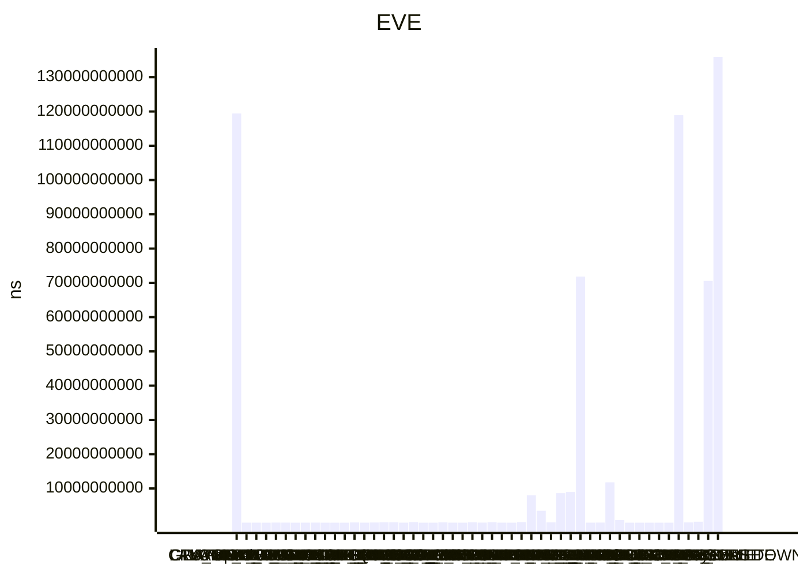
```mermaid
xychart-beta
title "EVE"
x-axis ["epoch", "GRAPHICS_ENGINE", "LAYOUT_DOCUMENTS", "CPU_GRAPHICS_ENGINE", "LAYOUT_DEFAULT_FILE", "LAYOUT_DEFAULT_TREE", "VALIDATOR_IS_VALID", "VALIDATOR_DEFAULT_RULES", "LAYOUT_USER_TREE", "MODEL_SET_VALUES_FROM", "MODEL_ADD_CHILDREN_FROM", "LAYOUT_ADD_THEME_TABLES", "LAYOUT_SETTINGS_TREE", "LAYOUT_THEME_SETTINGS", "LAYOUT_STYLE_TREE", "LAYOUT_THEME_TREE", "LAYOUT_SETTINGS", "STYLE_REGISTER_STYLE", "PROCESSOR_LAYOUT", "DEVICE_OPEN", "QUEUES_PREPARE", "ROWS_PREPARE", "SWAP_PREPARE", "PROCESSOR_RESET", "BUFFER_PREPARE", "TTY_OPEN", "DEVICE_START", "PROCESSOR_PREPARE", "VULKAN_CALIBRATE_NUM_SAMPLES", "VULKAN_INITIALISE_DEVICE", "SWAP_HISTORY_LINES", "TERMINAL_READ", "SWAP_LIVE_LINES", "TERMINAL_PROCESS", "DEVICE_CLOCK", "EDITOR_BLOCKS", "PROCESSOR_EDITOR", "VULKAN_FLUSH_RECORDING", "VULKAN_END_FRAME", "STANDALONE_INITIALISE", "TTY_EXIT_PSEUDO_CONSOLE", "EDITOR_DELETE", "TTY_TERMINATE", "TTY_CLOSE", "PROCESSOR_RELEASE", "LAUNCH_PROMPT", "PROCESSOR_DELETE", "STANDALONE_SHUTDOWN", "user", "system"]
y-axis "ns"
bar [119425450700.00000000000000000, 12934300.00000000000000000, 18335500.00000000000000000, 300.00000000000000000, 33420400.00000000000000000, 30814000.00000000000000000, 1357700.00000000000000000, 16381100.00000000000000000, 29491500.00000000000000000, 867300.00000000000000000, 4700.00000000000000000, 851200.00000000000000000, 79776900.00000000000000000, 20342700.00000000000000000, 59824200.00000000000000000, 137473600.00000000000000000, 147105700.00000000000000000, 11259500.00000000000000000, 181785700.00000000000000000, 100.00000000000000000, 81200.00000000000000000, 125353300.00000000000000000, 21390100.00000000000000000, 42300.00000000000000000, 147090900.00000000000000000, 26402500.00000000000000000, 174336300.00000000000000000, 12489400.00000000000000000, 1000.00000000000000000, 175965500.00000000000000000, 7985734000.00000000000000000, 3500273700.00000000000000000, 126681800.00000000000000000, 8624407700.00000000000000000, 8960791600.00000000000000000, 71804836800.00000000000000000, 13721800.00000000000000000, 37899300.00000000000000000, 11775860000.00000000000000000, 781145200.00000000000000000, 29200.00000000000000000, 28900.00000000000000000, 4100.00000000000000000, 272400.00000000000000000, 375600.00000000000000000, 118913393700.00000000000000000, 115827300.00000000000000000, 293400400.00000000000000000, 70562500000.00000000000000000, 135921875000.00000000000000000]
```

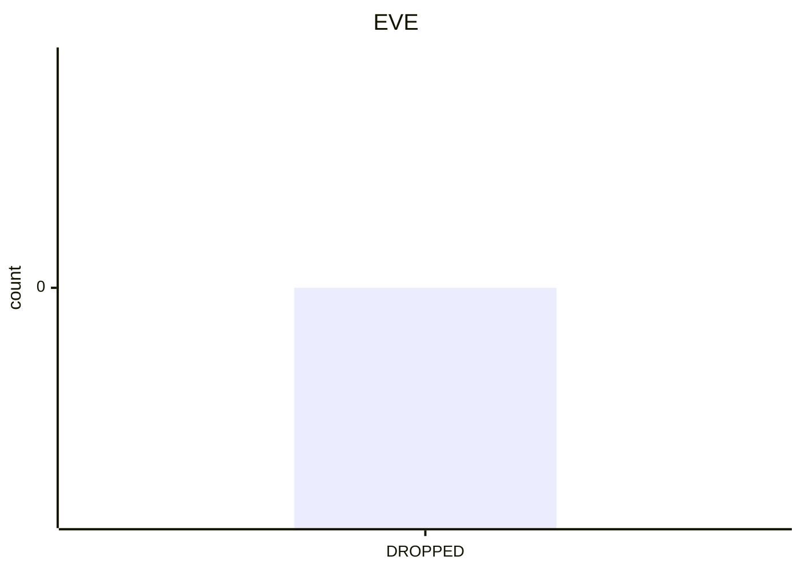
```mermaid
xychart-beta
title "EVE"
x-axis ["DROPPED"]
y-axis "count"
bar [0.00000000000000000]
```

```mermaid
xychart-beta
title "SAMPLE"
x-axis ["strlen", "RtlAppendUnicodeStringToString", "RtlUTF8ToUnicodeN", "RtlValidAcl", "RtlDeactivateActivationContextUnsafeFast", "LdrGetDllHandleEx", "LdrLoadDll", "RtlDosSearchPath-U", "EtwEventWriteNoRegistration", "LdrInitializeThunk", "ZwOpenKey", "RtlReleaseSRWLockExclusive", "NtQueryInformationByName", "SdbIsTagrefFromLocalDB", "Ordinal28", "SE-COM-HookObject", "SdbInitDatabaseEx", "SE-InitializeEngine", "LdrUnlockLoaderLock", "RtlAnsiCharToUnicodeChar", "wcstombs", "vsnwprintf", "RtlSleepConditionVariableCS", "LdrGetDllHandle", "GetModuleHandleExW", "SE-InstallBeforeInit", "RtlLocateExtendedFeature2", "TpCallbackMayRunLong", "BaseThreadInitThunk", "RtlUserThreadStart", "ZwReleaseWorkerFactoryWorker", "RtlAcquireSRWLockExclusive", "RtlClearThreadWorkOnBehalfTicket", "ZwQueryAttributesFile", "Ordinal8", "RtlRaiseException", "RtlGetFullPathName-UstrEx", "RtlRbInsertNodeEx", "RtlWow64SuspendThread", "RtlGetReturnAddressHijackTarget", "RtlInsertElementGenericTableFullAvl", "NtClose", "NtQueryVirtualMemory", "RtlVirtualUnwind2", "RtlWalkFrameChain", "RtlCaptureStackBackTrace", "SE-GetProcAddressForCaller", "LdrGetProcedureAddressForCaller", "LdrGetProcedureAddressEx", "SE-DynamicShim", "SE-DllLoaded", "LdrGetDllHandleByName", "LdrUnloadDll", "NtOpenFile", "InitializeCriticalSectionAndSpinCount", "SetAppCompatStringPointer", "initterm-e", "RtlDeleteElementGenericTableAvlEx", "NtGdiInit2", "SetBrushAttributes", "CreateColorSpaceW", "GdiDllInitialize", "ExitWindowsEx", "LoadLibraryExW", "CreateDXGIFactory2", "initterm", "ZwTraceControl", "RtlNtStatusToDosError", "EtwNotificationRegister", "EtwEventRegister", "SHAppBarMessage", "SHGetFolderPathAndSubDirW", "GetSecretAgreementInterface", "ProcessPrng", "RtlImageDirectoryEntryToData", "LdrResolveDelayLoadedAPI", "NdrMapCommAndFaultStatus", "RpcErrorResetEnumeration", "UuidCreate", "DWrite-dll", "DWriteCreateFactory", "std::pair-std::-Vector-iterator-std::-Vector-val-std::-Simple-types-std::pair-juce::ImagePixelData---jam::VulkanTextureCache::Entry--------bool-::pair-std::-Vector-iterator-std::-Vector-val-std::-Simple-types-std::pair-juce::ImagePixelData---jam::VulkanTextureCache::Entry--------bool-0-", "std::-Vector-const-iterator-std::-Vector-val-std::-Simple-types-juce::detail::JustifiedText::DrawType-----::-Vector-const-iterator", "std::-Default-allocator-traits-std::allocator-vk::raii::CommandBuffer---::construct-vk::raii::CommandBuffer-vk::raii::CommandBuffer-", "VmaPoolAllocator-VmaAllocation-T-::VmaPoolAllocator", "std::tuple-juce::TypefaceMetricsKind-float-float-float-float-float-float-bool-bool-::tuple-std::-Exact-args-t-const-juce::TypefaceMetricsKind---const-float---const-float---const-float---const-float---const-float---const-float---const-bool---const-bool---0-", "jam::HashMap-juce::Identifier-juce::FixedSizeFunction-8-juce::Point-int---const-juce::Identifier----jam::TextEditor----int---jam::Hash-juce::Identifier-void--std::equal-to-juce::Identifier--std::allocator-std::pair-juce::Identifier-juce::FixedSizeFunction-8-juce::Point-int--", "std::invoke--lambda-at-C:-Users-jreng-AppData-Local-cast-juce-0e197aa8b93883283f6bdff42b344a9081bc7b4c7da42014d955e2c31b6b0617-modules-juce-graphics-detail-juce-SimpleShapedText-cpp:1137:65----const-juce::detail::LineState---const-juce::detail::ShapedGlyph---", "juce::FontOptions::withName", "std::tuple-float-float-float-float-float-bool-bool-::tuple-std::-Exact-args-t-const-float---const-float---const-float---const-float---const-float---const-bool---const-bool---0-", "std::tuple--lambda-at-D:-Poems-dev-jam-jam-gui-widgets-jam-TextEditor-cpp:1378:45-----::tuple--lambda-at-D:-Poems-dev-jam-jam-gui-widgets-jam-TextEditor-cpp:1378:45--0-", "std::-Tree-const-iterator-std::-Tree-val-std::-Tree-simple-types-std::pair-const-int-juce::String-------::operator-", "AlpcGetMessageFromCompletionList", "User32InitializeImmEntryTable", "KiUserCallbackDispatcher", "NtUserCreateWindowEx", "CreateWindowExW", "Ordinal93", "CoInitializeEx", "CreateBindCtx", "std::-Vector-const-iterator-std::-Vector-val-std::-Simple-types-juce::detail::WrappedGlyphsCursorRange-----::-Vector-const-iterator", "VmaPoolAllocator-VmaAllocation-T-::-VmaPoolAllocator", "DrawThemeParentBackgroundEx", "EndPanningFeedback", "GetWindowThreadProcessId", "juce::EnumerateIterator-std::-Vector-iterator-std::-Vector-val-std::-Simple-types-juce::detail::LineInfo------long-long-::EnumerateIterator", "EnumWindows", "std::vector-juce::detail::WrappedGlyphsCursor::ShapedGlyphSpan-std::allocator-juce::detail::WrappedGlyphsCursor::ShapedGlyphSpan---::-Insert-counted-range-juce::detail::WrappedGlyphsCursor::ShapedGlyphSpan---", "juce::Span-const-juce::detail::LineInfo-18446744073709551615-::front", "std::-Deleted-move-assign-std::-Optional-construct-base-juce::detail::SimpleShapedText--juce::detail::SimpleShapedText-::-Deleted-move-assign", "std::-Compressed-pair-std::allocator-juce::detail::LineMetrics--std::-Vector-val-std::-Simple-types-juce::detail::LineMetrics----1-::-Compressed-pair--", "std::-Vector-iterator-std::-Vector-val-std::-Simple-types-juce::detail::WrappedGlyphsCursorRange-----::--Vector-iterator", "RtlFreeActivationContextStack", "CtfImmNotify", "CtfImmIsTextFrameServiceDisabled", "CtfImmDispatchDefImeMessage", "GetCapture", "CallWindowProcW", "GetFocus", "juce::Span-const-juce::detail::ShapedGlyph-18446744073709551615-::back", "CtfImeAssociateFocus", "CtfImeInquireExW", "ImmLoadIME", "GetWindowDpiAwarenessContext", "NtUserGetProp", "GetPropW", "Ordinal16", "Ordinal75", "SendMessageW", "FindWindowW", "RtlGetSuiteMask", "RtlQueryWnfStateDataWithExplicitScope", "RtlSizeHeap", "RtlAllocateHeap", "juce::LeakedObjectDetector-jam::Array-jam::VulkanTextureCache::Entry-juce::DummyCriticalSection---::getCounter", "std::-Vector-val-std::-Simple-types-std::pair-std::pair-vk::ImageLayout-vk::ImageLayout--jam::BarrierTransition-----::-Vector-val", "-unnamed-type-hb-get-::impl-OT::Tag-OT::TableRecord::---const-OT::TableRecord---", "std::vector-juce::detail::ShapedGlyph-std::allocator-juce::detail::ShapedGlyph---::-Insert-counted-range-const-juce::detail::ShapedGlyph---", "std::-Vector-const-iterator-std::-Vector-val-std::-Simple-types-juce::detail::JustifiedText::DrawType-----::-Verify-offset", "-unnamed-type-hb-invoke-::impl-OT::Tag-OT::TableRecord::---const-OT::TableRecord---", "-unnamed-type-hb-invoke-::operator", "-unnamed-type-hb-get-::operator", "hb-object-fini-hb-sparseset-t-hb-bit-set-invertible-t---", "-unnamed-type-hb-map-::operator", "RtlAcquireResourceExclusive", "std::-Tree-val-std::-Tree-simple-types-std::pair-const-std::tuple-float-float--juce::LruCache-std::tuple-float-float--juce::HbPtr-hb-font-t--hb-font-reference--hb-font-destroy--128-::Pair-----::-Extract", "std::-Tree-unchecked-const-iterator-std::-Tree-val-std::-Tree-simple-types-std::pair-const-std::tuple-float-float--juce::LruCache-std::tuple-float-float--juce::HbPtr-hb-font-t--hb-font-reference--hb-font-destroy--128-::Pair------std::-Iterator-base0-::operator--", "CFF::cs-opset-t-CFF::number-t-cff1-cs-opset-seac-t-CFF::cff1-cs-interp-env-t-get-seac-param-t-CFF::path-procs-null-t-CFF::cff1-cs-interp-env-t-get-seac-param-t---::process-post-move", "CFF::cs-opset-t-CFF::number-t-cff1-cs-opset-seac-t-CFF::cff1-cs-interp-env-t-get-seac-param-t-CFF::path-procs-null-t-CFF::cff1-cs-interp-env-t-get-seac-param-t---::process-op", "juce::detail::RangedValues-juce::Font-::front", "RegOpenKeyExInternalA", "std::list-std::-Tree-const-iterator-std::-Tree-val-std::-Tree-simple-types-std::pair-const-ArrangementArgs-juce::LruCache-ArrangementArgs-juce::GlyphArrangement-128-::Pair--------std::allocator-std::-Tree-const-iterator-std::-Tree-val-std::-Tree-simple-types-std::pair-const-ArrangementArgs-juce::LruCache-ArrangementArgs-juce::GlyphArrangement-128-::Pair-----------::-list", "juce::GlyphArrangement::getBoundingBox", "juce::pnglibNamespace::png-push-read-chunk", "juce::pnglibNamespace::png-read-finish-IDAT", "juce::ActiveXControlComponent::createControl", "juce::LiveConstantEditor::LivePropertyEditorBase::resized", "hb-paint-funcs-t::pop-group", "std::vector-juce::detail::JustifiedText::DrawType-std::allocator-juce::detail::JustifiedText::DrawType---::-Emplace-reallocate-const-juce::detail::JustifiedText::DrawType---", "std::vector-juce::detail::WrappedGlyphsCursorRange-std::allocator-juce::detail::WrappedGlyphsCursorRange---::-Insert-counted-range-juce::detail::WrappedGlyphsCursorRange---", "juce::detail::RangedValues-juce::Colour-::applyOperation", "std::-Alloc-temporary2-std::allocator-juce::Colour---::-Alloc-temporary2-juce::Colour-", "std::vector-juce::Colour-std::allocator-juce::Colour---::-Emplace-back-with-unused-capacity-juce::Colour-", "std::-Idl-distance-juce::TextLayout::Line----juce::TextLayout::Line----", "std::vector-float-std::allocator-float---::-Simple-reallocation-guard::--Simple-reallocation-guard", "juce::pnglibNamespace::png-combine-row", "hb-bit-set-invertible-t::is-equal::-lambda-1-::operator", "hb-bit-set-invertible-t::intersect", "std::-Vector-const-iterator-std::-Vector-val-std::-Simple-types-juce::Colour-----::-Vector-const-iterator", "std::vector-juce::Colour-std::allocator-juce::Colour---::-Orphan-range", "std::-Vector-iterator-std::-Vector-val-std::-Simple-types-juce::Colour-----::--Vector-iterator", "ZwCreateThreadEx", "CreateRemoteThreadEx", "CreateThread", "jam::HashMap-juce::String-vk::raii::ShaderModule-jam::Hash-juce::String-void--std::equal-to-juce::String--std::allocator-std::pair-juce::String-vk::raii::ShaderModule----jam::BucketType::Standard-jam::HashMapTraits::DefaultContainer-0-::find", "juce::TypefaceCache::findTypefaceFor", "juce::makeRange-std::reverse-iterator-juce::TypefaceCache::CachedFace----std::reverse-iterator-juce::TypefaceCache::CachedFace-----", "juce::ReferenceCountedObjectPtr-juce::Typeface-::operator-", "juce::ActiveXControlComponent::offerEventToActiveXControlStatic", "DeleteFileW", "juce::LeakedObjectDetector-juce::SoftwarePixelData-::LeakCounter::-LeakCounter", "std::-Debug-lt-pred-const-std::less-unsigned-int----const-unsigned-int---const-unsigned-int---", "OT::ChainContextFormat3::apply", "OT::ResourceTypeRecord::sanitize", "juce::JSON::fromString", "hb-draw-extents-funcs-lazy-loader-t::create", "juce::ActiveXHelpers::offerActiveXMouseEventToPeer", "juce::detail::RangedValues-juce::detail::GlyphsStorage-::applyOperation", "juce::detail::RangedValues-juce::detail::GlyphsStorage-::createSubSpan-std::vector-std::variant-juce::detail::Ranges::Ops::New-juce::detail::Ranges::Ops::Split-juce::detail::Ranges::Ops::Erase-juce::detail::Ranges::Ops::Change--std::allocator-std::variant-juce::detail::Ranges::Ops::New-juce::detail::Ranges::Ops::Split-juce::detail::Ranges::Ops::Erase-juce::detail::Ranges::Ops::Change-------", "std::-Variant-storage--1-juce::detail::Ranges::Ops::Split-juce::detail::Ranges::Ops::Erase-juce::detail::Ranges::Ops::Change-::-Variant-storage--juce::detail::Ranges::Ops::Split-", "std::array-vk::PipelineColorBlendStateCreateInfo-3-::-Xran", "RtlFindMessage", "LdrLoadAlternateResourceModuleEx", "LdrRscIsTypeExist", "RtlLoadString", "LoadStringBaseExW", "GetCPHashNode", "GetTimeZoneInformation", "jam::HashMap-void---int-jam::Hash-void---void--std::equal-to-void----std::allocator-std::pair-void---int----jam::BucketType::Standard-jam::HashMapTraits::DefaultContainer-0-::reserve", "jam::HashMap-void---int-jam::Hash-void---void--std::equal-to-void----std::allocator-std::pair-void---int----jam::BucketType::Standard-jam::HashMapTraits::DefaultContainer-0-::size", "jam::HashMap-void---int-jam::Hash-void---void--std::equal-to-void----std::allocator-std::pair-void---int----jam::BucketType::Standard-jam::HashMapTraits::DefaultContainer-0-::HashMap", "std::vector-vk::CommandBuffer-std::allocator-vk::CommandBuffer---::-Buy-raw", "std::-Tree-const-iterator-std::-Tree-val-std::-Tree-simple-types-std::pair-const-unsigned-int-juce::LruCache-unsigned-int-std::optional-hb-glyph-extents-t--512-::Pair-------::operator--", "hb-bit-set-t::process-", "hb-map-iter-t-hb-bit-set-t::iter-t-const-hb-bit-set-t---0-nullptr-::hb-map-iter-t", "juce::LeakedObjectDetector-jam::ModalWindow-::LeakCounter::-LeakCounter", "juce::detail::FocusRestorer::-FocusRestorer", "juce::DragHelpers::findDragAndDropTarget", "hb-sanitize-context-t::-dispatch-OT::UnsizedArrayOf-OT::ResourceRecord--unsigned-int-const-void----", "juce::numElementsInArray-const-char-80-", "std::vector-std::pair-juce::Identifier-juce::FixedSizeFunction-8-juce::Point-int---const-juce::Identifier----jam::TextEditor----int-----std::allocator-std::pair-juce::Identifier-juce::FixedSizeFunction-8-juce::Point-int--", "jam::Array-jam::Grapheme::Entry-juce::DummyCriticalSection-::Array", "juce::LeakedObjectDetector-jam::Array-const-jam::Document::Element---juce::DummyCriticalSection---::LeakCounter::-LeakCounter", "juce::LeakedObjectDetector-jam::Array-std::unique-ptr-jam::PreviewComponent::FrameJob-std::default-delete-jam::PreviewComponent::FrameJob----juce::DummyCriticalSection---::-LeakedObjectDetector", "std::-Vector-const-iterator-std::-Vector-val-std::-Simple-types-std::pair-juce::Identifier-juce::FixedSizeFunction-8-void-", "juce::ValueAnimatorBuilder::withValueChangedCallback::-lambda-1-::-lambda-at-C:-Users-jreng-AppData-Local-cast-juce-0e197aa8b93883283f6bdff42b344a9081bc7b4c7da42014d955e2c31b6b0617-modules-juce-animation-animation-juce-ValueAnimatorBuilder-h:142:22-", "hb-vector-size-t-unsigned-long-long-64-::operator-", "std::vector-std::vector-juce::detail::WrappedGlyphsCursorRange-std::allocator-juce::detail::WrappedGlyphsCursorRange----std::allocator-std::vector-juce::detail::WrappedGlyphsCursorRange-std::allocator-juce::detail::WrappedGlyphsCursorRange-------::max-size", "std::tuple-float-float-bool-bool-::tuple-std::-Exact-args-t-const-float---const-float---const-bool---const-bool---0-", "AAT::StateTable-AAT::ExtendedTypes-void-::sanitize", "AAT::LookupFormat10-OT::IntType-unsigned-short-2---::sanitize", "hb-bit-set-t::page-at", "hb-sanitize-context-t::check-range-AAT::Entry-AAT::ContextualSubtable-AAT::ObsoleteTypes-::EntryData---", "juce::PopupMenu::addItem", "juce::ScopedMessageBox::close", "AAT::StateTable-AAT::ObsoleteTypes-void-::sanitize", "std::-Default-allocator-traits-std::allocator-std::pair-long-long-int-----::max-size", "std::allocator-std::-Container-proxy-::allocator-std::pair-juce::String-int---", "juce::PopupMenu::Item::setImage", "GetModuleFileNameA", "vkResetEvent", "RtlRunOnceExecuteOnce", "InitOnceExecuteOnce", "OT::hb-closure-context-t::reset-lookup-visit-count", "NtAllocateVirtualMemory", "jam::VulkanImageEffects::dispatchMatte-jam::VulkanMatteFeatherPushConstants-", "juce::Process::openEmailWithAttachments", "hb-bit-set-t::previous", "hb-bit-set-t::iter-t::--next--", "jam::HashMap-int-juce::FixedSizeFunction-8-std::optional-double---const-int----const-juce::String-----jam::Hash-int-void--std::equal-to-int--std::allocator-std::pair-int-juce::FixedSizeFunction-8-std::optional-double--", "GetProcAddressForCaller", "NtGdiDdDDIEnumAdapters2", "std::-Pop-heap-hole-by-index-juce::String---juce::String--lambda-at-C:-Users-jreng-AppData-Local-cast-juce-0e197aa8b93883283f6bdff42b344a9081bc7b4c7da42014d955e2c31b6b0617-modules-juce-core-text-juce-StringArray-cpp:297:16--", "AAT::StateTable-AAT::ExtendedTypes-AAT::ContextualSubtable-AAT::ExtendedTypes-::EntryData-::sanitize", "jam::HashMap-int-juce::FixedSizeFunction-8-juce::Rectangle-float---const-int----juce::Rectangle-float-----float---jam::Hash-int-void--std::equal-to-int--std::allocator-std::pair-int-juce::FixedSizeFunction-8-juce::Rectangle-float--", "jam::PopupMenu::MenuWindow::showSubMenuFor", "std::-Uninitialized-move-std::pair-juce::String-juce::FixedSizeFunction-8-void--const-juce::String----juce::LookAndFeel----const-juce::Image---------std::allocator-std::pair-juce::String-juce::FixedSizeFunction-8-void-", "DXGIReportAdapterConfiguration", "PIXEndCapture", "CompatString", "dxgi-dll", "CreateDXGIFactory1", "std::tuple-float-float-float-float-float-float-bool-bool-::tuple-std::-Exact-args-t-const-float---const-float---const-float---const-float---const-float---const-float---const-bool---const-bool---0-", "jam::PopupMenu::MenuWindow::workOutBestSize", "std::vector-std::pair-juce::String-juce::FixedSizeFunction-8-void--const-juce::String----juce::Component----const-jam::Document::Element----jam::Registry----jam::AudioModel-------std::allocator-std::pair-juce::String-juce::FixedSizeFunction-8-void-", "OT::OffsetTo-OT::UnsizedArrayOf-OT::HBGlyphID16--OT::IntType-unsigned-short-2--void-0-::sanitize-shallow", "juce::FixedSizeFunction-8-void-", "std::-Func-impl-no-alloc--lambda-at-C:-Users-jreng-AppData-Local-cast-juce-0e197aa8b93883283f6bdff42b344a9081bc7b4c7da42014d955e2c31b6b0617-modules-juce-graphics-detail-juce-SimpleShapedText-cpp:1137:65--bool-const-juce::detail::LineState---const-juce::detail::ShapedGlyph---::-Do-call", "std::vector-std::pair-juce::String-juce::FixedSizeFunction-8-void--const-juce::String----juce::Component----const-juce::Image-------std::allocator-std::pair-juce::String-juce::FixedSizeFunction-8-void-", "jam::HashMap-juce::String-juce::FixedSizeFunction-8-void--const-juce::String----juce::Component----jam::HashMap-juce::Identifier-jam::Function::Map-juce::Identifier-8--jam::Hash-juce::Identifier-void--std::equal-to-juce::Identifier--std::allocator-std::pair-juce::Identifier-jam::Function::Map-juce::Identifier-8------jam::BucketType::Standard-jam::HashMapTraits::DefaultContainer-0-----const-juce::String-----jam::Hash-juce::String-void--std::equal-to-juce::String--std::allocator-std::pair-juce::String-juce::FixedSizeFunction-8-void-", "find-syllables-myanmar", "OT::Layout::GSUB-impl::ReverseChainSingleSubstFormat1::apply", "NtGdiDdDDIQueryAdapterInfo", "Ordinal218", "Ordinal241", "DXCoreCreateAdapterFactory", "directxdatabasehelper-dll", "DXGIDumpJournal", "jam::HashMap-juce::String-juce::FixedSizeFunction-8-void--const-juce::String----juce::LookAndFeel----juce::StringRef--const-juce::FontOptions-----jam::Hash-juce::String-void--std::equal-to-juce::String--std::allocator-std::pair-juce::String-juce::FixedSizeFunction-8-void-", "std::allocator-std::pair-juce::String-juce::FixedSizeFunction-8-void-", "jam::PopupMenu::MenuWindow::computePosAndOffsetToEnsureVisibility", "std::-Func-class-bool-const-juce::detail::LineState---const-juce::detail::ShapedGlyph---::-Local", "jam::HashMap-juce::String-juce::FixedSizeFunction-8-void--const-juce::String----juce::Component----const-juce::Image-----jam::Hash-juce::String-void--std::equal-to-juce::String--std::allocator-std::pair-juce::String-juce::FixedSizeFunction-8-void-", "std::accumulate-int---int-", "jam::HashMap-int-juce::FixedSizeFunction-8-void--const-int----juce::Graphics----juce::Line-float---bool---jam::Hash-int-void--std::equal-to-int--std::allocator-std::pair-int-juce::FixedSizeFunction-8-void-", "hb-bit-set-t::del-pages", "NtUserMapDesktopObject", "std::lower-bound-std::-Vector-iterator-std::-Vector-val-std::-Simple-types-juce::Range-long-long--------long-long--lambda-at-C:-Users-jreng-AppData-Local-cast-juce-0e197aa8b93883283f6bdff42b344a9081bc7b4c7da42014d955e2c31b6b0617-modules-juce-graphics-detail-juce-Ranges-h:168:59--", "GetFileAttributesW", "juce::Atomic-int-::operator--", "std::make-unique-juce::LowLevelGraphicsSoftwareRenderer-juce::Image-0-", "std::vector-std::pair-juce::Identifier-juce::FixedSizeFunction-8-void--const-juce::Identifier----jam::TextEditor----int-----std::allocator-std::pair-juce::Identifier-juce::FixedSizeFunction-8-void-", "hb-map-iter-t-hb-sorted-array-t-const-hb-aat-map-t::range-flags-t---lambda-at-C:-Users-jreng-AppData-Local-cast-juce-0e197aa8b93883283f6bdff42b344a9081bc7b4c7da42014d955e2c31b6b0617-modules-juce-graphics-fonts-harfbuzz-hb-aat-layout-morx-table-hh:1156:14--0-nullptr-::--more--", "OT::ResourceRecord::sanitize", "memcpy", "juce::detail::call--lambda-at-D:-Poems-dev-jam-jam-gui-widgets-jam-TextEditor-cpp:709:47--void-const-juce::Identifier---jam::TextEditor---int-", "hb-bit-set-t::add-range", "juce::Array-juce::Component---juce::DummyCriticalSection-0-::removeFirstMatchingValue", "juce::Component::withDefaultMetrics", "AAT::RearrangementSubtable-AAT::ObsoleteTypes-::apply", "std::tuple-juce::String-juce::Typeface---std::vector-juce::String-std::allocator-juce::String----std::vector-juce::FontFeatureSetting-std::allocator-juce::FontFeatureSetting----juce::TypefaceMetricsKind-float-float-float-float-float-float-bool-bool-::tuple-std::-Exact-args-t-const-juce::String---juce::Typeface---const-std::vector-juce::String-std::allocator-juce::String------const-std::vector-juce::FontFeatureSetting-std::allocator-juce::FontFeatureSetting------const-juce::TypefaceMetricsKind---const-float---const-float---const-float---const-float---const-float---const-float---const-bool---const-bool---0-", "juce::Array-juce::ImageCache::Pimpl::Item-juce::DummyCriticalSection-0-::begin", "juce::HeapBlock-juce::Range-int--0-::HeapBlock", "juce::FocusTraverser::getAllComponents", "jam::Array-jam::VulkanLowLevelGraphicsContext::State-juce::DummyCriticalSection-::-Array", "std::unique-ptr-juce::ImageType-std::default-delete-juce::ImageType---::unique-ptr-jam::VulkanImageType-std::default-delete-jam::VulkanImageType--0-", "hb-ot-map-t::get-stage-lookups", "std::vector-std::pair-juce::Identifier-juce::Point-int----std::allocator-std::pair-juce::Identifier-juce::Point-int-------::-Reallocate-0-", "jam::Owner-jam::PreviewComponent::FrameJob-::getLeakedObjectClassName", "jam::AnyMap-juce::DummyCriticalSection-::add-jam::AnyMap-juce::DummyCriticalSection---", "juce::MouseInputSource::isLongPressOrDrag", "juce::Desktop::addGlobalMouseListener", "juce::Desktop::Desktop", "juce::LeakedObjectDetector-jam::Array-juce::ValueTree-juce::DummyCriticalSection---::LeakCounter::-LeakCounter", "std::-Func-class-void-float-::-Reset-copy", "std::vector-std::pair-juce::ImagePixelData---jam::VulkanTextureCache::Entry--std::allocator-std::pair-juce::ImagePixelData---jam::VulkanTextureCache::Entry-----::-Emplace-back-with-unused-capacity-juce::ImagePixelData----jam::VulkanTextureCache::Entry-", "hb-bit-page-t::previous", "juce::processDisplay", "juce::Desktop::timerCallback", "std::pair-std::-Vector-iterator-std::-Vector-val-std::-Simple-types-std::pair-juce::Identifier-juce::Point-int----------bool-::-pair", "juce::LeakedObjectDetector-jam::Array-const-jam::Document::Element---juce::DummyCriticalSection---::LeakedObjectDetector", "jam::AnyMap-juce::DummyCriticalSection-::get-jam::Parameter-float---", "AAT::NoncontextualSubtable-AAT::ObsoleteTypes-::sanitize", "juce::MouseInputSource::getLastMouseDownPosition", "std::-Func-class-bool-const-juce::detail::LineState---const-juce::detail::ShapedGlyph---::-Tidy", "jam::Map::contains-jam::HashMap-juce::Identifier-juce::ValueTree-jam::Hash-juce::Identifier-void--std::equal-to-juce::Identifier--std::allocator-std::pair-juce::Identifier-juce::ValueTree----jam::BucketType::Standard-jam::HashMapTraits::DefaultContainer-0--juce::Identifier-", "std::vector-std::pair-juce::Identifier-jam::HashMap-juce::Identifier-juce::Identifier-jam::Hash-juce::Identifier-void--std::equal-to-juce::Identifier--std::allocator-std::pair-juce::Identifier-juce::Identifier----jam::BucketType::Standard-jam::HashMapTraits::DefaultContainer-0----std::allocator-std::pair-juce::Identifier-jam::HashMap-juce::Identifier-juce::Identifier-jam::Hash-juce::Identifier-void--std::equal-to-juce::Identifier--std::allocator-std::pair-juce::Identifier-juce::Identifier----jam::BucketType::Standard-jam::HashMapTraits::DefaultContainer-0-------::end", "jam::HashMap-juce::Identifier-jam::HashMap-juce::Identifier-juce::Identifier-jam::Hash-juce::Identifier-void--std::equal-to-juce::Identifier--std::allocator-std::pair-juce::Identifier-juce::Identifier----jam::BucketType::Standard-jam::HashMapTraits::DefaultContainer-0--jam::Hash-juce::Identifier-void--std::equal-to-juce::Identifier--std::allocator-std::pair-juce::Identifier-jam::HashMap-juce::Identifier-juce::Identifier-jam::Hash-juce::Identifier-void--std::equal-to-juce::Identifier--std::allocator-std::pair-juce::Identifier-juce::Identifier----jam::BucketType::Standard-jam::HashMapTraits::DefaultContainer-0------jam::BucketType::Standard-jam::HashMapTraits::DefaultContainer-0-::begin", "std::-Vector-const-iterator-std::-Vector-val-std::-Simple-types-std::pair-juce::Identifier-juce::Identifier-------::operator-", "juce::detail::ScopedContentSharerInterface::shareText", "juce::Desktop::setKioskModeComponent", "std::-Func-class-bool-const-juce::detail::LineState---const-juce::detail::ShapedGlyph---::-Reset--lambda-at-C:-Users-jreng-AppData-Local-cast-juce-0e197aa8b93883283f6bdff42b344a9081bc7b4c7da42014d955e2c31b6b0617-modules-juce-graphics-detail-juce-SimpleShapedText-cpp:1137:65--", "std::vector-std::pair-int-juce::FixedSizeFunction-8-juce::Rectangle-float---const-int----juce::Rectangle-float-----float-----std::allocator-std::pair-int-juce::FixedSizeFunction-8-juce::Rectangle-float--", "jam::StyleTogglePush::drawStandbySymbol", "map::TextEditorCommandId::TextEditorCommandId", "std::-Vector-const-iterator-std::-Vector-val-std::-Simple-types-std::pair-juce::Identifier-std::unique-ptr-void-void----", "std::vector-std::pair-juce::Identifier-juce::Point-int----std::allocator-std::pair-juce::Identifier-juce::Point-int-------::end", "std::weak-ptr-map::MatrixCommandId-::swap", "juce::Desktop::setGlobalScaleFactor", "std::vector-juce::Font-std::allocator-juce::Font---::operator-", "OT::operator--OT::AxisValueOffsetArray-nullptr-", "std::-Vector-const-iterator-std::-Vector-val-std::-Simple-types-std::pair-juce::Identifier-juce::Point-int---------::-Compat", "ApplyCompatResolutionQuirking", "std::-Ptr-base-map::TextEditorCommandId-::-Swap", "NtCreateSection", "RtlFreeHeap", "RtlReAllocateHeap", "std::vector-std::pair-std::pair-vk::ImageLayout-vk::ImageLayout--jam::BarrierTransition--std::allocator-std::pair-std::pair-vk::ImageLayout-vk::ImageLayout--jam::BarrierTransition-----::reserve", "OT::AxisValueRecord::get-value", "std::-Vector-const-iterator-std::-Vector-val-std::-Simple-types-std::pair-juce::Identifier-int-------::operator-", "jam::HashMap-juce::Identifier-juce::Point-int--jam::Hash-juce::Identifier-void--std::equal-to-juce::Identifier--std::allocator-std::pair-juce::Identifier-juce::Point-int------jam::BucketType::Standard-jam::HashMapTraits::DefaultContainer-0-::onKeyNotFound", "hb-array-t-const-OT::AxisValueRecord-::--item-at--", "std::-Vector-const-iterator-std::-Vector-val-std::-Simple-types-std::pair-juce::Identifier-juce::Point-int---------::operator-", "RtlUpcaseUnicodeString", "map::MatrixCommandId::MatrixCommandId", "jam::HashMap-juce::Identifier-juce::FixedSizeFunction-8-void--const-juce::Identifier----jam::TextEditor----int---jam::Hash-juce::Identifier-void--std::equal-to-juce::Identifier--std::allocator-std::pair-juce::Identifier-juce::FixedSizeFunction-8-void-", "jam::SharedInstance-jam::CommandManager-::create--", "juce::CharPointer-UTF8::operator-", "std::-Ptr-base-map::MatrixCommandId-::-Swap", "std::swap-map::MatrixCommandId---0-", "amdvlk64-dll", "boost::serialization::singleton-std::set-boost::serialization::void-cast-detail::void-caster-const-----ptr64-boost::serialization::void-cast-detail::void-caster-compare-std::allocator-boost::serialization::void-cast-detail::void-caster-const-----ptr64-----::is-destroyed", "vk::raii::detail::DeviceDispatcher::DeviceDispatcher", "std::vector-hb-feature-t-std::allocator-hb-feature-t---::-Emplace-reallocate-const-hb-feature-t---", "std::vector-hb-feature-t-std::allocator-hb-feature-t---::push-back", "std::upper-bound-std::-Vector-iterator-std::-Vector-val-std::-Simple-types-long-long------long-long-std::less-void---", "std::-Copy-memmove-juce::FontFeatureSetting---juce::FontFeatureSetting---", "std::vector-juce::detail::GlyphsStorage-std::allocator-juce::detail::GlyphsStorage---::-Emplace-reallocate-juce::detail::GlyphsStorage-", "std::-Ref-count-obj2-jam::CommandManager-::-Ref-count-obj2--", "std::-Ref-count-obj2-map::TextEditorCommandId-::--Ref-count-obj2", "jam::HashMap-juce::Identifier-juce::Point-int--jam::Hash-juce::Identifier-void--std::equal-to-juce::Identifier--std::allocator-std::pair-juce::Identifier-juce::Point-int------jam::BucketType::Standard-jam::HashMapTraits::DefaultContainer-0-::doAt-juce::Identifier-juce::Point-int--1-", "jam::HashMap-int-juce::FixedSizeFunction-8-bool--const-int----jam::TextEditor----const-juce::KeyPress-----jam::Hash-int-void--std::equal-to-int--std::allocator-std::pair-int-juce::FixedSizeFunction-8-bool-", "jam::CommandManager::CommandManager", "vk::raii::RenderPass::clear", "find-syllables-khmer", "AAT::ContextualSubtable-AAT::ExtendedTypes-::sanitize", "std::-Ref-count-obj2-map::MatrixCommandId-::--Ref-count-obj2", "jam::CommandManager::-CommandManager", "hb-bit-set-t::is-subset", "RtlEnterCriticalSection", "std::-Vector-const-iterator-std::-Vector-val-std::-Simple-types-std::pair-int-juce::FixedSizeFunction-8-bool-", "jam::HashMap-juce::String-juce::KeyPress-jam::Hash-juce::String-void--std::equal-to-juce::String--std::allocator-std::pair-juce::String-juce::KeyPress----jam::BucketType::Standard-jam::HashMapTraits::DefaultContainer-0-::HashMap", "jam::HashMap-juce::String-vk::raii::ShaderModule-jam::Hash-juce::String-void--std::equal-to-juce::String--std::allocator-std::pair-juce::String-vk::raii::ShaderModule----jam::BucketType::Standard-jam::HashMapTraits::DefaultContainer-0-::allocateBucketsFromShift", "OT::UnsizedArrayOf-OT::OffsetTo-OT::AxisValue-OT::IntType-unsigned-short-2--void-1---::as-array", "hb-iter-t-hb-array-t-const-OT::OffsetTo-OT::AxisValue-OT::IntType-unsigned-short-2--void-1----const-OT::OffsetTo-OT::AxisValue-OT::IntType-unsigned-short-2--void-1----::operator--", "jam::HashMap-juce::Identifier-juce::Point-int--jam::Hash-juce::Identifier-void--std::equal-to-juce::Identifier--std::allocator-std::pair-juce::Identifier-juce::Point-int------jam::BucketType::Standard-jam::HashMapTraits::DefaultContainer-0-::doFind-juce::Identifier-", "jam::HashMap-juce::Identifier-juce::FixedSizeFunction-8-void--const-juce::Identifier----jam::TextEditor-----jam::Hash-juce::Identifier-void--std::equal-to-juce::Identifier--std::allocator-std::pair-juce::Identifier-juce::FixedSizeFunction-8-void-", "NtCreateFile", "GetDriveTypeW", "CreateFileW", "std::vector-std::pair-juce::String-juce::KeyPress--std::allocator-std::pair-juce::String-juce::KeyPress-----::vector", "hb-blob-ptr-t-OT::Layout::GSUB-::operator-", "jam::HashMap-juce::Identifier-std::unique-ptr-void-void-----void-----jam::Hash-juce::Identifier-void--std::equal-to-juce::Identifier--std::allocator-std::pair-juce::Identifier-std::unique-ptr-void-void----", "std::-Vector-iterator-std::-Vector-val-std::-Simple-types-std::pair-juce::Identifier-std::unique-ptr-void-void----", "std::-Tuple-val-int-::-Tuple-val-const-int---", "juce::ArrayBase-juce::Range-int--juce::DummyCriticalSection-::ArrayBase", "juce::Displays::updateDeprecatedFields", "OT::Layout::GPOS::position-finish-offsets", "std::vector-std::pair-int-float--std::allocator-std::pair-int-float-----::-vector", "juce::LeakedObjectDetector-jam::Array-jam::AttributedLink-juce::DummyCriticalSection---::LeakCounter::-LeakCounter", "std::vector-std::pair-juce::Identifier-juce::Point-int----std::allocator-std::pair-juce::Identifier-juce::Point-int-------::-Tidy", "std::shared-ptr-map::WindowFX-::operator-", "vk-icdGetInstanceProcAddrSG", "vk-icdNegotiateLoaderICDInterfaceVersion", "GetSettingsBlobsAll", "juce::LeakedObjectDetector-jam::Array-int-juce::DummyCriticalSection---::LeakCounter::-LeakCounter", "LoadLibraryExA", "pSetupConcatenatePaths", "SetupDiOpenClassRegKeyExW", "SetupDiCreateDeviceInfoListExW", "SetupDiGetClassDevsExW", "SetupDiGetClassDevsA", "juce::LeakedObjectDetector-jam::Owner-jam::Document::Element---::-LeakedObjectDetector", "jam::HashMap-juce::Identifier-juce::Point-int--jam::Hash-juce::Identifier-void--std::equal-to-juce::Identifier--std::allocator-std::pair-juce::Identifier-juce::Point-int------jam::BucketType::Standard-jam::HashMapTraits::DefaultContainer-0-::at", "juce::FixedSizeFunction-8-juce::Point-int--", "jam::Document::-Document", "hb-iter-t-hb-map-iter-t-hb-bit-set-t::iter-t-const-hb-bit-set-t---0-nullptr--bool-::iter", "juce::LeakedObjectDetector-jam::Array-int-juce::DummyCriticalSection---::LeakCounter::LeakCounter", "NtGdiDdDDICreateDevice", "NtGdiDdDDIEscape", "std::vector-std::pair-juce::Identifier-std::unique-ptr-void-void-----void-------std::allocator-std::pair-juce::Identifier-std::unique-ptr-void-void----", "juce::LeakedObjectDetector-jam::Array-std::pair-juce::Range-int--int--juce::DummyCriticalSection---::LeakCounter::-LeakCounter", "juce::LeakedObjectDetector-jam::Array-jam::VulkanTextureCache::Entry-juce::DummyCriticalSection---::LeakedObjectDetector", "jam::debug::Log::stringify-std::basic-string-char-std::char-traits-char--std::allocator-char-----", "AAT::Chain-AAT::ObsoleteTypes-::sanitize", "hb-iter-t-hb-map-iter-t-hb-bit-set-t::iter-t-const-hb-bit-set-t---0-nullptr--bool-::operator--", "std::-Inplace-merge-buffer-left-juce::File---juce::SortFunctionConverter-juce::DefaultElementComparator-juce::File-----", "std::operator---map::WindowFX-", "std::copy-const-unsigned-char---unsigned-char---", "juce::LeakedObjectDetector-juce::ComponentDragger-::LeakCounter::LeakCounter", "NtUserQueryDisplayConfig", "QueryDisplayConfig", "juce::ArrayBase-jam::PaneEdge---juce::DummyCriticalSection-::operator--", "std::vector-juce::String-std::allocator-juce::String---::-Buy-nonzero", "std::make-unique-jam::Parameter-float--const-juce::Identifier---float-const-juce::Identifier---0-", "juce::OwnedArray-jam::PaneEdge-juce::DummyCriticalSection-::remove", "juce::FixedSizeFunction-8-juce::Rectangle-float---const-int----juce::Rectangle-float-----float--::operator", "std::-Vector-const-iterator-std::-Vector-val-std::-Simple-types-std::pair-int-juce::FixedSizeFunction-8-juce::Rectangle-int--", "NtGdiDdDDIUnlock2", "jam::AnyMap-juce::DummyCriticalSection-::add-jam::Parameter-jam::Bounds--const-juce::Identifier---jam::Bounds-const-juce::Identifier---", "jam::AnyMap-juce::DummyCriticalSection-::add-jam::Parameter-jam::UUID--const-juce::Identifier---jam::UUID-const-juce::Identifier---", "std::-Compressed-pair-std::default-delete-jam::AnyMap-juce::DummyCriticalSection----jam::AnyMap-juce::DummyCriticalSection----1-::-Compressed-pair-jam::AnyMap-juce::DummyCriticalSection-----", "std::get-0-jam::UUID-std::unique-ptr-jam::Model::Attachment-std::default-delete-jam::Model::Attachment-----", "jam::HashMap-juce::Identifier-jam::AnyMap-juce::DummyCriticalSection-::Trait-jam::Hash-juce::Identifier-void--std::equal-to-juce::Identifier--std::allocator-std::pair-juce::Identifier-jam::AnyMap-juce::DummyCriticalSection-::Trait----jam::BucketType::Standard-jam::HashMapTraits::DefaultContainer-0-::distInc", "jam::HashMap-jam::UUID-std::unique-ptr-jam::Model::Attachment-std::default-delete-jam::Model::Attachment----jam::Hash-jam::UUID-void--std::equal-to-jam::UUID--std::allocator-std::pair-jam::UUID-std::unique-ptr-jam::Model::Attachment-std::default-delete-jam::Model::Attachment--------jam::BucketType::Standard-jam::HashMapTraits::DefaultContainer-0-::placeAndShiftUp", "std::vector-std::pair-juce::Identifier-jam::AnyMap-juce::DummyCriticalSection-::Trait--std::allocator-std::pair-juce::Identifier-jam::AnyMap-juce::DummyCriticalSection-::Trait-----::size", "juce::LeakedObjectDetector-jam::OwnerComponent-::LeakCounter::-LeakCounter", "jam::debug::Log::stringify-const-jam::UUID---", "std::vector-std::pair-juce::String-juce::FixedSizeFunction-40-std::unique-ptr-juce::Component-std::default-delete-juce::Component-----const-juce::String-------std::allocator-std::pair-juce::String-juce::FixedSizeFunction-40-std::unique-ptr-juce::Component-std::default-delete-juce::Component----", "juce::TopLevelWindow::-TopLevelWindow", "juce::Displays::findDisplayForRect", "juce::Displays::getDisplayForPoint", "boost::serialization::singleton-boost::serialization::extended-type-info-typeid--SC-CONSTANTUSAGE---::singleton-boost::serialization::extended-type-info-typeid--SC-CONSTANTUSAGE---", "std::-Vector-const-iterator-std::-Vector-val-std::-Simple-types-std::pair-juce::String-juce::FixedSizeFunction-40-std::unique-ptr-juce::Component-std::default-delete-juce::Component----", "GetDriveTypeA", "CreateDirectoryW", "boost::serialization::singleton-boost::archive::detail::iserializer-sc-xml-iarchive--SC-SI-PS-ATTR-CH-ENTRY---::get-const-instance", "jam::HashMap-juce::Identifier-jam::AnyMap-juce::DummyCriticalSection-::Trait-jam::Hash-juce::Identifier-void--std::equal-to-juce::Identifier--std::allocator-std::pair-juce::Identifier-jam::AnyMap-juce::DummyCriticalSection-::Trait----jam::BucketType::Standard-jam::HashMapTraits::DefaultContainer-0-::getKey", "jam::ButtonSVG::ButtonSVG", "jam::ButtonSVG::paintButton", "jam::HashMap-juce::Identifier-std::unique-ptr-void-void-----void-----jam::Hash-juce::Identifier-void--std::equal-to-juce::Identifier--std::allocator-std::pair-juce::Identifier-std::unique-ptr-void-void-----void---------jam::BucketType::Standard-jam::HashMapTraits::DefaultContainer-0-::doPlaceElement-const-std::piecewise-construct-t---std::tuple-const-juce::Identifier----std::tuple-std::nullptr-t----void------", "std::vector-juce::detail::OwnedGlyphsSpan-std::allocator-juce::detail::OwnedGlyphsSpan---::back", "std::swap-map::TextEditorCommandId---0-", "std::-Func-class-bool-const-juce::detail::LineState---const-juce::detail::ShapedGlyph---::-Reset--lambda-at-C:-Users-jreng-AppData-Local-cast-juce-0e197aa8b93883283f6bdff42b344a9081bc7b4c7da42014d955e2c31b6b0617-modules-juce-graphics-detail-juce-SimpleShapedText-cpp:1143:61--", "hb-sanitize-context-t::sanitize-blob-AAT::ltag-", "OT::ArrayOf-AAT::FTStringRange-OT::IntType-unsigned-int-4---::sanitize-shallow", "hb-iter-t-hb-zip-iter-t-hb-iota-iter-t-unsigned-int-unsigned-int--hb-array-t-hb-glyph-info-t----hb-pair-t-unsigned-int-hb-glyph-info-t-----::operator-bool", "Terminate", "std::vector-std::pair-jam::GlyphAtlas::Type-jam::VulkanBindlessTexture--std::allocator-std::pair-jam::GlyphAtlas::Type-jam::VulkanBindlessTexture-----::end", "ZwReadVirtualMemory", "K32GetModuleFileNameExW", "K32GetModuleFileNameExA", "amdihk64-dll", "Init", "jam::HashMap-int-juce::String-jam::Hash-int-void--std::equal-to-int--std::allocator-std::pair-int-juce::String----jam::BucketType::Standard-jam::HashMapTraits::DefaultContainer-0-::doFind-int-", "NtUserGetClassName", "GetClassNameW", "AAT::ltag::sanitize", "hb-iter-t-hb-map-iter-t-hb-array-t-const-OT::OffsetTo-OT::ChainRule-OT::Layout::SmallTypes--OT::IntType-unsigned-short-2--void-1----hb-partial-t-2-const--unnamed-struct-at-C:-Users-jreng-AppData-Local-cast-juce-0e197aa8b93883283f6bdff42b344a9081bc7b4c7da42014d955e2c31b6b0617-modules-juce-graphics-fonts-harfbuzz-hb-algs-hh:1438:1----const-OT::ChainRuleSet-OT::Layout::SmallTypes-----0-nullptr--const-OT::ChainRule-OT::Layout::SmallTypes----::operator-", "hb-ot-map-t::feature-map-t::cmp", "GetProcAddress", "hb-iter-t-hb-filter-iter-t-hb-zip-iter-t-OT::Layout::Common::Coverage::iter-t-hb-array-t-const-OT::HBGlyphID16----const-hb-set-t---const--unnamed-struct-at-C:-Users-jreng-AppData-Local-cast-juce-0e197aa8b93883283f6bdff42b344a9081bc7b4c7da42014d955e2c31b6b0617-modules-juce-graphics-fonts-harfbuzz-hb-algs-hh:693:1----nullptr--hb-pair-t-unsigned-int-const-OT::HBGlyphID16-----::operator-", "vk::raii::PipelineLayout::getDispatcher", "IcdPresentBuffers", "NtGdiDdDDILock2", "jam::HashMap-juce::Identifier-jam::AnyMap-juce::DummyCriticalSection-::Trait-jam::Hash-juce::Identifier-void--std::equal-to-juce::Identifier--std::allocator-std::pair-juce::Identifier-jam::AnyMap-juce::DummyCriticalSection-::Trait----jam::BucketType::Standard-jam::HashMapTraits::DefaultContainer-0-::bucketIdxFromHash", "hb-iter-t-hb-array-t-hb-glyph-info-t--hb-glyph-info-t---::operator-", "std::-Vector-const-iterator-std::-Vector-val-std::-Simple-types-std::pair-juce::Identifier-jam::Function::Map-juce::Identifier-8---------::operator--", "juce::Colours::-dynamic-initializer-for--wheat-", "juce::OwnedArray-juce::TextEditor-juce::DummyCriticalSection-::-OwnedArray", "juce::Displays::getMainDisplay", "hb-iter-t-hb-array-t-const-OT::AxisValueRecord--const-OT::AxisValueRecord---::operator--", "map::Segment::Segment", "jam::HashMap-juce::Identifier-juce::ValueTree-jam::Hash-juce::Identifier-void--std::equal-to-juce::Identifier--std::allocator-std::pair-juce::Identifier-juce::ValueTree----jam::BucketType::Standard-jam::HashMapTraits::DefaultContainer-0-::mixedHash-juce::Identifier-", "jam::HashMap-juce::Identifier-jam::HashMap-juce::Identifier-juce::Identifier-jam::Hash-juce::Identifier-void--std::equal-to-juce::Identifier--std::allocator-std::pair-juce::Identifier-juce::Identifier----jam::BucketType::Standard-jam::HashMapTraits::DefaultContainer-0--jam::Hash-juce::Identifier-void--std::equal-to-juce::Identifier--std::allocator-std::pair-juce::Identifier-jam::HashMap-juce::Identifier-juce::Identifier-jam::Hash-juce::Identifier-void--std::equal-to-juce::Identifier--std::allocator-std::pair-juce::Identifier-juce::Identifier----jam::BucketType::Standard-jam::HashMapTraits::DefaultContainer-0------jam::BucketType::Standard-jam::HashMapTraits::DefaultContainer-0-::doAt-juce::Identifier-jam::HashMap-juce::Identifier-juce::Identifier-jam::Hash-juce::Identifier-void--std::equal-to-juce::Identifier--std::allocator-std::pair-juce::Identifier-juce::Identifier----jam::BucketType::Standard-jam::HashMapTraits::DefaultContainer-0--1-", "std::exchange-jam::AnyMap-juce::DummyCriticalSection----std::nullptr-t-", "jam::HashMap-juce::Identifier-juce::ValueTree-jam::Hash-juce::Identifier-void--std::equal-to-juce::Identifier--std::allocator-std::pair-juce::Identifier-juce::ValueTree----jam::BucketType::Standard-jam::HashMapTraits::DefaultContainer-0-::doFind-juce::Identifier-", "jam::HashMap-juce::Identifier-juce::ValueTree-jam::Hash-juce::Identifier-void--std::equal-to-juce::Identifier--std::allocator-std::pair-juce::Identifier-juce::ValueTree----jam::BucketType::Standard-jam::HashMapTraits::DefaultContainer-0-::bucketIdxFromHash", "std::-Vector-const-iterator-std::-Vector-val-std::-Simple-types-std::pair-juce::Identifier-juce::ValueTree-------::operator-", "jam::HashMap-juce::Identifier-juce::Identifier-jam::Hash-juce::Identifier-void--std::equal-to-juce::Identifier--std::allocator-std::pair-juce::Identifier-juce::Identifier----jam::BucketType::Standard-jam::HashMapTraits::DefaultContainer-0-::doFind-juce::Identifier-", "std::-Vector-const-iterator-std::-Vector-val-std::-Simple-types-std::pair-juce::Identifier-jam::HashMap-juce::Identifier-juce::Identifier-jam::Hash-juce::Identifier-void--std::equal-to-juce::Identifier--std::allocator-std::pair-juce::Identifier-juce::Identifier----jam::BucketType::Standard-jam::HashMapTraits::DefaultContainer-0---------::-Compat", "juce::Rectangle-int-::expand", "jam::Registry::-Registry", "jam::PaneComponent::-PaneComponent", "jam::StyleTheme::-StyleTheme", "std::tuple-int-int-::-Equals-int-int-", "hb-buffer-t::prev", "std::-Vector-const-iterator-std::-Vector-val-std::-Simple-types-std::pair-juce::Identifier-juce::Identifier-------::-Vector-const-iterator", "juce::Colours::-dynamic-initializer-for--orangered-", "hb-ot-map-t::get-1-mask", "juce::ContentSharer::shareImagesScoped", "std::-Uninitialized-move-unchecked-jam::VulkanTextureCache::Entry---jam::VulkanTextureCache::Entry---", "std::vector-std::vector-juce::detail::OwnedGlyphsSpan-std::allocator-juce::detail::OwnedGlyphsSpan----std::allocator-std::vector-juce::detail::OwnedGlyphsSpan-std::allocator-juce::detail::OwnedGlyphsSpan-------::-Emplace-reallocate-std::vector-juce::detail::OwnedGlyphsSpan-std::allocator-juce::detail::OwnedGlyphsSpan-----", "std::initializer-list-juce::LineBreakType-::begin", "juce::Colours::-dynamic-initializer-for--violet-", "hb-filter-iter-factory-t--lambda-at-C:-Users-jreng-AppData-Local-cast-juce-0e197aa8b93883283f6bdff42b344a9081bc7b4c7da42014d955e2c31b6b0617-modules-juce-graphics-fonts-harfbuzz-OT-Layout-GPOS----------hb-ot-layout-gsubgpos-hh:2369:18--const--unnamed-struct-at-C:-Users-jreng-AppData-Local-cast-juce-0e197aa8b93883283f6bdff42b344a9081bc7b4c7da42014d955e2c31b6b0617-modules-juce-graphics-fonts-harfbuzz-hb-algs-hh:693:1----::hb-filter-iter-factory-t", "-unnamed-type-hb-all-::operator", "hb-ot-map-t::get-mask", "-unnamed-type-hb-enumerate-::operator", "jam::HashMap-juce::Identifier-std::unique-ptr-void-void-----void-----jam::Hash-juce::Identifier-void--std::equal-to-juce::Identifier--std::allocator-std::pair-juce::Identifier-std::unique-ptr-void-void-----void---------jam::BucketType::Standard-jam::HashMapTraits::DefaultContainer-0-::doTryEmplace-const-juce::Identifier---std::nullptr-t-void----", "RtlLeaveCriticalSection", "std::allocator-juce::detail::WrappedGlyphsCursorRange-::deallocate", "HeapFree", "std::vector-std::pair-juce::ImagePixelData---jam::VulkanTextureCache::Entry--std::allocator-std::pair-juce::ImagePixelData---jam::VulkanTextureCache::Entry-----::pop-back", "hb-zip-iter-t-hb-iota-iter-t-unsigned-int-unsigned-int--hb-array-t-hb-glyph-info-t---::--more--", "std::-Compressed-pair-std::allocator-vk::raii::CommandBuffer--std::-Vector-val-std::-Simple-types-vk::raii::CommandBuffer----1-::-Compressed-pair-std::allocator-vk::raii::CommandBuffer--vk::raii::CommandBuffer---vk::raii::CommandBuffer---vk::raii::CommandBuffer---", "std::-Vector-const-iterator-std::-Vector-val-std::-Simple-types-vk::CommandBuffer-----::operator--", "juce::detail::RangedValues-juce::detail::GlyphsStorage-::set-juce::detail::MergeEqualItemsNo-", "jam::HashMap-juce::String-juce::FixedSizeFunction-40-std::unique-ptr-juce::Component-std::default-delete-juce::Component-----const-juce::String-----jam::Hash-juce::String-void--std::equal-to-juce::String--std::allocator-std::pair-juce::String-juce::FixedSizeFunction-40-std::unique-ptr-juce::Component-std::default-delete-juce::Component----", "juce::LeakedObjectDetector-jam::Registry-::LeakCounter::LeakCounter", "hb-sorted-array-t-const-OT::CmapSubtableLongGroup-::bsearch-unsigned-int-", "juce::MouseInputSource::isOrientationValid", "juce::KeyboardFocusTraverserHelpers::traverse", "juce::URL::isProbablyAnEmailAddress", "juce::URL::isProbablyAWebsiteURL", "juce::StringArray::StringArray", "hb-ot-get-glyph-v-advances", "hb-ot-get-glyph-v-origin", "juce::URL::InputStreamOptions::withExtraHeaders", "juce::URL::InputStreamOptions::withProgressCallback", "juce::URL::InputStreamOptions::InputStreamOptions", "juce::Displays::physicalToLogical", "juce::Displays::logicalToPhysical", "hb-map-iter-t-hb-filter-iter-t-hb-zip-iter-t-OT::Layout::Common::Coverage::iter-t-hb-array-t-const-OT::OffsetTo-OT::Layout::GSUB-impl::Sequence-OT::Layout::SmallTypes--OT::IntType-unsigned-short-2--void-1------const-hb-set-t---const--unnamed-struct-at-C:-Users-jreng-AppData-Local-cast-juce-0e197aa8b93883283f6bdff42b344a9081bc7b4c7da42014d955e2c31b6b0617-modules-juce-graphics-fonts-harfbuzz-hb-algs-hh:693:1----nullptr--const--unnamed-struct-at-C:-Users-jreng-AppData-Local-cast-juce-0e197aa8b93883283f6bdff42b344a9081bc7b4c7da42014d955e2c31b6b0617-modules-juce-graphics-fonts-harfbuzz-hb-algs-hh:700:1----0-nullptr-::hb-map-iter-t", "-unnamed-type-hb-filter-::operator", "final-reordering-syllable-indic", "hb-bit-set-t::process--unnamed-struct-at-C:-Users-jreng-AppData-Local-cast-juce-0e197aa8b93883283f6bdff42b344a9081bc7b4c7da42014d955e2c31b6b0617-modules-juce-graphics-fonts-harfbuzz-hb-algs-hh:1401:1--", "juce::TextLayout::createStandardLayout", "std::shared-ptr-juce::ListenerList-juce::CodeDocument::Listener-juce::Array-juce::CodeDocument::Listener---juce::DummyCriticalSection-0---::Data-::operator-", "juce::LiveConstantEditor::BoolSliderComp::updateRange", "OT::ArrayOf-OT::HBGlyphID16-OT::IntType-unsigned-int-4---::sanitize-shallow", "hb-atomic-ptr-t-OT::gvar-accelerator-t---::hb-atomic-ptr-t", "juce::TextLayout::Run::getRunBoundsX", "std::vector-std::pair-juce::ImagePixelData---jam::VulkanTextureCache::Entry--std::allocator-std::pair-juce::ImagePixelData---jam::VulkanTextureCache::Entry-----::-Emplace-reallocate-juce::ImagePixelData----jam::VulkanTextureCache::Entry-", "juce::TextLayout::Line::operator-", "NtCreateEvent", "CreateEventW", "ZwQueryFullAttributesFile", "GetFileAttributesExW", "AAT::StateTable-AAT::ExtendedTypes-AAT::KerxSubTableFormat4-AAT::KerxSubTableHeader-::EntryData-::sanitize", "std::vector-std::pair-int-juce::FixedSizeFunction-8-void--const-int----jam::TextEditor----juce::Range-int---bool-----std::allocator-std::pair-int-juce::FixedSizeFunction-8-void-", "AAT::KerxSubTableFormat6-AAT::KerxSubTableHeader-::sanitize", "OT::ArrayOf-OT::EncodingRecord-OT::IntType-unsigned-short-2---::sanitize-shallow", "CFF::cs-interp-env-t-CFF::number-t-CFF::Subrs-OT::IntType-unsigned-int-4-----::pop-subr-num", "CFF::path-procs-t-cff2-path-procs-extents-t-CFF::cff2-cs-interp-env-t-CFF::number-t--cff2-extents-param-t-::flex1", "juce::HeapBlock-juce::PushNotifications::Listener---0-::operator--", "juce::ArrayBase-juce::CodeEditorComponent::CodeEditorLine::SyntaxToken-juce::DummyCriticalSection-::setAllocatedSizeInternal", "AAT::KerxSubTable::sanitize", "std::vector-juce::detail::JustifiedText::DrawType-std::allocator-juce::detail::JustifiedText::DrawType---::-Orphan-range-locked", "OT::ChainRule-OT::Layout::SmallTypes-::apply", "NtProtectVirtualMemory", "RtlMoveMemory", "std::pair-int-juce::FixedSizeFunction-8-void-", "jam::TextEditor::getActions::-lambda-30-::operator--::-lambda-9-::operator--::-lambda-1-::operator--::-lambda-3-::operator", "jam::TextEditor::getActions::-lambda-30-::operator--::-lambda-2-::operator", "AAT::KerxSubTableFormat2-AAT::KerxSubTableHeader-::collect-glyphs-hb-set-digest-combiner-t-hb-set-digest-bits-pattern-t-unsigned-long-4--hb-set-digest-combiner-t-hb-set-digest-bits-pattern-t-unsigned-long-0--hb-set-digest-bits-pattern-t-unsigned-long-9-------", "GetTempPath2W", "CreateAppContainerToken", "CreateProcessInternalW", "CreateProcessAsUserW", "conpty-dll", "ConptyCreatePseudoConsoleAsUser", "ConptyCreatePseudoConsole", "RtlGetCurrentDirectory-U", "RtlDosSearchPath-Ustr", "SearchPathW", "CreateProcessW", "std::pair-juce::Identifier-juce::FixedSizeFunction-8-void-", "vsnprintf", "BasepQueryAppCompat", "RtlUpperChar", "SE-COM-HookInterface", "LdrEnumerateLoadedModules", "SdbFindNextTagRef", "Ordinal33", "SdbGetTagDataSize", "SdbFindNextStringIndexedTag", "SdbGetNextChild", "SdbFindNextTag", "SdbTagIDToTagRef", "NtApphelpCacheControl", "ZwEnumerateValueKey", "apphelp-dll", "ApphelpCreateAppcompatData", "BasepGetAppCompatData", "RtlProtectHeap", "RtlAddGrowableFunctionTable", "RtlAvlInsertNodeEx", "ZwUnmapViewOfSectionEx", "UnmapViewOfFile", "Null-OT::cmap-accelerator-t-::get-null", "std::vector-juce::detail::JustifiedText::DrawType-std::allocator-juce::detail::JustifiedText::DrawType---::-Orphan-range-unlocked", "RtlEncodeRemotePointer", "CsrCaptureMessageBuffer", "RtlRbRemoveNode", "LdrGetDllPath", "RtlDetermineDosPathNameType-U", "NtMapViewOfSection", "NtWriteFile", "WriteFile", "juce::SubsectionPixelData::getNativeExtensions::Wrapped::getPages", "LdrInitializeEnclave", "RtlTryEnterCriticalSection", "RtlCharToInteger", "RtlAcquireReleaseSRWLockExclusive", "RtlFreeMemoryBlockLookaside", "RtlGetSearchPath", "GetModuleHandleW", "VarWeekdayName", "VarUI8FromCy", "InitializeLpkHooks", "wfindnexti64", "SHCreateDefaultContextMenu", "RtlFormatCurrentUserKeyPath", "RtlOpenCurrentUser", "GetNLSVersionEx", "MapPredefinedHandleInternal", "RegOpenKeyExInternalW", "RegOpenKeyExW", "D2D1MakeRotateMatrix", "D2D1SinCos", "juce::Array-juce::ComponentPeer::ScaleFactorListener---juce::DummyCriticalSection-0-::size", "OT::cmap::accelerator-t::get-glyph-from-ascii-OT::CmapSubtable-", "PowerDeterminePlatformRole", "PowerUnregisterFromEffectivePowerModeNotifications", "juce::ModalComponentManager::handleAsyncUpdate", "juce::ArrayBase-juce::CodeEditorComponent::CodeEditorLine---juce::DummyCriticalSection-::checkSourceIsNotAMember", "juce::ThreadPoolJob::addListener", "std::-Copy-memmove-std::reference-wrapper-juce::ComponentPeer::VBlankListener----std::reference-wrapper-juce::ComponentPeer::VBlankListener----", "juce::ListenerList-juce::MouseListener-juce::Array-juce::MouseListener---juce::DummyCriticalSection-0---::callCheckedExcluding--lambda-at-C:-Users-jreng-AppData-Local-cast-juce-0e197aa8b93883283f6bdff42b344a9081bc7b4c7da42014d955e2c31b6b0617-modules-juce-gui-basics-desktop-juce-Desktop-cpp:313:54--juce::Component::BailOutChecker-", "OpenConsole-exe", "juce::ArrayBase-juce::CodeEditorComponent::CodeEditorLine---juce::DummyCriticalSection-::ensureAllocatedSize", "PathFileExistsW", "OT::ArrayOf-OT::UVSMapping-OT::IntType-unsigned-int-4---::sanitize-shallow", "juce::ArrayBase-juce::CodeEditorComponent::CodeEditorLine---juce::DummyCriticalSection-::setAllocatedSize", "juce::DropShadower::updateShadows", "juce::PopupMenu::showWithOptionalCallback", "juce::GDIRenderContext::repaint", "std::-Func-impl-no-alloc--lambda-at-C:-Users-jreng-AppData-Local-cast-juce-0e197aa8b93883283f6bdff42b344a9081bc7b4c7da42014d955e2c31b6b0617-modules-juce-gui-basics-misc-juce-DropShadower-cpp:328:51--void-::-Move", "SortGetHandle", "CompareStringOrdinal", "CompareStringEx", "CompareStringW", "PrivateExtractIconsW", "NtGdiCreateCompatibleBitmap", "CreateCompatibleBitmap", "CreateIconIndirect", "CopyIcon", "CreateIconFromResourceEx", "ScrollWindowEx", "GetStringTableEntry", "EnumResourceNamesExW", "ZwFsControlFile", "PeekNamedPipe", "hb-table-lazy-loader-t-AAT::ltag-33-0-::create", "TpStartAsyncIoOperation", "juce::HeapBlock-juce::CodeEditorComponent::CodeEditorLine---0-::free", "LoadAppInitDlls", "TestRecoverResults", "RtlAcquireSRWLockShared", "RtlIpv6AddressToStringA", "juce::LeakedObjectDetector-juce::OutputStream-::-LeakedObjectDetector", "juce::StringArray::removeString", "std::vector-juce::AccessibilityHandler---std::allocator-juce::AccessibilityHandler-----::push-back", "juce::PopupMenu::LookAndFeelMethods::drawPopupMenuUpDownArrow", "SdbCloseDatabase", "SE-COM-Lookup", "AAT::StateTable-AAT::ExtendedTypes-AAT::InsertionSubtable-AAT::ExtendedTypes-::EntryData-::sanitize", "std::-Optional-construct-base-double-::-Optional-destruct-base", "juce::StringPairArray::addArray", "juce::SocketHelpers::resetSocketOptions", "juce::ComSmartPtr-juce::HWNDComponentPeer::FileDropTarget-::ComSmartPtr", "SdbGetBinaryTagData", "Ordinal20", "SE-LdrEntryRemoved", "SE-ProcessDying", "SdbInitDatabase", "Ordinal164", "HRGN-UserFree", "CoQueryClientBlanket", "CStdAsyncStubBuffer-QueryInterface", "CLSIDFromProgID", "RoGetActivationFactory", "std::chrono::time-point-std::chrono::steady-clock-std::chrono::duration-long-long-std::ratio-1-1000000000-----::time-since-epoch", "juce::LeakedObjectDetector-juce::PlatformTimer-::-LeakedObjectDetector", "juce::ChangeBroadcaster::removeChangeListener", "juce::ComSmartPtr-ID2D1BitmapRenderTarget-::release", "ZwManageHotPatch", "CoReleaseServerProcess", "-assert", "abort", "SHELL32-LookupBackIconIndex", "Ordinal914", "std::vector-juce::ListenerList-juce::ChangeListener-juce::Array-juce::ChangeListener---juce::DummyCriticalSection-0---::Iterator---std::allocator-juce::ListenerList-juce::ChangeListener-juce::Array-juce::ChangeListener---juce::DummyCriticalSection-0---::Iterator-----::-Emplace-reallocate-juce::ListenerList-juce::ChangeListener-juce::Array-juce::ChangeListener---juce::DummyCriticalSection-0---::Iterator---", "std::chrono::steady-clock::now", "NtFreeVirtualMemory", "VirtualFree", "dll-crt0", "ZwAlpcSendWaitReceivePort", "RpcExceptionFilter", "NdrClientCall3", "SamCloseHandle", "NetUserGetInfo", "cuserid", "msys-dll-init", "LookupAccountSidLocalW", "LookupAccountSidW", "Gdi32DllInitialize", "NtGdiCreateSolidBrush", "CreateSolidBrush", "DefRawInputProc", "SHDefExtractIconW", "ExtractIconW", "ExtractAssociatedIconW", "jam::VulkanGraphicsEngine::-vector-deleting-destructor-", "RtlGetUILanguageInfo", "LdrResSearchResource", "BasepReleaseSxsCreateProcessUtilityStruct", "CreateActCtxWWorker", "Ordinal77", "QueryNewMaxIcons", "IsSHILInited", "OffsetViewportOrgEx", "NtGdiCreateBitmap", "CreateBitmap", "ImageList-CoCreateInstance", "DefSubclassProc", "Ordinal393", "NdrOleInitializeExtension", "NdrOleFree", "NdrDllGetClassObject", "ObjectStublessClient32", "Ordinal68", "CoTaskMemAlloc", "InternalSetOleThunkWowPtr", "RoGetAgileReference", "CoGetModuleArchitecture", "CStdStubBuffer-QueryInterface", "WindowsDeleteString", "InternalRegisterWindowPropInterface2", "RevokeDragDrop", "RegisterDragDrop", "std::vector-juce::ListenerList-juce::ChangeListener-juce::Array-juce::ChangeListener---juce::DummyCriticalSection-0---::Iterator---std::allocator-juce::ListenerList-juce::ChangeListener-juce::Array-juce::ChangeListener---juce::DummyCriticalSection-0---::Iterator-----::-Calculate-growth", "BiPtQueryBrokeredEvent", "BiNotifyNewUser", "PsmQueryCurrentAppState", "Ordinal14", "Ordinal7", "Ordinal6", "DllGetClassObject", "CoMarshalInterface", "Ordinal5", "D2D1CreateFactory", "juce::ImagePixelData::getNativeExtensions::Wrapped::getTopLeft", "std::vector-std::pair-int-double--std::allocator-std::pair-int-double-----::-Getal", "std::-Promise-std::optional-void-----::-Get-state-for-set", "D3DPerformance-SetMarker", "D3DPerformance-GetStatus", "D3D11CreateDeviceAndSwapChain", "D3DPerformance-EndEvent", "D3D11CreateDevice", "juce::detail::JustifiedText::JustifiedText::-lambda-28-::operator", "std::accumulate-juce::detail::RangedValuesIterator-const-juce::Font--float--lambda-at-C:-Users-jreng-AppData-Local-cast-juce-0e197aa8b93883283f6bdff42b344a9081bc7b4c7da42014d955e2c31b6b0617-modules-juce-graphics-detail-juce-JustifiedText-cpp:251:49--", "juce::ImagePixelData::getNativeExtensions::Wrapped::getPages", "ZwQueryLicenseValue", "RtlGetVersion", "D3D11CoreCreateLayeredDevice", "D3D11CoreCreateDevice", "CsrClientCallServer", "boost::serialization::singleton-boost::serialization::extended-type-info-typeid--SC-CBRCONSTVALUES---::singleton-boost::serialization::extended-type-info-typeid--SC-CBRCONSTVALUES---", "CreateDirect3D11DeviceFromDXGIDevice", "AmdD3D11CreateDeviceAndSwapChainExt", "LoadLibraryA", "ApphelpCheckModule", "realloc", "AmdDxGsaFreeCompiledShader", "amdxx64-dll", "d3d11-dll", "CloseHandle", "setpassent", "umask", "-strncpy-chk", "qsort-r", "timegm", "NtQueryInformationFile", "GetFinalPathNameByHandleW", "cygwin-split-path", "dlfork", "getppid", "acl-get-perm", "cfmakeraw", "GetIpInterfaceEntry", "CreateIpNetEntry2", "GetNetworkParams", "inet-makeaddr", "nulstring", "GetCurrentThreadCompartmentId", "GetDefaultCompartmentId", "DnsQueryConfigAllocEx", "DnsFreeProxyName", "CreateFile2", "ObjectCloseAuditAlarmW", "sigfillset", "BasepConstructSxsCreateProcessMessage", "RtlQueryInternalFeatureConfiguration", "RtlQueryFeatureConfiguration", "FindActCtxSectionGuid", "LocaleNameToLCID", "CheckAllowDecryptedRemoteDestinationPolicy", "NtSubscribeWnfStateChange", "RtlUnsubscribeWnfStateChangeNotification", "RtlSubscribeWnfStateChangeNotification", "RtlQueryProcessLockInformation", "RtlGetPersistedStateLocation", "RemovePackageDependency", "SystemFunction040", "SystemFunction028", "SystemFunction036", "fts-set-clientptr", "wcstold", "arc4random-buf", "dll-entry", "NtDeviceIoControlFile", "WriteConsoleOutputCharacterA", "GetConsoleProcessList", "localeconv", "NtReadFile", "ReadFile", "hb-sanitize-context-t::check-range-OT::HBGlyphID16-", "jam::TextEditor::getActions::-lambda-30-::operator--::-lambda-11-::operator", "AAT::LookupFormat2-OT::OffsetTo-OT::ArrayOf-AAT::Anchor-OT::IntType-unsigned-int-4----OT::IntType-unsigned-short-2--void-0---::sanitize", "juce::LeakedObjectDetector-jam::OwnedComponent-::-LeakedObjectDetector", "juce::WebInputStream::parseHttpHeaders", "std::list-std::-Tree-const-iterator-std::-Tree-val-std::-Tree-simple-types-std::pair-const-juce::ColourGradient-juce::LruCache-juce::ColourGradient-juce::ComSmartPtr-ID2D1RadialGradientBrush--128-::Pair--------std::allocator-std::-Tree-const-iterator-std::-Tree-val-std::-Tree-simple-types-std::pair-const-juce::ColourGradient-juce::LruCache-juce::ColourGradient-juce::ComSmartPtr-ID2D1RadialGradientBrush--128-::Pair-----------::max-size", "AAT::LookupFormat4-OT::OffsetTo-OT::ArrayOf-AAT::Anchor-OT::IntType-unsigned-int-4----OT::IntType-unsigned-short-2--void-0---::sanitize", "NtReleaseMutant", "ReleaseMutex", "SE-LdrResolveDllName", "DeviceIoControl", "WriteConsoleW", "NtWaitForSingleObject", "WaitForSingleObjectEx", "NtAssociateWaitCompletionPacket", "TpSetWaitEx", "NtQueryInformationProcess", "GetExitCodeProcess", "OpenAdapter10-2", "D2D1Vec3Length", "NtOpenProcess", "OpenProcess", "hb-sanitize-context-t::-dispatch-OT::OffsetTo-OT::ArrayOf-AAT::Anchor-OT::IntType-unsigned-int-4----OT::IntType-unsigned-short-2--void-0--const-void----", "hb-ms-setup-features", "juce::XmlElement::compareAttribute", "hb-ot-map-builder-t::compile", "juce::LeakedObjectDetector-juce::BufferedInputStream-::getCounter", "hb-unicode-funcs-set-decompose-func", "std::-Tree-val-std::-Tree-simple-types-std::pair-const-unsigned-int-juce::LruCache-unsigned-int-juce::ComSmartPtr-ID2D1SpriteBatch--8-::Pair-----::-Orphan-ptr", "NtWaitForWorkViaWorkerFactory", "jam::TextEditor::getActions::-lambda-30-::operator--::-lambda-31-::operator", "SbSelectProcedure", "DrawCaption", "GetAsyncKeyState", "juce::Array-juce::ChangeListener---juce::DummyCriticalSection-0-::clear", "juce::Colours::-dynamic-initializer-for--lightskyblue-", "juce::ArrayBase-juce::Timer---juce::DummyCriticalSection-::removeElementsInternal", "std::vector-juce::ListenerList-juce::ChangeListener-juce::Array-juce::ChangeListener---juce::DummyCriticalSection-0---::Iterator---std::allocator-juce::ListenerList-juce::ChangeListener-juce::Array-juce::ChangeListener---juce::DummyCriticalSection-0---::Iterator-----::erase", "NtUserSetWindowPos", "BringWindowToTop", "juce::PropertiesFile::Options::-Options", "std::-Vector-val-std::-Simple-types-juce::ListenerList-juce::ChangeListener-juce::Array-juce::ChangeListener---juce::DummyCriticalSection-0---::Iterator-----::-Vector-val", "juce::InterprocessConnection::disconnect", "Crap-hb-ms-features-t---", "std::list-std::-Tree-const-iterator-std::-Tree-val-std::-Tree-simple-types-std::pair-const-unsigned-int-juce::LruCache-unsigned-int-juce::ComSmartPtr-ID2D1SpriteBatch--8-::Pair--------std::allocator-std::-Tree-const-iterator-std::-Tree-val-std::-Tree-simple-types-std::pair-const-unsigned-int-juce::LruCache-unsigned-int-juce::ComSmartPtr-ID2D1SpriteBatch--8-::Pair-----------::erase", "juce::MessageManagerLock::attemptLock", "juce::MessageManager::Lock::tryAcquire", "std::-Copy-backward-memmove-juce::detail::JustifiedText::DrawType---juce::detail::JustifiedText::DrawType---", "NtOpenKeyEx", "RegGetValueW", "TF-CanUninitialize", "TF-InitSystem", "TF-Notify", "TextInputClientWrapperCreate", "TF-CreateCicLoadMutex", "CtfImeCreateThreadMgr", "CtfImmTIMActivate", "ImmGetCompositionFontW", "ImmSetActiveContext", "GetAppCompatFlags", "TsfOneCreate", "CtfImeProcessKey", "ImmLockIMC", "ImmEnumInputContext", "CoreUICallSend", "CoreUICallCreateEndpointHost", "tsfGetKeyState", "TextInputHostCreate", "TF-GetThreadFlags", "TextInputServerCreate", "SetInputScopes2", "TF-GetAppCompatFlags", "juce::JSON::parse", "AAT::KerxSubTable::dispatch-AAT::hb-aat-apply-context-t-", "TextInputClientCreate2", "TextInputClientCreate", "NtUserGetIconInfo", "TranslateAcceleratorA", "SetWindowLongPtrW", "Ordinal2536", "NtUserMessageCall", "IsWindowEnabled", "juce::LeakedObjectDetector-juce::SharedResourcePointer-juce::Timer::TimerThread---::LeakedObjectDetector", "RtlWakeAddressAll", "CtfImeDispatchDefImeMessage", "SetInputScope", "RegisterWindowMessageA", "AccessibleObjectFromWindow", "DllRegisterServer", "juce::WebInputStream::parseHttpHeaders::-lambda-38-::operator", "NullHelper-hb-font-t-::get-null", "-hb-buffer-serialize-glyphs-text", "std::chrono::operator--std::chrono::steady-clock-std::chrono::duration-double-std::ratio-1-1000000000----std::chrono::duration-double-std::ratio-1-1000000000-----", "juce::ArrayBase-juce::Timer---juce::DummyCriticalSection-::checkSourceIsNotAMember", "NtUserShowWindow", "juce::ArrayBase-juce::ActionListener---juce::DummyCriticalSection-::removeElements", "WaitForSingleObject", "NtClearEvent", "ResetEvent", "hb-sanitize-context-t::check-array-OT::HBGlyphID16-", "std::vector-std::pair-juce::ImagePixelData---jam::VulkanTextureCache::Entry--std::allocator-std::pair-juce::ImagePixelData---jam::VulkanTextureCache::Entry-----::emplace-back-juce::ImagePixelData----jam::VulkanTextureCache::Entry-", "MmTelemetryParser", "GetFileVersionInfoSizeExW", "Ordinal2501", "Ordinal2002", "DCompositionCreateDevice2", "hb-lazy-loader-t-OT::avar-hb-table-lazy-loader-t-OT::avar-19-1--hb-face-t-19-hb-blob-t-::operator--", "NtGdiDdDDICreateAllocation", "Ordinal1", "hb-hashmap-t-unsigned-int-unsigned-int-1-::set-unsigned-int---", "VirtualAlloc", "DCompositionCreateSharedVisualHandle", "Ordinal1031", "-unnamed-type-hb-any-::operator", "hb-hashmap-t-unsigned-int-unsigned-int-1-::get-population", "hb-aat-map-builder-t::hb-aat-map-builder-t", "hb-buffer-t::-infos-set-glyph-flags", "juce::SortedSet-juce::ActionListener---juce::DummyCriticalSection-::clear", "juce::ListenerList-juce::ChangeListener-juce::Array-juce::ChangeListener---juce::DummyCriticalSection-0---::remove", "std::unique-ptr-juce::WebInputStream-std::default-delete-juce::WebInputStream---::unique-ptr-std::default-delete-juce::WebInputStream--0-", "reorder-syllable-use", "find-syllables-use", "hb-sanitize-context-t::reset-object", "operator--", "NtGdiDdDDIWaitForVerticalBlankEvent", "jam::HashMap-int-double-jam::Hash-int-void--std::equal-to-int--std::allocator-std::pair-int-double----jam::BucketType::Standard-jam::HashMapTraits::DefaultContainer-0-::emplace-const-std::pair-int-double----", "-getreent", "juce::detail::move--lambda-at-D:-Poems-dev-jam-jam-gui-widgets-jam-TextEditor-cpp:779:45--", "jam::TextEditor::getActions::-lambda-30-::operator--::-lambda-34-::operator", "ZwSetEvent", "SetEvent", "hb-map-iter-factory-t--lambda-at-C:-Users-jreng-AppData-Local-cast-juce-0e197aa8b93883283f6bdff42b344a9081bc7b4c7da42014d955e2c31b6b0617-modules-juce-graphics-fonts-harfbuzz-OT-Layout-GPOS----------hb-ot-layout-gsubgpos-hh:2175:15--0-::operator", "OT::maxp::sanitize", "dirname", "hb-bit-set-t::previous-range", "std::-Tree-val-std::-Tree-simple-types-std::pair-const-juce::ColourGradient-juce::LruCache-juce::ColourGradient-juce::ComSmartPtr-ID2D1LinearGradientBrush--128-::Pair-----::-Extract", "-dynamic-atexit-destructor-for--counter-", "juce::TimeSliceThread::run", "hb-unicode-combining-class", "juce::ActionBroadcaster::-ActionBroadcaster", "TerminateProcessOnMemoryExhaustion", "WideCharToMultiByte", "CFF::StructAtOffsetOrNull-OT::CFFIndex-OT::IntType-unsigned-int-4-----", "hb-object-trace-hb-font-t-", "AAT::KerxTable-AAT::kerx-::apply", "juce::Expression::Helpers::Subtract::Subtract", "std::vector-juce::Uuid-std::allocator-juce::Uuid---::-Emplace-reallocate-juce::Uuid-", "std::-Adl-verify-range-std::reverse-iterator-const-juce::detail::ShapedGlyph----std::reverse-iterator-const-juce::detail::ShapedGlyph-----", "std::-Destroy-range-std::allocator-juce::detail::WrappedGlyphsCursor::ShapedGlyphSpan---", "std::vector-std::vector-juce::detail::WrappedGlyphsCursorRange-std::allocator-juce::detail::WrappedGlyphsCursorRange----std::allocator-std::vector-juce::detail::WrappedGlyphsCursorRange-std::allocator-juce::detail::WrappedGlyphsCursorRange-------::erase", "juce::LeakedObjectDetector-jam::Registry-::-LeakedObjectDetector", "std::-Uninitialized-move-int---std::allocator-int---", "juce::PixelAlpha::blend-juce::PixelARGB-", "juce::RenderingHelpers::ClipRegions::EdgeTableRegion-juce::RenderingHelpers::SoftwareRendererSavedState-::fillRectWithColourImpl-int-", "juce::CodeDocument::Iterator::reinitialiseCharPtr", "ReorderRuns", "juce::CodeDocument::Position::movedBy", "std::swap-IDWriteFontCollection---0-", "juce::String::String", "std::-Uninitialized-backout-al-std::allocator-juce::Uuid---::-Uninitialized-backout-al", "-hb-face-builder-data-reference-blob", "juce::Array-juce::ChangeListener---juce::DummyCriticalSection-0-::removeFirstMatchingValue", "jam::HashMap-int-double-jam::Hash-int-void--std::equal-to-int--std::allocator-std::pair-int-double----jam::BucketType::Standard-jam::HashMapTraits::DefaultContainer-0-::begin", "TextInputFramework-dll", "tsfGetKeyboardState", "CoreUICallReceive", "CoreUICreateEx", "NtUserGetMessage", "GetMessageW", "std::-Get-size-of-n-56-", "RtlSetLastWin32Error", "freefls", "msvcrt-dll", "ungetwc", "vsnprintf-l", "TextInputHostGetForHwnd", "CoreUIServerCreate", "CoreUIClientCreate", "juce::detail::IntersectingRangedValues-const-juce::Font-const-juce::detail::LineMetrics-const-juce::detail::JustifiedText::DrawType-const-float-::IntersectionIterator::advance", "std::all-of-std::-List-const-iterator-std::-List-val-std::-List-simple-types-juce::detail::RangedIterator---------lambda-at-C:-Users-jreng-AppData-Local-cast-juce-0e197aa8b93883283f6bdff42b344a9081bc7b4c7da42014d955e2c31b6b0617-modules-juce-graphics-detail-juce-Ranges-h:1026:71--", "jam::TextEditor::getActions::-lambda-30-::operator--::-lambda-8-::operator", "jam::Function::Map-juce::String-8-void-", "juce::ArrayBase-juce::AttributedString::Attribute-juce::DummyCriticalSection-::createInsertSpace", "juce::IPAddress::operator--", "std::vector-std::unique-ptr-juce::Direct2DGraphicsContext::SavedState-std::default-delete-juce::Direct2DGraphicsContext::SavedState----std::allocator-std::unique-ptr-juce::Direct2DGraphicsContext::SavedState-std::default-delete-juce::Direct2DGraphicsContext::SavedState-------::-Getal", "std::-Tree-temp-node-std::allocator-std::-Tree-node-std::pair-const-unsigned-long-long-std::vector-juce::Uuid-std::allocator-juce::Uuid------void-------::-Tree-temp-node-const-std::piecewise-construct-t---std::tuple-const-unsigned-long-long----std::tuple----", "std::-Tree-std::-Tmap-traits-unsigned-long-long-std::vector-juce::Uuid-std::allocator-juce::Uuid----std::less-unsigned-long-long--std::allocator-std::pair-const-unsigned-long-long-std::vector-juce::Uuid-std::allocator-juce::Uuid--------0---::-Lower-bound-duplicate-unsigned-long-long-", "std::vector-juce::ComSmartPtr-juce::DirectWriteCustomFontCollectionLoader::MemoryFontFileLoader--std::allocator-juce::ComSmartPtr-juce::DirectWriteCustomFontCollectionLoader::MemoryFontFileLoader-----::-Tidy", "juce::WindowsFileHelpers::getResultForLastError", "juce::IPAddress::convertIPv4MappedAddressToIPv4", "juce::IPAddress::getFormattedAddress", "jam::TextEditor::getActions::-lambda-30-::operator--::-lambda-28-::operator--::-lambda-1-::operator", "jam::TextEditor::getActions::-lambda-30-::operator--::-lambda-9-::operator--::-lambda-1-::operator--::-lambda-1-::operator", "MapViewOfFile", "std::-Tree-std::-Tmap-traits-juce::AccessibilityActionType-std::function-void-----std::less-juce::AccessibilityActionType--std::allocator-std::pair-const-juce::AccessibilityActionType-std::function-void-", "std::-Construct-in-place-std::-Tree-node-std::pair-const-juce::AccessibilityActionType-std::function-void-------void------std::-Tree-node-std::pair-const-juce::AccessibilityActionType-std::function-void-", "std::-Tree-std::-Tmap-traits-unsigned-long-long-std::vector-juce::Uuid-std::allocator-juce::Uuid----std::less-unsigned-long-long--std::allocator-std::pair-const-unsigned-long-long-std::vector-juce::Uuid-std::allocator-juce::Uuid--------0---::-Find-lower-bound-unsigned-long-long-", "std::-Variant-raw-get-0-std::-Variant-storage--0-juce::ColourLayer-juce::ImageLayer----", "std::vector-juce::GlyphLayer-std::allocator-juce::GlyphLayer---::-Change-array", "jam::TextEditor::getActions::-lambda-30-::operator--::-lambda-7-::operator", "jam::Cell::Rectangle::constrainedWithin", "jam::Array-int-juce::DummyCriticalSection-::resize", "std::tuple--lambda-at-D:-Poems-dev-jam-jam-gui-widgets-jam-TextEditor-cpp:502:67-----::tuple--lambda-at-D:-Poems-dev-jam-jam-gui-widgets-jam-TextEditor-cpp:502:67--0-", "juce::CodeDocument::Position::Position", "juce::CodeDocument::Position::movedByLines", "jam::TerminalWinsize::pack", "std::basic-string-view-char-std::char-traits-char---::remove-prefix", "jam::TextEditor::getMotions::-lambda-29-::operator--::-lambda-14-::operator", "juce::Array-juce::ArgumentList::Argument-juce::DummyCriticalSection-0-::add", "std::-Func-class-void-bool-::operator", "juce::ByteOrder::bigEndianInt", "std::unique-ptr-juce::AccessibilityTableInterface-std::default-delete-juce::AccessibilityTableInterface---::-unique-ptr", "AAT::SubtableGlyphCoverage::sanitize", "AAT::mortmorx-AAT::morx-AAT::ExtendedTypes-1836020344-::accelerator-t::accelerator-t", "juce::IPAddress::operator-", "juce::URL::InputStreamOptions::withConnectionTimeoutMs", "std::vector-vk::Image-std::allocator-vk::Image---::-Tidy", "juce::BorderSize-float-::getLeft", "jam::TextEditor::getActions::-lambda-30-::operator--::-lambda-4-::operator", "jam::Array-juce::Image-juce::DummyCriticalSection-::Array", "hb-sanitize-context-t::dispatch-AAT::InsertionSubtable-AAT::ExtendedTypes---", "juce::MemoryMappedFile::-MemoryMappedFile", "hb-map-iter-t-hb-map-iter-t-hb-filter-iter-t-hb-array-t-hb-hashmap-t-unsigned-int-face-table-info-t-0-::item-t--bool--hb-hashmap-t-unsigned-int-face-table-info-t-0-::item-t::-----const-const--unnamed-struct-at-C:-Users-jreng-AppData-Local-cast-juce-0e197aa8b93883283f6bdff42b344a9081bc7b4c7da42014d955e2c31b6b0617-modules-juce-graphics-fonts-harfbuzz-hb-algs-hh:228:1----nullptr--unsigned-int---hb-hashmap-t-unsigned-int-face-table-info-t-0-::item-t::--", "std::vector-juce::ComSmartPtr-IDWriteFontCollection--std::allocator-juce::ComSmartPtr-IDWriteFontCollection-----::emplace-juce::ComSmartPtr-IDWriteFontCollection---", "CreateFileMappingW", "hb-lazy-loader-t-AAT::morx-accelerator-t-hb-face-lazy-loader-t-AAT::morx-accelerator-t-28--hb-face-t-28-AAT::morx-accelerator-t-::get-stored", "std::allocator-juce::Uuid-::allocate", "juce::CodeDocument::Position::setPosition", "jam::AttributedString::operator-", "std::list-std::-Tree-const-iterator-std::-Tree-val-std::-Tree-simple-types-std::pair-const-juce::ColourGradient-juce::LruCache-juce::ColourGradient-juce::ComSmartPtr-ID2D1RadialGradientBrush--128-::Pair--------std::allocator-std::-Tree-const-iterator-std::-Tree-val-std::-Tree-simple-types-std::pair-const-juce::ColourGradient-juce::LruCache-juce::ColourGradient-juce::ComSmartPtr-ID2D1RadialGradientBrush--128-::Pair-----------::-Emplace-const-std::-Tree-const-iterator-std::-Tree-val-std::-Tree-simple-types-std::pair-const-juce::ColourGradient-juce::LruCache-juce::ColourGradient-juce::ComSmartPtr-ID2D1RadialGradientBrush--128-::Pair----------", "juce::Colours::-dynamic-initializer-for--hotpink-", "juce::CppTokeniserFunctions::skipPreprocessorLine-juce::CodeDocument::Iterator-", "std::-Vector-const-iterator-std::-Vector-val-std::-Simple-types-juce::ComSmartPtr-IDWriteFont-------::operator--", "juce::File::moveToTrash", "jam::HashMap-juce::Identifier-juce::FixedSizeFunction-8-void--const-juce::Identifier----jam::TextEditor----int---jam::Hash-juce::Identifier-void--std::equal-to-juce::Identifier--std::allocator-std::pair-juce::Identifier-juce::FixedSizeFunction-8-void--const-juce::Identifier----jam::TextEditor----int-------jam::BucketType::Standard-jam::HashMapTraits::DefaultContainer-0-::try-emplace--lambda-at-D:-Poems-dev-jam-jam-gui-widgets-jam-TextEditor-cpp:789:41--juce::FixedSizeFunction-8-void-", "juce::CodeDocument::Iterator::previousChar", "jam::HashMap-juce::ImagePixelData---jam::VulkanTextureCache::Entry-jam::Hash-juce::ImagePixelData---void--std::equal-to-juce::ImagePixelData----std::allocator-std::pair-juce::ImagePixelData---jam::VulkanTextureCache::Entry----jam::BucketType::Standard-jam::HashMapTraits::DefaultContainer-0-::at", "juce::operator---std::char-traits-char---", "std::-Vector-const-iterator-std::-Vector-val-std::-Simple-types-juce::ConsoleApplication::Command-----::operator-", "jam::HashMap-int-juce::FixedSizeFunction-8-void--const-int----jam::TextEditor----juce::Range-int---bool---jam::Hash-int-void--std::equal-to-int--std::allocator-std::pair-int-juce::FixedSizeFunction-8-void-", "std::vector-juce::ConsoleApplication::Command-std::allocator-juce::ConsoleApplication::Command---::begin", "juce::String::fromFirstOccurrenceOf", "std::-Optional-construct-base-unsigned-int-::-Optional-construct-base", "juce::LeakedObjectDetector-juce::RenderingHelpers::GlyphCache-::-LeakedObjectDetector", "juce::CodeEditorComponent::CodeEditorLine::SyntaxToken::operator--", "NtGdiDdDDISignalSynchronizationObjectFromGpu2", "hb-blob-t::as-OT::maxp-", "hb-ot-math-get-constant", "juce::HeapBlock-juce::Timer---0-::reallocWrapper", "NtUserDispatchMessage", "IsWindowUnicode", "arabic-fallback-synthesize-lookup", "hb-atomic-ptr-t-hb-language-item-t-::operator-hb-language-item-t---hb-language-item-t-", "NtUserEndPaint", "std::-Compressed-pair-std::allocator-juce::Uuid--std::-Vector-val-std::-Simple-types-juce::Uuid----1-::-Get-first", "juce::detail::call--lambda-at-D:-Poems-dev-jam-jam-gui-widgets-jam-TextEditor-cpp:774:43--void-const-juce::Identifier---jam::TextEditor---int-", "GetOverlappedResult", "RtlUnicodeToUTF8N", "juce::CodeDocument::Position::setPositionMaintained", "juce::CodeDocument::Position::setLineAndIndex", "AAT::ChainSubtable-AAT::ExtendedTypes-::sanitize", "hb-sanitize-context-t::reference-table-AAT::morx-", "memset", "juce::HeapBlock-juce::CodeEditorComponent::CodeEditorLine::SyntaxToken-0-::swapWith-0-", "juce::-anonymous-namespace-::GlyphArrangementCache-ArrangementArgs-::get--lambda-at-C:-Users-jreng-AppData-Local-cast-juce-0e197aa8b93883283f6bdff42b344a9081bc7b4c7da42014d955e2c31b6b0617-modules-juce-graphics-contexts-juce-GraphicsContext-cpp:557:33--", "std::tuple-const-juce::Font---const-juce::String---const-float---const-float---const-juce::Justification---const-int---const-float---const-juce::GlyphArrangementOptions---::-Get-rest", "NtUserGetWindowPlacement", "juce::LeakedObjectDetector-juce::LockingAsyncUpdater-::LeakCounter::LeakCounter", "juce::DeletedAtShutdown::DeletedAtShutdown", "juce::ChildProcessCoordinator::launchWorkerProcess", "juce::ConsoleApplication::addHelpCommand", "juce::LeakedObjectDetector-juce::Direct2DFactories-::LeakCounter::LeakCounter", "std::-Guess-median-unchecked-juce::String----lambda-at-C:-Users-jreng-AppData-Local-cast-juce-0e197aa8b93883283f6bdff42b344a9081bc7b4c7da42014d955e2c31b6b0617-modules-juce-core-text-juce-StringArray-cpp:297:16--", "std::-Tree-std::-Tset-traits-juce::String-std::less-juce::String--std::allocator-juce::String--0---::-Emplace-const-juce::String---", "juce::EdgeTable::clipToEdgeTable", "std::-Variant-base-juce::ColourLayer-juce::ImageLayer-::-Destroy::-lambda-1-::operator", "OT::hb-accelerate-subtables-context-t::apply-cached-to-OT::ChainContextFormat2-5-OT::Layout::SmallTypes---", "juce::URL::createHeadersAndPostData", "hb-sanitize-context-t::check-range-AAT::Feature-", "AAT::LookupFormat10-OT::HBGlyphID16-::sanitize", "juce::CodeDocument::Iterator::toPosition", "jam::toInt-float-", "std::-Uninitialized-backout-al-std::allocator-juce::Uuid---::-Emplace-back-juce::Uuid-", "std::distance-const-jam::Document::Token---", "std::forward-as-tuple--lambda-at-D:-Poems-dev-jam-jam-gui-widgets-jam-TextEditor-cpp:1024:50--", "std::forward-as-tuple--lambda-at-D:-Poems-dev-jam-jam-gui-widgets-jam-TextEditor-cpp:364:42--", "juce::ConsoleApplication::addCommand", "std::-Tree-val-std::-Tree-simple-types-std::pair-const-unsigned-long-long-std::vector-juce::Uuid-std::allocator-juce::Uuid---------::-Insert-node", "std::vector-juce::ComSmartPtr-IDWriteFontCollection--std::allocator-juce::ComSmartPtr-IDWriteFontCollection-----::-Emplace-back-with-unused-capacity-juce::ComSmartPtr-IDWriteFontCollection---", "OT::hb-accelerate-subtables-context-t::cache-func-to-OT::ChainContextFormat2-5-OT::Layout::SmallTypes---", "hb-vector-t-hb-pair-t-hb-set-digest-combiner-t-hb-set-digest-bits-pattern-t-unsigned-long-4--hb-set-digest-combiner-t-hb-set-digest-bits-pattern-t-unsigned-long-0--hb-set-digest-bits-pattern-t-unsigned-long-9------hb-set-digest-combiner-t-hb-set-digest-bits-pattern-t-unsigned-long-4--hb-set-digest-combiner-t-hb-set-digest-bits-pattern-t-unsigned-long-0--hb-set-digest-bits-pattern-t-unsigned-long-9--------0-::realloc-vector-hb-pair-t-hb-set-digest-combiner-t-hb-set-digest-bits-pattern-t-unsigned-long-4--hb-set-digest-combiner-t-hb-set-digest-bits-pattern-t-unsigned-long-0--hb-set-digest-bits-pattern-t-unsigned-long-9------hb-set-digest-combiner-t-hb-set-digest-bits-pattern-t-unsigned-long-4--hb-set-digest-combiner-t-hb-set-digest-bits-pattern-t-unsigned-long-0--hb-set-digest-bits-pattern-t-unsigned-long-9--------nullptr-", "AAT::KerxSubTable::dispatch-hb-sanitize-context-t-", "AAT::KerxSubTableFormat0-AAT::KerxSubTableHeader-::sanitize", "std::-Default-allocator-traits-std::allocator-std::reference-wrapper-juce::ComponentPeer::VBlankListener-----::max-size", "juce::Colours::-dynamic-initializer-for--lawngreen-", "std::-Tree-temp-node-std::allocator-std::-Tree-node-juce::String-void-------::-Tree-temp-node-const-juce::String---", "BracketQueueSetStrongType", "juce::OwnedArray-jam::PaneEdge-juce::DummyCriticalSection-::removeObject", "jam::TextEditor::getActions::-lambda-30-::operator--::-lambda-35-::operator", "juce::Colours::-dynamic-initializer-for--indigo-", "hb-reference-wrapper--lambda-at-C:-Users-jreng-AppData-Local-cast-juce-0e197aa8b93883283f6bdff42b344a9081bc7b4c7da42014d955e2c31b6b0617-modules-juce-graphics-fonts-harfbuzz-OT-Layout-GPOS----------hb-ot-layout-gsubgpos-hh:3430:7--::hb-reference-wrapper", "juce::Colours::-dynamic-initializer-for--mediumvioletred-", "juce::CodeDocument::Position::moveBy", "hb-aat-layout-feature-type-get-selector-infos", "std::swap-juce::ListenerList-juce::ChangeListener-juce::Array-juce::ChangeListener---juce::DummyCriticalSection-0---::Data---0-", "juce::ListenerList-juce::ChangeListener-juce::Array-juce::ChangeListener---juce::DummyCriticalSection-0---::callCheckedExcluding--lambda-at-C:-Users-jreng-AppData-Local-cast-juce-0e197aa8b93883283f6bdff42b344a9081bc7b4c7da42014d955e2c31b6b0617-modules-juce-events-broadcasters-juce-ChangeBroadcaster-cpp:99:27--juce::ListenerList-juce::ChangeListener-juce::Array-juce::ChangeListener---juce::DummyCriticalSection-0---::DummyBailOutChecker-::-lambda-1-::operator", "juce::ListenerList-juce::ChangeListener-juce::Array-juce::ChangeListener---juce::DummyCriticalSection-0---::callCheckedExcluding--lambda-at-C:-Users-jreng-AppData-Local-cast-juce-0e197aa8b93883283f6bdff42b344a9081bc7b4c7da42014d955e2c31b6b0617-modules-juce-events-broadcasters-juce-ChangeBroadcaster-cpp:99:27--juce::ListenerList-juce::ChangeListener-juce::Array-juce::ChangeListener---juce::DummyCriticalSection-0---::DummyBailOutChecker-", "juce::MessageManager::Lock::exit::-lambda-3-::operator", "juce::StringArray::appendNumbersToDuplicates", "juce::ChildProcessWorker::ChildProcessWorker", "juce::getCommandLinePrefix", "std::-Get-size-of-n-17-", "std::-Partition-by-median-guess-unchecked-juce::String----lambda-at-C:-Users-jreng-AppData-Local-cast-juce-0e197aa8b93883283f6bdff42b344a9081bc7b4c7da42014d955e2c31b6b0617-modules-juce-core-text-juce-StringArray-cpp:297:16--", "std::vector-juce::ConsoleApplication::Command-std::allocator-juce::ConsoleApplication::Command---::operator--", "juce::ConsoleApplication::addVersionCommand", "CopyLevels", "juce::FontStyleHelpers::getStyleName", "juce::LruCache-juce::RenderingHelpers::GlyphCache::Key-std::vector-juce::GlyphLayer-std::allocator-juce::GlyphLayer----128-::clear", "std::function-void-", "AAT::ContextualSubtable-AAT::ObsoleteTypes-::sanitize", "AAT::LookupFormat8-OT::HBGlyphID16-::sanitize", "hb-sanitize-context-t::sanitize-blob-AAT::morx-", "std::vector-juce::ConsoleApplication::Command-std::allocator-juce::ConsoleApplication::Command---::end", "jam::Cell::Cell", "AAT::Chain-AAT::ExtendedTypes-::sanitize", "hb-sorted-array-t-const-hb-aat-feature-mapping-t-::bfind-unsigned-int-", "std::-Uninitialized-backout-al-std::allocator-juce::Uuid---::-Release", "std::-Global-new-std::-Func-impl-no-alloc--lambda-at-C:-Users-jreng-AppData-Local-cast-juce-0e197aa8b93883283f6bdff42b344a9081bc7b4c7da42014d955e2c31b6b0617-modules-juce-gui-extra-documents-juce-FileBasedDocument-cpp:417:39--void-juce::FileBasedDocument::SaveResult--const--lambda-at-C:-Users-jreng-AppData-Local-cast-juce-0e197aa8b93883283f6bdff42b344a9081bc7b4c7da42014d955e2c31b6b0617-modules-juce-gui-extra-documents-juce-FileBasedDocument-cpp:417:39----", "ResolveAvailableBracketPairs", "juce::LeakedObjectDetector-juce::Direct2DFactories-::LeakCounter::-LeakCounter", "RtlDosApplyFileIsolationRedirection-Ustr", "RtlDeleteBoundaryDescriptor", "RtlDosPathNameToRelativeNtPathName-U-WithStatus", "jam::Cell::Rectangle::getUnion", "juce::FileOutputStream::truncate", "free-static-ot-funcs", "juce::Colours::-dynamic-initializer-for--darkmagenta-", "std::invoke--lambda-at-C:-Users-jreng-AppData-Local-cast-juce-0e197aa8b93883283f6bdff42b344a9081bc7b4c7da42014d955e2c31b6b0617-modules-juce-gui-extra-documents-juce-FileBasedDocument-cpp:417:39----juce::FileBasedDocument::SaveResult-", "BracketQueueEnqueue", "juce::ComSmartPtr-ID2D1Image-::release", "std::vector-std::pair-int-double--std::allocator-std::pair-int-double-----::pop-back", "OT::AxisValue::sanitize", "juce::LeakedObjectDetector-juce::DatagramSocket-::-LeakedObjectDetector", "juce::ConsoleApplication::Command::Command", "juce::MessageManager::Lock::tryAcquire::-lambda-1-::operator", "std::vector-juce::ComSmartPtr-IDWriteFontCollection--std::allocator-juce::ComSmartPtr-IDWriteFontCollection-----::-Emplace-reallocate-juce::ComSmartPtr-IDWriteFontCollection---", "juce::detail::clear--lambda-at-D:-Poems-dev-jam-jam-gui-widgets-jam-TextEditor-cpp:774:43--", "juce::Colours::-dynamic-initializer-for--grey-", "std::tuple--lambda-at-D:-Poems-dev-jam-jam-gui-widgets-jam-TextEditor-cpp:769:42-----::tuple", "std::-Pop-heap-unchecked-juce::String----lambda-at-C:-Users-jreng-AppData-Local-cast-juce-0e197aa8b93883283f6bdff42b344a9081bc7b4c7da42014d955e2c31b6b0617-modules-juce-core-text-juce-StringArray-cpp:297:16--", "hb-sorted-array-const-OT::CmapSubtableLongGroup-", "Null-OT::head-::get-null", "juce::ChildProcessWorker::initialiseFromCommandLine", "std::pair-std::-Tree-node-std::pair-const-unsigned-long-long-std::vector-juce::Uuid-std::allocator-juce::Uuid------void------bool-::pair-std::-Tree-node-std::pair-const-unsigned-long-long-std::vector-juce::Uuid-std::allocator-juce::Uuid------void------bool-0-", "juce::CodeDocument::Iterator::peekPreviousChar", "InitOnceBeginInitialize", "hb-sanitize-context-t::-dispatch-AAT::RearrangementSubtable-AAT::ExtendedTypes---", "juce::Colours::-dynamic-initializer-for--seagreen-", "juce::Colours::-dynamic-initializer-for--mediumturquoise-", "ResetLevels", "hb-iter-t-hb-map-iter-t-hb-bit-set-t::iter-t-const-hb-bit-set-t---0-nullptr--bool-::operator-", "juce::LeakedObjectDetector-jam::VulkanTransparencyStack-::LeakCounter::LeakCounter", "juce::with-juce::String-juce::URL::InputStreamOptions::--const-juce::String---", "juce::KeyMappingEditorComponent::TopLevelItem::-TopLevelItem", "NtUserInvalidateRect", "std::-Vector-const-iterator-std::-Vector-val-std::-Simple-types-std::pair-long-long-jam::TextBlock-------::operator--", "juce::detail::move--lambda-at-D:-Poems-dev-jam-jam-gui-widgets-jam-TextEditor-cpp:769:42--", "juce::CodeEditorComponent::CodeEditorLine::SyntaxToken::SyntaxToken", "hb-sanitize-context-t::dispatch-OT::AxisValue-", "std::-Default-allocator-traits-std::allocator-juce::GlyphLayer---::max-size", "jam::TextEditor::getActions::-lambda-30-::operator--::-lambda-9-::operator--::-lambda-1-::operator", "hb-lazy-loader-t-AAT::morx-accelerator-t-hb-face-lazy-loader-t-AAT::morx-accelerator-t-28--hb-face-t-28-AAT::morx-accelerator-t-::create", "juce::ReferenceCountedObjectPtr-juce::Expression::Term-::get", "NtUserPostMessage", "PostMessageW", "std::vector-std::vector-juce::detail::WrappedGlyphsCursorRange-std::allocator-juce::detail::WrappedGlyphsCursorRange----std::allocator-std::vector-juce::detail::WrappedGlyphsCursorRange-std::allocator-juce::detail::WrappedGlyphsCursorRange-------::-vector", "juce::Colours::-dynamic-initializer-for--lime-", "std::vector-juce::ConsoleApplication::Command-std::allocator-juce::ConsoleApplication::Command---::size", "std::vector-std::pair-jam::GlyphAtlas::Type-jam::VulkanBindlessTexture--std::allocator-std::pair-jam::GlyphAtlas::Type-jam::VulkanBindlessTexture-----::pop-back", "TpSetWait", "std::-List-val-std::-List-simple-types-std::-Tree-const-iterator-std::-Tree-val-std::-Tree-simple-types-std::pair-const-juce::RenderingHelpers::GlyphCache::Key-juce::LruCache-juce::RenderingHelpers::GlyphCache::Key-std::vector-juce::GlyphLayer-std::allocator-juce::GlyphLayer----128-::Pair-----------::-List-val", "hb-array-t-const-hb-aat-feature-mapping-t-::hb-array-t-78-", "std::-Vector-const-iterator-std::-Vector-val-std::-Simple-types-std::pair-juce::ImagePixelData---jam::VulkanTextureCache::Entry-------::-Compat", "std::-Ptr-base-juce::ListenerList-juce::ChangeListener-juce::Array-juce::ChangeListener---juce::DummyCriticalSection-0---::Data-::-Swap", "juce::ThreadPool::addJob::LambdaJobWrapper::-LambdaJobWrapper", "std::vector-juce::ComSmartPtr-IDWriteFontCollection--std::allocator-juce::ComSmartPtr-IDWriteFontCollection-----::-Orphan-range-locked", "RtlQueryPerformanceCounter", "jam::TextEditor::getActions::-lambda-30-::operator--::-lambda-32-::operator", "juce::MouseCursor::MouseCursor", "hb-object-create-hb-font-t-", "AAT::RearrangementSubtable-AAT::ExtendedTypes-::sanitize", "std::vector-std::reference-wrapper-juce::ComponentPeer::VBlankListener--std::allocator-std::reference-wrapper-juce::ComponentPeer::VBlankListener-----::-Change-array", "jam::TextEditor::getActions::-lambda-30-::operator--::-lambda-27-::operator--::-lambda-1-::operator", "jam::HashMap-juce::String-jam::Function::Map-juce::String-8-void--juce::Component-----jam::Hash-juce::String-void--std::equal-to-juce::String--std::allocator-std::pair-juce::String-jam::Function::Map-juce::String-8-void-", "hb-paint-funcs-t::pop-clip", "std::-Move-unchecked-juce::ComSmartPtr-IDWriteFontCollection----juce::ComSmartPtr-IDWriteFontCollection----", "AAT::ChainSubtable-AAT::ObsoleteTypes-::sanitize", "std::-Default-allocator-traits-std::allocator-std::pair-juce::Identifier-juce::FixedSizeFunction-8-void--const-juce::Identifier----jam::TextEditor----int--------::construct-std::pair-juce::Identifier-juce::FixedSizeFunction-8-void-", "std::vector-juce::Range-long-long--std::allocator-juce::Range-long-long-----::-Buy-raw", "std::vector-juce::Range-long-long--std::allocator-juce::Range-long-long-----::vector", "hb-sanitize-context-t::dispatch-AAT::NoncontextualSubtable-AAT::ExtendedTypes---", "wcslen", "BracketQueueGetOpeningLink", "std::list-std::-Tree-const-iterator-std::-Tree-val-std::-Tree-simple-types-std::pair-const-juce::RenderingHelpers::GlyphCache::Key-juce::LruCache-juce::RenderingHelpers::GlyphCache::Key-std::vector-juce::GlyphLayer-std::allocator-juce::GlyphLayer----128-::Pair--------std::allocator-std::-Tree-const-iterator-std::-Tree-val-std::-Tree-simple-types-std::pair-const-juce::RenderingHelpers::GlyphCache::Key-juce::LruCache-juce::RenderingHelpers::GlyphCache::Key-std::vector-juce::GlyphLayer-std::allocator-juce::GlyphLayer----128-::Pair-----------::-Alloc-sentinel-and-proxy", "hb-bit-set-t::page-for", "juce::Array-juce::ArgumentList::Argument-juce::DummyCriticalSection-0-::remove", "std::-Default-allocator-traits-std::allocator-juce::Uuid---::max-size", "std::unique-ptr-juce::ImagePixelDataNativeExtensions::Concrete-Wrapped--std::default-delete-juce::ImagePixelDataNativeExtensions::Concrete-Wrapped-----::release", "juce::detail::move--lambda-at-D:-Poems-dev-jam-jam-gui-widgets-jam-TextEditor-cpp:352:45--", "juce::FileBasedDocument::Pimpl::saveAsAsyncImpl", "std::-Func-impl-no-alloc--lambda-at-C:-Users-jreng-AppData-Local-cast-juce-0e197aa8b93883283f6bdff42b344a9081bc7b4c7da42014d955e2c31b6b0617-modules-juce-gui-extra-documents-juce-FileBasedDocument-cpp:407:28--void-juce::FileBasedDocument::Pimpl::SafeParentPointer-int-::--Func-impl-no-alloc", "BracketQueueGetClosingLink", "juce::Colours::-dynamic-initializer-for--darkblue-", "juce::CodeDocument::Position::operator-", "std::unique-ptr-juce::AccessibilityCellInterface-std::default-delete-juce::AccessibilityCellInterface---::-unique-ptr", "std::exchange-ID2D1BitmapBrush---std::nullptr-t-", "hb-data-wrapper-t-hb-face-t-33-::get-data", "std::-Sort-heap-unchecked-juce::String----lambda-at-C:-Users-jreng-AppData-Local-cast-juce-0e197aa8b93883283f6bdff42b344a9081bc7b4c7da42014d955e2c31b6b0617-modules-juce-core-text-juce-StringArray-cpp:297:16--", "jam::Array-jam::GlyphArrangement::Run-juce::DummyCriticalSection-::begin", "jam::Cell::Rectangle::getRight", "std::vector-juce::GlyphLayer-std::allocator-juce::GlyphLayer---::-Getal", "std::-Vector-const-iterator-std::-Vector-val-std::-Simple-types-std::pair-long-long-jam::TextBlock-------::operator-", "juce::WebInputStream::createHeadersAndPostData", "std::-Default-allocator-traits-std::allocator-juce::ComSmartPtr-IDWriteFontCollection-----::construct-juce::ComSmartPtr-IDWriteFontCollection--juce::ComSmartPtr-IDWriteFontCollection---", "juce::ByteOrder::bigEndianShort", "std::vector-juce::detail::WrappedGlyphsCursor::ShapedGlyphSpan-std::allocator-juce::detail::WrappedGlyphsCursor::ShapedGlyphSpan---::-Vaporization-guard::--Vaporization-guard", "juce::CppTokeniserFunctions::parseFloatLiteral-juce::CodeDocument::Iterator-", "RtlInitUnicodeStringEx", "std::-Vector-iterator-std::-Vector-val-std::-Simple-types-juce::ComSmartPtr-IDWriteFontCollection-------::-Unwrapped", "juce::zlibNamespace::inflate-fast", "OT::ArrayOf-OT::IntType-unsigned-char-1--OT::IntType-unsigned-short-2---::sanitize-shallow", "jam::TextEditor::getMotions::-lambda-29-::operator--::-lambda-5-::operator", "juce::Colours::-dynamic-initializer-for--lemonchiffon-", "ZwWaitForAlertByThreadId", "RtlSleepConditionVariableSRW", "SleepConditionVariableSRW", "juce::Span-const-unsigned-short-18446744073709551615-::operator--", "juce::LeakedObjectDetector-juce::StringArray-::getCounter", "std::-Atomic-storage-int-4-::store", "jam::TerminalSwap::getBlockNumber", "juce::Colours::-dynamic-initializer-for--limegreen-", "jam::VulkanPipelines::operator--", "-dynamic-atexit-destructor-for--erasures-", "std::vector-juce::detail::ShapingParams-std::allocator-juce::detail::ShapingParams---::-Emplace-reallocate-const-juce::detail::ShapingParams---", "std::vector-juce::detail::ShapingParams-std::allocator-juce::detail::ShapingParams---::erase", "hb-array-t-const-hb-aat-feature-mapping-t-::hb-array-t", "jam::HashMap-int-juce::FixedSizeFunction-8-juce::Rectangle-float---const-int----const-jam::TextEditor-----jam::Hash-int-void--std::equal-to-int--std::allocator-std::pair-int-juce::FixedSizeFunction-8-juce::Rectangle-float--", "std::exchange-ID2D1Brush---std::nullptr-t-", "juce::Colours::-dynamic-initializer-for--lightblue-", "jam::TextEditor::getActions::-lambda-30-::operator--::-lambda-12-::operator", "jam::Document::Element::get-int-", "BracketQueueClosePair", "juce::AffineTransform::transformPoints-float-", "-hb-ot-metrics-get-position-common", "std::-Compressed-pair-std::allocator-std::-Tree-node-std::pair-const-unsigned-long-long-std::vector-juce::Uuid-std::allocator-juce::Uuid------void------std::-Tree-val-std::-Tree-simple-types-std::pair-const-unsigned-long-long-std::vector-juce::Uuid-std::allocator-juce::Uuid----------1-::-Compressed-pair--", "std::vector-juce::ComSmartPtr-juce::DirectWriteCustomFontCollectionLoader::MemoryFontFileLoader--std::allocator-juce::ComSmartPtr-juce::DirectWriteCustomFontCollectionLoader::MemoryFontFileLoader-----::-Change-array", "BracketQueueShouldDequeue", "std::tuple--lambda-at-D:-Poems-dev-jam-jam-gui-widgets-jam-TextEditor-cpp:352:45-----::tuple-std::-Exact-args-t--lambda-at-D:-Poems-dev-jam-jam-gui-widgets-jam-TextEditor-cpp:352:45--0-", "juce::LeakedObjectDetector-juce::OwnedArray-juce::CodeDocument-juce::DummyCriticalSection---::LeakedObjectDetector", "hb-paint-extents-paint-image", "juce::CodeDocument::CodeDocument", "juce::StringCreationHelper::write", "juce::operator--", "juce::LeakedObjectDetector-juce::AsyncUpdater-::LeakedObjectDetector", "juce::detail::call--lambda-at-D:-Poems-dev-jam-jam-gui-widgets-jam-TextEditor-cpp:502:67--void-const-int---jam::TextEditor---juce::Range-int--bool-", "std::-Vector-const-iterator-std::-Vector-val-std::-Simple-types-std::pair-long-long-jam::TextBlock-------::--Vector-const-iterator", "juce::Colours::-dynamic-initializer-for--lavenderblush-", "RtlGetCurrentServiceSessionId", "juce::Colours::-dynamic-initializer-for--greenyellow-", "juce::LeakedObjectDetector-jam::Array-jam::VulkanTextureCache::Entry-juce::DummyCriticalSection---::LeakCounter::LeakCounter", "std::tuple--lambda-at-D:-Poems-dev-jam-jam-gui-widgets-jam-TextEditor-cpp:345:39-----::tuple--lambda-at-D:-Poems-dev-jam-jam-gui-widgets-jam-TextEditor-cpp:345:39--0-", "juce::ConsoleApplication::Command::-Command", "BracketQueueInsertElement", "hb-ot-draw-glyph", "juce::Colours::-dynamic-initializer-for--lightyellow-", "juce::ChildProcessCoordinator::killWorkerProcess", "hb-vector-t-hb-bit-set-t::page-map-t-1-::operator-", "jam::HashMap-const-jam::Document::Element---jam::AttributedGraphics-jam::Hash-const-jam::Document::Element---void--std::equal-to-const-jam::Document::Element----std::allocator-std::pair-const-jam::Document::Element---jam::AttributedGraphics----jam::BucketType::Standard-jam::HashMapTraits::DefaultContainer-0-::at-jam::AttributedGraphics-1-", "juce::FileBasedDocument::loadDocumentAsync", "juce::PixelRGB::set-juce::PixelARGB-", "NtGetTickCount", "hb-iter-t-hb-map-iter-t-hb-filter-iter-t-hb-array-t-hb-hashmap-t-unsigned-int-face-table-info-t-0-::item-t--bool--hb-hashmap-t-unsigned-int-face-table-info-t-0-::item-t::-----const-const--unnamed-struct-at-C:-Users-jreng-AppData-Local-cast-juce-0e197aa8b93883283f6bdff42b344a9081bc7b4c7da42014d955e2c31b6b0617-modules-juce-graphics-fonts-harfbuzz-hb-algs-hh:228:1----nullptr--unsigned-int---hb-hashmap-t-unsigned-int-face-table-info-t-0-::item-t::--", "hb-sanitize-context-t::check-array-AAT::Feature-", "jam::Array-juce::Image-juce::DummyCriticalSection-::set", "juce::getExeNameAndArgs", "-unnamed-type-hb-ridentity-::operator", "BracketQueueFinalizePairs", "hb-ot-tags-from-complex-language", "hb-bit-storage-unsigned-int-", "juce::Colours::-dynamic-initializer-for--lightslategrey-", "hb-vector-t-hb-aat-map-builder-t::feature-info-t-1-::as-array", "hb-data-wrapper-t-hb-face-t-1-::call-create-hb-blob-t-hb-table-lazy-loader-t-OT::head-1-1---", "RtlRaiseStatus", "std::vector-juce::Uuid-std::allocator-juce::Uuid---::-Orphan-range-unlocked", "hb-sanitize-context-t::-dispatch-OT::OffsetTo-OT::AxisValue-OT::IntType-unsigned-short-2--void-1--const-OT::AxisValueOffsetArray---", "Crap-hb-ot-name-entry-t-", "hb-paint-extents-push-clip-rectangle", "juce::operator-", "hb-bsearch-impl-const-LangTag-unsigned-int-", "hb-ot-math-get-glyph-kernings", "std::make-unique-juce::TextButton-juce::String-0-", "hb-bit-set-t::process--unnamed-struct-at-C:-Users-jreng-AppData-Local-cast-juce-0e197aa8b93883283f6bdff42b344a9081bc7b4c7da42014d955e2c31b6b0617-modules-juce-graphics-fonts-harfbuzz-hb-algs-hh:1413:1--", "std::-List-node-emplace-op2-std::allocator-std::-List-node-std::-Tree-const-iterator-std::-Tree-val-std::-Tree-simple-types-std::pair-const-ArrangementArgs-juce::LruCache-ArrangementArgs-juce::GlyphArrangement-128-::Pair--------void-------::-List-node-emplace-op2-const-std::-Tree-const-iterator-std::-Tree-val-std::-Tree-simple-types-std::pair-const-ArrangementArgs-juce::LruCache-ArrangementArgs-juce::GlyphArrangement-128-::Pair----------", "juce::LeakedObjectDetector-juce::OwnedArray-juce::ZipFile::ZipEntryHolder-juce::DummyCriticalSection---::getCounter", "hb-vector-t-hb-aat-map-builder-t::feature-info-t-1-::shift-down-vector", "juce::Atomic-void---::Atomic", "hb-bsearch-impl-const-OT::UnicodeValueRange-unsigned-int-", "hb-map-iter-t-hb-filter-iter-t-hb-array-t-hb-hashmap-t-unsigned-int-face-table-info-t-0-::item-t--bool--hb-hashmap-t-unsigned-int-face-table-info-t-0-::item-t::-----const-const--unnamed-struct-at-C:-Users-jreng-AppData-Local-cast-juce-0e197aa8b93883283f6bdff42b344a9081bc7b4c7da42014d955e2c31b6b0617-modules-juce-graphics-fonts-harfbuzz-hb-algs-hh:228:1----nullptr--unsigned-int---hb-hashmap-t-unsigned-int-face-table-info-t-0-::item-t::--", "OT::OffsetTo-OT::AxisValue-OT::IntType-unsigned-short-2--void-1-::sanitize-shallow", "NtNotifyPresentToCompositionSurface", "NtGdiDdDDIWaitForSynchronizationObjectFromCpu", "std::basic-string-char-std::char-traits-char--std::allocator-char---::erase", "jam::TextEditor::getMotions::-lambda-29-::operator--::-lambda-17-::operator", "juce::with-std::function-bool--int--int---juce::URL::InputStreamOptions::--std::function-bool-", "hb-map-iter-factory-t--lambda-at-C:-Users-jreng-AppData-Local-cast-juce-0e197aa8b93883283f6bdff42b344a9081bc7b4c7da42014d955e2c31b6b0617-modules-juce-graphics-fonts-harfbuzz-OT-Layout-GPOS----------hb-ot-layout-gsubgpos-hh:3384:7--0-::hb-map-iter-factory-t", "juce::KeyMappingEditorComponent::getCommandManager", "std::vector-juce::Uuid-std::allocator-juce::Uuid---::-Change-array", "std::vector-juce::ComSmartPtr-IDWriteFontCollection--std::allocator-juce::ComSmartPtr-IDWriteFontCollection-----::-Emplace-one-at-back-juce::ComSmartPtr-IDWriteFontCollection---", "std::unique-ptr-juce::TextButton-std::default-delete-juce::TextButton---::release", "juce::CharPointer-UTF16::operator-", "jam::TextEditor::getActions::-lambda-30-::operator--::-lambda-10-::operator", "std::vector-juce::ComSmartPtr-IDWriteFontCollection--std::allocator-juce::ComSmartPtr-IDWriteFontCollection-----::-Construct-n-juce::ComSmartPtr-IDWriteFontCollection---const---juce::ComSmartPtr-IDWriteFontCollection---const---", "AAT::LookupFormat8-OT::OffsetTo-OT::ArrayOf-AAT::Anchor-OT::IntType-unsigned-int-4----OT::IntType-unsigned-short-2--void-0---::sanitize", "std::tuple--lambda-at-D:-Poems-dev-jam-jam-gui-widgets-jam-TextEditor-cpp:719:43-----::tuple--lambda-at-D:-Poems-dev-jam-jam-gui-widgets-jam-TextEditor-cpp:719:43--0-", "OT::CPAL::get-palette-colors", "memmove", "mbrtoc16", "juce::CharPointer-UTF8::length", "juce::String::operator--", "std::-Tree-val-std::-Tree-simple-types-std::pair-const-unsigned-int-juce::LruCache-unsigned-int-std::optional-hb-glyph-extents-t--512-::Pair-----::-Extract", "std::-Uninitialized-move-juce::GlyphLayer---std::allocator-juce::GlyphLayer---", "OT::COLR::get-glyph-layers", "juce::LeakedObjectDetector-jam::OwnedComponent-::LeakedObjectDetector", "std::copy-unsigned-char---unsigned-char---", "NtUserBeginPaint", "NtGdiDdDDIWaitForSynchronizationObjectFromGpu", "juce::IPAddress::compare", "jam::Array-const-jam::Document::Element---juce::DummyCriticalSection-::size", "std::-Default-allocator-traits-std::allocator-juce::String---::destroy-juce::String-", "juce::ArrayBase-juce::Rectangle-float--juce::DummyCriticalSection-::clear", "std::unique-ptr-jam::PreviewComponent::FrameJob-std::default-delete-jam::PreviewComponent::FrameJob---::-unique-ptr", "NtGdiDdDDISubmitCommand", "juce::ArgumentList::Argument::-Argument", "juce::Range-int-::operator-", "std::vector-std::vector-juce::detail::WrappedGlyphsCursorRange-std::allocator-juce::detail::WrappedGlyphsCursorRange----std::allocator-std::vector-juce::detail::WrappedGlyphsCursorRange-std::allocator-juce::detail::WrappedGlyphsCursorRange-------::-Emplace-reallocate-const-std::vector-juce::detail::WrappedGlyphsCursorRange-std::allocator-juce::detail::WrappedGlyphsCursorRange------", "std::-Move-unchecked-juce::detail::ShapingParams---juce::detail::ShapingParams---", "hb-ot-get-glyph-name", "std::swap-hb-glyph-position-t-0-", "ZwDuplicateObject", "DuplicateHandle", "std::allocator-juce::detail::WrappedGlyphsCursor::ShapedGlyphSpan-::deallocate", "hb-sanitize-context-t::check-range-AAT::Entry-void---", "jam::Function::Map-int-8-void-", "juce::StringHolderUtils::createFromCharPointer-juce::CharPointer-ASCII-", "juce::String::appendCharPointer", "juce::FileBasedDocument::Pimpl::saveAsImpl--lambda-at-C:-Users-jreng-AppData-Local-cast-juce-0e197aa8b93883283f6bdff42b344a9081bc7b4c7da42014d955e2c31b6b0617-modules-juce-gui-extra-documents-juce-FileBasedDocument-cpp:614:21---lambda-at-C:-Users-jreng-AppData-Local-cast-juce-0e197aa8b93883283f6bdff42b344a9081bc7b4c7da42014d955e2c31b6b0617-modules-juce-gui-extra-documents-juce-FileBasedDocument-cpp:619:21---lambda-at-C:-Users-jreng-AppData-Local-cast-juce-0e197aa8b93883283f6bdff42b344a9081bc7b4c7da42014d955e2c31b6b0617-modules-juce-gui-extra-documents-juce-FileBasedDocument-cpp:624:21--", "jam::Array-jam::Document::Token-juce::DummyCriticalSection-::last", "juce::zlibNamespace::read-buf", "juce::Expression::Helpers::Add::Add", "juce::EdgeTable::iterate-juce::RenderingHelpers::EdgeTableFillers::TransformedImageFill-juce::PixelAlpha-juce::PixelARGB-1---", "juce::Colours::-dynamic-initializer-for--silver-", "juce::ArrayBase-juce::PositionedGlyph-juce::DummyCriticalSection-::begin", "juce::MessageManager::Lock::exclusiveTryAcquire", "hb-vector-t-hb-aat-map-builder-t::feature-event-t-0-::resize", "hb-array-t-hb-bit-page-t-::hb-array-t", "std::tuple-const-juce::Justification---const-bool---::-Less-const-juce::Justification---const-bool---", "juce::ArrayBase-juce::PathStrokeHelpers::LineSection-juce::DummyCriticalSection-::removeElementsInternal", "hb-vector-t-hb-aat-map-builder-t::feature-range-t-1-::hb-vector-t", "hb-sanitize-context-t::sanitize-blob-OT::maxp-", "juce::ArrayBase-juce::AttributedString::Attribute-juce::DummyCriticalSection-::removeElements", "std::unique-ptr-juce::ImagePixelDataNativeExtensions::Base-std::default-delete-juce::ImagePixelDataNativeExtensions::Base---::-unique-ptr", "juce::StringCreationHelper::StringCreationHelper", "RtlReleaseRelativeName", "juce::Colours::-dynamic-initializer-for--coral-", "StructAfter-OT::InstanceRecord-hb-array-t-const-OT::AxisRecord---", "juce::HeapBlock-wchar-t-0-::HeapBlock-unsigned-long-long-0-", "std::vector-std::reference-wrapper-juce::ComponentPeer::VBlankListener--std::allocator-std::reference-wrapper-juce::ComponentPeer::VBlankListener-----::-Reallocation-guard::--Reallocation-guard", "GetLastError", "OT::ArrayOf-AAT::Anchor-OT::IntType-unsigned-int-4---::sanitize-shallow", "hb-pair-t-hb-set-digest-combiner-t-hb-set-digest-bits-pattern-t-unsigned-long-4--hb-set-digest-combiner-t-hb-set-digest-bits-pattern-t-unsigned-long-0--hb-set-digest-bits-pattern-t-unsigned-long-9--------hb-set-digest-combiner-t-hb-set-digest-bits-pattern-t-unsigned-long-4--hb-set-digest-combiner-t-hb-set-digest-bits-pattern-t-unsigned-long-0--hb-set-digest-bits-pattern-t-unsigned-long-9--------::hb-pair-t", "juce::FileBasedDocument::Pimpl::saveAsInteractiveImpl--lambda-at-C:-Users-jreng-AppData-Local-cast-juce-0e197aa8b93883283f6bdff42b344a9081bc7b4c7da42014d955e2c31b6b0617-modules-juce-gui-extra-documents-juce-FileBasedDocument-cpp:642:32---lambda-at-C:-Users-jreng-AppData-Local-cast-juce-0e197aa8b93883283f6bdff42b344a9081bc7b4c7da42014d955e2c31b6b0617-modules-juce-gui-extra-documents-juce-FileBasedDocument-cpp:647:32---lambda-at-C:-Users-jreng-AppData-Local-cast-juce-0e197aa8b93883283f6bdff42b344a9081bc7b4c7da42014d955e2c31b6b0617-modules-juce-gui-extra-documents-juce-FileBasedDocument-cpp:664:32--::-lambda-1-::operator", "std::unique-ptr-jam::PreviewComponent::FrameJob-std::default-delete-jam::PreviewComponent::FrameJob---::operator--", "juce::Expression::Helpers::Parser::-Parser", "AAT::ankr::sanitize", "-unnamed-type-hb-invoke-::impl-const--unnamed-struct-at-C:-Users-jreng-AppData-Local-cast-juce-0e197aa8b93883283f6bdff42b344a9081bc7b4c7da42014d955e2c31b6b0617-modules-juce-graphics-fonts-harfbuzz-hb-algs-hh:245:1----unsigned-int---", "juce::JUCEApplicationBase::MultipleInstanceHandler::actionListenerCallback", "hb-array-t-hb-aat-map-builder-t::feature-info-t-::lfind-hb-aat-map-builder-t::feature-info-t-", "hb-sanitize-context-t::-dispatch-AAT::RearrangementSubtable-AAT::ObsoleteTypes---", "juce::detail::call--lambda-at-D:-Poems-dev-jam-jam-gui-widgets-jam-TextEditor-cpp:769:42--void-const-juce::Identifier---jam::TextEditor---int-", "juce::Expression::Helpers::Parser::readUpToComma", "OT::hb-accelerate-subtables-context-t::cache-cost-OT::ChainContextFormat2-5-OT::Layout::SmallTypes---", "juce::CharPointer-ASCII::CharPointer-ASCII", "GdiEntry13", "mbtowc", "hb-iter-t-hb-map-iter-t-hb-bit-set-t::iter-t-const-hb-bit-set-t---0-nullptr--bool-::operator-bool", "jam::debug::Log::write-const-char-", "std::-Compressed-pair-std::allocator-juce::ComSmartPtr-IDWriteFontCollection----std::-Vector-val-std::-Simple-types-juce::ComSmartPtr-IDWriteFontCollection------1-::-Compressed-pair-std::allocator-juce::ComSmartPtr-IDWriteFontCollection-----", "juce::naturalStringCompare", "juce::CppTokeniserFunctions::skipIfNextCharMatches-juce::CodeDocument::Iterator-", "hb-buffer-t::shift-forward", "jam::HashMap-long-long-jam::TextBlock-jam::Hash-long-long-void--std::equal-to-long-long--std::allocator-std::pair-long-long-jam::TextBlock----jam::BucketType::Standard-jam::HashMapTraits::DefaultContainer-0-::empty", "std::-Atomic-storage-juce::ListenerList-juce::ChangeListener-juce::Array-juce::ChangeListener---juce::DummyCriticalSection-0---::State-4-::compare-exchange-strong", "sort-r-cmpswap--", "Crap-hb-aat-layout-feature-type-t-", "hb-stable-sort-hb-glyph-info-t-hb-glyph-info-t-hb-glyph-position-t-", "hb-table-lazy-loader-t-OT::maxp-2-1-::create", "std::-Compressed-pair-std::less-unsigned-long-long--std::-Compressed-pair-std::allocator-std::-Tree-node-std::pair-const-unsigned-long-long-std::vector-juce::Uuid-std::allocator-juce::Uuid------void------std::-Tree-val-std::-Tree-simple-types-std::pair-const-unsigned-long-long-std::vector-juce::Uuid-std::allocator-juce::Uuid----------1--1-::-Compressed-pair-const-std::less-unsigned-long-long----std::-Zero-then-variadic-args-t-", "hb-sanitize-context-t::-dispatch-OT::ArrayOf-AAT::Anchor-OT::IntType-unsigned-int-4-----", "std::-Default-allocator-traits-std::allocator-std::unique-ptr-juce::Direct2DGraphicsContext::SavedState-std::default-delete-juce::Direct2DGraphicsContext::SavedState-------::destroy-std::unique-ptr-juce::Direct2DGraphicsContext::SavedState-std::default-delete-juce::Direct2DGraphicsContext::SavedState-----", "-unnamed-type-hb-get-::impl-const--unnamed-struct-at-C:-Users-jreng-AppData-Local-cast-juce-0e197aa8b93883283f6bdff42b344a9081bc7b4c7da42014d955e2c31b6b0617-modules-juce-graphics-fonts-harfbuzz-hb-algs-hh:245:1----unsigned-int---", "juce::FileBasedDocument::Pimpl::saveIfNeededAndUserAgreesImpl--lambda-at-C:-Users-jreng-AppData-Local-cast-juce-0e197aa8b93883283f6bdff42b344a9081bc7b4c7da42014d955e2c31b6b0617-modules-juce-gui-extra-documents-juce-FileBasedDocument-cpp:221:40---lambda-at-C:-Users-jreng-AppData-Local-cast-juce-0e197aa8b93883283f6bdff42b344a9081bc7b4c7da42014d955e2c31b6b0617-modules-juce-gui-extra-documents-juce-FileBasedDocument-cpp:226:40--::-lambda-1-::operator--::-lambda-1-::operator", "juce::Colours::-dynamic-initializer-for--sandybrown-", "juce::SharedResourcePointer-juce::Timer::TimerThread-::getSharedObjectWithoutCreating", "jam::HashMap-juce::ImagePixelData---jam::VulkanTextureCache::Entry-jam::Hash-juce::ImagePixelData---void--std::equal-to-juce::ImagePixelData----std::allocator-std::pair-juce::ImagePixelData---jam::VulkanTextureCache::Entry----jam::BucketType::Standard-jam::HashMapTraits::DefaultContainer-0-::isFull", "juce::HighResolutionTimer::Impl::onTimerExpired", "std::default-delete-juce::AudioProcessor-::operator", "juce::LeakedObjectDetector-juce::AsyncUpdater-::getCounter", "std::list-std::function-void--juce::ChildProcess-----std::allocator-std::function-void-", "hb-ot-name-get-utf-hb-utf8-t-", "juce::ChildProcessCoordinator::sendMessageToWorker", "juce::String::toWideCharPointer", "std::-Tuple-val-unsigned-long-long-::-Tuple-val-unsigned-long-long-", "juce::HeapBlock-juce::NamedValue-0-::operator---int-", "juce::ArrayBase-juce::Rectangle-float--juce::DummyCriticalSection-::-ArrayBase", "NtGdiDdDDIPresent", "std::allocator-std::-Tree-node-std::pair-const-unsigned-long-long-std::vector-juce::Uuid-std::allocator-juce::Uuid------void-----::allocator", "juce::ArrayBase-juce::AttributedString::Attribute-juce::DummyCriticalSection-::size", "std::get-0-long-long-jam::TextBlock-", "std::vector-juce::String-std::allocator-juce::String---::-Construct-n-juce::String--const---juce::String--const---", "std::-Vector-val-std::-Simple-types-juce::String---::-Vector-val", "std::vector-juce::FontFeatureSetting-std::allocator-juce::FontFeatureSetting---::-Tidy", "juce::Colours::-dynamic-initializer-for--cornsilk-", "juce::CodeEditorComponent::CodeEditorLine::createTokens", "juce::LeakedObjectDetector-juce::KeyPress-::getCounter", "juce::CppTokeniserFunctions::skipComment-juce::CodeDocument::Iterator-", "juce::TabBarButton::getTabbedButtonBar", "ZwWaitForMultipleObjects", "WaitForMultipleObjectsEx", "WaitForMultipleObjects", "reorder-consonant-syllable", "juce::GlyphArrangement::GlyphArrangement", "std::-Tree-std::-Tmap-traits-unsigned-long-long-std::vector-juce::Uuid-std::allocator-juce::Uuid----std::less-unsigned-long-long--std::allocator-std::pair-const-unsigned-long-long-std::vector-juce::Uuid-std::allocator-juce::Uuid--------0---::-Tree", "std::pair-std::-Tree-node-std::pair-const-unsigned-long-long-std::vector-juce::Uuid-std::allocator-juce::Uuid------void------bool-::pair-std::-Tree-node-std::pair-const-unsigned-long-long-std::vector-juce::Uuid-std::allocator-juce::Uuid------void-----const---bool-0-", "jam::TextEditor::getMotions::-lambda-29-::operator--::-lambda-12-::operator--::-lambda-2-::operator", "SBCodepointIsCanonicalEquivalentBracket", "juce::StringHolderUtils::createFromCharPointer-juce::CharPointer-UTF32-", "juce::StringArray::add", "std::-Vector-iterator-std::-Vector-val-std::-Simple-types-std::pair-long-long-jam::TextBlock-------::operator--", "juce::StringHolderUtils::makeUniqueWithByteSize", "hb-sanitize-context-t::-dispatch-OT::AxisValue-", "juce::WildCardMatcher-juce::CharPointer-UTF8-::matches", "juce::Colours::-dynamic-initializer-for--lightsteelblue-", "hb-shapers-lazy-loader-t::create", "hb-bit-set-invertible-t::subtract", "hb-outline-recording-pen-quadratic-to", "juce::MemoryFontFileStream::ReadFileFragment", "juce::StringHolderUtils::createFromCharPointer-juce::CharPointer-UTF16-", "GetCurrentProcess", "std::distance-juce::detail::WrappedGlyphsCursor::ShapedGlyphSpan---", "std::-Debug-lt-pred-const-std::less-unsigned-long-long----const-unsigned-long-long---const-unsigned-long-long---", "AAT::morx-accelerator-t::morx-accelerator-t", "std::-Alloc-construct-ptr-std::allocator-std::-Tree-node-std::pair-const-unsigned-long-long-std::vector-juce::Uuid-std::allocator-juce::Uuid------void-------::-Release", "std::-Optional-construct-base-juce::var-::-Optional-destruct-base", "std::make-unique-jam::PreviewComponent::FrameJob-std::basic-string-view-char-std::char-traits-char----int---0-", "memchr", "juce::PushNotifications::Notification::Notification", "StructAtOffset-AAT::ChainSubtable-AAT::ObsoleteTypes---", "OT::OffsetTo-AAT::Lookup-OT::OffsetTo-OT::ArrayOf-AAT::Anchor-OT::IntType-unsigned-int-4----OT::IntType-unsigned-short-2--void-0----OT::IntType-unsigned-int-4--void-1-::sanitize-shallow", "juce::ListenerList-juce::ImagePixelData::Listener-juce::Array-juce::ImagePixelData::Listener---juce::DummyCriticalSection-0---::callCheckedExcluding--lambda-at-C:-Users-jreng-AppData-Local-cast-juce-0e197aa8b93883283f6bdff42b344a9081bc7b4c7da42014d955e2c31b6b0617-modules-juce-graphics-images-juce-Image-cpp:404:21--juce::ListenerList-juce::ImagePixelData::Listener-juce::Array-juce::ImagePixelData::Listener---juce::DummyCriticalSection-0---::DummyBailOutChecker-::-lambda-1-::operator", "hb-iter-t-hb-zip-iter-t-hb-bit-set-invertible-t::iter-t-hb-bit-set-invertible-t::iter-t--hb-pair-t-unsigned-int-unsigned-int---::operator-", "juce::Colours::-dynamic-initializer-for--indianred-", "std::-Tuple-val-juce::detail::WrappedGlyphsCursor::Index-::-Tuple-val-const-juce::detail::WrappedGlyphsCursor::Index---", "juce::StringHolderUtils::createFromCharPointer", "reorder-syllable-khmer", "hb-vector-t-hb-ms-feature-event-t-0-::alloc", "juce::StringHolderUtils::getReferenceCount", "D3DKMTOpenResource", "CloseThemeData", "jam::HashMap-std::pair-vk::ImageLayout-vk::ImageLayout--jam::BarrierTransition-jam::Hash-std::pair-vk::ImageLayout-vk::ImageLayout--void--std::equal-to-std::pair-vk::ImageLayout-vk::ImageLayout----std::allocator-std::pair-std::pair-vk::ImageLayout-vk::ImageLayout--jam::BarrierTransition----jam::BucketType::Standard-jam::HashMapTraits::DefaultContainer-0-::max-size", "juce::Span-const-char32-t-18446744073709551615-::Span-18446744073709551615-0-", "juce::withMember-juce::FontOptions-juce::FontOptions-juce::ReferenceCountedObjectPtr-juce::Typeface--juce::ReferenceCountedObjectPtr-juce::Typeface----", "juce::Colours::-dynamic-initializer-for--cyan-", "jam::File::getOrCreateDirectory", "juce::ArrayBase-juce::ActionListener---juce::DummyCriticalSection-::shrinkToNoMoreThan", "hb-language-item-t::operator-", "AAT::RearrangementSubtable-AAT::ObsoleteTypes-::sanitize", "OT::-hb-ot-name-entry-cmp", "std::exchange-juce::AudioProcessor---std::nullptr-t-", "juce::CharacterFunctions::HexParser-unsigned-short-::parse-juce::CharPointer-UTF8-", "hb-sanitize-context-t::dispatch-AAT::ContextualSubtable-AAT::ObsoleteTypes---", "parse-tag", "std::vector-juce::String-std::allocator-juce::String---::-Tidy", "seq-exe", "juce::Colours::-dynamic-initializer-for--mediumspringgreen-", "juce::zlibNamespace::deflateCopy", "juce::PreferencesPanel::addSettingsPage", "std::vector-std::pair-jam::GlyphAtlas::Type-jam::VulkanBindlessTexture--std::allocator-std::pair-jam::GlyphAtlas::Type-jam::VulkanBindlessTexture-----::clear", "hb-sanitize-context-t::dispatch-OT::OffsetTo-OT::AxisValue-OT::IntType-unsigned-short-2--void-1--const-OT::AxisValueOffsetArray---", "std::-Func-class-void-juce::FileBasedDocument::SaveResult-::-Reset--lambda-at-C:-Users-jreng-AppData-Local-cast-juce-0e197aa8b93883283f6bdff42b344a9081bc7b4c7da42014d955e2c31b6b0617-modules-juce-gui-extra-documents-juce-FileBasedDocument-cpp:417:39--", "juce::String::indexOfIgnoreCase", "std::-Get-unwrapped-std::-Vector-iterator-std::-Vector-val-std::-Simple-types-juce::detail::WrappedGlyphsCursor::ShapedGlyphSpan--------", "std::-Vector-const-iterator-std::-Vector-val-std::-Simple-types-std::pair-juce::ImagePixelData---jam::VulkanTextureCache::Entry-------::operator-", "juce::Colours::-dynamic-initializer-for--linen-", "TpReleaseWork", "jam::HashMap-const-jam::Document::Element---jam::Array-jam::GlyphArrangement::Run-juce::DummyCriticalSection--jam::Hash-const-jam::Document::Element---void--std::equal-to-const-jam::Document::Element----std::allocator-std::pair-const-jam::Document::Element---jam::Array-jam::GlyphArrangement::Run-juce::DummyCriticalSection------jam::BucketType::Standard-jam::HashMapTraits::DefaultContainer-0-::at-jam::Array-jam::GlyphArrangement::Run-juce::DummyCriticalSection--1-", "juce::Colours::-dynamic-initializer-for--goldenrod-", "NtUserGetUpdateRect", "GetUpdateRect", "TpPostWork", "juce::CharacterFunctions::find-juce::CharPointer-UTF8-", "std::-Global-new-std::-Func-impl-no-alloc--lambda-at-C:-Users-jreng-AppData-Local-cast-juce-0e197aa8b93883283f6bdff42b344a9081bc7b4c7da42014d955e2c31b6b0617-modules-juce-gui-extra-documents-juce-FileBasedDocument-cpp:417:39--void-juce::FileBasedDocument::SaveResult---lambda-at-C:-Users-jreng-AppData-Local-cast-juce-0e197aa8b93883283f6bdff42b344a9081bc7b4c7da42014d955e2c31b6b0617-modules-juce-gui-extra-documents-juce-FileBasedDocument-cpp:417:39--", "OT::hb-accelerate-subtables-context-t::apply-to-OT::ChainContextFormat2-5-OT::Layout::SmallTypes---", "std::-Test-callable--lambda-at-C:-Users-jreng-AppData-Local-cast-juce-0e197aa8b93883283f6bdff42b344a9081bc7b4c7da42014d955e2c31b6b0617-modules-juce-gui-extra-documents-juce-FileBasedDocument-cpp:417:39--", "std::-Func-class-void-juce::FileBasedDocument::SaveResult-::-Func-class", "jam::HashMap-long-long-jam::TextBlock-jam::Hash-long-long-void--std::equal-to-long-long--std::allocator-std::pair-long-long-jam::TextBlock----jam::BucketType::Standard-jam::HashMapTraits::DefaultContainer-0-::begin", "jam::Document::Element::find-long-long-", "std::vector-juce::detail::ShapingParams-std::allocator-juce::detail::ShapingParams---::emplace-const-juce::detail::ShapingParams---", "std::-Compressed-pair-std::allocator-juce::Range-long-long----std::-Vector-val-std::-Simple-types-juce::Range-long-long------1-::-Compressed-pair-std::allocator-juce::Range-long-long-----", "std::-Optional-construct-base-vk::Rect2D-::operator-", "hb-data-wrapper-t-hb-face-t-1-::is-inert", "juce::LeakedObjectDetector-jam::VulkanDevice-::-LeakedObjectDetector", "hb-paint-extents-paint-color", "std::-List-const-iterator-std::-List-val-std::-List-simple-types-std::-Tree-const-iterator-std::-Tree-val-std::-Tree-simple-types-std::pair-const-ArrangementArgs-juce::LruCache-ArrangementArgs-juce::GlyphArrangement-128-::Pair-------------::--List-const-iterator", "juce::ArrayBase-juce::Expression-juce::DummyCriticalSection-::addArray-juce::Expression-", "hb-sanitize-context-t::sanitize-blob-AAT::feat-", "juce::detail::move--lambda-at-D:-Poems-dev-jam-jam-gui-widgets-jam-TextEditor-cpp:774:43--", "juce::Colours::-dynamic-initializer-for--chocolate-", "juce::exactlyEqual-juce::CodeEditorComponent::CodeEditorLine::SyntaxToken-", "std::vector-juce::detail::WrappedGlyphsCursorRange-std::allocator-juce::detail::WrappedGlyphsCursorRange---::vector", "timeGetTime", "hb-font-t::get-glyph-name", "GetCurrentThreadId", "strncpy", "hb-hashmap-t-unsigned-int-unsigned-int-1-::next", "InvalidateRect", "ExpInterlockedPopEntrySListEnd", "juce::Colours::-dynamic-initializer-for--salmon-", "juce::jpeglibNamespace::update-box", "OT::maxpV1Tail::sanitize", "std::tuple-juce::Range-long-long--const-float---const-signed-char---::tuple-juce::Range-long-long--const-float---const-signed-char---0-", "juce::CharPointer-UTF8::write", "OT::apply-lookup", "hb-vector-t-hb-vector-t-hb-aat-map-t::range-flags-t-1--0-::fini", "juce::ChildProcessCoordinator::launchWorkerProcess::-lambda-7-::operator", "hb-font-t::draw-glyph", "juce::StringHolderUtils::createFromCharPointer-juce::CharPointer-UTF8-", "std::-Make-heap-unchecked-juce::String----lambda-at-C:-Users-jreng-AppData-Local-cast-juce-0e197aa8b93883283f6bdff42b344a9081bc7b4c7da42014d955e2c31b6b0617-modules-juce-core-text-juce-StringArray-cpp:297:16--", "-unnamed-type-hb-equal-::impl-const-unsigned-int---const-OT::AxisRecord---", "juce::detail::clear--lambda-at-D:-Poems-dev-jam-jam-gui-widgets-jam-TextEditor-cpp:789:41--", "juce::detail::call--lambda-at-D:-Poems-dev-jam-jam-gui-widgets-jam-TextEditor-cpp:352:45--juce::Point-int--const-juce::Identifier---jam::TextEditor---int-", "OT::ChainContextFormat2-5-OT::Layout::SmallTypes-::-apply", "juce::Array-juce::Expression-juce::DummyCriticalSection-0-::Array", "std::vector-juce::Range-long-long--std::allocator-juce::Range-long-long-----::-Emplace-reallocate-const-juce::Range-long-long----", "juce::WeakReference-juce::MessageListener-juce::ReferenceCountedObject-::operator-", "juce::detail::clear--lambda-at-D:-Poems-dev-jam-jam-gui-widgets-jam-TextEditor-cpp:364:42--", "std::-Func-impl-no-alloc--lambda-at-C:-Users-jreng-AppData-Local-cast-juce-0e197aa8b93883283f6bdff42b344a9081bc7b4c7da42014d955e2c31b6b0617-modules-juce-gui-extra-documents-juce-FileBasedDocument-cpp:417:39--void-juce::FileBasedDocument::SaveResult-::-Func-impl-no-alloc-const--lambda-at-C:-Users-jreng-AppData-Local-cast-juce-0e197aa8b93883283f6bdff42b344a9081bc7b4c7da42014d955e2c31b6b0617-modules-juce-gui-extra-documents-juce-FileBasedDocument-cpp:417:39----0-", "AAT::ChainSubtable-AAT::ObsoleteTypes-::dispatch-hb-sanitize-context-t-", "AAT::ClassTable-OT::IntType-unsigned-char-1---::sanitize", "std::unique-ptr-juce::AccessibilityValueInterface-std::default-delete-juce::AccessibilityValueInterface---::-unique-ptr", "jam::ModalWindow::-ModalWindow", "juce::ArrayBase-juce::PositionedGlyph-juce::DummyCriticalSection-::-ArrayBase", "hb-sanitize-context-t::check-range-OT::OffsetTo-OT::AxisValue-OT::IntType-unsigned-short-2--void-1---", "juce::ListenerList-juce::ChangeListener-juce::Array-juce::ChangeListener---juce::DummyCriticalSection-0---::-ListenerList", "juce::LeakedObjectDetector-juce::MessageManager-::-LeakedObjectDetector", "hb-sorted-array-t-const-hb-aat-feature-mapping-t-::bsearch-impl-unsigned-int-", "juce::Colours::-dynamic-initializer-for--ghostwhite-", "juce::EdgeTable::excludeRectangle", "hb-vector-t-hb-vector-t-hb-aat-map-t::range-flags-t-1--0-::-hb-vector-t", "std::-Tree-val-std::-Tree-simple-types-std::pair-const-ArrangementArgs-juce::LruCache-ArrangementArgs-juce::GlyphArrangement-128-::Pair-----::-Extract", "juce::NetworkServiceDiscovery::Advertiser::-Advertiser", "ZwCallbackReturn", "std::operator---int-int-int-int-", "NtGdiDdDDIGetDeviceState", "juce::Timer::TimerThread::removeTimer", "GetClientRect", "juce::HeapBlock-char-1-::operator--int-", "juce::ArrayBase-juce::Unicode::Codepoint-juce::DummyCriticalSection-::removeElementsInternal", "std::-Tree-temp-node-std::allocator-std::-Tree-node-std::pair-const-unsigned-long-long-std::vector-juce::Uuid-std::allocator-juce::Uuid------void-------::--Tree-temp-node", "std::-Tree-std::-Tmap-traits-unsigned-long-long-std::vector-juce::Uuid-std::allocator-juce::Uuid----std::less-unsigned-long-long--std::allocator-std::pair-const-unsigned-long-long-std::vector-juce::Uuid-std::allocator-juce::Uuid--------0---::-Check-grow-by-1", "std::-Global-new-std::-Func-impl-no-alloc--lambda-at-C:-Users-jreng-AppData-Local-cast-juce-0e197aa8b93883283f6bdff42b344a9081bc7b4c7da42014d955e2c31b6b0617-modules-juce-gui-extra-documents-juce-FileBasedDocument-cpp:417:39--void-juce::FileBasedDocument::SaveResult---lambda-at-C:-Users-jreng-AppData-Local-cast-juce-0e197aa8b93883283f6bdff42b344a9081bc7b4c7da42014d955e2c31b6b0617-modules-juce-gui-extra-documents-juce-FileBasedDocument-cpp:417:39--::-Guard-type::--Guard-type", "std::tuple-juce::String-juce::String-juce::Typeface---std::vector-juce::String-std::allocator-juce::String----std::vector-juce::FontFeatureSetting-std::allocator-juce::FontFeatureSetting----juce::TypefaceMetricsKind-float-float-float-float-float-float-bool-bool-::-Less-juce::String-juce::String-juce::Typeface---std::vector-juce::String-std::allocator-juce::String----std::vector-juce::FontFeatureSetting-std::allocator-juce::FontFeatureSetting----juce::TypefaceMetricsKind-float-float-float-float-float-float-bool-bool-", "juce::detail::call--lambda-at-D:-Poems-dev-jam-jam-gui-widgets-jam-TextEditor-cpp:779:45--void-const-juce::Identifier---jam::TextEditor---int-", "juce::LeakedObjectDetector-juce::Uuid-::LeakedObjectDetector", "juce::PixelARGB::getUnpremultiplied", "juce::EdgeTable::clipLineToMask", "juce::ActionBroadcaster::ActionMessage::ActionMessage", "juce::TabbedButtonBar::getOrientation", "juce::String::append", "GetParent", "std::-Ptr-base-juce::ListenerList-juce::ChangeListener-juce::Array-juce::ChangeListener---juce::DummyCriticalSection-0---::Data-::get", "hb-reference-wrapper--lambda-at-C:-Users-jreng-AppData-Local-cast-juce-0e197aa8b93883283f6bdff42b344a9081bc7b4c7da42014d955e2c31b6b0617-modules-juce-graphics-fonts-harfbuzz-OT-Layout-GPOS----------hb-ot-layout-gsubgpos-hh:3430:7--::get", "OT::UnsizedArrayOf-AAT::Feature-::as-array", "juce::ConsoleAppFailureCode::ConsoleAppFailureCode", "std::shared-ptr-juce::ListenerList-juce::ChangeListener-juce::Array-juce::ChangeListener---juce::DummyCriticalSection-0---::Data-::shared-ptr", "juce::AffineTransform::isSingularity", "juce::Colours::-dynamic-initializer-for--chartreuse-", "juce::ConsoleApplication::findAndRunCommand", "juce::ArrayBase-juce::AttributedString::Attribute-juce::DummyCriticalSection-::insert", "std::-Uninitialized-move-juce::ComSmartPtr-juce::DirectWriteCustomFontCollectionLoader::MemoryFontFileLoader----std::allocator-juce::ComSmartPtr-juce::DirectWriteCustomFontCollectionLoader::MemoryFontFileLoader-----", "hb-popcount-hb-glyph-flags-t-", "juce::AsyncUpdater::AsyncUpdaterMessage::AsyncUpdaterMessage", "GetNumberOfConsoleInputEvents", "hb-vector-t-unsigned-int-0-::operator-hb-array-t", "StructAtOffset-OT::MathKern-", "QueryPerformanceCounter", "juce::Timer::Timer", "juce::Colours::-dynamic-initializer-for--saddlebrown-", "juce::Colours::-dynamic-initializer-for--lavender-", "std::-Func-impl-no-alloc--lambda-at-C:-Users-jreng-AppData-Local-cast-juce-0e197aa8b93883283f6bdff42b344a9081bc7b4c7da42014d955e2c31b6b0617-modules-juce-gui-extra-documents-juce-FileBasedDocument-cpp:417:39--void-juce::FileBasedDocument::SaveResult-::-Delete-this", "hb-array-t-const-char-::hb-array-t", "std::-Tree-node-std::pair-const-juce::RenderingHelpers::GlyphCache::Key-juce::LruCache-juce::RenderingHelpers::GlyphCache::Key-std::vector-juce::GlyphLayer-std::allocator-juce::GlyphLayer----128-::Pair--void---::-Buyheadnode-std::allocator-std::-Tree-node-std::pair-const-juce::RenderingHelpers::GlyphCache::Key-juce::LruCache-juce::RenderingHelpers::GlyphCache::Key-std::vector-juce::GlyphLayer-std::allocator-juce::GlyphLayer----128-::Pair--void-------", "juce::HeapBlock-char-1-::operator--unsigned-long-long-", "OT::-hb-ot-name-entry-cmp-key", "std::tuple-const-float---const-juce::Justification---const-int---const-float---const-juce::GlyphArrangementOptions---::-Less-const-float---const-juce::Justification---const-int---const-float---const-juce::GlyphArrangementOptions---", "juce::detail::clear--lambda-at-D:-Poems-dev-jam-jam-gui-widgets-jam-TextEditor-cpp:345:39--", "juce::AffineTransform::inverted", "juce::AffineTransform::fromTargetPoints", "std::vector-juce::Range-long-long--std::allocator-juce::Range-long-long-----::-Construct-n-juce::Range-long-long---const---juce::Range-long-long---const---", "juce::CodeDocument::Iterator::Iterator", "hb-paint-extents-paint-sweep-gradient", "NtQueryTimer", "juce::Colours::-dynamic-initializer-for--ivory-", "hb-map-iter-factory-t--lambda-at-C:-Users-jreng-AppData-Local-cast-juce-0e197aa8b93883283f6bdff42b344a9081bc7b4c7da42014d955e2c31b6b0617-modules-juce-graphics-fonts-harfbuzz-OT-Layout-GPOS----------hb-ot-layout-gsubgpos-hh:3430:7--0-::hb-map-iter-factory-t", "std::unique-ptr-juce::ImagePixelDataNativeExtensions::Concrete-Wrapped--std::default-delete-juce::ImagePixelDataNativeExtensions::Concrete-Wrapped-----::get-deleter", "std::tuple--lambda-at-D:-Poems-dev-jam-jam-gui-widgets-jam-TextEditor-cpp:769:42-----::tuple--lambda-at-D:-Poems-dev-jam-jam-gui-widgets-jam-TextEditor-cpp:769:42--0-", "juce::Colour::overlaidWith", "jam::HashMap-juce::Identifier-juce::FixedSizeFunction-8-void--const-juce::Identifier----jam::TextEditor----int---jam::Hash-juce::Identifier-void--std::equal-to-juce::Identifier--std::allocator-std::pair-juce::Identifier-juce::FixedSizeFunction-8-void--const-juce::Identifier----jam::TextEditor----int-------jam::BucketType::Standard-jam::HashMapTraits::DefaultContainer-0-::try-emplace--lambda-at-D:-Poems-dev-jam-jam-gui-widgets-jam-TextEditor-cpp:724:36--juce::FixedSizeFunction-8-void-", "juce::FileBasedDocument::Pimpl::saveIfNeededAndUserAgreesImpl--lambda-at-C:-Users-jreng-AppData-Local-cast-juce-0e197aa8b93883283f6bdff42b344a9081bc7b4c7da42014d955e2c31b6b0617-modules-juce-gui-extra-documents-juce-FileBasedDocument-cpp:221:40---lambda-at-C:-Users-jreng-AppData-Local-cast-juce-0e197aa8b93883283f6bdff42b344a9081bc7b4c7da42014d955e2c31b6b0617-modules-juce-gui-extra-documents-juce-FileBasedDocument-cpp:226:40--::-lambda-1-::operator", "std::-Copy-memmove-juce::detail::WrappedGlyphsCursorRange---juce::detail::WrappedGlyphsCursorRange---", "std::-Default-allocator-traits-std::allocator-juce::detail::ShapingParams---::construct-juce::detail::ShapingParams-const-juce::detail::ShapingParams---", "std::-Pop-heap-hole-unchecked-juce::String---juce::String--lambda-at-C:-Users-jreng-AppData-Local-cast-juce-0e197aa8b93883283f6bdff42b344a9081bc7b4c7da42014d955e2c31b6b0617-modules-juce-core-text-juce-StringArray-cpp:297:16--", "hb-ucd-decompose", "hb-unicode-funcs-t::compose", "OT::UnsizedArrayOf-OT::HBGlyphID16-::sanitize-shallow", "hb-ot-name-get-utf-hb-utf16-xe-t-unsigned-short---", "CFF::cff1-cs-interp-env-t::cff1-cs-interp-env-t-const-OT::cff1::accelerator-subset-t-", "juce::String::replace", "juce::PreferencesPanel::setCurrentPage", "std::unique-ptr-juce::ActionBroadcaster-std::default-delete-juce::ActionBroadcaster---::unique-ptr-std::default-delete-juce::ActionBroadcaster--0-", "juce::Array-juce::DeletedAtShutdown---juce::DummyCriticalSection-0-::contains", "GetProcessHeap", "juce::-dynamic-atexit-destructor-for--deletedAtShutdownLock-", "Ordinal2712", "OT::OS2V2Tail::sanitize", "juce::CharPointer-UTF8::indexOf", "std::-Vector-const-iterator-std::-Vector-val-std::-Simple-types-juce::ConsoleApplication::Command-----::operator--", "juce::ReferenceCountedObjectPtr-juce::MessageManager::Lock::BlockingMessage-::operator-", "jam::TextEditor::getActions::-lambda-30-::operator--::-lambda-6-::operator", "std::operator---const-juce::detail::ShapedGlyph---const-juce::detail::ShapedGlyph---", "std::unique-ptr-jam::ButtonBar-std::default-delete-jam::ButtonBar---::unique-ptr-std::default-delete-jam::ButtonBar--0-", "IsWindow", "std::-Default-allocator-traits-std::allocator-std::pair-juce::ImagePixelData---jam::VulkanTextureCache::Entry-----::construct-std::pair-juce::ImagePixelData---jam::VulkanTextureCache::Entry--juce::ImagePixelData----jam::VulkanTextureCache::Entry-", "std::-Vector-val-std::-Simple-types-juce::Font---::-Take-contents", "juce::Font::SharedFontInternal::-SharedFontInternal", "std::-Func-impl-no-alloc--lambda-at-C:-Users-jreng-AppData-Local-cast-juce-0e197aa8b93883283f6bdff42b344a9081bc7b4c7da42014d955e2c31b6b0617-modules-juce-gui-extra-documents-juce-FileBasedDocument-cpp:417:39--void-juce::FileBasedDocument::SaveResult-::--Func-impl-no-alloc", "jam::Window::-Window", "hb-pair-t-hb-set-digest-combiner-t-hb-set-digest-bits-pattern-t-unsigned-long-4--hb-set-digest-combiner-t-hb-set-digest-bits-pattern-t-unsigned-long-0--hb-set-digest-bits-pattern-t-unsigned-long-9--------hb-set-digest-combiner-t-hb-set-digest-bits-pattern-t-unsigned-long-4--hb-set-digest-combiner-t-hb-set-digest-bits-pattern-t-unsigned-long-0--hb-set-digest-bits-pattern-t-unsigned-long-9--------::operator-hb-pair-t-hb-set-digest-combiner-t-hb-set-digest-bits-pattern-t-unsigned-long-4--hb-set-digest-combiner-t-hb-set-digest-bits-pattern-t-unsigned-long-0--hb-set-digest-bits-pattern-t-unsigned-long-9------hb-set-digest-combiner-t-hb-set-digest-bits-pattern-t-unsigned-long-4--hb-set-digest-combiner-t-hb-set-digest-bits-pattern-t-unsigned-long-0--hb-set-digest-bits-pattern-t-unsigned-long-9------nullptr-", "juce::LeakedObjectDetector-juce::SubsectionPixelData-::getLeakedObjectClassName", "std::tuple-const-juce::String---const-float---const-float---const-juce::Justification---const-int---const-float---const-juce::GlyphArrangementOptions---::-Less-const-juce::String---const-float---const-float---const-juce::Justification---const-int---const-float---const-juce::GlyphArrangementOptions---", "std::vector-juce::detail::GlyphsStorage-std::allocator-juce::detail::GlyphsStorage---::emplace-juce::detail::GlyphsStorage-", "juce::AndroidDocument::createOutputStream", "juce::String::indexOf", "juce::Graphics::drawRect", "juce::AbstractFifo::ScopedReadWrite-1-::swap", "hb-array-t-hb-aat-map-builder-t::feature-info-t-::lsearch-hb-aat-map-builder-t::feature-info-t-", "juce::Colours::-dynamic-initializer-for--green-", "std::pair-std::-Vector-iterator-std::-Vector-val-std::-Simple-types-std::pair-jam::GlyphAtlas::Type-jam::VulkanBindlessTexture--------bool-::pair-std::-Vector-iterator-std::-Vector-val-std::-Simple-types-std::pair-jam::GlyphAtlas::Type-jam::VulkanBindlessTexture--------bool-0-", "hb-sanitize-context-t::-dispatch-AAT::ContextualSubtable-AAT::ObsoleteTypes---", "jam::Instance-jam::Registry-::-Instance", "std::vector-juce::Font-std::allocator-juce::Font---::vector", "arabic-fallback-plan-init-win1256", "jam::Owner-jam::PreviewComponent::FrameJob-::Owner", "std::vector-std::pair-juce::ImagePixelData---jam::VulkanTextureCache::Entry--std::allocator-std::pair-juce::ImagePixelData---jam::VulkanTextureCache::Entry-----::-Emplace-one-at-back-juce::ImagePixelData----jam::VulkanTextureCache::Entry-", "juce::MessageManager::Lock::abort", "std::-Push-heap-by-index-juce::String---juce::String--lambda-at-C:-Users-jreng-AppData-Local-cast-juce-0e197aa8b93883283f6bdff42b344a9081bc7b4c7da42014d955e2c31b6b0617-modules-juce-core-text-juce-StringArray-cpp:297:16--", "juce::GIFLoader::readLZWByte", "ScriptStackGetMirror", "hb-data-wrapper-t-hb-face-t-28-::get-data", "vk::PhysicalDeviceVulkan12Properties::PhysicalDeviceVulkan12Properties", "std::-Atomic-reinterpret-as-int-juce::ListenerList-juce::ChangeListener-juce::Array-juce::ChangeListener---juce::DummyCriticalSection-0---::State-", "std::forward-as-tuple--lambda-at-D:-Poems-dev-jam-jam-gui-widgets-jam-TextEditor-cpp:769:42--", "std::unique-ptr-juce::ActionBroadcaster-std::default-delete-juce::ActionBroadcaster---::reset", "jam::Array-juce::Image-juce::DummyCriticalSection-::size", "std::-Default-allocator-traits-std::allocator-std::-List-node-std::-Tree-const-iterator-std::-Tree-val-std::-Tree-simple-types-std::pair-const-ArrangementArgs-juce::LruCache-ArrangementArgs-juce::GlyphArrangement-128-::Pair--------void-------::deallocate", "std::vector-std::pair-juce::ImagePixelData---jam::VulkanTextureCache::Entry--std::allocator-std::pair-juce::ImagePixelData---jam::VulkanTextureCache::Entry-----::-Calculate-growth", "juce::Rectangle-double-::withSizeKeepingCentre", "hb-sanitize-context-t::dispatch-OT::NonDefaultUVS-", "juce::MACAddress::toString", "jam::Owner-jam::CollapsibleSectionBase-::Owner", "juce::ConsoleAppFailureCode::-ConsoleAppFailureCode", "std::vector-juce::Uuid-std::allocator-juce::Uuid---::capacity", "std::tuple-juce::String-juce::String-juce::Typeface---std::vector-juce::String-std::allocator-juce::String----std::vector-juce::FontFeatureSetting-std::allocator-juce::FontFeatureSetting----juce::TypefaceMetricsKind-float-float-float-float-float-float-bool-bool-::tuple-std::-Exact-args-t-const-juce::String---const-juce::String---juce::Typeface---const-std::vector-juce::String-std::allocator-juce::String------const-std::vector-juce::FontFeatureSetting-std::allocator-juce::FontFeatureSetting------const-juce::TypefaceMetricsKind---const-float---const-float---const-float---const-float---const-float---const-float---const-bool---const-bool---0-", "juce::SubsectionPixelData::getNativeExtensions::Wrapped::Wrapped", "juce::pnglibNamespace::png-do-read-interlace", "std::-Unfancy-juce::String-", "std::tuple-const-juce::detail::OwnedGlyphsSpan---unsigned-long-long-juce::detail::WrappedGlyphsCursor::Index-::tuple-std::-Exact-args-t-const-juce::detail::OwnedGlyphsSpan---unsigned-long-long-const-juce::detail::WrappedGlyphsCursor::Index---0-", "juce::CodeDocument::Position::getLineText", "CFF::path-procs-t-cff2-path-procs-extents-t-CFF::cff2-cs-interp-env-t-CFF::number-t--cff2-extents-param-t-::hflex1", "juce::MouseCursor::operator-", "hb-lazy-loader-t-AAT::morx-accelerator-t-hb-face-lazy-loader-t-AAT::morx-accelerator-t-28--hb-face-t-28-AAT::morx-accelerator-t-::do-destroy", "arabic-fallback-synthesize-lookup-ligature-ligature-3-set-t-1--", "juce::Path::toString", "hb-unicode-funcs-t::mirroring", "std::vector-juce::Uuid-std::allocator-juce::Uuid---::-Reallocation-guard::--Reallocation-guard", "std::-Tree-val-std::-Tree-simple-types-std::pair-const-unsigned-long-long-std::vector-juce::Uuid-std::allocator-juce::Uuid---------::-Tree-val", "alloca", "juce::MemoryBlock::operator--", "juce::Expression::Helpers::SymbolCheckVisitor::useSymbol", "jam::Function::Map-int-8-juce::Rectangle-float--", "std::lexicographical-compare-const-juce::String---const-juce::String---std::less-void---", "hb-array-t-const-OT::CmapSubtableLongGroup-::hb-array-t", "jam::Cell::Rectangle::getBottom", "std::unique-ptr-vk::raii::detail::InstanceDispatcher-std::default-delete-vk::raii::detail::InstanceDispatcher---::unique-ptr-std::default-delete-vk::raii::detail::InstanceDispatcher--0-", "juce::detail::clear--lambda-at-D:-Poems-dev-jam-jam-gui-widgets-jam-TextEditor-cpp:502:67--", "juce::ReferenceCountedObjectPtr-juce::SubsectionPixelData-::ReferenceCountedObjectPtr", "juce::Random::Random", "juce::AndroidDocument::getUrl", "juce::detail::RangedValuesIterator-juce::detail::GlyphsStorage-::PointerProxy::operator--", "std::tuple--lambda-at-D:-Poems-dev-jam-jam-gui-widgets-jam-TextEditor-cpp:502:67-----::tuple", "juce::HeapBlock-char-1-::realloc-unsigned-long-long-", "juce::MemoryBlock::reset", "juce::Colours::-dynamic-initializer-for--cadetblue-", "std::array-jam::VulkanPipelines::ID-2-::-Xran", "std::vector-juce::detail::WrappedGlyphsCursorRange-std::allocator-juce::detail::WrappedGlyphsCursorRange---::-Buy-nonzero", "juce::SortedSet-juce::ActionListener---juce::DummyCriticalSection-::size", "std::allocator-std::-Container-proxy-::allocator-juce::String-", "hb-vector-t-hb-aat-map-builder-t::feature-event-t-0-::alloc", "VmaPoolAllocator-VmaAllocation-T-::Alloc-bool---", "juce::WindowsFileHelpers::getModuleFileName", "hb-ot-math-get-glyph-kerning", "operator--hb-filter-iter-t-hb-zip-iter-t-hb-iota-iter-t-unsigned-int-unsigned-int--hb-array-t-hb-glyph-info-t-----lambda-at-hb-ot-shaper-use-machine-rl:263:18--const--unnamed-struct-at-C:-Users-jreng-AppData-Local-cast-juce-0e197aa8b93883283f6bdff42b344a9081bc7b4c7da42014d955e2c31b6b0617-modules-juce-graphics-fonts-harfbuzz-hb-algs-hh:700:1----nullptr--hb-filter-iter-factory-t--lambda-at-hb-ot-shaper-use-machine-rl:265:18--const--unnamed-struct-at-C:-Users-jreng-AppData-Local-cast-juce-0e197aa8b93883283f6bdff42b344a9081bc7b4c7da42014d955e2c31b6b0617-modules-juce-graphics-fonts-harfbuzz-hb-algs-hh:228:1-----nullptr-", "std::shared-ptr-juce::ListenerList-juce::ImagePixelData::Listener-juce::Array-juce::ImagePixelData::Listener---juce::DummyCriticalSection-0---::Data-::shared-ptr", "std::-Compressed-pair-std::default-delete-juce::ImagePixelDataNativeExtensions::Base--juce::ImagePixelDataNativeExtensions::Base---1-::-Compressed-pair-std::default-delete-juce::ImagePixelDataNativeExtensions::Concrete-Wrapped----juce::ImagePixelDataNativeExtensions::Concrete-Wrapped----", "std::-Vector-const-iterator-std::-Vector-val-std::-Simple-types-vk::raii::CommandBuffer-----::--Vector-const-iterator", "hb-lazy-loader-t-OT::maxp-hb-table-lazy-loader-t-OT::maxp-2-1--hb-face-t-2-hb-blob-t-::get-stored", "juce::Array-juce::ActionListener---juce::DummyCriticalSection-0-::getUnchecked", "juce::Expression::Term::SymbolVisitor::SymbolVisitor", "hb-table-lazy-loader-t-OT::head-1-1-::create", "juce::ListenerList-juce::ShutdownDetector::Listener-juce::Array-juce::ShutdownDetector::Listener---juce::CriticalSection-0---::call--", "juce::FallbackDownloadTask::run", "juce::LeakedObjectDetector-juce::AsyncUpdater-::LeakCounter::LeakCounter", "MapViewOfFileEx", "hb-map-iter-t-hb-bit-set-t::iter-t-const-hb-bit-set-t---0-nullptr-::--more--", "std::-Tuple-val--lambda-at-D:-Poems-dev-jam-jam-gui-widgets-jam-TextEditor-cpp:719:43-----::-Tuple-val--lambda-at-D:-Poems-dev-jam-jam-gui-widgets-jam-TextEditor-cpp:719:43--", "hb-ot-metrics-get-position", "juce::MessageManager::Lock::setAcquired", "OT::ChainRuleSet-OT::Layout::SmallTypes-::apply::-lambda-2-::operator", "juce::Random::nextInt64", "MapWindowPoints", "juce::CppTokeniserFunctions::isHexDigit", "juce::ComSmartPtr-IDWriteFontCollection-::operator-", "juce::SortedSet-juce::ActionListener---juce::DummyCriticalSection-::add", "juce::Colours::-dynamic-initializer-for--darkorange-", "juce::GDIRenderContext::performPaint", "hb-ot-math-is-glyph-extended-shape", "std::-Verify-range", "juce::ArrayBase-juce::CodeEditorComponent::CodeEditorLine::SyntaxToken-juce::DummyCriticalSection-::operator---juce::Array-juce::CodeEditorComponent::CodeEditorLine::SyntaxToken-juce::DummyCriticalSection-0---", "hb-utf8-t::next", "hb-lazy-loader-t-OT::head-hb-table-lazy-loader-t-OT::head-1-1--hb-face-t-1-hb-blob-t-::get-stored", "juce::LeakedObjectDetector-juce::HighResolutionTimer::Impl-::-LeakedObjectDetector", "juce::HeapBlock-char-1-::malloc-unsigned-long-long-", "juce::detail::CanBreakBeforeIterator::CanBreakBeforeIterator", "juce::detail::call--lambda-at-D:-Poems-dev-jam-jam-gui-widgets-jam-TextEditor-cpp:364:42--juce::Point-int--const-juce::Identifier---jam::TextEditor---int-", "juce::CharPointer-UTF8::writeAll", "juce::AffineTransform::scaled", "hb-sorted-array-t-const-hb-aat-feature-mapping-t-::hb-sorted-array-t-78-", "juce::Timer::startTimerHz", "juce::Random::combineSeed", "juce::detail::clear--lambda-at-D:-Poems-dev-jam-jam-gui-widgets-jam-TextEditor-cpp:769:42--", "std::-Tuple-val-std::vector-juce::String-std::allocator-juce::String-----::-Tuple-val-const-std::vector-juce::String-std::allocator-juce::String------", "std::-Uninitialized-backout-jam::VulkanTextureCache::Entry---::-Uninitialized-backout", "juce::ComSmartPtr-ID2D1RectangleGeometry-::release", "std::-Vector-iterator-std::-Vector-val-std::-Simple-types-std::pair-int-juce::FixedSizeFunction-8-juce::Rectangle-float--", "hb-ot-language-map-t::cmp", "juce::TextDiff::Change::isDeletion", "o-memset", "std::-Func-class-void-juce::FileBasedDocument::SaveResult-::-Reset-copy", "cff2-path-procs-extents-t::curve", "OT::avarV2Tail::sanitize", "ScriptStackIsEmpty", "ScreenToClient", "std::-Refancy-maybe-null-juce::ComSmartPtr-IDWriteFontCollection----0-", "ZwSetTimer", "jam::HashMap-juce::String-vk::raii::ShaderModule-jam::Hash-juce::String-void--std::equal-to-juce::String--std::allocator-std::pair-juce::String-vk::raii::ShaderModule----jam::BucketType::Standard-jam::HashMapTraits::DefaultContainer-0-::doFind-juce::String-", "std::-Get-proxy-allocator-std::allocator-vk::Pipeline---", "OT::OffsetTo-OT::ArrayOf-AAT::Anchor-OT::IntType-unsigned-int-4----OT::IntType-unsigned-short-2--void-0-::sanitize-shallow", "juce::RenderingHelpers::GlyphCache::-GlyphCache", "RtlReleaseSRWLockShared", "juce::HeapBlock-juce::NamedValue-0-::-HeapBlock", "hb-sanitize-context-t::check-array-OT::OffsetTo-OT::AxisValue-OT::IntType-unsigned-short-2--void-1---", "std::-Tuple-val--lambda-at-D:-Poems-dev-jam-jam-gui-widgets-jam-TextEditor-cpp:769:42-----::-Tuple-val--lambda-at-D:-Poems-dev-jam-jam-gui-widgets-jam-TextEditor-cpp:769:42--", "juce::pnglibNamespace::png-read-end", "std::tuple--lambda-at-D:-Poems-dev-jam-jam-gui-widgets-jam-TextEditor-cpp:774:43-----::tuple--lambda-at-D:-Poems-dev-jam-jam-gui-widgets-jam-TextEditor-cpp:774:43--0-", "Null-AAT::morx-accelerator-t-::get-null", "hb-vector-t-hb-pair-t-hb-set-digest-combiner-t-hb-set-digest-bits-pattern-t-unsigned-long-4--hb-set-digest-combiner-t-hb-set-digest-bits-pattern-t-unsigned-long-0--hb-set-digest-bits-pattern-t-unsigned-long-9------hb-set-digest-combiner-t-hb-set-digest-bits-pattern-t-unsigned-long-4--hb-set-digest-combiner-t-hb-set-digest-bits-pattern-t-unsigned-long-0--hb-set-digest-bits-pattern-t-unsigned-long-9--------0-::set-error", "AAT::ChainSubtable-AAT::ObsoleteTypes-::get-type", "vk::Flags-vk::QueryResultFlagBits-::operator-", "OT::UnsizedArrayOf-OT::OffsetTo-OT::AxisValue-OT::IntType-unsigned-short-2--void-1---::sanitize-shallow", "juce::LeakedObjectDetector-juce::KeyPress-::LeakCounter::LeakCounter", "VmaVector-VmaDefragmentationMove-VmaStlAllocator-VmaDefragmentationMove---::resize", "juce::ArrayBase-juce::URL::Upload---juce::DummyCriticalSection-::operator--", "vkCmdBindIndexBuffer2", "std::-Tree-std::-Tmap-traits-unsigned-long-long-std::vector-juce::Uuid-std::allocator-juce::Uuid----std::less-unsigned-long-long--std::allocator-std::pair-const-unsigned-long-long-std::vector-juce::Uuid-std::allocator-juce::Uuid--------0---::-Alloc-sentinel-and-proxy", "juce::ComBaseClassHelper-IDWriteFontFileStream-::QueryInterface", "juce::Array-juce::DeletedAtShutdown---juce::DummyCriticalSection-0-::isEmpty", "std::vector-juce::detail::WrappedGlyphsCursor::ShapedGlyphSpan-std::allocator-juce::detail::WrappedGlyphsCursor::ShapedGlyphSpan---::capacity", "std::-Optional-destruct-base-unsigned-int-1-::-Optional-destruct-base-unsigned-int-", "juce::detail::RangedValues-juce::detail::GlyphsStorage-::end", "hb-lazy-loader-t-AAT::morx-accelerator-t-hb-face-lazy-loader-t-AAT::morx-accelerator-t-28--hb-face-t-28-AAT::morx-accelerator-t-::cmpexch", "hb-blob-ptr-t-AAT::morx-::hb-blob-ptr-t", "std::forward-as-tuple-const-unsigned-long-long---", "juce::Colours::-dynamic-initializer-for--sienna-", "std::pair-int-juce::FixedSizeFunction-8-juce::Rectangle-float--", "juce::Point-float-::getPointOnCircumference", "juce::detail::ShapedTextOptions::ShapedTextOptions", "RtlDeleteCriticalSection", "std::-Vector-iterator-std::-Vector-val-std::-Simple-types-juce::ListenerList-juce::ChangeListener-juce::Array-juce::ChangeListener---juce::DummyCriticalSection-0---::Iterator-------::-Vector-const-iterator", "std::-Compressed-pair-std::allocator-juce::String--std::-Vector-val-std::-Simple-types-juce::String----1-::-Get-first", "juce::BitmapDataDetail::ConverterFnTable-std::integral-constant-juce::Image::PixelFormat-1--std::integral-constant-juce::Image::PixelFormat-2--std::integral-constant-juce::Image::PixelFormat-3---::getConverterFor", "juce::StringArray::sort", "std::-Get-proxy-allocator-std::allocator-std::unique-ptr-juce::Direct2DGraphicsContext::SavedState-std::default-delete-juce::Direct2DGraphicsContext::SavedState-------", "std::-Test-callable--lambda-at-C:-Users-jreng-AppData-Local-cast-juce-0e197aa8b93883283f6bdff42b344a9081bc7b4c7da42014d955e2c31b6b0617-modules-juce-graphics-detail-juce-SimpleShapedText-cpp:1143:61--", "juce::Colours::-dynamic-initializer-for--honeydew-", "juce::Colours::-dynamic-initializer-for--gold-", "std::-Tuple-val--lambda-at-D:-Poems-dev-jam-jam-gui-widgets-jam-TextEditor-cpp:352:45-----::-Tuple-val--lambda-at-D:-Poems-dev-jam-jam-gui-widgets-jam-TextEditor-cpp:352:45--", "std::-Iterator-base12::-Getcont", "OT::ChainRuleSet-OT::Layout::SmallTypes-::apply::-lambda-3-::operator", "std::-Alloc-temporary2-std::allocator-juce::detail::GlyphsStorage---::-Alloc-temporary2-juce::detail::GlyphsStorage-", "juce::ArrayBase-juce::CodeEditorComponent::CodeEditorLine::SyntaxToken-juce::DummyCriticalSection-::swapWith", "RtlDosPathNameToNtPathName-U-WithStatus", "std::-Default-allocator-traits-std::allocator-std::pair-juce::Identifier-juce::FixedSizeFunction-8-juce::Point-int---const-juce::Identifier----jam::TextEditor----int--------::construct-std::pair-juce::Identifier-juce::FixedSizeFunction-8-juce::Point-int--", "std::exchange-ID2D1Geometry---std::nullptr-t-", "juce::LeakedObjectDetector-juce::KeyPress-::LeakCounter::-LeakCounter", "juce::ListenerList-juce::DxgiAdapterListener-juce::Array-juce::DxgiAdapterListener---juce::CriticalSection-0---::callCheckedExcluding--lambda-at-C:-Users-jreng-AppData-Local-cast-juce-0e197aa8b93883283f6bdff42b344a9081bc7b4c7da42014d955e2c31b6b0617-modules-juce-graphics-native-juce-DirectX-windows-cpp:160:29--juce::ListenerList-juce::DxgiAdapterListener-juce::Array-juce::DxgiAdapterListener---juce::CriticalSection-0---::DummyBailOutChecker-", "std::allocator-juce::detail::GlyphsStorage-::deallocate", "std::-Tuple-val--lambda-at-D:-Poems-dev-jam-jam-gui-widgets-jam-TextEditor-cpp:784:45-----::-Tuple-val--lambda-at-D:-Poems-dev-jam-jam-gui-widgets-jam-TextEditor-cpp:784:45--", "juce::ArrayBase-juce::ChangeListener---juce::DummyCriticalSection-::setAllocatedSize", "std::vector-juce::Uuid-std::allocator-juce::Uuid---::-Getal", "std::vector-std::pair-juce::ImagePixelData---jam::VulkanTextureCache::Entry--std::allocator-std::pair-juce::ImagePixelData---jam::VulkanTextureCache::Entry-----::-Orphan-range-unlocked", "juce::Colours::-dynamic-initializer-for--darkolivegreen-", "OT::OS2V5Tail::sanitize", "OT::hb-accelerate-subtables-context-t::hb-applicable-t::init-OT::ChainContextFormat2-5-OT::Layout::SmallTypes---", "hb-sanitize-context-t::dispatch-AAT::KerxSubTableFormat2-AAT::KerxSubTableHeader---", "DXGIGetDebugInterface1", "juce::Array-juce::ActionListener---juce::DummyCriticalSection-0-::clearQuick", "juce::serialiseDouble::-lambda-44-::operator", "juce::detail::Ranges::operator-", "std::-Default-allocator-traits-std::allocator-juce::Range-long-long-----::select-on-container-copy-construction", "std::-Vector-const-iterator-std::-Vector-val-std::-Simple-types-juce::ComSmartPtr-IDWriteFontCollection-------::-Seek-to", "juce::String::indexOfAnyOf", "std::tuple-const-float---const-float---const-juce::Justification---const-int---const-float---const-juce::GlyphArrangementOptions---::-Less-const-float---const-float---const-juce::Justification---const-int---const-float---const-juce::GlyphArrangementOptions---", "juce::Colours::-dynamic-initializer-for--khaki-", "juce::ComSmartPtr-IDWriteFactory-::QueryInterface-IDWriteFactory4-", "BracketQueueGetStrongType", "juce::LeakedObjectDetector-juce::StringArray-::LeakCounter::-LeakCounter", "juce::ImagePixelDataNativeExtensions::getPages", "juce::MemoryInputStream::read", "IsThreadDesktopComposited", "DwmpDxgiIsThreadDesktopComposited", "std::vector-juce::detail::WrappedGlyphsCursorRange-std::allocator-juce::detail::WrappedGlyphsCursorRange---::-Tidy", "std::vector-juce::FontFeatureSetting-std::allocator-juce::FontFeatureSetting---::operator-", "std::tuple-const-bool---::-Less-const-bool---", "OT::COLR::has-v0-data", "hb-ot-position-plan", "hb-reference-wrapper--lambda-at-hb-ot-shaper-use-machine-rl:263:18--::hb-reference-wrapper", "hb-iter-t-hb-map-iter-t-hb-map-iter-t-hb-filter-iter-t-hb-array-t-hb-hashmap-t-unsigned-int-face-table-info-t-0-::item-t--bool--hb-hashmap-t-unsigned-int-face-table-info-t-0-::item-t::-----const-const--unnamed-struct-at-C:-Users-jreng-AppData-Local-cast-juce-0e197aa8b93883283f6bdff42b344a9081bc7b4c7da42014d955e2c31b6b0617-modules-juce-graphics-fonts-harfbuzz-hb-algs-hh:228:1----nullptr--unsigned-int---hb-hashmap-t-unsigned-int-face-table-info-t-0-::item-t::--", "juce::Array-juce::ActionListener---juce::DummyCriticalSection-0-::clear", "std::chrono::duration-cast-std::chrono::duration-double-std::ratio-1-1000000000----double-std::ratio-1-1000--0-", "juce::LambdaInvoker::timerCallback", "std::-Tree-const-iterator-std::-Tree-val-std::-Tree-simple-types-std::pair-const-juce::String-juce::LruCache-juce::String-juce::Array-juce::Unicode::Codepoint-juce::DummyCriticalSection-0--128-::Pair-------::operator--", "juce::detail::MouseInputSourceImpl::getRawScreenPosition", "juce::URL::operator--", "hb-ot-metrics-get-variation", "std::get-0-juce::Point-int--5-", "hb-bit-set-t::get", "vk::raii::detail::InstanceDispatcher::InstanceDispatcher", "juce::String::copyToUTF16", "SetNewLevel", "juce::WindowsFileHelpers::changeAtts", "juce::Unicode::analysisCallback::-lambda-3-::operator", "std::-Uninitialized-move-juce::Uuid---std::allocator-juce::Uuid---", "hb-ot-metrics-get-x-variation", "std::-Uninitialized-backout-al-std::allocator-juce::GlyphLayer---::-Uninitialized-backout-al", "juce::StringRef::operator-CharPointer-UTF8", "hb-bsearch-impl-const-hb-aat-map-builder-t::feature-info-t-hb-aat-map-builder-t::feature-info-t-", "hb-vector-size-t-unsigned-long-long-64-::process--unnamed-struct-at-C:-Users-jreng-AppData-Local-cast-juce-0e197aa8b93883283f6bdff42b344a9081bc7b4c7da42014d955e2c31b6b0617-modules-juce-graphics-fonts-harfbuzz-hb-algs-hh:1389:1--", "NtAlertThreadByThreadId", "RtlWakeAllConditionVariable", "juce::Span-const-char32-t-18446744073709551615-::empty", "std::-Debug-lt-pred--lambda-at-C:-Users-jreng-AppData-Local-cast-juce-0e197aa8b93883283f6bdff42b344a9081bc7b4c7da42014d955e2c31b6b0617-modules-juce-graphics-detail-juce-Ranges-h:115:9----const-juce::Range-long-long----const-juce::Range-long-long----", "std::vector-vk::Pipeline-std::allocator-vk::Pipeline---::-Tidy", "fwrite-unlocked", "std::exchange-const-vk::AllocationCallbacks---const-vk::AllocationCallbacks---", "GetWindowLongPtrW", "juce::ArrayBase-juce::ActionListener---juce::DummyCriticalSection-::removeElementsInternal", "std::-Compressed-pair-std::allocator-juce::GlyphLayer--std::-Vector-val-std::-Simple-types-juce::GlyphLayer----1-::-Get-first", "std::vector-juce::String-std::allocator-juce::String---::-vector", "juce::Timer::callPendingTimersSynchronously", "juce::StringArray::getReference", "juce::CodeDocument::Iterator::skipWhitespace", "juce::Colours::-dynamic-initializer-for--crimson-", "OT::head::sanitize", "std::allocator-juce::String-::deallocate", "hb-bsearch-impl-const-hb-ot-name-entry-t-hb-ot-name-entry-t-bool-", "juce::BufferedInputStream::ensureBuffered", "std::tuple--lambda-at-D:-Poems-dev-jam-jam-gui-widgets-jam-TextEditor-cpp:321:39-----::tuple--lambda-at-D:-Poems-dev-jam-jam-gui-widgets-jam-TextEditor-cpp:321:39--0-", "juce::Line-float-::getStart", "juce::Array-float-juce::DummyCriticalSection-0-::end", "juce::IPAddress::broadcast", "juce::ComSmartPtr-ID2D1Geometry-::release", "std::-Tuple-cat-std::tuple-juce::Range-long-long--const-float---const-signed-char----0-0-1-0-1-1-std::tuple-std::tuple-juce::Range-long-long-------std::tuple-const-float---const-signed-char---------", "juce::calcBufferStreamBufferSize", "BasepAdjustObjectAttributesForPrivateNamespace", "hb-iter-t-hb-filter-iter-t-hb-filter-iter-t-hb-zip-iter-t-hb-iota-iter-t-unsigned-int-unsigned-int--hb-array-t-hb-glyph-info-t-----lambda-at-hb-ot-shaper-use-machine-rl:263:18--const--unnamed-struct-at-C:-Users-jreng-AppData-Local-cast-juce-0e197aa8b93883283f6bdff42b344a9081bc7b4c7da42014d955e2c31b6b0617-modules-juce-graphics-fonts-harfbuzz-hb-algs-hh:700:1----nullptr---lambda-at-hb-ot-shaper-use-machine-rl:265:18--const--unnamed-struct-at-C:-Users-jreng-AppData-Local-cast-juce-0e197aa8b93883283f6bdff42b344a9081bc7b4c7da42014d955e2c31b6b0617-modules-juce-graphics-fonts-harfbuzz-hb-algs-hh:228:1----nullptr--hb-pair-t-unsigned-int-hb-glyph-info-t-----::operator--", "std::-Uninitialized-backout-al-std::allocator-juce::GlyphLayer---::-Emplace-back-juce::GlyphLayer-", "std::vector-vk::CommandBuffer-std::allocator-vk::CommandBuffer---::-Tidy", "std::-Default-allocator-traits-std::allocator-vk::CommandBuffer---::max-size", "juce::ShutdownDetector::-ShutdownDetector", "AAT::mortmorx-AAT::mort-AAT::ObsoleteTypes-1836020340-::apply", "juce::Colours::-dynamic-initializer-for--deepskyblue-", "juce::ChildProcessCoordinator::handleMessageFromWorker", "hb-iter-t-hb-map-iter-t-hb-bit-set-t::iter-t-const-hb-bit-set-t---0-nullptr--bool-::thiz", "hb-paint-extents-push-clip-glyph", "reorder-khmer", "juce::Expression::Helpers::Multiply::Multiply", "juce::WebInputStream::Listener::postDataSendProgress", "juce::detail::operator--", "RtlQueryInformationActivationContext", "time", "juce::GZIPCompressorOutputStream::GZIPCompressorHelper::doNextBlock", "juce::LeakedObjectDetector-juce::Direct2DFactories-::getCounter", "std::vector-std::pair-jam::GlyphAtlas::Type-jam::VulkanBindlessTexture--std::allocator-std::pair-jam::GlyphAtlas::Type-jam::VulkanBindlessTexture-----::emplace-back-jam::GlyphAtlas::Type---jam::VulkanBindlessTexture-", "std::next-std::reverse-iterator-const-juce::detail::ShapedGlyph-----", "NtSetInformationFile", "juce::Colours::-dynamic-initializer-for--cornflowerblue-", "hb-vector-t-hb-pair-t-hb-set-digest-combiner-t-hb-set-digest-bits-pattern-t-unsigned-long-4--hb-set-digest-combiner-t-hb-set-digest-bits-pattern-t-unsigned-long-0--hb-set-digest-bits-pattern-t-unsigned-long-9------hb-set-digest-combiner-t-hb-set-digest-bits-pattern-t-unsigned-long-4--hb-set-digest-combiner-t-hb-set-digest-bits-pattern-t-unsigned-long-0--hb-set-digest-bits-pattern-t-unsigned-long-9--------0-::in-error", "std::-Non-trivial-copy-std::-Optional-construct-base-juce::var---::-Optional-destruct-base", "hb-lazy-loader-t-OT::head-hb-table-lazy-loader-t-OT::head-1-1--hb-face-t-1-hb-blob-t-::get", "CFF::FDSelect::get-fd", "juce::CodeDocument::Position::getCharacter", "setup-rphf-mask", "hb-aat-layout-feature-type-get-name-id", "ZwCancelTimer", "juce::ConsoleApplication::printCommandDetails", "SetFilePointer", "std::swap-hb-pair-t-hb-set-digest-combiner-t-hb-set-digest-bits-pattern-t-unsigned-long-4--hb-set-digest-combiner-t-hb-set-digest-bits-pattern-t-unsigned-long-0--hb-set-digest-bits-pattern-t-unsigned-long-9------hb-set-digest-combiner-t-hb-set-digest-bits-pattern-t-unsigned-long-4--hb-set-digest-combiner-t-hb-set-digest-bits-pattern-t-unsigned-long-0--hb-set-digest-bits-pattern-t-unsigned-long-9----------0-", "std::vector-juce::detail::OwnedGlyphsSpan-std::allocator-juce::detail::OwnedGlyphsSpan---::vector", "std::-Unfancy-std::unique-ptr-juce::Direct2DGraphicsContext::SavedState-std::default-delete-juce::Direct2DGraphicsContext::SavedState-----", "std::vector-juce::UnicodeAnalysisPoint-std::allocator-juce::UnicodeAnalysisPoint---::-Tidy", "OT::TupleVariationData::decompile-points", "hb-buffer-t::make-room-for", "StructAtOffset-OT::UnsizedListOfOffset16To-AAT::Lookup-OT::HBGlyphID16--OT::IntType-unsigned-short-2--void-0---", "juce::Colour::withMultipliedBrightness", "Crap-hb-aat-map-t::range-flags-t-", "hb-bit-set-invertible-t::process--unnamed-struct-at-C:-Users-jreng-AppData-Local-cast-juce-0e197aa8b93883283f6bdff42b344a9081bc7b4c7da42014d955e2c31b6b0617-modules-juce-graphics-fonts-harfbuzz-hb-algs-hh:1407:1--", "std::tuple-const-float---const-juce::Justification---const-bool---::-Less-const-float---const-juce::Justification---const-bool---", "hb-zip-iter-t-hb-bit-set-invertible-t::iter-t-hb-bit-set-invertible-t::iter-t-::--item--", "jam::Array-jam::GlyphArrangement::Run-juce::DummyCriticalSection-::end", "hb-ot-math-get-glyph-top-accent-attachment", "std::vector-juce::ComSmartPtr-IDWriteFont--std::allocator-juce::ComSmartPtr-IDWriteFont-----::-Orphan-range-locked", "DispatchMessageW", "hb-vector-t-hb-vector-t-hb-aat-map-t::range-flags-t-1--0-::shrink-vector", "std::-Vector-const-iterator-std::-Vector-val-std::-Simple-types-juce::detail::GlyphsStorage-----::-Vector-const-iterator", "juce::Range-int-::setStart", "juce::Colours::-dynamic-initializer-for--skyblue-", "hb-sanitize-context-t::dispatch-AAT::KerxSubTableFormat1-AAT::KerxSubTableHeader---", "juce::MemoryOutputStream::MemoryOutputStream", "hb-paint-funcs-t::color", "std::vector-juce::FontFeatureSetting-std::allocator-juce::FontFeatureSetting---::-Getal", "std::shared-ptr-juce::ListenerList-juce::ChangeListener-juce::Array-juce::ChangeListener---juce::DummyCriticalSection-0---::Data-::swap", "operator--hb-filter-iter-t-hb-map-iter-t-hb-array-t-const-OT::OffsetTo-OT::ChainRule-OT::Layout::SmallTypes--OT::IntType-unsigned-short-2--void-1----hb-partial-t-2-const--unnamed-struct-at-C:-Users-jreng-AppData-Local-cast-juce-0e197aa8b93883283f6bdff42b344a9081bc7b4c7da42014d955e2c31b6b0617-modules-juce-graphics-fonts-harfbuzz-hb-algs-hh:1438:1----const-OT::ChainRuleSet-OT::Layout::SmallTypes-----0-nullptr---lambda-at-C:-Users-jreng-AppData-Local-cast-juce-0e197aa8b93883283f6bdff42b344a9081bc7b4c7da42014d955e2c31b6b0617-modules-juce-graphics-fonts-harfbuzz-OT-Layout-GPOS----------hb-ot-layout-gsubgpos-hh:3430:7--const--unnamed-struct-at-C:-Users-jreng-AppData-Local-cast-juce-0e197aa8b93883283f6bdff42b344a9081bc7b4c7da42014d955e2c31b6b0617-modules-juce-graphics-fonts-harfbuzz-hb-algs-hh:228:1----nullptr--hb-map-iter-factory-t--lambda-at-C:-Users-jreng-AppData-Local-cast-juce-0e197aa8b93883283f6bdff42b344a9081bc7b4c7da42014d955e2c31b6b0617-modules-juce-graphics-fonts-harfbuzz-OT-Layout-GPOS----------hb-ot-layout-gsubgpos-hh:3430:7--0--nullptr-", "hb-vector-t-hb-vector-t-hb-aat-map-t::range-flags-t-1--0-::init", "juce::LeakedObjectDetector-jam::Array-jam::VulkanLowLevelGraphicsContext::State-juce::DummyCriticalSection---::getCounter", "juce::ColourGradient::operator--", "jam::Owner-jam::PreviewComponent::FrameJob-::at", "std::-Adl-verify-range-std::-Vector-iterator-std::-Vector-val-std::-Simple-types-juce::detail::WrappedGlyphsCursor::ShapedGlyphSpan------std::-Vector-iterator-std::-Vector-val-std::-Simple-types-juce::detail::WrappedGlyphsCursor::ShapedGlyphSpan-------", "std::swap-hb-glyph-info-t-0-", "RtlActivateActivationContextUnsafeFast", "juce::ArrayBase-juce::PositionedGlyph-juce::DummyCriticalSection-::ensureAllocatedSize", "hb-iter-t-hb-zip-iter-t-hb-bit-set-invertible-t::iter-t-hb-bit-set-invertible-t::iter-t--hb-pair-t-unsigned-int-unsigned-int---::operator--", "std::-Variant-raw-get-1-std::-Variant-storage--0-juce::ColourLayer-juce::ImageLayer----", "juce::FontOptions::getName", "vk::Optional-const-vk::AllocationCallbacks-::operator-const-vk::AllocationCallbacks--", "-unnamed-type-hb-clamp-::operator", "juce::SharedResourcePointer-juce::Timer::TimerThread-::Weak::-Weak", "lang-equal", "std::-Pocma-std::allocator-juce::Font---", "juce::MemoryFontFileStream::ReleaseFileFragment", "juce::ContainerDeletePolicy-juce::Typeface-::destroy", "hb-array-t-hb-bit-page-t-::operator-hb-array-t", "OT::ChainContextFormat2-5-OT::Layout::SmallTypes-::cache-func", "juce::LambdaInvoker::LambdaInvoker", "hb-vector-t-hb-aat-map-builder-t::feature-info-t-1-::resize", "hb-font-t::get-glyph-from-name", "ExpInterlockedPopEntrySListResume", "hb-unicode-funcs-t::general-category", "hb-reference-wrapper--lambda-at-C:-Users-jreng-AppData-Local-cast-juce-0e197aa8b93883283f6bdff42b344a9081bc7b4c7da42014d955e2c31b6b0617-modules-juce-graphics-fonts-harfbuzz-OT-Layout-GPOS----------hb-ot-layout-gsubgpos-hh:3384:7--::hb-reference-wrapper", "std::-Iterator-base12::-Iterator-base12", "hb-buffer-deserialize-glyphs", "hb-sanitize-context-t::-dispatch-AAT::KerxSubTableFormat0-AAT::KerxSubTableHeader---", "std::shared-ptr-std::vector-juce::detail::ShapedGlyph-std::allocator-juce::detail::ShapedGlyph-----::operator---std::vector-juce::detail::ShapedGlyph-std::allocator-juce::detail::ShapedGlyph----0-", "std::-Uninitialized-backout-jam::VulkanTextureCache::Entry---::-Emplace-back-deref-move-jam::VulkanTextureCache::Entry---", "GetAwarenessFromDpiAwarenessContext", "std::vector-vk::raii::CommandBuffer-std::allocator-vk::raii::CommandBuffer---::-Xrange", "AAT::LookupFormat6-OT::HBGlyphID16-::sanitize", "std::-Default-allocator-traits-std::allocator-juce::ComSmartPtr-IDWriteFontCollection-----::select-on-container-copy-construction", "std::vector-juce::detail::ShapingParams-std::allocator-juce::detail::ShapingParams---::-Emplace-back-with-unused-capacity-const-juce::detail::ShapingParams---", "OT::fvar::sanitize", "vk::Instance::Instance", "juce::HeapBlock-char-1-::free", "std::-Compressed-pair-std::allocator-std::-List-node-std::-Tree-const-iterator-std::-Tree-val-std::-Tree-simple-types-std::pair-const-juce::RenderingHelpers::GlyphCache::Key-juce::LruCache-juce::RenderingHelpers::GlyphCache::Key-std::vector-juce::GlyphLayer-std::allocator-juce::GlyphLayer----128-::Pair--------void------std::-List-val-std::-List-simple-types-std::-Tree-const-iterator-std::-Tree-val-std::-Tree-simple-types-std::pair-const-juce::RenderingHelpers::GlyphCache::Key-juce::LruCache-juce::RenderingHelpers::GlyphCache::Key-std::vector-juce::GlyphLayer-std::allocator-juce::GlyphLayer----128-::Pair------------1-::-Compressed-pair--", "juce::ChildProcessWorker::-ChildProcessWorker", "juce::LowLevelGraphicsContext::-LowLevelGraphicsContext", "std::vector-juce::ComSmartPtr-IDWriteFontCollection--std::allocator-juce::ComSmartPtr-IDWriteFontCollection-----::-Orphan-range", "hb-hashmap-t-unsigned-int-unsigned-int-1-::hash", "std::reverse-iterator-const-juce::detail::ShapedGlyph---::operator--", "hb-lazy-loader-t-OT::maxp-hb-table-lazy-loader-t-OT::maxp-2-1--hb-face-t-2-hb-blob-t-::do-destroy", "sort-r-simple--", "hb-memset", "std::list-std::-Tree-const-iterator-std::-Tree-val-std::-Tree-simple-types-std::pair-const-ArrangementArgs-juce::LruCache-ArrangementArgs-juce::GlyphArrangement-128-::Pair--------std::allocator-std::-Tree-const-iterator-std::-Tree-val-std::-Tree-simple-types-std::pair-const-ArrangementArgs-juce::LruCache-ArrangementArgs-juce::GlyphArrangement-128-::Pair-----------::max-size", "juce::LeakedObjectDetector-juce::MessageManager-::LeakedObjectDetector", "std::vector-std::pair-juce::ImagePixelData---jam::VulkanTextureCache::Entry--std::allocator-std::pair-juce::ImagePixelData---jam::VulkanTextureCache::Entry-----::-Reallocation-guard::--Reallocation-guard", "juce::Colour::contrasting", "hb-blob-ptr-t-AAT::morx-::operator-", "juce::LeakedObjectDetector-juce::RenderingHelpers::GlyphCache-::LeakCounter::-LeakCounter", "std::-Tuple-val-float-::-Tuple-val-const-float---", "std::default-delete-juce::MemoryBlock-::operator", "StructAtOffset-AAT::LookupSegmentArray-OT::HBGlyphID16---", "juce::CodeDocument::Iterator::isEOF", "std::forward-as-tuple--lambda-at-D:-Poems-dev-jam-jam-gui-widgets-jam-TextEditor-cpp:719:43--", "juce::HeapBlock-char-1-::allocate-unsigned-long-long-", "juce::D2DRenderContext::updateConstantAlpha", "std::-Vector-const-iterator-std::-Vector-val-std::-Simple-types-std::pair-jam::GlyphAtlas::Type-jam::VulkanBindlessTexture-------::operator--", "std::-Uninitialized-backout-al-std::allocator-juce::Font---::-Emplace-back-juce::Font---", "std::tuple--lambda-at-D:-Poems-dev-jam-jam-gui-widgets-jam-TextEditor-cpp:769:42-----::tuple-std::-Exact-args-t--lambda-at-D:-Poems-dev-jam-jam-gui-widgets-jam-TextEditor-cpp:769:42--0-", "juce::Array-juce::ArgumentList::Argument-juce::DummyCriticalSection-0-::removeRange", "hb-sanitize-context-t::sanitize-blob-OT::head-", "juce::zeromem", "jam::Array-const-jam::Document::Element---juce::DummyCriticalSection-::add", "TranslateMessage", "std::-Optional-destruct-base-juce::LineBreakType-1-::-Optional-destruct-base", "std::-Destroy-range-std::allocator-std::unique-ptr-juce::Direct2DGraphicsContext::SavedState-std::default-delete-juce::Direct2DGraphicsContext::SavedState-------", "hb-bsearch-const-hb-ot-name-entry-t-hb-ot-name-entry-t-bool-", "std::-Func-impl-no-alloc--lambda-at-C:-Users-jreng-AppData-Local-cast-juce-0e197aa8b93883283f6bdff42b344a9081bc7b4c7da42014d955e2c31b6b0617-modules-juce-core-misc-juce-ConsoleApplication-cpp:378:17--void-const-juce::ArgumentList---::-Delete-this", "vk::Rect2D::operator--", "jam::HashMap-jam::GlyphAtlas::Type-jam::VulkanBindlessTexture-jam::Hash-jam::GlyphAtlas::Type-void--std::equal-to-jam::GlyphAtlas::Type--std::allocator-std::pair-jam::GlyphAtlas::Type-jam::VulkanBindlessTexture----jam::BucketType::Standard-jam::HashMapTraits::DefaultContainer-0-::max-num-buckets", "std::vector-vk::CommandBuffer-std::allocator-vk::CommandBuffer---::-Getal", "juce::Colour::brighter", "juce::jpeglibNamespace::select-colors", "std::-Func-impl-no-alloc--lambda-at-C:-Users-jreng-AppData-Local-cast-juce-0e197aa8b93883283f6bdff42b344a9081bc7b4c7da42014d955e2c31b6b0617-modules-juce-gui-extra-documents-juce-FileBasedDocument-cpp:417:39--void-juce::FileBasedDocument::SaveResult-::-Func-impl-no-alloc--lambda-at-C:-Users-jreng-AppData-Local-cast-juce-0e197aa8b93883283f6bdff42b344a9081bc7b4c7da42014d955e2c31b6b0617-modules-juce-gui-extra-documents-juce-FileBasedDocument-cpp:417:39--0-", "juce::LeakedObjectDetector-juce::Timer-::LeakCounter::-LeakCounter", "hb-sanitize-context-t::check-range-OT::OffsetTo-OT::ArrayOf-AAT::Anchor-OT::IntType-unsigned-int-4----OT::IntType-unsigned-short-2--void-0---", "juce::ComSmartPtr-ID2D1BitmapBrush-::release", "juce::String::indexOfChar", "-unnamed-type-hb-get-::operator---hb-aat-layout-feature-type-t--AAT::FeatureName::---", "vk::RenderPassBeginInfo::RenderPassBeginInfo", "juce::ChangeBroadcaster::ChangeBroadcasterCallback::-ChangeBroadcasterCallback", "std::vector-juce::detail::WrappedGlyphsCursorRange-std::allocator-juce::detail::WrappedGlyphsCursorRange---::-Construct-n-juce::detail::WrappedGlyphsCursorRange--const---juce::detail::WrappedGlyphsCursorRange--const---", "juce::detail::OwnedGlyphsSpan::setTextRange", "std::-Uninitialized-backout-al-std::allocator-juce::detail::WrappedGlyphsCursor::ShapedGlyphSpan---::-Emplace-back-juce::detail::WrappedGlyphsCursor::ShapedGlyphSpan-", "-unnamed-type-hb-bitwise-gt-::operator", "std::operator--const-juce::Font---const-juce::String---const-int---const-juce::Justification---const-float---const-juce::Font---const-juce::String---const-int---const-juce::Justification---const-float---", "std::tuple-const-juce::String---::-Less-const-juce::String---", "juce::CharPointer-ASCII::isValidString", "StructAtOffset-OT::MathVariants-", "std::reverse-iterator-const-juce::detail::ShapedGlyph---::operator-", "juce::Array-juce::DeletedAtShutdown---juce::DummyCriticalSection-0-::-Array", "juce::HeapBlock-juce::ChangeListener---0-::operator--", "juce::LeakedObjectDetector-juce::ShutdownDetector-::-LeakedObjectDetector", "juce::Colour::toDisplayString", "std::vector-juce::ComSmartPtr-IDWriteFont--std::allocator-juce::ComSmartPtr-IDWriteFont-----::-Orphan-range-unlocked", "juce::Array-juce::ArgumentList::Argument-juce::DummyCriticalSection-0-::getReference", "NtCancelWaitCompletionPacket", "hb-sanitize-context-t::check-range-OT::AxisRecord-", "juce::Array-juce::PathStrokeHelpers::LineSection-juce::DummyCriticalSection-0-::minimiseStorageAfterRemoval", "vk::ClearRect::ClearRect", "juce::ShutdownDetector::-dynamic-atexit-destructor-for--singletonHolder-", "setup-topographical-masks", "std::-Tidy-guard-std::vector-juce::Range-long-long--std::allocator-juce::Range-long-long-------::--Tidy-guard", "std::tuple-juce::detail::WrappedGlyphsCursor::Index-::tuple-std::-Exact-args-t-const-juce::detail::WrappedGlyphsCursor::Index---0-", "RtlInitializeCriticalSection", "jam::Function::Map-juce::String-40-std::unique-ptr-juce::Component-std::default-delete-juce::Component----", "juce::Expression::Scope::visitRelativeScope", "StructAtOffset-AAT::ClassTable-OT::IntType-unsigned-char-1-----", "CFF::biased-subrs-t-CFF::Subrs-OT::IntType-unsigned-int-4-----::operator--", "juce::ListenerList-juce::ChangeListener-juce::Array-juce::ChangeListener---juce::DummyCriticalSection-0---::add", "hb-ot-math-get-glyph-italics-correction", "std::tuple--lambda-at-D:-Poems-dev-jam-jam-gui-widgets-jam-TextEditor-cpp:364:42-----::tuple--lambda-at-D:-Poems-dev-jam-jam-gui-widgets-jam-TextEditor-cpp:364:42--0-", "std::tuple-bool-::-Equals-bool-", "juce::AndroidDocument::createInputStream", "std::vector-std::reference-wrapper-juce::ComponentPeer::VBlankListener--std::allocator-std::reference-wrapper-juce::ComponentPeer::VBlankListener-----::-Getal", "juce::File::isHidden", "juce::ListenerList-juce::ChangeListener-juce::Array-juce::ChangeListener---juce::DummyCriticalSection-0---::initialised", "juce::CharPointer-UTF8::compareIgnoreCaseUpTo-juce::CharPointer-UTF8-", "hb-outline-recording-pen-line-to", "std::array-std::array-juce::Point-int--5-----", "std::tuple-const-juce::Font---const-juce::String---const-float---const-float---const-juce::Justification---const-bool---::tuple-std::-Exact-args-t-const-juce::Font---const-juce::String---const-float---const-float---const-juce::Justification---const-bool---0-", "juce::Colour::withMultipliedLightness", "GetThreadDpiAwarenessContext", "juce::CodeDocument::Position::-Position", "std::vector-juce::ConsoleApplication::Command-std::allocator-juce::ConsoleApplication::Command---::emplace-back-juce::ConsoleApplication::Command-", "-errno", "StructAfter-AAT::ChainSubtable-AAT::ObsoleteTypes--hb-array-t-const-AAT::Feature---", "juce::CharPointer-UTF8::getBytesRequiredFor-juce::CharPointer-UTF8-", "std::-Func-class-void-jam::Registry---::operator", "juce::Colours::-dynamic-initializer-for--darkorchid-", "std::tuple-unsigned-long-long-juce::detail::WrappedGlyphsCursor::Index-::tuple-std::-Exact-args-t-unsigned-long-long-const-juce::detail::WrappedGlyphsCursor::Index---0-", "std::tuple--lambda-at-D:-Poems-dev-jam-jam-gui-widgets-jam-TextEditor-cpp:364:42-----::tuple", "std::-Optional-construct-base-juce::LineBreakType-::-Optional-construct-base", "juce::PreferencesPanel::clickedPage", "std::-List-unchecked-const-iterator-std::-List-val-std::-List-simple-types-std::-Tree-const-iterator-std::-Tree-val-std::-Tree-simple-types-std::pair-const-ArrangementArgs-juce::LruCache-ArrangementArgs-juce::GlyphArrangement-128-::Pair------------std::-Iterator-base12-::-List-unchecked-const-iterator", "juce::Array-juce::CodeEditorComponent::CodeEditorLine::SyntaxToken-juce::DummyCriticalSection-0-::size", "std::pair-juce::Identifier-juce::FixedSizeFunction-8-juce::Point-int--", "juce::Line-float-::setStart", "std::tuple-const-juce::String---const-int---const-juce::Justification---const-float---::-Less-const-juce::String---const-int---const-juce::Justification---const-float---", "std::-Tree-const-iterator-std::-Tree-val-std::-Tree-simple-types-std::pair-const-ArrangementArgs-juce::LruCache-ArrangementArgs-juce::GlyphArrangement-128-::Pair-------::--Tree-const-iterator", "juce::Colours::-dynamic-initializer-for--darkkhaki-", "std::-Tuple-get-0--lambda-at-D:-Poems-dev-jam-jam-gui-widgets-jam-TextEditor-cpp:769:42-----", "juce::FixedSizeFunction-8-juce::Rectangle-float--", "std::-Construct-in-place-juce::detail::ShapingParams-const-juce::detail::ShapingParams---", "RtlGetSystemTimePrecise", "GetSystemTimePreciseAsFileTime", "hb-sanitize-context-t::dispatch-AAT::RearrangementSubtable-AAT::ObsoleteTypes---", "juce::KeyMappingEditorComponent::TopLevelItem::-vector-deleting-destructor-", "std::vector-std::unique-ptr-juce::Direct2DGraphicsContext::SavedState-std::default-delete-juce::Direct2DGraphicsContext::SavedState----std::allocator-std::unique-ptr-juce::Direct2DGraphicsContext::SavedState-std::default-delete-juce::Direct2DGraphicsContext::SavedState-------::-Tidy", "SetStdHandle", "RtlUnicodeToMultiByteN", "GetModuleHandleA", "truncl", "strtosigno", "-main", "div", "EtwNotificationUnregister", "SystemFunction025", "CryptSignHashA", "LdrShutdownProcess", "RtlExitUserProcess", "ExitProcess", "std::vector-std::pair-std::pair-vk::ImageLayout-vk::ImageLayout--jam::BarrierTransition--std::allocator-std::pair-std::pair-vk::ImageLayout-vk::ImageLayout--jam::BarrierTransition-----::vector", "ObjectFinalize", "juce::ThreadPool::removeAllJobs", "juce::VariantHelpers::getWithValue", "juce::Timer::TimerThread::addTimer", "juce::ListenerList-juce::FocusChangeListener-juce::Array-juce::FocusChangeListener---juce::DummyCriticalSection-0---::callCheckedExcluding--lambda-at-C:-Users-jreng-AppData-Local-cast-juce-0e197aa8b93883283f6bdff42b344a9081bc7b4c7da42014d955e2c31b6b0617-modules-juce-gui-basics-desktop-juce-Desktop-cpp:242:26--juce::ListenerList-juce::FocusChangeListener-juce::Array-juce::FocusChangeListener---juce::DummyCriticalSection-0---::DummyBailOutChecker-", "juce::WindowsBitmapImage::blitToDC", "std::vector-juce::detail::JustifiedText::DrawType-std::allocator-juce::detail::JustifiedText::DrawType---::emplace-const-juce::detail::JustifiedText::DrawType---", "std::-Optional-destruct-base-juce::detail::TextDirection-1-::-Optional-destruct-base", "std::-Copy-memmove-tail-juce::detail::JustifiedText::DrawType---", "std::allocator-std::vector-juce::detail::WrappedGlyphsCursorRange-std::allocator-juce::detail::WrappedGlyphsCursorRange-----::deallocate", "juce::SocketHelpers::multicast", "juce::Timer::TimerThread::resetTimerCounter", "OT::avar::sanitize", "juce::StringPairArray::addMapImpl-std::map-juce::String-juce::String-std::less-juce::String--std::allocator-std::pair-const-juce::String-juce::String-------", "juce::var::operator--", "std::map-juce::Component---void---std::less-juce::Component----std::allocator-std::pair-juce::Component--const-void-------::-Try-emplace-juce::Component---", "juce::ListenerList-juce::FocusChangeListener-juce::Array-juce::FocusChangeListener---juce::DummyCriticalSection-0---::callCheckedExcluding--lambda-at-C:-Users-jreng-AppData-Local-cast-juce-0e197aa8b93883283f6bdff42b344a9081bc7b4c7da42014d955e2c31b6b0617-modules-juce-gui-basics-desktop-juce-Desktop-cpp:242:26--juce::ListenerList-juce::FocusChangeListener-juce::Array-juce::FocusChangeListener---juce::DummyCriticalSection-0---::DummyBailOutChecker-::-lambda-1-::operator", "CreateDXGIFactory", "hb-vector-t-unsigned-int-0-::as-array", "apply-stch", "OT::TupleVariationHeader::get-start-tuple", "juce::ActionBroadcaster::sendActionMessage", "CoCopyProxy", "Ordinal87", "CoUnmarshalInterface", "Ordinal9", "std::vector-std::pair-int-double--std::allocator-std::pair-int-double-----::-Orphan-range-locked", "TF-IsThreadWithFlags", "NtUserDestroyWindow", "std::-Tuple-val--lambda-at-D:-Poems-dev-jam-jam-gui-widgets-jam-TextEditor-cpp:867:40-----::-Tuple-val--lambda-at-D:-Poems-dev-jam-jam-gui-widgets-jam-TextEditor-cpp:867:40--", "OT::cmap::accelerator-t::accelerator-t", "NtQueryDirectoryFileEx", "FindFirstFileExW", "FindFirstFileW", "std::tuple-const-float---const-float---const-float---const-float---::tuple-std::-Exact-args-t-const-float---const-float---const-float---const-float---0-", "juce::ArrayBase-juce::PathStrokeHelpers::LineSection-juce::DummyCriticalSection-::removeElements", "juce::Array-juce::PathStrokeHelpers::LineSection-juce::DummyCriticalSection-0-::getReference", "juce::LeakedObjectDetector-juce::SoftwarePixelData-::LeakedObjectDetector", "std::-Tree-std::-Tmap-traits-unsigned-int-juce::LruCache-unsigned-int-std::optional-hb-glyph-extents-t--512-::Pair-std::less-unsigned-int--std::allocator-std::pair-const-unsigned-int-juce::LruCache-unsigned-int-std::optional-hb-glyph-extents-t--512-::Pair----0---::emplace-unsigned-int-juce::LruCache-unsigned-int-std::optional-hb-glyph-extents-t--512-::Pair-", "hb-sanitize-context-t::reference-table-AAT::kerx-", "hb-sanitize-context-t::sanitize-blob-AAT::kerx-", "hb-lazy-loader-t-hb-fallback-face-data-t-hb-shaper-lazy-loader-t-hb-face-t-3-hb-fallback-face-data-t--hb-face-t-3-hb-fallback-face-data-t-::do-destroy", "OT::EncodingRecord::sanitize", "juce::Point-int-::operator-", "juce::SoftwarePixelData::clone", "AAT::KerxTable-AAT::kerx-::create-accelerator-data", "RtlSetProcessPreferredUILanguages", "RtlGetProcessPreferredUILanguages", "DbgPrint", "AAT::LookupSingle-OT::IntType-unsigned-int-4---::collect-glyphs-hb-set-digest-combiner-t-hb-set-digest-bits-pattern-t-unsigned-long-4--hb-set-digest-combiner-t-hb-set-digest-bits-pattern-t-unsigned-long-0--hb-set-digest-bits-pattern-t-unsigned-long-9-------", "OT::VarSizedBinSearchArrayOf-AAT::LookupSingle-OT::IntType-unsigned-int-4-----::last-is-terminator", "juce::detail::TopLevelWindowManager::checkFocus", "std::shared-ptr-juce::MouseCursor::SharedCursorHandle-::shared-ptr", "hb-lazy-loader-t-hb-directwrite-face-data-t-hb-shaper-lazy-loader-t-hb-face-t-2-hb-directwrite-face-data-t--hb-face-t-2-hb-directwrite-face-data-t-::init0", "hb-lazy-loader-t-hb-fallback-face-data-t-hb-shaper-lazy-loader-t-hb-face-t-3-hb-fallback-face-data-t--hb-face-t-3-hb-fallback-face-data-t-::init", "std::vector-std::pair-juce::String-juce::FixedSizeFunction-8-void--const-juce::String----juce::LookAndFeel----const-juce::Image-------std::allocator-std::pair-juce::String-juce::FixedSizeFunction-8-void-", "juce::Array-jam::PopupMenu::MenuWindow---juce::DummyCriticalSection-0-::removeInternal", "std::-Destroy-range-juce::Image---juce::Image---", "Crap-hb-hashmap-t-unsigned-int-unsigned-int-1-::item-t-", "std::allocator-juce::detail::JustifiedText::DrawType-::deallocate", "hb-hashmap-t-unsigned-int-unsigned-int-1-::iter", "operator--hb-filter-iter-t-hb-array-t-hb-hashmap-t-unsigned-int-unsigned-int-1-::item-t--bool--hb-hashmap-t-unsigned-int-unsigned-int-1-::item-t::-----const-const--unnamed-struct-at-C:-Users-jreng-AppData-Local-cast-juce-0e197aa8b93883283f6bdff42b344a9081bc7b4c7da42014d955e2c31b6b0617-modules-juce-graphics-fonts-harfbuzz-hb-algs-hh:228:1----nullptr--hb-map-iter-factory-t-hb-pair-t-unsigned-int-unsigned-int---hb-hashmap-t-unsigned-int-unsigned-int-1-::item-t::--", "std::-Tree-std::-Tmap-traits-std::tuple-float-float--juce::LruCache-std::tuple-float-float--juce::HbPtr-hb-font-t--hb-font-reference--hb-font-destroy--128-::Pair-std::less-std::tuple-float-float----std::allocator-std::pair-const-std::tuple-float-float--juce::LruCache-std::tuple-float-float--juce::HbPtr-hb-font-t--hb-font-reference--hb-font-destroy--128-::Pair----0---::-Find-lower-bound-std::tuple-float-float---", "hb-filter-iter-t-hb-array-t-hb-hashmap-t-unsigned-int-unsigned-int-1-::item-t--bool--hb-hashmap-t-unsigned-int-unsigned-int-1-::item-t::--", "jam::HashMap-juce::Identifier-int-jam::Hash-juce::Identifier-void--std::equal-to-juce::Identifier--std::allocator-std::pair-juce::Identifier-int----jam::BucketType::Standard-jam::HashMapTraits::DefaultContainer-0-::doFind-juce::Identifier-", "std::-Uninitialized-move-std::pair-juce::Identifier-int----std::allocator-std::pair-juce::Identifier-int-----", "hb-bsearch-impl-const-CFF::FDSelect3-4-Range-OT::IntType-unsigned-int-4--OT::IntType-unsigned-short-2----unsigned-int-", "hb-array-t-hb-glyph-info-t-::--item--", "hb-iter-t-hb-zip-iter-t-hb-iota-iter-t-unsigned-int-unsigned-int--hb-array-t-hb-glyph-info-t----hb-pair-t-unsigned-int-hb-glyph-info-t-----::operator--", "std::vector-juce::detail::OwnedGlyphsSpan-std::allocator-juce::detail::OwnedGlyphsSpan---::push-back", "Null-hb-glyph-info-t-::get-null", "CrapHelper-hb-glyph-info-t-::get-crap", "hb-sanitize-context-t::sanitize-blob-AAT::mort-", "juce::detail::OwnedGlyphsSpan::getTextRange", "jam::PreviewComponent::-PreviewComponent", "juce::Rectangle-float-::withWidth", "std::-Ptr-base-map::FrequencyTextMode-::-Move-construct-from-map::FrequencyTextMode-", "std::-Variant-storage--0-jam::AttributedString-::-Variant-storage--jam::AttributedString-", "jam::HashMap-int-juce::Justification-jam::Hash-int-void--std::equal-to-int--std::allocator-std::pair-int-juce::Justification----jam::BucketType::Standard-jam::HashMapTraits::DefaultContainer-0-::end", "jam::HashMap-int-std::unique-ptr-jam::ButtonMenu-std::default-delete-jam::ButtonMenu----jam::Hash-int-void--std::equal-to-int--std::allocator-std::pair-int-std::unique-ptr-jam::ButtonMenu-std::default-delete-jam::ButtonMenu--------jam::BucketType::Standard-jam::HashMapTraits::DefaultContainer-0-::placeAndShiftUp", "jam::HashMap-int-std::unique-ptr-jam::ButtonMenu-std::default-delete-jam::ButtonMenu----jam::Hash-int-void--std::equal-to-int--std::allocator-std::pair-int-std::unique-ptr-jam::ButtonMenu-std::default-delete-jam::ButtonMenu--------jam::BucketType::Standard-jam::HashMapTraits::DefaultContainer-0-::nextWhileLess-int-", "OT::ChainRuleSet-OT::Layout::SmallTypes-::apply", "std::vector-std::pair-juce::String-juce::FixedSizeFunction-8-std::unique-ptr-jam::StyleCustom-std::default-delete-jam::StyleCustom-----const-juce::String-------std::allocator-std::pair-juce::String-juce::FixedSizeFunction-8-std::unique-ptr-jam::StyleCustom-std::default-delete-jam::StyleCustom----", "jam::Document::Element::add-jam::Array-jam::Document::Element---juce::DummyCriticalSection---", "jam::SharedInstance-map::FrequencyTextMode-::createLock", "hb-bit-set-t::del-range", "std::make-shared-map::FrequencyTextMode-", "juce::Range-float-::withStartAndLength", "jam::SharedInstance-map::FrequencyTextMode-::create--", "std::tuple-float-bool-bool-::-Less-float-bool-bool-", "juce::AttributedString::Attribute::Attribute", "jam::HashMap-long-long-jam::TextBlock-jam::Hash-long-long-void--std::equal-to-long-long--std::allocator-std::pair-long-long-jam::TextBlock----jam::BucketType::Standard-jam::HashMapTraits::DefaultContainer-0-::erase", "hb-sanitize-context-t::reference-table-AAT::mort-", "jam::TextEditor::RemoveLine::-RemoveLine", "std::tuple-bool-bool-::-Less-bool-bool-", "jam::Array-std::pair-juce::Range-int--int--juce::DummyCriticalSection-::end", "juce::HeapBlock-juce::AttributedString::Attribute-0-::mallocWrapper", "std::make-unique-jam::PreviewComponent-0-", "std::vector-std::pair-int-juce::FixedSizeFunction-8-bool--const-int----jam::TextEditor----const-juce::KeyPress-------std::allocator-std::pair-int-juce::FixedSizeFunction-8-bool-", "std::-Vector-const-iterator-std::-Vector-val-std::-Simple-types-std::pair-int-juce::Justification-------::-Compat", "std::operator---map::FrequencyTextMode-", "jam::TextEditor::-vector-deleting-destructor-", "std::make-unique-jam::TextEditor::RemoveLine-jam::TextEditor---int---0-", "std::-Vector-const-iterator-std::-Vector-val-std::-Simple-types-std::pair-int-std::unique-ptr-jam::ButtonMenu-std::default-delete-jam::ButtonMenu-----------::-Verify-offset", "juce::LeakedObjectDetector-jam::ButtonMenu-::-LeakedObjectDetector", "std::vector-std::pair-int-juce::FixedSizeFunction-8-std::optional-double---const-int----const-juce::String-------std::allocator-std::pair-int-juce::FixedSizeFunction-8-std::optional-double--", "AAT::mortmorx-AAT::mort-AAT::ObsoleteTypes-1836020340-::sanitize", "std::-Vector-const-iterator-std::-Vector-val-std::-Simple-types-std::pair-int-std::unique-ptr-jam::ButtonMenu-std::default-delete-jam::ButtonMenu-----------::operator--", "juce::Justification::applyToRectangle-int-", "std::-Vector-const-iterator-std::-Vector-val-std::-Simple-types-std::pair-int-std::unique-ptr-jam::ButtonMenu-std::default-delete-jam::ButtonMenu-----------::-Vector-const-iterator", "jam::HashMap-int-juce::Justification-jam::Hash-int-void--std::equal-to-int--std::allocator-std::pair-int-juce::Justification----jam::BucketType::Standard-jam::HashMapTraits::DefaultContainer-0-::doFind-int-", "OT::ArrayOf-AAT::FTStringRange-OT::IntType-unsigned-int-4---::operator--", "jam::HashMap-jam::UUID-jam::ButtonBar::TabInfo-jam::Hash-jam::UUID-void--std::equal-to-jam::UUID--std::allocator-std::pair-jam::UUID-jam::ButtonBar::TabInfo----jam::BucketType::Standard-jam::HashMapTraits::DefaultContainer-0-::doFind-jam::UUID-", "std::-Destroy-range-jam::ButtonSVG::Shape---jam::ButtonSVG::Shape---", "std::-Vector-const-iterator-std::-Vector-val-std::-Simple-types-std::pair-int-juce::FixedSizeFunction-8-std::optional-double--", "jam::HashMap-jam::UUID-jam::ButtonBar::TabInfo-jam::Hash-jam::UUID-void--std::equal-to-jam::UUID--std::allocator-std::pair-jam::UUID-jam::ButtonBar::TabInfo----jam::BucketType::Standard-jam::HashMapTraits::DefaultContainer-0-::clearAndFillBucketsFromValues", "jam::HashMap-jam::UUID-jam::ButtonBar::TabInfo-jam::Hash-jam::UUID-void--std::equal-to-jam::UUID--std::allocator-std::pair-jam::UUID-jam::ButtonBar::TabInfo----jam::BucketType::Standard-jam::HashMapTraits::DefaultContainer-0-::size", "hb-array-t-const-hb-ot-map-t::lookup-map-t-::sub-array", "std::-Uninitialized-move-unchecked-jam::ButtonSVG::Shape---jam::ButtonSVG::Shape---", "jam::HashMap-jam::UUID-jam::ButtonBar::TabInfo-jam::Hash-jam::UUID-void--std::equal-to-jam::UUID--std::allocator-std::pair-jam::UUID-jam::ButtonBar::TabInfo----jam::BucketType::Standard-jam::HashMapTraits::DefaultContainer-0-::allocateBucketsFromShift", "std::operator---jam::XmlDocument-std::default-delete-jam::XmlDocument---", "hb-blob-ptr-t-AAT::mort-::destroy", "std::vector-std::pair-jam::UUID-jam::ButtonBar::TabInfo--std::allocator-std::pair-jam::UUID-jam::ButtonBar::TabInfo-----::vector", "jam::HashMap-jam::UUID-jam::ButtonBar::TabInfo-jam::Hash-jam::UUID-void--std::equal-to-jam::UUID--std::allocator-std::pair-jam::UUID-jam::ButtonBar::TabInfo----jam::BucketType::Standard-jam::HashMapTraits::DefaultContainer-0-::reserve", "std::vector-std::pair-jam::UUID-jam::ButtonBar::TabInfo--std::allocator-std::pair-jam::UUID-jam::ButtonBar::TabInfo-----::reserve", "std::-Uninitialized-backout-jam::ButtonSVG::Shape---::-Uninitialized-backout", "jam::Array-jam::ButtonSVG::Shape-juce::DummyCriticalSection-::allocateRaw", "hb-array-t-const-OT::AxisValueRecord-::hb-array-t", "jam::HashMap-jam::UUID-jam::ButtonBar::TabInfo-jam::Hash-jam::UUID-void--std::equal-to-jam::UUID--std::allocator-std::pair-jam::UUID-jam::ButtonBar::TabInfo----jam::BucketType::Standard-jam::HashMapTraits::DefaultContainer-0-::clearBuckets", "hb-array-t-const-OT::StatAxisRecord-::lfind-unsigned-int-", "jam::ButtonSVG::Shape::Shape", "AAT::mort-accelerator-t::mort-accelerator-t", "jam::Owner-jam::PreviewComponent::FrameJob-::add", "jam::HashMap-int-std::unique-ptr-jam::ButtonMenu-std::default-delete-jam::ButtonMenu----jam::Hash-int-void--std::equal-to-int--std::allocator-std::pair-int-std::unique-ptr-jam::ButtonMenu-std::default-delete-jam::ButtonMenu--------jam::BucketType::Standard-jam::HashMapTraits::DefaultContainer-0-::next", "juce::HeapBlock-unsigned-char---0-::mallocWrapper", "juce::HeapBlock-juce::AttributedString::Attribute-0-::operator--int-", "-hb-cmp-method-unsigned-int-const-OT::BaseGlyphPaintRecord-", "std::-Vector-const-iterator-std::-Vector-val-std::-Simple-types-juce::detail::GlyphsStorage-----::-Verify-offset", "CFF::path-procs-t-cff2-path-procs-extents-t-CFF::cff2-cs-interp-env-t-CFF::number-t--cff2-extents-param-t-::vhcurveto", "CFF::path-procs-t-cff2-path-procs-extents-t-CFF::cff2-cs-interp-env-t-CFF::number-t--cff2-extents-param-t-::hhcurveto", "StructAtOffset-const-OT::Paint-", "hb-ot-get-glyph-h-advances", "hb-ot-get-font-v-extents", "ZwUnmapViewOfSection", "FreeLibrary", "D3DKMTSetVidPnSourceOwner", "std::list-std::-Tree-const-iterator-std::-Tree-val-std::-Tree-simple-types-std::pair-const-ArrangementArgs-juce::LruCache-ArrangementArgs-juce::GlyphArrangement-128-::Pair--------std::allocator-std::-Tree-const-iterator-std::-Tree-val-std::-Tree-simple-types-std::pair-const-ArrangementArgs-juce::LruCache-ArrangementArgs-juce::GlyphArrangement-128-::Pair-----------::-Alloc-sentinel-and-proxy", "juce::detail::JustifiedText::getGlyphsBounds::-lambda-0-::operator", "juce::detail::JustifiedText::getGlyphAnchor", "std::vector-std::pair-int-double--std::allocator-std::pair-int-double-----::-Change-array", "juce::Range-long-long-::getUnionWith", "bcryptprimitives-dll", "BCryptHashData", "StructAtOffset-OT::Layout::GPOS-impl::Anchor-", "hb-vector-t-unsigned-int-0-::end", "OT::glyf-impl::Glyph::get-points-OT::glyf-accelerator-t-", "GetLengthSid", "QueryUserServiceNameForContext", "GetSecurityInfo", "ReplaceFileExInternal", "ReplaceFileW", "juce::HeapBlock-unsigned-char-0-::callocWrapper::-lambda-1-::operator", "-vsscanf-l", "hb-bsearch-impl-const-OT::FeatMinMaxRecord-unsigned-int-", "ZwQueryInformationThread", "GetExitCodeThread", "hb-vector-t-unsigned-int-0-::shrink-vector", "OT::GSUBGPOS::accelerator-t-OT::Layout::GSUB-::get-accel", "hb-vector-t-hb-outline-point-t-0-::as-array", "RtlDestroyHeap", "HeapDestroy", "NtGdiDdDDIDestroySynchronizationObject", "vkDestroyInstance", "OT::Layout::GSUB-impl::SubstLookup::would-apply", "FreeLibraryAndExitThread", "std::array-vk::PipelineShaderStageCreateInfo-2-::-Xran", "jam::HashMap-juce::String-vk::raii::ShaderModule-jam::Hash-juce::String-void--std::equal-to-juce::String--std::allocator-std::pair-juce::String-vk::raii::ShaderModule----jam::BucketType::Standard-jam::HashMapTraits::DefaultContainer-0-::onKeyNotFound", "std::vector-juce::Range-long-long--std::allocator-juce::Range-long-long-----::emplace-juce::Range-long-long---", "std::-Tree-val-std::-Tree-simple-types-std::pair-const-ArrangementArgs-juce::LruCache-ArrangementArgs-juce::GlyphArrangement-128-::Pair-----::-Insert-node", "juce::LiveConstantEditor::LivePropertyEditorBase::findOriginalValueInCode", "juce::LiveConstantEditor::LivePropertyEditorBase::paint", "juce::LiveConstantEditor::LivePropertyEditorBase::applyNewValue", "free-base", "o---stdio-common-vswprintf", "std::-Tree-unchecked-const-iterator-std::-Tree-val-std::-Tree-simple-types-std::pair-const-ArrangementArgs-juce::LruCache-ArrangementArgs-juce::GlyphArrangement-128-::Pair------std::-Iterator-base0-::operator--", "juce::createFittedText", "std::-Atomic-storage-juce::", "std::-Tree-std::-Tmap-traits-ArrangementArgs-juce::LruCache-ArrangementArgs-juce::GlyphArrangement-128-::Pair-std::less-ArrangementArgs--std::allocator-std::pair-const-ArrangementArgs-juce::LruCache-ArrangementArgs-juce::GlyphArrangement-128-::Pair----0---::--Tree", "juce::ZipFile::Builder::Item::Item", "std::-Copy-memmove-unsigned-char---unsigned-char---", "std::atomic-juce::ShutdownDetector---::atomic", "juce::LeakedObjectDetector-juce::MessageManager-::LeakCounter::-LeakCounter", "LocalAlloc", "GetLastActivePopup", "std::vector-juce::detail::LineInfo-std::allocator-juce::detail::LineInfo---::begin", "std::-Pocma-std::allocator-juce::detail::OwnedGlyphsSpan---", "PsmShutdownApplication", "ProgIDFromCLSID", "CoCreateInstance", "CoUninitialize", "std::-Vector-val-std::-Simple-types-juce::detail::OwnedGlyphsSpan---::-Take-contents", "std::-Vector-val-std::-Simple-types-juce::String---::-Take-contents", "std::vector-vk::CommandBuffer-std::allocator-vk::CommandBuffer---::begin", "std::vector-vk::raii::CommandBuffer-std::allocator-vk::raii::CommandBuffer---::emplace-back-const-vk::raii::Device---VkCommandBuffer-T----VkCommandPool-T---", "vk::raii::CommandPool::CommandPool", "std::vector-unsigned-char-std::allocator-unsigned-char---::vector", "std::vector-unsigned-char-std::allocator-unsigned-char---::resize", "vk::PipelineCache::PipelineCache", "CoreUICallCreateConversationHost", "CreateDispatcherQueueController", "vk::ShaderModule::ShaderModule", "vk::raii::PipelineCache::getDispatcher", "EtwUnregisterTraceGuids", "PathFindFileNameA", "Ordinal544", "PathFindExtensionA"]
y-axis "count"
bar [1.00000000000000000, 29.00000000000000000, 9.00000000000000000, 19.00000000000000000, 9.00000000000000000, 42.00000000000000000, 30.00000000000000000, 7.00000000000000000, 48.00000000000000000, 48.00000000000000000, 9.00000000000000000, 54.00000000000000000, 1.00000000000000000, 1.00000000000000000, 2.00000000000000000, 2.00000000000000000, 2.00000000000000000, 5.00000000000000000, 8.00000000000000000, 4.00000000000000000, 6.00000000000000000, 4.00000000000000000, 7.00000000000000000, 6.00000000000000000, 2.00000000000000000, 2.00000000000000000, 35.00000000000000000, 19994.00000000000000000, 116281.00000000000000000, 116278.00000000000000000, 128.00000000000000000, 148.00000000000000000, 4.00000000000000000, 72.00000000000000000, 5.00000000000000000, 39.00000000000000000, 12.00000000000000000, 1.00000000000000000, 32.00000000000000000, 1.00000000000000000, 17.00000000000000000, 2980.00000000000000000, 2.00000000000000000, 8.00000000000000000, 6.00000000000000000, 6.00000000000000000, 7.00000000000000000, 34.00000000000000000, 1.00000000000000000, 9.00000000000000000, 7.00000000000000000, 8.00000000000000000, 27.00000000000000000, 23.00000000000000000, 1.00000000000000000, 6.00000000000000000, 2.00000000000000000, 23.00000000000000000, 1.00000000000000000, 2.00000000000000000, 2.00000000000000000, 2.00000000000000000, 3.00000000000000000, 27.00000000000000000, 2.00000000000000000, 1.00000000000000000, 4.00000000000000000, 28.00000000000000000, 5.00000000000000000, 5.00000000000000000, 2.00000000000000000, 2.00000000000000000, 1.00000000000000000, 1.00000000000000000, 10.00000000000000000, 13.00000000000000000, 1.00000000000000000, 1.00000000000000000, 1.00000000000000000, 6.00000000000000000, 3.00000000000000000, 105.00000000000000000, 1.00000000000000000, 3.00000000000000000, 3.00000000000000000, 108.00000000000000000, 150.00000000000000000, 33.00000000000000000, 130.00000000000000000, 149.00000000000000000, 1.00000000000000000, 1.00000000000000000, 5.00000000000000000, 3.00000000000000000, 5538.00000000000000000, 8.00000000000000000, 8.00000000000000000, 2.00000000000000000, 3.00000000000000000, 2.00000000000000000, 2.00000000000000000, 73256.00000000000000000, 1.00000000000000000, 1.00000000000000000, 2.00000000000000000, 1.00000000000000000, 2.00000000000000000, 1.00000000000000000, 1.00000000000000000, 4.00000000000000000, 4.00000000000000000, 487.00000000000000000, 3.00000000000000000, 1.00000000000000000, 1.00000000000000000, 1.00000000000000000, 8.00000000000000000, 5524.00000000000000000, 5524.00000000000000000, 3.00000000000000000, 5.00000000000000000, 1.00000000000000000, 1.00000000000000000, 5529.00000000000000000, 1.00000000000000000, 1.00000000000000000, 1.00000000000000000, 10.00000000000000000, 3.00000000000000000, 1.00000000000000000, 24.00000000000000000, 32.00000000000000000, 13073.00000000000000000, 10762.00000000000000000, 8793.00000000000000000, 1677.00000000000000000, 2.00000000000000000, 36.00000000000000000, 22.00000000000000000, 2.00000000000000000, 38.00000000000000000, 10.00000000000000000, 8.00000000000000000, 2.00000000000000000, 2.00000000000000000, 1.00000000000000000, 1.00000000000000000, 1.00000000000000000, 1.00000000000000000, 1.00000000000000000, 1.00000000000000000, 2.00000000000000000, 2.00000000000000000, 2.00000000000000000, 2.00000000000000000, 10.00000000000000000, 11.00000000000000000, 11.00000000000000000, 190.00000000000000000, 460.00000000000000000, 8.00000000000000000, 3.00000000000000000, 4.00000000000000000, 8.00000000000000000, 8.00000000000000000, 260.00000000000000000, 34.00000000000000000, 53.00000000000000000, 1.00000000000000000, 1.00000000000000000, 2.00000000000000000, 3.00000000000000000, 3.00000000000000000, 3.00000000000000000, 3.00000000000000000, 3.00000000000000000, 3.00000000000000000, 2.00000000000000000, 1.00000000000000000, 83.00000000000000000, 120.00000000000000000, 1.00000000000000000, 3375.00000000000000000, 2.00000000000000000, 17.00000000000000000, 5.00000000000000000, 5.00000000000000000, 27.00000000000000000, 46.00000000000000000, 321.00000000000000000, 323.00000000000000000, 1.00000000000000000, 1.00000000000000000, 1.00000000000000000, 1.00000000000000000, 1.00000000000000000, 1.00000000000000000, 1.00000000000000000, 1.00000000000000000, 1.00000000000000000, 3.00000000000000000, 4.00000000000000000, 1.00000000000000000, 5.00000000000000000, 46.00000000000000000, 2.00000000000000000, 2.00000000000000000, 2.00000000000000000, 19.00000000000000000, 1045.00000000000000000, 1867.00000000000000000, 8.00000000000000000, 10.00000000000000000, 11.00000000000000000, 14.00000000000000000, 14.00000000000000000, 35.00000000000000000, 1.00000000000000000, 1.00000000000000000, 1450.00000000000000000, 1.00000000000000000, 7.00000000000000000, 1.00000000000000000, 16.00000000000000000, 17.00000000000000000, 2655.00000000000000000, 1.00000000000000000, 1.00000000000000000, 1.00000000000000000, 1.00000000000000000, 659.00000000000000000, 7.00000000000000000, 9.00000000000000000, 29.00000000000000000, 7.00000000000000000, 3307.00000000000000000, 1.00000000000000000, 1.00000000000000000, 2.00000000000000000, 15.00000000000000000, 4.00000000000000000, 1.00000000000000000, 324.00000000000000000, 2.00000000000000000, 1.00000000000000000, 1.00000000000000000, 1.00000000000000000, 28.00000000000000000, 9.00000000000000000, 1.00000000000000000, 1056.00000000000000000, 22.00000000000000000, 10.00000000000000000, 1.00000000000000000, 11.00000000000000000, 11.00000000000000000, 6462.00000000000000000, 69.00000000000000000, 4.00000000000000000, 8.00000000000000000, 53.00000000000000000, 142.00000000000000000, 13.00000000000000000, 2.00000000000000000, 2.00000000000000000, 2.00000000000000000, 35.00000000000000000, 11.00000000000000000, 1.00000000000000000, 1.00000000000000000, 3.00000000000000000, 19.00000000000000000, 2.00000000000000000, 2.00000000000000000, 1.00000000000000000, 35.00000000000000000, 1.00000000000000000, 1.00000000000000000, 66.00000000000000000, 1.00000000000000000, 1.00000000000000000, 10201.00000000000000000, 2.00000000000000000, 158.00000000000000000, 25.00000000000000000, 2.00000000000000000, 29.00000000000000000, 1.00000000000000000, 1.00000000000000000, 1.00000000000000000, 1.00000000000000000, 1.00000000000000000, 1.00000000000000000, 2.00000000000000000, 1.00000000000000000, 1.00000000000000000, 1.00000000000000000, 1.00000000000000000, 1.00000000000000000, 21.00000000000000000, 19.00000000000000000, 2.00000000000000000, 144.00000000000000000, 7.00000000000000000, 2.00000000000000000, 72.00000000000000000, 1.00000000000000000, 34.00000000000000000, 3.00000000000000000, 1.00000000000000000, 1.00000000000000000, 2.00000000000000000, 18.00000000000000000, 16.00000000000000000, 10.00000000000000000, 2.00000000000000000, 2.00000000000000000, 15.00000000000000000, 4.00000000000000000, 17.00000000000000000, 1.00000000000000000, 63.00000000000000000, 1.00000000000000000, 1.00000000000000000, 23.00000000000000000, 1.00000000000000000, 2.00000000000000000, 6.00000000000000000, 20.00000000000000000, 68.00000000000000000, 1.00000000000000000, 4.00000000000000000, 61.00000000000000000, 6.00000000000000000, 887.00000000000000000, 8190.00000000000000000, 5302.00000000000000000, 5470.00000000000000000, 3.00000000000000000, 2.00000000000000000, 2.00000000000000000, 35.00000000000000000, 1.00000000000000000, 108.00000000000000000, 3.00000000000000000, 2071.00000000000000000, 4.00000000000000000, 1.00000000000000000, 1.00000000000000000, 2.00000000000000000, 23.00000000000000000, 593.00000000000000000, 5.00000000000000000, 1.00000000000000000, 1.00000000000000000, 1.00000000000000000, 1.00000000000000000, 1.00000000000000000, 1.00000000000000000, 3.00000000000000000, 1.00000000000000000, 2.00000000000000000, 2.00000000000000000, 9.00000000000000000, 26.00000000000000000, 2.00000000000000000, 1.00000000000000000, 2.00000000000000000, 777.00000000000000000, 62.00000000000000000, 1.00000000000000000, 2.00000000000000000, 32.00000000000000000, 1.00000000000000000, 1.00000000000000000, 1.00000000000000000, 1.00000000000000000, 10492.00000000000000000, 10664.00000000000000000, 10682.00000000000000000, 3.00000000000000000, 2.00000000000000000, 2.00000000000000000, 1.00000000000000000, 3.00000000000000000, 2.00000000000000000, 31.00000000000000000, 21.00000000000000000, 1.00000000000000000, 5.00000000000000000, 6.00000000000000000, 1.00000000000000000, 1265.00000000000000000, 53.00000000000000000, 24.00000000000000000, 1.00000000000000000, 2.00000000000000000, 1.00000000000000000, 1.00000000000000000, 1.00000000000000000, 1.00000000000000000, 1.00000000000000000, 1.00000000000000000, 1.00000000000000000, 17.00000000000000000, 2.00000000000000000, 112.00000000000000000, 1.00000000000000000, 1.00000000000000000, 8.00000000000000000, 4.00000000000000000, 1.00000000000000000, 7274.00000000000000000, 1.00000000000000000, 234.00000000000000000, 263.00000000000000000, 2.00000000000000000, 2.00000000000000000, 1528.00000000000000000, 1.00000000000000000, 1.00000000000000000, 1.00000000000000000, 1.00000000000000000, 2.00000000000000000, 1.00000000000000000, 1.00000000000000000, 1.00000000000000000, 1.00000000000000000, 1.00000000000000000, 1.00000000000000000, 1.00000000000000000, 4.00000000000000000, 3.00000000000000000, 4.00000000000000000, 2.00000000000000000, 2.00000000000000000, 1.00000000000000000, 1.00000000000000000, 3.00000000000000000, 60.00000000000000000, 30.00000000000000000, 84.00000000000000000, 973.00000000000000000, 2.00000000000000000, 2.00000000000000000, 2.00000000000000000, 34.00000000000000000, 2.00000000000000000, 22.00000000000000000, 9.00000000000000000, 5.00000000000000000, 44.00000000000000000, 1.00000000000000000, 27.00000000000000000, 3.00000000000000000, 6.00000000000000000, 7.00000000000000000, 1.00000000000000000, 13.00000000000000000, 1.00000000000000000, 1.00000000000000000, 1.00000000000000000, 2.00000000000000000, 2.00000000000000000, 21.00000000000000000, 1.00000000000000000, 1.00000000000000000, 2.00000000000000000, 1.00000000000000000, 7.00000000000000000, 6.00000000000000000, 5.00000000000000000, 3.00000000000000000, 532.00000000000000000, 55.00000000000000000, 2.00000000000000000, 1.00000000000000000, 1.00000000000000000, 1.00000000000000000, 1.00000000000000000, 1.00000000000000000, 2.00000000000000000, 1.00000000000000000, 3.00000000000000000, 7.00000000000000000, 1.00000000000000000, 2.00000000000000000, 2.00000000000000000, 2.00000000000000000, 2.00000000000000000, 2.00000000000000000, 1.00000000000000000, 1.00000000000000000, 3.00000000000000000, 3.00000000000000000, 1.00000000000000000, 1.00000000000000000, 1.00000000000000000, 1.00000000000000000, 1.00000000000000000, 30.00000000000000000, 96.00000000000000000, 1.00000000000000000, 1.00000000000000000, 2.00000000000000000, 2.00000000000000000, 4.00000000000000000, 6.00000000000000000, 3.00000000000000000, 2.00000000000000000, 43.00000000000000000, 2.00000000000000000, 244.00000000000000000, 916.00000000000000000, 2.00000000000000000, 1.00000000000000000, 1.00000000000000000, 1.00000000000000000, 1.00000000000000000, 1.00000000000000000, 15.00000000000000000, 1.00000000000000000, 1.00000000000000000, 658.00000000000000000, 6210.00000000000000000, 6218.00000000000000000, 18.00000000000000000, 73.00000000000000000, 879.00000000000000000, 2088.00000000000000000, 21.00000000000000000, 2.00000000000000000, 1.00000000000000000, 1.00000000000000000, 2.00000000000000000, 1.00000000000000000, 2.00000000000000000, 2.00000000000000000, 10.00000000000000000, 10.00000000000000000, 10.00000000000000000, 10.00000000000000000, 7.00000000000000000, 6.00000000000000000, 1.00000000000000000, 1403.00000000000000000, 15.00000000000000000, 5415.00000000000000000, 5590.00000000000000000, 11679.00000000000000000, 31283.00000000000000000, 134.00000000000000000, 143.00000000000000000, 398.00000000000000000, 418.00000000000000000, 132.00000000000000000, 132.00000000000000000, 132.00000000000000000, 132.00000000000000000, 2504.00000000000000000, 14.00000000000000000, 168.00000000000000000, 2816.00000000000000000, 8.00000000000000000, 2.00000000000000000, 1.00000000000000000, 19.00000000000000000, 2.00000000000000000, 10.00000000000000000, 1.00000000000000000, 1.00000000000000000, 1.00000000000000000, 1.00000000000000000, 3.00000000000000000, 3.00000000000000000, 1.00000000000000000, 7.00000000000000000, 252.00000000000000000, 3.00000000000000000, 2.00000000000000000, 2.00000000000000000, 1.00000000000000000, 1.00000000000000000, 2.00000000000000000, 1.00000000000000000, 1.00000000000000000, 1.00000000000000000, 1.00000000000000000, 1.00000000000000000, 1.00000000000000000, 4.00000000000000000, 1.00000000000000000, 2.00000000000000000, 1.00000000000000000, 1.00000000000000000, 1.00000000000000000, 1.00000000000000000, 3.00000000000000000, 817.00000000000000000, 822.00000000000000000, 2.00000000000000000, 82.00000000000000000, 1.00000000000000000, 1.00000000000000000, 1.00000000000000000, 1.00000000000000000, 1.00000000000000000, 385.00000000000000000, 3819.00000000000000000, 3832.00000000000000000, 133.00000000000000000, 1.00000000000000000, 40.00000000000000000, 54.00000000000000000, 1.00000000000000000, 2.00000000000000000, 1.00000000000000000, 1.00000000000000000, 1.00000000000000000, 1.00000000000000000, 1.00000000000000000, 2.00000000000000000, 1.00000000000000000, 1.00000000000000000, 1.00000000000000000, 1.00000000000000000, 2.00000000000000000, 2.00000000000000000, 1.00000000000000000, 2.00000000000000000, 2.00000000000000000, 14.00000000000000000, 14.00000000000000000, 1.00000000000000000, 1.00000000000000000, 1.00000000000000000, 5.00000000000000000, 4.00000000000000000, 4.00000000000000000, 4.00000000000000000, 22130.00000000000000000, 3.00000000000000000, 1.00000000000000000, 3.00000000000000000, 1.00000000000000000, 4.00000000000000000, 5.00000000000000000, 5.00000000000000000, 5.00000000000000000, 1.00000000000000000, 1.00000000000000000, 1.00000000000000000, 1.00000000000000000, 3.00000000000000000, 1.00000000000000000, 1.00000000000000000, 2.00000000000000000, 2.00000000000000000, 2.00000000000000000, 2.00000000000000000, 2.00000000000000000, 2.00000000000000000, 3203.00000000000000000, 5882.00000000000000000, 15104.00000000000000000, 15273.00000000000000000, 1.00000000000000000, 1.00000000000000000, 1.00000000000000000, 5.00000000000000000, 1.00000000000000000, 1.00000000000000000, 1.00000000000000000, 1.00000000000000000, 1.00000000000000000, 1.00000000000000000, 2.00000000000000000, 2.00000000000000000, 1.00000000000000000, 2.00000000000000000, 2.00000000000000000, 2.00000000000000000, 2.00000000000000000, 1.00000000000000000, 1.00000000000000000, 1.00000000000000000, 50.00000000000000000, 2.00000000000000000, 1.00000000000000000, 1.00000000000000000, 4.00000000000000000, 1.00000000000000000, 2.00000000000000000, 2.00000000000000000, 65.00000000000000000, 65.00000000000000000, 66.00000000000000000, 2.00000000000000000, 1.00000000000000000, 130.00000000000000000, 10160.00000000000000000, 1.00000000000000000, 1.00000000000000000, 4.00000000000000000, 63.00000000000000000, 57.00000000000000000, 4.00000000000000000, 1.00000000000000000, 2.00000000000000000, 1.00000000000000000, 1.00000000000000000, 1.00000000000000000, 1.00000000000000000, 16455.00000000000000000, 42.00000000000000000, 1.00000000000000000, 1.00000000000000000, 1.00000000000000000, 1.00000000000000000, 1.00000000000000000, 1.00000000000000000, 3.00000000000000000, 3.00000000000000000, 3.00000000000000000, 1.00000000000000000, 1.00000000000000000, 1.00000000000000000, 2.00000000000000000, 2.00000000000000000, 1.00000000000000000, 1.00000000000000000, 1.00000000000000000, 1.00000000000000000, 1.00000000000000000, 1.00000000000000000, 1.00000000000000000, 1.00000000000000000, 1.00000000000000000, 1.00000000000000000, 1.00000000000000000, 1.00000000000000000, 2.00000000000000000, 3.00000000000000000, 2.00000000000000000, 2.00000000000000000, 3.00000000000000000, 1.00000000000000000, 1.00000000000000000, 1.00000000000000000, 2.00000000000000000, 3.00000000000000000, 4.00000000000000000, 4.00000000000000000, 2.00000000000000000, 1.00000000000000000, 2.00000000000000000, 2.00000000000000000, 1.00000000000000000, 2.00000000000000000, 2.00000000000000000, 1.00000000000000000, 1.00000000000000000, 2.00000000000000000, 1.00000000000000000, 55.00000000000000000, 55.00000000000000000, 61.00000000000000000, 300.00000000000000000, 78.00000000000000000, 80.00000000000000000, 89.00000000000000000, 54.00000000000000000, 54.00000000000000000, 54.00000000000000000, 1.00000000000000000, 1.00000000000000000, 1137.00000000000000000, 69.00000000000000000, 1.00000000000000000, 1309.00000000000000000, 68.00000000000000000, 836.00000000000000000, 2.00000000000000000, 1.00000000000000000, 1.00000000000000000, 5.00000000000000000, 917.00000000000000000, 35.00000000000000000, 2614.00000000000000000, 4.00000000000000000, 2.00000000000000000, 2.00000000000000000, 16833.00000000000000000, 16845.00000000000000000, 6.00000000000000000, 5.00000000000000000, 3.00000000000000000, 2.00000000000000000, 16428.00000000000000000, 1.00000000000000000, 6.00000000000000000, 2.00000000000000000, 2.00000000000000000, 2.00000000000000000, 2.00000000000000000, 3.00000000000000000, 1.00000000000000000, 1.00000000000000000, 1.00000000000000000, 1.00000000000000000, 2.00000000000000000, 1.00000000000000000, 3.00000000000000000, 1.00000000000000000, 1.00000000000000000, 1.00000000000000000, 1.00000000000000000, 1.00000000000000000, 1.00000000000000000, 1.00000000000000000, 1.00000000000000000, 1.00000000000000000, 1.00000000000000000, 1.00000000000000000, 1.00000000000000000, 1.00000000000000000, 1.00000000000000000, 1.00000000000000000, 1.00000000000000000, 1.00000000000000000, 1.00000000000000000, 1.00000000000000000, 15017.00000000000000000, 1836.00000000000000000, 2037.00000000000000000, 16450.00000000000000000, 1033.00000000000000000, 1051.00000000000000000, 1711.00000000000000000, 3920.00000000000000000, 9065.00000000000000000, 9097.00000000000000000, 855.00000000000000000, 2303.00000000000000000, 1633.00000000000000000, 1815.00000000000000000, 1873.00000000000000000, 16188.00000000000000000, 16293.00000000000000000, 907.00000000000000000, 6891.00000000000000000, 3102.00000000000000000, 590.00000000000000000, 627.00000000000000000, 1163.00000000000000000, 1217.00000000000000000, 5.00000000000000000, 1.00000000000000000, 6042.00000000000000000, 6091.00000000000000000, 654.00000000000000000, 1.00000000000000000, 1.00000000000000000, 7.00000000000000000, 1.00000000000000000, 1.00000000000000000, 2.00000000000000000, 1621.00000000000000000, 77.00000000000000000, 176.00000000000000000, 1.00000000000000000, 1.00000000000000000, 1.00000000000000000, 1.00000000000000000, 1.00000000000000000, 5482.00000000000000000, 9.00000000000000000, 9.00000000000000000, 9.00000000000000000, 9.00000000000000000, 9.00000000000000000, 9.00000000000000000, 9.00000000000000000, 9.00000000000000000, 58.00000000000000000, 57.00000000000000000, 1.00000000000000000, 1.00000000000000000, 3.00000000000000000, 5.00000000000000000, 2.00000000000000000, 1.00000000000000000, 1.00000000000000000, 2.00000000000000000, 1.00000000000000000, 2.00000000000000000, 6.00000000000000000, 6.00000000000000000, 4.00000000000000000, 1.00000000000000000, 1.00000000000000000, 1.00000000000000000, 4.00000000000000000, 3.00000000000000000, 3.00000000000000000, 4.00000000000000000, 3.00000000000000000, 5.00000000000000000, 7.00000000000000000, 3.00000000000000000, 695.00000000000000000, 400.00000000000000000, 1.00000000000000000, 1.00000000000000000, 1.00000000000000000, 1.00000000000000000, 2.00000000000000000, 1.00000000000000000, 1.00000000000000000, 1.00000000000000000, 1.00000000000000000, 76.00000000000000000, 2.00000000000000000, 3.00000000000000000, 3.00000000000000000, 1.00000000000000000, 1.00000000000000000, 1281.00000000000000000, 25.00000000000000000, 5479.00000000000000000, 5473.00000000000000000, 54.00000000000000000, 50.00000000000000000, 51.00000000000000000, 50.00000000000000000, 755.00000000000000000, 780.00000000000000000, 360.00000000000000000, 241.00000000000000000, 1.00000000000000000, 2.00000000000000000, 2.00000000000000000, 1.00000000000000000, 1.00000000000000000, 1.00000000000000000, 1.00000000000000000, 1.00000000000000000, 2.00000000000000000, 1.00000000000000000, 1.00000000000000000, 1.00000000000000000, 2.00000000000000000, 2.00000000000000000, 1.00000000000000000, 1.00000000000000000, 3072.00000000000000000, 3193.00000000000000000, 3193.00000000000000000, 22.00000000000000000, 819.00000000000000000, 22.00000000000000000, 238.00000000000000000, 33.00000000000000000, 49.00000000000000000, 214.00000000000000000, 88.00000000000000000, 417.00000000000000000, 80.00000000000000000, 83.00000000000000000, 1064.00000000000000000, 1335.00000000000000000, 84.00000000000000000, 1.00000000000000000, 1.00000000000000000, 9.00000000000000000, 1.00000000000000000, 1.00000000000000000, 1.00000000000000000, 42.00000000000000000, 128.00000000000000000, 190.00000000000000000, 363.00000000000000000, 1247.00000000000000000, 882.00000000000000000, 934.00000000000000000, 66553.00000000000000000, 72065.00000000000000000, 72763.00000000000000000, 22.00000000000000000, 1.00000000000000000, 1.00000000000000000, 1.00000000000000000, 3.00000000000000000, 27.00000000000000000, 3573.00000000000000000, 10051.00000000000000000, 11557.00000000000000000, 1796.00000000000000000, 44081.00000000000000000, 44087.00000000000000000, 44094.00000000000000000, 2.00000000000000000, 2.00000000000000000, 2.00000000000000000, 2.00000000000000000, 236.00000000000000000, 237.00000000000000000, 237.00000000000000000, 43.00000000000000000, 1.00000000000000000, 1.00000000000000000, 1.00000000000000000, 1.00000000000000000, 1.00000000000000000, 1.00000000000000000, 1.00000000000000000, 1.00000000000000000, 1.00000000000000000, 654.00000000000000000, 451.00000000000000000, 11926.00000000000000000, 31168.00000000000000000, 58348.00000000000000000, 331.00000000000000000, 594.00000000000000000, 2146.00000000000000000, 2424.00000000000000000, 16952.00000000000000000, 2915.00000000000000000, 8169.00000000000000000, 19950.00000000000000000, 382.00000000000000000, 37.00000000000000000, 103.00000000000000000, 1550.00000000000000000, 988.00000000000000000, 694.00000000000000000, 4156.00000000000000000, 482.00000000000000000, 851.00000000000000000, 695.00000000000000000, 2598.00000000000000000, 6189.00000000000000000, 227.00000000000000000, 2615.00000000000000000, 5451.00000000000000000, 85.00000000000000000, 386.00000000000000000, 128.00000000000000000, 134.00000000000000000, 1255.00000000000000000, 798.00000000000000000, 2944.00000000000000000, 89.00000000000000000, 102.00000000000000000, 1834.00000000000000000, 1175.00000000000000000, 135.00000000000000000, 390.00000000000000000, 226.00000000000000000, 103.00000000000000000, 258.00000000000000000, 907.00000000000000000, 415.00000000000000000, 300.00000000000000000, 2456.00000000000000000, 30.00000000000000000, 67.00000000000000000, 23.00000000000000000, 2931.00000000000000000, 2948.00000000000000000, 3172.00000000000000000, 51.00000000000000000, 30.00000000000000000, 531.00000000000000000, 1.00000000000000000, 119.00000000000000000, 992.00000000000000000, 6242.00000000000000000, 7240.00000000000000000, 74.00000000000000000, 109.00000000000000000, 3.00000000000000000, 138.00000000000000000, 382.00000000000000000, 2662.00000000000000000, 5422.00000000000000000, 5493.00000000000000000, 5496.00000000000000000, 138.00000000000000000, 98.00000000000000000, 125.00000000000000000, 914.00000000000000000, 26.00000000000000000, 93.00000000000000000, 57.00000000000000000, 85.00000000000000000, 392.00000000000000000, 20.00000000000000000, 38.00000000000000000, 20.00000000000000000, 290.00000000000000000, 1.00000000000000000, 1.00000000000000000, 100.00000000000000000, 69.00000000000000000, 70.00000000000000000, 326.00000000000000000, 582.00000000000000000, 1590.00000000000000000, 90.00000000000000000, 158.00000000000000000, 624.00000000000000000, 365.00000000000000000, 82.00000000000000000, 2213.00000000000000000, 467.00000000000000000, 184.00000000000000000, 255.00000000000000000, 98.00000000000000000, 430.00000000000000000, 33.00000000000000000, 35.00000000000000000, 77.00000000000000000, 1129.00000000000000000, 2116.00000000000000000, 140.00000000000000000, 110.00000000000000000, 4.00000000000000000, 61.00000000000000000, 62.00000000000000000, 72.00000000000000000, 1423.00000000000000000, 107.00000000000000000, 44.00000000000000000, 124.00000000000000000, 284.00000000000000000, 692.00000000000000000, 107.00000000000000000, 1251.00000000000000000, 285.00000000000000000, 359.00000000000000000, 362.00000000000000000, 372.00000000000000000, 421.00000000000000000, 163.00000000000000000, 46.00000000000000000, 48.00000000000000000, 412.00000000000000000, 128.00000000000000000, 140.00000000000000000, 1005.00000000000000000, 1299.00000000000000000, 1045.00000000000000000, 280.00000000000000000, 173.00000000000000000, 32.00000000000000000, 407.00000000000000000, 679.00000000000000000, 10.00000000000000000, 20.00000000000000000, 102.00000000000000000, 1103.00000000000000000, 1252.00000000000000000, 177.00000000000000000, 279.00000000000000000, 374.00000000000000000, 359.00000000000000000, 109.00000000000000000, 162.00000000000000000, 189.00000000000000000, 294.00000000000000000, 232.00000000000000000, 8.00000000000000000, 4.00000000000000000, 578.00000000000000000, 218.00000000000000000, 13.00000000000000000, 139.00000000000000000, 20.00000000000000000, 47.00000000000000000, 56.00000000000000000, 2.00000000000000000, 128.00000000000000000, 42.00000000000000000, 19.00000000000000000, 104.00000000000000000, 199.00000000000000000, 1.00000000000000000, 310.00000000000000000, 369.00000000000000000, 290.00000000000000000, 365.00000000000000000, 59.00000000000000000, 248.00000000000000000, 112.00000000000000000, 349.00000000000000000, 1460.00000000000000000, 181.00000000000000000, 92.00000000000000000, 478.00000000000000000, 61.00000000000000000, 357.00000000000000000, 454.00000000000000000, 16.00000000000000000, 33.00000000000000000, 12.00000000000000000, 30.00000000000000000, 314.00000000000000000, 52.00000000000000000, 308.00000000000000000, 151.00000000000000000, 154.00000000000000000, 8.00000000000000000, 44.00000000000000000, 50.00000000000000000, 76.00000000000000000, 14.00000000000000000, 10.00000000000000000, 265.00000000000000000, 4.00000000000000000, 2.00000000000000000, 10.00000000000000000, 85.00000000000000000, 374.00000000000000000, 99.00000000000000000, 124.00000000000000000, 18.00000000000000000, 163.00000000000000000, 33.00000000000000000, 354.00000000000000000, 368.00000000000000000, 60.00000000000000000, 400.00000000000000000, 20.00000000000000000, 266.00000000000000000, 11.00000000000000000, 41.00000000000000000, 35.00000000000000000, 32.00000000000000000, 197.00000000000000000, 39.00000000000000000, 42.00000000000000000, 46.00000000000000000, 19.00000000000000000, 69.00000000000000000, 27.00000000000000000, 570.00000000000000000, 17.00000000000000000, 182.00000000000000000, 6.00000000000000000, 10.00000000000000000, 121.00000000000000000, 18.00000000000000000, 35.00000000000000000, 109.00000000000000000, 251.00000000000000000, 56.00000000000000000, 170.00000000000000000, 355.00000000000000000, 75.00000000000000000, 2.00000000000000000, 28.00000000000000000, 5.00000000000000000, 210.00000000000000000, 20.00000000000000000, 1.00000000000000000, 195.00000000000000000, 462.00000000000000000, 199.00000000000000000, 89.00000000000000000, 26.00000000000000000, 40.00000000000000000, 42.00000000000000000, 43.00000000000000000, 50.00000000000000000, 89.00000000000000000, 82.00000000000000000, 77.00000000000000000, 21.00000000000000000, 174.00000000000000000, 29.00000000000000000, 170.00000000000000000, 60.00000000000000000, 19.00000000000000000, 119.00000000000000000, 33.00000000000000000, 150.00000000000000000, 151.00000000000000000, 381.00000000000000000, 6.00000000000000000, 9.00000000000000000, 12.00000000000000000, 16.00000000000000000, 39.00000000000000000, 45.00000000000000000, 2.00000000000000000, 142.00000000000000000, 667.00000000000000000, 879.00000000000000000, 369.00000000000000000, 1355.00000000000000000, 13.00000000000000000, 158.00000000000000000, 27.00000000000000000, 39.00000000000000000, 156.00000000000000000, 8.00000000000000000, 481.00000000000000000, 74.00000000000000000, 40.00000000000000000, 41.00000000000000000, 53.00000000000000000, 2.00000000000000000, 2.00000000000000000, 20.00000000000000000, 12.00000000000000000, 3.00000000000000000, 59.00000000000000000, 33.00000000000000000, 13.00000000000000000, 204.00000000000000000, 8.00000000000000000, 5.00000000000000000, 69.00000000000000000, 529.00000000000000000, 12.00000000000000000, 63.00000000000000000, 3.00000000000000000, 208.00000000000000000, 51.00000000000000000, 1327.00000000000000000, 84.00000000000000000, 363.00000000000000000, 293.00000000000000000, 964.00000000000000000, 56.00000000000000000, 69.00000000000000000, 86.00000000000000000, 69.00000000000000000, 104.00000000000000000, 105.00000000000000000, 108.00000000000000000, 947.00000000000000000, 30.00000000000000000, 35.00000000000000000, 102.00000000000000000, 17.00000000000000000, 96.00000000000000000, 2.00000000000000000, 45.00000000000000000, 460.00000000000000000, 78.00000000000000000, 22.00000000000000000, 2.00000000000000000, 52.00000000000000000, 24.00000000000000000, 67.00000000000000000, 286.00000000000000000, 43.00000000000000000, 8.00000000000000000, 18.00000000000000000, 133.00000000000000000, 27.00000000000000000, 111.00000000000000000, 56.00000000000000000, 177.00000000000000000, 41.00000000000000000, 55.00000000000000000, 166.00000000000000000, 33.00000000000000000, 86.00000000000000000, 190.00000000000000000, 104.00000000000000000, 23.00000000000000000, 114.00000000000000000, 7.00000000000000000, 162.00000000000000000, 39.00000000000000000, 200.00000000000000000, 129.00000000000000000, 4.00000000000000000, 26.00000000000000000, 8.00000000000000000, 28.00000000000000000, 50.00000000000000000, 30.00000000000000000, 31.00000000000000000, 6.00000000000000000, 289.00000000000000000, 298.00000000000000000, 64.00000000000000000, 480.00000000000000000, 68.00000000000000000, 13.00000000000000000, 6.00000000000000000, 20.00000000000000000, 114.00000000000000000, 130.00000000000000000, 9.00000000000000000, 1.00000000000000000, 2.00000000000000000, 15.00000000000000000, 9.00000000000000000, 62.00000000000000000, 156.00000000000000000, 32.00000000000000000, 171.00000000000000000, 171.00000000000000000, 35.00000000000000000, 15.00000000000000000, 126.00000000000000000, 8.00000000000000000, 73.00000000000000000, 9.00000000000000000, 16.00000000000000000, 38.00000000000000000, 50.00000000000000000, 61.00000000000000000, 78.00000000000000000, 193.00000000000000000, 5.00000000000000000, 11.00000000000000000, 2.00000000000000000, 7.00000000000000000, 18.00000000000000000, 80.00000000000000000, 218.00000000000000000, 30.00000000000000000, 78.00000000000000000, 6.00000000000000000, 64.00000000000000000, 24.00000000000000000, 40.00000000000000000, 6.00000000000000000, 36.00000000000000000, 8.00000000000000000, 18.00000000000000000, 7.00000000000000000, 32.00000000000000000, 34.00000000000000000, 8.00000000000000000, 73.00000000000000000, 4.00000000000000000, 3.00000000000000000, 2.00000000000000000, 1.00000000000000000, 242.00000000000000000, 18.00000000000000000, 20.00000000000000000, 159.00000000000000000, 104.00000000000000000, 23.00000000000000000, 28.00000000000000000, 58.00000000000000000, 77.00000000000000000, 88.00000000000000000, 111.00000000000000000, 116.00000000000000000, 23.00000000000000000, 52.00000000000000000, 59.00000000000000000, 166.00000000000000000, 10.00000000000000000, 45.00000000000000000, 12.00000000000000000, 143.00000000000000000, 74.00000000000000000, 37.00000000000000000, 81.00000000000000000, 3.00000000000000000, 9.00000000000000000, 30.00000000000000000, 6.00000000000000000, 35.00000000000000000, 44.00000000000000000, 47.00000000000000000, 33.00000000000000000, 6.00000000000000000, 7.00000000000000000, 13.00000000000000000, 49.00000000000000000, 21.00000000000000000, 64.00000000000000000, 38.00000000000000000, 14.00000000000000000, 22.00000000000000000, 27.00000000000000000, 99.00000000000000000, 26.00000000000000000, 13.00000000000000000, 23.00000000000000000, 77.00000000000000000, 6.00000000000000000, 91.00000000000000000, 1.00000000000000000, 5.00000000000000000, 2.00000000000000000, 39.00000000000000000, 25.00000000000000000, 3.00000000000000000, 52.00000000000000000, 15.00000000000000000, 12.00000000000000000, 15.00000000000000000, 8.00000000000000000, 2.00000000000000000, 7.00000000000000000, 32.00000000000000000, 14.00000000000000000, 90.00000000000000000, 5.00000000000000000, 2.00000000000000000, 11.00000000000000000, 74.00000000000000000, 16.00000000000000000, 5.00000000000000000, 8.00000000000000000, 1.00000000000000000, 3.00000000000000000, 3.00000000000000000, 10.00000000000000000, 12.00000000000000000, 14.00000000000000000, 16.00000000000000000, 20.00000000000000000, 5.00000000000000000, 15.00000000000000000, 62.00000000000000000, 11.00000000000000000, 38.00000000000000000, 102.00000000000000000, 118.00000000000000000, 15.00000000000000000, 9.00000000000000000, 31.00000000000000000, 156.00000000000000000, 8.00000000000000000, 16.00000000000000000, 8.00000000000000000, 50.00000000000000000, 22.00000000000000000, 9.00000000000000000, 25.00000000000000000, 18.00000000000000000, 19.00000000000000000, 3.00000000000000000, 41.00000000000000000, 19.00000000000000000, 8.00000000000000000, 12.00000000000000000, 3.00000000000000000, 26.00000000000000000, 5.00000000000000000, 83.00000000000000000, 6.00000000000000000, 31.00000000000000000, 1.00000000000000000, 35.00000000000000000, 18.00000000000000000, 2.00000000000000000, 29.00000000000000000, 44.00000000000000000, 87.00000000000000000, 7.00000000000000000, 58.00000000000000000, 8.00000000000000000, 15.00000000000000000, 13.00000000000000000, 31.00000000000000000, 44.00000000000000000, 23.00000000000000000, 1.00000000000000000, 19.00000000000000000, 28.00000000000000000, 29.00000000000000000, 14.00000000000000000, 3.00000000000000000, 28.00000000000000000, 9.00000000000000000, 3.00000000000000000, 5.00000000000000000, 2.00000000000000000, 24.00000000000000000, 34.00000000000000000, 2.00000000000000000, 5.00000000000000000, 13.00000000000000000, 24.00000000000000000, 10.00000000000000000, 16.00000000000000000, 7.00000000000000000, 11.00000000000000000, 14.00000000000000000, 39.00000000000000000, 32.00000000000000000, 16.00000000000000000, 9.00000000000000000, 7.00000000000000000, 78.00000000000000000, 13.00000000000000000, 24.00000000000000000, 1.00000000000000000, 35.00000000000000000, 22.00000000000000000, 31.00000000000000000, 26.00000000000000000, 2.00000000000000000, 3.00000000000000000, 13.00000000000000000, 23.00000000000000000, 4.00000000000000000, 3.00000000000000000, 1.00000000000000000, 6.00000000000000000, 42.00000000000000000, 8.00000000000000000, 5.00000000000000000, 13.00000000000000000, 9.00000000000000000, 15.00000000000000000, 18.00000000000000000, 7.00000000000000000, 8.00000000000000000, 2.00000000000000000, 11.00000000000000000, 15.00000000000000000, 16.00000000000000000, 9.00000000000000000, 5.00000000000000000, 5.00000000000000000, 4.00000000000000000, 4.00000000000000000, 7.00000000000000000, 6.00000000000000000, 18.00000000000000000, 3.00000000000000000, 2.00000000000000000, 11.00000000000000000, 16.00000000000000000, 4.00000000000000000, 6.00000000000000000, 4.00000000000000000, 9.00000000000000000, 34.00000000000000000, 13.00000000000000000, 1.00000000000000000, 10.00000000000000000, 17.00000000000000000, 1.00000000000000000, 42.00000000000000000, 16.00000000000000000, 7.00000000000000000, 7.00000000000000000, 13.00000000000000000, 13.00000000000000000, 12.00000000000000000, 14.00000000000000000, 14.00000000000000000, 12.00000000000000000, 22.00000000000000000, 9.00000000000000000, 28.00000000000000000, 14.00000000000000000, 12.00000000000000000, 41.00000000000000000, 5.00000000000000000, 14.00000000000000000, 28.00000000000000000, 6.00000000000000000, 8.00000000000000000, 3.00000000000000000, 2.00000000000000000, 1.00000000000000000, 2.00000000000000000, 4.00000000000000000, 2.00000000000000000, 1.00000000000000000, 2.00000000000000000, 3.00000000000000000, 2.00000000000000000, 3.00000000000000000, 27.00000000000000000, 9.00000000000000000, 3.00000000000000000, 21.00000000000000000, 3.00000000000000000, 2.00000000000000000, 4.00000000000000000, 3.00000000000000000, 20.00000000000000000, 1.00000000000000000, 16.00000000000000000, 24.00000000000000000, 1.00000000000000000, 1.00000000000000000, 2.00000000000000000, 9.00000000000000000, 4.00000000000000000, 14.00000000000000000, 9.00000000000000000, 3.00000000000000000, 3.00000000000000000, 15.00000000000000000, 19.00000000000000000, 1.00000000000000000, 5.00000000000000000, 28.00000000000000000, 10.00000000000000000, 11.00000000000000000, 11.00000000000000000, 1.00000000000000000, 14.00000000000000000, 5.00000000000000000, 7.00000000000000000, 4.00000000000000000, 30.00000000000000000, 4.00000000000000000, 4.00000000000000000, 8.00000000000000000, 13.00000000000000000, 22.00000000000000000, 12.00000000000000000, 4.00000000000000000, 2.00000000000000000, 8.00000000000000000, 19.00000000000000000, 7.00000000000000000, 1.00000000000000000, 14.00000000000000000, 10.00000000000000000, 14.00000000000000000, 2.00000000000000000, 7.00000000000000000, 9.00000000000000000, 2.00000000000000000, 6.00000000000000000, 9.00000000000000000, 9.00000000000000000, 10.00000000000000000, 10.00000000000000000, 8.00000000000000000, 32.00000000000000000, 6.00000000000000000, 12.00000000000000000, 32.00000000000000000, 1.00000000000000000, 1.00000000000000000, 2.00000000000000000, 13.00000000000000000, 12.00000000000000000, 8.00000000000000000, 6.00000000000000000, 8.00000000000000000, 9.00000000000000000, 1.00000000000000000, 10.00000000000000000, 3.00000000000000000, 6.00000000000000000, 6.00000000000000000, 6.00000000000000000, 10.00000000000000000, 8.00000000000000000, 8.00000000000000000, 17.00000000000000000, 1.00000000000000000, 2.00000000000000000, 2.00000000000000000, 2.00000000000000000, 6.00000000000000000, 1.00000000000000000, 2.00000000000000000, 1.00000000000000000, 4.00000000000000000, 5.00000000000000000, 3.00000000000000000, 2.00000000000000000, 18.00000000000000000, 11.00000000000000000, 26.00000000000000000, 6.00000000000000000, 2.00000000000000000, 6.00000000000000000, 7.00000000000000000, 6.00000000000000000, 4.00000000000000000, 7.00000000000000000, 1.00000000000000000, 12.00000000000000000, 5.00000000000000000, 9.00000000000000000, 3.00000000000000000, 2.00000000000000000, 4.00000000000000000, 4.00000000000000000, 1.00000000000000000, 1.00000000000000000, 3.00000000000000000, 3.00000000000000000, 4.00000000000000000, 2.00000000000000000, 2.00000000000000000, 6.00000000000000000, 1.00000000000000000, 4.00000000000000000, 2.00000000000000000, 1.00000000000000000, 1.00000000000000000, 80.00000000000000000, 4.00000000000000000, 2.00000000000000000, 7.00000000000000000, 1.00000000000000000, 8.00000000000000000, 3.00000000000000000, 4.00000000000000000, 4.00000000000000000, 4.00000000000000000, 12.00000000000000000, 9.00000000000000000, 12.00000000000000000, 6.00000000000000000, 6.00000000000000000, 10.00000000000000000, 22.00000000000000000, 2.00000000000000000, 1.00000000000000000, 6.00000000000000000, 3.00000000000000000, 8.00000000000000000, 2.00000000000000000, 4.00000000000000000, 3.00000000000000000, 4.00000000000000000, 3.00000000000000000, 7.00000000000000000, 5.00000000000000000, 5.00000000000000000, 1.00000000000000000, 1.00000000000000000, 5.00000000000000000, 2.00000000000000000, 5.00000000000000000, 1.00000000000000000, 5.00000000000000000, 2.00000000000000000, 2.00000000000000000, 8.00000000000000000, 1.00000000000000000, 5.00000000000000000, 1.00000000000000000, 1.00000000000000000, 12.00000000000000000, 3.00000000000000000, 5.00000000000000000, 7.00000000000000000, 2.00000000000000000, 4.00000000000000000, 1.00000000000000000, 4.00000000000000000, 4.00000000000000000, 3.00000000000000000, 8.00000000000000000, 1.00000000000000000, 4.00000000000000000, 1.00000000000000000, 10.00000000000000000, 2.00000000000000000, 3.00000000000000000, 5.00000000000000000, 1.00000000000000000, 5.00000000000000000, 2.00000000000000000, 5.00000000000000000, 4.00000000000000000, 3.00000000000000000, 4.00000000000000000, 4.00000000000000000, 1.00000000000000000, 5.00000000000000000, 4.00000000000000000, 2.00000000000000000, 2.00000000000000000, 4.00000000000000000, 3.00000000000000000, 6.00000000000000000, 4.00000000000000000, 1.00000000000000000, 5.00000000000000000, 2.00000000000000000, 1.00000000000000000, 3.00000000000000000, 1.00000000000000000, 1.00000000000000000, 2.00000000000000000, 3.00000000000000000, 4.00000000000000000, 2.00000000000000000, 3.00000000000000000, 1.00000000000000000, 2.00000000000000000, 3.00000000000000000, 2.00000000000000000, 7.00000000000000000, 8.00000000000000000, 3.00000000000000000, 3.00000000000000000, 1.00000000000000000, 8.00000000000000000, 14.00000000000000000, 1.00000000000000000, 11.00000000000000000, 4.00000000000000000, 5.00000000000000000, 1.00000000000000000, 3.00000000000000000, 2.00000000000000000, 2.00000000000000000, 2.00000000000000000, 2.00000000000000000, 1.00000000000000000, 1.00000000000000000, 2.00000000000000000, 16.00000000000000000, 1.00000000000000000, 1.00000000000000000, 1.00000000000000000, 1.00000000000000000, 3.00000000000000000, 1.00000000000000000, 5.00000000000000000, 1.00000000000000000, 1.00000000000000000, 11.00000000000000000, 1.00000000000000000, 1.00000000000000000, 7.00000000000000000, 1.00000000000000000, 1.00000000000000000, 1.00000000000000000, 1.00000000000000000, 1.00000000000000000, 3.00000000000000000, 10.00000000000000000, 1.00000000000000000, 3.00000000000000000, 3.00000000000000000, 1.00000000000000000, 2.00000000000000000, 4.00000000000000000, 2.00000000000000000, 1.00000000000000000, 9.00000000000000000, 1.00000000000000000, 1.00000000000000000, 7.00000000000000000, 3.00000000000000000, 4.00000000000000000, 1.00000000000000000, 2.00000000000000000, 1.00000000000000000, 1.00000000000000000, 3.00000000000000000, 8.00000000000000000, 1.00000000000000000, 5.00000000000000000, 2.00000000000000000, 2.00000000000000000, 1.00000000000000000, 4.00000000000000000, 4.00000000000000000, 5.00000000000000000, 7.00000000000000000, 2.00000000000000000, 3.00000000000000000, 4.00000000000000000, 1.00000000000000000, 1.00000000000000000, 2.00000000000000000, 2.00000000000000000, 1.00000000000000000, 4.00000000000000000, 2.00000000000000000, 1.00000000000000000, 3.00000000000000000, 4.00000000000000000, 4.00000000000000000, 4.00000000000000000, 1.00000000000000000, 3.00000000000000000, 2.00000000000000000, 12.00000000000000000, 3.00000000000000000, 4.00000000000000000, 3.00000000000000000, 1.00000000000000000, 2.00000000000000000, 1.00000000000000000, 1.00000000000000000, 1.00000000000000000, 2.00000000000000000, 4.00000000000000000, 1.00000000000000000, 2.00000000000000000, 3.00000000000000000, 1.00000000000000000, 1.00000000000000000, 2.00000000000000000, 2.00000000000000000, 4.00000000000000000, 2.00000000000000000, 2.00000000000000000, 1.00000000000000000, 1.00000000000000000, 2.00000000000000000, 1.00000000000000000, 1.00000000000000000, 2.00000000000000000, 2.00000000000000000, 1.00000000000000000, 1.00000000000000000, 3.00000000000000000, 2.00000000000000000, 1.00000000000000000, 1.00000000000000000, 1.00000000000000000, 2.00000000000000000, 1.00000000000000000, 2.00000000000000000, 9.00000000000000000, 1.00000000000000000, 5.00000000000000000, 5.00000000000000000, 2.00000000000000000, 4.00000000000000000, 1.00000000000000000, 2.00000000000000000, 1.00000000000000000, 1.00000000000000000, 7.00000000000000000, 4.00000000000000000, 1.00000000000000000, 1.00000000000000000, 1.00000000000000000, 1.00000000000000000, 1.00000000000000000, 1.00000000000000000, 1.00000000000000000, 3.00000000000000000, 2.00000000000000000, 1.00000000000000000, 2.00000000000000000, 3.00000000000000000, 2.00000000000000000, 2.00000000000000000, 57.00000000000000000, 1.00000000000000000, 1.00000000000000000, 2.00000000000000000, 2.00000000000000000, 2.00000000000000000, 2.00000000000000000, 2.00000000000000000, 1.00000000000000000, 1.00000000000000000, 2.00000000000000000, 1.00000000000000000, 2.00000000000000000, 2.00000000000000000, 3.00000000000000000, 1.00000000000000000, 3.00000000000000000, 3.00000000000000000, 1.00000000000000000, 3.00000000000000000, 1.00000000000000000, 3.00000000000000000, 2.00000000000000000, 1.00000000000000000, 1.00000000000000000, 2.00000000000000000, 4.00000000000000000, 1.00000000000000000, 1.00000000000000000, 2.00000000000000000, 2.00000000000000000, 2.00000000000000000, 1.00000000000000000, 2.00000000000000000, 1.00000000000000000, 1.00000000000000000, 1.00000000000000000, 1.00000000000000000, 1.00000000000000000, 2.00000000000000000, 1.00000000000000000, 2.00000000000000000, 2.00000000000000000, 2.00000000000000000, 1.00000000000000000, 1.00000000000000000, 1.00000000000000000, 1.00000000000000000, 1.00000000000000000, 2.00000000000000000, 2.00000000000000000, 4.00000000000000000, 3.00000000000000000, 1.00000000000000000, 3.00000000000000000, 1.00000000000000000, 2.00000000000000000, 1.00000000000000000, 1.00000000000000000, 1.00000000000000000, 1.00000000000000000, 1.00000000000000000, 1.00000000000000000, 1.00000000000000000, 1.00000000000000000, 1.00000000000000000, 2.00000000000000000, 1.00000000000000000, 2.00000000000000000, 2.00000000000000000, 1.00000000000000000, 1.00000000000000000, 1.00000000000000000, 1.00000000000000000, 2.00000000000000000, 1.00000000000000000, 1.00000000000000000, 1.00000000000000000, 2.00000000000000000, 1.00000000000000000, 1.00000000000000000, 2.00000000000000000, 1.00000000000000000, 1.00000000000000000, 1.00000000000000000, 1.00000000000000000, 1.00000000000000000, 1.00000000000000000, 1.00000000000000000, 3.00000000000000000, 1.00000000000000000, 1.00000000000000000, 1.00000000000000000, 1.00000000000000000, 1.00000000000000000, 2.00000000000000000, 1.00000000000000000, 1.00000000000000000, 1.00000000000000000, 1.00000000000000000, 1.00000000000000000, 1.00000000000000000, 1.00000000000000000, 1.00000000000000000, 1.00000000000000000, 1.00000000000000000, 1.00000000000000000, 1.00000000000000000, 1.00000000000000000, 1.00000000000000000, 1.00000000000000000, 1.00000000000000000, 1.00000000000000000, 1.00000000000000000, 1.00000000000000000, 4.00000000000000000, 1.00000000000000000, 1.00000000000000000, 4.00000000000000000, 4.00000000000000000, 4.00000000000000000, 1.00000000000000000, 1.00000000000000000, 1.00000000000000000, 1.00000000000000000, 42.00000000000000000, 42.00000000000000000, 56.00000000000000000, 56.00000000000000000, 59.00000000000000000, 173.00000000000000000, 418.00000000000000000, 41.00000000000000000, 41.00000000000000000, 1.00000000000000000, 14.00000000000000000, 14.00000000000000000, 14.00000000000000000, 14.00000000000000000, 1.00000000000000000, 1.00000000000000000, 1.00000000000000000, 1.00000000000000000, 3.00000000000000000, 1.00000000000000000, 2.00000000000000000, 1.00000000000000000, 1.00000000000000000, 2.00000000000000000, 1.00000000000000000, 3.00000000000000000, 1.00000000000000000, 1.00000000000000000, 1.00000000000000000, 1.00000000000000000, 1.00000000000000000, 1.00000000000000000, 1.00000000000000000, 1.00000000000000000, 1.00000000000000000, 5.00000000000000000, 5.00000000000000000, 111.00000000000000000, 111.00000000000000000, 113.00000000000000000, 1.00000000000000000, 4.00000000000000000, 106.00000000000000000, 52.00000000000000000, 19.00000000000000000, 19.00000000000000000, 75.00000000000000000, 13.00000000000000000, 2.00000000000000000, 2.00000000000000000, 2.00000000000000000, 2.00000000000000000, 1.00000000000000000, 1.00000000000000000, 1.00000000000000000, 1.00000000000000000, 245.00000000000000000, 1.00000000000000000, 1.00000000000000000, 1.00000000000000000, 1.00000000000000000, 92.00000000000000000, 92.00000000000000000, 238.00000000000000000, 62.00000000000000000, 50.00000000000000000, 1.00000000000000000, 3.00000000000000000, 6.00000000000000000, 13.00000000000000000, 1.00000000000000000, 1.00000000000000000, 3.00000000000000000, 1.00000000000000000, 138.00000000000000000, 138.00000000000000000, 144.00000000000000000, 145.00000000000000000, 17.00000000000000000, 8.00000000000000000, 8.00000000000000000, 13.00000000000000000, 9.00000000000000000, 2.00000000000000000, 3.00000000000000000, 15.00000000000000000, 1.00000000000000000, 2.00000000000000000, 4.00000000000000000, 2.00000000000000000, 1.00000000000000000, 1.00000000000000000, 1.00000000000000000, 1.00000000000000000, 1.00000000000000000, 1.00000000000000000, 1.00000000000000000, 1.00000000000000000, 1.00000000000000000, 1.00000000000000000, 10.00000000000000000, 15.00000000000000000, 21.00000000000000000, 13.00000000000000000, 3.00000000000000000, 1.00000000000000000, 2.00000000000000000, 1.00000000000000000, 8.00000000000000000, 6.00000000000000000, 3.00000000000000000, 85.00000000000000000, 15.00000000000000000, 7.00000000000000000, 2.00000000000000000, 7.00000000000000000, 11.00000000000000000, 5.00000000000000000, 1.00000000000000000, 3.00000000000000000, 6.00000000000000000, 5.00000000000000000, 3.00000000000000000, 2.00000000000000000, 1.00000000000000000, 2.00000000000000000, 1.00000000000000000, 1.00000000000000000, 1.00000000000000000, 1.00000000000000000, 1.00000000000000000, 2.00000000000000000, 2.00000000000000000, 2.00000000000000000, 1.00000000000000000, 1.00000000000000000, 1.00000000000000000, 1.00000000000000000, 3.00000000000000000, 4.00000000000000000, 2.00000000000000000, 4.00000000000000000, 3.00000000000000000, 7.00000000000000000, 7.00000000000000000, 7.00000000000000000, 7.00000000000000000, 22.00000000000000000, 1.00000000000000000, 1.00000000000000000, 1.00000000000000000, 3.00000000000000000, 12.00000000000000000, 1.00000000000000000, 1.00000000000000000, 1.00000000000000000, 2.00000000000000000, 2.00000000000000000, 2.00000000000000000, 2.00000000000000000, 2.00000000000000000, 1.00000000000000000, 1.00000000000000000, 4.00000000000000000, 6.00000000000000000, 9.00000000000000000, 1.00000000000000000, 1.00000000000000000, 1.00000000000000000, 2.00000000000000000, 3.00000000000000000, 1.00000000000000000, 1.00000000000000000, 1.00000000000000000, 1.00000000000000000, 2.00000000000000000, 2.00000000000000000, 2.00000000000000000, 2.00000000000000000, 1.00000000000000000, 1.00000000000000000, 1.00000000000000000, 1.00000000000000000, 1.00000000000000000, 1.00000000000000000, 1.00000000000000000, 1.00000000000000000, 1.00000000000000000, 1.00000000000000000, 1.00000000000000000, 1.00000000000000000, 2.00000000000000000, 2.00000000000000000, 1.00000000000000000, 1.00000000000000000, 1.00000000000000000, 1.00000000000000000, 1.00000000000000000, 1.00000000000000000, 1.00000000000000000, 1.00000000000000000, 1.00000000000000000, 1.00000000000000000, 1.00000000000000000, 1.00000000000000000, 1.00000000000000000, 1.00000000000000000, 3.00000000000000000, 3.00000000000000000, 1.00000000000000000, 1.00000000000000000, 1.00000000000000000, 1.00000000000000000]
```

```mermaid
xychart-beta
title "CSWITCH"
x-axis ["ZwConnectPort", "RtlCreateHeap", "CsrClientConnectToServer", "lstrcmpW", "CreateProcessInternalW", "RtlWow64SuspendThread", "RtlRaiseException", "RtlDeleteElementGenericTableAvlEx", "LdrGetProcedureAddressForCaller", "LdrUnloadDll", "LdrGetDllHandleEx", "LdrLoadDll", "RtlDosSearchPath-U", "EtwEventWriteNoRegistration", "LdrInitializeThunk", "NtWaitForWorkViaWorkerFactory", "TpCallbackMayRunLong", "BaseThreadInitThunk", "RtlUserThreadStart", "ZwWaitForAlertByThreadId", "RtlSleepConditionVariableSRW", "RtlAcquireSRWLockExclusive", "AlpcGetMessageFromCompletionList", "RtlAppendUnicodeStringToString", "RtlUTF8ToUnicodeN", "RtlValidAcl", "RtlAddGrowableFunctionTable", "RtlAvlInsertNodeEx", "RtlInsertElementGenericTableFullAvl", "RtlGetFullPathName-UstrEx", "RtlLocateExtendedFeature2", "ZwAlpcSendWaitReceivePort", "CsrClientCallServer", "HeapFree", "CreateActCtxWWorker", "NtWaitForSingleObject", "RtlFreeActivationContextStack", "NtClose", "SE-DynamicShim", "SE-DllLoaded", "LdrGetDllHandleByName", "RtlImageDirectoryEntryToData", "LdrResolveDelayLoadedAPI", "PowerDeterminePlatformRole", "PowerUnregisterFromEffectivePowerModeNotifications", "NtQuerySecurityObject", "ExitWindowsEx", "LoadLibraryExW", "CreateDXGIFactory2", "initterm", "SetAppCompatStringPointer", "NtGdiInit2", "SetBrushAttributes", "CreateColorSpaceW", "GdiDllInitialize", "RtlLeaveCriticalSection", "register-onexit-function", "HRGN-UserFree", "RtlVirtualUnwind2", "RtlWalkFrameChain", "RtlCaptureStackBackTrace", "SE-GetProcAddressForCaller", "GetProcAddressForCaller", "vkResetEvent", "NdrMapCommAndFaultStatus", "RpcErrorResetEnumeration", "UuidCreate", "DWrite-dll", "DWriteCreateFactory", "DPA-DestroyCallback", "CreateMappedBitmap", "FlatSB-SetScrollInfo", "User32InitializeImmEntryTable", "KiUserCallbackDispatcher", "NtUserCreateWindowEx", "CreateWindowExW", "Ordinal93", "CoInitializeEx", "CreateBindCtx", "std::-Vector-const-iterator-std::-Vector-val-std::-Simple-types-juce::detail::WrappedGlyphsCursorRange-----::-Vector-const-iterator", "VmaPoolAllocator-VmaAllocation-T-::-VmaPoolAllocator", "ZwAlpcConnectPort", "IsCompositionActive", "CloseThemeData", "ThemeInitApiHook", "NtUserSetWindowLongPtr", "GetFocus", "Ordinal75", "SendMessageW", "CoQueryClientBlanket", "CallWindowProcW", "FindWindowW", "NtUserSetWindowFNID", "GetCapture", "juce::Span-const-juce::detail::ShapedGlyph-18446744073709551615-::back", "std::-Deleted-move-assign-std::-Optional-construct-base-juce::detail::SimpleShapedText--juce::detail::SimpleShapedText-::-Deleted-move-assign", "std::-Compressed-pair-std::allocator-juce::detail::LineMetrics--std::-Vector-val-std::-Simple-types-juce::detail::LineMetrics----1-::-Compressed-pair--", "std::-Vector-iterator-std::-Vector-val-std::-Simple-types-juce::detail::WrappedGlyphsCursorRange-----::--Vector-iterator", "NtUserGetImeInfoEx", "ImmLoadIME", "GetWindowDpiAwarenessContext", "GetLocaleInfoHelper", "GetLocaleInfoW", "TranslateCharsetInfo", "NtUserGetObjectInformation", "Ordinal138", "Ordinal49", "CItemStore-CreateInstance", "SHCreateDirectoryExA", "SHCreateShellItemArrayFromDataObject", "CreateVolatilePropertyStore", "DllCanUnloadNow", "PathResolve", "SHGetFolderPathEx", "SHGetSpecialFolderPathW", "juce::Array-juce::AttributedString::Attribute-juce::DummyCriticalSection-0-::getUnchecked", "std::-Vector-const-iterator-std::-Vector-val-std::-Simple-types-juce::detail::JustifiedText::DrawType-----::-Verify-offset", "NtCreateFile", "AttachConsole", "std::vector-juce::detail::WrappedGlyphsCursorRange-std::allocator-juce::detail::WrappedGlyphsCursorRange---::-Insert-counted-range-juce::detail::WrappedGlyphsCursorRange---", "NtDeviceIoControlFile", "GetDriveTypeW", "CreateFileW", "std::vector-std::pair-juce::String-vk::raii::ShaderModule--std::allocator-std::pair-juce::String-vk::raii::ShaderModule-----::-Emplace-one-at-back-const-std::piecewise-construct-t---std::tuple-const-juce::String----std::tuple-vk::raii::ShaderModule------", "std::vector-std::pair-juce::String-vk::raii::ShaderModule--std::allocator-std::pair-juce::String-vk::raii::ShaderModule-----::emplace-back-const-std::piecewise-construct-t---std::tuple-const-juce::String----std::tuple-vk::raii::ShaderModule------", "std::vector-std::pair-juce::String-vk::raii::ShaderModule--std::allocator-std::pair-juce::String-vk::raii::ShaderModule-----::-Emplace-reallocate-const-std::piecewise-construct-t---std::tuple-const-juce::String----std::tuple-vk::raii::ShaderModule------", "jam::HashMap-juce::String-vk::raii::ShaderModule-jam::Hash-juce::String-void--std::equal-to-juce::String--std::allocator-std::pair-juce::String-vk::raii::ShaderModule----jam::BucketType::Standard-jam::HashMapTraits::DefaultContainer-0-::doPlaceElement-const-std::piecewise-construct-t---std::tuple-const-juce::String----std::tuple-vk::raii::ShaderModule------", "std::vector-vk::QueueFamilyProperties-std::allocator-vk::QueueFamilyProperties---::vector", "std::vector-vk::SurfaceFormatKHR-std::allocator-vk::SurfaceFormatKHR---::-vector", "std::vector-vk::Image-std::allocator-vk::Image---::-Tidy", "std::list-std::-Tree-const-iterator-std::-Tree-val-std::-Tree-simple-types-std::pair-const-ArrangementArgs-juce::LruCache-ArrangementArgs-juce::GlyphArrangement-128-::Pair--------std::allocator-std::-Tree-const-iterator-std::-Tree-val-std::-Tree-simple-types-std::pair-const-ArrangementArgs-juce::LruCache-ArrangementArgs-juce::GlyphArrangement-128-::Pair-----------::-list", "juce::GlyphArrangement::getBoundingBox", "juce::pnglibNamespace::png-push-read-chunk", "juce::pnglibNamespace::png-read-finish-IDAT", "juce::ActiveXControlComponent::createControl", "juce::LiveConstantEditor::LivePropertyEditorBase::resized", "hb-paint-funcs-t::pop-group", "std::vector-juce::detail::JustifiedText::DrawType-std::allocator-juce::detail::JustifiedText::DrawType---::-Emplace-reallocate-const-juce::detail::JustifiedText::DrawType---", "GetProcAddress", "juce::createFittedText", "juce::GlyphArrangement::justifyGlyphs", "NtUserMapDesktopObject", "GetWindowThreadProcessId", "std::lower-bound-std::-Vector-iterator-std::-Vector-val-std::-Simple-types-juce::Range-long-long--------long-long--lambda-at-C:-Users-jreng-AppData-Local-cast-juce-0e197aa8b93883283f6bdff42b344a9081bc7b4c7da42014d955e2c31b6b0617-modules-juce-graphics-detail-juce-Ranges-h:168:59--", "std::array-vk::PipelineColorBlendStateCreateInfo-3-::-Xran", "NtUserAttachThreadInput", "OT::hb-closure-context-t::reset-lookup-visit-count", "std::-Variant-storage--1-juce::detail::Ranges::Ops::Split-juce::detail::Ranges::Ops::Erase-juce::detail::Ranges::Ops::Change-::-Variant-storage--juce::detail::Ranges::Ops::Split-", "GetSecurityDescriptorLength", "time", "FindPackagesByPackageFamily", "GetPackagesByPackageFamily", "RtlReleaseSRWLockExclusive", "DXGIReportAdapterConfiguration", "DXGIDumpJournal", "dxgi-dll", "CreateDXGIFactory1", "RpcServerRegisterIf3", "RpcExceptionFilter", "NdrDllRegisterProxy", "RpcBindingBind", "TowerConstruct", "I-RpcBCacheFree", "FreeGameConfigStoreClient", "CreateGameConfigStoreClient", "RpcBindingFromStringBindingW", "NdrClientCall3", "ZwAlpcConnectPortEx", "ResourcePolicy-RevertProcessAffinityMask", "NtGdiDdDDIQueryAdapterInfo", "Ordinal218", "Ordinal241", "DXCoreCreateAdapterFactory", "directxdatabasehelper-dll", "ZwQueryAttributesFile", "GetFileAttributesW", "juce::LruCache-unsigned-int-std::optional-hb-glyph-extents-t--512-::get--lambda-at-C:-Users-jreng-AppData-Local-cast-juce-0e197aa8b93883283f6bdff42b344a9081bc7b4c7da42014d955e2c31b6b0617-modules-juce-graphics-fonts-juce-Typeface-cpp:305:48--", "juce::TypefaceUtils::getPathDrawFuncs::-lambda-3-::operator", "std::vector-std::pair-juce::Identifier-juce::FixedSizeFunction-8-void--const-juce::Identifier----jam::TextEditor----int-----std::allocator-std::pair-juce::Identifier-juce::FixedSizeFunction-8-void-", "hb-map-iter-t-hb-sorted-array-t-const-hb-aat-map-t::range-flags-t---lambda-at-C:-Users-jreng-AppData-Local-cast-juce-0e197aa8b93883283f6bdff42b344a9081bc7b4c7da42014d955e2c31b6b0617-modules-juce-graphics-fonts-harfbuzz-hb-aat-layout-morx-table-hh:1156:14--0-nullptr-::--more--", "OT::ResourceRecord::sanitize", "juce::ArrayBase-juce::AttributedString::Attribute-juce::DummyCriticalSection-::createInsertSpace", "jam::HashMap-juce::Identifier-juce::FixedSizeFunction-8-void--const-juce::Identifier----jam::TextEditor----int---jam::Hash-juce::Identifier-void--std::equal-to-juce::Identifier--std::allocator-std::pair-juce::Identifier-juce::FixedSizeFunction-8-void-", "jam::TextEditor::getActions::-lambda-30-::operator--::-lambda-2-::operator", "ZwQueryFullAttributesFile", "GetFileAttributesExW", "juce::ArrayBase-juce::AttributedString::Attribute-juce::DummyCriticalSection-::createInsertSpaceInternal", "std::-Atomic-storage-juce::ImageCache::Pimpl---8-::-Atomic-storage", "juce::HeapBlock-juce::Range-int--0-::HeapBlock", "juce::FocusTraverser::getAllComponents", "NtOpenFile", "boost::serialization::singleton-std::set-boost::serialization::void-cast-detail::void-caster-const-----ptr64-boost::serialization::void-cast-detail::void-caster-compare-std::allocator-boost::serialization::void-cast-detail::void-caster-const-----ptr64-----::is-destroyed", "CM-Get-Depth-Ex", "CM-Get-Device-ID-List-ExW", "CM-Get-Device-ID-ListW", "OT::Layout::GPOS::position-finish-offsets", "WTHelperGetFileHandle", "CryptSIPGetRegWorkingFlags", "TrustOpenStores", "WTHelperCertFindIssuerCertificate", "LoadLibraryExA", "pSetupConcatenatePaths", "SetupDiOpenClassRegKeyExW", "pSetupDiInvalidateHelperModules", "SetupDiDestroyDeviceInfoList", "vk-icdGetInstanceProcAddrSG", "vk-icdNegotiateLoaderICDInterfaceVersion", "GetSettingsBlobsAll", "CryptCATHandleFromStore", "CryptCATAdminCalcHashFromFileHandle3", "WintrustGetDefaultForUsage", "WinVerifyTrust", "NtGdiDdDDIWaitForSynchronizationObjectFromCpu", "NtGdiDdDDICreateSynchronizationObject", "NtGdiDdDDILock2", "NtGdiDdDDIMapGpuVirtualAddress", "BCryptOpenAlgorithmProvider", "boost::serialization::singleton-boost::archive::detail::iserializer-sc-xml-iarchive--SC-SI-PS-ATTR-CH-ENTRY---::get-const-instance", "LoadLibraryA", "RtlRunOnceExecuteOnce", "InitOnceExecuteOnce", "NtUserGetClassName", "GetClassNameW", "amdihk64-dll", "EnumWindows", "Init", "NtUserDisplayConfigGetDeviceInfo", "DisplayConfigGetDeviceInfo", "ApplyCompatResolutionQuirking", "-unnamed-type-hb-get-::operator", "hb-ot-map-t::feature-map-t::cmp", "IcdPresentBuffers", "boost::serialization::singleton-boost::serialization::extended-type-info-typeid--SC-CONSTANTUSAGE---::singleton-boost::serialization::extended-type-info-typeid--SC-CONSTANTUSAGE---", "hb-iter-t-hb-filter-iter-t-hb-zip-iter-t-OT::Layout::Common::Coverage::iter-t-hb-array-t-const-OT::HBGlyphID16----const-hb-set-t---const--unnamed-struct-at-C:-Users-jreng-AppData-Local-cast-juce-0e197aa8b93883283f6bdff42b344a9081bc7b4c7da42014d955e2c31b6b0617-modules-juce-graphics-fonts-harfbuzz-hb-algs-hh:693:1----nullptr--hb-pair-t-unsigned-int-const-OT::HBGlyphID16-----::operator-", "hb-iter-t-hb-map-iter-t-hb-array-t-const-OT::OffsetTo-OT::RuleSet-OT::Layout::SmallTypes--OT::IntType-unsigned-short-2--void-1----hb-partial-t-2-const--unnamed-struct-at-C:-Users-jreng-AppData-Local-cast-juce-0e197aa8b93883283f6bdff42b344a9081bc7b4c7da42014d955e2c31b6b0617-modules-juce-graphics-fonts-harfbuzz-hb-algs-hh:1438:1----const-OT::ContextFormat2-5-OT::Layout::SmallTypes-----0-nullptr--const-OT::RuleSet-OT::Layout::SmallTypes----::operator-bool", "hb-map-iter-t-hb-map-iter-t-hb-zip-iter-t-OT::Layout::Common::Coverage::iter-t-hb-array-t-const-OT::OffsetTo-OT::Layout::GSUB-impl::LigatureSet-OT::Layout::SmallTypes--OT::IntType-unsigned-short-2--void-1------const--unnamed-struct-at-C:-Users-jreng-AppData-Local-cast-juce-0e197aa8b93883283f6bdff42b344a9081bc7b4c7da42014d955e2c31b6b0617-modules-juce-graphics-fonts-harfbuzz-hb-algs-hh:700:1----0-nullptr--hb-partial-t-2-const--unnamed-struct-at-C:-Users-jreng-AppData-Local-cast-juce-0e197aa8b93883283f6bdff42b344a9081bc7b4c7da42014d955e2c31b6b0617-modules-juce-graphics-fonts-harfbuzz-hb-algs-hh:1438:1----const-OT::Layout::GSUB-impl::LigatureSubstFormat1-2-OT::Layout::SmallTypes-----0-nullptr-::hb-map-iter-t", "hb-map-iter-t-hb-array-t-const-OT::OffsetTo-OT::Rule-OT::Layout::SmallTypes--OT::IntType-unsigned-short-2--void-1----hb-partial-t-2-const--unnamed-struct-at-C:-Users-jreng-AppData-Local-cast-juce-0e197aa8b93883283f6bdff42b344a9081bc7b4c7da42014d955e2c31b6b0617-modules-juce-graphics-fonts-harfbuzz-hb-algs-hh:1438:1----const-OT::RuleSet-OT::Layout::SmallTypes-----0-nullptr-::--more--", "hb-partial-t-2-const--unnamed-struct-at-C:-Users-jreng-AppData-Local-cast-juce-0e197aa8b93883283f6bdff42b344a9081bc7b4c7da42014d955e2c31b6b0617-modules-juce-graphics-fonts-harfbuzz-hb-algs-hh:1438:1----const-OT::ChainContextFormat1-4-OT::Layout::SmallTypes----::hb-partial-t", "hb-iter-t-hb-map-iter-t-hb-array-t-const-OT::OffsetTo-OT::Layout::GSUB-impl::Ligature-OT::Layout::SmallTypes--OT::IntType-unsigned-short-2--void-1----hb-partial-t-2-const--unnamed-struct-at-C:-Users-jreng-AppData-Local-cast-juce-0e197aa8b93883283f6bdff42b344a9081bc7b4c7da42014d955e2c31b6b0617-modules-juce-graphics-fonts-harfbuzz-hb-algs-hh:1438:1----const-OT::Layout::GSUB-impl::LigatureSet-OT::Layout::SmallTypes-----0-nullptr--const-OT::Layout::GSUB-impl::Ligature-OT::Layout::SmallTypes----::operator-", "-unnamed-type-hb-map-::operator", "operator--hb-array-t-const-OT::DataMap--hb-map-iter-factory-t-unsigned-int--OT::DataMap::--", "hb-vector-t-hb-ot-map-builder-t::stage-info-t-0-::operator--", "SleepConditionVariableSRW", "juce::Span-const-unsigned-short-18446744073709551615-::operator--", "juce::LeakedObjectDetector-juce::StringArray-::getCounter", "std::vector-juce::Range-long-long--std::allocator-juce::Range-long-long-----::-Emplace-reallocate-const-juce::Range-long-long----", "hb-filter-iter-t-hb-zip-iter-t-OT::Layout::Common::Coverage::iter-t-hb-array-t-const-OT::OffsetTo-OT::Layout::GSUB-impl::Sequence-OT::Layout::SmallTypes--OT::IntType-unsigned-short-2--void-1------const-hb-set-t---const--unnamed-struct-at-C:-Users-jreng-AppData-Local-cast-juce-0e197aa8b93883283f6bdff42b344a9081bc7b4c7da42014d955e2c31b6b0617-modules-juce-graphics-fonts-harfbuzz-hb-algs-hh:693:1----nullptr-::hb-filter-iter-t", "zero-mark-advances", "OT::MATH::get-glyph-info", "hb-object-is-valid-hb-set-t-", "hb-ot-map-t::get-mask", "hb-ot-tags-from-complex-language", "-unnamed-type-hb-all-::operator", "NtGdiDdDDICreateAllocation", "Ordinal1", "hb-apply-t--lambda-at-C:-Users-jreng-AppData-Local-cast-juce-0e197aa8b93883283f6bdff42b344a9081bc7b4c7da42014d955e2c31b6b0617-modules-juce-graphics-fonts-harfbuzz-OT-Layout-GPOS----------hb-ot-layout-gsubgpos-hh:3835:17--::operator", "hb-partial-2-const--unnamed-struct-at-C:-Users-jreng-AppData-Local-cast-juce-0e197aa8b93883283f6bdff42b344a9081bc7b4c7da42014d955e2c31b6b0617-modules-juce-graphics-fonts-harfbuzz-hb-algs-hh:1438:1----const-OT::ChainContextFormat1-4-OT::Layout::SmallTypes----", "-unnamed-type-hb-filter-::operator", "final-reordering-syllable-indic", "hb-bit-set-t::process--unnamed-struct-at-C:-Users-jreng-AppData-Local-cast-juce-0e197aa8b93883283f6bdff42b344a9081bc7b4c7da42014d955e2c31b6b0617-modules-juce-graphics-fonts-harfbuzz-hb-algs-hh:1401:1--", "hb-iter-t-hb-map-iter-t-hb-filter-iter-t-hb-zip-iter-t-OT::Layout::Common::Coverage::iter-t-hb-range-iter-t-unsigned-int-unsigned-int-----lambda-at-C:-Users-jreng-AppData-Local-cast-juce-0e197aa8b93883283f6bdff42b344a9081bc7b4c7da42014d955e2c31b6b0617-modules-juce-graphics-fonts-harfbuzz-OT-Layout-GPOS----------hb-ot-layout-gsubgpos-hh:2369:18--const--unnamed-struct-at-C:-Users-jreng-AppData-Local-cast-juce-0e197aa8b93883283f6bdff42b344a9081bc7b4c7da42014d955e2c31b6b0617-modules-juce-graphics-fonts-harfbuzz-hb-algs-hh:693:1----nullptr---lambda-at-C:-Users-jreng-AppData-Local-cast-juce-0e197aa8b93883283f6bdff42b344a9081bc7b4c7da42014d955e2c31b6b0617-modules-juce-graphics-fonts-harfbuzz-OT-Layout-GPOS----------hb-ot-layout-gsubgpos-hh:2372:15--0-nullptr--hb-pair-t-unsigned-int-const-OT::RuleSet-OT::Layout::SmallTypes------::operator-", "juce::pnglibNamespace::png-read-rows", "juce::OwnedArray-juce::CodeDocumentLine-juce::DummyCriticalSection-::clear", "juce::LiveConstantEditor::BoolSliderComp::updateRange", "OT::ArrayOf-OT::HBGlyphID16-OT::IntType-unsigned-int-4---::sanitize-shallow", "hb-atomic-ptr-t-OT::gvar-accelerator-t---::hb-atomic-ptr-t", "CloseHandle", "TpStartAsyncIoOperation", "TpWaitForWork", "AAT::StateTable-AAT::ExtendedTypes-AAT::KerxSubTableFormat4-AAT::KerxSubTableHeader-::EntryData-::sanitize", "OT::ArrayOf-OT::EncodingRecord-OT::IntType-unsigned-short-2---::sanitize-shallow", "CFF::cs-interp-env-t-CFF::number-t-CFF::Subrs-OT::IntType-unsigned-int-4-----::pop-subr-num", "CFF::path-procs-t-cff2-path-procs-extents-t-CFF::cff2-cs-interp-env-t-CFF::number-t--cff2-extents-param-t-::flex1", "juce::HeapBlock-juce::PushNotifications::Listener---0-::operator--", "juce::ArrayBase-juce::CodeEditorComponent::CodeEditorLine::SyntaxToken-juce::DummyCriticalSection-::setAllocatedSizeInternal", "AAT::KerxSubTable::sanitize", "std::vector-juce::detail::JustifiedText::DrawType-std::allocator-juce::detail::JustifiedText::DrawType---::-Orphan-range-locked", "hb-sanitize-context-t::check-range-AAT::Entry-AAT::KerxSubTableFormat4-AAT::KerxSubTableHeader-::EntryData---", "hb-sanitize-context-t::-dispatch-AAT::KerxSubTableFormat6-AAT::KerxSubTableHeader---", "RtlUpcaseUnicodeString", "RtlSizeHeap", "RtlAllocateHeap", "juce::LeakedObjectDetector-jam::Array-jam::VulkanTextureCache::Entry-juce::DummyCriticalSection---::getCounter", "std::-Vector-val-std::-Simple-types-std::pair-std::pair-vk::ImageLayout-vk::ImageLayout--jam::BarrierTransition-----::-Vector-val", "OT::ChainRule-OT::Layout::SmallTypes-::apply", "std::vector-std::pair-int-juce::FixedSizeFunction-8-void--const-int----jam::TextEditor----juce::Range-int---bool-----std::allocator-std::pair-int-juce::FixedSizeFunction-8-void-", "AAT::KerxSubTableFormat6-AAT::KerxSubTableHeader-::sanitize", "RtlReAllocateHeap", "std::vector-std::pair-std::pair-vk::ImageLayout-vk::ImageLayout--jam::BarrierTransition--std::allocator-std::pair-std::pair-vk::ImageLayout-vk::ImageLayout--jam::BarrierTransition-----::reserve", "std::vector-std::pair-int-juce::FixedSizeFunction-8-juce::Rectangle-float---const-int----const-jam::TextEditor-------std::allocator-std::pair-int-juce::FixedSizeFunction-8-juce::Rectangle-float--", "CreateProcessAsUserW", "conpty-dll", "ConptyCreatePseudoConsoleAsUser", "ConptyCreatePseudoConsole", "ZwOpenKey", "NtApphelpCacheControl", "SdbGetBinaryTagData", "SE-LdrEntryRemoved", "SE-ProcessDying", "SdbInitDatabase", "SE-InstallBeforeInit", "LdrUnlockLoaderLock", "CreateProcessW", "std::pair-juce::Identifier-juce::FixedSizeFunction-8-void-", "Null-OT::cmap-accelerator-t-::get-null", "std::vector-juce::detail::JustifiedText::DrawType-std::allocator-juce::detail::JustifiedText::DrawType---::-Orphan-range-unlocked", "Ordinal8", "NtAllocateVirtualMemory", "RtlGetLastWin32Error", "RtlQueryWnfStateDataWithExplicitScope", "NtMapViewOfSection", "NtSubscribeWnfStateChange", "RtlUnsubscribeWnfStateChangeNotification", "RtlSubscribeWnfStateChangeNotification", "RtlQueryProcessLockInformation", "NtUserGetThreadDesktop", "ClientThreadSetup", "UpdateLayeredWindow", "SetProcessShutdownParameters", "OpenConsole-exe", "TpTrimPools", "LdrShutdownThread", "RtlExitUserThread", "ZwWaitForMultipleObjects", "NtUserLoadUserApiHook", "GetSystemMetrics", "NtUserSetProcessDpiAwarenessContext", "SetProcessDpiAwarenessContext", "RtlWaitOnAddress", "WaitOnAddress", "NtUserConsoleControl", "ConsoleControl", "WaitForSingleObjectEx", "NtUserGetDoubleClickTime", "DeviceIoControl", "SE-LdrResolveDllName", "CoReleaseServerProcess", "CStdAsyncStubBuffer-QueryInterface", "RoGetActivationFactory", "std::chrono::time-point-std::chrono::steady-clock-std::chrono::duration-long-long-std::ratio-1-1000000000-----::time-since-epoch", "juce::LeakedObjectDetector-juce::PlatformTimer-::-LeakedObjectDetector", "juce::ChangeBroadcaster::removeChangeListener", "juce::ComSmartPtr-ID2D1BitmapRenderTarget-::release", "NtUserSetWindowsHookEx", "SetWindowsHookExAW", "SetWindowsHookExW", "std::condition-variable::wait-until-std::chrono::steady-clock-std::chrono::duration-double-std::ratio-1-1000000000-----", "-assert", "SystemFunction040", "SystemFunction028", "SystemFunction036", "fts-set-clientptr", "wcstold", "arc4random-buf", "msys-dll-init", "dll-entry", "RegEnumKeyW", "RpcSsDestroyClientContext", "IsValidSid", "LookupPrivilegeValueW", "issetugid", "ttyslot", "cuserid", "LsaLookupPrivilegeName", "I-RpcNegotiateTransferSyntax", "LsaLookupOpenLocalPolicy", "LookupAccountSidLocalW", "LookupAccountSidW", "LsaLookupClose", "abort", "NetLocalGroupGetInfo", "NetLocalGroupAddMembers", "NetUserGetInfo", "SamQueryInformationDomain", "SamValidatePassword", "SamFreeMemory", "SamConnect", "SamLookupDomainInSamServer", "SamOpenDomain", "SamSetInformationAlias", "SamLookupNamesInDomain", "SamOpenUser", "NetUserEnum", "SamQueryInformationUser", "SamQuerySecurityObject", "SamGetGroupsForUser", "SamGetAliasMembership", "SamCloseHandle", "NetUserGetLocalGroups", "SamEnumerateDomainsInSamServer", "endgrent", "SamOpenAlias", "SamQueryInformationAlias", "setpassent", "cygwin-split-path", "umask", "feinitialise", "GetConsoleScreenBufferInfoEx", "GetConsoleScreenBufferInfo", "dlfork", "GetNumberOfConsoleInputEvents", "GetConsoleWindow", "NtGdiCreateCompatibleDC", "CreateCompatibleDC", "DefRawInputProc", "CreateIconIndirect", "CopyIcon", "CreateIconFromResourceEx", "ScrollWindowEx", "GetStringTableEntry", "EnumResourceNamesExW", "PrivateExtractIconsW", "SHDefExtractIconW", "ExtractIconW", "ExtractAssociatedIconW", "std::vector-juce::ListenerList-juce::ChangeListener-juce::Array-juce::ChangeListener---juce::DummyCriticalSection-0---::Iterator---std::allocator-juce::ListenerList-juce::ChangeListener-juce::Array-juce::ChangeListener---juce::DummyCriticalSection-0---::Iterator-----::-Emplace-reallocate-juce::ListenerList-juce::ChangeListener-juce::Array-juce::ChangeListener---juce::DummyCriticalSection-0---::Iterator---", "std::chrono::steady-clock::now", "NtUserCreateEmptyCursorObject", "NtUserSetCursorIconDataEx", "Ordinal77", "QueryNewMaxIcons", "IsSHILInited", "RtlCreateActivationContext", "RtlDosApplyFileIsolationRedirection-Ustr", "RtlDeleteBoundaryDescriptor", "Ordinal414", "DSA-Destroy", "DefSubclassProc", "Ordinal393", "WriteConsoleOutputCharacterA", "GetConsoleProcessList", "GetConsoleMode", "SetConsoleMode", "NtUserMessageCall", "CallNextHookEx", "PostMessageW", "std::-Construct-in-place-juce::ListenerList-juce::ChangeListener-juce::Array-juce::ChangeListener---juce::DummyCriticalSection-0---::Iterator---juce::ListenerList-juce::ChangeListener-juce::Array-juce::ChangeListener---juce::DummyCriticalSection-0---::Iterator---", "std::vector-juce::ListenerList-juce::ChangeListener-juce::Array-juce::ChangeListener---juce::DummyCriticalSection-0---::Iterator---std::allocator-juce::ListenerList-juce::ChangeListener-juce::Array-juce::ChangeListener---juce::DummyCriticalSection-0---::Iterator-----::-Orphan-range-unlocked", "NtUserGetProp", "GetPropW", "RegisterDragDrop", "std::vector-juce::ListenerList-juce::ChangeListener-juce::Array-juce::ChangeListener---juce::DummyCriticalSection-0---::Iterator---std::allocator-juce::ListenerList-juce::ChangeListener-juce::Array-juce::ChangeListener---juce::DummyCriticalSection-0---::Iterator-----::-Calculate-growth", "NtUserSetProp", "SetPropW", "Ordinal178", "CoTreatAsClass", "CoGetMarshalSizeMax", "CoInitializeSecurity", "CStdStubBuffer-QueryInterface", "WindowsDeleteString", "InternalRegisterWindowPropInterface2", "RevokeDragDrop", "I-RpcSendReceive", "NdrCorrelationFree", "NdrpClientCall2", "NdrClientCall2", "NdrOleFree", "NdrDllGetClassObject", "ObjectStublessClient32", "Ordinal68", "CoTaskMemAlloc", "InternalSetOleThunkWowPtr", "RoGetAgileReference", "CoGetModuleArchitecture", "RpcImpersonateClient", "I-RpcGetBufferWithObject", "InternalIrotGetObject3", "IIDFromString", "CoGetCurrentLogicalThreadId", "InternalCAggIdRelease", "RoCaptureErrorContext", "CoGetStandardMarshal", "CoCreateInstance", "OleGetClipboard", "ZwDelayExecution", "RtlDelayExecution", "SleepEx", "EnumerateTraceGuidsEx", "ConvertSecurityDescriptorToStringSecurityDescriptorW", "ConvertStringSecurityDescriptorToSecurityDescriptorW", "Ordinal14", "Ordinal5", "Ordinal6", "DllGetClassObject", "LsaLookupGetDomainInfo", "ToUnicodeEx", "std::-Compressed-pair-std::default-delete-juce::AudioProcessor--juce::AudioProcessor---1-::-Compressed-pair--", "std::-Default-allocator-traits-std::allocator-juce::ListenerList-juce::ChangeListener-juce::Array-juce::ChangeListener---juce::DummyCriticalSection-0---::Iterator-----::max-size", "SetWindowTextW", "memcpy", "D3DPerformance-SetMarker", "D3DPerformance-GetStatus", "D3D11CreateDeviceAndSwapChain", "D3DPerformance-EndEvent", "D3D11CreateDevice", "juce::detail::JustifiedText::JustifiedText::-lambda-28-::operator", "std::accumulate-juce::detail::RangedValuesIterator-const-juce::Font--float--lambda-at-C:-Users-jreng-AppData-Local-cast-juce-0e197aa8b93883283f6bdff42b344a9081bc7b4c7da42014d955e2c31b6b0617-modules-juce-graphics-detail-juce-JustifiedText-cpp:251:49--", "juce::ImagePixelData::getNativeExtensions::Wrapped::getPages", "std::vector-std::pair-int-double--std::allocator-std::pair-int-double-----::-Getal", "std::-Promise-std::optional-void-----::-Get-state-for-set", "std::vector-std::vector-juce::detail::WrappedGlyphsCursorRange-std::allocator-juce::detail::WrappedGlyphsCursorRange----std::allocator-std::vector-juce::detail::WrappedGlyphsCursorRange-std::allocator-juce::detail::WrappedGlyphsCursorRange-------::-vector", "D3D11CoreCreateLayeredDevice", "D3D11CoreCreateDevice", "boost::serialization::singleton-boost::serialization::extended-type-info-typeid--SC-CBRCONSTVALUES---::singleton-boost::serialization::extended-type-info-typeid--SC-CBRCONSTVALUES---", "CreateDirect3D11DeviceFromDXGIDevice", "ConvertStringSidToSidW", "ConvertStringSecurityDescriptorToSecurityDescriptorA", "AmdDxGsaFreeCompiledShader", "amdxx64-dll", "GetDriveTypeA", "CreateDirectoryW", "WaitForMultipleObjectsEx", "WaitForMultipleObjects", "NtCreateSection", "CreateFileMappingNumaW", "CreateFileMappingA", "AmdD3D11CreateDeviceAndSwapChainExt", "GetIpInterfaceEntry", "CreateIpNetEntry2", "GetCurrentThreadCompartmentId", "GetDefaultCompartmentId", "DnsQueryConfigAllocEx", "DnsFreeProxyName", "GetNetworkParams", "inet-makeaddr", "timegm", "nulstring", "DnsGetDdrInfoInternal", "DnsGetAdaptersInfo", "DnsGetCacheRecords", "NetInfo-IsAddrConfig", "DnsQueryConfig", "GetConsoleCP", "sigfillset", "getppid", "localeconv", "qsort-r", "WriteConsoleW", "juce::detail::RangedValues-juce::detail::GlyphsStorage-::createSubSpan-std::vector-std::variant-juce::detail::Ranges::Ops::New-juce::detail::Ranges::Ops::Split-juce::detail::Ranges::Ops::Erase-juce::detail::Ranges::Ops::Change--std::allocator-std::variant-juce::detail::Ranges::Ops::New-juce::detail::Ranges::Ops::Split-juce::detail::Ranges::Ops::Erase-juce::detail::Ranges::Ops::Change-------", "strncpy", "D2D1MakeRotateMatrix", "D2D1Vec3Length", "NtUserGetWindowPlacement", "juce::Array-juce::ActionListener---juce::DummyCriticalSection-0-::minimiseStorageAfterRemoval", "juce::MultiTimer::getTimerInterval", "juce::ChangeBroadcaster::callListeners", "jam::HashMap-int-double-jam::Hash-int-void--std::equal-to-int--std::allocator-std::pair-int-double----jam::BucketType::Standard-jam::HashMapTraits::DefaultContainer-0-::calcShiftsForSize", "std::-Vector-const-iterator-std::-Vector-val-std::-Simple-types-std::pair-int-double-------::-Verify-offset", "juce::ArrayBase-juce::ActionListener---juce::DummyCriticalSection-::removeElementsInternal", "NtUserSetWindowPos", "std::unique-ptr-juce::Component-std::default-delete-juce::Component---::release", "EnumDisplayDevicesW", "Ordinal168", "DwmFlush", "DwmExtendFrameIntoClientArea", "std::-Tree-val-std::-Tree-simple-types-std::pair-const-juce::ColourGradient-juce::LruCache-juce::ColourGradient-juce::ComSmartPtr-ID2D1RadialGradientBrush--128-::Pair-----::-Insert-node", "std::-List-val-std::-List-simple-types-std::-Tree-const-iterator-std::-Tree-val-std::-Tree-simple-types-std::pair-const-unsigned-int-juce::LruCache-unsigned-int-juce::ComSmartPtr-ID2D1SpriteBatch--8-::Pair-----------::-Orphan-non-end", "juce::ActionBroadcaster::-ActionBroadcaster", "juce::MultiTimer::MultiTimer", "NtGdiDdDDIWaitForVerticalBlankEvent", "jam::HashMap-int-double-jam::Hash-int-void--std::equal-to-int--std::allocator-std::pair-int-double----jam::BucketType::Standard-jam::HashMapTraits::DefaultContainer-0-::emplace-const-std::pair-int-double----", "std::-Atomic-storage-juce::ListenerList-juce::ChangeListener-juce::Array-juce::ChangeListener---juce::DummyCriticalSection-0---::State-4-::compare-exchange-strong", "parse-feature-indices", "hb-unicode-funcs-set-script-func", "-unnamed-type-hb-clamp-::operator", "std::-Tree-val-std::-Tree-simple-types-std::pair-const-unsigned-int-juce::LruCache-unsigned-int-juce::ComSmartPtr-ID2D1SpriteBatch--8-::Pair-----::-Orphan-ptr", "sort-r-cmpswap--", "parse-space", "parse-variation-value", "parse-uint", "hb-unicode-funcs-set-compose-func", "Crap-hb-aat-layout-feature-type-t-", "NtUserSystemParametersInfo", "OffsetRect", "Ordinal45", "GetThemeTextMetrics", "SystemParametersInfoW", "juce::AndroidDocument::Utils::MimeConverter::getExtensionFromMimeType", "juce::Timer::-Timer", "juce::ChildProcessWorker::initialiseFromCommandLine", "juce::getCommandLinePrefix", "juce::HeapBlock-juce::var-0-::HeapBlock-int-0-", "NtUserIsTopLevelWindow", "NtUserSetWindowCompositionAttribute", "juce::RelativeTime::operator--", "juce::Timer::TimerThread::addTimer", "std::shared-ptr-juce::Timer::TimerThread-::shared-ptr-juce::Timer::TimerThread-0-", "std::-Copy-backward-memmove-juce::detail::JustifiedText::DrawType---juce::detail::JustifiedText::DrawType---", "BringWindowToTop", "juce::PropertiesFile::Options::-Options", "std::-Vector-val-std::-Simple-types-juce::ListenerList-juce::ChangeListener-juce::Array-juce::ChangeListener---juce::DummyCriticalSection-0---::Iterator-----::-Vector-val", "juce::InterprocessConnection::disconnect", "Crap-hb-ms-features-t---", "std::list-std::-Tree-const-iterator-std::-Tree-val-std::-Tree-simple-types-std::pair-const-unsigned-int-juce::LruCache-unsigned-int-juce::ComSmartPtr-ID2D1SpriteBatch--8-::Pair--------std::allocator-std::-Tree-const-iterator-std::-Tree-val-std::-Tree-simple-types-std::pair-const-unsigned-int-juce::LruCache-unsigned-int-juce::ComSmartPtr-ID2D1SpriteBatch--8-::Pair-----------::erase", "juce::MessageManagerLock::attemptLock", "juce::MessageManager::Lock::tryAcquire", "juce::Colours::-dynamic-initializer-for--aliceblue-", "juce::HeapBlock-juce::Timer---0-::operator--int-", "std::vector-juce::ListenerList-juce::ChangeListener-juce::Array-juce::ChangeListener---juce::DummyCriticalSection-0---::Iterator---std::allocator-juce::ListenerList-juce::ChangeListener-juce::Array-juce::ChangeListener---juce::DummyCriticalSection-0---::Iterator-----::erase", "TF-CanUninitialize", "CtfImeProcessCicHotkey", "TextInputClientWrapperCreate", "TF-CreateCicLoadMutex", "CtfImeCreateThreadMgr", "CtfImmTIMActivate", "ImmGetCompositionFontW", "ImmSetActiveContext", "GetAppCompatFlags", "CtfImeDispatchDefImeMessage", "TF-GetThreadFlags", "CtfImeToAsciiEx", "TF-Notify", "RealGetWindowClassW", "NtUserSetWinEventHook", "SetWinEventHook", "NtUserNotifyWinEvent", "NotifyWinEvent", "HasDeferredInputForCoreDispatcher", "TF-GetThreadMgr", "NtUserQueryInputContext", "NtUserGetKeyboardLayout", "GetKeyboardLayout", "ImmLockIMC", "ImmEnumInputContext", "NtUserGetDC", "CtfImeDestroyInputContext", "NtUserReleaseDC", "TF-GetAppCompatFlags", "CtfImeAssociateFocus", "InputFocusChanged", "TextInputServerCreate", "tsfGetKeyboardState", "TextInputHostGetForHwnd", "TF-InitSystem", "SetInputScopes2", "tsfGetKeyState", "TF-GetInitSystemFlags", "NtUserGetGUIThreadInfo", "TextInputHostCreate", "CoreUICallCreateEndpointHost", "CoreUICallSend", "ServiceMain", "CoreUICreateEx", "CoreMessaging-dll", "NtUserRegisterClassExWOW", "RegisterClassExW", "NtUserInitThreadCoreMessagingIocp2", "NtUserSetTimer", "SetTimer", "SendMessageCallbackW", "MsgBlobCreateShared", "CoreUICallCreateConversationHost", "CoreUIComponents-dll", "CoreUIClientCreate", "wcscat-s", "rand-s", "mbslwr-s-l", "std::-Random-device", "CoreUICallReceive", "TextInputClientCreate2", "TextInputClientCreate", "MsgBlobCreateStack", "TsfOneCreate", "TF-SetShowFloatingStatus", "NtUserFindExistingCursorIcon", "TranslateAcceleratorA", "SetWindowLongPtrW", "Ordinal2536", "IsWindowEnabled", "juce::LeakedObjectDetector-juce::SharedResourcePointer-juce::Timer::TimerThread---::LeakedObjectDetector", "msctf-dll", "IsDialogMessageA", "NtUserGetAsyncKeyState", "GetAsyncKeyState", "juce::Array-juce::ChangeListener---juce::DummyCriticalSection-0-::clearQuick", "juce::HeapBlock-juce::Timer---0-::-HeapBlock", "juce::LeakedObjectDetector-juce::LockingAsyncUpdater-::LeakCounter::LeakCounter", "juce::DeletedAtShutdown::DeletedAtShutdown", "std::shared-ptr-juce::ChildProcess-::operator-", "-hb-directwrite-table-data-release", "hb-map-iter-t-hb-map-iter-t-hb-filter-iter-t-hb-array-t-hb-hashmap-t-unsigned-int-face-table-info-t-0-::item-t--bool--hb-hashmap-t-unsigned-int-face-table-info-t-0-::item-t::-----const-const--unnamed-struct-at-C:-Users-jreng-AppData-Local-cast-juce-0e197aa8b93883283f6bdff42b344a9081bc7b4c7da42014d955e2c31b6b0617-modules-juce-graphics-fonts-harfbuzz-hb-algs-hh:228:1----nullptr--face-table-info-t---hb-hashmap-t-unsigned-int-face-table-info-t-0-::item-t::--", "hb-iter-t-hb-map-iter-t-hb-map-iter-t-hb-filter-iter-t-hb-array-t-hb-hashmap-t-unsigned-int-face-table-info-t-0-::item-t--bool--hb-hashmap-t-unsigned-int-face-table-info-t-0-::item-t::-----const-const--unnamed-struct-at-C:-Users-jreng-AppData-Local-cast-juce-0e197aa8b93883283f6bdff42b344a9081bc7b4c7da42014d955e2c31b6b0617-modules-juce-graphics-fonts-harfbuzz-hb-algs-hh:228:1----nullptr--face-table-info-t---hb-hashmap-t-unsigned-int-face-table-info-t-0-::item-t::--", "NtUserShowWindow", "juce::ArrayBase-juce::ActionListener---juce::DummyCriticalSection-::removeElements", "NtUserGetUpdateRect", "GetUpdateRect", "-hb-buffer-serialize-glyphs-text", "std::chrono::operator--std::chrono::steady-clock-std::chrono::duration-double-std::ratio-1-1000000000----std::chrono::duration-double-std::ratio-1-1000000000-----", "juce::ArrayBase-juce::Timer---juce::DummyCriticalSection-::checkSourceIsNotAMember", "NtUserBeginPaint", "hb-font-t::glyph-from-string", "RtlSleepConditionVariableCS", "RtlEnterCriticalSection", "NullHelper-hb-font-t-::get-null", "NtGdiDdDDIUnlock2", "NtQueryInformationProcess", "QueryFullProcessImageNameW", "Ordinal2501", "Ordinal2002", "DCompositionCreateDevice2", "hb-lazy-loader-t-OT::avar-hb-table-lazy-loader-t-OT::avar-19-1--hb-face-t-19-hb-blob-t-::operator--", "NtUserEnumDisplayDevices", "hb-hashmap-t-unsigned-int-unsigned-int-1-::set-unsigned-int---", "NtUserCreateDCompositionHwndTarget", "Ordinal1031", "NtGdiDdDDIDestroyAllocation2", "-unnamed-type-hb-min-::operator", "hb-hashmap-t-unsigned-int-unsigned-int-1-::clear", "juce::Colours::-dynamic-initializer-for--wheat-", "hb-filter-iter-factory-t--lambda-at-C:-Users-jreng-AppData-Local-cast-juce-0e197aa8b93883283f6bdff42b344a9081bc7b4c7da42014d955e2c31b6b0617-modules-juce-graphics-fonts-harfbuzz-OT-Layout-GPOS----------hb-ot-layout-gsubgpos-hh:2369:18--const--unnamed-struct-at-C:-Users-jreng-AppData-Local-cast-juce-0e197aa8b93883283f6bdff42b344a9081bc7b4c7da42014d955e2c31b6b0617-modules-juce-graphics-fonts-harfbuzz-hb-algs-hh:693:1----::hb-filter-iter-factory-t", "hb-hashmap-t-unsigned-int-unsigned-int-1-::get-population", "-unnamed-type-hb-enumerate-::operator", "hb-hashmap-t-unsigned-int-unsigned-int-1-::is-equal", "find-syllables-use", "OT::COLR::get-glyph-layers", "hb-ucd-decompose", "hb-buffer-t::message", "hb-buffer-t::-infos-set-glyph-flags", "hb-ot-map-builder-t::compile", "juce::SortedSet-juce::ActionListener---juce::DummyCriticalSection-::clear", "juce::ListenerList-juce::ChangeListener-juce::Array-juce::ChangeListener---juce::DummyCriticalSection-0---::remove", "std::unique-ptr-juce::WebInputStream-std::default-delete-juce::WebInputStream---::unique-ptr-std::default-delete-juce::WebInputStream--0-", "std::vector-std::pair-juce::ImagePixelData---jam::VulkanTextureCache::Entry--std::allocator-std::pair-juce::ImagePixelData---jam::VulkanTextureCache::Entry-----::-Emplace-back-with-unused-capacity-juce::ImagePixelData----jam::VulkanTextureCache::Entry-", "reorder-syllable-use", "hb-sanitize-context-t::reset-object", "operator--", "hb-blob-t::as-OT::maxp-", "hb-ot-math-get-constant", "reorder-consonant-syllable", "OT::maxp::sanitize", "hb-map-iter-factory-t--lambda-at-C:-Users-jreng-AppData-Local-cast-juce-0e197aa8b93883283f6bdff42b344a9081bc7b4c7da42014d955e2c31b6b0617-modules-juce-graphics-fonts-harfbuzz-OT-Layout-GPOS----------hb-ot-layout-gsubgpos-hh:2175:15--0-::operator", "juce::AsyncUpdater::triggerAsyncUpdate", "std::-Tree-std::-Tset-traits-std::shared-ptr-juce::ChildProcess--std::less-std::shared-ptr-juce::ChildProcess----std::allocator-std::shared-ptr-juce::ChildProcess----0---::insert-0-0-", "std::-Pass-fn--lambda-at-C:-Users-jreng-AppData-Local-cast-juce-0e197aa8b93883283f6bdff42b344a9081bc7b4c7da42014d955e2c31b6b0617-modules-juce-graphics-detail-juce-Ranges-h:115:9--", "std::-Adl-verify-range-std::reverse-iterator-const-juce::detail::ShapedGlyph----std::reverse-iterator-const-juce::detail::ShapedGlyph-----", "std::-Destroy-range-std::allocator-juce::detail::WrappedGlyphsCursor::ShapedGlyphSpan---", "std::vector-std::vector-juce::detail::WrappedGlyphsCursorRange-std::allocator-juce::detail::WrappedGlyphsCursorRange----std::allocator-std::vector-juce::detail::WrappedGlyphsCursorRange-std::allocator-juce::detail::WrappedGlyphsCursorRange-------::erase", "NtUserInvalidateRect", "hb-aat-layout-feature-type-get-selector-infos", "std::swap-juce::ListenerList-juce::ChangeListener-juce::Array-juce::ChangeListener---juce::DummyCriticalSection-0---::Data---0-", "juce::ListenerList-juce::ChangeListener-juce::Array-juce::ChangeListener---juce::DummyCriticalSection-0---::callCheckedExcluding--lambda-at-C:-Users-jreng-AppData-Local-cast-juce-0e197aa8b93883283f6bdff42b344a9081bc7b4c7da42014d955e2c31b6b0617-modules-juce-events-broadcasters-juce-ChangeBroadcaster-cpp:99:27--juce::ListenerList-juce::ChangeListener-juce::Array-juce::ChangeListener---juce::DummyCriticalSection-0---::DummyBailOutChecker-::-lambda-1-::operator", "juce::ListenerList-juce::ChangeListener-juce::Array-juce::ChangeListener---juce::DummyCriticalSection-0---::callCheckedExcluding--lambda-at-C:-Users-jreng-AppData-Local-cast-juce-0e197aa8b93883283f6bdff42b344a9081bc7b4c7da42014d955e2c31b6b0617-modules-juce-events-broadcasters-juce-ChangeBroadcaster-cpp:99:27--juce::ListenerList-juce::ChangeListener-juce::Array-juce::ChangeListener---juce::DummyCriticalSection-0---::DummyBailOutChecker-", "juce::URL::fileFromFileSchemeURL", "juce::MemoryBlock::ensureSize", "juce::HeapBlock-juce::CodeEditorComponent::CodeEditorLine::SyntaxToken-0-::swapWith-0-", "AAT::KerxTable-AAT::kerx-::apply", "juce::Expression::Helpers::Subtract::Subtract", "std::vector-juce::Uuid-std::allocator-juce::Uuid---::-Emplace-reallocate-juce::Uuid-", "NtUserPostMessage", "NtUserDrainThreadCoreMessagingCompletions2", "NtUserGetMessage", "GetMessageW", "std::-Get-size-of-n-56-", "NtUserDispatchMessage", "IsWindowUnicode", "juce::HeapBlock-juce::Timer---0-::reallocWrapper", "parse-tag", "hb-stable-sort-hb-glyph-info-t-hb-glyph-info-t-hb-glyph-position-t-", "juce::Atomic-void---::Atomic", "NtReleaseMutant", "ReleaseMutex", "NtGdiDdDDIPresent", "NtUserEndPaint", "SvchostPushServiceGlobals", "TextInputFramework-dll", "NtUserScheduleDispatchNotification", "CoreUIServerCreate", "NtUserGetThreadState", "ImmGetCompositionStringW", "ImmSetOpenStatus", "NtUserValidateTimerCallback", "NtUserKillTimer", "juce::LeakedObjectDetector-jam::Registry-::-LeakedObjectDetector", "std::vector-std::pair-int-double--std::allocator-std::pair-int-double-----::pop-back", "juce::LeakedObjectDetector-juce::Direct2DFactories-::LeakCounter::-LeakCounter", "-hb-face-builder-data-reference-blob", "juce::Array-juce::ChangeListener---juce::DummyCriticalSection-0-::removeFirstMatchingValue", "jam::HashMap-int-double-jam::Hash-int-void--std::equal-to-int--std::allocator-std::pair-int-double----jam::BucketType::Standard-jam::HashMapTraits::DefaultContainer-0-::begin", "jam::TextEditor::getActions::-lambda-30-::operator--::-lambda-27-::operator--::-lambda-1-::operator", "jam::Function::Map-juce::String-8-void-", "CreateFileMappingW", "juce::FixedSizeFunction-8-void-", "juce::IPAddress::operator--", "std::vector-std::unique-ptr-juce::Direct2DGraphicsContext::SavedState-std::default-delete-juce::Direct2DGraphicsContext::SavedState----std::allocator-std::unique-ptr-juce::Direct2DGraphicsContext::SavedState-std::default-delete-juce::Direct2DGraphicsContext::SavedState-------::-Getal", "juce::ChildProcessCoordinator::launchWorkerProcess", "juce::StringArray::appendNumbersToDuplicates", "juce::ChildProcessWorker::ChildProcessWorker", "juce::ConsoleApplication::addHelpCommand", "juce::LeakedObjectDetector-juce::Direct2DFactories-::LeakCounter::LeakCounter", "juce::MessageManager::Lock::exit::-lambda-3-::operator", "std::vector-std::pair-juce::ImagePixelData---jam::VulkanTextureCache::Entry--std::allocator-std::pair-juce::ImagePixelData---jam::VulkanTextureCache::Entry-----::emplace-back-juce::ImagePixelData----jam::VulkanTextureCache::Entry-", "AAT::SubtableGlyphCoverage::sanitize", "AAT::mortmorx-AAT::morx-AAT::ExtendedTypes-1836020344-::accelerator-t::accelerator-t", "juce::IPAddress::operator-", "jam::TextEditor::getActions::-lambda-30-::operator--::-lambda-9-::operator--::-lambda-1-::operator--::-lambda-1-::operator", "hb-vector-t-hb-aat-map-builder-t::feature-event-t-0-::alloc", "hb-array-t-hb-bit-page-t-::hb-array-t", "juce::IPAddress::getFormattedAddress", "jam::TextEditor::getActions::-lambda-30-::operator--::-lambda-7-::operator", "std::tuple--lambda-at-D:-Poems-dev-jam-jam-gui-widgets-jam-TextEditor-cpp:502:67-----::tuple--lambda-at-D:-Poems-dev-jam-jam-gui-widgets-jam-TextEditor-cpp:502:67--0-", "std::-Tree-val-std::-Tree-simple-types-std::pair-const-unsigned-long-long-std::vector-juce::Uuid-std::allocator-juce::Uuid---------::-Insert-node", "Null-OT::head-::get-null", "jam::Cell::Rectangle::constrainedWithin", "jam::Array-int-juce::DummyCriticalSection-::resize", "std::-Tree-std::-Tmap-traits-unsigned-long-long-std::vector-juce::Uuid-std::allocator-juce::Uuid----std::less-unsigned-long-long--std::allocator-std::pair-const-unsigned-long-long-std::vector-juce::Uuid-std::allocator-juce::Uuid--------0---::-Find-lower-bound-unsigned-long-long-", "std::vector-juce::ComSmartPtr-juce::DirectWriteCustomFontCollectionLoader::MemoryFontFileLoader--std::allocator-juce::ComSmartPtr-juce::DirectWriteCustomFontCollectionLoader::MemoryFontFileLoader-----::-Tidy", "juce::WindowsFileHelpers::getResultForLastError", "juce::IPAddress::convertIPv4MappedAddressToIPv4", "hb-lazy-loader-t-OT::head-hb-table-lazy-loader-t-OT::head-1-1--hb-face-t-1-hb-blob-t-::get", "RtlFreeHeap", "juce::LeakedObjectDetector-jam::Array-jam::VulkanTextureCache::Entry-juce::DummyCriticalSection---::LeakedObjectDetector", "juce::URL::createHeadersAndPostData", "juce::String::fromFirstOccurrenceOf", "NtWriteFile", "WriteFile", "hb-lazy-loader-t-OT::head-hb-table-lazy-loader-t-OT::head-1-1--hb-face-t-1-hb-blob-t-::do-destroy", "juce::Expression::Helpers::Parser::readUpToComma", "NtOpenProcess", "OpenProcess", "BracketQueueGetClosingLink", "juce::CodeDocument::Position::movedBy", "std::swap-IDWriteFontCollection---0-", "juce::String::String", "hb-lazy-loader-t-AAT::morx-accelerator-t-hb-face-lazy-loader-t-AAT::morx-accelerator-t-28--hb-face-t-28-AAT::morx-accelerator-t-::create", "juce::CodeDocument::Position::setPosition", "juce::CodeDocument::Position::movedByLines", "std::pair-int-juce::FixedSizeFunction-8-void-", "juce::numElementsInArray-const-char-80-", "std::vector-std::pair-juce::Identifier-juce::FixedSizeFunction-8-juce::Point-int---const-juce::Identifier----jam::TextEditor----int-----std::allocator-std::pair-juce::Identifier-juce::FixedSizeFunction-8-juce::Point-int--", "jam::TextEditor::getMotions::-lambda-29-::operator--::-lambda-14-::operator", "jam::TextEditor::getActions::-lambda-30-::operator--::-lambda-28-::operator--::-lambda-1-::operator", "jam::TextEditor::getActions::-lambda-30-::operator--::-lambda-4-::operator", "AAT::StateTable-AAT::ExtendedTypes-void-::sanitize", "std::vector-juce::ConsoleApplication::Command-std::allocator-juce::ConsoleApplication::Command---::operator--", "juce::ConsoleApplication::addVersionCommand", "std::pair-std::-Tree-node-std::pair-const-unsigned-long-long-std::vector-juce::Uuid-std::allocator-juce::Uuid------void------bool-::pair-std::-Tree-node-std::pair-const-unsigned-long-long-std::vector-juce::Uuid-std::allocator-juce::Uuid------void------bool-0-", "hb-lazy-loader-t-AAT::morx-accelerator-t-hb-face-lazy-loader-t-AAT::morx-accelerator-t-28--hb-face-t-28-AAT::morx-accelerator-t-::do-destroy", "WaitForSingleObject", "jam::HashMap-juce::String-jam::Function::Map-juce::String-8-void--juce::Component-----jam::Hash-juce::String-void--std::equal-to-juce::String--std::allocator-std::pair-juce::String-jam::Function::Map-juce::String-8-void-", "hb-sanitize-context-t::check-range-AAT::Feature-", "juce::CodeDocument::Position::Position", "hb-iter-t-hb-map-iter-t-hb-bit-set-t::iter-t-const-hb-bit-set-t---0-nullptr--bool-::operator-", "jam::TerminalSwap::getBlockNumber", "std::vector-juce::ComSmartPtr-IDWriteFontCollection--std::allocator-juce::ComSmartPtr-IDWriteFontCollection-----::emplace-juce::ComSmartPtr-IDWriteFontCollection---", "ZwReleaseWorkerFactoryWorker", "juce::SubsectionPixelData::getNativeExtensions::Wrapped::Wrapped", "std::vector-juce::detail::ShapingParams-std::allocator-juce::detail::ShapingParams---::erase", "juce::ConsoleApplication::addCommand", "jam::VulkanImageEffects::dispatchMatte-jam::VulkanMatteFeatherPushConstants-", "hb-array-t-const-hb-aat-feature-mapping-t-::hb-array-t-78-", "std::-Move-unchecked-juce::ComSmartPtr-IDWriteFontCollection----juce::ComSmartPtr-IDWriteFontCollection----", "juce::Colours::-dynamic-initializer-for--lawngreen-", "juce::CppTokeniserFunctions::skipPreprocessorLine-juce::CodeDocument::Iterator-", "std::-Vector-const-iterator-std::-Vector-val-std::-Simple-types-juce::ComSmartPtr-IDWriteFont-------::operator--", "juce::File::moveToTrash", "jam::HashMap-juce::ImagePixelData---jam::VulkanTextureCache::Entry-jam::Hash-juce::ImagePixelData---void--std::equal-to-juce::ImagePixelData----std::allocator-std::pair-juce::ImagePixelData---jam::VulkanTextureCache::Entry----jam::BucketType::Standard-jam::HashMapTraits::DefaultContainer-0-::at", "juce::URL::InputStreamOptions::withExtraHeaders", "juce::URL::InputStreamOptions::withProgressCallback", "juce::URL::isProbablyAWebsiteURL", "juce::StringArray::StringArray", "std::vector-juce::ConsoleApplication::Command-std::allocator-juce::ConsoleApplication::Command---::begin", "std::-Uninitialized-backout-al-std::allocator-juce::Uuid---::-Emplace-back-juce::Uuid-", "hb-sorted-array-t-const-OT::CmapSubtableLongGroup-::bsearch-unsigned-int-", "std::-Uninitialized-backout-al-std::allocator-juce::Uuid---::-Uninitialized-backout-al", "std::vector-std::pair-juce::ImagePixelData---jam::VulkanTextureCache::Entry--std::allocator-std::pair-juce::ImagePixelData---jam::VulkanTextureCache::Entry-----::pop-back", "std::-Variant-raw-get-0-std::-Variant-storage--0-juce::ColourLayer-juce::ImageLayer----", "jam::Cell::Cell", "std::basic-string-view-char-std::char-traits-char---::remove-prefix", "AAT::StateTable-AAT::ObsoleteTypes-void-::sanitize", "juce::BorderSize-float-::getLeft", "std::vector-juce::ComSmartPtr-IDWriteFontCollection--std::allocator-juce::ComSmartPtr-IDWriteFontCollection-----::-Orphan-range-locked", "OT::CPAL::get-palette-colors", "hb-sanitize-context-t::check-range-AAT::Entry-void---", "jam::Function::Map-int-8-void-", "std::-Uninitialized-backout-al-std::allocator-juce::Uuid---::-Release", "juce::with-juce::String-juce::URL::InputStreamOptions::--const-juce::String---", "std::-Pop-heap-hole-by-index-juce::String---juce::String--lambda-at-C:-Users-jreng-AppData-Local-cast-juce-0e197aa8b93883283f6bdff42b344a9081bc7b4c7da42014d955e2c31b6b0617-modules-juce-core-text-juce-StringArray-cpp:297:16--", "std::-Tree-temp-node-std::allocator-std::-Tree-node-std::pair-const-unsigned-long-long-std::vector-juce::Uuid-std::allocator-juce::Uuid------void-------::-Tree-temp-node-const-std::piecewise-construct-t---std::tuple-const-unsigned-long-long----std::tuple----", "std::-Tree-std::-Tmap-traits-unsigned-long-long-std::vector-juce::Uuid-std::allocator-juce::Uuid----std::less-unsigned-long-long--std::allocator-std::pair-const-unsigned-long-long-std::vector-juce::Uuid-std::allocator-juce::Uuid--------0---::-Lower-bound-duplicate-unsigned-long-long-", "juce::URL::isProbablyAnEmailAddress", "std::copy-const-unsigned-char---unsigned-char---", "juce::CodeDocument::Position::moveBy", "jam::TextEditor::getActions::-lambda-30-::operator--::-lambda-9-::operator--::-lambda-1-::operator", "std::vector-juce::GlyphLayer-std::allocator-juce::GlyphLayer---::-Change-array", "hb-map-iter-factory-t--lambda-at-C:-Users-jreng-AppData-Local-cast-juce-0e197aa8b93883283f6bdff42b344a9081bc7b4c7da42014d955e2c31b6b0617-modules-juce-graphics-fonts-harfbuzz-OT-Layout-GPOS----------hb-ot-layout-gsubgpos-hh:3384:7--0-::hb-map-iter-factory-t", "hb-bsearch-impl-const-hb-ot-name-entry-t-hb-ot-name-entry-t-bool-", "hb-paint-extents-push-clip-rectangle", "juce::CodeDocument::CodeDocument", "juce::StringCreationHelper::write", "juce::operator--", "juce::LeakedObjectDetector-juce::AsyncUpdater-::LeakedObjectDetector", "AAT::RearrangementSubtable-AAT::ExtendedTypes-::sanitize", "NtNotifyPresentToCompositionSurface", "juce::EdgeTable::iterate-juce::RenderingHelpers::EdgeTableFillers::TransformedImageFill-juce::PixelAlpha-juce::PixelARGB-1---", "juce::Colours::-dynamic-initializer-for--silver-", "juce::Colours::-dynamic-initializer-for--mediumturquoise-", "juce::Colours::-dynamic-initializer-for--indigo-", "BracketQueueClosePair", "juce::Colours::-dynamic-initializer-for--cornsilk-", "std::invoke--lambda-at-C:-Users-jreng-AppData-Local-cast-juce-0e197aa8b93883283f6bdff42b344a9081bc7b4c7da42014d955e2c31b6b0617-modules-juce-gui-extra-documents-juce-FileBasedDocument-cpp:417:39----juce::FileBasedDocument::SaveResult-", "juce::Colours::-dynamic-initializer-for--mediumvioletred-", "juce::CharacterFunctions::find-juce::CharPointer-UTF8-", "OT::ArrayOf-OT::IntType-unsigned-char-1--OT::IntType-unsigned-short-2---::sanitize-shallow", "BracketQueueGetOpeningLink", "juce::CodeDocument::Position::setLineAndIndex", "ResetLevels", "hb-bit-set-t::is-subset", "hb-data-wrapper-t-hb-face-t-1-::call-create-hb-blob-t-hb-table-lazy-loader-t-OT::head-1-1---", "juce::StringHolderUtils::createFromCharPointer-juce::CharPointer-ASCII-", "juce::String::appendCharPointer", "GetAwarenessFromDpiAwarenessContext", "juce::HighResolutionTimer::Impl::onTimerExpired", "std::default-delete-juce::AudioProcessor-::operator", "juce::LeakedObjectDetector-juce::AsyncUpdater-::getCounter", "std::list-std::function-void--juce::ChildProcess-----std::allocator-std::function-void-", "hb-ot-name-get-utf-hb-utf8-t-", "juce::ChildProcessCoordinator::sendMessageToWorker", "juce::String::toWideCharPointer", "juce::FileBasedDocument::Pimpl::saveAsImpl--lambda-at-C:-Users-jreng-AppData-Local-cast-juce-0e197aa8b93883283f6bdff42b344a9081bc7b4c7da42014d955e2c31b6b0617-modules-juce-gui-extra-documents-juce-FileBasedDocument-cpp:614:21---lambda-at-C:-Users-jreng-AppData-Local-cast-juce-0e197aa8b93883283f6bdff42b344a9081bc7b4c7da42014d955e2c31b6b0617-modules-juce-gui-extra-documents-juce-FileBasedDocument-cpp:619:21---lambda-at-C:-Users-jreng-AppData-Local-cast-juce-0e197aa8b93883283f6bdff42b344a9081bc7b4c7da42014d955e2c31b6b0617-modules-juce-gui-extra-documents-juce-FileBasedDocument-cpp:624:21--", "juce::CodeDocument::Position::setPositionMaintained", "std::-Global-new-std::-Func-impl-no-alloc--lambda-at-C:-Users-jreng-AppData-Local-cast-juce-0e197aa8b93883283f6bdff42b344a9081bc7b4c7da42014d955e2c31b6b0617-modules-juce-gui-extra-documents-juce-FileBasedDocument-cpp:417:39--void-juce::FileBasedDocument::SaveResult--const--lambda-at-C:-Users-jreng-AppData-Local-cast-juce-0e197aa8b93883283f6bdff42b344a9081bc7b4c7da42014d955e2c31b6b0617-modules-juce-gui-extra-documents-juce-FileBasedDocument-cpp:417:39----", "juce::Colours::-dynamic-initializer-for--greenyellow-", "ZwFsControlFile", "PeekNamedPipe", "hb-table-lazy-loader-t-AAT::ltag-33-0-::create", "ZwUnmapViewOfSectionEx", "UnmapViewOfFile", "jam::Owner-jam::CollapsibleSectionBase-::Owner", "jam::Array-juce::Image-juce::DummyCriticalSection-::set", "std::-Vector-const-iterator-std::-Vector-val-std::-Simple-types-std::pair-long-long-jam::TextBlock-------::operator--", "jam::Cell::Rectangle::getUnion", "juce::FileOutputStream::truncate", "juce::with-std::function-bool--int--int---juce::URL::InputStreamOptions::--std::function-bool-", "std::vector-std::vector-juce::detail::WrappedGlyphsCursorRange-std::allocator-juce::detail::WrappedGlyphsCursorRange----std::allocator-std::vector-juce::detail::WrappedGlyphsCursorRange-std::allocator-juce::detail::WrappedGlyphsCursorRange-------::-Emplace-reallocate-const-std::vector-juce::detail::WrappedGlyphsCursorRange-std::allocator-juce::detail::WrappedGlyphsCursorRange------", "juce::ArrayBase-juce::PathStrokeHelpers::LineSection-juce::DummyCriticalSection-::removeElementsInternal", "juce::ArrayBase-juce::Rectangle-float--juce::DummyCriticalSection-::clear", "AAT::Chain-AAT::ExtendedTypes-::sanitize", "hb-sorted-array-t-const-hb-aat-feature-mapping-t-::bfind-unsigned-int-", "D3DKMTOpenResource", "NtCreateEvent", "jam::Document::Element::get-int-", "MapViewOfFile", "GetExitCodeProcess", "hb-vector-t-hb-aat-map-builder-t::feature-range-t-1-::hb-vector-t", "std::unique-ptr-jam::PreviewComponent::FrameJob-std::default-delete-jam::PreviewComponent::FrameJob---::-unique-ptr", "hb-lazy-loader-t-AAT::morx-accelerator-t-hb-face-lazy-loader-t-AAT::morx-accelerator-t-28--hb-face-t-28-AAT::morx-accelerator-t-::get-stored", "jam::TextEditor::getActions::-lambda-30-::operator--::-lambda-6-::operator", "std::-Default-allocator-traits-std::allocator-juce::Range-long-long-----::select-on-container-copy-construction", "std::vector-juce::Range-long-long--std::allocator-juce::Range-long-long-----::vector", "jam::TextEditor::getMotions::-lambda-29-::operator--::-lambda-5-::operator", "juce::EdgeTable::clipLineToMask", "hb-ot-math-is-glyph-extended-shape", "std::-Tree-node-std::pair-const-juce::RenderingHelpers::GlyphCache::Key-juce::LruCache-juce::RenderingHelpers::GlyphCache::Key-std::vector-juce::GlyphLayer-std::allocator-juce::GlyphLayer----128-::Pair--void---::-Buyheadnode-std::allocator-std::-Tree-node-std::pair-const-juce::RenderingHelpers::GlyphCache::Key-juce::LruCache-juce::RenderingHelpers::GlyphCache::Key-std::vector-juce::GlyphLayer-std::allocator-juce::GlyphLayer----128-::Pair--void-------", "NtGdiDdDDISubmitCommand", "AAT::LookupFormat2-OT::OffsetTo-OT::ArrayOf-AAT::Anchor-OT::IntType-unsigned-int-4----OT::IntType-unsigned-short-2--void-0---::sanitize", "juce::LeakedObjectDetector-jam::OwnedComponent-::-LeakedObjectDetector", "std::-Partition-by-median-guess-unchecked-juce::String----lambda-at-C:-Users-jreng-AppData-Local-cast-juce-0e197aa8b93883283f6bdff42b344a9081bc7b4c7da42014d955e2c31b6b0617-modules-juce-core-text-juce-StringArray-cpp:297:16--", "hb-sanitize-context-t::-dispatch-AAT::RearrangementSubtable-AAT::ExtendedTypes---", "juce::MemoryMappedFile::-MemoryMappedFile", "CopyLevels", "AAT::LookupFormat8-OT::HBGlyphID16-::sanitize", "juce::ArrayBase-juce::AttributedString::Attribute-juce::DummyCriticalSection-::removeElements", "std::unique-ptr-juce::ImagePixelDataNativeExtensions::Base-std::default-delete-juce::ImagePixelDataNativeExtensions::Base---::-unique-ptr", "std::allocator-juce::Uuid-::allocate", "std::vector-juce::Uuid-std::allocator-juce::Uuid---::-Orphan-range-unlocked", "std::vector-juce::detail::WrappedGlyphsCursorRange-std::allocator-juce::detail::WrappedGlyphsCursorRange---::vector", "std::-Move-unchecked-juce::detail::ShapingParams---juce::detail::ShapingParams---", "std::tuple--lambda-at-D:-Poems-dev-jam-jam-gui-widgets-jam-TextEditor-cpp:345:39-----::tuple--lambda-at-D:-Poems-dev-jam-jam-gui-widgets-jam-TextEditor-cpp:345:39--0-", "jam::HashMap-int-juce::FixedSizeFunction-8-void--const-int----jam::TextEditor----juce::Range-int---bool---jam::Hash-int-void--std::equal-to-int--std::allocator-std::pair-int-juce::FixedSizeFunction-8-void-", "std::-Compressed-pair-std::allocator-juce::Uuid--std::-Vector-val-std::-Simple-types-juce::Uuid----1-::-Get-first", "hb-language-item-t::operator-", "juce::EdgeTable::clipToEdgeTable", "std::tuple-const-float---const-juce::Justification---const-int---const-float---const-juce::GlyphArrangementOptions---::-Less-const-float---const-juce::Justification---const-int---const-float---const-juce::GlyphArrangementOptions---", "std::-Verify-range", "std::-Func-class-void-bool-::operator", "juce::CodeDocument::Iterator::toPosition", "std::-Func-impl-no-alloc--lambda-at-C:-Users-jreng-AppData-Local-cast-juce-0e197aa8b93883283f6bdff42b344a9081bc7b4c7da42014d955e2c31b6b0617-modules-juce-gui-extra-documents-juce-FileBasedDocument-cpp:417:39--void-juce::FileBasedDocument::SaveResult-::--Func-impl-no-alloc", "OT::OffsetTo-OT::AxisValue-OT::IntType-unsigned-short-2--void-1-::sanitize-shallow", "Crap-hb-ot-name-entry-t-", "jam::TextEditor::getMotions::-lambda-29-::operator--::-lambda-17-::operator", "juce::LeakedObjectDetector-jam::VulkanDevice-::-LeakedObjectDetector", "std::vector-juce::detail::ShapingParams-std::allocator-juce::detail::ShapingParams---::emplace-const-juce::detail::ShapingParams---", "std::-Tree-std::-Tmap-traits-juce::AccessibilityActionType-std::function-void-----std::less-juce::AccessibilityActionType--std::allocator-std::pair-const-juce::AccessibilityActionType-std::function-void-", "std::-Construct-in-place-std::-Tree-node-std::pair-const-juce::AccessibilityActionType-std::function-void-------void------std::-Tree-node-std::pair-const-juce::AccessibilityActionType-std::function-void-", "juce::StringArray::add", "hb-sanitize-context-t::dispatch-AAT::InsertionSubtable-AAT::ExtendedTypes---", "hb-paint-funcs-t::pop-clip", "juce::ComSmartPtr-IDWriteFontCollection-::operator-", "juce::ArgumentList::Argument::-Argument", "juce::FileBasedDocument::Pimpl::saveIfNeededAndUserAgreesImpl--lambda-at-C:-Users-jreng-AppData-Local-cast-juce-0e197aa8b93883283f6bdff42b344a9081bc7b4c7da42014d955e2c31b6b0617-modules-juce-gui-extra-documents-juce-FileBasedDocument-cpp:221:40---lambda-at-C:-Users-jreng-AppData-Local-cast-juce-0e197aa8b93883283f6bdff42b344a9081bc7b4c7da42014d955e2c31b6b0617-modules-juce-gui-extra-documents-juce-FileBasedDocument-cpp:226:40--::-lambda-1-::operator", "std::-Vector-const-iterator-std::-Vector-val-std::-Simple-types-std::pair-long-long-jam::TextBlock-------::operator-", "juce::CodeDocument::Iterator::peekPreviousChar", "std::-Func-impl-no-alloc--lambda-at-C:-Users-jreng-AppData-Local-cast-juce-0e197aa8b93883283f6bdff42b344a9081bc7b4c7da42014d955e2c31b6b0617-modules-juce-gui-extra-documents-juce-FileBasedDocument-cpp:417:39--void-juce::FileBasedDocument::SaveResult-::-Get", "hb-paint-extents-paint-image", "juce::operator-", "GetParent", "std::-Ptr-base-juce::ListenerList-juce::ChangeListener-juce::Array-juce::ChangeListener---juce::DummyCriticalSection-0---::Data-::get", "std::-Global-new-std::-Func-impl-no-alloc--lambda-at-C:-Users-jreng-AppData-Local-cast-juce-0e197aa8b93883283f6bdff42b344a9081bc7b4c7da42014d955e2c31b6b0617-modules-juce-gui-extra-documents-juce-FileBasedDocument-cpp:417:39--void-juce::FileBasedDocument::SaveResult---lambda-at-C:-Users-jreng-AppData-Local-cast-juce-0e197aa8b93883283f6bdff42b344a9081bc7b4c7da42014d955e2c31b6b0617-modules-juce-gui-extra-documents-juce-FileBasedDocument-cpp:417:39--", "juce::Colours::-dynamic-initializer-for--lime-", "juce::Colours::-dynamic-initializer-for--lemonchiffon-", "jam::HashMap-const-jam::Document::Element---jam::Array-jam::GlyphArrangement::Run-juce::DummyCriticalSection--jam::Hash-const-jam::Document::Element---void--std::equal-to-const-jam::Document::Element----std::allocator-std::pair-const-jam::Document::Element---jam::Array-jam::GlyphArrangement::Run-juce::DummyCriticalSection------jam::BucketType::Standard-jam::HashMapTraits::DefaultContainer-0-::at-jam::Array-jam::GlyphArrangement::Run-juce::DummyCriticalSection--1-", "std::distance-const-jam::Document::Token---", "std::vector-std::pair-jam::GlyphAtlas::Type-jam::VulkanBindlessTexture--std::allocator-std::pair-jam::GlyphAtlas::Type-jam::VulkanBindlessTexture-----::emplace-back-jam::GlyphAtlas::Type---jam::VulkanBindlessTexture-", "CFF::StructAtOffsetOrNull-OT::CFFIndex-OT::IntType-unsigned-int-4-----", "hb-object-trace-hb-font-t-", "juce::ConsoleApplication::findAndRunCommand", "RtlDosPathNameToRelativeNtPathName-U-WithStatus", "BracketQueueSetStrongType", "vk::Rect2D::operator--", "hb-vector-t-hb-pair-t-hb-set-digest-combiner-t-hb-set-digest-bits-pattern-t-unsigned-long-4--hb-set-digest-combiner-t-hb-set-digest-bits-pattern-t-unsigned-long-0--hb-set-digest-bits-pattern-t-unsigned-long-9------hb-set-digest-combiner-t-hb-set-digest-bits-pattern-t-unsigned-long-4--hb-set-digest-combiner-t-hb-set-digest-bits-pattern-t-unsigned-long-0--hb-set-digest-bits-pattern-t-unsigned-long-9--------0-::in-error", "AAT::KerxSubTable::dispatch-hb-sanitize-context-t-", "AAT::KerxSubTableFormat0-AAT::KerxSubTableHeader-::sanitize", "std::-Default-allocator-traits-std::allocator-std::reference-wrapper-juce::ComponentPeer::VBlankListener-----::max-size", "std::unique-ptr-juce::AccessibilityTableInterface-std::default-delete-juce::AccessibilityTableInterface---::-unique-ptr", "juce::ReferenceCountedObjectPtr-juce::Expression::Term-::get", "juce::zlibNamespace::inflate-fast", "juce::WebInputStream::parseHttpHeaders", "std::list-std::-Tree-const-iterator-std::-Tree-val-std::-Tree-simple-types-std::pair-const-juce::ColourGradient-juce::LruCache-juce::ColourGradient-juce::ComSmartPtr-ID2D1RadialGradientBrush--128-::Pair--------std::allocator-std::-Tree-const-iterator-std::-Tree-val-std::-Tree-simple-types-std::pair-const-juce::ColourGradient-juce::LruCache-juce::ColourGradient-juce::ComSmartPtr-ID2D1RadialGradientBrush--128-::Pair-----------::max-size", "AAT::LookupFormat4-OT::OffsetTo-OT::ArrayOf-AAT::Anchor-OT::IntType-unsigned-int-4----OT::IntType-unsigned-short-2--void-0---::sanitize", "std::-Default-allocator-traits-std::allocator-std::pair-juce::Identifier-juce::FixedSizeFunction-8-void--const-juce::Identifier----jam::TextEditor----int--------::construct-std::pair-juce::Identifier-juce::FixedSizeFunction-8-void-", "juce::MouseCursor::MouseCursor", "juce::CodeDocument::Iterator::previousChar", "juce::StringHolderUtils::createFromCharPointer-juce::CharPointer-UTF32-", "std::-Func-impl-no-alloc--lambda-at-C:-Users-jreng-AppData-Local-cast-juce-0e197aa8b93883283f6bdff42b344a9081bc7b4c7da42014d955e2c31b6b0617-modules-juce-gui-extra-documents-juce-FileBasedDocument-cpp:417:39--void-juce::FileBasedDocument::SaveResult-::-Func-impl-no-alloc-const--lambda-at-C:-Users-jreng-AppData-Local-cast-juce-0e197aa8b93883283f6bdff42b344a9081bc7b4c7da42014d955e2c31b6b0617-modules-juce-gui-extra-documents-juce-FileBasedDocument-cpp:417:39----0-", "juce::Colours::-dynamic-initializer-for--coral-", "juce::FileBasedDocument::Pimpl::saveAsAsyncImpl", "jam::HashMap-juce::String-vk::raii::ShaderModule-jam::Hash-juce::String-void--std::equal-to-juce::String--std::allocator-std::pair-juce::String-vk::raii::ShaderModule----jam::BucketType::Standard-jam::HashMapTraits::DefaultContainer-0-::allocateBucketsFromShift", "std::-Vector-const-iterator-std::-Vector-val-std::-Simple-types-std::pair-long-long-jam::TextBlock-------::--Vector-const-iterator", "std::-Vector-const-iterator-std::-Vector-val-std::-Simple-types-juce::ConsoleApplication::Command-----::operator-", "std::exchange-ID2D1Brush---std::nullptr-t-", "juce::CharPointer-ASCII::CharPointer-ASCII", "juce::String::operator--", "std::vector-juce::String-std::allocator-juce::String---::-Construct-n-juce::String--const---juce::String--const---", "std::-Tree-val-std::-Tree-simple-types-std::pair-const-unsigned-long-long-std::vector-juce::Uuid-std::allocator-juce::Uuid---------::-Tree-val", "std::forward-as-tuple--lambda-at-D:-Poems-dev-jam-jam-gui-widgets-jam-TextEditor-cpp:1024:50--", "std::forward-as-tuple--lambda-at-D:-Poems-dev-jam-jam-gui-widgets-jam-TextEditor-cpp:364:42--", "juce::Colours::-dynamic-initializer-for--ivory-", "std::-Tree-temp-node-std::allocator-std::-Tree-node-juce::String-void-------::-Tree-temp-node-const-juce::String---", "std::unique-ptr-vk::raii::detail::InstanceDispatcher-std::default-delete-vk::raii::detail::InstanceDispatcher---::unique-ptr-std::default-delete-vk::raii::detail::InstanceDispatcher--0-", "juce::Timer::Timer", "juce::SubsectionPixelData::getNativeExtensions::Wrapped::getPages", "std::unique-ptr-juce::AccessibilityCellInterface-std::default-delete-juce::AccessibilityCellInterface---::-unique-ptr", "AAT::ChainSubtable-AAT::ObsoleteTypes-::dispatch-hb-sanitize-context-t-", "hb-iter-t-hb-map-iter-t-hb-bit-set-t::iter-t-const-hb-bit-set-t---0-nullptr--bool-::iter", "juce::URL::InputStreamOptions::withConnectionTimeoutMs", "ScreenToClient", "std::exchange-juce::AudioProcessor---std::nullptr-t-", "DeleteFileW", "juce::LeakedObjectDetector-juce::SoftwarePixelData-::LeakCounter::-LeakCounter", "std::tuple-const-juce::String---::-Less-const-juce::String---", "NtGdiDdDDISignalSynchronizationObjectFromGpu2", "juce::CppTokeniserFunctions::parseFloatLiteral-juce::CodeDocument::Iterator-", "juce::ArrayBase-juce::AttributedString::Attribute-juce::DummyCriticalSection-::size", "OT::hb-accelerate-subtables-context-t::cache-func-to-OT::ChainContextFormat2-5-OT::Layout::SmallTypes---", "OT::ChainContextFormat3::apply", "jam::TextEditor::getActions::-lambda-30-::operator--::-lambda-11-::operator", "juce::ConsoleApplication::Command::-Command", "RtlReleaseRelativeName", "std::make-unique-jam::PreviewComponent::FrameJob-std::basic-string-view-char-std::char-traits-char----int---0-", "GetTempPath2W", "OT::apply-lookup", "memmove", "juce::Colours::-dynamic-initializer-for--seagreen-", "std::-Guess-median-unchecked-juce::String----lambda-at-C:-Users-jreng-AppData-Local-cast-juce-0e197aa8b93883283f6bdff42b344a9081bc7b4c7da42014d955e2c31b6b0617-modules-juce-core-text-juce-StringArray-cpp:297:16--", "std::make-unique-juce::TextButton-juce::String-0-", "hb-sanitize-context-t::-dispatch-OT::OffsetTo-OT::AxisValue-OT::IntType-unsigned-short-2--void-1--const-OT::AxisValueOffsetArray---", "AAT::Chain-AAT::ObsoleteTypes-::sanitize", "hb-iter-t-hb-map-iter-t-hb-bit-set-t::iter-t-const-hb-bit-set-t---0-nullptr--bool-::operator--", "jam::HashMap-juce::ImagePixelData---jam::VulkanTextureCache::Entry-jam::Hash-juce::ImagePixelData---void--std::equal-to-juce::ImagePixelData----std::allocator-std::pair-juce::ImagePixelData---jam::VulkanTextureCache::Entry----jam::BucketType::Standard-jam::HashMapTraits::DefaultContainer-0-::isFull", "jam::Cell::Rectangle::getRight", "juce::WildCardMatcher-juce::CharPointer-UTF8-::matches", "BracketQueueEnqueue", "SBCodepointIsCanonicalEquivalentBracket", "std::-Pop-heap-unchecked-juce::String----lambda-at-C:-Users-jreng-AppData-Local-cast-juce-0e197aa8b93883283f6bdff42b344a9081bc7b4c7da42014d955e2c31b6b0617-modules-juce-core-text-juce-StringArray-cpp:297:16--", "std::-Func-class-bool-const-juce::detail::LineState---const-juce::detail::ShapedGlyph---::-Tidy", "juce::FontOptions::withName", "std::tuple-float-float-float-float-float-bool-bool-::tuple-std::-Exact-args-t-const-float---const-float---const-float---const-float---const-float---const-bool---const-bool---0-", "juce::SharedResourcePointer-juce::Timer::TimerThread-::getSharedObjectWithoutCreating", "std::vector-juce::ComSmartPtr-IDWriteFontCollection--std::allocator-juce::ComSmartPtr-IDWriteFontCollection-----::-Emplace-back-with-unused-capacity-juce::ComSmartPtr-IDWriteFontCollection---", "vk::Flags-vk::QueryResultFlagBits-::operator-", "juce::WebInputStream::parseHttpHeaders::-lambda-38-::operator", "hb-sanitize-context-t::-dispatch-OT::OffsetTo-OT::ArrayOf-AAT::Anchor-OT::IntType-unsigned-int-4----OT::IntType-unsigned-short-2--void-0--const-void----", "juce::WindowsFileHelpers::changeAtts", "hb-sanitize-context-t::check-range-OT::OffsetTo-OT::AxisValue-OT::IntType-unsigned-short-2--void-1---", "std::-Func-class-void-juce::FileBasedDocument::SaveResult-::-Reset--lambda-at-C:-Users-jreng-AppData-Local-cast-juce-0e197aa8b93883283f6bdff42b344a9081bc7b4c7da42014d955e2c31b6b0617-modules-juce-gui-extra-documents-juce-FileBasedDocument-cpp:417:39--", "AAT::LookupFormat10-OT::HBGlyphID16-::sanitize", "std::-Compressed-pair-std::default-delete-juce::ImagePixelDataNativeExtensions::Base--juce::ImagePixelDataNativeExtensions::Base---1-::-Compressed-pair-std::default-delete-juce::ImagePixelDataNativeExtensions::Concrete-Wrapped----juce::ImagePixelDataNativeExtensions::Concrete-Wrapped----", "juce::FixedSizeFunction-8-juce::Point-int--", "hb-sanitize-context-t::dispatch-AAT::KerxSubTableFormat2-AAT::KerxSubTableHeader---", "juce::CharPointer-UTF8::length", "juce::Colours::-dynamic-initializer-for--mediumspringgreen-", "std::function-void-", "juce::HeapBlock-wchar-t-0-::HeapBlock-unsigned-long-long-0-", "hb-map-iter-factory-t--lambda-at-C:-Users-jreng-AppData-Local-cast-juce-0e197aa8b93883283f6bdff42b344a9081bc7b4c7da42014d955e2c31b6b0617-modules-juce-graphics-fonts-harfbuzz-OT-Layout-GPOS----------hb-ot-layout-gsubgpos-hh:3430:7--0-::hb-map-iter-factory-t", "std::-Func-impl-no-alloc--lambda-at-C:-Users-jreng-AppData-Local-cast-juce-0e197aa8b93883283f6bdff42b344a9081bc7b4c7da42014d955e2c31b6b0617-modules-juce-core-misc-juce-ConsoleApplication-cpp:378:17--void-const-juce::ArgumentList---::-Delete-this", "AAT::ContextualSubtable-AAT::ObsoleteTypes-::sanitize", "juce::Graphics::drawRect", "juce::detail::clear--lambda-at-D:-Poems-dev-jam-jam-gui-widgets-jam-TextEditor-cpp:502:67--", "ResolveAvailableBracketPairs", "juce::Expression::Helpers::Parser::-Parser", "jam::Array-const-jam::Document::Element---juce::DummyCriticalSection-::size", "vk::raii::RenderPass::clear", "find-syllables-khmer", "find-syllables-myanmar", "OT::Layout::GSUB-impl::ReverseChainSingleSubstFormat1::apply", "juce::KeyMappingEditorComponent::TopLevelItem::-TopLevelItem", "std::vector-juce::ComSmartPtr-IDWriteFontCollection--std::allocator-juce::ComSmartPtr-IDWriteFontCollection-----::-Emplace-one-at-back-juce::ComSmartPtr-IDWriteFontCollection---", "std::vector-juce::GlyphLayer-std::allocator-juce::GlyphLayer---::-Getal", "RtlMoveMemory", "hb-sanitize-context-t::sanitize-blob-AAT::morx-", "juce::CharPointer-UTF16::operator-", "juce::Colours::-dynamic-initializer-for--limegreen-", "std::vector-juce::FontFeatureSetting-std::allocator-juce::FontFeatureSetting---::-Tidy", "std::-Default-allocator-traits-std::allocator-juce::GlyphLayer---::max-size", "BracketQueueFinalizePairs", "AAT::ChainSubtable-AAT::ObsoleteTypes-::sanitize", "BracketQueueInsertElement", "NtQueryTimer", "std::-Sort-heap-unchecked-juce::String----lambda-at-C:-Users-jreng-AppData-Local-cast-juce-0e197aa8b93883283f6bdff42b344a9081bc7b4c7da42014d955e2c31b6b0617-modules-juce-core-text-juce-StringArray-cpp:297:16--", "mbrtoc16", "jam::HashMap-juce::Identifier-juce::FixedSizeFunction-8-juce::Point-int---const-juce::Identifier----jam::TextEditor----int---jam::Hash-juce::Identifier-void--std::equal-to-juce::Identifier--std::allocator-std::pair-juce::Identifier-juce::FixedSizeFunction-8-juce::Point-int--", "std::-Get-size-of-n-17-", "juce::Range-int-::setStart", "std::pair-std::-Vector-iterator-std::-Vector-val-std::-Simple-types-std::pair-juce::ImagePixelData---jam::VulkanTextureCache::Entry--------bool-::pair-std::-Vector-iterator-std::-Vector-val-std::-Simple-types-std::pair-juce::ImagePixelData---jam::VulkanTextureCache::Entry--------bool-0-", "std::copy-unsigned-char---unsigned-char---", "jam::TerminalWinsize::pack", "juce::Colours::-dynamic-initializer-for--green-", "std::-Variant-base-juce::ColourLayer-juce::ImageLayer-::-Destroy::-lambda-1-::operator", "juce::Colours::-dynamic-initializer-for--honeydew-", "std::-Atomic-storage-int-4-::store", "juce::BufferedInputStream::ensureBuffered", "NtGetTickCount", "juce::Colours::-dynamic-initializer-for--cadetblue-", "juce::Array-juce::ActionListener---juce::DummyCriticalSection-0-::clearQuick", "std::chrono::duration-cast-std::chrono::duration-double-std::ratio-1-1000000000----double-std::ratio-1-1000--0-", "juce::CodeDocument::Position::getLineText", "juce::FileBasedDocument::loadDocumentAsync", "-dynamic-atexit-destructor-for--erasures-", "jam::toInt-float-", "std::allocator-std::-Tree-node-std::pair-const-unsigned-long-long-std::vector-juce::Uuid-std::allocator-juce::Uuid------void-----::allocator", "SbSelectProcedure", "OT::-hb-ot-name-entry-cmp-key", "std::vector-juce::Range-long-long--std::allocator-juce::Range-long-long-----::-Buy-raw", "hb-sanitize-context-t::-dispatch-AAT::RearrangementSubtable-AAT::ObsoleteTypes---", "juce::pnglibNamespace::png-combine-row", "hb-array-t-hb-aat-map-builder-t::feature-info-t-::lfind-hb-aat-map-builder-t::feature-info-t-", "juce::pnglibNamespace::png-do-read-interlace", "std::-Compressed-pair-std::allocator-std::-Tree-node-std::pair-const-unsigned-long-long-std::vector-juce::Uuid-std::allocator-juce::Uuid------void------std::-Tree-val-std::-Tree-simple-types-std::pair-const-unsigned-long-long-std::vector-juce::Uuid-std::allocator-juce::Uuid----------1-::-Compressed-pair--", "juce::Colours::-dynamic-initializer-for--linen-", "juce::LeakedObjectDetector-juce::DatagramSocket-::-LeakedObjectDetector", "juce::ConsoleApplication::Command::Command", "juce::FileBasedDocument::Pimpl::saveAsInteractiveImpl--lambda-at-C:-Users-jreng-AppData-Local-cast-juce-0e197aa8b93883283f6bdff42b344a9081bc7b4c7da42014d955e2c31b6b0617-modules-juce-gui-extra-documents-juce-FileBasedDocument-cpp:642:32---lambda-at-C:-Users-jreng-AppData-Local-cast-juce-0e197aa8b93883283f6bdff42b344a9081bc7b4c7da42014d955e2c31b6b0617-modules-juce-gui-extra-documents-juce-FileBasedDocument-cpp:647:32---lambda-at-C:-Users-jreng-AppData-Local-cast-juce-0e197aa8b93883283f6bdff42b344a9081bc7b4c7da42014d955e2c31b6b0617-modules-juce-gui-extra-documents-juce-FileBasedDocument-cpp:664:32--::-lambda-1-::operator", "std::unique-ptr-jam::PreviewComponent::FrameJob-std::default-delete-jam::PreviewComponent::FrameJob---::operator--", "std::vector-std::pair-jam::GlyphAtlas::Type-jam::VulkanBindlessTexture--std::allocator-std::pair-jam::GlyphAtlas::Type-jam::VulkanBindlessTexture-----::pop-back", "std::-Pop-heap-hole-unchecked-juce::String---juce::String--lambda-at-C:-Users-jreng-AppData-Local-cast-juce-0e197aa8b93883283f6bdff42b344a9081bc7b4c7da42014d955e2c31b6b0617-modules-juce-core-text-juce-StringArray-cpp:297:16--", "std::list-std::-Tree-const-iterator-std::-Tree-val-std::-Tree-simple-types-std::pair-const-juce::RenderingHelpers::GlyphCache::Key-juce::LruCache-juce::RenderingHelpers::GlyphCache::Key-std::vector-juce::GlyphLayer-std::allocator-juce::GlyphLayer----128-::Pair--------std::allocator-std::-Tree-const-iterator-std::-Tree-val-std::-Tree-simple-types-std::pair-const-juce::RenderingHelpers::GlyphCache::Key-juce::LruCache-juce::RenderingHelpers::GlyphCache::Key-std::vector-juce::GlyphLayer-std::allocator-juce::GlyphLayer----128-::Pair-----------::-Alloc-sentinel-and-proxy", "juce::ArrayBase-juce::AttributedString::Attribute-juce::DummyCriticalSection-::insert", "MapViewOfFileEx", "vk::raii::Instance::operator-Instance", "jam::HashMap-juce::String-vk::raii::ShaderModule-jam::Hash-juce::String-void--std::equal-to-juce::String--std::allocator-std::pair-juce::String-vk::raii::ShaderModule----jam::BucketType::Standard-jam::HashMapTraits::DefaultContainer-0-::doFind-juce::String-", "std::-Get-proxy-allocator-std::allocator-vk::Pipeline---", "OT::OffsetTo-OT::ArrayOf-AAT::Anchor-OT::IntType-unsigned-int-4----OT::IntType-unsigned-short-2--void-0-::sanitize-shallow", "hb-pair-t-hb-set-digest-combiner-t-hb-set-digest-bits-pattern-t-unsigned-long-4--hb-set-digest-combiner-t-hb-set-digest-bits-pattern-t-unsigned-long-0--hb-set-digest-bits-pattern-t-unsigned-long-9--------hb-set-digest-combiner-t-hb-set-digest-bits-pattern-t-unsigned-long-4--hb-set-digest-combiner-t-hb-set-digest-bits-pattern-t-unsigned-long-0--hb-set-digest-bits-pattern-t-unsigned-long-9--------::hb-pair-t", "OT::-hb-ot-name-entry-cmp", "std::tuple-const-juce::Justification---const-bool---::-Less-const-juce::Justification---const-bool---", "juce::StringArray::sort", "OT::ChainRuleSet-OT::Layout::SmallTypes-::apply::-lambda-3-::operator", "GetOverlappedResult", "std::vector-juce::detail::ShapingParams-std::allocator-juce::detail::ShapingParams---::-Emplace-reallocate-const-juce::detail::ShapingParams---", "WideCharToMultiByte", "std::tuple-const-juce::Font---const-juce::String---const-int---const-juce::Justification---const-float---::-Less-const-juce::Font---const-juce::String---const-int---const-juce::Justification---const-float---", "std::-Func-impl-no-alloc--lambda-at-C:-Users-jreng-AppData-Local-cast-juce-0e197aa8b93883283f6bdff42b344a9081bc7b4c7da42014d955e2c31b6b0617-modules-juce-graphics-detail-juce-SimpleShapedText-cpp:1137:65--bool-const-juce::detail::LineState---const-juce::detail::ShapedGlyph---::-Do-call", "jam::Array-jam::GlyphArrangement::Run-juce::DummyCriticalSection-::begin", "CFF::biased-subrs-t-CFF::Subrs-OT::IntType-unsigned-int-4-----::operator--", "std::-Global-new-std::-Func-impl-no-alloc--lambda-at-C:-Users-jreng-AppData-Local-cast-juce-0e197aa8b93883283f6bdff42b344a9081bc7b4c7da42014d955e2c31b6b0617-modules-juce-gui-extra-documents-juce-FileBasedDocument-cpp:417:39--void-juce::FileBasedDocument::SaveResult---lambda-at-C:-Users-jreng-AppData-Local-cast-juce-0e197aa8b93883283f6bdff42b344a9081bc7b4c7da42014d955e2c31b6b0617-modules-juce-gui-extra-documents-juce-FileBasedDocument-cpp:417:39--::-Guard-type::--Guard-type", "OT::AxisValue::sanitize", "juce::Colours::-dynamic-initializer-for--indianred-", "hb-lazy-loader-t-AAT::morx-accelerator-t-hb-face-lazy-loader-t-AAT::morx-accelerator-t-28--hb-face-t-28-AAT::morx-accelerator-t-::cmpexch", "NtClearEvent", "ResetEvent", "dirname", "-getreent", "juce::Colours::-dynamic-initializer-for--lightyellow-", "AAT::morx-accelerator-t::morx-accelerator-t", "std::-Tree-temp-node-std::allocator-std::-Tree-node-std::pair-const-unsigned-long-long-std::vector-juce::Uuid-std::allocator-juce::Uuid------void-------::--Tree-temp-node", "juce::Array-juce::ArgumentList::Argument-juce::DummyCriticalSection-0-::add", "std::pair-std::-Tree-node-std::pair-const-unsigned-long-long-std::vector-juce::Uuid-std::allocator-juce::Uuid------void------bool-::pair-std::-Tree-node-std::pair-const-unsigned-long-long-std::vector-juce::Uuid-std::allocator-juce::Uuid------void-----const---bool-0-", "std::-Make-heap-unchecked-juce::String----lambda-at-C:-Users-jreng-AppData-Local-cast-juce-0e197aa8b93883283f6bdff42b344a9081bc7b4c7da42014d955e2c31b6b0617-modules-juce-core-text-juce-StringArray-cpp:297:16--", "NtReadFile", "ReadFile", "hb-sanitize-context-t::check-range-OT::HBGlyphID16-", "juce::detail::move--lambda-at-D:-Poems-dev-jam-jam-gui-widgets-jam-TextEditor-cpp:352:45--", "std::list-std::-Tree-const-iterator-std::-Tree-val-std::-Tree-simple-types-std::pair-const-juce::RenderingHelpers::GlyphCache::Key-juce::LruCache-juce::RenderingHelpers::GlyphCache::Key-std::vector-juce::GlyphLayer-std::allocator-juce::GlyphLayer----128-::Pair--------std::allocator-std::-Tree-const-iterator-std::-Tree-val-std::-Tree-simple-types-std::pair-const-juce::RenderingHelpers::GlyphCache::Key-juce::LruCache-juce::RenderingHelpers::GlyphCache::Key-std::vector-juce::GlyphLayer-std::allocator-juce::GlyphLayer----128-::Pair-----------::-Tidy", "hb-array-t-const-hb-aat-feature-mapping-t-::hb-array-t", "juce::FileBasedDocument::Pimpl::saveIfNeededAndUserAgreesImpl--lambda-at-C:-Users-jreng-AppData-Local-cast-juce-0e197aa8b93883283f6bdff42b344a9081bc7b4c7da42014d955e2c31b6b0617-modules-juce-gui-extra-documents-juce-FileBasedDocument-cpp:221:40---lambda-at-C:-Users-jreng-AppData-Local-cast-juce-0e197aa8b93883283f6bdff42b344a9081bc7b4c7da42014d955e2c31b6b0617-modules-juce-gui-extra-documents-juce-FileBasedDocument-cpp:226:40--::-lambda-1-::operator--::-lambda-1-::operator", "juce::zlibNamespace::deflateCopy", "jam::Cell::Rectangle::getBottom", "juce::URL::InputStreamOptions::InputStreamOptions", "juce::ConsoleAppFailureCode::-ConsoleAppFailureCode", "mbtowc", "std::vector-juce::Font-std::allocator-juce::Font---::operator-", "hb-bit-set-t::page-for", "juce::Array-juce::ArgumentList::Argument-juce::DummyCriticalSection-0-::remove", "juce::IPAddress::compare", "juce::ConsoleApplication::printCommandDetails", "juce::MemoryFontFileStream::ReadFileFragment", "hb-bit-set-invertible-t::is-equal::-lambda-1-::operator", "hb-bit-set-invertible-t::intersect", "hb-outline-recording-pen-quadratic-to", "VmaPoolAllocator-VmaAllocation-T-::Alloc-bool---", "vk::PhysicalDeviceVulkan12Properties::PhysicalDeviceVulkan12Properties", "juce::Colours::-dynamic-initializer-for--saddlebrown-", "-unnamed-type-hb-get-::impl-const--unnamed-struct-at-C:-Users-jreng-AppData-Local-cast-juce-0e197aa8b93883283f6bdff42b344a9081bc7b4c7da42014d955e2c31b6b0617-modules-juce-graphics-fonts-harfbuzz-hb-algs-hh:245:1----unsigned-int---", "hb-shapers-lazy-loader-t::create", "hb-bit-set-invertible-t::subtract", "hb-ot-metrics-get-position", "RtlRaiseStatus", "juce::ArrayBase-juce::PositionedGlyph-juce::DummyCriticalSection-::clear", "juce::JSON::parse", "std::vector-juce::Font-std::allocator-juce::Font---::vector", "hb-sanitize-context-t::reference-table-AAT::morx-", "jam::ModalWindow::-ModalWindow", "juce::exactlyEqual-juce::CodeEditorComponent::CodeEditorLine::SyntaxToken-", "GetSystemTimePreciseAsFileTime", "std::vector-vk::CommandBuffer-std::allocator-vk::CommandBuffer---::-Getal", "std::-Copy-memmove-juce::detail::WrappedGlyphsCursorRange---juce::detail::WrappedGlyphsCursorRange---", "juce::detail::call--lambda-at-D:-Poems-dev-jam-jam-gui-widgets-jam-TextEditor-cpp:502:67--void-const-int---jam::TextEditor---juce::Range-int--bool-", "std::vector-juce::detail::ShapingParams-std::allocator-juce::detail::ShapingParams---::-Emplace-back-with-unused-capacity-const-juce::detail::ShapingParams---", "hb-ot-metrics-get-variation", "juce::StringCreationHelper::StringCreationHelper", "std::-Tree-std::-Tset-traits-juce::String-std::less-juce::String--std::allocator-juce::String--0---::-Emplace-const-juce::String---", "juce::String::replace", "juce::CppTokeniserFunctions::skipComment-juce::CodeDocument::Iterator-", "juce::jpeglibNamespace::update-box", "juce::ByteOrder::bigEndianShort", "hb-sanitize-context-t::dispatch-OT::NonDefaultUVS-", "OT::OffsetTo-AAT::Lookup-OT::OffsetTo-OT::ArrayOf-AAT::Anchor-OT::IntType-unsigned-int-4----OT::IntType-unsigned-short-2--void-0----OT::IntType-unsigned-int-4--void-1-::sanitize-shallow", "OT::ArrayOf-AAT::Anchor-OT::IntType-unsigned-int-4---::sanitize-shallow", "std::-Func-base-void-juce::FileBasedDocument::SaveResult-::-Func-base", "jam::TextEditor::getActions::-lambda-30-::operator--::-lambda-10-::operator", "jam::TextEditor::getActions::-lambda-30-::operator--::-lambda-34-::operator", "juce::Line-float-::getLength", "juce::ActionBroadcaster::ActionMessage::ActionMessage", "juce::StringHolderUtils::createFromCharPointer-juce::CharPointer-UTF16-", "RtlUnicodeToUTF8N", "juce::detail::call--lambda-at-D:-Poems-dev-jam-jam-gui-widgets-jam-TextEditor-cpp:352:45--juce::Point-int--const-juce::Identifier---jam::TextEditor---int-", "juce::ArrayBase-juce::Unicode::Codepoint-juce::DummyCriticalSection-::removeElementsInternal", "hb-bit-set-t::process--unnamed-struct-at-C:-Users-jreng-AppData-Local-cast-juce-0e197aa8b93883283f6bdff42b344a9081bc7b4c7da42014d955e2c31b6b0617-modules-juce-graphics-fonts-harfbuzz-hb-algs-hh:1413:1--", "std::-List-node-emplace-op2-std::allocator-std::-List-node-std::-Tree-const-iterator-std::-Tree-val-std::-Tree-simple-types-std::pair-const-ArrangementArgs-juce::LruCache-ArrangementArgs-juce::GlyphArrangement-128-::Pair--------void-------::-List-node-emplace-op2-const-std::-Tree-const-iterator-std::-Tree-val-std::-Tree-simple-types-std::pair-const-ArrangementArgs-juce::LruCache-ArrangementArgs-juce::GlyphArrangement-128-::Pair----------", "juce::LeakedObjectDetector-juce::OwnedArray-juce::ZipFile::ZipEntryHolder-juce::DummyCriticalSection---::getCounter", "hb-vector-t-hb-aat-map-builder-t::feature-info-t-1-::shift-down-vector", "std::-Test-callable--lambda-at-C:-Users-jreng-AppData-Local-cast-juce-0e197aa8b93883283f6bdff42b344a9081bc7b4c7da42014d955e2c31b6b0617-modules-juce-gui-extra-documents-juce-FileBasedDocument-cpp:417:39--", "ZwSetEvent", "SetEvent", "hb-unicode-funcs-t::compose", "std::vector-juce::ComSmartPtr-IDWriteFontCollection--std::allocator-juce::ComSmartPtr-IDWriteFontCollection-----::-Emplace-reallocate-juce::ComSmartPtr-IDWriteFontCollection---", "RtlWakeAddressAll", "std::get-0-juce::Point-int--5-", "AAT::KerxSubTable::dispatch-AAT::hb-aat-apply-context-t-", "juce::StringHolderUtils::createFromCharPointer-juce::CharPointer-UTF8-", "std::-Tree-unchecked-const-iterator-std::-Tree-val-std::-Tree-simple-types-std::pair-const-juce::String-juce::LruCache-juce::String-juce::Array-juce::Unicode::Codepoint-juce::DummyCriticalSection-0--128-::Pair------std::-Iterator-base12-::-Tree-unchecked-const-iterator", "juce::Array-juce::DeletedAtShutdown---juce::DummyCriticalSection-0-::isEmpty", "juce::Colours::-dynamic-initializer-for--sandybrown-", "hb-buffer-t::shift-forward", "OT::ChainContextFormat2-5-OT::Layout::SmallTypes-::-apply", "hb-bit-set-invertible-t::process--unnamed-struct-at-C:-Users-jreng-AppData-Local-cast-juce-0e197aa8b93883283f6bdff42b344a9081bc7b4c7da42014d955e2c31b6b0617-modules-juce-graphics-fonts-harfbuzz-hb-algs-hh:1407:1--", "juce::detail::clear--lambda-at-D:-Poems-dev-jam-jam-gui-widgets-jam-TextEditor-cpp:364:42--", "juce::MACAddress::toString", "std::shared-ptr-juce::ListenerList-juce::ChangeListener-juce::Array-juce::ChangeListener---juce::DummyCriticalSection-0---::Data-::swap", "hb-data-wrapper-t-hb-face-t-28-::get-data", "std::-Tree-const-iterator-std::-Tree-val-std::-Tree-simple-types-std::pair-const-ArrangementArgs-juce::LruCache-ArrangementArgs-juce::GlyphArrangement-128-::Pair-------::--Tree-const-iterator", "juce::ArrayBase-juce::Expression-juce::DummyCriticalSection-::addArray-juce::Expression-", "hb-sanitize-context-t::sanitize-blob-AAT::feat-", "std::unique-ptr-juce::AccessibilityValueInterface-std::default-delete-juce::AccessibilityValueInterface---::-unique-ptr", "std::vector-std::unique-ptr-juce::Direct2DGraphicsContext::SavedState-std::default-delete-juce::Direct2DGraphicsContext::SavedState----std::allocator-std::unique-ptr-juce::Direct2DGraphicsContext::SavedState-std::default-delete-juce::Direct2DGraphicsContext::SavedState-------::-Tidy", "jam::HashMap-int-juce::FixedSizeFunction-8-juce::Rectangle-float---const-int----const-jam::TextEditor-----jam::Hash-int-void--std::equal-to-int--std::allocator-std::pair-int-juce::FixedSizeFunction-8-juce::Rectangle-float--", "BracketQueueShouldDequeue", "OT::hb-accelerate-subtables-context-t::apply-cached-to-OT::ChainContextFormat2-5-OT::Layout::SmallTypes---", "std::-Func-impl-no-alloc--lambda-at-C:-Users-jreng-AppData-Local-cast-juce-0e197aa8b93883283f6bdff42b344a9081bc7b4c7da42014d955e2c31b6b0617-modules-juce-gui-extra-documents-juce-FileBasedDocument-cpp:417:39--void-juce::FileBasedDocument::SaveResult-::-Func-impl-no-alloc--lambda-at-C:-Users-jreng-AppData-Local-cast-juce-0e197aa8b93883283f6bdff42b344a9081bc7b4c7da42014d955e2c31b6b0617-modules-juce-gui-extra-documents-juce-FileBasedDocument-cpp:417:39--0-", "juce::Colours::-dynamic-initializer-for--deepskyblue-", "juce::Colours::-dynamic-initializer-for--darkorange-", "juce::detail::clear--lambda-at-D:-Poems-dev-jam-jam-gui-widgets-jam-TextEditor-cpp:774:43--", "std::tuple--lambda-at-D:-Poems-dev-jam-jam-gui-widgets-jam-TextEditor-cpp:352:45-----::tuple-std::-Exact-args-t--lambda-at-D:-Poems-dev-jam-jam-gui-widgets-jam-TextEditor-cpp:352:45--0-", "arabic-fallback-synthesize-lookup", "std::swap-hb-glyph-position-t-0-", "std::-Default-allocator-traits-std::allocator-juce::Uuid---::max-size", "juce::PreferencesPanel::setCurrentPage", "jam::TextEditor::getActions::-lambda-30-::operator--::-lambda-32-::operator", "hb-sanitize-context-t::check-array-OT::HBGlyphID16-", "RtlQueryPerformanceCounter", "jam::Array-juce::Image-juce::DummyCriticalSection-::Array", "NtAssociateWaitCompletionPacket", "TpSetWaitEx", "juce::RenderingHelpers::GlyphCache::-GlyphCache", "jam::TextEditor::getActions::-lambda-30-::operator--::-lambda-8-::operator", "juce::Colours::-dynamic-initializer-for--grey-", "ScriptStackGetMirror", "std::-Construct-in-place-juce::AggregateFontCollection-juce::ComSmartPtr-IDWriteFontCollection----", "juce::StringHolderUtils::makeUniqueWithByteSize", "hb-sanitize-context-t::reference-table-AAT::feat-", "CreateEventW", "cfmakeraw", "juce::ListenerList-juce::ChangeListener-juce::Array-juce::ChangeListener---juce::DummyCriticalSection-0---::-ListenerList", "juce::LeakedObjectDetector-juce::MessageManager-::-LeakedObjectDetector", "hb-bsearch-impl-const-LangTag-unsigned-int-", "hb-ot-math-get-glyph-kernings", "hb-ot-get-glyph-v-origin", "std::tuple-juce::String-juce::String-juce::Typeface---std::vector-juce::String-std::allocator-juce::String----std::vector-juce::FontFeatureSetting-std::allocator-juce::FontFeatureSetting----juce::TypefaceMetricsKind-float-float-float-float-float-float-bool-bool-::-Less-juce::String-juce::String-juce::Typeface---std::vector-juce::String-std::allocator-juce::String----std::vector-juce::FontFeatureSetting-std::allocator-juce::FontFeatureSetting----juce::TypefaceMetricsKind-float-float-float-float-float-float-bool-bool-", "hb-zip-iter-t-hb-bit-set-invertible-t::iter-t-hb-bit-set-invertible-t::iter-t-::--item--", "hb-sanitize-context-t::dispatch-AAT::NoncontextualSubtable-AAT::ExtendedTypes---", "NtSetInformationFile", "juce::CharPointer-UTF8::write", "juce::detail::ShapedTextOptions::ShapedTextOptions", "juce::LeakedObjectDetector-juce::PositionedGlyph-::getCounter", "juce::Colours::-dynamic-initializer-for--skyblue-", "juce::TabbedButtonBar::getOrientation", "hb-vector-t-hb-vector-t-hb-aat-map-t::range-flags-t-1--0-::-hb-vector-t", "std::vector-juce::String-std::allocator-juce::String---::-Tidy", "juce::PixelRGB::set-juce::PixelARGB-", "std::-Tree-val-std::-Tree-simple-types-std::pair-const-unsigned-int-juce::LruCache-unsigned-int-std::optional-hb-glyph-extents-t--512-::Pair-----::-Extract", "std::-Uninitialized-move-juce::GlyphLayer---std::allocator-juce::GlyphLayer---", "juce::Colours::-dynamic-initializer-for--ghostwhite-", "std::vector-juce::detail::OwnedGlyphsSpan-std::allocator-juce::detail::OwnedGlyphsSpan---::back", "juce::Colour::toDisplayString", "Crap-hb-aat-map-t::range-flags-t-", "hb-vector-size-t-unsigned-long-long-64-::process--unnamed-struct-at-C:-Users-jreng-AppData-Local-cast-juce-0e197aa8b93883283f6bdff42b344a9081bc7b4c7da42014d955e2c31b6b0617-modules-juce-graphics-fonts-harfbuzz-hb-algs-hh:1389:1--", "CLSIDFromString", "hb-reference-wrapper--lambda-at-C:-Users-jreng-AppData-Local-cast-juce-0e197aa8b93883283f6bdff42b344a9081bc7b4c7da42014d955e2c31b6b0617-modules-juce-graphics-fonts-harfbuzz-OT-Layout-GPOS----------hb-ot-layout-gsubgpos-hh:3430:7--::hb-reference-wrapper", "juce::ArrayBase-juce::PositionedGlyph-juce::DummyCriticalSection-::ArrayBase", "AAT::ClassTable-OT::IntType-unsigned-char-1---::sanitize", "juce::FontStyleHelpers::getStyleName", "juce::Colours::-dynamic-initializer-for--cornflowerblue-", "juce::Colours::-dynamic-initializer-for--salmon-", "TerminateProcessOnMemoryExhaustion", "juce::Colours::-dynamic-initializer-for--darkblue-", "jam::Array-jam::Document::Token-juce::DummyCriticalSection-::last", "VmaVector-VmaDefragmentationMove-VmaStlAllocator-VmaDefragmentationMove---::resize", "hb-array-t-const-char-::hb-array-t", "std::-Tuple-val-unsigned-long-long-::-Tuple-val-unsigned-long-long-", "juce::HeapBlock-juce::NamedValue-0-::operator---int-", "juce::ArrayBase-juce::Rectangle-float--juce::DummyCriticalSection-::-ArrayBase", "std::vector-juce::ComSmartPtr-IDWriteFont--std::allocator-juce::ComSmartPtr-IDWriteFont-----::-Orphan-range-unlocked", "juce::Colours::-dynamic-initializer-for--lightsteelblue-", "jam::HashMap-long-long-jam::TextBlock-jam::Hash-long-long-void--std::equal-to-long-long--std::allocator-std::pair-long-long-jam::TextBlock----jam::BucketType::Standard-jam::HashMapTraits::DefaultContainer-0-::begin", "juce::LeakedObjectDetector-juce::Uuid-::LeakedObjectDetector", "StructAtOffset-OT::UnsizedListOfOffset16To-AAT::Lookup-OT::HBGlyphID16--OT::IntType-unsigned-short-2--void-0---", "juce::String::append", "juce::CodeDocument::Iterator::isEOF", "hb-blob-ptr-t-AAT::morx-::destroy", "std::-Default-allocator-traits-std::allocator-juce::detail::ShapingParams---::construct-juce::detail::ShapingParams-const-juce::detail::ShapingParams---", "std::get-0-long-long-jam::TextBlock-", "std::pair-int-juce::FixedSizeFunction-8-juce::Rectangle-float--", "std::tuple-const-juce::String---const-float---const-float---const-juce::Justification---const-int---const-float---const-juce::GlyphArrangementOptions---::-Less-const-juce::String---const-float---const-float---const-juce::Justification---const-int---const-float---const-juce::GlyphArrangementOptions---", "std::-Func-class-bool-const-juce::detail::LineState---const-juce::detail::ShapedGlyph---::-Reset--lambda-at-C:-Users-jreng-AppData-Local-cast-juce-0e197aa8b93883283f6bdff42b344a9081bc7b4c7da42014d955e2c31b6b0617-modules-juce-graphics-detail-juce-SimpleShapedText-cpp:1137:65--", "std::tuple-juce::TypefaceMetricsKind-float-float-float-float-float-float-bool-bool-::tuple-std::-Exact-args-t-const-juce::TypefaceMetricsKind---const-float---const-float---const-float---const-float---const-float---const-float---const-bool---const-bool---0-", "juce::IPAddress::local", "jam::HashMap-juce::Identifier-juce::FixedSizeFunction-8-void--const-juce::Identifier----jam::TextEditor----int---jam::Hash-juce::Identifier-void--std::equal-to-juce::Identifier--std::allocator-std::pair-juce::Identifier-juce::FixedSizeFunction-8-void--const-juce::Identifier----jam::TextEditor----int-------jam::BucketType::Standard-jam::HashMapTraits::DefaultContainer-0-::try-emplace--lambda-at-D:-Poems-dev-jam-jam-gui-widgets-jam-TextEditor-cpp:789:41--juce::FixedSizeFunction-8-void-", "hb-atomic-ptr-t-hb-language-item-t-::operator-hb-language-item-t---hb-language-item-t-", "NtGdiDdDDIWaitForSynchronizationObjectFromGpu", "hb-sanitize-context-t::-dispatch-OT::AxisValue-", "juce::ArrayBase-juce::ActionListener---juce::DummyCriticalSection-::shrinkToNoMoreThan", "juce::OwnedArray-jam::PaneEdge-juce::DummyCriticalSection-::removeObject", "jam::TextEditor::getActions::-lambda-30-::operator--::-lambda-35-::operator", "jam::Array-juce::Image-juce::DummyCriticalSection-::size", "std::vector-juce::ComSmartPtr-IDWriteFontCollection--std::allocator-juce::ComSmartPtr-IDWriteFontCollection-----::-Construct-n-juce::ComSmartPtr-IDWriteFontCollection---const---juce::ComSmartPtr-IDWriteFontCollection---const---", "std::-Allocate-at-least-helper-std::allocator-juce::Uuid---", "std::vector-std::pair-juce::ImagePixelData---jam::VulkanTextureCache::Entry--std::allocator-std::pair-juce::ImagePixelData---jam::VulkanTextureCache::Entry-----::-Emplace-one-at-back-juce::ImagePixelData----jam::VulkanTextureCache::Entry-", "jam::Window::-vector-deleting-destructor-", "reorder-syllable-khmer", "hb-ot-draw-glyph", "juce::Colour::overlaidWith", "hb-iter-t-hb-map-iter-t-hb-bit-set-t::iter-t-const-hb-bit-set-t---0-nullptr--bool-::operator-bool", "vkCmdBindIndexBuffer2", "AAT::mortmorx-AAT::mort-AAT::ObsoleteTypes-1836020340-::apply", "ZwCancelTimer", "std::list-std::-Tree-const-iterator-std::-Tree-val-std::-Tree-simple-types-std::pair-const-juce::ColourGradient-juce::LruCache-juce::ColourGradient-juce::ComSmartPtr-ID2D1RadialGradientBrush--128-::Pair--------std::allocator-std::-Tree-const-iterator-std::-Tree-val-std::-Tree-simple-types-std::pair-const-juce::ColourGradient-juce::LruCache-juce::ColourGradient-juce::ComSmartPtr-ID2D1RadialGradientBrush--128-::Pair-----------::-Emplace-const-std::-Tree-const-iterator-std::-Tree-val-std::-Tree-simple-types-std::pair-const-juce::ColourGradient-juce::LruCache-juce::ColourGradient-juce::ComSmartPtr-ID2D1RadialGradientBrush--128-::Pair----------", "juce::ThreadPool::addJob::LambdaJobWrapper::-LambdaJobWrapper", "juce::CodeEditorComponent::CodeEditorLine::SyntaxToken::SyntaxToken", "jam::HashMap-long-long-jam::TextBlock-jam::Hash-long-long-void--std::equal-to-long-long--std::allocator-std::pair-long-long-jam::TextBlock----jam::BucketType::Standard-jam::HashMapTraits::DefaultContainer-0-::empty", "std::-Tree-val-std::-Tree-simple-types-std::pair-const-ArrangementArgs-juce::LruCache-ArrangementArgs-juce::GlyphArrangement-128-::Pair-----::-Extract", "AAT::ChainSubtable-AAT::ExtendedTypes-::sanitize", "juce::Colours::-dynamic-initializer-for--lavender-", "juce::MemoryBlock::operator--", "juce::Colours::-dynamic-initializer-for--lightblue-", "std::exchange-ID2D1Geometry---std::nullptr-t-", "RtlAcquireSRWLockShared", "std::vector-juce::ConsoleApplication::Command-std::allocator-juce::ConsoleApplication::Command---::size", "std::tuple--lambda-at-D:-Poems-dev-jam-jam-gui-widgets-jam-TextEditor-cpp:769:42-----::tuple--lambda-at-D:-Poems-dev-jam-jam-gui-widgets-jam-TextEditor-cpp:769:42--0-", "std::tuple--lambda-at-D:-Poems-dev-jam-jam-gui-widgets-jam-TextEditor-cpp:518:62-----::tuple-std::-Exact-args-t--lambda-at-D:-Poems-dev-jam-jam-gui-widgets-jam-TextEditor-cpp:518:62--0-", "memchr", "hb-table-lazy-loader-t-OT::head-1-1-::create", "juce::Array-juce::ActionListener---juce::DummyCriticalSection-0-::getUnchecked", "juce::LeakedObjectDetector-jam::VulkanTransparencyStack-::LeakCounter::LeakCounter", "std::exchange-const-vk::AllocationCallbacks---const-vk::AllocationCallbacks---", "juce::Expression::Helpers::Add::Add", "jam::AttributedString::operator-", "juce::Range-int-::operator-", "RtlNtStatusToDosError", "InitOnceBeginInitialize", "std::-Uninitialized-move-unchecked-jam::VulkanTextureCache::Entry---jam::VulkanTextureCache::Entry---", "std::-Compressed-pair-std::allocator-juce::String--std::-Vector-val-std::-Simple-types-juce::String----1-::-Get-first", "std::-Unfancy-juce::String-", "juce::calcBufferStreamBufferSize", "std::tuple-const-juce::Font---const-juce::String---const-float---const-float---const-juce::Justification---const-int---const-float---const-juce::GlyphArrangementOptions---::-Get-rest", "std::-Uninitialized-backout-jam::VulkanTextureCache::Entry---::-Uninitialized-backout", "std::shared-ptr-juce::ListenerList-juce::ImagePixelData::Listener-juce::Array-juce::ImagePixelData::Listener---juce::DummyCriticalSection-0---::Data-::shared-ptr", "std::-Optional-construct-base-unsigned-int-::-Optional-construct-base", "juce::LeakedObjectDetector-juce::RenderingHelpers::GlyphCache-::-LeakedObjectDetector", "juce::StringHolderUtils::createFromCharPointer", "juce::WindowsFileHelpers::getModuleFileName", "std::unique-ptr-juce::TextButton-std::default-delete-juce::TextButton---::release", "ReorderRuns", "std::-Compressed-pair-std::less-unsigned-long-long--std::-Compressed-pair-std::allocator-std::-Tree-node-std::pair-const-unsigned-long-long-std::vector-juce::Uuid-std::allocator-juce::Uuid------void------std::-Tree-val-std::-Tree-simple-types-std::pair-const-unsigned-long-long-std::vector-juce::Uuid-std::allocator-juce::Uuid----------1--1-::-Compressed-pair-const-std::less-unsigned-long-long----std::-Zero-then-variadic-args-t-", "std::-Default-allocator-traits-std::allocator-juce::String---::destroy-juce::String-", "juce::CharPointer-UTF8::compareIgnoreCaseUpTo-juce::CharPointer-UTF8-", "AAT::TrackData::interpolate-at", "std::-Refancy-maybe-null-juce::ComSmartPtr-IDWriteFontCollection----0-", "ZwDuplicateObject", "DuplicateHandle", "Ordinal2712", "vk::raii::detail::DeviceDispatcher::DeviceDispatcher", "free-static-paint-extents-funcs", "QueryPerformanceCounter", "std::unique-ptr-juce::ImagePixelDataNativeExtensions::Concrete-Wrapped--std::default-delete-juce::ImagePixelDataNativeExtensions::Concrete-Wrapped-----::release", "vk::raii::detail::InstanceDispatcher::InstanceDispatcher", "std::array-jam::VulkanPipelines::ID-2-::-Xran", "std::vector-juce::detail::WrappedGlyphsCursorRange-std::allocator-juce::detail::WrappedGlyphsCursorRange---::-Buy-nonzero", "arabic-fallback-plan-init-win1256", "jam::Window::-Window", "std::-Vector-iterator-std::-Vector-val-std::-Simple-types-std::pair-long-long-jam::TextBlock-------::operator--", "juce::GZIPCompressorOutputStream::GZIPCompressorHelper::doNextBlock", "wcslen", "RtlInitUnicodeStringEx", "hb-reference-wrapper--lambda-at-C:-Users-jreng-AppData-Local-cast-juce-0e197aa8b93883283f6bdff42b344a9081bc7b4c7da42014d955e2c31b6b0617-modules-juce-graphics-fonts-harfbuzz-OT-Layout-GPOS----------hb-ot-layout-gsubgpos-hh:3384:7--::hb-reference-wrapper", "hb-vector-t-hb-vector-t-hb-aat-map-t::range-flags-t-1--0-::init", "std::-Compressed-pair-std::allocator-std::-List-node-std::-Tree-const-iterator-std::-Tree-val-std::-Tree-simple-types-std::pair-const-juce::RenderingHelpers::GlyphCache::Key-juce::LruCache-juce::RenderingHelpers::GlyphCache::Key-std::vector-juce::GlyphLayer-std::allocator-juce::GlyphLayer----128-::Pair--------void------std::-List-val-std::-List-simple-types-std::-Tree-const-iterator-std::-Tree-val-std::-Tree-simple-types-std::pair-const-juce::RenderingHelpers::GlyphCache::Key-juce::LruCache-juce::RenderingHelpers::GlyphCache::Key-std::vector-juce::GlyphLayer-std::allocator-juce::GlyphLayer----128-::Pair------------1-::-Compressed-pair--", "hb-sanitize-context-t::dispatch-OT::AxisValue-", "std::-Vector-iterator-std::-Vector-val-std::-Simple-types-juce::ListenerList-juce::DxgiAdapterListener-juce::Array-juce::DxgiAdapterListener---juce::CriticalSection-0---::Iterator-------::-Vector-const-iterator", "juce::AffineTransform::inverted", "juce::AffineTransform::fromTargetPoints", "juce::String::indexOfWholeWord", "std::vector-std::reference-wrapper-juce::ComponentPeer::VBlankListener--std::allocator-std::reference-wrapper-juce::ComponentPeer::VBlankListener-----::-Reallocation-guard::--Reallocation-guard", "juce::serialiseDouble::-lambda-44-::operator", "juce::LeakedObjectDetector-juce::KeyPress-::getCounter", "juce::CharPointer-UTF8::indexOf", "juce::ByteOrder::bigEndianInt", "juce::Colours::-dynamic-initializer-for--chartreuse-", "AAT::LookupFormat6-OT::HBGlyphID16-::sanitize", "juce::ArrayBase-juce::PositionedGlyph-juce::DummyCriticalSection-::begin", "std::vector-juce::detail::GlyphsStorage-std::allocator-juce::detail::GlyphsStorage---::emplace-juce::detail::GlyphsStorage-", "truncl", "strtosigno", "-main", "div", "NtNotifyChangeDirectoryFileEx", "ReadDirectoryChangesW", "AAT::StateTable-AAT::ExtendedTypes-AAT::InsertionSubtable-AAT::ExtendedTypes-::EntryData-::sanitize", "ZwCancelIoFileEx", "CancelIoEx", "OT::hb-accelerate-subtables-context-t::cache-func-to-OT::ChainContextFormat3-", "juce::ScopeGuard--lambda-at-C:-Users-jreng-AppData-Local-cast-juce-0e197aa8b93883283f6bdff42b344a9081bc7b4c7da42014d955e2c31b6b0617-modules-juce-core-containers-juce-ListenerList-h:398:34--::-ScopeGuard", "juce::WindowsBitmapImage::blitToDC", "sort-r-simple--", "std::vector-juce::detail::JustifiedText::DrawType-std::allocator-juce::detail::JustifiedText::DrawType---::emplace-const-juce::detail::JustifiedText::DrawType---", "std::-Optional-destruct-base-juce::detail::TextDirection-1-::-Optional-destruct-base", "std::-Copy-memmove-tail-juce::detail::JustifiedText::DrawType---", "std::allocator-std::vector-juce::detail::WrappedGlyphsCursorRange-std::allocator-juce::detail::WrappedGlyphsCursorRange-----::deallocate", "NtUserGetCursorPos", "juce::FallbackDownloadTask::run", "std::vector-juce::ListenerList-juce::ShutdownDetector::Listener-juce::Array-juce::ShutdownDetector::Listener---juce::CriticalSection-0---::Iterator---std::allocator-juce::ListenerList-juce::ShutdownDetector::Listener-juce::Array-juce::ShutdownDetector::Listener---juce::CriticalSection-0---::Iterator-----::-Calculate-growth", "std::vector-juce::Timer::TimerThread::TimerCountdown-std::allocator-juce::Timer::TimerThread::TimerCountdown---::-Reallocate-0-", "OT::OffsetTo-OT::ResourceMap-OT::IntType-unsigned-int-4--void-0-::sanitize-shallow", "OT::OS2::sanitize", "juce::StringPairArray::addMapImpl-std::map-juce::String-juce::String-std::less-juce::String--std::allocator-std::pair-const-juce::String-juce::String-------", "juce::var::operator--", "std::map-juce::Component---void---std::less-juce::Component----std::allocator-std::pair-juce::Component--const-void-------::-Try-emplace-juce::Component---", "juce::ListenerList-juce::FocusChangeListener-juce::Array-juce::FocusChangeListener---juce::DummyCriticalSection-0---::callCheckedExcluding--lambda-at-C:-Users-jreng-AppData-Local-cast-juce-0e197aa8b93883283f6bdff42b344a9081bc7b4c7da42014d955e2c31b6b0617-modules-juce-gui-basics-desktop-juce-Desktop-cpp:242:26--juce::ListenerList-juce::FocusChangeListener-juce::Array-juce::FocusChangeListener---juce::DummyCriticalSection-0---::DummyBailOutChecker-::-lambda-1-::operator", "juce::IteratorPair-std::reverse-iterator-juce::TypefaceCache::CachedFace----std::reverse-iterator-juce::TypefaceCache::CachedFace-----::IteratorPair", "juce::TypefaceCache::findTypefaceFor", "juce::withMember-juce::FontOptions-juce::FontOptions-float-float---", "juce::StringArray::removeDuplicates", "juce::readVarFromStream", "std::-Vector-const-iterator-std::-Vector-val-std::-Simple-types-juce::detail::JustifiedText::DrawType-----::-Vector-const-iterator", "apply-stch", "OT::TupleVariationHeader::get-start-tuple", "juce::ActionBroadcaster::sendActionMessage", "std::reverse-iterator-juce::TypefaceCache::CachedFace---::reverse-iterator", "std::-Vector-iterator-std::-Vector-val-std::-Simple-types-std::pair-int-double-------::operator-", "std::vector-std::pair-int-double--std::allocator-std::pair-int-double-----::-Emplace-reallocate-const-std::pair-int-double----", "InternalRevokeWindowPropInterface", "CleanROTForApartment", "std::vector-std::pair-int-double--std::allocator-std::pair-int-double-----::-Orphan-range-locked", "NtUserDestroyWindow", "TF-IsThreadWithFlags", "SetInputScope", "RegisterWindowMessageA", "NtUserGetIMEShowStatus", "NtUserQueryWindow", "NtUserRemoveProp", "RemovePropW", "NtUserUnhookWindowsHookEx", "juce::Array-juce::ChangeListener---juce::DummyCriticalSection-0-::clear", "std::vector-std::pair-int-double--std::allocator-std::pair-int-double-----::begin", "OT::cmap::accelerator-t::accelerator-t", "juce::FileChooser::showPlatformDialog", "hb-sanitize-context-t::sanitize-blob-AAT::kerx-", "hb-lazy-loader-t-hb-fallback-face-data-t-hb-shaper-lazy-loader-t-hb-face-t-3-hb-fallback-face-data-t--hb-face-t-3-hb-fallback-face-data-t-::do-destroy", "OT::EncodingRecord::sanitize", "AAT::KerxTable-AAT::kerx-::create-accelerator-data", "NtFreeVirtualMemory", "RtlCharToInteger", "RtlGetProcessPreferredUILanguages", "DbgPrint", "RtlSetProcessPreferredUILanguages", "RtlTryEnterCriticalSection", "AAT::LookupSingle-OT::IntType-unsigned-int-4---::collect-glyphs-hb-set-digest-combiner-t-hb-set-digest-bits-pattern-t-unsigned-long-4--hb-set-digest-combiner-t-hb-set-digest-bits-pattern-t-unsigned-long-0--hb-set-digest-bits-pattern-t-unsigned-long-9-------", "NtProtectVirtualMemory", "juce::detail::TopLevelWindowManager::checkFocus", "std::shared-ptr-juce::MouseCursor::SharedCursorHandle-::shared-ptr", "hb-lazy-loader-t-hb-directwrite-face-data-t-hb-shaper-lazy-loader-t-hb-face-t-2-hb-directwrite-face-data-t--hb-face-t-2-hb-directwrite-face-data-t-::init0", "hb-lazy-loader-t-hb-fallback-face-data-t-hb-shaper-lazy-loader-t-hb-face-t-3-hb-fallback-face-data-t--hb-face-t-3-hb-fallback-face-data-t-::init", "-unnamed-type-hb-sink-::operator", "std::allocator-juce::detail::JustifiedText::DrawType-::deallocate", "std::-Tree-std::-Tmap-traits-std::tuple-float-float--juce::LruCache-std::tuple-float-float--juce::HbPtr-hb-font-t--hb-font-reference--hb-font-destroy--128-::Pair-std::less-std::tuple-float-float----std::allocator-std::pair-const-std::tuple-float-float--juce::LruCache-std::tuple-float-float--juce::HbPtr-hb-font-t--hb-font-reference--hb-font-destroy--128-::Pair----0---::-Find-lower-bound-std::tuple-float-float---", "hb-filter-iter-t-hb-array-t-hb-hashmap-t-unsigned-int-unsigned-int-1-::item-t--bool--hb-hashmap-t-unsigned-int-unsigned-int-1-::item-t::--", "hb-sanitize-context-t::sanitize-blob-AAT::mort-", "hb-array-t-const-OT::AxisValueRecord-::--item-at--", "jam::HashMap-juce::Identifier-int-jam::Hash-juce::Identifier-void--std::equal-to-juce::Identifier--std::allocator-std::pair-juce::Identifier-int----jam::BucketType::Standard-jam::HashMapTraits::DefaultContainer-0-::doFind-juce::Identifier-", "std::-Uninitialized-move-std::pair-juce::Identifier-int----std::allocator-std::pair-juce::Identifier-int-----", "hb-bsearch-impl-const-CFF::FDSelect3-4-Range-OT::IntType-unsigned-int-4--OT::IntType-unsigned-short-2----unsigned-int-", "hb-iter-t-hb-zip-iter-t-hb-iota-iter-t-unsigned-int-unsigned-int--hb-array-t-hb-glyph-info-t----hb-pair-t-unsigned-int-hb-glyph-info-t-----::operator--", "jam::TextEditor::RemoveLine::-RemoveLine", "juce::Rectangle-float-::withWidth", "hb-vector-size-t-unsigned-long-long-64-::operator-", "hb-map-iter-t-hb-bit-set-t::iter-t-const-hb-bit-set-t---0-nullptr-::hb-map-iter-t", "jam::SharedInstance-map::FrequencyTextMode-::create--", "std::-Variant-storage--0-jam::AttributedString-::-Variant-storage--jam::AttributedString-", "jam::HashMap-int-juce::Justification-jam::Hash-int-void--std::equal-to-int--std::allocator-std::pair-int-juce::Justification----jam::BucketType::Standard-jam::HashMapTraits::DefaultContainer-0-::end", "jam::HashMap-int-std::unique-ptr-jam::ButtonMenu-std::default-delete-jam::ButtonMenu----jam::Hash-int-void--std::equal-to-int--std::allocator-std::pair-int-std::unique-ptr-jam::ButtonMenu-std::default-delete-jam::ButtonMenu--------jam::BucketType::Standard-jam::HashMapTraits::DefaultContainer-0-::placeAndShiftUp", "jam::HashMap-int-std::unique-ptr-jam::ButtonMenu-std::default-delete-jam::ButtonMenu----jam::Hash-int-void--std::equal-to-int--std::allocator-std::pair-int-std::unique-ptr-jam::ButtonMenu-std::default-delete-jam::ButtonMenu--------jam::BucketType::Standard-jam::HashMapTraits::DefaultContainer-0-::nextWhileLess-int-", "jam::HashMap-jam::UUID-jam::ButtonBar::TabInfo-jam::Hash-jam::UUID-void--std::equal-to-jam::UUID--std::allocator-std::pair-jam::UUID-jam::ButtonBar::TabInfo----jam::BucketType::Standard-jam::HashMapTraits::DefaultContainer-0-::reserve", "std::-Vector-const-iterator-std::-Vector-val-std::-Simple-types-std::pair-int-juce::FixedSizeFunction-8-std::optional-double--", "std::-Vector-val-std::-Simple-types-juce::String---::-Vector-val", "hb-array-t-hb-glyph-info-t-::--item--", "jam::HashMap-jam::UUID-jam::ButtonBar::TabInfo-jam::Hash-jam::UUID-void--std::equal-to-jam::UUID--std::allocator-std::pair-jam::UUID-jam::ButtonBar::TabInfo----jam::BucketType::Standard-jam::HashMapTraits::DefaultContainer-0-::clearAndFillBucketsFromValues", "juce::GIFLoader::readLZWByte", "juce::HeapBlock-unsigned-char---0-::mallocWrapper", "juce::HeapBlock-juce::AttributedString::Attribute-0-::operator--int-", "-hb-cmp-method-unsigned-int-const-OT::BaseGlyphPaintRecord-", "MoveFileWithProgressTransactedW", "MoveFileWithProgressW", "MoveFileW", "juce::HeapBlock-unsigned-char-0-::callocWrapper", "juce::HeapBlock-unsigned-char-0-::wrapper--lambda-at-C:-Users-jreng-AppData-Local-cast-juce-0e197aa8b93883283f6bdff42b344a9081bc7b4c7da42014d955e2c31b6b0617-modules-juce-core-memory-juce-HeapBlock-h:356:31--", "-vsscanf-l", "std::list-std::-Tree-const-iterator-std::-Tree-val-std::-Tree-simple-types-std::pair-const-ArrangementArgs-juce::LruCache-ArrangementArgs-juce::GlyphArrangement-128-::Pair--------std::allocator-std::-Tree-const-iterator-std::-Tree-val-std::-Tree-simple-types-std::pair-const-ArrangementArgs-juce::LruCache-ArrangementArgs-juce::GlyphArrangement-128-::Pair-----------::-Alloc-sentinel-and-proxy", "juce::detail::JustifiedText::getGlyphsBounds::-lambda-0-::operator", "juce::detail::JustifiedText::getGlyphAnchor", "-dynamic-atexit-destructor-for--counter-", "std::vector-std::pair-int-double--std::allocator-std::pair-int-double-----::-Change-array", "juce::Range-long-long-::getUnionWith", "SleepConditionVariableCS", "NtGdiDdDDIDestroyContext", "NtGdiDdDDIFreeGpuVirtualAddress", "NtGdiDdDDIDestroyDevice", "OT::ItemVarStoreInstancer::ItemVarStoreInstancer", "hb-vector-t-unsigned-int-0-::end", "OT::glyf-impl::Glyph::get-points-OT::glyf-accelerator-t-", "ReplaceFileExInternal", "ReplaceFileW", "juce::HeapBlock-unsigned-char-0-::callocWrapper::-lambda-1-::operator", "hb-bsearch-impl-const-OT::FeatMinMaxRecord-unsigned-int-", "-unnamed-type-hb-invoke-::operator", "hb-map-iter-t-hb-array-t-const-OT::OffsetTo-OT::Rule-OT::Layout::SmallTypes--OT::IntType-unsigned-short-2--void-1----hb-partial-t-2-const--unnamed-struct-at-C:-Users-jreng-AppData-Local-cast-juce-0e197aa8b93883283f6bdff42b344a9081bc7b4c7da42014d955e2c31b6b0617-modules-juce-graphics-fonts-harfbuzz-hb-algs-hh:1438:1----const-OT::RuleSet-OT::Layout::SmallTypes-----0-nullptr-::hb-map-iter-t", "OT::hb-would-apply-context-t::hb-would-apply-context-t", "hb-vector-t-hb-outline-point-t-0-::as-array", "hb-bsearch-impl-const-OT::MathValueRecord-int-int-hb-font-t---const-OT::MathKern---", "hb-iter-t-hb-map-iter-t-hb-map-iter-t-hb-filter-iter-t-hb-zip-iter-t-OT::Layout::Common::Coverage::iter-t-hb-array-t-const-OT::OffsetTo-OT::Layout::GSUB-impl::AlternateSet-OT::Layout::SmallTypes--OT::IntType-unsigned-short-2--void-1------const-hb-set-t---const--unnamed-struct-at-C:-Users-jreng-AppData-Local-cast-juce-0e197aa8b93883283f6bdff42b344a9081bc7b4c7da42014d955e2c31b6b0617-modules-juce-graphics-fonts-harfbuzz-hb-algs-hh:693:1----nullptr--const--unnamed-struct-at-C:-Users-jreng-AppData-Local-cast-juce-0e197aa8b93883283f6bdff42b344a9081bc7b4c7da42014d955e2c31b6b0617-modules-juce-graphics-fonts-harfbuzz-hb-algs-hh:700:1----0-nullptr--hb-partial-t-2-const--unnamed-struct-at-C:-Users-jreng-AppData-Local-cast-juce-0e197aa8b93883283f6bdff42b344a9081bc7b4c7da42014d955e2c31b6b0617-modules-juce-graphics-fonts-harfbuzz-hb-algs-hh:1438:1----const-OT::Layout::GSUB-impl::AlternateSubstFormat1-2-OT::Layout::SmallTypes-----0-nullptr--const-OT::Layout::GSUB-impl::AlternateSet-OT::Layout::SmallTypes----::operator--", "hb-iter-t-hb-filter-iter-t-hb-zip-iter-t-OT::Layout::Common::Coverage::iter-t-hb-array-t-const-OT::OffsetTo-OT::Layout::GSUB-impl::AlternateSet-OT::Layout::SmallTypes--OT::IntType-unsigned-short-2--void-1------const-hb-set-t---const--unnamed-struct-at-C:-Users-jreng-AppData-Local-cast-juce-0e197aa8b93883283f6bdff42b344a9081bc7b4c7da42014d955e2c31b6b0617-modules-juce-graphics-fonts-harfbuzz-hb-algs-hh:693:1----nullptr--hb-pair-t-unsigned-int-const-OT::OffsetTo-OT::Layout::GSUB-impl::AlternateSet-OT::Layout::SmallTypes--OT::IntType-unsigned-short-2--void-1------::operator-bool", "OT::gvar::get-glyph-var-data-bytes", "hb-vector-t-unsigned-int-0-::shrink-vector", "OT::GSUBGPOS::accelerator-t-OT::Layout::GSUB-::get-accel", "FreeLibrary", "D3DKMTSetVidPnSourceOwner", "hb-iter-t-hb-map-iter-t-hb-map-iter-t-hb-array-t-const-OT::OffsetTo-OT::Rule-OT::Layout::SmallTypes--OT::IntType-unsigned-short-2--void-1----hb-partial-t-2-const--unnamed-struct-at-C:-Users-jreng-AppData-Local-cast-juce-0e197aa8b93883283f6bdff42b344a9081bc7b4c7da42014d955e2c31b6b0617-modules-juce-graphics-fonts-harfbuzz-hb-algs-hh:1438:1----const-OT::RuleSet-OT::Layout::SmallTypes-----0-nullptr---lambda-at-C:-Users-jreng-AppData-Local-cast-juce-0e197aa8b93883283f6bdff42b344a9081bc7b4c7da42014d955e2c31b6b0617-modules-juce-graphics-fonts-harfbuzz-OT-Layout-GPOS----------hb-ot-layout-gsubgpos-hh:2175:15--0-nullptr--bool-::iter", "Terminate", "vkDestroyInstance", "OT::Layout::GSUB-impl::SubstLookup::would-apply", "NtGdiDdDDIDestroySynchronizationObject", "juce::LiveConstantEditor::LivePropertyEditorBase::paint", "juce::LiveConstantEditor::LivePropertyEditorBase::applyNewValue", "juce::detail::iteratorWithAdvance-juce::detail::RangedValuesIterator-const-juce::detail::GlyphLookupEntry--long-long-", "std::-Adl-verify-range-const-juce::detail::ShapedGlyph---const-juce::detail::ShapedGlyph---", "juce::detail::WrappedGlyphsCursor::ShapedGlyphSpan::ShapedGlyphSpan", "juce::LeakedObjectDetector-juce::MessageManager-::LeakCounter::-LeakCounter", "std::vector-juce::detail::LineInfo-std::allocator-juce::detail::LineInfo---::begin", "std::-Pocma-std::allocator-juce::detail::OwnedGlyphsSpan---", "GetLastActivePopup", "NtUserBuildHimcList", "CtfImeDestroyThreadMgr", "CtfImmCoUninitialize", "MsgRelease", "TF-CreateCicLoadWinStaMutex", "CoreUICreate", "CreateDispatcherQueueController", "NtUserSetInputServiceState", "LocalFree", "NtUserUnhookWinEvent", "Ordinal16", "NtUserGetAtomName", "UnregisterClassW", "NtUserUnregisterClass", "NtUserPeekMessage", "PeekMessageW", "RoReportFailedDelegate", "CoDecrementMTAUsage", "CoUninitialize", "std::-Vector-val-std::-Simple-types-juce::detail::OwnedGlyphsSpan---::-Take-contents", "CoResumeClassObjects", "ReleaseFuncDescs", "HSTRING-UserSize64", "ProgIDFromCLSID", "LdrShutdownProcess", "RtlExitUserProcess", "ExitProcess", "vk::ShaderModule::ShaderModule", "vk::raii::PipelineCache::getDispatcher"]
y-axis "count"
bar [3.00000000000000000, 3.00000000000000000, 6.00000000000000000, 13.00000000000000000, 15.00000000000000000, 43.00000000000000000, 125.00000000000000000, 34.00000000000000000, 52.00000000000000000, 29.00000000000000000, 59.00000000000000000, 30.00000000000000000, 8.00000000000000000, 116.00000000000000000, 117.00000000000000000, 1015946.00000000000000000, 1016433.00000000000000000, 4065727.00000000000000000, 4065725.00000000000000000, 13025.00000000000000000, 12970.00000000000000000, 13.00000000000000000, 5.00000000000000000, 30.00000000000000000, 2.00000000000000000, 32.00000000000000000, 5.00000000000000000, 5.00000000000000000, 31.00000000000000000, 19.00000000000000000, 35.00000000000000000, 153.00000000000000000, 17.00000000000000000, 21.00000000000000000, 10.00000000000000000, 2993832.00000000000000000, 95.00000000000000000, 177.00000000000000000, 14.00000000000000000, 14.00000000000000000, 14.00000000000000000, 25.00000000000000000, 26.00000000000000000, 3.00000000000000000, 3.00000000000000000, 7.00000000000000000, 10.00000000000000000, 23.00000000000000000, 6.00000000000000000, 3.00000000000000000, 4.00000000000000000, 4.00000000000000000, 4.00000000000000000, 4.00000000000000000, 4.00000000000000000, 2.00000000000000000, 1.00000000000000000, 1.00000000000000000, 16.00000000000000000, 16.00000000000000000, 16.00000000000000000, 16.00000000000000000, 9.00000000000000000, 102.00000000000000000, 4.00000000000000000, 4.00000000000000000, 4.00000000000000000, 11.00000000000000000, 5.00000000000000000, 1.00000000000000000, 1.00000000000000000, 3.00000000000000000, 13.00000000000000000, 21032.00000000000000000, 52.00000000000000000, 53.00000000000000000, 6.00000000000000000, 15.00000000000000000, 5.00000000000000000, 5.00000000000000000, 38238.00000000000000000, 5.00000000000000000, 7.00000000000000000, 13.00000000000000000, 6.00000000000000000, 14.00000000000000000, 20959.00000000000000000, 28.00000000000000000, 62.00000000000000000, 1.00000000000000000, 20952.00000000000000000, 22.00000000000000000, 2.00000000000000000, 100.00000000000000000, 9.00000000000000000, 9.00000000000000000, 9.00000000000000000, 353.00000000000000000, 1.00000000000000000, 2.00000000000000000, 20965.00000000000000000, 1.00000000000000000, 1.00000000000000000, 1.00000000000000000, 1.00000000000000000, 1.00000000000000000, 1.00000000000000000, 1.00000000000000000, 1.00000000000000000, 1.00000000000000000, 1.00000000000000000, 2.00000000000000000, 1.00000000000000000, 1.00000000000000000, 1.00000000000000000, 1.00000000000000000, 1.00000000000000000, 1789.00000000000000000, 6.00000000000000000, 345.00000000000000000, 2966277.00000000000000000, 1792.00000000000000000, 1795.00000000000000000, 1.00000000000000000, 1.00000000000000000, 1.00000000000000000, 1.00000000000000000, 1.00000000000000000, 1.00000000000000000, 8.00000000000000000, 3.00000000000000000, 3.00000000000000000, 4.00000000000000000, 4.00000000000000000, 4.00000000000000000, 4.00000000000000000, 4.00000000000000000, 10.00000000000000000, 12.00000000000000000, 4.00000000000000000, 1.00000000000000000, 145.00000000000000000, 145.00000000000000000, 161.00000000000000000, 21850.00000000000000000, 16.00000000000000000, 20.00000000000000000, 21689.00000000000000000, 2.00000000000000000, 2.00000000000000000, 2.00000000000000000, 2.00000000000000000, 7.00000000000000000, 14.00000000000000000, 10.00000000000000000, 10020.00000000000000000, 13.00000000000000000, 7.00000000000000000, 93.00000000000000000, 15.00000000000000000, 15.00000000000000000, 2.00000000000000000, 5.00000000000000000, 8.00000000000000000, 6.00000000000000000, 12.00000000000000000, 85.00000000000000000, 6.00000000000000000, 2.00000000000000000, 1.00000000000000000, 1.00000000000000000, 1.00000000000000000, 1.00000000000000000, 2.00000000000000000, 28.00000000000000000, 25.00000000000000000, 1.00000000000000000, 1.00000000000000000, 374.00000000000000000, 2.00000000000000000, 6.00000000000000000, 1908.00000000000000000, 318.00000000000000000, 3.00000000000000000, 787.00000000000000000, 807.00000000000000000, 1.00000000000000000, 1.00000000000000000, 1.00000000000000000, 1.00000000000000000, 14.00000000000000000, 10108.00000000000000000, 1.00000000000000000, 1.00000000000000000, 1.00000000000000000, 15.00000000000000000, 1.00000000000000000, 2.00000000000000000, 1.00000000000000000, 2.00000000000000000, 2.00000000000000000, 1.00000000000000000, 1.00000000000000000, 2.00000000000000000, 2.00000000000000000, 10099.00000000000000000, 31.00000000000000000, 30.00000000000000000, 1.00000000000000000, 1.00000000000000000, 1.00000000000000000, 1.00000000000000000, 38.00000000000000000, 1.00000000000000000, 11.00000000000000000, 5.00000000000000000, 1.00000000000000000, 125.00000000000000000, 2.00000000000000000, 2.00000000000000000, 2.00000000000000000, 4.00000000000000000, 1.00000000000000000, 2.00000000000000000, 1.00000000000000000, 1.00000000000000000, 2.00000000000000000, 2.00000000000000000, 6918.00000000000000000, 1.00000000000000000, 5.00000000000000000, 54.00000000000000000, 10052.00000000000000000, 4.00000000000000000, 8.00000000000000000, 5.00000000000000000, 5.00000000000000000, 5.00000000000000000, 8.00000000000000000, 1.00000000000000000, 1.00000000000000000, 1.00000000000000000, 12961.00000000000000000, 12961.00000000000000000, 12961.00000000000000000, 1347.00000000000000000, 7.00000000000000000, 2.00000000000000000, 2.00000000000000000, 1.00000000000000000, 8.00000000000000000, 23.00000000000000000, 2.00000000000000000, 5.00000000000000000, 5.00000000000000000, 3.00000000000000000, 3.00000000000000000, 3.00000000000000000, 6.00000000000000000, 5.00000000000000000, 2.00000000000000000, 3.00000000000000000, 3.00000000000000000, 3.00000000000000000, 3.00000000000000000, 3.00000000000000000, 160.00000000000000000, 110.00000000000000000, 10.00000000000000000, 436.00000000000000000, 11.00000000000000000, 24.00000000000000000, 26.00000000000000000, 11.00000000000000000, 11.00000000000000000, 11.00000000000000000, 11.00000000000000000, 2.00000000000000000, 2.00000000000000000, 3.00000000000000000, 1737.00000000000000000, 1564.00000000000000000, 1169.00000000000000000, 215.00000000000000000, 193.00000000000000000, 3897.00000000000000000, 10.00000000000000000, 635.00000000000000000, 645.00000000000000000, 1.00000000000000000, 1.00000000000000000, 1.00000000000000000, 1.00000000000000000, 1.00000000000000000, 1.00000000000000000, 1.00000000000000000, 1.00000000000000000, 1.00000000000000000, 1.00000000000000000, 44.00000000000000000, 1.00000000000000000, 1.00000000000000000, 2.00000000000000000, 2.00000000000000000, 5.00000000000000000, 202.00000000000000000, 3.00000000000000000, 1.00000000000000000, 1.00000000000000000, 1.00000000000000000, 39.00000000000000000, 1.00000000000000000, 1.00000000000000000, 1.00000000000000000, 1.00000000000000000, 1.00000000000000000, 1.00000000000000000, 1.00000000000000000, 1.00000000000000000, 2974318.00000000000000000, 2.00000000000000000, 2.00000000000000000, 2.00000000000000000, 12406.00000000000000000, 3.00000000000000000, 3.00000000000000000, 1.00000000000000000, 1.00000000000000000, 4.00000000000000000, 4.00000000000000000, 3.00000000000000000, 3.00000000000000000, 20079.00000000000000000, 1.00000000000000000, 2974179.00000000000000000, 2974177.00000000000000000, 2.00000000000000000, 14.00000000000000000, 1.00000000000000000, 1.00000000000000000, 178.00000000000000000, 178.00000000000000000, 197.00000000000000000, 1.00000000000000000, 22.00000000000000000, 1.00000000000000000, 1.00000000000000000, 4931.00000000000000000, 1.00000000000000000, 1.00000000000000000, 1.00000000000000000, 1.00000000000000000, 1.00000000000000000, 1.00000000000000000, 131.00000000000000000, 4.00000000000000000, 4.00000000000000000, 4.00000000000000000, 7.00000000000000000, 10.00000000000000000, 4.00000000000000000, 6.00000000000000000, 2968677.00000000000000000, 4.00000000000000000, 6.00000000000000000, 8.00000000000000000, 13.00000000000000000, 8.00000000000000000, 7.00000000000000000, 2963588.00000000000000000, 30.00000000000000000, 2.00000000000000000, 18.00000000000000000, 1.00000000000000000, 1.00000000000000000, 6.00000000000000000, 6.00000000000000000, 2.00000000000000000, 6.00000000000000000, 5.00000000000000000, 5.00000000000000000, 1.00000000000000000, 6.00000000000000000, 1.00000000000000000, 1.00000000000000000, 1.00000000000000000, 1.00000000000000000, 13.00000000000000000, 16.00000000000000000, 1.00000000000000000, 20.00000000000000000, 2.00000000000000000, 4.00000000000000000, 1.00000000000000000, 1.00000000000000000, 1.00000000000000000, 1.00000000000000000, 25.00000000000000000, 5.00000000000000000, 56.00000000000000000, 2371.00000000000000000, 2.00000000000000000, 1.00000000000000000, 1.00000000000000000, 1.00000000000000000, 1.00000000000000000, 3.00000000000000000, 3.00000000000000000, 3.00000000000000000, 3.00000000000000000, 3.00000000000000000, 3.00000000000000000, 7.00000000000000000, 7.00000000000000000, 7.00000000000000000, 7.00000000000000000, 176.00000000000000000, 1.00000000000000000, 1.00000000000000000, 2.00000000000000000, 2.00000000000000000, 2.00000000000000000, 1.00000000000000000, 8.00000000000000000, 15.00000000000000000, 2.00000000000000000, 2.00000000000000000, 2.00000000000000000, 2.00000000000000000, 1975732.00000000000000000, 1975742.00000000000000000, 14.00000000000000000, 17.00000000000000000, 108.00000000000000000, 75.00000000000000000, 1981.00000000000000000, 2.00000000000000000, 3.00000000000000000, 6.00000000000000000, 6.00000000000000000, 20.00000000000000000, 20.00000000000000000, 1.00000000000000000, 1.00000000000000000, 4.00000000000000000, 5.00000000000000000, 5.00000000000000000, 10.00000000000000000, 12.00000000000000000, 12.00000000000000000, 13.00000000000000000, 14.00000000000000000, 7.00000000000000000, 7.00000000000000000, 7.00000000000000000, 7.00000000000000000, 1.00000000000000000, 1.00000000000000000, 1.00000000000000000, 2.00000000000000000, 1.00000000000000000, 1.00000000000000000, 1.00000000000000000, 1.00000000000000000, 1.00000000000000000, 1.00000000000000000, 4.00000000000000000, 1.00000000000000000, 1.00000000000000000, 1.00000000000000000, 1.00000000000000000, 1.00000000000000000, 13.00000000000000000, 1.00000000000000000, 8.00000000000000000, 8.00000000000000000, 8.00000000000000000, 4.00000000000000000, 4.00000000000000000, 10.00000000000000000, 4.00000000000000000, 4.00000000000000000, 4.00000000000000000, 4.00000000000000000, 2.00000000000000000, 1.00000000000000000, 1.00000000000000000, 1.00000000000000000, 1.00000000000000000, 1.00000000000000000, 151.00000000000000000, 277.00000000000000000, 153.00000000000000000, 153.00000000000000000, 200.00000000000000000, 142.00000000000000000, 142.00000000000000000, 142.00000000000000000, 142.00000000000000000, 142.00000000000000000, 341.00000000000000000, 10206.00000000000000000, 152.00000000000000000, 20251.00000000000000000, 197.00000000000000000, 6.00000000000000000, 6.00000000000000000, 13.00000000000000000, 319.00000000000000000, 2.00000000000000000, 2.00000000000000000, 12406.00000000000000000, 12404.00000000000000000, 98.00000000000000000, 1.00000000000000000, 1.00000000000000000, 247.00000000000000000, 1.00000000000000000, 1.00000000000000000, 1.00000000000000000, 1.00000000000000000, 1.00000000000000000, 1.00000000000000000, 8.00000000000000000, 8.00000000000000000, 2963776.00000000000000000, 4.00000000000000000, 1.00000000000000000, 1.00000000000000000, 7.00000000000000000, 7.00000000000000000, 7.00000000000000000, 1.00000000000000000, 4.00000000000000000, 2963756.00000000000000000, 2963757.00000000000000000, 2963762.00000000000000000, 987633.00000000000000000, 11295.00000000000000000, 4.00000000000000000, 1.00000000000000000, 1.00000000000000000, 586.00000000000000000, 1.00000000000000000, 7.00000000000000000, 7.00000000000000000, 1.00000000000000000, 1.00000000000000000, 6.00000000000000000, 82.00000000000000000, 5.00000000000000000, 4.00000000000000000, 12.00000000000000000, 12.00000000000000000, 7.00000000000000000, 14.00000000000000000, 14.00000000000000000, 4.00000000000000000, 2.00000000000000000, 6915.00000000000000000, 6920.00000000000000000, 283.00000000000000000, 1.00000000000000000, 4.00000000000000000, 6.00000000000000000, 6.00000000000000000, 200.00000000000000000, 1.00000000000000000, 1.00000000000000000, 1.00000000000000000, 2.00000000000000000, 50.00000000000000000, 4.00000000000000000, 4.00000000000000000, 4.00000000000000000, 4.00000000000000000, 4.00000000000000000, 2.00000000000000000, 1.00000000000000000, 278.00000000000000000, 503.00000000000000000, 1.00000000000000000, 1.00000000000000000, 2.00000000000000000, 6.00000000000000000, 4.00000000000000000, 2.00000000000000000, 122.00000000000000000, 77.00000000000000000, 76.00000000000000000, 75.00000000000000000, 74.00000000000000000, 72.00000000000000000, 75.00000000000000000, 77.00000000000000000, 121.00000000000000000, 1.00000000000000000, 1.00000000000000000, 20796.00000000000000000, 48.00000000000000000, 12.00000000000000000, 50.00000000000000000, 47.00000000000000000, 17.00000000000000000, 17.00000000000000000, 23.00000000000000000, 78.00000000000000000, 73.00000000000000000, 1.00000000000000000, 60.00000000000000000, 2.00000000000000000, 33.00000000000000000, 3.00000000000000000, 1.00000000000000000, 1.00000000000000000, 1.00000000000000000, 1.00000000000000000, 3.00000000000000000, 3.00000000000000000, 4.00000000000000000, 1.00000000000000000, 1.00000000000000000, 1.00000000000000000, 4.00000000000000000, 1.00000000000000000, 2.00000000000000000, 1.00000000000000000, 34.00000000000000000, 70.00000000000000000, 36.00000000000000000, 72.00000000000000000, 24.00000000000000000, 38.00000000000000000, 35.00000000000000000, 72.00000000000000000, 70.00000000000000000, 1.00000000000000000, 11.00000000000000000, 47.00000000000000000, 25.00000000000000000, 82.00000000000000000, 7.00000000000000000, 71.00000000000000000, 18.00000000000000000, 1.00000000000000000, 1.00000000000000000, 1.00000000000000000, 6.00000000000000000, 6.00000000000000000, 1.00000000000000000, 1.00000000000000000, 3.00000000000000000, 2.00000000000000000, 44.00000000000000000, 1.00000000000000000, 1.00000000000000000, 1.00000000000000000, 1.00000000000000000, 41.00000000000000000, 9.00000000000000000, 3.00000000000000000, 4.00000000000000000, 41.00000000000000000, 4.00000000000000000, 1.00000000000000000, 1.00000000000000000, 50.00000000000000000, 25.00000000000000000, 23.00000000000000000, 17.00000000000000000, 6.00000000000000000, 13.00000000000000000, 1.00000000000000000, 1.00000000000000000, 1.00000000000000000, 2.00000000000000000, 300.00000000000000000, 299.00000000000000000, 1.00000000000000000, 3.00000000000000000, 1.00000000000000000, 1.00000000000000000, 47.00000000000000000, 102.00000000000000000, 86.00000000000000000, 86.00000000000000000, 20780.00000000000000000, 20777.00000000000000000, 44.00000000000000000, 81.00000000000000000, 1.00000000000000000, 42.00000000000000000, 12.00000000000000000, 12.00000000000000000, 1.00000000000000000, 34.00000000000000000, 1.00000000000000000, 1.00000000000000000, 1.00000000000000000, 1.00000000000000000, 1.00000000000000000, 1.00000000000000000, 2.00000000000000000, 1.00000000000000000, 1.00000000000000000, 21.00000000000000000, 4.00000000000000000, 3.00000000000000000, 1.00000000000000000, 1.00000000000000000, 2.00000000000000000, 1.00000000000000000, 1.00000000000000000, 5014.00000000000000000, 11.00000000000000000, 4.00000000000000000, 3.00000000000000000, 3.00000000000000000, 64.00000000000000000, 5170.00000000000000000, 5449.00000000000000000, 5449.00000000000000000, 5.00000000000000000, 8.00000000000000000, 9.00000000000000000, 22.00000000000000000, 4979.00000000000000000, 5135.00000000000000000, 5008.00000000000000000, 15026.00000000000000000, 10006.00000000000000000, 1.00000000000000000, 5.00000000000000000, 5.00000000000000000, 8770.00000000000000000, 29836.00000000000000000, 37885.00000000000000000, 860.00000000000000000, 860.00000000000000000, 860.00000000000000000, 861.00000000000000000, 864.00000000000000000, 1.00000000000000000, 1.00000000000000000, 15.00000000000000000, 29.00000000000000000, 30.00000000000000000, 32.00000000000000000, 1874.00000000000000000, 9.00000000000000000, 7798.00000000000000000, 7797.00000000000000000, 7795.00000000000000000, 21064.00000000000000000, 21066.00000000000000000, 20733.00000000000000000, 228.00000000000000000, 277.00000000000000000, 332.00000000000000000, 47.00000000000000000, 48.00000000000000000, 71.00000000000000000, 74.00000000000000000, 4.00000000000000000, 44.00000000000000000, 2.00000000000000000, 26.00000000000000000, 3.00000000000000000, 6.00000000000000000, 5.00000000000000000, 1.00000000000000000, 5.00000000000000000, 11.00000000000000000, 1739.00000000000000000, 487.00000000000000000, 6661.00000000000000000, 6661.00000000000000000, 6661.00000000000000000, 218.00000000000000000, 18.00000000000000000, 99.00000000000000000, 935.00000000000000000, 3894.00000000000000000, 6691.00000000000000000, 853.00000000000000000, 226.00000000000000000, 226.00000000000000000, 807.00000000000000000, 869.00000000000000000, 298.00000000000000000, 15.00000000000000000, 141.00000000000000000, 81.00000000000000000, 316.00000000000000000, 2286.00000000000000000, 95.00000000000000000, 53.00000000000000000, 243.00000000000000000, 343.00000000000000000, 51.00000000000000000, 288.00000000000000000, 107.00000000000000000, 73.00000000000000000, 119.00000000000000000, 150.00000000000000000, 246.00000000000000000, 287.00000000000000000, 1901.00000000000000000, 42.00000000000000000, 691.00000000000000000, 613.00000000000000000, 197.00000000000000000, 575.00000000000000000, 121.00000000000000000, 121.00000000000000000, 3.00000000000000000, 45.00000000000000000, 192.00000000000000000, 194.00000000000000000, 72.00000000000000000, 418.00000000000000000, 1206.00000000000000000, 1403.00000000000000000, 5.00000000000000000, 258.00000000000000000, 751.00000000000000000, 469.00000000000000000, 136.00000000000000000, 148.00000000000000000, 469.00000000000000000, 755.00000000000000000, 115.00000000000000000, 95.00000000000000000, 67.00000000000000000, 80.00000000000000000, 20.00000000000000000, 3.00000000000000000, 3.00000000000000000, 206.00000000000000000, 55.00000000000000000, 334.00000000000000000, 21.00000000000000000, 5.00000000000000000, 55.00000000000000000, 6.00000000000000000, 2.00000000000000000, 38.00000000000000000, 120.00000000000000000, 305.00000000000000000, 53.00000000000000000, 61.00000000000000000, 148.00000000000000000, 315.00000000000000000, 319.00000000000000000, 343.00000000000000000, 20.00000000000000000, 99.00000000000000000, 211.00000000000000000, 566.00000000000000000, 567.00000000000000000, 572.00000000000000000, 107.00000000000000000, 6.00000000000000000, 298.00000000000000000, 83.00000000000000000, 114.00000000000000000, 11.00000000000000000, 232.00000000000000000, 334.00000000000000000, 190.00000000000000000, 2.00000000000000000, 14.00000000000000000, 53.00000000000000000, 53.00000000000000000, 39.00000000000000000, 46.00000000000000000, 85.00000000000000000, 77.00000000000000000, 95.00000000000000000, 25.00000000000000000, 120.00000000000000000, 37.00000000000000000, 28.00000000000000000, 59.00000000000000000, 5.00000000000000000, 1.00000000000000000, 29.00000000000000000, 51.00000000000000000, 75.00000000000000000, 34.00000000000000000, 103.00000000000000000, 17.00000000000000000, 3.00000000000000000, 20.00000000000000000, 25.00000000000000000, 60.00000000000000000, 74.00000000000000000, 56.00000000000000000, 16.00000000000000000, 59.00000000000000000, 120.00000000000000000, 2.00000000000000000, 35.00000000000000000, 37.00000000000000000, 40.00000000000000000, 158.00000000000000000, 52.00000000000000000, 120.00000000000000000, 4.00000000000000000, 30.00000000000000000, 1.00000000000000000, 5.00000000000000000, 5.00000000000000000, 8.00000000000000000, 9.00000000000000000, 10.00000000000000000, 11.00000000000000000, 11.00000000000000000, 20.00000000000000000, 22.00000000000000000, 36.00000000000000000, 20.00000000000000000, 28.00000000000000000, 40.00000000000000000, 97.00000000000000000, 61.00000000000000000, 62.00000000000000000, 3.00000000000000000, 16.00000000000000000, 39.00000000000000000, 30.00000000000000000, 23.00000000000000000, 33.00000000000000000, 6.00000000000000000, 9.00000000000000000, 22.00000000000000000, 81.00000000000000000, 93.00000000000000000, 2.00000000000000000, 8.00000000000000000, 18.00000000000000000, 34.00000000000000000, 35.00000000000000000, 9.00000000000000000, 2.00000000000000000, 49.00000000000000000, 1.00000000000000000, 1.00000000000000000, 5.00000000000000000, 16.00000000000000000, 1.00000000000000000, 1.00000000000000000, 2.00000000000000000, 10.00000000000000000, 54.00000000000000000, 54.00000000000000000, 15.00000000000000000, 12.00000000000000000, 13.00000000000000000, 76.00000000000000000, 55.00000000000000000, 22.00000000000000000, 22.00000000000000000, 19.00000000000000000, 129.00000000000000000, 4.00000000000000000, 5.00000000000000000, 68.00000000000000000, 76.00000000000000000, 65.00000000000000000, 1.00000000000000000, 31.00000000000000000, 2.00000000000000000, 1.00000000000000000, 54.00000000000000000, 40.00000000000000000, 7.00000000000000000, 11.00000000000000000, 32.00000000000000000, 5.00000000000000000, 5.00000000000000000, 22.00000000000000000, 2.00000000000000000, 3.00000000000000000, 1.00000000000000000, 29.00000000000000000, 5.00000000000000000, 1.00000000000000000, 5.00000000000000000, 6.00000000000000000, 44.00000000000000000, 59.00000000000000000, 1.00000000000000000, 13.00000000000000000, 69.00000000000000000, 3.00000000000000000, 3.00000000000000000, 2.00000000000000000, 3.00000000000000000, 10.00000000000000000, 3.00000000000000000, 2.00000000000000000, 1.00000000000000000, 6.00000000000000000, 9.00000000000000000, 2.00000000000000000, 15.00000000000000000, 7.00000000000000000, 1.00000000000000000, 1.00000000000000000, 5.00000000000000000, 5.00000000000000000, 6.00000000000000000, 22.00000000000000000, 13.00000000000000000, 5.00000000000000000, 5.00000000000000000, 11.00000000000000000, 10.00000000000000000, 3.00000000000000000, 2.00000000000000000, 2.00000000000000000, 11.00000000000000000, 2.00000000000000000, 6.00000000000000000, 45.00000000000000000, 5.00000000000000000, 15.00000000000000000, 12.00000000000000000, 10.00000000000000000, 8.00000000000000000, 10.00000000000000000, 6.00000000000000000, 4.00000000000000000, 3.00000000000000000, 12.00000000000000000, 2.00000000000000000, 26.00000000000000000, 1.00000000000000000, 1.00000000000000000, 54.00000000000000000, 7.00000000000000000, 13.00000000000000000, 18.00000000000000000, 7.00000000000000000, 1.00000000000000000, 1.00000000000000000, 28.00000000000000000, 44.00000000000000000, 2.00000000000000000, 6.00000000000000000, 4.00000000000000000, 9.00000000000000000, 16.00000000000000000, 23.00000000000000000, 26.00000000000000000, 5.00000000000000000, 3.00000000000000000, 4.00000000000000000, 2.00000000000000000, 1.00000000000000000, 1.00000000000000000, 24.00000000000000000, 3.00000000000000000, 6.00000000000000000, 5.00000000000000000, 12.00000000000000000, 15.00000000000000000, 18.00000000000000000, 13.00000000000000000, 7.00000000000000000, 18.00000000000000000, 5.00000000000000000, 8.00000000000000000, 1.00000000000000000, 3.00000000000000000, 4.00000000000000000, 5.00000000000000000, 14.00000000000000000, 2.00000000000000000, 6.00000000000000000, 3.00000000000000000, 1.00000000000000000, 6.00000000000000000, 7.00000000000000000, 28.00000000000000000, 1.00000000000000000, 2.00000000000000000, 1.00000000000000000, 1.00000000000000000, 11.00000000000000000, 3.00000000000000000, 3.00000000000000000, 1.00000000000000000, 1.00000000000000000, 22.00000000000000000, 1.00000000000000000, 3.00000000000000000, 39.00000000000000000, 22.00000000000000000, 5.00000000000000000, 1.00000000000000000, 1.00000000000000000, 1.00000000000000000, 1.00000000000000000, 1.00000000000000000, 6.00000000000000000, 18.00000000000000000, 10.00000000000000000, 2.00000000000000000, 9.00000000000000000, 6.00000000000000000, 2.00000000000000000, 2.00000000000000000, 6.00000000000000000, 5.00000000000000000, 10.00000000000000000, 7.00000000000000000, 10.00000000000000000, 4.00000000000000000, 9.00000000000000000, 7.00000000000000000, 2.00000000000000000, 13.00000000000000000, 8.00000000000000000, 11.00000000000000000, 1.00000000000000000, 13.00000000000000000, 1.00000000000000000, 7.00000000000000000, 1.00000000000000000, 3.00000000000000000, 2.00000000000000000, 1.00000000000000000, 1.00000000000000000, 9.00000000000000000, 1.00000000000000000, 8.00000000000000000, 9.00000000000000000, 1.00000000000000000, 9.00000000000000000, 4.00000000000000000, 3.00000000000000000, 4.00000000000000000, 6.00000000000000000, 1.00000000000000000, 1.00000000000000000, 4.00000000000000000, 2.00000000000000000, 5.00000000000000000, 5.00000000000000000, 8.00000000000000000, 8.00000000000000000, 2.00000000000000000, 6.00000000000000000, 3.00000000000000000, 3.00000000000000000, 2.00000000000000000, 1.00000000000000000, 2.00000000000000000, 2.00000000000000000, 2.00000000000000000, 4.00000000000000000, 4.00000000000000000, 2.00000000000000000, 1.00000000000000000, 1.00000000000000000, 2.00000000000000000, 6.00000000000000000, 4.00000000000000000, 1.00000000000000000, 2.00000000000000000, 6.00000000000000000, 1.00000000000000000, 2.00000000000000000, 1.00000000000000000, 2.00000000000000000, 2.00000000000000000, 6.00000000000000000, 6.00000000000000000, 2.00000000000000000, 1.00000000000000000, 3.00000000000000000, 9.00000000000000000, 12.00000000000000000, 4.00000000000000000, 2.00000000000000000, 1.00000000000000000, 13.00000000000000000, 13.00000000000000000, 13.00000000000000000, 5.00000000000000000, 1.00000000000000000, 6.00000000000000000, 6.00000000000000000, 1.00000000000000000, 1.00000000000000000, 1.00000000000000000, 2.00000000000000000, 3.00000000000000000, 5.00000000000000000, 4.00000000000000000, 4.00000000000000000, 1.00000000000000000, 2.00000000000000000, 1.00000000000000000, 3.00000000000000000, 4.00000000000000000, 5.00000000000000000, 1.00000000000000000, 2.00000000000000000, 2.00000000000000000, 1.00000000000000000, 1.00000000000000000, 1.00000000000000000, 1.00000000000000000, 2.00000000000000000, 1.00000000000000000, 4.00000000000000000, 2.00000000000000000, 3.00000000000000000, 1.00000000000000000, 1.00000000000000000, 1.00000000000000000, 1.00000000000000000, 1.00000000000000000, 6.00000000000000000, 1.00000000000000000, 1.00000000000000000, 3.00000000000000000, 7.00000000000000000, 1.00000000000000000, 3.00000000000000000, 1.00000000000000000, 2.00000000000000000, 1.00000000000000000, 1.00000000000000000, 2.00000000000000000, 2.00000000000000000, 1.00000000000000000, 2.00000000000000000, 1.00000000000000000, 1.00000000000000000, 5.00000000000000000, 2.00000000000000000, 1.00000000000000000, 1.00000000000000000, 7.00000000000000000, 9.00000000000000000, 9.00000000000000000, 10.00000000000000000, 1.00000000000000000, 4.00000000000000000, 4.00000000000000000, 2.00000000000000000, 13.00000000000000000, 1.00000000000000000, 1.00000000000000000, 2.00000000000000000, 1.00000000000000000, 1.00000000000000000, 1.00000000000000000, 3.00000000000000000, 1.00000000000000000, 5.00000000000000000, 1.00000000000000000, 2.00000000000000000, 1.00000000000000000, 1.00000000000000000, 3.00000000000000000, 1.00000000000000000, 1.00000000000000000, 1.00000000000000000, 1.00000000000000000, 1.00000000000000000, 5.00000000000000000, 1.00000000000000000, 9.00000000000000000, 1.00000000000000000, 3.00000000000000000, 6.00000000000000000, 1.00000000000000000, 3.00000000000000000, 6.00000000000000000, 1.00000000000000000, 1.00000000000000000, 1.00000000000000000, 1.00000000000000000, 1.00000000000000000, 3.00000000000000000, 5.00000000000000000, 2.00000000000000000, 2.00000000000000000, 1.00000000000000000, 7.00000000000000000, 2.00000000000000000, 1.00000000000000000, 1.00000000000000000, 3.00000000000000000, 1.00000000000000000, 1.00000000000000000, 1.00000000000000000, 1.00000000000000000, 1.00000000000000000, 3.00000000000000000, 3.00000000000000000, 2.00000000000000000, 3.00000000000000000, 1.00000000000000000, 3.00000000000000000, 5.00000000000000000, 5.00000000000000000, 1.00000000000000000, 1.00000000000000000, 1.00000000000000000, 1.00000000000000000, 1.00000000000000000, 1.00000000000000000, 2.00000000000000000, 1.00000000000000000, 1.00000000000000000, 1.00000000000000000, 1.00000000000000000, 1.00000000000000000, 1.00000000000000000, 1.00000000000000000, 2.00000000000000000, 3.00000000000000000, 1.00000000000000000, 2.00000000000000000, 2.00000000000000000, 1.00000000000000000, 4.00000000000000000, 2.00000000000000000, 1.00000000000000000, 1.00000000000000000, 1.00000000000000000, 1.00000000000000000, 1.00000000000000000, 1.00000000000000000, 2.00000000000000000, 1.00000000000000000, 2.00000000000000000, 2.00000000000000000, 1.00000000000000000, 1.00000000000000000, 1.00000000000000000, 1.00000000000000000, 1.00000000000000000, 1.00000000000000000, 1.00000000000000000, 1.00000000000000000, 1.00000000000000000, 1.00000000000000000, 1.00000000000000000, 1.00000000000000000, 1.00000000000000000, 6.00000000000000000, 1.00000000000000000, 2.00000000000000000, 1.00000000000000000, 2.00000000000000000, 2.00000000000000000, 2.00000000000000000, 1.00000000000000000, 1.00000000000000000, 1.00000000000000000, 1.00000000000000000, 1.00000000000000000, 1.00000000000000000, 1.00000000000000000, 2.00000000000000000, 1.00000000000000000, 1.00000000000000000, 1.00000000000000000, 1.00000000000000000, 1.00000000000000000, 1.00000000000000000, 1.00000000000000000, 1.00000000000000000, 3.00000000000000000, 1.00000000000000000, 1.00000000000000000, 1.00000000000000000, 2.00000000000000000, 1.00000000000000000, 2.00000000000000000, 1.00000000000000000, 1.00000000000000000, 1.00000000000000000, 1.00000000000000000, 1.00000000000000000, 1.00000000000000000, 1.00000000000000000, 1.00000000000000000, 3.00000000000000000, 1.00000000000000000, 1.00000000000000000, 1.00000000000000000, 2.00000000000000000, 1.00000000000000000, 1.00000000000000000, 1.00000000000000000, 1.00000000000000000, 4.00000000000000000, 1.00000000000000000, 1.00000000000000000, 1.00000000000000000, 2.00000000000000000, 1.00000000000000000, 1.00000000000000000, 2.00000000000000000, 1.00000000000000000, 1.00000000000000000, 1.00000000000000000, 1.00000000000000000, 1.00000000000000000, 1.00000000000000000, 1.00000000000000000, 1.00000000000000000, 1.00000000000000000, 1.00000000000000000, 1.00000000000000000, 1.00000000000000000, 1.00000000000000000, 1.00000000000000000, 1.00000000000000000, 1.00000000000000000, 1.00000000000000000, 1.00000000000000000, 1.00000000000000000, 1.00000000000000000, 1.00000000000000000, 1.00000000000000000, 1.00000000000000000, 1.00000000000000000, 1.00000000000000000, 1.00000000000000000, 1.00000000000000000, 1.00000000000000000, 1.00000000000000000, 1.00000000000000000, 1.00000000000000000, 1.00000000000000000, 1.00000000000000000, 1.00000000000000000, 1.00000000000000000, 1.00000000000000000, 1.00000000000000000, 1.00000000000000000, 11.00000000000000000, 11.00000000000000000, 11.00000000000000000, 11.00000000000000000, 1.00000000000000000, 1.00000000000000000, 3.00000000000000000, 2.00000000000000000, 2.00000000000000000, 2.00000000000000000, 2.00000000000000000, 35.00000000000000000, 35.00000000000000000, 35.00000000000000000, 97.00000000000000000, 114.00000000000000000, 124.00000000000000000, 1.00000000000000000, 1.00000000000000000, 1.00000000000000000, 1.00000000000000000, 1.00000000000000000, 1.00000000000000000, 1.00000000000000000, 1.00000000000000000, 33.00000000000000000, 33.00000000000000000, 48.00000000000000000, 54.00000000000000000, 48.00000000000000000, 32.00000000000000000, 32.00000000000000000, 2.00000000000000000, 3.00000000000000000, 1.00000000000000000, 60.00000000000000000, 6.00000000000000000, 5.00000000000000000, 5.00000000000000000, 3.00000000000000000, 1.00000000000000000, 53.00000000000000000, 89.00000000000000000, 3.00000000000000000, 3.00000000000000000, 3.00000000000000000, 1.00000000000000000, 2.00000000000000000, 10.00000000000000000, 10.00000000000000000, 1.00000000000000000, 1.00000000000000000, 1.00000000000000000, 1.00000000000000000, 1.00000000000000000, 15.00000000000000000, 15.00000000000000000, 16.00000000000000000, 14.00000000000000000, 5.00000000000000000, 5.00000000000000000, 4.00000000000000000, 4.00000000000000000, 7.00000000000000000, 4.00000000000000000, 9.00000000000000000, 1.00000000000000000, 1.00000000000000000, 1.00000000000000000, 1.00000000000000000, 1.00000000000000000, 1.00000000000000000, 10.00000000000000000, 1.00000000000000000, 1.00000000000000000, 1.00000000000000000, 1.00000000000000000, 2.00000000000000000, 2.00000000000000000, 6.00000000000000000, 1.00000000000000000, 1.00000000000000000, 1.00000000000000000, 1.00000000000000000, 1.00000000000000000, 1.00000000000000000, 4.00000000000000000, 4.00000000000000000, 4.00000000000000000, 4.00000000000000000, 1.00000000000000000, 3.00000000000000000, 2.00000000000000000, 2.00000000000000000, 2.00000000000000000, 2.00000000000000000, 1.00000000000000000, 2.00000000000000000, 2.00000000000000000, 1.00000000000000000, 1.00000000000000000, 1.00000000000000000, 1.00000000000000000, 1.00000000000000000, 2.00000000000000000, 21.00000000000000000, 21.00000000000000000, 21.00000000000000000, 21.00000000000000000, 21.00000000000000000, 94.00000000000000000, 41.00000000000000000, 1.00000000000000000, 22.00000000000000000, 2.00000000000000000, 2.00000000000000000, 3.00000000000000000, 56.00000000000000000, 1.00000000000000000, 1.00000000000000000, 1.00000000000000000, 1.00000000000000000, 6.00000000000000000, 4.00000000000000000, 1.00000000000000000, 53.00000000000000000, 2.00000000000000000, 1.00000000000000000, 1.00000000000000000, 1.00000000000000000, 26.00000000000000000, 34.00000000000000000, 1.00000000000000000, 1.00000000000000000, 2.00000000000000000, 1.00000000000000000, 15.00000000000000000, 15.00000000000000000, 1.00000000000000000, 16.00000000000000000, 16.00000000000000000, 1.00000000000000000, 1.00000000000000000, 1.00000000000000000, 1.00000000000000000, 25.00000000000000000, 25.00000000000000000, 31.00000000000000000, 1.00000000000000000, 30.00000000000000000, 30.00000000000000000, 5.00000000000000000, 9.00000000000000000, 3.00000000000000000, 2.00000000000000000, 1.00000000000000000, 1.00000000000000000, 2.00000000000000000, 1.00000000000000000, 1.00000000000000000, 2.00000000000000000, 1.00000000000000000, 4.00000000000000000, 4.00000000000000000, 4.00000000000000000, 11.00000000000000000, 12.00000000000000000, 12.00000000000000000, 1.00000000000000000, 6.00000000000000000, 4.00000000000000000, 1.00000000000000000, 1.00000000000000000, 1.00000000000000000, 1.00000000000000000, 1.00000000000000000, 1.00000000000000000]
```

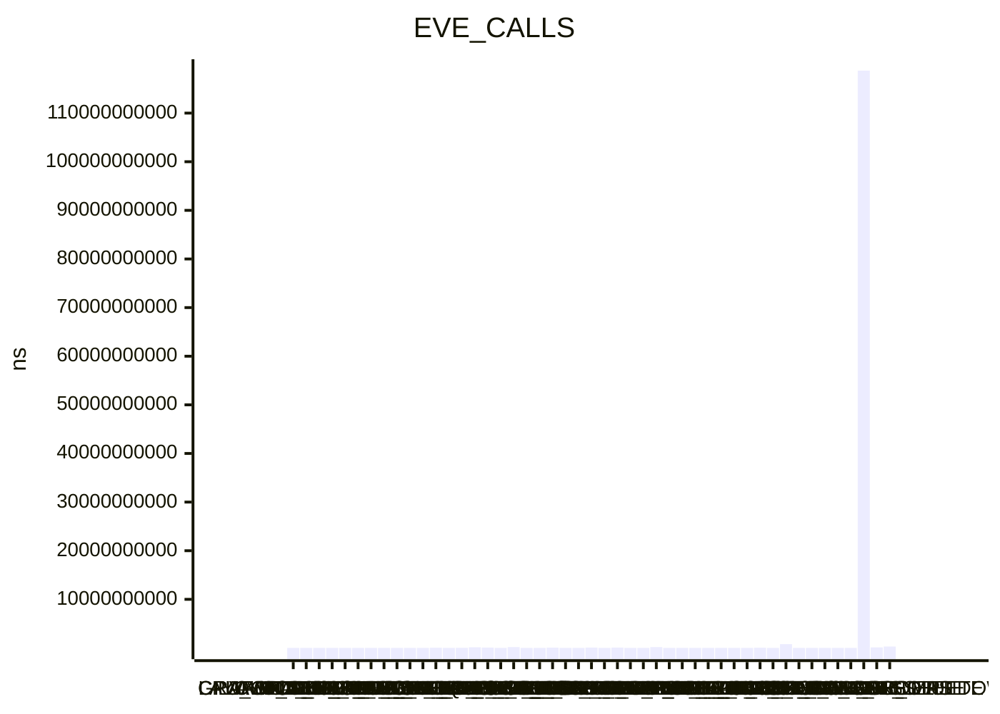
```mermaid
xychart-beta
title "EVE_CALLS"
x-axis ["GRAPHICS_ENGINE", "LAYOUT_DOCUMENTS", "CPU_GRAPHICS_ENGINE", "LAYOUT_DEFAULT_FILE", "LAYOUT_DEFAULT_TREE", "VALIDATOR_IS_VALID", "VALIDATOR_DEFAULT_RULES", "LAYOUT_USER_TREE", "MODEL_SET_VALUES_FROM", "MODEL_ADD_CHILDREN_FROM", "LAYOUT_ADD_THEME_TABLES", "LAYOUT_SETTINGS_TREE", "LAYOUT_THEME_SETTINGS", "LAYOUT_STYLE_TREE", "LAYOUT_THEME_TREE", "LAYOUT_SETTINGS", "STYLE_REGISTER_STYLE", "PROCESSOR_LAYOUT", "DEVICE_OPEN", "QUEUES_PREPARE", "ROWS_PREPARE", "SWAP_PREPARE", "PROCESSOR_RESET", "BUFFER_PREPARE", "TTY_OPEN", "DEVICE_START", "PROCESSOR_PREPARE", "VULKAN_CALIBRATE_NUM_SAMPLES", "VULKAN_INITIALISE_DEVICE", "SWAP_HISTORY_LINES", "TERMINAL_READ", "SWAP_LIVE_LINES", "TERMINAL_PROCESS", "DEVICE_CLOCK", "EDITOR_BLOCKS", "PROCESSOR_EDITOR", "VULKAN_FLUSH_RECORDING", "VULKAN_END_FRAME", "STANDALONE_INITIALISE", "TTY_EXIT_PSEUDO_CONSOLE", "EDITOR_DELETE", "TTY_TERMINATE", "TTY_CLOSE", "PROCESSOR_RELEASE", "LAUNCH_PROMPT", "PROCESSOR_DELETE", "STANDALONE_SHUTDOWN"]
y-axis "ns"
bar [12867134.79814462549984455, 18395027.53431502729654312, 299.53120503891204862, 16749511.13796932250261307, 15486050.98031453788280487, 680291.26345341245178133, 8200426.71957372408360243, 14706005.96691950410604477, 434435.67841393727576360, 2358.65164251793203221, 424905.04149674036307260, 39853982.89102365821599960, 20278357.97329706326127052, 29954635.12166213244199753, 137901460.93352407217025757, 73471115.46244065463542938, 11298966.64352797903120518, 182752069.17436763644218445, 50.66174342945409848, 40529.24431005751102930, 62693864.39291615039110184, 10713420.86544286087155342, 21156.82396169887215365, 73309315.32031022012233734, 13151460.99408867023885250, 87341323.91178900003433228, 12455784.03720149770379066, 299.53120503891204862, 176909649.40507704019546509, 150073.78891496543656103, 3210.17782264945253701, 1.00542990111280273, 7391.04427133593162580, 7802.32024808519327053, 4854655.53060233686119318, 13731039.38405475579202175, 38005042.18645589053630829, 1031678.83908647531643510, 780088465.29301309585571289, 29245.71215984943046351, 28930.67773433074034983, 4118.24087495803996717, 136186.00804076073109172, 376799.49347526603378356, 118743904417.02456665039062500, 115960844.15725055336952209, 294320440.54904043674468994]
```

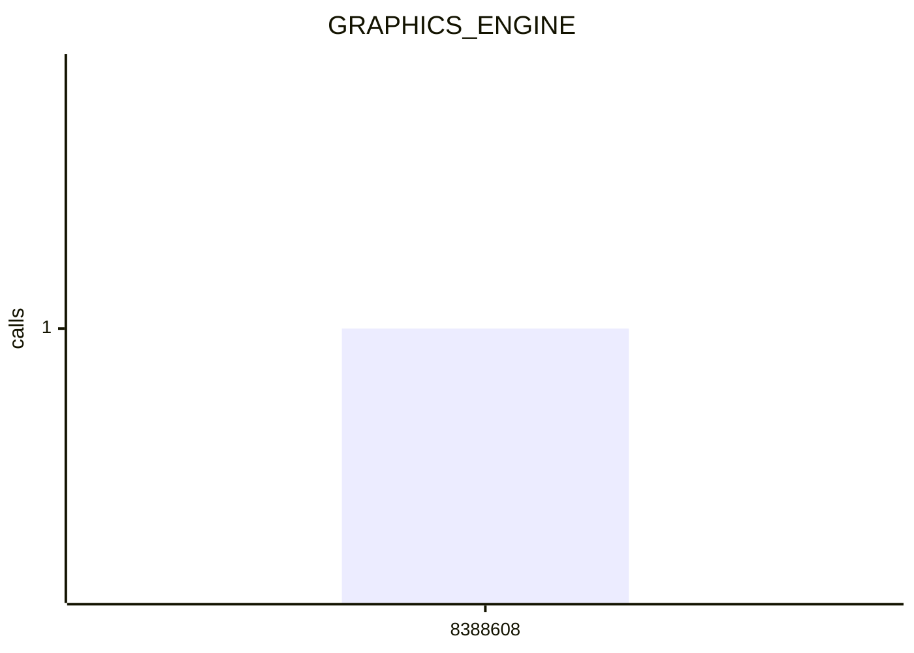
```mermaid
xychart-beta
title "GRAPHICS_ENGINE"
x-axis ["8388608"]
y-axis "calls"
bar [1.00000000000000000]
```

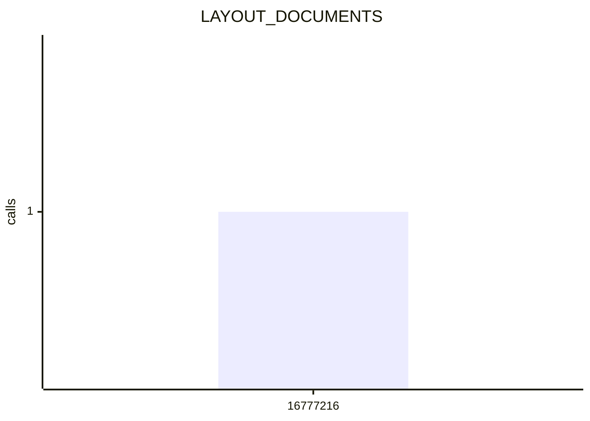
```mermaid
xychart-beta
title "LAYOUT_DOCUMENTS"
x-axis ["16777216"]
y-axis "calls"
bar [1.00000000000000000]
```

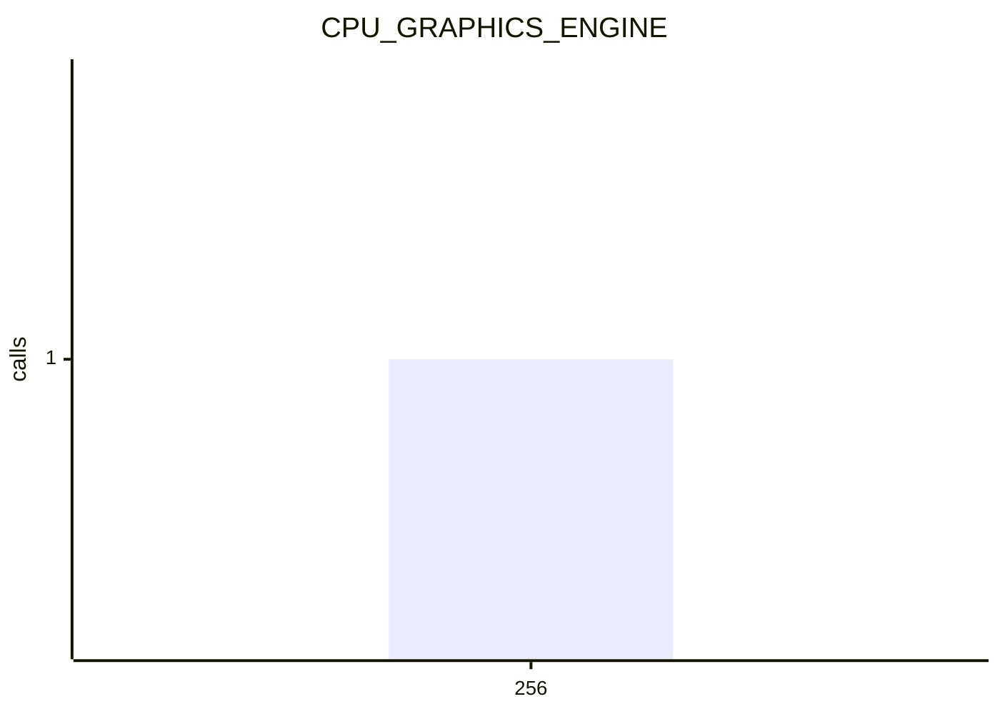
```mermaid
xychart-beta
title "CPU_GRAPHICS_ENGINE"
x-axis ["256"]
y-axis "calls"
bar [1.00000000000000000]
```

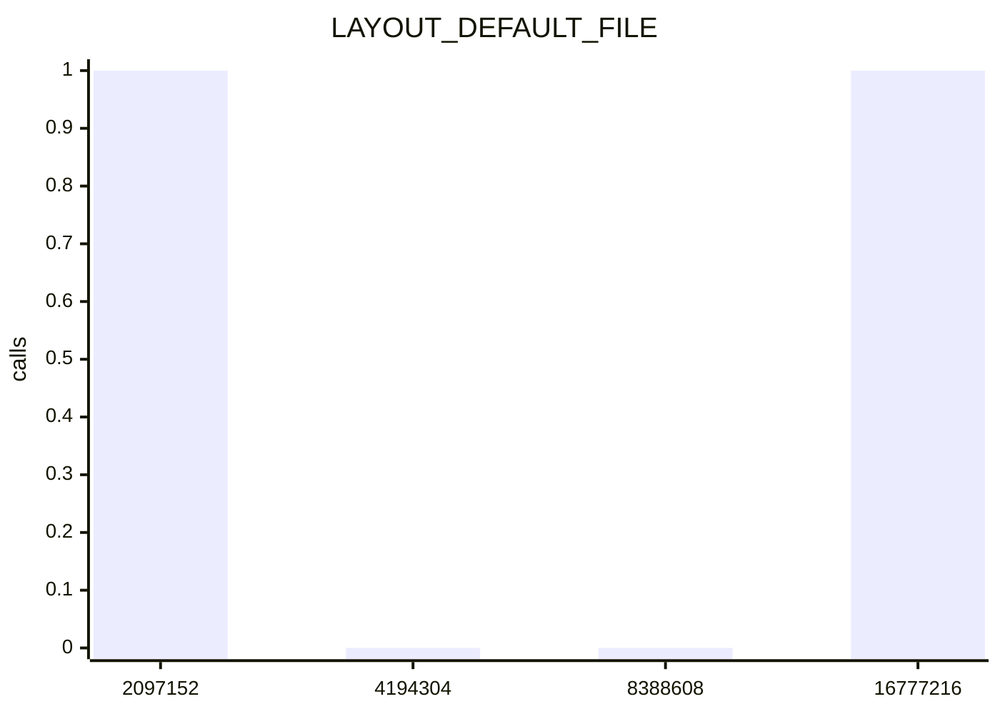
```mermaid
xychart-beta
title "LAYOUT_DEFAULT_FILE"
x-axis ["2097152", "4194304", "8388608", "16777216"]
y-axis "calls"
bar [1.00000000000000000, 0.00000000000000000, 0.00000000000000000, 1.00000000000000000]
```

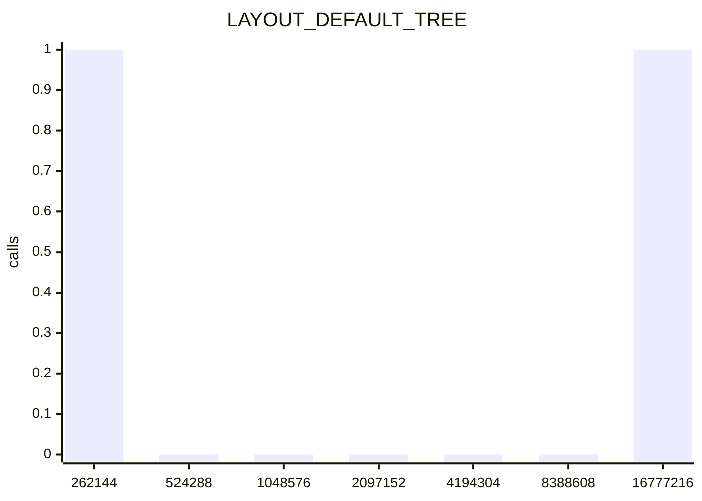
```mermaid
xychart-beta
title "LAYOUT_DEFAULT_TREE"
x-axis ["262144", "524288", "1048576", "2097152", "4194304", "8388608", "16777216"]
y-axis "calls"
bar [1.00000000000000000, 0.00000000000000000, 0.00000000000000000, 0.00000000000000000, 0.00000000000000000, 0.00000000000000000, 1.00000000000000000]
```

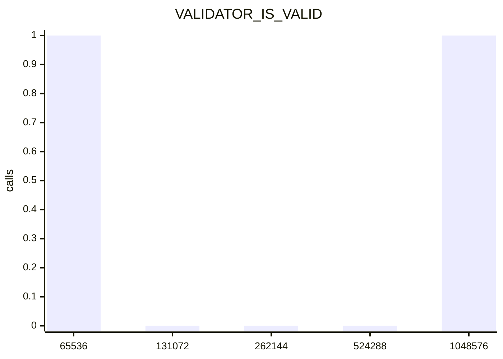
```mermaid
xychart-beta
title "VALIDATOR_IS_VALID"
x-axis ["65536", "131072", "262144", "524288", "1048576"]
y-axis "calls"
bar [1.00000000000000000, 0.00000000000000000, 0.00000000000000000, 0.00000000000000000, 1.00000000000000000]
```

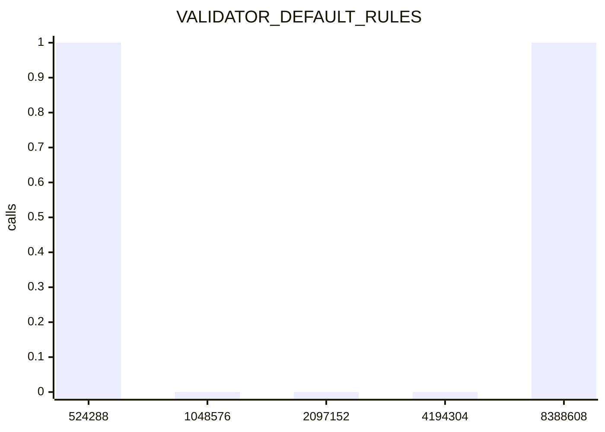
```mermaid
xychart-beta
title "VALIDATOR_DEFAULT_RULES"
x-axis ["524288", "1048576", "2097152", "4194304", "8388608"]
y-axis "calls"
bar [1.00000000000000000, 0.00000000000000000, 0.00000000000000000, 0.00000000000000000, 1.00000000000000000]
```

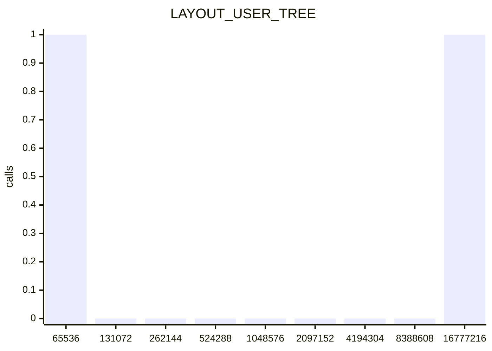
```mermaid
xychart-beta
title "LAYOUT_USER_TREE"
x-axis ["65536", "131072", "262144", "524288", "1048576", "2097152", "4194304", "8388608", "16777216"]
y-axis "calls"
bar [1.00000000000000000, 0.00000000000000000, 0.00000000000000000, 0.00000000000000000, 0.00000000000000000, 0.00000000000000000, 0.00000000000000000, 0.00000000000000000, 1.00000000000000000]
```

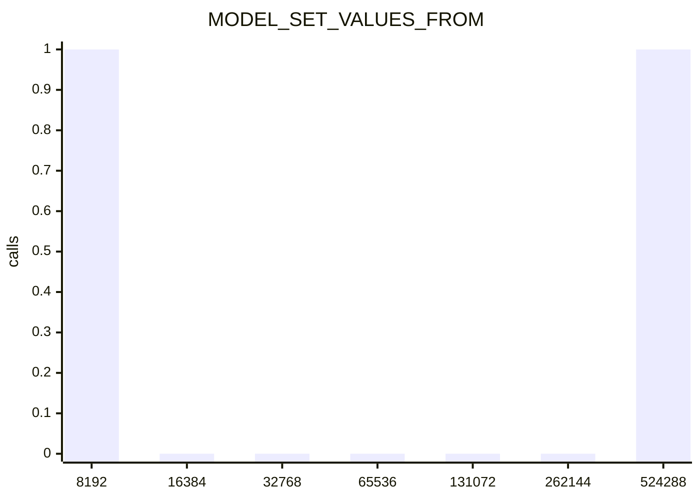
```mermaid
xychart-beta
title "MODEL_SET_VALUES_FROM"
x-axis ["8192", "16384", "32768", "65536", "131072", "262144", "524288"]
y-axis "calls"
bar [1.00000000000000000, 0.00000000000000000, 0.00000000000000000, 0.00000000000000000, 0.00000000000000000, 0.00000000000000000, 1.00000000000000000]
```

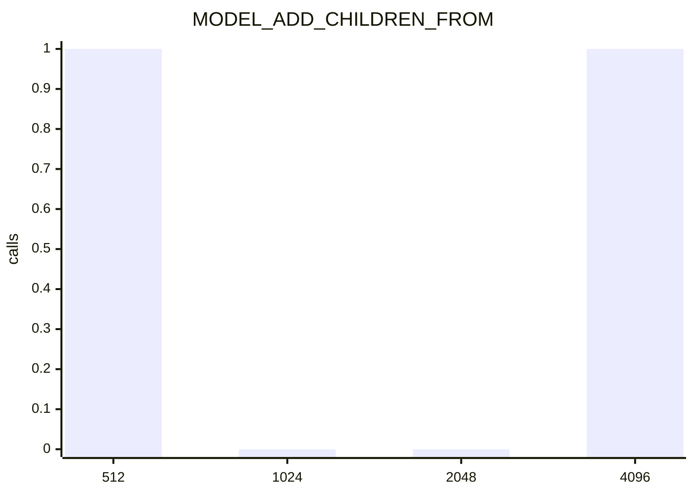
```mermaid
xychart-beta
title "MODEL_ADD_CHILDREN_FROM"
x-axis ["512", "1024", "2048", "4096"]
y-axis "calls"
bar [1.00000000000000000, 0.00000000000000000, 0.00000000000000000, 1.00000000000000000]
```

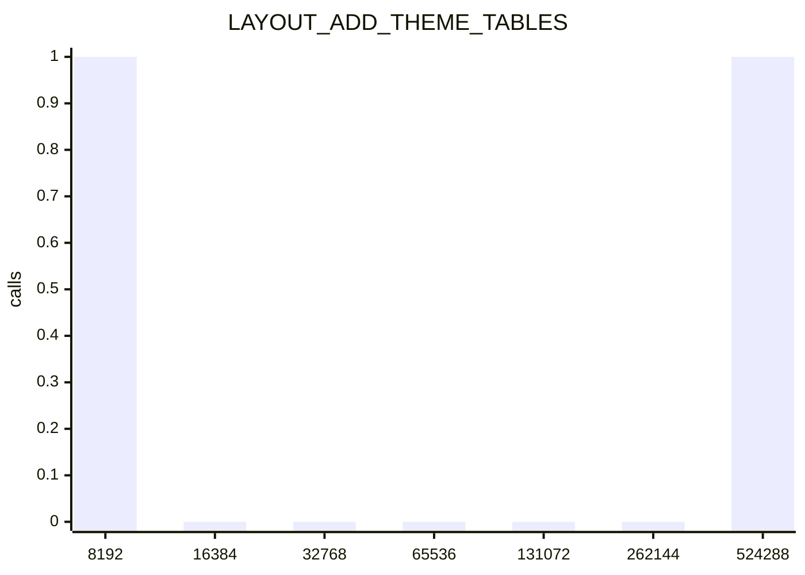
```mermaid
xychart-beta
title "LAYOUT_ADD_THEME_TABLES"
x-axis ["8192", "16384", "32768", "65536", "131072", "262144", "524288"]
y-axis "calls"
bar [1.00000000000000000, 0.00000000000000000, 0.00000000000000000, 0.00000000000000000, 0.00000000000000000, 0.00000000000000000, 1.00000000000000000]
```

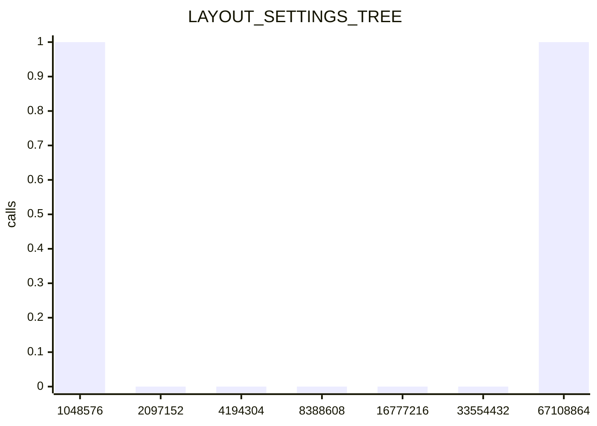
```mermaid
xychart-beta
title "LAYOUT_SETTINGS_TREE"
x-axis ["1048576", "2097152", "4194304", "8388608", "16777216", "33554432", "67108864"]
y-axis "calls"
bar [1.00000000000000000, 0.00000000000000000, 0.00000000000000000, 0.00000000000000000, 0.00000000000000000, 0.00000000000000000, 1.00000000000000000]
```

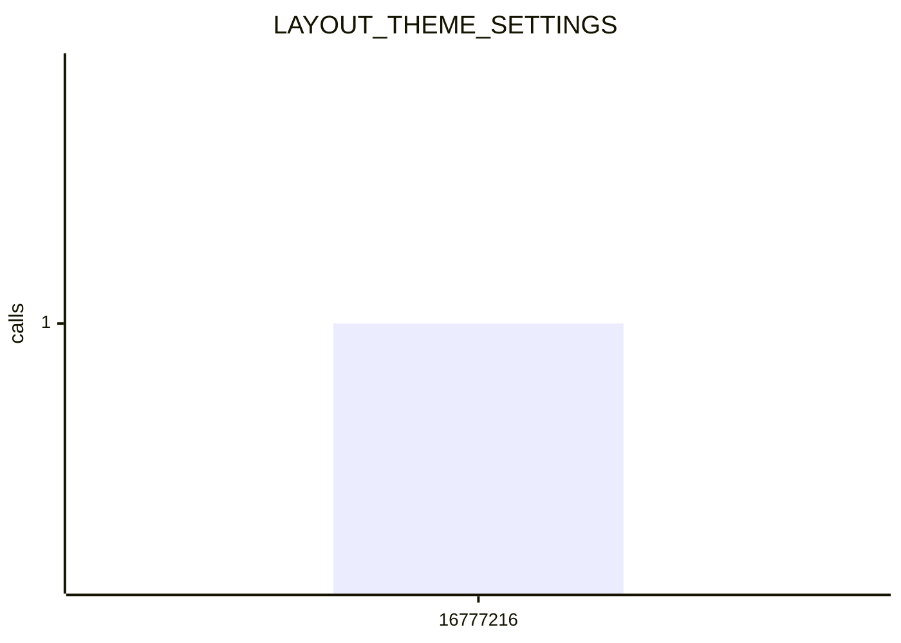
```mermaid
xychart-beta
title "LAYOUT_THEME_SETTINGS"
x-axis ["16777216"]
y-axis "calls"
bar [1.00000000000000000]
```

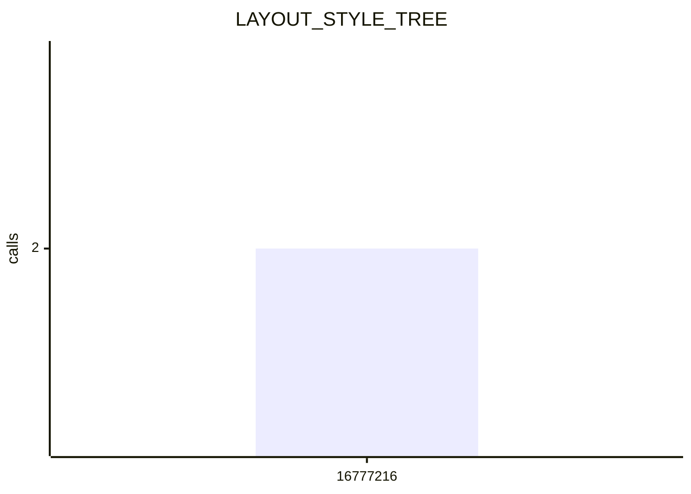
```mermaid
xychart-beta
title "LAYOUT_STYLE_TREE"
x-axis ["16777216"]
y-axis "calls"
bar [2.00000000000000000]
```

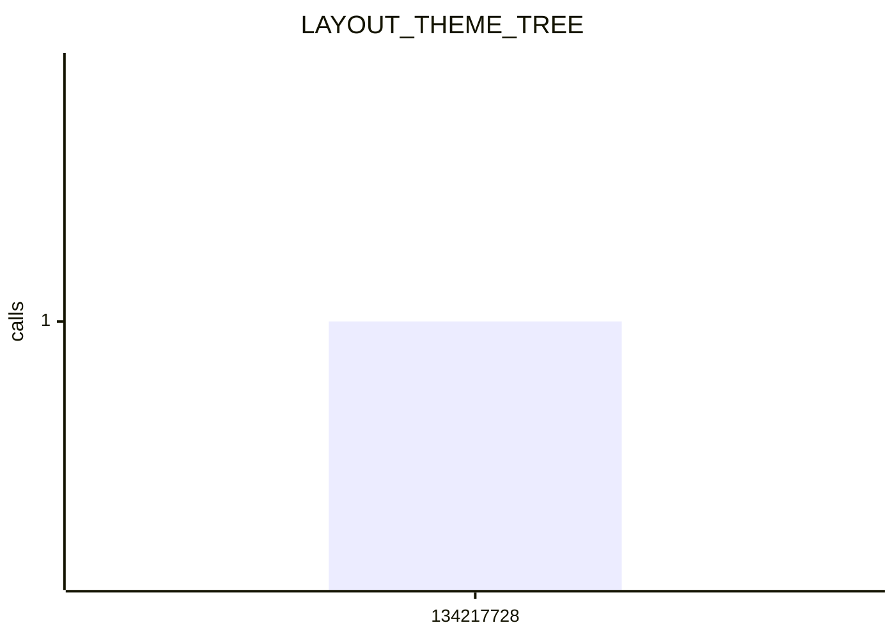
```mermaid
xychart-beta
title "LAYOUT_THEME_TREE"
x-axis ["134217728"]
y-axis "calls"
bar [1.00000000000000000]
```

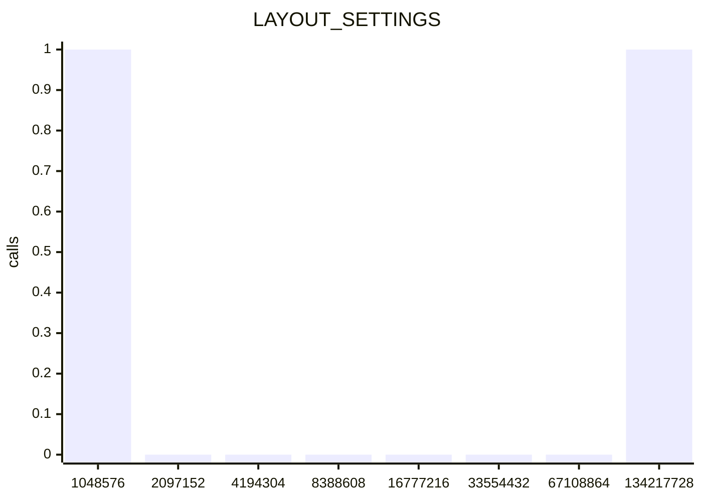
```mermaid
xychart-beta
title "LAYOUT_SETTINGS"
x-axis ["1048576", "2097152", "4194304", "8388608", "16777216", "33554432", "67108864", "134217728"]
y-axis "calls"
bar [1.00000000000000000, 0.00000000000000000, 0.00000000000000000, 0.00000000000000000, 0.00000000000000000, 0.00000000000000000, 0.00000000000000000, 1.00000000000000000]
```

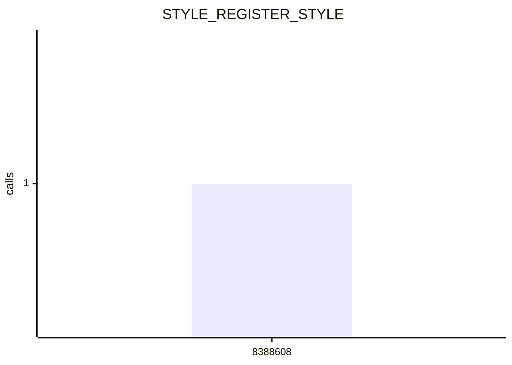
```mermaid
xychart-beta
title "STYLE_REGISTER_STYLE"
x-axis ["8388608"]
y-axis "calls"
bar [1.00000000000000000]
```

```mermaid
xychart-beta
title "PROCESSOR_LAYOUT"
x-axis ["134217728"]
y-axis "calls"
bar [1.00000000000000000]
```

```mermaid
xychart-beta
title "DEVICE_OPEN"
x-axis ["1", "2", "4", "8", "16", "32", "64"]
y-axis "calls"
bar [1.00000000000000000, 0.00000000000000000, 0.00000000000000000, 0.00000000000000000, 0.00000000000000000, 0.00000000000000000, 1.00000000000000000]
```

```mermaid
xychart-beta
title "QUEUES_PREPARE"
x-axis ["2048", "4096", "8192", "16384", "32768", "65536"]
y-axis "calls"
bar [1.00000000000000000, 0.00000000000000000, 0.00000000000000000, 0.00000000000000000, 0.00000000000000000, 1.00000000000000000]
```

```mermaid
xychart-beta
title "ROWS_PREPARE"
x-axis ["262144", "524288", "1048576", "2097152", "4194304", "8388608", "16777216", "33554432", "67108864"]
y-axis "calls"
bar [1.00000000000000000, 0.00000000000000000, 0.00000000000000000, 0.00000000000000000, 0.00000000000000000, 0.00000000000000000, 0.00000000000000000, 0.00000000000000000, 1.00000000000000000]
```

```mermaid
xychart-beta
title "SWAP_PREPARE"
x-axis ["8388608"]
y-axis "calls"
bar [2.00000000000000000]
```

```mermaid
xychart-beta
title "PROCESSOR_RESET"
x-axis ["8192", "16384"]
y-axis "calls"
bar [1.00000000000000000, 1.00000000000000000]
```

```mermaid
xychart-beta
title "BUFFER_PREPARE"
x-axis ["8388608", "16777216", "33554432", "67108864", "134217728"]
y-axis "calls"
bar [1.00000000000000000, 0.00000000000000000, 0.00000000000000000, 0.00000000000000000, 1.00000000000000000]
```

```mermaid
xychart-beta
title "TTY_OPEN"
x-axis ["524288", "1048576", "2097152", "4194304", "8388608", "16777216"]
y-axis "calls"
bar [1.00000000000000000, 0.00000000000000000, 0.00000000000000000, 0.00000000000000000, 0.00000000000000000, 1.00000000000000000]
```

```mermaid
xychart-beta
title "DEVICE_START"
x-axis ["8388608", "16777216", "33554432", "67108864", "134217728"]
y-axis "calls"
bar [1.00000000000000000, 0.00000000000000000, 0.00000000000000000, 0.00000000000000000, 1.00000000000000000]
```

```mermaid
xychart-beta
title "PROCESSOR_PREPARE"
x-axis ["8388608"]
y-axis "calls"
bar [1.00000000000000000]
```

```mermaid
xychart-beta
title "VULKAN_CALIBRATE_NUM_SAMPLES"
x-axis ["128", "256"]
y-axis "calls"
bar [1.00000000000000000, 2.00000000000000000]
```

```mermaid
xychart-beta
title "VULKAN_INITIALISE_DEVICE"
x-axis ["134217728"]
y-axis "calls"
bar [1.00000000000000000]
```

```mermaid
xychart-beta
title "SWAP_HISTORY_LINES"
x-axis ["32768", "65536", "131072", "262144", "524288", "1048576", "2097152", "4194304", "8388608", "16777216"]
y-axis "calls"
bar [39.00000000000000000, 4628.00000000000000000, 6146.00000000000000000, 1026.00000000000000000, 14.00000000000000000, 1.00000000000000000, 0.00000000000000000, 0.00000000000000000, 430.00000000000000000, 23.00000000000000000]
```

```mermaid
xychart-beta
title "TERMINAL_READ"
x-axis ["1", "2", "4", "8", "16", "32", "64", "128", "256", "512", "1024", "2048", "4096", "8192", "16384", "32768", "65536", "131072", "262144"]
y-axis "calls"
bar [4251.00000000000000000, 0.00000000000000000, 0.00000000000000000, 0.00000000000000000, 0.00000000000000000, 0.00000000000000000, 10264.00000000000000000, 5224.00000000000000000, 4818.00000000000000000, 78.00000000000000000, 34.00000000000000000, 841597.00000000000000000, 152492.00000000000000000, 1238.00000000000000000, 3293.00000000000000000, 560.00000000000000000, 50.00000000000000000, 0.00000000000000000, 2.00000000000000000]
```

```mermaid
xychart-beta
title "SWAP_LIVE_LINES"
x-axis ["1", "2", "4", "8", "16", "32", "64", "128", "256", "512", "1024", "2048", "4096", "8192", "16384", "32768", "65536"]
y-axis "calls"
bar [744719.00000000000000000, 0.00000000000000000, 0.00000000000000000, 0.00000000000000000, 0.00000000000000000, 0.00000000000000000, 264412.00000000000000000, 1579.00000000000000000, 615.00000000000000000, 60.00000000000000000, 42.00000000000000000, 1113.00000000000000000, 6759.00000000000000000, 4282.00000000000000000, 246.00000000000000000, 71.00000000000000000, 3.00000000000000000]
```

```mermaid
xychart-beta
title "TERMINAL_PROCESS"
x-axis ["2048", "4096", "8192", "16384", "32768", "65536", "131072", "262144"]
y-axis "calls"
bar [16402.00000000000000000, 688885.00000000000000000, 297362.00000000000000000, 17627.00000000000000000, 3458.00000000000000000, 157.00000000000000000, 8.00000000000000000, 2.00000000000000000]
```

```mermaid
xychart-beta
title "DEVICE_CLOCK"
x-axis ["2048", "4096", "8192", "16384", "32768", "65536", "131072", "262144"]
y-axis "calls"
bar [229.00000000000000000, 601145.00000000000000000, 371339.00000000000000000, 22481.00000000000000000, 3821.00000000000000000, 177.00000000000000000, 9.00000000000000000, 2.00000000000000000]
```

```mermaid
xychart-beta
title "EDITOR_BLOCKS"
x-axis ["16384", "32768", "65536", "131072", "262144", "524288", "1048576", "2097152", "4194304", "8388608", "16777216", "33554432"]
y-axis "calls"
bar [2.00000000000000000, 1.00000000000000000, 1.00000000000000000, 13.00000000000000000, 231.00000000000000000, 168.00000000000000000, 362.00000000000000000, 3617.00000000000000000, 5598.00000000000000000, 2161.00000000000000000, 252.00000000000000000, 2.00000000000000000]
```

```mermaid
xychart-beta
title "PROCESSOR_EDITOR"
x-axis ["8388608"]
y-axis "calls"
bar [1.00000000000000000]
```

```mermaid
xychart-beta
title "VULKAN_FLUSH_RECORDING"
x-axis ["33554432"]
y-axis "calls"
bar [1.00000000000000000]
```

```mermaid
xychart-beta
title "VULKAN_END_FRAME"
x-axis ["262144", "524288", "1048576", "2097152", "4194304"]
y-axis "calls"
bar [53.00000000000000000, 5552.00000000000000000, 4230.00000000000000000, 224.00000000000000000, 101.00000000000000000]
```

```mermaid
xychart-beta
title "STANDALONE_INITIALISE"
x-axis ["536870912"]
y-axis "calls"
bar [1.00000000000000000]
```

```mermaid
xychart-beta
title "TTY_EXIT_PSEUDO_CONSOLE"
x-axis ["16384"]
y-axis "calls"
bar [1.00000000000000000]
```

```mermaid
xychart-beta
title "EDITOR_DELETE"
x-axis ["16384"]
y-axis "calls"
bar [1.00000000000000000]
```

```mermaid
xychart-beta
title "TTY_TERMINATE"
x-axis ["4096"]
y-axis "calls"
bar [1.00000000000000000]
```

```mermaid
xychart-beta
title "TTY_CLOSE"
x-axis ["64", "128", "256", "512", "1024", "2048", "4096", "8192", "16384", "32768", "65536", "131072", "262144"]
y-axis "calls"
bar [1.00000000000000000, 0.00000000000000000, 0.00000000000000000, 0.00000000000000000, 0.00000000000000000, 0.00000000000000000, 0.00000000000000000, 0.00000000000000000, 0.00000000000000000, 0.00000000000000000, 0.00000000000000000, 0.00000000000000000, 1.00000000000000000]
```

```mermaid
xychart-beta
title "PROCESSOR_RELEASE"
x-axis ["262144"]
y-axis "calls"
bar [1.00000000000000000]
```

```mermaid
xychart-beta
title "LAUNCH_PROMPT"
x-axis ["68719476736"]
y-axis "calls"
bar [1.00000000000000000]
```

```mermaid
xychart-beta
title "PROCESSOR_DELETE"
x-axis ["67108864"]
y-axis "calls"
bar [1.00000000000000000]
```

```mermaid
xychart-beta
title "STANDALONE_SHUTDOWN"
x-axis ["268435456"]
y-axis "calls"
bar [1.00000000000000000]
```
